# JELENTÉS 

Budapest Főváros XX. kerület Pesterzsébet Önkormányzata gazdálkodási rendszerének 2010. évi ellenőrzéséről

---

# 3. Önkormányzati és Területi Ellenőrzési Igazgatóság 

## Átfogó Ellenőrzési Főcsoport

Iktatószám: V-3023-7/24/25/2010.
Témaszám: 966
Vizsgálat-azonosító szám: V0489

## Az ellenőrzést felügyelte:

Dr. Lóránt Zoltán
főigazgató
Az ellenőrzés végrehajtásáért felelős:
Dr. Sepsey Tamás
főigazgató-helyettes
Az ellenőrzést vezette:
Molnár Gyula Mihály
igazgatóhelyettes
Az ellenőrzést végezték:
Nagy László Csaba Páncsics Judit
számvevő tanácsos számvevő

Vojcsekné Szabó
Ágnes
számvevő tanácsos

## A témához kapcsolódó eddig készített számvevőszéki jelentések:

## címe

Jelentés a Budapest Főváros XX. kerület Pesterzsébet Önkormány- 0572 zata gazdálkodási rendszerének átfogó ellenőrzéséről
Jelentés a helyi és a helyi kisebbségi önkormányzatok gazdálkodási 0634 rendszerének átfogó és egyéb szabályszerűségi ellenőrzéséről
Jelentés a 2006. évi országgyűlési, valamint önkormányzati és 0722 nemzeti, etnikai kisebbségi képviselőválasztások lebonyolításához felhasznált pénzeszközök ellenőrzéséről
Jelentés a fővárosi önkormányzatot és a kerületi önkormányzato- 0756 kat osztottan megillető bevételek 2007. évi megosztásáról szóló önkormányzati rendelet felülvizsgálatáról

---

# TARTALOMJEGYZÉK 

BEVEZETÉS ..... 11
I. ÖSSZEGZŐ MEGÁLLAPÍTÁSOK, KÖVETKEZTETÉSEK, JAVASLATOK ..... 16
II. RÉSZLETES MEGÁLLAPÍTÁSOK ..... 30

1. Az Önkormányzat költségvetési és pénzügyi helyzete ..... 30
1.1. A tervezett költségvetési bevételek és kiadások alapján a
költségvetési egyensúly, a költségvetési hiány alakulása, a hiány
tervezett finanszírozási módja, valamint a költségvetési hiány
megállapításának szabályszerűsége ..... 30
1.2. A teljesített költségvetési bevételek és kiadások alapján a pénzügyi
egyensúly, a pénzügyi hiány alakulása, a pénzügyi hiány
finanszírozása, az igénybe vett finanszírozási célú pénzügyi
eszközök hatása a pénzügyi helyzet alakulására, az eladósodásra,
valamint a fizetőképességre ..... 32
2. Az Önkormányzat felkészültsége az európai uniós források igénylésére,
felhasználására, a támogatott célkitúzés megvalósítására, múködtetésére,
valamint az elektronikus közszolgáltatási feladatok ellátására ..... 43
2.1. Az európai uniós források igénybevételére, felhasználására, a
támogatott célkitúzés megvalósítására, múködtetésére történt
felkészülés szabályozottságának, szervezettségének, valamint egy
támogatási szerződésben foglalt célkitúzés megvalósításának,
múködtetésének eredményessége ..... 43
2.1.1. Az európai uniós forrásokra történő pályázatok benyújtására
vonatkozó döntések összhangja fejlesztési célkitúzésekkel ..... 43
2.1.2. Az európai uniós forrásokhoz kapcsolódóan a
pályázatfigyelés, a pályázatkészítés, valamint az európai
uniós támogatással megvalósuló fejlesztés lebonyolításának
belső rendje, a végrehajtás és az ellenőrzés szervezettsége ..... 47
2.1.3. Egy támogatási szerződésben foglalt célkitúzés megvalósítása,
múködtetése ..... 48
2.2. Az elektronikus közszolgáltatás feltételeinek kialakítása ..... 49
3. A költségvetési gazdálkodás belső kontrollja ..... 52
3.1. A költségvetés-tervezés, a gazdálkodás és a zárszámadás-készítés
folyamatában végrehajtandó belső kontrollok kialakítása ..... 52
3.2. A belső kontrollok múködtetése a költségvetés-tervezés, a
gazdálkodás, és a zárszámadás-készítés folyamataiban ..... 55
3.3. A belső ellenőrzési kötelezettség teljesítése ..... 60

---

4. Az ÁSZ korábbi ellenőrzési javaslatai alapján készített intézkedési terv végrehajtása, hasznosítása
4.1. Az Önkormányzat gazdálkodási rendszerének átfogó ellenőrzése során tett javaslatok végrehajtására tervezett intézkedések megvalósítása
4.2. A zárszámadáshoz kapcsolódó (állami hozzájárulások, támogatások igénylésének és felhasználásának ellenőrzése), valamint a további vizsgálatok esetében a megállapítások, javaslatok alapján tett intézkedések

# MELLÉKLETEK 

1. számú Az Önkormányzat gazdálkodását meghatározó adatok, mutatószámok (1 oldal)
2. számú Az önkormányzati vagyon alakulása (1 oldal)

2/a. számú Az önkormányzati kötelezettségek alakulása (2 oldal)
3. számú Az Önkormányzat 2007-2010. évi költségvetési előirányzatainak és 20072009. évi pénzügyi teljesítéseinek alakulása (1 oldal)
4. számú Tanúsítvány az európai uniós forrásokkal támogatott célok és programok 2007-2010. évi tervezett és teljesített adatairól (2 oldal)
4/a. számú Tanúsítvány az európai uniós forrásokra 2007-2010 között benyújtott pályázatokról, amelyek elbírálásáról az Önkormányzat még nem kapott tájékoztatást (1 oldal)
4/b. számú Tanúsítvány a 2007-2010. években benyújtott és elutasított európai uniós pályázatokról (2 oldal)
5. számú Adatlap az európai uniós forrással támogatott KMOP 2007-4.5.3-0022 „Akadálymentesen a pesterzsébeti Gyermekmosoly Óvodában" feladatról (3 oldal)
6. számú Szabados Ákos úr, Budapest Főváros XX. kerület Pesterzsébet Önkormányzat polgármestere által adott tájékoztatás (4 oldal)
7. számú Szabados Ákos úr, Budapest Főváros XX. kerület Pesterzsébet Önkormányzat polgármesterének tájékoztatására adott válasz (2 oldal)

---

# RÖVIDÍTÉSEK, MOZAIKSZAVAK JEGYZÉKE 

## Törvények

Áht.
ÁSZ tv.
Eisz. tv.
forrásmegosztási törvény

Ket.

Ltv.

Ötv.

## Rendeletek

Ámr. 1
Ámr. 2
Áhsz.

Ber.
SzMSz
vagyongazdálkodási rendelet

18/2005. (XII. 27.) IHM rendelet

2006. évi költségvetési rendelet

2007. évi költségvetési rendelet
az államháztartásról szóló 1992. évi XXXVIII. törvény
az Állami Számvevőszékről szóló 1989. évi XXXVIII. törvény
az elektronikus információszabadságról szóló 2005. évi XC. törvény
a fővárosi önkormányzat és a kerületi önkormányzatok közötti forrásmegosztásról szóló 2006. évi CXXXIII. törvény
a közigazgatási hatósági eljárás és szolgáltatás általános szabályairól szóló 2004. évi CXL. törvény
a lakások és helyiségek bérletére, valamint az elidegenítésükre vonatkozó egyes szabályokról szóló 1993. évi LXXVIII. törvény
a helyi önkormányzatokról szóló 1990. évi LXV. törvény
az államháztartás működési rendjéről szóló 217/1998. (XII. 30.) Korm. rendelet
az államháztartás működési rendjéről szóló 292/2009. (XII. 19.) Korm. rendelet
az államháztartás szervezetei beszámolási és könyvvezetési kötelezettségének sajátosságairól szóló 249/2000. (XII. 24.) Korm. rendelet
a költségvetési szervek belső ellenőrzéséről szóló 193/2003. (XI. 26.) Korm. rendelet
az Önkormányzat 45/2004. (VII. 29.) számú rendelete a Képviselő-testület és Szervei Szervezeti és Múködési Szabályzatáról (hatályon kívül helyezve a 9/2007. (IV. 17.) számú - jelenleg hatályos - rendelettel)
Budapest Főváros XX. kerület Pesterzsébet Önkormányzata 32/2004. (VI. 19.) számú rendelete az Önkormányzat tulajdonában álló vagyonnal való rendelkezés szabályairól (hatályon kívül helyezve a 43/2007. (XII. 19.) számú jelenleg hatályos -rendelettel)
a közzétételi listákon szereplő adatok közzétételéhez szükséges közzétételi mintákról szóló 18/2005. (XII. 27.) IHM rendelet
Budapest Főváros XX. kerület Pesterzsébet Önkormányzata 3/2006. (II. 27.) számú rendelete a 2006. évi költségvetésről
Budapest Főváros XX. kerület Pesterzsébet Önkormányzata 4/2007. (III. 7.) számú rendelete a 2007. évi költségvetésről

---

2008. évi költségvetési rendelet

2009. évi költségvetési rendelet

2010. évi költségvetési rendelet

2005. évi zárszámadási rendelet

2006. évi zárszámadási rendelet

2007. évi zárszámadási rendelet

2008. évi zárszámadási rendelet

2009. évi zárszámadási rendelet

## Szórövidítések

ÁSZ
belső ellenőrzési kézikönyv

CSILI Művelődési Központ
e-közszolgáltatás
Ellenőrzési osztály
ellenőrzési nyomvonal
értékelési szabályzat

FEUVE
Fővárosi Önkormányzat gazdasági szervezet ügyrendje

Budapest Főváros XX. kerület Pesterzsébet Önkormányzata 4/2008. (II. 29.) számú rendelete a 2008. évi költségvetésről
Budapest Főváros XX. kerület Pesterzsébet Önkormányzata 3/2009. (II. 26.) számú rendelete a 2009. évi költségvetésről
Budapest Főváros XX. kerület Pesterzsébet Önkormányzata 3/2010. (II. 17.) számú rendelete a 2010. évi költségvetésről
Budapest Főváros XX. kerület Pesterzsébet Önkormányzata 15/2006. (V. 11.) számú rendelete a 2005. évi költségvetés végrehajtásáról
Budapest Főváros XX. kerület Pesterzsébet Önkormányzata 16/2007. (V. 14.) számú rendelete a 2006. évi költségvetés végrehajtásáról
Budapest Főváros XX. kerület Pesterzsébet Önkormányzata 14/2008. (IV. 30.) számú rendelete a 2007. évi költségvetés végrehajtásáról
Budapest Főváros XX. kerület Pesterzsébet Önkormányzata 12/2009. (IV. 29.) számú rendelete a 2008. évi költségvetés végrehajtásáról
Budapest Főváros XX. kerület Pesterzsébet Önkormányzata 9/2010. (IV. 20.) számú rendelete a 2009. évi költségvetés végrehajtásáról

Állami Számvevőszék
Budapest Főváros XX. kerület Pesterzsébet Önkormányzata Polgármesteri Hivatal Szervezeti és Múködési Szabályzatának V/3/1 számú melléklete
Budapest Főváros XX. kerület Pesterzsébet Önkormányzatának CSILI Múvelődési Központja
elektronikus közszolgáltatás
Budapest Főváros XX. kerület Pesterzsébet Önkormányzata Polgármesteri Hivatalának Ellenőrzési Osztálya
Budapest Főváros XX. kerület Pesterzsébet Önkormányzata Polgármesteri Hivatal Szervezeti és Múködési Szabályzatának V/3/2-3 számú melléklete
Budapest Főváros XX. kerület Pesterzsébet Önkormányzata Polgármesteri Hivatal Szervezeti és Múködési Szabályzatának V/2/9 számú melléklete az eszközök és források értékeléséről
folyamatba épített, előzetes, utólagos és vezetői ellenőrzés
Budapest Főváros Önkormányzata
Budapest Főváros XX. kerület Pesterzsébet Önkormányzata Polgármesteri Hivatal Szervezeti és Múködési Szabályzatának V/1/8 számú melléklete (a Pénzügyi és Adó Osztály Ügyrendje)

---

gazdálkodási szabály$\mathrm{zat}_{1}$

| gazdálkodási szabály- | Budapest Főváros XX. kerület Pesterzsébet Önkormányzata Polgármesteri Hivatal Szervezeti és Múködési Szabályzatának V/2/2 számú melléklete (hatályos: 2008. szeptember 15-től 2009. július 31-ig) |
| :--: | :--: |
| gazdálkodási szabály-   zat $_{2}$ | Budapest Főváros XX. kerület Pesterzsébet Önkormányzata Polgármesteri Hivatal Szervezeti és Múködési Szabályzatának V/2/2 számú melléklete (hatályos: 2009. augusztus 1-jétől) |
| hivatali SzMSz | Budapest Főváros XX. kerület Pesterzsébet Önkormányzata Polgármesteri Hivatal Szervezeti és Múködési Szabályzata (a polgármester hatályba léptette 2005. június 1jével) |
| Integrit-XX. Kft. | Integrit-XX. Városüzemeltetési, Szervező, Fejlesztő és Szolgáltató Korlátolt Felelősségű Társaság |
| jegyző | Budapest Főváros XX. kerület Pesterzsébet Önkormányzatának jegyzője |
| Képviselő-testület | Budapest Főváros XX. kerület Pesterzsébet Önkormányzatának Képviselő-testülete |
| kockázat kezelési szabályzat | Budapest Főváros XX. kerület Pesterzsébet Önkormányzata Polgármesteri Hivatal Szervezeti és Múködési Szabályzatának V/3/4 számú melléklete |
| kötvényszámla | a kötvénykibocsátásból származó bevétel kezelésére nyitott bankszámla |
| leltározási és leltárkészítési szabályzat | Budapest Főváros XX. kerület Pesterzsébet Önkormányzata Polgármesteri Hivatal Szervezeti és Múködési Szabályzatának V/2/4 számú melléklete |
| ONIGESZ | Budapest Főváros XX. kerület Pesterzsébet Önkormányzatának Oktatási, Nevelési Intézmények Gazdasági Ellátó Szervezete |
| Önkormányzat | Budapest Főváros XX. kerület Pesterzsébet Önkormányzata |
| önköltségszámítási szabályzat | Budapest Főváros XX. kerület Pesterzsébet Önkormányzata Polgármesteri Hivatal Szervezeti és Múködési Szabályzatának V/2/13 számú melléklete |
| pályázati utasítás | Budapest Főváros XX. kerület Pesterzsébet Önkormányzata polgármesterének és jegyzőjének 7/2007. (VII. 16.) számú együttes utasítása a pályázatok előkészítésével, jóváhagyásával, benyújtásával és nyilvántartásával kapcsolatos eljárási rendről, amelyet a 3/2008. (IX. 15.), a 6/2008. (XI. 14.), a 3/2009. (III. 30.) és az 5/2010. (VI. 24.) számú polgármesteri és jegyzői együttes utasítások módosítottak |
| Pesterzsébet Jégcsarnok Kft. | Pesterzsébet Jégcsarnok Fejlesztő és Üzemeltető Korlátolt Felelősségű Társaság |
| Pénzügyi bizottság | Budapest Főváros XX. kerület Pesterzsébet Önkormányzatának Pénzügyi bizottsága |
| Pénzügyi osztály | Budapest Főváros XX. kerület Pesterzsébet Önkormányzata Polgármesteri Hivatalának Pénzügyi és Adó Osztálya |

---

pénzkezelési szabályzat

| polgármester | Budapest Főváros XX. kerület Pesterzsébet Önkormányzata Polgármesteri Hivatal Szervezeti és Múködési Szabályzatának V/2/3 számú melléklete |
| :--: | :--: |
| Polgármesteri hivatal | Budapest Főváros XX. kerület Pesterzsébet Önkormányzatának Polgármestere |
| selejtezési szabályzat | Budapest Főváros XX. kerület Pesterzsébet Önkormányzata Polgármesteri Hivatala |
| számlarend | Budapest Főváros XX. kerület Pesterzsébet Önkormányzata Polgármesteri Hivatal Szervezeti és Múködési Szabályzatának V/2/5 számú melléklete |
| számviteli politika | Budapest Főváros XX. kerület Pesterzsébet Önkormányzata Polgármesteri Hivatal Szervezeti és Múködési Szabályzatának V/2/1/A számú melléklete |
| számviteli politika | Budapest Főváros XX. kerület Pesterzsébet Önkormányzata Polgármesteri Hivatal Szervezeti és Múködési Szabályzatának V/2/1/B számú melléklete |
| TV-20 Kft. | TV-20 Kereskedelmi és Szolgáltató Korlátolt Felelősségű Társaság |
| tanuszoda | Budapest Főváros XX. kerület Pesterzsébet Önkormányzatának Tanuszodája |
| Vörösmarty Mihály Általános Iskola | Budapest Főváros XX. kerület Pesterzsébet Önkormányzatának Vörösmarty Mihály Általános Iskola és Logopédiai Intézete |

---

# ÉRTELMEZŐ SZÓTÁR 

1. elektronikus szolgáltatási szint
2. elektronikus szolgáltatási szint
3. elektronikus szolgáltatási szint
4. elektronikus szolgáltatási szint

EMIR
eredményesség
európai uniós források
fejlesztési feladat (projekt)

Az 1044/2005. (V. 11.) Korm. határozat alapján olyan információs, tájékoztató szolgáltatás, amely csak általános információkat közöl az adott üggyel kapcsolatos teendőkről és a szükséges dokumentumokról.
Az 1044/2005. (V. 11.) Korm. határozat alapján olyan egyirányú kapcsolatot biztosító szolgáltatás, amely az 1. szinten túl biztosítja az adott ügy intézéséhez szükséges dokumentumok, nyomtatványok letöltését, és azok ellenőrzéssel, vagy ellenőrzés nélküli elektronikus kitöltését, amely esetben a dokumentumok benyújtása hagyományos úton történik.
Az 1044/2005. (V. 11.) Korm. határozat alapján olyan kétirányú kapcsolatot biztosító szolgáltatás, amely közvetlen, vagy ellenőrzött kitöltésű dokumentum segítségével biztosítja az elektronikus adatbevitelt és a bevitt adatok ellenőrzését. Az ügy indításához, intézéséhez személyes megjelenés nem szükséges, de az ügyhöz kapcsolódó közigazgatási döntés (határozat, egyéb aktus) közlése, valamint a kapcsolódó illeték-, vagy díffizetés hagyományos úton történik.
Az 1044/2005. (V. 11.) Korm. határozat alapján olyan teljes közvetlen kétirányú ügyintézési folyamatot biztosító szolgáltatás, amikor az ügyhöz kapcsolódó közigazgatási döntés is elektronikus úton kerül közlésre, illetve a kapcsolódó illeték-, vagy díffizetés elektronikus úton is intézhető.
Egységes Monitoring Informatikai Rendszer az Európai Unió által nyújtott egyes pénzügyi támogatások felhasználásával megvalósuló programok, projektek figyelemmel kísérésére kialakított számítógépes nyilvántartási rendszer, amely a programok és a projektek adatait gyúti, rendszerezi és tartja nyilván.
Egy adott tevékenység céljai megvalósításának mértéke, a tevékenység szándékolt és tényleges hatása közötti kapcsolat. (Forrás: Amr.; 2. § 66. pont)
Az Európai Unió költségvetéséből, illetve az Európai Gazdasági Térség Európai Unión kívüli tagállamainak költségvetéséből származó támogatások, valamint a „Svájci Hozzájárulás" programból származó támogatás.
Az a fejlesztési feladat, amely illeszkedik az Európai Unió, illetve a Nemzeti Fejlesztési Terv által támogatott programokhoz. Az Európai Unió, illetve a Nemzeti Fejlesztési Terv és az Új Magyarország Fejlesztési Terv által meghirdetett programokhoz kapcsolódó, támogatott projektek fejlesztési feladatok megvalósításához használhatók fel az európai uniós források. A fejlesztési feladat (projekt) tartalmilag és formailag részletesen kidolgozott, megfelelő

---

| fejlesztési célkitúzés | Az önkormányzat által ellátott kötelező, vagy önként vállalt feladatok mennyiségi (minőségi) fejlesztésére vonatkozó terv. A fejlesztési célkitúzés megvalósulhat beszerzéssel, létesítéssel, bővítéssel, átalakítással. |
| :--: | :--: |
| indikátor | A projekt megvalósulásának számszerúsíthető eredményei, mutató, jelzőszám, amelynek segítségével egy célkitúzés megvalósulásának adott szintjét lehet szemléltetni. Jelenthet egy felhasznált erőforrást, egy elért hatást, egy minőségi szintet, illetve valamilyen egyéb változást. |
| intézkedés | Az európai uniós támogatások esetében az Európai Unió olyan támogatási eszköze, amely segítségével egy prioritást élvező feladat megvalósítása több év alatt történik. |
| irányító hatóság | A strukturális alapok és a Kohéziós alap forrásainak szabályszerű, hatékony és eredményes felhasználásához szükséges intézményrendszer felső eleme. Az irányító hatóság általános és átfogó felelősséget visel a programok, projektek hatékony és szabályszerű végrehajtásáért. Felelősségi köréből eredően ellenőrzi a közösségi, valamint a hazai jogszabályok betartását, koordinálja az európai uniós források szétosztásának folyamatát, irányítja az intézményrendszer, a statisztikai és a pénzügyi nyilvántartási rendszer múködését. Az Új Magyarország Fejlesztési Terv Irányító Hatósága közremúködik az Operatív Program véglegesítésében, irányítja az Operatív Program Program-kiegészítő Dokumentum kidolgozását, és közremúködő szerepet vállal e dokumentumoknak az Európai Bizottsággal történő tárgyalásaiban. Az Irányító Hatóság részt vesz továbbá a költségvetési tervezésében, valamint közremúködő szervezetek bevonásával irányítja a meghirdetett pályázatok és a központi programok végrehajtását. |
| kedvezményezett | Az a helyi önkormányzat, amely a támogatási szerződést kedvezményezettként aláírja, a projektet, illetve a központi programhoz kapcsolódó támogatott önkormányzati programot végrehajtja. |
| közremúködő szervezet | A közreműködő szervezet az európai uniós támogatást elnyert kedvezményezettekkel a kapcsolattartó szerv. Feladatai: a támogatási szerződés mintától eltérő egyedi támogatási szerződés-tervezetek előzetes megküldése jóváhagyásra a Nemzeti Fejlesztési Úgynökségnek; a projektek megvalósítása előrehaladásának nyomon követése, a támogatás kifizetésének engedélyezése, a folyamatba épített ellenőrzések (dokumentumalapú ellenőrzések és kockázatelemezésre alapozott helyszíni ellenőrzések) végzése, a projektek zárásával kapcsolatos feladatok ellátása, szabálytalanságkezelési rendszer kialakítása és múködtetése; ellenőrzési nyomvonal készítése és folyamatos aktualizá- |

---

lebonyolítás
operatív program

Nemzeti Fejlesztési Terv
prioritás
program
regionális program
lása; az Egységes Monitoring Informatikai Rendszerben az adatok folyamatos rögzítése, az adatbázis naprakészségének és megbízhatóságának biztosítása; a beszámolók készítése és megküldése a miniszter és a Nemzeti Fejlesztési Ügynökség részére az akcióterv és az éves munkaterv megvalósításában történt előrehaladásról és a szükséges intézkedésekre vonatkozó javaslatokról.
Az európai uniós források felhasználásával megvalósuló fejlesztésre irányuló műszaki, gazdasági (pénzügyi) tevékenységet magában foglaló szervezési, irányítási szolgáltatás. A szervezési szolgáltatás kiterjedhet a pályázatkészítésre, a közbeszerzési eljárás lebonyolításán keresztül a folyamatos múszaki ellenőrzésre, a pénzügyi elszámolásra, a múszaki átadás-átvételre, az üzembe helyezésre, illetve a fejlesztési folyamat egyes elemeire.
Az Európai Bizottság által jóváhagyott, a Közösségi Támogatási Keret végrehajtására vonatkozó, több évre szóló intézkedésekhez kapcsolódó prioritások egységes rendszerét tartalmazó dokumentum.
Helyzetelemzést, stratégiát a tervezett fejlesztési területek prioritásait, azok céljait és pénzügyi forrásaik megjelölését tartalmazó dokumentum, amelyet a Magyar Köztársaság készített az Európai Unió programozási irányelveinek, célkitúzéseinek megfelelően a fejlődésben lemaradó régiók fejlődésének és strukturális átalakulásának elősegítésére a kiemelt szükségletekre figyelemmel. A Nemzeti Fejlesztési Terv stratégiai fejezetének célja, hogy a 2004-2006 közötti időszakra kijelölje a strukturális alapokból támogatható fejlesztéspolitikai célkitúzéseit és prioritásait. A strukturális alapok operatív programjai: Agrár- és Vidékfejlesztés Operatív Program (AVOP); Gazdasági Versenyképesség Operatív Program (GVOP); Humán erőforrások fejlesztései Operatív Program (HEFOP); Környezetvédelem és infrastruktúra Operatív Program (KIOP); Regionális Fejlesztés Operatív Program (ROP).
A közösségi támogatási kerettervben vagy támogatásban elfogadott stratégia valamely prioritása; ehhez rendelik hozzá az alapokból és egyéb pénzügyi eszközökből, valamint a tagállam megfelelő pénzügyi forrásaiból származó hozzájárulást, továbbá a meghatározott célok összességét.
Ágazati vagy térségi fejlesztési célt megvalósító fejlesztési terv, mely több egymással összefüggő projekt útján, az érintettek együttmúködése alapján valósul meg.
Az ágazati és regionális prioritásokat egyaránt tartalmazó operatív program regionális prioritása, illetve támogatási konstrukciója.

---

saját forrás
szabálytalanság

Új Magyarország Fejlesztési Terv
támogatási szerződés

A kedvezményezett által a támogatott projekthez biztosított forrás, amelybe az államháztartás alrendszereiből nyújtott támogatás nem számítható be. Költségvetési szervek esetén a jóváhagyott előirányzat saját forrásnak minősül.
A jogszabályokban szereplő előírásoknak, illetve a támogatási szerződésben a felek által vállalt kötelezettségeknek a megsértése, amelyek eredményeképpen az Európai Közösség vagy a Magyar Köztársaság pénzügyi érdekei sérülnek, illetve sérülhetnek.
Az Új Magyarország Fejlesztési Terv célja a foglalkoztatás bővítése és a tartós növekedés feltételeinek megteremtése. Ennek érdekében 2007-2013 között hat kiemelt területen indított el összehangolt állami és európai uniós fejlesztéseket: a gazdaságban, a közlekedésben, a társadalom megújulása érdekében, a környezet és az energetika területén, a területfejlesztésben és az államreform feladataival összefüggésben. Az Új Magyarország Fejlesztési Terv operatív programjai: Államreform Operatív Program (ÁROP); Elektronikus Közigazgatás Operatív Program (EKOP); Gazdaságfejlesztés Operatív Program (GOP); Környezet és Energia Operatív Program (KEOP); Közlekedés Operatív Program (KÖZOP); Dél-Alföldi Operatív Program (DAOP); Dél-Dunántúli Operatív Program (DDOP); Észak-Alföldi Operatív Program (ÉAOP); Észak-Magyarországi Operatív Program (ÉMOP); Közép-Dunántúli Operatív Program (KDOP); Közép-Magyarországi Operatív Program (KMOP); Nyugat-Dunántúli Operatív Program (NYDOP); Társadalmi Infrastruktúra Operatív Program (TIOP); Társadalmi Megújulás Operatív Program (TÁMOP).
A strukturális alapok esetében az irányító hatóságnak, illetve a Kohéziós Alap esetében a közremúködő szervezeteknek a kedvezményezett önkormányzattal kötött szerződése, amely a támogatás felhasználásának részletes feltételeit tartalmazza. Az Új Magyarország Fejlesztési Terv keretében támogatott projektek esetében a támogatási szerződés a kedvezményezett és a Nemzeti Fejlesztési Ügynökség nevében eljáró közremúködő szervezet között jön létre. Nagyprojekt esetén a támogatási szerződést a Nemzeti Fejlesztési Ügynökség ellenjegyzi. A támogatási szerződés képezi a megvalósítás nyomon követésének, finanszírozásának és ellenőrzésének alapját.

---

# JELENTÉS 

## Budapest Főváros XX. kerület Pesterzsébet Önkormányzata gazdálkodási rendszerének 2010. évi ellenőrzéséről

## BEVEZETÉS

Az Ötv. 92. § (1) bekezdése, az Állami Számvevőszékről szóló 1989. évi XXXVIII. törvény 2. § (3) bekezdése, valamint az Áht. 120/A. § (1) bekezdése alapján az önkormányzatok gazdálkodását az Állami Számvevőszék ellenőrzi. Az ellenőrzésre az Országgyűlés illetékes bizottságai részére is átadott, országosan egységes ellenőrzési program szerint került sor.

Az Állami Számvevőszék a stratégiájában foglalt célkitűzéseknek megfelelően a helyi önkormányzatok költségvetési gazdálkodási rendszerének ellenőrzését a 2007. évben megújított, teljesítmény-ellenőrzési elemekkel kiegészített ellenőrzési program alapján folytatja a 2010. évben.

Az ellenőrzés célja annak értékelése volt, hogy az Önkormányzat:

- milyen módon biztosította a költségvetési és a pénzügyi egyensúlyt a költségvetésében és annak teljesítése során, valamint változott-e a hiányzó bevételi források pótlásában a finanszírozási célú pénzügyi műveletek jelentősége, hatása;
- eredményesen készült-e fel a szabályozottság és a szervezettség terén az európai uniós források igénylésére és felhasználására, megvalósította, működtette-e a támogatott célkitűzést, továbbá biztosította-e az elektronikus közszolgáltatás feltételeit, a gazdálkodási adatok közzétételével a gazdálkodás nyilvánosságát;
- megfelelően kialakította-e és működtette-e a belső kontrollokat a költségvetés-tervezés, a gazdálkodás és a zárszámadás-készítés, valamint a belső ellenőrzés folyamatában, továbbá;
- megfelelően hasznosították-e a korábbi számvevőszéki ellenőrzések megállapításait, szabályszerűségi ${ }^{1}$ és célszerűségi javaslatait.

Az ellenőrzés típusa: átfogó ellenőrzés, amely - egy ellenőrzés keretében meghatározott területekre összpontosítva alkalmazza a szabályszerűségi, valamint a teljesítmény-ellenőrzés jellemzőit.

[^0]
[^0]:    ${ }^{1}$ A törvényi előírások betartásának elmulasztásakor a részletes megállapítások fejezetben egységesen a törvénysértés megjelölést alkalmazzuk, mivel az ÁSZ nem tehet különbséget a törvényi előírások között.

---

Az ellenőrzött időszak: a költségvetési egyensúly és az európai uniós támogatás igénybevételére történt felkészülés ellenőrzése esetében a 2007-2009. évek, a belső kontrollok kialakítása és múködtetése tekintetében a 2009. év, az önkormányzatok gazdálkodási rendszerének 2005. évi átfogó ellenőrzéséről készített jelentésben rögzített javaslatok megvalósítását, hasznosítását, valamint a 2006 óta végzett további ellenőrzések során megfogalmazott javaslatok végrehajtása érdekében a 2006-2010. I. negyedév közötti időszakban tett intézkedéseket ellenőriztük.

A kerület lakosainak száma 2010. január 1-jén 68763 fő volt. A 2006. évi önkormányzati képviselő- és polgármester-választást követően az Önkormányzat 27 tagú Képviselő-testületének munkáját kilenc állandó bizottság segítette. Az Önkormányzat mellett a 2006. évi önkormányzati képviselő- és polgármesterválasztásokat követően öt kisebbségi önkormányzat ${ }^{2}$ működött. A polgármester az 1998. évi önkormányzati képviselő- és polgármester-választás óta tölti be tisztségét, a jegyző személye 1990. év óta változatlan.

Az Önkormányzat feladatainak végrehajtása érdekében a 2007. évben és a 2009. évben is 31 költségvetési intézményt múködtetett, amelyekből a 2007. évben hat önállóan gazdálkodó, a 2009. évben hat önállóan működő és gazdálkodó volt. A feladatok ellátásában a 2007. évben kettő, a 2009. évben négy gazdasági társasága vett részt. Az Önkormányzat az éves költségvetési beszámolója szerint a 2009. évben 10530 millió Ft költségvetési bevételt ért el, és 10070 millió Ft költségvetési kiadást teljesített. A teljesített költségvetési bevételek $8,8 \%$-kal, a költségvetési kiadások 9,5\%-kal haladták meg a 2007. évben teljesített költségvetési bevételeket és kiadásokat, a bevételek esetében a teljesített múködési és felhalmozási célú költségvetési bevételek együttes növekedése, míg a kiadások esetében a teljesített múködési célú költségvetési kiadások növekedése következtében. Az Önkormányzat 2009. december 31-én a könyvviteli mérleg szerint 24761 millió Ft értékű vagyonnal rendelkezett. Az Önkormányzat vagyona a 2007. év végi állományhoz viszonyítva 1,5\%-kal nőtt, ezen belül a tárgyi eszközök állománya 698 millió Ft-tal ( $3,3 \%$-kal) - az ingatlanok állományi értékének 3,2\%-os növekedése hatására - emelkedett, a befektetett pénzügyi eszközök 528 millió Ft-tal ( $221,8 \%$-kal) nőttek, mivel a tartósan adott kölcsönök állománya a 2009. év végére több mint háromszorosára, 598 millió Ft-ra növekedett a Pesterzsébet Jégcsarnok Kft-nek nyújtott tagi kölcsön miatt. A forgóeszközök értéke 985 millió Ft-tal ( $35,4 \%$-kal) csökkent, ezen belül a követelések közel kétharmadára, a pénzeszközök állománya pedig kevesebb, mint a felére esett vissza, mivel a kötvényszámlán kimutatott pénzeszközök értéke a 2009. év végén közel egyharmada volt a 2007. évi állományi értéknek. A vagyon növekedését forrásoldalon - a 2007. évhez viszonyítva - a saját tőke 265 millió Ft-tal ( $1,4 \%$-kal), valamint a rövid és hosszú lejáratú kötelezettségek 1268 millió Ft-tal ( $38,0 \%$-kal) történő emelkedése okozta, a tartalékok 2126 millió Ft-ról 957 millió Ft-ra való csökkenésével szemben. Az összes költségvetési bevétel 58,5\%-át a saját bevétel, 38,6\%-át a helyi adóbevétel biztosította a 2009. évben. A helyi adóbevétel összes költségvetési bevételen belüli aránya a 2007. évihez viszonyítva 0,5 százalékponttal csökkent. Az összes költ-

[^0]
[^0]:    ${ }^{2}$ bolgár, cigány, horvát, német, örmény kisebbségi önkormányzat

---

ségvetési kiadásból a felhalmozási célú kiadás részaránya a 2009. évben 6,8\% volt, mely a 2007. évhez viszonyítva 2,0 százalékponttal csökkent, mivel egy általános iskola európai uniós támogatással megvalósuló felújításának 243 millió Ft ráfordítását az év végén nem a költségvetési kiadások között számolták el. A 2010. évi költségvetési rendeletben 10196 millió Ft költségvetési bevételt és 10305 millió Ft költségvetési kiadást irányoztak elő. A Polgármesteri hivatalban dolgozó köztisztviselők száma 2007. január 1-jén és 2009. december 31én is 201 fő volt, a költségvetési intézményekben 2007. január 1-én 1351 fő, 2009. december 31-én 1342 fő közalkalmazottat foglalkoztattak. Az Önkormányzat gazdálkodását meghatározó adatokat, mutatószámokat az 1-3. számú mellékletek tartalmazzák.

Az Önkormányzat költségvetési és pénzügyi helyzetét az elemző eljárás módszerével vizsgáltuk. E körben elemeztük a költségvetés egyensúlyi helyzetének alakulását, a tervezett és teljesített költségvetési, pénzügyi hiány okait, a hiány finanszírozásának tervezett és teljesített módját, az Önkormányzat pénzügyi helyzetének alakulását az eladósodás és a likviditás szempontjából.

Teljesítmény-ellenőrzés módszerével vizsgáltuk, és az eredményesség szempontjából értékeltük az Önkormányzat benyújtott pályázatai kapcsolódását a Kép-viselő-testület által meghatározott fejlesztési célkitűzésekhez, valamint felkészültségét a belső szabályozottság, szervezettség terén az európai uniós forrásokra vonatkozó pályázati felhívások figyelésére, a pályázatok készítésére és lebonyolítására. Értékeltük továbbá egy fejlesztési feladat támogatási szerződésében rögzített célkitúzés (számszerúsíthető eredmények, indikátorok) megvalósításának eredményességét. Az ellenőrzés során felmértük, hogy az elektronikus közigazgatási szolgáltatások működtetése érdekében milyen intézkedéseket tettek, továbbá biztosították-e a közérdekú gazdálkodási adatok meghatározott körének a honlapon történő közzétételét.

A költségvetési gazdálkodás belső kontrolljainak ellenőrzése során vizsgáltuk, hogy a Polgármesteri hivatalban a költségvetés-tervezés, a gazdálkodás, és a zárszámadás-készítés folyamatában a belső kontrollok kialakítása és múködése megfelelő biztosítékot ad-e a gazdálkodási feladatok szabályszerű ellátására. Felmértük és minősítettük a költségvetés-tervezés, a gazdálkodás, és a zárszá-madás-készítés feladataival, továbbá a pénzügyi-számviteli területen az informatikával kapcsolatosan kialakított kontrollok, valamint azok múködésének megfelelőségét. A vizsgálat során értékeltük a belső ellenőrzés szabályozottságát, múködési feltételeinek kialakítását, meghatározását, továbbá múködésének megfelelőségét.

A Polgármesteri hivatalban értékeltük a gazdálkodás folyamatában kulcsszerepet betöltő belső kontrollok múködésének megfelelőségét, ennek keretében ellenőriztük a szakmai teljesítés igazolására és az utalvány ellenjegyzésére kialakított kontrollok végrehajtását.

---

Az ellenőrzést a következő, magas kockázatú kifizetésekre folytattuk le ${ }^{3}$ :

- az államháztartáson kívülre teljesített működési és felhalmozási célú pénzeszköz átadásokra,
- az állományba nem tartozók megbízási díjaira, továbbá
- a külső szolgáltató által végzett karbantartási, kisjavítási szolgáltatásokra.

Az ellenőrzés hatékony elvégzése céljából a vizsgálandó területek kiválasztása során a kockázatokon alapuló megközelítés érvényesült, ezáltal az ellenőrzési erőforrásokat azokra a területekre fókuszáltuk, amelyeken a korábbi ellenőrzési tapasztalatok figyelembevételével legnagyobb a hibák előfordulási valószínűsége. Az ellenőrzési erőforrások ilyen típusú összpontosításával minimálisra csökkenthető a kívánt ellenőrzési bizonyosság eléréséhez szükséges időráfordítás.

A pénzügyi-számviteli folyamatokban alkalmazott belső kontrollok kialakításának és működésének ellenőrzésére a vizsgált három terület 2009. évi könyvviteli tételeiből területenként egyszerű véletlen mintát vettünk. A kijelölt gazdasági eseményre elvégzett megfelelőségi tesztek alapján értékeltük a kontrollok múködésének megfelelőségét a vizsgált három területre külön-külön, majd öszszefoglalóan ${ }^{4}$. A helyszíni ellenőrzés megállapításainak részletes dokumentálását megfelelőségi tesztlapokon, ellenőrzési munkalapokon biztosítottuk. Ezeken a teszt- és munkalapokon a minősítés alapjául szolgáló kérdések és a vonatkozó konkrét jogszabályhelyek megjelölése mellett értékeltük a kialakított belső kontrollokban rejlő kockázatokat ${ }^{5}$ és a kialakított kontrollok múködésének megfelelőségét ${ }^{6}$.

[^0]
[^0]:    ${ }^{3}$ Az önkormányzatok kiemelt előirányzataira vonatkozóan, a vertikális folyamatokra elvégeztük a kockázatok becslését, amelynek eredményeként határoztuk meg a magas kockázatú területeket.
    ${ }^{4}$ A vizsgált három terület egyedi értékelési pontszámait a területek költségvetési súlyával arányosan összegeztük.
    ${ }^{5}$ A kialakított belső kontrollokban rejlő kockázatot alacsonynak minősítettük, ha a kontrollok megfelelő védelmet nyújtottak a hibák bekövetkezése ellen. Közepesnek minősítettük a belső kontrollokban rejlő kockázatot, amennyiben a kontrollok a lehetséges hibák többsége ellen védelmet nyújtottak. Magasnak értékeltük a kockázatot, ha a kontrollok - kialakításuk hiányában, vagy hiányos kialakításuk miatt - nem nyújtottak elegendő védelmet a lehetséges hibákkal szemben.
    ${ }^{6}$ A kontrollok múködésének megfelelőségét kiválónak értékeltük abban az esetben, ha azok múködése - esetleges kisebb, az egységesen meghatározott követelményrendszerben foglalt mértéket el nem érő hiányosságoktól eltekintve - megfelelt a hibák megelőzésére és kijavítására meghatározott szabályozásnak és a legmagasabb szintű elvárásoknak. Jónak minősítettük a kontrollok múködését, ha a megállapított kisebb (tolerálható mértékű) hiányosságok nem veszélyeztették az ellenőrzött terület hibáinak megelőzését és kijavítását. Amennyiben a kontrollok múködésében túl sok hiányosság fordult elő ahhoz, hogy a kontrollok biztosítsák a hibák megelőzését, feltárását, kijavítását és ezáltal veszélyeztették az eredményes, megbízható múködést, a kontroll múködésének megfelelősége gyenge minősítést kapott.

---

Az ÁSZ korábbi ellenőrzési javaslatai alapján tett intézkedéseket, illetve azok megvalósítását utóellenőrzés keretében vizsgáltuk. A gazdálkodási rendszer korábbi átfogó ellenőrzése során megfogalmazott javaslatok végrehajtására tett intézkedések megvalósítását ellenőriztük, az egyéb számvevőszéki ellenőrzések során tett javaslatok esetében pedig a kiadott intézkedéseket tekintettük át.

A helyszíni ellenőrzés során kitöltött - az ellenőrzést végző számvevő és a Polgármesteri hivatal felelős köztisztviselője által aláírt - ellenőrzési munkalapokat, azok kitöltési útmutatóit, továbbá a megfelelőségi tesztek dokumentumait a polgármester részére a számvevői jelentéssel egyidejúleg átadtuk.

A jelentés megállapításainak, javaslatainak egyeztetése során a polgármester arról adott részletes tájékoztatást - egyidejúleg csatolta azokat a dokumentumokat, amelyek igazolták -, hogy az időközben megtett intézkedésekkel a számvevői jelentésben tett javaslatok ${ }^{7}$ egy részét megvalósították. A megtett intézkedéseket a jelentés II. Részletes megállapítások fejezetében az adott témához kapcsolt lábjegyzetben feltüntettük és a vonatkozó javaslatokat elhagytuk.

A jelentést az ÁSZ-ról szóló 1989. évi XXXVIII. tv. 25. § (1) bekezdése alapján észrevétel közlése céljából megküldtük a Budapest Főváros XX. kerület Pesterzsébet Önkormányzat polgármesterének. A kapott tájékoztatást a jelentés 6. számú melléklete, az arra adott választ a 7. számú melléklet tartalmazza.

[^0]
[^0]:    ${ }^{7}$ A számvevői jelentésben a jegyzőnek 23 szabályszerűségi és 16 célszerűségi javaslatot tettünk, melyből 11 szabályszerűségi és négy célszerűségi javaslatot elhagytunk.

---

# I. ÖSSZEGZŐ MEGÁLLAPÍTÁSOK, KÖVETKEZTETÉSEK, JAVASLATOK 

Az Önkormányzat a 2007-2010. évi költségvetési rendeleteiben a költségvetési bevételek és kiadások egyensúlyát nem biztosította, mivel a tervezett költségvetési kiadások meghaladták a tervezett költségvetési bevételeket. Az Önkormányzat a költségvetési egyensúly biztosításához a költségvetési hiány finanszírozására és a finanszírozási célú pénzügyi műveletek kiadásainak forrásául a 2007-2010. évi költségvetési rendeletekben rövid és hosszú lejáratú hitelek felvételét, kiadást csökkentő és bevételt növelő intézkedéseket, a Polgármesteri hivatalban realizálódó, nem céljellegú többletbevétel hiányt csökkentő felhasználását írta elő. A jegyző a költségvetés végrehajtása érdekében a likviditás feltételeinek kialakításáról előirányzat-felhasználási terv készítésével, rövid lejáratú hitelfelvétel tervezésével gondoskodott. A 2007-2010. évi költségvetési rendeletekben az Áht-ban foglalt előírás ellenére a költségvetési kiadások főöszszegének megállapításakor finanszírozási célú pénzügyi műveletek kiadásait is figyelembe vették költségvetési hiányt módosító költségvetési kiadásként.
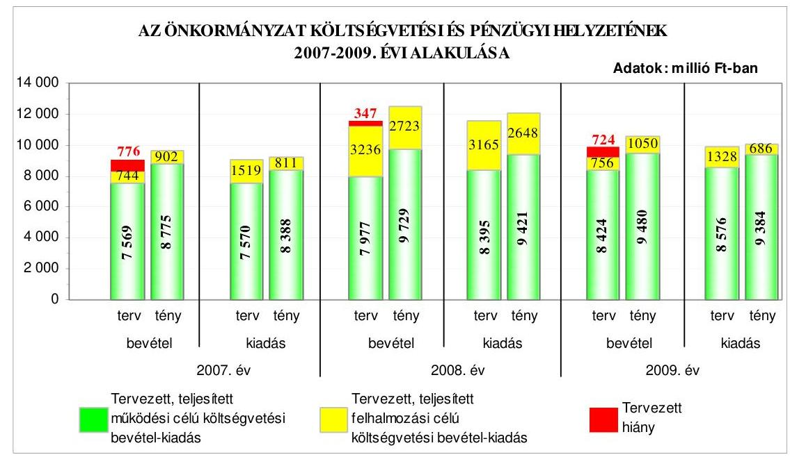

Az Önkormányzatnál a 2007-2009. években a teljesített költségvetési bevételek és kiadások alakulása változó tendenciát mutatott, mivel az előző évhez viszonyítva a költségvetési bevételi és kiadási főösszegek a 2008. évre emelkedtek, majd a 2009. évre csökkentek. A költségvetések végrehajtása során a 20072009. években fennállt a pénzügyi egyensúly, mivel a teljesített költségvetési bevételek fedezetet nyújtottak a megvalósított feladatok költségvetési kiadásaira. A 2007. évben 478 millió Ft, a 2008. évben 383 millió Ft, a 2009. évben 460 millió Ft pénzügyi többlet keletkezett, mivel a múködési célú költségvetési bevételek emelkedése meghaladta a múködési célú költségvetési kiadások növekedését - a múködési célú költségvetési bevételek többlete az évek sorrendjében

---

387 millió Ft, 308 millió Ft, 96 millió Ft volt -, továbbá a felhalmozási célú költségvetési bevételek 91 millió Ft-tal, 75 millió Ft-tal és 364 millió Ft-tal haladták meg a felhalmozási célú költségvetési kiadásokat. A 2009. évben a pénzügyi többlet kialakulásához hozzájárult, hogy az Ady Endre Általános Iskola komplex felújítása során felmerült, év közben átfutó kiadásként elszámolt 243 millió Ft összegű ráfordítást az Áhsz-ben foglaltak ellenére az év végén nem vezették át a költségvetési kiadások közé, az Önkormányzat a tulajdonában lévő lakások elidegenítéséből a tervezetthez viszonyítva 354 millió Ft összegű többletbevételt ért el, mert a tervezés során nem számoltak a bérlők jelzett vételi szándékából adódó önkormányzati lakásértékesítések várható bevételével. A Pénzügyi bizottság a 2007-2009. években az Ötv-ben foglaltak ellenére a költségvetési bevételek alakulását nem kísérte figyelemmel, nem értékelte a bevételek alakulását befolyásoló okokat. Az Önkormányzatnál a 2007. és 2009-2010. évi költségvetési rendeletekben a pénzmaradvány tervezése nem volt megalapozott, mivel az Áht-ban foglaltak ellenére a 2007. évben a Polgármesteri hivatal és az intézmények, a 2009-2010. években pedig az intézmények előző évi pénzmaradvány igénybevételét nem tervezték meg eredeti előirányzatként a bevételek között az áthúzódó kötelezettségek forrásaként. A 2010. évi költségvetési rendelet tervezése során a 2009. évi költségvetési beszámolóban kimutatott módosított pénzmaradvány és az előző évek tartalékai összegéhez viszonyítva $35 \%$-kal magasabb összegben tervezték meg a Polgármesteri hivatal várható pénzmaradványának igénybevételét az áthúzódó kötelezettségek forrásaként, mert az Ámr. ${ }_{2}$-ben foglaltakkal ellentétesen a 2009. évi várható pénzmaradvány megállapításakor nem számoltak az év végi likvid hitel 313 millió Ft öszszegű záró állományával.

Az Önkormányzat a költségvetések végrehajtása során a 2007. évben 60 millió Ft, a 2009. évben 532 millió Ft változó kamatozású, hosszú lejáratú fejlesztési célú hitelt vett fel. A Képviselő-testület a 2007. évben 2600 millió Ft összegben svájci frank alapú, változó kamatozású, 15 éves futamidejű kötvényt bocsátott ki felhalmozási célra, amelyet hitel előtörlesztésére, tagi kölcsön nyújtására, felhalmozási célú kiadások finanszírozására fordították. A hitelfelvételek és a kötvénykibocsátás indokait, azok gazdasági megalapozottságát a Pénzügyi bizottság vizsgálta. A 2009. évi hitelfelvételből eredő tárgyévi kötelezettségvállalás összege az éves adósságot keletkeztető kötelezettségvállalás felső határának a $0,9 \%$-a volt, a kötvénykibocsátás évében az Önkormányzatnak a kötvénykibocsátásból eredő tőke- és kamatfizetési kötelezettsége nem volt. A forint svájci frankhoz viszonyított árfolyamváltozása, valamint a felvett hosszú lejáratú hitelek és a kibocsátott kötvény változó kamatozása miatt a hitelfelvételek és a kötvénykibocsátás az Önkormányzat számára kockázatot jelent. Az Önkormányzat a kötvénykibocsátásból származó bevételéből 2009. december végéig 468 millió Ft-ot nem használt fel, amely bankszámlán és lekötött betétként állt rendelkezésre.

Az Önkormányzat a 2007-2009. évi költségvetések végrehajtása során a likviditás biztosítása érdekében folyószámlahitelt és munkabérhitelt vett igénybe. A 2007. évről a 2009. évre az igénybevett folyószámlahitel átlagos állománya 442 millió Ft-ról 505 millió Ft-ra, a folyószámlahitellel zárt napok száma 304ről 307 napra emelkedett. A 2010. I. negyedévében minden nap igénybe vették a folyószámlahitelt. Az Önkormányzatnál a 2009. év végére több mint másfél-

---

szeresére - 313 millió Ft-ra - nőtt a vissza nem fizetett folyószámlahitel állománya a 2007. évhez viszonyítva. A Képviselő-testület az emelkedő összegű likvid hitel visszafizetésére vonatkozóan előterjesztés hiányában nem döntött. A 2009. december havi munkabér kifizetéséhez 156 millió Ft-ot a Képviselőtestület döntése ellenére - a kötvényszámlára átvezetett pénzeszközt pályázati támogatások előfinanszírozására, pályázati saját forrás biztosítására lehet felhasználni - a kötvényszámláról finanszíroztak, amelyet 2010. január elején visszautaltak.

Az Önkormányzat pénzügyi helyzete a 2007. évhez viszonyítva a 2009. évre - eladósodásának növekedése és fizetőképességének gyengülése miatt - összességében kedvezőtlenül alakult.

Az Önkormányzat fejlesztési célkitűzéseit a 2007-2010. évekre szóló gazdasági programban, ágazati, szakmai koncepciókban, valamint a 2008. évben Integrált Városfejlesztési Stratégiájában határozták meg, melyekben figyelembe vették a megvalósítás lehetséges pénzügyi forrásait. Az Önkormányzat a 20072010. év I. negyedévében 25 pályázatot nyújtott be európai uniós támogatás elnyerése érdekében, amelyek fejlesztési céljai kapcsolódtak a gazdasági programban foglalt célkitűzésekhez. A támogatásban részesült kilenc pályázatból négy befejeződött, míg öt folyamatban lévő projekt volt, kettő pályázat elbírálásáról az Önkormányzat még nem kapott tájékoztatást, 14 pályázatot forráshiány és hiánypótlás elmulasztása miatt elutasítottak. A 2007-2010. I. negyedéve közötti időszakban a kilenc fejlesztés megkötött támogatási szerződéseiben a tervezett 891 millió Ft összes költségvetési kiadás 63\%-át európai uniós támogatás, $21 \%$-át a kapcsolódó hazai társfinanszírozás, $16 \%$-át saját forrás biztosította.

Az Önkormányzat 2009-2010. évi költségvetési rendeletei a benyújtott pályázatok saját forrásainak összegét a céltartalékok között tartalmazták, azonban eredeti előirányzatként az Áht. előírása ellenére - a 2010. évben kettő projekt kivételével - nem tartalmazták, vagy nem a nyertes pályázatokban, illetve a megkötött támogatási szerződésekben foglaltaknak megfelelően tartalmazták az európai uniós támogatással megvalósuló fejlesztési feladatok bevételi és kiadási előirányzatait. Az Ámr., előírása ellenére a 2009-2010. évi költségvetési rendeletek nem tartalmazták az európai uniós forrással megvalósított felhalmozási kiadásokat feladatonként, mivel a kiadási előirányzatokat a céltartalékok között tervezték meg. Nem jelenítették meg a projekteket - egy kivétellel az Ámr., előírása ellenére a többéves kihatással járó feladatok előirányzatai között éves bontásban, valamint nem mutatták be elkülönítetten az európai uniós forrásból megvalósuló fejlesztések bevételi és kiadási előirányzatait.

Az Önkormányzat 2007-2009 között eredményesen készült fel belső szabályozottság és szervezettség terén az európai uniós források igénybevételére és felhasználására, továbbá megvalósította a támogatási szerződésben foglalt fejlesztési célkitűzést. A gazdasági programban, ágazati, szakmai koncepciókban, valamint az Integrált Városfejlesztési Stratégiában megfogalmazott fejlesztési célkitűzésekhez kapcsolódtak az európai uniós támogatások, szabályozták a pályázatfigyelést végzők és a döntési, illetve a döntés-előterjesztési jogkörrel rendelkezők közötti információ-szolgáltatási kötelezettséget, az éves belső ellenőrzési terveket megalapozó kockázatelemzés kiterjedt az európai uniós for-

---

rásokkal támogatott fejlesztési feladatokra. A Polgármesteri hivatalon belül biztosították a pályázatfigyelés, a pályázatkészítés és a fejlesztési feladat lebonyolításának szervezeti és személyi feltételeit, a pályázatok lebonyolításához esetenként külső szervezetet vettek igénybe. Meghatározták a projekt lebonyolítási feladataira kötött megbízási szerződésekben a támogatott célkitúzés megvalósításának kötelezettségét, az ellenőrzés és a kapcsolattartás rendjét, valamint a személyre szóló felelősségi szabályokat, továbbá a támogatási szerződésben foglalt határidőre az „Akadálymentesen a pesterzsébeti Gyermekmosoly Óvodában" fejlesztési feladat esetében a célkitűzést megvalósították.

Az Önkormányzat informatikai stratégiája tartalmazta a helyzetelemzést, valamint az e-közszolgáltatási feladatok megvalósításához szükséges középés hosszú távú célkitűzéseket, a 3. elektronikus szolgáltatási szint kialakítását tervezték. Az Önkormányzat a 2007-2009. években az EKOP keretében pályázatot nem nyújtott be, az ÁROP támogatására pályázott. Az Önkormányzat az eközszolgáltatási feladat ellátásának személyi feltételeit a Polgármesteri hivatalon belül, illetve vállalkozási szerződéssel biztosította. Az e-közszolgáltatási feladatokat saját számítógépes információs rendszeren keresztül, vásárolt programmal látták el. Az Önkormányzat az elektronikus ügyintézés szabályairól alkotott rendeletben kizárta a közigazgatási hatósági ügyek elektronikus úton történő intézését. Az Önkormányzat az e-közszolgáltatás keretében történő ügyintézést az 1., illetve a 2. elektronikus szolgáltatási szinten múködtette. A teljes, közvetlen, kétoldalú ügyintézés megvalósításához szükséges további fejlesztéseket számítástechnikai eszközök és programok, személyi és a pénzügyi források hiánya akadályozta.

Az Önkormányzatnál kialakították az Eisz. tv. alapján a közérdekú adatok honlapon történő elektronikus közzétételének lehetőségét a vonatkozó rendeletben meghatározott szerkezetben. A jegyző gondoskodott az Önkormányzat honlapján a céljellegú múködési és felhalmozási támogatások közzétételéről, azonban az Áht. előírása ellenére a szerződések közel felénél nem tette közzé az Önkormányzat pénzeszközei felhasználásával, a vagyonnal történő gazdálkodással összefüggő - a nettó ötmillió forintot elérő vagy azt meghaladó értékű árubeszerzésre, építési beruházásra, szolgáltatás megrendelésre, vagyonértékesítésre vonatkozó szerződések megnevezését (típusát), tárgyát, a szerződést kötő felek nevét, a szerződés értékét, határozott időre kötött szerződés esetében annak időtartamát, valamint az említett adatok változásait. A polgármester tájékoztatása alapján a jegyző intézkedett a hiányzó szerződések közzétételéről. A jegyző gondoskodott a 2008. és a 2009. évi költségvetési beszámoló szöveges indokolásának az Önkormányzat honlapján történő közzétételéről, azonban a közzététel tartalma nem felelt meg az Áhsz-ben előírt követelményeknek, mert nem ismertették azoknak a gazdasági társaságoknak a nevét, székhelyét - a részesedések mennyiségének és értékének feltüntetése mellett -, amelyekben az Önkormányzat részesedéssel rendelkezett, valamint nem utaltak kiemelten és egyértelmúen arra, hogy az Önkormányzatnál a könyvvizsgálat kötelező.

A költségvetés-tervezési és a zárszámadás-készítési folyamatok szabályozottságának hiányosságai közepes kockázatot jelentettek a feladatok szabályszerű végrehajtásában, mivel a jegyző nem szabályozta a Polgármesteri hivatal és az intézmények költségvetési javaslatai kidolgozásának, az ismert kötelezettségek megtervezésének, a javasolt előirányzatok megalapozottságának, a be-

---

nyújtott költségvetési igények teljesíthetőségének, az intézményi számszaki beszámolók, valamint annak a Képviselő-testület által meghatározott adatszolgáltatással való összhangjának ellenőrzését. Azonban a kialakított belső kontrollok - végrehajtásuk esetén - a lehetséges hibák többsége ellen védelmet nyújtottak. A költségvetés-tervezési és zárszámadás-készítési folyamatban a kontrollok múködésének megfelelősége jó volt, mivel a költségvetés tervezésének folyamatában a szabályozásban foglaltaknak megfelelően a jegyző ellenőriztette, hogy az intézmények teljesítették-e a költségvetési javaslat összeállításával kapcsolatban részükre meghatározott követelményeket, az intézményi mutatószám felmérés adatainak megalapozottságát, továbbá a zárszámadás készítése során, az intézmények által az állami támogatásokkal történő elszámoláshoz közölt mutatószámok adatainak megfelelőségét, pénzmaradványuk megállapításának szabályszerűségét. Nem végezték el annak ellenőrzését, hogy a Polgármesteri hivatal és az intézmények a jogszabályi előírásoknak megfelelően dolgozták-e ki költségvetési javaslatukat és nem győződtek meg költségvetési igényeik teljesíthetőségéről, a javasolt előirányzatok megalapozottságáról, az ismert kötelezettségek megtervezéséről. Nem ellenőrizték a Polgármesteri hivatal és az intézmények által benyújtott költségvetési igények indokoltságát, a saját bevételek előirányzatai és a költségvetés megalapozását szolgáló helyi rendeletek összhangjának biztosítását. A zárszámadás készítésének folyamatában nem győződtek meg az intézményi eredeti és módosított előirányzatok, valamint a teljesítések eltérésének indokoltságáról, az intézményi számszaki beszámolók belső, valamint annak a Képviselő-testület által meghatározott adatszolgáltatással való összhangjáról. A megállapított hiányosságok nem veszélyeztették a költségvetés-tervezés és a zárszámadás-készítés hibáinak megelőzését, feltárását és kijavítását.

A gazdálkodási, a pénzügyi-számviteli és a folyamatba épített ellenőrzési feladatok szabályozásának hiányosságai közepes kockázatot jelentettek a feladatok megfelelő, szabályszerű végrehajtásában, mivel a jegyző az Ámr.,-ben előírtak ellenére nem egészíttette ki a hivatali SzMSz-t a Polgármesteri hivatal alapító okiratának keltével, nem tartalmazta a hivatali SzMSz a szervezeti egységek engedélyezett létszámát, a pénzügyi-gazdasági tevékenységet ellátók feladatkörét, munkakörét, nem határozta meg a gazdasági szervezet feladatai közül, hogy melyik feladatokat látják el a Polgármesteri hivatal gazdasági szervezete által, illetve külső szervezetek bevonásával a gazdasági szervezet ügyrendjében. A jegyző a korábbi ÁSZ javaslat ellenére nem szabályozta a vezetők és a pénzügyi-gazdasági feladatok ellátásáért felelős alkalmazottak feladat- és hatáskörét, felelősségi körét, a helyettesítés rendjét, valamint a belső és a külső kapcsolattartás módját, amiért felelősség terheli, mivel a Polgármesteri hivatalban a gazdálkodási feladatok, hatáskörök szabályozása az Ámr., szerinti ügyrend elkészítése a Polgármesteri hivatal vezetőjének, a jegyzőnek a kötelessége. A polgármester tájékoztatása szerint a jegyző 2010. decemberében intézkedett a hivatali SzMSz és a gazdasági szervezet ügyrendjének kiegészítéséről. Továbbá a jegyző az érvényesítők megbízása során nem tartotta be az érvényesítők iskolai végzettségére és a szakmai képesítésére vonatkozó előírást, az Áhsz-ben előírtak ellenére a leltározási és leltárkészítési szabályzatban nem szabályozta az üzemeltetésre átadott eszközök leltározásának módját, az értékelési szabályzatban nem határozta meg az értékelések ellenőrzéséért felelős munkaköröket, az értékelési és ellenőrzési feladatokat az érintett dolgozók

---

munkaköri leírásaiban nem írta elő, az önköltségszámítási szabályzatban az Ámr. ${ }_{1}$-ben előírtak ellenére nem határozta meg a közérdekú adatszolgáltatáshoz kapcsolódó költségtérítés mértékét és a díj megfizetésének módját, továbbá a selejtezési szabályzatban nem jelölte ki az üzemeltetésre átadott eszközök esetében a döntés meghozatalára jogosultak körét, a selejtezési eljárással kapcsolatos feladatokat az érintett dolgozók munkaköri leírása nem tartalmazta, a számlarendben nem határozta meg a főkönyv és az analitikus nyilvántartások egyeztetésének dokumentálási módját. A jegyző az ellenőrzési nyomvonal kialakításánál nem határozta meg a tevékenységek elvégzését igazoló dokumentumok fellelhetési helyét a rendszerben, a kockázatkezelési szabályzatban nem szabályozta a válaszintézkedések beépítését a folyamatba, és a kockázati környezet rendszeres felülvizsgálatát. A polgármester tájékoztatása szerint a jegyző 2010. decemberében intézkedett az ellenőrzési nyomvonal és a kockázatkezelési szabályzat hiányosságainak megszüntetésére. A kialakított belső kontrollok azonban - múködésük esetén - a lehetséges hibák többsége ellen védelmet nyújtottak.

A Polgármesteri hivatalban a 2009. évben az államháztartáson kívülre történő múködési és felhalmozási célú pénzeszköz átadásokkal, az állományba nem tartozók megbízási díjaival, valamint a külső szolgáltatók által végzett karbantartással, kisjavítással kapcsolatos kifizetések során - ezen területek költségvetési súlyának figyelembevételével összefoglalóan értékelve - a belső kontrollok múködésének megfelelősége jó volt, mivel a szakmai teljesítés igazolására a jegyző által kijelölt személyek az ellenőrzési feladataikat elvégezték a külső szolgáltatók által végzett karbantartással, kisjavítással kapcsolatos kifizetések esetében, ellenőrizték az összegszerűséget, a jogosultságot és a szerződések, megrendelések szakmai teljesítését, azonban az államháztartáson kívülre történő múködési és felhalmozási célú pénzeszköz átadásokkal kapcsolatos kiadások teljesítését megelőzően a szakmai teljesítés igazolása a korábbi ÁSZ javaslat, valamint az Ámr. ${ }_{1}$-ben és a gazdálkodási szabályzat ${ }_{1,2}$-ben előírtak ellenére elmaradt, továbbá az állományba nem tartozók megbízási díjaival kapcsolatos kiadások teljesítését megelőzően a szakmai teljesítés igazolása nem a gazdálkodási szabályzat ${ }_{1,2}$-ben előírt módon történt. Az utalványok ellenjegyzői a külső szolgáltatók által végzett karbantartással, kisjavítással kapcsolatos kifizetéseknél az ellenőrzési feladataikat elvégezték, meggyőződtek a gazdálkodásra vonatkozó szabályok érvényesüléséről, továbbá a szakmai teljesítésigazolás és az érvényesítés elvégzéséről, azonban az államháztartáson kívülre nyújtott múködési és felhalmozási célú pénzeszköz átadásokkal kapcsolatos kiadások teljesítését megelőzően az Ámr. ${ }_{1}$-ben foglaltak ellenére nem észrevételezték, hogy a szakmai teljesítést igazolók nem tettek eleget a folyamatba épített ellenőrzési kötelezettségüknek, illetve az állományba nem tartozók megbízási díjainak kifizetése előtt nem észrevételezték, hogy a szakmai teljesítés igazolása nem a gazdálkodási szabályzat ${ }_{1,2}$-ben előírt módon történt. A Polgármesteri hivatalban ezért az Áht. előírásai ellenére a belső kontrollok közül a szakmai teljesítésigazolás és az utalvány ellenjegyzése nem a szabályozásnak megfelelően múködött. A belső kontrollrendszer megszervezéséért és hatékony múködtetéséért, a FEUVE rendszer létrehozásáért, múködtetéséért az Áht. és az Ötv. előírásainak megfelelően - a költségvetési szervként múködő Polgármesteri hivatal vezetője - a jegyző a felelős. A jegyző a szakmai teljesítésigazolást és az utalvány ellenjegyzését nem a szabályozásnak megfelelően múködtette, ennek ellenére

---

az Ámr. 1 23. számú melléklete alapján - jogi felelőssége tudatában - úgy nyilatkozott, hogy az előírásoknak megfelelően gondoskodott a Polgármesteri hivatalban a belső kontroll rendszerek szabályszerű, hatékony, eredményes és gazdaságos múködéséről.

A Polgármesteri hivatal rendelkezett a jegyző által kiadott informatikai biztonsági szabályzattal. A pénzügyi-számviteli tevékenységhez kapcsolódó informatikai feladatok szabályozottsága közepes kockázatot jelentett az informatikai feladatok megfelelő, szabályszerű végrehajtásában, mivel a katasztrófaelhárítási tervet nem aktualizálták, a pénzügyi-számviteli rendszer esetében nem szabályozták a jelszavak kezelését, a Polgármesteri hivatalnál a hozzáférési jogosultságokra vonatkozó eljárásrend nem tartalmazott rendelkezést a kiosztott felhasználói jelszavak módosítására, visszavonására, ellenőrzésére, nem neveztek ki a pénzügyi-számviteli rendszer ellenőrzési listájának vizsgálatáért felelős dolgozót, nem szabályozták a pénzügyi-számviteli program-változások ellenőrzésére, tesztelésére vonatkozó eljárásokat, azonban a kialakított belső kontrollok - végrehajtásuk esetén - a lehetséges hibák többsége ellen védelmet nyújtottak. A Polgármesteri hivatalban a 2009. évben a pénzügyi-számviteli tevékenységhez kapcsolódó informatikai feladatoknál a kialakított belső kontrollok múködésének megfelelősége gyenge volt, mivel a katasztrófa-elhárítási tervet az elmúlt két évben nem tesztelték, a jelszavak kezelésére vonatkozó szabályok - jelszó módosítási kötelezettség, a jelszó formai előírásainak meghatározása - betartását szabályozás hiányában nem tették kötelezővé, a pénzügyiszámviteli programok elemeire vonatkozó változáskezelési eljárások ellenőrzését, tesztelését nem dokumentálták és az ellenőrzési listákat nem vizsgálták, nem ellenőrizték az elmúlt egy évben azt, hogy az elmentett állományokból a pénzügyi-számviteli adatok teljes körűen helyreállíthatóak és a mentéseket tartalmazó adathordozók környezeti ártalmak elleni védelmét nem biztosították.

A Polgármesteri hivatalon belül a belső ellenőrzési feladatok ellátására önálló szervezeti egységet, Ellenőrzési osztályt hoztak létre az Ötv-ben előírtaknak megfelelően. A hivatali SzMSz-ben rögzítették az Ellenőrzési osztály közvetlen jegyzői alárendeltségét, irányítását, biztosították a belső ellenőrzés funkcionális függetlenségét, és meghatározták a feladatait. A belső ellenőrzés szervezeti kereteinek kialakítása és szabályozása a belső ellenőrzési feladatok megfelelő, szabályszerű végrehajtásában összességében alacsony kockázatot jelentett, mivel meghatározták a belső ellenőrzési vezető személyét, a belső ellenőrzés rendelkezett a jegyző által jóváhagyott belső ellenőrzési kézikönyvvel és a 20042010. évekre szóló stratégiai tervvel, a Képviselő-testület által elfogadott kockázatelemzéssel alátámasztott éves belső ellenőrzési tervekkel, a belső ellenőrzési vezető az ellenőrzések lefolytatásához ellenőrzési programot készített, és kialakította az ellenőrzések nyilvántartási rendszerét. Annak ellenére összességében alacsony volt a kockázat, hogy a jegyző a Ber-ben előírtak ellenére a foglalkoztatott belső ellenőrök számát nem kapacitás-felmérés alapján határozta meg, továbbá a 2004-2010. évekre vonatkozó stratégiai ellenőrzési tervet nem támasztotta alá kockázatelemzéssel. A stratégiai ellenőrzési tervet megalapozó kockázatelemzés hiányában az európai uniós támogatásokkal megvalósított beruházások végrehajtásának, a közbeszerzési eljárások lebonyolításának, az önkormányzati többségi irányítást biztosító befolyás alatt álló gazdasági társaságok múködésének, és a kedvezményezett szervezeteknek az Önkormányzat

---

költségvetéséből céljelleggel nyújtott támogatások rendeltetés szerinti felhasználásának ellenőrzéséről az éves belső ellenőrzési tervek kockázatelemzése alapján határoztak. A 2009. évben a kockázatelemzés szerint nem volt magas kockázatúnak értékelt ellenőrzési terület, a 2010. évben a tulajdon védelmével összefüggő tevékenységeket a Polgármesteri hivatalban magas kockázatúnak értékelték, és az éves ellenőrzési tervben szerepeltették. A Polgármesteri hivatalban a 2009. évben a belső ellenőrzés működésénél a kialakított kontrollok megfelelősége kiváló volt, mivel a belső ellenőrzési feladat ellátása a Polgármesteri hivatal szervezeti egységeként létrehozott Ellenőrzési osztály keretében valósult meg, a belső ellenőrzés funkcionális függetlenségét biztosították, az éves ellenőrzési tervet megalapozó kockázatelemzéshez a hatályos kockázatkezelési eljárásrend alapján értékelték az ellenőrzési területeket, a 2009. évi belső ellenőrzési tervben szereplő kettő intézményi ellenőrzést vis maior ok miatt nem fejeztek be, az ellenőrzéseket a belső ellenőrzési vezető által jóváhagyott ellenőrzési programok alapján folytatták le, az elvégzett vizsgálatokról ellenőrzési jelentéseket készítettek, az ellenőrzött szervezetek intézkedési tervet állítottak össze, a belső ellenőrzési vezető az előírt tartalommal nyilvántartást vezetett az elvégzett ellenőrzésekről, valamint az ellenőrzési jelentésekben tett megállapítások, javaslatok hasznosulásáról, a végrehajtott intézkedésekről. A 2009. évben kettő soron kívüli ellenőrzést végeztek. Az elvégzett vizsgálatokról a belső ellenőrök a Ber-ben előírt követelményeknek megfelelő ellenőrzési jelentéseket készítettek. Az ellenőrzöttek intézkedési tervet készítettek az ellenőrzési javaslatokra, a belső ellenőrzés a feltárt hiányosságok megszüntetéséről az ellenőrzöttek által készített beszámoló alapján és realizáló értekezlet keretében győződött meg. A jegyző az Ámr., mellékletében előírtak szerint értékelte a belső kontrollok múködését és annak ellenére úgy nyilatkozott, hogy az előírásoknak megfelelően gondoskodott a Polgármesteri hivatalban a belső kontroll rendszerek szabályszerű, hatékony, eredményes és gazdaságos múködéséről, hogy a szakmai teljesítésigazolást és az utalvány ellenjegyzését nem a szabályozásnak megfelelően működtette az államháztartáson kívülre történő működési és felhalmozási célú pénzeszköz átadásokkal kapcsolatos kiadások teljesítése és a megbízási díjak kifizetése során.

A polgármester az Ötv. előírásainak megfelelően a zárszámadási rendelettervezettel egyidejűleg a Képviselő-testület elé terjesztette a költségvetési szervek 2009. évi éves ellenőrzési jelentései alapján készített 2009. évi összefoglaló jelentést.

Az ÁSZ a 2005. évben végezte el az Önkormányzat gazdálkodási rendszerének átfogó ellenőrzését, a jelentés 33 szabályszerűségi és hat célszerűségi javaslatot tartalmazott. Az ÁSZ vizsgálatról és az időközben megtett intézkedésekről szóló beszámolót a Képviselő-testület tudomásul vette, a javaslatok megvalósítására intézkedési tervet fogadott el a határidők és a felelősök megjelölésével.

A szabályszerűségi javaslatok közül határidőre teljesült a költségvetési rendelet tartalmával és szerkezetével összefüggő javaslatok közel 60\%-a. A 2006. évi költségvetési bevételek megalapozása érdekében a polgármester gondoskodott a bölcsődei, óvodai, iskolai és szociális ellátások térítési díjainak módosításáról, a 2006. évi költségvetési rendelettervezet benyújtásakor a közvetett támogatásokat, valamint a Polgármesteri hivatal kiadásai és bevételei főösszegét, a kiemelt kiadási előirányzatok között a személyi juttatások, a dologi ki-

---

adások és az ellátottak pénzbeli juttatása összesített adatait bemutatták, a Polgármesteri hivatal költségvetési rendelettervezete feladatonként tartalmazta a működési kiadásokat. A gazdálkodási és pénzügyi-számviteli feladatellátásának szabályozottságára vonatkozó javaslatok egyharmada teljesült, a Polgármesteri hivatal számviteli politikáját kiegészítették a kisebbségi önkormányzatok gazdálkodásával kapcsolatos, sajátos számviteli feladatokkal. A költségvetési gazdálkodási és ellenőrzési jogkörök gyakorlásának szabályszerűségére vonatkozó javaslatok kétharmada realizálódott, teljesítették a kötelezettségvállalások nyilvántartásának folyamatos vezetésével, a kötelezettségvállalások ellenjegyzésével, az analitikus és főkönyvi könyvelés egyeztetésével és a pénzkezelési szabályok betartásával kapcsolatos javaslatokat. A gazdasági eseményeket magukba foglaló bizonylatok adatainak számviteli nyilvántartásokban történő rögzítésére, a vagyongazdálkodási feladatok és döntési hatáskörök betartására, valamint a céljelleggel nyújtott támogatások felhasználásának ellenőrzésére tett kettő-kettő javaslat teljesült. A zárszámadási rendelet szerkezetére, tartalmára, mellékleteire vonatkozó követelmények érvényesüléséhez kapcsolódó javaslatok közül a vagyonkimutatás tartalmára vonatkozó javaslat teljesült. A pénzmaradvány elszámolás és felülvizsgálat rendjére tett javaslatot megvalósították. A kisebbségi önkormányzatok gazdálkodási és ellenőrzési jogköreinek szabályozottságára és végrehajtásának szabályszerűségére vonatkozó kettő javaslatot hasznosították. Meghatározták az önként vállalt feladatok mértékét és módját, és az önkormányzati épületek akadálymentesítését folytatták.

A szabályszerűségi javaslatok közül részben teljesítették a költségvetési gazdálkodási és ellenőrzési jogkörök gyakorlásának szabályszerűségére a jegyzőnek tett javaslatokból, hogy az utalvány ellenjegyzője és az érvényesítő a folyamatba épített ellenőrzési feladatok keretében ellenőrizte a kötelezettségvállalás ellenjegyzésének megtörténtét, a fedezet rendelkezésre állását és a gazdálkodási szabályok betartását, de az Ámr.,-ben előírtak ellenére az érvényesítő és az utalványok ellenjegyzője nem győződött meg a szakmai teljesítésigazolás elvégzéséről, nem észrevételezte a működési és felhalmozási célú pénzeszköz átadások esetében a szakmai teljesítésigazolás hiányát, a megbízási díjak kifizetése előtt nem kifogásolta, hogy a szakmai teljesítésigazolás nem a gazdálkodási szabályzatban előírt módon történt. Felelősség terheli a jegyzőt, mert az utalvány ellenjegyzését nem a szabályozásnak megfelelően működtette a múködési és felhalmozási célú pénzeszköz átadások esetében, valamint a megbízási díjak kifizetése során. A folyamatba épített, előzetes, utólagos és vezetői ellenőrzés működtetése az Áht. alapján a jegyző kötelessége. A leltározási kötelezettség teljesítésére a jegyzőnek tett javaslat végrehajtása során a jegyző gondoskodott a részesedések és az üzletrészek egyeztetéssel, az ingatlanok mennyiségi felvétellel történő leltározásáról, de az Áhsz-ben előírtak ellenére az üzemeltetésre, kezelésre átadott eszközök mennyiségi felvétellel történő leltározását nem végezték el. A zárszámadási rendelet szerkezetére, tartalmára, mellékleteire vonatkozó követelmények érvényesüléséhez kapcsolódó, jegyzőnek tett javaslatok egyharmada részben valósult meg, mivel a jegyző a több éves kihatással járó döntések számszerűsítését évenkénti bontásban bemutatta, de az Áht-ban foglaltak ellenére azok összesítése és szöveges indoklása elmaradt.

---

A szabályszerűségi javaslatok közül nem teljesült a költségvetési koncepció és a költségvetési rendelet tartalmával és szerkezetével összefüggő javaslat, mivel a polgármester nem gondoskodott az Ámr. ${ }_{1}$-ben előírtak ellenére a Pénzügyi bizottság 2006. évi költségvetési koncepcióról alkotott véleménynek az előterjesztéshez történő csatolásáról, a hiányosságot a 2008. évi költségvetés tervezése során megszüntette. A jegyző az Ámr. ${ }_{1}$-ben előírtak ellenére a 2006. évi költségvetési rendelettervezet bevételeinek részletezésekor figyelmen kívül hagyta a Pénzügyminisztérium által kiadott, az elemi költségvetés összeállítására vonatkozó tájékoztatójában foglaltakat, mert külön címenként részletezve nem mutatta be a támogatások és a támogatás értékű bevételek, valamint a kölcsönök visszatérülése és a hitelfelvételek előirányzatait. A jegyző az Ámr. ${ }_{1}$-ben előírtak ellenére a 2005. évi zárszámadási rendelettervezetben és a 2006. évi költségvetési rendelettervezetben nem mutatta be a múködési, fenntartási kiadási előirányzatokat költségvetési szervenként. A jóváhagyott előirányzatokon belüli gazdálkodás érvényesülése érdekében a jegyző az Áht-ban előírtak ellenére a 2005. évi gazdálkodás során nem biztosította, hogy a Polgármesteri hivatalban a tárgyévi fizetési kötelezettséget a jóváhagyott kiadási előirányzatok mértékéig vállaljanak, mivel 53 - a Képviselő-testület által jóváhagyott - kiemelt előirányzaton belüli részelőirányzatnál történt előirányzat túllépés, a hiányosságot a 2009. évi költségvetés végrehajtása során sem szüntette meg. A gazdálkodás és a pénzügyi-számviteli feladatellátás szabályozottságának biztosítása érdekében a jegyző az Ámr. ${ }_{1}$-ben előírtak ellenére nem egészítette ki a hivatali SzMSz-t a Polgármesteri hivatal alapító okiratának keltével, a gazdasági szervezet ügyrendjét az osztályvezető-helyettesek, a csoportvezetők és más dolgozók feladat-, hatás- és jogkörével, valamint az osztályvezető feladataival, hatás- és jogkörével. A költségvetési gazdálkodási és ellenőrzési jogkörök gyakorlásának szabályszerűségére vonatkozó javaslatok közül a jegyző az Ámr. ${ }_{1}$-ben előírtak ellenére nem gondoskodott a szakmai teljesítésigazolásról a múködési és felhalmozási célú államháztartáson kívülre átadott pénzeszközök és a megbízási díjakkal kapcsolatos gazdasági események esetében. A Polgármesteri hivatalban a gazdasági szervezet Ámr. ${ }_{1}$ szerinti ügyrendje elkészítésének elmulasztásáért, valamint a szakmai teljesítésigazolás, mint belső kontroll múködtetésének hiányosságaiért, hibáiért felelősség terheli a jegyzőt, mivel a gazdasági szervezet ügyrendjének elkészítése, illetve a folyamatba épített, előzetes, utólagos és vezetői ellenőrzés múködtetése az Áht-ban, és az Öv-ben foglaltak alapján - a költségvetési szervként múködő Polgármesteri hivatal vezetője - a jegyző kötelessége.

A zárszámadási rendelet szerkezetére, tartalmára, mellékleteire vonatkozó követelmények érvényesüléséhez kapcsolódó javaslat megvalósulása érdekében a jegyző az Ámr. ${ }_{1}$-ben előírtak ellenére nem mutatta be a 2005. évi zárszámadási rendelettervezetben a múködési és a felhalmozási célú bevételi és kiadási előirányzatok teljesülését mérlegszerűen, egymástól elkülönítetten, de együttesen egyensúlyban. Az önkormányzati gazdálkodás egyéb területeinek törvényes, szabályszerű ellátását érintően tett javaslatok közül a Ltv-ben előírtak ellenére a jegyző nem gondoskodott az önkormányzati lakások elidegenítéséből származó bevételnek az Önkormányzat és a Fővárosi Önkormányzat közötti megosztásáról és a Fővárosi Önkormányzatot megillető rész átadásáról.

---

A célszerúségi javaslatok felét nem teljesítették. A jegyző az intézkedési tervben meghatározott időponton túl léptette hatályba a számítástechnikai ka-tasztrófa-elháritási tervet, nem gondoskodott a céljelleggel nyújtott támogatások esetében a számadások ellenőrzésének szabályozásáról, továbbá nem készíttetett a 2005. évi zárszámadási rendelethez indoklást az éves költségvetési beszámoló és a rendelettervezetben bemutatott adatok közötti eltérések okairól.

Az ÁSZ a 2007. évben a 2006. évi országgyúlési, valamint önkormányzati és nemzeti, etnikai kisebbségi képviselő-választások lebonyolításához felhasznált pénzeszközök ellenőrzésekor a jegyzőnek egy szabályszerűségi és három célszerűségi javaslatot tett. A jegyző a javaslatok realizálására intézkedett, gondoskodott a választással kapcsolatban felmerülő közvetett költségek megállapítása módjának szabályozásáról, tervezéséről, előirányzatának biztosításáról és elkülönített szakfeladati könyveléséről. Az ÁSZ a 2007. évben ellenőrizte az Önkormányzatnál a Fővárosi Önkormányzatot és a kerületi önkormányzatokat osztottan megillető bevételek 2007. évi megosztásáról szóló fővárosi önkormányzati rendelet felülvizsgálatát. A számvevői jelentés kettő célszerúségi javaslatot tartalmazott. A jegyző intézkedett a 2008. évi forrásmegosztás esetében, hogy az adatok ellenőrzését minden szakfeladatra vonatkozóan elvégezzék, és a forrásmegosztási rendelettervezet önkormányzati véleményezésekor vegyék figyelembe a forrásmegosztási törvénynek való megfelelőséget.

Az ÁSZ által az Önkormányzat gazdálkodásának 2005. évi átfogó ellenőrzése, valamint a 2006-2009. években végzett további ellenőrzések során tett szabályszerűségi és célszerűségi javaslatok összességében 67\%-ban hasznosultak, 6\%ban részben teljesültek, $27 \%$-ban nem valósultak meg.

A helyszíni ellenőrzés megállapításainak hasznosítása mellett javasoljuk:

# a polgármesternek 

a jogszabályi előírások maradéktalan betartása érdekében

1. intézkedjen az Ötv. 92. § (13) bekezdés b) pontja alapján arról, hogy a Pénzügyi bizottság kísérje figyelemmel a bevételi előirányzatok teljesítésének alakulását, értékelje a befolyásoló okokat;
2. tegyen javaslatot a Képviselő-testületnek, hogy az Áht. 94. § (2) bekezdésében foglaltak szerint a jelentés 20. oldal második bekezdésétől a 21. oldal második bekezdés végéig, a 24. oldal második bekezdésétől a 25 . oldal első bekezdés végéig, az 52. oldal első francia bekezdésében, az 59. oldaltól a 60. oldal első bekezdésének végéig, a 67. oldal első francia bekezdése, a 68. oldal ötödik francia bekezdésétől a 69. oldal első bekezdés végéig rögzített jogszabálysértések tekintetében a köztisztviselők jogállásáról szóló 1992. évi XXIII. törvény 51. § (1) bekezdése alapján indítsa meg a jegyző elleni fegyelmi eljárást;

---

a munka színvonalának javítása érdekében
3. kezdeményezze, hogy a számvevőszéki jelentésben foglaltakat a Képviselő-testület tárgyalja meg és a feltárt hiányosságok megszüntetése érdekében készíttessen intézkedési tervet a határidők és felelősök megjelölésével;
4. biztosítsa, hogy csak olyan kifizetést teljesítsenek a kötvényszámlán elkülönített bevételből, amelyre a Képviselő-testület engedélyt adott;

# a jegyzőnek 

a jogszabályi előírások maradéktalan betartása érdekében

1. gondoskodjon az Áht. 8/A. § (7) bekezdésében előírtaknak megfelelően a költségvetési rendelettervezet elkészítésekor arról, hogy finanszírozási célú pénzügyi múveleteket ne vegyenek figyelembe költségvetési hiányt módosító költségvetési kiadásként;
2. gondoskodjon az éves költségvetés eredeti előirányzatainak kialakításánál az Áht. 8/C. § (3)-(4) bekezdésében előírtaknak megfelelően arról, hogy a költségvetési rendelet tartalmazza a tervezett feladatok ellátásához teljesíthető jóváhagyott kiadásokat és a teljesítendő várható bevételeket, így az intézmények előző évről áthúzódó feladatai kiadási előirányzatait, valamint a várható előző évi pénzmaradvány igénybevételét is;
3. gondoskodjon az Ámr. ${ }_{2}$ 207. § (4) bekezdésében foglaltak érvényesülése érdekében arról, hogy a várható pénzmaradvány megállapítása során vegyék figyelembe a rövid lejáratú likvid hitel állományát is;
4. gondoskodjon az Áht. 69. § (1) bekezdés a) pontjában előírtak alapján az európai uniós támogatással megvalósuló fejlesztési feladatok bevételi és kiadási előirányzatai tervezéséről, továbbá az Ámr. ${ }_{2}$ 36. § (1) bekezdés d) pontjában foglaltak betartása érdekében arról, hogy az éves költségvetési rendeletek tartalmazzák az európai uniós forrással megvalósított felhalmozási kiadásokat feladatonként;
5. intézkedjen a költségvetés-tervezési és zárszámadás készítési folyamatok munkafolyamatba épített ellenőrzésének szabályozásáról és az abban foglaltak végrehajtásáról az Ámr. ${ }_{2}$ 155. §-ában előírtak érvényesülése érdekében
a) a Polgármesteri hivatal és az intézmények költségvetési javaslatának az Ámr. ${ }_{2}$ 2830. §-ai előírásának megfelelő kidolgozása és ellenőrzése során;
b) a Polgármesteri hivatal és az intézmények ismert kötelezettségeinek, javasolt előirányzatai megalapozottságának, a Polgármesteri hivatal szervezeti egységei és az intézmények által benyújtott költségvetési igények teljesíthetőségének tervezése és ellenőrzése, a saját bevételek előirányzatai és a költségvetés megalapozását szolgáló helyi rendeletek, valamint a Polgármesteri hivatal és az intézmények által benyújtott költségvetési igények indokoltságának ellenőrzése vonatkozásában;

---

c) az intézményi eredeti, a módosított előirányzatok és a teljesítések eltérése indokoltságának ellenőrzése, az intézményi számszaki beszámoló belső, valamint annak a Képviselő-testület által meghatározott adatszolgáltatással való összhangja ellenőrzésének előírása és végrehajtása során;
6. az operatív gazdálkodás során a múködésbeli hibák megelőzése, feltárása illetve kijavítása érdekében gondoskodjon arról, hogy
a) az államháztartáson kívülre történő működési és felhalmozási célú pénzeszköz átadások kiadásai teljesítésének elrendelése előtt a szakmai teljesítés igazolására kijelölt személyek az ellenőrzési feladataikat az Ámr. 76. § (3) bekezdésében előírtaknak megfelelően, továbbá az állományba nem tartozók megbízási díjai kifizetése előtt a gazdálkodási szabályzatban előírt módon, az abban meghatározott szöveg alkalmazásával végezzék el, okmányok alapján ellenőrizzék, szakmailag igazolják a kifizetések jogosultságát, összegszerűségét, a szerződés, megrendelés, megállapodás teljesítését;
b) az utalványok ellenjegyzője az Ámr. 74. §-ban foglaltak megfelelő alkalmazásával győződjön meg az Ámr. 2 79. § (2) bekezdésében előírtak szerint a szakmai teljesítésigazolás elvégzéséről;
7. gondoskodjon arról, hogy a foglalkoztatott belső ellenőrök számát a Ber. 4. § (6) bekezdésben foglaltaknak megfelelően kapacitás-felmérés alapján, a feladatokkal, a stratégiai ellenőrzési tervben foglaltakkal összhangban állapítsák meg;
8. a belső ellenőrzés szabályszerű kereteinek kialakítása és múködtetése érdekében intézkedjen, hogy a stratégiai belső ellenőrzési terv megalapozásához készítsenek kockázatelemzést a Ber. 18. §-ában előírtak szerint;
9. gondoskodjon az Önkormányzat gazdálkodásának 2005. évi átfogó ellenőrzése során az ÁSZ által részére tett és nem teljesült szabályszerűségi és célszerűségi javaslatok végrehajtásáról;
a munka színvonalának javítása érdekében
10. tájékoztassa - évente végzett számítások alapján - a Képviselő-testületet az Önkormányzat eladósodásának növekedésére figyelemmel arról, hogy a hosszú lejáratú, adósságot keletkeztető kötelezettségvállalásokból adódó tőke- és kamatfizetési kötelezettségét az Önkormányzat milyen feltételek biztosítása mellett tudja teljesíteni;
11. készítsen likviditási koncepciót és végezze el a likvid hitel éven belüli visszafizetési lehetőségének részletes vizsgálatát, továbbá annak eredményéről tájékoztassa a Képviselő-testületet;
12. gondoskodjon a költségvetés tervezése során az önkormányzati lakások értékesítéséből származó bevétel megalapozott tervezéséről;
13. kísérje figyelemmel és értékelje az e-közszolgáltatási feladatokat ellátó informatikai rendszer ügyfelek általi igénybevételét;

---

14. szabályozza a pénzügyi-számviteli program használata esetében a jelszavak kezelését;
15. egészítse ki a hozzáférési jogosultságokra vonatkozó eljárásrendet a kiosztott jelszavak módosítására, visszavonására, ellenőrzésére vonatkozó előírásokkal;
16. nevezzen ki a pénzügyi-számviteli programok ellenőrzési listáinak rendszeres vizsgálatáért felelős dolgozót;
17. gondoskodjon arról, hogy a pénzügyi-számviteli feladatoknál alkalmazott programokba beépített jelszóvédelmi előírások - jelszó módosítási kötelezettség, a jelszó formai előírásainak meghatározása - betartását a program követelje meg;
18. írja elő a pénzügyi-számviteli programok elemeire vonatkozó változáskezelési eljárásokat, azok ellenőrzési kötelezettségét, a változáskezelési eljárások ellenőrzésének és tesztelésének dokumentálását, az ellenőrzési listák rendszeres felülvizsgálatát, továbbá gondoskodjon a szabályozásnak megfelelő végrehajtásról;
19. gondoskodjon annak évenkénti ellenőrzéséről, hogy az elmentett adatállományokból a pénzügyi-számviteli adatok teljes körűen helyreállíthatóak-e;
20. intézkedjen az informatikai katasztrófa-elhárítási előírások aktualizálására, valamint gondoskodjon a katasztrófa-elhárítási terv időszakonkénti - legalább két évenkénti - teszteléséről;
21. egészítse ki a Polgármesteri hivatal informatikai biztonsági szabályzatát a mentéseket tartalmazó adathordozók környezeti ártalmaktól való védelmének előírásával és gondoskodjon a védelem megvalósításáról.

---

# II. RÉSZLETES MEGÁLLAPÍTÁSOK 

## 1. Az ÖNKORMÁNYZAT KÖLTSÉGVETÉSI ÉS PÉNZÜGYI HELYZETE

### 1.1. A tervezett költségvetési bevételek és kiadások alapján a költségvetési egyensúly, a költségvetési hiány alakulása, a hiány tervezett finanszírozási módja, valamint a költségvetési hiány megállapításának szabályszerűsége

Az Önkormányzatnál a 2007-2010. években a tervezett költségvetési bevételek és kiadások föösszege az előző évhez képest változó tendenciát mutatott. A tervezett költségvetési bevételek és kiadások főösszege a 2008. évre $34,9 \%$-kal, illetve $27,2 \%$-kal növekedett, a 2009. évre $18,1 \%$-kal, valamint $14,3 \%$-kal csökkent, a 2010. évre $11,1 \%$-kal, illetve $4,0 \%$-kal emelkedett.

A 2007-2010. években az eredeti előirányzatok alapján nem volt biztosított a költségvetési egyensúly, mivel a tervezett költségvetési bevételek nem nyújtottak fedezetet a tervezett költségvetési kiadásokra. A 2007-2010. években a működési célú költségvetési kiadásoknál a hiányzó forrás összege - az évek sorrendjében - 1 millió Ft, 418 millió Ft, 152 millió Ft, 83 millió Ft volt. A tervezett felhalmozási célú költségvetési bevételek a 2008. évben meghaladták a tervezett felhalmozási célú költségvetési kiadásokat, a 2007. és a 2009-2010. években a felhalmozási célú költségvetési kiadások meghaladták a tervezett felhalmozási célú költségvetési bevételeket.
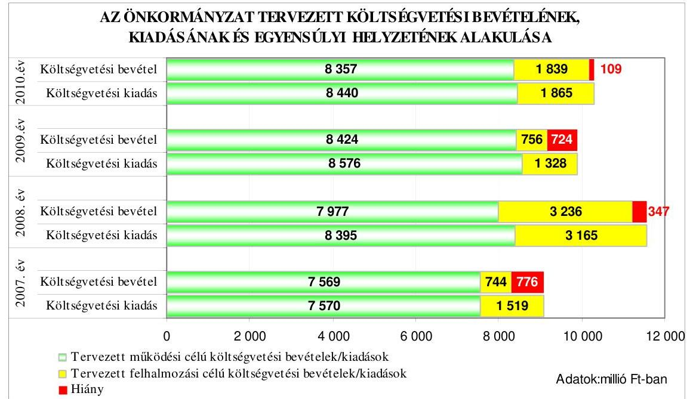

A költségvetési hiányt a 2007. és a 2009-2010. években a tervezett múködési célú költségvetési bevételek hiánya és a felhalmozási célú bevételeket meghaladó

---

összegben tervezett felhalmozási célú kiadások együttesen okozták, a 2008. évben a költségvetési hiány a tervezett működési célú költségvetési bevételek hiányából adódott.

Az Önkormányzatnál a 2007-2010. évi költségvetési rendeletekben a költségvetési egyensúly biztosításához a költségvetési hiány finanszírozására és a finanszírozási célú pénzügyi műveletek kiadásainak forrásául rövid és hosszú lejáratú hitelfelvételt terveztek, kiadást csökkentő és bevételt növelő intézkedéseket írtak elő:

- a 2007-2010. évi költségvetési rendeletekben - az évek sorrendjében - 644-34-394-219 millió Ft hosszú lejáratú fejlesztési célú hitel, valamint 308-321-350-64 millió Ft rövid lejáratú múködési célú hitel felvételéről döntöttek;
- a 2007-2010. évi költségvetési rendeletekben előírták az év közben a Polgármesteri hivatalban realizálódó, nem céljellegú többletbevétel hiányt csökkentő felhasználását ${ }^{8}$, továbbá deklarálták, hogy az Önkormányzat költségvetési intézményeiben a tervezett saját bevétel elmaradása automatikusan nem vonja maga után a támogatás növelését, valamint a költségvetési szervek részére az önkormányzati támogatás havi - indokolt esetben napra lebontott - likviditási terv alapján történő nettósított utalását.

A Képviselő-testület 2008. január 1-jétől döntött a helyi adók ${ }^{9}$ mértékének emeléséről, az ONIGESZ létszámának három fővel történő csökkentéséről ${ }^{10}$, amely intézkedések pénzügyi hatását figyelembe vették az éves költségvetési rendeletekben.

Az Önkormányzat a 2007-2010. évi költségvetési rendeleteiben eredeti előirányzatként kötvény kibocsátásával nem számolt, hitelviszonyt megtestesítő befektetési vagy forgatási célú értékpapírok értékesítését nem tervezte.

A jegyző a 2007-2010. években a költségvetés tervezése során a likviditás feltételeinek biztosításáról az Ámr., 29. § (1) bekezdés j) pontjában ${ }^{11}$ előírtak szerint előirányzat felhasználási terv készítésével, rövid lejáratú hitelfelvétel tervezésével gondoskodott.

A 2007-2010. évi költségvetési rendeletekben a kiadások főösszegének megállapításakor költségvetési hiányt módosító költségvetési kiadásként finanszírozási

[^0]
[^0]:    ${ }^{8}$ A 2007-2009. évi költségvetési rendeletekben előírták, hogy „a nem céljellegú többletbevételt a múködési hitel tervezett felvételének kiváltására, illetve az általános tartalék növelésére kell fordítani". A 2010. évi költségvetési rendeletben a múködési és felhalmozási célú többletbevétel felhasználását múködési, illetve felhalmozási célú hitelek tervezett felvételének kiváltására, ha a hitel felvétele nem aktuális, az általános tartalék növelésére korlátozták.
    ${ }^{9}$ Az építményadó évi egységes mértékét $1000 \mathrm{Ft} / \mathrm{m}^{2}$-ről $1080 \mathrm{Ft} / \mathrm{m}^{2}$-re, a telekadóét 220 $\mathrm{Ft} / \mathrm{m}^{2}$-ről $240 \mathrm{Ft} / \mathrm{m}^{2}$-re emelték.
    ${ }^{10}$ A Képviselő-testület a 391/2007. (XII. 6.) számú határozatában elrendelte egy-egy könyvelői, karbantartói és kézbesítői álláshely megszüntetését.
    ${ }^{11}$ 2010. január 1-jétől az Ámr. ${ }_{2}$ 36. § (1) bekezdés k) pontja tartalmazza ezt az előírást.

---

célú pénzügyi műveleteket vettek figyelembe, ezzel megsértették az Áht. 8/A. § (7) bekezdésében előírtakat.

A költségvetési kiadások között a 2007. évben 176 millió Ft, a 2008. évben 8 millió Ft, a 2009. évben 20 millió Ft, a 2010. évben 174 millió Ft hiteltörlesztést terveztek.

# 1.2. A teljesített költségvetési bevételek és kiadások alapján a pénzügyi egyensúly, a pénzügyi hiány alakulása, a pénzügyi hiány finanszírozása, az igénybe vett finanszírozási célú pénzügyi eszközök hatása a pénzügyi helyzet alakulására, az eladósodásra, valamint a fizetőképességre 

Az Önkormányzatnál a 2007-2009. években a teljesített költségvetési bevételek és kiadások előző évhez viszonyított föösszege változó tendenciát mutatott, a teljesített költségvetési bevételek főösszege a 2008. évre 28,7\%kal emelkedett, a 2009. évre $15,4 \%$-kal csökkent. A teljesített költségvetési kiadások főösszege a 2008. évre $31,2 \%$-kal emelkedett, a 2009 . évre $16,6 \%$-kal csökkent.

Az Önkormányzatnál a teljesített költségvetési bevételek főösszege a 2007. évben 9677 millió Ft, a 2008. évben 12452 millió Ft, a 2009. évben 10530 millió Ft volt. A 2007-2009. közötti időszakban a teljesített költségvetési kiadások főösszege az egyes években 9199 millió Ft, 12069 millió Ft, 10070 millió Ft volt.
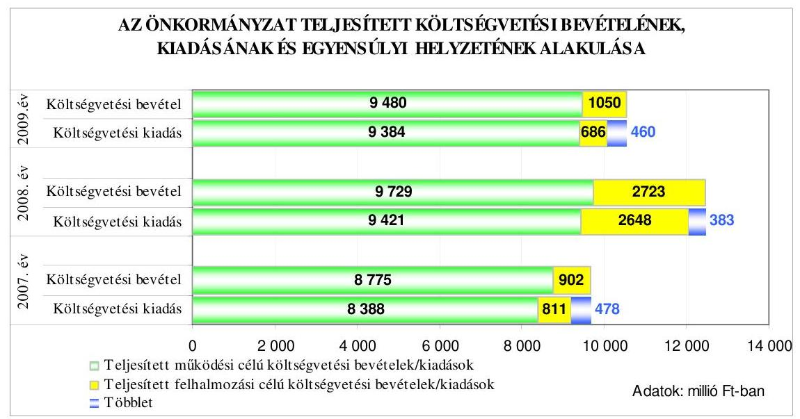

A 2007-2009. években a teljesített költségvetési adatok alapján fennállt a pénzügyi egyensúly, mivel a teljesített költségvetési bevételek fedezetet nyújtottak a teljesített költségvetési kiadásokra, a teljesített működési célú költségvetési kiadásoknál nem volt hiányzó forrás, a teljesített felhalmozási célú költségvetési bevételek fedezetet nyújtottak a felhalmozási célú költségvetési kiadásokra. A pénzügyi többletet a 2007-2009. években a teljesített múködési célú költségvetési bevételek többlete és a felhalmozási célú kiadásokat meghaladó öszszegben teljesített felhalmozási célú bevételek eredményezték. A 2007-2009.

---

években a költségvetési kiadások fedezettsége a költségvetési bevételekből a tervezetthez képest 13,7-6,2-11,9 százalékponttal kedvezőbben alakult, ezen belül a múködési és felhalmozási célú költségvetési kiadások fedezettsége is emelkedett.

Az Önkormányzatnál a 2007-2010. években tervezett és a 2007-2009. években teljesített múködési és felhalmozási célú költségvetési kiadásokra a következő arányban biztosítottak fedezetet a költségvetési bevételek:

Adatok: \%-ban

| Megnevezés | 2007.   év |  | 2008.   év |  | 2009.   év |  | 2010.   év |
| :--: | :--: | :--: | :--: | :--: | :--: | :--: | :--: |
|  | Terv | Tény | Terv | Tény | Terv | Tény | Terv |
| Múködési célú költségvetési kiadások fedezettsége múködési célú költségvetési bevételekből | 100,0 | 104,6 | 95,0 | 103,3 | 98,2 | 101,0 | 99,0 |
| Felhalmozási célú költségvetési kiadások fedezettsége felhalmozási célú költségvetési bevételekből | 49,0 | 111,2 | 102,2 | 102,8 | 57,0 | 153,1 | 98,6 |
| Költségvetési kiadások fedezettsége költségvetési bevételekbo̊l | 91,5 | 105,2 | 97,0 | 103,2 | 92,7 | 104,6 | 98,9 |

A költségvetés végrehajtása során a tervezett költségvetési hiányhoz képest a kialakult pénzügyi többletet az egyes években a következő okok idézték elő:

- a 2007-2009. években a tervhez viszonyítva a múködési célú költségvetési bevételek emelkedése 5,1-9,8-3,1\%-kal meghaladta a múködési célú költségvetési kiadások növekedését;

A múködési célú költségvetési bevételek tervezettet meghaladó növekedését ${ }^{12}$ 2007-2009 között elsősorban a költségvetési támogatásoknak és a támogatásértékű múködési bevételeknek, a 2007. évben a helyi adók és az átengedett adók bevételeinek, a 2008-2009. években az intézményi bevételeknek a tervezettet meghaladó teljesítései okozták.

A 2007-2009. években a múködési célú költségvetési kiadások emelkedése ${ }^{13}$ elsősorban a dologi és egyéb folyó kiadások, a személyi juttatások és a munkaadót terhelő járulékok, valamint a társadalom- és szociálpolitikai juttatások tervezettet meghaladó növekedése miatt következett be.

[^0]
[^0]:    ${ }^{12}$ A 2007-2009. években a múködési célú költségvetési bevételek 115,9-122,0-112,5\%-ra teljesültek.
    ${ }^{13}$ A 2007-2009 években a múködési célú költségvetési kiadások a tervhez viszonyítva 110,8-112,2-109,4\%-ra teljesültek.

---

- a 2008. évben a tervezetthez viszonyítva a felhalmozási célú költségvetési kiadások csökkenése 0,4\%-kal meghaladta a felhalmozási célú költségvetési bevételek visszaesését. ${ }^{14}$ A 2007. és a 2009. évben a tervezetthez képest a felhalmozási célú költségvetési kiadások 46,6\%-kal, valamint 48,3\%-kal csökkentek, emellett a felhalmozási célú költségvetési bevételek a tervezettet meghaladó - a 2007. évben 158 millió Ft-tal 21,2\%-os, a 2009. évben 294 millió Ft-tal 38,9\%-os - mértékben növekedtek;
- a felhalmozási célú bevételek növekedését a 2007. évben elsősorban a támogatásértékű felhalmozási bevételek ${ }^{15}$ emelkedése idézte elő, mivel a felhalmozási célú költségvetési bevételeknek a felhalmozási célú költségvetési kiadásokat meghaladó összegű realizálását, a pénzügyi többlet kialakulását kedvezően befolyásolta, hogy az Oktatási és Kulturális Minisztérium a Vörösmarty Mihály Általános Iskola életveszély-elhárítási és felújítási munkáira 2007. december 22-én átutalt 300 millió Ft támogatásával ${ }^{16}$ szemben a tárgyévben kiadás nem merült fel, valamint az Önkormányzat a 2009. év során az Ady Endre Általános Iskola komplex felújítására - a benyújtott számlák alapján - összesen 221,8 millió Ft európai uniós támogatást realizált költségvetési bevételként. A pénzügyi többlet kialakulásához hozzájárult, hogy az év során „az utólag finanszirozott nemzetközi támogatási programok átfutó kiadása" számlán elszámolt 243,1 millió Ft ráfordítást az elszámolás teljessé tétele érdekében év végén az Áhsz. 9. számú mellékletének 3.g) pontjában foglaltak ellenére nem vezették át a költségvetési kiadások közé ${ }^{17}$. A 2009. évben a felhalmozási célú bevételek növekedését az önkormányzati lakások értékesítési bevétele okozta, mert az Önkormányzat a tulajdonában lévő lakások elidegenítéséből a tervezettel szemben 354,2 millió Ft-tal több bevételt ért el, mivel a tervezés során nem számoltak a bérlők jelzett vételi szándékából adódó önkormányzati lakás-értékesítések várható bevételével ${ }^{18}$. A lakásértékesítés eredeti előirányzatot meghaladó teljesítése következtében a 2009. évben a költségvetésben tervezett hiány összege csökkent;
- a helyi adóbevételek mindhárom évben - a jóváhagyott eredeti előirányzathoz képest - túlteljesültek, az évek sorrendjében 108,5\%-ra, 102,0\%-ra, 102,4\%-ra, amely 297,2 millió Ft, 77,0 millió Ft és 97,0 millió Ft bevételi többletet eredményezett. A 2007-2009. években az építményadó és a telekadó tervezetthez viszonyított többletbevétele nem vezethető vissza tervezési

[^0]
[^0]:    ${ }^{14}$ A 2008. évben a felhalmozási célú költségvetési bevételek 84,1\%-a realizálódott, a felhalmozási célú költségvetési kiadások 83,7\%-a teljesült.
    ${ }^{15}$ Az Önkormányzat a támogatásértékű felhalmozási bevételek között számolta el az európai uniós támogatásokat.
    ${ }^{16}$ A polgármester a támogatási szerződést 2007. december 18-án írta alá.
    ${ }^{17}$ A közbenső egyeztetés során a polgármester által adott tájékoztatás szerint a hivatali SzMSz V/2/9. számú mellékletét képező eszközök és források értékelési szabályzatában 2010. június 1-jétől szabályozta az utólag finanszírozott nemzetközi támogatási programok átfutó kiadása számlán kimutatott kiadások év végi rendezését.
    ${ }^{18}$ 2008. március 10. - 2009. február 9. között 298 bérlő jelezte az Integrit-XX. Kft-nek vételi szándékát. A Képviselő-testület 2008. október 16. - 2009. február 19. között 178 db , a Gazdasági bizottság 2008. október 14. - 2009. február 11. között 28 lakás eladásához járult hozzá.

---

hiányosságra, mivel a bevételi többlet az év közben feltárt, kivetett adók alapján történt befizetésekből, a végrehajtási tevékenység eredményeként befolyt bevételekből adódott, továbbá a 2009. évben a telekadó realizált többletbevételéből 50,9 millió Ft-ot egy új adózó teljesített. A 2007-2008. években az iparűzési adóbevétel - a 2007. évben 273,8 millió Ft-tal 9,2\%-os, a 2008. évben 39,6 millió Ft-tal 1,1\%-os - túlteljesítése szintén nem vezethető vissza tervezési hiányosságra, mivel nem volt előre látható az iparűzési adó fővárosi forrásmegosztásból származó rész pontos összege. A helyi adóbevételek eredeti előirányzatot meghaladó teljesítései a 2007-2009. években csökkentették a költségvetési hiányt;

- az Önkormányzatnál a 2007-2010. évi költségvetési rendeletekben az áthúzódó kiadások forrásául az előző évi pénzmaradvány és az előző évek tartalékai összegének - az évek sorrendjében - 0,0-89,5-64,9-134,7\%-át tervezték meg a várható pénzmaradvány igénybevételeként. A 2007. és a 20092010. évi költségvetési rendeletekben a pénzmaradvány tervezése nem volt megalapozott, mivel - az Áht. 7. § (2) bekezdésében ${ }^{19}$ foglaltakat megsértve - a 2007. évben a Polgármesteri hivatal és az intézmények, a 2009-2010. években pedig az intézmények előző évi pénzmaradvány igénybevételét nem tervezték meg eredeti előirányzatként a bevételek között az áthúzódó kötelezettségek forrásaként,

A 2006. és a 2008-2009. években - az évek sorrendjében - az intézmények módosított pénzmaradványa 107,1-220,4-104,9 millió Ft volt, amelyeknek 93,2-59,1-80,0\%-a volt kötelezettségvállalással terhelt.

A 2010. évi költségvetési rendeletben tervezési hiányosságra vezethető vissza, hogy a 2009. évi költségvetési beszámolóban kimutatott módosított pénzmaradvány és az előző évek tartalékai összegéhez viszonyítva 34,7\%-kal - 342,2 millió Ft-tal - magasabb összegben tervezték meg a Polgármesteri hivatal várható pénzmaradványának igénybevételét az áthúzódó kötelezettségek forrásaként, mivel - az Ámr. 207. § (4) bekezdésében foglaltak ellenére - a 2009. évi várható pénzmaradvány megállapításakor nem számoltak az év végi likvid hitel záró állományával.

- a beruházási kiadások a 2007-2008. években 64,3\%-kal (762,8 millió Ft-tal), valamint 4,8\%-kal ( 75,8 millió Ft-tal) alulteljesültek, amelyek nem vezethetők vissza tervezési hiányosságra. A 2007. évben a tanuszoda építésére tervezett 632,0 millió Ft-ból nem volt teljesítés a közbeszerzési eljárás elhúzódása miatt. A 2008. évben a tanuszoda építési költségeiből 64,8 millió Ft pénzügyi teljesítése áthúzódott a következő évre, továbbá a műfüves labdarúgó pályák építése megfelelő árajánlat hiányában elmaradt. A 2009. évben a beruházási kiadások 56\%-kal (178,4 millió Ft-tal) túlteljesültek a Képviselő-testület év közbeni döntései miatt, mivel megemelte - többek között - az útépítés előirányzatát, engedélyezte a „166-os busz gubacsi nyomvonalának"kialakítását;

[^0]
[^0]:    ${ }^{19}$ A 2010. január 1-jétől az Áht. 8/C. § (3)-(4) bekezdései tartalmazzák a módosított szabályokat.

---

- a felújítási kiadások a tervezetthez viszonyított teljesítése a 2007-2009. években 218,1-84,6-59,4\% volt. A felújítások 2007. évi eredeti előirányzatát 73,4 millió Ft-tal meghaladó teljesítés oka volt, hogy az előirányzatot a Kép-viselő-testület módosította év közben 11 intézmény felújítási feladataival, Pesterzsébet Önkormányzatának Egészségügyi és Szociális Bizottsága döntött a céltartalékok között tervezett lakásfelújításokról. A 2008. évben felújítási feladatok maradtak el takarékossági megfontolásból, a 2009. évben a Képvi-selő-testület év közben felújítási előirányzatot csoportosított át ${ }^{20}$ beruházási és karbantartási feladatok pénzügyi fedezetének biztosítására.

A 2007-2008. években a beruházási, a 2008-2009. években a felújítási kiadások tervezettnél alacsonyabb mértékű teljesítése hozzájárult ahhoz, hogy a felhalmozási célú bevételek meghaladták a felhalmozási célú kiadásokat, pénzügyi többlet alakult ki.

A költségvetések végrehajtása során a pénzügyi egyensúly megteremtése érdekében biztosították a nem céljellegú többletbevétel hiányt csökkentő felhasználását, az intézmények finanszírozásának naponkénti engedélyezésével a koncentrált pénzkezelést, valamint gondoskodtak az átmenetileg szabad pénzeszközök lekötéséről. A kamatbevétel a 2008. évben 2,4\%-kal elmaradt a tervezettől, a 2007. évben 8,2 millió Ft, a 2009. évben 31,3 millió Ft többletbevétel keletkezett.

A költségvetések végrehajtása során a tervezett intézkedések megvalósítása hozzájárult ahhoz, hogy a 2007-2009. években a tervezett költségvetési hiánynyal szemben pénzügyi többlet alakult ki.

A 2007-2009. években a Pénzügyi bizottság a költségvetési bevételek alakulását nem kísérte figyelemmel és nem értékelte a bevételek alakulását befolyásoló okokat, megsértve az Ötv. 92. § (13) bekezdés b) pontjában előírtakat.

Az Önkormányzat hiteleinek előtörlesztésére, a költségvetési rendeletében tervezett hitelek kiváltására és a jövőbeni pályázatok önrészének biztosítására a 2007. évben - a Képviselő-testület év közben hozott döntése alapján ${ }^{21}$ - 2600 millió Ft értékű felhalmozási célú kötvényt bocsátott ki „Pesterzsébet 2022" elnevezéssel.

A 2600 millió Ft értékben zártkörű forgalomba hozatallal, névre szóló, svájci frank alapú, dematerializált kötvényt 15 év futamidőre, 2007. december 5-i értéknappal bocsátották ki, amely változó kamatozású, a kamat mértéke 3 havi

[^0]
[^0]:    ${ }^{20}$ Az Önkormányzat 2009. évi költségvetési rendeletét módosító 36/2009. (X. 19.) számú és a 44/2009. (XII. 7.) számú rendeleteiben csökkentették a felújítási előirányzatokat.
    ${ }^{21}$ A Képviselő-testület a 302/2007. (X. 25.) számú határozatában döntött a kötvény kibocsátásáról.

---

CHF LIBOR ${ }^{22}+0,7 \%$, a kamatfizetés negyedévente esedékes. Az Önkormányzatot a 2008. évben 95,4 millió Ft, a 2009. évben 35,5 millió Ft kamatfizetési kötelezettség terhelte, a 2010. évi várható kamatkiadás 22 millió Ft. A svájci frank alapú kötvény lejárata 2022. december 5-e. A tőke visszafizetése 3 év türelmi idő után 2010. október 31 -én esedékes ${ }^{23}$, majd ezt követően félévente, a svájci frankban meghatározott aktuális tőketörlesztés forintban meghatározott összegének megfelelően.

A kötvénykibocsátás a forint svájci frankhoz viszonyított árfolyamváltozása és a változó kamatmérték miatt kockázatot jelent az Önkormányzat számára.

Az Önkormányzat kötelezettséget vállalt arra, hogy a kötvény és kamatai megfizetésének fedezete a futamidő alatti - a normatív állami hozzájárulás, állami támogatás, személyi jövedelemadó és a múködési célú támogatási értékú bevételek kivételével - költségvetési bevétele.

A kötvénykibocsátásból származó bevételből 2007. december 5-től különböző öszszegekben és eltérő időtartamra lekötött betétként helyezték el az átmenetileg szabad pénzeszközöket. A kötvénykibocsátás bevételének lekötéséből a 2007. évben 4,6 millió Ft, a 2008. évben 65,6 millió Ft, a 2009. évben pedig 40,0 millió Ft kamatbevételt realizáltak.

A 2007. decemberi kötvénykibocsátásból származó 2600 millió Ft-tól 941,4 millió Ft-ot hitel előtörlesztésére, 590,0 millió Ft a Pesterzsébet Jégcsarnok Kftnek tagi kölcsön nyújtására, 436,6, millió Ft-ot felhalmozási célú kiadások finanszírozására fordítottak, továbbá múködési célú felhasználást jelentett a törlesztett hitelek 1,1 millió Ft kamatfizetési kötelezettségének és a kötvénykibocsátás 7,0 millió Ft szervezési díjának teljesítése.

A Képviselő-testület a 2007. évi költségvetést módosító 33/2007. (X. 30.) számú rendeletben biztosított fedezetet a kedvezőtlen feltételekkel igénybe vett fejlesztési célú hitelek kötvény kibocsátásából származó bevétel terhére történő előtörlesztésére. A 941,4 millió Ft előtörlesztett hiteltartozásból 19,0 millió Ft a VíziSport utca aszfaltburkolattal történő kiépítésére, 50,8 millió Ft a Polgármesteri hivatal bővítésének céljából irodahelyiség vásárlására, 871,6 millió Ft a beruházási és felújítási feladatok finanszírozására a 2004. évben kötött hitelkeret szerződés terhére felvett hiteltartozás volt.

A kötvénykibocsátásból befolyt bevétel fel nem használt része a 20072009. években kötvényszámlán és lekötött forintbetét formájában állt

[^0]
[^0]:    ${ }^{22}$ LIBOR: a London Interbank Offered Rate (londoni bankközi kamatláb) egy kamatláb, amelyet a bankok számolnak fel egymásnak a londoni bankközi piacon az általuk nyújtott hitelek után. CHF LIBOR: kamatláb svájci frankban nyújtott hitelek után a londoni bankközi piacon.
    ${ }^{23}$ Az Önkormányzat a 2009. évi könyvviteli mérlegében a rövid lejáratú kötelezettségek között 117 millió Ft-ot mutatott ki a felhalmozási célú kötvénykibocsátásból származó tartozása következő évet terhelő kötelezettségeként.

---

az Önkormányzat rendelkezésére; a 2009. december 31-én a kötvényszámlán 128,1 millió $\mathrm{Ft}^{24}$, lekötött betétként 400 millió Ft volt.

A „Sikeres Magyarországért Önkormányzati Infrastruktúra Fejlesztési Program" keretében a 2007. évben 59,9 millió Ft, a 2009. évben 532,6 millió Ft változó kamatozású, hosszú lejáratú fejlesztési célú hitelt vettek igénybe; kockázatot jelent a fejlesztési hitelek változó kamatmértéke.

A hosszú lejáratú hitelbevételek a szerződésekben meghatározott célok finanszírozását szolgálták.

A „panel plusz" hitelből támogatta az Önkormányzat az Alsótelek út 8-14 és 2430 szám, a Berzsenyi sétány 3. szám és a Török Flóris u. 2/A. szám alatti társasházak energiatakarékos felújítását.

A Képviselő-testület a 122/2009. (V. 14.) számú határozatában döntött a tanuszoda beruházási kiadásainak részbeni finanszírozására kötött hitelkeretszerződés igénybevételéről. Előírta a befolyt bevétel kötvényszámlára történő átutalását abból a célból, hogy az tanuszoda beruházás előfinanszírozására felhasznált kötvénybevételt visszapótolja, illetve forrást biztosítson a pályázati támogatások előfinanszírozására, a pályázatok önrészére.

A 2007-2009. években felvett hosszú lejáratú hitelekkel kapcsolatos jellemzőket mutatja be a következő táblázat:

| Hitel célja | Szerződés-   kötés ideje | A hitel szerződés szerinti összege (millió Ftban) | Futam-   idő   (év, hó) | Türelmi   idő   (év, hó) | Kamat \%-a   Fix, vagy változó | Befolyt bevétel összege (millió Ft-ban) |
| :--: | :--: | :--: | :--: | :--: | :--: | :--: |
| 2007. évben: |  |  |  |  |  |  |
| A „panel plusz" hitelprogram keretében lakóházak energiatakarékos felújításának támogatása (a hitelfelvétel I. üteme) | 2006.04.24. | 104,6 | 15 év | 2 év | változó | 34,6 |
| A „panel plusz" hitelprogram keretében lakóházak energiatakarékos felújításának támogatása (a hitelfelvétel II. üteme) | 2007.08.02. | 55,3 | 6 év | 1 év   7 hónap | változó | 25,3 |
| A felsorolt szerződésekből eredően a 2007. évben befolyt összes bevétel |  |  |  |  |  | 59,9 |

[^0]
[^0]:    ${ }^{24}$ A kötvényszámla 128,1 millió Ft összegéből 60,1 millió Ft kamatbevétel volt, amely átvezetése a költségvetési elszámolási számlára 2009. december 31-ig nem történt meg.

---

| Hitel célja | Szerződés-   kötés ideje | A hitel   szerződés   szerinti   összege   (millió Ft-   ban) | Futam-   idő   (év, hó) | Türelmi   idő   (év, hó) | Kamat \%-a   Fix, vagy   változó | Befolyt   bevétel   összege   (millió   Ft-ban) |
| :-- | :--: | :--: | :--: | :--: | :--: | :--: |
| 2009. évben: |  |  |  |  |  |  |
| Közoktatási célú beruházás   megvalósitása, tanuszoda   építése | 2006.07.14. | 550,0 | 15 év | 2 év | változó | 532,6 |

A „panel plusz" hitelprogram igénybevételének II. ütemében felvett hosszú lejáratú hitelnél elvált egymástól a tőke visszafizetése, illetve annak kamatfizetési kötelezettsége; a tőke törlesztését megelőzte a kamattörlesztés kezdete.

Az Önkormányzat a 2007-2009. években a költségvetések végrehajtása során hitelviszonyt megtestesítő értékpapírokat nem értékesített, kötvényt múködési célú felhasználásra nem bocsátott ki.

Az Önkormányzatnak a kötvénykibocsátás évében tőketörlesztési és kamatfizetési kötelezettsége nem volt, a tanuszoda építéséhez a 2009. évben felvett hitelből 22,4 millió Ft tőkét törlesztettek és 6,1 millió Ft kamatfizetési kötelezettségnek tettek eleget, ami a hitelfelvétel évében az éves adósságot keletkeztető kötelezettségvállalás felső határának 0,9\%-a volt. Az Önkormányzatnál a hosszú lejáratú hitelek felvétele, a kötvénykibocsátás során betartották az Ötv. 10. § (1) bekezdés d) pontjában, a 88. § (1) bekezdés b) pontjában és a (2) bekezdésében, valamint a 2007-2009. évi költségvetési rendeletekben előírt hatásköri és eljárási szabályokat. A Pénzügyi bizottság a 2007. és a 2009. évben vizsgálta a kötvénykibocsátás, valamint a tervezett hitelfelvételek indokait és azok megalapozottságát.

A Pénzügyi bizottság a 2007. évben az október 18-ai ülésén külön napirendi pont keretében vizsgálta - előterjesztés alapján - a kötvénykibocsátás feltételeit, hitelfelvétellel szembeni előnyeit és felhasználási területeit, állást foglalt 2600 ezer Ft értékben kötvény kibocsátása mellett. Elfogadásra javasolta a Képviselőtestületnek a költségvetési rendelet módosítására tett javaslatot, ezen belül a „panel plusz" program II. ütemének megvalósítása érdekében a fejlesztési hitelszerződés megkötését. A 2009. évben május 7 -ei ülésén megtárgyalta a tanuszoda építésére kötött hitelszerződés alapján rendelkezésre álló hitel igénybevételének indokoltságát és javasolta a Képviselő-testületnek a hitel lehívását.

Az Önkormányzat a 2007-2009. évi költségvetések végrehajtása során rövid lejáratú hitelt nem vett fel, az évközi likviditást folyószámlahitel felvételével biztosították. A 2007-2009. években a költségvetés végrehajtása során a polgármester - minden évben azonos, 800 millió Ft összegű - folyószámlahitel keretszerződést kötött. Az Önkormányzatnál a folyószámlahitellel zárt napok száma, a ténylegesen felvett folyószámlahitel átlagos állománya a 2007. évről a 2008. évre csökkent, a 2009. évben meghaladta a 2007. év végi mértéket. Az Önkormányzatnál a 2009. év végére több mint másfélszeresére - 313 millió Ft-ra - nőtt a vissza nem fizetett folyószámlahitel állománya a 2007. évhez viszonyítva. Az Önkormányzat 2009. december 31-

---

én kötvényszámlán elkülönített pénzeszközei lehetővé tették a folyószámlahitel törlesztését, azonban az csak a Képviselő-testület döntése alapján meghatározott célra volt felhasználható ${ }^{25}$, likvid hitel visszafizetésére nem. A 2010. év I. negyedévében minden nap igénybe vették a folyószámlahitelt. A Képviselőtestület az emelkedő összegű likvid hitel visszafizetésére vonatkozóan - előterjesztés hiányában - nem döntött.

A 2007-2010. években a folyószámlahitellel kapcsolatos jellemzőket mutatja be a következő táblázat.

| Megnevezés | 2007.   év | 2008.   év | 2009.   év | 2010.   I.   negyedév |
| :-- | :--: | :--: | :--: | :--: |
| A folyószámlahitel keretösszege (mil-   lió Ft-ban) | 800 | 800 | 800 | 800 |
| Év végén fennálló folyószámlahitel   (millió Ft-ban) | 196,9 | 135,2 | 313,0 | - |
| Folyószámlahitellel zárt napok száma | 304 | 280 | 307 | 90 |
| A ténylegesen felvett folyószámlahitel   átlagos állománya (millió Ft-ban) | 441,5 | 431,3 | 504,6 | 634,9 |
| A felvett folyószámlahitel minimum   összege (millió Ft-ban) | 0,1 | 0,1 | 0,3 | 313,0 |
| A felvett folyószámlahitel maximum   összege (millió Ft-ban) | 799,9 | 796,6 | 799,3 | 796,1 |

A folyószámlahitelen túlmenően a 2007. évben három alkalommal összesen 327,6 millió Ft, a 2008. évben kettő esetben 102,9 millió Ft, a 2009. évben egy alkalommal 150,7 millió Ft munkabérhitelt vettek igénybe, amelyet az adott év folyamán törlesztettek. A 2009. december havi munkabér kifizetéséhez 155,9 millió Ft-ot a Képviselő-testület döntése ellenére - a kötvényszámlára átvezetett pénzeszközt pályázati támogatások előfinanszírozására, pályázati saját forrás biztosítására lehet felhasználni - a kötvényszámláról finanszíroztak, amelyet 2010. január 4-én visszautaltak ${ }^{26}$. A jegyzö az Önkormányzat pénzállományának alakulásáról az Ámr. ${ }_{1}$ 139. § (1) bekezdésében ${ }^{27}$ foglaltak ellenére a 2007. évben likviditási tervet nem készített, a 2008-2010. években gondoskodott likviditási terv készítéséről és szükség szerinti aktualizálásáról.

[^0]
[^0]:    ${ }^{25}$ A Képviselő-testület 122/2009. (V. 14.) számú döntése alapján a kötvényszámlára átvezetett pénzeszközt pályázati támogatások előfinanszírozására, pályázati saját forrás biztosítására lehetett felhasználni.
    ${ }^{26}$ A Képviselő-testület a 4/2010. (I. 21.) számú határozatában felhatalmazta a polgármestert, hogy a 2010. január 22. - október 31. közötti időszakban a pénzügyi likviditás biztosítása érdekében elsődlegesen az önkormányzati bérlakások elidegenítéséből származó bevételből, másodlagosan a kötvényszámlán elkülönített bevételből a folyó kiadások teljesítéséhez szükséges összeget igénybe vegye, valamint, hogy a felhasznált összeget az iparűzési adó bevételéből visszapótolja.
    ${ }^{27}$ 2010. január 1-től az Ámr. ${ }_{2}$ 201. § (1) bekezdése.

---

Az Önkormányzat pénzügyi helyzetének alakulását eladósodási szempontból a 2007-2009. években a következő mutatók változása szemlélteti:

- az eladósodási mutató ${ }^{28}$ a 2007. évi 13,7\%-ról, a 2008. évre 13,3\%-ra csökkent ${ }^{29}$, a 2009. évre $18,6 \%$-ra növekedett ${ }^{30}$, amely az Önkormányzat eladósodásának fokozódását mutatja. A mutató növekedésének oka, hogy a 2009. évben a rövid és hosszú lejáratú kötelezettségek állományának növekedése meghaladta az Önkormányzat összes forrásállományának a növekedését. A hosszú lejáratú kötelezettségek értéke - a 2009. évben felvett 532,6 millió Ft fejlesztési célú hitel miatt - a 2007. évhez viszonyítva $27,4 \%$-kal nőtt, a rövid lejáratú kötelezettségek értékének emelkedéséhez 116 millió Fttal járult hozzá a 2009. évi folyószámlahitel záró állományának növekedése;
- az esedékességi aránymutató ${ }^{31}$ változó tendenciát mutatott, a 2007. évi 18,7\%-ról 2008. évre 17,7\%-ra csökkent, a 2009. évben 24,9\%-ra emelkedett. Az Önkormányzatnál a 2009. évben az előző évekhez viszonyítva erősödött a rövid távon teljesítendő kötelezettségek fizetőképességre gyakorolt hatása, mivel a rövid lejáratú fizetési kötelezettségek állományának növekedése $46,1 \%$-kal meghaladta az összes fizetési kötelezettség növekedési ütemét;
- az adósságszolgálati ráta ${ }^{32}$ folyamatos, a 2007. évi $27,8 \%$-ról ${ }^{33}$ a 2009. évre $2,8 \%$-ra történt csökkenése jelzi, hogy az Önkormányzat adósságszolgálata a 2007. évi 1238,6 millió Ft-ról a 2009. évre 131,6 millió Ft-ra esett viszsza, saját bevételeinek csökkenő hányadát fordította a korábban felvett hitelek kamatainak fizetésére, tőketörlesztésre. A 2009. évről a 2010. évre az Önkormányzat adósságszolgálatának 129,4 millió Ft-tal való emelkedése, az adósságszolgálati ráta közel kétszeresére - 2,8\%-ról 5,3\%-ra - történő növekedése jelzi, hogy a 2010. IV. negyedévében esedékessé válik a kötvény tőketörlesztési kötelezettsége. A 2011. évtől az Önkormányzatnak a kötvénykibocsátás tőketörlesztési kötelezettségével egész évben számolnia kell, ami az adósságszolgálati kötelezettség jelentős emelkedését okozza a következő években.

[^0]
[^0]:    ${ }^{28}$ Az eladósodási mutató a hosszú és rövid lejáratú fizetési kötelezettségek önkormányzati összes forráson belüli arányát mutatja.
    ${ }^{29}$ A mutató alakulását befolyásolta, hogy a fejlesztési célú kötvény 2008. év végi értékelése az Áhsz. 33. §-ában előírtak ellenére elmaradt.
    ${ }^{30}$ A könyvvizsgáló a 2009. évre 424036 ezer Ft auditálási eltérést állapított meg, amelynek elszámolása a 2010. évi számviteli nyilvántartásokban megtörtént. Az eladósodási mutató mértékének meghatározásakor az auditálási eltérés figyelembevételre került.
    ${ }^{31}$ Az esedékességi aránymutató a rövid lejáratú fizetési kötelezettségek arányát fejezi ki az összes - rövid és hosszú lejáratú - fizetési kötelezettségen belül.
    ${ }^{32}$ Az adósságszolgálati ráta: megmutatja, hogy a tárgyévben adósságszolgálatra (tőke-törlesztés»kamat) fizetett összeg hány \%-a a saját bevételnek.
    ${ }^{33}$ Az adósságszolgálati ráta alakulását a 941,4 millió Ft összegű hitel előtörlesztése befolyásolta.

---

Az eladósodási mutató és az esedékességi aránymutató 2007-2009. évek közötti növekedése miatt - az adósságszolgálati ráta csökkenése ellenére - az Önkormányzat pénzügyi helyzete eladósodási szempontból kedvezőtlenül változott.

Az Önkormányzat fizetőképességének, likviditásának a 2007-2009. évek közötti alakulását mutatja a készpénz likviditási mutató ${ }^{34}$ és a likviditási gyorsráta ${ }^{35}$.
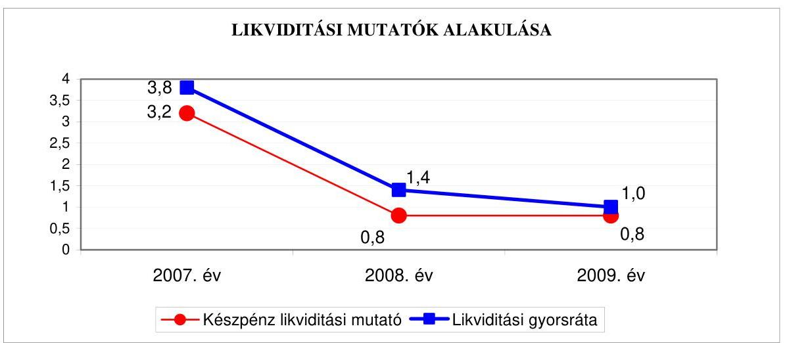

A készpénz likviditási mutató a 2007. évről a 2009. évre a pénzeszközök állományának csökkenése, valamint a rövid lejáratú kötelezettségek növekedése miatt csökkent, amely az Önkormányzat fizetőképességének gyengülését jelzi. Az Önkormányzatnál a pénzeszközök év végi állománya a 2008-2009. évek végén nem nyújtott fedezetet a rövid lejáratú fizetési kötelezettségek kiegyenlítésére.

A likviditási gyorsráta 2007-2009. évek közötti folyamatos csökkenése következtében a követelések és a pénzeszközök együttes összege ${ }^{36}$ csökkenő arányban nyújtott fedezetet a 2007. évhez viszonyítva a 2009. évre a közel kétszeresére megemelkedett rövid lejáratú kötelezettségek pénzügyi teljesítésére.

A likviditási mutatók 2007. évről a 2009. évre történő csökkenése azt jelzi, hogy az Önkormányzat pénzügyi helyzete fizetőképesség szempontjából kedvezőtlenül változott.

Az Önkormányzat pénzügyi helyzete az előző évekhez viszonyítva a 2009. évre - eladósodásának növekedése és fizetőképességének gyengülése miatt összességében kedvezőtlenül alakult.

[^0]
[^0]:    ${ }^{34}$ A készpénz likviditási mutató kifejezi, hogy a pénzeszközök év végi állománya milyen arányban nyújt fedezetet a rövid lejáratú fizetési kötelezettségekre.
    ${ }^{35}$ A likviditási gyorsráta mutatja, hogy a rövid lejáratú fizetési kötelezettségek kiegyenlítéséhez a pénzeszközökön túl bevonható követelések, forgatási célú értékpapírok milyen arányban nyújtanak fedezetet.
    ${ }^{36}$ Az Önkormányzat a 2007-2009. közötti években forgatási célú, hitelviszonyt megtestesítő értékpapírokkal nem rendelkezett.

---

2. Az ÖNKORMÁNYZAT FELKÉSZÜLTSÉGE AZ EURÓPAI UNIÓs FORRÁSOK IGÉNYLÉSÉRE, FELHASZNÁLÁSÁRA, A TÁMOGATOTT CÉLKITŰZÉS MEGVALÓsÍTÁSÁRA, MÜKÖDTETÉSÉRE, VALAMINT AZ ELEKTRONIKUS KÖZSZOLGÁLTATÁSI FELADATOK ELLÁTÁSÁRA
2.1. Az európai uniós források igénybevételére, felhasználására, a támogatott célkitúzés megvalósítására, múködtetésére történt felkészülés szabályozottságának, szervezettségének, valamint egy támogatási szerződésben foglalt célkitúzés megvalósításának, múködtetésének eredményessége

# 2.1.1. Az európai uniós forrásokra történő pályázatok benyújtására vonatkozó döntések összhangja fejlesztési célkitűzésekkel 

Az Önkormányzat fejlesztési célkitűzéseit a 2007-2010. évekre szóló gazdasági programban, ${ }^{37}$ ágazati, szakmai koncepciókban, valamint a 2008. évben Integrált Városfejlesztési Stratégiájában ${ }^{38}$ határozták meg, melyekben a megvalósítás lehetséges pénzügyi forrásaiként saját forrásokat, valamint hazai-, illetve európai uniós pályázati forrásokat vettek figyelembe.

A Képviselő-testület a Gazdasági Programhoz, az Integrált Városfejlesztési Stratégiájához kapcsolódóan fejlesztési célkitűzéseit ágazati, szakmai koncepciókban a Közoktatási-feladatellátási-, intézményhálózat-múködtetési- és fejlesztési tervben ${ }^{39}$, az Egészségügyi ${ }^{40}$-, a Szolgáltatástervezési ${ }^{41}$-, valamint a Gyermek- és Ifjúságpolitikai ${ }^{42}$ Koncepciókban - határozta meg.

Az Önkormányzat a 2007-2009. években és 2010. I. negyedévében 25 pályázatot nyújtott be európai uniós támogatás elnyerése érdekében. A Képvi-selő-testület határozatot hozott a pályázatok benyújtásáról, melyekben kötelezettséget vállalt a pályázati önrész (saját forrás) biztosítására, a kötvénykibocsátásból származó bevétel szolgált a pályázatok önrészének fedezetéül. Az európai uniós forrás igénybevételére benyújtott pályázatok fejlesztési céljai kapcsolódtak az Integrált Városfejlesztési Stratégiában, a gazdasági programban, valamint az ágazati, szakmai koncepciókban foglalt célkitüzésekhez.

[^0]
[^0]:    ${ }^{37}$ A Képviselő-testület a 127/2007. (IV. 26.) számú határozatával döntött az elfogadásáról.
    ${ }^{38}$ A Képviselő-testület 154/2008. (V. 15.) számú határozata Pesterzsébet Integrált Városfejlesztési Stratégiájáról.
    ${ }^{39}$ A Képviselő-testület 375/2006. (XII. 7.) számú határozatával döntött.
    ${ }^{40}$ A Képviselő-testület 227/2001. (VII. 18.) számú határozatával döntött.
    ${ }^{41}$ A Képviselő-testület 184/2005. (V. 19.) számú határozatával döntött.
    ${ }^{42}$ A Képviselő-testület a 61/2007. (II. 22.) számú határozatával döntött.

---

A Gazdasági Program és az Integrált Városfejlesztési Stratégia fejlesztési célkitűzései között hat kiemelt területet - közöttük a városközpont, illetve a fő közlekedési útvonalak melletti területeket - jelöltek ki, amelyeken közterületi és infrastrukturális fejlesztési célok megvalósítását határozták meg. A közoktatás, a közművelődés, a sport, a gyermek és ifjúságpolitika fejlesztési irányai között az intézmények korszerűsítését, kapacitásuk fejlesztését, a halmozottan hátrányos helyzetűek támogatását rögzítették. Az egészségügyi alapellátások területén a rendelőhelyiségek felújítását, korszerűsítését tűzték ki célul.

Az Önkormányzat által az európai uniós támogatásokra a 2007-2009. években és a 2010. I. negyedévében benyújtott pályázatok közül kilenc részesült támogatásban (ebből négy befejeződött, míg öt projekt megvalósítása folyamatban volt 2010. június 22-én), kettő elbírálásáról az Önkormányzat még nem kapott tájékoztatást ${ }^{43}, 14$ pályázatot elutasítottak. A pályázatokat - egy kivételével - forráshiány miatt utasították el. A HEFOP-4.2.1-P-2004 program keretében a „Kikötő" című projekt támogatására benyújtott pályázatot azért utasították el, mert a pályázó határidőre nem készítette el a hiánypótlást. Az Önkormányzat a közreműködő szervezet támogató döntése után nem vont vissza pályázatot.

A 2007-2010. év I. negyedévében benyújtott pályázatok megvalósításának tervezett összköltsége 3834,7 millió Ft volt, amely finanszírozását 62,7\%-ban európai uniós forrásból, 20,8\%-át hazai támogatásból, valamint 16,5\%-át saját pénzeszközökből tervezték megvalósítani.

A támogatási szerződéssel rendelkező kilenc pályázat tervezett 891,2 millió Ft öszszes költségvetési kiadásának 63,0\%-át európai uniós támogatás, 20,8\%-át a kapcsolódó hazai társfinanszírozás, 16,2\%-át saját forrás biztosította.

Az Önkormányzatnál a 2009. december 31-ig európai uniós forrással megvalósult, valamint a folyamatban lévő fejlesztési feladatok tervezett és teljesített kiadásait a 4. számú melléklet, a támogatási szerződés megkötésének szakaszában lévő pályázatok bemutatását a 4/a. számú melléklet, az elutasított pályázatokat a 4/b. számú melléklet tartalmazza.

A 2007-2010. évi költségvetési rendeletek a benyújtott pályázatok saját forrásainak összegét a céltartalékok között tartalmazták, azonban eredeti előirányzatként az Áht. 69. § (1) bekezdésének ${ }^{44}$ előírását megsértve - a 2010. évben kettő projekt ${ }^{45}$ kivételével - nem tartalmazták, vagy nem a nyertes pályázatokban, illetve a megkötött támogatási szerződésekben foglaltaknak megfelelően tartalmazták az európai uniós támogatással megvalósuló fejlesztési feladatok bevételi és kiadási előirányzatait.

[^0]
[^0]:    ${ }^{43}$ 2010. július 31-éig.
    ${ }^{44}$ 2010. január 1-jétől az Áht. 69. § (1) bekezdés a) pontja írja elő.
    ${ }^{45}$ A 2008. évben a HEFOP-2006-2.1.5/B "Egyenlőnek lenni, nem egyformának", valamint a 2010. évben a KMOP-2007-5.1.1/C-2F "Legyünk együtt és tegyünk együtt" című projektek.

---

A 2009. évi költségvetési rendelet nem tartalmazta eredeti előirányzatként az ÁROP-2008-3.A.1/B "Pesterzsébet Önkormányzata Polgármesteri Hivatalának szer-vezetfejlesztése és folyamat-felülvizsgálata" projekt ${ }^{46}$ esetében a támogatási szerződésben foglalt ütemezésnek megfelelő bevételi és kiadási előirányzatokat, valamint három akadálymentesítési projekt ${ }^{47}$ és a KMOP-2007-4.6.1/2 "Ady Endre Általános Iskola komplex felújítása" esetében csak a saját forrás előirányzatát tervezték meg a céltartalékok között. A 2010. évi költségvetési rendeletben az ÁROP-2008-3.A.1/B "Pesterzsébet Önkormányzata Polgármesteri Hivatalának szervezetfejlesztése és folyamat-felülvizsgálata" projekt bevételi és kiadási előirányzatai tervezésekor az önrész és a 2009. évben átutalt támogatási előleg összegeivel számoltak a projekt teljes bevételi és kiadási előirányzatával szemben annak ellenére, hogy a támogatási szerződésben a befejezés határidejét 2010. április 15ében határozták meg. A TÁMOP-3.1.4 "Megújult környezetben, megújult tartalommal a XXI. századi nevelésért" projektnél figyelmen kívül hagyták a 2010. évi befejezési határidőt, mivel a bekerülési költségek mindössze egyharmadával számoltak a bevételi és kiadási előirányzatok megtervezésekor. A KMOP-2007-4.6.1_2 "Ady Endre Általános Iskola komplex felújítása" projekt kiadási előirányzatát a fejlesztési feladat teljes bekerülési költsége helyett az előző évben felmerült, az „utólag finanszírozott nemzetközi támogatási programok átfutó kiadásai" számlán elszámolt kiadások összegével vették számba, a bevételi előirányzatok között a 2009. évben költségvetési bevételként elszámolt európai uniós támogatás és az önrész összegét pénzmaradvány igénybevételeként tervezték meg.

Az Ámr. ${ }_{1}$ 29. § (1) bekezdés d) pontjában ${ }^{48}$ foglaltak ellenére a 2007-2010. évi költségvetési rendeletek nem tartalmazták az európai uniós forrással megvalósított felhalmozási kiadásokat feladatonként, mivel a kiadási előirányzatokat a céltartalékok között tervezték meg. Nem jelenítették meg a projekteket - egy kivétellel ${ }^{49}$ - az Ámr. ${ }_{1}$ 29. § (1) bekezdés g) és k) pontjainak ${ }^{50}$ előírása ellenére a többéves kihatással járó feladatok előirányzatai között éves bontásban, valamint nem mutatták be elkülönítetten az európai uniós forrásból megvalósuló fejlesztések bevételi és kiadási előirányzatait ${ }^{51}$.
${ }^{46}$ A pályázatot 2008. október 31-én elbírálták.
${ }^{47}$ A KMOP-2007-4.5.3-0020 "Akadálymentesen a pesterzsébeti felnőtt háziorvosi rendelőben", a KMOP-2007-4.5.3-0022 "Akadálymentesen a pesterzsébeti Gyermekmosoly Óvodában" és a KMOP-2007-4.5.3-0029 "Akadálymentesen a pesterzsébeti Stromfeld Aurél Általános Iskolában" projektek esetében.
${ }^{48}$ 2010. január 1-jétől az Ámr ${ }_{2}$. 36. § (1) bekezdés d) pontja írja elő ezeket a szabályokat.
${ }^{49}$ A KMOP-5.1.1/C-2F-2009 "Legyünk együtt és tegyünk együtt" projektet megjelenítették a 2009. és a 2010. évi költségvetések 14. számú mellékletében, a többéves kihatással járó feladatok előirányzatai között éves bontásban.
${ }^{50}$ 2010. január 1-jétől az Ámr ${ }_{2}$. 36. § (1) bekezdés h), valamint l) pontjai írják elő.
${ }^{51}$ A közbenső egyeztetés során a polgármester által adott tájékoztatás szerint a hivatali SzMSz V/2/1/B. számú mellékletét képező számviteli politikában 2010. november 2ával előírta, hogy a többéves kihatással járó feladatok előirányzatai között szerepeltessék éves bontásban az európai uniós támogatással megvalósuló projekteket, valamint mutassák be elkülönítetten az európai uniós forrásból megvalósuló fejlesztések bevételi és kiadási előirányzatait.

---

Az Önkormányzat 2007-2010 I. negyedéve között európai uniós forrással támogatott, befejezett fejlesztési feladatainál a finanszírozási források tervezett és teljesített megoszlását a következő ábra mutatja:
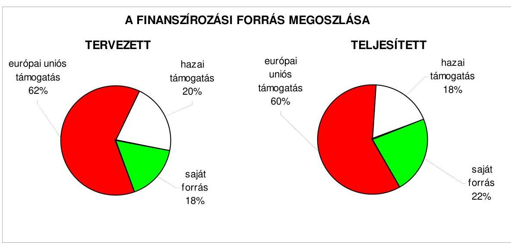

A 2007-2009 között befejezett fejlesztési feladatok teljesített kiadásai és a fedezetüket biztosító források a tervezetthez képest 103,3\%-ra teljesültek. Az eltérést egy feladat ${ }^{52}$ kiadásainak alacsonyabb összegű - 95,1\%-os - teljesítése mellett három feladat ${ }^{53}$ kiadásainak magasabb összegű - 109,4-109,2-110,4\%-os - teljesítése együttesen okozta. A HEFOP-2006-2.1.5/B "Halmozottan hátrányos helyzetü tanulók integrált nevelése" program tervezetthez viszonyított alacsonyabb összegű teljesülésének oka az volt, hogy a program megvalósításához szükséges taneszközöket a tervezettnél alacsonyabb áron szerezték be, így az nem járt feladatelmaradással. A három akadálymentesítési projekt tervezetthez viszonyított, összesen 5,9 millió Ft összegű többletkiadásait az Önkormányzat saját forrásaiból megvalósított, műszaki szükségességből felmerült pótmunkák okozták. A fejlesztési feladatok megvalósításához tervezett források összetétele a teljesítés során lényegesen nem változott, az európai uniós és a hazai támogatás aránya egyaránt kettő százalékponttal csökkent, míg a saját forrás részaránya négy százalékponttal növekedett.

[^0]
[^0]:    ${ }^{52}$ Alacsonyabb volt a teljesített kiadások összege a tervezetthez képest a HEFOP-20062.1.5/B "Halmozottan hátrányos helyzetű tanulók integrált nevelése" projekt esetében 2,0 millió Ft-tal.
    ${ }^{53}$ Magasabb volt a teljesített kiadások összege a tervezetthez képest a KMOP-2007-4.5.3-0020 "Akadálymentesen a pesterzsébeti felnőtt házi orvosi rendelőben" és a KMOP-2007-4.5.3-0022 "Akadálymentesen a pesterzsébeti Gyermekmosoly Óvodában" valamint a KMOP-2007-4.5.3-0029 "Akadálymentesen a pesterzsébeti Stromfeld Aurél Általános Iskolában" a projektek esetében.

---

# 2.1.2. Az európai uniós forrásokhoz kapcsolódóan a pályázatfigyelés, a pályázatkészítés, valamint az európai uniós támogatással megvalósuló fejlesztés lebonyolításának belső rendje, a végrehajtás és az ellenőrzés szervezettsége 

A 2007-2009. években pályázati utasításban határozták meg az európai uniós forrásokra vonatkozó pályázatokkal összefüggésben az önkormányzati szintű pályázat-koordinálás feladatát, valamint felelősét, a feladatokat és a felelősség meghatározását a pályázati referens munkaköri leírása tartalmazta. A pályázati utasításban meghatározták a pályázatok nyilvántartásának kötelezettségét, azonban annak módját nem szabályozták ${ }^{54}$. A pályázati utasítás, a Polgármesteri hivatal európai uniós pályázatokkal érintett szervezeti egységeinek ${ }^{55}$ feladatjegyzéke, az intézményvezetők és a pályázati referens munkaköri leírásai előírták a pályázatfigyelést végző és a döntési, illetve a dön-tés-előterjesztési jogkörrel rendelkezők közötti információ-szolgáltatási kötelezettséget, szabályozták az információ-szolgáltatási kötelezettség teljesítésének rendjét (a kapcsolattartás módját, tartalmát, formáját, gyakoriságát). A pályázati utasítás tartalmazta az európai uniós forrásokra irányuló pályázatfigyelés, pályázatkészítés, valamint az európai uniós forrással támogatott fejlesztés lebonyolításával kapcsolatos eljárási rend (feladat, kapcsolattartás, információáramlás, ellenőrzés, felelősség) meghatározását.

A Polgármesteri hivatalban biztosították a pályázatfigyeléssel, pályázatkészítéssel összefüggő feladatok személyi, szervezeti feltételeit. A feladatot a 2007-2009. években és a 2010. I. negyedévében kizárólag a Polgármesteri hivatal köztisztviselői és az önkormányzati intézmények vezetői látták el, külső személyt, szervezetet nem bíztak meg ilyen feladatokkal.

A fejlesztési feladatok lebonyolításának személyi, szervezeti feltételeit a Polgármesteri hivatalban alakították ki, a feladatokat a jegyző által egyedi utasításokban kijelölt munkacsoport, illetve kettő esetben ${ }^{56}$ külső szervezet látta el. A megbízási szerződésekben előírták a támogatott célkitűzés megvalósításának kötelezettségét, az ellenőrzés és a kapcsolattartás rendjét, valamint a személyre szóló felelősségi szabályokat.

A KMOP-5.1.1/C-2f-2009-0002 számú "Legyünk együtt, tegyünk együtt" programban "Integrált szociális városrehabilitáció - Ipari technológiával épült lakótelepek rehabilitációja" címmel, valamint a KMOP-2007-5.2.2/B jelű "Budapesti integrált városfejlesztési program - Budapesti kerületi központok fejlesztése" programban pályázott "Új híd, új városközpont Pesterzsébeten" című projekt esetében projekt-menedzseri feladatok elvégzésével külső szervezetet bíztak meg.

[^0]
[^0]:    ${ }^{54}$ A közbenső egyeztetés során a polgármester által adott tájékoztatás szerint a hivatali SzMSz V/2/1/A. számú mellékletét képező, 2010. november 2-ától hatályos számlarendben szabályozta az európai uniós pályázatok nyilvántartásának módját.
    ${ }^{55}$ A Polgármesteri hivatal Egészségügyi, Szociális és Gyermekvédelmi-, Oktatási, Kulturális és Sport-, Személyügyi-, Szervezési-, Városfejlesztési és Fenntartási Osztálya.
    ${ }^{56}$ Azokban az esetekben kötöttek külső szervezettel megbízási szerződést, amikor a pályázati kiírás projekt-szervezet igénybevételét írta elő.

---

A 2007-2010. évek belső ellenőrzési feladatait megalapozó, az éves ellenőrzési tervekhez készített kockázatelemzések kiterjedtek az európai uniós forrásokkal támogatott fejlesztési feladatokra. Az európai uniós forrásból megvalósuló fejlesztéseket mind a négy évben közepes kockázatúnak értékelték.

# 2.1.3. Egy támogatási szerződésben foglalt célkitúzés megvalósítása, múködtetése 

A KMOP 2007-4.5.3-0022 „Humán közszolgáltatások intézményrendszerének fejlesztése" intézkedés keretében az „Egyenlő esélyü hozzáférés a közszolgáltatásokhoz" tárgyú felhívásra az Önkormányzat „Akadálymentesen a pesterzsébeti Gyermekmosoly Óvodában" címmel nyújtott be pályázatot a Képviselő-testület 362/2007. (XI. 15.) számú határozata alapján. A támogatási szerződést 2008. augusztus 4-én kötötte meg a polgármester. A támogatási szerződésben a projekt kezdési időpontja 2008. március 1., megvalósításának határideje 2009. szeptember 30-a volt. A projekt összköltségét 9,8 millió Ft-ban tervezték, ebből a támogatás összege 8,8 millió Ft (részaránya $90 \%$, megoszlása 6,6 millió Ft európai uniós és 2,2 millió Ft központi forrás), a saját forrás összege egymillió Ft volt.

A projekt lebonyolítása során eredményesen valósították meg a támogatási szerződésben foglalt célkitúzéseket. A támogatási szerződésben rögzített számszerűsíthető eredményeket a szerződés szerinti tartalommal teljesítették, a támogatásból biztosították az intézmény megközelítésének és a belső közlekedés útvonalainak, létesítményeinek akadálymentes használatát. A szerződésben szereplő célokat a támogatási szerződésben rögzített „projekt költségvetés" szerinti kiadási keretösszeget 0,7 millió Ft-tal meghaladó összegben teljesítették. A többletkiadásokat a közlekedési útvonalak akadálymentesítésénél műszaki szükségességből felmerült pótmunkák okozták, melyeket a saját források terhére teljesítették. A projekt célkitűzéseit a támogatási szerződésben előírt határidőben valósították meg, az akadálymentesítési munkák műszaki átadásátvétele 2009. július 20-án megtörtént. Az utolsó kifizetési kérelem alapján az európai uniós és hazai támogatás összegének átutalása 2009. november 3-án történt meg.

A belső ellenőrzés a projekt célkitűzéseinek megvalósulását nem vizsgálta. A közreműködő szervezet 2009. szeptember 18-án a helyszínen ellenőrizte a projekt megvalósítását, szabálytalanságra vonatkozó, intézkedést igénylő megállapítást nem tett.

A támogatási szerződés szerinti célkitűzés megvalósítását követően az akadálymentessé átalakított óvoda fenntartásáról, működtetéséről az intézmény 2009. és 2010. évi költségvetésében gondoskodott az Önkormányzat. A támogatási szerződés a projekt működtetési kiadásaira tervezett összeget nem tartalmazott, az óvoda akadálymentesítése az épület üzemeltetési költségeit nem befolyásolta.

Az Önkormányzat 2007-2009. között eredményesen készült fel belső szabályozottság és szervezettség terén az európai uniós források igénybevételére és felhasználására, továbbá megvalósította a támogatási szer-

---

ződésben foglalt fejlesztési célkitűzést. A gazdasági programban, az ágazati, szakmai koncepciókban, az Integrált Városfejlesztési Stratégiában megfogalmazott fejlesztési célkitűzésekhez kapcsolódtak az európai uniós támogatások, szabályozták a pályázatfigyelést végzők és a döntési, illetve a döntés előterjesztési jogkörrel rendelkezők közötti információszolgáltatási kötelezettséget, továbbá kiterjedt az európai uniós forrásokkal támogatott fejlesztési feladatokra az éves belső ellenőrzési terveket megalapozó kockázatelemzés. A Polgármesteri hivatalon belül és külső szervezet igénybevételével biztosították a pályázatfigyelés, a pályázatkészítés és a fejlesztési feladat lebonyolításának szervezeti és személyi feltételeit. Meghatározták a projekt lebonyolítási feladataira kötött megbízási szerződésekben a támogatott célkitúzés megvalósításának kötelezettségét, az ellenőrzés és a kapcsolattartás rendjét, valamint a személyre szóló felelősségi szabályokat, továbbá az „Akadálymentesen a pesterzsébeti Gyermekmosoly Óvodában" című fejlesztési feladatot a támogatási szerződésben foglalt határidőre megvalósították.

# 2.2. Az elektronikus közszolgáltatás feltételeinek kialakítása 

A Képviselő-testület a 117/2008. IV. 17.) számú határozatával fogadta el „Pesterzsébet Informatikai Stratégiáját", mely tartalmazta a helyzetelemzést, valamint a középtávú, a 2008-2010. közötti évekre vonatkozó és a hosszú távú, 2013-ig érvényes célkitűzéseket. A Képviselő-testület a középtávú célkitűzések között az e-közszolgáltatás 3. elektronikus szolgáltatási szintjének elérését, a kétirányú elektronikus tranzakciót lehetővé tevő államigazgatási ügyintézési eljárások alkalmazását határozta meg. Az Önkormányzat e-közszolgáltatás bevezetése, múködtetése érdekében a 2007-2009. években az EKOP keretében pályázatot nem nyújtott be, az ÁROP támogatásra pályázott. A pályázattal az e-közszolgáltatáshoz szükséges szervezetfejlesztési feladatok elvégzéséhez kívántak európai uniós forrásokat elnyerni.

Az ÁROP 3. „A Közép-magyarországi régióban megvalósuló fejlesztések" intézkedés A.1/B „A polgármesteri hivatalok szervezetfejlesztése a Közép-magyarországi régióban" komponensének keretében a 2008. évben 50 millió Ft összegű támogatást nyert el a Polgármesteri hivatal szervezetfejlesztési és folyamat felülvizsgálati feladataira, 2008. december 1-jei kezdési és 2010. április 15-ei megvalósítási határidővel.

Az e-közszolgáltatási feladat ellátásának személyi feltételeit a Polgármesteri hivatalon belül, illetve vállalkozási szerződéssel ${ }^{57}$ biztosították, az eközszolgáltatási feladatok megoldását saját számítógépes információs rendszeren múködtették és vásárolt programmal látták el.

[^0]
[^0]:    ${ }^{57}$ Az Önkormányzat honlapjának üzemeltetését az Integrit-XX. Kft. végzi.

---

Az Önkormányzat 22/2005. (XI. 1.) számmal hozott az elektronikus ügyintézést kizáró rendeletet és - a Ket. 160. § (3) bekezdésében foglaltak ${ }^{58}$ kivételével - nem biztosította a közigazgatási hatósági ügyek elektronikus ügyintézésének lehetőségét, abból valamennyi ügyfajtát kizárta. Az önkormányzati szolgáltatások e-közszolgáltatási keretben történő ügyintézését az 1. elektronikus szolgáltatási szinten valósították meg az állampolgárok részére: az egészségüggyel kapcsolatos szolgáltatásokra vonatkozóan, a 2. elektronikus szolgáltatási szinten biztosították az állampolgárok részére a gépjárműadó, az engedélyek ügyintézése, a szociális juttatások kifizetései, a helyi adózás, a gyámhivatalhoz tartozó ügykörökben, a vállalkozások vonatkozásában: az iparűzési adó, a gépjárműadó, engedélyek ügyintézése, valamint a „Pesterzsébet" név, illetve önkormányzati címer használata ügykörökben. A teljes közvetlen, kétoldalú ügyintézés biztosításához szükséges további fejlesztés akadálya a számítástechnikai eszközök és program, illetve a pénzügyi és a személyi feltételek hiánya. Az e-közszolgáltatási feladatokat ellátó informatikai rendszer ügyfelek általi igénybevételét a 2009. évben és a 2010. év I. negyedévében nem kísérték figyelemmel.

Az Önkormányzat honlapján ${ }^{59}$ a gazdálkodási adatok közzététele a 18/2005. (XII. 27.) IHM rendeletben meghatározott szerkezetben történt.

A közzétételre szolgáló honlap megnyitásakor megjelenő oldalon elhelyezték a közzétételi listák által előírt adatokat tartalmazó jegyzékre mutató hivatkozást „Közérdekü adatok" elnevezéssel. A jegyzék a 18/2005. (XII. 27.) IHM rendelet 1. számú melléklete szerinti tagolásban tartalmazta a közzétételi egységeket, a 3. Gazdálkodási adatok közzétételi egység alatt történt a céljellegű támogatások és a nettó öt millió forint feletti szerződések, valamint az éves költségvetési beszámolók szöveges indokolásának közzététele.

Az Önkormányzat a nettó öt millió Ft-nál alacsonyabb összegű szerződések kötelező közzétételét előíró rendeletet nem alkotott, a 200 ezer Ft alatti múködési, illetve felhalmozási célú támogatások közzétételének mellőzéséről rendeletben ${ }^{60}$ döntött.

[^0]
[^0]:    ${ }^{58}$ A Ket. 160. § (3) bekezdése előírta: „A természetes személy ügyfél számára az elektronikus hatósági ügyintézés lehetőségét - ha az ügyfélnek legalább fokozott biztonságú elektronikus aláírása nincs - központi rendszer biztosítja." A Ket. 160. §-át az elektronikus közigazgatásról szóló 2009. évi LX. törvény 32. § (4) bekezdése 2009. október 1-től hatályon kívül helyezte.
    ${ }^{59} \mathrm{http}: / / w w w . p e s t e r z s e b e t . h u$
    ${ }^{60}$ A 2009. évi költségvetési rendelet 20. § (1) bekezdésében rögzítették, hogy a költségvetésből nyújtott, 200 ezer Ft feletti - amelyet adott költségvetési évben egybe kell számítani -, nem normatív, céljellegú múködési és fejlesztési támogatások kedvezményezettjeinek nevére, a támogatás céljára, összegére, továbbá a megvalósítási helyére vonatkozó adatokat kell közzé tenni az Önkormányzat honlapján, a döntés meghozatalát követő hatvanadik napig.

---

A jegyző gondoskodott az Áht. 15/A. § (1) bekezdésben előírtak alapján a céljellegú működési és felhalmozási támogatások kedvezményezettjei nevének, a támogatás céljának, összegének, továbbá a támogatási program megvalósítási helyének az Önkormányzat honlapján történő közzétételéről.

A jegyző az Önkormányzat pénzeszközei felhasználásával, a vagyonnal történő gazdálkodással összefüggő - a nettó ötmillió forintot elérő vagy azt meghaladó értékű - árubeszerzésre, építési beruházásra, szolgáltatás megrendelésre, vagyonértékesítésre vonatkozó szerződések 47\%-ánál az Áht. 15/B. § (1) bekezdésének előírását megsértve nem tette közzé a szerződések megnevezését (típusát), tárgyát, a szerződést kötő felek nevét, a szerződés értékét, határozott időre kötött szerződés esetében annak időtartamát, valamint az említett adatok változásait ${ }^{61}$.

Nem tették közzé a Polgármesteri hivatal által a 2009. évben a Budapest XX. kerület Kulcsár utcai lakótelepi játszótér felújítására kötött 10,3 millió Ft, az étkezési utalvány beszerzésére szóló 7,9 millió Ft, a tanuszoda üzemeltetésére vonatkozó 21,9 millió Ft, a vagyonbiztosításra kötött 6,4 millió Ft, a Budapest XX. kerület 195069 hrsz.-ú földterület értékesítésére kötött 5,2 millió Ft és a Budapest XX. kerület Kulcsár utcai lakótelep útépítési feladatait tartalmazó 15,0 millió Ft értékű szerződések adatait, valamint három intézmény gázellátására kötött 7,0; 8,0; és 20,0 millió Ft összegű szolgáltatási szerződések adatait.

A jegyző gondoskodott a 2008. és a 2009. évi költségvetési beszámoló szöveges indokolásának az Önkormányzat honlapján történő közzétételéről az Ámr. 122. számú melléklet 5. sorában előírtak alapján. A közzétett beszámoló tartalma azonban nem felelt meg az Áhsz. 40. § (9) bekezdésében előírtaknak, mert nem mutatták be azoknak a gazdasági társaságoknak a nevét, székhelyét - a részesedés mennyisége és értéke feltüntetése mellett -, amelyben az Önkormányzat részesedéssel rendelkezik, valamint a (11) bekezdés előírásai ellenére nem utaltak kiemelten és egyértelműen arra, hogy az Önkormányzatnál a könyvvizsgálat kötelező ${ }^{62}$.

[^0]
[^0]:    ${ }^{61}$ A közbenső egyeztetés során a polgármester által adott tájékoztatás szerint, továbbá a honlap áttekintése alapján megállapítottuk, hogy az Önkormányzat pótolta a vizsgálat során feltárt, a pénzeszközei felhasználásával, a vagyonnal történő gazdálkodással összefüggő - a nettó ötmillió forintot elérő vagy azt meghaladó értékű - árubeszerzésre, építési beruházásra, szolgáltatás-megrendelésre, vagyonértékesítésre vonatkozó szerződésekkel kapcsolatos közzétételi kötelezettségét.
    ${ }^{62}$ A közbenső egyeztetés során a polgármester által adott tájékoztatás szerint a hivatali SzMSz V/2/1/B. számú mellékletét képező, 2010. június 1-jétől hatályos számviteli politikában előírta a költségvetési beszámoló tartalmának szabályai között az Önkormányzat részesedéssel rendelkező gazdasági társaságai nevének, székhelyének, a részesedés mennyiségének és értékének feltüntetését, valamint az arra való egyértelmű utalást, hogy az Önkormányzatnál a könyvvizsgálat kötelező.

---

# 3. A KÖLTSÉGVETÉSI GAZDÁLKODÁS BELSŐ KONTROLLJA 

### 3.1. A költségvetés-tervezés, a gazdálkodás és a zárszámadáskészítés folyamatában végrehajtandó belső kontrollok kialakítása

A költségvetés-tervezési és a zárszámadás-készítési folyamatok szabályozottságának hiányosságai közepes kockázatot ${ }^{63}$ jelentettek a feladatok szabályszerű végrehajtásában, mivel a jegyző nem szabályozta a Polgármesteri hivatal és az intézmények költségvetési javaslatai kidolgozásának, az ismert kötelezettségek megtervezésének, a javasolt előirányzatok megalapozottságának, a benyújtott költségvetési igények teljesíthetőségének, az intézményi számszaki beszámolók, valamint annak a Képviselő-testület által meghatározott adatszolgáltatással való összhangjának ellenőrzését, azonban a kialakított belső kontrollok - végrehajtásuk esetén - a lehetséges hibák többsége ellen védelmet nyújtottak.

A gazdálkodási, a pénzügyi-számviteli és a folyamatba épített ellenőrzési feladatok szabályozásának hiányosságai közepes kockázatot jelentettek a feladatok megfelelő, szabályszerű végrehajtásában, mivel a jegyző:

- nem egészíttette ki a hivatali SzMSz-t a Polgármesteri hivatal alapító okiratának keltével, továbbá nem gondoskodott a szervezeti egységek engedélyezett létszámának, valamint a pénzügyi-gazdasági tevékenységet ellátók feladatkörének, munkakörének a meghatározásáról. ${ }^{64}$ A Polgármesteri hivatalban a gazdálkodási feladatok, hatáskörök szabályozásáért, az Ámr., 17. § (5) bekezdése ${ }^{65}$ szerinti gazdasági szervezet ügyrendjének elkészítéséért a Polgármesteri hivatalt vezető - az Ötv. 36. § (2) bekezdése alapján - jegyző a felelős;
- a hivatali SzMSz-ben nem határozta meg, hogy a gazdasági szervezet feladatai ${ }^{66}$ közül mely feladatokat látja el a Polgármesteri hivatal gazdasági szervezete, illetve melyeket külső szervezet ${ }^{67}$. A Pénzügyi osztálynak, mint gazdasági szervezetnek az ügyrendjében nem szabályozta a vezetők és a

[^0]
[^0]:    ${ }^{63}$ Közepesnek minősítettük a belső kontrollokban rejlő kockázatot, amennyiben a kontrollok a lehetséges hibák többsége ellen védelmet nyújtottak.
    ${ }^{64}$ A polgármester mellékelt tájékoztatása alapján a jegyző 2010. december 7-én intézkedett a hivatali SzMSz kiegészítéséről.
    ${ }^{65}$ 2010. január 1-jétől a gazdasági szervezet ügyrendjével kapcsolatos - módosított előírásokat az Ámr 2 . 15. § (6) bekezdése és a 20. § (7) bekezdés tartalmazza.
    ${ }^{66}$ A gazdasági szervezet feladatai a tervezés, az előirányzat felhasználás, az előirányzat módosítás, az üzemeltetés, a fenntartás, a múködtetés, a beruházás, a vagyon használata, hasznosítása, a munkaerő gazdálkodás, a készpénzkezelés, a könyvvezetés, a beszámolási kötelezettség és az adatszolgáltatási tevékenységek.
    ${ }^{67}$ Az Integrit-XX. Kft. látja el a vagyonhasznosítási tevékenység keretében az önkormányzati bérlakások értékesítésével, a bérlemények kezelésével, a piac üzemeltetésével kapcsolatos feladatokat.

---

pénzügyi-gazdasági feladatok ellátásáért felelős alkalmazottak feladat- és hatáskörét, felelősségi körét, a helyettesítés rendjét, valamint a belső és a külső kapcsolattartás módját ${ }^{68}$ :

A hivatali SzMSz-t 2010. május 25 -én módosították, amelyben gazdasági szervezetként a Pénzügyi-, a Személyügyi-, a Szervezési-, a Vagyongazdálkodási-, továbbá a Városfejlesztési és fenntartási osztályokat jelölték meg, a gazdasági szervezet 2010. június 1-jétől hatályos ügyrendjében a fenti szabályozási hiányosságok továbbra is fennálltak.

- a Polgármesteri hivatalban szabályozta, hogy nem szükséges írásbeli kötelezettségvállalás az 50 ezer Ft -ot el nem érő kifizetések esetében, de ennek rendjét és a nyilvántartás formáját csak 2009. augusztus 1-jétől határozta meg a gazdálkodási szabályzat ${ }_{2}$-ben;
- kettő érvényesítő megbízása során nem tartotta be az érvényesítők iskolai végzettségére és a szakmai képesítésére ${ }^{69}$ vonatkozó előírásokat ${ }^{70}$;
- a leltározási és leltárkészítési szabályzatban nem szabályozta az üzemeltetésre átadott eszközök leltározásának a módját ${ }^{71}$;
- az értékelési szabályzatban nem határozta meg az értékelések ellenőrzéséért felelős munkaköröket, valamint az értékelési és ellenőrzési feladatokat nem írták elő az érintett dolgozók munkaköri leírásaiban ${ }^{72}$;
- az önköltségszámítási szabályzatban nem határozta meg az Ámr. ${ }_{1} 157 /$ C. § (2) bekezdésében ${ }^{73}$ foglaltak ellenére a közérdekú adatszolgáltatáshoz kap-

[^0]
[^0]:    ${ }^{68}$ A polgármester mellékelt tájékoztatása alapján a jegyző 2010. december 7-én intézkedett a hivatali SzMSz és a gazdasági szervezet ügyrendjének kiegészítéséről.
    ${ }^{69}$ A gazdálkodási szabályzat ${ }_{2}$-ben az érvényesítésre felhatalmazott ügyintézők közül kettő nem rendelkezett pénzügyi-számviteli képesítéssel, az egyik érvényesítőnek személyügyi szervező képesítése, a másik érvényesítőnek jegyzőkönyvvezető, gyorsíró, igazgatási ügyintéző képesítése volt.
    ${ }^{70}$ A közbenső egyeztetés során a polgármester által adott tájékoztatás szerint a jegyző 2010. augusztus 16 -tól visszavonta annak a kettő érvényesítőnek a megbízását, akik nem rendelkeztek az előírt iskolai végzettséggel és szakmai képesítéssel.
    ${ }^{71}$ A közbenső egyeztetés során a polgármester által adott tájékoztatás szerint a hivatali SzMSz V/2/4. számú mellékletét képező, az eszközök és a források leltározási szabályzatban 2010. november 2-ától előírták az üzemeltetésre, kezelésre átadott eszközök leltározásának módját.
    ${ }^{72}$ A közbenső egyeztetés során a polgármester által adott tájékoztatás szerint a hivatali SzMSz V/2/9. számú mellékletét képező eszközök és források értékelési szabályzatában 2010. november 2-ától meghatározta a mérlegben szereplő eszközök értékelése ellenőrzéséért felelős munkakört, és az érintett dolgozó munkaköri leírásában előírta a feladat ellátásának kötelezettségét.
    ${ }^{73}$ 2010. január 1-jétől az Ámr. ${ }_{2}$ 81. § (6)-(8) bekezdései írják elő, hogy a költségvetési szerv szellemi és anyagi infrastruktúráját magán célra igénybe vevő számára a költségvetési szerv köteles térítést előírni a felmerült közvetlen és közvetett költségek figyelembe vételével, a költségek és a térítés megállapításának rendjét és mértékét szabályzatban kell rögzíteni.

---

csolódó költségtérítés mértékét (a kalkulációs egységre jutó számított összegét) és a díj megfizetésének módját ${ }^{74}$;

- a selejtezési szabályzatban nem jelölte ki az üzemeltetésre átadott eszközök esetében a selejtezési, hasznosítási döntés meghozatalára jogosultak körét, a selejtezési eljárással kapcsolatos feladatokat az érintett dolgozók munkaköri leírása nem tartalmazta ${ }^{75}$;
- a számlarendben nem határozta meg a főkönyv és az analitikus nyilvántartások egyeztetését igazoló dokumentálás módját ${ }^{76}$;
- az ellenőrzési nyomvonal kialakításánál nem határozta meg az egyes tevékenységek elvégzését igazoló dokumentum fellelhetési helyét a rendszerben, továbbá a kockázatkezelési szabályzatban nem szabályozta a válaszintézkedések beépítését a folyamatba, nem írta elő a kockázati környezet rendszeres felülvizsgálatának kötelezettségét ${ }^{77}$.

A kialakított belső kontrollok azonban - múködésük esetén - a lehetséges hibák többsége ellen védelmet nyújtottak.

A Polgármesteri hivatal rendelkezett informatikai stratégiával, a Képviselőtestület a 117/2008. (IV. 17.) számú határozatával fogadta el „Pesterzsébet Informatikai Stratégiáját". A Polgármesteri hivatal informatikai biztonsági szabályzatát 2003. július 1-én adta ki a polgármester és a jegyző, melyet 2007. március 15-én korszerűsítettek ${ }^{78}$. Az informatikai szabályzatokat a Polgármesteri hivatal belső hálózatán közzétették, a jegyző gondoskodott az informatikával kapcsolatos szabályzatok megismertetéséről.

A Polgármesteri hivatalban a pénzügyi-számviteli feladatoknál használt programok adatai informatikai hálózaton keresztül elérhetőek, integrált pénzügyiszámviteli rendszert a 2010. évben vezettek be.

[^0]
[^0]:    ${ }^{74}$ A közbenső egyeztetés során a polgármester által adott tájékoztatás szerint a hivatali SzMSz V/2/13. számú mellékletét képező, önköltségszámítási szabályzatban 2010. november 2-ától szabályozta a közérdekú adatszolgáltatásokhoz kapcsolódó költségtérítések mértékét és a díj megfizetésének módját.
    ${ }^{75}$ A közbenső egyeztetés során a polgármester által adott tájékoztatás szerint a hivatali SzMSz V/2/5. számú mellékletét képező, a felesleges vagyontárgyak hasznosításának, selejtezésének szabályzatában 2010. november 2-ától meghatározta az üzemeltetésre átadott eszközök esetében a selejtezési, hasznosítási döntés meghozatalára jogosultak körét, továbbá az érintett dolgozó munkaköri leírásában előírta a selejtezési eljárással kapcsolatos feladatok ellátásának kötelezettségét.
    ${ }^{76}$ A közbenső egyeztetés során a polgármester által adott tájékoztatás szerint a hivatali SzMSz V/2/1/A. számú mellékletét képező számlarendben meghatározta a főkönyv és az analitikus nyilvántartások egyeztetése dokumentálásának módját.
    ${ }^{77}$ A polgármester mellékelt tájékoztatása alapján a jegyző 2010. december 7-én intézkedett az ellenőrzési nyomvonal és a kockázatkezelési szabályzat hiányosságainak megszüntetésére.
    ${ }^{78}$ Az informatikai biztonsági szabályzat a Polgármesteri hivatal SzMSz V/5/4 számú mellékleteként kiadott Számítástechnikai Üzemeltetési Szabályzat II. fejezete.

---

A pénzügyi-számviteli tevékenységhez kapcsolódó informatikai feladatok szabályozásának hiányosságai közepes kockázatot jelentettek az informatikai feladatok megfelelő, szabályszerű végrehajtásában, mivel a katasztrófa-elhárítási tervet nem aktualizálták, a pénzügyi-számviteli rendszer esetében nem szabályozták a jelszavak kezelését ${ }^{79}$, a Polgármesteri hivatalnál a hozzáférési jogosultságokra vonatkozó eljárásrend nem tartalmazott rendelkezést a kiosztott felhasználói jelszavak módosítására, visszavonására, ellenőrzésére, nem neveztek ki a pénzügyi-számviteli rendszer ellenőrzési listájának vizsgálatáért felelős dolgozót, nem szabályozták a pénzügyi-számviteli program változások ellenőrzésére, tesztelésére vonatkozó eljárásokat, azonban a kialakított belső kontrollok - végrehajtásuk esetén - a lehetséges hibák többsége ellen védelmet nyújtottak.

# 3.2. A belső kontrollok múködtetése a költségvetés-tervezés, a gazdálkodás, és a zárszámadás-készítés folyamataiban 

A Polgármesteri hivatalban a 2009. évben a költségvetés-tervezési és zárszámadás-készítési folyamatban a belső kontrollok múködésének megfelelősége jó ${ }^{80}$ volt, mivel a szabályozásban foglaltaknak megfelelően a jegyző ellenőriztette, hogy az intézmények teljesítették-e a költségvetési javaslat összeállításával kapcsolatban részükre meghatározott követelményeket, az intézményi mutatószám felmérés adatainak megalapozottságát, továbbá a zárszámadás készítése során, az intézmények által az állami támogatásokkal történő elszámoláshoz közölt mutatószámok adatainak megfelelőségét, pénzmaradványuk megállapításának szabályszerűségét. Nem végezték el annak ellenőrzését, hogy a Polgármesteri hivatal és az intézmények a jogszabályi előírásoknak megfelelően dolgozták-e ki költségvetési javaslatukat és nem győződtek meg költségvetési igényeik teljesíthetőségéről, a javasolt előirányzatok megalapozottságáról, az ismert kötelezettségek megtervezéséről. Nem ellenőrizték a Polgármesteri hivatal és az intézmények által benyújtott költségvetési igények indokoltságát, a saját bevételek előirányzatai és a költségvetés megalapozását szolgáló helyi rendeletek összhangjának biztosítását. A zárszámadás készítésének folyamatában nem győződtek meg az intézményi eredeti és módosított előirányzatok, valamint a teljesítések eltérésének indokoltságáról, az intézményi számszaki beszámolók belső, valamint annak a Képviselő-testület által meghatározott adatszolgáltatással való összhangjáról. A megállapított hiányosságok nem veszélyeztették a költségvetés-tervezés és a zárszámadás-készítés hibáinak megelőzését, feltárását és kijavítását.

A Polgármesteri hivatal a múködési célú pénzeszköz átadások államháztartáson kívülre teljesített kiadásainak fedezetére a 2009. évi költségvetésben 66,5 millió Ft eredeti előirányzatot tervezett, amely összeg az év köz-

[^0]
[^0]:    ${ }^{79}$ A szabályozás nem tartalmazta a jelszavak változtatásának leghosszabb időtartamát, a jelszavak kezelését, a jelszavak legkisebb megengedhető hosszát, összetettségét (kisbetű, nagybetű, szám).
    ${ }^{80}$ Jónak minősítettük a kontrollok múködését, ha a megállapított kisebb (tolerálható mértékű) hiányosságok nem veszélyeztették az ellenőrzött terület hibáinak megelőzését és kijavítását.

---

beni módosítások során 126,8 millió Ft-ra emelkedett, a 2009. évi teljesítés 122,4 millió Ft volt. Az eredeti előirányzat 60,6\%-ot, a módosított 72,8\%-ot, a teljesítés $87,7 \%$-ot képviselt az államháztartáson kívüli pénzeszköz átadások kiadási előirányzatából, illetve annak teljesítéséből. A 2010. évi költségvetésben tervezett 76,8 millió Ft előirányzat az államháztartáson kívüli pénzeszköz átadások előirányzatának 70,2\%-a volt. A Polgármesteri hivatalban a felhalmozási célú pénzeszköz átadások államháztartáson kívülre teljesített kiadásainak fedezetére a 2009. évi költségvetésben 43,1 millió Ft eredeti előirányzatot terveztek, amely összeg az év közbeni módosítások következtében 47,4 millió Ft-ra növekedett, a teljesítés 17,2 millió Ft volt. Az eredeti előirányzat $39,4 \%$-ot, a módosított $27,2 \%$-ot, a teljesítés $12,3 \%$-ot képviselt az államháztartáson kívüli pénzeszköz átadások kiadási előirányzatából, illetve annak teljesítéséből. A 2010. évi költségvetésben 32,6 millió Ft eredeti előirányzatot terveztek ilyen célra, amely az államháztartáson kívüli pénzeszköz átadások kiadási előirányzatának $29,8 \%$-a volt. Az előirányzatok felhasználására vonatkozó megállapodásokban, támogatási szerződésekben ${ }^{81}$ meghatározott célok összhangban voltak az Ötv. 8. § (1) bekezdésében foglalt önkormányzati feladatokkal.

A Polgármesteri hivatalban a 2009. évben az államháztartáson kívülre teljesített múködési és a felhalmozási célú pénzeszköz átadásokkal kapcsolatos kiadások teljesítése során a szakmai teljesítésigazolás és az utalvány ellenjegyzés múködésének megfelelősége gyenge ${ }^{82}$ volt, mert:

- a jegyző által a szakmai teljesítés igazolására kijelölt személyek ellenőrzési feladataikat - az Ámr. ${ }_{1}$ 135. § (1)-(2) bekezdésében ${ }^{83}$ és a gazdálkodási szabályzat ${ }_{1,2}$-ben előírtak ellenére - a Pesterzsébeti Központi Református Egyházközségnek, a Pesterzsébet Klapka téri Református Egyházközségnek, az Erzsébeti Fúvósok és Ütősök Egyesületének, a Mozgássérültek Budapesti Egyesületének, a Zöld Út Caritasnak, a romániai Bölön Önkormányzatának nyújtott támogatások kifizetését megelőzően nem végezték el, nem ellenőrizték a támogatások jogosultságát és összegszerűségét, mivel az alapbizonylatokra nem írták rá a gazdálkodási szabályzat ${ }_{1,2}$-ban előírt szöveget, a bizonylatokat nem látták el dátummal és az aláírásukkal ${ }^{84}$;

[^0]
[^0]:    ${ }^{81}$ A megfelelőségi teszt elvégzése során ellenőrzött államháztartáson kívülre teljesített múködési, illetve felhalmozási célú pénzeszköz átadások egyházak, társadalmi szervezetek, alapítványok részére a kulturális és a sport célok, múködési kiadások támogatására, épületeik felújítására történtek.
    ${ }^{82}$ Amennyiben a kontrollok múködésében túl sok hiányosság fordult elő ahhoz, hogy a kontrollok biztosítsák a hibák megelőzését, feltárását, kijavítását és ezáltal veszélyeztették az eredményes, megbízható múködést, a kontroll múködésének megfelelősége gyenge minősítést kapott.
    ${ }^{83}$ 2010. január 1-jétől az Ámr. ${ }_{2}$ 20. § (3) bekezdés a) pontja, a 76. § (3) bekezdése, és a 77. § (4) bekezdése tartalmazza ezt az előírást.
    ${ }^{84}$ A közbenső egyeztetés során a csatolt bizonylatok alapján 2010. július 26 -ától a múködési és felhalmozási célú pénzeszköz átadásokkal kapcsolatos kiadások teljesítése előtt az arra kijelölt személyek a szakmai teljesítésigazolást a belső szabályozás szerint elvégezték.

---

- az utalványok ellenjegyzői nem tettek eleget az Ámr. 1 137. § (3) bekezdésében ${ }^{85}$ foglalt ellenőrzési kötelezettségüknek, mivel a támogatások kifizetését megelőzően - aláírásuk ellenére - nem jelezték, hogy a szakmai teljesítés igazolását az arra kijelölt személyek nem végezték el ${ }^{86}$.

A Polgármesteri hivatalban az állományba nem tartozók megbízási díjaival kapcsolatos kiadások fedezetére a 2009. évi költségvetésben 136,0 millió Ft eredeti előirányzatot terveztek, év közben az előirányzatot 145,5 millió Ft összegre módosították, a teljesítés 138,0 millió Ft volt. Az eredeti előirányzat 12,3\%-os, a módosított előirányzat 13,7\%-os, a teljesítés 13,0\%-os részarányt képviselt a tervezett, illetve a teljesített személyi juttatások előirányzatából. A 2010. évben 121,8 millió Ft eredeti előirányzattal számoltak, amely a tervezett személyi juttatások előirányzatából 12,3\%-os részarányt képviselt. A megbízási szerződések tárgya ${ }^{87}$ összhangban volt a Polgármester hivatal által ellátott feladatokkal.

A Polgármesteri hivatalban a 2009. évben az állományba nem tartozók megbízási díjaival kapcsolatos kiadások teljesítése során a szakmai teljesítésigazolás és az utalvány ellenjegyzés múködésének megfelelősége gyenge volt, mert:

- a szakmai teljesítés igazolására a jegyző által kijelölt személyek az ellenőrzési feladataikat az Ámr. ${ }_{1}$ 135. § (1)-(2) bekezdésében előírtak ellenére az iktatási program rendszergazdai feladatainak, a sport feladatok szakértői tevékenységének, a Pesterzsébet újság adminisztrációs tevékenységének, a közterületek ellenőrzéséhez, környezet tanulmányok készítéséhez kapcsolódó megbízási díjak kifizetését megelőzően az aláírásuk ellenére nem végezték el, nem ellenőrizték a kiadások jogosultságát és összegszerűségét, a szerződések, megállapodások szakmai teljesítésigazolását, mivel nem a gazdálkodási szabályzat ${ }_{1,2}$-ben előírt módon, nem az abban meghatározott szöveg alkalmazásával történt a szakmai teljesítés ellenőrzése ${ }^{88}$;

A jegyző a kiadások esetében a szakmai teljesítésigazolás módját a gazdálkodási szabályzat ${ }_{1,2}$-ben az „igazolom, kifizethető" szöveg használatával szabályozta, ezzel szemben a megbízási szerződésekben előírt feladatok teljesítéséről készült munkavégzési igazolásokban a szakmai teljesítést igazolók „...a feladatot maradéktalanul teljesítette ...kifizethető" szöveget alkalmazták.

[^0]
[^0]:    ${ }^{85}$ 2010. január 1-jétől az Ámr. ${ }_{2}$ 79. § (2) bekezdése tartalmazza ezt az előírást.
    ${ }^{86}$ A közbenső egyeztetés során a csatolt bizonylatok alapján 2010. július 26-ától a múködési és felhalmozási célú pénzeszköz átadásokkal kapcsolatos kiadások teljesítését megelőzően az arra kijelölt személyek az utalvány ellenjegyzése során meggyőződtek a szakmai teljesítésigazolás belső szabályozás szerinti elvégzéséről.
    ${ }^{87}$ A megfelelőségi teszt elvégzése során ellenőrzött megbízási szerződések az európai parlamenti, valamint az időközi polgármester-választásokban való közremúködésre, tanácsadói, szakértői tevékenységre, informatikai feladatok ellátására irányultak.
    ${ }^{88}$ A közbenső egyeztetés során a csatolt bizonylatok alapján 2010. szeptember 2-ától az állományba nem tartozók megbízási díjai kifizetését megelőzően az arra kijelölt személyek a szakmai teljesítésigazolás esetében a kötelező szöveges forma alkalmazásával tettek eleget ellenőrzési kötelezettségüknek.

---

- az utalványok ellenjegyzői az Ámr. 1 137. § (3) bekezdésében foglaltak ellenére az állományba nem tartozók megbízási díjai kifizetését megelőzően - aláírásuk ellenére - nem kifogásolták, hogy a szakmai teljesítésigazolást nem a gazdálkodási szabályzat ${ }_{1,2}$-ben előírt szöveg - „igazolom, kifizethető" használatával végezték el ${ }^{89}$.

A Polgármesteri hivatal 2009. évi elemi költségvetésében a külső szolgáltatók által végzett karbantartási, kisjavítási szolgáltatásokkal kapcsolatos kiadások fedezetére 153,5 millió Ft eredeti előirányzatot terveztek, amely az év közbeni módosítások következtében 202,1 millió Ft-ra emelkedett, a 2009. évi teljesítés 201,2 millió Ft volt. Az eredeti előirányzat 16,3\%-os, a módosított előirányzat és a teljesítés 14,5-14,5\%-os részarányt képviselt a dologi kiadásokból. A 2010. évi elemi költségvetésben 208,0 millió Ft eredeti előirányzatot terveztek, ami a dologi kiadások 14,4\%-a volt. Az előirányzatok felhasználása során a megrendelésekben, szerződésekben meghatározott karbantartási, kisjavítási munkák ${ }^{90}$ kapcsolódtak a Polgármesteri hivatal által ellátott feladatokhoz.

A Polgármesteri hivatalban a 2009. évben a külső szolgáltató által végzett karbantartási, kisjavítási munkákkal kapcsolatos kiadások teljesítése során a szakmai teljesítésigazolás és az utalvány ellenjegyzés múködésének megfelelősége kiváló ${ }^{91}$ volt, mivel a Polgármesteri hivatal épületeinek, a másoló gépeknek, a gépjármúveknek, a klíma berendezéseknek, az utaknak a karbantartására vonatkozó megrendelésekben, szerződésekben meghatározott feladatok esetében:

- a szakmai teljesítés igazolására a jegyző által kijelölt személyek okmányok alapján ellenőrizték a kifizetések jogosultságát, összegszerűségét, valamint a szerződésben, megrendelésben ${ }^{92}$ meghatározott feladatok teljesítésének szakmai igazolását aláírásukkal és az igazolás dátumának megjelölésével a belső szabályzatban előírt módon elvégezték;
- az utalvány ellenjegyzője a gazdálkodásra vonatkozó szabályok érvényesüléséről, továbbá a szakmai teljesítésigazolás és az érvényesítés elvégzéséről meggyőződött.

[^0]
[^0]:    ${ }^{89}$ A közbenső egyeztetés során a csatolt bizonylatok alapján 2010. szeptember 2-ától az állományba nem tartozók megbízási díjai kifizetését megelőzően az arra kijelölt személyek az utalvány ellenjegyzése során meggyőződtek a szakmai teljesítésigazolás belső szabályozás szerinti elvégzéséről.
    ${ }^{90}$ A megfelelőségi teszt elvégzése során tételesen ellenőrzött külső szolgáltató által végzett karbantartások, kisjavítások gépkocsik, utak, épületek, irodatechnikai gépek, fénymásoló gépek, háztartási gépek, klíma berendezések, szavazat számláló rendszer karbantartására, javítására irányultak.
    ${ }^{91}$ Kiválónak értékeltük a kontrollok múködését abban az esetben, ha azok múködése esetleges kisebb, az egységesen meghatározott követelményrendszerben foglalt mértéket el nem érő hiányosságoktól eltekintve - megfelelt a hibák megelőzésére és kijavítására meghatározott szabályozásnak és a legmagasabb szintű elvárásoknak.
    ${ }^{92}$ A karbantartási kiadások esetében az 50 ezer Ft-ot el nem érő kötelezettségvállalásokat 2009. augusztus 1-jéig írásba foglalták, megrendelővel dokumentálták.

---

A Polgármesteri hivatalban a 2009. évben az államháztartáson kívülre történő működési és felhalmozási célú pénzeszköz átadásokkal, az állományba nem tartozók megbízási díjaival, valamint a külső szolgáltatók által végzett karbantartással, kisjavítással kapcsolatos kifizetések során - ezen területek költségvetési súlyának figyelembevételével összefoglalóan értékelve ${ }^{93}$ - a belsö kontrollok múködésének megfelelősége jó volt, mivel a szakmai teljesítés igazolására a jegyző által kijelölt személyek az ellenőrzési feladataikat elvégezték a külső szolgáltatók által végzett karbantartással, kisjavítással kapcsolatos kifizetések esetében, ellenőrizték az összegszerűséget, a jogosultságot és a szerződések, megrendelések szakmai teljesítését, azonban az államháztartáson kívülre történő működési és felhalmozási célú pénzeszköz átadásokkal kapcsolatos kiadások teljesítését megelőzően a szakmai teljesítés igazolása az Ámr. ${ }_{1}$ 135. § (1)-(2) bekezdésében és a gazdálkodási szabályzat ${ }_{1,3}$-ben előírtak ellenére elmaradt, továbbá az állományba nem tartozók megbízási díjaival kapcsolatos kiadások teljesítését megelőzően a szakmai teljesítés igazolása nem a gazdálkodási szabályzat ${ }_{1,2}$-ben előírt módon történt ${ }^{94}$. Az utalványok ellenjegyzői a külső szolgáltatók által végzett karbantartással, kisjavítással kapcsolatos kifizetéseknél az ellenőrzési feladataikat elvégezték, meggyőződtek a gazdálkodásra vonatkozó szabályok érvényesüléséről, továbbá a szakmai teljesítésigazolás és az érvényesítés elvégzéséről, azonban az államháztartáson kívülre nyújtott múködési és felhalmozási célú pénzeszköz átadásokkal kapcsolatos kiadások teljesítését megelőzően az Ámr. ${ }_{1}$ 137. § (3) bekezdésében foglaltak ellenére nem észrevételezték, hogy a szakmai teljesítést igazolók nem tettek eleget a folyamatba épített ellenőrzési kötelezettségüknek, mivel a kifizetés előtt nem ellenőrizték a jogosultságot és az összegszerűséget, továbbá az állományba nem tartozók megbízási díjainak kifizetése előtt nem észrevételezték, hogy a szakmai teljesítés igazolása nem a gazdálkodási szabályzat ${ }_{1,2}$-ben előírt módon történt ${ }^{95}$. A Polgármesteri hivatalban az Áht. 121. § (1) bekezdés előírásait megsértve a belső kontrollok közül a szakmai teljesítésigazolás és az utalvány ellenjegyzése nem a szabályozásnak megfelelően múködött. A belső kontrollrendszer megszervezéséért és hatékony múködtetéséért az Áht. 88. § (1) bekezdés e) pontjában ${ }^{96}$ foglaltak alapján, továbbá a FEUVE rendszer létrehozásáért, múködtetéséért az Áht. 121. § (1) bekezdésében előírtaknak megfelelően - az Áht. 66. §-a szerint költségvetési szervként múködő Polgármesteri hivatal Ötv. 36. § (2) bekezdése szerinti vezetője - a jegyző a felelős. A jegyző a szakmai teljesítésigazo-

[^0]
[^0]:    ${ }^{93}$ A kontrollok megfelelőségének értékelése során az ellenőrzött három terület egyedi értékelési pontszámait a Polgármesteri hivatal 2008/2009. évi költségvetési beszámolójának - a területekre vonatkozó - teljesítési adataiból képzett súlyokkal arányosan öszszegeztük. Ennek megfelelően az államháztartáson kívülre történő múködési célú pénzeszközátadások esetében $40 \%$-os, az állományba nem tartozók megbízási díjai tekintetében 5\%-os, külső szolgáltatókkal végzett karbantartás esetében 55\%-os súllyal számoltunk.
    ${ }^{94}$ A közbenső egyeztetés során a polgármester által adott tájékoztatás szerint a jegyző csatolta az előírásoknak megfelelően végzett szakmai teljesítésigazolások dokumentumait.
    ${ }^{95}$ A közbenső egyeztetés során a polgármester által adott tájékoztatás szerint a jegyző csatolta az előírásoknak megfelelően végzett utalvány ellenjegyzések dokumentumait.
    ${ }^{96}$ 2010. augusztus 15-től az Áht. 94. § (1) bekezdés e) pontja szabályozza.

---

lást és az utalvány ellenjegyzését nem a szabályozásnak megfelelően működtette, ennek ellenére az Ámr. ${ }_{1}$ 23. számú melléklete alapján - jogi felelőssége tudatában - úgy nyilatkozott, hogy az előírásoknak megfelelően gondoskodott a Polgármesteri hivatalban a belső kontroll rendszerek szabályszerű, hatékony, eredményes és gazdaságos múködéséről.

A Polgármesteri hivatalban a 2009. évben a pénzügyi-számviteli tevékenységhez kapcsolódó informatikai feladatoknál a kialakított belső kontrollok múködésének megfelelősége gyenge volt, mivel a katasztrófa-elhárítási tervet az elmúlt két évben nem tesztelték, a jelszavak kezelésére vonatkozó szabályok - jelszó módosítási kötelezettség, a jelszó formai előírásainak meghatározása - betartását szabályozás hiányában nem követelték meg, a pénzügyiszámviteli programok elemeire vonatkozó változáskezelési eljárások ellenőrzését, tesztelését nem dokumentálták és az ellenőrzési listákat nem vizsgálták, nem ellenőrizték az elmúlt egy évben azt, hogy az elmentett állományokból a pénzügyi-számviteli adatok teljes körűen helyreállíthatóak és a mentéseket tartalmazó adathordozók környezeti ártalmak elleni védelmét - erre vonatkozó belső előírás hiányában - nem biztosították.

# 3.3. A belső ellenőrzési kötelezettség teljesítése 

A belső ellenőrzési feladatok ellátására a Polgármesteri hivatalon belül - a hivatali SzMSz-nek a 2005. június 1-jével történt hatályba lépésével - önálló szervezeti egységet, Ellenőrzési osztályt hoztak létre, a belső ellenőrzési feladatok ellátásának módja ${ }^{97}$ megfelelt az Ötv. 92. § (7) bekezdésében előírtaknak. A hivatali SzMSz II. fejezetének 8.4 pontjában rögzítették az Ellenőrzési osztály közvetlen jegyzői alárendeltségét, irányítását, biztosították a belső ellenőrzés funkcionális függetlenségét és meghatározták a feladatait ${ }^{98}$.

A belső ellenőrzés szervezeti kereteinek kialakítása és szabályozása a belső ellenőrzési feladatok megfelelő, szabályszerű végrehajtásában összességében alacsony kockázatot ${ }^{99}$ jelentett, mivel meghatározták a belső ellenőrzési vezető személyét, a belső ellenőrzés rendelkezett a jegyző által jóváhagyott belső ellenőrzési kézikönyvvel és a 2004-2010. évekre szóló stratégiai tervvel, a Képviselő-testület által elfogadott ${ }^{100}$ és kockázatelemzéssel alátámasztott éves belső ellenőrzési tervekkel, a belső ellenőrzési vezető az ellenőrzések lefolytatásához ellenőrzési programot készített és kialakította az ellenőrzések nyilvántartási rendszerét. Annak ellenére összességében alacsony volt a kockázat,

[^0]
[^0]:    ${ }^{97}$ A fővárosi kerületi önkormányzatoknál 2007. január 1-jétől kötelező a belső ellenőrzési egység létrehozása, kivéve, ha társulás keretében látják el a belső ellenőrzést.
    ${ }^{98}$ Az Ellenőrzési osztály feladatjegyzéke a hivatali SzMSz V/1/2-2. számú melléklete.
    ${ }^{99}$ A kialakított belső kontrollokban rejlő kockázatot alacsonynak minősítettük, ha a kontrollok - végrehajtásuk esetén - megfelelő védelmet nyújtottak a híbák bekövetkezése ellen.
    ${ }^{100}$ A Képviselő-testület az Ötv. 92. § (6) bekezdésében előírtaknak megfelelően a Polgármesteri hivatal 2009. évi ellenőrzési tervét a 386/2008. (XI. 13.) számú, a 2010. évi ellenőrzési tervet a 309/2009. (XI. 12.) számú határozatával fogadta el, melyet a 49/2010. (II. 18.) számú határozattal módosítottak.

---

hogy a foglalkoztatott belső ellenőrök számát a jegyző nem kapacitás-felmérés alapján határozta meg, továbbá a 2004-2010. évekre vonatkozó stratégiai ellenőrzési tervet nem támasztotta alá kockázatelemzéssel.

A 2004-2010. évekre vonatkozó stratégiai ellenőrzési tervet a jegyző a polgármester egyetértésével 2004 februárjában hagyta jóvá, a jegyző 2005 októberében felülvizsgáltatta és módosította. A stratégiai terv szerint kiemelten kezelik az éves ellenőrzési tervek összeállítása során az új fejlesztési feladatok (tanuszoda építés) megvalósítását, az önkormányzati támogatások felhasználásának a kedvezményezetteknél való nyomon követését és az Önkormányzat gazdasági társaságai múködésének ellenőrzését. A stratégiai ellenőrzési tervet megalapozó kockázatelemzés hiányában az európai uniós támogatásokkal megvalósított beruházások végrehajtásának, a közbeszerzési eljárások lebonyolításának, az önkormányzati többségi irányítást biztosító befolyás alatt álló gazdasági társaságok múködésének, és a kedvezményezett szervezeteknek az önkormányzat költségvetéséből céljelleggel nyújtott támogatások rendeltetés szerinti felhasználásának ellenőrzéséről az éves belső ellenőrzési tervek kockázatelemzése alapján határoztak. A 2009. évben a Polgármesteri hivatalban a kockázatelemzés szerint nem volt magas kockázatúnak értékelt ellenőrzési terület, a 2010. évben a tulajdon védelmével összefüggő tevékenységeket értékelték magas kockázatúnak és az éves ellenőrzési tervben szerepeltették azoknak az ellenőrzését.

A 2009. évi ellenőrzési terv összesen 13 ellenőrzést tartalmazott, a Polgármesteri hivatalban öt ellenőrzést terveztek: pénzügyi ellenőrzés keretében három beruházást (a Polgármesteri hivatal klíma beszerzésének, a Pesterzsébeti Szociális és Gyermekvédelmi Központ Családsegítő és Támogató Szolgálat kialakításának, és a tanuszoda beruházásának); szabályszerűségi ellenőrzés keretében a közszolgálati szabályzatból adódó kifizetéseket (a képzési, a továbbképzési kiadások és a nyelvpótlék megállapításának jogszerüségét); rendszer ellenőrzés keretében a vagyongazdálkodási tevékenységet tervezték ellenőrizni. Az Önkormányzat felügyelete alá tartozó költségvetési intézményeket érintően a 2009. évben nyolc ellenőrzést terveztek: szabályszerűségi ellenőrzések keretében kettő óvoda és egy általános iskola pénzügyi-gazdasági tevékenysége szabályozottságának, szabályszerű működésének ellenőrzését tervezték; a normatív állami támogatások 2008. évi elszámolásának szabályszerűségét öt óvodában és öt általános iskolában; az intézményi helyiségek bérbeadásának szabályszerűségét hat óvodában és öt általános iskolában tervezték ellenőrizni; rendszerellenőrzés keretében az ONIGESZ, a CSILI Művelődési Központ és Pesterzsébet Önkormányzatának Egészségügyi Intézménye feladatellátását, gazdálkodásuk szabályszerűségét, hatékony és eredményes múködésüket tervezték vizsgálni.

A 2010. évi módosított ellenőrzési terv 11 ellenőrzést tartalmazott, a Polgármesteri hivatalban négy ellenőrzést terveztek: szabályszerűségi ellenőrzés keretében az országgyűlési és a helyi önkormányzati választásokat, a tulajdon védelmének és a nyilvános adatok közzétételének ellenőrzését, pénzügyi ellenőrzés keretében európai uniós pályázati támogatás felhasználását, a pénzkezelést, és az útkarbantartásra tervezett kiadások felhasználásának ellenőrzését. A 2010. évi ellenőrzési terv az intézményekre vonatkozóan öt rend-

---

szerellenőrzést tartalmazott, amely egy óvoda, egy általános iskola, kettő szociális intézmény feladatellátásának, a gazdálkodása szabályszerűségének, a hatékony és eredményes múködésének ellenőrzését, továbbá a CSILI Művelődési Központ 2009. évben elkezdett, majd felfüggesztett vizsgálatának a folytatását jelentette. A 2010. évi ellenőrzési terv kettő, az önkormányzat 100\%-os tulajdonában lévő gazdasági társaság múködésének ${ }^{101}$ ellenőrzését tartalmazta.

A 2009. és a 2010. évi ellenőrzési tervekben tartalék időkeretet terveztek a soron kívüli ellenőrzésekre. A tartalék időkeret aránya a 2009. évben az ellenőrzésre tervezett napok $15,4 \%-a$, a 2010. évben $10,5 \%$-a volt.

A Polgármesteri hivatalban a 2009. évben a belső ellenőrzés múködésénél a kialakított kontrollok megfelelősége kiváló volt, mivel a belső ellenőrzési feladat ellátása a Polgármesteri hivatal szervezeti egységeként létrehozott Ellenőrzési osztály keretében valósult meg, a belső ellenőrzés funkcionális függetlenségét biztosították, az éves ellenőrzési tervet megalapozó kockázatelemzéshez a hatályos kockázatkezelési eljárásrend alapján értékelték ${ }^{102}$ az ellenőrzési területeket, a 2009. évi éves belső ellenőrzési tervben szerepelt ellenőrzések közül kettő intézményi ellenőrzést vis maior ok ${ }^{103}$ miatt nem fejeztek be, az ellenőrzéseket a belső ellenőrzési vezető által jóváhagyott ellenőrzési programok alapján folytatták le, az elvégzett vizsgálatokról ellenőrzési jelentéseket készítettek, az ellenőrzött szervezetek intézkedési tervet állítottak össze, a belső ellenőrzési vezető az előírt tartalommal nyilvántartást vezetett az elvégzett ellenőrzésekről, valamint az ellenőrzési jelentésekben tett megállapítások, javaslatok hasznosulásáról, a végrehajtott intézkedésekről.

A 2009. évben kettő soron kívüli ellenőrzést végeztek, a Polgármesteri hivatalban az Európa Parlamenti választásra fordított pénzeszközök felhasználásának szabályszerűségi ellenőrzését, valamint az Önkormányzat többségi irányítást biztosító befolyása alatt álló gazdasági társasága, az Integrit-XX. Kft. által végzett lakás elidegenítési feladatok ellátásának és az értékesítésből származó bevételek beszedésének szabályszerűségi vizsgálatát.

Az elvégzett vizsgálatokról a belső ellenőrök az előírt szerkezeti, tartalmi követelményeknek megfelelő megállapításokat, következtetéseket, javaslatokat tartalmazó ellenőrzési jelentéseket készítettek.

[^0]
[^0]:    ${ }^{101}$ Az Önkormányzat gazdasági társaságai közül a TV-20 Kft. és a Pesterzsébet Jégcsarnok Kft. ellenőrzését tervezték be.
    ${ }^{102}$ A 2009. évi kockázatelemzésben nem volt magas kockázatúnak értékelt terület.
    ${ }^{103}$ A 2009. évben az előre tervezett időre kettő intézményi ellenőrzés nem fejeződött be, a belső ellenőrzési vezető az ellenőrzéseket a Ber. 26/B. § (1) bekezdés a) pontja alapján megszakította, mivel az Egészségügyi Intézményt ellenőrző belső ellenőr a tervezettnél korábban kezdte meg a szülési szabadságát, ezért a jegyző, a belső ellenőrzési vezető, a szakterület osztályvezetője és az intézményvezető 2009. december 8-án záró megbeszélést tartott, amelyen összegezték a vizsgálat eredményeit, azt lezárták. A CSILI Múvelődési Központot ellenőrző belső ellenőrt hosszabb ideig tartó betegsége hátráltatta a munkavégzésben, a betegség miatt megszakított ellenőrzést a 2010. évi ellenőrzési tervbe betervezték és 2010. július 5-én befejezték.

---

Az ellenőrzöttek a belső ellenőrzési jelentésekhez három esetben tettek észrevételt, valamint 11 esetben készítettek az ellenőrzési javaslatokra intézkedési tervet, a feltárt hiányosságok megszüntetéséről az ellenőrzött szervezetnél az intézkedési terv végrehajtásáról készített beszámoló alapján és realizáló értekezlet keretében győződtek meg.

A jegyző eleget tett az Ámr. ${ }_{1}$ 149. § (2) bekezdés c) pontjában ${ }^{104}$ foglalt előírásnak és az Ámr. ${ }_{1}$ 23. számú mellékletében ${ }^{105}$ előírtak szerint értékelte a belső kontrollok múködését, azonban úgy nyilatkozott, hogy az előírásoknak megfelelően gondoskodott a Polgármesteri hivatalban a belső kontroll rendszerek szabályszerű, hatékony, eredményes és gazdaságos múködéséről annak ellenére, hogy a szakmai teljesítésigazolást és az utalvány ellenjegyzését nem a szabályozásnak megfelelően múködtette az államháztartáson kívülre történő múködési és felhalmozási célú pénzeszköz átadásokkal kapcsolatos kiadások teljesítése és a megbízási díjak kifizetése során.

A polgármester az Ötv. 92. § (10) bekezdés előírásainak megfelelően a zárszámadási rendelettervezettel egyidejűleg a Képviselő-testület elé terjesztette ${ }^{106}$ a költségvetési szervek 2009. évi éves ellenőrzési jelentései alapján készített 2009. évi összefoglaló jelentést.

# 4. Az ÁSZ KORÁBBI ELLENŐRZÉSI JAVASLATAI ALAPJÁN KÉSZÍTETT INTÉZKEDÉSI TERV VÉGREHAJTÁSA, HASZNOSÍTÁSA 

### 4.1. Az Önkormányzat gazdálkodási rendszerének átfogó ellenőrzése során tett javaslatok végrehajtására tervezett intézkedések megvalósítása

Az ÁSZ a 2005. évben végezte el az Önkormányzat gazdálkodási rendszerének átfogó ellenőrzését, a jelentés 33 szabályszerűségi és hat célszerűségi javaslatot tartalmazott. Az ÁSZ vizsgálatáról és az időközben végrehajtott intézkedésekről szóló beszámolót, valamint a hiányosságok megszüntetésére készített intézkedési tervet a polgármester 2006 májusában terjesztette ${ }^{107}$ a Képviselő-testület elé, melyeket a Képviselő-testület a 158/2006. (V. 18.) számú határozatával elfogadott.

Az ÁSZ által tett javaslatok 61,5\%-a megvalósult, 7,7\% részben hasznosult, $30,8 \%$-a nem teljesült. A szabályszerűségi javaslatok 63,6\%-a realizálódott,

[^0]
[^0]:    ${ }^{104}$ 2010. január 1-jétől az Ámr. ${ }_{2}$ 217. § c) pontja tartalmazza a módosított előírást.
    ${ }^{105}$ 2010. január 1-jétől az Ámr. ${ }_{2}$ 21. számú melléklete.
    ${ }^{106}$ A 2009. évben végzett ellenőrzésekről szóló összefoglaló ellenőrzési jelentést a Képvi-selő-testület a zárszámadási rendelettervezet tárgyalásával egyidejűleg a 83/2010. (IV. 15.) számú határozattal fogadta el.
    ${ }^{107}$ Az előterjesztésben 26 javaslatot teljesítettnek minősített a Pénzügyi osztályvezető, az intézkedési tervben hét javaslat realizálása érdekében a határidők és a felelősök megjelölésével meghatározták az elvégzendő feladatokat.

---

9,1\%-a részben valósult meg, 27,3\%-a nem hasznosult. A célszerúségi javaslatok $50 \%$-a realizálódott, $50 \%$-a nem teljesült.

# A következő szabályszerűségi javaslatokat valósították meg: 

- a polgármester gondoskodott a 2006. évi költségvetési bevételek megalapozása érdekében a 2006. évre érvényes bölcsődei, óvodai, iskolai és szociális ellátások térítési díjainak meghatározásáról a személyes gondoskodásról, azok igénybevételéről és a fizetendő térítési díjakról szóló 29/2005. (IX. 24.) számú rendelet megalkotásával;
- polgármester a 2006. évi költségvetési rendelettervezet előterjesztésekor a Képviselő-testület részére a rendelettervezet 18. számú mellékletében tájékoztatásul bemutatta a közvetett támogatásokat tartalmazó kimutatást, amely tartalmában megfelelt a költségvetési rendeletben meghatározott előírásoknak;
- a jegyző gondoskodott arról, hogy a 2006. évi költségvetési rendelettervezet 1. és 2. számú mellékletében bemutassák a Polgármesteri hivatal bevételei és kiadásai föösszegét, a személyi juttatások, a dologi kiadások és az ellátottak pénzbeli juttatása kiemelt előirányzatok összesített adatait;
- a jegyző bemutatta a 2006. évi költségvetési és zárszámadási rendelettervezet 4. számú mellékletében a Polgármesteri hivatal költségvetését feladatonként;
- a jegyző 2006. júliusától kiegészítette a Polgármesteri hivatal számviteli politikáját a kisebbségi önkormányzatok számviteli politikájával, amelyben rendelkezett a gazdálkodásukkal kapcsolatos feladatok ellátásáról, a számviteli politikában rögzítették, hogy a kisebbségi önkormányzatok pénzügyiszámviteli nyilvántartásait a pénzügyi, a tárgyi eszköz nyilvántartó és a főkönyvi könyvelési programban elkülönítetten kell vezetni;
- a jegyző gondoskodott a személyi juttatások, a munkaadókat terhelő járulékok és a szociális juttatások kötelezettségvállalásai folyamatos és naprakész nyilvántartásának vezetéséről, amelyből megállapítható volt az évenkénti kötelezettségvállalás összege. Az utalványrendeleteken feltüntették a kötelezettségvállalás nyilvántartásba vételi sorszámát, a kedvezményezett bankszámla számát, továbbá külföldi szolgáltatás vásárlásával kapcsolatos számlán magyarul is feltüntették a szükséges adatokat;
- a jegyző gondoskodott a múködési és felhalmozási célú államháztartáson kívülre átadott pénzeszközök támogatási szerződései, az állományba nem tartozók megbízási szerződési, valamint a karbantartási és kisjavítási feladatokra kötött szerződések, megrendelések esetében a kötelezettségvállalások ellenjegyzéséről. A kötelezettségvállalás ellenjegyzője ellenőrizte a kötelezettségvállalás tárgyával összefüggő kiadási előirányzat rendelkezésre állását, továbbá azt, hogy a kötelezettségvállalás nem sérti-e a gazdálkodási szabályokat;

---

- a jegyző gondoskodott a számlarendben előírt határidőre a szállítói kötelezettségek és a vevőkkel szembeni követelések esetében a főkönyvi könyvelés és az analitikus nyilvántartás adatai egyeztetéséről;
- a jegyző 2005. szeptember 20-tól a pénz- és értékkezelési szabályzat 3.2 pontjában szabályozta, hogy a napi záró pénzkészlet engedélyezett mértékét indokolt esetben a Pénzügyi osztályvezető engedélyével lehet túllépni, 2006 januárjában három alkalommal került sor fel nem vett munkabér miatt a záró pénzkészlet túllépésének engedélyezésére, a többi napon a záró pénzkészlet az engedélyezett összeget nem haladta meg;
- a jegyző gondoskodott arról, hogy szolgáltatás megrendelést ne mutassanak ki támogatásként, a TV-20 Kft. és az Integrit-XX. Kft. által nyújtott szolgáltatások kiadási előirányzatait a 2006. évi költségvetési rendelet 4. számú mellékletében a dologi kiadások között tervezték meg és a dologi kiadások között számolták el;
- a követelések és a kötelezettségek analitikus nyilvántartásából készített főkönyvi feladások adatait 2006. július 15 -ig rögzítették a főkönyvi könyvelésben;
- a polgármester intézkedett a vagyongazdálkodási rendelet módosításáról a versenyeztetés alóli kivételek megszüntetése érdekében, az Önkormányzat 1/2006. (II. 10.) számú rendeletében ${ }^{108}$ hatályon kívül helyezték a vagyongazdálkodási rendelet 14. § (2)-(3) és (6)-(7) bekezdéseit, melyekben a versenyeztetés alóli kivételekről rendelkeztek, továbbá az elidegenítések esetében a versenyeztetési kötelezettség értékhatárát nettó 16 millió Ft-ban határozták meg, a használatba adás vagy bérbeadás esetében az értékhatárt nettó egy millió Ft/év összegben írták elő;
- a polgármester gondoskodott arról, hogy a vagyongazdálkodásról szóló rendelet 11. § (2) bekezdés f) pontja szerint a Budapest XX. kerület Zodony utca 2. szám alatti sportlétesítmény ingyenes használatba adásáról a Képviselőtestület döntsön ${ }^{109}$ az ESMTK részére;
- a polgármester gondoskodott a céljelleggel nyújtott támogatások támogatási szerződéseiben a számadási kötelezettség előírásáról, a számadási kötelezettséget nem teljesítők esetében kezdeményezték a támogatás visszafizetését;

[^0]
[^0]:    ${ }^{108}$ Az Önkormányzat 1/2006. (II. 10.) számú rendelete az Önkormányzat tulajdonában álló vagyonnal való rendelkezés szabályairól szóló 32/2004. (VI. 9.) számú rendelet módosításáról.
    ${ }^{109}$ A Képviselő-testület a 125/2006. (IV. 20.) számú határozattal hagyta jóvá.

---

- a Pénzügyi osztály a céljelleggel nyújtott támogatások rendeltetésszerú felhasználását a benyújtott pénzügyi elszámolások alapján ellenőrizte, és azok elfogadásáról a támogatottat értesítette, a 2009. évben a Pesterzsébeti Református Egyházközségnél a szolgálati lakás felújításához, a Pesterzsébeti Klapka téri Református Egyházközségnél a templom ablak cseréjéhez nyújtott támogatást, és a Magyarországi Baptista Egyház Pesterzsébeti Gyülekezete részére adott múködési támogatás felhasználását a helyszínen is ellenőrizték;
- a jegyző a 2005. évi zárszámadási rendelet előterjesztésekor a Képviselőtestület részére tájékoztatásul bemutatta - a vagyonkimutatás részeként a nullára leírt, de használatban lévő, illetve használaton kívüli eszközök, valamint az Önkormányzat tulajdonában lévő érték nélkül nyilvántartott eszközök állományát, továbbá a könyvviteli mérlegben értékkel nem szereplő kötelezettségeket;
- a jegyző gondoskodott a jogszabályi előírások betartásáról a Polgármesteri hivatal a 2005. évi pénzmaradványának elszámolása során, mert annak megállapításakor figyelembe vették az intézmények 2005. évi alulfinanszírozását. A 2006. évi költségvetési rendeletben a Polgármesteri hivatal kiadásai között megterveztette eredeti előirányzatként az intézmények 2005. évi alulfinanszírozásának fedezetét;
- a kisebbségi önkormányzatokkal kötött együttműködési megállapodásokat a polgármester a jegyző kezdeményezésére 2005 decemberében módosította, a megállapodásokban szabályozták a kisebbségi önkormányzat elnökének a költségvetési- és a zárszámadási határozat-tervezet kisebbségi önkormányzat testülete részére történő megküldésének határidejét, továbbá a kisebbségi önkormányzat zárszámadási határozatának polgármester részére történő megküldésének időpontját. A 2006. évi önkormányzati választásokat követően az Önkormányzat és a megalakult kisebbségi önkormányzatok között az együttműködési megállapodásokat 2006. év decemberében megkötötték ${ }^{110}$;
- a Képviselő-testület 2006 áprilisában kiegészítette az SzMSz-t, amelyben meghatározták a kötelező és az önként vállalt feladatokat, azok ellátásának módját és mértékét;
- az Önkormányzat nyolc középület akadálymentesítését végezte el a 20062009. években.

[^0]
[^0]:    ${ }^{110}$ Az Ámr. ${ }_{1}$ 29. § (11) bekezdése előírta, hogy az együttműködési megállapodást január 15-éig kötik meg és azt minden évben ezen időpontig módosíthatják. A rendelkezést 2010. január 1-jétől az Ámr. ${ }_{2}$ 37. § (5) bekezdése írja elő.

---

# A következő szabályszerűségi javaslatokat részben hasznosították: 

- a folyamatba épített ellenőrzési feladatok közül az utalvány ellenjegyzője ellenőrizte a kötelezettségvállalás ellenjegyzésének megtörténtét, hogy a kötelezettségvállalás tárgyával összefüggő kiadási előirányzat biztosította-e a fedezetet, és a kötelezettségvállalás nem sérti-e a gazdálkodási szabályokat. Az érvényesítő és az utalványok ellenjegyzője a karbantartási és kisjavítási szolgáltatások esetében meggyőződött a szakmai teljesítés igazolásáról, de nem észrevételezte az Ámr., 137. § (3) bekezdésében előírtak ellenére a múködési és felhalmozási célú pénzeszköz átadások esetében a szakmai teljesítésigazolás hiányát, és a megbízási díjak kifizetése előtt nem kifogásolta, hogy a szakmai teljesítésigazolás nem a gazdálkodási szabályzatban előírt módon történt. Felelősség terheli a jegyzőt, mert az utalvány ellenjegyzését nem a szabályozásnak megfelelően múködtette a múködési és felhalmozási célú pénzeszköz átadások esetében, valamint a megbízási díjak kifizetése során, a folyamatba épített, előzetes, utólagos és vezetői ellenőrzés múködtetése az Áht. 121. § (1) bekezdése alapján a jegyző kötelessége;
- a részesedések és az üzletrészek leltározását egyeztetéssel, az ingatlanokét mennyiségi felvétellel 2005. december 31-ei fordulónappal elvégezték, de a jegyző az Áhsz. 37. § (3) bekezdésében előírtak ellenére nem gondoskodott az üzemeltetésre, kezelésre átadott eszközök mennyiségi felvétellel történő leltározásáról, amely feladatnak a 2007. december 31-ei fordulónappal végrehajtott leltározás során eleget tettek;
- a jegyző a 2005. évi zárszámadási rendelet 29/a számú mellékletében bemutatta a többéves kihatással járó döntések számszerűsítését évenkénti bontásban, de az Áht. 118. §-ában ${ }^{111}$ előírtakat megsértve azok összesítése és szöveges indoklása elmaradt.

## A következő szabályszerűségi javaslatokat nem teljesítették:

- a polgármester az Ámr., 28. § (3) bekezdésében ${ }^{112}$ foglaltak ellenére a 2006. évi költségvetési koncepció tervezetéhez dokumentáltan nem csatolta a Pénzügyi bizottság költségvetési koncepcióról alkotott véleményét ${ }^{113}$. A 2008. évi költségvetési koncepció előterjesztéséhez csatolta a Pénzügyi bizottság véleményét;

[^0]
[^0]:    ${ }^{111}$ 2007. január 1-jétől az Áht. 118. § (2) bekezdés 2. d) pontja írja elő.
    ${ }^{112}$ 2010. január 1-jétől az Ámr., 35. § (3) bekezdése írja elő.
    ${ }^{113}$ A 2006. évi költségvetési koncepciót a Pénzügyi bizottság 2005. november 17-i ülésén megtárgyalta és azt a 130/2005. (XI. 17.) számú határozatával a Képviselőtestületnek megtárgyalásra javasolta.

---

- a jegyző az Ámr. ${ }_{1}$ 29. § (1) bekezdés a) pontjában ${ }^{114}$ előírtak ellenére a 2006. évi költségvetési rendelettervezet bevételeinek bemutatásakor a Pénzügyminisztérium által kiadott, az elemi költségvetés összeállítására vonatkozó tájékoztatójában foglaltakkal ellentétesen a támogatások és a támogatás értékű bevételek előirányzatait, valamint a kölcsönök visszatérülése és a hitelfelvételek előirányzatait összevontan, nem külön-külön címenként részletezve mutatta be, továbbá nem összesítette önkormányzati szinten az intézményi múködési bevételeket;
- a jegyző az Ámr. ${ }_{1}$ 29. § (1) bekezdés b) pontjában ${ }^{115}$ előírtak ellenére a 2005. évi zárszámadási és a 2006. évi költségvetési rendelettervezetben nem mutatta be a múködési, fenntartási kiadási előirányzatokat költségvetési szervenként összesítve;

A 2005. évi zárszámadási rendelettervezet 3/b számú mellékletében, valamint a 2006. évi költségvetési rendelettervezet 3/b.1-b. 8 jelű mellékleteiben a múködési kiadások kiemelt előirányzatait intézményenként a felhalmozási kiadásokkal együtt összesítették;

- a jegyző a 2005. évi költségvetési gazdálkodás során az Áht. 12/A. § (1) bekezdésében, valamint az Áht. 93. § (1) bekezdésében előírtakat megsértve nem intézkedett annak biztosítására, hogy a Polgármesteri hivatalban a személyi juttatások, a munkaadót terhelő járulékok, a dologi kiadások, a szociális juttatások kiemelt kiadási előirányzatok 53 - a Képviselő-testület által jóváhagyott - részelőirányzatain belül gazdálkodjanak, tárgyévi fizetési kötelezettséget a jóváhagyott kiadási előirányzatok mértékéig vállaljanak, a 2009. évi költségvetés végrehajtása során 11 részelőirányzat esetében haladták meg a teljesített kiadások a rendelkezésre álló előirányzatot;
- a jegyző az Ámr. ${ }_{1}$ 10. § (4) bekezdése a) pontjában ${ }^{116}$ foglaltakkal ellentétesen nem gondoskodott a hivatali SzMSz kiegészítéséről a Polgármesteri hivatal alapító okiratának keltével;
- a jegyző az Ámr. ${ }_{1}$ 17. § (5) bekezdésében ${ }^{117}$ foglaltak ellenére nem intézkedett a gazdasági szervezet ügyrendjének kiegészítéséről az osztályvezető helyettesek, a csoportvezetők és más dolgozók feladat-, hatás- és jogkörének meghatározásával, valamint az osztályvezető feladatainak, valamint hatásés jogkörének - munkáltatói jogkörén kívüli - előírásával. Felelősség terheli a jegyzőt a Polgármesteri hivatalban a gazdasági szervezet ügyrendje Ámr. ${ }_{1}$ 17. § (5) bekezdése szerinti elkészítésének, a gazdálkodási feladatok, hatáskörök szabályozásának az elmulasztásáért;
- a jegyző nem gondoskodott az Ámr. ${ }_{1}$ 135. § (1) bekezdésében ${ }^{118}$ előírtak ellenére arról, hogy a szakmai teljesítés igazolására kijelölt személyek okmá-

[^0]
[^0]:    ${ }^{114}$ 2010. január 1-jétől az Ámr. ${ }_{2}$ 36. § (1) bekezdés a) pontja írja elő.
    ${ }^{115}$ 2010. január 1-jétől az Ámr. ${ }_{2}$ 36. § (1) bekezdés b) pontja írja elő.
    ${ }^{116}$ 2010. január 1-jétől az Ámr. ${ }_{2}$ 20. § (2) bekezdés b) pontja írja elő.
    ${ }^{117}$ 2010. január 1-jétől az Ámr. ${ }_{2}$ 20. § (7) bekezdése tartalmazza.
    ${ }^{118}$ 2010. január 1-jétől az Ámr. ${ }_{2}$ 76. § (1)-(2) bekezdései írják elő.

---

nyok alapján ellenőrizzék, szakmailag igazolják a kifizetések jogosultságát, összegszerűségét, mivel a működési és felhalmozási célú államháztartáson kívülre átadott pénzeszközök gazdasági eseményei esetében nem volt szakmai teljesítésigazolás, a megbízási díjak esetében pedig nem a gazdálkodási szabályzat ${ }_{1,2}$-ben előírt módon történt meg a szakmai teljesítés igazolása. Felelősség terheli a jegyzőt szakmai teljesítésigazolás múködtetésének elmulasztásáért, mivel a folyamatba épített, előzetes, utólagos és vezetői ellenőrzés múködtetése az Áht. 121. § (1) bekezdése alapján a jegyző kötelessége;

- a jegyző az Ámr. 29. § (1) bekezdés e) pontjában ${ }^{119}$ foglaltakkal ellentétesen nem intézkedett a 2005. évi zárszámadási rendelettervezetben a múködési és a felhalmozási célú bevételi és kiadási előirányzatok teljesülésének bemutatásáról mérlegszerűen, egymástól elkülönítetten, de együttesen egyensúlyban, a 2006. évi zárszámadási rendelet előterjesztésekor a hiányosságot megszüntették;
- a jegyző az Ltv. 63. § (1) bekezdésében előírtakat megsértve nem gondoskodott az önkormányzati lakások elidegenítéséből származó bevételéből a Ltv. 62. § (5) bekezdése szerint számított összegnek a Fővárosi Önkormányzat részére történő átadásáról ${ }^{120}$.

# A következő célszerúségi javaslatokat valósították meg: 

- a pénztári záró pénzkészlet összegét 1200 ezer Ft-ban határozták meg 2005. december 1-jétől;
- a jegyző a kisebbségi önkormányzatokkal 2005. december 21-én aláírt együttműködési megállapodások 4.1 b) pontjában gondoskodott a szakmai teljesítésigazolás módjának - az „igazolom, kifizethető" szöveg előírásával meghatározásáról, valamint a szakmai teljesítést igazolók - a kisebbségi önkormányzat elnöke, vagy az általa kötelezettségvállalásra feljogosított személy - kijelöléséről.

## A következő célszerúségi javaslatokat nem teljesítették:

- a jegyző az intézkedési tervben meghatározott időponton túl, 2006. június 15-én léptette hatályba a számítástechnikai katasztrófa-elhárítási tervet a Polgármesteri hivatal számítástechnikai üzemeltetési szabályzatának I. fejezete 2. pontjával;

[^0]
[^0]:    ${ }^{119}$ 2010. január 1-jétől az Ámr. ${ }_{2}$ 36. § (1) bekezdés i) pontja írja elő.
    ${ }^{120}$ A Képviselő testület a 71/2006. (III. 23) számú határozatában úgy döntött, hogy az önkormányzati lakások elidegenítéséből származó bevétel 50\%-át továbbra sem adja át a Fővárosi Önkormányzatnak és a korábbi évekből származó, elmaradt befizetéseit sem teljesíti. A 2010. I. félévi beszámoló adatai szerint ezen a jogcímen az Önkormányzatnak 582,4 millió Ft fizetési kötelezettsége volt a Fővárosi Önkormányzat felé.

---

- a jegyző nem szabályozta az átadott pénzeszközök cél szerinti felhasználása ellenőrzésének eljárásrendjét;

A Képviselő-testület 43/2009. (XII. 17.) számú rendelete az Önkormányzat által államháztartáson kívülre nyújtott támogatásokról, valamint a polgármester és a jegyző 6/2009. számú együttes utasítása az Önkormányzat által államháztartáson kívülre nyújtott támogatások kezeléséről csak az ellenőrzési kötelezettség előírását tartalmazta.

- a jegyző a 2005. évi zárszámadási rendelettervezet előterjesztéséhez nem készített tájékoztatót a Képviselő-testületet részére az éves költségvetési beszámoló és a rendelettervezetben bemutatott adatok közötti eltérések indoklására ${ }^{121}$.

A 2005. évi ÁSZ vizsgálat javaslatainak hasznosulása következtében javult a költségvetési rendelet tartalma, a gazdálkodási, a pénzügyi-számviteli és a folyamatba épített ellenőrzési feladatok gyakorlásának szabályszerűsége, a gazdasági eseményeket magukba foglaló bizonylatok adatainak határidőben történő rögzítése, a vagyongazdálkodási feladatok és döntési hatáskörök betartása, a céljelleggel nyújtott támogatások szabályszerűsége és a kisebbségi önkormányzatok gazdálkodási tevékenységének szabályozottsága.

# 4.2. A zárszámadáshoz kapcsolódó (állami hozzájárulások, támogatások igénylésének és felhasználásának ellenőrzése), valamint a további vizsgálatok esetében a megállapítások, javaslatok alapján tett intézkedések 

Az ÁSZ a 2007. évben a 2006. évi országgyűlési, valamint önkormányzati és nemzeti, etnikai kisebbségi képviselőválasztások lebonyolításához felhasznált pénzeszközök ellenőrzésekor a jegyzőnek egy szabályszerűségi és három célszerűségi javaslatot tett. A javaslatok hasznosítása érdekében a jegyző intézkedési tervet készített a felelős és a határidő megjelölésével - a részére szóló egyik célszerűségi javaslatot teljesítve -, amelyet a Képviselő-testület a 158/2007. (V. 31.) számú határozatával elfogadta. A jegyző a célszerűségi javaslatok realizálására intézkedést tett, gondoskodott a választással kapcsolatban felmerülő közvetett költségek megállapítása módjának szabályozásáról, tervezéséről és elkülönített szakfeladaton történő könyveléséről, továbbá a szabályszerűségi javaslat teljesítése érdekében a közvetett költségek előirányzatának biztosításáról.

Az ÁSZ a 2007. évben ellenőrizte az Önkormányzatnál a Fővárosi Önkormányzatot és a kerületi önkormányzatokat osztottan megillető bevételek 2007. évi megosztásáról szóló fővárosi önkormányzati rendelet felülvizsgálatát. A számvevői jelentés kettő célszerűségi javaslatot tartalmazott. A jegyző intézkedett a 2008. évi forrásmegosztás esetében, hogy az adatok ellenőrzését minden szakfeladatra vonatkozóan elvégezzék, illetve hogy a forrásmegosztási rendeletter-

[^0]
[^0]:    ${ }^{121}$ A jegyző nem tájékoztatta a Képviselő-testületet a költségvetési rendelet, valamint a pénzforgalmi jelentés eltérő bevételi és kiadási főösszegének okáról.

---

vezet önkormányzati véleményezésekor vegyék figyelembe a forrásmegosztási törvénynek való megfelelőséget.

Az ÁSZ által az Önkormányzat gazdálkodásának 2005. évi átfogó ellenőrzése, valamint a 2006-2009. években végzett további ellenőrzések során tett szabályszerűségi és célszerűségi javaslatok - az intézkedési tervekben foglalt határidőre - összességében 67\%-ban hasznosultak, 6\%-ban részben teljesültek, 27\%-ban nem valósultak meg. Az Önkormányzatnál a 2005. év óta végzett ÁSZ ellenőrzések során tett javaslatok hasznosulásának megoszlását a következő ábra szemlélteti.
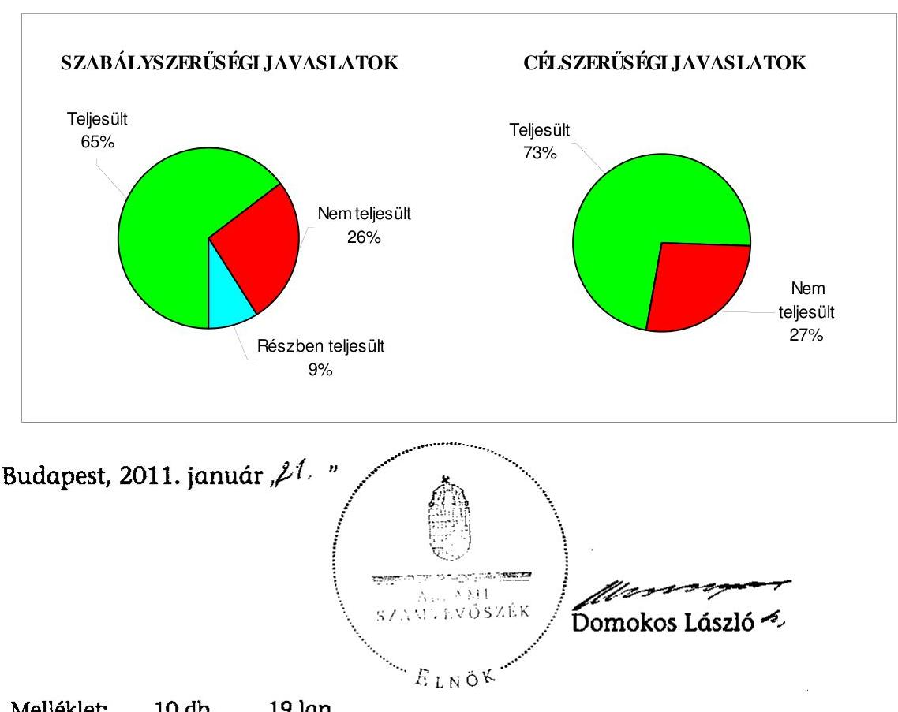

---

Budapest Főváros XX. kerület Pesterzsébet Önkormányzata

# Az Önkormányzat gazdálkodását meghatározó adatok, mutatószámok 

| Megnevezés |  |
| :--: | :--: |
| A település állandó lakosainak száma (fő) 2010. január 1-jén | 68763 |
| A Képviselő-testület tagjainak a száma (fő) (2009. december 31-én) | 27 |
| A Képviselő-testület munkáját segítő állandó bizottságok száma (2009. december 31-én) | 9 |
| A Polgármesteri hivatalban foglalkoztatott köztisztviselők száma (fő) (2009. december 31-én) | 201 |
| Az összes vagyon értéke a 2009. december 31-i könyvviteli mérleg szerint (millió Ft) | 24761 |
| Az adósságállomány (hosszú és rövid lejáratú kötelezettség) 2009. december 31-én (millió Ft) | 4852 |
| Az egy lakosra jutó adósságállomány 2009. december 31-én (Ft) | 70561 |
| Az összes 2009. évben teljesített költségvetési bevétel (millió Ft) | 10530 |
| Ebből: saját bevétel (millió Ft), melyből | 6157 |
| helyi adóbevétel (millió Ft) | 4066 |
| Az egy lakosra jutó 2009. évi költségvetési bevétel (Ft) | 153135 |
| Az egy lakosra jutó 2009. évi saját bevétel (Ft) | 89539 |
| Az egy lakosra jutó 2009. évi helyi adóbevétel (Ft) | 59131 |
| Saját bevétel/Összes költségvetési bevétel aránya a 2009. évben (\%) | 58,5 |
| Helyi adó bevétel/Összes költségvetési bevétel aránya a 2009. évben (\%) | 38,6 |
| Az összes teljesített költségvetési kiadás a 2009. évben (millió Ft) | 10070 |
| Ebből: felhalmozási célú költségvetési kiadás (millió Ft) | 686 |
| A 2009. évi költségvetési kiadásból a felhalmozási célú költségvetési kiadás aránya (\%) | 6,8 |
| Az egy lakosra jutó 2009. évi költségvetési kiadás (Ft) | 146445 |
| Az egy lakosra jutó 2009. évben teljesített felhalmozási célú költségvetési kiadás (Ft) | 9976 |
| A költségvetési intézmények száma 2009. december 31-én (db) | 31 |
| Ebből: önállóan müködő (db) | 25 |
| A költségvetési intézményekben foglalkoztatott közalkalmazottak száma (fő) (2009. december 31-én) | 1342 |

---

Budapest Főváros XX. kerület Pesterzsébet Önkormányzata

# Az önkormányzati vagyon alakulása

|  Mérlegsor megnevezése | 2007.év
(millió Ft) | 2008. év
(millió Ft) | 2009. év
(millió Ft) | Változás \%-a (Előző év=100\%) |  |   |
| --- | --- | --- | --- | --- | --- | --- |
|   |  |  |  | 2008/2007. | 2009/2008. | 2009/2007.  |
|  Immateriális javak | 222 | 206 | 181 | 92,8 | 87,9 | 81,5  |
|  Tárgyi eszközök | 21146 | 22303 | 21844 | 105,5 | 97,9 | 103,3  |
|  ebből: ingatlanok | 20866 | 20995 | 21543 | 100,6 | 102,6 | 103,2  |
|  beruházások, felújítások | 7 | 896 | 33 | 12800,0 | 3,7 | 471,4  |
|  Befektetett pénzügyi eszközök | 238 | 773 | 766 | 324,8 | 99,1 | 321,8  |
|  Üzemeltetésre átadott eszközök | 15 | 172 | 174 | 1146,7 | 101,2 | 1160,0  |
|  Befektetett eszközök összesen | 21621 | 23454 | 22965 | 108,5 | 97,9 | 106,2  |
|  Forgóeszközök összesen | 2781 | 1219 | 1796 | 43,8 | 147,3 | 64,6  |
|  ebből: követelések | 406 | 395 | 282 | 97,3 | 71,4 | 69,5  |
|  pénzeszközök | 1975 | 444 | 910 | 22,5 | 205,0 | 46,1  |
|  Eszközök összesen | 24402 | 24673 | 24761 | 101,1 | 100,4 | 101,5  |
|  Saját tőke összesen | 18687 | 20565 | 18952 | 110,0 | 92,2 | 101,4  |
|  Tartalék összesen | 2126 | 565 | 957 | 26,6 | 169,4 | 45,0  |
|  Kötelezettségek összesen | 3589 | 3543 | 4852 | 98,7 | 136,9 | 135,2  |
|  ebből: hosszú lejáratú kötelezettségek | 2718 | 2705 | 3462 | 99,5 | 128,0 | 127,4  |
|  rövid lejáratú kötelezettségek | 623 | 581 | 1147 | 93,3 | 197,4 | 184,1  |
|  Források összesen: | 24402 | 24673 | 24761 | 101,1 | 100,4 | 101,5  |

Forrás: Magyar Államkincstár éves költségvetési beszámoló "01" számú űrlap ÁSZ ellenőrzés során korrigált adatai.

---

Budapest Főváros XX. kerület Pesterzsébet Önkormányzata

# Az önkormányzati kötelezettségek alakulása

|  Mérlegsor
megnevezése | 2007.év
(millió Ft) | 2008. év
(millió Ft) | 2009. év
(millió Ft) | Változás \%-a (Előző év=100\%) |  |   |
| --- | --- | --- | --- | --- | --- | --- |
|   |  |  |  | 2008/2007. | 2009/2008. | 2009/2007.  |
|  Hosszú lejáratú kötelezettségek összesen | 2718 | 2705 | 3462 | 99,5 | 128,0 | 127,4  |
|  ebből: hosszú lejáratra kapott kölcsönök | 0 | 0 | 0 | 0,0 | 0,0 | 0,0  |
|  tartozások fejlesztési célú kötvénykibocsátásból | 2600 | 2600* | 2907** | 100,0 | 111,8 | 111,8  |
|  tartozások müködési célú kötvénykibocsátásból | 0 | 0 | 0 | 0,0 | 0,0 | 0,0  |
|  beruházási és fejlesztési hitelek | 118 | 104 | 554 | 88,1 | 532,7 | 469,5  |
|  müködési célú hosszú lejáratú hitelek | 0 | 0 | 0 | 0,0 | 0,0 | 0,0  |
|  egyéb hosszú lejáratú kötelezettségek | 0 | 0 | 0 | 0,0 | 0,0 | 0,0  |
|  Rövid lejáratú kötelezettségek összesen | 623 | 581 | 1147 | 93,3 | 197,4 | 184,1  |
|  ebből: rövid lejáratú kölcsönök | 12 | 0 | 0 | 0,0 | 0,0 | 0,0  |
|  rövid lejáratú hitelek | 197 | 135 | 313 | 68,5 | 231,9 | 158,9  |
|  kötelezettségek áruszállításból, szolgáltatásból | 46 | 45 | 57 | 97,8 | 126,7 | 123,9  |
|  garancia- és kezességvállalásból szárm. köt. | 0 | 0 | 0 | 0,0 | 0,0 | 0,0  |
|  h. lejár. kapott kölcsön köv. évet terh.törl.részl. | 0 | 0 | 0 | 0,0 | 0,0 | 0,0  |
|  felh.c.kötv.kib-ból szárm.tart.köv.évet terh.r. | 0 | 0 | 117 | 0,0 | 0,0 | 0,0  |
|  mük.c.kötv.kib-ból szárm.tart.köv.évet terh.r. | 0 | 0 | 0 | 0,0 | 0,0 | 0,0  |

---

|  Mérlegsor
megnevezése | 2007.év
(millió Ft) | 2008. év
(millió Ft) | 2009. év
(millió Ft) | Változás \%-a (Előző év=100\%) |  |   |
| --- | --- | --- | --- | --- | --- | --- |
|   |  |  |  | 2008/2007. | 2009/2008. | 2009/2007.  |
|  beruh.fejl.hitel köv.évet terhelő törl. részlete | 8 | 13 | 57 | 162,5 | 438,5 | 712,5  |
|  működési c.hosszú lej.hitel köv.évet terh.törl.r. | 0 | 0 | 0 | 0,0 | 0,0 | 0,0  |
|  egyéb hosszú lej.köt.köv.évet terh.törl. részlete | 0 | 0 | 0 | 0,0 | 0,0 | 0,0  |

Forrás: Magyar Államkincstár éves költségvetési beszámoló "01" számú űrlap adatai.

- A fejlesztési célú kötvény év végi értékelése az Áhsz. 33. §-ában előírtak ellenére elmaradt. ** Az auditálási eltéréssel korrigált adat.

---

Budapest Főváros XX. kerület Pesterzsébet Önkormányzata Az Önkormányzat 2007-2010. évi költségvetési előirányzatainak és 2007-2009. évi pénzügyi teljesítéseinek alakulása

|  Megnevezés | 2007. év |  |  |  | 2008. év |  |  |  | 2009. év |  |  |  | 2010.  |
| --- | --- | --- | --- | --- | --- | --- | --- | --- | --- | --- | --- | --- | --- |
|   | Eredeti | Módosított | Teljesítés (millió Ft) | Teljesítés/ eredeti előirány- zat \% | Eredeti | Módosított | Teljesítés (millió Ft) | Teljesítés (millió Ft) | Teljesítés/ eredeti előirány- zat \% | Eredeti | Módosított | Teljesítés (millió Ft) | Teljesítés (millió Ft)  |
|  Müködési célú költségvetési bevételek összesen | 7569 | 8670 | 8775 | 115,9 | 7977 | 9578 | 9729 | 122,0 | 8424 | 9384 | 9480 | 112,5 | 8357  |
|  Müködési célú költségvetési kiadások összesen | 7570 | 9127 | 8388 | 110,8 | 8395 | 9785 | 9421 | 112,2 | 8576 | 9539 | 9384 | 109,4 | 8440  |
|  Müködési célú költségvetési bevételek és kiadások egyenlege: hiány-, többlet + | $-1$ | $-457$ | 387 |  | $-418$ | $-207$ | 308 |  | $-152$ | $-155$ | 96 |  | $-83$  |
|  Felhalmozási célú költségvetési bevételek összesen | 744 | 1099 | 902 | 121,2 | 3236 | 3044 | 2723 | 84,1 | 756 | 1235 | 1050 | 138,9 | 1839  |
|  Felhalmozási célú költségvetési kiadások összesen | 1519 | 2623 | 811 | 53,4 | 3165 | 3345 | 2648 | 83,7 | 1328 | 2037 | 686 | 51,7 | 1865  |
|  Felhalmozási célú költségvetési bevételek és kiadások egyenlege: hiány-, többlet+ | $-775$ | $-1524$ | 91 |  | 71 | $-301$ | 75 | 105,6 | $-572$ | $-802$ | 364 |  | $-26$  |
|  Költségvetési bevételek összesen | 8314 | 9769 | 9677 | 116,4 | 11213 | 12622 | 12452 | 111,0 | 9180 | 10619 | 10530 | 114,7 | 10196  |
|  Költségvetési kiadások összesen | 9090 | 11750 | 9199 | 101,2 | 11560 | 13130 | 12069 | 104,4 | 9904 | 11576 | 10070 | 101,7 | 10305  |
|  Költségvetési bevételek és kiadások egyenlege: hiány-, többlet+ | $-776$ | $-1981$ | 478 |  | $-347$ | $-508$ | 383 |  | $-724$ | $-957$ | 460 |  | $-109$  |
|  Finanszírozási célú pénzügyi bevételek | 952 | 3067 | 2710 |  | 355 | 516 | 0 |  | 744 | 999 | 710 |  | 283  |
|  Finanszírozási célú pénzügyi kiadások | 176 | 1086 | 1086 |  | 8 | 8 | 70 |  | 20 | 42 | 38 |  | 174  |
|  Finanszírozási célú pénzügyi műveletek egyenlege | 776 | 1981 | 1624 |  | 347 | 508 | $-70$ |  | 724 | 957 | 672 |  | 109  |

Forrás: - Magyar Államkincstár éves költségvetési beszámoló "80" számú űrlap ÁSZ ellenőrzés során korrigált (könyvvizsgáló auditálási eltését is figyelembe véve) adatai;

- a 2010. évi adatok esetében az Önkormányzat 2010. évi költségvetése;
- a költségvetési bevétel-kiadás müködési-felhalmozási célra történt megosztásánál az analitikus nyilvántartás.

---

Bulliştezi Företete XX. kon宗̆ar Perpozisyonu

TANI/SITVANY az európai uniós forrásokkal támogatott célok és programok 2007-2010. évi tervezett és teljesített adatairól

|  |   |   |   |   |   |   |   |   |   |   |   |   |   |   |   |   |   |   |   |   |   |   |   |   |   |   |   |
| --- | --- | --- | --- | --- | --- | --- | --- | --- | --- | --- | --- | --- | --- | --- | --- | --- | --- | --- | --- | --- | --- | --- | --- | --- | --- | --- | --- |
|  Sor-
cátol | Az európai uniós forrásokkal támogatott program megnevezése és a pályázat célja | Tervezett összes bekezdési költség |  |  |  |  |  |  |  |  |  |  |  |  |  |  |  |  |  |  |  |  |  |  |  |  |   |
|   |  |  |  |  |  |  |  |  |  |  |  |  |  |  |  |  |  |  |  |  |  |  |  |  |  |  |   |
|   |  |  |  |  |  |  |  |  |  |  |  |  |  |  |  |  |  |  |  |  |  |  |  |  |  |  |   |
|   |  |  |  |  |  |  |  |  |  |  |  |  |  |  |  |  |  |  |  |  |  |  |  |  |  |  |   |
|  1. |  |  |  |  |  |  |  |  |  |  |  |  |  |  |  |  |  |  |  |  |  |  |  |  |  |  |   |
|   |  |  |  |  |  |  |  |  |  |  |  |  |  |  |  |  |  |  |  |  |  |  |  |  |  |  |   |
|  2. |  |  |  |  |  |  |  |  |  |  |  |  |  |  |  |  |  |  |  |  |  |  |  |  |  |  |   |
|   |  |  |  |  |  |  |  |  |  |  |  |  |  |  |  |  |  |  |  |  |  |  |  |  |  |  |   |
|  3. |  |  |  |  |  |  |  |  |  |  |  |  |  |  |  |  |  |  |  |  |  |  |  |  |  |  |   |
|   |  |  |  |  |  |  |  |  |  |  |  |  |  |  |  |  |  |  |  |  |  |  |  |  |  |  |   |
|   |  |  |  |  |  |  |  |  |  |  |  |  |  |  |  |  |  |  |  |  |  |  |  |  |  |  |   |
|  4. |  |  |  |  |  |  |  |  |  |  |  |  |  |  |  |  |  |  |  |  |  |  |  |  |  |  |   |
|   |  |  |  |  |  |  |  |  |  |  |  |  |  |  |  |  |  |  |  |  |  |  |  |  |  |  |   |
|   |  |  |  |  |  |  |  |  |  |  |  |  |  |  |  |  |  |  |  |  |  |  |  |  |  |  |   |
|  5. |  |  |  |  |  |  |  |  |  |  |  |  |  |  |  |  |  |  |  |  |  |  |  |  |  |  |   |
|   |  |  |  |  |  |  |  |  |  |  |  |  |  |  |  |  |  |  |  |  |  |  |  |  |  |  |   |
|   |  |  |  |  |  |  |  |  |  |  |  |  |  |  |  |  |  |  |  |  |  |  |  |  |  |  |   |
|  6. |  |  |  |  |  |  |  |  |  |  |  |  |  |  |  |  |  |  |  |  |  |  |  |  |  |  |   |
|   |  |  |  |  |  |  |  |  |  |  |  |  |  |  |  |  |  |  |  |  |  |  |  |  |  |  |   |
|   |  |  |  |  |  |  |  |  |  |  |  |  |  |  |  |  |  |  |  |  |  |  |  |  |  |  |   |
|  7. |  |  |  |  |  |  |  |  |  |  |  |  |  |  |  |  |  |  |  |  |  |  |  |  |  |  |   |
|   |  |  |  |  |  |  |  |  |  |  |  |  |  |  |  |  |  |  |  |  |  |  |  |  |  |  |   |
|   |  |  |  |  |  |  |  |  |  |  |  |  |  |  |  |  |  |  |  |  |  |  |  |  |  |  |   |
|  8. |  |  |  |  |  |  |  |  |  |  |  |  |  |  |  |  |  |  |  |  |  |  |  |  |  |  |   |
|   |  |  |  |  |  |  |  |  |  |  |  |  |  |  |  |  |  |  |  |  |  |  |  |  |  |  |   |
|   |  |  |  |  |  |  |  |  |  |  |  |  |  |  |  |  |  |  |  |  |  |  |  |  |  |  |   |
|  9. |  |  |  |  |  |  |  |  |  |  |  |  |  |  |  |  |  |  |  |  |  |  |  |  |  |  |   |
|   |  |  |  |  |  |  |  |  |  |  |  |  |  |  |  |  |  |  |  |  |  |  |  |  |  |  |   |
|   |  |  |  |  |  |  |  |  |  |  |  |  |  |  |  |  |  |  |  |  |  |  |  |  |  |  |   |
|  10. |  |  |  |  |  |  |  |  |  |  |  |  |  |  |  |  |  |  |  |  |  |  |  |  |  |  |   |
|   |  |  |  |  |  |  |  |  |  |  |  |  |  |  |  |  |  |  |  |  |  |  |  |  |  |  |   |
|  11. |  |  |  |  |  |  |  |  |  |  |  |  |  |  |  |  |  |  |  |  |  |  |  |  |  |  |   |
|   |  |  |  |  |  |  |  |  |  |  |  |  |  |  |  |  |  |  |  |  |  |  |  |  |  |  |   |
|  12. |  |  |  |  |  |  |  |  |  |  |  |  |  |  |  |  |  |  |  |  |  |  |  |  |  |  |   |
|  13. |  |  |  |  |  |  |  |  |  |  |  |  |  |  |  |  |  |  |  |  |  |  |  |  |  |  |   |
|  14. |  |  |  |  |  |  |  |  |  |  |  |  |  |  |  |  |  |  |  |  |  |  |  |  |  |  |   |
|   |  |  |  |  |  |  |  |  |  |  |  |  |  |  |  |  |  |  |  |  |  |  |  |  |  |  |   |
|  15. |  |  |  |  |  |  |  |  |  |  |  |  |  |  |  |  |  |  |  |  |  |  |  |  |  |  |   |
|  16. |  |  |  |  |  |  |  |  |  |  |  |  |  |  |  |  |  |  |  |  |  |  |  |  |  |  |   |
|  17. |  |  |  |  |  |  |  |  |  |  |  |  |  |  |  |  |  |  |  |  |  |  |  |  |  |  |   |
|  18. |  |  |  |  |  |  |  |  |  |  |  |  |  |  |  |  |  |  |  |  |  |  |  |  |  |  |   |
|  19. |  |  |  |  |  |  |  |  |  |  |  |  |  |  |  |  |  |  |  |  |  |  |  |  |  |  |   |
|  20. |  |  |  |  |  |  |  |  |  |  |  |  |  |  |  |  |  |  |  |  |  |  |  |  |  |  |   |
|  21. |  |  |  |  |  |  |  |  |  |  |  |  |  |  |  |  |  |  |  |  |  |  |  |  |  |  |   |
|  22. |  |  |  |  |  |  |  |  |  |  |  |  |  |  |  |  |  |  |  |  |  |  |  |  |  |  |   |
|  23. |  |  |  |  |  |  |  |  |  |  |  |  |  |  |  |  |  |  |  |  |  |  |  |  |  |  |   |
|  24. |  |  |  |  |  |  |  |  |  |  |  |  |  |  |  |  |  |  |  |  |  |  |  |  |  |  |   |
|  25. |  |  |  |  |  |  |  |  |  |  |  |  |  |  |  |  |  |  |  |  |  |  |  |  |  |  |   |
|  26. |  |  |  |  |  |  |  |  |  |  |  |  |  |  |  |  |  |  |  |  |  |  |  |  |  |  |   |
|  27. |  |  |  |  |  |  |  |  |  |  |  |  |  |  |  |  |  |  |  |  |  |  |  |  |  |  |   |
|  28. |  |  |  |  |  |  |  |  |  |  |  |  |  |  |  |  |  |  |  |  |  |  |  |  |  |  |   |
|  29. |  |  |  |  |  |  |  |  |  |  |  |  |  |  |  |  |  |  |  |  |  |  |  |  |  |  |   |
|  30. |  |  |  |  |  |  |  |  |  |  |  |  |  |  |  |  |  |  |  |  |  |  |  |  |  |  |   |
|  31. |  |  |  |  |  |  |  |  |  |  |  |  |  |  |  |  |  |  |  |  |  |  |  |  |  |  |   |
|  32. |  |  |  |  |  |  |  |  |  |  |  |  |  |  |  |  |  |  |  |  |  |  |  |  |  |  |   |
|  33. |  |  |  |  |  |  |  |  |  |  |  |  |  |  |  |  |  |  |  |  |  |  |  |  |  |  |   |
|  34. |  |  |  |  |  |  |  |  |  |  |  |  |  |  |  |  |  |  |  |  |  |  |  |  |  |  |   |
|  35. |  |  |  |  |  |  |  |  |  |  |  |  |  |  |  |  |  |  |  |  |  |  |  |  |  |  |   |
|  36. |  |  |  |  |  |  |  |  |  |  |  |  |  |  |  |  |  |  |  |  |  |  |  |  |  |  |   |
|  37. |  |  |  |  |  |  |  |  |  |  |  |  |  |  |  |  |  |  |  |  |  |  |  |  |  |  |   |
|  38. |  |  |  |  |  |  |  |  |  |  |  |  |  |  |  |  |  |  |  |  |  |  |  |  |  |  |   |
|  39. |  |  |  |  |  |  |  |  |  |  |  |  |  |  |  |  |  |  |  |  |  |  |  |  |  |  |   |
|  40. |  |  |  |  |  |  |  |  |  |  |  |  |  |  |  |  |  |  |  |  |  |  |  |  |  |  |   |
|  41. |  |  |  |  |  |  |  |  |  |  |  |  |  |  |  |  |  |  |  |  |  |  |  |  |  |  |   |
|  42. |  |  |  |  |  |  |  |  |  |  |  |  |  |  |  |  |  |  |  |  |  |  |  |  |  |  |   |
|  43. |  |  |  |  |  |  |  |  |  |  |  |  |  |  |  |  |  |  |  |  |  |  |  |  |  |  |   |
|  44. |  |  |  |  |  |  |  |  |  |  |  |  |  |  |  |  |  |  |  |  |  |  |  |  |  |  |   |
|  45. |  |  |  |  |  |  |  |  |  |  |  |  |  |  |  |  |  |  |  |  |  |  |  |  |  |  |   |
|  46. |  |  |  |  |  |  |  |  |  |  |  |  |  |  |  |  |  |  |  |  |  |  |  |  |  |  |   |
|  47. |  |  |  |  |  |  |  |  |  |  |  |  |  |  |  |  |  |  |  |  |  |  |  |  |  |  |   |
|  48. |  |  |  |  |  |  |  |  |  |  |  |  |  |  |  |  |  |  |  |  |  |  |  |  |  |  |   |
|  49. |  |  |  |  |  |  |  |  |  |  |  |  |  |  |  |  |  |  |  |  |  |  |  |  |  |  |   |
|  50. |  |  |  |  |  |  |  |  |  |  |  |  |  |  |  |  |  |  |  |  |  |  |  |  |  |  |   |
|  51. |  |  |  |  |  |  |  |  |  |  |  |  |  |  |  |  |  |  |  |  |  |  |  |  |  |  |   |
|  52. |  |  |  |  |  |  |  |  |  |  |  |  |  |  |  |  |  |  |  |  |  |  |  |  |  |  |   |
|  53. |  |  |  |  |  |  |  |  |  |  |  |  |  |  |  |  |  |  |  |  |  |  |  |  |  |  |   |
|  54. |  |  |  |  |  |  |  |  |  |  |  |  |  |  |  |  |  |  |  |  |  |  |  |  |  |  |   |
|  55. |  |  |  |  |  |  |  |  |  |  |  |  |  |  |  |  |  |  |  |  |  |  |  |  |  |  |   |
|  56. |  |  |  |  |  |  |  |  |  |  |  |  |  |  |  |  |  |  |  |  |  |  |  |  |  |  |   |
|  57. |  |  |  |  |  |  |  |  |  |  |  |  |  |  |  |  |  |  |  |  |  |  |  |  |  |  |   |
|  58. |  |  |  |  |  |  |  |  |  |  |  |  |  |  |  |  |  |  |  |  |  |  |  |  |  |  |   |
|  59. |  |  |  |  |  |  |  |  |  |  |  |  |  |  |  |  |  |  |  |  |  |  |  |  |  |  |   |
|  60. |  |  |  |  |  |  |  |  |  |  |  |  |  |  |  |  |  |  |  |  |  |  |  |  |  |  |   |
|  61. |  |  |  |  |  |  |  |  |  |  |  |  |  |  |  |  |  |  |  |  |  |  |  |  |  |  |   |
|  62. |  |  |  |  |  |  |  |  |  |  |  |  |  |  |  |  |  |  |  |  |  |  |  |  |  |  |   |
|  63. |  |  |  |  |  |  |  |  |  |  |  |  |  |  |  |  |  |  |  |  |  |  |  |  |  |  |   |
|  64. |  |  |  |  |  |  |  |  |  |  |  |  |  |  |  |  |  |  |  |  |  |  |  |  |  |  |   |
|  65. |  |  |  |  |  |  |  |  |  |  |  |  |  |  |  |  |  |  |  |  |  |  |  |  |  |  |   |
|  66. |  |  |  |  |  |  |  |  |  |  |  |  |  |  |  |  |  |  |  |  |  |  |  |  |  |  |   |
|  67. |  |  |  |  |  |  |  |  |  |  |  |  |  |  |  |  |  |  |  |  |  |  |  |  |  |  |   |
|  68. |  |  |  |  |  |  |  |  |  |  |  |  |  |  |  |  |  |  |  |  |  |  |  |  |  |  |   |
|  69. |  |  |  |  |  |  |  |  |  |  |  |  |  |  |  |  |  |  |  |  |  |  |  |  |  |  |   |
|  70. |  |  |  |  |  |  |  |  |  |  |  |  |  |  |  |  |  |  |  |  |  |  |  |  |  |  |   |
|  71. |  |  |  |  |  |  |  |  |  |  |  |  |  |  |  |  |  |  |  |  |  |  |  |  |  |  |   |
|  72. |  |  |  |  |  |  |  |  |  |  |  |  |  |  |  |  |  |  |  |  |  |  |  |  |  |  |   |
|  73. |  |  |  |  |  |  |  |  |  |  |  |  |  |  |  |  |  |  |  |  |  |  |  |  |  |  |   |
|  74. |  |  |  |  |  |  |  |  |  |  |  |  |  |  |  |  |  |  |  |  |  |  |  |  |  |  |   |
|  75. |  |  |  |  |  |  |  |  |  |  |  |  |  |  |  |  |  |  |  |  |  |  |  |  |  |  |   |
|  76. |  |  |  |  |  |  |  |  |  |  |  |  |  |  |  |  |  |  |  |  |  |  |  |  |  |  |   |
|  77. |  |  |  |  |  |  |  |  |  |  |  |  |  |  |  |  |  |  |  |  |  |  |  |  |  |  |   |
|  78. |  |  |  |  |  |  |  |  |  |  |  |  |  |  |  |  |  |  |  |  |  |  |  |  |  |  |   |
|  79. |  |  |  |  |  |  |  |  |  |  |  |  |  |  |  |  |  |  |  |  |  |  |  |  |  |  |   |
|  80. |  |  |  |  |  |  |  |  |  |  |  |  |  |  |  |  |  |  |  |  |  |  |  |  |  |  |  |   |
|  81. |  |  |  |  |  |  |  |  |  |  |  |  |  |  |  |  |  |  |  |  |  |  |  |  |  |  |  |   |
|  82. |  |  |  |  |  |  |  |  |  |  |  |  |  |  |  |  |  |  |  |  |  |  |  |  |  |  |  |   |
|  83. |  |  |  |  |  |  |  |  |  |  |  |  |  |  |  |  |  |  |  |  |  |  |  |  |  |  |  |   |
|  84. |  |  |  |  |  |  |  |  |  |  |  |  |  |  |  |  |  |  |  |  |  |  |  |  |  |  |  |   |
|  85. |  |  |  |  |  |  |  |  |  |  |  |  |  |  |  |  |  |  |  |  |  |  |  |  |  |  |  |   |
|  86. |  |  |  |  |  |  |  |  |  |  |  |  |  |  |  |  |  |  |  |  |  |  |  |  |  |  |  |  |   |
|  87. |  |  |  |  |  |  |  |  |  |  |  |  |  |  |  |  |  |  |  |  |  |  |  |  |  |  |  |  |   |
|  88. |  |  |  |  |  |  |  |  |  |  |  |  |  |  |  |  |  |  |  |  |  |  |  |  |  |  |  |  |   |
|  89. |  |  |  |  |  |  |  |  |  |  |  |  |  |  |  |  |  |  |  |  |  |  |  |  |  |  |  |  |   |
|  90. |  |  |  |  |  |  |  |  |  |  |  |  |  |  |  |  |  |  |  |  |  |  |  |  |  |  |  |  |   |
|  91. |  |  |  |  |  |  |  |  |  |  |  |  |  |  |  |  |  |  |  |  |  |  |  |  |  |  |  |  |   |
|  92. |  |  |  |  |  |  |  |  |  |  |  |  |  |  |  |  |  |  |  |  |  |  |  |  |  |  |  |  |   |
|  93. |  |  |  |  |  |  |  |  |  |  |  |  |  |  |  |  |  |  |  |  |  |  |  |  |  |  |  |  |   |
|  94. |  |  |  |  |  |  |  |  |  |  |  |  |  |  |  |  |  |  |  |  |  |  |  |  |  |  |  |  |  |   |
|  95. |  |  |  |  |  |  |  |  |  |  |  |  |  |  |  |  |  |  |  |  |  |  |  |  |  |  |  |  |  |   |
|  96. |  |  |  |  |  |  |  |  |  |  |  |  |  |  |  |  |  |  |  |  |  |  |  |  |  |  |  |  |  |  |   |
|  97. |  |  |  |  |  |  |  |  |  |  |  |  |  |  |  |  |  |  |  |  |  |  |  |  |  |  |  |  |  |  |   |
|  98. |  |  |  |  |  |  |  |  |  |  |  |  |  |  |  |  |  |  |  |  |  |  |  |  |  |  |  |  |  |  |  |   |
|  99. |  |  |  |  |  |  |  |  |  |  |  |  |  |  |  |  |  |  |  |  |  |  |  |  |  |  |  |  |  |  |  |  |   |
|  100. |  |  |  |  |  |  |  |  |  |  |  |  |  |  |  |  |  |  |  |  |  |  |  |  |  |  |  |  |  |  |  |  |   |
|  101. |  |  |  |  |  |  |  |  |  |  |  |  |  |  |  |  |  |  |  |  |  |  |  |  |  |  |  |  |  |  |  |  |  |   |
|  102. |  |  |  |  |  |  |  |  |  |  |  |  |  |  |  |  |  |  |  |  |  |  |  |  |  |  |  |  |  |  |  |  |  |   |
|  103. |  |  |  |  |  |  |  |  |  |  |  |  |  |  |  |  |  |  |  |  |  |  |  |  |  |  |  |  |  |  |  |  |  |  |   |
|  104. |  |  |  |  |  |  |  |  |  |  |  |  |  |  |  |  |  |  |  |  |  |  |  |  |  |  |  |  |  |  |  |  |  |  |  |   |
|  105. |  |  |  |  |  |  |  |  |  |  |  |  |  |  |  |  |  |  |  |  |  |  |  |  |  |  |  |  |  |  |  |  |  |  |  |   |
|  106. |  |  |  |  |  |  |  |  |  |  |  |  |  |  |  |  |  |  |  |  |  |  |  |  |  |  |  |  |  |  |  |  |  |  |  |  |   |
|  107. |  |  |  |  |  |  |  |  |  |  |  |  |  |  |  |  |  |  |  |  |  |  |  |  |  |  |  |  |  |  |  |  |  |  |  |  |   |
|  108. |  |  |  |  |  |  |  |  |  |  |  |  |  |  |  |  |  |  |  |  |  |  |  |  |  |  |  |  |  |  |  |  |  |  |  |  |   |
|  109. |  |  |  |  |  |  |  |  |  |  |  |  |  |  |  |  |  |  |  |  |  |  |  |  |  |  |  |  |  |  |  |  |  |  |  |  |  |   |
|  110. |  |  |  |  |  |  |  |  |  |  |  |  |  |  |  |  |  |  |  |  |  |  |  |  |  |  |  |  |  |  |  |  |  |  |  |  |  |   |
|  111. |  |  |  |  |  |  |  |  |  |  |  |  |  |  |  |  |  |  |  |  |  |  |  |  |  |  |  |  |  |  |  |  |  |  |  |  |  |  |  |   |
|  112. |  |  |  |  |  |  |  |  |  |  |  |  |  |  |  |  |  |  |  |  |  |  |  |  |  |  |  |  |  |  |  |  |  |  |  |  |  |  |  |   |
|  113. |  |  |  |  |  |  |  |  |  |  |  |  |  |  |  |  |  |  |  |  |  |  |  |  |  |  |  |  |  |  |  |  |  |  |  |  |  |  |  |  |   |
|  114. |  |  |  |  |  |  |  |  |  |  |  |  |  |  |  |  |  |  |  |  |  |  |  |  |  |  |  |  |  |  |  |  |  |  |  |  |  |  |  |  |  |   |
|  115. |  |  |  |  |  |  |  |  |  |  |  |  |  |  |  |  |  |  |  |  |  |  |  |  |  |  |  |  |  |  |  |  |  |  |  |  |  |  |  |  |   |
|  116. |  |  |  |  |  |  |  |  |  |  |  |  |  |  |  |  |  |  |  |  |  |  |  |  |  |  |  |  |  |  |  |  |  |  |  |  |  |  |  |  |  |  |   |
|  117. |  |  |  |  |  |  |  |  |  |  |  |  |  |  |  |  |  |  |  |  |  |  |  |  |  |  |  |  |  |  |  |  |  |  |  |  |  |  |  |  |  |  |   |
|  118. |  |  |  |  |  |  |  |  |  |  |  |  |  |  |  |  |  |  |  |  |  |  |  |  |  |  |  |  |  |  |  |  |  |  |  |  |  |  |  |  |  |  |  |  |   |
|  119. |  |  |  |  |  |  |  |  |  |  |  |  |  |  |  |  |  |  |  |  |  |  |  |  |  |  |  |  |  |  |  |  |  |  |  |  |  |  |  |  |  |  |  |  |   |
|  120. |  |  |  |  |  |  |  |  |  |  |  |  |  |  |  |  |  |  |  |  |  |  |  |  |  |  |  |  |  |  |  |  |  |  |  |  |  |  |  |  |  |  |  |  |  |  |   |
|  121. |  |  |  |  |  |  |  |  |  |  |  |  |  |  |  |  |  |  |  |  |  |  |  |  |  |  |  |  |  |  |  |  |  |  |  |  |  |  |  |  |  |  |  |  |  |  |  |  |   |
|  122. |  |  |  |  |  |  |  |  |  |  |  |  |  |  |  |  |  |  |  |  |  |  |  |  |  |  |  |  |  |  |  |  |  |  |  |  |  |  |  |  |  |  |  |  |  |  |   |
|  123. |  |  |  |  |  |  |  |  |  |  |  |  |  |  |  |  |  |  |  |  |  |  |  |  |  |  |  |  |  |  |  |  |  |  |  |  |  |  |  |  |  |  |  |  |  |  |   |
|  124. |  |  |  |  |  |  |  |  |  |  |  |  |  |  |  |  |  |  |  |  |  |  |  |  |  |  |  |  |  |  |  |  |  |  |  |  |  |  |  |  |  |  |  |  |  |  |  |  |   |
|  125. |  |  |  |  |  |  |  |  |  |  |  |  |  |  |  |  |  |  |  |  |  |  |  |  |  |  |  |  |  |  |  |  |  |  |  |  |  |  |  |  |  |  |  |  |  |   |
|  126. |  |  |  |  |  |  |  |  |  |  |  |  |  |  |  |  |  |  |  |  |  |  |  |  |  |  |  |  |  |  |  |  |  |  |  |  |  |  |  |  |  |  |  |   |
|  127. |  |  |  |  |  |  |  |  |  |  |  |  |  |  |  |  |  |  |  |  |  |  |  |  |  |  |  |  |  |  |  |  |  |  |  |  |  |  |  |  |  |  |   |
|  128. |  |  |  |  |  |  |  |  |  |  |  |  |  |  |  |  |  |  |  |  |  |  |  |  |  |  |  |  |  |  |  |  |  |  |  |  |  |   |
|  129. |  |  |  |  |  |  |  |  |  |  |  |  |  |  |  |  |  |  |  |  |  |  |  |  |  |  |  |  |  |  |  |  |  |  |  |  |  |  |  |   |
|  130. |  |  |  |  |  |  |  |  |  |  |  |  |  |  |  |  |  |  |  |  |  |  |  |  |  |  |  |  |  |  |  |  |  |  |  |  |  |  |  |  |  |  |   |
|  131. |  |  |  |  |  |  |  |  |  |  |  |  |  |  |  |  |  |  |  |  |  |  |  |  |  |  |  |  |  |  |  |  |  |  |  |  |  |  |   |
|  132. |  |  |  |  |  |  |  |  |  |  |  |  |  |  |  |  |  |  |  |  |  |  |  |  |  |  |  |  |  |  |  |  |  |  |  |  |  |  |  |  |  |  |  |  |   |
|  133. |  |  |  |  |  |  |  |  |  |  |  |  |  |  |  |  |  |  |  |  |  |  |  |  |  |  |  |  |  |  |  |  |  |  |  |  |  |   |
|  134. |  |  |  |  |  |  |  |  |  |  |  |  |  |  |  |  |  |  |  |  |  |  |  |  |  |  |  |  |  |  |  |  |  |  |  |  |  |  |  |  |  |   |
|  135. |  |  |  |  |  |  |  |  |  |  |  |  |  |  |  |  |  |  |  |  |  |  |  |  |  |  |  |  |  |  |  |  |  |  |  |  |  |  |  |  |   |
|  136. |  |  |  |  |  |  |  |  |  |  |  |  |  |  |  |  |  |  |  |  |  |  |  |  |  |  |  |  |  |  |  |  |  |  |  |  |  |  |  |  |  |  |  |  |   |
|  137. |  |  |  |  |  |  |  |  |  |  |  |  |  |  |  |  |  |  |  |  |  |  |  |  |  |  |  |  |  |  |  |  |  |  |  |  |  |  |   |
|  138. |  |  |  |  |  |  |  |  |  |  |  |  |  |  |  |  |  |  |  |  |  |  |  |  |  |  |  |  |  |  |  |  |  |  |  |  |  |  |  |  |   |
|  139. |  |  |  |  |  |  |  |  |  |  |  |  |  |  |  |  |  |  |  |  |  |  |  |  |  |  |  |  |  |  |  |  |  |  |  |  |  |  |  |  |   |
|  140. |  |  |  |  |  |  |  |  |  |  |  |  |  |  |  |  |  |  |  |  |  |  |  |  |  |  |  |  |  |  |  |  |  |  |  |  |  |  |   |
|  141. |  |  |  |  |  |  |  |  |  |  |  |  |  |  |  |  |  |  |  |  |  |  |  |  |  |  |  |  |  |  |  |  |  |  |  |  |  |  |  |   |
|  15. |  |  |  |  |  |  |  |  |  |  |  |  |  |  |  |  |  |  |  |  |  |  |  |  |  |  |  |  |  |  |  |  |  |  |  |  |  |  |  |   |
|  15. |  |  |  |  |  |  |  |  |  |  |  |  |  |  |  |  |  |  |  |  |  |  |  |  |  |  |  |  |  |  |  |  |  |  |  |  |  |  |  |  |  |  |  |  |   |
|  16. |  |  |  |  |  |  |  |  |  |  |  |  |  |  |  |  |  |  |  |  |  |  |  |  |  |  |  |  |  |  |  |  |  |  |  |  |  |  |  |  |   |
|  17. |  |  |  |  |  |  |  |  |  |  |  |  |  |  |  |  |  |  |  |  |  |  |  |  |  |  |  |  |  |  |  |  |  |  |  |  |  |  |  |  |  |  |  |  |  |  |  |  |  |  |   |
|  18. |  |  |  |  |  |  |  |  |  |  |  |  |  |  |  |  |  |  |  |  |  |  |  |  |  |  |  |  |  |  |  |  |  |  |  |  |  |  |  |  |  |  |  |  |  |  |  |  |  |  |  |  |  |  |  |  |  |  |  |  |  |  |  |  |  |  |  |  |  |  |  |  |  |  |  |  |  |  |  |  |  |  |  |  |  |  |  |  |  |  |  |  |  |  |  |  |  |  |  |  |  |  |  |  |  |  |  |  |  |  |  |  |  |  |  |  |  |

---

|  |   |   |   |   |   |   |   |   |   |   |   |   |   |   |   |   |   |   |   |   |   |   |   |   |   |   |   |   |   |   |   |   |   |   |   |   |   |   |   |   |   |   |   |   |   |   |   |   |   |   |   |   |   |   |   |   |   |   |   |   |   |   |   |   |   |   |   |   |   |   |   |   |   |   |   |   |   |   |   |   |   |   |   |   |   |   |   |   |   |   |   |   |   |   |   |   |   |   |   |   |   |   |

---

4/a. számú gefléklet a V-3023-7/24/2010. számú jelentéshez

Budapest Főváros XX. kmület Posterzsébet Önkormányzata

TANÚSÍTVÁNY az európai uniós forrásokra 2007-2010 között benyújtott pályázatokról, amelyek elbírálásáról az Önkormányzat még nem kapott tájékoztatást

|  |   |   |   |   |   |   |   |   |   |   |
| --- | --- | --- | --- | --- | --- | --- | --- | --- | --- | --- |
|  Sor-
cian | Az európai uniós forrásokra benyújtott pályázat megnevezése és célja | összes kiadás | európai uniós támogatás |  | A benyújtott pályázat adatai (indító IV) az összes kiadást finanszírozni források |  |  |  |  | Tervezett  |
|   |  |  |  |  | Hozzasti állandástvaróai finanszírozás |  |  |  |  |   |
|   |  |  |  |  | késponti (fossal) | EU Church Alser | helyi
(raját) | hitel | egyéb forrás
(jel magán) | beköveti
betés(él)  |
|  1. | L.NFT operatív programjai |  |  |  |  |  |  |  |  |   |
|  2. |  |  |  |  |  |  |  |  |  |   |
|  3. | IL.ÚMFT operatív programjai |  |  |  |  |  |  |  |  |   |
|  4. | intézközönni hatító
TÁMOP-3.2.5-09/2/KMR |  | 15,7 | 11,5 | 3,9 | 0,0 | 0,0 | 0,0 | 0,0 | 2010.09.01  |
|  5. | létezvíz
hazulások
egyött,
egymánést - TÁMOP-3.2.4-09/2 |  | 14,0 | 10,5 | 3,3 | 0,0 | 0,0 | 0,0 | 0,0 | 2010.06.01  |
|  6. |  |  |  |  |  |  |  |  |  |   |
|  7. | III. Egyéb közösségi kezdeményezés |  |  |  |  |  |  |  |  |   |
|  8. |  |  |  |  |  |  |  |  |  |   |
|  9. | Pályázott fejlesztési feladatok kiadásának forrása összesen |  | 29,7 | 22,3 | 7,4 | 0,0 | 0,0 | 0,0 | 0,0 |   |
|  10. | Finanszírozási források megoszlása* |  | 100% | 75,1% | 24,9% | 0,0% | 0,0% | 0,0% | 0,0% |   |

Jelmegyerázat: *A finanszírozási források megoszlására vonatkozó eszköz nem kell kötőkeni, azok adatait a program agóniája ki. Nyilatkozat: A tanúsítványban az együgyekben közösségét igazolom.

Kiállítás időpontja: 2010. június 22.

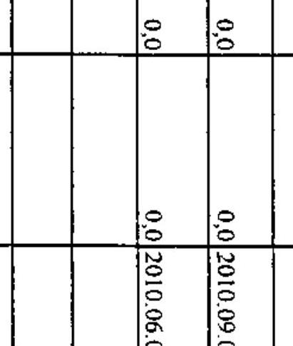

a kiállító aláírása

---

Budapest Főváros XX. kerület Pesterzsébet Önkormányzata

4/b. számú melléklet a V-3023-7/24/2010. számú jelentéshez

TANÚSÍTVÁNY a 2007-2010. években benyújtott és elutasított európai uniós pályázatokról

|  Sor-
szám | Az európai uniós forrásokra benyújtott és elutasított pályázat megnevezése és célja | összes kiadás | az összes kiadást finanszírozó források |  |  |  |  |  |  |  |  |  |  |  |  |  |  |  |  |  |  |  |  |  |  |  |  |  |  |  |  |  |   |
| --- | --- | --- | --- | --- | --- | --- | --- | --- | --- | --- | --- | --- | --- | --- | --- | --- | --- | --- | --- | --- | --- | --- | --- | --- | --- | --- | --- | --- | --- | --- | --- | --- | --- | --- | --- |
|   |  |  | európai
uniós
fórrásokra benyújtott és
elutasított pályázat megnevezése és célja |  |  |  |  |  |  |  |  |  |  |  |  |  |  |  |  |  |  |  |  |  |  |  |  |  |  |  |  |  |  |   |
|   |  |  |  |  |  |  |  |  |  |  |  |  |  |  |  |  |  |  |  |  |  |  |  |  |  |  |  |  |  |  |  |  |  |   |
|  1. | "Jó szóval oktand, játszani is engedd!"
TÁMOP 5.2.5-08/1/A |  | 20,0 |  |  |  |  |  |  |  |  |  |  |  |  |  |  |  |  |  |  |  |  |  |  |  |  |  |  |  |  |  |  |  |   |
|  2. | "Együtt kötsesebb!" TÁMOP-3.3.2 |  | 96,0 |  |  |  |  |  |  |  |  |  |  |  |  |  |  |  |  |  |  |  |  |  |  |  |  |  |  |  |  |  |  |  |   |
|  3. | "Olvass velünk Pesterzsébeten!"
TÁMOP-3.2.4/08/1/KMR |  | 20,0 |  |  |  |  |  |  |  |  |  |  |  |  |  |  |  |  |  |  |  |  |  |  |  |  |  |  |  |  |  |  |  |   |
|  4. | "Kézenfogva Pesterzsébeten" TÁMOP-
3.2.3/08/2/KMR |  | 57,2 |  |  |  |  |  |  |  |  |  |  |  |  |  |  |  |  |  |  |  |  |  |  |  |  |  |  |  |  |  |  |  |   |
|  5. | "Tanuló Pesterzsébet" TÁMOP-
3.2.3/08/1/KMR |  | 18,9 |  |  |  |  |  |  |  |  |  |  |  |  |  |  |  |  |  |  |  |  |  |  |  |  |  |  |  |  |  |  |  |   |
|  6. | "Új híd, új városkézpont
Pesterzsébeten" KMOP-2009-5.2.2/B |  | 1084,3 |  |  |  |  |  |  |  |  |  |  |  |  |  |  |  |  |  |  |  |  |  |  |  |  |  |  |  |  |  |  |  |   |
|  7. | "A Budapest XX. Kossuth u. 3. sz.
alatti bölcsőde szolgáltatásinak
bővítése" KMOP-4.5.2/A-2008 |  | 276,9 |  |  |  |  |  |  |  |  |  |  |  |  |  |  |  |  |  |  |  |  |  |  |  |  |  |  |  |  |  |  |  |   |
|  8. | "A Nagy György István utcal szociális
szolgáltató központ bővítése, felújítása,
akadálymentesítése és
szolgáltatásfejlesztése" KMOP-2008-
4.5.1 |  | 55,0 |  |  |  |  |  |  |  |  |  |  |  |  |  |  |  |  |  |  |  |  |  |  |  |  |  |  |  |  |  |  |  |   |
|  9. | "Egy mindenkiért, mindenki a komplex
akadálymentességért" KMOP-2008-
4.4.1/B |  | 25,7 |  |  |  |  |  |  |  |  |  |  |  |  |  |  |  |  |  |  |  |  |  |  |  |  |  |  |  |  |  |  |  |   |
|  10. | "Új utakon Pesterzsébeten" KMOP-
2008-2.1.1/B |  | 114,1 |  |  |  |  |  |  |  |  |  |  |  |  |  |  |  |  |  |  |  |  |  |  |  |  |  |  |  |  |  |  |  |   |
|  11. | "Új híd, új városkézpont
Pesterzsébeten" KMOP-2007-5.2.2/B |  | 700,0 |  |  |  |  |  |  |  |  |  |  |  |  |  |  |  |  |  |  |  |  |  |  |  |  |  |  |  |  |  |  |  |   |

---

|  Sur-
scient | Az európai uniós forrásokra benyújtott és
clatasított pályázat megnevezése és célja | A benyújtott pályázat adatai (millió Ft) |  |  |  |  |  |  |  |  |  |  |  |  |  |  |  |  |  |  |  |  |  |  |  |  |  |  |  |  |  |   |
| --- | --- | --- | --- | --- | --- | --- | --- | --- | --- | --- | --- | --- | --- | --- | --- | --- | --- | --- | --- | --- | --- | --- | --- | --- | --- | --- | --- | --- | --- | --- | --- | --- | --- |
|   |  | Amorti állomóáztartási finanszírozás |  |  |  |  |  |  |  |  |  |  |  |  |  |  |  |  |  |  |  |  |  |  |  |  |  |  |  |  |  |  |   |
|   |  | Amorti állomóáztartási finanszírozás |  |  |  |  |  |  |  |  |  |  |  |  |  |  |  |  |  |  |  |  |  |  |  |  |  |  |  |  |  |  |   |
|   |  | Amorti állomóáztartási finanszírozás |  |  |  |  |  |  |  |  |  |  |  |  |  |  |  |  |  |  |  |  |  |  |  |  |  |  |  |  |  |  |   |
|   |  | Amorti állomóáztartási finanszírozás |  |  |  |  |  |  |  |  |  |  |  |  |  |  |  |  |  |  |  |  |  |  |  |  |  |  |  |  |  |  |   |
|   |  | Amorti állomóáztartási finanszírozás |  |  |  |  |  |  |  |  |  |  |  |  |  |  |  |  |  |  |  |  |  |  |  |  |  |  |  |  |  |  |   |
|   |  | Amorti állomóáztartási finanszírozás |  |  |  |  |  |  |  |  |  |  |  |  |  |  |  |  |  |  |  |  |  |  |  |  |  |  |  |  |  |  |   |
|   |  | Amorti állomóáztartási finanszírozás |  |  |  |  |  |  |  |  |  |  |  |  |  |  |  |  |  |  |  |  |  |  |  |  |  |  |  |  |  |  |   |
|   |  | Amorti állomóáztartási finanszírozás |  |  |  |  |  |  |  |  |  |  |  |  |  |  |  |  |  |  |  |  |  |  |  |  |  |  |  |  |  |  |   |
|   |  | Amorti állomóáztartási finanszírozás |  |  |  |  |  |  |  |  |  |  |  |  |  |  |  |  |  |  |  |  |  |  |  |  |  |  |  |  |  |  |   |
|   |  | Amorti állomóáztartási finanszírozás |  |  |  |  |  |  |  |  |  |  |  |  |  |  |  |  |  |  |  |  |  |  |  |  |  |  |  |  |  |  |   |
|   |  | Amorti állomóáztartási finanszírozás |  |  |  |  |  |  |  |  |  |  |  |  |  |  |  |  |  |  |  |  |  |  |  |  |  |  |  |  |  |  |   |
|   |  | Amorti állomóáztartási finanszírozás |  |  |  |  |  |  |  |  |  |  |  |  |  |  |  |  |  |  |  |  |  |  |  |  |  |  |  |  |  |  |   |
|   |  | Amorti állomóáztartási finanszírozás |  |  |  |  |  |  |  |  |  |  |  |  |  |  |  |  |  |  |  |  |  |  |  |  |  |  |  |  |  |  |   |
|   |  | Amorti állomóáztartási finanszírozás |  |  |  |  |  |  |  |  |  |  |  |  |  |  |  |  |  |  |  |  |  |  |  |  |  |  |  |  |  |  |   |
|   |  | Amorti állomóáztartási finanszírozás |  |  |  |  |  |  |  |  |  |  |  |  |  |  |  |  |  |  |  |  |  |  |  |  |  |  |  |  |  |  |   |
|   |  | Amorti állomóáztartási finanszírozás |  |  |  |  |  |  |  |  |  |  |  |  |  |  |  |  |  |  |  |  |  |  |  |  |  |  |  |  |  |  |   |
|   |  | Amorti állomóáztartási finanszírozás |  |  |  |  |  |  |  |  |  |  |  |  |  |  |  |  |  |  |  |  |  |  |  |  |  |  |  |  |  |  |   |
|   |  | Amorti állomóáztartási finanszírozás |  |  |  |  |  |  |  |  |  |  |  |  |  |  |  |  |  |  |  |  |  |  |  |  |  |  |  |  |  |  |   |
|   |  | Amorti állomóáztartási finanszírozás |  |  |  |  |  |  |  |  |  |  |  |  |  |  |  |  |  |  |  |  |  |  |  |  |  |  |  |  |  |  |   |
|   |  | Amorti állomóáztartási finanszírozás |  |  |  |  |  |  |  |  |  |  |  |  |  |  |  |  |  |  |  |  |  |  |  |  |  |  |  |  |  |  |   |
|   |  | Amorti állomóáztartási finanszírozás |  |  |  |  |  |  |  |  |  |  |  |  |  |  |  |  |  |  |  |  |  |  |  |  |  |  |  |  |  |  |   |
|   |  | Amorti állomóáztartási finanszírozás |  |  |  |  |  |  |  |  |  |  |  |  |  |  |  |  |  |  |  |  |  |  |  |  |  |  |  |  |  |  |   |
|   |  | Amorti állomóáztartási finanszírozás |  |  |  |  |  |  |  |  |  |  |  |  |  |  |  |  |  |  |  |  |  |  |  |  |  |  |  |  |  |  |   |
|   |  | Amorti állomóáztartási finanszírozás |  |  |  |  |  |  |  |  |  |  |  |  |  |  |  |  |  |  |  |  |  |  |  |  |  |  |  |  |  |  |   |
|   |  | Amorti állomóáztartási finanszírozás |  |  |  |  |  |  |  |  |  |  |  |  |  |  |  |  |  |  |  |  |  |  |  |  |  |  |  |  |  |  |   |
|   |  | Amorti állomóáztartási finanszírozás |  |  |  |  |  |  |  |  |  |  |  |  |  |  |  |  |  |  |  |  |  |  |  |  |  |  |  |  |  |  |   |
|   |  | Amorti állomóáztartási finanszírozás |  |  |  |  |  |  |  |  |  |  |  |  |  |  |  |  |  |  |  |  |  |  |  |  |  |  |  |  |  |  |   |
|   |  | Amorti állomóáztartási finanszírozás |  |  |  |  |  |  |  |  |  |  |  |  |  |  |  |  |  |  |  |  |  |  |  |  |  |  |  |  |  |  |   |
|   |  | Amorti állomóáztartási finanszírozás |  |  |  |  |  |  |  |  |  |  |  |  |  |  |  |  |  |  |  |  |  |  |  |  |  |  |  |  |  |  |   |
|   |  | Amorti állomóáztartási finanszírozás |  |  |  |  |  |  |  |  |  |  |  |  |  |  |  |  |  |  |  |  |  |  |  |  |  |  |  |  |  |  |   |
|   |  | Amorti állomóáztartási finanszírozás |  |  |  |  |  |  |  |  |  |  |  |  |  |  |  |  |  |  |  |  |  |  |  |  |  |  |  |  |  |  |   |
|   |

---

Budapest Fôváros XX. kerület Pesterzsébet Önkormányzata

# ADATLAP 

## az európai uniós forrással támogatott   "Akadálymentesen a pesterzsébeti Gyermekmosoly Óvodában" feladatról

## 1. A PÁLYÁZÓ ADATAI

1.1. A pályázó Önkormányzat neve: Pesterzsébet Önkormányzata
1.2. A pályázó Önkormányzat címe: 1201 Bp. Kossuth L. tér 1.

## 2. A PROJEKT ÖSSZEGZŐ ADATAI

2.1. A pályázott program megnevezése: Önkormányzatok illetőleg önkormányzati feladatellátást biztosító egyes közszolgáltatások akadálymentesítése (KMOP-2007-4.5.3)
2.2. A pályázott programon belül a projekt címe: Akadálymentesen a pesterzsébeti Gyermekmosoly Óvodában (KMOP-4.5.3-2007-0022)
2.3. A pályázatot készítő megnevezése: dr. Nagy Attila, Lehoczki Péterné, László Attila
2.4. A pályázat benyújtásának idõpontja: 2007. 11. 19.

### 2.5. A pályázott projekt tervezett

- teljes kiadásának összege: 9788758 Ft
2.6. A pályázott projekt megvalósításának tervezett forrása:
- támogatásának összege: 8809883 Ft
- európai uniós: 6607412 Ft
- hazai társfinanszírozás: 2202471 Ft
- EU Önerő̉ Alap: 0 Ft

---

- saját forrás: 978875 Ft
- hitel: 0 Ft
- egyéb forrás: 0 Ft
2.7. A megvalósítás tervezett kezdési és befejezési időpontja (év, hó, nap):
2008. 03. 01 - 2008. 12. 31 .

# 3. A PÁLYÁZAT ELBÍRÁLÁSA 

3.1. A pályázat elbírálásáról szóló döntés kelte: 2008. 05. 15.
3.2. A pályázat elbírálásának eredménye: támogatásban részesítés

## 4. A TÁMOGATÁSI SZERZŐDÉS ADATAI

4.1. A támogatási szerződés megkötésének időpontja: 2008. 08. 04.
4.2. A projekt kezdési és befejezési időpontja: 2008. 07. 01 - 2009. 09. 30.
4.3. A projekt elszámolható összköltsége (kiadása): 9788758 Ft
4.4. A projekt megvalósítás forrásai:

- európai uniós támogatás: 6607412 Ft
- hazai társfinanszírozás: 2202471 Ft
- EU Önerő Alap saját forrás: 0 Ft
- saját forrás: 978875 Ft
- hitel: 0 Ft
- egyéb forrás: 0 Ft

---

# 4.5. A projekt számszerüsíthető eredményei 

| Eredmény /Mutató /Indikátor neve | Kulcs indikátor (I/N) | Mérték egy-ség (db, fö, $\%$ ) | Bázisérték | Megvalósítási időszak (célérték) |  |  |  | Fenntartási időszak (célérték) |  |  |  |  |  |
| :--: | :--: | :--: | :--: | :--: | :--: | :--: | :--: | :--: | :--: | :--: | :--: | :--: | :--: |
| Akadálymentesített intézmények száma/output mutató | I | Db | 0 | 1 | 1 | 1 | 1 | 1 | 1 | 1 | 1 | 1 | 1 |
| A támogatásból akadálymentesen elérhető közszolgáltatások száma/output mutató | I | Db | 0 | 1 | 1 | 1 | 1 | 1 | 1 | 1 | 1 | 1 | 1 |
| A projekt befejezése után az akadálymentesített intézményben dolgozó fogyatékossággal éló és/vagy megváltozott munkaképessé-gő munkavállalók száma | I | Fő | 0 | 1 | 1 | 1 | 1 | 1 | 1 | 1 | 1 | 1 | 1 |

## 5. ELLENÖRZÉSEK

### 5.1. A külső ellenőrzések:

- az ellenőrzések száma: 1
- az ellenőrzést végző szervek megnevezése: Váti Nonprofit Kft.

### 5.2. A külső ellenőrzések által feltárt szabálytalanságokra vonatkozó adatok:

- mely előírást nem tartották be: nem volt megállapítás
- az előírás nem teljesítésének okai: nem értelmezhető
- a rendezésre előírt kötelezettségek: nem értelmezhető
- a rendezésre előírt kötelezettséget mennyi időn belül teljesítették: nem értelmezhető
- mekkora időbeli csúszást eredményezett ez a projekt megvalósításában (év, hó, nap): nem értelmezhető
Kelt: 2010. június 22.
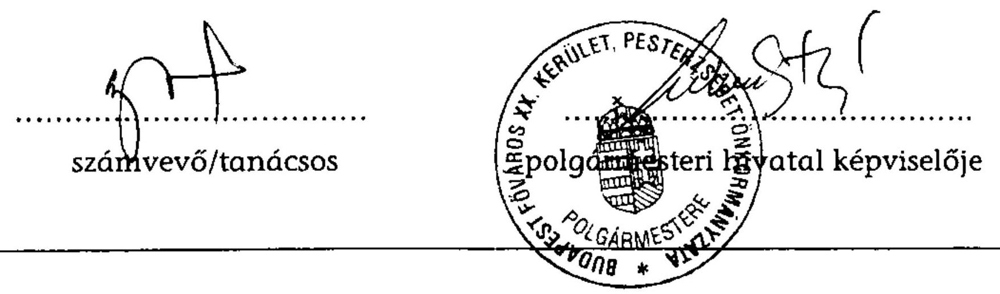

---

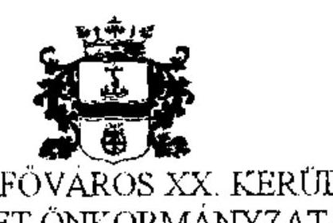

BUDAPEST FÖVÁROS XX. KERÜLET, PESTERZSEBET ÖNKORMÁNYZATANAK POLGÁRMESTERE

1201 Budapest, Kossuth Lajos tér 1. Tel.: 283-0549, Fax: 283-0061 www.pesterzsebet.hu

Állami Számvevőszék
Fővárosi és Pest Megyei Ellenőrzési Iroda Budapest

Domokos László
elnök

Iktatószám: 11302/2010
Hivatkozási szám: V0489

# Tisztelt Elnök Úr! 

Az Állami Számvevőszékről szóló 1989. évi XXXVIII. Sz. tv. 25.§ (1) bekezdése szerint tájékoztatom, hogy a 2010. decemberi keltezéssel megküldött, Budapest Főváros XX. kerület Pesterzsébet Önkormányzata gazdálkodási rendszerének 2010. évi ellenőrzéséről készült Számvevői jelentésben szereplő megállapításokkal kapcsolatosan nem kívánok észrevételt tenni.
Tájékoztatom, hogy a jegyző elkezdte a melléklet intézkedés alapján a neki felrótt hiányosságok felszámolását. A végleges jelentés ismeretében a további szükséges intézkedéseket megteszem.

Budapest, 2010. december 15.
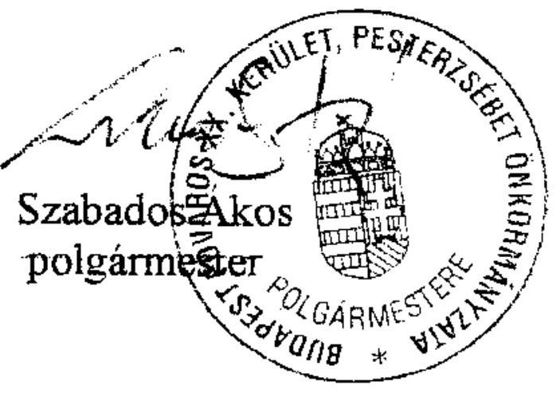

---

# JE-34738/6/2010. sz. INTÉZKEDÉS 

Az Állami Számvevőszék 2010-es ellenőrzésének tapasztalataira figyelemmel a jogszabályi előírások maradéktalan betartása, illetve a munka színvonalának javítása érdekében az alábbiak szerint utasítom az érintett osztályvezetőket:

1. A hivatali SZMSZ-ben rögzíteni kell:
1/a. a Polgármesteri Hivatal alapító okiratának keltét,
1/b. a szervezeti egységek létszámát:
1/b.a. a szervezeti egységek tagozódását,
1/b.b. a szervezeti egységekben ellátott munkakörök megnevezését:
1/b.b.a. külön is a pénzügyi-gazdasági tevékenységet ellátók:

- feladatkörét,
- munkakörét, hatáskörét,
- felelősségi körét,
- külső- és belső kapcsolattartás módját,
- helyettesítési rendjét.

1/c. A Pénzügyi és Adó Osztály Ügyrendjében rögzíteni kell, hogy feladatai közül mely feladatokat látja el az osztály, illetve mely feladatokat lát el külső szervezet bevonásával.

Határidő: 2011. január 17.
Felelős: Kovács András - Szervezési Osztály vezetője
Lehoczki Péterné - Pénzügyi és Adó Osztály vezetője
Somlainé Kóródy - Éva Személyügyi Osztály vezetője
2. A leltározási szabályzatban rögzíteni kell:

2/a. - az üzemeltetésre átadott eszközök leltározásának módját, - az értékelésért felelős munkaköröket,

2/b. az értékelési és ellenőrzési feladatokat az érintett dolgozók munkaköri leírásában rögzíteni kell.

Határidő: 2011. január 17.
Felelős: Lehoczki Péterné - Pénzügyi és Adó Osztály vezetője

---

3. A selejtezési szabályzatban rögzíteni kell:

3/a. az üzemeltetésre átadott eszközök esetében a döntés meghozatalára jogosultak körét,
3/b. a selejtezési feladatot ellátó köztisztviselők munkaköri leírásának tartalmaznia kell a selejtezési eljárással kapcsolatos feladatokat.

Határidő: 2011. január 17.
Felelős: Lehoczki Péterné - Pénzügyi és Adó Osztály vezetője
Somlainé Kóródy - Éva Személyügyi Osztály vezetője (3/b. vonatkozásában)
4. A számlarendben meg kell határozni a fókönyv és az analitikus nyilvántartások negyedévenkénti egyeztetésének dokumentálási módját.

Határidő: 2011. január 17.
Felelős: Lehoczki Péterné - Pénzügyi és Adó Osztály vezetője
5. 5/a. Az ellenőrzési nyomvonalnak tartalmaznia kell:

- a tevékenységek elvégzését igazoló dokumentumok fellelhetési helyét.
5/b. A kockázatkezelési szabályzatban szabályozni kell:
- a válaszintézkedések beépítését a folyamatba,
- a kockázati környezet rendszeres felülvizsgálatát.

Határidő: 2011. január 17.
Felelős: Lehoczki Péterné - Pénzügyi és Adó Osztály vezetője
6. 6/a. Az államháztartáson kívülre történő müködési és felhalmozásí célú pénzeszköz átadásokat,
6/b. az állományba nem tartozók megbízási dijait,
6/c. a külső szolgáltatók által végzett karbantartásokkal, kisjavításokkal kapcsolatos kifizetéseket
illetően a szakmai teljesitések igazolásának tartalmi és formai követelményeit jegyzői utasításban kell rögzíteni.
A Pénzügyi és Adó Osztály vezetője gondoskodni köteles arról, hogy a szakmai teljesités, az utalvány ellenjegyzés, a belsö kontrollrendszer, a FEUVE a szabályoknak megfelelően, hatékonyan müködjön.

# Határidő: - folyamatos 

- jegyzői utasítás tekintetében: 2010. december 15.

Felelős: Lehoczki Péterné - Pénzügyi és Adó Osztály vezetője, illetve a vonatkozó szabályzatban utalványozással, ellenjegyzéssel, szakmai igazolással megbízott munkatársak.

---

7. A költségvetési és zárszámadási rendelet-tervezetek elkészitése során be kell tartani:
7/a. az államháztartásról szóló törvény (Áht.) és az államháztartás müködési rendjéről szóló kormányrendeletekben előírtakat,
7/b. a vagyonkimutatás tartalmazza a vagyon forgalomképesség szerinti csoportokban való bemutatását,
7/c. a „0"-ra leírt, de használatban lévő, illetve használaton kívüli nyilvántartott - eszközök állományát, valamint a könyvvitelben értékkel nem szereplő kötelezettségek bemutatását.
7/d. A zárszámadási rendelet előkészítése során gondoskodni kell az Áht. 18. §-ban foglalt összehasonlíthatósági követelmény betartása érdekében a müködési és felhalmozási célú bevételi és kiadási előirányzatok teljesülésének mérlegszerű bemutatásáról.

# Határidő: költségvetési és zárszámadási rendelet-tervezet előterjesztésének leadása 

Felelős: Lehoczki Péterné - Pénzügyi és Adó Osztály vezetője,
8. Utasítom az Ellenőrzési Osztályt, hogy a költségvetési, valamint zárszámadási rendelet-tervezetek előterjesztéseinek törvényességét, és a 7. pontban foglaltak betartását ellenőrizze, az ellenőrzés eredményéről a jegyzőt írásban tájékoztassa.

Felelős: Nagyné Tóth Edit - Ellenőrzési Osztály vezetője

Budapest, 2010. december 7.
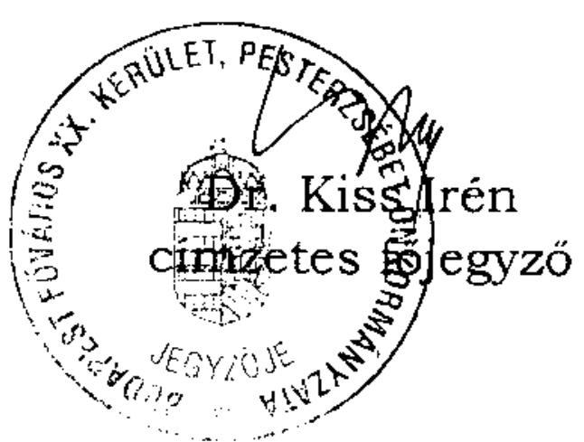

## Kapják:

- Lehoczki Péterné osztályvezető
- Somlainé Körödy Éva osztályvezető
- Nagyné Tóth Edit osztályvezető
- Kovács András osztályvezető
- Irattár

---

# Szabados Ákos úr, 

polgármester

Budapest Főváros XX. kerület
Pesterzsébet Önkormányzata

## Budapest

## Tisztelt Polgármester Úr!

Köszönettel vettem a Budapest Főváros XX. kerület Pesterzsébet Önkormányzata gazdálkodási rendszerének 2010. évi ellenőrzéséről készült számvevőszéki jelentéshez küldött tájékoztatását arról, hogy a jegyző elkezdte a hiányosságok megszüntetése érdekében a neki tett javaslatok egy részének realizálását a csatolt jegyzői intézkedés kiadásával.

A Polgármesteri hivatal alapító okirata, a hivatali SzMSz, a gazdasági szervezet ügyrendje, az ellenőrzési nyomvonal és a kockázatkezelési szabályzat kiegészítésének, illetve módosításának elrendeléséről kiadott jegyzői intézkedés 1. és 5. pontjában foglaltak alapján a jegyzőnek tett 6. a)-d) számú javaslatokat elhagyjuk és az érintett megállapításhoz kapcsolt lábjegyzetben a szabályozási hiányosság megszüntetésére tett intézkedéseket szerepeltetjük.

A jegyzői intézkedés 2-4. pontjában foglaltakat a számvevőszéki jelentéstervezet elkészítésénél már korábban figyelembe vettük. A jegyzőnek a 2005. évi átfogó ellenőrzésről kiadott jelentésben tett és részben megvalósult, illetve nem hasznosult javaslatok realizálását újra tartalmazó 10. számú javaslatunk nem érintette a vagyonkimutatás tartalmát, valamint a zárszámadási rendeletben a müködési és a felhalmozási célú bevételi és kiadási előirányzatok mérlegszerű bemutatását, ezért a jegyzői intézkedés $7 / \mathrm{b}-\mathrm{d}$. pontjában foglaltak nem befolyásolják az erre vonatkozó megállapításokat. A jegyzői intézkedés 7/a. pontjában foglaltak nem tekinthetők a költségvetési és a zárszámadási rendelettervezet előkészítésével kapcsolatos javaslataink realizálására irányuló intézkedésnek, mivel azok nem konkrét feladatmegoldásra irányultak.

---

A költségvetési és a zárszámadási rendelettervezet belső ellenőrzésének elrendeléséről a jegyzői intézkedés 8. pontjában adott tájékoztatása megállapításainkat, javaslatainkat nem befolyásolja. Felhívom azonban Polgármester úr figyelmét, hogy az Ellenőrzési Osztály jegyző általi utasítása a rendszeres ellenőrzési feladatok elvégzésére ellentétes az Áht. 121/B. § (5) bekezdésében és annak a) pontjában foglaltakkal, mely szerint a költségvetési szerv vezetője köteles biztosítani a belső ellenőrök funkcionális (feladatköri és szervezeti) függetlenségét, többek között különösen az éves ellenőrzési terv kidolgozása tekintetében.

Az operatív gazdálkodás során a müködési hibák kijavítása érdekében a jegyzőnek tett 7. a)-b) számú javaslatokra vonatkozó jegyzői intézkedés 6/a-c. pontjaiban adott tájékoztatását köszönjük, azonban a számvevőszéki jelentéstervezetben tett erre vonatkozó megállapításainkat és javaslatainkat továbbra is fenntartjuk, mivel azok nem a szabályozás kiegészítésére és módosítására, hanem az abban foglaltak végrehajtására vonatkoztak.

Köszönöm Polgármester úr és munkatársai ellenőrzés során tanúsított hozzáállását, amellyel az ellenőrzés megvalósításában részt vettek, azt segítették.

Budapest, 2011. január , 17 "
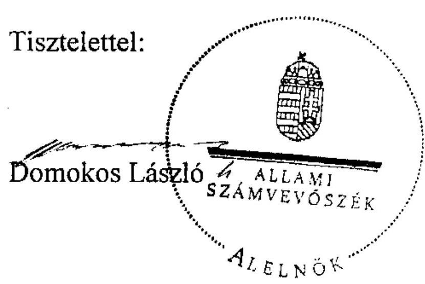