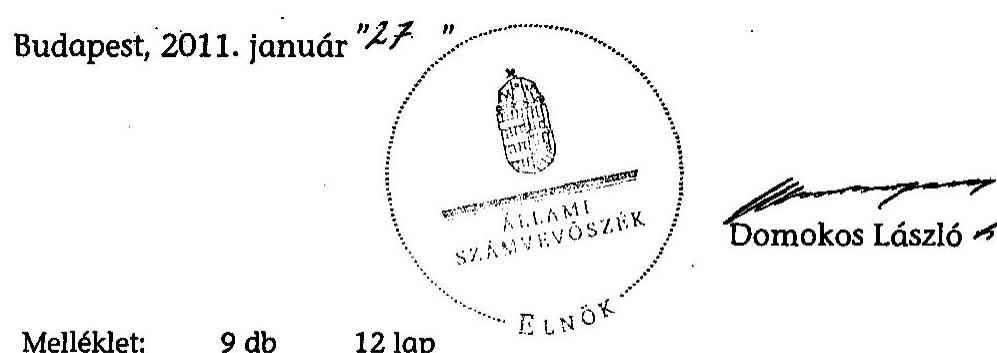
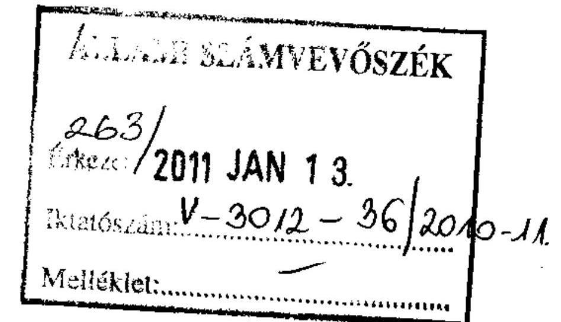
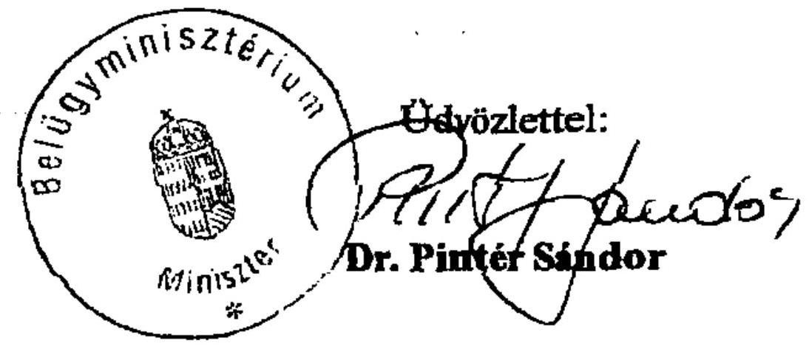
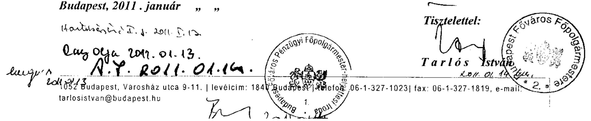

# ÁLLAMI   SZÁMVEVŐSZÉK 

## JELENTÉS

a fővárosi önkormányzatot és a kerületi önkormányzatokat osztottan megillető bevételek 2010. évi megosztásáról szóló önkormányzati rendelet felülvizsgálatáról

---

# 3. Önkormányzati és Területi Ellenőrzési Igazgatóság 

3.3. Átfogó Ellenőrzési Főcsoport

Iktatószám: V-3012-41/2010.
Témaszám: 986
Vizsgálat-azonosító szám: V0501

## Az ellenőrzést felügyelte:

Dr. Lóránt Zoltán
főigazgató
Az ellenőrzés végrehajtásáért felelős:
Dr. Sepsey Tamás
főigazgató helyettes
A jelentés összeállításában közremúködött:
Dr. Karáné Kőszegi Zsuzsanna
főtanácsadó
Az ellenőrzést végezte:
Dr. Karáné Kőszegi Zsuzsanna
főtanácsadó

## A témához kapcsolódó eddig készített számvevőszéki jelentések:

## címe

Jelentés a fővárosi önkormányzatot és a kerületi önkormányzato- 0756 kat osztottan megillető bevételek 2007. évi megosztásáról szóló önkormányzati rendelet felülvizsgálatáról
Jelentés a fővárosi önkormányzatot és a kerületi önkormányzato- 0850
kat osztottan megillető bevételek 2008. évi megosztásáról szóló önkormányzati rendelet felülvizsgálatáról
Jelentés a fővárosi önkormányzatot és a kerületi önkormányzato- 0956
kat osztottan megillető bevételek 2009. évi megosztásáról szóló önkormányzati rendelet felülvizsgálatáról

---

# TARTALOMJEGYZÉK 

BEVEZETÉS ..... 7
I. ÖSSZEGZŐ MEGÁLLAPÍTÁSOK, KÖVETKEZTETÉSEK, JAVASLATOK ..... 13
II. RÉSZLETES MEGÁLLAPÍTÁSOK ..... 19

1. A Fővárosi önkormányzatot és a kerületi önkormányzatokat osztottan megillető 2010. évi bevételek meghatározásának szabályszerűsége és összege ..... 19
1.1. A magánszemélyek jövedelemadójából a 2010. évi állami költségvetésről szóló törvény alapján a települési önkormányzatokat megillető rész meghatározásának szabályszerűsége ..... 20
1.2. Az egyéb központi adóbevételek figyelembevételének megfelelősége ..... 21
1.3. Az állandó népességszámhoz kapcsolódó normatív hozzájárulás összege meghatározásának szabályszerűsége, az Ötv. 64/B. § a) pontjában foglaltak figyelembevételével ..... 22
1.4. A helyi adókból származó bevételek figyelembevételének megfelelősége ..... 22
2. A megosztási arányok meghatározása során felhasznált alapadatok megalapozottsága, megbízhatósága, valamint a számítási eljárások szabályszerűségének ellenőrzése ..... 24
2.1. A Fővárosi önkormányzatot és a kerületi önkormányzatokat együttesen megillető részesedés számításának megfelelősége a forrásmegosztási törvény 5. § (1) és (2) bekezdése alapján ..... 24
2.2. A forrásmegosztási törvény 6. § (1) bekezdése szerinti megosztás alapját képező „központi hozzájárulás" számításának szabályszerűsége ..... 25
2.3. A 2008. évi kerületi önkormányzati költségvetési beszámolók alapján a „központi hozzájárulás"-sal támogatott feladatokhoz kapcsolódó múködési kiadások meghatározásának szabályszerűsége és megbízhatósága ..... 27
2.4. A 2008. évi múködési kiadási forráshiány összegének meghatározása ..... 28
2.5. A „központi hozzájárulás" aránya szerinti megosztás számításának szabályszerűsége ..... 29
2.6. A forrásmegosztási törvény 6. § (2) és (3) bekezdése szerinti megosztás számításának szabályszerűsége ..... 29
2.7. Az egyes kerületi önkormányzatokat megillető részesedési arány esetében a 2009. év forrásmegosztásához viszonyított, maximum 5\%-os növekedés, illetve csökkenés szabályának betartása ..... 31

---

3. Az esetleges adat- és számítási hibák miatt a 2011. évi forrásmegosztásnál végrehajtandó korrekció (a Fővárosi önkormányzat vagy kerületi önkormányzat részére még jogszerűen járó összeg, illetve jogosulatlanul kapott összeg) meghatározása ..... 31
4. A 2010. évi forrásmegosztási rendeletalkotás eljárásának szabályszerűsége, valamint a forrásmegosztás adatellenőrzése ..... 32
4.1. A Fővárosi önkormányzat 2010. évi költségvetési koncepciójának elfogadása ..... 32
4.2. A forrásmegosztási törvényben előírt határidők betartása ..... 33
4.3. A kerületi önkormányzatok 2008. évi költségvetési beszámolóiban szereplő adatok feldolgozásának szabályozottsága és vezetői ellenőrzése ..... 34
5. Az ÁSZ 2009. évi ellenőrzése során megfogalmazott javaslatok végrehajtására tett intézkedések megfelelősége ..... 35

# MELLÉKLETEK 

1. számú A forrásmegosztási törvény, illetve a 2010. évi forrásmegosztási rendelet szerint megosztandó bevételek kimutatása (1 oldal)
2. számú A forrásmegosztásba vont bevételek az ÁSZ megállapításai alapján (1 oldal)
3. számú A működési kiadási forráshiány számítása a Kincstár adatai és az ÁSZ megállapításai alapján (1 oldal)
4. számú A megosztott bevételekből történő részesedés az állandó népesség, a belterületi terület, a belterületi területre számított népsűrűség, az alacsony komfortfokozatú lakások alapterülete és az iparosított technológiával épült lakások száma arányában (2 oldal)
5. számú Az önkormányzatok részesedése a megosztott bevételekből a korrigált részesedési arány szerint az ÁSZ megállapításai alapján (1 oldal)
6. számú Pintér Sándor úr, belügyminiszter által adott észrevétel (3 oldal)
7. számú Pintér Sándor úr, belügyminiszter észrevételére adott válasz (1 oldal)
8. számú Tarlós István úr, Budapest Főváros Önkormányzat főpolgármestere által adott észrevétel (1 oldal)
9. számú Tarlós István úr, Budapest Főváros Önkormányzat főpolgármesterének észrevételére adott válasz (1 oldal)

---

# RÖVIDÍTÉSEK JEGYZÉKE 

## Törvények

2003. évi forrásmegosztási törvény
2007. évi forrásmegosztást módosító törvény 2009. évi forrásmegosztást módosító törvény
2010. évi költségvetési törvény

Áht.
Alkotmány
forrásmegosztási törvény
fővárosról szóló törvény
Hatv.
Ötv.

## Rendeletek

2008. évi normatív források elszámolásáról szóló PM-ÖM együttes rendelet
2008. évi normatív forrásokról szóló PM-ÖTM együttes rendelet
2010. évi forrásmegosztási rendelet
2010. évi normatív forrásokról szóló PM-ÖM együttes rendelet

Ámr. 1
Ámr. 2
a fővárosi önkormányzat és a kerületi önkormányzatok közötti forrásmegosztásról szóló 2003. évi CXIV. törvény (hatálytalan 2006. XII. 27-től)
az egyes önkormányzatokat érintő törvények módosításáról szóló 2007. évi CLXXXII. törvény
a fővárosi önkormányzat és a kerületi önkormányzatok közötti forrásmegosztásról szóló 2006. évi CXXXIII. törvény módosításáról szóló 2009. évi CXXIII. törvény (hatályba lépett 2009. XII. 4-én)
a Magyar Köztársaság 2010. évi költségvetéséről szóló 2009. évi CXXX. törvény
az államháztartásról szóló 1992. évi XXXVIII. törvény
a Magyar Köztársaság Alkotmányáról szóló 1949. évi XX. törvény
a fővárosi önkormányzat és a kerületi önkormányzatok közötti forrásmegosztásról szóló 2006. évi CXXXIII. törvény (hatályba lépett 2006. II. 27-én)
a fővárosi és a fővárosi kerületi önkormányzatokról szóló 1991. évi XXIV. törvény
a helyi adókról szóló 1990. évi C. törvény
a helyi önkormányzatokról szóló 1990. évi LXV. törvény
a helyi önkormányzatokat és a többcélú kistérségi társulásokat 2008. évben egyes központi költségvetési kapcsolatokból megillető forrásokról szóló 2/2008. (I. 30.) PMÖTM együttes rendelet végrehajtásának elszámolásáról szóló 2/2010. (I. 15.) PM-ÖM együttes rendelet
a helyi önkormányzatokat és a többcélú kistérségi társulásokat 2008. évben egyes központi költségvetési kapcsolatokból megillető forrásokról szóló 2/2008. (I. 30.) PMÖTM együttes rendelet
Budapest Főváros Önkormányzata 4/2010. (II. 25.) számú rendelete a Fővárosi önkormányzatot és a kerületi önkormányzatokat osztottan megillető bevételek 2010. évi megosztásáról
a helyi önkormányzatokat és a többcélú kistérségi társulásokat 2010. évben egyes központi költségvetési kapcsolatokból megillető forrásokról szóló 6/2010. (I. 28.) PMÖM együttes rendelet
az államháztartás múködési rendjéről szóló 217/1998. (XII. 30.) Korm. rendelet
az államháztartás múködési rendjéről szóló 292/2009. (XII. 19.) Korm. rendelet

---

# Szórövidítések 

2010. évi fővárosi költségvetési koncepció

AB
ÁSZ
bázisév
főpolgármester
főpolgármester-helyettes
Főpolgármesteri hivatal
Fővárosi önkormányzat KEKKH
kerületi önkormányzatok
Kincstár
Fővárosi Közgyűlés

Javaslat Budapest Főváros Önkormányzata 2010. évi fővárosi költségvetési koncepciójára és gazdasági programjára
Alkotmánybíróság
Állami Számvevőszék
a tárgyévet kettővel megelőző év
Budapest Főváros Önkormányzatának főpolgármestere
Budapest Főváros Önkormányzatának főpolgármesterhelyettese
Budapest Főváros Önkormányzata Közgyűlésének Főpolgármesteri Hivatala
Budapest Főváros Önkormányzata
Közigazgatási és Elektronikus Közszolgáltatások Központi Hivatala
Budapest Főváros I - XXIII. kerületeinek önkormányzatai
Magyar Államkincstár
Budapest Főváros Önkormányzatának Közgyűlése

---

# ÉRTELMEZŐ SZÓTÁR 

„ászfmt" adatbázis
alacsony komfortfokozatú lakások
forrásmegosztás
háttérszámítás
működési kiadási forráshiány
normatív állami hozzájárulás
normatív hozzájárulások
az ÁSZ rendelkezésére álló 2008. évi kincstári és az ÁSZ észrevétele alapján meghatározott adatokat, illetve a számítást tartalmazza.
önkormányzati tulajdonban lévő félkomfortos, komfort nélküli és szükséglakások együttes alapterülete
a Fővárosi önkormányzatot és a kerületi önkormányzatokat osztottan megillető bevételek megosztásának módszere
a Fővárosi önkormányzat 2010. évi forrásmegosztási rendelettervezetének előterjesztéséhez mellékelt, a forrásmegosztáshoz kapcsolódó számítások, amelyek alapján a 2010. évi forrásmegosztási rendelet elfogadásra került
a működési kiadások és a „központi hozzájárulás" különbözete
Az Ötv. 64. § (3) bekezdés a), 64/B. § a) pontjában, 64/C. § (2) bekezdésében normatív központi hozzájárulásnak, a 64. § (4) bekezdés c) pontjában központi hozzájárulásnak, a 81. § (2) bekezdésében központi költségvetési normatív hozzájárulásnak, a 84. § (1) bekezdésében normatív költségvetési hozzájárulásnak, a 88. § (1) bekezdés b) pontjában normatív állami hozzájárulásnak nevezett, de tartalmilag azonos hozzájárulásokat egységesen normatív állami hozzájárulásnak nevezzük.
a normatív állami hozzájárulás és a normatív részesedésű átengedett személyi jövedelemadó együttesen

---

.

---

# JELENTÉS 

## a fôvárosi önkormányzatot és a kerületi önkormányzatokat osztottan megillető bevételek 2010. évi megosztásáról szóló önkormányzati rendelet felülvizsgálatáról

## BEVEZETÉS

A forrásmegosztás rendszerének megismeréséhez szükséges a vonatkozó jogi szabályozás rövid áttekintése.

A fővárosi önkormányzati rendszer - az önkormányzatok 1990. évi létrehozásakor - kétszintűként került meghatározásra, a Fővárosi önkormányzat és a kerületi önkormányzatok jöttek létre, azonban feladat- és hatáskörüket tekintve számottevő volt az eltérés közöttük. Az 1990. évben a helyi önkormányzatokról szóló 1990. évi LXV. törvény (a továbbiakban: Ötv.) a fővárosi önkormányzati rendszer vonatkozásában csak az alapokat rögzítette, de a részletes szabályozást a fővárosi és a fővárosi kerületi önkormányzatokról szóló 1991. évi XXIV. törvényre (a továbbiakban: a fővárosról szóló törvényre) bízta. A fővárosról szóló törvény a gazdálkodás vonatkozásában az Ötv. 66. §-ának - 1994. XII. 10-ig hatályos felhatalmazása alapján az általános szabályoktól való eltéréseket állapított meg. A fővárosi és a kerületi önkormányzatok bevételeinek nagyobb hányada közvetlenül az érintett önkormányzatokat illette meg, ugyanakkor a fővárosról szóló törvény értelmében voltak osztott bevételek, amelyek a következőkből álltak:

- a magánszemélyek jövedelemadójából a települési önkormányzatokat megillető rész;
- az egyéb központi adók;
- az állandó népesség egészéhez kapcsolt normatív állami hozzájárulás ${ }^{1}$;
- a helyi adókból származó bevételek.

A fővárosról szóló törvény egyidejúleg módosította a helyi adókról szóló 1990. évi C. törvényt (a továbbiakban: Hatv-t) annak érdekében, hogy biztosítsa a fővárosi önkormányzatnak a főváros egész területére a helyi adó bevezetésének jogát, továbbá módosította a Hatv. 8. § (1) bekezdését, amely során a főváros

[^0]
[^0]:    ${ }^{1}$ Ugyanarra a fogalomra az egyes jogszabályok más megnevezést alkalmaznak, felsorolásukat az értelmező szótár tartalmazza.

---

esetében eltért attól az általános rendelkezéstől, hogy a helyi adó kizárólag az azt megállapító önkormányzat bevételét képezi, tőle az nem vonható el, tehát a megosztott bevételek részét képezte.

A fővárosról szóló törvény a felsorolt bevételek fővárosi önkormányzat és kerületi önkormányzatok közötti megosztásáról csak annyit tartalmazott, hogy azt „a fővárosi közgyűlés rendeletében a kerületi képviselő-testületek többségének egyszerü szótöbbséggel elfogadott egyetértésével határozza meg", vagyis sem a fővárosról szóló törvény, sem az 1994-ben módosított Ötv. ${ }^{2}$ nem határozta meg a bevételek megosztásának módszerét. Lehetővé tette, hogy adott esetben a négy bevétel bármelyike akár teljes egészében a kerületi önkormányzatokat, vagy éppen a fővárosi önkormányzatot illesse meg.

A Fővárosi önkormányzat és a kerületi önkormányzatok közötti forrásmegosztás ténylegesen a köztük 1992-ben létrejött megállapodáson alapult, amely szerint a megosztás alapelve a feladatellátásban való részesedés volt. Ennek megfelelően:

- Kizárólagosan a kerületi önkormányzatokhoz rendelték a helyi közművelődési célú, a Fővárosi önkormányzathoz pedig a térségi feladatokhoz kapcsolódó normatív állami hozzájárulást. A kerületi önkormányzatok helyi adó kivetési érdekeltségének megtartása miatt a kerületi helyi adókat, valamint a gépjármúadót teljes egészében a kerületi önkormányzatok bevételeként határozták meg ${ }^{3}$ azaz „nem vonták be a megosztásba".
- Az előző pontba nem tartozó bevételeket a megállapodás szerinti arányban osztották meg ${ }^{4}$.

A megállapodásban foglaltakat tartalmazta az 1992. évi forrásmegosztási rendelet ${ }^{5}$. Az azt követő 15 év alatt ezen megállapodásnak megfelelően múködött a forrásmegosztás rendszere.

[^0]
[^0]:    ${ }^{2}$ Az 1994. évi LXIII. törvénnyel módosított Ötv. a fővárosról szóló törvény rendelkezéseit beépítette az Ötv-be, kiegészítve az előző időszak tapasztalataiból adódó új szabályozási szükségletekkel. A törvénymódosítás indokolása szerint valamennyi helyi adó a megosztott bevételek közé tartozott.
    ${ }^{3}$ A kerületi helyi adók és a gépjármúadó a megállapodás alapján és nem a költségvetési törvények, illetve a Hatv. alapján képezték a kerületi önkormányzatok bevételét, ugyanis ezen jogszabályok mindig települési önkormányzatot nevesítettek, ami az ország önkormányzatai esetében egyértelmú szabályozást jelentett, az egyaránt települési önkormányzatként múködő fővárosi önkormányzat és a kerületi önkormányzatok esetében azonban - a fővárosról szóló törvény rendelkezése miatt - nem.
    ${ }^{4}$ Az 1992. évi megállapodásban az összes megosztásba tartozó bevételről döntöttek.
    ${ }^{5}$ Budapest Főváros Önkormányzata 2/1992. (III. 5.) számú rendelete a Fővárosi önkormányzatot és a kerületi önkormányzatokat osztottan megillető bevételek 1992. évi megosztásáról

---

Vitákat ${ }^{6}$ a megosztás körébe tartozó bevételek - évente változó - megosztási módszere váltott ki.

A forrásmegosztással kapcsolatos törvényi szintű szabályozást - a megegyezés elősegítése érdekében - először a 2000. évi költségvetési törvény fogalmazta meg miszerint: a felosztásra kerülő bevételek közül a kerületi önkormányzatoknak a magánszemélyek jövedelemadójából a települési önkormányzatokat megillető rész, az egyéb központi adók és az állandó népességhez kapcsolódó normatív állami hozzájárulás legalább 50\%-át, és a helyi adókból származó bevételek legalább 45\%-át kell megkapniuk. A szabályozás alkotmányellenességének megállapítását négy indítvány kérte, azonban az Alkotmánybíróság (a továbbiakban: AB ) döntésekor a vitatott szabály már hatályát vesztette, ezért az AB az eljárását a hatályos 2001. és 2002. évi költségvetési törvény vonatkozó részére ${ }^{7}$ folytatta le, az abban foglalt hasonló rendelkezést alkotmányellenesnek minősítette és megsemmisítette ${ }^{8}$. A 47/2001. (XI. 22.) AB határozat azt is megállapította, hogy alkotmányellenes helyzet keletkezett azáltal, hogy az Országgyúlés az Ötv-ben nem szabályozta a Fővárosi önkormányzatot és a kerületi önkormányzatokat osztottan megillető bevételek megosztásának elveit és részletes szabályait. Egyúttal felhívta az Országgyűlést arra, hogy jogalkotási kötelezettségének 2002. december 31-ig tegyen eleget.

A felhívás alapján az Országgyűlés azzal egészítette ki 2003. január 1-től az Ötv. 64. § (6) bekezdését, hogy ezeket a normatív eljárásokat, számítási módokat, külön törvényben kell meghatározni. A fővárosi önkormányzat és a kerületi önkormányzatok közötti forrásmegosztásról szóló 2003. évi CXIV. törvény (a továbbiakban: 2003. évi forrásmegosztási törvény) a bevételek megosztását normatív eljárással szabályozta, nem határozott meg a Fővárosi önkormányzat és a kerületi önkormányzatok összességének részesedésére konkrét \%-os mértéket. A forrásmegosztás módszere abból indult ki, hogy a feladatok elismert szinten való ellátásához hiányzó források nagyságát számszerűsítette és a Fővárosi önkormányzatot és a kerületi önkormányzatokat osztottan megillető források megosztását e különbségek arányában hajtotta végre. Az adott évi forrásmegosztásra a tárgyév elején, majd a kettővel megelőző év zárszámadását követően, a tárgyévben korrekciós jelleggel került sor. A számításokat, valamint a szabályozásnak való megfelelést is független könyvvizsgáló ellenőrizte.

A 2003. évi forrásmegosztási törvény alkalmazása során felmerült problémák (a számítási módszer bonyolultsága, az évközi korrekció elfogadott éves költségvetésre gyakorolt hatása, az ingatlankataszteri adatok ellenőrizhetetlensége) megszüntetése céljából az Országgyűlés 2006 decemberében, a 2003. évi forrásmegosztási törvény hatályon kívül helyezése mellett, egyszerű többségi szavazással fogadta el a fővárosi önkormányzat és a kerületi önkormányzatok

[^0]
[^0]:    ${ }^{6}$ A forrásmegosztással kapcsolatos vita nemcsak a Fővárosi önkormányzat és a kerületi önkormányzatok között, hanem az eltérő adottságú kerületi önkormányzatok között is volt.
    ${ }^{7}$ A Magyar Köztársaság 2001. és 2002. évi költségvetéséről szóló 2000. évi CXXXIII. törvény 26. § (2)-(3) bekezdése.
    ${ }^{8}$ A 47/2001. (XI. 22.) AB határozat.

---

közötti forrásmegosztásról szóló 2006. évi CXXXIII. törvényt (a továbbiakban: forrásmegosztási törvényt). Az első alkalommal a 2007. évi forrásmegosztásnál figyelembe vett szabályozás megszüntette az évközi korrekciót, a számítási módszert egyszerűbbé, ellenőrizhetőbbé tette, meghatározta a Fővárosi Közgyűlés rendeletének kiadási határidejét, amelynek évenkénti felülvizsgálatát az Állami Számvevőszék (a továbbiakban: ÁSZ) feladatává tette.

A 2006. évi forrásmegosztási törvény a korábbi évek gyakorlatától eltérő szabályozást tartalmazott, az Ötv-ben meghatározott megosztandó négy bevétel öszszességére vonatkozóan $47 \%-53 \%$-os megosztási arány kötelező alkalmazását írta elő a Fővárosi önkormányzat és a kerületi önkormányzatok összességének részesedése tekintetében, továbbá nem határozta meg az Ötv. előírása alapján a számítások során figyelembe veendő feladatokat. Az Országgyűlés a forrásmegosztásról szóló törvényt a jogi szabályozás ellentmondásainak megszüntetése, valamint az előírások gyakorlatban történő alkalmazhatósága érdekében 2007. decemberben és 2009. novemberben a 2007. évi CLXXXII. törvénnyel, illetve a 2009. évi CXXIII. törvénnyel módosította.

A forrásmegosztási törvény 8. § (1) bekezdése alapján „a Fővárosi önkormányzat tárgyévre vonatkozó forrásmegosztási rendeletét az Állami Számvevőszék felülvizsgál$j a^{\prime \prime}$. A Fővárosi önkormányzat 2007-2009. évi forrásmegosztási rendeleteinek ÁSZ által végzett felülvizsgálatáról készített jelentésekben foglaltakkal egyezően az Alkotmánybíróság az 55/2010. (V. 5.) AB határozatában megállapította, hogy a forrásmegosztási törvény a 4. § (2)-(4) bekezdésében foglalt rendelkezésével átrendezte az Ötv-nek a bevételek megosztására kialakított rendszerét, az 5. § (1) bekezdésében az Ötv. rendelkezéseitől eltérően a törvényhozó döntötte el a feladatellátás arányait, korlátozva a Fővárosi Közgyűlés rendeletalkotási jogkörét. A jelzett szabályok elfogadására csak az Alkotmány 44/C. §-ában szabályozott minősített többséggel kerülhetett volna sor. Az Alkotmánybíróság 2010. december 31-i hatállyal megsemmisítette a forrásmegosztási törvény 4. § (2)-(4) bekezdéseit, valamint az 5. § (1) bekezdését. Az Országgyűlés a 2010. december 17-én kihirdetett, 2011. január 1-jén hatályba lépő a Magyar Köztársaság 2011. évi költségvetését megalapozó egyes törvények módosításáról szóló 2010. évi CLIII. törvény módosította az Ötv-nek a Fővárosi önkormányzatot és a kerületi önkormányzatokat osztottan megillető bevételekre vonatkozó rendelkezéseit, valamint a forrásmegosztási törvényt, azonban a forrásmegosztási törvény 3. § c) pontját az 5. § (2) bekezdés vonatkozásában alkalmazni kell a 2010. évi forrásmegosztás 2011. évi korrekciója során is. Erre tekintettel a jelentésben utalunk az Ötv. és a forrásmegosztási törvény módosított rendelkezéseire, valamint a javaslatok megtételénél már figyelembe vettük azokat a hatályos rendelkezéseket is, amelyek érintik a felülvizsgálatot.

Az ÁSZ az AB által 2010. december 31-ei hatállyal megsemmisített, de jelenleg hatályos jogszabályi rendelkezések figyelembevételével folytatta le a forrásmegosztás során alkalmazott adatok megalapozottságára és a számítások helyességére vonatkozó ellenőrzést. A forrásmegosztási törvény 8. § (2) bekezdésének rendelkezése értelmében, amennyiben a forrásmegosztás során alkalmazott adatok, vagy a számítások helytelensége miatt a Fővárosi önkormányzat, vagy valamely kerületi önkormányzat jogosulatlan forráshoz jutott, vagy a jogszerűen járó forrásnál alacsonyabb összegben részesült, ezt az összeget a hiba feltárását követő év forrásmegosztásánál kell figyelembe venni.

---

Az ellenőrzés célja annak megállapítása volt, hogy:

- a 2010. évi forrásmegosztási rendelet a forrásmegosztási törvény előírásainak megfelelően határozta-e meg a megosztható bevételeket és azok összegét,
- a megosztási arányok meghatározásánál felhasznált alapadatok megalapozottak és a számítási eljárások helyesek voltak-e,
- az esetleges adat- és számítási hibák miatt milyen korrekciót kell elvégezni a 2011. évi forrásmegosztásnál.

Az ellenőrzött adatkör: a Fővárosi önkormányzatot és a kerületi önkormányzatokat osztottan megillető bevételek adatai a 2010. évre vonatkozóan és a megosztási arányok meghatározása során felhasznált alapadatok a 2008. évi önkormányzati költségvetési beszámolók, valamint a 2008. évi normatív források elszámolásáról szóló PM-ÖM együttes rendelet alapján.

A 2009. évi forrásmegosztást módosító törvény előírásának megfelelően, a 2010. évi forrásmegosztást érintően módosult a forrásmegosztás arányának alapját képező „központi hozzájárulás" fogalma, mert a normatív hozzájárulások összegén túlmenően beletartozik a normatív, kötött felhasználású támogatások összege is, továbbá megváltoztak a bázisévi múködési kiadások meghatározásánál figyelembe veendő feladatok.

A szabályszerűségi ellenőrzés keretében a forrásmegosztási törvény előírásainak való megfelelőséget elemző eljárással vizsgáltuk.

A Főpolgármesteri hivatalnál áttekintettük a forrásmegosztási törvény gyakorlati alkalmazását, a számítások helyességét. A Fővárosi önkormányzatot és a kerületi önkormányzatok összességét megillető összeg helyességének megállapításánál a 2010. évi forrásmegosztási rendelettervezet előterjesztéséhez mellékelt háttérszámításokhoz kapcsolódó adatbázis adatait hasonlítottuk össze az ÁSZ rendelkezésére álló kincstári adatokkal.

A forrásmegosztás adatainak ellenőrzésekor értékeltük az adatfeldolgozás szabályozottságát, és az ehhez kapcsolódó vezetői ellenőrzés múködésének megbízhatóságát.

Az ÁSZ 2009. évi ellenőrzési javaslatai alapján tett intézkedéseket, illetve azok megvalósítását utóellenőrzés keretében vizsgáltuk.

A jelentést az ÁSZ-ról szóló 1989. évi XXXVIII. tv. 25. § (1) bekezdése alapján észrevétel közlése céljából megküldtük a belügyminiszternek és Budapest Főváros Önkormányzat főpolgármesterének. A belügyminiszter tájékoztatást adott az Ötv. és a forrásmegosztási törvény 2011. január 1-jén hatályba lépő módosításáról, a főpolgármester pedig a Budapest Főváros Önkormányzata 2011. évi költségvetési koncepciójának elfogadásáról. A törvénymódosításokat a jelentés II. Részletes megállapítások fejezetében az adott témához kapcsolt lábjegyzetben feltüntettük. A 2011. évi költségvetési koncepció elfogadására valamint a költségvetés-készítés további munkálatainak meghatározására vonatkozó ja-

---

vaslatot elhagytuk ${ }^{9}$. A kapott tájékoztatásokat a jelentés 6. és 8. számú melléklete, az arra adott választ a 7. és 9. számú melléklet tartalmazza.
${ }^{9}$ A jelentésben a főpolgármesternek három szabályszerűségi javaslatot tettünk, melyből egy javaslatot elhagytunk.

---

# I. ÖSSZEGZŐ MEGÁLLAPÍTÁSOK, KÖVETKEZTETÉSEK, JAVASLATOK 

A Fővárosi önkormányzat 2010. évi forrásmegosztási rendelete összesen 216564145 ezer Ft megosztásáról rendelkezett. A forrásmegosztási törvény a Fővárosi önkormányzatot és a kerületi önkormányzatokat osztottan megillető bevételek - a magánszemélyek jövedelemadójából az állami költségvetésről szóló törvény alapján a települési önkormányzatokat megillető rész, az egyéb központi adó, az állandó népességhez kapcsolódó központi hozzájárulás, a helyi adókból származó bevételek - körét az Ötv. szabályozása alapján határozta meg, továbbá előírta, hogy a bevételek nagyságának meghatározása a tárgyidőszakra vonatkozó fővárosi költségvetési koncepcióban szereplő tervszámok alapján történik. A Magyar Köztársaság 2011. évi költségvetését megalapozó egyes törvények módosításáról szóló törvény módosította az Ötv-nek a Fővárosi önkormányzatot és a kerületi önkormányzatokat osztottan megillető bevételekre vonatkozó rendelkezéseit, valamint a forrásmegosztási törvényt, amelyekben foglalt előírások 2011. január 1-jén lépnek hatályba. A forrásmegosztási törvény egyes rendelkezéseit azonban alkalmazni kell a 2010. évi forrásmegosztás 2011. évi korrekciója során is

A Fővárosi önkormányzat által figyelembe vett 216564145 ezer Ft bevétel megegyezett az ÁSZ megállapítása szerinti megosztandó források összegével.

A 2010. évi forrásmegosztási rendelet a forrásmegosztási törvény előírásának megfelelően tartalmazta a személyi jövedelemadó bevétel 12763935 ezer Ft, valamint a jövedelemdifferenciálódás mérséklésének elszámolásából adódó korrekció 5447747 ezer Ft összegét.

Az Ötv. szerint a Fővárosi önkormányzatot és a kerületi önkormányzatokat osztottan megillető bevétel az egyéb központi adó, a gépjárműadó. A forrásmegosztási törvény alapján azonban az egyéb központi adóból a kerületi önkormányzat által beszedett adóbevétel 100\%-a a kerületi önkormányzatot illette meg. A 2010. évi forrásmegosztási rendelet a forrásmegosztási törvényben foglaltaknak megfelelően a kerületi önkormányzatokat megillető bevételként vette figyelembe a gépjármúadó bevételt.

Az Ötv. alapján „a fővárosi önkormányzatot és a kerületi önkormányzatot osztottan megillető bevételek...az állandó népességhez kapcsolódó központi hozzájárulás...". A forrásmegosztási törvény rendelkezése szerint az „állandó népesség"-hez kapcsolódó normatív hozzájárulások - a település-üzemeltetési, igazgatási, sportés kulturális feladatokhoz kapcsolódó 3300210 ezer Ft normatív hozzájárulás kivételével - 100\%-ban a feladatot ellátó kerületi önkormányzatot illette meg. A 2010. évi forrásmegosztási rendelet a forrásmegosztási törvényben foglaltaknak megfelelően osztotta meg az állandó népességszámhoz kapcsolódó normatív hozzájárulásból származó bevételt.

---

Az Ötv. szerinti megosztott bevételek körébe tartozó helyi adók vonatkozásában, a forrásmegosztási törvény hivatkozott a Hatv-re, azonban a Hatv. rendelkezése nincs összhangban az Ötv. rendelkezésével, mert a hatályon kívül helyezett fővárosi és a fővárosi kerületi önkormányzatokról szóló törvényre való hivatkozást tartalmazza.

A forrásmegosztási törvény szerint a helyi adókból a kerületi önkormányzat által beszedett adóbevétel 100\%-a a kerületi önkormányzatot illette meg. A 2010. évi forrásmegosztási rendelet a forrásmegosztási törvényben foglaltaknak megfelelően a kerületi önkormányzatok bevételeként vette figyelembe a kerületi helyi adó bevételt. A Fővárosi önkormányzat által bevezetett helyi iparúzési adó 197700000 ezer Ft és idegenforgalmi adó 1400000 ezer Ft tervezett előirányzata képezte a megosztott bevételek részét. A Fővárosi önkormányzat a megosztott bevételek közé tartozó idegenforgalmi adóhoz való közvetlen kapcsolódása miatt az üdülőhelyi feladatokhoz tartozó 1400000 ezer Ft normatív hozzájárulást is bevonta a megosztandó bevételek közé.

Az Ötv. szerint a „...fővárosi és a kerületi önkormányzatok közötti - feladat- és hatáskörarányos - forrásmegosztás érdekében normatív eljárásokat kell alkalmazni. Ezeket a normatív eljárásokat külön törvényben kell meghatározni...." A forrásmegosztási törvény előírása szerint a „...normatív részesedési arány változása esetén a tárgyévet megelőző évi - az (1) bekezdés szerint meghatározott - forrásmegosztási részesedést a normatív részesedési arány százalékpontban meghatározott változása 60\%-ának megfelelő mértékben - de legfeljebb 5\%-kal - a tárgyévben korrigálni kell.". A forrásmegosztási törvény azonban nem határozta meg a normatív részesedési arány változása esetén, hogy a tárgyévet megelőző évi forrásmegosztási részesedés adatánál az előző évi forrásmegosztási rendelet adatát, vagy az ÁSZ jelentés szerinti, felülvizsgált adatot kell-e figyelembe venni. A Fővárosi Önkormányzat sem egységesen a forrásmegosztási rendelet adatait vette figyelembe, hanem a kerületi önkormányzatok összes 2009. évi központi hozzájárulásánál az ÁSZ előző évi forrásmegosztási rendelet felülvizsgálatának adatával, a 2009. évi megosztott forrásokból történő részesedési százalék esetében az előző évi forrásmegosztási rendelet adatával számolt. Az ÁSZ a 2010. évi felülvizsgálat során az előző évi forrásmegosztási rendelet adatai alapján ellenőrizte a számítást. A Magyar Köztársaság 2011. évi költségvetését megalapozó egyes törvények módosításáról szóló törvény által módosított előírások figyelembevételével az ÁSZ megállapítása szerint a forrásmegosztási részesedés a Fővárosi önkormányzat esetében a háttérszámítás szerinti 47,228\%-hoz képest $47,051 \%$, a kerületi önkormányzatok együttes részesedése esetében a háttérszámítás szerinti 52,772\%hoz képest 52,949\%.

A forrásmegosztási törvény a következők szerint határozta meg a „központi hozzájárulás" fogalmát: „a költségvetési törvényben meghatározott - szociális, gyermekvédelmi, gyermekjóléti, oktatási, nevelési és közmüvelődési feladatokhoz kapcsolódó - normatív hozzájárulások és normatív, kötött felhasználású támogatások bázisévi önkormányzati költségvetési beszámoló érintett űrlapjainak - az Állami Számvevőszék, vagy a Kincstár által elvégzett felülvizsgálat esetén a vizsgálat és a jogerős döntés alapján korrigált - adatai", amelynek a feladatokat meghatározó részét első alkalommal a 2010. évi forrásmegosztásnál kellett alkalmazni. A Magyar Köztársaság 2011. évi költségvetését megalapozó egyes törvények módosításáról szóló törvény kiegészítette az üdülőhelyi feladatokhoz kapcsolódó

---

normatív hozzájárulások, valamint az összes normatív, kötött felhasználású támogatás figyelembevételével a forrásmegosztási törvény „központi hozzájáru-lás"-ra vonatkozó szabályozását, melyet alkalmazni kell a 2010. évi forrásmegosztás 2011. évi korrekciója során is.

Az ÁSZ, vagy a Kincstár által felülvizsgált 2008. évi adattal történő korrekciót a helyi önkormányzatok számára biztosított jogorvoslati eljárás hosszadalmassága miatt azonban nem lehetett figyelembe venni a forrásmegosztási rendelettervezet egyeztetésre történő kiküldésének 2010. január 15-i határidejéig, ezért az ÁSZ a korrekció nélküli adatokat ellenőrizte. A Magyar Köztársaság 2011. évi költségvetését megalapozó egyes törvények módosításáról szóló törvény 2011. január 1-jétől hatályos előírásai között viszont már nem szerepel az ÁSZ, vagy a Kincstár által felülvizsgált adattal történő korrekció figyelembevételére vonatkozó szabályozás.

A „központi hozzájárulás"-t megkaptuk, ha az összes normatív hozzájárulásból és normatív, kötött felhasználású támogatásból levontuk a „központi hozzájáru-lás"-ként figyelembe nem vett normatív hozzájárulásokat. Az összes normatív hozzájárulás adatainál figyelembe vettük a Budapest XIV. Kerületi Önkormányzat esetében, a 2008. évben felhasznált összegként, a Kincstár által átutalt 224 ezer Ft üdülőhelyi normatívát, amelyet a Fővárosi önkormányzat helytelenül levont. Az üdülőhelyi feladatok ténylegesen átutalt normatív hozzájárulásának adatainál megállapítottuk, hogy a Budapest XX. Kerületi Önkormányzat esetében 2354 ezer Ft-tal nagyobb összeg utalása történt a Fővárosi önkormányzat által figyelembe vett adatnál. A „központi hozzájárulás"-ként figyelembe nem vett normatív hozzájárulások közül a Fővárosi önkormányzat helytelenül a körzeti igazgatási feladathoz tartozó összesen adatból nem vette ki a gyámügyi igazgatási feladatokhoz tartozó adatot, továbbá nem vette figyelembe a Fővárosi önkormányzat igazgatási és sport feladataihoz, a lakott külterülettel kapcsolatos feladatokhoz, a lakossági települési folyékony hulladék ártalmatlanítása feladathoz és az üdülőhelyi feladatokhoz tartozó adatokat. A Magyar Köztársaság 2011. évi költségvetését megalapozó egyes törvények módosításáról szóló törvény által módosított előírások figyelembevételével az ÁSZ megállapítása szerint a „központi hozzájárulás" összege a kerületek együttese esetében a háttérszámítás szerinti 63330554 ezer Ft-hoz képest 63781296 ezer Ft, a Fővárosi önkormányzat adata 38679934 ezer Ft-hoz képest 29783715 ezer Ft.

A forrásmegosztási törvény szerint a „...kerületi önkormányzatokat megillető részesedés felosztásakor azon feladatok önkormányzati költségvetési beszámoló szerinti bázisévi müködési kiadásaiból, amelyekhez a központi költségvetés központi hozzájárulást nyújt, le kell vonni a kiadásokhoz kapcsolódó központi hozzájárulást és a különbséget a központi hozzájárulások arányában kell megosztani az önkormányzatok között." A múködési kiadásokat az önkormányzati költségvetési beszámolók szakfeladatonként részletezték. A működési kiadások meghatározásához figyelembe vett szakfeladatok körét a forrásmegosztási rendelet előkészítése során állapították meg, melyekre két kerületi önkormányzat tett észrevételt. Az eltérő álláspontok miatt szükséges lenne, hogy azokról a Fővárosi Közgyűlés döntsön, amelyre a fővárosi rendeleti szabályozásra való törvényi felhatalmazás hiányában nincs lehetőség. A „központi hozzájárulás"-sal támogatott feladatok működési kiadásait a kincstár adatai alapján ellenőriztük, nem volt eltérés.

---

A múködési kiadási forráshiányt, azaz a működési kiadások és a „központi hozzájárulás" különbségét a Fővárosi önkormányzat a forrásmegosztási törvény előírásának megfelelően határozta meg. A Magyar Köztársaság 2011. évi költségvetését megalapozó egyes törvények módosításáról szóló törvény által módosított előírások figyelembevételével az eltérés a „központi hozzájárulás" számításánál az ÁSZ megállapítása szerinti adatokból eredt, amely következményeként a múködési kiadási forráshiány összege a háttérszámítás szerinti 100219037 ezer Ft-hoz képest 99768295 ezer Ft.

A „központi hozzájárulás" arányát a Fővárosi önkormányzat a szabályozásnak megfelelően határozta meg, amely arányszámokat a Magyar Köztársaság 2011. évi költségvetését megalapozó egyes törvények módosításáról szóló törvény által módosított előírások figyelembevételével az ÁSZ megállapítása szerint a 3. számú melléklet 3. oszlopa tartalmazza.

A múködési kiadási forráshiányhoz rendelkezésre álló források megosztását követően maradt 17784610 ezer Ft a forrásmegosztási törvény 6. § (2) bekezdése szerinti, az állandó népesség, a belterületi terület, a kerület állandó népességének és a belterületi terület nagyságának hányadosa, az önkormányzati tulajdonban lévő félkomfortos, komfort nélküli és szükséglakások együttes alapterülete és az önkormányzat területén levő iparosított technológiával épült lakások darabszáma alapján történő megosztásra. A Fővárosi önkormányzat nem a forrásmegosztási törvényben meghatározott állandó lakóhellyel rendelkező természetes személyek számát, hanem a 2010. évi költségvetési törvényben, a normatív hozzájárulások összegének meghatározásánál alkalmazott - a KEKKH nyilvántartás szerinti, 2009. január 1-jei - lakosságszám adatot vette figyelembe. A forrásmegosztási törvényben meghatározott „állandó népesség" fogalom nem tartalmazta az érvényes állandó lakóhely hiányában az érvényes tartózkodási hellyel, vagy ennek hiányában az érvénytelen állandó lakóhelylyel, illetve tartózkodási hellyel rendelkező polgárok számát, amely adatok nem nyilvánosak, ezért a számszerú eltérés és annak a forrásmegosztásra gyakorolt hatása nem volt kimutatható. Az ÁSZ sem rendelkezett a forrásmegosztási törvényben meghatározott adattal, ezért azt ellenőrizte, hogy az állandó népesség adatánál a KEKKH 2009. január 1-jei adatát vették-e figyelembe. Az éves forrásmegosztási rendeletek adatai az éves költségvetési törvény előírásain alapultak, ezért célszerútlen volt a forrásmegosztás esetében az éves költségvetési törvény szabályozásától való eltérés. A számítás adatai, valamint az előírt százalékos megosztás számítása megegyezett az ÁSZ által végzett számítással.

A forrásmegosztási törvény szerint amennyiben „...a felülvizsgálat megállapítja, hogy a forrásmegosztás során alkalmazott adatok, vagy a számítások helytelensége miatt a tővárosi önkormányzat vagy valamely kerületi önkormányzat jogosulatlan forráshoz jutott, vagy a jogszerúen járó forrásnál alacsonyabb összegben részesült, ezzel az összeggel a hiba feltárását követő évben az 5-6. § alkalmazása eredményeként kialakult forrásmegosztást módosítani kell." A Magyar Köztársaság 2011. évi költségvetését megalapozó egyes törvények módosításáról szóló törvény által módosított előírások figyelembevételével, az ÁSZ megállapítása szerint a 2010. évi forrásmegosztás adatait a Fővárosi önkormányzatot, valamint a kerületi önkormányzatokat együttesen megillető forrásokat a 2. számú melléklet szerinti arányszámoknak (a Fővárosi önkormányzat részesedése 47,051\%, a kerületi önkormányzatok együttesen részesedése 52,949\%) megfelelően, az egyes kerü-

---

leti önkormányzatokat megillető összesen 117552905 ezer Ft bevételt az 5. számú melléklet 2. oszlopban meghatározott arányszámoknak megfelelően kell módosítani a 2011. évben.

Az ÁSZ ellenőrzés kiterjedt a 2010. évi forrásmegosztási rendeletalkotás forrásmegosztási törvényben meghatározott feltételeinek betartására. A főpolgármes-ter-helyettes határidőben benyújtotta a Fővárosi Közgyűlésnek a 2010. évi fővárosi költségvetési koncepció előterjesztését. A Fővárosi Közgyűlés az Ámr.,-ben, valamint az előterjesztésben foglaltak ellenére nem tárgyalta meg a 2010. évi fővárosi költségvetési koncepció tervezetét és nem hozott határozatot a költség-vetés-készítés további munkálatairól. A főpolgármester tájékoztatása szerint a Fővárosi Közgyűlés 2011. január 12-én elfogadta a Budapest Főváros Önkormányzata 2011. évi költségvetési koncepcióját és meghatározta a költségvetéskészítés további munkálatait.

A Fővárosi önkormányzat a forrásmegosztási törvényben előírt határidőben megküldte a kerületi önkormányzatoknak a 2010. évi forrásmegosztás elvégzéséhez szükséges adatokat ellenőrzés céljából. Egy önkormányzat jelzett eltérést. A Fővárosi önkormányzat a 2010. évi forrásmegosztási rendelettervezetet véleményezés céljából határidőben küldte meg a kerületi önkormányzatok részére. A 23 kerületi önkormányzat közül 18 a 2010. évi forrásmegosztási rendelettervezetben foglaltakat tudomásul vette, kettő nem támogatta, három nem küldte meg véleményét. Az észrevételt tett IV., VIII., XII., XIII., XIV.,XV., XX. kerületi önkormányzatok a 2010. évi forrásmegosztási rendelet tervezettel kapcsolatban szükségesnek tartották a forrásmegosztási törvény további módosítását. A Budapest IV. Kerületi Önkormányzat javasolta, hogy a forrásmegosztás átláthatóbb, kiszámíthatóbb legyen, a többi önkormányzat javaslata az iparűzési adóbevétel összegéhez és 2010. december 31-ig történő átutalásához, továbbá a jövedelemdifferenciálódás mérséklésének elszámolásából adódó korrekció kamatokkal növelt figyelembevételéhez kapcsolódott. A XVII. és a VIII. kerületi önkormányzatok nem támogatták a 2010. évi forrásmegosztást, előbbi azért, mert negatívan hat a kerület felzárkózására és fejlődésére a részesedés hosszú távon minimum szinten ( $95 \%$-on) maradása, utóbbi pedig a 2010. évtől bevezetett iparűzési adó elszámolására vonatkozó szabályozás miatt. A Fővárosi Közgyűlés határidőben megalkotta a 2010. évi forrásmegosztási rendeletet.

Az ÁSZ 2009. évi ellenőrzése során az önkormányzati miniszternek megfogalmazott négy javaslatra - a forrásmegosztási törvény a Fővárosi Közgyűlés rendeletalkotási jogát korlátozó rendelkezésére, az állandó népesség meghatározásának pontosítására, a működési kiadásokhoz tartozó szakfeladatok törvényi felhatalmazás alapján rendeletben történő meghatározására, a Hatv-ben a hatályon kívül helyezett fővárosi és fővárosi kerületi önkormányzatokról szóló törvényre való hivatkozás megszüntetésére vonatkozó javaslatokra - nem történt intézkedés. A Fővárosi Közgyűlés rendeletalkotási jogának korlátozásával összefüggő javaslat esetében sajátos helyzet alakult ki, mivel a forrásmegosztási törvény ide vonatkozó 5. § (1) bekezdését az Alkotmánybíróság 2010. december 31-i hatállyal megsemmisítette, ezért arra vonatkozóan - jelen ellenőrzésünkhöz kapcsolódóan - nem tettünk javaslatot. A Magyar Köztársaság 2011. évi költségvetését megalapozó egyes törvények módosításáról szóló az Alkotmánybíróság határozata alapján kiegészítette a forrásmegosztási törvény 5. §át, mely rendelkezés 2011. január 1-jén lép hatályba.

---

A főpolgármesternek tett kettő - az ÁSZ 2009. évi felülvizsgálatával érintett kerületi önkormányzatok adatainak pontosítására, és a módosult arányok szerinti megosztásra vonatkozó - javaslat végrehajtása megtörtént a 2010. évi forrásmegosztási rendeletben.

A helyszíni ellenőrzés megállapításainak hasznosítása mellett javasoljuk:

# a belügyminiszternek 

1. kezdeményezze a forrásmegosztási törvény előírásainak pontosítását az egyértelmú alkalmazhatóság céljából, hogy
a) a 3. § d) pontjában a normatív részesedési arány változása esetén a tárgyévet megelőző évi forrásmegosztási részesedés adatánál az előző évi forrásmegosztási rendelet adatát, vagy az ÁSZ jelentés szerinti, felülvizsgált adatot kell-e figyelembe venni;
b) összhangban legyen a 3. § e) pontja szerinti „állandó népesség" meghatározása, valamint a költségvetési törvény 3. számú mellékletében alkalmazott, KEKKH által megadott lakosságszám;
c) a Fővárosi Közgyűlés törvényi felhatalmazás alapján rendeletben határozza meg a forrásmegosztási számításnál figyelembe vett feladatokhoz tartozó azon szakfeladatokat, amelyeken elszámolt múködési kiadások a forrásmegosztási számítás alapját képezik;
2. kezdeményezze a már hatályon kívül helyezett, a fővárosi és a fővárosi kerületi önkormányzatokról szóló 1991. évi XXIV. törvényre való hivatkozás megszüntetését a helyi adókról szóló 1990. évi C. törvény 8. § (1) bekezdésében;

## a főpolgármesternek

intézkedjen a 2011. évi forrásmegosztás rendeleti szabályozásában arról, hogy az ÁSZ megállapításai alapján
a) a Fővárosi önkormányzatot, valamint a kerületi önkormányzatokat együttesen megillető forrásokat a jelentés 2. számú melléklete szerinti arányszámoknak megfelelően;
b) az egyes kerületi önkormányzatokat megillető bevételeket a jelentés 5. számú melléklet 2. oszlopában meghatározott arányok szerint ossza meg.

---

# II. RÉSZLETES MEGÁLLAPÍTÁSOK 

## 1. A FÖVÁrosi ÖNKORMÁNYZATOT ÉS A KERÜLETI ÖNKORMÁNYZATOKAT OSZTOTTAN MEGILLETŐ 2010. ÉVI BEVÉTELEK MEGHATÁROZÁSÁNAK SZABÁLYSZERŰSÉGE ÉS ÖSSZEGE

A forrásmegosztási törvény 4. § (1) bekezdése a Fővárosi önkormányzatot és a kerületi önkormányzatokat osztottan megillető bevételek körét az Ötv. 64. § (4) bekezdésére ${ }^{10}$ hivatkozással határozta meg (1. számú melléklet).

Az Ötv. 64. § (4) bekezdése szerint „a fővárosi önkormányzatot és a kerületi önkormányzatot osztottan megillető bevételek:
a) a magánszemélyek jövedelemadójából az állami költségvetésről szóló törvény alapján a települési önkormányzatokat megillető rész;
b) az egyéb központi adó;
c) az állandó népességhez kapcsolódó központi hozzájárulás ${ }^{11}$, kivéve a 64/B. § a) pontban foglaltakat ${ }^{12}$;
d) a helyi adókból származó bevételek."

A forrásmegosztási törvény a 4. § (5) bekezdésében előírta, hogy a bevételek nagyságának meghatározása a tárgyidőszakra vonatkozó fővárosi költségvetési koncepcióban szereplő tervszámok alapján történik.

A főpolgármester-helyettes által 2009. november 25-én aláírt „Javaslat Budapest Főváros Önkormányzata 2010. évi költségvetési koncepciójára és gazdasági programjára" című előterjesztést benyújtották a Fővárosi Közgyűlés 2009. december 16-i ülésére a 106. napirendi sorszám alatt, amelyet a Fővárosi Közgyűlés nem vett napirendjére.

A Fővárosi önkormányzat által 2010. január 6-án elkészített forrásmegosztási rendelettervezet előterjesztésében, valamint a forrásmegosztási rendeletben figyelembe vett 216564145 ezer Ft összes megosztott bevétel megegyezett az ÁSZ megállapítása szerint megosztandó források összegével (2. számú melléklet 8.

[^0]
[^0]:    ${ }^{10}$ A Magyar Köztársaság 2011. évi költségvetését megalapozó egyes törvények módosításáról szóló 2010. évi CLIII. törvény 4. § (6) bekezdése módosította az Ötv. 64. § (4) bekezdésében foglalt előírásokat, amely rendelkezések 2011. január 1-jén lépnek hatályba.
    ${ }^{11}$ A továbbiakban - az értelmező szótárban foglaltak szerint - a normatív állami hozzájárulás megnevezést használjuk.
    ${ }^{12}$ Az Ötv. 64/B. § a) pontja szerint a Fővárosi önkormányzat kizárólagos bevétele „a normatív központi hozzájárulás igazgatási és közművelődési feladatokra".

---

sor adata), amelyhez kapcsolódó megállapításainkat a következő 1.1. - 1.4. pontokban mutatjuk be.

# 1.1. A magánszemélyek jövedelemadójából a 2010. évi állami költségvetésről szóló törvény alapján a települési önkormányzatokat megillető rész meghatározásának szabályszerűsége 

Az Ötv. 64. § (4) bekezdés a) pontja ${ }^{13}$ szerint a Fővárosi önkormányzatot és a kerületi önkormányzatot osztottan megillető bevételek között szerepel „a magánszemélyek jövedelemadójából az állami költségvetésről szóló törvény alapján a települési önkormányzatokat megillető rész".

A 2010. évi normatív forrásokról szóló PM-ÖM együttes rendeletben a Fővárosi önkormányzatnál tüntették fel a kerületi önkormányzatoknál képződő személyi jövedelemadó összegét.

A 2010. évi költségvetési törvény 47. § (1) bekezdése szerint a helyi önkormányzatokat együttesen a személyi jövedelemadó $40 \%$-a illeti meg. Ebből a 47. § (2) bekezdés alapján a személyi jövedelemadó $8 \%$-át a települési önkormányzatokat közvetlenül megillető személyi jövedelemadóként, a 47. § (3) bekezdés alapján $32 \%$-át a normatív hozzájárulás jogcímeihez, a megyei önkormányzatok személyi jövedelemadó részesedéséhez, illetve a települési önkormányzatok jövedelemdifferenciálódásának mérsékléséhez vették figyelembe.

A forrásszerkezet 1995. évtől kezdődő módosításával - a személyi jövedelemadó meghatározott hányadának normatív hozzájárulásként történő kezelésével egyidejűleg nem módosították az Ötv. vonatkozó rendelkezését, ennek következtében megszűnt az Ötv. 64. § (3) bekezdés a) pontja ${ }^{14}$ és a (4) bekezdés a) pontja közötti összhang ${ }^{15}$.

Az Ötv. 64. § (3) bekezdés a) pontja szerint „A fơvárosi önkormányzatot, illetve a kerületi önkormányzatokat önállóan és közvetlenül megilletik az alábbi bevételek: a) a feladat ellátáshoz kapcsolódó normatív központi hozzájárulás", viszont a 64. § (4) bekezdés a) pontja szerint „A fơvárosi önkormányzatot és a kerületi önkormányzatot osztottan megillető bevételek: a) a magánszemélyek jövedelemadójából az állami költségvetésről szóló törvény alapján a települési önkormányzatokat megillető rész" egésze. Eszerint a települési önkormányzatokat a magánszemélyek jövedelemadójaként illeti meg a normatív hozzájárulások személyi jövedelemadóból fedezett része, amelyek a főváros önkormányzatai esetében az osztottan megillető bevételek részét képezik.

[^0]
[^0]:    ${ }^{13}$ A Magyar Köztársaság 2011. évi költségvetését megalapozó egyes törvények módosításáról szóló 2010. évi CLIII. törvény 4. § (6) bekezdése módosította az Ötv. 64. § (4) bekezdés a) pontjában foglalt előírást, mely rendelkezés 2011. január 1-jén lép hatályba.
    ${ }^{14}$ A Magyar Köztársaság 2011. évi költségvetését megalapozó egyes törvények módosításáról szóló 2010. évi CLIII. törvény 4. § (6) bekezdése módosította az Ötv. 64. § (3) bekezdés a) pontjában foglalt előírást, mely rendelkezés 2011. január 1-jén lép hatályba.
    ${ }^{15}$ A részletes leírást az ÁSZ 2007. évi 0756 számú „Jelentés a fővárosi önkormányzatot és a kerületi önkormányzatokat osztottan megillető bevételek 2007. évi megosztásáról szóló önkormányzati rendelet felülvizsgálatáról" című jelentés 1.1. pontja tartalmazta.

---

A 2010. évi költségvetési törvény 47. § (3) bekezdésében hivatkozott 4. számú mellékletben foglalt megosztási szabályok szerint 679,4 milliárd Ft személyi jövedelemadó illette meg országos szinten a helyi önkormányzatokat együttesen, ebből $65 \%-441,4$ milliárd Ft - normatív hozzájárulásként.

A 2010. évi költségvetési törvény alapján a Fővárosi önkormányzatot és a kerületi, mint települési önkormányzatokat együttesen megillető magánszemélyek jövedelemadójából származó összeg 96,2 milliárd $\mathrm{Ft}^{16}$, amely a föváros egészére vonatkozóan - az Ötv. 64. § (4) bekezdés a) pontja szerint - a megosztott bevételek részét képezi. Ebből a főváros közigazgatási területére kimutatott személyi jövedelemadó $8 \%$-a, 40,5 milliárd Ft, a jövedelemdifferenciálódás mérséklése miatt elvont összeg 27,7 milliárd Ft (azaz a forrásmegosztáshoz kapcsolódóan figyelembe vett összeg 12,8 milliárd Ft), a normatív hozzájárulás személyi jövedelemadóból származó része 83,4 milliárd Ft. A Fővárosi önkormányzat és a kerületi önkormányzatok nem részesülnek az Ötv. 64. § (3) bekezdés a) pontja szerint a feladatellátáshoz kapcsolódó, őket önállóan és közvetlenül megillető normatív állami hozzájárulásból.

A megosztott bevételek körébe tartozó személyi jövedelemadó és normatív hozzájárulás figyelembe vétele közötti ellentmondást a 2007. évi forrásmegosztást módosító törvény a forrásmegosztási törvény 4. § (2) bekezdésében úgy oldotta fel, hogy a személyi jövedelemadó bevételből a normatív hozzájárulás forrásául szolgáló részt normatív hozzájárulásként kellett figyelembe venni.

A 2010. évi forrásmegosztási rendelet 3. § (2) bekezdése a forrásmegosztási törvény szabályozásának megfelelően tartalmazta a személyi jövedelemadó bevétel 12763935 ezer Ft összegét, a 2. számú melléklet 2. sor adatában eltérés nem volt.

A 2009. évi forrásmegosztást módosító törvény alapján a forrásmegosztási törvény 5. § (1) bekezdése beemelte a Fővárosi önkormányzatot és a kerületi önkormányzatokat osztottan megillető bevételek közé - a személyi jövedelemadó helyben maradó részébe - „... a bázisévi jövedelemdifferenciálódás mérséklésének elszámolásához kapcsolódó, az önkormányzat által vagy részére fizetendő összeget, korrigálva a tárgyévet megelőző évben történt évközi lemondással, illetve pótigényléssel, valamint a költségvetési törvényben szabályozott, a beruházásokhoz kapcsolódó esetlegesen visszaigényelhető összeget ..." A jövedelemdifferenciálódás mérséklésének elszámolásából adódó korrekció összege a 2. számú melléklet 7. sorához kapcsolódóan 5447747 ezer Ft volt.

# 1.2. Az egyéb központi adóbevételek figyelembevételének megfelelősége 

Az Ötv. 64. § (4) bekezdés b) pontja ${ }^{17}$ szerint az egyéb központi adó a Fővárosi önkormányzatot és a kerületi önkormányzatokat osztottan megillető bevétel.

[^0]
[^0]:    ${ }^{16}$ a 2010. évi normatív forrásokról szóló PM-ÖM együttes rendelet 2. számú mellékletének adatai alapján számított érték
    ${ }^{17}$ A Magyar Köztársaság 2011. évi költségvetését megalapozó egyes törvények módosításáról szóló 2010. évi CLIII. törvény 4. § (6) bekezdése módosította az Ötv. 64. § (4) bekezdés b) pontjában foglalt előírást, mely rendelkezés 2011. január 1-jén lép hatályba.

---

Az egyéb központi adó a gépjármúadó. A forrásmegosztási törvény 4. § (3) bekezdése szerint ugyanakkor az egyéb központi adóból „...a kerületi önkormányzat által beszedett adóbevétel 100\%-a a kerületi önkormányzatot illeti meg".

A 2010. évi forrásmegosztási rendelet 4. §-a a forrásmegosztási törvényben foglaltaknak megfelelően a kerületi önkormányzatok költségvetési bevételeként vette figyelembe a gépjármúadó bevételt.

# 1.3. Az állandó népességszámhoz kapcsolódó normatív hozzájárulás összege meghatározásának szabályszerúsége, az Ötv. 64/B. § a) pontjában foglaltak figyelembevételével 

Az Ötv. 64. § (4) bekezdés c) pontja ${ }^{18}$ alapján „a fövárosi önkormányzatot és a kerületi önkormányzatot osztottan megillető bevételek...az állandó népességhez kapcsolódó központi hozzájárulás...".

A 2009. évi módosítást követően a forrásmegosztási törvény 4. § (4) bekezdése szerint az „...Ötv. 64. § (4) bekezdésének c) pontja szerinti állandó népességhez kapcsolódó normatív hozzájárulások - a település-üzemeltetési, igazgatási, sport- és kulturális feladatokhoz kapcsolódó normatív hozzájárulás kivételével - 100\%-ban a feladatot ellátó önkormányzatot illetik meg."

A 2010. évi forrásmegosztási rendelet a 2. § (1) bekezdésében az állandó népességszámhoz kapcsolódó normatív hozzájárulásokat - a település-üzemeltetési, igazgatási, sport- és kulturális feladatokhoz kapcsolódó normatív hozzájárulás kivételével - a forrásmegosztási törvény 4. § (4) bekezdésében foglaltaknak megfelelően a feladatot ellátó - fővárosi, illetve kerületi - önkormányzatnál vette figyelembe.

A 2010. évi forrásmegosztási rendelet a 2. § (2) bekezdésében a településüzemeltetési, igazgatási, sport- és kulturális feladatok normatív hozzájárulásának összegét 3300210 ezer Ft-ban határozta meg.

Az ellenőrzésnél a település-üzemeltetési, igazgatási, sport- és kulturális feladatokhoz kapcsolódó normatív hozzájárulás 2010. évi tervezett bevételi adatainak meghatározásakor a Kincstár tervezési adatait vettük figyelembe, a 2. számú melléklet 1 . sorához kapcsolódóan eltérés nem volt.

### 1.4. A helyi adókból származó bevételek figyelembevételének megfelelősége

Az Ötv. 64. § (4) bekezdése d) pontja szerint a helyi adókból származó bevételek megosztott bevételek.

[^0]
[^0]:    ${ }^{18}$ A Magyar Köztársaság 2011. évi költségvetését megalapozó egyes törvények módosításáról szóló 2010. évi CLIII. törvény 4. § (6) bekezdése módosította az Ötv. 64. § (4) bekezdés c) pontjában foglalt előírást, mely rendelkezés 2011. január 1-jén lép hatályba.

---

A forrásmegosztási törvény 2. §-a hivatkozik a Hatv-re az Ötv. szerinti osztottan megillető bevételek körébe tartozó helyi adókra vonatkozóan, azonban a Hatv. rendelkezése nincs összhangban az Ötv. rendelkezésével, mert a hatályon kívül helyezett fővárosról szóló törvényre való hivatkozást tartalmazza.

#### Abstract

A Hatv. 8. § (1) bekezdésének hatályos szövege szerint ha „...a fövárosi és a fővárosi kerületi önkormányzatokról szóló törvény másképp nem rendelkezik, a helyi adó kizárólag az azt megállapító önkormányzat bevételét képezi, tőle az nem vonható el". Az egyes jogszabályok és jogszabályi rendelkezések hatályon kívül helyezéséről szóló 2007. évi LXXXII. törvény 2. § 75. pontja hatályon kívül helyezte a fővárosi és a fővárosi kerületi önkormányzatokról szóló 1991. évi XXIV. törvény még hatályban lévő rendelkezéseit úgy, hogy egyidejúleg nem módosította a Hatv. 8. § (1) bekezdés első mondatrészét az Ötv. 64. § (4) bekezdés d) pontjával összhangban. Az egyes gazdasági és pénzügyi tárgyú törvények megalkotásáról, illetve módosításáról szóló 2010. évi XC. törvény - 2011. I. 1-jén hatályba lépő - 22-24. §-ai ismét módosították a Hatv.-t, azonban az ÁSZ 2009. évi 0956 számú, „Jelentés a fővárosi és a kerületi önkormányzatokat osztottan megillető bevételek 2009. évi megosztásáról szóló önkormányzati rendelet felülvizsgálatáról" című jelentésében is jelzett ugyanezen megállapítás szerinti módosításra nem került sor.

A Hatv. 1. § (2) bekezdésében foglalt felhatalmazás alapján a Fővárosi önkormányzat joga volt a helyi idegenforgalmi adó és iparúzési adó bevezetése, amelyek a megosztott bevételek részét képezték. A 2010. évben az idegenforgalmi adó, illetve az iparűzési adó tervezett előirányzata 1400000 ezer Ft, illetve 197700000 ezer Ft (2. számú melléklet 4. és 5. sor adata) volt.

A Fővárosi önkormányzat a megosztott bevételek közé tartozó idegenforgalmi adóhoz való közvetlen kapcsolódása miatt a 2010. évi forrásmegosztási rendelet 3. § (6) bekezdésében foglaltak szerint az üdülőhelyi feladatokhoz tartozó 1400000 ezer Ft normatív hozzájárulást is bevonta a megosztandó bevételek közé (2. számú melléklet 3. sor adata). Az idegenforgalmi adó minden forintjához ugyanis 1 Ft normatív hozzájárulás vehető igénybe a 2010. évi költségvetési törvény 3. számú melléklet 8. pontjában meghatározott üdülőhelyi feladatokhoz.

A forrásmegosztási törvény 4. § (3) bekezdése szerint a kerületi önkormányzat által beszedett helyi adóbevétel 100\%-a a kerületi önkormányzatot illeti meg. A 2010. évi forrásmegosztási rendelet 4. §-a a forrásmegosztási törvényben foglaltaknak megfelelően a kerületi önkormányzatok által kivetett helyi adókat ${ }^{19}$ az érintett kerületi önkormányzat költségvetési bevételeként határozta meg.

[^0]
[^0]:    ${ }^{19}$ a kerületi önkormányzatok által kivetett helyi adó az építményadó, a telekadó, a vállalkozók kommunális adója, a magánszemélyek kommunális adója

---

# 2. A MEGOSZTÁSI ARÁNYOK MEGHATÁROZÁSA SORÁN FELHASZNÁLT ALAPADATOK MEGALAPOZOTTSÁGA, MEGBÍZHATÓSÁGA, VALAMINT A SZÁMÍTÁSI ELJÁRÁSOK SZABÁLYSZERÜSÉGÉNEK ELLENŐRZÉSE 

A kerületi önkormányzatokat megillető részesedés felosztása a „bázis-év"-i önkormányzati költségvetési beszámoló érintett űrlapjainak adatain alapult. A forrásmegosztás során alkalmazott adatok helyességének megállapításánál a 2010. évi forrásmegosztási rendelettervezet előterjesztéséhez mellékelt háttérszámításokhoz kapcsolódó adatbázis adatait hasonlítottuk össze az ÁSZ rendelkezésére álló kincstári adatokkal. Az ÁSZ megállapítása alapján meghatározott adatok, valamint a számítás rögzítését az „ászfmt" adatbázisban végeztük el.

### 2.1. A Fővárosi önkormányzatot és a kerületi önkormányzatokat együttesen megillető részesedés számításának megfelelősége a forrásmegosztási törvény 5. § (1) és (2) bekezdése alapján

Az Ötv. 64. § (6) bekezdése ${ }^{20}$ szerint a „...fővárosi és a kerületi önkormányzatok közötti - feladat- és hatáskörarányos - forrásmegosztás érdekében normatív eljárásokat kell alkalmazni. Ezeket a normatív eljárásokat külön törvényben kell meghatározni."

A forrásmegosztási törvény 3. § d) pontja ${ }^{21}$ szerint a „normatív részesedési arány: a kerületi önkormányzatokat és a fövárosi önkormányzatot együttesen megillető - a bázisévi zárszámadási törvénnyel elfogadott - központi hozzájárulásból a fővárosi önkormányzat és együttesen valamennyi kerületi önkormányzat részesedési aránya, százalékban kifejezve". A forrásmegosztási törvény 5. § (2) bekezdése ${ }^{22}$ szerint a „...normatív részesedési arány változása esetén a tárgyévet megelőző évi - az (1) bekezdés szerint meghatározott - forrásmegosztási részesedést a normatív részesedési arány százalékpontban meghatározott változása 60\%-ának megfelelő mértékben - de legfeljebb 5\%-kal - a tárgyévben korrigálni kell."

A Fővárosi önkormányzat a kerületi önkormányzatokat együttesen megillető központi hozzájárulás 2009. évi adata esetében az ÁSZ által felülvizsgált adatot, a Fővárosi önkormányzatot megillető központi hozzájárulás 2009. évi adata esetében, valamint a Fővárosi önkormányzatot, illetve a kerületi önkormányzatokat együttesen megillető központi hozzájárulás arányának adatánál

[^0]
[^0]:    ${ }^{20}$ A Magyar Köztársaság 2011. évi költségvetését megalapozó egyes törvények módosításáról szóló 2010. évi CLIII. törvény 4. § (13) bekezdése hatályon kívül helyezte 2011. január 1-től az Ötv. 64. § (6) bekezdését.
    ${ }^{21}$ A Magyar Köztársaság 2011. évi költségvetését megalapozó egyes törvények módosításáról szóló 2010. évi CLIII. törvény 55. § (1) bekezdése pontosította a forrásmegosztási törvény 3. § d) pontjában foglalt előírást, mely rendelkezés 2011. január 1-jén lép hatályba.
    ${ }^{22}$ A Magyar Köztársaság 2011. évi költségvetését megalapozó egyes törvények módosításáról szóló 2010. évi CLIII. törvény 55. § (3) bekezdése pontosította a forrásmegosztási törvény 5. § (2) bekezdésében foglalt előírást, mely rendelkezés 2011. január 1-jén lép hatályba.

---

a 2009. évi forrásmegosztási rendelet adatát vette figyelembe. A forrásmegosztási törvény nem határozta meg a normatív részesedési arány változása esetén, hogy a tárgyévet megelőző évi forrásmegosztási részesedés adatánál az előző évi forrásmegosztási rendelet adatát, vagy az ÁSZ jelentés szerinti, felülvizsgált adatot kell-e figyelembe venni.

A 2010. évi forrásmegosztási rendelet felülvizsgálatánál a 2009. évi forrásmegosztási rendelet adatát vettük figyelembe a kerületi önkormányzatokat együttesen megillető központi hozzájárulás adatánál.

Az ÁSZ felülvizsgálat során figyelembe vett adatok alapján, a normatív részesedési arány változása következtében a forrásmegosztási részesedés a Fővárosi önkormányzat esetében a háttérszámítás szerinti 47,228\%-hoz képest 46,877\%, a kerületi önkormányzatok együttes részesedése esetében a háttérszámítás szerinti $52,772 \%$ hoz képest $53,123 \%$.

A Magyar Köztársaság 2011. évi költségvetését megalapozó egyes törvények módosításáról szóló 2010. évi CLIII. törvény 55. § (1) bekezdése módosította a forrásmegosztási törvény 3. § c) pontját, melyet az 5. § (2) bekezdés vonatkozásában alkalmazni kell a 2010. évi forrásmegosztás 2011. évi korrekciója során is. A módosított előírások figyelembevételével az ÁSZ megállapítása szerint a forrásmegosztási részesedés a Fővárosi önkormányzat esetében a háttérszámítás szerinti 47,228\%-hoz képest 47,051\%, a kerületi önkormányzatok együttes részesedése esetében az 52,772\%- hoz képest 52,949\%.

# 2.2. A forrásmegosztási törvény 6. § (1) bekezdése szerinti megosztás alapját képező „központi hozzájárulás" számításának szabályszerúsége 

A forrásmegosztási törvény 3. § c) pontja a következők szerint határozta meg a „központi hozzájárulás" fogalmát: „a költségvetési törvényben meghatározott szociális, gyermekvédelmi, gyermekjóléti, oktatási, nevelési és közmúvelődési feladatokhoz kapcsolódó - normatív hozzájárulások és normatív, kötött felhasználású támogatások bázisévi önkormányzati költségvetési beszámoló érintett űrlapjainak - az Állami Számvevőszék, vagy a Kincstár által elvégzett felülvizsgálat esetén a vizsgálat és a jogerős döntés alapján korrigált - adatai", amelynek a feladatokat meghatározó részét első alkalommal a 2010. évi forrásmegosztásnál kellett alkalmazni.

A Magyar Köztársaság 2011. évi költségvetését megalapozó egyes törvények módosításáról szóló 2010. évi CLIII. törvény 55. § (1) bekezdése kiegészítette az üdülőhelyi feladatokhoz kapcsolódó normatív hozzájárulások, valamint az öszszes normatív, kötött felhasználású támogatás figyelembevételével a forrásmegosztási törvény 3. § c) pontját, melyet az 5. § (2) bekezdés vonatkozásában alkalmazni kell a 2010. évi forrásmegosztás 2011. évi korrekciója során is.

Az Áht. 64/D. §-ának (1) bekezdésében foglalt előírások alapján az év végi elszámolások felülvizsgálata során a Kincstár az ÁSZ által végzett ellenőrzésekről készített jelentéseket is figyelembe veszi. A helyi önkormányzatok részére biztosított jogorvoslati eljárás hosszadalmassága miatt azonban a Kincstár jogerős döntése a vizsgált évet követő év január 15-e után keletkezhet. A Kincstár tájékoztatása szerint a 2008. évi költségvetési beszámoló felülvizsgálata során

---

2010. január 10-ig a Fővárosi önkormányzatok tekintetében nem keletkeztek jogerős kincstári határozatok. A szabályzás előírása szerint az ÁSZ, vagy a Kincstár által felülvizsgált 2008. évi adattal történő korrekciót nem lehetett figyelembe venni a forrásmegosztási rendelettervezet egyeztetésre történő kiküldésének 2010. január 15-i határidejéig, ezért az ÁSZ a korrekció nélküli adatokat ellenőrizte ${ }^{23}$.

A „központi hozzájárulás" meghatározásához a 2008. évi költségvetési beszámoló alapján a szociális, a gyermekvédelmi, a gyermekjóléti, az oktatási, a nevelési és a közmúvelődési feladatokhoz kapcsolódó normatív hozzájárulásokat és a normatív, kötött felhasználású támogatásokat kellett figyelembe venni.

A „központi hozzájárulás"-t megkaptuk, ha az összes normatív hozzájárulásból és normatív, kötött felhasználású támogatásból levontuk a „központi hozzájárulás"-ként figyelembe nem vett normatív hozzájárulásokat. A fővárosi forrásmegosztási rendszer miatt az összes normatív hozzájárulást „A normatív hozzájárulások elszámolása és a mutatószámok, feladatmutatók alakulása" című 31. űrlap tényleges hozzájárulás összesen adatának és az üdülőhelyi feladatok ténylegesen átutalt normatív hozzájárulásának összege adta meg. Az üdülőhelyi normatív hozzájárulás 2008. évi kerületi önkormányzatokhoz történt tényleges utalásának adatát a Fővárosi önkormányzat banki átutalásainak dokumentumai tartalmazták.

A normatív, kötött felhasználású támogatások adatainak ellenőrzését a Kincstár adatai alapján „A normatív, kötött felhasználású támogatások elszámolása és a mutatószámok, feladatmutatók alakulása" című 51. űrlapra és „Az előző évi (2007. év) kötelezettségvállalással terhelt normatív, kötött felhasználású támogatások előirányzat maradványainak elszámolása" című 46. űrlapra vonatkozóan végeztük el.

Az „ászfmt" adatbázisban az összes normatív hozzájárulás adatainál figyelembe vettük a Budapest XIV. Kerületi Önkormányzat esetében, a 2008. évben felhasznált összegként, a Kincstár által ${ }^{24}$ átutalt 224 ezer Ft üdülőhelyi normatívát ${ }^{25}$, amelyet a Fővárosi önkormányzat helytelenül levont.

A Budapest XIV. Kerületi Önkormányzat a Kincstár által átutalt összeget a 2008. évben felhasználta, amelyet a Kincstár a 2008. évi költségvetési beszámoló űrlapon az üdülőhelyi hozzájárulás soron elszámolásként feltüntetett. Az önkor-

[^0]
[^0]:    ${ }^{23}$ A Magyar Köztársaság 2011. évi költségvetését megalapozó egyes törvények módosításáról szóló 2010. évi CLIII. törvény 55. § (1) bekezdése módosította a forrásmegosztási törvény 3. § c) pontjában foglalt előírást, amely rendelkezés 2011. január 1-jétől hatályos és nem tartalmazza - az Állami Számvevőszék, vagy a Kincstár által elvégzett felülvizsgálat esetén a vizsgálat és a jogerős döntés alapján korrigált - adatra vonatkozó előírást.
    ${ }^{24}$ a 2008. évi normatív forrásokról szóló PM-ÖTM együttes rendelet alapján
    ${ }^{25}$ A forrásmegosztás rendszere miatt, a kerületi önkormányzatok az adott évi költségvetés tervezésekor a normatíva igénylésénél az üdülőhelyi normatíva sorában nem tüntethetnek fel adatot.

---

mányzat a jogosulatlanul kapott 224 ezer Ft-ot a 2009. március 26-i önellenőrzést követően visszautalta a Kincstárnak.

Az üdülőhelyi feladatok ténylegesen átutalt normatív hozzájárulásának banki átutalások bizonylatai alapján felülvizsgált adatainál megállapítottuk, hogy a Budapest XX. Kerületi Önkormányzat esetében 2354 ezer Ft-tal nagyobb összeg átutalása történt a Fővárosi önkormányzat által figyelembe vett adatnál.

A „központi hozzájárulás"-ként figyelembe nem vett normatív hozzájárulások esetében az ÁSZ e körbe tartozóként számításba vette a település-üzemeltetési, igazgatási és sportfeladatok, a gyámügyi igazgatási feladatok kivételével a körzeti igazgatási feladatok, a Fővárosi önkormányzat igazgatási és sport feladatai, a lakott külterülettel kapcsolatos feladatok, a lakossági települési folyékony hulladék ártalmatlanítása, az üdülőhelyi feladatok adatait.

A Fővárosi önkormányzat helytelenül a körzeti igazgatási feladatokhoz tartozó összesen adatból nem vette ki a gyámügyi igazgatási feladatokhoz tartozó adatot, annak ellenére, hogy a forrásmegosztási törvény „központi hozzájárulás" fogalmának meghatározása a gyermekvédelmi feladatokhoz tartozó gyámügyi feladat igazgatási és szakmai tevékenységét is tartalmazta, továbbá a „központi hozzájárulás"-ként figyelembe nem vett normatív hozzájárulások esetében nem vette figyelembe a Fővárosi önkormányzat igazgatási és sport feladatához, a lakott külterülettel kapcsolatos feladatokhoz, a lakossági települési folyékony hulladék ártalmatlanítása feladathoz és az üdülőhelyi feladatokhoz tartozó adatokat.

Az „ászfint" adatbázisban az ÁSZ megállapításai alapján a „központi hozzájárulás" kerületek összesen adata a háttérszámítás szerinti 63330554 ezer Ft-hoz képest 62165834 ezer Ft, a Fővárosi önkormányzat adata 38679934 ezer Fthoz képest 36980211 ezer Ft.

A Magyar Köztársaság 2011. évi költségvetését megalapozó egyes törvények módosításáról szóló 2010. évi CLIII. törvény 55. § (1) bekezdése által módosított előírások figyelembevételével az ÁSZ megállapítása szerint a „központi hozzájárulás" összege a kerületek együttese esetében a háttérszámítás szerinti 63330554 ezer Ft-hoz képest 63781296 ezer Ft, a Fővárosi önkormányzat adata 38679934 ezer Ft-hoz képest 29783715 ezer Ft.

# 2.3. A 2008. évi kerületi önkormányzati költségvetési beszámolók alapján a „központi hozzájárulás"-sal támogatott feladatokhoz kapcsolódó múködési kiadások meghatározásának szabályszerűsége és megbízhatósága 

A forrásmegosztási törvény 6. § (1) bekezdése ${ }^{26}$ szerint a „...kerületi önkormányzatokat megillető részesedés felosztásakor azon feladatok önkormányzati költségvetési beszámoló szerinti bázisévi müködési kiadásaiból, amelyekhez a központi költségvetés

[^0]
[^0]:    ${ }^{26}$ A Magyar Köztársaság 2011. évi költségvetését megalapozó egyes törvények módosításáról szóló 2010. évi CLIII. törvény 55. § (4) bekezdése pontosította a forrásmegosztási törvény 6. § (1) bekezdésében foglalt előírást, mely rendelkezés 2011. január 1-jén lép hatályba.

---

központi hozzájárulást nyújt, le kell vonni a kiadásokhoz kapcsolódó központi hozzájárulást és a különbséget a központi hozzájárulások arányában kell megosztani az önkormányzatok között." A „központi hozzájárulás"-sal támogatott - szociális, gyermekvédelmi, gyermekjóléti, oktatási, nevelési és közművelődési - feladatokhoz kapcsolódó múködési kiadásokat az önkormányzati költségvetési beszámolók adatai alapján kellett számba venni, amelyek a múködési kiadásokat szakfeladatonkénti részletezésben tartalmazták.

A működési kiadások meghatározásához figyelembe vett szakfeladatok körét a forrásmegosztási rendelet előkészítése során állapították meg. A szakfeladatokat a forrásmegosztási rendelet előterjesztése, valamint háttérszámítása tartalmazta, amelyek körére két kerületi önkormányzat tett észrevételt.

Az adatellenőrzés során a Budapest II. Kerületi Önkormányzat nem értett egyet azzal, hogy „,...az állandó népességszám alapján finanszírozott müködési kiadások kikerültek a forrásmegosztás köréből ...", a forrásmegosztási rendelet észrevételezésekor a Budapest XIII. Kerületi Önkormányzat jelezte, hogy a „... müködési kiadások számbavétele során a figyelembevett szakfeladatok meghatározását nem tartjuk pontosnak, azok nem állnak összhangban az önkormányzatok ténylegesen ellátott feladataival. Példaként említhető, hogy a „221214 Lapkiadás" szakfeladat szerepel a felsorolásban, a „751845 Város- és községgazdálkodási szolgáltatás"27 nem. ..."

A kerületi önkormányzatok forrásmegosztási rendelethez fűzött észrevételei alapján szükséges, hogy azokról a Fővárosi Közgyűlés döntsön, amelyre a fővárosi rendeleti szabályozásra való törvényi felhatalmazás hiányában jelenleg nincs lehetőség.

A 2009. évi módosítást követően, a „központi hozzájárulás" fogalmának pontosításával a forrásmegosztási törvény tartalmazza a forrásmegosztásnál figyelembe veendő feladatok megnevezését. A feladatok ismeretében a Fővárosi önkormányzat nem a rendeletben, csak annak előterjesztésében és a háttérszámításban határozta meg a működési kiadások megállapításához tartozó szakfeladatok körét, amely megfelelt a forrásmegosztási törvény előírásának.

A „központi hozzájárulás"-sal támogatott feladatok múködési kiadásait - a Fővárosi önkormányzat által a kerületi önkormányzatok részére egyeztetés céljából megküldött táblázat szakfeladatainak adatait - az önkormányzati költségvetési beszámoló „Kiadások tevékenységenként (müködési és felhalmozási célú teljesített pénzeszközátadások részletezése)" című 21. számú űrlapjának kincstári adatai alapján ellenőriztük, a 3. számú melléklet 4. oszlop adatában (163 549591 ezer Ft) nem volt eltérés.

# 2.4. A 2008. évi múködési kiadási forráshiány összegének meghatározása 

A forrásmegosztási törvény 6. § (1) bekezdésében meghatározott múködési kiadások, valamint a 3. § c) pontja szerinti „központi hozzájárulás" különbségé-

[^0]
[^0]:    ${ }^{27}$ A lapkiadás kapcsolódik a közművelődési feladathoz, de a város- és községgazdálkodási szolgáltatás nem kapcsolható a szociális, gyermekvédelmi, gyermekjóléti, oktatási, nevelési és közművelődési feladatokhoz.

---

nek, azaz a múködési kiadási forráshiánynak a Fővárosi önkormányzat által történt meghatározása a szabályozásnak megfelelő volt.

Az „ászfmt" adatbázisban végzett számítás háttérszámítástól való eltérése a „központi hozzájárulás" számításánál, az ÁSZ által figyelembe vett adatokból eredt. A múködési kiadási forráshiány összege a háttérszámítás szerinti 100219037 ezer Ft-hoz képest 101383757 ezer Ft.

A Magyar Köztársaság 2011. évi költségvetését megalapozó egyes törvények módosításáról szóló 2010. évi CLIII. törvény 55. § (1) bekezdése által módosított előírások figyelembevételével az ÁSZ megállapítása szerint a múködési kiadási forráshiány összege a háttérszámítás szerinti 100219037 ezer Ft-hoz képest 99768295 ezer Ft a 3. számú melléklet 5. oszlop adatai szerint.

# 2.5. A „központi hozzájárulás" aránya szerinti megosztás számításának szabályszerűsége 

A múködési kiadási forráshiány összegét a forrásmegosztási törvény 6. § (1) bekezdése szerint „...a központi hozzájárulások arányában kell megosztani az önkormányzatok között."

A kerületi önkormányzatok „központi hozzájárulás" aránya a Magyar Köztársaság 2011. évi költségvetését megalapozó egyes törvények módosításáról szóló 2010. évi CLIII. törvény 55. § (1) bekezdése által módosított előírások figyelembevételével az ÁSZ megállapítása szerint a 3. számú melléklet 3. oszlopa tartalmazza.

A múködési kiadási forráshiány fedezetére rendelkezésre álló források megosztását a Fővárosi önkormányzat a szabályozásnak megfelelően határozta meg. A Magyar Köztársaság 2011. évi költségvetését megalapozó egyes törvények módosításáról szóló 2010. évi CLIII. törvény 55. § (1) bekezdése által módosított előírások figyelembevételével az ÁSZ megállapítása szerint a múködési kiadási forráshiány fedezetére rendelkezésre álló összesen 99768295 ezer Ft-ból a kerületi önkormányzatok részesedésének változását a 3. számú melléklet 6 . oszlop tartalmazza.

### 2.6. A forrásmegosztási törvény 6. § (2) és (3) bekezdése szerinti megosztás számításának szabályszerűsége

A Magyar Köztársaság 2011. évi költségvetését megalapozó egyes törvények módosításáról szóló 2010. évi CLIII. törvény 55. § (1) bekezdése által módosított előírások figyelembevételével a forrásmegosztási törvény 6. § (1) bekezdése szerinti múködési kiadási forráshiányra rendelkezésre álló források megosztását követően maradt 17784610 ezer Ft a 6. § (2) bekezdés szerinti megosztásra. A forrásmegosztási törvény 6. § (2) bekezdése szerint az „...(1) bekezdés szerint számított felosztandó forráson felüli rész 40\%-át az állandó népesség, 15\%-át a belterületi terület, 15\%-át a kerület állandó népességének és a belterületi terület nagyságának hányadosa, 15\%-át a 2005. év végén az önkormányzati tulajdonban lévő félkomfortos, komfort nélküli és szükséglakások együttes alapterülete és 15\%-át a 2005. év végén az önkormányzat területén levő iparosított technológiával

---

épült lakások darabszáma arányában kell megosztani az önkormányzatok között. A számításokban felhasználandó belterületi terület, illetve lakás adatokat a melléklet tartalmazza."

A forrásmegosztási törvény 6. § (2) bekezdésében százalékban meghatározott megosztást a 6. § (3) bekezdése - „Az állandó népesség (2) bekezdés szerinti súlya évente 2 százalékponttal növekszik, a lakás alapterületé és az iparosított technológiával épült lakások darabszámáé pedig l-l százalékponttal csökken." - szerint kellett módosítani.

A forrásmegosztási törvény előírása alapján az állandó népesség szerinti súlyszám $42 \%$-ról $44 \%$-ra növekedett, az önkormányzati tulajdonban lévő alacsony komfortfokozatú lakások együttes alapterületére, valamint az önkormányzat területén iparosított technológiával épült lakások számára vonatkozó súlyszám $14 \%$-ról $13 \%$-ra csökkent.

A forrásmegosztási törvény 3. § e) pontja szerint az állandó népesség: „a polgárok személyi adatainak és lakcímének nyilvántartását kezelő központi szerv nyilvántartása szerinti, a bázisévet követő év január 1-jei állapotnak megfelelően a kerületi önkormányzatok közigazgatási területén állandó lakóhellyel rendelkező természetes személyek száma", amelyet a 2010. évi forrásmegosztásnál kellett először alkalmazni. A Fővárosi önkormányzat nem a forrásmegosztási törvényben meghatározott állandó lakóhellyel rendelkező természetes személyek számát, hanem a 2010. évi költségvetési törvényben, a normatív hozzájárulások összegének meghatározásánál alkalmazott - a KEKKH nyilvántartása ${ }^{28}$ szerinti 2009. január 1-jei lakosságszám adatát vette figyelembe.

A KEKKH módszertani leírása szerint állandó lakos, az aki „az adott év január 1jén érvényes állandó lakcímmel (lakóhellyel), vagy ennek hiányában érvényes ideiglenes lakcímmel (tartózkodási hellyel), vagy ennek hiányában érvénytelen állandó lakcímmel (lakóhellyel), vagy ennek hiányában érvénytelen ideiglenes lakcímmel (tartózkodási hellyel) rendelkezett az adott településen."

A forrásmegosztási törvényben meghatározott „állandó népesség" fogalom nem tartalmazta az érvényes állandó lakóhely hiányában az érvényes tartózkodási hellyel, vagy ennek hiányában az érvénytelen állandó lakóhellyel, illetve tartózkodási hellyel rendelkező polgárok számát, amely adatok nem nyilvánosak, ezért a számszerú eltérés és annak a forrásmegosztásra gyakorolt hatása nem volt kimutatható. Az ÁSZ sem rendelkezett a forrásmegosztási törvényben meghatározott adattal, ezért azt ellenőrizte, hogy az állandó népesség adatánál a KEKKH 2009. január 1-jei adatát vették-e figyelembe. Az éves forrásmegosztási rendeletek adatai az éves költségvetési törvény előírásain alapultak, ezért célszerűtlen volt a forrásmegosztás esetében az éves költségvetési törvény szabályozásától való eltérés. A számítás adatai, valamint az előírt százalékos megosztás számítása megegyezett az ÁSZ által végzett számítással.

[^0]
[^0]:    ${ }^{28}$ A KEKKH állandó lakosságra vonatkozó módszertani leírása és az adott évre vonatkozó számadat megtalálható a www.nyilvantarto.hu/statisztikai adatok/közérdekú lakossági számadatok/Magyarország állandó lakossága honlapon.

---

Az ÁSZ adatellenőrzése a háttérszámítás adatainak a forrásmegosztási törvény mellékletében feltüntetett adatokkal történő összehasonlítására, valamint az előírt százalékos megosztás számításának ellenőrzésére vonatkozott, a 4. számú melléklet $2 ., 5 ., 8 ., 11$., és 14 . oszlopok adataiban eltérés nem volt.

# 2.7. Az egyes kerületi önkormányzatokat megillető részesedési arány esetében a 2009. év forrásmegosztásához viszonyított, maximum 5\%-os növekedés, illetve csökkenés szabályának betartása 

A Fővárosi önkormányzat a forrásmegosztási törvény 6. § (4) bekezdése ${ }^{29}$ szerint határozta meg az egyes kerületi önkormányzatoknak a tárgyévi részesedési arányát. Az 5\%-os arányváltozással számított részesedési arány minimum ( $95 \%$ ) és maximum ( $105 \%$ ) értéke megfelelő volt. A számítás eredménye szerint egy kerületi önkormányzat részesedési aránya nőtt az előírt $\pm 5 \%$-os határértékre való beállás miatt. A háttérszámítás 7. és 7/a. számú táblázatának számítási eljárása megfelelt a forrásmegosztási törvény előírásainak. A korrekció első lépését követően alakultak ki a 2010. évi korrigált részesedési arányok. A Magyar Köztársaság 2011. évi költségvetését megalapozó egyes törvények módosításáról szóló 2010. évi CLIII. törvény 55. § (1) bekezdése által módosított előírások figyelembevételével az ÁSZ megállapítása szerint a $\pm 5 \%$-os határértéken lévő hét kerületi önkormányzat részesedési aránya nem változott, a további 16 kerületi önkormányzat módosult részesedési arányait az 5. számú melléklet 2 . oszlop tartalmazza.

## 3. AZ ESETLEGES ADAT- ÉS SZÁMITTÁSI HIBÁK MIATT A 2011. ÉVI FORRÁSMEGOSZTÁSNÁL VÉGREHAJTANDÓ KORREKCIÓ (A FÖVÁROSI ÖNKORMÁNYZAT VAGY KERÜLETI ÖNKORMÁNYZAT RÉSZÉRE MÉG JOGSZERŰEN JÁró ÖSSZEG, ILLETVE JOGOSULATLANUL KAPOTT ÖSSZEG) MEGHATÁROZÁSA

A forrásmegosztási törvény 8. § (2) bekezdése szerint amennyiben „...a felülvizsgálat megállapítja, hogy a forrásmegosztás során alkalmazott adatok, vagy a számítások helytelensége miatt a fóvárosi önkormányzat vagy valamely kerületi önkormányzat jogosulatlan forráshoz jutott, vagy a jogszerüen járó forrásnál alacsonyabb összegben részesült, ezzel az összeggel a hiba feltárását követő évben az 5-6. § alkalmazása eredményeként kialakult forrásmegosztást módosítani kell."

A Magyar Köztársaság 2011. évi költségvetését megalapozó egyes törvények módosításáról szóló 2010. évi CLIII. törvény 55. § (1) bekezdése által módosított előírások figyelembevételével az ÁSZ megállapítása szerint a 2010. évi forrásmegosztás adatait a Fővárosi önkormányzatot, valamint a kerületi önkormányzatokat együttesen megillető forrásokat a 2. számú melléklet szerinti

[^0]
[^0]:    ${ }^{29}$ A Magyar Köztársaság 2011. évi költségvetését megalapozó egyes törvények módosításáról szóló 2010. évi CLIII. törvény 55. § (5) bekezdése módosította a forrásmegosztási törvény 6. § (4) bekezdésében foglalt előírást, mely rendelkezés 2011. január 1-jén lép hatályba.

---

arányszámoknak (Fővárosi önkormányzat részesedése 47,051\%, kerületi önkormányzatok együttesen részesedése 52,949\%) megfelelően, az egyes kerületi önkormányzatokat megillető összesen 117552905 ezer Ft bevételt az 5. számú melléklet 2. oszlopban meghatározott arányszámoknak megfelelően kell módosítani a 2011. évben.

# 4. A 2010. ÉVI FORRÁSMEGOSZTÁSI RENDELETALKOTÁS ELJÁRÁSÁNAK SZABÁLYSZERŰSÉGE, VALAMINT A FORRÁSMEGOSZTÁS ADATELLENÖRZÉSE 

### 4.1. A Fővárosi önkormányzat 2010. évi költségvetési koncepciójának elfogadása

A forrásmegosztási törvény 4. § (5) bekezdése ${ }^{30}$ szerint a megosztandó „...bevételek nagyságának meghatározása a tárgyidőszakra vonatkozó fơvárosi költségvetési koncepcióban szereplő́ tervszámok alapján történik."

A főpolgármester-helyettes benyújtotta a Fővárosi Közgyűlésnek a 2010. évi fővárosi költségvetési koncepció előterjesztését az Áht. 70. §-ában meghatározott - előző év november 30. - határidőben.

A 2010. évi fővárosi költségvetési koncepció tervezet előterjesztésének első oldala figyelem felhívás céljából a jogszabályi hivatkozás megjelölésével kiemelten tartalmazta, hogy „... a képviselő-testület a koncepciót megtárgyalja, és határozatot hoz a költségvetés készités további munkálatairól." Az előterjesztés részeként benyújtott határozati javaslatok a 2010. évi költségvetés előkészítésekor követendő eljárásokra vonatkoztak.

A Fővárosi Közgyűlés az Ámr. 1 28. § (4) bekezdésében, valamint az előterjesztésben foglaltak ellenére nem tárgyalta meg a 2010. évi fővárosi költségvetési koncepció tervezetét és nem hozott határozatot a költségvetés-készítés további munkálatairól ${ }^{31}$.

A Fővárosi Közgyűlés Pénzügyi és Közbeszerzési Bizottsága a 822/2009. (12. 16.) számú határozatában „TÁJÉKOZTATÁSUL" jelzéssel javasolta a Fővárosi Közgyűlés elé terjeszteni a 2010. évi fővárosi költségvetési koncepció tervezetet. A Fővárosi Közgyűlés 2009. december 16-i jegyzőkönyve szerint kiosztották a költségvetési koncepció tervezetet az ülésen.

[^0]
[^0]:    ${ }^{30}$ A Magyar Köztársaság 2011. évi költségvetését megalapozó egyes törvények módosításáról szóló 2010. évi CLIII. törvény 55. § (8) bekezdése hatályon kívül helyezte 2011. január 1-től a forrásmegosztási törvény 4. § (5) bekezdését.
    ${ }^{31}$ A főpolgármester arról adott tájékoztatást, hogy a Fővárosi Közgyűlés 2011. január 12-én elfogadta Budapest Főváros Önkormányzata 2011. évi költségvetési koncepcióját és meghatározta a költségvetés-készítés további munkálatait.

---

# 4.2. A forrásmegosztási törvényben előírt határidők betartása 

A Fővárosi önkormányzat a forrásmegosztási törvény 7. § (1) bekezdésében előírt határidőben, 2008. október 28-án küldte meg a 2010. évi forrásmegosztás elvégzéséhez szükséges, a Fővárosi önkormányzat által kigyűjtött adatokat ellenőrzés céljából a kerületi önkormányzatoknak, amelyek az adatlapokat aláírásukkal, keltezéssel ellátva 2009. november 16-ig ${ }^{32}$ visszaküldték. A költségvetési beszámoló adataival való összehasonlításnál egy kerületi önkormányzat jelzett eltérést, másik önkormányzat egy észrevételt tett.

A Budapest XXI. Kerületi Önkormányzat jelezte, hogy az üdülőhelyi feladatokra nyújtott normatív támogatás 2008. évi 121515 ezer Ft adata nem egyezett meg a részükre átutalt 119161 ezer Ft összeggel. Az eltérést a Budapest XX. Kerületi Önkormányzat részére utalandó összeggel való csere okozta. Az adategyeztetés során a Budapest XX. Kerületi Önkormányzat azonban nem jelezte, hogy a részükre a 2008. évben ténylegesen átutalt összeg 2354 ezer Ft-tal több, a Fővárosi önkormányzat által feltüntetett adatnál. A nem megfelelő összegű utalások rendezése a bázisévet követően, a 2009. év januárban, februárban történt meg.

Az adatellenőrzés során a Budapest II. Kerületi Önkormányzat nem jelzett eltérést az adatokban, azonban nem értett egyet azzal, hogy „...az állandó népességszám alapján finanszírozott múködési kiadások kikerültek a forrásmegosztás köréből ..." .

A Fővárosi önkormányzat a 2010. évi forrásmegosztási rendelettervezetet a forrásmegosztási törvény 7. § (2) bekezdésében ${ }^{33}$ előírt határidőben, 2009. január 6-án küldte meg a kerületi önkormányzatok részére, 30 napos, 2009. február 5-ig történő véleményezés céljából.

A 23 kerületi önkormányzat közül 18 önkormányzat - hét önkormányzat az észrevételei fenntartása mellett - a 2010. évi forrásmegosztási rendelettervezetben foglaltakat tudomásul vette, illetve elfogadta, kettő nem támogatta, három a 2009. február 5-i határidőre nem küldte meg véleményét.

Az előírt határidőre 15, határidőn túl, de a február 15-i Fővárosi Közgyűlést megelőzően öt kerületi önkormányzat véleménye érkezett meg a Főpolgármesteri hivatalhoz.

A VII. Kerületi Önkormányzat a Képviselő-testületének 50/2010. (III. 5.) számú határozatát egy hónapos késéssel, 2009. március 16-án küldte meg a Főpolgármesteri hivatalnak. A IX. és a XIX. Kerületi Önkormányzat nem véleményezte a forrásmegosztási rendelettervezetet.

Az észrevételt tett IV., VIII., XII., XIII., XIV.,XV., XX. kerületi önkormányzatok a 2010. évi forrásmegosztási rendelet tervezettel kapcsolatban szükségesnek tartották a forrásmegosztási törvény további módosítását. A Budapest IV. Kerületi Ön-

[^0]
[^0]:    ${ }^{32}$ A 2009. évben november 15-e vasárnapra esett, ezért az azt követő első munkanapi visszaküldés határidőben történt teljesítést jelentett.
    ${ }^{33}$ A Magyar Köztársaság 2011. évi költségvetését megalapozó egyes törvények módosításáról szóló 2010. évi CLIII. törvény 55. § (6) bekezdése módosította a forrásmegosztási törvény 7. § (2) bekezdésében foglalt előírást, mely rendelkezés 2011. január 1-jén lép hatályba.

---

kormányzat javasolta, hogy a forrásmegosztás átláthatóbb, kiszámíthatóbb legyen, a többi önkormányzat javaslata az iparűzési adóbevétel összegéhez és 2010. december 31-ig történő átutalásához, továbbá a jövedelemdifferenciálódás mérséklésének elszámolásából adódó korrekció kamatokkal növelt figyelembe vételéhez kapcsolódott. A XVII. és a VIII. kerületi önkormányzatok nem támogatták a 2010. évi forrásmegosztást, előbbi azért, mert negatívan hat a kerület felzárkózására és fejlődésére a részesedés hosszú távon minimum szinten ( $95 \%$-on) maradása, utóbbi pedig a 2010. évtől bevezetett iparűzési adó elszámolására vonatkozó szabályozás miatt.

A Fővárosi Közgyűlés a forrásmegosztási törvény 7. § (2) bekezdésében előírt határidőben, a 2010. február 15-i ülésén megalkotta a 2010. évi forrásmegosztási rendeletet.

# 4.3. A kerületi önkormányzatok 2008. évi költségvetési beszámolóiban szereplő adatok feldolgozásának szabályozottsága és vezetői ellenőrzése 

A Főpolgármesteri hivatal SzMSz-ében ${ }^{34}$ szerepelt a forrásmegosztás elvégzésének feladata, miszerint a Költségvetési Tervezési Ugyosztály „előkészíti a fővárosi és a kerületi önkormányzatokat osztottan megillető bevételekre vonatkozó forrásmegosztási javaslatot és önkormányzati rendelettervezetet". Az ME 04-02 számú minőségügyi eljárás részletezte - a felelősök megnevezésével - a kerületi önkormányzatoktól az adatszolgáltatás kérésének, összesítésének, a számítások elvégzésének, az előterjesztés készítésének folyamatát. A forrásmegosztással kapcsolatos feladatok elvégzését két ügyintéző munkaköri leírása tartalmazta.

A Főpolgármesteri hivatalban elvégezték a 2010. évi forrásmegosztási rendelettervezetben figyelembe vett normatív hozzájárulások, normatív, kötött felhasználású támogatások és múködési kiadások adatainak ellenőrzését.

A Főpolgármesteri hivatalban a vezetői ellenőrzés elvégzését a Költségvetési Tervezési Ugyosztály Belső Működési Szabályzata írta elő, az ügyosztályvezető az ellenőrzés elvégzését dokumentálta.

A forrásmegosztással kapcsolatos jogszabályok alkalmazása során felmerülő szakmai szempontokról nem készült tájékoztató a Fővárosi önkormányzat vezetői felé, azonban azokról a főpolgármester-helyettes tájékoztatta a Fővárosi Közgyűlést a forrásmegosztási rendelet tárgyalásakor.

A Fővárosi önkormányzat belső ellenőrzése a 2010. évre vonatkozó ellenőrzési tervet megalapozó kockázatelemzésében nem vette figyelembe a forrásmegosztási törvény jelzett hiányosságait, ellentmondásait. A forrásmegosztáshoz kapcsolódóan belső ellenőrzést nem tervezett és nem végzett.

[^0]
[^0]:    ${ }^{34}$ Budapest Főváros főpolgármesterének és főjegyzőjének 525/2005. számú együttes intézkedése Budapest Főváros Önkormányzata Főpolgármesteri hivatalának Szervezeti és Múködési Szabályzatáról, ügyrendjéről.

---

# 5. Az ÁSZ 2009. ÉVI ELLENŐRZÉSE SORÁN MEGFOGALMAZOTT JA VASLATOK VÉGREHAJTÁSÁRA TETT INTÉZKEDÉSEK MEGFELELŐSÉGE 

Az ÁSZ 2009. évi ellenőrzése során az önkormányzati miniszternek megfogalmazott négy javaslatra - a forrásmegosztási törvény a Fővárosi Közgyűlés rendeletalkotási jogát korlátozó rendelkezésére, az állandó népesség meghatározásának pontosítására, a működési kiadásokhoz tartozó szakfeladatok törvényi felhatalmazás alapján rendeletben történő meghatározására, a Hatv-ben a hatályon kívül helyezett fővárosról szóló törvényre való hivatkozás megszüntetésére vonatkozó javaslatokra - nem történt intézkedés. A Fővárosi Közgyűlés rendeletalkotási jogának korlátozására vonatkozó javaslat esetében sajátos helyzet alakult ki, mivel a forrásmegosztási törvény ide vonatkozó 5. § (1) bekezdését ${ }^{35}$ az Alkotmánybíróság 2010. december 31-i hatállyal megsemmisítette, ezért arra vonatkozóan - jelen ellenőrzésünkhöz kapcsolódóan - nem tettünk javaslatot.

A főpolgármesternek tett kettő - az ÁSZ 2009. évi felülvizsgálatával érintett kerületi önkormányzatok adatainak pontosítására, és a módosult arányok szerinti megosztásra vonatkozó - javaslat végrehajtása megtörtént a 2010. évi forrásmegosztási rendeletben.

[^0]
[^0]:    ${ }^{35}$ A Magyar Köztársaság 2011. évi költségvetését megalapozó egyes törvények módosításáról szóló 2010. évi CLIII. törvény 55. § (2) bekezdése kiegészítette a forrásmegosztási törvény 5. §-át az (1) bekezdéssel, mely rendelkezés 2011. január 1-jén lép hatályba.

---

# A forrásmegosztási törvény, illetve a 2010. évi forrásmegosztási rendelet szerint megosztandó bevételek kimutatása 

| Ötv. 64. § (4) bekezdés | Megnevezés |
| :--: | :--: |
| a) | magánszemélyek jövedelemadójából az állami költségvetésről szóló törvény alapján a települési önkormányzatokat megillető rész |
|  | személyi jövedelemadó helyben maradó része (8\%) |
|  | jövedelemkülönbség mérséklése |
|  | jövedelemdifferenciálódás mérséklés elszámolásának korrekciója |
|  | személyi jövedelemadó normatív hozzájárulások jogcímeihez átengedett része* |
| b) | egyéb központi adó |
|  | gépjárműadó ** |
| c) | állandó népességhez kapcsolódó központi hozzájárulás*** |
|  | 1. Települési önkormányzatok üzemeltetési, igazgatási, sport- és kulturális feladatai **** |
|  | 2. Kőrzeti igazgatás |
|  | 2.ac) gyáműgyi igazgatási feladatok***** |
|  | 2.ba) építésügyi igazgatási feladatok térségi normatív hozzájárulás***** |
|  | 4. Megyei, fővárosi önkormányzatok igazgatási, sport- és kulturális feladatai ***** |
|  | 8. Üdülőhelyi feladatok ****** |
|  | 10. Pénzbeli szociális juttatások***** |
|  | 11. Szociális és gyermekjóléti alapszolgáltatás feladatai |
|  | 11.ab)-11ad) (1) családsegítés***** |
|  | 11.ab)-11ad) (2) gyermekjóléti szolgáltatás***** |
| d) | helyi adók |
|  | fővárosi helyi adók |
|  | idegenforgalmi adó |
|  | iparűzési adó |
|  | kerületi helyi adók ** |
|  | építményadó |
|  | telekadó |
|  | vállalkozók kommunális adója |
|  | magánszemélyek kommunális adója |

Megjegyzés: a fővárosi önkormányzat a vastagon szedett bevételeket vette figyelembe megosztott bevételként a 2010. évi forrásmegosztási rendeletben

* A forrásmegosztási törvény 4. § (2) bekezdése szerint a személyi jövedelemadó bevételből a normatív hozzájárulás forrásául szolgáló részt normatív hozzájárulásként kell figyelembe venni.
** A forrásmegosztási törvény 4. § (3) bekezdése szerint a kerületi önkormányzat által beszedett adóbevétel 100\%-a a kerületi önkormányzatot illeti meg.
*** A jelentésben - az értelmező szótárban foglaltak alapján - a központi hozzájárulást normatív állami hozzájárulásnak nevezzük.
**** A 2010. évi költségvetési törvény normatív hozzájárulások jogcímeit megállapító 3. számú mellékletében a "... kulturális" feladat megnevezés nincs összhangban az Ötv. 64/B § (a) pontjában meghatározott "közművelődés" feladat megnevezéssel és megszűnt - az előző években alkalmazott közművelődési és közgyűjteményi feladatok megnevezésű önálló jogcím.
******A forrásmegosztási törvény 4. § (4) bekezdése szerint az állandó népességhez kapcsolódó normatív hozzájárulások 100\%-ban a feladatot ellátó önkormányzatot illetik meg.
******* Az üdülőhelyi feladatokhoz kapcsolódó normatív hozzájárulás nem tartozik az állandó népességhez kapcsolódó normatív hozzájárulás körébe, azonban az idegenforgalmi adóhoz való közvetlen kapcsolódása miatt az 1991. évtől a forrásmegosztás részét képezi.

---

# A forrásmegosztásba vont bevételek az ÁSZ megállapításai alapján

( 2010. évi tervezett bevételek )

|   | Jogcím | Főváros
$4 / 3 / 251 \%$ | Kerületek
$52,949 \%$ | Összesen  |
| --- | --- | --- | --- | --- |
|  1 | Települési önk.üzemeltetési, igazgatási, sport -és kulturális feladatokhoz kapcsolódó normatív hozzájárulás | 1552784 | 1747426 | 3300210  |
|  2 | Személyi jövedelemadó (települési önkormányzatokat megillető 8\%) | 6005569 | 6758366 | 12763935  |
|  3 | Üdülőhelyi feladatokhoz kapcsolódó normatív hozzájárulás | 658715 | 741285 | 1400000  |
|  4 | Idegenforgalmi adó | 658715 | 741285 | 1400000  |
|  5 | Iparűzési adó | 93019980 | 104680020 | 197700000  |
|  6 | Megosztandó források összesen | 101895763 | 114668382 | 216564145  |
|  7 | SZJA jövedelem-differenciálódás mérséklésének elszámolásából adódó korrekció * | $-2884523$ | 2884523 | 0  |
|  8 | Forrásmegosztáshoz kapcsolódó bevétel összesen | 99011240 | 117552905 | 216564145  |
|  9 | Ebből: |  |  |   |
|  10 | Megosztandó források azon müködési kiadások fedezetére, melyekhez a központi költségvetés"központi hozzájárulás"-t nyújt |  | 99768295 |   |
|  11 | Megosztandó források az egyéb kiadások fedezetére |  | 17784610 |   |

- levezetése
- 2008. évi jövedelemkülönbség mérséklésének elszámolásából 2009-ben a Fövárosi Önkormányzathoz visszajuttatott

|  - a központi költségvetésnek befizetendő | -1799071  |
| --- | --- |
|  - a fejlesztési kiadások miatt visszajáró | 7246818  |
|  Együtt : | 5447747  |
|  - 2009. évi lemondások miatt a föváros helyett a Fövárosi Önkormányzattól 2009-ben elvont |   |
|  - aprilliai lemondás miatt |   |
|  - juillusi lemondás miatt |   |
|  - októberi lemondás miatt |   |
|  Együtt : | 0  |
|  Az elszámolás és lemondások egyenlege : | 5447747  |
|  Ebből: |   |
|  Az elszámolás és lemondás egyenlegéből a Fövárosi Önkormányzatra jutó összeç | 2563224  |
|  A Fövárosi Önkormányzat által a kerületi önkormányzatoknak visszapótolandó | 2884523  |

---

# **Működési kiadási forráshiány számítása a Kincstár adatai és az ÁSZ megállapításai alapján**

|  Megnevezés | "Központi
hozzájárulás"
(2. táblázat 9.
oszlop) | "Központi
hozzájárulás"
aránya
(%) | Működési kiadások,
melyekhez a központi
költségvetés
"központi
hozzájárulás"-t nyújt
(4. táblázat 8.oszlop
összesen) | Működési kiadási
forráshiány
(4. - 2.) | Müködési kiadási
forráshiány lefedésére
rendelkezésre álló
források megosztása a
"központi
hozzájárulások"
arányában  |
| --- | --- | --- | --- | --- | --- |
|  1. | 2. | 3. | 4. | 5. | 6.  |
|  I. kerület | 999 023 | 1,566 | 2 788 137 | 1 789 114 | 1 562 697  |
|  II. kerület | 3 296 176 | 5,168 | 8 181 961 | 4 885 785 | 5 155 961  |
|  III. kerület | 4 656 594 | 7,301 | 12 382 616 | 7 726 022 | 7 283 961  |
|  IV. kerület | 3 903 391 | 6,120 | 8 226 629 | 4 323 238 | 6 105 782  |
|  V. kerület | 991 791 | 1,555 | 4 228 645 | 3 236 854 | 1 551 384  |
|  VI. kerület | 1 484 642 | 2,328 | 3 939 022 | 2 454 380 | 2 322 314  |
|  VII. kerület | 1 704 306 | 2,672 | 4 272 760 | 2 568 454 | 2 665 918  |
|  VIII. kerület | 2 320 617 | 3,638 | 6 874 091 | 4 553 474 | 3 629 967  |
|  IX. kerület | 2 270 727 | 3,560 | 6 633 359 | 4 362 632 | 3 551 928  |
|  X. kerület | 2 971 417 | 4,659 | 7 919 679 | 4 948 262 | 4 647 965  |
|  XI. kerület | 4 767 116 | 7,474 | 12 512 306 | 7 745 190 | 7 456 842  |
|  XII. kerület | 1 876 054 | 2,941 | 4 518 562 | 2 642 508 | 2 934 570  |
|  XIII. kerület | 3 891 792 | 6,102 | 10 345 941 | 6 454 149 | 6 087 638  |
|  XIV. kerület | 4 501 899 | 7,058 | 11 251 762 | 6 749 863 | 7 041 983  |
|  XV. kerület | 3 345 064 | 5,245 | 8 579 676 | 5 234 612 | 5 232 433  |
|  XVI. kerület | 2 708 156 | 4,246 | 6 089 838 | 3 381 682 | 4 236 165  |
|  XVII. kerület | 2 998 586 | 4,701 | 7 609 113 | 4 610 527 | 4 690 463  |
|  XVIII. kerület | 4 411 319 | 6,916 | 10 355 440 | 5 944 121 | 6 900 295  |
|  XIX. kerület | 2 234 548 | 3,503 | 5 400 000 | 3 165 452 | 3 495 336  |
|  XX. kerület | 2 282 302 | 3,578 | 5 680 996 | 3 398 694 | 3 570 034  |
|  XXI. kerület | 3 187 859 | 4,998 | 8 306 881 | 5 119 022 | 4 986 529  |
|  XXII. kerület | 2 077 789 | 3,258 | 5 216 387 | 3 138 598 | 3 250 129  |
|  XXIII. kerület | 900 128 | 1,411 | 2 235 790 | 1 335 662 | 1 408 003  |
|  Kerületek összesen | 63 781 296 | 100,000 | 163 549 591 | 99 768 295 | 99 768 295  |
|  Háttérszámítás adata | 63 330 554 | 100,000 | 163 549 591 | 100 219 037 | 100 219 037  |
|  Főváros | 29 783 715 |  |  |  |   |
|  Háttérszámítás adata | 38 679 934 |  |  |  |   |

---

1. oldal

A megosztott bevételekből történő részesedés az állandó népesség, a belterületi terület, a belterületi területre számított népsűrűség, az alacsony komfortfokozatú lakások alapterülete és az iparosított technológiával épült lakások száma arányában

|  Megnevezés | Állandó népesség a bázisévet követő év január 1-jei adata ( fő ) | Megoszlás (\%) | Megosztott bevételekből történő részesedés az állandó népesség arányában ( $44 \%$ ) | Belterületi terület nagysága
( ha ) | Megoszlás
(\%) | Megosztott bevételekből történő részesedés a belterületi terület arányában ( $15 \%$ ) | A belterületi területre számított népsűrűség (fő/1000m²) ( 2. / 5. ) | Megoszlás
(\%) | A megosztott bevételekből történő részesedés a belterületi területre számított népsűrűség arányában ( $15 \%$ )  |
| --- | --- | --- | --- | --- | --- | --- | --- | --- | --- |
|  1. | 2. | 3. | 4. | 5. | 6. | 7. | 8. | 9. | 10.  |
|  I. kerület | 26380 | 1,556 | 121786 | 341 | 0,883 | 23564 | 77,36 | 5,197 | 138641  |
|  II. kerület | 86865 | 5,125 | 401020 | 2265 | 5,867 | 156517 | 38,35 | 2,576 | 68730  |
|  III. kerület | 125194 | 7,386 | 577970 | 3100 | 8,030 | 214217 | 40,39 | 2,713 | 72376  |
|  IV. kerület | 100453 | 5,926 | 463750 | 1704 | 4,414 | 117750 | 58,95 | 3,960 | 105649  |
|  V. kerület | 26973 | 1,591 | 124523 | 259 | 0,671 | 17897 | 104,14 | 6,996 | 186638  |
|  VI. kerület | 37539 | 2,215 | 173302 | 238 | 0,617 | 16446 | 157,73 | 10,596 | 282668  |
|  VII. kerület | 56857 | 3,354 | 262486 | 209 | 0,541 | 14442 | 272,04 | 18,276 | 487538  |
|  VIII. kerület | 72179 | 4,258 | 333221 | 685 | 1,774 | 47335 | 105,37 | 7,079 | 188839  |
|  IX. kerület | 56091 | 3,309 | 258949 | 1253 | 3,246 | 86585 | 44,77 | 3,007 | 80226  |
|  X. kerület | 75760 | 4,470 | 349753 | 2895 | 7,499 | 200051 | 26,17 | 1,758 | 46899  |
|  XI. kerület | 131599 | 7,764 | 607539 | 2838 | 7,351 | 196112 | 46,37 | 3,115 | 83102  |
|  XII. kerület | 59402 | 3,504 | 274235 | 1574 | 4,077 | 108767 | 37,74 | 2,535 | 67634  |
|  XIII. kerület | 107769 | 6,358 | 497525 | 1344 | 3,481 | 92873 | 80,19 | 5,387 | 143703  |
|  XIV. kerület | 114142 | 6,734 | 526947 | 1813 | 4,696 | 125282 | 62,96 | 4,229 | 112829  |
|  XV. kerület | 82285 | 4,855 | 379876 | 1765 | 4,572 | 121965 | 46,62 | 3,132 | 83550  |
|  XVI. kerület | 71809 | 4,236 | 331513 | 2407 | 6,235 | 166329 | 29,83 | 2,004 | 53466  |
|  XVII. kerület | 85684 | 5,055 | 395568 | 2459 | 6,370 | 169922 | 34,85 | 2,341 | 62447  |
|  XVIII. kerület | 99266 | 5,856 | 458271 | 3226 | 8,356 | 222924 | 30,77 | 2,067 | 55145  |
|  XIX. kerület | 60578 | 3,574 | 279664 | 938 | 2,430 | 64818 | 64,58 | 4,339 | 115740  |
|  XX. kerület | 65131 | 3,842 | 300683 | 1122 | 2,906 | 77533 | 58,05 | 3,900 | 104032  |
|  XXI. kerület | 77700 | 4,584 | 358709 | 2302 | 5,963 | 159073 | 33,75 | 2,268 | 60490  |
|  XXII. kerület | 53380 | 3,149 | 246434 | 2542 | 6,585 | 175658 | 21,00 | 1,411 | 37633  |
|  XXIII. kerület | 21987 | 1,297 | 101505 | 1326 | 3,435 | 91630 | 16,58 | 1,114 | 29716  |
|  Kerületek összesen | 1695023 | 100,000 | 7825229 | 38605 | 100,000 | 2667692 |  | 100,000 | 2667692  |
|  Hátférszámítás adata | 1695023 | 100,000 | 7454394 | 38605 | 100,000 | 2541271 |  | 100,000 | 2541271  |

---

1. oidal

A megosztott bevételekből történő részesedés az állandó népesség, a belterületi terület, a belterületi területre számított népsűrűség, az alacsony komfortfokozatú lakások alapterülete és az iparosított technológiával épült lakások száma arányában

|  Megnevezés | Önkormányzati tulajdonban lévő alacsony komfortfokozatú lakások együttes alapterülete $\left(\mathrm{m}^{2}\right)$ | Megoszlás
(\%) | Megosztott bevételekből történő részesedés az alacsony komfortfokozatú lakások arányában ( $13 \%$ ) | Önkormányzat területén iparosított technológiával épült lakások száma (db) | Megoszlás
(\%) | A megosztott bevételekből történő részesedés az iparosított technológiával épült lakások száma arányában ( $13 \%$ ) | A megosztott bevételekből történő részesedés a müködési kiadási forráshiány lefedése után (4.+7.+10.+13.+16.)  |
| --- | --- | --- | --- | --- | --- | --- | --- |
|  1. | 11. | 12. | 13. | 14. | 15. | 16. | 17.  |
|  I. kerület | 6492 | 0,896 | 20711 | 461 | 0,172 | 3967 | 308669  |
|  II. kerület | 9435 | 1,302 | 30100 | 2577 | 0,959 | 22178 | 678545  |
|  III. kerület | 15880 | 2,191 | 50661 | 36613 | 13,629 | 315099 | 1230323  |
|  IV. kerület | 25163 | 3,472 | 80276 | 28123 | 10,469 | 242033 | 1009458  |
|  V. kerület | 8725 | 1,204 | 27835 | 173 | 0,064 | 1489 | 358383  |
|  VI. kerület | 33753 | 4,657 | 107681 |  | 0,000 |  | 580098  |
|  VII. kerület | 84615 | 11,676 | 269944 | 105 | 0,039 | 904 | 1035314  |
|  VIII. kerület | 134977 | 18,625 | 430611 | 4714 | 1,755 | 40570 | 1040576  |
|  IX. kerület | 120599 | 16,641 | 384742 | 9219 | 3,432 | 79341 | 889843  |
|  X. kerület | 38036 | 5,248 | 121345 | 19656 | 7,317 | 169164 | 887211  |
|  XI. kerület | 17765 | 2,451 | 56675 | 27371 | 10,189 | 235561 | 1178989  |
|  XII. kerület | 11695 | 1,614 | 37310 | 1033 | 0,385 | 8890 | 496836  |
|  XIII. kerület | 97697 | 13,481 | 311679 | 23072 | 8,588 | 198563 | 1244343  |
|  XIV. kerület | 48607 | 6,707 | 155069 | 22289 | 8,297 | 191824 | 1111951  |
|  XV. kerület | 14016 | 1,934 | 44715 | 20500 | 7,631 | 176427 | 806534  |
|  XVI. kerület | 5035 | 0,695 | 16063 | 6324 | 2,354 | 54426 | 621796  |
|  XVII. kerület | 2119 | 0,292 | 6760 | 8249 | 3,071 | 70993 | 705690  |
|  XVIII. kerület | 15769 | 2,176 | 50307 | 13612 | 5,067 | 117148 | 903794  |
|  XIX. kerület | 7940 | 1,096 | 25331 | 11996 | 4,465 | 103240 | 588793  |
|  XX. kerület | 9323 | 1,286 | 29743 | 9240 | 3,440 | 79521 | 591512  |
|  XXI. kerület | 8422 | 1,162 | 26868 | 16968 | 6,316 | 146030 | 751172  |
|  XXII. kerület | 7378 | 1,018 | 23538 | 5658 | 2,106 | 48694 | 531957  |
|  XXIII. kerület | 1265 | 0,175 | 4036 | 690 | 0,257 | 5938 | 232825  |
|  Kerületek összesen | 724706 | 100,000 | 2311999 | 268643 | 100,000 | 2311999 | 17784610  |
|  Hátférszámítás adata | 724706 | 100,000 | 2202434 | 268643 | 100,000 | 2202434 | 16941804  |

---

Az önkormányzatok részesedése a megosztott bevételekből a korrigált részesedési arány szerint az ÁSZ megállapításai alapján

|  Megnevezés |  | Részesedési arányok
(\%) | Megosztott bevételek összesen | E B B Ö L : |  |  |  |  |   |
| --- | --- | --- | --- | --- | --- | --- | --- | --- | --- |
|   |  |  |  | Üzemeltetési, igazgatási, sport- és kulturális feladatok normatív hozzájárulása | Átengedett
SZJA | Üdülőhelyi feladatok normatív hozzájárulása | Idegenforgalmi adó | Iparüzési adó | Jövedelem -
differenciálódás
mérséklésének
elszámolásából
adódó korrekció  |
|  1 |  | 2 | 3 | 4 | 6 | 7 | 8 | 9 | 10  |
|  I. | kerület | 1,5847 | 1862837 | 27691 | 107098 | 11747 | 11747 | 1658843 | 45710  |
|  II. | kerület | 4,9407 | 5807916 | 86335 | 333909 | 36625 | 36625 | 5171908 | 142515  |
|  III. | kerület | 7,2099 | 8475481 | 125988 | 487273 | 53446 | 53446 | 7547355 | 207972  |
|  IV. | kerület | 6,0252 | 7082813 | 105286 | 407206 | 44664 | 44664 | 6307195 | 173799  |
|  V. | kerület | 1,3706 | 1611134 | 23950 | 92627 | 10160 | 10160 | 1434703 | 39534  |
|  VI. | kerület | 2,6207 | 3080718 | 45795 | 177117 | 19427 | 19427 | 2743358 | 75595  |
|  VII. | kerület | 3,4559 | 4062483 | 60389 | 233561 | 25618 | 25618 | 3617612 | 99686  |
|  VIII. | kerület | 3,9665 | 4662778 | 69312 | 268073 | 29403 | 29403 | 4152170 | 114416  |
|  IX. | kerület | 3,7689 | 4430458 | 65859 | 254716 | 27938 | 27938 | 3945292 | 108715  |
|  X. | kerület | 4,6872 | 5509950 | 81906 | 316779 | 34746 | 34746 | 4906571 | 135204  |
|  XI. | kerület | 7,3129 | 8596474 | 127787 | 494230 | 54209 | 54209 | 7655098 | 210941  |
|  XII. | kerület | 2,9057 | 3415769 | 50775 | 196380 | 21540 | 21540 | 3041718 | 83816  |
|  XIII. | kerület | 6,2088 | 7298567 | 108493 | 419610 | 46025 | 46025 | 6499321 | 179093  |
|  XIV. | kerület | 6,9048 | 8116773 | 120656 | 466651 | 51184 | 51184 | 7227928 | 199170  |
|  XV. | kerület | 5,1138 | 6011445 | 89360 | 345611 | 37908 | 37908 | 5353148 | 147509  |
|  XVI. | kerület | 4,1137 | 4835822 | 71885 | 278022 | 30495 | 30495 | 4306265 | 118662  |
|  XVII. | kerület | 4,8013 | 5644066 | 83899 | 324489 | 35591 | 35591 | 5026000 | 138495  |
|  XVIII. | kerület | 6,6085 | 7768524 | 115479 | 446629 | 48988 | 48988 | 6917815 | 190625  |
|  XIX. | kerület | 3,4585 | 4065515 | 60434 | 233735 | 25637 | 25637 | 3620312 | 99760  |
|  XX. | kerület | 3,4909 | 4103631 | 61001 | 235926 | 25877 | 25877 | 3654254 | 100695  |
|  XXI. | kerület | 4,8587 | 5711551 | 84902 | 328369 | 36017 | 36017 | 5086096 | 140151  |
|  XXII. | kerület | 3,2027 | 3764850 | 55965 | 216449 | 23741 | 23741 | 3352572 | 92382  |
|  XXIII. | kerület | 1,3895 | 1633350 | 24280 | 93905 | 10300 | 10300 | 1454486 | 40079  |
|  Ker. összesen |  | 100,0000 | 117552905 | 1747426 | 6758366 | 741285 | 741285 | 104680020 | 2884523  |
|  Háttérszámítás adata |  | 100,0000 | 117160841 | 1741597 | 6735826 | 738813 | 738813 | 104330889 | 2874903  |

---

BELÜGYMINISZTÉRIUM
Dr. Pintér Sándor
miniszter

Iktatószám: $\overline{E M O 0 F-2 / 10 F / 1 / 2011}$.

# Domokos László úr részére 

elnök

## Állami Számvevőszék

## Budapest

## Tisztelt Elnök Úr!

Köszönettel megkaptam a fövárosi önkormányzatot és a kerületi önkormányzatokat osztottan megillető bevételek 2010. évi megosztásáról szóló önkormányzati rendelet felülvizsgálatának ellenőrzéséről készített számvevőszéki jelentést.

A Jelentés alaposan bemutatja a fövárosi forrásmegosztás gyakorlatát, a felmerülő kisebb-nagyobb problémákat. Az anyagban foglaltakra, illetve az belügyminiszternek tett javaslatokra az alábbi észrevételeket teszem.

A Belügyminisztérium fontosnak tartja a felmerült kérdések mielőbbi rendezését.
Ugyanakkor tájékoztatom Elnök Urat, hogy 2011. évben a Belügyminisztérium, mint a helyi önkormányzatokért felelős tárca - a Kormány elképzeléseinek magvalósítása érdekében - az egyik kiemelt feladatként kezeli az önkormányzati rendszer átalakítását valamint az önkormányzati pénzellátás újraszabályozását.
Ennek keretében olyan rendszer kialakítása a cél, amely többek között tartalmazza a kötelező önkormányzati feladatok új szemléletű finanszírozásának elemeit, a fejlődés lehetőségének megtartása mellett az önkormányzatok eladósodásának és a felelőtlen kötelezettségvállalásoknak a megakadályozását.
Az önkormányzati finanszírozás új alapokra történő helyezése a fővárosi és a kerületi önkormányzatok gazdálkodását - így tehát a források megosztásának szabályrendszerét - is érinti.
E körben kiemelten fontosnak tartom, hogy a fővárosi önkormányzat és kerületi önkormányzatok kiszámítható, biztonságos működése érdekében az Állami Számvevőszék javaslatainak szem előtt tartásával kerüljön átalakításra az önkormányzati rendszer.

---

Tájékoztatom továbbá, hogy a Belügyminisztérium 2010. második felében - az Alkotmánybíróság 55/2010. (V. 5.) AB határozatából adódó szükséges módosítások elvégzése érdekében - a fővárosi önkormányzattal történt többszöri szakmai egyeztetést követően normaszöveg javaslatot készített elő a helyi önkormányzatokról szóló 1990. évi LXV. törvény (továbbiakban: Ötv.) fövárosi forrásmegosztást tartalmazó bekezdéseinek, valamint a fövárosi önkormányzat és a kerületi önkormányzatok közötti forrásmegosztásról szóló 2006. évi CXXXIII. törvény (továbbiakban: forrásmegosztási törvény) módosításáról.
Tárcánk ezzel egyidőben a helyi adókról szóló 1990. évi C. törvény (továbbiakban: Hatv.), - az ÁSZ által többször jelzett - módosítási javaslatát is előkészítette.

Az Ötv. és a forrásmegosztási törvényre vonatkozó módosítások a Magyar Köztársaság 2011. évi költségvetését megalapozó törvények módosításáról szóló 2010. évi CLIII. törvény részeként léptek 2011. január 1-jén hatályba.

A Nemzetgazdasági Minisztérium korábbi tájékoztatása szerint azonban a Hatv. módosítására a költségvetést megalapozó törvénycsomagtól elkülönülten kerül majd sor.

Kérem, tolmácsolja köszönetünket munkatársai felé az ellenőrzés folyamán tanúsított szakszerű és korrekt feladatellátásért.

Bízva további eredményes együttműködésünkben, munkájához sok sikert kívánok.

Budapest, 2011. január „ $K$."

---

# BELÓGYMINISZTÉRIUM 

Dr. Pintér Sándor
miniszter

Iktatószám: BMÖGF-2/907/2 /2011.

## ÁLLAMI SZÁMVEVŐSZÉK

Erkezett: 20.11.01.24.
Iktatószám: 2-3012-38/2010
Melléklet:

## Domokos László úr részére

elnök

## Állami Számvevőszék

## Budapest

## Tisztelt Elnök Úr!

A fővárosi önkormányzatot és a kerületi önkormányzatokat osztottan megillető bevételek 2010. évi megosztásáról szóló önkormányzati rendelet felülvizsgálatának ellenőrzéséről készített számvevőszéki jelentéssel kapcsolatban az alábbiakról tájékoztatom.

A Jelentés kísérőlevelében Elnők Úr kéri nyilatkozatomat arról, hogy a végleges Jelentésben a Belügyminisztérium által korábban tett és az Állami Számvevőszék által el nem fogadott észrevételek feltüntetésre kerüljenek-e az Állami Számvevőszék álláspontjának egyidejű közlése mellett.

Tekintettel arra, hogy a végleges Jelentésben az Állami Számvevőszék megállapításaival kapcsolatos távcavélemény megjelenik, így nem tartom szükségesnek a korábban tett észrevételek szerepeltetését a Jelentésben, így azok mellózését kérem.

Bíra további eredményes együttműködésünkben, munkájához további sok sikert kívánok.

Budapest, 2011. január „ 04 ."

---

# d. Pintér Sándor úr,   miniszter 

## Belügyminisztérium

## Budapest

József A. u $2 / 4$.
1051

## Tisztelt Miniszter Úr!

Köszönettel megkaptam a fővárosi önkormányzatot és a kerületi önkormányzatokat osztottan megillető bevételek 2010. évi megosztásáról szóló önkormányzati rendelet felülvizsgálatáról készült számvevőszéki jelentéshez küldött levelét, melyben arról tájékoztatott, hogy 2011. január 1-től módosultak az Ötv. és a forrásmegosztási törvény forrásmegosztást szabályozó rendelkezései.

A Magyar Köztársaság 2011. évi költségvetését megalapozó egyes törvények módosításáról szóló 2010. évi CLIII. törvénynek a 2010. évi forrásmegosztás felülvizsgálatára vonatkozó módosítását a számításokban figyelembe vettük, a 2011. január 1-től hatályos módosításokat lábjegyzetben jelöltük.

Kérésének megfelelően a jelentéshez tett és az ÁSZ által el nem fogadott észrevételeit, valamint az arra adott választ a nyilvánosságra kerülő jelentésben nem tüntetjük fel.

Tájékoztatom Miniszter Urat, hogy jelentésünket a miniszteri észrevétellel és e levél csatolásával hozzuk nyilvánosságra.

Budapest, 2011. január ,, 15"
Tisztelettel:

Domokos László $\cdot$

---

# BUDAPEST 

## FÖVÁROSI ÖNKORMANYZAT FÖPOLGÁRMESTERE

## 1kt. szám:

Tárgy: 2010. évi forrásmegosztásról szóló
jelentés észrevételezése

## Állami Számvevőszék

Domokos László elnök úr részére

Tisztelt Elnök Úr!
A „Fővárosi Önkormányzatot és a kerületi önkormányzatokat osztottan megillető bevételek 2010. évi megosztásáról szóló önkormányzati rendelet felülvizsgálatáról szóló [V-3012-35/2010. sz.] számvevőszéki jelentésüket köszönettel kézhez kaptam. A jelentésre az alábbi észrevételeket teszem:

Örömömre szolgál, hogy a korábbi levelünkben jelzett fő probléma, az idegenforgalmi adóhoz kapcsolódó normatív támogatás figyelembe vételének kérdése - a Fővárosi Önkormányzat és a kerületi önkormányzatok közötti forrásmegosztásról szóló 2006. évi CXXXIII. törvény (Fmt.) 2010. decemberi módosításával - megoldódott: az üdülőhelyi feladatok bekerültek a normatív hozzájárulás tartalmi meghatározásába, és ezt a módosított meghatározást a 2010. évi forrásmegosztás felülvizsgálata során is alkalmazni kell, így a normatív részesedési arány számításának módszere 2010-ben jelentősen közeledett a 2009. évi eljáráshoz.

Az Fmt. fenti módosítását figyelembe vevő vizsgálati jelentés megállapításait elfogadjuk, azokra észrevételt nem teszünk.

A helyszíni ellenőrzés megállapításait további munkánk során igyekszünk minél szélesebb körben hasznosítani. Tájékoztatom, hogy a vizsgálati jelentésben megfogalmazott javaslatokat a következők szerint realizáltuk:
$>$ az 1. pontban javasolt korrekciókat a 2011. évi forrásmegosztási rendelet-tervezetben szerepeltetjük,
> a 2. pontban foglaltak a 2011. évi költségvetési koncepció és az azzal együtt beterjesztett határozati javaslatok 2011. január 12-ei, Fővárosi Közgyűlés általi elfogadásával teljesültek.

Fentiekre tekintettel kérem, hogy a végleges számvevőszéki jelentésben a számvevői jelentésre tett korábbi észrevételeinket és arra Önök által adott válaszokat már ne tüntessék fel.

Végül engedje meg, hogy - bízva a jövőbeni, változatlanul hasznos együttműködésben - ezúton is kifejezzem köszönetemet munkatársainak az ellenőrzés során végzett körültekintő és alapos munkájáért.

Budapest, 2011. január

---

# Tarlós István úr,   főpolgármester 

## Budapest Főváros Önkormányzat Főpolgármesteri Hivatala

## Budapest

Városház u. 9-11.
1052

## Tisztelt Főpolgármester Úr!

Köszönettel vettem a fővárosi önkormányzatot és a kerületi önkormányzatokat osztottan megillető bevételek 2010. évi megosztásáról szóló önkormányzati rendelet felülvizsgálatáról készült számvevőszéki jelentéshez küldött tájékoztatását a megtett intézkedésekről.

A tájékoztatása alapján megvalósult - a Budapest Főváros Önkormányzata 2011. évi költségvetési koncepciójának és a költségvetés készités további munkálatainak a Fővárosi Közgyülés által 2011. január 12-én történt elfogadására vonatkozó - intézkedést a számvevőszéki jelentésben az érintett megállapításhoz kapcsolt lábjegyzetben szerepeltetjük és a számvevőszéki jelentéstervezetben tett, vonatkozó javaslatot elhagyjuk.

A 2011. évi forrásmegosztási rendelettervezetben figyelembevett korrekciók realizálását a fővárosi önkormányzatot és a kerületi önkormányzatokat osztottan megillető bevételek 2011. évi megosztásáról szóló önkormányzati rendelet felülvizsgálatáról készített számvevőszéki jelentés fogja tartalmazni.

Kérésének megfelelően a jelentéshez tett és az ÁSZ által el nem fogadott észrevételeit, valamint az arra adott választ a nyilvánosságra kerülő jelentésben nem tüntetjük fel.

Tájékoztatom Főpolgármester Urat, hogy jelentésünket a főpolgármesteri észrevétellel és e levél csatolásával hozzuk nyilvánosságra.

Budapest, 2011. január ,, 25. "
Tisztelettel: