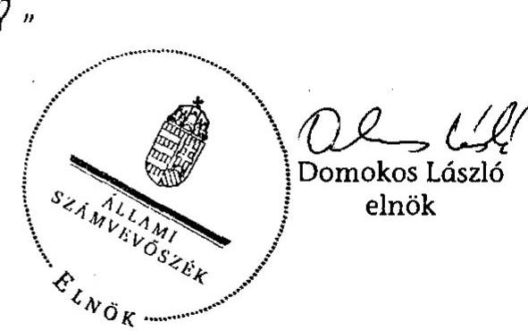
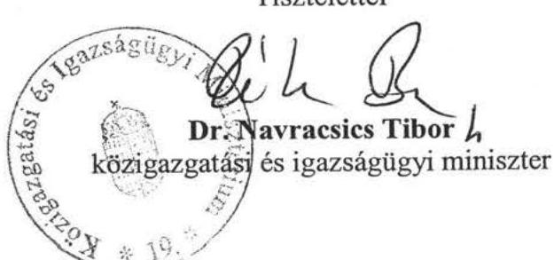
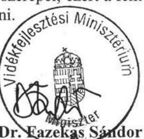
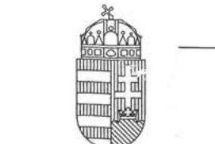
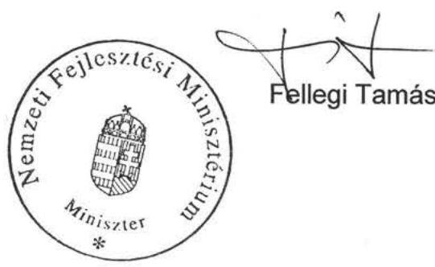
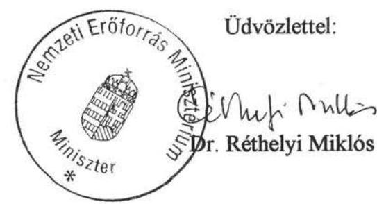
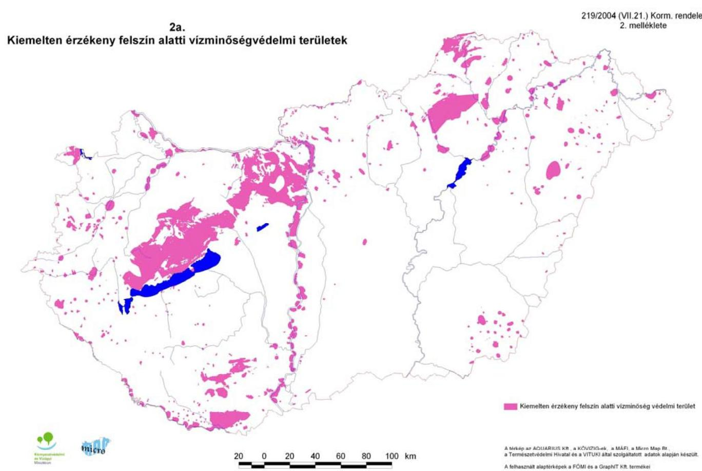
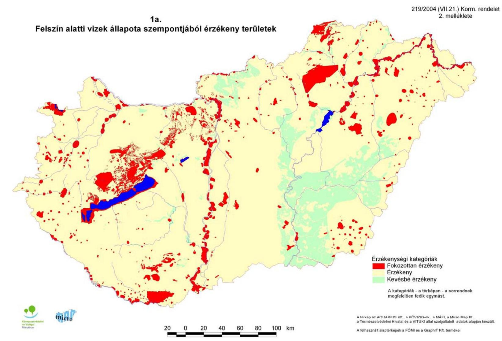
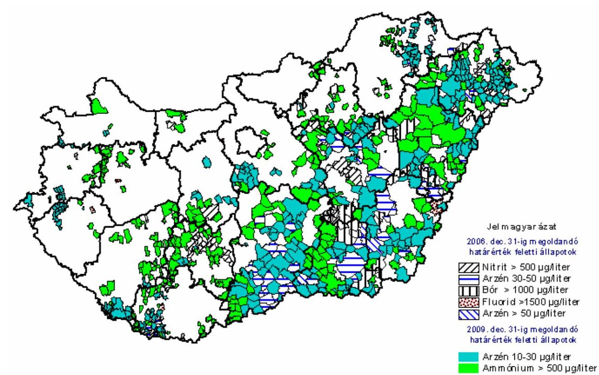

# ÁLLAMI   SZÁMVEVŐSZÉK 

## JELENTÉS

a vizek védelmének és a vízgazdálkodási feladatok ellátásának ellenőrzéséről

---

# 2. Államháztartás Központi Szintjét Ellenőrző Igazgatóság 

2.3. Átfogó Ellenőrzési Főcsoport

Iktatószám: V-2002-115/2010.
Témaszám: 0973
Vizsgálat-azonosító szám: V0484.

## Az ellenőrzést felügyelte:

Dr. Becker Pál
főigazgató
Az ellenőrzés végrehajtásáért felelős:
Hegedűsné dr. Müllern Veronika
főcsoportfőnök

## Az ellenőrzést vezette:

Papp Sándor
osztályvezető

## Az ellenőrzést végezték:

| Beck Miklós számvevő tanácsos | Csóry Györgyné főtanácsadó | Dr. Endrédy Györgyina számvevő |
| :--: | :--: | :--: |
| Gelencsér Zoltán számvevő tanácsos | Gregor Andrea számvevő gyakornok | Hadházy Sándor György számvevő tanácsos |
| Koczor László számvevő tanácsos | Kovácsy Tamás számvevő tanácsos | Radics-Ludvig Györgyi számvevő gyakornok |
| Dr. Sinka Zoltán számvevő tanácsos | Vitányi István számvevő tanácsos |  |

A témához kapcsolódó eddig készített számvevőszéki jelentések:
címe
sorszáma
A magyar-osztrák-szlovén határ menti térség környezet- és természetvédelmének ellenőrzéséről
A Környezetvédelmi és Vízügyi Minisztérium fejezet múködésének 0617 ellenérzése
A Kohéziós Alapból és hazai forrásokból finanszírozott kiemelt 0948 szennyvíztisztítási projektek megvalósításának ellenőrzése

---

# TARTALOMJEGYZÉK 

BEVEZETÉS ..... 11
I. ÖSSZEGZŐ MEGÁLLAPÍTÁSOK, KÖVETKEZTETÉSEK, JAVASLATOK ..... 15
II. RÉSZLETES MEGÁLLAPÍTÁSOK ..... 30

1. A vizek védelme és a vízgazdálkodás stratégiai háttere ..... 30
1.1. A hazai és a nemzetközi vízvédelmi prioritások, az EU irányelvek és a hazai célok összhangja ..... 30
1.2. A vizek védelmét és fenntartható használatát célzó programok megalapozottsága, ütemezettségük, a végrehajtásukra vonatkozó beszámolási kötelezettség ..... 32
1.3. A programok teljesülésének mutatói, monitoringja ..... 38
1.4. A vízgyűjtő-gazdálkodási tervek készítése, megalapozottsága ..... 40
2. A vizek védelmét célzó programok végrehajtása, eredményessége ..... 41
2.1. Az ivóvízbázisok védelmét célzó intézkedések ..... 41
2.2. Az Ivóvízminőség-javító Program ..... 44
2.3. A vizek nitrát szennyezésének csökkentése ..... 49
2.4. A Nemzeti Települési Szennyvízelvezetési és -tisztítási Megvalósítási Program ..... 52
2.5. Az ISPA társfinanszírozásában és a Kohéziós Alapból megvalósult projektek hatása a vizek szennyezésének csökkentésére ..... 55
2.6. A Ráckevei (Soroksári)-Duna-ág vízgazdálkodásának, vízminőségének javítása kiemelt projekt végrehajtása ..... 56
2.7. Az Országos Környezeti Kármentesítési Program megvalósítása ..... 57
3. A vizek állapotát nyomon követő monitoring rendszer és a feladatok összhangja ..... 60
3.1. A monitoring hálózat struktúrája, a követelményeknek való megfelelősége ..... 60
3.2. A vizek állapotát rögzítő információs háttér ..... 64
3.3. A monitoring tevékenység tárgyi és személyi feltételei ..... 66
4. A vizek védelme, a vízgazdálkodás pénzügyi, vagyoni háttere, forrásaik, felhasználásuk ..... 68
4.1. A támogatási források, hasznosításuk iránya, formái ..... 68
4.2. A pályázati rendszer szabályozottsága, múködése ..... 72
4.3. A végrehajtó szervezetek múködési, fejlesztési, pénzügyi tervezése, megvalósulása ..... 75

---

4.4. A bevételi források, bírságok alakulása, a „szennyező fizet" elv és a szankciók érvényesítése ..... 79
4.5. A víziközmú szolgáltatók privatizálása, a vízdíjak megállapítása ..... 83
5. A vízgazdálkodás felügyeletének jogi, szervezeti, ellenőrzési eszközrendszere ..... 87
5.1. A vízgazdálkodási feladatok jogi háttere ..... 87
5.2. A vízgazdálkodás szervezeti háttere ..... 90
5.3. A belső kontrollrendszer és a belső ellenőrzés működése ..... 93

---

# MELLÉKLETEK 

1/a. számú A közigazgatási és igazságügyi miniszter észrevétele
1/b. számú A vidékfejlesztési miniszter észrevétele
1/c. számú A nemzeti fejlesztési miniszter észrevétele
1/d. számú A nemzeti erőforrás miniszter észrevétele
2. számú Tanúsítvány a víz-politika területén a közösségi cselekvés kereteinek meghatározásáról szóló 2000/60/EK európai parlamenti és tanácsi irányelv végrehajtásának Magyar Stratégiai Dokumentumáról, valamint a kapcsolódó intézkedésekről szóló 1189/2002. (XI. 7.) Korm. határozat melléklete alapján
3. számú Tanúsítvány a vizek védelméhez és a vízgazdálkodási feladatok ellátása kapcsán, az EU által elindított lezárt, illetve folyamatban levő eljárásokról
4. számú A vizek védelmét és az ivóvíz minőségét biztosító programok
5. számú Tanúsítvány a Magyar Köztársaság által a Csatlakozási Szerződésben 2009. december 31-ig - a vízvédelemhez kapcsolódóan vállalt határidőkre vonatkozóan
6. számú Tanúsítvány az NKP-II - a vizek védelméhez és a vízgazdálkodási feladatokhoz kapcsolódó - célkitűzések megvalósulásáról
7. számú Tanúsítvány az EU irányelvekhez kapcsolódó a magyar jogszabályokban előírt határidők teljesüléséről
8. számú A helyszínen ellenőrzött vízvédelmi projektek végrehajtásának összegzése
9. számú A szennyvízelvezetés és -tisztítás mutatóinak alakulása 2000-2009.
10. számú A területi szervezeteknél lefolytatott helyszíni ellenőrzések tapasztalatai és a kérdőívre adott válaszok összegzése

## FÜGGELÉKEK

1. számú A II. és III. Nemzeti Környezetvédelmi Program fő célkitűzései
2. számú A II. Nemzeti Környezetvédelmi Program (2003-2008)

Vizeink védelme és fenntartható használata akcióprogram célkitűzései és főbb mutatói
3. számú Kiemelten érzékeny felszín alatti vízminőségi területek
4. számú Felszín alatti vizek állapota szempontjából érzékeny területek
5. számú Az ivóvízminőség javításában érintett települések, főbb szennyezőanyagonként

---

.

---

# RÖVIDÍTÉSEK JEGYZÉKE 

| AVOP | Agrár- és Vidékfejlesztési Operatív Program |
| :--: | :--: |
| ÁBKSZ | Árvízvédelmi és Belvízvédelmi Központi Szervezet Nonprofit Közhasznú Kft. |
| ÁNTSZ | Állami Népegészségügyi és Tisztiorvosi Szolgálat |
| AOX | szerves halogén tartalmú vízszennyező |
| ÁSZ | Állami Számvevőszék |
| EMVA | Európai Mezőgazdasági Vidékfejlesztési Alap |
| EU | Európai Unió |
| EüM | Egészségügyi Minisztérium |
| EQS | Környezetminőségi határérték |
| FAVI | Felszín Alatti Víz és Földtani Közeg Környezetvédelmi Nyilvántartási Rendszer |
| FAVI-ENG | A FAVI Engedélyköteles Tevékenységek Információs rendszere |
| FAVI-KÁRINFO | A FAVI Kármentesítési Információs Rendszere |
| FAVI-MIR | A FAVI Monitoring Információs Rendszere |
| FEUVE | folyamatba épített, előzetes és utólagos vezetői ellenőrzés |
| FEVI | Felszíni Vízminőségi Informatikai Alrendszer |
| FVM | Földművelésügyi és Vidékfejlesztési Minisztérium |
| IH | Irányító Hatóság |
| IMK | Interaktív Múködési Kézikönyv |
| IRM | Igazságügyi és Rendészeti Minisztérium |
| KA | Kohéziós Alap |
| KÁRINFO | Kármentesítési Információs Rendszer |
| KEOP | Környezet és Energia Operatív Program (2007-2013.) |
| KEOP MB | Környezet és Energia Operatív Program Monitoring Bizottság |
| KHEM | Közlekedési, Hírközlési és Energiaügyi Minisztérium |
| KIOP | Környezetvédelem és Infrastruktúra Operatív Program |
| KIOP MB | Környezetvédelem és Infrastruktúra Operatív Program Monitoring Bizottság |
| KöM | Környezetvédelmi Minisztérium |
| KöViM | Környezetvédelmi és Vízügyi Minisztérium |
| KÖVIZIG | környezetvédelmi és vízügyi igazgatóságok |
| KSZ | Közremúködő Szervezet |
| KTK | Közösségi Támogatási Keret |
| KTVF | Környezetvédelmi, Természetvédelmi és Vízügyi Felügyelőség |
| KüM | Külügyminisztérium |
| KvVM | Környezetvédelmi és Vízügyi Minisztérium |
| KvVM BEÖO | Környezetvédelmi és Vízügyi Minisztérium Belső Ellenőrzési Önálló Osztály |

---

| KvVM FI | Környezetvédelmi és Vízügyi Minisztérium Fejlesztési   Igazgatósága |
| :--: | :--: |
| MePAR | Mezőgazdasági Parcella Azonosító Rendszer |
| MNV Zrt. | Magyar Nemzeti Vagyonkezelő Zártkörú Részvénytársaság |
| MTVSZ | Magyar Természetvédők Szövetsége |
| NAKP | Nemzeti Agrár-környezetvédelmi Program |
| NEFMI | Nemzeti Erőforrás Minisztérium |
| NÉP | Nemzeti Éghajlatváltozási Program |
| NÉS | Nemzeti Éghajlatváltozási Stratégia |
| NFT | Nemzeti Fejlesztési Terv |
| NFGM | Nemzeti Fejlesztési és Gazdasági Minisztérium |
| NFM | Nemzeti Fejlesztési Minisztérium |
| NFÜ | Nemzeti Fejlesztési Ügynökség |
| NKP-I.-II.-III. | Nemzeti Környezetvédelmi Program I.-II.-III. |
| NPI | Nemzeti Park Igazgatóságok |
| NVT | Nemzeti Vidékfejlesztési Terv |
| OKI | Országos Környezetegészségügyi Intézet |
| OKIR | Országos Környezetvédelmi Információs Rendszer |
| OKKP | Országos Környezeti Kármentesítési Program |
| OKT | Országos Környezetvédelmi Tanács |
| OKTVF | Országos Környezetvédelmi, Természetvédelmi és Vízügyi   Főfelügyelőség |
| OTH | Országos Tisztifőorvosi Hivatal |
| OVT | Országos Vízgazdálkodási Tanács |
| OVGT | Országos Vízgyújtő Gazdálkodási Terv |
| ÖKO Zrt. | Környezeti, Gazdasági, Technológiai, Kereskedelmi, Szol-   gáltató és Fejlesztési Zártkörúen múködő Részvénytársa-   ság |
| ÖM | Önkormányzati Minisztérium |
| PPO | Projektek Pénzügyi Osztály |
| RSD | Ráckevei (Soroksári)-Duna-ág |
| SKV | stratégiai környezeti vizsgálat |
| SLA | Service Level Agreement - szolgáltatási szint szerződés |
| SzMSz | Szervezeti és Múködési Szabályzat |
| TB | Tárcaközi Bizottság |
| ÚMFT | Új Magyarország Fejlesztési Terv (2007-2013.) |
| ÚMVP | Új Magyarország Vidékfejlesztési Program |
| VAL-VÉL | felszíni vizek emisszióra és immisszióra vonatkozó adatait   nyilvántartó informatikai alrendszer |
| VFM | Vidékfejlesztési Minisztérium |
| VGT | Vízgyűjtő-gazdálkodási Terv |
| VICE | Vízügyi Célelóirányzat |
| VITUKI | Környezetvédelmi és Vízgazdálkodási Kutató Intézet   Nonprofit Kft. |

---

| VIZIR | Vízgazdálkodási Információs Rendszer |
| :-- | :-- |
| VKI | Víz Keretirányelv |
| VKKI | Vízügyi és Környezetvédelmi Központi Igazgatóság |
| VOP | Végrehajtás Operatív Program |
| VTT | Vásárhelyi Terv Továbbfejlesztése Program |
| WISE | Európai Vízügyi Információs Rendszer (Water |
|  | Information System for Europe) |

---

.

---

# ÉRTELMEZŐ SZÓTÁR 

| AOX | Adszorbeálható szerves halogénezett melléktermékek a vízben. |
| :--: | :--: |
| GWD irányelv | A felszín alatti vizek szennyeződéstől és állapotromlástól való védelméről szóló irányelv. |
| hidrogeológiai védőterület | A víztermelő létesítményeket körülvevő felszín alatti védőterület. Általában a felszín alatti vízgyűjtő határáig terjed. A hidrogeológiai védőterületen tiltják mindazon tevékenységeket, amely olyan anyagokat juttatnának víztermelő hely felé áramló vízbe, amelyek a kitermelésig nem szűrődnek ki, nem bomlanak le, vagy nem pusztulnak el. A szakszerűen kijelölt és az arra érvényes szabályok betartása a vízbázisok védelmének hatékony eszköze. Lehet A, B, C típusú. |
| hidromorfológiai minősítés | A vízfolyás kialakulása, valamint a múltban történt emberi beavatkozások és azok hatásai.   A hidrológiai rezsim (az áramlás mértéke és dinamikája, kapcsolat a felszín alatti víztestekkel), a folyó folytonossága, és a morfológiai viszonyok (a folyó mélységének és szélességének változékonysága, a mederágy szerkezete és anyaga, a parti sáv szerkezete) összessége. |
| INSPIRE irányelv | Az Európai Parlament és a Tanács 2007/2/EK irányelve (2007. március 14.) az Európai Közösségen belüli térinformációs infrastruktúra kialakításáról |
| IPPC irányelv | Az Európai Tanács a környezetszennyezés integrált megelőzéséről és csökkentéséről szóló 96/61/EK irányelve (Integrated Pollution Prevention and Control) |
| ISPA | Instrument for Structural Policies for Pre-Accession Strukturális Politika Előcsatlakozási eszköze |
| Infringement eljárás | Kötelezettségszegési eljárás |
| Ivóvízminőség-javító Program (intézkedési terv) | Az emberi fogyasztásra szolgáló vízre (ivóvízre) vonatkozó - jogszabályban meghatározott - minőségi követelményeket kielégítő cél megvalósítására irányuló feladatok öszszessége. (1995. évi LVII. törvény a vízgazdálkodásról). |
| Ivóvíz | A rendszeres emberi fogyasztásra alkalmas a fizikai, a kémiai, a bakteriológiai, a toxikológiai és a radiológiai határértékeknek megfelelő víz. |
| lakosegyenérték (LE): | Egy lakos által naponta a csatornába bocsátott szennyvíz szervesanyag tartalma, a 91/271/EGK tanácsi irányelv szerint az a szerves, biológiailag lebontható szennyezőanyag mennyiség, amelynek ötnapos biokémiai oxigénigénye (BOI 5) 60 g oxigén/nap. |
| közkifolyó   PHARE | Közterületi vízvételi hely   Poland-Hungary Assistance for the Restructuring of the Economy |
| vízbázis | A vízkivételi művek által igénybe vett vagy arra kijelölt |

---

|  | terület, illetőleg felszín alatti térrész és az onnan emberi fogyasztásra, illetve hasznosításra kitermelhető vízkészlet a meg lévő, vagy a tervezett vízbeszerző létesítményekkel együtt. |
| :--: | :--: |
| vízgazdálkodás | A vizek hasznosítása, hasznosítási lehetőségeinek megőrzése, a vizek kártételei elleni védelem és védekezés (vízkárelhárítás). |
| vízilétesítmény | Az a mú (víziközmú), mútárgy, berendezés, felszerelés vagy szerkezet, amelynek rendeltetése, hogy a vizek lefolyási, áramlási viszonyait, mennyiségét vagy minőségét, medrének vagy partjának állapotát, a vizek kártételeinek elhárítása, a vizek hasznosítása - ideértve a víziközmúvekkel végzett közüzemi tevékenységgel nyújtott szolgáltatást -, minőségének és mennyiségének megfigyelése, illetve ásványi és földtani kutatások végzése céljából vagy ásványi nyersanyag kitermelése céljából befolyásolja. |
| vízszolgáltatások | Az állam, illetve a helyi önkormányzatok közfeladataival összefüggő, különösen a vízigények kielégítésére, a szennyvizek elvezetésére, illetőleg a használt vizek ártalommentes elhelyezésére, a vízkészletek védelmére irányuló közfeladatok, különösen   a) a felszíni vagy felszín alatti víz kitermelése, duzzasztása, tárolása, kezelése és elosztása,   b) a szennyvíz összegyújtése és kezelése, amelyet ezt követően a felszíni vizekbe juttatnak. |
| víziközmú társulat | Közfeladatként a település, az együttesen ellátható települések belterületi, illetve lakott területi részének közmúves vízellátását, szennyvízelvezetését, szennyvíztisztítását, a belterületi vízrendezést és csapadékvíz elvezetést szolgáló vízi létesítményeket hoz létre, illetve fejleszt. (1995. évi LVII. törvény a vízgazdálkodásról) |
| vizitársulat | A társulat közfeladatként a múködési területén a tulajdonában, vagyonkezelésében, valamint használatában lévő közcélú vízgazdálkodási múveken (a továbbiakban: társulati múvek) területi vízrendezési, vízkárelhárítási és mezőgazdasági vízhasznosítási feladatokat lát el, közcélú vízilétesítményeket hoz létre, karbantartási és üzemeltetési feladatokat lát el. Múködési területén környezetvédelmi, természetvédelmi, táblán, illetve üzemen belüli meliorációs és mezőgazdasági vízszolgáltatási feladatokat végezhet. (2009. évi CXLIV. törvény a vízitársulatokról) |

---

# JELENTÉS 

## a vizek védelmének és a vízgazdálkodási feladatok ellátásának ellenőrzéséről

## BEVEZETÉS

Magyarország természeti, vízrajzi és földrajzi elhelyezkedése miatt sajátos vízháztartási viszonyokkal rendelkezik. A felszíni vizek mennyisége (egy főre jutó felszíni vízkészlete) tekintetében a legnagyobbak közé tartozik Európában, minősége a vizek jellegétől függően jelentősen eltérő. A felszín alatti vízkészlet európai viszonylatban - minőségi és mennyiségi szempontból egyaránt - kiemelkedő. A felszíni és a felszín alatti vizeket természeti, illetve - egyre nagyobb mértékben - emberi beavatkozások veszélyeztetik.

A vizek szennyezése világjelenség, ezért egyre kiemeltebb szerepet kap a felszíni és a felszín alatti vizek védelme, melynek alapja a 2000-ben elfogadott és hazánk által is aláírt „a vízpolitika terén a közösségi fellépés kereteinek meghatározásáról" szóló 2000/60 EK irányelv, ami hazánkban Víz Keretirányelv (VKI) néven került a szakmai programokba és a jogi szabályozásba. A VKI célja a vízi környezet fenntartása és javítása, kiemelt szempontja - legkésőbb 2015-ig a felszíni és a felszín alatti vizek jó állapotának elérése. Ennek megoldására három fő irányként a megelőzést, a szennyezés csökkentését és az utólagos kármentesítést jelölte meg. A VKI végrehajtásának alapvető kritériuma a vízgyűjtő területek országai közötti koordináció, mivel az országokon belül eltérőek az adottságok, ezért a megoldásokat a vízgyűjtő terület sajátosságaihoz kell igazítani. A vizek védelméhez más EU irányelvek is kapcsolódnak. A felszíni vizek védelme szempontjából kiemelt jelentőségű a települési szennyvízkezelésről szóló, valamint a nitrát szennyezéssel szembeni védelem irányelve és a környezeti károk megelőzése, illetve helyreállítása tekintetében a környezeti felelősségről szóló irányelv. Hazánk a megfelelő minőségű ivóvíz biztosítása szempontjából kapcsolódott az emberi fogyasztásra szánt víz minőségéről szóló EU irányelvben foglaltakhoz.

A vizek védelmével kapcsolatos célkitűzések kereteit az eddig három időszakra (1997-2002; 2003-2008; és a 2009-2014. évekre) kidolgozott I.; II.; III.; Nemzeti Környezetvédelmi Program (NKP) „Vizeink védelme és fenntartható használata" akcióprogramja tartalmazta. A két utóbbi program megvalósítását célzó intézkedéseket a 2004-2006. évekre szóló Nemzeti Fejlesztési Terv, valamint a 2007-2013. évekre szóló, az Új Magyarország Fejlesztési Terv meghatározott prioritásai tartalmazzák. A vízvédelem EU forrásait a két fejlesztési terv biztosította, a hazai források az éves költségvetési tervekben jelentek meg.

---

A hazai programok három fő irányt jelöltek ki a célok elérésére, ezek a megelőzés (pl. a vízbázisok védelme), a szennyezések csökkentése (pl. a szennyvizek kezelése), valamint a kármentesítés (pl. a környezetkárosítás felszámolása). A célkitűzések döntően a vizek minőségi védelmére irányultak, mert hazánkban elsődleges problémát a vizek szennyezettsége jelent. Az intézkedések hatásának mérését, ellenőrzését szolgáló fontos eszközök kialakítását az EU irányelvek előírták.

A felszíni és felszín alatti vizek kezelése állami feladat, fő felelőse 2010-ig a Környezetvédelmi és Vízügyi Minisztérium (KvVM) volt, mellette több tárca, így pl. az ivóvíz tisztaságának ellenőrzéséért felelős Egészségügyi Minisztérium látott el a vizek védelméhez, illetve a vízgazdálkodáshoz kapcsolódó feladatokat. A KvVM szervezeti struktúrájába tartozó környezetvédelmi és vízügyi igazgatóságok feladatkörébe tartozott területi szinten a vízgazdálkodás szakmai irányítása, a vízkárelhárítás szervezése, az állami tulajdonú vízügyi létesítmények kezelése. A területi jelentőségű vízgazdálkodási, vízvédelmi feladatok, koncepciók egyeztetését, véleményezését területi- és részvízgyűjtő-szintű tanácsok, az országos jelentőségűekét az Országos Vízgazdálkodási Tanács látta el. A hatósági és a szakhatósági jogköröket a regionális környezetvédelmi felügyelőségek gyakorolták. A helyi szintű szennyvízkezelés és az egészséges ivóvízzel való ellátás az önkormányzatok feladata. A vízgazdálkodási feladatok irányítása 2010től - kormányzati szerkezetátalakítás miatt - a vidékfejlesztési miniszter, az ivóvizek minőségének ellenőrzése a nemzeti erőforrás miniszter hatáskörébe került.

A vizek szennyezésének csökkentését célzó szennyvíztisztítás kiemelt kritériuma a tisztított szennyvíz arányának növelése, ennek eszköze a korszerűbb szennyvíztisztítók építése, a meglevő tisztítók hatásfokának javítása, de ugyanilyen fontos szempont a települések csatornázottságának, illetve a rákötések arányának növelése. A közép-kelet-európai gazdasági struktúraváltás, valamint a hazai szennyvíztisztítási programok előrehaladása következtében - a szakmai beszámolók szerint - a folyók nagy hígítású kapacitásának köszönhetően nagy folyóink vízminősége elfogadható. A kisvízfolyások állapota az öntisztuló képességüket meghaladó eseti terhelések miatt rosszabb.

Az ivóvízszükségletet ellátó mintegy 1600 üzemelő felszín alatti vízbázis és a 75 távlati vízbázis közül 600 sérülékeny környezetben helyezkedik el, minőségüket részben geológiai, részben emberi tevékenység veszélyezteti (1-2. számú függelék). A sérülékeny vízbázisok kapacitásának 60\%-a adja 6 millió ember ivóvízellátását.

Ellenőrzésünk elsődlegesen az ország hosszú távú érdekét szolgáló, a felszíni és a kiemelten kockázatos felszín alatti vizek (vízbázisok) minőségi védelmére, valamint az ezekhez kapcsolódó vízgazdálkodási feladatokra helyezte a fő hangsúlyt. Arra kerestünk választ, hogy ezek végrehajtása eredményeként hosszú távon megvalósulhat-e a társadalom széles rétegét közvetlenül érintő megfelelő minőségű ivóvíz biztosítása, valamint az, hogy a vizekkel kapcsolatos állami, önkormányzati intézkedések eredményeként hosszú távon megvalósul-e a vizek jó állapotának elérése és védelme. A megfelelő minőségű ivóvízhez kapcsolódó tevékenység kiemelt prioritással bíró közszolgáltatás, és állandó társadalmi, közegészségügyi igényt elégít ki. Kezelésének fontosságára hívja fel a figyelmet,

---

hogy hazánk lakosságának mintegy negyede egyes paraméterek tekintetében az egészségügyi határértéknek nem megfelelő vizet fogyaszt, ebből az arzén megengedettnél magasabb értéke a legsúlyosabb, amely mintegy 1,5 millió embert érint. A vizek védelme a nemzetközi kötelezettségek miatt is figyelmet érdemel, mert megfelelő állapotának biztosításához fontos határidők kapcsolódtak. Az EU vízpolitikájának irányelve a tagállamok felé jogi, szervezeti, szakmai feladatokat jelölt meg, ezért az ellenőrzés részét képezte a VKI végrehajtását szolgáló eszközrendszer kialakításához, a vizek védelméhez és a vízgazdálkodáshoz kapcsolódó programok aktuális helyzetének, valamint a VKI végrehajthatóságát befolyásoló kockázatoknak a feltárása.

Az Állami Számvevőszék (ÁSZ) korábban is folytatott a vizek védelméhez kapcsolódó ellenőrzéseket, mint pl. a Kohéziós Alapból és hazai forrásokból finanszírozott kiemelt szennyvíztisztítási projektek megvalósításának ellenőrzése (2009.), ezért ezt vizsgálatunk nem érintette részleteiben. Emellett az ÁSZ rendszeresen végzett ellenőrzéseket átfogó jelleggel környezet-, illetve természetvédelemhez kapcsolódó témakörben. A vizeket érő károsító hatások megelőzésére, kezelésére irányuló intézkedéseket átfogó jelleggel célzottan még nem vizsgálta.

# Az ellenőrzés célja annak értékelése volt, hogy: 

- az országos és ágazati stratégiák, programok, a mellérendelt működési, fejlesztési források tervezése, ütemezése, végrehajtása biztosította-e a vizek jó állapotának elérését célzó hazai és az EU Víz Keretirányelv célkitűzéseinek, mutatóinak teljesítését, a tervezés, a végrehajtás során megvalósult-e a nemzetközi kötelezettségek, a hazai ágazati célok és a társadalmi érdekek összhangja;
- a vizek védelmét szolgáló jogi, szervezeti, pénzügyi, monitoring feltételrendszer kialakítása hatékonyan és eredményesen támogatta-e a hazai vízgazdálkodás és a Víz Keretirányelv célkitűzéseinek megvalósulását;
- hasznosultak-e az ÁSZ korábbi, környezet- és természetvédelmet célzó ellenőrzései nyomán tett javaslatai.

Az ellenőrzés a VKI hazai jogrendbe illesztését és célkitűzéseinek megvalósítását szolgáló programok időhorizontján belül a 2004-től kezdődő és a helyszíni vizsgálatunk befejezéséig (2010. I. félév) terjedő időszakban hozott, a vizek védelmére irányuló intézkedésekre terjedt ki. Vizsgálatunk a rendszerellenőrzés módszerével értékelte a vizek mennyiségi és minőségi védelmét célzó intézkedések eredményességét a Víz Keretirányelvben, valamint a hazai érdekeket szolgáló programokban megjelölt feladatok teljesülésére. Teljesítmény-ellenőrzés körében, kiemelten eredményességi szempontok alapján értékeltük a megfelelő minőségű ivóvíz biztosítását, valamint a vizek védelmét - ezen belül a vizek minőségi állapotának fenntartását, javítását - célzó források felhasználását. A helyszíni ellenőrzések körébe két régióban végrehajtott, döntően a megfelelő minőségű ivóvíz biztosítását, valamint az ivóvízbázisok védelmét célzó projektek kerültek.

Az ellenőrzés a vízgazdálkodás felügyeletét ellátó Környezetvédelmi és Vízügyi Minisztériumra (KvVM), a környezetvédelmi - ezen belül a vízvédelmi fejlesztéseket célzó EU támogatásokat kezelő KvVM Fejlesztési Igazgatóságra; az

---

ivóvíz tisztaságának ellenőrzéséért felelős Egészségügyi Minisztériumra, illetve szervezeteire, valamint az EU támogatások felhasználását irányító Nemzeti Fejlesztési Ügynökség - a vizek védelmét célzó pályázatok kezelésével kapcsolatos - tevékenységére terjedt ki. A minél teljesebb körű értékelés érdekében - a felszíni vizek és a mezőgazdaság kapcsolódására tekintettel - adatokat, információkat kértünk be a Földművelésügyi és Vidékfejlesztési Minisztériumtól (2010től Vidékfejlesztési Minisztérium). A téma minél teljesebb körű megválaszolása érdekében felhasználtuk a jövő nemzedékek országgyűlési biztosának 20082009. évi beszámolóját.

Ellenőrzésünk nem tárgyalta a vizek kártételeihez - árvizekhez és belvizekhez kapcsolódó, azok megelőzését, felszámolását célzó intézkedéseket. Ennek oka, hogy a vizek kártételének kezelésével kapcsolatos irányelvek - bár hatással lehetnek a vizek minőségére - nem tartoznak a VKI fő célkitűzései közé, ezeket az árvízi kockázatok felméréséről és kezeléséről szóló 33/2006/EK Közös Álláspont tartalmazza. A belvizek kezelése teljes egészében az EU tagországok saját belső vízgazdálkodási feladata. Az NKP-kban az ár és belvízgazdálkodáshoz külön a területi vízgazdálkodás, a vízkármegelőzés és az elhárítás - prioritás kapcsolódik. Az ÁSZ már folytatott ebben a témában ellenőrzéseket, mint pl. a természeti katasztrófák megelőzésére való felkészülés (2005.), illetve a települési önkormányzatok vízrendezési és csapadékvíz elvezetési feladatainak ellátása (2007.).

Az ellenőrzés végrehajtására az Állami Számvevőszékről szóló 1989. évi XXXVIII. törvény 2. § (3), (5,) (6) és (9) bekezdései adták a jogszabályi alapot.

A jelentést egyeztetésre megküldtük a közigazgatási és igazságügyi, a vidékfejlesztési, a nemzeti fejlesztési, valamint a nemzeti erőforrás miniszternek. A miniszterek észrevételt nem tettek. Leveleiket a jelentés $1 / a-1 / d$ mellékletei tartalmazzák.

---

# I. ÖSSZEGZŐ MEGÁLLAPÍTÁSOK, KÖVETKEZTETÉSEK, JAVASLATOK 

A Víz Keretirányelv megállapítja, hogy minden felhasználási területen folyamatosan növekszik az igény a kielégítő mennyiségű, jó minőségű víz iránt, ami alátámasztja a Közösség vizeinek mind mennyiségi, mind minőségi védelmét célzó cselekvés szükségességét. A VKI kimondja, hogy „a víz nem szokásos kereskedelmi termék, hanem örökség, amit annak megfelelően óvni, védeni és kezelni kell."

A vízvédelem fő feladatait Magyarországon alapvetően két EU irányelvben foglalt követelmények, a víz jó minőségi állapotának 2016-ig történő elérése, ${ }^{1}$ valamint a megfelelő minőségű ivóvíz 2009. év végéig teljesítendő biztosítása ${ }^{2}$ irányozzák elő.

A vizek védelmét közvetlenül vagy közvetve szolgáló irányelvek célkitűzéseinek, a nemzetközi kötelezettségekben foglalt vállalásoknak a teljesítése érdekében a hazai környezetvédelmi ágazat az alapvetően szükséges intézkedéseket megtette. A VKI jogharmonizációja megtörtént. Az EU vízvédelmi politikai célkitűzéseit beépítették a már korábban megkezdett, illetve a 2000. évet követően kidolgozott szakmai programokba és a támogatási rendszerbe. A végrehajtást biztosító eszköztárba - a jogszabályokba, a szervezeti struktúrába, a hatósági és monitoring tevékenységbe - bekerültek a célkitűzések végrehajtását, ellenőrzését segítő elemek.

Ellenőrzésünk ugyanakkor megállapította, hogy a végrehajtott intézkedések során - a jogszabályalkotás, a források biztosítása, a monitorig feladatok ellátása terén - hiányosságok, illetve - a szakmai programok, a tervek készítése, a már futó programok teljesítése terén - késedelmek léptek fel. Ezek következtében hazánk nem, illetve hiányosan teljesítette a nemzetközi kötelezettségek körében, valamint a hazai jogszabályi rendelkezésekben foglalt, a vizek szennyezésének csökkentése, a megfelelő minőségű ivóvíz minőségi mutatói és a vízbázis védelem terén 2009-ig előírt fontos feladatokat. A vizsgált időszakban meghatározó volt a szakmai feladatok késedelmén túl, a szűk pénzügyi források, ezen belül az állami költségvetés, az önkormányzatok és a gazdasági élet szereplőinek egyre korlátozottabb finanszírozó képessége. A vizek monitoring rendszere kiépült, azonban a VKI-ban előírt, a vizek állapotának felmérése, nyomon követése, az adathiány kiküszöbölése, az adatkezelés és a nyilvántartások inhomogén kialakítása, a mérési eszközök szükséges fejlesztésének elmaradása és a humán kapacitás csökkentése miatt a hatóságok csak a szakmai minimum szinten képesek biztosítani. A 2007-ben, a vizek monitoring programjáról készült első jelentést az EU Bizottság kedvezően fogadta, kifogásolta viszont a mintavételek alacsony számát. A késedelmek, hiányosságok következtében a környezetre, az érintett területek lakosságának egészségi állapotára

[^0]
[^0]:    ${ }^{1}$ A vízvédelmi politika terén a közösségi fellépés kereteinek meghatározásáról szóló 2000/60/EK Irányelv.
    ${ }^{2}$ A Tanács 98/83/EK Irányelve az emberi fogyasztásra szánt víz minőségéről.

---

gyakorolt káros hatások, veszélyek az elvártnál lassabban csökkentek, és ezen a téren nem érvényesült az Alkotmányban foglalt egészséges környezethez való jog. Következetes intézkedések nélkül hazánk a hazai és nemzetközi kötelezettségeket határidőre várhatóan nem tudja teljesíteni. ${ }^{3}$

A hazai vizek védelmét és a vízgazdálkodást alapvetően meghatározó nemzetközi kötelezettségek és hazai érdekeknek megfelelő célkitűzések és feladatok az intézkedések eredményeként beépültek a vizek kezeléséhez kapcsolódó hazai programokba. A VKI hazai megvalósítását a 2002-ben elkészült Magyar Stratégiai Dokumentum rögzítette. A környezetvédelem átfogó programját, ezen belül a vizek védelméhez kapcsolódó célkitűzéseket a Nemzeti Környezetvédelmi Program (NKP), hat évre szóló (1997-2002, 2003-2008., valamint 2009-2014.) ciklusokban foglalja keretbe. Az éghajlatváltozás hatásaként a csapadékváltozás közvetve hatást gyakorol a felszíni és a felszín alatti vizekre, ezt a kölcsönhatást és a vízvédelemhez, illetve a vízgazdálkodáshoz való kapcsolódást hangsúlyozza a Nemzeti Éghajlatváltozási Stratégia. A legfontosabb tennivalókat a Nemzeti Éghajlatváltozási Program határozza meg, amely kijelöli az egyes feladatok forrását, a végrehajtásért felelős szervezetet, valamint az indikátorokat. A víztakarékosságra való ösztönzést a VKI a társadalom irányába is kiterjesztette, fontossá téve a környezeti szemléletformálást és a lakosság környezettudatosságra nevelését. Megvalósítása a klímaváltozás terén 2008-ban szervezett kampányok részét képezte. Elkészült a VKI által minden tagállam számára előírt Országos Vízgyűjtő Gazdálkodási Terv (OVGT). Kidolgozásának és egyeztetéseinek problémájára több minisztériumi dokumentum utal. Az ütemes előrehaladás ellenére a terv elkészítésére vonatkozó, a VKI-ban rögzített végső határidőket nem tartották be.

Az NKP-III. megalapozásához külön tanulmányok nem készültek, de az NKP-III. „Vizeink védelme és fenntartható használata" tematikus akcióprogram megalapozásául többek között az előző NKP-I. és NKP-II. tapasztalatai, értékelései szolgáltak és igénybe vették - a VKI-ban kötelezően előírt - vízgazdálkodási tervekhez kapcsolódó előkészítő anyagokat. Az NKP-kban nevesített célként ${ }^{4}$ jelent meg vizeink védelme és fenntartható állapota, illetve vizeink jó állapotának elérése prioritás címen ${ }^{5}$. Ezekben a vizek minőségi védelme és a vizek kártétele elleni védekezés mellett, a mennyiségi védelem is hangsúlyos szerepet játszott (pl. a tényleges állapotok felmérése, a potenciális ivóvízkészlet meghatározása, vízvisszatartás és tározás). Az NKP-III. a törvényi előírástól ${ }^{6}$ eltérően nem tartalmazta feladatmélységig a szabályozási, ellenőrzési, értékelési eszközök várható költségigényét.

[^0]
[^0]:    ${ }^{3}$ A jelentés kiadása előtt a közigazgatási és igazságügyi miniszter, valamint a nemzeti erőforrás miniszter több megállapítás, illetve javaslat megoldását célzó intézkedésekről tájékoztatta az ÁSZ elnökét.
    ${ }^{4}$ Részletesen az 1. számú függelékben.
    ${ }^{5}$ A célkitűzések főbb mutatói a 2. számú függelékben.
    ${ }^{6}$ A környezet védelmének általános szabályairól szóló 1995. évi LIII. törvény 40. §(1) d. pontja.

---

Célszerűtlen az egymással összhangban végrehajtandó, egymásra épülő szakmai programok, stratégiák kétévenkénti ütemezett, illetve lezáráskor teljesítendő beszámolási kötelezettségének ütemezésére vonatkozó szabályozása, mert beszámolóik egymást követő évekre esnek, ezért több beszámolási kötelezettség - pl. a VKI végrehajtása, az Ivóvízbázis-védelmi Program esetében - nem teljesült, illetve más program beszámolója keretében teljesítették. Az erre vonatkozó hazai rendelkezések készítésekor a megfelelő ütemezésre nem figyeltek, illetve azokat a jó gyakorlat kialakítása érdekében nem módosították.

A vizsgált időszakra eső, hazánkra EU irányelvben ${ }^{7}$ kötelezően előírt, illetve a Csatlakozási Szerződésben ${ }^{8}$ vállalt kötelezettségek, valamint a hazai előírások határidőre történő teljesítése több esetben késett. A késedelmek alapvetően a jogharmonizáció keretében az irányelvek nem megfelelő átültetésével, valamint a szakmai tervek, programok készítése körében a határidők csúszásával függtek össze. A VKI kapcsán vállalt kötelezettségeket kettő kivételével - a vízgyűjtő gazdálkodási tervek kéziratának nyilvánosságra hozatala, valamint a terv készítése társadalmi vitája és véglegesítése határidőre teljesítették. ${ }^{9}$ A Csatlakozási Szerződésben egy 2009. évi határidőre vállalt kötelezettség teljesült, ${ }^{10}$ egy 2010 végén lejáró kötelezettségnél ${ }^{11}$ viszont fennáll a nem maradéktalan teljesülés kockázata. A késést hazánk az EU felé jelezte, kötelezettségszegési eljárás még nem indult. Az EU irányelvek nem megfelelő átültetése, az átültetés hiánya, illetve az átültető hazai jogszabályok határidőre történő bejelentésének elmulasztása miatt Magyarország ellen négy esetben indult eljárás, ${ }^{12}$ ezek közül három lezárult. Nem teljesült és ezért EU kötelezettségszegési eljárás indult az árvízkockázati térképek készítésére vonatkozó rendelet megkésett elfogadása miatt. Nem tartották be az OVGT elkészítésére vonatkozó határidőket, elfogadására és kihirdetésére csak késve, 2010-ben került sor. Egy év késéssel - gyakorlatilag a 2009-2010. évekre szóló program második évére - készült el a Nemzeti Éghajlatváltozási Stratégiában előírt Nemzeti Éghajlatváltozási Program. Egy évet késett az NKP-III. elfogadása, mert - az illetékes tárca szerint - tervezői szándék volt, hogy az NKP-II. beszámolójával egyidejűleg kerüljön megvitatásra az NKP-III. tervezete. A késés törvényi előírás ${ }^{13}$ következtében is fennállhatott, mivel a rendelkezés szerint a program megújítására irányuló előterjesztés benyújtásakor az Országgyűlés előtt be kell számolni a program végrehajtásáról és tapasztalatairól.

[^0]
[^0]:    ${ }^{7}$ Részletezés az 3. számú mellékletben.
    ${ }^{8}$ Részletesen az 5. számú mellékletben.
    ${ }^{9}$ A határidőre teljesített feladatok: pl. a jogharmonizáció körében a nemzeti joganyag teljes harmonizációja, a hatáskörrel rendelkező hatóságok meghatározása, a Keretirányelv által megkívánt monitoring programok kialakítása és beindítása.
    ${ }^{10}$ A Csatlakozási Szerződés III. mellékletben felsorolt iparágakba tartozó üzemek, biológiailag lebontható ipari szennyvizekkel kapcsolatos követelményekre vonatkozó határidő.
    ${ }^{11}$ A települési szennyvíz kezelésével kapcsolatos, 15000 lakosegyenértéket meghaladó, nem érzékeny területen található agglomerációra vonatkozó előírás.
    ${ }^{12}$ Részletesen a 4. számú mellékletben.
    ${ }^{13}$ A környezet védelmének általános szabályairól szóló 1995. évi LIII. törvény 40. § (3).

---

Az NKP-II. és az NKP-III. vizek védelméhez kapcsolható prioritása többek között, a már korábban beindított több - részletesen ellenőrzött - szakmai programra ${ }^{14}$ támaszkodik.

Az ivóvízbázisok ${ }^{15}$ védelme - a védőterületek kialakítása és az ivóvízbázisok mennyiségi, minőségi védelmét előkészítő diagnosztikai vizsgálata - csak részben valósult meg. A vízbázisok védőidomaira, illetve a védőterület kialakítására megszabott határidők ellenére 2007-ig a vízbázisok csak mintegy felénél - 614 db üzemelő vízbázisból 329-nél - fejezték be a diagnosztikai (állapotértékelési) vizsgálatot, és a 75 távlati ivóvízbázis közül 55 esetében végezték el a vizsgálatokat. Ezért a feladatról rendelkező jogszabály 2007. évi módosításával a régi határidőket hatályon kívül helyezték, de újabb határidőket nem jelöltek ki. Ennek következtében a még elmaradt 274 üzemelő és 13 távlati ivóvíz bázis diagnosztikai felmérésének nincs kijelölt határideje. A módosítás nélkül védőterület hiányában az üzemelési engedélyt vissza kellett volna vonni, de ez veszélyeztetné a közüzemi ivóvízellátás folytatását. A védőidomok és védőterületek hatósági ellenőrzésének megfelelő ellátásához nem áll rendelkezésre a védőterületek megfelelő nyilvántartási háttere. Az üzemelő sérülékeny környezetű vízbázisok alapállapot-felmérését - több módosítás ellenére - a 2009 végére kitűzött határidőre sem végezték el teljes körűen.

Az Ivóvízminőség-javító Program elsősorban az Alföldi régiót érintette, végrehajtásában két nemzetközi kötelezettség megszegését is előidéző késés következett be. Az Európai Unióhoz való Csatlakozási Szerződésben ${ }^{16}$ Magyarország kötelezettséget vállalt a lakossági ivóvízre vonatkozó - a bór, a fluorid és a nitrit határértékekkel összefüggésben 2006 végére, valamint az arzén határértéke tekintetében 2009 végére - EU irányelv ${ }^{17}$ előírásainak teljesítésére. A 2001ben indított program 908 települést érintett, 2,75 millió fővel, az NKP-II. 2009re jelölte ki, hogy 0\%-ra kell csökkenteni a nem megfelelő ivóvízzel ellátott lakosok arányát. Ugyanakkor az érintett körben 2001. és 2006. között mindössze négy településen 8600 fő részére sikerült biztosítani megfelelő ivóvizet, és mintegy 2 millió főt érintő 493 településen a fejlesztések folyamatban voltak. Ennek ellenére a 2009-ben végrehajtott felülvizsgálat során a még érintett települések száma 836, lakónépessége 2,26 millió fő volt. A vállalt kötelezettségek nem teljesítése miatt hazánk az Európai Bizottsághoz átmeneti eltérésre vonatkozó kérelmet nyújtott be, további eltérés kérésére már nincs lehetőség. A halasztási kérelem 430 település, mintegy 1,2 millió lakos egészséges ivóvízhez jutását érinti. A folyamatban levő fejlesztéseket is figyelembe véve a program teljesítése az ivóvízminőségi problémában érintett népesség 10\%-a esetében 2010-re valósult meg, illetve került reális közelségbe. A jelenlegi ütemezéssel a 2012-re

[^0]
[^0]:    ${ }^{14}$ Pl. a Vízgazdálkodás Országos Koncepciója, az Ivóvízminőség-javító Program, az Ivóvízbázisvédelmi Program, a Nemzeti Települési Szennyvíz-elvezetési és -tisztítási Megvalósítási Program, a Vásárhelyi Terv Továbbfejlesztése, az Országos Környezeti Kármentesítési Program és a Nemzeti Agrár-környezetvédelmi Program.
    ${ }^{15}$ A felszín alatti vizek elhelyezkedése és minősítése a 3. és 4. számú függelékben.
    ${ }^{16}$ Az Európai Unióhoz történő csatlakozásról szóló szerződés, X. melléklet, 8. Környezetvédelem címszó, B. Vízminőség pont, (2) bekezdés.
    ${ }^{17}$ 98/83/EK tanácsi irányelv az emberi fogyasztásra szánt víz minőségéről.

---

módosított határidő teljesíthetősége nem reális. ${ }^{18} \mathrm{Az}$ ivóvízminőség követelményeit szabályozó kormányrendelet ${ }^{19}$ 2009. április 1-jétől hatályos záró rendelkezései olyan elírásokat tartalmaznak, amelyek miatt értelmezhetetlenek a kritikus paraméterek határértékeinek 2009. december 25 -ét követő alkalmazására vonatkozó előírások. Az ivóvíz minőség javítását célzó (KEOP) támogatások hatékonyságát rontja, hogy a hálózat rekonstrukciója korlátozottan (max. 20\%) támogatható, ${ }^{20}$ pedig az ÁNTSZ véleménye szerint az elhanyagolt hálózat elősegítheti a nitrit kialakulást, valamint az arzén feldúsulását. Az önkormányzatok is visszafogott pályázati hajlandóságot mutatnak, mert a lebonyolításhoz, a szakértők igénybevételére, illetve a fejlesztés megvalósítását követő üzemeltetésre, illetve a beruházási önerőre kellő pénzügyi fedezet nem áll rendelkezésükre. Korlátozott összegű pénzügyi megoldást jelentett az Önkormányzati Minisztérium (ÖM) által kezelt, az EU Önerő Alapból elnyerhető támogatás, ennek kibővítésére kormányhatározat ${ }^{21}$ 2011. évre 1 Mrd Ft forrást biztosított, azonban további évek forrásairól nem intézkedett. ${ }^{22}$

A vizek nitrát szennyezése program ${ }^{23}$ végrehajtásában késedelem mutatkozott, mert a program 2001-ben elindult, de a cselekvési programról szóló rendelkezés 2006-ban, részletes szabályai csak 2008-ban jelentek meg. A nitrát irányelv szerinti négyévenkénti felülvizsgálatot 2005-ben elvégezték. A felülvizsgálat eredményeként új rendeletet alkottak, ${ }^{24}$ ami a végrehajtás 2007. évi határidejét - a feladatok, teljesítések elmaradása, illetve a támogatások beszűkülése miatt és a mezőgazdasági termelők számára EU rendeletben megengedett 36 hónapos türelmi időre tekintettel - három évvel elhalasztotta. A támogatást szabályozó rendeletet három év alatt 19-szer módosították, előfordult, hogy a rendelet a támogatási kérelmek benyújtására már lejárt határidőket adott meg. A nitrát irányelv végrehajtásának feladatai, a benne foglalt előírások különböző mezőgazdasági, illetve környezetvédelmi programokban, példá-

[^0]
[^0]:    ${ }^{18}$ A 2010. március 24-én és május 5-én hozott kormánydöntés szerint az Ivóvízminó-ség-javító Program felgyorsíthatóságának vizsgálata és a szükséges intézkedésekre vonatkozó javaslat kidolgozása olyan jelentőségű és kihatású feladat, melynek elvégzése csak az új Kormány iránymutatása mellett lehetséges. A feladatra vonatkozóan új határidőt állapítottak meg (2010. szeptember 30.). Végrehajtására a VM 2010. II. félévi munkatervében 2010. november 24. dátum szerepelt.
    ${ }^{19}$ A 201/2001. (X. 25.) Korm. rendelet.
    ${ }^{20}$ Korábban a KIOP a rekonstrukciós fejlesztés fontosságát hangsúlyozta, mert „a legfontosabb hálózati rekonstrukciós tevékenységek.... egyenértékü az ivóvíz minőségét javító víztisztító technológiai beruházásokkal".
    ${ }^{21}$ Az ivóvízminőség-javító program végrehajtását segítő önkormányzati források megteremtéséről szóló 1254/2010. (XI. 19.) korm. határozat.
    ${ }^{22}$ Az önerő támogatás bővítésére az ÁSZ jelentés-tervezet javaslatot tett. A tervezet egyeztetésének végső szakaszában megjelenő kormányhatározat erre jelentett részbeni megoldást. A kormányhatározat előterjesztési dokumentuma a 15\%-os önerő támogatás összegét 23-27 milliárd Ft-ra tervezte.
    ${ }^{23}$ Alapja az 1991-ben megjelent nitrát EGK irányelv, elsősorban mezőgazdasági, azon belül az állattartási tevékenységre vezethető vissza. A program 2001-ben indult négyéves ütemezettségű akcióprogramban valósul meg.
    ${ }^{24}$ Két éven keresztül a régi rendelet is hatályban maradt.

---

ul az AVOP ${ }^{25}$-ban, illetve az NVT ${ }^{26}$-ben jelentek meg. A 2008. évi „Nitrát Jelentés" szerint a 2004-2007. évek közötti időszakban a nitrátérzékeny területeken található állattartó telepek $34 \%$-a felelt meg a hatályos jogszabályi előírásoknak a trágyatárolók műszaki kialakítását, illetve tárolási kapacitását illetően. A mezőgazdasági termelők legutóbbi, 2008. évre vonatkozó adatszolgáltatása alapján viszont még csak a telepek 13\%-a rendelkezik megfelelő trágyatárolóval. A program előrehaladása érdekében 2007-től 994 M euró EMVA forrás biztosításával hirdették meg a trágyatárolók korszerűsítésének támogatását.

# A Nemzeti Települési Szennyvízelvezetési és -tisztítási Megvalósítási 

Program a települési szennyvízkezeléséről szóló, 1991-ben megjelent EGK irányelvhez igazodott. Végrehajtásánál a vízügyi tárca szerint gondot jelent, hogy az irányelv nem ad útmutatást a megfelelőség kritériumaira és nem határozza meg a csatornázottság elfogadható, vagy minimálisan elfogadható mértékét. Hazánk nem teljesítette a szennyvízelvezető rendszer, illetve a szennyvíztisztító telep kiépítésére vonatkozó, az érzékeny területeken fekvő 10000 lakos egyenérték feletti agglomerációk vonatkozásában a 2008. december 31-ig szóló kötelezettségét, és a 15000 lakos egyenérték feletti agglomerációk esetében 2010. december 31-ig tett vállalásának sem tud várhatóan eleget tenni. A lakosság a magas rákötési díj miatt nem teljes körűen csatlakozik a kiépült csatornahálózatra, és a szankciónként fizetendő talajterhelési dí sem képvisel kényszerítő erejú nagyságrendet, a jogi szabályozás pedig nem biztosít az önkormányzatok számára a vállalt rákötési arányt biztosító eszközt. A vállalás nem teljesítése az önkormányzatok számára kockázatot jelent, mert az EU támogatások egy részét vissza kell fizetniük. A vízügyi tárca a bekötési kötelezettség bevezetését, illetve annak szociális, vagy rászorultsági okokból megadható mentességét törvénymódosítás keretében többször kezdeményezte. Ennek révén szakmai becslés alapján a csatornázottság mintegy 7,9\%-kal lenne növelhető.

Hazánk 2004. évi EU csatlakozása előtt az ISPA programból, azt követően a Kohéziós Alapból (KA) elért támogatások kiemelt nagy beruházásokra, elsősorban az 50000 lakos egyenérték feletti szennyvízberuházásokra összpontosultak. Az ISPA forrásaiból 7, a KA forrásokból 3 szennyvízkezelési projektet fogadott el az EU Bizottság. A projektek 2,3 millió főt érintő területre terjedtek ki, a beruházások összköltsége $837,3 \mathrm{M}$ euró volt. A kibocsátott szennyezés csökkentése révén a felszíni vizek védelmét célzó projektek hatásának összesítése a folyamatban lévő beruházások miatt még nem történt meg. Az NFÜ véleménye szerint: „A KEOP-ban kétfordulós projekt kiválasztási eljárásrendben eddig 36 projekt esetében született támogató döntés megvalósításra, összesen 145 milliárd Forint értékben, valamint további 117 projekt előkészítési munkái zajlanak, melyeknek a várható támogatási igénye a megvalósításra mintegy 232 milliárd Forint. Emellett kiegészítő jelleggel meghirdetetésre került 40 milliárd Forintos keretre további projektek érkeznek egyfordulós eljárásrendben."27

[^0]
[^0]:    ${ }^{25}$ Agrár és Vidékfejlesztési Operatív Program
    ${ }^{26}$ Nemzeti Vidékfejlesztési Terv
    ${ }^{27}$ A jelentés-tervezetre tett NFÜ észrevétel szerint.

---

A Ráckevei (Soroksári)-Duna-ág árvízvédelmi, turisztikai szempontból kiemelt projektet nagy projektként 2005-ben hagyták jóvá, 2009-ben pedig a hozzá kapcsolódó közigazgatási ügyeket kiemelt jelentőségű üggyé nyilvánították. A 38 Mrd Ft-os tervezett összköltségű, EU és hazai forrásból finanszírozott, négy elemből álló projekt tényleges megvalósítása, két elem támogathatóságának vizsgálata, a kedvezményezettre vonatkozó döntési bizonytalanságok és az engedélyezési eljárások elhúzódása miatt még nem kezdődött el.

Az 1996-ban indított Országos Környezeti Kármentesítési Program (OKKP) végrehajtásának alapja egy 1980-ban elfogadott EGK irányelv ${ }^{28}$. A program indulásakor a szakértői számítások a végrehajtás teljes időigényét évi mintegy 25 Mrd Ft biztosítása mellett 40 évben állapították meg; és 30-40 ezer potenciális szennyezőforrással számoltak. Az OKKP kiemelt prioritás a környezetvédelmi programokban, végrehajtásában elmaradás jelentkezett, ezért a környezeti kármentesítési feladatokat részletező rendeletekben foglalt 2010 végéig teljesítendő feladatok határidejét 2015-re módosították. Az 1770 ivóvíz bázisból jelentős arányú, 1662 a felszín alatti vízbázis. A kármentesítés fontosságát jelzi, hogy 16 vízbázis szennyezett, ebből 7-ben a szennyezés már elérte a termelő kutakat. Az OKKP 1996. évi indulása óta 2008-ig költségvetési forrásokból több mint 500 területen valósult meg kármentesítés. Négy vízbázis pontszerű szennyezőforrások által veszélyeztetett, ebből 3 esetében az előzetes kármentesítési feladatokat elvégezték, egy esetben konkrét beavatkozásra került sor, további 9 kármentesítés folyamatban van.

Hazánk számára a felsorolt programokhoz kapcsolódó nemzetközi vállalások célkitűzéseinek és határidőinek teljesítése a költségvetés kedvezőtlen alakulása következtében a tervezettnél lényegesen szűkebb hazai források miatt irreálissá vált, ezért ezeket nem, illetve várhatóan nem tudja végrehajtani. ${ }^{29}$ A szakmai programok mellett nem készült a társadalom életkörülményeit közvetlenül érintő - az árvízre, a belvízre, a vízbázisvédelemre, a megfelelő minőségű ivóvízre irányuló - a 2004-2010. évek közötti időszakra vonatkozó, naturális mutatót vagy finanszírozásra vonatkozó összeget és ütemezést előíró terv. Az NKP II. és az NKP III. nem tartalmazott variációkat a forrásváltozások reális kezelésére, mert a feltételek változása miatti felülvizsgálat lehetőségéről csak a környezet védelméről szóló törvény 2009. január 1-től hatályos módosítása rendelkezett. A KIOP MB 2008 végén a programok előrehaladásának értékelése alapján több indikátor célértékét - várható nem teljesülés miatt - módosította. Az NKP-II. a környezetvédelem központi költségvetési ráfordításait a 2002. évi árszinten összesen 2100 Mrd Ft-ra, ezen belül a közvetlen és közvetett beruházások összegét 900 Mrd Ft-ra becsülte. A tényleges ráfordítások a tervezett összeg mintegy felét tették ki. Az NKP-III. végrehajtására a program pénzügyi terve szerint az előre jelezhető források alapján 3500 Mrd Ft áll rendelkezésre, az ehhez társuló saját forrás 750 Mrd Ft. A vizek nitrát szenynyezése program AVOP keretében indított és az FVM által kezelt pályázat pénzügyi kerete 18,66 Mrd Ft volt, a kiírást túligénylés miatt 2005-ben felfüggesztették, ugyanakkor 2004 és 2009 között csak 9,39 Mrd Ft-ot fizettek

[^0]
[^0]:    ${ }^{28}$ A felszín alatti vizek egyes veszélyes anyagok okozta szennyezés elleni védelméről szóló 80/68/EGK TANÁCS IRÁNYELVE.
    ${ }^{29}$ Részletesen a 6. számú mellékletben.

---

ki. ${ }^{30}$ A 2001-ben indult Ivóvízminőség-javító Program végrehajtásához tervezett költségvetési pénzügyi fedezet ( $22,8 \mathrm{Mrd} \mathrm{Ft}$ ) töredékét ( 911 M Ft ) biztosították és csak a 2007-ben indult Új Magyarország Fejlesztési Terv tartalmazott a feladatra 180 Mrd Ft-os keretet. Az Ivóvíz bázisok védelme program forrásigényét a 2002-2009. évekre 21,2 Mrd Ft-ra becsülték, 2002-ben évi 2,74 Mrd Ft pénzügyi fedezetet terveztek, először 2003-ra, ugyanakkor 2003-2009. között az előirányzat töredékét, alig 15\%-ot használtak fel. Források hiányában új diagnosztikai vizsgálatokat 2004-2007. között nem végeztek.

A felszíni és a felszín alatti vizek állapotának nyomon követéséhez elengedhetetlen a VKI által is elvárt monitoring rendszer. Vízminőségi, valamint vízrajzi monitoring programok hazánkban több évtizede múködnek. A VKI monitoring végrehajtása viszont többletfeladatokat jelentett, mert a hagyományos megfigyelő rendszert további vizsgálatokkal kellett kiegészíteni. A VKI monitoring kialakításának fő elve a költségtakarékosság mellett a „szakmai minimum" szint megvalósítása volt. A szükségesnél kevesebb költségvetési források a szakmai követelmények teljesítését csak részlegesen biztosították, csökkent a szakemberek létszáma, valamint 2007-ben - 10-ről 7-re - a laboratóriumok száma. Adathiány miatt - például a kémiai minősítés (veszélyes anyagok előfordulása a felszíni vizekben) 94\%-a, az állóvizek 98\%-a esetében - a víztestek minősítését nem, vagy részben lehetett elvégezni. A szükségesnél kevesebb mintavételi, mérési gyakoriság a mérési adatok megbízhatóságát nem biztosította. A szakmai minimum szint teljesült, az EU felé 2007ben jelentett monitoring programok többségében „jó osztályzatokat" kaptak, de a Bizottság jelezte, hogy a kijelölt monitoring pontok számát kevésnek találta, ami az EU „nem megfelelőségi" eljárás indításának kockázatát veti fel. Az OVGT is a vizsgálatok kb. kétszeresére növelését tartja szükségesnek.

A kialakított informatikai háttér a monitoringot csak korlátozottan támogatja, mert fejlesztése forráshiány miatt elmaradt. Az EU által kidolgozott és fejlesztett rendszerú jelentési és adatszolgáltatási kötelezettségeknek a Felszín alatti víz és a földtani közeg nyilvántartási rendszer, valamint a FAVIKÁRINFO csak részben felel meg. Részlegesen biztosított a monitoring adatok együttes kezelése, mert az Országos Környezetvédelmi Információs Rendszer és a Vízgazdálkodási Információs Rendszer között nincs közvetlen adatkapcsolat. A VKI-ban és a hazai rendeletekben előírt adatszolgáltatási kötelezettségeket, az EU-s irányelvek szerinti lekérdezéseket a Felszíni Vízminőségi Informatikai Rendszer csak részben tudja teljesíteni és elmaradt a rendszer 2006-ban történt adatszolgáltatás jogszabályi háttere és az adatszolgáltatók körének jogszabályi változása miatti szükséges fejlesztése. Korlátozott a kibocsátók ellenőrzése is, mert az adatbázis nem képes tárolni a kibocsátók önellenőrzési tervét, és adataikat. A Vízikönyvi nyilvántartás papír alapú, adatainak digitalizálása és az új vízi létesítmények műszaki adatainak elektronikus nyilvántartása nem történt meg. Az ÁNTSZ-nek nem áll rendelkezésére egységes adatküldő és nyilvántartási rendszer, mert a fejlesztést nem központilag, ha-

[^0]
[^0]:    ${ }^{30}$ Az AVOP 2010. évi zárójelentése szerint.

---

nem régiónként, egyedileg kialakított rendszerekben hajtották végre. Ezek adatait az $\mathrm{OKI}^{31}$ egyedileg korrigálva, pótolva EXCEL táblában rögzíti.

A vizek állapotának biztosításához szorosan kapcsolódó, a szennyezésekkel szembeni hatósági eljárások és szankciók megfelelően szabályozottak. A felügyelőségek iktatórendszerei heterogének, mert egyedileg - egységes szempontok hiányában - készültek, de az önerőből megvalósult fejlesztések eredményeként kezelhetőségük javult, pontosabb lekérdezési lehetőségeket biztosítanak. Az EU környezetpolitikájának alapelve a „szennyező fizet" elv, azaz a környezeti kár költségeit a kár okozójának kell viselnie. Ugyanakkor a szennyezések bírságolásának szabályozása, végrehajtása nem éri el a kellő hatékonyságot, mert a szennyezők és a bírságot fizetők száma és köre változatlan, ami arra enged következtetni, hogy a bírságok kiszabása ellenére sem érik el, hogy a szennyezést fejlesztés révén megszüntessék. A felügyelőségek jelzései szerint a „szennyező fizet" elv érvényesítése során a szankció alkalmazása mellett a prevencióra is törekszenek. De jelezték azt is, hogy a szennyezőknek a jogszabályban biztosított - bizonyos feltételek (pl. technológia változtatásának vállalása) teljesítése esetén igénybe vehető - lehetőségek kihasználása miatt a kiszabott bírságok összege döntően 1-500 E Ft között alakult, ami nem arányos a kár mértékével. ${ }^{32}$ Emellett nincs jogi rendelkezés a nem megfelelően működő szennyvíztisztító telepek bezárására, működésük felfüggesztésére, ugyanakkor közegészségügyi szempontból a szennyvíz közszolgáltatás nem szüntethető meg.

A VKI végrehajtásában részt vevő vízügyi igazgatóságok múködési, fejlesztési forrásai az éves költségvetések keretében a szükségesnél kisebb összegben jelentek meg. A pénzügyi tervezés az előző évi bázisalapon történt, az adott évi költségvetési irányelvekhez igazodva a működőképesség forrásainak biztosítását tartották elsődlegesnek. A végrehajtó szervezetektől a tervezéssel kapcsolatban kért véleményeket a tárca nem, illetve csak részben vette figyelembe, ${ }^{33}$ a PM által eszközölt előirányzat csökkentéssel összefüggésben. ${ }^{34}$

A felügyelőségek múködésének finanszírozása 2006-tól bevételfüggővé, ezáltal bizonytalanná vált, mert a teljes körű központi költségvetési támogatás 2010-re közel felére csökkent, a hiányzó forrást a hatóságoknak a működési bevételeikből kellett biztosítaniuk. A főbb eredeti bevételi és kiadási előirányzatok a vizsgált időszakban gyakorlatilag nem emelkedtek, a kiadások alultervezettek voltak, amit év közben a bevételek alakulásának függvényében módosítottak. Emiatt a tényleges teljesítés a tervezett előirányzatot - gyakran többszörösen - meghaladta. A 2006. évi előirányzatok között egyáltalán nem szerepelt a VKI végrehajtásához kapcsolódó előirányzat. ${ }^{35}$ A beruházások, fejleszté-

[^0]
[^0]:    ${ }^{31}$ Országos Környezetegészségügyi Intézet
    ${ }^{32}$ Az ÁSZ kérdőívre a felügyelőségek által adott válaszok alapján.
    ${ }^{33}$ A vízügyi igazgatóságok kérdőívre adott válaszai alapján.
    ${ }^{34}$ A Vidékfejlesztési Minisztérium hivatkozása a végrehajtó szervezetek véleményével kapcsolatban.
    ${ }^{35}$ A pénzügyi tervezés anomáliáit az ÁSZ 2006. évi, a Környezetvédelmi és Vízügyi Minisztérium fejezet múködésének ellenőrzéséről szóló jelentése is hangsúlyozta.

---

sek költségeinek tervezésénél, azok további múködéséhez, karbantartásához szükséges kiadásokat nem vették számításba. A kormányzati átcsoportosításokról, az elvonásokról, a zárolásokról és az ezek hatásaként jelentkező feladatelmaradásokról a tárca nem tudott összegzést készíteni, arra való hivatkozással, hogy a fejezeti beszámolókban szereplő elvonásokból a vízügyi területet érintő forráscsökkenés nem bontható ki. A vízkészlet-járulék 2005. óta központi költségvetési bevétel, az éves költségvetési törvényekben meghatározott esetekben (vízkészletjárulék bevételi előirányzat túlteljesítése) járul hozzá a területi szervek múködési kiadásaihoz. A beszedett vízkészlet járulék összege az előirányzat tervezett összegét általában 10-30\%-kal meghaladva (pl. 2009-ben 11 591,7 M Ft helyett 14 708,1 M Ft-ra) teljesült.

A vízvédelmi eszközök állapotáról, a korlátozott finanszírozás hatásáról a KvVM szerint - felmérés nem készült. Ugyanakkor a vízügyi szervezetek szerint 1995-ben készült egy értékelő jelentés, melyet több alkalommal, legutóbb 2005-ben aktualizáltak. Az értékelés megállapítja, hogy a múködési költségigények és a tényleges finanszírozás között jelentős különbség van, a valós fenntartottsági szint csak 20-25\%-a a kívánatos szintnek, viszont nem értékelte az igények és a valóság viszonyát. Elmaradt a mérőhálózat és a hatósági laborhálózat eszközpótlása, a felügyelőségeknél a 2004. évi általános műszerbeszerzést követően, a műszerek pótlására fordítható pénzeszközök folyamatosan csökkentek, 2008-tól ilyen célokra forrást nem kaptak, a műszerpark szükséges felújítása elmaradt. A dologi kiadások fedezetének beszűkülése miatt drasztikusan le kellett csökkenteni a területi jelenlétet és az ellenőrzési tevékenységet. A forrásszúkítés a tárgyi és technikai feltételeket, ezen belül a vízvédelmi eszközök állapotát rontotta. ${ }^{36}$

A fejlesztési forrásokat kormányhatározatban nevesített projektek, illetve pályázati úton használták fel. A 2007. február és 2010. március közötti időszakban meghozott döntések alapján 2010-ben 415 támogatott, 440 nem támogatott, 112 továbbfejlesztendő kiemelt projekt volt ismert. Ezek közül tartalma szerint a KEOP-hoz 122 projekt sorolható, de egyiket sem minősítették kiemelt projektté. A 122-ből 4 projekt valósított volna meg ivóvízminőség javítást, 13 pedig vízbázis- és árvízvédelmet. ${ }^{37}$ A pályázati támogatások átfedésének kezelése megoldott, a támogatások halmozódásának kiszűrése érdekében a pályázati kiírásokban rögzítették a jogosultsági feltételeket (pl. a lakosegyenérték mértéke), illetve más a támogatások igénybe vételéről történő nyilatkozattételi kötelezettséget. Kifogásolható, hogy a nyilatkozattétel szabályozottsága hiányzik és valódiságukat nem ellenőrizték.

A helyszínen ellenőrzött mintavételi eljárással kiválasztott hét projekt célkitüzései - egy kivételével - teljesültek. Pécs város ivóvízbázisainak tisztaságát veszélyeztető, a mecseki uránérc bányászatból és az ércfeldolgozásból származó környezeti károk felszámolását szolgáló 3,9 Mrd Ft összegből megvalósult beruházás ellenére a környezetkárosodással érintett terület csökkenése (pl. a zagytározók lefedésének 6 éves csúszása miatt) nem teljesült, de a

[^0]
[^0]:    ${ }^{36}$ A felügyelőségek és a vízügyi igazgatóságok ÁSZ kérdőívre adott válaszai alapján.
    ${ }^{37}$ A Vízügyi Helyettes Államtitkárság kiegészítése szerint.

---

szennyezett vizek 2009 júliusától történő nagyobb hozamú kitermelése eredményeként - a kármentesítést végrehajtó 2009. évi monitoring jelentése szerint - a legtöbb figyelőkútban csökkent a szennyezés koncentrációja. Az Országos Környezetvédelmi és Természetvédelmi és Vízügyi Főfelügyelőség (OKTVF) által 2010. június 30 -ai határidővel előírt öt új figyelőkút kiépítése sem történt meg forráshiány miatt. A vizsgált beruházások lefolytatása szabályszerű volt, a közbeszerzési előírásokat betartották, ugyanakkor az előkészítésre formai hiányosságok miatt jellemző volt a hiánypótlás szükségessége. Egy esetben merült fel a tervezettől eltérő múszaki (szűrőberendezés) megvalósítás, de ennek következtében fellépő - az ivóvíz egy összetevőjének ( $\mathrm{AOX}^{38}$ ) - magasabb határértékére nincs előírás. A fővállalkozó a hiba elhárítására eredményes intézkedéseket tett. Az esemény ebben az esetben a közbenső műszaki ellenőrzés megerősítésére utal.

A KEOP pályázati mechanizmus működése szabályozott, megfelel az EU előírásoknak, ugyanakkor a működés hatékonyságát rontó gyakori jogsza-bály-módosítások, az ügyrendek bonyolultsága lassította a pályázati mechanizmust, korlátozta az ellenőrzés hatékonyságát, növelte a kifizetések időigényét, illetve szükségessé tette a pályázati útmutatók folytonos aktualizálását. Az alacsony hatékonysághoz hozzájárult, hogy 2006-ig a döntési rendszer központosított volta miatt a közreműködő szervezetek az irányító hatóságok döntésére vártak. A pályázati rendszer működésének egyszerűsítését, gyorsítását és átláthatóságát célzó, 2007-ben hozott intézkedések eredményeként a közreműködő szervezetek tevékenységének értékelésében és finanszírozásában megjelent a teljesítményelv. Új működési kézikönyv kidolgozásával a rendszer egységes szabályozást kapott, csökkent a benyújtandó igazolások száma és ahol szükséges volt - bevezetésre került a kétfordulós pályázati eljárás. ${ }^{39}$ A korrekciók ellenére továbbra is kifogásolható ${ }^{40}$ a szabályozás bonyolultsága, a pályázati kiírások módosításának nehézkessége, az előkészítés elhúzódása, amelyek alapvetően befolyásolják a projektek tényleges megvalósítására fordítható időt. A pályázati rendszer tájékoztatási és projekttámogató tevékenysége alkalmas a kiválasztott célcsoportok elérésére, feladatát ténylegesen betölti.

A vízvédelemhez kapcsolódó programok (KIOP, KEOP, VOP) végrehajtásának nyomon követését az OP Monitoring Bizottsága (MB) a közösségi elvárás teljesítéseként folyamatos értékelések (pl. a forráselosztás mechanizmusa, indikátorok felülvizsgálata, időközi értékelés, közreműködő szervezetek működésének átvilágítása) keretében végezte, ezek nyomán ajánlásokat fogalmazott meg. A 2007-2009. évekre vonatkozó terv közel 40 értékelést tartalmazott.

A támogatások hasznosulását értékelő mutatókkal (megfelelőség, eredményesség, hatékonyság, hatásosság) nem minden esetben mérhető konk-

[^0]
[^0]:    ${ }^{38}$ Szerves halogén tartalmú vízszennyező.
    ${ }^{39}$ Az első forduló előszűrő funkciót tölt be. Előnye, hogy a pályázók jelentős kiadásoktól és adminisztratív terhektől mentesülnek pályázat esetén.
    ${ }^{40}$ A KvVM 2010. évi „A minisztérium tervezési feladatkörébe tartozó EU-s társfinanszírozású projektek helyzetéről szóló" minisztériumi átadás-átvételi dokumentáció.

---

rétan, hogy a támogatott fejlesztések milyen mértékben járultak hozzá a környezetpolitikai célok megvalósításához. A környezetvédelmi intézkedések céljait és hatékonyságát célzó értékelés ${ }^{41}$ szerint például az ivóvízminőség-javító projekteknél a megfelelőség részleges, mert a KIOP a beavatkozások csak egy részét érintette és nem, vagy részben foglalkozott például a rekonstrukció, a szennyezés megelőzés kérdéseivel. Az értékelés ugyanakkor az egyedi projekteket az eredeti output teljesítése szempontjából eredményesnek minősítette. A KIOP környezeti kármentesítés intézkedésén belül a felszín alatti vizek és ivóvízbázisok védelmét célzó szennyvíz kapacitásnövelő projektek mutatóival a célkitűzések megvalósulása mérhető, az értékelés a mutatók megfelelőségét jelentős szintűnek minősíti.

Az EU Bizottság elvárása alapján csak korlátozott számú indikátor határozható meg, emiatt az Operatív Programok (pl. KIOP) szerteágazó célkitűzéseit a prioritásszintű indikátorok ${ }^{42}$ nem fedték le maradéktalanul, és az intézkedésszintü ${ }^{43}$ indikátorokból sem voltak összegezhetők a prioritásszintű indikátorok. A KIOP indikátorokat felülvizsgálták, ennek keretében több indikátor ${ }^{44}$ célértékét 2008-tól módosították. A társadalmi programok (környezettudatosság) indikátorai (a részvevők száma, a megtartott programok száma) azonban nem alkalmasak a hatások mérésére.

A jogszabályban előírt feladatok egy részének elmaradását eredményezte a létszám folyamatos hiánya. Romlottak a monitoring tevékenységek személyi feltételei, 2006-ban az államháztartás hatékony működését elősegítő szervezeti átalakítások során a felügyelőségek létszáma két lépésben csökkent.

A KvVM belső ellenőrzése nem teljesítette maradéktalanul az elvárt követelményeket. Az ellenőrzési szervezet irányítását a vizsgált időszak egészében a hatályos SZMSZ-ek nem szabályozták egyértelműen. A 2009. évtől az SzMSz értelmében az Ellenőrzési Főosztályt a miniszter közvetlenül irányította, ellenőrzési tapasztalataink szerint a gyakorlatban azonban a kabinetfőnök látta el ezt a feladatot, dokumentáltan át nem ruházott jogkörrel. Az Alkotmánybíróság 2010. április 22-ei határozata hatályon kívül helyezte a költségvetési szervek belső ellenőrzéséről szóló 193/2003. (XI. 26.) Korm. rendelet (Ber.) azon rendelkezését, amely a belső ellenőrzés miniszteri kabinet osztályaként való működését megengedte. ${ }^{45}$ A lezárult vizsgálatok realizálása rendre elmaradt, így az ellenőrzési jelentésekben foglalt javaslatok sem teljesülhettek maradéktalanul. A Főosztály tevékenységét szabályozó dokumentumok elavultak, hiányosak, nem felelnek meg a belső ellenőrzésre vonatkozó jogszabályi előírásoknak. A FEUVE

[^0]
[^0]:    ${ }^{41}$ Az ÖKO Zrt. tanulmánya, 2008.
    ${ }^{42}$ Pl. háztartások talajba juttatott szennyvizének csökkenése.
    ${ }^{43}$ Pl. új, illetve továbbfejlesztett tisztítókapacitás növekedése.
    ${ }^{44}$ Pl. a vízminőség javítása esetében az ivóvíz célérték, és az érintett háztartások száma, a Környezeti kármentesítés esetében az érintett háztartások száma a szennyvízkapacitás növekedése esetében a háztartások száma helyett a kibocsátás mértéke lépett be.
    ${ }^{45}$ Az AB 50/2010. (IV. 22.) határozata a költségvetési szervek belső ellenőrzéséről szóló 193/2003. (XI. 26.) Korm. rendelet 6. § (2) bekezdésében foglaltakat - a belső ellenőrzés miniszteri kabinet osztályaként való működését - hatályon kívül helyezte.

---

rendszer szabályozottsága nem fedte le a minisztérium valamennyi munkafolyamatát, az ellenőrzési nyomvonal sablonos, az abban megjelölt folyamatok kizárólag gazdasági tevékenységre korlátozódtak, a szakmai területeket nem érintették. A KvVM kockázatkezelési szabályzatának tervezete elkészült, de jóváhagyása elmaradt. A szabálytalanságok kezelésének rendje hiányos, nem tartalmazta a Minisztériumra vonatkozó sajátos eljárásrendet.

A KvVM Fejlesztési Igazgatóság, mint a támogatások kezelésében közremúködő szervezet FEUVE tevékenysége nem megfelelő. A belső ellenőrzés vizsgálata a projekt pénzügyi osztály tevékenységét 2008-ban magas kockázatúnak minősítette, amit a végrehajtott intézkedések eredményeként 2009-ben közepes kockázatúra módosította. A KEOP támogatások helyszíni ellenőrzésének rendszerét összességében gyengének minősítette, ezért döntés született egy, a helyszíni ellenőrzéseket ellátó önálló szervezeti egység létrehozásáról.

A jogi szabályozást joghézagok, az egyes jogszabályok átmeneti hiánya (környezeti kárelhárítás részletes szabályozása), valamint a gyakori változása (nitrát támogatás, vízjogi engedélyezés), továbbá az igazgatósági, felügyelőségi feladatok profiltisztításával kapcsolatos jogszabályi átfedések kísérték, ezekre a területi szervek által az ÁSZ ellenőrzés keretében adott kérdőíves válaszok is utaltak. Az állami, a helyi önkormányzati, valamint a víziközművek és a vízgazdálkodási társulatok közötti feladatok elosztását a törvényi szabályozás általánosan rendezi. A 2010 évi kormányzati struktúra változásáig hiányzott az állami és a helyi feladatok tartalmának definiálása, a különböző szintű szereplők közötti koordináció konkrét meghatározása, a feladatok egymásra épülése és a számon kérhetőséget biztosító felelősségi kompetenciák meghatározása, ugyanakkor továbbra sem történt meg az ivóvíz egészségügyi ellenőrzésére és hatósági tevékenységére vonatkozó miniszteri feladat kijelölése. A gyakori jogszabályi változások kockázatot jelentettek a működésre, mert folyamatos alkalmazkodást kívántak az állami szervek és a külső - pl. az engedélyt, vagy támogatást kérő - szereplők részéről. Az engedélyezés szabályozásának gyakori változása jogalkalmazási problémákat vetett fel a felügyelőségek és az ügyfelek körében. ${ }^{46}$ Az árvíz és belvíz elleni védekezés jogi szabályozása kapcsán az állampolgári jogok országgyűlési biztosa által kiadott állásfoglalása - a jogbiztonság, a tulajdonhoz való jog és az állam életvédelmi kötelezettsége kapcsán - több kritikát fogalmazott meg.

A víziközmúvek privatizálása során, 1995-ben az állami feladatok elosztása megtörtént. A víziközművek szolgáltatói körében heterogén tulajdonosi struktúra jött létre, mert az akkori törvényi előírások szerint a víziközművek üzemeltetésére kiírt pályáztatás eredményeként magántulajdonban lévő gazdasági társaság is pályázhatott. A vízügyekért felelős tárcának a privatizációs folyamatokra ráhatása nem volt. A víziközmű szolgáltatás területén körülbelül 370 üzemeltető működik, amiből 5 regionális állami tulajdonú társaság, ${ }^{47}$ a

[^0]
[^0]:    ${ }^{46}$ Az ellenőrzés részére a vízügyi igazgatóságok és felügyelőségek által adott kérdőíves válaszok alapján.
    ${ }^{47}$ A tulajdonosi jogot 2007-től a Nemzeti Vagyongazdálkodási Tanács gyakorolja, 2008-tól a Magyar Nemzeti Vagyonkezelő Zrt. útján, a szakmai irányító és árhatósági feladatokat a vízügyekért felelős tárca végzi.

---

többi üzemeltető tulajdonosi jogkörének összetételéről a vízügyi tárca nem rendelkezik információkkal. Az NKP-III. kiemeli a víziközmű szolgáltatás kiemelt stratégiai jelentőségét, közösségi ügyként való kezelését. A víziközművek helyzetére vonatkozó törvényi előírások módosítását a vízügyi tárca előkészítette, de a tervezetek nem kerültek a Kormány elé. Az ÁSZ jelentés-tervezet egyeztetésének végső szakaszában megjelenő kormányhatározat ${ }^{48}$ intézkedett a víziközmű szolgáltatások intézményi rendszerének átalakítására vonatkozó törvényjavaslat koncepciójának kidolgozásáról ${ }^{49}$.

A vízdíjak megállapítása nem felel meg az EU előírásoknak, mert a VKI 9. cikke szerint figyelembe kell venni a vízszolgáltatások megtérülésének elvét, 2010-ig biztosítani kell, hogy az irányelv célkitűzéseinek teljesítéséhez történő hozzájárulás érdekében a vízzel kapcsolatos árpolitika megfelelő késztetést biztosítson a vízkészletek hatékony használatához. ${ }^{50}$ A vízdíjak hatósági ármegállapítása helyi érdekek mentén, általában önköltség alapon történik. Az így megállapított értékcsökkenés nem, vagy nem teljes körűen fedezi az eszközök felújítását, pótlását. Az uniós támogatásból megvalósuló projektek esetén előírás, hogy a létrejött közszolgáltatási eszköz múködtetésével, vagy vagyonkezelésével együtt végzett közszolgáltatások ára fedezze a vagyontárgyak fenntartását, felújítását és újrapótlását. Ez ivóvízdíjemelést eredményezhet, emiatt több önkormányzat - a lakosság teherviselő képességére tekintettel - visszalépett az uniós támogatás igénybevételétől. Az egységes díjszámítás alapjainak bevezetése érdekében a KvVM 2009-ben törvénymódosítás keretében javaslatot tett a többtényezős, az alap és a mért fogyasztáshoz igazodó fogyasztási díj bevezetésére, valamint egy törvénytervezetet készített elő, ami nem került a kormány elé. A tervezet többek között javaslatot tett egy, a szolgáltatási díjak képzésére vonatkozó előírások betartását, az elszámolással, számlázással, díjfizetéssel, méréssel kapcsolatos jogszabályi előírások megsértésére vonatkozó panaszokat kivizsgáló kormányhivatal, a Magyar Víziközmű Felügyelet létrehozására.

A helyszíni ellenőrzés megállapításainak hasznosítása mellett javasoljuk:

# a Kormánynak 

1. Vizsgálja felül környezetvédelmi, társadalmi jelentőségük alapján a vízvédelemhez, valamint az ivóvíz minőségéhez kapcsolódó feladatok fontossági sorrendjét, tervezze meg a végrehajtásának reális ütemezését és teremtse meg ehhez igazodó pénzügyi feltételeket;
[^0]
[^0]:    ${ }^{48}$ Az ivóvízminőség-javító program végrehajtását segítő önkormányzati források megteremtéséről szóló 1254/2010. (XI. 19.) korm. határozat.
    ${ }^{49}$ A koncepció elkészítésének határidejét a kormányhatározat 2010. december 31-ében jelölte meg, ugyanakkor 2011. februárjában még csak a koncepció tervezet egyeztetése zajlott.
    ${ }^{50}$ Az NKP-III. Biztonságos ivóvízellátás címú intézkedése is célként túzi ki a víziközművekre vonatkozó átfogó jogi szabályozás kidolgozását és bevezetését (ezen belül pl. a díjrendszer és a támogatások EU-konform és szociális szempontú átalakítását). Ezt a feladatot az Országos Vízgyűjtő Gazdálkodási Terv is meghatározta.

---

2. Alakítsa ki a Víz Keretirányelvben foglaltakhoz és a Vízgazdálkodásról szóló törvényben előírtakhoz igazodó vízzel kapcsolatos árpolitikát, ennek bevezetése érdekében határozza meg a vízdíj megállapításának számítási módszerét, ellenőrzési rendszerét.
3. Gondoskodjon a vízgazdálkodás intézményrendszerének hatékony múködését biztosító jogi szabályozás érdekében a joghézagok, átfedések, az egyes jogszabályok hiányának, valamint a gyakori módosítások okainak megszüntetéséről.
4. Intézkedjen az ivóvíz minőségével kapcsolatos miniszteri feladat- és hatáskörök és feladatok egyértelmú rendeleti meghatározásáról, valamint az ivóvíz határértékek alkalmazhatóságát tartalmazó rendelkezések módosításáról.
5. Vizsgálja meg - az érdeklelt (NGM, NFM, VM, BM) tárcák bevonásával - a vízvezetékek hálózati rekonstrukcióját támogató szabályozás szükségességét és támogatási lehetőségük bővítését.

# a vidékfejlesztési miniszternek 

1. Erősítse meg - a vízügyi igazgatóságok és a felügyelőségek véleményének kikérése mellett - a nemzetközi és a hazai követelményekhez igazodó hatósági ellenőrzéseket és a monitoring tevékenységet, biztosítsa ezek maradéktalan, megfelelő színvonalú ellátásának feltételeit.
2. Intézkedjen a nemzetközi és a hazai követelményekhez igazodó adatkezelés és lekérdezés biztosítása érdekében a felszín alatti és a felszíni vizek állapotát értékelő és rögzítő nyilvántartási rendszerek fejlesztéséről.
3. Gondoskodjon a belső ellenőrzés megerősítéséről, jogszabályoknak megfelelő kialakításáról és múködéséről.
4. Dolgozzon ki a vizek szennyezésének csökkentését hatékonyan biztosító, a szenynyezéssel arányos bírságolási és szankció rendszert rögzítő szabályozást.

---

# II. RÉSZLETES MEGÁLLAPÍTÁSOK 

## 1. A VIZEK VÉDELME ÉS A VÍZGAZDÁLKODÁS STRATÉGIAI HÁTTERE

### 1.1. A hazai és a nemzetközi vízvédelmi prioritások, az EU irányelvek és a hazai célok összhangja

A vizek védelmét célzó hazai feladatok alapját az Európai Parlament és az Európai Tanács (Tanács) által 2000. október 23-án elfogadott „a vízvédelmi politika terén a közösségi fellépés kereteinek meghatározásáról" szóló 2000/60/EK Irányelv (VKI) teremtette meg, amely minden tagország számára kijelölte az új vízpolitikai célokat és irányelveket. A VKI a felszíni és a felszín alatti víztestek szennyezésének megelőzését, kezelését célzó minőségi és a túlzott vízkivételek miatti mennyiségi védelmét is kihangsúlyozza.

#### Abstract

A VKI bevezetője (26) szerint: „A tagállamoknak arra kell törekedniük, hogy legalább a jó vízminőségi állapotot, mint célkitüzést elérjék a meglévő közösségi előirásokat figyelembe vevő, integrált intézkedési programok szerint szükséges intézkedések meghatározásával és végrehajtásával. Ahol a jó vízminőségi állapot már biztosított, ott azt fenn kell tartani. A felszín alatti vizekre a jó állapot követelményén túlmenően, bármely szennyezőanyag koncentrációjának bármilyen jelentős és tartós növekedését ki kell mutatni, és meg kell fordítani." A (24) szerint „A jó vízminőség hozzájárul a lakosság ivóvízellátásának biztonságához".

A VKI céljai, feladatai - a jogharmonizáció keretében - két törvénybe, végrehajtásának feladatai a hazai alacsonyabb szintű jogszabályokba, illetve azok módosításaiba épültek be.

A környezet védelmének általános szabályairól szóló 1995. évi LIII. törvényt és a vízgazdálkodásról szóló 1995. évi LVII. törvényt módosító 2003. CXX. törvény környezetvédelemmel kapcsolatos rendelkezések módosítása szerint: „Ez a törvény a Magyar Köztársaság és az Európai Közösség és azok tagállamai közötti társulás létesítéséről szóló, Brüsszelben, 1991. december 16-án aláirt Európai Megállapodás tárgykörében, a megállapodást kihirdető 1994. évi I. törvény 3. §-ával összhangban a közösségi cselekvés kereteinek a vízpolitika területén történő meghatározásáról szóló 2000/60/EK parlamenti és tanácsi irányelvvel összeegyeztethető szabályozást tartalmaz."

A végrehajtás feladatait rögzítő kormányrendeletek: a 221/2004. (VII. 21.) Korm. rendelet a vízgyűjtő-gazdálkodás egyes szabályairól, a 220/2004. (VII. 21.) Korm. rendelet a felszíni vizek minősége védelmének szabályairól, a 219/2004. (VII. 21.) Korm. rendelet a felszín alatti vizek védelméről.

Az ellenőrzés részére készített tanúsítvány szerint az EU felé 2009. december 31-ig teljesítendő feladatokat - kettő kivételével - teljesítették. Ez utóbbiak a vízgyűjtő-gazdálkodási tervek kéziratának nyilvánosságra hozatala (2009. 09. 06.) a vízgyűjtő-gazdálkodási terv készítése, társadalmi vitája és véglegesítése (2010. 05. 21.) voltak. (A kötelezettségek teljesítését részletező tanúsítvány a 2. számú mellékletben.)

---

Határidőre, illetve a csatlakozási határidőre teljesült, pl. a jogharmonizáció körében, a hatáskörrel rendelkező hatóságok meghatározása, a Keretirányelv által megkívánt monitoring programok kialakítása és beindítása.

Magyarország az EU Csatlakozási Szerződésben a vízvédelemre vonatkozóan 4 kötelezettség teljesítését vállalta 2009. december 31. határidővel. Ezek közül egynek, - a III. mellékletben felsorolt iparágakba tartozó üzemek biológiailag lebontható ipari szennyvizére vonatkozó követelményeknek - tett eleget határidőre ${ }^{51}$ (tanúsítvány az 5. számú mellékletben). A fennmaradó három kötelezettség - a jelentős előrehaladás ellenére - nem teljesült és az eddigi ütem alapján fennáll annak kockázata, hogy a 2010. december 31-én lejáró települési szennyvíz kezelésére vonatkozó a 15000 lakosegyenértéket meghaladó, nem érzékeny területen található agglomerációra vonatkozó kötelezettségének sem fog maradéktalanul eleget tenni. Hazánk a határidők lejárta előtt jelezte az Európai Uniónak a teljesítések várható elmaradását, de - a helyszíni vizsgálat lezárultáig - 2010. július - még nem indult Magyarország ellen kötelezettségszegési eljárás. A vizek védelme és a vízgazdálkodási feladatok kapcsán 4 EU eljárás indult Magyarország ellen, amelyek közül három zárult le (tanúsítvány a 3. számú mellékletben).

A be nem tartott határidők: 10000 lakosegyenértéket meghaladó, érzékeny területen található agglomerációkban a településszennyvíz-elvezető művekre és a települési szennyvíz kezelésére vonatkozó előírások 2008. december 31.), az arzénre meghatározott vízminőségi határérték (2009. december 25.) a bór, fluorid és a nitrit határérték (2006. december 25.).

Az ellenőrzés alapján megállapítható, hogy a vizsgált időszak előtt és alatt vállalt nemzetközi kötelezettségek teljesítésének késedelme alapvetően nem a jogharmonizáció, illetve az uniós irányelvek átvételének elmaradása, hanem a szakmai munka felügyeletének hiánya (pl. az Országos Vízgazdálkodási Terv készítésének elhúzódása), illetve (az egyes programok végrehajtása esetében) a források feladattól eltérő finanszírozása miatt következett be.

Hazánk számára további feladatokat jelentettek közvetlen a vizek védelméhez, a megfelelő minőségű ivóvíz biztosításához kapcsolódó EU irányelvek. Ezek közül a Tanács 91/271/EGK irányelve (1991. május 21.) a települési szennyvízkezelésről, a Tanács 98/83/EK irányelve (1998. november 3.) az emberi fogyasztásra szánt víz minőségéről, valamint az Európai Parlament és a Tanács 2004/35/EK irányelve (2004. április 21.) a környezeti károk megelőzése és helyreállításáról. A vizek mezőgazdasági eredetű - elsősorban a műtrágyahasználat, illetve az állattenyésztésből származó - nitrátszennyezéssel szembeni védelméről szóló 91/676/EK irányelv, melynek fő célkitűzése a vizek nitrát szennyezésének csökkentése, illetve megállítása volt.

A felsorolt irányelvekben foglalt követelmények beépültek az 1.2. pontban részletezett hazai programokba.

[^0]
[^0]:    ${ }^{51}$ Az ellenőrzés részére készített, „A Magyar Köztársaság által a Csatlakozási Szerződésben - 2009. december 31-ig - a vízvédelemhez kapcsolódóan vállalt határidőkre vonatkozóan" című tanúsítvány szerint.

---

# 1.2. A vizek védelmét és fenntartható használatát célzó programok megalapozottsága, ütemezettségük, a végrehajtásukra vonatkozó beszámolási kötelezettség 

A VKI megvalósításának vállalásait rögzítette a 2002-ben megjelent Magyar Stratégiai Dokumentum, ${ }^{52}$ amely tartalmazta a vizek jó állapotának elérését szolgáló, a vízikörnyezet-védelmi elemeket is magában foglaló - részben már korábban megkezdett - magyar programokat. (felsorolásuk, kapcsolódásuk más programokhoz, célkitűzéseik, megteremtésük jogszabályi hátterük és befejezési határidejük a 4. számú mellékletben)

A Nemzeti Környezetvédelmi Program részeként is meghatározott legfontosabb programok a következők: Nemzeti Szennyvízelvezetési és Tisztítási Program, Ivó-vízminőség-javító Program, Vízbázisvédelmi Program, Holtág Program, KisBalaton Program, Tisza-tó Program, Duna-Tisza közi Hátság Program, Szigetköz Vízpótlása Program, Ráckevei-Soroksári Duna-ág Program, Vízgyűjtő Gazdálkodási Tervezési Program, Nitrát Program, Nemzeti Biodiverzitás-monitorozó Rendszer, Dráva Természetvédelmi Monitorozása Program, Országos Környezeti Kármentesítési Program.

Az EU irányelvekben foglalt, a vizek védelméhez kapcsolódó célkitüzések beépültek a Nemzeti Környezetvédelmi Programokba, amelyeket az Országgyűlés hagyott jóvá. E programok jelentik a környezetvédelmi intézkedések alapját, hatévente újítandók meg, kidolgozásuk részletes előírásait törvény ${ }^{53}$ rögzíti. A vizsgált időszakot két környezetvédelmi program ölelte fel (Célkitűzéseik az 1. számú, mutatóik a 2. számú függelékben).

Az Országgyűlés által eddig elfogadott három környezetvédelmi program, a környezetvédelem átfogó terve 6 évre szóló keretprogram, ami egységes rendszerbe ${ }^{54}$ foglalja a környezeti célokat, a végrehajtás, a finanszírozás, az ellenőrzés, a nyomon követés eszközrendszerét. Végrehajtásának konkrét feladatait, ${ }^{55}$ finanszírozását ${ }^{56}$ kormányhatározatokban rögzített éves intézkedési tervek tartalmazták. Az NKP-kban megfogalmazott célkitűzések időarányos teljesítéséről szóló kétévenkénti értékelések készítése, valamint a Programban kitűzött célok megvalósítását szolgáló pénzeszközökre, az éves állami költségvetés előterjesztésekor javaslattételi kötelezettség a Kormány feladata.

A vízvédelmet célzó környezetvédelmi célkitűzések között döntően a vizek minőségi védelmét célzó intézkedések szerepelnek hangsúlyosan,

[^0]
[^0]:    ${ }^{52}$ Megjelent a víz-politika területén a közösségi cselekvés kereteinek meghatározásáról szóló 2000/60/EK európai parlamenti és tanácsi irányelv végrehajtásának Magyar Stratégiai Dokumentumáról, valamint a kapcsolódó intézkedésekről szóló 1189/2002. (XI. 7.) Korm. határozattal.
    ${ }^{53}$ A környezet védelmének általános szabályairól szóló 1995. évi LIII. törvény.
    ${ }^{54}$ 1117/2001. (X. 19.) Korm. határozat a Nemzeti Környezetvédelmi Program második tervezési időszakára (2003-2008.) vonatkozó koncepcióról.
    ${ }^{55}$ 2345/2004. (XII. 26.) Korm. határozat a 2003-2008. közötti időszakra szóló Nemzeti Környezetvédelmi Program tematikus akcióprogramjairól.
    ${ }^{56}$ 1150/2004. (XII. 26.) Korm. határozat a 2003-2008. közötti időszakra szóló Nemzeti Környezetvédelmi Program finanszírozásának és végrehajtásának egyes kérdéseiről.

---

mert hazánkban a felszíni és felszín alatti vizek károsítása a domináns probléma. A VKI mennyiségi elvárása szerint a felszín alatti vizek esetében a hosszú idejű éves átlagos kitermelés hozama nem haladja meg a hasznosítható felszín alatti vízkészletet. Az OVGT 2.4. pontja szerint, a tényleges vízkivétel minden évben elmarad az engedélyezett, lekötött mennyiségtől, és az összes vízkivétel átlagosan $90 \%$-a felszíni és a parti szűrésű vizekből történik.

A Nemzeti Környezetvédelmi Program II. (2003-2008.) (NKP-II.) elfogadása közel egy évet késett, a késedelem továbbgyűrűzött a tematikus akcióprogram feladatait, illetve finanszírozását meghatározó kormányhatározatok kidolgozásában. Az NKP-II. beszámolója - egyes zárszámadási, illetve egyéb környezeti adatok hiánya miatt - nem minden témakörre kiterjedően tartalmazott az utolsó évre vonatkozó, vagyis 2008-as adatokat, ezért ezek teljesítése nem terjedt ki az NKP-II. teljes - 2003-2008. - időtartamára. Ezért a beszámolót a teljes időtartam tekintetében (2003-2008.) nem lehet teljes körűnek tekinteni.

Az NKP-II. a környezetvédelem központi költségvetési ráfordításait 2002. évi árszinten összesen 2100 Mrd Ft-ra, ezen belül a közvetlen és közvetett beruházások összegét 900 Mrd Ft-ra becsülte. Azonban nem számolt a megvalósításhoz minimálisan szükséges forrás esetleges hiányának kockázatával, illetve nem tartalmazott variációkat a kitűzött célok forrásváltozásaira. A program feltételeinek változása miatti felülvizsgálat lehetőségéről a környezet védelméről szóló törvény 2009. január 1-től hatályos módosítása rendelkezett. Az NKP-II. célkitűzései és a megvalósítás során ténylegesen rendelkezésre álló EU és költségvetési források között nem volt összhang, már a program 20052006. évi végrehajtásáról készült idöközi beszámoló is megállapította, hogy a finanszírozási terv időarányosan $67,28 \%$-ban teljesült. ${ }^{57}$ A forráshiány a 2006. évet követően is fennállt. A vizeink védelme és fenntartható használata tematikus akcióprogramra fordított összeg - a program végrehajtásáról szóló beszámoló ${ }^{58}$ szerint - 337882 M Ft volt. Az NKP-II. végrehajtásáról szóló jelentés megállapította, hogy a program „tényleges ráfordításai a tervezett ráfordítások 50\%-át teszik ki, ezen belül a közvetlen és a közvetett környezetvédelmi beruházások hasonló szinten közelítik az előzetesen számított értéket."59

A Nemzeti Környezetvédelmi Program III. (2009-2014.) (NKP-III.) Országgyűlés általi elfogadására közel egy éves késéssel került sor, egy napon az NKP-II. végrehajtásáról szóló jelentés jóváhagyásával. ${ }^{60}$ Az NKP-III. tervezet, illetve az NKP-II. beszámoló elő́terjesztésének késése a törvényi előirás miatt is fennállhatott, mely szerint a Program megújítására irányuló előterjesztés benyújtásakor az Országgyűlés előtt be kell számolnia a Program végrehajtásáról és a végrehajtás során szerzett tapasztalatokról (40. § (3)).

[^0]
[^0]:    ${ }^{57}$ A beszámolót a Kormány 2008 szeptemberében, a program végrehajtásának befejezése előtt néhány hónappal terjesztette az Országgyűlés elé.
    ${ }^{58}$ Az Országgyűlés a 95/2009. (XII. 9.) számú határozata.
    ${ }^{59}$ Jelentés a 2003-2008. közötti időszakra szóló második Nemzeti Környezetvédelmi Program végrehajtásáról. (2009. október).
    ${ }^{60}$ Az Országgyűlés 96/2009. (XII. 9.) számú határozata.

---

A vízügyért felelős minisztériumi szervezet észrevétele szerint:
„A közel egy éves csúszás oka az addig tervezett céloknak és feladatoknak a 2008-2009ben bekövetkezett globális pénzügyi és gazdasági válság, illetve ennek hazai - látható és várható - következményei miatti újragondolása és egyeztetése volt, annak érdekében, hogy reális, a súlypontokra koncentráló, megvalósitható program szülessen."
„A tervezők szándéka - a korábbi tapasztalatok alapján - az volt, hogy az NKP-II. hatéves időszakáról szóló beszámoló a harmadik NKP tervezetével egyidejüleg kerüljön megvitatásra és elfogadásra a beszámoló ugyanis egyúttal az új Program megalapozását is szolgálta."

Az NKP-III. megalapozásához külön nem készültek tanulmányok, de az NKP-III. és annak részét képező Vizeink védelme és fenntartható használata tematikus akcióprogram megalapozásául az előző - NKP-I. és NKPII. - programok megvalósításának tapasztalatai, információi, az egyes szakpolitikai programok végrehajtásának értékelései, az egyes témakörökben az NKP-II. időszakában kidolgozott koncepciók, valamint az OVGT-hez kapcsolódó - széleskörű tematikát képviselő előkészítő anyagok szolgáltak.

Ilyen volt pl. a vízgyűjtő gazdálkodási tervek, monitoring feladatok, a stratégiai vízkészletek mennyiségi és minőségi védelmét szolgáló kapcsolódó programok, illetve a kiemelt fontosságú és országos jelentőségű érzékeny víztestek állapotának javítását célzó intézkedés.

Az NKP-III. „Vizeink védelme és fenntartható használata" tematikus akcióprogram tervezése és megvalósítása az NKP-II-höz hasonlóan épít a már meglévő ágazati szakpolitikákra, a szakterületi tervekre, programokra támaszkodik.

Az NKP-III. a törvényi előírásoktól ${ }^{61}$ eltérően nem tartalmazta a kitűzött célok megvalósítása szabályozási, ellenőrzési, értékelési eszközeinek feladatmélységű várható költségigényét. A társadalom életkörülményeit közvetlenül érintő, - az árvízre, a belvízre, a vízbázis védelemre, a megfelelő minőségű ivóvízre irányuló - a 2004-2010. évek közötti időszak egészére vonatkozóan nem rendelkezett olyan elfogadott tervvel, amely naturális mutatót vagy előírt finanszírozásra vonatkozó összeget tartalmazott volna. A vízügyért felelős minisztériumi szervezet észrevétele szerint: Az ágazat 1992-ben elkészítette az ország vízkárelhárítási (árvíz, belvíz) stratégiáját, melyet a miniszteri kollégium elfogadott. Az abban lefektetett elvek a mai napig érvényesek. A vízkárelhárítás szakmai irányítását az abban foglaltak szerint végzik.

Az NKP-III. tervezete a tárcák, a szakértők, a tudományos, a civil és a szakmai szervezetek együttműködésével készült, társadalmi egyeztetése 2009-ben, a partnerek széles körének bevonásával valósult meg. ${ }^{62}$ Az NKP-III. kidolgozásának és egyeztetésének részeként a KvVM megbízásából stratégiai környezeti vizsgálat (SKV) is készült. ${ }^{63}$ A stratégiai környezeti vizsgálat lebonyolí-

[^0]
[^0]:    ${ }^{61}$ A környezet védelmének általános szabályairól szóló 1995. évi LIII. törvény 2008. évi XCI. törvény általi módosításával beépített 48/B. §.
    ${ }^{62}$ A jogszabályi előírásokkal összhangban a véleményezési határidő 30 nap volt.
    ${ }^{63}$ Az 1995. évi LIII. törvény az egyes tervek, illetve programok környezeti vizsgálatáról szóló 2/2005 (I. 11.) Korm. rendelet alapján.

---

tásával megbízott Magyar Természetvédők Szövetsége (MTVSZ) a beérkezett véleményeket az SKV készítése során figyelembe vette.

A KvVM és az MTVSZ által kötött megállapodás összköltsége 2,16 M Ft volt. Az SKV teljes dokumentációjának információs hozzáférését honlapon és az MTVSZ irodájában biztosították. Az SKV tervezetét több mint 300 szervezet, intézmény kapta meg (pl. oktatási, gazdasági, tudományos szervezetek, kutatóintézetek), emellett hozzáférhető volt a fenti honlap címen is.

A VKI kiemelten kezeli a társadalom környezeti szemléletformálását, a lakosság környezettudatosságra ${ }^{64}$ nevelését. A tájékoztatásra hivatott szakmai szervezetek (a programok lebonyolításáért felelős minisztériumok és azok háttérintézményei, valamint a zöld szervezetek) társadalmi programokkal segítették a lakosság környezettudatosságra nevelését ${ }^{65}$. E programok uniós finanszírozásban, KEOP keretében, illetve költségvetési forrásokból valósultak meg. A KvVM 2008-ban kiemelten a klímaváltozás terén szervezett kampányokat, amelyeknek részét képezte a víz takarékos felhasználására történő ösztönzés. A társadalmi programokat eredményességi szempontból nem lehet értékelni, mert indikátorai erre nem alkalmasak. Pl. a KEOP forrásból támogatott programok indikátora a részvevők száma, az egyéb forrású programok indikátora a megtartott programok száma volt.

Két ügynökséggel kötött szerződések a szerződéskötés dátumát nem tartalmazták. A Zöld Kréta program 2009 szeptemberétől-októberéig tartott, amelyet a KEOP (KEOP-2008-6.1.0/B) finanszírozott, a költségvetése 50 M Ft volt. Célja a környezeti nevelés megvalósítása, ökoóvoda, ökoiskola létrehozásával.

Magyarország az EU csatlakozást követően jogosulttá vált az EU Strukturális Alapjai és a Kohéziós Alap támogatására. A Strukturális Alapok általános szabályozásáról szóló 1260/1999 EK Tanácsi Rendelet értelmében az alapok igénybevételéhez az 1. célkitúzés hatálya alá tartozó, kevésbé fejlett régiókkal rendelkező tagállamoknak egy nemzeti stratégiai dokumentum keretében kellett kidolgozni a fejlesztési célkitűzéseket és prioritásokat. A Nemzeti Fejlesztési Terv (NFT) (2004-2006.) környezetvédelmi prioritásai illeszkedtek az NKPII. (2003-2008.) célkitűzéseihez és annak alapjául szolgáló már futó szakágazati programokhoz. A Környezetvédelmi és Infrastruktúrafejlesztési Operatív Program (KIOP) tartalmazta a lakosság egészséges ivóvízzel való ellátásának biztosítását és az ivóvízbázisok védelmét, a keletkező szennyvizek ártalommentes elvezetésének és elhelyezésének megoldását célzó intézkedéseket.

A vízvédelmi célkitűzéseket a 2007-2013. programozási időszakban az Új Magyarország Fejlesztési Terv (ÚMFT) keretében a KEOP 4. Környezeti és energetikai fejlesztés prioritása „egészséges, tiszta települések" intézkedés (ezen belül a szennyvízkezelés és az ivóvíz minőség javítás alintézkedések), valamint a „vizeink jó kezelése" intézkedés és a Regionális Operatív Programok tartalmaz-

[^0]
[^0]:    ${ }^{64}$ A „környezettudatos szemlélet" kifejezés nincs törvényekben vagy egyéb jogszabályokban direkt módon definiálva.
    ${ }^{65}$ A vízgazdálkodási ismeretek lakosság felé történő közvetítésére vonatkozó előírást a VKI-ban előírt Vízgyűjtő Gazdálkodási Terv jogszabályi hátterét adó „a vízgyűjtőgazdálkodás egyes szabályairól szóló" 221/2004. (VII. 21.) Korm. rendelet tartalmazta.

---

zák. A KEOP vízvédelmi intézkedései a KIOP-hoz hasonlóan már futó programokra támaszkodnak.

A KEOP szakmai alapja a Közösségi Stratégiai Iránymutatás, amely meghatározza a kohéziós politika keretében támogatandó fejlesztéseket. A KEOP azzal számolt, hogy a környezeti fenntarthatóság számos területét érintő, az EU jogszabályokból eredő „környezetvédelmi kötelezettségeket Magyarország teljes körüen teljesiti az ÜMFT keretében megvalósuló, illetve azon kívüli fejlesztésekkel."

Összességében a KA Keretstratégiában, a KIOP-ban és a KEOP-ban megfogalmazott környezetvédelmi fejlesztési célok és alapelvek megfeleltek az uniós és hazai környezetvédelmi politikákban, stratégiákban, programokban és jogszabályokban deklarált céloknak és alapelveknek. A programok véglegesítését megelőzően az EU előírásainak megfelelően lebonyolították a partnerségi egyeztetéseket.

| Nemzeti Fejlesztési terv (2004-2006.)   Környezetvédelem és Infrastruktúra Operatív Program (KIOP) |  |  |
| :--: | :--: | :--: |
| Prioritás | Környezetvédelem |  |
| Intézkedés | Vízminőség-javítás | „A" komponens: Az ivóvízminőség javítása |
|  | Környezeti kármentesítés a felszín alatti vizek és az ivóvízbázisok védelme érdekében |  |
|  | Természetvédelem és fenntartható árvízvédelem | „B" komponens: Tisza-völgyi árvízvédelem |
| Új Magyarország Fejlesztési Terv (2007-2013.)   Környezet és Energia Operatív Program (2007-2008. és 2009-2010. évi akciótervek) |  |  |
| Prioritás | Környezetvédelem |  |
|  | Egészséges, tiszta települések | 1.3.0. konstrukció: Ivóvízminőség javítása |
|  |  | 1.3.0/B konstrukció: Ivóvízellátás biztonságának javítása a vízbázis súlyos veszélyeztetése esetén |
|  | Vizeink jó kezelése | 2.2.1. konstrukció: Komplex vízvédelmi beruházások |
|  |  | 2.2.2. konstrukció: A Víz Keretirányelv végrehajtásához kapcsolódó monitoring rendszerek fejlesztése |
|  |  | 2.2.3. konstrukció: Ivóvízbázisvédelem |
|  |  | 2.4.0. konstrukció: Szennyezett területek kármentesítési feladatainak elvégzése |

A vizek állapota közvetve kölcsönhatásban van az éghajlatváltozással, ezért az intézkedések összehangolása érdekében a Nemzeti

---

Éghajlatváltozási Stratégia ${ }^{66}$ (NÉS) is megfogalmazott vízvédelmi célokat. A 2008-2025. időszakra szóló Nemzeti Éghajlatváltozási Stratégiát a 29/2008. (III. 20.) számú határozatával fogadta el az Országgyúlés. A NÉS hangsúlyozza az éghajlatváltozás és a vizekkel való gazdálkodás kölcsönhatásait, a 4.1.3. pontja tartalmazza a vízgazdálkodással kapcsolatos főbb szempontokat. A stratégiában előírtak ellenére egy év késéssel készült el a 2009-2010. évekre szóló Nemzeti Éghajlatváltozási Program ${ }^{67}$ (NÉP). A NÉP II/3. pontja kiemeli a NÉS-ben meghatározott VKI megvalósítása érdekében a hangsúlyos tennivalókat, az egyes feladatok forrását, felelős szervezetét, valamint indikátorát.

A NÉS 3.1.5. szerint: Magyarországon a hulladékgazdálkodásból, valamint a szennyvízkezelésből származik a teljes üvegházhatású gázkibocsátás 6-7\%-a. A hirtelen lezúduló esőzések és az emiatt kialakuló áradások szennyezhetik a sérülékeny ivóvízbázisokat és ezzel növelik a fertőzésveszélyt.

A NÉP II/3. Vízgazdálkodás pontja szerint: Nagyobb hangsúlyt kell fektetni a vízvédelmi intézkedésekre, azokon keresztül a meglévő vizek visszatartására, és minőségének javítására. Csökkenteni kell a vizeket érő terhelések mennyiségét, meg kell valósítani a Víz Keretirányelv előírásai szerint készülő vízgyűjtő gazdálkodási tervek intézkedési programjait, javítani kell a szennyvíztisztítás hatásfokát, csökkenteni kell a szennyezőanyag kibocsátásokat.

A vizeket károsítja a mezőgazdaság okozta vízszennyezés (nitrát és foszfát bemosódás), ezért a VKI végrehajtásához a Nitrát irányelv végrehajtásán túl az FVM irányításával működtetett Új Magyarország Vidékfejlesztési Program (ÚMVP) illeszkedik egyes, pl. a Natura 2000 területeken kötelezően alkalmazandó földhasználati szabályok, illetve az agrár-környezetgazdálkodási intézkedések révén. (A vízvédelmi célú területpihentetés célprogram: sérülékeny vízbázisok pufferzónái, illetve 12\%-nál nagyobb lejtésű területeken.)

Az árvízkockázati térképek készítésének ${ }^{68}$ előmunkálatait a KvVM elkészítette és a 2009. november 19-ei államtitkári értekezlet megtárgyalta az erről szóló kormányrendelet tervezetét. Az államtitkári értekezlet az érintett minisztériumok javaslata alapján a tervezet részbeni átdolgozásáról, illetve kiegészítéséről döntött. Ennek következtében nem teljesült az EU irányelv 17. cikkében meghatározott, a nemzeti jogrendbe történő átültetésre és bejelentésre kijelölt 2009. november 26 -ai határidő. Az előírás megsértése miatt az Európai Bizottság 2010 januárjában kötelezettségszegési eljárást indított. A nemzeti jogrendbe történő átültetés ${ }^{69}$ mintegy fél éves késés-

[^0]
[^0]:    ${ }^{66}$ A Nemzeti Éghajlatváltozási Stratégia és a Nemzeti Éghajlatváltozási Program elkészítését az ENSZ Éghajlatváltozási Keretegyezménye és annak Kiotói Jegyzőkönyve végrehajtási keretrendszeréről szóló 2007. évi LX. törvény 3.§-a írta elő.
    ${ }^{67}$ A Nemzeti Éghajlatváltozási Programról szóló 1005/2010. (I. 21.) Korm. határozat melléklete tartalmazza.
    ${ }^{68}$ Elkészítését az árvízkockázatok értékeléséről és kezeléséről szóló 2007. október 23-i 2007/60/EK Európai parlamenti és tanácsi irányelv írta elő.
    ${ }^{69}$ A vizek többletéből eredő kockázattal érintett területek meghatározásáról, a veszélyés kockázati térképek, valamint a kockázatkezelési tervek készítéséről, tartalmáról szóló 178/2010. (V.13.) Kormányrendelet.

---

sel valósult meg, melyről jelentést küldtek az EU felé, az eljárás megszüntetését kérve.

Az egymással összhangban végrehajtandó, egymásra épülő, a VKI célkitűzéseit magukban foglaló programokhoz tartozó beszámolási kötelezettségek nem vagy csak részben - más program beszámolása keretében - teljesültek. Ennek oka, hogy a programok ütemezett, illetve lezáráskor teljesítendő hazai, illetve EU beszámolási kötelezettségek egymást követő évekre esnek. A VKI végrehajtásáról a KvVM-nek kétévenkénti ${ }^{70}$ beszámolási kötelezettsége volt Kormány felé, de négy jelentéstételi kötelezettsége (2004., 2006., 2008., 2010.) közül egyet sem teljesített. Ugyanakkor a VKI végrehajtásának aktuális helyzetéről az EU számára kötelező jelentések elkészültek (2004., 2005., 2007., a 2010-es folyamatban van, amelyeket az EKTB jóváhagyott). Az Ivóvízbázis-védelmi Program végrehajtásáról szóló határozat ${ }^{71}$ szerint a Program teljesítéséről kétévenként (2003., 2005. és 2007.) be kell számolni a Kormány felé, de a beszámolók nem készültek el, arra való hivatkozással, hogy az Ivóvízbázis-védelmi Programra is támaszkodó NKPII. aktuális teljesítéséről - ezen belül a vízbázisvédelmi program előrehaladásáról - a Parlament felé is kétévente (pl. 2007-ben a 2005-2006. évekről) kell beszámolni, amely megtörtént. Az indokolás célszerűségi szempontból elfogadható, ugyanakkor kifogásolható, hogy a határozatot nem ennek megfelelően készítették elő, illetve később nem módosították. Az emberi fogyasztásra szánt ivóvíz minőségéről az Egészségügyi Minisztérium 3 évente küld jelentést ${ }^{72}$ az Európai Bizottságnak.

# 1.3. A programok teljesülésének mutatói, monitoringja 

Célállapotokat az NKP-II. a felszíni vizek minőségének javítására, illetve a felszín alatti vizek mennyiségi és minőségi védelmére vonatkozóan tartalmazott. A célkitüzéshez négy - az $50 \mathrm{mg} / \mathrm{l}$ nitrátkoncentrációt meghaladó mértékben szennyezett vízműkutak aránya, az energetikai célú termálvízhasználók közül a visszatáplálással működők aránya, a felszíni minőségi kategóriák (IIV.), és a felszín alatti víznyomásszint-csökkenés a sokévi átlagos helyzethez képest - mutatót rendelt. A két utóbbi mutató csak olyan formában tekinthető teljesítettnek (határideje 2008 volt), hogy - az ellenőrzés részére adott tanúsitvány szerint - az „intézkedések a VGT-be épültek be".

Az indikátorok teljesülésének mértéke a kitűzött célok teljesülésének és az azt fedező támogatások hasznosulásának értékelési alapja. A KIOP esetében az indikátorok ezt a szerepet korlátozottan töltötték be, mert komplexi-

[^0]
[^0]:    ${ }^{70}$ A víz-politika területén a közösségi cselekvés kereteinek meghatározásáról szóló 2000/60/EK európai parlamenti és tanácsi irányelv végrehajtásának Magyar Stratégiai Dokumentumáról, valamint a kapcsolódó intézkedésekről" szóló 1189/2002. (XI. 7.) Korm. határozat 3/d pontja.
    ${ }^{71}$ Az Ivóvízbázis-védelmi Program végrehajtásáról szóló 2052/2002. (II. 27.) Korm. határozat 1. d) pontja.
    ${ }^{72}$ Az ivóvíz minőségi követelményeiről és az ellenőrzés rendjéről szóló 201/2001. (X. 25.) Korm. rendeletet módosító 65/2009. (III. 31.) Korm. rendelet.

---

tása miatt a KIOP hatása nem mérhető fel egyetlen vagy néhány mutatóval. Az EU Bizottság elvárása alapján csak korlátozott számú indikátor határozható meg, emiatt a szerteágazó Operatív Program (OP) célkitűzéseket a prioritásszintú indikátorok nem fedték le maradéktalanul.

A KIOP indikátorait az OP, illetve a Program kiegészítő dokumentumban (PkD) határozták meg. Az intézkedésszintű indikátorokból nem voltak összegezhetők a prioritásszintű indikátorok. Azon indikátorok esetében, amelyeknek nem volt célértéke, nem állt rendelkezésre értelmezésüket, számításukat, kiindulási értékük meghatározását segítő útmutatás.

A KIOP legtöbb intézkedését két, mennyiségben is kifejezhető - a környezeti szolgáltatások fejlesztése, az árvizi kockázat csökkenése, és a KIOP keretében fejlesztett közutak - célkitúzés fedi le. A célkitűzések a lakosságot érintik, ezek a számszerúsített mutatója a háztartások csatornába és talajba juttatott szennyvízének, illetve a balesetek számának 5\%-os csökkentése.

A KIOP MB 2008. decemberi ülésén az értékelés javaslatai alapján több indikátor célértékét - érzékelve, hogy azok várhatóan nem teljesülnek módosította a PkD-ban.

Az 1.1. Vízminőség javítása intézkedés output indikátoránál az ivóvíz célérték $31750 \mathrm{~m}^{3} /$ napról $14164 \mathrm{~m}^{3} /$ napra módosult. Az eredmény indikátor (érintett háztartások száma) esetében az ivóvíz célérték 27000 -ről 19 105-re csökkent.

Az 1.4. Környezeti kármentesítés a felszín alatti vizek és az ivóvízbázisok védelme érdekében intézkedés output indikátorának (kármentesítéssel megtisztított terület nagysága $\mathrm{m}^{2}$-ben) célértéke nem módosult, az eredmény indikátorok (közvetlenül, illetve közvetetten érintett háztartások száma) célértékei 2600-ról 1915-re, illetve 84000 -ről 30 169-re csökkentek.

Az EU-követelményeket kielégítő ivóvíz- és szennyvízkapacitás növekedése az 50000 -nél kisebb lakosságszámú településeken/településcsoportokban az indikátor célértéket módosították, mert annak nem a háztartások számát kellett jelölnie, hanem helyesen a kibocsátást $\mathrm{m}^{3} /$ napban.

A KIOP a vizek védelméhez, és a vízgazdálkodáshoz kapcsolódó prioritásának két eredményindikátora „az új vízközmüvekkel kiszolgált háztartások száma (db)", „a szennyvíztelepre befolyó összes szennyvíz mennyisége ( $\mathrm{m}^{3} / \mathrm{nap}$ )" teljesült, ugyanakkor a szennyvíztelepen biológiailag megfelelően tisztításra került szennyvíz mennyisége ( $\mathrm{m}^{3} /$ nap) indikátor nem. A 2009. december 31-éig teljesítendő KEOP indikátorok adatai a helyszíni vizsgálat idején még nem álltak rendelkezésre.

A támogatások hasznosulását értékelő mutatóknak nincs általánosan elfogadott, a szabványoknak, előírásoknak való megfelelésének, a célkitűzések eredményességének, a végrehajtás hatékonyságságának, a fejlesztés hatásának értékelését segítő meghatározása. Emiatt nem minden esetben mérhető, hogy a támogatott fejlesztések összességében milyen hasznosulással járultak hozzá a környezetpolitikai célok megvalósításához, ezáltal nem nyújtanak biztos támpontot a környezetpolitikai célok elérésének hatékonyságának értékeléséhez.

---

A környezeti kármentesítés a felszín alatti vizek és az ivóvízbázisok védelme érdekében intézkedés megfelelősége jelentős (azaz az intézkedés a stratégiai dokumentumokban megfogalmazott célkitűzésekhez szorosan kapcsolódik, a megfogalmazott célkitűzések jelentős részének megvalósulásához az intézkedés hozzájárul).

Az OP-k végrehajtását - közösségi elvárásnak megfelelve - folyamatos értékelések kísérték és kísérik. Az NFÜ elnöke 2008. március 10-én elfogadta az NFT-re, valamint az ÚMFT-re vonatkozó értékelések tervét. A 2007-2009-es terv közel 40 értékelést tartalmazott, ezek több mint fele 2008 folyamán elkészült. A VOP Monitoring Bizottság 2010. március 4-én fogadta el az ÚMFT értékelési tervét. A 2010-2012 évekre szóló terv 53 értékelést tartalmaz.

A KIOP program végrehajtását a stratégiai döntéshozatallal felruházott testület az OP Monitoring Bizottsága (MB) követte nyomon. Az MB évente kétszer ülésezett. A KEOP MB 2007-ben, 2008-ban és 2009-ben is 2 ülést tartott.

# 1.4. A vízgyűjtő-gazdálkodási tervek készítése, megalapozottsága 

Az Országos Vízgyűjtő-gazdálkodási Terv (OVGT) elkészítését a Keretirányelv írta elő. ${ }^{73}$ A 2004-től kezdődő elkészítés a feladat összetettsége és újszerűsége, valamint a rendelkezésre álló idő szűkössége miatt a vízgazdálkodás kiemelt feladata volt.

A vízgyűjtő gazdálkodási tervek készítésének feladatai közé tartozott az állapotfelmérés, ezen belül a vízgyűjtő területek jellemzőinek elemzése, a védett területek jegyzéke, az emberi tevékenységek hatásainak felmérése és értékelése, a felszín alatti vizekre vonatkozó szabályozás és a nemzeti alapon kialakított vízvédelmi kritériumok. A társadalom bevonása a Keretirányelv végrehajtásának előkészítésébe, a vízgyűjtő-gazdálkodási tervek ütemtervének és munkaprogramjának nyilvánosságra hozatala, a vízgyűjtő-gazdálkodási tervek kéziratának nyilvánosságra hozatala. A vízgyűjtő-gazdálkodási terv körében a terv készítése, társadalmi vitája és véglegesítése, az intézkedési program elkészítése. A veszélyes anyagok listája körében javaslat az emissziós és imissziós határértékekre.

Az ütemes előrehaladás ellenére az OVGT elkészítésére vonatkozó, a VKI-ban rögzített végső határidőket nem tartották be. A VKI 13. cikk (6) bekezdése szerint az irányelv hatálybalépését követően legkésőbb kilenc évvel kell közzétenni (2009. december 22.), a 14. cikk (1) bekezdésének c. pontja szerint a tervezetet egy évvel korábban kellett elkészíteni ${ }^{74}$ (2008. december 22.), és a 15. cikk (1) bekezdés előírása szerint a vízgyűjtő-gazdálkodási terveket 2010. március 22-ig kellett a tagállamoknak megküldeniük a Bizottság számára. Ezzel szemben az OVGT késéssel, csak 2009. december 22-re készült el, elfo-

[^0]
[^0]:    ${ }^{73}$ A végrehajtás részleteit a vízgyűjtő-gazdálkodás egyes szabályairól szóló 221/2004. (VII. 21.) Korm. rendelet tartalmazza.
    ${ }^{74}$ A víz-politika területén a közösségi cselekvés kereteinek meghatározásáról szóló 2000/60/EK európai parlamenti és tanácsi irányelv 14. cikk (1) bekezdése és a vízgyűjtő-gazdálkodás egyes szabályairól szóló 221/2004. (VII. 21.) Korm. rendelet 19. § (1) bekezdése.

---

gadására 2010. május 5-én, kihirdetésére 2010. május 21-én került sor. Elkészítésére az Új Magyarország Fejlesztési Terv KEOP támogatási rendszeréből 2,5 Mrd Ft-ot fordítottak. (Határidők részletesen a 2. számú mellékletben.)

Megalapozott elkészítését befolyásolta, hogy a KEOP források felhasználásához kötődő adminisztratív és közbeszerzési eljárások időigénye miatt a megvalósítás késve kezdődött el, illetve hogy hazai források nem voltak biztosítva.

A terv kidolgozásának és egyeztetésének problémáira több dokumentum is utal.

A Természetvédelmi Szakállamtitkár 2010. június 2-án kelt feljegyzésében kifogásolta, hogy a terv kidolgozása során (a természetvédelem által) elérteket az egyik témafelelős (tervező) önhatalmúlag negligálta, átalakította. A Vízgyűjtőgazdálkodási Főosztály nem fogadta el a természetvédelem fenti álláspontját. A természetvédelmi terület részvételének problémája a Víz Keretirányelv időarányos megvalósításában nem előzmény nélküli. Ezt mutatja a 2003. december 11-én elfogadott NKP-II. - 5.3.3.1. EU csatlakozás jogharmonizáció - vonatkozó része, amely szerint: „Miután a harmonizációs feladatok több ágazatot érintenek, nagy nehézség mutatkozott a koordinációban, így nem körvonalazódott időben, hogy a természetvédelmi szakma miként kapcsolódhat be az előkészítésbe".

A kijelölt, illetve vállalt határidők (VKI, Csatlakozási szerződés) kiemelten fontossá teszik az OVGT koordinált, felelős megvalósítását. Erre az Országos Környezetvédelmi Tanács (OKT) 2010. márciusi állásfoglalása is felhívja a figyelmet.

Az OKT szerint: „Azért, hogy az intézkedések a Víz Keretirányelv előirásainak megfelelően, 2012 végéig bevezethetők legyenek, sürgősen meg kell kezdeni a vízgyűjtőgazdálkodási terv szerint 2015-ig megvalósitandó intézkedések részletes terveinek kidolgozását. Pontosan ki kell dolgozni a teljes döntéshozatali és tervezési folyamat menetét, ami magában foglalja a felelősök, a részleges feladatok, a határidők, a szolgálati út, valamint a döntési pontok meghatározását is. A jól szervezett országos szintü központi koordináció mellett alapvető az erős helyi koordináció megléte is. Csak így biztosítható, hogy a legjelentősebb víztesteken a legfontosabb intézkedések kerüljenek elsőként végrehajtásra, és ezt pénzügyi nehézségek ne veszélyeztessék. A döntéshozásban komoly szerepet kell, hogy kapjanak a vízgazdálkodási tanácsok".

# 2. A VIZEK VÉDELMÉT CÉlZÓ PROGRAMOK VÉGREHAJTÁSA, EREDMÉNVESSÉGE 

### 2.1. Az ivóvízbázisok védelmét célzó intézkedések

Magyarország nemzetközi viszonylatban is jelentős - üzemelő és távlati - ivóvízbázissal rendelkezik. A vízbázisok felszíni szennyezés-érzékenysége különböző mértékű. A védelem leghatékonyabb eszköze a hidrogeológiai védőterület kijelölése, illetve a szennyező források távoltartása. (A kiemelten érzékeny felszín alatti vízminőségi területek térképe a 3. számú, a felszín alatti vizek állapota szempontjából érzékeny területek térképe a 4. számú függelékben található.)

A VKI kihangsúlyozza a felszín alatti víztestek minőségi és mennyiségi védelmét. Hazánkban már a VKI elfogadása előtt is jogszabály rendel-

---

kezett a vízbázisok védelméről. Ennek megvalósítását célozta az Ivóvízbá-zis-védelmi Program, amelynek végrehajtása során diagnosztikai vizsgálatokkal alapozzák meg a terület védelmét. Ennek keretében felmérik a tényleges állapotokat, meghatározzák a potenciális ivóvízkészletet, kijelölik az utánpótlást biztosító területet, és biztosítják a meglévő állapotok fenntartását.

Az Ivóvízbázis-védelmi Program végrehajtása az eredeti tervekhez képest jelentős késéssel fog megvalósulni (a késés időtartamára - a pályázati rendszerben történő megvalósulás miatt - a KvVM még becsléssel sem rendelkezik).

A program 1995-ben, az ivóvízbázisok alapállapot-felmérésének előkészítését szolgáló cselekvési programmal indult, ${ }^{75}$ az üzemelő sérülékeny környezetű vízbázisok alapállapot-felmérésének határidejét egy 1997-ben kiadott kormány határozat ${ }^{76}$ 2004. december 31-ben jelölte meg. A határidőt már 2002-ben módosították ${ }^{77}$ annak nem tarthatósága miatt, az új határidő 2009. december 31. lett. A feladat 2009. év végéig sem teljesült, ugyanakkor a kormányhatározatot még nem módosították, illetve nem helyezték hatályon kívül.

A vízbázisok védelmének előzményeihez tartozik, hogy a védőterületek kialakításáról már 1961-ben jogszabályban történt rendelkezés, ezzel szemben a feladat végrehajtása csak 1997-től kezdődött meg a vízbázis védőidomai, illetve védőterülete kialakítására vonatkozó rendelet megjelenésével, ${ }^{78}$ amely már az üzemelő és a távlati vízbázisokra is meghatározta a védelem kialakításának a kijelöléstől számított határidejét. A késedelem miatt az önkormányzatokról szóló 1991. évi LXV. törvény kiadását követő vagyonátadáskor a védőterületek, védőidomok még nem lettek kialakítva, az önkormányzatok ennek hiányában vették át a víziközműveket, a biztonságba helyezés ezt követően, állami intézkedések, szabályozások és központi pénzügyi támogatás biztosításával kezdődött meg. ${ }^{79}$

A határidő az üzemelő vízbázis (vízkivétel), vízilétesítmény esetén 10 éven belül, a távlati ivóvízbázis esetén 8 éven belül, a folyamatban lévő engedélyezési eljá-

[^0]
[^0]:    ${ }^{75}$ Az ivóvízbázisok védelmére vonatkozó célprogramról szóló 2249/1995. (VIII. 31.) Korm. határozat.
    ${ }^{76}$ Az ivóvízbázisok alapállapot-felmérésének előkészítésére irányuló cselekvési program végrehajtásáról és az alapállapot-felmérés végrehajtására készült intézkedési tervről szóló 2266/1997. (IX. 5.) Korm. határozat.
    ${ }^{77}$ Az Ivóvízbázis-védelmi Program végrehajtásáról szóló 2052/2002. (II. 27.) Korm. határozat 2. b) pontja.
    ${ }^{78}$ A vízbázisok, a távlati vízbázisok, valamint az ivóvízellátást szolgáló vízi létesítmények védelméről szóló 123/1997. (VII. 18.) Korm. rendelet.
    ${ }^{79}$ Az ivóvízbázisok védelmére vonatkozó célprogramról szóló 2249/1995. (VIII. 31.) Korm. határozat; az ivóvízbázisok alapállapot-felmérésének előkészítésére irányuló cselekvési program végrehajtásáról és az alapállapot-felmérés végrehajtására készülő intézkedési tervről szóló 2266/1997. (IX. 5.) Korm. határozat; valamint az Ivóvízbázisvédelmi Program végrehajtásáról szóló 2052/2002. (II. 27.) Korm. határozat.

---

rás alatt álló, de üzemeltetési engedéllyel még nem rendelkező vízkivétel, vízilétesítmény esetén nem később, mint 5 éven belül lett meghatározva.

A kormányrendelet által megszabott határidőket csak részben tartották be, így védőterület hiányában a nem védett vízbázisok esetében a határidő lejártával az üzemelési engedélyt vissza kellett volna vonni. Az előírt határidőn belül (10 év alatt) a vízbázisok mintegy felénél - 614 db üzemelő vízbázisból 329 vízbázis esetében - fejezték be a diagnosztikai (állapotértékelési) vizsgálatot ( $\mathrm{a}-\mathrm{m}^{3}$-ben mért - ivóvíz-kapacitás ennél kedvezőbb arányt mutatott). A 75 távlati ivóvízbázis közül (amely időközben 71 db-ra csökkent) - a 8 éves határidő ellenére - 55 db esetében végezték el 2007-ig a diagnosztikai vizsgálatot. Ezért a rendelet 2007. évi módosításakor, ${ }^{80}$ a korábban kijelölt határidőre vonatkozó rendelkezéseket hatályon kívül helyezték, de újabb határidőket nem jelöltek ki. Ugyanakkor érvényes üzemelési engedéllyel a közüzemi ivóvízellátás továbbra is jogszerűen folytatható volt. A program késedelme miatt 2010. után még 274 üzemelő és 13 távlati ivóvízbázis diagnosztikai felmérését kell elvégezni, végrehajtásához azonban határidőt nem írtak elő. Ezek végrehajtása a KEOP „Vizeink jó kezelése" prioritáson belül a 2.2.3/C „Ivóvízbázis védelem" pályázat keretében folyamatban van.

A távlati ivóvízbázisok listáját a 2000-ben megjelent KöViM-KöM együttes tájékoztató tartalmazta, ${ }^{81}$ amit nem aktualizáltak annak ellenére, hogy az abban meghatározott 75 db távlati ivóvízbázis (ezek védőterülete 86 település belterületét érintette) 71-re csökkent. (Négy ivóvízbázis kikerült a listáról, mert természetvédelmi - Nemzeti Park - területre esnek, ezért ott nem létesülhet a vízbázisok biztonságát veszélyeztető beruházás.)

Nem megfelelő a védőidomok, a védőterületek a felügyelőségek, az eljárásba bevont szakhatóságok, továbbá a vízmú üzemeltetői (engedélyesei) feladataként ${ }^{82}$ előírt hatósági ellenőrzésének ellátása, mert a védőterületek nyilvántartásához nem áll rendelkezésre megfelelő informatikai háttér, adattár, és a felügyelőségek sem számoltak be ez irányú tevékenységükről éves beszámolóikban. Az előírások következetes alkalmazását befolyásolja, hogy az ivóvízbázis üzemeltetési engedélyének felügyelőségek általi visszavonása esetében az ivóvízellátásért felelős önkormányzat vagy engedély nélkül üzemeltet és bírságot fizet, vagy más költségesebb módon (pl. zacskós víz) biztosítja az ivóvizet.

[^0]
[^0]:    ${ }^{80}$ A vízbázisok, a távlati vízbázisok, valamint az ivóvízellátást szolgáló vízilétesítmények védelméről szóló 123/1997. (VII. 18.) Korm. rendelet módosításáról szóló 231/2007. (IX. 4.) Korm. rendelet.
    ${ }^{81}$ A távlati ivóvízbázisokról szóló 8001/2000. (Kö. Vi. Ért. 5.) KöViM-KöM együttes tájékoztató.
    ${ }^{82}$ A vízbázisok, a távlati vízbázisok, valamint az ivóvízellátást szolgáló vízi létesítmények védelméről szóló 123/1997. (VII. 18.) Korm. rendelet 21. §. (1)-(3) bekezdés.

---

A program végrehajtására - először 2003-ra - évi 2,74 Mrd Ft pénzügyi fedezetet terveztek. ${ }^{83}$ A feladatok forrásigényét 2002. és 2009. között folyó áron 21,2 Mrd Ft-ra lett becsülték. ${ }^{84}$ A 2003-2009 közötti hét évben a kormányhatározattal előírt támogatás töredéke, alig 15\%-át irányozták elő ténylegesen az éves költségvetésben. Ennek következtében késik a program végrehajtása és nem teljesült a magyar-osztrák-szlovén határmenti térség környezet- és természetvédelmének ellenőrzéséről 2005-ben készült jelentésben, a környezetvédelmi és vízügyi miniszternek megfogalmazott javaslat, miszerint „gondoskodjon az éves költségvetés tervezése során, az ivóvízbázis védelmére vonatkozó kormányhatározatokban meghatározott ütemezés szerinti forrásokról".

A források korlátozott biztosítása miatt új diagnosztikai vizsgálatokat 2004 és 2007 között nem indítottak. 2007-től a még meg nem kezdett diagnosztikai vizsgálatokhoz a KEOP nyújt támogatást. A vízbázisok védelmére szánt összeg 23 M euró a KEOP-on (2007-2013) belül. A biztonságba helyezést - pl. a szennyezőforrások felszámolását - más KEOP konstrukció, pl. kármentesítés, hulladék, illetve szennyvíz program is elősegíti.

# 2.2. Az Ivóvízminőség-javító Program 

Magyarországon a települések közműves ivóvízellátása mennyiségi szempontból alapvetően megoldott: csaknem minden település rendelkezik vezetékes vízellátással. A lakosság 98\%-a ellátott és a lakások 94\%-át bekötötték a vízvezeték hálózatba (a lakások 5\%-ában élők részesülnek közkifolyós vízellátásban).

A közműves vízellátás területén a hálózatba be nem kötött lakások aránya BácsKiskun ( $9,3 \%$ ), Békés ( $8,7 \%$ ) és Borsod-Abaúj Zemplén ( $8,3 \%$ ) megyékben a legnagyobb, ugyanakkor a fővárosban a lakások 100\%-a bekötött.

Az egészséges ivóvízellátás javítása érdekében 2001-ben indult el az Ivóvíz-minőség-javító Program. ${ }^{85}$ A program (2001-es adat szerint) 908 települést (vagy település-részt) érintett 2,75 millió fővel. ${ }^{86}$ Az NKP-II. (20032008.) egyik fő célkitűzése volt, hogy az ivóvíz minőségi határértékeinek nem megfelelő ivóvízzel ellátott lakosok arányát 2009-re 0\%-ra kell csökkenteni (az alapállapot 1999-2000. között 27,4\% volt). Az NKP-IIben lefektetett célkitűzés teljesítésének fontosságára erősített rá, hogy az Európaárát 1/b) pont.
${ }^{84}$ Előterjesztés a Kormány részére az Ivóvízbázis-védelmi Program alakulásáról és átütemezéséről, 2002. január (KVM, 009351/2001.).
${ }^{85}$ Az emberi fogyasztásra szolgáló víz minőségéről szóló 98/83/EK irányelv hazai jogrendbe illesztésével összefüggő feladatokról szóló 2060/2001. (IV. 2.) Korm. határozat
${ }^{86}$ Az ivóvíz minőségi követelményeiről és az ellenőrzés rendjéről szóló 201/2001. (X. 25.) Korm. rendelet 6. sz. melléklete tartalmazza a szolgáltatott ivóvíz vonatkozásában nyilvántartott minőségi kifogással érintett települések listáját.

---

pai Unióhoz való Csatlakozási Szerződésben. ${ }^{87}$ Magyarország kötelezettséget vállalt a lakosság számára szolgáltatott ivóvíz javítására. Arra, hogy 2006. december 25 -ét követően a bór, a fluorid és a nitrit határértéke, 2009. december 25 -e után pedig az arzén határértéke megfelel az emberi fogyasztásra szánt víz minőségéről szóló, az 1998. november 3-ai 98/83/EK tanácsi irányelv előírásainak. (Az ivóvízminőség javításában érintett települések, főbb szennyezőanyagonként című térkép az 5. számú függelékben.)

A vizsgált időszakban a program végrehajtásához szükséges forrásokról a rendelkezések megtörténtek, azonban a 2131/2003. (VI. 19.) Korm. határozatban előírt forrásoknak a vizsgált időszak első felében, 2004-2006-ban vagyis az Új Magyarország Fejlesztési Terv elfogadásáig (2007.) - csak a töredéke volt biztosított. Az ÚMFT elfogadását követően a KEOP keretei között ivóvízminőség-javításra 180 Mrd Ft-os keretet terveztek, amely 2007-től folyamatosan a pályázók rendelkezésére állt.

A pénzügyi fedezetet a kiadott kormányhatározat szerint, ${ }^{88}$ a Környezetvédelmi és Vízügyi Minisztérium költségvetési fejezetében, fejezeti kezelésű irányzatként kellett betervezni. 2004-re 3,70 Mrd Ft, 2005-re 9,55 Mrd Ft, 2006-ra pedig 11,95 Mrd Ft lett előirányozva. (Ez EU forrással és az önkormányzatok kiadásaival együtt a három évre összesen 50,4 Mrd Ft-ot tett ki.) A rendelkezés ellenére 2004. évben a KvVM fejezetben ivóvízminőség-javító előirányzat nem volt, a 2005. évre ivóvízminőség javítás címen 531,4 M Ft, 2006. évre pedig 380 M Ft szerepelt.

A forráshiány következtében a program első időszakában (2006-ig) elmaradás jelentkezett, mert a 2001. évi kiinduló állapothoz képest mindössze négy településen, 8600 fő részére sikerült biztosítani a megfelelő minőségú ivóvizet (további 493 településen mintegy 2 millió főt érintve a fejlesztés folyamatban volt). Összességében az ivóvízminőségi problémával érintett lakónépesség 10\%-ára kiterjedően valósult meg a program, illetve reális közelségben van a megvalósulása. ${ }^{89}$

A forráshiány hozzájárult ahhoz, hogy hazánk a Csatlakozási Szerződés részét képező vízvédelem részben - a jelentős előrehaladás ellenére - az ivóvíz minőséggel kapcsolatosan vállalt céldátumok egyikének sem tett eleget, és az ivóvízminőséghez kapcsolódó célkitűzéseket (NKP-II., Csatlakozási Szerződés) sem tudta teljesíteni. Az EüM, illetve intézménye az Országos Környezetegészségügyi Intézet (OKI) a KvVM közreműködésével, 2009-ben felülvizsgálta a szolgáltatott ivóvíz vonatkozásában nyilvántartott minőségi ki-

[^0]
[^0]:    ${ }^{87}$ Csatlakozási szerződés X. melléklet, 8. Környezetvédelem címszó, B. Vízminőség pont, (2) bekezdés
    ${ }^{88}$ Az Ivóvízminőség-javító Program végrehajtásának részletes előkészítéséről és finanszírozási rendszeréről szóló 2131/2003. (VI. 19.) Korm. határozat
    ${ }^{89}$ EüM-KvVM-KüM: Előterjesztés a Kormány részére az emberi fogyasztásra szánt víz minőségéről szóló 98/83/EK tanácsi irányelvben biztosított, a bór, a fluorid, valamint az arzén tekintetében való átmeneti eltérésre vonatkozó magyar kérelem benyújtásáról (2009. augusztus).

---

fogással érintett települések listáját. Ennek alapján a Kormány aktualizálta az ivóvízminőség javító program végrehajtását. ${ }^{90}$ Ennek ellenére a 98/83/EK tanácsi irányelvben meghatározott vízminőségi határértékek, a jellemző aktuális mutatók (település és lakosságszám) alapján hatékony intézkedések és az önkormányzati önerő biztosításához szükséges hazai források hiányában várhatóan 2012 végéig sem fognak teljesülni. Az egészségügyi szempontból kiemelten kezelt vízszennyezők (arzén, bór, fluorid, nitrit) összesen 466 településen élő több mint másfél millió embert érintenek. Ezeken a településeken az üzemeltető kérelmére az Országos Tisztifőorvosi Hivatal (OTH) egy alkalommal, korlátozott időtartamra - legfeljebb 3 évre - engedélyt adhatott arra, hogy a vízellátó rendszer olyan vizet szolgáltasson, amelynek minősége az ún. kémiai vízminőségi jellemzők határértékeinek nem felel meg, feltéve, hogy az ivóvíz fogyasztása nem jelent veszélyt az emberi egészségre és az ivóvízellátás az érintett területen más ésszerű módon nem biztosítható. Ebben az esetben az OTH az érintett vízminőségi jellemzőre ideiglenes határértéket állapít meg. ${ }^{91} \mathrm{Ez}$ a rendelkezés az előzetesen meghatározott 2009. december 25. határidőt követően is fennmaradt, de az ÁNTSZ ezt követően a gyakorlatban nem alkalmazta. Az üzemeltető köteles az érintett terület lakosságát és a település önkormányzatát tájékoztatni.

A program elmaradását mutatja, hogy a felmérés alapján a települések, illetve a lakosságszámra vonatkozó mutatók csak kismértékben csökkentek, mert az érintett települések száma 836, együttes lakónépessége 2,26 millió fő volt.

Az arzén határtéke az uniós szabályozás szerint 10 mikrogramm/liter, amellyel azonos az arzénre, mint ún. kémiai vízminőségi jellemzőre Magyarországon kormányrendeletben megállapított határérték. A 2010. április 1-jétől hatályos, de 2009. december 25-ig alkalmazható 201/2001. (X. 25.) Korm. rendelet 1. számú mellékletének F) pontjában az arzén ideiglenes, 50 mikrogramm/liter határértéke azonban változatlanul szerepel annak ellenére, hogy az ÁNTSZ álláspontja szerint „az arzénra vonatkozó ideiglenes határérték 2009. december 25. napját követően nem alkalmazható".

Az NKP-III. rögzíti, hogy - az arzén emberi egészségre gyakorolt hatásáról készült elemzés szerint - az arzénnel szennyezett ivóvizet tartósan fogyasztó lakosság körében a daganatos többlet-halálozás évi 300 főre becsülhető. A további kiemelt vízszennyezők főleg az azokra érzékenyebb lakosság-csoportok számára jelentenek egészségügyi kockázatot.

Hazánk a vállalt kötelezettségek nem teljesítése miatt kétszer - már 2006 végén, majd 2009 szeptemberében - átmeneti eltérésre vonatkozó kérelmet nyújtott be az Európai Bizottsághoz. Ezzel kimerítette ${ }^{92}$ a rendkívüli körülmények esetére vonatkozó, egy harmadik, újabb három évet meg nem haladó időtartamra szóló átmeneti eltérés kérésének lehetőségét.

[^0]
[^0]:    ${ }^{90}$ Az ivóvíz minőségi követelményeiről és az ellenőrzés rendjéről szóló 201/2001. (X. 25.) Korm. rendelet módosításáról szóló 65/2009. (III. 31.) Korm. rendelet.
    ${ }^{91}$ Az ivóvíz minőségi követelményeiről és az ellenőrzés rendjéről szóló 201/2001. Korm. rendelet 7. § (1) bekezdése szerint.
    ${ }^{92}$ A 98/83/EK irányelv emberi fogyasztásra szánt víz minőségéről 9. cikk (2) bekezdése.

---

Az érintett (EüM, KvVM, NFGM-NFÜ, KüM, IRM, ÖM) tárcák közötti egyeztetés eredményeként a 2009 szeptemberében benyújtott halasztási kérelemre 2010 januárjában érkezett bizottsági levél kérdéseire adandó válaszokat a Kormány 2010. március 24-én és május 5-én jóváhagyta és azokat az Európai Bizottság részére továbbították.

A 2009-ben benyújtott kérelem a nitrit határérték feletti jelenlétére már nem terjedt ki, mert az Unió szerint az átmenetileg sem fordulhat elő az ivóvízben. Az ÁNTSZ álláspontja szerint valójában Magyarország állt el a nitrit további szerepeltetésétől a derogációs kérelemben éppen azért, mert a nitrit az ivóvízben csak átmenetileg fordulhat elő. Ez utóbbi kérelmet az Európai Bizottság megkeresésére Magyarország két alkalommal (2010. április 14-én és a Kormány 2010. május 5-ei jóváhagyását követően) kiegészítette és pontosította, mert - soron kívüli felülvizsgálat és közegészségügyi értékelés alapján - 50 településen az ivóvíz minősége megfelelt az EU előírásainak, így ezek esetében a halasztási kérelmet hazánk visszavonta, négy település tekintetében részlegesen visszavonta. Továbbá jelezte a Bizottságnak, hogy 430 településre (1 179031 lakos) terjed ki a halasztási kérelem. Az ivóvíz minőségi követelményeiről és az ellenőrzés rendjéről szóló 201/2001. (X. 25.) Korm. rendelet 2009. április 1-jétől hatályos 201/2001. (X. 25.) Korm. rendelet 1. számú mellékletének F) pontjában az arzén ideiglenes, 50 mikrogramm/liter határérték alkalmazhatósága a rendelet hibás megszövegezése miatt értelmezhetetlen. ${ }^{93}$ Az ÁNTSZ álláspontja szerint „az arzénra vonatkozó ideiglenes határérték 2009. december 25. napját követően nem alkalmazható".

A program végrehajtásának késedelme nem csak a fejlesztési források hiánya, hanem részben az önkormányzatok által biztosítandó önerő hiánya miatt lépett fel. A nagyprojektek körében érintett 75 észak-alföldi önkormányzat visszalépett a program megvalósításától elsősorban azért, mert a várható mintegy $\mathbf{3 0 \%}$-os önerőt nem tudták biztosítani (a beadott projekteknél az önerő mértéke a végső számítások alapján döntően 20\% alatt maradt), illetve a projekt befejezését követő ivóvízdíj-emelkedést sem tudták/akarták felvállalni). Az önkormányzatok pályázati hajlandóságának hiánya miatt ezért kockázatos a 2007-ben indult Új Magyarország Fejlesztési Terven belül az ivóvízminőség prioritásra tervezett keret felhasználása. Erre utal, hogy a folyamatban lévő beruházások a tervezettnél lassabban haladnak előre, továbbá összesen 35 településen (103 466 fő) még nem történt előrelépés az ivóvízminőség-javítás megoldása érdekében.

Az érintett 35 település közül a 12592 fő lakost érintő 13 település még nem kapott tájékoztatást a közegészségügyi szervektől az ivóvízminőség javításának szükségességéről. ${ }^{94}$ Az ÁNTSZ észrevétele szerint „egyáltalán nem állítható, hogy

[^0]
[^0]:    ${ }^{93}$ Az OTH észrevétele alapján beépített mondat.
    ${ }^{94}$ KvVM-EüM-NFGM-KüM: Előterjesztés a Kormány részére az emberi fogyasztásra szánt ivóvíz minőségéről szóló 98/83/EK tanácsi irányelvben a bór, a fluorid és az arzén tekintetében való átmeneti eltérés meghosszabbítására vonatkozó magyar kérelemmel kapcsolatos bizottsági levélre adandó kiegészítő válaszról.

---

az ÁNTSZ soha nem tájékoztatta volna ezeket a településeket arról, hogy nem jó az ivóvizük és annak javítása az ő kötelezettségeik közé tartozik".

Az EU felé beadott kérelem egyeztetésében résztvevő tárcák (EüM, KvVM, NFGM-NFÜ, KüM, IRM, ÖM) egyetértettek abban, hogy az Ivóvízminőségjavító Program felgyorsíthatóságának vizsgálata és a szükséges intézkedésekre vonatkozó javaslat kidolgozása olyan jelentőségű és kihatású feladat, melynek elvégzése csak az új Kormány iránymutatása mellett lehetséges. A feladatra vonatkozóan új határidőt állapítottak meg: 2010. szeptember 30. A dátum módosult, mivel a környezetvédelmi feladatokért felelős VM 2010. II. félévi munkatervében (2010. október 6-án érvényes változatában) 2010. november 24. dátum szerepelt.

Az önkormányzatok önerő támogatása érdekében (az ÁSZ jelentéstervezet miniszteri egyeztetését megelőzően) a Nemzeti Fejlesztési Minisztérium (NFM) előterjesztését követően jelent meg az ivóvízminőség-javító program végrehajtását segítő önkormányzati források megteremtéséről szóló 1254/2010. (XI. 19.) Korm. határozat, amely 2011. évre 1 milliárd forint külön keretet biztosított. A kormányhatározat ezzel hozzájárult a program végrehajtásának felgyorsításához, azonban további, - pl. a pályázati rendszer felgyorsításának módjáról, valamint a 2011. évet követő időszak forrásainak biztosításáról - intézkedéseket nem tartalmazott.

A határozat szerint az Önkormányzatok és jogi személyiségű társulásaik európai uniós fejlesztési pályázatai saját forrás kiegészítésének támogatása 2011. évi előirányzatból 1 milliárd forint összegig előnyben kell részesíteni az önkormányzati ivóvízminőség-javító program végrehajtását. A NFM előterjesztése szerint az önkormányzatok $15 \%$-os saját erő igénye - az összes fejlesztési igényt figyelembe véve - 23-27 milliárd forint. A NFM szóbeli tájékoztatása szerint 2012-re 4 milliárd Ft, 2013-ra 10,4 milliárd Ft, 2014-re 7 milliárd Ft, 2015-re 1,1 milliárd Ft, öszszességében tehát 23,5 milliárd Ft önerő kiegészítés támogatást terveztek.

Az Ivóvízminőség-javító Program felgyorsítása érdekében a Vidékfejlesztési Minisztérium is készített előterjesztést a kormány részére. Tekintettel arra, hogy az időközben megjelent kormányhatározatban erre már történt intézkedés, ezért a minisztérium az előterjesztését a továbbiakban nem tartotta fenn.

A NFM ${ }^{95}$ a program felgyorsításáról számolt be az kormányhatározat megjelenését követően. Eszerint „A Nemzeti Fejlesztési Minisztérium 2010. december végén felfüggesztette, majd átdolgozás után 2011. február 10-én újra megnyitotta a KEOP1.3.0 Ivóvízminőség-javítás pályázati konstrukciót. A támogatás igénybevételének feltételei az átdolgozást követően egyszerübbé váltak. A korábbi kétfordulós eljárást egyfordulós eljárásrend váltotta fel. Az előkészítésre külön eljárásrend került alkalmazásra, amellyel az önkormányzatok számára automatikus kiválasztás után Támogatói Okirat alapján kerül folyósításra a megvalósítási pályázatok elkészitéséhez szükséges támogatás (Ld: KEOP-7.1.0 Derogációs víziközmú projektek előkészítése címü konstrukció)."

[^0]
[^0]:    ${ }^{95}$ Az ÁSZ jelentés tervezet végső egyeztetésének szakaszában 2011. február 18-án kelt levele szerint.

---

# 2.3. A vizek nitrát szennyezésének csökkentése 

A vizek mezőgazdasági szennyezésekkel szembeni (elsősorban állattartás szempontjából kiemelt) védelmét a „mezőgazdasági eredetű nitrát szennyezéssel szembeni védelemről" szóló 91/676/EGK Tanácsi Irányelv (Nitrát irányelv) fogalmazza meg. Az előírások betartását az állattartó telepen a felügyelőség, termőföldön a talajvédelmi hatóság ellenőrzi. Kötelezettségszegés esetén a tevékenységet felfüggesztik, korlátozzák vagy megtiltják. A nitrátérzékeny területek lehatárolása 2007-től az irányelv 3. cikkének megfelelően - a MePAR ${ }^{96}$ blokkok szintjén megtörtént. ${ }^{97}$ A Nitrát irányelvben foglaltak hazai adaptációja 2001-ben megtörtént. ${ }^{98}$ Végrehajtására, a vizek nitrátszennyezésének megelőzése, csökkentése érdekében 2001-ben négyéves akcióprogram indult, kiemelten kezelve a jó mezőgazdasági gyakorlatra vonatkozó előírások érvényesítését, a nyilvántartási, adatszolgáltatási feladatok, a hatósági ellenőrzés, és a monitoring feladatok ellátására vonatkozó rendelkezéseket. A főbb feladatokat, felelőseit és határidejüket kormányhatározat ${ }^{99}$ tartalmazta. A vizek mezőgazdasági eredetű nitrátszennyezéssel szembeni védelmét célzó cselekvési program kialakítására vonatkozó rendelkezés 2006-ban, ${ }^{100}$ részletes szabályai 2008-ban jelentek meg $^{101}$.

A Nitrát irányelv szerint a tagállamoknak négyévente felül kell vizsgálniuk a nitrátérzékeny területek kijelölését. A felülvizsgálat 2005-ben megtörtént, annyi módosulással, hogy a települések belterülete is nitrátérzékeny területnek minősült. ${ }^{102}$ A belterületi állattartás szabályozása nem kötelező feladata az önkormányzatoknak. A felülvizsgálat eredményeként ugyanolyan címen új Korm. rendelet ${ }^{103}$ jelent meg, de több mint két éven keresztül - továbbra is hatályban maradt a korábbi rendelet. A 27/2006. (II. 7.) sz. Korm. rendelet 2007. évi módosítása során a nitrátérzékeny területeken üzemelő, egységes környezethasználati engedélyhez kötött tevékenységek szabályozása összhangba került a környezeti hatásvizsgálati és az egységes környezethasználati engedélyezési eljárásról szóló 314/2005. (XII. 25.) Korm. rendelettel. Egyúttal módosult, három évvel kitolódott a

[^0]
[^0]:    ${ }^{96}$ MePAR: Mezőgazdasági Parcella Azonosító Rendszer
    ${ }^{97}$ A nitrátérzékeny területeknek a MePAR szerinti blokkok szintjén történő közzétételéről szóló 43/2007. (VI. 1.) FVM rendelet.
    ${ }^{98}$ A vizek mezőgazdasági eredetű nitrát szennyezéssel szembeni védelméről szóló 49/2001. (IV. 3. ) Korm. rendelet.
    ${ }^{99}$ A vizek mezőgazdasági eredetű nitrátszennyezésével szembeni védelméhez szükséges intézkedésekről szóló 2070/2001. (IV. 10.) Korm. határozat.
    ${ }^{100}$ A vizek mezőgazdasági eredetű nitrátszennyezéssel szembeni védelméről szóló 27/2006. (II. 7.) Korm. rendelet.
    ${ }^{101}$ A vizek mezőgazdasági eredetű nitrátszennyezéssel szembeni védelméhez szükséges cselekvési program részletes szabályairól, valamint az adatszolgáltatás és nyilvántartás rendjéről szóló 59/2008. (IV. 29.) FVM rendelet.
    ${ }^{102}$ Kivéve, ahol a települési rendezési terve az állattartást megengedte.
    ${ }^{103}$ A vizek mezőgazdasági eredetű nitrátszennyezéssel szembeni védelméről szóló 27/2006. (II. 7.) Korm. rendelet.

---

követelmények végrehajtásának eredeti - a 27/2006. (II. 7.) Korm. rendelet 16. § a) bekezdésében meghatározott 2007. október 31-ei - határideje.

Ez a jogszabályi változtatás összefüggésben van a mezőgazdasági és vidékfejlesztési támogatásokról szóló 1698/2005/EK rendelettel, amelynek 26. cikke kimondja: „A közösségi előírásoknak való megfelelés céljából végrehajtott beruházások közül csak azok a beruházások részesülhetnek támogatásban, amelyeket az újonnan bevezetett közösségi előírásoknak való megfelelés céljából hajtanak végre. Ebben az esetben az előírásnak való megfelelés érdekében türelmi idő adható, amelynek hossza nem haladja meg a 36 hónapot attól a naptól számítva, amikor az előírás a mezőgazdasági üzem számára kötelező erejúvé válik".

A nem nitrátérzékeny területekre kijelölt határidők: 2014. január 1-jéig, illetve 2015. december 22-éig kell a leghatékonyabb műszaki védelmet kiépíteni.

A mezőgazdasági és vidékfejlesztési támogatásokról szóló 1698/2005/EK rendelet 26. cikkének végrehajtásához szükséges intézkedéseket egy 2007-ben kiadott FVM rendelet szabályozza, ${ }^{104}$ amelyet (a vizsgálat lezárásáig) három év alatt 19-szer módosítottak. A rendeletben a támogatási kérelmek benyújtására vonatkozóan már lejárt határidők jelentek meg. Pl. 2008-ban és 2009-ben is a 2007. évi határidők szerepelnek, a 2010. március 19-étől hatályos rendeletben a határidő 2009. november 16. és december 15. közötti.

Az Európai Unió közös agrárpolitikája 2003-as reformjának fontos eleme a „Kölcsönös megfeleltetési rendszer"105 lényege, hogy az uniós támogatás igénybevételének egyik feltétele a környezetvédelmi előírások betartása. Hazánkban 2009. január 1-jétől került bevezetésre.

Az EMVA támogatásban részesülőknek már 2009. évtől kötelezően meg kell felelni a Nitrát irányelv 4. és 5. cikkében foglaltaknak, illetve a vizek mezőgazdasági eredetű nitrátszennyezéssel szembeni védelméről szóló 27/2006. (II. 7.) Korm. rendelet előírásainak.

A Nitrát irányelv mezőgazdasági termelésben való megvalósításának eszköze a megalapozott szakmai program és hozzá kapcsolódó pénzügyi támogatás. Alapja a 2001-ben elindított és négyéves szakaszokból álló akcióprogram, ${ }^{106}$ célja az erre való felkészülés ${ }^{107}$ volt. Az EU irányelvben és a hazai jogszabályokban foglalt előírások teljesítéséhez kapcsolható célok különböző mezőgazdasági, illetve környezetvédelmi intézkedéseket is tartalmazó programokban, így

[^0]
[^0]:    ${ }^{104}$ Az Európai Mezőgazdasági Vidékfejlesztési Alapból az állattartó telepek korszerűsítéséhez nyújtandó támogatások részletes feltételeiről szóló 27/2007. (IV. 17.) FVM rendelet.
    ${ }^{105}$ A mezőgazdasági, agrár-vidékfejlesztési, valamint halászati támogatásokhoz és egyéb intézkedésekhez kapcsolódó eljárás egyes kérdéseiről szóló 2007. évi XVII. törvény, valamint a kölcsönös megfeleltetési szabályok betartását ellenőrző szervekről szóló 322/2007. (XII. 5.) Korm. rendelet.
    ${ }^{106}$ A vizek mezőgazdasági eredetű nitrát szennyezéssel szembeni védelméről szóló 49/2001. (IV. 3. ) Korm. rendelet.
    ${ }^{107}$ A vizek mezőgazdasági eredetű nitrátszennyezésével szembeni védelméhez szükséges intézkedésekről szóló 2070/2001. (IV. 10.) Korm. határozat.

---

a 2004-2007. közötti időszakban az EU forrásokra épülő AVOP-ban, illetve az NVT-ben jelentek meg.

A nagyobb állattartó telepek AVOP állattenyésztést szolgáló építési beruházások támogatásra pályázhattak, 2004-ben a 470 jelentkező által igényelt támogatás 18,66 Mrd Ft volt, de túligénylés miatt a pályázatok befogadását már a 2005-ben felfüggesztették. Támogatási szerződés megkötésére 280 esetben került sor, kifizetés 266 pályázatra történt. A rendelkezésre álló keretből 2004-2009 között 9,39 Mrd Ft került kifizetésre, de ez az ágazat ilyen irányú igényeinek csak 60\%-át tudta finanszírozni. ${ }^{108}$ A kisebb állattartó telepek az NVT környezetvédelmi, állatjóléti, -higiéniai előírásainak való megfelelés támogatása címen pályázhattak.

Az intézkedések és a támogatás ellenére a 2008. évi „Nitrát Jelentés" szerint a 2004-2007 évek közötti időszakban a nitrátérzékeny területeken található állattartó telepek $34 \%$-a felelt meg a hatályos jogszabályi előírásoknak a trágyatárolók műszaki kialakítását, illetve tárolási kapacitását illetően. A 2008. évre vonatkozó termelői adatszolgáltatás alapján viszont még csak a telepek $13 \%$-a rendelkezik megfelelő trágyatárolóval. ${ }^{109}$

A 2007-2013 közötti EU költségvetési időszakra - az előző időszak tapasztalatai alapján és a határidők közelségére való tekintettel - a trágyatárolók korszerűsítésének támogatása célzottan került meghirdetésre az Európai Mezôgazdasági Vidékfejlesztési Alap (EMVA) 1. tengely keretében. A „Beruházások az állattenyésztésben" támogatására 994 M euró forrás áll rendelkezésre. ${ }^{110}$

Az Állattartó telepek korszerűsítése, trágyakezelés célterület támogatási jogcímre 2007-ben 976 db támogatási kérelmet 120 Mrd Ft összegben, az Állattartó telepek korszerűsítése, komplex támogatási jogcímre 1281 db pályázatot 164,6 Mrd Ft összegben nyújtottak be. 2008-ban a trágyakezelés jogcímen 805 db pályázatot hagytak jóvá 328,4 M euró összegben, a kifizetett támogatás 7,9 M euró (2\%) volt. A „komplex" támogatási jogcímen 1081 db pályázatot fogadtak el 499,5 M euró összegben, a kifizetés 1,5 M euró volt. ${ }^{111}$ Az ÚMVP Állattartó telepek korszerűsítése jogcímen 2009-ben kifizetett támogatás 66 737,8 M Ft volt. ${ }^{112}$

[^0]
[^0]:    ${ }^{108}$ Agrár-és Vidékfejlesztési Operatív Program Irányító Hatóság: Záró végrehajtási jelentés az Agrár-és Vidékfejlesztési Operatív Program megvalósításáról, 2010. június 1.
    ${ }^{109}$ Országos Vízgyűjtő-gazdálkodási Terv, 2.1.3. mezőgazdasági szennyezőforrások.
    ${ }^{110}$ Jelentés az Új Magyarország Vidékfejlesztési Program végrehajtásának 2007. évi előrehaladásáról (2008. december).
    ${ }^{111}$ Jelentés az Új Magyarország Vidékfejlesztési Program végrehajtásának 2008. évi előrehaladásáról (2009. június.
    ${ }^{112}$ FVM: A XII. Földművelésügyi és Vidékfejlesztési Minisztérium fejezet 2009. évi költségvetésének végrehajtása (2010. május).

---

# 2.4. A Nemzeti Települési Szennyvízelvezetési és -tisztítási Megvalósítási Program 

A szennyvizek kezelésére az Európai Unió számos irányelvet fogadott el a települési szennyvíz kezeléséről szóló irányelv, ${ }^{113}$ a szennyvíziszapra vonatkozó irányelv, ${ }^{114}$ a vízpolitika terén a közösségi fellépés kereteinek meghatározásáról szóló irányelv.

A 91/271/EGK tanácsi irányelv a követelményeket a szennyvízelvezetési agglomerációk szennyező anyag kibocsátásának függvényében lakosegyenértékre vetítve határozza meg a szennyvízelvezető hálózat kiépítését és szennyvíztisztítás fokozatát.

Előírásai szerint Magyarországra vonatkozóan - a Csatlakozási Szerződésben kapott átmeneti mentességre tekintettel - a legkorábbi határidő az érzékeny területeken fekvő 10 ezer LE feletti agglomerációkban 2008. december 31., a legtávolabbi határidő 2 ezer és 15 ezer LE közötti agglomerációban 2015. december 31.

A KvVM álláspontja szerint az irányelvnek való megfelelést nehezíti, hogy az nem ad útmutatást a megfelelőség kritériumaira és nem határozza meg a csatornázottság elfogadható, vagy minimálisan szükséges mértékét az agglomerációban, a településeken. Hiányzik az irányelvből annak deklarálása is, hogy az EU szerint a szennyvízelvezetés szempontjából nem tekinthető az adott agglomeráció „teljesítettnek", ha kiépült ugyan a teljes csatornarendszer és a tisztító is megfelelően múködik, de a lakosság még nem kötött rá 100\%-ban a hálózatra.

A jogharmonizáció keretében hatályba lépett a Nemzeti Települési Szennyvízelvezetési- és tisztítási Megvalósítási Programról szóló rendelet ${ }^{115}$ - és ugyanezen a napon még két további kormányrendelet, ${ }^{116}$ valamint a nyilvántartást és a jelentéstételi kötelezettséget előíró határozat. ${ }^{117}$

## Az NKP-II. 2003-2008. fő célkitűzései a települési környezet-minőség javítása terén a következők voltak:

[^0]
[^0]:    ${ }^{113}$ A települési szennyvíz kezeléséről szóló 91/271/EGK tanácsi irányelv (1991. május 21.).
    ${ }^{114}$ A szennyvíziszap mezőgazdasági felhasználása során a környezet, és különösen a talaj védelméről szóló 86/278/EGK tanácsi irányelv.
    ${ }^{115}$ A Nemzeti Települési Szennyvíz-elvezetési és -tisztítási Megvalósítási Programról szóló 25/2002. (II. 27.) Korm. rendelet.
    ${ }^{116}$ A Nemzeti Települési Szennyvízelvezetési és -tisztítási Megvalósítási Programmal összefüggő szennyvízelvezetési agglomerációk lehatárolásáról szóló 26/2002. (II. 27.) Korm. rendelet.
    A Nemzeti Települési Szennyvízelvezetési és -tisztítási Megvalósítási Programmal összefüggő nyilvántartásról és jelentési kötelezettségről szóló 27/2002. (II. 27.) Korm. rendelet.
    ${ }^{117}$ A Nemzeti Települési Szennyvízelvezetési és -tisztítási Megvalósítási Program végrehajtásával összefüggő nyilvántartási és jelentési kötelezettségről szóló 2051/2002. (II. 27.) Korm. határozat.

---

| Mutató | Alapállapot   $(1999-2000$.) | Célállapot |
| :-- | :--: | :--: |
| A megfelelő mértékben tisztított települési   szennyvíz aránya:   érzékeny területen 10 000 LE felett (a csatorná-   zott településeken keletkező összes szennyvíz   $4,1 \%-a)$   normál területen (a csatornázott településeken   keletkező összes szennyvíz 95,9\%-a) | $68 \%$ | $100 \%$   $(2008-\mathrm{ra})$ |
| A csatornahálózattal nem rendelkező települé-   seken, településrészeken keletkező szennyvíz   ártalommentes elhelyezése | $46 \%$ | $83 \%$   $(2015-\mathrm{re})$ |

A VM 2010. október 6-án keltezett, a táblázathoz fúzött észrevétele szerint:
„A Nemzeti Települési Szennyvízelvezetési és -tisztítási Programról szóló 25/2002. (II. 27.) Korm. rendelet a 2000 LE feletti szennyvízelvezetési agglomerációk kiépitésére tartalmazza a 2015-ös záró határidőre a kiépitési kötelezettséget. Ez összhangban a Települési Szennyvíz kezeléséről szóló 91/271/EGK irányelvben elöirt tagállami kötelezettséggel.

A 2000 LE alatti települések tagállami hatáskörbe utalt fejlesztéseihez nem tartozik semmiféle kötelezettség a kiépitési határidőre, vagy a müszaki tartalomra vonatkozóan. Így az NKP-II-ben a kistelepülésekre elhatározott fejlesztési célállapot nem tekinthető kötelező feladatnak. Időközben bebizonyosodott, hogy a célkitüzés ellenére erre a feladatra állami, vagy EU-forrás a kitüzött a tervvel arányos mértékben nem állt rendelkezésre."

Az érzékeny területeken fekvő 10 ezer $\mathrm{LE}^{118}$ feletti agglomerációk vonatkozásában a 2008. december 31-ig elöírt kötelezettség nem teljesült, és a program előrehaladása alapján kockázatos a 2010. december 31-ig megvalósítandó feladat teljesülése.

A 2008. december 31-én lejárt határidős agglomerációk, illetve az NKP-II-ben a 2008-ra teljesítendő célkitűzés - esetében az Európai Bizottság részére tételes adatszolgáltatásra került sor: a KvVM értékelése szerint ${ }^{119}$ a kilenc agglomeráció közül egy sem volt olyan, ahol a szennyvízelvezető rendszer, illetve a szennyvíz-

[^0]
[^0]:    ${ }^{118} 1$ lakosegyenérték (LE): a település egy lakosa egy lakosegyenérték terhelést képvisel a szennyvíztisztítás szempontjából, azonban a keletkező szennyvíz nem csak emberi (lakossági), hanem ipari, vagy intézményi eredetű is ezért szükség van ezeknek a szenynyező forrásoknak a számszerűsítésére. (A 91/271 EGK tanácsi irányelv szerint $60 \mathrm{mg} / \mathrm{l}$ biológiai oxigén-igény jelent 1 LE-et.)
    ${ }^{119}$ VFM: Tervezet a Nemzeti Települési Szennyvízelvezetési és -tisztítási Megvalósítási Programról szóló 25/2002. (II. 27.) Korm. rendelet és a Nemzeti Települési Szennyvízelvezetési és -tisztítási Megvalósítási Programmal összefüggő szennyvízelvezetési agglomerációk lehatárolásáról szóló 26/2002. (II. 27.) Korm. rendelet módosításáról, Budapest (2010. június).

---

tisztító telep teljes egészében hiányzott, hét esetben azonban további fejlesztés szükséges.

A 2010. december 31-ei határidejú (normál terület, 15000 LE-nél nagyobb szennyvízterheléssel múködő) agglomerációk esetében a már beérkezett KEOPpályázatokon túlmenően 18 agglomerációban fejlesztés nem történt.

Az NFÜ szerint 2010. június 30-ig összesen 36 projekt 145 Mrd Ft támogatási öszszeggel részesült támogató döntésben. Ebből 7 projekt nagyprojektnek számít (6 már Bizottsági jóváhagyással rendelkezik, 1 esetben pedig a jóváhagyási folyamat megindult).

KEOP támogatásból további hét szennyvízkezelési nagyprojekt megvalósitása van folyamatban: ${ }^{120}$ Békéscsaba, Makó város és térsége, Nyíregyháza és térsége, Székesfehérvár és térsége, Nagykanizsa és térsége, Érd és térsége, Tápió-menti térség.

A támogatási lehetőségek ellenére a program - a szennyvízelvezetési és tisztitási mutatók elemzése alapján - még nem teljes körüen valósult meg, mert a kiépült csatornahálózat ellenére a lakosság nem teljes körűen köt rá a rendszerre, mivel a szankcióként fizetendő talajterhelési díj ${ }^{121}$ - 2004. július 1-je óta $120 \mathrm{Ft} / \mathrm{m}^{3}$ - nem képvisel olyan nagyságrendet, ami megfelelő kényszerítő erővel bírna a környezetszennyezés visszatartására. (Adatok a 9. számú mellékletben, indoklás az 7. számú melléklet szöveges kiegészítésében.)

A közüzemi csatornahálózatba bekötött lakosok aránya Budapesten a legmagasabb (92\%), Bács-Kiskun megyében a legkisebb (42,2\%). A közüzemi csatornahálózattal ellátott területen nem bekötött lakosok aránya a legmagasabb Borsod-Abaúj-Zemplén (18,5\%) és Heves (18,1\%) megyében, a legkisebb Budapesten.

A hatályos jogi szabályozás sem határoz meg az önkormányzatoknak a vállalt 70-80-90\%-os rákötési arányt biztosító eszközt, kizárólag az állampolgár dönt a rendszerre való csatlakozásról. A nem megfelelően múködő szennyvíztisztító telepek bezárására, múködésük felfüggesztésére vonatkozó jogszabályi rendelkezés nincs, ugyanakkor közegészségügyi szempontból a szennyvíz közszolgáltatás nem szüntethető meg. Önkormányzati saját forrás, illetve a megfelelő anyagi lehetőséggel nem bíró lakosok támogatási lehetőségének hiányában és megfelelő jogi eszközök (magasabb összegű talajterhelési díj kivetése) nélkül a támogatási szerződésében foglalt kötelezettségének eleget tenni nem tudó önkormányzatokat az EU által nyújtott támogatás egy részének visszafizetésére kötelezhetik.

A szennyvízelvezető hálózatra történő bekötési kötelezettség bevezetését (a vízgazdálkodásról szóló 1995. évi LVII. törvény módosításának előkészítésével) a KvVM több alkalommal - pl. 2009-ben és 2010-ben - kezdeményezte. A javaslat bizonyos esetekben mentességet adna a bekötési kötele-

[^0]
[^0]:    ${ }^{120}$ NFÜ: Jelentés az Európai Unió fejlesztési támogatásainak felhasználásáról (2010. április).
    ${ }^{121}$ A környezetterhelési díjról szóló 2003. évi LXXXIX. törvény 12. § (3) bekezdés.

---

zettség alól (pl. engedéllyel üzemelő egyedi szennyvíztisztító kisberendezés múködtetése esetén). Ezzel az intézkedéssel - a szakmai becslés alapján - a csatornázottsági arány mintegy 7,9\%-kal növelhető.

# 2.5. Az ISPA társfinanszírozásában és a Kohéziós Alapból megvalósult projektek hatása a vizek szennyezésének csökkentésére 

Az Európai Unióhoz történő 2004. évi csatlakozás előtt az ISPA programból, azt követően a Kohéziós Alapból ${ }^{122}$ (KA) juthatott Magyarország nagy környezetvédelmi (és közlekedési) infrastruktúra-fejlesztéseket célzó EU támogatáshoz.

Az ISPA, ${ }^{123}$ majd a KA támogatások a kiemelten nagy, 50000 LE feletti, vagyis a főváros, valamint a megyei jogú városok és agglomerációik szennyvízberuházásaira összpontosultak. Az ISPA támogatásával hét (Győr, Szeged, Pécs Sopron, Kecskemét, Debrecen, Szombathely) szennyvízkezelési projekt, a KA forrásainak felhasználásával három (Budapesti központi szennyvíztisztító, Veszprém, Zalaegerszeg) szennyvízkezelési projekt megvalósítását hagyta jóvá a Magyar Kormány és az EU Bizottsága.

Az ISPA/KA projektek kiválasztási szempontjai között - az uniós kötelezettségek teljesítése és a források lekötése érdekében - a projektek előkészítettségének helyzete volt a fő szempont, és helyi regionális szintű érdekek is előtérbe kerültek, nem az agglomerációs szennyvízközmű elmaradottsága volt a meghatározó. ${ }^{124}$

A jelenlegi programozási időszakban már nem csak a kiemelt, hanem a 2000 LE feletti települési agglomerációk is részesülhetnek KEOP/KA támogatásból.

A projektekkel összesen 2278 ezer fő́t érintett, a beruházások összköltsége 837,3 M eurót tett ki (ebből ISPA 1214 ezer fő és 290,2 M euró, a KA esetében 1064 ezer fő, és 547,1 M euró). A beruházások eredményeként javul(t) a tisztítás foka, a csatornázottsági arány, a szennyvíziszap kezelésének korszerűsége. A környezetre gyakorolt hatás - a kibocsátott szennyezések csökkentésének - végső összesítése a folyamatban lévő beruházások miatt még nem történt meg. A részeredményeket a 2009-ben elkészült „a Kohéziós Alapból és hazai forrásokból finanszírozott kiemelt szennyvíztisztítási projektek megvalósitásának ellenőrzéséről" szóló 0948. sz. ÁSZ jelentés tartalmazza:
„A projektek keretében az eredeti tervek megvalósitásával várhatóan kiépül 656 ezer $m^{3} / n a p$ tisztitó-kapacitás (a 2006. évi kapacitás 22\%-a), megvalósul 1164 km csatorna

[^0]
[^0]:    ${ }^{122}$ A Kohéziós Alap az Európa Tanács 1164/1994/EK (1994. május 16.) rendeletével létrehozott alap - hozzájárulva a Közösség gazdasági és társadalmi kohéziójának erősítéséhez - a környezetvédelem és a közlekedés terén megvalósuló projektekhez nyújt támogatást.
    ${ }^{123}$ Az előcsatlakozási szerkezetátalakítási irányvonalak eszközrendszerét, az ISPA programot az 1267/99 EK rendelet hozta létre.
    ${ }^{124}$ A Kohéziós Alapból és hazai forrásokból finanszírozott kiemelt szennyvíztisztítási projektek megvalósításának ellenőrzéséről szóló 0948 sz. ÁSZ jelentés, p. 21.

---

építése (2004. évi csatornahálózat 3\%-a) és 30,5 km csatorna rekonstrukciója. Továbbá 120 km főgyűitő építése és 95 km főgyűitő rekonstrukciója, 95 ezer t/év új (iszap) kom-posztáló-kapacitás, valamint $1857 \mathrm{~km}^{2}$ burkolat felújítása."

# 2.6. A Ráckevei (Soroksári)-Duna-ág vízgazdálkodásának, vízminőségének javítása kiemelt projekt végrehajtása 

A Ráckevei (Soroksári)-Duna-ág (RSD) vízminőségének javítása érdekében a Kormány 2000-ben ${ }^{125}$ döntött az állami feladatok elvégzéséről. A 2000 utáni időszakban állami költségvetési forrás hiányában nem indult el az RSD rehabilitációja.

A „Ráckevei (Soroksári)-Duna-ág vízgazdálkodásának, vízminőségének javítása" projektet a kormány 2005-ben 1 Mrd Ft előkészítési támogatás mellett - nagyprojektként hagyta jóvá, ${ }^{126} 2009$-ben pedig a beruházáshoz kapcsolódó közigazgatási hatósági ügyeket kiemelt jelentőségü üggyé nyilvánította. ${ }^{127}$ A projekt négy projektelemet tartalmaz, ennek keretében az 1. a mütárgyépítés és rekonstrukció projektelem (a Kvassay és a tassi hajózsilip, valamint a tassi vízleeresztő mütárgy újjáépítése) és a 2. a kotrás projektelem (összesen mintegy 2 millió $\mathrm{m}^{3}$ iszap eltávolítása) kerül megvalósításra.

A projekt megvalósítása késik, elsősorban két projektelem (Átvezetés, illetve a Szennyezőanyagok kivezetése a parti sávból) támogathatóságának vizsgálata, a kedvezményezettre vonatkozó döntések körüli bizonytalanságok, az engedélyezési eljárások elhúzódása, a projekt struktúrájában történt változások, valamint az Önkormányzati Társulás pályázata beadásának elhúzódása miatt.

A vizsgálat időpontjában rendelkezésre álló információk szerint bizonytalan a másik két projektelem, az Átvezetés projektelem (a Fővárosi Csatornázási Művek Zrt. Dél-pesti Szennyvíztisztító Telepéről évi 22 millió $\mathrm{m}^{3}$ tisztított szennyvíz dunai átvezetése) és a Szennyezőanyagok kivezetése a parti sávból projektelem (a parti sávban található üdülőterületek illegális szennyvízbevezetéseinek megszüntetése) végrehajtása és annak módja.

Az Átvezetés projektelem kedvezményezettje a VKKI tárgyalásokat kezdeményezett Budapest Fővárosi Önkormányzatával a kedvezményezett szerepének átadásáról. A Fővárosi Önkormányzat szerint ez a projektelem nem illik a Főváros fejlesztési koncepciójába és kedvezményezettként nem vesz benne részt, de támogatja megvalósítását. Az NFÜ Bíráló Bizottság a pályázatot 2010 áprilisában elutasította (nem fogadta el a költségek indokoltságát, a megvalósíthatóságot, a projekt

[^0]
[^0]:    ${ }^{125}$ A Ráckevei (Soroksári)-Duna-ág vízgazdálkodásának, vízminőségének javítása 2022/2000. (II. 4.) Korm. határozat mellékletében foglalt intézkedési terv.
    ${ }^{126}$ Az EU-támogatásra számot tartó, 2007. évi kezdésre ütemezett nagyprojektek előkészítésének költségvetési támogatásáról szóló 1067/2005. (VI. 30.) Korm. határozat.
    ${ }^{127}$ A „Ráckevei (Soroksári)-Duna-ág (RSD) vízgazdálkodásának, vízminőségének javítása" tárgyú projekt megvalósításával összefüggő közigazgatási hatósági ügyek kiemelt jelentőségű üggyé nyilvánításáról szóló 78/2009. (IV. 8.) Korm. rendelet.

---

költséghatékonyságát és az üzemeltetési költségek realitását), de jelezte, hogy a pályázat újból beadható és tíz pontban javaslatot tett az ismételt beadás esetén figyelembe veendő szempontokra. Az elutasítással kapcsolatban a VKKI 2010. május 4-én panasszal élt az NFÜ-nél (döntés a vizsgálat lezárásakor még nem született).

A Szennyezőanyagok kivezetése a parti sávból projektelem kedvezményezettje az érintett települések önkormányzatainak társulása (RSD Parti Sáv Önkormányzati Társulás). A megépülő infrastruktúra az érintett települések már meglévő, önkormányzati tulajdonú szennyvízrendszeréhez csatlakozna, és az üzemeltetést az agglomerációk üzemeltetői végzik, ezért nem állami projektként valósulhat meg.

Az RSD három projekt eleme a 2008-ban meghirdetett KEOP 2.2.1 Komplex vízvédelmi beruházások konstrukcióban állami beruházásként, 100\%-os EU és hazai támogatással valósulhat meg. A teljes projekt tervezett összköltsége mintegy 38 Mrd Ft. Ebből 22,465 Mrd Ft (az RSD és mellékágai kotrása, az iszap elhelyezése, valamint a Kvassay zsilip és a tassi zsilip rekonstrukciója), az Átvezetés projektelem tervezett összköltsége 9,268 Mrd Ft. A költségek 85\%-a EU támogatásból (KEOP-2.2.1. „Komplex vízvédelmi beruházások") biztosítható, 15\%-ot az állami költségvetés finanszírozza. Az Önkormányzati Társulás által megvalósítani tervezett „Szennyezőanyagok kivezetése a parti sávból" projektelem tervezett költsége 6,33 Mrd Ft, a támogatás összege (74\%): 3,747 Mrd Ft.

A KvVM vállalta, hogy a projekt állami részének megvalósulása esetén a létrehozott létesítmények üzemeltetésére, fenntartására és karbantartására szükséges költséget ( 5 év alatt mintegy 3,4 Mrd Ft-ot) az üzemeltető részére - költségvetési előirányzatán belül - biztosítja.

Az NFÜ álláspontja szerint többek között a projektet megalapozó szakmapolitikai háttér nem egységes, a 4 projektelem időbeni ütemezése nem kellőképpen átgondolt. Nem történt átfogó vizsgálat arra vonatkozóan, hogy az egyes projektelemek időbeni ütemezése esetén más projektelemek esetleges elhagyása mellett ugyanúgy elérhető-e az ökológiailag jó állapot. Mindezek tükrében az NFÜ álláspontja szerint megfontolandó lenne a projekt megvalósítását előíró 2022/2000. (II. 4.) Korm. határozatban rögzített intézkedési terv felülvizsgálata.

Az RSD projekt tartalmát illetően új támogatási területet jelent. Korábban komplex vízminőségvédelmi projektet a Bizottság nem bírált Magyarország számára a Kohéziós Alapból, így a témának nincs kialakult elbírálási metodológiája. A fentiek miatt az Európai Bizottsággal való egyeztetés jelentős időigénye a projekt időbeli csúszásához vezethet.

# 2.7. Az Országos Környezeti Kármentesítési Program megvalósítása 

Az 1996-ban indított Országos Környezeti Kármentesítési Program (OKKP) célja a talajban és a felszín alatti vizekben - döntően az emberi tevékenységek következtében - keletkezett és hátra maradt, akkumulálódott szennyeződések felderítése, feltárása, és felszámolása, valamint újabb szennyeződések megakadályozása. Indításakor évi 25 Mrd Ft ráfordítás mellett mintegy 40 év végrehajtással számoltak.

Az OKKP magában foglalja a felelősségi körtől független általános és országos feladatokat, ezen belül pl. a felszín alatti vizek, a földtani közeg veszélyeztetésé-

---

nek, szennyezettségének, károsodásának megismerését, valamint térinformatikai rendszerre támaszkodva a felszín alatti vizet, a földtani közeget veszélyeztető szennyezőforrások, szennyezett területek országos számbavételét. ${ }^{128}$

Végrehajtása nemzetközi irányelveken alapul, amelyek hazánk EU csatlakozása óta követendő előírások.

A 80/68/EGK a TANÁCS IRÁNYELVE a felszín alatti vizek egyes veszélyes anyagok okozta szennyezés elleni védelméről, melynek célja, hogy megelőzze a felszín alatti víz olyan anyagokkal történő szennyezését, valamint korlátozza, vagy kiküszöbölje a bekövetkezett szennyezés következményeit.

A 91/676/EGK TANÁCS IRÁNYELVE a vizek mezőgazdasági eredetű nitrátszennyezéssel szembeni védelméről. Célja a mezőgazdasági forrásokból származó nitrátok által okozott, vagy indukált vízszennyezés csökkentése, és a további ilyen vízszennyezések megelőzése.

A tartós környezetkárosodás feltárásának, felszámolásának és nyomon követésének, ezek számbavételének és adatkezelésének informatikai háttere a Felszín Alatti Víz és Földtani Közeg Környezetvédelmi Nyilvántartási Rendszer (FAVI), és ennek részeként az OKKP országos számbavételi adatbázisa a Kármentesítési Információs Rendszer (KÁRINFO). Az információk alapján állítják össze a kármentesítési feladatokat prioritási számuk alapján rangsoroló Nemzeti Kármentesítési Prioritási Listákat.

# Az OKKP hazai szakmai alapját a nemzeti környezetvédelmi programok (NKP-II. és NKP-III.) biztosították, melyekben kiemelt prioritásokat kapott a környezetkárosítások felszámolása. 

Az NKP-II. 3.7.4. Felszín alatti vizek vízgyűjtő szemléletű minőségi védelmének fejlesztése pontja tartalmazza a bekövetkezett, tartós környezetkárosodások felszámolását, az OKKP ütemezett végrehajtását, a felszín alatti vizeket veszélyeztető szennyezőforrások felszámolásával a sérülékeny üzemelő és távlati ivóvízbázisok biztonságba helyezését.

Az NKP-III. 5.9. Környezetbiztonság intézkedés, ezen belül az 5.9.2. környezeti kármentesítés alprogram célja a már bekövetkezett, tartós környezetkárosodások felszámolása érdekében szükséges a szennyező források és területek felderítése, a kármentesítési feladatok végrehajtása.

A kármentesítési feladatok elvégzése az állam felelősségi körébe tartozik, a végrehajtásban érintett tárcák a kármentesítési beruházásaikat OKKP tárcaalprogramok keretében valósítják meg.

A KvVM Természetvédelmi Alprogramja keretében történt a Nemzeti Park Igazgatóságok szennyezett területeinek felmérése, a kármentesítési feladatok meghatározása, pénzügyi- és időütemezése. A tényfeltárás három nemzeti park területén, összesen öt helyszínen fejeződött be. A KvVM Vízügyi Alprogram keretében a más tárcák felelősségi körébe nem tartozó szennyezett területek kármentesítése folyik (egyedi projektek). További alprogramok a Honvédelmi Alprogram, a MÁV

[^0]
[^0]:    ${ }^{128}$ A felszín alatti vizek védelméről szóló 219/2004. (VII. 21.) Korm. rendelet VI. fejezete.

---

Alprogram (KHEM), a PM-MNV Zrt. Alprogramjai, a Közúti Alprogram (KHEM), és a Büntetés-végrehajtási Alprogram.

A vízgyűitő-gazdálkodási terv nyilvántartása szerint hazánkban 1770 ivóvízbázisból 16 felszíni, 92 partiszűrésű és 1662 felszín alatti vízbázis van, azaz jelentős az olyan felszín alatti vízbázisok aránya, amelyek adott esetben a kármentesítési feladatok szükségességét vetítik előre. A leggyakrabban előforduló szennyezőanyag a nitrát. A védőterületekre eső pontszerú, talaj és talajvízszennyezések elemzése során a sérülékeny vízbázisok diagnosztikai vizsgálata alapján a már szennyezetteken felül 29 további olyan vízbázis található, ahol a feltárt pontszerú szennyezések veszélyt jelentenek az ivóvízbázis számára. Ezek összes kapacitása megközelítően $250000 \mathrm{~m}^{3} / \mathrm{nap}$.

A vízbázisokat érintő kármentesítési feladatok meghatározója, hogy a termelőkutakban és a megfigyelő kutakban kimutatott szennyezések alapján 16 vízbázis tekinthető szennyezettnek, ebből hétben a szennyezés már a termelőkutakat is elérte.

Az OKKP 1996. évi indulása óta 2008-ig költségvetési forrásokból több mint 500 területen valósult meg kármentesítés. Az OKKP végrehajtásának pénzügyi fedezetét a költségvetés fejezeti sora, a rendelkezésre bocsátott uniós források, más tárcák által átcsoportosított pénzeszközök, illetőleg egyéb források biztosították. Ezek felhasználásáról KvVM utasítások rendelkeztek. ${ }^{129}$ Teljesítésének eredményességi mutatója az ismert szennyezett területek, a felszámolt szennyezőforrások és az elvégzett kármentesítések számának alakulása, valamint a megtisztított környezeti elemek térfogata.

A pontszerú szennyezőforrások által veszélyeztetett, állami felelősségi körbe sorolt 4 vízbázist veszélyeztető terület közül három esetében korábban OKKP finanszírozásban előzetes kármentesítési (tényfeltáró) feladatokat már elvégeztek ( $88,1 \mathrm{M} F \mathrm{Ft}$ ), beavatkozásra egy esetben került sor ( 350 M Ft ). Végrehajtásra vár, illetve folyamatban van - szintén OKKP finanszírozásban - 9 kármentesítési feladat ( 8 beavatkozás becsült összege 24,76 Mrd Ft), ezek közül kiemelt fontosságú az egykori uránbánya és a zagytározók környezete, ahol évi 800 M Ft költség mellett a bánya és a zagytározók elfolyó vizeinek kémiai mentesítését kell elvégezni.

A program végrehajtása a hazai rendeletekben foglalt határidőhöz képest csúszik. A késedelem, valamint az uniós jogharmonizáció következtében a környezeti kármentesítési feladatokat részletező rendeletekben foglalt határidőket módosították, úgy, hogy a 2000-ben kijelölt és 2010 végéig teljesítendő feladatok határideje 2015-re változott.

[^0]
[^0]:    ${ }^{129}$ A 14/2009. (IX. 18.) KvVM utasítás az Országos Környezeti Kármentesítési Program előirányzat múködtetésének és végrehajtásának általános szabályairól, valamint a 16/2000. (K. Ért. 9.) KöM utasítás az Országos Környezeti Kármentesítési Program irányításáról, múködtetéséről, továbbá a Környezetvédelmi alap célfeladat 2000. évi kármentesítési előirányzatának felosztásáról és felhasználási szabályairól.

---

A felszín alatti vizek minőségét érintő tevékenységekkel összefüggő egyes feladatokról szóló 33/2000. (III. 17.) Korm. rendelet 34. § (4) szerint a rendelet hatálybalépésekor már minőségében károsodott felszín alatti víz, földtani közeg károsodását a kiemelten érzékeny felszín alatti vízminőségvédelmi területeken a kötelezettnek legkésőbb 2010. december 31-ig kell megszüntetni. A rendelkezést hatályon kívül helyező, ugyanezen a címen megjelent 219/2004 (VII. 21.) Korm. rendelet 41. § (3) szerint legkésőbb 2015. december 22-ig biztosítania kell a károsodás megszüntetését, illetve a kármentesítési célállapot határérték elérését.

Az NFÜ kiegészítő jellegű észrevétele szerint:
„a jogutód nélkül megszûnt állami vállalatok által okozott környezeti károk esetében a „szennyező fizet" elv közvetlenül nem érvényesíthető, a felelősség az államot terheli. Ebben az esetben az arra jogszabályban kijelölt szerv (VKKI, KÖVIZIG, NPI, HM, MNV Zrt., önkormányzat) a kármentesités kötelezettje. Ennek megfelelően a szennyezett területek esetében az okozóra át nem hárítható kármentesitési feladatok elvégzésére az ÜMFT keretében az alábbi kétfordulós pályázati konstrukciók kerültek meghirdetésre:

- KEOP-2.4.0 Szennyezett területek kármentesitési feladatainak elvégzése,
- KEOP-2.4.0/B Szennyezés lokalizációja települési szilárd hulladék-lerakók területén.

A konstrukciók első fordulós pályázata a rendelkezésre álló beruházási forráskeret előzetes lekötése miatt felfüggesztésre került. A KEOP-2.4.0 konstrukció esetében az első fordulóban 20 db pályázat, míg a KEOP-240/B konstrukció esetében 5 db pályázat részesült támogatásban."

# 3. A VIZEK ÁLLAPOTÁT NYOMON KÖVETŐ MONITORING RENDSZER ÉS A FELADATOK ÖSSZHANGJA 

### 3.1. A monitoring hálózat struktúrája, a követelményeknek való megfelelősége

Az országos monitoring hálózat múködtetésére vonatkozó VKI előírás késedelme, vagy nem teljesítése kötelezettségszegési eljárást vonhat maga után. Hazánk mind a felszíni, mind a felszín alatti vizek állapotának megfigyelése terén már több évtizede működő monitoring rendszerekkel, vízminőségi és vízrajzi monitoring programokkal rendelkezett. Ezek keretében elvégzett, a környezet állapotát, változását célzó adatgyűjtés és a trendvizsgálatok (állapotváltozások) alapozták meg a szakmai stratégiákat és programokat.

A vizek mennyiségi, minőségi paraméterei vizsgálatát előíró jogi háttér megalkotása, módosítása a határvizi egyezményekben rögzítettekkel összhangban történt, a VKI elvárásaival a magyar szabványokat is összehangolták. A felszíni vízminőségi törzshálózati rendszer múködésének alapkövetelményeit, a vizsgálandó paraméterek körét, a vizsgálati gyakoriságot, a mérési módszereket, valamint a vízminősítési rendszer leírását az MSZ 12749

---

szabvány tartalmazta. A felszín alatti vizek vizsgálatát az ivóvíz vizsgálatára vonatkozó szabványok szerint végzik, ami az eredmények országon belüli és határokon túli összehasonlíthatóságát biztosította.

A VKI irányelvhez igazodva 2006-tól a monitoring vizsgálatok feladat- és szakmai követelményrendszere, a mintavételi helyek, a vizsgálandó paraméterek és minősítési rendszer vonatkozásában bővült. A VKI a felszíni vizekre többszintú, feltáró, operatív és vizsgálati monitoringot írt elő, ennek megfelelve a korábbi hazai hagyományos megfigyelő rendszert az EU-s irányelvek figyelembe vételével fejlesztették ki.

A VKI monitoring a kémiai és hidrológiai orientáltságú hagyományos rendszert a felszíni vizek biológiai és morfológiai vizsgálataival kibővítette. A felszíni vizeknél a biológiai paraméterek, a felszín alattiaknál a kémiai és a mennyiségi méréseket helyezte előtérbe.

A kialakított VKI monitoring rendszer megbízhatósága kockázatos, mert kiépítésének meghatározó szempontja a költségminimalizálás volt. Létrehozására a korábbi mérési programokra alapozva, a költségtakarékossági szempontok miatt szakmai- és költségminimum mellett került sor, ezért a szakmai követelményeket csak részlegesen biztosítja. A rendszer feladathoz igazodó kialakítását, hatékony múködtetését a szakmai háttér és a források csökkentése korlátozta. 2007-ben csökkent a laboratóriumok száma, 10-ről 7-re, illetve a mérőhálózati szakemberek létszáma ( 350 főről kb. 200 főre), ami azt jelentette, hogy a többletfeladatokat a 2006. évi kapacitás szintjén kell megoldani. A monitoring, a minősítési rendszer hiányosságainak felszámolása nélkül a VGT 2015. évi felülvizsgálatakor a megfelelő biztonságú minősités nem érhető el.

A VGT a vizek állapotának értékelése terén kritikus hangot üt meg, megállapítja, hogy a minősítés a VKI monitoring adatokra épülése és az EU útmutatásainak követése ellenére az eredmények sok tekintetben bizonytalanok. A kialakított monitoring programok a VKI előírásainak megfeleltek, viszont a monitoring rendszer az intézkedések biztonságos tervezéséhez a megbízható és elegendő mérési adatokat hiányosan biztosította. A mintavételi, mérési gyakoriság a szükségestől elmaradt, hiányzott a mérésekből a veszélyes szerves mikroszennyezőkre vonatkozó komponenskör.

A VGT rövidített változata szerint: „A monitoring nem elég részletes: sok az adathiányos víztest, esetenként a kijelölt pontok nem reprezentativak, a mérések gyakorisága sok helyen nem elegendő az időbeli változékonyság követésére. Másfelől pedig a minősitési módszerek nem megfelelő érzékenységúek, nem történt meg a szükséges részletességú ellenőrzésük így esetenként a minősitések túl szigorúak vagy túl enyhék."

A VKI felszíni vizek monitoringja két programot és azon belül tíz alprogramot tartalmazott. Az alprogramok múködtetését a területi szervek és háttérintézmények mérőhálózata az új, többletfeladatok esetében, elsősorban a biológiai és speciális veszélyes anyagok mérésénél, részlegesen tudta biztosítani, alapvetően a szakképzett szakemberek (biológusok) hiánya, illetve a műszaki eszköz-kapacitás fejlesztések elmaradása miatt. A VKI felszíni vizek

---

monitoringjából nyert adatok a korábbi hazai monitoringban gyújtött adatokkal együtt a víztestek állapotértékelését csak általános szinten, a kiemelten veszélyes anyagok és a biológiai értékelések vonatkozásában a szükségesnél alacsonyabb szinten biztosította. A víztestek osztályba sorolásánál az adathiány miatt a minősítést nem, vagy részben lehetett elvégezni.

A VGT szerint a felszíni vizek kémiai minősítéséhez szükséges veszélyes anyagok vonatkozásában az adathiány jelentős volt, a 869 vízfolyás esetében az adatok az összesített állapot minősítéséhez $94 \%$-ban hiányoztak. Az állóvizek (213 víztest) kémiai és összesített állapot minősítésénél az adathiány $98 \%$-os volt.

A vízfolyások ökológiai állapotának minősítéséhez a vízfolyás víztestek 33\%-ánál adat nem állt rendelkezésre, egyéb specifikus szennyezők vonatkozásában összességében a hazai vízfolyások 13\%-ára készülhetett minősítés. A vízfolyások kémiai állapotának veszélyes anyagok szerinti minősítésében az adathiány $94 \%$-os, mert a VKI-t megelőző hazai monitoring gyakorlatában ezen anyagokra rendszeres vizsgálatokat nem végeztek.

A környezetminőségi határértékek szigorúsága miatt egyes kémiai szennyezőanyagok alacsony koncentrációjú mérését nem tudták elvégezni, mert nem rendelkeznek megfelelő érzékenységú müszerekkel, illetve a drága mérési eljáráshoz elegendő forrással, ezért az adatok hiányosak. A felszín alatti víztestek kémiai állapotának minősítésénél a trendvizsgálatok csak 27 víztest esetében álltak rendelkezésre. A 2007. évben lejelentett monitoring programok EU Bizottsági vizsgálata alapján többségében „jó osztályzatokat" kaptak, de a Bizottság levélben jelezte hazánknak, hogy a kijelölt monitoring pontok számát kevésnek találta. Ez EU „nem megfelelőségi" („infringement") eljárás indításának lehetőségét veti fel. A VGT a VKI szerinti monitoring vizsgálatok kb. kétszeresére növelését tartotta szükségesnek, ami csak növekvő kapacitás és költségforrás biztosításával oldható meg.

A felszín alatti vizek minőségi és mennyiségi monitoringját, ${ }^{130}$ a kialakított adatszolgáltatási rend, ${ }^{131}$ valamint a minőségi és mennyiségi állapotról információt szolgáltató méréseket többek között a KvVM rendelet ${ }^{132}$ szabályozza. A rendelet szerint a monitoring rendszer az állami és önkormányzati felelősségi körbe tartozó területi monitoringból, a közérdeknek megfelelő részletezettségű, sűrűségű rendszerből, valamint a környezethasználók által végzett mérésekből, megfigyelésekből álló környezethasználati monitoringból áll. A felszín alatti vizek állapotának vizsgálatára összesen hat feltáró - ezen belül kettő mennyiségi, négy kémiai - monitoringra került sor.

A határokkal osztott felszín alatti víztestek esetében a VKI monitoring a szomszédos országokkal és a határvízi egyezményekben adatcserére kijelölt kutak (117 mérőpont) mérésére épült. A Duna Védelmi Egyezményhez kapcsolódóan a VKI hazai felszín alatti monitoring rendszer pontjai a Duna medence

[^0]
[^0]:    ${ }^{130}$ A 22/1998. (XI. 6.) KHVM rendelet a vízügyi igazgatási szervezet vízrajzi tevékenységéről.
    ${ }^{131}$ Az „5. számú vízrajzi adatszolgáltatási és adatforgalmi rend".
    ${ }^{132}$ A felszín alatti vizek vizsgálatának egyes szabályairól szóló 30/2004. (XII. 30.) KvVM rendelet.

---

szinten kijelölt, határokkal osztott felszín alatti víztestek monitoringját (854 állomás) is biztosították. A védett területeken a felszíni és felszín alatti monitoringok az uniós előírások alapján az egyes védett területekre jellemző megfigyelésekkel egészültek ki.

A VKI monitoring rendszer az elsődlegesnek tekintett biológiai minősítést, az osztályhatárok pontosítását csak részlegesen biztosította, a biológiai elemek a VKI monitoring rendszerben alul reprezentáltak voltak.

A veszélyes szennyező anyagok egyes komponenseinek esetében az EU előírások szerinti környezetminőségi határérték (EQS) méréséhez az elavult laboratóriumi műszerpark méréshatára nem felelt meg. Néhány komponens - pl. higany, kadmium- esetében a környezetminőségi határérték éves átlaga a mérési módszerek alsó méréshatárának közelében van, viszont a víztestek veszélyes anyag szerinti minősítésénél éppen e komponensek nagy koncentrációja miatt a víztesteket „nem jó" állapotúnak értékelték. Következésképp az így kapott eredmény megbízhatósága kérdéses. Egyes veszélyes anyagok mérésére a megfelelő finomságú mérési eszközök nem biztosítottak.

A VKI szerint a megfigyelési gyakoriság kiválasztásánál az elfogadható megbízhatósági és precizitási szintek elérését biztosítani kell, a minimum szintet miniszteri rendelet ${ }^{133}$ minimumként írja elő. A statisztikai értékelést a kialakított gyakorlat nem, vagy részlegesen biztosította, az elvárt 90\%-os szint helyett egyes paramétereknél - például a foszforformák esetében - nem érték el az 50\%-os megbízhatósági szintet. (A fizikai-kémiai jellemzők esetében a 4 minta/év, egyéb kémiai jellemzőknél a 12 minta/év, a biológiai elemeknél 1-4 minta/év.) Ezért e mérések a vizek állapotának megfelelő szintű értékelésére csak részlegesen alkalmasak.

A vízügyi igazgatóságok vízmennyiségi (vízszint, vízhozam) mérési feladataiknak és a felügyelőségek ökológiai (kémiai, biológiai) egyidejú adatgyűjtése, és egy adott területen történő összehangolása csak a szervezetek munkatársai közötti személyes kapcsolatok révén valósult meg, emiatt az egy időben végzett mérési gyakoriság nem szolgáltatott elegendő adatot. Hiányzik a vízmennyiségi és vízminőségi adatok egymás mellett megtekinthetőségét biztosító egységes, országos adatbázis. Nem hozták létre egy-egy adott víztest összes információját tartalmazó adatbázisát. Nem alakították ki a kémiai és biológiai adatokat egységesen kezelni képes adatbázist, hiányoztak(nak) az adott pontra vonatkozóan a hidromorfológiai, terhelés és egyéb adatok is. A vízügyi igazgatóságok által mért vízrajzi adatok, adatbázis és a felügyelőségek által mért vízminőségi adatbázisok közötti kétirányú adatkapcsolat nem megoldott.

A felügyelőségi laboratóriumokban az adatok visszaellenőrzésére nem volt mód, ezért hiba esetén az a rendszerben maradt. A hibás adatok alapján készült intézkedési program után a hibás mérés megismétlésére már

[^0]
[^0]:    ${ }^{133}$ A felszíni vizek megfigyelésének és állapotértékelésének egyes szabályairól szóló 31/2004. (XII. 30.) KvVM rendelet.

---

nincs lehetőség. Nincs mód más ágazatok vonatkozó monitoring adataival történő együttes állapotértékelésre sem, mert a - környezetvédelmi, természetvédelmi, vízgazdálkodási, mezőgazdasági, egészségügyi ágazatok monitoring rendszerei közötti adatkapcsolatok hiányoznak.

A felszíni vizek minőségével kapcsolatos kormányrendelet ${ }^{134}$ a szennyezőanyag kibocsátásokat szabályozza, a részletes minősítést nem. A hazai biológiai minősítés, a folyók típus specifikus minősítése, illetve a hidromorfológiai minősítés alapjai elkészültek, azonban rendeletben nem jelent meg.

# 3.2. A vizek állapotát rögzítő információs háttér 

A környezet állapotának, használatának figyelemmel kísérésére, adatainak gyűjtésére, nyilvántartására az Országos Környezetvédelmi Információs Rendszer (OKIR) szolgál, információkkal az érintett felhasználókat, a nyilvánosságot a rendszeren keresztül látja el.

A felszín alatti vizek és a földtani közeg minőségére, az érintő tevékenységekre, azok hatásaira vonatkozó adatokat az OKIR részeként a felszín alatti víz és a földtani közeg nyilvántartási rendszer (FAVI) és alrendszerei (FAVI-ENG, FAVI-KÁRINFO, FAVI-MIR), a felszíni vizek vízminőségi adatait a felszíni vízminőségi informatikai alrendszer (FEVI), a vízszennyező anyagok alap- és éves bejelentéseinek adatait a VAL-VÉL alrendszer rögzíti. A rendszereket a felügyelőségek múködtetik. A vízrajzi, és a vízminőségi adatok egy részét a vízügyi igazgatóságok mérik, kezelésük a Vízgazdálkodási Információs Rendszerben ${ }^{135}$ (VIZIR) történik.

A FAVI és a kármentesítési területekre vonatkozó adatokat tartalmazó FAVIKÁRINFO az új követelményeknek csak részben tudott megfelelni. A FAVI nem tud eleget tenni az EU által kidolgozott és fejlesztett WISE ${ }^{136}$ rendszerú jelentéseknek, az IPPC irányelvet ${ }^{137}$ érintő vonatkozó adatszolgáltatásoknak, a GWD irányelv ${ }^{138}$ és az INSPIRE irányelv ${ }^{139}$ előírásainak való megfelelés támogatásának. A különböző hazai és nemzetközi adatszolgáltatási kötelezettség teljesítését csak nehézségekkel biztosította.

[^0]
[^0]:    ${ }^{134}$ A felszíni vizek minősége védelmének szabályozásáról szóló 220/2004. (VII. 21.) Korm. rendelet.
    ${ }^{135}$ A vízgazdálkodási feladatokkal összefüggő alapadatokról szóló 178/1998. (XI. 6.) Korm. rendelet.
    ${ }^{136}$ A WISE (Water Information System for Europe) rendszer az EU irányelvek felszíni, illetve felszín alatti vizekkel kapcsolatos jelentéseinek adatokra, térinformatika által kezelhető adatbázisokra vonatkozó részeinek egy egységes formájú adatszolgáltatása.
    ${ }^{137}$ Az Európai Tanács integrált szennyezés-megelőzésről és csökkentésről (IPPC Integrated Pollution Prevention and Control) szóló 96/61/EK irányelve.
    ${ }^{138}$ Az Európai Parlament és a Tanács 2006/118/EK irányelve (2006. december 12.) a felszín alatti vizek szennyezés és állapotromlás elleni védelméről.
    ${ }^{139}$ Az Európai Parlament és a Tanács 2007/2/EK irányelve (2007. március 14.) az Európai Közösségen belüli térinformációs infrastruktúra (INSPIRE) kialakításáról.

---

A FAVI az EU új követelményeket, a jelentéstételi kötelezettségeket, a jogszabályi feladatokat a vonatkozó hazai jogszabályok változása, az intézményi háttér átalakításai, a hatósági feladatok növekedése miatt csak részben, aránytalanul nagy időráfordítással tudta ellátni. A FAVI részlegesen támogatta a VKI jelentések és a VGT elkészítését, más szakrendszerekben tárolt adatok befogadását, felhasználását, de különböző alrendszereiben tárolt adatok között közvetlen kapcsolat nincs, csak azonosító kulcsok segítségével kapcsolhatók össze.

A FAVI-ból a KÁRINFO-s lekérdezések eredménye kockázatos, mert két, egymás között át nem járható rendszerből történik, a 2007. évben befagyasztott régi, statikus rendszerből, illetve az 2007. óta múködő új rendszeren keresztül. A FAVI-MIR-ben lévő adatok elemzése időigényes és hibákat hordozhat, mert az adatok megjelenítése csak külön Excel fájlba importálva történhet. A FAVI-ENG rendszer és a talajvédelmi hatósági rendszer között a közvetlen, megfelelő adatátadásátvétel nem lehetséges, ezért az adatok lekérdezhetősége a Nitrát irányelv szerinti jelentéstételi kötelezettségre részlegesen biztosított.

Hiányzik az OKIR és a VIZIR közötti közvetlen adatkapcsolat, ezért a vizek állapotának értékelése, minősítése, a monitoring adatok együttes kezelése csak részlegesen biztosított. Az egyéb adatkapcsolatok rendszertelenek, az adat-átadás-átvétel fájlokban valósult meg. A VKKI elkészítette a VKI és az INSPIRE irányelv követelményeinek megfelelő, a két rendszer egyidejú lekérdezhetőségét megoldó informatikai fejlesztés megvalósíthatósági tanulmányát, de a projekt nem került elfogadásra.

A területi monitoring adatok, és a vízminőségi adatok a VITUKI Nonprofit Közhasznú Kft. által üzemeltetett Excel adatbázisba kerülnek, de az adatbázisok között közvetlen adatkapcsolat nincs, a nagyméretű Excel tábla kezelése adatvesztéssel járhat, kockázatos, az adatszolgáltatás lassú, a hibalehetőség nagy.

A felszíni vizek vízminőségi (ökológiai, kémiai) adatait a tárca a „Felszíni Vízminőségi Informatikai Rendszer"-ben (FEVI) tárolja (az OKIR szakrendszere). A FEVI a VKI-ban, és a kormányrendeletekben ${ }^{140}$ foglalt adatszolgáltatási kötelezettségek teljesítésének, az EU-s irányelvek szerinti lekérdezések forráshiány miatt elmaradt fejlesztések következtében részben tudott megfelelni. Az adatszolgáltatás jogszabályi háttere és az adatszolgáltatók köre 2006-tól megváltozott, ezért az adatok a 2001-2005. közötti időszak adataival nem hasonlíthatók össze, az elemzéseknél nehézséget jelentett, hogy az alrendszer jogszabályi változásnak megfelelő fejlesztése elmaradt. A kibocsátók ellenőrzése nem megoldott, mert az adatbázis nem képes tárolni a kibocsátók önellenőrzési tervét és az önellenőrzési adataikat.

A hatósági mérési ellenőrzés során a bírság számításakor az ellenőrzések, és az önkontroll adatainak elektronikus összevetése nem megoldott, mert az adatok tárolására a meglévő nyilvántartás nem alkalmas.

A vízgazdálkodási törvény 33. § (3) bekezdése által előírt Vízikönyvi nyilvántartás papír alapú, adatainak digitalizálása és az új vízi létesítmények

[^0]
[^0]:    ${ }^{140}$ A felszíni vizek minősége védelmének szabályairól szóló 220/2004. (VII. 21.) Korm. rendelet, a vízgyűjtő-gazdálkodás egyes szabályairól szóló 221/2004. (VII. 21.) Korm. rendelet.

---

műszaki adatainak elektronikus nyilvántartása nincs megoldva. A Kútkataszter a figyelő-kutak mérési eredményeit, adatait támogatja, lehetőséget teremtve a különböző szempontú leválogatásra.

A szakági rendszerek (OKIR, VIZIR) a vizek védelméhez kapcsolódó hatósági, értékelési feladatokat nem teljes körűen támogatják, mert a szükséges pénzeszközök hiánya miatt a kívánatos fejlesztésük nem történt meg, ezért a felügyelőségek egyéb belső informatikai rendszereket is múködtetnek. Az OKIR alrendszerek (FAVI, FEVI, VAL-VÉL) fejlesztésének előkészítése 2006-tól elindult, viszont az EU követelményekhez és hazai jogszabályokban előírtakhoz igazodó fejlesztések pénzeszközök hiánya miatt késtek. A rendszerek továbbfejlesztése során 2009. év végére a KEOP források elnyerésére két részletes megvalósíthatósági tanulmány készült. Az egyik fejlesztés 2012. szeptember közepéig, a másik 2012 végéig tart, a becsült költségük bruttó $310,3 \mathrm{M} \mathrm{Ft}$, illetve 252,2 M Ft.

A hazai és a vízgyűjtő területek országainak hatóságai közötti monitoring együttmúködés alapvetően rendezett, hazánk a szomszédos országokkal az érintett vízgyűjtő területek, és a közös felszín alatti víztestek mérésére, a vízgazdálkodási kérdések megoldására kétoldalú nemzetközi egyezményeket (határvizi egyezmények) kötött. A méréseket - a pontok számát, helyüket, gyakoriságukat - kiemelten az országok sajátosságainak, valamint a VKI és egyéb EU-s irányelvek követelményeire figyelemmel alakították ki. A határvizi egyezmények keretében elvégzendő feladatok során az informá-ció- és adatcsere többnyire gyors, teljes és naprakész volt, kivételek elsősorban Ukrajna és Románia esetében voltak. A felszín alatti vizek vonatkozásában rendszeres határon átnyúló mennyiségi és minőségi adatcserére Romániával kerül sor. Szlovákiával az adatcsere kialakítás alatt van, kivétel a Szigetközi ahol több éve működő speciális monitoring van. A többi szomszédos országgal a felszín alatti vizekre vonatkozó monitoring adatok cseréjét még nem alakították ki.

Nagyobb szennyezés a Rába habzásával kapcsolatban, illetve Ukrajna, Románia felől a Tisza, Szamos vonatkozásában kommunális hulladékszennyezés miatt történt. A Rába vízminőség vizsgálatai során a Rába akciócsoport hatáskörébe tartozó szakaszon a monitoring rendszer, és az adatbázis nem „egy kézben" volt (felügyelőség, illetve vízügyi igazgatóság). A konkrét szennyezés kezelése, illetve monitorozása azt mutatta, hogy adott területi szinten a vizek menynyiségével, illetve minőségével való elkülönült kezelés nem helyes gyakorlat.

# 3.3. A monitoring tevékenység tárgyi és személyi feltételei 

A felügyelőségek tevékenységét a vonatkozó kormányrendelet ${ }^{141}$ szabályozása négy területre határozza meg: a környezetvédelmi, természetvédelmi és vízügyi engedélyezési és ellenőrzési hatósági tevékenységekre, a környezetvédelmi igazgatási feladatokra, a környezetvédelmi, természetvédelmi, vízügyi szakhatósági feladatokra, és az egyéb feladatok ellátására. 1990-ben a feladat ellátá-

[^0]
[^0]:    ${ }^{141}$ A környezetvédelmi, természetvédelmi, vízügyi hatósági és igazgatási feladatokat ellátó szervek kijelöléséről szóló 347/2006. (XII.23.) Korm. rendelet.

---

sához szükséges hatósági laboratóriummal rendelkező 12 regionális környezetvédelmi felügyelőséget alakítottak ki. 2005-től az egységes zöldhatóságok a környezetvédelmi felügyelőségek bázisán kerültek megalakításra. A hatósági tevékenységeket, ezen belül az Országos Környezetvédelmi, Természetvédelmi és Vízügyi Főfelügyelőség (OKTVF) elsődlegesen a másodfokú hatósági jogkört, míg a Környezetvédelmi, Természetvédelmi és Vízügyi Felügyelőségek a regionális területi hatósági szervként az elsőfokú hatósági jogkört gyakorolják.

A monitoring személyi és tárgyi feltételeit a területi szervezeti egységek finanszírozása nem megfelelően biztosította. A felügyelőségek feladatai a vizsgált időszakban folyamatosan - a természetvédelmi és vízügyi hatósági feladatok átkerülése miatt - bővültek, de a létszámbővítés elmaradt. Szervezeti átalakítások során 2006-ban a hatósági szervezet létszáma két lépésben összességében 358 fővel csökkent. További feladatnövekedést generált az EU követelményeknek (VKI, egyéb EU irányelvek előírásainak) való megfelelés. A monitoring feladatok elvégzése háttérbe szorult, mert az ügyiratforgalom kapott prioritást annak megduplázódása miatt. A KÖVIZIG-eknél a létszám feltételek alapvetően rendelkezésre álltak a tervszerű és szükséges ellenőrzéseihez, azonban a rendkívüli helyzetek méréseinek elvégzéséhez a meglévő létszám esetenként nem volt elég.

A felügyelőségek múködésének finanszírozása 2006-tól megváltozott, a közel 100\%-os központi költségvetési támogatás 2006-ban átlagosan 71,3\%-ra, 2007-ben 69,3\%-ra, 2009-ben 62,7\%-ra és 2010-ben 58,0\%-ra csökkent, a hiányzó forrást egyéb bevételekkel kellett biztosítani. Pénzügyi kockázatot jelent, hogy a bevételek teljesülése bizonytalan, mert a 2006-ban bevezetett és a bevételek jelentős hányadát kitevő igazgatási szolgáltatási dí előre nem pontosan tervezhető, a másik ok a bírságok be nem fizetése.

A felügyelőségeknél a mérőhálózat és a hatósági laborhálózat eszközpótlása megoldatlan, az utolsó nagy műszerbeszerzés 2004-ben volt. A műszerek pótlására fordítható pénzeszközök csökkentek, 2008-től ilyen célokra forrás nem állt rendelkezésre, ezért a műszerpark felújítása elmaradt. A KÖVIZIGeknél a monitoring tárgyi feltételeit a kialakított, meglevő hálózat, és a folyamatban levő KEOP projektekben megvalósuló fejlesztések nagyrészt biztosították. A monitoring hálózat üzemeltetése részlegesen biztosított, a vizsgált időszakban történt forráselvonások a működtetést kockáztatták. Az NFÜ-nek a jelentés tervezetre tett észrevétele szerint:
„A monitoring rendszer, és a támogató információs rendszer továbbfejlesztése érdekében az ÚMFT keretében, a KEOP-2.2.2 „a VKI végrehajtásához kapcsolódó monitoring rendszerek fejlesztése" címen egyfordulós pályázati konstrukció került meghirdetésre, keretösszege 3,66 Mrd Ft volt. A konstrukció a KEOP 2009-2010 évekre szóló Akciótervének vonatkozásában lezárásra került, mivel az előzetesen tervezett pályázatok benyújtásra kerültek. A konstrukcióban eddig 6 db pályázat részesült támogatásban összesen 1,7 Mrd Ft összegben. A maradványforrást a szaktárca a környezetvédelmi laboratóriumok fejlesztésére tervezi felhasználni. Problémát jelent ugyanakkor, hogy a felügyelöségi laboratóriumok a versenyszférában is megjelenve jövedelemtermelő tevékenységet is végeznek, így 100\%-os támogatásuk nem várható, alulfinanszírozottságuk miatt azonban az önrész esetleges hiánya szintén megnehezítheti majd a sikeres pályázatok benyújtását."

---

# 4. A VIZEK VÉDELME, A VÍZGAZDÁLKODÁS PÉNZÜGYI, VAGYONI HÁTTERE, FORRÁSAIK, FELHASZNÁLÁSUK 

### 4.1. A támogatási források, hasznosításuk iránya, formái

## Az NFT (2004-2006) KIOP vízminőségvédelem tervezett ráfordításai

| 1.1 intézkedés:   Vízminőség javítás |  | $15,9 \mathrm{Mrd} \mathrm{Ft}$ |
| :--: | :--: | :--: |
|  | „A" komponens:   Ivóvízminőség javítás | 3,18 Mrd Ft |
| 1.4 intézkedés:   Környezeti kármentesítés a felszín alatti vizek és az ivóvízbázisok védelme érdekében |  | $5,1 \mathrm{Mrd} \mathrm{Ft}$ |
| 1.5 intézkedés:   Természetvédelem és fenntartható árvízvédelem |  | $10,4 \mathrm{Mrd} \mathrm{Ft}$ |
|  | „B" komponens:   Tisza-völgyi árvízvédelem | 7,072 Mrd Ft |

A KIOP 2004-ben elfogadott pénzügyi keretének ( 171 M euró) a környezetvédelmi prioritást érintő módosításával (2005-ben és 2006-ban kétszer) hajtottak végre vízvédelmet érintő forrásátcsoportosítást. Az átcsoportosítások szempontja az indikátorok minél magasabb szinten való teljesítése, a tényleges, illetve előre becsült szakmai és pályázói igényeknek való megfelelés volt.

Az első módosítással az 1.1 vízminőségjavítás intézkedés kerete nőtt 1,96 M euróval, (3,3\%-kal), az „1.4 környezeti kármentesítés a felszín alatti vizek és az ivóvíz bázisok védelme érdekében intézkedés" kerete csökkent 5,45 M euróval ( $21,3 \%$-kal).

A KIOP 1.1 vízminőség javítása intézkedésen belül az ivóvízminőség javítás komponensben 23 pályázatot adtak be, ebből 6 db hatályos támogatási szerződést kötöttek 2,99 Mrd Ft értékben. A kifizetés - az intézkedés egészében - a hatályos szerződéssel lekötött keret $99,94 \%$-a volt.

A KIOP 1.4 környezeti kármentesítés a felszíni és az ivóvízbázisok védelme érdekében történt intézkedésre - a kiírás előkészítésének a KIOP záró végrehajtási jelentésében részletezett hiányosságai miatt - mindössze 19 pályázat érkezett, mert nem volt széles körben ismert a kiírás és nem volt tisztázott a gazdasági társaságok támogathatósága.

A hiányosságok felszámolását követően komoly pályázói érdeklődés volt tapasztalható. A beérkezett pályázatokból összesen 5 db rendelkezik hatályos támoga-

---

tási szerződéssel, összesen 4,45 Mrd Ft értékben. Az intézkedés keretében összesen 4,44 Mrd Ft került kifizetésre, ez a szerződéssel lekötött keret közel 100\%-a.

A KIOP 1.5 természetvédelem és fenntartható árvízvédelem intézkedés 12 központi projektjének egyike a Tisza-völgyi árvízvédelem komponensben támogatott Cigándi tájgazdálkodási és árvízvédelmi program, ahol a fizikai kiépítés és pénzügyi lezárás megtörtént. Ennek ellenére ez a projekt a KIOP egyetlen eddig el nem fogadott, működőnek nem minősülő projektje. Az üzembe helyezéshez négy vagyonátadást, üzemeltetést célzó lépés megtételére van szükség, erre külön intézkedési terv készült. A teljes költségvetésből KIOP finanszírozás 10,929 Mrd Ft, a VTT programból erre fordított összeg 5 Mrd Ft.

A projektek múködtetésének általános problémája volt az üzemeltető kiválasztása, amire a KIOP zárójelentése is rámutat (az 1.5 természetvédelem és a fenntartható árvízvédelem intézkedéssel kapcsolatban nem jelentkezett ez a probléma).

A forrásokat 2005-től (2007. évi kezdéssel) a KEOP keretében nem pályázati rendszerben is felhasználták, így egyedi fejlesztéseket támogattak értékhatártól függően kiemelt projektként vagy nagyprojektként. ${ }^{142}$ Kiemelt projektminősitésre 2010. áprilisig 967 beruházás esetében született javaslat. Ebből - a Kormány 2007. február és 2010. március közötti időszakban meghozott döntései alapján - 415 projekt támogatott, 440 nem támogatott, 112 továbbfejlesztendő volt. A KEOP-hoz tartalma szerint 122 projekt sorolható, egyik sem lett támogatott.

A KEOP végrehajtási adatai alapján az ivóvízminőség, illetve az ivóvízellátás biztonságának javítását célzó támogatás a pályázati konstrukció keretei között nem volt eredményes: a pályázatok száma az ivóvíz problémával érintett önkormányzatok számához képest alacsony. A jelentés megírásának időpontjáig a befogadott pályázatok az előkészítés fázisában voltak, összesen 2 projekt jutott túl a szerződéskötésen, kifizetés nem történt. A jelentés egyeztetése során a KvVM FI észrevételében jelezte, hogy 3 projekt végrehajtási szakaszba jutott, ezek közül 2 esetében kifizetésre is sor került, összesen 256 M Ft értékben.

A KEOP 2. vizeink jó kezelése prioritás 395,89 Mrd Ft keretéből 150,69 Mrd Ft (38\%) jut a kiemelt projektekre, a fennmaradó összegből 92 pályázatot támogatnak, a kifizetési arány azonban mind a kerethez, mind a megítélt támogatáshoz viszonyítva rendkívül alacsony ( $8,3 \mathrm{Mrd}$ Ft). A 7. prioritás projekt előkészítés keretében összesen 369 projekt nyert előkészítési támogatást 25,4 Mrd Ft értékben. 2009. év végéig a rendelkezésre álló keret $45 \%$-át kötötték le. A két előkészítési támogatásban részesített nagyprojekt is jelentős késésben van, megvalósításuk legnagyobb kockázata az n+3, illetve az n+2 szabályok, és a derogációk teljesítése. Az NFÜ a felgyorsítás érdekében számos - pl. segítség a pályázati dokumentumok elkészítéséhez, az önkormányzati társulások megalakításának előmozdítása, rendszeres konzultáció az érintett szer-

[^0]
[^0]:    142 1067/2005. (VI. 30.) Korm. határozat az EU-támogatásra számot tartó, 2007. évi kezdésre ütemezett nagyprojektek előkészítésének költségvetési támogatásáról.

---

vekkel, intézményekkel, rendszeres monitoring, EU Önerő Alap rendelkezésre állásának segítése, pénzátadás az MFB számára kamattámogatásos konstrukció indításához - intézkedést tett.

A KEOP 1.3.0. Ivóvízminőség javítása pályázati konstrukcióra 180 Mrd Ft keretet biztosít, ebből 90,18 Mrd Ft-ot (50\%) különítettek el az Észak-alföldi és a Dél-alföldi régiók projektjeire, Ezen belül két önkormányzati társulás részesült ${ }^{143}$ előkészítési fázisra támogatást, a Dél-alföldi Régió ivóvízminőségjavítás önk. társ. ( 1524 M Ft ) és az Észak-Alföld ivóvízminőség-javítás II. ütem ( 750 M Ft ). A maradék összeg terhére 32 pályázatot fogadtak el, kifizetés még nem volt. A pályázati konstrukció keretében a hálózat rekonstrukcióját a projekten belül korlátozott arányban (max. 20\%) támogatták. Az NFÜ észrevétele szerint: „a KEOP ivóvízminőség-javítás korlátozott hálózatrekonstrukciós keretét a derogációs célokra rendelkezésre álló keret szűkössége okozta. Az önkormányzatok sok esetben erről is lemondanak, hogy a pályázathoz kevesebb önerőt kelljen felhasználniuk." Annak ellenére, hogy ezt megelőzően a KIOP éppen a rekonstrukciós fejlesztés fontosságát hangsúlyozta, azzal az indoklással, hogy az ivóvíz minőséget a fogyasztás helyén kell biztosítani, így a legfontosabb hálózati rekonstrukciókat is el kell végezni. Az ÁNTSZ szerint „az elhanyagolt hálózat elősegítheti a nitrit kialakulást, amikor a geológiai eredetü, tehát az ivóvíz forrásából származó, ám nem veszélyes szennyező anyagból (ammóniumból) a hálózatban kialakuló körülmények hatására nitrit képződik, ami veszélyes a csecsemőkre nézve. A hálózatban gyakori vasüledék azon kívül, hogy zavarosságot okoz, az arzén feldúsulásban is szerepet játszik, mivel benne a határérték alatti kis arzéntartalom is megkötődik, és felkavarodásakor a közkifolyóknál, a fogyasztói csapon arzén miatti kifogásoltságot eredményezhet."

Az NFÜ észrevétele szerint: a csőcserék indokoltságát nem csak a másodlagos szenynyeződések, hanem a hálózati veszteség magas aránya is indokolja. A legtöbb üzemeltető nem rendelkezik a hálózat cseréjét is magában foglaló rekonstrukciós tervvel, e nélkül viszont nehéz meghatározni, hogy mely szakaszok cseréje indokolt. Ezért a támogatott tevékenységek körét kiterjesztettük a hálózatrekonstrukciós intézkedési terv elkészítésére is. A teljes hálózat vagy a hálózat nagy részének cseréjét a rendelkezésre álló keret nagysága nem teszi lehetővé, másrészt diszkriminatív megkülönböztetést jelentene mindazon településekkel szemben, akik a programban való részvételre nem jogosultak.

A 2008-ban indult 1.3.0.B Ivóvízellátás biztonságának javítása a vízbázis súlyos veszélyeztetése esetén alprogram 8,92 Mrd Ft keretéből kiemelt projektre nem különítettek el fedezetet, a keretből 4 projekt kapott előkészítési támogatást $0,26 \mathrm{Mrd}$ Ft összegben.

A helyszínen ellenőrzött hét projekt mintavételi eljárással történő kiválasztásánál döntő szempont volt, hogy azok kellően reprezentálják a vízvédelmet célzó intézkedéseket. Ezért ezek az ammónium és nitrit egészségügyi határérték alá történő csökkentése, a hosszútávon fenntartható vizes élőhely kialakítása, a vizes élőhelyekre vezetett tisztított szennyvíz kizárása, a

[^0]
[^0]:    143 1067/2005. (VI. 30.) Korm. határozat az EU-támogatásra számot tartó, 2007. évi kezdésre ütemezett nagyprojektek előkészítésének költségvetési támogatásáról.

---

szennyező anyagok koncentrációjának határérték alá csökkentése, illetve a kármentesítést célzó beruházások közül kerültek ki. Összességében megállapítható, hogy a beruházások - egy kivételével - az eredeti célkitüzést teljesítve - esetenként több hónapos csúszással - megvalósultak, folyamatosan üzemelnek, aktiválásuk részben megtörtént.

Pécs város ivóvízbázisának jelentős részét biztosító ivóvízbázisok tisztaságát veszélyeztető, a mecseki uránércbányászat bányászatból és az ércfeldolgozásból származó környezeti károk felszámolása esetében a 3,9 Mrd Ft összegből megvalósult beruházás zárójelentése szerint a környezetkárosodással érintett terület nagysága nem csökkent. Az elmaradás okaként a fenntartási, karbantartási munkák finanszírozásának részbeni elmaradását, a beruházások keretében végzett zagytározók lefedésének 6 éves csúszását és a beruházási program átütemezését nevezték meg. A szennyeződés megszűntetését az eredeti beruházási ütemterv szerint tervezték, de a beruházások átütemezése miatt a szennyeződés időarányos csökkenését nem tudták elérni. A védelmi rendszertől négy év alatt elvárt szennyezés-csökkentő hatás nem következett be.

Ezért a Főfelügyelőség 2010. jún. 30 határidővel öt új figyelőkút kiépítését írta elő, de ez forráshiány miatt nem történt meg. A kármentesítő rendszer üzemrendjét módosítva 2009. júliusától a kármentesítő kutak nagyobb hozammal termeltek, ennek eredményeként - a MECSEK-ÖKO Zrt. 2009. évi monitoring jelentése szerint - a legtöbb figyelőkútban csökkent a szennyezés koncentrációja.

A beruházások befejezését követően a nyomon követési jelentések elkészültek. A közbeszerzési eljárások lefolytatása során betartották a törvényi előírásokat. Ellenőrzésünk ugyanakkor hiányosságokat is tapasztalt. Ezek döntően formai hiányosságok voltak, amelyek a pályázatok körültekintőbb összeállításával elkerülhetőek. Egy esetben az ellenjegyzés hiánya, több projektnél a hiánypótlás szükségessége, - pl. iratpótlás, hiteles tulajdoni lap, ingatlan-nyilvántartási térkép másolat, egyes tervezett költségek indoklása - egy projektnél elkülönített számviteli nyilvántartás hiánya fordult elő. (Részletesen az 8. számú mellékletben)

A számlák és kifizetési kérelmek tartalmi és formai szempontból döntően megfeleltek a jogszabályi előírásoknak. A munkafolyamatba épített vezetői ellenőrzési feladatokat (kötelezettségvállalás és utalványozás ellenjegyzése, szakmai teljesítésigazolás, érvényesítés) - egy eset kivételével - szabályszerűen végrehajtották. A nagydorogi projekt esetén a jegyző a legnagyobb 24450 E Ft - összegű szerződést és annak módosítását nem ellenjegyezte, ami nem felelt meg az akkor hatályos az államháztartás működési rendjéről szóló 217/1998. (XII. 30.) Korm. rendelet 134. § (8) bekezdésében foglaltaknak.

A projektek output és eredményindikátorai tekintetében a támogatási szerződésben rögzített célértékek és a ténylegesen megvalósult/elért értékek között nem volt eltérés. Egy esetben merült fel kifogásként a tervezettől eltérő műszaki megvalósítás, mert egy összetevő (AOX) kiindulási, a tényleges valamint a célértékét a projekt támogatási szerződése nem tartalmazta. Az összetevőre a Nemzeti Települési Szennyvíz-elvezetési és tisztítási Megvalósítási Programról szóló 201/2001. (X.25.) Korm. rendelet sem tartalmaz előírásokat.

---

Dombóvár város vízminőség javítást célzó pályázat megvalósulása során a tervezettől eltérő szűrőberendezés alkalmazása történt. A polgármestert felhatalmazták, hogy vizsgáltassa ki az ebből adódóan felmerült egyéb járulékos költségeket, valamint a szükségessé vált pótlólagos beruházási költségeket, és azokat kártérítésként érvényesítse a kivitelező cég felé. Az ivóvízminőség-javító program projekt megvalósításával összefüggésben a Megyei Rendőr-főkapitányság jelentős kárt okozó csalás bűntettének gyanúja miatt ismeretlen tettessel szemben - a nyomozó hatóság saját észlelése alapján - nyomozást rendelt el. A beszerzett adatok alapján a vizsgált cselekmény - tervtől és közbeszerzési ajánlattól eltérő szűrőberendezések beépítése - esetében a szándékosság nem volt megállapítható, ezért a rendőri szerv a nyomozást megszüntette. A Dombóvári Városi Úgyészség a panaszt alaptalanságra hivatkozva elutasította, és indoklásában megállapította, hogy a fővállalkozó nem szerződésszerűen teljesített, ugyanakkor az is tény, hogy a hiba elhárítása végett saját költségén több intézkedést is tett, ennek eredményeként a beruházástól elvárt cél teljesült.

# 4.2. A pályázati rendszer szabályozottsága, múködése 

Az NKP-khoz illeszkedő, ezek végrehajtását biztosító programok teljesítésére és a melléjük rendelt források felhasználására - a kiemelt projektek mellett - pályázati rendszert építettek ki. A pályázati mechanizmus múködésének szabályozottsága, intézményi hátterének kiépítettsége, az intézmények feladatai, ellenőrzési, jelentési kötelezettségei jogszabályi szinten - két kormányrendelet mellett ${ }^{144}$ más a pályázati rendszer múködésével, pénzügyekkel, ellenőrzéssel kapcsolatos rendeletek útján - szabályozott volt mindkét (NFT és ÚMFT) programozási időszakban. A pályázati mechanizmus intézményrendszere megfelelt az Európai Unió által támasztott elvárásoknak.

A jogszabályok tekintetében mindkét időszakra a gyakori módosítás volt jellemző. ${ }^{145}$ Ezek pályázati rendszerbe történő átvezetésének, gyakorlatba ültetésének időigénye végső soron a múködés hatékonyságát is - pl. az ellenőrzés területén - kedvezőtlenül érintette. A pályázati útmutatók

[^0]
[^0]:    ${ }^{144}$ A 2004-2006. évekre az Európai Unió strukturális alapjaiból és Kohéziós Alapjából származó támogatások hazai felhasználásáért felelős intézményekről szóló 1/2004. (I. 5.) Korm. rendelet, a 2007-2013 időszakban az Európai Regionális Fejlesztési Alapból, az Európai Szociális Alapból és a Kohéziós Alapból származó támogatások felhasználásának alapvető szabályairól és felelős intézményeiről szóló 255/2006. (XII. 8.) Korm. rendelet.
    ${ }^{145}$ 2007. január 1. óta a „2007-2013. időszakban az Európai Regionális Fejlesztési Alapból, az Európai Szociális Alapból és a Kohéziós Alapból származó támogatások felhasználásának általános eljárási szabályairól" szóló 16/2006. (XII. 28.) MeHVM-PM együttes rendelet hatszor (utoljára 2009. 03. 01-jén), a 2007-2013. programozási időszakban az Európai Regionális Fejlesztési Alapból, az Európai Szociális Alapból és a Kohéziós Alapból származó támogatások felhasználásának alapvető szabályairól és felelős intézményeiről szóló 255/2006. (XII. 8.) Korm. rendelet nyolcszor (utoljára 2009. 01. 03-án), a 2007-2013. programozási időszakban az Európai Regionális Fejlesztési Alapból, az Európai Szociális Alapból és a Kohéziós Alapból származó támogatások fogadásához kapcsolódó pénzügyi lebonyolítási és ellenőrzési rendszerek kialakításáról szóló 281/2006. (XII. 23.) Korm. rendelet tízszer (utoljára 2009. 04. 01-jén) az NFÜ Interaktiv Működési Kézikönyve (IMK) pedig 58-szor (!) (utoljára 2009. 05. 03-án) módosult.

---

aktualizálásnak késedelme, illetve a jogszabályváltozásokból eredő egyértelmű iránymutatásának hiánya ${ }^{146}$ - alkalmazási gondot jelentett a pályázóknak, illetve a kedvezményezetteknek.

A pályázati rendszer megfelelő szabályozottsága a 2004-2006. programozási időszakban - alacsony múködési hatékonysággal párosult. A döntési rendszer központosított volt, mert a feladatot a KSZ-ek látták el, probléma esetén az IH-k döntésére vártak. ${ }^{147}$ A pályáztatás folyamata a bonyolult ügyrendek miatt elhúzódott, és a kifizetések időigényét is megnövelte.

A pályázati rendszer fenti jellemzőiből következett a lebonyolítás időbeli elhúzódása: KTK szinten a befogadástól az IH döntés meghozataláig átlagosan 138 nap (szemben a jogszabályban meghatározott 60 nappal), majd a szerződéskötésig újabb 111 nap telt el. A teljes lebonyolítás időigényét növelte, hogy a KSZ-ek által elvégzett szükséges munkafolyamatot követően, az ellenőrzések gyakran további hónapokkal tolták ki a kifizetés időpontját.

A 2007-2013. programozási időszak új intézményrendszerének bevezetésével párhuzamosan olyan intézkedésekre került sor, amelyek a pályázati rendszer múködésének egyszerúsítését, gyorsítását és átláthatóbbá tételét célozták. A vállalkozási szolgáltatási szerződésekkel a KSZ-ek tevékenységének értékelésében és finanszírozásában megjelent a teljesítményelv, az új működési kézikönyvvel (IMK) a rendszer egységes szabályozást kapott. Csökkent a pályázatok benyújtásakor csatolandó igazolások száma, szűkült azon pályázatok köre, amelyeknél megvalósíthatósági tanulmányt kell készíteni. Bevezetésre került a kétfordulós pályázati eljárás, az első forduló előszűrő funkciót tölt be. Előnye, hogy elutasító döntés esetén a pályázók jelentős kiadásoktól és adminisztratív terhektől mentesülnek. A nem pályázati rendszerben támogatott, nevesített egyedi fejlesztéseket értékhatártól függően kiemelt projektként vagy nagyprojektként kezelik.

A Kormány 5 pályázati útvonalat, „eljárásrendet" határozott meg. Az egyszerúsített egyfordulós, nyílt pályázatok mellett új elem a közvetett támogatási forma, valamint az elsősorban önkormányzatoknak szóló, kétfordulós pályázatok.

A folyamatos korrekciók ellenére a pályázati rendszer továbbra sem hatékony ${ }^{148}$ és ez érinti a szabályozás bonyolultságát, a hazai és az EU szabályozás összhangját, a pályázati kiírások módosításának nehézkességét, az előkészítő fázisok elhúzódását. Ezek alapvetően befolyásolják a projektek tényleges megvalósítására fordítható időt. Az NFM jelzése szerint a „KEOP-1.3.0 Ivó-vízminőség-javítás pályázati konstrukció igénybevételének feltételei az átdolgozást követően egyszerűbbé váltak."(részletesen a jelentés 2.2. pontjában a 48. oldalon)

[^0]
[^0]:    ${ }^{146}$ A minisztérium tervezési feladatkörébe tartozó EU-s társfinanszírozású projektek helyzete. 2010. évi minisztériumi átadás-átvételi dokumentáció, KvVM.
    ${ }^{147}$ A KvVM FI Belső Ellenőrzési Önálló Osztályának a KIOP végrehajtására vonatkozó jelentése (2007. január) szerint: a „projekt lebonyolítási folyamat gyorsítása a kellő önálló döntési hatáskör hiánya miatt az Irányító Hatóság munkatempóján múlik".
    ${ }^{148}$ A minisztérium tervezési feladatkörébe tartozó EU-s társfinanszírozású projektek helyzete (2010. évi minisztériumi átadás-átvételi dokumentáció, KvVM.).

---

A támogatási rendszer hatékonysága nemcsak a keretfeltételeken, hanem a pályázókon is múlik. Főleg az ivóvízminőséget javító fejlesztések terén a pályázó önkormányzatok helyi érdekek (a vízdíj várható növekedése) miatti vonakodása hátráltatta a támogatási rendszer céljainak elérését, rontotta a végrehajtás hatékonyságát. Az NFÚ egyeztetés során megfogalmazott észrevétele szerint a támogatási rendszer hatékonyságát csökkentő fontos tényező, hogy „az ivóvízminőség javítására vonatkozó derogációs kötelezettséget nem teljesitő önkormányzatokra nézve nem került szankció megállapításra". Az önkormányzatok pénzügyi helyzete is visszafogja a pályázási hajlandóságot, mert a lebonyolításhoz, szakértők igénybevételéhez, menedzseléséhez, majd a fejlesztés megvalósítását követően az üzemeltetéséhez, fenntartásához is forrásra van szükség. ${ }^{149}$

Az önkormányzatok az ilyen fejlesztéseket vonakodva vállalják fel - annak ellenére, hogy a településeken élők megfelelő ivóvízzel való ellátása törvényben előírt kötelezettségük -, mivel a fejlesztések általában az ivóvíz szolgáltatás árának emelkedését vonják maguk után. A projektek kialakítását lassítják vagy akadályozzák az önkormányzati társulások létrehozásának problémái.

A beruházás is, az üzemeltetés pedig még nagyobb arányban térségi, regionális léptékben gazdaságos. Az önkormányzatok azonban általában nem érdekeltek a közös üzemeltetésben, ha az azzal jár, hogy csökken az üzemeltető feletti ellenőrzés és az üzemeltetésből származó nyereség.

A pályázatok benyújtásának, kezelésének informatikai támogatása az Egységes Monitoring Információs Rendszer (EMIR) feladata. ${ }^{150}$ Az informatikai rendszerben feltárt hiányosságokat - egyes modulok beindulásának késése, jogosultságok kiadásának és visszavonásának eljárásrendi szabályozásbeli hiányosságai, technikai rendszerüzemeltetési problémák - folyamatosan javították, az igényeknek megfelelően funkcióit bővítették.

A pályázati rendszer széleskörű tájékoztatási és projekttámogató tevékenységéhez a KSZ szintű kommunikáció, illetve a Kistérségi Koordinációs Hálózat működése kapcsolódik. A pályázati mechanizmus tájékoztatási és szakmai támogatási rendszere alkalmas a kiválasztott célcsoportok elérésére, így feladatát ténylegesen betölti.

A két programozási időszak (NFT, ÚMFT) kommunikációs kiadásai között nagyságrendi eltérés volt, aminek oka a projektek számának nagyságrendi növekedése, a kommunikációra fordítható uniós források bővülése.

A KvVM FI, mint KIOP közreműködő szervezet SLA szerződés keretében végzett kommunikációs tevékenységre 2007-ben 8,8 M Ft-ot, 2008-ban 8,5 M Ft-ot fordi-

[^0]
[^0]:    ${ }^{149}$ A KEOP 2009. évi végrehajtásáról készült jelentés beszámol az intézkedésről, amely ezt a problémát kezeli: „az EU Önerő Alap támogatáskezelőjével felvettük a kapcsolatot, folyamatosan jelezzük a kötelezettségvállalással rendelkező pályázatokat, hogy a hátrányos helyzetü települések részére az EU Önerő Alap támogatás is rendelkezésre álljon".
    ${ }^{150}$ Bevezetve az Európai Unió által nyújtott egyes pénzügyi támogatások felhasználásával megvalósuló programok monitoring rendszerének kialakításáról szóló 124/2003. (VIII. 15.) Korm. rendelet alapján.

---

tott. 2009-ben a KIOP SLA 0,5 M Ft értékben szakmai tapasztalatcsere lebonyolítását tartalmazta. A KEOP kommunikációs tervek végrehajtásának éves beszámolói szerint 2007-ben összesen 90,9 M Ft, 2008-ban 89,1 M Ft, 2009-ben (pl. médiavásárlás, 8 rendezvény, konferencia stb.) 98 M Ft kiadás teljesült.

Az IH és a KvVM FI a pályázatok szakmai értékelésének megfelelő szintű lebonyolítása érdekében a szakértelemmel rendelkező cégeket közbeszerzési eljárás keretében választották ki. A szakértők igénybevételének területén tapasztalható, hogy a kevés jó felkészültségú szakember, a nagy keretszerződések miatt a partnerek nem érdekeltek a szakértői munka színvonalának emelésében. ${ }^{151}$ A szakértők igénybevételénél az összeférhetetlenségre vonatkozó szabályokat betartották.

A KIOP projektek tartalmi értékelésére és a módosítási kérelmek vizsgálatára két társasággal kötött szerződés szerint az igénybe vett 449 szakértői napra a ténylegesen felmerült elszámolt költség összesen 34,9 M Ft ( 77728 Ft/nap) volt. A KEOP projektek teljes köréhez kapcsolódóan 2 céggel kötött 4 vállalkozói szerződés 58978 szakértői óra díja összesen ( $458,0 \mathrm{MFt}, 7765 \mathrm{Ft} /$ óra) volt.

A pályázatok kiírásának sarkalatos pontja az egyes konstrukciók célkitűzései közötti átfedések, a támogatások nem megengedett halmozódásának kiszürése. A KIOP és a KA koordinálásáról és a projektek lehatárolásáról - a szakminisztérium bevonásával - a két IH gondoskodott. Pl. az ivóvízminőség javításához kapcsolódó projektek a KA által lefedett területeken (Észak- és Dél-Alföld) kívüli, szétszórtan, regionális projektekbe nem szervezhető településeket céloztak meg. Az átfedéseket a pályázati kiírásokban a jogosultsági feltételek - pl. településméret -, illetve más támogatásról történő nyilatkozattétel előírásával küszöbölték ki. A nyilatkozatok valódiságát a gyakorlatban nem ellenőrzik.

A kedvezményezettnek a szerződés megkötése előtt nyilatkoznia kell a korábban kapott csekély összegű támogatásokról, és egyéb költségvetési támogatás esetén mellékelnie kell a támogatási döntésről szóló dokumentumot. A nyilatkozat ellenőrzését az eljárásrend nem írja elő, ennek megfelelően a gyakorlatban sem alkalmazzák. A meglévő adatbázisokba épített szưrési lehetőségek jelenleg nem teszik lehetővé az önkormányzati társulások esetében az ellenőrzést.

# 4.3. A végrehajtó szervezetek múködési, fejlesztési, pénzügyi tervezése, megvalósulása 

A VKI források tervezése a költségvetés tervezése részeként történt. Az NKP-II.ben megfogalmazott célok és a VKI végrehajtásához szükséges kiadások összege a költségvetési források szükössége miatt csak részben jelentek meg a költségvetési sorok között. A szakmai programok tervezése során az előzetes tanulmányok szakmai szempontok mellett a finanszírozásra nem tértek ki.

[^0]
[^0]:    ${ }^{151}$ Ellenőrzési Jelentés - A KvVM Fejlesztési Igazgatóság KEOP Projekt Kiválasztási Főosztály Vizsgálata. 2009. május 25.

---

A VKI megvalósulását célzó működési, támogatási források tervezése az éves költségvetés keretében történt. Azonban a pénzügyi tervezésről adott tájékoztató ellentmondásos, ezért a tervezési tevékenység mechanizmusa, felelőssége nem átlátható.

A vízügyi szakállamtitkárság álláspontja szerint a tervezésről a Költségvetési Főosztály tud tájékoztatást adni, a Költségvetési Főosztály tájékoztatása szerint: „A Költségvetési Főosztály nem foglalkozik külön a VKI-hoz kapcsolódó tervezéssel, ezt az intézmények maguk bonyolítják.

A végrehajtó szervezetek véleményét kikérték, a szervezetek észrevételeiket megtették, de a tervezés döntően az előző évi bázis alapon történt. Az ÁSZ ellenőrzés részére adott válaszok alapján a felügyelőségek és a vízügyi igazgatóságok szerint az észrevételeket a fejezet nem, illetve csak részben vette figyelembe.

| A KÖVIZIGEK kiadási elöirányzatai (M Ft) |  |  |  |
| :--: | :--: | :--: | :--: |
| 7. cím: Környezetvédelmi és vízügyi igazgatóságok |  |  |  |
| Év | Eredeti | Módosított | Tény |
| 2006 | 15076,4 | 64478,6 | 57194,6 |
| 2007 | 15862,6 | 30455,2 | 29361,0 |
| 2008 | 15942,7 | 37983,9 | 35616,3 |
| 2009 | 15727,2 | 30998,5 | 28926,1 |
| 2010 | 14018,4 |  |  |

A szervezeti és a költségvetési sorok változásai miatt a 2004. évi és 2005. évi adatok nem szerepelnek.

A pénzügyi tervezésről megállapítható, hogy a forrásokat alultervezték, a tényleges kiadások az előzetesen kalkulált tervszámokat minden évben többszörösen meghaladták, a pillanatnyi költségvetési érdekek érvényesülése, a szakmai érdekek háttérbe szorulása, a rövid és hosszú távú források jelentős mértékú eltérése volt jellemző. A kifizetett források a tervszámokhoz és a költségvetési törvényekben előirányzottakhoz képest évről-évre jelentősen eltértek, fejezeti cím és intézményi szinten is többszörösen (két, három, akár tízszeresen is) meghaladták a tervezettet. A Vízügyi Szakállamtitkárság által készített 2006-2007. évi tevékenységek szöveges értékelése szerint az alul, illetve a szükségestől elmaradó tervezés veszélyezteti a már elért eredményeket.

Az Országos Környezetvédelmi, Természetvédelmi és Vízügyi Főfelügyelőség (Főfelügyelőség) szerint a pénzügyi feltételek feszítettek. A minisztériumi módosítások a költségvetés helyzetét több éve rontják. Az éves tervek készítésénél a tervszámokra tett észrevételeket nem vették figyelembe.

A VKI végrehajtásának feladataira 2006. évben eredeti előirányzatot nem terveztek, a teljesítés 372 M Ft volt. A VKI végrehajtása II. fázis (Átmeneti támogatással megvalósuló EU program) előirányzata 36 M Ft-tal indult, a teljesítés 327,2 M Ft.

Az értékelés szerint az EU VKI végrehajtása korábban is erősen alulfinanszírozott volt, a 2006. évi előirányzatok között egyáltalán nem szerepelt a Víz Keretirány-

---

elv végrehajtásához kapcsolódó előirányzat. A 2007. évi költségvetési támogatás a folyamatban lévő beruházások éves determinációjának alig 1/3-ára nyújtott fedezetet, egyes, eredetileg 3-4 évre tervezett beruházások 6-8 évre húzódnak el, veszélyeztetve ezzel a már elvégzett munkák eredményeit.

A vízügyekért felelős minisztériumi szervezet szerint az igazgatási szolgáltatási díjfizetési kötelezettséget a környezetvédelmi és a vízgazdálkodási ágazatban előíró 33/2005. (XII. 27.) KvVM rendelet a célul kitűzött finanszírozási problémákat a bevezetés évében, illetve az azt követő években megoldotta. A vízgazdálkodási ágazatban jelentkező finanszírozási problémák azonban kizárólag az igazgatási szolgáltatási díjköteles eljárások körének kiszélesítésével, illetve a díjak mértékének emelésével nem oldhatóak meg.

A pénzügyi tervezés problémáit már a 2006-ban megjelent „a Környezetvédelmi és Vízügyi Minisztérium fejezet múködésének ellenőrzéséről" szóló jelentésünk is hangsúlyozta, mely szerint:

Az NKP-II. hat éves időszakára vonatkozó éves forrásmegosztás szakmai tervezete elkészült, de nem épülhetett be az NKP-II-be, mert ez a központi költségvetés több évre szóló jelentős leterhelését jelentette volna. A tárcánál minden esetben a pillanatnyi költségvetési érdekeknek rendelték alá a pénzügyi korlátokat. Ezek mellett tervezték meg az előző évekről áthúzódó kötelezettségvállalásokat és a már megkezdett programok folytatását, végül a szakmai műhelyek által javasolt, időszerű tennivalókat. Ez utóbbiakra, a rendelkezésre álló források korlátai miatt többnyire nem, vagy nem a tervek szerint kerülhetett sor.

A VM által a jelentés egyezetése során tett észrevétel szerint: "Nem a minisztériumi módosítások rontották a költségvetés helyzetét, hanem a PM azon döntése, hogy évről-évre csökkentette a 6. cím (környezetvédelmi, természetvédelmi és vízügyi hatósági szervek) támogatását. Ennek következtében nem tudta a Minisztérium figyelembe venni a tervszámokra tett észrevételeket".

A beruházások, fejlesztések költségeinek tervezésénél a további múködéshez, karbantartáshoz szükséges - a későbbi éveket terhelő - kiadásokat nem vették számításba. Az OVGT „finanszírozási igény" fejezete is arra utal, hogy a beruházások, a fejlesztések költségeinek tervezésénél a későbbi éveket terhelő múködtetési (pl. karbantartási) kiadásokat nem veszik számításba.

Az OVG szerint: „A múködtetési források részben: a források tervezésekor... a múködési, fenntartási forrásigény felmérése is szükséges. Az előzetes költségbecslés szerint, ahogy ütemezetten megvalósulnak a hidromorfológiai beavatkozások, akkor a 20102015. közötti időszakban már összesen 6 Mrd Ft körüli fenntartási költség merül fel. Ez a fenntartási igény 2016-2021. között közel 30 Mrd Ft-tal nő, kitesz közel 35 Mrd Ft-ot. 2021-2027. között az összes fenntartási igény közelíti az 50 Mrd Ft-ot."

Az NKP-k és az OVGT pénzügyi terve a közeli évekre reálisabb összegeket tüntet fel, míg a távolabbi évekre ennek sokszorosát. A „VI./2 -költségvetést érintő szakterületi problémák" KvVM tájékoztató is megemlíti ezt a pénzügyi problémát: „3. Vizgyüjtő-gazdálkodási terv végrehajtása...Hiányzó forrás: mintegy 4 Mrd Ft."

A fejezeti kezelésű előirányzatokat folyamatos átcsoportosítások, elvonások, zárolások jellemezték. Ezek érintették a szakmai feladatok elmaradását, de erről a KvVM összegzést nem tudott készíteni, a fejezeti beszámolókban

---

és a szervezeti (igazgatóságok, felügyeletek) beszámolókban is csak szűk körben, az elmaradó szakmai problémák helyett inkább a személyi feltételek vonatkozására térnek ki.

A vízpolitika érvényesítését, a vízgazdálkodási feladatok ellátását a vizsgált időszakban rendszeres kormányzati átcsoportosítások, elvonások, zárolások nehezítették, ezekről és az ezek hatásaként jelentkező feladatelmaradásokról a vízügyért felelős tárca nem tudott összegzést készíteni. Álláspontjuk szerint a zárolások, elvonások összegzett formában a fejezeti éves beszámolókban szerepelnek, de ezekből a vízügyi területet közvetlenül érintő forráscsökkenés nem állapítható meg. Az ÁSZ kérdőívre adott válaszok, intézményi beszámolók csak részben, pl. a létszámcsökkentés formájában utalnak a feladatelmaradásokra. A fejezeti beszámolók sem utalnak a forráshiányból elmaradó vízvédelmi szakmai problémákra.

A Vízügyi Szakállamtitkárság kompetenciája körébe tartozó tevékenységek szöveges értékeléseiből (2006-2010.) nem derül ki (kivéve a 2009. évi beszámoló), hogy mekkora összegben érintették az elvonások a vízügyi területet. Eszerint az intézményi működési kiadások és fejezeti kezelésű előirányzatok pénzügyi fedezete 6229,2 M Ft-ról 5703,2 M Ft-ra, a VKKI-t és a KÖVIZIG-eket érintő működési költségvetés mintegy 600 M Ft-tal csökkent.

A 2009. évre tervezett kormányzati beruházások megvalósítására a Magyar Köztársaság 2009. évi költségvetéséről szóló 2008. évi CII. törvényben az előző évihez hasonló nagyságú - a tervezetthez képest csökkentett mértékű - költségvetési támogatást állt rendelkezésre. A költségvetési törvényben jóváhagyott támogatások jelentős részét érintette az 1001/2009. (I. 13.) Korm. határozattal előírt zárolás.

A pénzügyi elvonások hatásait elemző, kiértékelö hatástanulmány nem készült, döntően a fejezet és az intézmények szöveges beszámolóiban jelentek meg az elvonások következtében fellépő, főleg a létszámot érintő problémák. A Vízügyi Szakállamtitkárság beszámolói az előirányzatok részletezésekor kitérnek a végrehajtott, esetenként a tervezett feladatokra, de a forráshiányból adódó problémákat, feladatelmaradásokat csak a 2006-2007 években készült beszámolók emelik ki, az elvont források mértékét nem említik. A többi évben nem volt ilyen része a beszámolónak.

Az ÁSZ kérdőívre adott válaszok részletesen is megvilágítják az elvonásokból adódó nehézségeket, negatív következményként alapvetően a fenntartási, ellenőrzési tevékenység korlátozott ellátására utalnak. A dologi kiadások fedezetének beszűkülése miatt drasztikusan le kellett csökkenteni a területi jelenlétet, a területi információszerzést, az ellenőrzési tevékenységet.

Egy válasz szerint: „Az egyik legsúlyosabb megszorítás 2009 évben történt, amikor 114 M Ft támogatás került elvonásra. Az elvonás a 2010 évi költségvetésben is jelentkezik. A forráscsökkenések jelentős hatással voltak a feladatellátásra, veszélyeztették/veszélyeztetik a müvek védképességének fenntartását. Igazgatóságunk az egyéb forráslehetőségek felkutatásával, megszerzésével (pályázatok, közmunka, közcélú foglalkoztatás stb.) tudta fenntartani müvei védképességét..."

A források korlátozása miatt nem valósult meg az elvárások és a vízvédelmi eszközök állapotának összhangja, az eszközök müködtetése,

---

karbantartása és fejlesztése elmaradt a szervezetek által folyamatosan jelzett színvonaltól. A KvVM az ellenőrzés részére 2010 májusában adott tájékoztatása szerint a vízvédelmi eszközök állapotára vonatkozó állapotfelmérés vagy tájékoztató (mútárgyak, gépek, berendezések, egyéb eszközök) nem készült. A tárcán belüli információáramlás hiányosságára utal, hogy ezzel ellentétben az ÁSZ kérdőívre adott intézményi válaszok szerint készült állapotfelmérés, az ún.,„Értékelő jelentés".

A vízvédelmi eszközök múködtetéséhez, karbantartásához és fejlesztéséhez szükséges forrásokról a vízügyi igazgatóságoknál 1995-ben felmérést készített az ÖKO Zrt., amit több alkalommal, legutóbb 2007-ben aktualizált. Ez a felmérés - az ÁSZ ellenőrzés részére adott válaszok szerint - nem tért ki az igények és a valóság viszonyának értékelésére, csupán a reális igények felmérését célozta. Az ÖKO Zrt. felmérése szerint a múködési költségigények és a tényleges finanszírozottság közötti különbség jelentős. Kockázati tényező, hogy a valós fenntartottsági szint a kívánatos szint 20-25\%-a.

A vízvédelmi eszközök beruházásai vonatkozásában is - az igazgatóságok, felügyeletek beszámolói és az ÁSZ Kérdőívre adott válaszok alapján - hasonló a helyzet, a szükségestől elmaradó a tárgyi és technikai feltételeket rontó forrásszűkítés a feladatok végrehajthatóságára, a vízvédelmi eszközök állapotára negatív hatással volt. A beruházási források szűkössége a tárgyi, technikai feltételeket jelentősen rontották, mert fontos és szükséges fejlesztések - pl. laborműszerek beszerzése, elhasználódott gépkocsik, irodatechnikai gépek, laboratórium fűtési rendszerének cseréje - maradtak el.

# 4.4. A bevételi források, bírságok alakulása, a „szennyező fizet" elv és a szankciók érvényesítése 

A vízvédelemhez kapcsolódó bevételi forrásokat döntően a felügyelőségek hatáskörébe tartozó igazgatási szolgáltatási díj, bírságok és a vízkészletjárulék teszi ki. A tervezett bevételi források teljesítése fontos tényező, mivel fontos szerepe van a környezetszennyezések visszaszorításában, a működési források támogatásában.

A Főfelügyelőség és a környezetvédelmi, természetvédelmi és vízügyi felügyelőségek alapfeladatait (előző pontban bővebben részletezett) a vizsgálati időszakban a 276/2005. (XII. 20.) Korm. rendelet és a 347/2006. (XII. 23.) Korm. rendelet határozták meg.

A Főfelügyelőség 2004. január 1-jén jött létre, majd a 2005. január 1-jétől új, integrált zöldhatóságként múködő szervezet lett. A Főfelügyelőség a miniszter irányítása alatt múködő minisztériumi hivatal, önállóan gazdálkodó, központi költségvetési szerv. A jogszabályban meghatározott hatósági jogkörökben illetékessége az ország egész területére kiterjed. A felügyelőségek önállóan gazdálkodó központi költségvetési szervek, amelyek vállalkozási tevékenységet nem végezhetnek, ugyanakkor az intézményi bevételi kötelezettség jelentős. A felügyelőségek felelősek továbbá a vízkészletjárulék beszedéséért.

A felszíni és felszín alatti vizek védelmével összefüggő igazgatási, hatósági feladatok jogszabályi háttere kiépített, a hatósági eljárások (pl. intézkedések,

---

bírságok) megfelelően szabályozottak. ${ }^{152}$ Az elsőfokú hatósági hatásköröket a regionális felügyelőség, míg a másodfokú hatáskört, mint a felügyelőségek felettes szerve a Főfelügyelőség gyakorolja. ${ }^{153}$ A hatáskörök, szolgáltatási díjak, bírságok és azok mértéke ugyancsak részletesen szabályozottak. ${ }^{154}$

A fentieken kívül ide tartozik még a környezetvédelmi, természetvédelmi és vízügyi felügyelőségek illetékességi, valamint a nemzeti parkigazgatóságok és a környezetvédelmi és vízügyi igazgatóságok múködési területéről szóló 29/2004. (XII. 25.) KvVM rendelet, a 276/2005. (XII. 20.) Korm. rendelet a környezetvédelmi és vízügyi miniszter irányítása alá tartozó központi és területi államigazgatási szervek feladat- és hatásköréről, a felszín alatti vizek védelméről szóló 219/2004. (VII. 21.) Korm. rendelet, valamint a felszíni vizek minősége védelmének szabályairól szóló 220/2004. (VII. 21.) Korm. rendelet.

A felügyelőségek által az ellenőrzés részére készített (kb. 120 db táblázat) bírságokra vonatkozó kimutatásai nem megbízhatóak, a beszámolók, annak mellékletei és a küldött táblázatok összevetésével elöfordulnak eltérések és/vagy hiányosságok, és nincs információ a kintlévőségekről. Ennek oka - a Minisztérium szerint -, hogy a felügyelőségek által használt nyilvántartás kialakítása egyedileg történt, nem határozták meg a kialakítás egységes szempontjait, ennek következtében az iktatórendszer heterogén. A tapasztalatok rendszerbe történő beépítésével a lekérdezési lehetőségek köre bővült. Az egységes iratkezelő rendszer kialakítását - a szükséges források hiánya miatt - a Minisztérium nem kezdeményezte, a tervek szerint a tárca folyamatban levő KEOP pályázat keretben tervezi megoldani az egységes iratkezelő megvalósítását.

Az Államigazgatási Főosztály észrevétele szerint: „A felügyelőségeknél nincs egységes iktatórendszer a szervezeteknél, a hatósági ügyeket különböző iktatóprogramokban rögzítik. Ezeket az intézmények saját költségükre és a lehetőségeihez képest alakították ki, ezért a hatósági nyilvántartás heterogén, nem lehet egységes szempontok szerint legyüjteni adatokat. Nincs egységes ügytipus lista és nem ismert, hogy melyek azok a szempontok, amelyek szerint a nyilvántartást vezetni kellene. Sok esetben egyesével, minden iratot átnézve tudnak becsült, közelítő adatokat szolgáltatni. Az évek során a felügyelőségek önerőből fejlesztették az iktatóprogramjukat, és az előző évek tapasztalatai alapján újabb és újabb lekérdezési szempontokat építettek be. Ennek köszönhetően pontosabb lekérdezési lehetőségek állnak rendelkezésre."

Az EU környezetpolitikájának alapelveit felsoroló, az Európai Unióról szóló (Maastrichti) Szerződés 130. régi cikk (174. új cikk) (2) cikkelyében megjelenik többek között - a magas szintű védelem elve, az elővigyázatosság elve, a meg-

[^0]
[^0]:    ${ }^{152}$ A környezet védelmének általános szabályairól szóló 1995. évi LIII. törvény (18) (21) §, a vízgazdálkodásról szóló 1995. évi LVII. törvény (14) - (15) §, a felszín alatti vizek védelméről szóló 219/2004. (VII. 21.) Korm. rendelet, a felszíni vizek minősége védelmének szabályairól szóló 220/2004. (VII. 21.) Korm. rendelet.
    ${ }^{153}$ A környezetvédelmi, természetvédelmi, vízügyi hatósági és igazgatási feladatokat ellátó szervek kijelöléséről szóló 347/2006. (XII. 23.) Korm. rendelet 17. § (2) bekezdése és az 5. § (5) bekezdése.
    ${ }^{154}$ A környezetvédelmi, természetvédelmi, valamint a vízügyi hatósági eljárások igazgatási szolgáltatási díjairól szóló 33/2005. (XII. 27.) KvVM rendelet.

---

előzés elve és a "szennyező fizet" elv. A szennyező fizet elv szerint a környezeti kár költségeit a kár okozójának kell viselnie.

Különböző értelmezésekben a „szennyező fizet" elv jelentheti a hatályos környezeti normák betartásának költségeit, illetve a szennyezés által okozott károk megtérítését. A KvVM szerint a gyakorlatban a „szennyező fizet" elv nehezen alkalmazható sok környezetvédelmi probléma esetén. Az EU az elvet egyelőre csak lazább értelmezésében alkalmazza, mert még nincsenek, vagy nem elég hatékonyak azok az eszközök (például közösségi környezetvédelmi adók), amelyek segítségével a szennyezőket minden esetben az elhárítás költségeinek megfizetésére kötelezhetnék.

A szennyvizeket kibocsátók feladatait, a kibocsátási határértékek mértékét, az engedélyek kiadása, az ellenőrzések, a különböző bírságok kiszabásának előírásait, illetve a felszín alatti vizek védelmével kapcsolatos bírságokat alapvetően két kormányrendelet ${ }^{155}$ határozza meg. A vizek környezetszennyezésével kapcsolatos feladat hatósági hatáskör, az engedélyezési, bírságolási feladatokat a felügyelőségek, az ellenőrzést a felügyelőségek és az önellenőrzésre köteles kibocsátók végezték (végzik).

A környezetkárosítókkal szembeni fellépés körében az előírások be nem tartása esetén a kibocsátónak bírságot (vízszennyezési, csatorna-, vízvédelmi, rendkívüli vízszennyezési, rendkívüli csatorna-, fennmaradási, felszín alatti vízvédelmi bírság) kell fizetnie. A felügyelőségek a szennyezők nyomon követésére, az előírt monitoring tevékenység meghatározott időpontbeli teljesítésének, a jelentéseknek, a megfigyelő pontból származó mintavételi eredményeknek a követésére külön nyilvántartó rendszert alakítottak ki.

A kármentesítésre kötelezett kibocsátó a kármentesítés tényfeltárás és beavatkozás szakaszaiban végzett tevékenységének környezetre gyakorolt hatását, eredményességét a környezeti állapot változását monitoring keretében köteles ellenőrizni. A felügyelőségek a szűkös erőforrások (telített laboratóriumi kapacitás, humán kapacitás, idő hiánya) miatt a kibocsátók által végzett önellenőrzési monitoringokat eltérő hatásfokkal, részlegesen tudták kontrollálni.

A vízgazdálkodás területén alkalmazható szankciórendszer (vízgazdálkodási bírság, illetve szabálysértési eljárás kezdeményezése) a jogkövetés elősegítésére részlegesen alkalmas, mert az engedélyezési költség és a kiszabható bírságösszeg aránytalansága nem kellő kényszerítő erő engedély nélkül vízi munka, illetve vízi létesítmény építése, üzemeltetése visszaszorítására. A szennyezések elsősorban a szennyvíztisztítókra jellemzőek, az egyszeri szennyezések bírságai, szankcionálások hatása változó, a szennyező tevékenységek korlátozására, felfüggesztésére a vizsgált időszakban nem került sor.

A szennyezésekre, bírságolásra vonatkozó szabályozás hatékonysága kérdéses. A felügyelőségek beszámolói alapján a szennyezők és bírságot fizetők száma és köre - döntően a szennyvíz bírságoknál - évről-évre lényegében nem változik. Ez arra utalhat, hogy a bírság nem éri el azt a hatást,

[^0]
[^0]:    ${ }^{155}$ A 220/2004. (VII. 21.) Korm. rendelet a felszíni vizek minősége védelmének szabályairól, a 219/2004. (VII. 21.) Korm. rendelet a felszín alatti vizek védelméről.

---

amivel elérhető a szennyező források fejlesztéssel történő megszüntetése. A minisztérium szerint: „Amennyiben az tapasztalható hogy a bírságnak nincs visszatartó ereje, az nem a végrehajtó szervek hibája, hanem azt veti fel, hogy a jogi szabályozás, illetve a rendelkezésre álló eszközök nem megfelelőek. A szennyvíz bírságoknál a szennyezők azért sokszor ugyanazok, mert a nem megfelelően müködő szennyvíttisztító telepek bezárására, müködésük felfüggesztésére nincs mód. Ezt a jogszabály sem engedi meg, hiszen közszolgáltatásról van szó."

Az Államigazgatási Főosztály megjegyzése szerint: „A szennyező fizet elvének érvényesüléséhez részhez: a jogszabályok egyértelmúen meghatározzák a bírságok mértékét, illetve néhány helyen a mérlegelési lehetőségeket is egyértelmúen szabályozzák. Ezen kívül a másodfokú és a bírósági joggyakorlat is befolyásolja, hogy milyen bírságösszeget lehet megállapítani ott, ahol a jogszabály mérlegelési lehetőséget biztosít. Ezekben az esetekben az újabb bírságot és szankciót úgy tudja elkerülni az üzemeltető, ha változtat a technológián, vagy beruházást eszközöl, ami viszont már anyagi kérdés, így sok esetben évek telnek el, amire a forrás rendelkezésre áll a szükséges fejlesztések kivitelezéséhez."

Az ÁSZ kérdőívre adott válaszok szerint az elv a gyakorlatban csak részben alkalmazható. A szennyező fizet elvének érvényesítése során a felügyelőségek részben a szankció alkalmazása mellett, prevencióra törekszenek, más vélemény szerint - az egyébként felső határ nélküli - a bírság öszszege nem arányos a szennyezés következtében kialakult kár mértékével, a szennyezést ténylegesen okozók helyett általában az adófizető polgárok térítik meg a kárt. A leggyakoribb intézkedés a jegyzőkönyv felvétele és a felszólítás (átlagosan 75-90\%) volt, büntető, illetve szabálysértési eljárás indítása, a tevékenység korlátozása, felfüggesztése, megtiltása ritkán fordult elő. A vizekhez kapcsolódó bírságok összege 90\%-ban ezer, illetve 500 ezer Ft között alakult.

| Szennyvíz bírságok (M Ft) |  |  |
| :--: | :--: | :--: |
| Év | Eredeti | Tény |
| 2004 | 240,0 | 467,7 |
| 2005 | 410,0 | 1142,9 |
| 2006 | 500,0 | 660,8 |
| 2007 | 747,7 | 186,4 |
| 2008 | 203,9 | 748,0 |
| 2009 | 0,0 | 0,6 |

A kivetett bírságok és a befolyt bírságok közötti eltérés az eljárások elhúzódásából, a megfellebbezett határozatokból és a be nem fizetett bírságokból adódik.

A vízkészletjárulék a vízkészletekkel való gazdálkodás egyik eszköze, szerepe a víztakarékosságra ösztönzés, a vízkészletek minőség és mennyiség szerinti megkülönböztetése. A vízhasználat vízjogi engedélyesének adó módjára kell megfizetni, kivetése megfelel a VKI 9. cikkében foglalt, a vízi szolgáltatások költségeinek visszatérülésére vonatkozó előírásainak. A járulék mértéke

---

függ a vízkészlet és a vízhasználat fajtájától is ${ }^{156}$. A vízkészletjárulék nyilvántartása az igazgatóságokról a bevallással és a járulék beszedéssel együtt 2005. november 1-jétől a felügyelőségekhez került.

A felügyelőségek szerint „A VKJ ügyintézés és a vízhasználatok engedélyezésének egy szervezeti egységhez történő rendelése hasznosnak bizonyult. A vízjogi engedélyek megfogalmazásánál közvetlenül érvényesithetőek a vízkészletjárulék nyilvántartás vezetése szempontjából elengedhetetlen követelmények. Másrészt a VKJ ügyintéző közvetlenül jelezhette, hogy mely vízhasználatoknál kell hatósági eszközökkel kikényszeríteni az engedélyezettség rendezését, vagy hol szükséges vízügyi felügyeleti ellenőrzést beütemezni."

| Vízkészletjárulék (M Ft) |  |  |  |
| :--: | :--: | :--: | :--: |
| Év |  | Tervezett | Tényleges |
| 2004 |  | 11 100,0 | 958,8 |
| 2005 |  | 11 100,0 | 12304,3 |
| 2006 |  | 11 100,0 | 12618,8 |
| 2007 |  | 10 630,1 | 13171,0 |
| 2008 |  | 10 593,9 | 14336,0 |
| 2009 |  | 11 591,7 | 14708,1 |
| 2010 |  | 12 000,0 | 7262,9* |

* 2010. IV. 30. adat

A vízkészletjárulék - 2005 óta - központi költségvetési bevétel, kismértékben és közvetett módon hozzájárul a területi szervek múködéséhez, más ágazati szakmai célra nem használható. A vízkészletjárulék beszedése a tervezettnek megfelelően, illetve a felett teljesült, a vizsgált időszakban 10-30\% között haladta meg a tervezett elöirányzatot.

A költségvetési törvények előirása szerint: amennyiben a Termékdíjak alcím 1-9. jogcím-csoport és 12. cím, 5. Vízkészletjárulék alcím előirányzata együttesen legalább 101\%-ban teljesül, akkor lehetőség van a 6. Környezetvédelmi, természetvédelmi és vízügyi hatósági szervek cím személyi juttatásait és munkaadókat terhelő járulékokat túllépni és a területi szervek rendelkezésére bocsátani.

A Vízgazdálkodási Főosztály véleménye szerint: „A költségvetési tervezés időszakában a vízkészletjárulék elvonását követően a vízügyi ágazat többször tett kísérletet arra, hogy az adójellegú bevételként befolyt vízkészletjárulék legalább egy részét ágazati célokra fordíthassa (pl. árvizvédelmi múvek fenntartása, vízbázisvédelem, vizgyújtógazdálkodási tervezés), törekvése nem járt sikerrel."

# 4.5. A víziközmú szolgáltatók privatizálása, a vízdíjak megállapítása 

A víziközmű privatizálás 1995-ben kezdődött, szabályainak keretét a vízgazdálkodásról szóló törvény (Vgt.) ${ }^{157}$ teremtette meg. A víziközmú vagyon állami

[^0]
[^0]:    ${ }^{156}$ Szabályait a vízgazdálkodásról szóló 1995. évi LVII. törvény 14-15. §, 15/A-15/E. §, 30-32. §-ai határozzák meg.

---

vagy önkormányzati tulajdonban lehet, mert a Vgt. (9. §) a víziközművek létesítményeinek létesítését, fenntartását, üzemeltetését állami, illetve önkormányzatok hatáskörébe utalta, ugyanakkor bizonyos kivételek lehetőséget adtak arra, hogy a víziközművek üzemeltetésének pályáztatása során részt vehessen magántulajdonban lévő gazdasági társaság is. A KvVM-nek nem volt ráhatása a privatizációs folyamatokra.

A víziközművek alaptevékenysége az ivóvízellátást, valamint a szennyvízelvezetést és -tisztítást szolgáló víziközművek múködtetése, ezáltal a közüzemi szolgáltatás biztosítása.

A vízgazdálkodásról szóló tv 9. § (1) szerint az állam a kizárólagos tulajdonában, valamint az önkormányzat a törzsvagyonában lévő víziközmú létesítmények létesítéséről, fenntartásáról, üzemeltetéséről, kizárólagos részesedéssel rendelkező gazdálkodó szervezet létrehozásával gondoskodhat, de a múködtetés gyakorlásának időleges jogát koncessziós szerződésben átengedheti.

Az állami vagyonról szóló 2007. évi CVI. törvény felhatalmazása alapján hozott, az állami vagyonnal való gazdálkodásról szóló kormányrendelet ${ }^{158}$ szerint: „Állami vagyont - törvényben vagy törvény felhatalmazása alapján kiadott kormányrendeletben meghatározott kivétellel - versenyeztetés útján, a Vtv. 34. §-a szerinti eljárással lehet értékesíteni". Ezek a kivételek a vízgazdálkodásról szóló törvény, a helyi önkormányzatokról szóló 1990. évi LXV. törvény 80/A-80/B. §-ai és a koncessszióról szóló 1991. évi XVI. törvény. Ezek alapján az üzemeltetési jogot pályáztatási eljárás lefolytatásával, koncessziós pályázat keretében lehet szerezni, illetve az Önkormányzati tv. alapján, a vagyonkezelői jogot pályáztatás útján lehet átadni. A víziközművek üzemeltetésében pályáztatás eredményeként részt vehet magántulajdonban lévő gazdasági társaság is.

A víziközmű szolgáltatás ellátását célzó vagyon két egyértelmúen elhatárolható és elhatárolandó részből, a víziközmű vagyonból és a működtető vagyonból áll. A víziközmű vagyon (mindazon mútárgyak, berendezések, felszerelések összessége, amelyek a víziközművet alkotják és a szolgáltatáshoz közvetlenül kapcsolódik, a közszolgáltatás alapvető elemei) törzsvagyon, kizárólagos állami tulajdon. A múködtető vagyon (a víziközmű vagyon körébe nem tartozó mindazon eszközök összessége, amelyek a víziközmű vagyonhoz kapcsolódó feladatellátáshoz szükségesek, a közszolgáltatáshoz közvetlenül nem kapcsolódik), amely a szolgáltató gazdálkodó szervezet tulajdonát képezi.

A víziközmúvek üzemeltetői körében heterogén tulajdonosi struktúra jött létre. A víziközmű szolgáltatás területén kb. 370 (2010-es nem hivatalos adat szerint kb. 380) üzemeltető múködik. Ebből 5 regionális állami tulajdonú társaság, ezek felett az állami vagyonról szóló törvényben foglaltak alapján 2007. szeptember 25-étől a KVM vagyonkezelésben lévő állami tulajdonú részesedések felett a KvVM tulajdonosi joggyakorlása megszünt, ${ }^{159}$ azt a Nemzeti Vagyongazdálkodási Tanács (NVT) gyakorolta, 2008. január 1-

[^0]
[^0]:    ${ }^{157}$ A vízgazdálkodásról szóló 1995. évi LVII. törvény.
    ${ }^{158}$ A 254/2007. (X. 4.) Korm. rendelet 24. §.
    ${ }^{159}$ A 2007. évi CVI. tv. 59. § (5) és (6) bekezdése alapján.

---

jétől a Magyar Nemzeti Vagyonkezelő Zrt. (MNV Zrt) útján. A döntést az MNV Zrt. készítette elő, a KvVM-t nem vonták be, ${ }^{160}$ de a regionális vízmű társaságok esetében a szakmai irányító és az árhatósági feladatokat a vízügyekért felelős tárca végzi. A KvVM nem rendelkezik információkkal a 370 üzemeltető tulajdonosi összetételéről.

Állami tulajdonú vízközmű az Észak-Magyarországi Regionális Vízművek Zrt., a Tisza Menti Regionális Vízművek Zrt., a Duna Menti Regionális Vízmú Zrt., az Észak-Dunántúli Vízmú Zrt. és a Dunántúli Regionális Vízmú Zrt.

A privatizált szolgáltatók számáról, múködésük tapasztalatairól a KvVM megbízásából nem készült felmérés vagy tanulmány. A tulajdonosi-, üzemeltetési struktúra a fejlesztési forrásokhoz való hozzájutást nehezíti. A KvVM és az NFÜ állásfoglalása szerint az Európai Unió akkor biztosít támogatást, ha az EU-s forrásból megvalósuló beruházás - az uniós mintának megfelelően - közösségi (önkormányzati, állami) tulajdonba kerül. Ezért indokolt a víziközmúvagyon közösségi tulajdoni körben tartása.

A Magyar Víziközmű Szövetség (Bp. 2007. június hó) szerint: „A vízi közmüszolgáltatásról szóló törvény hatásvizsgálata" tanulmánya csak 2006. évi és korábbi adatokra épült: ...egyes önkormányzati törzsvagyonba tartozó víziközmúvek - az akkori szabályozás szerint még jogszerúen - gazdasági társaságok tulajdonába kerültek Ennek rendezetlensége nehezíti a stabil, szakmai szempontból indokolt nagyságú szervezeti struktúrák kialakítását, a vagyonkezelés intézményének bevezetését.

A KvVM vízgazdálkodásért felelős szervezete szerint (2010. május): „A víziközmü vagyon állami vagy önkormányzati tulajdonban van, ezt a tulajdonosi struktúrát - figyelemmel az ágazat stratégiai jellegére - a jövöben is meg kell örizni." NKP-III. szerint „megoldásra váró feladat a víziközmü szolgáltatás kiemelt stratégiai jelentőségő, közösségi ügyként való kezelése, az ehhez szükséges garanciák megteremtése (pl. tulajdonviszonyok, üzemeltetési feltételek), az elaprózódott víziközmü üzemeltetési struktúra fejlesztése, illetve ehhez kapcsolódóan a szakszerüség és a szolgáltatás biztonságának emelése."

Az ÁSZ jelentés-tervezet végső szakaszában megjelenő az ivóvízminőség-javító program végrehajtását segítő önkormányzati források megteremtéséről szóló 1254/2010. (XI. 19.) korm. határozat rendelkezett „valamennyi üzemeltetett víziközmü-létesítmény fenntartható és költséghatékony üzemeltetési feltételeinek megteremtése érdekében elrendeli a szolgáltatás intézményi rendszerének átalakítására vonatkozó törvényjavaslat koncepciójának kidolgozását" célzó feladatról, 2010. december 31. határidővel. Ennek ellenére 2011 februárjában még csak a koncepció tervezet egyeztetése volt folyamatban.

A víziközművek által ellátott szolgáltatások után vízdíjat állapítanak meg, a díj megállapítási módszerét illetően a VKI 9. cikke alapján jelentős változások várhatóak. A tagállamoknak ugyanis figyelembe kell venniük a vízszolgáltatások megtérülésének elvét, beleértve a környezeti és a víz-

[^0]
[^0]:    ${ }^{160}$ „A Regionális vízi közmú társaságcsoport kialakítása egyes szolgáltatók vagyonkezelésbe adása útján" című anyagot az MNV Zrt. készítette.

---

készletekkel összefüggő költségeket, tekintettel a III. melléklet szerint elvégzett gazdasági elemzésekre és különösen a szennyező fizet elvére. Ezen belül 2010ig biztosítaniuk kell, hogy a vízzel kapcsolatos árpolitika megfelelő́ késztetést biztosítson a vízkészletek hatékony használatához. Az árak megállapításhoz kapcsolódó szempontokat a vízgazdálkodásról szóló törvény és az OVGT 7. és 8.5. pontja is tartalmazza.

Magyarországon a díjmegállapító hatóságok különböző módon, különböző módszertan alapján és különböző - rendszerint helyi - érdekek mentén állapítják meg a díjakat. ${ }^{161}$ Az üzemeltetők többsége az önköltség alapú hatósági ármegállapítást alkalmazza. Ennek elszámolási módszere szerint, az értékcsökkenés általában alacsonyabb - a társasági adóról és az osztalékadóról szóló 1996. évi LXXXI. törvény leírási kulcsok jegyzékében meghatározott az adómentesen elszámolható mértéknél. Ennek következtében az eszközök felújításához, pótlásához szükséges források nem, vagy nem teljes körüen biztosítottak.

Az uniós támogatás igénybevételével megvalósuló projektek esetén előírás (betartását a támogatott önkormányzatoknak vállalniuk kell), hogy a létrejövő közszolgáltatási eszközrendszer múködtetésével vagy vagyonkezelésével együtt végzett közszolgáltatások ára, (legalább az inflációs hatásokkal korrigált értékcsökkenés) fedezze az uniós támogatásból megvalósuló vagyontárgyak fenntartását, felújítását és újrapótlását. E miatt több önkormányzat tekintettel a lakosságot érintő jelentős ivóvízdíj-növelő hatásra - visszalépett az uniós támogatás igénybevételétől.

A Kohéziós Alapból és hazai forrásokból finanszírozott kiemelt szennyvíztisztítási projektek megvalósításának ellenőrzése (2009.) során az ÁSZ javaslatot fogalmazott meg a környezetvédelmi és vízügyi miniszternek, hogy vizsgáltassa felül a víz- és csatornadíj állami támogatási rendszerét tekintettel arra, hogy egységes díjképzési előírás és árkontroll hiányában nem állapítható meg az egyes települési önkormányzatok igényének megalapozottsága, rászorultsága.

Az NKP-III. 5.4.5.1 Biztonságos ivóvízellátás című intézkedése is célként tűzi ki a víziközmúvekre vonatkozóan szükséges átfogó jogi szabályozás kidolgozását és bevezetését (ezen belül pl. a díjrendszer és a támogatások EU-konform és szociális szempontú átalakítását).

A gazdasági társasági tulajdonba került víziközművek helyzetének rendezése, valamint az egységes díjszámítás alapjainak bevezetése érdekében a vízügyi tárca előkészítette a víziközművekről és víziközmű szolgáltatásról szóló törvény, valamint a vízgazdálkodásról szóló törvény módosításának tervezetét. Ennek keretében a víziközmúvekről és a víziközmú szolgáltatásról szóló törvény tervezetében javaslatot tett egy új kormányhivatal, a Magyar Víziközmű Felügyelet létrehozására. Ennek feladatául, a víziközmű szol-

[^0]
[^0]:    ${ }^{161}$ A víziközmű szolgáltatásban - annak ellenére, hogy az egészséges ivóvízellátás (és a szennyvízelvezetés is) kiemelt jelentőségű közfeladat - díjképzési előírás, ellenőrzési mechanizmus nem múködik (Magyar Víziközmű Szövetség: A vízi közműszolgáltatásról szóló törvény hatásvizsgálata, Budapest, 2007. június hó).

---

gáltatási díjak képzésére vonatkozó előírások betartását és a víziközmű szolgáltatási díjjelentést ellenőrző, az elszámolással, számlázással, díjfizetéssel, méréssel kapcsolatos jogszabályi előírások megsértésére vonatkozó panaszokat kivizsgálását jelölte meg. Ezen kívül a vízgazdálkodásról szóló 1995. évi LVII. törvény módosítása keretében a többtényezős - az alap és a mért fogyasztáshoz igazodó - fogyasztási díj bevezetésére tett javaslatot. A törvénytervezetek nem kerültek a Kormány elé.

# 5. A víZGAZDÁlKODÁs FELÜGYELETÉNEK JOGI, SZERVEZETI, ELLENÖRZÉSI ESZKÖZRENDSZERE 

### 5.1. A vízgazdálkodási feladatok jogi háttere

A vízgazdálkodás összetett, szerteágazó, EU direktívák által nagymértékben determinált jogi szabályozási hátterét a vízgazdálkodásról szóló alaptörvény mellett jellemzően kormányrendeletek és miniszteri rendeletek alkotják.

A vízgazdálkodás állami és települési feladatait a vízgazdálkodásról szóló 1995. évi LVII. törvény értelmében a Kormány, a vízgazdálkodásért felelős miniszter, a Kormány által meghatározott munkamegosztási rendben az érdekelt miniszter, valamint a települési önkormányzatok látják el.

A Vgt. a területi jelentőségű vízgazdálkodási, vízvédelmi feladatok, koncepciók egyeztetését, véleményezését területi és részvízgyűjtő szintű tanácsok, az országos jelentőségűekét az Országos Vízgazdálkodási Tanács (OTV) hatáskörébe utalja, ezek munkájában, jogszabályban meghatározott szervek vesznek részt.

A törvényi szabályozás a Kormány, a vízügyi igazgatási szervezet, a helyi önkormányzatok és a víziközművek, a vízgazdálkodási társulatok között a feladatelosztást általánosan rendezi. Hiányzik az állami és helyi feladatok terjedelmének és tartalmának definiálása; a vízgazdálkodásért felelős központi és helyi szereplők közötti együttműködés, koordináció konkrét meghatározása; a feladatok konzisztens egymásra épülése, a számon kérhetőséget biztosító felelősségi kompetenciák egyértelmű kijelölése; a vízgazdálkodásért felelős intézményrendszer és a létszám feladatokhoz rendelése. A törvény a vízügyi igazgatás szervezetén kívül nem jelöli ki a vízgazdálkodáshoz felelősként kapcsolódó tárcákat. Az érintett miniszterek fel-adat- és hatáskörét szabályozó kormányrendeletekből sem követhető egyértelműen nyomon pl. az ivóvízminőséggel, a biztonságos vízellátással kapcsolatos feladatellátás. (Részletesen a szervezeti háttérrel foglalkozó 2. pontban.)

A Vgt. a víziközmű szolgáltatás közfeladattal kapcsolatban nem szabályozza az állam és az önkormányzatok ellátási felelősségéhez igazodó tulajdoni viszonyokat, a biztonságos közszolgáltatás és a fogyasztóvédelem garanciáit, valamint a fogyasztó és a szolgáltató viszonyának szakmai szempontból lényeges elemét, a szennyvíz-bekötési kötelezettség előírását.

A Vgt. nem biztosít egyértelmú, átlátható, hosszabb távra előretekintést nyújtó szabályozási környezetet és feltételrendszert többek között az EU irányelveknek való megfelelés szempontjából kiemelten fontos ivóvízminőség-

---

javító, valamint a szennyvízelvezetési és tisztítási program keretében megvalósuló beruházásokhoz.

A vízgazdálkodás jogi szabályozásával kapcsolatos hiányosságokat joghézagok, eltérő jogértelmezési lehetőségek, egyes jogszabályok hiánya, a jogszabályok gyakori változása, az időbeni megjelenés problémái, egyes tevékenységek túlszabályozottsága - a területi szervek (felügyelőségek és vízügyi igazgatóságok) kérdőíves megkeresés keretében adott válaszai, valamint a helyszíni ellenőrzésünk ${ }^{162}$ tapasztalatai is alátámasztották (részletesen a 10. számú mellékletben található).

A jogi szabályozás nem teremtett kiszámítható, stabil hátteret sem a területi szervezetek, sem az ügyfelek részére, mivel a vizsgált időszakban a hatósági feladatot ellátó területi szervek jogállása, feladatköre, szervezete, illetékessége gyakran változott. A múködésre kiható kockázati tényezőt jelentettek a feladat- és hatásköröket érintő -a feladatok átrendezésével, a hatósági szervezetrendszer belső átalakításával járó - évenkénti jogszabályváltozások.

A hatósági, szakhatósági, valamint engedélyezési feladatokat végző felügyelőségek a jogszabályi környezettel kapcsolatban - kérdőíves válaszadás során - számos, a múködésüket kedvezőtlenül befolyásoló észrevételt fogalmaztak meg.

Az engedélyezési eljárásokkal kapcsolatos szabályozás gyakori változásai (pl. a környezeti hatásvizsgálati és az egységes környezethasználati engedélyezési eljárásról szóló 314/2005. (XII. 25.) Korm. rendelet 5 alkalommal módosult) jogalkalmazási problémákat vetettek fel a felügyelőségek hatósági működése során, ugyanakkor az ügyfelek részére is jogbizonytalanságot okoztak.

A vízügyi igazgatóságok elsősorban az egyes jogszabályok, valamint a végrehajtási rendeletek, továbbá az egységes értelmezés hiányát, a jogalkalmazási bizonytalanságot, esetenként az egymásnak ellentmondó rendelkezéseket vagy a túlszabályozottságot jelölték meg a feladatellátás szempontjából kockázati tényezőként.

A területi szervek felvetették, hogy az állami vagyonnal való gazdálkodás témakörében a Magyar Nemzeti Vagyonkezelő Zrt. (MNV Zrt.) és a felügyelőségek (KTVF), valamint az igazgatóságok (KÖVIZIG) közötti tulajdonosi és vagyonkezelői jogokat az állami vagyonról szóló 2007. évi CVI. törvény nem rendezi megnyugtatóan.

Az NFÜ az engedélyezési eljárások szabályozásával kapcsolatban a gyakori változásból adódó jogalkalmazási problémákon túl felvetette, hogy a hatósági engedélyezési díj radikális megnövekedése akár az eddig támogatásban részesített projektek ellehetetlenülését is okozhatja. Jelezték továbbá, hogy az állami

[^0]
[^0]:    ${ }^{162}$ Helyszíni ellenőrzést végeztünk a Felső-Tisza-vidéki KTVF-nél, a Dél-Dunántúli KTVFnél, valamint a Dél-Dunántúli KÖVIZIG-nél.

---

vagyonnal való gazdálkodás témakörében az MNV Zrt. hozzájárulásának megszerzése rendkívüli problémát jelent.

A Jövő Nemzedékek Országgyúlési Biztosának 2008-2009 évekre szóló beszámolója - „III. 5. Vízvédelem, vízgazdálkodás" foglalkozott - a vízgazdálkodás jogi szabályozásával, azon belül a 2009 októberében véleményezett, a Vgtv. átfogó módosítására vonatkozó törvénytervezettel. (A véleményezés időpontjában a jogalkotási folyamat még nem fejeződött be.) A beszámoló egyetértett a víziközművek múködésére, a tulajdoni rendezésre vonatkozó módosítással, a vízgazdálkodás hatósági ellenőrzésének kiemelt kezelésével. Ugyanakkor kifogásokat fogalmazott meg a szabályozás egységességével, a távlati célok hiányával, a múködéssel, a szektorfinanszírozással és az ármegállapítás felülvizsgálatával összefüggő hiányosságok miatt.
„... a tervezet több olyan rendelkezést tartalmazott, mely elöremutató a víziközmü szektor helyzetének rendezése szempontjából, mivel számos, eddig nem rendezett kérdést, mint például a víziközmúvek tulajdoni helyzetét, müködtetési formákat, fogyasztóvédelmi kérdéseket szabályozása alá vont. Egyetértettünk a tervezet általános indokolásában foglaltakkal, vagyis azzal, hogy a vizzel, mint korlátozott mennyiségben rendelkezésre álló, kulcsfontosságú természeti elemmel való ésszerü gazdálkodásnak feltétele, hogy a vízhasználat annak minden fázisában hatósági ellenőrzés mellett történjen, kiegészitve azzal, hogy a vízhasználatot a fenntarthatóság elvének megfelelően kell megszervezni.

Aggályosnak tartottuk ugyanakkor, hogy a tervezet akkori tartalma szerint továbbra sem teremtett önálló, egységes ágazati szabályozást, a szektorra vonatkozó távlati célokat, a szektor müködésének elveit nem tartalmazta, nem határozta meg a szolgáltató müködési feltételeit, az üzemeltetés feltételeit, nem hozott létre engedélyezési, ellenőrzési rendszereket, vagyis nem volt hivatott megteremteni a szétaprózódott, nem megfelelő szakmai felkészültségú üzemeltető rendszer müködése ellenőrzésének, átalakításának kereteit, és nem vizsgálta felül az ármegállapítás, a szektor finanszírozásának kérdéskörét sem."

Az Állampolgári Jogok Országgyúlési Biztosa az árvíz és belvíz elleni védekezés jogi szabályozásával kapcsolatos - vizsgálatunkkal egyidejúleg megjelenő - állásfoglalása több kritikát fogalmazott meg, és felkérte a vidékfejlesztési minisztert, hogy fontolja meg egy új árvíz és belvíz elleni védekezési koncepció kidolgozásának kezdeményezését.

Az árvizek és a belvíz elleni védekezés, az ártéri építkezések hatósági engedélyezésének jogi szabályozása áttételes, nehezen áttekinthető, egyebek között azért is hiányos és ellentmondásos, mert még nem fejeződött be a nagyvízi meder, azaz az ártér kijelölése. Mindezek miatt sérül a jogbiztonság, a tulajdonhoz való jog és az állam se tehet maradéktalanul eleget életvédelmi kötelezettségének.

A vízügyért felelős minisztérium az országgyűlési biztos állásfoglalásával kapcsolatban jelezte, hogy a Vízügyi Szakállamtitkárságnak nem volt lehetősége véleményalkotásra, számos ellenvéleményt fogalmaztak meg, többek között az ártéri építkezések hatósági engedélyezésének jogi szabályozásával kapcsolatban.

---

# 5.2. A vízgazdálkodás szervezeti háttere 

A vízgazdálkodási törvény az ágazati irányítási, szakmai feladatokat a vízgazdálkodásért felelős miniszter, valamint a vizekkel, vízilétesítményekkel összefüggő igazgatási tevékenységet a vízügyi igazgatási szerv hatáskörébe utalta.

Az ágazati feladatokat a környezetvédelmi és vízügyi miniszter feladat- és hatásköréről szóló kormányrendeletek, ${ }^{163}$ a szervezeti rendszert a környezetvédelmi, természetvédelmi, vízügyi hatósági és igazgatási feladatokat ellátó szervek kijelöléséről szóló 347/2006. (XII. 23.) Korm. rendelet határozta meg.

A helyszíni vizsgálatunk idején történt kormányváltás, kormányzati struktúraváltozás keretében a vidékfejlesztési miniszter feladat- és hatáskörébe kerültek a környezetvédelemmel, a természetvédelemmel és a vízüggyel kapcsolatos felelősségi körök (212/2010. (VII. 1.) Korm. rendelet). Az államtitkári irányítású környezetvédelmi, természetvédelmi és vízügyi szervezet múködési rendjének szabályozása, kialakítása vizsgálatunk idején volt folyamatban.

Összességében a vízgazdálkodás egyes feladatainak megoldásában a résztvevők közötti felelősségi kompetenciák átláthatósága, a számon kérhetőség teljes körűen nem volt biztosított. A vízgazdálkodásban érintett felelősök (tárcák) közötti koordinációt a szabályozás egyértelműen nem rendezte. Hiányzott a különböző szereplők tevékenységének „összekötése", konzisztens egymásra épülése. A KvVM „saját elhatározás", „saját döntés" alapján elvégzett feladatainak (szakmai irányítás keretében készíttetett tanulmányok, ivóvízellátási hiányosságok felmérése II. ütem) koordináltsága nem volt nyomon követhető.

A miniszter a környezet-, és természetvédelemért, valamint a vízgazdálkodásért való felelőssége körében irányította a vízgazdálkodásban érintett országos és területi szervezeteket: Országos Környezetvédelmi, Természetvédelmi és Vízügyi Főfelügyelőség (OKTVF); Környezetvédelmi és Vízügyi Minisztérium Fejlesztési Igazgatósága (KvVM FI); Vízügyi és Környezetvédelmi Központi Igazgatóság (VKKI); környezetvédelmi, természetvédelmi és vízügyi felügyelőségek (KTVF); környezetvédelmi és vízügyi igazgatóságok (KÖVIZIG); nemzeti parkigazgatóságok (NPI).

A vízgazdálkodási feladatokért felelős szervezet kialakításának célszerüsége, feladat-orientáltsága, a létszám és a feladatok összhangja hatástanulmány hiányában nem volt megítélhető.

Az ár- és belvízi védekezésben érintett intézményrendszer múködtetése felülvizsgálatra szorul. A központi és a helyi (szakhatóságok, önkormányzatok), valamint a feladatban részt vevő non-profit - Árvízvédelmi és Belvízvédelmi Központi Szervezet Non-profit Közhasznú Kft. (ÁBKSZ) - szervezetek közötti együttműködés nem volt problémamentes. A KvVM álláspontja szerint az árvízvédelem állami feladat, amelyet a vízügyi igazgatóságoknak kell ellát-

[^0]
[^0]:    ${ }^{163}$ A környezetvédelmi és vízügyi miniszter feladat- és hatásköréről szóló 155/2002. (VII. 9.) Korm. rendelet, valamint a 165/2006. (VII. 28.) Korm. rendelet.

---

ni. Ennek alapján az állami feladat kiszervezésének gyakorlata, az ÁBKSZ árvízi védekezésben való részvétele megkérdőjeleződött. ${ }^{164}$

A vizsgált időszakban, több ütemben - az ismétlődő kormányzati takarékossági programok keretében, elvonások mellett kényszerű, rövid határidővel - végrehajtott szervezeti változások nem minden esetben voltak kellően átgondoltak, hosszabb távon múködőképesek. A területi vízügyi intézményrendszeren belül a gyakori szervezetváltozások következtében hiányzott a hatékony működéshez szükséges kiszámíthatóság, stabilitás.

A KvVM SzMSz-ének változásaival kapcsolatos minisztériumi tájékoztató is utalt az intézmények fejezeti irányítási gondokból adódó, a múködési források tervezését is nehezitő problémákra, valamint az ezzel kapcsolatos kedvező változásokra.

A tájékoztató szerint: „Összegzés: A fentiek alapján egyértelmüen látható, hogy a hatósági szerveknek nem volt stabil irányitásuk. Évente, illetve pár havonta változott az irányitás helye a minisztériumon belül. Az irányitó személye azonban ennél is sürübben változott. (nem csak a vizsgált időszak alatt, hanem ezt megelőzően is)... Ez nagyban gátolta a hatékony irányitást, az egységes müködést... 2009. VI.26-tól külön szervezeti egység foglalkozik a szervezetirányitással, kiküszöbölve a fenti problémákat. A Főosztály müködése alatt (11 hónap) megtörtént a hatóságok szervezeti felépitésének egységesitése, számos elörelépés történt az egységes jogalkalmazási gyakorlat kialakításában, a költségvetési források rendelkezésre állásának elösegitésében és biztositásában. Amenynyiben a hatósági szervek a továbbiakban is müködnek, mindenképpen szükséges egy irányitó szervezeti egység a hosszú távú jogszerú és egységes müködés érdekében."

A feladatokhoz igazodó létszám hiánya - a felügyelőségek és az igazgatóságok kérdőíves formában adott válaszai alapján ${ }^{165}$ - a vízügy területi szerveinél a jogszabályban előírt feladatok egy részének elmaradását eredményezte. A területi szervek a szervezeti változásokkal együtt járó létszámleépítéseket kockázati tényezőként értékelték. (Részletesen a 10. számú mellékletben.)

A feladat és létszám közötti összhang hiányát jelzi, hogy nem volt biztosított a minisztériumi vízügyi szervezeten belül a Vásárhelyi Terv Továbbfejlesztése Programhoz (VTT) kötődő Tárcaközi Bizottság (TB) titkársági feladatainak ellátásához szükséges létszám.

A vízgazdálkodásban felelősként érintett szereplők, minisztériumok (KvVM, FVM, EüM, NFGM-NFÜ) közötti feladatelosztást, az „első helyi felelősség" kérdését az egyes konkrét programokhoz kapcsolódóan (Ivóvíz-minőség Javító Program, Vízgyűjtő-gazdálkodási Terv (VGT)) a jogszabályok átlátható, a számon kérhetőséget, - pl. az ivóvíz tisztaságával kapcsolatos egészségügyi mérések feladatát - biztosító módon nem rendezték.

[^0]
[^0]:    ${ }^{164}$ Az ÁBKSZ tevékenysége a KvVM által megkötött szerződésben foglaltak szerinti vízkárelhárítási közhasznú tevékenység, részben vállalkozási és szolgáltatási tevékenység külső megrendelők számára. Az ÁBKSZ 2008. január 1-jétől a Magyar Nemzeti Vagyonkezelő Zrt. vagyonkezelésébe került.
    ${ }^{165}$ Kérdőíves válaszadás keretében „A feladatváltozások feltételei (létszám, forrás stb.) adottak voltak-e?" kérdésre adott válaszok alapján.

---

A megfelelő minőségű ivóvíz ellenőrzése kapcsán a KvVM a 201/2001. (X. 25.) Korm. rendeletre hivatkozással, az EüM első helyi felelősségére mutatott rá. A vonatkozó jogszabályban a tárcaszintű irányítás első helyi felelőssége konkrétan nem jelent meg, az ÁNTSZ-ek feladatainak felsorolásán túl mindössze egy pont hivatkozik az EüM-re; a Záró rendelkezések 10. § (15) bek. alapján: „a 9. § (3) bekezdése szerint készített összefoglaló alapul vételével az EüM 3 évente jelentést küld az EU Bizottságának az emberi fogyasztásra szánt víz minőségéről".

Az EüM miniszter feladat- és hatásköréről szóló 161/2006. (VII. 28.) Korm. rendelet az ivóvízminőség javításával, az ivóvízellátás biztonságával kapcsolatos feladatot ugyancsak nem konkretizálta.

A Vidékfejlesztési Minisztérium az észrevételezés során jelezte az ivóvíz-minőség javításával, valamint az ivóvíz-ellátás biztonságával kapcsolatos „első helyi felelősség" kérdésére vonatkozóan, hogy az 1991. évi XI. tv. 4. § (1) bekezdés b) pontjának rendelkezése rögzíti az egészségügyi államigazgatási szerv felelősségét az emberi fogyasztásra szánt víz minőségi követelményeivel és az ellenőrzés rendjével kapcsolatban.

A Minisztérium által hivatkozott törvény, valamint a kapcsolódó jogszabályok (a 201/2001. (X. 25.) Korm. rendelet, továbbá az egyes miniszterek, valamint a Miniszterelnökséget vezető államtitkár feladat- és hatásköréről szóló 212/2010. (VII. 1.) Korm. rendelet) általánosság szintjén tartalmazzák az ivóvíz-minőség javításával, valamint az ivóvíz-ellátás biztonságával kapcsolatos feladatokat.

Az ivóvízminőséggel kapcsolatos kormány-előterjesztéseket a vizsgált időszakban az EüM, valamint a KvVM társelőterjesztő minőségben készítette elő. A Kormánykabinet 2010. február 16-án megtartott ülésén a KvVM-et bízta meg az Ivó-vízminőség-javító Program felgyorsíthatóságának és a szükséges intézkedésekre vonatkozó javaslat előkészítésének feladatával.

A 2010. évi kormányzati struktúra változását követően kiadott, az egyes miniszterek, valamint a Miniszterelnökséget vezető államtitkár feladat- és hatásköréről szóló 212/2010. (VII. 1.) Korm. rendelet a környezetvédelemmel, ezen belül a vízgazdálkodással kapcsolatos feladatokat a vidékfejlesztési miniszter hatáskörébe utalta, részletesen feltüntetve a miniszter által a témakörben ellátandó irányítási, felügyeleti, valamint a jogszabály előkészítéshez, illetve kiadáshoz kapcsolódó feladatait. Ugyanakkor a megfelelő minőségü ivóvíz ellenőrzéséhez kapcsolódó feladatokat a rendelet nem nevesíti, csak általánosan írja körül a nemzeti erőforrás miniszter feladat és hatáskörei között. Nevesíti viszont jogszabály előkészítés körében a környezetvédelemért felelős miniszterrel történő koordinációt.

A rendelet Vidékfejlesztési Miniszter szakpolitikai feladat és hatásköréről szóló X. fejezet 109. § (6) (7) bekezdése részletesen felsorolja a miniszter vízgazdálkodásért való felelőssége, ezen belül a jogszabályalkotás előkészítéshez, a rendelet kiadáshoz valamint az irányítói pl. (árvízvédekezés, ivóvízbázis-védelmi célprogram irányítása), felügyeleti (pl. vízminőségi kárelhárítás, ivóvízminőség-javító program végrehajtása) hatáskörébe tartozó feladatokat.

A Nemzeti Erőforrás Miniszter feladat és hatásköréről szóló VII. fejezet 46. § (1) szerint a miniszter az egészségügyért való felelőssége körében előkészíti - a környezetvédelemért felelős miniszterrel,.... együttesen - az élelmiszer-biztonság területére vonatkozó határértékek kivételével az egészségre ható tényezők határértékére vonatkozó jogszabályokat. A 43. § (1) szerint a miniszter az egészségügyért

---

való felelőssége körében irányítja az Állami Népegészségügyi és Tisztiorvosi Szolgálatot.

A VKI keretében megvalósuló VGT-vel kapcsolatban, a szereplők (KvVM, VKKI, vízügyi igazgatóságok, ÖKO Zrt. Konzorcium, OVT és területi vízgazdálkodási tanácsok) közötti kapcsolat és a felelősség elhatárolás nem követhető egyértelmúen nyomon. Hiányzik az egységes, átfogó - a külön jogszabályokban ${ }^{166}$ rögzített kompetenciák összefogását biztosító - a szereplők közötti együttműködést világosan körülhatároló szabályozás.

A 2010 májusában készült, a KvVM honlapján megjelent átadás-átvételi dokumentum alapján nem egyértelmú az érintett felelősök közötti - az ivóvízminőség javításával, valamint az ivóvízellátás biztonságával kapcsolatos - feladat- és hatáskörelosztás. A dokumentum nem tisztázta az érintett felelősök közötti koordinációt.

Az önkormányzatokkal kapcsolatban a KvVM által képviselt álláspont szerint „a víggazdálkodásért felelős miniszter a törvényekben meghatározottakon túl nem tehet olyan intézkedést, amely az önkormányzatok víggazdálkodását érinti". A miniszter szabályozási, szakmai, valamint a települések vízellátásáért felelős helyi önkormányzatok feladatai között számos érintkezési felület volt. A KvVM át-adás-átvételi dokumentuma szerint a Minisztérium az önkormányzatokat szakmai bemutatókkal, segítségnyújtással támogatta.

# 5.3. A belső kontrollrendszer és a belső ellenőrzés múködése 

A Minisztérium Ellenőrzési Főosztályán a jóváhagyott főosztályi státuszok száma a 2004-2010. évek között csökkenő tendenciát mutatott, a 2004. évi 12 fő́ről 2010. évre 7 főre csökkent, azonban a ténylegesen foglalkoztatottak száma 3 fő volt. A Főosztály jóváhagyott éves ellenőrzési tervei megbízhatósági ellenőrzéseket nem tartalmaztak, szemben a Ber. 10. §-ában, valamint az SzMSz 25. § d) pontjában előírtakkal. A fentiek alapján nem teljesült a Környezetvédelmi és Vízügyi Minisztérium fejezet múködését érintő 2006. évi ellenőrzésünk során tett, a miniszternek szóló javaslat, miszerint gondoskodjon a belső ellenőrzés megfelelő létszámmal való feltöltéséről, a megbízhatósági és a teljesítményszemléletú ellenőrzések kibővítéséről.

Az ellenőrzési szervezet irányítását a vizsgált időszak egészében a hatályos SzMSz-ek nem szabályozták egyértelmúen. A 2009. évi SzMSz ${ }^{167}$ mellékletének szervezeti ábrája szerint az Ellenőrzési Főosztályt a miniszter közvetlenül irányította, vizsgálatunk tapasztalatai szerint a kabinetfőnök ${ }^{168}$ látta el ezt a feladatot, dokumentáltan át nem ruházott jogkörrel.

[^0]
[^0]:    ${ }^{166}$ A vízgyűjtő-gazdálkodás egyes szabályairól szóló 221/2004. (VII. 21.) Korm. rendelet, a víggazdálkodási tanácsokról szóló 5/2009. (IV. 14.) KvVM rendelet.
    167 7/2009. (VI. 26.) számú KvVM utasítás a Környezetvédelmi és Vízügyi Minisztérium Szervezeti és Múködési Szabályzatáról.
    ${ }^{168}$ Az Alkotmánybíróság 50/2010. (IV. 22.) határozata értelmében a költségvetési szervek belső ellenőrzéséről szóló 193/2003. (XI. 26.) Korm. rendelet (Ber.) 6. § (2) bekezdés

---

Az ellenőrzések száma a kritikus létszámhelyzettel összefüggésben a 2008 évtől csökkenő tendenciát mutatott. Teljesítmény-, illetve rendszerellenőrzést kapacitás hiányában 2008-2009-re nem terveztek, megbízhatósági ellenőrzést egyáltalán nem végeztek. A miniszter a Ber. 31. § (2) bekezdésében előírt éves jelentési kötelezettségének a vizsgált időszakban határidőre eleget tett.

A Főosztály tevékenységét szabályozó dokumentumok elavultak, nem teljes körúek, nem feleltek meg a Ber. 5. § (3) bekezdés, valamint a 1819. § előírásainak. A Belső Ellenőrzési Kézikönyv 2004. július 20-án lépett hatályba, a 2008-2009 években készült tervezetet a miniszter nem hagyta jóvá.

Az SzMSz mellékletében rögzített ellenőrzési nyomvonal sablonos, általános jellegű, a KvVM múködési sajátosságait nem tükrözi. Az abban megjelölt folyamatok kizárólag gazdasági tevékenységet öleltek fel, nem tértek ki a szakmai területek feladatellátására. A KvVM Kockázatkezelési Szabályzatának 2009-ben készült tervezetét a jogi szakállamtitkár nem hagyta jóvá. A tervezet a Minisztérium sajátosságait nem tükrözte, nem rögzítette, hogy kinek mi a feladata, nem szabályozta a beszámoltatás, az értékelés módját, felelőseit. A hatályos SzMSz mellékletét képező szabálytalanságok kezelésének rendje is általános, nem tartalmazta a Minisztérium sajátos eljárásrendjét.

A tárca FEUVE rendszerének szabályozottsága 2008-2010 évek között teljes körűen nem felelt meg az előírásoknak, nem fedte le a Minisztérium valamennyi munkafolyamatát. A FEUVE a költségvetési tervezésre és a beszámolásra vonatkozó munkafolyamatok többségénél a kabinetfőnököt, a beszámoló, valamint a költségvetési javaslat jóváhagyásánál a minisztert jelölte meg felelősként.

Az Ellenőrzési Főosztály beszámolóiban jelezte a hiányosságokat és intézkedési terv készítését kezdeményezte. A miniszter a FEUVE múködtetéséről 2010. március 31-én adott számot (hasonló tartalommal az előző évihez), amely nem tekinthető az Ámr. 23. sz. melléklete szerinti nyilatkozattételnek.

A belső ellenőrzési stratégiai terv 2007 márciusában elkészült, amely azonban intézményi stratégia hiányában nem volt értékelhető, kiadmányozására utaló dokumentum nem volt fellelhető.

A fejezetnél lezajlott külső ellenőrzésekről, valamint a külső-belső ellenőrzési jelentésekben tett megállapítások, javaslatok hasznosulásáról és végrehajtásáról az Ellenőrzési Főosztály kezelésében összesített nyilvántartás készült.
második mondata - a belső ellenőrzési szervezet miniszteri kabinet alá rendelése, illetve a munkáltatói jogok kabinetfőnök általi gyakorlása - alkotmányellenes, ezért e rendelkezést határozata kihirdetése napjával (2010. április 22.) megsemmisítette.

---

A KvVM Fejlesztési Igazgatóság Belső Ellenőrzési Önálló Osztálya (KvVM FI BEÖO) 2008-ban ellenőrizte a Projektek Pénzügyi Osztály (PPO) tevékenységét, s azt magas kockázatúnak minősítette. A javaslatok alapján intézkedési terv készült. A 2009-ben lefolytatott újabb ellenőrzést követően a minősítés közepes kockázatúra módosult.

A KvVM Fejlesztési Igazgatóság BEÖO ellenőrzése összességében „gyengének" minősítette a helyszíni ellenőrzés rendszerét, más szempontok mellett azért, mert a szervezeti egységek lehetséges pénzügyi veszteségeit nagy kockázatúnak ítélte. A KvVM FI vezetői értekezlete az előzetes vizsgálatok és az érintett vezetőkkel történt konzultációk alapján a KvVM FI BEÓO jelentésének véglegesítése előtt határozatot hozott egy önálló szervezeti egység létrehozásáról, amelynek feladata a helyszíni ellenőrzések végrehajtása.

Az ellenőrzés „gyengének" értékelt területein az ellenőrzési pontok vagy folyamatok hiányosak, vagy szervezeti szinten teljesen hiányoznak. A teljesítményt a szervezeti egység vezetői nem követik nyomon és nem felügyelik megfelelően, de az alkalmazott irányelvek és eljárások sem minden esetben elég hatékonyak ahhoz, hogy az ellenőrzési pont vagy folyamat múködjön.

A vízzel, vízvédelemmel kapcsolatos lakossági észrevételeket a Környezetvédelmi és Vízügyi Minisztériumon (KvVM) belül a Társadalmi Kapcsolatok és Környezeti Nevelés Osztály közönségszolgálati munkája keretében fogadta. A Zöld-Pont Irodák országos szintű „pro forma" kialakítása 2005-ben megvalósult Zöld-pont Irodák hálózat (Zöld Pont hálózat) néven. A Zöld Pont hálózat célja minden területi szervnél egységes formában, egységes tartalmat közvetítő, a környezeti információkhoz való szabad hozzáférést szolgáló, egyablakos, ügyfélközpontú hatósági ügyintézés múködtetése. Rendszerként való múködésük nem teljes körűen valósult meg, mert az Iroda dolgozóinak munkaidejét e feladatkör 5-90\%-ban tölti ki, és nem voltak tisztázva az irodákkal kapcsolatos hatáskörök, jogosítványok.

A feladat felelőse a Társadalmi Kapcsolatok és Környezeti Nevelés Osztály, amely a KvVM SzMSz-ének 23. §-a (3) b) bekezdése szerint: „kielemzésre és hasznosításra alkalmas módon összesíti a különböző társadalmi szervezetektől érkező és a lakossági közérdekú bejelentéseket, javaslatokat és panaszokat."

Elmaradt a személyes felelősség tisztázása „a pályázati úton vagy egyedi döntés alapján nyújtott támogatások szabályszerűségi, pénzügyi ellenőrzése" című jelentést (2007. szeptember) követően. A jelentés szerint a támogatások elköltésénél nagyvonalú elszámolások fordultak elő. A jelentés a Jogi és Koordinációs Szakállamtitkár, a Környezetgazdasági Szakállamtitkár és a Miniszter számára tett javaslatokat, de nem készültek a Miniszter által is jóváhagyott intézkedési tervek. Ez ellentétben áll a Költségvetési szervek belső ellenőrzéséről szóló 193/2003. (XI. 26.) számú Korm. rendelet 29. § (1) (2) bekezdéseivel. A jelentés eredeti példánya, illetve a mellékletei a KvVM Ellenőrzési Főosztályán nem álltak rendelkezésre, mert a kabinetfőnök részére 2008. május 21-én átadott dokumentumok ellenőrzésünk időpontjáig sem kerültek vissza. A jelentés eredeti példánya - mellékletek nélkül - a KvVM Költségvetési és Beruházási Főosztályán volt megtalálható, a jelentés megállapításait alátámasztó mellékleteket a vizsgálat ideje alatt nem ismerhettük meg.

---

Lakossági bejelentés alapján egy szennyvízelvezetést és tisztítást célzó beruházás (VICE projekt) kapcsán 2009-ben indított ellenőrzést követően a Jogi és Koordinációs Szakállamtitkár a részére címzett javaslatokra nem készített intézkedési tervet. A jelentés súlyos megállapításokat fogalmazott meg a szerződésben rögzített és a ténylegesen megvalósult múszaki paraméterek eltérése kapcsán. A kezdeményezett miniszteri vizsgálat, valamint a döntés és az esetleges személyi felelősség tisztázása elmaradt.

Budapest, 2011. február " 28 "

| Melléklet: | 13 db | 24 lap |
| :-- | --: | --: |
| Függelék: | 5 db | 8 lap |

---

# Mellékletek jegyzéke 

1/a. számú A közigazgatási és igazságügyi miniszter észrevétele
1/b. számú A vidékfejlesztési miniszter észrevétele
1/c. számú A nemzeti fejlesztési miniszter észrevétele
1/d. számú A nemzeti erőforrás miniszter észrevétele
2. számú Tanúsítvány a víz-politika területén a közösségi cselekvés kereteinek meghatározásáról szóló 2000/60/EK európai parlamenti és tanácsi irányelv végrehajtásának Magyar Stratégiai Dokumentumáról, valamint a kapcsolódó intézkedésekről szóló 1189/2002. (XI. 7.) Korm. határozat melléklete alapján
3. számú Tanúsítvány a vizek védelméhez és a vízgazdálkodási feladatok ellátása kapcsán, az EU által elindított lezárt, illetve folyamatban levő eljárásokról
4. számú A vizek védelmét és az ivóvíz minőségét biztosító programok
5. számú Tanúsítvány a Magyar Köztársaság által a Csatlakozási Szerződésben 2009. december 31-ig - a vízvédelemhez kapcsolódóan vállalt határidőkre vonatkozóan
6. számú Tanúsítvány az NKP-II - a vizek védelméhez és a vízgazdálkodási feladatokhoz kapcsolódó - célkitűzések megvalósulásáról
7. számú Tanúsítvány az EU irányelvekhez kapcsolódó a magyar jogszabályokban előírt határidők teljesüléséről
8. számú A helyszínen ellenőrzött vízvédelmi projektek végrehajtásának összegzése
9. számú A szennyvízelvezetés és -tisztítás mutatóinak alakulása 2000-2009.
10. számú A területi szervezeteknél lefolytatott helyszíni ellenőrzések tapasztalatai és a kérdőívre adott válaszok összegzése

---

# 1/0. számú melléklet a V-2002-115/2010. számú jelentéshez 

KÖZIGAZGATÁSI ÉS IGAZSÁGÜGYI MINISZTER

XXII-3/KIM/481/5/2010.

## Domokos László Úr részére

elnök

Állami Számvevőszék

Budapest 4.
Pf. 54.
1364

## ÁLLAMI SZÁMVEVŐSZÉK   Érkeze: 2011 JAN 3.   IktatószamV-2002-109/2010-2011.   Melléklet:

Tárgy: tájékoztatás a vizek védelmének és a vízgazdálkodási feladatok ellátásának ellenőrzéséről szóló jelentéssel kapcsolatban

## Tisztelt Elnök Úr!

Köszönettel fogadtam a vizek védelmének és a vízgazdálkodási feladatok ellátásának ellenőrzéséről az Állami Számvevőszék által készített jelentést.

Tájékoztatom Elnök Urat, hogy a jelentés megállapításaira észrevételt nem kívánok tenni.
Tekintettel arra, hogy a jelentés I. Összegző megállapítások, következtetések, javaslatok fejezete, Kormánynak szóló javaslatok 5. pontja alapján a belügyminiszter és a nemzeti fejlesztési miniszter véleményét is be kell szerezni a teljeskörű tájékoztatás érdekében; kérem Elnök Urat, hogy az intézkedésekről való tájékoztatásra rendelkezésre álló, az Állami Számvevőszékről szóló 1989. évi XXXVIII. törvény 25. § (1) bekezdésében megjelölt, határidőt harminc nappal meghosszabbítani szíveskedjen.

Budapest, 2010. december „3A"
Tisztelettel

---

VIDÉKFEJLESZTÉSI MINISZTÉRIUM

DR. FAZEKAS SÁNDOR miniszter

Ügyiratszám: VKMF-211/2/2010.

Domokos László úr
elnök
részére

Állami Számvevőszék

Budapest
Apáczai Csere János utca 10.
1364

Tisztelt Domokos László Úr!
A V-2002-104/2010. számú levelével megküldött, az Állami Számvevőszék „Jelentés a vizek védelmének és a vízgazdálkodási feladatok ellátásának ellenőrzéséről" című jelentésére észrevételt nem teszünk.

A Vidékfejlesztési Minisztérium munkatervében november 24-i határidővel szereplő, az Ivóvízminőség-javító Program felgyorsíthatóságának vizsgálatáról, a koordináció ellátásáról, a vizsgálat eredményétől függően intézkedési javaslatok kidolgozásáról szóló Kormány előterjesztéssel kapcsolatban az alábbi tájékoztatást adjuk:

A Kormánykabinet 2010. február 16-i ülésén felkérte a környezetvédelmi és vízügyi minisztert az Ivóvízminőség-javító Program felgyorsításának vizsgálatára és a szükséges intézkedésekre vonatkozó előterjesztés Kormány részére történő benyújtására.
Az Ivóvízminőség-javító Program felgyorsíthatóságáról szóló (VHÁ-41/2010.) előterjesztés tervezete elkészült a Kormány részére.
A Nemzeti Fejlesztési Minisztérium az Ivóvízminőség-javító Program végrehajtását segítő önkormányzati források megteremtéséről szóló önálló kormány előterjesztést nyújtott be (NFM 4606/2010.), amely 1254/2010. (XI. 19.) Korm. határozattal kihirdetésre került. Ennek végrehajtása folyamatban van.
Mivel a kormányhatározatban elrendelésre került olyan intézkedés, amely a Vidékfejlesztési Minisztérium előterjesztésében (VHÁ-41/2010.) is szerepel, ezért a fent megnevezett előterjesztést a továbbiakban nem kívánjuk fenntartani.

Budapest, 2011. január ,, io."

Üdvözlettel:

---

# NEMZETI FEJLESZTÉSI MINISZTÉRIUM 

DR. FELLEGI TAMÁS miniszter

ÁLLAMI SZÁMVEVŐSZÉK
$9309 /$
Erke: 2010 DEC - 8.
Iktatósz.an:
Melléklet:V- 2002-105/10/0.

NFM/8527/5/2010.
Domokos László
elnök
Állami Számvevőszék
Budapest

## Tisztelt Elnök Úr!

Az Állami Számvevősżék által készített, „a vizek védelmének és a vízgazdálkodási feladatok ellátásának ellenőrzéséről" szóló jelentés-tervezetre észrevételt nem teszünk.

Budapest, 2010. november 30 .

Tisztelettel

---

# NEMZETI ERŐFORRÁS MINISZTÉRIUM MINISZTER 

Iktatószám:23417-1/2010-0011BESZ
Hiv. szám: V-2002-104/2010.
Ügyintéző: Mocsári Enikő (795-1207)

## Domokos László   elnök úr

Állami Számvevőszék
Budapest
Apáczai Csere János utca 10. 1052

ÁLLAMI SZÁMVE VŐSZÉK UGYVITELI IRODA 09742/10
Erk.: DEC 21200
Iktatószám: $\quad \begin{aligned} & \text { V-2002-107/2010. }\end{aligned}$
Melléklet:
$\checkmark P_{052} 1 . \quad \mathrm{VU} / 281$

Tárgy: Észrevétel a vizek védelmének és a vízgazdálkodási feladatok ellátásának ellenőrzéséről szóló jelentéstervezetre

## Tisztelt Elnök Úr!

Köszönettel vettem a vizek védelmének és a vízgazdálkodási feladatok ellátásának ellenőrzéséről szóló jelentéstervezet megküldését, melyben a tárca észrevételei beépítésre kerültek.

A módosított jelentés tartalmával egyetértek.
A javaslatokra készített intézkedési tervet határidőn belül továbbítom.
Budapest, 2010. december 15,

---

# TANÚSÍTVÁNY

a víz-politika területén a közösségi cselekvés kereteinek meghatározásáról szóló 2000/60/EK európai parlamenti és tanácsi irányelv végrehajtásának Magyar Stratégiai Dokumentumáról, valamint a kapcsolódó intézkedésekről szóló1189/2002. (XI. 7.) Korm. határozat melléklete alapján

|  $\begin{aligned} & \text { S } \ & \text { o } \ & \text { r } \ & \text { s } \ & \text { z } \ & \text { á } \ & \text { m } \end{aligned}$ | Feladat megnevezése | Végrehajtás | A feladatot végrehajtották-e az elöírt határidőre? |  |   |
| --- | --- | --- | --- | --- | --- |
|   |  |  | (I)I | Nem teljesült
(N) | Késve teljesült (dátum)  |
|   | Jogharmonizáció |  |  |  |   |
|  1. | A nemzeti joganyag teljes harmonizációja | 2003. 12. 22. |  | Nem | 2004. 12. 30.  |
|  2. | A hatáskörrel rendelkező hatóságok meghatározása | 2002. 12. | Igen |  |   |
|  3. | A hatáskörrel rendelkező hatóságok megnevezése az Európai Bizottság számára | 2004. 06. | Igen |  |   |
|   | Állapotfelmérés |  |  |  |   |
|  4. | (Rész) Vízgyújtő területek jellemzőinek elemzése | 2004. 12. | Igen |  |   |
|  5. | A védett területek jegyzéke | 2004. 12. | Igen |  |   |
|  6. | Az emberi tevékenységek hatásainak felmérése és értékelése (terhelések és hatások elemzése) | 2004. 12. | Igen |  |   |
|  7. | A vízhasználatok gazdasági elemzése | 2004. 12. | Igen |  |   |
|  8. | Az állapotfelmérés megismétlése | 2007. 12. | Igen |  | Vízgyújtőgazdálkodá si Terv tervezése során 2008-ban  |
|  9. | Erősen módosított víztestek meghatározása | 2004. 12. | Igen |  |   |
|  10. | Felszíni vizekre vonatkozó szabályozás, szennyezéscsökkentési stratégia előkészítése | 2004. 12. | Igen |  |   |

---

|  11. | Felszín alatti vizekre vonatkozó szabályozás, nemzeti alapon kialakított vízvédelmi kritériumok | 2005. 12. | Igen |  |   |
| --- | --- | --- | --- | --- | --- |
|  12. | A Keretirányelv által megkívánt monitoring programok kialakítása és beindítása | 2006. 12. | Igen |  |   |
|   | A társadalom bevonása |  |  |  |   |
|  13. | A társadalom bevonása a Keretirányelv végrehajtásának előkészítésébe | 2004. 12 | Igen |  |   |
|  14. | A vízgyűjtő-gazdálkodási tervek ütemtervének és munkaprogramjának nyilvánosságra hozatala | 2006. 12. | Igen |  |   |
|  15. | A legfontosabb környezet- és természetvédelmi, valamint vízgazdálkodási kérdések nyilvánosságra hozatala | 2007. 12. | igen |  |   |
|  16. | A vízgyűjtő-gazdálkodási tervek kéziratának nyilvánosságra hozatala | 2008. 12. |  | Nem | 2009. 09. 06.  |
|   | Vízgyűjtő-gazdálkodási terv és az intézkedési programok |  |  |  |   |
|  17. | A vízgyűjtő-gazdálkodási terv készítése, társadalmi vitája és véglegesítése | 2009. 12. |  | Nem | 2010. 05. 21.  |
|  18. | Az intézkedési program elkészítése | 2008. 12. |  |  | VGT-ben  |
|   | A veszélyes anyagok listája |  |  |  |   |
|  19. | Javaslat emissziós és imissziós határértékekre | 2002. 12. |  |  | VGT-ben  |
|  20. | A veszélyes anyagok listájának felülvizsgálata | 2004. 12. |  | EU Bi-zottság végezte |   |

Kiállította: Környezetvédelmi és Vízügyi Minisztérium

---

# TANUSÍTVÁNY

## A vizek védelméhez és a vízgazdálkodási feladatok ellátása kapcsán, az EU által indított lezárt, illetve folyamatban levő eljárásokról

|  Az eljárás tárgya | Az eljárás kezdete | Az EU irányelv (címe, száma, cikk, pont, bekezdés) | Az EU irányelvben előírt határidő  |
| --- | --- | --- | --- |
|  Az emberi fogyasztásra szánt víz minőségéről szóló 98/83/EK irányelv nem megfelelő átültetése
2008/2247
Az emberi fogyasztásra szánt víz minőségéről szóló 98/83/EK Irányelv és az ivóvíz minőségi követelményeiről és az ellenőrzés rendjéről szóló 201/2001. (X. 25.) Korm. rendelet felelőse Magyarországon az Egészségügyi Minisztérium. | Hivatalos felszólítás érkezett: 2008. szeptember 23.
Válasz: 2008. november 23.
Indokolt vélemény: 2009. április 15.
Válasz: 2009. június 4.
A Bizottság az eljárást 2009. október 8-án megszüntette. | Az emberi fogyasztásra szánt víz minőségéről szóló 98/83/EK irányelv |   |
|  A vízpolitika terén a közösségi fellépés kereteinek meghatározásáról szóló 2000/60/EK irányelv (Víz Keretirányelv) nem megfelelő átültetése
2007/2249 | Hivatalos felszólítás érkezett: 2008. február 1.
Válasz: 2008. április 10.
A Bizottság az eljárást 2010. március 18-án megszüntette | A vízpolitika terén a közösségi fellépés kereteinek meghatározásáról szóló 2000/60/EK irányelv (Víz Keretirányelv) | 2003. december 31.  |

---

|  |   |   |   |
| --- | --- | --- | --- |
|  Az árvízkockázatok értékeléséről és kezeléséről szóló 2007/60/EK irányelv átültetésének hiánya | Hivatalos felszólítás érkezett: 2010. január 28.
Válasz: 2010. március 29.
Indokolt vélemény:2010. május 7.
Válaszadási határidő: 2010. július 7. | Az árvízkockázatok értékeléséről és kezeléséről szóló 2007/60/EK irányelv átültetésének hiánya. | 2009. november 26.  |
|  2010/0097 |  |  |   |
|  Az Európai Parlament és a Tanács 2006/118/EK irányelve a felszín alatti vizek szennyezés és állapotromlás elleni védelméről. Az irányelvet átültető hazai jogszabályok határidőre történő bejelentésének elmulasztása. | Hivatalos felszólítás érkezett: 2009. április 2.
Válasz: 2019. június 2.
A Bizottság az eljárást 2009. október 8-án megszűntette. | Az Európai Parlament és a Tanács 2006/118/EK irányelve a felszín alatti vizek szennyezés és állapotromlás elleni védelméről | 2009. január 15.  |
|  2009/0178 |  |  |   |

Kiállította: Környezetvédelmi és Vízügyi Minisztérium

- Az ÁNTSZ tájékoztatása szerint a 65/2009. (III. 31.) Korm. Rendelettel a 98/83/EK irányelv átültetésének pontosítása megtörtént.

---

A vizek védelmét és az ivóvíz minőségét biztosító programok

|  Program | Programok kapcsolódása hazai programokhoz és nemzetközi kötelezettségekhez | Program fő célkitűzése | A program kezdete és elrendelésének dokumentuma | A program befejezésének előírt határideje, és az ezt előíró dokumentum.  |
| --- | --- | --- | --- | --- |
|  Ivóvíz-bázis védelmi program | a vízpolitika terén a közösségi fellépés kereteinek meghatározásáról" szóló 2000/60 EK irányelv | A felszín alatti vízbázis alapállapot-felmérése és a sérülékeny üzemelő és távlati vízbázisok védőidomainak, védőterületének kijelölése. | Az ivóvízbázisok védelmére vonatkozó célprogramról szóló 2249/1995. (VIII. 31.) Korm. határozat. | eredeti határidő 2007, de a rendelet módosításával a határidőt törölték A vízbázisok, a távlati vízbázisok, valamint az ivóvízellátást szolgáló vízilétesítmények védelméről szóló 123/1997. (VII. 18.) Korm. rendelet módosításáról szóló 231/2007. (IX. 4.) Korm. rendelet.  |
|  Ivóvízminőség-javító Program | az emberi fogyasztásra szánt víz minőségéről szóló 98/83/EK tanácsi irányelv
EU Csatlakozási szerződés
NKP III 5.4.5.1
Biztonságos ivóvízellátás | A vállalt határidőkre a bőr fluorid, nitrit, és az arzén előírt határértékeinek való megfelelés | Az ivóvíz minőségi követelményeiről és az ellenőrzés rendjéről szóló 201/2001. (X. 25.) Korm. rendelet | 2006. dec. 25
2009. dec. 25.
(98/83/EK tanácsi irányelv)
EU Csatlakozásról szerződés  |

---

|  A vizek mezőgazdasági eredetű nitrátszennyezéssel szembeni védelmet célzó cselekvési program | mezőgazdasági eredetű nitrát szennyezéssel szembeni védelemről szóló 91/676/EGK Tanácsi irányelv | A vizek védelme a mezőgazdasági eredetű nitrátszennyezéssel szemben, továbbá a vizek meglévő nitrátszennyezettségének csökkentése. | A vizek mezőgazdasági eredetű nitrát szennyezéssel szembeni védelméről szóló 49/2001. (IV. 3.) Korm. rendelet. | 2010. okt. 31. Az egységes környezet használati engedélyezési eljárásról szóló 314/2005. (XII. 25.) Korm. rendelet  |
| --- | --- | --- | --- | --- |
|  Nemzeti települési Szennyvízelvezetési és -tisztítási megvalósítási Program | A települési szennyvíz kezeléséről szóló 91/271/EGK tanácsi irányelv | A települési valamint egyes ipari szektorok szennyvízének összegyűjtése, kezelése és a környezet megóvása a kibocsátások káros hatásaitól. | A Nemzeti Települési Szennyvíz-elvezetési és -tisztítási Megvalósítási Programról szóló 25/2002. (II. 27.) Korm. rendelet. | 2008. dec. 31. 2015. dec. 31.
EU Csatlakozásról szóló szerződés  |
|  Országos Környezeti Kármentesítési Program | 80/68/EGK a TANÁCS
IRÁNYELVE a felszín alatti vizek egyes veszélyes anyagok okozta szennyezés elleni védelméről | a talajban és a felszín alatti vizekben - döntően az emberi tevékenységek következtében - keletkezett és hátramaradt, akkumulálódott szennyeződések felderítése, feltárása, és felszámolása, valamint újabb szennyeződések megakadályozása. | 33/2000. (III. 17.) Korm. rendelet a felszín alatti vizek minőségét érintő tevékenységekkel összefüggő egyes feladatokról | 2015. dec. 22.
33/2000. (III. 17.) Korm. rendelet a felszín alatti vizek minőségét érintő tevékenységekkel összefüggő egyes feladatokról  |
|  Ráckevei (Soroksári)-Duna-ág vízgazdálkodásának, vízminőségének javítása |  | A vízgazdálkodási problémák megoldása, ezen belül a vízminőség javítása. | A Ráckevei (Soroksári) Duna-ág vízgazdálkodásának, vízminőségének javítása 2022/2000. (II. 4.) Korm.határozat | folyamatos
A Ráckevei
(Soroksári)-Duna-ág
vízgazdálkodásának,
vízminőségének
javítása 2022/2000.
(II. 4.)
Korm.határozat  |

---

# TANÚSÍTVÁNY

## A Magyar Köztársaság által a Csatlakozási Szerződésben - 2009. december 31-ig - a vízvédelemhez kapcsolódóan vállalt határidőkre vonatkozóan

|  $\begin{aligned} & \text { S } \ & \text { o } \ & \text { r } \ & \text { s } \ & \text { z } \ & \text { a } \ & \text { m } \end{aligned}$ | Feladat megnevezése | Hivatkozott EU irányelv | Végrehajtási határidő | A feladatot végrehajtották-e az előírt határidőre? |  |   |
| --- | --- | --- | --- | --- | --- | --- |
|   |  |  |  | Igen
(I) | Nem teljesült
(N) | Késve teljesült (dátum)  |
|   | Vízminőség |  |  |  |  |   |
|   | A 91/271/EGK irányelv 3., 4. cikkétől és az 5. cikke (2) bekezdésétől eltérve, 2015. december 31-ig a településszenny-víz-elvezető művekre és a települési szennyvíz kezelésére vonatkozó előírásokat Magyarországon a következő célkitűzésekkel összhangban nem kell teljes mértékben alkalmazni | A Tanács 1991. május 21-i 91/271/EGK irányelve a települési szennyvíz kezeléséről |  |  |  |   |
|  1. | A 10000 lakosegyenértéket meghaladó, érzékeny területen található agglomerációkban kell teljesíteni |  | 2008. 12. 31. | Igen, részben teljesült. A jelentést az EUnak ki- |  |   |

---

|   |  |  |  | küldtük 2009. októberében |  |   |
| --- | --- | --- | --- | --- | --- | --- |
|  2. | A 15000 lakosegyenértéket meghaladó, nem érzékeny területen található agglomerációkban kell teljesíteni |  | 2010. 12.31. | Még nem járt le a határidő |  |   |
|  3. | A 91/271/EGK irányelv 13. cikkétől eltérve, a III. mellékletben felsorolt iparágakba tartozó üzemek biológiailag lebontható ipari szennyvizére vonatkozó követelményeket Magyarország esetében nem kell alkalmazni a következő üzemek tekintetében |  | 2008. 12. 31. | igen |  |   |
|   | - Pannontej Rt. Répcelak
- Bácsbokodi Tejüzem, Bácsbokod
- Papp Kereskedelmi Kft. Konzervgyár, Nyírtas
- Vépisz Szövetkezet, Konzervüzem, Csegöld
- Szatmári Konzervgyár Kft. Tyukod
- PETISFOOD Kft. Konzervüzem, Vasmegyer
- Atev Rt., Debrecen-Bánk
- Mirsa Rt. Albertirsa
- Makói Tejüzem, Makó
- Zalka Tej Rt. Nagybánhegyes. |  |  |  |  |   |
|  4. | A 98/83/EK irányelv 9. cikkének (1) bekezdésétől eltérve, Magyarország 2009. december 25-ig eltérhet az arzénre meghatározott vízminőségi határértéktől anélkül, hogy erről a döntésről értesítené a bizottságot. Amennyiben Magyarország ezen időpontot követően is érvényesíteni kívánja az eltérést a 9. cikk (2) bekezdésében meghatározott eljárást kell alkalmazni. Ez az eltérés nem alkalmazható az élelmiszergyártáshoz használt ivóvízre. | A Tanács 1998. november 3-i 98/83/EK irányelve az emberi fogyasztásra szánt víz minőségéről | 2009. 12. 25-ig |  | $\mathrm{N}^{\bullet}$ |   |

---

|  5. | A 98/83/EK irányelv 9. cikk (2) bekezdésében meghatározott eljárást kell alkalmazni abban az esetben is, ha Magyarország 2006. december 25 -ét követően a 9. cikk (1) bekezdése értelmében eltérést kíván érvényesíteni a bór, fluorid és a nitrit határértékeire vonatkozóan. |  | 2006. 12. 25. |  | $\mathrm{N}^{\star}$ |   |
| --- | --- | --- | --- | --- | --- | --- |
|  |   |   |   |   |   |   |

- Az Ivóvízminőség-javító Program csak részben teljesült. Az ezzel kapcsolatos körülmények megegyeznek az „EU irányelvekhez kapcsolódó a magyar jogszabályokban előírt határidők teljesüléséről" szóló tanúsítvány végén leírtakkal.

Kiállította: Környezetvédelmi és Vízügyi Minisztérium

---

# Tanúsítvány

## az NKP-II - a vizek védelméhez és a vízgazdálkodási feladatokhoz kapcsolódó célkitüzéseinek megvalósulásáról

(Kérjük feltüntetni, ha az alábbi feladatok közül, valamelyik az előírt határidőre nem, vagy csak késve, illetve egyáltalán nem teljesült, azt milyen ok/okok indokolták?)

|  Célkitúzés | Mutató | Alapállapot (1999/2000) | Célállapot (2008; az eltérő évszám külön jelölve) | A feladatot végrehajtották-e az előírt határidőre?
(Igen/Nem) |  |   |
| --- | --- | --- | --- | --- | --- | --- |
|   |  |  |  | I | A teljesítést igazoló dokumentum | N  |
|  Víz |  |  |  |  |  |   |
|  3. A felszíni vizek minőségének javítása | Felszíni minőségi kategóriák (I) | Kissé szennyezett, tűrhető minőség | A vízminőség nem romolhat; a vízminőség javítása ott, ahol ez gazdaságosan megvalósítható | Igen
A célkitűzések a VGT-be épültek be. | NKP-II. jelentés |   |
|  4. A felszín alatti vizek mennyiségi és minőségi védelme | Az $50 \mathrm{mg} / \mathrm{l}$ nitrátkoncentrációt meghaladó mértékben szennyezett vízműkutak aránya | $3,6 \%$ | $2 \%$ alatt | igen | NKP-II. jelentés |   |
|   | Felszín alatti víznyomásszintcsökkenés a sokévi átlagos helyzethez képest | Duna-Tisza közi homokhátság: 3-4 m, Kisalföld, Szigetköz: 1-2 m, Debrecen: 2-3 m | Az ország 90\%-án szűnjön meg a víztermelés miatti nyomásszint-csökkenés, 10\%-án kezdődjön meg a nyomásszint-emelkedés | Igen
A célkitűzések (jó állapot) a VGT-be épültek be. | Az intézkedések a VGT-be épültek be. |   |

---

|   | Az energetikai célú termálvízhasználók közül a visszatáplálással múködők aránya | kb. 5% | A jelenlegi használók 10%-ánál, az új energetikai célú használók 100%-ánál legyen visszatáplálás | Igen
Jelenlegi használók: UMVP
Új használók: Vgtv. | Az új energetikai célú vízhasználatokra a törvényi előírást kell alkalmazni Vgtv. |   |
| --- | --- | --- | --- | --- | --- | --- |
|  5. A vizek kártétele elleni védelem | Fajlagos vízlevezetési kiépítettség | 10-78 l/s/km²; súlyozott területi átlag 27,2 l/s/km² | az átlag alatti rendszerek kiépítése 27,2 l/s/km²-re |  |  | Forráshiány  |
|   | Árvízvédelmi fővédvonal előírt kiépítettsége | 62% | 75-80% |  |  | Forráshiány  |
|   | Egészségmegórzés, életmód |  |  |  |  |   |
|  18. Települési környezetminőség javítása | Az ivóvíz minőségi határértékeinek nem megfelelő vízzel ellátott lakosok aránya | 27,4% | 0% (2009) |  |  | N*  |
|   | A megfelelő mértékben tisztított települési szennyvíz aránya - érzékeny területen (a csatornázott településeken keletkező összes szennyvíz 4,1%-a) - normál területen (a csatornázott településeken keletkező összes szennyvíz 95,9%-a) | 68% | 100% | igen | Igen, folyamatban van. A KEOP Egészséges, tiszta települések Akcióterve tartalmazza az elérendő célt. |   |
|   | A csatornahálózattal nem rendelkező településeken, településrészeken keletkező szennyvíz ártalommentes elhelyezése | 12% | 100% (2015) |  | Megváltozott, új jogszabály lépett életbe, a 147/2010. (IV. 29.) Korm. rendelet |   |

- Az Ivóvízminőség-javító Program csak részben teljesült. Az ezzel kapcsolatos körülmények megegyeznek az „EU irányelvekhez kapcsolódó a magyar jogszabályokban előírt határidők teljesüléséről” szóló tanúsítvány végén leírtakkal.

---

# TANÚSÍTVÁNY

## az EU irányelvekhez kapcsolódó a magyar jogszabályokban előírt határidők teljesüléséről

|  $\begin{gathered} \text { S } \ \text { o } \ \text { r } \ \text { s } \ \text { z } \ \text { á } \ \text { m } \end{gathered}$ | Feladat | Magyar jogszabály | A magyar jogszabályban hivatkozott EU irányelv | Fontosabb határidők | A feladatot végrehajtották-e az elöírt határidőre? |  |   |
| --- | --- | --- | --- | --- | --- | --- | --- |
|   |  |  |  |  | Igen
(I) | Nem teljesült
(N) | Késve teljesült (dátum)  |
|  1. | 23. § (1) Ki kell alakítani a védőidomot, védőterületet
a) üzemelő vízbázis (vízkivétel), vízilétesítmény és távlati vízbázis esetén a határozatnak megfelelő ütemezésben, c) folyamatban lévő engedélyezési eljárás alatt álló, de üzemeltetési engedélylyel még nem rendelkező vízkivétel, vízilétesítmény esetén a határozatnak megfelelő ütemezésben
(2) A rendelet hatálybalépését követően kérelemre vagy hivatalból indult vízjogi engedélyezési eljárás esetében a védőidomot, védőterületet a határozatban előírtak szerint kell kialakítani.
(3) A (1) bekezdés szerinti határidők elmulasztása esetén a felügyelőség a | 123/1997. (VII. 18.)
Korm. rendelet |  | a hatálybalépés-
től számított 10
éven belül (2007.)
a hatálybalépés-
től számított 5 éven
belül (2002.) | Folyamatban a 2007-ben módosult 123/1997. (VII. 18.)
Korm. rendeletnek megfelelően |  |   |

---

|   | kiadott üzemeltetési engedélyt kártalanítási kötelezettség nélkül hivatalból visszavonja. |  |  |  |  |   |
| --- | --- | --- | --- | --- | --- | --- |
|  2. | települési szennyvíztisztítás szempontjából érzékeny felszíni vizek és vízgyűjtőterületük kijelölése | 240/2000.(XII.23)
Korm. rendelet a települési szennyvíztisztítás szempontjából érzékeny felszíni vizek és vízgyűjtőterületek kijelöléséről | 91/271/EGK | 2000. XII.23-án első alkalommal,
4 évente felülvizsgálatra került. | igen |   |
|  3. | 5. §. (1) ki kell jelölni a nitrátérzékeny területeket | 49/2001. (IV.3.) Korm. rendelet a vizek mezőgazdasági eredetű nitrátszennyezéssel szembeni védelméről | 91/676/EGK | Hatályba lépés | igen |   |
|  4. | 6. §.(4) a rendelet hatálybalépésekor már üzemelő vagy engedéllyel rendelkező állattartó telepeken teljesíteni kell a 6.§ (1)-(3) előírásait |  |  | 2005. december 31. | a felügyelő-
ségek
intézke-
dései
szerint |   |
|  5. | 7. §. a nitrátérzékeny területeken a nitrátszennyezés megelőzése, illetve csökkentése érdekében országosan egységes, összehangolt intézkedéssorozatot (akcióprogramot) kell megvalósítani, meg kell kezdeni az első 4 éves programot |  |  | kezdés:első 2002. január 1. | Igen |   |
|  6. | 8. § (3) a) a vizeket leginkább veszélyeztető állattartó telepeken 5. § (1) ba) és bb) szerinti területeken teljesíteni kell a hígtrágya tárolókra vonatkozó követelményeket |  |  | 2006. január. 1-től
a II. nitrát ak-
cióprogram végé-
ig, 2011. dec. 31-
ig | folya-
matban |   |
|  7. | 8. §. (4):a 8.§ (3) a) esetben a trágyatárolók kialakítását az állami támogatásoknál előnyben kell részesíteni |  |  | 2001. május 3.-tól | Igen |   |

---

|  8. | a 8. § (3) b) esetben a trágyatárolók kialakítását az állami támogatásoknál előnyben kell részesíteni |  |  | 2005. január 1-jétől | igen |  |   |
| --- | --- | --- | --- | --- | --- | --- | --- |
|  9. | a 8. § (3) c) esetben a trágyatárolók kialakítását az állami támogatásoknál előnyben kell részesíteni |  |  | 2009. január 1-jétől | igen |  |   |
|  10. | 20. §. (1) a rendelet előírásait a talajvédelmi hatósághoz benyújtott kérelmek elbírálásánál alkalmazni kell | 50/2001. (IV. 3.) Korm. rendelet a szennyvizek és szennyvíziszapok mezőgazdasági felhasználásának és kezelésének szabályairól | 86/278/EGK | 2001. július 1-jétől |  |  |   |
|  11. | 10. §.(3) a 6.melléklet A) részében felsorolt településeken biztosítani kell az arzén, bór, fluorid és nitrit meghatározott határértékeinek betartását | 201/2001.(X.25.) Korm. rendelet az ivóvíz minőségi követelményeiről és az ellenőrzés rendjéről | 98/83/EK | 2006. december 25. |  | N |   |
|  12. | 10. §.(4) a 6.melléklet B) részében felsorolt településeken biztosítani kell az arzén és ammónium meghatározott határértékeinek betartását |  |  | 2009. december 25. |  | N |   |
|  13. | 10. §.(6) hatályba kell léptetni a bromát meghatározott határértékét |  |  | 2008. december 25. | igen |  |   |
|  14. | 11. § (4) a rendeletben előírt mintavételt és laboratóriumi vizsgálatot kizárólag a Nemzeti Akkreditáló Testület által e tevékenységre akkreditált laboratórium végezheti | 273/2001. (XII.21.) Korm. rendelet a természetes fürdővizek minőségi követelményeiről, valamint a természetes fürdőhelyek kijelöléséről és üzemeltetéséről | 76/160/EGK | 2003. január 1-jétől |  |  |   |
|  15. | 2. §. a)-d) a kijelölt szennyvíz-elvezetési agglomerációk területén a települések közműves szennyvíz-elvezetését és a szennyvizek biológiai szennyvíztisztítá- | 25/2002.(II.27.) Korm. rendelet a Nemzeti Települési Szennyvízelvezetési és - tisztítási | 91/271/EGK |  |  |  |   |

---

|   | sát, illetőleg a települési szennyvizek ártalommentes elhelyezését meg kell valósítani, legkésőbb | Megvalósítási Programról |  | 2008. december 31. |  |  |   |
| --- | --- | --- | --- | --- | --- | --- | --- |
|  16. | a 10000 lakosegyenértéknél nagyobb terhelést meghaladó szennyvízkibocsátású szennyvízelvezetési agglomerációk esetén, érzékeny területeken, a nitrogén- és foszforeltávolítás egyidejű biztosításával |  |  |  | Igen, részben teljesült. A jelentést az EU-nak kiküldtük 2009. októberében |  |   |
|  17. | javaslat készítése a halas vizek kijelölésére | 6/2002.(XI.5.) KvVM rendelet az ivóvízkivételre használt vagy ivóvízbázisnak kijelölt felszíni víz, valamint a halak életfeltételeinek biztosítására kijelölt felszíni vizek szennyezettségi határértékeiről és azok ellenőrzéséről | 75/440/EGK, 78/659/EGK, 79/869/EGK | 2003. június 30. | Igen |  |   |
|  18. | 4. § (1) felszíni ivóvízbázisok vízminőségi jellemzőkből adódó szükséges kezelési módszerek szerinti besorolásának elvégzése |  |  | 2004. január 1. | Igen |  |   |
|  19. | 11. § (1) halas vizek vízszennyezettségi határértékeknek megfelelő vízminőségének biztosítása |  |  | 2008. június 30. | Igen
Az intézkedés beépült a VGT-be. |  |   |
|  20. | 41. § 10) Európai Közösségi szabályozás hiányában legkésőbb meg kell határozni: | 219/2004. (VII. 21.)
Korm. rendelet A felszín alatti vizek védelméről | 80/68/EGK, 91/692/EGK, 95/337/EK, 2000/60/EK | 2005. december 22. |  |  |   |
|  21. | a) a felszín alatti vizek jó minőségi állapotának megállapítására szolgáló követelményeket; |  |  |  | igen |  |   |
|  22. | b) a jelentős és a tartósan romló tendenciák azonosítására és a tendenciák megfordítási pontjának meghatározására szolgáló kritériumokat. |  |  |  | Igen |  |   |
|  23. | 45. § (1) A felszín alatti víz és a földtani közeg minőségi védelméhez szükséges határértékekről szóló 10/2000. (VI. 2.) KöM-EüM-FVM-KHM együttes rendeletben szabályozott határértékeket legkésőbb felül kell vizsgálni, figyelembe véve a tárgykörben az Európai Közösségek |  |  | 2005. december 22. | igen |  |   |

---

|   | által elfogadott értékeket. |  |  |  |  |  |   |
| --- | --- | --- | --- | --- | --- | --- | --- |
|  24. | 41. § (8) b) már folyamatban lévő a föld-
tani közegbe, vagy a felszín alatti vízbe
történő közvetlen bevezetéssel, továbbá
a 2. számú melléklet szerinti fokozottan
érzékeny és érzékeny területeken levő
időszakos vízfolyásba történő bevezetés-
sel járó tevékenységekre a felügyelőség a
Kvt. 74. § (1) bekezdése szerinti felülvizs-
gálatot rendel el, ha arra már korábban
nem került sor; |  |  | 2005. december 31. | a felügyelő-
ségek intéz-
kedései sze-
rint |  |   |
|  25. | 41. § (6) A tartósan károsodott e rendelet
hatálybalépéséig be nem jegyeztetett
területek ingatlan-nyilvántartásba tör-
ténő bejegyeztetéséről a felügyelőségnek
intézkednie kell. |  |  | 2005. december 31. | a felügyelő-
ségek intéz-
kedései sze-
rint |  |   |
|  26. | 41. § (4) E rendelet hatálybalépésekor
folyamatban lévő szennyező anyagok |  |  | 2007. október 31.
A 13. § (1) a)-c)-re
vonatkozó határ-
idők a 41.§ (5)-(10)
kivételével 2015.
dec. 31-re módosult | a felügyelő-
ségek intézke-
dései szerint |  |   |
|  27. | 13. § (1) a) elhelyezése, |  |  |  | a felügyelőssé-
gek intézke-
dései szerint |  |   |
|  28. | 13. § (1) b) a földtani közegbe történő
közvetlen bevezetése, |  |  |  | a felügyelőssé-
gek intézke-
dései szerint |  |   |
|  29. | 13. § (1) c) a felszín alatti vízbe történő
közvetett bevezetése, beleértve az időszakos vízfolyásokba történő bevezetést is, |  |  |  | a felügyelőssé-
gek intézke-
dései szerint |  |   |
|  30. | 13. § (1) d) a felszín alatti vízbe történő
közvetlen bevezetése |  |  |  | a felügyelő-
ségek intéz-
kedései sze-
rint |  |   |
|  31. | tevékenységeknek meg kell felelni e ren-
delet előírásainak. |  |  |  |  |  |   |

---

|  32. | (6) A 33. § szerinti tartósan károsodott
- e rendelet hatálybalépéséig be nem
jegyeztetett - területek ingatlannyilvántartásba történő bejegyeztetéséről a felügyelőségnek legkésőbb intézkedni kell. |  |  | 2005. december 31. | ld. 25. pont |  |   |
| --- | --- | --- | --- | --- | --- | --- | --- |
|  33. | (7) Azon tevékenységeknek, melyekre a területérzékenységi besorolás e rendelet szerinti változása miatt szigorúbb követelmények vonatkoznak, meg kell felelni e rendelet előírásainak. |  |  | 2007. október 31. | a felügyelő-
ségek intézkedései sze-
rint |  |   |
|  34. | (8) E rendelet hatálybalépésekor:
a) már folyamatban levő a 13. § (1) bekezdés szerinti tevékenységek esetében e rendelet előírásait a tevékenység felülvizsgálatát követően, illetve a kármenetesítések engedélyezése során a kármentesítés új szakaszától kell alkalmazni; |  |  |  | a felügyelő-
ségek intézkedései sze-
rint |  |   |
|  35. | b) már folyamatban lévő a földtani közegbe, vagy a felszín alatti vízbe történő közvetlen bevezetéssel, továbbá a 2. számú melléklet szerinti fokozottan érzékeny és érzékeny területeken levő időszakos vízfolyásba történő bevezetéssel járó tevékenységekre a felügyelőség a Kvt. 74. § (1) bekezdése szerinti felülvizsgálatot rendel el, -ig, ha arra már korábban nem került sor; |  |  | 2005. december 31. | a felügyelő-
ségek intézkedései sze-
rint |  |   |
|  36. | c) működő felszín alatti vízből történő felszíni víz pótlása természetvédelmi érdekből a határidő csak akkor folytatható, ha a vízgyűjtő-gazdálkodási terv azt tartalmazza. |  |  | 2009. december 22-e után | A Vízgyűjtő-
gazdálkodási terv szerint |  |   |
|  37. | (10) Európai Közösségi szabályozás hiányában legkésőbb az adott határidőig |  |  | 2005. december 22. | Ld. 20-22.
pont |  |   |

---

|   | meg kell határozni:
a) a felszín alatti vizek jó minőségi állapotának megállapítására szolgáló követelményeket;
b) a jelentős és a tartósan romló tendenciák azonosítására és a tendenciák megfordítási pontjának meghatározására szolgáló kritériumokat. |  |  |  |  |   |
| --- | --- | --- | --- | --- | --- | --- |
|  38. | 41. § (7) Azon tevékenységeknek, melyekre a területérzékenységi besorolás e rendelet szerinti változása miatt szigorúbb követelmények vonatkoznak, meg kell felelni e rendelet előírásainak. |  |  | 2007. október 31. | Ld.33. pont |   |
|  39. | 41. § (8) c) múködő felszín alatti vízből történő felszíni víz pótlása természetvédelmi érdekből a határidő után csak akkor folytatható, ha a vízgyűjtőgazdálkodási terv azt tartalmazza. |  |  | 2009. december 22. | Ld. 36.pont |   |
|  40. | (3) Meglévő létesítmények 25. § szerinti engedély a szennyvízkibocsátás szabályozására vonatkozó, vagy határozatban előírt határértékeinek, illetve küszöbértékeinek módosításához az engedélykérelmet legkésőbb a jelölt határidőig be kell nyújtani, vízjogi üzemeltetési engedély módosítása esetén az illetékes felügyelethez, egyéb engedély esetén az illetékes felügyelőséghez. | 220/2004. (VII. 21.)
Korm. rendelet a felszíni vizek minősége védelmének szabályairól | 76/464/EGK,
91/271/EGK,
96/61/EK,
2000/60/EK | 2004. szeptember
30. |  | Néhány esetben késve teljesült  |
|  41. | 42. § (6) A szennyezéscsökkentési intézkedési tervet kell készíteni. |  |  | 2006. december 31. | igen |   |
|  42. | 44. § Amennyiben nem jön létre az Európai Közösség tagállamai között közösségi szintű megegyezés az elsőbbségi anyagokat felsoroló lista tartalmának |  |  | 2006. december 22. |  | Az Európai
Bizottság
kidolgozta  |

---

|   | tekintetében, akkor a környezetvédelmi és vízügyi miniszter rendeletben állapítja meg az e rendeletben meghatározott elsőbbségi anyagok kibocsátási és környezetminőségi (vízszenyezettségi) határértékeit és a felszíni vízbe vezetésre vonatkozó szabályokat. Az elsőbbségi listára később felvett anyagok esetében közösségi szintű megegyezés hiányában a környezetvédelmi és vízügyi miniszter a kibocsátási és vízszennyezettségi határértékeket az anyag listára kerülésétől számított öt éven belül állapítja meg. |  |  |  | Ne
m | a határértékeket (2455/2001 /Ek határozat)  |
| --- | --- | --- | --- | --- | --- | --- |
|  43. | 42. § (5) Azon új létesítmények szennyvízkibocsátására, melynek engedélye 2003. január 1. és a használt és szennyvizek kibocsátási határértékeiről és alkalmazásuk szabályairól szóló 9/2002. (III. 22.) KöM-KöViM együttes rendelet módosításáról szóló 25/2003. (XII. 29.) KvVM rendelet hatálybalépése között került kiadásra, technológiai határértéket melyhez |  |  | 2008. január 1-je után |  | Néhány esetben késve teljesült  |
|  44. | a kérelmet be kell nyújtani. |  |  | 2007. december 31-ig |  | Néhány esetben késve teljesült  |
|  45. | 38. § (2) c) A megállapított kibocsátási határértékeket az egységes környezethasználati engedélyezés eljárása alá tarozó kibocsátók esetén teljesíteni kell. |  |  | 2007. október 31. | Igen |   |
|  46. | 38. § (2) a) A megállapított kibocsátási határértékeket érzékeny területeken lévő 10 000 lakosegyenérték fölötti szennyvízelvezetési agglomerációk települési |  |  | 2008. december 31. | Igen |   |

---

|   | szennyvíztisztító telepei esetén teljesíteni kell; |  |  |  |  |  |   |
| --- | --- | --- | --- | --- | --- | --- | --- |
|  47. | 21. § (8) Jelenteni kell az Európai Bizottságnak a vízgyűjtő-gazdálkodási terv végrehajtása szempontjából hatáskörrel rendelkező közigazgatási szerveket, és azoknak a VKI 1. mellékletében meghatározott adatait | 221/2004. (VII. 21.)
Korm. rendelet a víz-gyűjtő-gazdálkodás egyes szabályairól | 2000/60/EK | 2004. június 22. | Igen |  |   |
|  48. | 21. § (3) El kell készíteni az emberi tevékenységek környezeti hatásainak elemzését, valamint a víztestek kijelölését és jellemzését. |  |  | 2004. december 22. | Igen |  |   |
|  49. | 21. § (4) El kell készíteni a védett területek nyilvántartását és térképi ábrázolását. |  |  | 2004. december 22. | Igen |  |   |
|  50. | 21. § (6) a) El kell készíteni a gazdasági elemzést. |  |  | 2004. december 22. | Igen |  |   |
|  51. | 21. § (5) A monitoring program szerinti monitoringot üzembe kell állítani. |  |  | 2006. december 22. | Igen |  |   |
|  52. | 21. § (2) Az első vízgyűjtő-gazdálkodási tervet el kell készíteni, a minisztérium hivatalos lapjában közzé kell tenni |  |  | 2009. december 22. | Igen |  |   |
|  53. | 21. § (7) Ki kell dolgozni az intézkedési programot |  | 2000/60/EK | 2009. december 22. | Igen |  |   |
|  54. | 1. A Kormány elrendeli
a) az Ivóvízbázis-védelmi Program (a továbbiakban: Program) hátralévő alapállapot-felméréseinek végrehajtását a sérülékeny üzemelő és távlati vízbázisokon;
b) a Program végrehajtását, és az azt biztosító évi 2,74 Mrd Ft pénzügyi fedezet tervezését az éves költségvetésben először a 2003. évre vonatkozóan; | 2052/2002. (II. 27.)
Korm. határozat az Ivóvízbázis-védelmi Program végrehajtásáról |  | 2009. december 31.
2009-ig |  |  | Részben teljesült.
Az elmaradás oka, hogy a meghatározott évi 2,74 Mrd Ft-nak csak töredéke került biztosításra a költségvetésből, ennek következtében a diagnosztikai munkák előzetes ütemezés szerinti  |

---

|   |  |  |  |  | végrehajtása
nem valósul-
hatott meg.  |
| --- | --- | --- | --- | --- | --- |
|  |   |   |   |   |   |

- Az Ivóvízminőség-javító Program csak részben teljesült. Az ezzel kapcsolatos körülményeket az alábbiakban részletezzük:

A lakosság egészséges ivóvízzel való ellátásának felelősségi sorrendje a Kormányzati munkamegosztás alapján: Egészségügyi Minisztérium, Környezetvédelmi és Vízügyi Minisztérium, NFGM-NFÜ, ÖM. A helyi önkormányzatokról szóló 1990. évi LXV. törvény 8§. (4) bekezdése alapján a települési önkormányzat köteles gondoskodni az egészséges ivóvízellátásról.

A 201/2001. (X.25.) számú kormányrendelet - amely átvette az emberi fogyasztásra szánt víz minőségét meghatározó 98/83/ EK tanácsi irányelvet - a 6. számú mellékletében szereplő településeken a szolgáltatott ivóvíz egyes kémiai vízminőségi jellemzők (arzén, bór, fluorid, nitrit, ammónium-ion) határértékei meghaladják az előírt határértékeket, ezért Ivóvízminőség-javító Program keretében további beruházás szükséges. A beruházások végrehajtásának határideje az 1991. december 16-án aláírt Európai Megállapodást kihirdető 1994. évi I. törvény 3. §-ában előírt határidők érvényesek (2006. december 25., 2009. december 25.).

Az Ivóvízminőség-javító Program előrehaladásának üteme az eredetileg tervezettnél lassúbb, az önkormányzatok pályázati aktivitása is elmarad az eredetileg elvárt szinttől, melynek főbb okai a következők:

Meghatározó tényezőnek tekinthető a tervezett beruházásoknál az uniós és a központi költségvetési támogatás mellett szükséges, ma még nem ismert, mintegy 10-20 \% mértékű önkormányzati saját forrás biztosíthatósága. Számos önkormányzat nem tartja megoldhatónak a saját forrás finanszírozását.

Ugyancsak óvatosságra inti az önkormányzatokat az ivóvízminőség-javító beruházások következményeként várható díjnövekedés. További közös okként említhető a motiváció hiánya az ivóvízminőség javításával összefüggésben. A motivációhiányt részben magyarázhatja a mennyiségi szempontból gyakorlatilag teljes körű vízellátás, illetve számos önkormányzat minőségi szempontból nem érzi át az ellátással kapcsolatos felelősségét, melynek hátterében ismerethiány is meghúzódhat. Az EU esetleges kötelezettségszegési eljárása esetén a Magyar állam a jogalany és nem az önkormányzatok, és egy esetleges bírság is a Magyar államot terheli;

Az önkormányzati részvétel tekintetében a legnagyobb motivációt jellemzően a hálózatrekonstrukció lehetősége jelenti. Ez a lehetőség azonban korlátozott, mert egyrészt nem szolgálja közvetlenül a fogyasztóhoz eljutó közüzemi ivóvíz minőségének javítását, másrészt az Ivóvízminőség-javító Programnak nem lehet célja az elmúlt években, évtizedekben a nem megfelelő díjképzés miatt felhalmozódott rekonstrukció pótlása. A program keretében az Európai Unió támogatásával az egyes projektek költségének maximum 20\%-a fordítható az ivóvízhálózat rekonstrukciójára.

Az ország nagyprojektekkel nem fedett területein a korábban gyenge pályázati aktivitás összefüggésbe hozható azzal a körülménnyel, hogy az itt érintett települések ivóvízminőség-javítása nem képezte központi előkészítés tárgyát, így ezekben a térségekben kevesebb ráhatásra, információ átadásra volt lehetőség.

---

Alapvetően ezen okok elemzésével és lehetséges mértékig történő megszüntetésükkel lehet megalapozni a Program megvalósításának felgyorsítását.

Az Ivóvízminőség-javító Program nem megfelelő mértékű előrehaladása szükségessé tette, hogy az előírt határidők 2012. december 25-ig történő meghosszabbítását kérjük Európai Bizottságtól, mivel erre az irányelv 9. cikkének (2) bekezdése lehetőséget biztosít. Az emberi fogyasztásra szánt víz minőségéről szóló 98/83/EK tanácsi irányelvben a bór, a fluorid és az arzén határértékektől való eltérés engedélyezését kérte Magyarország 2012. december 25-ig az Európai Bizottságtól 2009. szeptember 25-én benyújtott halasztási kérelmében. A kérelemre küldött bizottsági válasz (2010. január 12.) nem tekinthető a Bizottság végleges álláspontjának, mivel további információkat kért, konkrét kérdéseket fogalmazott meg. A Magyar Kormány két levélben válaszolt a feltett kérdésekre, amelyeket elektronikusan csatolunk a jelen válaszunkhoz. Ezekben a levelekben beszámoltunk az Ivóvízminőség-javító Program kapcsán tett erőfeszítéseinkről és eredményeinkről, a megvalósult, tervezés alatt lévő, ill. folyamatban lévő beruházásokról. (Ezeket a dokumentumokat a 2010. május 7-i szóbeli egyeztetésen az egyéb dokumentumok között már papírformában átadtuk az Ász képviselőinek.)

Kiállította: Környezetvédelmi és Vízügyi Minisztérium

---

# A helyszínen ellenőrzött vízvédelmi projektek végrehajtásának összegzése 

## 1. RICSE

A Ricse bel- és külterületén lévő ivóvíz-termelőkutak sérülékeny földtani környezetben vannak. Mivel a vízbázis biztonságba helyezése elkerülhetetlenné vált, az ivóvíz ellátásban érintett 19 önkormányzat konzorciumot hozott létre, hogy az ivóvízbázisok vizsgálata és biztonságba helyezése érdekében a KEOP 2.2.3. ivóvízbázis védelem konstrukció keretében elnyerhető uniós támogatási forrásra pályázatot nyújtson be.

A pályázatot 2008. február 14-én adták be. A Közreműködő Szervezet egy esetben hiánypótlást rendelt el, egy alkalommal tisztázó kérdést (talaj- és vízmintavételek, valamint a vízrajzi mérések elvégzésének módszertana) tett fel.

Az önkormányzatot 2008. június 11-én levélben értesítették arról, hogy a pályázatot csökkentett összköltséggel ${ }^{1}-104,5 \mathrm{M} \mathrm{Ft}$ - támogatásra érdemesnek ítélték, mivel a projekt kedvezményezettje a Ricsei Önkormányzat. A támogatási szerződést 2008. augusztus 13-án írták alá. A szerződést 2 alkalommal módosították. A hosszabbításról szóló támogatási szerződésmódosítás 2010. augusztus 5-én hatályba lépett.

Közbeszerzési eljárás lefolytatását követően a kivitelezési munkákra vonatkozó szerződést 2008. október 10-én kötötték meg. A diagnosztikai beruházás építési munkái 2009. június 24-re befejeződtek. A próbaüzem 2009. december 11-ével zárult.

A támogatás igénybevételéhez csatolt számlák minden esetben a beruházás érdekében végzett feladatokhoz kapcsolódtak, azok igazolása - műszaki ellenőr, érvényesítő, utalványozó - a vonatkozó jogszabályi előírásoknak meg. felelt.

A beruházás aktiválása még folyamatban van. Ebből adódóan az érintett önkormányzatok között a vagyon megosztása sem történt meg.

A beruházás lebonyolítása során - közbeszerzési eljárás, kivitelezői számlák igazolása, támogatások igénybe vétele - hiányosság nem került megállapításra. A projekt műszaki megvalósítása a pályázatban vállalt határidőre megvalósul, de lezárása a hatósági engedélyek megszerzése miatt várhatóan egy évvel később történik meg, mint ami a pályázatban megjelölésre került.

[^0]
[^0]:    ${ }^{1}$ A költségcsökkentés indoklása: a projektelemek költségei indokolatlanul magasak, az egyes projektelemekre tervezett mérnöknapok száma túlzott.

---

# 2. NAGYDOROG 

Nagydorog Nagyközség Önkormányzata 2007. szeptember 5-én határozatlan időre megbízási szerződést kötött a Kapos Innovációs Transzfer Központ Kht.vel a Dél-Dunántúli Regionális Operatív Program keretében benyújtásra kerülő pályázatokkal kapcsolatos pályázatfigyelési, pályázatkészítési, tanácsadási és projektmenedzsmenti feladatok ellátására.

A szerződés alapján a pályázatok megírásáért és az adminisztrációs tevékenységek ellátásáért a Kht.-t projektenként külön megrendelőben meghatározott öszszeg, pályázatonként maximum 100 E Ft+áfa megbízási díj illette meg. Sikeres pályázat esetében a Megbízott sikerdijra volt jogosult, amelynek maximált összege a vissza nem térítendő támogatás $\mathbf{1 \%}$-a volt.

A szerződés aláírása után jelent meg a KEOP-1.2.0. kódszámú pályázati felhívás „Szennyvízelvezetés és tisztítás kétfordulós pályázati konstrukcióban megvalósítandó projektek támogatására" címen.

A polgármester 2007. szeptember 14-én felkérte a Kht.-t a fenti pályázati konstrukció keretében az Önkormányzat által benyújtani kívánt pályázat elkészítésével (bár a számvevői jelentés szerint a pár nappal korábban megkötött megbízási szerződés nem a KEOP-ra vonatkozott - K.T.).

A beruházás célja a településen a szennyvízcsatorna hálózat kiépítése és egy 270 m3/nap kapacitású szennyvíztisztító felépítése, ezáltal a felszín alatti vizek szenynyeződésének a megszüntetése volt.

Pályázatkészítési díjként 100 E Ft+ áfát, sikerdíjként a vissza nem térítendő támogatás $1 \%$-át határozták meg a megbízási szerződés által lehetővé tett maximális díjakat. Az Önkormányzat vállalta, hogy a beruházásra vonatkozó jogi, projektmenedzsmenti munkákra kizárólag a Megbízottat bízza meg. A megbízási szerződést, illetve a megrendelőt a polgármester írta alá, a kötelezettségvállalás ellenjegyzése a jogszabályi előírással ${ }^{2}$ szemben a jegyző részéről nem történt meg.

Az elkészített pályázatot az Önkormányzat 2008. szeptember 2-án nyújtotta be a KVVM FI részére.

A szennyvíz beruházás előkészítéshez igényelt támogatás összege 35275 E Ft, amely az előkészítési projekt elszámolható 41500 E Ft költségének a $85 \%$-a volt.

A KvVM FI 2008. szeptember 17-én hiánypótlásra szólította fel az Önkormányzatot. A hiányosságok nagyobb része formai hiányosság volt, melyek többsége a pályázat körültekintőbb összeállításával elkerülhető lett volna.

[^0]
[^0]:    ${ }^{2}$ Az államháztartás múködési rendjéről szóló 217/1998. (XII. 30.) Korm. rendelet 134. § (8) bekezdése.

---

A hiánypótlási felszólítás a nem elszámolható költségekre, az Önkormányzat vállalásaira, statisztikai kódjára, az alakuló képviselő-testületi ülés időpontjára, a projekt kifizetési tervére, a nyilatkozatok hitelesítésére, a projekt előkészítés forrásaira, a nem elszámolható költségek feltüntetésére, a teljes beruházási összegre, az önerő banki és képviselő-testületi igazolására, tulajdoni kérdések tisztázását szolgáló melléklet meglétére és a dokumentációk elektronikus formátumára irányult.

Az Önkormányzat 2008. december 18-án kapott értesítést arról, hogy a benyújtott pályázatot - a pályázatban kért összegű - támogatásra érdemesnek ítélték.

A támogatási szerződést 2009. február 27-én írták alá. A támogatás összege az összes tervezett beruházási költség 3,7\%-a volt.

A projekt tervezett megvalósításának kezdőnapja a Támogatási szerződés szerint 2009. január 15., a tervezett befejezési napja 2010. március 15. volt. A kivitelezési projektre vonatkozó pályázat benyújtására 2010. február 28-i határidőt írtak elő.

A Támogatási szerződést egy alkalommal módosították. A KvVM FI előzetes helyszíni szemlét nem folytatott le.

A versenyeztetésre való törekvés érdekében az Önkormányzat a közbeszerzési értékhatárt el nem érő feladatok ellátására ajánlatokat kért be vállalkozóktól.

Az Önkormányzat 7 részfeladatra - projektmenedzsment, részletes megvalósíthatósági tanulmány és költséghaszon elemzés készítése, közbeszerzési szakértés, terület-előkészítés (geodézia), terület-előkészítés (talajmechanika), kiviteli projektdokumentáció, kivitelezési tervkészítés - bontotta a projekt megvalósításának folyamatát. A 7 szerződés összege 40385 E Ft volt.

A jegyző a legnagyobb - 24450 E Ft - összegű szerződést és annak módosítását nem ellenjegyezte, ami nem felel meg a fent hivatkozott jogszabályi előírásnak.

A munkafolyamat helyett a feladatokra külön küldött ajánlattételi felhívásokat részben ugyanazoknak a vállalkozásoknak. Ezzel megakadályozta, hogy a Támogatási szerződésben meghatározott értéknél jelentősen kisebb ráfordítással valósítsa meg a projekt célját. (Ez a megállapítás részben ellentmond annak, hogy az Önkormányzat a versenyeztetésre való törekvés érdekében több ajánlatot kért be a vállalkozóktól - K.T.)

Az Önkormányzat - a felszólítást követően - 2009. október 9-én küldte meg az 1. sz. projekt előrehaladási jelentését a KvVM FI részére. A projekt előrehaladási jelentésben tájékoztatást adtak a tervezői közbeszerzés időbeli eltolódásáról. Hiánypótlás után a jelentést elfogadták.

Az 1. sz. pénzügyi elszámolást szintén hiánypótlás után hagyták jóvá.
A 2. sz. kifizetési kérelemben az Önkormányzat a terület előkészítői munkákról és a tervezői feladatokról kiállított számlák pénzügyi teljesítését kezdeményezte. A KSZ hiányosságot és belső ellentmondásokat talált az elszámo-

---

lásban, és a számlák kifizetéséhez a tervezési szerződés, illetve a támogatási szerződés módosítását írta elő, tekintettel arra, hogy a támogatási szerződés kifizetési terve szerint 2010. I. félévében nem állt rendelkezésre szabad keret a benyújtott számlák pénzügyi teljesítésére.

A 2. sz. projekt előrehaladási jelentésben - 2010. április 14. - az Önkormányzat jelezte, hogy a fentieknek megfelelő szerződésmódosítási kérelmet fog beadni, mivel a projekt befejezés várható ideje 2010. március 15 -ről 2010. augusztus 15 -re tolódott ki. A módosítás okaként a részletes megvalósíthatósági tanulmány - többszöri minőségbiztosítása miatti - elfogadásának tolódását, illetve az útvonalterv kibővítését jelölték meg. Az Önkormányzat továbbtervezésre javasolt részletes megvalósíthatósági tanulmánnyal a támogatási szerződés ütemtervében szereplő 2009. október 31-e helyett csak 2010. márciusban rendelkezett.

A módosítási kérelem beadása után a KSZ hiánypótlásra szólította fel az Önkormányzatot; ennek teljesítése után került sor a támogatási szerződés módosítására.

# 3. PÉCS VÁROS IVÓVÍZBÁZISÁNAK JELENTŐS RÉSZÉT BIZTOSÍTÓ IVÓVÍZBÁZISOK TISZTASÁGÁT VESZÉLYEZETETŐ, A MECSEKI URÁNÉRCBÁNYÁSZAT BÁNYÁSZATBÓL ÉS AZ ÉRCFELDOLGOZÁSBÓL SZÁRMAZÓ KÖRNVEZETI KÁROK FELSZÁMOLÁSA 

A mecseki uránércbányászat következményeként a feltelő bányaüregekben, a talajvízben és a rétegvízben szennyeződött el a víz különböző mértékben. A szennyeződések veszélyeztetik Pécs város ivóvízbázisának jelentős részét biztosító 2 ivóvízbázis tisztaságát. A bányászatból és az ércfeldolgozásból származó környezeti károk felszámolásáról, és a környezet helyreállításáról a 2385/1997. (XI. 26.) számú Kormányhatározatban döntöttek. A 2004. évtől a zagytározók körül az előírt rekultivációs és környezeti kárrendezési feladatokat 26 db fúrt kút segítségével a MECSEK-ÖKO Zrt. látta el.

A MECSEK-ÖKO Zrt. a tevékenységét éves környezetellenőrzési tervek és éves kibocsátási tervek alapján látta el, melyet a hatósági jogkörrel rendelkező Felügyelőség ellenőrzött. A MECSEK-ÖKO Zrt. a monitoring tevékenység eredményéről évente beszámolót készített.

Az éves jelentések tartalmazták a szennyeződés eloszlását, a szennyezés tendenciáját, a vizsgálati és mérési eredmények értékelését, a vízkitermelő rendszer és a monitoring hálózat bővítésére, illetve módosítására vonatkozó javaslatokat. A monitoring vizsgálati gyakoriságot a Felügyelőség a 2009. évben megfelelőnek értékelte, de a környező vízbázisok védelme érdekében újabb monitoring kutak kialakítását, valamint a kármentesítő rendszer üzemeltetési hatékonyságának növelését írta elő.

Az elvégzendő feladatok finanszírozásának éves összegét - a MECSEK-ÖKO Zrt. által benyújtott költségtervek alapján, 2004-2010 között a tervezettnél minden évben alacsonyabb összegben - a mindenkori költségvetési törvényben határozták meg.

---

A tervezett összeg a 2004-2009. évek közötti időszakban 4177306 M Ft, a jóváhagyott összeg 3858725 M Ft, a tényleges kiadás 3912442 M Ft (a tervezett $93,7 \%-a)$ volt.

A MECSEK-ÖKO Zrt. 2009-ben zárójelentést nyújtott be a Felügyelőség részére az uránipari zagytározók környezetében a 2005-2008. években végzett kármentesítési tevékenység II. üteméről. A Felügyelőség a zárójelentés alapján megállapította, hogy a szennyeződés kiterjedése, valamint a tartós környezetkárosodással érintett terület nagysága a 2006. évben mért értékhez képest nem csökkent. A beruházások átütemezése miatt (erről az átütemezésről a jelentés nem ír, mint láttuk, a tényleges beruházási összeg a tervezettnél 6,3\%-kal volt csak alacsonyabb K.T.) a szennyeződés időarányos csökkenését nem tudták elérni. A védelmi rendszertől négy év alatt elvárt szennyezéscsökkentő hatás nem következett be.

A zárójelentésben foglaltakkal az ÁNTSZ, az Erdészeti Igazgatóság és a Növényvédelmi Igazgatóság (Szakhatóságok) egyetértettek.

A Felügyelőség elrendelte a kármentesítő beavatkozás folytatását és 2010. június 30-i határidővel előírta a figyelőkút hálózat kibővítését a környező ivóvízbázisok fokozottabb ellenőrzése érdekében. Az öt új figyelőkút kiépítése forráshiány miatt a helyszíni vizsgálat végéig nem történt meg.

A Szakhatóságok a kármentesítés folytatását javasolták. A határozat szerint a MECSEK-ÖKO Zrt-nek az előírt beavatkozás végrehajtásáról 2014. március 31éig kell záró dokumentációt benyújtania a Felügyelőség részére.

A kármentesítő rendszer üzemrendjét 2009 júliusától a MECSEK-ÖKO Zrt. módosította: a karbantartások gyakoriságát lecsökkentette annak érdekében, hogy a kármentesítő kutak a lehető legnagyobb hozammal termeljenek. A Zrt. 2009. évi monitoring jelentése szerint a változtatás következtében a legtöbb figyelőkútban csökkent a szennyezés koncentrációja.

# 4. Hortobágyi Nemzeti Park IgazgatósÁg ProjeKt 

A Hortobágyi Nemzeti Park Igazgatóság (HNPI) projektjének 2 célja: hosszútávon fenntartható vizes élőhely kialakítása (Német-sziget), illetve vizes élőhelyekre vezetett tisztított szennyvíz kizárása, ezáltal a Holt-Tiszaág rehabilitációjának elősegítése (Helmec-szeg).

A projekt tervezett teljes költsége 59115 E Ft volt.
A támogatási pályázatot 2005. április 14-én nyújtották be a KIOP 1.5 természetvédelem és fenntartható árvízvédelem intézkedés pályázatára. A KIOP IH 2005. június 22-én kelt levélben értesítette a pályázót a kért összeg megítéléséről.

A Támogatási Szerződést 2005. szeptember 26-án írták alá, majd az áfa szabályozás változásai miatt 2006. május 15-én módosították (a támogatási összeget 56938 Ft-ra növelték).

---

Közbeszerzési eljárást nem kellett lefolytatni; a kiviteli szerződést 2005. november 15 -én, illetve 2006. május 2.-án kötötték meg. A munkák átadás-átvételére mindkét részberuházás esetében néhány hónapos csúszással, 2006. november 21 -én és 2006. december 15 -én került sor.

A támogatás lehívásához csatolt számlák minden esetben a beruházás érdekében végzett feladatokhoz kapcsolódtak, azok igazolása - múszaki ellenőr, érvényesítő, utalványozó - a vonatkozó jogszabályi előírásoknak megfelel.

A közbenső ellenőrzések közül az első két esetben az elkülönített számviteli nyilvántartás hiányát állapították meg, más hiányosságot nem állapítottak meg.

A HNPI két nyomon követési jelentést küldött a beruházás befejezését követően.

# 5. HarsÁny, Vatta És CSincSe telepÜléseK (BORSOD-AbaÚjZEMPLÉN MEGYE) IVÓVIZ PROJEKT 

Harsány, Vatta és Csincse települések (Borsod-Abaúj-Zemplén megye) ivóvizük ammónium és nitrit egészségügyi határérték feletti tartalmának határérték alá történő csökkentése érdekében pályázott a KIOP 1.1 vízminőség javítás intézkedés keretében elnyerhető támogatásra. A pályázatot a 3 település konzorciuma nyújtotta be.
2005. május 2-án adták be a pályázatot. Háromszori hiánypótlást követően - konzorciumi megállapodás és fedezetigazolás csatolása, illetve a költséghaszon elemzés javítása - kedvezően bírálták el a pályázatot, amelyről az önkormányzatokat 2005. augusztus 31-én kelt levélben értesítették. A támogatási szerződést 2005. december 16-án írták alá.

A szerződést 2 alkalommal is módosították. Egyszer a közbeszerzési eljárás eredményeképpen csökkent a kivitelezési költség, másik alkalommal egy engedélyezési eljárás elhúzódása miatt kellett határidőt módosítani.

A projekt összköltsége összesen 293 M Ft volt, az ehhez szükséges 19,4 M Ft-ot saját erőből, 9,2 M Ft-ot vissza nem térítendő támogatásból fedeztek.

A kivitelezést a közbeszerzési eljárás nyertese 2006. július 25 -én kezdte meg, az átadás-átvételi eljárás lefolytatására 2007. január 29-én került sor. A beruházáshoz kapcsolódó vízjogi üzemeltetési engedélyt az Észak-Magyarországi Környezetvédelmi, Természetvédelmi és Vízügyi Felügyelőség 2007. október 27-én kiadta.

A támogatás lehívásához csatolt számlák minden esetben a beruházás érdekében végzett feladatokhoz kapcsolódtak, azok igazolása - múszaki ellenőr, érvényesítő, utalványozó - a vonatkozó jogszabályi előírásoknak megfelelt.

A közbenső ellenőrzések hiányosságot nem állapítottak meg.

---

A projekt záró jelentése szerint a nitrit tartalom mindhárom településen $0,01 \mathrm{mg} / \mathrm{l}$ alá csökkent, az ammónium tartalom $0,02 \mathrm{mg} / \mathrm{l}$ érték alatt volt.

# 6. Dombóvár VÁros ÖNKORMÁNYZAT PROJEKT 

A városi vízellátás vízminőségi problémái - alapvetően kémiai szennyezők, ammónium, vas, mangán, CH 4 határérték feletti koncentrációja, továbbá biológiai szennyezettség - miatt az Önkormányzat képviselő testülete 2004-ben határozatot hozott arról, hogy pályázatot nyújt be a KIOP 1.1 vízminőség javítás intézkedés keretében elnyerhető támogatásra. A beruházás célja a szennyező anyagok koncentrációjának határérték alá csökkentése (jogszabályi előírásnak megfelelő minőségű ivóvíz biztosítása), valamint az elosztóhálózat problémáinak megoldása (nyomásingadozás, klórtartalom és másodlagos vízszenynyeződés, pangó vizek keletkezésének kizárása) volt.

A pályázati dokumentációt egy társaság készítette el 450 E Ft+áfa, továbbá nyertes pályázat esetén az elnyert támogatás 1,8\%-ának megfelelő̉ sikerdíj ellenében. (Ez utóbbinak összege 8564922 Ft lett.)

A pályázatot 2004. november 2-án nyújtották be. 2 alkalommal került sor hiánypótlásra (hiteles tulajdoni lap és ingatlan-nyilvántartási térkép másolatának pótlása, egyes tervezett költségek magyarázata, pontosítása, elírások javítása, hiányzó üzemeltetési és projekt-menedzseri szerződés, továbbá a vízmű vízjogi üzemelési engedélyének másolati példányainak beküldése).

A projekt támogatási szerződését 2005. augusztus 2-án kötötték meg. Az Önkormányzat a projekt vissza nem igényelhető áfával számított 526123 E Ft beruházási összköltségének finanszírozásához 499817 E Ft támogatásban részesült, a saját erő biztosításához 15669 E Ft támogatást vett igénybe.

A támogatási szerződést 3 alkalommal módosították (a támogatás összegének és a beruházás ütemezésének összehangolása a lefolytatott közbeszerzések alapján megkötött vállalkozási/megbízási szerződésekben rögzített díjakkal és ütemezéssel; műszaki tartalom módosítása a kiadott építési engedélyben foglaltaknak megfelelően; próbaüzem elhúzódása miatt a projekt ütemtervének és az utolsó PEJ benyújtási határidejének módosítása).

A közbeszerzési eljárások lefolytatása során betartották a törvényi előírásokat, a vállalkozási szerződéseket az eljárások nyerteseivel az ajánlati felhívás, a dokumentáció és az ajánlat tartalmának megfelelően kötötték meg. A lefolytatott közbeszerzési eljárásokkal kapcsolatban jogorvoslati eljárást nem kezdeményeztek.

A projekt output és eredményindikátorai tekintetében a támogatási szerződésben rögzített célértékek és a ténylegesen megvalósult/elért értékek között nem volt eltérés. Az ammónium és vastartalom tekintetében a tervezettnél kedvezőbb nyersvíz minőségnek és a tisztítási technológia optimalizálásának köszönhetően az előirányzottnál jobb minőségű a szolgáltatott víz.

---

A számlák és kifizetési kérelmek tartalmi és formai szempontból megfeleltek a jogszabályi előírásoknak. A munkafolyamatba épített vezetői ellenőrzési feladatokat (kötelezettségvállalás és utalványozás ellenjegyzése, szakmai teljesítésigazolás, érvényesítés) szabályszerűen végrehajtották.

A 2006. decemberben elkezdődött próbaüzem mérései magas $\mathbf{A O X}^{3}$ koncentrációt mutattak ki. Ennek az anyagnak a kiindulási, tényleges és célértékét a projekt támogatási szerződése nem tartalmazta, erre vonatkozóan a 201/2001. (X.25.) Korm. számú rendelet sem tartalmaz előírásokat. Mivel az AOX koncentrációt a próbaüzem alatt kipróbált kísérleti eljárások sem tudták az ÁNTSZ által elvárt szintre csökkenteni, a beruházás fővállalkozója a probléma megoldásában érdekelt felek között létrejött egyezség alapján megbízta a Budapesti Műszaki és Gazdaságtudományi Egyetem Vízi Közmű és Környezetmérnöki Tanszékét az „AOX vegyületek keletkezési okának felderítésére, az eltávolítás hatékonyságának növelésére szükséges intézkedések alátámasztására" független kutatás-fejlesztési szakvélemény elkészítésével.

A szakvélemény megállapításai igazolták azt a tényt, hogy a fővállalkozó által végrehajtott technológiai módosítás (a tervezett tartályméretektől, aktív széntípustól és rétegvastagságtól való eltérés) miatt a beépített vízkezelő berendezés az ÁNTSZ által előírt AOX eltávolítási hatásfokot nem képes teljesíteni. A berendezés szállítója által szolgáltatott egyenértékűségi nyilatkozatok csak a szerződésben határértékkel megadott vízminőségi paraméterekre vonatkoztak, amelyek teljesítését a mérések visszaigazolták. A szakvélemény alapján a már beállított üzemrenden kívüli további kísérletek végrehajtása szükségtelen, a megoldás kizárólag a szén adszorber hatékonyságának növelésére szűkíthető.

Noha a mérési eredmények az ÁNTSZ által korábban meghatározott minimális koncentrációnál továbbra is magasabb értéket mutattak, az ÁNTSZ 2007. szeptember 12-én kelt levelében az előbbiekben említett szakvélemény, valamint a megküldött laboratóriumi vizsgálati eredmények alapján hozzájárult ahhoz, hogy az V. számú telep a jelenlegi széntöltettel az aktív szén kimerüléséig, de legkésőbb 2008. október 30-áig tovább üzemeljen.

Az Önkormányzat 2009. évben ad hoc bizottságot hozott létre az ivóvízminőség projekt kivitelezésével kapcsolatos teljes körű vizsgálat lefolytatására. A képviselő testület a bizottság jelentése alapján határozatban felhatalmazta a polgármestert, hogy folytasson tárgyalásokat az ivóvízminőség-javító projekt kivitelezőjével az ivóvíz AOX értékének az ÁNTSZ által elfogadható szinten történő folyamatos biztosításához szükséges addigi és további beruházások költségeinek viselése ügyében. Döntöttek továbbá arról, hogy a polgármester vizsgáltassa ki a tervezettől eltérő szűrőberendezés alkalmazása miatt felmerült egyéb járulékos költségeket, valamint a szükségessé vált pótlólagos beruházási költségeket, és azokat kártérítésként érvényesítse a kivitelező cég felé. A határozatban foglaltak végrehajtásának határideje 2010. június 30. A határozat végrehajtásának határidejét - tekintettel a kivitelezővel még folyamatban lévő tárgyalásokra és egyeztetésekre - 2010. szeptember 30-ára módosították.

[^0]
[^0]:    ${ }^{3}$ Adszorbeálható klórozott szerves anyagok.

---

A projekt megvalósítását a Közreműködő Szervezet hét alkalommal ellenőrizte, melyek során négy alkalommal tártak fel kisebb súlyú hiányosságot. A feltárt hiányosságokat az Önkormányzat megszüntette, amelyről értesítette az ellenőrző szervet.

A megállapítások a számviteli eljárásrend kiegészítésére, a projekt bonyolítását végzők munkaköri leírásának kiegészítésére, valamint a projekt elszámolásához kapcsolódó dokumentumok, kifizetési kérelmek és számlák időrendi sorrendben történő átrendezésére vonatkoztak.

Az ÁSZ 2009. évben az Önkormányzat gazdálkodási rendszerének ellenőrzése keretében megállapította, hogy nem írták elő a fejlesztési feladat lebonyolítását végzők számára a kapcsolattartás és az ellenőrzés rendjét, valamint a személyre szóló felelősségi szabályokat.

A KEHI 2008. évben lefolytatott szabályszerűségi ellenőrzése szerint az ellenőrzés tárgyát képező költségek a kifizetések időpontjában elismerhetőnek minősültek, a projekt végrehajtása a vonatkozó jogszabályokban, belső eljárásrendekben és a támogatási szerződésben elöírtaknak megfelelt.

Az ivóvízminőség-javító program projekt megvalósításával összefüggésben a Tolna Megyei Rendőr Főkapitányság jelentős kárt okozó csalás bűntettének gyanúja miatt ismeretlen tettessel szemben - a nyomozó hatóság saját észlelése alapján - nyomozást rendelt el. A beszerzett adatok alapján a vizsgált cselekmény - tervtől és közbeszerzési ajánlattól eltérő szűrőberendezések beépítése - esetében a szándékosság nem volt megállapítható, ezért a rendőri szerv a nyomozást megszüntette. A nyomozást megszüntető határozat ellen az Önkormányzat panasszal élt a Dombóvár Városi Ügyészségnél, mert álláspontja szerint a vagyonkezelői jogokkal felruházott, projektben közreműködők vonatkozásában felmerülhet a hűtlen kezelés gyanúja, mert a nem szerződésszerű teljesítésről történt tudomásszerzésüket követően javítási munkák mellett döntöttek ahelyett, hogy a szerződés szerinti teljesítést követelve a szűrők cseréjét igényelték volna. Az eljárás következtében az Önkormányzatot - a nyomozás során megállapítottak szerint - 7048890 Ft összegű kár érte. Az Önkormányzat az előbb említett indokok alapján kérte az Ügyészséget, hogy intézkedjen a nyomozás folytatásáról. A Dombóvári Városi Ügyészség a panaszt alaptalanságra hivatkozva elutasította, és indoklásában megállapította, hogy a fővállalkozó nem szerződésszerűen teljesített, ugyanakkor az is tény, hogy a hiba elhárítása végett saját költségén több intézkedést is tett, és végül az eredményre is vezetett, mivel a beruházás a célját elérte.

A 2008. június hónapban elkészült első nyomon követési jelentés szerint az előirányzottnál jobb minőségű volt a szolgáltatott ivóvíz. Az AOX koncentráció továbbra is $50-80 \mu / l$ között alakult. ${ }^{4}$ A széntöltet cserét végrehajtották. Ennek eredményeként kezdetben kedvező AOX értékeket mértek, egy idő után azonban az AOX koncentráció újra meghaladta az engedélyezett mértéket. A probléma megoldása érdekében olyan mélyfúrású kutak létesítését tervezik, melyek nyersvíz minősége a klórozást követően várhatóan kisebb mennyiségű AOX vegyület képződését okozza.

[^0]
[^0]:    ${ }^{4}$ Az ÁNTSZ a $25 \mu \mathrm{~g} / \mathrm{l}$ értéket tartja megfelelőnek, az $50 \mu \mathrm{~g} / \mathrm{l}$ értéket még tolerálja.

---

# 7. DEBRECENI REPÜLÖTÉr TERÜLETÉN OKOZOTT KÖRNYEZETI KÁROK FELSZÁMOLÁSA 

A Debreceni Repülőtér területén okozott környezeti károk első és általános felmérésére 1991-ben került sor, ezt követően az önkormányzat 2004. évig bezárólag 92.500 E Ft értékű kármentesítést hajtott végre a területen.
2005. májusban műszaki beavatkozási terv készült azzal a célkitűzéssel, hogy a szennyezést a környezetvédelmi hatóság által meghatározott mértékre csökkentse a talajban és a felszín alatti vízben, s csökkentse az érzékeny felszín alatti vízminőség-védelmi terület szennyeződési kockázatát. A végrehajtás tervezett időtartama 3 év volt.

A projektet teljes egészében támogatásból tervezték megvalósítani a KIOP 1.4.0 Környezeti kármentesítés a felszín alatti vizek és az ivóvizbázisok védelme érdekében intézkedés keretében. A pályázati dokumentáció elkészítésében szakértő múködött közre, díja 15,4 M Ft volt, amelyet a pályázat előkészítő alapból finanszíroztak.

A pályázat 2005. augusztus 1-jén érkezett meg a GKM-hez. A KIOP IH támogató levele 2006. április 14-én kelt. A döntés meghozatala 6,5 hónapot vett igénybe.

A projekt megvalósításához összesen 868186 E Ft-ot ítélt meg a Bizottság, melyből 651139 E Ft-ot - 75\%-ot - az Európai Regionális Fejlesztési Alap, 217047 E Ftot $-25 \%$-ot - a hazai központi költségvetés biztosított.

Az ÁFA szabályozás változásai miatt a támogatás összegét 2006. decemberben módosították ( 904623608 Ft-ra). Ugyanebben a hónapban írták alá a támogatási szerződést a kivitelezés kezdés időpontjaként 2006. augusztus 7-ei kezdési és 2008. augusztus 30 -ai befejezési dátummal. (A pályázat beadása és a szerződés aláírása között több mint 15 hónap telt el.)

A kivitelezést végző szervezetet közbeszerzési eljárással választották ki, ebben a döntés 2006. novemberben született. A munkák befejezési határidejét a pályázat döntéshozatali folyamatának elhúzódására hivatkozva 2008. szeptember 30-ára módosították.

A támogatás lehívásához csatolt számlák minden esetben a beruházás érdekében végzett feladatokhoz kapcsolódtak, azok igazolása - műszaki ellenőr, érvényesítő, utalványozó - a vonatkozó jogszabályi előírásoknak megfelelt. A beruházást érintő közbenső ellenőrzések a műszaki és a pénzügyi teljesítés vizsgálatát érintették, hiányosságokat nem állapítottak meg.

A Tiszántúli Környezetvédelmi, Természetvédelmi és Vízügyi Felügyelőség a műszaki beavatkozási záró-dokumentációt, valamint az utó-monitoring tervet elfogadta. Az elrendelt utó-monitoringozási jelentési kötelezettségnek az önkormányzat folyamatosan eleget tesz, a jelentéseket a kért határidőkre teljesítette.

---

A szennyvízelvezetés és -tisztítás mutatóinak alakulása 2000-2009.

|   | 2000 | 2001 | 2002 | 2003 | 2004 | 2005 | 2006 | 2007 | 2008 | 2009  |
| --- | --- | --- | --- | --- | --- | --- | --- | --- | --- | --- |
|  A csatornahálózatba bekötött lakások és az összes lakás számának aránya [\%] | 51 | 53,5 | 56 | 59,1 | 62,2 | 64,9 | 67,4 | 69,8 | 71,3 | 72,4  |
|  Az összes elvezetett szennyvíz $\left[1000 \mathrm{~m}^{3}\right]$ | 530484 | 519549 | 525179 | 525082 | 557456 | 588620 | 567335 | 533889 | 542106 | 524253  |
|  A tisztított szennyvíz mennyisége $\left[1000 \mathrm{~m}^{3}\right]$ | 479192 | 480214 | 491667 | 488288 | 535835 | 563190 | 535868 | 510983 | 519787 | 502757  |
|  $\%$ | 90,3 | 92,4 | 93,6 | 93 | 96,1 | 95,6 | 94,5 | 95,7 | 95,9 | 95,9  |
|  Összes tisztított szennyvízből csak mechanikailag tisztított $\left[1000 \mathrm{~m}^{3}\right]$ | 168910 | 197629 | 185064 | 142451 | 165074 | 174883 | 152939 | 128143 | 135845 | 123512  |
|  $\%$ | 35,2 | 41,1 | 37,6 | 29,2 | 30,9 | 31 | 28,2 | 25,1 | 26,1 | 24,6  |
|  Összes tisztított szennyvízből biológiailag is tisztított $\left[1000 \mathrm{~m}^{3}\right]$ | 252978 | 222229 | 214865 | 182455 | 193404 | 191523 | 249521 | 217654 | 204820 | 196512  |
|  $\%$ | 52,8 | 46,3 | 43,7 | 37,3 | 36 | 34 | 46,8 | 42,6 | 39,4 | 39,1  |
|  Összes tisztított szennyvízből III. tisztítási fokozattal is tisztított $\left[1000 \mathrm{~m}^{3}\right]$ | 57304 | 60355 | 91738 | 163383 | 177357 | 196784 | 133408 | 165186 | 179123 | 182733  |
|  $\%$ | 11,9 | 12,6 | 18,7 | 33,4 | 33,1 | 34,9 | 25 | 32,3 | 34,5 | 36,3  |
|  Az összegyűjtött szennyvízből legalább biológiailag tisztított szennyvízek aránya [\%] | 61,7 | 56,8 | 61 | 66,1 | 66,5 | 65,9 | 67,1 | 71,7 | 70,8 | 72,3  |
|  Szennyvíziszzap hasznosítási arány [\%] | n.a. | n.a. | n.a. | n.a. | 43 | n.a. | 64,6 | n.a. | 65,4* | 39**  |

- becsült adat ** Térfogat \% Forrás: KSH

---

# A területi szervezeteknél lefolytatott helyszíni ellenőrzések tapasztalatai és a kérdőívre adott válaszok összegzése 

Helyszíni ellenőrzés keretében lefolytatott három területi szervezetnél (Felső-Tisza-vidéki KTVF, Dél-dunántúli KTVF, Dél-dunántúli KÖVIZIG) ellenőrzés kitért többek között a jogi szabályozási háttér, valamint a feladatváltozások szervezeti-személyi feltételeinek múködésre gyakorolt hatására.

A területi szervek által a Minisztérium felé - az éves beszámolókban, valamint az államtitkári értekezleteken - továbbított problémákra érdemi intézkedések jellemzően nem történtek. ${ }^{1}$

## Felsö-Tisza-vidéki KTVF

A Felügyelőségnél lefolytatott vizsgálat elsődlegesen a jogszabályok gyakori változásával, valamint a létszám kapacitással kapcsolatos problémákra mutatott rá.

Az anyagi és eljárásjogi szabályok gyakori változásai nem támogatták kellően a hatósági munkát, jogalkalmazási, jogbizonytalansági problémát jelentettek a felügyelőségek és az ügyfelek számára egyaránt.

A Ket. 2009 októberében hatályba lépett módosítása következtében az eljárásjogi szabályok betartása növelte az eljárások munkaidő-, valamint pénzügyi igényét.

A Ket. múködésre gyakorolt közvetlen hatásán túl, a vonatkozó rendelet ${ }^{2}$ hiányosságai (pl. megjelenésekor több felügyelőségi eljárást nem tartalmazott), valamint a legutóbbi módosítás elhúzódása - 2009. év helyett 2010. április 11én lépett hatályba - kedvezőtlenül érintette a Felügyelőséget ( 20 M Ft-os bevételkiesést okozott).

A Felügyelőség múködésének személyi feltételei - a sorozatos létszámcsökkentéssel összefüggésben - kockázati tényezőt jelentettek a feladatellátás biztonsága szempontjából.

[^0]
[^0]:    ${ }^{1}$ A területi szervek kérdőíves kérdésekre - „Jelezték-e a felügyelet felé, hogy az esetleges forrás, illetve létszámhiány milyen szakmai feladatok elmaradásával jár?"; „A felügyelet intézkedett-e a jelzett esetekben?" - adott válaszai alapján.
    ${ }^{2}$ a környezetvédelmi, természetvédelmi, valamint a vízügyi hatósági eljárások igazgatási díjairól szóló 33/2005. (XII. 27.) KvVM rendelet

---

# Dél-dunántúli KTVF 

A Felügyelőség illetékességi területének, valamint a jogszabályoknak a vizsgált időszakban bekövetkezett változásával összefüggésben a szervezet működési feltételei is folyamatosan módosultak. A Felügyelőség létszáma nem követte a jogszabályok, valamint az illetékességi terület változásából eredő feladatbővülést. Az éves költségvetéseket nem a feladatváltozás mértéke, hanem a rendelkezésre álló források határozták meg.
A jogszabályi háttér változása nem minden esetben biztosította a feladatok korábbi szakmai színvonalon történő ellátását. Az illetékességi terület változásával - 2006. évben a Felügyelőség összeolvadt a bajai központú Alsó-dunavölgyi KTVF-el; 2008-ban a bács-kiskun megyei településekre kiterjedő illetékességet átvette az Alsó-Tisza-vidéki KTVF - járó létszámcsökkentés (pl. a bajai kirendeltségnél 70\%-os) a feladatellátást veszélyeztette. A felügyelőségi erőforrásokra vetített átlagos létszámleépítés mértéke meghaladta a 30\%-ot.

## Dél-dunántúli KÖVIZIG

Az Igazgatóság a feladat-változások (hatósági, szakhatósági feladatok elkerülése; a környezeti kárelhárítás, hulladék-gazdálkodástervezés, víziközmű társulatok felügyelete új feladatként való megjelenése) személyi feltételeit részben a meglévő szervezet keretén belül, részben új munkatársak felvételével biztosította.

Az Igazgatóság véleménye szerint a feladatellátást szabályozó jogszabályok és azok módosulásai megfelelő jogi hátteret biztosítottak, azonban a környezeti kárelhárítással kapcsolatos jogszabály csak utalt a szabályozásra hivatott jogszabályra, anélkül, hogy azt megalkották volna.

## A területi szervek jogi és szervezeti háttérrel kapcsolatos példái

A jelentésben foglalt megállapításainkat, következtetéseinket a felügyelőségek és a vízügyi igazgatóságok kérdőíves formában feltett kérdésekre ${ }^{3}$ adott válaszai is alátámasztották

## A felügyelőségek jogszabályi háttérrel kapcsolatos jelzései

A 2005. november 1-jével hatályba lépő, a közigazgatási hatósági eljárás és szolgáltatás általános szabályairól szóló Ket. a társhatóságok egymás közötti ügyintézését írta elő az eljárások egyszerűsítése, az ügyfelek kímélése céljából. A gyakorlati megvalósítás problémákat vetett fel valamennyi felügyelőségnél.

A Felső-Tisza-vidéki KTVF többször kezdeményezett törvényességi felügyeleti eljárást, mivel a társhatóságok (különösen az építésügyi hatóságok) szakhatósági állásfoglalást nem kértek a felügyelőségtől, vagy nem vették figyelembe az előírásokat. A felügyelőség hatósági eljárásaiban is problémát okozott a szak-

[^0]
[^0]:    ${ }^{3}$ „A jogi háttér teljes körűen támogatta-e a szervezet múködését?"
    „A feladatváltozások feltételei (létszám, forrás, stb.) adottak voltak-e?"

---

hatóságok állásfoglalásainak elmaradása, vagy késedelme. Jelentős csúszásokat okozott a közigazgatási korszerűsítési program keretében többek között az ÁNTSZ-ek átszervezésével, hatásköreinek tisztázásával kapcsolatos szabályozás elhúzódása.

A jogszabályokban való eligazodást nehezítette a társhatóságok hatásköri jogszabályainál az egyértelműség hiánya. A vízjogi engedélyhez szükséges szakhatóságokat a vízgazdálkodási hatósági jogkör gyakorlásáról szóló, többször módosított 72/1996. (V. 22.) Korm. rendelet nem nevesítette. A vízjogi engedélyezési eljáráshoz szükséges tervdokumentációval kapcsolatos törvényi, kormányrendeleti, miniszteri rendeleti szabályozás értelmében a vízjogi engedély kiadásához a beruházással érintett terület feletti rendelkezési jog ügyfél részéről történő prezentálásának kötelezettsége miatt az engedélyezési eljárások időtartama elhúzódott. Jelentősebb beruházásoknál előfordult, hogy több száz hiteles tulajdoni lap hiteles másolatát kellett benyújtani.

A Ket. 2009. október 1-jétől érvényes szabályainak érvényesítéséhez sem az informatikai, sem a személyi háttér nem volt biztosított. A 187/2009. (IX. 10.) Korm. rendelet alkalmazását (elektronikus adatbázis létrehozása, társadalmi szervezetek minél szélesebb körű bevonása a közigazgatási eljárásba) a háttérbázis hiánya sok esetben lehetetlenné tette.

Egyértelmű értelmezhetőség hiányában a jogszabályokat a felügyelőségek is eltérően alkalmazták, többször előfordult, hogy egy kérelmező ugyanazon tartalmú dokumentummal ellátott kérelmét az egyes felügyelőségek másként bírálták el (hatáskör, eljárási díj stb.).

# A vízügyi igazgatóságok jogi szabályozással kapcsolatos tapasztalatai 

A Közép-Dunántúli KÖVIZIG problémaként jelezte, hogy a vízrajzi tevékenység szabályozása kimaradt a 347/2006. (XII. 23.) Korm. rendeletből.

Az Alsó-Dunavölgyi és a Dél-Dunántúli KÖVIZIG álláspontja szerint a víziközmú társulatok felügyeletének ellátását a jogszabályi háttér nem alapozta meg. A vízitársulatokról szóló 2009. évi CXLIV. törvény előírásai szerint az igazgatóságok látják el a társulatok felügyeletét, az ezzel kapcsolatos konkrét szabályok, végrehajtási rendelkezések még hiányoztak, továbbá a jogszabályi háttér nem biztosította teljes körűen a hulladékgazdálkodási tervek készítésének feltételeit.

A Felső-Tisza-vidéki KÖVIZIG jelezte, hogy a mederrendezési terv készítését előíró, a nagyvízi medrekről szóló 2006. évtől hatályos kormányrendelet ${ }^{4}$ tartalmát részletező jogszabály még nem jelent meg.

[^0]
[^0]:    ${ }^{4}$ 21/2006. (I. 31.) Korm. rendelet a nagyvízi medrek, a parti sávok, a vízjárta, valamint a fakadó vizek által veszélyeztetett területek használatáról és hasznosításáról, valamint a nyári gátak által védett területek értékének csökkenésével kapcsolatos eljárásról.

---

A Közép-Tisza-vidéki KÖVIZIG a környezetkárosodás megelőzésének és elhárításának rendjéről szóló 90/2007. (IV. 26.) Korm. rendelettel kapcsolatban jelzett szakmai szempontból pontatlanságot, hiányosságot.

Az Észak-magyarországi KÖVIZIG véleménye szerint az igazgatóság múködését érintő, alaptevékenységét meghatározó jogszabályok esetenként nem biztosítottak jogalapot a maradéktalan feladatellátáshoz. A feladatok ellátását veszélyeztette többek között a környezetkárosodás megelőzése terén a potenciális szennyező forrásokkal kapcsolatos információs szolgáltatás szabályozatlansága.

A Felső-Tisza-Vidéki KÖVIZIG véleménye szerint a vízrajzi szakterület tevékenységét szabályozó több mint 100 jogszabály egy részében átfedések vannak.

A Nyugat-Dunántúli KÖVIZIG egy sor általánosítható problémát jelzett a jogszabályi háttérrel kapcsolatban.

- A vizek és a közcélú vízilétesítmények fenntartására vonatkozó 120/1999. (VIII. 6.) Korm. rendelet végrehajtását lehetetlenné tették pl. a NATURA 2000. területek fenntartásának földhasználati szabályairól szóló 269/2007. (X. 18.) Korm. rendelet előírásai.
- A feladat- és jogköröket szabályozó 4 jogszabály - (183/2003. (XI. 5.) Korm. rendelet; 341/2004. (XII. 22.) Korm. rendelet; 276/2005. (XII. 20.) Korm. rendelet; 347/2006. (XII. 23.) Korm. rendelet) - párhuzamosságokat és lefedetlen feladatokat egyaránt tartalmazott.
- A vízminőségi és a környezeti kárelhárítási feladatok jelenlegi jogi szabályozása teljesen zavaros - az igazgatóságok, a felügyelőségek és a nemzeti parkok vonatkozásában - átfedések, túlszabályozottság egyaránt tapasztalható, a megfelelő színvonalú kárelhárítás csak a résztvevők hozzáállásán múlik.
- A felügyelőségek és az igazgatóságok tevékenységét érintő profiltisztítást a vonatkozó jogszabály nem rendezte, a hatóságnál továbbra is maradt nem hatósági feladat (vízminőség monitoring, környezeti kárelhárítás stb.).
- A monitoring rendszerek elkülönítése (vízmennyiség, vízminőség) a hatékonyság ellen hatnak, többletköltséget eredményeznek (pl. rendszeres jelenség, hogy egy folyó adott szelvényében egyik héten a vízügyi igazgatóság vízhozamot mér, másik héten a felügyelőség vízminőségi vizsgálatot végez)
- A VM észrevétele az előző két részbekezdésre vonatkozásában: „A profiltisztítás annak mentén történt, hogy igényel-e hatósági beavatkozást a mért érték, illetve a kárelhárítás adott fokozata."
- A felszíni vizek, vízkészletek és vízilétesítmények tulajdoni és kezelői jogállása tisztázott, de a felszín alatti vizeknél és vízkészleteknél csak a tulajdonosi jogállás (Magyar Állam) egyértelmű, a kezelői jogállást egyetlen jogszabály sem deklarálja.

Az Észak-Dunántúli KÖVIZIG álláspontja szerint a jogszabályok nem nevezik meg egyértelműen a KÖVIZIG-eket, mint az állam tulajdonában levő vízkészletek kezelőit. Az igazgatóság jelezte továbbá a vizek minőségi és mennyiségi szempontból való szétválasztásának, valamint a párhuzamos feladatellátásnak a problémáját

---

A VM észrevétele szerint: „Nincs párhuzamos feladatellátás. A vizek mennyiségi és minőségi szempontból történő szétválasztása a hatósági és a vízgazdálkodási feladatellátás szempontjai mentén történt."

Az Alsó-Tisza Vidéki KÖVIZIG véleménye szerint a 2004. évtől hozott új jogszabályok és végrehajtási rendeletek megjelenése közötti időszakban bizonytalanságot okozott a jogszabályok alkalmazása, tekintve, hogy egységes értelmezés nem alakult ki, továbbá a hatályban lévő és az új jogszabályok sokszor ellentétes rendelkezéseket tartalmaztak.

# A felügyelőségek szervezeti háttérrel kapcsolatos jelzései 

A felügyelőségek a feladat, valamint a létszám arányára irányuló kérdésre általában - a szervezeti változásokkal együtt járó - létszámleépítésből eredő kockázati tényezőket emelték ki.

A felügyelőségeknél elsősorban a vízügyi szakértői létszámhiány vezetett fel-adat-elmaradáshoz. Az engedélyezési tevékenységhez kapcsolódóan a helyszíni szemlék száma, az ellenőrzések gyakorisága nem felelt meg az előírásoknak.

Az ár- és belvíz, valamint a vízgazdálkodási szakember-hiány miatt a hatósági engedélyezési eljárások során a felügyelőségek a vízügyi igazgatóságok felé megkereséssel kellett éljenek.

A hatósági, valamint az engedélyezési feladatok részbeni tervezhetőségével öszszefüggésben a létszámhiány a múködés biztonságának határait feszegette, esetenként kockázatos volt az eljárási előírások betartása.

Az illetékességi területek változásából eredően - laboratóriumi és mérő, megfigyelő feladatok összevonása - a biztosított többletforrás az érintett felügyelőségeknél nem fedezte a felmerülő kiadásokat (utazás, szállítás, helyszíni mérések, minták laborvizsgálati költsége stb.).

## A vízügyi igazgatóságok szervezet-létszámváltozással kapcsolatos tapasztalatai

A KÖVIZIG-ek elsősorban a létszám- és fedezethiánnyal összefüggésben jelezték a nem elégséges műszaki tartalommal való feladatvégzés miatti állagromlásnak, valamint a kezelésükben lévő művek üzembiztonságának a problémáját. Ugyancsak felvetették az új, speciális szaktudást igénylő feladatokkal (hulladékgazdálkodás, környezeti kárelhárítás), valamint a vízügyi szakemberképzéssel is kapcsolatos létszámhiányt.

A Körös-vidéki KÖVIZIG jelezte, hogy a megszorítások, elvonások, átcsoportosítások következtében számos állami feladat ellátása beszűkült, vagy elmaradt, ez pedig a védelmi biztonság csökkenéséhez, mint legnagyobb kockázat kialakulásához vezetett. A területi jelenlét csökkenése folytán a lehetségesnél kisebb hatékonysággal tudta az Igazgatóság a vízgazdálkodás érdekeit képviselni, valamint az ellenőrzési tevékenységet ellátni.

---

A Felső-Tisza-vidéki KÖVIZIG véleménye szerint a pénzügyi korlátozottság, mint fő kockázati tényező mellett a korábbi évek létszámleépítéseiből eredően a saját személyi állomány önállóan nem képes biztosítani a feladatellátást, ezért védelmi szervezetükben sok külsőst foglalkoztatnak.

A Közép-Tisza-vidéki KÖVIZIG ez utóbbi témával kapcsolatban jelezte, hogy a védekezési tevékenységhez igénybe vett idegen létszám szaktudása elmarad a kívánalmaktól, irányításuk fokozott figyelemmel és felelősséggel jár, amely esetleg az irányító személyzet szakmai munkájának rovására mehet.

A Közép-Duna-völgyi KÖVIZIG ugyancsak jelezte az új feladatokhoz kapcsolódóan a létszám, szaktudás és anyagi forrás hiányát. A probléma megoldására bizonyos esetekben a pályázatok által biztosított keretből töltötték fel a szakember-állományt.

Az Alsó-Duna-völgyi KÖVIZIG véleménye szerint a legkiemeltebb személyi kockázatot a magasabb fokozatú (III. - rendkívüli) vízkár-elhárítási készültség elrendeléséhez szükséges műszaki irányítási személyzet biztosítása jelenti. A létszám kiállításához társintézményi segítségre van szükség.

---

# Függelékek jegyzéke 

1. számú A II. és III. Nemzeti Környezetvédelmi Program fő célkitűzései
2. számú A II. Nemzeti Környezetvédelmi Program (2003-2008)

Vizeink védelme és fenntartható használata akcióprogram célkitűzései és főbb mutatói
3. számú Kiemelten érzékeny felszín alatti vízminőségi területek
4. számú Felszín alatti vizek állapota szempontjából érzékeny területek
5. számú Az ivóvízminőség javításában érintett települések, főbb szennyezőanyagonként

---

# A II. és III. Nemzeti Környezetvédelmi Program fő célkitűzései 

## NKP II. (2003-2008)

### 3.7 Vizeink védelme és fenntartható használata akcióprogram

## Az Akcióprogram átfogó céljai:

- a Víz Keretirányelv ütemezett hazai feladatainak időarányos végrehajtása;
- az üzemelő és távlati vízbázisok, valamint a kiemelt vízvédelmi területek védelme;
- az ésszerű vízhasználat és a szennyezés-csökkentő technológiák széles körű elterjesztése;
- a települési szennyvíz kezelésének fejlesztése, figyelembe véve a település sajátosságait (pl. méret, gazdaságos csatornázhatóság);
- a kommunális szennyvíziszapok hasznosítási arányának növelése;
- a felszín alatti vízkészletet veszélyeztető környezetkárosodások felszámolása;
- diffúz (nem pontszerű) szennyezések csökkentése (átfogó tárcaközi és a környezeti elemeket átfogó programokkal).

## Vizeink védelme és fenntartható használata akcióprogram specifikus és operatív célkitüzései

### 3.7.1 A Víz Keretirányelv ütemezett hazai feladatainak időarányos végrehajtása

a) Jogharmonizációs feladatok, a víztestek kijelölése, állapotjellemzése, a vízhasználatok gazdasági elemzése, vízgyűjtő-gazdálkodási tervek készítése
b) A terhelhetőség egyedi meghatározása és ellenőrzése befogadó szakaszokra, illetve vízgyűjtőterületekre
c) A jogérvényesítés erősítése, az EU előírások betartásához szükséges intézményrendszer fejlesztése

### 3.7.2 Felszíni vizek vízgyűjtő szemléletű vízminőség-védelmének fejlesztése

a) Települések szennyvízelvezetésének és -tisztításának fejlesztése, amely kiterjed a meglévő csatornahálózatra kapcsolt lakások számának növelésére, a Nemzeti Szennyvízelvezetési és -tisztítási Megvalósítási Program ütemezett feladatainak végrehajtására, az iszapkezelési technikák és ártalommentes elhelyezés szabályozására és fejlesztésére, a szennyvizek természetközeli tisztításának és helyben tartásának fejlesztésére, valamint a környezetkímélő egyedi szennyvíztisztítási/elhelyezési kislétesítmények támogatására
b) Diffúz (nem-pontszerű) szennyezés csökkentési feladatok megoldása tárcaközi (és a környezeti elemeket átfogó) programokkal
c) Komplex vízvédelmi beruházások a kiemelten kezelt vízvédelmi területeken (Kis-Balaton, Balaton, nagy tavaink, Ráckevei-Soroksári-Duna ág, FelsőDuna szakasz)

### 3.7.3 Felszín alatti vizek vízgyűjtő szemléletű mennyiségi védelmének fejlesztése

a) A felszín alatti vizek túlzott igénybevételének megakadályozását célzó jogi, műszaki, gazdasági szabályozások kidolgozása
b) Vízföldtani modell-rendszer kiépítése és alkalmazása terhelhetőségi vizsgálatokhoz, a fenntartható termálvíz-gazdálkodás stratégiájának megalapozásához

---

# 3.7.4 Felszín alatti vizek vízgyűjtő szemléletű minőségi védelmének fejlesztése 

a) A bekövetkezett, tartós környezetkárosodások felszámolása, az Országos Környezeti Kármentesítési Program (OKKP) ütemezett végrehajtása
b) Felszín alatti vizeket veszélyeztető szennyezőforrások (pl. üzemen kívüli, ellenőrizetlen kutak, kockázatos anyagok kibocsátásával járó ipari, mezőgazdasági, szolgáltatói tevékenységek, mezőgazdasági eredetű nitrát-terhelések) szennyező hatásának csökkentése
c) Sérülékeny környezetű üzemelő és távlati ivóvízbázisok biztonságba helyezése (az Ivóvízbázis-védelmi Célprogram ütemezett végrehajtása)

### 3.7.5 Az ésszerű vízhasználat és szennyezés-csökkentő technológiák hazai gyakorlatának bővítése

a) Racionalizált vízhasználat széles körű elterjesztése
b) A vízszennyező anyagok felszíni vízbe bocsátásának csökkentése (az elérhető legjobb technikák meghatározása, a technológiai határértékek megállapítása, szennyezés csökkentő programok kidolgozása és végrehajtása)

### 3.7.6 Horizontális intézkedések

a) A felszíni vízminőségi monitoring országos hálózatának fejlesztése és működtetése (beleértve az ökológiai állapot felmérését, és a monitoringot is)
b) A felszín alatti vizek és a talajminőségi monitoring országos hálózatának fejlesztése és működtetése
c) Nemzetközi feladatok végrehajtása a határvizek és nemzetközi tavak védelme érdekében
d) Vizeink fenntartható használatával kapcsolatos K+F (egyebek között: szennyvíztisztítási technológiák és természetközeli módok, nagy tavaink komplex vizsgálata, modell-rendszerek kidolgozása)
e) Tájékoztatás és szemléletformálás

## Az előrehaladás mutatói

- a felszíni és felszín alatti víztestek kiválasztott vízminőségi jellemzőinek változása;
- a felszíni vizek ökológiai állapotának alakulása;
- a felszín alatti víztestek kiválasztott ökológiai jellemzői;
- a megvalósult komplex vízvédelmi beruházások száma;
- biztonságba helyezett üzemelő és távlati ivóvízbázisok kapacitása;
- a megépített új csatornahálózattal és szennyvíztisztító teleppel ellátott települések száma, a bekötött lakások/lakosok száma;
- a hosszú távon csatornázatlan települések száma és a lakosok száma, ahol egyedi tisztítóberendezés alkalmazására került sor;
- a felszámolt szennyezőforrások száma, a környezetterhelés csökkenése;
- a hasznosított kommunális szennyvíziszap mennyisége, aránya;
- a kevésbé vízigényes technológiákra való átállások száma, a vízigény csökkenése;
- települési szennyvíztisztítók kapacitása és kapacitás-kihasználtsága.

---

# NKP. III. (2009-2014) 

### 5.7. Vizeink védelme és fenntartható használata

A vizek védelmével és fenntartható használatával kapcsolatos tevékenységek keretét az EU Víz Keretirányelv (VKI) jelenti.

## Fő célkitüzések

- A Víz Keretirányelvvel összhangban 2015-ig a vizek „jó állapotának" elérése.
- A vizeknek a vízi és a vizektől függő szárazföldi ökoszisztémákban betöltött szerepének, és a vele történő gazdálkodás társadalmi megosztottságának összehangolása, a készletek mennyiségi és minőségi védelme (az ésszerű és takarékos vízhasználat elterjesztése, a vizek szennyezőanyag terhelésének csökkentése).
- A vízgazdálkodáson belül a vízvisszatartás, tározás feladatán túlmenően az árvízvédelmi védképesség megtartása, különös tekintettel a klímaváltozás következtében várható szélsőséges vízjárásra.
- Az árvizek és aszályok hatásának mérséklése a „jó állapot", mint célkitűzés figyelembevételével.
- A vízkészletekkel összefüggő nemzetközi együttműködésben a területi szuverenitás tiszteletben tartása mellett a károkozás tilalmának, a szennyező fizet elvének és a méltányos részesedés jogának érvényesítése.

### 5.7.1. Vizeink „jó állapotának" elérése: vízgyűjtő gazdálkodási tervezés és monitoring 5.7.1.1. Vízgyűjtő Gazdálkodási Tervek

Cél

- A VKI-ban megfogalmazott követelmények teljesítéséhez szükséges szakmai és szabályozási, intézményi feltételek megteremtése.

A cél elérése érdekében szükséges intézkedések
Kormányzat:

- A VGT tervezetek társadalmi vitáját követően a végleges VGT-k nyilvánosságra hozatala, kihirdetése és benyújtása az Európai Bizottság részére 2010 elején.
- A VGT-k részeként intézkedési programok kidolgozása: alapintézkedések (a jó állapot elérésére már ma is minimálisan teljesítendő követelmények, pl. szennyvízkezelés, szennyvíziszap kezelés; ivóvízminőség javítása; védett területekre vonatkozó intézkedések) és kiegészítő intézkedések (pl. a jelenlegi követelményeknél szigorúbb szennyezés-csökkentési, szennyezés-megelőzési programok, területhasználat váltás, puffer sávok biztosítása, a vízfolyások folytonosságát biztosító, valamint a felszín alatti vizek megfelelő mennyiségi és minőségi állapotát megőrző és javító állami és egyedi, hatósági intézkedések, programok, valamint a diffúz szennyeződések távol tartása a felszíni víz befogadótól).
- Az alapintézkedések körébe tartozó, folyamatban lévő feladatok megvalósítása és minden intézkedési program végrehajtásának megkezdése 2012-ig. (Több tematikus akcióprogramhoz is kapcsolódik.)
Mutatók
- Elfogadott vízgyűjtő-gazdálkodási tervek száma.
- A tervekben megfogalmazott intézkedések végrehajtása.
- A tervekben megfogalmazott céloknak megfelelő víztestek száma.

### 5.7.1.2. Monitoring feladatok

Cél

- A vizek állapotának nyomon követése az intézkedési programok megalapozása és a társadalom tájékoztatása érdekében.
A cél elérése érdekében szükséges intézkedések
Kormányzat:

---

- A monitoring vizsgálatokat végző állami mérőhálózat működtetése, műszaki-technikai színvonalának fejlesztése.
- A vizek állapotára vonatkozó adatbázis kezelő rendszerek működtetése, fejlesztése.
- A vizek állapotára vonatkozó minősítő rendszer szabványosítása.
- A Balaton, a Velencei-tó, a Tisza-tó és a Szigetköz monitoring rendszerének működtetése.

Mutatók

- Felszíni és felszínalatti vízminőség-védelmi monitoring hálózat által mért, szabványnak megfelelő vízminőséggel rendelkező mintavételi helyek aránya.
- Az intézkedési programok megalapozásához szükséges és a ténylegesen monitorozott mintavételi helyek aránya.
5.7.2. Stratégiai vízkészletek mennyiségi és minőségi védelmét szolgáló, kapcsolódó programok

# 5.7.2.1. Ivóvízbázis-védelmi program 

Cél

- Az Ivóvízbázis-védelmi program befejezése.

A cél elérése érdekében szükséges intézkedések
Kormányzat:

- A programban szereplő, folyamatban lévő vízbázis diagnosztikai vizsgálatok lezárása.
- A 13 távlati vízbázis ( 470 ezer m3/nap) diagnosztikai feladatait érintő, még meg nem kezdett beruházások megvalósítása.
- A hátralévő, üzemelő vízbázisok diagnosztikai feladatait érintő beruházások támogatása.
- A vízbázisok biztonságban tartását hatékonyabban elősegítő jogi szabályozás kidolgozása. A biztonságba helyezési tervekben előírt tevékenységek végrehajtásának támogatása. Önkormányzatok, regionális vízművek:
- A hátralévő, 262 üzemelő vízbázist ( 370 ezer m3/nap) érintő, még meg nem kezdett beruházások megvalósítása.

Mutatók

- A diagnosztikai programmal érintett vízbázisok száma, kapacitása.

### 5.7.2.2. Nitrát akcióprogram

Cél

- A mezőgazdasági eredetű nitrát-szennyezés csökkentése.

A cél elérése érdekében szükséges intézkedések
Kormányzat:

- A II. nitrát akcióprogram megvalósítása (szabályozás, ellenőrzés, monitoring).
- A III. nitrát akcióprogram kidolgozása és végrehajtásának megkezdése.
- Az állattartó telepek trágyakezelése korszerűsítésének támogatása.
- A helyes mezőgazdasági gyakorlat szabályai betartásának ellenőrzése a nitrátérzékeny területeken (talajvédelmi hatóság).

Gazdálkodó szervezetek:

- Az állattartó telepek trágyatároló műtárgyainak megfelelő műszaki védelemmel történő ellátása 2011. december 31-ig.
- A helyes mezőgazdasági gyakorlat szabályainak betartása a nitrátérzékeny területeken.

Mutatók

- Nitrátérzékeny területek nagysága.
- A trágyatárolás és -összegyűjtés helyes gyakorlatának megfelelő állattartó telepek száma.
- Mezőgazdasági eredetű pontszerű és diffúz nitrogénszennyezés.

---

5.7.2.3. Geotermikus energia hasznosítása
5.7.3. Területi vízgazdálkodás, vízkármegelőzés és elhárítás
5.7.3.1. A Vásárhelyi Terv Továbbfejlesztése (VTT)
5.7.3.2. A Duna menti árvízvédelmi rendszer fejlesztése
5.7.3.4. Árvizi kockázatkezelés tervezése
5.7.3.5. Vízvisszatartáson alapuló belvízgazdálkodás
5.7.3.6. Dombvidéki tározás
5.7.3.7. Aszálykárok, szárazodás elleni védekezés a Duna-Tisza közén
5.7.3.8. Helyi és térségi jelentőségű vízrendszerek védelme
5.7.3.9. Belterületi vízrendezés
5.7.4. Kiemelt fontosságú és országos jelentőségű érzékeny víztestek állapotának javítása
5.7.4.1. Balaton
5.7.4.2. Tisza-tó, Fertő-tó és a Velencei-tó
5.7.4.3. Ráckevei-(Soroksári)-Duna-ág

Cél

- A Ráckevei-(Soroksári)-Duna-ág vízminőségének és vízszállító képességének javítása.

A cél elérése érdekében szükséges intézkedések
Kormányzat:

- A Duna-ág belső terhelésének csökkentése (részleges mederkotrás, iszap eltávolítás).
- A szennyezőanyagok kivezetése a parti sávból (csatornarendszer kiépítése).
- A Dél-pesti szennyvíztisztító telep korábban az RSD-be közvetlenül bevezetett tisztított szennyvízének a Nagy-Dunába történő átvezetése.
- A tassi zsilipnél a korszerű vízszint-szabályozási lehetőség megteremtése, szivattyús víz ki-, illetve bevezetés biztosítása.
- A Ráckevei-(Soroksári)-Duna Üdülőkörzetére vonatkozó területfejlesztési program kidolgozása.
Mutatók
- A tervezett beruházások megvalósulása.
- Szennyezés (tápanyagterhelés) csökkenés.
5.7.4.5. Felső-Duna-szakasz

---

# A II. Nemzeti Környezetvédelmi Program (2003-2008) 

## Vizeink védelme és fenntartható használata akcióprogram célkitűzései és föbb mutatói

|  |  | Mutató szám, illetve állapotjellemzö* |  |
| :--: | :--: | :--: | :--: |
| Célkitúzés | Mutató tartalma | Alapállapot (1999/2000) | Célállapot   (2008, az eltérő évszám külön jelölve) |
| Viz |  |  |  |
| 3. A felszíni vizek minőségének javitása | felszíni minőségi kategóriák (I-   IV) | Kissé szennyezett, tűrhető minőség | a vízminőség nem romolhat; a vízminőség javítása ott, ahol ez gazdaságosan megvalósítható |
| 4. A felszín alatti vizek mennyiségi és minőségi védelme | az $50 \mathrm{mg} / \mathrm{l}$ nitrátkoncentrációt meghaladó mértékben szennyezett vízműkutak aránya | $3,6 \%$ | $2 \%$ alatt |
|  | felszín alatti víznyomásszintcsökkenés a sokévi átlagos helyzethez képest | Duna-Tisza közi homokhátság: 3-4 m, Kisalföld, Szigetköz: 1-2 m, Debrecen: 2-3 m | Az ország 90\%-án szűnjön meg a víztermelés miatti nyomás-szint-csökkenés, 10\%-án kezdődjön meg a nyomásszintemelkedés |
|  | az energetikai célú termálvízhasználók közül a visszatáplálással múködők aránya | kb. 5\% | A jelenlegi használók 10\%ánál, az új energetikai célú használók 100\%-ánál legyen visszatáplálás |
| 5. A vizek kártétele elleni védelem | fajlagos vízlevezetési kiépített$\mathrm{ség}$ | $\begin{aligned} & 10-78 \mathrm{l} / \mathrm{s} / \mathrm{km}^{2} \\ & \text { súlyozott területi } \\ & \text { átlag } 27,2 \\ & \mathrm{l} / \mathrm{s} / \mathrm{km}^{2} \end{aligned}$ | az átlag alatti rendszerek kiépítése $27,2 \mathrm{l} / \mathrm{s} / \mathrm{km}^{2}$-re |
|  | árvízvédelmi fővédvonal előírt kiépítettsége | $62 \%$ | $75-80 \%$ |
| Egészségmegörzés, életmód |  |  |  |
| 18. Települési környezetminőség javitása | az ivóvíz minőségi határértékeinek nem megfelelő vízzel ellátott lakosok aránya | $27,4 \%$ | $0 \%(2009)$ |
|  | a megfelelő mértékben tisztított települési   szennyvíz aránya   - érzékeny területen (a csatornázott   településeken keletkező összes szennyvíz 4,1\%-a)   - normál területen (a csatornázott   településeken keletkező összes szennyvíz 95,9\%-a) | $\begin{aligned} & 68 \% \\ & 46 \% \end{aligned}$ | $\begin{aligned} & 100 \% \\ & 83 \%(2015) \end{aligned}$ |
|  | a csatornahálózattal nem rendelkező településeken, településrészeken keletkező szennyvíz ártalommentes elhelyezése | $12 \%$ | $100 \%(2015)$ |

---

* ha a mutató nem egy szám, hanem egy állapotot jellemez, akkor az több fizikai-kémiai öszszetevő egyidejű teljesülése esetén áll fenn

---

# 2a. Kiemelten érzékeny felszín alatti vízminőségvédelmi területek

## 219/2004 (VII.21.) Korm. rendelet

### 2. melléklete

- **219/2004 (VII.21.) Korm. rendelet**
- **2. melléklete**

### Kiemelten érzékeny felszín alatti vízminőségvédelmi terület

- **A kémely sor 2011/2012 (VII. 21.)**
- **A 2012/2013 (VII. 21.)**
- **A 2013/2014 (VII. 21.)**

**Kiemelten érzékeny felszín alatti vízminőségvédelmi terület**

**A kémely sor 2011/2012 (VII. 21.)**

**A 2012/2013 (VII. 21.)**

**A 2013/2014 (VII. 21.)**

**A 2014/2015 (VII. 21.)**

**A 2015/2016 (VII. 21.)**

**A 2016/2017 (VII. 21.)**

**A 2017/2018 (VII. 21.)**

**A 2018/2019 (VII. 21.)**

**A 2019/2020 (VII. 21.)**

**A 2020/2021 (VII. 21.)**

**A 2021/2022 (VII. 21.)**

**A 2022/2023 (VII. 21.)**

**A 2023/2024 (VII. 21.)**

**A 2024/2025 (VII. 21.)**

**A 2025/2026 (VII. 21.)**

**A 2026/2027 (VII. 21.)**

**A 2027/2028 (VII. 21.)**

**A 2028/2029 (VII. 21.)**

**A 2029/2030 (VII. 21.)**

**A 2030/2031 (VII. 21.)**

**A 2031/2032 (VII. 21.)**

**A 2032/2033 (VII. 21.)**

**A 2033/2034 (VII. 21.)**

**A 2034/2035 (VII. 21.)**

**A 2035/2036 (VII. 21.)**

**A 2036/2037 (VII. 21.)**

**A 2037/2038 (VII. 21.)**

**A 2038/2039 (VII. 21.)**

**A 2039/2040 (VII. 21.)**

**A 2040/2041 (VII. 21.)**

**A 2042/2043 (VII. 21.)**

**A 2044/2045 (VII. 21.)**

**A 2046/2047 (VII. 21.)**

**A 2047/2048 (VII. 21.)**

**A 2048/2049 (VII. 21.)**

**A 2049/2050 (VII. 21.)**

**A 2050/2051 (VII. 21.)**

**A 2052/2053 (VII. 21.)**

**A 2054/2055 (VII. 21.)**

**A 2056/2057 (VII. 21.)**

**A 2058/2059 (VII. 21.)**

**A 2059/2060 (VII. 21.)**

**A 2060/2061 (VII. 21.)**

**A 2062/2063 (VII. 21.)**

**A 2064/2065 (VII. 21.)**

**A 2065/2066 (VII. 21.)**

**A 2066/2067 (VII. 21.)**

**A 2067/2068 (VII. 21.)**

**A 2068/2069 (VII. 21.)**

**A 2069/2070 (VII. 21.)**

**A 2070/2071 (VII. 21.)**

**A 2072/2073 (VII. 21.)**

**A 2074/2075 (VII. 21.)**

**A 2076/2077 (VII. 21.)**

**A 2077/2078 (VII. 21.)**

**A 2078/2079 (VII. 21.)**

**A 2079/2080 (VII. 21.)**

**A 2080/2081 (VII. 21.)**

**A 2082/2083 (VII. 21.)**

**A 2084/2085 (VII. 21.)**

**A 2085/2086 (VII. 21.)**

**A 2086/2087 (VII. 21.)**

**A 2087/2088 (VII. 21.)**

**A 2088/2089 (VII. 21.)**

**A 2089/2090 (VII. 21.)**

**A 2090/2091 (VII. 21.)**

**A 2092/2093 (VII. 21.)**

**A 2094/2095 (VII. 21.)**

**A 2095/2096 (VII. 21.)**

**A 2096/2097 (VII. 21.)**

**A 2097/2098 (VII. 21.)**

**A 2098/2099 (VII. 21.)**

**A 2099/2000 (VII. 21.)**

**A 2000/2001 (VII. 21.)**

**A 2002/2003 (VII. 21.)**

**A 2004/2005 (VII. 21.)**

**A 2006/2007 (VII. 21.)**

**A 2007/2008 (VII. 21.)**

**A 2008/2009 (VII. 21.)**

**A 2009/2010 (VII. 21.)**

**A 2010/2011 (VII. 21.)**

**A 2011/2012 (VII. 21.)**

**A 2012/2013 (VII. 21.)**

**A 2013/2014 (VII. 21.)**

**A 2014/2015 (VII. 21.)**

**A 2015/2016 (VII. 21.)**

**A 2016/2017 (VII. 21.)**

**A 2017/2018 (VII. 21.)**

**A 2018/2019 (VII. 21.)**

**A 2019/2020 (VII. 21.)**

**A 2020/2021 (VII. 21.)**

**A 2022/2023 (VII. 21.)**

**A 2024/2025 (VII. 21.)**

**A 2025/2026 (VII. 21.)**

**A 2026/2027 (VII. 21.)**

**A 2027/2028 (VII. 21.)**

**A 2028/2029 (VII. 21.)**

**A 2029/2030 (VII. 21.)**

**A 2029/2030 (VII. 21.)**

**A 2029/2031 (VII. 21.)**

**A 2029/2032 (VII. 21.)**

**A 2029/2033 (VII. 21.)**

**A 2029/2034 (VII. 21.)**

**A 2029/2035 (VII. 21.)**

**A 2029/2036 (VII. 21.)**

**A 2029/2037 (VII. 21.)**

**A 2029/2038 (VII. 21.)**

**A 2029/2039 (VII. 21.)**

**A 2029/2040 (VII. 21.)**

**A 2029/2030 (VII. 21.)**

**A 2029/2031 (VII. 21.)**

**A 2029/2032 (VII. 21.)**

**A 2029/2033 (VII. 21.)**

**A 2029/2034 (VII. 21.)**

**A 2029/2035 (VII. 21.)**

**A 2029/2036 (VII. 21.)**

**A 2029/2037 (VII. 21.)**

**A 2029/2038 (VII. 21.)**

**A 2029/2039 (VII. 21.)**

**A 2029/2040 (VII. 21.)**

**A 2029/2039 (VII. 21.)**

**A 2029/2041 (VII. 21.)**

**A 2029/2042 (VII. 21.)**

**A 2029/2043 (VII. 21.)**

**A 2029/2044 (VII. 21.)**

**A 2029/2045 (VII. 21.)**

**A 2029/2046 (VII. 21.)**

**A 2029/2047 (VII. 21.)**

**A 2029/2048 (VII. 21.)**

**A 2029/2049 (VII. 21.)**

**A 2029/2050 (VII. 21.)**

**A 2029/2051 (VII. 21.)**

**A 2029/2052 (VII. 21.)**

**A 2029/2053 (VII. 21.)**

**A 2029/2054 (VII. 21.)**

**A 2029/2055 (VII. 21.)**

**A 2029/2056 (VII. 21.)**

**A 2029/2057 (VII. 21.)**

**A 2029/2058 (VII. 21.)**

**A 2029/2059 (VII. 21.)**

**A 2029/2060 (VII. 21.)**

**A 2029/2061 (VII. 21.)**

**A 2029/2062 (VII. 21.)**

**A 2029/2063 (VII. 21.)**

**A 2029/2064 (VII. 21.)**

**A 2029/2065 (VII. 21.)**

**A 2029/2066 (VII. 21.)**

**A 2029/2067 (VII. 21.)**

**A 2029/2068 (VII. 21.)**

**A 2029/2069 (VII. 21.)**

**A 2029/2070 (VII. 21.)**

**A 2029/2071 (VII. 21.)**

**A 2029/2072 (VII. 21.)**

**A 2029/2073 (VII. 21.)**

**A 2029/2074 (VII. 21.)**

**A 2029/2075 (VII. 21.)**

**A 2029/2076 (VII. 21.)**

**A 2029/2077 (VII. 21.)**

**A 2029/2078 (VII. 21.)**

**A 2029/2079 (VII. 21.)**

**A 2029/2080 (VII. 21.)**

**A 2029/2081 (VII. 21.)**

**A 2029/2082 (VII. 21.)**

**A 2029/2083 (VII. 21.)**

**A 2029/2084 (VII. 21.)**

**A 2029/2085 (VII. 21.)**

**A 2029/2086 (VII. 21.)**

**A 2029/2087 (VII. 21.)**

**A 2029/2088 (VII. 21.)**

**A 2029/2089 (VII. 21.)**

**A 2029/2090 (VII. 21.)**

**A 2029/2091 (VII. 21.)**

**A 2029/2092 (VII. 21.)**

**A 2029/2093 (VII. 21.)**

**A 2029/2094 (VII. 21.)**

**A 2029/2095 (VII. 21.)**

**A 2029/2096 (VII. 21.)**

**A 2029/2097 (VII. 21.)**

**A 2029/2098 (VII. 21.)**

**A 2029/2099 (VII. 21.)**

**A 2029/2090 (VII. 21.)**

**A 2029/2091 (VII. 21.)**

**A 2029/2092 (VII. 21.)**

**A 2029/2093 (VII. 21.)**

**A 2029/2094 (VII. 21.)**

**A 2029/2095 (VII. 21.)**

**A 2029/2096 (VII. 21.)**

**A 2029/2097 (VII. 21.)**

**A 2029/2098 (VII. 21.)**

**A 2029/2099 (VII. 21.)**

**A 2029/2090 (VII. 21.)**

**A 2029/2091 (VII. 21.)**

**A 2029/2092 (VII. 21.)**

**A 2029/2093 (VII. 21.)**

**A 2029/2094 (VII. 21.)**

**A 2029/2095 (VII. 21.)**

**A 2029/2096 (VII. 21.)**

**A 2029/2097 (VII. 21.)**

**A 2029/2098 (VII. 21.)**

**A 2029/2099 (VII. 21.)**

**A 2029/2090 (VII. 21.)**

**A 2029/2091 (VII. 21.)**

**A 2029/2092 (VII. 21.)**

**A 2029/2093 (VII. 21.)**

**A 2029/2094 (VII. 21.)**

**A 2029/2095 (VII. 21.)**

**A 2029/2096 (VII. 21.)**

**A 2029/2097 (VII. 21.)**

**A 2029/2098 (VII. 21.)**

**A 2029/2099 (VII. 21.)**

**A 2029/2097 (VII. 21.)**

**A 2029/2098 (VII. 21.)**

**A 2029/2099 (VII. 21.)**

**A 2029/2090 (VII. 21.)**

**A 2029/2091 (VII. 21.)**

**A 2029/2092 (VII. 21.)**

**A 2029/2093 (VII. 21.)**

**A 2029/2094 (VII. 21.)**

**A 2029/2095 (VII. 21.)**

**A 2029/2096 (VII. 21.)**

**A 2029/2097 (VII. 21.)**

**A 2029/2098 (VII. 21.)**

**A 2029/2099 (VII. 21.)**

**A 2029/2098 (VII. 21.)**

**A 2029/2099 (VII. 21.)**

**A 2029/2097 (VII. 21.)**

**A 2029/2098 (VII. 21.)**

**A 2029/2099 (VII. 21.)**

**A 2029/2098 (VII. 21.)**

**A 2029/2099 (VII. 21.)**

**A 2029/2097 (VII. 21.)**

**A 2029/2098 (VII. 21.)**

**A 2029/2099 (VII. 21.)**

**A 2029/2098 (VII. 21.)**

**A 2029/2099 (VII. 21.)**

**A 2029/2097 (VII. 21.)**

**A 2029/2098 (VII. 21.)**

**A 2029/2099 (VII. 21.)**

**A 2029/2098 (VII. 21.)**

**A 2029/2099 (VII. 21.)**

**A 2029/2097 (VII. 21.)**

**A 2029/2098 (VII. 21.)**

**A 2029/2099 (VII. 21.)**

**A 2029/2098 (VII. 21.)**

**A 2029/2099 (VII. 21.)**

**A 2029/2097 (VII. 21.)**

**A 2029/2098 (VII. 21.)**

**A 2029/2099 (VII. 21.)**

**A 2029/2098 (VII. 21.)**

**A 2029/2099 (VII. 21.)**

**A 2029/2097 (VII. 21.)**

**A 2029/2098 (VII. 21.)**

**A 2029/2099 (VII. 21.)**

**A 2029/2098 (VII. 21.)**

**A 2029/2099 (VII. 21.)**

**A 2029/2098 (VII. 21.)**

**A 2029/2099 (VII. 21.)**

**A 2029/2098 (VII. 21.)**

**A 2029/2099 (VII. 21.)**

**A 2029/2098 (VII. 21.)**

**A 2029/2099 (VII. 21.)**

**A 2029/2098 (VII. 21.)**

**A 2029/2099 (VII. 21.)**

**A 2029/2098 (VII. 21.)**

**A 2029/2099 (VII. 21.)**

**A 2029/2098 (VII. 21.)**

**A 2029/2099 (VII. 21.)**

**A 2029/2098 (VII. 21.)**

**A 2029/2099 (VII. 21.)**

**A 2029/2098 (VII. 21.)**

**A 2029/2099 (VII. 21.)**

**A 2029/2098 (VII. 21.)**

**A 2029/2099 (VII. 21.)**

**A 2029/2098 (VII. 21.)**

**A 2029/2099 (VII. 21.)**

**A 2029/2098 (VII. 21.)**

**A 2029/2099 (VII. 21.)**

**A 2029/2098 (VII. 21.)**

**A 2029/2099 (VII. 21.)**

**A 2029/2098 (VII. 21.)**

**A 2029/2099 (VII. 21.)**

**A 2029/2098 (VII. 21.)**

**A 2029/2099 (VII. 21.)**

**A 2029/2098 (VII. 21.)**

**A 2029/2099 (VII. 21.)**

**A 2029/2098 (VII. 21.)**

**A 2029/2099 (VII. 21.)**

**A 2029/2098 (VII. 21.)**

**A 2029/2099 (VII. 21.)**

**A 2029/2098 (VII. 21.)**

**A 2029/2099 (VII. 21.)**

**A 2029/2098 (VII. 21.)**

**A 2029/2099 (VII. 21.)**

**A 2029/2099 (VII. 21.)**

**A 2029/2098 (VII. 21.)**

**A 2029/2099 (VII. 21.)**

**A 2029/2098 (VII. 21.)**

**A 2029/2099 (VII. 21.)**

**A 2029/2098 (VII. 21.)**

**A 2029/2099 (VII. 21.)**

**A 2029/2099 (VII. 21.)**

**A 2029/2098 (VII. 21.)**

**A 2029/2099 (VII. 21.)**

**A 2029/2098 (VII. 21.)**

**A 2029/2099 (VII. 21.)**

**A 2029/2098 (VII. 21.)**

**A 2029/2099 (VII. 21.)**

**A 2029/2099 (VII. 21.)**

**A 2029/2098 (VII. 21.)**

**A 2029/2099 (VII. 21.)**

**A 2029/2099 (VII. 21.)**

**A 2029/2098 (VII. 21.)**

**A 2029/2099 (VII. 21.)**

**A 2029/2098 (VII. 21.)**

**A 2029/2099 (VII. 21.)**

**A 2029/2098 (VII. 21.)**

**A 2029/2099 (VII. 21.)**

**A 2029/2099 (VII. 21.)**

**A 2029/2099 (VII. 21.)**

**A 2029/2099 (VII. 21.)**

**A 2029/2099 (VII. 21.)**

**A 2029/2099 (VII. 21.)**

**A 2029/2099 (VII. 21.)**

**A 2029/2099 (VII. 21.)**

**A 2029/2099 (VII. 21.)**

**A 2029/2099 (VII. 21.)**

**A 2029/2099 (VII. 21.)**

**A 2029/2099 (VII. 21.)**

**A 2029/2099 (VII. 21.)**

**A 2029/2099 (VII. 21.)**

**A 2029/2099 (VII. 21.)**

**A 2029/2099 (VII. 21.)**

**A 2029/2099 (VII. 21.)**

**A 2029/2099 (VII. 21.)**

**A 2029/2099 (VII. 21.)**

**A 2029/2099 (VII. 21.)**

**A 2029/2099 (VII. 21.)**

**A 2029/2099 (VII. 21.)**

**A 2029/2099 (VII. 21.)**

**A 2029/2099 (VII. 21.)**

**A 2029/2099 (VII. 21.)**

**A 2029/2099 (VII. 21.)**

**A 2029/2099 (VII. 21.)**

**A 2029/2099 (VII. 21.)**

**A 2029/2099 (VII. 21.)**

**A 2029/2099 (VII. 21.)**

**A 2029/2099 (VII. 21.)**

---

# 4. számú függelék
## a V-2002-115/2010. számú jelentéshez

## 1a. Felszín alatti vizek állapota szempontjából érzékeny területek

## 1b. Érzékenységi kategóriák
### Fokozottan érzékeny
### Érzékeny
### Kévésbé érzékeny

A kategóriák – a térképen – a sorrendnek megfelelően fedik egymást.

A térképe az 403/248/035 KW – a 670/2530 m² – a MART, a Mécse Mag 48 – a Természetvédelet Hivatal és a V/TV/HI által szolgáltatott számú alapján késsült.

A felhasznált alapterképek a FCMI és a GraphIT Kft. terméket

---

# Az ivóvízminőség javításában érintett települések, főbb szennyezőanyagonként