# Állami Számvevőszék

## JELENTÉS

a Szanáló Szervezet megszüntetése, a REORG Rt. alapítása tárgyában végzett vizsgálatról
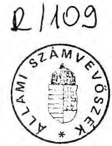

---

A vizsgálatot végezte:

Lőrinc Alajos tanácsos
Vasas Sándorné dr. tanácsos

---

# Vagyonkezelő Főcsoport   V-13-39/1992.   Témaszám: 117. 

## J E L E N T É S

a Szanáló Szervezet megszüntetése, a REORG Rt alapítása tárgyában végzett vizsgálatról

## I.

## B EVEZETÉS

1. A vizsgálat célja:

Az ÁSZ ellenőrzési terve alapján vizsgálatot folytattunk az IKARUS és Csepel Autó állami vállalatok együttes állami szanálása ügyében. Ennek folyamán a Szanáló Szervezet megszüntetése, illetve a REORG Rt. alapításával kapcsolatos tapasztalatok alapján az ÁSZ elnöke célvizsgálatot rendelt el a megszüntetés és cégalapítás, a jogutódlás, a folyamatban lévő szanálási és felszámolási ügyek átadásának szabályszerűségi ellenőrzésére. A vizsgálat céljával összhangban nem került sor a REORG Rt. felszámolási ügyleteinek teljes keresztmetszetű áttekintésére, a jelentés így e szakmai tevékenység színvonalát és minőségét érintő általánosítható megállapításokat nem tartalmaz.
2. Az ellenőrzött szervezet:

- Szanáló Szervezet
(Bp., V. ker., Vadász u. 30.)
KSH szám: 3238241051492101
- REORG Gazdasági és Pénzügyi Rt.
(Bp., V. ker., Vadász u. 30.)
Cégbejegyzés száma: Föv. B. 01-10-041773

---

A vizsgálattal érintett gazdálkodó egységek, államigazgatási szervezetek

- az állami szanálás vonatkozásában az IKARUS és Csepel Autó állami vállalatok, valamint Ikarus Járműgyártó Rt.
- felszámolás vonatkozásában Pestvidéki Gépgyár és Nyirlugosi Állami Gazdaság
- a Pénzügyminisztérium illetékes főosztályai
- az Állami Fejlesztési Intézet
- a Kincstári Vagyonkezelő Szervezet

A vizsgálatnál figyelembe vettük az IKARUS-Csepel Autó együttes szanálásának ellenőrzési tapasztalatait, a Pestvidéki Gépgyár felszámolási helyzetének felmérésénél az IKM, PM és a Parlament Honvédelmi Bizottsága e tárgykörben készített vizsgálati dokumentumait, valamint a PM Ellenőrzési önálló osztály által a Szanáló Szervezet átalakulása témájában végzett vizsgálat jelentését.
3. Ellenőrzött időszak: 1991. I. - 1992. IV. hó
4. Helyszini ellenőrzés kezdetének és befejezésének időpontja: 1992. április 7. - május 1.

---

# 11. 

## MEGÁLLAPÍTÁSOK

## 1. A Szanáló Szervezet alapítása, megszüntetése

A Szanáló Szervezetet a Pénzügyminisztérium alapította 1986. szeptember 1-jén. A szervezet tevékenysége az állami szanálásról szóló MT rendelet alapján elrendelt állami szanálási eljárások lefolytatása, a Szanálási Alap kezelése. A pénzügyminiszter felügyelete alatt, önálló, maradványérdekeltségű költségvetési intézményként működött, és a 102/1989.(IX.28.) MT rendelet és a 38/1989.(IX.28.) PM rendelet hatályba lépését követően felszámolóként is kijelölhető volt.

Az 1992. október 22-én megjelent, "Csődeljárásról, a felszámolási eljárásról és a végelszámolásról" szóló törvény zárórendelkezései hatályon kívül helyezték

- az állami szanálásról szóló MT rendeletet,
- a Szanálási Alap létesítéséről szóló MT rendeletet,
- a Szanáló Szervezet működéséről szóló PM rendeletet.

Ehhez igazodóan, s a törvényi meghatalmazásnak megfelelően a Pénzügyminisztérium az állami szanálások lefolytatására létrehozott Szanáló Szervezetet megszüntette, a megszüntető határozatot a pénzügyminiszter 1991. decemberében adta ki. (Lásd 1. sz. melléklet).

A Szanáló Szervezet megszűnéséről Thuma József, a PM helyettes államtitkára a Kincstári Vagyonkezelő Szervezetet 1991. december 28-án levélben /2. sz. melléklet/ értesítette:
"A Szanáló Szervezetet 1991. december 31-i hatállyal, az 1991. évi L. törvény alapján a pénzügyminiszter úr jogutód nélkül megszünteti.

---

Felkérem, hogy az alapító nevében az intézményi gazdálkodási tevékenység megszüntetését végrehajtani és az ezzel összefüggő pénzügyi-gazdasági és vagyoni rendezést elvégezni szíveskedjék."
A Kincstári Vagyonkezelő Szervezet átvette a Szanáló Szervezet elszámolási betétszámlájának 1991. december 31-i egyenlegét 6,6 millió Ft-ot. A Pénzügyi Közlönyben közzétette, hogy a Pénzügyminisztérium a Szanáló Szervezetet jogutód nélkül megszüntette, s felszámolására (!) a Kincstári Vagyonkezelő Szervezetet jelölte ki, felhívta az érdekelteket, hogy a Szanáló Szervezettel szemben fennálló igényüket 30 napon belül jogvesztés terhe mellett nyújtsák be.

Az APT és a végrehajtásáról intézkedő rendelet szerinti jogosultsága alapján a pénzügyminiszter úr a Szanáló Szervezetet határozatával megszüntette.
A felszámolási eljárás kezdeményezésének meghirdetése helyénvaló ebben az esetben.

Néhány nap múlva a Magyar Hirlap 1992. február 25-i számában a közleményt helyreigazították. A jogutód nélküli megszüntetés megerősítése mellett közlik: "A Szanáló Szervezet 1991. december 31-ig benyújtott felszámolási eljárásokat a továbbiakban a REORG Rt. intézi."

A Pénzügyminisztérium Pénzügyi-gazdasági Főosztálya az ügyeleti szerv jogkörében eljárva bejelentette az MNB Számviteli Főosztályán a Szanáló Szervezet gazdálkodási folyószámlájának megszüntetését 1991. január 1-jei hatállyal (lásd 3. sz. melléklet).
A megszűnő számla pénzforgalmi jelzőszáma : 232-90174-36
Tulajdonosa: Szanáló Szervezet
Jogutód pénzforgalmi jelzőszáma: 232-90148-3260
Jogutód megnevezése: Kincstári Vagyonkezelő Szervezet
A Pénzügyminisztérium közleménye a számla megszüntetéséhez: "A Szervezetnek a PM, mint alapító a jogutódja, de ezt a jogát a Kincstári Vagyonkezelő Szervezetre ruházza."

---

A Szanáló Szervezet vezetőjét a Pénzügyminiszter a 15.575/1991. sz. levelében 1991. december 31-i hatállyal felmentette a Szanáló Szervezet igazgatói tisztéből és áthelyezte a REORG Rt állományába (lásd 4. sz. melléklet).
2. A REORG Gazdasági és Pénzügyi Részvénytársaság alapítása
1991. december 16-án a Pénzügyminisztérium, a 175. sz. Jogtanácsosi Munkaközösség, az STL Kft, a CSÖD-STOP Kft, a DOKUMENTÁTOR GMK és 16 magánszemély (a volt Szanáló Szervezet vezetője és alkalmazottai) zártkörű alapítással részvénytársaságot hoztak létre.

Költségvetési szervek a Kormány engedélyével vehetnek részt társaság alapításban. A Kormány 3562/1991. számú, 1991. december 19-i határozatával járult hozzá, hogy a Pénzügyminisztérium a REORG Rt alapításában részt vegyen. A társaságot a Cégbíróság 1992. március 27-én bejegyezte.
A december 16-i dátummal megalakított társaság alaptőkéje 40.000 eFt, melyből 33.870 eFt készpénz, s 6.130 eFt nem pénzbeni betét.

Az egyes alapítók vagyoni hozzájárulása az alaptőkéhez:

| - Pénzügyminisztérium | 18270 eFt készpénz |
| :-- | :-- |
|  | 2130 eFt apport |
| összesen: | 20400 eFt |

A készpénz a Szanáló Szervezet mérlegében szereplő 18.270 eFt-tal egyező érték. A tárgyi apport az apport jegyzék szerint a Szanáló Szervezet tulajdonát képező álló- és fogyóeszközökből tevődik össze, annál azonban 300 eFt-tal kevesebb. (Az apportot könyvvizsgáló értékelte ennyivel alacsonyabbra.) A Pénzügyminisztérium tulajdoni hányada tekintetében nem tisztázott, hogy a Szanáló Szervezet megszűnését követően az ezeknek az eszközöknek megfelelő tulajdoni hányad - mint befektetett eszköz - kinek a könyveiben szerepel.

---

A Kincstári Vagyonkezelő Szervezetnek -nyilatkozatuk szerint- csak a 6.541 eFt egyenlegű elszámolási betétszámlát adták át.

- 175. sz. Jogtanácsosi MK. /később Aszódi-Pőcze Ügyvédi Iroda néven/ 2600 eFt készpénz 4000 eFt apport
összesen: 6600 eFt
Az apport egy, a XIII. kerületben lévő, Népfürdő utcai 10. emeleti lakás. (A lakás, mivel iroda céljára alkalmatlannak bizonyult, jelenleg üresen áll.)
- CSÖD-STOP Kft 6.000 eFt készpénz

A társaság alapítói a 175. sz. JMK (Aszódi-Pőcze Ügyvédi Iroda) és egy magánszemély. Az alapítói vagyon 1,6 millió Ft. A társaság 1991. évi mérlege a helyszini tájékozódás időpontjában (1992. 06.04.) a Cégbíróságon nem állt rendelkezésre. A tulajdonos írásbeli tájékoztatása szerint az 1991. évet 6,6 millió Ft nyereséggel zárta.

- S.T.L. Pénzügyi Tanácsadó és Kereskedelmi Kft. 4.300 eFt készpénz

A társaság négy magánszemély tulajdona. Az alapítói vagyon 3,2 millió Ft. Az 1991. évet vagyonát meghaladó, 3,9 millió Ft veszteséggel zárta.

- DOKUMENTÁTOR GMK 1.000 eFt készpénz, A társaság alapítói két magánszemély. Az alapítói vagyon 60 eFt. A Cégbírósághoz mérleg benyújtására nem kötelezett.
- 16 magánszemély, 50.000 Ft-300.000 Ft közötti vagyoni hányaddal.

A társasági szerződés XIV. fejezet, Vegyes Rendelkezések 119/a. pontja kimondja:
"Az alapítók kijelentik, hogy a részvénytársaság működése alatt tartózkodnak minden olyan tevékenységtől, amely a részvénytársaságnak konkurenciát támaszt. Ennek érdekében a

---

részvényesek minden olyan a részvénytársaság tevékenységi körébe tartozó szerződést, amelynek értéke az 1.000.000 Ft-ot meghaladja, kötelesek bemutatni az Igazgatóságnak..."

A társasági szerződés szerint a társaság tevékenységi köre többek között:

7422 ... reorganizáció, felszámolás
7431 vagyonkezelő, holdingtevékenység
7521 hitel,kereskedelmi banki és egyéb pénzügyi szolgáltatás

A Cégbíróság által bejegyzett társaság alapszabályában a PM mint minden más alapító tag - lemondott arról, hogy a REORG RT tevékenységével konkuráló tevékenységet közvetlenül, vagy közvetve folytathasson, ilyennel mást megbízzon.
Ezzel a pénzügypolitikáért felelős országos hatáskörű, közigazgatási szerv egy magáncég javára lemondott ezekről a jogairól, kizárólag egy magáncég javára engedte át azokat.
Így a REORG Rt államilag támogatott módon, s a versenyjog szabályaival ellentétesen működik a tevékenységi jegyzékében szereplő feladatok tekintetében. Mindezeken túl az állam közhatalmi szerepének szempontjából is kifogásolható, hogy a Magyar Köztársaság központi hatáskörű államigazgatási szerve, a Pénzügyminisztérium, kizárólagos jogokat átadva, magánszemélyek társaságainak meghatározott, szűk körével társuljon.

Különösen kifogásoljuk ezt a vizsgált időszak tekintetében, amikor is a 165/1991.(XII.28.) Kormányrendelettel pályázatot írtak ki a felszámolók névjegyzékbe történő felvételére és a névjegyzéket a PM vezeti. A pályázatot a Pénzügyminisztérium Jogi és Koordinációs Osztályára kellett benyújtani 1992. január 31-ig, s tartalmaznia kellett többek között a biztosíték - 10 millió Ft saját vagyon, vagy bankgarancia - megjelölést. A PM tájékoztatója a Felszámolók névjegyzékébe felvett magánsze-

---

mélyekről és gazdálkodó szervezetekről - melyben a REORG Rt. is szerepelt - 1992. március 15-én jelent meg a Pénzügyi Közlönyben.
3. A Szanáló Szervezet vagyonának, folyamatban lévő szanálási és felszámolási ügyeinek átadás-átvétele

# 3.1. A Szanáló Szervezet tulajdonában lévő eszközök, vagyoni értékű jogok átruházása 

A Szanáló Szervezet az 1991. december 31-i mérlegében

- 1669 eFt nettó értékű állóeszköz,
- 761 eFt értékű fogyóeszköz
- 6541 eFt bankszámlapénz
- 9 eFt követelés a munkavállalókkal szemben, s
- 18270 eFt befektetett eszköz szerepel.

A 18270 eFt befektetett eszköz tekintetében a Szanáló Szervezet beszámolója így fogalmaz :
"a korábbi évek megtakarításából 20000 eFt volt lekötve. /vásárolt kötvény/."
"A Szanáló Szervezet helyén létrejövő társaságban 51 \%-kal a PM is alapító tag. Az előzetes megállapodások alapján a pénzbeni hozzájárulásnak ez a 20.000 eFt megtérülés a fedezete. A ténylegesen befizetett összeg azonban 18.270 eFt volt."
A beszámoló tévesen jeleníti meg ezt az összeget a befektetett eszközök rovatán, mert nem a Szanáló Szervezet a társaságalapító.

A Szanáló Szervezet könyveiben szereplő 1.669 eFt nettó értékű állóeszközt, s 761 eFt értékű fogyóeszközt a könyvvizsgáló által megállapított 1.370 eFt , illetve 760 eFt értéken a Pénzügyminisztérium (tehát nem a Szanáló Szervezet) a REORG Rt. -be apportálta.

---

A Kincstári Vagyonkezelő Szervezet a PM államtitkári levél felkérésével ellentétben kizárólag a számlapénzt vette át, az egyéb vagyonelemek tekintetében nem intézkedett, így nem vette át a PM REORG Rt.-beli 20.400 eFt értékű tulajdoni hányadát ( 2.130 eFt tárgyi apport, s 18.270 eFt készpénz), mint befektetett eszközt sem.
"az intézményi gazdálkodási tevékenység megszüntetését és az ezzel összefüggő pénzügyi-gazdasági és vagyoni rendezést elvégezni szíveskedjék."
(5321/91. PM levél - 2. sz. melléklet)

# 3.1.1. A Szanáló Szervezet 1991. évi működési bevételei 

Az 1991. évre előirányzott bevételük - melyet a Szanálási Alap terhére kívántak igénybe venni - 20500 eFt volt.
A Szanálási Alapon a visszatérülés elmaradt a tervezett mértéktől, illetve nem az egész évre vették igénybe; így a tényleges igénybevétel 17836 eFt.
A felszámoló költségeként - a Ganz-Mávag gyár felszámolásának befejezéséhez kapcsolódóan - 17000 eFt-ot vettek fel. Decemberben visszaváltották a korábbi években lekötött 20.000 eFt-ot. Így különböző kisebb tételekkel az 1991. évi összes bevételük 73.579 eFt.
(A felszámolási díj felvételének jogosságát vizsgálatunk nem érintette.)

A Szanáló Szervezet működési kiadásainak összegéből /61.507 eFt/

- 18.270 eFt a REORG Rt. alapításához nyújtott pénzbeni betét, s
- 43.228 eFt az összes költség.

Az összes költségből 40,2 % a nem anyagjellegű szolgáltatások értéke /a külső cégekkel végeztetett felszámolások díjaként 14.260 eFt-ot fizettek ki/, s 29,4 % a bérköltség.

---

Az 1991. december 31-i pénzmaradvány a Szanáló Szervezet beszámolója szerint:

- bankszámla 1991. XII. 31. : 6541 eFt
- előlegként kiadva :+ 8 eFt
- átfutó kiadások megtérülése :+ 926 eFt
- függő bevételek tisztázása :- 3 eFt

Felhasználható pénzmaradvány ö.: 7472 eFt
"Ezzel az összeggel 1992-ben az állami költségvetés rendelkezik, miután a szervezet bankszámlája 1992 január 1-től megszűnt."
A Kincstári Vagyonkezelő Szervezet az elszámolási számla egyenlegét átvette, a pénzmaradvány többi eleme tekintetében azonban nem intézkedtek.

# 3.1.2. A Szanáló Szervezet által kezelt, MNB-nél vezetett bankszámlák rendezése 

A Szanáló Szervezet megszüntetésekor három, MNB-nél vezetett bankszámla felett rendelkezett:

- Szanálási Alap számla
- Szanálási Alap Célelszámolási számla
- Szanáló Szervezet gazdálkodási számla
a) Szanálási Alap számla

A 80. költségvetési fejezethez tartozó számlát 1987. január 5-én nyitotta a PM.
Pénzforgalmi jelzőszáma: 232-90185-9391.
Az Alap forgalmáról a Szanáló Szervezet beszámolója nem tesz említést.
Az MNB nyilvántartása szerint a számla
1991. évi forgalma :

Nyitóegyenleg : 16044 eFt
Bevételek : 24065 eFt
Kiadások : 17851 eFt
Záróegyenleg : 22258 eFt

---

A Pénzügyminisztérium a számlát a Szanáló Szervezet megszüntetésével, a 35/1991. sz. PM rendelethez igazodóan megszüntette, utódszámlájául a "Különleges bevételek" bevételi számlát jelölte ki (lásd 5. sz. melléklet).
A záróegyenleget az MNB átutalta.
b) Szanálási Alap Célelszámolási számla

A számlát a Szanáló Szervezet előterjesztése, a PM engedélye alapján 1989. szeptember 1-én nyitották:
"A Minisztertanács a Péti Nitrogénművek felszámolására a Szanáló Szervezetet jelölte ki, ....A kereskedelmi bankok nagyobb összegű hitelt folyósítanak a felszámolás megvalósításához, ezért ezek nyilvántartására, kezelésére engedélyezzük, a Szanálási Alap számla mellett egy elkülönített számla megnyitását." (PM 11.677/1989.I.d. sz. levele, lásd 6. sz. melléklet)
Pénzforgalmi jelzőszáma: 232-90202-0048

A Szanáló Szervezet 1991. évi beszámolója a számla forgalmáról nem tett említést.
A Szanáló Szervezet vezetője egy 1989. november 2-i levelében felhívta az MNB Költségvetési Osztályát, hogy a számláról "sem határidős beszedési megbízást, sem azonnali inkasszót ne fogadjanak el.
Ez a számla pillanatnyilag a felszámolás alatt lévő Péti Nitrogénművek folyamatos termelését szolgálja."

Ennek ellenére az Általános Vállalkozási Bank Rt. azonnali beszedési megbízását 1992. január 17-én teljesítette az MNB. A Szanáló Szervezet garanciavállalási szerződése alapján lehívták a Csepel Autógyár tőketartozását annak kamataival együtt 108.022.222 Ft értékben.

A Szanáló Szervezet garanciát vállalt az állami szanálás alá vont Csepel Autó állami vállalat hiteltartozásai után. A Csepel Autó vállalat nem fizetett, az AVB Rt. előzetes értesítés nélkül érvényesítette követelését.

---

A Csepel Autó vállalat más bankoknak sem fizetett határidőre, ahol szintén a Szanáló Szervezet a kezes összesen 639 millió Ft tőketartozás értékben -, ezek levélben megkeresték a Szanáló Szervezetet, majd a REORG Rt. -t.
/Ezidőben a REORG Rt hirdetmények azzal a neve melletti kiegészítéssel jelentek meg a sajtóban: "a Szanáló Szervezet jogutódja". /
A megkereséseket a Szanáló Szervezet volt, a REORG Rt jelenlegi vezetője az ÁFI-hoz továbbította.

A számla 1992. február 3-i egyenlegét: 107013 610,09 Ft-ot az MNB a REORG Rt. vezetőjének 1992. január 31-i felszólítása alapján az Ipari Fejlesztési Banknál nyitott számlára utalta: "A Szanáló Szervezet megszűnésével megszüntetjük az Önöknél vezetett, ...232-90202-0048. számú Szanálási Alap lebonyolítási számlát. A számlán mutatkozó egyenleget a REORG Rt Ipari Fejlesztési Bank Rt-nél vezetett számlánkra szíveskedjenek átvezetni." (lásd 7. sz. melléklet)

Az MNB-nél végzett helyszíni tájékozódásunk alapján megállapítottuk: a számla felett a Szanáló Szervezet vezetőjének és három munkatársának volt rendelkezési jogosultsága.
A Szanáló Szervezet azonban 1991. december 31-én megszűnt, vezetőjét a pénzügyminiszter felmentette.
A REORG Rt, s vezetője e számla felett rendelkezési joggal nem bírt, 1992. január 1-től a számlára vonatkozó megbízásokat jogosulatlanul tette meg; így nem volt jogosult az átutalásra sem megbízást adni. Összességében jogosulatlanul intézkedett a számla teljes kiadási forgalma, azaz 965137 eFt tekintetében.
Az MNB Költségvetési osztálya a REORG Rt. tekintetében a Szanáló Szervezet számlája feletti rendelkezési jogosultságot nem vizsgálta, a megbízásokat teljesítette.

A számlatulajdonos rendelkezése nélkül vagy rendelkezése ellenére a pénzintézet csak ... végrehajtható bírósági és államigazgatási határozatok alapján terheli meg a bankszámlát. (39/1984. (XI.5.) MT rendelet a pénzforgalomról és a bankhitelről.)

---

A számla forgalmát tekintve a Szanáló Szervezetnél és az MNB-nél végzett helyszíni vizsgálatunk alapján a következők állapíthatók meg:

A PM engedélye alapján a Péti Nitrogénművek termelés finanszírozására létesített számlát két kereskedelmi banktól felvett hitellel töltötték fel.

A hitelmegállapodásokat a Szanáló Szervezet kötötte:

- 200.000 eFt rövid lejáratú forgóeszközhitelt vettek fel a KONZUMBANK Rt-től 25 %-os kamatra, 1989 dec. 15-i lejáratra.
- 200.000 eFt rövid lejáratú eseti hitelt az MKB Rt-től 20 %-os kamatra, 1989. december 15-i lejáratra.

A KONZUMBANKnak a hitelt határidőre visszafizették. Az MKB Rt felé a tartozást 1990. 12.14-én rendezték.

A számla létrehozásának megfelelő forgalmazást 1990. márciusától kezdve egy sajátos, a felszámolás alatt lévő gazdálkodó szervezetek pénzének forgatását szolgáló - pénzügyi befektetői - gyakorlat váltotta fel:

Erre a számlára utaltatták a más, felszámolás alatt lévő szervezetek vagyontárgyainak értékesítéséből származó bevételeket is, s az így meglévő átmenetileg szabad pénzeszközöket egyrészt kihelyezték a bankokhoz, másrészt más, felszámolás alatt lévő gazdálkodóknak adták kölcsön, illetve hitelt folyósítottak részükre.
Ezekre azonban felhatalmazásuk nem volt.

A számla Iparfejlesztési Bankhoz történő átvezetéséig (1992. január 31.) számlán könyvelt, nem Péti Nitrogénművekkel

---

összefüggő, más gazdálkodó szervezetek vagyonértékesítéséből származó bevételek - gazdálkodó szervezetenként - összesen:

|  A felszámolás alatt lévő gazdálkodó szervezet megnevezése | a számlára utalt, vagyontárgy értékesítésből származó bevétel | eft  |
| --- | --- | --- |
|  Attika kisszövetkezet |  | 500  |
|  BÁZIS Déldun. Építőipari v. |  | 194276  |
|  Dorogi Szénbányák |  | 5807  |
|  Elektroakusztikai gyár |  | 156495  |
|  Eperjesi Zsákgyártó v. |  | 10000  |
|  ÉLÉPSZER |  | 60000  |
|  FÉG |  | 3094  |
|  FÉG Konvektorgyártó |  | 1100  |
|  GANZ Kovácsoló és Öntödei V. |  | 64132  |
|  GANZ Mozdony és Vagongyár V. |  | 117632  |
|  Hosszúhegyi Áll. Kombinát |  | 50000  |
|  Hungaforg KFT |  | 2  |
|  Kontakta |  | 194710  |
|  MAPOTEX |  | 153015  |
|  Magyar Aszfalt V. |  | 134051  |
|  Mikroelektronikai V. |  | 223000  |
|  Nyírlugosi ÁG. |  | 41100  |
|  Pannónia |  | 146781  |
|  Szabolcs Cipőgyár |  | 2000  |
|  Videoton |  | 422750  |
|  ÖSSZESEN |  | 3980447  |

Az így befolyt összegeket a Szanáló Szervezet - anélkül, hogy erre felhatalmazása lett volna - különböző bankokban kötötte le, értékpapírokba fektette, ill. más felszámolás alatt lévő gazdálkodóknak hitelt nyújtott, ill. kamatmentesen kikölcsönözte. A banki lekötésekből, értékpapírokból származó hozadékot az adott gazdálkodó szervezet bevételeként tartják nyilván. Kölcsönt folyósított például a rendelkezésünkre álló kimutatás szerint

- Videotonnak 112500 eFt
- Mapotexnek 45000 eFt összegben.

---

A számlán könyvelt, nem Péti forgalommal összefüggő bevételeket és kihelyezéseket tételesen, a Szanáló Szervezet által kérésünkre összeállított 8. sz. mellékletben mutatjuk be. A kamatmentes kölcsönök folyósításánál a Szanáló Szervezet nem kezelte kellő gondossággal a felszámolás alatt lévő gazdálkodó szervezetek pénzét, hiszen ha azt az elszámolási betétszámlájukon hagyja, minimális kamathoz akkor is jutnak. Jelen esetben azonban kamatbevétel nem keletkezett. Kihelyezés (lekötés és betétek, értékpapírvásárlások és kamatmentes kölcsön nyújtás) a számla "Péti forgalma" terhére is történt.
(A 9. sz. mellékletben csatoltan bemutatunk a Szanáló Szervezet hitel, illetve kölcsön megállapodására egy-egy példát.)

Az MNB tájékoztatása szerint a számla teljes, Péttel összefüggő; bevételeket és kiadásokat is tartalmazó, halmozott forgalma 1991. december hóban:

- kezdő állomány : 143604 eFt
- bevétel : 5163069 eFt
- kiadás : 5186025 eFt
- záró állomány : 120648 eFt

A számla MNB-nél történt megszüntetését, Iparfejlesztési Bankhoz történő átvezetését követően a helyszíni vizsgálat lezárásáig vagyontárgyak értékesítése jogcímen további összegek folytak be.

A számlán kezelt, vagyontárgy értékesítésből származó bevétel (a Péti Nitrogénművek vagyonértékesítéséből származó bevétellel együtt) terhére a helyszíni vizsgálat lezárásának időpontjáig összesen különböző bankokban elhelyeztek 9.216.425 eFt .

---

A Péti Nitrogénművek folyamatos termelésfinanszírozására engedélyezett számlára elkönyvelt bevételekből 1992. május 12-én a következő tartós lekötésekkel rendelkeztek:

| kereskedelmi bank | lekötött összeg |
| :-- | --: |
| megnevezése | eFt |

| Általános Vállalkozási Bank Rt | 3492716 |
| :-- | --: |
| Budapest Bank Rt | 72426 |
| Ipari Fejlesztési Bank Rt | 200679 |
| Magyar Hitelbank Rt | 146700 |
| Széchenyi Igazgatóság | 195800 |
| Kereskedelmi és Hitelbank Rt | 240454 |
| Betétszámla | 4867649 |
| ÖSSZESEN: | 9216425 |

A csatolt 10.sz. melléklet mutatja be, hogy az elhelyezések a Péti Nitrogénművek bevételein túl, mely, felszámolás alatt lévő gazdálkodó szervezet vagyontárgyainak értékesítéséből, keletkeztek.

A Péti Nitrogénművek folyamatos termelés finanszírozására létesített számláról a felszámoló költségei közé tartozó (s ott elszámolandó) kifizetéseket is teljesítettek:

- erről a számláról fizettek havi 96 eFt tiszteletdíjat a REORG Rt majdani egyik alapítójának, a 175. sz. Jogtanácsosi Munkaközösségnek a Péti Nitrogénművek esetleges peres ügyeinek képviseletéért.
(Megjegyezzük, hogy az irodahasználat "ellentételezéseként a Szanáló Szervezet és a 175. sz. JMK "keretmegállapodást" is kötött a jogi teendők ellátására. )
- szakértői díjat fizettek ki 80000 Ft értékben; a szakértői megbízás szerint a szakértő feladata volt többek között a "Bemutatkozik a Szanáló Szervezet" fordítása, stb.,

---

- rendszeres díjat fizettek a Péti Nitrogénművek néhány alkalmazottjának a Péti Nitrogénművek FA könyvvezetéséért.

Az 1986. évi törvényerejű rendelet a felszámolási eljárásról "a felszámolási eljárás befejezése" paragrafusai szerint a felszámolási eljárás során felmerült költségek kielégítése ugyan első helyen áll a tartozások között, de rendezésére csak a zárómérleg és a vagyonfelosztási javaslat alapján bírósági tárgyaláson kerülhet sor.

A Szanáló Szervezet nem rendeltetésszerűen működtette a Péti Nitrogénművek folyamatos termelésfinanszírozására létrehozott számlát.
Hatáskörét, működési jogosítványait jelentősen túllépve pénzügyi-befektetői, "kvázi banki" tevékenységet folytatott, a számláról a felszámoló később kiegyenlítendő költségei között szereplő kifizetéseket is teljesített.

A helyszíni vizsgálat során az MNB a Szanálási Alap Célelszámolási számla megszűntetésére vonatkozó PM leíratot nem tudta bemutatni. A későbbiekben részünkre eljuttatott, ebben intézkedő PM levél iktatószáma megegyezik a Szanálási Alap megszűntetése tárgyában 1992. április 3-án kiadott levél számával. (Az azonos számú, de eltérő tartalmú leveleket 5/a, ill. 5/b. mellékletként csatoljuk.) Vizsgálatunk a Pénzügyminisztérium iratkezelési gyakorlatára nem terjedt ki, felhívjuk azonban a figyelmet, hogy a feltárt gyakorlat nem teszi lehetővé az intézkedések egyedi beazonosítását.

A számla több milliárdos forgalmát az MNB havonta jelentette a Pénzügyminisztérium Állami
 Költségvetési Osztályának. Megszüntetésekor - az ÁFI-hez történt átutalás miatt - nulla egyenleget mutatott. Ennek okát a PM nem vizsgálta, a Szanáló Szervezettől magyarázatot nem kért.

---

# 3.1.3. A Szanáló Szervezet használatában lévő bérlemények átadása 

A Szanáló Szervezet jogszerű használatában volt 1991. december 31-én

- az V. ker. Vadász u. 30. alatti $78 \mathrm{~m}^{2}$ alapterületű műhely és raktár (Ezeket a helyiségeket a Szanáló Szervezet költségvetése terhére alakították át irodákká. Az 1991-ben befejeződött munkálatokra ebben az évben 588 eFt-ot fizettek ki.)
- az I. em. $209 \mathrm{~m}^{2}$ alapterületű irodahelyiségek, valamint
- a Vadász u. 28. sz. alatti $182 \mathrm{~m}^{2}$ alapterületű helyiségcsoport, összesen $469 \mathrm{~m}^{2}$.

A Pénzügyminisztérium 1992. január 29-i levelében megkereste az V. kerületi Önkormányzat Polgármesteri Hivatalát (Thuma államtitkár-helyettes levele 19/1992 - lásd a 11. sz. melléklet), melyben közli: "A Pénzügyminisztérium az alapító jogán megszüntette a ... Szanáló Szervezetet és jogutódként megalapította a REORG Gazdasági és Pénzügyi Részvénytársaság néven létrejött állami többségű részvénytársaságot...
a 19/1984. (IV.15.) MT rendelet 4. paragrafus (4) bekezdése és a 23. §. (2) bekezdése alapján kérem a T. Címet, hogy a REORG Rt. részére a bérleti jogviszony folytatására vonatkozó jogosultságát ismerje el."

Budapest Főváros Főpolgármesteri Hivatal Igazgatási és Hatósági Ügyosztálya a megkeresés alapján 1992. március 5-én kiadta határozatát (ügyiratszám: 24.988/2/92):
"Elismerem jogszerű használónak a REORG Rt-t ... helyiségcsoportra ... jogutódlás jogcímén."

A jogutódlás jogcímnek kiemelt jelentősége van:
A PM megkeresésében is hivatkozásként szereplő jogszabályok szerint ugyanis, ha a jogutód nélkül szűnik meg a szervezet,

---

a használati jog visszaszáll a kezelőre. A Főpolgármesteri Hivatal tájékoztatása szerint a helyiségek használatára pályázatot írnak ki, s a nyertesnek igénybevételi díjat kell fizetnie, illetve ennek megfelelő díjért a kezelőtől a használati jogot megvásárolhatja.
Ebben a körzetben ennek mértéke $50.000-100.000 \mathrm{Ft}$ négyzetméterenként. Figyelembe véve a $469 \mathrm{~m}^{2}$-es összterületet: 23-47 millió Ft díjról van szó.

Ennyivel kevesebbért jutott egy magántársaság az adott helyiségekhez, s ennyi bevételtől esett el vagy a Pénzügyminisztérium az alapító jogán. Mivel az átadás ingyenesen történt, ez ütközik az Állami Pénzügyekről szóló törvény végrehajtásáról intézkedő rendelet 63. §-ával is, amely az ingyenes átadást szigorú feltételekhez köti.

A Szanáló Szervezet a jogszerű használatában lévő 492 $\mathrm{m}^{2}$ helyiségből egy 1990. január 2-án kötött megállapodással (módosítva 1991. február 22.) $38,64 \mathrm{~m}^{2}$ alapterületű két irodát a 175. sz. JMK rendelkezésére bocsájtott. Ez a megállapodás egy olyan megbízási szerződésen alapszik, melyben a Szanáló Szervezet a 175. sz. JMK-t jogi ügyeinek vitelével bízta meg. E jogi képviselet megbízási díját; havi 30.000 Ft -ot csökkentették havi 16.500 Ft-tal az irodahasználat ellentételezéseként. Ez $427 \mathrm{Ft} / \mathrm{m}^{2} /$ hó díjnak felel meg, s mintegy 1/3-a az e körzetben felszámított szokásos bérleti díjnak.

A REORG Rt és a 175. sz. JMK (most Aszódi-Pöcze Ügyvédi Iroda) 1991. február 22-én e tárgyban új megbízási szerződést kötöttek, ahol is a jogi képviselet havi díját 120.000 Ft-ban határozták meg. Az irodahasználat tekintetében a díj meghatározására keret megállapodást kötöttek, mértékét nem határozták meg.

A REORG Rt. alapítói között szereplő CSÖD-STOP Kft. (melynek az említett 175. JMK és egy magánszemély az alapítója) is a két irodahelyiségben működik. Az irodák használatáért bérleti díjat nem fizet, e tekintetben sem a Szanáló Szervezettel, sem a REORG Rt-vel megállapodást nem kötöttek.

---

# 3.2. A Szanáló Szervezet által kezelt állami szanálási ügyek 

A pénzügyminiszter 35/1991. (XII.21.) PM rendelete "a folyamatban lévő állami szanálási eljárások befejezésével és a Szanálási Alap lezárásával kapcsolatos feladatokról úgy rendelkezik, hogy
"A le nem zárt szanálási eljárások befejezése, ... a kötelezettségek rendezése, ... teljesítésének folyamatos figyelemmel kísérése 1992. január 1-től az Állami Fejlesztési Intézet feladata.

Az Állami Fejlesztési Intézet a jogszabály megjelenését követően több levélben is megkereste a Pénzügyminisztériumot. A levelekben eligazítást igényelt feladatait illetően, és számos jogértelmezési problémát vetett fel jogutódlása tekintetében.

Tájékoztatta az illetékes államtitkárt, hogy a jogszabály megjelenését követően több gazdálkodó szervezet is megkereste az Intézetet

- adósság törlesztés átütemezése
- adósságállomány elengedés
- szanálási megállapodás módosítás
- adósság átütemezésnél támogató interveniálás ügyében.

A Pénzügyminisztérium 1992. február 13-i Naszvadi György helyettes államtitkár által kiadott válaszában (lásd 12. sz. melléklet) közli, hogy "a 35/1991. (XII.21.) PM rendelet tekintetében jogértelmezési probléma nem merülhet fel, ...a Szanáló Szervezet szűnt meg. A jogszabályból egyértelmű, hogy ennek helyébe lép - jogutódként - az Állami Fejlesztési Intézet."

Az ÁFI által felvetett problémákra úgy foglal állást, hogy az "ÁFI a megállapodásokat ne módosítsa, tehát adósságokat ne ütemezzen át, ne engedjen el és más szervezet-

---

nél ne interveniáljon ilyen ügyben. Válságmenedzselési szempontból - adott esetben - a kérelmek indokoltak is lehetnek, de erről most már - valamennyi hitelező bevonásával - az új csődtörvény által szabályozott csődegyezség keretében célszerű dönteni. Javasolják az érintett gazdálkodóknak, éljenek a csőd bejelentésének lehetőségével."

Összegezve a rendelkezésünkre álló iratok alapján a Szanáló Szervezet jogutódlását illetően a Pénzügyminisztérium az alábbi állásfoglalásokat adta ki:

1. A pénzügyminiszter 1991. december 11-én kiadta a megszüntető határozatot. A határozat a jogutódlásról nem intézkedik. Ezzel összhangban a PM Pénzügyi-gazdasági főosztálya a Szanáló Szervezet MNB-nél vezetett gazdálkodási számláját 1991. december 13-i levelével megszüntette. A megszüntető adatlapon a szervezet jogutódjának a PM-et nevezte meg (lásd 1. sz., 3. sz. melléklet!).
2. Thuma József a PM helyettes államtitkára 1991. december 28-i levelében a Kincstári Vagyonkezelő Szervezetet a Szanáló Szervezet jogutód nélküli megszüntetéséről értesíti (lásd 2. sz. melléklet!).
3. Thuma József a PM helyettes államtitkára az 1992. január 29-i, V. kerületi Önkormányzathoz a helyiségbérletek jogfolytonossága érdekében írt levelében közli, hogy a Szanáló Szervezet jogutódja a REORG Rt (lásd 11. sz. melléklet!).
4. Naszvadi György államtitkár 1992. február 13-i, ÁFI-hoz írt levele szerint a Szanáló Szervezet szűnt meg, s ennek helyébe lép - jogutódként - az Állami Fejlesztési Intézet (lásd 12. sz. melléklet!).

A Pénzügyminisztérium ellentmondó állásfoglalásai atekintetben, hogy a Szanáló Szervezet jogutód nélkül szűnt-e meg,

---

vagy sem, alapot adnak az ÁFI által megfogalmazott aggodalmakra, s érthető, ha az államigazgatási függőségben lévő, szanálási folyamatban érintett vállalatok is szorgalmazzák függelmi viszonyaik rendezését.

A Szanáló Szervezet 1986. évi megalakulását követően megszűnéséig 12 ipari vállalat, s 47 mezőgazdasági szervezet (szövetkezet, állami gazdaság) állami szanálásával foglalkozott. Beszámolója szerint 1991-ben új szanálási eljárás már nem indult. "Az előző évről áthúzódó IKARUS és Csepel Autógyár szanálását folytattuk, illetve részben befejeztük."

A Szanáló Szervezet és az ÁFI között több levélváltásra, tárgyalásra is sor került a Szanálási Alappal összefüggő kötelezettségek átadás/átvétele tekintetében.
Ennek részeként a Szanáló Szervezet átadta a

- Szanálási Alapot terhelő kötelezettségeket, ill.
- Szanálási Alapot érintő bevételeket

2005-ig évenkénti bontásban bemutató táblázatokat.

A kimutatott kötelezettségek értéke összesen 2.063.276 eFt, a bevételek értéke összesen 4.305.069 eFt.

Az iratanyagok átadás/átvétele során az egyes adósok helyzetét, a kihelyezések megtérülését az alábbiak szerint valószínűsítették:

Az iparvállalatok esetében a szanálási eljárás során kötött megállapodások, hitel-, és kezességi szerződések rendelkezésre állnak. A kötelezettségek teljesítésének megítélése vállalatonként eltérő, de jelentős hányaduknál a teljesítés a Szanálási Alapot terheli: "a Nógrádi Szénbányák, a Mecseki Szénbányák felszámolás alatt áll, a LABOR MIM fennálló tartozásai fejében a Szanáló Szervezet 190 millió Ft értékben ECOM Rt részvényt is elfogadott) ezeket az ÁFI-ra kell ruházni), a Csepel Autógyár helyett 630.813 eFt értékben a készfizetőke-

---

zesség alapján helyt kell állni a Szanáló Szervezet helyett, stb. (Az ÁFI egyik, jogutódlást értelmező kérdése emiatt keletkezett.)

A mezőgazdasági termelőszövetkezetek szanálását 1988-ig az illetékes megyei tanácsok, ezt követően pedig a Szanáló Szervezet végezték. A dokumentumok csak részben állnak rendelkezésre. Kb. 135 termelőszövetkezetnek áll fenn tartozása a Szanálási Alap felé.
A tartozások fizetése a szövetkezetek "bevallott kötelezettségei alapján történik", a kamat teljesen követhetetlen, mert a megállapodásokban a kamatkikötés különböző mértékű. Várható, hogy a szövetkezetek zöme csődöt jelent, illetve felszámolásra kerül.

Összességében úgy látjuk, hogy a kimutatott kötelezettségek, bevételek tábla mintegy 2 milliárdos pozitív egyenlege nem fedi a Szanálási Alap reális helyzetét, s a költségvetésre nézve újabb terheket fog jelenteni. A Szanáló Szervezet által problémamentesnek jelzett, általunk részletesen vizsgált IKARUS és Csepel Autó vállalatok helyzete is további nehézségekre enged következtetni.
Az a tény, hogy ezeket a több évre visszanyúló, bonyolult ügyeket most egy, a témában új, előismeretekkel nem rendelkező, jogosítványaiban korlátozott szervezetnek kell átvennie, csak további késedelmet jelent az egyes feladatok mielőbbi, s így legkisebb veszteséggel járó megoldásában.

Elhamarkodott intézkedésnek ítéljük a Szanáló Szervezet

- jogosítványainak felszámolási ügyekre való kiterjesztését; mivel ez elvonta a vezetői, szellemi energiát a szanálási ügyek hatékony megoldásálo), s
- megszüntetését a folyamatban lévő szanálási ügyek lezárást megelőzően.

---

Jelentésünk e pontjához kapcsolódóan csatoljuk az IKARUS és Csepel Autó vállalatok szanálása és privatizációja tárgyában végzett vizsgálat összefoglalóját (lásd 13. sz. melléklet!).

# 3.3. A Szanáló Szervezet által kezelt felszámolási ügyek 

A Szanáló Szervezet által megkezdett, folyamatban lévő felszámolási ügyek tekintetében a Pénzügyminisztérium és a REORG Rt. 1991. december 20-án megállapodást kötöttek, melyet a Szanáló Szervezet megszűnése révén keletkezett átmeneti helyzetben adódó feladatok megoldására hoztak létre (14. sz. melléklet).

A megállapodás 2.-4. pontjában szabályozzák, hogy a REORG Rt. feladata azon 1991. december 31-ig indult felszámolási ügyek befejezése, amelyekben felszámolóként a Szanáló Szervezet került kijelölésre. A REORG Rt. az átvett ügyekben ugyanazokkal a jogokkal és kötelezettségekkel látja el e feladatát, mint amilyenekkel a Szanáló Szervezet rendelkezett, stb.

A REORG Rt-nek felszámolási ügyekben a fenti formában történő jogutóddá nyilvánítása azonban nem egy egyoldalú elhatározás kérdése. A jogutódlásról a Szanáló Szervezet megszüntetését követően a PM rendeletben nem intézkedett. A Szanáló Szervezet az egyes felszámolási ügyek kapcsán számos jognyilatkozatot tett. (A felszámolásáról megjelent téves felhívás következtében a PM 1992. márciusi vizsgálatáig "mintegy 1 milliárd Ft értékű igénybejelentés érkezett a Kincstári Vagyonkezelő Szervezethez.) A REORG Rt.-PM 1991. dec. 20-i megállapodásának e jogutódlásra; a jogok és kötelezettségek átruházására vonatkozó része a kirendelő hatóság (és a szerződő felek) hozzájárulásának hiányában érvénytelen. A jogutódlás jogszerű szabályozásának elmulasztása azt eredményezi, hogy a REORG Rt. a Szanáló Szervezet által bírósági kijelöléssel elkezdett 163 felszámolási ügyét jogosulatlanul folytatja és intézi. A csa-

---

tolt megállapodás 6. pontja rögzíti a jelen jegyzőkönyv 3.12. pontjában már feldolgozott és vitatott $469 \mathrm{~m}^{2}$-es belvárosi irodaterület ingyenes használatba vételéhez szükséges jognyilatkozatok kibocsátását.

Az ismertetett rendezetlen körülmények között "jogutód" címen a REORG Gazdasági és Pénzügyi Rt. összesen 163 folyamatban lévő felszámolási ügyet vett át a megszüntetett Szanáló Szervezettől. Mivel az alkalmazotti állomány is áthelyezésre került a felszámoló biztosok személye általában nem változott.

Az átvett 163 felszámolási ügyből a jelentősebb vagyonnal rendelkező mintegy 31 nagyobb vállalkozás bemutatását a 15. sz. melléklet tartalmazza. A többi felszámolási ügy jellemzően kisszövetkezetekkel, Kft-ékkel, és tanácsi vállalatokkal kapcsolatos.

Az átvett 163 ügyből az ellenőrzés
 időpontjáig csak egy (a Budapesti Generál Szolgáltató Kisszövetkezet felszámolása) zárult le jogerős bírósági végzéssel. Három kisszövetkezet esetében (Cyklop. Ép.ip. Szolg. és Ker. K.Sz., Alap Ép.ip. és Szolg.KSz., Thermotechnika Ip.K.Sz.) a felszámolási zárómérlegeket már a bíróságokhoz benyújtották. A lezárt 4 ügy mellett további 10 olyan felszámolás volt folyamatban, melynek átfutási ideje a 2 évet már meghaladta.

A REORG Rt. által az ÁSZ felkérésére összeállított kimutatás az egyes felszámolási ügyek készültségi állapotát a felszámoló biztosok által szolgáltatott információk alapján szűkszavúan, kellő szabatosság nélkül jellemzi. Ebből is megállapítható azonban, hogy e négy lezárt témán túl 1992. I. félévében további 19, illetve II. félévében 27 felszámolás lezárását tervezik. A felszámolási eljárások lezárásának gyorsuló üteme alapján nem zárható ki egy korábbi "teljesítmény visszatartási" törekvés sem. A már lezárt, és 1992. évben befejezésre

---

tervezett mintegy 50 felszámolási ügy átadáskori 70-100 \%-os készültségi szintje alapján valószínűsíthető, hogy az időbeli elhatárolás szempontjából meghatározó behajtási intézkedéseket és értékesítési szerződéseket döntő részben a Szanáló Szervezet kezdeményezte és hozta létre.

A felszámolási eljárás korai szakaszában is sor kerülhet jelentős vagyonértékesítésre. Az adatszolgáltatás alapján erre példaként 1991. decemberi indítással a REORG hatáskörében folyó Springa Kereskedőház Kft és az Egervin Borgazdasági Kombinát 6 hónap alatt előirányzott vagyonértékesítési adatai szolgálnak. Ez utóbbi arra hívja fel a figyelmet, hogy nem csak az 1992. évi befejezésre tervezett ügyek, hanem az átadott teljes állomány vizsgálata és az intézkedések időbeli elhatárolása szükséges. Az egyedi behajtási intézkedések és vagyonértékesítési szerződések alapján lehet csak a Szanáló Szervezet és a helyébe lépő REORG Rt. felszámolási teljesítményeit és az ehhez kapcsolódó díjbevételi jogosultságot megnyugtató módon rendezni.
Az ellenőrzésnek az átadott felszámolási ügyek készültségi állapotára, illetve a felszámolási teljesítmények elhatárolására nem áll más támpont rendelkezésére, mint e jelentés pontjában ismertetett, az MNB által kezelt Szanálási Alap Célelszámolási számla. A számla megnyitását ugyan a felszámolás alatt álló Péti Nitrogénművek termelésének finanszírozására engedélyezték, de ezt később a Szanáló Szervezet - rendellenes módon - más szervezetek vagyonértékesítéséből befolyó bevételek gyűjtésére pénzügyi nyilvántartására - is használta.

A hiányos adatok alapján is megállapítható, hogy a Péti Nitrogénművek és a Célelszámolási számlára utalt más felszámolás alatt álló szervezetek vagyontárgyainak értékesítéséből szár-

---

mazó közel 8 milliárd bevétellel rendelkezett a Szanáló Szervezet megszűnésének időpontjában.

A 20/1986. (VII.16.) PM rendelet a felszámolási eljárás során felmerült költségek meghatározásáról 2. §-a szerint "A bíróság által kijelölt felszámoló költségeként a vagyon értékesítéséből származó bevétel 2 %-a, s a behajtott követelések 1 %-a számítható fel.

A Szanáló Szervezet megszűnéséig, a számla átvezetéséig a "nem Péti Forgalommal" összefüggő vagyonértékesítés alapján kalkulálható, felszámítható felszámolói költség: 79.609 eFt.
A Péti Nitrogénművek felszámolási zárómérlege (1991.I.31.) szerint a felszámolási költségek értéke 95.517 eFt.
A Szanáló Szervezet megszűnése után egy hónappal benyújtott zárómérleg alapján megállapítható, hogy a felszámolás lényegében a Szanáló Szervezet működési ideje alatt lezajlott. E rendelkezésünkre álló két tétel értéke összesen 175.126 eFt. Ezek a bevételek a Szanáló Szervezet mint költségvetési intézmény működése alatt keletkeztek, működési kiadásait a szükséges mértékben a költségvetés finanszírozta, így a tevékenységéből származó bevételek is a költségvetést illetik. A Pénzügyminisztérium és a Szanáló Szervezet erre vonatkozóan megállapodást nem kötött.
A helyszíni vizsgálat lezárásakor 1992. május 12-én a Célelszámolási számláról kihelyezett, ill. a betétszámlán lévő bevétel értéke összesen: 9216 millió Ft. A bevételek azonban nem újonnan vállalt felszámolási ügyekből keletkeztek, így az ez alapján figyelembe vehető felszámolói díj arányos része is a költségvetést illeti.

Mivel a felszámolási eljárások ezideig nem zárultak le, a felszámolói díjak kizárólag a REORG Rt.-hez folynak be. Abból a költségvetés nem, vagy esetleges tulajdoni hányadának megfelelően - osztalék címén - részesülhet. Figyelembe véve a Szanáló Szervezet által kötött vagyonértékesítési szerződések áthúzódó pénzügyi teljesítését, valamint a felszámolás alatt álló

---

egységek egyszámláján megjelenő behajtásokat, a megszüntetett Szanáló Szervezet felszámolási teljesítményei alapján keletkezett díjbevételi jogosultságok összesen 200-300 millió Ft-ra tehetők. A 163 folyamatban lévő felszámolási ügy ismertetett formában történő átadása mellett kb. 200-300 millió Ft az az összeg, amivel a 40 millió Ft tőkével alapított REORG Rt. jogalap nélkül gazdagodik, amely bevételek jogszerűen a költségvetést illetnék meg.

A vagyontárgyak hasznosításából származó felszámolási pénzbevételek kezelése önmagában is vitatható. A felszámolás alatt álló gazdasági egységek egyszámlája helyett a gyűjtő célelszámolási számla használatára elfogadható indokot nem tudtak felhozni. Az eredetileg a Péti Nitrogénművek termelés finanszírozásával kapcsolatos forgalom nyilvántartására rendszeresített számlán a más vállalatokat érintő pénzügyi forgalom keveredik és nehezen áttekinthető.

Véletlenszerűen kiválasztott tételek ellenőrzése alapján kitűnt, hogy a gazdálkodó egységenkénti alszámlák hiányában is a belső nyilvántartások alapján a pénzmozgásokat követik. A bevételek és a befektetések kamatelszámolásai az érintett gazdálkodó egységeket illetően egyezett. Az alkalmazott gyakorlat azonban nem biztosítja az idegen pénzek elkülönített kezelését, a tevékenységek megfelelő kontrollját. A gyűjtő számla használatával áll összefüggésben, hogy a Szanáló Szervezet azt mintegy saját forrásként kezelve hiteleket és kölcsönöket nyújtott a felszámolás alatt lévő, többségében árbevétellel még nem rendelkező gazdálkodó egységeknek. A kamatmentesen nyújtott kölcsönök esetében az átlagos kamatláb mértékében kárt okozott a pénztulajdonos gazdálkodó egységeknek.

---

A Szanáló Szervezet és a REORG Rt. tevékenységének vizsgálatához kapcsolódóan elsősorban dokumentumok és kiegészítő konzultációk alapján felmértük a Pestvidéki Gépgyár, valamint a Nyírlugosi Állami Gazdaság felszámolási helyzetét. A tapasztalatokat a csatolt 16. és 17. sz. mellékletek tartalmazzák. A két felszámolási témában közös, hogy azt a Szanáló Szervezet nem alvállalkozók útján, hanem saját hatáskörben bonyolította, és a befejezetlen folyamatot a REORG Rt. "jogutódként" folytatta. A közel kettő éve folyó felszámolási tevékenységek ezideig eredménytelenek, jelentősebb vagyonértékesítés nem történt. Mindkét esetben a vagyon egy tagban történő értékesítésére már két-két partnerrel szerződtek, melyek rendre meghiúsultak és peres viták várhatók. Jelenleg új értékesítési pályázatok előkészítése folyik.

---

# 111.

## ÖSSZEFOGLALÓ MEGÁLLAPÍTÁSOK, JAVASLATOK

## 1. Összefoglaló megállapítások

Az állami szanálások lefolytatására létrehozott Szanáló Szervezetet a pénzügyminiszter 1991. decemberi, 2420/1991. határozatával megszüntette. A Szanáló Szervezet jogutódlása kérdésében a későbbiekben a Pénzügyminisztérium ellentmondó, egymást kizáró állásfoglalásokat adott ki.
1991. december 16-án a Pénzügyminisztérium, négy magántársaság, s 16 magánszemély (A Szanáló Szervezet vezetője és alkalmazottai) alapították meg a REORG részvénytársaságot. A társaság 40 millió Ft-os alaptőkéjéből a Pénzügyminisztérium 51 %-ban részesedik. A Cégbíróság a társaságot 1992. március 27-én jegyezte be.
A folyamatban lévő állami szanálási eljárások befejezéséről, a Szanálási Alap kezeléséről a PM 35/1991. (XII.21.) rendelete úgy intézkedett, hogy az az Állami Fejlesztési Intézet feladata.
A Szanáló Szervezet által folytatott felszámolási ügyek tekintetében a Pénzügyminisztérium és a REORG Rt 1991. december 20-án megállapodást kötöttek, mely szerint a PM - mint megbízó - azok továbbvitelét a REORG Rt-re ruházza.

A Szanáló Szervezet megszüntetésével, a REORG Rt. megalapításával, a vagyoni jogok átruházásával, a szanálási és a felszámolási ügyek átadásával kapcsolatban a következő összefoglaló megállapításokat tesszük:

1.  A REORG Rt. alapító okirata 119/a. pontjában a PM mint alapító vállalta, hogy a társaság tevékenységi körében (reorganizáció,

---

felszámolás, vagyonkezelés, banki és pénzügyi szolgáltatás, stb.) konkurenciát nem támaszt, ilyen vonatkozású - 1 millió Ft értéket meghaladó - szerződéseit a társaságnak bemutatja. Ezzel a pénzügypolitikáért felelős országos hatáskörű közigazgatási szerv lemondott ezekről a jogairól, kizárólag egy társaság javára engedte át. Kifogásoljuk továbbá, hogy egy államigazgatási szerv a tevékenységéhez ily szorosan kapcsolódó területen magánszemélyek szűk körével társuljon.
2.  A Szanáló Szervezet megszűnésével a PM helyettes államtitkára, Thuma József a Kincstári Vagyonkezelő Szervezetet felszólította, hogy az ezzel összefüggő pénzügyi-gazdasági és vagyoni rendezést végezze el. A Kincstári Vagyonkezelő Szervezet a felkéréssel ellentétben kizárólag a számlapénzt vette át, az egyéb vagyoni elemek tekintetében nem intézkedett. Befektetett eszközként nem vette át a Pénzügyminisztérium tulajdoni hányadát, valamint a Szanáló Szervezet által pénzmaradványként kimutatott összeg 931 eFt egyenlegét. Ezekkel összefüggésben a REORG Rt-ben az állam tulajdonosi képviselete sem rendezett.
3.  A Szanáló Szervezet az MNB-nél három folyószámlát vezetett. Megszűnésekor a Pénzügyminisztérium illetékes főosztályai, az Állami Költségvetési Főosztály, valamint a Pénzügyi-Gazdasági Főosztálya a Szanálási Alap számlát, s a költségvetési intézmény gazdálkodási számláját ezzel összefüggésben megszüntették. A harmadik, a Szanálási Alap Célelszámolási számla tekintetében azonban a Pénzügyminisztérium Állami Költségvetési főosztálya időben nem rendelkezett.
A számla megszüntetéséről, egyenlegének az Iparfejlesztési Bankhoz történő átutalásáról a REORG Rt. vezetője 1992. január 31-én intézkedett. A Szanáló Szervezet azonban 1991. december 31-én megszűnt, vezetőjét a pénzügyminiszter felmentette. A REORG Rt. vezetője (a Szanáló Szervezet korábbi igazgatója) e számla felett már rendelkezési joggal nem bírt, így nem volt jogosult az átutalásra megbízást adni. Intézkedését a PM Állami Költségvetési Főosztályával nem egyeztette.

---

A Szanálási Alap Célelszámolási számlát a PM engedélyével a felszámolás alatt lévő Péti Nitrogénművek termelés finanszírozására létesítették. A számla létrehozásának megfelelő forgalmazást 1990. márciusától kezdve egy sajátos pénzügyi befektetői gyakorlat váltotta fel. Ezen a számlán gyűjtötték a felszámolás alatt lévő gazdálkodó szervezetek vagyonának értékesítéséből származó bevételeket. Ezeket egyrészt bankokhoz helyezték ki, másrészt más felszámolás alatt lévő szervezeteknek hitelt és kölcsönt folyósítottak, valamint a felszámoló később kiegyenlítendő költségei között szereplő kifizetéseket is teljesítettek ennek a terhére. Erről a számláról kamatmentes kölcsönt is folyósítottak, s ezzel a tulajdonos gazdálkodó szervezeteket az átlagos kamatláb mértékének megfelelő összeggel megkárosították.
A Szanáló Szervezet hatáskörét és működési jogosítványait jelentősen túllépve nem rendeltetésszerűen működtette a számlát. Mindemellett ez a gyakorlat nem teszi lehetővé, hogy a felszámolás alatt lévő gazdálkodó szervezetek vagyoni helyzete elkülönítetten is nyomonkövethető legyen. A működési jogosítványokat túllépő, az elkülönített pénzkezelést nem biztosító tevékenységért a Szanáló Szervezet vezetője felelősséggel tartozik.

Az MNB Költségvetési osztálya a számla kezelésében több tekintetben is mulasztott; egyrészt a Szanáló Szervezet vezetőjének korábbi írásbeli tiltása ellenére a számláról promtinkasszós kifizetést teljesített (az AFB részére a Csepel Autó garanciavállalásának 108 mFt összege), másrészt 1992. január 1. után a REORG Rt. vezetőjének megbízása alapján forgalmazott a Szanáló Szervezet által kezelt számlán.
4.  A Szanáló Szervezet jogszerű használatában lévő $469 \mathrm{~m}^{2}$ belvárosi irodahelyiségek tekintetében a Fővárosi Önkormányzat jogutódlás jogcímen - a PM ilyen tartalmú megkeresésére alapozva (Thuma József PM helyettes államtitkár 19/1992. sz.levele) - a REORG Rt. jogszerű használatát elismerte.

---

Az irodahelyiségek használatának jogát mint vagyoni értékű jogot a PM tárgybani intézkedésének megfelelően a Kincstári Vagyonkezelő Szervezet kezelésébe kellett volna vonni. Mindemellett kifogásoljuk, hogy állami szerv egy magántársaság javára a mintegy 23-47 millió Ft forgalmi értékű használati jogról ingyenesen lemondott. Az ingyenes átadást az ÁPT végrehajtásáról intézkedő rendelet 63. paragrafusa igen szigorú feltételekhez köti, melyek nem álltak fenn.
5.  A Csődtörvény hatályba lépésével az állami szanálás intézménye megszűnt. A folyamatban lévő szanálási ügyeket a 35/1991. sz. PM rendelet az ÁFI hatáskörébe utalta.
Az Állami Fejlesztési Intézet a jogszabály megjelenését követően a PM-et, s az IKM-et is megkereste, eligazítást igényelt feladatait és jogutódlása tekintetében.
A Pénzügyminisztérium ellentmondó állásfoglalásai a tekintetben, hogy a Szanáló Szervezet jogutód nélkül szűnt-e meg, vagy sem, alapot adtak az ÁFI által megfogalmazott aggodalmakra. A Szanálási Alap várható bevételeit és kötelezettségeit tartalmazó, a Szanáló Szervezet által összeállított kimutatás pozitív egyenlege nem fedi annak reális helyzetét, a költségvetésre nézve további terheket fog jelenteni.
6. A Szanáló Szervezet által megkezdett, folyamatban lévő felszámolási ügyek tekintetében a Pénzügyminisztérium és a REORG Rt. vezetője 1991. december 20-án megállapodást kötöttek. A megállapodás 2-4. pontjában rögzítik, hogy a REORG Rt. feladata, azon 1991. december 31-ig indult felszámolási ügyek befejezése, amelyekben a Szanáló Szervezet került kijelölésre. A REORG Rt. és a PM megállapodásának jogutódlásra vonatkozó része a kirendelő bíróság (és szerződő felek) hozzá járulásának hiányában érvénytelen. A jogutódlás jogszerű szabályozásának elmulasztása azt eredményezi, hogy a REORG Rt. a Szanáló Szervezet által bírósági kijelöléssel megkezdett 163 felszámolási

---

ügyet jogosulatlanul folytatja és intézi. (Ezek között van pl. a Pestvidéki Gépgyár vagyonának a közvéleményt is foglalkoztató értékesítése.)

Az egyes felszámolási ügyek tekintetében a Szanáló Szervezet - PM-REORG Rt. között még egy formális átadás-átvételre sem került sor. A különböző készültségű ügyek teljesítményeinek pénzügyi-gazdasági időbeni elhatárolását nem végezték el. A Szanáló Szervezet közel három éves felszámolói tevékenységének függőben lévő hozadékai a REORG Rt-hez kerültek, s majdan a társaság bevételeként jelennek meg. A Szanáló Szervezet fennállásáig egyetlen egy ügyet sem zárt le. A REORG a vizsgálat időpontjában már négy zárómérleget nyújtott be a Bíróságnak, s a Péti Nitrogénművek felszámolási zárómérlegét 1992. január 31. dátummal elkészítette. (Az ebben szereplő előirányzott felszámolói díj 95.517 millió Ft.) Erre az évre további 45 felszámolási ügy lezárását tervezik. A felgyorsult ütem alapján nem zárható ki, hogy a Szanáló Szervezet korábbi vezetése (akik a REORG Rt. jelenlegi vezetői) teljesítmény, s ezzel összefüggő díjbevétel tartalékolásra törekedtek.

A rendelkezésre álló pénzforgalmi adatok alapján minimálisan 175. 126 eFt díjbevétel kizárólag a Szanáló Szervezet működése alatt keletkezett. Figyelembe véve a Szanáló Szervezet által kötött vagyonértékesítési szerződések áthúzódó pénzügyi teljesítését, valamint a felszámolás alatt álló egységek egyszámláján megjelenő behajtásokat, a megszüntetett Szanáló Szervezet felszámolási teljesítményei alapján keletkezett díjbevételi jogosultságok összesen 200-300 millió Ft-ra tehetők. A 163 felszámolási ügy átruházása következtében mintegy 200-300 millió Ft az az összeg, amivel a 40 millió Ft tőkével alapított REORG Rt. jogalap nélkül gazdagodik, mely bevételek jogszerűen a költségvetést illetnék meg.

---

7. A Szanáló Szervezet tevékenységét illetően az IKARUS és CSEPEL Autó állami vállalatok állami szanálása, valamint a Pestvidéki Gépgyár és a Nyírlugosi Állami Gazdaság felszámolása tárgyában végzett részletes vizsgálatunk alapján a következő megállapításokat tesszük:
- A Szanáló Szervezet vezetője és a szanálási biztos sem az IKARUS, sem a CSEPEL Autó állami vállalatok folyamatban lévő szanálási ügyeinek lezárásában nem járt el kellő gondossággal. A Szanálási Megállapodás előkészítése és végrehajtása során nem teljesítette a vonatkozó jogszabályban előírt kötelezettségeket, nem járt el kellő gondossággal a rábízott állami vagyon védelmében. A befejezetlen szanálási folyamatot egy hiányos Szanálási Megállapodással zárták le.
- A Pestvidéki Gépgyár felszámolása során a Szanáló Szervezet először a vállalat teljes vagyonának hasznosítására egy minimális tőkével alapított, jelentősebb részben külföldi tulajdonú Kft-vel szerződött, melyre az ügylet meghiúsulása miatti kárt a korlátozott tőkeerő és a szerződéses biztosítékok hiánya miatt nem tudja áthárítani.
A következő vevővel - az Eldorádó Alapítvánnyal - már a REORG Rt. szerződött. Ebben az esetben a referenciák hiánya miatt kifogásolható a partner kiválasztása, valamint a honvédelmi kötelezettségek teljesítésére vonatkozó garanciák hiánya.
- A Nyírlugosi Állami Gazdaság felszámolása tárgyában az elmúlt két évben előrelépést nem sikerült elérni, a felszámolás mindezideig eredménytelennek tekinthető. A gazdaság által alapított 10 társaság működését nem sikerült fenntartani, egy kivételével a többi társaság tevékenysége leépülőben van, illetve megszűnt. A felszámolási eljárás során a korábbi ingyenes társasági vagyonátruházásokat jogilag nem rendezték. A számottevő tartozás behajtás nem történt, vagyonértékesítés pedig egyáltalán nem volt.

---

A számvevőszéki vizsgálat első tapasztalatai alapján a Pénzügyminisztérium a REORG Rt. vezetése és működése vonatkozásában intézkedéseket határozott el és tett folyamatba:

- a közigazgatási államtitkár június 22-én jelezte, hogy a PM a társaságban 100%-os tulajdont kíván szerezni és a társaság vezetését megújítja. A PM tulajdonába visszakerült társaság fog majd megbízást kapni a szanálások hátralékos ügyeinek rendezésére, a REORG Rt. felszámolóként történő bírósági bejegyzését követően a folyamatban lévő felszámolások folytatására.
- A REORG Rt. július 6-án tartott közgyűlésének dokumentuma alapján megállapítható, hogy a PM által előirányzott intézkedések végrehajtása megkezdődött. A közgyűlést megelőzően a minisztérium az Aszódi-Pőőcze ügyvédi irodával, valamint a Csőd-Stop Kft-vel megállapodott a 12,6 millió Ft névértékű részvények átruházásában, mivel a közgyűlésen a személyi kérdések rendezéséhez szükséges átruházott szavazati jogosultsággal már a PM rendelkezett. A fő részvényes kezdeményezésére itt megújították a társaság teljes vezetését, a 3 fős igazgatóságot és a 3 fős felügyelő bizottságot. (Ezen belül személycsere volt a társaság elnök-vezérigazgatói funkciójában is.)

# 3. Javaslatok 

A vizsgálati tapasztalatok alapján - valamint a Pénzügyminisztérium már megtett intézkedéseit is figyelembe véve - az Állami Számvevőszék a következőket javasolja:
3. 1. A Kormányzat intézkedési körébe tartozóan:

A piaci verseny tisztaságának biztosítása érdekében - a vonatkozó Kormány engedélyezésen túlmenően is - az IM előkészítése alapján korlátozni és szabályozni szüksé-

---

ges az országos hatáskörű közigazgatási szervek vegyes tulajdonú társaságalapítási tevékenységét. A kormányzati szintű szabályozással el kell érni, hogy az országos hatáskörű szervek által alapított társaságok működése áttekinthető legyen és az alapított társaságokban az állami tulajdonosi képviseletet egységesen állami vagyonkezelő szervezet lássa el.

# 3. 2. A Pénzügyminisztérium tekintetében: 

3.2.1. A REORG Rt. társasági szerződését a 119/a. pont vonatkozásában módosítsa, az államigazgatási szerepéből következő összeférhetetlenséget szüntesse meg. A tulajdoni hányadát képviselő részvények vagyonkezelését szakmai szempontok figyelembe vételével hosszú távon rendezze.
3.2.2. A folyamatban lévő állami szanálások körében mind az érintett állami intézményeket, mind a gazdálkodó szervezeteket illetően rendezze az Állami Fejlesztési Intézet jogutódlásának helyzetét.
A Szanálási Alap bevételeit és kiadásait a valós körülményeknek megfelelően mérjék fel, s ez alapján határozzák meg annak kihatásait az állami költségvetésre.
3.2.3. A felszámolási ügyek folytatásának jogutódlását rendezze, erről az illetékes bíróságokat tájékoztassa. Az átadásra kerülő felszámolási ügyek tekintetében biztosítsa az 1991. december 31-i állapotnak megfelelően a teljesítmények időbeli elhatárolását, s intézkedjen (a felméréseink szerint minimálisan 178 millió Ft, valószínűsíthetően közel 300 millió Ft) a költségvetést illető díjbevételek befolyásáról.

---

3.2.4. A Szanálási Alap Célelszámolási számla kezelése és megszüntetése vonatkozásában feltárt hiányosságok alapján a PM Állami Költségvetési Főosztály illetékes munkatársait felelősség terheli.
3.2.5. Az ellenőrzési tapasztalatok alapján indokoltnak látjuk, hogy a Pénzügyminisztérium tekintse át a Szanáló Szervezet megszüntetése kapcsán hozott intézkedéseit, ellentmondó állásfoglalásait és a megszüntetett szervezet által ellátott mindkét tevékenységi kört átfogó teljes szabályozást adjon ki. Az ellentmondó állásfoglalások kibocsátási körülményeit tárja fel, a mulasztókkal szemben járjon el.
3.2.6. A Pénzügyminisztérium járjon el a REORG Rt. részére jogalap nélkül, ingyenesen átadott, - s így a költségvetésnek mintegy 23-47 millió Ft kárt okozó - 469 m² irodahelyiség használatára vonatkozó határozat módosítása érdekében. Ezt követően intézkedjen a jogszerű hasznosításról.
4. A Kincstári Vagyonkezelő Szervezet feladatait illetően:

Haladéktalanul tegyen eleget a Pénzügyminisztérium által előírt (5321/91. sz. Thuma József államtitkár-helyettes levelében foglaltak), a Szanáló Szervezet megszüntetésével összefüggő feladatainak, a vagyoni rendezést teljes körűen végezze el.
5. A Magyar Nemzeti Bank tekintetében:

A Szanálási Alap Célelszámolási számla (232-90202-0048) 1992. I. negyedévi forgalmazását illetően feltárt jogszerűtlenségekkel összefüggésben a mulasztásokat, annak okait tárja fel és intézkedjen a felelősség érvényesítésére, valamint az ismétlődések kiküszöbölésére.

---

6. A Szanáló Szervezet megszüntetése, a REORG Rt. alapítása vonatkozásában:

A Szanáló Szervezet vezetője dr. Rédei László a megszűntetés, az alapítás, a vagyonátadás átvétel, a szanálási, felszámolási ügyek kezelésében jelentős mulasztást vétett.
6.1. Tevékenységével, ellentmondó megállapodásaival, a társaság alapítás előkészítésével nagy mértékben hozzájárult a Szanáló Szervezet jogutódlása körüli bizonytalansághoz. Jogalap nélkül, a szakmai kapacitásait meghaladó, 163 felszámolási ügyet jogutódlás jogcímen irányított át a REORG Rt.-hez.
A szanálási ügyeket nem a reális kondíciókat tükrözve, a Csepel Autó állami vállalat esetében lezáratlanul adta át az ÁFI-nak.
6.2. Vezetői megbízatásának 1991. december 31-i megszűnését követően a REORG Rt. nevében 1992. január 31-éig jogosulatlanul folyamatosan rendelkezett a Szanálási Alap Cél elszámolási számla forgalmazásáról, s január 31-én megbízást adott annak egyenlegének Ipari Fejlesztési Bankhoz történő átvezetéséről.
Az átutalással a számlát kivonta a Szanáló Szervezet megszüntetésével kapcsolatos államigazgatási eljárásból és mintegy 200-300 millió Ft, költségvetést megillető bevételt a REORG Rt. részére tartalékolt.
6.3. A felszámolás alatt lévő szervezetek vagyonértékesítésének bevételeit nem az adott gazdálkodó egyszámláján, hanem a Szanáló Szervezet "gyűjtő"-számláján kezelte.
Ez a megoldás nem biztosítja az egyes szervezetek pénzeszközeinek elkülönített kezelését.
Az időben elhúzódó felszámolási ügyek ily módon felszabaduló pénzeszközeit forrásként felhasználva más, felszámolás alatt lévő szervezeteknek hitelt folyósított,

---

kölcsönt nyújtott; jogosulatlanul banki tevékenységet folytatott. A vizsgálat során feltárt két esetben a kölcsönnyújtásoknál azok kamatmentessége következtében ezeket a gazdálkodó szervezeteket az átlagos folyószámla kamat mértékéig megkárosította.
6.4. Az ellenőrzés során helyszíni vizsgálattal érintett IKARUS-Csepel Autó vállalatok együttes szanálása, a Nyirlugosi ÁG. és a Pestvidéki Gépgyár ügyében jogszabályi kötelezettségeiket csak részben teljesítették, tevékenységük ezideig eredménytelen. A mulasztásokért, elmaradásokért a Szanáló Szervezet vezetőjét, a szanálási biztost fegyelmi felelősség terheli.
6.5. A rendezetlenség körülményei között tevékenysége közrehatott abban is, hogy a Vadász utcai irodahelyiségeket jogutódlás címén ingyenesen a REORG Rt. használatába adták.

Felhívjuk a Pénzügyminisztériumot, hogy a Szanáló Szervezet tevékenységével, a REORG Rt. alapításával kapcsolatban feltárt vezetői mulasztások tekintetében járjon el, s tegyen intézkedéseket a jogszerű állapot helyreállítására, és a kapcsolódó felelősség érvényesítésére.

Budapest, 1992. augusztus
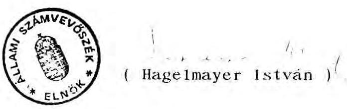

---

Állami Számvevőszék
V-13-27/1992.
V.

M E L L É K L E T E K
1992. június

---

# T A R T A L O M J E G Y Z É K 

1. sz. melléklet: A pénzügyminiszter 2420/1991. sz. határozata a Szanáló Szervezet megszüntetéséről
2. sz. melléklet: Thuma József PM helyettes államtitkár levele a Kincstári Vagyonkezelő Szervezethez
3. sz. melléklet: A PM Pénzügyi-Gazdasági Főosztálya által kiállított bejelentőlap a Szanáló Szervezet gazdálkodási folyószámlájának megszüntetéséről
4. sz. melléklet: A Szanáló Szervezet vezetőjének felmentése; a pénzügyminiszter 15.575/1991. sz. levele (1991. dec. 30.)

5/a. sz. melléklet: A Szanálási Alap számla megszüntetéséről intézkedő PM levél

5/b. sz. melléklet: A Szanálási Alap Célelszámolási számla megszüntetéséről intézkedő PM levél
6. sz. melléklet: A PM levele a Szanálási Alap Célelszámolási számla megnyitásának engedélyezéséről
7. sz. melléklet: A REORG Rt vezetőjének levele a Szanálási Alap Célelszámolási számla megszüntetéséről
8. sz. melléklet: A Szanálási Alap Célelszámolási Számla nem Péti forgalma
9. sz. melléklet:
 A Szanáló Szervezet által kötött hitelmegállapodások és kölcsönszerződések egy-egy példánya
10. sz. melléklet: Bankokhoz kihelyezett felszámolói bevételek
11. sz. melléklet: Thuma József PM helyettes államtitkár levele az V., kerületi önkormányzathoz
12. sz. melléklet: Naszvadi György helyettes államtitkár levele az ÁFI vezérigazgatójához
13. sz. melléklet: Az IKARUS és Csepel Autó vállalatok szanálása és privatizációja vizsgálat összefoglaló megállapításai
14. sz. melléklet: A Pénzügyminisztérium és a REORG Rt. vezetőjének 1991. december 20-i megállapodása

---

15. sz. melléklet: A Szanáló Szervezettől a REORG Rt. által átvett nagyobb vagyonnal rendelkező vállalatok felszámolási ügyeinek listája
16. sz. melléklet: Pestvidéki Gépgyár felszámolása
17. sz. melléklet: Nyírlugosi Állami Gazdaság felszámolása

---

2420/1991.

# HATÁROZAT 

Az 1979. évi IV. törvény 36. §-ának (3) bekezdésében biztosított jogkörömben eljárva, tekintettel a 23/1979. (VI.28.) MT rendelet 53. § (1) bekezdésére is, a

Szanáló Szervezet-et
(Budapest, V. Vadász utca 30.)

1991. december 31. napjával
megszüntetem.

Budapest, 1991. december 11.
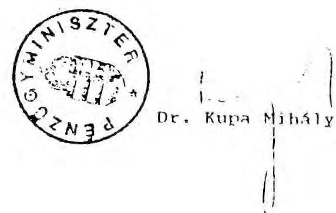

---

PÉNZÜGYMINISZTÉRIUM
HELYETTES ÁLLAMTITKÁR
$1, \because 1 / 91$ Tt

Penz András igazgató
Kincstári Vagyonkezelő Szervezet
Budapest

Tárgy: A Szanáló Szervezet költségvetési intézmény megszüntetése.

Az 1597/1986.Min.Titk. számon 1986. augusztus 25.-én kiadott alapítói határozattal létesített Szanáló Szervezetet ( 1054. Budapest, V. Vadász u. 30. ) 1991. december 31-i hatállyal, az 1991. évi IL. törvény alapján, a pénzügyminiszter úr jogutód nélkül megszünteti.

Felkérem,hogy az alapító (azaz a Pénzügyminisztérium) nevében az intézményi gazdálkodási tevékenység megszüntetését végrehajtani és az ezzel összefüggő pénzügyigazdasági és vagyoni rendezést elvégezni szíveskedjék.

A megtett intézkedésekről 1992. június 30,-i határidővel szíveskedjék beszámolni.

Budapest, 1991. december
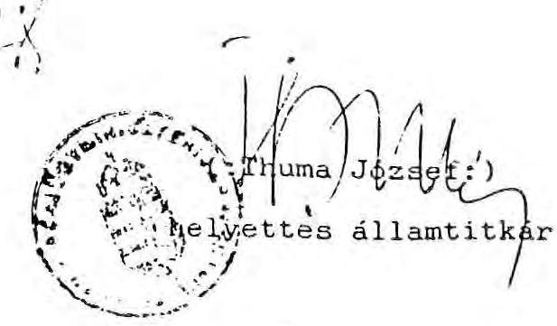

---

MAGYAR NEMZETI BANK Számviteli Főosztály Központi Könyvelési Osztály

3.  82. melléklet Pénzügyar: 10:27:36 10:27:36 10:27:36

Budapest / Felügyeleti szerve/

BANKSZÁMLA TÖRZSADATOK BEJELENTÉSE

A bejelentés oka: bankszámla nyitás, megszüntetés, elnevezés, székhely, cím, /levélcím/, törzsszám, szakágazat, szektor, felügyeleti szerv, területi kódváltozás, /A kívánt szöveg aláhúzandó!/

Minden egyes bankszámláról külön-külön törzsadat bejelentő lapot kell kiállítani!

|  Azonosítás száma /törzsszám/ | szakágazat | szektor | felügyelet /fejezet/ | terület | érvénybelépés kelte  |
| --- | --- | --- | --- | --- | --- |
|  5121318121-14 | 9212 | 1051 | 49 | 133920100 | 1332. 01.01.  |

A szervezet megnevezése: Szanáló Szervezet

A szervezet székhelye és Budapest címe: 1054 Budapest Vadász u. 30.

Pénzforgalmi jelzőszáma: 232-90174-3612

VÁLTOZÁS ILLETVE MEGSZÜNTETÉS ESETÉN

Bankszámla tulajdonos pénzforgalmi jelzőszáma:

|  A bankszámla adatai | Régi adat | Ujonnan bejelentett adat | Megszüntetni kívánt száa adatai  |
| --- | --- | --- | --- |
|  elnevezése: |  |  | Szanáló Szervezet  |
|  székhelye: |  |  | Budapest  |
|  címe: |  |  | 1054 Budapest Vadász u. 30.  |
|  levélcíme: |  |  | 1054 Budapest Vadász u. 30.  |
|  törzsszáma: | 1111-1 | 1111-1 | 3121318121-14  |
|  szakágazat: |  |  | 9212  |
|  szektor: |  |  | 1051  |
|  felügyelet: /fejezet/ |  |  | 49  |
|  területi kód: |  |  | 1339201000  |
|  Jogutód pénzforgalmi jelzőszáma: 232-90148-3260 |  |  |   |
|  Jogutód elnevezése: Kereskedelmi Vagyongazdálkodó Szervezet |  |  |   |

1/

---

Hazjogzáza / Esetleges egyéb adatok közlésére. /
A Eze. col. I. a 911, mint alapító a jogutódja, de azt a
jogát a Kiustóii Vazponke. ló" Sumuthe mhdrea.
rint. iu. th. tu.

Budapest 19 91 hó dec nap 13.

Balázs Liza

B. 1500

Poligyoletti szary

---

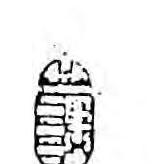
15.575/1991.

DR. RÉDEI LÁSZLÓ úrnak
igazgató
Szanáló Szervezet

# Budapest 

Kedves Rédei Úr!

Értesítem, hogy mivel a csődeljárásról, a felszámolási eljárásról és a végelszámolásról szóló 1991. évi IL. Tv. a Szanáló Szervezet működéséről szóló 51/1988. PM rendeletet 1992. január 1-jével hatályon kívül helyezi, ezért a Szervezet igazgatói tisztségéből 1991. december 31-ei hatállyal felmentem és 1992. január 1-jei hatállyal áthelyezem a REORG RT. állományába.

A Szanáló Szervezet igazgatójaként végzett magas színvonalú és lelkiismeretes tevékenységét ezúton is megköszönöm.

További eredményes munkát és jó egészséget kívánok.

Budapest, 1991. december 30.
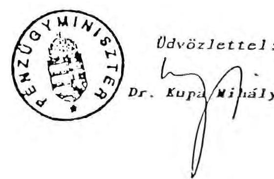

---

PÉNZÜGYMINISZTÉRIUM
Állami Költségvetési Főosztály
$112 /B / 1992$.
33.202/1992.ÁKF.

Magyar Nemzeti Bank
Számlanyilvántartási csoport

# BUDAPEST 

Tárgy: Szanálási Alap megszüntetése

Kérem, hogy a 232-90185-9391 számú Szanálási Alap lebonyolítási számlát szíveskedjenek megszüntetni. Utódszámlaként a 232-90103-4000 számú Különleges bevételek, bevételi számlát jelölöm ki.

Budapest, 1992. április 3.
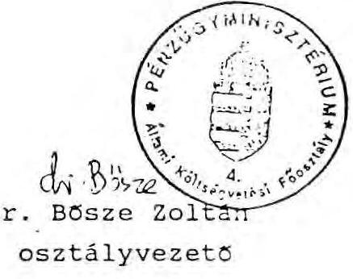

---

PÉNZÜGYMINISZTÉRIUM
Állami Költségvetési Főosztály
$112 /B / 1992$.
33.202/1992.ÁKF.

Magyar Nemzeti Bank
Költségvetési Osztály

# BUDAPEST 

Tárgy: Szanálási Alap megszüntetése

Mellékelten megküldöm az MNB Számlanyilvántartási Csoportjához írt levelem másolatát, és egyben kérem, hogy a Szanálási Alaphoz kapcsolt 232-90202-0048 számú alcímű számlát is szíveskedjenek megszüntetni.

Budapest, 1992. április 3.
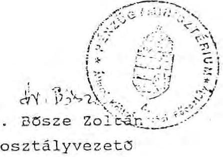

---

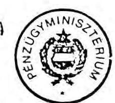

Tárgy: Elkülönített számla nyitása

11.677/1989.I.d.

Dr. Ernszt Ervinné elvtársnő, osztályvezető

Magyar Nemzeti Bank
Költségvetési Osztály

Budapest

Kedves Ernsztné Elvtársnő!

A Minisztertanács a Péti Nitrogénművek felszámolására a Szanáló Szervezetet jelölte ki, és feladatul szabta, hogy az eljárás alatt a termelés folyamatosságát fenn kell tartani. A kereskedelmi bankok nagyobb összegű hitelt folyósítanak a felszámolás megvalósításához, ezért ezek nyilvántartására, kezelésére engedélyezzük, a Szanálási Alap számla mellett egy elkülönített számla nyitását. Azért nem az intézményi elszámolási számla mellé kérjük a 4293. számú számla megnyitását, mivel ebben az esetben ezen összegek is visszacsatolódnának az állami forgóalaphoz, ami torzítaná a költségvetés helyzetét.

Kérem tehát, hogy a

232-90185-9391 Szanálási Alap lebonyolítási számla mellett

az elkülönített számlát 2-866-os tipuskóddal soron kívül szíveskedjék megnyitni, és erről a Szanáló Szervezetet értesíteni.

Budapest, 1989. augusztus 30.

---

# Gazdasági és Pénzügyi Részvénytársaság 1054 Budapest V., Vadász utca 30.   Postacím: 1398 Budapest Pf. 562   Telefax: 131-3323 $\cdot$ Telex: 202-928 

Ügyintéző: Kecskés Mária
Telefon: $\quad 1-315-865$

Iktatószám: $24 P / P_{7}$

Magyar Nemzeti Bank
Költségvetési Osztály
Budapest

A Szanáló Szervezet megszűnésével 1992.február 1-től megszüntetjük az Önöknél vezetett 232-90202-0048 számú, Szanálási Alap Lebonyolítási számla, Célelszámolási számlát is.

Kérem, hogy a számlán mutatkozó január 31-i egyenleget a REORG RT Ipari Fejlesztési Bank RT-nél (217-98979) vezetett 1002 számú Célelszámolási számlájára szíveskedjenek átvezetni.

Kérem Önöket, hogy ha a jövőben a régi számlaszámunkra érkezne be jóváírás, azt szíveskedjenek az új számlára átirányítani.

Köszönetemet fejezem ki a Szanáló Szervezet számláinak pontos vezetéséért, a gyors és rugalmas ügyintézésért.

Az Osztály valamennyi dolgozójának további jó munkát kívánok.

Budapest, 1992. január 31.
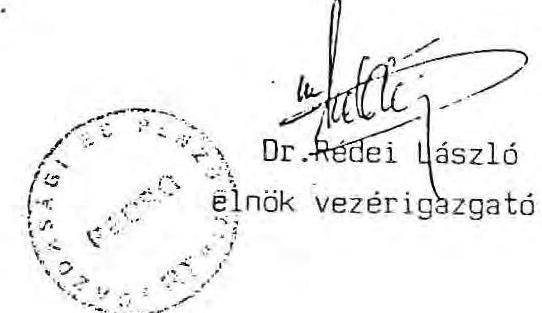

---

# 8. sz. melléklet

## Célelszámolási számla nem Péti forgalma

|  Év |  | BEVÉTEL |  | ELUTALÁS  |
| --- | --- | --- | --- | --- |
|  1991. | Szanáló Szervezettől | 500.000 | OEMB ÉT | 500.000  |
|  Bázis Déldunántúli Ép.íp. Váll. |  |  |  |   |
|  ÉV | MEGNEVEZÉS | BEVÉTEL | MEGNEVEZÉS | ELUTALÁS  |
|  1991. | Austria Beton ÉFt | 137.625.000 | Videoton (kölcsön) | 112.500.000  |
|   |  |  | ÁFA befizetés | 25.125.000  |
|  1992. | Eszpasvári Önkormányzat | 13.625.000 |  |   |
|   | Pécs Jannus Pannonius Tud. Egy. | 43.026.000 |  |   |

## Dorogi Szénbányák

|  Év |  | BEVÉTEL |  | ELUTALÁS  |
| --- | --- | --- | --- | --- |
|  1991. | Dorogi Szénbányák | 4.000.000 | Dunabank (kötvény) | 4.000.000  |
|   | Fejlesztő ISZ. | 200.000 |  |   |
|  1992. | Helvécsia Petőfi MGTSZ | 7.331 |  |   |
|   | Fejlesztő ISZ. | 1.600.000 |  |   |

## Elektroakusztikai Gyár

|  Év |  | BEVÉTEL |  | ELUTALÁS  |
| --- | --- | --- | --- | --- |
|  1991. | EAG | 384.855 | EAG | 6.384.000  |
|   | MEB | 8.500.000 | ÁFA befizetés | 2.500.000  |
|   | Citivach | 16.100.000 | OEMB (betét) | 4.600.000  |
|   | Bíró ÉFT | 44.135.000 | ÁFA befizetés | 11.500.000  |
|   | Horváth Tibor | 6.250.000 | ÁFA befizetés | 27.750.000  |
|   |  |  | EAG | 16.255.000  |
|   |  |  | EAG | 3.615.000  |
|   |  |  | ÁFA befizetés | 1.250.000  |
|   |  |  | Císopátra (hitel) | 1.385.000  |
|  1992. | Present ÉFt | 76.250.000 |  |   |
|   | Hajnal | 1.500.000 |  |   |

---

|  Univer ÉFT | 3.375.000 |  |   |
| --- | --- | --- | --- |
|   |  | MHB Széchenyi Iq. (betét) | 35.000.000  |
|   |  | EAG | 25.000.000  |
|   |  | ÁFA befizetés | 18.125.000  |

# Eperjesi Zsákgyártó Vállalat

|  1991. | Mult1 Coop | 10.000.000 | IFB Rt (értékpapír) | 10.000.000  |
| --- | --- | --- | --- | --- |
|  |   |   |   |   |

# Elépzzer

|  1991. | Elépzzer | 20.000.000 | EAG (hitel) | 20.000.000  |
| --- | --- | --- | --- | --- |
|   | Elépzzer | 40.000.000 | EAG (hitel) | 20.000.000  |
|   |  |  | Ganz Danubius | 8.000.000  |
|   |  |  | EAG (hitel) | 12.000.000  |

# FEG

|  1991. | Fég Szovektorgy. | 3.053.906 | 1992. Dunahelding Rt | 6.527.608  |
| --- | --- | --- | --- | --- |
|  |   |   |   |   |

# Fég Szovektorgyártó

|  1991. | FEG Szovektorgyártó | 1.100.000 | Dunaheld (kötvény) | 1.000.000  |
| --- | --- | --- | --- | --- |
|  |   |   |   |   |

# GANZ Kovácsoló és Öntödei Vállalat

|  1991. | GECV | 40.000.000 | OEHB (értékpapír) | 20.000.000  |
| --- | --- | --- | --- | --- |
|   | Mapotex (kölcsön vissza) | 20.000.000 | Mapotex (kölcsön) | 20.000.000  |
|   | Kovács ÉFT | 2.000.000 | OEHB (értékpapír) | 20.000.000  |
|   | Sétaix ÉFT | 120.000 | EAG (hitel) | 5.682.000  |
|   | TECHNOFOV ÉFT | 3.062.500 | IFB Rt (értékpapír) | 13.000.000  |
|   | TECHNOFOV EFT | 500.000 | OEHB (betét) | 731.544  |
|   | Kovács EFT | 13.312.500 |  |   |
|   | Prizetall | 150.000 |  |   |
|   | Sétaix EFT | 500.000 |  |   |
|   | TECHNOFOV | 500.000 |  |   |
|   | OEHB (befektetés kamata) | 29.321 |  |   |
|   | TECHNOFOV EFT | 1.600.000 |  |   |
|  1992. | Korányi | 2.287.500 |  |   |

---

|  GANZ Mozdony és Vagongyár Vállalat |  |  |   |
| --- | --- | --- | --- |
|  1991. | CMV | 647.446.000 | AVB Rt (betét)  |
|   | GMV | 436.054.000 | AVB Rt (betét)  |
|   | GMV | 530.000.000 | DIGEF (hitel)  |
|   | GMV | 440.000.000 |   |
|  1992. | EAG (H. törlesztés) | 5.500.000 | 1992. Evantun Bank  |
|  Hosszúhegyi Mg. Kombinát |  |  |   |
|  1991. | Zurekér EFT | 50.000.000 |   |
|  1992. | Bp. Bank (befektetés kamata) | 50.050.000 | Bp. Bank (befektet.)  |
|   |  |  | Bp. Bank (értékpapír)  |
|  Hungaryforg EFT |  |  |   |
|  1991. | Hungaryforg. EFT | 2.500 |   |
|  Kontakra |  |  |   |
|  1991. | Kontakra | 25.000.000 | Mapotex (kölcsön)  |
|   | Mapotex (kölcsön vissza) | 25.000.000 | OEHB (értékpapír)  |
|   | Kontakra | 70.000.000 | OEHB (betét)  |
|   | Kontakra | 25.000.000 | Ganz (Danubius (hitel)  |
|   | Széknagy Györgyöző | 160.000 | EAG (hitel)  |
|   | Adás Gábor | 200.000 | EAG (hitel)  |
|   | Telekodex EFT | 1.500.000 | OEHB (betét)  |
|   | Telekodex EFT | 6.500.000 | AFA befizetés  |
|   | Adás Gábor | 200.000 | OEHB (betét)  |
|   | Kontakra | 1.250.000 | AFA befizetés  |
|   | Telekodex EFT | 2.000.000 | SZIM (hitel)  |
|   | Barbenon EFT | 4.175.000 |   |
|   | Radel EFT | 40.000.000 |   |
|   | Távber | 3.125.000 |   |
|   | OEHB (befektetés kamata) | 27.785 |   |
|   | Kontakra | 15.000.000 |   |

---

|   | Adán Gábor | 200.000 |  |   |
| --- | --- | --- | --- | --- |
|  1992. | Adán Gábor | 400.000 |  |   |

|  MAPOTEX |  |  |  |   |
| --- | --- | --- | --- | --- |
|  1990. | ALZA ÉPT | 1.000.000 | AVB Rt (betét) | 1.000.000  |
|   | Holdinvest ÉPT | 70.000.000 | OEHB (értékpapír) | 30.000.000  |
|   | Holdinvest ÉPT | 80.000.000 |  |   |
|   | ALZA ÉPT | 75.000 |  |   |
|  1991. | AVB Rt (betét kamat) | 1.121.667 | OEHB (betét) | 80.000.000  |
|   | ALZA ÉPT | 970.000 | OEHB (betét) | 40.000.000  |
|   | ALZA ÉPT | 970.000 | OEHB (betét) | 1.006.667  |
|   | OEHB (kamat) | 22.287 | OEHB (betét) | 1.100.000  |
|   |  |  | OEHB (betét) | 799.362  |

Magyar Aszfalt

|  1991. | Transinvest | 1.000.000 | MI TI ÉPT (hitel) | 1.000.000  |
| --- | --- | --- | --- | --- |
|   | Autópálya Igazgatóság | 17.210 | Dunabank (kötvény) | 16.000.000  |
|   | Autópálya Igazgatóság | 294.028 | Dunabank (kötvény) | 30.667  |
|   | CA-2B Értékpapír ügyv. | 15.740.000 | MNB | 16.920.000  |
|   | Dunabank (befekt. kamat) | 16.940.000 | Transinvert ÉPT | 5.566.906  |
|   | AFA visszatérítés | 5.914.000 | Hazai Fésűs (hitel) | 37.010.000  |
|   | MNB | 100.000.000 | MNB | 25.537.550  |
|  1992. | Hazai Fésűs (hitel) | 37.010.000 | MNB Széchenyi Ig. (betét) | 37.000.000  |
|   | Rp. Bank (betét kamat) | 37.687.550 | Rp. Bank (befekt.) | 37.850.000  |
|   | MNB | 17.000.000 | Rp. Bank (értékpapír) | 41.000.000  |

Mikroelektronikai Vállalat

|  1991. | MEV | 80.000.000 | DICEP (hitel) | 80.000.000  |
| --- | --- | --- | --- | --- |
|   | MEV | 100.000.000 | Rp. Bank (betét) | 100.000.000  |

---

|  MEV | 25.000.000 | DIGEP (hitel) | 25.000.000  |
| --- | --- | --- | --- |
|  Tungaram | 8.000.000 | AFA befizetés | 1.000.000  |
|  Bp. Bank (betét kamat) | 115.583.233 | FEG (hitel) | 7.000.000  |
|  FEG (hitel törlesztés) | 7.000.000 | Házis (hitel) | 40.000.000  |
|  MEV | 10.000.000 | DUTEX Rt (hitel) | 5.000.000  |
|   |  | Ganz Danubius (hitel) | 12.000.000  |
|   |  | DUTEX Rt (hitel) | 1.000.000  |
|   |  | OEHB (betét) | 42.000.000  |
|   |  | DUTEX Rt (hitel) | 6.400.000  |
|   |  | DUTEX Rt (hitel) | 9.000.000  |
|  1992. FEG (hitel kamat) | 997.500 | SZIM (hitel) | 10.000.000  |

Nyírlugosi AG

|  1991. Durazio Trade | 1.100.000 | Dunabank (kötvény) | 1.000.000  |
| --- | --- | --- | --- |
|  Igaz József | 40.000.000 | SZIM (hitel) | 25.000.000  |
|   |  | Dunabank (kötvény) | 9.000.000  |
|   |  | EAG (hitel) | 6.100.000  |

Panzonia

|  1991. Gold Lomb | 44.000.000 | OEHB (értékpapír) | 44.000.000  |
| --- | --- | --- | --- |
|  Gold Lomb | 5.000.000 | OEHB (értékpapír) | 5.000.000  |
|  Sano Trade | 31.250.000 | EAG (hitel) | 25.000.000  |
|  Dunabank RT | 3.750.000 | AFA befizetés | 6.250.000  |
|  MNB | 7.780.822,40 | OEHB (értékpapír) | 3.000.000  |
|  MNB | 15.000.000 | AFA befizetés | 750.000  |
|  Hansys EFT | 25.000.000 | OEHB (értékpapír) | 7.500.000  |
|  Hansys EFT | 15.000.000 | OEHB (értékpapír) | 15.000.000  |
|  OEHB (befekt. kamata) | 226.000 | AFA befizetés | 5.000.000  |
|   |  | OEHB (betét) | 20.280.852  |
|   |  | Ganz Danubius (hitel) | 7.000.000  |
|   |  | NOTEP | 8.000.000  |
|  1992. EAG (H. törlesztés) | 5.500.000 | Evantuz Bank | 10.000.000  |
|  EAG (H. törlesztés) | 2.884.000 |  |   |

---

Szabolcs Cipőgyár

|  |   |   |   |   |
| --- | --- | --- | --- | --- |
|  1992. | Szabolcs Cipő | 2.000.000 |  |   |
|  Videoton |  |  |  |   |
|  1991. | Évattro | 951.319,44 | Videoton | 9.000.000  |
|   | Évattro | 8.048.680,56 |  |   |
|  1992. | Évattro | 213.750.000 | Videoton | 166.250.000  |
|   | Videoton Holding | 200.000.000 | Videoton | 200.000.000  |
|   |  |  | AFA befizetés | 37.500.000  |

Budapest, 1992. május 11.

---

# Megállapodás 

Alulírott szerződő felek 1990. november 8-án a Szanáló Szervezet hivatalos helyiségében, az alábbiakban állapodnak meg.

A Péti Nitrogénművek FA mint átadó (a mai napon 5 millió Ft összegű hitelt bocsát a 232-90202-0048 számú számláról a "MAPOTEX" MP Textilipari, Kereskedelmi és Ingatlanhasznosító Vállalat (1211 Bp. Bajáki Ferenc u. 27.) mint átvevő részére, éves 30 %-os kamat felszámításával.

A hitel nyújtása átutalással történik a MAPOTEX 202-03865 számú számlájára.

A hitelt legkésőbb 1991. február 28-ig köteles az átvevő visszafizetni. Amennyiben fenti határidőre a hitel visszafizetése nem történik meg, úgy átadónak további 6 %-os késedelmi kamat felszámítására nyílik lehetősége.

Budapest, 1990. november 8.
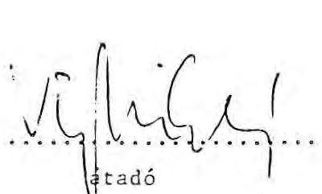
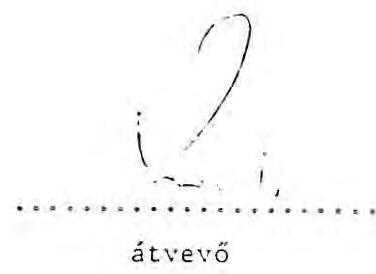

---

# Kölcsönszerződés 

Alulirott szerződő felek a Szanáló Szervezet hivatalos helyiségében a mai napon az alábbiakban állapodnak meg:

A Péti Nitrogénművek FA mint átadó a Szanáló Szervezetnél vezetett 232-90202-0048-as számlájáról 3.000.000 ,- Ft, azaz Hárommillió forint kölcsönt folyósit a Magyar Aszfalt V. FA, mint átvevő részére a likviditási hiány fedezésére.

A kölcsönt az átvevő 220-05632-7052 számú számlájára utalják át legkésőbb 1990. május 29-ig. Visszafizetési határidő 1990. szeptember 1.

Amennyiben a kölcsön a fenti határidőig nem kerül visszafizetésre, úgy az a folyósitástól kezdve hitellé alakul át, amelynek kamata évi 30 %.

Budapest, 1990. május 20.
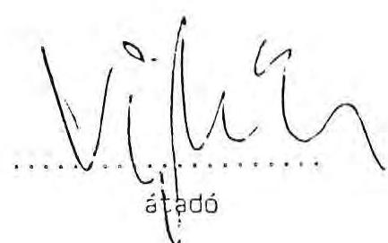
átvevő

---

Bankokhoz kihelyezett (lekötött) felszámolói értékesítési bevételek

| Bank Cég | Összeg |
| :--: | :--: |
| Általános Váll. Bank RT |  |
| Ganz Mozdony és Vagongyár | 3.492.716.159 |
| Budapest Bank RT |  |
| Ganz Mozdony és Vagongyár | 72.426.701 |
| Ipari Fejlesztési B. RT |  |
| Fegyver és Gázk. Gy. | 10.100.000 |
| Ganz Kovácsoló és Öntödei V. | 20.779.389 |
| MAPOTEX | 12.000.000 |
| Mikroelektronikai V. | 107.800.000 |
| Tomafrukt | 48.000.000 |
| Szabolcs Cipőgy. | 2.000.000 |
|  | 200.679.389 |

Magyar Hitelbank RT
Bázis Déldunántúli Építőip.V. 46.700
 .000
Péti Nitrogénművek
100.000.000
146.700.000

Széchenyi Igazgatósán
Bázis Déldunánt. Épitôip. V. 123.800.000
Elektroakusztikai gy. $\quad 35.000.000$
M. Aszfalt V.
37.000.000
195.800.000

Betétszámla
Péti Nitrogénművek
4.328.326.516

Pannónia
376.666.613

Dorog
1.856.875
M. Aszfalt Váll.
160.798.935
4.867.648.939

Kereskedelmi és Hitelbank RT
Attika Kisszöv.
598.743

Ganz Kovácsoló és Öntödei V. 51.000.000
Kontakta
187.538.902

MAPOTEX
1.316.743
240.454.328

Budapest, 1992. május 12.

---

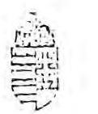

11. 82. melléklet

PÉNZÜGYMINISZTÉRIUM HELYETTES ÁLLAMTITKÁR

Ikt. szám: 19/1992.

24988/1

1992-02-13

T. V. Kerületi Önkormányzat Polgármesteri Hivatala
Kizárólagos Illetékességű Helyiséggazdálkodási Csoporti

12 465/91

Culnis 4
1.14

Tájékoztatom a T. Címet, hogy a Pénzügyminisztérium 15.575/91. utaz
számú határozatával 1991. december 31-i hatállyal az alapító jogán
megszüntette a költségvetési szerveként működő Szanáló Szervezetet és
jogutódjaként megalapította a REORG Gazdasági és Pénzügyi
Részvénytársaság néven létrejött állami többségű részvénytársaságot.

A Pénzügyminisztérium a REORG RT-vel megállapodást kötött és
cszes alapján a részvénytársaság átvette a Szanáló Szervezet összes
dolgozóját és ezzel egyidejűleg megbízta a részvénytársaságot, hogy
folytassa azokat az ügyeket, amelyekben felszámolóként a Szanáló
Szervezet volt korábban kijelölve. A REORG RT. az átvett ügyekben
ugyanazokkal a jogokkal és kötelezettségekkel rendelkezik, mint
amelyekkel a Szanáló Szervezet rendelkezett.

A REORG RT. tevékenységének gyakorlásához elengedhetetlenül
szükséges azoknak a helyiségeknek a használata, amelyeket a T. Cím
222/3/90. és 765/91/1. számú kiutaló határozatával a Szanáló
Szervezet részére kiutalt. Jelenleg a Szanáló Szervezet jogszerű
bérleményét képezi a Budapest, V., Vadász u. 30. szám alatt lévő
földszinti 78 négyzetméter alapterületű műhely és caktár, valamint
az I. emeleten található 209 négyzetméter alapterületű
irodanclyiségek, valamint a Budapest, V., Vadász u. 28. szám alatti
Fivárosi Nyomdaipari Vállalat kezelésében lévő 182 négyzetméter
alapterületű helyiségenoport.

A fenti tények alapján a 19/1984. /IV.15./ MT rendelet 4. § /4/
bekezdése és a 23. § /2/ bekezdése alapján kérem a T. Címet, hogy a
REORG RT. részére a bérleti jogviszony folytatására vonatkozó
jogosultságot ismerje el.

Budapest, 1992. január 29.

Mellékleti társasági szerződés
bérleti szerződés

Dr. SÁTORI ANNA
ügyvéd
Telefon: 1326-505
Bp. V. Audich u. 7.
1399. Bp. Pf. 701/410.

---

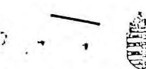

# PÉNZÜGYMINISZTÉRIUM HELYETTES ÁLLAMTITKÁR

Dr. Szőke Miklós úrnak, vezérigazgató

ÁLLAMI FEJLESZTÉSI INTÉZET

Budapest

Tisztelt Szőke úr!

A 35/1991. (XII.21.) PM rendelet hatályba lépésével kapcsolatos levelében foglaltakra válaszolva az alábbiakról tájékoztatom.

1.

Véleményem szerint jelentős jogértelmezési probléma nem merülhet fel. Az említett jogszabályból ugyanis egyértelműen kitűnik, hogy

- a le nem zárt szanálási eljárások befejezése;
- a Szanálási Alap terhére, illetve javára vállalt kötelezettségek rendezése
- a szanálási Megállapodásokban vállalt kötelezettségek teljesítésének folyamatos figyelemmel kísérése

az ÁFI feladata.

Az állami szanálásra vonatkozó megállapodásokban két fél szerepel(t). Ezek közül a Szanáló Szervezet szűnt meg. A jogszabályból egyértelmű, hogy ennek a helyébe lép - jogutódként - az Állami Fejlesztési Intézet.

* jogutód vel szid!

---

Érthető tehát, hogy az érintett gazdálkodó szervezetek az AFI-t keresik meg kéréseikkel. Ezzel kapcsolatban az a véleményem, hogy az Intézet a szanálási megállapodásokat ne módosítsa, tehát adósságot ne ütemezzen át, ne engedjen el és más szervezetnél ne interveniáljon ilyen ügyben.

Válságmendezselési szempontból - adott esetben - a kérelmek indokoltak is lehetnek, de erről most már - valamennyi hitelező bevonásával - az új csődtörvény által szabályozott csődegyezség keretében célszerű dönteni. Javasolják a: érintett gazdálkodóknak, éljenek a csőd bejelentésének lehetőségével.

Az AFI-nak megvan a jogalanyisága a Szanáló Szervezet, illetve a Szanálási Alap kinnlévőségeinek behajtására, hisz a rendelet szerint feladata nemcsak a kötelezettségek teljesítésének figyelemmel kísérése, hanem "a Szanálási Alap terhére, illetve javára vállalt kötelezettségek rendezése". Az AFI-nak tehát kötelezettsége:

- a kintlévő hitelállomány; akár a felszámolási eljárás megindítása útján történő, behajtása;
- a csőd- vagy felszámolási eljárásban a hitelezőként történő fellépés.

2.

A Szanálási Alap helyett más, alapként viselkedő számla megnyitását nem tartom szükségesnek.

A kintlévőségeket kérem esedékességkor beszedni és Pénzügyminisztérium 232-90103-4000 "Különleges bevételek, bevételi számla" elnevezésű számlájára haladéktalanul átutalni, annak eredetéről pedig az Állami Költségvetési Főosztályt tájékoztatni.

---

A kötelezettségek teljesítéséhez szükséges fedezetet az esedékességet két héttel megelőzően kérem az Állami költségvetési Főosztálytól - kellően alátámasztott indokolással

- megigényelni.

Minden év január 31-éig kérek részletes tájékoztatást arról, hogy a megelőző év "Szanálási Alapot" terhelő kötelezettségei és bevételei miként alakultak, miért és mennyiben térnek el a Szanáló Szervezet által készített és AFI-nak átadott kimutatásban (35/1991. (XII.21.) PM rendelet 1. § b/ pontja) foglaltaktól és mit tett az AFI a "bevételek" behajtása érdekében.

A Szanálási Alap forrásainak kielégítésére 1987-ben kibocsátott szerkezetátalakítási kötvény visszavásárlását és kamatainak fizetését az Állami költségvetési Főosztály közvetlenül fogja az érintett bankokkal rendezni. Kérem, hogy az erre vonatkozó, Szanáló Szervezettől átvett dokumentumokat szíveskedjék rendelkezésemre bocsátani.

Egyetértése esetén az előbbieket (2.) tekintem a Pénzügyminisztérium és az Állami Fejlesztési Intézet közötti közvetlen megállapodásnak (35/1991.(XII.21.) PM rendelet 2. § (2) bekezdés).

Esetleges észrevételeiről kérem tájékoztasson.

Budapest, 1992. február 13.

---

Az IKARUS és Csepel Autó állami vállalatok állami szanálása és privatizációja ellenőrzésének (ÁSZ. V-4-M/92. sz. vizsgálat) összefoglaló megállapításai

1. Az IKARUS és Csepel Autó állami vállalatok együttes állami szanálását a pénzügyminiszter 1990. szeptember 12-én rendelte el. Az együttes állami szanálás lefolytatásával a Szanáló Szervezetet bízták meg, s szanálási biztost rendeltek ki a két vállalathoz.

Az 1970-es évek iparpolitikai koncepciójának megfelelően kialakított, végtermékcentrikus autóbuszgyártás elsődleges felvevő piacai a KGST országok voltak.
A két vállalat között ekkor kialakított munkamegosztás alapján a Csepel Autó vállalat szállította - a termelését 90 \%-ban kitevő - gépészettel szerelt padlóvázat az IKARUS részére. Így a két vállalat elméleti együttes kapacitása évi 20000 db középkategóriájú széria busz volt.
Ez a piac a politikai változások következtében a 80-as évek végére összeomlott.
2. Az Állami Vagyonügynökség, az Ipari és Kereskedelmi Minisztérium, valamint a Szanáló Szervezet nyilvános nemzetközi versenytárgyalást hirdetett a magyar közuti jármügyártás autóbuszgyártási vertikumának átalakítására. Az átalakítás célja, hogy teremtse meg a magyar közúti járműgyártásba szervesen illeszkedő, világpiacon versenyképesen megjelenő hazai autóbuszgyártást.

A felhívás nem váltott ki megfelelő érdeklődést, mindössze négy értékelhető pályázat érkezett, melyből a két külföldi

---

felelt meg leginkább a pótlólagos tőkebevonás, a piaci terjeszkedés, s a műszaki megújulás követelményeinek.

A nyertes az orosz piaci háttérre támaszkodó, jelentős készpénztőkét felajánló, a CEIC kanadai holding által szervezett szovjet(ATEX)-tajvani konzorcium lett.

A döntésnél meghatározó szempont volt, hogy a szovjet fél ajánlatában, s az azt követő tárgyalásokon is garantálta évi 6000 busz megvásárlását.

A nemzetközi pályázat eredményhirdetését követően előterjesztés készült a Kormány részére az IKARUS és Csepel Autó vállalatok együttes állami szanálásának és privatizációjának helyzetéről.
3. A Kormány két ízben foglalkozott a vállalatok szanálásával, s a Gazdasági Kabinet is több alkalommal tárgyalta a közúti járműipar helyzetét.

Az első, 1991 február 14-i (3068/1991. számú) Kormányhatározat az állami szanálás befejezési határidejét 1991 április 30.-ban rögzíti, s a két vállalat együttes szervezet átalakításával egy új állami vállalat létrehozását, majd ennek privatizálását irányozza elő.
A szanálási folyamat azonban nem e Kormányhatározat által megszabott irányban haladt tovább, a feladatok az előirt határidőkre nem teljesültek.
A 100 millió dollár tőkét felajánló tajvani befektető a társaságalapítást előkészitő tárgyalások során az időközben elbizonytalanodó szovjet piac miatt kilépett az ajánlattevő konzorciumból. Evvel a Konzorcium által ajánlott kondiciók alapvetően megváltoztak, így mód lett volna a nemzetközi pályázat eredménytelenségének deklarálására.

---

Bár a piac egyre bizonytalanabbá vált, a szovjet orientációjú piaci stratégiára épülő társaságalapítási koncepció kidolgozása - az IKM egyre határozottabbá váló eltérő véleménye ellenére - tovább folyt.

A második (3396/1991.sz.) Kormányhatározat 1991 szeptemberében - egy évvel a szanálás elrendelése után - született.

A Kormány részére benyújtott előterjesztés nem mutatott rá a korábbi Kormányhatározattól eltérő szanálási, privatizációs megoldásokra, s a PM és az IKM közötti véleményeltérést sem tükrözte kellő módon.

A hiányos, a problémákat nem tükröző előterjesztés alapján a Kormány tudomásul vette, hogy az IKARUS és Csepel Autó vállalat együttes szanálási megállapodása aláírásra került, az IKARUS Járműgyártó Rt alapítással megalakult, az IKARUS és a Csepel Autó állami vállalatokat megszüntetik.
4. A szanálási folyamatot lezáró szanálási Megállapodást 1991 augusztus 26-án, tehát a szanálás elrendelését követően közel egy évvel, s a második Kormányhatározat előtt két héttel írták alá az IKARUS, a Csepel Autó vállalat és a Szanáló Szervezet vezetői.

A szanálási folyamat során azonban nem teremtették meg e tevékenység lezárását jelentő Megállapodás jogszabályban előírt feltételeit, a Szanáló Szervezet nem teljesítette előírt kötelezettségeit;

- a fizetőképesség helyreállítása és a gazdaságos működés megteremtése érdekében intézkedéseket nem tettek,
- a hitelezőkkel az egyezségi tárgyalások lefolytatását nem kezdeményezték, az egyezségek megkötésére nem került sor.

A Megállapodás csak az IKARUS vonatkozásában tartalmazott konkrét intézkedést - a részvénytársaság megalapítása tekintetében -, a Csepel Autó sorsának megoldását a jövőbe utalta:

---

Elhatározták az IKARUS Rt megalapítását, annak kimondásával, hogy a szanálás az alapító állami vállalat felszámolásával zárul.
A Csepel Autó 4.sz. gyáregységét államigazgatási döntéssel az IKARUS állami vállalathoz csatolták, s a szanálási folyamat lezárásaként célul tűzték ki az állami vállalat társsággá alakítását.
A két vállalat közötti adósság rendezését, a buszgyártással összefüggő készletek átadás/átvételét a vállalatok külön megegyezésére utalták.
A Szanálási Megállapodás döntései alapján ellenérdekűvé vált felek között ezek az egyezségek a mai napig nem születtek meg.

Jelenleg a két vállalat között három peres ügy van folyamatban a szanálás során keletkezett viták következtében, s a Csepel Autó vállalatnál mintegy 1,5 milliárd Ft értékű elfekvő készlet képződött.
5. Az IKARUS részvénytársaságot 1991. augusztus 30-án zártkörű alapítással 11,5 milliárd Ft alaptőkével hozták létre.
A társaság 68,3 \%-ban magyar tulajdon; 7 milliárd Ft az IKARUS állami vállalat, s 51 millió Ft a MOGÚRT apportja, s 800 millió Ft a MOGÚRT és az MHB készpénz befizetése.
A 31.7 \%-os külföldi tulajdoni hányad teljes egészében készpénz hozzájárulás, melyből az ATEX Konzorcium 3,5 milliárd Ft-ot, s a CEIC 148 millió Ft-ot USD-ben teljesített.
A társaságalapítást előkészítő tárgyalásokon az ATEX kifejezésre juttatta többletbefektetési szándékát, melyre mind az alapításkor, mind a szindikátusi szerződésben rögzített tőkeemelési, elővásárlási, vételi jogosultságok lehetőséget adnak. Ezekkel azonban az ATEX ezideig nem élt.

A társaságalapítás augusztus 30-i időpontjával egyrészt teljesítették a magánjogi szerződésben előirányzott 60 napos határidőt, másrészt ez azt is eredményezte, hogy a társaságban a

---

területileg illetékes önkormányzatok nem lettek tulajdonosok, mivel a vonatkozó törvény szeptember 1-én lépett hatályba.

A társaság alapítással, s nem az átalakulási törvény szerinti általános jogutódként jött létre.
Az alapítói apportban termelési készletek nem szerepeltek, a cégbejegyzés elhúzódása miatt a likvid pénzeszközökhöz késve jutottak hozzá. Mindezek a folyó termelés mellett alapított társaság működésében fennakadásokat okoztak.
Az átmeneti időszak finanszírozását az állami vállalat látta el.
A két belföldi befektető készpénz hozzájárulását - 800 millió Ft-ot - az állami vállalathoz fizette be. Azt a tartozások kiegyenlítésére fordították, a társasághoz nem utalták tovább.
6. Az Állami Vagyonügynökség a társaság alapításhoz azzal a kiegészítő feltétellel járult hozzá, hogy a "társaság átvállalja a tevékenységével összefüggő valamennyi kötelezettséget, s birtokolja az ennek megfelelő vagyont".

Ennek teljesítésére az alapítók megállapodtak abban, hogy az állami vállalat az alapítással egyidejűleg a társaságnak átadja a mintegy 16 milliárd Ft értékű tartozást, s az ennek megfelelő - apportlistában nem szereplő - eszközöket.
A vállalatnak ez a megállapodása "értelmezte" az AVÜ kiegészítő feltételét, s azt, adás/vételként kezelte.
Az átadás/átvétel időben elhúzódott, még ma sem tekinthető lezártnak.
A megállapodásokat három szerződési fázisban; 1991 november 20-án, november 25-én, és 1992. február 13-án kötötték, s mindig az alapítás időpontjára vezették vissza.
A Vagyonügynökségnek bemutatott listán is feltüntették, hogy három eszközcsoportot; a jóléti állóeszközöket, a ehhez tartozó telkeket, s a szellemi vagyont "elfogadott értéken" adják át.

---

A vállalat könyveiben értéken nem szereplő szabadalmai, konstrukciós, gyártási dokumentációi és eljárásai, valamint software termékei 1032 eFt értéken kerültek át.

A jóléti állóeszközök (több üdülő, bölcsőde, óvoda, sportlétesítmény, művelődési ház) a könyvszerinti nettó érték 10 \%-ában, mindösszesen 17,7 millió Ft értéken kerültek át a társasághoz.

A jóléti építményekhez kapcsolódó - összesen 104665 m 2 területű - telekingatlant 45932 eFt értéken, a vagyonértékelés 10 \%-ában adták át.

A vagyonelemek ilyen, a tényleges piaci értékhez viszonyítva alacsony értékű átadása jelentős gazdálkodási tartalékot jelent az alapításkor is már 32 \%-ban külföldi tulajdonú társaság számára.
A szanálási biztos, a szanáló Szervezet nem követte, nem ellenőrizte az állami vagyon védelmének megfelelő mértékben ezeket a megállapodásokat.

A vállalat és társaság képviselői az utolsó, 1992. február 13-i megállapodásban rögzítik: "a részvénytársaság alapítása során előírt kötelezettség átvállalását és az ezzel egyenértékű vagyonátadást kölcsönösen teljesítették."
7. Az IKARUS Járműgyártó Részvénytársaság évi 7-9 ezer busz (2/3 FÁK, $1 / 3$ egyéb viszonylat) gyártására készült fel. A több mint 10000 fő átvétele mellett az állami vállalat irányítási - szervezeti struktúráját megtartotta.

Kisebb módosítás a termelés területi szervezeteinél, illetve a technológiánál volt; összesen 78 millió Ft ráfordítással mindkét gyárban kialakították a karosszáló szalagokat kiszolgáló padlóváz gyártást és gépészeti szerelést.

---

A részvénytársaság 1991. évi működését rendeléshiány, pénzügyi zavarok, akadozó beszállítások és elhúzódó vevői fizetések jellemezték. Főleg az elmaradó szovjet (FÁK) rendelések miatt a társaság négy hónapos működése során az előirányzatokat 81,5-86 \% között teljesítette, az évet közel 392 millió Ft veszteséggel zárta.
A részvénytársaság 1992 évre több tervvariánst dolgozott ki. Az éves adósságszolgálati kötelezettségek teljesítését biztosító közel 7700 db busz értékesítésével számoló terv mellett, kidolgoztak egy u.n. "kontingencia tervváltozatot", amely csak 5000 db busz értékesítését tartalmazza. Az utóbbinál éves szinten 2 milliárd Ft fedezethiány mutatkozik.
Március végén a rendelésállomány kedvezőtlen alakulása miatt /1992 évre 1698-1930 db/ határozatot hoztak egy 3600-4000 autóbusz értékesítését előirányzó, a veszteségeket minimalizáló üzleti terv kidolgozására, valamint egy többvariációs válságmenedzselési stratégia kimunkálására.
A lecsökkent kapacitásterhelés miatt mélyreható strukturális intézkedések szükségesek, s nem zárható ki, hogy ez a társaságban működő két gyár egyikének jelentős leépítéséhez vezet. A társaság vezetése ezeknek a döntéseknek a meghozatalánál nehéz helyzetbe került, mivel a körülmények alapvetően eltérnek az alapításkor széles körben deklarált "növekedési" pályától.
8. Az IKARUS állami vállalat az előző évről 968 millió veszteséget hozott át és az 1991 évet 305 millió Ft veszteséggel zárta.
A vállalat és a részvénytársaság együttes követelése az év végén 7830 millió Ft-ot tett ki, az összes rövidlejáratú kötelezettsége pedig 9556 millió Ft volt. (Ebben nem szerepel a Csepel Autó vállalat 1,5 milliárd Ft értékű peresített követelése.)
AZ ÁVÜ által előírt tartozás átruházási - vagyonátadási kötelezettségét az e tárgyban 1992. február 13-án kötött utolsó megállapodással az állami vállalat teljesítette.

---

Az állami vállalat a részvénytársaság megalakulása óta termelő tevékenységet nem folytat.
Költségek az alkalmazottak bére, annak járulékai, az irodai működés ráfordításai formájában folyamatosan keletkeznek. Jórészt behajthatatlan követelései, valamint felhalmozott vagyona alapvetően kiegyenlítik egymást.
A részvénytársaság előtt álló nehéz strukturális döntésekre is tekintettel, célszerű az állami alapító 7 milliárd Ft névértékű részvénycsomagját az állami vállalat hatásköréből kivonni. A szanálási Megállapodásban előírt kötelezettségeit az állami vállalat teljesítette, további működtetése nem indokolt.
9. A Csepel Autógyár állami vállalat a szanálás elrendelésének tizedik hónapjában kívül rekedt a pénzügyi-gazdasági rendezés (társaságalapítás) folyamatán.
Ez és az a tény, hogy a nélküle megalakuló IKARUS Rt saját hatáskörébe vonta a padlóváz gyártást a vállalatot készületlenül érte. Ekkor a vállalat adó és hiteltartozása 2,5 milliárd Ft, kétes követeléseinek értéke 1,5 milliárd Ft, összesen mintegy 4 milliárd Ft állt szemben 5,9 milliárd Ft-os vagyonával. A gazdálkodásban, a likviditás biztosításában így értelemszerűen döntő jelentőségűvé vált a 2,5 milliárdos készlet hasznosítása.

A két vállalat több évtizedes kooperációs kapcsolata ellenére a gyakorlat az volt, hogy a Csepel termelés egyeztetések alapján, de szerződések nélkül szállított.
Ez korábban jól működött, de az IKARUS piaci pozíciói romlása miatt, a két vállalat között viták keletkeztek.
Az IKARUS-szal szembeni kétes követeléseinek értéke - a le nem zárt árvita következtében - 1990 óta 1,5 milliárd Ft.
A peresített követeléseknek késedelmi kamat és ÁFA tartalma nincs, ugyanis az IKARUS az eredeti számlázott árnak megfelelő ÁFA-t fizette meg (és igényelte vissza) .
Az 1492 millió Ft árvita ÁFA vonzata 373 millió Ft.

---

A Csepel Autógyár 1991. évi zárómérlegében lévő 2926 millió Ft értékből az IKARUS gyártással összefüggően 1371 millió Ft értékű készletet mutat ki.
Az így kimutatott készlet értéket növeli az a 81 db gépészettel szerelt alváz értéke (mintegy 150 millió Ft), melyet a Csepel Autó vállalat leszállított, s ezt - utólag közölve - az IKARUS csak felelős őrzésre vett át.
A szanálási megállapodás előkészítői a Csepel Autógyár IKARUS termeléstől való jelentős függősége ellenére sem rendezték az ezzel összefüggő készletek sorsát, hanem ezt a két ellenérdekű fél megállapodására bízták.
A vállalat többször is felajánlotta ezeket a készleteket, de az IKARUS-tól kitérő, illetve elutasító válaszokat kapott. Az állagukban is jelentősen romló nagyértékű alkatrészek, félkésztermékek leselejtezése elkerülhetetlennek látszik. Az államigazgatási határozattal 230 millió Ft "nettó értéken" átcsatolt Szeghalmi gyár folyó termelés mellett profilváltás nélkül került az IKARUS vagyonába. Ebben az esetben is az átcsatolás időpontjában felleltározott 188420 eFt értékű készletből hosszú egyezkedés után 92491 eFt értékűt vett át az IKARUS.

A Szanáló Szervezet nem járt el a vagyonkezelő felelősségével, amikor a készletek felmérésében, azok további sorsának rendezésében nem intézkedett.

A szanálás elrendelése óta a Csepel Autógyár gazdasági helyzete folyamatosan romlott. Termelésének 90 \%-át kitevő profilját elvesztette, a felhalmozódott készleteket hasznosítani nem tudja, vitatott követelései az IKARUS-tól nem folynak be. Az 1991 évet 943 millió Ft veszteséggel zárta, adótartozásait nem fizeti ( 1,7 milliárdFt), árbevétele nagyságrendekkel csökkent (1991 I.félévében 4,6 milliárd Ft, II.félévében 486 millió Ft). Termelő üzemeinek jelentős részét bezárta, létszámát a folyamatos elbocsátásokkal csökkentette, a szellemi foglalkozásúak 42 \%-a már elhagyta a vállalatot.

---

A vállalati létszám 1992 01.31-én 2843 fő, ebből a termelő üzemekben dolgozik összesen 624 fő szellemi és fizikai alkalmazott.
Pénzügyi-gazdasági helyzetének rendezését illetően a Szanáló Szervezet tevékenysége kizárólag a tartozásaira vonatkozó garanciavállalásban mutatkozott meg; összességében a vállalat 1,3 milliárd tartozása után vállalt készfizető kezességet. Ez 739 millió Ft tekintetében - mivel a Csepel Autó nem tudja tartozásait fizetni - valóságos helytállást (költségvetési terhet) is jelent.
A vállalat 1991 évi zárómérleg adatai alapján 6,4 milliárd tartozás áll szemben 5,7 milliárd Ft saját vagyon értékével. A Szanálási Megállapodás szerint a Csepel Autó állami szanálása társasággá alakításával zárul le, melynek tervezett határideje: 1991. december 31-e volt.
A Szanáló Szervezet december 31-i megszűnése előtt két héttel megállapodtak a GROUP INT. Ltd. képviselőjével (Szalay János kaliforniai befektető) a Csepel vegyes tulajdonú részvénytársasággá alakításáról. A külföldi befektető az előkészítő munkák elvégzésével a Szanáló Szervezet utód(?)ját, a REORG Rt-t bízta meg. A külföldi fél ezzel összefüggő, vállalt kötelezettségeit sem határidőre, sem a helyszíni vizsgálat lezárásáig nem teljesítette. A vagyonértékelést a REORG Rt saját költségére elkészíttette, de a társaságalapításban előrelépés nem történt. Más befektetőkkel tárgyalások nincsenek folyamatban.
10. A Csődtörvény hatályba lépésével az állami szanálás intézménye megszűnt. A Szanáló Szervezetet 1991 dec. 31-ével a pénzügyminiszter megszüntette. Az IKARUS és a Csepel Autó vállalatok folyamatban lévő szanálási ügyeit egy PM rendelet az ÁFI hatáskörébe utalta.

Az Állami Fejlesztési Intézet a jogszabály megjelenését követően a PM-et, IKM-et is megkereste, eligazítást igényelt feladatait és jogutódlása tekintetében.A Csepel Autó vállalatot

---

illetően jelezte, hogy a szanálás fenntartása további kötelezettség vállalalást jelent, melyhez forrásokkal nem rendelkezik, a szanálás fenntartását irreálisnak ítélte, s a felszámolási eljárás megindítását javasolta.

A Pénzügyminisztérium ellentmondó állásfoglalásai atekintetben, hogy a Szanáló Szervezet jogutód nélkül szűnt-e meg, vagy sem, alapot adtak az AFI által megfogalmazott aggodalmakra. Érthető, ha az államigazgatási függőségben lévő, szanálási folyamatban érintett vállalatok vezetői is szorgalmazzák a függelmi viszonyok tisztázását.
A Szanáló Szervezet megszüntetése, a REORG Rt alapítása, a jogutódlás rendezése témakörökben az ÁSZ Elnöke célvizsgálatot indított, megállapításait a V-13/92, 117. témaszámú jelentés tartalmazza.

A Szanáló Szervezet vezetője és a szanálási biztos sem az IKARUS, sem a Csepel Autó állami vállalatok folyamatban lévő szanálási ügyeinek lezárásában nem járt el kellő gondossággal. A megmaradt IKARUS állami vállalat és annak vezetőjének helyzetét nem rendezték. A Csepel Autó vállalatot másfél évvel a szanálás elrendelése után kilátástalan pénzügyi és gazdasági helyzetben adták az AFI-nak.
11. A Szanáló Szervezet vezetője és a szanálási biztos az IKARUS és Csepel Autó vállalatok együttes állami szanálásának előkészítése és végrehajtása során nem teljesítette a vonatkozó jogszabályban előírt kötelezettségeket, s nem járt el kellő gondossággal a rábízott állami vagyon védelmében, a befejezetlen szanálási folyamatot egy hiányos szanálási megállapodással zárta le.

Az együttes szanálás három nagy ipari egység (az IKARUS Fehérvári gyára, Mátyásföldi gyára, s a Csepel Autó vállalat) gazdálkodásának stabilizálására, új alapokra helyezésére irányult.

---

Az elhúzódó szanálási folyamat során az elhatározott pénzügyi rendezés folyamatából több hónap után kívülrekedt a Csepel Autó vállalat (helyzete jelenleg rendezetlen), a társaságba bevitt két gyár kapacitásai jelenleg kihasználatlanok. A létrehozott társaság pénzügyi gondokkal küzd, s valamelyik gyár kapacitásainak jelentős leépítésére kényszerül.

A szanálásban érintett kapacitások mintegy egyharmadának biztosított jelenleg a munkaellátottsága, s ez alapvetően a társaságalapítás partnerkiválasztásával, illetve a külföldi alapítóval kötött magánjogi szerződés garanciális hiányosságaival függ össze.

Az ellenőrzés részletes megállapításaira épülő összefoglaló következtetések alapján az alábbi javaslatokat tesszük:

1. Az IKARUS állami vállalat a Szanálási Megállapodásban rögzített feladatait teljesítette, az IKARUS társaságban lévő 7 milliárdos részvénycsomag azonban még a kezelésében van. Tekintettel a társaság kritikus helyzetére, az ebből következő iparpolitikát is érintő, strukturális döntési kényszerre, szükségesnek ítéljük az állami tulajdon kezelésének rendezését.
Az IKARUS járműgyártó alágazatban betöltött kiemelt szerepét figyelembe véve, a vagyon kezelését célszerű egy felelős szakmai vagyonkezelőre bízni, amely a pénzügyi szempontok mellett az iparpolitikai szándékokat is érvényesíti.
Ezzel egyidejűleg a funkcióját vesztett állami vállalat további működtetése nem indokolt.

A PM, az IKM és az AVÜ közösen dolgozza ki az ehhez szükséges intézkedéseket, s ezek végrehajtásáról tájékoztassa az Állami Számvevőszéket.

---

2. Az IKARUS részvénytársasághoz nem apportként került tartozások és eszközök átadás-átvételét az AVÜ - független könyvszakértő szervezet bevonásával - tételesen vizsgálja felül, s foglaljon állást atekintetben, hogy azok megfelelnek-e az állami vagyon védelméről szóló törvény előírásainak.
A vizsgálat eredményéről tájékoztassa az Állami Számvevőszéket.
3. Az IKARUS és Csepel Autó vállalatok árvitájával összefüggésben felmerült ÁFA elszámolás és visszaigénylés jogosságának megítélésére az APEH vizsgálja meg az IKARUS ÁFA elszámolását és annak nyilvántartását.
A vizsgálat eredményéről tájékoztassa az Állami Számvevőszéket.
4. A Csepel Autó állami szanálása ezideig eredménytelen. A szanálási folyamat további fenntartását a jelenlegi feltételrendszerben nem látjuk indokoltnak. A Pénzügyminisztérium foglaljon állást a szanálás meghiúsulását, a felszámolás megindítását illetően. Intézkedéseiről tájékoztassa az Állami Számvevőszéket.
5. A szanáló Szervezet nem járt el kellő gondossággal sem a társaságalapítás előkészítésénél, sem a vagyonátadás irányításánál. A folyó termelés mellett létrehozott társaság likvid pénz és termelési készletek nélkül kezdte meg működését, a közel 16 milliárd Ft értékű tartozás és eszköz átadást nem ellenőrizte, saját szervezete megszüntetésének ismeretében olyan kezességvállalásokat tett, melyek teljesítése más állami szervet terhel. (A vagyonátadás esetében egyes vagyonelemek leértékelése összességében közel 600 millió Ft, a kezességvállalás tekintetében a ma fennálló közvetlen költségvetési kötelezettség mintegy 700 millió Ft tőketartozás.)

---

Az együttes állami szanálás eredménytelensége a Szanáló Szervezet, annak vezetőjével, s a szanálási biztos tevékenységével is összefüggésbe hozható, melyért felelősséggel tartoznak. Felelősségük mértékét a Pénzügyminisztérium ítélje meg, s erről, valamint a megtett intézkedéseiről tájékoztassa az Állami Számvevőszéket.

---

# Megállapodás 

Mely létrejött a Pénzügyminisztérium (1054 Budapest, József Nádor tér 2-4., a továbbiakban megbízó) és a "REORG" Gazdasági és Pénzügyi Rt. (1054 Bp., Vadász u. 30., a továbbiakban megbízott) között az alulírott helyen és napon az alábbi feltételek szerint:
1./ Felek a jelen megállapodást a megbízó által alapított és megszüntetett Szanáló Szervezet megszűnése révén keletkezett átmeneti helyzetben adódó feladatok megoldására kötik meg.
2./ A megbízott feladata, azon 1991. december 31-ig indult felszámolási ügyek befejezése, amelyekben felszámolóként a Szanáló Szervezet került kijelölésre.
3./ A megbízott az átvett ügyekben ugyanazokkal a jogokkal és kötelezettségekkel látja el feladatát, mint amelyekkel a Szanáló Szervezet rendelkezett.
4./ Jelen megállapodás alapján a Pénzügyminisztérium utasítja a Szanáló Szervezetet, hogy 1991. december 31-ig adja át a folyamatban lévő felszámolási ügyeit a megbízottnak.
5./ A megbízott kötelezettséget vállal arra, hogy a Szanáló Szervezet alkalmazásában álló dolgozókat (hozzájárulásuk esetén) áthelyezéssel alkalmazza.
6./ A megbízó megadja a szükséges nyilatkozatokat ahhoz, hogy a megbízott tevékenységét a Szanáló Szervezet bérleményét képező helyiségben folytathassa.
7./ A szerződő felek külön megállapodásban rögzítik a Szanáló Szervezet tulajdonában lévő eszközök átruházását.
8./ Felek megállapodnak abban, hogy a megbízó a 2. pontban foglaltak ellátásáért nem fizet megbízási díjat megbízottnak.
9./ Jelen szerződésben nem szabályozott kérdésekben a Ptk. rendelkezései az irányadók.

Budapest, 1991. december 20.
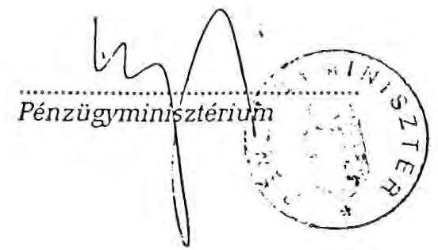
"REORG" Gazdasági és Pénzügyi Rt.

---

# JELENTŐSEBB FELSZÁMOLÁSI ÜGYEK 

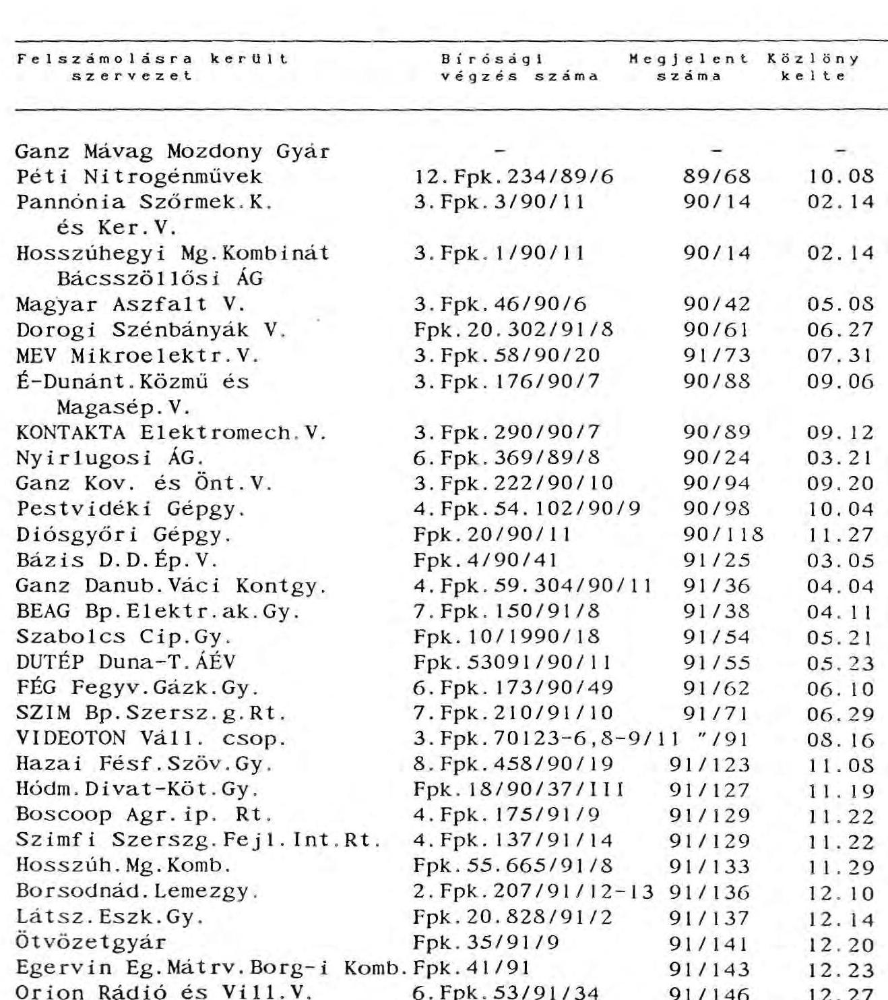

---

# Pestvidéki Gépgyár felszámolása 

(A melléklet megállapításai az IKM és PM ellenőrzési jegyzőkönyvein, e témakörben létrehívott Tárcaközi Bizottság jelentésén és csatolt dokumentumokon, valamint lefolytatott szakmai konzultációkon alapulnak.)

## 1. Felszámolási eljárás elrendelése

A Pestvidéki Gépgyár 1990. június 8-án fizetésképtelensége miatt kérte a Bíróságtól a felszámolási eljárás megindítását. A vállalat 1989. évi mérlegében 234.8 millió Ft veszteséget mutatott ki, saját vagyona 889,6 millió Ft, tartozása 831,6 millió Ft-ot tettek ki.

A vállalatvezetés felszámolási kezdeményezésével az IpM előzetesen egyetértett (Sós Gyula miniszterhelyettes 1991. március 22-i levele), valamint a bírósági eljárás során azt az átalakult IKM vezetése is jóváhagyta (Auth Henrik államtitkár 1990. június 1-i levele).

A Kormány 1990. augusztus 2-i ülésén tárgyalta és tudomásul vette, hogy az ipari és kereskedelmi miniszter 7 vállalat ellen felszámolási eljárást kezdeményez, melyek között a Pestvidéki Gépgyár is szerepelt.

A Pest Megyei Bíróság 1990. augusztus 9-i végzésében megállapította a vállalat fizetésképtelenségének tényét.

A törvényes eljárási rend szerint ezt követően a Szanáló Szervezet szeptember 7-re összehívta a Szanálási Tárcaközi Bizottságot. Az SzTB ülésén - többek között - részt vett az IKM, HM és NGKM képviselői is. Az SzTB a vállalat felszámolásával egyetértett az alábbi feltételek mellett:

---

"- A felszámolási eljárás során gondoskodni kell arról, hogy a repülőgép és helikopter javítással foglalkozó gyáregységnél a HM érdekei érvényesüljenek,

- a vállalatnál azonos profilok gyártása, amelyek a gazdaságos termelés kritériumának megfelelnek - tovább folytatódjanak."

A pénzügyminiszter elfogadta az SzTB javaslatát, eltekintett az állami szanálás elrendelésétől. A felfüggesztett felszámolási eljárás folytatásáról, valamint a felszámolás HM érdekekkel kapcsolatos feltételekről a Szanáló Szervezet 1990. szeptember 14-i levelében tájékoztatta a Pest Megyei Bíróságot.

A Pest Megyei Bíróság 4. Fpk. 54.102/1990/9-I. sz. 1990. szeptember 20-i végzésével indította meg a Pestvidéki Gépgyár felszámolását, melynek lefolytatásával a Szanáló Szervezetet bízta meg. A felszámolási közlemény a Magyar Közlöny 98. számában, 1990. október 4-én jelent meg.
2. A felszámolási eljárás I. szakasza (Line Up cég)

A felszámolást megelőzően a Lin Up Aviation Ltd angol céggel a Pestvidéki Gépgyár (P.G.) 1989. I. félévétől tárgyalásokat folytatott és az angol cég ajánlatot tett egy polgári repülőgép javító bázis létrehozására és közös vállalati formában történő működtetésére. A vonatkozó megvalósítási tanulmánytervet már 1990. februárjában bemutatták az illetékes magyar képviselőknek. A Line Up képviselői 1990. I. félévében számos, a témában érintett kormányzati és vállalati szervekkel folytattak tárgyalást.

E tárgyalásokkal hozható összefüggésbe, hogy az IKM minisztere előterjesztést készített, melyet a Kormány 3439/9 (XI.3.) határozatában - a projekt létrehozásához szükséges kormánygaranciákkal együtt - jóváhagyott. Az üzleti koncepció arra épült,

---

hogy a Line Up e szükséges tőkét mintegy 140 millió USD-t megszervezi (összehozza) és javasolta egy közös vállalat alapítását a repülőgép-javító bázis megépítésére és üzemeltetésére.

A Szanáló Szervezet kijelölését követően átvette a P.G. irányítását, s mint egyetlen szóbajöhető céggel, a Line Up-pal vette fel a kapcsolatot és folytatta a tranzakció megvalósítását.

Tárgyalásai során a korábbi üzleti konstrukció megváltozott. A Line Up a korábbi közös vállalat létrehozása helyett már a P.G. teljes vagyonának megvételére tett ajánlatot. A tranzakció lebonyolítására minimál tőkével egy Kft-t alapított, mely társaságban a Magyar Állam részére $10 \%$-os üzletrész, később 33.406.225 $\mathrm{m}^{2}$ külterületi ipari ingatlan kezelői jogának a P.G. vállalatnak történő átadása kapcsán összesen 14,5 %-os üzletrész átadását irányozta elő.
A Line-Up Bp. Kft 1990. december 14-i alapításának célja a repülőgép-javítási tevékenység folytatása, mintegy 200 millió USD magyarországi beruházás megvalósítására befektetők szervezése, egy repülőgép-javító szervizbázis létrehozása volt.

A Line-Up Bp. Kft-vel a P.G. vállalat vagyonának eladására irányuló szerződés 1990. december 18-án jött létre. A szerződés szerint a Line-Up Bp. Kft. 26,5 millió USD vételárért vásárolta meg a P.G. teljes vagyonát. (A minimál tőkével rendelkező Kft-vel az adás-vételi szerződést pénzügyi garanciák nélkül kötötték.)

A szerződéskötést követően a Kormány 3439/9. sz. határozata alapján az ipari és kereskedelmi miniszter 1991. januárjában állásfoglalást bocsátott ki, amely tartalmazta a vevő által megkívánt állami garancia minden elemét, melyek csak a honvédelmi érdekek teljesítését biztosító vevői garanciavállalással együttesen voltak érvényesek.

---

A Line-Up Bp. Kft az adás-vételi szerződésben többek között vállalta, hogy a pénzügyi kötelezettségek teljesítését a vételár 10 \%-nak letétbe helyezésével a szerződés aláírását követő 30 napon belül megkezdi, továbbá hogy a P.G. tevékenységi körébe tartozó üzletmenetet fenntartja, ennek ellátását biztosító vagyont nem idegeníti el. A szerződés e meghiúsulás esetére a vételár 20 \%-át kitevő "foglalót" is rögzített.

A Line-Up Bp. Kft e vételi szándékát folyamatosan megerősítve, több alkalommal kezdeményezte a fizetési határidők módosítását, melyet végül is nem teljesített. A végső 1991. augusztus 31-i határidőnek sem tett eleget, ezért a Szanáló Szervezet 1991. szeptember 3-i levelében közölte a Line-Up Bp. Kft-vel, hogy szerződésszegő magatartására tekintettel a szerződéstől eláll, és a P.G. vállalat vagyonát megkezdi más vevő részére értékesíteni.

A meghiúsulás főként a külföldi befektető csoport szervezési nehézségeivel hozható összefüggésbe, és a P.G. vállalat átalakításában kb. egy éves késedelmet eredményezett. Az ezzel kapcsolatban jelentkező károk áthárítására nem sok esélyt ad a Line-Up Bp. Kft tőkeereje.
2. Felszámolási eljárás II. - napjainkig tartó - szakasza

A Line-Up céggel folytatott korábbi tárgyalások során folyamatosan rendeződtek a P.G. vállalat földtulajdonnal, illetve Tököli repülőtér használatával kapcsolatos jogosultságai. A HM-mel kötött 1990. március 22-i megállapodással a P.G. vállalat által használt földingatlan kezelői jogát, valamint az 1991. június 25-i megállapodással alapított telki szolgalom alapján megszerezte a P.G. a Tököli reptér használatának jogosultságát. A megállapodások szükségesek voltak a P.G. vállalatban megtestesülő vagyon forgalomképességének a biztosításá-

---

hoz, valamint a fő profilú tevékenységként folytatott repülőgép és helikopter javítási tevékenységek ellátásához. A kezelői jog átruházása, valamint a telki szolgalom alapítása ellenszolgáltatás nélkül történt, a telekkönyvbe be lett jegyezve.

A Szanáló Szervezet a P.G. vagyonának hasznosítására egy olyan elképzelést is kialakított, mely szerint a nagy hitelezők (ebben a körben szerepel az IKM és ÁFI is) követeléseik tőkésítésével, valamint a HM és az Israel Aircraft Industry bevonásával egy közös vállalatot hoznak létre. A megkeresésre a hitelezők az ÁFI kivételével - elutasítóan reagáltak.

Ezt követően a Szanáló Szervezet a Figyelő 1991. december 12-i számában a vállalat összes ingatlanját és ingóságát nyilvános értékesítési tárgyalásra meghirdette. Az ajánlati feltételek között a vevő kötelezettségeként a pályázat előírta a Magyar Honvédség repülő és helikopter javítására vonatkozó igényeinek távlati, maradéktalan biztosítását.

A P.G. vállalat vagyonát (készletekkel együtt) az Ipargazdasági Intézet 1990. év közepén 2,4 milliárd Ft-ra értékelte. A felszámoló által október 4-én átvett vállalati vagyon 1,4 milliárd Ft volt. A felszámoló a gyár vagyonát (készlet nélkül) 1991. decemberében 1,7 milliárd Ft-ért ajánlotta eladásra. Az értékesítési versenytárgyalásokon a vállalatért (a Biharkeresztesi gyár és készlet nélkül) a legmagasabb ajánlat 430 millió Ft + ÁFA volt, külön megállapodás alapján a vevő a készletekért 400 millió Ft + ÁFA-t ajánlott meg. Az eladási ár, valamint a várható egyéb bevételek (Biharkeresztesi gyár) megfelelő fedezetet nyújtottak a követelések közel teljes körű kielégítéséhez.
1992. február 21-én adásvételi szerződést kötöttek a december 31-ével megszüntetett Szanáló Szervezet felszámolási tevékenységeit folytató Reorg Gazdasági és Pénzügyi Részvény-

---

társaság, valamint a pályázatot elnyerő Eldorádó Alapítvány. A szerződés X. fejezete rögzíti a Magyar Honvédség igényei teljeskörű kielégítésével kapcsolatos vevői vállalásokat.

A teljes vételár, valamint a készletek ellenértéke közel 40 \%-ának befizetése 1992. március 9-én lett volna esedékes, mely időpontig az összeg nem került átutalásra. A Reorg Rt. az Eldorádó Alapítvány szerződésszegésére tekintettel március 31-én a szerződéstől elállt.

A felszámolás alatt álló Pestvidéki Gépgyár 1991-ben "önfinanszírozó" módon tevékenykedett, meglévő rendeléseit teljesítette, 900 millió Ft árbevételt és 80 millió Ft pénzügyi eredményt ért el. (Az eredmény abból származik, hogy a felszámolás alatt nem kell költségként elszámolni a korábban keletkezett tartozások kamatait, valamint az amortizációt.)

A vállalatnak 1992. évre főként repülőgépjavításra irányuló üzletági tevékenységének kb. 400 millió Ft rendelésállománya van. Előzetes számítások szerint rendeléshiány miatt a létszám 30 \%-át, kb. 350 főt kell elbocsátani.
A Pestvidéki Gépgyár felszámolása tárgyában 1991. év II. félévében az IKM és a PM ellenőrzést végzett, valamint az Országgyűlés Honvédelmi Bizottsága is tájékozódott. A Honvédelmi Bizottság 1992. március 18-i határozatának végrehajtására a pénzügyminiszter Tárcaközi Bizottságot hozott létre. A Tárcaközi Bizottság 1992. április 3-i jelentésében javasolja, hogy:

- a Kormány az alapító előterjesztésére vizsgálja meg, hogy a P.G. felszámolási eljárásába a rendkívüli időszakra rögzített "M" kapacitása bevonható-e,
- a HM és a Reorg Rt. pontosítsák a Tököli reptér használatával kapcsolatos telki szolgalmi jogot.

---

A Tárcaközi Bizottság által javasolt intézkedések kimunkálása megkezdődött. A folyamatban lévő felülvizsgálat eredményeként várhatóan jelentősen leszűkül az "M" kapacitások biztosításokra kötelezett vállalati kör, valamint a kapacitások nagyságrendje.

Ez utóbbi a P.G. vállalat esetében várhatóan a korábbinak 40 \%-ra csökken, melyet a felszámolás-privatizálás során biztosítani szükséges.

Az utólagos értelmezési problémák és jogi viták elkerülése érdekében a Tököli reptér használatával kapcsolatos 1991. június 25-i megállapodás kiegészítésre kerül. (Szolgalmi jogosultság javításokkal összefüggő repülésekre történő korlátozása, a közös üzemeltetésre vonatkozó külön megállapodás jóváhagyásának pontosítása stb.).

Figyelembe véve a folyamatba tett intézkedéseket, valamint az Eldorádó Alapítvánnyal kötött szerződés meghiúsulását, megállapítható, hogy a Pestvidéki Gépgyár értékesítésével kapcsolatban jelentkező problémák elhárultak. A felmerült tapasztalatok hasznosításával ezek a problémák a vállalat jövőbeli értékesítésénél elkerülhetőek.

# 3. A tapasztalatok összefoglalása 

A főként dokumentációkra és értelmezési kérdésekben konzultációkra alapozott vizsgálat tapasztalatai alapján a felszámolás alatt álló Pestvidéki Gépgyár hasznosításával kapcsolatban összefoglalóan megállapítható:

- A kormányzat, illetve az illetékes minisztériumok több alkalommal tárgyalták a Pestvidéki Gépgyár felszámolásával és hasznosításával kapcsolatos kérdéseket. A honvédelmi érdekek

---

biztosítására korlátozó intézkedéseket (pl. az elidegenítésre kerülő tulajdoní hányad meghatározása, illetve a HM tulajdonosi pozíciójának biztosítása) nem eszközöltek. A honvédelemmel kapcsolatos szolgáltatások ellátásának biztosítása, a felszámoló szervezetre, illetve az általa kialakított üzleti konstrukcióra és szerződéses biztosítékokra hárultak.

A Pestvidéki Gépgyár vagyonának hasznosítására a felszámolást végző szervezet az eljárás közel 20 hónapja alatt két szerződést kötött, a Line-Up Bp. Kft-vel, ennek meghiúsulását követően az Eldorádó Alapítvánnyal.

Mindkét szerződés esetében a befektetők anonymok voltak, így a pénzügyi háttér is tisztázatlanul maradt. A befektetők "háttérben" maradása jórészt az állami tulajdon elidegenítését végzők tárgyalási pozíciójával áll összefüggésben és széles körben elterjedt törekvés. Azonban honvédelmi kötelezettségeket is ellátó gazdálkodó egységek hasznosításánál a hosszabb távú üzleti szándékok áttekintéséhez meggondolandó az "anonymitás" elfogadása.

- A honvédelmi érdekek teljesítése szempontjából a két szerződés eltérően értékelhető.

A Line-Up Bp. Kft-vel kötött szerződési konstrukciónál (a honvédelmi kötelezettségek teljesítése egy együttesen érvényes kölcsönös garancia csomagban szerepeltek, így a folyamatos működés során a garanciák teljesítése kölcsönösen érvényesíthető volt.

Másrészt a Kft-t alapító angol cégnek a repülőgép és helikopter javítások megfelelő színvonalú ellátásával kapcsolatos szakmai felkészültsége is biztosított volt.

---

Az Eldorádó Alapítvánnyal kötött adásvételi megállapodásban szerepelnek ugyan a honvédelemmel kapcsolatos kötelezettségek, azonban ezek teljesítésére biztosítékok nem kerültek a szerződésben rögzítésre (szélsőséges esetben kikényszerítésük csak peres úton lett volna lehetséges). A javítási szolgáltatások megfelelő színvonalú ellátására, a vevők ezirányú szakmai felkészültségére pedig semmilyen támpont nem volt.

A Line-Up Bp. Kft-vel kötött szerződés és a kialakított kölcsönösen gyakorolt garancia csomag nagy valószínűséggel a honvédelmi érdekekkel összefüggő szolgáltatások teljesítését biztosította volna.

Az Eldorádó Alapítvány esetében a vevő szakmai referenciájának, valamint a szerződési biztosítékoknak a hiánya miatt a honvédelmi szolgáltatások teljesítése és annak színvonala aggályosnak ítélhető.

- A Szanáló Szervezet eljárása során betartotta a felszámolásra vonatkozó előírásokat, azonban a Line-Up céggel kötött szerződés esetében elmarasztalható, hogy a már kialakult üzleti konstrukció módosításaként elfogadta vevőként minimál tőkével alapított Line-Up Bp. Kft-t, valamint a vételi szerződés teljesítése érdekében nem alkalmazott szerződési biztosítékokat. Mindezek jelentősen bekorlátozzák a szerződés meghiúsulása miatt a magyar oldalon bekövetkezett károk érvényesítését.
- A Reorg Rt. "jogutódként" folytatott felszámolási eljárásával kapcsolatban megállapítható, hogy a Reorg Rt. vonatkozó jogutódlása - a jegyzőkönyvben korábban kifejtettek miatt - rendezetlen. (A 35/1991. PM sz. rendeletben az alapító a Szanáló Szervezet által folytatott felszámolási ügyekben a jogutódlásról nem rendelkezett. A megszűnő Szanáló Szervezet amennyiben a Reorg Rt.-t jogutóddá nyilvánította - ehhez a jogelőd szervezettel szerződő felek jóváhagyását be kellett

---

volna szereznie.) A Reorg Rt. alapításával kapcsolatban létrejött 1981. december 20-i PM Megállapodásban a jogutódlással kapcsolatos deklaráció nem tekinthető érvényesnek.

Az "Eldorádó" Alapítvánnyal kötött szerződés esetében a Reorg Rt. továbbá elmarasztalható a vevő kijelölésében, valamint az adásvételi megállapodás és a honvédelemmel kapcsolatos szolgáltatások teljesítéseire irányuló szerződéses biztosítékok hiánya miatt is.

---

# Nyirlugosi Állami Gazdaság felszámolása 

(A vizsgálati megállapítások a Nyirlugosi ÁG. felszámolási biztosa időszaki jelentésein, a felszámolási nyers zárómérleg dokumentumain, valamint a biztossal lefolytatott konzultáció tapasztalatain alapulnak.)

## 1. Felszámolási eljárás elrendelése

A Nyirlugosi Állami Gazdaság tartós fizetésképtelensége miatti felszámolását a Fővárosi Bíróság a 6 Fpk 369/1989/8. sz. határozatával rendelte el, melynek közzététele 1990. március 21-én történt (M.K. 24. száma).

A Bíróság felszámolóként a Szanáló Szervezetet jelölte ki. Az Állami Gazdaság vagyonát a Szanáló Szervezet munkatársa - mint szanálási biztos - 1990. május 29-én vette át.

Az Állami Gazdaság 1989. február 28-án 9 Kft-t, valamint 1989. május 1-én egy energiaszolgáltató egyesülést, összesen 10 társaságot hozott létre. A Kft-ket minimál tőkével alapította, és a működésükhöz szükséges további eszközöket, illetve vagyonelemeket mintegy 860 millió Ft értékben ellenszolgáltatás nélkül bocsátotta a társaságok rendelkezésére, melyből a társaságok 1989. II. negyedévében mintegy 230 millió Ft értékű vagyonrész igénybevételével megemelték törzstőkéjüket. Az állami gazdaság különösen a Mélyhűtő és Gyorsfagyasztó üzem beruházása kapcsán jelentősen eladósodott. A társaságalapítások során az adósságok és kötelezettségek az állami gazdaságnál maradtak, azonban a tevékenységek és vagyon társaságokba történő kihelyezését követően az állami gazdaság bevételekkel nem rendelkezett.
1990. május 29-én funkciójába lépő felszámolási biztos egy, a vagyonából kiürült és működésképtelen "vagyonkezelő" központot vett át.

---

2. A Nyírlugosi Állami Gazdaság által alapított társaságok helyzete és működtetése

A felszámoló biztos a gazdaság vagyonát egy, eszköz-forrás 961,6 millió Ft főösszegű mérleggel vette át, melynek a vagyonrészei és kötelezettségei nem voltak megfelelő bizonylatokkal alátámasztva. Az átadott eszközök közel 79 \%-át képviselte az állami gazdasági saját társaságaiba eszközölt vagyoni befektetései, melyek után bevétel csak a társaságok nyereséges működése és osztalék fizetése alapján keletkezett volna. Az átadott források közel 99 \%-át szállítói, hitelezői, banki és költségvetési tartozások alkották, a saját vagyon és eredmény soron mindössze 10,6 millió Ft szerepelt.

A Nyirlugosi Állami Gazdaság által alapított 9 Kft vagyonának alakulását az 1. sz. melléklet tartalmazza. A társaságok működése az alábbiakkal jellemezhető:
2.1. A Mezőgazdasági Kft közel 100 millió Ft-os vagyonával (melyből 33 %-a törzstőke és 67 %-a az ingyenesen átadott felhalmozott vagyon) évi 3-5 millió Ft nyereséget ér el. A tőke hatékonysága nem kielégítő, azonban a térség mezőgazdasági vállalkozásaihoz képest a társaság eredményessége jónak ítélhető.
2.2. Cserkonzerv Zöldés-Gyümölcs Kft közel 250 millió Ft törzstőkéjével és felhalmozott vagyonával 89-90-es években önfinanszírozó módon működött 1991-ben azonban 31 millió Ft vesztesége képződött. Öncsőd kezdeményezését követően jelenleg folyik a hitelezőkkel az egyeztetés. A Kft működőképes, azonban termelésének finanszírozásához eszközökkel nem rendelkezik.

---

2.3. Idegenforgalmi és Vadászati Kft közel 30 millió Ft törzstőke és felhalmozott vagyon formájában egy 40 személyes szállodával, két vadászházzal és egy sportpályával rendelkezik. A társaság az elmúlt három évben veszteségesen gazdálkodott, az összes vesztesége jelenleg megközelíti a Kft törzstőkéjét. A vadgazdálkodásban feltárt mulasztások miatt a felszámoló biztos magához vonta a vadásztatási jogot, valamint a Kft vezetőjét is leváltotta. Jelenleg csak a szállodai üzemrész 10-20 \%-os férőhely kihasználással működik.
2.4. Erdészeti és Fafeldolgozó Kft törzstőkéje és felhalmozott vagyona 34 millió Ft-ot tett ki. A társaság működése arra épült, hogy az erdőgazdaságban kitermelt fát saját maga faalapanyagú göngyölegnek dolgozza fel. A Kft minden évben veszteséges volt, és a három év halmozott vesztesége 26,8 millió Ft-ot tesz ki, szemben a társaság közel 10 millió Ft-os törzstőkéjével. A felszámoló biztos az erdészeti gazdálkodási jogot pazarló erdőgazdálkodás miatt megvonta, és ezt most főleg új telepítések formájában rentábilis módon az állami gazdaság központja folytatja. A falpari részleg jelenleg nem üzemel.
2.5. A Műszaki Szolgáltató Kft az alapítást és törzstőke emelést követően 34,5 milliós vagyon felett rendelkezett. Alapításából kezdődően évente növekvő mértékű, a három év alatt összesen 12 millió Ft vesztesége képződött. Munkaellátottsági problémák miatt folyamatban van a létszám elbocsátása, az üzem leállítása.
2.6. Magor Kereskedelmi Kft az elmúlt időszakban eredménytelenül tevékenykedett, a Nyírlugosi Állami Gazdaság érdekeltségi körébe tartozó üzletkötéseket nem hozott létre. Az Állami Gazdaság felszámoló biztosa kivonta a vagyont a társaságból és annak felszámolását kezdeményezte.

---

2.7. A MOLDEX Húsfeldolgozó Kft 25 millió Ft törzstőkével alapított vegyes tulajdonú társaság, ahol 50 \%-ban tulajdonos külföldi fél a technológiai berendezéseket a know-how-t apportálja, a Nyírlugosi Állami Gazdaság pedig egy épületet biztosít apport formájában a húsipari export termeléshez. A megvalósítás beindult, és a technológiai követelmények biztosítására az átadott épület belső tereinek lebontása megtörtént. Érdekmúlás miatt a külföldi fél az épület átalakítási munkálatokat nem fejezte be, és a felszámolási eljárás megkezdése előtt a területről levonult.
Kezdeményezésre a Bíróság leszállította a MOLDEX Kft törzstőkéjét, és az épület apportnak e társaságból történő kivonását engedélyezte. A Nyírlugosi Állami Gazdasághoz visszaszármazott épület - felső tereinek megbontása miatt nem forgalomképes. A felszámoló jelenleg fontolgatja kártérítési igényének peresítését.
2.8. A 32,6 millió Ft vagyonnal rendelkező és élelmiszerkereskedelemmel foglalkozó ÉLKER Kft a magánkereskedések révén jelentkező növekvő konkurrencia miatt nem tudott eredményesen működni, ezért a felszámoló biztos a' társaság felszámolását kezdeményezte.
2.9. Mélyhűtő és Gyorsfagyasztó Kft. A mélyhűtő üzem beruházása 1989-ben valósult meg, és a II. félévben kezdte meg működését. Korszerű technológiával és főleg lizingelt berendezésekkel rendelkezik, és a Nyírlugosi Állami Gazdaság által alapított társaságok közül a legmagasabb vagyoni értéket képviseli. A Kft 1,5 millió Ft alapítói törzstőkével rendelkezik, melyből 500 ezer Ft értékű vagyonrészt az Állami Gazdasági biztosított.

A mélyhűtő üzem beruházásához a HUNGAROFRUCKT, az ÁGKER és az AGE közel 100 millió Ft-tal járultak hozzá, a hiányzó részt a Nyírlugosi Állami Gazdaság hitelekből biztosította. A tulajdonos társak a mélyhűtő üzem beruházását 374,6 millió Ft

---

értékben fogadták el, mely üzemet az Állami Gazdaság teljes egészében a Kft rendelkezésére bocsátotta. A saját társasági tőkebefektetését azonban - figyelembe véve a beruházás pénzforrásainak megoszlását - csak 285,3 millió Ft-tal szerepelteti könyveiben.

A társaságnál törzstőke emelésre nem került sor, az üzem beruházási értéke teljes egészében felhalmozott vagyonként szerepel.

A Nyirlugosi Állami Gazdaság az 1,5 millió Ft törzstőkét figyelembe véve csak kisebbségi 33,3 \%-os üzletrésszel, a felhalmozott vagyonként átadott üzemet is figyelembe véve 75,79 \%-os tulajdoni hányaddal rendelkezik. A tulajdonosok között jelenleg pères vita folyik, a Kft tulajdoni viszonyai ezideig rendezetlenek.

A Mélyhűtő és Gyorsfagyasztó Kft 1989. és 1990. évi üzemelése 124,8 millió Ft veszteséget eredményezett, 1991-ben
 már nem üzemelt.

A Kft-nek jelenleg kb. 180 millió Ft szállítói tartozása van, az Állami Gazdaságnál jelentkező beruházási hitelek és kamatok, valamint beruházási szállítók tartozása kb. 490 millió Ft-ra tehető. Az üzem újraindításához, a termelési készletek feltöltéséhez kb. 200 millió Ft szükséges. Az üzem hasznosításával kapcsolatos pályázatok során a legmagasabb vételár javaslat ezidáig 192 millió Ft volt.
2.10. Az Energia Szolgáltató Egyesülés kezelésébe 42,4 millió Ft vagyon került, és az egyesülés látta el a valamennyi Kft által igényelt funkcionális feladatokat, pld. karbantartás, étkeztetés stb. Az egyesülés fenntartási költségei azonban nem folytak be, ezért a felszámolói biztos az Energia Szolgáltató Egyesülést végelszámolással megszüntette. (A csak

---

hiányosan rendelkezésre álló adatok szerint jelentős a társaságok kereset-adóssága is, pld. a Mélyhűtő és Gyorsfagyasztó Kft az Energiaszolgáltató Egyesülésnek kb. 17 millió Ft-tal tartozik.)

A felszámolás során a Szanáló Szervezetet képviselő felszámolási biztos megkísérelte a társaságoknak ingyenesen átadott, és azok felhalmozott vagyonában szereplő eszközök részleges visszavételezését (a vonatkozó adatokat a 2. sz. melléklet tartalmazza). Az intézkedése csak 6 (a Mezőgazdasági az Idegenforgalmi és Gazdálkodási, az Erdészeti Fafeldolgozó, a Műszaki Szolgáltató, a Magor és ÉLKER Kft-ket) társaságot érintett mintegy 135,7 millió Ft eszközértékkel. Két társaságra (a Cserkonzerv és a Mélyhűtő és Gyorsfagyasztó Kft-kre) nem terjedt ki. (A MOLDEX Kft-be bevitt épület apport tőkecsökkentés és kivonás formájában 29,0 millió Ft értékben visszaszármazott az Állami Gazdaságba, valamint az Energia Szolgáltató Egyesülés megszüntetésénél további 33,0 millió Ft értékű vagyon szabadult fel.)

A felszámoló biztos a vagyonvisszavételt olyan formában eszközölte, hogy a többségi tulajdonban lévő hat Kft-nek az ingyenesen átadott vagyon értékét kiszámlázta, és a vonatkozó követeléseket az Állami Gazdaság belföldi vevőállományában tartja nyilván. A 135,7 millió Ft értékben visszavett vagyon mellett azonban ténylegesen, három Kft-től csak 9,9 millió Ft értékű eszközt vont vissza.

A vizsgálatot nem terjesztettük ki az Állami Gazdaság társaságalapítási és vagyonátruházási tevékenységeire, mivel ezek egy része perrel érintett (pl. Mélyhűtő és Gyorsfagyasztó Kft), továbbá a felszámolói biztos időszaki beszámolóiból kitűnően főleg az átruházott vagyon vonatkozásában hiányos. A tételes jegyzékek főként a törzstőke emeléssel érintett eszközökre vo-

---

natkozóan áll rendelkezésre, melyek "könyvvizsgálói" vagyonértékelését többségében a vagyonátruházásban érintett társaságokban működő könyvvizsgálók végezték.

A társaság alapítások 38., valamint a felszámolási eljárás 24-26. hónapjában egyes társaságok tulajdonviszonyai, a vagyonátruházások és későbbi visszavételezések kérdései rendezetlenek. A körülményeket csak tetézi a fellebbezések folytán napjainkban véglegesített APEH határozat, mely az Állami Gazdaságot a társaságokba ingyenesen átruházott vagyon után közel 177 millió Ft ÁFA tartozás és büntető kamat megfizetésére kötelezte.

Összefoglalva a társaságok működésével kapcsolatos tapasztalatokat, megállapítható, hogy a társaságok 3 éves működése során közel 207 millió Ft veszteség keletkezett, az alapított 10 társaságból jelenleg csak a Mezőgazdasági Kft működik kielégítően. A többi működését - ideiglenes jelleggel - vagy véglegesen beszüntette. A MOLDEX vegyes tulajdonú Kft megszűnt, három társasággal szemben felszámolás lett kezdeményezve, illetve folyamatban van (Energiaszolgáltató Egyesülés, ÉLKER és Magor Kft-k), a Cserkonzerv Kft öncsőd eljárást kezdeményezett, a Műszaki Szolgáltató Kft létszáma leépítés alatt áll stb. Négy Kft esetében az adósságteherből való feloldás, jelentősebb tőkebefektetés és a társaság gazdálkodásának új alapokra való helyezésével elviekben mód van tevékenységük újraindításához, ehhez azonban vállalkozói tőke és menedzsment szükséges. (Ez utóbbi társaságok a Mélyhűtő és Gyorsfagyasztó Kft, a Cserkonzerv Kft, az Idegenforgalmi és Vadászati Kft, az Erdészeti és Fafeldolgozó Kft.)
3. A felszámolási eljárás során tett további intézkedések

A felszámolási eljárás során ezideig vagyon értékesítésére nem került sor.

Figyelembe véve az Állami Gazdaság vagyonának felszámoló általi

---

Figyelembe véve az Állami Gazdaság vagyonának felszámoló általi átvételének időpontját, a biztos működésének kezdetén már pályázati felhívást készített a gazdaság vagyonának hasznosítására (1990. május 29., ill. május 31.). A felszámolás időszaka alatt három alkalommal került sor nyilvános versenytárgyalásra. Az első alkalom 1990. július 6-án volt, melyre elfogadható ajánlat nem érkezett, és eredménytelenül zárult.

A második versenytárgyalás 1990. végén, december 5-én került megrendezésre, ahol egy angol konzorcium szerzett jogot arra, hogy 360 millió Ft vételár ellenében a Nyírlugosi Állami Gazdaság és a Mélyhűtő és Gyorsfagyasztó Kft vagyonának megvételére szerződéskötési tárgyalást kezdjen a Szanáló Szervezettel. Az angol konzorcium vételi szándéka komolynak ítélhető, mivel a szerződés előkészítési tárgyalásokkal párhuzamoson az Állami Gazdaság átvilágítását megrendelte a DRT Hungary Kft-nél. A szerződés előkészítési tárgyalások azonban eredménytelenül zárultak, és az angol cég a vételtől 1991. áprilisában visszalépett.

A harmadik versenytárgyalásra 1991. július 11-én került sor. Itt Igaz János vállalkozó 400 millió Ft vételár ajánlattal szerzett jogot a Gazdaság és Mélyhűtő üzemi vagyonának megvételére azzal, ha a Gazdaság hitelezőiből alakult konzorcium három napon belül nem nyújt be kedvezőbb ajánlatot. Erre nem került sor, így a Szanáló Szervezet Igaz János vállalkozóval 1991. július 25-én két adásvételi előszerződést kötött, külön az Állami Gazdaság vagyonának 208 millió Ft vételár ellenében történő átadására, és külön a Mélyhűtő társaság vagyonának 198 millió Ft vételárért történő hasznosítására. Mind két előszerződés biztosítékául a vállalkozó 20-20, összesen 40 millió Ft vételár előleget helyezett le, melyet a szerződő felek foglalónak tekintettek.

---

Igaz János vállalkozóval a végleges szerződések nem jöttek létre, a Szanáló Szervezet pedig 1992. április 22-én a szerződéskötéstől visszalépett. Tekintettel a 40 millió Ft vételár előleg-foglaló jellegére - valószínűsíthető, hogy a felek között peres ügy keletkezik. Az esetleges peres ügy kimenetele az ügylet meghiúsulásának összetett körülményei miatt - nem prognosztizálható.

Az Állami Gazdaság vagyonának átvételekor a felszámolási nyitó mérlegben a belföldi vevők tartozása 140.828 ezer Ft-ot tett ki, ez a jelenlegi időszakban kb. 250 millió Ft.

A felszámolási eljárás során a vevőktől összesen 1.625 ezer Ft követelést szedtek be, a lefolytatott egyeztetések során a vevők által jogosan vitatott tételek vonatkozásában pedig 50.214 ezer Ft követelés elengedésre került.

A csökkentő tételek a vevőállományt azonban jelentősen megnövelte a társaságoknak ingyenesen átadott, illetve utólagosan kiszámlázott vagyonérték.

A felszámolási nyitómérlegben az adósokkal szemben 55.512 ezer Ft követelés állt fenn, és ez változatlan jelenleg is. A követelés teljes összegével a Mélyhűtő és Gyorsfagyasztó Kft tartozik az Állami Gazdaságnak.

A felszámolás során jelentősen megnövekedett az állóeszközök és beruházások értéke, 2.595 ezer Ft-ról 74.963 ezer Ft-ra. Az állomány növekedését a társaságokból visszaszármazott, illetve ténylegesen visszavételezett eszközök értéke idézi elő. (A megszüntetett Energia-Szolgáltató Egyesülés 33 millió Ft, MOLDEX Kft visszaszármazott épület 29 millió Ft, további 3 Kft 9,9 millió Ft értékű vagyonának visszavétele.)

---

# 4. A tapasztalatok összefoglalása 

A főként dokumentációkra, illetve konzultációkra alapozott vizsgálat alapján megállapítható, hogy a Nyírlugosi Állami Gazdaság több mint két éve tartó, a Szanáló Szervezet által végzett felszámolási tevékenysége számbavehető eredményeket nem hozott.

Az előd-szervezet által lefolytatott társaság alapítások és vagyon átruházások nyitott kérdéseit a felszámolási eljárás során nem sikerült teljes körűen tisztázni és rendezni, egyes esetekben a tulajdoni viszonyok is rendezetlenek, ezáltal a felszámolással érintett vagyonelemek forgalomképessége is korlátozott. A felszámoló elmulasztotta a közel 600 millió értékű állami vagyon ingyenes átadására irányuló megállapodások bírósági megtámadását az LB. BH. 395/90. sz. eseti döntésének II. pontja alapján.

A felszámoló egy vagyonától kiürített központot vett át. Az alapított társaságok likvid pénzeszközökkel nem rendelkeztek, az alapító eladósodása miatt a hitelforrások sem nyíltak meg, és egyes társaságok esetében a gazdálkodásukat megalapozó üzleti koncepció is hiányos volt. A felszámolási eljárás során a Szanáló Szervezet munkatársa differenciált módon megkísérelte a társaságok működését fenntartani, azonban a különböző beavatkozások nem eredményezték a társaságok gazdálkodásának a stabilizálását. Az alapított tíz társaság közül jelenleg már csak egy, az Állami Gazdaság társaságokba vitt vagyonának $11,32 \%$-át kezelő Mezőgazdasági Kft működik önfinanszírozó módon. A többi társaság helyzete problematikus, tevékenysége leépülőben van, illetve működését ideiglenesen vagy véglegesen beszüntette.

A felszámolási eljárás során három alkalommal rendeztek versenytárgyalást az Állami Gazdaság vagyonának hasznosítására, melyek eredménytelenül zárultak. Mindegyik kísérlet az Állami

---

Gazdaság vagyonának egy tagban történő értékesítésére irányult, a vagyon megbontását és egyes elemek hasznosítását nem kísérelték meg. Mindezek arra vezettek, hogy a felszámolási eljárás során ezidáig vagyonértékesítés nem történt.

Az Állami Gazdaság kinnlevőségeinek behajtása sem járt az elvárható eredménnyel.

A türelmüket vesztett hitelezők nyomására a közelmúltban megállapodás történt, hogy a Nyírlugosi Állami Gazdaság több mint két éve folyó felszámolását zárómérleg készítéssel a felszámoló szervezet lezárja, és ezt követően a hitelezői konzorcium szoros ellenőrzése mellett végzi a vagyon értékesítését. A hitelezők továbbá támogatást adnak a vevők felkutatásában is.

A felszámolási zárómérleg összeállítása jelenleg folyamatban van.
(Egy nyers felszámolási mérleget a 3. sz. mellékletként tájékoztatásul csatolunk. A mérleg több - a felszámoló felé már jelzett - helyen azonban korrekcióra szorul.)

---

# I I M U T A T Á S

A Nyírlugosi Állami Gazdaság részvételével működő Kft-k vagyonának alakulásáról

|  Coroz. | Megnevezés | A.C. | Induló vagyon |  |  | Vagyon vezetés |  |   |
| --- | --- | --- | --- | --- | --- | --- | --- | --- |
|   |  |  | törzs- |  |  |  |  |   |
|   |  |  | tőke |  |  |  |  |   |
|  1. | Mezőgazdasági Kft | 59.4 % | 33.151 | 67.339 | 100.481 |  |  |   |
|  2. | Cserkonserv Kft | 86.33% | 129.533 | 113.913 | 249.443 |  |  | 33.594  |
|  3. | Idegenforg.és Gazd. Kft | 100 % | 13.056 | 16.115 | 29.171 | 4.137 | 3.790 | 3.922  |
|  4. | Erd.és Fafeldolg. Kft | 96.78% | 9.922 | 24.303 | 34.225 | 17.659 | 5.831 | 3.217  |
|  5. | Műszaki Szolg. Kft | 99.55% | 22.208 | 12.246 | 34.455 | 271 | 3.339 | 8.416  |
|  6. | MAGOR Kft | 99.91% | 1.109 | 301 | 1.401 |  | 65 |   |
|  7. | MOLDEX Kft | 50 % | 25.203 |  | 35.200 |  |  |   |
|  8. | ÉLKER Kft | 69.69% | 17.212 | 15.448 | 22.660 |  |  |   |
|   | ÖSSZESEN: |  | 251.386 | 255.656 | 597.036 | 23.117 | 13.123 | 46.448  |
|  9. | Mélyhűtő és Gyorsfa-
gyasztó Kft | 33.32% | 1.500 | 374.631 | 376.131 | 55.615 | 69.227 |   |
|   |  | 75.78% |  |  |  |  |  |   |
|   | MINDSZENTEN: |  | 252.830 | 630.237 | 883.167 | 77.702 | 82.353 | 48.448  |

Nyírlugos, 1992. március 21.

Pázmán Sándor

---

17/2.sz. melléklet

KIHUIÁI

a Nyírlugosi Állami Gazdasági részéről a 13 É-ök részére ingyenesen átadott eszközök értékéről.

|  Sorsz. | Megnevezés | Ingyenesen átadott eszközök értéke össz. | Intézkedés a visszavételre | Ténylegesen visszavett eszközök értéke | Járó állomány 1992. 03.21-én  |
| --- | --- | --- | --- | --- | --- |
|  1. | Mezőgazdasági KFT | 67.330 | 67.330 | - | -  |
|  2. | Cserkonzerv KFT | 119.913 | - | - | 119.913  |
|  3. | Idegenforgalmi és Gazdálkodási KFT. | 16.115 | 16.115 | 4.307 | -  |
|  4. | Erdészeti és Fafeldolg. KFT. | 24.303 | 24.303 | 2.266 | -  |
|  5. | Műszaki Szolgáltató KFT | 12.246 | 12.246 | 3.311 | -  |
|  6. | MAGOR KFT | 301 | 301 | - | -  |
|  7. | MÖLÖEX KFT | - | - | - | -  |
|  8. | ÉLKER KFT. | 15.448 | 15.448 | - | -  |
|   | ÖSSZESEN: | 255.656 | 135.743 | 9.1191 | 119.913  |
|   | MÉLYHŰTŐ ÉS GYORSFAGYASZTÓ KFT | 374.631 | - | - | 374.631  |
|   | MINDÖSSZESEN: | 630.2117 | 135.743 | 9.1191 | 494.544  |
|   | Nyírlugos, 1992. március 21. |  |  | Pázmán Sándor |   |

---

Nyirlugosi Állami Gazdaság Nyirlugos - Cserhúgó
17/3. sz. melléklet

FELSZÁMOLÁSI ZÁRÓNÉRLÉG

| Sorsz. | $\begin{gathered} \text { E S Z K Ö Z Ö K } \\ \text { b. } \end{gathered}$ | Felszámolási eljárás |  | Sorsz. | F O R R Á S O K | Felszámolási eljárás |  |
| :--: | :--: | :--: | :--: | :--: | :--: | :--: | :--: |
|  |  | kezdetén | végén |  |  | kezdetén | végén |
| a. | b. | c. | d. | a. | b. | c. | d. |
| 01. | Elszámolási betétszámla, pénztár, /31/ | 2.815 | 42.106 | 11. | Felszámolási költségek /49-ből/ |  | 1.135 |
| 02. | Belföldi vevők /331-335/ | 140.828 | 256.076 | 12. | Munkavállalókkal, tagokkal szembeni tartozások /471,472/ |  | 242 |
| 03. | Külföldi vevők | - | - |  |  |  |  |
| 04. | Adások /339/ | 55.512 | 55.512 | 13. | Magánszeméllyel szembeni tartozások |  | 250 |
| 05. | Dolgozók tartozása /35/ | 2.847 | 1.207 | 14. | Zálogjoggal, óvadékkal biztositott követelések miatti |  |  |
| 06. | Értékpapirok és egyéb eszközök /32,34,36-39/ | 757.003 | 603.271 | 15. | tartozások /44-ből/   Szállitók, hitelezők /44-ből/ | 632.073 | 101.572   539.953 |
| 07. | Állóeszk. és beruházások /11-19/ | 2.595 | 74.963 | 16. | Bankhitelek /45/ | 261.562 | 496.372 |
|  |  |  |  | 17. | Adótartozások /46/ | 17.013 | 216.833 |
| 08. | Vásárolt készletek /21-23, 27-29/ | - | 5.113 | 18. | Egyéb tartozásuk /473,474, 477/ | 39.557 | 8.659 |
| 09. | Saját termelési készletek /24-26/ | - | - | 19. | Saját vagyon és eredményszla /41-43, 49-ből/ | 10.595 | - 326.763 |
| 10. | ESZKÖZÖK ÖSSZESEN: /01-től-09-ig/ | 961.600 | 1.038.248 | 20. | FORRÁSOK ÖSSZESEN:   /11-től-19-ig | 961.600 | 1.030.240 |

Nyirlugos, 1992. március 21.

---

# HÁGELMAYER ISTVÁN   E L N Ö K   ÁLLAMI SZÁMVEVŐSZÉK 

Budapest
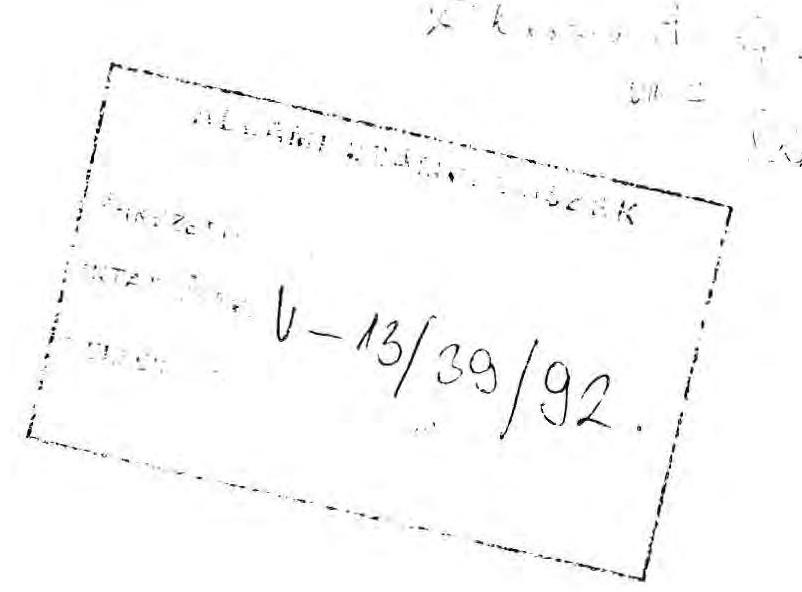

Tisztelt Elnök Úr!

Az Állami Számvevőszék a Szanáló Szervezet megszüntetéséről és a REORG Rt. alapításáról készített vizsgálati jelentése alapos helyzetfeltárásával megfelelő segítséget adott ahhoz, hogy a felmerült hiányosságokat rövid idő alatt megszüntethessük. A vizsgálat alatt az Állami Számvevőszék és a Pénzügyminisztérium munkatársai együttműködtek és ez a körülmény elősegítette azt, hogy a feltárt szabálytalanságok gyors kiküszöbölésével megfelelően szabályozott helyzet alakult ki, illetve a közeljövőben ki fog alakulni.

A Pénzügyminisztérium legfontosabb intézkedése az, hogy a REORG Rt.-ben 100\%-os tulajdonjogot szerez, valamint az, hogy a társaság teljes vezetői személyi állományát lecserélte.

A társaság Alapszabályának szükséges módosítását a következő közgyűlésen hajtjuk végre. A lezárt szanálási ügyek pénzügyi utógondozásának feladatai alól - a szükséges pénzügyminiszteri rendelet kibocsátásával - az Állami Fejlesztési Intézetet mentesíteni fogjuk és ezt a munkát a REORG Rt. új vezetése fogja megkapni.

Mint az az előbbiekből kitűnik, a jelentéssel általában egyetértek, azonban ki kell emelnem egy megállapítást, amellyel nem tudok azonosulni.

---

Nem értek egyet a szóbanforgó szanálások sikertelenségére vonatkozó leegyszerűsített megállapításokkal. Az IKARUS jelenleg is működőképes szervezet. A Csepel Autó szanálását valóban meghiúsultnak kell tekinteni, azonban ennek semmiképpen nem a Szanáló Szervezet tevékenysége az előidézője, hanem az időközben bekövetkezett piaci helyzet változása, ami a piacok nagy részének elvesztésével járt.

Úgy vélem, hogy a részben közösen kimunkált és az előbbiekben ismertetett, már végrehajtott intézkedések, illetve a közeljövőben megteendő lépések együttesen a törvényes és ésszerűen szabályozott, megfelelő rend kialakítását eredményezik. Az ehhez nyújtott gyakorlati támogatást megköszönöm.

B u d a p e s t, 1992. augusztus " $\vec{\gamma}$."
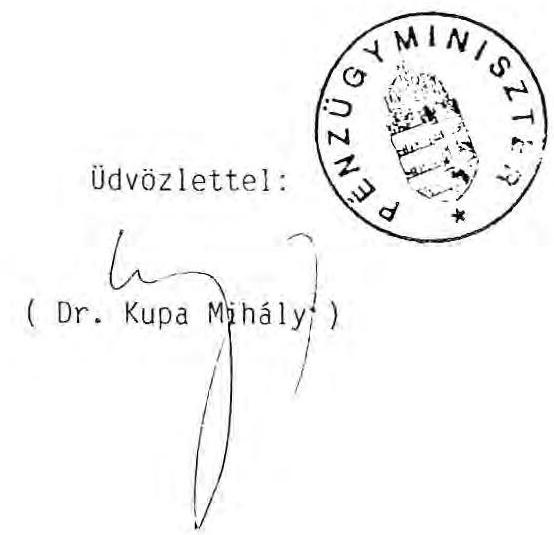

---

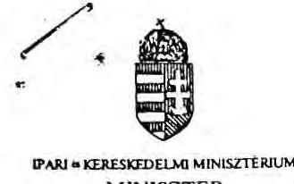

Dr. Hagelmayer István elnök úr részére
Állami Számvevőszék

B U D A P E S T
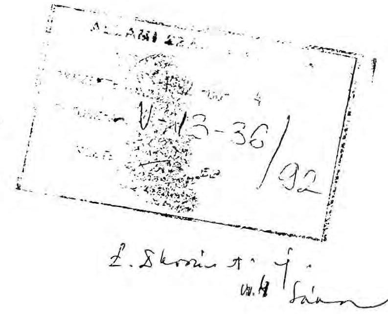

Tisztelt Elnök Úr!

Az Állami Számvevőszéknek a Szanáló Szervezet megszüntetése, a REORG Rt alapítása tárgyában készített vizsgálati jelentésével egyetértek.

A Szanáló Szervezet megszüntetése, valamint a REORG Rt megalapítása számos ellentmondó, egymást kizáró pénzügyminisztériumi állásfoglalással történt, melyeket az előterjesztés részletez. Ilyen előzményeket követően a Szanáló Szervezet "a szanálási ügyeket nem a reális kondíciókat tükrözve, a Csepel Autó állami vállalat esetében lezáratlanul adta át az ÁFI-nak". Egyetértünk a jelentés azon megfogalmazásával, hogy az IKARUS - Csepel Autó állami vállalatok szanálása egy hiányos és nem kellő gondossággal előkészített szanálási megállapodással bonyolódott, így a pénzügyi rendezés folyamata nem valósult meg. A Pestvidéki Gépgyár felszámolási értékesítése rossz partnerkiválasztással, a honvédelmi garanciák kikötése nélkül történt.

A Szanáló Szervezet gondatlan gazdálkodását jellemzi, hogy a Szanálási Alap célelszámolási számla forgalmazásáról egy hónapig, 1992. január 31-ig Rédei úr a REORG Rt nevében jogosulatlanul rendelkezett, s január 31-én a számla egyenlegét az Ipari Fejlesztési Bankhoz utalta át. Ezzel mintegy 200-300 Mt - költségvetést megillető bevételt - tartalékolt a REORG Rt részére.

---

Egyetértünk az Állami Számvevőszék által javasolt intézkedésekkel, amelyekben felszólítja a Pénzügyminisztériumot a jogszerű állapot helyreállítására és a kapcsolódó felelősség érvényesítésére.

Budapest, 1992. július $2 \&$.
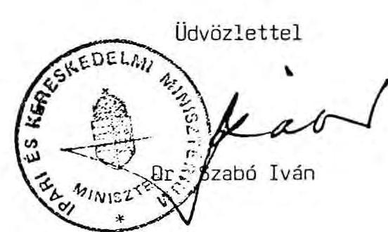

---

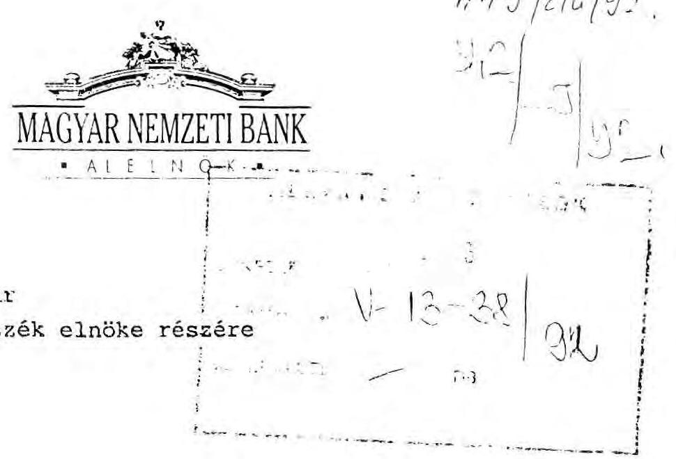

Tisztelt Elnök Úr !

A Szanáló Szervezet megszüntetése és a Reorg Rt. alapítása tárgyában végzett számvevőszéki vizsgálat Magyar Nemzeti Bankot érintő megállapításaival kapcsolatban - figyelemmel az 1989. évi XXXVIII. törvény 25. §-ának (1) bekezdésére - fenntartva az ügyben folyó év június 30 -án dr. Tarafás Imre alelnök úr által aláírt átiratban foglaltakat, a banki álláspontról az alábbiakban tájékoztatom:
1./ A vizsgálat megállapítása szerint (lásd a jelentés 11. oldalát) az MNB 108.022.222,- Ft összegre vonatkozó azonnali beszedési megbízást teljesített annak ellenére, hogy a számlatulajdonos az ilyen jellegű fizetési mód banki teljesítését megtiltotta.
Nem vitatva az MNB eljárásának - adminisztrációs tévedésből eredő - hibás voltát a konkrét ügyhöz a következő észrevételeket fűzzük:
a) Az Általános Vállalkozási Bank Rt. megállapodással ellentétesen alkalmazta az azonnali beszedési megbízást, mert erre a közte és a Szanáló Szervezet közi létrejött és hatályos garanciaszerződés nem jogosította fel; igaz a Bank ezt - megállapodás hiányában tévedésből teljesítette.

---

b) A pénzforgalomra vonatkozó szabályozás azonban nem teszi lehetővé a pénzforgalom lebonyolítására szolgáló bankszámlák esetében a fizetési módok, azon belül is az inkasszó típusú megbízások közül két fizetési mód - nevezetesen a határidős és az azonnali beszedési megbízás - letiltását.
c) A Szanáló Szervezet a szóban forgó számla megterhelése ellen utólag sem emelt kifogást. Amennyiben a számlatulajdonos a bankszámlakivonat kézhezvételét követő 15 napon belül reklamál, a bank helyesbített volna, de a hibát azt követően is egyszerűen korrigálhatta volna a Szanáló Szervezet számlái közötti átvezetési megbízás benyújtásával.
2./ A jelentés 12. oldalán megemlített 232-90202-0048 számú számla egyenlegének átutalása az Ipari Fejlesztési Banknál nyitott számla javára valóban megtörtént. Megítélésünk szerint ez esetben a Nemzeti Bankot felelősség nem terheli, mert a Szanáló Szervezet 1991. december 13-ai megszüntetéséről egyáltalán nem, a számlák áthelyezéséről pedig csak 1992. április 3-án kapott a Bank Folyószámla és elszámolási főosztálya hivatalos értesítést, a Szanáló Szervezet vezetőjének felmentéséről és így a számla feletti rendelkezési jogának megszüntetéséről pedig egyáltalán nem kapott az MNB hivatalos értesítést.

A fentiekben leírtak alapján megállapítható, hogy az MNB a számlavezetésre vonatkozó eljárási szabályoknak megfelelően járt el, banki dolgozó "jogszerűtlenségekkel összefüggésben mulasztásokat" nem követett el. Ennek ellenére a vizsgálat megállapításai alapján a Folyószámla és elszámolási főosztály vezetőjének május 6-i intézkedése alapján - az adminisztrációs tévedésekből eredő hibák elkerülése érdekében - az ellenőrzés

---

megszigorítása mellett, a 10.000.000,- Ft feletti azonnali beszedési megbízásokat teljesítés előtt az ügyintéző köteles közvetlen vezetőjével ellenőriztetni.

Kérem a vizsgálati jegyzőkönyvvel kapcsolatos észrevételeink szíves tudomásulvételét.

Budapest 1992. augusztus 5.

Üdvözlettel:
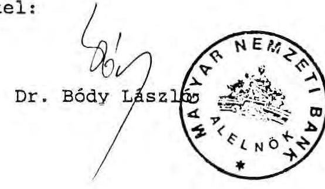

---

# Állami Fejlesztési Intézet 

Vezérigazgató

## Hagelmayer István úr

elnök

Állami Számvevőszék
Budapest

Tisztelt Elnök Úr!

Köszönöm, hogy megküldte a Szanáló Szervezet megszüntetéséről, a REORG Rt. alapításáról készített jelentést.
A jelentés tárgyilagosan, mélyrehatóan elemzi a Szanáló Szervezet működésével, megszüntetésével kapcsolatos anomáliákat. A jelentés összefoglaló megállapításaival, javaslataival messzemenően egyetértünk. Szeretnénk felhívni a figyelmüket arra, hogy az eddig megtett intézkedések a REORG Rt-nél:
"A PM tulajdonába visszakerült társaság fog majd megbízást kapni a szanálások
hátralékos ügyeinek rendezésére, a REORG Rt. felszámolóként történő bírósági
bejegyzését követően a folyamatban lévő felszámolások folytatására." (36. oldal)
még mindig nem rendezik egyértelműen a szanálásokkal kapcsolatos problémákat. A REORG Rt. ugyanis az eddig felszámolás alatt álló, szanálási hitelt kapott 16 db MGTSZ. közül 6-nál kijelölt felszámoló. A jelenlegi jogszabályok nem teszik lehetővé, hogy a kijelölt felszámoló az adott cég $\rightarrow$ hitelezője is legyen. Így amennyiben a REORG Rt. kap megbízást a szanálások hátralékos ügyeinek rendezésére, akkor a már folyamatban lévő, szanálási hitelben részesült MGTSZ-ek felszámolását át kell adnia egy másik felszámolónak. A
 folyamatban lévő felszámolások átadása jelentős mértékben meghosszabbítja a felszámolási eljárás menetét, hiszen a bíróságnak új felszámolót kell kijelölni, a REORG Rt-nek átadás-átvételi jegyzőkönyvet kell készítenie, feltehetően szerződéseket kell módosítani. Úgy véljük, hogy ez a nemrégiben hozott intézkedés vakvágányra vezet, s így célszerű lenne elkerülni.

Budapest, 1992. július 28.
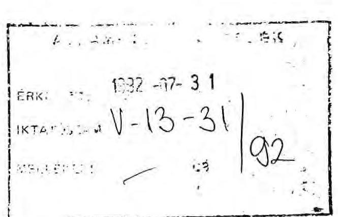

Tisztelettel

## Állami Fejlesztési Intézet

Dr. Széke Miklós

---

# Gazdasági és Pénzügyi Részvénytársaság 1054 Budapest V., Vadász utca 30.   Postacím: 1398 Budapest Pf. 562   Telefax: 131-3323 = Telex: 202-928 

Ügyintéző:
Telefon:
dr. Hagelmayer István úr
elnök

Állami Számvevőszék
Budapest

Tisztelt Hagelmayer Úr!

Köszönettel megkaptam az ÁSZ jelentését a Szanáló Szervezet megszüntetése, a REORG Rt alapítása tárgyában végzett vizsgálatról.

A jelentésben foglaltakra - elsődlegesen a III. fejezet összefoglaló következtetésekre, javaslatokra koncentrálva - az alábbi fontosabb észrevételeket teszem:

1) A jelentés számos hasznos információt adott számomra. Összességében azonban úgy érzékelem, hogy elsősorban a vagyonvédelemmel, a gazdálkodással kapcsolatban feltárt hiányosságok ismertetése, az átfogó megítélés és minősítés nélkül akaratlanul is egyoldalú képalkotást vált ki az informáltak körében súlyukkal, jelentőségükkel nem arányos benyomásokra késztet. Így fennáll az a veszély - figyelembe véve, hogy a jelentés nyilvánosságot kap -, hogy a részvénytársaságnak érdemtelenül komoly anyagi és erkölcsi kárt okoznak.
2) Az alapító okirat 119/a. pontja nem a PM, hanem a többi részvényes miatt került megfogalmazásra. A külső részvényeseket kívánta kizárni a konkurenciával való együttműködéstől. Az alapító okirat szóban forgó része kétségtelenül szerencsétlen módon került megfogalmazásra és ezért sürgős

---

módosítást igényel. Ebből azonban nem következtetnék arra a magatartásra, hogy a pénzügypolitikáért felelős országos hatáskörű közigazgatási szerv az átfogó jogosítványait kizárólag egy társaságra engedte át.
3) A jelentés megállapítása szerint a KVSZ az "egyéb vagyoni elemek tekintetében nem intézkedett". A megállapítás kiegészítés nélkül mindenki számára azt a következtetést kínálja, hogy a szóban forgó vagyonrész "elveszett". Már korábban is bemutattuk, hogy e vagyoni elemek a REORG Rt PM tulajdonosi hányadának apport részei. A pénzmaradványként kimutatott 931 eFt egyenlegéről írottakat javaslom konkretizálni, mert így nem érthető, olyan benyomást támaszt, mintha még ezután kellene azt megkeresni.
4) Nem pontos az a megfogalmazás, hogy a gyűjtőszámláról "kamatmentes kölcsönt is folyósítottak".
A gyűjtőszámláról több, számos esetben történt kölcsön folyósítás. Ezek közül egy esetben tévedésből kamatmentes volt az átutalás. Utólag ezt az ügyet is rendezték, a cég a kamatot megfizette.
5) A vizsgálat során az is bizonyítást nyert, hogy a gyűjtőszámla mozgása az analitikában nyomon követhető volt. Ez a megoldás a pénztulajdonosoknak nem kárt, hanem egyértelműen hasznot hozó tevékenység volt.
6) Az irodahelyiségek használatánál kérem figyelembe venni, hogy a REORG Rt alapításánál a PM tulajdona 51 \% volt, jelenleg 85 \% és napokon belül $100 \%$ tulajdonú lesz. Ebben az összefüggésben a használati jogról való ingyenes lemondás erősen túlzott megfogalmazásnak tűnik.

---

7) A REORG Rt - a megállapodás alapján - a Szanáló Szervezet által megkezdett felszámolásokat folytatja. A bíróságok gyakorlata ebben különböző: van olyan, aki erről végzést adott, van aki ezt szóban közölte. Így méltánytalan ezt az ügyet a REORG Rt-nek felróni, különösen olyan megfogalmazásban, hogy "a bírósági kijelöléssel megkezdett 163 felszámolási ügyet jogosulatlanul folytatja és intézi".
8) Felhívjuk szíves figyelmüket, hogy nem egyértelmű, nem alátámasztott a díjbevétellel kapcsolatos megállapítás, ezért kérjük ezt mégegyszer átgondolni.

A Szanáló Szervezet 3 gazdálkodó szervezetnél fejezte be a felszámolást és született jogerős végzés. A felszámolói díjat a bíróság hagyja jóvá.

Így nem tudom megerősíteni azt a hozzávetőleges megállapítást, miszerint "minimálisan 175.126 eft díjbevétel kizárólag a Szanáló Szervezet működése alatt keletkezett", és "mintegy 200-300 MFt az az összeg, amivel a REÓRG Rt jogalap nélkül gazdagodik". A zárójeles példaként kiragadott(?) Péti Nitrogénműveknél elérhető felszámolói díj ( 95.517 MFt), eddig a legjelentősebb, kivételes összeg amit realizálni fog a cég. Ez a jelentős vagyonértékesítés, a gazdaságos működtetés és a jó pénzügyi, gazdálkodás eredménye. Ugyanakkor számtalan gazdálkodó szervezetnél - a 163-ból ez a többség - nincs vagy csak jelentéktelen bevételre lehet szert tenni, holott a felszámolási költségek itt is felmerülnek. A bevételek megítélésénél, különösen akkor, ha szélsőséges példa bemutatására is sor kerül, kérem e körülményeket is figyelembe venni.

---

9) A felszámolás időigénye valóban jelentős. Ebben a felszámoló kompetenciájába tartozó tevékenység a legrövidebb időtartamú. Az időigényes tevékenységek: a peres ügyek; a kinnlévőségek behajtása; fizetőképes vevő felhajtása, majd vele az adás-vételi szerződés megkötése és a bevétel realizálása.

A jelentés nem tér ki arra, hogy "időben elhúzódó felszámolási ügyek" kritikája a felszámoló cégre, vagy a felszámolási folyamatok teljes infrastrukturájára vonatkozik? Tudomásom szerint a felszámolás folyamata az előzőekben jelzett okok miatt valamennyi ezzel foglalkozó szervezetnél jelentős időigényű, de a nemzetközi tapasztalatok is ezt támasztják alá.
10) Az állami szanálással kapcsolatban kérem a korábbi jelentésben foglaltakat hasznosítani.

A Pestvidéki Gépgyárral kapcsolatban kérem a PM jelentésben foglaltakat hasznosítani.

A Nyírlugosi Állami Gazdaságnál a vagyonértékesítés valóban eddig eredménytelen. Sajnos ilyen is előfordul, olyan szervezeteknél, ahol a pénzügyi hiány együtt jelenik meg a versenyképtelen tevékenységgel egy általánosan is ható dekonjunkturális gazdasági közegben.
11) Nem világos számunkra, hogy a javaslatok között mire alapozzák azon megállapításukat, hogy "jogalap nélkül, a szakmai kapacitásait meghaladó" ügyeket irányított át a REORG Rt-hez.

---

Kérem, hogy jelen észrevételeimet ill. 1992. július 24-én megküldött megjegyzéseimet a jelentés véglegesítésénél figyelembe venni szíveskedjék.

Budapest, 1992. július 31.
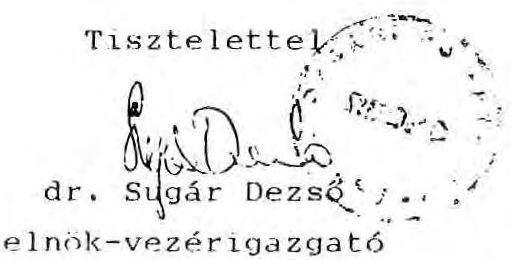