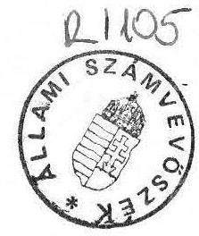
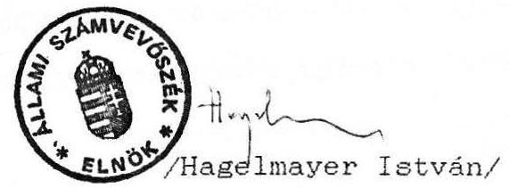
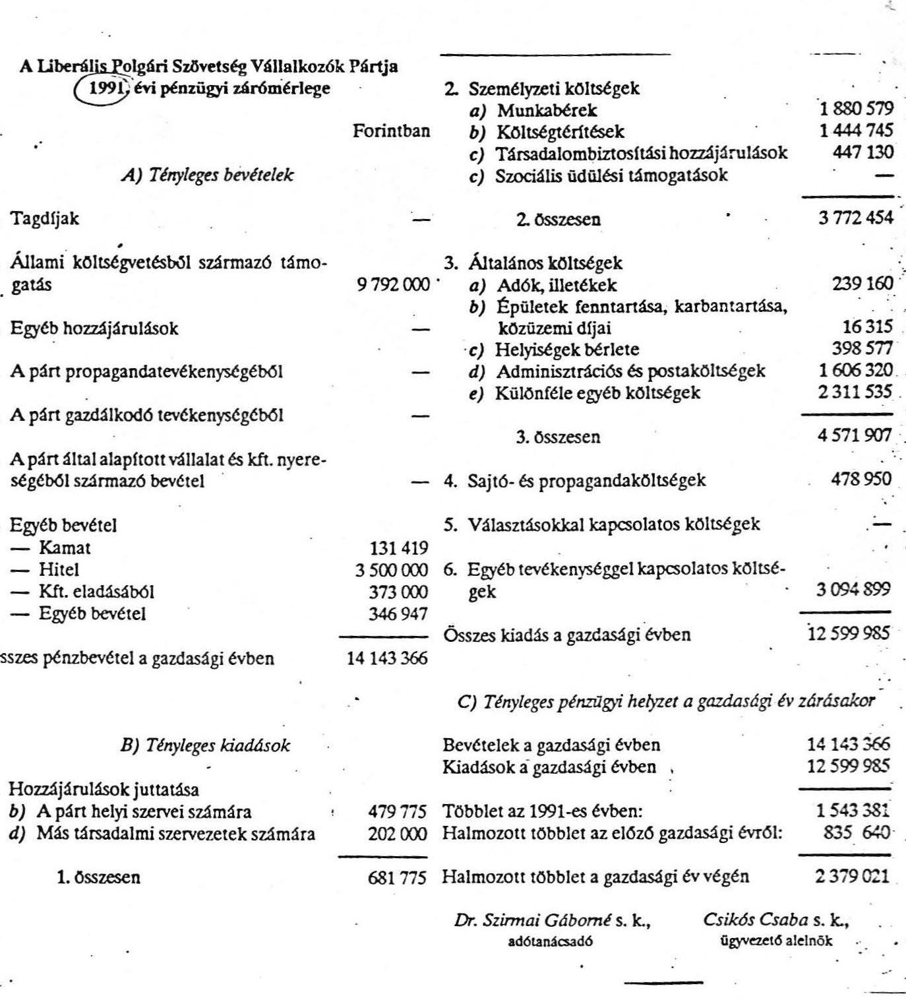

# 2001. évi Állami Számvevőszék

## JELENTÉS

a Liberális Polgári Szövetség (Vállalkozók Pártja)
1991. évi gazdálkodása törvényességének
vizsgálatáról

---

A vizsgálatot vezette: Berzétey Attiláné számvevő

A vizsgálatot végezték: Ecsy Lajosné szakértő
Gyarmati Béla szakértő
dr. Velényi János szakértő

---

# Jelentés

a Liberális Polgári Szövetség /Vállalkozók Pártja/
1991. évi gazdálkodása törvényességének vizsgálatáról

## I.

A vizsgálat célja, időszaka, módszere, körülményei

A pártok működéséről és gazdálkodásáról szóló törvény (továbbiakban: párttörvény) kizárólagosan az Állami Számvevőszék (továbbiakban: ASZ) feladatául jelöli ki a pártok gazdálkodása törvényességének ellenőrzését. Az ASZ a törvény felhatalmazása alapján évente legalább egyszer köteles ellenőrizni azoknak a pártoknak a gazdálkodását, amelyek az adott évben állami költségvetési támogatásban részesültek.

A Liberális Polgári Szövetség /Vállalkozók Pártja/ (továbbiakban: párt) az 1990. évi általános országgyűlési választásokon elért eredménye alapján - a párttörvényben előírt elosztási szabályok szerint - rendszeres állami költségvetési támogatásban részesül. Ennek megfelelően a párt 1991. évben 9.792 E Ft állami költségvetési támogatást kapott.

A törvényességi vizsgálat célja annak ellenőrzése volt, hogy a párt gazdálkodása mennyiben felelt meg a párttörvény előírásainak, továbbá betartották-e a könyvvitel-, a számvitel bizonylati rendjéről szóló és a gazdálkodással összefüggő egyéb hatályos rendelkezések előírásait.

A vizsgálat alapvetően az 1991. évi gazdálkodásra terjedt ki. A párt gazdálkodása törvényességének ellenőrzése a Magyar Közlöny 1991. évi 28. számában közzétett ASZ általános ellenőrzési program szempontjainak megfelelően történt.

Az ASZ ellenőrizte az 1991. évi gazdálkodásról közzétett pénzügyi zárómérleg teljeskörűségét, pontosságát, a könyvvezetés

---

gyakorlatát, bizonylati alátámasztottságát, a számvitel bizonylati rendjének betartását. A vizsgálat kiterjedt a párt által végzett vállalkozás jellegű gazdálkodási tevékenységre is. Az ASZ vizsgálat elsősorban arra összpontosult, hogy a párt működéséhez szabályszerűen igénybevehető forrásokat használt-e fel, gazdálkodó tevékenysége megfelelt-e a párttörvényben megengedett tevékenységeknek, betartotta-e a gazdálkodással összefüggő pénzügyi-számviteli és egyéb szabályokat.

A jelentés megállapításai az Országos Elnökségnél, továbbá a Szabolcs-Szatmár-Bereg; a Jász-Nagykun-Szolnok; a Veszprém megyei Koordinációs Bizottságnál, valamint a Tatabányai Helyi Csoportnál lefolytatott helyszíni ellenőrzés tapasztalatain alapulnak.

# II. 

A párt 1991. évi pénzügyi zárómérlegének ellenőrzése
A párt a Magyar Közlöny 1992. évi 33. számában tette közzé az 1991. évi gazdálkodásáról készített pénzügyi zárómérleget (a jelentés 1. sz. melléklete) a párttörvény mellékletében előírt szerkezetben és a párttörvény 9. paragrafusában meghatározott határidőre.

A pénzügyi zárómérleg pontosságának és teljeskörűségének vizsgálata során az ellenőrzés az alábbiakat állapította meg:

- a mérleg nem tartalmazza a párt 18 megyei és 240 helyi szervezetének gazdálkodási adatait. A párt Országos Elnöksége (továbbiakban: Központ) az önálló jogi személyiségű és így pénzügyi önállósággal rendelkező megyei és helyi szervezetek gazdálkodása elszámolásának és mérlegkészítésének szabályait nem alakította ki. A pénzügyi zárómérleg összeállításához csak utólag, a mérleg megjelentetése határidejének utolsó napján kérte be területi szervezetei adatait.
- A mérleg közzététele óta beérkezett mérlegadatok (így pl. a tagdíjak) összesítését a Központ a vizsgálat időpontjáig nem végezte el.
- A Magyar Közlönyben megjelent pénzügyi zárómérleg kizárólag

---

csak a párt központjának 1991. évi adatait tartalmazza. Emellett a megjelentetett pénzügyi zárómérleg a Központnál tapasztalt nem megfelelő bizonylati fegyelem, könyvelés, a pénzkezelés ellenőrzés által észlelt hiányosságai miatt is pontatlan, nem a valós helyzetet tükrözi. A Központ adatai alapján kimutatott pénzügyi helyzet nem a tényleges állapot szerinti.
Így pl.:
= Tagdíjak címén bevételt a mérlegben nem tüntettek fel, holott a párt helyi csoportjainál voltak tagdíjbevételek. (Pl. a tatabányai helyi csoport vizsgálatának megállapítása szerint 36.644 Ft volt a tagdíjbevétel.)
= Az egyéb bevételek között a mérlegben téves és hiányos adatok szerepelnek. A kamat soron feltüntetett 131.419 Ft összeg téves, a könyvelésben elszámolt összegnél 2.430 Ft-tal kevesebb.

A hitel soron lévő 3.500 E Ft-ot tévesen vették be a mérlegbe, mert az nem bevétel, hanem átfutó tétel, amelyet évközben elszámolási rovaton bevételként és kiadásként elszámoltak.
= Az egyéb bevétel soron feltüntetett összegben szerepel 155 E Ft, elszámolási előlegből származó házipénztári bevétel, amely átfutó elszámolás bevételnek, de nem tényleges bevételnek minősül.
Az e soron feltüntetett összeg jogcímek szerinti részletezését a párttörvénynek a mérleg kitöltésére vonatkozó előírásai ellenére nem végezték el.
= A párt területi szervezetei számára adott hozzájárulások címén a mérlegben feltüntetett kiadás összege nem egyezik meg a központban vezetett naplófőkönyv szerinti összeggel.
= A más társadalmi szervezeteknek adott juttatás összegében tüntettek fel helyi szervezetnek adott támogatást, ezért a mérlegben szereplő adat téves.
= A személyzeti költségek között a munkabérek soron feltüntetett 1.880.579 Ft kiadás nem egyezik a naplófőkönyv és a mérleg összeállításához készített munkalap adataival; a mérleg a naplófőkönyvnél 127.506 Ft-tal kisebb összeget tartalmaz.
= A társadalombiztosítási hozzájárulások soron 447.130 Ft a kiadás. A könyvelés ezzel szemben ilyen címen 372.978 Ft-ot mutat. Tehát a mérlegben ilyen címen kimutatott kiadásból 74.152 Ft a könyvelés alapján nem tekinthető bizonyítottnak.
= A költségtérítésként beállított 1.444.745 Ft kiadás a mérlegben 11.882 Ft-tal nagyobb a könyvelés adatánál, ennek nincs bizonylati alátámasztása.
= Az általános költségek, sajtó- és propaganda költségek, és az egyéb tevékenységekkel kapcsolatos költségek részletezését a naplófőkönyvben nem végezték el, hanem a fenti jogcímeken felmerült kiadásokat együtt az "egyéb kiadások" oszlopban könyvelték.

A párt az 1991. évi zárómérlegében 2.379.021 Ft halmozott többletet mutatott ki a gazdasági év végén. Ez az összeg azonban több szempontból sem tükrözi a párt tényleges pénzügyi helyzetét. Alapvetően azért nem, mert nem tartalmazza a párt megyei bizottságai és helyi csoportjai által kezelt bankszámlák és pénztárak 1991. évi nyitó- és záróegyenlegeit, az előző gazdasági évről származó halmozott többlet összege sem egyezik meg az 1990. évi helyesbített zárómérleg adatával. Továbbá a mérlegben kimutatott bevételek és kiadások nem a valóságos állapot szerintiek.

Fentiek miatt a párt pénzügyi zárómérlegében közzétett adatok nem tekinthetők teljeskörűnek és megalapozottnak.

---

# III. 

A párt pénzügyi zárómérlege megalapozottságát szolgáló
könyvvezetés, analitikus nyilvántartási és bizonylati rend ellenőrzése

A párt nem egységesen alkalmazza a választható könyvvezetési módokat. A Központ, a Szabolcs-Szatmár-Bereg, a Veszprém, a Szolnok megyei Koordinációs Bizottság könyvvezetési kötelezettségét 1991. évben az egyszeres könyvvitel előírásai szerint teljesítették. A Tatabányai Helyi Csoport bankforgalmát egy "átirótömbben", készpénzforgalmát "pénztárjelentésben" vezeti.

A Tatabányai Helyi Csoport könyvelése tartalmazza a Komárom-Esztergom megyei, a Veszprém megyei szervezet könyvelése a Pápa Városi Helyi Csoport, a Szolnok megyei szervezet könyvelése a városi helyi csoport pénzforgalmi adatait is.

A Központ 1991. év folyamán január 1-től június 30-ig az APEH által hitelesített naplófőkönyv szerinti kézi könyvelést (Kecskeméten), majd ezt követően (Budapesten) november 30-ig a gazdasági műveletek könyvviteli elszámolását számítógépes feldolgozással végezte. 1991. december 1-től december 31-ig ismételten naplófőkönyvben kézileg vezették a könyvviteli nyilvántartást. A három külön vezetett könyvelés adatait egy munkalapon összesítették.(A párt által elkészített 1991. évi pénzügyi zárómérleg adatait ennek alapján állították össze.)

A könyvvezetéssel, az analitikus nyilvántartások vezetésével és a bizonylati fegyelemmel összefüggésben számos szabálytalanságot észlelt az ellenőrzés, amelyek alapvető oka arra vezethető vissza, hogy a párt nem rendelkezett a szervezet alapvető működéséhez, szervezettségéhez szükséges szabályzatokkal (házipénztári pénzkezelési, bizonylati, leltározási és selejtezési stb. szabályzatok).

Az ellenőrzés a legtöbb szabálytalanságot a Központ vizsgálata során tárta fel. Ezek közül példaként az alábbiak emelhetők ki.

1/ A könyvvezetés vonatkozásában:
= A pénztárban lévő készpénz állományáról - sem az 1990. évi záró, sem az 1991. évi nyitó és zárókészletről -

---

leltárt nem készítettek, így a kimutatott pénztári készpénzállomány dokumentummal nincsen alátámasztva. A jogszabályban előírt negyedévenkénti zárlatot az ott meghatározott formában, külön sorban nem végezték el.
= Az 1991. évben végzett kézi könyvelés a naplófőkönyvben a gazdasági eseményeket nem minden esetben a tényleges időpontban rögzítette.
= Az 1991. március 18-án megnyitott 02517-8 sz. OTP csekkszámlára - az 1. sz. OTP kivonat tanúsága szerint a párt által befizetett 250 E Ft, illetve 9 Ft kezelési költség könyvelésének nincs nyoma. A 2., 3. sz. bankkivonatokat, illetve a kivonatokhoz mellékelt pénzforgalmi bizonylatokat az ellenőrzésnek nem tudták bemutatni.
2. Az analitikus nyilvántartások vonatkozásában a könyvelés alapjául is szolgáló kötelező nyilvántartásokat nem vezetik hiánytalanul:
= A párt 1991. évben több pénzforgalmi jelzőszámmal rendelkezett. A naplófőkönyvi könyvelés nem teszi lehetővé több bankszámla egyenlegének elkülönített figyelését. Ezért ezek forgalmának figyelésére külön analitikus nyilvántartás vezetését írja elő a jogszabály. A párt ilyen nyilvántartást nem vezetett.
= A tulajdonukban lévő állóeszközökről egyedi nyilvántartó lapokat vezetnek, amelyek az állóeszközökre vonatkozó jellemző adatokat tartalmazzák. Az állóeszközökről azonban 1991. évben leltár felvételére nem került sor. Ennek hiányában az 1991. év december 31.-i állóeszköz állomány leltárral nem támasztható alá.
Az analitikus nyilvántartólapok vezetésénél elmulasztották - egyes vagyontárgyak esetében - az egyedi kartonra rávezetni, hogy azok kinek a használatában és hol vannak elhelyezve. Az átadások tényét átvételi elismervényen a vagyontárgyat átvevők aláírásukkal elismerték, azonban ezt a tényt az egyedi nyilvántartó lapokon nem vezették át.
= A Központ bérnyilvántartó lapokat vezet az általa alkalmazott dolgozókról. Ezeknek kitöltése nem minden esetben történik meg maradéktalanul. Így pl. a munkaviszony megszüntetését több esetben a nyilvántartó lapokon nem tüntették fel.
= Nincs naprakész nyilvántartás a vevő tartozásokról és a szállítói követelésekről.
= A szigorú számadási kötelezettség alá vont bizonylatok készletéről - mint pl. a bevételi és kiadási pénztárbizonylatok - a gazdálkodó szervek nyilvántartást kötelesek vezetni. Ezt a kötelezettségét a párt elmulasztotta. Ennek hiányában a vizsgált időszakban felhasználásra került bevételi, illetve kiadási pénztárbizonylatok tömbjeinek mennyisége megnyugtató módon nem volt megállapítható.

3/ A könyvelés alapjául szolgáló bizonylatok kiállítása - mind a Központnál, mint a vizsgált területi szervezeti egységeknél - számtalan esetben nem felelt meg a számvitel bizonylati rendjéről szóló jogszabály előírásainak. Az ellenőrzés folyamán feltárt hiányosságokat a központ, illetőleg a területi szervezetek vizsgálatáról készült részjelentésekben az ellenőrzés konkrétan felsorolta. A leggyakrabban előfordult hiányosságok a következőkben foglalhatók össze.

- A pártnál nem szabályozták megfelelően a szervezeti, működési és bizonylatolási kérdéseket. Tisztázatlanok voltak a kötelezettségvállalási és utalványozási jogosultságok. Nem szabályozták a saját gépkocsi használattal összefüggő költségtérítés elszámolásának gyakorlatát.
Fentiek következtében gyakori, hogy:
= a saját személygépkocsi igénybevétele nincs engedélyezve a kiküldetési nyomtatványon;
= a kiadási pénztárbizonylatokon hiányzik az utalványozó, valamint a pénz felvevőjének aláírása;
= gyakori a bizonylat nélküli kifizetés;
= ugyanazon időpontra vonatkozóan - szabálytalanul benzinszámla és útiköltségelszámolás alapján is fizettek ki költségtérítést;
= a költségelszámolásokat nem ellenőrizték (így pl. Budapest-Ferihegy vonatkozásában 160 km után került a költségtérítés elszámolásra);
= a bevételi és kiadási pénztárbizonylatok hibás kiállítása esetén a stornírozást nem az előírt módon végzik;
= az egyes időszakok pénzmozgásairól vezetett pénztárjelentés előírt lezárása nem rendszeres és nem pontos;
= az elszámolási előlegek kezelésének vizsgálata során az ellenőrzés 45 E Ft házipénztárba való visszafizetését a bizonylatok felülvizsgálása során nem tartotta bizonyítottnak. Az összeg állítólagos befizetését a párt akkori elnöke nevére - szabálytalanul - a Postabanknál megnyitott betétszámlán elhelyezett 1.000 E Ft elszámolása során mulasztották el bizonylattal dokumentálni.

4/ A párt alapszabálya szerint a gazdasági

 folyamatok ellenőrzése az Ellenőrzési Bizottság feladata.

Az 1991. évi gazdálkodási folyamatok szúrópróbaszerű vizsgálata folyamán az ellenőrzés nem talált az egyes bizonylatokon az Ellenőrző Bizottság ellenőrzésére utaló megjegyzést, holott a párt elnökségi ülésein felvett jegyzőkönyvek, valamint az Ellenőrző Bizottság jelentéseinek tanúsága szerint a párt vezető testületeit rendszeresen tájékoztatták a párt gazdálkodásában észlelt hiányosságokról, legutóbb 1991. XI. hó 27-én kelt az Országos Elnökség részére készült jelentésben.
A párt gazdálkodási fegyelme 1992. évben kezdett megszilárdulni, az időközben újjáválasztott vezetőség intézkedésére.

Az ellenőrzés megállapítása szerint a párt 1991. évi gazdálkodási tevékenységére kedvezőtlen hatással volt a vezető tisztségviselő személyek körének gyakori változása. A tárgyévben pl. 4 pártelnök, 3 gazdasági alelnök és 2 főkönyvelő váltotta egymást.

Az 1992. évben a vizsgálat idején a párt már rendelkezik több szabályzattal, de pl. a házipénztári pénzkezelés szabályzata még nincs elfogadva. A gazdasági folyamatok könyvelését számítógépen, a párttörvény követelményeinek megfelelően részletezett módon, a számviteli törvény előírásait is figyelembe véve végzik, így a vizsgált évre vonatkozóan megállapított hiányosságok kiküszöbölése biztosítottnak látszik.

---

# IV. 

## A gazdálkodási tevékenység ellenőrzése

1. A Központ 1991. évben döntően állami költségvetési támogatásból (92%); lekötött pénzeszközeinek kamataiból (1,2%), továbbá egyéb tevékenységből származó bevételeiből (6,8%) gazdálkodott.

A megyei Koordinációs Bizottságok a Központ által leutalt állami költségvetési támogatásból, valamint a helyi csoportok beszedett tagdijának 20%-ából, a helyi csoportok a tagok által befizetett tagdijból és pénzadományokból gazdálkodtak. Vállalkozó tevékenységet nem végeztek.

A megyei Koordinációs Bizottságok, a Központ és a helyi csoportok - az alapszabályban elfogadottak szerint - önálló jogi személyek azzal a kikötéssel, hogy fedezet nélküli kockázatot a párt felsőbb szerve engedélyével vállalhatnak. A megyei szervezetek, valamint a helyszínen vizsgált helyi csoport önálló elszámolási számlával rendelkeznek.
A párt működéséhez biztosított költségvetési támogatás felhasználásáról elnökségi határozat rendelkezik:

- a támogatás havi összegének 20%-át minden hónapban -taglétszám-arányosan - felosztják azon megyék között, amelyek minden hó 10-ig jelentik létszámukat a Központnak. A tárgyévben mindössze 8 megyei Bizottság részesült költségvetési támogatásban, a helyi csoportok támogatást nem kaptak.

A Központ a tárgyévben a párttörvényben felsorolt tiltott pénzforrásokat nem fogadott el, tárgyi adományt nem kapott, vállalatot nem alapított, pénzeszközeit értékpapírba nem fektette. Egyéb tevékenységből származó bevételei között a pártot szimbolizáló tárgyak /jelvény, körcimke, zászlók stb./ értékesítéséből, kamatból és Kft átruházásából származó, továbbá a "Magánerő" c. lap 1990. évi terjesztéséből tárgyévre áthúzódó bevételei szerepeltek.
Ez utóbbi már - az előző ASZ vizsgálat által is megállapított - tiltott tevékenységgel azonban az év folyamán felhagytak.
2. A Központ 1991. évben a párttörvény 6. paragrafus (3) be-

---

kezdésében megengedett egyszemélyes Kft-ket működtetett:

- a Magánerő Kereskedelmi és Lapkiadó Kft-t, valamint a Profi Fruct Kereskedelmi Kft-t. Ez utóbbit 1991. VII. 10. napján érvényes átruházási szerződéssel magánszemély részére átruházták, ebből 373 E Ft bevételre tettek szert.

A párt 1991. II. 22-én kezdeményezte a Magánerő Kft felszámolására irányuló eljárást, amelyet a Bács-Kiskun megyei Bíróság 1991. XI. 12-én megindított. Felszámolóként az Állami Fejlesztési Intézetet jelölte ki. A felszámolási eljárásról szóló közlemény a Magyar Közlöny 1991. XI. 19.-i számában megjelent. A végzést hivatalosan a párt is megkapta, azonban a vizsgálat idejéig nem jelentette be a felszámolónak hitelezői követelését, kérve annak érvényesítését a felszámolás során.

Az 1991. év folyamán a párttörvény előírásaival ellentétes tevékenységeket - amelyeket már az 1991. évben végzett ASZ ellenőrzés is kifogásolt - megszüntették.

# V. 

## ÖSSZEGZÉS

Összességében megállapítható, hogy a párt (ezen belül különösen a Központ) 1991. évi gazdálkodása, - alapvetően a pénzügyi, bizonylati fegyelem - nagyfokú rendezetlenséget, szervezetlenséget mutatott. Az 1992. év folyamán azonban lépéseket tettek a gazdálkodási fegyelem megszilárdítására. A törvénysértő tevékenységeket megszüntették, az 1992. május 30-i kongresszuson újjáválasztották a vezetőséget, amely garancia lehet arra, hogy a párt gazdálkodási fegyelme tartósan megszilárduljon. A vizsgálat idején tapasztalt pozitív tendenciák figyelembevételével az 1991. évi szabálytalanságok miatt az ellenőrzés az alábbi törvényességi felhívásban foglaltakat kezdeményezi.

---

# VI. 

## Felhívás a feltárt hiányosságok megszüntetésére

A pártok működéséről és gazdálkodásáról szóló, többször módosított 1989. évi XXXIII. tv. 10. paragrafus (4) bek. alapján felhívjuk a párt elnökét:

- jelentesse meg a Magyar Közlönyben a párt 1991. évi gazdálkodásáról készült, helyesbített pénzügyi zárómérleget;
- haladéktalanul intézkedjék a számviteli, bizonylati fegyelem maradéktalan betartása, a hiányzó szabályzatok elkészítése, a gazdálkodással összefüggő jogszabályok előírásainak betartása, a belső ellenőrzés hatékony működtetése iránt;
- saját hatáskörében tegye meg a szükséges intézkedéseket a volt pártelnök által felvett 1.000 E Ft elszámolásánál feltárt 45 E Ft összegű eltérés rendezésére.

Budapest, 1992. július 31.

Melléklet: 1 db

---

# A Liberális Polgári Szövetség Vállalkozók Pártja (1991) évi pénzügyi zárómérlege 

1. Tagdíjak
2. Állami költségvetésből származó támogatás
3. Egyéb hozzájárulások
4. A párt propagandatevékenységéből
5. A párt gazdálkodó tevékenységéből
6. A párt által alapított vállalat és kft. nyereségéből származó bevétel
7. Egyéb bevétel

- Kamat
- Hitel
- Kft. eladásából
- Egyéb bevétel

Összes pénzbevétel a gazdasági évben
B) Tényleges kiadások

1. Hozzájárulások juttatása
b) A párt helyi szervei számára
d) Más társadalmi szervezetek számára
2. összesen
3. Általános költségek
a) Adók, illetékek
b) Épületek fenntartása, karbantartása, közüzemi díjai
c) Helyiségek bérlete
d) Adminisztrációs és postaköltségek
e) Különféle egyéb költségek
3. összesen
4. Sajtó- és propagandaköltségek
5. Választásokkal kapcsolatos költségek
6. Egyéb tevékenységgel kapcsolatos költségek
Összes kiadás a gazdasági évben
C) Tényleges pénzügyi helyzet a gazdasági év zárásakor

Bevételek a gazdasági évben
Kiadások a gazdasági évben
479775 Többlet az 1991-es évben:
202000 Halmozott többlet az előző gazdasági évről:
681775 Halmozott többlet a gazdasági év végén
Dr. Szirmai Gábor m. k., a döntéshozó

14143366
12599985
1543381
835640
2379021
Csikós Csaba s. k., ügyvezető alelnök

