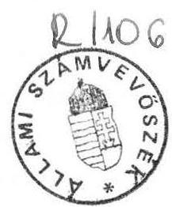
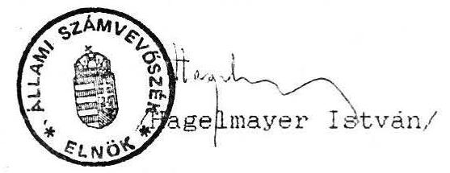

# Állami Számvevőszék

## JELENTÉS

a Magyarországi Szlovákok Szövetségének
1991. évben juttatott állami költségvetési támogatás
felhasználásának ellenőrzéséről

---

Az ellenőrzést vezette: dr. Elek János főtanácsos

Az ellenőrzést végezték: Tóth István tanácsos
Hoffmann István számvevő
Bárczai Tibor szakértő
Sörös István szakértő
dr. Ocsovai Sándor szakértő

---

Állami Számvevőszék
$\mathrm{V}-1014 / 4 / 92$

# Jelentés   a Magyarországi Szlovákok Szövetsége 1991. évi gazdálkodásának ellenőrzéséről

I.

A vizsgálat körülményei, célja, módszere

Az Állami Számvevőszékről szóló törvény értelmében az Állami Számvevőszék (továbbiakban: ASZ) ellenőrzi az állami költségvetésből juttatott támogatás felhasználását a társadalmi szervezeteknél. Az Országgyűlés a 6/1991.(II.11.) sz. határozatában döntött a nemzetiségi és etnikai kisebbségi szervezetek 1991. évi állami költségvetési támogatásáról, amely egyben megismételte az ASZ ellenőrzési jogosultságát. E határozat alapján az Országgyűlés Emberi jogi, kisebbségi és vallásügyi bizottsága külön megkeresésében is igényelte az ASZ-tól az említett szervezetek ellenőrzését.

A szlovák szervezetek részére - szervezeti és működési költségeik fedezésére - 1991. évre az Országgyűlés 1991. februári ülésén 20,5 M Ft-ot hagyott jóvá. A többi nemzetiségi szervezetektől eltérően az Országgyűlés nem döntött viszont abban, hogy a fenti összeg konkrétan kinek utalható. A felosztásról és kiutalásról az Országgyűlés Emberi jogi, kisebbségi és vallásügyi bizottsága által kezdeményezett megbeszélésen - az érintett szlovák szervezetek között - az alábbi megállapodás született:

- az összegből csak az országos társadalmi szervezetek igényelnek működésükre összeget és erre figyelemmel a pályázók a

---

20,5 M Ft-ot a következőképpen osztották fel:
Magyarországi Szlovákok Szövetsége 17,6 M Ft
Szlovákok Szabad Szervezete 2 M Ft
Mo-i Szlovák Fiatalok Szervezete 0,9 M Ft

Erre figyelemmel az ASZ a szlovák szervezetek részére 1991. évre jóváhagyott állami költségvetési támogatás felhasználását a 3 szervezet közül - a legnagyobb pénzfelhasználónál - a Magyarországi Szlovákok Szövetségénél (továbbiakban: Szövetség) ellenőrizte.

Az ellenőrzés célja annak értékelése volt, hogy a Szövetség az állami költségvetési támogatást - az Országgyűlés határozatában foglaltakra is figyelemmel - az alapszabályában megfogalmazott tevékenységi célnak megfelelően használta-e fel és ezt a célt a lehető legkisebb eszköz- illetve pénzfelhasználással valósította-e meg.

Az ellenőrzés során figyelemmel kellett lenni arra, hogy a nemzetiségi és etnikai szervezetek alapvetően nonprofit érdekeltségű társadalmi szervezetek, valamint, hogy tevékenységük jelentős mértékben politikai döntési folyamatok által formált. Ebből adódóan pénzügyi kihatású intézkedések tervezése, végrehajtása is túlnyomórészt meghatározott.

Ugyancsak tekintettel kellett lenni arra is, hogy e szervezetek állami költségvetési támogatásának rendszere 1991. évtől megváltozott. Ugyanis a Szövetség 1990. év végéig rendszeres állami költségvetési támogatásban részesült, amely lefedte a teljes működésének kiadásait. Ebből adódóan a Szövetség ebben az időszakban költségvetési szervezetként gazdálkodott, pénzügyi tervezését a költségvetési szervekre vonatkozó szabályok figyelembevételével készítette.

---

A Szövetség szervezetére és működésére vonatkozó fontosabb információkat az 1. sz. melléklet tartalmazza.

A vizsgálat a lezárt 1991. gazdálkodási évre terjedt ki. Az ASZ a pénzfelhasználást a Szövetség Titkárságán található dokumentumok alapján vizsgálta.

# II.

Az 1991. évi tényleges pénzfelhasználás ellenőrzési tapasztalatai

1/ A Szövetség pénzfelhasználásának teljeskörű megítélését nehezítette az a körülmény, hogy sem az 1991. évben rendelkezésre álló források tényleges nagysága, sem a kiadások tényleges összege nem állapítható meg teljeskörűen.
a/ Az ellenőrzés a Szövetség könyveléséből készített kigyűjtésből megállapította, hogy a Szövetség bevétele 21.797 E Ft volt. Ez az összeg azonban nem tartalmazta a Szövetség területi és helyi szervezeteinek bevételeit. Ezekről ugyanis a Szövetségnek hitelt érdemlő információja nincs. A pénzügyi levelezésből pedig egyértelműen valószínűsíthető, hogy esetenként nem könyvelt bevételek is vannak.
b/ Az ellenőrzésnek a könyvelés adatai alapján készített kimutatása szerint a Szövetség összes kiadása 22.163 E Ft volt. A kiadások könyvelése nem teljeskörű, mert egyrészt a Szövetség könyvelése a területi és helyi szervezetek kiadásaként nem a teljes kiadásukat, hanem csak a központból nekik kiutalt támogatásokat tartalmazza, másrészt a területi és helyi szervezeteknek kiadott pénzeket

---

egyúttal tényleges kiadásként könyvelték el, miközben az egyes felvevők jelezték, hogy a pénz egy részét nem költötték el. Ezzel a tényleges pénzmaradvány is torzult.

2/ A Szövetség költségvetési terve és az Országgyűlés Emberi jogi, kisebbségi és vallásügyi bizottságának megküldött beszámolója a kiadásokat egyaránt költségnemek szerint tartalmazza. A könyvelés alapján összeállított bevételeket és kiadásokat a 2/a és 2/b sz. melléklet tartalmazza. A pénzfelhasználásokat tekintve ezeket a kiadásokat 3 költségviselő szerint lehet csoportosítani:

- A Szövetség központi működésével kapcsolatos kiadások;
- a Szövetség Kutató Intézetének működési kiadásai;
- a Szövetség területi és helyi szervezeteinek és más szervezeteknek - a Szövetség célja szerinti tevékenység támogatására - átadott pénz.

Az egyes költségviselők pénzfelhasználásának elemzését nehezíti az a körülmény, hogy a költségvetés tervezésekor a kiadásokat költségviselők szerint nem különítették el. A központi felhasználást és a Kutató Intézet kiadásait együtt tervezték. Ugyanakkor a Kutató Intézet tevékenységével kapcsolatos kiadásokat a könyvelésben - átvezetéssel részben elkülönítették, tekintettel arra, hogy azt döntően céltámogatásokból fedezték, és a támogatást adó feltételül szabta az átadott pénz felhasználásával való tételes elszámolást.
a/ A Szövetség 1991. évi központi kiadásainak értéke a könyvelés adatai szerint 16.093 E Ft. Ez az összeg kevesebb a tervezett központi kiadásnál.

---

A vizsgálat megállapította, hogy a Szövetség központi kiadásai a működés érdekében történtek. Olyan kiadás nem volt tapasztalható, amely ne a Szövetség szervezeti működését, vagy alapszabályban rögzített céljainak és törekvéseinek megvalósítását szolgálta volna.

A kiadások során érvényesülnek a takarékossági szempontok. Ez bizonyítja az a tény is, hogy a helyi és a területi szervezeteik működésére, valamint az általuk és más szervezetek által igényelt célokra az eredetileg tervezett összeg több mint kétszeresét tudták felhasználni a központi megtakarítások eredményeként.
b/ A Kutató Intézet 1991. évi működésével kapcsolatos kiadások 1.868 E Ft-ot tettek ki. Működésének biztosításához a Szövetség különböző alapítványoktól és szervezetektől is kapott jelentős összegű támogatást.

Az Intézet tevékenysége a Szövetség Alapszabályában foglalt célokkal egyezik, kiadásai ezzel összhangban vannak. A különböző támogatások biztosítékai voltak a hatékony pénzfelhasználásnak, mivel az adományozók előre meghatározott kiadások fedezetére adtak támogatást és a célszerű felhasználásról elszámolást is kértek.
c/ A Szövetség a helyi szervezeteinek, valamint külső szervezeteknek a Szövetség célja szerinti tevékenységének támogatására a költségvetési terv 1990 E Ft-ot irányzott elő. A tényleges felhasználás ennél több mint 100%-kal magasabb, 4.201 E Ft. Ezt az összeget az alábbi főbb célokra ítélték oda:

---

1. A Szövetség helyi és területi szervezeteinek működési kiadásaira 755 E Ft
2. A Szövetség helyi és területi szervezetei által szervezett különböző rendezvények támogatására 598 E Ft
3. A Szövetséghez nem tartozó, de a Szövetség céljaival egyező tevékenységet folytató szervezetek tevékenységének támogatására 2.538 E Ft
4. Különböző alapítványok támogatására 310 E Ft

A támogatások odaítéléséről a döntéseket - az Országos Választmány felhatalmazásának megfelelően - az Elnökség ülésein hozták meg.

A Szövetség helyi és területi szervezetei működésére átutalt pénzek felhasználását figyelemmel kísérték. Emellett eleve meghatározták, hogy a kapott pénzt milyen konkrét kiadásokra lehet fordítani, illetve abból mit nem lehet fedezni.

A helyi és területi szervezetek, illetve más szervezetek által igényelt céltámogatások esetén eleve olyan kérelmeket fogadtak be, amelyben pontosan meghatározták a felhasználási célt, illetve annak pénzigényét. A pénzt pedig minden esetben olyan kikötéssel adták át, hogy annak felhasználásáról a jogosult - meghatározott időn belül - tájékoztatást köteles adni.

A kapott visszatájékoztatások alapján az átadott összegek felhasználása általában megfelelőnek tekinthető. A számvitel bizonylati rendjéről szóló 53/1988(XII.24.)PM rendelet előírásában ütközik azonban, hogy a szövetség az általános visszatájékoztatáson túl az átadott pénzösszeggel, bizonylattal alátámasztott módon nem számoltatta el szervezeteit. A kiadásba helyezett összeget teljes egészében - mint külső szervnek véglegesen átadott pénzt - költségként kezelte és számolta el könyvelésében.

3/ A Szövetség határidőben eleget tett a mérleg és vagyonkimutatás készítéséről szóló rendeletben előírt beszámolási kötelezettségének.

A beszámolót analitikus nyilvántartások, főkönyvi számlák és a vonatkozó főkönyvi kivonat alapján állították össze.

A Szövetség könyvviteli rendjét nem a jogszabályoknak megfelelően alakította ki, hanem továbbra is a költségvetési szervekre előírt számlakeret - egyszerűsített kettős könyvvitel - szerint könyvelt, holott 1991. évben már a társadalmi szervezetekre vonatkozó szabályok szerint kellett volna könyvelnie. Ebből fakadóan különböző hibák és pontatlanságok származtak.

Továbbá hibák származtak abból is, hogy a Szövetség bevételeinek és kiadásainak egy részét nem bruttó módon számolta el. Így pl. a kapott támogatásból egyazon elszámolási számla terhére, illetve javára könyvelték a kiadásokat, illetve a kapott támogatást. Ily módon sem a kapott támogatás egy része, mint bevétel, sem az annak terhére történt kifizetés, mint költség, az eredményelszámolásban nem jelentkezett.

Nem a számviteli előírásoknak megfelelően történt a külföldi utazásokra felvett valuták elszámolása sem. A Külkereskedelmi Banktól eszközölt valutaigénylés, illetve vásárlás a

---

könyvelésben csak akkor jelent meg, amikor a valuta ellenértékét a Szövetség bankszámlájáról - hosszabb idő múlva - leemelték.

Összességében megállapítható, hogy a Szövetség az 1991. évi állami költségvetési támogatást az alapszabályban megfogalmazott célokra használta fel, amelynek során a takarékos gazdálkodás megvalósítására törekedtek. Ugyanakkor a pénzügyi számviteli rendszerükben rejlő hibák miatt:

- nem állapítható meg a rendelkezésre álló források és kiadások tényleges összege;
- a mérlegbeszámolókban közölt adatok teljeskörűsége;
- a Szövetségen belül tovább adott támogatások felhasználása bizonylatokkal nem alátámasztott;
- nem megfelelő az utazási devizák elszámolása.

# III.   JAVASLATOK

A jelentésben rögzített megállapítások alapján javasoljuk, hogy:

- a költségvetés és a beszámoló rendszerének egységes szerkezetét hozzák létre oly módon, hogy egyértelműen megállapítható legyen a Szövetség tényleges bevétele és kiadása, illetve eredménye;
- a pénzfelhasználás egyértelmű figyelemmel kísérése érdekében célszerű és szükséges a Kutató Intézet önálló költséghelyként való kezelése, bevételeinek és kiadásainak folyamatos elkülönített nyilvántartása;

---

- a helyi szervezetek a kapott támogatásokkal, dokumentumokkal alátámasztott módon számoljanak el;
- a Szövetség könyvviteli rendjét a társadalmi szervezetekre vonatkozó jogszabályoknak megfelelően alakítsák ki;
- a számviteli előírásoknak megfelelően számolják el és könyveljék az utazásokra felvett valutákat.

Budapest, 1992. július 30.

Melléklet: 3 db

---

# A Magyarországi Szlovákok Szövetségének szervezete

A Magyarországi Szlovákok Szövetsége (továbbiakban: Szövetség) az 1990. november 10-11-én megtartott rendkívüli kongresszuson, a Magyarországi Szlovákok Demokratikus Szövetségének jogutódjaként jött létre.

A kongresszus egyhangúlag elfogadta a Szövetség Alapszabályát és Szervezeti Működési Szabályzatát, valamint megválasztotta az ügyintéző és képviseleti szerveket és tisztségviselőket.

A Szövetség alapvető célja, hogy ösztönözze a szlovákságot azonosságtudatának megtartására, elmélyítésére, anyanyelvének tanulására, használatára, fejlesztésére, segítse kultúrája megőrzését, fellendítését, haladó hagyományai ápolását.

A Szövetség központi ügyintéző és képviselő szervei a következők:

- Országos Választmány: amely két kongresszus között irányítja a Szövetség működését, elfogadja annak költségvetését és zárszámadását.
- Elnökség: amely a választmányi ülések között irányítja a Szövetség tevékenységét és gazdálkodását.
- Számvizsgáló Bizottság: amely a Szövetség gazdálkodása feletti ellenőrzési jogkört gyakorolja.

A Szövetség tisztségviselői:

- Tiszteletbeli elnök - a Szövetség legfőbb tisztségviselője és képviselője.
- Elnök - a Szövetség hivatali szervezetének vezetője a munkaviszonyban álló elnök, akit a kongresszus választ erre a tisztségre.

A tiszteletbeli elnököt akadályoztatása esetén a két alelnök, az elnököt a főtitkár helyettesíti.

---

A Szövetség jogelődje
 1990. augusztus 1-jén „Alapító okirat”-tal létrehozta a „Szlovák Kutatóintézet”-et (továbbiakban: Kutatóintézet).

A Kutatóintézet célja, hogy a Magyarországon élő szlovák nemzetiség nyelve, kultúrája és hagyományainak megőrzése, valamint átörökítése érdekében tudományos módszerekkel vizsgálja, elemezze a nemzetiség múltját és jelenét érintő, befolyásoló társadalmi folyamatokat.

A Kutatóintézet nem önálló jogi személy, mint a Szövetség egyik speciális szerve működik. Önálló költségvetése nincs.

A Szövetség tevékenységét jelenleg 8 megyei régióban 56 helyi szervezeten keresztül fejti ki. A Szövetség taglétszáma a kongresszus óta eltelt időben közel megnégyszereződött, miközben a szervezetek száma is jelentősen nőtt.

---

# Kimutatás 

A Magyarország Szlovák Szövetség 1991. évi bevételeinek alakulásáról.

Erték: 1000 Ft-ban

| Megnevezés: | Részletezés: | Összeg: | Megjegyzés: |
| :--: | :--: | :--: | :--: |
| Horvát Szövetség közös költségre térítés | 675 |  | Eltérítési költségnél |
| Naptár eladás bevétele | 127 |  | terhére Ala- |
| Kamat bevétel | 539 |  | pitványt támog. |
| Bérleti díj bev. Ludova Novinitól | 729 |  |  |
| 1./Saját bevétel: |  | 2070 |  |
| Átfutó támogatások |  |  |  |
| Nemzetk.Kapcs.Fejl./MUM./ | 220 |  | Terh.költs.elsz.: |
| Békéscsabai Múv.Közp. | 200 |  | „ ” |
| Békéscsabai Onk.Hiv. | 260 |  | „ ” |
| Békéscsabai Prop.Iroda | 330 |  | „ ” |
| ProRemonada Alapitv. | 80 |  | „ ” |
| Békéscsabai Prop.Iroda/TS5/2/300 |  |  | Átv. 1992. évre |
| Magyarország Nemzeti Etn.Alap. 400 |  |  | „ 1992. „ |
| 2./Elszámolási számlákról |  | 1790 |  |
| Függő bev.felhaszn./1990. évi/ |  |  |  |
| /Nemzetk.Kapcs.Fejl.számlán/ 72 |  |  | 1991. évi igény- |
| Függő bev.és bev.visszatér. számlán | 265 |  | „ ” |
| 3./Függő bevétel felhaszn. |  | 337 |  |
| 1-3.Összesen: Bevétel helyesbítve |  | 4197 e Ft |  |
| 4./Költségvetési támogatás |  | 17600 „ |  |
| a./Bevételek összesen: |  | 21797 e Ft |  |

---

# Kimutatás

a Magyarország Szlovák Szövetség 1991. évi kiadásainak alakulásáról.

|  Megnevezés: | Eredeti előirányzat | Módosított | Tényleges kiadás | Index: Tény/mód.előir.  |
| --- | --- | --- | --- | --- |
|   | Részletezés: Összes: | Részletezés: | Részletezés: |   |
|  Anyagköltség | 350 | 350 | 550 | 157.1  |
|  Bérköltség | 4800 | 4800 | 4651 | 96.9  |
|  T.B.J. | 2066 | 2066 | 2161 | 104.6  |
|  Kisjavítás | 150 | 150 | 125 | 83.3  |
|  Belf. kiküldetés | 1300 | 1300 | 1102 | 84.8  |
|  Külf. | 760 | 1060 | 699 | 65.9  |
|  Könyvek, folyóiratok, stb. | 50 | 50 | 75 | 150.0  |
|  Egyéb anyag | 3280 | 3480 | 2283 | 65.6  |
|  Anyagjell. költs. | 5390 | 5890 | 4159 | 70.6  |
|  Reprezentáció | 60 | 60 | 35 | 58.3  |
|  Segély | 2 | 2 | - | -  |
|  Étk. hozzájár. | 144 | 144 | 111 | 77.1  |
|  Beisk. támogatás | - | - | 40 | -  |
|  Honorárium | 679 | 679 | 722 | 106.3  |
|  Jubileumi és egyéb jutalom | - | - | 201 | -  |
|  Bérjell. költs. | 885 | 885 | 1109 | 125.3  |
|  Bérleti díjak | 800 | 800 | 1470 | 183.9  |
|  Energia felh. | 600 | 800 | 425 | 53.1  |
|  Egyéb szolgált. | 9 | 9 | - | -  |
|  Nem anyagjell. k. | 1409 | 1609 | 1895 | 117.8  |
|  Biztos., bankkölts. | 60 | 60 | 119 | 198.3  |
|  Költségek össz: | 15110 | 15810 | 14769 | 93.4  |
|  ÁFA / vissza nem tér./ | 500 | 500 | 639 | 127.8  |
|  Átcsoport, pénzeszk. | 1990 | 1990 | 3585 | 180.2  |
|  Beruházás | - | - | 424 | -  |
|  Különféle átfutó szám-lákon elszám. költség |  |  |  |   |
|  Békéscs. Müv. közp. |  |  | 460 |   |
|  „ Prop. Iroda |  |  | 330 |   |
|  Pro Remonada Alapitv. |  |  | 80 |   |
|  Nemzetk. Kapcs. Fejl. |  |  | 292 |   |
|  a./Különf. átfutó költség. |  |  | 1162 |   |
|  Horvát Szöv. átut. terh. költs. |  |  | 675 |   |
|  Függő bev. és térítm. terh. |  |  | 265 |   |
|  b./Függő bev. terh. elsz. költs. |  |  | 940 |   |
|  c./Kamat bev. terh. elsz. Alapítt. átadás |  |  | 351 |   |
|  d./Fogyóeszk. besz. 50. -a |  |  | 293 |   |
|  Kiadások összesen: | 17600 | 18300 | 22163 | 121.1  |

