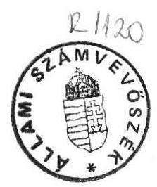
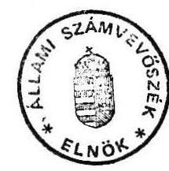

# Allami Számbebösék 

## JELENTÉS

a helyi önkormányzatok beruházásaihoz és rekonstrukcióihoz nyújtott címzett támogatások vizsgálatáról

---

# JELENTÉS 

a helyi önkormányzatok beruházásaihoz és rekonstrukcióihoz nyújtott címzett támogatások vizsgálatáról

A Magyar Köztársaság 1991. évi állami költségvetéséről és az államháztartás vitelének 1991. évi szabályairól szóló 1990. évi CIV. törvény 1. § (2) bekezdés a./ pontja szerint a helyi önkormányzatok nagy költségigényű (korábban általában megyeközponti) fejlesztési és rekonstrukciós feladataihoz kapcsolódó címzett támogatások összege 11.814,5 millió Ft. A törvény 5. sz. melléklete ágazatonként, önkormányzatonként és címenként tételesen 6.662 millió Ft állami támogatás felosztásáról rendelkezik.

Ebből a vízgazdálkodás területét érintő 9 témára - a Dél-alföldi ivóvízminőség javító programra, a Nyugat-Nógrádi térség ivóvízellátását biztosító dunai vízelvezetésre, valamint a dunaújvárosi partvédelmi munkák ráfordításainak visszatérítésére - 496 millió Ft-ot biztosítottak.*

Az egészségügyi ellátásban 31 intézményre 5.620 millió Ft, míg az oktatási és kultúrális szolgáltatást érintő 4 témára 546 millió Ft-ot hagyott jóvá az Országgyűlés.

Az Állami Számvevőszék 1992. évi munkaterve alapján végzett vizsgálatunk során a 6.662 millió Ft állami támogatás juttatásának - felhasználásának törvényességét, szabályszerűségét és eredményességét ellenőríztük.

[^0]
[^0]:    * A Kormány 1991. évben a költségvetési törvény módosítása során a Dél-alföldi ivóvízminőség javító program előirányzatát 130 millió Ft-tal megemelte.

---

A vizsgálat célja: annak megállapítása volt, hogy a

- címzett támogatás rendszere hogyan segíti a helyi önkormányzatok nagy költségigényű fejlesztési és rekonstrukciós feladatainak megoldását;
- a címzett támogatások felhasználása miképpen javítja a Nyugat-Nógrádi térség egészséges ivóvízellátását, valamint a Dél-alföldi ivóvízminőség javító program megvalósítását.

Az egészségügyi és az oktatási-kultúrális beruházások az adott területen milyen hatást gyakorolnak az ellátási színvonal alakulására;

A témavizsgálat keretében a CIV. törvény 5. sz. melléklete szerint valamennyi, összesen 44 feladat, illetve intézmény vizsgálatára került sor.

Az ellenőrzés nem terjedt ki a benyújtott, de a többfordulós döntési folyamat során a tárcák által elutasított, és így állami támogatásban nem részesülő rekonstrukciókra.

# A vizsgálat megállapításai 

## 1. A tárcák tevékenységének vizsgálata

### 1.1. Törvényi előkészítettség

A címzett támogatások 1991. évi rendszerét alapvetően a tanácsi rendszerben megkezdett fejlesztések zavartalan folytatása, valamint az új normatív önkormányzati szabályozására való áttérés motiválta és tette szükségessé. Ugyanis 1990-ben a folyamatban lévő nagyobb összegű beruházásokat, rekonstrukciókat még a megyei tanácsok finanszírozták az 1990. évi szabályozó rendszer bevezetésére szolgáló átmeneti kiegészítő állami támogatás terhére.

Az újrendszerű támogatási forma kialakítása 1990-ben több szakaszban történt. A folyamatban lévő tanácsi beruházásokról, rekonstrukciókról több felmérés készült, a Belügyminisztériumban, illetve a Népjóléti Minisztériumban. Mindkét tárca több javaslatot készített, amelyet egyeztettek.

A támogatás feltételeinek kritériumait csupán a legvégső fázisban alakították ki, ezzel szelektálva az igények között.

---

A Belügyminisztérium 1990. év elején 10 millió Ft alatti, 10-30 közötti, valamint 30 millió feletti csoportosításban összesítette a megyei beruházásokat, felújításokat és rekonstrukciókat, továbbá számba vette az adósságszolgálat 1991. évi tervezett pénzügyi kihatásait. Ennek eredményeként mintegy 50 milliárd Ft, tanácsok által jelzett fejlesztési elképzelés jelentkezett az egészségügy, a kultúra, a vízgazdálkodás, valamint az egyéb és ágazat nélküli tevékenységeknél. Ebből, az egészségügyi szolgáltatás feladatainak megoldására 8,6 milliárd Ft ÁFA nélküli igény jelentkezett.

A Népjóléti Minisztérium 1990. III-IV. hónapban a megyei tanácsoktól az 1991. évi ágazati és fejlesztési rekonstrukciós tervjavaslat összeállításához felmérte a folyamatban lévő beruházásokat, rekonstrukciókat és felújításokat. A tanácsok részéről 1991. évre mintegy 12 milliárd Ft nagyságrendű beruházási és felújítási igény jelentkezett. A tárca július hónapban a folyamatban lévő feladatokra mintegy 6 milliárd Ft címzett támogatást javasolt. A fennmaradó igényeket a céltámogatások körében kívánta rendezni. A tárca a címzett támogatásra vonatkozó javaslatának összeállításánál négy szempontot vett figyelembe:

- prioritást kell biztosítani a jelentősebb regionális központokban megkezdett - évek óta forráshiányos - fejlesztések folytatására, valamint az 1991. évben műszakilag befejezhető rekonstrukciós feladatoknak;
- komplex finanszírozás valósuljon meg (építés és gép-múszer);
- a sorrendiség megállapításánál a feladat fontosságán és jellegén túlmenően az eddigi készültség és ütemezés volt döntően meghatározó, szemben a teljes bekerülés költségével, illetve nagyságrendjével;
- alapvetően a kórházrekonstrukciók körét célszerű támogatni.

A tárca az előzetes javaslatát megküldte a Belügyminisztériumnak.
A szempontok figyelembevételével olyan előzetes címjegyzékes javaslat készült, amelyből az 1990. évi CIV. tv. 5. sz. mellékletében a folyamatban lévő rekonstrukciók teljeskörűen, az 1991. évi ráfordítással befejezhető beruházások pedig a budapesti Péterffy S. utcai Kórház és az ózdi Rendelőintézet kivételével szerepelnek.

---

A Belügyminisztérium a népjóléti tárca felmérésével párhuzamosan szintén bekérte a 10 millió Ft teljes költség feletti beruházásokat, rekonstrukciókat, felújításokat.

Az 1991. évi állami költségvetésben a cél- és címzett támogatásra az előzetes számítások szerint mintegy 18 milliárd Ft forrással számoltak.

A konkrét fejlesztési cél meghatározása érdekében a Belügyminisztérium 1990. október-november hónapban elvégezte a korábbi felmérés pontosítását. Ennek keretében a megyei szakigazgatási szervek megküldték a jelentősebb beruházások, illetve felújítások adatlapját. A beküldött adatlapok tartalmazták a beruházások összes költségelőirányzatát és éves ütemezését, az ehhez rendelt forrásmegoszlást, a feladat megnevezését, továbbá a beruházások néhány jellemzőbb adatát (többek között: pl. engedélyokirat száma, a beruházás kezdési-befejezési időpontja, a létesítmény műszaki tartalmának ismertetése és szakaszai stb.).

A Belügyminisztérium szakértői egyeztetésre megküldte a javaslatát a Népjóléti Minisztériumnak. Alapelvként javasolta, hogy az 1991. évtől bevezetésre kerülő címzett támogatási rendszerben az egészségügy területéről a törvényjavaslatban az átmenet kezelésére a folyamatban lévő rekonstrukciók esetében:
a./ minden 300 millió Ft feletti kórházrekonstrukció;
b./ értékhatárra tekintet nélkül valamennyi megyei önkormányzati kórházrekonstrukció szerepeljen.

Az előbbi feltételek szerinti döntési javaslatban a városi kórházakat az értékhatár hátrányosan érintette, mindössze csak 7 került be a 24 igénnyel szemben.

A megyei önkormányzatokat viszont kedvező helyzetbe hozta az értékhatárra való tekintet nélküli feltétellel, különösen azért, mert a megyei önkormányzat hasonló feladatokra normatív támogatást is kapott ( 400 Ft/állandó lakos).

A feltétel szerint való szelektálással tulajdonképpen nem a tényleges szükségesség, hanem a volumen kapott támogatást.

Az elkészült címjegyzék 5.620 millió Ft állami támogatást javasolt az ágazat részére. A Népjóléti Minisztérium a javaslattal szemben kifogással nem élt.

---

A Belügyminisztérium 1990. november hónapban az így kialakított előirányzatokat és címjegyzéket, mint a költségvetési törvénytervezethez készített javaslatot véleményzésre megküldte a megyei tanácsoknak.

A Belügyminisztériumban a megyei önkormányzatokkal folytatott egyeztetések során a feladatok rangsorolását nem végezték el és az egyeztetések alkalmával írásban nem rögzítették megállapodásaikat. Az önkormányzatok az 1990. évi CIV. törvényből értesültek arról, hogy mely beruházásokra milyen nagyságrendű támogatás áll rendelkezésükre.

Az Országgyűlés által jóváhagyott 1991. évi CIV. törvényben a címzett támogatás alapját a Belügyminisztérium által 1990. október-november hónapban végzett egyeztetés képezte. Az ezeket a sajátos beruházásokat kezelő szabályozás nem alakult ki. Az 1990. évi CIV. törvény csak az 1991. évi beruházások finanszírozását hivatott ellátni, és más törvényi szabályozás hiányában a tárgyév után folytatódó beruházások megvalósításához szükséges forrásigények éves ütemezése is elmaradt. Ezáltal a folyamatos munkát akadályozó, jelentős bizonytalansági tényező került a folyamatba. Ez azt is jelenti, hogy a szerződéssel lekötött tevékenységek folytatása ütemtelenné vált. A megkezdett munkák fedezetét más forrásból kell biztosítani (pl. működési költségek terhére), többletköltségek lépnek fel, a teljesítési határidők csúsznak, továbbá újabb versenytárgyalások nem tarthatók, mert jogszabályi előírások szerint csak fedezettel biztosítottan lehet versenytárgyalást meghirdetni.

Az előkészítéssel kapcsolatos hiányosságokkal függ össze, hogy az 1991. évi CIV. törvény 5. sz. mellékletében szereplő feladatok egyrészt nincsenek összhangban a törvény 1. § 2/a. pontjában foglaltakkal, másrészt az 5. sz. mellékletben szereplő adatokból nem tűnik ki egyértelműen, hogy az önkormányzat ténylegesen milyen konkrét feladat megvalósításához kapta a címzett támogatást:

Heves megye Megyei Kórház, Eger (23)* , Budapest, Balassa J. Kórház (40) esetében a címzett támogatás felújítási feladatot finanszíroz.

Borsod-Abaúj-Zemplén megye, Megyei Kórház, Miskolc (16) adatlapján a központi fütés és az izótop laboratórium rekonstrukciójához nyújtottak be támoga-

[^0]
[^0]:    * Hivatkozások az 1990 évi CIV. tv. 5. sz. melléklet sorai

---

tási igényt. A törvény mellékletében csak a központi fütés rekonstrukció került címzetten megjelölésre, ugyanakkor az 1991. évi ráfordításokban a két rekonstrukció együttesen igényelt összege szerepel.

# 1.2. A döntési folyamat problematikája 

1.2.1. A címzett támogatás szabályozási rendszerének átmeneti időszakára jellemző volt, hogy sem a feladatokat, a tényleges igényeket, sem pedig a pénzügyi forrásokat figyelembe vevő szakmai program aktualizálása nem történt meg.

A tárcák még a nagy volumenü 1,5 - 4 milliárd Ft nagyságrendű beruházások szakmai programjának elemzését, műszaki tartalmát, valamint az önkormányzatok által kimutatott teljes költségek realitásának felülvizsgálatát sem végezték el. Ennek elmaradása azt eredményezte, hogy szakmai ellátás oldaláról nem került pontosan meghatározásra milyen konkrét feladatot finanszírozna a címzett támogatás, továbbá a nagyrészt költségvetésileg alultervezett szakmai programok miatt a megvalósítás és a pénzügyi források között az összhang nem teremtődött meg. Az előzetes szakmai koncepciók esetenként, helyenként és időközben megváltoztak. A változások minőségi többletigénnyel is párosultak, ami a szakmai ellátás oldaláról pozitívan is értékelhető, de ugyanakkor vissza is vezethető a programok előkészítésének hiányosságaira. Ez általában ott volt érzékelhető, ahol a szakmai program elkészítése és annak megvalósítása között az időtávolság számottevően nagy.

Békés megye Réthy Pál Kórház, Békéscsaba (14) II. ütemének kivitelezését több mint 10 éves előkészítési és jóváhagyási eljárás előzte meg. Az orvosszakmai program 1983-ban, a végleges beruházási program 1986-ban készült el. Pénzügyi fedezet hiánya miatt a kivitelezés csak 1990. III. negyedévben kezdődhetett el.

Fejér megye Szent György Kórház, Székesfehérvár (18) III. ütemének beruházási programját 1982-ben hagyta jóvá a Fejér megyei Tanács Végrehajtó Bizottsága. A jóváhagyott programot 1985-ben felülvizsgálták, az új költségelőirányzatot 1725,1 millió Ft-ban határozták meg. E program végrehajtása sem történt meg, mivel az ütemezés szerinti munkavégzéshez nem rendelkeztek megfelelő fedezettel.

Szabolcs-Szatmár-Bereg megye Jósa András Kórház, Nyíregyháza (30) III. ütemének müszaki-gazdasági előkészítése 1984. évben kezdődött. A beruházási programjavaslat évek múlva 1989. szeptember hónapban került a tárcaközi bizottság elé, ahol a megvalósítást elfogadták, de nem tisztázták annak pénzügyi forrásait.

Veszprém megye Megyei Kórház, Veszprém (36) rekonstrukcióját 1975-ben hagyták jóvá két ütemủ szakaszolással. A II. ütem előkészítése 1980. évben a szakmai program elkészítésével kezdődött. A rekonstrukció költségelőirányzatát 1983. évi árszinten 866 millió Ft-ban határozták meg. A VII. ötéves terv előkészítésekor a beruházás költségelőirányzatát - 1992. évi befejezési határidővel - 1205 millió Ft-ra

---

emelték és évenként 100 millió Ft felhasználását tervezték. A beruházás költségelőirányzatát 1991. évben 3287 millió Ft-ban határozták meg, befejezési határidejét 1993. december 31-ben jelölték meg.

A fenti egészségügyi intézmények 1991. évben átdolgozták a beruházásaik szakmai programját és ennek a megvalósításához szükséges pénzügyi előirányzatot, azonban a Népjóléti Minisztérium 1991. évben sem végezte el ezek realitásának, indokoltságának és a térségi ellátási koncepciókba illesztésének felülvizsgálatát. Ennek ellenére az 1992. évi címzett támogatásról szóló törvényjavaslatban a fenti kórházak által benyújtott megemelt költségelőirányzatok szerepelnek.

A beruházások előkészítettségének és aktualizálásának hiányosságaira vezethető vissza, hogy a beruházások költségelőirányzata és a szakmai programban megfogalmazott feladatok között az egyensúly 1991. évben sem teremtődött meg, ez pedig több beruházás esetében azzal járt, hogy az eredeti szakmai program végrehajtása továbbra is késik, illetve a megvalósítás a felmerülő többletköltségek miatt beláthatatlan időre eltolódik.

Fejér megye Szent György Kórház, Székesfehérvár (19) beruházási programja 1989 év végéig 1571,5 millió Ft felhasználását rögzítette, a tényleges kifizetés 1011,4 millió Ft volt. Az időközben bekövetkezett árváltozások és az ÁFA bevezetése miatt a fedezethiány folyamatosan jelentkezett, a kivitelezés lelassült.

Győr-Moson-Sopron megye Soproni Kórház (20) kórházi rekonstrukció 1990-ig a tervezett ütemnek megfelelően valósult meg. A III. ütem szakmai programja az Egészségügyi Minisztérium egyetértésével készült el és 1991. évre 376 millió Ft címzett támogatás került jóváhagyásra. A Kormány a kórház rekonstrukciójához 1991. március 28-i ülésén 3132/1991. (III. 28.) sz. határozatával hozzájárult, hogy Sopronban osztrák tervek alapján, ausztriai fővállalkozó közreműködésével magyarországi viszonylatban kivételesen magas színvonalú kórház épüljön. A megvalósíthatósági tanulmány szerint a rekonstrukció az eredeti tervek szerinti folytatása 1991-1998. években 1990. évi bázis áron 2.282 millió Ft-ba, folyó áron 4863 millió Ft-ba, az osztrák fővállakozásban pedig 7064 millió Ft-ba kerül.
1.2.2. A döntés alapjául szolgáló, a Belügyminisztérium által kiadott adatlap nem nyújtott reális, megbízható információt a címzett támogatást megalapozó döntéshez.

- A Belügyminisztérium az adatlapokat hiányos kitöltés mellett is elfogadta, az önkormányzatok a beruházási engedélyokirat számát nem tüntették fel:

---

Baranya megye Megyei Kórház, Pécs (10), Borsod-Abaúj Zemplén megye Szakkórház és Szanatórium, Miskolc (17), Győr-Moson-Sopron megye Megyei Kórház, Győr (19), Hajdú-Bihar megye dr. Kenézy Gy. Kórház, Debrecen (21), Heves megye Megyei Kórház, Eger (23).

- Nem létező testületi határozatra történt a hivatkozás:

Bács-Kiskun megye Hollós József Kórház, Kecskemét (12), Borsod-AbaújZemplén megye Megyei Kórház, Miskolc (16).

- Az engedélyokiratokon a testület által elfogadott összes költség és az adatlapon szereplő költségelőirányzatok eltértek egymástól:

Békés megy Egyesített Gyógyító Megelőző Intézet, Orosháza (13) esetében az adatlapon 1.504 millió Ft teljes költség szerepel, ugyanakkor a B 63 sz. engedélyokiraton 933 millió Ft.

Heves megye Bugát Pál Kórház, Gyöngyös (24) Kórház rekonstrukciónál az engedélyokirat 1.023,8 millió Ft-ot tartalmaz, míg az adatlapon 1.603 millió lett feltüntetve.

- Előfordult, hogy a rekonstrukció költségelőirányzatait műszaki számítások nélkül, becslések alapján alakították ki:

Jász-Nagykun-Szolnok megye Hetényi G. Kórház- Rendelőintézet (32), Somogy megye, Marcali Kórház (29).

- Eltérő adatok jelentek meg a beruházási programban az engedélyezési okiratban, az adatszolgáltatási lapon:

Zala megye Megyei Kórház, Zalaegerszeg (37), esetében a CIV. törvényben feltüntetett 1140 millió Ft teljes költség nem egyezik meg az érvényes engedélyokiratok 1294 millió Ft-os adatával.

Bács-Kiskun megye, Bajai Kórház-nál (11) az 1991. évre vonatkozó engedélyokirat költségelőirányzattal nem rendelkezett, ugyanakkor ténylegesen 227,5 millió Ft ráfordítás történt.

- Tervezési hiányosság miatt nem teremtődött meg a feladatok és a költségelőirányzatok összhangja:

Győr-Moson-Sopron megye Megyei Kórház, Győr (19), rekonstrukciós munkáinál beruházási en gedélyokiratok nem készültek, az indítás okaí, a döntés dokumentált előkészítő információi nem ellenőrizhetők. A rekonstrukciók időbeli megvalósításának sorrendjét az éves költségvetési forrásoknak megfelelően alakították.

---

Bács-Kiskun megye Bajai Kórház (11) a beruházás és a rekonstrukciós program előkészítése során nem készültek megalapozó műszaki- gazdasági számítások, így a megvalósítás éveiben aránytalanul kevés pénzügyi forrás állt rendelkezésre. A rekonstrukciós programból törölték a szülészeti pavilon felújítását, majd az elmeosztály rekonstrukcióját halasztották későbbi évekre. Végül a kórházi rekonstrukciós program a diagnosztikai tömb beruházására, valamint a kazánház bővítésére karcsúsodott.

Bács-Kiskun megye Hollós J. Megyei Kórház, Kecskemét (12), sugárkezelő telepítésére vonatkozó engedélyokiratot a Bács-Kiskun Megyei Tanácson 1990. július 3-án készítették el 43,3 millió Ft előirányzattal. 1991. évi ütemét 31,3 millió Ft-ban határozták meg, saját forrásból történő megvalósítással. Az engedélyokratot testületi határozat nélkül 1990. október 26-án 392,6 millió Ft-ra módosították, 1991. évi ütemének költségét 31 millió Ft-ban, 1992. évi ráfordítást 300 millió Ft-ban jelölték meg, egyezően az 1990. évi CIV. tv. 5. számú melléklet adataival. A 392,6 millió Ft összegű fejlesztés előirányzata műszaki- gazdasági számítással nincs alátámasztva. A módosított engedélyokirat tartalmát sem a bonyolító, sem a kórház nem ismeri.

Budapest Balassa J. Kórház (40), rekonstrukciós munkái 1987. évben befejeződtek. A rekonstrukciós program 1991. évtől újonnan indult a költségvetésből biztosított 40 millió Ft támogatással. A rekonstrukció anyagi - műszaki programjáról beruházási engedélyokirat nem készült.

Komárom-Esztergom megye Megyei Kórház- Rendelőintézet, Tatabánya (25) művese állomásának alapítványból történő beruházása mind pénzügyileg, mind jogilag is rendezetlen. Az alapítvány a beruházás megvalósításához szükséges fedezettel nem rendelkezik, pénzügyileg ellehetetlenült.

Heves megye Bugát Pál Kórház Gyöngyös (24) rekonstrukciós munkáinál a kivitelezés elhúzódása és az infláció a rekonstrukció költségeinek növekedését eredményezte.
1.2.3. A Belügyminisztérium az önkormányzatok által az adatlapon megadott 1991. évi költségelőirányzatot csökkentette. A csökkentések a beruházások, rekonstrukciók elhúzódását eredményezhetik:

Somogy megye Megyei Kórház, Kaposvár (28) esetében az igényelt 249 millió Ft helyett 206 millió Ft, Veszprém megye Megyei Kórház, Veszprém (36) igényelt 652 millió Ft helyett 510 millió Ft, Szabolcs-Szatmár-Bereg megye Jósa András Kórház, Nyíregyháza (30) 660 millió Ft helyett 528 millió Ft, Mátészalka, II. Rákóczi F. Kórház (31) 395 millió Ft helyett 316 millió Ft, Jász-Nagy-kun-Szolnok megye Hetényi J. Kórház- Rendelőintézet, Szolnok (32) 194,8 millió Ft helyett 150 millió Ft javaslattal került a törvény mellékletébe.

---

1.2.4. Nem tudtak igényfelmérő adatlapot bemutatni a

Győr-Moson-Sopron megye, Soproni Kórház (2O), Budapest, János Kórház (38), István Kórház (39) és a Balassa J. Kórház (40) beruházásokról. A Balassa János Kórház a Belügyminisztérium egyetlen felmérésén sem szerepel, mint folyamatban lévő igény viszont a törvény mellékletében jelentkezik.

A vízügyi beruházásoknál a támogatások írásban történő igényléséről nem minden esetben tudtak dokumentumokat a helyszínen rendelkezésre bocsátani. Abban az esetben, amikor a feladat megvalósítása megyei önkormányzat lebonyolítása keretében valósult meg, a Belügyminisztériummal és más minisztériumokkal kapcsolatos levélváltások alapján lehetett az igényelt címzett támogatások nagyságrendjére következtetni:

Békés megye (2), Nógrád megye (8), Jász-Nagykun-Szolnok megye (7) .
Abban az esetben viszont amikor a feladatok végrehajtásához szükséges támogatást városok, vagy községek kapták ilyen dokumentumokat nem tudtak a helyi önkormányzatok bemutatni, mivel ők is csak az Országgyűlés jóváhagyását követően értesültek a részükre biztosított címzett támogatások nagyságrendjéről:

Bácsalmás (1), Darvas (6), Sárrétudvari (3), Hajdúnánás (4), Tiszacsege (5) .
1.2.5. A döntési folyamat során a Belügyminisztérium által alkalmazott támogatási elv (pl. megyei önkormányzati kórház rekonstrukció) sem mindig érvényesült. Igy nem kapott támogatást:

Pl. Baranya megyei Gyermekkórház központi épület rekonstrukciója,
2. A beruházásoknál, helyi önkormányzatoknál végzett ellenőrzések tapasztalatai

# 2.1. A beruházási rekonstrukciós tevékenység előkészítése 

A címzett támogatásban részesült fejlesztési és rekonstrukciós feladatok jelentős része a 7O-es évek végén 80-as évek elején kialakult szakmai programokra épült.

A vízügyi ágazatban a közegészségügyileg veszélyeztetett (nitrátos vizű) településekre 1978-ban, a Dél-alföldi (arzénes vizű) települések gondjainak megoldására 1983-ban születtek felső szintű határozatok.

---

Az Állami Számvevőszék 1990 decemberében - 1991 januárjában ellenőrizte az egészséges ivóvízellátásra fordított pénzeszközök felhasználását. (V-7981/1990. V-19-8/1991). Az akkori vizsgálat megállapította, hogy a nitrát, illetve az arzén által szennyezett ivóvizű települések csaknem kétharmadának gondjait felszámolták. Ennek ellenére 1990. december 31 -én 442 település 265 ezer lakosa határértéket meghaladó nitráttartalmú, 30 település 206 ezer lakosa pedig az előírtnál nagyobb mértékű arzéntartalmú, az egészségügyi követelményeknek meg nem felelő ivóvízet kénytelen fogyasztani.
1991. évben mind az Országgyűlés, mind a Kormány foglalkozott az ivóvízellátási program módosításával, és határozat született a program végrehajtásának felgyorsításáról és mielőbbi befejezéséről. Ennek megfelelően 1991. októberében Békés megye 130 millió Ft többlettámogatást kapott.

A címzett támogatásokat az önkormányzatok a már mintegy tíz éve folyamatban lévő program végrehajtásához kapták. Bács-Kiskun és Jász-Nagy-kun-Szolnok megye egyes települései (Bácsalmás, Karcag) feladatainak befejezéséhez, részben pedig a program ütemszerủ megvalósításához. A Dél-alföldi ivóvízminőség javító program szerint az arzén tartalom megengedett határéték ( $\mathrm{O}, \mathrm{O} 5 \mathrm{mg} / \mathrm{liter}$ ) alá történő csökkentése a célkitúzés.

A Nyugat-Nógrádi térségben az egészséges ivóvízzel ellátatlan, illetve a határértéket ( $40 \mathrm{mg} / \mathrm{liter}$ ) meghaladó nitráttartalmú vízzel rendelkező települések vízellátási problémáinak felszámolása a követelmény. Dunaújváros tekintetében pedig a csúszás- és állékonysági veszély elhárítása miatt a partvédelem mind élet, mind vagyonvédelmi szempontból vált szükségessé.

Mindezek következtében a vízgazdálkodási címzett támogatások szakmai indokoltsága, társadalmi szükségessége megalapozott volt. A programok KÖJÁL és ANTSZ vizsgálatokon alapulnak.

A címzett támogatások 1991. évi műszaki-gazdasági előkészítettsége általában megfelelő volt.

A Dél-alföldi ivóvízminőség javító program folyamatosan valósul meg, egy hosszú távú koncepció alapján. Az 1991. évi feladatok megfelelő szakmai előkészítettsége mellett, azonban nem volt egyértelműen meghatározva a feladathoz kapcsolódó pénzeszköz, illetve a pénzügyi tervezés sem volt megalapozott.

---

Békés megyében a pótlólag kapot 130 millió Ft-os támogatással megnövelt összeget nem tudták felhasználni a tárgyévben teljes egészében, mintegy 13 millió Ft értékű munka maradt el.

Darvas községben nem volt szükség a 4 milliós támogatás háromnegyed részére.

A kultúrális szolgáltatásoknál a színházépületek rekonstrukciója az országos színházhálózat programjához kapcsolódott és az 1975-80-as években megkezdett folyamathoz csatlakozott. A tervezett feladatok indokoltak voltak, mivel az épületek állaga leromlott. Ezt támasztották alá a szakhatósági vélemények is. A 80-140 éves épületek teljes felújításai elmaradtak, a tartószerkezetek elhasználódtak, a gépészeti és villamossági berendezések elavultak, nőtt a balesetveszély.

A rekonstrukció Pécsett és Szolnokon bővítést is tartalmazott, míg Miskolcon csak a meglévő épületre terjedt ki.

A beruházások elsődleges célja az volt, hogy olyan minőségi rekonstrukciót kell elvégezni, amely hosszú távon a legkorszerűbb körülményeket biztosítja a kultúrális szolgáltatásnak, ugyanakkor a rekonstrukció során a színházak működőképessége is folyamatos legyen.

Az egészségügyben a feladatok időszerűségét részben az épületek (gyakran 100 évet meghaladó kora), elhanyagolt állapota, a gépészeti-műszaki berendezések elhasználódottsága, üzemképtelensége, környezetvédelmi és közegészségügyi szempontok (szigorítások), valamint orvos-szakmai követelmények indokolták. További cél volt a betegellátás színvonalának javítása, a műszerezettség bővítése és korszerűsítése. A beruházási rekonstrukciós munkák műszaki előkészítése azonban rendkívüli módon elhúzódott. A tevékenységek nagyobb részt a 70-es évek végén a 80-as évek elején az Egészségügyi Minisztérium által is véleményezett és elfogadott orvos-szakmai programokon alapultak. Nem ritka azonban az a rekonstrukció, amelynek előzményei 20 évvel ezelőttre nyúlnak vissza.

A túl hossszú előkészítést-megvalósítást esetenként a valósan jelentkező forráshiány mellett is több tényező okozta:

- Egyes beruházások indításánál hiányzott az egységes orvos-szakmai koncepció. A tervezési, előkészítési munkákat többször is elvégeztették.

---

Ez indokolatlan tervezési költségeket és a megvalósítás csúszását "eredményezte":

Heves megye Bugát P. Kórház, Gyöngyös (24), rekonstrukciós munkáinál az orvos-szakmai elképzelések módosulásai is hozzájárultak a költségek emelkedéséhez. Az utóbbi két évben a már megvalósult építészeti megoldások visszabontásra, majd újratervezésre kerültek, melynek költségkihatása 25 millió Ft.

Jász-Nagykun-Szolnok megye Hetényi G. Kórház- Rendelőintézet Szolnok (32), rekonstrukciós munkái kijelölésekor a döntéshozóknak műszaki terveken alapuló információk egyetlen esetben sem álltak rendelkezésre. A rendelőintézeti rekonstrukcióra vonatkozó elképzelések a pénzügyi forrás hiánya miatt már a tanulmányi terv szinten megrekedtek.

Fejér megye Szent György Kórház, Székesfehérvár (18), rekonstrukciója III. ütemének szakmai programját 1991. évben felülvizsgálták, amely egyrészt a diagnosztikai épület funkciójánál módosítást, másrészt a hotel tömbben a tervezett kórházi ágyak csökkentését jelentette. A program módosításának pénzügyi hatását műszaki - gazdasági számítással nem támasztották alá, a rekonstrukció teljes összegét 1991. októberében 5611 millió Ft-ra becsülték.

Békés megye Réthy Pál kórház Békéscsaba (14) beruházásának költségelőirányzatát 1989. évi árszinten 2286 millió Ft-ban határozták meg. A megkötött kiviteli szerződések, árajánlatok, valamint költségbecslések alapján a rekonstrukció teljes költségelőirányzatát 1992. januárjában 4400 millió Ft-ra módosították.

Hajdú-Bihar megye Berettyóújfalu Kórház- Rendelőintézet (2 1) rekonstrukciós munkálataira 1984-ben készült ovos-szakmai program, amely azzal számolt, hogy a kitűzött célok a VII. ötéves tervben megvalósulnak. A szakmai program végrehajtására több tanulmány terv, beépítési terv és beruházási program készült, amelyek részben orvos-szakmai program módosulása, részben forráshiánya miatt nem valósultak meg. A tervekért összesen 13166,7 EFt-ot fizettek ki.

- Gyakori, hogy a tanácsok (önkormányzatok) a feladatok megvalósításához szükséges pénzügyi forrásokat előzetesen nem tisztázták, vagy a feladatok és források "összhangját" becsült adatokkal alapozták meg.

Az aktualizálás elmaradása számos probléma okozójává vált, mivel a korábbi években elindított, 1991. január 1-jén folyamatban lévő rekonstrukciók és fejlesztések műszaki, de különösen pénzügyi tervezése a vizsgált szervek jelentős részénél nem minősíthető megalapozottnak:

Szabolcs-Szatmár-Bereg megye Jósa A. Kórház, Nyíregyháza (30) rekonstrukciós programjában szereplő egyes feladatokra előirányzott 3326 millió Ft bekerülési költséget 1989-ben 357 millió Ft-tal csökkentették, hogy a bekerülési költség 3 milliárd Ft alatt legyen, azzal az indokkal, hogy akkor csak ez látszott elfogadhatónak.

---

A program megvalósításához az eredeti 2969 millió Ft előirányzathoz képest további 359 millió Ft szükséges.

Fejér megye Szent György Kórház, Székesfehérvár (18), beruházási programjában a kivitelezés közel tíz éve alatt a műszaki megvalósítást folyamatosan korszerűsítették, aktualizálták, módosították. A korszerübb technika alkalmazása azzal járt, hogy a beruházás költségei emelkedtek. A program módosításának hibája, hogy a változások pénzügyi hatásait nem dolgozták ki.

Komárom-Esztergom megye Megyei Kórház, Tatabánya (25), rekonstrukciós munkáinál az 1991. évi kivitelezési munkák költségelőirányzatát nem megfelelően munkálták ki, ugyanis az előző évek pénzügyi előirányzatai nem tényszámokon alapultak.

# 2.2. A címzett támogatások 1991. évi megvalósításának értékelése (helyzete) 

A vízgazdálkodásban az 1991. évi címzett támogatással Bács-Kiskun megye arzénmentesítési programja 10 millió Ft ráfordítással Bácsalmáson befejeződött. Az arzéntartalmat jelenleg sikerült a határéték alá szorítani.

Békés megyében 6 település (Tarhos, Telekgerendás, Kétsoprony, Mezőberény, Murony és Kamut) települések rákötése megtörtént a regionális ivóvízellátó távvezetékre. A helyi vízkészletek kikapcsolásra kerültek, megszűnt a tasakos ivóvízellátás és a szolgáltatott ivóvíz arzéntartalma a határérték körül alakul. 1991. évben 20.O85 fő jutott egészséges ivóvízhez.

Hajdú-Bihar megye településein az ütemezésnek megfelelően a kivitelezési tervek, illetve a berendezések rész műszaki átadása történt meg.

Jász-Nagykun-Szolnok megyében Karcag városban az évközi elmaradások ellenére a program teljesült. Karcag és Beregfürdő térségében az ivóvíz arzéntartalma O,O1-O,O2 miligramm/liter érték között alakult, s mintegy 24.OOO lakos egészséges ivóvíz ellátását oldották meg.

Nógrád megyében a címzett támogatásból ivóvíz fővezetéket és víztározó medencét építettek, továbbá az 1992. évi tevékenységek tervezése valósult meg. A beruházás üzembehelyezése és a települések vezetékre történő rákötése nem történt meg. Ezt az önkormányzatoknak kellett volna más forrásokból megvalósítani ez azonban forráshiány miatt elmaradt.

Dunaújvárosban a műszaki fejlesztési feladatokat teljesítették. A kivitelezési munkáknál - elsősorban régészeti feltárási munkák miatt - lemaradás mutatkozott.

---

A kultúrális szolgáltatás támogatási körébe tartozik a fővárosi Móricz Zsigmond Gimnázium (41) egyházi célra történő átadása miatti kiváltás. A gimnázium kiváltását állami beruházásként indították, melyet a címzett támogatás körébe sorolták át. A gimnázium más helyrajzi számú telken, új létesítményként valósul meg, nem meglévő létesítmény rekonstrukciójáról van szó.

A színházak részére juttatott címzett támogatás a Miskolci Színház (42) rekonstrukciójának megkezdését, míg a Szolnoki Szigligeti Színház (44) és a Pécsi Nemzeti Színház (43) rekonstrukciójának befejezését segittette. A támogatás közvetetten elősegítette, hogy a színházi alapterület 83 , illetve 29 \%-kal megnövekedett, Szolnokon mobil színpad kiegészítő, Pécsett forgószínpad létesült. Pécsett és Szolnokon korszerű színpadtechnikát, számítógépes vezérlésű színpadvilágítást és elektroakusztikai berendezést szereltek be, a szellőző és fütési rendszerek digitális programozható automatikával lettek ellátva. Pécsett a címzett támogatásból díszburkolattal ellátott út, szökőkút is létesült.

Az egészségügyi ellátásban az 1991. évre címzett állami támogatásban részesült 31 témából 6 beruházás-rekonstrukció befejeződött.

Baranya megye Megyei Kórház, Pécs (10), Békés megye Gyulai Kórház (15), Borsod-Abaúj-Zemplén megye Megyei Kórház, Miskolc (16), Komárom-Esztergom megye Megyei Kórház- Rendelőintézet, Tatabánya (25), Tolna megye Megyei Kórház Rendelőintézet (33), Vas megye, Tüdőgyógyintézet, Hegyfalu (35).

Ezeknél a rekonstrukció célja elsősorban a kiegészítő létesítmények korszerűsítésére irányult. Az egyedi támogatások hatása ezeknél az egységeknél pozitívan értékelhető, az eseti hiányosságok ellenére is, mivel

- biztonságosabbá vált a fütés és a gőzszolgáltatás,
- az élelmezési üzemek - konyha, étterem, feldolgozó kapacitásai növekedtek, a higiéniás körülmények javultak és korszerű kiszolgálási formák valósultak meg,
— az üzemeltetés fajlagos költségei mérséklődtek:
Bács-Kiskun megye Bajai Kórháznál (11), végzett kazánház rekonstrukció eredményeként az 1990. évi 12,9 kg gőz/kg ruha mutató 1991. évben 9.012 kg göz/kg ruha mutaṭóra csökkent, a megtakarítás 3.888 gőz/kg ruha. Az 1991. évi mosoda

---

üzemi termelést figyelembe véve a hatásfok javulás 3.346 EFt összegű éves megtakarítást jelentett.

Somogy megye Megyei Kórház, Kaposvár (28), a hagyományos kiszolgálásról áttértek az egyéni tálalási rendszerre. A 2269 m alapterület bővüléssel az előkészítő helyiségek, a raktárak alapterületei megkétszereződtek, többszörösére nőtt az öltöző, a mosdó, a mosogató, a tálaló és a WC alapterülete. A 3OOO adagos élelmezési üzem kapacitás kihasználása $66,9 \%$-os, a tartalék kapacitás lekötésére intézkedést nem tettek.

Bács-Kiskun megye Bajai Kórház (11) rekonstrukciója a törvényben befejezettként jelenik meg, a támogatást az önkormányzat így is igényelte. Azonban az 1991. évi címzett támogatást a korábbi évekről tervszerűtlenül áthúzódó munkákra gép-műszer beszerzésekre fordították, ugyanakkor viszont tárgyévi feladataikat nem valósították meg, ezek 1992-re húzódnak át és így további állami támogatással számolnak.

A címzett támogatásból megvalósuló egészségügyi beruházásoknál 1991-ben négy esetben történt jelentős anyagi-műszaki tartalmú módosulás, mely többek között ágyszám csökkenéssel és nagyösszegű költségnövekedéssel járt.

Fejér megye Szent György kórház, Székesfehérvár (18), rekonstrukciójánál a hoteltömbbe tervezett 624 kórházi ágy helyett 516 ágy valósul meg.

A Szabolcs-Szatmár-Bereg megye Jósa A. Kórház, Nyíregyháza (30), beruházási programja összevontan tartalmazta az orvos technológiai müszer előirányzatot, amelynek értékét az akkori normatívák alapján határozták meg, de nem részletezték tételesen funkciók szerint az igényeknek megfelelő müszerlistát, azok mennyiségét és típusait. Ez lehetőséget adott arra, hogy a beruházó és a tervező újrafogalmazza elgondolásait. A jóváhagyott 695,7 millió Ft gép-műszer előirányzat várhatóan a megvalósulás során duplájára emelkedik.

Somogy megye Megyei Kórház, Kaposvár (28) rekonstrukciójánál a munkaterápiás foglalkoztató költségelőirányzatát 68.894 EFt -tal, a szülészeti pavilonét 108.340 EFt-tal emelték meg, mivel a rekonstrukciós munkák indításakor a költségeket alátervezték.

Vizsgálati tapasztalataink szerint a megkapott címzett támogatást néhány esetben nem a kért célra használták fel.

Komárom-Esztergom megye Megyei Kórház- Rendelőintézet, Tatabánya (25) kórház rekonstrukciójában a művese ellátás feladatának a megoldása is szerepelt. Pénzügyi fedezet hiányában a Vesebetegek Országos Egyesületének Komárom megyei Csoportja Müvese Alapítványt hozott létre, melyet a megyei Tanács Végrehajtó Bizottsága 1990-ben 78/1990. (IX. 11.) sz. határozatában 10 millió Ft-tal támogatott. A Belügyminisztériumnak felterjesztett adatlapon a beruházási enge-

---

délyokirat számaként az alábbi VB. határozat száma van megjelölve, mivel beruházási engedélyokiratot a VB. nem hagyott jóvá. A megyei önkormányzat az 1991. évi címzett támogatás terhére a Múvese Alapítvány számlájára 15 millió Ft-ot utalt át alapítványi támogatás címén. A tárgyi rekonstrukcióra a fővállalkozói szerződést a Müvese Alapítvány, mint önálló jogi személy kötötte meg.

Győr-Moson-Sopron megye Soproni Kórház (20) rekonstrukciójánál a 376 millió Ft címzett támogatás annak ellenére leigénylésre került, hogy a rekonstrukciós munkákat a 3132/1991. (III. 28.) kormányhatározat felfüggesztette. A címzett támogatásból 260 millió Ft az OTP-nél került lekötésre.

Nógrád megye Madzsar J. Kórház - Rendelőintézet Salgótarján (26) rekonstrukciója során múvese állomást hoztak létre, a müszaki átadása 1990. december 30-án megtörtént, amely alapítványból valósult meg, ehhez a megyei tanács 18 millió Ft-tal járult hozzá. A Belügyminisztériumhoz felküldött adatlapon 15 millió Ft elöirányzattal a művese állomáshoz kapcsolódó aggregátor (szükségáramforrás) beruházása is szerepel. A beruházás költségelőirányzata azonban az aggregátor cseréjét nem tartalmazta.

A támogatott célok megvalósulásával javultak a fekvő és járóbetegellátás feltételei. Csökkent a zsúfoltság, kultúráltabbá és komfortosabbá váltak a kórtermek, a korszerű technika, technológia alkalmazásával lerövidült a betegek várakozásának, vizsgálatának ideje. A diagonosztikai vizsgálatok eredményei megbízhatóbbak és pontosabbak lettek. Pozitívan értékelhető, hogy a korábbi színvonalat lényegesen meghaladó ellátási színvonal biztosítható:

Győr-Moson-Sopron megye Megyei Kórház, Győr (19), rekonstrukciójánál a Computer Tomográph üzembehelyezésével térségi feladatokat is ellátó, korszerü diagnosztikai berendezés múködik. A szemészeti osztályon $22 \%$-os fajlagos alapterület növekedés következett be (az egy ágyra jutó $13,1 \mathrm{~m} 16 \mathrm{~m}$-re növekedett). A rekonstrukció keretében korszerü mütő kialakítására került sor, korszerü ambuláns ellátást valósitottak meg. Megteremtődött a lésertechnika alkalmazhatóságának a feltétele.

Heves megye Bugát P. Kórház, Gyöngyös (24), rekonstrukciója eredményeként javulnak az egyes részlegek között a funkcionális kapcsolatok, amelyek lerövidítik a vizsgálatok és a szükséges beavatkozás közötti időt. Az új kórtermek átlagban 5 ággyal fognak üzemelni, a zsúfoltság jelentősen csökken. Javul a kórház gép-müszer ellátottsági színvonala is.

A címzett támogatási rendszer keretébe az önkormányzatok általában azokat a legfontosabb korábban megkezdett, megyei hatáskörbe tartozó fejlesztéseket javasolták, ahol a saját forrás elégtelensége miatt csak központi támogatással valósulhat meg reális időn belül a megkezdett rekonstrukció, illetve

---

fejlesztés. A címzett támogatási rendszer a megkezdett rekonstrukciókhoz megbízható - esetenként túlságosan is kedvező hátteret biztosított 1991. évre.

Általában a megyei igény támogatásra került, közöttük a törvényben nem deklarált felújítási feladatok is, bár más forrásból is biztosított a törvény forrásokat a hasonló jellegű feladatok megoldására ( 400 Ft/állandó lakos). Ezért csak elvétve fordult elő, hogy a feladatok megoldásához saját forrás igénybevételére került volna sor.

Leginkább a vízügy területén jelentkezett, hogy a feladatok megoldásához az önkormányzatok egyéb forrásokat is igénybe vettek. (Békés megyében 50 millió Ft, Bácsalmás városban 27 millió Ft, Jász-Nagykun-Szolnok megyében 16,4 millió Ft, Nógrád megyében 55,9 millió Ft, Dunaújvárosban 10 millió Ft-tal egészítették ki a támogatást). Ezen túlmenően a közüzemi vállalatok saját fejlesztési pénzeszközökkel is részt vállaltak az egészséges ívóvízellátási program feladatainak megvalósításában. (Dél-Bács-Kiskun megyei Vízmú Vállalat 13 millió Ft, Békés megyei Víz- és Csatornamú Vállalat 34,2 millió Ft, Nógrád megyei Víz- és Csatornamú Vállalat 18,8 millió Ft-tal).

Az egészségügyben elvétve, összeségében szerény mértékủ saját forrás igénybevételére került sor: Szabolcs-Szatmár-Bereg megye Mátészalka II. Rákóczi F. Kórház (31) 17,9 millió Ft, Fejér megye Szent György Kórház (18) 63 millió Ft, Vas megye Markusovszky Korház- Rendelőintézet (34) 250.000 Ft egyéb forrással egészítette ki a kapott támogatást.

A vizsgálat azt tapasztalta, hogy néhány önkormányzat nem a támogatott célra vagy nem a jóváhagyott ütemnek megfelelően használta fel az állami pénzeszközöket.

A vízgazdálkodásban a Békés megye 385 millió Ft-os címzett támogatásából 1991-ben 372 millió Ft-ot használtak fel. Az önkormányzat a teljes támogatást leigényelte, a feladatokból azonban 3 település rákötése nem történt meg 1991. végéig.

Somogy megye Marcali Kórház (29) a címzett támogatásból a városi önkormányzat orvosi rendelőt épít.

Komárom-Esztergom megye Megyei Kórház- Rendelőintézet, Tatabánya (25) esetében a címzett támogatásnál 7 millió Ft összeggel Múvese Alapítványt támogatnak.

A Nógrád megyei Madzsar J. Kórház- és Rendelőintézet (26) múvese állomás létesítésére is kapott támogatást, azonban az már az előző évben megvalósult az alapítvány és megyei pénzeszközök terhére. Az erre a célra adott 15 millió Ft-ból a múvese állomást és az egész kórház céljait szolgáló aggregát cseréjére került sor.

---

A Pécsi Nemzeti Színház (43) rekonstrukciója során 23,2 millió Ft értékủ nem a konkrét színházi rekonstrukciót érintő munkákat is (diszburkolat, szökőkút, szobor) elvégeztek.

A címzett támogatási rendszer bevezetésekor nem tisztázták előre, hogy a teljesítményarányosság műszaki vagy pénzügyi teljesítést jelent-e. A vizsgálat megállapításai szerint a gyakorlatban vegyes megoldások történtek.

A műszaki teljesítéstől eltérő támogatás leigénylés egy intézménynél a likviditási gondok enyhítésére történt: a Somogy megyei Megyei Kórház, Kaposvár (28), esetében a megyei önkormányzat átmenetileg szabad pénzeszközeiből 1991. januárjában 30 millió Ft-tal, februárban 25 millió Ft-tal támogatta az intézményt. A kivitelezőknek, a szállítóknak (gép-műszer) fizetett előlegek miatt a Hajdú-Bihar megye Berettyóújfalu Kórház-Rendelőintézet (22) összesen 70 millió Ft előleget fizetett ki, amely a 190 millió Ft-os állami támogatás $36,8 \%$-át képviseli. A Heves megye Bugát P. Kórház, Gyöngyös (24) esetében a 383 millió Ft címzett támogatásból a városi polgármesteri hivatal 49 millió Ft-ot utalt át a megyei önkormányzat részére, a volt megyei tanács 1990. évi szabad pénzeszközei terhére megelőlegezett pénzeszközök visszafizetésére.

A teljesítménytől elszakadó finanszírozás lehetőségével néhány önkormányzat szélsőséges módon élt és kihasználta a törvényi szabályozás hézagait. Hosszabb időn keresztül szabad pénzeszközökkel rendelkeztek, amit néhányan tartós betétként több hónapra lekötöttek.

Győr-Moson-Sopron megye, Soproni Kórház (20), a 376 millió Ft támogatásból 260 millió ft-ot az OTP-nél tartósan lekötöttek, amely 20 millió Ft kamatbevételt jelentett. Szabolcs-Szatmár-Bereg megye, Mátészalka (31) esetében a címzett állami támogatás szabad forráslehetősége havonként átlagban 60-80 millió Ft volt, illetve 5 hónapon keresztül meghaladta a 100 millió Ft-ot is. A kórház 1991. évben 22 millió Ft kamatbevételt ért el, ebből 15 millió Ft-tal növelte a rekonstrukció költségelőirányzatát.

A Hajdú Bihar megyei Berettyóújfalui Kórház- Rendelőintézet (22) esetében a nagyösszegű számlaegyenlegek miatt 2 millió Ft kamatbevétel keletkezett.

A Bács-Kiskun megye Hollósi J. Kórház Kecskemét (12) OTP-nél vezetett elszámolási számláján elhelyezett címzett támogatás után 1,5 millió Ft kamatbevételt számítottak.

Bács-Kiskun megye Bajai Kórház (11) részére 1991. március 20-án átutalt 100 millió, majd az augusztus 20-án érkezett 18 millió Ft-ot külön pénzintézeti számlára, onnan a jóváírt éves szintű 8 millió Ft-os kamatát pedig a bonyolítási számlára

---

vezették át. Az állami támogatás kamatát saját ár- és díjbevételi többlet formájában mutatták ki.

Békés megye Réthy P. Kórház, Békéscsaba (14) esetében az igénybevett címzett állami támogatás összege havonta átlagosan 45 millió Ft-tal volt magasabb a tényleges teljesítményértéknél.

Budapest Főváros János Kórház (38), István Kórház (39) esetében az önkormányzat az 1991.március havi állami támogatással leigényelte az éves támogatási összeg $90 \%$-át.

Ugyanakkor viszont néhány önkormányzat a finanszírozás ütemtelensége miatt a feladatok teljesítését a társadalombiztosítás által múködésre biztosított források tehére oldotta meg:

Somogy megye Kaposi Mór Kórház Kaposvár (28) a kivitelező 1990. november 30-i és 1990. december 21-i fizetési határidejű követelését, összesen 11,3 millió Ft-ot 1991. januárjában egyenlítette ki az Országos Társadalombiztosítási Főigazgatóságtól a gyógyító munka ellátására 1991. január 2-án átutalt 60,2 millió Ft-ból.

Bács-Kiskun megye Hollósi J. Kórház Kecskemét (12) esetében a 48,2 millió Ft összes költségű Computer Tomograph beszerzéséhez a Társadalombiztosítási Főigazgatóság 1991. évi teljesítmény finanszirozásából 30 millió Ft-ot használtak fel (csoportosítottak át).

A törvényi szabályozás hiányosságaira vezethető vissza, hogy a törvényt megszegő önkormányzatok szankcionálása elmarad. Nincs lehetőség a visszavonásra, illetve büntető kamat alkalmazására.

# Összefoglalás, javaslatok 

Összeségében megállapítható, hogy az 1990. évi CIV. törvényben rögzített 6.662 millió Ft címzett támogatás a vízgazdálkodási, az egészségügyi és az oktatási és kultúrális ágazatban folyó fejlesztési és rekonstrukciós munkákhoz megfelelő anyagi hátteret biztosított. A támogatás segítségével a fejlesztések felgyorsultak.

A címzett támogatás rendszerének kialakítását azonban nem előzte meg a tárcák részéről a beruházások szakmai programjának, műszaki tartalmának elemzése és a teljes költség realitásának felülvizsgálata. Igy a szakmai programok és a források között az összhang nem teremtődött meg. A döntéshozók kényszerhelyzetbe

---

kerültek, a megalapozott dönéshez nem állt rendelkezésre megfelelő információs háttér, amely az előkészítés hiányosságaira utal.

Nem tisztázódott, hogy az 1991-ben címzett támogatásban részesült, áthuzódó, több év alatt megvalósuló beruházások és rekonstrukciók esetében a teljes megvalósítási folyamat alatt megtartják-e ezen besorolásukat. További gondot jelent, hogy a törvény nem szabályozta le, hogy a címzett támogatás milyen feltételek esetén jár, ez teret enged a szubjektív megítélésnek.

A törvényi szabályozás további hiányossága, hogy a címzett támogatás igénybevételének szabályozása nem egyértelmű, a teljesítményarányosság elve nem tisztázott és nincs rendezve az eltérő arányú és célú felhasználás eetén a szankcionálás.

A vizsgálat tapasztalatai alapján az Állami Számvevőszék a következőket ajánlja:

- a támogatási rendszer további fenntartása ajánlatos. A fenntartás érdekében viszont olyan előkészítési, döntési módszert kell kidolgozni, amely minden igénylő számára azonos követelményeket tartalmaz;
— meg kell oldani, hogy a támogatási rendszer éves ütemezést is tartalmazzon;
- a pénzeszközökkel való hatékonyabb gazdálkodás miatt célszerű lenne a támogatott témák esetében az állami pénzeszközök mellett saját forrás igénybevételét is kikötni;
- a megalapozott szakmai és pénzügyi információk érdekében szükséges a szakmai programok felülvizsgálatát elvégezni, a térségi feladatellátás követelményeit tisztázni, továbbá a feladatokhoz szükséges forrásokat a megvalósítás időtartamára felmérni.

Budapest, 1992. június

(Hagelmayer István)

---

A vizsgálatot vezette és a jelentést összeállította Farkas László osztályvezető főtanácsos. A vizsgálatban közreműködött Maczekó Károly tanácsos és Remeczki László tanácsos.

A vizsgálatot végezték:

Békés megye:

Borsod-Abaúj-Zemplén megye:

Fejér megye:
Győr-Moson-Sopron megye:

Hajdú-Bihar megye:

Heves megye:

Jász-Nagykun-Szolnok megye:
Komárom-Esztergom megye:
Nógrád megye:

Baranya megye:
Maczekó Károly tanácsos
dr. Koronics Károlyné tanácsos
Baji Ferencné számvevő
Győrffi Dezső tanácsos
Fekete Tibor tanácsos
Horváth József tanácsos
Kalmár István tanácsos
dr. Szeli Tibor tanácsos
Kozák György tanácsos
Szilágyi Sándor tanácsos
Nagy Sándorné számvevő
dr. Tóth András tanácsos
Buczkó András tanácsos
Koltayné Szepesi Zsuzsanna tanácsos
Németh Péterné tanácsos

---

Somogy megye:

Szabolcs-Szatmár-Bereg megye:

Tolna megye:
Vas megye:
Veszprém megye:

Zala megye:
Fővárosi Régió:

Remeczki László tanácsos
Kenéz Sándor tanácsos
László András tanácsos
Csekei Gyula tanácsos
Horváth János tanácsos
dr. Vasváriné
dr. Rózsa Anikó Magdolna számvevő
Angyalosi Dániel tanácsos
Molnár Istvánné tanácsos
Simon Ákosné tanácsos
dr. Spilák Antal tanácsos
dr. Szirota István külső szakértő

Budapest, 1992. június

---

Állami Számvevőszék

# F Ü G G E L É K 

a helyi önkormányzatok beruházásaihoz és rekonstrukcióihoz nyújtott címzett támogatások (V-144-47/1992. sz.) vizsgálatáról készített jelentéshez

Budapest, 1992. május hó

---

# 1. Békés Megye Réthy Pál Kórház (14) ${ }^{*}$ Békéscsaba rekonstrukció II. ütem 

A Békéscsabai Kórház II.ütem kivitelezésének 1990. évi elkezdését több mint 10 éves előkészítési és jóváhagyási eljárás előzte meg. A SZEM indokoltnak tartotta a munkák előkészítését. A szakmai program 1983. májusában készült.Az 1986. májusban elkészített végleges beruházási program tartalma megegyezett az eredetivel. A Békés Megyei Tanács Végrehajtó Bizottsága 112/1986. határozatával jóváhagyta a beruházási programot. A kiviteli tervdokumentáció 1988. végén készült el, majd erre építve a költségvetés 1989. májusában került kidolgozásra, melynek összege 1989. január 1-jei árszinten számítva 2.286 millió Ft. Az 1988-93. évekre tervezett beruházás költségvetésénél a tervező nem számolt árszínvonal emelkedéssel. A kivitelezés pénzügyi fedezet biztosításának hiánya miatt csak 1990. III. n. évben kezdődött el. Szerződést csak a diagnosztikai épületek alapozásaira kötöttek. A beruházás tervkorszerűségi felülvizsgálata 1991.évben megtörtént és szakmai program minimálisan módosult.

A címzett támogatás igénybejelentő adatlapján teljes költségelőirányzatként az 1989. január 1-jei árakon számított 2.286 millió Ft költség szerepelt.

A megkötött kiviteli szerződések, árajánlatok, valamint költségbecslés szerint a rekonstrukció teljes költségelőirányzata 1992.januárjában 4,4 milliárd Ft-ra módosult, melynek következtében 1991.december 31-ig a rekonstrukciós feladatok 10,8 $\%$-ára van csak fedezetvállalási kötelezettség.

Az 1991. évi 363 millió Ft-os címzett támogatás összegét kb. 40 millió Ft-tal meghaladó volt a műszaki teljesítés 1991. évben.

Az 1991. évi címzett támogatást nem teljesítményarányosan igényelték le, az 1991. évben márciustól-novemberig igénybe vett címzett támogatás összege havonta

[^0]
[^0]:    * Hivatkozás a CIV. tv. 5. sz. melléklete soraira

---

átlagosan számolva több mint 45 millió Ft-tal volt magasabb, mint ahogy azt a műszaki teljesítés indokolttá tette.

# 2. Fejér Megye Szent György Kórház (18) Székesfehérvár III. ütem 

Az 1982. évi beruházási programot 1985. évben felülvizsgálták, új költségkalkulációt készítettek a kivitelezés időütemezését módosították. A beruházás költségeit prognosztizált áron 1.725,1 millió Ft-ban határozták meg. E program végrehajtása sem történt meg, mivel a munkavégzéshez nem rendelkeztek megfelelő pénzügyi fedezettel.

A beruházás éves ütemezését mindig a rendelkezésre álló pénzügyi fedezet határozta meg. Hosszabb távú célkitúzés nem volt reális.

A megyei tanács a beruházás gyorsítása érdekében 1988. II. felében 215 millió Ft hitelt vett fel, $24 \%$-os kamatra. Az 1990. évi tanácsi terv célkitűzései között kiemelten került megfogalmazásra a kórház III. ütemének folytatása, illetve részleges befejezése. Erre a tanácsi terv 330 millió Ft-ot tartalmazott.

A megye igényét a megyei tanács Belügyminisztérium felé a pályázatában 629,5 millió Ft-ban fogalmazta meg, ezzel szemben minden indoklás nélkül, csak 470 millió Ft támogatást kapott.

A műszakilag szükségesnél 160 millió Ft-tal kisebb összeg biztosítása az eredetileg 1991. évre ütemezett feladatok megvalósítását nem tette lehetővé.

A megyei önkormányzat a címzett támogatást előző évi pénzmaradványából és normatív támogatásból 58 millió Ft-tal kiegészítette.

Az 1991. évben a III. ütem megvalósításával összefüggésben lényeges változás következett be.

A módosítás a kórházi ágyak számát csökkenti, és kisebb mértékben módosítja az elhelyezendő osztályokat is.

---

Ennek eredményeképpen a megyei kórház ágyellátottsága - ami a rekonstrukció egyik alapindoka volt, a tervezettnél is kisebb mértékben fog javulni. Az eredeti tervben szereplő 624 ágy helyett 514 ágy valósul meg.

A program módosításának lényeges hibája, hogy a változtatások pénzügyi hatását nem dolgozták ki, így a megvalósítására csak nagyon becsült adatok állnak rendelkezésre.

A teljesítmény arányos finanszírozás alapján a megyei önkormányzat csak 435 millió Ft-ot vehetett volna év végéig igénybe a 470 millió Ft helyett.

Az 1991. októberében a rekonstrukció teljes összegét 5.611 millió Ft-ban határozták meg, melyhez 1992. és 1995. között 3.700 millió Ft címzett támogatásra van szükség.

# 3. Szabolcs-Szatmár-Bereg Megye Jósa András kórházrekonstrukció (30) Nyíregyháza 

A kórházrekonstrukció III. ütemének múszaki-gazdasági előkészítése 1984. évben kezdődött. A beruházási programjavaslat évek múlva 1989. szeptember hónapban került a tárcaközi bizottság elé, ahol a megvalósítást elfogadták, de nem tisztázták annak pénzügyi forrásait, illetve csak azt rögzítet- ték, hogy a megvalósítás pénzügyi forrása a tanácsi egységes pénzalap.

A beruházási programot a megyei tanács 1990. január hónapban fogadta el. A jóváhagyott program szakmai, de különösen pénzügyi megalapozottsága hiányos volt.

A jóváhagyott 695,7 millió Ft gép-műszer keret várhatóan a megvalósítás során közel duplájára növekszik.

A rekonstrukciós programban rögzített 24 jelentős feladatot 1988. és 1997. közötti időszakra ütemezték 2.969 millió Ft összegben.

Jelentős alátervezések történtek, annak érdekében, hogy a teljes bekerülési költség 3 milliárd Ft alatt legyen. Emiatt lényegesen csökkentették a szakmai feladatok változatlanul hagyása mellett 3 épület tervezők által összeállított költségelőirányzatát. Igy megalapozatlanul 357 millió Ft csökkentést hajtottak végre.

---

A programban megalapozatlan volt a költségek prognosztizálása is, az 1989-es árakat figyelembe véve évi $5 \%$-os árnövekedéssel számoltak.

A megalapozatlan múszaki és gazdasági előkészítettség nagymértékben hozzájárult ahhoz, hogy a rekonstrukciós programban megfogalmazott feladatok költsége a jóváhagyott 2.969 millió Ft-tal szemben kb. kétszeresére emelkedik. A program a mai pénzügyi helyzetet figyelembe véve teljes tartalommal nem valósítható meg, ezért szükséges a hátralévő feladatok újragondolása, a programnak a mai igények és lehetőségekhez való igazítása.
1990. december 31-ig 263 millió Ft-ot használtak fel, a program szerinti ütemhez viszonyítva több mint 100 millió Ft-os lemaradás mutatkozik.
1989. évben a kórház beruházási előirányzatából a Debreceni Orvostudományi Egyetemi Klinika által létrehozott szívalapitványhoz 20 millió Ft-ot csoportosítottak át, ugyanebben az évben 5 millió Ft-tal csökkentették a kórház müszerbeszerzését, amely szintén a rekonstrukció III. ütemének pénzeszközeit csökkentette. 1989-ben 20 millió, 1990-ben 30 millió Ft átadásáról döntöttek a mátészalkai Kórház javára.

A program végrehajtásában jelentős lemaradás volt, 1991. év elején 20 millió Ft rövid lejáratú hitel igénybevételével tudta csak az intézmény a jelentkező fizetési kötelezettségét teljesíteni. A 136 EFt kamatösszeget az intézmény müködési költségéből fedezték.

A kórházi rekonstrukció 1991. évi kötelezettsége 706 millió Ft volt. Ezzel szemben az Országgyűlés 528 millió Ft címzett támogatást hagyott jóvá. Ennek megfelelően a program végrehajtásában ez évben is közel 200 millió Ft lemaradás keletkezett.

Az I. jelü épület építési, gép-műszer és egyéb költsége együtt 2.038 millió Ft, szemben a programban szereplő 1,4 milliárd Ft-tal.

A folyamatban lévő épületek befejezéséhez, ezek üzembehelyezéséhez, a közművek és a járulékos létesítmények megvalósításához 3.328 millió Ft szükséges. Ez 359 millió Ft-tal több, mint az eredeti teljes beruházási programban előirányzott 2.969 millió Ft.

---

# 4. Veszprém megye Megyei Kórház rekonstrukció (36), Veszprém 

A Veszprém Megyei Tanács Végrehajtó Bizottsága az 1975. április 25-én 121/1975. VB. számú határozatával hagyta jóvá a megyei kórház rekonstrukciójának indítását két ütemü szakaszolással. A II. ütem előkészítése a szakmai program elkészítésével kezdődött, melyet a végrehajtó bizottság 211/1980. számú határozatával jóváhagyott. A fejlesztés szakmai javaslatával az EüM. is egyetértett. A szakmai programban 470 kórházi ágybővítés, 5 db központi mütő, orvosi, gazdasági és kórházigazgatási részlegek és 40 munkahelyes rendelőintézet kialakítása került meghatározásra.

A rekonstrukcó költségelőirányzata 1983. évi árszinten 866 millió Ft-ban került megállapításra. Az 1983. évi árszinten a beruházás nem valósítható meg, ez már a VII. ötéves tervjavaslat készítésekor látszott. Ezért a tervezés során $7 \%$-os árnövekedéssel és 1992. évi befejezési határidővel számoltak. A beruházás költségelőirányzatát 1.205 millió Ft-ra emelték és a VII. ötéves tervidőszakban évenként 100 millió Ft felhasználását tervezték.
Már ekkor látható volt, hogy ilyen felhasználási ütem mellett a tervezett befejezési határidő nem lesz tartható, így az OT és PM egyeztetéseken kérték az állami támogatás megemelését.

A megyei tanács végrehajtó bizottsága elé 1989. augusztus 29 -én a beruházás költségeire vonatkozóan új számításokat terjesztettek. A beruházás költségét 2.694 millió Ft-ra, befejezési határidejét 1993-ra prognosztizálták. Ez a költségelőirányzat testületi határozat formájában nem került jóváhagyásra és az engedélyokiratot sem módosították.

A 108/1991. megyei közgyűlési határozat a beruházás költségét 3.287 millió Ft-tal, befejezési határidejét 1993. december 31-i határidővel hagyta jóvá.
A rekonstrukció műszaki készültségi foka 1990. év végén $20 \%$-os volt, 1991. évre az önkormányzat 510 millió Ft címzett támogatásban részesült a hotel-diagnosztikai épület szakipari munkáinak elvégzéséhez, valamint a kazánház bővítéséhez. A Belügyminisztérium felé az 1991. évi címzett támogatási igényüket 652 millió Ft-ban jelölték meg, ezzel szemben csak 510 millió Ft-os címzett támogatást kaptak, a különbözet indoklására nem került sor.

---

# 5. Somogy megye Marcali Kórház-Rendelőintézet rekonstrukció (30) 

A kórház-rendelőintézet korszerűsítési feladatait alátámasztóan 1980. március 27-i keltezéssel részletes orvos-szakmai program készült, amelyet később különböző szintű tervanyagok aktualizáltak.

A rekonstrukciós program I. ütemének (diagnosztikai tömb) a tervek szerint 1986-ban kellett volna befejeződnie, azonban a beruházás 1986. május 11 -én kezdődhetett el, műszaki átadására 1989. június 30 -án, ideiglenes üzembehelyezésére december 29 -én került sor.

A második ütemben megvalósuló rekonstrukcióra 1990. március 8 -án a kórház által előterjesztett 200 millió Ft forrásigénnyel szemben a főhatóság képviselői 120 millió Ft-ot tartottak indokoltnak. Igy a korábban elkészült orvosszakmai program 1990. május 10 -én a funkcionális tartalomra vonatkozóan aktualizálásra és pontosításra került.

A beruházási engedélyokiratban a hátralévő rekonstrukciós munkák összköltségelőirányzatát 120 millió Ft-ban prognosztizálták, az 1991. évi ütem költségelőirányzatát 65 millió Ft-ban határozták meg,melyet címzett támogatásként megkaptak.

A rekonstrukció tényleges műszaki előkészítése a címzett támogatás odaítélése után kezdődött meg. Az 1991. évben rendelkezésre álló 65 millió Ft címzett támogatás műszaki oldalról nem volt kellően megalapozott. A 65 millió Ft támogatási összegből 7 millió Ft tartalékot különítettek el, melynek felhasználására évközben született döntés, melyből az I.sz. kiszolgáló épület felúljítási munkára 7 millió Ft-os vállalkozási szerződést kötöttek. Itt orvosi rendelő épül.

A kórházi rekonstrukció II. ütemének költségelőirányzatára vonatkozóan műszakigazdasági számításokat a vizsgálat során bemutatni nem tudtak, az egyes tételek bekerülési költségét becsléssel állapították meg.

A Marcali Polgármesteri Hivatal 1991. szeptember 25-én vállalkozási előleg címén 5.OOO EFt-ot utalt át a kivitelező részére, az előleg átadásáról a vállalkozási szerződésben nem állapodtak meg, de a pénzeszköz ideiglenes átadásáról testületi határozat sem született. A kölcsönadott 5.OOO EFt visszautalására 1991. december 27-én került sor.

---

A Marcali Kórház és Rendelőintézetnél a címzett támogatás terhére 1991. évben beszerzett 17.624 EFt értékủ állóeszközöket, mint idegen tulajdonban lévő eszközöket vették nyilvántartásba, a müködő berendezések aktiválására a vizsgálat során intézkedtek.

# 6. Komárom-Esztergom megye Kórház- Rendelőintézet, Tatabánya (25) rekonstrukciója 

A Megyei Kórház a III/a ütemben három feladatra kapott címzett támogatást, (proszektúra, energiaellátás, múvese ellátás), összesen 73 millió Ft-ot.A három ütemű fejlesztés előkészítése a szakmai tervezési program 1984. évben kezdődött el, a tanulmányterv megrendelésére 1985. évben került sor. Az illetékes főhatóságok 1986. évben hagyták jóvá a fejlesztés III. ütemét. A pénzügyi lehetőségek figyelembevételével a III. ütemet további részütemekre tagolták. A III/a. ütem pathológia és infuziós labor, valamint a műhely-garázs beruházások programjával folytatódott. A beruházási célokmány megfogalmazására és engedélyeztetésére 1986. decemberben, az építési engedélyezési és ajánlati tervek megrendelésére 1987. júniusában került sor. A III/a. ütem beruházási programját a tanács végrehajtó bizottsága a 76/1987. VB. határozatával 164.380 EFt-ban, a műhely-garázs költségelőirányzatát pedig 49.930 EFt-ban hagyta jóvá. A jóváhagyott beruházási program szerint, apatológiai és infuziós labor megvalósításának befejezési időpontja 1990. március 30-a volt.

A VB. a 15/1989. sz. határozatával az engedélyokmányt és annak költségelőirányzatát módosította. Az 1. sz. módosított bekerülési költségelőirányzat 243.239 EFt volt. A kivitelezés határideje 1990. december hó. A munkák előkészítettsége összeségében kielégítő volt. A végrehajtó bizottság a 43/1990. sz. határozatával az engedélyokiratot ismételten módosította, a 2. sz. módosított bekerülési költségelőirányzat 277.095 EFt, a kivitelezési határidő változatlan.

A Belügyminisztériumnak felterjesztett szöveges indoklásban az állt, hogy a költségtöbblethez az engedélyokirat jóváhagyásakor forrást a testület nem tudott biztosítani. A hiányt a VB. 78/1990. sz. határozattal 15.000 EFt-tal csökkentette, a létesítmény befejezéséhez azonban még 18.856 EFt-ra van szükség.

---

A vizsgálat során megállapítást nyert, hogy a valóságban a III/a. ütem beruházásának 1990. év végén fennálló forráshiánya csak 1.862 EFt volt, szemben a BM felé jelzett 18.856 EFt-tal.

Lényegében ha a beruházás az eredeti ütemezés szerint valósul meg az 1991. évi címzett támogatás igénybevételére nem került volna sor. Az 1991. évtől a beruházási okmányok alapján a fejlesztés költségelőirányzata és a hozzárendelt források összhangja és folyamatossága nem volt biztosított. Az 1991. évi 32.223 EFt címzett támogatás felhasználásával sem sikerült a beruházást üzembehelyezni az év végéig. A többszöri műszaki átadás csak 1991. február 15-21. között fejeződött be, a helyszíni bejárás során jelentős technológiai hiányosságokat állapítottak meg.
Az ebből adódóan az 1992. évre áthuzódó költségeket 3-4 millióra becsülik, de a költségek nem tartalmazzák a további módosítások költségeit.

Az 1991. évi címzett feladatok között szerepel a kórház energiellátásának rekonstrukciója is, egy új transzformátorállomás építése és a külső 20 kilowattos táv-kábelhálózat igénye. A Belügyminisztériumnak felterjesztett anyagban a hivatkozott számú engedélyokirat nem tartalmazza az energiabetáplálás megvalósítását és a O3 telephelyen a koksztüzelésű kazántelep átépítését olajtüzelésű rendszere, amit szintén a címzett támogatásból valósítottak meg.

Az 1991. évi költségvetésben eredeti előirányzatként még nem volt betervezve az energiaellátásra fedezet. A kapott címzett támogatásból 27,7 millió Ft-ot tartalékként kezeltek. A művese ellátás tényleges feladatmeghatározását 1989-ben a megyei kórház által megfogalmazott szakmai program alapján indították el. A pénzügyi fedezet nem állt rendelkezésre. Igy társadalmi összefogással 1989. március 6-án művese alapítványt hozott létre a Vesebetegek Országos Egyesületének Komárom Megyei Csoportja. Az alapítvány nyított alapítvány, így azt bárki támogathatja.

A Komárom-Esztergom Megyei Tanács Végrehajtó Bizottsága 1990. szeptember 11-én a 78/1990. számú VB. határozatával a művese alapítványnak 10 millió Ft-os támogatást biztosított.

A Belügyminisztériumnak felterjesztett igénylőlapon ez a VB. határozatszám a beruházási engedélyokirat számaként van feltüntetve. Beruházási programot, engedélyokiratot a megyei tanács vb. nem fogadott el, mivel a beruházást művese alapítványból tartották célszerűnek megvalósítani. A művese állomás beruházása mind pénzügyileg, mind jogilag is rendezetlen. Az alapítvány a rekonstrukció megvalósításához a szükséges fedezettel nem rendelkezik. Alapítványi támogatás

---

címen a megyei önkormányzat nem lett volna jogosult a címzett támogatás igénybevételére. Az igényelt 15 millió Ft címzett támogatással sem oldódott meg a nűvese állomás építése, az alapítvány pénzügyileg ellehetetlenült, a tervezett költségeket a rekonstrukció tényleges költségei lényegesen meghaladják.

# 7. Győr-Moson-Sopron Megye - Soproni Kórház rekonstrukcója (20) III. ütem 

A kórház rekonstrukcóját az Egészségügyi Minisztériummal egyeztetve 1978-ban határozták el.

A meglévő adottságokra, a finanszírozási lehetőségekre figyelemmel a terv szakaszos kivitelezést tesz lehetővé.

A beruházás tervszerinti költsége (EFt)
I. ütem 113767
II. ütem 103879
III. ütem 402424
IV. ütem 103919

Összesen:
7238989
A költségek nem tartalmazzák az V. ütemre tervezett átalakításokat és nem foglalják magukba az orvostechnológiai berendezések, egyéb mobil berendezések és az első fogyóeszköz beszerzés költségeit sem.

A rekonstrukció 1990-ig a tervezett ütemnek megfelelő volt. A III. ütem szakmai programját az Egészségügyi Minisztérium által megszabott keretekre figyelemmel állították össze, amelyet Sopron város és a megye illetékes egészségügyi szervei közreműködésével, egyeztetésével terjesztettek fel az Egészségügyi Minisztérium-

---

hoz. A minisztérium a programmal egyetértett, de a múszerigény egyes tételeinek számát túlzottnak tartotta.

A városi tanács 1990.március 27-i döntésének megfelelően a beruházói és bonyolítói feladatok 1990.áprilisától az egészségügyi ellátás érdekét legjobban képviselő kórházhoz kerültek, amely a beruházás módosításához vezetett.

A módosításhoz - beruházó kezdeményezésére - kormányhatározat szolgált alapul, amely hozzájárult ahhoz, hogy Sopronban osztrák tervek alapján, ausztriai fővállalkozó közreműködésével magyarországi viszonylatban kivételesen magasszínvonalú ellátást biztosító kórház épüljön és garanciát adott a fejlesztési pénzügyi fedezetének biztosítására.

A módosítás lényege és hatása 1991. évre az, hogy a kórház központi, új létesítményeknek (III. ütem) építését leállították. Előkészítették a beruházás eltérőtervek szerinti folytatását, így a törvényben megállapított támogatás összege nem azt a konkrét feladatot szolgálta, ami a törvényjavaslat alapja volt, hanem a kormányhatározatból származó más, de rekonstrukció körébe tartozó feladatokat.

A módosításhoz készült tanulmány kimutatta az eredeti tervek szerinti rekonstrukció folytatása befejezésének becsült költségeit 1990.évi bázis áron, ami 1991-98. évekre 2.619 millió Ft-ba (1991-et megelőző éveket is figyelembe véve 2.982 millió Ft-ba) kerül. A tanulmány a beruházás költségeit folyó áron 4.863 millió Ft összegben prognosztizálta.

Az osztrák változat szerint azonban a beruházás 7.064 millió Ft-ba fog kerülni. A címzett támogatásként biztosított 376 millió Ft-ot a Soproni Önkormányzat leigélnyelte, melyből 260 millió Ft-ot az OTP-nél kötöttek le.

# 8. Nógrád Megye "Madzsar József" Kórház- Rendelőintézet Salgótartján rekonstrukció (26) 

A kórház gépészeti rekonstrukciója, azaz csővezetékeinek (fütés, hideg- melegvíz, szennyvíz) teljes cseréjére 25 millió Ft-ot, és a müveseállomáshoz kapcsolódóan szabványnak megfelelő szükségáramforrás (aggregátor) cserére 15 millió Ft-ot biztosítottak.

---

Címzett támogatás szempontjából a müveseállomás beruházásának vizsgálata azonban nem indokolt, mivel annak müszaki átadása 1990. december 30-án megtörtént. A beruházás alapitványból valósult meg, melyhez a megyei tanács 18 millió Ft-tal járult hozzá. A beruházás költségelőirányzata az aggregátor cseréjét nem tartalmazta.
A megyei önkormányzat 1991. évi eredeti költségvetése a 15 millió Ft-ot mint a múvese állomás beruházásának 1991. évi ütemét, a 25 millió Ft-ot pedig a kórházi felújítás előirányzataként tartalmazta. Az 1991. június 27-én módosított költségvetésben már a 40 millió Ft címzett támogatás a "megyei kórház gépészeti és agregátor felújítás" előirányzatként szerepelt.

Az 1992. évre jelzett 26 millió Ft-os igényük az árváltozásokat figyelembe véve 48 millió Ft-ra növekedett.

A támogatás lehívása a megyei önkormányzat részéről nem teljesítményarányos. Általában előbb igényelték, mint az a szerződésben foglaltak vagy a várható tényleges teljesítés indokolttá tette volna. Igy tartósan 3,5 millió Ft, egy-egy hónapban 8-14 millió Ft többlettel rendelkeztek a pénzügyi teljesítéshez.

# 9. Győr-Moson-Sopron Megyei Kórház Győr (19) rekonstrukció 

A megyei kórház rekonstrukció 136 millió Ft címzett támogatást kapott 1991. évre.
A benyújtott, majd jóváhagyott 136 millió Ft-os igény 1991. évi összetétele a következő. A komputer tomográph 50 millió Ft, emelet ráépítés 23 millió Ft, elmeépület felújítása 63 millió Ft. Az igénybejelentésekből is kitűnik, hogy a gép-műszer beszerzéssel 1988-ban indított CT-hez, a felújításként kezdett elmeépület rekonstrukcióhoz, valamint a volt TBC épülethez emeletráépítéshez engedélyokiratok nem készültek.

A rekonstrukció indításának okai, a döntést dokumentált előkészítő információk nem álltak rendelkezésre.

A CT gépet 1989-ben lising szerződés alapján leszállították, 1990. márciusában pedig üzembe helyezték. Az intézmény a CT-re vonatkozóan teljes körű dokumentációt nem tudott bemutatni, a hiányos német-angol nyelvű ügyiratok magyar fordításával nem rendelkezik.

---

Az emelet ráépítéssel korszerű szemészeti osztályt alakítottak ki, ellentétben az igénybejelentésben szereplő ortopédiai és kardiológiai gondozó helyett.

Az elme- és ideggyógyászati pavilon rekonstrukciójáról engedélyokirat nem készült, az 1991. december 31-ig kifizetett 141.484 EFt-os ráfordítást az intézmény a nagyjavítás költségvetési rovaton számolta el, a korábbi évek gyakorlatának megfelelően.

Összeségében a három beruházásnál az alapokmányok hiánya miatt az eredeti várt eredmény nem rekonstruálható.

Az emeletráépítéssel korszerű szemészeti osztály (rekonstrukció előtt 57 ágy, utána 42 ) létesült. A rekonstrukciót megelőzően 8.7 m /ágy fajlagos alapterülettel működő részben átlagosan $10,7 \mathrm{~m}$ /ágyra módosult e mutatószám.

# 10. Bács-Kiskun megye Hollós J. Kórház Kecskemét (12) 

A kecskeméti "Hollós József" Megyei Kórház a sugárkezelő telepítésére vonatkozó engedélyokiratot a Bács-Kiskun Megyei Tanácson 1990. július 3-án készítették el 43,3 MFt előirányzattal, 1991. évi ütemét 31,3 MFt-ban határozták meg, saját forrásból történő megvalósítással. Az engedélyokiratot testületi határozat nélkül 1990. október 26-án 392,6 MFt-ra módosították, 1991. évi ütemének költségét 31 MFt-ban, 1992. évi ráfordítást 300 MFt-ban jelölték meg, egyezően az 1990. évi CIV. tv. 5. számú melléklet B/ Egészségügyi ellátás 2. sorának 7. és 8. oszlopában megjelölt adatokkal. A 392,6 MFt összegű fejlesztés előirányzata műszaki gazdasági számítással nincs alátámasztva. A módosított engedély okirat tartalmát sem a bonyolító, sem a kórház nem ismeri.

Az engedélyokiratban feltüntetett összeg tartalmazza a beruházás terhére el nem számolható költségeket 1O53 EFt, valamint már üzembehelyezett eszöz értékét is, új fejlesztésként feltüntetve, 48,2 millió Ft-ban.

A KÖZTI-vel kötött szabálytalan szerződéssel lehetőség nyílott a tervezőnek arra, hogy a tervezés teljes költségét 1992. évben számlázza le.
A címzett támogatás hatékonysága mérsékeltnek tekinthető, amikor az elfogadott koncepcióba tartozó műszerek egy részének áttelepítését oldja meg a beruházó és ennek várható többletköltsége 19,5 millió Ft-os kiadást jelent.

---

A címzett támogatás alá eső beruházáshoz 3O millió Ft-os Társadalombiztosítási Főigazgatósági forrást is igénybe vett a beruházó.

# 11. Balassa Kórház Budapest (40) rekonstrukció 

A kórház rekonstrukciós tevékenysége 1983. évben kezdődött és 1987. évben fejeződött be. Az ez időben végzett rekonstrukciós munkák döntően az épület állagromlásának megállítására irányultak.

A Fővárosi Tanács VB. 1989. évben javaslatot tett a kórház profilváltoztatására. A kórház további múködését krónikus osztályok szervezetében, vagy szociális otthonként képzelték el.

A profilváltással a kerületi tanács nem értett egyet. Igy a meglévő orvosszakmai funkciók fenntartása mellett a 368 ágyszám megközelítőleg $15 \%$-os csökkentésével 1990-ben folytatódott a korábbi években megkezdett felújítás.
A felújítási költség 337.500 EFt-ba került meghatározásra. Az 1989-es gazdasági év végéig a Fővárosi Tanács az épület felújítására 108.750 EFt-ot fordított.

A rekonstrukciós program 1991. évtől újonnan indult, annak következtében, hogy a Fővárosi önkormányzat pályázata eredményeként az állami költségvetésből 40 millió címzett támogatásban részesült. A rekonstrukció anyagi, műszaki programjáról a Fővárosi Önkormányzat engedélyokirattal nem rendelkezik. A címzett támogatás terhére megvalósult a kórház üzemeltetésének szempontjából kulcsfontosságú liftek felújítása, valamint az egész épület elektromos és érintésvédelmi hiányosságának felszámolása. Az élelmezési üzemben két új gép beszerzésére került sor. A címzett támogatás összege maradéktalanul felhasználásra került.

## 12. Gyöngyös Városi Önkormányzat Kórház (24) rekonstrukció

Az orvos-szakmai program 1980-81-ben került kidolgozásra. A tanulmányterv 1981-ben készült el négy ütemben.

---

I. ütem: a hotel - diagnosztika és az energiaközpont megépítése,
II. ütem: konyha - mosoda, gyógyszertár és véradóállomás megépítése.
III. ütem: központi igazgatás és gyermekosztály építése.
IV. ütem: a meglévő épületekben orvos-nővér szálló kialakítása és a nem használható épületek lebontása.

A beruházási program 1982. évben elkészült.
Az I. ütem kiviteli költségét 543,7 millió Ft-ban határozták meg. Az Egészségügyi Minisztérium kezdeményezésére költségcsökkentés címén a kiviteli terv módosítására került sor. A módosított kiviteli terv 1985. év végén került leszállításra, a rekonstrukció bekerülési költsége 440,4 millió Ft.

A beruházási program szerint 1984. III. negyedév és 1989. november 30. között kellett volna megvalósulnia. Az energia központ megvalósult, 1989. évben beüzemelésre került. 1990-ben megoldódott az elme épület, a II. sz. belgyógyászat, valamint a rendelőintézet hő- és melegvízszolgáltatása, a többi épület rákötése folyamatban van.

A pénzügyi források beszűkülése, a hotel-diagnosztika építési munkái lelassultak. A rekonstrukció építőmesteri munkáinak készültségi foka 1990. év végén mintegy $65 \%$-os volt.

Az építészeti, mind az orvos-technológiai tervek aktualizálásra kerültek az alábbiak szerint:
-a hotelszárnyon a betegszobák komfortfokozata javult, kialakításra kerül az 5 ágyas szobákból minden ápolási egységben egy-egy 2 és 3 ágyas kórterem.
-a betegfelvételi osztályon először a 4 ágyat 8 -ra módosították, majd később visszatértek az eredeti elképzeléshez. Ugyanakkor az I. szinten elhelyezkedő elmegyógyászati osztályon két 5 ágyas kórterem egybenyitásával egy 6 ágyas koronária örző részleg került kialakításra. Így az ágyszám a program szerinti 252-vel szemben először 256-ra növekedett és eszerint módosították az engedélyokiratot is. Az ezt követő változások eredményeként végül 248 ágy valósul meg.

A kivitelezés elhúzódása, valamint a feladatok aktualizálásának többsége, továbbá az infláció a rekonstrukció költségeinek növekedését eredményezte. Az orvosszakmai elképzelések, igények módosulása is hozzájárult a költségek emelkedéséhez.

---

Igy pl. az utóbbi 2 évben a már megvalósult építészeti megoldás visszabontására, újraépítésére került sor, melynek költségkihatása 25 EFt .

A teljes bekerülési költség az alapokiratban szereplő 539,7 millió Ft-tal szemben 1.023,8 MFt-ra emelkedett, a befejezési határidő 1989. december 30-ról 1992. december 31-re módosult, majd az 1.023,8 millióFt költségelőirányzat 1.603, millió Ft-ra módosult. Az 1992. december 31-i befejezési határidő pedig már 1993. október 31 -el szerepel.

Mindezek után az első ütem befejezési határidejét 1993-ban rögzítették.
A 383 millió Ft címzett támogatásból a város polgármesteri hivatala 49 millió Ft-ot utalt át a megyei önkormányzat részére. A címzett támogatás igénylő lapján 1991-re 50 millió Ft hitel visszafizetés szerepelt, amelynek felvételére nem került sor, költségtöbbletet a volt megyei tanács 1990-ben átmenetileg szabad pénzeszközei terhére megelőlegezte. Ezen kívül a városi önkormányzat az 1990-ben saját forrásból megelőlegezett 4,3 millió Ft-tal csökkentette a címzett támogatás összegét. Igy az 1991. évi teljesítésekre történt kifizetés összege 329,7 millió Ft volt. Az orvostechnológiai berendezést szállító Multimed Kft 1991. évben 111.214 EFt előleget számlázott le, melyet az intézmény a címzett támogatás terhére folyósított.

# 13. Jász-Nagykun-Szolnok megye Szolnoki Hetényi G. Kórház (32) rekonstrukciója 

A megyei tanács által jóváhagyott eredeti VII. ötéves terv adatai szerint a rendelőintézeti rekonstrukcióra összesen 71 millió Ft volt ütemezve.

A rekonstrukció I. ütemének megvalósítási határidejét 1990. szeptember 30-ban, bekerülési költségét pedig 85 millió Ft-ban határozták meg. A döntéshozóknak semmilyen múszaki terveken alapuló konkrét információk, dokumentációk nem álltak rendelkezésére.

A címzett támogatás felmérési időszakában 600 millió Ft volt a rendelőintézet összes becsült költségelőirányzata.
Az 1991. évre összesen 194,8 millió Ft címzett támogatással szemben 150 millió Ft-ot kaptak.
Az eltérés a már megkötött szerződéseket nem módosította.

---

A rendelőintézet bővítés nélküli rekonstrukciójára nem készült beruházási program, sem engedélyokirat. A feladat csak felújítási tartalmú volt.

Az 1991. évre tervezett feladatok egy részét el sem kezdték az 1991. évi rendelőintézeti rekonstrukciós feladatok egy részét, főleg az orvostechnológiai berendezések beszerzéseit lassított ütemben, későbbi időpontban tervezik realizálni.

Az 1991. évi címzett támogatásból megvalósítandó feladatok közül a tüdőkórház vizesblokk rekonstrukciója, az újszászi pszichiátria gázvezeték építés és fütés korszerűsítése, valamint a központi épületek egy részének födémcseréje elmaradt.

A 150 millió címzett támogatásból 119 millió Ft-ot fordítottak a rekonstrukcióra, 29 millió Ft-ot a címzett feladatok köré nem sorolt egyéb munkákra (onkológia kialakítása, sebészeti épület földszintjének eü. célokra történő visszaállítása).

# 14. Somogy megye, Kaposvár, Kaposi Mór Kórház (28) rekonstrukció 

Az intézmény közműveinek rekonstrukciója 1978 óta folyik. A beruházási engedélyokiratot eddig 9 alkalommal módosították. A szülészeti pavilon rekonstrukciós munkáinak időtartamát 1985. márciusában 7 évben jelölték meg.

A munkaterápiás foglalkoztató beruházásának indítása az intézmény 1990. évi költségvetésében nem szerepelt, bár annak kialakításához szükséges program 1988. évben elkészült. Az év utolsó harmadában a megyei tanácstól és az OTF-től kapott 6.150 EFt-ból komplett kiviteli tervdokumentáció nem készült, hiánya miatt csak részleges tervszolgáltatás mellett kezdődött el a kivitelezési munka. A kivitelezés költségeit 62.000 EFt összegben becsülték, majd a kiviteli tervek elkészülte után a beruházási költség előirányzatát 130.894 EFt-ra módosították.

A szülészet rekonstrukciónál az időközben megváltozott hatósági előírások és orvos-szakmai program módosulása miatt a tervdokumentáció kiegészítése vált szükségessé. Igy a módosított beruházási program miatt az 1990. májusában prognosztizált 126.445 EFt-os költségelőirányzat 1991. júniusában 224.785 EFt-ra növekedett.
Az élelmezési üzem megvalósításának a költségelőirányzatát a beruházás indulásakor 1989-ben 189.514 EFt-ban prognosztizálták, átadására 1991. I. negyedévében került sor, amely ténylegesen 199.134 EFt -ba került.

---

A fejlesztési feladatok nem az eredeti elképzelések, illetve ütemezések szerint alakultak. Az élelmezési üzemben a kivitelezés csak 1989. évben kezdődhetett el, üzembehelyezésre 3 hónapos próbaüzem után 1991. májusában került sor. A szülészet rekonsrukciója és befejezésének határidejét eredetileg 1991-ben jelölték meg.

A régi sebészeti épület rekonstrukciója több éve folyamatban van, a kivitelezési munkákat 1991-ben felfüggesztették, mivel átmenetileg a szülészeti osztály egy részét helyezték el benne.

A neurológiai osztály felújítása üzemelés közben, 1990. évben kezdődött el. A vizsgálati időszakban folytatódtak a belső elektromos rekonstrukciók, a tetőhéjazat cseréje és a belső udvari bővítés. A közműrekonstrukció szinte minden beruházással összefügg, azonban 1991. évi ütemét csökkentették, és az így felszabaduló forrást a munkaterápiai foglalkoztató és a szülészet építésére csoportosították át.

A beruházási programokban a feladatok aktualizálása megtörtént. A felmérés eredményeként az intézmény forrásigényét 249 ezer EFt-ban prognosztizálták, figyelemmel a műszaki szükségességre és a rendelkezésre álló kivitelezői kapacitásra.
Az élelmezési üzem fejlesztésére igényelt 79.000 EFt támogatás túlzott volt, a beruházás átadásáig ténylegesen csak 58.617 EFt-ot fizettek ki.

Az Országgyűlés döntése alapján az intézmény 2O6.000 EFt címzett támogatásban részesült, amely hat folyamatban lévő fejlesztés között került elosztásra.

A kaposvári Középületkivitelező Kereskedelmi Kft 1990. november 3O-i és 1990. december 21-i fizetési határidejű köveletéseit 1991. január 8-án és 18-án egyenlítették ki az OTF-től kapott működési költség terhére. A likviditási gondok enyhítésére a megyei önkormányzat átmenetileg szabad pénzeszközeiből 1991 januárjában 30.000 EFt-tal és 1991 februárban 25.000 EFt-tal támogatta az intézményt.

A belgyógyászati osztály rekonstrukciójával javult az egy ágyra jutó négyzetméter mutató (4,48 ágy/m-ről 8,12 ágy/m-re). A 3000 adagos élelmezési üzem beruházása 1991. I. negyedévében fejeződött be, melynek belépésével 2000 adag többletkapacitás jelentkezett. Az élelmezési üzem kapacitásának átlagos kihasználása munkanapokon 66,9 \%-os. A tartalékkapacitás kihasználására a vizsgálat befejezéséig érdemi intézkedést még nem tettek. A közeljövőben tervezik a lakosság felé történő értékesítés megszervezését.

---

# 15. Hajdú-Bihar megye Berettyóújfalui Kórház (22) rekonstrukciója 

Először 1980. évben dolgozták ki az 1986-1990. évekre terve- zett orvos-szakmai programot, együttesen 390,3 millió Ft-os költséggel 1984. évi árszinten. A tervezési dokumentumokért 3,6 millió Ft-ot fizettek ki. Az ekkor elkészült 43/1985. törzsszámú beruházási program 1986. évi árszinten összesen 717,2 millió Ft költségelőirányzatot tartalmazott.

A program megvalósításához a pénzügyi fedezet nem állt rendelkezésre, így a dokumentáció gyakorlati hasznosítására nem került sor. 1986. évben az orvos-szakmai programot helyileg úgy dolgozták át, hogy az ne haladja meg az 500 millió Ft költségelőirányzatot. A minisztériumi főosztályok egyetértettek az átdolgozott orvos-szakmai programmal. A minisztériumi egyetértés után a megyei szakigazgatási szerv pályázatot írt ki újabb beruházási program elkészítésére. Ez az új beruházási program fő vonalaiban összhangban állt a felsőszinten elfogadott orvos-szakmai programmal, de több vonatkozásban el is tért attól. Ez a második beruházási program 2,5 millió Ft-ba került.

Központi forrásból 1991. és 1992. évekre 224 millió Ft támogatást igényeltek. A tényleges ráfordításként kimutatott összegek viszont az 1990. év végével várhatónak tartottnál alacsonyabbak 76,9 millió Ft-tal, 1991. év végén pedig 54,7 millió Ft-tal.

A vizsgált hotel-épület beruházási készültségi foka 1990. év végén $65 \%$-os volt. 1991. év végére az első ütem készültségi foka $70 \%$-os.

A beruházás engedély okiratát 1991-ben kétszer is módosították. Először az intenzív ágy számot csökkentették, növekedett viszont a II-es építési ütemhez tartozó vérellátó állomás, központi sterilizáló.
A 40 ágyas sebészet helyett 24 ágyas urológiai osztály létesítenek.
A hotel diagnosztikai épület beruházási előirányzata 190 millió Ft-ról 476,7 millió Ft-ra növekedett, ez utóbbi felső szinten elismert volt.

---

Másodszor 1991. október 3O-án módosították a beruházás engedélyokiratát, az 1992. évre előirányzott 34 MFt címzett támogatás összegét 47 MFt-ra növelték.

A pénzeszközök leigénylése nem teljesítményarányosan történt. A tényleges felhasználások a tervezettnél lassúbb ütemezésüek voltak, ezek eredményeként egyes hónapokban nagyon magas számlaegyenlegek mutatkoztak. Igy áprilisban 57,5 millió Ft, júliusban 47,4 millió Ft, augusztusban 55,8 millió Ft, szeptemberben 40,8 millió Ft, december végére ez 9,2 millió Ft-ra csökkent.
Az intézmény a magas és mélyépítésben részt vevő kivitelezőknek 55 MFt , a gép-műszer és berendezések szállítóinak 14,8 MFt elóleget fizetett ki a címzett támogatás terhére.

A nagyösszegű számlaegyenlegek viszonylag magas kamathozadékot ( 2,0 millió Ft-ot) eredményeztek, amit ugyancsak beruházási célokra kívánnak felhasználni.

# 16. Bács-Kiskun megye Bajai Kórház (11) 

A bajai Kórháznál a beruházás és rekonstrukciós program előkészítése során nem készültek megalapozó műszaki-gazdasági számítások, így a megvalósítás éveiben aránytalanul kevés pénzügyi forrás állt rendelkezésre. A rekonstrukciós programból törölték a szülészeti pavilon felújítását, majd az elmeosztály rekonstrukcióját halasztották a későbbi évekre. Végül a kórházi rekonstrukciós program a diagnosztikai tömb beruházására, valamint a kazánház bővítésére karcsúsodott.

A rekonstrukció során a röntgen osztály kiemelt mértékű műszerezettségét az 1991. évre biztosított címzett támogatásból valósitották meg. A beszerzett műszerek közül a Computer Tomograph és az angiographiás szerkezet nincs kihasználva. Baján a megye déli részének ezirányú szükségletét is ki tudná elégíteni, azonban jelenleg a megye déli területéről a betegeket 100 km -t is meghaladó távolságra utaztatják vizsgálatra.

A kazánházi rekonstrukció eredményeként az 1990. évi $12,9 \mathrm{~kg}$ gőz/ kg ruha mutató 1991. évben 9,012 kg gőz/kg ruha mutatóra csökent, a megtakarítás 3.888 kg gőz/kg ruha. Az 1991. évi mosoda üzemi termelést figyelembe véve a hatásfok javulás 3.346 EFt összegű éves megtakarítást jelentett.

---

# 17. Vas megye, Markusovszky Kórház-Rendelőintézet (34) 

A kórház-rendelőintézet rekonstrukciója egy hosszú, mintegy 25 éves folyamat része. A rekonstrukciós programban a következő feladatok megvalósitása szerepel. A fertőző és utókezelő osztály II. ütem, kazánház rekonstrukció, a mosoda és kapcsolódó létesítményei kialakítása.

Az 1991-es ütem megvalósítását jól szolgálta a címzett támogatás, amelyet maradéktalanul felhasználtak az év folyamán. A támogatott fejlesztések közül a kazánházi rekonstrukció fejeződött be. A számított költségelőirányzat a feladatra 32 millió Ft volt. A kazáncserével egyidőben azonban időszerűvé vált a kazánházi tetőszerkezet felújítása, erre pénzügyi fedezetet a volt megyei tanács tartalékalapjából biztosított. Ez az eredeti ütemezés a kivitelezés során változott. A mosoda, valamint a fertőző és utókezelő osztályok között az ütemezést, kivitelezői kapacitási gondok miatt évközben a Népjóléti Minisztérium és a megyei önkormányzat egyeztetése alapján módosították.

A támogatott rekonstrukció készültségi foka 1990. december 31-én mindössze 15 \%-os volt, úgy, hogy a három feladat közül a kazánházi rekonstrukció $42 \%$-os, a fertőző és utókezelő osztályok $37 \%$-os készültségi fokot értek el, a mosodának pedig csak a területfelhasználási terve készült el. A tervező 1990. december 13-án kapott megbízást a beruházási program készítéséhez.

A támogatott rekonstrukció egy részfeladata, a kazánrekonstrukció elkészült, határidőre üzembehelyezték. A címzett támogatást teljesítményarányosan vették igénybe.

Az 1991. évi tevékenység az eredeti célkitűzésekkel összhangban volt, kivéve a mosoda, valamint a fertőző utókezelő osztályok közötti pénzátcsoportosítást. Ennek következményeként az utóbbi osztály második üteme csak 1992-ben fejeződik be.

---

# 18. Budapest Főváros "Móricz Zsigmond" Gimnázium (41) 

A Budapesti "Móricz Zsigmond" Gimnázium visszavételét kérte a református egyház a Kormánytól 1989. évben. A Fővárosi Tanács szerint a kérés csak úgy teljesíthető, ha új épületegyüttest hoznak létre állami beruházás keretében. Ennek érdekében térítésmentes telek juttatásra és 450-500 millió Ft Országos Tervhivatali juttatásra kaptak ígéretet.

- A jóváhagyott beruházási program költségigénye már 879.428 eFt-ot tartalmazott, melynek során 509.000 EFt állami és 370.428 EFt saját fejlesztési forrás felhasználása történne meg.

Az ellenőrzés a gimnázium kiváltásának gyakorlati megoldását több okból kifogásolta. Igy többek között:

- Az új iskola más helyrajzi számú telken, új épület létrehozásával valósul meg, tehát nem meglévő épület rekonstrukciójáról van szó. Ezáltal annak bevonása a címzett támogatások körébe nem felel meg a törvény előírásainak.
- A tanulmányterv kb. 500 millió összegű költségbecslést tartalmazott csak, így nem ellenőrizhető vissza az, hogy az állami telken kívül később kisajátitásra kerülő egyéb magántulajdonú telkek 50.044 EFt-os összege szerepelt-e a becsült összegben vagy sem.
- Az épület együttes szakmai program véglegesítése nélkül készült el, mert az érdekeltek több okból nem tudtak megegyezni egymással (Gimnázium Baráti Köre, Magyar Építôművészetek Szövetsége, MÜBER, Tanács), de abban egyezségre jutottak, hogy a kiviteli terv 1090 m többletterület építést tartalmazzon a módosítások miatt.
- A gimnázium felépítése kormányzati elhatározás alapján történik - nyilvános versenytárgyalással - kivitelezéssel a tervezett ütemnek megfelelően halad. A Fővárosi Önkormányzat 1991. évi költségvetése 377,5 millió Ft-os előirányzatot

---

tartalmazott, melyhez a címzett támogatás 100 millió Ft-os összege mellé további 100 millió Ft-ot kért és kapott az állami költségvetésből, a saját fejlesztési források kiegészítéseként.
-A szerződéses kötelezettségek - 355 millió Ft előlegadás - miatt Fővárosi Önkormányzat nem tudott eleget tenni a teljesítményarányos lehívás követelményének, és a 100 millió Ft címzett támogatást 1991. január 25-én egyösszegben igényelte. A BM ez ellen kifogást nem emelt. A teljesítés igazolását nem kérte.

# 19. Jász-Nagykun-Szolnok megye Szigligeti Színház rekonstrukció (44) 

A színházépület fennállása óta nagyjavításban nem részesült. A különböző szakhatósági feladatot ellátó szervezetek vizsgálatai alapján az épület szerkezetileg elhasználódott, műszaki és villamossági berendezései elavultak, időszerűvé vált annak teljes mértékű felújítása. A felújítást bővítéssel kapcsolták össze, melynek várható kiadásait műszaki tartalom alapján végzett gazdasági számítások képezték.

A rekonstrukció által hosszú távon biztosított a színház működtetése, műszakilag lehetőség nyílt a legkorszerűbb kultúrális szolgáltatás nyújtására. Ezen belül különösen fontos kiemelni a különböző komplett múszaki-technikai berendezéseket, amelyek a legkorszerűbb "nyugati" színvonalat biztosítják.

A rekonstrukció pozitív gazdasági eredménye az, hogy a tervezett költségvetési összegen és határidőn belül valósult meg. (87361 USD megtakarítás). Ez döntően annak tudható be, hogy a beruházás műszaki irányítását és ellenőrzését színházi tapasztalatokkal rendelkező személyre bízták és a külföldi kivitelező megválasztása helyes döntésen alapult. Az elvégzendő feladatok időközi bővítésére nem került sor, így a címzett támogatás célirányos felhasználása realizálódott.

## 20. Baranya megye, Pécsi Nemzeti Színház rekonstrukció (43)

Pécsett a színházépület rekonstrukciója az országos "színházhálózat" programjához kapcsolódott, melynek folyamata kb. 10 éves időtartamra terjedt ki. A közel száz

---

éves épület fennállását követően elhasználódott, szerkezetileg és műszakilag elavult, balesetveszélyessé vált. Az éves kisebb javítások mellett nagyjavítást az épületen ténylegesen nem végeztek.

A színházfelújítás bővítést is tartalmazott, melynek elsődleges célja olyan minőségi rekonstrukció elvégzése volt, amely hosszú távon a legkorszerűbb körülményeket tudja biztosítani a kultúrális szolgáltatásnak. A követelmények maradéktalanul teljesültek, különösen a műszaki-technikai berendezések vonatkozásában, valamint az egyéb felszerelési tárgyak egyedisége miatt.

A beruházás során az épületet klímaberendezéssel látták el, ennek szükségessége és gazdaságossága azonban megkérdőjelezhető, mivel a színház nyáron nem üzemel, működtetése esetén pedig igen magas havi kiadást jelent ( 168 eFt ).

A rekonstrukciós feladatok II. ütemének befejezését alapvetően a címzett támogatás segítette elő, mert a saját és kiegészítő források már nem voltak elegendők (hitel 180 millió, költség 49 millió Ft ).

A színházi rekonstrukció befejezését és átadását követően újabb feladatok kitűzésével találkozott az ellenőrzés.

A Pécsi Nemezeti Színház létesítményének műszaki átadás-átvétele időpontjában 1991. február 28 -án készült jegyzőkönyvben rögzítették a hiányok mértékét és fajtáit, egyes munkák értékcsökkentő elvégzését és az elrendelt pótmunkák felsorolását. Utóbbira 1991. augusztus 23 -án kötöttek vállalkozói szerződést, 58.970 EFt összegben, melynek forrása a szabad címzett támogatás összege volt. Az ellenőrzés kifogásolta, hogy önkormányzati testületi döntés nem volt, az elvégzendő munkák többsége nem a PNSZ felújítását célozta meg, hanem annak környezeti látványosságát növeli. Ugyanakkor a PNSZ működtetését szolgáló műhelyház építése nem kezdődött meg, csak annak terveztetése.

# 21. Borsod-Abaúj-Zemplén megye, Miskolci Színház rekonstrukcója 

A miskolci színház felújítása ténylegesen 1991. évben kezdődött el a jelenleg meglévő épületen, bővítési tartalom nélkül.

A beruházási program várható költségeit becsléssel állapították meg, így a feladatok ütemessége elsősorban a pénzügyi forrás függvénye.

---

A beruházás eredményessége érdekében polgármesteri biztos kinevezésére került sor.

Miskolc város esetében a színházi rekonstrukcióval egyidejűleg olyan létesítmények is megvalósításra kerülnek, melyek nem tartoznak szorosan a színház alapfunkciójához, azonban a terület beépítési tervének célkitűzései csak így biztosíthatók.

Miskolcon 22 millió önkormányzati forrás vált szükségessé 1991. évben, mert a műszaki teljesítés nagyobb volt mint a címzett támogatás összege.

Budapest, 1992. május hó