# 6475 

## Allami Számbebössèk

## JELENTÉS

a Bős-Nagymarosi Vízlépcsőrendszer állami nagyberuházás lezárásának pénzügyi felülvizsgálatáról
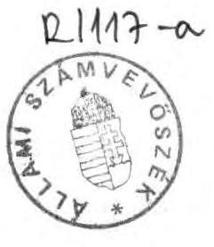

---

A vizsgálatot vezette: Krucsai Balázs főtanácsos

A vizsgálatot végezték: Istvánffy Lóránt tanácsos
Kemény Emil
Kiss Istvánné
Pallós Gáborné
Nagy Lajos
Pálfi Zsolt
tanácsos
tanácsos
tanácsos
külső szakértő
külső szakértő

---

# T A R T A L O M J E G Y Z É K 

1. BEVEZETÉS ..... 1 .
11. MEGÁLLAPÍTÁSOK
1.) A Kormánybiztosí Titkárság tevékenysége, az elöirt feladatok teljesitése ..... 6 .
2.) Az Osztrák DoKW cég fövállalkozásában vég- zett munkák elszámolása és a ráfordítások rendezése ..... 8 .
3.) A beruházási létesítmények készültségi foka ..... 15 .
4.) A ráfordítások elszámolása ..... 19 .
4.1 Alvízcsatorna kotrása ..... 23.
4.2 A táti árvédelmi töltés és a nagymarosi fel- vonulási lakótelep ..... 25.
4.3 A kutatási célú keretátadások ..... 25.
5.) A ráfordítások rendezése, a létesítmények hasznosítása ..... 26.
5.1 A befejezett, üzembehelyezett létesítmények ..... 27.
5.2 Befejezett, üzembe nem helyezett létesítmé- nyek ..... 29.
5.3 Befejezetlen létesítmények ..... 31.
5.4 Egyéb ráfordítások ..... 32.
5.5 Selejtezés ..... 33.
5.6 Függő (rendezetlen) tételek ..... 33.
III. KÖVETKEZTETÉSEK, JAVASLATOK ..... 36.
MELLÉKLETEK

---

# ÁLLAMI SZÁMVEVÖSZÉK   V-6-56/1992.   Témaszám: 107 

## J e 1 e n t é s

a Bős-Nagymarosi Vizlépcsőrendszer állami nagyberuházás
lezárásának pénzügyi felülvizsgálatáról

## I.

## B E V E Z E T É S

Az Országgyűlés 1991. április 16-i ülésnapján állást foglalt a Bős-Nagymarosi Vizlépcsőrendszerrel kapcsolatos időszerű kormányzati feladatokról. A 26/1991. (IV.23.) számú határozatában - többek között - felkérte a Kormányt az állami nagyberuházás azonnalı lezárására, az Állami Számvevőszéket pedig az elvégzett munkák átfogó pénzügyi felülvizsgálatára (10. sz. melléklet).

A beruházás azonnalı lezárásával kapcsolatos feladatok illetékes tárcák közötti egyeztetése, elsősorban a beruházás lezárását követő teendők felelőseinek kijelölése, időben elhúzódott. Ennek következtében az Országgyúlés határozatának végrehajtására csak 1991. októberében szűlettek meg a szükséges kormányzati döntések (2009/1991. HT 9. sz. kormányhatározat, 11. sz. melléklet).

A kormányhatározat előirta a beruházás lezárási eljárásának elveit, meghatározva a kűlőnbőző készültségủ és rendeltetésű létesítményekkel kapcsolatos teendőket és felelősőket. A kormány-

---

határozat ún. "lezárási határnapként" 1990. december 31-ét jelölte meg, melyhez kötötten a kijelölt felelősöknek ki kellett munkálni a műszaki készültségnek megfelelő pénzügyi ráfordításokat és gondoskodni kellett a létesítmények további hasznosításáról (kezelői jog átadása, értékesítés, selejtezés), illetve a tájrehabilitációs munkálatok és térségi fejlesztési koncepciók előkészítéséről.

Az Állami Számvevőszék feladata az országgyűlési határozat értelmében az 1990. december 31-ig történt ráfordítások és a létesítmények hasznosításának átfogó pénzügyi felülvizsgálata volt. Erre tekintettel nem vizsgálta a tájhelyreállítás - fejlesztési koncepció előkészítésének 1991-92. munkálatait, nem kívánva közbenső vélemény megfogalmazásával a folyamatot befolyásolni.

A Dunai Vízlépcső Kormánybiztosi Titkársága (DVKT) 1991. áprilisában kezdte meg a beruházás lezárásának előkészítését, mivel részben rá hárult magának az országgyűlési határozatot megvalósító kormányhatározatnak a kidolgozása is. A Titkárságot 1991. december 31-ével a Kormány megszüntette és a beruházás lezárásával kapcsolatos feladatokat a Közlekedési-, Hírközlési és Vízügyi Minisztérium keretében létrehozott Dunai Rehabilitációs Iroda (DRI) vette át.

A vizsgálat célja - a jóváhagyott programnak megfelelően - annak megállapítása volt, hogy a beruházással kapcsolatos költség- és pénzügyi elszámolások szabályosan, megfelelő dokumentumokkal alátámasztva történtek-e, a létesítmények hasznosítására tett intézkedések mennyiben fele1nek meg a gazdasági célszerűség és a költségtakarékosság követelményeinek. A jelentés lényegében véve követi a 2009/1991. (HT 9.) számú kormányhatározat felépítését, bizonyos összefüggések miatt azonban - p1. a DokW-val való elszámolások vizsgálatának beiktatása - néhány esetben attól eltér.

---

Az Állami Számvevőszéknek nem volt feladata - nem is vállalhatta át - a pénzügyi lezárással kapcsolatos feladatok elvégzéséért felelős szervek, illetve a lezárás ellenőrzésére hivatott intézmények helyett az értékelő jelentés elkészítése. Ennek ellenére az ÁSZ helyenként rákényszerült - az ellenőrzésértékelés érdekében - bizonyos lezárással összefüggő tevékenységek (számitások, összesítések, stb.) elvégzésére. Ezen túlmenően el kellett végezni az osztrák kivitelezésű nagymarosi munkálatok tételes ellenőrzését is.

A Bős-Nagymarosi Vízlépcsőrendszer beruházási programja a megvalósításával kapcsolatos államközi szerződés 1977. évi megkötése óta több izben változott. A beruházás lezárására vonatkozó országgyűlési döntés tárgyát - s így vizsgálatunk tárgyát is - a Vízlépcsőrendszer 3388/1986. sz. MT határozattal jóváhagyott beruházási programja alapján végzett munkák és pénzügyi elszámolások képezték.

A vizsgálat sajátossága, hogy a megszokottól eltérően nem befejezett, megvalósult, hanem befejezetlen - a megvalósítás folyamatában leállított - beruházás elvégzett munkáit kellett pénzügyileg lezárni és a beruházást megszüntetni. Ez szükségessé tette a beruházások lezárására vonatkozó jogszabályi előírások bizonyos fokú értelmezését, a sajátos helyzetre való adaptálását.

A lezárás fordulónapján érvényben lévő jogszabályok szerint például a nagyberuházások megvalósításáról és működéséről a beruházási javaslatot előterjesztő szerv vezetője gazdasági értékelést köteles készíteni. Az előírt gazdasági értékelésre - a ráfordítások és a megvalósult beruházás műszaki-gazdasági paraméterei összefüggéseinek elemzésére - ez esetben nem került sor. Ilyen jellegű értékelést az említett kormányhatározat sem írt elő.

---

Az adott helyzetben az Állami Számvevőszék vizsgálata nagy súlyt fektetett arra, hogy világos és egyértelmú elszámolást adjon a beruházás összes felmerült költségéről, az üzembehelyezett és hasznosított, vagy még hasznosításra váró létesítményekről, illetve a nemzetgazdasági kárként minősíthető ráfordítások nagyságáról. Ennek érdekében - mivel már a vizsgálat előkészítése során tudomásunkra jutott, hogy a beruházás lezárását végző Kormánybiztosi Titkárság ezzel nem foglalkozik programba vettük az osztrák DokW céggel a nagymarosi erőmű kivitelezésére kötött szerződés keretében elvégzett munkák költségeinek és pénzügyi elszámolásának vizsgálatát az OVIbER-nél.

A vizsgálat előkészítése során szoros kapcsolatot tartottunk az Országgyűlés Környezetvédelmi Bizottságával. Ennek keretében vizsgálati programunkat a Bizottság képviselói véleményezték. Programunkkal egyetértettek, de javasolták, hogy a lezárás felülvizsgálatát terjesszük ki az osztrák DoKW és a jugoszláv BRODOIMPEKS által végzett munkák pénzügyi felülvizsgálatára. Kérésüknek eleget tettünk.

A vizsgálat módszereinek kialakításakor számolnunk kellett azzal, hogy a költség- és pénzügyi elszámolások alapdokumentációig terjedő tételes felülvizsgálatára nincs reális lehetőség. Ezért a 15 fölétesítménycsoportra vonatkozóan csak ezek összesítő dokumentumainak feldolgozását tűzhettük ki célul. Megalapozottságukról és valóságtartalmukról a belsö összefüggések ellenőrzése és a kiválasztott létesítmények alapdokumentációig (építési napló, átadás-átvételi jegyzőkönyv, költségelszámolás és számlázás, stb.) terjedő részletes vizsgálata útján igyekeztünk bizonyosságot kapni.

---

A részletes vizsgálat alá vetett létesítmények a következők voltak:

- az osztrák DoKW céggel kötött szerződés keretében végzett munkák mintegy 13 MdFt,
- az alvízcsatorna kotrása 4,2 Md Ft,
- a táti árvédelmi töltés mintegy 500 M Ft,
- a nagymarosi felvonulási lakótelep mintegy 300 M Ft és
- a kutatási célokra történő keretátadás 57 M Ft összegű ráfordítással.

A létesítmények készültségéről - a dokumentációk ellenőrzése mellett - helyszíni bejárásokon is igyekeztünk tapasztalatokat szerezni.

A vizsgálatot külső müszaki szakértők bevonásával a Dunai Rehabilitációs Irodánál, az Országos Vízügyi Beruházási Vállalatnál (OVIBER) és a Kincstári Vagyonkezelő Szervezetné1 (KVSZ) végeztük. A helyszíni vizsgálatok 1992. március 10-én kezdődtek és június 5-én fejeződtek be. A vizsgált szervek a szükséges dokumentumokat rendelkezésünkre bocsátották. A vizsgálatot azonban nehezítette, hogy a beruházás lezárásáról összefoglaló, értékelő anyagok a Dunai Rehabilitációs Irodánál nem készültek.

A részjelentéseket terjedelmi korlátok miatt nem mellékeljük, jelentésünk azonban azok megállapításait, főbb adatait és összefüggéseit tartalmazza.

A jelentés tervezetét a témában illetékes állami szervekkel több szakaszban egyeztettük. A miniszteri szintű záróészrevételeket tartalmazó leveleket, véleményeltérés esetén az arra adott válaszokat a jelentéshez csatoltuk.

---

# II. 

## Megállapítások

1.) A Kormánybiztosi Titkárság tevékenysége, az elöirt feladatok teljesitése

A Dunai Vízlépcsö kormánybiztosa (Titkársága) a beruházás pénzügyi lezárásában elsösorban irányító és koordináló feladatokat látott el. A lezárással kapcsolatos dokumentációk elkészitését és a szükséges intézkedési javaslatok kidolgozását, azok müszaki-gazdasági megalapozását a Titkárság megrendelésére a beruházást korábban bonyolító OVI BER végezte.

Az OVI BER által elkészített dokumentációkat és intézkedési javaslatokat a Titkárság általában elfogadta, azok mélyrehatóbb szakmai ellenőrzésének írásos nyomai nincsenek.

A beruházás lezárásának föbb fázisairól összefoglaló értékelö anyagok nem készültek sem a Titkárságon, sem a jogutód Dunai Rehabilitációs Irodán. Ilyen értékeléseket a kormányzati szervek sem igényeltek. Az Iroda által 1992. február 28 -án átadott 4 oldalas jelentés (1. sz. melléklet) nem elégiti ki egy értékelö anyag követelményeit. Mindezekre tekintettel 1992. március 23-i kelettel levélben kértük a Dunai Rehabilitációs Iroda vezetőjét a beruházás lezárásával összefüggő számszaki dokumentáció kidolgozására. Az Iroda azonban teljeskörü saját - az OVI BER-étöl független dokumentációval nem rendelkezett. Ezért az összeállítást az OVI BER-rel készittette el, melyet április végén kaptunk meg

---

munkaközi anyagként. A DRI május 15-i keltű levelében jelezte, hogy a táblákat szúrópróbaszerűen ellenőrizte és megfelelőnek találta.

A Kormánybiztosí Titkárságnak a beruházás lezárásával kapcsolatos irányító és koordináló tevékenysége a belsö nyilvántartás rendezetlensége következtében nyomonkövethetetlen volt s így azt értékelni nem tudtuk.

A kormánybiztos a beruházás pénzügyi lezárásával kapcsolatos, a Kormány által 1991. december 31-i határidöre elöirt feladatokat csak részben teljesítette. Nem fejeződött be az üzemeltetésre nem alkalmas létesítmények további hasznosításra, selejtezésre történő átadása a Kincstári Vagyonkezelő Szervezet részére. Nem történt meg a kisajátított ingatlanok tulajdonosi-kezelői jogának rendezése, a peres, illetve függőben lévő ügyek lezárása. Emellett a kormánybiztos tevékenysége nem terjedt ki a nagyberuházás szerves részét képező Nagymarosi Vizlépcső osztrák DokW céggel kötött szerződés keretében végzett építési és egyéb munkálataira és azok ráfordításainak rendezésére. Eljárásukat azzal a vitatható indokkal magyarázták, hogy az általuk vezetett beruházási nyilvántartásban az osztrák hitelböl finanszírozott ráfordítások nem szerepelnek. Mindezek következtében a beruházás pénzügyi lezárása nem történhetett meg.

Megállapításaink szerint az 1991. december 31-i határidőre elöirt feladatok teljesítéséhez nem voltak meg a reális feltételek. E feladatok ugyanis csak 1991. októberében nyertek végleges megerősítést s így, a korábban megkezdett előkészítő munkálatok ellenére, a rendelkezésre álló két-két és fél hónap alatt nem teljesülhettek. A peres ügyek lezárása és az ezzel összefüggő ingatlannyilvántartás rendezése részben még az 1992. évet követő időszakra is áthúzódhat.

---

2.) Az osztrák DokW cég fövállalkozásában végzett munkák elszámolása és a ráfordítások rendezése

A Nagymarosi Vizlépcső építésére vonatkozó - az osztrák DokW céggel kötött - fővállalkozói szerződés keretében végzett munkák ráfordításait és a szerződés felbontásával kapcsolatban keletkezett pénzügyi kötelezettségeket az OVIbER-nél tételesen felülvizsgáltuk. Megállapitottuk, hogy a fővállalkozói szerződés keretében végzendő munkák az építkezés 1989. májusi felfüggesztéséig a tervezett ütemnek megfelelően és az akkor érvényes jogszabályok előírásai szerint folytak.

Az OVIbER a Vizlépcső építéséhez jogszabályban előírt vízjogi engedélyt - az engedély kiadásának feltételéül megszabott szakhatósági jóváhagyásokkal együtt - a Vízügyi Igazgatóságtól beszerezte. Előfordulhatott azonban, hogy ezen engedély megalapozásához nem szerezték be valamennyi szakágazat egyetértő véleményét, illetve hozzájárulását. A kivitelezési munka a szerződés részét képező "Teljesítési és Fizetési Terv"-ben rögzített ütemezés szerint folyt. A ténylegesen elvégzett munkákat és annak alapján az egyes munkafázisok becsült készültségi fokát az OVIbER és a DokW havonta közösen felvett "teljesítmény igazolási jegyzőkönyvben" állapították meg. Ez - illetve a gép- és szerkezetgyártók teljesítéseit igazoló bizonylat - képezte az átalánydíjas szerződés keretében végzett teljesítmények elszámolásának és kifizetésének alapját. A havonta kiállított és elszámolásra benyújtott számlák mindig az előző havi teljesítéseket tartalmazták, de a korábbi kifizetéseket göngyölítve tájékoztatást nyújtottak az addig teljesített összes kifizetésekről is.

---

Az elszámolás, a szerződésben foglaltaknak megfelelően, 1984. októberi árbázison történt. A bázisárat az inflációs hatás kivédésére szolgáló, az osztrák bér- és anyagárak változására épülő számítási eljárással (ún. "árcsúsztatás") korrigálták. Az így képzett és elfogadott folyó árat a beruházást meghitelező osztrák bank fizette ki a DoKW-nak.

A DokW 1989. április végéig - tehát az építkezés felfüggesztését megelőző hónap végéig - összesen 32 db részszámlát nyújtott be elszámolásra 712,5 millió ATS összegben. Ebből az elvégzett építési munkák értéke 380,1 millió ATS-t képviselt.

Az átvizsgált dokumentumok - köztük a tételesen feldolgozott 32. számla dokumentumai - szerint a benyújtott számlák igazolása szabályos volt, a kifizetések arányaiban a ténylegesen elvégzett munkákhoz igazodtak, túlszámlázást nem tapasztaltunk.

A nagymarosi építkezéseket felfüggesztő kormányhatározatot követően a munkát az OVIBER 1989. május 15 -én kelt levelében felfüggesztette. A tervezési, előkészítési és gépészeti, gyártási stb. munkák azonban - az akkori kormány jóváhagyásával - az 1989. novemberi szerződésbontásig tovább folytatódtak. A szerződésbontás után benyújtott utolsó 39. számú - részszámla és a felfüggesztés előtti 32. számú részszámla adatainak összevetéséből megállapítható, hogy a további, köze1 6 hónapig végzett munkákra (ame1yek elsősorban a vizlépcső további sorsát érintő döntési bizonytalanság következményei voltak) összesen mintegy 200 millió ATS-t fizettek ki az 1989. május 15 -tól november 14 -ig terjedő időszakban. Ebből tervezésre, műszaki előkészítésre és fővállalkozói tevékenységre 95-98 millió ATS-t,

---

gyártásra 100-105 millió ATS-t. A DoKW-nak kifizetett összeg akkori átlag devizaszorzóval számolva kb. 8-900 millió forint értéket képvise1.

A fövállalkozói szerződés 1989. november 14-i felbontását követően - kisebb nagyobb megszakításokkal - egy évig tartó tárgyalások folytak a DoKW-t megilletö végkielégités megállapítása és a szerződésbontással kapcsolatos egyéb kérdések rendezése érdekében.

A munkaterületet az OVIbER 1990. I. 3-án jegyzőkönyvíleg visszavette, megállapodtak a DokW júniusig történő teljes levonulásában, a dokumentációk nagy részének OVIBER-nek történő átadásában, a félkész tervek 10 évig történő megőrzésében. Késztermék nem jött létre, a félkésztermékek és anyagok a vállalkozók tulajdonában maradtak, hasznosítási (kárenyhítési) kötelezettségük mellett.

Hosszadalmas vita csak a DoKW-val való végelszámolás körül folyt. A vita tárgyát elsősorban a fizetési kötelezettség megállapításának módszere képezte.

A szerződés az osztrák jog kizárólagos alkalmazását kötötte ki, de nem utalt konkrét jogforrásra. Ezért az OVIBER hibát követett el akkor, amikor elfogadta az 1989. december 7-én Bécsben felvett 154. számú jegyzőkönyv 6. pontjában rögzített rendezési alapelveket. E szerint a DokW fizetési igényét az osztrák polgári törvénykönyv (ABGB) 1168 paragrafusának kritériumai alapján adja meg. Ez azt jelenti, hogy a fizetési igény meghatározásánál a teljes szerződéses árból indulnak ki és ebből levonják a vállalkozók által elérhető megtakarításokat.

---

A magyar érdekek szempontjából kedvezőbb lett volna a szerződés mellékleteit képező osztrák RTV és AVB előírásait (az építési munkák és a vízi acélszerkezetek általános szerződéses feltételeit) alapul venni a fizetési kötelezettség megállapításánál. Ezek szerint ugyanis a vállalkozó részére a már átvett és még át nem vett teljesítések ellenértékét, valamint a még el nem végzett teljesítések meg nem térülő kiadásait és ráfordításait kell megtéríteni. Ez utóbbi számítási módszer az "alulról felfelé" építkezés magyar gyakorlatával is megegyezik.

Az OVIBER - a jegyzőkönyvek tanusága szerint - a későbbi tárgyalások során egyre erőteljesebben igyekezett rávenni a DokW-t ez utóbbi módszer szerinti megközelítésre, ami végülis sikeresnek bizonyult. A magyar fizetési kötelezettség megállapításánál gyakorlatilag a tényleges költségekböl indultak ki, s a kártérítési követelések érvényesítését kizárták.

A DokW - az osztrák és a magyar vállalkozók, illetve alvállalkozók adatai alapján - 1990. februárjában átadta az OVIBER-nek a beruházás készültségi állapotáról szóló összeállítást. Ennek valóságtartalmát az OVIBER - az ÁFI és az ERBE képviselőinek bevonásával - március és aprilis hónapban a helyszínen ellenőrizte. A DokW-nál több ízben kifogásolta a túlzottan magasra értékelt készültségi százalékokat és sürgette azok felülvizsgálatát, valamint az anyagok és félkésztermékek mielőbbi értékesítését.

A készültségi fokra vonatkozó összeállításból és a jegyzőkönyvekből megállapítható volt, hogy a tényleges készültségi állapotot egzakt módon nem mutatták ki. Az a legtöbb esetben műszaki becslésen, a teljesítési ütemtervvel való összehasonlításon és a helyszíni szemlék tapasztalatain alapult.

---

Ez egyes olyan munkafolyamatoknál, ahol a "készültség" a beruházásnak ebben a korai fázisában még zömmel szellemi előkészítésből, tervezésből, anyagmegrendelésből és kisebb mértékben félkésztermékek előállításából tevődött össze, elfogadható. Nagyobb biztonsággal a nagymarosi építés állapotát rögzítették, itt döntő többségében a tényleges munkavégzés felméréséből indultak ki.

A DokW többszörös átdolgozás, tárgyalás után 1990. május 11-én az egész beruházásra vonatkozó készültségi fokot 36 %-ban adta meg. Ennek alapján, a teljes szerződéses árból kiindulva, fizetési igényét 3.848 millió ATS-ben határozta meg.

Részletezve:

- a szerződésben rögzített 5.750 M ATS átalányár az elért költségcsökkentések levonásával, valamint az 1989. november 14-ig számított árcsúszással növelve 6 677 M ATS
- megtakarítások összege 2 829 M ATS

Fizetési igény 3 848 M ATS

"A jó partneri kapcsolat szellemében azonban fizetési igényüket 868 M ATS-se1 csökkentik." Ajánlatuk tehát 2.980 M ATS volt, amit 1990. július 30-ig tartottak fenn. (A magyar szállítók ebben a csökkentett igényben 308 M ATS-se1 szerepeltek.)

A tárgyalási folyamatot 1990. júniusától kezdve a Kormánybiztosi Titkárság, illetve a Környezetvédelmi Minisztérium irányította. Ez utóbbi utasítására az OVIbER az ÁFI-va1 és az ERBE-ve1 egyeztetett ellenjavaslatot dolgozott ki, amelyben tárgyalási alapul maximum 30 %-os

---

készültségi fok (mintegy 2.000 M ATS) és a szerződéses ár $10 \%$-ának megfelelő költségtérítési átalány ( 668 M ATS), azaz összesen 2.670 M ATS fizetési kötelezettség elfogadását javasolták.

Ezt az ellenjavaslatot azonban - az illetékes kormányszervek összehangolt álláspontjának kialakításában jelentkező nehézségek miatt - az osztrák félnek nem adták át. A DokW-val folytatott levelezés 1990. június és szeptember között lényegében véve csak kapcsolatfenntartó jellegü volt.

Az egységes kormányzati álláspont kialakításának be1só nehézségeire utal, hogy a Vízlépcső Kormánybiztosi Titkárság - az osztrák fél bírósági eljárást kilátásba helyező fenyegetései ellenére - csak 1990. szeptember 5-én rendelte meg a MÉLYÉPTERV-től a beruházás készültségi fokának felülvizsgálatát, illetve ellenőrzését. A vállalat a rendelkezésre álló dokumentumok átvizsgálása és néhány fizikális tétel szúrópróbaszerủ ellenőrzése alapján végleges szakvéleményében a beruházás reális készültségi fokát 29,2 - 29,3 \%-ban jelölte meg.

Az így már több oldalról is megerősített készültségi állapot ismeretében az OVIBER új vezérigazgatója - az érdeke1t miniszterek és a kormánybiztos egyetértésével - a fizetési kötelezettség rendezésére 1990. október 18-án 2.490 M ATS összegü ellenajánlatot tett a DokW-nak.

Az egyeztető tárgyalások után a 2.650 M ATS összegü fizetési kötelezettségre vonatkozó megállapodásról szóló jegyzőkönyvet 1990. november 13-án írták alá Bécsben.

---

Az összeg nagyságrendje arra utal, hogy a DokW végülis hallgatólagosan elfogadta az OVIbER által javasolt és a külsó magyar szakértők részéről is helyesnek tartott számítási módszert a fizetési kötelezettség meghatározására.

A magyar fél fizetési kötelezettségét tovább növelte a munkálatok felfüggesztése miatt tételesen elszámolt 102,3 M ATS összegü állásköltség, a munkaterület átadásáig végzett 6,4 M ATS összegü örzési és állagmegóvási költség, valamint a szerződésbontás időpontjától számított 122,5 M ATS összegü fizetési késedelmi kamat.

A Nagymarosi Vízlépcsö építésére tehát 1990. november 13-ig (gyakorlatilag a beruházás pénzügyi lezárásának időpontjáig) összesen 2.881,2 M ATS (a ráfordítások felmerülési időpontját figyelembe véve átlagosan 4,5 Ft/ATS árfolyamon számolva 13 Md Ft) összegü ráfordítás történt. E ráfordításokat azonban osztrák hitel finanszírozta, s e hitelek visszafizetése a kamatterhek révén ennél jóval nagyobb terheket hárít az állami költségvetésre az elkövetkező évtizedben.

Az állami költségvetés BNV-vel kapcsolatos jövőbeni terheit "A belsó államadósság Bós-Nagymarosi Vízlépcsőrendszerrel összefüggö elemeinek vizsgálatáról" készített, 1992. február 12-én kelt 003/1/1992. ÁSZ TÜK. számú jelentésünkben részletesen bemutattuk.

Az átvizsgált dokumentumok alapján megállapítottuk, hogy az OVIbER az építési munkálatok felfüggesztését, majd a szerződés felbontását követően tett intézkedéseit a felsőbb irányító szervekkel egyeztette. Indokolatlan vagy szabályellenes kifizetések igazolását, illetve ilyen kötelezettségek vállalását nem tapasztaltuk.

---

A beruházási ráfordításoknak ez a hasznosítható értékeket nem eredményező tetemes hányada pénzügytechnikailag még rendezetlen, az osztrák féllel szemben fennálló tartozás az államadósság között nincs nyilvántartva.

További intézkedést igényel a hiteltartozás törlesztésére szol gáló áramszállítás szerződéses feltételeinek a módosítása is. A szerződés értelmében a Magyar Villamosmũvek RT 1996. januárjától 20 éven keresztül áramot szállít az osztrák villamosmũvek részére. A szállított áram vételára szolgál a hiteltartozás törlesztésére. A megállapodás néhány feltételét a DokW-val kötött fövállalkozói szerződéstől függően határozták meg. E szerződés felbontása miatt ezért ezeket a feltételeket újra meg kell állapítani, mivel módosításuk nélkül azok a magyar fél számára kedvezötlenné váltak (pl. a rendelkezésre álló hitelkeretnek csak kisebb része kerûlt felhasználásra, a rendelkezésretartási jutalék fix összege mégis változatlan maradt, bizonytalanná vált a szállítandó áram csúszóárának kiszámítása). A szũkséges módosításokat a Kormánybiztosi Titkárság az MVM RT-nél nem kezdeményezte. A vizsgálat során megismert dokumentumok alapján az MVM RT-t írásban felkértük a kérdés rendezésére.

# 3.) A beruházási létesítmények készültségi foka 

Az 1987-ben jóváhagyott létesítményjegyzék a BNV-nek a magyar fél által megvalósítandó részét 15 fölétesítményre bontotta, ezen belûl számtalan kisebb-nagyobb létesítményt felsorolva.

---

A beruházás pénzügyi lezárásának létesítményjegyzéke lényegében ezzel azonos tartalmú. Az ellenőrzésnél tapasztalt, a kivitelezésben megmutatkozó eltérések három főbb csoportba sorolhatók:

- elsősorban a melléklétesítményeknél mutatkozott, műszaki indokok alapján tartalmi bővülés mint pl. a Dunakiliti duzzasztómünél iparvágány építése, ökológiai tanulmány készítése, rajkai telepépítés, stb. Az egyes "melléklétesítmény és egyéb létesítmény" címszavakhoz azonban a tervezés olyan nagyfokú rugalmassággal rendelte hozzá a költségeket, hogy a menet közben végrehajtott tartalmi bővítésre az eredetileg megállapított pénzügyi keret fedezetet nyújtott;
- a Nagymarosi Vízlépcső építésének leállítása miatt számos létesítmény megvalósítása el sem kezdődött, s így ráfordítás sem történt. Ilyen pl. a Pilismarót öblözet, a Nyergesújfalu- Dunaalmás öblözet tervezett munkái, a vasútvonalak védelme stb.
- a leállítás miatt szükségessé vált eredetileg nem tervezett munkák, mint pl. fenntartási, állagmegóvási, örzési feladatok, különböző felmérések, szakértői, munkák stb.

A részleteiben is áttekintett többletmunkáknál szerzett tapasztalatok alapján úgy ítélhető meg, hogy a tartalmi bővítések elsősorban a térség infrastruktúrájának javítását szolgálták és nem az erőműépítést, így azok elfogadhatók.

A készültségi fok megállapítása az OVIbER 1991. áprilisában elkészült és a Kormánybiztosi Titkárság rendelkezésére

---

bocsátott anyaga alapján történt. Az OVIbER a készültséget a létesítmény müszaki állapotleírásának és nyilvántartott pénzügyi ráfordításának összevetésével, becsléssel állapította meg. Az OVIbER egy évvel korábban készült számítása is hasonló módszerrel történt. Ezt a módszert a Mélyépítési Tervező Vállalat 1990. tavaszán szakmailag ellenőrizte és kisebb észrevételezéssel elfogadta. Alkalmazása ellen kifogást nem emelünk. A vizsgálat során müszaki szakértőinkkel helyszíni bejárást is végeztünk és tájékozódtunk néhány létesítmény müszaki készültségéről. Számottevő eltérést a dokumentáltakhoz képest nem találtunk.

A létesítmények készültségi foka jelentős szóródást mutat. A dunakiliti tározó és duzzasztómú gyakorlatilag 100 \%-ban elkészült, a teljes bősi létesítménycsoport 90-92 \%-os készültségi állapotban van.

A bősi létesítmények készültségi állapotát a következő ábra szemlélteti.

# LÉTESITMÉNYEK BECSÜLT KÉSZÜLTSÉGI FOKA BÖS-GABCSIKOVO 

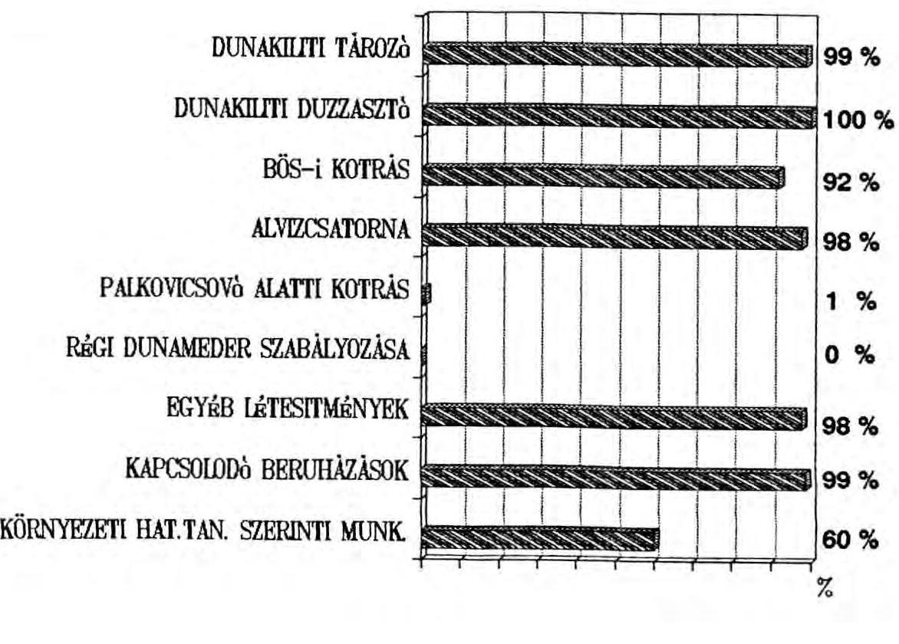

---

A magyar kivitelezésben épített nagymarosi létesítménycsoport mintegy 40-45 \%-ban készült el. Ezen belül 100 \%-os az Ipoly folyó és öblözet védelmi létesítményének készültsége, míg néhány öblözetben a munka el sem kezdődött. A megkötött szerződésekben elöirányzott munkálatok 77-80 \%-át végezték el a nagymarosi létesítményeknél. A felfüggesztés miatt a tervezett munkálatok közel felére szerzödés sem jött létre. Az osztrák kivitelezésben végzett munkálatok készültségi fokát $29,3 \%$-ban rögzítették.

A nagymarosi létesítmények készültségi állapotát a következő ábra szemlélteti.

# LÉTESTTMÉNYEK BECSƠLT KÉSZƠLTSÉGI FOKA VISEGRÁD-NAGYMAROS 

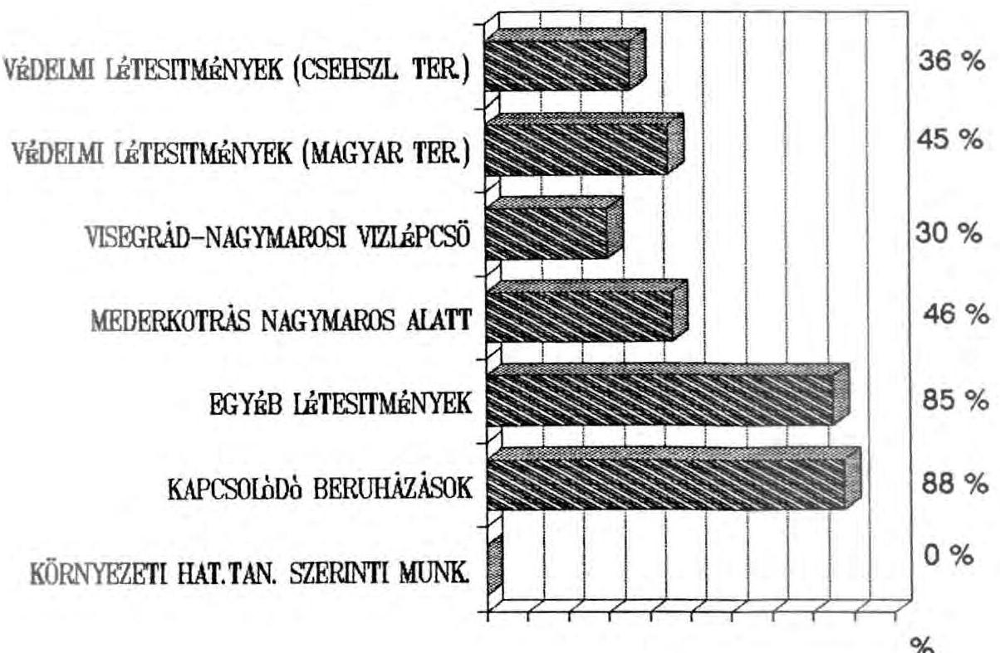

---

A jelentés 2. sz. melléklete részleteiben tartalmazza az egyes létesítmények pénzügyi lezárásának helyzetét, becsűlt készültségi fokát és hasznosíthatóságát.
4.) A ráfordítások elszámolása

A jóváhagyott beruházási program, illetve az 1987. februárban kiadott engedélyokmány a teljes beruházás fejlesztési költségét 54.116 millió forint-ban rögzítette, forgóalapszükséglettel és hitelkamattal együtt.

Magát a beruházás költségét 52.964 millió forint-ban irányozták elő, beleértve 3.083 millió forint kapcsolódó infrastrukturális beruházást és 2.460 millió forint előirányzott tartalékot. A költségek prognosztizáltak, ame lyek figyelembe vették az 1993. évi tervezett befejezésig az infláció becsűlt mértékét. A nagymarosi osztrák erőműépítés forint költségét úgy képezték, hogy a fővállalkozói szerződésben megállapított 5.750 millió ATS átalányösszeget az akkor érvényes devizaszorzóval forintra átszámitották.

A beruházás kezdetétöl a lezárás határnapjáig (1990. december 31-ig) a bősi (1-es) és nagymarosi (2-es) létesítménycsoportokra a következő ráfordítás történt.

---

E Ft-ban, folyó áron

|  Létesítmény | Engedélyokmány elöl rányzata | Szerződésállomány összege | Pénzügyi teljesítés 1990. XII. 31-ig ÁFA nélkül  |
| --- | --- | --- | --- |
|  1. Bös | 17.934 .000 | 20.360 .044 | 18.590 .809  |
|  2. Nagymaros
- magyar kivit. | 16.603 .000 | 8.631 .296 | 6.837 .196  |
|  - osztrák kivit. | 18.427 .000 | 18.427 .000 | 13.000 .000*  |
|  Leállítás miatti többletmunka |  | 245.563 | 238.935  |
|  BNV összesen | 52.964 .000 | 47.663 .903 | 38.666 .940  |
|  ebböl magyar kivitelezés | 34.537 .000 | 29.236 .903 | 25.666 .940  |

- Ez magyar részról nem jelent tényleges kifizetést, mivel mint ismeretes, az osztrák munka ellenértékét a Magyar Villamos Müvek Rt 1996-tól árammal egyenlíti ki, melynek költségét az Rt részére a költségvetés fogja megtéríteni.

A teljesség kedvéért megemlítjük, hogy a közölt számok itt is és a későbbiekben is mindig ÁFA és refinanszirozási hitelkamat nélkül értendök, amelyek számottevó további költségvetési terheket okoznak.

Az 1990. december 31-ig bezárólag a pénzügyi teljesítés után elszámolt

ÁFA összege a refinanszirozási hitelkamat 3.380 .394 E Ft, 7.355 .062 E Ft volt.

---

A BNV beruházás tervezett és tényleges ráfordításait, anyagi, múszaki összetételét fölétesítményenkénti bontásban - a DokW ráfordítások kivételével - a 3. sz. melléklet tartalmazza.

# A BERUHÁZÁS KÖLTSĖGEINEK MEGOSZLÁSA A RAPOROITAS TIPUSA SZERNT 

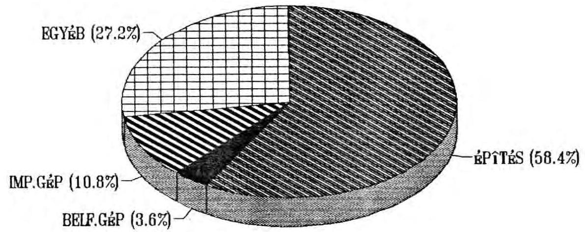

Az elkészült, illetve befejezetlen létesítmények múszaki készültségi fokát és pénzügyi ráfordítását összevetve az 1987-ben jóváhagyott költségtervezettel megállapítható, hogy a bösi létesítménycsoport meghatározó nagylétesítményeinél a tervezetthez képest jelentős - 20 - $70 \%$ - költségtúllépés következett be.

A rendelkezésre álló dokumentációk elemzése alapján a vizsgálat arra a megállapításra jutott, hogy a túllépést kisebb részben a költségek alultervezése, nagyobb részben a tényleges inflációs költségnövekménynek prognosztizált-

---

tól eltérő, lényegesen magasabb százaléka, valamint a forint folyamatos leértékelése okozta. A nagymarosi létesítménycsoportnál az alacsony készültségi szint miatt a túllépés nem állapítható meg. Kiugróan magas mindkét csoportnál az egyéb beruházások költségnövekménye (pl. kisajátítás, zöldkár, illeték, tervezés, művezetés, lebonyolítás és kutatás- fejlesztés).

Megemlítjük, hogy 1989. februárjában az illetékes központi szervek elvégezték a tervezett beruházási költségek felülvizsgálatát. Ennek nyomán a teljes előirányzat 66.398 M Ft-ra módosult, amit azonban az akkori kormány formálisan már nem hagyott jóvá.

A BNV leállítása miatt bizonyos előre nem tervezett munkák is szükségessé váltak. Ezek többek között az árvízvédelmi rendszer helyreállítása, állagmegóvás, vállalkozói kártérítés és a tájrehabilitációval, a leállás tudományos megalapozásával összefüggő kutatási munka céljára pénzügyi keretjuttatások. Az összes leállás miatti többletmunka ráfordítása 238935 E Ft.

A létesítményekre elszámolt ráfordítások szabályosságát a vizsgálat során szúrópróbaszerủen kiválasztott tételeknél ellenőriztük. A kiválasztott létesítményeknél - amelyek az összes magyar kivitelezés ráfordításának mintegy 18 \%-át képviselik - megállapítottuk, hogy a pénzügyi elszámolások szabályosak, megfelelően dokumentáltak, a szerződés szerinti teljesítések ráfordításai a müszaki készültséggel arányosak.

---

# 4. 1 Alvízcsatorna kotrás 

A szlovák területen fekvő alvízcsatorna és a Duna meder-kotrására az OVIBER a jugoszláv BRODOIMPEKS-sze1 szerződött, összesen 49, 5 M USD-ért. A cég versenytárgyalás útján kapta a megbizást 1986-ban. A kivitelezés költségére a jugoszláv JUBMES-bank hosszúlejáratú hitelt nyújtott. A rendelkezésünkre bocsátott dokumentáció szerint a versenytárgyalást szabályszerűen kiértékelték. A vállalást elnyert cég a vállalási összeget és az egyéb feltételeket illetően a legkedvezőbb ajánlatot adta az áralkuban.

A munkavégzés során a vállalkozó ismételt szerződésmódosítást kezdeményezett azon a címen, hogy a kotrás geológiai körülményei rosszabbak a feltételezettnél, a magyar bedolgozó társkivitelező (FOKA) az előirányzottnál kevesebbet teljesített, végül többlet kotrási igény merült fel a cseh és szlovák fél részéről. Összeségében 10\%.-ot meghaladó többlet kotrásra volt szükség. Ezeket az OVIBER elfogadta, ami a $\mathrm{m}^{3}$ kotrás egységárának emelését vonta maga után. Erre a kivitelezőt a szerződés feljogosította. Észrevételeztük, hogy a szerződést e pontjában a magyar félre nézve hátrányosan kötötte meg az OVIBER. Ennek ellenére még a módosításokkal megemelt egységár is jelentősen alacsonyabb volt az ajánlattevő magyar kivitelező áránál (jugoszláv cég egységára $45 \mathrm{Ft} / \mathrm{m}^{3}$; FOKA-é $100 \mathrm{Ft} / \mathrm{m}^{3}$ ).

A Nagymarosi Vizlépcső elmaradása miatt 1989. november 13-án a Duna meder kotrását stornirozták. Németh Miklós miniszterelnök 1990. március 6-i keltü levelében utasította a Környezetvédelmi Minisztérium államtitkárát, mint beruházót, hogy az 1990. évre engedélyezett munkálatokat tartalmazó létesítményjegyzékben maradéktalanul érvényesíteni kell a Kormány álláspontját, amelyet a miniszterelnök 1990. január 10-i levelében közölt a CSSZSZK miniszterel-

---

nökével. Eszerint a magyar fél a tudományos szakértői vizsgálatok és az államközi szerződés módosítására irányuló tárgyalások ideje alatt "az építési munkákat felfüggeszti és kizárólag állagmegóvási munkákat végez".

A miniszterelnöki levél felszólította az államtitkárt, hogy minden állagmegóvason, árvizvédelmen és lakossági infrastrukturán kívüli építési munkát azonnal függesszen fel.

A KVM államtitkára március 13-án és 14-én külön előterjesztésben tájékoztatta az akkor még formálisan beruházási jogkörrel nem rendelkező BNV kormánybiztost a szlovák területen fekvő alvízcsatorna kotrási munkái azonnali felfüggesztésének várható nemzetközi, illetve kártérítési következményeiről. Így a kotrási munka felfüggesztésének elrendelése helyett a következmények áttekintését javasolta. Ezzel egyidőben az 1990. évi létesítményjegyzék felülvizsgálatára független szerveket, így az Állami Számvevőszéket kérte fel a Kormány.

Az ÁSZ szakvéleményét V-22/25/1990. szám alatt 1990. április 28-án készítette el. Ebben az ÁSZ - a kellő ismeret hiánya miatt - az alvízcsatorna-kotrás felfüggesztésének nemzetközi következményeiről nem foglalhatott állást, csupán a vállalkozó kártérítési igényére és a hitelszerződés várható módosításának költségvonzatára hívta fel a figyelmet.

A szakvélemények ismeretében a kormánybiztos az 1990. évi létesítményjegyzék jóváhagyása mellett 1990. május 24-én utasította OVIBER-t írásban a kotrási munka leállítására és a cég levonultatására. A miniszterelnöki döntést követő mintegy két és félhónapos huzavona kb. 500-550 ezer USD

---

értékű többlet kotrási tevékenységet okozott. A végelszámolásban a BRODOIMPEKS 19,3 millió USD-t kapott. Ugyanennyi az igénybe vett hitel összege is.

A munkák felmérése, számlázása szabályszerű, a műszaki ellenőrzés a naplók tanusága szerint folyamatos volt. A kivitelezés készültségi foka levonulás után $90 \%$ fölötti. A befejezetlenség ellenére a ráfordítás 4,2 Md Ft, amely 900 M Ft-tal magasabb a szerződéses árnál. Véleményünk szerint ebben az egységáremelésen túl az időközben végbement forintleértékelés is szerepet játszott. A többletráfordításból mintegy 320 M Ft-ot ( 4 M USD) a cseh és szlovák féllel szembeni követelésként kell kezelni.

# 4. 2 Táti árvédelmi gát és a felvonulási lakótelep 

Szakértő ellenőrizte az esztergomi öblözet táti árvédelmi gátjának és a nagymarosi felvonulási lakótelep építési munkáit is. Megállapította, hogy a kivitelezők versenytárgyalás útján nyerték megbízatásukat. Jellemző a többszöri szerződésmódosítás, a lakótelepnél kivitelező váltás. A módosítások többsége müszakilag indokolt. A felmérések, elszámolások szabályszerűek, a műszaki ellenőrzés folyamatos volt. A költségtúllépések nem értékelhetők, mivel a munkákat félkész állapotban leállították.

## 4. 3 Kutatási célú keretátadások

A pénzügyi keretátadások 60 M Ft-jából 42,5 M Ft indokoltságát és szabályszerűségét tételesen ellenőriztük.

A keretátadásból 2,5 M Ft-tal részesült a Magyar Nemzeti Múzeum, aki ezt megelőzően is folyamatosan kapott pénzügyi keretet régészeti leletmentés céljára. A mostanival együtt

---

összesen 17,4 M Ft-ot használt fel régészeti kutatásra. Az MNM az átvett összegekkel folyamatosan elszámolt, a legutolsó átadott tétel elszámolása 1992. év végéig megtörténik. A rendelkezésükre bocsátott pénzeszközök felhasználását szabályszerűnek találtuk.

A Magyar Tudományos Akadémia 40 M Ft keretet kapott kutatási célra 1990-ben. Megállapítottuk, hogy a pénzfelhasználást a keretátadásról készített szerződés előírásai ellenére sem a DVKT, sem a jogutód DRI nem ellenőrizte. Az MTA a felhasználásról a helyszíni ellenőrzés időpontjáig nem számolt el az átadónak. Erre a vizsgált szervezetek figyelmét felhívtuk. Az MTA illetékes részlege ezt követően küldte meg az összesített pénzfelhasználásról szóló kimutatást a Dunai Rehabilitációs Irodának.
5.) A ráfordítások rendezése, a létesítmények hasznosítása

A DVKT szerződéses megbízása alapján az OVIBER a beruházás lezárásának 1990. december 31-i határnapját követően tovább folytatta a határnapig elért műszaki- pénzügyi állapotnak megfelelően a létesítmények átadását a kijelölt kezelőknek. A kialakult helyzetet az OVIBER 1992. áprilisában készült összeállításának felhasználásával készített 4. és 5. sz. mellékletben, illetve a következő ábrában mutatjuk be. A 4. sz. melléklet jelzi az 1990. decemberi határnaphoz képest bekövetkezett változásokat is. A pénzügyi teljesítés mindkét időpontban természetszerűleg azonos.

---

# A RÁFORDITÁSOK HASZNOSITAS SZERINTI MEGOSZLASA (DOKW-ráforditás nélkül) 

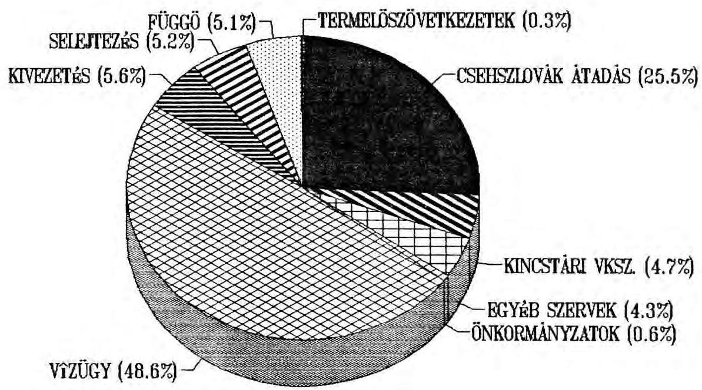

### 5.1. A befejezett, üzembehelyezett létesítmények

Az "üzembehelyezett" megnevezés - melyet a nyilvántartások szerint fogadtunk el - nem jelenti a létesítmények eredeti terv szerinti üzembelépését, hanem olyan elkészült müveket jelez, melyek jelen állapotukban - elsősorban árvizvédelmi vagy infrastruktúra-ellátás céljából - véglegesen vagy idószakosan müködte thetők.

A vizsgálat időpontjáig
a bősi létesítménycsoportból 11228298 E Ft
a nagymarosi létesítménycsoportból 2148884 E Ft
összesen 13377182 E Ft

---

ráfordítási értékủ létesítményt adtak át a kezelöknek üzemeltetésre a 2009/1991. kormányhatározat 1.2 és 1.6 pontja szerint.

A ráfordítási érték alatt azt a tényleges pénzügyi ráfordítást értjük, amellyel az egyes létesítményeket terhelték. A használati, illetve piaci értéke ezeknek a létesítményeknek ettől lényegesen eltérhet (általában lefelé).

A legnagyobb átvevök a területileg illetékes vízügyi igazgatóságok voltak. A teljes üzembehelyezett érték 75 \%-át kapták. A dunakiliti tározó és duzzasztómú mellett föleg árvízvédelmi, part- és mederrendezési objektumok kezelöi jogának átadása és ily módon történő hasznosítása tartozik ebbe a körbe.

Jelentős értéket képvisel még a cseh és szlovák partnernek átadott- szlovák területen létrehozott - magyar kivitelezésú létesítménycsoport (pl. Hrusov-Dunakiliti tározónál), amelyet a szlovák fél használatba vett. Ezek teljes összege $1,960 \mathrm{M}$ Ft.

Mindezen kívül átadtak az érintett kezelőknek kereken 1,3 milliárd Ft értékủ infrastrukturális (út, csatorna, villamosenergia ellátás, stb.) kapcsolódó beruházási létesítményt (6. sz. melléklet).

Az átadási jegyzőkönyveket az OVIBER állította össze, a DVKT képviselöje ellenjegyezte. Ellenőríztük a duzzasztómú és a cseh és szlovák fél részére történő átadás jegyzőkönyveit. Megállapítottuk, hogy azok szabályosak, megfelelően dokumentáltak. Az átadást követően a beruházási nyílvántartásból a létesítményeket és azok ráfordításait kivezették.

---

# 5.2. Befejezett, üzembe nem helyezett létesítmények 

A vizsgálat időpontjáig
a bősi létesítménycsoportnál 590176 E Ft
a nagymarosi létesítménycsoportnál 1195981 E Ft
összesen 1786157 E Ft
ráfordítási értékủ objektumot adtak át a kezelőknek további hasznosításra.

Ebbe a kategóriába tartoznak a felvonulási létesítmények, az ingatlan jellegű melléklétesítmények és a kisajátított ingatlanok, amelyek nem illeszkednek a vízlépcső nélküli állapot vízügyi fejlesztéseibe a 2009/1991. Korm. határozat 1.4 pontja szerint.

Itt kerűlt elszámolásra a szlovák területen épült 157 M Ft értékủ terelö töltés, amelyet a kormányhatározat 1.5 pontja értelmében nem adtak át üzeme1tetésre, továbbá a dunai megfigyelörendszer és a tudományos kutatások költségei 355 M Ft értékben. Előbbit könyveléstechnika1lag kivezették a beruházási állományból, utóbbit a Környezetvéde1mi és Területfejlesztési Minisztériumnak adták át.

Ezekbő1 a létesítményekbő1 1.194 M Ft ráfordítási értékủ létesítményt a KVSZ vett át.

A KVSZ-nek összesen 84 jegyzőkönyvvel adták át a létesítményeket. Ezek mintegy 10-12 \%-át ellenőriztük tételesen. A ellenőrzött jegyzőkönyvekhez részletes állapotleírás, műszaki dokumentáció is tartozik. A jegyzőkönyvek összesített adatai, az OVIBER által készített kimutatás, valamint a KVSZ nyilvántartása közötti egyezőség - kisebb mértékủ korrekció me1lett - fennáll.

---

A jegyzőkönyvek az átadás időpontjának tényleges pénzügyi ráfordításait tartalmazzák és nem az 1990. decemberi zárónapít. Egy-két esetben, mint pl. Visegrád műszaki erdészeti objektumnál 1991-ben is volt ráfordítás, ezeket táblázataink nem tartalmazzák. Ez mintegy 20 M Ft. Ezen kívül 1,7 M Ft téves átadás történt, amit az OVIbER utólag korrigált. Végül a KVSZ kapta meg a 13,8 M Ft értékű ipolydamásdi határátkelőt, amely az OVIbER kimutatásában "csehszlovák átadás"-ként szerepel. A fenti korrekciókkal, amelyeket a saját 3-5. sz. mellékleteinkben kiszűrtünk, az adatok egyeznek.

A 84 db-os jegyzőkönyvi átadás során nem csak az itt tárgyalt 1.194 M Ft ráfordítási értékủ létesítményt adták át, hanem egyúttal a már említett, üzembehelyezettnek minősült határátkelőt, valamint egyéb és befejezetlen létesítményeket 16 M Ft értékben. A KVSZ végeredményben 1.224 M Ft ráfordítási értékủ létesítményt vett át hasznosításra.

Megjegyezzük, hogy a KVSZ részére a jegyzőkönyvi átadásokat nem a DVKT, hanem az OVIbER eszközölte 1991. december első hetében. A kormánybiztosság 1990. december 17-én egy összevont átadás-átvételi jegyzőkönyv aláírásával kapcsolódott be az eljárásba, amely jegyzőkönyv rögzítette a korábbi 84 db jegyzőkönyvi átadás tényét (7. sz. melléklet). A vizsgálatot végzők véleménye szerint ez az eljárás formailag is kifogásolható, tekintve, hogy ezen időpontban a DVKT még beruházói jogkörrel rendelkezett.

A vizsgálat időpontjáig a KVSZ elvégezte az átvett objektumok állapotfe1mérését és értékbecslését. Ennek alapján is nyilvánvalóvá vált, hogy a becsült forgalmi értékek lényegesen alacsonyabbak a létesítmények ráfor-

---

dításainál. Felméréseik szerint az átvett ingatlanok becsült, müszaki értéke 800 M Ft között van, míg becsült, forgalmi értékük nem haladja meg a 360 M Ft -ot.

Az objektumok árverés útján történő értékesítésének előkészítése - az érintett térség önkormányzatának bevonásával - folyamatban van. Május közepéig egy árverés volt sikeres, 2.400 E Ft-ért értékesítettek konténerházat és barakképületet. Az ingóságokból (lakókocsik stb.) 1.380 ezer Ft értéket realizáltak. Az értékesítésbő1 származó árbevételeket a Pénzügyminisztérium elkülönített számlájára fizették be.

Valamennyi átadott létesítmény és ráfordításainak kivezetése a beruházási nyilvántartásból megtörtént.

# 5.3. Befejezetlen létesítmények 

A müszaki készültségi foka alapján üzemelésre nem alkalmas, azaz befejezetlen létesítmények ráfordításának összege
a bősi létesítménycsoportból 5674935 E Ft
a nagymarosi létesítménycsoportból 1307909 E Ft
összesen
6982844 E Ft

Ezek közül a legnagyobb összegű ráfordítást ( 5.554 M Ft ) a szlovák területen a bősi erőműhöz kapcsolódóan végzett magyar munkák képvise1nek, ame1yeket a szerződés fe1mondása miatt a szlovák partnernek nem adtak át. Főbb összetevői az alvízcsatorna-kotrás, a tározóhoz tartozó összekötő töltés, depó és más kisebb tételek (2009 sz. Korm. határozat 1.5. pont). Ezeket a ráfordításokat - az üzemeltetésre átadott létesítmények 1.960 M Ft-os ráfordi-

---

tásával együtt - a cseh és szlovák féllel szembeni magyar követelésként kell kezelni, ami a két fél között sorrakerülő elszámolásokkal kapcsolatos tárgyalások során érvényesíthető. Beruházástechnikailag azonban a ráfordításokat a befejezetlen állományból kivezették.

A befejezetlen állomány további kisebbb része a 2009. sz. Kormányhatározat 1.2 pontja értelmében a vízügyi igazgatóságokhoz került átadásra, későbbi, vízlépcső nélküli fejlesztésekhez való hasznosítás céljából. Ezek fő tétellei a befejezetlen szigetközi vízpótlórendszer, valamint az esztergomi-, komáromi- és nagymarosi öblözetekhez tartozó félbemaradt védelmi létesítmények, vízparti infrastrukturális létesítmények.

Az áttekintett átadási jegyzőkönyvek szabályosak. A beruházási nyilvántartásból a létesítményeket és ráfordításait kivezették.

# 5.4. Egyéb ráfordítások 

Az egyéb ráfordítások összege
a bősi létesítménycsoportnál 541220 E Ft
a nagymarosi létesítménycsoportnál 358497 E Ft
összesen 889717 E Ft.

Ebből a zöldkár kifizetés, illeték és más hasonló ráfordítás 474 M Ft , a szlovák oldali létesítmények tervezési, művezetési stb. díja 305 M Ft .

Az Árvizvédelmi és Belvízvédelmi Központi Szervezet (ÁBKSZ) részére 63 M Ft értékủ, egyéb szervezetnek 10 M Ft értékủ létesítményt adtak át hasznosításra. Összesen 47 M Ft értékủ létesítmény kerűlt értékesítésre. Az érté-

---

kesítés bevételét az ÁFI-nál vezetett elkülönített számlára befizették. A létesítményeket és ráfordításaikat a beruházási nyilvántartásból kivezették.

# 5.5. Selejtezés 

A beruházás lezárásáért felelős Dunai Rehabilitációs Iroda megbizásából az OVIbER elvégezte azoknak a tervezési, mũvezetési, lebonyolító és más, hasonló jellegũ ráfordításoknak a selejtezését, ame lyeket a befejezetlen és nem aktivált létesítményekre nem osztottak fel.

A bösi létesítménycsoportnál 242.417 E Ft, a nagymarosi létesítménycsoportnál pedig 1.107.128 E Ft összegũ ilyen jellegũ ráfordítást selejteztek (8. sz. melléklet).

A megvizsgált selejtezési jegyzőkönyvek szabályosak. A beruházás lezárásának sajátosságaira tekintettel a selejtezésnek ezt az általános gyakorlattól eltérő módszerét elfogadhatónak tartjuk. Az ilymódon kiselejtezett dokumentációk azonban - mivel a létesítményekre vonatkozó alapvető ismereteket tartalmaznak - nem semmisíthetök meg, azok örzéséről az Irodának gondoskodnia kell.

### 5.6. Függő (rendezetlen) tételek

A 2009/1991. sz. kormányhatározat 1.3 pontja értelmében a további fejlesztésekbe nem illeszthető, üzemelésre nem alkalmas létesítmények kezelői jogát selejtezési jegyzőkönyvvel a KVSZ-nek kell átadni. Ez még nem történt meg.

---

A rendezetlen tételek ráfordításainak összege kereken 1,3 Md Ft (9. sz. melléklet). Ebből a befejezetlen létesítmények ráfordításai mintegy $750-800 \mathrm{M}$ Ft-ot tesznek ki. A KVSZ részére az átadást 1992 végéig tervezik. A függó tételek között szerepel továbbá a nagymarosi osztrák munkához magyar részről végzett szolgáltatási tevékenység mintegy 300 M Ft értékben. Itt szerepeltetik a tisztázatlan és peresített ingatlanügyeket és bizonyos állagmegóvási ráfordításokat.

Függőben van még a vállalatok leállás miatti kártalanításakor vállalt kötelezettség rendezése, melynek értelmében a vállalatok kötelesek feleslegessé vált anyagaikat értékesíteni és a befolyt összeget a költségvetésbe befizetni. A DRI és a KVSZ 1992. VI. 30-ig tervezi a kérdést lezárni.

E tételek rendezése, a peres ügyek lezárása még hosszú folyamat, de befejezését szorgalmazni kell.

Összegezésként megállapítható, hogy a beruházás 1990. XII. 31-i zárónapi pénzügyi teljesítésének (ráfordításainak) kereken $95 \%$-át pénzügytechnikailag rendezték (lezárták) és csak kb. $5 \%$-a vár még rendezésre. Számszerüen:
pénzügyi pénzügy- E Ft
tel jesités technikai- függőben
(ráfordítások) lag ren-
1990.XII. 31-én dezve (1e-
zárva)
bősi lét.csop. 18590808
nagym. lét.csop.
összesen

| 6837 | 196 |
| :-- | :-- |
| 25666 | 939 |

$18 \quad 277 \quad 046$
$6 \quad 118 \quad 399$
$24 \quad 395 \quad 445$
1271495

---

Ebbe a kategóriába tartozónak kell azonban tekinteni a Nagymarosi Erömünél az osztrák kivitelezésben elvégzett munkák kereken 13 MdFt összegü ráfordítását is, amely még pénzügyileg rendezetlen.

A munkagödör és az elterelt Duna-szakasz kezelését az OVIBER 1992. január 1-jével átadta a Budapesti Vízügyi Igazgatóságnak. A ráfordítások összegét azonban ki kell mutatni a BNV teljes ráfordításai között. Ennek figyelembevételével a nagyberuházás összes ráfordításainak hasznosítás szerinti megoszlását az alábbi ábra szemlélteti.

A RÁFORDITÁSOK HASZNOSITÁS SZERINTI MEGOSZLÁSA (DOKW-ráforditással együtt)
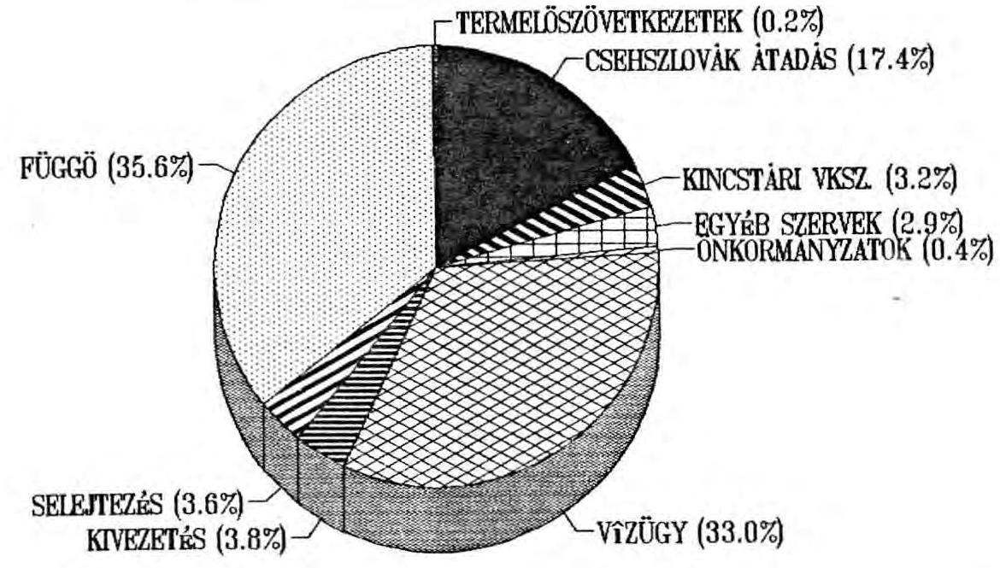

---

A beruházás összes ráfordításainak hasznosulásáról, illetve az általuk okozott nemzetgazdasági károk nagyságrendjéről valójában ez az ábra nyújt a realitásokhoz legközelebb álló képet.

# III. 

## Következtetések és javaslatok

A Bős-Nagymarosi Vízlépcső nagyberuházás pénzügyi lezárása a Kormány által előírt 1991. XII. 31-i határidőre nem valósulhatott meg. A feladatok elvégzéséhez sem megfelelő idő, sem a szükséges szervezeti és személyi feltételek nem álltak rendelkezésre.

Ezen túlmenően, véleményünk szerint, a lezárásban résztvevő valamennyi érdekelt szervnél bizonytalanságot okozott a kétoldalú államközi szerződés akkori érvényessége, illetve a beruházás során keletkezett vagyon tulajdonviszonyainak - közös tulajdon - rendezésének függősége.

A beruházás lezárásáért elsősorban felelős Dunai Vízlépcső Kormánybiztosi Titkársága és annak jogutódja, a Dunai Rehabilitációs Iroda, létszámellátottságát és egyéb feltételeit tekintve, nem volt alkalmas arra, hogy a beruházás lezárásával összefüggő munkákat elvégezze, illetve azok elvégzését érdemben befolyásolja. Irányító, koordináló és ellenőrző szerepe nagyobbrészt csak formálisan érzékelhető.

A beruházás lezárásával kapcsolatos dokumentációs munkákat és a szükséges intézkedések előkészítését - a Titkárság megrendelésére - túlnyomó részben a beruházást korábban bonyolító

---

OVIBER végezte. Fel sem merült, hogy a vállalat által összeállított dokumentációk és javasolt intézkedések megalapozottságát beruházási- pénzügyi kérdésekben járatos szakmai szervezettel vagy szakértőkkel ellenőriztessék.

Ezért is fordulhatott elő, hogy a nagyberuházás szerves részét képező Nagymarosi Vizlépcső osztrák fővállalkozásban végzett munkálataira és ráfordításaira a Titkárság lezárással kapcsolatos tevékenysége nem terjedt ki.

Az OVIBER megrendelésre végzett munkájának eredményeként a beruházás lezárásával kapcsolatos pénzügytechnikai és kezelői jog rendezési feladatok nagyobb része a vizsgálat idópontjáig tel jesült. Megtörtént a befejezett és üzemeltethető létesítmények kije1őlt kezelőknek történő átadása, a pénzügytechnikailag "rendezhető" ráfordítások selejtezése. A célszerüség és a költségtakarékosság követelményeit súlyosabban sértő intézkedéseket e területeken nem tapasztaltunk.

A Kincstári Vagyonkezelő Szervezetnek átadott létesítmények értékesítésének előkészítése és szervezése is megkezdődött, a tényleges hasznosítás megoldása azonban még a jövő feladata.

Különösen időigényesnek látszik a peresített ingatlanügyek lezárása és az ezzel összefüggő ingatlan-nyilvántartás rendezése. Ezek tartós elhúzódásával számolni kell, ami akadályozza a beruházás végleges pénzügyi lezárását.

A nagyberuházáson elvégzett munkák felmérése, átadás-átvétele és a ráfordítások elszámolása szabályosan, kellően dokumentáltan történt, indokolatlan kifizetéseket a vizsgálat nem tàrt fel.

---

Szabályosan, az érvényes előírásoknak megfelelően hajtották végre a létesítmények hasznosításra történő átadását és átvételét, a szükséges selejtezéseket, valamint a megtett intézkedések következményeinek a beruházási nyilvántartásokon történő átvezetését.

A pénzügytechnikailag rendezetlen ráfordítások nagyságrendje elsősorban az osztrák hitelböl finanszirozott ráfordítások elszámolásának rendezetlensége miatt - jelentős, meghaladja a $35 \%$-ot.

A beruházás pénzügyi lezárása során tett intézkedések is egyértelműen jelzik, hogy a Vízlépcső építésére eddig elszámolt - tehát az igénybevett hitelek járulékos terhei nélkül számított - ráfordítások több mint fele (20-22 MdFt) a nemzetgazdaság részére hasznosítható értéket nem eredményezett, s így azt veszteségnek (nemzeti vagyonvesztésnek) kell minősíteni. Az üzemeltetésre átadott létesítmények zömének hasznosítása is alacsony fokú, a ráfordítások megtérülése közgazdaságilag alig értékelhető. A szlovák területen végzett munkálatok ráfordításai ( $7,5 \mathrm{Md} \mathrm{Ft}$ ) ugyan a magyar fél követeléseinek minősülnek, megtérülésük azonban rendkívül kétséges.

Ha mindehhez hozzászámítjuk az érintett térség helyreállításával és az építkezés finanszirozására felvett hitelek visszafizetésével kapcsolatos jövőbeni terheket, akkor 100 Md Ft-ot jóval meghaladó nemzetgazdasági veszteségről kell elszámolni, amint azt a belsö államadósság vizsgálatához kapcsolódó 003/1/1992. ÁSZ TÜK számú jelentésünkben bemutattunk.

A vizsgálat tapasztalatai alapján az Országgyülésnek és a témában érintett kormányszerveknek javasoljuk:

- a nagyberuházás lezárására eddig megtett intézkedések tudomásulvételét,

---

- a BNV beruházási nyilvántartásban kimutatott összes ráfordításainak a Nagymarosi Erőmũ osztrák hitelböl finanszírozott ráfordításaival ( 13 MdFt-tal) történő korrigálását, ezek pénzügyi rendezésének végrehajtását (selejtezését), valamint az osztrák viszonylatú hiteltartozás államadósságként történő nyilvántartásának rendezését,
- a fũggőben lévő ingatlan és egyéb űgyek beruházástól fũggetlen, elkülönített kezelését, e ráfordítások beruházási nyilvántartásból történő technikai kivezetését, s ilymódon a beruházás végleges pénzügyi lezárását,
- a viszonylag nem nagy ráfordítással hasznosíthatóvá tehető létesítmények ésszerű keretek között történő befejezését és használatbavételét (pl. esztergomi gátrendszer),
- a kijelölt kezelők és az új tulajdonosok beszámoltatását az átvett beruházási létesítmények hasznosításának helyzetéről,
- a szlovák területen elvégzett magyar munkák ráfordításaiban jelentkező magyar követelések arra alkalmas idöben történő egyeztetését és elfogadtatását,
- az osztrák fővállalkozóval (DoKW) kötött szerződés felbontása miatt a magyar fél számára indokolatlanul hátrányossá vált egyes hitelfeltételek (pl. rendelkezésre tartási jutalék) módosításának kezdeményezését.

Budapest, 1992. szeptember

Me1léklet: 74 o1da1
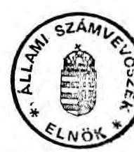
(Hage1mayer István )

---

# ALLAMI SZÁMVEVÖSZÉK 

V-6-56/1992.

## M E L L É K L E T E K

a Bös-Nagymarosi Vizlépcsőrendszer állami nagyberuházás pénzügyi felülvizsgálatáról készült jelentéshez

---

.

---

# T A R T A L O M J E G Y Z É K 

1. sz. melléklet

A Dunai Rehabilitációs Iroda jelentése a BNV állami nagyberuházás tel jeskörü lezárásával összefüggö feladatok készültségéröl.
2. sz. melléklet

A beruházás készültségi fokának és pénzügyi teljesitésének részletezése.
3. sz. melléklet

A Bós-Nagymarosi Vizlépcsörendszerhez tartozó létesítmények ráfordításainak elszámolása (1990. december 31.).
4. sz. melléklet

A Bós-Nagymarosi Vizlépcsörendszerhez tartozó beruházások pénzügyi lezárásának helyzete létesítménycsoportonként (1990. december 31., 1992. április 1.).
5. sz. melléklet

A letesítmeny-csoportok (ráfordítások) hasznosítás szerinti megoszlása 1992. április 1-jei állapot szerint.
6. sz. melléklet

KImutatas a BNV-hez kapcsolódó infrastrukturális beruházások hasznosításáról.
7. sz. melléklet

A Dunai-Vizlépcsó Kincstári Vagyonkezelö Szervezethez kerülő ingatlanainak átadás-átvételi jegyzőkönyve (1991. december 27. DKVT-KVSZ).
8. sz. melléklet

KImutatas a BNV-beruházás pénzügyi lezárása során selejtezett létesítményekről (1992. április hó).
9. sz. melléklet

KImutatas a BNV-beruházás pénzügyi lezárása során függő (rendezetlen) létesítményekről (1992. április hó).
10. sz. melléklet

26/1991. (IV. 23.) OGy határozt a Bős-Nagymarosi Vizlépcsőrendszerrel kapcsolatos kormányzati feladatokról.

---

11. sz. melléklet

A Kormány 2009/1991. (HT 9.) Korm. határozata az Országgyűlés 26/1991. (IV. 23.) OGY határozatának végrehajtása érdekében a Bős-Nagymarosi Vízlépcsőrendszer állami nagyberuházás azonnali 1ezárásával összefüggő, kormányzati döntést igény1ő feladatokról.
12. sz. melléklet

A miniszteri záróészrevételeket tartalmazó levelek, véleményeltérés esetén az arra adott válaszok.

---

1. sz. melléklet
a V-6-56/1992. sz. jelentéshez

# JKLKNTES 

a ENV allami nagyberuházás teljeskörü lezérásával összefüggö feladatok készültségéröl.

A lezárásról intézkedő 26/1991 (IV.23.) Országgyülési Határozat alapján, valamint a DVKBT által korábban készített javaslati anyagokra támaszkodva-kidolgoztuk a lezárási folyamat feladattervét. Ennek végrehajtásához haladéktalanul hozzákezdtünk. A feladatok nagyobb részének elvégzéséhez azonban a Kormánybiztos döntési hatáskörét meghaladó tárcaközi együttmüködésre volt szükség. (PM-AFI, KHYM, KTM, KVSZ. stb.) Ezért a feladatok végrehajthatósága érdekében, az érintett intézményekkel többször egyeztetett formában és tartalommal kormány előterjesztés készült, határozati javaslattal. Ezen feladatokat, határidőket és a végrehajtásért felelősöket a 2009/1991 (HT 9.)sz. Kormányhatározat tartalmazza.

A lezárással összefüggő feladatok végrehajtása érdekében Eösszefoglaló anyagokat készíttetünk OVIHER-el:

- elkészült a beruházás valamennyi végleges ill. ideiglenes részben vagy egészen megvalósult létesítményének múszaki készültségi állapot leírása a készültség fokának megjelölésével a ráfordítás százalékában és javaslat a létesítmények továbbítsorára. I
- elkészült a kisajátított ingatlanok közigazgatási területhatárok szerinti csoportosítása figyelembevéve a "ráépült" létesítmény miatt megváltozott funkciókat és hasznosítási lehetőségeket.
Ez az anyag a pénzügyminiszter 8/1991.(IYI.6.)PM. 'sz. rendelet végrehajtását is szolgálta, amely rendelet kötelezöen írta elő valamennyi nem termelő szférába tartozó költségvetési szervek által kezelt ingatlanra vonatkozóan az ingatlanvagyon- kataszter - nyilvántartólap kitöltését.
- elkészült az előző anyagokra alapozva az egyes ingatlanok-1 létesítmények leendő kezelójére vonatkozó konkrét javaslat
- elkészült a készültségi állapottal összhangban a pénzügyi ráfordítások kimunkálása a befejezett és befejezetlen állomány szétválasztása 1990. dec. 31.-i zárónappal. (2009/1991 (HT 9.) Kormányhatározat 1.1 pontja).
- az állami nagyberuházás finanszírozása és Allami Fejlesztési Intézetnél vezetett 851-0004 számú beruházási egységen 1990. dec. 31.-ével megszunt.
Az 1991. évi munkaprogram szerinti feladatok finanszírozása az AFI -nál megnyitott 851-2500 illetve 651-0504 számú beruházási

---

egységeken -az 1951. évre az állami költzégvetésben
kormányzati beruházások Dunai Vízlépcső soron jóváhagyott
700MFt keretből - folyamatosan történt.

Az eddig vázolt tevékenységek és a szükséges döntések
meghozatala után megkezdtük a létesítmények átadását."

Eszerint:

- A 2009/1991 (HT 9.) Kormányhatározat 1.2. ill. 1.6 pontjának
megfelelően az üzemi létesítmények és a kapcsolódó beruházások
átadásai az alábbi üzemeltető szervezetek részére megtörtént:

Hazakdunántuli Vízügyi Igazgatóság : 2.800MFt értékben, a
befejezetlen állomány a beruházás nyilvántartásából
kivezetésre került

Középdunavölgyi Vízügyi Igazgatóság: 775MFt értékben,
a befejezetlen állomány a beruházás nyilvántartásából
kivezetésre került

Budapesti Közuti Igazgatóság: 272MFt értékben, a
befejezetlen állomány a beruházás nyilvántartásából
kivezetésre került

ABKSZ (Arviz-Belvizvédelem Központi Szervezete): 63MFt
értékben, a befejezetlen állomány a beruházási
nyilvántartásból kivezetve

Egyéb üzemeltető szervezetek, csak felsorolás szerűen az
alacsony értékhatár miatt:

Középdunántuli Vízügyi Igazgatóság
BM Határőrség
BDABZ
Hazakmagyarországi Kőbánya Vállalat
Hazakmagyarországi Vízügyi Igazgatóság
Dunamenti Regionalis Vízmű
Elektromos Művek
VISCOSA gyár- Nyergesujfalu

Atadva összesen 77MFt értékű befejezetlen állomány, a
beruházás nyilvántartásából kivezetve

Közvetlen tárcaátadással KTM részére jkv.-el rendezve 355MFt
befejezetlen állománnyi érték, a beruházási nyilvántartásból
történő kivezetés folyamatban.

- A Kincstári Vagyonkezelő Szervezet részére átadásra kerültek
a 2009/1991 (HT 9.) Kormányhatározat 1.4. pontjának
megfelelően az átadási jkv.-ben felsorolt ingatlanok.
Az ingatlanok ráfordítások költsége 1.287MFt értékben a
beruházási nyilvántartásból kivezetésre került.

---

- A Kormányhatározat 1.5. pontja szerint a cseh és szlovák területen magyar beruházásból megvalósult létesítmények közül átadásra került 1.400MFt aktivált érték, és a beruházási nailvántartásból kivezetésre került.

Az át nem adható létesítmények körének meghatározása és a Kormánybiztosi Titkárság által jóváhagyása után ezek beruházás ráfordítási költsége: 5.500MFt, a nyilvántartásból könyveléstechnikailag kivezetésre került.

- A Kormányhatározat 1.3. pontjába sorolható tételek közül a beruházás előkészítési-tervezási költségek a Kormánybiztosi Titkárság által jóváhagyott összegge 1.349MFT értékben a beruházás nyilvántartásából kivezetésre kerültek.
- azon építési és egyéb beruházási rovatba sorolt elvégzett munkák, amelyek csak selejtezési jegyzőkönyvvel alátámasztva selejtezhetők, vagy olyan létesítmények, amelyek átadási kísérlete-megniusult- selejtezése folyamatban van. Ez a feladat csak az átadások befejezése után mintegy" végső leltárként" végezhető.
Az igy selejtezésre kerülő tételek értéke:762MFt
A nyilvántartásból történő kivezetés a selejtezési jkv.-ek jóváhagyása után lehetséges.

Kivezetésre került egyéb tételek:
-Ertékesített anyagok, berendezések: 54MFt értékben,
-Rekultivációs költségtérítések: 66MFt értékben
-Keretátadások: 70MFt értékben
Hátralévő feladatok:

1. A selejtezések befejezése, a selejtezett tételek kivezetése, a befejezetlen állomány nullára történő kifuttatása, a teljes beruházásírszámla lezárása.

Felelős: KHVM-Dunai Rehabilitációs Iroda (OVIHER) AFI

Határidő:1992
2.Vállalatok gépmegelőlegezéseinek hátralévő törlesztések rendezése

Felelős: KHVM-Dunai Rehabilitációs Iroda (OVIHER) PM-AFI

Határidő:1992
3.A vállalatok kártalanítási megállapodásai szerint az értékesítendő be nem épített anyagok sorsának rendezése.

---

Felelős: KHVM-Dunai Rehabilitációs Iroda(OVIBER) AFI

Határidő: 1992.

4. Az érintett Földhivatalok, Önkormányzatok, Vagyonátadó Bizottságok tájékoztatása a kezelő változásról.

5. A még tisztázatlan, kisajátításkor nem rendezett tulajdonosi, kezelői jogok rendezése, a kisajátítással összefüggő, és egyéb kártalanítási igények lehetőség szerint megegyezéssel történő rendezése, per esetén a perek vitele.

Felelős: 4., 5. feladatok végrehajtásáért: KHVM-Dunai Rehabilitációs Iroda (OVIBER)

Határidő: folyamatos

6. A KVSZ-hez került ingatlanok esetében a hasznosítási javaslat elkészítése.

7. A KVSZ-nek átadott értékesíthető ingatlanokra a végleges megvalósulási helyszínrajz elkészítése az új telekoszláshoz.

Felelős: KHVM-Dunai Rehabilitációs Iroda

Határidő: 6. pontra: 1992. jan. 31. elkészült, KVSZ-nek megkülve

7. pontra: 1992.

8. Az ideiglenesen igénybevett területekre kötött megállapodások felülvizsgálata, a visszaadáshoz szükséges megállapodások megkötése a visszaadások rendezése.

Felelős: KHVM-Dunai Rehabilitációs Iroda (OVIBER)

Határidő: 1992.

A beruházás lezárási folyamatának a hátralévő feladatokként felsorolt teendői összhangban vannak a 2014/1991. (HT.11.) Kormányhatározat 1. sz. mellékletében a I.A közlekedési, hírközlési és vízügyi miniszter feledatát, 1. A Bős-Nagymarosi Vízlépősörendszer állami beruházás lezárásával kapcsolatos 1992. évre áthúzódó feladatok -nál felsoroltakkal.

1992. január 14.

---

ALLAMI SZAMVEVOSZEK
2. sz. melléklet
a V-6-56/1992. sz. jelentéshez

A BERUHAZAS KESZOLTSEGI FOKANAK ES PENZOGYI
TELJESITESENEK RESZLETEZGSE
(1992. IV. 1. allapot)

---

# **Chemistry**

## **Chemical Reactions**

### **Balancing Chemical Equations**

1. **Write the unbalanced equation:**
   - Example: $$C_3H_8 + O_2 \rightarrow CO_2 + H_2O$$

2. **Balance the equation:**
   - Example: $$2C_3H_8 + 7O_2 \rightarrow 6CO_2 + 8H_2O$$

3. **Balance the equation:**
   - Example: $$2C_3H_8 + 7O_2 \rightarrow 6CO_2 + 8H_2O$$

### **Types of Reactions**

1. **Combination Reaction:**
   - Example: $$2H_2 + O_2 \rightarrow 2H_2O$$

2. **Decomposition Reaction:**
   - Example: $$2H_2O_2 \rightarrow 2H_2O + O_2$$

3. **Single Displacement Reaction:**
   - Example: $$Zn + 2HCl \rightarrow ZnCl_2 + H_2$$

4. **Double Displacement Reaction:**
   - Example: $$AgNO_3 + NaCl \rightarrow AgCl + NaNO_3$$

5. **Combustion Reaction:**
   - Example: $$CH_4 + 2O_2 \rightarrow CO_2 + 2H_2O$$

## **Stoichiometry**

### **Mole Concept**

- **Mole (mol):** The amount of substance containing as many particles (atoms, molecules, ions) as there are atoms in exactly 12 grams of carbon-12.
- **Avogadro's Number:** $$6.022 \times 10^{23}$$ particles per mole.

### **Molar Mass**

- **Molar Mass:** The mass of one mole of a substance.
- Example: The molar mass of water ($$H_2O$$) is 18.018 g/mol.

### **Calculations**

1. **Moles to Mass:**
   - Formula: $$n = \frac{m}{M}$$
   - Example: Calculate the number of moles of $$H_2O$$ in 18 grams of water.
     - $$n = \frac{18.018 \, g}{18.018 \, g/mol} = 2 \, \text{mol}$$

2. **Moles to Moles:**
   - Formula: $$m = n \times M$$
   - Example: Calculate the mass of 2 moles of $$H_2O$$.
     - $$m = 2 \, \text{mol} \times 18.018 \, g/mol = 2 \, \text{mol}$$

## **Gas Laws**

### **Ideal Gas Law**

- **Equation:** $$PV = nRT$$
- **Variables:**
  - $$P$$: Pressure (atm)
  - $$V$$: Volume (L)
  - $$n$$: Number of moles (mol)
  - $$R$$: Ideal gas constant (0.0821 L·atm/mol·K)
  - $$T$$: Temperature (K)

### **Boyle's Law**

- **Equation:** $$P_1V_1 = P_2V_2$$
- **Variables:**
  - P₁: Pressure (atm)
  - P₂: Volume (L)
  - P₃: Pressure (atm)
  - P₁: Pressure (atm)
  - P₂: Volume (L)
  - P₃: Pressure (atm)
  - P₁: Pressure (atm)

### **Boyle's Law (Boyle's Law)**

- **Equation:** $$\frac{P_1V_1}{P_2V_2} = \frac{P_2V_2}{T_1} = \frac{P_1}{T_2}$$

## **Thermochemistry**

### **Enthalpy (H)**

- **Definition:** The heat content of a system at constant pressure.
- **Equation:** $$\Delta H = q_p$$
- **Variables:**
  - $$q_p$$: Heat transferred at constant pressure.
  - $$q_p$$: Heat transferred at constant pressure.

### **Hess's Law**

- **Statement:** The enthalpy change for a reaction is the same whether it occurs in one step or multiple steps.
- **Equation:** $$\Delta H_{\text{reaction}} = \Delta H - Q_p$$
- **Variables:**
  - $$Q_p$$: Heat transferred at constant pressure.
  - $$q_p$$: Heat transferred at constant pressure.

### **Hess's Law (Hess's Law)**

- **Statement:** The enthalpy change for a reaction is the same whether it occurs in one step or multiple steps.
- **Equation:** $$\Delta H_{\text{Hess}} = \Delta H - Q_p$$
- **Variables:**
  - $$H$$: Heat transferred at constant pressure.
  - $$Q_p$$: Heat transferred at constant pressure.

## **Electrochemistry**

### **Oxidation and Reduction**

- **Oxidation:** Loss of electrons.
- **Reduction:** Gain of electrons.

### **Galvanic Cells**

- **Definition:** A cell that converts chemical energy into electrical energy.
- **Components:**
  - Anode: Oxidation occurs.
  - Cathode: Reduction occurs.
  - Salt Bridge: Connects the two half-cells.

### **Nernst Equation**

- **Equation:** $$E = E^\circ - \frac{RT}{nF} \ln Q$$
- **Variables:**
  - $$E$$: Energy (K)
  - $$E^\circ$$: Standard deviation of the energy (J)
  - $$E$$: Standard deviation of the energy (J)
  - $$T$$: Temperature (K)
  - $$n$$: Number of electrons transferred
  - $$F$$: Faraday constant (96,485 C/mol)
  - $$Q$$: Reaction quotient

---

# 1. BOSI (GABCIKOVOI) VIZLÆPCSO 

### 1.1. Dunakiliti-Hrusovi tározó

Az eredeti államközi megállapodás szerint a 49 millió $\mathrm{m}^{3}$ hasznos térfogatú tározó a Duna 1842-1858 fkm közötti szakaszán, döntően a hullámtéren, részben csehszlovák, részben magyar területen keletkezett volna, miután a Dunakiliti duzzasztómú a vizszintet $131,20 \mathrm{mB}$ szintre duzzasztja. A tározó a vízhozamok napi kiegyenlítését és ezzel a Gabcikovói (Bősi) vízerőtelep csúcsüzemét biztosította volna. A tározó töltésein és az alattuk átszivárgó vizet szivárgócsatornák gyújtik össze.

## A tározó föbb létesítményei

- baloldali töltés ( $25,6 \mathrm{~km}$ ) és szivárgócsatorna ( $22,5 \mathrm{~km}$ ),
- összekötő töltés ( 3 km ) és szivárgócsatorna,
- terelötöltés ( $6,2 \mathrm{~km}$ ),
- jobboldali töltés ( 17 km ) és szivárgócsatorna ( $11,4 \mathrm{~km}$ ) csehszlovák területen,
- jobboldali töltés ( $9,9 \mathrm{~km}$ ) és szivárgócsatorna ( $10,2 \mathrm{~km}$ ) magyar területen,
- összekötő csatorna ( $0,8 \mathrm{~km}$ ) a Mosoni Duna vízpótlására.

A tározó balparti létesítményeit csehszlovák területen a csehszlovák fél valósította meg.

A magyar fél a tározó jobbparti létesítményeit kivitelezte csehszlovák és magyar területen, beleértve az összekötő töltést és a terelötöltést.

---

# 1.11. Tározó csehszlovák területen 

| Szerződések összege: | 2569818 eFt |
| :-- | --: |
| létesítmények (ráfordítások): | 2091880 eFt |
| Ebböl: | 1066063 eFt |
| üzembehelyezett létesítmény | 157422 eFt |
| befejezett, nem üzembehelyezett | 796860 eFt |
| befejezetlen létesítmény | 7838 eFt |
| Egyéb aktivált állomány | 63697 eFt |
| Függő (nem aktivált) áll. |  |

Becsült készültségi fokok létesítmény jegyzékszám szerint:
1.11.205 $98 \%$ jobbparti töltés és szivárgócsatorna
1.11.206 $100 \%$ híd a szivárgócsatornán
1.11.220 $96 \% \quad 3 \mathrm{db}$ vízszintszabályozó zsilip
1.11.301 $50 \%$ összekötő töltés és szivárgócsatorna
1.11.350 $90 \%$ zsiliphíd
1.11.401 $100 \%$ terelötöltés
1.11.731 $95 \%$ Dunakiliti-Doborhos út
1.11.759 $100 \%$ bekötőutak a jobbbparti zsilipes hidakhoz
1.11.809 $100 \%$ Petralkán betétgerenda tároló
1.11.900 $100 \%$ felvonulási telepek Hrusov-Doborhos

A becsült készültségi fokokat helyszíni bejárásunk alapján reálisnak ítéljük.

A létesítmények (ráfordítások) hasznosítás szerinti megoszlása:

Csehszlovák átadás
1066063 eFt
KVSz
600 eFt
Ertékesített létesítményekre ráf.
7238 eFt

---

Kivezetés
Függő (nem aktivált) állomány

954282 eFt
63697 eFt

A 954282 eFt kivezetett összeg a csehszlovák félnek átadásra nem javasolt létesítmények (összekötő töltés, terelőtöltés, zsilipeshid, stb.) értéke. Ebből 157422 E Ft az üzemeltethető létesítmény (terelőtöltés) értéke.

A befejezetlen állományként nyilvántartott, esetleg selejtezésre kerülő érték 63697 eFt.
E létesítmények a csehszlovák oldalon Hrusov és Doborhos községekben lévő felvonulási területek építményei ill. az ideiglenes határátkelőhelyek üzemeltetési költségei (az 1.11.900 sz. létesítmények, ill. $1492,4 \mathrm{eFt}$ ).

A Kincstári Vagyonkezelő Szervezet részére átadásra került érték 600 eFt (ivóvíztisztító-berendezés).

# 1.12. Tározó magyar területen 

Szerződés összege: 2323469 eFt
létesítmények (ráfordítások): 1691848 eFt
Uzembehelyezett létesítmény: 1691848 eFt

Készültségi fokok létesítmény jegyzékszám szerint:
1.12.100 $99 \%$ tározótöltés és szivárgócsatorna, összekötőcsatorna
1.12.210 $100 \%$ vízkivételi zsilip
1.12.240 $100 \%$ vízszintszabályozó zsilipek
1.12.250 $100 \%$ árvédelmi zsilip
1.12.810 $100 \%$ zsilipek energieaellátása

---

|  1.12 .860 | $100 \%$ | Rajkai határőrépítmény  |
| --- | --- | --- |
|  1.12 .880 | $100 \%$ | tározótéri cserjeirtás  |
|  1.12 .900 | $100 \%$ | melléklétesítmények, fenntartás  |

A becsült készültségi fokokat helyszíni bejárás alapján reálisnak ítéljük. A létesítmények (ráfordítások) hasznosítás szerinti megoszlása:

|  EDUVIZIG | 1655244 eFt  |
| --- | --- |
|  BM Határőrség | 24996 eFt  |
|  EDASZ | 1298 eFt  |
|  KPM Győri Igazgatósága | 10310 eFt  |

# 1.2. Dunakiliti duzzasztómũ

A fö- és melléklétesítmények tervezett feladatai: a) a tározó vízszintjének biztosítása $131,2 \mathrm{mB}$ szinten b) árvizek levezetése eltérő vízhozamok esetén c) ideiglenes hajózás biztosítása az építés időszakában d) a régi Dunameder élővízhozammal való ellátása e) a tározó jegének levezetése a régi Dunamederbe

A fölétesítmény meghatározó mütárgya a duzzasztómü. Ehhez csatlakoznak azok a létesítmények, amelyek a megvalósításhoz illetve az üzemvitelhez szükségesek.

- A duzzasztómű 7 db 24 m széles nyílásból áll, a jobbparti nyílást segédhajó-zsilipnek alakították ki, a többi nyílásba billenőtáblás acél elzárószerkezet került.A balparti pillérbe 30 $\mathrm{m}^{3} / \mathrm{s}$-os csőturbina építhető, míg a jobbparti pillérben helyezték el a halzsilipet.
- A hajózsiliphez móló és pillérrendszerủ vezetőmü épült.
- A parti létesítmények: irodaház vezénylőteremmel, műhely - kazánépület, garázs, raktár és transzformátorház.

---

- A duzzasztómũhöz csatlakozik a mederátvágás és a mederáttöltés, amelyen út épülne Gabcikovoig.
- Megépült a Dunakiliti községbe vezetõ bekötőút, a duzzasztómũ energiaellátása, a terület vízellátás-csatorzázása.
- Melléklétesítményként felvonulási lakótelep, ideiglenes utak, energiaellátás, hírközlés valósult meg.
A létesítmények - a mederáttöltés egy részének kivételével - magyar területen vannak.

A duzzasztómũ és kiegészítő létesítményei üzemeltethető állapotban készen vannak. A szerződésállományra vetített pénzügyi teljesités $97 \%$-os.

A létesítmény helyzete a pénzügyi lezárás szempontjából:

Szerződések összege: $\quad 7805823$ eFt
Szerződések alapján pénzügyi teljesités 7579651 eFt Ebből:
üzembehelyezett létesítmény $\quad 7243267$ eFt
befejezett, nem üzembehely. létes. $\quad 85323$ eFt
befejezetlen létesítmény 174000 eFt
egyéb aktivált állomány 31186 eFt
függő (nem aktivált) állomány 45875 eFt

A létesítmények (ráfordítások) hasznosítás szerinti megoszlása:

EDUVIZIG
7104494 eFt
KPM Közúti Igazgatósága
71659 eFt
Gyõri Vízmũ
7818 eFt
EDRV
29001 eFt
Soproni Posta
9485 eFt
EDASZ
15236 eFt
MAV
5574 eFt

---

|  KTM | 9875 eFt  |
| --- | --- |
|  KVSZ | 85323 eFt  |
|  ABUSZ | 225 eFt  |
|  Csehszlovák kivezetés | 174000 eFt  |
|  Értékesített létes, ráford. | 21060 eFt  |
|  Zöldkár, illeték | 26 eFt  |
|  Függő (nem akt.) áll. | 45875 eFt  |

# 1.3. Felvízcsatorna

A felvízcsatornához tartozó létesítményeket a csehszlovák fél építette.

### 1.4. Gabcikovoi (Bősi) vízlépcső

1.4.1. Kotrás, felső dugó

A felső dugó a vízlépcső munkaterületét védte az alvízcsatorna változó szintű vizeitől. Szerződés összege: 44060 eFt létesítmények (ráfordítások): 48665 eFt Ebből: Befejezetlen létesítmény 48665 eFt

A kotrási munkát a jugoszláv BRODOIMPEKS végezte. Becsült készültségi fok: 1.41.108 81,5 \% kotrási munka

A BRODOIMPEKS-szel kötött szerződés keretében végzett munkák felülvizsgálatával, értékelésével külön fejezetben foglalkozunk.

---

A helyszíni bejárás során megállapíthattuk, hogy a kotrási munkát jelenleg csehszlovák vállalkozó folytatja.

A létesítmények (ráfordítások) hasznosítás szerinti megoszlása: Csehszlovák oldali kivezetés 48665 eFt

# 1.5. Alvízcsatorna 

Az alvízcsatorna a Gabcikovói Vízlépcsõ alatt kezdődik és Palkovicovónál torkollik a Dunába. A csatorna egyenes nyomvonalú, hossza $8,2 \mathrm{~km}$, fenékszintje $17-18 \mathrm{~m}$-rel van a terepszint alatt, a fenékszélesség 185 m . Az alvízcsatorna a vízerőtelep csúcsüzeme által okozott vízszintingadozások tartományában rézsúvédelmet (kõhányás) kap. Az alvízcsatorna kotrásából kikerülõ homokoskavicsot a felvízcsatorna töltéseibe építik be.

| Szerződés összege: | 3322170 eFt |
| :-- | --: |
| létesítmények (ráfordítások): | 4202616 eFt |
| Ebből: |  |
| Uzembehelyezett létesítmény | 85801 eFt |
| Befejezett,nem üzembehelyezett lét. | 7209 eFt |
| Befejeetlen létesítmény | 4074411 eFt |
| Selejtezett állomány | 10379 eFt |
| Egyéb aktivált állomány | 2547 eFt |
| Függő (nem aktivált) állomány | 22269 eFt |

A létesítmény-rendszer kivitelezési munkáit jellemzôen magyar vállalkozók (EDUVIZIG, KOTIVIZIG, FOKA, Mélyépítő Vállalat, stb.) végezték. Az alvízcsatorna kotrási munkáját a BRODOIMPEKS végezte.

---

Becsült készültségi fokok:
1.51.105 $100 \%$ közmübontás, humusz-, fedőréteg kitermelés, töltéskialakítás
1.51.105 $90 \%$ alvízcsatorna-kotrás
1.51.105 72,5 \% alvízcsatorna rézsűvédelem
1.51.106 $99 \%$ alvízcsatorna jobboldali árvédelmi töltése
1.55.501 $100 \% \quad 2 \mathrm{db}$ (50-50 \%-os közös tulajdonú) úszó szivattyútelep
1.59.000 $100 \%$ melléklétesítmények

A létesítmények (ráfordítások) hasznosítás szerinti megoszlása:
Csehszlovák átadás: 79916 eFt
Csehszlovák kivezetés: 4072211 eFt
EDUVIZIG 5362 eFt
Győri Vízmú 2723 eFt
KVSz 7209 eFt
ABKSz 2224 eFt
Ertékesített létesítményekre
(URH rendszer) ráfordítás 323 eFt
Selejtezett állomány 10379 eFt
Függő (nem aktivált) állomány 22269 eFt

# 1.6. Palkovicovo (Szop) alatti mederkotrás 

Az alvízcsatorna torkolata alatti mederkotrást a Bősi Vízerőtelep esésnyeresége és a hajózási vízmélység biztosítása érdekében tervezték.

Szerződés összege: $\quad 1306864 \mathrm{eFt}$
létesítmények (ráfordítások): $\quad 7115 \mathrm{eFt}$
Ebből:
Függő (nem aktivált)állomány $\quad 7115 \mathrm{eFt}$

---

Elkészült a felvonulási telep 7115 eFt értékben. A munkát magyar vállalkozó (FOKA) végezte. A függő állományból 4120 eFt visszafizetés terheli a FOKA Rt-t.

# 1.7. Régi Dunameder szabályozása 

Ráfordítás 347408 ezer forint
A környezeti hatástanulmány módosította az eredeti múszaki tartalmat. A ráfordításokat az 1.10 létesítmény ismertetésénél részletezzük.

### 1.8. A (Bősi) Gabcikovoi Vízlépcső egyéb létesítményei

Ebbe a létesítmény-csoportba sorolták azokat a munkákat és szállításokat, amelyek a fölétesítmények megvalósításához és üzemeltetéséhez szükségesek.

Szerződés összege: 231883 eFt
létesítmények (ráfordítások): 231883 eFt
Ebből:
Uzembehelyezett létesítmény 114779 eFt
Befejezett, nem üzembehelyezett lét. 116425 eFt
Egyéb aktivált állomány 679 eFt

A munkálatokat magyar vállalkozók (ERBE, VIZEP V, GyAEV, EDKözmü és Magcsép V. stb.) végezték.

Becsült készültségi fokok létesítményjegyzékszám szerint:
1.82.400 $100 \%$ Dunakiliti-Rajka mezőg. műv-ből kivon
1.82.600 $100 \%$ Telex Vámosszabadin
1.83.000 $100 \% \quad 20$ lakásos telep Dunakilitin
1.84.000 $100 \%$ Törpe vízmüvek - Szigetközi reg. vízmü
1.85.000 $100 \%$ Munkásszálló Vámosszabadin
1.86.000 $100 \%$ Szennyvízelvezetés Vámosszabadin

---

A létesítmények (ráfordítások) hasznosítás szerinti megoszlása:

| Rajkai Egyetértés TSz | 785 eFt |
| :-- | --: |
| EDUVIZIG | 2 eFt |
| Posta Sopron | 977 eFt |
| KVSz | 116425 eFt |
| Győri Vízmú | 113015 eFt |
| Ertékesített létesítményekre ráf. | 679 eFt |

A KVSz részére átadott 116425 eFt értékú létesítmények a Dunakiliti-i 20 lakásos lakótelep és a Vámosszabadi-i munkásszálló.

# 1.9. A (Bősi) Gabcikovói Vízlépcső egyéb beruházásai 

Az egyéb beruházások között szerepelnek az üzemi berendezések, területek és épületek igénybevétele a mező- és erdőgazdasági célú földek utáni állami térítési díjak, a kisajátítási, kezelői jog, átvételi kártalanítások, a tervezési, kitưzési, művezetési, szakértői költségek, valamint a lebonyolítási import-bizományosi díjak és illetékek.

Szerződés összege:
2.096 .425 eFt
létesítmények (ráfordítások):
2.160 .889 eFt

Az OVIbER 1992. áprilisi a BNV beruházás pénzügyi lezárásának helyzetét bemutató összeg állítása szerint a ráfordítások összege 2.209 .425 eFt.

A létesítmények (ráfordítások) és a ráfordítás közti 48.535 eFt különbség a 2. fölétesítmény kisajátítási költségeikről könyveléstechnikailag ide terhelt érték.

---

Ebből: Uzembe helyezett létesítmény 988.540 eFt
Befejezett, nem üzembe helyezett 223.797 eFt
Befejezetlen létesítmény 4.738 eFt
Egyéb aktivált állomány 450.410 eFt
Selejtezett állomány 232.038 eFt
Függő(nem aktivált) állomány 309.902 eFt

Az üzembe helyezett érték döntően az üzemeltetésre átadott vagy egyéb módon aktivált létesítményekre arányosan ráterhelt tervezési, művezetési, bonyolítói, stb díjak összege.

Az egyéb berzuházások értéke az 1-es fölétesítményre eső ráfordítások (összesen 18.747.096 eFt) kereken $12 \%$-a.

Az egyéb beruházásokból
$2 \%$ - 34.474 eFt az építés,
$8 \%$ - 169.290 eFt a belföldi gép,
$1 \%$ - 17.128 eFt a tőkés gép értéke,
$89 \%$ - 1.939.997 eFt pedig úgynevezett "egyéb" költség, azaz

- tervezés, kitűzés, művezetés 949.624 eFt (44\%)
- kisajátítás, zöldkár 676581 eFt (30\%)
- lebonyolítás, imp. biz. díj 216792 eFt (15\%)

A létesítmények (ráfordítások) hasznosítás szerinti megoszlása:

- Csehszlovák átadás 296.023 eFt
- Csehszlovák kivezetés 304.502 eFt
- EDUVIZIG 675.910 eFt
- EDRV 1.900 eFt
- DMRV 1.057 eFt
- Győri Vízmú 10.850 eFt

---

| - KTM | 203.673 | eFt |
| :-- | --: | :-- |
| - KPM Győr | 3.452 | eFt |
| - KPM Budapest | 1.211 | eFt |
| - Soproni posta | 6 | eFt |
| - E-P m-i Távközlés | 47 | eFt |
| - EDASZ | 289 | eFt |
| - Gázmũvek | 3 | eFt |
| - BM Határőrség | 2.097 | eFt |
| - MAV | 662 | eFt |
| - Nem aktiválható (zöldkár) | 145.908 | eFt |
| - Selejt | 232.038 | eFt |
| - KVSZ | 19.895 | eFt |
| - Függő(nem aktivált) állomány | 309.902 | eFt |

1.10. Környezeti hatástanulmány szerinti munkák

A régi meder szabályozásának terveit a környezeti hatástanulmányban felülvizsgálták. Eszerint a hullámtéri létesítményeknek a mentett oldali vízpótlás igényeit is ki kell elégíteni. A vízpótló-rendszer kiépítése ökológiai igény, a Bősi Vízierőmü üzembehelyezésétől függetlenül is - más műszaki megoldással szükséges a megvalósítása.

A régi meder főágának, az átmeneti szakasz kialakításának. a balparti hullámtér rendezésének építési munkálatai még nem kezdődtek meg.

Szerződés összege: 659532 eFt
létesítmények (ráfordítások) 576261 eFt
Ebből:
Befejezetlen létesítmény 576261 eFt

---

A létesítményrendszer kivitelezési munkáit magyar vállalkozó (EDUVIZIG) végezte.

A megkezdett munkák

- a vízpótló ágrendszerek munkálatai (előkészítés, főágkotrás, mellékágzárások, záróműtárgyak, vízszintszabályozó bukók)
- melléklétesítmények
- mederfenntartó út (híddal)
- mérő- és megfigyelő berendezések

Becsült készültségi fokok:
$1.73 .400 \quad 60 \%$ mederfenntartó út
$1.73 .600 \quad 25 \%$ jobbparti bukók szélesítése
$1.73 .900 \quad 45-95 \%$ ágrendszerek
$1.10 .300 \quad 0-100 \%$ ásványi ágrendszer
$1.78 .200 \quad 50-100 \%$ mérő- és megfigyelő berendezések

A létesítmények (ráfordítások) hasznosítás szerinti megoszlása: EDUVIZIG

576261 eFt
1.00. Leállítás miatti többletmunkák

Ezen létesítmény-csoportba kerültek besorolásra

- az árvízkárok helyreállítása,
- fenntartási, állagmegóvási, örzési feladatok,
- különböző felmérések, szakértői munkák,
- vállalkozói kártalanítások,
- MTA, MNM részére keretátadás,
- EDUVIZIG számítógép költséghozzájárulás,
- Dunakiliti tartalékalkatrészek.

---

Szerződések összege: 109369 eFt
létesítmények (ráfordítások): 107752 eFt
Ebből:
Uzembehelyezett állomány: $\quad 38000 \mathrm{eFt}$
Egyéb aktivált állomány: $\quad 48560 \mathrm{eFt}$
Befejezetlen (nem aktivált) állomány 21192 eFt

A 107752 eFt kifizetésből

- 8645 eFt (8\%) építésre,
- 6859 eFt (6\%) belföldi gépre,
- 92248 eFt (86\%) egyéb célokra (felmérés, szakvélemény stb) fordítottak.

A 92248 eFt egyéb költség meoszlása:

- 2405 eFt örzés-fütés,
- 21283 eFt felmérés, tervezési információ, szakvélemény,
- 20000 eFt MTA-leállítás miatti feladatok
- 48560 eFt vállalkozók kártalanítása.

A létesítmények (ráfordítások) hasznosítás szerinti megoszlása:

| Kivezetés | 48560 eFt |
| :-- | :-- |
| EDUVIZIG | 18000 eFt |
| MTA | 20000 eFt |
| Befejezetlen (nem akt.) áll: | 21192 eFt |

---

# 2. Nagymarosi vízlépcsõ 

### 2.1. Védelmi létesítmények csehszlovák területen

Alsó - Ipoly öblözet és alsó - Garam öblözet

Az alsó - Ipoly öblözet a Duna balpartján az Ipoly és Garamtorkolat között, illetve az Ipoly jobbpartján helyezkedik el. Az alsó Garam öblözetben tervezett munkák kölcsönös segítségnyújtásra vonatkozó kormányközi megállapodás alapján kerültek a magyar fél által Csehszlovák területen végzendõ munkák körébe.

Szerződés összege: 523574 eFt
pénzügyi teljesítés 460088 eFt
Ebből:
Uzembehelyezett létesítmény: 414267 eFt
Egyéb aktivált állomány: 1568 eFt
Függő (nem aktivált) állomány: 44253 eFt

Becsült készültségi fokok létesítmányjegyzék - szám szerint:
2.11.100. 60\% Ipolymenti töltés és szivárgócsatorna, dunai terelőtöltés, helembai szivattyútelep
2.11.700. 2\% közlekedési létesítmények
2.11.300. 98\% Salkai szakasz; Ipoly jobboldalán töltés, salkai szivattyútelep,felvolási telep, URH rádiókapcsolat berendezései, határátkelőhelyek
2.12.100. 3\% Párkányi szakasz; Garam jobbpartján résfal építése, kamenicai szivattyútelep
2.12.400. 9\% alsó Garam szakasz; résfal építés, felvonulási telepek, URH rádiókapcsolat berendezései

---

A létesítmények (ráfordítások) hasznosítás szerinti megoszlása:

| Csehszlovák átadás: | 400399 eFt |
| :-- | --: |
| ABKSz: | 1568 eFt |
| KVSZ | 13868 eFt |
| Függő (nem aktivált) állomány: | 44253 eFt |

# 2.2 Védelmi létesítmények magyar területen 

Visegrád - Dömös öblözet, a Duna jobbpartján a Nagymarosi vízlépcső parti létesítményeihez csatlakozva húzódik a pilismaróti öblözet határáig. Pilismaróti öblözet, a Duna jobbpartján terül el, az Esztergom és a Visegrád - Dömös öblözetek között. Esztergom város, esztergomi öblözet, az Ipoly torok és a Halas patak között helyezkedik el. Nyergesújfalu - Dunaalmás öblözet, keskeny partsáv a Duna jobbpartján. Komárom város és komáromi öblözet, a Duna jobbpartján Almásneszmély - Komárom dunai vasúti híd szakaszon helyezkedik el. Komárom Gönyü öblözete, a folyót ezen a szakaszon zömmel magaspart szegélyezi, a Duna jobbpartján terül el. Nagymaros Ipoly öblözet, a Duna balpartján és az Ipoly balpartján terül el. Vasútvonalak, közutak védelme.

Szerződés összege: 3204872 eFt
Pénzügyi teljesítés: 2038718 eFt
Ebböl:
Uzembehelyezett létesítmény: $\quad 729100 \mathrm{eFt}$
Befejezett, nem üzembehelyezett lét. 44025 eFt
Függő létesítmény: $\quad 979959 \mathrm{eFt}$
Selejtezett állomány:
Egyéb aktivált állomány:
61750 eFt
Függő (nem aktivált) állomány:
223884 eFt

---

Becsült készültségi fokok:

A Visegrád ü Dömös öblözetben a tervezett létesítmények közül az alábbiak kivételével semmi nem valósult meg:

- terület igénybevétele,
- hajózási jelzőállomás energiaellátása miatti 20kV-os vezeték átépítése,
- a római kori erőd feltárásához a durva földmunka elvégzése,
- Lepence patak térségében transzformátor állomás szerelési munkája.

A Pilismaróti öblözetben tervezett létesítmények közül semmi nem valósult meg.

Esztergom város, esztergomi öblözet.Az Ipoly toroktól Esztergom város alsó határáig munkavégzés nem történt. Készültségi fok: 0\%.
2.23.110. 3\%, árvédelmi töltés a Csenke - völgy szakaszán. $80 \%$, természetes magaspart.
$65 \%$, szentgyörgymezei magaspart.
$0 \%$, belterületi - Viziváros és Prímás sziget szakasz. Jelenleg a Prímás sziget és a Viziváros parti sétánya árvizjárta terület. $22 \%$, Rozmár telep térsége. $80 \%$, táti mederáttöltés a Halas patakig.
2.23.120. 90\%, Nyáras és táti szigeti töltés.
2.23.610. $50 \%$, déli városrész csatornázása.
2.23.232. szivárgók bujtatója a Csenke patak alatt, az acél szádlemezekkel biztosított munkagödör a leállítást követően elbontásra került.
2.23.320. Csenkevölgyi szivattyútelep, a szivattyúk értékesíthetők, helyszíni munkavégzés nem történt.

---

Nyergesúffalu - Dunaalmás öblözetben munkavégzés nem volt.

Komárom város és komáromi öblözet.
2.25. 85\%, töltésépítés 0-216 - 2+634 tkm védelmi vonal szakaszon.
$70 \%$, az Altaléri szivattyútelepnél szivattyúk beépítése nélkül, gravitációs vízbevezetési lehetőséggel. 30\%, Prépost sziget Duna felöli részére új töltés. 85\%, töltésépítés az 5+736 - 7+715 tkm közötti szakaszon. 50\%, töltésépítés a $7+715-8+079$ tkm közötti szakaszon. 45\%, töltésépítés a $8+079-8+965$ tkm közötti szakaszon. 95\%, töltéserősítés a $8+965-9+235$ tkm közötti szakaszon. 95\%, töltéserősítés a $9+948-10+565$ tkm közötti szakaszon. 0\%, töltéserősítés a $10+565-17+000 \mathrm{~km}$ védelmi vonal szakaszon.

Komárom Gönyũ öblözete.
Az öblözetben munkavégzés nem volt.

Nagymaros - Ipoly öblözet.
2.27. 100\%, az ipolydamásdi szakasz árvizvédelme. 98\%, a letkési szakasz árvizvédelme. 100\%, melléklétesítmények: felvonulási telep és munkásszállás, körzetközpont és távbeszélő alállomások.

Vasútvonalak védelme.
A létesítmény csoportba tartozó létesítményeknél munkavégzés nem volt.

---

Közutak védelme.
A 10-es, 11-es, 12-es, 1201-es és a bekötōutak védelme. A 10-es számú útnál nem valósult meg semmi. A 11-es, 12-es úton végzett épitések aktiválhatók, a 1201-es út átépitése a Vízlépcsõ elmaradása miatt nem szükséges, ezért az eddig elkészült létesítmények helyreállításra kerültek. A bekötōutak aktiválásra kerültek.

A létesítmények (ráfordítások) hasznosítás szerinti megoszlása:

Csehszlovák átadás: 83709 eFt
ABKSz: 58872 eFt
EDASz: 8526 eFt
EDUVIZIG: 961231 eFt
Onkormányzat: 989 eFt
Vörös Csillag MGTSz: 217 eFt
Dunakanyar MGTSz: 1150 eFt
KVSz: 59501 eFt
Viscosa: 34968 eFt
KDT - VIZIG: 7853 eFt
BUVIZIG: 344552 eFt
ELMG: 1494 eFt
KPM: 248129 eFt
EPM: 569 eFt
Gázmũvek: 190 eFt
DMRV: 415 eFt
Zöldkár: 39 eFt
Kivezetés: 92 eFt
Ertékesített létesítményekre ráfordítás: 2318 eFt
Függő (nem aktivált) állomány: 223884 eFt

---

2.20. Védelmi melléklétesítmény jellegũ építmények magyar területen

A szobi kőbánya átalakítás, a tiszalöki sólyatér bővités, a dunabogdányi kőbánya útmegerősítési munkái az illetékes üzemeltetőnél kerülhetnek aktiválásra.

Szerződés összege: 27416 eFt
Pénzügyi teljestés: 27416 eFt
Ebből:
Uzembehelyezett létesítmény: 12336 eFt
Befejezett,nem üzembehelyezett lét. 11129 eFt
Befejezetlen létesítmény: -
Selejtezett állomány:
Egyéb aktivált állomány:
Függő (nem aktivált) állomány:
A létesítmények (ráfordítások) hasznosítás szerinti megoszlása:

KVSz: 11129 eFt
BUVIZIG: 6336 eFt
EVI2IG: 6000 eFt
Függő (nem aktivált) állomány: 3951 eFt

# 2.3. Nagymarosi vízlépcső 

A vízlépcső tervezett helye a Duna 1696,250 fkm. szelvénye Nagymaros és Visegrád között. A közvetlenül hozzátartozó építmények a Duna 1695 - 1698 fkm. között helyezkednek el. A vízlépcső végleges elhagyására vonatkozó magyar álláspont alapján az elkészült munkák lényegében feleslegesen készültek és azok elbontása után selejtezendők.

---

Szerződés összege: 1140792 eFt
Pénzügyi teljesítés: 944937 eFt
Ebből:
Uzembehelyezett létesítmény: 408548 eFt
Befejezett nem üzembehelyezett lét. 110294 eFt
Befejezetlen létesítmény: 95316 eFt
Selejtezett állomány:
Egyéb aktivált állomány:
18581 eFt
Függő (nem aktivált) állomány:
312198 eFt

Becsült készültségi fokok:
2.30.010. 1,5\% építés alatti üzemeltetés és beruházói szolgáltatások.
2.39.900. $70 \%$ ideiglenes hajóút biztosítása.

A létesítmények (ráfordítások) hasznosítás szerinti megoszlása:

EDASz: 22168 eFt
KVSz: 24070 eFt
BUVIZIG: 181024 eFt
ELMO: 30726 eFt
KPM: 46206 eFt
DMRV: 289360 eFt
Posta: 5437 eFt
ERBE: 15149 eFt
Kivezetés: 3067 eFt
Ertékesített létesítményekre ráfordítás: 15514 eFt
Függő (nem aktivált) állomány: 312196 eFt

---

# 2.4. Duna mederrendezés Nagymaros alatt 

Az osztrák munkaterület átadásához szükséges kiegészítő feltöltések elkészítéséhez helyi mederkotrások. Az alvizi partrendezéshez kapcsolódóan a becsatlakozó utcák is feltöltésre és rendezésre kerültek a balparti sétány útépítési, kerítésátépítési munkáival együtt.

Szerződés összege: $\quad 91868 \mathrm{eFt}$
Pénzügyi teljesítés: $\quad 91868 \mathrm{eFt}$
Ebből:
Uzembehelyezett létesítmény: -
Befejezett, nem üzembehelyezett lét. -
Befejezetlen létesítmény: 40277 eFt
Selejtezett állomány:
Egyéb aktivált állomány:
Függő (nem aktivált) állomány: $\quad 51591 \mathrm{eFt}$

A létesítmények (ráfordítások) hasznosítás szerinti megoszlása:

BUVIZIG: $\quad 40277 \mathrm{eFt}$
Függő (nem aktivált) állomány: $\quad 51591 \mathrm{eFt}$

### 2.5. Nagymarosi Vízlépcső egyéb létesítményei

Az egyéb létesítmények körébe tartozik a munkagödör mellett lévő készenléti lakótelep, és a község északi, a Budapest - Szob vasútvonal hegy felőli oldalán lévő felvonulási lakótelep.

Szerződés összege: $\quad 785990 \mathrm{eFt}$
Pénzügyi teljesítés: $\quad 699443 \mathrm{eFt}$
Ebből:

---

Uzembehelyezett létesítmény: 100311 eFt
Befejezett, nem üzembehelyezett lét. 555056 eFt
Befejezetlen létesítmény: -
Selejtezett állomány:
Egyéb aktivált állomány:
45 eFt
Függő (nem aktivált) állomány 44031 eFt

Becsült készültségi fokok:
2.53.200. 100\% készenléti lakótelep
$60 \%$ készenléti lakótelep kertépítése
2.54.000. 100\% felvonulási lakótelep
$45 \% \quad 24$ - 32 házak
$80 \%$ tereprendezés
$95 \%$ külsõ közmũvek
2.58.000. 50\% készenléti lakótelep melletti zöldségüzlet - étterem
$100 \%$ visegrádi kilátó építési munkái

A létesítmények (ráfordítások) hasznosítás szerinti megoszlása:
EDASz: 22272 eFt
KVSz: 551908 eFt
BUVIZIG: 1464 eFt
DMRV: 16333 eFt
Posta: 1675 eFt
Pest megyei Tanács: 2000 eFt
OVIT: 35860 eFt
MNM: 17500 eFt
EVM: 950 eFt
Községi Tanács: 5405 eFt
Kivezetés: 45 eFt
Függő (nem aktivált) állomány: 44031 eFt

---

# 2.6. Nagymarosi Vízlépcső egyéb beruházásai 

A létesítménysoron szerepelnek: zöldkár, illeték, helikopter igénybevétele, jégtörőhajó, területigénybevételekkel kapcsolatos költségek, tervezés, kutatás, lebonyolítói díj, külkereskedelem, statisztika, épületek igénybevétele, stb.

Szerződés összege: 2853784 eFt
Pénzügyi teljesítés : 2526191 eFt
Ebből:
Uzembehelyezett létesítmény: 464322 eFt
Befejezett, nem üzembehelyezett lét. 475477 eFt
Befejezetlen létesítmény: 192357 eFt
Selejtezett állomány: 1107128 eFt
Egyéb aktivált állomány: 179100 eFt
Függő (nem aktivált) állomány: 107807 eFt

A létesítmények (ráfordítások) hasznosítás szerinti megoszlása:

Csehszlovák átadás: 34555 eFt
EDASz: 358 eFt
EDUVIZIG: 125019 eFt
Dunakanyar MGTSz: 119 eFt
KVSz: 333693 eFt
Viscosa: 4537 eFt
BUVIZIG: 221666 eFt
KPM: 53136 eFt
DMRV: 45010 eFt
Posta: 10 eFt
ERBE: 4333 eFt
Pest megyei Tanács: 99293 eFT
MGTSz-ek: 65952 eFt
Fővárosi Tanács: 1740 eFt

---

| Nagymarosi Községi Tanács: | 678 eFt |
| :-- | --: |
| Táti Onkormányzat: | 207 eFt |
| Táti Vöröscsillag TSz: | 66 eFt |
| KTM: | 141784 eFt |
| Kivezetés: | 179100 eFt |
| Selejtezett állomány: | 1107128 eFt |
| Függő (nem aktivált) állomány: | 107807 eFt |

# 2.7. Környezeti hatástanulmány szerinti munkák 

Ebben a létesítménycsoportban a következő munkák voltak előirányozva:

Szõny - Füzfõi belvízcsatorna rendezése,
Koppánymonostori vízmũ védelme,
Kacsatelep áttelepítése Neszmélynél,
Szarvasmarhatelep áttelepítése Pilismarótnál,
Parti sáv kialakítása Neszmélynél,
Körtvélyesi Duna-ág kotrása Tátnál.

A tervezett munkákból nem készült el semmi.

### 2.00. Leállítás miatti többletmunkák

Vállalatok kártalanítása, MTA kutatás és különbözõ tervezések.
Pénzügyi teljesítés: 131183 eFt
Ebből:
MTA-nak keretátadás: 20000 eFt
Egyéb aktivált állomány: $\quad 97453 \mathrm{eFt}$
Függő (nem akzivált) állomány: $\quad 13730 \mathrm{eFt}$

---

# 3. sz. melléklet 

a V-6-56/1992. sz. jelentéshez

A Bös-Nagymarosi Vízlépcsöreodorerhez tartozó létesítnények ráfordításainak elszámolása (1990. december 31.)
ezer forint

| Létes.   jégy.   szám | Megnevezés | Beruházási   költség-   tervezet $\boldsymbol{\text { a }}$ | Szerződés   összege | ELSZAMOLT RAPORDITAS |  |  | 1990. XII. 31. állapot |  |  |
| :--: | :--: | :--: | :--: | :--: | :--: | :--: | :--: | :--: | :--: |
|  |  |  |  | építés | Belis̊ldi g. |  | tőkés gép | egyéb | összesen |
| 1. | BOSI VIZLAPCSO |  |  |  |  |  |  |  |  |
| 1.1 | Hrusov-D. kiliti tározó | 2.218 .000 | 4.893 .287 | 3.641 .287 | 140.947 | - | - | 1.494 | 3.783 .728 |
| 1.2 | Dunakiliti duzzsestómú | 6.253 .000 | 7.805 .823 | 6.616 .821 | 623.492 | 156 | 216.602 | 122.580 | 7.579 .651 |
| 1.4 | Bőni vizlépcső (kotrás) | 92.000 | 44.060 | 48.665 | - | - | - | - | 48.665 |
| 1.5 | Alvizzsatorna | 3.121 .000 | 3.322 .170 | 4.182 .645 | 19.771 | - | - | - | 4.202 .616 |
| 1.6 | Duna-mederkotrás Palk. alatt | 2.527 .000 | 1.306 .664 | 7.115 | - | - | - | - | 7.115 |
| 1.7 | Bégi Duna-meder szabályozás | 1.323 .000 | 387.379 | 347.408 | - | - | - | - | 347.408 |
| 1.8 | B. vizlépcsö egyéb létesítmény | 334.000 | 231.883 | 204.366 | 23.448 | - | - | 4.069 | 231.883 |
| 1.9 | Egyéb beruházások | 839.000 | 2.096 .425 | 34.474 | 169.230 | - | 17.128 | 1.939 .998 | 2.160 .890 |
| 1.10 | (Körny. hatás t.) Vizpótló-r. | 390.000 | 272.153 | 228.853 | - | - | - | - | 228.853 |
| 0 S S Z E S E N: |  | 17.097 .000 | 20.360 .044 | 15.311 .833 | 976.948 | 156 | 233.730 | 2.068 .140 | 18.590 .809 |
| 1.00 | Leáll. miatti többletmunka |  | 109.369 | 8.645 | 6.859 | - | - | 92.248 | 107.752 |
| 1. létesítmény összesen: |  | 17.097 .000 | 20.469 .413 | $\begin{gathered} 15.320 .479 \\ (82 \%) \end{gathered}$ | $\begin{gathered} 983.807 \\ (5 \%) \end{gathered}$ | 156   - | $\begin{gathered} 233.730 \\ (1 \%) \end{gathered}$ | $\begin{gathered} 2.160 .389 \\ (12 \%) \end{gathered}$ | $\begin{gathered} 18.698 .561 \\ (100 \%) \end{gathered}$ |
| 2. | NAGYMAROSI VIZLAPCSO |  |  |  |  |  |  |  |  |
| 2.1 | Védelmi létesítnények csehoz. területen | 1.243 .000 | 523.574 | 447.504 | 1.569 | 9.477 | - | 1.538 | 460.088 |
| 2.2 | Védelmi létesítnények magyar területen | 5.816 .000 | 3.204 .872 | 1.691 .904 | 104.519 | - | - | 42.295 | 2.038 .718 |
| 2.20 | Védelmi létesítnények mellékletesítnényei | 398.000 | 27.416 | 27.416 | - | - | - | - | 27.416 |
| 2.3 | Nagymarosi Vízlépcső | 22.156 .000 | 1.140 .792 | 627.161 | 115.704 | - | 9.724 | 192.348 | 944.937 |
| 2.4 | Dunaender kotrás Nagym. alatt | 676.000 | 91.868 | 91.868 | - | - | - | - | 91.868 |
| 2.5 | Nagymarosi Vízlépcső e. létes. | 1.460 .000 | 785.990 | 616.832 | 53.263 | - | - | 29.348 | 699.443 |
| 2.6 | Nagymarosi Vízlépcső e. beruh. | 1.658 .000 | 2.853 .784 | 133.126 | 117.081 | - | - | 2.324 .520 | 2.574726 |
| 0 S S Z E S E N: |  | 33.407 .000 | 8.628 .269 | 3.835 .811 | 392.135 | 9.477 | 9.724 | 2.590 .049 | 6.837 .196 |
| T A R T A L E: |  | 2.460 .000 |  |  |  |  |  |  |  |
| 2.00 | Leállitás miatti többletmunka |  | 136.194 | - | - | - | - | 131.183 | 131.183 |
| 2. létesítnény összesen: |  | 33.407 .000 | 8.764 .490 | $\begin{gathered} 3.835 .811 \\ (55 \%) \end{gathered}$ | $\begin{gathered} 392.135 \\ (6 \%) \end{gathered}$ | 9.477 | 9.724 | $\begin{gathered} 2.721 .232 \\ (39 \%) \end{gathered}$ | $\begin{gathered} 6.968 .379 \\ (100 \%) \end{gathered}$ |
| BNV MINDOSSZESER: |  | 52.964 .000 | 29.233 .903 | $\begin{gathered} 19.156 .230 \\ (75 \%) \end{gathered}$ | $\begin{gathered} 1.375 .942 \\ (5 \%) \end{gathered}$ | 9.633 | 243.454 | $\begin{gathered} 4.881 .621 \\ (19 \%) \end{gathered}$ | $\begin{gathered} 25.666 .940 \\ (100 \%) \end{gathered}$ |

- 1086. október (prognosztizált ár), a beruházási programban jóváhagyott költség
- Az osztrák munkával együtt
-111 Hincs benne az osztrák kivitelező által végzett munkák forint ellenértéke

---

# 4. sz. melléklet

a V-6-56/1992. sz. jelentéshe

A Bös-Nagymarosi Vízlépcsőrendezerhez tartozó beruházások pénzügyi lezárásának helyzete létesítménycsoportunként

|  Let.j. szim | Megnevezés | Szerződés | Pö. teljesítés | Ozembehelyezve | Befejezetlen állomány | Ozembehelyezve | Befejez. nem üzemelő | Befejezetlen létesítm. | Delejt | Egyéb | Püggő állomány | Összesen  |
| --- | --- | --- | --- | --- | --- | --- | --- | --- | --- | --- | --- | --- |
|   |  | 1990. XII. 31. |  |  |  |  | 1992. április 1. |  |  |  |  |   |
|  1.1 | Hrusov-Dk tározó | 4.893 .287 | 3.783 .728 | 135.617 | 3.648 .111 | 2.757 .911 | 157.422 | 798.860 | - | 7.838 | 63.697 | 3.783 .728  |
|  1.2 | D. kilíti duzzasztó | 7.805 .823 | 7.579 .651 | 6.261 .291 | 1.318 .360 | 7.243 .267 | 65.323 | 174.000 | - | 31.186 | 45.875 | 7.579 .651  |
|  1.4 | B. Vízlépcső (kotrásim. | 44.060 | 48.665 | - | 48.665 | - | - | 48.665 |  |  |  | 48.665  |
|  1.5 | Alvizcsatorna | 3.322 .170 | 4.202 .616 | 5.885 | 4.196 .731 | 85.801 | 7.209 | 4.074 .411 | 10.379 | 2.547 | 22.269 | 4.202 .616  |
|  1.6 | Duna m.katr. Falk.alatt | 1.306 .864 | 7.115 | - | 7.115 |  |  |  |  |  | 7.115 | 7.115  |
|  1.7 | Bézi Dm. szab. | 387.379 | 347.408 | - | 347.408 |  |  | 347.408 |  |  |  | 347.408  |
|  1.8 | B.V. egyéb létesítmény | 231.883 | 231.883 | 113.017 | 118.866 | 114.779 | 116.425 |  |  | 679 |  | 231.883  |
|  1.9 | egyéb beruházások | 2.096 .425 | 2.160 .890 | 619.978 | 1.540 .913 | 988.540 | 223.797 | 4.738 | 232.038 | 450.410 | 309.902 | 2.209 .425  |
|  1.10 | Vízpótló rendezer | 272.153 | 228.853 | - | 228.853 |  |  | 228.853 |  |  |  | 228.853  |
|  1. Összesen: |  | 20360.044 | 18590.809 | 7.135 .788 | 11455.020 | 11190.298 | 590.176 | 5.674 .935 | 242.417 | 492.660 | 448.858 | 18.639 .344  |
|  1.00 | Leáll. m. többletmunka | 109.369 | 107.752 | 48.560 | 59.192 | 38.000 | - | - | - | 48.560 | 21.192 | 107.752  |
|  1. Minöösszesen: |  | 20469.410 | 18698.561 | 7.184 .348 | 11514.213 | 11228.238 | 590.176 | 5.674 .935 | 242.417 | 541.220 | 470.050 | 18.747 .096  |
|  2.1 | Védelmi létesítm.ceeb. területen | 523.574 | 460.088 | 255.856 | 204.232 | 414.267 | - |  | - | 1.568 | 44.253 | 460.088  |
|  2.2 | Védelmi létesítm.magyar területen | 3.204 .872 | 2.038 .718 | 130.710 | 1.908 .008 | 729.100 | 44.025 | 979.959 | - | 61.750 | 223.884 | 2.038 .718  |
|  2.20 | Védelmi létesítményeh (mellékletesítményeh) | 27.416 | 27.416 | 0 | 27.416 | 12.336 | 11.129 |  | - |  | 3.951 | 27.416  |
|  2.3 | Nagymarosi Vízlépcső | 1.140 .792 | 944.937 | 350.013 | 594.924 | 408.548 | 110.294 | 95.316 | - | 18.581 | 312.198 | 944.937  |
|  2.4 | Dunapeder kutrás Nagym. alatt | 91.868 | 91.868 | 0 | 91.868 | - | - | 40.277 | - | - | 51.531 | 91.868  |
|  2.5 | Nagymarosi Vízlépcső egyéb létesítményei | 785.990 | 699.443 | 68.729 | 630.714 | 100.311 | 555.056 |  |  | 45 | 44.031 | 699.443  |
|  2.6 | Nagymarosi Vízlépcső egyéb beruházásai | 2.853 .784 | 2.574 .726 | 404.301 | 2.170 .425 | 464.322 | 475.477 | 192.357 | 1.107 .128 | 179.100 | 107.807 | 2.526 .191  |
|  2. Összesen: |  | 8.628 .296 | 6.837 .196 | 1.209 .609 | 5.627 .587 | 2.128 .884 | 1.105 .981 | 1.307 .909 | 1.107 .128 | 261.044 | 836.250 | 6.788 .661  |
|  2. | Leállitás miatti többletmunka | 136.194 | 131.183 | 97.453 | 33.730 | 20.000 |  |  |  | 37.453 | 13.730 | 131.183  |
|  2. Minöösszesen: |  | 5.764 .490 | 6.968 .379 | 1.307 .062 | 5.661 .317 | 2.148 .884 | 1.135 .981 | 1.307 .909 | 1.107 .128 | 358.497 | 801.445 | 6.919 .844  |
|  BSV ÖSSzesen: |  | 29233.903 | 25666.940 | 8.491 .410 | 17175.530 | 13377.192 | 1.786 .157 | 6.982 .044 | 1.349 .545 | 899.717 | 1.271 .495 | 25.666 .940  |
|   |  |  | (100\%) | (33\%) | (67\%) | (52 \%) | (7 \%) | (27 \%) | (6 \%) | (3 \%) | (5\%) | (100\%)  |

- Ebből 48.535 E Ft a 2. sz. létesítmény-csoportból könyvelve (2.6 létesítmény)

---

ÁLLAMI SZÁMVEVÓSZÉK

5. sz. melléklet 1 lap a V-6-56/1992. sz. jelentéshez

A létesítmény-csoportok (ráfordítások) hasznosítás szerinti augusztus 1. 8051 VIZLAPCSO 1992. április 1-jai állapot szerint ezer forint

|  SOB ZEAM | MEGNEVELES | LETESITMENFCSO PORT | OSSZESEN  |
| --- | --- | --- | --- |
|   |  | 1.1 | 1.2  |
|  1. | Csehsz1. átadás | 1.066.063 |   |
|  2. | Csehsz1. kivezetés* | 954.282 | 174.000  |
|   | Csehsz1ovák összesen | 2.020.345 | 174.000  |
|  3. | SZOVIZIS | 1.655.244 | 7.104.494  |
|  4. | Győri Vizsú |  | 7.818  |
|  5. | SZOV |  | 29.001  |
|  6. | DMVV |  |   |
|  7. | ADESZ |  | 225  |
|   | Vizügyi szervek össz. |  |   |
|  8. | ETM Budapest |  |   |
|  9. | ETM Győr | 10.310 | 71.659  |
|  10. | Posta Sopron |  | 9.485  |
|  11. | S-P m-1 Távköz1. |  |   |
|  12. | MAV |  | 5.574  |
|  13. | ETM |  | 9.875  |
|  14. | HTA |  |   |
|  15. | EM Határőrnég | 24.996 |   |
|  16. | SSASZ | 1.298 | 15.236  |
|  17. | Rajkai Egyetért TSZ |  |   |
|  18. | Gázmúvek |  |   |
|  19. | EVSZ | 600 | 85.323  |
|  20. | Selejtezés |  |   |
|  21. | Örtékesítés | 7.238 | 31.060  |
|  22. | Kivezetés (nem akt. ható)* |  | 26  |
|  23. | POSCO (befejezetlen állomány) | 63.697 | 45.875  |
|   | 1. Bőei lét. csoport | 3.783.728 | 7.579.651  |

- Ebből 48.535 E Ft 2. sz. létesítmény-csoportból könyvelve.

---

ÁLLAMI SZÁMVEVŐSZÉK
5. sz. melléklet 2 lap a V-6-47/1992.sz. jelentéshez

A létesítmény-csoportok (ráfordítások) hasznosítás szerinti megoszlása 1992. április 1-jai állapot szerint
2. NAUTMAROSI VIZLEFCSO
ezer forint

|  |  | L \& TESITM \& Y-C S O P O R T |  |  |  |  |  |  |  | leállitás   miatti   többletm.   2.00 | $\operatorname{OSSZ} E E E H$ |
| :--: | :--: | :--: | :--: | :--: | :--: | :--: | :--: | :--: | :--: | :--: | :--: |
| SORSZ. | MEGNEVEZES | 2.1 | 2.2 | 2.20 | 2.3 | 2.4 | 2.5 | 2.6 |  |  |  |
| 1. | Csahszlovák átadás | 400.399 | 83.709 |  |  |  |  | 34.555 |  |  | 518.663 |
| 2. | EDUVIZIG |  | 961.231 |  |  |  |  | 125.019 |  |  | 1.086 .250 |
| 3. | EDT-VIZIG |  | 7.853 |  |  |  |  |  |  |  | 7.853 |
| 4. | DUVIZIG |  | 344.552 | 6.336 | 181.024 | 40.277 | 1.464 | 221.666 |  |  | 795.319 |
| 5. | DMRV |  | 415 |  | 289.360 |  | 16.333 | 45.019 |  |  | 351.118 |
| 6. | BVIZIG |  |  | 6.000 |  |  |  |  |  |  | 6.000 |
| 7. | ABESZ | 1.568 | 58.872 |  |  |  |  |  |  |  | 60.440 |
|  | Vizügyi Szervek összesen | 1.568 | 1.372 .923 | 12.336 | 470.384 | 40.277 | 17.797 | 391.695 |  |  | 2.306 .980 |
| 8. | BDASZ |  | 8.526 |  | 22.186 |  | 22.272 | 358 |  |  | 53.342 |
| 9. | Onkormányzat |  | 989 |  |  |  |  |  |  |  | 989 |
| 10. | Pest megyei Tanács |  |  |  |  |  | 2.000 | 99.293 |  |  | 101.293 |
| 11. | Községi Tanács Hm. |  |  |  |  |  | 5.405 |  |  |  | 5.405 |
| 12. | Fövárosi Tanács |  |  |  |  |  |  | 1.740 |  |  | 1.740 |
| 13. | Nagymarosi 60zs-i T. |  |  |  |  |  |  | 678 |  |  | 678 |
| 14. | Táti Onkormányzat |  |  |  |  |  |  | 207 |  |  | 207 |
|  | Onkormányzatok összesen |  | 9.515 |  | 22.186 |  | 29.677 | 102.276 |  |  | 163.654 |
| 15. | Vöröscsillag MUTSZ |  | 217 |  |  |  |  |  |  |  | 217 |
| 16. | Dunakanyar MUTSZ |  | 1.150 |  |  |  |  | 119 |  |  | 1.269 |
| 17. | MUTSZ-ek |  |  |  |  |  |  | 65.952 |  |  | 65.952 |
| 18. | Táti Vöröscs. TSZ |  |  |  |  |  |  | 66 |  |  | 66 |
|  | TSZ-ek összesen |  | 1.367 |  |  |  |  | 66.137 |  |  | 67.504 |
| 19. | EVGZ | 13.868 | 59.501 | 11.129 | 24.070 |  | 551.908 | 333.693 |  |  | 994.169 |
| 20. | ELMO |  | 1.494 |  | 30.726 |  |  |  |  |  | 32.220 |
| 21. | Viscosa |  | 34.988 |  |  |  |  | 4.537 |  |  | 39.525 |
| 22. | EPM |  | 248.129 |  | 46.206 |  |  | 53.136 |  |  | 347.471 |
| 23. | EPMI |  | 569 |  |  |  |  |  |  |  | 569 |

---

ÁLLAMI SZÁMVEVŐSZÉK

5. sz. melléklet 3 lap a V-6-47/1992. sz. jelentéshez

A létesítmény-csoportok (ráfordítások) hasznosítás szerinti megoszlása 1992. április 1-jel állapot szerint

ezer forint

|  LETESÍTMÉNY-CSOPORT |  |  |  |  |  |  |  |  |  |   |
| --- | --- | --- | --- | --- | --- | --- | --- | --- | --- | --- |
|   |  | 2.1 | 2.2 | 2.20 | 2.3 | 2.4 | 2.5 | 2.6 | 2.00 | 0SSZESEN  |
|  24. | Gázművek |  |  | 190 |  |  |  |  |  | 190  |
|  25. | Posta |  |  |  |  | 5.437 |  | 1.675 | 10 | 7.122  |
|  26. | ESBE |  |  |  |  | 15.149 |  |  | 4.333 | 13.482  |
|  27. | UVIT |  |  |  |  |  |  | 35.860 |  | 35.860  |
|  28. | MMM |  |  |  |  |  |  | 17.500 |  | 17.500  |
|  29. | BVM |  |  |  |  |  |  | 950 |  | 950  |
|  30. | ETM |  |  |  |  |  |  |  | 141.784 | 141.784  |
|  31. | MTA |  |  |  |  |  |  |  |  | 20.000  |
|  32. | Zöldkár |  |  | 39 |  |  |  |  |  | 39  |
|  33. | Selejtezés |  |  |  |  |  |  |  | 1.107.128 | 1.107.128  |
|  34. | Értékesítés |  |  | 2.318 |  | 15.514 |  |  |  | 17.832  |
|  35. | Technikai hívezetés* |  |  | 92 |  | 3.067 |  | 45 | 179.100 | 97.453  |
|  36. | Föggő bef-tlen. áll. |  |  | 44.253 | 223.884 | 3.951 | 312.196 | 51.591 | 44.031 | 107.807  |
|  2. | Nagymarosi létesítmény-csoport |  |  | 460.088 | 2.038.718 | 27.416 | 944.935 | 91.868 | 699.443 | 2.526.191  |

|  CSZESÍTES |  |  |  |  |  |  |  |  |  |   |
| --- | --- | --- | --- | --- | --- | --- | --- | --- | --- | --- |
|  Csehszlovák átadás |  |  |  |  |  |  |  |  | 1.960.665 |   |
|  Csehszlovák hívezetés * |  |  |  |  |  |  |  |  | 5.553.660 |   |
|  Csehszlovák összezítés |  |  |  |  |  |  |  |  | 7.514.325 |   |
|  Vizügyi szervek |  |  |  |  |  |  |  |  | 12.511.066 |   |
|  Oskormányzatok |  |  |  |  |  |  |  |  | 180.477 |   |
|  TSZ-ek |  |  |  |  |  |  |  |  | 60.289 |   |
|  Egyéb |  |  |  |  |  |  |  |  | 1.034.700 |   |
|  EVSZ |  |  |  |  |  |  |  |  | 1.223.621 |   |
|  Selejt |  |  |  |  |  |  |  |  | 1.349.545 |   |
|  Értékesítés |  |  |  |  |  |  |  |  | 47.132 |   |
|  Technikai hívezetés * |  |  |  |  |  |  |  |  | 474.290 |   |
|  Fénzügyileg lezárva |  |  |  |  |  |  |  |  | 24.395.445 |   |
|  Föggő (befejezetlen állomány) |  |  |  |  |  |  |  |  | 1.271.495 |   |
|  ENV összezex |  |  |  |  |  |  |  |  | 25.666.940 |   |

- A befejeztlen beruházási nyilvántartásból technikailag hívezetett ráfordítások

---

# KIMUTATÁS 

a BNV-hez kapcsolódó infrastrukturális
beruházások hasznosításáról

| Lét.jegy-   zék szám | Megnevezés | Könyv ér-   ték E Ft | Atvevö |
| :-- | :-- | :--: | :-- | :-- |

| 1.8. | Szigetközi vizellátás és csat. | 113015 | Györi Vizmü |
| :--: | :--: | :--: | :--: |
| 1.9. | Tervezés, területfelhasználás | 10850 | Györi Vizmü |
| 1.9. | Kitüzö hajó | 21000 | EDUVIZIG |
| 1.9. | Gumikerekes dózer | 15257 | EDUVIZIG |
| 1.9. | Dunai monitoring rendszer | 203673 | KTM |
| 2.23. | VISCOSA Vizmü védelem | 34988 | VISCOSA |
| 2.3. | VISCOSA Vizmü tervezés | 4537 | VISCOSA |
| 2.29. | 12-es fóközlekedési út | 185338 | KHVM |
| 2.3. | 12-es út átkelési szakasz | 46206 | KHVM |
| 2.3. | 12-es út területfelhasan. terv. | 23430 | KHVM |
| 2.3. | Nagymaros községi trafó bővités | 30686 | ELMO |
| 2.3. | Csatornázás | 153665 | DMRV, EDASz |
| 2.3. | Vizellátás | 137717 | DMRV, EDASZ, |
|  |  |  | ELMO |
| 2.6. | Csatorna, viz tervezés, terü- |  |  |
|  | let felhasználás | 45010 | DMRV |
| 2.5. | Villamosenergia ellátás | 52427 | OVIT, EDASz |
| 2.5. | Parti létesítmény osatorna | 14244 | DMRV, Nagyma- |
|  |  |  | rosi Onkorm. |
| 2.6. | Jégtörö hajó | 117500 | BUVIZIG |
| 2.6. | Epület pótlás Csobánkán | 96628 | Pest m.Onk. |
| 1.9.,2.6. | Egyéb kisebb tételek | 8000 |  |

Osszesen: $\quad 1314771$

---

7. sz. melléklet
a V-6-56/1992. sz. jelentéshez

# A D U N A I - V I Z L E P C S O 

Kincstári Vagyonkezelö Szervezethez kerülö ingatlanainak

## ATADAS-ATVE T E I J E G Y Z O K O N Y V E .

---

# ATADAS-ATVETELI JEGYZOKONYV 

Felyéve: 1991. december 27 -n a Miniszterelnöki Hivatal Dunai Vizlépcsö Kormánybiztosi Titkárságán.

## Jelen vannak:

Az átadó Dunai Vizlépcsö Kormánybiztosi titkárság részéről:

- Gilyén Elemér. Titkárságvezető.
- Szabados Jánosné. Osztályvezető.

Az átvevö Kincstári Vagyonkezelö Szervezet részéről:

- Dr. Papp István Géza. Müszaki igazgatóhelyettes.
- Hambeisz József. Osztályvezető helyettes.

Az eljárásban érintett szervezetek részéről:
Az Országos Vizügyi Beruházási Vállalat.

- Dr. Zsámboki Lajos. Vezérigazgató.
- Farkas Mihály. Beruházási főmérnök.

Tárgy: A Dunai Vizlépcsőnek a 2009/1991. azámu kormányhatározatban megjelölt létesítményeinek átadás - átvétele.

A Kormány 2009/1991. (HT 9.) azámu határozata értelmében átadára kerül a Kincstári Vagyonkezelö Szervezet kezelésébe:
I./ A jelenlegi készültség alapján üzemeltetésre nem alkalmas, további fejlesztésekbe sem illeszthető létesítmények kezelöi joga. ( A határozat 1.3. pontja. )
II./ A felvonulási és melléklétesítmények, valamint a beruházáshoz kisajátított egyéb ingatlanok kezelöi joga. ( A határozat 1.4. pontja.)

Az egyes létesítménycsoportok átadás-átvételével kapcsolatosan jelenlévők az alábbiakat rögzítik:
A./ I. létesítmény csoport.

A jelenlegi készültség alapján üzemeltetésre nem alkalmas, további fejlesztésekbe sem illeszthető létesítmények selejtezése a teljeskörü átadási folyamat befejező része lehet, az még nem történhetett meg, ezért jelen jegyzőkönyvben átadásra nem kerül.
A selejtezés befejézésétól számított egy hónapon belül, külön eljárás keretében kerül ezen létesítmény-csoport átadásra, melyet a DV.KBT. Jogutódszervezete kezdeményez.

---

B./ II. létesítmény csoport.

Felvonulási és melléklétesítmények, valamint a beruházáshoz kisajátított egyéb ingatlanok.

Atadás- átvételre került:
Fsz. OVIbER nyt. szám. Ingatlanvagyon-csoport megnevezése.
Dunakiliti.
1./ 2.2 . Felvonulási terület. ( Konyha- étterem.)

2./ 2.4 . OVIbER kirendeltség.
3./ 2.6 . Akácos.
4./ 2.8 . 20 lakásos lakótelep.
5./ 2.9 . Felvonulási terület.

6./ 2.14 . Felvonulási terület.

7./ 2.15 . Felvonulási terület.
Vámosszabadi.
Munkásszálló, Gátörház.
8./ 9.1. Komárom.
Komárom.
Központi felvonulási épület és munkásszálló.

10./ 12.2/A. 1 Almásneszmély.
Volt Paróczay ház.
11./ 12.11 . Nagymalom területe.

12./ 12.12 Törökkori malom.
13./ 13. Nyergesujfalu.
14./ 14.1 . Tét. Takóépület.
Ksztergom.
Tervezett irányító-
központ épülete.
Tervezett töltés területe
Csenkevölgy.
Pilismarót.
Feltöltési terület I.
Dömös.
Feltöltési terület II.
Tervezett öblözet kialakítási területe.

---

| $21 . /$ | 17.2 . |
| :-- | :-- |
| $22 . /$ | 17.4 . |
| $23 . /$ | 20.2 . |

$24 . / \quad 21.1$.
$25 . / \quad 21.2$.
$26 . / \quad 21.3$.
$27 . / \quad 21.6$.
$28 . / \quad 21.7$.
$29 . / \quad 21.8$.
$30 . / \quad 21.9$.
$31 . / \quad 21.10$.

| $32 . /$ | 22.2 . |
| :-- | :-- |
| $33 . /$ | 22.3 . |
| $34 . /$ | 22.4 . |
| $35 . /$ | 22.5 . |
| $36 . /$ | 22.6 . |
| $37 . /$ | 22.7 . |
| $38 . /$ | 22.9 . |
| $39 . /$ | 22.10 . |
| $40 . /$ | 22.11 . |
| $41 . /$ | 22.12 . |
| $42 . /$ | 22.13 . |
| $43 . /$ | 22.14 . |
| $44 . /$ | 22.15 . |

$11 . \mathrm{sz}$. föközlekedési út területe.

Volt SZOT üdülö.

## I polydamásd.

Ideiglenes határátkelö.

## Szob.

Ipolymenti hullámtér területe.
Vizibázis területe.
Dunaparti töltés, szivárgó és csapadékviz csatorna területe.

Központi felvonulási épület.
Duna utca 9. sz. lakóépület.
Duna utca 12. sz. lakóépület.
Széchenyi sétány 3/a. sz. lakóépület.

Széchenyi sétány 1. sz lakóépület.

## Zebegény.

Malompatak rendezési területe.
Dunapart rendezési területe.
Dózsa György út. 104. sz.
Dózsa György út. 102. sz.
Dózsa György út. 88. sz.
Páva ruhagyári üdülö.
Dózsa György út. 3. sz.
Dózsa György út. 4. sz.
Dózsa György út. 6. sz.
Dózsa György út. 7. sz.
Dózsa György út. 8. sz.
Dózsa György út. 10. sz.
Dózsa György út. 12. sz.

---

|  45. / | 22.16. | Dózsa György út. 14. sz.  |
| --- | --- | --- |
|  46. / | 22.17. | Szabad Ifjuság utja 1.sz.  |
|  47. / | 22.18. | Szabad Ifjuság utja 3.sz.  |
|  48. / | 22.19. | Szabad Ifjuság utja 5.sz.  |
|  49. / | 22.20. | Szabad Ifjuság utja 7.sz.  |
|  50. / | 22.21. | Táncsics Mihály út 38. sz.  |
|  51. / | 22.22. | Táncsics Mihály út 36. sz.  |
|  52. / | 22.23. | Táncsics Mihály út 34. sz.  |
|  53. / | 22.25. | Bartóky út 16. sz.  |
|  54. / | 22.26. | Bartóky út 18. sz.  |
|  55. / | 22.27. | Bartóky út 20. sz.  |
|  56. / | 22.28. | Dózsa György út 100. sz.  |
|  57. / | 22.29. | Dózsa György út 98. sz.  |
|  58. / | 22.30. | Dózsa György út 96. sz.  |
|  59. / | 22.31. | Dózsa György út 10. hrsz.  |
|  60. / | 22.32. | Dózsa György út 19. hrsz.  |
|  61. / | 22.33. | Dózsa György út 21. hrsz.  |
|  62. / | 22.34. | Dózsa György út 23. hrsz.  |
|  63. / | 22.35. | Dózsa György út 66. sz.  |
|  64. / | 22.36. | Dózsa György út 29/2. hrsz.  |
|  65. / | 22.37. | Dózsa György út 50. sz.  |
|  66. / | 22.38. | Táncsics Mihály u. 101. hrsz.  |
|  67. / | 23.2. | Nagymaros.  |
|  68. / | 23.3. | Készenléti lakótelep.  |
|  69. / | 23.10. | Felvonulási lakótelep.  |
|  70. / | 23.11. | Selmecbánya u. 1.sz.  |
|  71. / | 23.12;-13;-14. | Selmecbánya u. 2. sz.  |
|  72. / | 23.16. | BME. mérötelep.  |
|   |  | Visszamaradt területek.  |

---

Visegrád.
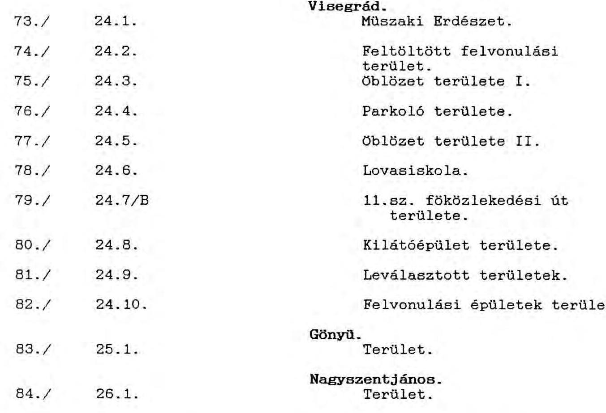
C./ Atadásra kerültek a VIZITERV által készített munkaközi megvalósulási és állapot térképek az OVIBER V-1666/1991. számu levél szerint.
D./ A létesítménycsoportba tartozó valamennyi feltüntetett ingatlan-vagyon-csoportról a 1. számu melléklet szerinti felépítésben az OVIBER és a Kincstári Vagyonkezelö Szervezet "Jogi helyzet és tényrögzítő dokumentáció az ingatlanvagyon-csoportok átadás-átvételéhez" cimú okmányt készített, mely a további földnyilvántartási, örzési és hasznosítási tevékenység alapját és jelen jegyzőkönyv tartozékát képezi. Ezen okmány mellékletként az OVIBER a rendelkezésére álló müszaki kiviteli tervdokumentációk átadása megtörtént.
E./ Az ingatlanok túlnyomó többsége telekkönyvön kivüli tulajdon. A kisajátítás egyszerüsített eljárással történt, nincs a terület az OVIBER nevére bejegyezve, ezért itt a háttéranyag kerül a KVSZ részére átadásra. A területmegosztásra javaslat kidolgozását és a megbízások kiadását a Kincstári Vagyonkezelö Szervezettel egyeztetve a DV.KBT. jogutód szervezete végzi.
F./ A vizlépcsö építés miatti ideiglenes építési tilalmak feloldására intézkedni nem szükséges, mivel annak határideje lejárt.
G./ Az átadásra kerülö egyes ingatlanok további hasznosításával összefüggö elkötelezettségeket 1992. január 31-ig a DV.KBT jogutódja a KVSZ részére megadja.

---

H./ Az ingatlanok és egyéb létesítmények befejezetlen beruházási értékadatait a Kincstári Vagyonkezelö Szervezet tudomásul veszi, de rögzíti hogy mivel amortizáció mint befejezetlen állománynál leírásra nem került, valamint egyes létesítmények szanálásra voltak tervezve, a befejezetlen beruházás nyilvántartási értéke és a tényleges forgalmi érték között jelentős eltérés várható. Ezért a KVSZ az érintett létesítményeket a később elkészítendő műszaki vagy forgalmi értékeselés alapján veszi számviteli nyilvántartásba. Fentiek figyelembevétele mellett a beruházási nyilvántartásból való kivezetéshez a KVSZ mint átvevő az Állami Fejlesztési Intézet felé készült jegyzőkönyveket aláírta.
I./ A KVSZ-nek az ingatlanok további kezelésével összefüggő költségeire, nevezetesen az örzés és fenntartás a DV.KBT. az 1992. évi állami költségvetésben (Kormányzati beruházások címén ) költséget tervezett. Az 1991. évi bázis áron tervezett I. negyedévi keretet a jóváhagyás függvényében átadja.
J./ Az ingatlanokhoz kapcsolódó - még le nem zárt - peres ügyeket a KVSZ jogi kötelezettségként átveszi. A perek költségfedezetét az eljárások eredményeinek várható egyenlege teremtí meg.
K./ Az ingatlanok kezelői jogának megváltozásáról az érintett megyei Vagyonátadó Bizottságokat, a BM. Onkormányzati Hatósági Föosztályát és a megyei földhivatalokat a DV.KBT tájékoztatja az OVIBER előterjesztése alapján.
L./ Az OVIBER elkészítette a 8/1991. PM. azámu rendeletben előírt Ingatlan vagyonkataszteri adatlapokat, melyeket a KVSZ részére átdott létesítményekre vonatkozóan e jegyzőkönyv mellékletében átad. A más költségvetési szerv részére átadásra kerülő ingatlanok adatlapjait az érintett átvévők részére szolgáltatja, melyek saját főhatóságaik útján - esetleges kiegészítés után - küldik meg a KVSZ részére.
M./ Az OVIBER a KVSZ részére átadott ingatlanok későbbiek során felvetődő kérdéseinek tisztázásában 1992. december 31-ig áll rendelkezésre. A költséggel járó tevékenységeket, külön megbízás keretében vállalja.
N./ Az OVIBER 1992.január 31-ig külön jegyzéken tájékoztatja a KVSZ-et

- a kisájátítások során az egyes volt tulajdonosok részére kifizetett tényleges kisajátítási költségekről ahol az eredeti vagy ahhoz közelálló a tényleges állapot;
- az egyes energiaszolgáltató vállalatokkal megkötött szolgáltatói szerződésekröl.
O./ Azon ingatlanok, melyek a beruházás lezárása során a jelen jegyzőkönyv szerint átadottakon felül később kerülhetnek a KVSZ kezelésébe a I. létesítménycsoport átadás-átvételi eljárásának keretében kerülnek átadásra.

---

Az átadó és átvevö nyilatkozata :
Atadadó - DV.KBT - ezen jegyzökönyv alapján a feltüntetett létesítményeket átadja, átvevö KVSZ azokat átveszi.

# Mellékletek: 

1. számu melléklet: Jogi helyzet és tényrögzítö dokumentáció az ingatlanvagyon-csoportok átadás-átvételéhez. (Minta.)
1 példányban.
2. számu melléklet: Jogi helyzet és tényrögzítö dokumentáció az ingatlanvagyon-csoportok átadás-átvételéhez.
84 darab a jegyzökönyv B./ pontjában felsorolt ingatlanokra.

A jégyzökönyv 4 példányban készült.
Kapják: 1. sz.pld-t DV.KBT ( A 2. számu melléklet
2. sz.pld-t KVSZ
3. sz.pld-t OVIBER
4. sz.pld-t AFI ( mellékletek nélkül.)

Jelenlévők a jegyzőkönyvet felolvasták, azt jóváhagyólag aláirják. KMF.

Atadó részéről:
( Gilyén Elemér.)
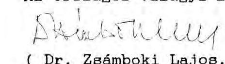

Atvévơ részéről:
( Dr. Papp István Géza.)
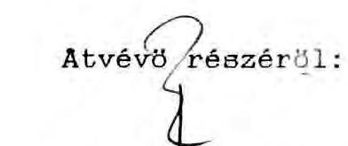
( Hambeisz József.

Az Országos Vizügyi Beruházási Vállalat részéről:
( Dr. Zsámboki Lajos.)
Farkas Mihály.

---

# K I M U T A T A S 

a BNV-beruházás pénzügyi lezárása során
selejtezett létesítmények
(1992. április hó)

Létj. Megnevezés
szám

Selejtezett érték ezer forint

## 1. BOSI FOLETESITMENY

1.5 Alvízcsatorna

- rézsűvédelemhez tartozó mellékléte-
sítmény (körakodók)
10.379

Egyéb beruházások

- tervezés, kitưzés, művezetés, le-
bonyolítói díj
232.038 *

2. NAGYMAROSI FOLSTESITMENY
2.6 Egyéb beruházások

- helikopter igénybevétele 130
- tervezés, kitúzés, múvezetés, le-
bonyolítói díj
1.106 .998 *

BNV OSSZESEN:
1.349 .545

* A befejezetlen, illetve üzemeltetésre át nem adott létesítményekhez tartozó díjak.
A Bősi fölétesítménycsoportból 11.190 millió forint beruházási értékủ üzemeltetésre átadott létesítményt aktiváláskor az arányos díjakkal megterhelték. A Nagymarosi fölétesítménycsoport döntő része befejezetlen, a vonatkozó díjak nem aktiválhatók.

---

# K I M U T A T A S   a BNV-beruházás pénzügyi lezárása során   függő (rendezetlen) létesítményekről   (1992. április hó) 

| Lét.j.   szám | Megnevezés | Függő érték   ezer forint |
| :--: | :--: | :--: |
|  | BOSI FOLETTESIMENY |  |
| 1.11 | Tározó Csehszlovák területen   - melléklétesítmények | 63.697 |
| 1.2 | Dunakiliti Duzzasztómú   - állagmegóvás, fenntartás | 45.875 |
| 1.5 | Alvízcsatorna   - rézsúvédelem melléklétesítményei | 18.500 |
|  | - Cseh. területen kivitelezett melléklétes. | 3.769 |
| 1.6 | Palkovicovo alatti mederkotrás   - kotrás | 2.995 |
|  | - FOKA visszatérítés | 4.120 |
| 1.9 | Egyéb beruházások (B)   - tározó töltés szivárgó csat. területek Rajka | 72.779 |
|  | - tározó töltés sziv. csat. terüeltek D.kiliti | 72.962 |
|  | - üzemi terület bekötői út D.kiliti | 5.753 |
|  | - út az 5. sz. zsiliphez | 739 |
|  | - anyagnyerőhely | 6.522 |
|  | - KEFAG-per | 150.674 |
|  | - múvezetés és építési rend | 473 |
|  | NAGYMAROSI FOLETTESITMENY |  |
| 2.11 | Alsó-Spoly öblözet   - határátkelőhely üzemeltetés | 1.538 |
|  | - szivattyútelepek | 14.389 |
|  | - 5103-as sz. út átépítés | 8.049 |
|  | - melléklétesítmények | 17.300 |
| 2.12 | Alsó-Garam öblözet   - salkai szivattyútelep | 2.977 |
| 2.21 | Visegrád-Dömös öblözet   - 20 KV-os vezeték átépítés | 85 |
|  | - régészeti feltárás (MNM) | 495 |

---

| Lét.j.   szám | Megnevezés | Függő érték ezer forint |
| :--: | :--: | :--: |
| 2.22 | Pilismaróti öblözet   - 20 és 35 KV-os vezeték átép. | 897 |
|  | Esztergom és esztergomi öblözet   - összekötő csatorna | 565 |
|  | - Táti öblítő zsilip | 2.014 |
|  | - Csenkevölgyi bújtató | 10.214 |
|  | - Eszergom + Csenke V. szennyvíz tisztító tervezés + építés | 17.845 |
|  | - Dorogi ipari vízvezeték bontás | 338 |
|  | - Nyárossziget csónak zsilip | 1.979 |
|  | - Csatorna és csapadékvíz | 25.915 |
|  | - Vill. hálózat fejlesztés | 2.615 |
|  | - melléklétesítmények | 26.712 |
| 2.25 | Komárom és Komáromi ölbözet   - melléklétesítmények, épületek, berendezések, lakókocsik | 831 |
|  | - közmúcsatlakozás | 1.687 |
|  | - Dunaalmási felvonulási telep | 3.500 |
|  | - szivattyútelepek | 47.021 |
|  | - hidak Szőny-Almásfüzitő árok felett | 2.517 |
|  | - szivattyúk és csatorna hidak, keresztező mütárgyai épületbontások | 23.667 |
| 2.27 | Nagymaros-Ipolyöblözet   - melléklétesítmények   - szobi töltés, vízbázis, szivattyú, szennyvíztelep zalaegerszegi partvédelem | 1.629 |
| 2.29 | Közutak védelme   - 1201-es fő közlekedési út | 17.598 |
|  | - bekötő utak Szobi, Köbánya | 3.883 |
| 2.20 | Védelmi létesítmények   - Szobi rakodó-szállító szalag átépítés | 1.839 |
|  | - Köanyag határkiléptető | 2.112 |

---

| Lét.j.   szám | Megnevezés | Függõ érték ezer forint |
| :--: | :--: | :--: |
| 2.3 | Nagymarosi Vízlépcsõ |  |
|  | - építés alatti üzemeltetés és .... szolg. | 161.826 |
|  | - tervezés, szaktanácsadás | 9.724 |
|  | - DoKW föv. áll. szerzödéshez kapcsolódó vám | 14.570 |
|  | - munkagödör állagmegóvás | 11.784 |
|  | - segédtöltés | 25.007 |
|  | - üzemi fóépület hídfõ | 1.809 |
|  | - fütömü | 2.244 |
|  | - energia ellátás-telefonkábel | 1.062 |
|  | - megközelító utak karbantartása | 443 |
|  | - parkosítás, vízrendezés | 440 |
|  | - zátonykotrás | 1.186 |
|  | - csatornázás | 215 |
|  | - 12-es fö közlekedési út, átkelési szakasz | 14.906 |
|  | - épületbontások | 23.759 |
|  | - munkagödör áramellátás | 10.000 |
|  | - ideiglenes energiaellátás | 425 |
|  | - ideiglenes hajóútbiztosítás | 32.798 |
| 2.4 | Dunameder rendezés Nagymaros alatt |  |
|  | - szentendrei ág mederrendezés | 37.051 |
|  | - depóniák, part feltöltések | 14.540 |
| 2.5 | Nagymarosi Vízlépcsõ egyéb létesítményei |  |
|  | - híradástechnikai berendezések és létesítmények | 14.645 |
|  | - készenléti lakótelep | 18.902 |
|  | - felvonulási lakótelep | 5.401 |
|  | - lebonyolítási díj, stb. | 5.083 |
| 2.6 | Nagymarosi Vízlépcsõ egyéb beruházásai |  |
|  | - vegyes | 6 |

---

|  Létj. szám | Megnevezés | Függő érték ezer forint  |
| --- | --- | --- |
|   | - tervezés és egyéb költség | 289  |
|   | - Nagymaros kiegészítő feltárás és modell-kísérlet | 62.875  |
|   | - tervezés, kitűzés, művezetés, lebonyolítási díj | 46.353  |
|   | Korrekció II. 1.9-hez |   |
|  1.00 | Bősi Vízlécpső-leállítás miatti többletmunkák |   |
|   | - fenntartás, stb. | 21.192  |
|  2.00 | Nagymarosi Vízlépcső-leállítás miatti többletmunkák |   |
|   | - különböző tervezések | 13.730  |
|  |   |   |
|   | O S S Z E S I T E S |   |
|   | Bősi fölétesítmény: | 448.858  |
|   | Nagymarosi fölétesítmény: | 787.715  |
|   | Leállítás miatti többletmunka: | 34.922  |
|   | BNV OSSZESEN: | 1.271.495  |

---

26/1991. (IV. 23.) OGY határozat
a Bős-Nagymarosi Vízlépcsőrendszerrel kapcsolatos kormányzati feladatokról ${ }^{28}$

1. Abból a felismerésböl kiindulva, hogy a vízlépcsőrendszernek, vagy bármely fölétesítményének üzembehelyezése az érintett területeken mindenütt súlyosan hátrányos ökológiai és gazdasági körülményekkel járna, az Országgyülés felkéri a Kormányt, hogy:

- a Cseh és Szlovák Szövetségi Köztársaság Kormányával folytasson tárgyalásokat a Gabcikovo (Bös)-Nagymarosi Vizlépcsörendszer megvalósításáról és üzembehelyezéséről Budapesten 1977. évi szeptember hó 16. napján aláirt szerződésnek, továbbá mindazon megállapodásoknak, amelyeket a Felek, illetve szerveik az államközi szerződés végrehajtása céljából kikötöttek, közös megegyezéssel való megszüntetéséről;
- egyben kezdeményezze a vízlépcsőrendszernek, illetve összes fölétesítményének meg nem építésétől (elhagyásából) származó következmények rendezése céljából új államközi szerződés megkötését az alábbi értéksorrend figyelembevételével:
a) a térség ökológiai-természeti értékeinek helyreállítása, illetve fenntartása, mindenekelöt az ivóvízkészletek megörzése;
b) árvíz elleni védekezés;
c) a térség természeti viszonyaihoz illeszkedő hajózás kialakítása;
- a vonatkozó országgyűlési határozatok rendelkezéseinek megfelelően dolgozzon ki tervet a hivatkozott szerződésben érintett hazai területek rehabilitációjára.

2. Az Országgyülés szükségesnek tartja a vízlépcsőrendszer megvalósítására irányuló munkálatok további felfüggesztését, és megerősíti az e célból eddig hozott kormányzati intézkedéseket.

Az Országgyülés felkéri a Kormányt, hogy a tárgyalásokon törekedjék arra, hogy mielőbb megegyezés szűlessék - a korábbi magyar javaslatoknak megfelelően - a Cseh és Szlovák Szövetségi Köztársaság területén folyó kivitelezési tevékenység felfüggesztéséről.

---

3. Az Országgyülés felkéri a Kormányt a Gabcikovo(Bős)- Nagymarosi Vízlépcsörendszer állami nagyberuházás azonnal lezárására és az Állami Számvevőszéket az elvégzett munkák átfogó pénzügyi felülvizsgálatára.
4. A Kormány a jelen határozatban foglaltak végrehajtásáról havonta beszámol az Országgyülés Környezetvédelmi Bizottságának.

E határozat az elfogadása napján lép hatályba.

28
A határozatot az Országgyülés az 1991. április 16-ai ülésnapján fogadta el.

---

# HATÁROZATOK TÁRA 

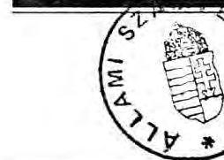

## TARTALOMJEGYZÉK

S zám
2009/1991. (HT 9.) Korm. h.
2010/1991. (HT 9.) Korm. h.

Az Országgyưlés 26/1991. (IV. 23.) OGY határozatának végrehajtása érdekében a Bós-Nagymarosi Vizlépcsőrendszer állami nagyberuházás azonnali lezárásával összefüggő, kormányzati döntést igénylő feladatokról
A kétoldalú kulturális, tudományos és oktatási, illetve múszaki-tudományos egyezményeken alapuló munkatervek, csereprogramok megkötésérői szólo 2018/1988. (HT. 6.) MT határozat módosításáról

## A Kormány határozatai

## A Kormány 2009/1991. (HT 9.) Korm. határozata

Az Országgyúlés 26/1991. (IV. 23.) OGY határozatának végrehajtása érdekében a Bős-Nagymarosi
Vizlépcsőrendszer állami nagyberuházás azonnali lezárásával összefüggő, kormányzati döntést igénylő feladatokról

1. Az állami nagyberuházás azonnali lezárásának végrehajtása érdekében a Kormány az alábbiakat rendeli el:
1.1. Az állami nagyberuházás 1987-ben jóváhagyott létesítmény és beruházási költségjegyzéke alapján a műszaki készültségi állapottal összhangban ki kell munkálni a pénzügyi ráfordításokat az üzembe helyezett és a befejezetlen beruházási állomány bemutatásával.

Lezárási határnap: 1990. december 31.
Felelős: Dunai Vizlépcső kormánybiztosa pénzügyminiszter (Állami Fejlesztési Intézet vezérigazgatója)

Határidő: 1991. december 31.
1.2. Az elkészült, üzemeltethető, vagy a jelenlegi múszaki készültség alapján üzemeltetésre nem alkalmas, de a vizlépcső nélküli állapotban is szükséges fejlesztésekbe illeszthető vízépítési vagy egyéb üzemi létesítmények kezelői jogát át kell adni kijelölt vagy felkért üzemeltetőnek, a beruházási ráfordításoknak a befejezetlen állományi leltárból történő egyidejú kivezetésével.

A létesítmények fenntartási, üzemeltetési, állagmegóvási költségét az 1992. évre a beruházás lezárásával összefüggő feladatok között tervezni kell. A kezelői jog átadását követően ezen költségeket üzemeltető tervezi és terjeszti elő.

Felelős: az átadható létesítmények körének meghatározásáért a kezelőre vonatkozó javaslattal, és az 1992. évi költségigény tervezéséért, valamint az átadásért: Dunai Vizlépcső kormánybiztosa

Határidő: 1991. december 31.
Felelős: a kezelői jog átvétele alapján az üzemeltető kijelöléséért és a további költségek tervezéséért: közlekedési, hírközlési és vízügyi miniszter környezetvédelmi és területfejlesztési miniszter
belügyminiszter
a költségigény költségvetési előterjesztéséért: a pénzügyminiszter

Határidő: folyamatos

---

1.3. A jelenlegi készültség alapján üzemeltetésre nem alkalmas, további fejlesztésekbe sem illeszthető létesítmények kezelői jogát a készültségi állapotot rögzitő̉ selejtezési jegyzőkönyv alapján át kell adni a Kincstári Vagyonkezelő Szervezetnek, és a beruházási nyilvántartásból ki kell vezetni. Az átadást követően esetlegesen felmerüló bontás rekultiválás költségét a hasznosítási bevétel függvényében a Kincstári Vagyonkezelő Szervezet tervezi.

Felelős: a selejtezésre szánt létesítmények körének meghatározásáért és átadásáért: Dunai Vízlépcső kormánybiztosa a további feladatok tervezéséért, és az átvételért:
Kincstári Vagyonkezelő Szervezet vezetője
Határidő: 1991. december 31.
1.4. A felvonulási és melléklétesítmények, valamint a beruházáshoz kisajátított egyéb ingatlanok kezelői jogát, az ingatlanok részletes műszaki, pénzügyi, jogi dokumentálása alapján át kell adni a Kincstári Vagyonkezelő Szervezetnek. Az átadás-átvétel során rögzített funkcionális és műszaki szempontok betartásával a Kincstári Vagyonkezelő Szervezet gondoskodik azok hasznosításáról a Kormányprogrammal, az önkormányzati tulajdonról szóló törvénnyel és a közeljövőben várható, az állami tulajdonról rendelkező egyéb törvényekkel összhangban.

Az átadásig gondoskodni kell a már 1991-ben (ideiglenesen) hasznosítható létesítmények bérbeadásáról.

Az ideiglenes, illetve végleges hasznosítási folyamat időtartamától függetlenül, a nagyberuházás pénzügyi lezárásánál a Kincstári Vagyonkezelő Szervezetnek átadandó létesítmények fejlesztési ráfordítás költségét a beruházási nyilvántartásból ki kell vezetni.

Az 1992. évben felmerülő fenntartási, állagmegóvási költségeket a beruházás lezárásával összefüggő feladatok programjában kell előirányozni. A kezelői jog átadását követően a hasznosításig a felmerülő költségeket a Kincstári Vagyonkezelő Szervezet tervezi.

Felelős: átadható létesítmények körének meghatározásáért, az 1992. évi költségek tervezéséért, az átadásért: Dunai Vízlépcső kormánybiztosa belügyminiszter az ingatlanok átvételéért, hasznosításáért: a Kincstári Vagyonkezelő Szervezet vezetője

Határidő: 1991. december 31.
1.5. A cseh és szlovák területen magyar beruházásban elkészült létesítmények esetében törekedni kell az 1.2. pont szerinti eljárásra, a létesítményeket könyveléstechni-
kailag ki kell vezetni a befejezetlen állományból. Az át nem adható létesítmények fenntartásának költségét nem kell tervezni.

Felelős: Dunai Vízlépcső kormánybiztosa Állami Fejlesztési Intézet vezérigazgatója

Határidő: 1991. december 31.
1.6. Az átvállalt kapcsolódó beruházások létesítményeit a beruházás lezárásaként a készültséget rögzítő jegyzőkönyvvel át kell adni az illetékes tárcának, a beruházási ráfordításokat az állományi leltárból ki kell vezetni.

A lezárással egyidőben az érintett tárcák elképzeléseivel, és az önkormányzatokkal egyeztetve javaslatot kell készíteni a létesítmények további sorsáról. Dönteni kell befejezésükről, és a befejezéshez szükséges költség viseléséről.

Felelős: a lezárásért:
Dunai Vízlépcső kormánybiztosa
Állami Fejlesztési Intézet vezérigazgatója
a döntési javaslat-készítésért:
Dunai Vízlépcső kormánybiztosa
közlekedési, hírközlési és vízügyi miniszter
környezetvédelmi és területfejlesztési
miniszter
belügyminiszter
pénzügyminiszter
Határidő: a lezárásra: 1991. december 31.
a javaslatkészítésre: folyamatos
1.7. A beruházás lezárásával összefüggő, a beruházással érintett területeken létrehozott létesítmények további sorsával kapcsolatos feladatok 1992. évi munkaprogramját a jövő évi költségvetés előterjesztéséig össze kell állítani, szükség szerint az önkormányzatokkal egyeztetve, és a Kormány által elfogadott formában az állami költségvetésben szerepeltetni kell.

Felelős: Dunai Vízlépcső kormánybiztosa pénzügyminiszter közlekedési, hírközlési és vízügyi miniszter környezetvédelmi és területfejlesztési miniszter
belügyminiszter
Határidő: 1991. október 31.
1.8. A nagymarosi és visegrádi térség összehangolt te-rület- és tájhelyreállítási, ideiglenes körtöltés-elbontási, Duna-meder helyreállítási munkáinak 1992. év második

---

felében elhatározott munkakezdéséhez a 3129/1991. Korm. határozat figyelembevételével el kell készíteni a helyreállítás fejlesztési-beruházási programját, melyet a Kormány által elfogadott formában, tartalommal és költséggel az állami költségvetés jövő évi tervében szerepeltetni kell.

Felelős: Dunai Vízlépcső kormánybiztosa közlekedési, hírközlési és vízügyi miniszter környezetvédelmi és területfejlesztési miniszter
pénzügyminiszter
Határidő: 1991. október 31.
1.9. 1992-ben el kell készíteni a Rajkától Nagymarosig terjedő Duna-szakasz vízlépcső nélküli állapotához tartozó új terület és vízi út fejlesztési, valamint a változatlan fejlesztések koncepciószintủ kidolgozását, felül kell vizsgálni a vízlépcsőrendszert figyelembe vevő általános rendelkezési terveket és azokat az új morfológiai adottságoknak megfelelően át kell dolgozni, figyelembe véve az Országgyúlés 28/1991. (IV. 30.) OGY határozatát és a 3129/1991. Korm. határozatot. Meg kell határozni ezen koncepciószintű tervezések-kutatások költségigényét az 1992. évi állami költségvetés előterjesztéséhez.

Felelős: Dunai Vízlépcső kormánybiztosa környezetvédelmi és területfejlesztési miniszter
közlekedési, hírközlési és vízügyi miniszter belügyminiszter
pénzügyminiszter
Határidő: az 1992. évi költségigény tervezésére 1991. október 31.
2. A Kormány jóváhagyja a beruházás lezárását követő időszakra (1991. év) előterjesztett, a beruházás felhagyásával közvetlenül összefüggő feladatok átdolgozott 1991. évi munkaprogramját, az állami költségvetésben a Dunai Vízlépcső költségvetési soron elfogadott 700 MFt -ra.

Felelős: pénzügyminiszter
Dunai Vízlépcső kormánybiztosa
Határidő: 1991. október 31.
3. A Kormány elrendeli a beruházás lezárásával ellentétes jogszabályok felülvizsgálatát, és előterjesztés készítését a hatályon kívül helyezésre.

Felelős: Dunai Vízlépcső kormánybiztosa igazságügyminiszter

Határidő: 1991. október 31.
4. Az érintett térségben az építési tilalom feloldását, a vizjogi engedélyek felülvizsgálatát a vizlépcső nélküli állapotnak megfelelően el kell végezni.

Felelős: környezetvédelmi és területfejlesztési miniszter
közlekedési, hírközlési és vízügyi miniszter
Dunai Vízlépcső kormánybiztosa
Határidő: folyamatos
5. A Kormány elrendeli az 1978. évi 17. törvényerejű rendelet - amely az 1977-ben alárrt államközi szerződés kihirdetését tartalmazza -, és a beruházás teljes körü azonnali lezárása közötti nemzetközi és egyéb jogi összefüggések vizsgálatát, amely terjedjen ki a két ország közös tulajdonát képező létesítmények tulajdonjogának tisztázására.

Felelős: igazságügyminiszter
külügyminiszter
dr. Mádl Ferenc tárca nélküli miniszter
Dunai Vízlépcső kormánybiztosa
Határidő: 1991. október 31.
6. A tervezőmunkát orientálja az, hogy az 1992. évi költségvetés irányelveit megalapozó számítások az 1.2, 1.3, $1.4,1.6,1.7,1.8,1.9$ határozati pontokban foglalt kiadásokra - a Miniszterelnökség fejelezetszintű kormányzati beruházásai között - összesen 495 MFt-ot tartalmaznak.

Felelős: Dunai Vízlépcső kormánybiztosa

Dr. Antall József s. k., miniszterelnök

---

12. sz. melléklet
a V-6-56/1992. sz. jelentéshez

A miniszteri záróészrevételeket tartalmazó levelek, véleményeltérés esetén az arra adott válaszok

---

PÉNZÜGYMINISZTER

3597/1992

Hagelmayer István úr
elnök
Állami Számvevőszék
Budapest

Tisztelt Hagelmayer Úr!

Az Állami Számvevőszék által készített "Jelentés a BősNagymarosi Vizlépcsôrendszer állami nagyberuházás lezárásának pénzügyi felülvizsgálatáról" anyagra észrevételt nem teszek.

Budapest, 1992. szeptember "II "
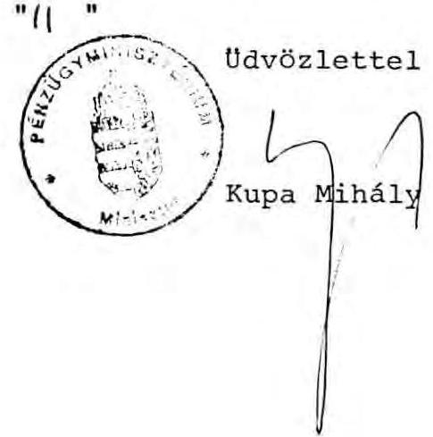

---

Dr. Hagelmayer István az Állami Számvevôszék elnöke

Tisztelt Elnök Úr!
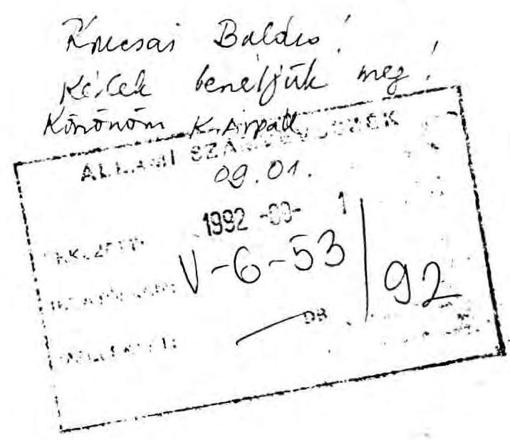

Az Országyưlés 26/1991. számú határozatában felkérte az Állami Számvevôszéket, a Bôs-Nagymarosi Vizlépcsôrendszer állami nagyberuházás keretében elvégzett munkák átfogó pénzügyi felülvizsgálatára. A vizlépcsôrendszer építési munkáinak abbahagyása szakaszosan történt, 1989 tavaszától kezdôdôen, számos kormányhatározat rendelkezései következményeként. A beruházás lezárásáról a hivatkozott Országgyûlési határozatot követôen a kormány 2009/1992.(HT.9) számú határozatával döntött.

Az Állami Számvevôszék 1992. augusztusában elkészült Jelentése 'A Bôs-Nagymarosi Vizlépcsôrendszer állami nagyberuházás lezárásának pénzügyi felülvizsgálatáról' címet viseli. Ezzel összhangban csak a 2009/ 1992. határozat rendelkezéseinek hatályosulását vizsgálja koherens rendszerben a Jelentés. Azonban a korábbi években született rendkivüi fontos pénzügyi döntéseket (például a DoKW-elszámolás) csak esetlegesen, a vonatkozó kormányzati határozatok bemutatása nélkül értékeli. Így a Jelentés a 26/1991. Országgyûlési határozat részteljesitésének, egy - nyilvánvalóan a késôbbiekben elkészülô - átfogó elemzés egyik elemének tekinthetô. Ugyanakkor belsô aránytalanságokhoz is vezet, hogy a bonyolult; és számos szállal összeszövôdô pénzügyi döntéssorozat fontos részei említés nélkül maradnak. (A beruházás pénzügyi vonatkozásairól nemcsak a Jelentésben hivatkozott 3388/1986. MT határozat rendelkezett, hanem például a 3342/1989. MT határozatban biztosított pótlólagos forrást az 1989. évi összes pénzügyi

---

ráfordítással együtt rögzítő döntés. Hasonlóan, szükséges lenne az 1990-es év beruházásainak alapjául szolgáló határozatok és döntések teljesülésével összefüggő pénzügyi következmények feltárására.)

Sem tartalmi, sem formai szempontból nem helyeselhető, hogy a Jelentésben nem pénzügyi-beruházási indíttatású megítélések törik meg a pénzügyi átvilágítást. Ilyen például a DoKW elszámolás kapcsán a szerződés felmondását követő elszámolási módszer (az ABGB 1168. paragrafusa szerinti eljárás) kritikája. Sajnos, - ellentétben a Jelentés konklúziójával - a Magyarországra nagyon kedvezőtlen eredmény elsődleges forrása nem az elszámolási eljárásban, hanem az 1986-ban megkötött szerződés-csomag számunkra hátrányos paragrafusaiban keresendő. (A joggal kifogásolt késedelmes állapotfelmérés időben történő megkezdése esetlegesen enyhíthette volna a veszteséget. Ugyanezért nem értek egyet a 16. oldalon szereplő megállapítással, miszerint "az OVIBER az építési munkálatok felfüggesztését, majd a szerződés felbontását követően tett intézkedéseit a felsőbb irányító szervekkel egyeztette", a 3305/1989. MT határozat értelmében ugyanis már 1989-ben el kellett volna kezdenie az elszámoláshoz a munkák felmérését. Megjegyzésemet alátámasztja a 122 millió ATS késedelmi kamat keletkezése is.)

A Brodoimpeks által végzett munkák jogsértő folytatása és a Jubmeshitel folyósítása során elkövetett pénzügyi szabálytalanságok részletes feltárását látva, csak sajnálhatjuk, hogy nem történt meg a teljes problémakör ilyen mélységú bemutatása. A jelen pénzügyi veszteségeinek, a keletkezett nemzetgazdasági károknak egy része ugyanis az építkezést felfüggesztő, majd leállító döntések késedelmes végrehajtásából származott, ez elkerülhető lett volna, amint ez a Jelentés vonatkozó részének alapos elemzése bizonyítja.

A Jelentés egyes megállapításaihoz füzött pontosító megjegyzéseim:
8. oldal: A Jelentés szerint az OVIBER az építkezéshez szükséges szakhatósági engedélyeket beszerezte. Ezen engedélyek köre azonban korántsem mondható teljesnek, a földtani szakhatóság engedélyét például 1989. tavaszán igyekeztek utólag megszerezni. A kutatási és szakhatósági dokumentációk hiányára utal egyébként a Jelentés 25. oldalán leírt többletkotrási igény az alvízcsatornán, ami a 'feltételezettnél rosszabb geológiai körülmények miatt' vált szükségessé.

---

18. oldal: A beruházás pénzügyi létesítményjegyzékétól a kivitelezésben mutakozó eltérések között nem szerepelhetnek 'a leállítást szakmailag megalapozó kutatások', ilyen jellegü tevékenység nem folyt. 1989-90-ben a döntéselőkészítések szakmai elemzései a beruházástól függetlenül, anyagi ellenszolgáltatás nélkül készültek.
19. oldal: Az MTA-val kötött szerzödés teljesítéséról - mivel a 2014/1991. Kormányhatározat a szerződés szerinti tevékenységeket felügyeletem alá rendelte - 1992. januárjában a jóváhagyott összefoglaló jelentés beszámolt, az összesített pénzfelhasználásról szóló kimutatást az MTA pénzügyi illetékese utóbb a Dunai Rehabilitációs Irodának is megküldte.

Összegezve: A 2009/1991. Kormányhatározatban elôirt feladat, - az állami nagyberuházás pénzügyi lezárása - nem valósult meg a Jelentés 8. oldalának megállapítása szerint, ezért javasolom, hogy a Jelentésben tükrözödő nagy munka véglegesítésére és a nemzetgazdaságot ért veszteség értékelésére csak ezt követő́en kerüljön sor. Javaslom továbbá, hogy a 2009/1992. határozat szerint a 'hasznosítható', ill. 'üzembehelyezett' kategóriába került létesítmények felhasználásáról a jelenlegi kezelők és tulajdonosok készítsenek tájékoztatást, a Jelentés jelenleg csak a KVSZ ezirányú közléseit tartalmazza.

Budapest, 1992. augusztus 29.
Üdvözlettel:
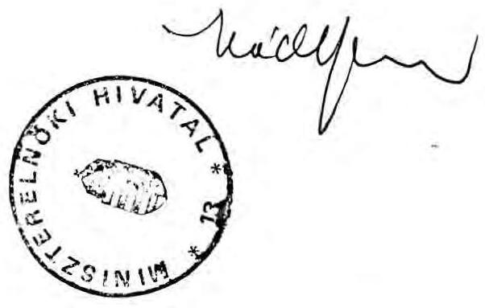

---

Budapest, 1992. szeptember " 3 ." $\mathrm{V}-6-5 \mathrm{G} / 1992$.

Dr. M á d l Ferenc úr
tárca nélküli miniszter

Budapest

Tisztelt Miniszter Ur!

A Bös-Nagymarosi Vizlépcsörendszer állami nagyberuházás lezárásának pénzügyi felülvizsgálatáról készített jelentésünkhöz tett észrevételeit köszönettel megkaptam.

A beérkezett észrevételek alapján a jelentést néhány kérdésben - többek között az On által említett 8., 18. és 28. oldalon meg pontositjuk.

Egyetértek azzal az álláspontjával, hogy a nagyberuházás pénzügyi lezárása és a nemzetgazdaságot ért veszteségek komplex feltárása még nem történt meg. Ennek elvégzését - beleértve a beruházás miatt a következö 10-15 évben jelentkező költségvetési terhek teljeskörü felmérését - magam is igen fontos kormányzati feladatnak tartom.

Az Állami Számvevöszék az Urszággyúles által igényelt pénzügyi felülvizsgálatot elvégezte. A jelentés megítélésem szerint jól tükrözi a vizsgálat lezárásáig kialakult helyzetet és ezért azt kötelezettségemnek megfelelöen az Országgyüléshez beterjesztem.

A vizsgálat tapasztalatai alapján tett kormányzati intézkedésekre vonatkozó javaslatainkhoz szervesen illeszkedik az a

---

kezdeményezése, hogy az illetékes állami szervek számoltassák be a beruházás létesítményeinek jelenlegi tulajdonosait azok hasznosítasanak helyzetéről. Ennek megfelelően javaslatainkat kiegészítettük.

A vizsgálatot végzők arról is tájékoztattak, hogy a levelében felvetett néhány megközelítésbeli kérdést (kormányhatározatok, pénzügyi döntések feldolgozása, DoKW elszámolás kezelése, stb.) korábban már igyekeztek tisztázni az ön munkatársaival. Úgy tünik, ez nem járt teljes sikerrel. Az ezzel kapcsolatos levélváltást csatolom. Ismételten hangsúlyoznom kell, hogy vizsgálatunk programban jóváhagyott, az Országgyulés Környezetvédelmi Bizottságával egyeztetett kereteiben igyekeztünk választ adni a beruházás lezárásával összefüggő konkrét kérdésekre. Ugyanakkor egyetértek azzal, hogy ez a vizsgálatunk nem tekinthető többnek, mint a beruházás átfogó elemzése egyik elemének. Kérem is, hogy jelentésünket ennek megfelelően kezeljék.

Megjegyzem, hogy az Állami Számvevőszék a beruházás problémakörének tisztázásából már eddig is jóval többet vállalt, mint az pénzügyi- gazdasági ellenőrző funkciójából következne. Mégis úgy tünik, vannak akik mindezt kevésnek tartják és az állami szervek hatáskörébe tartozó ügyek megoldását várják tőlünk.

Nagyon kérem Miniszter Urat, hogy segítsen ezirányú gondjaink megoldásában.

Melléklet
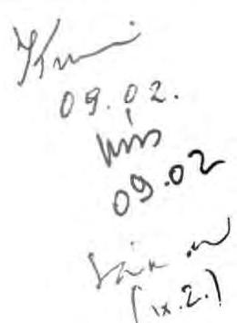

Tisztelettel
Tis.
(Hagelmáyer István)

---

Dr. Kovács Árpád igazgató

Állami Számvevôszék

Tisztelt Igazgató Úr!
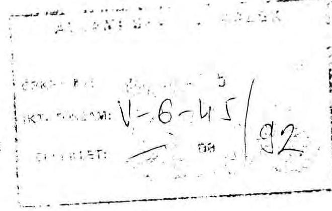

Az Országyưlés 26/1991 számú határozatában felkérte az Állami Számvevőszéket, a Bős-Nagymarosi Vízlépcsőrendszer állami nagyberuházás keretében elvégzett munkák átfogó pénzügyi felülvizsgálatára. A vízlépcsőrendszer építési munkáinak abbahagyása szakaszosan történt, 1989 tavaszától kezdődően, számos kormányhatározat rendelkezései következményeként. A beruházás lezárásáról a hivatkozott Országgyűlési határozatot követően a kormány 2009/1992.(HT.9) számú határozatával döntött.

Az Áliami Számvevőszék 1992. júliusában elkészült jelentés-tervezete 'a Bős-Nagymarosi Vízlépcsőrendszer állami nagyberuházás lezárásának pénzügyi felülvizsgálatáról' címet viseli. Ezzel összhangban csak a 2009/1992. határozat rendelkezéseinek hatályosulását vizsgálja koherens rendszerben a tervezet. Azonban a korábbi években született rendkívül fontos pénzügyi döntéseket (például a DoKW-elszámolás, vagy a Brodoimpeks munkái) csak esetlegesen, a vonatkozó kormányzati határozatok bemutatása nélkül értékeli. Így a jelentés tervezete a 26/1991. Országgyűlési határozat részteljesítésének, egy - nyilvánvalóan a későbbiekben elkészülő - átfogó elemzés egyik elemének tekinthető. Ugyanakkor belső aránytalanságokhoz is vezet, hogy a bonyolult, és számos szállal összeszôvődô pénzügyi döntéssorozat fontos részei említés nélkül maradnak. (A beruházás pénzügyi vonatkozásairól nemcsak a tervezetben hivatkozott 3388/1986. MT határozat rendelkezik, hanem például a 3042/1989. MT határozatban biztosított pótlólagos forrásról és az 1989. évi összes pénzügyi ráfordítást rögzítő döntés. Hasonlóan, szükséges lenne az 1990-es év beruházásainak alapjául szolgáló határozatok és döntések teljesülésével összefüggő pénzügyi következmények feltárására.)

Sem tartalmi, sem formai szempontból nem helyeselhető, hogy a tervezetben nem pénzügyi-beruházási indíttatású megítélések törik meg a pénzügyi átvilágítást. Ilyen például a DoWK elszámolás kapcsán a szerződés

---

felmondását követő elszámolási módszer (az ABGB 1168. paragrafusa szerinti eljárás) kritikája. Sajnos, - ellentétben a tervezet kenklúziójával - a Magyarországra nagyon kedvezőtlen eredmény elsődleges forrása nem az elszámolási eljárásban, hanem az 1986-ban megkötött szerződés-cscmag számunkra hátrányos paragrafusaiban keresendő. (A joggal kifogásolt késedelmes állapotfelmérés időben történő megkezdése esetlegesen enyhíthette volna a veszteséget. Ugyanezért nem értek egyet a 14. oldalon szereplő megállapítással, miszerint "az OVIbER az építési munkálatok felfüggesztését, majd a szerződés felbontását követően kötelességének megfelelően törekedett a magyar érdekek érvényesítésére", a 3305/1989. MT határozat értelmében ugyanis már 1989-ben el kellett volna kezdenie az elszámoláshoz a munkák felmérését. Megjegyzésemet alátámasztja a 122 millió ATS késedelmi kamat keletkezése is.)

A Brodoimpeks által végzett munkák jogsértő folytatása és a Jubmes-hitel folyósítása során elkövetett pénzügyi szabálytalanságok részletes feltárását látva, csak sajnálhatjuk, hogy nem történt meg a teljes problémakör ilyen mélységű bemutatása. A jelen pénzügyi veszteségeinek, a keletkezett nemzetgazdasági károknak egy része ugyanis az építkezést felfüggesztő, majd leállító döntések késedelmes végrehajtásából származott, ez elkerülhető lett volna, amint ez a tervezet vonatkozó részének alapos elemzése bizonyítja.

Mivel a jelentés szerint a 2009/1991. Kormányhatározatban előírt feladat, - az állami nagyberuházás pénzügyi lezárása - amúgy sem valósult meg a tervezet 7. oldalának megállapítása szerint, javasolom, hogy a jelentés jelen terveztében tükröződő nagy munka véglegesítésére és a nemzetgazdaságot ért veszteség értékelésére csak ezt követően kerüljön sor. Javaslom továbbá, hogy a 2009/1992. határozat szerint a 'hasznosítható', ill. 'üzembehelyezett' kategóriába került létesítmények felhasználásáról a jelenlegi kezelők és tulajdonosok készítsenek tájékoztatást, a tervezet jelenleg csak a KVSZ ezirányú közléseit tartalmazza.

Budapest, 1992. július 30.
Üdvözlettel:
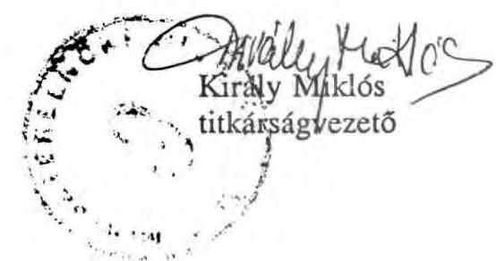

---

Budapest, 1992. augusztus 6. $\mathrm{V}-6-47 / 1992$.

Dr. K i r á l y Miklós Ơr titkárságvezető Miniszterelnöki Hivatal

Budapest

Tisztelt Titkárságvezető Ơr!

A Bős-Nagymarosi Vízlépcsőrendszer állami nagyberuházás lezárásának pénzügyi felülvizsgálatáról készített jelentés- tervezetünkhöz tett észrevételeit és megjegyzéseit öszintén megköszönöm, visszagondolva az ügyhöz kapcsolódó messzemenő kollegális segítségére is. A témával kapcsolatos eddigi vizsgálataink tapasztalatai és az On mostani észrevételei is tovább erősítették bennem azt a már korábban formálódó meggyőződést, hogy a GNV "múltját" mielőbb le kellene zárni. A "múlt lezárásában" - mint erre dr. Hagelmayer István elnök úr több alkalommal utalt - a Számvevőszék törvényben rögzített funkciójának megfelelően közreműködik, de a komplex (múszaki, jogi, erkölcsi és politikai) értékelés nem e szervezet feladata. A Számvevőszék, ezen belül főcsoportunk, a kötött munkatervnek, határozatoknak megfelelően dolgozik, aktuális vizsgálati programjait egyeztetve az Országgyülés jelen esetben illetékes Környezetvédelmi Bizottságával. Most is így történt, tehát, hogy mit tartalmazott programunk és mire irányult a vizsgálat, az meglehetősen kötött volt számunkra.

Kérem nézze el nekem ezt a szokatlan bevezetőt. Többek között az olyan megjegyzései váltották ki ezt belőlem, amelyek kifogásolják, hogy a jelentésben nem teszünk említést különbözö

---

1989-90-ben hozott kormányhatározatokra és döntésekre, a DoKW-val kötött szerződés számunkra hátrányos paragrafusaira, vagy az építkezést felfüggesztő, majd leállító döntések késedelmes végrehajtásából származó nemzetgazdasági károkra.

Ezeket a témákat korábbi, On által is ismert vizsgálatainkban (1991. januárjában és 1992. márciusában kiadott jelentéseinkben) már feldolgoztuk és értékeltük. E vonatkozában azonban nem csak arról van szó, hogy nem lehet mindig mindenre visszatérni, hanem arról, hogy nekünk az Országgyülés által meghatározott feladatot kellett elvégeznünk. Ez pedig nem más, mint az 1990. XII. 31-ig "elvégzett munkák átfogó pénzügyi felülvizsgálata" vagyis a ráfordítások indokoltságának, elszámolásuk szabályszerűségének és a beruházás "megszüntetésével" kapcsolatos intézkedések (létesítmény-átadás, selejtezés, stb.) végrehajtásának ellenőrzése.

A jelentésben foglaltak tartalmi pontositására vonatkozó észrevételeit - így a DoKW-szerződés felbontásával összefüggő állapotfelmérés elhúzódására vonatkozó jelzését - természetesen a jelentés véglegesítésénél hasznosítjuk. Másoktól érkező észrevételek és dokumentumok alapján pontosítanunk kell a BRODOIMPEKS-szel kötött szerződés felmondásának értékelését is. Itt olyan dokumentumok kerültek elő az egyeztetési folyamatban, amelyek a lépéssorozatot részletesebben magyarázzák.

Kérem fogadja azt is megértéssel, hogy a jelentés véglegesítését nem halaszthatjuk el. A vizsgálatot elvégeztük, jelentésünk az Elnöki értekezlet napirendjén szerepel és az - megítélésünk szerint - a kialakult helyzetet tükrözi. Lényegében egyetértő levelet kaptunk a KHVM-ből és a PM-ből, észrevételezte az érdekelt két kormánybiztos, a környezetvédelmi tárca részéről pedig információhiányra hivatkozva türelmet kértek, aminek elfogadására - a törvényben foglalt egyeztetési határidők miatt - nem volt módunk. Másrészt úgy vélem, hogy a nemzetgazdaságot ért veszteségek csupán e vizsgálat alapján nem értékelhetők végleges jelleggel. Ehhez más összefüggéseket is feltáró elemzésekre van szükség, amelyekben az ASZ-nak már eddig is voltak kezdeményezései, mint az államadóssági összefüggések tisztázását feltáró jelentés.

---

Tisztelt Király Ur!
Szeretném remélni, hogy az általam felvetett néhány gondolat hasznosítható ötleteket ad az On további felelősségteljes munkájához is. Jelzem egyben, hogy az észrevételek és az elnöki döntés alapján pontosított jelentést, mint lezárt dokumentumot, az ASZ Elnöke az illetékes minisztereknek véleményezésre újra meg fogja küldeni, s a kapott észrevételeket a jelentéshez csatolni fogjuk.

Kun
08.07.

Tisztelettel
( dr. Kovács Arpád )
igazgató

---

# KÖZLEKEDÉSI, HÍRKÖZLÉSI ÉS VÍZÜGYI MINISZTER 

Hiv.sz:V-6-49/1992.

259437/92.

Dr. HAGELMAYER ISTVAN
az Allami Számvevbszék
elnöke

Budapest

TISZTELT ELNOK OR!
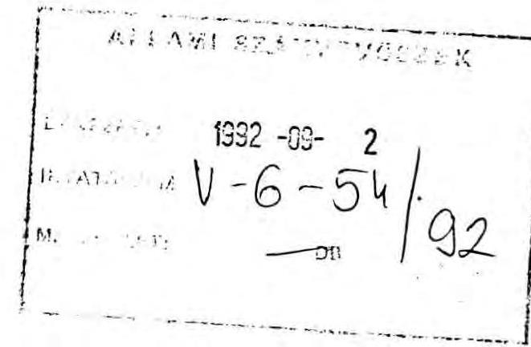

A Bbs-Nagymarosi Vizlépcsbrendszer ailami nagyberuházás lezárásának pónzugyi felülvizsgálatáról elkesztett és lezárt Jelentost kézhezvettem.

A megállapításokat es a javalatokat realisnak, a Bbs-Nagymarosi Vizlépcsbrendszer nay beruházas végleges lezárását eldsegitt szándékúnak tartom.

Tajékoztatom, hogy a BNV beruházasi nyilvántartásban kimutatott osszes raforditásnak a Nagymarosi Erdmú osztrák hitelbut finanszírozott raforditással tortend korrigálására es a pónzugyi rendezes végrehajtására vonatkozo javaslatuk alapján állásfoglulást kértünk a Pénzügyminiszteriumtól az osztrák hiteltartozás átszámitási módjáról, és az utólagos "pénzüg, rendezés" eljárási szabályozásáról.

Budapest, 1992. szeptember "A"
Tisztelettel:
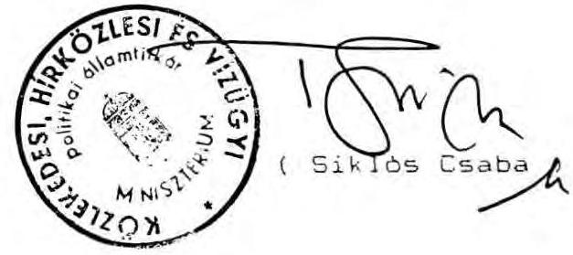

---

# KÖRNYEZETVÉDELMI ĖS TERÜLETFEJLESZTÉSI 

## MINISZTER

$M-789-6 / 92$.

HAGELMAYER ISTVÁN úr elnök

Állami Számvevőszék

## Budapest

Tisztelt Elnök Úr!
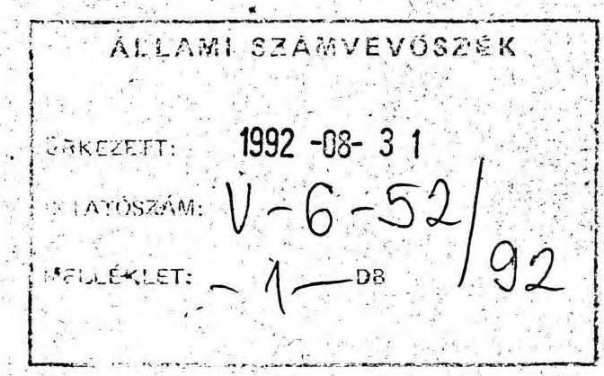

A "Bős-Nagymaroši Vízlépcsőrendszer állami nagyberuházás lezárásának pénzügyi felülvizsgálatáról" készített jelentés-tervezetre vonatkozó - az Állami Számvevőszék Alelnökének V-6-44//92. VIII. 3. számú le" velében foglalt szempontok alapján összeállított - észrevételeinket m MK-1758/2/92./VIII.14. számú levelünkkel rendelkezésükre bocsátottuk.

Elnök Úr által megküldött véglegesített jelentés a KTM-re vonatkozó megállapításokkal kapcsolatos észrevételeinket nem tartalmazza, ezért Alelnök úrnak küldött levelünk másolatát mellékelem.

Megjegyezni kívánom, hogy észrevételeink 1. pontjában a 28. oldalra történő hivatkozás - a véglegesített jelentés fejezeteinek összeállítása következtében - a 31. oldalra módosul.

Budapest, 1992. augusztus 26.
Tisztelettel:
Melléklet: 1 pld.
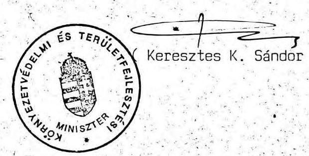

---

# KÖRNYEZETVÉDELMI ÉS TERÜLETFEJLESZTÉSI MINISZTÉRIUM KÖZIGAZGATASI ÁLLAMÍTKÁR

V-6-12/92

MK-1750/2/92. TF-129/167/92.

1788/92.

SÁNDOR ISTVÁN úr alelnök részére

Állami Számvevőszék

Budapest

Tisztelt Alelnök Úr !

1. augusztus 3-i keltű levelében egyértelműsített szempontokra figyelemmel, a Bős-Nagymarosi Vízlépcsőrendszer állami nagyberuházás lezárásának pénzügyi felülvizsgálatáról készített jelentéstervezetnek minisztériumunkra vonatkozó megállapításaival kapcsolatos észrevételeinket az alábbiakban foglaljuk össze.

1. A jelentés 28. oldal utolsó előtti bekezdésében 345 MFt szerepel a Dunaj Monitoring Környezeti Adatgyűjtő és Információs Rendszer létesítésének összköltségeként, amely nem egyezik az 5. sz. mellékletben létesítményi bontásban feltüntetett tételek 355.332 eFt-os végösszegével.

2. A Dunaj Vízlépcső Kormánybiztos Titkárságával, valamint megbízottjával, OVIBER-rel - a kezelői jog átadás-átvételével kapcsolatban felvett 1991. december 19-i jegyzőkönyvben foglaltak értelmében 355.332 eFt beruházási nyilvántartási értékű állóeszköz állomány és tervdokumentáció került eszmeileg átadásra, jogfenntartó nyilványtartási értékű állóeszköz állomány és tervdokumentációk kerülő és tervdokumentációk kerülő, jogfenntartó nyilványtartási értékű állóeszköz állomány és tervdokumentációk kerülő. E jegyzőkönyv mellékleteiben szereplő adatok szerint a létesítmény ráfordítási összköltsége az alábbi tételeket tartalmazza.

|  Térületi mérő és megfigyelő rendszer | 269.048 eFt  |
| --- | --- |
|  Ökológiai tanulmány | 9.974 eFt  |
|  Kutatás, fejlesztés | 76.310 eFt  |
|  |   |
|  Ráfordítás összesen: | 355.332 eFt  |

A mérő és megfigyelő rendszer állomásainak tételes ellenőrzése, állapotrögzítése pénzügyi fedezet hiányában még nem fejeződött be, várhatóan az aktiválási összegeket - a végleges állapotfelmérés és értékbecslés alapján - lényeges mértékben csökkenteni kell.

A létesítménnyel kapcsolatos tanulmányok, kutatás - fejlesztési tervek átadása OVIBER részéről még nem történt meg. A tervezésre fordított költségek - hasznosíthatósági szempontokat figyelembevevő - csökkentése nem indokolt.

„Környezetbarát” 100%-ban újrahasznosított papír

---

A létesítmények állapotfelmérésének és értékbecslésének befejeztével a módosított összegre vonatkozó információt készséggel rendelkezésre bocsátom.

A jelentésre egyéb vonatkozásban észrevételt nem teszek.

Budapest, 1992. augusztus 14.

Tisztelettel:

(Dr. Misley Kárply)

---

# Állami Fejlesztési Intézet 

Vezérigazgató
$1275 / \mathrm{Sz} / 92$,

Dr. Hagelmayer István úrnak elnök
Állami Számvevőszék
Budapest

| Aa LAH.I bZAHUHUVOGZEK |
| :--: |
| 1992--08--25 |
| $\begin{aligned} & \text { TATUCAH: } \sqrt{-\left(6-50\right.} \\ & \text { MCLLEKLET: } \quad-\quad D B \end{aligned}$ |

Tisztelt Elnök Úr !

Az Állami Számvevőszék által készített Bős-Nagymarosi Vizlépcsőrendszer állami nagyberuházás lezárásának pénzügyi felülvizsgálatáról szóló jelentést köszönettel vettem.

A nagyberuházás ráfordításainak és a létesítmények hasznosításának átfogó és alapos pénzügyi felülvizsgálata során tett megállapításaival egyetértek.

A jelentés tartalmával kapcsolatosan észrevétel nem merült fel.

Budapest, 1992. augusztus 24.

Tisztelette $t_{4}$
Allami Fejlesztési Intézet
Dr. Szöke Miklós