# Allami ভ̃ámbrböséé 

## JELENTÉS

a Miniszterelnökség fejezet pénzügyi-gazdasági ellenőrzéséről
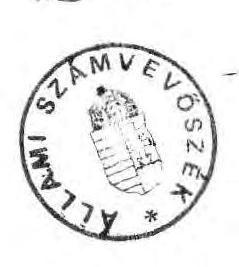

---

A vizsgálatot végezték:

Belics János számvevő tanácsos
dr. Benkő János számvevő tanácsos
dr. Burján Margit számvevő
Csóry Györgyné számvevő tanácsos
Holé Sándorné dr. számvevő
Patai Tamás számvevő tanácsos
Szíártó Károly számvevő tanácsos

A vizsgálatot vezette:

Hegedűsné dr. Müllern Veronika főtanácsos

---

# Állami Számvevőszék 

V-141-31/1991-92.
Témaszám: 90 .

## JELENTÉS   a Miniszterelnökség fejezet pénzügyi-gazdasági ellenőrzéséről

A kormányváltást követően alapvető szerkezeti- és feladatmódosulás következett be a Miniszterelnökség fejezetnél. A 21 címen és az 56 alcímen 1991-ben 27,7 milliárd Ft előirányzattal gazdálkodtak. Ezen belül az önálló fejezeti jogosítványnyal rendelkező címek, illetve önálló intézmények (pl. Biztonsági szolgálatok, Gazdasági Versenyhivatal, Állami Vagyonügynökség, Központi Statisztikai Hivatal, Országos Műszaki Fejlesztési Bizottság) 8,9 milliárd Ft-tal rendelkeztek. A központi bérpolitikai intézkedések fedezetére, valamint a költségvetés általános tartalékára 16,4 milliárd Ft előirányzat volt elkülönítve.

A Miniszterelnöki Hivatal (a továbbiakban: MEH) által ténylegesen felügyelt, irányított terület azonban ennél lényegesen szűkebb, hatásköre jórészt a Kormány működésével kapcsolatos feladatokra terjed ki. A MEH-hez tartozó intézmények többsége is (1991-ben 9 önállóan gazdálkodó intézménye volt) ezzel a céllal működik, gazdálkodásukkal, vagyonkezelésükkel a Miniszterelnök és a Kormány testületi munkájához teremtik meg a feltételeket. Átlaglétszámuk megközelítette az 1.900 főt, eszközeik értéke az 1,8 milliárd Ft-ot. Feladataikhoz 1991-ben közel 2,9 milliárd Ft költségvetési előirányzatot használtak fel, 53,6 \%-kal többet, mint az előző évben. Ebből 983 millió Ft ágazati célokat finanszírozott. Ellenőrzésünk, amely elsősorban a "szűken" értelmezett területekre irányult, célja az volt, hogy értékelje
—a rendelkezésre álló pénzeszközök felhasználását a törvényességi, célszerűségi, eredményességi szempontok alapján;
—a fejezet adott struktúráját, a gazdasági-pénzügyi irányítás színvonalát;
—a célszerűségi szempontok figyelembevételével az ellenőrzési tevékenység hatékonyságát.

---

Ellenőrzésünk az 1990-1991. évekre terjedt ki, a költségvetési előirányzat megalapozottságát illetően 1992. évre is.

# I.   Részletes megállapítások 

A szűken vett fejezet (továbbiakban: fejezet) és a hozzá tartozó intézmények költségvetési előirányzata a vizsgált időszakban több, mint $50 \%$-kal nőtt. Ez elsősorban a fejezetre jellemző igen jelentős belső szervezeti átalakulással volt összefüggésben, de hozzájárult ehhez - bár kisebb mértékben - az állami támogatás növekedése, illetve a költségvetésen kívüli pénzeszközök igénybevétele is.

A Miniszterelnökség fejezet feladata és struktúrája a kormányváltást követően jelentősen megváltozott. Jelenleg számos olyan intézmény, kormányzati feladat tartozik hozzá, melyek fölött nem gyakorol felügyeleti szakmai-pénzügyi jogosítványokat. Közvetlen hatáskörébe tartoznak olyan intézmények is, melyekkel kapcsolatos jogköre ugyancsak csekély. A heterogén szervezet, a hatásköri anomáliák megnehezítik a fejezet feladatainak ellátását, a feladatok és a pénzügyi források összhangjának megteremtését.

## 1) A feladatok és a szervezeti rendszer összhangja

A fejezet szerkezetében, feladataiban a bekövetkezett kormányzati változások, illetve a költségvetés szerkezeti rendjének módosítása miatt jelentős volt a belső mozgás. Az elmúlt három évben - de 1992-ben is - alapvető módosulások következtek be. Ezek közül a jelentősebbek:
— elkerült a fejezettől pl. az Államigazgatási Főiskola, az Állami Egyházügyi Hivatal, a Központi Statisztikai Hivatal, a Magyar Gazdasági Kamara, a Műszaki és Természettudományi Egyesületek Szövetsége, a Tudományos Ismeretterjesztő Társulat;
—a hatáskörébe került pl. az Országos Műszaki Fejlesztési Bizottság, az Országos Kárrendezési és Kárpótlási Hivatal, az Állami Vagyonügynökség.

Az utóbbi intézmények felett a fejezet szakmai-gazdasági felügyeletet nem gyakorol. Azok egy része fejezeti jogosítvánnyal rendelkezik.

A feladatellátás költségigényének megítélését a több éves tradicionális gazdálkodási összefonódások - az Országgyűlési és a Köztársasági Elnöki Hivatallal - is

---

nehezítették (pl. a gépkocsitárolás, üzemanyag-ellátás, Parlament épületének használata).

Sajátos szerepe van az általános- és céltartalékoknak, valamint a rendkívüli kiadások fedezetének is (1991-ben az összes kiadási előirányzat 59,4, míg 1992-ben 60,7 \%-a). Ezen előirányzatokkal kapcsolatosan - melyek a központi költségvetés kormányzati végrehajtásával vannak összefüggésben - a MEH-nek semmilyen érdemi, döntési jogosítványa, információja, feladata nincs (a koordinációs, nyilvántartási teendőket a PM látja el), így a fejezeten belüli megjelenítésük formális.

A fejezet közvetlen felügyeleti hatáskörébe tartozó intézmények között is vannak "fejezetidegenek" (pl. Országos Bányaműszaki Felügyelőség, Világkiállítási Programiroda), melyek idetartozása megkérdőjelezhető (1. sz. melléklet). Ezek felett sem gyakorolnak - elsősorban szakmai kérdésekben - tényleges felügyeleti jogokat, a pénzügyi-gazdasági területen is többnyire csak formálisan. A fejezet munkája velük kapcsolatban jórészt az operatív nyilvántartásra korlátozódik. Közülük néhányan pénzügyi igényeiket is gyakran a PM-mel - esetenként a fejezet tudta nélkül - közvetlenül intézték.

A bekövetkezett szerkezeti változások részben összefüggtek az állami feladatok felülvizsgálatával (pl. nemzetiségi szövetségek, TIT, MTESZ fejezetből való kikerülése). Az állami pénzeszközök kímélése azonban még további intézkedéseket igényel (OBF, PRESSINFORM). Ezt a folyamatot lassítja, hogy az elmúlt időszakban (1992-ben) újabb fejezetidegen intézmények kerültek a Miniszterelnöki Hivatalhoz (pl. Kárpótlási Hivatal). A költségvetési támogatással végzett feladatok vállalkozási szférába való átirányítása is igen korlátozott volt.

Intézményfelülvizsgálat eredményeként 1991. év végén megszüntették a Magyar Közvéleménykutató Intézetet (a továbbiakban: MKI). Ezen túl egyéb, érdemi intézkedést nem tapasztaltunk, holott a PRESSINFORM (külföldi újságírókat tájékoztató iroda) tevékenységét is célszerű lett volna áttekinteni.

Az MKI-vel kapcsolatos eljárás kifogásolható volt, mert a törzsszám megszüntetésével egyidejűleg nem szüntették meg az intézmény bankszámláját. A felszámolási időszak alatt keletkezett bevételeket viszont nem csak erre a számlára utalták. Az MTA és a MEH között létrejött megállapodás - amely a volt intézmény eszközeinek és létszámának átadására vonatkozott - nincs összhangban a 121/1991. Korm. sz. rendelet 4. paragrafusával, mivel csak a megszűnés után intézkedhettek volna a megmaradt eszközök további sorsáról.

---

Kormányzati döntés alapján 1989. év végén a fejezetet megbízták a volt MSZMP ingatlanok értékesítésével és az apparátus létszámának leépítésével. Ez a tevékenység rendszeridegen a fejezeti költségvetési gazdálkodástól. A létesítmények értékesítéséig négy üdülőegységet (Balatonaliga, Balatonföldvár, Balatonarács, Dobogókő) részben önálló költségvetési szervként a kormányüdülőkhöz rendeltek azzal a feltétellel, hogy a működés költségeit az üzemeltetőnek kell fedeznie, erre költségvetési támogatás nem adható.

Balatonaliga kivételével a volt pártüdülők - fedezethiány miatt - 1991. május 2-a és október 31-e között 3,8 millió Ft kölcsönt kaptak a kormányüdülők költségvetéséből. Ezt az összeget 1991-ben nem térítették meg, azt a fejezet 1992-ben a Vagyonrendezési letéti számláról szabálytalanul utalta át a kormányüdülőknek. (A kormányüdülők 1991. év közben likviditási gondok miatt az év végi pénzmaradvány elszámolási számláról 7,6 millió Ft kölcsönt kaptak, amit még az évben visszafizettek.)

A nullszaldós üzemeltetésnek induláskor nem volt meg a realitása, mert az üdülők átvételével egyidejűleg nem történt meg a működés feltételeinek kialakítása (ehhez a meglevő adottságok sem voltak mindig kedvezőek). Erre csak 1990 nyarán került sor. Vendéglátó jellegű tevékenységre, szállodai üzemeltetésre kellett átállni, ami az eddigi sajátos funkció helyett egész évben nyílt üzemeltetést, piaci szemléletet igényelt. Ezek a törekvések várhatóan nem ígérnek hosszú távú eredményeket, sőt átmeneti fenntartásuk jelentős költségigénnyel járhat, mivel az elmúlt években csak a legszükségesebb beszerzési, állagmegóvási feladatokat hajtották végre. Mindez sürgeti az ingatlanok mielőbbi értékesítését.

A bonyolult és igen heterogén feladatok mellett a gazdálkodás rendjét meghatározó egyes belső szabályzatok - pl. SZMSZ, a MEH Gazdálkodó Szervezetének főpénztár riasztási utasítása, belső ellenőrzési szabályzata - nem mindig alkalmazkodnak a megváltozott körülményekhez (tervezés, előirányzat-módosítás, kötelezettségvállalás stb.). A MEH rendelkezik ugyan ideiglenes SZMSZ-szel, ez azonban még nem tükrözi egyértelműen a fejezet és az intézmények kapcsolatát, információ áramlását. A feladatok és a szervezetek összhangja a fejezeten belül, illetve a fejezet és az intézmények között nem mindig felelt meg a követelményeknek.

A fejezet és az intézményei között a feladatok elkülönítése, a felelősségi határok meghúzása pontosításra szorul. A fejezeti ellenőrzést végzők foglalkoztatása is esetenként összeférhetetlenséget takar. Tapasztalható volt az is, hogy az intézményi

---

hatáskörbe tartozó gazdálkodási kérdésekben költségvetési szerven kívül vezetői szinten döntöttek. (3/a-d. sz. mellékletek)

A nem megfelelően kidolgozott belső szabályzatok (pénzkezelési, belső ellenőrzési, selejtezési) az operatív gazdálkodásban is kedvezőtlenül hatottak.

A MEH Gazdálkodó Szervezetének feladatköre elsősorban a regisztrálásra, végrehajtásra szorítkozott, önálló döntési jogosítványa jórészt az operatív fenntartás-üzemeltetés területére korlátozódott (pl. épületfenntartás, jóléti intézmények működtetése, gépkocsijavítás, szolgáltatás).

Vitatható, hogy a szakmai és a gazdasági felügyelet ellátását a Kormányüdülőtől (Balatonaliga) átmenetileg elvonták és azzal külső szervezetet bíztak meg (2/a-c. sz. melléklet).

A Világkiállítási Programirodánál a döntési, finanszírozási és elszámolási folyamatok szétválasztása esetenként olyan hiányosságokhoz is vezetett, mint pl. bérkeret-túllépés, átmeneti fedezetlen kötelezettségvállalás. A Világkiállítás előkészítésére és a Programiroda fenntartására 1990-ben rendelkezésre álló 100 millió Ft költségvetési támogatás felhasználásával a "HUNGEXPO"-t (Vásár és Reklám Rt.) csak költséges és hosszas vizsgálatok árán sikerült többé-kevésbé pontosan elszámoltatni (külső könyvszakértő cég bevonásával).
2) A költségvetési előirányzatok tervezésének, a pénzellátás folyamatának értékelése

A fejezet gyakori szerkezeti változása ellenére rendelkezésre álltak a feladatellátásához szükséges pénzeszközök. Az állami támogatás évenként mintegy $30 \%$-os növekedése - amely alapvetően az új feladatokkal volt összefüggésben - és a jelentős évközi előirányzat-módosítások (pl. 1991-ben $15 \%$ ) kellő biztonságot teremtettek. Feladataik finanszírozására azonban költségvetésen kívüli pénzeszközöket is igénybe vettek.
a) Bevételi források megalapozottsága, a pénzkihelyezések gyakorlata

A források megtervezését elsősorban a biztonságra való törekvés jellemezte, amit az állandóan változó körülmények, feladatok nehezítettek. A saját bevételek aránya a költségvetési támogatáshoz képest 1988-1991 között $6 \%$-ról $35 \%$-ra emelkedett (4. sz. melléklet). Egyes esetekben a bevételek alátervezése is megfigyelhető volt. A források teljes körű feltárására sem mindig került sor. Az előirányzatok megállapításánál - a fejezet jellegénél fogva - a mutatószámok, naturáliák nem játszottak meghatározó szerepet.

---

A bérbe adott helyiségek hasznosításával viszont jelentős bevételeket értek el, bár előfordult, hogy saját irodaigényük kielégítésére magas összegért idegen bérleményt kellett igénybe venni (tárca nélküli miniszter elhelyezésére).

Az üdülési térítési díjakat - melyek alacsonyak voltak - felemelték, azonban ez sem enyhítette lényegesen az örökölt és rossz adottságokkal rendelkező üdülők jelentős veszteségét.

Különösen a Kormány központi üdülőjében - Balatonőszödön - jelentkezik ez az ellentmondás, ahol 1991-ben a tényleges vendégnapra vetített teljes évi költségnek (mintegy 13 ezer Ft/tényleges vendégnap) csak mintegy 2,3\%-át fizették meg a kötelező térítési díjjal az igénybe vevők. Az üdülőben a térítési díj 1990-ben 350 Ft/vendégnap volt, ami a teljes ellátást is magába foglalta. 1991-ben már csak a szállást fizették 250, Ft/vendégnap térítéssel, az étkezés a la carte rendszerben működött. A szállásdíjra, az étkezésre és egyéb szolgáltatásokra azonban vendégnaponként átlag 1.134 Ft-ot (a teljes költség közel $9 \%$-át fizették a vendégek, szemben az MSZOSZ 240 Ft-os térítési díjaival (1991-ben a legmagasabb kategóriában 240 Ft/vendégnap volt - étkezéssel együtt - az MSZOSZ térítési díja).

Az intézmény magas költségeihez hozzájárul az is, hogy 30 db "munkásszállást" üzemeltetnek. Ezek azonban gyakorlatilag 30-60 m2-es, 1-2,5 szobás szolgálati lakások, melyek térítési díja rendkívül alacsony. A berendezéssel, fűtéssel, világítással, karbantartással együtt havi 200-300 Ft. (A "munkásszállásokat" a három üdülővezető is igénybe veszi, akik a fűtést, világítást a felhasználás arányában, mérőóra alapján fizetik.)

A használatba adott helyiségek bérleti díja nem egységes. Az e forrásból származó kintlevőségek jelentősek, behajtásuk nem egy esetben gondokat okozott. A felmerült problémák ellenére e tevékenységből a vizsgált időszakban 40 millió Ft eredményt értek el.

A MEH irodahelyiség igénye jelenleg (kiszolgáló helyiségekkel együtt) mintegy 11.900 $\mathrm{m}^{2}$. Ebből $4.400 \mathrm{~m}^{2}$-t a Parlament épületében foglalnak el, amiért térítést nem fizetnek, így ezek közmű-, takarítási költségigényét sem ismerik. Az elhelyezésükre szolgáló központi irodaépület (Kossuth tér 4.) $15.500 \mathrm{~m}^{2}$ belső területtel rendelkezik, ebből $7.500 \mathrm{~m}^{2}$-t használnak, $8.000 \mathrm{~m}^{2}$-t bérbe adtak. A bérlők egy része költségvetési intézmény, más része vállalkozás. Vezetői döntés alapján azonos szolgáltatási díjakat, de különböző négyzetméterárakat fizettetnek a bérlőkkel. Ugyanakkor saját feladataikhoz nem rendelkeznek kellő számú üres helyiséggel, ezért az egyik tárca nélküli minisztert a "Lánchíd irodaházban" tudták elhelyezni. Ennek díja viszont lényegesen magasabb volt (mintegy $20 \%$-kal), mint amennyit a MEH irodaházban alkalmaznak.

A bérleti díjak megfizetésénél nem ritka a több hónapos csúszás. Pl. a Világkiállítási Programiroda 1991. II. félévben nem fizetett bérleti díjat (amely az összes kiadási

---

előirányzata $38 \%$-a), ezért 1991-ben 2,1 millió Ft késedelmi kamatot számláztak, aminek 1992. április végéig még a negyedét sem sikerült behajtani.

A MEH vállalkozási tevékenysége - feladatainak jellegéből adódóan - viszonylag csekély. Kifejezetten eredményérdekeltség alapján működő intézménye nincs. Kedvező jelenség, hogy elért eredményeikkel az alaptevékenység forrásait igyekeztek kiegészíteni. Ennek ellenére jelentős nagyságrendet képviseltek év közben a felügyeleti szerv részéről biztosított pótelőirányzatok.

A Kormány Központi Üdülőjéhez tartozó négy volt MSZMP üdülő közül csak a balatonaligai ért el nyereséget (14 millió Ft-ot), a többi összesen 4 millió Ft veszteséggel zárta az 1991. évet (az üdülők átlagkihasználtsága 20-30 \% között mozgott, sőt Balatonarácson egész évben nem volt vendég).

Az üdülők tevékenységüket vendéglátóipari jelleggel, vállalkozásként folytatják, ezért indokolt lett volna az üdülőket a 4/1991. (II.13.) PM rendelet 5. paragrafus alapján eredményérdekeltségi rendszerbe sorolni. Ezzel összhangban kellett volna év végén a költségvetési beszámolót, illetve az eredményt kimutatni. Ennek hiányában a beszámoló nem tükrözi a működés eredményét, ez a mérlegben pénzmaradványként jelent meg. Így az intézmény beszámolója nincs összhangban a mérlegvalódiság elvével, illetve a vállalkozási nyereségadóról szóló többször módosított 1988. évi IX. törvénnyel.

A MEH Gazdálkodó Szervezet felügyelete alá tartozó garázs a gépkocsik javítását nemcsak saját szervezetének, hanem térítés ellenében külső szolgáltatásként is végzi. 1991. januártól a Michelin gumiköpenyek bizományosi forgalmazására is vállalkozott (az erre vonatkozó szerződést a Gépkocsi osztály vezetője szabálytalanul, ellenjegyzés nélkül, egyedül írta alá! 5. sz. melléklet). A garázs tevékenysége 1991-ben csaknem 5 millió Ft eredményt hozott, ezért - a célszerűségi és gazdaságossági követelmények szem előtt tartásával - indokolt lenne jelenlegi működési formáját mielőbb felülvizsgálni és ennek függvényében (részben) önálló egységként üzemeltetni.

A vizsgált időszakban a fejezet forráslehetőségei költségvetésen kívüli pénzeszközökből is táplálkoztak (158 millió Ft). Ez is hatással volt arra, hogy jelentős nagyságrendű szabad pénzeszközzel rendelkeztek, amit - helyesen - hasznosítani igyekeztek. A fejezet az elmúlt három évben évenkénti tőkekihelyezéseit megduplázta (1989-ben 40, 1990-ben 90, 1991-ben 191,5 millió Ft összegben), amiből 1991-ben 53 millió Ft kamatot realizált. A befektetések nagysága elsősorban az év végi pénzmaradvány összegével, illetve a pénzellátás és a felhasználás időbeli szétválásával volt összefüggésben.

A pénzpiaci műveletek - úgy a fejezetnél, mint az intézményeknél - nem csak betételhelyezésben, de értékpapír vásárlásokban is megnyilvánultak, ezek azonban nem a 4/1991. (II.13.) PM sz. rendelet alapján történtek. A PM 23.769/1991. sz. leirata azon túlmenően, hogy nincs összhangban az említett rendelettel, elősegíti

---

azt, hogy a központi költségvetés pénzeszközei fedezetet biztosítsanak a kereskedelmi bankok hitelezési tevékenységéhez (6/a. sz. melléklet).

A fejezet hét bankszámlájának hó végi számlaegyenlege 1991-ben 100-500 millió Ft között mozgott. A finanszírozási számlák kivételével a szabad pénzeszközök 60-300 millió Ft között szóródtak. 16 esetben történt pénzkihelyezés, ebből - az előzőekből adódóan - 7 alkalommal szabálytalan volt az eljárás, ami a bankválasztással és a tőkekihelyezés módjával volt összefüggésben (6/b. sz. melléklet).

A Gazdálkodó Szervezet 1990-ben különféle bankokban (Dunabank, Konzumbank) 25 millió Ft-ért értékpapírt vásárolt, ami után 6,4 millió Ft kamatot realizált. Mivel a bemutatott szerződések nem tartalmazzák az adásvétel tárgyát képező kötvény nevét, sorszámát, ezért azokból nem derült ki a megvásárolt értékpapír fajtája. Az intézmény 1991-ben is vásárolt értékpapírt hasonló feltételekkel (6/c-d. sz. mellékletek).

A Kormány Központi Üdülője ingatlan értékesítésből befolyt összegből 40 millió Ft-ot 7,2 millió Ft kamathozadékra - tartós betétként helyezett el, míg 10 millió Ft-ért kötvényt vásárolt az OKHB-tól (6/e. sz. melléklet).
b) A kiadási előirányzatok, a költségvetésen kívüli pénzeszközök felhasználása

A kiadási előirányzatok 1988-1991. között csaknem megháromszorozódtak (7.sz. melléklet). A több éves tervezési gyakorlat alapvetően összefüggésben volt azzal, hogy sem a fejezetnek, sem az intézményeknek (elsősorban az új intézményeknek) nem kellett eddig pénzszűkével szembenézni. A feladatbővüléseket többlet, illetve külső forrásokból fedezték. Az intézményi tervezési gyakorlatban előfordult az is, hogy a felügyeleti szintről jövő többleteszközök reményében terveztek, ami nem ösztönzött kellően a szakmai feladatok költségeinek felülvizsgálatára, a költségek csökkentésére.

A fejezet költségvetési tervjavaslatának kialakításánál a PM is csak meglehetősen szintetizált adatok alapján próbálta megítélni a várható pénzügyi kondíciót, a hiányzó adatokat a szóbeli egyeztetés "pótolta".

A költségvetési támogatás növelését "kikövetelő" magatartás - a kiadási előirányzatoktól független pénzköltés - az intézményi gazdálkodók egy részének szemléletére is jellemző volt. Közülük néhányan még az Országgyűlés által elfogadott - az 1990. évi CIV. törvényben rögzített - csökkentett előirányzatok ellenére is a megszokott módszerekkel terveztek, illetve várták az év közben "lebontott" pótelőirányzatokat.

A Kormány Központi Üdülőjének 1991. évi állami támogatását a törvény 53 millió Ft-tal csökkentette. Emiatt a kormányzati üdülők belső költségvetésében - amit az intézmény vezetői is aláírtak - a kiadási előirányzatok mérséklése helyett negatív

---

előirányzatok jelentek meg (pl. készletbeszerzés -8,9, szolgáltatás -8,6 millió Ft), viszont a bérelőirányzatot az előző évi teljesítés $123 \%$-ában tervezték meg.

Ennek ellenére az üdülők költségvetése év végére az eredeti előirányzat - 19,5 millió Ft - többszörösére (161,3 millió Ft) növekedett, az év végi pénzmaradványa (46 millió Ft) viszont csaknem megegyezett a zárolt összeggel.

Az előirányzat-növekményen belül meghatározó volt a fejezet által biztosított kb. 70 millió Ft költségvetésen kívüli pénzeszköz, amit a "Vagyonrendezési letéti számláról" utaltak át több részletben, jórészt a második félévben. Ez a fedezetbiztosítás nem állt összhangban a Vagyonrendezési letéti számla Kormány által meghatározott eredeti rendeltetésével. Ez a támogatás a kormány-üdülők működésének alapfeltételeit biztosította (14. sz. melléklet).

Az intézmény kiadási előirányzatainak megemelését év közben ingatlanterülete egy részének (1,5 hektárnak) értékesítéséből származó bevételből, illetve annak kamathozadékából (54,4 millió Ft) növelte. Ezeket együttesen ár- és díjbevételeként mutatta ki, amiből 1,3 millió Ft-ot saját hatáskörben béralap-előirányzatának növelésére fordított, és 1991. október hóban jutalomra fizette ki. (8/a-b. sz. mellékletek) Az eljárás nem volt összhangban az 1990. évi CIV. tv. 9. § (11) bekezdésével. (Megjegyezzük, hogy az 52. rovaton tervezett eredeti előirányzat év végére csak $82,9 \%$-ban teljesült.)

Az ingatlanterület értékesítéséről két kormányhatározat is döntött. Mindkettő tárgya ugyanaz: hozzájárul az üdülő területéből 5 ha értékesítéséhez. Azonban míg az első a vételár rendeltetéséről egyértelműen határoz (felújításra kell használni), addig a második intézkedése nem konkrét. Ugyanis az 1992. évi finanszírozás érdekében a "működési kiadások és a szükséges karbantartások fedezetére" rendeli el a bevételt felhasználni.

Kifogásolható - ez egyben további jogviták forrása is lehet - hogy az adásvételi szerződés nem rögzíti pontosan az értékesített telekrész határvonalait, a további értékesítési feltételeket (9. sz. melléklet).

A Világkiállítási Programiroda költségvetését az 1991. évi költségvetési törvény a tervezetthez képest 100 millió Ft-tal alacsonyabb összeggel hagyta jóvá. Fél évvel később az Országgyűlés 38/1991. márciusi határozata technikai hibára hivatkozva "tudomásul vette ..., hogy a kiadási előirányzatok túlteljesítése bekövetkezhet". A Kormány határozatával a Programiroda költségvetését 50 millió Ft-tal növelte a költségvetés általános tartaléka terhére. Ugyanezen határozat döntött arról is, hogy a MEH a Programirodának 45 millió Ft-ot utaljon át "egyéb pénzeszközök átcsoportosítása útján" a Vagyonrendezési letéti számláról. Kifogásolható, hogy az Iroda tevékenysége a számla funkciójával nincs összefüggésben (14. sz. melléklet).

Év közben a Programiroda gazdálkodását nem a pénzügyi lehetőségek, hanem a reménybeli források határozták meg, emiatt a pénzügyi gondok állandósultak, fedezetlen kötelezettségvállalások jelentek meg, amihez a számviteli nyilvántartások hiánya is hozzájárult. Az

---

1992. évi kiadások megalapozottságát beárnyékolja, hogy az év 57,5 millió Ft fizetési kötelezettséggel indult, holott az egész éves eredeti kiadási előirányzat 53,7 millió Ft. Ez az adósságállomány március végére 79,6 millió Ft-ra nőtt. (10/a-b. sz. mellékletek) Megjegyezzük, hogy az 1991. évi XCI. tv. rendkívüli kiadásként az "Expo" fejlesztés céljára 2 milliárd Ft-ot tartalmaz.

A fejezet heterogén összetétele, a tervezési módszerek esetenként az előirányzatok megalapozatlanságát is előidézték, ami az előzőekben bemutatott példákon túl is nagy számú előirányzat-módosítást igényelt. Ezek nagy része összefüggésben van az új kormányzati struktúrával, az ehhez kapcsolódó feladatok költségigényének fedezetével. Esetenként viszont a többletigények szakmai-pénzügyi megalapozottsága megkérdőjelezhető volt. Előfordult, hogy az átutalások utólag már teljesített kiadásokat fedeztek.

A fejezetnél 1990-ben 48 esetben, 1991-ben 33 alkalommal került sor előirányzat-módosításra.

A MEH Gazdálkodó Szervezeténél több éve kialakult gyakorlat, hogy a fejezet a ténylegesen kifizetett bér-, illetve jutalom összegét helytelenül - amit előzetesen szóban jóváhagyott - utólag adja meg, pótelőirányzatként. Előfordult, hogy jutalmazási célokra (két tételben összesen 43,1 millió Ft-ot), illetve 15,6 millió Ft-ot többletkifizetésekre utaltak át. Az ilyen típusú döntések a formálisan fedezetlen kötelezettségvállalások teljesítésére kényszerítik az intézményt (11/a-e.sz. mellékletek). Felügyeleti hatáskörben a MEH Gazdálkodó Szervezeténél 1990-ben 29 db, 1991-ben 34 db előirányzat-átcsoportosítás volt, ami az eredeti előirányzatnál 65-80 %-kal több forráslehetőséget biztosított. Ezek elsősorban a beszerzésekre, állagmegóvásokra nyújtottak lehetőséget.

Kormányzati döntés alapján a MEH feladatot kapott a fővárosban lakással nem rendelkező kormánytisztviselők szolgálati lakásának kialakítására. Ennek fedezeteként - a számla eredeti rendeltetésével ellentétesen, kormányzati döntésre - a Vagyonrendezési letéti számlát vette igénybe 32,3 millió Ft összegben (14. sz. melléklet).

Az 1992. évi költségvetési előirányzatokat a tervezési előírásoknak megfelelően - azaz az előző évekhez hasonló módszerrel és felfogással - alakították ki, amit az Országgyűlés az 1991. évi XCI. törvénnyel elfogadott. A fejezeti szinten biztosított többleteszközök, - amelyek egy része új feladatok ellátását fedezi - lehetőséget adnak arra is, hogy a kialakult gazdálkodási színvonalat megőrizzék.

A fejezet tervezett tartalékai úgy 1990-ben, mint 1991-ben viszonylag mérsékeltek voltak.

1991-ben a teljes összeg - 38,3 millió Ft - bérpótelőirányzatként növelte a Gazdálkodó Szervezet és a Tárca nélküli miniszterek cím költségvetését. Az előirány-zat-átcsoportosítás az 1990. évi CIV. tv. 10. paragrafus (1) bek. alapján nem volt szabályos.

---

Az év végi pénzmaradvány felülvizsgálata néhány esetben nem volt körültekintő. Ez a PM és
 A fejezet, valamint a fejezet és az intézmények között is előfordult. Az önbevallás alapján elkészített elszámolások érdemi felülvizsgálatára nem mindig került sor. A PM a megtakarításként kimutatott összeget részletezés nélkül (bér-, dologi, céle1őirányzat maradványa) egyösszegben hagyta jóvá (a megbontás csak a fejezet elszámolásából derül ki).

Az év végi maradványok nagyságrendje a vizsgált időszakban jelentős volt. Az 1991. évi maradvány további 103 millió Ft-tal magasabb lehetett volna, ha a fejezet szabályosan számolja el az MKI bérelt helyiségének elhagyásáért fizetett kártalanítási összeget és annak kamatait. Ehelyett ezt az összeget a fejezet letéti számlájára utalták, azaz költségvetésen kívüli szférába került. (Az MKI nyilvántartásába bevételként megjelent ugyan, azonban még ez év végén ugyanezen összeg átadott pénzeszközként a letéti számlára került átutalásra, azaz költségvetésen kívüli területre.)

A PM az "56-os Emlékbizottság" részére - a MEH év végi pénzmaradvány számlájára - 5 millió Ft-ot utalt át azzal, hogy az 1991. október 23-i ünnepségek dologi költségeit fedezze. A fejezet ebből 3 alkalommal összesen 4,6 millió Ft-ot fizetett ki. A kifizetések dokumentálása kifogásolható volt, mert pl. hiányosan állították ki a pénztárnaplót, a bérkifizetések engedélyezése elmaradt. A kifizetett bérek után nem vontak SZJA-t, a kiadások közül egy a Recski Szövetségnél merült fel.

# 3) A költségvetés végrehajtásának tapasztalatai 

A fejezet költségvetési gazdálkodását forrás oldalról a kiegyensúlyozottság jellemezte, az ezzel összhangban teljesített kiadásai is intenzíven emelkedtek. A sajátos - gyakran változó - szakmai feladatok ellátása összességében összhangban állt a szükséges fedezetekkel. Úgy az intézmények, mint a fejezet igyekezett figyelemmel kísérni a költségvetési keretek betartását. A túllépés azonban nem járt szankciókkal, mivel azokra csak előzetes - többnyire szóbeli - egyeztetés után került sor.

## a) Személyi jellegű kiadások

A fejezet intézményeinek bérgazdálkodásához úgy az éves költségvetési előirányzatok, mint a pótelőirányzatok egyre javuló feltételeket biztosítottak. Míg a vizsgált időszakban a létszám 18,9 \%-kal nőtt ( 1.555 főről 1.949 főre), addig a bérköltségek 126,8 \%-kal emelkedtek. (A létszámemelkedésben meghatározó volt a struktúraváltás.)

---

Az intézményeknél az egy főre jutó átlagbérek az 1989. évi $12.270 \mathrm{Ft} /$ fő/hó összegről 1991-ben $23.260 \mathrm{Ft} /$ fő/hóra emelkedtek. Béremelésre minden kulcsszámban sor került, ezek azonban belső aránytalanságokat tükröznek.

A Kormány Központi Üdülőjében 1989 végétől 1991 júliusig az igazgató alapbére megduplázódott, az igazgatóhelyetteseké két és félszeresére emelkedett. A központi adminisztrációban foglalkoztatottak bére mintegy $50 \%$-kal, a műszaki dolgozóké kb. $30 \%$-kal emelkedett. A béremelések után kialakult alapbérek összességében viszonylag mérsékeltek voltak.

A MEH-nél az alapbérek és az átlagkeresetek ugyanezen időszak alatt az államigazgatás többi fejezetéhez viszonyított lemaradással összefüggésben $30 \%$-kal emelkedtek, ezen belül a legmagasabb növekmény az ügyviteli kategóriában volt ( $63 \%$ ), míg a legalacsonyabb az ügyintézői munkakörökben ( $26 \%$ ). Ez az emelkedés azonban azt jelenti, hogy a 14 tárcához képest a MEH főosztályvezetői a 12., a főosztályvezető helyettesei és az osztályvezetői a 13. helyen állnak.

A MEH Gazdálkodó Szervezeténél a bérek, a keresetek alakulását a bérmegtakarításokon túl elsősorban a $2 / \mathrm{b}$. pontban bemutatott fejezeti pótelőirányzatok befolyásolták. (Míg 1989-ben a jutalomra kifizetett összeg 18, addig 1991-ben már $32 \%$-át fedezte a fejezeti évközi többletforrás.) Így az 1991. évi jutalomra fordított kiadások ötször nagyobbak voltak az 1988. évinél (és $70 \%$-kal magasabbak az 1990. évinél). Ezzel az egy főre jutó jutalom is jelentősen nőtt (1988-ban 36.600, 1991-ben $124.704 \mathrm{Ft} /$ fő). (12. sz. melléklet)

Egy esetben előfordult, hogy a béremelés fedezetét bérkeret túllépéssel teremtették meg. A Világkiállítási Programiroda 1991. évi bérkerete 16,6 millió Ft volt, melyet - a költségvetési beszámoló szerint - 23,6 millió Ft összegben teljesítettek. A tényleges felhasználás azonban ennél nagyobb volt: 25,5 millió Ft (az 1991. január havi kifizetéseket még a Hungexpo számolta el), így a bérkeret túllépés 8,9 millió Ft-nak felel meg (több, mint az eredeti előirányzat $50 \%$-a). A többletkifizetés nem volt összhangban az 1990. évi CIV. tv. 19. §-ával.

A túllépést több tényező együttesen okozta. A teljes munkaidőben foglalkoztatottak ( 30 fő) bére önmagában több ( 17,5 millió Ft), mint az eredeti előirányzat. Éves szinten a bérkeretet 20-22 \%-kal megemelték. Közel 3 havi bérnek megfelelő prémiumot fizettek ki, ugyanakkor az egyéb jogviszony keretében foglalkoztatottak részére kifizetett összegek a bérköltség 24 $\%$-át jelentették.

A bérkeret túllépésre az 1991. szeptemberi felügyeleti ellenőrzés is felhívta a figyelmet, érdemi javaslatot tett, azonban a Programiroda akkori vezetése nem tett intézkedést ennek elkerülésére.

---

A betöltetlen álláshelyek számában jelentős változás a vizsgált időszakban nem volt. Ez is hozzájárult ahhoz, hogy megnőtt a nyugdíjas foglalkoztatás (119 főről 145 főre). Ezzel ellentétes folyamat tapasztalható a Kormány Központi Üdülőjében, ahol hosszabb ideje igen magas az üres álláshelyek száma, ennek ellenére ezek elvonására, azaz a béralap csökkentésére nem került sor, mindez az átlagkereseteket növelte.

#### Abstract

A Kormány Központi Üdülőjében 1990-ben 6 hónapon belül 10 álláshely volt üres. A 6 hónapon túli üres állások száma 1990-ben 19 volt, ami 1991-re már 31-re nőtt. (Az intézmény átlaglétszáma 152 fő volt.) Mindemellett az intézmény bérellátottsága olyan kedvező, hogy az időszaki dolgozók túlnyomó részét is egész évben foglalkoztatni tudják annak ellenére, hogy szerződéseiket az üdülő idényjellege miatt minden évben megújítják.

A bérköltségek növekedésében a megbízási jogviszonyban foglalkoztatottak díja is jelentős szerepet játszott. Előfordult úgy a megbízásoknál, mint a teljesítmények elszámolásánál, hogy nem kellő körültekintéssel jártak el, szabálytalan kifizetéseket eszközöltek.

A Világkiállítási Programirodánál szerződést kötöttek egy fővel ( 35 ezer Ft összegben), azzal a kikötéssel, hogy a feladatok leírását a "melléklet" tartalmazza. Az ellenőrzés során a mellékletet nem tudták bemutatni.

A Világkiállítás várható területi hatásai témakörben - részben azonos szerzőktől - két tanulmány készült 320 , illetve 410 ezer Ft-ért, melyeknek tartalma és következtetései lényegében azonosak.

Ugyancsak a Programiroda egy nyelvtanárt alkalmazott, aki havi 12 órában angol nyelvet oktatott a kormánybiztosnak. A nyelvtanulás költsége - havi 7 ezer Ft - éves szinten 84 ezer Ft volt. A szerződést szabálytalanul a kormánybiztos írta alá és a teljesítést is ő igazolta. (13. sz. melléklet)

A MEH közigazgatási államtitkára a Kormány Központi Üdülőjének igazgatóját 1991. szeptember 1-től napi 4 órás munkaidőben fejezeti feladatok ellátására "kirendeléssel" foglalkoztatja. A kirendelés szabálytalan volt, mert az Mtv. 39. paragrafusa szerint a kirendelés más munkáltatónál, annak részére történő munkavégzés elrendelése. Ebben az esetben mind a kirendelő, mind a "más munkáltató" a MEH közigazgatási államtitkára volt, tehát a kirendelés feltételei nem álltak fenn. A kirendelés időtartama naptári évenként az Mtv. 37. paragrafus (1) bekezdése szerint - ha a felek eltérően nem állapodnak meg - a 3 hónapot nem haladhatja meg. Jelen esetben a felek eltérő megállapodása a két év alatt összesen $10(4+6)$ hónapra terjedt ki.

---

Az igazgató erre a célra a Kormány Központi Üdülőjének gépkocsiját vette igénybe, ami havonta kb. 2.500-3.000 km teljesítést jelentett. Az ezzel kapcsolatos költségek a Kormány Központi Üdülőjénél eddig mintegy 3-400 ezer Ft-ra tehetők. Ezek a költségek a "kirendelőt", vagyis a MEH-t terhelik, ezért azokat a Kormány Központi Üdülő javára meg kell téríteni.

A külföldi kiküldetésekkel kapcsolatos kiadások a vizsgált időszakban csaknem megduplázódtak (1991-ben 13 millió Ft volt), melyhez az utak számának növekedésén túl a devizaárfolyam és az utazási tarifaemelés is hozzájárult. A külföldi utazásokkal kapcsolatos ügyintézés túlzottan szétforgácsolt, ami nem kedvez a hatékony feladatellátásnak.

A reprezentációs költségek elszámolásánál szabálytalan megoldásokat tapasztaltunk - részben a tevékenység elavult külső, belső szabályozása miatt -, amelyek megnehezítették a költségigények reális számbavételét. A tevékenység lebonyolításában két szervezetnek - a MEH-nek és a Világkiállítási Programirodának - volt szerepe.

A MEH nem a - már elavult - pénzügyminiszteri rendelettel összhangban tervezte reprezentációs kiadásait (e szerint az előirányzatokat az 1987. évi szinten kell tervezni). Az 1987. évi 7,1 millió Ft-tal szemben 1991-ben 13,1 millió Ft-ot terveztek, aminek a teljesítése év végére $40 \%$-kal kisebb volt.

A teljes költségigény megítélésére nincs mód, mivel a MEH a reprezentációs igények egy részénél közvetlenül az állami protokoll terhére vállal kötelezettséget, előzetes egyeztetés nélkül, a fedezet ismeretének hiányában. Ez a gyakorlat párhuzamosságokra is lehetőséget ad. (Pl. a tárca nélküli miniszterek a MEH reprezentációra megállapított keretéből is finanszíroznak állami protokollal összefüggő ajándékozást.) A központi szabályozás mind az állami protokoll, mind az egyéb reprezentációs tevékenység szempontjából korszerűsítésre szorul.

Tapasztalataink szerint a vendégül látottak létszáma, a külföldiek és a kísérők aránya, a delegációk szintje a rendelkezésre álló dokumentumok alapján általában csak indirekt módon állapítható meg.

A Világkiállítási Programiroda évi 10 millió Ft-ot megközelítő reprezentációs keretének felhasználásánál is kifogásolható eljárást tapasztaltunk, mivel a bizonylatokon nem szerepel a vendéglátás jogcíme, a résztvevők neve, így a kifizetett összegek jogossága nehezen, vagy egyáltalán nem bírálható el.

---

A vendéglátás, az ajándékozás mértékét norma, fejkvóta nem limitálja. A külföldi vendéglátásnál átlagosan kb. $3.000 \mathrm{Ft} /$ fős norma a jellemző. Nem idegen ugyanakkor a MEH reprezentációs gyakorlatától a hivatali étkezdéken keresztül lebonyolított, viszonylag takarékosabb vendéglátás sem.

Az ajándékozás mértéke sem szabályozott, az érintettek belátásán múlik, hogy az milyen összeghatárig terjed. (A gyakorlat azt mutatja, hogy a mintegy 1,5 millió Ft-os ajándékraktár készletéből vételezett néhány száz Ft-tól a több ezer Ft-os ajándékig minden variáció előfordul.)

# b) Dologi költségek, eszközgazdálkodás 

A fejezet állóeszköz-állományának bruttó értéke a vizsgált időszakban több, mint háromszorosára emelkedett (ebben meghatározó volt az MSZMP üdülők átvétele). Jelentős arányú növekedés történt a gépek, berendezések, felszerelések körében is, döntően az ügyviteltechnikai fejlesztések eredményeként. Korszerű irodagépek beszerzésére került sor, ami a feladatellátás szempontjából indokolt volt.

A járműállomány értéke megduplázódott, főként a típusváltás következtében. Az állóeszköz-állomány bővülés a fenntartási- és nagyjavítási kiadásokra is kihatással volt.

A fejezet beruházásainak zöme a korszerű kommunikációs rendszer kiépítését fedezte. Egyes esetekben az igények túlzott kielégítésével is találkoztunk, ami a személyi változásokkal is összefüggésben volt.

Az 1990-1991. években a kormányzati munka kiszolgálására 22 fénymásolót és 13 telefaxot szereztek be, a meglévő 20 - ebből 4 nyomdai - fénymásoló, illetve 13 telefax mellé.

A dologi kiadások alakulását, a gazdálkodás hatékonyságát az intézményi kapacitások kihasználása, az eszközök hasznosítása alapvetően befolyásolta.

A fejezet által üzemeltetett kormányzati üdülők rendeltetése eltérő, míg a balatonöszödi és a tihanyi üdülők az állami vezetőknek, a kormány tagjainak rendelkezésére állnak, addig a balatonboglári a hivatali apparátus - Országgyűlési-, Köztársasági Elnök Hivatala, Alkotmánybíróság, - dolgozóinak nyújt üdülési lehetőséget.

A vizsgált időszakban a balatonöszödi üdülőben jelentősen csökkent az igénybevétel, így az üdültetési és a rendezvénynapok száma is. Ebben szerepet játszott az, hogy a kormánytagok, illetve állami vezetők üdülési igénye igen mérsékelt volt, a

---

nyugdíjasok lehetőségeit pedig
 - akik eddig a beutaltak jelentős részét képviselték - erősen csökkentették. (15. sz. melléklet)

A balatonőszödi üdülőben 50 önálló lakóegységben (apartmanban) 119 szoba és 179 férőhely van, működése egész évben folyamatos. A teljesített vendég-, illetve rendezvénynapok figyelembevételével a teljes évi kihasználtság 1990-ben 17, míg 1991-ben a $10 \%$-ot sem érte el. (Amennyiben apartmanonként 1 férőhellyel számolunk, úgy 1990-ben 61, míg 1991-ben $29 \%$-os volt a kihasználtság.)

A balatonboglári hivatali üdülő - ahol 56 szoba és 112 férőhely van - kihasználása valamivel kedvezőbb ( $28 \%$ ).

Az üdülők kihasználtságával összhangban nincs gazdaságossági követelmény megfogalmazva, ennek következménye - amint a bevételeknél már jeleztük -, hogy területi adottságaikkal, működési jellegükkel összefüggésben azok fenntartása nagyon drága (különösen a balatonőszödi). A jelenlegi épületegység fenntartása, üzemeltetése ugyanis évente több millió Ft támogatást igényel. (A három kormányüdülő együttes támogatása állami forrásokból 1991-ben 85 , kincstári vagyonértékesítésből származó bevétel 45 millió Ft.)

1990-1991. években az adott kihasználtság ellenére a bérköltségek 127,4-; a szolgáltatások költségei $123,6 \%$-ra emelkedtek, ezzel szemben a készletérték változásának a mértéke $123,3 \%$ volt, ezen belül a fogyóeszközöké $134,8 \%$-ot ért el.

Az intézmény létrehozásakor a funkció ellátása, nem pedig a költségvetésből juttatott támogatás nagyságrendje volt a meghatározó. Ez a felfogás azóta sem változott, ezért a kormányzati üdültetés ilyen formában történő megoldását nem tartjuk célszerűnek. Mivel a Kormány szükségesnek tartja a vezetői üdültetés intézményes rendszerének fenntartását - amit határozatával is megerősített -, mielőbb intézkedni kell az igényekkel összhangban álló, optimális méretű és felszereltségű létesítmény kialakításáról.

A MEH két üzemi éttermet tart fenn, ezeket részben önálló költségvetési szervként saját bankszámlával üzemelteti. A bankszámlák indokoltsága megkérdőjelezhető, mivel feladatukat ellátmányból is el tudnák látni. Mindkét étkezde 500 adagos, de a vizsgált években kapacitásuk kihasználása folyamatosan csökkent. Emellett zömében nem a MEH dolgozói vették igénybe azokat.

A parlamenti étterem kapacitás kihasználása $58,8 \%$, ennek alig felét igénylik a MEH dolgozói, míg az Irodaházban üzemelő étterem kihasználtsága $85 \%$, ennek viszont még $30 \%$-át sem használják ki a Hivatal alkalmazottai.

---

Megállapításaink szerint nem gazdaságos az éttermek ilyen formában történő fenntartása. Célszerűbb lenne a vállalkozásba adás, vagy az Országgyűlési Hivatallal közös üzemeltetésben, esetleg átadásban gondolkodni. Ezt a megoldást indokolja az is, hogy az Országgyűlés fejezet a képviselői irodaházban hasonló típusú szolgáltatás bővítését tervezi. Az éttermek költségvetési szférában történő üzemeltetésének megszüntetésével a MEH évente 5,7 millió Ft állami támogatást kímélne meg, létszámát 30 fővel csökkenthetné.

Hasonló gondokat vet fel a MEH óvodájának, bölcsődéjének üzemeltetése is (összesen 60 férőhellyel). A két intézmény helyett az érdemi gazdálkodást a Gazdálkodó Szervezet bonyolítja le. Az intézmények éves kihasználtsága 70-75 \%, a Hivatal dolgozóinak gyermekei (unokái) a férőhelyeknek mindössze $30 \%$-át használják. Ezért takarékosabb, gazdaságosabb megoldás lenne, ha a felmerülő igényeket önkormányzati intézményekben biztosítanák. (Ezek az intézmények jelenleg ugyancsak mérsékelt feltöltöttséggel működnek.) A jóléti intézmények megszüntetésével a MEH 6,3 millió Ft költségvetési pénzeszközt kímélne meg, létszámát 17 fővel csökkenthetné.

A MEH koordinációjával, illetve tevőleges részvételével 1991. évben került sor az ún. kormányzati gépjármű-korszerűsítési program végrehajtására. Ennek keretében a legfőbb államhatalmi, államigazgatási szervek (több mint 30 fejezet, illetve cím) szocialista gyártmányú személygépkocsijaikat VW típusúakra cserélték ki. A MEH a gépjárműpark korszerűsítésére nem írt ki önálló versenytárgyalást. Ehelyett csatlakozott a Belügyminisztérium által már korábban meghirdetett nemzetközi tenderhez, ezzel elfogadta a tender nyerteseit (Ford, VW).

A MEH és egy ajánlattal jelentkező magánfinanszírozó (Hunor Beruházási Kft) a VW magyarországi képviseletével (a Porsche Hungária Kft-vel) öt éves - 19911995. évekre szóló - keretszerződést kötött VW személy- és haszongépjárművek vásárlására. A kormányzati szervek az 1991. évi mennyiséget részben megvásárolták, részben egy éves ingyenes használatra kapták a magánfinanszírozótól. (Így a fejezetek, címek 1991-ben 129 db személygépkocsit vásároltak meg - ebből 19 db-ot a MEH - mintegy 141 millió Ft-ért, továbbá egy éves ingyenes használatra vettek át 358 db -ot - ebből 42 db -ot a MEH - kb. 400 millió Ft értékben).További mintegy 250 gépkocsit a magánfinanszírozó értékesített részben állami szervek, részben gazdálkodó szervek és magánosok részére. (16/a-b. sz. mellékletek)

[^0]
[^0]:    A finanszírozás teljes körű áttekintésére - az ÁSZ ellenőrzési jogosítványaival összefüggésben - nem volt lehetőségünk. A magánfinanszírozó kft publikus mérlegadatait elsősorban az 1988. évi mérlegbeszámolójából ismerhettük meg, mivel a cégbíróságnál 1992. év elején még nem álltak rendelkezésre az ezt követő évek mérlegbeszámolói.

---

A MEH és a Hunor Kft által kötött szerződés értelmében a személygépkocsikat ingyenesen használók három lehetőség között választhattak. A gépkocsikat
— egy év után, alacsonyabb áron megveszik, vagy
— tovább használják és az ötödik év végével vásárolják meg, vagy
— évente a magánfinanszírozó újra cseréli és azt csak az ötödik év végén kell a használónak megvenni.

A MEH Gazdálkodó Szervezete végezte a beérkező VW személygépkocsik 0-revízióját, vizsgáztatását.

A kormányzati gépjármű-korszerűsítés ezen megoldása egyaránt szolgálja az üzemanyagtakarékosságot, a környezetvédelmet (a gépkocsik katalizátorral felszereltek), valamint a kormányzati változás egységes külső megjelenítését. Ennek ellenére úgy ítéljük meg, hogy
-ez a feladat nem tartozik a MEH alapfeladatai közé, ezért az jelentős többletterhet ró az intézményre;
—a MEH ebben az ügyben a magánfinanszírozó megbízottjának minősült;
—a gépjármű csere nem hosszú távú koncepció alapján történt/történik, mivel az államhatalmi, államigazgatási szervek más típusú, fajtájú, gyártmányú gépkocsikat is beszerezhetnek anyagi lehetőségeik, igényeik függvényében. Így a program valójában csak egy üzleti esemény, ami nem feltétlenül a MEH feladata lenne;
—a fejezet pénzügyi kondíciója nem feltétlenül indokolta a magántőke igénybevételét.

A VW személygépkocsikra történő átállással a fejezeten belül a teljes személygépkocsi park kicserélődött. A feleslegessé vált személygépkocsikat a MEH dolgozói közötti sorsolás útján értékesítették a Merkur által becsléssel megállapított áron. Az 1989-1991. években 61 db Lada gépkocsi egyetlen kivétellel a nettó nyilvántartási ár felett került értékesítésre. 4 db Mercedest és 1 db BMW-t a nettó nyilvántartási ártól független piaci áron értékesítettek. Ez utóbbi 5 kocsinál ez az összeg a nyilvántartási ár alatt volt.

---

A MEH állóeszköz-gazdálkodásán belül sajátos feladatot jelent az V. ker. Szalay u. 4. sz. ház kezelői tevékenysége. Az épületben az óvodán és bölcsődén kívül 19 bérlakás is van. Míg a bérlőkijelölés joga a kerületi önkormányzatot illeti, addig az épület fenntartása, üzemeltetése a MEH költségvetését terheli. (1991-ben az üzemeltetés 1,5 millió Ft költségigénnyel járt, melynek csak felét térítették meg a lakók.) Mivel ez a tevékenység nem tartozik a MEH alapfeladatai közé, a központi költségvetés kímélése érdekében célszerű lenne az épület kezelését és üzemeltetését mielőbb átadni az önkormányzatnak.

Az anyag jellegű kiadások és készletbeszerzések 1991-ben a működési kiadások 17,7 \%-át tették ki, szemben az 1989. évi 10,5 \%-kal. E kiadások növekedésében kétségtelenül szerepet játszottak az áremelkedések, valamint a költségvetés szerkezeti változásaival kapcsolatos beszerzések. Emellett azonban a készletgazdálkodás lazaságával (néhány esetben az egyedi igényekhez igazodó vásárlásokkal) is összefüggésben volt a növekedés.

A MEH Gazdálkodó Szervezeténél az éves zárókészletek úgy irodaszerből, mint gépkocsialkatrészből csaknem fedezhette volna az éves szükségletet, a reprezentációs készletek 2 évre is elegendőek lettek volna. Ennek ellenére a beszerzések folyamatosak voltak. A reprezentációs készletek magas szintjéhez hozzájárult az is, hogy nem kellően szervezett a protokoll raktár, nincs szabályozva a kiutazók ajándékigénylési rendje sem. Visszás helyzetet teremt az is, hogy a raktár felügyelete és a raktáros irányítása más-más szervezeti egységhez tartozik.

A kormányüdülők készletgazdálkodásában hasonló gyakorlatot tapasztaltunk, ami pl. összefüggésben van azzal is, hogy Balatonőszödön az üdülő finanszírozza a területén működő presszó, borozó, ajándékbolt fenntartását is, ezek viszont magas készletekkel dolgoznak. (Az ajándékbolt zárókészlete 1991. december 31 -én 825 ezer Ft volt.) Az üzletek jelenlegi formában, költségvetési támogatással való működtetése nem indokolt.

A MEH jelenlegi irodaházát 1990-ben vették át a volt ÉVM-től, illetve a garázsának felét 1991-ben a KHVM-től. Az ezzel kapcsolatos vagyonvédelmi eljárások nem voltak kielégítőek. Tételes leltárfelvétel - fordulónappal - egyik esetben sem készült. Ehelyett az átvételkor kimutatott nyilvántartási értéket vezették át saját nyilvántartásaikon (17. sz. melléklet). A tételes felvételre csak utólag került sor.

Az átvételt követően jelentős nagyságrendű selejtezés történt (1990-ben 1,6, 1991-ben 4,4 millió Ft összegben) nem egy esetben szabálytalanul.

A kiselejtezett bútorok egy részét tűzifaként értékesítették, illetve a nyáregyházi iskolának ajándékozták, a selejtezési jegyzőkönyvből azonban nem derül ki sem a bútorok típusa, sem azok darabszáma. A védőruhák selejtezése sem volt mindig szabályos, mivel azokat a

---

dolgozók nevéről közvetlenül selejtezték. A selejthulladék megsemmisítésének módját sem tartjuk mindig megfelelőnek (12/1991, 25/1991. szám alatt).

# 4) Ágazati feladatokat, alapítványokat és alapok támogatását szolgáló egyes pénzforrások felhasználása 

A fejezet költségvetése ágazati feladatokra 1991-ben csaknem 1 milliárd Ft előirányzatot tartalmaz. Ezek rendeltetése igen eltérő, általában alapokat, alapítványokat és egyéb feladatokat támogatnak. A kiegészítő források száma és funkciója évenként változik, 1992-ben már csökkentek a támogatott célok is.

## a) Alapok támogatása

Az 1988-ban létrehozott Központi Ifjúsági Alap eddig egyetlen évben sem töltötte be zavartalanul a feladatát, mert a jogi szabályozás, a kezelő, a források változása ezt nem tették lehetővé.

Az Alap forrása az 1989-1991 közötti időszakban 550 millió Ft volt, ennek közel felét (263 millió Ft-ot) a költségvetési előirányzatok képezték. A források másik fele a Minisztertanács alkalmi intézkedéseiből származott, amelyeket fokozatosan meg is szüntettek, s ez hátrányosan érintette az ifjúsági célok finanszírozását.

A működésben tapasztalható kedvezőtlen jelenségek miatt a források felhasználása nem volt mindig szabályos. Az Alap bevételeinek közel egyharmad részét ( 90 millió Ft-ot) 1989-ben a Talent Kft alapítására, illetve annak tevékenységére fordították. A szerződés szerint a felhasználásról tételesen el kellett volna számolni, erre azonban nem került sor. Az ifjúságpolitikai kormánybiztos által kötött szerződések nem határozták meg az elszámolás módját, részleteit, nem intézkedtek az esetleges maradványokról, a felhasználás ellenőrzéséről.

A kormánybiztos a Nemzeti Gyermek- és Ifjúsági Alapítvány megalakulásával a költségvetésből származó 70 millió Ft támogatás elszámolásának jogát az Alapítványra - amely nem költségvetési, hanem magánjogi szervezet - bízta. (18. sz. melléklet)

A Kft az Alaptól kapott forrásokból 9 millió Ft nagyságrendben alapítványokat és kft-ket hozott létre. (Az alapítványba vitt összeggel mérsékelték az 1990. évi nyereségadó alapot.)

Az Alap működésében kedvező változást hozott az 1991. évi 1064. sz. kormányhatározat, azóta a pályázati és elbírálási tevékenység javult. Az ifjúsági célokat szolgáló forrásrendszer felhasználása ma még nem koordinált, az Ifjúságpolitikai

---

Titkárság nem kap kellő információkat az egyes tárcáktól és alapítványoktól. Ugyanakkor a koordináció megteremtése jelentősen növelheti a forrásfelhasználás hatékonyságát.

#### Abstract

A vizsgálat zárásakor az Alap mellett a Nemzeti Gyermek- és Ifjúsági Alapítvány, valamint a helyi gyermek- és ifjúsági alapítványok, továbbá a Szerencsejáték Alap, a Parlament által elkülönített, a gyermek- és ifjúsági szervezetek támogatását szolgáló keret forrásai is ifjúsági célokat szolgálnak. Az 1992-ben várhatóan rendelkezésre álló források - a Szerencsejáték Alap nélkül - meghaladják az 1 milliárd Ft-ot. Ebből az Alap forrásai 100 millió Ft nagyságrendet tesznek ki.

A Tudománypolitikai Alap (TPA) elsősorban társadalomtudományi kutatásokat finanszírozott. Bevételei évről évre csökkentek (1989-ben 438,2; 1991-ben 184,4 millió Ft), ezen belül a költségvetési támogatás részaránya viszont megnőtt. Ugyanakkor igen jelentős az Alap év végi maradványa, amit indokolt lett volna a költségvetési támogatás tervezésénél figyelembe venni.

A MEH a TPA-t külön számlán kezeli, az ezzel kapcsolatos kifizetéseknél néhány esetben szabálytalanságot követtek el.

1989-ben és 1991-ben az Alap számláján lévő összegekből tartós betétet helyeztek el. Ennek 1989. évi kamataival megnövelték a számla forrását. Az 1991. évi kihelyezett tőkét visszafizették a fejezet számlájára, a kamatát késve visszautalták a TPA számlára.

A PM 50 millió Ft-ot átutalt a Teleki Alapítvány javára. Ez az összeg hosszú ideig nem került felhasználásra, így azt a MEH átutalta a TPA számlára, majd 1991. áprilisban bankba helyezte el, novemberben pedig visszautalta a fejezeti költségvetési számlára. Ezzel a fejezet megkerülte azt a tiltó intézkedést, hogy a költségvetési számláról nem helyezhető ki pénzeszköz tartós betétbe. A 11.500 ezer Ft kamatot a fejezet év végi maradványelszámolási számlájára könyvelték, azt a fejezet nem az eredetileg megjelölt Teleki Alapítvány céljára használta fel.

A különféle kutatási feladatokat lebonyolító programirodák egy-egy bázisintézményben (pl. MTA, Széchenyi Könyvtár) működnek, különféle nyilvántartási, számviteli feladatokat is végeznek, pénzforgalmukat a bázisintézmény bankszámláján vezetik.

A bankszámlákon indokolatlanul hosszú ideig tartották a MEH-től átutalt összegeket, kamatoztatva azokat. A kamatok nem minden esetben voltak elkülöníthetők az intézmények saját pénzeszközeitől, sok esetben a kutatásokra történő felhasználásuk sem bizonyítható.

---

A négy programiroda közül három 1990-ben 10,4 millió Ft kamatbevételt realizált. A negyedik számvitelileg nem mutatott ki tőkehozadékot, erről azonban az intézménnyel közös pénzkezelés miatt utólagosan nem lehet meggyőződni.

A kutatási programok 6 éves időtartamra szólnak (1992-ben fejeződnek be). Ez alatt az idő alatt egyik programiroda sem számolt el teljeskörűen a felhasznált előirányzatokkal, maradványokkal. Ezt a MEH sem szorgalmazta, holott a programirodáknál nem található dokumentum a kutatási feladatok végrehajtásáról, a szerződések teljesítéséről.

A TPA-ból 1990-1991. évek között 243 millió Ft-ot fizettek ki egyéb, nem társadalomtudományi kutatásokra, feladatokra. Ezek döntően korábbi határozatok, elkötelezettségek alapján kerültek kifizetésre (pl. környezetvédelmi-, atomenergiai kutatásokra, a politikai okokból hátrányos helyzetbe került kutatók rehabilitációjára)

# b) Alapítványok támogatása 

A fejezet ágazati és célfeladatai között 3 alapítvány támogatása szerepel, ezek célja, belső szabályozottsága, gazdálkodási fegyelme igen eltérő.

Az Illyés Alapítványt - mely a határon túli magyarság támogatását, valamint a magyarországi kapcsolatainak ápolását szolgálja - 1990-ben hozták létre. Azóta számottevő - 102,1 millió Ft - támogatást nyújtott. A támogatásoknak csak harmadát képezték költségvetési források, kétharmada különböző szervezetektől és egyénektől származott. Kedvező, hogy 1991-ben az Alapítvány a rendelkezésére bocsátott költségvetési támogatás háromszorosát kitevő külső forrást gyűjtött.

Az Alapítvány - 1990. március 30-án kelt Alapító Okiratával összhangban - 15 millió Ft támogatást kapott 1990-ben. Ugyanakkor a Minisztertanács 1068/1990. (IV. 12) MT sz. határozata 20 millió Ft-os alapítvány létesítéséről szól.

A nagyszámú pályázat nyilvántartása, elbírálása, a számviteli-pénzügyi nyilvántartások rendezettek.

1991-ben az Alapítványhoz 501 db pályázat érkezett, ezek csaknem felét támogatták. Az elnyert pályázatok egyharmada hazai, kétharmada határon túli volt.

Alapítói érdek szempontjából (a tevékenység ellenőrzése miatt is) célszerű lenne a jogi feltételek létrejötte után - a jelenlegi magánjogi alapítványt átalakítani közjogi alapítvánnyá. Vitatható az a megoldás is, hogy az Alapítvány létrehozásával az alapító olyan tartós kötelezettséget vállalt, amely korlátozza a költségvetés tervezésének szabadságát.

---

A határainkon túl élő magyarság költségvetésből történő támogatása ma még nem koordinált. A beszámolási jegyzőkönyvek utalnak arra, hogy a pályázók egy részét más alapítványhoz irányították. Jelenleg más alapítványok, továbbá a Művelődésügyi és Közoktatási Minisztérium is folytatnak ilyen tevékenységet. A koordináció megoldása a források legcélszerűbb és hatékony felhasználása miatt elengedhetetlen.

A Magyarországi Nemzeti és Etnikai Kisebbségek Alapítványt 1990-ben hozták létre. Működésének fedezetét szinte kizárólag a költségvetési támogatás biztosítja, ezért működése inkább egy alapéhoz hasonló. Felmerültek olyan elképzelések, amelyek szerint ketté lehetne választani a költségvetési forrásokat, s azokból egy alapítványt és egy alapot lehetne létesíteni. Megállapításaink szerint nem célszerű, ha kizárólag alapot hoznak létre, mivel ezzel a várható adományok elől elzárják az utat.

Az előkészítő munka szervezettségében bekövetkezett javulás miatt mindinkább lehetővé válik, hogy a kuratórium megalapozottan oszthassa fel a rendelkezésre álló forrásokat.

1990-1991. években a pályázatok egyharmadát elfogadták és finanszírozták. A pályázatokat elszámolási kötelezettség terheli, ezt azonban a gyakorlatban nem tudták végrehajtani.

Még nem megoldott a nemzeti kisebbségek költségvetésből származó támogatásának koordinációja. Jelenleg az Alapítvány mellett számos más alapítvány, az Országgyűlés fejezet, valamint a Művelődési és Közoktatási Minisztérium is végez hasonló tevékenységet. Egységesített információs rendszer még nem épült ki, a koordinációt ma a személyes kapcsolatok és a pályázók "bevallása" jelenti. Mindez lehetővé teszi, hogy egyes szervezetek több forrásból is támogatáshoz jussanak.

Mérlegelni kellene egy nemzeti kisebbségeket támogató központi alap létrehozását, mely felett a Nemzeti Etnikai Kisebbségi Hivatal rendelkezne. Bizonyos összegekkel azonban továbbra is támogatni kellene az Alapítványt is.

A Teleki Alapítványt a Kormány 1991-ben hozta létre négy intézményből (Magyar Külügyi-, Magyarság Kutató-, Dunatáj- és a HM Védelmi Kutató Intézetből). Az Alapítvány még nem rendelkezik végleges SZMSZ-szel.

Az intézetek működésében nem volt kedvező az Alapítvány létrehozásának elhúzódása. Munkájukat esetenként nehezítette az alapítványi keretek közé illeszkedés.

Tevékenységét és szervezettségét tekintve a legegységesebb és legkedvezőbb képet a Védelmi Kutató Intézet mutatta. Az elmúlt évi munkájukról naprakész dokumen-

---

tációkkal (éves munkatervek, beszámoló, SZMSZ) rendelkeznek. A többi intézetnek munkaterve, költségvetése, SZMSZ tervezete a vizsgálat idején még nem volt.

Az Alapítvány legfontosabb tevékenységének - a kutatómunkának - a szervezeti, jogi és pénzügyi feltételei a vizsgálat befejezésekor még nem voltak mindenben tisztázottak. Erre vonatkozóan mindössze alternatívák léteztek.

Az alapítványi szervezetben megnőtt az áttételek száma, ez az információ áramlást lassítja. Jelenleg a tényleges kutatásokkal foglalkozók létszáma megközelíti az irányítók és ellenőrzőkét, jóllehet ez utóbbiak zöme társadalmi munkában látja el feladatát.

Az Alapítvány összbevétele 1991-ben 87,8 millió Ft volt. Az év végi maradvány egy részét székházvásárlásra fordították, melyet áttételesen a HM-től vettek meg.

Finanszírozásukba a hazai és a külföldi támogatásokat még nem sikerült bekapcsolni. Ebben a szabályozás bizonytalanságai miatt az intézetek érdekeltsége még nem alakult ki. Ez azt eredményezi, hogy működése kizárólag költségvetési forrásokból történik. Fennáll a veszélye annak, hogy az 1 milliárd Ft alapítványi törzsvagyon feltöltése is csak költségvetési forrásból történhet és így az intézetek továbbra is mint költségvetési intézmények működnek az Alapítvány közbeiktatásával.

Az Alapítvány jelenleg magánjogi konstrukcióban működik. Emiatt az alapító a költségvetési források évenként ismétlődő, meghatározatlan idejű privatizációjára kötelezi el magát. A jogszabályi feltételek létrejötte után ez esetben is célszerűnek tartanánk a közjogi alapítvánnyá való átalakítást.

# c) Egyéb célok támogatása 

A fejezet 1991-ig jelenleg tagegyesületek szövetségeként működő két szervezetet támogatott.

A Műszaki és Természettudományi Egyesületek Szövetsége (MTESZ) 1990-1991-ben összesen 89,6 millió Ft támogatást kapott. Ezt az összeget mindkét évben testületi szinten elfogadott szakmai célokra fordították. A támogatások átutalásának indokoltsága megkérdőjelezhető volt.

1990-ben a 38 millió Ft eredményt 59,8 millió Ft támogatás mellett érték el. 1991-ben 65 millió Ft volt az eredmény, míg a támogatás 29,8 millió Ft-ra csökkent. (60 millió Ft bevételük azonban bérleti jog értékesítéséből származott.)

---

A Tudományos Ismeretterjesztő Társulatnak (TIT) nyújtott állami támogatás összege változatlan (85,7 millió Ft) volt. Jogállásának módosulása alig befolyásolta a támogatások felhasználását. Pozitív lépésnek tekinthető, hogy korábban a területi szerveknek működési költségek fedezésére juttatott összegek egy hányadát céltámogatásként folyósították. Nem tartjuk viszont indokoltnak a Szövetségi Irodának adott relatíven - a területi szervekhez hasonlítva - magas összegét.

Kiadásaik több, mint $20 \%$-át az országos központ (Szövetségi Iroda), $40-45 \%$-át a területi szervek és $30-35 \%$-át a TIT lapok támogatására fordítják.

A TIT jelenleg 5 lap gazdája. Nem megfelelő a Hírlapkiadó Vállalat, a Posta és a TIT együttműködése, mivel a támogatások felhasználásáról nem rendelkeznek teljes körű információkkal.

Indokoltnak tartjuk, hogy a jövőben meghatározott állami célra, feladathoz kötötten, felhasználási kötelezettséggel ítéljék oda a támogatásokat és azokat utólagosan ellenőrizzék.

# 5) Letéti számlák kezelése 

A fejezet két letéti számlát kezel, ezek közül az egyiket meghatározott célra hozták létre. Mindkét számlán a finanszírozáson túl gazdálkodási tevékenységet is folytattak.
a) A központi letéti számla kezelésére belső szabályozás nem készült.

A vizsgált időben a számlán 285,6 millió Ft bevételt tartottak nyilván, amely alapvetően a MT Védelmi Iroda, az MT Kivételes Ellátások Bizottságának (amelyek azóta megszűntek) "segélykeretét", valamint a VPOP jutalmazási keretét fedezte. Ezen túl 1991-ben itt kezelték a - 3/b pontban említett - VW gépkocsik beszerzésének és biztosításának fedezetét is, 174 millió Ft-ot. A vásárlások lebonyolításáig a szabad pénzeszközök egy részéért kötvényt vásároltak, melyek kamatbevételeit - arányosan - a befizetők részére - helyesen visszautalták.

A számla 1989. évi nyitóegyenlege 10 millió Ft volt, amiből a Kivételes Ellátások Bizottságának segélykerete 2,6 millió Ft-ot tett ki (melyből 2 millió Ft-ot nem használtak fel). A fennmaradó 7,4 millió Ft eredetét az ellenőrzés részére a MEH már nem tudta bizonyítani.

---

A vizsgált időszakban a számla kiadásai közül (összesen 188,3 millió Ft) néhány esetben rendeltetésellenes, a letéti átutalás céljától eltérő kifizetést tapasztaltunk:

- A HNF Győr-Sopron megyei Bizottsága 1989-ben rendezte meg a Szomszédos Országok Nemzetiségeinek XIV. Találkozóját. A költségek egy részének fedezésére a Minisztertanács segítségét kérte, ezért a MT 300 ezer Ft hozzájárulást átutalt.
- A "Magyar Ellenállók és Antifasiszták Szövetségének elnöke 1990. áprilisban írt levelében kérte, hogy az MT Kivételes Ellátások Bizottsága keretéből 300 ezer Ft-ot utaljanak át a MEASZ tagjai részére, szociális segélyre. Az átutalás, jogosságának tisztázása nélkül, 1990. április 27-én megtörtént.
- A Liszt Ferenc Zeneművészeti Főiskola Alapítványának támogatására 100 ezer Ft-ot utaltak át.
- A Minisztertanács 1990. áprilisi döntése alapján Kossuth Lajos halálának centenáriumi ünnepségére a MT költségvetéséből 1 millió Ft-ot biztosított. 1990. április 5-én (aláírás nélkül) úgy intézkedtek, hogy az összeget "letéti számláról" kell átutalni, amely április 28-án megtörtént.
- Az Európai Utas Alapítványhoz 1990. elején a Kormány 10 millió Ft-tal járult hozzá. Az összeg kifizetésére két részletben került sor. Az első 5 millió Ft-ot a Költségvetési számláról, a második 5 millió Ft-ot pedig a Központi letéti számláról fizették ki.

A számlán 1991 végén - a korábbi jutalmazási, segélyezési jogcímek megszűnése miatt - 4,4 millió Ft maradt rendeltetés nélkül.
b) Az előleg jellegű "Vagyonrendezési letéti számlát" 1989 végén az MSZMP apparátus létszámleépítésével és az átvett ingatlanok kényszerű,
 átmeneti üzemeltetésével kapcsolatos pénzügyi feladatok lebonyolítására hozták létre (14. sz. melléklet). Később a feladatok közé sorolt ingatlanok hasznosításának előkészítésével összefüggő költségeknek és a hasznosítás bevételeinek kezelése is itt folyt.

A számla megnyitására 1989. decemberében került sor a PM engedélye alapján. Bevételei a vizsgált időszakban 540, míg kiadásai 509 millió Ft-ot tettek ki.

---

A PM az átmeneti forráshiány áthidalására 300 millió Ft előleget utalt a számlára. Az előleg visszafizetésére kétféle intézkedés is történt.

A MT 1989. december 2-i ülésén az előleg fedezetére a volt MSZMP tulajdonában levő ingóságok értékesítéséből származó bevételeket jelölte meg. Ezt követően a 1047/1990. (III.21.) sz. határozatban rendelkezett arról, hogy az új kezelők az ingatlanokkal együtt átvett ingóságokat könyvjóváírással kapják meg (ezzel a visszafizetés valós lehetőségét megszüntette) és a visszafizetés fedezetére az állam tulajdonába került ingatlanok értékesítése szolgál.

Az átutalt 300 millió Ft előleg visszafizetésére az ellenőrzés befejezéséig nem történt kezdeményezés, annak ellenére, hogy a számlára már több, mint 200 millió Ft befolyt.

A volt MSZMP-től átvett és értékesítésre kijelölt ingatlanok - üdülők és egyéb célú létesítmények, összesen 24 db - vagyonbecsléssel megállapított értéke igen magas, mintegy 6 milliárd Ft (a szűken vett fejezet költségvetésének csaknem 3,5-szerese).

Az üdülők vagyonértékelésére pályázatot nem írtak ki. Az értékesítéssel megbízott 4 cég közül egynél nem tudtak referenciát bemutatni, egy másik pedig nem szerepel az ÁVÜ listáján.

A dobogókői és balatonaligai üdülők esetében az értékelést két-két esetben rendelték meg és fizették ki 5,9 millió Ft összegben. (A dobogókői ingatlan második értékelésére az Állami Fejlesztési Intézet a MEH megbízása nélkül intézkedett.) A szóban kapott tájékoztatás szerint a kétszeres értékeléssel az induló (kikiáltási) ár megbízhatóságát kívánták ellenőrizni.

A balatonaligai üdülő vagyon, illetve forgalmi értékeléséért Uzsoki András ingatlanforgalmi szakértő részére 1,9 millió Ft munkadíj került kifizetésre (1990. december 9.). Az értékelés szakmai, számszaki elbírálásáról, átvételéről bizonylatot nem tudtak bemutatni (19. sz. melléklet), az átvételt azonban utólag igazolták.

Az értékesítésre szánt objektumoknak a háromnegyede eladásra került, azonban a legnagyobb értéket képviselő üdülők közül egyet sem sikerült eladni, így az eddig realizált bevételek a becsült érték kevesebb, mint $4 \%$-át jelentik. Az értékesítésre is pályázat nélkül kötöttek szerződést, eltérő arányú díjazási és elszámolási feltételek mellett, ami az értékesítést vállalók eltérő feladataival, kötelezettségeivel volt összefüggésben.

A MEH előbb az "Ybl Miklós és Társai Építészeti és Ingatlanhasznosítási Tanácsadó" KFT-t, majd a Creditum KFT-t bízta meg a balatonaligai üdülő értékesítésével és szakmai-gazdasági felügyeletével az értékesítési ár $2,4 \%$-áért (az ingatlan becsült forgalmi értéke 3,5-3,8 milliárd Ft), 2,5 millió Ft előleg biztosításával.

---

Az üdülők egy részének értékesítésével megbízott bankok - Postabank és az Általános Értékforgalmi Bank - összesen 80 millió Ft előleget fizettek, ez az összeg azonban nem jelent meg sem a számviteli nyilvántartásban, sem a letéti számlán, csak a kamata, ami a fejezet bevételét képezte. A bemutatott szerződések és nyilatkozatok alapján ezt az összeget az előleget adó pénzintézetnél helyezték el. (20/b. és 20/d. sz. melléklet)

A balatonföldvári üdülő értékesítésével is az Általános Értékforgalmi Bankot bízták meg. Előlegként 80 millió Ft-ot kötöttek le, amely a bank egyes osztályai között belső könyvelési bizonylatokon került lebonyolításra, így a MEH számvitelében egyáltalán nem jelent meg, erről a bank nem értesítette a fejezetet. Mivel az értékesítés meghiúsult, kölcsönösen felbontották a megállapodást és ezt követően felszabadították a lekötött tőkét. (20/a. és 20/c. sz. melléklet) Ezekkel az eljárásokkal a fejezet megsértette a bruttó elszámolás és a mérlegvalódiság elvét.

Az átvett ingatlanok kényszerű üzemeltetésére 6,4 millió Ft-ot, a hasznosítás előkészítésére és egyéb célra 22,8 millió Ft-ot fordítottak.

A Vagyonrendezési letéti számlára terhelt költségtételek közül több tévesen, vagy kellő megalapozottság nélkül került elszámolásra:

#### Abstract

1990. IX. 10-én a Nyíregyházi Városi Tanácsnak átutalt 775.518 Ft közüzemi díj több szempontból is kifogásolható. Jogcím szerint azért kifogásolható, mert az 1020/1990. (II.14.) Mt. sz. határozat értelmében a költségeket az új hasznosítónak kell viselnie.

Az ingatlant a Nyíregyházi Városi Tanács 1989. december 28-án átvette, majd a Debreceni Orvostudományi Egyetemnek továbbadta. A kért költségtérítés egyes tételei nem a hivatkozott időre (január és február hóra) vonatkoztak, továbbá a végleges hasznosító részére a Szociális és Egészségügyi Minisztérium a költségfedezetet pótelőirányzatban biztosította (a fedezet $25 \%$-a nem került felhasználásra).A kért támogatás utalványozása során a körülményeket nem tisztázták.

Kormányhatározat szerint a MEH-nek a Vagyonrendezési letéti számláról maximum 5 millió Ft-ot kellett fordítania a Közép- és Keleteurópai Regionális Környezetvédelmi Központ elhelyezésére. Ezt az összeget azonban a Kulturális Innovációs Alapnak utalta át.

# 6) Ellenőrzés 

A felügyeleti ellenőrzéssel 2 fő foglalkozik, osztályvezetői besorolásban. Ellenőrzési munkájuk a kettős feladatellátás - ellenőrzés, főosztályvezető helyettesítése miatt nem érte el a kellő hatékonyságot. Igen szűken értelmezték az ellenőrzés

---

körébe vont vizsgálati területeket, mivel nem vizsgálták a fejezet intézkedéseinek, szabályozásának hatásmechanizmusát.

A vizsgálati jelentések színvonala, okfeltárása igen változó képet mutat. Amíg a konkrét igények alapján, külön felkérésre végzett vizsgálatok színvonala és hatékonysága megfelelő volt, addig a munkaterv alapján végzett ellenőrzések inkább ismertető, értékelő jellegűek, okfeltárásuk messze nem érte el a kívánt szintet.

A vizsgálatok által feltárt hiányosságok megszüntetésére az esetek egy részében elmaradt a hatékony intézkedés.

Előfordult, hogy emiatt jelentős bevételkiesés is keletkezett. A Kormány Központi Üdülőjének ellenőrzésekor már kifogásolták a "munkásszállások" használatát, térítési díját, az átfogó intézkedések azonban elmaradtak.

Az intézményi belső ellenőrzés színvonala az esetek többségében nem volt megfelelő, sőt előfordult, hogy az egyáltalán nem működött (pl. Világkiállítási Programiroda).

A Gazdálkodó Szervezet e témában 1986-ban készült szabályzata nem nyújt alapot a megfelelő hatékonyságú ellenőrzésre. Bár a vezetői és a folyamatba épített ellenőrzés dokumentáltan nyomon követhető, a függetlenített belső ellenőr munkája azonban kifogásolható (munkaidejének közel felét nem belső ellenőrzési feladatokra fordítja), a jelentésekben felvetett hiányosságok realizálása pedig többször elmaradt.

Az intézményi gazdálkodás szabályszerűségét, működésének színvonalát növelné, ha a belső ellenőrzési tevékenységet valamennyi gazdálkodó ismételten áttekintené és azt korszerű szabályzattal támasztaná alá.

# II. 

## Következtetések, javaslatok

A Miniszterelnökség fejezet feladata és struktúrája a kormányváltást követően jelentősen megváltozott. Jelenleg számos olyan intézmény, kormányzati feladat tartozik hozzá, melyek fölött nem gyakorol felügyeleti szakmai-pénzügyi jogosítványokat. Közvetlen hatáskörébe tartoznak olyan intézmények is, melyekkel kapcsolatos jogköre ugyancsak csekély.

A heterogén szervezet, a hatásköri anomáliák megnehezítik a fejezet feladatainak ellátását, a feladatok és a pénzügyi források összhangjának megteremtését.

---

A MEH érdemi felügyeleti munkájában már tapasztalható az intézményhálózat korszerűsítésére, a feladatok felülvizsgálatára irányuló törekvés. Viszonylag kis mértékben éltek a költségvetési tevékenységek vállalkozási szférába való átirányításával. A költségvetés kímélése érdekében előnyösen alkalmazhatták volna a jóléti intézmények megszüntetését is.

Az intézményi gazdálkodás szabályozása esetenként elavult, ennek következményeként a szakmai és a pénzügyi folyamatok összhangjának hiánya szabálytalan megoldásokat is előidézett (pl. Világkiállítási Programiroda).

Egyes állami feladatok alapítványok részére történt átadásával még nem sikerült elérni megtakarításokat. A felhasználás a privát szférába átkerült ugyan, a források biztosítása azonban továbbra is a költségvetést terheli. Az alapítványokhoz kapcsolódó adminisztratív feladatokat is a MEH dolgozói látják el. Az alapítványok magánjogi konstrukciói miatt a nagyösszegű és tartósan folyósított költségvetési támogatások felhasználása csak igen korlátozottan ellenőrizhető. A MEH kezelésében levő alapokból származó források felhasználása, ellenőrzési rendszerének kialakítása ma még megoldásra váró feladat.

A fejezet gazdálkodási biztonsága pénzügyi oldalról biztosított volt. A későbbiekben még jobban kell törekedni a szigorúbb, költségszemléletű feladatellátásra, a belső források fokozottabb feltárására, az intézményi kapacitások optimális kihasználására, egyes intézményeknél - a hagyományos tervezési módszerek fennmaradása esetén is - az állami forrásokból származó többlettámogatások arányának csökkentésére.

Előfordult az is, hogy a feladatok fedezetbiztosítására nem csak a költségvetésben rendelkezésre álló pénzeszközöket, hanem az e területen kívül eső (letéti számlák) bevételeket is felhasználták ( 158 millió Ft összegben).

A fejezet és intézményei esetenként jelentős nagyságrendű átmenetileg szabad pénzeszközökkel rendelkeztek, amelyek többségét pénzpiaci műveletek keretében hasznosították. Tapasztalataink szerint egyes intézményeknél szervezettebb gazdálkodás mellett ennél nagyobb pénzkihelyezésre is sor kerülhetett volna.

A bérelőirányzat volumene - amit az évközi pótelőirányzatok igen gyakran kiegészítettek - kedvezően hatott a dolgozók keresetére, ezen belül az átlagbérekre. Ez utóbbiak 2 év alatt $89,5 \%$-kal nőttek.

Néhány intézményi gazdálkodóban nem mindig tudatosodott a források és a kiadások folyamatos összhangjának követelménye, ami esetenként átmeneti

---

fedezetlen kötelezettségvállalásokhoz és bérkeret túllépéshez, (Világkiállítási Programiroda), szabálytalan forrás igénybevételhez (Kormány Központi Üdülője) vezetett. Mindezek a jogszabályt sértő eljárások a fejezet vezetésétől intézkedést igényelnek.

Az ellenőrzés megállapításai alapján javasoljuk:

# 1) A Kormánynak 

- Vizsgálja felül a Miniszterelnökség fejezet jelenlegi szerkezeti összetételét. Kezdeményezze a következő évi költségvetési törvény előkészítése során a fejezetidegen intézmények, feladatok önállósítását, vagy átsorolását a szakmailag indokolt fejezetek alá. Ennek keretében gondoskodjon a rendkívüli kiadások és a Kormányzat felhasználási hatáskörébe tartozó többletek PM fejezet hatáskörébe rendezéséről azzal a kikötéssel, hogy ezekre nem terjedhet ki a PM felhasználási és előirányzat-módosítási jogköre.
- A felső állami vezetők üdülési igényeinek kielégítése érdekében a balatonőszödi ingatlan helyett szükségesnek tartjuk egy, az igényekkel összhangban álló, ugyanakkor optimális adottságokkal rendelkező kormányzati üdülő kialakítását. Ezzel együtt lehetőség nyílhat arra is, hogy a jelenlegi üdülő a fejezeti hatáskörből kikerülve vállalkozási formában, szállodaként működjön. Az üdülőterület további értékesítéséből származó bevételeket a PM előzetes hozzájárulásának megfelelően kell felhasználni.
- Indokoltnak tartjuk a tárcák jelenlegi üdülési lehetőségeinek kormányzati szintű felülvizsgálatát (ingó-, ingatlanvagyon, állami támogatás igény, kihasználtság), majd ezt követően egységes szemlélet és követelményrendszer felállításával, egy új, korszerű üdülési rendszer kialakítását. Ennek keretében szabályozni lehetne a beutalás rendjét, a térítési díjakat, az üzemeltetés feltételeit.
- A PRESSINFORM jelenlegi működését felül kell vizsgálni, további fenntartását vállalkozási formában célszerű folytatni.

## 2) A Miniszterelnökség fejezet vezetésének

- A MEH fejezeti gazdálkodásáért felelős főosztály és a Gazdálkodó Szervezet Szervezeti és Működési Szabályzatát korszerűsíteni kell. A helyettesítéseknél

---

a munkaköri feladatokat úgy kell meghatározni, hogy azok az összeférhetetlenséget kizárják.

- Felül kell vizsgálni a Világkiállítási Programiroda belső működési rendjét, intézkedni kell annak jogszabályszerű működtetéséről.
- Meg kell vizsgálni a jóléti intézmények (óvoda, bölcsőde) megszüntetésének lehetőségét, keresni kell az éttermek rentábilis üzemeltetésének módját. Megoldást jelenthet az Országgyűlési Hivatallal való közös fenntartás, vagy a vállalkozásba adás.
- A kormányhatározattal átvett és értékesítésre kijelölt üdülők hasznosítását át kell adni a Kincstári Vagyonkezelő Szervezetnek.
- A Vagyonrendezési letéti számlára előleg jelleggel adott 300 millió Ft visszafizetését el kell kezdeni. Ugyancsak be kell fizetni az állami forgóalap javára a központi letéti számlán rendeltetés nélkül álló összegeket.
- Át kell tekinteni a garázs jelenlegi üzemeltetését és azt a vállalkozási tevékenységével összhangban kell tovább működtetni részben önálló költségvetési szervként.
- Az V. Szalay u.4. sz. alatti lakóház kezelői jogának mielőbbi átadása érdekében meg kell keresni a kerületi önkormányzatot.
- A fejezet ellenőrzési munkáját rendszeressé és hatékonnyá kell tenni, biztosítva a fejezet teljes körű ellenőrzését. A fejezeti ellenőrzési apparátus felügyeletét a közigazgatási államtitkár irányítása alá kell rendelni.
- A Világkiállítási Programirodánál bekövetkezett bérkeret túllépés, szabálytalan megbízási jogviszonyban történő foglalkoztatás, a Kormány Központi Üdülőjében tapasztalt jogtalan, saját hatáskörű béralap módosítás, a mérlegvalódiság elvének megsértése miatt indokolt a személyes felelősség tisztázása és a felelősségre vonás érvényesítése.
- A munkásszállások térítési díjait az önkormányzati bérlakások szintjére fel kell emelni.

---

# 3) A Pénzügyminisztériumnak 

Az államháztartási törvény végrehajtását szolgáló kormányrendeletben kezdeményezze:

- a központi költségvetési szervek pénzkihelyezési lehetőségeinek, az e célra igénybevehető pénzintézetek körének, valamint
- a központi költségvetési szervek letéti számlái kezelésének egyértelmű szabályozását.

Javasoljuk továbbá, hogy - a tartalékok felhasználási lehetőségének egyértelművé tétele érdekében - az éves költségvetési törvénytervezetben rögzített fejezeti tartalékok kerüljenek megbontásra bér és dologi előirányzatra.

Budapest, 1992. augusztus

Melléklet: 63 lap
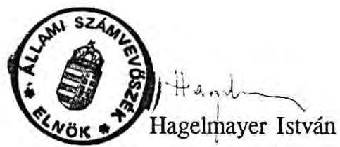

---

1. sz. melléklet a V-141-31/1991-92. számhoz

A Miniszterelnökség fejezet közvetlen felügyeleti hatáskörébe tartozó szervezetek

|  | 1938. | 1989. | 1990. | 1991. | 1992. |
| :--: | :--: | :--: | :--: | :--: | :--: |
| Kormány Központi Üdülője | 1 | 1 | 1 | 1 | 1 |
| Államigazgatási Főiskola | 1 | - | - | - | - |
| Közvéleménykutató Intézet | 1 | 1 | 1 | 1 | - |
| Miniszterelnöki Hivatal Gazd. Szerv. | 1 | 1 | 1 | 1 | 1 |
| Országos Bányaműszaki Főfelügyelőség | 1 | 1 | 1 | 1 | 1 |
| Állami Egyházügyi Hivatal | 1 | 1 | - | - | - |
| Külföldi Újságírókat Tájékoztató Iroda | 1 | 1 | 1 | 1 | 1 |
| Mozgássérültek Pető Alapítvány Nevelőképző és Nevelő Intézete | - | - | 1 | 1 | - |
| Világkiállítási Programiroda | - | - | - | 1 | 1 |
| Nemzeti és Etnikai Kisebbségi Hivatal | - | - | - | 1 | 1 |
| Kárpótlási Hivatalok | - | - | - | 1 | 1 |
| Magyarország. Délszlávok Dem. Szövetsége | - | 1 | 1 | - | - |
| Magyarország Németelk Szövetsége | - | 1 | 1 | - | - |
| Magyarország. Szlovákok Dem. Szövetsége | - | 1 | 1 | - | - |
| Magyarország. Románok Dem. Szövetsége | - | 1 | 1 | - | - |
| Magyar Gazdasági Kamara | 1 | 1 | - | - | - |
| Műszaki és Természettudományi Egyesületek szövetsége | $t$ | -1 | - | - | - |
| Tudományos Ismeretterjesztő Társulat | 1 | 1 | - | - | - |
| Országos Tudományos Kutatási Alap Iroda | - | - | - | - | 1 |
| Együtt: | 10 | 10 | 10 | 9 | 8 |

---

# E m l é k e z t e t ő 

Készült: az 1991. március 1-én a Miniszterelnöki Hivatalban a Balatonaligai Club Hotel 1991. évi működésével kapcsolatos megbeszélésről.

Jelen voltak: Kiss Imre
az Ybl Miklós és Társai Építészeti és Ingatlanhasznosítási Tanácsadó Kft ügyvezető igazgató
Etey Ferenc
Kormány Központi Üdülő igazgató
Márkus Lajos
Kormány Központi Üdülő gazd.ig.hely.
Tunyogi László
kormányfőtanácsos
Novák Károlyné
MEH főosztályvezető

A megbeszélés tárgya: a Miniszterelnöki Hivatal helyettes államtitkára, dr.Szilvásy György és az Ybl Miklós és Társai Építészeti és Ingatlanhasznosítási Tanácsadó Kft között létrejött megállapodás végrehajtásával kapcsolatos feladatok pontosítása, különös tekintettel az 1026/1990. /VIII.30./ Korm.határozatban foglaltakra.

Nevezett megállapodásban a Kft. vállalta a Balatonaligai Club Hotel 1991. évi értékesítési tevékenységének szervezését oly módon, hogy az egység lehetőleg teljes mértékben önfinanszírozásra képes lesz.

Jelen megállapodással egyidőben megszűnik a Kormány Központi Üdülőjének felügyeleti tevékenysége és felelőssége a Balatonaligai Club Hotel költségvetése és üzemeltetése vonatkozásában. A Kormány Központi Üdülője továbbí feladata a Club Hotel által szolgáltatott mérlegadatok tartalmi ellenőrzés nélküli beépítése az összevont intézményi mérlegbe.

---

Ezzel egyidőben természetszerűleg a Club Aliga /mint részben önálló költségvetési szerv/ vezetőit teljes anyagi, erkölcsi és büntetőjogi felelősség terheli a költségvetési előirányzatok, a költségvetési szervekre előírt gazdálkodási szabályok betartásáért, a Club Aliga különböző gazdasági partnerek felé történő kötelezettségvállalásáért, illetve ezekkel szemben lévő követelések behajtásáért.

Club Aliga fenti át nem ruházható felelőssége értelmében az értékesítést szervező Ybl Miklós és Társai Építészeti és Ingatlanhasznosítási Tanácsadó Kft valamennyi gazdálkodást érintő tevékenysége /külső megállapodások, kötelezettségvállalások, belső létszámot, béralapot érintő átszervezések stb./ csak a Club Aliga felelős vezetőivel közös jóváhagyáson alapulhat.

Az ily módon értelmezett megállapodás összhangban van az 1026/1990. Korm. határozatban foglaltakkal, egyben elősegíti a végső cél, azaz a Balatonaligai objektum pályázat útján történő értékesítését.

B u d a p e s t, 1991. március 6.

Az emlékeztetőt készítette:

Novák Károlyné
főosztályvezető

Jóváhagyta:
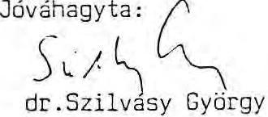

Kapják: Miniszterelnöki Hivatal
Tunyogi László kormányfőtanácsos
Ybl Milós és Társai Kft
Kiss Imre ügyvezető igazgató
Kormány Központi Üdülő
Etey Ferenc igazgató jelenlévők
Club Aliga
Bondár József igazgató

---

# MEGBÍZÁSI SZERZŐDÉS 

mely létrejött a Magyar Köztársaság Miniszterelnöki Hivatala (1054 Budapest, Kossuth tér 4.) - mint Megbízó - másrészről a CREDITUM Pénzügyi Tanácsadó Kft. (1062 Budapest, Bajza u. 19.) - mint Megbízott - között az alábbiak szerint:
1.) A Megbízó megbízza a Megbízottat, hogy a Magyar Köztársaság Kormányának 1026/1990 korm. határozatának megfelelően írjon ki nyilvános nemzetközi pályázatot a balatonaligai üdülőegyüttes tulajdonjogátruházás, ingatlanlizing vagy 50 évi bérlet alapján történő hasznosítására.
2.) Jelen megbízás kiterjed az üdülőegyüttes 1991. évi szakmai és gazdálkodási felügyeletére, valamint a pályázati folyamat előfeltételeinek megteremtésére, a pályázati folyamat egészének szervezésére és lebonyolítására a későbbiekben részletezettek szerint.
3.) A Megbízó hozzájárul ahhoz, hogy az előző pontban körülírt megbízás teljesítésére vonatkozóan a Megbízott valamely harmadik személlyel megbízási szerződést kössön.
4.) Az üdülőegyüttes 1991. évi szakmai és gazdálkodási felügyelete során a Megbízottnak biztosítania kell az üdülőegyüttes megfelelő (elérhető) szakmai üzemeltetési színvonalát, melynek érdekében:

- felül kell vizsgálni a jelenlegi személyi és technikai feltételeket, illetve a már elkészült szakértői anyag alapján elő kell segíteni a szakszerű üzemeltetést,
- az értékesítési munka jelenlegi helyzetének figyelembevételével ki kell alakítani az értékesítés és üzemeltetés optimális összhangját, különös tekintettel a már meglévő szerződéses kötelezettségekre,
- meg kell szervezni a szakmai továbbképzést,

---

- felül kell vizsgálni a különböző külsős, de szerződéses viszonyban lévő vállalatok kötelezettségeit, a működő szolgáltató és értékesítő egységek üzemeltetési színvonalát, s az érvényben lévő szerződések felszámolási lehetőségeit, jogkövetkezményeit (ez utóbbiról a Megbízó a Megbízott javaslata alapján 1991. szeptember 15-ig döntést hoz, s a Megbízott csak ennek értelmében járhat el),
- az Ybl Miklós és Társai Építészeti és Ingatlanhasznosítási Tanácsadó Kft. által a Megbízó számára készített és a Megbízó által elfogadott szakértői anyagban foglaltak figyelembevételével biztosítani kell a műszaki rehabilitáció munkálatainak elvégeztetését, a beüzemeléshez szükséges feltételeket, illetve az elkerülhetetlenül szükséges preventív folyamatos karbantartási munkák elvégzését.
5.) A Megbízó hozzájárul ahhoz, hogy a versenytárgyalási dokumentáció elkészítéséhez a Megbízott felhasználja az Ybl Miklós és Társai Kft. által készített, a Megbízó tulajdonát képező hasznosítási tanulmányt.
6.) A Megbízottnak a pályázati folyamat előfeltételeinek megteremtésére és a folyamat egészének szervezésére és lebonyolítására vonatkozó megbízása kiterjed:
- a szóban forgó ingatlanegyüttesre vonatkozó részletes rendezési terv elkészíttetésére és a helyi Önkormányzattal történő egyeztetésére,
- a helyi Önkormányzattal és a különböző államigazgatási szervekkel történő egyeztetésekre,
- a versenytárgyalásnak az 1987. évi 19. törvényerejű-rendelettel összhangban történő szabályozására,
- a versenytárgyalás meghirdetésére,
- az ajánlatok elkészítésére felhasználható részletes környezeti, idegenforgalmi, műszaki dokumentáció elkészítésére, és arra, hogy azt az érdeklődők rendelkezésére bocsássa,
- a pályázók által igényelt konzultációs lehetőségek biztosítására,

---

- az ajánlatok fogadására és kezelésére,
- a versenytárgyalási ajánlatok ismertetésének megszervezésére,
- a szakmai előzsűri felkérésére és munkájának koordinálására,
- a Kormány számára kidolgozandó előterjesztés előkészítésére,
- a pályázat nyertesével történő szerződéskötés előkészítésére.
- a megbizott a megbizotá a megbizott fenyementarva enyyteti.
7.) A Megbízott vállalja, hogy a Kormány számára készülő előterjesztés szövegét 1991. október 31-ig a Megbízó rendelkezésére bocsátja.
8.) A Megbízó a jelen szerződés tárgyát képező feladatok végrehajtásához szükséges pénzeszközöknek a Megbízott részére történő előzetes biztosítását nem vállalja, ezért azokat a Megbízottnak saját vagy külső forrás igénybevételével szükséges biztosítania.
9.) Amennyiben a Kormány a versenytárgyalás eredményeként valamely pályázóval szerződést köt, tulajdonjogátruházás esetén a vételi ár 2,4\%-át, bérleti szerződéskötés, vagy lízing esetén az első 10 évre járó díj 9,6 $\%$-át kitevő megbízási díjat fizet a Megbízott részére.
10.) Amennyiben a versenytárgyalásra egyetlen érvényes pályázat sem érkezik, vagy az érvényes pályázók közül a kormány eggyel sem kíván szerződést kötni, a Megbízó a Megbízott közreműködésével a szóban forgó ingatlan értékesítését pályázaton kívül teszi meg.

Ezen esetben a Megbízó megtéríti valamennyi, a jelen szerződés 2. pontjában körülírt megbízás teljesítésével kapcsolatos költségeket, melyen felül megbízási díjra a Megbízott csak akkor tarthat igényt, ha abban a Megbízó és a Megbízott egy külön szerződésben megállapodnak.
11.) A jelen megbízási szerződésben nem szabályozott kérdésekben a Ptk. szabályai alkalmazandók.

Budapest, 1991. március 8.
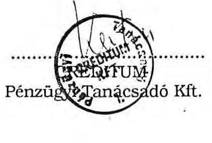
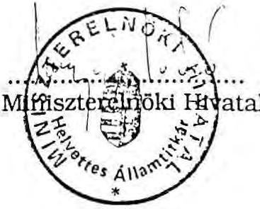

---

# M E G Á L L A P O D Á S 

amely létrejött a Magyar Köztársaság Miniszterelnöki Hivatala (1054 Budapest Kossuth tér 4.), az Ybl Miklós és Társai Építészeti és Ingatlanhasznosítási Tanácsadó Kft. (1081 Budapest Népszínház u. 28/b.), valamint a Creditum Pénzügyi Tanácsadó Kft. (1062 Budapest Bajza u. 19.) között az alábbiak szerint:

1. A Miniszterelnöki Hivatal által az Ybl Miklós és Társai Kft-nek a balatonaligai üdülőegyüttes 1991. évi üzemeltetési felügyelete és az üdülőegyüttes nyílt nemzetközi pályázat útján történő értékesítési tárgyában adott jelen megállapodás 1. sz. mellékleteként csatolt szerződést - a pályázati folyamat előkészítése során felvetődött településrendezési kérdések előtérbe kerülése okán - a következő pontokban megfogalmazottak szerint módosítja.
2. A Miniszterelnöki Hivatal a jelen szerződés 2. sz. mellékleteként csatolt megbízási szerződés alapján a Creditum Pénzügyi Tanácsadó Kft. számára ad megbízást a szóbanforgó üdülőegyüttes 1991. évi üzemeltetésének szakmai felügyeletére, és az ingatlan nyílt nemzetközi pályázat útján történő értékesítésére.
3. A Miniszterelnöki Hivatal kifejezi azon szándékát, hogy - a korábbiakban elvégzett magas szakmai színvonalú előkészítő munkára alapozva - a 2. sz. melléklet 4. pontjában rögzített feladatokkal a Creditum Kft. az Ybl Miklós és Társai Kft-t, illetve Kis Imre urat bízza meg.
4. A jelen megállapodáshoz csatolt 1. sz. mellékletben rögzített, a megbízás tárgyát képező feladatok elvégzésének előlegéül a Miniszterelnöki Hivatal 2,5 M Ft-öt, azaz Kettőmillió-ötszázezer forintot jelen megállapodást megelőzően átutalt az Ybl Miklós és Társai Kft-nek. Ezen előleget az Ybl Miklós és Társai Kft. haladéktalanul továbbutal a Creditum Pénzügyi Tanácsadó Kft-nek, aki azt a 2. sz. mellékletben közölt megbízási szerződés végrehajtása során felmerülő költségek előlegeként számolja el ezen összeget.

---

5. A Miniszterelnöki Hivatal egyetért azzal, hogy a 2. sz. mellékletben közölt megbízási szerződés teljesítésével kapcsolatos költségek között a Creditum Pénzügyi Tanácsadó Kft. elismerje Kis Imre úr 1990. november és 1991. márciusa közötti időszakban a balatonaligai üdülőegyüttes szakmai-üzemeltetési felügyeletével kapcsolatosan végzett tevékenységéért járó megbízási díjat.

Budapest, 1991. március 8.
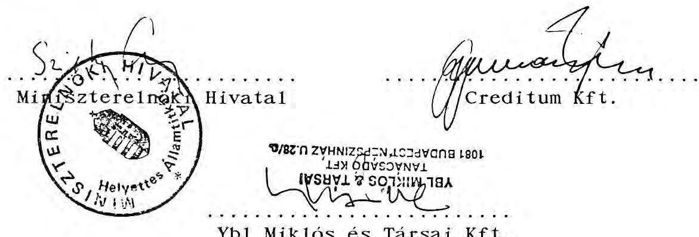

---

# MINISZTERELNÖKI HIVATAL

## IRODAHÁZ ÉTKEZDE

3/a. 62. melléklet a V-141-31/1991-92. számhoz

Dr Szilvány György úrnak

Helyettes Államtitkár részére

Tisztelt Dr Szilvány úr !

Szeretném köszönetemet kifejezni a Helyettes Államtitkár úrnak, hogy az Irodaház Étkezde részére október 23-ához kapcsolódva rendkívüli jutalomkeretet biztosított. Kérem az alábbiakban felsorolt munkatársak részére az értesítésben szereplő keret felosztásának elfogadását.

|  Ér | Át | Hoz  |
| --- | --- | --- |
|  Eckert Péterné | 22,000.- |   |
|  Gyenes Ilona | 9,000.- |   |
|  Horváth Istvánné | 9,000.- |   |
|  Juhász Istvánné | 9,000.- |   |
|  Kendi Ida | 9,000.- |   |
|  Kiss Lajosné | 9,000.- |   |
|  Neufeld Jenőné | 14,200.- |   |
|  Pál Lászlóné | 14,200.- |   |
|  Pető Imréné | 9,000.- |   |
|  Rácz Ádámé | 9,000.- |   |
|  Viski Józsefné | 14,300.- |   |
|  **Total** | **127,700.-** |   |

Budapest, 1991. október 10.

Előre is köszönöm, tisztelettel:

MINISZTERELNÖKI HIVATAL

IRODAHÁZI ÉTKEZDE

Némoth Csaba

étkezde vezető

---

# 31/b. sz. melléklet   a V-141-31/1991-92. számhoz 

$384/XXIX/91$

Németh Csaba úrnak, csoportvezető

Tisztelt Németh Úr !

Az Országházi Dolgozók Érdekvédelmi Szervezetével egyetértve december hónapban a Miniszterelnöki Hivatal dolgozói úgynevezett 13. havi fizetésben, jutalomban részesülnek, jelentősebb differenciálás nélkül.

A Hivatal vezetése úgy döntött, hogy október 23-ához kapcsolódva rendkívüli jutalomkeretet létesít a szervezeti egységek vezetői számára, hogy a kiemelkedő teljesítményt nyújtó dolgozók elismerését - lehetőségeinkhez mérten - biztosítsa. Ez az összeg áll rendelkezésre a célfeladatokat elvégző munkatársak jutalmazására is, amire korábban több vezető is tett javaslatot.

Értesítem, hogy az irányítása alá tartozó szervezeti egység dolgozóinak differenciált jutalmazására
127.700, -Ft
áll rendelkezésére, amelyből a SZJA és a nyugdíjjárulék levonásra kerül.
Kérem, hogy a jutalomkeret felosztásáról dönteni, és arról 1991. október 11-ig tájékoztatni szíveskedjék.

A jutalom kifizetésének időpontja: 1991. október 22.

Budapest, 1991. október 2.

Üdvözlettel:
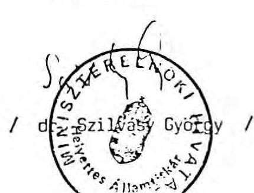

---

# MINISZTERELNÖKI HIVATAL

## IRODAHÁZ ÉTKEZDE

3/c.sz. melléklet a V-141-31/1991-92. számhoz

Dr Szilvásy György úrnak Helyettes Államtitkár részére

Tisztelt Dr Szilvásy úr !

Szeretném köszönetemet kifejezni és a dolgozók minden téren való megelégedését tolmácsolni a Helyettes Államtitkár úrnak, hogy az Irodaház Étkezde részére jelentőn differenciált jutalmazási lehetőséget biztosított. Kérem az alábbiakban felsorolt főfoglalkozású és nyugdíjas munkatársak részére az értesítésben szereplő keret felosztásának elfogadását.

|  Évkert Péterné | 45,000.-  |
| --- | --- |
|  Gyenes Ilona | 16,500.-  |
|  Horváth Istvánné | 17,500.-  |
|  Juhász Istvánné | 17,000.-  |
|  Kendi Ida | 16,500.-  |
|  Kiss Lajosné | 16,500.-  |
|  Neufeld Jenőné | 28,500.-  |
|  Pál Lászlóné | 28,500.-  |
|  Pető Imréné | 16,700.-  |
|  Rácz Ádámné | 16,500.-  |
|  Viski Józsefné | 29,000.-  |
|  Varga Lajos Nyugá | 7,200.-  |
|   | 255,400.-  |

Budapest 1991. május 08.

Előre is köszönöm, tisztelettel: MINISZTERELNÖKI HIVATAL

Németh Csaba étkezde vezető

---

# 3/d.sz.melléklet   a V-141-31/1991-92.számhoz 

$183/XXIX/91$

Németh Csaba úrnak, csoportvezető

Tisztelt Németh Úr !

Értesítem, hogy az irányítása alá tartozó szervezeti egység munkatársai jutalmazására
255.400, - Ft
áll rendelkezésére.

A jutalomösszeg megállapításánál a főfoglalkozású - kivéve az állami vezetői besorolásúakat és a GYED-en, GYES-en levőket -, a részmunkaidős és a rendszeresen foglalkoztatott nyugdíjas munkatársak bérét vettük számításba.

A fenti jutalomösszegből az SZJA és a nyugdíjjárulék levonásra kerül.

Kérem, hogy az Ön rendelkezésére álló jutalomkeret felosztásáról - a végzett munka alapján történő differenciálással - dönteni, és arról részemre 1991. május 15 -ig tájékoztatást adni szíveskedjék.

A jutalom kifizetésének időpontja: 1991. május 31.

Budapest, 1991. május 06.
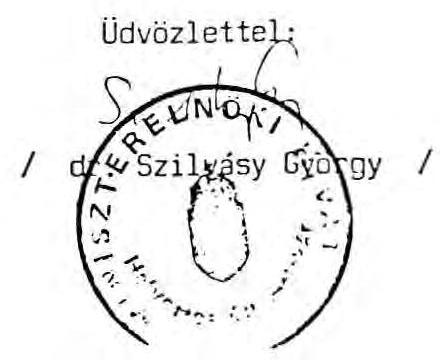

---

A Miniszterelnökség fejezet pénzforgalmi bevételeinek alakulása, összetétele
("szűken vett" fejezet)

# ezer Ft-ban 

| Megnevezés | 1988. év | 1989. év | 1990. év | 1991. I. félév | 1991. év |
| :-- | :-- | :-- | :-- | :-- | :-- |

Bevétel és támogatás összesen

- eredeti előir. 761.451 1,080.113 1,403.601 2,051.288 2,051.288
- módosított előir. 932.530 1,355.163 1,673.298 2,079.248 1,319.692
- teljesítés 937.154 1,401.324 1,719.706 1,369.807 2,651.506

Teljesítésből

- működési bev. 8.088 11.124 17.305 8.263 20.499
- ár- és díjbev. 48.728 131.423 297.835 170.915 669.896
- követési tám. 880.338 1,258.777 1,404.566 1,190.629 1,961.111
- Fejl. célú int. támogatás

Átvett pénzeszk. és egyéb bevételek

- eredeti előir. 9.600 16.461 47.944 57.812 57.812
- módosított előir. 79.343 208.063 221.101 112.220 265.871
- teljesítés 72.420 184.401 173.721 103.851 257.222

Bevételek összesen
(kiegyenlítő, függő
és átfutó tételek
nélkül)

- eredeti előir. 771.051 1,096.574 1,451.545 2,109.100 2,109.100
- módosított előir. 1,011.873 1,563.226 1,894.399 2,191.468 2,735.563
- teljesítés 1,009.374 1,585.725 1,893.427 1,473.658 2,908.728

Jóváhagyott tárgyévi
pénzmaradvány 142.100 137.758 115.980

---

5.sz.melléklet
a V-141-31/1991-92.számhoz

# BIZOMÁNYOSI KERETSZERZŐDÉS

mely létrejött egyrészről a VARIKER Kft. (1013. ............................ ) mint Megbízó,

valamint Miniszterelnöki Hivatal Gépkocsi Osztálya (postacím: 1257 Budapest, Pf.2., Telephely: 1133. Budapest, Hegedüs Gyula u.79-81.)

mint Bizományos között az alábbi feltételekkel.

1./ Megbízó Bizományos rendelkezésére bocsát az egyedi megrendelésekben szereplő mennyiségű és típusú gumiabroncsot bizományosi értékesítésre.

2./ Felek jogai és kötelezettségei:

## 2.1. Bizományos kötelezettségei

- Az igényelt mennyiségű abroncsot Megbízó telephelyéről saját telephelyére szállítja.
- Gondoskodik az áru szakszerű tárolásáról és kezeléséről.
- Biztosítja a gumiabroncsok tárolására szolgáló telephelyet oly módon, hogy bármely biztosítási eseményre a biztosítás díja a gumiabroncsok árára teljes fedezetet nyújtson. A biztosító által fizetett kárösszeget csak és kizárólag Megbízónak fizetendő ellenérték céljára használhatja fel.
- Reklám és propadanda tevékenységet fejt ki a nála lévő abroncsok minél hatékonyabb értékesítése céljából.

## 2.2. Megbízó kötelezettségei

- Lehetőségekhez képest biztosítja az igényelt mennyiségű és típusú gumiabroncsokat Bizományos részére.
- Az abroncsok Megbízó raktárába történő beérkezésétől számított 48 órán belül értesíti Bizományost.
- Fuvarlevelet állít ki az átadott abroncsokról.

## 3./ Fizetési feltételek:

Bizományos az általa átvett és értékesített abroncsokról betonte köteles elszámolást készíteni, s az értékesítésből befolyt összeget ezzel egyidejűleg Megbízó MKR 203-21026 ...................... bankszámlájára átutalni, annak egyidejű igazolása mellett.

---

Az általa átvett abroncsok ellenértékét az átvételtől számított 61. napon akkor is köteles átutalni, ha azok értékesítésre nem kerültek.

Megbízó az alábbi kedvezményeket nyújtja Bizományosnak:

|  Elvitt mennyiség nettó Ft értéke | Kedvezmény (nettó átadási árból) | Megjegyzés  |
| --- | --- | --- |
|  0-500 e Ft | 6 % | Alkalmanként  |
|  500 e Ft felett | 8 % | "  |

Azonnali készpénzfizetésnél Gumijavítók és Törzsvevők esetén:

|  0-250 e Ft közötti vásárlásnál | 6 %  |
| --- | --- |
|  250-750 e Ft | 8 %  |
|  750 e Ft feletti | 10 % árengedményt ad VARIKER  |

Egyedi megállapodás alapján, felek ettől eltérhetnek.

Amennyiben az átutalás a fenti időpontban nem történik meg, vagy annak igazolása elmarad, Megbízó jogosult a Bizományosnál lévő teljes árukészlet ellenértékét beszedési megbízás útján érvényesíteni (prompt inkasszo). Késedelmes fizetés esetére felek az áru átvételétől számított 61. naptól napi 0,5 % késedelmi kamatot kötnek ki.

Bizományos az általa átvett áru ellenértékéért bárhol fellelhető teljes ingó- és ingatlan vagyonával felel.

### 4./ Szerződés felmondása:

Felek a jelen szerződést határozatlan időre kötik azzal, hogy annak felmondására bármelyik fél 3 hónapos határidővel a másik félhez intézett írásos értesítés alapján jogosult.

Megbízó azonnali határidővel jogosult a szerződést felmondani, amennyiben Bizományos jelen szerződés 3-as pontjában foglalt fizetési feltételeket nem teljesíti.

---

Bizományos azonnali felmondásra jogosult, ha a Megbízó által szállított áru többszöri minőségi kifogás alá esik.

Felmondás esetén felek azonnali elszámolásra kötelesek, az áru ellenértékének az elszámolással egyidejű kiegyenlítése mellett.

### 5./ Jogviták

Felek jelen szerződésből eredő jogviták elbírálására a P.K.K.B. kizárólagos illetékességét kötik ki.

6./ Az itt nem szabályozott kérdésekben a Ptk idevonatkozó rendelkezései az irányadók.

Dátum: Budapest, 1991. január 9.

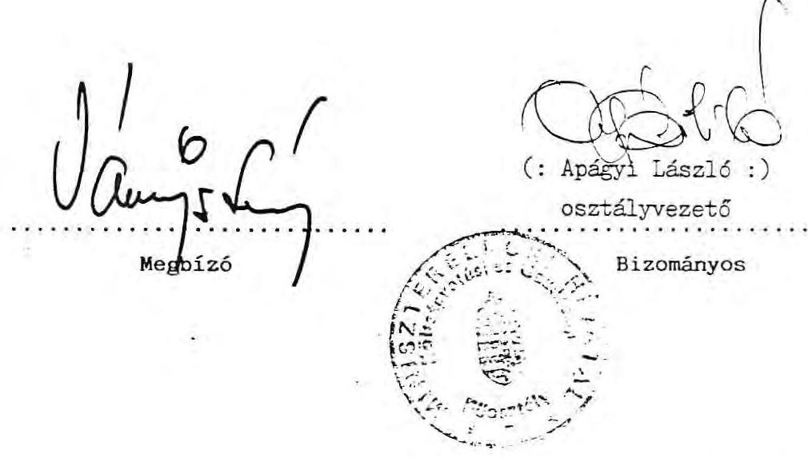

---

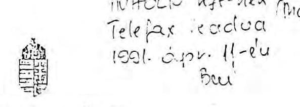

# PÉNZÜGYMINISZTÉRIUM 

$23.769/2/1991$

Novák Károlyné
asszony

Miniszterelnöki Hivatal

Budapest

Tisztelt Novák Károlyné!

A költségvetési szervek költségvetésének végrehajtásáról szóló 4/1991.(II.13.)PM rendelettel kapcsolatban - annak egyértelmű végrehajtása érdekében - tájékoztatom, hogy a költségvetési szervek értékpapírokat vásárolhatnak bármely, ezek forgalmazására felhatalmazott pénzintézettől, ha azt egyébként az egyes értékpapírokról szóló jogszabályok lehetővé teszik.

Kérem tájékoztatásom szíves elfogadását.

Budapest, 1991.március 14.
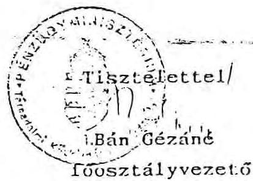

---

Miniszterelnökség fejezet

6/b. sz. melléklet a V-141-31 / 1991-92. számhoz

Kismutatás a kihelyezett pénzeszközökről és azok kamatairól 1989-1990-1991. években /1991. december 16-18 állapot szerint/

|  Ügylet /hasznosítás/ | Át utalás ideje | Át ütészszege | Kamat visszafizetés | Tőke visszafizetés dátum | Összege jóváírt szla  |
| --- | --- | --- | --- | --- | --- |
|  MNB |  |  |  |  |   |
|  Düsként-kincstárjegy | 1989.VIII.22 | 18.986.000 | MF Költségvetési | 1989.XI.20. | 1.014.000  |
|  Düsként-kincstárjegy | 1989.VIII.22. | 14.239.500 | MF Évégi Maradv. | 1989.XI.20. | 760.500  |
|  Düsként-kincstárjegy | 1989.VIII.22. | 6.645.100 | MF Kp.Letéti | 1989.XI.20. | 354.900  |
|  KINS.MARK |  |  |  |  |   |
|  MK lakás kötvény | 1990.II.1. | 5.000.000 | MF Kösp.Letéti | 1990.V.8. | 319.968  |
|  MK lakás kötvény | 1990.II.1. | 35.000.000 | MF Évégi Maradv. | 1990.XII.3. | 7.816.667  |
|   |  |  |  | 1991.I.21. | 616.667  |
|   |  |  |  | 1991.VI.28. | 3.461.110  |
|  DANÁRK |  |  |  |  |   |
|  Lakás kötvény | 1991.IV.16. | 20.000.000 | MF Évégi Maradv. | 1991.VII.14. | 1.800.000  |
|   |  |  |  | 1991.XII.12. | 2.940.882  |
|  Daret kötvény | 1991.I.17. | 3.000.000 | MF Kösp.Letéti | 1991.VII.16. | 540.000  |
|   |  |  |  | 1991.XII.15. | 423.220  |
|  MCDARK |  |  |  |  |   |
|  kötvény vás. | 1991.IV.17. | 20.000.000 | MF Kösp.Letéti | 1991.VII.16. | 1.800.000  |
|   |  |  |  | 1991.VIII.21. | 600.000  |
|   |  |  |  | 1991.IX.17. | 600.000  |
|  kötvény vás. | 1991.IV.25. | 15.000.000 | MF Kösp.Letéti | | 1991.VII.24. | 1.350.000  |
|   |  |  |  | 1991.VII.24. | 1.350.000  |
|  DANÁRK |  |  |  |  |   |
|  Daret kötvény | 1991.I.17. | 20.000.000 | Vagyonrend.Let. | 1991.VII.16. | 3.600.000  |
|  MCDARK |  |  |  |  |   |
|  kötvény vás. | 1991.IV.17. | 15.000.000 | Vagyonrend.Let. | 1991.VII.16. | 1.350.000  |
|  Ált.Értékőzsp.Bark értékesítés utáni bet. | 1991.I.1. |  | Vagyonrend.Letét | 1991.V.24. | 7.918.750  |
|  TPARÁRK |  |  |  |  |   |
|  Névért.értékpap.vás. | 1991.III.26. | 40.000.000 | MF TP-alap | 1991.VII.2. | 180.000  |
|   |  |  |  | 1991.VII.30. | 305.000  |
|   |  |  |  | 1991.VIII.24. | 424.000  |
|   |  |  |  | 1991.X.2. | 410.500  |
|   |  |  |  | 1991.X.25. | 7.755.500  |
|  CITIZARK |  |  |  |  |   |
|  értékpap.vás. | 1991.IV.10. | 50.000.000 | MF TP-alap |  |   |
|  - tőkekiegészítés | 1991.V.29. | 208.334 | MF TP-alap |  |   |
|   | 1991.VI.10. | 125.237 | MF TP-alap |  |   |
|   | 1991.VII.10. | 130.834 | MF TP-alap |  |   |
|   | 1991.IX.11. | 456.403 | MF TP-alap |  |   |
|   | 1991.X.11. | 551.065 | MF TP-alap | 1991.XI.29. | 11.500.000  |
|  - vissza nem utalt értékpap.vás. | 1991.XI.29. | 972.500 | MF TP-alap |  |   |
|  CITIBARK |  |  |  |  |   |
|  1991.11.29 8.900 TP-alapsilónál lóautt visszautalásá (értégy) |  |  |  |  |   |

Az 1989. évi XXXVIII. sz. törvény 24. §. c/pontja alapján kijelentem, hogy az összesítő kimutatásban felsorolt adatok teljesek és a vonatkozó okmányokkal mindenben megegyeznek.

Budapest, 1991. december 16.

Vagyonum áron ríze. Posto:bautetiai szubán neviut 5.490 ett

Kannattériés: 1.11.2011

---

# T A N U S I T V Á N Y 

A Miniszterelnöki Hivatal 1990-91-ben átmenetileg szabad pénzeszközei terhére vásárolt értékpapírok sorszámát megadni nem tudjuk, mert azok a szerződésben nem szerepelnek.

Mindkét pénzintézetet megkerestük (Konzumbank, Duna Bank) az adatok pontosítása érdekében.

A kötvényszámokat így visszamenőleg nem tudják megadni, de náluk a helyszínen bármikor ellenőrizhető, hogy a befektetések az előírásoknak megfelelőek, szabályosak voltak.

Budapest, 1992. február 21.

---

Miniszterelnöki Hivatal
intézmény

# Összesítő kimutatás 

az intézmény által 1989. január 1. - 1991. szeptember 30. közötti időszakban kihelyezett /lekötött, befektetett, alapítványba helyezett/ vagyonrészekről

| Sör-   szám | be/ek | be/ektetés   lakihelyez | A kihelyezés   időpontja | A kihelyezés   feltétele   /kamat, lejárat,   részesedés/ |  | A kihelyezett érték   összege /Ft/ |
| :--: | :--: | :--: | :--: | :--: | :--: | :--: |
| 1. | Konzumbank | értékpapír | 1990.I.9-II.8. | $21,5 \%$ | $525.000,-$ | $30.000 .000,-$ |
| 2. | Konzumbank | értékpapír | 1990.I.9-III.8. | $22,5 \%$ | $1.063 .314,-$ | $30.000 .000,-$ |
| 3. | Dunabank RT. | lakásalap   kötvény | 1990.IV.3-V.3. | $23,5 \%$ | $489.583,-$ | $25.000 .000,-$ |
| 4. | Dunabank RT. | lakásalap   kötvény | 1990.IV.3-VI.2. | $25,5 \%$ | $1.275 .000,-$ | $30.000 .000,-$ |
| 5. | Dunabank RT. | értékpapír | 1990.VII. 4-VIII.3. | $30 \%$ | $625.000,-$ | $25.000 .000,-$ |
| 6. | Dunabank RT. | értékpapír | 1990.VII.4-IX:2. | $31 \%$ | $1.291 .667,-$ | $25.000 .000,-$ |
| 7. | Dunabank RT. | értékpapír | 1990.X.3-XI.2. | $30 \%$ | $375.000,-$ | $15.000 .000,-$ |
| 8. | Dunabank RT. | értékpapír | 1990.X.3-XII.2. | $31 \%$ | $775.000,-$ | $15.000 .000,-$ |
| 9. | Dunabank RT. | lakásalap | 1991.VI.26-IX.4. | $35,5 \%$ | $1.701 .389,-$ | $25.000 .000,-$ |
| 10. | Dunabank RT. | Rishter   kötvény | 1991.IX.3-X.3. | $32,5 \%$ | $677.083,-$ | $25.000 .000,-$ |

Az 1989. évi XXXVIII. számú törvény 24. paragrafus c./ pontja alapján kijelentem, hogy az összesítő kimutatásban felsorolt adatok teljesek és a vonatkozó okmányokkal mindenben megegyeznek.

Budapest, 1991. november 25.

---

Központi Állami Udülő

# Kimutatás a költségvetési szervek értékpapírvásárlásairól és kamatozó betéteiről 

| Vásárolt értékpapír megnevezése és kamatozó betétek | Vásárlás   időpontja | Befektetés   összege | Értékesités /beváltás/ időpontja | Értékesités /beváltás/ összege |
| :--: | :--: | :--: | :--: | :--: |
| 1./ MHB Siófok   Kamatozó betét | 1991.06.12. | 20.000.000,- | jelenleg is ott van | csak kamatjóváirás   1991.XII. 28 .   3.556 .943 , |
| 2./ B.B. Rt Marcali   Kamatozó betét | 1991.06.12. | 20.000.000,- | 1992.01.14. | 23.629.167,- |
| 3./ OKHB Kaposvár   Árfolyamgaranciális kötvény | 1991.07.22. | 10.000.000,- | 1991.10.24. | 10.868 .889 , |

---

A Miniszterelnökség fejezet pénztorgalmi kiadásainak alakulása
( ${ }^{\text {® }}$ e iken vet ${ }^{2}$ feiezt)

# ezer Ft-ban 

| Megnevezés | 1988. év | 1989. év | 1990. év | 1991. I. Fév | 1991. év |
| :--: | :--: | :--: | :--: | :--: | :--: |
| Működési kiadás összesen   - eredeti előir. | 761.081 | 1.066 .450 | 1.357 .099 | 2.037 .668 | 2.037 .668 |
| - módosított előir. | 972.082 | 1.494 .034 | 1.724 .546 | 2.100 .739 | 2.453 .162 |
| - teljesítés | 849.159 | 1.403 .762 | 1.643 .787 | 1.312 .620 | 2.081 .613 |
| Fejlesztési kiadás   - eredeti előir. | 370 | - | 12.560 | 5.300 | 5.300 |
| - módosított előir. | 3.229 | 9.023 | 48.384 | 15.326 | 173.538 |
| - teljesítés | 1.786 | 2.893 | 38.437 | 20.232 | 162.247 |
| Egyéb kiadások   - eredeti előir. | - | 20.524 | 72.286 | 66.132 | 66.132 |
| - módosított előir. | 26.362 | 50.569 | 111.869 | 74.903 | 158.863 |
| - teljesítés | 16.473 | 31.015 | 74.685 | 65.273 | 161.914 |

Kiadások összesen
(kiegyenlítő, függő
és átfutó tételek
nélkül)

- eredeti előir.
- módosított előir.
- teljesítés

| 761.451 | 1.086 .974 | 1.441 .945 | 2.109 .100 | 2.109 .100 |
| :--: | :--: | :--: | :--: | :--: |
| 1.002 .273 | 1.553 .626 | 1.884 .799 | 2.191 .468 | 2.785 .563 |
| 867.418 | 1.437 .670 | 1.756 .929 | 1.398 .147 | 2.405 .774 |

---

# A Kormány Központi Üdülők 1991. évi előirányzat-módosításai (kormányzati üdülők)

|  Megnevezés | Eredeti | Erőirányzat |  |  |   |
| --- | --- | --- | --- | --- | --- |
|   |  | Irányítósz. | Saját hatáskörben | Módosított |   |
|   |  | hatáskörben | pm. | többletbev. |   |
|  KIADÁSOK |  |  |  |  |   |
|  11. Készletbeszerzés | $-8.861$ |  | $-1.401$ | 27.262 | 17.000  |
|  12. Béralap | 26.166 |  |  | 1.334 | 27.300  |
|  13. Anyagjeli kiad. |  |  |  | 3.300 | 3.300  |
|  14. Bérjeli kiadás |  |  |  | 1.750 | 1.750  |
|  15. Szolgáltatások | $-8.634$ |  |  | 33.634 | 30.000  |
|  16. Különf. beíríz. | 10.861 |  |  | 1.739 | 12.600  |
|  17. Felújítás |  | 5.000 |  |  | 5.000  |
|  35. Nemzetgazd. beruh. |  |  |  | 1.200 | 1.200  |
|  27. Vásárolt term. és |  |  |  |  |   |
|  szolg. AFA-ja |  |  |  | 1.994 | 4.994  |
|  Kiadások összesen: | 19.532 | 5.000 | $-1.401$ | 80.213 | 103.344  |
|  BEVÉTELEK |  |  |  |  |   |
|  51. Működési bevétel | 6.350 |  |  |  | 6.350  |
|  52. Ár- és díjbevét. | 12.982 |  |  | 6.953 | 19.935  |
|  44. Költségv. támog. | 200 | 5.000 |  |  | 5.200  |
|  57. Kiszám. term. és |  |  |  |  |   |
|  szolg. AFA-ja |  |  |  | 1.200 | 1.200  |
|  58. AFA visszatérít. |  |  |  | 2.300 | 2.300  |
|  62. Működ. célú átvett pénzeszközök |  |  |  | 69.760 | 69.760  |
|  82. Előző évi pénzmaradv. igénybevét. |  |  | $-1.401$ |  | $-1.401$  |
|  Bevételek összesen: | 19.532 | 5.000 | $-1.401$ | 80.213 | 103.344  |

---

KÖZPONTI ÁLLAMI ÜDÜLŐ
8636 Balatonőszöd
Ügyiratszám: 169/1992.

Állami Számvevőszék
dr. Burján Margit
Számvevő részére

Budapest

Telefonon történt személyes megbeszélésünkre hivatkozva mellékelten küldöm a kért adatokat, illetve kérdéseire a következőkről tájékoztatom:
1./ Az üdülő a Magyar Nemzeti Bank által rendelkezésre bocsátott betétkönyvvel rendelkezik, melyet a balatonszemesi postahivatal vezet. A betétkönyv követelése felett csak a banki aláírásra jogosultak cégszerű aláírásával lehet rendelkezni. A betétkönyv 1991. évi havi átlagos betétállományáról készített kimutatást mellékelten küldöm.
2./ Ugyancsak mellékelem az üdülőben 1991. évben időszaki jelleggel foglalkoztatott dolgozók bérhónapjairól munkakörönkénti felsorolásban készített kimutatásunkat.
3./ Mellékelem az üdülőben 1991. évben kifizetett jutalmakról havi bontásban készült kimutatást.
4./ Szintén mellékelve küldöm a Központi Üdülő 1991. évi üdülési vendégnapjairól havi bontásban készült kimutatást.
5./ Az 52. Ár- és díjbevétel rovaton van elszámolva az üdülőnek mindazon bevétele, amely nem az alaptevékenységgel /üdültetés/ kapcsolatban
 realizálódott, és más rovaton nem számolható el. Ezek a következők:

- a saját hatáskörben végrehajtott béralap módosítás forrása a leköthetési kamat bevétele, ez az összeg 1/334 m Ft, ez az egyéni egyösszegű havi jutalom kifizettetésére lett felkárkálva 1991. október hónapban.

---

- kereskedelmi vendéglátás bevételei
- rendezvények bevételei
- kereskedelmi szálláshely értékesítés bevételei
- készlet értékesítés árbevételei
- ajándékbolt árbevétele
- göngyöleg visszáru árbevétele
- telek értékesítés bevétele
- mosodai szolgáltatás árbevétele
- fuvardíj bevételek
- bérleti díj bevétel
- egyéb szolgáltatások bevételei
- műszaki szolgáltatások bevétele
- kamat bevételek

A rovaton elszámolt összes bevétel terhére növeltük 6.953 e Ft-tal kiadási előirányzatainkat, valamint az 52. rovat előirányzatát.
Nem növeltük a rovat előirányzatát a ténylegesen realizált bevételek összegéig, mivel a ténylegesen felmerült kiadások ezt nem indokolták.
6./ Az 1991. évi költségvetésről szóló 1990. évi CIV. sz. törvény az egész intézmény /volt pártüdülőkkel együtt/ kiadási és bevételi előirányzatát tartalmazza.

A kiadási előirányzat 219,5 millió, a bevételi előirányzat 219,3 millió Ft, így a költségvetési támogatás összege 0,2 millió Ft. A 0,2 millió Ft költségvetési támogatás a Központi Kormányüdülő működéséhez lett biztosítva.
7./ Kérésére mellékelten küldöm még az üdülő lekötött pénzeszközeiről, és azokkal kapcsolatos kamatbevételekről készült kimutatást. Tájékoztatom, hogy az üdülő jelenleg 20 millió Ft kamatozó betéttel rendelkezik, amely a Magyar Hitelbank Siófoki Igazgatóságánál van elhelyezve.
8. a központi hatalm üdültesének is forclósluical aligaito' ohi' cata Balatonőszöd, 1992. május 26. Tisztelettel:
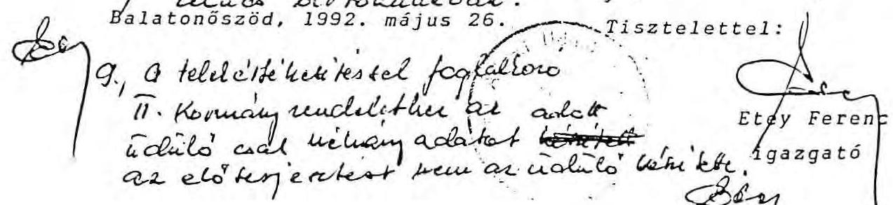

---

# ADÁS-VÉTELI SZERZŐDÉS 

mely létrejött a Központi Kormányüdülő (Balatonőszöd, Pósa L.u. 14.) mint eladó - valamint az AGROBANK RT (Bp.V., Tanács krt. 6.) mint vevő között.

1. Az adás-vétel tárgya a balatonszemesi Kormányüdülő önállóan lekeríthető $36.245 \mathrm{~m}^{2}$ nagyságú telekrészéből $14.903 \mathrm{~m}^{2}$.
2. A telek helyrajzi száma: 622, és tulajdoni lapszáma: 617.
3. Eladót a fenti telekrész átadásáért 50 MFt (azaz ötvenmillió forint) vételár illeti meg, melyet az adás-vételi szerződés létrejöttét követően az AGROBANK RT a 399-90144-8456 számlaszámra 15 napon belül átutal.
4. Eladó a szerződés aláírásakor átadja a Vevő részére az említett ingatlan 3 hónapnál nem régebbi tulajdoni lap másolatát, s egyben kijelenti, hogy az ingatlan tehermentes.
5. A tulajdonjog bejegyeztetése a vevő feladata és költsége.

Budapest, 1991
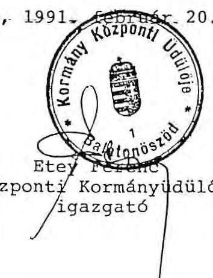
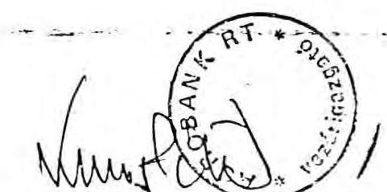

AGROBANK RT
elnök-vezérigazgató

---

# A Világkiállítási Programiroda pénzügyi helyzete

## 1992. március 23-án

|  KRO150 01:11 evven1edez: |  |   |
| --- | --- | --- |
|  MNS Világkiállítási Programiroda /03.10./ |  | 75.173.92 FR  |
|  CARB Világkiállítási Alap /02.20./ |  | 757.588.-  |
|  Szerződési kötelezettségek 2.: /1991-ről Ethuzoo/ |  |   |
|  MÉLYÉPTERV - Kötelezettségek /1991-ről. |  | 1.360.000.-  |
|  - Tettary Kft. |  | 900.000.-  |
|  - Melyeplett |  | 2.227.100.-  |
|  Összesen: |  | 4.507.300.-  |
|  VARIP Kisszövetkezet |  | 3.134.614.-  |
|  Várható kamat |  | 650.000.-  |
|  Összesen: |  | 3.704.814.-  |
|  KONTRAK /irodép Kft./ |  | 674.850.-  |
|  Összesen: |  | 8.966.964.-  |
|  Ügyen bennetett, de ki nem egyenlített számlák 03.23-10: |  |   |
|  Nalev-Pankonia Kft./BIE Selegáció/ |  | 368.498.-  |
|  PORTAL JMK /BIE anyag ford./ |  | 512.300.-  |
|  NAVTI /nyomási munkák/ |  | 638.772.-  |
|  Schopper Katalin /reprofilm-BIE anyaghoz/ |  | 11.800.-  |
|  Minisztéralinoki Hivatal /1991. évi kamat/ |  | 1.200.864.-  |
|  - fenyvasóles munkaidőn túl/ |  | 326.140.-  |
|  - várh.berlezőit.I-III.hó/ |  | 5.077.989.-  |
|  KAHIR /sajtószemle tan.hó/ |  | 187.500.-  |
|  NOLSI-LENGUA /BIE anyag fordítása/ |  | 28.335.-  |
|  Távközlési Dijelentő/Hív./telefonált/ |  | 9.865.-  |
|  OHL Magyarország Kft./BIE anyag száll./ |  | 115.000.-  |
|  Tőzsde Kurr /hirdetés/ |  | 150.000.-  |
|  SGSZI /számítógép berl./ |  | 35.600.-  |
|  S+V Világkiáll. Kft./Hírlevél. BIE anyag/ |  | 2.510.750.-  |
|  Hass and Pioneer Könyvk./Országgyűlési hívó/ |  | 18.000.-  |
|  MALAV /Hirveth E.és Halász Cs.ut./ |  | 30.000.-  |
|  UNIO Lab és Könyvk. Kft./Törv.csom/ |  | 3.630.-  |
|  WESTEL Kft./autoráció telet./ |  | 7.182.-  |
|  CRITO BONYALL.Kft./szekr.beep.irattar/ |  | 48.125.-  |
|  Orszázó: Ford.F.H.froda /BIE határozat ford./ |  | 2.000.-  |
|  NYT 2000 /Fénymásolódó táv./ |  | 9.927.-  |
|  Atrum Lyatt /BIE kifő-fórum/ |  | 8.086.-  |
|  DANDEIUS ÖVÖGYSTÁLIO/MARATISZ./ Kamat |  | 6.324.-  |
|  FORDUNA ST /forfizás/ |  | 22.256.-  |
|  Fennudvúdzato Kt/Világkiáll.szerv.venasz.tan/ |  | 500.000.-  |
|  Kerak BÁLZ Grafikus /kifő feszlő/ |  | 80.000.-  |
|  SÜDEL /fesedeleti kamat/ |  | 7.456.-  |
|  Összesen: |  | 12.014.793.-  |

---

# KÉTEZETTŐSZETTŐSZETT

## KÉTEZETTŐSZETT

### KITZSZÉSZÉSZÉSZÉSZÉSZÉSZÉSZÉSZÉSZÉSZÉSZÉSZÉSZÉSZÉSZÉSZÉSZÉSZÉSZÉSZÉSZÉSZÉSZÉSZÉSZÉSZÉSZÉSZÉSZÉSZÉSZÉSZÉSZÉSZÉSZÉSZÉSZÉSZÉSZÉSZÉSZÉSZÉSZÉSZÉSZÉSZÉSZÉSZÉSZÉSZÉSZÉSZÉSZÉSZÉSZÉSZÉSZÉSZÉSZÉSZÉSZÉSZÉSZÉSZÉSZÉSZÉ

---

# 101b.sz. melléklet a U-141-3/1991-91. Számhoz

Pénzügyi jelentés.

Dr. Baráth Etele Kormánybiztos Úr

Kérésének megfelelően tájékoztatom a Programiroda pénzügyi helyzetéről.

Az 1991 december 31.-i bankegyenleg:

|  Világk. Programiroda | MNB | 2.825.729,01 FT  |
| --- | --- | --- |
|  Világk. Alap | OKHB | 54.605.- Ft  |
|  Összesen: |  | 2.880.334,01 Ft  |

Ez az összeg a decemberi bérekre, a felmentési időre járó egyösszegű bérkifizetésekre, valamint ezek bérvonzataira, / adó, SZTK / és a már decemberben benyújtott TELEMUNDI KFT 4.026 USD értékű teljesítésére szolgál fedezetül.

A Világkiállítási Alapot terhelő szerződés sz. kötelezettségek:

- MÉLYÉPTERV 4.507 eFt Hí TX 19

Egyéb vitatott tételek

- EXPO-GEO kamatterhelés 3.817 eFt
- EXPO-GEO II.számla 23.144 eFt
- EXPO-GEO III.számla 4.144 eFt

31.105 eFt

A Programirodát terhelő devizás kötelezettségek:

- EXPO-WIENNA /WED / végszámla 150.000 ATS Logo-díj 1.165.000 ATS ~ 9.205 eFt
- Little BIG ONE Belga-filmkészítés 40.000 USD ~ 3.200 eFt

Összesen: ~ 12.405 eFt

---

A Programiroda működési költségeit terhelő 91 évben benyújtott, de ki nem egyenlített számlák:

- VARIP Kisszöv. /telefonrendsz.kiép / 3.134.614.-Ft
- MAHART /EXPO-hajó bérl.díj/ 1.080.000.-Ft xw.deres
- EXPO-DEKOR KFT / kiáll.EXPO-h.Csepel / 612.500.-Ft
- ECH-INNUVA KFT /számítóg.szolgált Csepeli k./ 75.000.-Ft
- MÁVTI / nyomdai ktg./ 587.695.-Ft
- Miniszterelnöki Hivatal
/ nov.dec.bérl.d.kamatterh./ 2.801.584.-Ft
1.200.864.-Ft

Összesen: 9.492.257.-Ft

A kimutatásból látható, hogy ha a vitatott EXPO-GEO tételeket ki is emeljük, / 31.105 eft/ akkor is 26.404 eFT a Programiroda 1992 évre áthúzódó kötelezettsége.

Budapest, 1992. január 07.

Tisztelettel

Gouali
Gedahl Lászlóné
főkönyvelő

Tájékoztatásul kapja:
Dr. Garamszegi Gábor
mb. gazd.ig.

Efv
Omacen: 4507,0
31.105,0
12.405,0
5.452,0
57.503,0
-
31.105,0
nithlutt
26.404,0

---

# 11/a. 92. melléklet   a V-141-3/1991-92.számhoz 

Részlet a Miniszterelnöki Hivatal Gazdálkodó Szervezete által a létszám- és bérgazdálkodással kapcsolatban tett észrevételekből:

## 4). Létszám és bérgazdálkodás

- A bérfejlesztési, illetve jutalmazási döntések előkészítéséhez a Költségvetési Osztály készít számítást a felügyeletet gyakorló helyettes államtitkár részére. A számítások alapján történő vezetői döntés után kerül sor a pótelőirányzat írásos igénylésére, mely csak a ténylegesen felhasznált összeget tartalmazza.
- A jelentés megfogalmazza, hogy a jutalmazásra fordított összeg 4 év alatt az ötszörösére emelkedett. Az abszolút növekedés ellenére a béralapon belül a jutalom aránya lényegesen nem változott, mert egyrészt az átlagbérek jelentősen emelkedtek, másrészt $40 \%$-kal magasabb az intézmény létszáma, mint 1988-ban volt.

Kérem a jelentés véglegesítésénél észrevételeim figyelembevételét.

Budapest, 1992. ápr. 28.

---

# 11/b.sz. melléklet 

a V-14t-3/1991-22.sz.2mho2
257-XXIX/1990.

MEH TERV ÉS PÉNZÜGYI FŐOSZTÁLY
Novák Károlyné
megbízott főosztályvezető

Tisztelt Asszonyom !

A Miniszterelnöki Hivatalban 1990. szeptember 1-i hatállyal végrehajtott bérkorrekció miatt az alábbi tárgyévi előirányzat módosítást kérjük:

|  | Bér | TB járulék | Összesen |
| :--: | :--: | :--: | :--: |
| Miniszterelnöki Hivatal | 1.941 eFt | 835 eFt | 2.776 eFt |
| Hivatali Étkezde I. | 64 eFt | 28 eFt | 92 eFt |
| Hivatali Étkezde II. | 87 eFt | 37 eFt | 124 eFt |
| Bérfejlesztés összesen   4 % jutalom | 2.098 eFt   84 eFt | 900 eFt   35 eFt | 2.992 eFt   120 eFt |
| Mindösszesen: | 2.176 eFt | 936 eFt | 3.112 eFt |
| 1991 évi szintrehozás |  |  |  |
|  | Bér | TB járulék | Összesen |
| Miniszterelnöki Hivatal | 5.825 eFt | 2.505 eFt | 8.330 eFt |
| Hivatali Étkezde I. | 193 eFt | 83 eFt | 276 eFt |
| Hivatali Étkezde II. | 259 eFt | 111 eFt | 370 eFt |
| Bérfejlesztés összesen   4 % jutalom | 6.277 eFt   251 eFt | 2.699 eFt   108 eFt | 8.976 eFt   359 eFt |
| Mindösszesen: | 6.528 eFt | 2.807 eFt | 9.335 eFt |

Kérem az 1990 évi pótelőirányzat biztosítását és a javaslatom leutalását.
Budapest, 1990. október 08.

---

MEH Terv és Pénzügyi Főosztály

111-2-XIV/1990.

Boér Jenő úrnak, főosztályvezető MEH Költségvetési és Gazdasági Főosztály

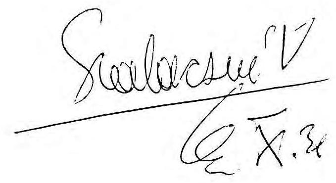

H e l y b e n

Tisztelt Boér Úr!

Hivatkozással a 257-XXIX/1990. sz. levélben foglaltakra
3.112 eFt, ebből
2.176 eFt bér
bázis jellegű pótelőirányzatot engedélyezek.
Az 1991. évi költségvetés készítésekor szintrehozás címen 9.335 eFt, ebből 6.528 eFt bér vehető figyelembe.

Az engedélyezett pótelőirányzat átutalására egyidejűleg intézkedtem.

Budapest, 1990. október 29.

---

Terv és Pénzügyi Főosztály
Novák Károlyné
főosztályvezető részére

H e l y b e n

Tisztelt Asszonyom !

A Miniszterelnöki Hivatal és intézményei részére az alábbi összegű jutalmat fizettük ki:

Jutalom TB járulék Összesen

Miniszterelnöki Hivatal
Bölcsőde
Óvoda
Étterem I.
Étterem II.

| 8,034 eFt | 3.455 eFt | 11.489 eFt |
| --: | --: | --: |
| 106 eFt | 45 eFt | 151 eFt |
| 77 eFt | 33 eFt | 110 eFt |
| 185 eFt | 80 eFt | 265 eFt |
| 143 eFt | 61 eFt | 204 eFt |

Ö S S Z E S E N : 8.545 eFt 3.674 eFt 12.219 eFt

Kérem, hogy a 12.219 eFt pótelőirányzatot és a javadalmat biztosítani szíveskedjék.

B u d a p e s t , 1990. december 13.
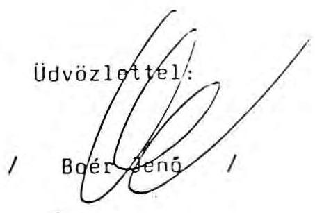

---

MEH Terv és Pénzügyi Főosztály

B o é r Jenő úrnak, főosztályvezető

MEH Költségvetési és Gazdasági Főosztály

H e l y b e n

Tisztelt Főosztályvezető Úr!

Hivatkozással a 326/XXIX/90. számú levélben foglaltakra
12.219 eFt
pótelőirányzatot engedélyezek.
A pótelőirányzat összegének átutalásáról egyidejűleg intézkedtem.

Budapest, 1990. december 17.

Üdvözlettel
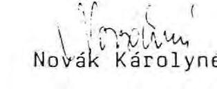

---

# A Miniszterelnökség fejezet béralapjának alakulása 

ezer Ft-ban

| Megnevezés | 1988. év | 1989. év | 1990. év | 1991. I. félév | 1991. év |
| :--: | :--: | :--: | :--: | :--: | :--: |
| Béralap összesen   - eredeti előir. | 96.161 | 80.749 | 163.153 | 219.700 | 219.700 |
| - módosított előir. | 81.875 | 125.226 | 188.919 | 229.025 | 256.475 |
| - teljesités | 72.188 | 109.873 | 181.572 | 121.481 | 246.794 |
| Teljesítésből   - teljes munkaidő-   ben foglakozt. | 65.100 | 85.759 | 144.396 | 87.332 | 176.641 |
| - részmunkaidőben   foglalkozt. | 827 | 1.468 | 2.299 | 1.491 | 4.759 |
| Bérfejlesztés 1 havi   összege | 831 | 1.268 | 3.105 | 2.514 | 3.883 |
| Jutalmazásra felhasz-   nált összeg | 13.727 | 22.574 | 41.341 | 27.358 | 65.348 |
| - ebből   érdekeltségi   alapból * | 536 | 626* | 660 | 452 | 452 |

* Speciális maradványérdekeltségi rendszer

---

# 13. sz. melléklet 

a V-141-31/1891-92. számhoz

## SZERZŐDÉS "FÜVÍ" .HUVIS/ONY LÉH.SIH/SÍRE

amely létrejött egyrészről a Budapest-Bécs Világkiállítási Programiroda megbízó, másrészt
lakik: szül. hely:
Szein. szám:
mint megbízolt között a következők szerint:
1./ A megbízó a megbízoltat
kapcsolatos feladatuk elvégzésével bízza meg. A feladat részletes leírását a jelen szerződés melléklete tartalmazza.
2./ A megbízást jogviszony 19
19
3./ Felok a díjazásnál figyelembe vett, a megbízás tartalma alatti munkaidő mértékét .......... órában határozzák meg.
4./ Megbízoltat a szerződésben vállalt teljesítése esetén .............fL/ azaz ................. forint díj illeti meg. A díj a teljesítés megtörténtének igazolásától számított 15 napon belül esedékes, Megbízott kérésére igazolt részteljesítés esetén részletfizetés engedélyezhető.
5./ A jogviszony tartama alatt megbízoltal a munkakapcsolatot .........
beosztásol:...... beosztásu dolgozó tartja. A teljesítést, illetve részteljesítést a megbízó
dolgozója igazolja.
6./ A szerződésben nem szabályozott kérdésekben a Ptk rendelkezései az irányadóak.
Budapest, 19 n. feh
hó ..... nap
kargy. Sains
munkavállaló
meghizolt
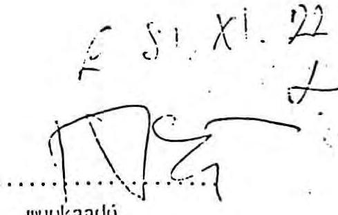
munkandó
meghizó

## a Korvinyilatos is nyelstauclis: bïltsége

97. 24. 1.

---

## 1047/1990. (III. 21.) MT határozat

a volt MSZMP vagyonának hasznosításáról ${ }^{9}$

A Minisztertanács az MSZMP vagyonával kapcsolatos egyes intézkedésekről szóló 1133/1989. (X. 29.) MT határozat alapján a Magyar Szocialista Párt, mint az MSZMP jogutódja által e határozat meghozataláig átadott vagyon túlnyomó részének hasznosításáról - a megyei (fővárosi) tanácsok végrehajtó bizottságaival létrejött megegyezés alapján - a következők szerint intézkedik:

1. A határozat 1. számú mellékletének A) részében tételesen felsorolt ingatlanok kezelői jogát a mellékletben megnevezett szervek részére átruházás jogcímén, a megjelölt hasznosítási célra, térítés nélkül kell átadni.
Az átruházásról szóló okiratok elkészítéséhez szükséges közreműködésre a Kormány az MSZP szerveit felkéri.
2. A politikai pártok által az 1133/1989. (X. 29.) MT határozat 8. pontja alapján bérelt ingatlanok 1990. április 30-a utáni tovább hasznosításáról
a) az 1020/1990. (II. 14.) MT határozat hatálya alá tartozó ingatlanok esetében a fővárosi és a megyei tanács végrehajtó bizottsága,
b) az egyéb ingatlanok tekintetében [1020/1990. (II. 14.) MT határozat 3. pont bekezdéseiben felsoroltak] a Kormány dönt.
Az április 30-a utáni hasznosításnál is előnyben kell részesíteni az 1133/1989. (X. 29.) MT határozat 2. pontjában megjelölt célokat.
${ }^{9}$ Üldöb mádostlata az 1076/1990. (V. 1.) MT és az 1081/1990. (V. 18.) MT, az 1012/1990. (VII. 27.) Korm., az 1026/1990. (VIII. 30.) Korm. és az 1058/1990. (XII. 15.) Korm. határozat.

1624

## A MINISZTERTANÁCS HATÁROZATAI

3. Az MSZMP kezeléséből átadott ingatlanokban meglevő, leltár szerint átvett ingóságokat az ól kezelők könyvtováirással kezdik még.
Az ingóságok elszámolása az MSZP és a Kormány között külön megállapodás alapján, a Vagyonrendezési letéti számján történik.
4. Az MSZMP által megkezdett, de be nem fejezett beruházásokat illetően e határozat 2. számú melléklete szerint kell eljárni. A nyilvános pályázat útján történő értékesítésre felhatalmazást kap az Állami Fejlesztési Intézet azzal, hogy a további szükséges intézkedéseket a saját hatáskörében folyamatosan megtegye.
5. Hozzájárul, hogy az MSZMP volt jelentősebb, e határozat 3. számú mellékletében felsorolt üdülői az 1990. évben a Minisztertanács Központi Üdülőiéhez kapcsolata, részben óvóan szültegyenési szerokéni müködjenek. Tudomásul veszi az üdülők 1990. évt átmeneti, gazdaságos hasznosítására tett intézkedéseket. Egyetért azzal, hogy az üdülőket 1991. évi használatba adással lehetőleg már ebben az évben, az Állami Fejlesztési Intézet által meghirdetett nyilvános pályázat útján kell értékesíteni.
6. Az 1. számú melléklet B) részében értékesítésre kijelölt ingatlanok tekintetében felhatalmazza a kormánybiztost, hogy az Állami Fejlesztési Intézetnek a nyilvános pályázat útján történő elidegenítésre a szükséges megbízásokat kiadja.
7. Az MSZP által átadott ingatlanok állami tulajdonban való megtartását - a 4., 5. és 6. pont rendelkezései által érintettek kivételével, illetve ellenkező értelmű jogszabály hatályba lépéséig - szükségesnek tartja: az érintett ingatlanoknak csak a kezelői joga változhat.
8. Tudomásul veszi, hogy az 1989. évben előleg-jellegű Vagyonrendezési letéti számla nyitására került sor, amely az MSZMP annyitásu létszám-leérítése, és az átvett ingatlanok képesszéd átmeneti üzemeltetési költségeinek fedezetéti szol. gáti.
Az előbbiek szerint felmerülő kiadások ellensúlyozására az ingatlanok értékesítéséből számosan beveteteket a Vagyonrendezési letéti számla a kell befizetni.
9. Az átvett ingatlanokban létesülő intézmények működési költségeit az üzemeltető szerznek kell fedeznie, erre költsé, vejést tơbölés támogatás nem adható.
10. Ez a határozat a kihirdetése napján lép hatályba. Az e határozattal nem érintett, de az MSZP által már átadott, hasznosítási célokat illetően még vitás ingatlanokról később történik intézkedés.
Az-e-határozatos-követően átadott pártingatlanok értékesítésére az Állami Vagyonügynökséget kell felkérni. A DEMISZ-vagyon hasznosítására az ifjúságpolitikai kormánybiztos 1990. március 31 -éig tegyen a Minisztertanácshoz előterjesztést.

---

15. sz. melléklet a V-141-31/1991-92. számhoz

A Kormány Központi Üdülők vendégforgalmának alakulása (kormányzati üdülők)

|   | V e n d é g n a p |  |  | V e n d é g l é t s z á m |  |   |
| --- | --- | --- | --- | --- | --- | --- |
|   | 1990. | 1991. | $\%$ | 1990. | 1991. | $\%$  |
| Balatonőszödi üdülő | 11.212 | 5.277 | 47,1 | 1.405 | 950 | 67.6  |
| - üdültetés | 9.375 | 3.930 | 42,0 | 932 | 521 | 56,0  |
| - rendezvények | 1.837 | 1.347 | 73,3 | 473 | 429 | 90,7  |
| Tihanyi üdülő | 504 | 239 | 47,4 | 38 | 74 | 194,7  |
| - üdültetés | 112 | 4 | 3,6 | 11 | 2 | 18,2  |
| - fizetővendéglátás | 359 | 193 | 53,8 | 16 | 58 | 362,0  |
| - rendezvény | 33 | 42 | 127,3 | 11 | 14 | 127,3  |
| Balatonlellei Hivatali |  |  |  |  |  |   |
| üdülő | 11.025 | 11.076 | 100,5 | 1.066 | 1.170 | 109,8  |
| - üdültetés | 10.215 | 10.603 | 103,8 | 884 | 956 | 108,1  |
| - fizetővendéglátás | 108 | 159 | 147,2 | 12 | 57 | 475,0  |
| - rendezvények | 713 | 314 | 44,0 | 170 | 157 | 92,3  |
| összesen: | 22.752 | 16.592 | 73,0 | 2.509 | 2.194 | 87,4  |
| - üdültetés | 19.702 | 14.537 | 73,8 | 1.827 | 1.479 | 80,9  |
| - fizetővendéglátás | 467 | 352 | 75,4 | 28 | 115 | 411,0  |
| - rendezvények | 2.583 | 1.703 | 66,0 | 654 | 600 | 91,7  |

---

# K imutatás 

a Hunor Kft-től üzembentartásra és használatra átvett gépkocsikról

| Szerv megnevezése | Gépkocsi tipusa |  |  |
| :--: | :--: | :--: | :--: |
|  | Golf 1,6 | Passat 1,8 | Passat 2,0 |
| - Miniszterelnöki Hivatal | 12 | 19 | 11 |
| - Műv. és Közoktatási Minisztérium | 5 | 4 | - |
| Kormányüdülő | - | 1 | - |
| - Pénzügyminisztérium | 3 | 8 | - |
| - Munkaügyi Minisztérium | 5 | 6 | - |
| - Legfelsőbb Bíróság | - | 1 | - |
| - DTEI | - | 1 | - |
| - Szabványügyi Hivatal | - | 1 | - |
| - Orsz. Atomenergia Bizottság | 2 | - | - |
| - Mérésügyi Hivatal | 1 | 1 | - |
| - Kincstári Vagyonkezelő Sz. | - | 3 | - |
| - Állami Számvevőszék | 1 | 2 | - |
| - Orsz. Munkavédelmi és Munkaügyi Főfelügy. | 3 | 1 | - |
| - Alkotmánybíróság | - | 4 | - |
| - Magyar Tud. Akadémia | 5 | - | - |
| - OMFB | 3 | 3 | - |
| - Külügyminisztérium | 6 | - | - |
| - Állami Vagyonügynökség | 7 | - | - |
| - Körny. és Területfejl. Min. | 3 | 6 | - |
| Mozgóképalapítvány | 1 | - | - |
| - Népjóléti Minisztérium- | 3 | 6 | - |
| - Nemzetbiztonsági Hivatal | 10 | - | - |
| - Információs Hivatal | 10 | - | - |
| - Közl.Hirk. és Vizügyi Minisztérium | 7 | 6 | - |
| - Nemzetk. Gazd. Kapcs. Minisztériuma | 18 | - | - |
| - Igazságügyi Minisztérium | 28 | 7 | - |
| - Országgyülés Hivatala | 13 | 6 | - |
| - Legfőbb Ügyészség | 25 | - | - |

---

Szerv megnevezése

G é p k o c s i t i p u s a
Golf 1,6 Passat 1,8 Passat 2,0

- Központi Statisztikai Hivatal 25 - -
- Ipari és Kereskedelmi Minisztérium 16 6 -
- MK Kormányőrsége 5 10 3
- Magyar Honvédség - 10 -
- Gazdasági Versenyhivatal 3 3 -
- Magyar Rádió 3 1 -
- Főv. Főpolgármesteri Hivatal - 5 -

Összesen: 358 olk 223 121 14

Budapest, 1992. január 8.

C train
Gelányi Erzsébet

---

# K imutatás

saját forrásból beszerzett gépkocsikról

| Intézmény neve | Leszám lázott mennyiség | Gépkocsia | Biztosítás | Összesen | Átutalva | Visszautalandó |
| --- | --- | --- | --- | --- | --- | --- |
| | Golf 1,6 Golf Diesel Passat 1,8 Passat 2,0 Jetta | | küközező | | | |
| | Golf 1,6 Golf Diesel Passat 1,8 Passat 2,0 Jetta | | c a s c o s f. | | | |
| ME Hivatal | 15 | 14.262.150.- | 79.740.- | |  1.727.220.- | 425.700.- | 16.690.239.-  |
|  DTEI | 2 | 1.901.620.- |  | 40.980.- |  | 1.942.600.-  |
|  NGLM |  | 9.554.867.- |  | 510.840.- |  | 10.065.707.-  |
|  Külügyminisztérium |  | 2.380.800.- |  | 170.280.- |  | 2.551.080.-  |
|  Korny. és Ter. M. | 3 | 2.852.430.- |  | 331.020.- |  | 3.183.450.-  |
|  Munkaügyi Min. | 1 | 950.810.- | 5.316.- | 387.780.- |  | 1.343.906.-  |
|  Népjóléti Min. | 4 | 3.803.240.- | 21.264.- | 331.020.- |  | 4.155.524.-  |
|  FM | 10 | 17.697.986.- |  |  |  | 17.697.986.-  |
|  KHVM | 3 | 2.852.430.- |  | 444.540.- |  | 3.296.970.-  |
|  Iparis és Ker. Min. | 5 | 6.119.031.- | 31.896.- | 699.960.- |  | 6.850.887.-  |
|  PM | 5 | 6.119.031.- | 31.896.- | 372.000.- |  | 6.522.927.-  |
|  Alkotmánybíróság |  | 6 fekete | 8.243.322.- | 31.896.- | 163.920.- | 8.439.138.-  |
|  Legfelsőbb Bíróság |  | 1.364.981.- |  | 40.980.- |  | 1.405.961.-  |
|  Számvevőszék | 3 | 5.582.392.- | 26.580.- | 110.340.- |  | 5.719.312.-  |
|  MNB |  | 5 | 12.650.857.- |  |  | 12.650.857.-  |
|  KSH | 4 | 5.767.324.- |  | 709.500.- |  | 6.476.824.-  |
|  MTA |  | 3 fekete | 4.112.755.- |  | 141.900.- | 4.254.655.-  |
|  ÁVÜ | 1 | 950.810.- | 5.316.- | 198.660.- |  | 1.154.786.-  |
|  OTSH | 3 | 2.852.430.- | 15.948.- |  |  | 2.868.378.-  |
|  Szabványügyi H. | 1 | 950.810.- | 5.316.- | 40.980.- |  | 997.106.-  |
|  ONFB |  | 1 fekete | 1.373.887.- | 5.316.- | 208.080.- | 1.587.283.-  |
|  Ügyészség | 26 | 28.816.003.- |  | 709.500.- |  | 29.525.503.-  |
|  MTI |  |  |  |  |  |   |
|  Összesen: (129 db) | 86 | 5 | 141.159.966.- | 260.484 | 7.339.500.- | 425.700.-  |

Budapest, 1991. december 7.

Gelányi Erzsébet

---

# T A N U S Í T V Á N Y 

A Miniszterelnöki Hivatal Gazdálkodó Szervezetébe 1990. január 1-től beépült a volt ÉVM Gazdasági Igazgatósága, 1991. február 1-től pedig a Közlekedési, Hírközlési és Vízügyi Minisztériumtól átvételre került a XIII., Visegrádi u. 70-72. sz. alatti Gépkocsitároló és javítóműhely, mindkét esetben költségvetési előirányzatával, materiális eszközeivel és munkatársaival.

Az Igazgatóság, valamint a Gépkocsitároló és javítóműhely kezelésében lévő eszközöknek leltárfelvétellel egybekötött, tényleges mennyiségi átvétele a forduló nappal nem történt meg, csak a nyilvántartásokon történe átvezetésre került sor.

Budapest, 1992. február 25.
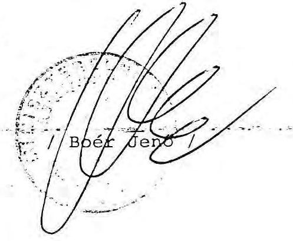

---

# JEGYZŐKÖNYV 

a Talent kft-vel kötött szerződésekkel összefüggésben

1. A Minisztertanács 81/90 (IV. 27.) MT rendelete a Talent kft-ben levő üzletrészét a Nemzeti Gyermek- és Ifjúsági Alapítványnak adományozta. A rendelet értelmében a társaság tevékenységének, illetve a működése alapján képzelt nyereségének - az üzletrész arányában - az Alapítványt kell szolgálnia.
2. A Talent kft-nek jelenleg alapítói megrendelésként három szerződést kell teljesítenie:

- Fiatal orosz nyelvtanárok átképzésével kapcsolatos feladatok (1. melléklet)

A szerződés az ABMH-val, az MM-mel és a DEMISS-szel együttműködésben született és igényes, teljes képzési rendszert átfogó feladatával - maximum 400 főig - a főleg átképzési lehetőségekben gyengébben ellátott tanító fiatal pedagógusok számára ígér sikeres átképzést. A megkezdett feladat még várhatóan legalább két évig jelent a szerződéssel összefüggésben kötelezettségeket. A képzésben érintettekkel kapcsolatban további feladatok lehetségesek, illetőleg kedvezményezettként további együttműködés kialakítása szükséges.

- Országos információs hálózat létrehozása tehetséges fiatalok felkutatása, menedzselése, ötleteik hasznosításának elősegítése (2. melléklet)

A társaság a tehetséginformatikai rendszer kiépítésére kapott megrendelését a G-2000 Tehetséggondozó Alapítvány Tudományos Programtanácsa segítségével teljesíti. A regionális központok telepítése érdekében pályázatot írtak ki. Jelenleg a program telepítés utáni próbája és beüzemelése folyik. A szerződés szerinti teljesítés június végén aktuális. A tehetséginformatikai rendszer működtetése a tehetségekkel kapcsolatosan további folyamatos feladatokat, illetőleg más, információs tevékenységekkel való együttműködést igényel.

---

- Fiatal, tehetséges magyarországi politikusok menedzser képzése (3. melléklet)

A menedzserképzés pártoktól függetlenül minden politizálni akaró fiatal számára jött létre. Az egyes képzési helyszíneken folyamatosan újabb fiatalok bekapcsolódására, illetve közéleti részvételére nyílik lehetőség. A feladat végrehajtásának határideje 1990. vége. A feladattal összefüggésben további feladatok és a képzésben részt vett kedvezményezettek számára újabb együttműködési alkalmak szervezése szükségesek.
3. A Talent kft alapítói megrendelésként (2. pont) kötött három szerződésének gondozását - a minisztertanácsi rendelet szellemében, illetve az egyes feladatok jellege alapján - a mai naptól a Nemzeti Gyermek- és Ifjúsági Alapítványra bízom. Az egyes szerződésekben foglalt kötelezettségek és határidők változatlanul érvényesek, a megbízóként megnevezett Ifjúságpolitikai Kormánybiztos alatt a továbbiakban Nemzeti Gyermek- és Ifjúsági Alapítvány értendő. A szerződések teljesítésével kapcsolatos teendők ellátásával - más intézkedésig Szabó Andrást bízom meg.

Budapest, 1990. május 11.
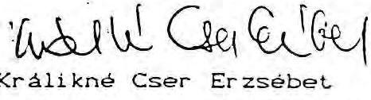

---

# MAGYAR KÖZTÁRSASÁG 

## MINISZTERELNÖKI HIVATAL

Budapest V.
Kossuth tér 4.

## M E G B Í Z Á S I S Z E R Z Ő D É S

amely létrejött egyrészről a Magyar Köztársaság Miniszterelnöki Hivatala Budapest V. Kossuth tér 4. 1054., mint Megbízó a továbbiakban Megbízó, másrészről Uzsoky András 1-500410-0425, Budapest XI. Szabolcska M. u. 7. 1114. szám alatti lakós, mint Megbízott a továbbiakban Megbízott között az alábbi tárgyban.

1. Megbízó jelen megbízási szerződés aláírásával egyidejűleg megbízza Megbízottat az un. "Klub-Aliga" komplett üdülőingatlan forgalmi értékbecslésével, illetve un. ingatlan vagyoni értékelésével. A megbízás tárgyára vonatkozó szakértői véleményt Megbízott köteles legkésőbb 1990. december 2. napján Megbízó részére hiánytalanul szállítani.
2. Megbízottat jelen eseti megbízás fenti pontban meghatározott határidőre történő teljesítését követően 1.900.000 Ft., azaz Egymillió-kilencszázezer forint munkadíj illeti meg, mely munkadíjat Megbízó a teljesítést követő 15 napon belül teljesít.
3. Megbízott köteles a megbízás tárgyát képező feladatot a rendelkezésére álló ismeretek, tapasztalatok és az adott létesítmények helyszíni szemléjét követően befolyástól mentesen, lelkiismeretesen elvégezni az alábbi szempontok figyelembevételével.

---

- Vizsgálni szükséges az adott ingatlanlétesítmények tulajdonjogi un. vagyoni értékét;
- Véleményezni kell az adott ingatlan-komplexum tulajdonjog átruházása mellőzésével történő vagyoni értékét;
- A szakértői véleményben rögzíteni kell az ingatlan-komplexum egészére vonatkozó objektív tényezőket;
- Az ingatlan vagyoni értékeléshez feltétlen szükséges egyes létesítményekre lebontott objektív tényezők feltárása;
- A szakértői véleménynek ki kell térni arra vonatkozóan, hogy az értékelés mely konkrétan figyelembe vett adatokra épül;
- A szakértői vélemény felépítésére vonatkozóan követelmény a nagy számú épületre és a fentiekre tekintettel a szakértői vélemény lehetőséghez képest könnyen történő kezelhetősége;
- A szakértői véleményben részletesen indokolni kell az alkalmazott szakértői módszert, illetve azon tényezőket, amelyek alapján a szakértői módszer meghatározásra került.

4. Megbízott a Megbízó szíves tudomására hozza, tájékoztatás céljából, hogy a tárgybani megbízási szerződés előkészítése során az értékelés tárgyát képező ingatlan-komplexumot a helyszínen megtekintette. Az egyszeri helyszíni szemlén Megbízott felvette a személyes kapcsolatot Bondár József igazgató Úrral, aki biztosította Megbízottat az értékelés elvégzéséhez szükséges helyszínen nyerhető támogatásáról.

---

5. Megbízott jelen megbízási szerződés aláírásával kijelenti, hogy a feladat elvégzése során egyes munkafázisokba két munkatársat von be, nevezetesen Uzsoky Andrásnét, mint Megbízott segítő családtagját, valamint Izsó Mariannát /2-670131-1052, 1075. Budapest, Tanács krt. 3/a./.
6. Megbízott a szakértői vélemény határidőre történő leszállításával egyidejűleg vállalja, hogy a feladat során tudomására jutott információkat bizalmasan kezeli a munkába vont munkatársakkal együtt, erről véleményéhez eredetiben aláírt írásbeli nyilatkozatokat csatol.
Megbízott továbbá kötelezi magát arra vonatkozóan, hogy a tárgybani munkát un. referencia feladatként a Megbízó hozzájárulása nélkül nem fogja felhasználni.
7. Megbízott kinyilatkozza, hogy a jelen munkából befolyó jövedelem után személyi jövedelemadó fizetési kötelezettségének maradéktalanul eleget tesz.
Megbízott Megbízó szíves tudomására hozza, hogy folyó évben folytatott tevékenységéből adódóan jelenleg már az $50\%$-os adóelőleg levonásának kategóriájába tartozik, ennek megfelelően kéri Megbízót, hogy a kifizetésnél fentiekre tekintettel legyen.
8. Megbízó kikötései:

---

9. Jelen megbízási szerződés 4 számozott oldalból áll. Jelen szerződés 8. pontjában a Megbízó kikötéseit tartalmazó pont - amennyiben kitöltésre nem kerül, úgy az aláíráskor kihúzásra kerül, amennyiben tartalmaz egyéb kikötéseket, azt aláírást megelőzően rögzíti Megbízó és Megbízott.

Jelen megbízási szerződést szerződő felek elolvasták és mint akaratukkal mindenben megegyezőt jóváhagyólag aláírják.

Budapest, 1990. november 1.
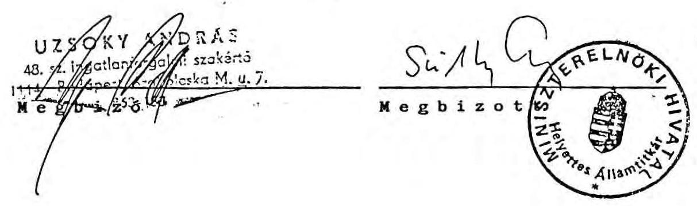

---

Miniszterelnöki Hivatal
Terv és Pénzügyi Főosztály

# N y i l a t k o z a t 

Az Általános Értékforgalmi Bank Rt-vel kötött a Club Hotel Balatonföldvár értékesítésére vonatkozó /1991.március 21-i/ írásbeli "Megállapodás"-ról és az azt követően 1991. június 13-án készített, szintén írásos "Kiegészítés"-ről, és az abban rögzített 80 millió forint összegű előlegről 1992. március 18-án szereztem tudomást. Az előleg banki elhelyezéséről külön gondoskodni egyébként nem is kellett miután az - a pénzforgalom egyszerűsítésére törekedvén - eleve az Általános Értékforgalmi Banknál került elhelyezésre, anélkül, hogy a "Kiegészítés" kamatfeltételekről rendelkezett volna.

A Bankkal korábbi, hivatalos kapcsolatfelvétel a dobogókői MSZMP üdülő értékesítésére kötött 50 millió forint összegű "Megállapodás"-sal összefüggő Lakásalap fedezeti kútvény vásárlására vonatkozó szerződés-kötés volt 1990. november 22-én. A Bank a szerződés szerinti 31,5 \%-os kamattal 7.918.750 Ft-ot 1991. május 24-én a Vagyonrendezési Letétszámlára átutalt.
1991. május 23-i levelemmel kértem a szerződés fenntartását $34 \%$-os kamattal további 3 hónapra. A Bank ezen időszakra 4.344.445 Ft-ot utalt át 1991. augusztus 27-én.

További hosszabbításra az ezzel foglalkozó munkatárs részéről nem kaptam jelzést.

A két megbízás felmondására vonatkozó, 1991. november 11-i visszaigazolással zárult megállapodást a kamat visszautalására teendő intézkedés miatt megkaptam, a visszautalás 1991. december 20-án megtörtént.

B u d a p e s t, 1992. március 24.

---

# Megállapodás 

mely létrejött a mai napon a Magyar Köztársaság Miniszterelnöki Hivatala (Bp. Kossuth L. tér 4.) mint megbízó (továbbiakban Megbízó) és az általános értékforgalmi Bank Rt. (Bp. Lónyai u. 30-32.) mint megbízott (továbbiakban Megbízott) között, az alábbi feltételekkel:

1. Megbízó megbízza Megbízottat a Megbízó feltétel nélküli rendelkezési körébe tartozó egyes ingatlanok, létesítmények értékesítésével, melyek jegyzékét az 1. sz. melléklet tartalmazza.
2. Megbízott vállalja az 1. sz. mellékletben részletezett ingatlanok, létesítmények értékesítését az alábbi módon:
2.1. Nyilvános pályázatot hirdet az értékesítésre.
2.2. Prekvalifikációs eljárás után döntésre terjeszti elő Megbízó részére a beérkezett ajánlatokat. A prekvalifikáció részeként bank és egyéb információkat szerez be a pályázókról, illetve minősíti az ajánlatokat.
2.3. A Megbízó döntése után előkészíti a
 szerződéskötést és azt lebonyolítja.
2.4. Biztosítja a szerződésből következő bankári szolgáltatásokat.
3. Megbízott jelen szerződés aláírásától számított 15 naptári napon belül a Megbízó által rögzített minimális értékesítési ár 15 \%-át a232-90202-0172 számú Vagyonrendezési Letéti Számlára átutalja. Amennyiben a pályázatok - a Megállapodás aláírását követően legkésőbb 6 hónappal - eredménytelenek, úgy Megbízó az előleget 15 napon belül, kamatmentesen Megbízottnak visszafizeti.

Megbízott az általa végzett bankári szolgáltatásokért a bank üzletszabályzatában rögzített jutalékokat és díjakat számítja fel. Ily módon megilleti a végső eladási ár $1,5 \%$-a mint munkadíj, mely magában foglalja a Megbízott összes, az ügylettel kapcsolatban felmerülő költségét.

---

5. Amennyiben Megbízott az ügylet során a Megbízó által meghatározott minimális értékesítési ár feletti végső árat tud elérni a pályázaton győztes vevővel, úgy a két ár közötti különbség 50 %-a Megbízottat, 50 %-a pedig Megbízót illeti.
6. Megbízó vállalja, hogy az értékesítéshez szükséges jogi instrumentumokat, felhatalmazásokat és jogosultságainak igazolását Megbízott rendelkezésére bocsátja a szerződés aláírásától számított 1 héten belül, valamint a pályázat lebonyolítására Megbízottnak kizárólagosságot biztosít.
7. Megbízott vállalja, hogy nemzetközi bank és befektetési kapcsolatain keresztül, legjobb tudása és információi szerint törekszik az ügylet lebonyolítására és a maximális vételár kialakítására.
8. Megbízó Tunyogi László főtanácsos- a miniszterelnöki hivatal nevében, Megbízott Kun Györgyöt ügyvezető igazgatót egy személyben jogosítja fel a szükséges jognyilatkozatok megtételére, egyeztetések elvégzésére.
9. Szerződő felek jelen megállapodásból eredő jogvitáik intézésére a PKKB illetékességét kötik ki.

Budapest, 1990. november 7.

---

Az 1. sz. mellékletben felsorolt ingatlanok minimális értékesítési árát Megbízó

320.000.000 (Háromszázhuszmillió)
forintban határozza meg.

Megbízott vállalja, hogy a Megállapodás 3. pontjában rögzített előleg
50.000.000 (ötvenmillió)
forint legyen.

---

PHO-FIX INGATLANKÖZVETÍTŐ BETÉTI TÁRSASÁG
7532 Hencse, Dózsa György u. 8.
7400 Kaposvár, Fő u. 23. Telefon: 20-221
PO-BT-137/991

Iratszám: Szomoru István
Megrenostöiny központi Udultó
Értékbecslő: 44.350.-
Neve: 8636 Balatonőszöd
Becslési díj: Kormány központi Udultó
Lakcíme:
Befizető neve: Balatonőszöd

Telek forgalmi értékének becslése

I. Az ingatlan forgalmi értéke
Balatonőszöd
B. szomoci
622 - ingatlanból

1. A telek helye:
Kormány központi Udultó Balatonőszöd
2. A hetekhelye, illetve heznége:
/ebből 14.903 m² - 4139,7 n-öi területrész
3. A telek hagyóága:
m² esztetlen közös tulajdonba kerülő úd. telekrész:
4. A lakótelek, zártkert, külterület jellege 3355 12.078.-
5./Csontrahat a tájékoztatóképtén figyelembevételével, ként 50.000.000.-
6. A becslés tárgyát képező telek forgalmi értéke:
Ft.
Ft.
Ft.
Ft.
Ft.
50.000.000.- Ft.

Az ingatlan egyéb, és ingatlanmódtéke:
azaz forint.

II. A forgalmi érték, megyezése, tünjük, elégtőben, állítva, és elhetén keresztül
közellíthető meg.

7. Az utcafro, részvétlen kissé egyenletlen talajfelszínű/
8. A telek síma, lejtős, teraszos, mély fekvésű, m töltést igényel.

9. Közművek, a szellegen: közzétét, a közzététő, a közzététő, a közzététő, a közzététő, a közzététő, a közzététő, a közzététő, a közzététő, a közzététő, a közzététő, a közzététő, a közzététő, a közzététő, a közzététő, a közzététő, a közzététő, a közzététő, a közzététő, a közzététő, a közzététő, a közzétevő, a közzétevő, a közzétevő, a közzétevő, a közzétevő, a közzétevő, a közzétevő, a közzétevő, a közzétevő, a közzétevő, a közzétevő, a közzétevő, a közzétevő, a közzétevő, a közzétevő, a közzétevő, a közzétevő, a közzétevő, a közzétevő, a közzétevő, a közzétevő, a közzétevő, a közzétevő, a közzétevő, a közzétevő, a közzétevő, a közzétevő, a közzétevő, a közzétevő, a közzétevő, a közzétevő, a közzétevő, a közzétevő, a közzétevő, a közzétevő, a közzétevő, a közzétevő, a közzétevő, a közzétevő, a közzétevő, a közzétevő, a közzétevő, a közzétevő, a közzétevő, a közzétevő, a közzétevő, a közzétevő, a közzétevő, a közzétevő, a közzétevő, a közzétevő, a közzétevő, a közzétevő, a közzétevő, a közzétevő, a közzétevő, a közzétevő, a közzétevő, a közzétevő, a közzétevő, a közzétevő, a közzétevő, a közzétevő, a közzétevő, a közzétevő, a közzétevő, a közzétevő, a közzétevő, a közzétevő, a közzétevő, a közzétevő, a közzétevő, a közzétevő, a közzétevő, a közzétevő, a közzétevő, a közzétevő, a közzétevő, a közzétevő, a közzétevő, a közzétevő, a közzétevő, a közzétevő, a közzétevő, a közzétevő, a közzétevő, a közzétevő, a közzétevő, a közzétevő, a közzétevő, a közzétevő, a közzétevő, a közzétevő, a közzétevő, a közzétevő, a közzétevő, a közzétevő, a közzétevő, a közzétevő, a közzétevő, a közzétevő, a közzétevő, a közzétevő, a közzétevő, a közzétevő, a közzétevő, a közzétevő, a közzétevő, a közzétevő, a közzétevő, a közzétevő, a közzétevő, a közzétevő, a közzétevő, a közzétevő, a közzétevő, a közzétevő, a közzétevő, a közzétevő, a közzétevő, a közzétevő, a közzétevő, a közzétevő, a közzétevő, a közzétevő, a közzétevő, a közzétevő, a közzétevő, a közzétevő, a közzétevő, a közzétevő, a közzétevő, a közzétevő, a közzétevő, a közzétevő, a közzétevő, a közzétevő, a közzétevő, a közzétevő, a közzétevő, a közzétevő, a közzétevő, a közzétevő, a közzétevő, a közzétevő, a közzétevő, a közzétevő, a közzétevő, a közzétevő, a közzétevő, a közzétevő, a közzétevő, a közzétevő, a közzétevő, a közzétevő, a közzétevő, a közzétevő, a közzétevő, a közzétevő, a közzétevő, a közzétevő, a közzétevő, a közzétevő, a közzétevő, a közzétevő, a közzétevő, a közzétevő, a közzétevő, a közzétevő, a közzétevő, a közzétevő, a közzétevő, a közzétevő, a közzétevő, a közzétevő, a közzétevő, a közzétevő, a közzétevő, a közzétevő, a közzétevő, a közzétevő, a közzétevő, a közzétevő, a közzétevő, a közzétevő, a közzétevő, a közzétevő, a közzétevő, a közzétevő, a közzétevő, a közzétevő, a közzétevő, a közzétevő, a közzétevő, a közzétevő, a közzétevő, a közzétevő, a közzétevő, a közzétevő, a közzétevő, a közzétevő, a közzétevő, a közzétevő, a közzétevő, a közzétevő, a közzétevő, a közzétevő, a közzétevő, a közzétevő, a közzétevő, a közzétevő, a közzétevő, a közzétevő, a közzétevő, a közzétevő, a közzétevő, a közzétevő, a közzétevő, a közzétevő, a közzétevő, a közzétevő, a közzétevő, a közzétevő, a közzétevő, a közzétevő, a közzétevő, a közzétevő, a közzétevő, a közzétevő, a közzétevő, a közzétevő, a közzétevő, a közzétevő, a közzétevő, a közzétevő, a közzétevő, a közzétevő, a közzétevő, a közzétevő, a közzétevő, a közzétevő, a közzétevő, a közzétevő, a közzétevő, a közzétevő, a közzétevő, a közzétevő, a közzétevő, a közzétevő, a közzétevő, a közzétevő, a közzétevő, a közzétevő, a közzétevő, a közzétevő, a közzétevő, a közzétevő, a közzétevő, a közzétevő, a közzétevő, a közzétevő, a közzétevő, a közzétevő, a közzétevő, a közzétevő, a közzétevő, a közzétevő, a közzétevő, a közzétevő, a közzétevő, a közzétevő, a közzétevő, a közzétevő, a közzétevő, a közzétevő, a közzétevő, a közzétevő, a közzétevő, a közzétevő, a közzétevő, a közzétevő, a közzétevő, a közzétevő, a közzétevő, a közzétevő, a közzétevő, a közzétevő, a közzétevő, a közzétevő, a közzétevő, a közzétevő, a közzétevő, a közzétevő, a közzétevő, a közzétevő, a közzétevő, a közzétevő, a közzétevő, a közzétevő, a közzétevő, a közzétevő, a közzétevő, a közzétevő, a közzétevő, a közzétevő, a közzétevő, a közzétevő, a közzétevő, a közzétevő, a közzétevő, a közzétevő, a közzétevő, a közzétevő, a közzétevő, a közzétevő, a közzétevő, a közzétevő, a közzétevő, a közzétevő, a közzétevő, a közzétevő, a közzétevő, a közzétevő, a közzétevő, a közzétevő, a közzétevő, a közzétevő, a közzétevő, a közzétevő, a közzétevő, a közzétevő, a közzétevő, a közzétevő, a közzétevő, a közzétevő, a közzétevő, a közzétevő, a közzétevő, a közzétevő, a közzétevő, a közzétevő, a közzétevő, a közzétevő, a közzétevő, a közzétevő, a közzétevő, a közzétevő, a közzétevő, a közzétevő, a közzétevő, a közzétevő, a közzétevő, a közzétevő, a közzétevő, a közzétevő, a közzétevő, a közzétevő, a közzétevő, a közzétevő, a közzétevő, a közzétevő, a közzétevő, a közzétevő, a közzétevő, a közzétevő, a közzétevő, a közzétevő, a közzétevő, a közzétevő, a közzétevő, a közzétevő, a közzétevő, a közzétevő, a közzétevő, a közzétevő, a közzétevő, a közzétevő, a közzétevő, a közzétevő, a közzétevő, a közzétevő, a közzétevő, a közzétevő, a közzétevő, a közzétevő, a közzétevő, a közzétevő, a közzétevő, a közzétevő, a közzétevő, a közzétevő, a közzétevő, a közzétevő, a közzétevő, a közzétevő, a közzétevő, a közzétevő, a közzétevő, a közzétevő, a közzétevő, a közzétevő, a közzétevő, a közzétevő, a közzétevő, a közzétevő, a közzétevő, a közzétevő, a közzétevő, a közzétevő, a közzétevő, a közzétevő, a közzétevő, a közzétevő, a közzétevő, a közzétevő, a közzétevő, a közzétevő, a közzétevő, a közzétevő, a közzétevő, a közzétevő, a közzétevő, a közzétevő, a közzétevő, a közzétevő, a közzétevő, a közzétevő, a közzétevő, a közzétevő, a közzétevő, a közzétevő, a közzétevő, a közzétevő, a közzétevő, a közzétevő, a közzétevő, a közzétevő, a közzétevő, a közzétevő, a közzétevő, a közzétevő, a közzétevő, a közzétevő, a közzétevő, a közzétevő, a közzétevő, a közzétevő, a közzétevő, a közzétevő, a közzétevő, a közzétevő, a közzétevő, a közzétevő, a közzétevő, a közzétevő, a közzétevő, a közzétevő, a közzétevő, a közzétevő, a közzétevő, a közzétevő, a közzétevő, a közzétevő, a közzétevő, a közzétevő, a közzétevő, a közzétevő, a közzétevő, a közzétevő, a közzétevő, a közzétevő, a közzétevő, a közzétevő, a közzétevő, a közzétevő, a közzétevő, a közzétevő, a közzétevő, a közzétevő, a közzétevő, a közzétevő, a közzétevő, a közzétevő, a közzétevő, a közzétevő, a közzétevő, a közzétevő, a közzétevő, a közzétevő, a közzétevő, a közzétevő, a közzétevő, a közzétevő, a közzétevő, a közzétevő, a közzétevő, a közzétevő, a közzétevő, a közzétevő, a közzétevő, a közzétevő, a közzétevő, a közzétevő, a közzétevő, a közzétevő, a közzétevő, a közzétevő, a közzétevő, a közzétevő, a közzétevő, a közzétevő, a közzétevő, a közzétevő, a közzétevő, a közzétevő, a közzétevő, a közzétevő, a közzétevő, a közzétevő, a közzétevő, a közzétet a közzétevő, a közzétevő, a közzétevő, a közzétevő, a közzétevő, a közzétevő, a közzétevő, a közzétevő, a közzétevő, a közzétevő, a közzétevő, a közzétevő, a közzétevő, a közzétevő, a közzétevő, a közzétevő, a közzétevő, a közzétevő, a közzétevő, a közzétevő, a közzétevő, a közzétevő, a közzétevő, a közzétevő, a közzétevő, a közzétevő, a közzétevő, a közzétevő, a közzétevő, a közzétevő, a közzétevő, a közzétevő, a közzétevő, a közzétevő, a közzétevő, a közzétevő, a közzétevő, a közzétevő, a közzétevő, a közzétevő, a közzétevő, a közzétevő, a közzétevő, a közzétevő, a közzétevő, a közzétevő, a közzétevő, a közzétevő, a közzétevő, a közzétevő, a közzétevő, a közzétevő, a közzétevő, a közzétevő, a közzétevő, a közzétevő, a közzétevő, a közzétevő, a közzétevő, a közzétevő, a közzétevő, a közzétevő, a közzétevő, a közzétevő, a közzétevő, a közzétevő, a közzétevő, a közzétevő, a közzétevő, a közzétevő, a közzétevő, a közzétevő, a közzétevő, a közzétevő, a közzétevő, a közzétevő, a közzétevő, a közzétevő, a közzétevő, a közzétevő, a közzétevő, a közzétevő, a közzétevő, a közzétevő, a közzétevő, a közzétevő, a közzétevő, a közzétevő, a közzétevő, a közzétevő, a közzétevő, a közzétevő, a közzétevő, a közzétevő, a közzétevő, a közzétevő, a közzétevő, a közzétevő, a közzétevő, a közzétevő,
 a közzétevő, a közzétevő, a közzétevő, a közzétevő, a közzétevő, a közzétevő, a közzétevő, a közzétevő, a közzétevő, a közzétevő, a közzétevő, a közzétevő, a közzétevő, a közzétevő, a közzétevő, a közzétevő, a közzétevő, a közzétevő, a közzétevő, a közzétevő, a közzétevő, a közzétevő, a közzétevő, a közzétevő, a közzétevő, a közzétevő, a közzétevő, a közzétevő, a közzétevő, a közzétevő, a közzétevő, a közzétevő, a közzétevő, a közzétevő, a közzétevő, a közzétevő, a közzétevő, a közzétevő, a közzétevő, a közzétevő, a közzétevő, a közzétevő, a közzétevő, a közzétevő, a közzétevő, a közzétevő, a közzétevő, a közzétevő, a közzétevő, a közzétevő, a közzétevő, a közzétevő, a közzétevő, a közzétevő, a közzétevő, a közzétevő, a közzétevő, a közzétevő, a közzétevő, a közzétevő, a közzétevő, a közzétevő, a közzétevő, a közzétevő, a közzétevő, a közzétevő, a közzétevő, a közzétevő, a közzétevő, a közzétevő, a közzétevő, a közzétevő, a közzétevő, a közzétevő, a közzétevő, a közzétevő, a közzétevő, a közzétevő, a közzétevő, a közzétevő, a közzétevő, a közzétevő, a közzétevő, a közzétevő, a közzétevő, a közzétevő, a közzétevő, a közzétevő, a közzétevő, a közzétevő, a közzétevő, a közzétevő, a közzétevő, a közzétevő, a közzétevő, a közzétevő, a közzétevő, a közzétevő, a közzétevő, a közzétevő,
 a közzétevő, a közzétevő, a közzétevő, a közzétevő, a közzétevő, a közzétevő, a közzétevő, a közzétevő, a közzétevő, a közzétevő, a közzétevő, a közzétevő, a közzétevő, a közzétevő, a közzétevő, a közzétevő, a közzétevő, a közzétevő, a közzétevő, a közzétevő, a közzétevő, a közzétevő, a közzétevő, a közzétevő, a közzétevő, a közzétevő, a közzétevő, a közzétevő, a közzétevő, a közzétevő, a közzétevő, a közzétevő, a közzétevő, a közzétevő, a közzétevő, a közzétevő, a közzétevő, a közzétevő, a közzétevő, a közzétevő, a közzétevő, a közzétevő, a közzétevő, a közzétevő, a közzétevő, a közzétevő, a közzétevő, a közzétevő, a közzétevő, a közzétevő, a közzétevő, a közzététő, a közzétevő, a közzétevő, a közzétevő, a közzétevő, a közzétevő, a közzétevő, a közzététő, a közzétevő, a közzétevő, a közzétevő, a közzététő, a közzététő, a közzétevő, a közzétevő, a közzétevő, a közzétevő, a közzétevő, a közzétevő, a közzététő, a közzététő, a közzététő, a közzététő, a közzététő, a közzététő, a közzététő, a közzététő, a közzététő, a közzététő, a közzétététő, a közzététététététő, a közzététététététő, a közzététététététő, a közzétététététététő, a közzétététététététő, a közzététététététététő, a közzététététététő, a közzététététététététő, a közzétététététététététő, a közzétététététététététététő, a közzétététététététététététététététő, a közzétététététététététététététététététététő, a közzététététététététététététététététététététététététététététététététététététététététététététététététététététététététététététététététététététététététététététététététététététététététététététététététététététététététététététététététététététététététététététététététététététététététététététététététététététététététététététététététététététététététététététététététététététététététététététététététététététététététét

---

Az egyéb közművekre történő rácsatlakoztatás magas költségvonzatot igényelne.

- A területrész "használati megosztásából adódóan"
 nem közvetlen vízparti fekvésű, kiépített partvédőművel nem rendelkezik, ebből adódóan csak Balatonpart közelinek minősíthető.
- Értékesítése után a 36.245 m2 területen belül, osztatlan közös tulajdonba kerül, így önálló telekként nem vehető figyelembe, így ebből adódóan esetleges beépítése, vagy későbbiek folyamán történő értékesítése során a közös tulajdonra vonatkozó jogszabályok alkalmazandók.
- A jegyzőkönyvben rögzített forgalmi érték a megbízásban közölt értékcsökkentő szempontok figyelembevételével került megállapításra.

Ponyód, 1991. augusztus 05.

---

# Megállapodás 

mely létrejött a mai napon a Magyar Köztársaság Miniszterelnöki Hivatala (Bp. V., Kossuth tér 4.), mint megbízó (továbbiakban: Megbízó) és az Általános Értékforgalmi Bank Rt. (Bp. Lónyai u. 30-32.), mint megbízott (továbbiakban: Megbízott) között, az alábbi feltételekkel:

1. Megbízó megbízza Megbízottat a Megbízó feltétel nélküli rendelkezési körébe tartozó Club Hotel (Balatonföldvár, Somogyi Béla u. 5-7. sz. alatti, 56/16/2 hrsz., 110 tul. lap)
létesítmények értékesítésével.
2. Megbízott vállalja az 1. pontban részletezett ingatlan, létesítmények értékesítését az alábbi módon:
2.1. Az ingatlan forgalmi értékbecslésének elkészíttetése 1991. május 30-ig.
2.2. Nyilvános pályázatot hirdet az értékesítésre 1991. június 30-ig.
2.3. Prekvalifikációs eljárás után döntésre terjeszti elő Megbízó részére a beérkezett ajánlatokat. A prekvalifikáció részeként bank és egyéb információt szerez be a pályázókról, illetve minősíti az ajánlatokat.
2.4 A Megbízó döntése után előkészíti a szerződéskötést és azt lebonyolítja.
2.5. Biztosítja a szerződésből következő bankári szolgáltatásokat.
3. Megbízott az általa végzett bankári szolgáltatásokért a bank üzletszabályzatában rögzített jutalékokat és díjakat számítja fel. Ily módon megilleti a végső eladási ár 2 %-a, mint munkadíj.

---

4. A hivatalos értékbecslések beérkezését követően kerül meghatározásra a minimális értékesítési ár.
Amennyiben Megbízott az ügylet során a Megbízó által meghatározott minimális értékesítési ár feletti végső árat tud elérni a pályázaton győztes vevővel, úgy a két ár közötti különbség 50 \%-a a Megbízót illeti.
5. Megbízó vállalja, hogy az értékesítéshez szükséges jogi instumentumokat, felhatalmazásokat és jogosultságának igazolását Megbízott rendelkezésére bocsátja a szerződés aláírásától számított 1 héten belül, valamint a pályázat lebonyolítására Megbízottnak kizárólagosságot biztosít.
6. Megbízott vállalja, hogy nemzetközi bank és befektetési kapcsolatain keresztül, legjobb tudása és információi szerint törekszik az ügylet lebonyolítására és a maximális vételár kialakítására.
7. Megbízó Tunyogi László főtanácsost, a Miniszterelnöki Hivatal nevében, Megbízott Kun György ügyvezető igazgatót egyszemélyben jogosítja fel a szükséges jognyilatkozatok megtételére, egyeztetések elvégzésére.
8. Szerződő felek jelen megállapodásból eredő jogvitáik intézésére a PKKB illetékességét kötik ki.

Budapest, 1991. március 20.
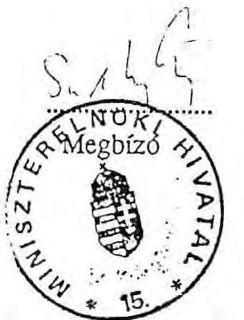
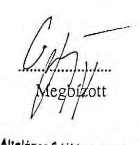

---

# Kiegészítés 

az 1991. március 20-án megkötött Magyar Köztársaság Miniszterelnöki Hivatala és az Általános Értékforgalmi Bank RT. közötti megállapodáshoz
1.) A Club Hotel Balatonföldvár ingatlan minimális árát a Megbízó
630.000.000.- Ft, azaz Hatszázharmincmillió forintban
határozza meg.
2.) A felek vállalják, hogy a rögzített előleg
80.000.000.- Ft, azaz Nyolcvanmillió forint
legyen, melyet az Általános Értékforgalmi Bank RT-nél helyeznek el.

Budapest, 1991. június 13.
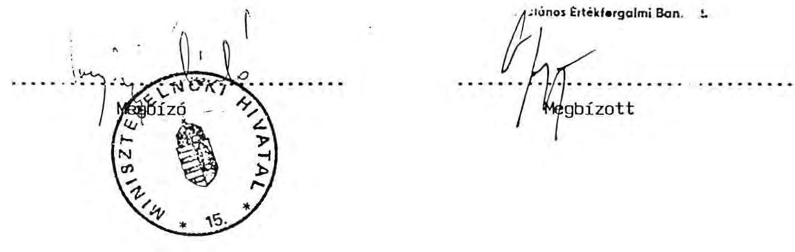

---

# Nyilatkozat 

a Miniszterelnöki Hivatal és A\&B Rt. közötti volt MSZMP ingatlanok eladására és bonyolítására vonatkozólag

A dobogókői ingatlan értékesítésére 1990.XI.07.-én kötött megállapodást a két fél. ( 1. sz. melléklet )
A megállapodás 3. pontja értelmében az A\&B Rt. az értékesítési ár 15 \%-át letétbe helyezte, amely 50 millió forint névértékű lakáskötvény konstrukcióban lett lekötve 6 hónapra, 31,5 \%-os kamattal. ( 2. sz. melléklet )
A hat hónap után járó kamat ( 7.918.750 .- Ft ) átutalásra került a Miniszterelnöki Hivatal felé. Jóllehet, az idézett megállapodás 3. sz. pontja szerint 6 hónap után az 50 millió Ft-os összeg bankunknak visszajárt volna, a későbbi üzlet sikerének reményében további 3 hónapra meghosszabbításra került a lakáskötvény konstrukció (34 \%). Az erre az időszakra járó kamatok is átutalásra kerültek, de ezt a Hivatal visszautalta a Banknak 1991. december 19-én, mivel 1991. november 11-én kelt levélváltással az üzletet közösen lezártuk annak eredménytelensége miatt.

Közben 1991. március 20-án megállapodás született a balatonföldvári ingatlan értékesítésére is, amelyben előleg elhelyezése nem került kikötésre, elkerülendő a sikertelen üzlet esetén a Bank további veszteségét. ( 3 sz. melléklet )
Ezt 1991. június 13-án egy kiegészítés keretében módosítottak a felek oly módon, hogy ismét elkülönítésre került az előleg, annak érdekében, hogy sikeres eladás esetén a Hivatalt ne érje kamatveszteség, természetesen sikertelenség esetén viszont a Bankunkat se érje kár. A lekötendő összeg 80 millió forint volt, amely 50 millió forint értékben a már lekötött lakáskötvényben maradt, valamint 30 millió forint értékben betétként lett elhelyezve azonos feltételek mellett.

---

Sikeres értékesítés esetén a lekötött 80 millió Ft és annak kamata az értékesítés árba beletartoztak volna, minimál ár feletti értékesítéskor a különbözetből 50-50 \%-ban részesültek volna a felek. Az AÉB RT. ezt a feltételt vállalta.
A 80 millió Ft utáni kamat 1991. dec.13-án vált volna esedékessé. Mivel a sikeres értékesítésre már nem volt kilátás a felek kölcsönösen felbontották a megállapodást és felszabadították a lekötött pénzeszközöket. ( 4. sz. melléklet ) Így kamatátutalásra nem kerülhetett sor. Ezen tranzakciók a bank egyes osztályai között belső könyvelési bizonylatokon kerültek lebonyolításra.

Megjegyezni kívánjuk továbbá, hogy a két megbízással összefüggő költségeink egy részét( 8. sz. melléklet ) kiszámláztuk a Hivatal felé, az a Hivatalnál jelentkező egyéb ingatlanbevételek befolyásának függvényében - Megállapodás szerint - még nem lett kiegyenlítve, azt még a Hivatal felülvizsgálja.
Ezek a költségszámlák 1991 évről tartalmaznak általunk kifizetett számlákat, ami a banknak jelentős pénzeszköz lekötését jelenti.

Továbbra is keressük külföldi képviseleteink és kapcsolatainkon keresztül potenciális vevők felkutatását. Jelenleg is tárgyalunk holland, német befektetőkkel is annak reményében, hogy az ingatlanok értékesítésre kerüljenek.

Budapest, 1992. március 26.
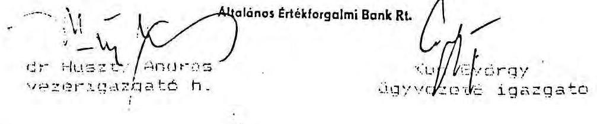

---

# DR. HUSZTY ANDRÁS úr, 

az Általános Értékforgalmi Bank Rt. vezérigazgató-helyettese

## Budapest

Tisztelt Huszty Úr!

Az 1991. október 31 -én kelt, hozzánk 1991. november 6-án érkezett, az Általános Értékforgalmi Bank Rt. és a Miniszterelnöki Hivatal között a dobogókői, illetve a balatonföldvári volt MSZMP ingatlanok értékesítését célzó "Megállapodások" közös megegyezéssel történő megszüntetését tartalmazó levelüket az alábbiak szerint visszaigazoljuk:

1. A Miniszterelnöki Hivatal és az ÁÉB Rt. között korábban a dobogókői, majd a későbbiekben a balatonföldvári volt MSZMP üdülők értékesítésére létrejött "Megállapodásokat" és azok kiegészítéseit a felek közös megegyezéssel felbontják és lezártnak tekintik.
2. A Miniszterelnöki Hivatal rögzíti, hogy az ÁÉB Rt. által előleg címén rendelkezésére bocsátott pénzeszközt felszabadítja és ÁÉB Rt. jogosult ezen összeget minden egyéb intézkedés mellőzésével birtokba venni.
3. Az ÁÉB Rt. az akciókkal kapcsolatban felmerült igazolt költségei erejéig jogosult számlát benyújtani a Hivatalnak, ugyanakkor ÁÉB Rt. tudomással bír arról, hogy ezen számlák kiegyenlítése a Miniszterelnöki Hivatalnál jelentkező egyéb ingatlan-bevételek befolyásának függvénye.
4. A Miniszterelnöki Hivatal az 1991. VIII. 27-én átutalt 4.344.445,-Ft kamatot visszautalja az ÁÉB Rt. részére.
5. A "Megállapodások" kapcsán korábban kiadott, személyre szóló intézkedési jogosultságokat a felek a mai naptól érvénytelennek tekintik.

Visszaigazolásunk szíves tudomásulvételét kérjük.

Budapest, 1991. november 11.
Üdvözlettel:
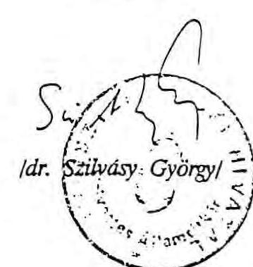

---

# MEGÁLLAPODÁS 

mely létrejött a mai napon a Magyar Köztársaság Miniszterelnöki Hivatala ( Budapest, Kossuth L.tér 4.) mint megbízó ( továbbiakban: Megbízó ) és a Postabank és Takarékpénztár Rt ( Budapest, József nádor tér 1. ) mint megbízott ( továbbiakban: Megbízott ) között, az alábbi feltételekkel:
1./ A Megbízó megbízza a Megbízottat a Megbízó feltétel nélküli rendelkezési körébe tartozó egyes ingatlanok, létesítmények értékesítésével, melyek jegyzékét az 1.sz.melléklet tartalmazza.
2./ A Megbízott vállalja az 1.sz. mellékletben részletezett ingatlanok, létesítmények értékesítését az alábbi módon:
2.1. Nyilvános pályázatot hirdet az értékesítésre.
2.2. Prekvalifikációs eljárás után döntésre terjeszti elő a Megbízó részére a beérkezett ajánlatokat. A prekvalifikáció részeként bank-, és egyéb információkat szerez be a pályázókról illetve minősíti az ajánlatokat.
2.3. A Megbízó döntése után előkészíti a szerződéskötést és azt lebonyolítja.
2.4. Biztosítja a szerződésből következő bankári szolgáltatásokat .
3./ A Megbízott a jelen szerződés aláírásától számított 3 naptári napon belül a Megbízó által rögzített minimális értékesítési ár 12,5 \%-át, 30.000.000 Forintot, azaz Harmincmillió Forintot a megbízó részére a Megbízott bankjában a 219-98076 számon nyitandó számlára átutalja. Amennyiben a pályázatok - a Megállapodás aláírását követően legkésőbb 6 hónappal - eredménytelenek, úgy a Megbízó az előleget 8 napon belül, kamatmentesen a megbízottnak visszafizeti.
4./ A nyilvános pályázat előkészítése, megszervezése és lebonyolítása címén, valamint az értékesítéssel összefüggő más munkadíjak és költségek részleges fedezésére a Megbízottat és alvállalkozóit a végső ár 2 \%-a illeti meg.

---

5./ Amennyiben a Megbízott az ügylet során a Megbízó által meghatározott minimális értékesítési ár feletti végső árat tud elérni a pályázaton győztes vevővel, úgy a két ár közötti különbség 50\%-a Megbízottat, 50 \%-a pedig a Megbízót illeti.
6./ A Megbízó vállalja,hogy az értékesítéshez szükséges jogi instrumentumokat, felhatalmazásokat és jogosultságának igazolását a Megbízott rendelkezésére bocsátja, valamint a pályázat lebonyolítására a Megbízottnak kizárólagosságot biztosít.
7./ A Megbízott vállalja, hogy nemzetközi bank-, és befektetési kapcsolatain keresztül legjobb tudása és információi szerint törekszik az ügylet lebonyolítására és a maximális vételár kialakítására.
8./ A Megbízó Tunyogi Lászlót, a Megbízott Pusztai Viktort jogosítja fel a szükséges jognyilatkozatok megtételére,az egyeztetések elvégzésére.
9./ A szerződő felek a jelen megállapodásból eredő jogvitáik intézésére a PKKB illetékességét kötik ki.

Budapest, 1991. április 08.
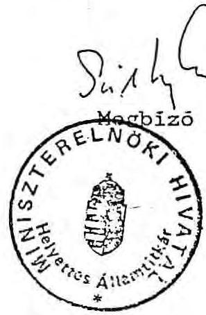

TH 1912400941892 \& 9409050 d
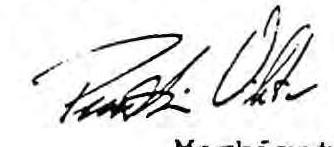

Megbízott

Budapest, 1992. augusztus