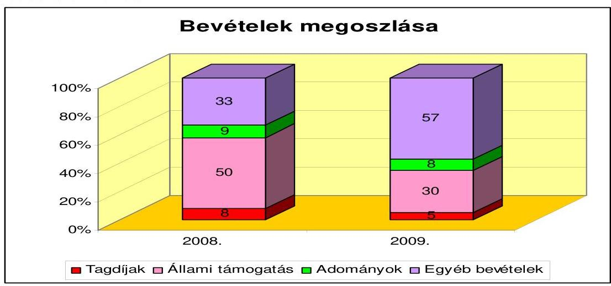
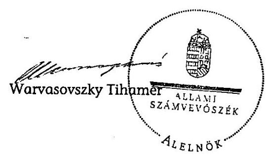

# ÁLLAMI   SZÁMVEVŐSZÉK 

## JELENTÉS

a Fidesz - Magyar Polgári Szövetség 2008-2009. évi gazdálkodása törvényességének ellenőrzéséről

---

3. Önkormányzati és Területi Ellenőrzési Igazgatóság
3.1. Államháztartáson Kívüli Szervezetek Ellenőrzési Főcsoport

Iktatószám: V -3005-023/2010.
Témaszám: 975
Vizsgálat-azonosító szám: V-0529
Az ellenőrzést felügyelte:
Dr. Elek János
általános főigazgató-helyettes
Az ellenőrzés végrehajtásáért felelős:
Dr. Elek János
általános főigazgató-helyettes
Az ellenőrzést vezette:
Horváth Balázs
főcsoportfőnök-helyettes
Az összefoglaló jelentést készítette:
Dr. Veress Tiborné
számvevő
Az ellenőrzést végezték:
Dr. Veress Tiborné Dr. Faragóné Tóth Mária Vincze B. Róbert számvevő számvevő tanácsos számvevő

# A témához kapcsolódó eddig készített számvevőszéki jelentések: 

## címe

Jelentés a Fiatal Demokraták Szövetsége 1991. évi gazdálkodása törvényességének ellenőrzéséről
Jelentés a Fiatal Demokraták Szövetsége 1992-1993. évi gazdálko- 236 dása törvényességének ellenőrzéséről
Jelentés a FIDESZ - Magyar Polgári Párt 1994-1995. évi gazdálko- 343 dása törvényességének ellenőrzéséről
Jelentés a FIDESZ - Magyar Polgári Párt 1996-1997. évi gazdálko- 9901 dása törvényességének ellenőrzéséről
Jelentés a FIDESZ - Magyar Polgári Párt 1998-1999. évi gazdálko- 0103 dása törvényességének ellenőrzéséről
Jelentés a FIDESZ - Magyar Polgári Párt 2000-2001. évi gazdálko- 0308 dása törvényességének ellenőrzéséről
Jelentés a FIDESZ - Magyar Polgári Szövetség 2002-2003. évi gaz- 0454 dálkodása törvényességének ellenőrzéséről
Jelentés a FIDESZ - Magyar Polgári Szövetség 2004-2005. évi gaz- 0653 dálkodása törvényességének ellenőrzéséről
Jelentés a FIDESZ - Magyar Polgári Szövetség 2006-2007. évi gaz- 0846 dálkodása törvényességének ellenőrzéséről

Jelentéseink az Országgyűlés számítógépes hálózatán és az Interneten a www.asz.hu címen is olvashatóak.

---

# TARTALOMJEGYZÉK 

BEVEZETÉS ..... 5
I. ÖSSZEGZŐ MEGÁLLAPÍTÁSOK, KÖVETKEZTETÉSEK, JAVASLATOK ..... 7
II. RÉSZLETES MEGÁLLAPÍTÁSOK ..... 9

1. A Párt gazdálkodásáról szóló 2008-2009. évi beszámolók ..... 9
1.1. A teljes vizsgálati időszakra érvényes megállapítások ..... 9
1.2. Bevételek ..... 9
1.3. Kiadások ..... 10
2. A Pártnak a beszámoló összeállítására és az azt alátámasztó könyvvezetésre vonatkozó belső szabályozása és gyakorlata ..... 11
2.1. A számviteli szabályozás rendszere ..... 11
2.2. A könyvvezetés gyakorlata, ennek összhangja a jogszabályokban és a belső szabályzatokban előírt követelményekkel ..... 12
2.3. A bizonylati elv és fegyelem, bizonylati rend érvényesülése ..... 13
3. A Párt bevételszerző, gazdálkodó tevékenysége ..... 14
3.1. A Párt gazdálkodásának szabályozottsága ..... 14
3.2. A Párt vagyonának elemei ..... 14
4. A gazdálkodással összefüggő, egyéb jogszabályokban foglalt előírások betartása ..... 15
4.1. A foglalkoztatás szabályszerűsége ..... 15
4.2. Személyi jellegű kifizetésekre vonatkozó jogszabályok betartása ..... 16
4.3. Az adózási, társadalombiztosítási és egyéb jogszabályok rendelkezéseinek érvényesítése ..... 16
5. A Párt belső ellenőrzésének rendszere ..... 17
5.1. A belső ellenőrzés rendszerének szabályozottsága, működése, eredményessége ..... 17
5.2. Az informatikai rendszer környezetének szabályozottsága és a belső kontrolljának múködése ..... 18
6. Az előző ellenőrzés megállapításaira tett intézkedések ..... 19
MELLÉKLETEK
7. számú A FIDESZ - Magyar Polgári Szövetség 2008. évi pénzügyi beszámolója
8. számú A FIDESZ - Magyar Polgári Szövetség 2009. évi pénzügyi beszámolója

---

.

---

# RÖVIDÍTÉSEK JEGYZÉKE 

## Jogszabályok rövidítése

Art.
Gjt.
Párttörvény
Számv. tv.
Szja törvény
Tbj.
Vagyontörvény

Az adózás rendjéről szóló 2003. évi XCII. törvény
A gépjármúadóról szóló 1991. évi LXXXII. törvény
A pártok múködéséről és gazdálkodásáról szóló 1989. évi XXXIII. törvény
A számvitelről szóló 2000. évi C. törvény
A személyi jövedelemadóról szóló 1995. évi CXVII. törvény
A társadalombiztosítás ellátásaira és a magánnyugdíra jogosultakról, valamint e szolgáltatások fedezetéről szóló 1997. évi LXXX. törvény

Az állami vagyonról szóló 2007. évi CVI. törvény

## Névrövidítések

APEH
ÁSZ
KH
MFB Zrt.
OE
OV
Párt
SZB

Adó- és Pénzügyi Ellenőrzési Hivatal
Állami Számvevőszék
Központi Hivatal
Magyar Fejlesztési Bank Zrt.
Országos Elnökség
Országos Választmány
Fidesz - Magyar Polgári Szövetség
Számvizsgáló Bizottság

---

.

---

# JELENTÉS 

## a Fidesz - Magyar Polgári Szövetség 2008-2009. évi gazdálkodása törvényességének ellenőrzéséről

## BEVEZETÉS

Az Állami Számvevőszékről szóló 1989. évi XXXVIII. törvény 5. §-a, valamint a pártok múködéséről és gazdálkodásáról szóló - többször módosított - 1989. évi XXXIII. törvény (párttörvény) 10. § (1) bekezdése alapján a pártok gazdálkodása törvényességének ellenőrzésére az Állami Számvevőszék (ÁSZ) jogosult. E törvényi felhatalmazás alapján az ÁSZ a 2010. évi ellenőrzési tervének megfelelően vizsgálta a Fidesz - Magyar Polgári Szövetség (Párt) 2008-2009. évi gazdálkodása törvényességét.

A Párt a hivatalosan közzétett éves beszámolói alapján 2008-ban 1677736 ezer Ft 2009-ben 2788464 ezer Ft bevételről adott számot. A kiadásait 2008-ban 1789556 ezer Ft, 2009-ben 2721959 ezer Ft főösszeggel közölte. Az ellenőrzést a párttörvényben meghatározott kétévenkénti ellenőrzési kötelezettség indokolta.

Az ellenőrzés célja annak megállapítása volt, hogy:

- a Párt által készített és a Magyar Közlönyben, valamint a Párt internetes honlapján közzétett éves beszámolók a törvényi előírásoknak megfelelnek-e, a könyvvezetéssel és a valósággal megegyező adatokat tartalmaznak-e;
- a könyvvezetés és a gazdálkodás során betartották-e a számvitelről szóló többször módosított - 2000. évi C. törvény (Számv. tv.) és az egyéb jogszabályok rendelkezéseit, a belső előírásokat;
- a Párt a múködéséhez szabályszerűen igénybe vehető forrásokat használt-e fel, a párttörvényben engedélyezett gazdálkodó tevékenységet folytatott-e.

Az ellenőrzés körülményeit illetően rögzíteni szükséges ${ }^{1}$, hogy:

- a párttörvény 1. sz. melléklete szerinti beszámoló mintához magyarázatot, útmutatót nem készítettek a jogalkotók, így ennek kitöltése pártonként - kialakított számviteli politikájuknak megfelelően - eltérő lehet;

[^0]
[^0]:    ${ }^{1}$ Az ÁSZ évek óta javasolja a Kormánynak a pártok ellenőrzéséről készített jelentéseiben a párttörvény módosítását.

---

- a beszámoló minta a számviteli törvény rendelkezéseivel nem harmonizál, nem felel meg sem a mérleg, sem az eredmény-kimutatás követelményeinek.

Az ÁSZ a párttörvény módosításáig a jelenleg hatályos rendelkezéseknek megfelelő - egységes módszertani alapokra helyezett - gyakorlattal folytatja a pártok gazdálkodása törvényességének ellenőrzését. Az ellenőrzést a pénzügyiszabályszerűségi ellenőrzés módszertani szabályai szerint, a pártok gazdálkodása törvényességének ellenőrzésére kiadott segédletben foglalt egységes követelmények alapján végeztük.

Az ellenőrzésnél az átfogó lényegességi küszöb mértékét a pénzügyi beszámoló bevételi főösszegének 2\%-ában határoztuk meg, továbbá specifikus lényegességi küszöböt alkalmaztunk az egyéb hozzájárulások, adományok esetében a párttörvény 1. számú mellékletének előírásaira tekintettel (belföldi hozzájárulás, adomány 500 ezer Ft, külföldi 100 ezer Ft felett).

A helyszíni ellenőrzésre 2010. október 26 - december 6 között, a Párt Budapest VIII. Szentkirályi u. 18. szám alatti irodájában került sor.

---

# I. ÖSSZEGZŐ MEGÁLLAPÍTÁSOK, KÖVETKEZTETÉSEK, JAVASLATOK 

A Párt a 2008. és 2009. évi gazdálkodásáról szóló beszámolóit a párttörvényben előírt határidőn belül a Hivatalos Értesítőben és az internetes honlapján közzétette. A beszámolók megbízható és valós képet mutattak a Párt gazdálkodásáról. A Párt a Számv. tv.-ben előírt, számviteli politikával és kapcsolódó szabályzatokkal, valamint számlarenddel rendelkezett. A szabályzatok megfeleltek a Számv. tv. előírásainak és a Párt sajátosságainak.

A kettős könyvvezetést regisztrált külső könyvelési szolgáltató végezte megbízási szerződés alapján. A Számv. tv. előírásaival összhangban választott könyvvezetés a Párt használatában lévő eszközökben és azok forrásaiban bekövetkezett változásokat a valóságnak megfelelően, folyamatosan, zárt rendszerben, áttekinthetően mutatta. A könyvvezetésben érvényesültek a Számv. tv.-ben meghatározott elvek. Az analitikus nyilvántartások szabályszerű vezetéséről és főkönyvi egyeztetéséről a Számv. tv. és a belső szabályozások előírásainak megfelelően gondoskodtak. Az éves zárlati munkát megalapozó leltározást a leltározási és leltárkészítési szabályzatban előírtak szerint végrehajtották, a leltárak kiértékelése során eltérést nem állapítottak meg. Az éves zárást a Számv. tv.-ben és a számlarendben foglaltak szerint határidőben, szabályszerűen elvégezték. A könyvviteli nyilvántartásokban rögzített gazdasági eseményeket szabályszerűen kiállított bizonylatok támasztották alá. A gazdasági eseményeket időrendben, zárt rendszerben rögzítették. A bizonylatok alaki és tartalmi kellékeire vonatkozó Számv. tv.-i követelmények teljesültek. A szigorú számadású nyomtatványok nyilvántartásba vételi kötelezettségét teljesítették. A Pártnál a Számv. tv. előírásait a bizonylati elvre és bizonylati fegyelemre vonatkozóan betartották. A kötelezettségvállalás és az utalványozás gyakorlata megfelelt a szabályozásban előírtaknak. A beszámolót, a leltárt, a főkönyvi könyvelést, az azt alátámasztó bizonylatokat a Párt központjában megőrizték.

A Párt bevételszerző, gazdálkodó tevékenysége során - könyvviteli nyilvántartásai szerint - betartotta a párttörvényben előírt forrásszerzési és gazdálkodási tilalmakat.

---

A Párt 2008. évi bevételeinek fele, 2009. évben 30\%-a költségvetési támogatás volt. A Párt saját bevételei szabályozott tagdijfizetésből, egyéb hozzájárulásokból és adományokból, adott évben felvett hitel, kölcsön, faktorkötelezettség öszszegéből, valamint bérelt ingatlan bérbeadásából, emlékbélyegek és tárgyi eszközök értékesítéséből, a KDNP-től megállapodás alapján kapott összegből, továbbá pénzintézeti kamatból álltak. A Párt nem pénzbeli vagyoni hozzájárulásként 2008-ban 9384 ezer Ft, 2009-ben 8225 ezer Ft összegű támogatást kapott önkormányzatok által nyújtott kedvezményes ingatlan bérleti díj formájában. A Párt 2009-ben az állami vagyonról szóló törvény alapján huszonkét ingatlant vásárolt 200827 ezer Ft értékben. A vásárláshoz a törvény által biztosított, az MFB Zrt. által folyósított hitelt vették igénybe, amelynek fedezeteként a jelzálogjogot bejegyeztették.

A korábbi ÁSZ ellenőrzés által feltárt bérelt ingatlan bérbeadási tevékenységet a Párt megszüntette, amelynek 2008. január, február hóra áthúzódó hatásaként 15996 ezer Ft bevétellel szemben 6805 ezer Ft rezsi kiadás és 9191 ezer Ft követelés elengedés állt. Utóbbi intézkedéssel a Pártnak nem keletkezett olyan eredménye, amelyre alkalmazható a párttörvény 6. § (5) bekezdésében meghatározott jogkövetkezmény.

A munkavállalókat, a munkáltatói jogot gyakorló szabályszerű munkaszerződések alapján foglalkoztatta. A munkabéreket központilag számfejtették. A személyi jellegű kifizetések körében a munkavállalók adómentes mértékben étkezési utalványt kaptak. Az adózási, társadalombiztosítási jogszabályok munkaviszonnyal összefüggő előírásait, a havi és éves adatszolgáltatási, bevallási és befizetési kötelezettségét a Párt teljesítette, a foglalkoztatottak biztosítási jogviszonyában történt változásokat határidőben bejelentette. A kötelező nyilvántartásokat vezették. A Párt eleget tett a cégautóadó, valamint a tulajdonában álló telefonok magáncélú használatából eredő adó- és járulékbefizetési, bevallási és fizetési kötelezettségének. A kiadott APEH folyószámla kivonatok szerint a Pártnak befizetési késedelme, költségvetési tartozása nem volt.

A belső ellenőrzés rendszerét a Párt az alapszabályban, a pénzügyi és a költségvetési gazdálkodási szabályzatban szabályozta. Az SZB az ügyrendi előírásokkal összhangban folytatta le ellenőrzéseit a vizsgált időszakban. A vezetői és a munkafolyamatba épített ellenőrzés szabályai megfelelőek voltak, működése segítette a Párt szabályszerű könyvvezetését és a beszámoló készítését. A gazdálkodással összefüggő informatikai rendszer működtetését szabályozták. Az előző ÁSZ ellenőrzés felhívásában kezdeményezett intézkedéseket a Párt maradéktalanul végrehajtotta.

A helyszíni ellenőrzés tapasztalatainak hasznosítása - a közigazgatási és igazságügyi miniszter által jelzett együttmúködés - mellett javasoljuk

# a Kormánynak 

Terjessze elő a pártfinanszírozás átláthatóságának, a pártok elszámoltathatóságának fokozott érvényesítése érdekében a párttörvény módosítását, figyelemmel a pártok számviteli nyilvántartási és beszámolási rendszerét érintő ellentmondások feloldására, amelyek a párttörvény és a Számv. tv. között évek óta fennállnak.

---

# II. RÉSZLETES MEGÁLLAPÍTÁSOK 

## 1. A PÁrt GAZDÁlKODÁSÁról SZÓLÓ 2008-2009. ÉVI BESZÁmolÓK

### 1.1. A teljes vizsgálati időszakra érvényes megállapítások

A Párt a 2008. évi gazdálkodásáról szóló beszámolót 2009. április 17-én a Hivatalos Értesítő 16. számában, a 2009. évi beszámolót 2010. április 9-én a Hivatalos Értesítő 25. számában tette közzé a párttörvény 9. § (1) bekezdésében előírt határidőn belül, a párttörvény 1. számú mellékletében meghatározott minta szerint (1-2. számú melléklet). A Párt mindkét évi beszámolóját internetes honlapján is nyilvánosságra hozta 2009. április 16-án és 2010. április 15-én. Az OV a Párt éves gazdálkodásáról készített beszámolókat az alapszabály 52. § (1) bekezdésének k) pontja szerinti hatáskörében mindkét évben - 2009. január 17-ei és 2010. március 12-ei - határozatával elfogadta.

A Párt a hatályos számviteli politikájában és számlarendjében szabályozta a beszámoló összeállításának rendjét, a beszámoló sorok és főkönyvi számlák kapcsolatát. Az éves beszámolókat a vonatkozó főkönyvi számlák adatai, analitikus nyilvántartásai alátámasztották. A Párt érvényt szerzett a számviteli alapelveknek, a közzétett beszámolók megbízható, valós képet adtak az éves gazdálkodásról.

### 1.2. Bevételek

A Párt a beszámoló bevételeit belső szabályozásával összhangban a 9. számlaosztályban nyilvántartott - a párttörvény 1. számú melléklet minta sorainak megfelelően kialakított - főkönyvi számlák adataiból, valamint a 4. számlaosztályban szerepeltetett, adott évben felvett hitel és kölcsön összegekből állította össze.

A tagdíjak beszámoló sor közzétett adata mindkét évben megegyezett a főkönyvi könyvelésben szereplő összeggel, amelynek adatait analitika támasztotta alá. A tagdíjakhoz kapcsolódó bizonylatok alapján a befizető személye és a jogcím minden esetben megállapítható volt. A beszámoló soron csak tagdíjak fogalomkörébe tartozó összegek szerepeltek. A tagdíj megállapítás feltételeit a Párt alapszabálya rögzítette, mérsékléséről, illetve annak elengedéséről az OV határozhatott, a befizetések a szabályozással összhangban teljesültek.

Az állami költségvetésből származó támogatásokat a főkönyvi könyvelésben kimutatott és a bankszámla kivonaton szereplő, a Magyar Államkincstár által ténylegesen átutalt összeggel egyezően közölték. A párttörvény 5. § (2) bekezdése alapján kapott 2008. és 2009. évi támogatás egyezett a zárszámadási törvényekben (2009. évi CXXIX. tv. és 2010. évi XCVIII. tv.) szereplő összeggel.

Az egyéb hozzájárulások, adományok beszámoló sor adattartalmát a Párt a párttörvény előírásának megfelelően tovább részletezte. A Pártnak a vizsgált években belföldi jogi személyektől, valamint belföldi és külföldi magánszemé-

---

lyektől, valamint belföldi jogi személynek nem minősülő gazdasági társaságoktól és társasháztól származott ezen a jogcímen bevétele. A Párt önellenőrzés keretében tárt fel 2008. évben 9,4 ezer Ft összegben névtelen adományt, amelyből 2,4 ezer Ft befizetőit azonosította, a párttörvény 4. § (4) bekezdésére tekintettel a 7 ezer Ft-ot a központi költségvetés részére befizette.

Egyéb hozzájárulások, adományok belföldi jogi személyektől beszámoló sor adata egyezett a vonatkozó főkönyvi számlák összesített egyenlegével. A Párt a közzétett beszámolókban a párttörvény előírásának megfelelően nevesítette azokat a támogatást nyújtókat (2008. évben tíz, 2009. évben kilenc), amelyektől az egy naptári év alatt kapott pénzbeli, valamint nem pénzbeli vagyoni hozzájárulás értéke meghaladta az 500 ezer Ft-ot. A beszámolókban közölték az önkormányzatoktól kedvezményesen bérelt ingatlanok tényleges és a piaci bérleti dijának különbözeteként kapott nem pénzbeli vagyoni hozzájárulás értékét.

Az egyéb hozzájárulások, adományok jogi személynek nem minősülő gazdasági társaságoktól, illetve társasháztól közölt adatai mindkét ellenőrzött évben megegyeztek a könyvviteli nyilvántartásban kimutatott, alapbizonylattal alátámasztott összegekkel.

Egyéb hozzájárulások, adományok magánszemélyektől címen szereplő összeg mindkét évben megegyezett a számlacsoport számláinak összevont egyenlegével. Az éves beszámolókban a párttörvény előírásának megfelelően név szerint feltüntették az egy naptári évben legalább 500 ezer Ft, illetve 100 ezer Ft összeget adományozó belföldi és külföldi személyek nevét és az adományozott összeget (2008. évben tizenegy, 2009. évben kilenc belföldi, továbbá 2009. évben egy külföldi magánszemély).

Az egyéb bevételek beszámoló soron a számviteli politika előírásai szerint szerepeltették az adott évben felvett hitel, kölcsön, faktorkötelezettség összegét, valamint a bérelt ingatlan bérbeadásából, emlékbélyegek és tárgyi eszközök értékesítéséből származó bevételeket, a KDNP-től megállapodás alapján kapott öszszeget, továbbá pénzintézettől kapott kamatokat. A beszámoló soron szereplő összeg megegyezett a kapcsolódó főkönyvi számlákon kimutatott, tényleges bevétellel.

# 1.3. Kiadások 

A beszámolóban a kiadásokat a kettős könyvvitel rendszerében másodlagos könyveléssel vezetett 6. számlaosztály - számviteli politikában meghatározott számláinak adataiból állították össze. A 6. számlaosztályban a számlák tartalmának meghatározására a párttörvény 1 . számú mellékletének figyelembevételével került sor.

A támogatás egyéb szervezeteknek beszámolósoron közölt adat 2008. évben megegyezett a főkönyvi számla egyenlegével, tartalmában kizárólag bíróságon nyilvántartásba vett alapítványnak adott támogatást tartottak nyilván. Egyéb szervezetnek 2009. évben a Párt nem nyújtott támogatást.

Múködési kiadások között a Párt rezsi költségeket, bérleti díjakat, a munkavállalók bér- és járulékköltségeit, személyi jellegű egyéb kifizetéseket, anyagköltségeket és a múködéshez kapcsolódó igénybevett szolgáltatásokat számolt el

---

mindkét évben, így érvényesült a működési kiadások jogcímazonossága. A beszámoló sor adata 2008. és 2009. években egyezett a Párt belső előírásaiban meghatározott főkönyvi számlák egyenlegeinek összesített adatával.

Az eszközbeszerzés címén közzétett 2008-2009. évi adatok egyeztek a vonatkozó főkönyvi számlák összesített adatával. A Párt az állami vagyonról szóló 2007. évi CVI. törvény 68. § (4) bekezdése alapján 22 állami tulajdonú ingatlant vásárolt, ezen túl egy önkormányzati ingatlan tulajdonjogát szerezte meg.

A politikai tevékenység kiadásai beszámoló soron a Párt a számlarendjében meghatározottaknak megfelelően a hirdetés-, propaganda- és rendezvényköltségek, az országgyűlési és a helyi önkormányzati választási költségek, valamint a politikai tevékenységgel kapcsolatos egyéb kiadások főkönyvi számláin rögzített adatait tette közzé következetesen - egy tétel kivételével - mindkét évben. A Párt 2008-ban a beszámoló egyéb hozzájárulások, adományok bevételi során mutatott ki 420 ezer Ft összegű hirdetési kedvezményt, amelyet tévesen a politikai tevékenység kiadásai beszámoló soron is, mint csökkentő tételt figyelembe vett. A könyvelési hiba a Párt beszámolójában lényeges eltérést nem okozott.

Egyéb kiadások között bankköltséget, árfolyamveszteséget, hitelkamatot, illetéket, közjegyzői díjat, kerekítés miatti eltéréseket számoltak el. A beszámoló sor adata mindkét évben megegyezett a vonatkozó főkönyvi számlák összevont egyenlegeivel.

# 2. A PÁrTNAK A BESZÁmoló ÖSSZEÁllítÁsÁra és AZ AZT ALÁTÁMASZTÓ KÖNYVVEZETÉSRE VONATKOZÓ BELSŐ SZABÁLYOZÁSA ÉS GYAKORLATA 

### 2.1. A számviteli szabályozás rendszere

A Párt a számviteli szabályzatait 2008. január 1-jével megújította, amelyeket a Számv. tv. 14. § (12) és a 161. § (4) bekezdésével és alapszabályával összhangban a Párt képviseletére jogosultak - gazdasági vezető és könyvelő (külső megbízott) - léptettek hatályba. A Párt alapszabálya szerint a képviseleti, az aláírási jogkör a Párttal munkaviszonyban, illetve munkavégzésre irányuló egyéb jogviszonyban álló személyekre oly módon ruházható át, hogy a meghatalmazottak ketten együtt járhatnak el, képviselhetik a Pártot.

A Számv. tv. 14. § (3) bekezdésben előírt számviteli politika a hatályos jogszabályi előírásoknak megfelelően rögzíti: a könyvvezetés módját; az évközi és év végi zárlatok időpontjait; feladatait; az éves beszámoló készítésének rendjét, időpontját; az értékcsökkenés elszámolását; a megbízható és valós képet lényegesen befolyásoló hiba nagyságát; az ismételt közzététel előírásait.

Az eszközök és források leltárkészítési és leltározási szabályzata, figyelemmel a Számv. tv. 69. § (1)-(2) bekezdéseire tartalmazza: a leltározás fordulónapját; a leltározás megszervezését; módját; a dokumentumok feldolgozási-, megőrzési módját; a leltárértékelés; selejtezés rendjét.

---

Az eszközök és források értékelési szabályzatban meghatározták a törvényi előírásokkal összhangban az eszközök bekerülési értékének tartalmát, az értékelési módokat, eljárásokat és az amortizációs politikát, az állományból történő kivezetés dokumentumait és a nem pénzbeli vagyoni hozzájárulásokra a párttörvény 4. § (5) bekezdésében előírt értékelésnél alkalmazandó eljárást.

A pénzügyi szabályzat tartalmazza a Számv. tv. 14. § (8)-(10) bekezdésében előírtaknak megfelelően a pénzforgalom lebonyolításának rendjét, a pénzkezelés személyi és tárgyi feltételeit, a pénzkezelés felelősségi szabályait a készpénzben és a bankszámlán tartott pénzeszközök közötti forgalom előírásait, a pénztárellenőrzés eljárási és gyakorisági rendjét, a pénzszállítás feltételeit, valamint a pénzkezeléssel kapcsolatos bizonylati rendet és a pénzforgalommal kapcsolatos nyilvántartási szabályokat. A Párt a Számv. tv-ben szabályozott módon határozta meg a napi készpénz záró állomány mértékét a vizsgált években.

A számviteli politikához hatályos számlarend kapcsolódott, amely a Számv. tv. 161. § (2) bekezdésében előírtaknak megfelelő tartalommal készült, figyelembe véve a Párt működési sajátosságait. A számlarend tartalmazza minden alkalmazott számla számát, megnevezését, rögzítették és meghatározták a számla tartalmát, ha az a számla megnevezéséből nem következett. A Párt az éves beszámoló szerkezetének megfelelően az elsődlegesen 1-es, 5-ös és 8-as számlaosztályokban könyvelt tételeket másodlagosan a 6-os számlaosztályban is rögzítette, amelyet számlarendjében szabályozott. Ennek keretében kijelölték a működési kiadások, az eszközbeszerzések, a politikai tevékenység és az egyéb kiadások kapcsolódó főkönyvi számláit. Megteremtették a Számv tv. 161. § (3) bekezdésében előírt egyeztetési kötelezettséget az analitikus nyilvántartások és a főkönyvi könyvelés között.

A számviteli szabályzatok megfelelnek a párttörvény gazdálkodással és beszámoló készítéssel összefüggő sajátos, valamint a Számv. tv. vonatkozó előírásainak.

# 2.2. A könyvvezetés gyakorlata, ennek összhangja a jogszabályokban és a belső szabályzatokban előírt követelményekkel 

A könyvvezetés a vizsgált időszakban a Számv. tv. 159. § előírásaival összhangban kialakított kettős könyvvitel rendszerében központilag, az alapbizonylatok számítógépes feldolgozásával történt, mindkét vizsgált évben azonos számítógépes programmal. A főkönyvi számlák és az analitikus nyilvántartások kapcsolata megfelelő volt. A gazdasági eseményeket a könyvvezetés idősorosan rögzítette, a zárlati munkálatokat határidőben végrehajtották.

A beszámoló elkészítésekor és a könyvvezetés során érvényesültek a Számv. tv. 15. § és 16. § (1)-(3) bekezdésben szabályozott számviteli alapelvek, egy esetet kivéve, amikor is a teljesség elve sérült, mivel 2008. évben a 420 ezer Ft hirdetési kedvezményt a Párt az 5-ös számlaosztályban könyvelte követel forgalomként és nem a 9-es számlaosztályban, mint egyéb rendkívüli bevétel. A beszámolóban a kedvezmény összegét kimutatták az „500 ezer Ft alatti belföldi jogi személyektől kapott adomány" soron, mivel azonban az 5-ös számlaosztályban is könyvelték, így a beszámoló politikai tevékenység kiadás sora 420 ezer Ft-tal kevesebb ösz-

---

szeget tartalmazott, amely a számviteli politika szerint nem minősült jelentősnek.

A Párt számlakijelölési gyakorlata a rövid- és hosszúlejáratú kötelezettségek kivételével megfelelt a számviteli törvényi és a számlarendi előírásoknak, amely főkönyvi számlánként szabályszerűen külön választja az éven belüli és túli hiteleket.

A Párt a rövidlejáratú kötelezettségeken tartotta nyilván a faktor kötelezettséget, amelynek futamideje négy év. A teljes hitelállományt a rövid lejáratú hitelek között szerepeltették annak ellenére, hogy azok lejárati ideje $4,5,15$ és 25 év.

A Párt a Számv tv. 161. § (2) bekezdés c) pontban foglaltakkal összhangban az alkalmazott főkönyvi számlákhoz rendelt analitikák köréről, vezetésének módjáról a számviteli politikában, a számlarendben és a pénzügyi szabályzatban rendelkezett. A vizsgált időszakban a főkönyvi számlákhoz kapcsolódóan az immateriális javak és aktivált tárgyi eszközök, a szállítók, a vevők, a tagdíj bevételek, a hitelek és fizetendő kamatok, a bankszámla és a készpénzforgalom, az elszámolásra kiadott előlegek és az egyéni bérek- és járulékok analitikus nyilvántartását vezették. Az analitikus nyilvántartások és a főkönyvi könyvelés között az értékadatok számszerú egyeztetése a Számv. tv. 161. § (3) bekezdés előírásának megfelelően megtörtént.

Az éves zárást megalapozó leltározást 2008-2009. évben a Számv tv. 69. § (1)(2) bekezdésben, valamint a leltározási szabályzatban előírtak szerint teljes körűen végrehajtották. A Párt leltározási kötelezettségének mindkét vizsgált évben eleget tett, az eszközök és források értékelését a hitelek minősítése kivételével december 31-i fordulónappal elvégezték mind a KH-ban, mind a helyi szervezeteknél. A leltározások során leltárkülönbözetet nem mutattak ki. Az éves zárást a Számv. tv. 164. § (1)-(2) bekezdésében és számlarendben foglaltak szerinti határidőben végrehajtották, amelynek keretében a beszámolókat alátámasztó főkönyvi kivonatokat a Pártnál elkészítették.

A könyvvezetést és a beszámoló összeállítását mindkét ellenőrzött évben ugyanaz a külső vállalkozás végezte, határozatlan idejű megbízási szerződés alapján. A számviteli szolgáltatást végző szervezet vezetője a Számv. tv. 151. § (1) bekezdés szerint meghatározott képesítéssel rendelkezik, a Magyar Könyvvizsgálói Kamara nyilvántartásában szerepel. A könyvelő kft. a Párt által bérelt irodában végezte tevékenységét, az operatív információáramlás feltételei biztosítottak voltak. A Párt könyvelését végző kft. gondoskodott az alkalmazott szoftverek jogszabályi megfeleltetéséről.

# 2.3. A bizonylati elv és fegyelem, bizonylati rend érvényesülése 

A Párt a bizonylati rendjét számviteli politikájában és az ahhoz kapcsolódóan elkészített egyéb számviteli és gazdálkodási szabályzataiban határozta meg. A számviteli nyilvántartásban a könyvelt gazdasági múveleteket szabályszerűen kiállított bizonylatokkal támasztották alá, a Számv. tv. 165. § (1) - (2) bekezdésében foglalt előírásoknak megfelelően. Az egyes gazdasági múveletek, események bizonylatainak adatait a Számv. tv. 165. § (3) bekezdésében meghatározott időpontig rögzítették. A könyvvezetés során a Számv. tv. 165. § (4) bekezdés elő-

---

írására figyelemmel gondoskodtak a főkönyvi könyvelés és a bizonylatok adatai közötti egyeztetés és ellenőrzés logikailag zárt rendszerben való biztosításáról.

A számviteli bizonylatok hitelesek, megbízhatók és helytállóak voltak, megfelelve a Számv. tv. 166. §-ában rögzített szabályoknak. A bizonylatok alaki és tartalmi kellékei eleget tettek a Számv. tv. 167. § (1) bekezdésében felsoroltaknak.

A Párt kötelezettségvállalási és utalványozási rendjét a költségvetési gazdálkodási szabályzatban írta elő, amelyet a gyakorlatban annak megfelelően érvényesített.

A Párt a Számv tv. 168. § (3) bekezdés szigorú számadású nyomtatványok nyilvántartásba vételi kötelezettségének eleget tett. A bizonylatok megőrzéséről a Számv. tv. 169. § előírásainak megfelelően gondoskodtak.

# 3. A PÁrt bevéteLSZERző, GAZDÁlKODÓ TEVÉKENYSÉGE 

### 3.1. A Párt gazdálkodásának szabályozottsága

A hatályos alapszabály, a pénzügyi és a költségvetési gazdálkodási szabályzat határozza meg a Párt gazdálkodási rendjét. Az alapszabály 86. §-ában rögzítették a Párt bevételeinek és gazdálkodó tevékenységének jogcímeit.

A helyi szervezetek az alapszabály 22. § f) és g) pontja értelmében az OV által megállapított módon részesednek a Párt költségvetéséből, valamint bevételeikkel - az OV által meghatározott elvek és szabályok szerint - gazdálkodnak. A szervezetek pénzgazdálkodása mind a pénzintézetnél vezetett folyószámlák, mind a pénztár tekintetében a KH -on keresztül történik a költségvetési gazdálkodási szabályzat 14-15. §-ai szerint.

Az OE kezeli a Párt vagyonát, gyakorolja a tulajdonosi jogokat az alapszabály 60. § (1) bekezdés k) pontja értelmében. A 60. § (1) bekezdés l) és m) pontjai alapján gondoskodik a Párt költségvetésének előkészítéséről, tervezetének az OV elé történő beterjesztéséről és a jóváhagyott költségvetés végrehajtásáról, továbbá beszámol utóbbiról az OV-nak.

### 3.2. A Párt vagyonának elemei

A Párt befolyt és beszámolókban kimutatott bevételei a vizsgált időszakban: tagdíjak, állami költségvetési támogatások, valamint egyéb hozzájárulások, adományok, emlékbélyegek értékesítése, tulajdonában nem álló ingatlan bérbeadása, kölcsönök igénybevétele, hitelfelvétel, tárgyi eszközök értékesítése, káreseményekkel kapcsolatos bevételek és kamatbevételek.

A Párt a vizsgált időszakban a könyvviteli nyilvántartások szerint a párttörvény 4. §-ában meg nem engedett forrásból származó vagyoni hozzájárulást nem fogadott el, a párttörvény 6. §-ában nem engedélyezett gazdálkodó tevékenységet nem folytatott, gazdasági társaságban részesedést nem szerzett, vállalatot, egyszemélyes kft-t nem alapított, a párttörvény által tiltott értékpapírt nem vásárolt.

---

A korábbi ÁSZ ellenőrzés által feltárt bérelt ingatlan bérbeadási tevékenységet a Párt megszüntette, amelynek 2008. január, február hóra áthúzódó hatásaként 15996 ezer Ft bevétellel szemben 6805 ezer Ft rezsi kiadás és 9191 ezer Ft követelés elengedés állt. Utóbbi intézkedéssel a Pártnak nem keletkezett olyan eredménye, amelyre alkalmazható a párttörvény 6. § (5) bekezdésében meghatározott jogkövetkezmény.

A Párt országosan, 2008-ban 74, 2009-ben 84 önkormányzati tulajdonú ingatlant használt. A bérelt ingatlanok 54, illetve $55 \%$-át piaci áron bérelte, a többit kedvezményes díjfizetési kötelezettséggel használta. A piaci és a ténylegesen fizetett bérleti díj különbözete nem pénzbeli vagyoni hozzájárulásnak minősült, amelynek értékét a Párt a párttörvény 4. § (5) bekezdésében előírtak szerint meghatározta, könyveiben rögzítette és a beszámolók egyéb hozzájárulások, adományok, belföldi jogi személyektől sorain 2008. évben 9384 ezer Ft-tal, 2009ben 8225 ezer Ft-tal szerepeltette.

A Párt a párttörvény 6. § (1) bekezdés a) pontjában engedélyezett tevékenységek keretein belül, az OE 3/2008. számú határozatának megfelelően 10 ezer Ft névértékű emlékbélyegeket értékesített, amelyből szabályosan 2008-ban 306890 ezer Ft, 2009-ben 93110 ezer Ft bevétele származott. A Párt gazdálkodásából származó bevételek megegyeztek a vonatkozó bevételi főkönyvi számlák egyenlegeivel.

A Párt az állami vagyonról szóló 2007. évi CVI. törvény 68. § (4) bekezdése alapján 2009-ben vásárolt 22 állami tulajdonú ingatlanokra a hivatkozott törvény 68. § (1) bekezdés előírása alapján 200827 ezer Ft összegű kedvezményes kamatfeltételű hitelt vett igénybe a MFB Zrt-től. ${ }^{2}$ Ebből 2009-ben 20414 ezer Ft tőkét törlesztettek.

# 4. A GAZDÁLKOdÁSSAL ÖSSZEFÜGGŐ, EGYÉB JOGSZABÁLYOKBAN FOGLALT ELŐÍRÁSOK BETARTÁSA 

### 4.1. A foglalkoztatás szabályszerűsége

A Pártnál 2008-2009. években a feladatok ellátása határozatlan idejű - a Munka Törvénykönyvéről szóló 1992. évi XXII. törvény 76. § (1)-(6) bekezdésében szabályozott tartalmú - munkaszerződés szerint történt. A munkavállalók részletes feladatait a munkaköri leírásokban rögzítették. A pénzügyi- számviteli területen dolgozók megfelelő szakmai végzettséggel, gyakorlattal rendelkeztek és a munkaszerződéseket a munkáltatói jogokat gyakorló írta alá.

Az alkalmazottak bérszámfejtését, továbbá az adó- és társadalombiztosítási jogszabályokban előírt levonási, bevallási és adatszolgáltatási kötelezettség teljesítését a könyvviteli nyilvántartás vezetésére megbízott szolgáltató látta el.

[^0]
[^0]:    ${ }^{2}$ Az ingatlanok adásvételi szerződései IV. ingatlan-nyilvántartási rendelkezések rész alapján a tárgyi ingatlanra az MFB Zrt. részére a teljes vételár és járulékai erejéig jelzálogjogot jegyeztek be.

---

A Pártnál a munkavállalókat az Art. 16. § (4) bekezdése előírásainak megfelelően bejelentették. A munkabérek számfejtése, kifizetése a munkaszerződéssel és a hatályos Tbj., Szja. törvény és az egyéb jogszabályokkal összhangban történt. Az egyéni bér- és járulék nyilvántartásokat vezették, amelyek megegyeztek a főkönyvi könyveléssel és bevallásokkal. Az Art. 46. § (1) bekezdésben, valamint a Tbj. 47. § (3) bekezdésben szabályozott igazolásokat a Párt határidőben kiadta.

# 4.2. Személyi jellegú kifizetésekre vonatkozó jogszabályok betartása 

A Párt a munkavállalókat megillető juttatásokat, költségtérítéseket a vizsgált időszakban hatályos gazdálkodási szabályzatok alapján fizette.

A szabályozás szerint a Párt a tulajdonában lévő gépjármúvek magánhasználatát, a magántulajdonú gépjármúvek hivatali célú használatát nem engedélyezte. A Pártnál mindkét évben az elszámolásnál a szabályozás szerint jártak el, a gépkocsi nyilvántartást és menetleveleket megfelelően vezették, az Szja. tv. 70. § (1)-(2) bekezdés szerinti magánhasználat nem merült fel.

Az üzemanyag elszámolások normatív mértékkel teljesültek, a megtett kmtávolság szerint, a közúti gépjárművek, az egyes mezőgazdasági, erdészeti és halászati erőgépek üzemanyag- és kenőanyag fogyasztásának igazolása nélkül elszámolható mértékéről szóló 60/1992. (IV. 1.) Korm. rendelet 4. § (2)-(3) bekezdésben rögzített alapnorma-átalány alapján meghatározott üzemanyag menynyiség és az APEH által közzétett üzemanyagár szorzatával számították.

A Párt az Szja törvény 1. számú mellékletében szabályozott adómentes mértékben 2008-2009. években hideg étkezési utalványt biztosított az alkalmazottak részére.

### 4.3. Az adózási, társadalombiztosítási és egyéb jogszabályok rendelkezéseinek érvényesítése

A Párt a munkabérekhez és kifizetői kötelezettségekhez kapcsolódó - Art. és Tbj. jogszabályokban előírt havi és éves - bejelentési, adó- és járulék nyilvántartási, levonási, bevallási, adatszolgáltatási, továbbá befizetési kötelezettségének eleget tett. A vizsgált évek végén a Pártnak költségvetési tartozása nem volt. Az Art. 46. § (1) bekezdésben előírt tartalmú igazolásokat a Párt a munkavállalóknak határidőben kiadta.

A Pártnak a foglalkoztatás elősegítéséről és a munkanélküliek ellátásáról szóló 1991. évi IV. törvény 41/A. § szerinti rehabilitációs hozzájárulás fizetési kötelezettsége nem keletkezett, mert az általa foglalkoztatottak száma a 20 főt nem haladta meg.

A Párt a tulajdonában álló gépkocsik után a Gjt. 17/A-G § előírásainak megfelelően 2009. február 1-jétől a cégautóadót önadózással megállapította, negyedévenkénti adóbevallási és adófizetési kötelezettségét teljesítette.

A Párt a tulajdonában álló telefonok magáncélú használatából eredő adó- és járulékfizetési kötelezettségének eleget tett. Az Szja. tv. 69. § (12) bekezdés szerinti

---

20 százalékos magánhasználatot vélelmezve számította a Párt az adót és a járulékokat.

A Párt a múködési és politikai célú reprezentációs kiadásokat a számlarend szabályozása alapján önálló főkönyvi számlán tartotta nyilván. A főkönyvi nyilvántartásból megállapítható volt, hogy a reprezentációs kiadások elszámolásánál nem haladták meg az Szja törvény 69. § (7) bekezdés b) pontjában meghatározott adómentes értékhatárt, ezért személyi jövedelemadó - és járulékfizetési kötelezettség nem keletkezett. Az elszámolt reprezentációs költségek igazoltan a Párt tevékenységével összefüggő rendezvényekhez, eseményekhez kapcsolódtak.

A Pártnak gazdálkodó tevékenységével összefüggésben az általános forgalmi adóról szóló 2007. évi CXXVII. törvény hatálya alá tartozó bevallási, befizetési kötelezettsége nem keletkezett.

A 2008-2009. évet érintő társadalombiztosítási ellenőrzésre nem került sor, az APEH az adózási szabályok betartását nem vizsgálta. Az APEH Középmagyarországi Regionális Igazgatósága Magán-nyugdíjpénztári tagdíj Ellenőrzési Főosztálya 2009. májusban két AXA pénztártag 2002-2004. évi tagdíj bevallását és befizetését vizsgálta, mulasztást nem állapított meg.

# 5. A PÁrt Belső EllenŐrzésének Rendszere 

### 5.1. A belső ellenőrzés rendszerének szabályozottsága, múködése, eredményessége

A Párt gazdálkodásának, pénzügyi és számviteli tevékenységének belső ellenőrzési rendszerét az alapszabályban, a pénzügyi és a költségvetési gazdálkodási szabályzataiban határozta meg.

Az alapszabály XIII. fejezete rögzíti az SZB megválasztásának, feladatának szabályait. Az SZB múködési rendjét - korábbi ÁSZ felhívásra figyelemmel - a testület saját hatáskörében megállapította. Az SZB ellenőrzési feladatkörében: megvizsgálja és írásban véleményezi az OV elé terjesztett költségvetést, illetve annak végrehajtásáról szóló beszámolót; jogosult a Párt pénzügyeivel, gazdálkodásával, vagyonkezelésével kapcsolatos információk megszerzésére; ellenőrzi a tagdíjak és tagdíj-kiegészítések befizetését, felhasználásának módját; munkájáról tájékoztatja az OE-t és OV-t, továbbá beszámolni köteles a Kongresszusnak.

Az SZB az ellenőrzött időszakokra vonatkozó üléseiről készített jegyzőkönyvek tanúsága szerint az alapszabályban rögzített feladatait ellátta. Ellenőrizte a belső szabályzatokat, a költségvetési gazdálkodás tervezését, az előirányzatok betartását, a bizonylati rendet, az analitikus nyilvántartások vezetését, a tagdíjak, a hitelállomány alakulását, áttekintette a vagyontörvény hatálya alá tartozó ingatlanok vásárlásával kapcsolatos hitelszerződéseket. Vizsgálta a 2009. évi Budapest IX. kerületi időközi országgyűlési és a Pécs város polgármesteri választások kampányköltségeit. Az SZB áttekintette a Párt tagdíjfizetési rendszerét és javaslatot terjesztett az OV felé, a kidolgozás időpontjának 2011. január 5-ét jelölte meg, mivel Kongresszusi hatáskörbe tartozik a döntés. Az SZB 2008. és 2009. évben végzett ellenőrzései során nem észlelt olyan hiányosságokat, melyek nyomán intézkedést kellett volna kezdeményeznie.

---

A költségvetési gazdálkodási szabályzatban a vezetői ellenőrzést az aláírási jog gyakorlásában, a munkafolyamatba épített ellenőrzést a pénztári ellenőrzés keretében határozták meg. A pénzügyi szabályzat mellékletében jelölték ki az utalványozásra, teljesítésigazolásra, érvényesítésre és ellenjegyzésre/ellenőrzésre jogosultak körét, valamint rögzítették a pénztárellenőri feladatokat, amelyek: a bevételi és kiadási bizonylatokat alátámasztó könyvelési bizonylatok tartalmi, formai és számszaki ellenőrzése; a pénztárjelentésben foglalt összesítés helyességének vizsgálata.

A vezetői és a munkafolyamatba épített ellenőrzések igazodtak a belső szabályzatokhoz. Az egyeztetési, engedélyezési, jóváhagyási és ellenőrzési előírások betartását folyamatosan dokumentálták. A kötelezettségvállalási, teljesítésigazolási, utalványozási és ellenjegyzési jogkört a szabályoknak megfelelően gyakorolták. A munkafolyamatba épített ellenőrzés a belső szabályozás előírásának megfelelően a rendszeres pénztár, továbbá a helyi szervezetektől beérkezett alapbizonylatok könyvelésre való feladás előtti felülvizsgálatában valósult meg.

A számviteli feladatok ellenőrzését a pénzügyi szabályzatban a főkönyvelő hatáskörébe utalták, amelyet külön meghatalmazással a könyvelő cég vezetője látott el. A vizsgált időszakban esetileg ellenőrizte a bérszámfejtési és költségvetési kifizetések szabályszerűségét, az elszámolásra kiadott előlegek nyilvántartását, a hivatali célú gépjármú használat költség elszámolást, amelynek során szabálytalanságot, hiányosságot nem tárt fel.

A belső kontroll rendszer szabályozási háttere, valamint múködése segítette a Párt szabályszerű gazdálkodását, megbízható és valós számviteli tevékenységét.

# 5.2. Az informatikai rendszer környezetének szabályozottsága és a belső kontrolljának múködése 

A Párt az informatikai rendszerének használatához informatikai biztonsági szabályzattal rendelkezett, melyet a Párt és a számviteli szolgáltató munkavállalói dokumentáltan megismertek. A könyvelőprogramot kizárólag a Párt gazdálkodási adatainak könyveléséhez használják, a könyvelést több alkalmazott végzi. A hozzáférési jogosultságokat dokumentálták, ellenőrizték, személyenkénti nyilvántartásával, illetve az informatikai eszközökön kezelt dokumentumtípusok és adatbázisok teljes körű, naprakész nyilvántartásával a Párt rendelkezett.

Az alkalmazott számviteli szoftverekből programozható, tetszőleges ellenőrzési napló és jelentés kérdezhető le. Az ellenőrző naplózást, amely szabályszerűen tartalmazza a szervezetet, az adószámot, a listakészítés dátumát, az elvégzett múveleteket, azok időpontjait, a műveletet végrehajtó felhasználót.

Az alkalmazott könyvelő és bérszámfejtő programok zárt rendszerủek, a jogszabályi követelményeknek megfelelnek. A pénzügyi, számviteli szoftverek módosításait, verzió változását dokumentálták. A külső adathordozókra mentett pénzügyi, számviteli adatállományt a környezeti ártalmaktól elzártan, az illetéktelen hozzáféréstől védve tárolták.

---

# 6. Az elöző ellenőrzés megÁllapítÁsaira tett intézkedések 

Az ÁSZ ellenőrzés előző jelentésében tett felhívásoknak a Párt teljes mértékben eleget tett.

A Párt a 2008. és 2009. évi hatályos számlarendjében az állami költségvetésből származó támogatások közé rendelte az országgyűlési képviselőválasztásra kapott költségvetési támogatást, továbbá szabályozásában megteremtette az összhangot a párttörvény 6. § (1) bekezdésében előírtakkal, törölte a bérelt ingatlanok és ingóságok hasznosításának lehetőségét.

A Párt a belső ellenőrzésekkel gondoskodott a múködésének és gazdálkodásának szabályszerűségéről, valamint az alapszabály 81. § (2) bekezdésében előírt SZB múködési rend 2008. január 1-jei hatályú elfogadásáról.

Budapest, 2011. március 05

---

# IX. Hirdetmények 

## A Fidesz - MaGyar Polgári SzŐVetsÉG 2008. ÉVI PÉNZÜGYI BESZÁMOLÓJA

## A Fidesz - Magyar Polgári Szövetség 2008. évi pénzügyi beszámolója

## BEVÉTELEK

Adatok E forintban

1. Tagdíjak ..... 132581
2. Állami költségvetésből származó támogatás ..... 833200
3. Képviselöcsportnak nyújtott állami támogatás ..... -
4. Egyéb hozzájárulások, adományok ..... 156158
4.1. Jogi személyektől ..... 66075
4.1.1.a a belföldiektől ( 500 E Ft alatt)* ..... 7117
4.1.1.b belföldiektől ( 500 E Ft felett)* ..... 58958
Fény Utcai Piac Kft. (Budapest II.) ..... 556
Belváros-Lipótváros Vagyonkezelő Zrt. (Bp. V.) ..... 1076
Erzsébetvárosi Polgármesteri Hivatal (Bp. VII.) ..... 737
Bp. XIX. Ker. Önkormányzat Polgármesteri Hivatala ..... 760
Palota Holding Zrt. (Bp. XV.) ..... 547
Bp. XVIII. Ker. Polgármesteri Hivatal ..... 578
Bp. XXIII. Ker. Soroksár Önkormányzata ..... 681
Magosz ..... 10919
Fidelitas ..... 20135
Nemzeti Fórum ..... 22969
4.1.2.a Külföldiektől ( 100 E Ft alatt) ..... 0
4.2. Jogi személyiséggel nem rendelkezőktől ..... 189
4.2.1.a Belföldiektől ( 500 E Ft alatt) ..... 189
4.3. Magánszemélyektől ..... 89894
4.3.1.a Belföldiektől ( 500 E Ft alatt) ..... 83367
4.3.1.b Belföldiektől ( 500 E Ft felett) ..... 6527
Becsey Zsolt ..... 1192
Bóka István ..... 800
Gál Kinga ..... 722
Járóka Lívia ..... 568
Kapus Krisztián ..... 710
Nagyné Tóth-Páll Zselyke ..... 570
Schmitt Pál ..... 950
Szepessy Tamás ..... 505
Vécsey László ..... 510
[^0]
[^0]:    * A szövetség beszámolójának *-gal jelzett sorai számított adatot is tartalmaznak, 4449 E Ft (4.1.1.a sorból) és 4935 E Ft (4.1.1.b sorból) összegben.

---

4.3.2.a Külföldiektől ( 100 E Ft alatt) ..... 0
4.3.2.b Külföldiektől ( 100 E Ft felett) ..... 0
5. A párt által alapított vállalat és korlátolt felelősségủ társaság nyereségéből származó bevétel ..... -
6. Egyéb bevétel ..... 555797
ebből hitelfelvétel ..... 70447
Összes bevétel a gazdasági évben ..... 1677736
KIADÁSOK
Adatok E Ft-ban

1. Támogatás a párt országgyűlési csoportja számára ..... -
2. Támogatás egyéb szervezetnek ..... 10
3. Vállalkozások alapítására fordított összeg ..... -
4. Müködési kiadások ..... 353570
5. Eszközbeszerzés ..... 110712
6. Politikai tevékenység kiadásai ..... 478269
7. Egyéb kiadások ..... 846995
ebből hitel-visszafizetés ..... 539599
Összes kiadás a gazdasági évben ..... 1789556

Budapest, 2009. április 10.

Tóth Józsefné s. k., gazdasági vezető

Priszter Erzsébet s. k., fökönyvelő

---

# A Fidesz - Magyar Polgári Szövetség 2009. évi pénzügyi beszámolója 

| Bevételek |  |  |  |  | Ezer forintban |
| :--: | :--: | :--: | :--: | :--: | :--: |
| 1. | Tagdíjak |  |  |  | 140400 |
| 2. | Állami költségvetésből származó támogatás |  |  |  | 833200 |
| 3. | Képviselöcsoportnak nyújtott állami támogatás |  |  |  | - |
| 4. | Egyéb hozzájárulások, adományok |  |  |  | 232257 |
|  | 4.1. | Jogi személyektől |  |  | 62961 |
|  |  | 4.1.1a Belföldiektől (500 E Ft alatt)* | 6599 |  |  |
|  |  | 4.1.1b Belföldiektől (511 E Ft felett)* | 56362 |  |  |
|  |  | - Fény Utcai Piac Kft. (Bp. II. ker.) |  | 506 |  |
|  |  | - Kőbányai Vagyonkezelő Zrt. (Bp. X. ker.) |  | 761 |  |
|  |  | - Bp. XIII. Ker. Polgármesteri Hivatal |  | 513 |  |
|  |  | - Bp. XIX. Ker. Önkormányzat Polgármesteri Hivatal |  | 792 |  |
|  |  | - Palota Holding Zrt. (Bp. XV. ker.) |  | 568 |  |
|  |  | - Bp. XVIII. Ker. Polgármesteri Hivgatal |  | 553 |  |
|  |  | - Integrit-XX. Kft. (Bp. XX. ker.) |  | 669 |  |
|  |  | - Fidelitas |  | 24000 |  |
|  |  | - Nemzeti Fórum |  | 28000 |  |
|  |  | 4.1.2a Külföldiektől (100 E Ft alatt) | 0 |  |  |
|  | 4.2. | Jogi személyiséggel nem rendelkezőktől |  |  | 567 |
|  |  | 4.2.1a Belföldiektől (500 E Ft alatt) | 567 |  |  |
|  | 4.3. | Magánszemélyektől |  |  | 168729 |
|  |  | 4.3.1a Belföldiektől (500 E Ft alatt) | 149217 |  |  |
|  |  | 4.3.1b Belföldiektől (500 E Ft felett) | 19112 |  |  |
|  |  | - Becsey Zsolt |  | 609 |  |
|  |  | - Deutsch Tamás |  | 1000 |  |
|  |  | - Győri Enikő |  | 793 |  |
|  |  | - Nyitrai Zsolt |  | 2000 |  |
|  |  | - Papcsák Ferenc |  | 800 |  |
|  |  | - Rácz Róbert |  | 950 |  |
|  |  | - Schmitt Pál |  | 1000 |  |
|  |  | - Szájer József |  | 1000 |  |
|  |  | - Szakács Imre |  | 960 |  |
|  |  | - Széles Gábor |  | 10000 |  |
|  |  | 4.3.2a Külföldiektől (100 E Ft alatt) | 0 |  |  |
|  |  | 4.3.2b Külföldiektől (100 E Ft felett) | 400 |  |  |
|  |  | - Irene Schmid |  | 400 |  |
| 5. | A párt által alapított vállalat és korlátolt felelősségú társaság nyereségéből származó bevétel |  |  |  | - |

---

| 6. | Egyéb bevétel |  |  | 1582607 |
| :--: | :--: | :--: | :--: | :--: |
|  |  | ebből hitelfelvétel |  | 1305827 |
| Összes bevétel a gazdasági évben |  |  |  | 2788464 |

| Kiadások | Ezer forintban |
| :-- | :--: |
| 1. Támogatás a párt országgyúlési csoportja számára | - |
| 2. Támogatás egyéb szervezetnek | - |
| 3. Vállalkozások alapítására fordított összeg | - |
| 4. Müködési kiadások | 390829 |
| 5. Eszközbeszerzés | 165535 |
| 6. Politikai tevékenység kiadásai | 558985 |
| 7. Egyéb kiadások | 1606610 |
| ebből hitel-visszafizetés | 1383915 |
| Összes kiadás a gazdasági évben | 2721959 |

Budapest, 2010. április 6.

Töth Józsefné s. k.,
gazdasági vezető

Priszter Erzsébet s. k.,
fökönyvelő

Megjegyzés: a szövetség beszámolójának *-gal jelzett sorai számított adatot is tartalmaznak, 3863 E Ft (a 4.1.1a sorból) és 4362 E Ft (a 4.1.1b sorból) összegben.