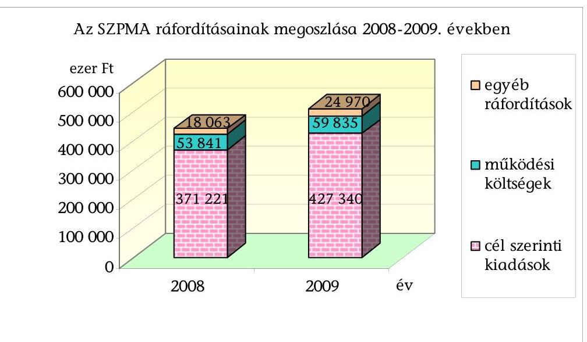
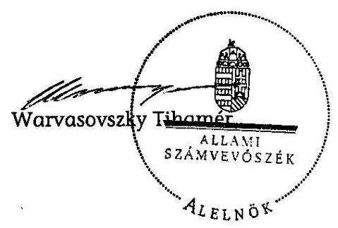

# ÁLLAMI   SZÁMVEVŐSZÉK 

## JELENTÉS

a Szövetség a Polgári Magyarországért Alapítvány 2008-2009. évi gazdálkodása törvényességének ellenőrzéséről

---

3. Önkormányzati és Területi Ellenőrzési Igazgatóság
3.1. Államháztartáson Kívüli Szervezeteket Ellenőrző Főcsoport

Iktatószám: V-3011-025/2010-11.
Témaszám: 985
Vizsgálat-azonosító szám: V-0532

# Az ellenőrzést felügyelte: 

Dr. Elek János
általános főigazgató-helyettes
Az ellenőrzés végrehajtásáért felelős:
Dr. Elek János
általános főigazgató-helyettes
Az ellenőrzést vezette:
Solymár Ágnes
osztályvezető főtanácsos
Az összefoglaló jelentést készítette:
Szappanos Júlia
számvevő tanácsos
Az ellenőrzést végezték:
Brebán Andrea Szappanos Júlia
számvevő tanácsos
számvevő tanácsos

A témához kapcsolódó eddig készített számvevőszéki jelentések:
címe
sorszáma
Jelentés a Szövetség a Polgári Magyarországért Alapítvány 2003- 0654
2005. évi gazdálkodása törvényességének ellenőrzéséről
Jelentés a Szövetség a Polgári Magyarországért Alapítvány 2006- 0849
2007. évi gazdálkodása törvényességének ellenőrzéséről

---

# TARTALOMJEGYZÉK 

BEVEZETÉS ..... 3
I. ÖSSZEGZŐ MEGÁLLAPÍTÁSOK, KÖVETKEZTETÉSEK, JAVASLATOK ..... 4
II. RÉSZLETES MEGÁLLAPÍTÁSOK ..... 7

1. Az alapítvány gazdálkodásának törvényessége ..... 7
1.1. Az alapítvány működése ..... 7
1.2. Az alapítvány bevételei ..... 8
1.3. Az alapítvány ráfordításai ..... 9
2. Az éves beszámolók ..... 11
2.1. Az éves beszámolók szabályossága ..... 11
2.2. A mérleg ..... 12
2.3. Az eredmény-kimutatás ..... 13
3. A könyvvezetés szabályozottsága ..... 14
4. A könyvvezetés gyakorlata ..... 15
5. Az alapítvány ellenőrzési rendszere ..... 16
6. A létrehozott alapítványok felügyelete és támogatása ..... 17
7. A korábbi ellenőrzés megállapításaira tett intézkedések ..... 18

## MELLÉKLETEK

1. számú A Szövetség a Polgári Magyarországért Alapítvány 2008. évi egyszerűsített éves beszámolójának mérlege
2. számú A Szövetség a Polgári Magyarországért Alapítvány 2008. évi egyszerűsített éves beszámolójának eredmény-kimutatása
3. számú A Szövetség a Polgári Magyarországért Alapítvány 2009. évi egyszerűsített éves beszámolójának mérlege
4. számú A Szövetség a Polgári Magyarországért Alapítvány 2009. évi egyszerűsített éves beszámolójának eredmény-kimutatása

---

# RÖVIDÍTÉSEK JEGYZÉKE 

| Áfa | Általános forgalmi adó |
| :--: | :--: |
| ÁSZ | Állami Számvevőszék |
| FB | Szövetség a Polgári Magyarországért Alapítvány Felügyelő Bizottsága |
| Fidesz | Fidesz - Magyar Polgári Szövetség |
| Kbt. | A közbeszerzésekről szóló 2003. évi CXXIX. törvény |
| Kincstár | Magyar Államkincstár |
| Kuratórium | Szövetség a Polgári Magyarországért Alapítvány Kuratóriuma |
| Pártalapítványi törvény | A pártok működését segítő tudományos, ismeretterjesztő, kutatási, oktatási tevékenységet végző alapítványokról szóló 2003. évi XLVII. törvény |
| Párttörvény | A pártok működéséről és gazdálkodásáról szóló 1989. évi XXXIII. törvény |
| Ptk. | A Polgári Törvénykönyvről szóló 1959. évi IV. törvény |
| SZMSZ | Szövetség a Polgári Magyarországért Alapítvány Szervezeti és Működési Szabályzata |
| SZPMA/alapítvány | Szövetség a Polgári Magyarországért Alapítvány |
| Szt. | A számvitelről szóló 2000. évi C. törvény |
| Számviteli rendelet | A számviteli törvény szerinti egyes egyéb szervezetek beszámoló-készítési és könyvvezetési kötelezettségének sajátosságairól szóló 224/2000. (XII. 19.) Korm. rendelet |

---

# JELENTÉS 

## a Szövetség a Polgári Magyarországért Alapítvány 2008-2009. évi gazdálkodása törvényességének ellenőrzéséről

## BEVEZETÉS

A pártok működését segítő tudományos, ismeretterjesztő, kutatási, oktatási tevékenységet végző alapítványokról szóló 2003. évi XLVII. törvény (pártalapítványi törvény) alapján a pártok a politikai kultúra fejlesztése érdekében költségvetési támogatásra jogosult alapítványt hozhatnak létre tudományos, ismeretterjesztő, kutatási és oktatási tevékenységük elősegítésére. A Fidesz - Magyar Polgári Szövetség a törvényi rendelkezéseknek megfelelően 2003-ban létrehozta a Szövetség a Polgári Magyarországért Alapítványt (SZPMA/alapítvány).

Az SZPMA alapító okirat szerinti célja a politikai kultúra fejlesztése, a nemzeti elkötelezettség és a kereszténydemokrata eszmekör jegyében. Ehhez kapcsolódóan célja az ország határain belül, illetve a határon túli magyarság lakta területeken tudományos, kutatási tevékenység szervezése, elsősorban a társadalomtudományok körében, majd részben ezen kutatások eredményeinek felhasználásával is oktatási, ismeretterjesztő tevékenység végzése, mely jelentős mértékben hozzájárulhat az állampolgárok közéleti ismereteinek szélesítéséhez, a politikai szféra, a pártok és az állampolgárok kapcsolatának erősítéséhez, valamint a határon túli magyarság nemzeti elkötelezettségének fejlesztéséhez, nemzettudatának erősítéséhez.

A pártalapítványok gazdálkodása törvényességének ellenőrzésére a pártalapítványi törvény 4. § (2) bekezdése alapján az Állami Számvevőszék (ÁSZ) jogosult, a pártalapítványi törvény 4. § (4) bekezdése értelmében az ÁSZ kétévenként ellenőrzi azon alapítványok gazdálkodásának törvényességét, amelyek e törvény szerint állami költségvetési támogatásban részesültek. A pártalapítványi törvény alapján létrehozott alapítványok költségvetési támogatásának mértékéről a pártok működéséről és gazdálkodásáról szóló 1989. évi XXXIII. törvény (párttörvény) rendelkezik. Az SZPMA a törvényi előírásnak megfelelően, 2008-ban 418700 ezer Ft, 2009-ben 465500 ezer Ft költségvetési támogatásban részesült.

Az ellenőrzés célja volt, hogy értékelje az alapítvány 2008-2009. évi gazdálkodása törvényességét, éves jelentései és számviteli beszámolói jogszabályi előírásoknak való megfelelését, az alapítvány könyvvezetésében a számvitelről szóló 2000. évi C. törvény (Szt.) és egyéb jogszabályi rendelkezések, valamint belső előírások betartását, az ÁSZ előző ellenőrzése során feltárt hiányosságok megszüntetését. Az egyéb szabályszerűségi ellenőrzést a 2008. január 1-jétől 2009. december 31. közötti időszakra, a pártalapítványok gazdálkodása törvényességének ellenőrzéséhez készült segédlet alapján végeztük. Az ellenőrzési tapasztalatok kiértékeléséhez az átfogó lényegességi küszöböt 2%-ban határoztuk meg.

---

# I. ÖSSZEGZŐ MEGÁLLAPÍTÁSOK, KÖVETKEZTETÉSEK, JAVASLATOK 

A kuratórium az ellenőrzött időszakban az alapító okirat előírásainak megfelelően törvényesen működött. Az alapító okiratban foglaltak megfeleltek a Ptk., a párttörvény, valamint a pártalapítványi törvény előírásainak. A kuratórium vagyont érintő határozatai a pártalapítványi törvényben és az alapító okiratban egyaránt megfogalmazott tudományos, ismeretterjesztő, kutatási, oktatási célok megvalósítására irányultak.

A kuratórium jóváhagyott éves költségvetés alapján gazdálkodott, amely a bevételeket és kiadásokat oly módon tartalmazta, hogy azok egyensúlyban voltak, és a teljesítést folyamatosan figyelemmel kísérték. A kuratórium a működési költségek keretösszegét az éves költségvetésekben állapította meg, amelyben kuratóriumi határozattal hagyták jóvá az egyes feladatok finanszírozására fordítható keretösszegeket.

Az SZPMA az ellenőrzött években 919481 ezer Ft bevételt mutatott ki, amelynek 96%-a mindkét évben költségvetésből származó támogatás volt. A saját bevételei csatlakozói adományokból, tárgyi eszköz értékesítésből, költségtérítésekből, valamint kamatbevételekből teljesültek. Az SZPMA bevételszerző, gazdálkodó tevékenysége során betartotta a pártalapítványi törvényben előírt forrásszerzésre és gazdálkodásra vonatkozó előírásokat. Az adományok elfogadásáról minden alkalommal döntött a kuratórium.

Az SZPMA 955270 ezer Ft összegű ráfordítást mutatott ki, amelynek 83%-át az alapítvány cél szerinti feladatai megvalósításának közvetlen költségei, 12%-át a működéssel összefüggésben felmerült költségek, 5%-át az egyéb ráfordítások tették ki együttesen. A cél szerinti tevékenység kiadásaiként más szervezetek és magánszemélyek részére nyújtott támogatásokat, illetve a saját szervezeti keretek között megvalósított tevékenységek költségeit számolták el.

---

A támogatott szervezetekkel és magánszemélyekkel a kuratórium elnöke szerződést kötött. Az alapítvány a támogatásokat szerződés szerint folyósította. A kedvezményezettek minden esetben a szerződés szerint előírt módon (számlák hiteles másolati példányaival) számoltak el, tevékenységükről beszámolót készítettek.

A kuratórium az alapítvány cél szerinti feladatait a nyújtott támogatásokon és a saját szervezeti keretei között végzett tevékenységén túl a létrehozott alapítványain keresztül is ellátta. A 2004. évben alapított Polgári Szemle Alapítvány részére az ellenőrzött időszakban összesen 5000 ezer Ft támogatást adott a Polgári Szemle című folyóirat megjelentetésének közvetlen és közvetett költségeire. A Polgári Szemle Alapítvány a támogatási szerződésben rögzített határidőben és módon számolt el a támogatás cél szerinti felhasználásáról. Az SZPMA kuratóriuma 2009. április 22-én létrehozta a Polgári Kultúráért Alapítványt, amelynek célja a polgári kultúra fejlesztése a nemzeti elkötelezettség, valamint a helyi települési aktivitás jegyében. Alapítóként az induló vagyont, 6000 ezer Ft-ot, 2009. március 24-én az alapítvány részére átutalta. Az alapítvány az induló vagyonon kívül egyéb támogatásban nem részesült az időszakban.

Az SZPMA a számviteli szabályozását az előző ÁSZ ellenőrzés felhívására megújította. A szabályzatok módosítását a kuratórium jóváhagyta. A számviteli szabályzatok megfeleltek a jogszabályoknak, kivéve a hatályos számlarend adott támogatásokra vonatkozó, szervezeti sajátosságokat nem tükröző előírásait.

Az SZPMA eleget tett éves beszámoló készítési kötelezettségének, az egyszerűsített éves beszámolókat mindkét évben a jogszabályi előírásoknak és a belső szabályzatoknak megfelelően állította össze. A beszámolók összeállítása során az Szt.-ben szabályozott alapelveket érvényesítették, így a beszámolók megbízható és valós képet mutattak az alapítvány gazdálkodásáról. A beszámolókat a felügyelő bizottság véleményezte, a könyvvizsgáló hitelesítő záradékkal látta el, a kuratórium elfogadta. Az éves mérlegekben kimutatott eszközök és források értékadatait leltárakkal alátámasztották, az eredmény-kimutatás bevétel és ráfordítás sorok adatait a főkönyvi könyvelés alapbizonylataival, analitikával támasztották alá. Az alapítvány a 2008. és a 2009. évi gazdálkodásáról szóló éves jelentéseit a pártalapítványi törvény előírásai szerint elkészítette, a Hivatalos Értesítőben és internetes honlapján közzétette. A kuratórium a jelentéseket elfogadta.

A kettős könyvvezetést a jogszabályok és a belső előírások betartásával megbízás alapján, regisztrált külső számviteli szolgáltató végezte, mindkét évben azonos számítógépes programmal. A gazdasági eseményeket idősorrendben, zárt rendszerben rögzítették, könyvelési alapbizonylatokkal alátámasztva. A főkönyvi számlákhoz kapcsolódóan az előírt analitikus nyilvántartásokat vezették, a leltározás mindkét évben teljes körű volt, a leltározás eredményét kiértékelték. Az analitikus nyilvántartásokkal és a leltározással összhangban végezték a szabályszerű éves zárásokat. Az alapítványok gazdálkodási rendjéről szóló kormányrendelet előírásának megfelelően, a számviteli nyilvántartásban elkülönítették az alapítványi célú tevékenység közvetlen, az alapítvány kezelő szervének közvetett költségeit és az egyéb közvetett költségeket. A házipénztári

---

nyilvántartások vezetése szabályszerű volt, a záró pénzkészlet nem haladta meg a belső szabályozásban előírt mértéket. Az elszámolásra adott előlegek nyilvántartása és elszámolása szabályos volt. Az eszközbeszerzéseknél és a ráfordítások elszámolásánál érvényesítették a kötelezettségvállalás és az utalványozás, valamint a banki aláírás szabályait.

A bizonylati elv és fegyelem érvényesült a 2008-2009. évi bizonylatok esetében. A bizonylatok alaki és tartalmi kellékeire vonatkozó Szt. követelmények teljes körűen teljesültek, a bizonylatok megőrzéséről gondoskodtak, a szigorú számadású nyomtatványok nyilvántartásba vételi kötelezettségét teljesítették.

Az alapítványnál kialakított ellenőrzési rendszer hozzájárult a törvényes gazdálkodáshoz. Az FB az alapító okiratban foglaltaknak megfelelően mindkét évben vizsgálta az éves költségvetést, az éves beszámolót és az alapítványi tevékenységről készített szakmai beszámolót. Az alapítványnál az ellenőrzést a kuratórium elnöke és az igazgató folyamatba építetten vagy utólagosan végezte. A vezetői ellenőrzést a kuratórium elnöke és az alapítvány igazgatója a munkáltatói jogkör gyakorlása, a képviseleti jog, a kötelezettségvállalás, az utalványozás és a bankszámla feletti rendelkezés során megfelelően látták el.

Az előző ÁSZ vizsgálat felhívásában kezdeményezett intézkedéseket az SZPMA az ellenőrzött időszakban végrehajtotta.

A helyszíni ellenőrzés megállapításainak hasznosítása mellett javasoljuk:

# az alapítvány kuratóriumának 

Egészítse ki számlarendjét a támogatások elszámolására vonatkozóan az Szt. 161. § (2) bekezdés b) pontja alapján a számlatartalom egyértelmű előírásával.

---

# II. RÉSZLETES MEGÁLLAPÍTÁSOK 

## 1. Az alapítvány gazdálkodásának törvényessége

### 1.1. Az alapítvány működése

Az ellenőrzött időszakban a Fidesz - Magyar Polgári Szövetség, mint alapító az SZPMA alapító okiratát nem módosította. Az alapító okiratban meghatározott célok és a cél érdekében meghatározott tevékenységek megfeleltek a párttörvény 9/A. § (1) bekezdésében előírtaknak.

A 2009. évben a kuratórium két alkalommal módosította a szervezeti és működési szabályzatot (SZMSZ) a tisztségviselők és a munkaszervezet juttatásaira vonatkozóan. Az SZMSZ az alapító okirattal összhangban meghatározta a kuratórium és az SZPMA alkalmazottainak feladat- és hatáskörét, továbbá a külső szakértők körét, feladataikat.

Az alapító okirat és az SZMSZ az alapítványi vagyon felhasználási módját a Polgári Törvénykönyvről szóló 1959. évi IV. törvény (Ptk.) 74/B. § (3)-(4) bekezdések rendelkezéseinek megfelelően
 szabályozta. A kuratórium az ellenőrzött időszakban az alapító okirattal és az SZMSZ-szel összhangban hozta meg a vagyont érintő gazdasági döntéseit.

A kuratórium működése megfelelt az alapító okirat vonatkozó előírásainak. A kuratórium 2008-ban és 2009-ben nyolc-nyolc alkalommal ülésezett. Valamennyi kuratóriumi ülésről jegyzőkönyv készült, amely tartalmazta a napirend alapján elhangzott vita legfontosabb megállapításait és a határozatokat. A kuratóriumi ülésekről készített jegyzőkönyvek, valamint a határozatok tára minden esetben megfelelt az alapító okiratban, illetve az SZMSZ 1.3.3. pontjában foglalt jegyzőkönyv-készítési, hitelesítési és nyilvántartási szabályoknak.

A kuratórium - az alapító okirat vonatkozó előírásának megfelelően - a 2008–2009. évekre egyhangú szavazással elfogadta az alapítvány éves költségvetését. A részletes költségvetés tartalmazta az alapítvány adott évre vonatkozó gazdálkodási és feladattervét is. Az éves költségvetések időarányos teljesülését az alapítvány igazgatója nyomon követte, a teljesülésről a kuratóriumot folyamatosan tájékoztatta. A költségvetések mindkét évben tartalmazták az SZPMA bevételeit, a cél szerinti tevékenységek ráfordításait, valamint a működtetéssel összefüggő költségeit.

Az éves költségvetés az alapítvány bevételeit az éves állami támogatás, az előző évi eredmény, a kamatbevétel, valamint egyéb bevételek szerinti bontásban tartalmazta. A kiadásokon belül alapítványi feladatok szerinti bontásban a saját szervezeti keretek között végzett tevékenységek költségeit, a kuratórium által civil szervezetek és egyedi kérelmekre nyújtott támogatásokat, valamint az alapítvány közvetett (működési) költségeit tartalmazta az éves költségvetés.

---

Az alapító okirat az SZMSZ-szel összhangban fogalmazott meg előírásokat a képviseleti-, illetve a bankszámla feletti rendelkezési jog gyakorlására vonatkozóan. A bankhoz aláírásra bejelentettek köre megfelelt az alapító okirat és az SZMSZ rendelkezéseinek.

Az alapítványt a kuratórium elnöke, akadályoztatása esetén az alapító okiratban megnevezett kurátor képviseli. A bankszámla feletti rendelkezésre a kuratórium elnöke és az alapítvány igazgatója együttesen jogosultak. Az alapító az alapító okiratban felhatalmazta a kuratóriumot, hogy képviseleti jogot biztosítson az alapítvány alkalmazottjának. A kuratórium az alapítvány igazgatójának bankszámla feletti rendelkezési jogot, valamint az SZMSZ-ben megjelölt értékhatárig kötelezettségvállalási és utalványozási jogot biztosított.

A képviseleti és bankszámla feletti rendelkezési jog gyakorlása a Ptk. 74/C. § (4) bekezdésének megfelelően, az alapító okirat, az SZMSZ és a pénzkezelési szabályzat rendelkezéseivel összhangban történt.

# 1.2. Az alapítvány bevételei 

Az SZPMA az ellenőrzött időszakban összesen 919 481 ezer Ft bevételt mutatott ki, amelyből a központi költségvetési támogatás aránya 96% volt (884 200 ezer Ft).

A következő táblázat az SZPMA bevételeinek összetételét mutatja be a 2008–2009. években:

| Megnevezés | 2008. év | 2009. év | 2008–2009.   évek |
| :-- | --: | --: | --: |
| Egyéb bevétel | 430 005 | 475 202 | 905 207 |
| Költségvetésből kapott tá-   mogatás | 418 700 | 465 500 | 884 200 |
| Egyéb szervezettől kapott   támogatás | 8 787 | 8 793 | 17 580 |
| Egyéb (tárgyi eszköz értékesí-   tés, költségtérítés) | 2 518 | 909 | 3 427 |
| Pénzügyi műveletek bevétele | 6 310 | 7 964 | 14 274 |
| Összes bevétel | 436 315 | 483 166 | 919 481 |

A pártalapítványi törvény 1. §-a alapján az SZPMA költségvetési támogatásra volt jogosult, a támogatás mértékét a párttörvény határozta meg. A kapott támogatás a 2008. szeptember 29-ig hatályos párttörvény 9/A. § (5) bekezdés a) és b) pontok szerinti alap-, és mandátumarányos kiegészítő támogatásból állt, az ezt követő időszakban, 2008. szeptember 30-tól, a jogszabály módosítás következtében a párttörvény 9/A. § (5) bekezdés alapján a támogatást az SZPMA az alapító pártra, valamint e párt jelöltjeire az országgyűlési képviselők utolsó általános választásán az első érvényes fordulóban leadott szavazatok arányában kapta.

---

A költségvetési támogatást a Magyar Államkincstár a pártalapítványi törvény 2. § (1) bekezdésének, illetve 2008. október 1-től a párttörvény 9/A. § (2) bekezdésének előírása alapján - egy alkalom kivételével - a naptári negyedévek első napján folyósította.

A 2008. negyedik negyedévi költségvetési támogatás az alapítvány számlájára késve, 2008. október 15-én érkezett meg.

Az alapító okirat 5.2. és 5.4. pontja - a törvényi szabályozással összhangban - engedélyezte az SZPMA számára a csatlakozók által befizetett adományok, egyéb támogatások és felajánlások lehetőségét. Az alapítvány mindkét évben kapott jogi személyektől támogatást, összesen 17 580 ezer Ft-ot. A pártalapítványi törvény 3. § (3) bekezdésében előírtakkal összhangban a támogatás folyósítása minden esetben az SZPMA pénzforgalmi számlájára történt, a bankkivonatokon az adományozó szervezetek adatait egyértelműen feltüntették. Az SZPMA-hoz csatlakozók által meghatározott támogatási célok igazodtak a párttörvény 9/A. § (1) bekezdésében meghatározottakhoz. A pártalapítványi törvény 3. § (2) bekezdésével és az alapító okirattal összhangban a kuratórium jóváhagyta a csatlakozók által juttatott támogatások elfogadását. Az SZPMA a pártalapítványi törvény 3. § (4) bekezdése szerinti közzétételi kötelezettségének honlapján eleget tett.

Az SZPMA az ellenőrzött időszakban egy külföldi alapítványtól 17 240 ezer Ft támogatást kapott (2008-ban 8 667 ezer Ft, 2009-ben 8 573 ezer Ft) képzésre, rendezvényre, tanácsadási szolgáltatásokra, projekttel kapcsolatos költségekre és egyéb feladatokra. Az SZPMA a csatlakozó külföldi alapítvánnyal mindkét évben támogatási szerződést kötött. A támogatásokkal történő elszámoláskor összesítő jegyzéket, költségnem szerinti kimutatást és számlamásolatokat nyújtott be.

# 1.3. Az alapítvány ráfordításai 

Az SZPMA 2008-ban 443 125 ezer Ft, 2009-ben 512 145 ezer Ft ráfordítást, összesen 955 270 ezer Ft-ot mutatott ki könyvvezetésében. A ráfordítások 83%-át az alapítvány cél szerinti feladatai megvalósításának közvetlen költségei, 12%-át a működéssel összefüggésben felmerült költségek, 5%-át az egyéb ráfordítások tették ki együttesen.

A kuratórium a működési költségek keretösszegét az éves költségvetésekben állapította meg, és évközben döntött az alapítvány működéséhez kapcsolódó szerződések megkötéséről. Az alapítvány feladataival összhangban szintén az éves költségvetésben, kuratóriumi határozattal hagyták jóvá az egyes feladatok finanszírozására fordítható keretösszegeket, ezen belül a pályázati úton, illetve egyedi kérelmek alapján adható támogatások összegét, valamint saját szervezeti keretei között megvalósított célszerinti tevékenységek költségeit.

Az alapító okirat céljaival összhangban az alapítvány saját szervezeti kereteken belül - többek között - képzéseket bonyolított, politikai tanulmányokat, elemzéseket készíttetett, rendezvényeket, nemzetközi programokat, országklubokat szervezett. Mindezeken túl egyedi kérelmekre, illetve pályázati úton tá-

---

mogatást nyújtott szervezetek és magánszemélyek részére, pályázati koncepciójával összhangban.

A támogatásokról a kuratórium minden alkalommal döntött, a döntéshozatal megfelelt az alapító okiratban szereplő határozathozatallal kapcsolatban előírtaknak. A kuratóriumi jegyzőkönyvekben rögzítették a támogatott nevét, a támogatás célját és összegét.

A nyertesekkel a kuratóriumi határozatnak megfelelően szerződést kötöttek, valamennyi támogatási szerződést a képviseletre jogosult kuratóriumi elnök írta alá. A szerződések tartalmazták a támogatás célját, mértékét, folyósításának módját és határidejét, az elszámoláshoz benyújtandó pénzügyi dokumentumok körét és kellékeit, a támogatás rendeltetésszerű felhasználásának ellenőrzését, a szerződésszegések eseteit és következményeit.

A támogatások folyósítása a szerződésekben foglaltak szerint történt. A felhasználásról a kedvezményezetteknek pénzügyi elszámolást és tartalmi beszámolót kellett készítenie. A számlákra az alapítvány érvénytelenítő záradék feltüntetését nem írta elő, ezáltal nem zárta ki a benyújtott számlák más támogatók felé való elszámolásának lehetőségét. A támogatottak az elszámoláshoz a kiadásokat összesítő táblázatot, a számlák és a kifizetésüket igazoló bankkivonatok hitelesített másolatait nyújtották be. A számlák minden esetben a kedvezményezett nevére szóltak.

A rendezvények megvalósulását az alapítványi iroda munkatársai minden esetben dokumentumok alapján ellenőrizték. A szervezett képzések és a közös rendezvények, programok esetében helyszínen is ellenőrizték a teljesítést. A szerződések előírták, hogy a programok dokumentumain és kiadványokon az alapítványt támogatóként szerepeltessék, amelynek a kedvezményezettek eleget tettek.

Egy szervezettel az alapítvány oly módon kötött támogatási szerződést, hogy abban a támogatás felhasználása során lehetővé tette az összeg 15%-ának számla dokumentációs kötelezettség igénye nélküli felhasználását. A kuratórium által jóváhagyott támogatás célja megfelelt a párttörvény 9/A. § (1) bekezdésében foglaltaknak. A szerződés elszámolási feltételei azonban nem biztosították a támogatási összeg 15%-ánál a célra történt felhasználás megállapítását. Az érintett támogatás felhasználásának ellenőrzése során visszaélést nem tapasztaltunk, a támogatott programok és rendezvények megvalósulását a szervezet teljes körűen igazolta. Az SZPMA képviselőjének írásbeli nyilatkozata alapján a kifogásolt támogatás-nyújtási formát a jövőben nem alkalmazza az alapítvány.

A kedvezményezettek 82%-ban betartották a szerződésekben kikötött elszámolási határidőket. A határidő túllépés 12 és 112 nap között volt, 50 nap fölötti késedelem esetén az alapítvány igazgatója írásban szólította fel a támogatottat az elszámolásra, illetve a maradványösszeg visszafizetésére, ezt követően a támogatottak elszámoltak. A kuratórium az ellenőrzött támogatások esetében határozatot hozott az elszámolások elfogadásáról.

---

Az alapítvány a közbeszerzésekről szóló 2003. évi CXXIX. törvény (Kbt.) hatálya alá tartozó közbeszerzések tekintetében a törvény 22. § (1) bekezdés i) pontja értelmében ajánlatkérőnek minősült.

A 2008–2009. években az alapítvány tevékenységével összefüggésben nem keletkezett közbeszerzés lefolytatási kötelezettség. Az alapítvány mindkét évben indokoltan, közbeszerzési eljárás lefolytatása nélkül kötött megbízási szerződést kutatások készítésére és oktatási tevékenység ellátására.

- Mindkét évben kutatási tevékenység tárgyában megvalósított beszerzés a Kbt. 29. § (2) bekezdés g) pontja értelmében mentesült a közbeszerzési eljárási kötelezettség alól, mivel a kutatások eredményét nem kizárólag az alapítvány hasznosította, hanem a kuratórium által meghatározott körben szétosztotta, illetve az SZPMA honlapján nyilvánosságra hozta.
- A 2008. június 16-án, oktatási tevékenység tárgyában kötött 8 000 ezer Ft+Áfa értékű megbízásnál a Kbt. 29. § g) pontja a nemzeti értékhatár alatti esetekben az oktatási és szakképzési szolgáltatásokat kivonta a közbeszerzési eljárási kötelezettség alól.

# 2. Az ÉVES BESZÁMOLÓK 

### 2.1. Az éves beszámolók szabályossága

Az SZPMA az ellenőrzött időszak mindkét évében eleget tett beszámoló készítési kötelezettségnek, éves beszámolóit a számviteli politikájában megjelölt formában, az Szt. és a számviteli törvény szerinti egyes egyéb szervezetek beszámoló-készítési és könyvvezetési kötelezettségének sajátosságairól szóló 224/2000. (XII. 19.) Korm. rendelet (számviteli rendelet) 20. § (7) bekezdésben előírt határidőn belül készítette el. Az SZPMA egyszerűsített éves beszámolói a számviteli rendelet 4. sz. melléklete szerinti mérlegből és 5. sz. melléklete szerinti eredmény-kimutatásból álltak.

Az SZPMA felügyelő bizottsága (FB) az alapító okirat előírásának megfelelően az egyszerűsített éves beszámolókat véleményezte, a kuratóriumnak elfogadásra javasolta. A beszámolókat a kuratórium határozattal elfogadta. Az egyszerűsített éves beszámolókat az Szt. 20. § (6) bekezdésében előírtak szerint a képviseletre jogosult kuratóriumi elnök aláírásával hitelesítette. A könyvvizsgáló az SZPMA egyszerűsített éves beszámolóit hitelesítő záradékkal látta el.

Az SZPMA az egyszerűsített éves beszámolója során érvényesítette az Szt. 15–16. §-aiban foglalt számviteli alapelveket. A 2008–2009. évi beszámolók az alapítvány gazdálkodásáról megbízható, valós adatokat tartalmaztak. Az éves beszámolók adatai az év végi főkönyvi kivonatok adataiból mindkét évben levezethetőek voltak, azok a kapcsolódó analitikák, a főkönyvi számlák, az egyeztető nyilvántartások adataival megegyeztek.

Az SZPMA a 2008–2009. évi gazdálkodásával kapcsolatban elkészítette a pártalapítványi törvény 3/A. § (1) bekezdése szerinti jelentéseit. A jelentések tartalma megfelelt a 3/A. § (3) bekezdésében előírtaknak, amit a 3/A. § (2) bekezdése előírásának megfelelően a kuratórium elfogadott. A jelentések közzétételi

---

kötelezettségének az SZPMA a 3/A. § (5) bekezdésében előírtak alapján a Magyar Közlöny Hivatalos Értesítőjében és a saját honlapján
 is eleget tett.

# 2.2. A mérleg 

Az ellenőrzött években a mérlegsorok adatai megegyeztek a kapcsolódó analitikus és főkönyvi nyilvántartások összesített adataival. Az éves mérlegekben kimutatott eszközök és források értékadatait az Szt. 69. § előírásával összhangban, a leltározási szabályzat szerinti leltárakkal alátámasztották.

Az SZPMA az immateriális javak és tárgyi eszközök értékét az egyedi nyilvántartás adataiból készített összesítő kimutatásokkal mindkét évben, a leltározási szabályzat szerinti tételes eszközleltárral támasztotta alá. A pénzeszközök értékét készpénzállománynál mennyiségi leltár, bankszámláknál év végi bankkivonatok, a követelések és kötelezettségek, az aktív és passzív időbeli elhatárolások értékét év végi tételes kimutatások, és azok kiértékelését igazoló jegyzőkönyvek támasztották alá.

Az ellenőrzött időszakban az immateriális javak és tárgyi eszközök egyedi nyilvántartása és az állomány-változások (beruházás, aktiválás, értékesítés, selejtezés, terv szerinti értékcsökkenés) elszámolása összhangban volt a belső szabályzatok - a számviteli politika, a számlarend és a leltározási szabályzat - előírásaival. Az eszközök beszerzése során mindkét évben betartották az SZMSZ-ben előírt kötelezettségvállalás szabályait.

Az egyszerűsített éves beszámoló a forgóeszközökön belül a munkavállalókkal szembeni, illetve egyéb elismert követeléseket tartalmazott (szállítói túlfizetés, visszaigényelhető járulék). A pénzeszközök mérlegben kimutatott értéke megegyezett az év végi pénztárjelentés záró állomány és a záró bankkivonatok egyenlegeinek összegével.

A mérlegben az induló tőkét az alapító okirat által meghatározott induló vagyon értékének megfelelően mutatták ki.

A kötelezettségek között mindkét évben kizárólag rövidlejáratú kötelezettséget mutattak ki, amely a kuratórium által megítélt, a tárgyévben ki nem fizetett támogatásokat, a szállítói tartozások értékét, az év végi adó- és járuléktartozásokat tartalmazta. Az SZPMA a 2008. évben az Szt. 42. § (3) bekezdésében elrendeltektől eltérően a hosszúlejáratú kötelezettségek helyett a rövidlejáratú kötelezettségek között mutatta ki a kuratórium által 1000 ezer Ft magánszemélynek megítélt, szerződés szerint csak két év múlva kifizetendő támogatást. A kötelezettségek leltára tartalmazta a tételt, de a tételeket nem bontotta meg azok lejárata szerint. Ez a hiba a mérleg főösszeg, a saját tőke és a kimutatott eredmény értékét nem módosította, nem érte el a lényegességi küszöb és a jelentős összegű hiba értékét.

Az aktív és passzív időbeli elhatárolások elszámolása szabályos volt, az elszámolást szállítói számlák, számítási anyagok és analitikus nyilvántartások támasztották alá.

---

# 2.3. Az eredmény-kimutatás 

Az ellenőrzött években az eredmény-kimutatás sorok adatai a főkönyvi kivonatok, illetve a vonatkozó főkönyvi és részletező számlák összesített adataival megegyeztek.

Az Szt. 77. § (3) bekezdés b) pontjának megfelelően az egyéb bevételek között az állami költségvetésből származó támogatás, az egyéb csatlakozói hozzájárulások, a pénzügyi műveletek bevételei eredmény-kimutatás sorok a főkönyvi kivonat adataival és a bankkivonatok értékeivel megegyeztek. A főkönyvi könyvelés bevételei bizonylattal, analitikával alátámasztottak voltak. Az eredmény-kimutatásban kimutatott ráfordításokat könyvelési alapbizonylatokkal (szerződések, szállítói számlák, bér, feladások) támasztották alá.

Az eredmény-kimutatás sorai az adott sorokon kimutatható bevételek, illetve ráfordítások fogalomkörébe tartozó tételeket tartalmaztak. Az SZPMA - az előző ÁSZ ellenőrzés javaslatának megfelelően - mindkét évben az Szt. 79. § (3) bekezdésének megfelelően mutatta ki a magánszemélyeknek juttatott közcélú támogatásokat a személyi jellegű ráfordítások között.

Az SZPMA három alkalommal cél szerinti tevékenység ellátásához kapcsolódó megállapodást kötött egy nemzetközi szervezettel. A megállapodásokhoz kapcsolódó kifizetések elszámolása konkrét szabályozási előírás hiányában nem volt következetes. A 2008. évben helyesen, egyéb ráfordításként számolta el és mutatta ki, a 2009. évben pedig egyéb igénybevett szolgáltatások célszerinti költségeként számolta el és az anyagjellegű ráfordítások között mutatta ki. Az egymást követő években ezen ráfordítás különböző soron kimutatott értéke a mérleg főösszeg, a saját tőke és a kimutatott eredmény értékét nem módosította.

A költségek, ráfordítások évenkénti 67 elemű mintája alapján egy nemzetközi szervezet által benyújtott azonos tartalmú bizonylatok és a szerződésekben megjelölt azonos finanszírozási forma alapján történt kifizetések a 2008. évben 5333 ezer Ft értékben az egyéb ráfordításként (8681 számú számlán), 2009. évben 12010 ezer Ft értékben az egyéb igénybevett szolgáltatásként (52991 számú számlán) tartották nyilván.

A szerződéseket - az alapító okirat előírásával összhangban - minden esetben a kuratórium elnöke kötötte meg. A ráfordítások elszámolásánál érvényesítették a kötelezettségvállalás, az utalványozás, a teljesítésigazolás és a banki aláírás szabályait.

Az utalványozást a kuratórium által elfogadott SZMSZ-ben és a pénzkezelési szabályzatban előírtak szerint végezték. A szolgáltatási szerződésekhez kapcsolódó kifizetések teljesítésigazolásai alapján kerültek utalványozásra és kifizetésre, a bérek utalása azok utalványozását követően elektronikus aláírással valósult meg. A bankszámla feletti rendelkezést az alapító okirat és az SZMSZ előírása szerint végezték.

---

# 3. A KÖNYVVEZETÉS SZABÁLYOZOTTSÁGA 

A könyvvezetés és az éves beszámolók elkészítésének belső szabályozási rendszere az Szt. által kötelezően előírt szabályozáson alapult. Az Szt. 14. § (3)-(5) bekezdések előírásával összhangban az SZPMA rendelkezett számviteli politikával (ennek keretében határozták meg az eszközök és a források értékelési szabályait), leltárkészítési és leltározási-, pénzkezelési szabályzattal, továbbá az Szt. 161. § alapján számlarenddel.

Az SZPMA a számviteli politikát és a számlarendet egy alkalommal módosította, a kuratórium a szabályzatok módosításait jóváhagyta.

A számviteli politika az alapítványi sajátosságoknak megfelelően tartalmazta az egyszerűsített éves beszámoló formáját és tartalmát, a zárlati munkák és az időbeli elhatárolások körét, az értékcsökkenés elszámolásának és az eszközök-források értékelésének szabályait, valamint az alapítványi célú tevékenység közvetlen és közvetett (működési) költségeinek elkülönített nyilvántartási rendjét. A számviteli politika - kuratórium által elfogadott - 2008. évi módosítása a korábbi ellenőrzés javaslatának megfelelően a személyi jellegű ráfordítások elemeit bővítette a magánszemélyeknek nyújtott közcélú támogatásokkal.

Az eszközök és a források leltárkészítési és leltározási szabályzata az alapítványi gazdálkodás sajátosságainak megfelelően tartalmazta a mérlegtételeket alátámasztó leltárak követelményeit, a leltározással kapcsolatos feladatokat, a mennyiségi felvétellel és egyeztetéssel leltározandó eszközök és források körét, a leltározás gyakoriságát és idejét. A selejtezés szabályait és dokumentálásának módját külön selejtezési szabályzat tartalmazta.

A pénzkezelési szabályzat és a hozzá kapcsolódó elektronikus átutalások és a bankkártyák használati rendjéről szóló szabályzatok előírásai együttesen megfeleltek az Szt. 14. § (8) bekezdés rendelkezéseinek. Az SZPMA a pénzkezelési szabályzatában a napi készpénz záró állomány maximális mértékét - a 2009. január 1-jétől hatályos - Szt. 14. § (9) bekezdésével összhangban határozta meg.

A számlarend az Szt. 161. §-a szerint tartalmazta a főkönyvi számlák és az analitikus nyilvántartások kapcsolatát, a bizonylati rendet, a számlatükörben az alkalmazásra kijelölt számlák számjelét és megnevezését, a számlák tartalmát, a növekedések és csökkenések jogcímeit, a számlákat érintő gazdasági eseményeket, azok más számlákkal való kapcsolatát. A számlarendet az alapítvány az ellenőrzött időszakban egy alkalommal, a korábbi ÁSZ jelentés felhívására módosította kuratóriumi határozattal, amellyel módosult az alapítványok gazdálkodási rendjéről szóló 115/1992. (VII. 23.) Korm. rendelet 3. § (2) bekezdéséhez kapcsolódó elkülönítési rendjében a működési költségek megnevezése, a tartalom változtatása nélkül. A módosítással szabályozták a kuratóriumi döntés mellett a magánszemélyeknek és szervezeteknek célra nyújtott támogatások számlakapcsolatait. A hatályos számlarend a nyújtott támogatások elszámolási rendjére vonatkozóan nem tartalmaz egyértelmű előírásokat, az SZPMA által létrehozott alapítványokkal kapcsolatosan pedig nem rendel-

---

kezik. A számlarend mellékletét képező számlatükör az összes alkalmazásra megjelölt és alkalmazott számlát tartalmazta.

A számlarendben hiányzik az adományozott emléktáblák, az együttműködés keretében történő kifizetések és a létrehozott alapítványoknak történő kifizetések elszámolási rendje. A számlarend a támogatások kuratórium által megítélt és elszámolt összegének ráfordításként való elszámolásáról rendelkezett. A módosítást követően a kuratórium által magánszemélyeknek és szervezeteknek nyújtott támogatás megítélt összegének ráfordításként való elszámolásáról is rendelkezett. A gyakorlatban az SZPMA ráfordításként a kuratórium által megítélt támogatások értékeit számolták el.

# 4. A KÖNYVVEZETÉS GYAKORLATA 

Az SZPMA könyvvezetését, bérszámfejtését, éves beszámolóinak összeállítását szerződéses megbízással külső könyvelő szervezet végezte az ellenőrzött időszakban. A számviteli szolgáltatás körébe tartozó feladatok vezetésére, a beszámoló elkészítésére jogosult személy rendelkezett az Szt. 151. § (1) bekezdésben előírt képesítéssel. A könyvvezetést a kettős könyvvitel rendszerében, az alapbizonylatok számítógépes feldolgozásával, az ellenőrzött időszakban azonos könyvelési programmal végezték. A kialakított számítógépes könyvelési rendszerből az ellenőrzéshez szükséges adatokat biztosították.

A könyvelési bizonylatok alaki és tartalmi követelményeit az Szt. 167. § (1) bekezdés előírásainak megfelelően a könyvvezetésben érvényesítették. A számlakijelölés gyakorlata összhangban volt az Szt. és - a szabályozott esetekben - a számlarend előírásaival. A gazdasági eseményeket idősorrendben rögzítették, a könyvelt tételekhez minden esetben megfelelő alapbizonylatok kapcsolódtak.

A pénzforgalmi bizonylatokhoz a kifizetés, illetve átutalás alapbizonylatait (szerződések, számlák), a vegyes bizonylatok alapján könyvelt tételekhez részletező kimutatásokat, bizonylatokat csatoltak.

Az egyszerűsített éves beszámolók elkészítését megelőzően a számviteli politikában megjelölt könyvviteli zárlati feladatokat elvégezték.

Az immateriális javak és tárgyi eszközök éves terv szerinti és terven felüli értékcsökkenését elszámolták, az év végi aktív és passzív időbeli elhatárolásokat megállapították és elszámolták, főkönyvi kivonatot készítettek, az eszköz-, forrás- és eredmény számlákat lezárták.

Az SZPMA a vizsgált időszakban a leltározási szabályzat előírásainak megfelelően, az immateriális javak és tárgyi eszközök helyiségleltár felvételi íveit az analitikus nyilvántartásokkal egyeztette és dokumentáltan kiértékelte. Az egyéb eszköz és forrás tételeket a főkönyvi számláknak az analitikus nyilvántartásokkal, a könyvelés helyességét igazoló egyéb okmányokkal (bankkivonatok, szerződések) történt egyeztetése útján leltározta, a belső szabályzatnak megfelelően dokumentálta. A selejtezésekre a selejtezési szabályzatban foglaltak és a szabályozásnak megfelelő dokumentáció mellett került sor.

Az időszakban a főkönyvi és analitikus nyilvántartások kapcsolatát az Szt. 161. § (2) bekezdés c) pontjában elrendeltekkel összhangban kijelölték, és annak

---

megfelelően vezették. A számlarendben előírt egyedi és részletező nyilvántartásokat vezették, az év végi záráshoz a főkönyvi kivonatot az analitikus nyilvántartások és a főkönyvi számlák egyeztetése alapján állították össze.

Az immateriális javak és tárgyi eszközök egyedi nyilvántartó lapjait naprakészen, a személyi jellegű kifizetésekről egyénenként, az adóhatósággal szembeni kötelezettségről havonkénti elkülönített nyilvántartást vezettek. A szállítókkal szembeni kötelezettséget a zárt rendszerű főkönyvi könyvelés keretében tételesen, a kuratórium által megítélt támogatásokat és azok pénzügyi teljesítését folyamatosan nyilvántartották.

Az SZPMA a házipénztár kezelését, a pénztári nyilvántartások vezetését és ellenőrzését a pénzkezelési szabályzat szerint végezte. A szabályzatban előírt nyilvántartásokat vezették, a havi pénztári zárásokat dokumentálták. A házipénztár napi záró készpénz állománya nem haladta meg a szabályzatban előírt összeget. Az utólagos elszámolásra kiadott előlegeket és azok elszámolását nyilvántartották, az elszámolások a szabályzatban rögzített 30 napos határidőn belül megtörténtek.

A szigorú számadás alá vont bizonylatok körét a pénzkezelési szabályzatban határozták meg, azokról az Szt. 168. § (3) bekezdésének megfelelő nyilvántartást vezettek.

A bankszámla feletti rendelkezési jog gyakorlása az alapító okirat és az SZMSZ rendelkezéseivel összhangban történt.

A banki átutalásokat elektronikus úton, a banki aláírás bejelentővel egyező sorrendben és módon végezték. A bankszámla felett rendelkezni jogosult személyek a számlavezető bank által rendelkezésre bocsátott banki bejelentkezési kód biztonságos kezelésére vonatkozóan felelősségvállalási nyilatkozatot tettek. Devizában történő utalások esetében papír alapú átutalási megbízások kerültek kiállításra, az aláírók megegyeztek az SZMSZ-ben megjelölt személyekkel.

A könyvvezetésben - az alapítványok gazdálkodási rendjéről szóló 115/1992. (VII. 23.) Korm.
 rendelet 3. § (2) bekezdésében előírtaknak megfelelően - az alapítványi célú tevékenység közvetlen és közvetett (működési jellegű) költségeit a főkönyvi könyvelés keretében elkülönítették. A költségek típusát ennek megfelelően a könyvelési alapbizonylatokon feltüntették.

# 5. AZ ALAPÍTVÁNY ELLENŐRZÉSI RENDSZERE 

Az alapító az alapító okiratban az SZPMA működésének és gazdálkodásának ellenőrzésére háromfős FB-t jelölt ki, meghatározta működésének szabályait, feladat- és hatáskörét. Az FB az ellenőrzött években az alapító okirat rendelkezéseinek megfelelően a kuratórium jóváhagyását megelőzően véleményezte az éves költségvetéseket, az éves számviteli beszámolókat és könyvvizsgálói jelentéseket, az alapítvány éves tevékenységéről készített szakmai beszámolókat, jelentéseket. A tagok részt vettek a kuratóriumi üléseken. Az FB üléseiről jegyzőkönyv készült, a jegyzőkönyvek tartalmazták az FB által hozott határozatokat. Az FB 2008-ban három, 2009-ben két alkalommal ülésezett az alapító okirat 11.4. pontjával összhangban. Az FB a jegyzőkönyvek tanúsága alapján ellen-

---

őrizte, véleményezte és javaslatokat tett az SZPMA-nál kialakított támogatási renddel, az oktatások és képzések rendszerével kapcsolatban.

A számviteli politika 1.4.3.3. pontja rögzítette, hogy a létszámból eredően az alapítványnál függetlenített belső ellenőrzés nincs. A munkaszervezet kis létszáma (2008-ban átlagosan 4, 2009-ben 5 fő) és az alapítványi tevékenység során felmerülő gazdálkodási folyamatok függetlenített belső ellenőr megbízását nem indokolták. A kuratórium az SZMSZ-ben szabályozta a munkáltatói jogok gyakorlását, amely szerint az alapítvány igazgatójának kinevezése és felmentése a kuratórium hatásköre, az alapítvány alkalmazottai felett pedig az igazgató gyakorolta a munkáltatói jogokat. Az alkalmazottak rendelkeztek munkaköri leírásokkal, amelyek tartalmazták az egyes munkakörökhöz tartozó munkafolyamatba épített ellenőrzési feladatokat.

A folyamatba épített vezetői ellenőrzést a kuratórium elnöke és az alapítvány igazgatója a kötelezettségvállalási, az utalványozási jog, valamint a munkáltatói jogkör gyakorlása során teljes körűen ellátta. Az alapítvány igazgatója ellenőrizte a munkaszervezet működését, a költségvetési és munkaterv végrehajtását, továbbá ellenőrizte a támogatások felhasználásáról készített elszámolásokat.

Az alapítvány döntési rendszerei összehangoltan működtek. A vezetői és a folyamatba épített ellenőrzés, továbbá a kialakított nyilvántartási rendszerek a leírt hiányosságok kivételével alkalmasak voltak a hibák kiküszöbölésére. Az alapítvány egyes számviteli nyilvántartásainak vezetését (pénztár, leltározás) a könyvelést végző céggel együtt végezte, rendszeres egyeztetés mellett.

A kuratórium az éves beszámolók ellenőrzésével független könyvvizsgálót bízott meg. A könyvvizsgálóval megkötött szerződés tartalmazta a könyvvizsgálónak az éves beszámolók ellenőrzésével kapcsolatos feladatait, kiterjedt a pénzügyi és számviteli folyamatok ellenőrzésére, e feladatokat a könyvvizsgáló teljesítette.

# 6. A LÉTREHOZOTT ALAPÍTVÁNYOK FELÜGYELETE ÉS TÁMOGATÁSA 

Az SZPMA kuratóriuma, mint alapító az ellenőrzött időszakban nem módosította a Polgári Szemle Alapítvány alapító okiratát. A Polgári Szemle Alapítvány az ellenőrzött időszakban, négy részletben összesen 5000 ezer Ft támogatást kapott az SZPMA-tól a Polgári Szemle című folyóirat megjelentetésének közvetlen és közvetett költségeire. A támogatások odaítéléséről az SZPMA kuratóriuma határozatot hozott, a kuratórium elnöke a támogatás felhasználására szerződést kötött. A szerződés tartalmazta a támogatás felhasználásának szabályait, az elszámolás módját és határidejét. A Polgári Szemle Alapítvány a szerződésben rögzített határidőben és módon elszámolt a támogatás cél szerinti felhasználásával.

Az SZPMA a Polgári Kultúráért Alapítványt 2009. április 22-én hozta létre. A Polgári Kultúráért Alapítvány célja a polgári kultúra fejlesztése a nemzeti elkötelezettség, valamint a helyi települési aktivitás jegyében. Az SZPMA alapítói jogkörében kijelölte a Polgári Kultúráért Alapítvány kuratóriumának tagjait három éves időtartamra. Az alapító az induló vagyont 2009. március 24-én az

---

alapítvány részére átutalta. Az alapítvány az induló vagyonon kívül egyéb támogatásban nem részesült az ellenőrzött időszakban.

A Polgári Kultúráért Alapítványt a Fővárosi Bíróság a 12.Pk.60270/2009/3. számú végzésével bejegyezte és 12.Pk.60270/2009/5. számú végzésével közhasznú szervezetté nyilvánította. Az SZPMA kuratóriuma 2009. február 3-ai 03/2009. (II. 3.) számú szabályos határozatával elfogadta az alapítvány alapító okiratát, és 6000 ezer Ft-ot biztosított létrehozására, majd az alapítvány kuratóriumának összetételét 12/2009. (IV. 20.) számú határozatával módosította.

# 7. A KORÁBBI ELLENŐRZÉS MEGÁLLAPÍTÁSAIRA TETT INTÉZKEDÉSEK 

Az előző ÁSZ jelentés javaslatainak eleget téve a kuratórium a támogatási szerződésekben előírta és az elszámoláshoz bekérte a benyújtott számlák kifizetését igazoló bankszámla-kivonatokat, a késedelmesen elszámoló támogatottakkal szemben érvényesítette a szerződésben kikötött szankciókat. A magánszemélyek részére teljesített alapítványi kifizetések a személyi jellegű ráfordítások között kerültek elszámolásra az Szt. 79. § (3) bekezdésének megfelelően.

Budapest, 2011. március 22"

---

Szövetség e Polgári Magyarországért Alapítvány Egyéb szervezetek egyszerűsített éves beszámoló - Mérleg Megnevezés: 11 Yr

2000.12.31. Eltérés hatása 2006.12.31.

|  No. | SZÖVETSÉG E SZÁMÚZÓK |  |  |   |
| --- | --- | --- | --- | --- |
|  1/A | BEFEKTETETT ESZKÖZÖK | 13 484 |  | 8 755  |
|  2/I | IMMATERIÁLIS JAVAK | 161 |  | 598  |
|  3/II | TÁRGYI ESZKÖZÖK | 12 732 |  | 8 151  |
|  4/III | BEFEKTETETT PÉNÜGYI ESZKÖZÖK |  |  |   |
|  5/B | FONDESZKÖZÖK | 81 568 |  | 33 668  |
|  6/I | KÉSZLETEK |  |  |   |
|  7/II | KÖVETELÉSEK | 21 235 |  | 161  |
|  8/III | ÉRTÉKPAPÍROK |  |  |   |
|  9/IV | PÉNZESZKÖZÖK | 60 330 |  | 55 499  |
|  10/C | AKTÍV IDŐTÚLI ELMATÁROLÁSOK | 412 |  | 727  |
|  11 | ESZKÖZÖK ÖSSZESEN | 190 000 |  | 63 142  |

|  12/B | SAJÁT TŐKE | 39 297 | 49 487  |
| --- | --- | --- | --- |
|  13/I | MOGYORÓ TŐKE/ ÁLLAPOSTÍ TŐKE | 600 | 600  |
|  14/I | TŐKEVÁLTOZÁSI ÉRZÉK | 20 178 | 55 697  |
|  15/III | LÉTREHOZOTT TARTALÉK |  |   |
|  16/IV | ÉRTÉKELÉSI TARTALÉK |  |   |
|  17/II | TÁRGYÉVI ÉRZÉK ÁLLAPTEVÉRÉNYSÉGKÖL | 15 515 | 6 810  |
|  18/III | TÁRGYÉVI ÉRZÉK VÁLLALKOZÁSI TEVÉRÉNYSÉGKÖL |  |   |
|  19/E | CÉLTARTALÉKOK |  |   |
|  20/F | KÖTELEZETTSÉGEK | 29 279 | 12 443  |
|  21/I | HOZZÁTARTOZÓ KÖTELEZETTSÉGEK |  |   |
|  22/A | HOSSZÚ LEJÁRATÚ KÖTELEZETTSÉGEK |  |   |
|  23/B | RÖVID LEJÁRATÚ KÖTELEZETTSÉGEK | 25 275 | 12 443  |
|  24/B | PÁRGÁZÍV IDŐTÚLI ELMATÁROLÁSOK | 12 898 | 3 212  |
|  25 | FORRÁSOK ÖSSZESEN | 65 414 | 63 142  |

2000. május 5.

Szövetség Polgári Magyarországért Alapítvány

Sereg Zekén

---

## 2. számú melléklet

### 6 V-3011-025/2010-11. sz. jelentéshez

|  Szé | Megnevezés / E Ft | 2007 12.21. | 2008 12.21. | 2009 12.21. | 2010 12.21. | 2011 12.21. | 2012 12.21. | 2013 12.21. | 2014 12.21. | 2015 12.21. | 2016 12.21. | 2017 12.21. | 2018 12.21.  |
| --- | --- | --- | --- | --- | --- | --- | --- | --- | --- | --- | --- | --- | --- |
|  1. A. |  |  |  |  |  |  |  |  |  |  |  |   |
|  2. 1. |  |  |  |  |  |  |  |  |  |  |  |   |
|  3. |  |  |  |  |  |  |  |  |  |  |  |   |
|  4. |  |  |  |  |  |  |  |  |  |  |  |   |
|  5. |  |  |  |  |  |  |  |  |  |  |  |   |
|  6. |  |  |  |  |  |  |  |  |  |  |  |   |
|  7. 2. |  |  |  |  |  |  |  |  |  |  |  |   |
|  8. 3. |  |  |  |  |  |  |  |  |  |  |  |   |
|  9. 4. |  |  |  |  |  |  |  |  |  |  |  |   |
|  10. 5. |  |  |  |  |  |  |  |  |  |  |  |   |
|  11. B. |  |  |  |  |  |  |  |  |  |  |  |   |
|  12. C. |  |  |  |  |  |  |  |  |  |  |  |   |
|  13. D. |  |  |  |  |  |  |  |  |  |  |  |   |
|  14. |  |  |  |  |  |  |  |  |  |  |  |   |
|  15. |  |  |  |  |  |  |  |  |  |  |  |   |
|  16. |  |  |  |  |  |  |  |  |  |  |  |   |
|  17. |  |  |  |  |  |  |  |  |  |  |  |   |
|  18. |  |  |  |  |  |  |  |  |  |  |  |   |
| 

 19. |  |  |  |  |  |  |  |  |  |  |  |   |
|  20. |  |  |  |  |  |  |  |  |  |  |  |   |
|  21. |  |  |  |  |  |  |  |  |  |  |  |   |
|  22. |  |  |  |  |  |  |  |  |  |  |  |   |
|  23. |  |  |  |  |  |  |  |  |  |  |  |   |
|  24. |  |  |  |  |  |  |  |  |  |  |  |   |
|  25. |  |  |  |  |  |  |  |  |  |  |  |   |
|  26. |  |  |  |  |  |  |  |  |  |  |  |   |
|  27. |  |  |  |  |  |  |  |  |  |  |  |   |
|  28. G. |  |  |  |  |  |  |  |  |  |  |  |   |
|  29. H. |  |  |  |  |  |  |  |  |  |  |  |   |
|  30. |  |  |  |  |  |  |  |  |  |  |  |   |
|  31. |  |  |  |  |  |  |  |  |  |  |  |   |
|  32. |  |  |  |  |  |  |  |  |  |  |  |   |
|  33. |  |  |  |  |  |  |  |  |  |  |  |   |
|  34. |  |  |  |  |  |  |  |  |  |  |  |   |
|  35. |  |  |  |  |  |  |  |  |  |  |  |   |
|  36. |  |  |  |  |  |  |  |  |  |  |  |   |
|  37. |  |  |  |  |  |  |  |  |  |  |  |   |
|  38. |  |  |  |  |  |  |  |  |  |  |  |   |
|  39. |  |  |  |  |  |  |  |  |  |  |  |   |
|  40. |  |  |  |  |  |  |  |  |  |  |  |   |
|  41. |  |  |  |  |  |  |  |  |  |  |  |   |
|  42. |  |  |  |  |  |  |  |  |  |  |  |   |
|  43. |  |  |  |  |  |  |  |  |  |  |  |   |
|  44. |  |  |  |  |  |  |  |  |  |  |  |   |
|  45. |  |  |  |  |  |  |  |  |  |  |  |   |
|  46. |  |  |  |  |  |  |  |  |  |  |  |   |
|  47. |  |  |  |  |  |  |  |  |  |  |  |   |
|  48. |  |  |  |  |  |  |  |  |  |  |  |   |
|  49. |  |  |  |  |  |  |  |  |  |  |  |   |
|  50. |  |  |  |  |  |  |  |  |  |  |  |   |
|  51. |  |  |  |  |  |  |  |  |  |  |  |   |
|  52. |  |  |  |  |  |  |  |  |  |  |  |   |
|  53. |  |  |  |  |  |  |  |  |  |  |  |   |
|  54. |  |  |  |  |  |  |  |  |  |  |  |   |
|  55. |  |  |  |  |  |  |  |  |  |  |  |   |
|  56. |  |  |  |  |  |  |  |  |  |  |  |   |
|  57. |  |  |  |  |  |  |  |  |  |  |  |   |
|  58. |  |  |  |  |  |  |  |  |  |  |  |   |
|  59. |  |  |  |  |  |  |  |  |  |  |  |   |
|  60. |  |  |  |  |  |  |  |  |  |  |  |   |
|  61. |  |  |  |  |  |  |  |  |  |  |  |   |
|  62. |  |  |  |  |  |  |  |  |  |  |  |   |
|  63. |  |  |  |  |  |  |  |  |  |  |  |   |
|  64. |  |  |  |  |  |  |  |  |  |  |  |   |
|  65. |  |  |  |  |  |  |  |  |  |  |  |   |
|  66. |  |  |  |  |  |  |  |  |  |  |  |   |
|  67. |  |  |  |  |  |  |  |  |  |  |  |   |
|  68. |  |  |  |  |  |  |  |  |  |  |  |   |
|  69. |  |  |  |  |  |  |  |  |  |  |  |   |
|  70. |  |  |  |  |  |  |  |  |  |  |  |   |
|  71. |  |  |  |  |  |  |  |  |  |  |  |   |
|  72. |  |  |  |  |  |  |  |  |  |  |  |   |
|  73. |  |  |  |  |  |  |  |  |  |  |  |   |
|  74. |  |  |  |  |  |  |  |  |  |  |  |   |
|  75. |  |  |  |  |  |  |  |  |  |  |  |   |
|  76. |

  |  |  |  |  |  |  |  |  |  |  |   |
|  77. |  |  |  |  |  |  |  |  |  |  |  |   |
|  78. |  |  |  |  |  |  |  |  |  |  |  |   |
|  79. |  |  |  |  |  |  |  |  |  |  |  |   |
|  80. |  |  |  |  |  |  |  |  |  |  |  |   |
|  81. |  |  |  |  |  |  |  |  |  |  |  |   |
|  82. |  |  |  |  |  |  |  |  |  |  |  |   |
|  83. |  |  |  |  |  |  |  |  |  |  |  |   |
|  84. |  |  |  |  |  |  |  |  |  |  |  |   |
|  85. |  |  |  |  |  |  |  |  |  |  |  |   |
|  86. |  |  |  |  |  |  |  |  |  |  |  |   |
|  87. |  |  |  |  |  |  |  |  |  |  |  |   |
|  88. |  |  |  |  |  |  |  |  |  |  |  |   |
|  89. |  |  |  |  |  |  |  |  |  |  |  |   |
|  90. |  |  |  |  |  |  |  |  |  |  |  |   |
|  91. |  |  |  |  |  |  |  |  |  |  |  |   |
|  92. |  |  |  |  |  |  |  |  |  |  |  |   |
|  93. |  |  |  |  |  |  |  |  |  |  |  |   |
|  94. |  |  |  |  |  |  |  |  |  |  |  |   |
|  95. |  |  |  |  |  |  |  |  |  |  |  |   |
|  96. |  |  |  |  |  |  |  |  |  |  |  |   |
|  97. |  |  |  |  |  |  |  |  |  |  |  |   |
|  98. |  |  |  |  |  |  |  |  |  |  |  |   |
|  99. |  |  |  |  |  |  |  |  |  |  |  |   |
|  100. |  |  |  |  |  |  |  |  |  |  |  |   |
|  101. |  |  |  |  |  |  |  |  |  |  |  |   |
|  102. |  |  |  |  |  |  |  |  |  |  |  |   |
|  103. |  |  |  |  |  |  |  |  |  |  |  |   |
|  104. |  |  |  |  |  |  |  |  |  |  |  |   |
|  105. |  |  |  |  |  |  |  |  |  |  |  |   |
|  106. |  |  |  |  |  |  |  |  |  |  |  |   |
|  107. |  |  |  |  |  |  |  |  |  |  |  |   |
|  108. |  |  |  |  |  |  |  |  |  |  |  |   |
|  109. |  |  |  |  |  |  |  |  |  |  |  |   |
|  110. |  |  |  |  |  |  |  |  |  |  |  |   |
|  111. |  |  |  |  |  |  |  |  |  |  |  |   |
|  112. |  |  |  |  |  |  |  |  |  |  |  |   |
|  113. |  |  |  |  |  |  |  |  |  |  |  |   |
|  114. |  |  |  |  |  |  |  |  |  |  |  |   |
|  115. |  |  |  |  |  |  |  |  |  |  |  |   |
|  116. |  |  |  |  |  |  |  |  |  |  |  |   |
|  117. |  |  |  |  |  |  |  |  |  |  |  |   |
|  118. |  |  |  |  |  |  |  |  |  |  |  |   |
|  119. |  |  |  |  |  |  |  |  |  |  |  |   |
|  120. |  |  |  |  |  |  |  |  |  |  |  |   |
|  1110. |  |  |  |  |  |  |  |  |  |  |  |   |
|  1111. |  |  |  |  |  |  |  |  |  |  |  |   |
|  112. |  |  |  |  |  |  |  |  |  |  |  |   |
|  113. |  |  |  |  |  |  |  |  |  |  |  |   |
|  114. |  |  |  |  |  |  |  |  |  |  |  |   |
|  115. |  |  |  |  |  |  |  |  |  |  |  |   |
|  116. |  |  |  |  |  |  |  |  |  |  |  |   |
|  117. |  |  |  |  |  |  |  |  |  |  |  |   |
|  118. |  |  |  |  |  |  |  |  |  |  |  |   |
|  119. |  |  |  |  |  |  |  |  |  |  |  |   |
|  120. |  |  |  |  |  |  |  |  |  |  |  |   |
|  1111. |  |  |  |  |  |  |  |  |  |  |  |   |
|  112. |  |  |

  |  |  |  |  |  |  |  |  |   |
|  113. |  |  |  |  |  |  |  |  |  |  |  |   |
|  114. |  |  |  |  |  |  |  |  |  |  |  |   |
|  115. |  |  |  |  |  |  |  |  |  |  |  |   |
|  116. |  |  |  |  |  |  |  |  |  |  |  |   |
|  117. |  |  |  |  |  |  |  |  |  |  |  |   |
|  118. |  |  |  |  |  |  |  |  |  |  |  |   |
|  119. |  |  |  |  |  |  |  |  |  |  |  |   |
|  120. |  |  |  |  |  |  |  |  |  |  |  |   |
|  111. |  |  |  |  |  |  |  |  |  |  |  |   |
|  112. |  |  |  |  |  |  |  |  |  |  |  |   |
|  113. |  |  |  |  |  |  |  |  |  |  |  |   |
|  114. |  |  |  |  |  |  |  |  |  |  |  |   |
|  115. |  |  |  |  |  |  |  |  |  |  |  |   |
|  116. |  |  |  |  |  |  |  |  |  |  |  |   |
|  117. |  |  |  |  |  |  |  |  |  |  |  |   |
|  118. |  |  |  |  |  |  |  |  |  |  |  |   |
|  119. |  |  |  |  |  |  |  |  |  |  |  |   |
|  120. |  |  |  |  |  |  |  |  |  |  |  |   |
|  111. |  |  |  |  |  |  |  |  |  |  |  |   |
|  112. |  |  |  |  |  |  |  |  |  |  |  |   |
|  113. |  |  |  |  |  |  |  |  |  |  |  |   |
|  114. |  |  |  |  |  |  |  |  |  |  |  |   |
|  115. |  |  |  |  |  |  |  |  |  |  |  |   |
|  116. |  |  |  |  |  |  |  |  |  |  |  |   |
|  117. |  |  |  |  |  |  |  |  |  |  |  |   |
|  118. |  |  |  |  |  |  |  |  |  |  |  |   |
|  119. |  |  |  |  |  |  |  |  |  |  |  |   |
|  120. |  |  |  |  |  |  |  |  |  |  |  |   |
|  111. |  |  |  |  |  |  |  |  |  |  |  |   |
|  112. |  |  |  |  |  |  |  |  |  |  |  |   |
|  113. |  |  |  |  |  |  |  |  |  |  |  |   |
|  114. |  |  |  |  |  |  |  |  |  |  |  |   |
|  115. |  |  |  |  |  |  |  |  |  |  |  |   |
|  116. |  |  |  |  |  |  |  |  |  |  |  |   |
|  117. |  |  |  |  |  |  |  |  |  |  |  |   |
|  118. |  |  |  |  |  |  |  |  |  |  |  |   |
|  119. |  |  |  |  |  |  |  |  |  |  |  |   |
|  111. |  |  |  |  |  |  |  |  |  |  |  |   |
|  112. |  |  |  |  |  |  |  |  |  |  |  |   |
|  113. |  |  |  |  |  |  |  |  |  |  |  |   |
|  114. |  |  |  |  |  |  |  |  |  |  |  |   |
|  115. |  |  |  |  |  |  |  |  |  |  |  |   |
|  116. |  |  |  |  |  |  |  |  |  |  |  |   |
|  117. |  |  |  |  |  |  |  |  |  |  |  |   |
|  118. |  |  |  |  |  |  |  |  |  |  |  |   |
|  119. |  |  |  |  |  |  |  |  |  |  |  |   |
|  117. |  |  |  |  |  |  |  |  |  |  |  |   |
|  118. |  |  |  |  |  |  |  |  |  |  |  |   |
|  119. |  |  |  |  |  |  |  |  |  |  |  |   |
|  119. |  |  |  |  |  |  |  |  |  |  |  |   |
|  119. |  |  |  |  |  |  |  |  |  |  |  |   |
|  120. |  |  |  |  |  |  |  |  |  |  |  |   |
|  111. |  |  |  |  |  |  |  |  |  |  |  |   |
|  119. |  |  |  |  |  |  |  |  |  |  |  |   |
|  119. |  |  |  |  |  |  |  |  |  |  |  |   |
|  119. |  |  |  |  |  |  |  |  |  |  |  |   |
|  119. |  |  |  |  |  |  |  |  |  |  |  |   |

 ---

## 3. számú melléklet a V-3011-025/2010-11. sz. jelentéshez

|  Szövetség a Polgári Magyarországért Alapítvány |  |  |  |   |
| --- | --- | --- | --- | --- |
|  Egyéb szervezetek egyszerűsített éves beszámoló - Mérleg |  |  |  |   |
|  Sz. | Megnevezés / 2. h | 2008.12.31. | 2009.12.31. |   |
|   |  |  | hatása |   |
|  1.A. | Befejezett eszközök | 8 733 |  | 7 842  |
|  2.I. | Számítástechnikai javak | 500 |  | 630  |
|  3.A. | Tartós eszközök | 8 122 |  | 7 212  |
|  4.BI. | Befejezett pénzügyi eszközök |  |  |   |
|  5.B. | Forgóeszközök | 55 640 |  | 29 478  |
|  6.I. | Készletek |  |  |   |
|  7.A. | Növekmények | 161 |  | 362  |
|  8.BI. | Értékpapírok |  |  |   |
|  9.A. | Pénzeszközök | 55 499 |  | 29 115  |
|  10.C. | Aktuális eszközök | 727 |  | 745  |
|  11. | Eszközök összesen | 65 142 |  | 37 865  |
|  12.C. | Saját tőke | 49 487 |  | 20 581  |
|  13.I. | Működő tőke / Jegyzett tőke | 500 |  | 660  |
|  14.A. | Tőkeváltozások / Eredmény | 55 697 |  | 40 681  |
|  15.BI. | Lenövelt tartalék |  |  |   |
|  16.A. | Értékelési tartalék |  |  |   |
|  17.V. | Tartós évi eredmény alaptevékenységszolgáltatások | -6 010 |  | -28 080  |
|  18.VI. | Tartós évi eredmény vállalkozási tevékenységszolgáltatások |  |  |   |
|  19.VI. | Kötelezettségek |  |  |   |
|  20.VI. | Kötelezettségek | 12 443 |  | 13 836  |
|  21.VI. | Mátaniszkolt kötelezettségek |  |  |   |
|  22.VI. | Rövid lejáratú kötelezettségek |  |  |   |
|  23.VI. | Rövid lejáratú kötelezettségek | 12 443 |  | 13 836  |
|  24.VI. | Passzív időbeli elhatárolások | 3 212 |  | 3 902  |
|  25.VI. | Források összesen | 65 142 |  | 37 865  |
|  26.VI. mátókat 1. |  |  |  |   |

Szövetség a Polgári Magyarországért Alapítvány

Bakig Zoltán

---

## 4. számú melléklet a V-3011-025/2010-11. sz. jelentéshez

|  Szövetség a Polgári Magyarországért Alapítvány Egyéb szervezetek egyszerűsített éves beszámoló - Eredménykimutatás |  |  |  |  |  |  |  |  |   |
| --- | --- | --- | --- | --- | --- | --- | --- | --- | --- |
|   |  |  |  |  |  |  | 2008.12.31. |  |   |
|  Sz. | Megnevezés (E F) | Alapítvány | Vállalkozási tevékenység | Összesen | Alapítvány | Vállalkozási tevékenység | Összesen | Alapítvány | Összesen  |
|  1 A. |  |  |  |  |  |  |  |  |   |
|  2 I. | Alapítványi | Alapítvány |  |  |  |  |  |  |   |
|  3 I. | Alapítványi költségvetési | Alapítvány |  |  |  |  |  |  |   |
|  4 I. | Alapítványi | Alapítvány |  |  |  |  |  |  |   |
|  5 I. | Alapítványi | Alapítvány |  |  |  |  |  |  |   |
|  6 I. | Alapítványi | Alapítvány |  |  |  |  |  |  |   |
|  7 I. | Alapítványi | Alapítvány |  |  |  |  |  |  |   |
|  8 I. | Alapítványi | Alapítvány |  |  |  |  |  |  |   |
|  9 I. | Alapítványi | Alapítvány |  |  |  |  |  |  |   |
|  10 I. | Alapítványi | Alapítvány |  |  |  |  |  |  |   |
|  11 I. | Alapítványi | Alapítvány |  |  |  |  |  |  |   |
|  12 I. | Alapítványi | Alapítvány |  |  |  |  |  |  |   |

 |  |  |   |
|  13. I. | Alapítvány | Alapítvány |  |  |  |  |  |  |   |
|  14. I. | Alapítvány | Alapítvány |  |  |  |  |  |  |   |
|  15. I. | Alapítvány | Alapítvány |  |  |  |  |  |  |   |
|  16. I. | Alapítvány | Alapítvány |  |  |  |  |  |  |   |
|  17. I. | Alapítvány | Alapítvány |  |  |  |  |  |  |   |
|  18. I. | Alapítvány | Alapítvány |  |  |  |  |  |  |   |
|  19. I. | Alapítvány | Alapítvány |  |  |  |  |  |  |   |
|  20. I. | Alapítvány | Alapítvány |  |  |  |  |  |  |   |
|  21. I. | Alapítvány | Alapítvány |  |  |  |  |  |  |   |
|  22. I. | Alapítvány | Alapítvány |  |  |  |  |  |  |   |
|  23. I. | Alapítvány | Alapítvány |  |  |  |  |  |  |   |
|  24. I. | Alapítvány | Alapítvány |  |  |  |  |  |  |   |
|  25. I. | Alapítvány | Alapítvány |  |  |  |  |  |  |   |
|  26. I. | Alapítvány | Alapítvány |  |  |  |  |  |  |   |
|  27. I. | Alapítvány | Alapítvány |  |  |  |  |  |  |   |
|  28. I. | Alapítvány | Alapítvány |  |  |  |  |  |  |   |
|  29. I. | Alapítvány | Alapítvány |  |  |  |  |  |  |   |
|  30. I. | Alapítvány | Alapítvány |  |  |  |  |  |  |   |
|  31. I. | Alapítvány | Alapítvány |  |  |  |  |  |  |   |
|  32. I. | Alapítvány | Alapítvány |  |  |  |  |  |  |   |
|  33. I. | Alapítvány | Alapítvány |  |  |  |  |  |  |   |
|  34. I. | Alapítvány | Alapítvány |  |  |  |  |  |  |   |
|  35. I. | Alapítvány | Alapítvány |  |  |  |  |  |  |   |
|  36. I. | Alapítvány | Alapítvány |  |  |  |  |  |  |   |
|  37. I. | Alapítvány | Alapítvány |  |  |  |  |  |  |   |
|  38. I. | Alapítvány | Alapítvány |  |  |  |  |  |  |   |
|  39. I. | Alapítvány | Alapítvány |  |  |  |  |  |  |   |
|  40. I. | Alapítvány | Alapítvány |  |  |  |  |  |  |   |
|  41. I. | Alapítvány | Alapítvány |  |  |  |  |  |  |   |
|  42. I. | Alapítvány | Alapítvány |  |  |  |  |  |  |   |
|  43. I. | Alapítvány | Alapítvány |  |  |  |  |  |  |   |
|  44. I. | Alapítvány | Alapítvány |  |  |  |  |  |  |   |
|  45. I. | Alapítvány | Alapítvány |  |  |  |  |  |  |   |
|  46. I. | Alapítvány | Alapítvány |  |  |  |  |  |  |   |
|  47. I. | Alapítvány | Alapítvány |  |  |  |  |  |  |   |
|  48. I. | Alapítvány | Alapítvány |  |  |  |  |  |  |   |
|  49. I. | Alapítvány | Alapítvány |  |  |  |  |  |  |   |
|  50. I. | Alapítvány | Alapítvány |  |  |  |  |  |  |   |
|  51. I. | Alapítvány | Alapítvány |  |  |  |  |  |  |   |
|  52. I. | Alapítvány | Alapítvány |  |  |  |  |  |  |   |
|  53. I. | Alapítvány | Alapítvány |  |  |  |  |  |  |   |
|  54. I. | Alapítvány | Alapítvány |  |  |  |  |  |  |   |
|  55. I. | Alapítvány | Alapítvány |  |  |  |  |  |  |   |
|  56. I. | Alapítvány | Alapítvány |  |  |  |  |  |  |   |
|  57. I. | Alapítvány | Alapítvány |  |  |  |  |  |  |   |
|  58. I. | Alapítvány | Alapítvány |  |  |  |  |  |  |   |
|  59. I. | Alapítvány | Alapítvány |  |  |  |  |  |  |   |
|  60. I. | Alapítvány | Alapítvány |  |  |  |  |  |  |   |
|  61. I. | Alapítvány | Alapítvány |  |  |  |  |  |  |   |
|  62. I. | Alapítvány | Alapítvány |  |  |  |  |  |  |   |
|  63. I. | Alapítvány | Alapítvány |  |  |  |  |  |  |   |
|  64. I. | Alapítvány | Alapítvány |  |  |  |  |  |  |   |
|  65. I. | Alapítvány | Alapítvány |  |  |  |  |  |  |   |
|  66. I. | Alapítvány | Alapítvány |  |  |  |  |  |  |   |
|  67. I. | Alapítvány | Alapítvány |  |  |  |  |  |  |   |
|  68. I. | Alapítvány | Alapítvány |  |  |  |  |  |  |   |
|  69. I. | Alapítvány | Alapítvány |  |  |  |  |  |  |   |
|  70. I. | Alapítvány | Alapítvány |  |  |  |  |  |  |   |
|  71. I. | Alapítvány | Alapítvány |  |  |  |  |  |  |   |
|  72. I. | Alapítvány | Alapítvány |  |  |  |  |  |  |   |
|  73. I. | Alapítvány | Alapítvány |  |  |  |  |  |  |   |
|  74. I. | Alapítvány | Alapítvány |  |  |  |  |  |  |   |
|  75. I. | Alapítvány | Alapítvány |  |  |  |  |  |  |   |
|  76. I. | Alapítvány | Alapítvány |  |  |  |  |  |  |   |
|  77. I. | Alapítvány | Alapítvány |  |  |  |  |  |  |   |
|  78. I. | Alapítvány | Alapítvány |  |  |  |  |  |  |   |
|  79. I. | Alapítvány | Alapítvány |  |  |  |  |  |  |   |
|  80. I. | Alapítvány | Alapítvány |  |  |  |  |  |  |   |
|  81. I. | Alapítvány | Alapítvány |  |  |  |  |  |  |   |
|  82. I. | Alapítvány | Alapítvány |  |  |  |  |  |  |   |

 | Alapítvány |  |  |  |  |  |  |   |
|  83. I. | Alapítvány | Alapítvány |  |  |  |  |  |  |   |
|  84. I. | Alapítvány | Alapítvány |  |  |  |  |  |  |   |
|  85. I. | Alapítvány | Alapítvány |  |  |  |  |  |  |   |
|  86. I. | Alapítvány | Alapítvány |  |  |  |  |  |  |   |
|  87. I. | Alapítvány | Alapítvány |  |  |  |  |  |  |   |
|  88. I. | Alapítvány | Alapítvány |  |  |  |  |  |  |   |
|  89. I. | Alapítvány | Alapítvány |  |  |  |  |  |  |   |
|  90. I. | Alapítvány | Alapítvány |  |  |  |  |  |  |   |
|  91. I. | Alapítvány | Alapítvány |  |  |  |  |  |  |   |
|  92. I. | Alapítvány | Alapítvány |  |  |  |  |  |  |   |
|  93. I. | Alapítvány | Alapítvány |  |  |  |  |  |  |   |
|  94. I. | Alapítvány | Alapítvány |  |  |  |  |  |  |   |
|  95. I. | Alapítvány | Alapítvány |  |  |  |  |  |  |   |
|  96. I. | Alapítvány | Alapítvány |  |  |  |  |  |  |   |
|  97. I. | Alapítvány | Alapítvány |  |  |  |  |  |  |   |
|  98. I. | Alapítvány | Alapítvány |  |  |  |  |  |  |   |
|  99. I. | Alapítvány | Alapítvány |  |  |  |  |  |  |   |
|  100. I. | Alapítvány | Alapítvány |  |  |  |  |  |  |   |
|  101. I. | Alapítvány | Alapítvány |  |  |  |  |  |  |   |
|  102. I. | Alapítvány | Alapítvány |  |  |  |  |  |  |   |
|  103. I. | Alapítvány | Alapítvány |  |  |  |  |  |  |   |
|  104. I. | Alapítvány | Alapítvány |  |  |  |  |  |  |   |
|  105. I. | Alapítvány | Alapítvány |  |  |  |  |  |  |   |
|  106. I. | Alapítvány | Alapítvány |  |  |  |  |  |  |   |
|  107. I. | Alapítvány | Alapítvány |  |  |  |  |  |  |   |
|  108. I. | Alapítvány | Alapítvány |  |  |  |  |  |  |   |
|  109. I. | Alapítvány | Alapítvány |  |  |  |  |  |  |   |
|  110. I. | Alapítvány | Alapítvány |  |  |  |  |  |  |   |
|  111. I. | Alapítvány | Alapítvány |  |  |  |  |  |  |   |
|  112. I. | Alapítvány | Alapítvány |  |  |  |  |  |  |   |
|  113. I. | Alapítvány | Alapítvány |  |  |  |  |  |  |   |
|  114. I. | Alapítvány | Alapítvány |  |  |  |  |  |  |   |
|  115. I. | Alapítvány | Alapítvány |  |  |  |  |  |  |   |
|  116. I. | Alapítvány | Alapítvány |  |  |  |  |  |  |   |
|  117. I. | Alapítvány | Alapítvány |  |  |  |  |  |  |   |
|  118. I. | Alapítvány | Alapítvány |  |  |  |  |  |  |   |
|  119. I. | Alapítvány | Alapítvány |  |  |  |  |  |  |   |
|  120. I. | Alapítvány | Alapítvány |  |  |  |  |  |  |   |
|  121. I. | Alapítvány | Alapítvány |  |  |  |  |  |  |   |
|  122. I. | Alapítvány | Alapítvány |  |  |  |  |  |  |   |
|  123. I. | Alapítvány | Alapítvány |  |  |  |  |  |  |   |
|  124. I. | Alapítvány | Alapítvány |  |  |  |  |  |  |   |
|  125. I. | Alapítvány | Alapítvány |  |  |  |  |  |  |   |
|  126. I. | Alapítvány | Alapítvány |  |  |  |  |  |  |   |
|  127. I. | Alapítvány | Alapítvány |  |  |  |  |  |  |   |
|  128. I. | Alapítvány | Alapítvány |  |  |  |  |  |  |   |
|  129. I. | Alapítvány | Alapítvány |  |  |  |  |  |  |   |
|  130. I. | Alapítvány | Alapítvány |  |  |  |  |  |  |   |
|  131. I. | Alapítvány | Alapítvány |  |  |  |  |  |  |   |
|  132. I. | Alapítvány | Alapítvány |  |  |  |  |  |  |   |
|  133. I. | Alapítvány | Alapítvány |  |  |  |  |  |  |   |
|  134. I. | Alapítvány | Alapítvány |  |  |  |  |  |  |   |
|  135. I. | Alapítvány | Alapítvány |  |  |  |  |  |  |   |
|  136. I. | Alapítvány | Alapítvány |  |  |  |  |  |  |   |
|  137. I. | Alapítvány | Alapítvány |  |  |  |  |  |  |   |
|  138. I. | Alapítvány | Alapítvány |  |  |  |  |  |  |   |
|  139. I. | Alapítvány | Alapítvány |  |  |  |  |  |  |   |
|  140. I. | Alapítvány | Alapítvány |  |  |  |  |  |  |   |
|  141. I. | Alapítvány | Alapítvány |  |  |  |  |  |  |   |
|  142. I. | Alapítvány | Alapítvány |  |  |  |  |  |  |   |
|  143. I. | Alapítvány | Alapítvány |  |  |  |  |  |  |   |
|  144. I. | Alapítvány | Alapítvány |  |  |  |  |  |  |   |
|  145. I. | Alapítvány | Alapítvány |  |  |  |  |  |  |   |
|  146. I. | Alapítvány | Alapítvány |  |  |  |  |  |  |   |
|  147. I. | Alapítvány | Alapítvány |  |  |  |  |  |  |   |
|  148. I. | Alapítvány | Alapítvány |  |  |  |  |  |  |   |
|  149. I. | Alapítvány | Alapítvány |  |  |  |  |  |  |   |
|  150. I. | Alapítvány | Alapítvány |  |  |  |  |  |  |   |
|  151. I. | Alapítvány | Alapítvány |  |  |  |  |  |

  |   |
|  152 I. | Alapítvány | Alapítvány |  |  |  |  |  |  |   |
|  153 I. | Alapítvány | Alapítvány |  |  |  |  |  |  |   |
|  154 I. | Alapítvány | Alapítvány |  |  |  |  |  |  |   |
|  155 I. | Alapítvány | Alapítvány |  |  |  |  |  |  |   |
|  156 I. | Alapítvány | Alapítvány |  |  |  |  |  |  |   |
|  157 I. | Alapítvány | Alapítvány |  |  |  |  |  |  |   |
|  158 I. | Alapítvány | Alapítvány |  |  |  |  |  |  |   |
|  159 I. | Alapítvány | Alapítvány |  |  |  |  |  |  |   |
|  160 I. | Alapítvány | Alapítvány |  |  |  |  |  |  |   |
|  161 I. | Alapítvány | Alapítvány |  |  |  |  |  |  |   |
|  162 I. | Alapítvány | Alapítvány |  |  |  |  |  |  |   |
|  163 I. | Alapítvány | Alapítvány |  |  |  |  |  |  |   |
|  164 I. | Alapítvány | Alapítvány |  |  |  |  |  |  |   |
|  165 I. | Alapítvány | Alapítvány |  |  |  |  |  |  |   |
|  166 I. | Alapítvány | Alapítvány |  |  |  |  |  |  |   |
|  167 I. | Alapítvány | Alapítvány |  |  |  |  |  |  |   |
|  168 I. | Alapítvány | Alapítvány |  |  |  |  |  |  |   |
|  169 I. | Alapítvány | Alapítvány |  |  |  |  |  |  |   |
|  170 I. | Alapítvány | Alapítvány |  |  |  |  |  |  |   |
|  171 I. | Alapítvány | Alapítvány |  |  |  |  |  |  |   |
|  172 I. | Alapítvány | Alapítvány |  |  |  |  |  |  |   |
|  173 I. | Alapítvány | Alapítvány |  |  |  |  |  |  |   |
|  174 I. | Alapítvány | Alapítvány |  |  |  |  |  |  |   |
|  175 I. | Alapítvány | Alapítvány |  |  |  |  |  |  |   |
|  176 I. | Alapítvány | Alapítvány |  |  |  |  |  |  |   |
|  177 I. | Alapítvány | Alapítvány |  |  |  |  |  |  |   |
|  178 I. | Alapítvány | Alapítvány |  |  |  |  |  |  |   |
|  179 I. | Alapítvány | Alapítvány |  |  |  |  |  |  |   |
|  180 I. | Alapítvány | Alapítvány |  |  |  |  |  |  |   |
|  181 I. | Alapítvány | Alapítvány |  |  |  |  |  |  |   |
|  182 I. | Alapítvány | Alapítvány |  |  |  |  |  |  |   |
|  183 I. | Alapítvány | Alapítvány |  |  |  |  |  |  |   |
|  184 I. | Alapítvány | Alapítvány |  |  |  |  |  |  |   |
|  185 I. | Alapítvány | Alapítvány |  |  |  |  |  |  |   |
|  186 I. | Alapítvány | Alapítvány |  |  |  |  |  |  |   |
|  187 I. | Alapítvány | Alapítvány |  |  |  |  |  |  |   |
|  188 I. | Alapítvány | Alapítvány |  |  |  |  |  |  |   |
|  189 I. | Alapítvány | Alapítvány |  |  |  |  |  |  |   |
|  189 I. | Alapítvány | Alapítvány |  |  |  |  |  |  |   |
|  190 I. | Alapítvány | Alapítvány |  |  |  |  |  |  |   |
|  191 I. | Alapítvány | Alapítvány |  |  |  |  |  |  |   |
|  192 I. | Alapítvány | Alapítvány |  |  |  |  |  |  |   |
|  193 I. | Alapítvány | Alapítvány |  |  |  |  |  |  |   |
|  194 I. | Alapítvány | Alapítvány |  |  |  |  |  |  |   |
|  195 I. | Alapítvány | Alapítvány |  |  |  |  |  |  |   |
|  196 I. | Alapítvány | Alapítvány |  |  |  |  |  |  |   |
|  197 I. | Alapítvány | Alapítvány |  |  |  |  |  |  |   |
|  198 I. | Alapítvány | Alapítvány |  |  |  |  |  |  |   |
|  199 I. | Alapítvány | Alapítvány |  |  |  |  |  |  |   |
|  200 I. | Alapítvány | Alapítvány |  |  |  |  |  |  |   |
|  201 I. | Alapítvány | Alapítvány |  |  |  |  |  |  |   |
|  202 I. | Alapítvány | Alapítvány |  |  |  |  |  |  |   |
|  203 I. | Alapítvány | Alapítvány |  |  |  |  |  |  |   |
|  204 I. | Alapítvány | Alapítvány |  |  |  |  |  |  |   |
|  205 I. | Alapítvány | Alapítvány |  |  |  |  |  |  |   |
|  206 I. | Alapítvány | Alapítvány |  |  |  |  |  |  |   |
|  207 I. | Alapítvány | Alapítvány |  |  |  |  |  |  |   |
|  208 I. | Alapítvány | Alapítvány |  |  |  |  |  |  |   |
|  209 I. | Alapítvány | Alapítvány |  |  |  |  |  |  |   |
|  210 I. | Alapítvány | Alapítvány |  |  |  |  |  |  |   |
|  211 I. | Alapítvány | Alapítvány |  |  |  |  |  |  |   |
|  212 I. | Alapítvány | Alapítvány |  |  |  |  |  |  |   |
|  213 I. | Alapítvány | Alapítvány |  |  |  |  |  |  |   |
|  214 I. | Alapítvány | Alapítvány |  |  |  |  |  |  |   |
|  215 I. | Alapítvány | Alapítvány |  |  |  |  |  |  |   |
|  216 I. | Alapítvány | Alapítvány |  |  |  |  |  |  |   |
|  217 I. | Alapítvány | Alapítvány |  |  |  |  |  |  |   |
|  218 I. | Alapítvány | Alapítvány |  |  |  |  |  |  |   |
|  219 I. | Alapítvány | Alapítvány |  |  |  |  |  |  |   |
|  220 I. | Alapítvány | Alapítvány |

 |  |  |  |  |  |   |
|  219 I. | Alapítvány | Alapítvány |  |  |  |  |  |  |   |
|  221 I. | Alapítvány | Alapítvány |  |  |  |  |  |  |   |
|  222 I. | Alapítvány | Alapítvány |  |  |  |  |  |  |   |
|  223 I. | Alapítvány | Alapítvány |  |  |  |  |  |  |   |
|  224 I. | Alapítvány | Alapítvány |  |  |  |  |  |  |   |
|  225 I. | Alapítvány | Alapítvány |  |  |  |  |  |  |   |
|  226 I. | Alapítvány | Alapítvány |  |  |  |  |  |  |   |
|  227 I. | Alapítvány | Alapítvány |  |  |  |  |  |  |   |
|  228 I. | Alapítvány | Alapítvány |  |  |  |  |  |  |   |
|  229 I. | Alapítvány | Alapítvány |  |  |  |  |  |  |   |
|  230 I. | Alapítvány | Alapítvány |  |  |  |  |  |  |   |
|  231 I. | Alapítvány | Alapítvány |  |  |  |  |  |  |   |
|  232 I. | Alapítvány | Alapítvány |  |  |  |  |  |  |   |
|  233 I. | Alapítvány | Alapítvány |  |  |  |  |  |  |   |
|  234 I. | Alapítvány | Alapítvány |  |  |  |  |  |  |   |
|  235 I. | Alapítvány | Alapítvány |  |  |  |  |  |  |   |
|  236 I. | Alapítvány | Alapítvány |  |  |  |  |  |  |   |
|  237 I. | Alapítvány | Alapítvány |  |  |  |  |  |  |   |
|  238 I. | Alapítvány | Alapítvány |  |  |  |  |  |  |   |
|  239 I. | Alapítvány | Alapítvány |  |  |  |  |  |  |   |
|  240 I. | Alapítvány | Alapítvány |  |  |  |  |  |  |   |
|  239 I. | Alapítvány | Alapítvány |  |  |  |  |  |  |   |
|  241 I. | Alapítvány | Alapítvány |  |  |  |  |  |  |   |
|  242 I. | Alapítvány | Alapítvány |  |  |  |  |  |  |   |
|  243 I. | Alapítvány | Alapítvány |  |  |  |  |  |  |   |
|  244 I. | Alapítvány | Alapítvány |  |  |  |  |  |  |   |
|  245 I. | Alapítvány | Alapítvány |  |  |  |  |  |  |   |
|  245 I. | Alapítvány | Alapítvány |  |  |  |  |  |  |   |
|  246 I. | Alapítvány | Alapítvány |  |  |  |  |  |  |   |
|  247 I. | Alapítvány | Alapítvány |  |  |  |  |  |  |   |
|  247 I. | Alapítvány | Alapítvány |  |  |  |  |  |  |   |
|  248 I. | Alapítvány | Alapítvány |  |  |  |  |  |  |   |
|  248 I. | Alapítvány | Alapítvány |  |  |  |  |  |  |   |
|  249 I. | Alapítvány | Alapítvány |  |  |  |  |  |  |   |
|  250 I. | Alapítvány | Alapítvány |  |  |  |  |  |  |   |
|  251 I. | Alapítvány | Alapítvány |  |  |  |  |  |  |   |
|  252 I. | Alapítvány | Alapítvány |  |  |  |  |  |  |   |
|  253 I. | Alapítvány | Alapítvány |  |  |  |  |  |  |   |
|  254 I. | Alapítvány | Alapítvány |  |  |  |  |  |  |   |
|  255 I. | Alapítvány | Alapítvány |  |  |  |  |  |  |   |
|  256 I. | Alapítvány | Alapítvány |  |  |  |  |  |  |   |
|  257 I. | Alapítvány | Alapítvány |  |  |  |  |  |  |   |
|  258 I. | Alapítvány | Alapítvány |  |  |  |  |  |  |   |
|  259 I. | Alapítvány | Alapítvány |  |  |  |  |  |  |   |
|  260 I. | Alapítvány | Alapítvány |  |  |  |  |  |  |   |
|  261 I. | Alapítvány | Alapítvány |  |  |  |  |  |  |   |
|  262 I. | Alapítvány | Alapítvány |  |  |  |  |  |  |   |
|  263 I. | Alapítvány | Alapítvány |  |  |  |  |  |  |   |
|  264 I. | Alapítvány | Alapítvány |  |  |  |  |  |  |   |
|  265 I. | Alapítvány | Alapítvány |  |  |  |  |  |  |   |
|  266 I. | Alapítvány | Alapítvány |  |  |  |  |  |  |   |
|  267 I. | Alapítvány | Alapítvány |  |  |  |  |  |  |   |
|  268 I. | Alapítvány | Alapítvány |  |  |  |  |  |  |   |
|  269 I. | Alapítvány | Alapítvány |  |  |  |  |  |  |   |
|  270 I. | Alapítvány | Alapítvány |  |  |  |  |  |  |   |
|  271 I. | Alapítvány | Alapítvány |  |  |  |  |  |  |   |
|  272 I. | Alapítvány | Alapítvány |  |  |  |  |  |  |   |
|  273 I. | Alapítvány | Alapítvány |  |  |  |  |  |  |   |
|  274 I. | Alapítvány | Alapítvány |  |  |  |  |  |  |   |
|  275 I. | Alapítvány | Alapítvány |  |  |  |  |  |  |   |
|  276 I. | Alapítvány | Alapítvány |  |  |  |  |  |  |   |
|  276 I. | Alapítvány | Alapítvány |  |  |  |  |  |  |   |
|  277 I. | Alapítvány | Alapítvány |  |  |  |  |  |  |   |
| 277 I. | Alapítvány | Alapítvány |  |  |  |  |  |  |   |
| 278 I. | Alapítvány | Alapítvány |  |  |  |  |  |  |   |
| 278 I. | Alapítvány | Alapítvány |  |  |  |  |  |  |   |
| 279 I. | Alapítvány | Alapítvány |  |  |  |  |  |  |   |
| 280 I. | Alapítvány | Alapítvány |  |  |  |  |  |  |   |
| 281 I. | Alapítvány | Alapítvány |  |  |  |  |  |  |   |
| 282 I. | Alapítvány | Alapítvány |  |  |  |  |  |  |   |

 | Alapítvány |  |  |  |  |  |  |   |
| 283 I. | Alapítvány | Alapítvány |  |  |  |  |  |  |   |
| 283 I. | Alapítvány | Alapítvány |  |  |  |  |  |  |   |
| 284 I. | Alapítvány | Alapítvány |  |  |  |  |  |  |   |
| 285 I. | Alapítvány | Alapítvány |  |  |  |  |  |  |   |
| 285 I. | Alapítvány | Alapítvány |  |  |  |  |  |  |   |
| 286 I. | Alapítvány | Alapítvány |  |  |  |  |  |  |   |
| 286 I. | Alapítvány | Alapítvány |  |  |  |  |  |  |   |
| 287 I. | Alapítvány | Alapítvány |  |  |  |  |  |  |  |   |
| 287 I. | Alapítvány | Alapítvány |  |  |  |  |  |  |  |   |
| 288 I. | Alapítvány | Alapítvány |  |  |  |  |  |  |  |   |
| 288 I. | Alapítvány | Alapítvány |  |  |  |  |  |  |  |   |
| 289 I. | Alapítvány | Alapítvány |  |  |  |  |  |  |  |   |
| 289 I. | Alapítvány | Alapítvány |  |  |  |  |  |  |  |  |   |
| 290 I. | Alapítvány | Alapítvány |  |  |  |  |  |  |  |  |   |
| 291 I. | Alapítvány | Alapítvány |  |  |  |  |  |  |  |   |
| 292 I. | Alapítvány | Alapítvány |  |  |  |  |  |  |  |  |   |
| 293 I. | Alapítvány | Alapítvány |  |  |  |  |  |  |  |  |   |
| 293 I. | Alapítvány | Alapítvány |  |  |  |  |  |  |  |   |
| 294 I. | Alapítvány | Alapítvány |  |  |  |  |  |  |  |  |   |
| 295 I. | Alapítvány | Alapítvány |  |  |  |  |  |  |  |  |   |
| 295 I. | Alapítvány | Alapítvány |  |  |  |  |  |  |  |  |   |
| 296 I. | Alapítvány | Alapítvány |  |  |  |  |  |  |  |  |   |
| 296 I. | Alapítvány | Alapítvány |  |  |  |  |  |  |  |  |  |   |
| 297 I. | Alapítvány | Alapítvány |  |  |  |  |  |  |  |  |   |
| 297 I. | Alapítvány | Alapítvány |  |  |  |  |  |  |  |  |  |   |
| 298 I. | Alapítvány | Alapítvány |  |  |  |  |  |  |  |  |  |   |
| 298 I. | Alapítvány | Alapítvány |  |  |  |  |  |  |  |  |  |   |
| 299 I. | Alapítvány | Alapítvány |  |  |  |  |  |  |  |  |  |   |
| 299 I. | Alapítvány | Alapítvány |  |  |  |  |  |  |  |  |  |  |  |   |
| 299 I. | Alapítvány | Alapítvány |  |  |  |  |  |  |  |  |  |  |  |   |
| 2910 I. | Alapítvány | Alapítvány |  |  |  |  |  |  |  |  |  |  |  |  |   |
| 2910 I. | Alapítvány | Alapítvány |  |  |  |  |  |  |  |  |  |  |  |  |   |
| 2910 I. | Alapítvány | Alapítvány |  |  |  |  |  |  |  |  |  |  |  |  |  |   |
| 29110 I. | Alapítvány | Alapítvány |  |  |  |  |  |  |  |  |  |  |  |  |  |  |  |  |  |  |  |  |  |  |  |  |  |  |  |  |  |   |   |    |    |     |     |     |      |     |     |     |     |     |     |    |   |     |     |     |     |    |   |   |   |   |    |   |     |     |     |   |   |    |     |    |    |     |    |   |    |   |    |    |    |    |     |    |   |    |    |   |     |     |    |   |   |    |   |   |    |    |    |    |    |   |   |    |   |     |    |    |    |    |    |    |   |    |    |     |    |   |   |   |    |   |    |    |    |   |    |   |   |    |   |   |    |     |    |   |    |   |   |    |    |     |    |    |    |   |    |   |    |    |    |    |   |    |   |   |    |    |    |     |    |  |    |  |   |   |    |   |     |    |   |   |   |    |   |    |    |    |    |   |   |   |    |    |    |     |     |    |   |   |    |   |    |     |     |    |    |   |    |    |    |     |    |    |   |   |  

  |   |   |    |    |   |   |   |   |   |    |   |   |    |     |   |   |    |   |    |    |     |     |    |    |   |    |    |    |    |    |     |    |   |   |   |   |   |    |    |   |   |   |   |   |   |   |   |    |    |   |    |   |   |   |   |   |     |     |    |    |    |   |   |    |     |   |   |    |   |   |   |  |   |   |   |   |    |   |   |   |   |   |    |   |    |    |   |     |    |   |   |   |    |    |    |    |     |    |   |   |    |   |    |   |    |   |   |   |   |  |   |   |   |   |   |   |   |   |   |   |   |   |    |    |   |    |    |    |    |    |     |    |     |    |    |    |   |    |   |     |    |     |    |   |   |    |   |    |   |    |   |    |   |   |   |   |    |    |    |    |    |    |   |    |     |     |   |      |    |    |     |   |   |     |   |    |   |   |   |   |   |   |   |   |   |   |   |   |   |   |   |   |   |   |   |   |   |   |   |   |   |   |   |   |   |   |   |    |    |     |   |   |    |   |    |    |    |   |   |    |   |    |   |   |   |   |   |   |   |   |   |   |  |   |  |   |  |   |  |  |   |  |  |  |   |   |  |   |   |   |   |   |   |   |   |    |   |   |   |    |    |    |   |   |   |  |  |   |   |   |   |  |  |   |  |   |  |  |   |  |   |  |   |   |   |  |  |   |   |    |  |   |   |   |    |    |   |   |   |    |   |   |   |    |  |   |   |   |  |   |  |   |   |   |    |   |   |   |   |   |   |   |  |   |   |   |   |   |  |   |   |  |   |  |   |   |   |   |   |   |  |   |  |   |   |  |   |  |   |   |    |  |   |  |   |  |   |   |  |   |   |    |   |   |   |   |   |   |  |   |   |    |   |   |  

 |  |   |  |  |  |  |   |   |  |   |    |  |   |   |  |   |   |  |   |   |    |   |   |   |   |  |   |   |  |   |   |  |   |   |   |   |  |   |  |   |   |   |  |   |   |   |  |   |  |  |  |  |  |  |  |  |  |   |   |   |  |   |  |  |   |  |   |  |   |  |   |   |   |  |   |  |   |  |  |   |  |   |  |   |   |  |  |   |  |  |  |  |  |  |  |  |  |  |  |   |  |  |  |  |  |  |  |  |  |  |  |  |   |   |  |   |   |  |   |  |  |  |  |  |  |  |   |  |   |  |   |  |   |  |  |  |  |  |  |  |  |   |  |  |  |  |  |  |  |  |  |  |  |  |  |  |  |  |  |  |   |  |  |  |  |  |  |  |  |  |  |  |  |  |  |   |  |  |  |  |  |  |  |  |  |  |  |  |  |  |  |  |  |  |  |  |  |  |  |  |  |  |  |  |  |  |  |  |  |  |  |  |  |  |  |  |
