# TÁJÉKOZTATÓ 

az Állami Számvevőszék 2010. évi tevékenységéről

$1104 \quad \mathrm{~J} / 3137$.
2011. május
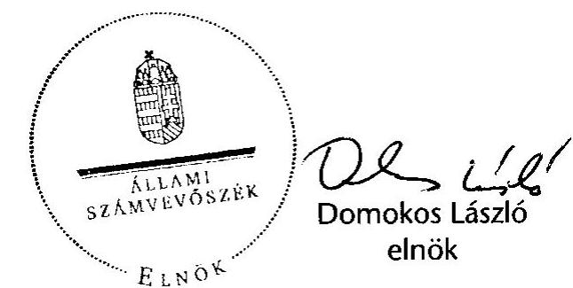

---

ISSN 1789-8773

---

# TARTALOMJEGYZÉK 

ELNÖKI ELŐSZÓ ..... 3

1. AZ INTÉZMÉNY 2010. ÉVI MŰKÖDÉSI KÖRNYEZETE ..... 5
2. SZAKMAI FELADATAINK, EREDMÉNYEINK ..... 7
2.1. Áttekintés az éves ellenőrzési terv teljesítéséről ..... 7
2.2. A zárszámadás ellenőrzésének eredményei ..... 9
2.3. A költségvetés véleményezésének eredményei ..... 11
2.4. A szabályszerűségi és az átfogó ellenőrzések eredményei ..... 12
2.5. A teljesítmény-ellenőrzések eredményei ..... 16
2.6. A javaslatok megvalósulása, illetve tervezett hasznosítása ..... 21
2.6.1. A 2010. évi jelentésekben tett javaslatok statisztikai bemutatása ..... 21
2.6.2. Az ellenőrzési megállapítások, javaslatok hasznosulása ..... 22
3. AZ ELLENŐRZÉST TÁMOGATÓ HÁTTÉRTEVÉKENYSÉGEK ..... 26
3.1. Jogi intézkedések, együttműködés a hatóságokkal ..... 26
3.2. Módszertani munka ..... 28
3.3. Tanulmányok, kutatómunka ..... 29
3.4. Egyéb számvevőszéki feladatok ..... 31
3.4.1. Javaslattétel, véleményezés ..... 31
3.4.2. Közérdekű bejelentések ..... 32
3.4.3. Integritás projekt ..... 34
3.5. Együttmúködés szakmai szervezetekkel ..... 35
3.6. Nemzetközi kapcsolatok ..... 35
4. JELENTÉSEK KÖZREADÁSA ..... 37
4.1. Együttmúködés az Országgyűléssel ..... 37
4.2. A nyilvánosság tájékoztatása ..... 38
5. AZ ELLENŐRI MUNKA MINŐSÉGE (A MINŐSÉG GARANCIÁI) ..... 40
5.1. Az ellenőrzések minőségbiztosítása ..... 40
5.2. Humán erőforrás gazdálkodás ..... 41
5.3. Szervezetfejlesztés ..... 45

---

# 6. ÁTTEKINTÉS AZ INTÉZMÉNY PÉNZÜGYI GAZDÁLKODÁSÁRÓL 

## MELLÉKLETEK

1. sz. melléklet: A 2010. évi ellenőrzések listája
2. sz. melléklet: ÁSZ-jelentések az országgyűlési bizottságok/plenáris ülések napirendjén

## FÜGGELÉK

Az Állami Számvevőszék középtávú stratégiája

---

# ELNÖKI ELŐSZÓ 

Az Állami Számvevőszék, amint eddig minden évben, úgy a 2010. évi tevékenységéről is beszámol az Országgyűlésnek. Ez jó alkalom arra, hogy mi magunk is végiggondoljuk elért eredményeinket, számba vegyük lehetőségeinket, nehézségeinket.

Az ellenőrzési intézmény újkori történetében az elmúlt évet röviden a változások és a kihívások meghatározó kettősségével jellemezhetnénk. A világválság következtében felmerült új feladatokra, a hazai környezeti változásokra szinte minden szervezetnek reagálni kellett, különösen, ha annak tevékenysége a közpénzek szabályszerű, hatékony és eredményes felhasználásának ellenőrzésére, a jó költségvetési gazdálkodás elősegítésére irányul.

A számvevőszéki munka jellegéből adódóan a 2010. év jórészt meghatározott volt egyfelől az éves ellenőrzési terv, másfelől a korábbi stratégiai célok, feladatok teljesítése, lezárásának igénye által. Ugyanakkor az elmúlt évben a tudatos, átgondolt, megújító cselekvés jegyében a számvevőszéki tevékenység minden területén megszerveztük és elindítottuk azokat a folyamatokat, amelyek a jövőt meghatározzák.

A számvevőszéki vezetés 2010 közepén történt megújulása mind a hagyományos, mind az új feladatok, kötelezettségek esetében lehetőséget ad arra, hogy a korábbiaktól eltérő megközelítési módokat alkalmazzunk. Jelen tájékoztatónkban például az önkormányzatok gazdálkodásának átfogó ellenőrzése még megjelenik, de a következő évben már egészen más tartalommal szólhatunk e munkáról, hiszen a számvevőszéki középtávú stratégia ${ }^{1}$ meghatározásával és közreadásával az új megközelítésű válaszok kidolgozása megkezdődött. Munkamódszereink, eljárásaink korszerűsítése során a hazai sajátosságok mellett kiemelten vesszük figyelembe a legújabb nemzetközi standardokat.

A módszertani fejlesztésen túl számos megoldandó feladat jelentkezik a szervezetfejlesztésben is. Az értékőrző megújítás során célunk, hogy a szervezetet képessé tegyük a folyamatos építkezésre, amely támaszkodik a számvevőszéki értékekre, az eddig elért eredményekre, ugyanakkor optimálisan megfelel a változó jogi, gazdasági környezet kihívásainak. A számvevőszéki munkatársak körében generációváltás zajlik. Ez részben motivált pályakezdők felvételét, és egy újonnan kidolgozott gyakornoki program keretében történő képzését, részben új, tapasztalt szakemberek foglalkoztatását jelenti.

[^0]
[^0]:    ${ }^{1}$ Lásd jelen tájékoztató függelékét.

---

A hagyományos számvevőszéki ellenőrzés mellett végzett, de abból táplálkozó tanácsadással, tanulmányok összeállításával, példaadásként pedig a jó gyakorlat széleskörű terjesztésével az államháztartás múködésének korszerűsítésébe kívánunk fokozottan bekapcsolódni.

Az ellenőrzöttekkel szemben támasztott követelményeket érvényesítjük saját intézményi múködésünkkel szemben is, így költségvetési gazdálkodásunkat, az erőforrásaink felhasználását a takarékosság, hatékonyság és a fenntarthatóság jellemzi.

Az Országgyűlés elnöke által megbízott független könyvvizsgáló jelentése szerint „az éves költségvetési beszámoló az Állami Számvevőszék költségvetési fejezet 2010. december 31-én fennálló vagyoni és pénzügyi helyzetéről megbízható és valós képet ad".

---

# 1. Az intÉZMÉnY 2010. ÉVI MŰKÖDÉSI KÖRNYEZETE 

Az Állami Számvevőszék az Országgyúlés pénzügyi és gazdasági ellenőrző szerve, elnökét és alelnökét az Országgyúlés 12 évre választja.

Mint az állam legfőbb pénzügyi ellenőrző szerve csak a törvényeknek és az Országgyúlésnek van alárendelve, ellenőrzéseit - az Alkotmány szerint - törvényességi, célszerűségi és eredményességi szempontok szerint végzi. A gazdasági alkotmányosság garanciájaként elősegíti az Országgyúlés költségvetési jogának gyakorlását, törvényhozási és ellenőrzési funkcióinak érvényre jutását. Az Alkotmány és a számvevőszéki törvény előírásai hivatottak biztosítani a demokratikus államberendezkedés meghatározó pillérét jelentő intézmény függetlenségét, melynek garanciái érvényre jutnak az elnök és az alelnök megválasztása, mentelmi joga, különösen az elnök vezetési, irányítási és döntési jogosítványai, továbbá a szervezet költségvetési kapcsolatai tekintetében.

Az Állami Számvevőszékre vonatkozó szabályozás három szintű: az államszervezetben elfoglalt helyét az Alkotmány, ellenőrzési kötelezettségeit és jogosultságait a számvevőszékről szóló törvény és más törvények szabják meg, míg a szervezet múködésére és irányítására - a törvényi kerethez igazodóan - belső szabályzatok vonatkoznak.

A szervezet munkájának irányításáért - az Alkotmány szerint - az elnök felelős, aki gondoskodik a jogszabályokban rögzített szervezeti kötelezettségek teljesítéséről, az ellenőrzési terv jóváhagyásáról és megvalósításáról, a jelentések Országgyúlés elé terjesztéséről és nyilvánosságáról. Mindezeken túl az Országgyűlésben képviseli az Állami Számvevőszéket, állandó meghívottként részt vehet és felszólalhat a plenáris és bizottsági üléseken, a képviselők kérdést intézhetnek hozzá.

Az Állami Számvevőszék 2010-ben sajátos körülmények között végezte munkáját és ellenőrzési tevékenységét. Korábbi elnökének megbízatása 2009. december 9 -én lejárt, s az intézmény, amely immár nyolcadik éve - az Alkotmánnyal ellentétben - alelnök(ök) nélkül múködött, ezt követően országgyúlési döntés hiányában 2010 júliusáig teljes jogkörű választott vezető nélkül folytatta tevékenységét. A szabályozás megteremtette a kereteit annak, hogy a több mint féléves időszak alatt az intézmény főtitkára irányíthassa a hivatali szervezetet, és szűkített jogosítványokkal jogosult és köteles volt megtenni mindazt, ami az Állami Számvevőszék törvényi kötelezettségei teljesítéséhez, múködéséhez halaszthatatlanul szükséges. Miután a főtitkár - az intézmény Alkotmányban rögzített jogállásához igazodóan - nem helyettesíthette az elnököt teljes jogkörében, így ez idő alatt az Állami Számvevőszék múködése sem felelt meg az Alkotmány előírásainak. A főtitkár helyettesítési jogkörében eljárva nem tehetett javaslatot az Országgyúlésnek az Állami Számvevőszék szervezeti felépítésére és annak módosítására; nem hagyhatta jóvá az Állami Számvevőszék Szervezeti és Múködési Szabályzatát, illetve annak módosítását. A főtitkár nem volt jogosult a vezetők tekintetében a kinevezési és felmentési jogkör gyakorlására, az ellenőrzési munkában a főigazgatóknak nem volt felettese, így az Állami Számvevőszék átfogó irányítás nélkül maradt. Nem hagyhatta jóvá az Állami Számvevőszék éves ellenőrzési tervét, valamint az Állami Számvevőszék éves je-

---

lentését, továbbá nem helyettesíthette az elnököt az Országgyűlés ülésén. Ezek a hatásköri korlátok is hozzájárultak ahhoz, hogy választott vezetők hiányában nem lehetett zökkenőmentes az Állami Számvevőszék 2010 első félévének múködése. A képviseleti / helyettesítési jog korlátai miatt az intézmény munkáját is érintő hátrányos költségvetési intézkedések születtek, elerőtlenedett a szervezet.

A múködés formailag ugyan biztosított volt, de az elnöki irányítás rendszere nem érvényesülhetett, és fontos, az intézmény szakmai-szervezeti fejlődését meghatározó döntéseknek kellett elmaradnia. Ezen időszakban a választott vezetők hiánya alkotmányos és múködési kockázatot hordozott. Ha ez az állapot hosszabb ideig állt volna fenn, akkor a szervezet érdemi múködése került volna veszélybe, ugyanis csak az elnök - helyettesítő jogkörben az alelnök - által jóváhagyható ellenőrzési terv nélkül az Állami Számvevőszék nem teljesíthette volna alkotmányos és egyéb törvényi kötelezettségeit.

Az Országgyűlés 2010 júniusában meghatározó döntést hozott az Állami Számvevőszék működése és irányítása szempontjából. Az új számvevőszéki elnök és alelnök megválasztásával, illetve július 5-én történt hivatalba lépésével a számvevőszéki vezetés hosszabb idő után újra az Alkotmány előírásainak megfelelően múködik. Az új vezetés elsődleges feladata volt a szervezet irányításának helyreállítása. Ennek érdekében át kellett tekinteni a szervezet teljes múködését, szabályozottságát és a vezetést támogató kontrollokat. Számos olyan döntést kellett meghozni, amelyek korábbi elmaradása kedvezőtlenül befolyásolta a gazdálkodást és ezáltal a számvevőszéki feladatellátást.

Az új vezetés hivatalba lépéséig az elmúlt években a Számvevőszék létszáma jelentősen az engedélyezett létszámkeret alá csökkent, s az új, kellő számú, felkészült munkaerő biztosítása, képzése komoly kihívás elé állítja még ma is a szervezetet. Az ellenőrzések a 2009 végén elfogadott ellenőrzési terv szerint folytak, de csak az új elnök megválasztását követően lehetett a tervet a legsürgetőbb elvárásokhoz igazítani (az Országos Cigány Önkormányzat gazdálkodása ellenőrzésének, a természeti katasztrófák elhárítási rendszerének felvétele az ellenőrzési tervbe).

A megválasztott elnök szakmai koncepciójának meghirdetése után elkészült az intézmény új középtávú stratégiája. A meghirdetett stratégia biztosítja a folyamatos építkezést, támaszkodik a szervezet értékeire és eddig elért eredményeire, ugyanakkor a számos környezeti változás és kihívás egybeeséséből adódóan mégis új hangsúlyokat jelöl ki. Az Állami Számvevőszék küldetése, hogy szilárd szakmai alapon álló, értékteremtő ellenőrzéseivel előmozdítsa a közpénzügyek átláthatóságát, rendezettségét és járuljon hozzá a „jó kormányzáshoz".

Az Állami Számvevőszék 2011. évi ellenőrzési tervének kialakítása a korábbi gyakorlattól eltérő, széles körben nyitott, alulról építkező tervezési folyamat során történt meg. Az új tervezési folyamat legfontosabb eleme az ellenőrzési témák versenyeztetése volt. Ennek során a tervbe kerülő ellenőrzési témák kiválasztása többfordulós verseny végeredményeként alakult ki.

---

Az Állami Számvevőszék új középtávú stratégiájában és a 2011. évi ellenőrzési tervében kitűzött célok teljesítése és az átlátható múködés érdekében megkezdődött a szervezet átalakítása, az információ-áramlás, a kontrolling és monitoring, a munkafolyamatokra vonatkozó szabályok érvényesülését biztosító ellenőrzési rendszerek meghatározása, kiépítése mind az ellenőrzés-szakmai feladatok, mind az azokat támogató intézményi feladatok körében.

Az Állami Számvevőszék az aktív és kezdeményező kommunikáció érdekében 2010. év második felétől hatékony és korszerű módszereket alkalmaz, fokozottan él a világháló adta lehetőségekkel. Az Állami Számvevőszék honlapján elindított hírportál egyre inkább elismert és keresett információforrásként szolgál az érdeklődőknek.

# 2. SZAKMAI FELADATAINK, EREDMÉNYEINK 

### 2.1. Áttekintés az éves ellenőrzési terv teljesítéséről

Az ÁSZ 2010-ben korábbi Elnöke által jóváhagyott - az Országgyúlés Költségvetési, pénzügyi és számvevőszéki bizottsága által megtárgyalt - ellenőrzési tervben foglaltak szerint végezte tevékenységét.

A 2010. évi ellenőrzési tervben összesen 65 téma szerepelt. Év közben az ÁSZ ellenőrzési terve 6 feladattal kiegészült, három törlésre került ${ }^{2}$, így a módosított ellenőrzési terv 68 vizsgálatot tartalmazott. A 2010-re ütemezett feladatok teljesültek, az év során 46 jelentés került közzétételre, amelyek közül 6 jelentést választott vezetők hiányában - az elnök nevében eljáró főtitkár írt alá. Az erő-forrás-felhasználás a tervezettnek megfelelően alakult.

A törvényekben különféle rendszerességgel előírt (évenkénti, kétévenkénti illetve rendszeres) feladatok teljesítése az ellenőrzési erőforrások 67\%-át vette igénybe, ezekről 33 jelentés készült.

Az évenkénti ellenőrzési kötelezettségek (az állami költségvetés megalapozottságának véleményezése, zárszámadásának ellenőrzése, az MNV Zrt. és az MTI Zrt. 2009. évi múködésének, valamint a fővárosi önkormányzatot és a kerületi önkormányzatokat osztottan megillető bevételek megosztásának ellenőrzése) teljesítésére az erőforrások 35\%-át fordítottuk.

[^0]
[^0]:    ${ }^{2}$ Új ellenőrzések: az Országos Cigány Önkormányzat 2009. évi - 2010. I. félévi gazdálkodásának ellenőrzése, a 2009. novemberi időközi országgyúlési képviselőválasztási kampányra fordított pénzeszközök elszámolásának ellenőrzése a képviselethez jutott jelölő szervezetnél, a természeti katasztrófák megelőzésére, elhárítására, következményeinek felszámolására kialakított rendszerek ellenőrzése, a Magyar Posta Zrt. gazdálkodásának ellenőrzése, a szakképzési hozzájárulás felhasználása célszerűségének ellenőrzése és a Garantiqa Hitelgarancia Zrt. garanciavállalási tevékenysége eredményességének értékelése.
    Törölt ellenőrzések: a központi költségvetést megillető regisztrációs adóbevételek realizálása hatékonyságának és eredményességének ellenőrzése, a központi költségvetési tervezési rendszer múködésének ellenőrzése és a közszolgáltatások elektronizálásának és ráfordításai hasznosulásának ellenőrzése.

---

A kétévenkénti ellenőrzési kötelezettségek teljesítéseként 2 párt és 2 pártalapítvány gazdálkodásának ellenőrzéséről készült jelentés.

A rendszeres ellenőrzési feladatok (melyek gyakoriságát az ÁSZ maga határozza meg) teljesítéseként 24 jelentést adtunk közre, az erőforrások 30\%-ának felhasználásával. (Rendszeres ellenőrzési feladatot jelent a költségvetési fejezetek, a helyi önkormányzatok, a társadalombiztosítási és az elkülönített állami pénzalapok gazdálkodásának ellenőrzésére.)

E feladatokon belül 76\%-ot jelentett a helyi önkormányzatok gazdálkodási rendszerének ellenőrzése. A 119 önkormányzat helyszíni ellenőrzésénél szerzett tapasztalatokat összefoglaló jelentésen kívül 16 jelentős nagyságrendű költségvetéssel, illetve vagyonnal rendelkező önkormányzatról önálló számvevőszéki jelentés készült ( 5 megyei, 6 megyei jogú városi és 5 fővárosi kerületi önkormányzat).
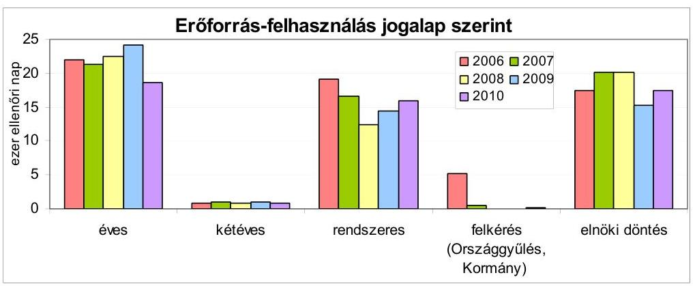

2010-ben a Kormány felkérésére az Országos Cigány Önkormányzat gazdálkodásának ellenőrzését végeztük el.

A törvényi előírások teljesítése mellett az éves erőforrások 33\%-át fordíthattuk olyan témák ellenőrzésére, amelyek végrehajtásának gyakoriságát törvény nem rögzíti. Ezeket, az ÁSZ elnökének döntése alapján választott ellenőrzéseket többségében a teljesítmény-ellenőrzés módszertanának alkalmazásával hajtottuk végre.

Az ÁSZ elnökének döntése alapján megvalósult ellenőrzések az ÁSZ 2010 végéig érvényes stratégiájának céljaihoz illeszkedően három súlypont köré csoportosíthatóak: az uniós források igénybevétele és cél szerinti hasznosítása, az állami fejlesztési források védelme és az állami feladatok hatékony és eredményes ellátása.

---

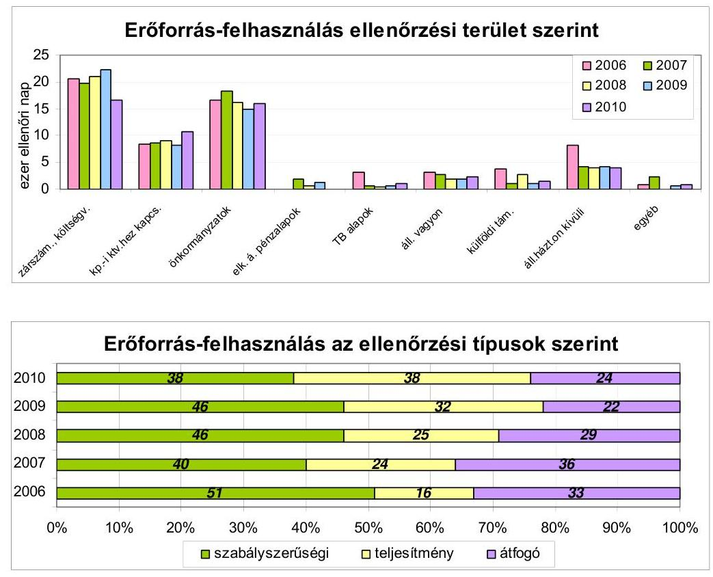

A 2010-ben elkészült jelentések felsorolását az 1. sz. melléklet tartalmazza.

# 2.2. A zárszámadás ellenőrzésének eredményei 

A Magyar Köztársaság 2009. évi költségvetése végrehajtásának (zárszámadás) ellenőrzése ${ }^{3}$ során a financial audit módszerével teljes körűen vizsgáltuk a központi költségvetés közvetlen bevételeinek és kiadásainak elszámolását, amelyek teljesítési adatai a 2009. évi zárszámadási törvényjavaslatban - a korlátozott minősítésű állami vagyonnal kapcsolatos bevételek és kiadások, valamint a lakástámogatások kivételével - megbízhatóak.

Az állami vagyon hasznosításának lényegi keretei a 2009. évben sem változtak. Az MNV Zrt. továbbra sem rendelkezett az állami vagyont tételes leltárral alátámasztó, az állami részesedések aktualizált értékét tartalmazó, szabályos, pontos és teljes körű vagyonnyilvántartással. Nem tudta megadni 1,5 Mrd Ft összegű egyéb ingatlan értékesítésből származó bevétel teljes körű, tételes elszámolását, továbbá nem rögzítette a 119,7 M Ft összegű módosítás tartalmát, összetételét és indokoltságát.

A lakástámogatásoknál a 2005. évi zárszámadás ellenőrzése óta minden évben jelezzük, hogy egyes hitelintézetek, bár változó körben, több éve jelentős ösz-

[^0]
[^0]:    ${ }^{3} 1016$ Jelentés a Magyar Köztársaság 2009. évi költségvetése végrehajtásának ellenőrzéséről.

---

szegben folyósítanak támogatást a jogszabály által előírt új szerződés hiányában.

A 2009. évi zárszámadás ellenőrzése során 52 pénzügyi szabályszerűségi ellenőrzést végeztünk, amelynek alapján a központi költségvetés fejezetei kiadási főösszege 53,1\%-ának megbízhatóságát minősítettük.

# A 2009. évi zárszámadás ellenőrzése során az ÁSZ által végzett pénzügyi szabályszerűségi ellenőrzések eredményei 

| minősítés jellege | db |
| :-- | :--: |
| elfogadó minősítésű beszámoló | 39 |
| ebből figyelemfelhívó megjegyzéssel ellátott | 26 |
| korlátozott minősítésű beszámoló | 10 |
| elutasító minősítésű beszámoló | 3 |

A 2009. évben 12 fejezet belső ellenőrzési szervezeti egysége összesen 59 megbízhatósági ellenőrzést végzett, amely az intézményi kiadási főösszeg 9\%-át jelentette.

## A 2009. évi zárszámadás ellenőrzése során a fejezetek által végzett pénzügyi szabályszerűségi ellenőrzések eredményei

| minősítés jellege | db |
| :-- | :--: |
| elfogadó minősítésű beszámoló | 46 |
| ebből figyelemfelhívó megjegyzéssel ellátott | 21 |
| korlátozott minősítésű beszámoló | 6 |
| elutasító minősítésű beszámoló | 7 |

Megállapítottuk, hogy a 2008. évi zárszámadás ellenőrzésekor feltárt hiányosságok megszüntetésére tett javaslatokban megjelölt feladatokat a tárcák csak részben teljesítették, illetve azok végrehajtása folyamatban van. A 2009. évi zárszámadás ellenőrzésének időszakában továbbra is fennálló problémákat kiemelten kezeltük.

Az elemi beszámolók ellenőrzése során a mérleg, a pénzforgalmi jelentés és a kiegészítő melléklet tekintetében is állapítottunk meg hiányosságokat (jogszabályi előírások be nem tartása, mérlegsorok leltári alátámasztásának hiánya, fedezet nélküli hosszú távú kötelezettségvállalás stb.), amelyek a beszámolók megbízhatóságát befolyásolták.

A költségvetésben megjelenő EU-források teljesítése 8\%-kal elmaradt a tervezettől, ugyanakkor a központi költségvetési eszközök felhasználása 24\%-kal túllépte a tervezett előirányzatot, ami hiánynövelő tényezőként hatott a költségvetés teljesítésének szempontjából.

---

Az elkülönített állami pénzalapok és a társadalombiztosítás pénzügyi alapjai 2009. évi zárszámadásának ellenőrzése során új feladatként jelentkezett, hogy az alapok - APEH által beszedett - bevételének adatait az ÁSZ minősítette. A könyvvizsgálók az egyéb bevételekről, illetve a kiadási adatokról mondtak véleményt. A könyvvizsgálók az ellenőrzés során - a Szülőföld Alap és a Kutatási és Technológiai Innovációs Alap könyvvizsgálója kivételével - az ÁSZ módszertana alapján jártak el. Az ellenőrzés tapasztalatai alapján kezdeményeztük a szabályozás felülvizsgálatát, mert a módosításkor átmeneti szabályokat nem állapítottak meg, és nem tisztázták a könyvvizsgálat és „a beszámoló ellenőrzése" fogalmak közötti különbséget, illetve a beszámolók ellenőrzésének folyamatában a szereplők (alapkezelő, könyvvizsgáló, felügyelő miniszter, Kormány, ÁSZ) kapcsolatát és felelősségét az ellenőrzési feladat végrehajtásában.

Az elkülönített állami pénzalapok működési feltételei a 2009. évben is biztosítottak voltak. Az alapok 2009. évi összesített tárgyévi egyenlege negatív volt, de a hiányt a felhalmozott maradvány fedezte.

A társadalombiztosítási alapok napi likviditását kamatmentes hitel biztosította. Az előirányzott értéket meghaladó hiányt a Kormány kiadáscsökkentő, a költségvetési hiánycél tartása érdekében hozott intézkedései nem tudták ellensúlyozni.

# 2.3. A költségvetés véleményezésének eredményei 

A Magyar Köztársaság 2011. évi költségvetési törvényjavaslatának véleményezése során az adóbevételek előirányzat-tervezeteinek megalapozottságát teljes körűen nem tudtuk megítélni, de előrelépést jelentett, hogy 33\%-ra csökkent azoknak az adóbevételeknek az aránya, amelyekről nem állt módunkban véleményt mondani. A tervezett adóbevételek $46 \%$-át teljesíthetőnek értékeltük, $15 \%$-ának realizálhatóságát ítéltük közepes, és $6 \%$ teljesíthetőségét magas kockázatúnak. Szükségesnek tartottuk jelezni, hogy a GDP 3\%-os tervezett növekedésénél alacsonyabb gazdasági növekedés további kockázati tényező lehet az egyes adónemek realizálásánál.

Az állami vagyonnal kapcsolatos 2011. évi bevételi tervek 86\%-át teljesíthetőnek, $14 \%$-át magas kockázatúnak minősítettük. A Nemzeti Földalappal kapcsolatos bevételi és kiadási előirányzatok teljesíthetősége, illetve megalapozottsága számítások hiányában nem volt megítélhető.

A költségvetési törvényjavaslat közvetlen kiadási előirányzatai - a volt egyházi ingatlanok tulajdoni helyzetének rendezése kivételével - megalapozottak voltak. Egy jelentős részüknél a kiadások előirányzat-módosítási kötelezettség nélkül, az uniós támogatásoknál korlátozásokkal túlteljesíthetők, ami a hiány betartásánál kockázati tényezőként jelentkezhet. A kockázatot csökkenthette volna a költségvetési törvényjavaslatban meghatározott rendkívüli kormányzati intézkedésekre szolgáló tartalék. A 2011. évi költségvetés ellenőrzésének lezárását követően hatályba lépett törvénymódosítás alapján azonban ez a tartalékfajta az általános tartalék, és nem a stabilitási tartalék helyébe lép. Így az általunk jelzett kockázatokra nem biztosíthat fedezetet.

---

A költségvetési törvényjavaslat véleményezése során felhívtuk a figyelmet arra, hogy a változó befektetői megtakarítási szerkezet, a külföldiek forint- és devizakötvény vásárlási hajlandóságának kedvezőtlen alakulása, az állampapír-piaci hozamszint prognózistól kisebb mértékű csökkenése, valamint a forint és az euró tervezett árfolyamának kedvezőtlen változása egyaránt kockázati tényezőként jelentkezhet a 2011. évi finanszírozási terv teljesülésénél.

A folyamatosan változó jogszabályi környezet, a teljes mértékben le nem zárult szerkezetátalakítás, valamint az, hogy a törvényjavaslat kidolgozásakor a még elfogadás előtt álló jogszabályok várható hatásait is figyelembe vették az előirányzatok kimunkálása során, jelentősen megnehezítette mind a tárcák tervező munkáját, mind annak ellenőrzését. A helyszíni ellenőrzést követően az Országgyűlés részére benyújtott törvényjavaslat a fejezeteknél mind a bevételeket, mind a kiadásokat, továbbá a központosított bevételeket érintően több változást tartalmazott, amelynek tartalmára, okaira, megalapozottságára vonatkozóan nem rendelkeztünk információval.

Felhívtuk a figyelmet a fokozatosan növekvő önkormányzati feladatok és azok finanszírozása közötti egyre nagyobb résre, az önkormányzatok ebből fakadó nehéz pénzügyi helyzetére, az utóbbi időszakban megduplázódó adósságállományára, továbbá önkormányzati gazdasági társaságok egyre nagyobb, tartós kötelezettségvállalására. Szükségesnek tartottuk a feladatok és a finanszírozás összhangjának erősítése mellett az önkormányzati felelősségi viszonyok megjelenítését is.

A költségvetési törvényjavaslat a korábbi évekhez viszonyítva több elemében pozitív változást tartalmazott. Néhány területen azonban évek óta visszatérő problémákat (pl. a tárgyévet követő három év előirányzatai kimunkálásának, a költségvetést megalapozó jogszabályok elfogadásának elmaradása) is tapasztaltunk. Változatlanul fontosnak tartottuk az elmúlt évekhez hasonlóan megismételni, hogy az éves költségvetés szerkezetét, tartalmát, a tervezést végző szervezetek feladatait, az ÁSZ részére történő adatszolgáltatást egy átfogó jellegű közpénzügyi törvényben szükséges meghatározni.

# 2.4. A szabályszerűségi és az átfogó ellenőrzések eredményei 

A helyi önkormányzatok gazdálkodási rendszerét 4 megyei, 6 megyei jogú városi, 6 Budapest fővárosi kerületi, 66 városi önkormányzatnál, valamint 4 nagyközségi és 32 községi önkormányzatnál vizsgáltuk. A 2006-2009. években az önkormányzatok mintegy nyolctizede nem biztosította a költségvetési egyensúlyt, a tervezett költségvetési bevételeik nem nyújtottak fedezetet a tervezett költségvetési kiadásokra, a különbséget hitel felvételével tervezték biztosítani. A költségvetés teljesítése során ennél kisebb arányban, az önkormányzatok mintegy harmadánál alakult ki éves szinten pénzügyi hiány. Az ellenőrzött önkormányzatok több mint kétharmada deviza alapú, változó kamatozású kötvényt bocsátott ki. A tőketörlesztés megkezdéséhez meghatározott türelmi idő fél és öt év között változott. A kötvénykibocsátás a deviza árfolyamváltozása, valamint a változó kamatfeltétel miatt az önkormányzatok számára kockázatot jelent.

---

Az uniós források igénybevételére és felhasználására az önkormányzatok közel háromnegyede nem készült fel eredményesen. Az ellenőrzött önkormányzatok mintegy 90\%-ánál múködtettek e-közszolgáltatást biztosító informatikai rendszert, amelyek nyolctizede biztosította az ügyintézéshez szükséges nyomtatványok letöltésének és azok elektronikus kitöltésének lehetőségét. A közérdekű gazdálkodási adatok nyilvánosságát még mindig nem biztosítják eléggé, mivel az önkormányzatok mintegy fele a törvényi kötelezettség ellenére elmulasztotta a céljellegú támogatások és a nettó öt millió Ft feletti szerződések jogszabályban meghatározott adatainak, valamint az éves költségvetési beszámoló szöveges indoklásának a közzétételét.

A gazdálkodás szabályozottságának ellenőrzése során megállapítottuk, hogy az ellenőrzött megyei, megyei jogú városi, Budapest fővárosi kerületi és városi önkormányzatok közel kétharmadánál a költségvetés tervezési, a zárszámadás készítési folyamatok, szervezeti és szabályozási kereteinek kialakítása alacsony kockázatot jelentett. A kialakított kontrollok múködésének megfelelősége az ellenőrzött önkormányzatok mintegy felénél a költségvetés tervezés és a zárszámadás készítés folyamatában összességében kiváló volt. A gazdálkodási és a pénzügyi-számviteli feladatok végrehajtásánál a szakmai teljesítés igazolás és az utalvány ellenjegyzés múködésének megfelelősége az önkormányzatok, mintegy felénél gyenge, míg közel egyharmadánál kiváló.

A belső ellenőrzés szervezeti kereteinek kialakítása és múködési feltételeinek szabályozása az önkormányzatok közel felénél közepes, mintegy harmadánál alacsony kockázatot jelentett a belső ellenőrzési feladatok szabályszerű végrehajtásában, mert a belső ellenőrzés módját meghatározták, a szükséges személyi, szervezeti, szabályozási feltételeket biztosították. Az önkormányzatok közel felénél a belső ellenőrzés múködésénél a kialakított kontrollok megfelelősége jó, harmadánál összességében kiváló volt.

# A Budapest Főváros Önkormányzata költségvetési gazdálkodásában kialakított belső kontrollok múködésének 2010. évi ellenőrzésekor 

megállapítottuk, hogy a gazdálkodási és a folyamatba épített ellenőrzési feladatok szabályozásának hiányosságai közepes kockázatot jelentettek a feladatok megfelelő és szabályszerű végrehajtásában. A költségvetési kiadások teljesítése során a költségvetési gazdálkodás folyamatában kulcsszerepet betöltő belső kontrollok (szakmai teljesítés igazolás, utalvány ellenjegyzés) múködésének megfelelősége gyenge volt. A feltárt hiányosságok, szabálytalanságok miatt az ÁSZ büntető feljelentést tett, és egy fegyelmi eljárás megindítását kezdeményezte. Javasoltuk a Közgyűlésnek, hogy a 2006-2010 között teljesített kifizetések tekintetében végeztesse el a megbízási szerződések kötése körülményeinek, jogszerűségének, továbbá annak felülvizsgálatát, hogy az ellenőrzési jogkörök gyakorlására kijelölt, illetve felhatalmazott személyek a szerződéskötések és a kifizetések során ellátták-e a jogszabályokban előírt ellenőrzési feladataikat, valamint indokolt esetben kezdeményezzen a mulasztásokért felelős köztisztviselők ellen fegyelmi eljárást.

A belső ellenőrzés szervezeti kereteinek kialakítása és szabályozása a belső ellenőrzési feladatok megfelelő, szabályszerű végrehajtásában közepes kockázatot jelentett, a kialakított kontrollok múködésének megfelelősége gyenge volt. A belső ellenőrzés végrehajtása során nem biztosították a belső ellenőrzést végzők

---

funkcionális függetlenségét. Továbbá a belső ellenőrzés a Főpolgármesteri Hivatal szervezeti egységeinél több magas kockázatúnak értékelt területen - köztük a költségvetés tervezése, azon belül a személyi juttatások tervezése és a költségvetési előirányzatok felhasználása tekintetében - nem tervezett és nem végzett ellenőrzést, ennek következtében nem tárta fel, hogy a költségvetési előirányzatok felhasználása során teljesített kifizetéseknél a kulcsszerepet betöltő belső kontrollok, a szakmai teljesítés igazolás és az utalvány ellenjegyzés nem megfelelően működtek. A Főpolgármesteri hivatalnál a 2009-2010. év I. félévében az ellenőrzési tervekben előirányzott ellenőrzések közel harmadát a tervezett időben nem végezték el.

A fövárosi önkormányzatot és a kerületi önkormányzatokat osztottan megillető bevételek 2010. évi megosztásáról szóló önkormányzati rendelet felülvizsgálata során megállapítottuk, hogy a megosztandó bevétel összegét - 216564 millió Ft-ot - helyesen állapította meg a fővárosi önkormányzat, azonban a forrásmegosztási részesedés meghatározása téves volt, a fővárosi önkormányzat terhére azt 392 millió Ft-tal kellett csökkenteni, és ugyanennyivel nőtt a fővárosi kerületeket összesen megillető részesedés. Az eltérés a megosztandó bevétel $0,18 \%$-a.

# A Hálózat-Budapesti Díjfizetőkért és Díjhátralékosokért Alapítvány 

ellenőrzésének alapját a vonatkozó jogszabályok csak korlátozottan teremtették meg, mivel az alapítvány támogatási rendszerén belül a Fővárosi Önkormányzat által finanszírozott támogatások ellenőrzését végezhettük el. A támogatásra való jogosultságot igazoló dokumentumok hiánya nem tette lehetővé a szociális rászorultság fennállásának megállapítását. Az alapítvány a támogatásra való jogosultságot nem ellenőrizte. Ellenőrzésünk több szabálytalanságot tárt fel: jogosulatlan személyeknek jóváírt támogatást 240 millió Ft összegben, 9,8 millió Ft duplikált támogatásnyújtást, 2,4 millió Ft összegben maximumot meghaladó támogatást.

A fogyatékkal élők érdekvédelmére, ellátására és segítésére hivatott nonprofit szervezeteknek 2007-2009. években nyújtott nem normatív állami támogatások felhasználásának helyszíni ellenőrzése eredményeként megállapítottuk, hogy a szervezetek 85\%-a a támogatásokat szabályszerűen, az Országos Fogyatékosügyi Programban meghatározott célok elérése érdekében használta fel. A vizsgálat feltárta a költségvetési finanszírozás szabályozásának, összehangolásának és kontrolljának, valamint a támogatások társadalmi hasznossága megítélésének hiányosságait. Jelentésünk rámutatott a támogatások felhasználása során érvényesülő törvényi, rendeleti szabályozások, a szerződéses követelmények ellentmondásaira. Az ellenőrzés 40,1 millió Ft értékben állapított meg szabálytalan támogatás elszámolást, amelynek kétharmada a központi költségvetésbe való visszafizetéssel, helyesbített elszámolással rendeződött. A számviteli törvényben és a támogatási szerződésben előírtak megsértése miatt egy szervezetnél személyes felelősséget is megállapított az ellenőrzés.

A színházak állami támogatása és gazdálkodása ellenőrzésekor megállapítottuk, hogy a támogatásokhoz sem ágazati, sem fenntartói szinten nem kapcsolódott a közpénzfelhasználással elérni kívánt kulturális, társadalmi, gazdasági célok, hatások, valamint az ezeket elősegítő finanszírozási elvek, módszerek meghatározása. Stratégia, intézkedési terv nem készült, ezért a kor-

---

mányprogramokban, az ágazati munkaanyagokban megfogalmazott célok csak részben teljesültek. A kulturális esélyegyenlőség érdekében szükséges regionális színházi ellátottság különbségei nem csökkentek.

Az előadó-művészeti törvény hatályba lépését követően a támogatási rendszer a korábbinál átláthatóbbá vált. A központi színház-támogatás jelenlegi rendszere ugyanakkor nem veszi figyelembe az ingatlanfenntartás és fejlesztés pénzügyi igényeit. Hátrányos helyzetbe kerültek az elavult infrastruktúrával, továbbá forráshiányos fenntartóval rendelkező színházak.

A független szervezetek pályázati úton többnyire múködésre és nem produkció megvalósítására kaptak támogatást. A kiírásokban gyakran hiányzott a pályázati célok és feltételek pontos meghatározása, a lebonyolítás átfutási ideje hosszú volt. A pályázati támogatások szabályszerű felhasználásának rendszeres ellenőrzése, számonkérése teljes körűen nem volt biztosított, a hasznosulás átfogó értékelése sem történt meg.

Az Európai Parlament tagjai választásának lebonyolításához a 2009. évi költségvetési törvényben 4100 millió Ft előirányzatot hagyott jóvá az Országgyúlés. Ez 5,8\%-kal volt alacsonyabb a 2004. évi EP-választás kiadásainál. A csökkenést a külképviseleti szavazás közel háromnegyedes, illetve a központi kiadások egyharmados csökkenésének és a helyi kiadások több mint egyharmados növekedésének együttes hatása okozta. A teljesített kiadás 3855 millió Ft, a maradvány 245 millió Ft volt. Továbbra is jelentős a külképviseleteken történő szavazás fajlagos költsége, a választáshoz kapcsolódóan az OVI négy tagja kiemelkedően magas céljutalomban részesült.

A Kormány felkérésére ellenőrzött Országos Cigány Önkormányzat pénz-ügyi-vagyoni helyzetét rendezetlennek minősítve, a törvényi mulasztások, a szabálytalan gazdálkodás miatt kezdeményeztük a büntető eljárás megindítását. A szabálytalan kifizetések alapján elszámolt 10,5 millió Ft visszafizettetését javasoltuk.

A rendszeres pártellenőrzések körében tervszerűen befejeztük két párt (Kereszténydemokrata Néppárt, Magyar Demokrata Fórum) gazdálkodása törvényességének vizsgálatát. A tapasztalatok ismételten megerősítették - a pártfinanszírozás átláthatóságának, a pártok elszámoltathatóságának fokozott érvényesítése érdekében - a pártok számviteli nyilvántartási és beszámolási rendszerét érintő ellentmondások feloldásának szükségességét, amelyek a párttörvény és a számviteli törvény között egy évtizede fennállnak.

A pártellenőrzésekkel összhangban került sor a költségvetési támogatásra jogosult pártalapítványok gazdálkodása törvényességének ellenőrzésére. A kuratóriumok által nyújtott támogatások, valamint a saját szervezeti keretek között megvalósított programok megfeleltek az alapítványok alapító okiratában megfogalmazott céljainak. Az egyik alapítványnál - korábbi javaslataink realizálásának elmaradása miatt - a számviteli elszámolás rendje hiányos volt, az előírások nem érvényesültek maradéktalanul.

---

# 2.5. A teljesítmény-ellenőrzések eredményei 

Az MNV Zrt. 2009. évi tevékenységének ellenőrzése során rámutattunk, hogy a vagyontörvénnyel létrehozott intézményi rendszer jogi szabályozása 2009-ben sem volt elégséges a törvényhozói szándékok érvényesítéséhez. Az alapvető hiányosságok a jogi szabályozásban, a döntési folyamatokban, a va-gyon-nyilvántartásban megmaradtak, felelősségre vonás - a vezérigazgató munkaviszonyának rendkívüli felmondása kivételével - nem történt. 2009-ben is voltak olyan hatásköri viták és olyan - az állam számára hátrányos - intézkedések, amelyek milliós nagyságrendű kifizetéseket eredményeztek.

A döntéshozók vagyonkezeléssel kapcsolatos intézkedései - jelentős hatású ügyekben - nem a vagyontörvény céljait szolgálták, nem voltak átláthatók és kellően eredményesek. A Részvényesi Jogok Gyakorlójának döntései nem az állam érdekei elsődlegességének figyelembevételével születtek, a döntési folyamatokat a koncepció és az átláthatóság hiánya jellemezte. A tanácsi hatáskör szabályozása és gyakorlata bonyolult volt, a kialakított ellenőrzési rendszer részben volt eredményes, nem hozta felszínre a döntéshozatal és a végrehajtás hibáit.

Az MNV Zrt. a rábízott vagyonával - az ingatlanvagyonnal, a Nemzeti Földalap vagyonával és a gazdasági társaságokban lévő vagyonnal - jóváhagyott középtávú vagyonhasznosítási stratégia nélkül gazdálkodott. A költségvetési forrásból finanszírozott állami tulajdoni részesedések növelését célzó döntések 2009-ben sem voltak átgondoltak. A MALÉV Zrt., a Bábolna Nemzeti Ménesbirtok Kft. tőkeemelése a veszteséges gazdálkodást finanszírozta, ez ellentétes az EU-előírásokkal.

A 4-es metró beruházási folyamatának ellenőrzése keretében azt értékeltük, hogy a Kelenföldi pályaudvar és Keleti pályaudvar közötti I. szakasz építése a tervezett költségeken belül, a szerződéseknek megfelelően, határidőben elkészül-e. A beruházást a Főváros felügyelete mellett a BKV Zrt. DBR Metró Projekt Igazgatósága bonyolítja. A beruházást 20 különálló szerződés megkötésével a „tervezz és építs" szerződéses feltételrendszer alkalmazásával, generáltervező és -kivitelező nélkül valósítják meg. A Főváros által 2004-ben jóváhagyott beruházási engedélyokirat szerint az I. szakasz átadásának határideje 2009. év vége, a beruházás folyóáras költsége 236,5 Mrd Ft volt. A beruházás határidőben nem valósult meg, a forgalomba helyezés 2013. II. felében várható, a költséget pedig folyóáron 370 Mrd Ft-ban prognosztizálják. A Főváros úgy írta elő a 2009. évi határidőt, hogy nem vette figyelembe a műszaki előkészítő tevékenység aktuális helyzetét. A beruházás vezértechnológiáját jelentő vonalalagút építése kölcsönös függésben volt az állomásépítésekkel és az összes többi építési fázist is befolyásolta, kihatott az I. szakasz befejezési időpontjára. A vonalalagút kivitelezőjének késése kimerítette a szerződéses ár maximum 10\%áig terjedő kötbérfizetési kötelezettséget, mintegy 20 M eurót (5,6 Mrd Ft-ot), amely még nem rendezett. Az ellenőrzés időpontjában nem lehetett pontosan meghatározni a beruházás várható összköltségét, a hasznosulást és a befejezés időpontját, miután a 4-es metró I. szakaszának építése folyamatban van. A legnagyobb időbeli kockázatot a metrószerelvények beszerzésének bizonytalansága jelenti.

---

A DBR által készíttetett nemzetközi összehasonlító tanulmány szerint a budapesti 4-es metró I. szakaszának 1 km-re jutó megvalósítási költsége 214 M euró, amely a második legdrágább, 10 európai metróépítéssel történő összehasonlításban. Ebben szerepet játszik az is, hogy az I. szakasz sűrű állomáskiosztással épül.

A Pénztárak Garancia Alapja múködésének ellenőrzése keretében a 2000-2009 közötti évekre kiterjedően ellenőriztük a kötelező magánnyugdíjpénztárak által alapított Pénztárak Garancia Alapja működését, amely a ma-gán-nyugdíjpénztári tagok magán-nyugdíjpénztárakkal szemben fennálló követeléseinek teljesítésére vállal garanciát. Az Alap feladatellátásának több év óta fennálló szabályozási hiányosságait állapítottuk meg, amelyek növelték az állami kockázatvállalást azáltal, hogy végső soron a központi költségvetés tartozott helytállni a magán-nyugdíjpénztári tagok követeléseiért. Az állam vállalta továbbá, hogy a kötelező magán-nyugdíjpénztári tagdíjak miatt a Nyugdíjbiztosítási Alapból hiányzó bevételt a központi költségvetés terhére megtéríti. Ezzel összefüggően a magán-nyugdíjpénztári rendszer fennállása miatt 2009 végéig a költségvetés kiadása 2043 Mrd Ft volt, amely folyamatosan növelte az államadósságot. A magán-nyugdíjpénztári rendszer kötelező jellegének megszüntetésével az állam kockázatvállalása, valamint a Nyugdíjbiztosítási Alapnak vállalt fizetési kötelezettsége megszűnt.

Az EU-támogatások felhasználása során alkalmazott szabálytalan-ság-, adósság- és követeléskezelési folyamatok ellenőrzése alapján megállapítottuk, hogy Nemzeti Fejlesztési Ügynökség (NFÜ) által kezelt uniós támogatások esetében más jogi eljárási rendbe tartozott a szerződéskötés és a szerződéstől való elállás intézménye (polgári jogügylet), és más jogi eljárási rendbe a támogatás visszakövetelése (közigazgatási hatósági eljárás), de a két jogviszonyból adódó feladatot szabályozásban nem rendezték. A rendezetlen jogi helyzet mind a kedvezményezetteknek, mind a bíróságoknak bizonytalanságot eredményezett a kedvezményezett szabálytalansága esetén a támogatások visszakövetelésében. A kedvezményezettek az NFÜ intézményrendszerén belül nem fellebbezhettek az NFÜ és szervezeteinek szabálytalansági döntései ellen. Polgári peres úton volt csak jogorvoslati lehetőség. Az agrár- és vidékfejlesztési támogatásokat kezelő Mezőgazdasági és Vidékfejlesztési Hivatalnak nem volt lehetősége a számlakibocsátók ellenőrzésére fiktív számlázás gyanúja esetén, adótitokra vonatkozó jogszabály miatt. Mindezek gátolták a hazai és az uniós pénzügyi érdekek védelmét.

# Az állami feladat (közfeladat) ellátás szervezeti és humánerőforrás 

rendszerének ellenőrzése az állami feladatok (közfeladatok) jelentős részét átfogó három nagy elosztórendszerre (közoktatás, egészségügy, szociális és gyermekjóléti ellátás, amelyek a GDP felhasználásának 1/8-át adják), továbbá az igazgatási szolgáltatásokra terjedt ki. Megállapítottuk, hogy a közfeladatok ellátásának támogatási rendszerét a vizsgált időszakban sem sikerült racionalizálni, a finanszírozás továbbra sem ösztönöz a kezelni/támogatni kívánt feladatok komplex megközelítésére. A normatívák a vonatkozó jogszabályokban meghatározott kötelező ellátásokhoz járulnak hozzá, azokon belül differenciálnak. A fiskális kényszerek által irányított szervezeti és létszámváltozások ellentmondásos hatásait tapasztaltuk az egészségügyben, ahol nagyobb mértékű szervezeti változások történtek. Jellemző volt, hogy a döntéshozók (Kormány,

---

minisztériumok, önkormányzatok) még azokban az esetekben sem értékelték az egyes intézkedéseknek (például a szervezeti változások, illetve a létszámcsökkentések hozzájárulását a költségvetési kiadások mérséklődéséhez) az ellátások színvonalára gyakorolt hatásait, eredményességét, amikor erre mód nyílt volna.

A felnőttképzés feltételrendszerének, eredményességének, a gazdaság munkaerőigénye kielégítésében betöltött szerepe ellenőrzése során megállapítottuk, hogy az állami forrásból támogatott felnőttképzési rendszer részben volt eredményes. Növekedett ugyan a sikeresen vizsgát tettek és az elhelyezkedettek aránya, de a Kormány által meghatározott hosszú távú célokból az eredményességet mérő mutatószám rendszer kidolgozása, a teljes felnőttképzési rendszer információs rendszere, a pályakövetési rendszer bevezetése nem valósult meg. Nem készült el a hátrányos helyzetűek képzésére szolgáló kormányzati cselekvési terv sem, részben ennek is köszönhetően csökkent a hátrányos helyzetű személyek részére indított képzések száma. A jogszabályrendszer bonyolult és hiányos volt, nem segítette kellően a hátrányos helyzetűek képzésbe való bevonását. Visszaesett a képzések hatékonysága is, egy elhelyezkedett hallgató képzésére 2008-ban kétharmaddal több támogatást használtak fel, mint 2006-ban. Nem alakult ki az állami forrásokból múködtetett képző szervek együttműködése. Az erősen tagolt intézményrendszert többcsatornás és nehezen átlátható finanszírozási rendszer múködtette. A felnőttképzési források növekedése ( $2,1 \%$ ) nem követte az álláskeresők létszámának ( $42,8 \%$ ) emelkedését. Az állami pénzeszközök felhasználása nem csökkentette a régiók közötti fejlettségi különbségeket. A korszerűsített önkormányzati képző helyek kapacitásának csak a töredékét használták felnőttképzésre. A támogatott képzések szerkezete részben felelt meg a gazdaság elvárásainak.

Az energiafelhasználás racionalizálása, csökkentése terén megtett állami és önkormányzati intézkedések csak részben járultak hozzá a magyar energiapolitikai célkitűzések megvalósításához, és ezzel az EU által megfogalmazott követelmények teljesítéséhez. Nem készült el az Országgyúlés által előírt keretjellegű szabályozás, nem volt egyértelműen meghatározott az energetikai feladatok végrehajtásában közreműködő szervezetek feladat- és hatásköre. A 2008-2020. évekre vonatkozó Nemzeti Energiahatékonysági Cselekvési Terv nem tartalmazott reális stratégiát és hiányos volt a közszféra példamutatását tekintve is, végrehajtása pedig kockázatos az elégtelen források miatt. A 2010-ig terjedő energiatakarékossági és energiahatékonyság-növelési stratégia és a megvalósítását szolgáló Cselekvési Program a hozzá rendelt eszközökkel és forrásokkal nem volt megvalósítható. A kialakított pályázati rendszerben párhuzamosságok és lefedetlen területek is voltak. Emellett az energia megtakarítási célok egzakt meghatározása, majd mérése és nyomon követése nem volt biztosított. A helyi önkormányzati alrendszer energetikával kapcsolatos feladatainak meghatározására központi szinten nem fordítottak kellő figyelmet, amely hatással volt a helyi feladatellátásra is. Az önkormányzatok összességében eredményesen látták el feladataikat, mert biztosították a szükséges szolgáltatásokat, továbbá energetikai korszerűsítéseket végeztek és megújuló energiaforrásokat is használtak. Mindezek következtében a felhasznált energia menynyisége csökkent, az energiaárak emelkedése miatt azonban a kiadások növekedtek.

---

Az egynapos sebészeti ellátás ellenőrzésére irányuló ellenőrzésünk megerősítette: az egészségügy állandó forráshiánnyal küzd, ugyanakkor nem aknázza ki a költséghatékony ellátási formákban, pl. egynapos sebészetben rejlő lehetőségeket. Az európai országok közül Dániában, Hollandiában és Angliában a műtéti beavatkozások több mint $50 \%$-a ebben a formában valósul meg. Leggyakoribb műtétek pl. a szürke hályog eltávolítása, kisebb nőgyógyászati beavatkozások, sérvek, visszerek gyógyítása. Magyarországon az Országos Egészségbiztosítási Pénztár adatai szerint 2006-ban az összes műtét közel 3\%át, 2009-ben pedig $8 \%$-át végezték egynaposként, amely nemzetközi összehasonlításban nagyon alacsony. Nincs iránymutatás ezen ellátási forma intézményrendszerben betöltendő méretéről, helyéről és hatásáról, ezért a szolgáltatók ez irányú jövőképe bizonytalan, külön egészségbiztosítói hatásával nem számolnak. A jelentést számos konferencia, valamint a Nemzeti Egészségvédelmi Tanács is megtárgyalta.

A transzplantáció, donáció és a kapcsolódó alternatív kezelések ellenőrzése a végstádiumú szervelégtelenségben szenvedő betegeknek a szervátültetéshez és az azt megelőző, valamint követő kezelésekhez való hozzáférési lehetőségeit, a transzplantációs folyamat szabályozottságát és szervezettségét, továbbá az egészségbiztosítói és a költségvetési ráfordítások eredményességét és költséghatékonyságát értékelte. Veseelégtelenség esetében a transzplantáció javítja az életkilátásokat és az életminőséget, valamint a dialízissel szemben költségmegtakarítást is eredményez. Míg a dializált beteg éves természetbeni ellátása átlagosan 5 M Ft , addig a transzplantált beteg első évi kezelése 7,8 M Ft, a második évtől pedig 2 M Ft-ba kerül. E számok alapján a mintegy 2200 veseátültetéssel élő személy évente közel 6,6 Mrd Ft megtakarítást eredményez az Egészségbiztosítási Alapnak. Az uniós transzplantációs átlag eléréséhez további 2,5 Mrd Ft-os esetfinanszírozási-egészségbiztosítói forrásra, a humánerőforrás és az egészségügyi kapacitás bővítésére lenne szükség, melynek elérését 2011-ben az ágazatirányító célul tűzte ki.

A gyorsforgalmi úthálózattal kapcsolatban állami feladatot ellátó szervezetrendszer múködésének ellenőrzése során megállapítottuk: az a tény, hogy a közlekedéspolitikáért felelős miniszter személye négy év alatt öt alkalommal változott, nem segítette a kiszámítható irányítást, a szakmai feladatellátást. A GKM, illetve a KHEM a gyorsforgalmi úthálózat szervezetrendszerének múködését, gazdálkodását nem ellenőrizte, az intézményrendszer tevékenységének célszerűségét és hatékonyságát nem értékelte, a szakmai és tulajdonosi irányítás teljes körűen nem volt átlátható, az operatív irányítás egy része is szóban történt. Az állami feladatellátást végző szervezetek a feladataikat elvégezték, azok ellátásához azonban külső kapacitásokat vettek igénybe. A szervezeteknél a folyamatok és a múködés szabályozott volt. A törvényi előírások ellenére a Közlekedésfejlesztési Koordinációs Központ és a Magyar Nemzeti Vagyonkezelő Zrt. között nem jött létre vagyonkezelési szerződés, ezért 2007 végétől az elkészült és forgalomba helyezett gyorsforgalmi utakat nem vette át a beruházó Nemzeti Infrastruktúra Fejlesztő Zrt.-től.

A Nemzeti Kulturális Alap múködésének ellenőrzése során megállapítottuk, hogy az OKM kulturális ágazati stratégiájának hiányában nem volt olyan középtávú terv, amely az NKA tevékenységét több évre átfogta és összehangolta volna. Nem készítették el az NKA rövid és középtávú kulturális támo-

---

gatási stratégiáját, amely konkretizálta volna a törvényben foglalt általános célokat. A szakmai kollégiumok a szakterületük támogatási célkitűzéseit rögzítő különálló dokumentumot nem fogalmaztak meg, a támogatási elvek, célkitűzések részlegesen a kollégiumi jegyzőkönyvekben és az éves szakmai beszámolókban jelentek meg. Minden évben jellemzően ugyanazokat a pályázatokat írták ki. A támogatások odaítéléséről részben testületek, részben közvetlenül a szakminiszter döntött. A szinte kizárólag vissza nem térítendő támogatások odaítéléséről a 132-147 főből - részben társadalmi szervezetek delegáltjaiból álló testületek döntöttek, ami évi 86-128 M Ft-os működési költséget jelentett. A működtetési költségek nélküli bevételek $25 \%$-a a miniszter közvetlen döntési kompetenciájába tartozott, aki a 2006-2008. évi támogatások 97,5\%-át (átlagosan 1,8 M Ft) egyedi döntéssel, 2,5\%-át pályázat útján hagyta jóvá. A döntések megalapozásához nem készítettek egységes, mérhető szempontrendszert.

A helyi adók rendszerének ellenőrzése keretében megállapítottuk, hogy a helyi adóbevételek súlya nőtt, a helyi önkormányzatok költségvetési bevételeinek egyötöde a 3130 önkormányzati adóhatóság által beszedett adó. A helyi adórendszerre vonatkozó törvényalkotást a kapkodás jellemezte, a törvénymódosításokat - a helyi adórendszer átalakítására vonatkozó középtávú koncepció hiányában - változó elképzelések alapján fogadták el, ami a helyi adópolitikában és a bevételek tervezésében nagyfokú bizonytalanságot és rövid távú szemléletet eredményezett. A helyi adók $93 \%$-át beszedő főváros, megyei jogú és nagyobb városok adóhatóságainak szakmai hozzáértése, technikai feltételei magas színvonalúak, a községekben viszont hiányosak. Az iparűzési adóerőképesség tervezése a költségvetési törvények alapján nem a tényszámokon, hanem az önkormányzat becslésén alapult, megnehezítve a jövedelemkülönbség mérséklési támogatás pontos igénylését. Az adóbeszedés hatékonysága és eredményessége együttesen csak az ellenőrzött önkormányzatok 29\%-ánál, az adóvégrehajtás hatékonysága csupán 6\%-ánál javult. A legkedvezőbb a helyzet a nagy adóerő-képességű önkormányzatoknál, míg a községekben a hatékonyság és az eredményesség még mindig rendkívül alacsony. Az önkormányzati adóellenőrzés hatékonysága visszaesett, az önkormányzati adóhatóságok fele nem, vagy csak néhány adóellenőrzést végzett.

A Magyar Távirati Iroda Zrt. sajátos jogi környezetében a szabályozás hiányosságaira visszavezethető kockázatok 2009-ben is fennálltak. Ez a működtetés feladat- és hatásköri, illetve felelősségi szabályozásának, a közszolgálati feladatok tevékenység szintű meghatározásának, az ellátásukhoz szükséges állami támogatás mértékének, felhasználása átláthatósági szabályozásának hiányát jelentette. Az Országgyúlés a szabályos és átlátható állami finanszírozást lehetővé tevő közszolgálati szerződéstervezetről 2009-ben sem döntött, annak ellenére, hogy a közfeladatok állami finanszírozása a legnagyobb kockázatot hordozta, mert nem volt összhangban az uniós szabályokkal. Kockázatot jelentett továbbá, hogy a Társaság 2008-2012. évi stratégiai tervezése a gazdálkodással kapcsolatos tulajdonosi elvárások megfogalmazásának hiányában, az Országgyúlés jóváhagyása nélkül történt.

---

# 2.6. A javaslatok megvalósulása, illetve tervezett hasznosítása 

A számvevőszéki ellenőrzés eredményeként megfogalmazott megállapítások és javaslatok a megfelelő intézkedések megtételével hasznosulnak (realizálás).

A törvényi szabályozásból adódóan az ÁSZ nem rendelkezik olyan közvetlen eszközzel, amely ellenőrzési javaslatainak hasznosulását kikényszeríthetné ${ }^{4}$, emiatt nagy jelentőségű, hogy az ellenőrzött szervezetek és azok munkatársai már az ellenőrzés folyamatában elfogadják, és azonosulni tudjanak az ellenőrzések megállapításaival.

Emellett az ellenőrzés lezárását követően az ellenőrzöttek döntő többségükben intézkedési tervet készítenek a számvevőszéki megállapítások, javaslatok alapján. Az abban foglaltak értékelése, az ellenőrzési eredmények realizálásának nyomon követése utóellenőrzések keretében történhet.

Az utóellenőrzések rendszerének kialakítása célként szerepel a számvevőszéki stratégiában. Az ellenőrzési eredmények jobb realizálása érdekében törekszünk a rendszer mielőbbi kidolgozására, célzott utóellenőrzések fokozottabb alkalmazására.

Az ellenőrzések eredményeinek hasznosulására az ÁSZ tevékenysége is hatást gyakorol. A vizsgálati célok kijelölése, az ellenőrzési módszerek kiválasztása, a jelentések minősége, a megállapítások kellő alátámasztása, a konkrét és megvalósítható javaslatok mind hozzájárulhatnak az ellenőrzések jobb hasznosulásához.

### 2.6.1. A 2010. évi jelentésekben tett javaslatok statisztikai bemutatása

A 2010-ben befejeződött ellenőrzéseink során tett ajánlások, javaslatok hasznosításának nyomon követése érdekében a korábbi évek gyakorlatának megfelelően tájékoztatást kértünk a Kormánytól és a tárcák vezetőitől. A megkereséseknek az érintettek - tárcánként változó részletezéssel és terjedelemben - kivétel nélkül eleget tettek. Válaszlevelében több tárca is jelezte, hogy ellenőrzéseink során tett megállapításaink, javaslataink segítették az irányító munkájukat és a gazdálkodást, valamint a belső ellenőrzésük is figyelembe vette, hasznosította azokat.

[^0]
[^0]:    ${ }^{4}$ Az Állami Számvevőszékről szóló 1989. évi XXXVIII. törvény (ÁSZtv.) 25. § (1) bekezdése szerint az Állami Számvevőszék ellenőrzési megállapításait megküldi az ellenőrzött szerv vezetőjének, aki arra 8 munkanapon belül írásban észrevételeket tehet, illetve intézkedéseket rendelhet el. Az intézkedésekről 30 napon belül tájékoztatni kell az Állami Számvevőszéket. Ha az intézkedések nem kielégítőek, arról az Állami Számvevőszék elnöke tájékoztatja az ellenőrzött szerv vezetőjét, tájékoztathatja az Országgyűlést vagy az esetet a zárszámadáshoz kapcsolódó éves jelentésben ismerteti.

---

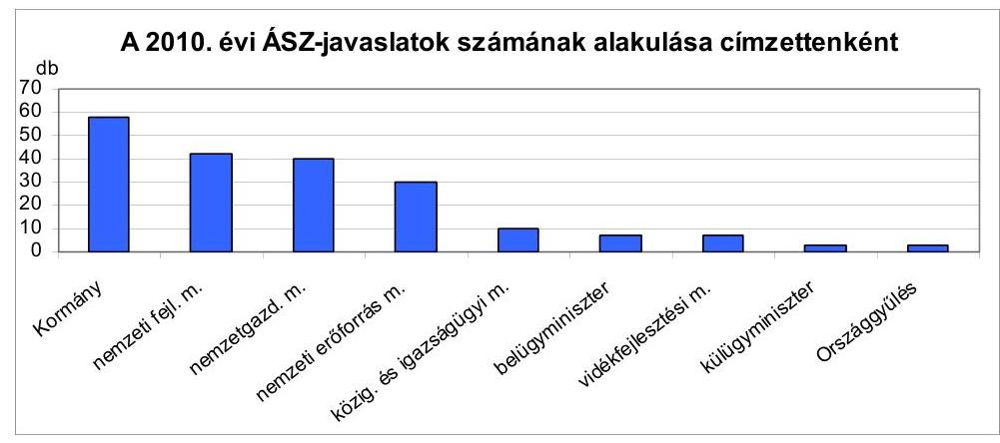

A Kormánynak címzett javaslataink megvalósulásáról adott tájékoztatás általánosságban azt jelezte, hogy a különböző területek jogi, eljárásrendi szabályozása, szervezeti felépítése sok esetben jelentős mértékben megváltozott jelentéseink lezárása óta, így az ezekben megfogalmazott javaslataink egy része a változások előtti szervezeti felépítésre, szabályozási környezetre vonatkozik. Az átalakítással érintett területek esetében ezek alkalmazása okafogyottá vált.
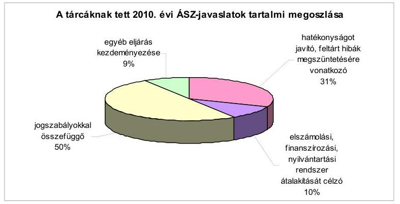

Javaslataink megvalósítására vonatkozó információkat adatbázisban kezeljük, és az utóellenőrzések során hasznosítjuk.

Összességében javaslataink 73\%-a jutott el a megvalósítás különféle szakaszaiba. Egyértelmű elutasításban javaslataink 5\%-a részesült, míg 22\%-ról tájékoztatónk összeállításakor nem volt értékelhető információnk.

# 2.6.2. Az ellenőrzési megállapítások, javaslatok hasznosulása 

A 2009. évi zárszámadás ellenőrzése során megfogalmazott javaslatok megvalósítását a 2010. évi zárszámadás keretében fogjuk értékelni. Az előző évek gyakorlatának megfelelően a zárszámadás ellenőrzése során megfogalmazott javaslataink realizálására az ellenőrzött szervezetek egy része intézkedési tervet készített, amelyet az ÁSZ-nak megküldött. A tervezett intézkedések megítélésünk szerint - általában alkalmasak lehetnek a feltárt hibák, hiányosságok felszámolására, de tervezzük egy szorosabb nyomon követési rendszer kialakítását, amely egyfelől megfelelő bizonyosságot szolgáltat az intézkedések megvalósításáról, másfelől a következő időszak iránykijelöléséhez adhat in-

---

formációt. Az uniós fejlesztések szakterületet érintően a nemzetgazdasági miniszternek tett jogszabály-alkotási és -módosítási javaslataink teljesültek.

A 2011. évi költségvetés véleményezése során javasoltuk a törvényjavaslatban megjelenő, rendkívüli kormányzati intézkedésekre szolgáló tartalék Áht. szintű szabályozását. Az ellenőrzés lezárását követően hatályba lépett az Áht. módosítása, mely szerint ez a tartalékfajta az általános tartalék helyébe lép.

Az egészségügy területén végzett ellenőrzéseink megállapításai, javaslatai eredményeként egyes, jól körülhatárolható részterületeken kis - jó irányba mutató - lépések történtek. Így a 315/2008. (XII. 22.) Korm. rendelettel az Egészségügyi Engedélyezési és Közigazgatási Hivatal került kijelölésre az egységes ágazati humánerőforrás monitoring-rendszert működtető szervként.

A közgyógyellátás rendszerének hatékonyabbá, célzottabbá tétele érdekében a NEFMI Pénzbeli ellátás és Nyugdíjbiztosítási Főosztály az egészségügyi ágazattal együttműködve, részt vesz az Országos Egészségbiztosítási Pénztár által elnyert támogatás keretében egy olyan informatikai fejlesztés megvalósításában, amelynek célja a közgyógyellátási rendszerhez kapcsolódó ügyintézési folyamatok, az ellátás eljárási rendjének egyszerűsítése. A projekt informatikai eszközök alkalmazása révén hatékonyabbá tenné a közgyógyellátási igazolvány igénylésével, elbírálásával, kiadásával kapcsolatos eljárási cselekményeket, megteremtve a lehetőséget az elektronikus ügyintézésre.

A szociális szolgáltatások területén folyamatban van a TÁMOP 5.4.1. „szociális szolgáltatások modernizációja" című program megvalósítása, amelynek keretében kerül kialakításra a szükségleteken alapuló tevékenységek meghatározása, és szabályozási rendszere. Ezen program adhat választ a jelentés által hiányolt indikátorokra. A program 2011. november 30-ig tart.

A színházak állami támogatásának és gazdálkodásának ellenőrzéséről készült jelentés javaslataival összefüggésben a nemzeti erőforrás miniszter tájékoztatása szerint a tárca kulturális stratégiájának kialakítása folyamatban van, elfogadásának határideje 2011. augusztus 31. Kihirdetését követően cselekvési terv készül. A nemzeti kulturális/művészeti intézmények köréről, feladatairól és támogatási elveiről szóló jogszabálytervezet elkészítését a tárca a kulturális stratégia elfogadása, valamint az előadó-művészeti törvény módosítása kapcsán tudja elvégezni, mivel a jelenlegi (egyeztetés alatt álló) módosítástervezet erre vonatkozóan is tartalmaz kitételeket. A pályázatok meghirdetése a kulturális ágazati célok, a kulturális stratégiában megfogalmazandó elvek figyelembevételével történik, a pályázati kiírások időközbeni megfogalmazásánál a szakterület érvényre juttatja a kulturális stratégiában meghatározott célokat, követelményeket. Az előadó-művészeti törvényben meghatározott célok teljesülésének értékelését 2011. november 30 -ig kívánja a minisztérium elvégezni.

Az EU-támogatások felhasználása során alkalmazott szabálytalan-ság-, adósság- és követeléskezelési folyamatok ellenőrzéséről készült jelentésünkben megfogalmazottak alapján a nemzeti fejlesztési miniszter kezdeményezte az NFÜ és a kedvezményezett között a támogatás nyújtása, valamint a szabálytalanság- és követeléskezelés során létrejövő jogviszony jogági

---

hovatartozásának megfelelő szintű és egyértelmű jogi szabályozását, a kedvezményezettek jogorvoslati lehetőségének tisztázását. A támogató és a kedvezményezettek jogviszonyának meghatározása, a kedvezményezettek intézményrendszeren belüli jogorvoslati lehetősége a 4/2011. (I. 28.) Korm. rendelet keretében megoldást nyert.

A szabálytalansági eljárást megalapozó fejlesztéspolitikai kormányrendelet kihirdetése - a szabálytalanságok egységes megítéléséhez, a szabálytalanságkezelés eredményességének javítására - folyamatban van. Ezáltal az ellenőrzés elérte célját, hozzájárult a hazai és az uniós pénzügyi érdekek védelme érdekében a szabálytalanságkezelés szabályozása és gyakorlata fejlesztéséhez.

Javaslatunkra - hogy a vidékfejlesztési miniszter tegye a pályázati feltételrendszer részévé a pályázó hozzájárulását ahhoz, hogy ellenőrzés céljából az MVH megismerjen adótitoknak minősülő adatokat a számlakibocsátók vizsgálatához - a mezőgazdasági, agrár-vidékfejlesztési, valamint halászati támogatásokhoz és egyéb intézkedésekhez kapcsolódó eljárás egyes kérdéseiről szóló 2007. évi XVII. törvény módosítása megtörtént.

Az MNV Zrt. 2008. évi tevékenységének ellenőrzéséről szóló jelentésünkben a pénzügyminiszternek címzett ajánlások egy részét a miniszter egyegy jogszabályi hely módosításával hasznosította. Nem hasznosult a felelősség felvetésével kapcsolatos egyik javaslatunk sem.

Az MNV Zrt. 2009. évi tevékenységének ellenőrzéséről szóló 2010. évi jelentésünkben javaslatot fogalmaztunk meg a nemzeti fejlesztési miniszternek a szabályozás felülvizsgálatára, a jogszabályok közötti koherencia megteremtésére, illetve személyi felelősség kivizsgálására. 2010 júniusában az állami vagyonról szóló törvény rendelkezései módosultak, a tulajdonosi joggyakorlás módja és szervezete alapvetően megváltozott. Az új struktúrában javaslataink hasznosítására intézkedési tervek készültek, amelyek eredményét a 2011. március közepén kezdődött ellenőrzésünkről készülő jelentésünkben mutatjuk be.

Az MTI Zrt. ellenőrzésének megállapításai alapján az Országgyűlésnek, a Kormánynak tett, jogalkotással és egyéb szabályozással kapcsolatos - a korábbi években is megfogalmazott - javaslataink, megállapításaink összességében nem hasznosultak. 2010-ben a Társaság működési környezete megváltozott. A 2010-ben elfogadott jogszabályok a Társaság tulajdonosi struktúráját, szervezeti formáját és ellenőrzési rendszerét átalakították, az új tulajdonos feladatát és hatáskörét átláthatóbbá tették.

Az önkormányzatok gazdálkodási rendszerének 2008. évi ellenőrzéséről készített jelentésben tett javaslatok figyelembevételével az Országgyűlés meghatározta az önkormányzatokra vonatkozóan a költségvetési hiány számításának, valamint a költségvetési rendeletben a költségvetési hiány külső-belső finanszírozásának, a finanszírozási célú pénzügyi műveletek bevételei és kiadásai figyelembevételének módját, továbbá egységesítette az Áht.-ban és az elektronikus információszabadságról szóló törvényben a közérdekű gazdálkodási adatok közzétételi idejét. A Kormány kiegészítette a költségvetési szervek belső ellenőrzéséről szóló 193/2003. (IX. 26.) Korm. rendelet előírásait a belső ellenőrzést végző társulások egyeztetési, tájékoztatási, beszámolási kötelezettségei-

---

vel. A közbeszerzésekről szóló 2003. évi CXXIX. törvényben (Kbt.) az eljárás hivatalból való kezdeményezésére az ÁSZ részére a tudomásra jutás után nyitva álló jogvesztő határidő - közbeszerzési eljárás mellőzése esetén három évre módosult 2010. szeptember 15-től.

Többéves vizsgálati megállapításaink, javaslataink - beleértve a költségvetés véleményezését is - hozzájárultak ahhoz, hogy napirenden van az önkormányzati rendszer átalakítása és ehhez kapcsolódóan a helyi önkormányzatok feladatainak újragondolása.

Javasoltuk a Kormánynak a helyi adóbevételek biztonságos tervezését is elősegítő középtávú adópolitikai koncepció elfogadását, a költségvetési törvényjavaslatban a jövedelemkülönbség mérséklésével kapcsolatos adóerő-képesség iparűzési adóbevételek előző évi tényadatain alapuló számítási módszerének bevezetését, a helyi adóigazgatási feladatok hatékonyabb ellátásának ösztönzését. Az adópolitikáért felelős miniszternek javaslatot tettünk az elavult ÖNKADÓ program kiváltására, és az adóbeszedési számlák forgalmára vonatkozó szabályok változtatására. Ellenőrzésünk eredményeként 2011-től az iparűzési adóerő-képesség tényadatokból - a két évvel korábbi bevallásokban szereplő adóalapból - áll elő. Így a jövedelemkülönbség mérséklési támogatás, vagy elvonás előre meghatározott, fix összeg marad, amivel az önkormányzat az egész év során számolni tud.

A Nemzetgazdasági Minisztérium tájékoztatása szerint a felnőttképzés egész rendszere megújul, a törvényjavaslat kialakítása során javaslatainkat is figyelembe veszik. Az új felnőttképzési törvény egyik lényeges iránya az egyszerűsítés és az átláthatóbbá tétel lesz.

# A fogyatékos személyek támogatásában résztvevő nonprofit szervezetek ellenőrzési tapasztalatainak hasznosításával a Kormány elrendeli - a 

közhasznú szervezetekről szóló törvény rendelkezésével összhangban - a számviteli törvény szerinti egyes egyéb szervezetek beszámoló-készítési és könyvvezetési kötelezettségeinek sajátosságairól szóló kormányrendelet módosítását. A nemzeti erőforrás miniszter rendeletben rendelkezik a támogatás terhére megvalósuló ingatlan és nagyértékű tárgyi eszköz vásárlásánál az üzemeltetési és működtetési kötelezettség kedvezményezett részére történő előírásáról, az elidegenítés szabályairól; utasításban írja elő, hogy a támogatási szerződéseknek kötelezően tartalmazniuk kell a támogatással elérendő eredményességi mutatókat és minimális célértékeit.

Az energiagazdálkodás ellenőrzési tapasztalatai alapján a Kormánynak javasoltuk az energetikával, a klíma- és környezetvédelemmel kapcsolatosan hiányzó stratégiák, programok pótlását, a meglévők kiegészítését, a felelősségi és hatásköri előírások pontos rögzítését, a szervezeti háttér működésének, feladatainak egységes keretbe illesztett szabályozását, a statisztikai információrendszer továbbfejlesztését, az önkormányzati feladatellátáshoz kapcsolódó jogi szabályozás kiegészítését, az energetikusi hálózat kialakításának ösztönzését. Az energiaügyekért felelős miniszternek javasoltuk az energiaügyeket kezelő szervezeti egységek feladatai és struktúrája összhangjának kialakítását, az előírt statisztikai adatgyűjtési és feldolgozási feladatok teljesítését. Javaslatunk figyelembevételével kormánydöntések alapján a korábban két különböző tárcá-

---

nál működő klímapolitikai és energetikai szakterületeket a Nemzeti Fejlesztési Minisztérium felügyelete alatt egyesítették, és önálló klíma- és energetikai államtitkárság jött létre. A Kormány 2010. december 22-én megtárgyalta és jóváhagyta Magyarország Megújuló Energia Hasznosítási Cselekvési Tervét, továbbá folyik a hosszú távú energiapolitikai stratégia - az Energiastratégia 2030 - kidolgozása.

A pártok kötelesek az előző évi gazdálkodásról szóló beszámolót hivatalosan közzétenni. A pártok beszámolóját szabályozó törvényi előírások nincsenek összhangban a számviteli törvény rendelkezéseivel, a beszámolók nem felelnek meg sem a mérleg, sem az eredmény-kimutatás követelményeinek, ennek következtében a beszámolók tartalma a kialakított számviteli politikától függően eltérő lehet. Az ÁSZ egy évtizede jelzi az ellentmondásokat, amelynek megszüntetésére tett ismételt kezdeményezésre a közigazgatási és igazságügyi miniszter indítványozta, hogy a Közigazgatási és Igazságügyi Minisztérium, a Nemzetgazdasági Minisztérium és az ÁSZ együttműködésével készüljön el a törvénymódosítás tervezete.

A Hálózat Alapítvány ellenőrzése rávilágított az államháztartáson kívüli szervezetek számvevőszéki ellenőrzési hatáskörének korlátaira. Ezért is vált szükségessé az ÁSZtv. 2. § (5) bekezdésének módosítása, amely kiszélesítette a számvevőszéki ellenőrzés hatókörét az ellenőrzött szervezet gazdálkodása egészére. Ezáltal eredményesebben ítélhető meg a közhasznú feladatok ellátásának színvonala, a közpénzek szabályszerű, hatékony felhasználása.

# 3. AZ ELLENŐRZÉST TÁMOGATÓ HÁTTÉRTEVÉKENYSÉGEK 

### 3.1. Jogi intézkedések, együttmúködés a hatóságokkal

Az ÁSZ - mint az Országgyűlés ellenőrző szerve - ellenőrzési tevékenységét az Alkotmánynak és a törvényeknek alárendelten végzi. Ellenőrzési tapasztalatain alapuló megállapításaival, javaslataival, tanácsaival továbbra is az Országgyűlés, annak bizottságai és az ellenőrzött szervezetek munkáját kívánja segíteni, valamint előmozdítani a jól irányított állam múködését.

Az ÁSZ nem hatóság, az ellenőrzöttekkel szemben nincsenek szankcionálási jogosítványai. Megállapításainak, javaslatainak hasznosítását azok meggyőző ereje és a nyilvánosság segíti (jelentései mindenki számára hozzáférhetők a honlapján). Ezen túlmenően ellenőrzési megállapításai alapján az ellenőrzött szervezetekkel és a felelős személyekkel szemben az illetékes szerveknél - jogsértés esetén - eljárást (pl. büntető eljárást) kezdeményezhet.

Az ellenőrzései során tett megállapításait az ÁSZ, amennyiben bűncselekmény elkövetésének gyanúja áll fenn, köteles az illetékes nyomozó hatóságokkal közölni. A közpénzek szabályszerűtlen felhasználásához kapcsolódó büntetőjogi felelősségre vonás elősegítése érdekében az ÁSZ 2010-ben - döntően vagyon elleni bűncselekmények (pl. hűtlen kezelés) miatt - az első félévben 3, a második

---

félévben 6, összesen 9 esetben tett feljelentést ${ }^{5}$. A rendelkezésre álló információk szerint az ÁSZ által tett feljelentések alapján nyomozások indultak (illetve az Országos Cigány Önkormányzat esetében az már egyébként is folyamatban volt). Biri Község Önkormányzata esetében a nyomozás adatai alapján a büntetőeljárást jogerősen megszüntették.

Az ÁSZ jelentései nyilvánosságának, honlapon történő hozzáférhetőségének biztosításával, valamint - az egyre nagyobb számban érkező - hatósági megkeresések teljesítésével támogatja a büntető eljárásokban közremúködő szervek tevékenységét, a szükséges adatok hatékony felhasználását. Tapasztalataink szerint a nyomozó hatóságok (rendőrség szervei, ügyészségek stb.) feladatellátásuk során nagymértékben támaszkodnak a jelentésekre.

A tárgyévi 60 megkeresésből 58 megkeresés már folyamatban lévő - korábban az ÁSZ, vagy más feljelentő által kezdeményezett - nyomozáshoz kapcsolódott. Az ÁSZ adatszolgáltatási kötelezettségének lehetőség szerint a lefolytatott vizsgálat során tudomására jutott tényeket tartalmazó dokumentumok, elsősorban számvevői jelentések megküldésével tett eleget.
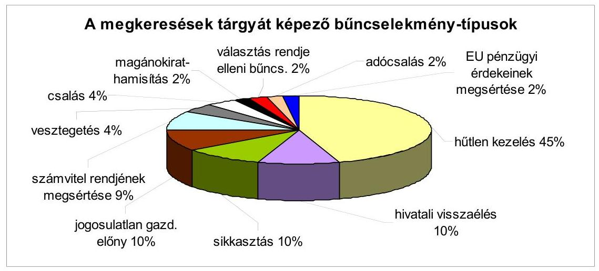

Az ÁSZ a közbeszerzésekkel összefüggésben tudomására jutott jogsértésekkel kapcsolatban - a Kbt. 327. §-a (1) bekezdésének b) pontjában foglalt felhatalmazás alapján - jogorvoslati eljárás kezdeményezésére jogosult.

A Kbt. 2009. április 1-jétől hatályos módosításával a jogorvoslati eljáráskezdeményezések számának 2006-2008. évek közötti emelkedési tendenciája megszakadt, így a közbeszerzés mellőzése esetén csak a közbeszerzési eljárás nélkül létrejött szerződés megkötésének időpontjától számított egy éves jogvesztő határidőn belül volt lehetőség jogorvoslati eljárás kezdeményezésére.

[^0]
[^0]:    ${ }^{5}$ A feljelentések a következőkkel összefüggésben történtek: Fertőd Város Önkormányzata, Budapest Főváros VIII. kerület Józsefváros Önkormányzata, Biri Község Önkormányzata, az MNV Zrt., az Országos Cigány Önkormányzat, a 4-es metró beruházása, a Korona Kiadó Kft., Budapest Főváros XI. kerület Újbuda Önkormányzata, Budapest Főváros Önkormányzata.

---

Az ÁSZ kezdeményezésére 2010-ben közbeszerzési eljárás jogtalan mellőzése miatt a Közbeszerzési Döntőbizottság 1 esetben állapított meg jogsértést, az érintett önkormányzatot ${ }^{6} 1$ millió Ft összegű bírság megfizetésére kötelezve.

A Kbt. 2010. szeptember 15-étől hatályos módosítása a jogorvoslati eljárás kezdeményezésére nyitva álló határidőt ismét a 2009. április 1-jét megelőző szabály (a jogsértés megtörténtétől számított egy év, illetve a közbeszerzési eljárás jogtalan mellőzése esetén három év) szerint határozta meg, melynek következtében a jövőben az ÁSZ által kezdeményezetett jogorvoslatok számának érdemi növekedésére lehet számítani.

# 3.2. Módszertani munka 

A magas színvonalú, hatékony és eredményes számvevőszéki feladatellátás nélkülözhetetlen velejárója a gyakorlati ellenőrzési munkát támogató, a nemzetközi trendekhez igazodó folyamatos, minőségközpontú ellenőrzés-szakmai, módszertani fejlesztő tevékenység. A számvevőszéki ellenőrzés módszereinek a nemzetközi standardokkal és egyéb előírásokkal összhangban történő korszerűsítése és a jó nemzetközi gyakorlat adaptációja az ÁSZ stratégiai célkitűzése.

Az INTOSAI 2010. évi XX. Kongresszusán többéves előkészítő munka eredményeképpen olyan standardokat, gyakorlati útmutatókat véglegeztek és léptettek életbe, amelyek iránymutatásként szolgálnak a jövőben a tagországok számvevőszékei számára.

A Kongresszus által jóváhagyott 40 új ISSAI-val (International Standards of Supreme Audit Institutions - legfőbb ellenőrző intézmények nemzetközi standardjai), illetve az INTOSAI GOV-val (Guidance for Good Governance - iránymutatás a "jó kormányzás"-ra) az INTOSAI szakmai standardok korábban már jóváhagyott keretrendszerét töltötték ki tartalommal. A szakmai munkacsoportok által elkészített ellenőrzés-szakmai dokumentumokat a kongresszusi döntést követően ajánlják a számvevőszékek figyelmébe, mint a jövőben követendő iránymutatásokat.

Az INTOSAI-ban 2008-tól gyorsult fel a szakmai követelmények nemzetközi méretű egységesítése, a kor elvárásaihoz igazodó ellenőrzésekhez szükséges szakmai szabályok, standardok és útmutatók kidolgozására irányuló munka, amiben az ÁSZ is tevékenyen részt vett.

Az ÁSZ-on belül 2010-ben folytatódott a főbb ellenőrzési típusok szerint, a korábbi években készült számvevőszéki módszertanok és módszertani útmutatók - elsősorban a jelentős jogszabályváltozások miatti - korszerűsítése, valamint az ezekhez kapcsolódó segédletek - ellenőrzési tapasztalatok alapján történő felülvizsgálata. A szakmai szabályok aktualizálása mellett új ellenőrzésszakmai dokumentumok (módszertanok, segédletek) is készültek (így például a nemzetgazdasági elszámolások pénzügyi szabályszerűségi ellenőrzéséhez készült módszertan).

[^0]
[^0]:    ${ }^{6}$ Ajka Város Önkormányzata.

---

A 2010. év végén átfogó belső értékelés készült az INTOSAI ellenőrzés-szakmai dokumentumrendszeréről, amely javaslatokat fogalmazott meg a nemzetközi követelmények adaptációjának lehetséges irányaira. A javaslatok kitértek az ÁSZ ellenőrzés-szakmai dokumentumainak rendszerére, illetve a meglévő el-lenőrzés-szakmai módszertani tevékenység továbbfejlesztésének irányaira.

Az INTOSAI legfontosabb ellenőrzés-szakmai dokumentumainak ütemezett fordítását szakértő munkacsoport végzi. A munkacsoport rendszeres tevékenysége során gondoskodik a fontosabb nemzetközi ellenőrzés-szakmai dokumentumok fordításáról, a meglévő magyar nyelvű fordítások szakmai szempontú lektorálásáról, illetve a meglévő ellenőrzés-szakmai terminológiai gyűjtemény (Glosszárium) tartalmi korszerűsítéséről.

# 3.3. Tanulmányok, kutatómunka 

Az ÁSZ Kutató Intézetének (ÁSZKUT) legfontosabb feladata az, hogy kutatásaival támogassa az Országgyűlés, illetve a kormányzat számára végzett számvevőszéki tanácsadói tevékenységét. Az Intézet kutatási tevékenysége során - a számvevőszéki ellenőrzési tapasztalatokra támaszkodva - összegző, értékelő tanulmányokat, illetve a közpénzügyi rendszer múködését és továbbfejlesztési lehetőségeit bemutató háttértanulmányokat készít.

Az Intézet 2010-ben az alábbi tanulmányokat, illetve tanulmánykötetet jelentette meg önálló kiadvány formájában:

## Kompetenciaalapú struktúra kiépítésének lehetőségei a közigazgatásban. Módszer és esettanulmány

A tanulmány - a közpénzügyi reform és az államreform összefüggéseit vizsgáló tanulmányok között - a kompetenciaalapú struktúra (kompetens szervezet) kiépítésének lehetőségeit mutatja be. A kompetenciát olyan képességek, készségek, attitűdök összességének tekinti, amelyre az adott személynek, illetve az adott szervezetnek az eredményes tevékenységhez egyaránt szüksége van. A kutatás célja elsősorban a szervezeti szintű kompetencia szerkezetnek a feltárása és megértése. A tanulmány az elméleti megalapozás mellett két megyei jogú város (Eger és Szombathely) önkormányzata köztisztviselőinek körében végzett empirikus vizsgálat alapján osztályozza és rangsorolja azokat az egyéni (például kreativitás, rugalmasság), társas vonatkozású (csapatmunka, konfliktuskezelés), munka- és a módszerjellegű (szakmai ismeretek, problémamegoldó képesség) kulcskompetenciákat, amelyek leginkább hozzájárulhatnak a közigazgatás eredményes múködéséhez. A tanulmány javasolja kompetenciaalapú megközelítés mód alkalmazását a közigazgatási reform során.

## A közszféra és a gazdaság versenyképessége - empirikus eredmények és tanulságok

A tanulmány az ÁSZKUT és a Budapesti Corvinus Egyetem Versenyképesség Kutató Központjával 2005 végén kezdett kutatási együttműködése második fá-

---

zisában ${ }^{7}$ folytatott empirikus kutatások alapján a hazai közszféra és a gazdaság versenyképessége közötti feltárt érintkezési pontokat, kapcsolódásokat és egymásra hatásokat foglalja össze. Ezek a nemzetközi versenyképességi rangsorok elemzésének szerepe, a vállalati versenyképesség megítélése kérdőíves felmérés alapján, a különböző méretű vállalatok teljesítményének statisztikai elemzéssel feltárt jellemzői, az önkormányzatok munkatársainak kompetenciái, a civil szféra szervezeteinek szerepe és mindezek legfontosabb tanulságainak áttekintése a közszféra intézményei és szervezetei számára. Így a tanulmány hozzájárulást jelent a közszféra és a gazdaság versenyképessége közötti kapcsolat jobb megértéséhez.

# A turisztikai fejlesztések állami támogatása térségi és nemzetgazdasági szintű hatékonyságának vizsgálata 

„A kiemelt - turisztikai célú - beruházások ellenőrzéséről a helyi önkormányzatoknál" című ÁSZ jelentés által feltárt összefüggések részletesebb megismerése érdekében folytatott az ÁSZKUT kutatást a turisztikai fejlesztések állami támogatása térségi és nemzetgazdasági szintű hatékonyságáról. A kutatás tíz állami támogatással megvalósult turisztikai fejlesztésre vonatkozó empirikus adatfelvétel segítségével azt vizsgálta, hogy az egyes fejlesztések hogyan befolyásolták a települések, illetve a térségek gazdasági életét. A kutatást egy ún. követő vizsgálattal egészítettük ki, mely egy korábbi kutatásban részt vett 11 turisztikai beruházás hatásindikátorainak változását vizsgálta. A kutatás megállapította, hogy a turisztikai fejlesztési projektek települési és nemzetgazdasági szinten egyaránt jelentős multiplikátor-hatásokkal jártak együtt. E hatások a vállalkozói jövedelemtermelésben, a foglalkoztatásban, az állami költségvetési bevételekben és a helyi adóbevételekben egyaránt megmutatkoznak. A létesítmények által elnyert 100 Ft támogatás összességében 664 Ft beruházási értéket indukált. A fejlesztések eredményeképpen átadott fürdők, wellness hotelek a 21. századi technikát és szolgáltatási színvonalat képviselik Magyarország vidéki városaiban, ami ösztönzőleg hat a települések fejlődésére.

## A nemzetgazdasági tervezés megújítása - Nemzeti igények, uniós követelmények

A tanulmány egyrészt kritikai elemzéssel, másrészt jobbító javaslatokkal segíti a nemzetgazdasági tervezés korszerűsítését. Az elemzés kiinduló alapját a legjobb nemzetközi gyakorlatok és példák összefoglalása mellett a tervezés és fejlesztéspolitika uniós követelményeinek a bemutatása képezi. A tanulmány olyan koncepciót vázol fel, amelyben a tervezés a hazai és az uniós forrásokat egyaránt átfogja, a nemzeti tervek és az EU által szorgalmazott programok szerves rendszert alkotnak, az országos és ágazati terveket a pénzügyi forrásokkal reálisan számoló középtávú területi tervek teszik teljessé. A koncepció hangsúlyozza, hogy a tervező munkába a szakmai és a civil szervezeteket érdemben (nemcsak formálisan) be kell vonni.

[^0]
[^0]:    ${ }^{7}$ Az első szakaszban, 2006-2007 között a kutatók az irodalom feltárását és a koncepcióalkotást végezték el. Ezek eredményeiről 2007-ben tanulmányban számoltak be.

---

Az ÁSZKUT egyéb - például a korrupciós kockázatok feltérképezésével, az önkormányzati gazdálkodás pénzügyi kockázataival, a kultúra finanszírozásával kapcsolatos - kutatásai az ÁSZ vizsgálatainak előkészítése során, illetve a 2010 májusában a Magyar Közgazdasági Társasággal közösen rendezett tudományos konferencia keretében hasznosultak.

# 3.4. Egyéb számvevőszéki feladatok 

### 3.4.1. Javaslattétel, véleményezés

## Javaslattétel könyvvizsgálók személyére

Az ÁSZtv. alapján 2010. január 1-jétől az új elnök megválasztásáig, 2010. július 5-ig a vonatkozó törvények által meghatározott körben a főtitkár gyakorolta a könyvvizsgálók személyére irányuló javaslattételt. Ezen időszak alatt megkeresésre tett javaslatot a Magyar Fejlesztési Bank Részvénytársaság, a Wesselényi Miklós Ár- és Belvízvédelmi Kártalanítási Alap, a Kutatási és Technológiai Innovációs Alap és a Központi Nukleáris Pénzügyi Alap könyvvizsgálójának személyére.

Az ÁSZ elnöke az Áht.-ban biztosított könyvvizsgálói jelölési jogával élve 2010. második felében két javaslatot tett, a Szülőföld Alap és a Nemzeti Kulturális Alap könyvvizsgálójának személyére.

## Javaslattétel felügyelő bizottság elnökök személyére

A feladat megszűnéséig ${ }^{8}$, 2010. május 29-ig az ÁSZ főtitkára gyakorolta a 2009. évi CXXII. tv. 4. §-a (3) bekezdésében meghatározott köztulajdonban álló gazdasági társaság vezetőinek megkeresésére az egyes köztulajdonban álló gazdasági társaságok felügyelő bizottsága elnökének jelölésére vonatkozó javaslattételi jogot.

A rendszer alapját képező, 2003-ban kialakított névjegyzék frissítése érdekében az ÁSZ honlapján kiírt új pályázat 2010. februári értékelését követően 52 eredményes pályázattal gyarapodott a nyilvántartott anyagok száma (771-re emelkedett).

A pályáztatás 2003. évi indulásától 2010. május 29-ig összesen 426 gazdálkodó szervezettől érkezett kérelmet vizsgáltunk meg, melyeknek eredményeképpen összesen 391 névjegyzékben szereplő személy jelölésére tehettünk javaslatot.

A feladat megszűnésekor - számvevőszéki javaslat alapján - 141 fő töltött be felügyelő bizottság elnöki megbízatást.

[^0]
[^0]:    ${ }^{8}$ A központi államigazgatási szervekről, valamint a Kormány tagjai és az államtitkárok jogállásáról szóló 2010. évi XLIII. törvény 89. § e) pontja hatályon kívül helyezte az Állami Számvevőszék felügyelő bizottság elnök jelölési feladatának ellátását.

---

A jelölési feladat megszűnése kapcsán a szükséges intézkedéseket megtettük. Kezdeményeztük az adatvédelmi biztosnál a 2003-ban bejelentett ezen adatkezelésünk törlését, aki azt visszaigazolta.

Az adatkezelés megszűnésével összefüggően lezajlott átadás-átvételi folyamat részeként az ÁSZ által kezelt 829 pályázati anyagból 128 pályázati anyag közzétett felhívásunkra - annak személyes visszaszolgáltatásával zárult le. 2010. szeptember 4-ig megtörtént az át nem vett, összesen 701 névjegyzéki pályázat közjegyző előtti okirat-megsemmisítése.

# Véleményezés könyvvizsgálók költségvetési minösitéséhez 

Külön törvények alapján meghatározott körben csak olyan könyvvizsgálók végezhetnek könyvvizsgálói feladatot, akik/amelyek megfelelő ismeretekkel és gyakorlati tapasztalatokkal rendelkeznek az adott szervezet sajátosságai tekintetében.

A könyvvizsgálók költségvetési minősítésére vonatkozó kérelmek elbírálása és a minősítések visszavonása során 2008-tól ki kell kérni az ÁSZ véleményét. Az ÁSZ-nak vélemény-nyilvánítási jogosultsága van továbbá az összeférhetetlenség megállapítása, illetve fegyelmi vétség elkövetésének alapos gyanúja jelzésének vonatkozásában is.

2010-ben a számvevőszéki vélemény alapjául a Kamara által megküldött írásbeli dokumentumok és az ellenőrzési igazgatóságoknak az ellenőrzések alapján rendelkezésére álló adatok és információk szolgáltak.

2010-ben összesen 16 kamarai tag könyvvizsgáló cég és 5 kamarai tag könyvvizsgáló személy költségvetési minősítéséhez adtunk véleményt, valamennyi esetben „megfelelt" minősítéssel.

A feladatkör gyakorlásának kezdetétől (2008) 2010 végéig összesen 243 kérelmező minősítéséhez ( 231 cég, 12 személy) adtunk véleményt.

Költségvetési minősítés visszavonásának kezdeményezésére, továbbá összeférhetetlenség, illetőleg fegyelmi vétség elkövetése gyanújának konkrét jelzésére 2010-ben nem került sor.

### 3.4.2. Közérdekú bejelentések

A korábbi évek tapasztalatai szerint a választások évében megélénkül a „bejelentési kedv", ezt a tényt támasztja alá, hogy a 2010. évi bejelentések száma minden korábbi mértéket meghaladott.

---

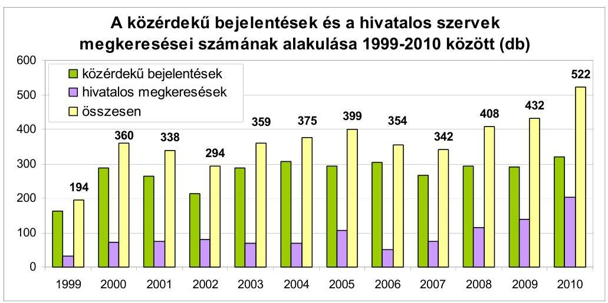

Kiugróan magas volt a helyi önkormányzatok működésével, gazdálkodásával, vagyonkezelésével kapcsolatos panaszokat, kifogásokat megfogalmazó levelek száma. A tendenciát erősíthette, hogy hiányzott a helyi önkormányzatok múködésének közigazgatási hivatalok általi törvényességi ellenőrzése. A fővárosi, megyei kormányhivatalok 2010. év végén történt felállításával várhatóan ez a helyzet kedvező irányba fog változni.

Az önkormányzati választásokat követően számottevően megnőtt az új képvi-selő-testületek, polgármesterek által szorgalmazott, a korábbi választási ciklusra vonatkozó ellenőrzési kérelmek száma.

Továbbra is jelentős volt azon bejelentések száma, amelyekben számvevőszéki ellenőrzést kértek, illetve olyan visszásságokról adtak számot, amelyekre vonatkozóan az ÁSZ ellenőrzési jogosultsággal rendelkezik. Az ÁSZ-nak a bejelentés alapján nincs ellenőrzési kötelezettsége, de ha a bejelentés tárgya egy tervezett konkrét ellenőrzéshez volt köthető, akkor - az ellenőrzési erőforrásokra is figyelemmel - az ellenőrzés keretében azt figyelembe vettük. Növekedett az állásfoglalást, tanácsot kérők, illetve kérdést feltevők száma is.

Az év második felében az ÁSZ új vezetésének iránymutatásai alapján áttekintettük a bejelentések intézésének gyakorlatát és az erre vonatkozó belső szabályozást. Ennek eredményeképpen érdemi válaszra és intézkedésre csak akkor kerül sor, ha az ÁSZ „tárgykörben eljárásra jogosult szerv"-nek minősül. Más esetekben élünk az áttétel lehetőségével.
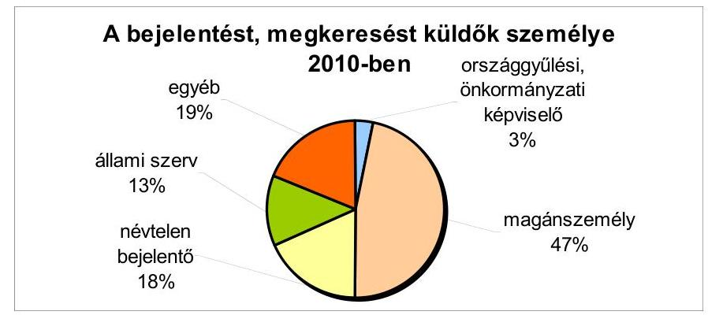

---

# 3.4.3. Integritás projekt 

Az ÁSZ 2009. december 1-jén indította a „Korrupciós kockázatok feltérképezése integritás alapú közigazgatási kultúra terjesztése" című kiemelt uniós projektet (a továbbiakban: Projekt), amelynek célja a költségvetési szervek múködésének korrupciós szempontú felmérése, a kritikus jelenségek (okok és tünetek) feltárása, továbbá a hazai ellenőrzési gyakorlat és a közigazgatási kultúra integritás szempontú fejlesztése. A jelentős szakmai innovációs értékkel bíró - 286,54 millió Ft európai uniós támogatással megvalósuló - módszertani fejlesztés eredményeként megrajzolható a hazai közszféra korrupciós veszélyeztetettségi, illetve kockázati térképe.

A projektszervezet 2009. december 1-jét követően állt fel. Versenyeztetés alapján sor került a külső közreműködőkkel történő szerződéskötésekre. A projekt tevékenységeit, megfelelő színvonalú megvalósításukat minőségbiztosítók ellenőrzik.

Az eredetileg tervezett ütemtervtől eltérően a 2010-re betervezett közbeszerzési eljárások lebonyolítására - mintegy négy hónapos késéssel - csak július hónapot követően nyílt lehetőség. A lefolytatott közbeszerzési eljárások száma 8 volt, amelyből 2 beszerzés központosított közbeszerzési eljárás útján valósult meg. A közbeszerzések eredményeképpen megkötésre került szerződések összértéke 43,9 millió Ft.

A Projektben megvalósuló éves adatfelvételek során a korrupciós kockázatok felmérésére használt kérdőív, valamint a kapcsolódó adatfelvételi terv első változata 2010. július végére készült el. Ezt követően került sor az előzetes tesztelésre 2010. október végén, egy 203 intézményből álló reprezentatív szervezeti mintán. Az adatfelvételi eszköz véglegesítésére és elektronizálására a próbafelvételek tapasztalatainak hasznosításával 2010 végéig került sor.

Az ÁSZ 2011 februárjától kezdődően hét éven át 4131 költségvetési szerv közreműködésével - egy internetről letölthető elektronikus kérdőív segítségével végez országos adatfelvételt. A korrupció elleni küzdelemben figyelemre méltó az ún. integritás megközelítés, amely intézményi szinten értékek melletti elköteleződést, ezekhez mérten következetes és fedhetetlen szervezeti múködést etikus munkakörnyezetet, tiszta és átlátható belső folyamatokat - jelent.

Eredményes közbeszerzési eljárás alapján 2010. augusztus 2-án jött létre vállalkozási szerződés az éves adatfelvételeket támogató ún. „elektronikus adatfelvevő, feldolgozó és térképi megjelenítő rendszer" kifejlesztésére. A Projekt honlapjának (integritas.asz.hu), illetve az adatfelvevő és adatmegjelenítő modulok elkészítésével a fejlesztő munka első két üteme zárult le 2010. december 31-ig.

2010 második felében versenyeztetés alapján rendezvényszervező és kommunikációs szolgáltató került kiválasztásra, akik az integritás szemlélet széles körű megismertetése érdekében - 600 intézményt érintően - 7 regionális és egy nemzetközi szakmai konferencia megrendezésében múködtek közre 2011 év elejéig. A rendezvények az első országos adatfelvételhez kapcsolódó kommunikációs kampány részét képezték.

---

A Projektben elszámolható 286,54 millió Ft támogatási összegből 2010. december 31-ig bezárólag a kumulált kifizetések összege 65,5 millió Ft volt, ami a felhasználható keret $22,8 \%$-ának felelt meg. A Projekt sajtó megjelenéseinek (elektronikus és nyomtatott sajtó, televízió, rádió interjúk) száma a megvalósítástól kezdve - köszönhetően a 2010 decemberében megrendezett országos konferenciának - elérte a 100-at.

# 3.5. Együttmúködés szakmai szervezetekkel 

Az ÁSZ-nak 8 felsőoktatási intézménnyel - köztük 5 egyetemmel és 3 főiskolával - és 5 szakmai szervezettel van együttműködési megállapodása, melyek létrehozását a hatékonyabb és eredményesebb feladatellátás igénye motiválta. A megállapodások tartalmi kereteit a szerződő felek maguk alakítják a pénzügyi ellenőrzés fejlesztése érdekében.

Az együttműködés keretében vállaltuk - többek között - ellenőrzés-szakmai tapasztalataink és módszertani ismereteink megosztását, a hallgatók képzésében való részvételt, szakmai gyakorlati idő eltöltésének korlátozott keretek között történő biztosítását (évente átlagosan 12 fő hallgató hosszabb-rövidebb idejű szakmai gyakorlatra fogadására volt lehetőségünk).

A kapcsolattartás rendjét az ÁSZ Szervezeti és Működési Szabályzata és egy-egy elnöki és főtitkári utasítás határozza meg.

Az eddigi tapasztalatokra építve az együttműködés új területeit is keresve, a minőséget és az új értéket középpontba állító középtávú intézményi stratégia megvalósítását biztosító együttműködési keretek kialakítása szükséges.

### 3.6. Nemzetközi kapcsolatok

A nemzetközi ellenőrzési szervezetekkel és a partner számvevőszékekkel való együttműködés éves feladatait az ÁSZ középtávú nemzetközi kapcsolattartási stratégiájára épülő, éves kapcsolattartási terv határozza meg. Az ÁSZ 2010 közepén hivatalba lépett új vezetése a nemzetközi ellenőrzési standardok adaptálására és az ellenőrzési tevékenységben közvetlenül hasznosítható tapasztalatok megszerzésére helyezte a hangsúlyt.

Az ÁSZ mind szakértői, mind intézményi szinten részt vesz az INTOSAI (Legfőbb Ellenőrző Intézmények Nemzetközi Szervezete) tevékenységében. 2010-ben is képviseltettük magunkat az INTOSAI független külső szakértői értékelésekkel, pénzügyi ellenőrzési irányelvekkel és a belső kontrollal foglalkozó albizottságaiban, a Pénzügyi Válság Munkacsoportban. Az ÁSZ képviselője munkaanyagok készítésével járult hozzá a Nemzeti Teljesítmény-mutatók Munkacsoport jelentéséhez.

Delegációnk részt vett az INTOSAI 2010 novemberében Dél-Afrikában megrendezett kongresszusán. A Kongresszus két fő témájának - „A legfőbb ellenőrző intézmények tevékenységének eredménye és hasznossága" és „Környezetvédelmi ellenőrzés és fenntartható fejlődés" - feldolgozásához az ÁSZ országtanulmányok kidolgozásával járult hozzá. Az év során eleget tettünk a kormányzótanácsi tagságunkból eredő kötelezettségeinknek is.

---

Sikeresen befejeztük a minőségirányítás javítását célzó jó gyakorlatokat bemutató útmutató kidolgozását, amelyre az EUROSAI (az INTOSAI európai regionális munkacsoportja) 2008. évi Kongresszusán kapott felhatalmazást a hasonló tárgyú kongresszusi témával foglalkozó munkacsoport. A dán, máltai, lengyel, orosz legfőbb ellenőrzési intézmény és az Európai Számvevőszék (ECA) közreműködésével, az ÁSZ koordinálásával kidolgozott dokumentumot az EUROSAI Kormányzótanács 2010. novemberi ülésén jóváhagyta.

A Kormányzótanács tagjaként konstruktív véleményezéssel járultunk hozzá az év folyamán az EUROSAI első stratégiájának kidolgozásához. Az EUROSAI Képzési Bizottságában az ÁSZ képviselője közreműködött.

Részt vettünk az EUROSAI szakmai munkacsoportjainak (IT, környezetvédelmi) munkájában és éltünk a szemináriumok nyújtotta ismeretbővítési lehetőségekkel, pl. a klímaváltozás témájában. A katasztrófák megelőzésére és következményeik felszámolására elkülönített pénzalapok ellenőrzésére létrehozott munkacsoportban csatlakoztunk az azonos tárgyú, koordinált ellenőrzéshez.

Az EURORAI (Európai Regionális Ellenőrzési Intézmények Szervezete) 2010ben hetedik alkalommal - részvételünkkel - megrendezett Kongresszusa vezértémája a változó gazdasági környezet teremtette kihívások és a számvevőszéki ellenőrzés volt. A szervezet szemináriumán munkatársaink több ország példáján keresztül kaptak képet a helyi adóbevételek ellenőrzéséről az egyes országokban, a költségvetési bevételek ellenőrzésének eltérő súlypontjairól, módszereiről.

2010-ben is részt vettünk az EU-tagországok számvevőszékei és az ECA együttműködési hálózata, a Kapcsolattartó Bizottság éves elnöki értekezletén. Az ülésen beszámoltunk a TEN-T V. korridor (Lyon-Triest-Koper-LjubljanaBudapest) vasútfejlesztési beruházás koordinált teljesítmény-ellenőrzésének előrehaladásáról és a témában megrendezésre kerülő „workshop" szervezéséről. A Kapcsolattartó Bizottság 2008-ban fogadta el a TEN-T beruházások koordinált ellenőrzésének lefolytatását célzó határozatot, az ÁSZ irányításával és részvételével. A közös ellenőrzési jelentés tervezetének kidolgozása megtörtént, az eredmények ismertetését célzó szakmai szemináriumra 2011 márciusában került sor.

Továbbra is részt vettünk a Kapcsolattartó Bizottság ülését hagyományosan előkészítő, illetve a szakmai munkacsoportok munkáját koordináló és az együttműködés hatékonyságát előmozdító összekötői hálózat munkájában. Intézményünk a Kapcsolattartó Bizottság keretében működő, az EU alapok felhasználásának különböző kérdésköreivel (Strukturális Alapok, ÁFA, Közös ellenőrzési standardok) foglalkozó munkacsoportokban és a költségvetési politikával, illetve a Lisszaboni Stratégiával összefüggő ellenőrzések témakörében létrehozott tudáshálózatok munkájában is folyamatos és aktív szerepet vállalt.

A szakmai ismeretek bővítését célozta munkatársaink részvétele a közbeszerzések és a Közös Agrárpolitika terén végzett ellenőrzések tapasztalatainak megosztását célzó szemináriumokon. Ezen túlmenően, felismerve a hazai intézményrendszer igényét arra, hogy az ECA ellenőrzéseire való eredményesebb

---

felkészüléshez részletes tájékoztatást kapjanak a tagállami ellenőrzések gyakorlatáról, intézményünk az ECA szakértőinek közreműködésével szemináriumot szervezett Budapesten az ECA ellenőrzési módszertanáról, a kohéziós politika illetve az agrártámogatások ellenőrzéséről.

A visegrádi országcsoport, valamint Ausztria és Szlovénia számvevőszéki vezetői 2010-ben a szlovákiai Sliač-Sielnicában tartották éves értekezletüket. Megvitatták, hogy a számvevőszékek hogyan tudnák hatékonyabban kezelni a pénzügyi és gazdasági válság hatásait. Az ÁSZ képviselői beszámoltak a válságkezelés magyar tapasztalatairól és az ÁSZ által - a lehetséges együttmúködési területek vonatkozásában - végzett kérdőíves felmérések eredményeiről (PPP-konstrukciók és a korrupció ellenes küzdelem témájában). Az országcsoport számvevőszékei meghívást kaptak a „Korrupciós kockázatok feltérképezése - integritás alapú közigazgatási kultúra terjesztése" című projekt keretében 2010. december 9-én, Budapesten megrendezett integritás témájú konferenciára.

2010-ben is folytatódott az együttműködés az ÁSZ és a Vietnámi Számvevőszék között a Külügyminisztérium koordinálásával zajló nemzetközi fejlesztési együttműködés (NEFE) keretei között.

A 2010. évi nemzetközi kapcsolattartási terv 36 M Ft-ot irányzott elő kiutazásokra. Az összes ráfordítás 22 M Ft volt. Az elmúlt évben az ÁSZ munkatársai 42 külföldi úton vettek részt, amelyeken 67 kiküldött 412 kiküldetési napot töltött el. Vendégfogadásra 0,2 M Ft-ot fordított az ÁSZ 2010-ben.

# 4. JELENTÉSEK KÖZREADÁSA 

Az ÁSZ - mint az állam legfőbb pénzügyi ellenőrző szerve - tevékenységének, ellenőrzési jelentéseinek elsődleges címzettje az Országgyúlés, a képviselők.

Az elérni kívánt hatékonyabb szakmai kommunikáció részeként, az Országgyúléssel való kapcsolattartás fejlesztése érdekében 2010 novemberétől jelentéseink összefoglalóit minden képviselőnek eljuttatjuk, aktuális jelentéseink pedig az Országgyúlés honlapjának Elektronikus Futárpostájából közvetlenül is elérhetőek.

### 4.1. Együttmúködés az Országgyúléssel

Az ÁSZ jelentéseinek országgyűlési, bizottsági felhasználása szempontjából aktív időszaknak 2010-ben a választásokat és az intézmény új elnökének megválasztását követő hónapok tekinthetők. Ezen időszak alatt az állandó bizottságok 8 jelentésünket vették napirendjükre.

A 2010-ben 46 jelentést tett közzé az ÁSZ, ebből az első félévben mindössze 10 jelentésünk jelent meg.

A költségvetési véleményünket, illetve a zárszámadás, az MTI Zrt. és az MNV Zrt. ellenőrzéséről szóló jelentéseinket a jogszabályi előírásoknak megfelelően nyújtottuk be az Országgyúlésnek. Ezeket a jelentéseket - az MNV Zrt. ellenőrzése kivételével - a bizottságok is megtárgyalták.

---

A bizottságok külön napirendi pont keretében tárgyalták még a helyi önkormányzatok gazdálkodási rendszerének 2009. évi ellenőrzéséről, az állami feladat (közfeladat) ellátás szervezeti és humánerőforrás rendszerének ellenőrzéséről, valamint a fogyatékos személyek támogatásában részt vevő nonprofit szervezeteknek nyújtott nem normatív állami támogatás és ingyenes állami vagyonjuttatás felhasználásának ellenőrzéséről szóló jelentéseinket is.

A MÁV Zrt. gazdasági helyzetének vizsgálatára létrehozott vizsgálóbizottság, az MTV székházprojektjével, valamint a Munkaerőpiaci Alapból finanszírozott támogatási programokkal foglalkozó albizottságok munkájuk során az ÁSZ vizsgálati tapasztalatainak ismertetését kérték.

Az ÁSZ vezetői és munkatársai az új országgyűlési ciklusban közel 100 alkalommal közvetlenül, személyes részvételükkel is segítették az állandó bizottságok munkáját, valamint több albizottság, vizsgálóbizottság, eseti bizottság ülésén is részt vettek.

Az ÁSZ elnöke és alelnöke 7-7 alkalommal előterjesztőként vett részt bizottsági üléseken. Plenáris ülésen 3 jelentésünk tárgyalásánál került sor elnöki expozéra (zárszámadás, költségvetési vélemény, ÁSZ éves beszámoló).

Az ÁSZ elnökéhez 2010-ben három írásbeli képviselői kérdés érkezett, amelyek a Házszabály előírásai szerint kerültek megválaszolásra.

A jelentések parlamenti/bizottsági tárgyalásainak adatairól a 2. sz. melléklet ad tájékoztatást.

# 4.2. A nyilvánosság tájékoztatása 

Az ÁSZ munkájának, szakmai tevékenységének, eredményeinek és jelentéseinek nyilvánossága stratégiai jelentőséggel bír. Kommunikációs eszközeinket újragondolva minden területen dinamikussá tettük sajtótevékenységünket, fejlesztettük anyagainkat, valamint a hatékonyság fontosságát szem előtt tartva mindent megtettünk annak érdekében, hogy rendelkezésre álló lehetőségeinket és erőforrásainkat a legteljesebb mértékben kihasználjuk.

Útmutatót készítettünk, amelyben összegyűjtöttük a jelentések sajtóösszefoglalóinak elkészítéséhez szükséges legfontosabb szempontokat, valamint sablont terveztünk, hogy formailag és arculatilag egységes összefoglalók készülhessenek. Javítottunk dokumentumaink közérthetőségén. A korábbi gyakorlattól eltérően 2010 szeptemberétől már nem csak a megyei, illetve a megyei jogú városok önkormányzataival, hanem a budapesti kerületekkel is rendeztünk közös szervezésű sajtótájékoztatókat ${ }^{9}$. Több kommunikációs képzési kur-

[^0]
[^0]:    ${ }^{9}$ Salgótarjánban és Győrött augusztusban, Békéscsabán és Veszprémben szeptemberben tartottunk sajtótájékoztatót és adtunk tájékoztatást a VIII. kerület, illetve a III. kerület önkormányzatának gazdálkodásáról is. Novemberben Kaposvárott, decemberben Zalaegerszegen, Pécsett, Szombathelyen és Szegeden került sor sajtótájékoztatóra, három eseményen alelnöki részvétellel.

---

zust készítettünk elő. Újragondoltuk a közlemények rendszerét: új tematikával, a korábbiaknál lényegesen több sajtóközleményt adtunk ki.
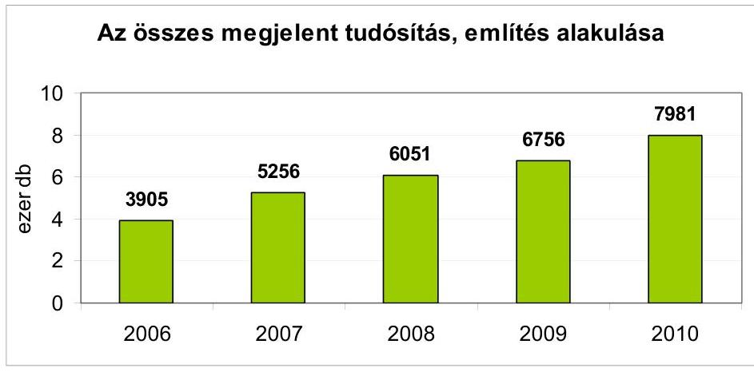

A 2010-es esztendőt a kettősség jellemezte: az első negyedévben 1274 hír jelent meg, a negyedikben 2355, az első félévben nem rendeztünk sajtótájékoztatót, a második félévben összesen 18-at tartottunk.
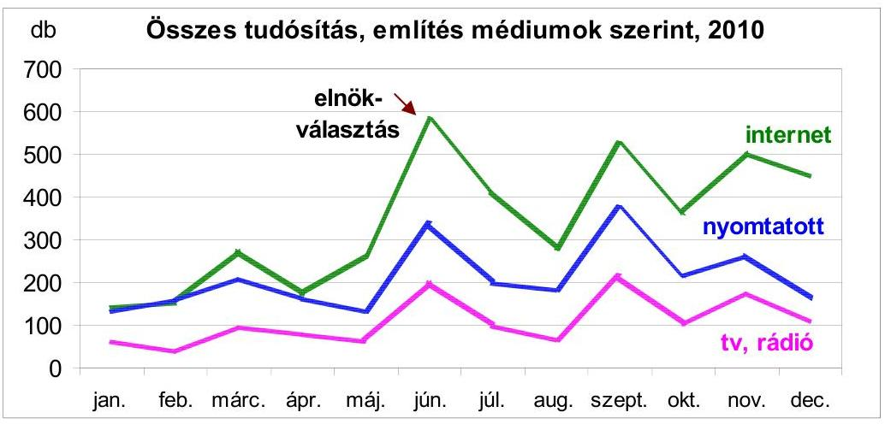

Hét saját szervezésű sajtóeseményünk volt egyrészt a központi székházban, másrészt az Országházban. Vidéken kilenc alkalommal került sor sajtótájékoztatóra.

Az első, augusztus közepén megrendezett elnöki sajtótájékoztató témája az energiagazdálkodást érintő állami és önkormányzati intézkedések, kiemelten az energiaracionalizálást célzó támogatások hatásának ellenőrzése volt. Szeptemberben a Magyar Köztársaság 2009. évi költségvetése végrehajtásának, valamint a Magyar Nemzeti Vagyonkezelő Zrt. 2009. évi tevékenységének ellenőrzéséről adtunk tájékoztatást. Ugyanebben a hónapban egy másik sajtótájékoztató keretében a szervtranszplantáció, a donáció és az alternatív kezelések ellenőrzésével kapcsolatban kérdezhettek az újságírók. Elnöki sajtótájékoztatón mutattuk be „A jó példa legyen ragadós! Legjobb gyakorlatok a közpénzek felhasználásánál" című szemináriumot októberben. Az ÁSZKUT a turisztikai fej-

---

lesztésekről és a nemzetgazdasági tervezés eredményességéről készített tanulmányokat szintén októberben ismertette. Az INTEGRITÁS(Z)" elnevezésű nemzetközi szakmai konferenciához kapcsolódóan decemberben szerveztünk sajtóeseményt. A Pénztárak Garancia Alapja ellenőrzéséről készült jelentésünket szintén decemberben sajtótájékoztatón hoztuk nyilvánosságra.

A nyilvánosság biztosításához alapvetően járul hozzá, hogy jelentéseink, szakmai kiadványaink bárki számára hozzáférhetők és letölthetők az ÁSZ honlapjáról. Weboldalunk nyitóoldalára látogatók száma 2010-ben közel 140 ezer volt, és mintegy 56 ezer alkalommal töltöttek le külső IP címről jelentést. Angol nyelvű jelentés összefoglalót 2010-ben összesen 1157 alkalommal töltöttek le.

Jelentős fejlesztéseket hajtottunk végre, illetve indítottunk el 2010-ben: honlapunkon részletes keresőt alakítottunk ki, valamint elindítottuk weboldalunk külső keresőmotorokhoz történő optimalizálását is, megkezdtük az új ÁSZ hírportál szervezését, továbbá átalakítottuk az ÁSZ hivatalos honlapját.

# 5. Az ellenőri munka minősége (a minőség garanciái) 

### 5.1. Az ellenőrzések minőségbiztosítása

Az ÁSZ a 2010. év során is kiemelt figyelmet fordított - az ellenőrzési tevékenység minőségének folyamatos kontroll alatt tartásával, az ellenőrzési megállapítások megalapozottságának, helyállóságának folyamatos felülvizsgálatával a jelentések kiegyensúlyozott színvonalának biztosítására.

A hatodik éve működő minőségirányítási rendszer a felügyeleti és felülvizsgálati eljárások alkalmazásával megfelelő kontrollokat alkalmaz a számvevőszéki ellenőrzés magas színvonalon történő elvégzésének elősegítésére.

A számvevőszéki ellenőrzés minden egyes szakasza - az előkészítéstől a jelentés elfogadásáig - a szakmai követelményeknek való megfelelés felülvizsgálatával és igazolásával zárul. A minőségkontroll folyamat végén független felülvizsgálat tanúsítja a számvevőszéki jelentésekbe foglalt ellenőrzési megállapítások jogi és szakmai megalapozottságát, ténybeli alátámasztottságát. A számvevőszéki jelentések és a személyes felelősség felvetését tartalmazó számvevői jelentések tervezetei így - az ellenőrzési igazgatóságok belső minőségkontrollja mellett - további kétszeri felülvizsgálaton is átesnek a megállapítások, következtetések és javaslatok, illetve a személyes felelősség felvetésének ellenőrzésszakmai és jogi megalapozottága szempontjából.

E feladatok ellátása mellett, az Elnöki Igazgatóság keretében működő, az ellenőrzést végző igazgatóságoktól elkülönült, felülvizsgálati tevékenységét függetlenül végző Minőségbiztosítási osztály a tárgyévben is elvégezte, az ellenőrzések teljes folyamatára kiterjedően, a már lezárt ellenőrzések utólagos szakmai és módszertani felülvizsgálatát. A belső minőségbiztosítási felülvizsgálat összesített tapasztalata szerint a 2010. évben lefolytatott ellenőrzéseink egészében véve megfeleltek a minőségkövetelményeknek. Az erről szóló értékelés eredményeit a Számvevőszék vezetése a minőségfejlesztés során is hasznosítja.

---

Az ellenőrzés minőségének biztosítása és folyamatos fejlesztése kérdésében az ÁSZ a nemzetközi kapcsolatokban is aktív szerepet töltött be. A Számvevőszék új vezetése - az EUROSAI útmutatójában foglaltakra is tekintettel - célul tűzte ki a minőségirányítási rendszer megújítását. Az egy éve bevezetett, az ellenőrzések dokumentálását támogató informatikai rendszer működési tapasztalatainak, valamint a minőségkontroll és a minőségbiztosítási eljárások teljes folyamatának részletes áttekintése alapján kívánja a vezetés kibővíteni a belső minőségirányítási rendszert olyan függetlenített felülvizsgálati eljárásokkal, amelyek a számvevői jelentések megbízhatóságát, megfelelő minőségét lesznek hivatottak garantálni.

# 5.2. Humán erőforrás gazdálkodás 

Az elmúlt évek csökkenő tendenciájaként 2010. december 31-én az ÁSZ állományi létszáma 534 fő volt, valamint további 9 fő az ÁSZ Kutató Intézetének munkatársa. Az év során az öregségi, vagy kedvezményes nyugdíjra jogosult munkatársak közül többen választották az előnyösnek vélt feltételek melletti visszavonulást. Az állomány csökkenésében markáns szerepet játszott a 2009ben általánosan meghirdetett közigazgatási létszámstop is, amelynek következtében a megüresedő álláshelyeket kizárólag a szervezeti működőképesség szempontjából legfontosabb munkakörök esetében töltöttük be.
2010. július 5-én léptek hivatalba az ÁSZ új választott vezetői: elnöke és alelnöke. Ettől kezdve fokozatos létszámépítés indult meg, 33 fő került alkalmazásra, közülük 25 számvevő, ketten számvevő vezetők.
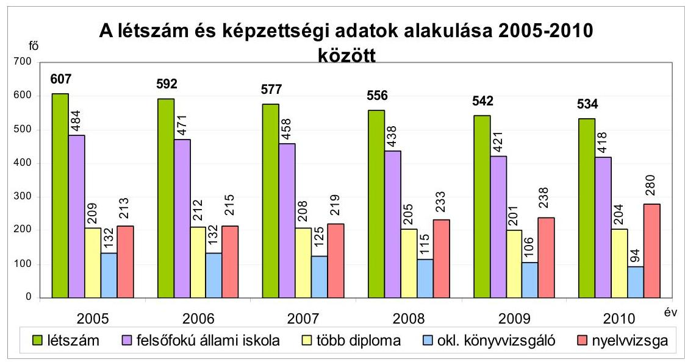

---

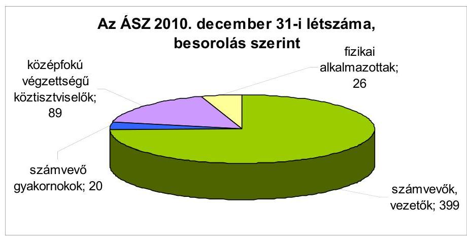

A számvevői életpálya ritkán indul ellenőri munkakörben. A pénzügyi elemzők, tervezők, beruházók és főként a költségvetéssel, számvitellel foglalkozók általában komolyabb szakmai - gyakran középvezetői - tapasztalatok után lépnek át az ellenőrzésbe. A számviteli-ellenőrzési képesítések megszerzése mellett jelentősen növeli az ellenőrök szakmai magabiztosságát és vitaképességét, ha több diplomával rendelkeznek. A szakmai rutin mellett nélkülözhetetlenek a korszerú szakmai, informatikai és kommunikációs ismeretek, készségek.
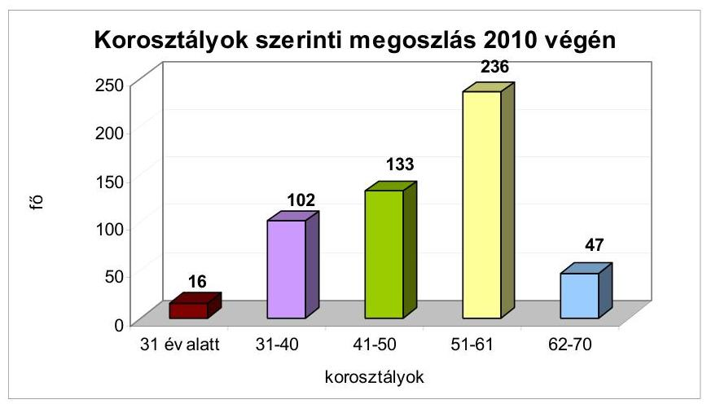

A belső oktatásban a kisebb személyi mozgásokból adódóan a felkészítés helyett a szorosabb értelemben vett továbbképzési elemekre helyeztük a hangsúlyt. Az egyes témák oktatását az ellenőrzési tervre figyelemmel szerveztük. Az év során 61 alkalommal közel 33 témakörben voltak képzések, 90 oktatási napon.

A rendezvények a szakmai feladatokhoz illeszkedtek. A vizsgálatindító értekezletek szakmai ismeretbővítést és szervezési célokat egyaránt szolgálnak. A pénzügyi szabályszerűségi ellenőrzések támogatása érdekében évről-évre hangsúlyt fektetünk a pénzügyi szabályozók (adó, számvitel stb.) változásainak bemutatására és konzultációjára.

---

Az aktuális szakmai tájékozódás körében - jogszabály-módosítások kapcsán konzultációs formában vettük napirendre az adat- és titokvédelemmel, illetve az ÁSZ vonatkozó, kapcsolattartó feladataival foglalkozó témakört. Az EUképzések tematikáját korszerűsítettük, a legújabb információk kerültek a munkatársak elé.

Informatikai képzéseink középpontjában a helyi vizsgálati dokumentációs rendszer (VIDOR) bevezetéséhez szükséges felkészítés állt. A már előző évben beindított kurzusok az év első felében - 10 alkalommal, 123 fő részvételével folytatódtak. A második félévben ismeretfelújító és mélyítő kurzusokra került sor - összesen 13 napon 184 fővel -, melyek végén a munkatársak vizsgát tettek és a kurzus elvégzését igazoló tanúsítványt kaptak. Emellett továbbra is fontos szerep jutott a jelentéskészítést segítő informatikai módszerek általános ismertetésének, közülük néhány konkrétan egy-egy adott foglalkoztatási csoporttal szembeni elvárásokra épült, specializált formában.
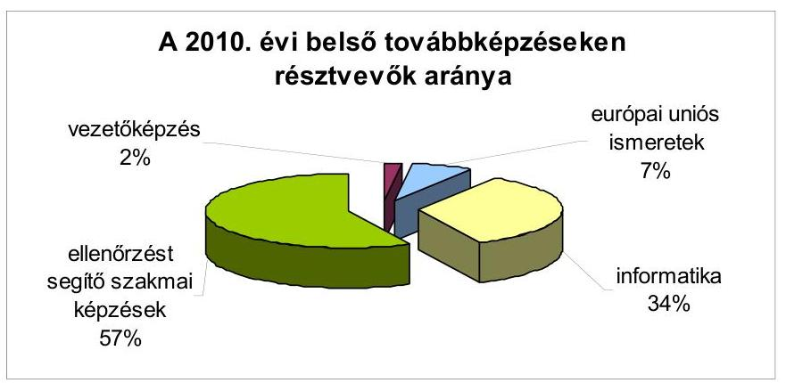

A Magyar Könyvvizsgáló Kamara tömöríti a tagsági viszonyukat szüneteltető, okleveles könyvvizsgáló képesítésű munkatársainkat. Tekintettel arra, hogy számvevőink közül többen vállalnak oktató-szervező feladatot a kötelező kamarai továbbképzésben, 19 belső szakmai rendezvényünkön 73 munkatársunk szerezhetett fontos kredit-pontokat.

Az előző évekhez képest - a személyi állomány létszámának csökkenése, az ellenőrzési feladatok sűrűsödése, illetve az ellenőrzési erőforrások fokozott védelmével összefüggésben - mérsékelt volt munkatársaink részvétele a külső oktatási és továbbképzési formákon. Tudatos takarékossági intézkedésekkel is éltünk, a szakmai információk közzétételének megszervezésével korlátozni tudtuk az országos szakmai rendezvényeken, konferenciákon, értekezleteken résztvevő munkatársak számát. Összesen 77 konferenciára, szakmai előadásra delegáltunk kollégákat, több mint 50 témakörben.

---

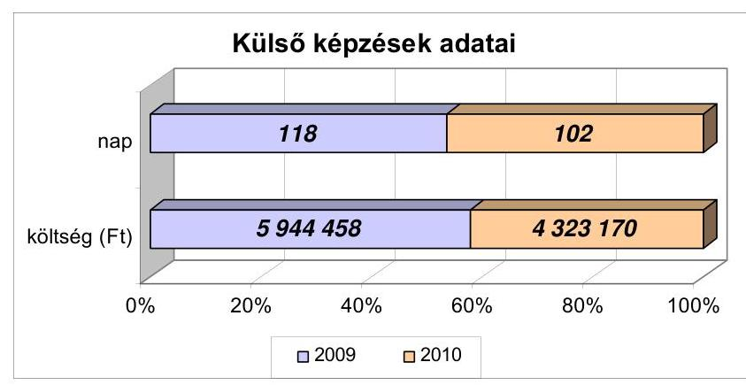

Munkatársaink folyamatosan részt vesznek a Goethe Intézet, illetve a Francia Intézet által a magyar köztisztviselők számára évről-évre meghirdetett, kedvezményes nyelvtanfolyamokon.

Korábbi évekhez hasonlóan 2010-ben is éltünk a külföldi tanulmányi kiutazási lehetőségekkel. Ismét delegáltunk kollégát a GAO International Auditor Fellowship Programjára. Az Indiai Számvevőszék nemzetközi kurzusára egyegy fót küldtünk teljesítmény-ellenőrzés, illetve környezetvédelmi ellenőrzés témakörökben. Két munkatársunk nemzeti szakértői státuszát (Európai Bizottság, ECA) újabb egy évre meghosszabbították.

Az oktatási-képzési költségek csökkentését célzó törekvéseink eredményeként az összes költséget 2009. évi 20 millió Ft-hoz képest 2010-ben majdnem felére mérsékeltük. Kihasználtuk a korszerű, költségkímélő oktatásszervezési eszközöket, pl. a képzések anyagait elektronikus úton juttattuk el a résztvevők számára. A legnagyobb megtakarítás az eseti költségeknél mutatkozik (külső szakmai rendezvények, konferenciák, szállásdíjak, külső oktatók díjai). Többnapos képzések esetén a megyékből érkező kollégákat kedvezményesen tudtuk elszállásolni.
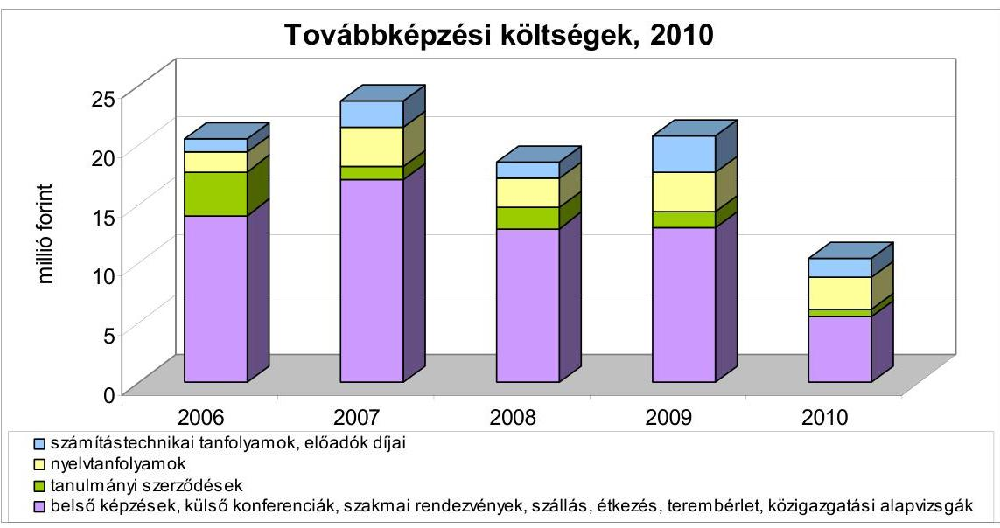

---

# 5.3. Szervezetfejlesztés 

Az ÁSZ vezetése 2010 második felében - az új középtávú stratégia jegyében megkezdte a szervezet és a múködés korszerűsítését. A sokirányú kihívások szükségessé teszik a nagyobb szervezettséget és múködési hatékonyságot a számvevőszéki ellenőrzésben.

Mindenekelőtt a minőségközpontú múködés, a folyamatos megújulásra kész szervezet előfeltételeit kellett megteremteni. Ezek a munkálatok szervezeti és személyi vezetői döntésekkel, intézkedésekkel megindultak. A stabil - egyenszilárdságú, ugyanakkor rugalmasan fejleszthető - szervezeti struktúra kialakítása hosszabb időt vesz igénybe. Az átmenet irányait a 2010. december 30-ától megújult Szervezeti és Múködési Szabályzat részben kijelölte.

Az SZMSZ deklarálta az Elnöki Igazgatóság létrehozását, amelynek vezetői és munkatársai kabinet-jelleggel, közvetlenül az ÁSZ elnökének munkáját segítik. Fiatal, dinamikus - a vállalati és non-profit szféra szemléletmódjával is rendelkező - munkatársak kerültek be az igazgatóság Szervezeti koordinációs osztályára. Kiemelten fontos szerephez jut a Kommunikációs és parlamenti kapcsolatok osztálya, amelynek megerősítése az elektronikus és írott sajtómunkában már tapasztalatot szerzett munkatársakkal részben megtörtént. Alapkoncepciójában körvonalazódott egy átfogó feladat- és hatáskörrel rendelkező Humánpolitikai és szervezetfejlesztési osztály felállítása is, amely ténylegesen tevékenységét 2011-ben kezdi meg.

Az elnök közvetlen irányítása alá tartozó Elnöki Igazgatósággal - a korábbi hárommal szemben - négyre emelkedett az ÁSZ igazgatóságainak száma. Számottevő változásokat hozott az SZMSZ a korábban már funkcionáló három igazgatóság tekintetében is. A Szervezetirányítási és Múködtetési Igazgatóság tevékenységi profiljának egy része az Elnöki Igazgatóságra került. Két megmaradó nagyobb egységének egyike az ellenőrzést közelebbről támogató osztályokat (jog, igazgatás, stratégia, informatikai fejlesztés, antikorrupciós projekt), a másik a költségvetési és gazdálkodási feladatokat ellátó osztályokat foglalja magába.

A két ellenőrzési igazgatóság (Államháztartás Központi Szintjét Ellenőrző Igazgatóság, Önkormányzati és Területi Ellenőrzési Igazgatóság) lényeges átalakítások alatt áll. Az ÁSZ ellenőrző munkájában ismert, és gyakran alkalmazott megoldás volt az osztályszervezetektől független vizsgáló kisegységek, team-ek felállítása és múködtetése. Ezt a rendszert a szakmai kompetenciák feltérképezésével és tudatos alkalmazásával tovább kell fejleszteni, általánossá tenni. A vizsgálatszervezésben, illetőleg a munkafeladatok megosztásában a megfelelő tudás, ismeret és gyakorlat alapvető rendező elv. Az SZMSZ feltünteti ugyan a hagyományos ágazati, funkcionális, tematikus stb. alapon kialakított és elnevezett ellenőrzési osztályokat, megkezdődött azonban az egységesülő „számvevő iroda" kialakítása, amely integrálja az ellenőrzésekhez szükséges, magas szintű szakmai kompetenciákat, és projekt-szerű - a munkatársak kreatív együttműködését elősegítő - munkavégzést tesz lehetővé.

Az ellenőrzési feladatok ellátásához optimális létszámú, hatékony szervezetre van szükség, ezért megindult az utóbbi években jelentősen lecsökkent állomány ismét 600 főt közelítő feltöltése. Az elsődlegesen bővítendő erőforrások feltérké-

---

pezése megtörtént, a megfelelő létszámú és színvonalú munkaerő-utánpótlás kiválasztásának programját 2010-ben kidolgoztuk.

Nyilvános pályázattal történő kiválasztás útján 30 pályakezdő diplomás fiatal kap lehetőséget arra, hogy az ellenőrzésben - szakmai mentorok irányításával - közreműködő asszisztensi feladatot lásson el három éven át. A projekt a felhívás közzétételével, illetve a jelöltek kiválasztásával 2010-ben, az év végén beindult. Részben kialakítottuk - ezúttal már az ellenőrzési szükségletekhez igazodó kompetenciákra tekintettel - gyakorlott szakemberek, leendő számvevők pályáztatásának és kiválasztásának rendjét is.

A munkaerő-utánpótlás folyamatosságának, áttekinthetőségének biztosítása, továbbá a legjobb ellenőrzési szakemberek megtartása az állomány- és szervezetfejlesztés kulcskérdése. A számvevőszéki törvény korszerűsítésének műhelyvitáiban - a középtávon elérendő stratégiai célok körében - megkezdődött olyan életpálya-modell kidolgozása, amely az elkötelezett, tartósan jó teljesítményt nyújtó, szakmai megújulásra kész munkatársaknak stabil foglalkoztatást és magas jövedelmet biztosít. A szervezet múködtetésében felhasználjuk a személyi állomány összes jelentős szakmai ismeretét, tudását, készségét és tapasztalatát, a felkészültséget pedig hatékony, az ellenőrzési munkát praktikusan támogató belső továbbképzési rendszerrel tervezzük folyamatosan fejleszteni.

# 6. ÁTTEKINTÉS AZ INTÉZMÉNY PÉNZÜGYI GAZDÁLKODÁSÁRÓL 

Az Országgyűlés az ÁSZ 2010. évi feladatainak ellátására a költségvetési törvényben 6631,2 millió forintot hagyott jóvá, melynek fedezetét 6611,2 millió forint költségvetési támogatás és 20,0 millió forint saját bevétel biztosította.

Az év folyamán a főbb költségvetési előirányzatok és teljesítésük a következők szerint alakultak:
millió Ft

|  | Eredeti   előirányzat | Módosított   előirányzat | Teljesités | Teljesités   \%-a módosi-   tott ei-hoz |
| :-- | --: | --: | --: | --: |
| Személyi juttatások | 4459,1 | 4490,9 | 4099,6 | 91,3 |
| Munkaadókat terhelő járulék | 1144,3 | 1163,8 | 1081,6 | 92,9 |
| Dologi és folyó kiadások | 941,5 | 1029,1 | 911,5 | 88,6 |
| Intézményi beruházás | 72,6 | 208,2 | 139,8 | 67,1 |
| Felújítás | 13,7 | 37,6 | 37,6 | 100,0 |
| Kölcsön nyújtás |  | 1,6 | 1,6 | 100,0 |
| Kiadás összesen: | 6631,2 | 6931,2 | 6271,7 | 90,5 |
| Működési bevétel | 18,0 | 18,0 | 7,6 | 42,2 |
| Felhalmozási bevétel | 2,0 | 2,0 |  |  |
| Kölcsön törlesztés |  | 1,6 | 1,6 | 100,0 |
| Költségvetési támogatás | 6611,2 | 6631,5 | 6631,5 | 100,0 |
| Előző évi maradvány |  | 278,1 | 278,1 | 100,0 |
| Bevétel összesen: | 6631,2 | 6931,2 | 6918,8 | 99,8 |

---

Az eredeti előirányzatot az év közben végrehajtott módosítások 300,0 millió forinttal növelték, melyből

- 278,1 millió forint a 2009. évi előirányzat-maradvány igénybevétele,
- 14,7 millió forint a 316/2009.(XII.28.) Korm. rendeletben meghatározottak alapján fizetett kereset-kiegészítés összege,
- 5,6 millió forint a nemzeti szakértői foglalkoztatással kapcsolatos kiadás öszszege,
- 1,6 millió forint a befolyt törlesztő részletek terhére folyósított lakáskölcsön.

A személyi juttatások és a munkaadókat terhelő járulékok együttes összege a kiadások $83 \%$-át tette ki, a dologi kiadások aránya $14 \%$, a felhalmozási kiadásoké $3 \%$.

Az intézmény 2010. évi múködési környezete, a választott vezető nélküli hét hónap, a korábban, még 2009-ben elrendelt létszámfeltöltési zárlat, valamint a szervezetalakítási és kinevezési jogkörök hiánya miatt a költségvetési gazdálkodás is - a kényszer-takarékosság miatt - csak a legszükségesebb kiadásokra korlátozódhatott. Az első félévben új projektek, terven felüli ellenőrzési feladatok nem indulhattak, indokolt tárgyi eszközbeszerzések, fejlesztések elmaradtak, illetve a létszám folyamatosan csökkent, így főként a személyi juttatások terén a korábbi évekhez viszonyítva jelentős mértékű előirányzatmaradványaink keletkezett.

Az év második felében megkezdett szervezet-átalakítás folyamatának, a stratégia megújításának, valamint az új ellenőrzési feladatok végrehajtásához szükséges szakképzett és elhivatott munkatársak felvételének költségvetési kihatásai döntő többségükben a 2011-12. évben jelentkeznek.

A 2010. évben 647,1 millió forint maradvány keletkezett, melyből 201,3 millió forint - a feladatok, a teljesítések 2011. évre való átütemezésének, áthúzódásának következtében - kötelezettségvállalással terhelt. A szabad maradvány 98,6 \%-át a személyi juttatások és a munkaadókat terhelő járulékok maradványának együttes összege teszi ki.

Az előzőekben jelzett gazdálkodási körülmények, valamint az időközben jelentkező többletfeladatok, így a Költségvetési Tanács tagságával, az állami és önkormányzati vállalatok ellenőrzésével összefüggő megnövekedő szakértői foglalkoztatások igénye indokolja a 445.800 ezer forint kötelezettségvállalással nem terhelt 2010. évi előirányzat-maradvány visszaigénylését és 2011-12. évi felhasználásának lehetőségét.
2010. évi gazdálkodásunk során is hangsúlyt helyeztünk az erőforrások takarékos felhasználására. Közbeszerzési eljárás keretében a korábbi szerződési ár alatt tudtunk az üzemeltetéshez szolgáltatást igénybe venni. Új megoldások alkalmazásával csökkenthetővé vált az ellenőrzés és az intézmény múködés területén a papírfelhasználás, nyomdai kapacitás igénybevétele, az informatika területén az új hardverbeszerzésekre, a licence és követési díjakra fordított kiadás.

---

A vezetékes telefonszolgáltatásra fordított kiadásokat a 2009 decemberében kötött szerződés alapján 2010. januártól az ÁSZ-os telephelyek (a munkatársak 24 telephelyen dolgoznak) közötti beszélgetés, hangadat után nem kell forgalmi díjat fizetni, így a vezetékes telefonszolgáltatásra fordított kiadások 2010ben mintegy 7,3\%-al csökkentek.

Az ÁSZ IT-tevékenységének alapvető célja, hogy informatikai és telekommunikációs eszközökkel sokoldalúan és hatékonyan támogassa az ÁSZ stratégiai küldetését és feladatainak eredményes ellátását. Az informatikai és telekommunikációs fejlesztések 2010-ben is a korábbi évek eredményeire építve valósultak meg. Az ÁSZ folyamatosan karbantartott, fejlesztett és ellenőrzött infrastruktúrával, egységes hálózati telekommunikációs rendszerrel, a változó kommunikációs igényeket rugalmasan követni képes, a biztonsági követelményeknek megfelelő alkalmazói rendszerekkel, korszerű eszközökkel felszerelt ok-tató- és konferenciateremmel rendelkezik.

A 2010. évre jóváhagyott IT-költségvetés biztosította a stratégiában és az éves tervben rögzített projektek, fejlesztési feladatok végrehajtását.

A számvevői munkavégzés dokumentálásának támogatására, a vizsgálatok során keletkezett, illetve begyűjtött dokumentumok nyilvántartására, tárolására, megosztására szolgáló elektronikus rendszer (VIDOR) fejlesztése - uniós források felhasználásával - 2009 májusában fejeződött be. A rendszer mintegy 400 felhasználójának képzése az ÁSZ oktatótermében 2010-ben folyamatosan történt. A rendszer használatának elsajátítását a funkciókat bemutató videók is segítik. A rendszer bevezetése óta folyamatosan gyűjtjük a múködési tapasztalatokat, a továbbfejlesztési igényeket.

2010 második félévében megkezdtük a rendszer meglévő funkcióinak és lehetőségeinek áttekintését, az egységes dokumentációs és iratkezelési folyamatok kialakítását annak érdekében, hogy a továbbfejlesztés során beépíthetőek legyenek mind a folyamatba épített, mind az utólagos kontrollt támogató funkciók és szoftver elemek, valamint megteremthető legyen az integrált együttmúködés az elektronikus iratkezelő rendszerrel.

2002 óta múködtetjük a saját fejlesztésű vizsgálat-nyilvántartó és nyomon követő rendszerünket (SZEKRETER), amely támogatja az ellenőrzések tervezését, az ellenőrzésekre fordított erőforrások kimutatását. A szervezet-átalakítás igényeihez igazodóan napirenden van a rendszer felülvizsgálata.

Az ÁSZ az ellenőrzéseihez jelenleg is rendszeresen felhasználja az ellenőrzött költségvetési intézmények tranzakciós adatait tartalmazó különböző elektronikus adatbázisokat. Az ellenőri munka hatékonyságának növelése érdekében a Magyar Államkincstár, a GIRO Zrt. és az ÁSZ együttmúködésének eredményeként 2010-től a központi költségvetési intézményeknél egységes felépítésben, a számvevők igényeit figyelembe véve állnak rendelkezésre a pénzügyi ellenőrzésekhez szükséges adatok.

Az ÁSZ 2010-ben - az elektronikus közszolgáltatásról szóló törvény alapján csatlakozott a Központi elektronikus szolgáltató rendszerhez (KR). Ezzel párhu-

---

zamosan az ügykövetési rendszerünkhöz egy új modult (Hivatali Kapu) fejlesztettünk ki, amely megvalósítja a gépi kapcsolatot a KR rendszerrel.

Az ÁSZ honlapjának szolgáltatásait folyamatosan bővítjük, és naprakészen tartjuk.

Az ÁSZ Intranet rendszerének folyamatos fejlesztése és múködtetése biztosítja a munkatársak számára minden közérdekű információ és dokumentum elektronikus elérését, naprakészségét.

Az ellenőrzési munka hatékonyságának növelése érdekében a hivatali notebook-ot használó ellenőrök részére, megfelelő hardver biztonsági eszköz alkalmazásával az ÁSZ hálózatán kívüli helyszínről is biztosítjuk a hozzáférést egyes központi szolgáltatásunkhoz, amit 2010 második félévétől kibővítettünk az összes Lotus Notes alapú adatbázisra.

Az IT-infrastruktúra másik fontos eleme az ÁSZ hardver eszközparkjának megfelelő színvonalú kialakítása és folyamatos fejlesztése, a munkatársaknak a feladataik hatékony elvégzéséhez, valamint a korszerű informatikai szolgáltatások igénybevételéhez szükséges hardver eszközök - elsősorban asztali és/vagy notebook számítógépek - biztosítása. Stratégiai céljainknak megfelelően a notebook gépet használók aránya - a helyszíni ellenőrzésben résztvevők körében - évről-évre folyamatosan növekszik.

A tárgyévben a biztonsági szoftverbeszerzések, valamint azok licence-inek (tűzfal szoftver, behatolás megelőző, spam-szűrő, Web biztonsági és tartalomszűrő, Symantec vírusvédelmi szoftver licence-k stb.) megújításával az ÁSZ-nál keletkezett és tárolt adatok biztonságát (integritását, bizalmasságát és sértetlenségét) tudjuk megvalósítani.

A rendelkezésre álló előirányzatok összességében biztosították az intézmény zavartalan feladatellátásához szükséges múködési, üzemeltetési feltételeket.

---

.

---

# Mellékletek

---

.

---

# 1. számú melléklet 

A 2010. évi ellenőrzések listája

---

.

---

# A 2010. évi ellenőrzések listája 

| Témaszám* | Jelentésszám | Jelentés címe |
| :--: | :--: | :--: |
| Törvényekben elốrt évenkénti ellenőrzési kötelezettség |  |  |
| 9. | 1004 | Jelentés a Magyar Távirati Iroda Zrt. 2009. évi gazdálkodásának ellenőrzéséről |
| 10. | 1013 | Jelentés a Magyar Nemzeti Vagyonkezelő Zrt. 2009. évi tevékenységének ellenőrzéséről |
| 1. | 1016 | Jelentés a Magyar Köztársaság 2009. évi költségvetése végrehajtásának ellenőrzéséről |
| 15. | 1025 | Vélemény a Magyar Köztársaság 2011. évi költségvetési javaslatáról |
| 33. | 1048 | Jelentés a fővárosi önkormányzatot és a kerületi önkormányzatokat osztottan megillető bevételek 2010. évi megosztásáról szóló önkormányzati rendelet felülvizsgálatáról |
| Törvényekben elốrt kétévenkénti ellenőrzési kötelezettség |  |  |
| 39. | 1036 | Jelentés a Kereszténydemokrata Néppárt 2008-2009. évi gazdálkodása törvényességének ellenőrzéséről |
| 38. | 1040 | Jelentés a Magyar Demokrata Fórum 2008-2009. évi gazdálkodása törvényességének ellenőrzéséről |
| 42. | 1041 | Jelentés a Barankovics István Alapítvány 2008-2009. évi gazdálkodása törvényességének ellenőrzéséről |
| 41. | 1044 | Jelentés az Antall József Alapítvány 2008-2009. évi gazdálkodása törvényességének ellenőrzéséről |
| Törvényekben elốrt rendszeres ellenőrzési kötelezettség |  |  |
| 7. | 1002 | Jelentés a Nemzeti Kulturális Alap múködésének ellenőrzéséről |
| 44. | 1005 | Jelentés a 2009. június 7 -én megtartott Európai Parlament tagjai választásának lebonyolításához elhasznált pénzeszközök elszámolásának ellenőrzéséről |
| 28. | 1011 | Jelentés a Nógrád Megyei Önkormányzat gazdálkodási rendszerének 2010. évi ellenőrzéséről |
| 26. | 1012 | Jelentés a Győr-Moson-Sopron Megyei Önkormányzat gazdálkodási rendszerének 2010. évi ellenőrzéséről |
| 18. | 1014 | Jelentés a Budapest Főváros III. kerület Óbuda-Békásmegyer Önkormányzata gazdálkodási rendszerének 2010. évi ellenőrzéséről |
| 19. | 1015 | Jelentés Budapest Főváros VIII. kerület Józsefvárosi Önkormányzat gazdálkodási rendszerének 2010. évi ellenőrzéséről |
| 31. | 1017 | Jelentés Veszprém Megyei Jogú Város Önkormányzata gazdálkodási rendszerének 2010. évi ellenőrzéséről |

---

| Témaszám* | Jelentésszám | Jelentés címe |
| :--: | :--: | :--: |
| 23. | 1018 | Jelentés a Békés Megyei Önkormányzat gazdálkodási rendszerének 2010. évi ellenőrzéséről |
| 2. | 1019 | Jelentés a helyi önkormányzatok gazdálkodási rendszerének 2009. évi ellenőrzéséről |
| 29. | 1026 | Jelentés Kaposvár Megyei Jogú Város Önkormányzata gazdálkodási rendszerének 2010. évi ellenőrzéséről |
| 32. | 1028 | Jelentés a Zala Megyei Önkormányzat gazdálkodási rendszerének 2010. évi ellenőrzéséről |
| 22. | 1029 | Jelentés Pécs Megyei Jogú Város Önkormányzata gazdálkodási rendszerének 2010. évi ellenőrzéséről |
| 30. | 1030 | Jelentés a Vas Megyei Önkormányzat gazdálkodási rendszerének 2010. évi ellenőrzéséről |
| 0 | 1032 | Jelentés a 2009. novemberi időközi országgyűlési képviselőválasztási kampányra fordított pénzeszközök elszámolásának ellenőrzéséről a képviselethez jutott jelölő szervezetnél |
| 24. | 1033 | Jelentés Szeged Megyei Jogú Város Önkormányzata gazdálkodási rendszerének 2010. évi ellenőrzéséről |
| 27. | 1037 | Jelentés Szolnok Megyei Jogú Város Önkormányzata gazdálkodási rendszerének 2010. évi ellenőrzéséről |
| 17. | 1038 | Jelentés Budapest Főváros XV. kerület Rákospalota, Pestújhely, Újpalota Önkormányzat gazdálkodási rendszerének 2010. évi ellenőrzéséről |
| 20. | 1042 | Jelentés Budapest Főváros XI. kerület Újbuda Önkormányzata gazdálkodási rendszerének 2010. évi ellenőrzéséről |
| 25. | 1043 | Jelentés Dunaújváros Megyei Jogú Város Önkormányzata gazdálkodási rendszerének 2010. évi ellenőrzéséről |
| 34. | 1046 | Jelentés Budapest Főváros Önkormányzata költségvetési gazdálkodásában kialakított belső kontrollok müködésének ellenőrzéséről |
| 21. | 1047 | Jelentés Budapest Főváros XX. kerület Pesterzsébet Önkormányzata gazdálkodási rendszerének 2010. évi ellenőrzéséről |
| Az ÁSZ elnökének döntése alapján végzett egyéb ellenőrzések |  |  |
| 13. | 1001 | Jelentés az egynapos sebészeti ellátásra fordított pénzeszközök hasznosulásának ellenőrzéséről |
| 14. | 1003 | Jelentés a gyorsforgalmi úthálózattal kapcsolatban állami feladatot ellátó szervezetrendszer müködésének ellenőrzéséről |
| 12. | 1007 | Jelentés a Magyar Nemzeti Bank 2009. évi müködésének ellenőrzéséről |
| 6. | 1009 | Jelentés az energiagazdálkodást érintő állami és önkormányzati intézkedések, kiemelten az energiaracionalizálást célzó támogatások hatásának ellenőrzéséről |
| 11. | 1010 | Jelentés az EU támogatások felhasználása során alkalmazott szabálytalanság-, adósság- és követeléskezelési folyamatok ellenőrzéséről |
| 8. | 1020 | Jelentés a szervtranszplantáció, a donáció és az alternatív kezelések ellenőrzéséről |
| 0 | 1021 | Jelentés az Országos Cigány Önkormányzat 2009. évi - 2010. I. félévi gazdálkodásának ellenőrzéséről |

---

| Témaszám* | Jelentésszám | Jelentés címe |
| :--: | :--: | :-- |
| 5. | 1022 | Jelentés az állami feladat (közfeladat) ellátás szervezeti és   humánerőforrás rendszerének ellenőrzéséről |
| 35. | 1023 | Jelentés a 4-es metró beruházási folyamatának ellenőrzéséről |
| 37. | 1024 | Jelentés a fogyatékos személyek támogatásában részt vevő   nonprofit szervezeteknek nyújtott nem normatív állami ta   mogatás és ingyenes állami vagyonjuttatás felhasználásának   ellenőrzéséről |
| 3. | 1031 | Jelentés a helyi adók rendszerében a hatékonyság és az   eredményesség érvényesülésének ellenőrzéséről |
| 40. | 1034 | Jelentés a Pénztárak Garancia Alapja múködésének ellenőr-  zéséről |
| 4. | 1035 | Jelentés a felnőttképzés feltételrendszerének, eredményessé-   gének, a gazdaság munkaerőigénye kielégittésében betöltött   szerepének ellenőrzéséről |
| 36. | 1039 | Jelentés a színházak állami támogatásának és gazdálkodá-   sának ellenőrzéséről |
| 43. | 1045 | Jelentés a Hálózat-Budapesti Díjfizetőkért és Díjhátralékoso-   kért Alapítványnál a közpénzek rendeltetésszerú felhasználá-   sának ellenőrzéséről |
| 16. | 1049 | Jelentés a vizek védelmének és a vízgazdálkodási feladatok   ellátásának ellenőrzéséről |
| Egyéb jelentések, tájékoztatók |  |  |
| - | 1006 | Jelentés a TEN-T pályahálózat V. páneurópai korridor (6. sz.   kiemelt európai projekt) vonalán EU támogatással megvaló-   suló vasútvonal fejlesztések teljesítmény-ellenőrzéséről |
| - | 1008 | Jelentés az Állami Számvevőszék 2009. évi tevékenységéről |
| - | 1027 | Tájékoztató az európai uniós támogatások 2009. évi felhasználásának ellenőrzéséről |

*/ Témaszám: Az ÁSZ 2010. évi ellenőrzési tervében szereplő témajegyzék szerinti sorszám
0: Terven felüli jelentések.
-: Az éves ellenőrzési tervben nem szerepel, az éves feladatterv tartalmazza.

---

.

---

# 2. számú melléklet 

ÁSZ-jelentések az országgyúlési bizottságok/plenáris ülések napirendjén 2010-ben

---

.

---

# ÁSZ-jelentések az országgyúlési bizottságok/plenáris ülések napirendjén 2010-ben*

|  Sorszám | ÁSZ
szám | OGY
szám | A jelentés címe | Bizottság | A bizottsági tárgyalás dátuma | A plenáris tárgyalás dátuma | Megjegyzés  |
| --- | --- | --- | --- | --- | --- | --- | --- |
|  1. | 1004 | J/316 | Jelentés a Magyar Távirati Iroda Zrt. 2009. évi gazdálkodásának ellenőrzéséről | Kulturális | 11.17. | - | A jelentés eredetileg a J/12069 OGY sorszámon szerepelt. Az Országgyúlési ciklusváltás miatt került átszámozásra. A Számvevőszéki és költségvetési bizottság, mint kijelölt bizottság a táblázat lezárásáig nem vette napirendjére.  |
|  2. | 1008 | J/813 | Jelentés az Állami Számvevőszék 2009. évi tevékenységéről | Önkormányzati
Emberi jogi
Gazdasági
Számvevőszéki | $\begin{aligned} & 09.13 . \ & 10.04 . \ & 10.04 . \ & 10.04 . \end{aligned}$ | $\begin{aligned} & 10.05 . \ & 10.18 . \end{aligned}$ | A beszámoló elfogadásáról szóló Számvevőszéki és költségvetési bizottsági javaslatot (H/1263) az Országgyúlés 309 igen szavazattal, 41 ellenében, tartózkodás nélkül fogadta el. (99/2010. (X. 21.) OGY hat.)  |
|  3. | 1013 | J/1056 | Jelentés a Magyar Nemzeti Vagyonkezelő Zrt. 2009. évi tevékenységének ellenőrzéséről | Számvevőszéki
Gazdasági
Mezőgazdasági | - | - | A jelentést az OGY tárgysorozatba vette, de a három kijelölt bizottság eddig nem tűzte napirendjére.  |
|  4. | 1016 | T/1062/1 | Jelentés a Magyar Köztársaság 2009. évi költségvetése végrehajtásának ellenőrzéséről | 18 bizottság | 09.06.-09.16. | $\begin{aligned} & 09.14 . \ & 10.04 . \ & 10.11 . \ & 10.18 . \end{aligned}$ | 2010. évi XCVIII. törvény a Magyar Köztársaság 2009. évi költségvetésének végrehajtásáról  |
|  5. | 1019 |  | Jelentés a helyi önkormányzatok gazdálkodási rendszerének 2009. évi ellenőrzéséről | Önkormányzati | 11.24. |  |   |
|  6. | 1022 |  | Jelentés az állami feladat (közfeladat) ellátás szervezeti és humánerőforrás rendszerének ellenőrzéséről | Ifjúsági | 10.28. |  | Az Ifjúsági, szociális, családügyi és lakhatási bizottság elnöke bizottsági állásfoglalás kialakítását szorgalmazta.  |

---

|  7. | 1024 |  | Jelentés a fogyatékos személyek támogatásában részt vevő nonprofit szervezeteknek nyújtott nem normatív állami támogatás és ingyenes állami vagyonjuttatás felhasználásának ellenőrzéséről | Ifjúsági | 10.21. | A Nemzeti Erőforrás Minisztérium az ÁSZ javaslatait megvizsgálva megkezdte a szükséges jogszabályok módosításának előkészítését.  |
| --- | --- | --- | --- | --- | --- | --- |
|  8. | 1025 | T/1498/1 | Vélemény a Magyar Köztársaság 2011. évi költségvetési javaslatáról | 18 bizottság | 11.09.-11.15. | 11.15.-11.18. 11.26.
12.07.
12.14.
12.20.
12.23.  |
|  9. | 1027 | J/1547 | Tájékoztató az európai uniós támogatások 2009. évi felhasználásának ellenőrzéséről | Európai ügyek | 11.30. | -  |
|  *a jelentések ÁSZ számának sorrendjében |  |  |  |  |  |   |

---

# Függelék

---

.

---

# STRATÉGIA 

2011 - 2015

## ELNÖKI ELŐSZÓ

Az Állami Számvevőszék az Országgyúlés ellenőrző szerve, ellenőrző tevékenységét az Alkotmánynak és a törvényeknek alárendelten végzi. A Számvevőszék nem hatóság, az ellenőrzöttekkel szemben nincsenek közvetlen szankcionálási jogosítványai. Megállapításainak és javaslatainak hasznosítását, azok meggyőző ereje mellett a nyilvánosság segíti.

A szervezet feladatai meghaladják a rendelkezésre álló erőforrásokat. A Számvevőszék 2010. július 5-én beiktatott elnökeként a legfontosabb teendőim között szerepelt az intézmény új középtávú stratégiájának kialakítása. Olyan stratégiának, ami biztositja a folyamatos építkezést, támaszkodik a szervezet értékeire és eddig elért eredményeire, ugyanakkor a számos környezeti változás és kihívás egybeeséséből adódóan mégis új hangsúlyokat jelöl ki.

Változások voltak és várhatóan lesznek is a Számvevőszék múködési környezetében. Az új Alkotmány kidolgozását követően kezdődhet meg a számvevőszéki törvény alaptörvénnyel harmonizáló megújítása. A világgazdasági válság következményeként erősödtek a társadalmi feszültségek, s az élet szinte minden területére jellemző, hogy változatlan vagy növekvő mennyiségú feladatot a korábbiaknál kevesebb erőforrás felhasználásával kell megvalósítani. Sok országra, így hazánkra is ránehezedik a társadalom elöregedésével összefüggő demográfiai nyomás. A kiútkeresés átfogó népességpolitikai stratégiát igényel, ami új alapokra helyezheti a nagy, közösségi ellátó rendszerek müködését, az egészségügyi ellátást és a szociális védelmet, stabilizálva és megreformálva a nyugdíjrendszert is. Megkülönböztetett figyelmet érdemelnek továbbá a gazdasági unió teljessé tételére, az alapvető gazdaságpolitikai döntések közösségi szintü egyeztetésére irányuló törekvések. Alighanem számolni kell a nemzeti költségvetési politikák rendező elveinek uniós szintü összehangolásával. A legfőbb ellenőrző intézményeket tömörítő nemzetközi szervezetek (INTOSAI, EUROSAI) is választ keresnek arra, hogy a világméretü környezeti változások milyen feladatokat, lehetőségeket és korlátokat jelentenek középtávon a számvevőszékek számára. Mindemellett a nemzetközi szakmai szervezetek mühelymunkáival újrarendeződik szinte a teljes módszertan. A „hogyan" kérdésre válaszoló módszertani fejlesztések végső soron az egységesítés, az ellenőrzések összevethetősége irányába mutatnak. Mindezen törekvések feladatokat jelentenek a nemzeti számvevőszékek számára. Stratégiánkban figyelembe vettük az INTOSAI már elfogadott, illetve az EUROSAI formálódó stratégiai célkitüzéseit.

A Számvevőszék a közpénzügyekre legszélesebb rátekintéssel rendelkező szervezet, tevékenysége egyaránt szolgálja a központi és az önkormányzati szintet, így hozzájárul a közpénzekkel való gazdálkodás jó minőségéhez és fenntarthatóságához. Ezek a követelmények érvényesitendők az intézmény ellenőrzéseiben és saját müködésében is.

Fontos, hogy a Számvevőszéket a jövőben is hiteles és bizalomra érdemes szervezetnek tekintsék. A szakmai stabilitás, integritás, megkérdőjelezhetetlenség az intézményről

---

kialakított kép elmaradhatatlan részévé kell, hogy váljon. Tudatában vagyunk annak, hogy ellenőrzéseink eredménye nem csak a szakmai ismereteken, de a vezetés és a munkatársak által vallott értékeken, és ezek munkakultúrába való beépitésén is múlik.

A Számvevőszék célja, hogy ellenőrzéseivel hozzáadott értéket teremtsen, és közpénzt takarítson meg, így is gazdagítva a közvagyont. Ezért fontos számunkra, hogy megállapításainkkal, javaslatainkkal képesek legyünk érdemi hatást elérni, a szükséges változást kezdeményezni, s ennek mérhető eredményeit felmutatni. Hatósági jogosítványok hiján nem kényszeríthetjük ki ellenőrzéseink következményeit, ezért munkánk a jövőben csak úgy teljesedhet ki, ha szorosabbra fúzzük együttmüködésünket az Országgyúléssel, és azokkal a szervezetekkel, amelyek érvényt szerezhetnek ellenőrzési megállapításainknak. A Számvevőszék munkájával nem csak az ellenőrzöttek hibáira mutat rá, számon kérve azokat, hanem segíti a közpénzzel, közvagyonnal gazdálkodókat. Mindemellett stratégiánk megvalósitása törvényi felhatalmazásaink maradéktalan kihasználását követeli meg.

A stratégiai időszak végén azt szeretném látni, hogy a rendhez, s ezen keresztül egy magasabb gazdasági teljesítményhez a Számvevőszék is hozzájárult. Hiszem, hogy a jelen stratégia végrehajtásával a Számvevőszék még inkább olyan intézménnyé válik, amely erőforrásait a közjó és az Országgyúlés szolgálatába állítja annak érdekében, hogy a közpénzek felhasználása ne csak szabályos, de egyben gazdaságos, hatékony és eredményes is legyen.

---

# KÜLDETÉS 

Az Állami Számvevőszék küldetése, hogy szilárd szakmai alapon álló, értékteremtő ellenőrzéseivel előmozdítsa a közpénzügyek átláthatóságát, rendezettségét, és járuljon hozzá a „jó kormányzáshoz"".

## JÖVŐKÉP

Az állampolgárok bizalmát élvező, szakmai tekintéllyel rendelkező Állami Számvevőszék ellenőrzéseivel és tanácsaival támogatja az Országgyűlést. Javaslataival a közpénzek és a közvagyon szabályos, gazdaságos, hatékony és eredményes felhasználását, használatát segíti.

## ALAPÉRTÉKEK

Az Állami Számvevőszék

- csak a törvényeknek és az Országgyűlésnek van alárendelve;
- számvevői elfogulatlanul végzik az ellenőrzéseket, feladatukat a szakmai és az etikai szabályok maradéktalan betartásával látják el;
- hitelesen tárja fel és értékeli a tényeket;
- ellenőrzési tevékenységére jellemző a hibák, hiányosságok megelőzésére, az ellenőrzötteket segítő együttműködésre törekvés;
- segíti az integritás alapú, átlátható és elszámoltatható közpénzfelhasználás megteremtését;
- elkötelezett híve a minőségközpontú múködésnek, a felhalmozott tapasztalat magas fokú szakértelemmel és hivatástudattal párosul;
- kész a folyamatos szervezeti megújulásra;
- szervezetében a munkatársak erkölcsi és anyagi megbecsülése magas szintű, megvalósul a teljesítményarányos bérezés, az esélyegyenlőség és a folyamatos fejlődés;
- saját működését a gazdaságosság, a hatékonyság, az eredményesség és a fenntarthatóság jellemzi.

[^0]
[^0]:    * Angolul „good governance". Az ENSZ és más nemzetközi szervezetek meghatározásai alapján a „jó kormányzás" az állam olyan müködési módja, amelyet konszenzuskeresés, részvételre ösztönzés, esélyegyenlőség, átláthatóság, elszámoltathatóság, eredményesség, hatékonyság, a jogállamiság tisztelete jellemez.

---

# STRATÉGIAI CÉLOK, FELADATOK 

## I. AZ ELLENŐRZÉSI TEVÉKENYSÉG FEJLESZTÉSE

AZ ÁLLAMI SZÁMVEVŐSZÉK ELLENŐRZÉSEI MIND JOBBAN SEGÍTIK AZ ÁTLÁTHATÓSÁGOT, AZ ELSZÁMOLTATHATÓSÁGOT ÉS AZ ELSZÁMOLTATÁST A KÖZPÉNZEKKEL, A KÖZVAGYONNAL VALÓ GAZDÁLKODÁSBAN.

- Az ellenőrzések témaválasztásuk, megközelítésük és elért eredményeik által hozzáadott értéket teremtenek, a közpénzek felhasználásában kimutatható megtakarításokat, a gazdálkodás javítását eredményezik.
- Határozott, következetes és cselekvő, a pozitív változásokat előmozdító ellenőrzési magatartással, és minden rendelkezésre álló számvevőszéki eszközzel támogatja a felelősségteljes, következményekkel járó, a jognak érvényt szerző közigazgatási múködést.
- Az államháztartás komplex folyamatainak átláthatósága érdekében rendszerszemléletű/holisztikus megközelítésű, egymásra épülő, a szinergia-hatást kihasználó, összefoglaló értékelésekre lehetőséget adó ellenőrzéseket végez.
- A következetes elszámoltatás tekintetében a zárszámadás ellenőrzésének kiemelt szerepe van. A feladat hatékonyabb és eredményesebb megvalósítása érdekében az eddigitől eltérő megközelítésű, tartalmú és eljárású ellenőrzési modellt alakít ki.
- A költségvetés véleményezése új hangsúlyokat kap, figyelemmel a környezeti változásokra, az Európai Uniónak a tagországok költségvetésének előzetes egyeztetésére vonatkozó, bevezetendő szabályaira.
- Az önkormányzatok ellenőrzése során azok pénzügyi- gazdasági helyzetét értékeli, kockázatait feltárja, valamint az ellenőrzések helyszíneit objektív mutató- rendszer alapján választja ki.
- Az államháztartáson kívülre nyújtott költségvetési támogatások és az ingyenes vagyonjuttatás ellenőrzésével hozzájárul ahhoz, hogy a közpénzeket a civil szervezetek is átlátható módon használják fel a közfeladatok szerződésben vállalt - gazdaságos, hatékony és eredményes - ellátása érdekében.
- Szerepet vállal a korrupció és csalás elleni küzdelemben. Közreműködik a korrupciós kockázatok és a korrupció elleni fellépés hatékony és eredményes eszközeinek beazonosításában, alkalmazásában, továbbá használatuk elterjesztésében, az integritás alapú közigazgatási kultúra kialakításában.
- A hatékonyabb és eredményesebb közpénzfelhasználás érdekében a szabályszerűségi követelmények érvényesülése mellett előtérbe helyezi a központi és önkormányzati államháztartási alrendszerben, valamint az államháztartáson kívül múködő közfeladat-ellátó rendszerek, közpénzekből finanszírozott programok és projektek (beruházások) teljesítmény-ellenőrzését.
- A megbízható pénzügyi menedzsment érvényesítése érdekében az uniós és egyéb nemzetközi források és kötelezettségek vizsgálatában erősíti tanácsadó

---

szerepét, kiemelt figyelmet fordítva az EU Bizottság és az Európai Számvevőszék hazánkat érintő ellenőrzési tevékenységében való együttmúködésre.

- A teljesítmény-ellenőrzések feltételeinek javítása érdekében - tanácsadási tevékenységének keretében - szorgalmazza, hogy a közpénzek felhasználásához, a jogszabályi, közpolitikai beavatkozásokhoz a döntéshozók eredményességi kritériumokat határozzanak meg, a célokhoz pedig a teljesítésmérésre alkalmas indikátorokat rendeljenek. Ennek érdekében közreműködik a nemzeti kulcsindikátorok rendszerének továbbfejlesztésében.
- Az ellenőrzési tapasztalatokra, és az azokat kiegészítő kutatásokra alapozott tanácsadással, az ellenőrzési eredmények összefoglaló értékelésével is segíti a „jó kormányzást".
- A közigazgatás hatékonyságának növelése érdekében a jó gyakorlatot közkinccsé teszi, az ellenőrzések eredményeként szerzett információt és tudást átadja a közpénzfelhasználóknak.

# AZ ÁLLAMI SZÁMVEVŐSZÉK AZ ELLENŐRZÉSI FELADATOK TELJESÍTÉSÉNEK ÉSSZERŰSÍTÉSÉVEL AZ ELLENŐRZÉSI KAPACITÁS HATÉKONYABB FELHASZNÁLÁSÁT KÍVÁNJA ELÉRNI 

- A törvényekben meghatározott ellenőrzési kötelezettségek és felhatalmazások tárgyának, tartalmának, gyakoriságának és elvárt eredményeinek (újra) értelmezésével, meghatározásával kiegyensúlyozott és teljesíthető feladatellátást valósít meg.
- Az ellenőrzések minőségének és hatékonyságának javítását a kockázatelemzés és -értékelés eredményeire fokozottan támaszkodó ellenőrzési témaválasztással támogatja.
- Erősíti az egymásra épülő, kapcsolódó ellenőrzéseket, és az ellenőrzések megtervezésénél kiemelt figyelmet fordít a párhuzamosságok elkerülésére, a folyamatos információáramlásra.
- Új megközelítésű, elemzéssel alátámasztott mintavétellel, illetve ellenőrzési eljárásokkal törekszik a helyszíni ellenőrzések számának csökkentésére.
- A hatékony és magas színvonalú feladatellátás alapfeltétele a célokhoz, feladatokhoz illeszkedő módszertan kidolgozása, továbbfejlesztése, valamint a folyamatos, minőségközpontú módszertani fejlesztés fenntartása, a jó nemzetközi gyakorlat adaptálása. Hozzájárul az ellenőrzési módszertan nemzetközi standardjainak fejlesztéséhez és ellenőrzéseiben az elfogadott standardoknak megfelelően jár el.

## AZ ÁLLAMI SZÁMVEVŐSZÉK EL KÍVÁNJA ÉRNI, HOGY A SZÁMVEVŐSZÉKI MUNKA EREDMÉNYE JOBBAN HASZNOSULJON, NAGYOBB HATÁST ÉRJEN EL.

- Az ellenőrzés-tervezési rendszer fejlesztésével támogatja az időszerű és a közvélemény érdeklődésére számot tartó ellenőrzési témaválasztást. Figyelembe

---

veszi az adott téma pénzügyi súlyát, hosszú távú jelentőségét az Országgyúlés döntéshozatali folyamatában és a Kormány stratégia-alkotási elképzeléseiben.

- Tovább erősíti a munkájával szembeni bizalmat a magas szintű ellenőrzési bizonyosság biztosításával, az ellenőrzési megállapítások, következtetések, felhívások, javaslatok, ajánlások magas szakmai minőségével.
- Átalakítja a jelentések szerkezetét. A jelentések igazodnak a felhasználói igényekhez, pontosan, lényegre törően, közérthetően tartalmazzák az ellenőrzések eredményeit, és egyértelmű üzeneteket közvetítenek. A rendelkezésére álló eszközökkel szorgalmazza a számvevőszéki jelentések országgyűlési hasznosításának kedvező irányú elmozdulását.
- Kialakítja az ellenőrzések hatásának mérését és értékelését, a javaslatok megvalósításának nyomon követését, valamint célzottabbá teszi az utóellenőrzések rendszerét.
- Folyamatosan fejleszti és ápolja a szakmai szervezetekkel fenntartott kapcsolatokat, valamint él a közvélemény és a nyilvánosság erejével.

# II. A SZERVEZET MŰKÖDÉSE, FEJLESZTÉSE 

AZ ÁLLAMI SZÁMVEVŐSZÉK FŐ SZERVEZETFEJLESZTÉSI CÉLJA AZ ELLÁTANDÓ FELADATOKKAL ÖSSZHANGBAN ÁLLÓ OPTIMÁLIS SZERVEZETI FELÉPÍTÉS KIALAKÍTÁSA.

- A követelmények egyértelmű megfogalmazásával, teljesítésük számonkérésével a kiváló teljesítményt, a minőséget állítja a középpontba. E kultúrát a jó teljesítményeket elismerő, differenciáltabb előmeneteli és javadalmazási rendszer bevezetésével segíti.
- Erősíti kapacitását, fejleszti a szervezet külső és belső reagálóképességét, hogy a felmerülő kihívásokra (a környezet változásaira, illetve a mértékadó közvélemény elvárásaira) mielőbbi, érdemi válaszok szülessenek.
- Az erőforrások optimális felhasználása érdekében támogatja a projektszerű munkavégzést, elősegíti az ellenőrök kreatív együttműködését a minőségi eredmény elérése érdekében.
- Gondoskodik a legfontosabb szakmai érték, a szaktudás megőrzéséről, fejlesztéséről. Ehhez hozzájárul egy olyan életpálya modell megvalósítása, amely stabil foglalkoztatást, kiemelkedő jövedelmet nyújt a szervezet céljai iránt hosszútávon elkötelezett, szakmai tudása folyamatos megújítására kész munkatársak számára. Színvonalas képzés, strukturált oktatás révén biztosítja a szakmai hozzáértés fokozását. A gyakornoki rendszer kiszélesítésével, átlátható felvételi rendszer bevezetésével gondoskodik a folyamatos munkaerő-utánpótlásról.

---

- A döntések jobb megalapozása, a tapasztalatok és információk kezelésének, áramlásának biztosítása, az erőforrásokkal való tervszerű gazdálkodás érdekében kontrolling és monitoring rendszert múködtet.
- Az IT múködtetése és fejlesztése alapvetően az ellenőrzési feladatok támogatását, valamint az egyéb szervezeti feladatok megvalósítását szolgálja. Folyamatos, mértéktartó, az illetékes kormányzati intézményekkel is koordinált informatikai fejlesztés támogatja a szervezet hatékony múködését.
- A stratégia céljainak megvalósítását - szervezetfejlesztési, módszertani, kommunikációs, nemzetközi és IT - funkcionális stratégiák, valamint a különböző időtávú feladatok összehangolását és felelőseit kijelölő végrehajtási tervekkel segíti.

AZ ÁLLAMI SZÁMVEVŐSZÉK NEMZETKÖZI KAPCSOLATAI, SZEREPVÁLLALÁSAI BIZTOSÍTJÁK A TUDÁSÁTADÁST, ÉS AZ ÍGY SZERZETT TAPASZTALATOK BEÉPÜLNEK AZ ELLENŐRZÉSI MUNKÁBA.

- Megtartja aktív szerepvállalását a nemzetközi ellenőrzés-szakmai közéletben. Továbbra is fontos a nemzetközi ellenőrzési tapasztalatok cseréje, az együttműködés a nemzeti számvevőszékekkel és a nemzetközi szervezetekkel.
- Az Európai Számvevőszékkel a korábbiaknál magasabb szinten és színvonalon valósítja meg az együttműködést. A szakmai kapcsolatok továbbfejlesztésével szorosabbra fúzi az együttműködést a szomszédos országok nemzeti számvevőszékeivel.
- Figyelemmel kíséri az ellenőrzés nemzetközi szervezeteiben folyó szakmai tevékenység tartalmi, módszertani változásait, és részt vesz a szakmai műhelyek munkájában.
- Kialakítja azt az eljárási rendet, amellyel a nemzetközi téren szerzett ellenőr-zés-szakmai tapasztalatok, értékek, jó gyakorlatok, adaptációk beépülnek a számvevőszéki ellenőrzési gyakorlatba, s ezáltal megvalósítja a nyitott, mások tapasztalataira is építő, tanulni képes szervezeti múködést.

# II. A KÜLSŐ-BELSŐ KOMMUNIKÁCIÓ 

AZ ÁLLAMI SZÁMVEVŐSZÉK FEJLESZTI A KAPCSOLATTARTÁST ÉS A KOMMUNIKÁCIÓT AZ ORSZÁGGYŰLÉSSEL ANNAK ÉRDEKÉBEN, HOGY AZ ORSZÁGGYŰLÉS ÉS A BIZOTTSÁGOK TÖBB JELENTÉSÉT TÁRGYALJÁK MEG, ILLETVE TÖRVÉNYHOZÓI MUNKÁJUK SORÁN HASZNOSÍTSÁK AZOKAT.

- A kapcsolattartás alapja, hogy színvonalas ellenőrzési tevékenysége eredményeként közérthető, tartalmas jelentéseivel segítse az Országgyúlés munkáját, tegye átláthatóbbá a közpénzek felhasználását az országgyűlési képviselők és a széles nyilvánosság számára.

---

- A jelentések hasznosításában az Országgyűlés szerepe kiemelt és elsődleges. Tevékenységéről és annak eredményeiről az országgyűlési bizottságok elnökeit, az országgyűlési képviselőket több fórumon, széles körben tájékoztatja.
- Az Országgyűlés tevékenységében a számvevőszéki munka nagyobb súllyal való megjelenésének eszköze az intenzívebb bizottsági jelenlét.

AZ ÁLLAM SZÁMVEVŐSZÉK ELLENŐRZÉSI EREDMÉNYEI, ÉRTÉKEI KÖZVETÍTÉSÉBEN ELSŐDLEGES, MÉRTÉKTARTÓ ÉS KÖZÉRTHETŐ KOMMUNIKÁCIÓT VALÓSÍT MEG.

- Az aktív és kezdeményező kommunikáció érdekében hatékony és korszerű módszereket alkalmaz, fokozottan él a világháló adta lehetőségekkel, megfelelve ezzel korunk kihívásainak és a felhasználók igényeinek.
- A számvevőszéki jelentéseknek elismert és keresett információforrásként kell szolgálniuk.
- A jelentéseknek és minden más, az intézmény által hivatalosan közreadott dokumentumnak a szakmai szempontokon túl kommunikációs szempontból is magas színvonalúnak, a felhasználók számára közérthetőnek, lényeginek és informatívnak kell lenniük.

2010. december 9.