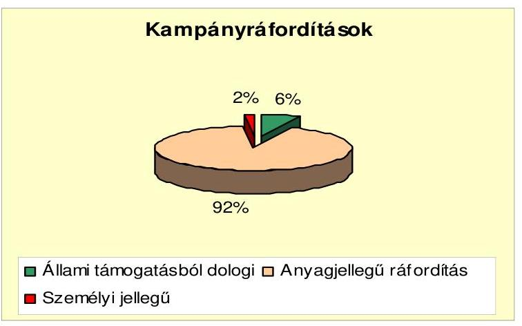
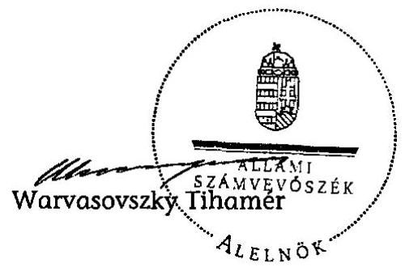

# JELENTÉS 

a 2010. évi országgyúlési választásra fordított pénzeszközök elszámolásának ellenőrzéséről a jelölő szervezeteknél és a független jelöltnél

---

3. Önkormányzati és Területi Ellenőrzési Igazgatóság
3.1. Államháztartáson Kívüli Szervezeteket Ellenőrző Főcsoport

Iktatószám: V-3006-044/2010.
Témaszám: 976
Vizsgálatazonosító: V-0530
Az ellenőrzést felügyelte:
Dr. Elek János
mb. főigazgató
Az ellenőrzés végrehajtásáért felelős:
Dr. Elek János
mb. főigazgató
Az ellenőrzést vezette:
Horváth Balázs
főcsoportfőnök-helyettes
Az összefoglaló jelentést készítette:
Szakmányné Bilik Mária
számvevő tanácsos
Tóth István
számvevő tanácsadó
Az ellenőrzést végezték:
Baracsi Szilvia
Szakmányné Bilik Mária
számvevő tanácsos
Tóth István
számvevő tanácsadó
Vincze B. Róbert
számvevő

# A témához kapcsolódó eddig készített számvevőszéki jelentések: 

## címe

Jelentés az 1998. évi országgyűlési választásra fordított pénzeszközök elszámolásának ellenőrzéséről a jelölő szervezeteknél és a független jelölteknél
Jelentés a 2002. évi országgyűlési választásra fordított pénzeszkö-
0307
zök elszámolásának ellenőrzéséről a jelölő szervezeteknél és a független jelölteknél
Jelentés a 2006. évi országgyűlési választásra fordított pénzeszkö-
0718
zök elszámolásának ellenőrzéséről a jelölő szervezeteknél és független jelölteknél

---

# TARTALOMJEGYZÉK 

BEVEZETÉS ..... 5
I. ÖSSZEGZŐ MEGÁLLAPÍTÁSOK, KÖVETKEZTETÉSEK, JAVASLATOK ..... 9
II. RÉSZLETES MEGÁLLAPÍTÁSOK ..... 12

1. A beszámoló közzététele és tartalma ..... 12
2. A választásokkal kapcsolatos nyilvántartási és gazdálkodási teendők szabályozása, a választási bevételek és kiadások nyilvántartásban történő elkülönítése ..... 15
3. A választásra fordítható összeghatár betartása ..... 17
4. A beszámolóban közzétett adatok bizonylati alátámasztottsága ..... 17
MELLÉKLET
5. számú Az ellenőrzött jelölő szervezetek és a független jelölt felülvizsgált kampányforrásai, ráfordításai 2010.

## FÜGGELÉKEK

1. számú A Fidesz - Magyar Polgári Szövetség - Kereszténydemokrata Néppárt jelölő szervezet helyszíni ellenőrzésének tapasztalatai
2. számú A Jobbik Magyarországért Mozgalom-Párt jelölő szervezet helyszíni ellenőrzésének tapasztalatai
3. számú A Lehet Más a Politika jelölő szervezet helyszíni ellenőrzésének tapasztalatai
4. számú A Magyar Szocialista Párt jelölő szervezet helyszíni ellenőrzésének tapasztalatai
5. számú Molnár Oszkár független jelölt helyszíni ellenőrzésének tapasztalatai

---

.

---

# RÖVIDÍTÉSEK JEGYZÉKE 

## Jogszabályok rövidítése

Párttörvény
Számv. tv.
Ve.

## Névrövidítések

ÁSZ
Beszámoló

Fidesz-MPSZ
Fidesz és KDNP jelölő szervezet
Független jelölt
Jobbik jelölő szervezet Jobbik
KDNP
LMP jelölő szervezet
LMP
MSZP
MSZP jelölő szervezet
OVB

A pártok múködéséről és gazdálkodásáról szóló 1989. évi XXXIII. törvény

A számvitelről szóló 2000. évi C. törvény
A választási eljárásról szóló 1997. évi C. törvény

Állami Számvevőszék
Beszámoló a 2010. évi országgyúlési képviselő-választásra fordított pénzeszközök forrásairól és felhasználásáról
Fidesz-Magyar Polgári Szövetség
Fidesz-Magyar Polgári Szövetség és Kereszténydemokrata Néppárt jelölő szervezet
Molnár Oszkár független jelölt
Jobbik Magyarországért Mozgalom jelölő szervezet
Jobbik Magyarországért Mozgalom
Kereszténydemokrata Néppárt
Lehet Más a Politika jelölő szervezet
Lehet Más a Politika
Magyar Szocialista Párt
Magyar Szocialista Párt jelölő szervezet
Országos Választási Bizottság

---

.

---

# JELENTÉS 

## a 2010. évi országgyúlési választásra fordított pénzeszközök elszámolásának ellenőrzéséről a jelölő szervezeteknél és a független jelöltnél

## BEVEZETÉS

A választási eljárásról szóló - többször módosított - 1997. évi C. törvény (Ve.) 92. § (3) bekezdésében kapott felhatalmazás alapján az országgyúlési képviselőválasztásra fordított állami és más pénzeszközök, anyagi támogatások felhasználásának ellenőrzése az Állami Számvevőszék (ÁSZ) feladata. A Ve. 92. § (3) bekezdésének előírása alapján „A választásra fordított állami és más pénzeszközök felhasználását az Állami Számvevőszék a választás második fordulóját követő egy éven belül az országgyúlési képviselethez jutott jelölő szervezetek és független jelöltek tekintetében hivatalból, egyéb jelölő szervezetek és független jelöltek tekintetében más jelölt, jelölő szervezet kérelmére ellenőrzi".

A 2010. évi országgyúlési választáson négy jelölő szervezet, ebből hat párt jelöltjei jutottak képviselethez, továbbá egy független jelölt szerzett mandátumot az Országgyúlésben. A jelölő szervezetek közül a Jobbik Magyarországért Mozgalom ${ }^{1}$ (Jobbik) és a Lehet Más a Politika (LMP) először jutottak a parlamentbe. A Ve. 92. § (3) bekezdésben szabályozott határidőn belül más jelölt, jelölő szervezet nem nyújtott be ellenőrzés iránti kérelmet az ÁSZ-hoz. Az általános országgyúlési választáson mandátumot szerzett jelölő szervezeteknél és a képviselethez jutott független jelöltnél hivatalból került sor az ellenőrzésre az ÁSZ 2010. évi ellenőrzési terve alapján.

Az ÁSZ a 2010. évi országgyúlési választásokra fordított pénzeszközök felhasználásának ellenőrzését a Fidesz-Magyar Polgári Szövetség (Fidesz-MPSZ); a Jobbik; az LMP; a Magyar Szocialista Párt (MSZP) jelölő szervezeteknél, valamint Molnár Oszkár független jelöltnél végezte el.

A Fidesz-MPSZ és a KDNP együttmúködési megállapodás alapján, közösen állított listát. A két párt megállapodásának megfelelően az országgyúlési képviselő-választás kampányszervezését, a kampányráfordítások finanszírozását, nyilvántartását, továbbá a kampányelszámolás közzétételét a Fidesz-MPSZ teljesítette. A Fidesz-MPSZ további megállapodást kötött a Magyar Vállalkozók és Munkaadók Pártjával közös jelölt indítására, az előzőekben ismertetett finanszírozási és elszámolási feltételekkel.

[^0]
[^0]:    ${ }^{1}$ A Jobbik Magyarországért Mozgalom-Párt neve 2010. április 9-én változott Jobbik Magyarországért Mozgalomra.

---

A Ve. 49. § (2) bekezdésének rendelkezése szerint: „Ha több jelölő szervezet közösen állít jelöltet, a továbbiakban - a választás szempontjából - egy jelölő szervezetnek számítanak."

Az ellenőrzött időszak: a 2010. évi általános országgyűlési képviselőválasztási kampány és elszámolási időszak.

Az ellenőrzés célja annak megállapítása volt, hogy a 2010. évi országgyűlési képviselő-választáson mandátumhoz jutott jelölő szervezetek és a független jelölt:

- betartották-e a Ve. 92. § (1) bekezdésében meghatározott költséghatárt, amely szerint „a független jelöltek, illetőleg a jelölő szervezetek a választásra a 91. §-ban foglalt költségvetési támogatáson felül jelöltenként legfeljebb egymillió forintot fordíthatnak".
- nyilvánosságra hozták-e a Ve. 92. § (2) bekezdése értelmében a választás második fordulóját követő 60 napon belül a Magyar Közlönyben a választásra fordított állami és más pénzeszközök, anyagi támogatások összegét, forrását és felhasználásának módját, valamint gondoskodtak-e a források és a felhasználás szabályszerű nyilvántartásáról és bizonylatolásáról.

Az ellenőrzés feltételeiről és körülményeiről szükséges rögzíteni, hogy a Ve. 1998 óta hatályos rendelkezései, valamint a párttörvény előírásai a negyedik országgyűlési választási ciklusra sem biztosították a feltételeket a választási kampánypénzek eredetének és felhasználásának teljes átláthatóságához.

A Kormány a 2006. évi országgyűlési képviselő-választást követően a pártok működéséről és gazdálkodásáról szóló 1989. évi XXXIII. törvény és a választási eljárásról szóló 1997. évi C. törvény, valamint ezzel összefüggésben egyes más törvények módosításáról törvényjavaslatot terjesztett az Országgyűlés elé, majd több önálló képviselői indítványt nyújtottak be, de politikai konszenzus hiányában a törvények kétharmados többséget igénylő elfogadására nem került sor.

A parlamentben több cikluson át részt vevő és a 2010. évben először bejutott jelölő szervezetek részére egyaránt bizonytalanságot jelentett a kampányforrások és ráfordítások hiányos, pontatlan szabályozása. A választási elszámolások ellenőrzéséről 1998 óta kiadott jelentéseinkben jeleztük, hogy az ÁSZ nem tudja teljes mértékben betölteni az elszámolások megbízhatóságával kapcsolatos ellenőrző szerepét, amellyel összefüggésben korábbi jelentéseinkben is részleteztük a számvevőszéki hatásköri korlátokat. ${ }^{2}$

Az ÁSZ jelzései ellenére olyan nézet vált általánossá, hogy a jogalkotási hiányosságok jogértelmezési, ellenőrzési eszközökkel kezelhetők, megoldhatók. Az ÁSZ-hoz a 2010. évi választásokat megelőzően folyamatosan, nagyszámban érkeztek a kampánypénzek vélelmezett túllépésével kapcsolatos bejelentések. A bejelentők olyan vizsgálatot igényeltek, amelyre az ÁSZ-nak nincs felhatalmazása, hatásköre. Számos tanulmány, újságcikk született a témában, amelyek

[^0]
[^0]:    ${ }^{2}$ A témához kapcsolódóan kiadott számvevőszéki jelentések sorszáma: 9916, 039, 0135, 0307, 0562, 0718, 0737, 0903, 0949 és 1032.

---

nem a hatályos jogszabályi keretek közötti megoldásokat szorgalmazták. Az ÁSZ egyértelmű álláspontja, hogy a jogalkotási hiányosságokat a jelenleg hatályos jogszabályi felhatalmazáson alapuló eszközökön túllépő megoldásokkal (informális adatgyűjtés, szóbeli információk alapján induló vizsgálódások, becslés stb.) a kialakult anomáliákat, átláthatatlan helyzetet nem lehet, és a jogállamiság érdekében nem szabad „kezelni".

Az ÁSZ ellenőrzési hatásköre a hiányos jogszabályi háttér miatt korlátozott, ellenőrzési jogosultsága csak a jelölő szervezetek elszámolásainak ellenőrzésére terjed ki. A törvény hiányosságai fenntartják a választások finanszírozásának átláthatatlanságát és korrupciós kapcsolatoknak adnak teret. A kampányráfordítások nyilvánosságát, a magánszektor támogató szerepének megismerését korlátozza az a jogszabályi hiányosság, miszerint a kampány célú reklámok, plakátok kiadóit nem terheli sem az OVB, sem a jelölő szervezet felé bejelentési kötelezettség, a finanszírozók, a megjelentetett példányszámok, a reklámanyagok mérete és értéke tekintetében.

Mind a közvélemény, mind pedig az ellenőrzést végző ÁSZ számára is ismeretlenek maradnak az utcán és a médiában megjelent hirdetések finanszírozására vonatkozó információk, amennyiben azok nem jelennek meg a jelölő szervezet nyilvántartásában. Mindezek megerősítik a Ve. módosításának szükségességét.

Az ÁSZ az ellenőrzései során visszatérően javasolta a Kormánynak, hogy kezdeményezze az Országgyúlésnél a Ve. oly módon való módosítását, amely biztosítja a kampány-finanszírozás átláthatóságát, ellenőrizhetőségét és egyértelműen meghatározza:

- a választási költségek elszámolása szempontjából mely időszak, illetve tevékenység forrásait és ráfordításait kell figyelembe venni;
- a jelöltek száma alapján, normatív módon juttatott állami támogatás felhasználása tekintetében mi a dologi költségek fogalma, a felhasználás elszámolásának formája, tartalma és kifizetőhelye;
- a választási költségek forrásai körében az egyéb anyagi támogatások között milyen formában nyújtott és kiktől származó juttatásokat kell figyelembe venni;
- milyen legyen az országgyűlési választásra fordított állami és más pénzeszközök, anyagi támogatások összegét, forrását és a felhasználás módját bemutató, a Magyar Közlönyben megjelentetett választási beszámoló formája és részletes tartalma;
- hogyan történjen az egyéni jelöltek választási költségei és azok forrásai ellenőrizhetőbb nyilvántartási kötelezettségének érvényesítése;
- mennyi legyen a költségvetési támogatáson felüli egy jelöltre átlagosan fordítható kiadás reális értékhatára;

---

- milyen tartalmú írásos megállapodást kössenek a közös jelöltet állító szervezetek a kampányfinanszírozásra, a nyilvántartásra és az elszámolásra vonatkozóan;
- milyen szankciókkal járjon az elszámolási és beszámolási határidős kötelezettségek elmulasztása.

Az ÁSZ, mint jogalkalmazó szerv csak a jelenlegi jogszabályban biztosított keretek között végezte ellenőrzését, kiterjesztő jogértelmezésre nincs lehetősége, többletellenőrzési jogosítványokat nem alkalmazhat.

Az előzőekben ismertetett okok miatt az ÁSZ dokumentum alapú ellenőrzést végezhet, ellenőrzési jogosultsága azokra a kampányráfordításokra terjed ki, amelyek az elszámolási határidőig megjelentek a jelölő szervezetek és a független jelölt nyilvántartásaiban.

A Ve. a jelölő szervezetek számára továbbra is azt írja elő, hogy az állami támogatáson felüli kampányköltség nem haladhatja meg a jelöltenkénti legfeljebb egymillió forintot. Ennek megfelelően a jelenlegi szabály pontatlansága miatt:

- a jelöltenkénti egymillió forintos összeg a jelölő szervezet részére, a jelöltjeinek száma alapján felhasználható maximális keretet jelenti, így az jelöltenként csak átlagosan érthető. E szabályozás eredményeként az ÁSZ nem vizsgálhatja egy jelölő szervezeten belül az egyes jelöltek kampányára fordított költség alakulását;
- a jelölő szervezet tudtán kívül a jelölt érdekében és annak népszerűsítésére szolgáló, más által fizetett kampányköltségek nem tartoznak ebbe az összeghatárba, mivel ez a korlát csak a jelölő szervezetre vonatkozik, másra nem.

Az ellenőrzés a jelölő szervezetek és a független jelölt által rendelkezésre bocsátott bizonylatok, dokumentumok és a Hivatalos Értesítőben közzétett választási adatszolgáltatás tartalmi összevetésével, valamint az alkalmazott eljárások és a jogszabályi követelmények egybevetésével történt. Az ellenőrzés során - tekintettel a vizsgált téma érzékenységére - összeghatárra tekintet nélkül jelezzük a beszámolók hibáit.

A helyszíni ellenőrzésre 2011. január 3-31 között a jelölő szervezetek központjában, valamint a független jelölt esetében az ÁSZ Budapest, Lónyay utca 44. szám alatti irodájában került sor.

---

# I. ÖSSZEGZŐ MEGÁLLAPÍTÁSOK, KÖVETKEZTETÉSEK, JAVASLATOK 

A hivatalból ellenőrzött jelölő szervezetek, független jelölt közül kettő teljesítette beszámolási kötelezettségét 2010. június 25 -i határidőig, az országgyűlési képviselő-választással kapcsolatos forrásokról és ráfordításokról.

A Fidesz és KDNP jelölő szervezet, valamint a Jobbik jelölő szervezet a 2010. évi országgyűlési képviselő-választásról szóló elszámolását a választások második fordulóját követő 60 napon belül - a Ve-ben előírt határidőn belül - nyilvánosságra hozta a Hivatalos Értesítőben (Fidesz és KDNP jelölő szervezet 2010. évi 47., a Jobbik jelölő szervezet a 2010. évi 50. szám). Az MSZP jelölő szervezet 2010. június 21-én megjelentetés céljából megküldte beszámolóját a Magyar Közlöny Szerkesztőségének, melyet jelzése alapján, önhibáján kívül a Hivatalos Értesítő 2010. évi 52. számában, 2010. június 29-én tettek közzé. Az LMP jelölő szervezet a beszámolóját késedelemmel küldte meg, mely ugyancsak a Hivatalos Értesítő 2010. évi 52. számában jelent meg. A független jelölt 2010. december 16-án, a törvényes határidőn túl, a Hivatalos Értesítő 102. számában hozta nyilvánosságra beszámolóját.

A beszámolókban nyilvánosságra hozott bevételi és kiadási adatok - a Jobbik jelölő szervezet kivételével - megegyeztek a könyvviteli nyilvántartásokban szereplő és az ellenőrzés részére bemutatott dokumentumok adataival. A Jobbik jelölő szervezet beszámolójából hiányzott, összesen 394 ezer Ft választási kiadás, amelyből 35 ezer Ft-ot nem szerepeltettek a könyvelésben és 359 ezer Ft-ot a politikai kiadások között tartottak nyilván. Hiányzott továbbá a beszámolóból az ezek fedezetéül szolgáló egyéb bevétel. A szabálytalanságból eredően sérült a teljesség számviteli alapelv. A beszámolóból hiányzó összeg ellenére, a Jobbik jelölő szervezet nyilvántartásai szerint nem lépte túl a Ve-ben előírt kampány ráfordítási korlátot. Az LMP jelölő szervezet az állított jelöltek számát tévesen, 300 fő helyett 304 főben jelölte meg. Az MSZP jelölő szervezet beszámolójából kimaradt az állított jelöltek száma, 386 fő.

A felülvizsgált beszámolók szerint a jelölő szervezetek és a független jelölt kampányforrásait az alábbi táblázat tartalmazza (ezer Ft-ban):

| Bevételek | Fidesz és KDNP | Jobbik | LMP | MSZP | Füg-   getlen   jelölt | Összesen | Megoszlás |
| :--: | :--: | :--: | :--: | :--: | :--: | :--: | :--: |
|  | jelölő szervezetek |  |  |  |  |  | \% |
| Állami   tám. | 18838 | 18838 | 14641 | 18838 | 49 | 71204 | 6 |
| Adomá-   nyok | 385883 | 84236 | 51481 | 60911 | 0 | 582511 | 53 |
| Egyéb saját | 0 | 7207 | 45168 | 325086 | 36 | 377497 | 34 |
| Hitel | 0 | 0 | 80658 | 0 | 0 | 80658 | 7 |
| Összesen | 404721 | 110281 | 191948 | 404835 | 85 | 1111870 | 100 |

---

A jelöltarányos költségvetési támogatást a jelölő szervezetek szabályszerűen, dologi kiadásokra használták fel, arról határidőben, záradékolt számlamásolatokkal elszámoltak az Önkormányzati Minisztérium felé. A független jelölt elszámolását több mint fél éves késéssel küldte meg az illetékes minisztériumnak.

A párttörvény hatálya alá tartozó jelölő szervezetek a törvényben rögzített, forrásszerzést tiltó és korlátozó előírásokat nyilvántartásaik szerint, a beszámolókban feltüntetett országgyűlési képviselő-választásra fordított összeg forrásai vonatkozásában betartották.

Az ellenőrzött jelölő szervezetek és a független jelölt felülvizsgált kampányráfordításainak megoszlását a következő ábra szemlélteti:

Az anyagjellegű ráfordítások között plakátra, választási gyűlés megszervezésére fordított összegeket, médiában közzétett politikai hirdetési kiadást, valamint névjegyzéki adatszolgáltatást számoltak el.

Belső szabályozást vagy utasítást léptettek hatályba a választásokkal kapcsolatos speciális nyilvántartási és gazdálkodási teendők ellátásához a helyszínen ellenőrzött jelölő szervezetek. Ezek az előírások a jelölő szervezeten belül egységesen, azonban egymástól eltérően szabályozták - a törvényben nem definiált - kampányköltség és kampányidőszak fogalmát; a kampányelszámolás, valamint a források és ráfordítások elkülönítésének feladatait. A belső előírások részletezettsége, tartalma eltérő volt az adott jelölő szervezet választási kampányban szerzett tapasztalatától, sajátosságaitól és kampánnyal kapcsolatos stratégiájától függően.

A közzétett beszámolókat megalapozó számviteli nyilvántartások vezetésében a belső előírások érvényesültek, azok biztosították a kampánybevételek és ráfordítások fő jogcímenkénti elkülönítését. A Fidesz és KDNP jelölő szervezet a kampány célú bevételeket és kiadásokat elkülönített bankszámlán szedte be, illetve fizette ki, azokat a múködéssel összefüggő pénzforgalomtól a jobb átláthatóság érdekében elkülönítette. A többi ellenőrzött jelölő szervezet a párt múködésével kapcsolatos bankszámlát használta a kampány pénzforgalmának elszámolására.

---

A szankció nélkül felhasználható keretösszeget a rendelkezésre bocsátott dokumentációk szerint, az ellenőrzött jelölő szervezetek és a független jelölt nem lépték túl, nyilvántartásaik szerint annál kevesebbet költöttek.

A nyilvántartott kampánybevételek és költségek bizonylatolása - két jelölő szervezetnél feltárt hiba kivételével - megfelelt a számviteli törvényben és belső előírásokban meghatározott alaki és tartalmi követelményeknek. A Jobbik jelölő szervezetnél a kampánytevékenységre vonatkozó, annak jogszerűségét igazoló szerződések, egyéb kötelezettségvállalási dokumentumok a vizsgált bizonylatok $31 \%$-ánál, teljesítésigazolások az ellenőrzött bizonylatok $23 \%$-ánál nem voltak. A szerződéssel, kötelezettségvállalással alá nem támasztott számviteli bizonylatok a tartalmuk alapján kampánnyal összefüggő költségeket tartalmaztak. Az LMP jelölő szervezetnél a választásokkal kapcsolatos gazdasági események bizonylatainak alaki és tartalmi követelményei közül a könyvelés dátumának rögzítése, valamint igazolása hiányzott. A számviteli hibák a beszámoló valódiságát nem befolyásolták. A bizonylatok megőrzéséről a jelölő szervezetek és a független jelölt gondoskodtak.

A helyszíni ellenőrzés megállapításainak hasznosítása mellett - a jelölő szervezeteknek és a független jelöltnek tett javaslatokon túlmenően - az Állami Számvevőszék javasolja

# a Kormánynak 

Kezdeményezze a választási eljárásról szóló törvény módosítását - figyelemmel az Állami Számvevőszék korábbi jelentéseiben megfogalmazott javaslataira is - annak érdekében, hogy a választási kampány finanszírozása átlátható, ellenőrizhető legyen.

---

# II. RÉSZLETES MEGÁLLAPÍTÁSOK 

## 1. A beSzámoló közzéTétele És Tartalma

A Ve. 92. § (2) bekezdés előírása szerint minden jelölő szervezetnek és független jelöltnek a választás második fordulóját követő 60 napon belül a Magyar Közlönyben nyilvánosságra kell hoznia a választásra fordított állami és más pénzeszközök, anyagi támogatások összegét, forrását és felhasználásának módját. Tekintettel arra, hogy a 2010. évi országgyúlési választás második fordulója 2010. április 25 -én volt, a beszámoló közzétételi határideje 2010. június 25 -dike volt. Jelezni szükséges, hogy a nyilvánosságra hozatali kötelezettség elmulasztását a Ve. nem szankcionálja, így annak elmulasztása vagy késedelmes teljesítése esetén intézkedésre nincs lehetőség.

## Két jelölő szervezet határidőben eleget tett a kampányforrásokról és ráfordításokról szóló beszámoló közzétételi kötelezettségnek:

- a Fidesz és KDNP jelölő szervezet a Hivatalos Értesítő 2010. évi 47. számában, 2010. június 11-én;
- a Jobbik jelölő szervezet a Hivatalos Értesítő 2010. évi 50. számában, 2010. június 24 -én.

## Két jelölő szervezet és a független jelölt beszámolója a közzétételi határidő lejárta után jelent meg:

- az LMP jelölő szervezet és az MSZP jelölő szervezet beszámolója a Hivatalos Értesítő 2010. június 29-i, 52. számában. Az MSZP jelölő szervezet jelezte, hogy a beszámolóját 2010. június 21-én megjelentetés céljából megküldte a Magyar Közlöny Szerkesztőségének;
- a független jelölt beszámolója a Hivatalos Értesítő 2010. évi 102. számában, 2010. december 16-án.

A nyilvánosságra hozott beszámolók szerkezete, tartalma a kiemelt jogcímek vonatkozásában, összhangban volt az ÁSZ ajánlásával. Az MSZP jelölő szervezet az egyes ráfordítási jogcímeket a számlarend számlacsoportjainak megfelelően tovább részletezte.

Figyelemmel arra, hogy a Ve. a nyilvánosságra hozandó beszámoló tartalmát, részletezettségét nem szabályozta, az Országos Választási Iroda a Választási füzetek 1998. évi 44. száma függelékében a beszámoló tartalmára vonatkozóan, az ÁSZ ajánlását tette közzé.

Az 1. számú melléklet jelölő szervezetenként és együttesen tartalmazza a kampányforrások és ráfordítások jogcímeinek a felülvizsgált beszámolók szerinti összetételét. Az ellenőrzött jelölő szervezeteknél és független jelöltnél összességében a kampányforrások 6\%-a állami támogatásból, 53\%-a magánszemélyek és jogi személyek támogatásából, adományából, $34 \%$-a saját forrásból, $7 \%$-a hitel igénybevételéből származott.

---

- A Fidesz és KDNP jelölő szervezet a beszámolóban kampányforrásként összesen 404721 ezer Ft összeget, valamint ugyanilyen összegű ráfordítást közölt. A közölt adat a központi országgyúlési kampány gyűjtőszámlán kimutatott összeggel megegyezett. A jelölő szervezet a kampány finanszírozására állami támogatást, valamint választási célra kapott adományokat használt fel.
- A Jobbik jelölő szervezet az elszámolásban kampányforrásként összesen 109887 ezer Ft összeget, valamint ugyanilyen összegű ráfordítást közölt. A kampányköltségek között 1324 ezer Ft anyag-, illetve 108563 ezer Ft értékben igénybevett szolgáltatást számoltak el. A Számv. tv. 15. § (2) bekezdésben rögzített teljesség számviteli alapelvét sértette, hogy egy reklámfelület bérléséről szóló számlán szereplő 28 ezer Ft általános forgalmi adót nem könyveltek le, illetve a Ve. 45. §-ában rögzített névjegyzéki adatszolgáltatás 7 ezer Ft összegű kiadását nem rögzítették a könyvekben. A politikai kiadások között összesen 359 ezer Ft kampányköltséget tartottak nyilván, amelyekről a dokumentumok alapján egyértelmúen megállapítható volt a kampánycélú felhasználás. A kampányráfordításokból a rendelkezésre bocsátott dokumentumok szerint összesen 394 ezer Ft összeget nem szerepeltettek a beszámolóban, valamint ugyanilyen összeg hiányzott az egyéb források közzétett adatából is. A kampányráfordítások feltárt hibája a közzétett kampányráfordítás főösszegének 0,4\%-a volt. A kampány finanszírozására jelöltarányos állami támogatást, tagdíjat, választási célra kapott adományokat, továbbá előző évi pénzmaradványt használtak fel.
- Az LMP jelölő szervezet a választásokra fordított pénzeszközök, anyagi támogatások összegéről, forrásáról és azok felhasználásának módjáról nyilvánosságra hozott beszámolója megegyezett a könyvvezetésben rögzített adatokkal. A beszámolóban 191948 ezer Ft bevételt és kiadást mutattak ki. A beszámolók összeállításánál betartották a vonatkozó törvényi és belső előírásokat. Az LMP jelölő szervezet a kampány finanszírozására az állami támogatáson felül belföldi jogi személyektől, jogi személynek nem minősülő gazdasági társaságoktól, valamint belföldi és külföldi természetes személyektől származó támogatást, egyéb saját bevételt, valamint felvett kölcsönöket használt fel. A beszámolóban az LMP jelölő szervezet az állított jelöltek számát 300 fő helyett tévesen 304 főben jelölte meg.
- Az MSZP jelölő szervezet nyilvánosságra hozott beszámolójában 404835 ezer Ft összegű bevételt és kiadást mutatott ki. A beszámolóban közölt adatok a könyvelésből munkaszámos elkülönítés alapján nyomtatott listából megállapíthatók voltak. A beszámolóban szereplő adatok megegyeztek a kapcsolódó főkönyvi számlákról legyűjtött adatok egyenlegeivel. Az MSZP jelölő szervezet a kampány finanszírozására az állami támogatáson felül belföldi természetes személyektől származó támogatást, egyéb saját bevételt használt fel. A beszámolóból kimaradt az állított jelöltek számának 386 fő - feltüntetése.
- A független jelölt nyilvánosságra hozott beszámolójában 85 ezer Ft bevételt és ugyanilyen összegű kiadást mutatott ki. A független jelölt a kampány finanszírozására az állami támogatáson felül saját bevételt használt fel.

A Ve. nem szabályozta a kampányráfordítások fogalmát, így jelölő szervezetenként - a felülvizsgálat szerint - az alábbi kampánykiadások teljesültek.

---

Adatok ezer Ft-ban

| Jogcím | Fidesz és KDNP | Jobbik | LMP | MSZP | Független jelölt | Összesen |
| :--: | :--: | :--: | :--: | :--: | :--: | :--: |
|  | jelölő szervezetek |  |  |  |  |  |
| Plakát | 35682 | 77001 | 106163 | 69983 | 44 | 288873 |
| Választási rendezvény | 12798 | 18270 | 4370 | 21068 | 0 | 56506 |
| Médiában hirdetés | 329722 | 15003 | 28259 | 165851 | 33 | 538868 |
| Névjegyzék vásárlása | 26519 | 7 | 0 | 26524 | 0 | 53050 |
| Egyéb választási kiadás | 0 | 0 | 53156 | 121409 | 8 | 174573 |
| Összesen | 404721 | 110281 | 191948 | 404835 | 85 | 1111870 |

A ráfordítások között a Ve. 42. §-ban szabályozott plakátra fordított kiadást, a 43. § -ban rögzített gyűlés megszervezésére fordított összegeket, a 44. §-ban hivatkozott médiában közzétett politikai hirdetési kiadásokat, valamint a 45. § szerinti névjegyzéki adatszolgáltatást számoltak el. Előfordult postai szolgáltatás igénybevétele, reklámhordozók kihelyezéséhez szükséges anyagvásárlás, telefonköltség, valamint a megnövekedett másolási igény miatt másolópapír, nyomtatványköltség elszámolás is.

A jelölő szervezetek kampányráfordításaikat a Ve. 40. § (1) bekezdésben meghatározott kampányidőszakban teljesítették.

A Ve. nem ad eligazítást arra vonatkozóan, hogy a kampányidőszakban felmerült kampányráfordításokra vonatkozó kötelezettségvállalásnak, a termék, szolgáltatás igénybevételének, illetve pénzügyi teljesítésnek együttesen kell-e fennállni, illetve elegendő-e a fizikai teljesítésnek a Ve-ben szabályozott kampányidőszakra esni.

A párttörvény 4. § (2) és (3) bekezdése értelemszerűen a választási kampányra vonatkozóan is korlátokat határoz meg a pártok részére a vagyoni hozzájárulások, adományok elfogadhatóságát illetően.

A jelölő szervezetek által rendelkezésre bocsátott nyilvántartások és bizonylatok vizsgálata alapján nem merült fel adat arra vonatkozóan, hogy figyelmen kívül hagyták volna a hivatkozott előírásokat.

A jelöltarányos költségvetési támogatás egy főre jutó összege az OVB 265/2010. április 2-i határozata alapján 48,8 ezer Ft volt.

A következő tábla mutatja a jelölő szervezetek - a Ve. 91. § (2) bekezdés szerint számított - jelöltjeinek számát, a jelöltarányos állami támogatás összegét és az elszámolási kötelezettség teljesítésének időpontját:

---

| Jelölő szerve-   zet | Támogatott je-   löltek száma   (fő) | Kiutalt jelöltará-   nyos központi költs-   ségvetési támogatás   (ezer Ft) | Elszámolás idő-   pontja |
| :-- | :--: | :--: | :--: |
| Fidesz és KDNP | 386 | 18838,3 | 2010. május 11. |
| Jobbik | 386 | 18838,3 | 2010. május 21. |
| LMP | 300 | 14641,2 | 2010. május 24. |
| MSZP | 386 | 18838,3 | 2010. május 12. |
| Független jelölt | 1 | 48,8 | 2010. december 15. |

A jelölő szervezetek a jelöltarányos költségvetési támogatás összegének felhasználásáról a Ve. 91. § (4) bekezdésben előírt, a választásokat követő 30 napon belül teljesítették elszámolási kötelezettségüket. A független jelölt az elszámolási kötelezettségének több mint egy hónapos késéssel tett eleget. A jelölő szervezetek és a független jelölt elszámolási kötelezettségüket az Önkormányzati Minisztérium által előírt módon, záradékolt számlamásolatok és összesítő jegyzék megküldésével teljesítették. A támogatás teljes összegét felhasználták, azokat szabályszerűen, a Ve. 91. § (4) bekezdésével összhangban dologi kiadásokra fordították.

Az ellenőrzött jelölő szervezetek közül két párt számvizsgáló bizottsága - belső szabályzatának megfelelően - fogadta el a kampányelszámolást, illetve a kampányköltségvetés végrehajtását, a másik két pártnál nem volt kötelező előírás a feladat elvégzésére.

# 2. A VÁLASZTÁSOKKAL KAPCSOLATOS NYILVÁNTARTÁSI ÉS GAZDÁLKODÁSI TEENDŐK SZABÁLYOZÁSA, A VÁLASZTÁSI BEVÉTELEK ÉS KIADÁSOK NYILVÁNTARTÁSBAN TÖRTÉNŐ ELKÜLÖNÍTÉSE 

A Ve. nem szabályozta a választási kampány forrásai és ráfordításai elkülönítésének módját. A Számv. tv. 161/A. § (2) bekezdés a közpénzek felhasználásával, nyilvánosságával, ellenőrzésével összefüggésben azok forrásának és felhasználásának elkülönítését írja elő.

Az ellenőrzött jelölő szervezetek a Ve. 92. § (1) bekezdésében meghatározott ráfordítási korlátok betartásának ellenőrizhetősége céljából a választási kampányt megelőzően gondoskodtak a választásokkal kapcsolatos speciális nyilvántartási feladatok szabályozásáról. A belső előírások részletezettsége, tartalma eltérő volt az adott jelölő szervezet választási kampányban szerzett tapasztalatától, sajátosságaitól és kampánnyal kapcsolatos stratégiájától függően.

- A Fidesz és KDNP jelölő szervezet a hatályos pénzügyi szabályzatát kiegészítette a 2010. évi országgyűlési képviselő-választásra vonatkozó kampányszabályzattal, amelyben a kampányfinanszírozásra elkülönített bankszámla alkalmazását írta elő, rögzítette a kampányforrások jogcímeit, a támogatások elfogadási rendjét, a kampánnyal kapcsolatos gazdálkodási hatásköröket, valamint a Ve. 40. § (1) bekezdésében szabályozott kampányidő-

---

szakra figyelemmel a kampányköltségek elszámolásának engedélyezett időtartamát. A kampánnyal kapcsolatos gazdálkodási jogkörökre a kampányfőnök és helyettese, valamint a gazdasági igazgató kaptak felhatalmazást. Az elfogadott választási kampányköltségvetés tartalmazta a kampánykiadások jogcímeit és tervezett összegeit. A hatályos számlarend az elsődleges költségnemenkénti könyvelés mellett a 6. számlaosztályban külön gyűjtőszámlát tartalmazott az országgyűlési választási kiadások nyilvántartására. A belső szabályozással összhangban a kampány finanszírozása központilag elkülönített bankszámlán keresztül történt.

- A Jobbik jelölő szervezet belső előírásban nem rögzítette a kampánytevékenység, a kampányköltség, a választási költségek elszámolása szempontjából az elszámolási időszak fogalmát, továbbá dokumentumokkal alátámasztott kampánnyal kapcsolatos gazdasági döntést nem hozott. Hatályos számviteli politikája, pénzkezelési szabályzata és számlarendje nem tartalmazott a választási kampány elszámolásával összefüggő sajátos rendelkezéseket. A szabályozási hiányosságot részben pótolta a választási kampányt megelőzően a gazdasági igazgató által kiadott könyvelési utasítás, amely a választási kiadások elkülönítéséről rendelkezett, de a kampányráfordítások tartalmát nem szabályozta. Az utasítás szerint a kampánnyal összefüggő kiadásokat a jelölő szervezet minden bizonylaton egyedileg jelöli. A Jobbik jelölő szervezet a Ve. 92. § (1) bekezdésében meghatározott ráfordítási korlátok betartásának ellenőrizhetősége céljából a könyvelésben önálló főkönyvi számlákon különítette el az országgyűlési képviselő-választással kapcsolatos bevételeket és kiadásokat a múködéssel összefüggő forrásoktól és kiadásoktól. A bizonylatokon jelölték a kampánycélú ráfordításokat.
- Az LMP jelölő szervezet belső előírásban rögzítette a kampánytevékenység, a kampányköltség, a választási költségek elszámolása szempontjából az elszámolási időszak fogalmát. A jelölő szervezet választmánya elfogadta a választási kampány költségvetési tervét. A hatályos számlarendben a választással kapcsolatos speciális szabályként a kampánybevételek és kiadások munkaszám alapján történő nyilvántartását írták elő és azt az előírásoknak megfelelően hajtották végre.
- Az MSZP jelölő szervezet hatályos számlarendjében rögzítette a kampánytevékenység, a kampányköltség fogalmát, a választással kapcsolatos speciális nyilvántartási szabályként a kampány bevételei és kiadásai munkaszám alapján történő elkülönítését írták elő. A jelölő szervezet a kampányidőszakra elfogadott költségvetéssel rendelkezett. Az MSZP jelölő szervezet belső előírásának megfelelően különítette el a kampányra fordított pénzeszközök felhasználását és azok forrásait. A kialakított nyilvántartási rendben biztosították a beszámoló sorok egyeztethetőségét.
- A független jelölt, mint természetes személy a választási bevételek és kiadások bizonylatairól nyilvántartást vezetett. A kampánytevékenységre vonatkozó, annak jogszerúségét igazoló bizonylatok, számlák, a banki igazolás és támogatási nyilatkozat rendelkezésre álltak.

A Fidesz és KDNP jelölő szervezeten kívül, a többi ellenőrzött jelölő szervezet a párt működésével kapcsolatos bankszámlát használta a kampány pénzforgalmának elszámolására, továbbá a választással kapcsolatos speciális gazdálko-

---

dási jogköröket nem határoztak meg, azokat az általános múködésre vonatkozó hatásköri szabályok szerint gyakorolták.

# 3. A VÁlasztÁsRA FORDÍTHATÓ ÖSSZEGHATÁr BETARTÁSA 

A jelölő szervezetek által állított jelöltek számát és a Ve. 92. § (1) bekezdése szerint felhasználható keretösszeghez képest a felülvizsgált kampányráfordításokat a következő kimutatás szemlélteti:

| Jelölő szerve-   zet | Jelöltek   száma   fő | Felhasználható   keretösszeg* | Összes   ráfordítás | Eltérés a   keretösszeg-   töl |
| :-- | :--: | :--: | :--: | :--: |
|  |  | ezer Ft |  |  |
| Fidesz és KDNP | 386 | 404838 | 404721 | -117 |
| Jobbik | 386 | 404838 | 110281 | -294557 |
| LMP | 300 | 314641 | 191948 | -122693 |
| MSZP | 386 | 404838 | 404835 | -3 |
| Független jelölt | 1 | 1049 | 85 | -964 |

*keretösszeg = jelöltarányos költségvetési támogatás + (jelöltek száma x egymillió forint)

A Ve. 49. § (2) bekezdés szabályai szerint a Fidesz-MPSZ és a KDNP a választás szempontjából egy jelölő szervezetnek számítottak, így együttesen fordíthattak 386 millió Ft-ot kampánycélokra a jelöltarányos költségvetési támogatáson felül.

A kimutatás alapján az állapítható meg, hogy a jelölő szervezetek és a független jelölt felülvizsgált számviteli nyilvántartásaik tanúsága szerint nem lépték túl a jelöltenként szankció nélkül választásra fordítható egymillió forint öszszeghatárt, attól kevesebbet költöttek, a Ve. 92. § (1) bekezdésének előirása szerinti törvényes kereteken belül maradtak.

## 4. A beSzámolóban közzétett adatok bizonylati alátámasztOTTSÁGA

Az ellenőrzött jelölő szervezeteknél, független jelöltnél a nyilvántartott kampányköltségeket bizonylatok támasztották alá, tartalmuk szerint a könyvelt gazdasági eseményt igazolták. A könyvelési adatok alapján az alapbizonylatok visszakereshetők voltak. A gazdálkodási jogköröket szabályszerűen gyakorolták.

- A Fidesz és KDNP jelölő szervezetnél a kampánytevékenységre vonatkozó, annak jogszerűségét igazoló szerződések, egyéb kötelezettségvállalási, teljesítésigazolási dokumentumok rendelkezésre álltak. A kampánnyal összefüggő szerződéseket a kampányszabályzatban hatáskörrel felruházott személyek kötötték.

---

- A Jobbik jelölő szervezetnél a kampánytevékenységre vonatkozó, annak jogszerúségét igazoló szerződések, egyéb kötelezettségvállalási dokumentumok a bizonylatok 31\%-ánál nem álltak rendelkezésre, a Számv. tv. 167. § (1) bekezdés c) pontjában előírt teljesítésigazolások a bizonylatok 23\%-ánál nem voltak. A szerződéssel, kötelezettségvállalással alá nem támasztott számviteli bizonylatok tartalmuk alapján kampánnyal összefüggő költségeket tartalmaztak, valódiságukkal kapcsolatban nem merültek fel kétségek.
- Az LMP jelölő szervezetnél a választásokkal kapcsolatos gazdasági események bizonylatainak alaki és tartalmi követelményei - a könyvelés dátumának rögzítése, valamint igazolása kivételével - megfeleltek a Számv. tv. 167. § (1) bekezdésben rögzített előírásoknak. Az alaki hibák a beszámoló valódiságát nem befolyásolták.
- Az MSZP jelölő szervezetnél a kampánytevékenységre vonatkozó, annak jogszerúségét igazoló szerződések, egyéb kötelezettségvállalási, illetve teljesítésigazolási dokumentumok rendelkezésre álltak.
- A független jelölt kampánytevékenységére vonatkozó, annak jogszerúségét igazoló szerződések, egyéb kötelezettségvállalási, illetve teljesítésigazolási dokumentumok rendelkezésre álltak.

A választásokkal kapcsolatos gazdasági események alapbizonylatai megfeleltek a Számv. tv. 165-166. §-ában szabályozott bizonylati elv és fegyelem követelményeinek. A jelölő szervezetek és a független jelölt egyaránt gondoskodtak a bizonylatok megőrzéséről a Számv. tv. 168-169. §-aiban rögzített szabályokkal összhangban.

Budapest, 2011. május 18

Melléklet: $\quad 1 \mathrm{db}$
Függelék $\quad 5 \mathrm{db}$

---

# Az ellenőrzött jelölő szervezetek és a független jelölt felülvizsgált kampányforrásai, ráfordításai 2010.

|  Megnevezés | Fidesz és KDNP | Jobbik | LMP | MSZP | Független jelölt | Összesen | Megoszlás $\%$  |
| --- | --- | --- | --- | --- | --- | --- | --- |
|   | jelölő szervezetek |  |  |  |  |  |   |
|  BEVÉTELEK |  |  |  |  |  |  |   |
|  Állami támogatás | 18838 | 18838 | 14641 | 18838 | 49 | 71204 | 6  |
|  Támogatások, adományok | 385883 | 84236 | 51481 | 60911 | 0 | 582511 | 53  |
|  Egyéb saját forrás | 0 | 7207 | 45168 | 325086 | 36 | 377497 | 34  |
|  Hitel | 0 | 0 | 80658 | 0 | 0 | 80658 | 7  |
|  Összes bevétel | 404721 | 110281 | 191948 | 404835 | 85 | 1111870 | 100  |
|  KIADÁSOK |  |  |  |  |  |  |   |
|  Állami támogatásból dologi | 18838 | 18838 | 14641 | 18838 | 49 | 71204 | 6  |
|  Anyagjellegú ráfordítás | 385812 | 91443 | 158162 | 385997 | 3 | 1021417 | 92  |
|  Személyi jellegú | 71 | 0 | 19145 | 0 | 33 | 19249 | 2  |
|  Összes kiadás | 404721 | 110281 | 191948 | 404835 | 85 | 1111870 | 100  |

---

Iktatószám: V-3006-017/2010.

# A Fidesz - Magyar Polgári Szövetség Kereszténydemokrata Néppárt jelölő szervezet helyszíni ellenőrzésének tapasztalatai 

## BEVEZETÉS

A választási eljárásról szóló - többször módosított - 1997. évi C. törvény (Ve.) 92. § (3) bekezdésében kapott felhatalmazás alapján az országgyűlési képviselő-választásra fordított állami és más pénzeszközök, anyagi támogatások felhasználásának ellenőrzése az Állami Számvevőszék (ÁSZ) feladata, amelyet „a választás második fordulóját követő egy éven belül az országgyúlési képviselethez jutott jelölő szervezetek és független jelöltek tekintetében hivatalból, egyéb jelölő szervezetek és független jelöltek tekintetében más jelölt, jelölő szervezetek kérelmére ellenőrzi. Az ellenőrzés iránti kérelmet a választás második fordulóját követő 3 hónapon belül lehet benyújtani. A kérelemhez bizonyitási inditványt kell csatolni."

Az ÁSZ hivatalból ellenőrizte a Fidesz-Magyar Polgári Szövetség, a Kereszténydemokrata Néppárt (jelölő szervezet) ${ }^{1}$ kampány elszámolását, mivel közös jelöltjeik a 2010. évi országgyűlési képviselő-választáson mandátumhoz jutottak. Az elszámolás tartalmazta a Magyar Vállalkozók és Munkaadók Pártjával közösen állított jelölt kampányának forrását és ráfordítását is. Tekintettel arra, hogy a pártok között létrejött megállapodás alapján a kampány finanszírozása és a kampánybeszámoló közzététele a Fidesz-MPSZ feladata volt, helyszíni ellenőrzést csak ennél a pártnál végeztünk.

Az ellenőrzött szervezet neve: Fidesz-Magyar Polgári Szövetség
Székhelye: 1062 Budapest, Lendvay u. 28.
Jogállása: önálló jogi személy (Pk. 600041/1989.)
Az ellenőrzött időszak: a 2010. évi országgyűlési képviselő-választási kampány az elszámolási időpontig.

## A helyszíni ellenőrzést végezték:

Baracsi Szilvia számvevő tanácsos
Szakmányné Bilik Mária számvevő tanácsos

[^0]
[^0]:    ${ }^{1}$ A Ve. 149. § g) pontja értelmében jelölő́ szervezet: a pártok működéséről és gazdálkodásáról szóló 1989. évi XXXIII. törvény szerint bejegyzett párt, valamint az egyesülési jogról szóló 1989. évi II. törvény szerint bejegyzett társadalmi szervezet, a közös jelöltet, listát állító jelölő szervezetek egy jelölő szervezetnek számítanak.

---

Az ellenőrzés célja annak megállapítása volt, hogy a 2010. évi országgyűlési képviselő-választáson mandátumhoz jutott jelölő szervezet:

- betartotta-e a Ve. 92. § (1) bekezdésében meghatározott költséghatárt, amely szerint „a jelölő szervezetek a választásra a 91. §-ban foglalt költségvetési támogatáson felül jelöltenként legfeljebb egymillió forintot fordíthatnak";
- nyilvánosságra hozta-e a Ve. 92. § (2) bekezdése értelmében a választás második fordulóját követő 60 napon belül a Magyar Közlönyben a választásra fordított állami és más pénzeszközök, anyagi támogatások összegét, forrását és felhasználásának módját, valamint gondoskodott-e a források és felhasználások szabályszerű nyilvántartásáról és bizonylatolásáról.

Az ellenőrzés feltételeiről és körülményeiről szükséges rögzíteni, hogy a Ve. 1998 óta hatályos rendelkezései, valamint a párttörvény előírásai jelenleg sem biztosították a feltételeket a választási kampánypénzek eredetének és felhasználásának teljes átláthatóságához.

Az ellenőrzés az ÁSZ V-3006-008/2010. számon jóváhagyott ellenőrzési programja alapján történt. A pénzügyi szabályszerűségi ellenőrzést a számvevőszéki ellenőrzés szabályai szerint készítettük elő és folytattuk le.

A helyszíni ellenőrzést a közvetlen részletes vizsgálatok módszerével végeztük. A 2010. január 22-e és 2010. április 23-e között teljesült kampánycélú bevételeket 50 ezer Ft felett, valamint a kampányráfordításokat tételesen ellenőriztük. Az ellenőrzés a jelölő szervezet által rendelkezésre bocsátott iratok és a Hivatalos Értesítőben közzétett választási adatszolgáltatás tartalmi összevetésével, valamint az alkalmazott eljárások és a jogszabályi követelmények egybevetésével történt.

A helyszíni ellenőrzést: 2011. január 3-18 között a Fidesz-MPSZ Központi Hivatalában végeztük.

---

# RÉSZLETES MEGÁLLAPÍTÁSOK 

## 1. A beSzámoló közzÉtétele és tartalma

A Ve. 92. § (2) bekezdés előírása szerint minden jelölő szervezetnek a választás második fordulóját követő 60 napon belül a Magyar Közlönyben nyilvánosságra kell hoznia a választásra fordított állami és más pénzeszközök, anyagi támogatások összegét, forrását és felhasználásának módját.

Figyelemmel arra, hogy a Ve. a nyilvánosságra hozandó beszámoló tartalmát, részletezettségét nem szabályozta, az Országos Választási Iroda a Választási füzetek 1998. évi 44. száma függelékében az ÁSZ ajánlását tette közzé.
A Fidesz-MPSZ a közös jelöltállításra tekintettel megállapodást kötött a KDNPvel és a MVMP-vel a kampányköltségek finanszírozására, valamint a források és kampányráfordítások elszámolására. A megállapodások értelmében mind a finanszírozás, mind az elszámolás - a jelölő szervezet nevében - a Fidesz-MPSZ feladata volt.

A Fidesz-MPSZ a Ve. 92. § (2) bekezdésben előírt határidőben, a választás második fordulóját követő 60 napon belül tette közzé a jelölő szervezet 2010. évi országgyűlési képviselő-választásra fordított pénzeszközök forrásai és felhasználása elszámolását a Hivatalos Értesítő 2010. évi 47. számában, 2010. június 11-én, melyet internetes honlapján is nyilvánosságra hozott ${ }^{2}$ (1. számú melléklet).

A jelölő szervezet a beszámolóban kampányforrásként összesen 404721 ezer Ft összeget, valamint ugyanilyen összegű ráfordítást közölt. A kampányköltségek között hirdetési, nyomdai, választási nagygyűléssel szervezésével kapcsolatos és választási adatszolgáltatási költségeket számoltak el. A közölt adat a 616112 számú központi országgyűlési kampány számlán kimutatott összeggel megegyezett. A jelölő szervezet a kampány finanszírozására állami támogatást, valamint választási célra kapott adományokat használt fel.

A könyvvezetés során érvényesítették a Számv. tv-ben meghatározott számviteli alapelveket. A közös jelöltállításra tekintettel összeállított beszámoló megfelelt a megállapodásban rögzített beszámolási, nyilvántartási és elszámolási kötelezettségnek.

[^0]
[^0]:    ${ }^{2}$ Az elektronikus információszabadságról szóló 2005. évi XC. törvény 12/A. § (3) bekezdése 2008. VII. 1-jén hatályba lépett rendelkezése értelmében a Hivatalos Értesítő tartalmazza a jogalkotásról szóló törvény szerinti utasítások és jogi iránymutatások szövegét, valamint azokat a közleményeket, amelyeknek a Magyar Közlönyben, illetve más hivatalos lapban való közzétételét jogszabály elrendeli vagy miniszter, illetve a közzététel kezdeményezésére jogszabály által kötelezett személy kezdeményezi.

---

# 2. A VÁLASZTÁSOKKAL KAPCSOLATOS SPECIÁLIS NYILVÁNTARTÁSI ÉS GAZDÁLKODÁSI TEENDŐK SZABÁLYOZÁSA, A VÁLASZTÁSI BEVÉTELEK ÉS KIADÁSOK NYILVÁNTARTÁSBAN TÖRTÉNŐ ELKÜLÖNÍTÉSE 

A választási kampányforrások és ráfordítások elszámolásáért felelős FideszMPSZ 2010. január 11-től hatályos kampányszabályzatban a kampányfinanszírozásra elkülönített bankszámla alkalmazását írta elő, rögzítette a kampányforrások jogcímeit, a támogatások elfogadási rendjét, a kampánnyal kapcsolatos gazdálkodási hatásköröket, valamint a kampányköltségek elszámolásának engedélyezett időtartamát. A Fidesz-MPSZ Úgyvezető Elnöksége 2010. január 11-én elfogadta a választási kampány költségvetési tervét, amely tartalmazta a kampánykiadások jogcímeit. A belső szabályozással összhangban a kampány finanszírozása központilag elkülönített bankszámlán keresztül történt.

A Fidesz-MPSZ rendelkezett hatályos számviteli politikával és számlarenddel. A számlarend az elsődleges költség nemenkénti könyvelés mellett a 6. számlaosztályban külön gyűjtőszámlát tartalmazott az országgyúlési választási kiadások nyilvántartására.

A Fidesz-MPSZ a Ve. 92. § (1) bekezdésében meghatározott ráfordítási korlátok betartásának ellenőrizhetősége céljából a könyvelésben a költségek rögzítésével egyidejűleg a 616112 számú gyűjtőszámlán különítette el az országgyűlési képviselő-választással kapcsolatos kiadásokat a müködéssel összefüggő kiadásoktól. A jelöltarányos állami támogatás elkülönítését a 922 számú állami kampánytámogatás főkönyvi számlán, a támogatás felhasználására elszámolt kiadások elkülönítését a többi választási kiadástól, az Önkormányzati Minisztérium által előírt záradék feltüntetésével oldották meg.

## 3. A VÁLASZTÁSRA FORDÍTHATÓ ÖSSZEGHATÁr ÉS A PÁRTTÖRVÉNYBEN MEGHATÁROZOTT KORLÁTOZÓ ELŐÍRÁSOK BETARTÁSA

A Ve. 92. § (1) bekezdése szerint "a jelölő szervezetek a választásra a 91. §-ban foglalt költségvetési támogatáson felül jelöltenként legfeljebb egymillió forintot fordíthatnak." A jelöltekre és a választásra fordítható pénzeszközök tárgyában hozott OVB 7/1998. (IV. 1.) állásfoglalás szerint közös jelölés esetén is összesen egymillió forint fordítható egy jelöltre. A jelöltarányos állami támogatással együtt a jelölő szervezet a 386 jelölt kampányára összesen 404838 ezer Ft-ot fordíthatott, szankció nélkül.

A jelölő szervezet a Ve. 92. § (1) bekezdésében foglalt költséghatárt a FideszMPSZ számviteli nyilvántartása, a rendelkezésre bocsátott gazdálkodási dokumentumok szerint betartotta, a 2010. évi országgyűlési képviselő-választáshoz kapcsolódó kampányköltségek összege 404721 ezer Ft volt.

A jelölő szervezet betartotta a választásra fordítható pénzeszközök felhasználása során a Ve. 40. § (1) bekezdés kampányidőszak időtartamára vonatkozó előírást.

---

Az OVB 265/2010. április 2-i határozata szerint, a jelölő szervezet a Ve. 92. § (2) bekezdésében foglaltakra figyelemmel összesen 386 fő jelöltre számított, jelöltenként 48804 Ft állami támogatást kapott. A jelölő szervezet a 18838 ezer Ft jelöltarányos állami támogatás felhasználásáról szóló beszámolóját a Ve. 91. § (4) bekezdésében előírt 30 napos határidőn belül, 2010. május 11-én megküldte az Önkormányzati Minisztériumnak. A jelölő szervezet a költségvetési támogatást a Ve. 91. § (4) bekezdése előírásának megfelelően kizárólag dologi kiadásokra fordította, a beszámoló alapjául szolgáló bizonylatokat az ÖM 4729/2010. számú levélben előírt záradékkal ellátta.

A jelölő szervezet a választási célra kapott támogatások, adományok vonatkozásában betartotta a párttörvény 4. § (2)-(3) bekezdés korlátozó és tiltó előírásait.

# 4. A KÖZZÉTETT ADATOK BIZONYLATI ALÁTÁMASZTOTTSÁGA 

A kampánytevékenységre vonatkozó, annak jogszerűségét igazoló szerződések, egyéb kötelezettségvállalási, teljesítésigazolási dokumentumok rendelkezésre álltak. A kampánnyal összefüggő szerződéseket a kampányszabályzatban hatáskörrel felruházott kampányfőnök és gazdasági igazgató kötötte, a teljesítésigazolást a felhatalmazott személy végezte. A választásokkal kapcsolatos gazdasági események alapbizonylatai megfeleltek a Számv. tv. 165-166. §-ban szabályozott bizonylati elv és fegyelem követelményeinek, a könyvelési adatok alapján visszakereshetők voltak. Tartalmuk szerint a könyvelt gazdasági eseményeket támasztották alá.

A bizonylatok alaki és tartalmi követelményei megfeleltek a Számv. tv. 167. § (1) bekezdésben rögzített előírásoknak, a bizonylatok megőrzéséről gondoskodtak.

A Fidesz-MPSZ Számvizsgáló Bizottsága ellenőrizte a kampányköltségvetés végrehajtását. A jegyzőkönyvben a költségvetés teljesítését, szabályszerű végrehajtását állapította meg. Javaslatot tettek a kampányszámlára beérkező és fel nem használt adományok főszámlára való átvezetésére az év végi zárásnál.

Szakmányné Bilik Mária sk. Baracsi Szilvia sk. számvevő tanácsos számvevő tanácsos

---

Iktatószám: V-3006-028/2010.

# A Jobbik Magyarországért Mozgalom-Párt jelölő szervezet helyszíni ellenőrzésének tapasztalatai 

## BEVEZETÉS

A választási eljárásról szóló - többször módosított - 1997. évi C. törvény (Ve.) 92. § (3) bekezdésében kapott felhatalmazás alapján az országgyűlési képviselő-választásra fordított állami és más pénzeszközök, anyagi támogatások felhasználásának ellenőrzése az Állami Számvevőszék (ÁSZ) feladata, amelyet „a választás második fordulóját követő egy éven belül az országgyúlési képviselethez jutott jelölő szervezetek és független jelöltek tekintetében hivatalból, egyéb jelölő szervezetek és független jelöltek tekintetében más jelölt, jelölő szervezetek kérelmére ellenőrzi. Az ellenőrzés iránti kérelmet a választás második fordulóját követő 3 hónapon belül lehet benyújtani. A kérelemhez bizonyitási inditványt kell csatolni."

Az ÁSZ a 2010. évi ellenőrzési terve alapján hivatalból került sor a Jobbik Magyarországért Mozgalom-Párt ${ }^{1}$ (továbbiakban: Jobbik jelölő szervezet ${ }^{2}$ ) kampány elszámolásának ellenőrzésére, mivel negyvenhét országgyűlési képviselői mandátumhoz jutott a 2010. évi országgyűlési képviselő-választáson. A Jobbik jelölő szervezet más párttal közös jelöltet a választási kampány során nem állított.

Az ellenőrzött szervezet neve: Jobbik Magyarországért Mozgalom
Székhelye: 1117 Budapest Nándorfehérvári út 8/B.
Jogállása: önálló jogi személy (Pk. 60836/2003/2)
Az ellenőrzött időszak: a 2010. évi országgyűlési képviselő-választási kampány az elszámolási időpontig.

A helyszíni ellenőrzést végezték: Baracsi Szilvia, Szakmányné Bilik Mária számvevő tanácsosok.

Az ellenőrzés célja annak megállapítása volt, hogy a 2010. évi országgyűlési képviselő-választáson mandátumhoz jutott jelölő szervezet:

[^0]
[^0]:    ${ }^{1}$ Párt neve 2010. április 9-én változott Jobbik Magyarországért Mozgalomra.
    ${ }^{2}$ A Ve. 149. § g) pontja értelmében „jelölő szervezet: a pártok múködéséről és gazdálkodásáról szóló 1989. évi XXXIII. törvény szerint bejegyzett pár...t".

---

- betartotta-e a Ve. 92. § (1) bekezdésében meghatározott költséghatárt, amely szerint „a jelölő szervezetek a választásra a 91. §-ban foglalt költségvetési támogatáson felül jelöltenként legfeljebb egymillió forintot fordíthatnak";
- nyilvánosságra hozta-e a Ve. 92. § (2) bekezdése értelmében a választás második fordulóját követő 60 napon belül a Magyar Közlönyben a választásra fordított állami és más pénzeszközök, anyagi támogatások összegét, forrását és felhasználásának módját, valamint gondoskodott-e a források és felhasználások szabályszerű nyilvántartásáról és bizonylatolásáról.

Az ellenőrzés feltételeiről és körülményeiről szükséges rögzíteni, hogy a Ve. 1998 óta hatályos rendelkezései, valamint a párttörvény előírásai továbbra sem biztosították a feltételeket a választási kampánypénzek eredetének és felhasználásának teljes átláthatóságához.

Az ellenőrzés az ÁSZ V-3006-008/2010. számon jóváhagyott ellenőrzési programja alapján történt. A pénzügyi szabályszerűségi ellenőrzést a számvevőszéki ellenőrzés szabályai szerint készítettük elő és folytattuk le.

A helyszíni ellenőrzést a közvetlen részletes vizsgálatok módszerével, adategyeztetéssel végeztük. A 2010. január 22-e és 2010. április 23-a között teljesült kampányráfordításokat ellenőriztük. Az ellenőrzés a Jobbik jelölő szervezet által rendelkezésre bocsátott iratok és a Hivatalos Értesítőben közzétett választási adatszolgáltatás tartalmi összevetésével, valamint az alkalmazott eljárások és a jogszabályi követelmények egybevetésével történt.

A helyszíni ellenőrzést: 2011. január 20-28 között a Jobbik jelölő szervezet könyvelését végző Terézkonzult Kft. Budapest, Teréz krt. 36. IV/1. szám alatti székhelyén végeztük.

---

# RÉSZLETES MEGÁLLAPÍTÁSOK 

## 1. A beSzámoló közzÉtétele És tartalma

A Ve. 92. § (2) bekezdés előírása szerint minden jelölő szervezetnek a választás második fordulóját követő 60 napon belül a Magyar Közlönyben nyilvánosságra kell hoznia a választásra fordított állami és más pénzeszközök, anyagi támogatások összegét, forrását és felhasználásának módját.

Figyelemmel arra, hogy a Ve. a nyilvánosságra hozandó beszámoló tartalmát, részletezettségét nem szabályozta, az Országos Választási Iroda a Választási füzetek 1998. évi 44. száma függelékében az ÁSZ ajánlását tette közzé.
A Jobbik jelölő szervezet a Ve. 92. § (2) bekezdésben előírt határidőben, a választás második fordulóját követő 60 napon belül tette közzé a 2010. évi országgyűlési képviselő-választásra fordított pénzeszközök forrásairól és annak felhasználásáról készített beszámolót a Hivatalos Értesítő 2010. évi 50. számában, 2010. június 24 -én ${ }^{3}$ (1. számú melléklet).

A Jobbik jelölő szervezet az elszámolásban kampányforrásként összesen 109887 ezer Ft összeget, valamint ugyanilyen összegű ráfordítást közölt. A kampányköltségek között 1324 ezer Ft anyag-, illetve 108563 ezer Ft értékben igénybevett szolgáltatás költséget számolták el.

A kampány finanszírozására jelöltarányos állami támogatást, tagdíjat, választási célra kapott adományokat, továbbá előző évi pénzmaradványt használt fel.

A beszámoló kampányráfordításai a Ve. 42. §-ban szabályozott plakátra fordított kiadást, a Ve. 43. § -ában rögzített gyűlés megszervezésére fordított összeget, valamint a Ve. 44. §-ában hivatkozott médiában közzétett politikai hirdetési kiadásokat tartalmazta. A közölt adatok az 514 és az 524 kampány költségek számlaosztályokban kimutatott összegekkel megegyezett, mégsem mutattak teljes képet a kampányráfordítások összegéről.

A könyvvezetés és beszámoló összeállítása során - a teljesség elvének kivételével - érvényesítették a Számv. tv-ben meghatározott számviteli alapelveket. A hivatkozott törvény 15. § (2) bekezdésben rögzített teljesség számviteli alapelvét sértette, hogy egy reklámfelület bérléséről szóló számlán szereplő 28 ezer Ft általános forgalmi adót nem könyveltek le, illetve a Ve. 45. §-ában rögzített névjegyzéki adatszolgáltatás 7 ezer Ft összegű kiadását nem rögzítették a könyvek-

[^0]
[^0]:    ${ }^{3}$ Az elektronikus információszabadságról szóló 2005. évi XC. törvény 12/A. § (3) bekezdése 2008. VII. 1-jén hatályba lépett rendelkezése értelmében a Hivatalos Értesítő tartalmazza a jogalkotásról szóló törvény szerinti utasítások és jogi iránymutatások szövegét, valamint azokat a közleményeket, amelyeknek a Magyar Közlönyben, illetve más hivatalos lapban való közzétételét jogszabály elrendeli vagy miniszter, illetve a közzététel kezdeményezésére jogszabály által kötelezett személy kezdeményezi.

---

ben. A politikai kiadások között összesen 359 ezer Ft kampányköltséget tartottak nyilván, amelyekről a dokumentumok alapján egyértelműen megállapítható volt a kampánycélú felhasználás. A kampányráfordításokból a rendelkezésre bocsátott dokumentumok szerint összesen 394 ezer Ft összeget nem szerepeltettek a beszámolóban, valamint ugyanilyen összeg hiányzott az egyéb források közzétett adatából is.

A kampányráfordítások feltárt hibáinak előjeltől független összege 394 ezer Ft, ami a közzétett kampányráfordítás főösszegének 0,4\%-a volt.

# 2. A VÁLASZTÁSOKKAL KAPCSOLATOS SPECIÁLIS NYILVÁNTARTÁSI ÉS GAZDÁLKODÁSI TEENDŐK SZABÁLYOZÁSA, A VÁLASZTÁSI BEVÉTELEK ÉS KIADÁSOK NYILVÁNTARTÁSBAN TÖRTÉNŐ ELKÜLÖNÍTÉSE 

A választási kampányforrások és ráfordítások elszámolásáért felelős Jobbik jelölő szervezet belső előírásban nem rögzítette a kampánytevékenység, a kampányköltség, a választási költségek elszámolása szempontjából az elszámolási időszak fogalmát, továbbá dokumentumokkal alátámasztott kampánnyal kapcsolatos gazdasági döntést nem hozott. A választási kiadások elkülönítéséről egy 2010. január 11-én kiadott könyvelési utasítás rendelkezett, de a kampányráfordítások tartalmát nem szabályozta. Az utasítás szerint a kampánynyal összefüggő kiadásokat a Jobbik jelölő szervezet minden bizonylaton jelöli.

A Jobbik jelölő szervezet a Ve. 92. § (1) bekezdésében meghatározott ráfordítási korlátok betartásának ellenőrizhetősége céljából a könyvelésben önálló főkönyvi számlákon különítette el az országgyűlési képviselő-választással kapcsolatos bevételeket és kiadásokat a működéssel összefüggő forrásoktól és kiadásoktól.

A jelöltarányos állami támogatás elkülönítésére a 9671 költségvetésből kapott támogatás főkönyvi számlát alkalmazták. A támogatás felhasználására elszámolt kiadások elkülönítését az Önkormányzati Minisztérium által előírt záradék feltüntetésével oldották meg. A 2010. évi számlatükörben a kampány célú hozzájárulásokat, adományokat a 9674131, 9674132, 9674141, 9674142, 9674222, 9674231, 9674232 számlákon tartották nyilván. A kampányráfordítások nyilvántartására az 514 és 524 kampányköltség elnevezésű számlacsoport számláit jelölték ki. Az 514 a kampány célú anyagköltségek, az 524 a kampány célra igénybe vett szolgáltatások számláit tartalmazta.

A Jobbik jelölő szervezet a választással kapcsolatos speciális gazdálkodási jogköröket nem határozott meg, azokat az általános múködésre vonatkozó hatásköri szabályok szerint gyakorolta.

## 3. A VÁLASZTÁSRA FORDÍTHATÓ ÖSSZEGHATÁR ÉS A PÁRTTÖRVÉNYBEN MEGHATÁROZOTT KORLÁTOZÓ ELŐÍRÁSOK BETARTÁSA

A Ve. 92. § (1) bekezdése szerint "a jelölő szervezetek a választásra a 91. §-ban foglalt költségvetési támogatáson felül jelöltenként legfeljebb egymillió forintot fordíthatnak." A jelöltarányos állami támogatással együtt a Jobbik jelölő szervezet a 386 jelölt kampányára összesen 404838 ezer Ft-ot fordíthatott, szankció nélkül.

---

A Jobbik jelölő szervezet a számviteli nyilvántartása, valamint a rendelkezésre bocsátott gazdálkodási dokumentumok szerint a Ve. 92. § (1) bekezdésében foglalt költséghatárt betartotta, a 2010. évi országgyűlési képviselő-választáshoz kapcsolódó kampányköltségek összege az ellenőrzés által megállapított hiányzó összeggel együtt 110281 ezer Ft volt.

A Jobbik jelölő szervezet betartotta a választásra fordítható pénzeszközök felhasználása során a Ve. 40. § (1) bekezdés kampányidőszak időtartamára vonatkozó előírást.

Az OVB 265/2010. április 2-i határozata szerint, a Jobbik jelölő szervezet a Ve. 92. § (2) bekezdésében foglaltakra figyelemmel összesen 386 fő jelöltre számított, jelöltenként 48804 Ft állami támogatást kapott. A 18838 ezer Ft jelöltarányos állami támogatás felhasználásáról szóló elszámolást a Ve. 91. § (4) bekezdésében előírt 30 napos határidőn belül, 2010. május 21-én megküldték az Önkormányzati Minisztériumnak. A Jobbik jelölő szervezet a költségvetési támogatást a Ve. 91. § (4) bekezdése előírásának megfelelően kizárólag dologi kiadásokra fordította, a beszámoló alapjául szolgáló bizonylatokat az ÖM 4729/2010. számú levélében előírt záradékkal ellátta.

A Jobbik jelölő szervezet a választási célra kapott támogatások, adományok vonatkozásában betartotta a párttörvény 4. § (2)-(3) bekezdés korlátozó és tiltó előírásait.

# 4. A közzÉTETT ADATOK BIZONYLATI ALÁTÁMASZTOTTSÁGA 

A kampánytevékenységre vonatkozó, annak jogszerűségét igazoló szerződések, egyéb kötelezettségvállalási dokumentumok a vizsgált bizonylatok 31\%-ánál, teljesítésigazolási dokumentumok az ellenőrzött bizonylatok 23\%-ánál nem álltak rendelkezésre. A szerződéssel, kötelezettségvállalással alá nem támasztott számviteli bizonylatokból a tartalmuk alapján azok kampánnyal összefüggő költségeket tartalmaztak. A választásokkal kapcsolatos gazdasági események alapbizonylatai megfeleltek a Számv. tv. 165-166. §-ban szabályozott bizonylati elv és fegyelem követelményeinek, a könyvelési adatok alapján visszakereshetők voltak. Tartalmuk szerint a könyvelt gazdasági eseményeket támasztották alá.

A bizonylatok alaki és tartalmi követelményei megfeleltek a Számv. tv. 167. § (1) bekezdésben rögzített előírásoknak, a bizonylatok megőrzéséről gondoskodtak.

---

# 5. JAVASLAT 

A helyszíni ellenőrzés megállapításainak hasznosítása mellett javasoljuk:

## a Jobbik jelölő szervezetnek:

Szerezzen érvényt az országgyűlési képviselőválasztásra fordított pénzeszközök forrásairól és felhasználásáról készített beszámoló összeállítása során, valamint a beszámoló alapjául szolgáló könyvvezetésben a Számv. tv. 15. § (2) bekezdésben szabályozott teljesség számviteli alapelvnek.

| Szakmányné Bilik Mária sk. | Baracsi Szilvia sk. |
| :-- | :-- |
| számvevő tanácsos | számvevő tanácsos |

Melléklet: $\quad 1 \mathrm{db} \quad 1$ lap

---

Iktatószám: V-3006-015/2010.

# A Lehet Más a Politika jelölő szervezet helyszíni ellenőrzésének tapasztalatai 

## BEVEZETÉS

A választási eljárásról szóló 1997. évi C. törvény (Ve.) 92. § (3) bekezdésében kapott felhatalmazás alapján az országgyűlési képviselőválasztásra fordított állami és más pénzeszközök, anyagi támogatások felhasználásának ellenőrzése az Állami Számvevőszék (ÁSZ) feladata, amelyet „a választás második fordulóját követő egy éven belül az országgyúlési képviselethez jutott jelölő szervezetek és független jelöltek tekintetében hivatalból, egyéb jelölő szervezetek és független jelöltek tekintetében más jelölt, jelölő szervezet kérelmére ellenőrzi. Az ellenőrzés iránti kérelmet a választás második fordulóját követő három hónapon belül lehet benyújtani. A kérelemhez bizonyitási inditványt kell csatolni."

A Lehet Más a Politika (továbbiakban: LMP), mint jelölő szervezet ellenőrzésére az ÁSZ 2010. évi ellenőrzési terve alapján hivatalból került sor, mivel tizenkét országgyűlési képviselői mandátumhoz jutott a 2010. évi országgyűlési képviselő-választáson.

Az ellenőrzött szervezet neve: Lehet Más a Politika
Címe: 1055 Budapest, Bajcsy-Zsilinszky út 37. I/1.
Jogállása: önálló jogi személy (Pk. 60043/2009.)
Az ellenőrzött időszak: a 2010. évi országgyűlési képviselő-választási kampány az elszámolás időpontjáig.

## A helyszíni ellenőrzést végezték:

Tóth István számvevő tanácsadó
Vincze B. Róbert számvevő
Az ellenőrzés célja annak megállapítása, hogy a 2010. évi országgyűlési képviselő-választáson mandátumhoz jutott jelölő szervezet:

- betartotta-e a Ve. 92. § (1) bekezdésében meghatározott költséghatárt, amely szerint „a jelölő szervezetek a választásra a 91. §-ban foglalt költségvetési támogatáson felül jelöltenként legfeljebb egymillió forintot fordíthatnak".
- nyilvánosságra hozta-e a Ve. 92. § (2) bekezdésének rendelkezése alapján a választás második fordulóját követő 60 napon belül a Magyar Közlönyben a választásra fordított állami és más pénzeszközök, anyagi támogatások öszszegét, forrását és felhasználásának módját, valamint gondoskodott-e azok szabályszerű nyilvántartásáról és bizonylatolásáról;

---

Az ellenőrzés feltételeit és körülményeit illetően rögzíteni szükséges, hogy a Ve., 1998 óta hatályos, valamint a pártok működéséről és gazdálkodásáról szóló 1989. évi XXXIII. törvény előírásai jelenleg sem biztosítják a feltételeket a választási kampánypénzek eredetének és felhasználásának teljes átláthatóságához.

Az ellenőrzés az ÁSZ V-3006-008/2010. számon jóváhagyott ellenőrzési programja alapján történt. A pénzügyi szabályszerűségi ellenőrzést a számvevőszéki ellenőrzés szabályai szerint készítettük elő és folytattuk le.

A helyszíni ellenőrzést a közvetlen részletes vizsgálatok módszerével végeztük. A 2010. január 22. és 2010. április 23-a között teljesült gazdasági eseményeket tételesen ellenőriztük.

A helyszíni ellenőrzés: 2010. január 3-11 között az LMP 1055 Budapest, Baj-csy-Zsilinszky út 37. I/1. szám alatti irodájában történt, az ellenőrzés rendelkezésére bocsátott iratok alapján.

---

# RÉSZLETES MEGÁLLAPÍTÁSOK 

## 1. A beSzámoló közzÉtétele És tartalma

A Ve. 92. § (2) bekezdése előírja, hogy minden jelölő szervezetnek és független jelöltnek a választás második fordulóját követő 60 napon belül a Magyar Közlönyben nyilvánosságra kell hoznia a választásra fordított állami és más pénzeszközök, anyagi támogatások összegét, forrását és felhasználásának módját.

A nyilvánosságra hozandó adatok tartalmára vonatkozóan az Országos Választási Bizottság (OVB) a Választási füzetek 1998. évi 44. számában ÁSZ ajánlást tett közzé.

Az LMP a 2010. évi országgyúlési képviselő-választásra fordított pénzeszközök forrásairól és felhasználásáról szóló beszámolóját - a törvényes határidőn (2010. június 25.) túl - tette közzé a Magyar Közlöny 2010. június 29-ei, 52. számában (1. számú melléklet).

A beszámolóban közölt adatok a könyvelésből munkaszámos elkülönítés alapján nyomtatott listájából megállapíthatók voltak. A beszámolóban szereplő adatok megegyeztek a kacsolódó főkönyvi számlákról legyűjtött adatok egyenlegeivel. A beszámolóban az LMP az állított jelöltek számát 300 fő helyett tévesen 304 főben jelölte meg.

Az LMP a kampány finanszírozására az állami támogatáson felül belföldi jogi személyektől, jogi személynek nem minősülő gazdasági társaságoktól, valamint belföldi és külföldi természetes személyektől származó támogatást, egyéb saját bevételt, valamint felvett kölcsönöket használt fel. A beszámoló szerkezete összhangban van a választási füzetekben közzétett ÁSZ ajánlással. Az LMP plakátokra és azok kihelyezésére 106163 ezer Ft-ot, választási rendezvények, gyűlések lebonyolításra 4370 ezer Ft-ot, médiában közzétett hirdetésekre 28259 ezer Ft-ot fordított, névjegyzéki adatokat nem vásárolt, 53156 ezer Ft-ot egyéb választáshoz kapcsolódó kiadásra költött.

A könyvvezetés során érvényesítették a Számv. tv-ben meghatározott számviteli alapelveket.

## 2. A VÁLASZTÁSOKKAL KAPCSOLATOS SPECIÁLIS NYILVÁNTARTÁSI ÉS GAZDÁLKODÁSI TEENDŐK SZABÁLYOZÁSA, A VÁLASZTÁSI BEVÉTELEK ÉS KIADÁSOK NYILVÁNTARTÁSBAN TÖRTÉNŐ ELKÜLÖNÍTÉSE

A választási kampányforrások és ráfordítások elszámolásáért felelős LMP belső előírásban rögzítette a kampánytevékenység, a kampányköltség, a választási költségek elszámolása szempontjából az elszámolási időszak fogalmát. A jelölő szervezet választmánya 2010. január 14-én elfogadta a választási kampány költségvetési tervét. Az LMP rendelkezett hatályos számviteli politikával és számlarenddel. A választással kapcsolatos speciális nyilvántartási szabályként

---

a kampány bevételek és a kiadások munkaszám alapján történő elkülönítését írták elő. A választási bevételek és kiadások nyilvántartását a számlarend előírásának megfelelően hajtották végre. A jelöltarányos állami támogatás elkülönítését a 911 állami támogatás főkönyvi számlán a munkaszám alkalmazásával, a támogatás felhasználására elszámolt kiadások elkülönítését a többi választási kiadástól az Önkormányzati Minisztérium által előírt záradék feltüntetésével oldották meg.

Az LMP választással kapcsolatos speciális gazdálkodási jogköröket nem határozott meg, azokat az általános múködésre vonatkozó hatásköri szabályok szerint gyakorolta.

# 3. A VÁLASZTÁSRA FORDÍTHATÓ ÖSSZEGHATÁr ÉS A PÁRTTÖRVÉNYBEN MEGHATÁROZOTT KORLÁTOZÓ ELŐÍRÁSOK BETARTÁSA 

A 14641 ezer Ft jelöltarányos állami támogatással együtt a jelölő szervezet a 300 fő jelölt kampányára összesen legfeljebb 314641 ezer Ft-ot fordíthatott volna szankció nélkül. A jelölő szervezet a Ve. 92. § (1) bekezdésében foglalt költséghatárt az LMP számviteli nyilvántartása, gazdálkodási dokumentumai szerint betartotta, összesen 191948 ezer Ft-ot fordított a kampányra. Az ellenőrzés, a 2010. január 22. és a kampányelszámolás megjelentetése közötti időszakban az LMP számviteli nyilvántartásában szerepeltetett, a választással öszszefüggő költségeket vette figyelembe.

Az LMP a kampányfinanszírozás forrásaként a 14641 ezer Ft jelöltarányos költségvetési támogatáson felül belföldi jogi személyektől, jogi személynek nem minősülő gazdasági társaságoktól, valamint belföldi és külföldi magánszemélyektől származó támogatást, egyéb saját forrást és hitelt használt fel. Saját forrásként az LMP azon szállítói követelések értékét szerepeltette a beszámolóban, amelyek halasztott fizetéséről megállapodott a szállítókkal. Az ellenőrzés megállapításai szerint a források vonatkozásában betartotta a pártok múködéséről és gazdálkodásáról szóló 1989. évi XXXIII. évi törvény 4. § (2)-(3) bekezdésében foglalt korlátozó előírásokat. Az LMP a párttörvény 4. § (2) bekezdése által tiltott forrásból származó, névtelen, valamint külföldi államtól származó adományt a választási kampány során nem fogadott el.

Az LMP a 14641 ezer Ft jelöltarányos állami támogatás felhasználásáról szóló beszámolóját a Ve. 91. § (4) bekezdésében előírt határidőn belül 2010. május 24-én megküldte az Önkormányzati Minisztériumnak. Az Önkormányzati Minisztérium a beszámolót elfogadta. Az LMP az állami támogatást a Ve. 91. § (4) bekezdés előírásának megfelelően kizárólag dologi kiadásokra fordította, a bizonylatokat az előírt záradékkel ellátta.

Az LMP más párttal közös jelöltet a választási kampány során nem állított.

## 4. A BESZÁmolÓBAN KÖzzÉTETT ADATOK BIZONYLATI ALÁTÁMASZTOTTSÁGA

A kampánytevékenységre vonatkozó, annak jogszerűségét igazoló szerződések, egyéb kötelezettségvállalási illetve teljesítésigazolási dokumentumok rendelke-

---

zésre álltak. A választásokkal kapcsolatos gazdasági események alapbizonylatai megfeleltek a Számv. tv. 165-166. §-ban szabályozott bizonylati elv és fegyelem követelményeinek, a könyvelési adatok alapján visszakereshetők voltak. Tartalmuk szerint a könyvelt gazdasági eseményeket támasztották alá.

A bizonylatok alaki és tartalmi követelményei - a könyvelés dátumának rögzítése, valamint igazolása kivételével - megfeleltek a Számv. tv. 167. § (1) bekezdésben rögzített előirásoknak, a bizonylatok megőrzéséről gondoskodtak. Az alaki hibák a beszámoló valódiságát nem befolyásolták.
Az LMP Számvizsgáló Bizottsága nem ellenőrizte a 2010. áprilisi országgyúlési képviselő-választás kampányköltségeinek alakulását, arról beszámolót hallgatott meg, a beszámolót elfogadta.
A bizonylatok kezelése és megőrzése megfelelt a Számv. tv. 168-169. §-iban rögzített szabályoknak.

# 5. JAVASLATOK 

A helyszíni ellenőrzés megállapításainak hasznosítása mellett javasoljuk:

## az LMP jelölő szervezetnek

A jövőben tartsa be a Ve. 92. § (2) bekezdésében előírt beszámoló közzétételi határidőt.

Tóth István sk. Vincze B. Róbert sk. számvevő tanácsadó számvevő

Melléklet 1 db

---

Iktatószám: V-3006-019/2010.

# A Magyar Szocialista Párt jelölő szervezet helyszíni ellenőrzésének tapasztalatai 

## BEVEZETÉS

A választási eljárásról szóló 1997. évi C. törvény (Ve.) 92. § (3) bekezdésében kapott felhatalmazás alapján az országgyűlési képviselőválasztásra fordított állami és más pénzeszközök, anyagi támogatások felhasználásának ellenőrzése az Állami Számvevőszék (ÁSZ) feladata, amelyet „a választás második fordulóját követő egy éven belül az országgyúlési képviselethez jutott jelölő szervezetek és független jelöltek tekintetében hivatalból, egyéb jelölő szervezetek és független jelöltek tekintetében más jelölt, jelölő szervezet kérelmére ellenőrzi. Az ellenőrzés iránti kérelmet a választás második fordulóját követő 3 hónapon belül lehet benyújtani. A kérelemhez bizonyitási indítványt kell csatolni."
A Magyar Szocialista Párt (továbbiakban: MSZP), mint jelölő szervezet ellenőrzésére az ÁSZ 2010. évi ellenőrzési terve alapján hivatalból került sor, mivel 59 országgyűlési képviselői mandátumhoz jutott a 2010. évi országgyűlési képviselő-választáson.

Az ellenőrzött szervezet neve: Magyar Szocialista Párt
Címe: 1066 Budapest, Jókai utca 6.
Jogállása: önálló jogi személy (Pk. 60754/1989.)
Az ellenőrzött időszak: a 2010. évi országgyűlési képviselő-választási kampány az elszámolás időpontjáig.

## A helyszíni ellenőrzést végezték:

Tóth István számvevő tanácsadó
Vincze B. Róbert számvevő
Az ellenőrzés célja annak megállapítása, hogy a 2010. évi országgyűlési képviselő-választáson mandátumhoz jutott MSZP jelölő szervezet:

- betartotta-e a Ve. 92. § (1) bekezdésében meghatározott költséghatárt, amely szerint „a jelölő szervezetek a választásra a 91. §-ban foglalt költségvetési támogatáson felül jelöltenként legfeljebb egymillió forintot fordíthatnak";
- nyilvánosságra hozta-e a Ve. 92. § (2) bekezdésének rendelkezése alapján a választás második fordulóját követő 60 napon belül a Magyar Közlönyben a választásra fordított állami és más pénzeszközök, anyagi támogatások öszszegét, forrását és felhasználásának módját, valamint gondoskodott-e azok szabályszerű nyilvántartásáról és bizonylatolásáról.

---

Az ellenőrzés feltételeit és körülményeit illetően rögzíteni szükséges, hogy a Ve. 1998 óta hatályos, valamint a pártok működéséről és gazdálkodásáról szóló 1989. évi XXXIII. törvény előírásai továbbra sem biztosítják a feltételeket a választási kampánypénzek eredetének és felhasználásának teljes átláthatóságához.

Az ellenőrzés az ÁSZ V-3006-008/2010. számon jóváhagyott ellenőrzési programja alapján történt. A pénzügyi szabályszerűségi ellenőrzést a számvevőszéki ellenőrzés szabályai szerint készítettük elő és folytattuk le.

A helyszíni ellenőrzést a közvetlen részletes vizsgálatok módszerével végeztük. A 2010. január 22. és 2010. április 23. között teljesült gazdasági eseményeket tételesen ellenőriztük, tekintettel arra, hogy a jelölő szervezet a 2010. évi országgyűlési képviselő-választási kampányra fordított pénzeszközöket utólagosan különítette el az éves kiadásoktól.

A helyszíni ellenőrzés: 2010. január 14-18 között az MSZP 1066 Budapest, Jókai utca 6. szám alatti irodájában történt az ellenőrzés rendelkezésére bocsátott iratok alapján.

---

# RÉSZLETES MEGÁLLAPÍTÁSOK 

## 1. A beSzámoló közzÉtétele és tartalma

A Ve. 92. § (2) bekezdése előírja, hogy minden jelölő szervezetnek és független jelöltnek a választás második fordulóját követő 60 napon belül a Magyar Közlönyben nyilvánosságra kell hoznia a választásra fordított állami és más pénzeszközök, anyagi támogatások összegét, forrását és felhasználásának módját.

A nyilvánosságra hozandó adatok tartalmára vonatkozóan az Országos Választási Bizottság (OVB) a Választási füzetek 1998. évi 44. számában ÁSZ ajánlást tett közzé.

Az MSZP 2010. évi országgyűlési képviselő-választási pénzügyi elszámolása - a jelzése alapján önhibáján kívül - a törvényes határidőn (2010. június 25.) túl jelent meg a Hivatalos Értesítő 2010. évi 52. számában, 2010. június 29-én (1. számú melléklet). Az MSZP 2010. június 21-én megküldte beszámolóját a Magyar Közlöny szerkesztőségének, amelyet csak 2010. június 29-én tettek közzé.

A beszámolóban közölt adatok a könyvelésből munkaszámos elkülönítés alapján nyomtatott listából megállapíthatók voltak. A beszámolóban szereplő adatok megegyeztek a kapcsolódó főkönyvi számlákról legyűjtött adatok egyenlegeivel.

Az MSZP a kampány finanszírozására az állami támogatáson felül belföldi természetes személyektől származó támogatást, egyéb saját bevételt használt fel. A beszámoló szerkezete összhangban van a választási füzetekben közzétett ÁSZ ajánlással. Az MSZP plakátokra és azok kihelyezésére 69983 ezer Ft-ot, választási rendezvények, gyűlések lebonyolításra 21068 ezer Ft-ot, médiában közzétett hirdetésekre 165851 ezer Ft-ot, névjegyzéki adatok beszerzésére 26524 ezer Ft-ot fordított, 121409 ezer Ft-ot egyéb választáshoz kapcsolódó kiadásra költött.

A könyvvezetés során érvényesítették a Számv. tv-ben meghatározott számviteli alapelveket.

## 2. A VÁLASZTÁSOKKAL KAPCSOLATOS SPECIÁLIS NYILVÁNTARTÁSI ÉS GAZDÁLKODÁSI TEENDŐK SZABÁLYOZÁSA, A VÁLASZTÁSI BEVÉTELEK ÉS KIADÁSOK NYILVÁNTARTÁSBAN TÖRTÉNŐ ELKÜLÖNÍTÉSE

Az MSZP számlarendjében rögzítette a kampánytevékenység, a kampányköltség fogalmát. A jelölő szervezet 2009. november 5-én elfogadta a 2010. év április 30 -áig terjedő időszakának költségvetési tervét. Az MSZP rendelkezett hatályos számviteli politikával és számlarenddel, amelyben a választással kapcsolatos speciális nyilvántartási szabályként a kampány bevételei és kiadásai munkaszám alapján történő elkülönítését írták elő. A választási bevételek és kiadások elkülönítését a belső előírásoknak megfelelően hajtották végre. A je-

---

löltarányos állami támogatás elkülönítését a 9221 állami választási támogatás főkönyvi számlán a munkaszám alkalmazásával, a támogatás felhasználására elszámolt kiadások elkülönítését a többi választási kiadástól az Önkormányzati Minisztérium által előírt záradék feltüntetésével és munkaszám alkalmazásával oldották meg.

Az MSZP választással kapcsolatos speciális gazdálkodási jogköröket nem határozott meg, azokat az általános múködésre vonatkozó hatásköri szabályok szerint gyakorolta. A kampányidőszakot, valamint a speciális elszámolási, bizonylatolási előírásokat a 2010. január 20-án kiadott útmutatóban szabályozták.

# 3. A VÁLASZTÁSRA FORDÍTHATÓ ÖSSZEGHATÁR ÉS A PÁRTTÖRVÉNYBEN MEGHATÁROZOTT KORLÁTOZÓ ELŐÍRÁSOK BETARTÁSA 

A jelöltarányos állami támogatással együtt a jelölő szervezet a 386 jelölt kampányára összesen 404838 ezer Ft-ot fordíthatott szankció nélkül. Az MSZP a Ve. 92. § (1) bekezdésében foglalt költséghatárt számviteli nyilvántartása, gazdálkodási dokumentumai szerint betartotta, összesen 404835 ezer Ft-ot fordított a kampányra. Az ellenőrzés a 2010. január 22. és a kampányelszámolás megjelentetése közötti időszakban az MSZP számviteli nyilvántartásában szerepeltetett, a választással összefüggő költségeket vette figyelembe.

Az MSZP a kampányfinanszírozás forrásaként a 18838 ezer Ft jelöltarányos költségvetési támogatáson felül belföldi magánszemélyektől származó támogatást, egyéb saját forrást használt fel. Saját forrásként az MSZP az előző választáson elért eredménye alapján járó állami támogatást, tagdíjbevételt és a helyi pártszervezetek előző évi pénzmaradványát vette figyelembe. A források vonatkozásában betartotta a párttörvény 4. § (2)-(3) bekezdésében foglalt korlátozó előírásokat, tiltott forrásból származó, névtelen, valamint külföldi államtól származó adományt a választási kampány során nem fogadott el.

A jelölő szervezet betartotta a választásra fordítható pénzeszközök felhasználása során a Ve. 40. § (1) bekezdés kampányidőszak időtartamára vonatkozó előírást.

Az OVB 265/2010. április 2-i határozata szerint, a jelölő szervezet a Ve. 92. § (2) bekezdésében foglaltakra figyelemmel összesen 386 fő jelöltre számított, jelöltenként 48804 Ft állami támogatást kapott. A jelölő szervezet a 18838 ezer Ft jelöltarányos állami támogatás felhasználásáról szóló beszámolóját a Ve. 91. § (4) bekezdésében előírt 30 napos határidőn belül, 2010. május 12-én küldte meg az Önkormányzati Minisztériumnak, amely a beszámolót hiánypótlást követően fogadta el. Az MSZP a költségvetési támogatást a Ve. 91. § (4) bekezdése előírásának megfelelően kizárólag dologi kiadásokra fordította, a beszámoló alapjául szolgáló bizonylatokat az ÖM 4729/2010. számú levélben előírt záradékkal ellátta.

Az MSZP más párttal közös jelöltet a választási kampány során nem állított.

---

# 4. A beSzÁmolóban KözzÉtett adatok bizonYLATI alÁtÁmasZTOTTSÁGA 

A kampánytevékenységre vonatkozó, annak jogszerűségét igazoló szerződések, egyéb kötelezettségvállalási illetve teljesítésigazolási dokumentumok rendelkezésre álltak. A választásokkal kapcsolatos gazdasági események alapbizonylatai megfeleltek a Számv. tv. 165-166. §-ban szabályozott bizonylati elv és fegyelem követelményeinek, a könyvelési adatok alapján visszakereshetők voltak. Tartalmuk szerint a könyvelt gazdasági eseményeket támasztották alá.

A bizonylatok alaki és tartalmi követelményei megfeleltek a Számv. tv. 167. § (1) bekezdésben rögzített előírásoknak.

A bizonylatok kezelése és megőrzése megfelelt a Számv. tv. 168-169. §-iban rögzített szabályoknak.

Az MSZP Számvizsgáló Bizottsága nem ellenőrizte a 2010. áprilisi országgyűlési képviselő-választás kampányköltségeinek alakulását, arról beszámolót hallgatott meg, a beszámolót elfogadta.

Tóth István sk. számvevő tanácsadó

Vincze B. Róbert sk. számvevő

Melléklet: $\quad 2 \mathrm{db} \quad 2$ lap

---

Iktatószám: V-3006-025/2010.

# Molnár Oszkár független jelölt helyszíni ellenőrzésének tapasztalatai 

## BEVEZETÉS

A választási eljárásról szóló 1997. évi C. törvény (Ve.) 92. § (3) bekezdésében kapott felhatalmazás alapján az országgyúlési képviselőválasztásra fordított állami és más pénzeszközök, anyagi támogatások felhasználásának ellenőrzése az Állami Számvevőszék (ÁSZ) feladata, amelyet „a választás második fordulóját követő egy éven belül az országgyúlési képviselethez jutott jelölő szervezetek és független Jelöltek tekintetében hivatalból, egyéb jelölő szervezetek és független Jelöltek tekintetében más Jelölt, jelölő szervezet kérelmére ellenőrzi. Az ellenőrzés iránti kérelmet a választás második fordulóját követő 3 hónapon belül lehet benyújtani. A kérelemhez bizonyitási inditványt kell csatolni."
A Molnár Oszkár független jelölt (továbbiakban: független jelölt) ellenőrzésére az ÁSZ 2010. évi ellenőrzési terve alapján hivatalból került sor, mivel országgyúlési képviselői mandátumhoz jutott a 2010. évi országgyúlési képviselőválasztáson.

Az ellenőrzött független jelölt neve: Molnár Oszkár
Címe: 3754 Szalonna, Ibolya út 50.
Jogállása: természetes személy
Az ellenőrzött időszak: a 2010. évi országgyúlési választási kampány az elszámolás időpontjáig.

## A helyszíni ellenőrzést végezték:

Tóth István számvevő tanácsadó
Vincze B. Róbert számvevő
Az ellenőrzés célja annak megállapítása, hogy a 2010. évi országgyúlési képviselő-választáson mandátumhoz jutott Jelölt:

- betartotta-e a Ve. 92. § (1) bekezdésében meghatározott költséghatárt, amely szerint „a független Jelöltek, illetőleg a jelölő szervezetek a választásra a 91. §-ban foglalt költségvetési támogatáson felül Jelöltenként legfeljebb egymillió forintot fordíthatnak";
- nyilvánosságra hozta-e a Ve. 92. § (2) bekezdésének rendelkezése alapján a választás második fordulóját követő 60 napon belül a Magyar Közlönyben a választásra fordított állami és más pénzeszközök, anyagi támogatások öszszegét, forrását és felhasználásának módját, valamint gondoskodott-e azok szabályszerű nyilvántartásáról és bizonylatolásáról.

---

Az ellenőrzés feltételeit és körülményeit illetően rögzíteni szükséges, hogy a Ve. 1998 óta hatályos, valamint a párttörvény előírásai továbbra sem biztosítják a feltételeket a választási kampánypénzek eredetének és felhasználásának teljes átláthatóságához.

Az ellenőrzés az ÁSZ V-3006-008/2010. számon jóváhagyott ellenőrzési programja alapján történt. A pénzügyi szabályszerűségi ellenőrzést a számvevőszéki ellenőrzés szabályai szerint készítettük elő és folytattuk le.

A helyszíni ellenőrzést a közvetlen részletes vizsgálatok módszerével végeztük. A 2010. január 22. és 2010. április 23. között teljesült gazdasági eseményeket tekintettel azok kis számára - tételesen ellenőriztük.

A helyszíni ellenőrzés: 2011. január 27-28 között az ÁSZ 1097 Budapest, Lónyay utca 44. szám alatti irodájában történt az ellenőrzés rendelkezésére bocsátott iratok alapján.

---

# RÉSZLETES MEGÁLLAPÍTÁSOK 

## 1. A beSzámoló közzÉtétele És tartalma

A Ve. 92. § (2) bekezdése előírja, hogy minden jelölő szervezetnek és független jelöltnek a választás második fordulóját követő 60 napon belül a Magyar Közlönyben nyilvánosságra kell hoznia a választásra fordított állami és más pénzeszközök, anyagi támogatások összegét, forrását és felhasználásának módját.

A nyilvánosságra hozandó adatok tartalmára vonatkozóan az Országos Választási Bizottság (OVB) a Választási füzetek 1998. évi 44. számában ÁSZ ajánlást tett közzé.

A független jelölt 2010. évi országgyűlési képviselő-választási pénzügyi elszámolása a törvényes határidőn (2010. június 25.) túl jelent meg a Hivatalos Értesítő 2010. évi 102. számában, 2010. december 16-án (1. számú melléklet).

A független jelölt a kampány finanszírozására az állami támogatáson felül belföldi természetes személytől származó támogatást, egyéb saját forrást használt fel. A beszámoló szerkezete összhangban van a választási füzetekben közzétett ÁSZ ajánlással. A független jelölt plakátokra, szórólapokra és azok kihelyezésére 44 ezer Ft-ot, médiában közzétett hirdetésekre 33 ezer Ft-ot, egyéb kampánykiadásra 8 ezer Ft-ot fordított.

## 2. A VÁLASZTÁSOKKAL KAPCSOLATOS SPECIÁLIS NYILVÁNTARTÁSI ÉS GAZDÁLKODÁSI TEENDŐK SZABÁLYOZÁSA, A VÁLASZTÁSI BEVÉTELEK ÉS KIADÁSOK NYILVÁNTARTÁSBAN TÖRTÉNŐ ELKÜLÖNÍTÉSE

A független jelölt, mint természetes személy a választási kiadásainak bizonylatairól nyilvántartást vezetett. A jelöltarányos állami támogatás felhasználására elszámolt kiadások elkülönítését a többi választási kiadástól az Önkormányzati Minisztérium által előírt záradék feltüntetésével oldotta meg. Az egyéb saját forrást terhelő kiadások bizonylatait szintén záradékkal látta el.

## 3. A VÁLASZTÁSRA FORDÍTHATÓ ÖSSZEGHATÁR BETARTÁSA

A Ve. 92. § (1) bekezdése alapján a jelöltarányos állami támogatással együtt a kampányára összesen 1049 ezer Ft-ot fordíthatott szankció nélkül, amely korlátot a független jelölt nyilvántartása, gazdálkodási dokumentumai szerint betartotta. Összesen 85 ezer Ft-ot fordított a kampányra. Az ellenőrzés, a 2010. január 22. és a választási kampányidőszak vége közötti, a független jelölt nyilvántartásában szerepeltetett, a választással összefüggő költségeket vette figyelembe.

A független jelölt az OVB 265/2010. április 2-i határozata szerint, a Ve. 91. § (2) bekezdésében foglaltakra figyelemmel 48804 Ft állami támogatást kapott. A független jelölt a jelöltarányos állami támogatás felhasználásáról szóló elszá-

---

molását a Ve. 91. § (4) bekezdésében előírt 30 napos határidőn túl 2010. december 15-én, az ÁSZ vizsgálatot megelőzően küldte meg a Közigazgatási és Igazságügyi Minisztériumnak. A független jelölt a költségvetési támogatást a Ve. 91. § (4) bekezdése előírásának megfelelően kizárólag dologi kiadásokra fordította.

# 4. A beSzÁmolóban közzÉTETT adatok bizonylati alÁtÁmaszTOTTSÁGA 

A kampánytevékenységre vonatkozó, annak jogszerűségét igazoló bizonylatok, számlák, a banki igazolás és támogatási nyilatkozat rendelkezésre álltak. A választásokkal kapcsolatos gazdasági események alapbizonylatai megfeleltek a Számv. tv. 165-166. §-aiban szabályozott bizonylati elv és fegyelem követelményeinek. A bizonylatok kezelése és megőrzése megfelelt a Számv. tv. 168-169. §aiban rögzített szabályoknak.

## 5. JAVASLATOK

A helyszíni ellenőrzés megállapításainak hasznosítása mellett javasoljuk:

## a független jelöltnek:

1. A jövőben tartsa be a Ve. 91. § (4) bekezdésében előírt elszámolási határidőt.
2. A jövőben tartsa be a beszámolónak a Ve. 92. § (2) bekezdésében előírt közzétételi határidejét.

Tóth István sk.
számvevő tanácsadó

Vincze B. Róbert sk.
számvevő

Melléklet: $\quad 1 \mathrm{db} \quad 1$ lap