# ÁLLAMI   SZÁMVEVŐSZÉK 

## JELENTÉS

Az oktatási és kulturális ágazat irányítási rendszerének, működésének ellenőrzéséről

---

2. Államháztartás Központi Szintjét Ellenőrző Igazgatóság
2.3. Átfogó Ellenőrzési Főcsoport

Iktatószám: V-2004-072/2010-2011.
Témaszám: 0977
Vizsgálat-azonosító szám: V0514

# Az ellenőrzést felügyelte: 

dr. Becker Pál
főigazgató
Az ellenőrzés végrehajtásáért felelős:
Hegedűsné dr. Müllern Veronika
főcsoportfőnök
Az ellenőrzést vezette:
Belovai Sándorné
osztályvezető főtanácsos
A számvevői jelentések feldolgozásában és a jelentés összeállításában
közreműködtek:
Dobos András
számvevő tanácsos, főtanácsadó
Dr. Fónyad Erzsébet
számvevő tanácsos
Vértényi Gábor
számvevő
Zagyi Judit
számvevő tanácsos
Az ellenőrzést végezték:

Dobos András
számvevő tanácsos, főtanácsadó

Vértényi Gábor
számvevő

Dr. Fónyad Erzsébet
számvevő tanácsos

Zagyi Judit
számvevő tanácsos

Tóth Árpád
számvevő tanácsos, tanácsadó

Zaroba Szilvia
számvevő tanácsos

## A témához kapcsolódó eddig készített számvevőszéki jelentések:

## címe

A Művészetek Palotája megvalósításának és működésének ellenőrzése
A kulturális közgyűjtemények kezelésére fordított pénzeszközök 0701
hasznosulásának ellenőrzése
A felsőoktatási kollégium beruházási programjának ellenőrzése 0741

---

Az Oktatási és Kulturális Minisztérium fejezetnél a közoktatási feladatok finanszírozására fordított pénzeszközök hasznosulásának ellenőrzése
A központi költségvetés intézményrendszerének ellenőrzése ..... 0808
A Tempus közalapítványnak juttatott költségvetési támogatás fel- ..... 0811
használásának ellenőrzése
A szakiskolai fejlesztési programra fordított pénzeszközök felhasználása eredményességének ellenőrzése
A fejezeti kezelésű előirányzatok rendszerének ellenőrzése ..... 0821
A közoktatási intézményeket fenntartó non-profit szervezetek nor- ..... 0835
matív hozzájárulásának és támogatásának ellenőrzése
A felsőoktatási törvény végrehajtásának ellenőrzése ..... 0915
A Nemzeti Kulturális Alap működésének ellenőrzése ..... 1002
Az állami feladat (közfeladat) ellátás szervezeti és humánerőforrás ..... 1022
rendszerének ellenőrzése
A színházak állami támogatásának és gazdálkodásának ellenőrzé- ..... 1039 se

---

# TARTALOMJEGYZÉK 

BEVEZETÉS ..... 5
I. ÖSSZEGZŐ MEGÁLLAPÍTÁSOK, KÖVETKEZTETÉSEK, JAVASLATOK ..... 9
II. RÉSZLETES MEGÁLLAPÍTÁSOK ..... 20

1. A Nemzeti Erőforrás Minisztérium megalakulását követően az oktatási és kulturális ágazat átadás-átvételének dokumentálása, szervezeti változásai és az új minisztériumba történő integrálása ..... 20
1.1. Az átadás-átvétel jogi szabályozása, végrehajtása ..... 20
1.2. Az oktatási és kulturális szakterület szervezeti változásai és az új minisztériumba történő integrálása ..... 21
2. Az oktatási és kulturális szakterület felügyeleti, tulajdonosi és alapítói joggyakorlása alá tartozó szervezetek szakmai irányítása és gazdálkodása ..... 24
2.1. Az irányításhoz kapcsolódó törvényelőkészítő és jogszabályalkotó tevékenység ..... 24
2.2. A Minisztérium oktatási és kulturális intézményeinek irányítása, gazdálkodási rendszere ..... 26
2.2.1. Az intézményrendszer változása ..... 26
2.2.2. Az intézményrendszer irányítása, felügyelete ..... 30
2.3. A gazdasági társaságoknál és a közalapítványoknál az alapítói, tulajdonosi és szakmai felügyeleti jogosítványok gyakorlása ..... 33
2.3.1. A gazdasági társaságok, közalapítványok összetételének változása ..... 33
2.3.2. A tulajdonosi és alapítói joggyakorlás rendszere ..... 37
2.3.3. A támogatási, beszámoltatási és ellenőrzési rendszer működése ..... 42
2.4. Közvetlenül az Európai Unió által biztosított források felhasználása a Tempus Közalapítvány közreműködésével ..... 49
2.5. Az OKM informatikai rendszereinek fejlesztése, működésük eredményessége ..... 52
3. Az oktatási és kulturális szakterület ellenőrzési rendszere működésének célszerűsége és eredményessége ..... 56
3.1. A folyamatba épített, előzetes, utólagos és vezetői ellenőrzés (FEUVE) és a belső ellenőrzés rendszerének kialakítása és működése ..... 56
3.1.1. A FEUVE rendszerének kialakítása és működése ..... 56
3.1.2. A belső ellenőrzés rendszerének kialakítása, működése ..... 58
3.2. A külső szervezetek oktatási és kulturális ágazatra vonatkozó ellenőrzéseinek hasznosulása ..... 62

---

# MELLÉKLETEK 

1. számú A nemzeti erőforrás miniszter levele
2. számú A NEFMI megalakulásakor az oktatási és kulturális szakterület szervezeteinek irányítási rendszere
3. számú A NEFMI megalakulásakor az oktatási és kulturális szakterületek által irányított költségvetési szervek, alapítói joggyakorlás alá tartozó közalapítványok és tulajdonosi joggyakorlás alá tartozó gazdasági társaságok
4. számú Az oktatási és kulturális szakterület (OKM) gazdálkodásának fő mutatói a 2006-2010. években
5. számú Az ÁSZ által financial audit módszerrel ellenőrzött OKM költségvetési beszámolók minősítései (2006-2009)
6. számú A NEFMI megalakulásakor a tulajdonosi joggyakorlása alá tartozó gazdasági társaságok bevételei 2006-2009. években
7. számú A NEFMI megalakulásakor a tulajdonosi joggyakorlása alá tartozó gazdasági társaságok ráfordításai 2006-2009. években
8. számú A NEFMI megalakulásakor a tulajdonosi joggyakorlása alá tartozó gazdasági társaságok mérlegadatai 2006-2009. években
9. számú A NEFMI megalakulásakor az alapítói joggyakorlása alá tartozó közalapítványok saját tőkéje és a kapott támogatások 2006-2009. években
10. számú Az ÁSZ ellenőrzések javaslatai alapján készített intézkedési tervek végrehajtása
11. számú A Tempus Közalapítvány (TKA) által kezelt EU-s pályázati programok alakulása
12. számú A NEFMI oktatási és kulturális ágazatának közérdekű bejelentései és kivizsgálásának eredményessége 2006-2010. I. félévben
13. számú A jelentés főbb megállapításai

## FÜGGELÉKEK

1. számú Tájékoztatás a Klebelsberg kastély eladásával kapcsolatos bejelentés kivizsgálásáról

---

# RÖVIDÍTÉSEK JEGYZÉKE: 

| Áht. | Az államháztartásról szóló 1992. évi XXXVIII. törvény |
| :--: | :--: |
| Ámr. (régi) | Az államháztartás működési rendjéről szóló 217/1998. (XII. 30.) Korm. rendelet |
| Ámr. (új) | Az államháztartás működési rendjéről szóló 292/2009. (XII. 19.) Korm. rendelet |
| ÁMRK | Állami Múemlék-helyreállítási és Restaurálási Központ |
| ÁSZ | Állami Számvevőszék |
| Átalhat. | Az államháztartás hatékony működését elősegítő szervezeti átalakításokról és az azokat megalapozó intézkedésekről szóló 2118/2006. (VI. 30.) Korm. határozat |
| Ber. | A költségvetési szervek belső ellenőrzéséről szóló 193/2003. (XI. 26.) Korm. rendelet |
| Educatio | Educatio Társadalmi Szolgáltató Nonprofit Kft. |
| EKOP | Elektronikus Közigazgatás Operatív Program |
| ERIKANET | Egységes Regionális Információs Közművelődési Adatbázis |
| EU | Európai Unió |
| FB | Felügyelő Bizottság |
| FEUVE | folyamatba épített, előzetes, utólagos és vezetői ellenőrzés |
| gt. | gazdasági társaság |
| HE | Honvéd Együttes Művészeti Nonprofit Kft. |
| Hungarofest | Hungarofest Nemzeti Rendezvényszervező Nonprofit Kft. |
| IFO | Intézmény Felügyeleti Osztály |
| KEHI | Kormányzati Ellenőrzési Hivatal |
| KESZ | Közgyűjteményi Ellátó Szervezet |
| kft. | korlátolt felelősségi társaság |
| KGR | Költségvetés Gazdálkodási Rendszer |
| KgyF | Közgyűjteményi Főosztály |
| KIFIR | Középfokú Közoktatási Intézmények Felvételi Információs Rendszere |
| KIM | Közigazgatási és Igazságügyi Minisztérium |
| KIR | Közoktatási Információs Rendszer |
| KÖSZ | Kulturális Örökségvédelmi Szakszolgálat |
| KSZF | Központi Szolgáltatási Főigazgatóság |
| Ksztv. | A közhasznú szervezetekről szóló 1997. évi CLVI. törvény |
| LFZE | Liszt Ferenc Zeneművészeti Egyetem |
| LLP | Egész életen át tartó tanulás program |
| MACIVA | MACIVA Magyar Cirkusz és Varieté Nonprofit Kft. |
| MDK | Magyar Digitális Képkönyvtár |
| MÉ | miniszteri értekezlet |
| MEF | Minisztérium Ellenőrzési Főosztálya |
| Minisztérium | Oktatási és Kulturális Minisztérium, 2010. május 29-től: Nemzeti Erőforrás Minisztérium |

---

| MMK | Magyar Mozgókép Közalapítvány |
| :-- | :-- |
| MMKM | Magyar Műszaki és Közlekedési Múzeum |
| MNFA | Magyar Nemzeti Filmarchívum |
| MNV Zrt. | Magyar Nemzeti Vagyonkezelő Zrt. |
| MTFK | Magyar Történelmi Film Közalapítvány |
| MÜPA | Művészetek Palotája Kulturális Szolgáltató Kft. |
| NEFMI | Nemzeti Erőforrás Minisztérium |
| Nemzeti Filhar- | Magyar Nemzeti Filharmonikus Zenekar, Énekkar és Kottatár |
| monikusok | Kht. |
| NFM | Nemzeti Fejlesztési Minisztérium |
| NKA Ig | Nemzeti Kulturális Alap Igazgatósága |
| NKÖM | Nemzeti Kulturális Örökség Minisztériuma |
| NKÖV | NKÖV Nemzeti Kulturális Örökség Védelmi Nonprofit Kft. |
| NSZ | Nemzeti Színház Zrt. |
| NT | Nemzeti Táncszínház Nonprofit Kft. |
| OH | Oktatási Hivatal |
| OKM | Oktatási és Kulturális Minisztérium |
| OKM TI | OKM Támogatáskezelő Igazgatósága |
| Operaház | Magyar Állami Operaház Budapest |
| PM | Pénzügyminisztérium |
| PMSZ | Pesti Magyar Színház |
| PPP | Közfeladatok megoldása a közszféra és a magántőke együttmű- |
|  | ködésével (Public Private Partnership) |
| rt. | részvénytársaság |
| SOMKL | Semmelweis Orvostörténeti Múzeum, Könyvtár és Levéltár |
| SZMSZ | Szervezeti és Működési Szabályzat |
| TKA | Tempus Közalapítvány |
| VIR | Vezetői Információs Rendszer |
| zrt. | zártkörűen működő részvénytársaság |

---

# JELENTÉS 

## az oktatási és kulturális ágazat irányítási rendszerének, működésének ellenőrzéséről

## BEVEZETÉS

A minisztériumi struktúra egyszerűsítése, a minisztériumok számának csökkentése és a 2010. május végén megalakult Kormány szerkezetének kialakítása és a Kormányprogram ${ }^{1}$ végrehajtása érdekében a Magyar Köztársaság minisztériumainak felsorolásáról szóló 2010. évi XLII. törvény szerint az Oktatási és Kulturális Minisztérium (OKM), a Szociális és Munkaügyi Minisztérium és az Egészségügyi Minisztérium általános jogutódjaként 2010. V. 29-i hatállyal - az OKM fejezet bázisán ${ }^{2}$ - létrejött a Nemzeti Erőforrás Minisztérium (NEFMI). A NEFMI feladatai között - a korábban az OKM-hez rendelt - oktatási és kulturális irányítás, felügyelet változatlan tartalommal jelent meg, azonban kikerült az egyházakkal való kapcsolattartás koordinációja ${ }^{3}$.

Az egyes miniszterek, valamint a Miniszterelnökséget vezető államtitkár fel-adat- és hatásköréről szóló 212/2010. (VII. 1.) Korm. rendelet VII. fejezete alapján a NEFMI minisztere felel többek között az oktatásért - ennek keretében a közoktatásért, a felsőoktatásért, az iskolai nevelés-oktatás szakképesítés megszerzésére felkészítő szakaszáért -, valamint a kultúráért.

Az oktatási és kulturális szakterület OKM által közvetlenül irányított, illetve felügyelt szervezetek száma a 2010. V. 27-i átadás-átvételi dokumentumok szerint 59 intézmény ${ }^{4}$ ( 18 közgyűjtemény, 2 művészeti intézmény, 7 egyéb kulturális intézmény, 3 egyéb oktatási intézmény, 29 egyetem és főiskola) és a Nemzeti Kulturális Alap, mint elkülönített állami pénzalap volt. Alapítói és tulajdonosi joggyakorlása alá 17 közalapítvány és 10 gazdasági társaság tartozott.

A Tempus Közalapítványt (TKA) a Magyar Köztársaság Kormánya az Európai Unió Phare Tempus programjának megszervezésére és a felsőoktatásról szóló

[^0]
[^0]:    ${ }^{1}$ A Nemzeti Együttműködés Programja 2010, 27/2010.(V.29.) OGY határozat
    ${ }^{2}$ A Magyar Köztársaság minisztériumainak felsorolásáról szóló 2010. évi XLII. törvény 4. §-ának (2) bekezdéséből eredő egyes feladatok végrehajtásáról szóló 1136/2010. (VI. 29.) Korm. határozat 1.1. f)
    ${ }^{3}$ Az egyházakkal való kapcsolattartás az egyes miniszterek, valamint a Miniszterelnökséget vezető államtitkár feladat- és hatásköréről szóló 212/2010. (VII. 1.) Korm. r. szerint a közigazgatási és igazságügyi miniszter feladata.
    ${ }^{4}$ Nem tartalmazza a minisztérium igazgatását.

---

1993. évi LXXX. törvényben meghatározott állami közfeladatok ellátására, az 1007/1996. (II. 7.) Korm. határozattal hozta létre.

A Minisztérium gazdálkodási feladatait az OKM Igazgatás látta el, amely jogkörét tekintve önállóan működő és gazdálkodó, közhatalmi tevékenységet ellátó központi költségvetési szerv volt. A közoktatási, a kulturális, a felsőoktatási és tudományos szakterületeket szakállamtitkárok vezették, az egyházakkal való kapcsolattartást önálló titkárság végezte. Önálló szakállamtitkárság felelt a fejlesztésekért és a gazdálkodásért, a nemzetközi kapcsolatokért, valamint a koordinációért, és önálló főosztály (főigazgatósági címmel) az esélyegyenlőségi ügyekért. A 2006. augusztus 1-jén kiadott OKM SZMSZ-e az átadás-átvétel időpontjáig hat alkalommal, alapító okirata kétszer módosult. A szakmai irányítást végző szervezet 2006-ban és 2009-ben közel azonos szintű kiadási ${ }^{5}$ és támogatási előirányzattal ${ }^{6}$ rendelkezett, emellett az átlagos állományi létszám 672 főről 515 főre csökkent.

Az új fejezeti struktúrában a Nemzeti Erőforrás Minisztérium szervezeti és működési rendjének ideiglenes meghatározásáról szóló 2/2010. (VII. 8.) NEFMI utasítás, valamint a 2010. X. 19-én jóváhagyott SZMSZ ${ }^{7}$ szerint az oktatási, valamint a kulturális szakterületet államtitkárok irányítják, tevékenységük kibővült koordinációs és nemzetközi feladatokkal.

Az Állami Számvevőszék (ÁSZ) az OKM jogelődjeit: a Nemzeti Kulturális Örökség Minisztériumát 2003-ban,
 az Oktatási Minisztériumot 2005-ben átfogó ellenőrzés keretében, és évente a fejezeti költségvetés tervezését és zárszámadását vizsgálta.

Az ellenőrzés célja annak értékelése volt, hogy:

- az oktatási és kulturális intézmények működésének szabályozó tevékenységét, irányítási, felügyeleti és döntéshozó beavatkozási, informatikai rendszerét célszerűen alakították-e ki, és működését eredményesen látták-e el;
- a szakmai feladatok célszerű, hatékony és eredményes végrehajtását, a Tempus Közalapítvány források célszerű és eredményes pályáztatási, felosztási és elszámoltatási rendszerét biztosították-e;
- az oktatási és kulturális szakterületek (jogelőd OKM) NEFMI-be történő át-adás-átvétele szabályszerűen, a jogszabályi előírások alapján valósult-e meg;
- az eredményesebb működéshez hasznosították-e a korábbi ÁSZ ellenőrzések megállapításait és javaslatait.

Az ellenőrzés folyamatában a döntéshozók beavatkozásai célszerűségének, hatékonyságának és eredményességének megítéléséhez értékeltük a működés szabályozottságát, a szervezeti kereteken belül a feladat-, hatás- és felelősségi körök megfelelőségét. Az irányítás, vezetés és felügyelet kockázatkezelő képességét, az alkalmazott kontrollrendszerek kialakítását, működésének eredményességét, a célok teljesítése érdekében történt beavatkozások végrehajtásának mérhetőségére irányuló módszerek alkalmazhatóságát. Az ellenőrzést nehezítette, hogy a 2010. május végén történt átszervezéssel az irányítás és a szervezeti működés megváltozott, és az új szervezeti egységek kialakítása és vezetőinek kinevezése a helyszíni vizsgálat alatt még folyamatban volt. Az átszervezéssel a dokumentumokhoz való hozzáférés lelassult.

Az ellenőrzés az oktatási és kulturális szakterület közvetlen irányítása, felügyelete alá tartozó intézményrendszerre (költségvetési szervek - a felsőoktatási intézmények kivételével ${ }^{8}$ ), az alapítói és a tulajdonosi joggyakorlása alá tartozó gazdasági társaságokra és közalapítványokra irányult, amely a 2006-2010. évek közötti időszakot fogta át. Ezen belül az intézményrendszerben, és az irányításban bekövetkezett változások miatt hangsúlyozottan kezeltük a 2009. és 2010. évek feladatellátását. A vizsgálat arra kereste a választ, hogy hatékony volt-e a szakmai és gazdálkodási feladatok ellátása, mennyire volt eredményes az OKM oktatási és kulturális szakterület intézményi működésének szabályozó tevékenysége, irányítása, felügyeleti és döntéshozó beavatkozásainak rendszere.

Az intézményrendszeren belül csak érintettük az állami egyetemeket és főiskolákat, azokat a felsőoktatási törvény végrehajtásának ellenőrzéséről szóló 0915 sz. ÁSZ jelentésben foglaltak szerint részletesen vizsgáltuk. A Nemzeti Kulturális Alap működéséről szóló részletes megállapításokat az 1002 sz. ÁSZ jelentés tartalmazza, így jelen vizsgálat keretében az abban megfogalmazott javaslatok megvalósításának utóellenőrzését végeztük el. Figyelembe vettük az ÁSZ-nak az OKM fejezetre az adott időszak éves költségvetéseinek tervezésére, valamint költségvetési beszámolói megbízhatóságára vonatkozó pénzügyiszabályszerűségi ellenőrzéseinek tapasztalatait is.

Az ellenőrzést az előkészítés folyamatában összegyűjtött, valamint a helyszíni ellenőrzés során bekért dokumentumokra alapozva, az adott években hatályos jogszabályok figyelembevételével az ellenőrzési program alapján, a NEFMI illetékes szakterületeinél hajtottuk végre.

A 2. számú melléklet a NEFMI megalakulásakor az oktatási és kulturális szakterület szervezeteinek irányítási rendszerét; a 3. számú melléklet a NEFMI megalakulásakor az oktatási és kulturális szakterületek által irányított költségvetési szerveket, alapítói joggyakorlás alá tartozó közalapítványokat és tulajdonosi joggyakorlás alá tartozó gazdasági társaságokat; a 4. számú melléklet az oktatási és kulturális szakterület (OKM) gazdálkodásának fő mutatóit; az 5. számú melléklet az ÁSZ által financial audit módszerrel ellenőrzött OKM költségvetési beszámolók minősítéseit tartalmazza.

[^0]
[^0]:    ${ }^{8}$ Az állami egyetemek, főiskolák esetében a fenntartói irányítási jogköröket a felsőoktatásról szóló 2005. évi CXXXIX. törvény szabályozza.

---

Az ellenőrzés végrehajtására az Állami Számvevőszékről szóló 1989. évi XXXVIII. törvény 2. § (3), 16. § (1) és a 17. § (3) bekezdésében foglaltak adtak jogszabályi alapot.

A jelentést egyeztettük Dr. Réthelyi Miklós miniszter úrral, aki észrevételt nem tett. (Levelét a jelentés 1. számú melléklete tartalmazza.)

---

# I. ÖSSZEGZŐ MEGÁLLAPÍTÁSOK, KÖVETKEZTETÉSEK, JAVASLATOK 

Az oktatás és a kultúra, mint minden ország fejlődése és értékeinek megőrzése, így - Magyarország fejlődése szempontjából is - meghatározó területek. Hazánkban a két szakterület a központi költségvetés elosztórendszerein keresztül biztosítja a működtetésükhöz és fejlesztésükhöz szükséges támogatások meghatározó részét. A szaktevékenységek irányítása, feladatellátásuk egy része a Minisztérium közvetlen felügyelete, irányítása alá tartozó költségvetési intézményekben, a tulajdonosi és alapítói joggyakorlás alá tartozó gazdasági társaságokban és közalapítványokban valósultak meg. Ezért az oktatási és kulturális szakterületeket felügyelő minisztérium szintjén meghatározó volt a szakmai felügyelet, a tulajdonosi és alapítói jogosítványok célszerű és eredményes kialakításának és gyakorlásának ellenőrzése.

Az OKM gazdálkodásának főbb mutatói a 2006-2009.
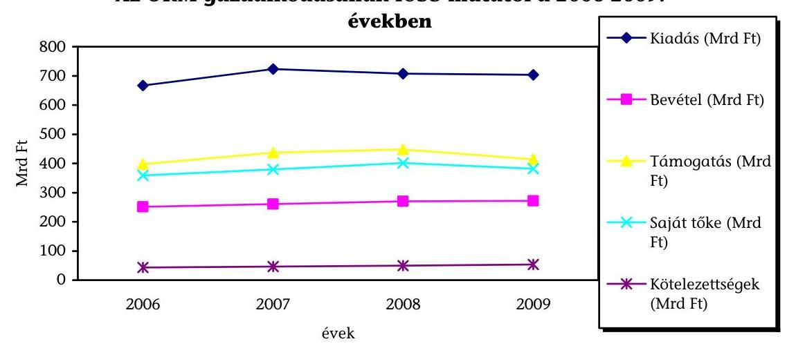

Az OKM az ágazati irányítás eszközeként megvalósított törvényelőkészítő és jogszabályalkotó tevékenységének végrehajtásához - hosszú és középtávú ágazati szakmai koncepciók, stratégiák hiányában - féléves munkatervekben rögzítette a feladatokat. A minisztériumi munkatervek készítésének nem kellő megalapozottságát mutatja, hogy a tervezett feladatoknak csak 69,6%-át hajtották végre, és a munkaterven felüli feladatok az eredetileg meghatározottaknak közel fele volt. A munkatervi feladatok nyomon követését feladatmonitoring rendszer szolgálta, a belső és külső egyeztetéseket megfelelően koordinálták. A szakmapolitikai egyeztetés az államigazgatási egyeztetési folyamat változása miatt meghosszabbodott, amelyet tovább hátráltatott a késedelmesen és szakmai hiányossággal történő végrehajtás.

---

A feladatokat és azok ellátásának rendjét az OKM irányítási, felügyeleti, tulajdonosi és alapítói jogok gyakorlásának rendjéről szóló szabályzatában ${ }^{9}$ határozta meg. Az OKM fejezethez a 2006. évben 67, a NEFMI-hez 2010. szeptember 30-án 54 oktatási és kulturális feladatokat ellátó költségvetési intézmény tartozott. Az OKM miniszter az intézmények feletti felügyeleti/irányítási jogkörét szakállamtitkárok útján látta el.

Az oktatási és kulturális terület intézményrendszerének átalakítása alapvetően kormányhatározat (Átalhat.) ${ }^{10}$ alapján valósult meg. A 2006 - 2009. évekre vonatkozó számvevőszéki ellenőrzések ${ }^{11}$ feltárták az átalakítás előkészítésében a hibákat, és felhívták a figyelmet a végrehajtás hiányosságaira. Az Átalhat.-ban meghatározott feladatok végrehajtása megfelelő szervezeti keretek között, miniszteri biztos koordinálásával történt. Az Átalhat.-ban a költségvetési szervekkel kapcsolatosan előírt 26 feladat közül a miniszter 18 feladatot (75%-át) az előírt szerint teljesített, 3-at nem az előírt formában (könyvtárak, ÁMRK), de szakmailag megalapozottan, célszerűen hajtott végre, 3-at nem teljesített (pl. intézmények átvétele, a gesztori rendszer kialakítása), 2-t javaslatai alapján töröltek.

Az oktatási és kulturális terület intézményi átalakításai eredményeként az intézményi struktúra a feladatellátás szakmai koncentrálásával, profiltisztításával szervezettebbé, az intézményi összevonásokkal, felügyeleti jogkörváltozásokkal átláthatóbbá vált ${ }^{12}$. Hiányosság azonban, hogy a Minisztérium a helyszíni ellenőrzés lezárásáig nem értékelte, hogy a szervezeti intézkedések nyomán kialakult új struktúrában a költségvetési szervek ténylegesen hatékonyabban és eredményesebben látták-e el a feladataikat.

A költségvetési szervek vezetőinek - a felsőoktatási intézmények kivételével ${ }^{13}$ a miniszter irányítói hatáskörében történő 5 éves kinevezése és felmentése alapján lehetővé tette az intézmények stratégiai alapú vezetését és annak számon kérhetőségét. A kulturális és oktatási területen 26 vezető határozott, 1 határozatlan ${ }^{14}$ idejű kinevezéssel, 3 a vezetői pályázat eredményes lezárásáig tartó ideiglenes megbízással látta el a feladatát. Az ideiglenes vezetővel rendelkező három intézmény esetében a helyszíni ellenőrzés lezárásáig a vezetői pályázatot nem folytatták le, vagy szabálytalanul - annak eredménytelensége után - 90 napon belül nem írtak ki újabb pályázatot. Az ellenőrzött időszakban az

[^0]
[^0]:    ${ }^{9}$ 14/2007. belső utasítás, 8/2007. (XII. 28.) OKM utasítás, 1/2009. (I. 30.) OKM utasítás, 2/2009. (I. 30.) OKM utasítás, 3/2010. (IV. 28.) OKM utasítás
    ${ }^{10}$ Az államháztartás hatékony működését elősegítő szervezeti átalakításokról és az azokat megalapozó intézkedésekről szóló 2118/2006. (VI. 30.) Korm. hat.
    ${ }^{11}$ Jelentés a központi költségvetés intézményrendszerének ellenőrzéséről, 2008. május (0808); Jelentés a magyar központi közigazgatás modernizációjának ellenőrzéséről, 2009. január (0901)
    ${ }^{12}$ Jelentés az állami feladat (közfeladat) ellátás szervezeti és humán-erőforrás rendszerének ellenőrzéséről, 2010. szeptember (1022)
    ${ }^{13}$ A felsőoktatásról szóló 2005. évi CXXXIX. tv. 96. § (7), 100. § a), 101. § (3) a)
    ${ }^{14}$ A Nemzeti Kulturális Alapról szóló 1993. évi XXIII. törvény végrehajtásáról szóló 9/2006. (V. 9.) NKÖM rend. 15. § (1)

---

intézményvezetői poszt betöltésére kiírt pályázatoknál a jelentkezéshez biztosították az esélyegyenlőséget, a Bíráló Bizottság azonban a jelöltek értékeléséhez nem dolgozott ki szempontrendszert. Az ellenőrzött időszak alatt az OKM minisztere hat intézményvezetői megbízás visszavonásáról döntött, ebből egy esetben járt a döntés az intézmény működését hátráltató következménnyel (Iparművészeti Múzeum főigazgatójának kétszeri szabálytalan felmentése).

Az irányítás eredményességét rontotta, hogy az oktatási és kulturális területen ágazati, a miniszteri értekezlet által elfogadott intézményműködtetési és fejlesztési stratégia sem volt, a fejezethez tartozó intézmények elfogadott középtávú tervvel, stratégiával nem rendelkeztek. Emellett az OKM nem dolgozott ki olyan érdekeltségi- és szankciórendszert, amely biztosította volna az intézményvezetők számon kérhetőségét, a szakmai irányítás egységes és hatékony ellátását.

Az intézményi beszámolók értékelésének rendszerét kiépítették és működtették, a szakmai munka értékelését több intézmény esetében nem, vagy nem érdemi módon végezték el a szakmai irányítást gyakorló vezetők. Pozitív kezdeményezés, hogy a közgyűjteményi terület intézményeire kidolgozták az előírásoknak (PM körlevél) megfelelő módszert, azonban kedvezőtlen, hogy a rendeletet nem adták ki. A 2009. évi szöveges beszámolók értékelése mindössze az intézmények 32%-ánál alapult az előírt és az objektív értékelést lehetővé tevő gazdaságossági, hatékonysági és eredményességi szempontokat tartalmazó kritériumrendszeren, ezért - a PM 2009. évi zárszámadási köriratában foglaltak ellenére - elmaradt a szakmai működés mutatókkal történő értékelése.

Az OKM vagyonkezelői felügyelete alá 2006. évtől 32 - oktatási, kulturális tevékenységekhez, vagy ezekkel összefüggő fejlesztésekhez kapcsolódó - gazdasági társaság (gt.) tartozott, amelyek állami tulajdoni részesedésének aránya 0,0021% és 100% között változott.

A Minisztérium a tulajdonosi joggyakorlásból eredő feladatait formailag ellátta, de tartalmilag a gt.-k minőségi szakmai feladatellátása, működése, gazdálkodása, irányítása eredményes és hatékony tulajdonosi joggyakorlási rendszerét nem alakította ki.

Az államháztartás hatékony működésére vonatkozó kormányhatározatok ${ }^{15}$ az OKM-hez tartozó gt.-kre vonatkozó intézkedés végrehajtásáról rendelkeztek, de a szervezeti változásokat megalapozó hatástanulmányok, gazdaságossági számítások csak esetenként készültek. Ugyanakkor rendre elmaradtak az utólagos értékelések ${ }^{16}$. A kormányhatározatok előírásai gyakran változtak, ellentmondásokat tartalmaztak, végrehajtásuk elhúzódott, részben valósult meg vagy elmaradt. Az állami vagyonról szóló 2007. évi CVI. törvény hatályba lépésével a gt.-k a Magyar Nemzeti Vagyonkezelő Zrt. (MNV Zrt.) tulajdonosi joggyakorlása alá kerültek. A 2008. évben az MNV Zrt.-vel kötött megállapodá-

[^0]
[^0]:    ${ }^{15}$ 2236/2007. (XII. 15.), 2233/2007. (XII. 12.), 2171/2008. (XII. 12.) Korm. határozatok
    ${ }^{16}$ Jelentés az állami feladat (közfeladat) ellátás szervezeti és humánerőforrás rendszerének ellenőrzéséről (1022) 42. oldal

---

sok alapján előbb 9, majd további 3 gazdasági társaság került vissza az OKM vagyonkezelésébe.

Az MNV Zrt. beiktatásával a tulajdonosi joggyakorlásban jelentős, a szakmai felügyeletben és a támogatási rendszerben
 csekély mértékű változás következett be. A közép- és hosszú távú elvárásokat nem határozták meg, a változásokból származó megtakarításokat nem vették számba, és nem értékelték a döntéshozó beavatkozások célszerűségét és eredményességét.

A társaságok és a közalapítványok tulajdonosi ${ }^{17}$ alapítói jogosítványainak gyakorlását OKM utasításokban ${ }^{18}$ rögzítették, de a feladatmegosztás túlságosan tagolt, bonyolult, esetenként ellentmondásos, ezért az azokban foglaltak végrehajtása nehézkes, időben elhúzódó volt. A felelősségi körök nem voltak egyértelműek, ami csökkentette a joggyakorlás eredményességét. Az utasítások nem határozták meg részletesen és pontosan a szakmai felügyeleti jogkör tartalmát, amelyet a hatályos SZMSZ-ek, a szakterületek ügyrendje illetve a munkaköri leírások sem rögzítettek. Ennek hiányában a feladatellátás sem értékelhető és kérhető számon, amely csökkentette a hatékony szakmai felügyeletet, a működést és a feladatellátást.

A feladatok ellátására kialakított szervezetek tevékenysége alapján sem a gazdálkodási forma megválasztása, sem a szervezetek közhasznúvá, vagy kiemelten közhasznúvá nyilvánításának gyakorlata ${ }^{19}$ nem volt egységes. Az OKM alapítói határozatokkal biztosította az FB-k személyi összetételének változásait, a könyvvizsgálók kijelölését, de - jogszabályi előírás hiányában - nem határozták meg az FB tagok kiválasztásának egységes kritériumrendszerét, megbízásuk egyedi vezetői döntéssel valósult meg.

Az OKM alapítói határozatokban döntött a vezető tisztségviselők megválasztásáról, visszahívásáról, juttatásairól és prémiumfeltételeiről. A prémiumfeltételek többnyire a gt.-k alapítói okiratban foglalt feladatainak végrehajtását tartalmazták, könnyen teljesíthetőek voltak, nem kötődtek konkrét többletfeladatokhoz, minőségi követelményekhez.

A szakterületek nem alakítottak ki a társaságok szakmai tevékenysége teljesítményének mérésére alkalmas kritériumrendszert és mutatókat, az éves üzleti tervekhez szakmai elvárásokat nem fogalmaztak meg, azt a társaságokra bíz-

[^0]
[^0]:    ${ }^{17}$ A tulajdonosi jogkör gyakorlása a gt.-k alapításával, átalakításával, megszüntetésével; a munkáltatói jogok gyakorlásával; a tervezéssel és beszámoltatással; a működéssel kapcsolatosak és a jogszabályokban, alapító okiratban meghatározott kiemelt jelentőségű kérdésekre terjedtek ki. Gyakorlásukra vonatkozó jogosultságokat az OKM és az MNV Zrt. között létrejött megállapodások is rögzítették. A Minisztérium a szerződésben foglaltakat részben teljesítette.
    18 3/2010.(IV.28.).; 2/2009.(I.30); 1/2009.(I.30.); 8/2007.(XII.28.). OKM utasítás és 14/2007. OKM belső utasítás
    ${ }^{19}$ A Nemzeti Filharmonikusok, a HE és a NT kiemelten közhasznú szervezetként működtek, az NSZ nem. Kiemelten közhasznú szervezetként működött a Hungarofest, amely ugyanúgy rendezvényszervezési feladatokat látott el alapvetően, mint a MÜPA. Módosítást a Nemzeti Színház (NSZ) kiemelten közhasznú nonprofit gazdasági társasággá nyilvánítása kivételével az OKM nem vizsgált.

---

ták. Az ágazati szakmai felügyelet, irányítás a benyújtott dokumentumok véleményezésére terjedt ki, általánosak, rövidek voltak, szakmai értékelést, indoklást nem tartalmaztak. A Minisztérium szakmai irányítását, felügyeleti tevékenységét a követő és nem a kezdeményező magatartás jellemezte.

A gt.-k üzleti terveiket változó tartalommal, a várható állami támogatáshoz igazodóan, a megvalósíthatóság és a teljesíthetőség függvényében határozták meg, és nem biztosítottak valós érdekeltségi rendszert. Az üzleti tervek szakmai értékelései általánosak, formálisak voltak, és azok elfogadására tettek javaslatot. A legnagyobb bevételi forrást az eltérő mértékű állami működési és egyéb támogatás jelentette, aránya átlagosan meghaladta a 70%-ot.

A többcsatornás finanszírozás korlátozta a számonkérés és elszámoltatás, a működés és a gazdálkodás átláthatóságát, a teljesítmények mérését, értékelését. A minisztérium helyszíni ellenőrzései a támogatások elszámolásánál hiányosságokat tártak fel és visszafizetési kötelezettségeket írtak elő. A szakmai feladatellátás, gazdálkodás mennyiségi és minőségi értékelése általános és formális volt. Az átláthatóságot tovább csökkentette, hogy a Minisztérium egyes társaságok esetében költségeket vállalt át, amit nem terhelt a társaságokra. Ez az eljárás a MÜPA, a Nemzeti Filharmonikusok és az NT esetében növelte a támogatottsági szintet, és torzította a gazdálkodás eredményességének értékelhetőségét.

A gt.-k vagy veszteségesek voltak, vagy bevételarányosan csekély nyereséget értek el (a profitorientált gt.-k rosszabbul teljesítettek, mint a nonprofitok, és a tartósan veszteségeseknél, mint a MÜPA, NSZ, Educatio a saját tőke csökkenését eredményezték). Az éves értékelések nem tértek ki a veszteséges gazdálkodás megszüntetésére. A támogatások jóváhagyása a szakmai főosztályok javaslata alapján egyedi döntéssel történt, ami stratégiai célok és kritériumok hiányában kockázatnövelő tényezők voltak. A támogatás mértékét bázisalapon, és az egyes szervezetek érdekérvényesítési képessége alapján határozták meg. További kockázatot jelentettek az elvonások és zárolások. A támogatások felhasználására vonatkozó beszámolókat a közalapítványok jellemzően késve teljesítették és szükség volt hiánypótlásra, kiegészítésre is.

Pozitívan értékelhető a helyszíni ellenőrzések 2009-től, de főleg 2010-től bekövetkezett szigorodása, amely felhívta a figyelmet az elszámolások hatékony és eredményes gazdálkodás területén megmutatkozó, illetve az ellenőrzési rendszer korábbi működési hiányosságaira. A 2009-re nyújtott támogatások 2010. évben lefolytatott helyszíni ellenőrzései 6 gt.-nél összesen 277,6 M Ft támogatás jogtalan elszámolását állapították meg, amelyet visszafizettettek, de a további hiányosságok megszüntetésére döntéshozó beavatkozás nem történt.

A közalapítványokra vonatkozó kormányhatározatokat szakmailag nem kellően megalapozott, átgondolt, összehangolt elemzések, értékelések alapján hozták meg, és a végrehajtást sem követték nyomon. A végrehajtás szakmai értékelése elmaradt, a megtakarításokat vagy többletköltségeket, a döntéshozó beavatkozások célszerűségét és eredményességét nem elemez-

---

ték ${ }^{20}$. Az éves értékelés során - feladat- és teljesítménymutatókon keresztül - a szervezeti megoldás célszerűségét más szervezeti formában történő feladatellátással szembeni előnyeit - nem mutatták be, a feladatellátás minőségi jellemzőit nem értékelték, ezzel nem tettek eleget az államháztartásról szóló törvény, és a Kormányrendeletek ${ }^{21}$ előírásainak. Az intézményfenntartó közalapítványoknál nem vizsgálták a tevékenység, a működés alapján a szükséges állami támogatás mértékét, a szervezeti forma célszerűségét és eredményességét. Az egyes közalapítványok feladatellátásában átfedések voltak, ami az összevonásukat, vagy más szervezeti formába történő átalakításukat indokolta volna.

A közalapítványok hatályos alapító okirattal rendelkeztek, amelyek tartalmazták a működés legfontosabb feltételeit, alapítói joggyakorlásuk sokkal szűkebb eszközrendszert biztosított, mint a gt.-k esetében. A kezelő szervezet az FB-k tagjainak kiválasztását is egyedi felső vezetői döntéssel hozták meg.

A közalapítványi beszámolókhoz szakmai és gazdálkodási értékelés készült, azonban nem határozták meg a kezelő szervezet által benyújtott beszámolók értékelésének szempontrendszerét. A közalapítványok tevékenységét általánosan és röviden értékelték, a szakmai feladatellátást kisebb pontosításokkal elfogadták. A könyvvizsgálatok 2008-ban az éves beszámolókat és közhasznúsági jelentéseket elfogadó véleménnyel látták el. Az alapítói joggyakorlás alá tartozó közalapítványok 2010. augusztus 1-jével a KIM-nek történt átadására ${ }^{22}$ való hivatkozással a 2009. évről minisztériumi beszámoltatásra nem került sor.

A Kormány 2010 júliusában döntött a közalapítványok és alapítványok felülvizsgálatáról, majd ennek eredményeként kormányhatározat rendelkezett egyes közalapítványok és alapítványok megszüntetéséről, tevékenységüknek más szervezeti formában való folytatásáról ${ }^{23}$.

A támogatások felhasználása és a beszámolás helyszíni ellenőrzése nem valósult meg maradéktalanul a szabályozás szerint (pl. MTFK, MMK), csak jóval a beszámolási határidőn túl. Az ellenőrzési rendszer működését a Minisztérium tulajdonosi ${ }^{24}$, alapítói joggyakorlása és a támogatásokhoz kapcsolódó FEUVE ellenőrzései biztosították. Az ellenőrzés elemei a gt.-knél és a közalapítványoknál az FB-k, az éves beszámolók független könyvvizsgálói auditálása, a belső ellenőrzés és a Minisztérium Ellenőrzési Főosztályának vizsgálatai voltak.

[^0]
[^0]:    ${ }^{20}$ ÁSZ jelentés az állami feladat (közfeladat) ellátás szervezeti és humánerőforrás rendszerének ellenőrzéséről (1022) 17. oldal
    ${ }^{21}$ Az államháztartásról szóló 1992. évi XXXVIII. tv. (Áht.) 100/K. § (j); Ámr. régi 149/A. § (1), 2009. január 1-jétől 61. § (4); Ámr. új 222. § (7)
    ${ }^{22}$ A Kormány által alapított közalapítványokkal és alapítványokkal kapcsolatos időszerű intézkedésekről szóló 1159/2010. (VII. 30.) Korm. határozat
    ${ }^{23}$ 1159/2010 (VII. 30.) és 1316/2010. (XII. 27.) Korm. határozatok
    ${ }^{24}$ Az OKM és az MNV Zrt. között létrejött szerződés alapján a minisztérium jogosult az érintett társaságok feletti tulajdonosi jog gyakorlására, kivétel a gt. megszüntetése, értékesítése, átalakulása, pótbefizetés elrendelése és visszafizetése stb.

---

A támogatások felhasználásának ellenőrzései során tapasztalt hiányosságok rámutattak, hogy az FB-k nem biztosították teljes körűen az eredményes tulajdonosi ellenőrzést, azonban az FB-k tevékenységét a tulajdonos nem értékelte. A közalapítványok ellenőrzési rendszere elemeiben megegyezett a gt.-knél alkalmazottal, de itt minden FB-ben a Minisztérium képviselői is részt vettek, azonban értékelésre itt sem került sor. A működésben jelentkező problémák az MTFK-nál és MMK-nál jelezték, hogy a formálisan kialakított és működtetett ellenőrzési rendszer nem biztosította a megfelelő hatásfokú eredményességet. A tulajdonosi joggyakorlás alá tartozó gt.-knél, közalapítványoknál kialakításra került a több, független szereplős, ellenőrzési rendszer, de nem biztosította teljes körűen az eredményes, hatékony tulajdonosi, alapítói joggyakorlást a közpénzek felhasználásában.

A jogszabályok ${ }^{25}$ rendelkeznek a közfeladatot ellátó gt.-k és közalapítványok honlapjaikon kötelezően nyilvánosságra hozandó adatairól. A Minisztérium felszólításai ellenére a szervezetek nem mindegyike tett eleget ennek a kötelezettségnek, ami csökkentette a közpénzek felhasználásának átláthatóságát és társadalmi ellenőrzésének lehetőségét.

Az OKM a jogszabályi előírások szerint tett eleget az átadás-átvétel törvényi kötelezettségeinek, kivéve az intézmények átadás-átvételéről készült jegyzőkönyveket, amelyek szűkített adattartalommal készültek a nagy terjedelmű anyagok kezelésének nehézsége miatt. ${ }^{26}$ Az OKM NEFMI-be integrálását dokumentáló átadás-átvételi jegyzőkönyv és mellékletei 3 változatban, különböző időpontokban és szempontrendszer alapján történő elkészítése nem kellően átgondolt előkészítésre utalt, és jelentős többletmunkát okozott.

A NEFMI-ben az oktatás és a kulturális szakmai feladatokat a korábbi OKM oktatásért felelős létszámának 78,0%-a és a kulturális területnél 80,6%-a látja el amellett, hogy az ellátandó feladatok nem csökkentek. A NEFMI-ben a kormányzati munkával kapcsolatos koordinációs feladatok központosítása a szervezeti méretek és a szakmai feladatok sokrétűsége miatt részben valósultak meg, ezért szakterületenként is kialakítottak hasonló funkciójú szervezeti egységeket (pl. koordináció, ügyfélkapcsolat, nemzetközi kapcsolat).

A működés feltételrendszere kialakításakor nehézséget okozott, hogy a NEFMI 3 hónap késéssel adta ki az SZMSZ ${ }^{27}$-ét, a felsővezetőkön kívül a kinevezések 2011. februárig csak részben történtek meg. A NEFMI SZMSZ-ének hatálybalépése óta eltelt rövid időszak alatt az oktatási és kulturális szakterületeknél több probléma jelentkezett, amelyek növelték a célszerű, eredményes működés és hatékony feladatellátás kockázatát.

[^0]
[^0]:    ${ }^{25}$ Az elektronikus információ szabadságról szóló 2005. évi XC. tv. 3-4. §, a közpénzekből nyújtott támogatások átláthatóságáról szóló 2007. évi CLXXXI. tv., a köztulajdonban álló gazdasági társaságok takarékosabb működéséről szóló 2009. évi CXXII. tv. 2. §, a Ksztv. 19. § (5) bek.
    ${ }^{26}$ Az átadás-átvételt részletesen az ÁSZ a 2010. évi költségvetés végrehajtásáról szóló ellenőrzése során vizsgálja.
    ${ }^{27}$ A Nemzeti Erőforrás Minisztérium Szervezeti és Működési Szabályzatáról szóló 6/2010. (X. 19.) NEFMI utasítás 4. függelék I/3-4.

---

A NEFMI létrehozása során a feladatok, hatáskörök és felelősök pontos meghatározásának hiánya és az, hogy a miniszter - az oktatási és kulturális ágazatok területén ${ }^{28}$ - 28 intézmény esetében tartotta meg magának az irányítási jogkört, növelte az adminisztrációt és a döntéshozatal időtartamát.

A Tempus Közalapítvány által odaítélt támogatásoknál az indikátorok, teljesítménymutatók nem érvényesültek.

A TKA Egész életen át tartó tanulás programot létrehozó EK határozat
 ${ }^{29}$ az egyes alprogramok operatív célkitűzései között meghatározott ugyan számszerűsített célokat, amelyeket azonban nem bontottak le a résztvevő országokra, nem egységes időszakokra vonatkoznak, és a program időtartamához sem igazodnak. A célokat és a pénzügyi keretet sem hangolták össze, mert a jóváhagyott határozatban az előzetesen bejelentettnél alacsonyabb pénzügyi keret ellenére a program céljai változatlanok maradtak. Az éves munkaterv az éves tevékenységi jelentéstől eltérő szerkezetű, ezért a tervezett teljesítmény és az elért eredmények között érdemi összehasonlítást nem lehetett elvégezni. Saját hatáskörben a TKA évente a folyamatok mérésére szolgáló mutatókat határozott meg, és értékelte is azokat, de érdemi intézkedéseket a mérések eredménye alapján nem hozott.

A TKA a támogatások felhasználásának monitoring rendszerét kialakította, ennek keretében a projektek szakmai nyomon követése mellett pénzügyi ellenőrzéseket végzett a benyújtott pénzügyi és szakmai beszámolók, dokumentumok alapján, valamint a helyszínen vizsgálták a dokumentumok valódiságát, a támogatások hasznosulását.

Az OKM nem rendelkezett sem kulturális, sem oktatási ágazati informatikai stratégiával, és az OKM és a NEFMI SZMSZ-e sem jelölte ki a stratégia kidolgozásáért felelős személyeket. Az informatikai feladatok ellátására létrehozott Informatikai és Dokumentációs Főosztálynak a helyszíni ellenőrzés lezárásáig nem volt informatikai szakismeretekkel rendelkező munkatársa. Az ágazati informatikai fejlesztések rendszere a NEFMI létrehozását követően négyszereplőssé vált (két minisztérium és két szervezet) ${ }^{30}$, ahol a feladatok elhatárolása sem egyértelmű, ami további jelentős kockázati tényező.

Ágazati stratégia hiányában az informatikai rendszereket egymástól elszigetelten fejlesztették, ami a párhuzamos feladatellátás, valamint az egymással és a más rendszerekkel való összekapcsolás bonyolultsága miatt csökkentette az ágazati irányítás hatékonyságát. Az informatikai rendszerek fejlesztésének célját és az értékeléséhez mutatószámokat nem határoztak meg, ezért a rendszerek hatékonysága nem volt megállapítható.

A Magyar Digitális Képkönyvtár (MDK) projekt elérte a közvetlen szakmai célját, mert lehetőséget biztosított arra, hogy a magyar kulturális örökség

[^0]
[^0]:    ${ }^{28}$ 2010. szeptember 30-án a NEFMI fejezethez 29 oktatási és 25 kulturális intézmény tartozott.
    ${ }^{29}$ Az Európai Parlament és a Tanács 1720/2006/EK határozat
    ${ }^{30}$ NEFMI, Nemzeti Fejlesztési Minisztérium, Oktatási Hivatal és Educatio Kft.

---

könyvtárakban őrzött képi elemei a lehető legszélesebb körben hozzáférhetővé és kereshetővé válhassanak. A 2000 óta működő Közoktatási Információs Rendszer (KIR) továbbfejlesztése szakmai vonatkozásában megvalósult, mert a rendszer a jogszabályi változásoknak megfelelően biztosította 2010-ben a középfokú közoktatási intézmények, azok tanárai és tanulói alapadatainak a Közoktatási Intézménytörzsben való kezelését. A 2000 óta működő Középfokú Közoktatási Intézmények Felvételi Információs Rendszere (KIFIR) továbbfejlesztése szakmailag eredményes volt, mert a rendszer a jogszabályi változásoknak megfelelően összehangolta és meghatározta, hogy a tanulók melyik oktatási intézménybe nyertek felvételt. Az oktatás szervezésének hatósági feladatait támogató KIR és KIFIR között azonban átfedés van (pl. tanulói adatbázisok), és nem biztosít visszacsatolást az oktatás eredményességéről (pl. arról, hogy elhelyezkedett-e a tanuló a megszerzett tudáshoz köthető munkakörben).

Az Egységes Regionális Információs Közművelődési Adatbázis (ERIKANET) az egyetlen közművelődési, kulturális adatbázis, amely reprezentálja az egyes települések kultúráját. Továbbfejlesztésével azonban a rendszer a cél szerinti megvalósulását csak részben érte el, mert a 2010. második félévi adatfeltöltés finanszírozási problémái miatt csak részben teljesült.

Az OKM Igazgatás által használt integrált pénzügyi informatikai rendszer (Forrás SQL) bevezetése, valamint az ennek az adatállományára épülő jelentéskészítő és vezetői információs rendszerek kiépítése és üzemeltetése projekt az ütemezésnek megfelelően haladt. A Költségvetési Gazdálkodási Rendszer fejlesztését - amely biztosítani hivatott a központi költségvetési szervek gazdálkodási eseményeinek komplex kezelését - 2008 májusában 11,8 Mrd Ft tervezett összköltség mellett megkezdték a PM-ben. Ezzel párhuzamosan indított projektet a Minisztérium az integrált pénzügyi informatikai rendszernek az OKM fejezethez tartozó intézményeknél való kiépítésére, amelynek összes költsége (az OKM döntése alapján további szervezetek vezették be a rendszert, valamint az áfa emelkedése miatt) 30%-kal meghaladta a tervezettet.

Az OKM a jogszabályi előírásoknak ${ }^{31}$ megfelelően vezette be a folyamatba épített, előzetes, utólagos és vezetői ellenőrzés (FEUVE) rendszerét. A hatályos SZMSZ-ek 3. számú mellékletének keretében szabályozta a kockázatkezelést és értékelést, azonban az SZMSZ módosításait, és a jogszabályi változásokat nem vezették át. Az OKM 2009. szeptember 4-én kiadott SZMSZ-ének már nem volt része a FEUVE, így belső előírások nélkül működött a rendszer.

A vizsgált időszakban a szakterületek ügyrendjei és a munkaköri leírások nem tartalmaztak a FEUVE-val és a kockázatelemzéssel kapcsolatos konkrét nevesített feladatokat. A szervezeti egységeknek a kockázatkezelési tevékenységükről szóló jelentéstételi kötelezettségüknek csak részben tettek eleget. A fejlesztési és gazdasági szakállamtitkár ${ }^{32}$ határozatával elfogadott, a belső kontrollrendszer kialakításának feladatairól szóló előterjesztésre intézkedési tervet készített, amit

[^0]
[^0]:    ${ }^{31}$ Ámr. régi 145/A-C. §
    ${ }^{32}$ a 72/2009. (VI. 4.) számú MÉ határozat

---

a miniszter jóváhagyott, azonban a feladatok végrehajtása és a hiányosságok felszámolása elmaradt.

A NEFMI SZMSZ ${ }^{33}$ szabályozza a FEUVE rendszer létrehozásának feladatát, azonban a belső szabályozás kidolgozása 2010-ben nem történt meg.

Az intézmények belső ellenőrzései részben önállóan vizsgálták a FEUVE rendszer működését, azonban az irányítás rendszerbeli hiányosságát mutatja, hogy a hibák egy része ismétlődött. A vizsgált időszakban az OKM Ellenőrzési Főosztályán 25 fő engedélyezett létszámot átlagosan 23-24 fővel töltöttek be. Kedvezőtlen változás, hogy a NEFMI létrejöttével az 5 szakterület ellenőrzési létszámának egyesítésével az eddigi létszám kétharmada végzi a kibővített ellenőrzési feladatokat.

A helyszíni ellenőrzéseket az éves terveknek megfelelően összehangoltan, az ütemezésnek megfelelően végezték, amit a célellenőrzések, az azonnali feladatok végrehajtása módosított. Az informatikai rendszertesztelési eljárásokat nem alkalmazták, mert szakértői támogatást az ellenőrzéshez nem tudtak biztosítani. Ellenőrzéseik az OKM szervezeti egységeire, intézményeire és a fejezeti kezelésű előirányzatokból nyújtott támogatásokra irányult. Értékelték a belső kontrollrendszerek kiépítésének, működésének jogszabályoknak és szabályzatoknak való megfelelését, a működés eredményességét. Az ellenőrzés által tett javaslatokat nem hasznosították megfelelő hatékonysággal, a miniszteri döntésekben nem kaptak kellő támogatást, mert nem bontották le szakterületekre és felelősökre, ami évről-évre ismétlődő hiányosságokat eredményezett.

Az intézkedési tervben előírtak nyomon követése megtörtént, azonban a feladatok végrehajtása nem volt hatékony, az ellenőrzött időszakban az OKM kimutatása szerint átlagosan 7 javaslatból 4,5 teljesült. A fejezetet irányító szerv vezetője a tárgyévre vonatkozó éves ellenőrzési jelentést, a felügyelete alá tartozó szervezetek éves ellenőrzési jelentései alapján készített éves összefoglaló ellenőrzési jelentést, a belső kontrollrendszer eredményességének növelése érdekében tett fontosabb javaslatokat, a megállapítások és javaslatok hasznosulását, az ellenőrzési tevékenység fejlesztésére vonatkozó javaslatokat az előírásnak megfelelően megküldte a pénzügyminiszternek.

A fejezet intézményeinél a minisztérium szerint a belső ellenőrzési tevékenység kiépítettsége és működése folyamatosan javult, a belső ellenőrök 2009. év végére minden intézményben rendelkeztek az előírt képesítési követelményekkel. Az intézmények a tervezett éves belső ellenőrzéseiknek csak a 81%-át hajtották végre, mert nem tudták betölteni a belső ellenőri státuszokat, vagy időkiesést okozott a jelentős fluktuáció. Az intézmények belső ellenőrzésének eredményességét csökkentette, hogy az intézkedési terveikben rögzített feladatoknak átlagosan 25%-át nem hajtották végre határidőn belül, és a hibák újratermelődtek.

[^0]
[^0]:    ${ }^{33}$ 6/2010. (X. 19.) NEFMI utasítás a Nemzeti Erőforrás Minisztérium Szervezeti és Működési Szabályzatáról 124. § 15.

---

Az OKM fejezet létrehozása óta eltelt időszakban az ÁSZ 11 jelentésben összesen 33 javaslatot fogalmazott meg a miniszternek. A javaslatok alapján kidolgozott 10 intézkedési tervbe foglalt feladatok határideje 25 javaslat esetében járt le 2010. szeptember 30-ig. Az ÁSZ jelentésekben foglaltak szerint intézkedtek 12 javaslat esetében, 8-nál ettől eltérően, 5 esetben pedig folyamatban volt a végrehajtás.

A helyszíni ellenőrzés megállapításainak hasznosítása mellett javasoljuk:

# a nemzeti erőforrás miniszternek: 

1. Intézkedjen a szakmai ágazati irányítás, a felügyeleti, tulajdonosi, és alapítói joggyakorlás szabályozásáról a feladatok pontos meghatározásával, a felelősök hatás- és jogkörök nevesítésével, a végrehajtás monitoring rendszerének kialakításával.
2. Dolgoztassa ki és határozza meg a felügyelete, a tulajdonosi és alapítói joggyakorlás alá tartozó szervezetek feladatellátásának javítására számszerűsíthető mutatószámokon alapuló kritériumait, középtávú célrendszerét.
3. Gondoskodjon az oktatási és a kulturális ágazat középtávú stratégiájának kidolgozásáról.
4. Dolgoztassa ki az informatikai stratégiát és intézkedjen az informatikai projektek, fejlesztések és a források összehangolt, hatékony felhasználásáról.
5. Gondoskodjon a belső kontrollrendszer (különösen a FEUVE) jogszabályokban meghatározottak szerinti szabályozásáról, eredményes és hatékony működtetéséről.

---

# II. RÉSZLETES MEGÁLLAPÍTÁSOK 

## 1. A Nemzeti Erőforrás Minisztérium Megalakulását Követően az Oktatási és Kulturális Ágazat Átadás-Átvétének Dokumentálása, Szervezeti Változásai és az Új Minisztériumba Történő Integrálása

### 1.1. Az átadás-átvétel jogi szabályozása, végrehajtása

Az Országgyűlés 2010. május 20-án elfogadta a Magyar Köztársaság minisztériumainak felsorolásáról szóló 2010. XLII. törvényt, amelynek 1., 2. mellékletei rendelkeztek az átadás-átvétel formai és tartalmi követelményeiről.

Az OKM részéről az átadás-átvételi jegyzőkönyvek és annak mellékletei 3 változatban készültek el, amelyek tartalmukban és mellékleteikben különbözőségeket mutatnak. A két változat a kormányváltást megelőző időszakban ${ }^{34}$, a harmadik változat a kormányváltást követően készült el ${ }^{35}$. A 3 változat különböző időpontokra és szempontrendszer alapján történő elkészítése - a nem kellően átgondolt előkészítés miatt - jelentős többletmunkát jelentett az OKM számára.

Az OKM a jogszabályi előírások szerint tett eleget az átadás-átvétel törvényi kötelezettségeinek, kivéve az intézmények átadás-átvételéről készült jegyzőkönyveket, amelyek szűkített adattartalommal készültek a nagy terjedelmű anyagok kezelésének nehézsége miatt. ${ }^{36}$ Az információtechnológiai (informatikai) rendszerek átadás-átvétele a Központi Szolgáltatási Főigazgatóság (KSZF) és a MEH közreműködésével valósult meg, mert a KSZF ez utóbbihoz tartozott.

Az 1. sz. melléklet alapján az átadás-átvételi kötelezettségüknek a szakállamtitkárok is eleget tettek. A szakterületek részéről átadandó dokumentációk a minisztériumi átadás-átvételi jegyzőkönyvben megjelentek. A Minisztériumban 2007-től megszűnt az Informatikai Osztály, így a KSZF végezte/végzi az informatikai infrastruktúra üzemeltetési feladatait. Az átadást a törvény 2. sz. melléklete alapján az OKM-nek is végre kellett hajtania, amire sor került, de a jegyzőkönyv szerint az átadó nem tett teljes körűen eleget a törvényi előírásoknak. A jegyzőkönyv alapján az OKM álláspontja szerint „a KSZF mint szolgáltató, nem az elvárható igényeknek megfelelően nyújtotta a szolgáltatásait, ez az átadónak a működését hátrányosan érintette."

[^0]
[^0]:    ${ }^{34}$ Áht. 50./A §, A Magyar Köztársaság minisztériumainak felsorolásáról szóló 2010. évi XLII. törvény 6. §-ának végrehajtásáról szóló 12/2010. (V. 25.) MeHVM rend.
    ${ }^{35}$ A Magyar Köztársaság Minisztériumainak felsorolásáról szóló 2010. évi XLII. tv.
    ${ }^{36}$ Az átadás-átvételt részletesen az ÁSZ a 2010. évi költségvetés végrehajtásáról szóló ellenőrzése során vizsgálja.

---

Az átadás-átvételi jegyzőkönyv külön pontban (12. pont) rendelkezik az irányított, illetve felügyelt intézményrendszer (költségvetési szervek, háttérintézmények, vállalkozások, közalapítványok) költségvetési, vagyoni, személyi, igazgatási és szakmai helyzetéről, működéséről tételes kimutatások átadásával. Az adatokat valamennyi intézménytől bekérték, a jegyzőkönyvhöz mellékelték.

A Magyar Köztársaság minisztériumainak felsorolásáról szóló 2010. évi XLII. tv. létrehozta a NEFMI-t, amelyben az
 5 szakágazatból az oktatás és a kultúra kettőt képvisel. A két szakágazatot irányító szakterület létrehozásakor a fő szempont az volt, hogy kizárólag a szakmai és az ehhez kapcsolódó ügyfélszolgálati és statisztikai feladatokat lássák el, a közös feladatok (a humánerőforrás-gazdálkodás, a kormányzati munka koordinációja, a kodifikációs és jogi feladatok, a működés informatikai támogatása, az iratkezelés, a költségvetési és gazdálkodási feladatok) a közigazgatási államtitkár közvetlen irányítása mellett integrálódjanak. Olyan további feladatok, mint a nemzetközi ügyek, a stratégiaalkotás, a fejlesztés, a társadalmi és civil kapcsolatok, a sajtó és a parlamenti munkával kapcsolatos feladatok részben a központi, részben az ágazati egységek kompetenciájába kerültek.

# 1.2. Az oktatási és kulturális szakterület szervezeti változásai és az új minisztériumba történő integrálása 

Az OKM az átadás-átvétel időpontjában 527 fő engedélyezett létszámmal működött, amelyből a közoktatási és felsőoktatási feladatokat 91 fő, a kulturális feladatokat 72 fő látta el. Az állományi létszámnál magasabb volt a szakmai feladatokkal foglalkoztatottak száma, mivel kiegészült a szerződéses jogviszonyban foglalkoztatottak létszámával. A szakmai feladatokat közvetlenül támogató funkcionális, kisegítő területeket (szervezés, igazgatás, ügyfélszolgálat, nemzetközi, sajtókapcsolatok, parlamenti kapcsolatok, határon túli magyarok ügye, fejlesztések) ellátók létszáma 113 fő volt. A szakmai tevékenységeket közvetetten támogató területeken (iratkezelés, jogi, személyzeti és gazdasági területek, minisztériumi irányítás, egyházügyi feladatok) 251 fő dolgozott.

Az OKM korábbi feladatai közül a Magyar Köztársaság Minisztériumainak felsorolásáról szóló 2010. évi XLII. törvény szerint csak az egyházügyi feladatok kerültek át a Közigazgatási és Igazságügyi Minisztériumhoz (KIM) 50 fős létszámmal. A két szakterület - a korábbi feladat- és létszámadatokból kiindulva a NEFMI tervezett struktúrájában - az oktatási területen 225 főt, a kulturális területen 130 főt tervezett.

Az szakterületek számára a NEFMI SZMSZ-ben összességében meghatározott létszámkeret, valamint az egyes szervezeti egységek közötti felosztást a kabinetfőnökök készítették el, egyeztették a helyettes államtitkárokkal, majd jóváhagyták az államtitkárok is.

A NEFMI engedélyezett létszáma 906 fő, a belső egyeztetéseket követően a végleges felosztás szerint az oktatási szakágazat 150 fővel, a kulturális szakágazat 105 fővel gazdálkodhat ${ }^{37}$. A funkcionális feladatok egy része ugyanakkor központosítva, és a szakterületeken is megjelentek (pl. fejlesztési, nemzetközi és koordinációs feladatok). Az oktatási és kulturális szakterületek összlétszáma a NEFMI struktúrában 255 fő a korábbi 276 fővel szemben, amely összességében 7,6%-os csökkentést jelent. Ezen belül - változatlan feladatellátás mellett - a szakmai feladatot ellátók létszáma csökkent nagyobb mértékben.

Az oktatási szakterületen a jóváhagyott 150 főből mindössze 71 fő szakmai feladatok ellátására biztosított létszámot határoztak meg, amely az OKM-es létszámnak 78%-a, holott az ellátandó szakmai feladatokban nem következett be változás. Emellett a funkcionális (támogató) feladatokat (szervezés, fejlesztés, statisztika) ellátó szervezeti egységek létszámát is csökkentették.

Az oktatási szakterület véleménye szerint a feladatok elfogadható színvonalú ellátásához szakmai területen minimálisan további 25 fő, funkcionális területen további 8 fő létszámra lenne szükség. Az oktatásért felelős államtitkár a NEFMI miniszterhez írt levelében felhívta a figyelmet, „hogy a jóváhagyott létszámunk a működésképtelenség veszélyét vetíti előre". Levelében kérte, hogy a várható szakmai többletfeladatból származó létszámhiányt megbízásos jogviszonyú dolgozókkal pótolhassa, amit az egyes szervezeti egységek feljegyzései is alátámasztanak.

A kulturális szakterületen a jóváhagyott 105 főből 58 fő lát el szakmai feladatot, amely a korábbi OKM szakmai létszámának 80,6%-át jelenti.

A kulturális ágazatban - az ágazat véleménye szerint - a feladatok zavartalan, hatékony ellátásához szakmai területeken további 19 fő, funkcionális területeken 13 fő létszámra lenne szükség.

Az oktatási és kulturális szakterületek létszámának alakulása az átadás-átvétel előtt és után
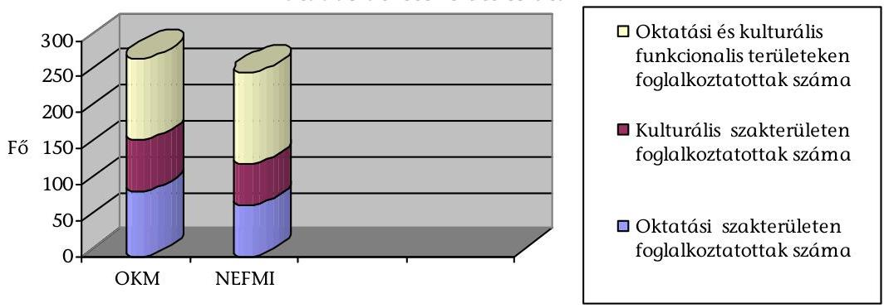

A NEFMI-ben a kormányzati munkával kapcsolatos koordinációs feladatok központosítása volt a cél, de ez csak részben valósult meg. A szervezeti méretek és a szakmai feladatok heterogenitása miatt szakágazatokként is szükség volt hasonló funkciójú szervezeti egységekre, amelyek az adott szakmai specifikumok ismeretében készítik elő a központi koordinációt és biztosítják az irányítás szakmai felügyeletét.

[^0]
[^0]:    ${ }^{37}$ A Nemzeti Erőforrás Minisztérium Szervezeti és Működési Szabályzatáról szóló 6/2010. (X. 19.) NEFMI utasítás 3. számú függelék

---

Az eredeti elképzelésektől eltérően, az oktatási és kulturális szakmai feladatokhoz kapcsolódóan a szakterületek szintjén is létrejöttek szervezési-koordinációs, szakmai támogató, ügyfélkapcsolati, nemzetközi feladatokat ellátó szervezeti egységek. A parlamenti munka, a sajtókapcsolatok, a társadalmi és civil kapcsolatok szakterületi szintű ellátása a kabinetirodák keretein belül történik.

A szakterületek struktúrája - a költségvetési, gazdálkodási, informatikai, iratkezelési, személyzeti, jogi és kodifikációs feladatok kivételével - megfelel a jogelőd OKM szervezeti struktúrájának. A döntési mechanizmus tekintetében nem vették kellően figyelembe a több ágazattal működő szervezetek tapasztalatait (pl. korábbi OKM).

A működés feltételrendszerének kialakításakor nehézséget okozott, hogy a felsővezetőkön kívül a személyek feladatokhoz és hatáskörökhöz rendelése, illetve kinevezése a helyszíni ellenőrzés lezárásáig nem, illetve 2011. 02. 04-ig csak részben történt meg.

A felsővezetőkön (államtitkárok, helyettes államtitkárok) túl az új SZMSZ szerinti szervezeti egységek vezetőinek kinevezésére 2010. december 10-ig nem került sor, a korábbi szervezeti egység vezetői pedig a köztes időszakra (az SZMSZ kihirdetésétől az új vezetők kinevezéséig) nem kaptak írásos megbízást az új szervezeti egységek ideiglenes vezetésére. 2011. 02. 04-ig az oktatási ágazatban a beosztott dolgozók kinevezésére került sor.

A NEFMI SZMSZ-e szerint a szakmai munka felelőssége megoszlik az oktatásért és a kultúráért, és a szűkebb területekért felelős helyettes államtitkárok között, így fontos szerepe van a funkcionális szervezeti egységeknek, amelyek biztosítják az egységes szakmai álláspont kialakításához szükséges egyeztetéseket. A NEFMI vezetése és a szakterületek közötti többszöri konzultáció eredményeként ezek a szervezeti egységek létrejöttek.

Az oktatásban a szervezési részleget önálló osztályként 5 fővel, a kultúrában 3 fővel hozták létre. Célszerűségüket igazolja, hogy pl. a kormányzati döntések előkészítésében az államigazgatási egyeztetések időtartama jóval lerövidült (1 és 5 nap között), jelentős feladatuk van a kormányülésekre és a közigazgatási egyeztetésekre való felkészítés során is.

A NEFMI SZMSZ hatálybalépése óta eltelt rövid időszak alatt az oktatási és kulturális szakterületeknél több probléma jelentkezett, amelyek növelték a célszerű, eredményes működés és hatékony feladatellátás kockázatát.

A felsőoktatás gazdálkodási feladatainak ellátásában (nem állami intézmények támogatása és a fejezeti támogatások egy részénél) az oktatási államtitkárságon belül nincs pénzügyi apparátus. A jogalkotási feladatokban többszörös az áttétel. Hiányzik a felsőoktatási intézmények szabályzatainak fenntartói jogkörben történő vizsgálataihoz és az erre vonatkozó jogi álláspontok kialakításához szükséges létszám. A közvetlen önálló felsőoktatási, finanszírozási egység hiánya a 27 állami felsőoktatási intézmény költségvetéseinek tervezési és beszámoltatási feladatainak ellátására. A létszámcsökkentés a közoktatási szakterület feladatellátását is nagymértékben megnehezítette a nem állami intézmények, valamint az egyházi intézmények finanszírozásával kapcsolatos feladatok ellátásában. A háttérintézmények alapító okiratainak módosításaira vonatkozó feladatok végrehajtójának és felelősének meghatározása hiányzik. A Jogi Főosztály centralizált munkavégzése a kodifikáció és az ágazatokat érintő polgárjogi szerződések megkötésének átfutási idejét meghosszabbította. A szerződések megkötésének átfutása átlagosan 80 napra nőtt.

# 2. Az oktatási és kulturális szakterület felügyeleti, tulajdonosi és alapítói joggyakorlása alá tartozó szervezetek szakmai irányítása és gazdálkodása 

### 2.1. Az irányításhoz kapcsolódó törvényelőkészítő és jogszabályalkotó tevékenység

Az irányítás eszközei közé tartoznak az Országgyűléshez, annak bizottságaihoz és a Kormányhoz benyújtandó előterjesztések; ennek keretében törvény, kormányrendelet, országgyűlési határozat, kormányhatározat kibocsátásának kezdeményezése; valamint miniszteri rendeletek kiadása. Ezek munkatervi feladatokként (feladat) jelentek meg, és előkészítésük rendjére (tervezés és végrehajtás) részletes belső szabályozás került kialakításra.

A Minisztérium az ágazati irányítás eszközeként megvalósított törvényelőkészítő és jogszabályalkotó tevékenységének végrehajtásához 2007-2010. 06. 30. közötti időszakban féléves munkatervekben rögzítette a feladatokat, felelősöket, a szükséges időbeosztást, ami lehetővé tette az elvégzett munka értékelését.

A minisztériumi munkatervek készítése nem volt kellően megalapozott, mert a tervezett 520 feladatnak csak 69,6%-át hajtották végre. Munkaterven kívüli 247 db feladat volt, amelynek végrehajtásáról nem vezettek nyilvántartást. A munkatervek készítése hosszú és középtávú ágazati szakmai koncepciók, stratégiák hiányában történt. A tervezett feladatok végrehajtásában a kulturális területen volt a legnagyobb lemaradás.

A végre nem hajtott feladatok közül 72 db (13,8%) folyamatban levő volt, 48 db (9,2%) halasztásra és 38 db (7,4%) törlésre került. A kiemelt 3 fő területen (a kultúra, a közoktatás és a felsőoktatás) munkatervi feladatainak végrehajtása 41,6%; 70,3%; 69,5%-a teljesült.

A munkatervi feladatok adminisztrációját, összeállítását, végrehajtásának nyomon követését az OKM Igazgatási Főosztálya megfelelően koordinálta. A munkatervi feladatok nyomon követését szolgálta a feladat-monitoring rendszer, amely segítette a Minisztérium feladatainak, kötelezettségeinek (pl.: jogszabály előkészítés) figyelemmel kísérését, egységes rendszerbe foglalását.

A rendszer lehetővé tette a munkatervi, az államtitkári, miniszteri értekezleten kiadott és a kormányhatározatokban szereplő feladatok rögzítését, és gyakorlatban a végrehajtásának nyomon követését.

Az OKM Igazgatási Főosztálya minden félévben a következő félévi munkaterv előterjesztésével azonos időben számot adott az előző félévi munkaterv végrehajtásának teljesítéséről, valamint elkészítette és koordinálta a munkaterv-beszámolók elkészítését. A munkaterv teljesítéséről szóló előterjesztést a miniszteri értekezlet megtárgyalta és minden esetben elfogadta.

---

Törölték azon feladatokat, amelyek aktualitásukat vesztették, vagy egyéb okból nem volt szükséges a végrehajtása. Elhalasztották azokat a feladatokat, amelyek még aktuálisak voltak, de előkészítésük hosszabb időt vett igénybe, és a szükséges döntést még nem hozták meg.

A jogszabályalkotó tevékenység során a szakfőosztályok által elkészített előterjesztések belső és külső egyeztetését az Igazgatási Főosztály a kialakított államigazgatási egyeztetési rendre vonatkozó előírásoknak megfelelően koordinálta. Az előterjesztés vagy azok változatának az államigazgatási egyeztetésre történő megküldéséről minden esetben a miniszteri értekezlet hozott döntést.

A miniszteri értekezlet kezdeményezése alapján 2009. évben 70, 2010. I. félévében 22 előterjesztés került államigazgatási egyeztetésre.

Az OKM-ben általános eljárás volt, hogy a Kormány ügyrendjében meghatározott, az egyeztetésbe kötelezően bevonandó szervezetek körénél szélesebb körben - ami jelentős többletmunkát jelentett - és az előírthoz képest általában rövidebb időtartammal küldték meg véleményezésre a tervezeteket.

A véleményezési időtartamnál, 4 munkanapnál rövidebb határidő nem fordult elő, a leghosszabb véleményezési idő 17, átlagban 7-8 munkanap volt.

A tervezeteket - az elektronikus információszabadságról szóló 2005. évi XC. törvény és a vonatkozó belső szabályzat alapján - minden esetben nyilvánosságra hozták az OKM honlapján is, ami biztosította a jogalkotás nyilvánosságát.

A szakmapolitikai egyeztetést 2007. július 27-től kezdve az államigazgatási egyeztetésre vonatkozó belső minisztériumi döntés és az államigazgatási egyeztetés folyamatába iktatták, ami meghosszabbította az eljárást, mert szakmapolitikai munkacsoportban részvevő tárcák kétszer kapták meg egyeztetésre az előterjesztéseket.

Az OKM belső egyeztetésének hatékonyságát tovább csökkentette, hogy késedelmesen és szakmai hiányossággal történtek az egyeztetések.

Pl. a miniszteri értekezlet nem tárgyalta az előterjesztést, ennek okát a jegyzőkönyv nem tartalmazta.

A miniszteri értekezlet után a szakterület késlekedett átvezetni a döntésnek megfelelő módosításokat, mert nem kezdeményezte a Jogi Főosztálynál a szükséges egyeztetéseket.

A szakmapolitikai munkacsoport döntése miatt nem lehetett a munkatervi ütemezés szerint az egyeztetést lefolytatni, a miniszteri értekezlet további egyeztetéseket rendelt el.

A technikai lebonyolítás a szabályoknak megfelelően, és dokumentáltan történt, az Igazgatási Főosztálynak az
 egyeztetés területén végzett munkáját az ellenőrzés hatékonynak minősíti.

Bármelyik tervezet esetén visszakereshető, hogy a Jogi Főosztály feljegyzésében foglaltaknak megfelelően, a kért körben és időpontra lefolytatták az egyeztetést, minden választ adó címzett észrevétele megtalálható az aktában.

---

Az előterjesztések egyeztetésénél kiemelten kezelték a szakmai és társadalmi szervezeteket. Az előterjesztéseket a beérkezett véleményeket figyelembe véve véglegesítették, külön vitás kérdésként szerepeltették azokat, amelyek elfogadásával nem értettek egyet. Külön egyeztetési lapon feltüntették az egyeztetésbe bevont szervezeteket.

# 2.2. A Minisztérium oktatási és kulturális intézményeinek irányítása, gazdálkodási rendszere 

### 2.2.1. Az intézményrendszer változása

Az oktatási és kulturális terület felügyeletét, irányítását az ellenőrzött időszak alatt 2006. augusztus 7-étől az OKM, 2010. május 29-étől a NEFMI látta el. Az OKM fejezethez a 2006. évben 67, a NEFMI-hez 2010. szeptember 30-án 19,4\%kal kevesebb, $54^{38}$ oktatási és kulturális feladatokat ellátó költségvetési intézmény tartozott.

Az intézmények számának változása 2006-2010. években
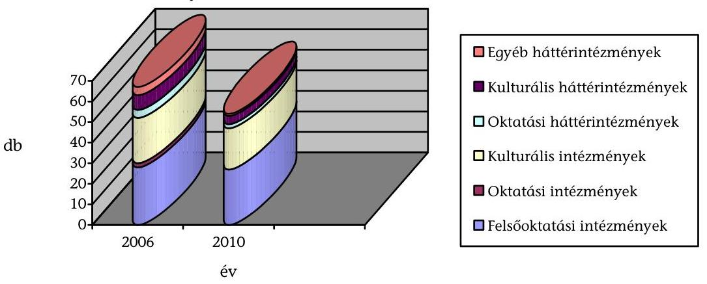

Az oktatási és kulturális miniszter az intézmények feletti felügyeleti/irányítási jogkörét szakállamtitkárok útján látta el. A továbbadott feladatokat és azok ellátásának rendjét az OKM irányítási, felügyeleti, tulajdonosi és alapítói jogok gyakorlásának rendjéről szóló szabályzatában ${ }^{39}$ határozta meg. Az új Minisztérium létrehozása során a feladatok, hatáskörök és felelősök pontos meghatározásának hiánya miatt a szakmai irányítást 2010-ben nehezítette, hogy a NEFMI 2010. május 29-i alapítása után az előírt 1 hónap helyett ${ }^{40} 3$ hónap késéssel, október 19-én adta ki az SZMSZ ${ }^{41}$-ét. A miniszter - az oktatási és kulturá-

[^0]
[^0]:    ${ }^{38}$ Átadás-átvételkor 59 volt.
    ${ }^{39}$ 14/2007. belső utasítás, 8/2007. (XII. 28.) OKM utasítás, 1/2009. (I. 30.) OKM utasítás, 2/2009. (I. 30.) OKM utasítás, 3/2010. (IV. 28.) OKM utasítás
    ${ }^{40}$ A központi államigazgatási szervekről, valamint a Kormány tagjai és az államtitkárok jogállásáról szóló 2010. évi XLIII. tv. 91. § (1)
    ${ }^{41}$ A Nemzeti Erőforrás Minisztérium Szervezeti és Működési Szabályzatáról szóló 6/2010. (X. 19.) NEFMI utasítás 4. függelék I/3-4.

---

lis ágazatok területén ${ }^{42}-28$ intézmény esetében tartotta meg magának az irányítási jogkört, ami növelte az adminisztrációt és a döntéshozatal időtartamát.

A fejezethez tartozó 27 felsőoktatási intézmény és a Közgyűjteményi Ellátó Szervezet esetében a miniszter az irányítással kapcsolatos jogköreit nem ruházta át.

Az oktatási és kulturális terület intézményrendszerének átalakítása alapvetően kormányhatározat (Átalhat.) ${ }^{43}$ alapján valósult meg. A 2006 - 2009. évekre vonatkozó számvevőszéki ellenőrzések ${ }^{44}$ feltárták az átalakítást előkészítésében azokat a hibákat, amelyek felhívták a figyelmet a végrehajtás hiányosságaira.

Pl: nem vizsgálták felül az állami feladatok körét, terjedelmét, finanszírozásuk forrásait; voltak olyan intézkedések, amelyeket a szakma egyáltalán nem támogatott; volt olyan feladat, amelynek a végrehajtására kitűzött határidő túl rövid (féléves) volt; elmaradt az intézményi modellek, a feladat- és teljesítménymutatók, kritériumok meghatározása.

Az Átalhat.-ban meghatározott feladatok végrehajtására a miniszter kialakította a megfelelő szervezeti keretet, a koordinálásra 2006. II. félévre miniszteri biztost nevezett ki, a vezetői értekezletek rendszeresen megtárgyalták az aktuális feladatokat.

Az átalakítások megkezdése előtt a Minisztérium olyan hatástanulmányokat készíttetett, amelyek megalapozták a szakmai véleményüket az átalakításokról, és a feladatokat ezekre alapozva hajtották végre.

Az Átalhat.-ban a költségvetési szervekkel kapcsolatosan előírt 26 feladata közül kettőt a miniszter javaslatai alapján töröltek. A miniszter a feladatok 75\%-át, 18 feladatot az előírtak szerint teljesítette, 3-at nem az előírt formában (könyvtárak, ÁMRK), de célszerűen, szakmailag megalapozottan hajtott végre, 3-at nem teljesített (pl. intézmények átvétele, a gesztori rendszer kialakítása). A Minisztérium a helyszíni ellenőrzés lezárásáig nem értékelte, hogy az Átalhat.-ban megjelölt szervezeti intézkedések nyomán kialakult új struktúrában a költségvetési szervek hatékonyabban és eredményesebben látják-e el a feladataikat.

A Kormány határozatával ellentétesen az OKM nem vette át a Földművelésügyi és Vidékfejlesztési Minisztériumtól az Országos Mezőgazdasági Könyvtár és Dokumentációs Központot és a Magyar Mezőgazdasági Múzeumot, mert a két Minisztérium nem tudott megegyezni a feladatellátással együtt átadandó előirányzat nagyságáról. Nem központosították az OKM fejezeten belül a létrehozott ún. gesztor intézménybe, a közgyűjteményeket gondozó költségvetési intézmények

[^0]
[^0]:    ${ }^{42}$ 2010. szeptember 30-án a NEFMI fejezethez 29 oktatási és 25 kulturális intézmény tartozott
    ${ }^{43}$ Az államháztartás hatékony működését elősegítő szervezeti átalakításokról és az azokat megalapozó intézkedésekről szóló 2118/2006. (VI. 30.) Korm. hat.
    ${ }^{44}$ Jelentés a központi költségvetés intézményrendszerének ellenőrzéséről, 2008. május (0808); Jelentés a magyar központi közigazgatás modernizációjának ellenőrzéséről, 2009. január (0901); Jelentés az állami feladat (közfeladat) ellátás szervezeti és humánerőforrás rendszerének ellenőrzéséről, 2010. szeptember (1022)

---

funkcionális feladatait (pl.: számvitel, ingatlan üzemeltetés, anyag- és eszközgazdálkodás, vagyonvédelem, jogi képviselet). Nem értékelték, hogy hatékony-e, hogy a létrehozott gesztor intézményen túl még további két szervezet is lát el funkcionális feladatokat a fejezet intézményeinél (OMSZI Nonprofit Kft. és Nemzeti Kulturális Örökség Védelmi Kht.).

Az Átalhat.-ban rögzítettek ellenére, hatástanulmányokkal alátámasztva nem olvasztották be az Országos Széchenyi Könyvtárba sem az Országos Idegennyelvű Könyvtárat, amely önálló intézmény maradt, sem az Országos Pedagógiai Könyvtár és Múzeumot, amelyet 2007. szeptember 7-ével az Oktatáskutató és Fejlesztő Intézetbe integráltak.

Nem alakították nonprofit gazdasági társasággá az Állami Műemlékhelyreállítási és Restaurálási Központot (ÁMRK), mert fő feladatául 2007. április 4-ével a nagyberuházásokhoz kapcsolódó megelőző régészeti feltárási munkák tervezését és elvégzését határozták meg, amit központi költségvetési szervként gyorsabban és gazdaságosabban lehetett megoldani. Hatástanulmányra alapozva átalakítással intézményként létrehozták a Kulturális Örökségvédelmi Szakszolgálatot.

Az Állami Számvevőszék (ÁSZ) az állami feladat (közfeladat) ellátás szervezeti és humán-erőforrás rendszerének ellenőrzéséről szóló 2010. szeptemberi jelentésében a 2009-ig végrehajtott változtatásokat úgy értékelte, hogy összességében a fejezet igazgatási és intézményi struktúrája a feladatellátás szakmai koncentrálásával, profiltisztításával szervezettebbé, átláthatóbbá vált. A Kormány a részletes feladatokat előíró Átalhat. mellékleteket 2007. december 15-től, a Korm. határozatot 2010. V. 13-tól - a Kormányváltást megelőzően - hatályon kívül helyezte ${ }^{45}$, amivel az el nem végzett feladatok végrehajtási kötelezettsége megszűnt, az átalakítás folyamata megszakadt.

Az ellenőrzött időszakban minisztériumi kezdeményezésre egyetlen intézmény-átalakítás volt. Pénzügyi szempontból a változtatás eredményes volt, mert az új intézmény 2009. évi kiadásai 11\%-kal alacsonyabbak voltak, mint a két jogelőd (Közlekedési Múzeum, Országos Műszaki Múzeum) együttesen 2008-ban, azonban a szakmai hatását a helyszíni ellenőrzés lezárásáig nem értékelték.

Előzetes hatástanulmány alapján két hasonlóan műszaki jellegű múzeumnak a Magyar Műszaki és Közlekedési Múzeumban (MMKM) való egyesítéséről döntöttek. Az MMKM-nek a helyszíni ellenőrzés lezárásakor - 23 hónappal a létrehozása után - nem volt a Minisztérium által elfogadott SZMSZ-e, ami rontotta a működés hatékonyságát és eredményességét a felelősségi körök szabályozatlansága miatt.

A NEFMI a Kulturális Örökségvédelmi Szakszolgálatot (KÖSZ)- a változtatás gyorsasága miatt a Kormány egyedi hozzájárulását igénylő módon - 2010. augusztus 1-jével a Magyar Nemzeti Múzeumba integrálta, amely döntéssel kiküszöbölte egy minisztériumi egyeztetés nélküli, a döntés alapos indoklását

[^0]
[^0]:    ${ }^{45}$ 2236/2007. (XII. 15.), 1117/2010. (V. 12.) Korm. határozatok

---

nélkülöző önálló képviselői indítvánnyal benyújtott törvénymódosítás negatív hatásait.

A törvénymódosítási javaslat a kihirdetéstől számított egy hónappal elvonni tervezte a KÖSZ régészeti feltárási jogosultságát, aminek az lett volna a következménye, hogy a KÖSZ által folytatott - nagyberuházásokat érintő - 153 régészeti feltárásnak le kellett volna állnia, és a megkötött szerződések ellehetetlenültek volna.

Az ellenőrzött időszak alatt a felsőoktatási intézmények egyesüléséről az érintettek szenátusai saját hatáskörben dönthettek, arra a miniszternek nem volt ráhatása. A felsőoktatás intézményrendszer számában és összetételében is minimálisan változott. Az állami felsőoktatásban az intézmények száma 28-ról 27-re csökkent, mert a 2006. évi 18 egyetem helyett 19, a 12 főiskola helyett pedig 10 működött 2010. szeptember 30-án.

A Nyugat-Magyarországi Egyetem és a Berzsenyi Dániel Főiskola 2008. január 1-jével új intézményben, a Nyugat-magyarországi Egyetemben egyesült. A Tessedik Sámuel Főiskola 2009. január 1-jétől beolvadt a Szent István Egyetembe. A Budapesti Műszaki Főiskola 2010. január 1-jétől megszűnt, jogutódja az új intézményként létrejött Óbudai Egyetem.

Az oktatási, kulturális és háttérintézmények száma az átalakítások, és átadások után 40-ről 27-re csökkent, amit alapvetően az oktatási- és a háttérintézmények számának csökkenése okozott. Ennek okai az intézményi összevonások, felügyeleti jogkörváltozások, más típusú szervezetté való átalakulás (intézményből gazdasági társaság) voltak.

Az OKM létrehozásakor 2 oktatási, 22 kulturális intézmény, 8 kulturális és 4 oktatási háttérintézmény, valamint 4 egyéb háttérintézmény, a jogutód NEFMI fejezetben 2010. szeptember 30-án 19 kulturális intézmény, 6 kulturális háttérintézmény, 2 oktatási háttérintézmény működött.

A Minisztérium folyamatosan aktualizálta a fejezethez tartozó intézmények alapító okiratait, amelyeket az OKM által végzett megbízhatósági ellenőrzés és az ÁSZ rendszeresen felülvizsgált és ezekre vonatkozóan javaslatokat fogalmazott meg. Egy esetben, az ÁSZ 2007. évi jelentésének ${ }^{46}$ javaslatára a Magyar Nemzeti Filmarchívum (MNFA) alapító okirata rendelkezik ugyan az MNFA gyűjtőköréről, azonban a raktározási kapacitásaihoz képest túl széleskörűen határozta meg gyűjtőkörét, ami annak a kockázatát jelenti, hogy egyes, a kulturális örökség elemei közé tartozó képi emlékek nem kerülnek megőrzésre, mert jelenleg az MNFA vezetője saját hatáskörben dönti el, mi kerüljön a gyűjteménybe.

A 2008. augusztus 11-i alapító okirat módosításával részletesen meghatározták az MNFA gyűjtőkörét, azonban a 2009. július 1-jével kivették.

Ennek jelenleg is fennálló kockázatát csökkentené a gyűjtőkör meghatározásának pontos és részletes szabályozása.

[^0]
[^0]:    ${ }^{46}$ Jelentés a kulturális közgyűjtemények kezelésére fordított pénzeszközök hasznosulásának ellenőrzéséről, 2007. február (0701)

---

# 2.2.2. Az intézményrendszer irányítása, felügyelete 

A fejezethez tartozó költségvetési szervek felett a miniszter irányítói jogot gyakorolt. A felsőoktatási intézményeknél fenntartói irányítást és a Nemzeti Kulturális Alap Igazgatóságánál (NKA Ig) felügyeleti jogkört látott el közvetlen egyedi utasítási jog nélkül, ami kevesebb beavatkozási lehetőséget biztosított.

A költségvetési szervek vezetőit általában a miniszter irányítói hatáskörben nevezte ki és mentette fel. Nem volt döntési joga a miniszternek a felsőoktatási intézményeknél, ahol a rektort az intézmény szenátusának javaslata alapján a miniszter kezdeményezésére, az egyetemek esetében a Köztársasági Elnök, a főiskoláknál a Miniszterelnök bízta meg és mentette fel ${ }^{47}$.

Az intézményi feladatok ellátásának hatékonyságát és eredményességét alapvetően befolyásoló intézményvezetők kinevezésének időtartamát - a jogszabályi kereteken belül - rendszerint 5 évben határozták meg, ami lehetővé tette az intézmények stratégiai alapú vezetését és annak számon kérhetőségét. A 2010. június 30-án hivatalban volt 30 intézményvezető kinevezéséhez a jogszabály nem minden esetben írta elő a pályáztatást, de amikor ilyen kötelező előírás volt, akkor azt lefolytatták.

Az oktatási és kulturális területen a nemzeti erőforrás miniszterének felügyelete alatt, 2010. VI. 30-án működő 30 költségvetési intézmény (a 27 felsőoktatási intézmény kivételével) vezetői közül 26 határozott idejű kinevezéssel, 3 a vezetői pályázat eredményes lezárásáig tartó ideiglenes, az NKA Igazgatóságának igazgatója pedig határozatlan ${ }^{48}$ idejű megbízással látta el a feladatát. Az ideiglenes vezetővel rendelkező három intézmény esetében
 a helyszíni ellenőrzés lezárásáig a vezetői munkakör betöltésére szolgáló pályázati eljárást nem folytatták le, vagy szabálytalanul - annak eredménytelensége után - 90 napon belül nem írtak ki újabb pályázatot.

Az MNFA vezetője 2005. november 15-étől, a MMKM vezetője 2009. július 1-jétől, az OKM Támogatáskezelő Igazgatóság (OKM TI) vezetője 2009. október 1-jétől kapott ideiglenes megbízást a főigazgatói beosztásra kiírt pályázat eredményes lezárásáig. Az eljárás szabályszerű, mert az ideiglenes vezetői megbízás hosszát és a vezetői megbízás lejártától a pályázat eredményes lezárásáig rendelkezésre álló időt jogszabály nem korlátozta.

Az MMKM és OKM TI esetében a miniszter a 2009. november-decemberben eredménytelenné nyilvánított főigazgatói pályázatok után az előírással ${ }^{49}$ ellentétesen nem írt ki 90 napon belül újabb pályázatot. Az OKM TI 2010. július 1-jétől nem tartozik a miniszter irányítási körébe, az MMKM főigazgatói pályázatát a helyszíni ellenőrzés ideje alatt, 2010. november 17-én kiírták.

[^0]
[^0]:    ${ }^{47}$ A felsőoktatásról szóló 2005. évi CXXXIX. tv. 96. § (7), 100. § a), 101. § (3) a)
    ${ }^{48}$ A Nemzeti Kulturális Alapról szóló 1993. évi XXIII. törvény végrehajtásáról szóló 9/2006. (V. 9.) NKÖM rend. 15. § (1)
    ${ }^{49}$ A közalkalmazottak jogállásáról szóló 1992. évi XXXIII. törvény végrehajtásáról a művészeti, a közművelődési és a közgyűjteményi területen foglalkoztatott közalkalmazottak jogviszonyával összefüggő egyes kérdések rendezéséréről szóló 150/1992 (XI. 20.) Korm. rend. 7. § (10)

---

Az ellenőrzött időszakban az intézményvezetői poszt betöltésére kiírt 26 pályázatnál a pályázati kiírások tartalma lehetővé tette, hogy a Bíráló Bizottság széles körből választhasson.

A pályázatokat nyilvánosságra hozták, a kiírásokban a pályázatok beadási határideje egységesen 30 nap volt, a pályázati feltételekben és az elvárt kompetenciákban általában csak a jogszabályokban meghatározott képzettségi és szakmai követelményeket írták elő.

A miniszter a vezetői kinevezésekről szóló döntéseit egy kivétellel szabályosan, az egységes elvek alapján létrehozott Bíráló Bizottság javaslata alapján hozta meg. A Bíráló Bizottság a jelöltek értékeléséhez nem dolgozott ki szempontrendszert (pl.: szakmai képességek, pályázatban felvázolt stratégia, gazdálkodásbeli jártasság, vezetői képességek, intézményi támogatottság, korábbi vezetői ciklus eredményei). Ez nem biztosította a megalapozott szakmai értékelést.

Egy esetben fordult elő, hogy a miniszter eljárási hibát vétett a pályáztatás során: az Országos Széchenyi Könyvtár intézményvezetői pályázatának értékelésekor, 2009 novemberében az Országos Könyvtári Kuratórium véleményének kikérése nélkül döntött ${ }^{50}$, emiatt az elutasított 4 pályázónak jogalapja volt ${ }^{51}$ a döntést bíróságon megtámadni, amire nem került sor. A kialakított rendszertől eltért az Operaház főigazgatói pályázata, ahol az 5 fős Bírálói Bizottságba nem hívták meg a szakterületi főosztály vezetőjét, ezzel nem vették figyelembe a szakterület álláspontját. A pályázatok 62%-ában (16 db) a korábbi vezető is beadta a jelentkezését, az ő esetükben nem kérték ki az Ellenőrzési Főosztály vezetői feladatkört érintő ellenőrzési tapasztalatait. A 24 eredményes pályázat közül - azok célszerű lebonyolítása ellenére - 11 esetben (46%) mindössze egy érvényes pályázat volt.

Az ellenőrzött időszak alatt hat intézményvezetői megbízás visszavonására került sor anélkül, hogy az intézményt megszüntették volna. Ebből egy esetben járt a döntés az intézmény működését hátráltató következménnyel, mert az Iparművészeti Múzeum főigazgatójának kétszeri szabálytalan felmentése miatt bekövetkezett átmeneti időszakok és a gyakori vezetőváltások akadályozták a szakmai munka folyamatosságát.

A miniszter a főigazgatót 2007 júniusában felmentette, majd pályázat alapján decembertől új főigazgatót nevezett ki. A Fővárosi Munkaügyi Bíróság eljárási hiba miatt (2008. április 17-ei döntésével) a korábbi főigazgatót visszahelyezte a vezetői beosztásába. A miniszter azonnal ismételten felmentette a főigazgatót, azonban döntésével a Fővárosi Munkaügyi Bíróság az okszerű indok hiánya miatt (2010. június 28-ai) újra visszahelyezte. A korábbi főigazgató által tervezett, a múzeum gyűjteményét multimédiás eszközökkel bemutató ún. Média pagoda kiállításhoz a művészeti kellékek beszerzését a pozíciójába jogerősen visszahelyezett főigazgató 2010. XI. 3-án leállította.

Az irányítás eredményességét rontotta, hogy az intézmények nem tartottak be az alapító okiratokban, körlevelekben meghatározott alapvető eljárási szabályokat (munkatervek hiánya, határidők be nem

[^0]
[^0]:    ${ }^{50}$ Az Országos Könyvtári Kuratóriumról szóló 165/1999. (XI. 19.) Korm. rend. 2. § (1) c)
    ${ }^{51}$ A Munka Törvénykönyvéről szóló 1992. évi XXII. tv. 199. § (4)

---

tartása, szolgálati út megkerülése). Nem volt az OKM-nek olyan érdekeltségi- és szankció rendszere, amely az intézményvezetők érdekeltségét és számonkérhetőségét rögzítette a feladatok előírt formában és tartalommal való teljesítésében. Így a szakmai irányítást gyakorló vezetők nem kezelték rendszerszerűen, egységesen és hatékonyan a felmerült hibákat.

A 2009. évben 4 intézmény nem készített munkatervet. A beszámolót a körlevélben előírt határidőn túl 13, elsőre az előírt tartalmi, formai követelményektől eltérően 9 jellemzően felsőoktatási intézmény nyújtotta be. Az intézményeknél a beszámolási fegyelem hiányosságára utal továbbá, hogy több intézmény a 2009. évi éves ellenőrzési jelentését a március 15-i határidőn ${ }^{52}$ túl küldte meg a Minisztériumnak, valamint a belső ellenőrzések javaslatai alapján megfogalmazott intézkedési terveknek évente csak 75%-át teljesítették.

Az OKM SZMSZ-ében rögzítettek ellenére a miniszter nem tette közzé az oktatási és kulturális szakterületre vonatkozó tárgyévi kiemelt célkitűzéseit, ezért az intézmények éves munkaterveiket fejezeti iránymutatás nélkül készítették el, ami nem tette lehetővé az összehangolt munkavégzést.

Az éves munkatervekkel kapcsolatos egységes határidőket és a felelős koordinátort nem határozták meg, ezért azok a szakmai irányítást gyakorló vezetőtől függően változtak. A felügyelt költségvetési szervek közül az OKM TI, a Közgyűjtemény Ellátó Szervezet (KESZ), az Operaház és a Pesti Magyar Színház (PMSZ) nem készített munkatervet a 2009. évre, bár az alapító okirat előírása, és a teljesítmény szempontú megközelítés alapján a feladatellátás hatékonyságának és eredményességének értékeléséhez, és a vezető számonkérhetősége miatt szükséges lett volna. A Minisztérium a munkaterveket írásban nem értékelte, azokat jóváhagyólag elfogadta, annak ellenére, hogy csak az Iparművészeti Múzeumé tartalmazta a felügyeleti szabályzat 2.3.6. a) pontjában előírt adatokat.

Az oktatási és kulturális területen nem volt a miniszteri értekezlet által elfogadott intézményműködtetési- és fejlesztési stratégia, vezetői értekezleteken ilyen feladatot nem írtak elő. A fejezethez tartozó intézmények elfogadott középtávú tervvel, stratégiával nem rendelkeztek.

A kulturális szakállamtitkárhoz tartozó intézmények a Közgyűjteményi Főosztály (KgyF) irányításával 2008-ban kidolgozták a kormányhatározatban ${ }^{53}$ rögzített 3 éves pénzügyi keretekhez illeszkedő szakmai programjukat, amely a költségvetési támogatás csökkenése és vezetői döntés elmaradása miatt nem valósult meg.

Az intézményi beszámolók értékelésének rendszerét kiépítették és működtették, azonban a szakmai munka értékelését több intézmény esetében nem, vagy nem érdemi módon végezték el a szakmai irányítást gyakorló vezetők.

Pozitív, hogy a Közgyűjteményi terület 18 intézményre kidolgozta az előírásoknak (PM körlevél) megfelelő módszert, kedvezőtlen azonban,

[^0]
[^0]:    ${ }^{52}$ A költségvetési szervek belső ellenőrzéséről szóló 193/2003. (XI. 26.) Korm. rend (Ber.) 31. § (1)
    ${ }^{53}$ A 2009-2011. évek költségvetési keretszámairól szóló 2032/2008. (III. 11.) Korm. hat.

---

hogy a jogszabály nem jelent meg és további intézkedés sem történt, a Minisztérium vezetésében bekövetkezett változtatás miatt.

A KgyF kidolgozta, a kulturális szakállamtitkár előterjesztésében és a miniszteri értekezlet 2010. áprilisában elfogadta a „A közintézet közgyűjtemény megvalósíthatósági és teljesítménytervéhez szükséges szakmai mutatók meghatározásáról szóló OKM rendelet" tervezetét, amely a kidolgozott és alkalmazott beszámoltatási rendszert normatív utasításban rögzítve kötelezővé, számonkérhetővé teszi.

A 2009. évi szöveges beszámolók értékelése az 57 intézmény mindössze 32%-ában (18 esetében) alapult az előírt és az objektív értékelést lehetővé tevő gazdaságossági, hatékonysági és eredményességi szempontokat tartalmazó kritériumrendszeren. A többi esetben elmaradt a célkijelölés vagy a célok számszerűsítése, valamint 4 intézménynél egyedi írásbeli értékelés sem készült.

A közgyűjteményi terület a hozzá tartozó 18 intézmény beszámolóját a munkatervben rögzített, számszerűsített mutatórendszer alapján egyenként értékelte. Ezzel szemben a Hagyományok Háza (HH), az Magyar Művelődési Intézet és Képzőművészeti Lektorátus, az Operaház, a PMSZ beszámolójának értékelése nem a munkatervvel való összevetésen alapult és a munka eredményességét ténylegesen nem mutatta meg; az Oktatáskutató és Fejlesztő Intézet, és Oktatási Hivatal (OH) beszámolójának értékelése pusztán azok tartalmi hiányosságaira hívta fel a figyelmet. A Balassi Intézet és a Kulturális Örökségvédelmi Hivatal beszámolójának értékelése pedig leíró jellegű. A KESZ, a Kulturális Örökségvédelmi Szakszolgálat a Nemzeti Kulturális Alap Igazgatósága (NKA Ig) és az OKM TI beszámolójáról egyedi, írásbeli értékelés nem készült.

A felsőoktatási intézmények beszámolóinak adattartalma, részletezettsége - az egységes szempontrendszer ellenére - jelentősen eltért, ezért az intézmények teljesítménye egymással nem volt összehasonlítható.

A fejezeti indoklásban - a PM 2009. évi zárszámadási köriratában foglaltak ellenére - elmaradt a szakmai működés jellemző mutatókkal történő értékelése, mert a szövegezését a Költségvetési Főosztály az intézményi szöveges beszámolók összefoglalásával készítette el. Ez az értékelés nem a Költségvetési Főosztály, hanem a szakmai irányítást gyakorló szakállamtitkárok feladata lett volna, amelyet azonban teljes körűen nem végeztek el.

# 2.3. A gazdasági társaságoknál és a közalapítványoknál az alapítói, tulajdonosi és szakmai felügyeleti jogosítványok gyakorlása 

### 2.3.1. A gazdasági társaságok, közalapítványok összetételének változása

2006. év december 31-ét követően az Oktatási Minisztérium és a Nemzeti Kulturális Örökség Minisztériumának összevonásával létrejött OKM alapítói/vagyonkezelői felügyelete alá 32 gazdasági társaság (gt.) tartozott. Az állami tulajdoni részesedés aránya 0,0021% és 100% között változott, tevékenységük oktatási, kulturális tevékenységekhez vagy ezekhez kapcsolódó fejlesztésekhez kapcsolódott. Egy társaság a 96 Beruházás-szervező és Fővállalkozó Kft.

---

végelszámolás alatt állt. A társaságok közül 5 kft.-ként, 1 zrt.-ként a többi közhasznú vagy kiemelten közhasznú szervezetként - Kht.-ként működött ${ }^{54}$.

A közfeladatok felülvizsgálatáról szóló és az államháztartás hatékony működését elősegítő kormányhatározatok ${ }^{55}$ az OKM-hez tartozó gt.-kre számos intézkedés végrehajtásáról rendelkeztek, de a szervezeti változásokat megalapozó hatástanulmányok, gazdaságossági számítások az állami feladat (közfeladat) ellátás szervezeti és humánerőforrás rendszerének ellenőrzéséről szóló jelentés szerint csak esetenként készültek. Ugyanakkor rendre elmaradtak az utólagos értékelések ${ }^{56}$.

Az államháztartás hatékony működését elősegítő szervezeti átalakításokról és azokat megalapozó intézkedésekről szóló 2118/2006. (VI. 30.) Korm. határozat alapján az Educatio. Kht. a Diákbónusz és a suliNova Kht.-k beolvadásával és feladataik átvételével az egyik legnagyobb gt. lett. Az összevonást gazdaságossági számítás nem előzte meg.

Az OKM-nél készült néhány szervezeti átalakítást megelőző szakmai, gazdasági számítás, hatásvizsgálat: a közoktatási (Oktatási Hivatal), valamint a kulturális szakterületen (Énekkar és Kottatár Kht., a Közgyűjteményi ellátó Szervezetének gesztori szervezetre történő átalakítása, a Nemzeti Filharmonikusok, és a Nemzeti Színház Rt.) készített.

A kormányhatározatok előírásai gyakran változtak, nem voltak összhangban más jogszabályokkal és ellentmondásokat is tartalmaztak, ami felesleges irányítási áttéteket teremtett, ezért az azokban foglalt feladatok végrehajtása elhúzódott, részben valósult meg vagy elmaradt.

A 2218/2006. (XII. 12.) Korm. határozat rendelkezett a Nemzeti Színház Zrt. költségvetési szervvé alakításáról 2008. január 1-jével. A feladat 2008-tól kiegészült a finanszírozás és a szervezet
 nonprofit gazdasági társasággá való átalakításával, a feladat végrehajtása elmaradt. A Magyar Nemzeti Filharmonikus Zenekar, Énekkar, Kottatár Kht. költségvetési szervvé alakítása vagy a finanszírozás átalakításával nonprofit gazdasági társasági formában való működtetése három év késéssel valósult meg. Az Oktatási Hivatalról (OH) szóló 307/2006. (XII. 23.) Korm. rendelet alapján az OH lett a felelőse az Educatio Kht. által létrehozott rendszereknek (Közoktatási Információs rendszer, Felvételi Rendszer, Diákigazolvány rendszer, Felsőoktatási Információs Rendszer stb.), amelyeket továbbra is a Kht. működtetett. A Multinova Kft. végelszámolással történő megszüntetése két évvel a kitűzött határidő után kezdődött, azt az OKM az MNV Zrt.-nek történő átadásig (2007. IX. 24.) nem kezdeményezte.

Az állami vagyonról szóló 2007. évi CVI. törvény hatályba lépésével a gt.-k a Magyar Nemzeti Vagyonkezelő Zrt. (MNV Zrt.) tulajdonosi joggyakorlása alá kerültek. A 2008. június 30-án és december 3-án az MNV Zrt.-vel kötött megállapodások alapján - a Nemzeti Vagyongazdálkodási Tanács döntése szerint - előbb 9, majd újabb 3 gazdasági társaság került vissza az OKM

[^0]
[^0]:    ${ }^{54}$ OKM 2006. évi szöveges beszámoló
    ${ }^{55}$ 2233/2007. (XII. 12.), 2236/2007. (XII. 15.), 2171/2008. (XII. 12.) Korm. határozatok
    ${ }^{56}$ Jelentés az állami feladat (közfeladat) ellátás szervezeti és humánerőforrás rendszerének ellenőrzéséről (1022) 42. oldal

---

vagyonkezelésébe. 2010-re a tulajdonosi és szakmai felügyeleti joggyakorlás alá tartozó társaságok száma 10-re (2 kft., 1 zrt., 7 nonprofit kft.) a szakmai felügyelet alá tartozó társaságok száma 16-ra (mind nonprofit kft.) változott (a 100%-os tulajdonú gt-ket ellenőriztük).

A Hagyományok Háza Ingatlanfejlesztő Kft. és a Duna Múzeum Ingatlanfejlesztő Kft. 2009. március 24-vel beolvadt a Nemzeti Filharmónia Ingatlanfejlesztési Kft.-be a Duna Parkoló Ingatlanfejlesztő Kft.-vel és az MP Projekt Kft.-vel együtt, amelyekben állami tulajdonrészesedés nem volt. A létrejött Nemzeti Filharmónia Ingatlanfejlesztési Kft.-ben az állami tulajdon 0,2%, összege 28,7 M Ft.

A 100%-os állami tulajdonú társaságok közül 2010. 05. 31.-én 1 tevékenysége a köz-és felsőoktatást Educatio Nonprofit Kft. (Educatio); 1 tevékenysége MACIVA Magyar Cirkusz és Varieté Nonprofit Kft. (MACIVA) oktatási és kulturális-, 7 tevékenysége a kulturális területet [Nemzeti Színház Zrt. (NSZ), Művészetek Palotája Kulturális Szolgáltató Kft. (MŰPA), Nemzeti Filharmonikusok, Honvéd Együttes Művészeti Nonprofit Kft. (HE), Nemzeti Táncszínház Nonprofit Kft. (NT), Hungarofest Nemzeti Rendezvényszervező Nonprofit Kft. (Hungarofest), NKÖV] érintette.

A NEFMI 2010. V. 29-ével átvette a korábbi OKM feladatait ${ }^{57}$, ezt követően az Educatio tulajdonosi joggyakorlása a Nemzeti Fejlesztési Minisztériumhoz, a Hungarofest-é a Magyar Fejlesztési Bank Zrt.-hez, szakmai felügyelete a Balassi Intézethez került ${ }^{58}$.

A vizsgált időszak alatt tulajdonosi joggyakorlásban jelentős, a szakmai felügyeletben, és a támogatási rendszerben csekély mértékű változás következett be az MNV Zrt. beiktatásával. A támogatásokat továbbra is az OKM biztosította, míg a tulajdonosi joggyakorlás az MNV Zrt.-hez került, így csökkent a szakmai felügyelet eredményessége és hatékonysága.

A változásokat gazdaságossági számításokkal nem támasztották alá, a megtakarításokat vagy többletköltségeket a Minisztérium nem mutatta ki és nem értékelte. A közép-és hosszú távú elvárásokat nem határozták meg, elmaradt a feladatellátás objektív szakmai kritérium rendszerének az egyes társaságok működési sajátosságaihoz való igazítása, ami nem tette lehetővé a feladatellátás és gazdálkodás célszerűségének, eredményességének mérését, objektív értékelését.

A Közalapítványokra vonatkozó Korm. határozatokat nem kellően átgondolt és szakmailag megalapozott, összehangolt elemzések, értékelések alapján hozták meg, és a végrehajtást sem követték nyomon. A végrehajtást vagy ennek

[^0]
[^0]:    ${ }^{57}$ A Magyar Köztársaság Minisztériumainak felsorolásáról szóló 2010. évi XLII. törvény ${ }^{58}$ Az egyes miniszterek, valamint a Miniszterelnökséget vezető államtitkár feladat- és hatásköréről szóló 212/2010. (VII. 1.) Korm. rendelet 92. § (2) jb); a Balassi Intézet létrehozásáról szóló 309/2006. (XII. 23.) Korm. rendelet módosításáról szóló 216/2010. (VII. 9.) Korm. rendelet 2. § (7), az állami vagyonnal való felelős gazdálkodás érdekében szükséges törvények módosításáról, valamint egyes törvényi rendelkezések megállapításáról szóló 2010. évi LII. tv. 1. sz. melléklete

---

elmaradásának megalapozott szakmai értékelését nem végezték el, a változásokból eredő megtakarításokat vagy többletköltségeket, a döntéshozó beavatkozások célszerűségét és eredményességét nem mutatták ki${ }^{59}$.

A közalapítványok feladatellátásának éves értékelésekor - feladat és teljesítmény mutatókon keresztül - a szervezeti megoldás célszerűségét más szervezeti formában (költségvetési szerv, nonprofit gazdasági társaság) történő feladatellátással szembeni előnyeit nem mutatták be, a feladatellátás minőségi jellemzőit nem értékelték, ezzel nem tettek eleget az államháztartásról szóló törvény és Kormányrendeletek ${ }^{60}$ előírásainak.

Elmaradt a Minisztérium - a Magyar Alkotóművészeti Közalapítvány kivételével - a közalapítványok alapítói okiratainak módosításának kezdeményezése a Kormány felé. Az egyes közalapítványok feladatellátásában átfedések voltak, ami összevonásukat, vagy más szervezeti formába történő átalakításukat indokolta volna. Az intézmény-fenntartó közalapítványoknál nem vizsgálták a tevékenység, a működés alapján a szükséges állami támogatás mértékét, a szervezeti forma célszerűségét és eredményességét.

Átfedések tapasztalhatók a közoktatási feladatokat ellátóknál (Apertus, Oktatásért Közalapítvány, Apáczai), a felsőoktatási feladatokat támogatóknál (Magyary Zoltán, Tempus, Nemzeti Kiválóságokért), a zsidó örökség ápolását és holocaust kutatást végzőknél (Holocaust Dokumentációs Központ és Emlékgyűjtemény, Magyarországi Zsidó Örökség), a filmszakmai támogatásoknál (MMK, MTFK).

A Nemzetközi Pető András Közalapítvány, a Budapesti Német Nyelvű Egyetemért Közalapítvány, Habsburg-kori Kutatások Közalapítvány a háttér intézmények működési támogatását biztosította, a kapott állami támogatás továbbadásával a fenntartott intézmény részére, ami nem felelt meg a továbbadott támogatásokra vonatkozó jogszabályi előírásoknak ${ }^{61}$.

A Kormány az 1159/2010. (VII. 30.) határozatában rendelkezett a Kormány által alapított közalapítványok és alapítványok felülvizsgálatáról. A felülvizsgálat eredményeként az 1316/2010. (XII. 27.) Kormányhatározat döntött az egyes alapítványok és közalapítványok megszüntetéséről, tevékenységük más szervezeti formában való folytatásáról.

Nonprofit gazdasági társasági lett a Ghandi és a Nemzetközi Pető András Közalapítvány. Központi költségvetési szervezet illetve egyéb közfeladatot ellátó szervezet veszi át az 1956-os Magyar Forradalom Történetének Dokumentációs és Kutatóintézete, az Apertus, a Habsburg-kori Kutatások, a Határon Túli Magyar Oktatásért Apáczai, a Magyarországi Alkotóművészeti, a Magyari Zoltán Felsőokta-

[^0]
[^0]:    ${ }^{59}$ Jelentés az állami feladat (közfeladat) ellátás szervezeti és humánerőforrás rendszerének ellenőrzéséről (1022) 17. oldal
    ${ }^{60}$ Áht. 100/K. § (1) j); Ámr. régi 149/A. § (1), 2009. január 1-jétől 61. § (4); Ámr. új 222. § (7)
    ${ }^{61}$ Az államháztartásról szóló 1992. évi XXXVIII. törvény és egyes kapcsolódó törvények módosításáról szóló 2006. évi LXV. törvény 1. § (2) c)

---

tási, a Nemzeti Kiválóságokért, az Oktatásért, a Magyar Történelmi Film Közalapítványok feladatait. A MMK alapítói értekezletének az ágazati érdekekre, a vagyon megtartására való tekintettel kell dönteni a működés további feltételeiről.

# 2.3.2. A tulajdonosi és alapítói joggyakorlás rendszere 

A társaságok és a közalapítványok tulajdonosi, alapítói jogosítványainak gyakorlását OKM utasításokban ${ }^{62}$ rendezték, de a feladatmegosztás túlságosan tagolt, esetenként ellentmondásos, ezért végrehajtása nehézkes, időben elhúzódó. A felelősségi körök nem egyértelműek, ami csökkentette a tulajdonosi joggyakorlás eredményességét. Hiányosság, hogy a feladatok meghatározásában is változó utasítások nem rögzítették részletesen és pontosan a szakmai felügyeleti jogkör tartalmát, amelyet a hatályos SZMSZ-ek, a szakterületek ügyrendjei illetve a munkaköri leírások sem rögzítettek.

Nem határozták meg a szakmai felügyeletet gyakorló vezetők számára az ellátandó konkrét feladatokat, amelynek hiányában a feladatellátás nem értékelhető, nem kérhető számon, ezáltal nőtt a gt.-k hatékony működésének, feladatellátásának kockázata. Az utasításokban a szakmai irányítás gyakorlásának feladatait 2007-2010. években ellentmondásosan szabályozták.

A társaság által ellátott szakmai tevékenység irányítása, szervezése szabályozása a döntés előkészítője és a jogosítvány gyakorlója a szakmai felügyeletet gyakorló vezető. A vezető tisztségviselő szakmai irányítása, utasítása a fejlesztési és gazdasági szakállamtitkár döntés előkészítési és joggyakorlási kompetenciájába tartozott. A 3/2010.(IV.28) OKM utasításban ez utóbbi átkerült a szakmai felügyeletet gyakorló vezető hatáskörébe.

A tulajdonosi joggyakorlás első számú felelőse a fejlesztési és gazdasági szakállamtitkár volt, aki feladatát a Költségvetési Főosztály, ezen belül pedig az Intézmény Felügyeleti Osztály (IFO) közreműködésével látta el. A szakmai felügyeletet gyakorló vezető két kivétellel, ahol első helyi felelősként szerepelt, döntően véleményezői feladatokat látott el. Az utasítások 33 pontban rögzítették a tulajdonosi és szakmai felügyeleti jogosítványokat, a tulajdonosi jogok gyakorlásánál a döntés előkészítéséért felelősöket, közreműködőket és a jogosítvány gyakorlóit. Az IFO-t osztályvezető irányította, létszáma 2009. 12. 31-én 8 fő volt, ami 2010-ben 4 főre csökkent.

A tulajdonosi jogkör gyakorlása a gt.-k alapításával, átalakításával, megszüntetésével; a munkáltatói jogok gyakorlásával; a tervezéssel és beszámoltatással; a működéssel kapcsolatosak és a jogszabályokban, alapító okiratban meghatározott kiemelt jelentőségű kérdésekre terjedtek ki. Gyakorlásukra vonatkozó jogosultságokat az OKM és az MNV Zrt. között létrejött megállapodások ${ }^{63}$ rögzítették. A Minisztérium a szerződésben foglaltakat részben teljesítette, mert a működésre vonatkozó középtávú üzleti tervek nem készültek, az adatszolgáltatási kötelezettséget 2008 és 2009-ben teljesítette, 2010-ben már nem. Minisztériumi nyilvántartás hiányában és az ellenőrzés számára bemutatott dokumen-

[^0]
[^0]:    ${ }^{62}$ 3/2010(IV.28.).; 2/2009.(I.30); 1/2009.(I.30.); 8/2007(XII.28.). OKM utasítás és 14/2007. OKM belső utasítás
    ${ }^{63}$ SZT 28517/17243/2008. és SZT 30340/30019-3/2008.

---

tumok alapján nem volt egyértelműen megállapítható, hogy betartották-e az MNV Zrt.-nek az FB tagokra vonatkozó delegálási jogát.

A gt.-k a 2007-2009. évekre 3 éves pénzügyi tervvel rendelkeztek, azonban a tulajdonos váltás, a költségvetési zárolások, elvonások következtében nem hasznosultak. A Minisztérium álláspontja szerint "Habár erről külön nyilvántartást a minisztérium nem vezetett, a társasági részesedés hasznosításának átengedéséről szóló megállapodás 4.7. pontjának a minisztérium minden esetben eleget tett. Valamennyi a felügyelő bizottsági tagok megválasztására vonatkozó ügyiratban fellelhető az MNV Zrt. javaslata és megállapítható az MNV Zrt. által delegált tag személye."

Alapító okiratokban határozták meg a gt.-k által ellátandó tevékenységeket, a szervezet létrehozásának és működtetésének céljait, a közhasznú szervezeteknél az ellátandó közfeladatot, azonban két esetben nem rögzítették a ténylegesen végzett tevékenységnek megfelelően a főtevékenységet és a működéstől idegen tevékenységeket is tartalmaztak.

Az alapító okirat szerinti főtevékenység a MŰPA-nál és az NSZ-nél művészeti létesítmények működtetése. A MŰPA-nál az ellátandó közfeladatot határozták meg, és az NSZ és a MACIVA alapító okirata is csak részben rögzíti. A MŰPA tevékenységei között szerepel számviteli, könyvvizsgálói, adószakértői tevékenység, piac-és közvélemény-kutatás, munkaerő közvetítés, építészmérnöki tevékenység. A Hungarofest, NSZ és a MŰPA esetében is szerepel üzletviteli és egyéb vezetési tanácsadási tevékenység.

Az egyes feladatok ellátására kialakított szervezetek gazdálkodási formájának megválasztása a tevékenységükhöz igazodóan nem egységes gyakorlat szerint történt.

A kiemelt kulturális feladatot ellátó előadó művészeti tevékenységet végző szervezetek közül az Operaház és a PMSZ költségvetési szervezetként, a Nemzeti Színház (NSZ) Zrt.-ként, a MŰPA kft.-ként (profit orientált gazdálkodó szervezetek), Nemzeti Filharmonikusok, a HE, és a NT nonprofit kft.-ként (nyereségszerzésre nem irányuló gazdasági társaság ${ }^{64}$ ) működött. Az NKÖV közgyűjtemények és múzeumok fegyveres biztonsági őrzését látta el gazdasági társasági formában. A
 KESZ költségvetési szervként látja el a Minisztérium irányítása alá tartozó közgyűjtemények ingatlan és egyéb eszközei, üzemeltetési, beszerzési, ellátási, pénzügyi és gazdasági tevékenysége szolgáltatási feladatait.

Az egyes gt.-k által ellátott feladatok alapján nem volt egységes gyakorlata a szervezetek közhasznúvá vagy kiemelten közhasznúvá nyilvánításának. A Nemzeti Filharmonikusok, a HE és a NT kiemelten közhasznú szervezetként működtek, az NSZ nem. Kiemelten közhasznú szervezetnek minősítették a Hungarofestet, amely rendezvényszervezési feladatokat látott el alapvetően, mint a MŰPA. A ténylegesen végzett főtevékenység alapján, - az ellenőrzés álláspontja szerint - a Hungarofest nem felelt meg a kiemelten közhasznú, az NKÖV pedig a közhasznú szervezetekre vonatkozó előírások-

[^0]
[^0]:    ${ }^{64}$ A gazdasági társaságokról szóló 2006. évi IV. tv. 4. §

---

nak ${ }^{65}$ a ténylegesen folytatott tevékenységük alapján. Módosítást a Nemzeti Színház (NSZ) kiemelten közhasznú nonprofit gazdasági társasággá nyilvánítása kivételével az OKM nem vizsgált.

A NKÖV-nél a fő tevékenység a múzeumi tevékenység, közhasznú tevékenységei: nevelés és oktatás, képességfejlesztés, ismeretterjesztés; kulturális örökség megóvása; műemlékvédelem. A Hungarofest-nél közhasznú tevékenységként kulturális tevékenység került megjelölésre - a közhasznú szervezetekről szóló 1997. évi CLVI. tv. (Ksztv.) 26. § c) - és az előadó-művészetet kiegészítő tevékenység, mint közhasznú fő tevékenység.

Az alapító okiratok, és a tulajdonosi joggyakorlást szabályozó OKM utasítások szerint a Minisztérium hatáskörébe tartozott a gt.-knél az SZMSZ, beszerzési szabályzat, a FB-k ügyrendjének, a vezető tisztségviselők, FB tagok, és vezető állású munkavállalók javadalmazásáról szóló szabályzatok jóváhagyása. A Minisztérium feladata volt a társaságok működésének, az ellátott tevékenység törvényességének biztosítása és a hatékonyság folyamatos figyelemmel kísérése ${ }^{66}$.

A 2009 és 2010. évében az IFO által kidolgozott minta alapján a felügyelőbizottságok és az ügyvezető véleményének ismeretében elfogadásra kerültek a vezető tisztségviselőkre vonatkozó javadalmazási szabályzatok. A HE, NKÖV, MÜPA és Hungarofest kivételével sor került a társaságok és FB-ik javaslatai alapján az SZMSZ-ek elfogadására. A tulajdonosi jogok gyakorlójának hatáskörébe tartozott és a fejlesztési és gazdasági szakállamtitkár döntés előkészítési és jogosítvány gyakorlási jogköre volt a társaságok beszerzési és befektetési szabályzatainak jóváhagyása. Az alapító okiratok a szabályzatok benyújtását a társaság ügyvezetője feladataként és felelősségeként határozták meg. 2008-tól ilyen szabályzatok elfogadására alapítói határozattal nem került sor.

# A tulajdonosi joggyakorlás alá tartozó társaságoknál a teljes körű és aktualizált belső szabályozás hiánya növelte a tevékenység törvényes működésének kockázatát. A Minisztériumi utasítások nem tértek ki 

az elfogadott hatályos szabályzatok nyilvántartásának módjára, nyomon követésére. Az alkalmazott gyakorlat szerint társaságonként iratgyűjtőben tárolták.

A Minisztérium alapítói határozatokkal biztosította az FB-k személyi összetételének változásait, a jogszabályban előírt könyvvizsgálat elvégzéséhez a könyvvizsgáló kijelölését. Az FB tagok kiválasztása, megbízása egyedi vezetői döntésekkel valósult meg, erre jogszabályi előírás hiányában kritérium rendszer nem került kialakításra. A Minisztérium alkalmazottai 3 gazdasági társaságnál voltak FB tagok.

[^0]
[^0]:    ${ }^{65}$ Közhasznúszervezet alapító okiratának tartalmaznia kell, hogy milyen a közhasznú szervezetekről szóló törvényben meghatározott közhasznú tevékenységet végez, a kiemelten közhasznú tevékenység esetében pedig milyen közfeladatot lát el, amelyről törvény vagy jogszabály rendelkezik Ksztv. 4., 5. §-ok
    ${ }^{66}$ 3/2010(IV.28.).; 2/2009.(I.30); 1/2009.(I.30.); 8/2007 (XII.28.). OKM utasítások 3.1. Függelék

---

Educatio-nál FB elnök a Minisztérium Ellenőrzési Főosztály főosztályvezetője; Hungarofest-nél Közigazgatási és Koordinációs Főosztály főosztályvezetője, a MACIVA-nál a Közművelődési Főosztály főosztályvezetője volt, amelyeket alapítói határozatokkal jóváhagytak.

Az alapító okiratok szerint az FB ügyrendjét maga határozta meg, de azt a tulajdonosi jogok gyakorlójának jóváhagyásra kellett beterjeszteni. A társaságok tulajdonosi joggyakorlásának 2008-tól történő átvételét követően erre vonatkozó alapítói határozat az Educatio-nál, NSZ-nél, NKÖV-nél született.

A Minisztérium alapítói határozatokban biztosította a vezető tisztségviselők megválasztását, visszahívását, juttatásainak prémiumfeltételeit, mértékét és kifizetését, erre azonban az NSZ kivételével kritérium rendszert nem alakítottak ki. A többletjuttatások mértékét a megkötött munkaszerződések rögzítették, amelyek bekerültek a javadalmazási szabályzatba. A prémium feltételek többnyire a gt.-k alapítói okiratában foglalt feladatainak végrehajtásáról rendelkeztek és könnyen teljesíthetőek voltak, nem kötődtek konkrét többletfeladathoz, minőségi követelményekhez.

2007-ben a prémiumfeltételeket a Minisztérium határozta meg, a kifizetésről az MNV Zrt. döntött. 2008. évre a prémium feltételeket az MNV Zrt. határozta meg, a kifizetésről a Minisztérium döntött. 2009-re a Minisztérium nem határozott meg prémium feltételeket tekintettel a Kormány erre vonatkozó kérésére. 2010-re a prémiumfeltételeket a HE és az Educatio kivételével a többi társaságnál meghatározták. A Hungarofestnél 60%-os és a MÜPA-nál 50%-os prémiumelőleget fizettek ki alapítói határozat alapján.

Az éves prémium mértéke az éves alapbér (társaságonként változó 650000-950000 Ft közötti) 60-80%-a volt (MÜPA, NSZ, 80%, NKÖV, MACIVA, Hungarofest, MNFÉK 60%). 2010. évre a prémiumfeltételek a MÜPA 2010. évi programjai és rendezvényei műsorrendjének kialakítása, a rendeltetési cél szerinti tevékenységének folyamatos szervezése, bonyolítása, a megváltozott gazdasági körülmények negatív hatásainak legjobb kiküszöbölésével. Az NSZ előadásai 80%-os látogatottságának teljesítése (2009-ben 93,7% volt), az NSZ és a Tavaszi Fesztivál által közösen megtartandó Nemzetközi Színházi Fesztivál lebonyolítása az év folyamán, legalább 2 új magyar dráma bemutatása. A Hungarofest-nél a Bologna Konferencia sikeres lebonyolítása, az elszámolás maradéktalan és sikeres lezárása, a 2010. évi üzleti tervben nem szereplő, előre nem tervezett kulturális programok lebonyolítása.

# A 2010. évi prémium feltételek meghatározásánál nem tartották be a köztulajdonban álló gt.-k takarékosabb működéséről szóló 2009. évi CXXII. törvény 5. § (2) előírásait. 

Teljesítménykövetelményként az üzleti terv fő számainak teljesítése mellett csak olyan feltétel határozható meg, amelynek teljesítése a munkakör elvárható szakértelemmel és gondossággal való ellátásán túlmutató, objektíven meghatározható teljesítményt takar.

Az ellenőrzött időszakban a vezető tisztségviselők, vezető állású munkavállalók személyi felelősségének megállapítására, illetve velük szemben kártérítési igény megfogalmazására nem került sor.

---

Az SZMSZ az ágazati irányítás eszközeiként jelölte meg a szakmai iránymutatások, ajánlások kiadását, hosszú és középtávú szakmai fejlesztési koncepciók, tervek, szabályozó és ösztönző rendszerek kidolgozását és közzétételét, a tervezés és a gazdálkodás összehangolását, azonban ilyen dokumentumok nem kerültek kidolgozásra.

# A Minisztérium nem alakított ki a társaságok szakmai tevékenysége teljesítményének mérésére alkalmas kritériumrendszert és mutató-

kat. Nem számoltak fajlagos mutatókat, ami a feladatellátás szakmai megalapozására, értékelésére lehetőséget biztosított volna.

Az előadó-művészeti szervezetek működésével kapcsolatos hatósági eljárások részletes szabályairól, továbbá a zenekarok és énekkarok tevékenységéhez szükséges tárgyi feltételekről, valamint a fizető nézőszám alsó határáról szóló 7/2009. (III. 4.) OKM rendeletben szereplő szakmai mutatók erre megfelelő alapot jelentettek volna. Részben ezek a mutatók a minisztériumi statisztikai adatgyűjtés keretében rendelkezésre is álltak.

A szakterületek az éves üzleti tervekhez szakmai elvárásokat nem fogalmaztak meg, azt a társaságra bízták. A gyakorlatban a gt.-knél az ágazati szakmai felügyelet, irányítás a benyújtott dokumentumok véleményezésére terjedt ki. Az üzleti tervekre, éves beszámolókra, a vezető tisztségviselő prémium feladatainak teljesítésére készített szakmai vélemények nem tartalmaztak elemzéseket, általánosak, rövidek voltak. Az elfogadására vonatkozó javaslatot tartalmazták, szakmai értékelést, indoklást nem. A Minisztérium szakmai irányítását, felügyeleti tevékenységét a követő és nem a kezdeményező magatartás jellemezte. Feladatait formailag ellátta, de tartalmilag a gt.-k feladatellátása minőségének, irányításának, működésének, beszámoltatásának eredményes és hatékony szakmai rendszerét nem alakította ki.

A Minisztérium alapítói joggyakorlása alá tartozó közalapítványokat - tartós közérdekű célra - állami közfeladat ellátására a Kormány alapította. A közalapítvány a vagyonával önállóan gazdálkodott. A jogszabályok a közalapítványok gazdálkodására vonatkozóan könyvvizsgálati kötelezettséget és a kezelő szervezettől elkülönült ellenőrző szervezet működtetését írták elő, amit az alapító okiratok is rögzítettek. A közalapítványok alapítói joggyakorlása sokkal szűkebb eszközrendszert biztosított, mint a gt.-k esetében.

A jogkörök a közalapítványok megszüntetésével, az alapító okirat módosításával (miniszter javaslatára a kormány), illetve - amennyiben azt az alapító okirat tartalmazza - az alapítványok SZMSZ-ének jóváhagyásával, valamint az alapítvány, közalapítvány kezelő szervének éves beszámoltatásával kapcsolatos teendőkre terjednek ki (miniszter).

A kezelő szervezet tagjainak kiválasztásához, a személyi javaslatok megtételéhez nem alakítottak ki egységes szempontrendszert, ezeket egyedi felső vezetői döntéssel hozták meg.

A közalapítványok hatályos alapító okirattal rendelkeztek, amelyek tartalmazták a működés legfontosabb feltételeit. Nem rendelkeztek az FB-k éves beszámolási kötelezettségének értékeléséről, hasznosításáról.

---

# 2.3.3. A támogatási, beszámoltatási és ellenőrzési rendszer működése 

A támogatások jóváhagyása a fejezeti kezelésű előirányzatok gazdálkodási, kötelezettségvállalási és utalványozási szabályzatai szerint a szakmai főosztályok javaslata alapján egyedi döntéssel történt, ami stratégiai célok és kritériumok hiányában kockázatnövelő tényező. A támogatás mértékét bázisalapon, és az egyes szervezetek érdekérvényesítési képessége alapján határozták meg. További kockázatot jelentettek az elvonások és zárolások. A támogatások felhasználására vonatkozó beszámolókat a közalapítványok jellemzően késve teljesítették és szükség volt hiánypótlásra, kiegészítésre is. A felhasználás és beszámolás helyszíni ellenőrzése nem mindig valósult meg a szabályozás szerint (pl. MTFK, MMK), csak jóval a beszámolási határidőn túl. A megkötött támogatási szerződések és alapító okiratok nem megfelelő összhangja, a támogató és a beszámoltatást végző szervezet, a beszámoltatás és a támogatás felhasználása ellenőrzésének külön választása magas kockázatot jelent az állami támogatások célszerű és eredményes felhasználása, és az eredményes feladatellátása tekintetében.

A tulajdonosi joggyakorlásban bekövetkezett változások, a tervezési koncepciók különbözősége és a szervezetek (OKM, MNV Zrt.) közötti kommunikációs nehézségek csökkentették a tulajdonosi joggyakorlás hatékonyságát, amelyet tovább csökkentett, hogy a működési támogatást 2006-2010. években a Minisztérium biztosította.

A 2007. évre az üzleti tervek elfogadása a Minisztérium, míg az éves beszámolók és közhasznúsági jelentések elfogadása az MNV Zrt. hatásköre volt. A 2008. évre az üzleti tervet az MNV. Zrt., a beszámolókat és a közhasznúsági jelentéseket a Minisztérium fogadta el.

A Minisztérium nem alakított ki a társaságok tevékenysége teljesítményének mérésére alkalmas szakmai mutatórendszert, nem határozott meg szakmai és pénzügyi teljesítmény követelményt.

A mutatókat a szakmai programnak, feladatellátásnak megfelelően a társaságoknak kellett meghatározni és bemutatni. Szakmai mutatóknak az előadásszámra, látogatók számára, jegy árbevételre, kapacitáskihasználtságra és egyéb a tevékenységre jellemző naturáliákra kellett volna vonatkozniuk. A pénzügyi teljesítmény megítélésére a likviditási rátát, a tőkeellátottság, eladósodottság arányát, idegen tőke/saját tőke arányát, működő tőkeellátottságot illetve a társaságok tevékenységére jellemző mutatókat jelölték meg.

A gt.-k üzleti terveiket változó tartalommal, a várható állami támogatáshoz igazodóan, a megvalósíthatóság és a teljesíthetőség függvényében határozták meg, és nem jelentettek ösztönzést, valós teljesítménymérési lehetőséget. Az IFO a 2010. évtől a társaságok által benyújtott pénzügyi üzleti terveket azonos módon, de kritériumok nélkül értékelte. Az üzleti tervek szakmai értékelései általánosak, formálisak voltak, és azok elfogadására tettek javaslatot. Fő szempontként a változó - reálértéken csökkenő - támogatás mellett a működőképesség fenntartását irányozták elő.

A 2009. és 2010. évekre az üzleti terveket FB-k javaslata, valamint a szakterületek támogató véleménye (Educatio kivételével) alapján fogadták el (március,

---

április hónapokban), ami a támogatási szerződések megkötésénél és az első részlet folyósításánál is időbeni kitolódást eredményezett. Az Educatio esetében a 2009. évi üzleti tervet a szakterület javaslatának figyelembe vétele nélkül fogadták el.

Az Educatio 2009. évi benyújtott üzleti tervét a felsőoktatási és tudományos szakállamtitkár
 feljegyzése alapján a szakterület sem szakmailag, sem pénzügyileg nem tartotta megfelelőnek, mivel nem állapítható meg, hogy a feladatok ellátását milyen munka-, illetve forrásmegosztásban végzi a társaság és az OH. A közoktatási szakállamtitkár kifogásolta többek között, hogy nem állapítható meg pontosan az üzleti terv alapján, hogy mely feladatot, milyen határidőre, milyen forrásszükséglettel kíván megvalósítani az Educatio, valamint hogy továbbra sem különülnek el a közoktatás és a felsőoktatás feladatai és a szükséges források. Az Educatio FB-je az üzleti tervet támogatta, kérte a társaság és az OH feladatarányos finanszírozásának megállapítását. Az OKM az üzleti tervet a feladat- és forrásmegosztás nélkül alapítói határozattal elfogadta.

A legnagyobb bevételi forrást az eltérő mértékű állami működési és egyéb támogatás jelentette, csekély mértékben fizetőnézői jegy-, elhanyagolható mértékben vállalkozási-, és kis összegű szponzorációs bevételekre tettek szert. Aránya az összes bevételből 39-96% között változott, átlagosan meghaladta a 70%-ot.

A gt-k összes bevételének és támogatásának változása a 2006-2009 években
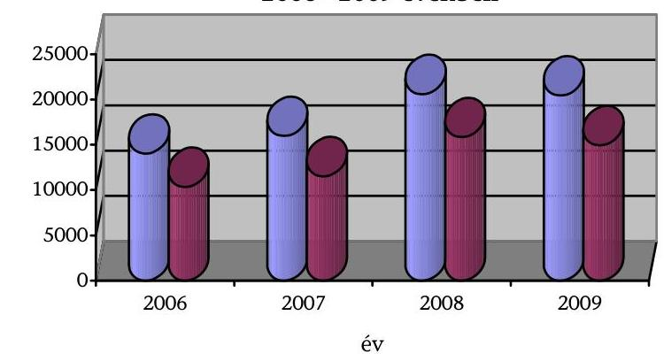

A gt-k bevételi, kiadási és mérleg adatait részletesen az 6., 7., és 8. mellékletek, a közalapítványok vagyonának változását és a 2006-2009. években kapott támogatásokat a 9. számú melléklet tartalmazzák.

A többcsatornás finanszírozás korlátozta a számonkérés és elszámoltatás, a működés és a gazdálkodás átláthatóságát, a teljesítmények mérését, értékelését. A szakmai feladatellátás, gazdálkodás mennyiségi és minőségi értékelése általános és formális volt.

Az Educatio Nonprofit Kft. a fejezeti kezelésű előirányzatokból kapott működési támogatás mellett az OH-tól és Európai Uniós támogatásból is forráshoz jutott a feladatellátáshoz. Az Oktatási Hivatal a felsőoktatási felvételi eljárással kapcsolatos feladatokra - szerepel a Közhasznú szerződésben a közfeladatai között - 504,1 M Ft-ot fizetett ki 2009-ben. A beszámolók és elszámolások alapján nem állapítható meg, hogy az Educatio egyes közfeladatai milyen összegű támogatási ráfordítással valósultak meg. Az Educatio-nál a 2009. évi támogatás felhasználásának helyszíni ellenőrzésénél számos szabálytalanságot állapított meg a jegyzőkönyv. Ennek alapján 33,5 M Ft szabálytalanul elszámolt költséget és 116,1 M Ft bírságot, saját teljesítményt, beruházást kifogásolt meg. A jegyzőkönyv $^{67}$ alapján visszafizetésre javasolt jogosulatlanul elszámolt támogatás összege 149,6 M Ft volt.

A Honvéd Együttes Kft. elszámolása olyan tételeket is tartalmazott, amelyek a támogatási szerződés szerint nem számolhatók el. Egyes tételeket bruttó módon a HM által támogatott műsorok kiadásainak egy részét is - az OKM szerződésre, működési célra pedig felhalmozási célú kiadásokat és használatba vételkor egyösszegű értékcsökkenést számolt el.

A Hungarofest a fejezeti kezelésű előirányzatokból kapott működési támogatáson túl a Nemzeti Kulturális Alaptól is több csatornán (kollégiumi és miniszteri keret) jutott támogatáshoz.

A többcsatornás finanszírozási modellt még nehezebben átláthatóbbá tette, hogy a Minisztérium egyes társaságok esetében költségeket vállalt át, amit nem terhelt a társaságokra. Ez az eljárás a MÚPA, a Nemzeti Filharmonikusok és NT esetében növelte a támogatottsági szintet, és torzította a gazdálkodás eredményességének értékelhetőségét, nem felelt meg az államháztartás működési rendjéről szóló 217/1998. (XII. 30.) Korm. rendelet (Ámr. régi) 61. § (4) bek. előírásainak.

A MÚPA bérleti díját és a közmű költségeket a Minisztérium fizette az igazgatási cím előirányzatából (2006-ban PPP rendelkezésre állási díj 1,5 Mrd Ft, egyéb szolgáltatási költségek 0,5 Mrd Ft; 2007-ben 7,6 Mrd Ft, 0,4 Mrd Ft; 2008-ban 7,4 Mrd Ft, 0,3 Mrd Ft; 2009-ben 8,8 Mrd Ft, 0,5 Mrd Ft). A MÚPA működési rendje szerint a Minisztérium által a MÚPA-ban biztosított helyiségek használatára vonatkozó kvóta a Nemzeti Filharmonikusok számára 25 nap a Hangverseny teremben, az NT-nek 100 nap a Fesztivál Színházban. A MÚPA a helyszínen kívül az alap műszaki szolgáltatásokat is térítésmentesen biztosítja éves szinten 350 M Ft költséggel. Az NSZ fizeti a működési támogatásából a Nemzet Színésze Díj után járó juttatásokat, ez 2009-ben 147,7 M Ft volt.

A tevékenység jellegéből adódóan (rendezvényszervezői, közvetítői szerep) az igénybe vett szolgáltatások értéke az összes ráfordításból 43,9-71,9% között mozgott. A gt-k üzemi szinten és mérleg szerinti eredmény tekintetében vagy veszteségesek voltak, vagy bevétel arányosan csekély nyereséget értek el. Általános tendencia volt - és ellentmondást hordoz -, hogy a profitorientált gt-k rosszabbul teljesítettek, mint a nonprofitok.

[^0]
[^0]:    $^{67}$ OK-724-4/2010.

---

A gt-k mérleg szerinti eredményeinek változásai a 2006-2009. években
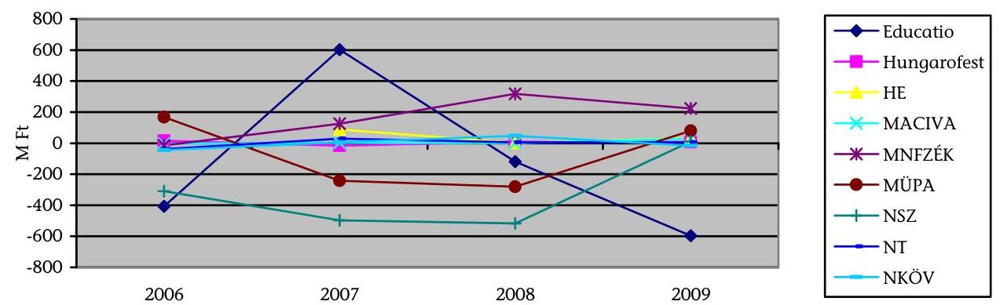

Az éves értékelések nem tértek ki arra, hogy a veszteséges gazdálkodás megszüntetésére a tulajdonosi jogok gyakorlója milyen intézkedéseket tervez, vagy milyen intézkedéseket vár el a gt-ktől. A veszteségek megszüntetésére intézkedési terv kidolgozását nem írták elő, a tartósan veszteségeseknél (MÜPA, NSZ, Educatio) a saját tőkét csökkentették.

A közhasznú vagy kiemelten közhasznú gt-k működési támogatását egységes szerkezetben és tartalommal éves támogatási szerződésekben rögzítették, amelyek nem tartalmaztak a támogató által előírt, a szakmai feladatellátáshoz, a gazdálkodáshoz kapcsolódó mennyiségi és minőségi kritériumokat. Negyedévente meghatározott formában évközi tájékoztatót kértek, azonban ezek alapján döntéshozó beavatkozásra nem került sor.

Az IFO a támogatásokról benyújtott elszámolásokat véleményezésre megküldte a szakterületeknek, akik minden esetben elfogadó véleményt adtak. A végleges elfogadás előtt helyszíni ellenőrzés keretében vizsgálták a támogatások felhasználását. A 2008-ban kapott támogatásokra 2009-ben lefolytatott helyszíni ellenőrzések hiányosságokat állapítottak meg az NKÖV, a Hungarofest, az Educatio esetében. A módosított elszámolásokat elfogadták, visszafizetési kötelezettséget a Minisztérium nem írt elő.

Az NKÖV-nél szabálytalan közbeszerzési eljárások és jutalom kifizetése (ügyvezető is) miatt a helyszíni ellenőrzési jegyzőkönyv javasolta a benyújtott elszámolás felülvizsgálatát $^{68}$. Az alapítói határozat nélkül kifizetett jutalmat az ügyvezető visszafizette, és intézkedési tervet készített a hiányosságok megszüntetésére.

A Hungarofestnél a támogatások 2008. évi felhasználásának helyszíni ellenőrzése megállapította, hogy az elszámolás nem a szerződésben meghatározott céloknak és az üzleti terv elfogadásáról szóló alapítói határozatnak megfelelően történt $^{69}$. A fejlesztési szakállamtitkár a társaság ügyvezetőjének indoklására valamint a szakállamtitkári egyeztetésre hivatkozással a módosított szakmai és pénzügyi elszámolást, egyéb kikötés vagy alapítói intézkedés nélkül elfogadta.

[^0]
[^0]:    $^{68}$ 3699-1/2009.
    $^{69}$ 4168-3/2009.

---

Az Educatio-nál a támogatás felhasználásáról készített helyszíni ellenőrzési jegyzőkönyv megállapította, hogy az ügyvezető megbízási szerződését a bérköltségek között számolta el. Az ellenőrzés a 2008. évi támogatások elszámolását elfogadásra javasolta, amit a fejlesztési és gazdasági szakállamtitkár elfogadott.

A 2009-re nyújtott támogatások felhasználására irányuló 2010-ben lefolytatott helyszíni ellenőrzései alapján 6 gt-nél összesen 277,6 M Ft támogatás jogtalan elszámolását állapították meg, amelyet visszafizettettek.

Pozitívan értékelhető a helyszíni ellenőrzések 2009-től, de főleg 2010-től bekövetkezett javulása, szigorodása. A működési támogatások helyszíni ellenőrzései alapján a gt-k az elszámolásokat számos hibával nyújtották be. Felhívták a figyelmet a hatékony és eredményes gazdálkodás területén is megmutatkozó hiányosságra, illetve az ellenőrzési rendszer korábbi működési elégtelenségeire. A visszafizetéseken túl az egyéb hiányosságok megszüntetésére döntéshozó beavatkozás 2010. XI. 30-ig nem történt.

Az ellenőrzések a gazdálkodás hatékonyságára vonatkozóan is több kritikát fogalmaztak meg. Az NKÖV-nél laptop biztosítása az asztali számítógépek mellett az igazgatóság minden munkatársának, a mobiltelefon használat, kábeltévé előfizetések, ruhapénz. A Hungarofestnél kifogásolta a tanácsadói, szakértői, üzletviteli tanácsadói, médiafigyelési és ügyvédi szerződések szükségességét, és hogy a teljesítési igazolások nem alkalmasak a valódi teljesítés mikéntje megállapítására.

A jogszabályi és az alapítói okiratok előírásainak megfelelően a gt-k éves beszámolóit, a közhasznú vagy kiemelten közhasznúak közhasznúsági jelentéseit könyvvizsgáló auditálta, az FB véleményezte, és a Minisztérium alapítói határozatban döntött az elfogadásáról.

A független könyvvizsgálói jelentések a Nemzeti Filharmonikusok 2008. évi jelentését elfogadó korlátozó záradékkal látták el, 2009-re elfogadó véleményt adott korlátozás nélküli figyelemfelhívással. Az Educatio-nál 2008-ban és 2009-ben is a könyvvizsgáló elfogadó záradékot adott ki, de figyelemfelhívással élt. A Hungarofest-nél a könyvvizsgáló 2008. évi jelentésében a közbeszerzési eljárások lefolytatása és ennek dokumentálása hiányosságait vetette fel, de mindkét évre korlátozás nélküli elfogadó záradékot adott ki. A többi társaság (MÜPA, NSZ, HE, NKÖV) könyvvizsgálói a 2008. és a 2009. évekre is elfogadó záradékkal látták el az éves beszámolókat és ahol volt, a közhasznúsági jelentéseket.

Az FB-k 2008. és 2009. évekre a beszámolók elfogadását javasolták, a tapasztalt hiányosságok ellenére a szakmai tevékenység működésére, gazdálkodásra, az eredményesség javítására vonatkozó észrevételt, javaslatot nem fogalmaztak meg.

A társaságok éves beszámolóit az IFO pénzügyi, gazdasági, a szakmai főosztályok a szakmai feladatellátás szempontjából értékelték, és tettek javaslatot az éves beszámolók elfogadására. Az értékeléshez a gt-k működési sajátosságaihoz igazodó szempontrendszert nem dolgoztak ki. Nem vizsgálták, hogy a benyújtott beszámoló, a kiegészítő melléklet és üzleti jelentés illetve a közhasznúsági jelentés tartalma megfelel-e a jogszabályi előírásoknak. Az értékelések nem terjedtek ki az üzleti tervben foglaltak teljesítésére

---

és az ezektől való elmaradás indokaira, és nem tettek javaslatot a működés racionalizálására, a feladatellátás minőségének, a gazdálkodás eredményességének javítására. A könyvvizsgálói jelentésekre és az FB-k javaslatára hagyatkozó értékelések formálisak voltak. A Minisztérium 2008-ra minden társaság, 2009-re az Educatio kivételével a társaságok éves beszámolóját, ahol előírás volt közhasznúsági jelentését alapítói határozattal elfogadta. Az IFO átfogóan a gt-ket 2005-2007. és 2005-2008. évek közötti időszakra vonatkozóan értékelte. A mérlegadatok alapján a társaságok eredményességének javítására vonatkozó javaslatokat nem fogalmaztak meg. Az értékeléseket az államtitkári értekezlet nem vitatta meg.

Az ellenőrzött időszakban a Minisztérium a társaságok által benyújtott és kötelezően alapítói határozattal eldöntendő kérdéseken túl más, a feladatellátás minőségének, a működés és gazdálkodás eredményességének javítását célzó alapítói határozatot nem hozott. A Minisztérium a tulajdonosi joggyakorlásból eredő feladatait formailag ellátta, de tartalmilag a gt-k minőségi szakmai feladatellátása, működése, gazdálkodása, irányítása eredményes és hatékony tulajdonosi joggyakorlási rendszerét nem alakította ki.

A Közalapítványi beszámolókhoz szakmai és pénzügyi, gazdálkodási értékelés készült, azonban nem határozták meg a kezelő szervezet által benyújtott beszámolók értékelésének pénzügyi, gazdasági és szakmai szempontrendszerét. A 2008. évről egységes tartalommal végezték el a gazdasági pénzügyi értékelést 2009-ben, azonban nem tértek ki a felügyelő szervezet véleményére, a működési költségek alapítói okiratban meghatározott felső mértékének betartására.

A szakmai területek nem alakítottak ki az ellátott közfeladatok, tevékenységek eredményessége mérésére is alkalmas értékelési szempontrendszert. A közalapítványok tevékenységét általánosan és röviden értékelték, a szakmai feladatellátást kisebb pontosításokkal elfogadták. A könyvvizsgálatok 2008-ban az éves beszámolókat és közhasznúsági jelentéseket elfogadó véleménnyel látták el. Az alapítói joggyakorlás alá tartozó közalapítványok 2010. augusztus 1-jével a KIM-nek történt átadására $^{70}$ való hivatkozással a 2009. évi Minisztériumi beszámoltatásra nem került sor.

Az ellenőrzési rendszer működését a Minisztérium tulajdonosi, alapítói joggyakorlás és a támogatásokhoz kapcsolódó FEUVE keretében végzett ellenőrzései biztosították. Az ellenőrzés elemei a gt-knél és a közalapítványoknál az FB-k, az éves beszámolók független könyvvizsgálói auditálása, a belső ellenőrzés és a Minisztérium Ellenőrzési Főosztálya vizsgálatai voltak.

A támogatások felhasználásának ellenőrzései során tapasztalt hiányosságok rámutattak, hogy az FB-k nem biztosították teljes körűen az eredményes tulajdonosi
 ellenőrzést, azonban az FB-k tevékenységét a tulajdonos nem értékelte. A közalapítványok ellenőrzési rendszere elemeiben

[^0]
[^0]:    ${ }^{70}$ A Kormány által alapított közalapítványokkal és alapítványokkal kapcsolatos időszerű intézkedésekről szóló 1159/2010. (VII. 30.) Korm. határozat

---

megegyezett a gt.-knél alkalmazottal, de itt minden FB-ben a Minisztérium képviselői is részt vettek, azonban értékelésre itt sem került sor. A működésben jelentkező problémák az MTFK-nál és MMK-nál jelezték, hogy a formálisan kialakított és működtetett ellenőrzési rendszer nem biztosította a megfelelő hatásfokú eredményességet.

Az MTFK (2007. és 2008. évi támogatás felhasználásának helyszíni ellenőrzését 2009 szeptemberében végezték el. A jegyzőkönyv számos hiányosságot tárt fel és az egyes évekre biztosított 100 M Ft támogatásból 2007-re $60,9 \mathrm{MFt}, 2008-\mathrm{ra}$ 12,6 M Ft visszafizetését javasolta határidőn túli felhasználás miatt. Megállapította továbbá, hogy az MTFK működésére a $8 \%$ helyett éves szinten $68,7 \%$-ot fordított. Az ellenőrzés megállapításait az MTFK vitatta, eredményeként a Minisztérium $24,7 \mathrm{MFt}$ visszafizetése mellett fogadta el az elszámolásokat ${ }^{71}$. Az MTFK visszafizetési kötelezettséget továbbra is vitatja. A magas működési költségekre vonatkozóan azzal érvel, hogy az alapító okirat rögzíti a tisztségviselők tiszteletdíját, ami önmagában több mint az éves támogatás $8 \%$-a. A 2009-re és 2010-re az MTFK részére a szerződés szerinti támogatás nem került folyósításra.

Az MMK 2008. és 2009. évi támogatás felhasználásának helyszíni ellenőrzése 2010. 12. 01-ig nem zárult le, és a támogatás felhasználását nem fogadta el a Minisztérium. Elfogadta viszont az auditált mérlegbeszámolót és a közhasznúsági jelentést 2008-ra. A Minisztérium 2009-ben és 2010-ben is folyósította a támogatást a szerződéssel és a belső szabályozással ellentétesen. Az MMK részben új összetételű Kuratóriuma jogi, szervezeti és gazdasági átvilágítást készített 2010-ben. Az átvilágítás írásos anyaga nem állt a minisztérium rendelkezésére, ezt a NEFMI Közigazgatási államtitkára 2010. december 2-ai levelében kérte be ${ }^{72}$.

A Minisztérium Ellenőrzési Főosztálya az ellenőrzött időszak alatt több, a gt.-k és közalapítványok támogatásához kapcsolódó ellenőrzést végzett. Az ellenőrzések számos hiányosságot tártak fel, megszüntetésükre az érintettek intézkedési terveket készítettek, végrehajtásukról beszámoltak. Ennek alapján a támogatási és elszámoltatási rendszer működése javult, de a FEUVE rendszer működésének évente végzett ellenőrzéseinek megállapításai és intézkedési javaslatai igazolták, hogy a rendszer működésének eredményessége még nem megfelelő. A belső kontrollok működtetése során hiányosságok mutatkoztak a miniszteri utasítások és a belső szabályzatok összehangolása, az ellátandó feladatok pontos meghatározása és részletezettsége, valamint az előírások érvényesítése, betartatása terén. A tulajdonosi joggyakorlás alá tartozó gt.-knél, közalapítványoknál kialakításra került a több, független szereplős, költséges ellenőrzési rendszer, de nem biztosította teljes körűen az eredményes, hatékony tulajdonosi, alapítói joggyakorlást a közpénzek felhasználásában.

Az egyes vagyonnyilatkozat-tételi kötelezettségekről szóló törvény ${ }^{73}$ alapján a gazdasági társaságok tisztségviselőinek és FB tagjainak, a közalapítványok kezelő szervezetének tagjainak, egyéb tisztségviselőinek vagyonnyilatkozat-tételi kötelezettsége volt 2008. 06. 30-tól. A vagyonnyilatkozatot a jogviszonyt meg-

[^0]
[^0]:    ${ }^{71}$ 6444-10/2009. december 14. államtitkári levél
    ${ }^{72}$ OK-13191/2010
    ${ }^{73}$ 2007. évi CLII. törvény 3. § (3) c,d; 5. §

---

előzően, illetve azt követően 2 évente kellett teljesíteni a Minisztérium felé. A Minisztérium 4/2008. számú belső utasítása szabályozta a vagyonnyilatkozatokra vonatkozó feladatokat. A gt.-knél a vagyonnyilatkozatot az MNV. Zrt. felé teljesítették az érintettek, a Minisztérium részéről ezeket átvették és kiegészítették az újonnan kinevezettekkel, azonban ezek megújítása 2010. XI. 30-ig nem történt meg. A közalapítványoknál a vagyonnyilatkozat-tételi kötelezettség a felszólítás ellenére az érintettek 15,7\%-nál (22 fő a 140 főből) 2010. XI. 30-ig nem történt meg.

A jogszabályok ${ }^{74}$ rendelkeznek a közfeladatot ellátó gt.-k és közalapítványok, honlapjaikon kötelezően nyilvánosságra hozandó adatairól. A Minisztérium tulajdonosi és alapítói joggyakorlása alá tartozó szervezetek nem mindegyike tett eleget - a Minisztérium felszólításai ellenére - a jogszabályi előírásoknak, ezzel nem biztosította a jogszerű működés feltételeinek betartását. Ez csökkentette a gt.-k és a közalapítványok működésének, a közpénzek felhasználásának átláthatóságát és társadalmi ellenőrzésének a lehetőségét.

# 2.4. Közvetlenül az Európai Unió által biztosított források ${ }^{75}$ felhasználása a Tempus Közalapítvány közreműködésével 

A Tempus Közalapítványt (TKA) a Magyar Köztársaság Kormánya az Európai Unió Phare Tempus programjának megszervezésére és a felsőoktatásról szóló 1993. évi LXXX. törvény 7. és 9. §-ában meghatározott állami közfeladatok ellátása érdekében, az 1007/1996. (II. 7.) Korm. határozattal hozta létre.

A TKA tevékenységi köre az alapítástól kezdve folyamatosan bővült, programjainak célcsoportjai 1999-re a teljes oktatási, képzési és kutatás-fejlesztési ágazatot lefedték. 2006 óta a TKA feladatrendszere - az Útravaló Ösztöndíjprogram kivételével, melynek kezelését 2007-től az OKM TI vette át - nem változott jelentősen, szervezeti felépítésében sem volt lényegi változás.

A TKA számos nemzeti és nemzetközi pályázati programot kezelt, a vizsgált időszakban feladatkörébe tartozott - többek között - a Socrates II., a Leonardo da Vinci II., az Egész életen át tartó tanulás Life Long Learning (LLP), az Erasmus Mundus, a Tempus, az Európai Nyelvi Díj és az Európa a polgárokért európai uniós vonatkozású programok magyarországi koordinációja; az Európai Bizottság centralizált programjainál kapcsolattartó pontok működtetése.

Az LLP programot az Európai Parlament és a Tanács 2006. november 15-i 1720/2006/EK határozata hozta létre. Négy szektoriális alprogramja közül a Comenius a közoktatást, az Erasmus a felsőoktatást, a Leonardo a szakmai képzést, a Grundtvig pedig a felnőttoktatást támogatja. 2007-től az Egész életen át

[^0]
[^0]:    ${ }^{74}$ Az elektronikus információ szabadságról szóló 2005. évi XC. 3-4. §, A közpénzekből nyújtott támogatások átláthatóságáról szóló 2007. évi CLXXXI., A köztulajdonban álló gazdasági társaságok takarékosabb működéséről szóló 2009. évi CXXII. 2. §, Ksztv. 19. § (5) törvények.
    ${ }^{75}$ Life Long Learning, Leonardo da Vinci II., Európai Nyelvi Díj, Tempus, Erasmus Mundus, Európa a polgárokért

---

tartó tanulás program keretei között összevontan, megújult formában folytatódott az Európai Unió (EU) oktatást támogató Socrates és a szakképzést támogató Leonardo da Vinci programja.

A közvetlenül az EU által biztosított források elosztásához kapcsolódó pályázati rendszer kialakítása, szabályozása - az Európai Nyelvi Díj kivételével - uniós szinten történt. A TKA által kezelt EU-s pályázati programokat és támogatásokat a 11. sz. melléklet tartalmazza. Az Európai Nyelvi Díjat 1998-ban alapították Magyarországon az Európai Unió tagállamainak kezdeményezésére. Központi szabályozás nem kapcsolódik hozzá, egységes európai pályázati felhívás és bírálati űrlapok nem készültek. A program pályáztatási szabályait a TKA saját hatáskörben állapította meg, azokat a Bizottság számára készített 2008-as munkaterve tartalmazza.

A kuratórium a közalapítvány kizárólagos döntéshozó és képviselő szerve, egyes pályázattípusoknál leadta a döntési jogkörét a területi csoportvezetőknek és a kiértékelő bizottságnak, ami nem áll összhangban az SZMSZ IV. fejezet 2. pontjában meghatározott döntéshozatali renddel. A döntéseket valamennyi kérdésben az SZMSZ IV. fejezet 2. pontjában meghatározott döntéshozatali rend a kuratórium kizárólagos hatáskörébe utalja.

A Grundtvig egyéni felnőttoktatási mobilitás akciónál a kiértékelő bizottság, a gördülő határidejű pályázatok esetén a területi csoportvezető dönt a pályázatok támogatásáról. A nemzetközi egyeztetést igénylő pályázati formák folyamatábráiból nem derül ki egyértelműen a döntési szint, a kiértékelő bizottság javaslatot tesz, a kuratórium a nemzeti döntésről tájékoztatást kap. A gyakorlatban - ezekben az esetekben - a hazai bírálati eredményeket utólagosan hagyja jóvá a kuratórium, mivel az Európai Bizottság által megadott határidők rendkívül szorosak. A bizottsági útmutató előírásai behatárolják a döntéshozó testület mozgásterét, a bírálat a külső szakértők véleményén alapul, s az értékelő-bizottsági javaslattól csak indokolt esetben lehet a kuratóriumnak eltérnie.

A pályáztatási folyamat lebonyolítását három szakmai szervezeti egység végzi. A Felsőoktatási és K+F Programokért felelős egység, a Szakképzési és felnőttoktatási Programokért felelős egység, valamint a Közoktatási és nyelvoktatási Programokért felelős egység.

A projektek szakmai és pénzügyi bírálatával összefüggő feladatokat külső szakértői bázis, valamint kiértékelő bizottságok segítik. A Közalapítvány által kezelt programok támogatása érdekében tanácsadó bizottságok is működnek, melyek pl. a pályázati kiírások nemzeti prioritásainak meghatározásában vesznek részt.

# A TKA az LLP program pályáztatását a vonatkozó szabályozásnak megfelelően végezte, a pályázat-elbírálási és a projekt-kiválasztási eljárások átláthatóak, szervezettek voltak. Az Európai Nyelvi Díj esetében a pályázatok bírálata a belső szabályzásban foglaltak szerint történt. 

A TKA a beérkezett pályázatokat formai, technikai és tartalmi szempontból bírálta el, a tartalmi bírálatra - kuratóriumi döntés alapján - független külső szakértők bevonásával került sor. Kivételt képeztek ez alól a gördülő határidejű (folyamatos beadású és elbírálású) és az Erasmus mobilitási pályázatok, me-

---

lyeket a nemzeti iroda munkatársai értékeltek, valamint a külföldi koordinációjú magyar partnerrel rendelkező projektek, amelyeket az unió előírása alapján csak formai értékelésnek vetettek alá.

A TKA által koordinált további uniós vonatkozású pályázatok voltak az Európa a polgárokért, az Erasmus Mundus és a Tempus program, amelyeket teljes mértékben centralizáltak, amelyeket az Európai Bizottság Oktatási, Kulturális és Audiovizuális Végrehajtó Ügynöksége kezeli, a TKA csak nemzeti koordinációs és információs tevékenységet végez.

Az összeférhetetlenséget megfelelően szabályozták, amelyet az Európai Bizottság útmutatója, és a TKA Alapító Okirata és Etikai Kódexe tartalmazta.

A pályázatokat bíráló munkatársak és független szakértők a formai és tartalmi bírálati nyomtatványok végén nyilatkoztak a pártatlanságukról, az összeférhetetlenségről és a titoktartási kötelezettségről. Amennyiben a kuratórium egy tagja bejelentette közvetlen érintettségét az adott pályázattípusnál, akkor a szavazás során - a jegyzőkönyvek szerint - tartózkodott a testületi ülésen.

A nemzeti irodák kötelesek az Európai Bizottság által rendelkezésre bocsátott informatikai rendszereket használni. 2008-tól az LLPLink programot alkalmazták, ezt megelőzően a különböző pályázattípusoknál eltérő rendszerek működtek. Az LLPLinkkel párhuzamosan helyi informatikai rendszer is támogatta a pályázatok nyilvántartását. A szabályszerű működés feltételei alapvetően biztosítottak, a programfejlesztések eredményeként a rendszer az eredeti állapothoz képest folyamatosan javult. A TKA véleménye szerint az LLPLink alapvetően megfelelően működik, azonban néhány hiányosság még tapasztalható. Az esetlegesen felmerülő problémák hatékonyabb megoldására támogató csoportot hoztak létre és kapcsolattartót jelöltek ki, mely megkönnyíti az együttműködést a TKA és a Bizottság között.

Hiányosság, hogy formai, tartalmi és technikai bírálat nem készíthető, csak az eredményeket kell feltölteni az adatbázisba; az adatok nem szolgálják a statisztikák, jelentések összeállítását. A rendszer nem tartalmazza a 2007-es adatokat, nem nyerhetők ki teljes körűen, egységes, a kezdetekig visszanyúló adatok az egyes pályázati programok végrehajtásáról.

Az LLP-t létrehozó 1720/2006/EK határozat az egyes alprogramok operatív célkitűzései között határozott meg számszerűsített célokat, melyek azonban nincsenek lebontva résztvevő országokra, nem egységes időszakokra vonatkoznak, és a program időtartamához sem igazodnak.

Az elérendő cél az, hogy a Comenius alprogramban legalább 3 millió tanuló, az Erasmus alprogramnál 2012-re a hallgatói mobilitásban legalább 3 millió fő vegyen részt. A Leonardo da Vinci alprogram esetén a szakképzési és továbbképzési mobilitások száma az egész életen
 át tartó tanulás programjának végére legalább évi 80000-re növekedjen. A Grundtvig alprogram keretében 2013-ra évente legalább 7000 személy mobilitása részesüljön támogatásban.

Nehézséget jelentett, hogy a célokat és a pénzügyi keretet nem hangolták össze, mert a jóváhagyottnál alacsonyabb pénzügyi keret ellenére a program céljai változatlanok maradtak. Ezért a célok reálisan nem teljesíthetőek.

---

További problémát jelentett, hogy az éves munkaterv az éves tevékenységi jelentéstől eltérő szerkezetű, ezért a tervezett teljesítmény és az elért eredmények között az érdemi összehasonlítást nem biztosították. A Bizottság 2010-ben hajtotta végre a munkatervek átstrukturálását, ami kiterjedt az olyan cél- és teljesítménymutatókra, amelyek 2011-től megkönnyítik ezt az összevetést. Saját hatáskörben a TKA évente meghatározott a folyamatok mérésére szolgáló különböző mutatókat, és kiértékelte azokat, de érdemi intézkedéseket a mérések eredménye alapján nem hoztak.

A TKA kialakította a támogatások felhasználásának monitoring rendszerét, melynek keretében a projektek szakmai nyomon követése mellett pénzügyi ellenőrzéseket végzett a benyújtott pénzügyi és szakmai beszámolók, dokumentumok alapján, valamint a helyszínen vizsgálták a benyújtott dokumentumok valódiságát, a támogatások hasznosulását. Az elsődleges kontrollokkal kapcsolatos sztenderdeket és minimumkövetelményeket a Bizottság útmutatója tartalmazta. A kontrollok több típusú tevékenységből állnak: a zárójelentések elemzése, a kedvezményezettek által a záró beszámolási szakaszban benyújtott bizonylatok ellenőrzése, az adott támogatott tevékenység végrehajtása során végzett helyszíni ellenőrzés, a megvalósítást követő ellenőrzés, valamint a többszörös kedvezményezetteknél végzett rendszerellenőrzés.

A monitoring rendszer által feltárt legjellemzőbb hibatípusok a szerződött összegnél kevesebbről történő elszámolás, az adható maximális átalányok túllépése, a projektidőn kívüli, illetve a projekt tartalmához nem illeszkedő és a bizonylattal nem alátámasztott költségek elszámolása (nem a pályázó nevére szóló számla).

A TKA ellenőrzési tapasztalatairól - az éves jelentések kedvezményezettek ellenőrzéséről szóló részében - beszámolt az OKM és az Európai Bizottság felé, amelyet évente elfogadtak.

# 2.5. Az OKM informatikai rendszereinek fejlesztése, működésük eredményessége 

Az OKM nem készített sem kulturális, sem oktatási ágazati informatikai stratégiát, nem aktualizálták a jogelőd minisztériumok által 2004-ben (Oktatási Minisztérium) és 2006-ban (Nemzeti Kulturális Örökség Minisztériuma) elfogadottakat sem. Az OKM SZMSZ-e sem jelölte ki a stratégia kidolgozásáért felelős személy(eke)t, csak a koordinációért és előkészítésért felelősöket.

Ágazati stratégia hiányában az informatikai rendszereket egymástól elszigetelten fejlesztették, ami a párhuzamos feladatellátás, valamint az egymással és a más rendszerekkel való összekapcsolás bonyolultsága miatt csökkentette az ágazati irányítás hatékonyságát.

Ilyen párhuzamosság volt a Közoktatási Információs Rendszer (KIR) és a Középfokú Közoktatási Intézmények Felvételi Információs Rendszere (KIFIR) között, amelyek egymástól elkülönítetten tárolják a középiskolai tanulók ugyanazon adatait.

---

Az ágazati informatikai stratégia kidolgozásáért felelős személy(ek) meghatározása a NEFMI SZMSZ-éből is hiányzik, és további kockázatot hordoz, hogy az informatikai feladatok ellátására létrehozott Informatikai és Dokumentációs Főosztálynak a helyszíni ellenőrzés idején nem volt informatikai szakismeretekkel rendelkező munkatársa.

Az ágazati informatikai fejlesztések rendszere a NEFMI létrehozását követően négyszereplőssé vált (két minisztérium és két szervezet), ahol a feladatok elhatárolása sem egyértelmű, ami további jelentős kockázati tényező.

Az ágazati szakmai stratégiák kialakítása a NEFMI feladata, amelyhez az előkészítő munkát a NEFMI irányításával az OH végzi. Az informatikai fejlesztési feladatokat a Nemzeti Fejlesztési Minisztérium (NFM) által irányított Educatio látja el, fejleszti, szakmailag koordinálja a közoktatás és a felsőoktatás tartalmi, módszertani és nyilvántartási feladataival kapcsolatos informatikai szolgáltatásokat. Az EU-s oktatási projektekben a szakmai felügyeletet az NFM gyakorolja, azonban az adatfeldolgozási feladatokat a NEFMI, és háttérintézménye, az OH végzi.

Az ellenőrzött időszakban jelentős társadalmi hatású ágazati informatikai fejlesztés nem volt. Az ellenőrzésbe vont, öt, fejezeti forrásból finanszírozott ágazati informatikai fejlesztés keretében egy új informatikai rendszert alakítottak ki, egy rendszert több intézményre terjesztettek ki, valamint három rendszer éves továbbfejlesztésére került sor. Egy kivételével a fejlesztések szerepeltek az OKM jogelőd minisztériumai informatikai stratégiájában, céljuk a 2004-2006-os igények alapján megalapozott volt.

A fejlesztések végrehajtása két esetben - miután új rendszer kialakítása, illetve kiterjesztés - projektszerű volt, a többi évente ismétlődő feladat volt.

Az informatikai rendszerekkel és azok továbbfejlesztéseivel elérendő társadalmi célok megvalósulásának értékeléséhez szükséges célokhoz rendelt mutatószámokat nem határozták meg, ezért nem lehetett teljes körűen értékelni az elért társadalmi hatás eredményét, valamint a rendszerek hatékonyságát.

A rendszerekkel elérendő célok, ellátott feladatok értékeléséhez nem határoztak meg olyan mutatószámokat, amelyekkel az eredmények objektíven és világosan értékelhetőek. A közvetlen állampolgári igényeket kielégítő projektek esetében pl. a honlap látogatószáma, az oldalak letöltési száma, az ágazati irányítást és adminisztrációt segítő rendszereknél pl. a rendelkezésre állási idő, a különböző fokozatú hibák mennyisége, az egyes feladatok végrehajtásának ideje.

A Magyar Digitális Képkönyvtár (MDK) projekt elérte a közvetlen célját, mert lehetőséget biztosít arra, hogy a magyar kulturális örökség könyvtárakban őrzött képi elemei a lehető legszélesebb körben hozzáférhetővé és kereshetővé válhassanak.

A Képkönyvtár dokumentumai közé tartoznak a magyar könyvtárakban őrzött képek (plakátok, metszetek, térképek, fényképek, képeslapok stb.), illetve képként digitalizált szöveges dokumentumok (kódexek, oklevelek, kéziratok).

A projekt és a Képkönyvtár szolgáltatásait biztosító informatikai háttér (www.kepkonyvtar.hu) gazdája az Országos Széchényi Könyvtár volt. A fél évig

---

tartó és 2009 májusában befejezett, 218,6 M Ft összköltségű projekt keretében elkészült rendszerbe 48 intézmény töltött fel 40 ezer képet és azok leíró adatait (metaadatokat). Az MDK-hoz 2010 novemberéig 52 könyvtár csatlakozott, 44,5 ezer képet töltött fel, és a keresője további adatbázisokban, közösségi képmegosztókon keres. A látogatóinak száma havonta csak 14,5 ezer, aminek az oka egyrészt a lassan bővülő tartalom, másrészt a felhasználói felületen a keresés és a böngészés - más közösségi képmegosztókhoz képesti - nehézkessége. A látogatószám növelésének további eszközének látszik, ha az MDK kapcsolódik a Nemzeti Digitális Adattárhoz, amely az interneten elérhető magyar nyelvű és magyar vonatkozású tartalmak metaadatait gyűjti, rendszerezi és teszi kereshetővé.

A közművelődési terület országos portáljának az Egységes Regionális Információs Közművelődési Adatbázis (ERIKANET) az egyetlen közművelődési, kulturális adatbázisa, amely a legkisebb településektől indulva a nagyvárosokig reprezentálja az egyes települések kultúráját.

A 2004 szeptemberétől működő ERIKANET célja, hogy kereshető és böngészhető formában biztosítson lehetőséget arra, hogy bemutatkozzanak az országban kultúrával foglalkozó személyek és szervezetek, amelyek közzétehetik a velük kapcsolatos híreket és eseményeket, valamint elősegítse a szakmai kapcsolattartást.

Az ERIKANET továbbfejlesztése megvalósult, azonban a rendszer a célját nem valósította meg teljes mértékben, mert a 2010. második félévi adatfeltöltés csak részben teljesült a finanszírozási rendszer hibája miatt. A projekt gazdája, a Magyar Művelődési Intézet és Képzőművészeti Lektorátus. A projekt elindításának időpontja: 2009. július 1., befejezés időpontja: 2010. június 30. A megvalósítás teljes bruttó költsége 50 M Ft volt, amiből 37 M Ft-ot használtak fel.

A 2009. évben megkezdődött a Nemzetiségi adatbázis kialakítása; Szakfelügyeleti oldalak megújítása; Közművelődési Ki-kicsoda elindítása; Cégtallózó később Kulturális Szaknévsor szolgáltatás beindítása. A kultúrházak által végzett 2010. évi adatfeltöltéshez szükséges forrást a 2009. évi maradványból biztosították, amelyet csak az első félévben lehetett felhasználni, emiatt a második féléves programokra nem volt pénz, így csak részben töltötték fel.

Az ERIKANET portálon 2010-ben 980 szervezet töltött fel 9800 új rekordot (bemutatkozó, leíró információt) és 4400 hírt, de csak havi 55-60 ezer látogatója volt, aminek az oka a feltöltöttség csökkenése miatti kevesebb információ és a nehézkes felhasználói felület lehet.

Az egyik leglátogatottabb hazai kulturális programajánló portálnak hetente 970 ezer látogatója van.

A projekt célkitűzései részben teljesültek, mert nem teljes körű a feltöltöttség, hatékonyabb, egyszerűbb kulturális programkereséssel, a tervezett többnyelvű megjelenéssel ezekből következően magasabb látogatószámmal növelhető a reklámlehetőség Magyarország számára.

---

A 2000 óta működő Közoktatási Információs Rendszer (KIR) továbbfejlesztése elérte a célját, mert a rendszer a jogszabályi változásoknak megfelelően biztosította 2010-ben a középfokú közoktatási intézmények, azok tanárai, tanulói adatainak kezelését. A projekt gazdája, az OH 2010 márciusában, 14 hónap alatt fejezte be a KIR 64,5 M Ft-ba került továbbfejlesztését.

A 2000 óta működő Középfokú Közoktatási Intézmények Felvételi Információs Rendszere (KIFIR) továbbfejlesztése elérte a célját, mert a rendszer a jogszabályi változásoknak megfelelően összehangolta a 2010-ben felvételiző 92,5 ezer tanuló felvételét meghirdető 6 ezer középfokú intézmény felvételi szándékát, és ezeknek az igényeknek megfelelően meghatározta, hogy a tanulók melyik oktatási intézménybe nyertek felvételt. A projekt gazdája, az OH 2010 decemberében, egy év alatt fejezte be a KIFIR 62,0 M Ft-ba került továbbfejlesztését.

Az oktatás szervezésének hatósági feladatait támogató KIR és KIFIR rendszerek között átfedés van és nem biztosít visszacsatolást az oktatás eredményességéről.

A tanulók és hallgatók elhelyezkedésének eredményeiről jelenleg csak helyenként (Diplomás Pályakövető Rendszer) és csak egy-egy időpontra elvégzett (alacsony válaszadású) kérdőíves kutatás ad információt. Ezek alapján nem lehet naprakész képet alkotni az oktatásra fordított pénzeszközök hasznosulásáról, hiszen nincs pontos és folyamatos információ az egyes állami forrásokból képzett tanulók elhelyezkedéséről. A KIR és KIFIR rendszerek egymástól független párhuzamos fejlesztése miatt párhuzamos tanulói adatbázisok kerültek kialakításra.

Az OKM Igazgatás által használt integrált pénzügyi informatikai rendszer (Forrás SQL) bevezetése a fejezet meghatározott közhasznú és gazdasági társaságainál 2009-től, valamint az ennek az adatállományára épülő jelentéskészítő és vezetői információs rendszerek (VIR) kiépítése és üzemeltetése projekt, amely 2011 júniusában fejeződik be, az ütemezésnek megfelelően haladt.

A projekt gazdája, a Közgyűjteményi Ellátó Szervezet 36 szervezetnél koordinálta az integrált pénzügyi informatikai rendszer 2009. évi és a VIR 2010. évi bevezetését. A 2008 májusában indított projekt összes költsége 30%-kal meghaladva a tervet 767,6 M Ft lett, mert az OKM döntése alapján további szervezetek vezették be a rendszert, valamint az áfa mértéke 20-ról 25%-ra emelkedett.

Az OKM fejezethez tartozó intézményeknél kiépített integrált pénzügyi informatikai rendszer fejlesztését a 2008 májusa óta, 11,8 Mrd Ft összköltséggel készülő Költségvetési Gazdálkodás Rendszerével (KGR) párhuzamosan végezték. Ez egy olyan integrált rendszer kialakítását jelenti, amelynek célja, hogy biztosítsa a költségvetési szervek gazdálkodási eseményeinek komplex kezelését.

A KGR fejlesztése az Elektronikus Közigazgatás Operatív Program keretében (EKOP-1.2.1-07-2008-0001) az eredeti terv szerint 2010. július 31-ig kellett volna befejeződjön, amely a helyszíni ellenőrzés lezárásáig nem történt meg.

---

# 3. Az oktatási és kulturális szakterület ellenőrzési rendszerének működésének célszerűsége és eredményessége 

### 3.1. A folyamatba épített, előzetes, utólagos és vezetői ellenőrzés (FEUVE) és a belső ellenőrzés rendszerének kialakítása és működése

### 3.1.1. A FEUVE rendszerének kialakítása és működése

Az OKM a jogszabályi előírásoknak $^{76}$ megfelelően, határidőre kialakította a folyamatba épített előzetes, utólagos és vezetői ellenőrzés (FEUVE) rendszerét és elkészített 2005. június 1-jére a működtetés szabályait. A vizsgált időszakban a Minisztérium a hatályos SZMSZ-ei 3. számú mellékleteként szabályozta a kockázatkezelést és értékelést a „Szabályzat az OKM folyamatba épített előzetes, utólagos és vezetői ellenőrzési (FEUVE) rendszeréről" címmel, azonban az SZMSZ módosításait, és a jogszabályi változásokat a FEUVE szabályzaton nem vezette át. A tárca 2009. szeptember 4-én egy új SZMSZ-t adott ki, aminek már nem volt 3. sz. melléklete, így
 a FEUVE rendszer működésének nem volt hatályos szabályzata.

A FEUVE szabályzat a 2007. szeptemberi PM útmutatónak már nem teljes mértékben felelt meg (változott a kockázat fogalma, a kockázatkezelési hatókör, a kockázatkezelési folyamat szakaszai stb.).

A vizsgált időszakban a szakterületek ügyrendjei, és a munkaköri leírások nem tartalmaztak a FEUVE és a kockázatelemzéssel kapcsolatos konkrét nevesített feladatokat. A Kockázatkezelő Bizottság ügyrendjét a 2005. december 1-jei hatályba lépését követően nem módosították, bizottsági ülésekre a 2008. december 15-ei összehíváson túl nem került sor. A FEUVE szabályzatban előírtak szerint a szervezeti egységeknek a kockázatkezelési tevékenységükről félévente jelentéstételi kötelezettségük volt, aminek csak részben, és nem minden szervezeti egység tett eleget. A korábban azonosított kockázatok minősítésének és kezelésének rendszeres felülvizsgálata elmaradt, ami növelte az eredményes feladatellátás kockázatát.

A FEUVE 2008. évi működéséről szóló beszámoló a kockázatkezelő és értékelő rendszer működéséről szóló előterjesztés alapján feltárta a jogszabályi változásokból eredő feladatokat. Ezek megoldására az államtitkári értekezlet a fejlesztési és gazdasági szakállamtitkár részére feladatokat határozott meg, amelyek végrehajtása elmaradt.

A Költségvetési és Közgazdasági Főosztály az éves kockázatkezelő és értékelő rendszer működéséről a 2008. március 20-ai, és a 2009. április 16-ai miniszteri értekezletre benyújtott jelentéseit a miniszteri értekezlet elfogadta, illetve tudomásul vette, de feladat meghatározására, a hiányzó beszámolók pótlására nem került sor.

[^0]
[^0]:    ${ }^{76}$ Ámr régi 145/A-C. §

---

A szakterületek főosztályvezetői feladataként írta elő az SZMSZ, hogy a FEUVE szabályzatban, és mellékleteiben foglaltak figyelembevételével határozzák meg a főosztály munkatervét, időszaki feladatait, és a szakterületi feladatok kockázatelemzésével kapcsolatos teendők ellátását. Egységes Minisztériumi irányelv kialakítására nem került sor, a szakterületek ügyrendjei, és a munkaköri leírások nem tartalmaztak a FEUVE és a kockázatelemzéssel kapcsolatos konkrét nevesített feladatokat.

A Fejlesztési és gazdasági szakállamtitkár a 72/2009. (VI. 4.) számú MÉ határozatával elfogadott, a belső kontrollrendszer kialakításának feladatairól szóló előterjesztésre intézkedési tervet készített, amit a miniszter jóváhagyott. Abban határidős feladatként szerepelt a kockázatkezelés és értékelés szabályairól szóló belső szabályzat aktualizálása, a Kockázatkezelő Bizottság Ügyrendjének átdolgozása, azonban a feladatok végrehajtása és a hiányosságok felszámolása elmaradt.

Az ellenőrzött időszakban a Minisztérium belső ellenőrei több alkalommal vizsgálták a FEUVE rendszer működését, és megállapításaikkal javasolták a rendszer működési hibáinak kiküszöbölését.

Felhívták a figyelmet a jogszabály és belső szabályozás összhangjának a megteremtésére, a Kockázatkezelő Bizottság szabályozási és működési hiányosságaira, a feladatok munkaköri meghatározására.

PI.: „A kockázatkezelés és értékelés belső szabályozása aktualizálást igényel. A kockázatkezelés módszertana teljes mértékben még nem került elsajátításra. A kockázatkezelési rendszert, az ellenőrzési nyomvonalat folyamatosan szükséges felülvizsgálni, tovább részletezni, meghatározni az ellenőrzési pontokat, azokat személyekhez kötni, és az ellenőrzési feladatokat munkaköri leírásba foglalni. A FEUVE szabályzatban előírt kockázatkezelési tevékenységről szóló féléves jelentési kötelezettségének 2008-ban a minisztérium egyetlen szervezeti egysége sem tett eleget. A kockázatértékelésről szóló adatszolgáltatási kötelezettségnek is csak az érintettek negyede tett eleget."

Az ÁSZ a 2009. évi zárszámadási ellenőrzése az igazgatási intézményi belső kontrollrendszert - az ÁSZ módszertana szerint végrehajtott előzetes kockázatértékelés alapján - alacsony kockázatúnak minősítette, mert az SZMSZ az alapvető szervezeti kérdéseket, működési, eljárási és a belső folyamatokat megfelelően szabályozta. Az ellenőrzési nyomvonal hiányosságaként viszont rámutatott az egyes feladat/tevékenység elvégzését igazoló dokumentum fellelhetőségének, és azonosíthatóságának nem megfelelő kialakítására. A fejezeti kezelésű előirányzatok vonatkozásában a pályázatok lebonyolítása és az így nyújtott támogatások felhasználásának elszámolásánál tárt fel hiányosságot, mert azt csak a 2009. szeptember 4-ig hatályos FEUVE ellenőrzési nyomvonalai határozták meg, a pályáztatási tevékenység teljes egészére kiterjedő, egységes szerkezetű eljárásrendet nem adtak ki.

A helyszíni ellenőrzés éveiben a fejezet vezetőinek - az Ámr. régi 23., majd az Ámr. új 21. számú melléklete ${ }^{77}$ szerint - nyilatkozniuk kellett, hogy gondoskod-

[^0]
[^0]:    ${ }^{77}$ Az államháztartás működési rendjéről szóló 217/1998. (XII. 30.) Korm. 149. § (2) c), Az államháztartás működési rendjéről 292/2009. (XII. 19.) Korm. rend. 217. § c)

---

tak a FEUVE (2007-től belső kontrollrendszerek) szabályszerű, hatékony, eredményes és gazdaságos működéséről, amely nyilatkozatok elkészültek.

A szervezeti változással kiadott NEFMI SZMSZ ${ }^{78}$ szabályozza a FEUVE rendszerét, azonban a helyszíni ellenőrzéssel egy időben a belső szabályozás kidolgozása, az SZMSZ által meghatározott feladatok szakterületenkénti lebontása nem történt meg.

A FEUVE rendszert az OKM intézményeinél 2009-re kialakították. Az intézmények belső ellenőrei részben önállóan vizsgálták a rendszer működését, vagy a vizsgálatok kitértek a FEUVE rendszerhez kapcsolódó működésre is, azonban az irányítás rendszerbeli hiányosságát mutatja, hogy a hibák egy része ismétlődött.

2008-ban volt két intézmény (MNFA, PMSZ), amely nem alakította ki a FEUVE-re vonatkozó szabályzatait.

Az intézmények a kockázatokat meghatározták, és rendszeresen értékelték, az ellenőrzési nyomvonalakat megfelelően részletezték, és folyamatosan aktualizálták. A javasolt intézkedések végrehajtása hozzájárult a szabályozottság növeléséhez, a takarékosabb, eredményesebb gazdálkodáshoz.

# 3.1.2. A belső ellenőrzés rendszerének kialakítása, működése 

Az ellenőrzött időszakban az OKM gondoskodott a belső ellenőrzés kialakításáról, a funkcionális függetlenség biztosításáról. A minisztérium a vizsgált időszakban a szerv vezetőjének közvetlen irányítása alatt álló önálló belső ellenőrzési szervezeti egységgel, Ellenőrzési Főosztállyal (MEF) rendelkezett.

A belső ellenőrzési kötelezettséget az SZMSZ tartalmazta. A főosztály az alapfeladatát képező ellenőrzések végzése során a 2008. 10. 22-én jóváhagyott belső ellenőrzési kézikönyvben szabályozottaknak, és a jogszabályok ${ }^{79}$ által előírt kötelezettségeknek megfelelően járt el. Részvételét biztosították a különböző vezetői és szakmai fórumokon. Az ellenőrzött időszakban a létszám feladat arányos meghatározása elmaradt, így nem állapítható meg, hogy arányban állt-e az ellenőrök létszáma a szervezet által ellátott feladatokkal.

A vizsgált időszakban (szinte) változatlan létszámmal működött a MEF, 25 fő engedélyezett létszámhelyen átlagosan 23-24 fő ellenőri státuszt töltöttek be. Kedvezőtlen változást a 2010. I. félévet követő struktúraváltozás okozott, a NEFMI létrejöttével 5 szakterület ellenőrzési létszámának egyesítésével 18 fő, az eddigi létszám kétharmada látja el a kibővített ellenőrzési feladatokat.

[^0]
[^0]:    ${ }^{78}$ 6/2010. (X. 19.) NEFMI utasítás a Nemzeti Erőforrás Minisztérium Szervezeti és Működési Szabályzatáról 124. § (1) bek. 15.
    ${ }^{79}$ Áht, a költségvetési szervek belső ellenőrzéséről szóló 193/2003. (XI. 26.) Korm. rendelet

---

A fejezethez tartozó intézmények száma - a további szakterületek átvételével - a NEFMI-nél 106-ra emelkedett, az OKM-nél korábban lévő 57-ről.

A MEF az ellenőri kapacitást a tervezettnél hatékonyabban használta fel, a terv szerint az ellenőrzött években átlagosan 67 napra volt szükség ellenőrzésenként, amit ténylegesen 58 nap alatt elláttak.

A MEF és általában az intézmények is kockázatelemzésre és a stratégiai tervre alapozva állították össze az ellenőrzési terveiket. Az ellenőrzési tapasztalatok alapján meghatározták a prioritásokat, kialakították a belső ellenőrzési fókuszt, a kockázatok számbavétele és értékelése alapján határozták meg az ellenőrzési feladatokat.

A MEF az ellenőrzött időszakban a rendelkezésre álló munkaórakeretre, és létszámkapacitásra összesen 214 db ellenőrzést tervezett, amit a 292 db végrehajtott ellenőrzéssel 36,5%-kal túlteljesített. Ennek ellenére a rendelkezésre álló kapacitás miatt az oktatási és kulturális ágazat rendszerét teljes lefedettséggel nem volt képes ellenőrizni, a szakterületek intézményrendszere folyamatos terven kívüli ellenőrzési feladat végrehajtását igényelte. Kiemelt figyelmet fordítottak a belső intézményi kontroll mechanizmusok kialakításának, valamint a FEUVE rendszer működtetésének ellenőrzésére.

A ténylegesen végrehajtott ellenőrzések számát főként a soron kívüli ellenőrzések módosították. Átlagosan 18%-ban szabályszerűségi, 22%-ban rendszer ellenőrzést, 14%-ban pénzügyi ellenőrzést, 13%-ban informatikai ellenőrzést, 6%-ban teljesítmény ellenőrzést, 27%-ban megbízhatósági ellenőrzést végeztek.

A helyszíni ellenőrzéseket az éves terveknek megfelelően összehangoltan, az ütemezésnek megfelelően végezték. Az ellenőrzések az OKM szervezeti egységeinek, intézményeinek feladatellátására és a fejezeti kezelésű előirányzatokból nyújtott támogatásokra irányultak. Eljárásaik között az informatikai rendszertesztelési eljárásokat nem alkalmazták, mert ehhez szakértői támogatást nem tudtak biztosítani.

Nyomon követték az ellenőrzési jelentések alapján megtett intézkedéseket, elvégezték a belső ellenőrzési tevékenység minőségértékelését. A teljesítmény folyamatos felülvizsgálata, és az ellenőrzések minőségének nyomon követése érdekében minőségbiztosítási ellenőrző lista segítségével belső értékeléseket készítettek az ellenőrzési folyamat szükséges lépéseiről.

Az ellenőrzéseik során értékelték a belső kontrollrendszerek kiépítésének, működésének jogszabályoknak és szabályzatoknak való megfelelését, és a működés eredményességét, azonban a javaslatok nem érvényesültek megfelelő hatékonysággal, ami évről-évre ismétlődő hiányosságokra utalt a rendszer működésében. Javaslatokat tettek a rendszer fejlesztése érdekében, amik azonban az államtitkári egyeztetéseket követően a miniszteri döntésekben nem kaptak kellő támogatást, nem jelentek meg szakterületekre és felelősökre lebontva.

---

Az intézkedési tervben előírtak nyomon követése megtörtént, az abban előírt feladatok végrehajtása nem volt teljes körű és hatékony a végre nem hajtott intézkedések miatt.

Az ellenőrzési jelentéseket és az évenkénti összefoglaló ellenőrzési jelentéseket az előírásoknak megfelelő tartalommal készítették el. A megállapításokat úgy fogalmazták meg, hogy az ellenőrzött szerv egészének működése objektíven értékelhető legyen. Figyelemmel kísérték az előnyös és hátrányos összefüggéseket, amely biztosította a vizsgált tevékenységről szóló ellenőrzési jelentés teljességét. A folyamatok hatékonyabb, eredményesebb működése érdekében összefoglaló, rövid, tömör értékelést adtak, és ajánlásokat, javaslatokat fogalmaztak meg a hiányosságok felszámolására.

A vizsgált időszakban összesen 1905 javaslatot tettek, amelyből 1177 esetben végrehajtották a javaslatot. Ezt kiegészítették a részben, határidőn túl, vagy más megoldással teljesített esetek. Az ellenőrzött időszak minden ellenőrzését követően a minisztérium kimutatása szerint átlagosan 7 javaslatból 4,5 teljesült.

A fejezetet irányító szerv vezetője a tárgyévre vonatkozó éves ellenőrzési jelentést, valamint a felügyelete alá tartozó szervezetek éves ellenőrzési jelentései alapján készített éves összefoglaló ellenőrzési jelentést, a belső kontrollrendszer eredményességének növelése érdekében tett fontosabb javaslatokat, a megállapítások és javaslatok hasznosítását, az ellenőrzési tevékenység fejlesztésére vonatkozó javaslatokat az előírásnak megfelelően megküldte a pénzügyminiszter részére a tárgyévet követő év május 31-éig.

A belső ellenőrzés teljesítményének méréséhez mennyiségi és minőségi mutatókat képeztek, azonban azok elemzését, értékelését részben végezték el és vették figyelembe az éves beszámoló és a tervezés megalapozásánál.

A belső ellenőrzés kockázatelemzésre alapozva és a soron kívüli ellenőrzések figyelembevételével állította össze éves ellenőrzési terveit. Kiemelt feladat volt a Minisztérium felügyelete alá tartozó intézmények éves költségvetési beszámolóinak megbízhatósági ellenőrzése, azonban az teljes körűen (kivéve 2007. évre vonatkozóan) nem valósult meg, mert nem biztosították a megfelelő ellenőrzési kapacitást.

A Főosztály ellenőrzési terveinek fő célkitűzései teljesültek, a rendszer működésében kockázatnövelő tényezőket tárták fel, melyek felszámolása hatékonyságot, eredményességet növelő tényezők voltak. A vizsgálati megállapítások és javaslatok információt szolgáltattak az intézmények és a tárca vezetésének döntései és intézkedései megalapozásához.

Az ellenőrzések általában akkor is kitértek a vizsgált terület vonatkozásában a FEUVE működésére, ha az ellenőrzésnek nem az volt a tárgya.

A hatékonyabb működés érdekében javasolták a belső szabályzatokban előírtak betartásának fokozottabb megkövetelését, a vezetői ellenőrzések erősítését, az ügyiratkezelés minőségének javítását a dokumentumok mindenkori visszakeres-

---

hetőségére, megőrzésére tekintettel, és hogy a személyi változás esetén a munkakör átadás-átvételek szabályosan és kellően dokumentáltan történjenek meg.

A fejezet intézményeinél a belső ellenőrzési tevékenység kiépítettsége és működése folyamatosan javult, azonban több intézménynél még 2009-ben is alapvető szabálytalanságok fordultak elő.
 A belső ellenőrök 2009. év végére minden intézményben rendelkeztek az előírt képesítési követelményekkel.

A legjelentősebb hibák, hogy nem minden intézménynél végeztek belső ellenőrzést (2007-ben az LFZE és a SOMKL; 2008 és 2009-ben az LFZE, illetve a Magyar Táncművészeti Főiskola), nem minden felsőoktatási intézmény alkalmazott főállású belső ellenőrt (pl. 2009-ben a DF és az LFZE).

# Az intézmények a tervezett éves belső ellenőrzéseiknek csak a 81%-át 

hajtották végre, mert nem tudták betölteni a belső ellenőri státuszokat, vagy időkiesést jelentett a jelentős fluktuáció. A kapacitáshiányt a felsőoktatási intézményeknél növekvő arányban részmunkaidős közszolgálati foglalkoztatású belső ellenőrök alkalmazásával oldották meg. A külső szolgáltatóval elvégeztetett ellenőrzések aránya 2009-ben 25% volt. A felügyelt költségvetési szervek 56%-a nem végzett informatikai rendszerellenőrzést, és 32%-a teljesítményellenőrzést.

## Az intézmények belső ellenőrzésének eredményességét csökkentette, hogy az intézkedési terveikben rögzített feladatoknak átlagosan 25%-át nem hajtották végre határidőn belül, és a hibák újratermelődtek.

A Minisztérium vezetői értekezlete minden évben megtárgyalta és elfogadta az éves ellenőrzési tervet és az éves összefoglaló ellenőrzési jelentést a felügyelt intézményekre vonatkozóan is. Az intézkedések azonban elmaradtak, mert az intézményvezetőktől nem kérték számon a belső kontrollrendszer előírt működtetésére vonatkozó feladatok teljesítését.

Az ellenőrzések és az ellenőrzési javaslatok megfelelően felmérték és beazonosították az OKM működési rendszerében a hibás működés okait, és számon kérhető célkitűzéseket fogalmaztak meg. Az intézkedések végrehajtása segítette a rendszer működését, azonban az ellenőrzési kapacitáshiány miatt a nyomon követésre és az utóellenőrzésre nem jutott annyi ellenőri nap, amellyel az intézkedések eredményének fenntartása ellenőrizhető lett volna.

A MEF által az ellenőrzött időszakban kapott soron kívüli közérdekű bejelentéseken alapuló ellenőrzési feladatok kivizsgálása megtörtént, a szükséges intézkedéseket megtették. A NEFMI MEF által végrehajtott 14 ellenőrzési feladat eredményességét jelzi, hogy összesen 107 végrehajtandó intézkedést fogalmaztak meg. További javaslat alapján egy személynek felmondtak, kettőnek a felelősségre vonását kezdeményezték, egy esetben a Szenátus felelősségét állapították meg, és csak két eset nem igazolta a bejelentő állítását, azonban hiányosságokat ott is feltárt a vizsgálat. A közérdekű bejelentések kivizsgálását a 2006-2010. I féléves időszakra a 12. számú melléklet, az ÁSZ Klebelsberg Kastélyhoz kapcsolódó közérdekű bejelentésének kivizsgálását az 1. számú függelék tartalmazza.

---

# 3.2. A külső szervezetek oktatási és kulturális ágazatra vonatkozó ellenőrzéseinek hasznosulása 

Az oktatási és kulturális területet az ellenőrzött időszakban a Kormányzati Ellenőrzési Hivatal (KEHI) 16 db, az Állam Számvevőszék (ÁSZ) 25 db ellenőrzése, összesen 41 db külső ellenőrzés érintette.

Az OKM-ben a külső és belső ellenőrzések javaslatai alapján készített intézkedési tervekben megfogalmazott feladatok nyomon követésének rendszerét a belső Ellenőrzési Kézikönyvben előírták, a végrehajtást pedig kabinetfőnöki körlevélben határozták meg.

Az OKM Belső Ellenőrzési Kézikönyvének előírása szerint $^{80}$ a belső és külső ellenőrzési jelentésekben tett megállapításokról és javaslatokról éves bontásban nyilvántartást kellett vezetniük $^{81}$ a felügyeleti területek (Miniszteri Kabinet, Államtitkári-, Szakállamtitkári Titkárságok, Koordinációs Főosztályok), valamint a funkcionális főosztályok és a miniszter közvetlen irányítása alá tartozó szervezeti egységek vezetőinek, a pénzügyminiszter által közzétett módszertani útmutató $^{82}$ figyelembevételével.

A belső és külső ellenőrzési jelentés megállapításai, javaslatai alapján végrehajtott intézkedésekről, a végre nem hajtott intézkedésekről és azok indokáról a felügyeleti területek vezetőinek beszámolót kellett készíteniük, melyeket a tárgyévet követő év január 31-ig kellett megküldeniük az Ellenőrzési Főosztály vezetője részére. Az előírás végrehajtásáról kabinetfőnöki körlevél $^{83}$ rendelkezett.

A kabinetfőnöki körlevél végrehajtását az OKM Ellenőrzési Főosztálya szabályszerűségi ellenőrzés keretében 2009 márciusában ellenőrizte $^{84}$. Az ellenőrzés megállapította, hogy három szervezeti egységnél még nem alakították ki a nyilvántartást, és javasolta, hogy a beszámoló összeállításáért a fő felelős a Koordinációs Szakállamtitkár legyen.

A Minisztérium szabályszerűen megküldte a Pénzügyminisztériumnak a fejezet intézményeinél végzett belső és külső ellenőrzési jelentésekben tett megállapítások, javaslatok hasznosulásáról és végrehajtásáról szóló éves összefoglaló jelentését.

A KEHI ellenőrzésekben tett javaslatok hasznosulásának értékelését a helyszíni ellenőrzés ideje alatt nem lehetett elvégezni, mert az ahhoz szükséges dokumentumokat (jelentések, intézkedési tervek, beszámolók az intézkedési tervben

[^0]
[^0]:    $^{80}$ Belső Ellenőrzési Kézikönyv, 128/2008. (X. 16.) számú MÉ hat.
    $^{81}$ Ber. 29/A. § (1)
    $^{82}$ Útmutató a költségvetési szervek belső ellenőrzéséről szóló 193/2003. (XI. 26.) Korm. Rend. 29/A §-ában foglaltak végrehajtásához, Pénzügyi Közlöny 2007/12. (2007. október 26.)
    $^{83}$ A költségvetési szervek belső ellenőrzéséről szóló 193/2003. (XI. 26.) Korm. rendelet 29/A. §-ában foglaltak végrehajtásáról szóló 5/2008. számú Kabinetfőnöki körlevél
    $^{84}$ Az 5/2008. számú Kabinetfőnöki körlevélben foglaltak végrehajtása, a külső és belső ellenőrzések nyilvántartása c. ellenőrzés, 2009. március 30. [3616-4/2009.]

---

rögzített feladatok végrehajtásáról) irattári feldolgozásra átadták, amelyek feldolgozása a helyszíni ellenőrzés végéig nem zárult le.

Az éves összefoglaló ellenőrzési jelentésekből megállapíthatóak voltak az adott évben a Minisztériumnál végzett KEHI ellenőrzések címei.

Az Ellenőrzési Főosztálynak a belső ellenőrzéssel kapcsolatosan az ügyrendjében rögzített feladata, hogy „figyelemmel kíséri az ÁSZ és a KEHI jelentések alapján készült intézkedési tervek megvalósulását”. Ennek eredményes végrehajtása csak akkor lehetséges, ha birtokában vannak a jelentések, az intézkedési tervek és az azokról készült beszámolók.

Az ÁSZ a 2006. augusztus 7-ével létrehozott OKM fejezet gazdálkodását átfogó vagy rendszerellenőrzés keretében még nem ellenőrizte, a jogelőd OM fejezetet 2005-ben $^{85}$, az NKÖM-öt 2003-ban $^{86}$ vizsgálta.

Az OKM fejezet létrehozása óta eltelt időszakban az ÁSZ évente véleményezte a fejezet költségvetésének tervezését, valamint ellenőrizte a zárszámadását (9 ellenőrzés). További 16 átfogó, teljesítmény- és rendszerellenőrzés érintette az OKM fejezetet, amelyek közül 11 jelentésben összesen 33 javaslatot fogalmazott meg a miniszternek. Az elvégzett ellenőrzések alapján kidolgozott intézkedési terveket a miniszter - a Nemzeti Kulturális Alap működésének ellenőrzéséről szóló (1002) jelentés kivételével $^{87}$ - a Ber. 29. § (1)-(2) bekezdéseinek megfelelően elkészítette, és megküldte $^{88}$ az ÁSZ elnökének. Az ÁSZ átfogó, teljesítmény- és rendszerellenőrzések által megfogalmazott javaslatok alapján kidolgozott 10 intézkedési tervben foglalt feladatok határideje 25 javaslat esetében járt le 2010. szeptember 30-áig, amelyek csak részben teljesültek. Az ÁSZ javaslata szerint valósult meg 12 esetben, 8 ettől eltérően, 5 esetében pedig folyamatban van a végrehajtás. A javaslatok hasznosulásának tételes bemutatását a 10. számú melléklet tartalmazza.
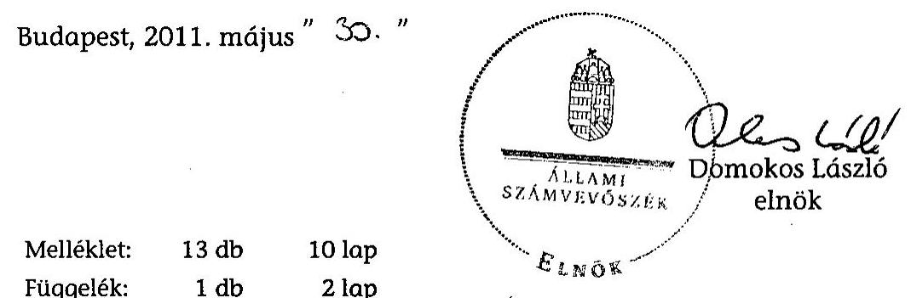

[^0]
[^0]:    $^{85}$ Jelentés az Oktatási Minisztérium fejezet működésének ellenőrzéséről, 2005. augusztus [0534]
    $^{86}$ Jelentés a Nemzeti Kulturális Örökség Minisztériuma fejezet működésének ellenőrzéséről, 2003. június [0316]
    $^{87}$ A minisztérium álláspontja szerint azonban az ÁSZ javaslatai hasznosultak. Miniszter úr az ÁSZ jelentéseinek hasznosulásáról szóló beszámolóban számot adott a feladatok teljesüléséről.
    $^{88}$ Az Állami Számvevőszékről szóló 1989. évi XXXVIII. tv. 25. § (1)

---

Mellékletek

---

# NEMZETI ERŐFORRÁS MINISZTÉRIUM MINISZTER 

Iktatószám:5963-7/2011-ELL

## Domokos László

elnök

Állami Számvevőszék

## Budapest

Apáczai Csere János u. 10.
1052

Hiv. szám: V-2004-070/2010-2011.
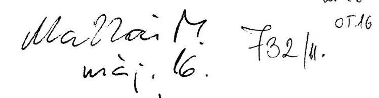
05.16

Tárgy: az oktatási és kulturális ágazat irányítási rendszerének, működésének ellenőrzéséről készített jelentés

Tisztelt Elnök Úr!

Köszönöm, hogy a tárgybeli véleményezésre megküldött tervezetre a tárca által tett észrevételeket a dokumentum módosításakor figyelembe vették.

A módosított jelentés tartalmával egyetértek.

A javaslatokra készített intézkedési tervet határidőn belül továbbítom.

Budapest, 2011. május "C".
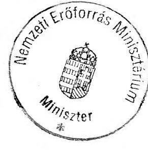

Üdvözlettel:
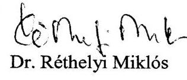

Dr. Réthelyi Miklós

---

# A NEFMI megalakulásakor az oktatási és kulturális szakterület szervezeteinek irányítási rendszere 

## Országgyűlés és Kormány:

Irányítás Eszközei: Jogszabályok és az állami irányítás egyéb jogi eszközei, OGY határozatok; Kormány program, utasítás, beszámoltatás, ellenőrzés.

Irányítás eszközei: Jogszabályok és a jogi irányítás egyéb eszközei; utasítás; alapítói okirat kiadása, módosítása; vezető kinevezése, felmentése; a tevékenység törvényességi, szakszerűségi, hatékonysági és pénzügyi ellenőrzése; SZMSZ jóváhagyása; a döntések jóváhagyása, megsemmisítése; egyedi utasítás feladat elvégzésére; jelentéstételre beszámolóra való kötelezés; tulajdonosi és az alapítói irányítás egyéb eszközei a központi államigazgatási szervekről, valamint a kormány tagjai és az államtitkárok jogállásáról 2006. évi LVII.; az államháztartásról 1992. évi XXXVIII.; a költségvetési szervek jogállásáról és gazdálkodásáról 2008. évi CV.; a Gazdasági társaságokról 2006. évi IV.; az állami vagyonról 2007. évi CVI.; a Polgári Törvénykönyvről 1959. évi IV. és a Közhasznú szervezetekről 1997. évi CLVI. szóló törvények alapján); költségvetési támogatás, támogatási szerződések.
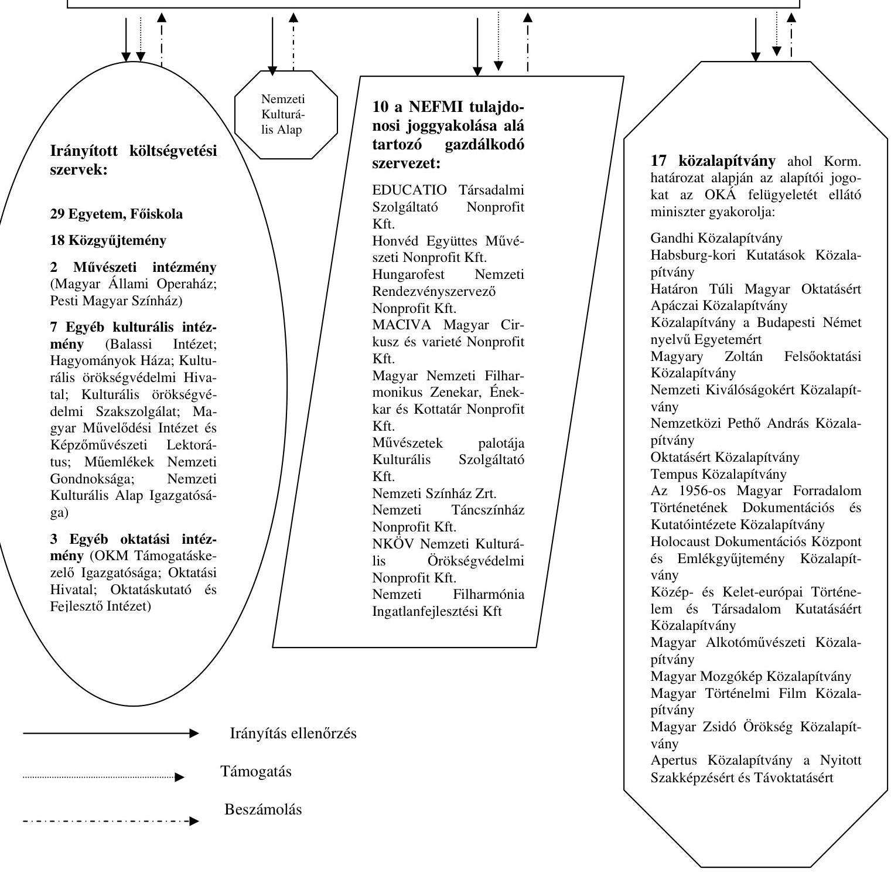

---

# A NEFMI MEGALAKULÁSAKOR AZ OKTATÁSI ÉS KULTURÁLIS SZAKTERÜLETEK ÁLTAL IRÁNYÍTOTT KÖLTSÉGVETÉSI SZERVEK, ALAPÍTÓI JOGGYAKORLÁS ALÁ TARTOZÓ KÖZALAPÍTVÁNYOK ÉS TULAJDONOSI JOGGYAKORLÁS ALÁ TARTOZÓ GAZDASÁGI TÁRSASÁGOK 

## 1. KÖLTSÉGVETÉSI SZERVEK

Állami egyetemek, főiskolák
Budapesti Corvinus Egyetem
Budapesti Gazdasági Főiskola
Budapesti Műszaki és Gazdaságtudományi Egyetem
Debreceni Egyetem
Dunaújvárosi Főiskola
Eötvös József Főiskola
Eötvös Loránd Tudományegyetem
Eszterházy Károly Főiskola
Kaposvári Egyetem
Károly Róbert Főiskola
Kecskeméti Főiskola
Liszt Ferenc Zeneművészeti Egyetem
Magyar Képzőművészeti Egyetem
Magyar Táncművészeti Főiskola
Miskolci Egyetem
Moholy-Nagy Művészeti Egyetem
Nyíregyházi Főiskola
Nyugat-magyarországi Egyetem
Óbudai Egyetem
Pannon Egyetem, Veszprém
Pécsi Tudományegyetem
Semmelweis Egyetem
Széchenyi István Egyetem
Szegedi Tudományegyetem
Szent István Egyetem
Színház- és Filmművészeti Egyetem
Szolnoki Főiskola
Közalapítványi formában működő felsőoktatási intézmények
Andrássy Gyula Budapest Német Nyelvű Egyetem
Mozgássérültek Pető András Nevelőképző és Nevelő Intézete

---

# Közgyűjtemények: 

Iparművészeti Múzeum
Kortárs Művészeti Múzeum - Ludwig Múzeum
Közgyűjteményi Ellátó Szervezet
Magyar Kereskedelmi és Vendéglátóipari Múzeum
Magyar Műszaki és Közlekedési Múzeum
Magyar Nemzeti Filmarchívum
Magyar Nemzeti Galéria
Magyar Nemzeti Múzeum
Magyar Országos Levéltár
Magyar Természettudományi Múzeum
Néprajzi Múzeum
Országos Idegennyelvű Könyvtár
Országos Széchényi Könyvtár
Országos Színháztörténeti Múzeum és Intézet
Petőfi Irodalmi Múzeum
Semmelweis Orvostörténeti Múzeum, Könyvtár és Levéltár
Szabadtéri Néprajzi Múzeum
Szépművészeti Múzeum

## Művészeti intézmények:

Magyar Állami Operaház Budapest
Pesti Magyar Színház

## Egyéb kulturális intézmények:

Balassi Intézet
Hagyományok Háza
Kulturális Örökségvédelmi Hivatal
Kulturális Örökségvédelmi Szakszolgálat
Magyar Művelődési Intézet és Képzőművészeti Lektorátus
Műemlékek Nemzeti Gondnoksága
Nemzeti Kulturális Alap Igazgatósága

## Egyéb oktatási intézmények:

Oktatási és Kulturális Minisztérium Támogatáskezelő Igazgatósága
Oktatási Hivatal
Oktatáskutató és Fejlesztő Intézet

## 2. KÖZALAPÍTVÁNYOK

Apertus Közalapítvány a Nyitott Szakképzésért és Távoktatásért
Az 1956-os Magyar Forradalom Történetének Dokumentációs és Kutatóintézete
Közalapítvány
Gandhi Közalapítvány
Habsburg-kori Kutatások Közalapítvány
Határon Túli Magyar Oktatásért Apáczai Közalapítvány
Holocaust Dokumentációs Központ és Emlékgyűjtemény Közalapítvány
Közalapítvány a Budapesti Német Nyelvű Egyetemért
Közép- és Kelet-európai Történelem és Társadalom Kutatásáért Közalapítvány
Magyar Alkotóművészeti Közalapítvány

---

Magyar Mozgókép Közalapítvány
Magyar Történelmi Film Közalapítvány
Magyarországi Zsidó Örökség Közalapítvány
Magyary Zoltán Felsőoktatási Közalapítvány
Nemzeti Kiválóságokért Közalapítvány
Nemzetközi Pető András Közalapítvány
Oktatásért Közalapítvány
Tempus Közalapítvány

# 3. GAZDASÁGI TÁRSASÁGOK 

Educatio Társadalmi Szolgáltató Nonprofit Kft.
Honvéd Együttes Művészeti Nonprofit Kft.
Hungarofest Nemzeti Rendezvényszervező Nonprofit Kft.
MACIVA Magyar Cirkusz és Varieté Nonprofit Kft.
Magyar Nemzeti Filharmonikus Zenekar, Énekkar és Kottatár Nonprofit Kft.
Művészetek Palotája Kulturális Szolgáltató Kft.
Nemzeti Színház Zrt.
Nemzeti Táncszínház Nonprofit Kft.
NKÖV Nemzeti Kulturális Örökség Védelmi Nonprofit Kft.
Nemzeti Filharmónia Ingatlanfejlesztési Kft.

---

Az oktatási és kulturális szakterület (OKM) gazdálkodásának fő mutatói a 2006-2010. években

|  Mutató/Év | 2006. év tény | 2007. év tény | 2008. év tény | 2009. év tény | 2010
előirányzat  |
| --- | --- | --- | --- | --- | --- |
|  Kiadás | 667041,3 | 723164,8 | 707788,0 | 703442,5 | 636 935,3  |
|  Bevétel | 251580,3 | 260689,6 | 270 195,9 | 272 312,0 | 243 931,1  |
|  Támogatás | 397527,1 | 436 939,4 | 447 879,2 | 414 647,6 | 390 504,2  |
|  Átlagos állományi létszám | 56679,0 | 55165,0 | 53824,0 |

 | 53794,0 | 59217,0  |
|  Saját tőke | 358720,5 | 379241,5 | 401883,2 | 381987,9 |   |
|  Hosszú lejáratú kötelezettségek | 10470,8 | 18603,8 | 21387,0 | 14511,8 |   |
|  Rövid lejáratú kötelezettségek | 33017,4 | 28203,7 | 28550,5 | 39063,9 |   |
|  Ingatlanok és kapcsolódó vagyonértékű jogok | 278966,5 | 293656,5 | 313277,6 | 323594,3 |   |
|  Befektetett pénzügyi eszközök | 19706,0 | 1277,9 | 14724,4 | 15662,6 |   |
|  Követelések | 6591,9 | 7509,4 | 5220,8 | 5505,5 |   |
|  Forgatási célú hitelviszonyt megtestesítő értékpapírok | 5047,0 | 25272,9 | 29124,1 | 26928,6 |   |
|  Pézeszközök összesen | 36850,8 | 27076,8 | 43040,0 | 41955,2 |   |

Források: 2006., 2007., 2008., 2009. évi zárszámadás, 2010. évi költségvetési törvény. (A 2010. évi létszámadat az engedélyezett létszámkeretet jelenti)

---

# Az ÁSZ által financial audit módszerrel ellenőrzött OKM költségvetési beszámolók minősítése (2006-2009) 

| Költségvetési beszámoló | 2006 | 2007 | 2008 | 2009 |
| :-- | :--: | :--: | :--: | :--: |
| Oktatási és Kulturális Minisztérium Igazgatása | HF | HF | HF | HF |
| OKM fejezet fejezeti kezelésű előirányzatok | HF | HF | HF | HF |
| Felsőoktatási Regisztrációs Központ | HF |  |  |  |
| Magyar UNESCO Bizottság Titkársága | HF |  |  |  |
| Nemzeti Filmiroda | H |  |  |  |
| Oktatási és Kulturális Minisztérium   Gazdasági Főigazgatóság | H |  |  |  |
| Oktatási Minisztérium Szolgáltató Intézménye | H |  |  |  |
| Balassi Intézet |  | K |  |  |
| Debreceni Egyetem |  | HF |  |  |
| Oktatási Hivatal |  | E |  |  |
| Oktatáskutatási és Fejlesztési Intézet |  | K |  |  |
| Pécsi Tudományegyetem |  | E |  |  |
| Semmelweis Egyetem |  | E |  |  |
| Szegedi Tudományegyetem |  | K |  |  |
| Szent István Egyetem |  | HF |  |  |
| Budapesti Műszaki és Gazdaságtudományi Egyetem |  |  | K |  |
| Eötvös Loránd Tudományegyetem |  |  | HF |  |
| Kulturális Örökségvédelmi Hivatal |  |  | HF |  |
| Kulturális Örökségvédelmi Szakszolgálat |  |  | HF |  |
| Müemlékek Nemzeti Gondnoksága |  |  | HF |  |

Minősítések:
H: elfogadó (hitelesítő) vélemény
HF: elfogadó (hitelesítő) vélemény figyelemfelhívással
K: korlátozott vélemény
E: elutasító vélemény

---

# 6. számú melléklet

a V-2004-072/2010-2011. sz. jelentéshez

|  A NEFMI megalakulásakor a tulajdonosi joggyakorlása alá tartozó gazdasági társaságok bevételei 2006-2009. években |  |  |  |  |  |  |  |  |  |  |  |  |  |  |   |
| --- | --- | --- | --- | --- | --- | --- | --- | --- | --- | --- | --- | --- | --- | --- | --- |
|   | 2006 |  |  |  | 2007 |  |  |  | 2008 |  |  |  | 2009 |  |   |
|  Társaság neve/ bevételi struktúra/év | Köszhasznú célra kapott támogatás (M Ft) | Pályázati úton elnyert támogatás (M Ft) | Vállalkozási tevékenység bevétele (M Ft) | Összes bevétel (M Ft) | Köszhasznú célra kapott támogatás (M Ft) | Pályázati úton elnyert támogatás (M Ft) | Vállalkozási tevékenység bevétele (M Ft) | Összes bevétel (M Ft) | Köszhasznú célra kapott támogatás (M Ft) | Pályázati úton elnyert támogatás (M Ft) | Vállalkozási tevékenység bevétele (M Ft) | Összes bevétel (M Ft) | Köszhasznú célra kapott támogatás (M Ft) | Pályázati úton elnyert támogatás (M Ft) | Vállalkozási tevékenység bevétele (M Ft)  |
|  Educatio Nonprofit Kft. | 1174,8 | 882,5 | 86,0 | 2143,3 | 1389,9 | 1165,0 | 123,1 | 2678,0 | 1683,6 | 3998,2 | 222,7 | 5804,5 | 1362,5 | 3939,8 | 222,4  |
|  Hungarote st Nonprofit Kft. | 759,0 | 140,0 | 13,2 | 912,2 | 1278,7 | 30,0 | 8,4 | 1317,1 | 1664,1 | 412,1 | 36,1 | 2112,3 | 1546,4 | 281,2 | 1,7  |
|  Honvéd Együttes Nonprofit Kft. | 2007. 09. 01-én alakult | - | - | - | 324,0 | 9,6 | 4,0 | 337,6 | 639,5 | 7,4 | 9,5 | 656,4 | 613,2 | 13,2 | 7,3  |
|  MACIVA Nonprofit Kft. | 225,0 | 25,8 | 30,6 | 281,4 | 248,9 | 0,0 | 32,5 | 281,4 | 398,8 | 10,7 | 36,5 | 446,0 | 366,0 | 1,9 | 0,0  |
|  Magyar Nemzeti Filharmoni kus Nonprofit | 1500,4 | 6,6 | 7,1 | 1514,1 | 1583,2 | 0,0 | 4,3 | 1587,5 | 1550,0 | 3,7 | 2,7 | 1556,4 | 1568,6 | 3,0 | 1,6  |
|  MUFA Kft. | OKM támogatás: 2400,0 |  | 3171,1 | OKM támogatás: 5571,1 |  |  | 3308,4 | OKM támogatás: 5708,4 |  |  | 3554,5 | OKM támogatás: 5854,5 |  |  |  | 3932,2  |
|  Nemzeti Színház Zrt. | OKM támogatás: 1860,0 |  | 2505,5 | OKM támogatás: 4365,5 |  |  | 2352,5 | OKM támogatás: 4052,5 |  |  | 2357,1 | OKM támogatás: 4057,1 |  |  |  | 2552,2  |
|  Nemzeti Táncszínház áz Nonprofit Kft. | 603,7 | 60,2 | 4,9 | 668,8 | 574,4 | 19,0 | 12,3 | 605,7 | 557,2 | 12,7 | 7,7 | 577,6 | 522,1 | 13,8 | 8,9  |
|  NKOV Nonprofit Kft. | 709,4 | 0,0 | 168,5 | 877,9 | 799,0 | 0,0 | 110,3 | 909,3 | 805,5 | 0,0 | 123,7 | 929,2 | 711,0 | 0,0 | 116,4  |

---

7. számú melléklet a V-2004-072/2010-2011. sz. jelentéshez

A NEFMI megalakulásakor a tulajdonosi joggyakorlása alá tartozó gazdasági társaságok ráfordításai 2006-2009. években

|  |   |   |   |   |   |   |   |   |   |   |   |   |   |   |   |   |   |   |   |   |   |
| --- | --- | --- | --- | --- | --- | --- | --- | --- | --- | --- | --- | --- | --- | --- | --- | --- | --- | --- | --- | --- | --- |
|   |  |  |  |  |  |  |  |  |  |  |  |  |  |  |  |  | 2007 |  |  |  |   |
|  gt. neve/ kiadási struktúra /év |  |  |  |  |  |  |  |  |  |  |  |  |  |  |  |  |  |  |  |  |   |
|   |  |  |  |  |  |  |  |  |  |  |  |  |  |  |  |  |  |  |  |  |   |
|   |  |  |  |  |  |  |  |  |  |  |  |  |  |  |  |  |  |  |  |  |   |
|   |  |  |  |  |  |  |  |  |  |  |  |  |  |  |  |  |  |  |  |  |   |
|   |  |  |  |  |  |  |  |  |  |  |  |  |  |  |  |  |  |  |  |  |   |
|   |  |  |  |  |  |  |  |  |  |  |  |  |  |  |  |  |  |  |  |  |   |
|   |  |  |  |  |  |  |  |  |  |  |  |  |  |  |  |  |  |  |  |  |   |

 |  |  |  |   |
|  Educatio Nonprofit Kft. |  |  |  |  |  |  |  |  |  |  |  |  |  |  |  |  |  |  |  |  |   |
|   |  |  |  |  |  |  |  |  |  |  |  |  |  |  |  |  |  |  |  |  |   |
|   |  |  |  |  |  |  |  |  |  |  |  |  |  |  |  |  |  |  |  |  |   |
|   |  |  |  |  |  |  |  |  |  |  |  |  |  |  |  |  |  |  |  |  |   |
|   |  |  |  |  |  |  |  |  |  |  |  |  |  |  |  |  |  |  |  |  |   |
|   |  |  |  |  |  |  |  |  |  |  |  |  |  |  |  |  |  |  |  |  |   |
|   |  |  |  |  |  |  |  |  |  |  |  |  |  |  |  |  |  |  |  |  |   |
|   |  |  |  |  |  |  |  |  |  |  |  |  |  |  |  |  |  |  |  |  |   |
|   |  |  |  |  |  |  |  |  |  |  |  |  |  |  |  |  |  |  |  |  |   |
|   |  |  |  |  |  |  |  |  |  |  |  |  |  |  |  |  |  |  |  |  |   |
|   |  |  |  |  |  |  |  |  |  |  |  |  |  |  |  |  |  |  |  |  |   |
|   |  |  |  |  |  |  |  |  |  |  |  |  |  |  |  |  |  |  |  |  |   |
|   |  |  |  |  |  |  |  |  |  |  |  |  |  |  |  |  |  |  |  |  |   |
|   |  |  |  |  |  |  |  |  |  |  |  |  |  |  |  |  |  |  |  |  |   |
|   |  |  |  |  |  |  |  |  |  |  |  |  |  |  |  |  |  |  |  |  |   |
|   |  |  |  |  |  |  |  |  |  |  |  |  |  |  |  |  |  |  |  |  |   |
|   |  |  |  |  |  |  |  |  |  |  |  |  |  |  |  |  |  |  |  |  |   |
|   |  |  |  |  |  |  |  |  |  |  |  |  |  |  |  |  |  |  |  |  |   |
|   |  |  |  |  |  |  |  |  |  |  |  |  |  |  |  |  |  |  |  |  |   |
|   |  |  |  |  |  |  |  |  |  |  |  |  |  |  |  |  |  |  |  |  |   |
|   |  |  |  |  |  |  |  |  |  |  |  |  |  |  |  |  |  |  |  |  |   |
|   |  |  |  |  |  |  |  |  |  |  |  |  |  |  |  |  |  |  |  |  |   |
|   |  |  |  |  |  |  |  |  |  |  |  |  |  |  |  |  |  |  |  |  |   |
|   |  |  |  |  |  |  |  |  |  |  |  |  |  |  |  |  |  |  |  |  |   |
|   |  |  |  |  |  |  |  |  |  |  |  |  |  |  |  |  |  |  |  |  |   |
|   |  |  |  |  |  |  |  |  |  |  |  |  |  |  |  |  |  |  |  |  |   |
|   |  |  |  |  |  |  |  |  |  |  |  |  |  |  |  |  |  |  |  |  |   |
|   |  |  |  |  |  |  |  |  |  |  |  |  |  |  |  |  |  |  |  |  |   |
|   |

---

# 8. számú melléklet

a 2004-072/2010-2011. sz. jelentéshez

|  A NEFMI megalakulásakor a tulajdonosi joggyakorlása alá tartozó gazdasági társaságok mérlegadatai 2006-2009. években |  |  |  |  |  |  |  |  |  |  |  |  |  |  |   |
| --- | --- | --- | --- | --- | --- | --- | --- | --- | --- | --- | --- | --- | --- | --- | --- |
|   | 2006 |  |  |  | 2007 |  |  |  | 2008 |  |  |  | 2009 |

  |   |
|  gt./
mutató/év | Mérlegfő-
összeg
(M
Ft) | Saját tőke
(M Ft) | Mérleg
szerinti
eredmény
(M Ft) | Átlagos
statiszti-
kai
létszám
(fő) | Mérlegfő-
összeg
(M Ft) | Saját tőke
(M Ft) | Mérleg
szerinti
eredmény
(M Ft) | Átlagos
statiszti-
kai
létszám
(fő) | Mérlegfő-
összeg
(M
Ft) | Saját tőke
(M Ft) | Mérleg
szerinti
ered-
mény
(M Ft) | Átlagos
statiszti-
kai
létszám
(fő) | Mérlegfő-
összeg
(M
Ft) | Saját tőke
(M Ft) | Mérleg
szerinti
eredmény
(M Ft)  |
|  Educatio
Nonprofit
Kft. | 6412,5 | 1321,9 | $-406,4$ | 181,0 | 8309,8 | 1081,3 | $-602,1$ | 221,0 | 7889,9 | 1090,5 | $-118,3$ | 347,0 | 8777,0 | 495,3 | $-595,3$  |
|  Hungarofeszt Nonprofit
Kft. | 221,8 | 109,0 | 15,7 | 22,0 | 361,0 | 93,5 | $-15,5$ | 25,0 | 484,0 | 102,4 | 8,9 | 34,0 | 413,7 | 110,4 | 8,1  |
|  Honvéd
Együttes
Nonprofit
Kft. | 2007. 09.
01-én
alakult | - | - | - | 88,5 | 13,3 | 89,3 | 160,0 | 83,1 | 15,6 | 2,3 | 152,0 | 115,0 | 48,9 | 33,3  |
|  MACIVA
Nonprofit
Kft.
mogyoró
Nemzeti
Filharmónia
kus
Nonprofit
Kft. | 341,0 | 89,6 | $-2,1$ | 72,0 | 487,2 | 91,4 | 1,8 | 95,7 | 461,2 | 92,3 | 0,9 | 108,0 | 540,0 | 121,1 | 28,8  |
|  MÚPA Kft. | 1461,4 | 997,4 | 168,1 | 142,0 | 1338,7 | 756,0 | $-241,4$ | 168,0 | 994,5 | 475,3 | $-280,7$ | 175,0 | 1022,6 | 556,0 | 80,8  |
|  Nemzeti
Színház Zrt | 14836,7 | 11636,9 | $-309,6$ | 84,0 | 14114,9 | 11140,7 | $-496,2$ | 154,0 | 13386,9 | 10623,1 | $-517,5$ | 154,0 | 13073,0 | 10633,9 | 10,7  |
|  Nemzeti
Táncszínház
Nonprofit
Kft.
NKOV
Nonprofit
Kft. | 306,6 | 102,2 | $-38,4$ | 47,0 | 303,8 | 131,6 | 29,3 | 58,0 | 251,1 | 137,5 | 5,9 | 51,0 | 248,7 | 143,5 | 5,9  |
|   | 53,8 | $-36,1$ | $-43,9$ | 333,0 | 245,9 | 30,0 | 6,1 | 319,0 | 72,8 | 18,2 | 48,2 | 318,0 | 55,0 | 1,6 | $-16,5$  |

---

A NEFMI megalakulásakor az alapítói joggyakorlása alá tartozó közalapítványok saját tőkéje és a kapott támogatások 2006 - 2009. években

|  Megnevezés | Alapításkori Vagyon
(M Ft) | Állami
tulajdoni
részesedés
(%) | Saját tőke (M Ft) |  |  |  | Támogatás (M Ft) |  |  |   |
| --- | --- | --- | --- | --- | --- | --- | --- | --- | --- | --- |
|   |  |  | 2006 | 2007 | 2008 | 2009 | 2006 | 2007 | 2008 | 2009  |
|  1956-os Magyar Forradalom
Történetének Dokumentációs és
Kutatóintézete Közalapítvány | 79,1 | 100,0 | 239,9 | 237,3 | 211,8 | 217,0 | 170,6 | 160,0 | 160,0 | 153,0  |
|  Apertus Közalapítvány | 10,0 | 100,0 | 18,8 | 42,9 | 26,9 | 4,2 | 0,0 | 0,0 | 0,0 | 0,0  |
|  Gandhi Közalapítvány | 13,1 | 100,0 | 808,6 | 803,5 | 790,5 | 783,0 | 64,5 | 72,6 | 132,4 | 122,7  |
|  Habsburg-kori Kutatások
Közalapítvány | 20,0 | 100,0 | 88,8 | 92,0 | 88,8 | 89,2 | 94,0 | 94,0 | 94,0 | 85,7  |
|  Határon Túli Magyar Oktatásért
Apáczai Közalapítvány | 30,5 | 100,0 | 34,9 | 34,9 | 34,4 | 33,2 | 25,0 | 50,0 | 10,0 | 25,0  |
|  Holocaust Dokumentációs Központ és
Emlékgyűjtemény Közalapítvány | 17,0 | 100,0 | 5,6 | 10,3 | 31,4 | 76,5 | 242,4 | 220,6 | 220,4 | 344,0  |
|  Közalapítvány a Budapesti Német
Nyelvű Egyetemért | 80,0 | 100,0 | 74,4 | 65,0 | 64,2 | 44,1 | 172,0 | 200,0 | 200,0 | 200,0  |
|  Közép- és Kelet-Európai Történelem
és Társadalom Kutatásáért
Közalapítvány | 117,0 | 100,0 | 166,6 | 119,9 | 71,3 | 102,2 | 292,9 | 240,0 | 240,0 | 286,0  |
|  Magyar Alkotóművészeti
Közalapítvány | 1292,8 | 100,0 | 619,8 | 483,3 | 462,2 | 497,2 | 1600,0 | 1650,0 | 1688,8 | 1798,8  |
|  Magyar Mozgókép Közalapítvány | 491,7 | 100,0 | 3111,4 | 3142,6 | 3168,4 | 3188,0 | 6221,0 | 4570,0 | 4810,0 | 5420,0  |
|  Magyar Történelmi Film
Közalapítvány | 350,0 | 100,0 | $-202,2$ | 36,8 | 62,5 | $-1,1$ | 349,9 | 100,0 | 100,0 | 0,0  |
|  Magyarországi Zsidó Örökség
Közalapítvány | 5284,0 | 100,0 | 1500,8 | 2041,1 | 2069,2 | 2115,0 | 40,0 | 2267,5 | 47,5 | 0,0  |
|  Magyary Zoltán Felsőoktatási
Közalapítvány | 130,9 | 84,5 | 63,3 | 37,0 | 47,1 | 118,2 | 52,0 | 45,3 | 45,3 | 25,0  |
|  Nemzeti Kiválóságokért
Közalapítvány | 5,0 | 100,0 | 0,0 | 40,0 | 31,5 | 21,4 | 0,0 | 40,0 | 0,0 | 0,0  |
|  Nemzetközi Pető András
Közalapítvány | 1648,6 | 100,0 | 1644,2 | 1631,8 | 1626,2 | 1648,6 | 363,3 | 335,2 | 491,3 | 173,1  |
|  Oktatásért Közalapítvány | 842,0 | 100,0 | 164,2 | 95,0 | 143,9 | 894,5 | 100,0 | 75,0 | 100,0 | 240,6  |
|  Tempus Közalapítvány | 23,7 | 100,0 | 120,0 | 113,0 | 117,1 | 121,1 | 2166,0 | 304,5 | 170,1 | 118,6  |
|  Közalapítványok összesen: | 10435,4 |  | 8459,1 | 9026,4 | 9047,4 | 9952,3 | 11953,6 | 10424,7 | 8509,8 | 8992,5  |

---

# AZ ÁSZ ELLENŐRZÉSEK JAVASLATAI ALAPJÁN KÉSZÍTETT INTÉZKEDÉSI TERVEK VÉGREHAJTÁSA

|  Jelentés címe (száma) | Összes javaslat | Lejárt ${ }^{*}$ határidejű | Nem javaslat szerinti végrehajtás | Javaslat szerinti végrehajtás | Végrehajtás folyamatban van  |
| --- | --- | --- | --- | --- | --- |
|  A Művészetek Palotája megvalósításának és működésének ellenőrzéséről (0660) | 3 | 3 | 0 | 0 | 3  |
|  A kulturális közgyűjtemények kezelésére fordított pénzeszközök hasznosulásának ellenőrzéséről (0701) | 6 | 6 | 2 | 3 | 1  |
|  Az elektronikus kormányzati szolgáltatások fejlesztésének ellenőrzéséről (0713) | 1 | 1 | 0 | 1 | 0  |
|  A Holocaust Dokumentációs Központ és Emlékgyűjtemény Közalapítvány gazdálkodásának ellenőrzéséről (0721) | 1 | 1 | 0 | 1 | 0  |
|  A felsőoktatás kollégium beruházási programjának ellenőrzéséről (0741) | 2 | 2 | 0 | 1 | 1  |
|  Az Oktatási és Kulturális Minisztérium fejezetnél a közoktatási feladatok finanszírozására fordított pénzeszközök hasznosulásának ellenőrzéséről (0807) | 4 | 4 | 3 | 1 | 0  |
|  A központi költségvetés intézményrendszerének ellenőrzéséről (0808) | 0 | - | - | - | -  |
|  A Tempus Közalapítványnak juttatott költségvetési támogatás felhasználásának ellenőrzéséről (0811) | 3 | 3 | 1 | 2 | 0  |
|  A szakiskolai fejlesztési programra fordított pénzeszközök felhasználása eredményességének ellenőrzéséről (0819) | 0 | - | - | - | -  |
|  A fejezeti kezelésű előirányzatok rendszerének ellenőrzéséről (0821) | 0 | - | - | - | -  |
|  A közoktatási intézményeket fenntartó non-profit szervezetek normatív hozzájárulásának és támogatásának ellenőrzéséről (0835) | 1 | 1 | 0 | 1 | 0  |

[^0] [^0]: * Az intézkedési tervben rögzített határidő szerint.

---

|  A nemzeti audiovizuális vagyon működtetésére fordított pénzeszközök hasznosulásának ellenőrzéséről (0906) | 0 | - | - | - | -  |
| --- | --- | --- | --- | --- | --- |
|  A felsőoktatási törvény végrehajtásának ellenőrzéséről (0915) | 5 | 2 | 1 | 1 | 0  |
|  Az elkülönített állami pénzalapok rendszerének, a pályázati célok teljesülésének ellenőrzéséről (0917) | 0 | - | - | - | -  |
|  A Habsburg-kori Kutatások Közalapítvány gazdálkodásának ellenőrzéséről (0939) | 2 | 2 | 1 | 1 | 0  |
|  A Nemzeti Kulturális Alap működésének ellenőrzéséről (1002) | 5 | - | - | - | -  |
|  Mindösszesen 16 db jelentés | 33 | 25 | 8 | 12 | 5  |

Megjegyzés: A Nemzeti Kulturális Alap működésének ellenőrzéséről szóló jelentés javaslatai alapján a helyszíni ellenőrzés lezárásáig nem készült intézkedési terv. A minisztérium álláspontja szerint azonban az ÁSZ javaslatai hasznosultak. Miniszter úr az ÁSZ jelentéseinek hasznosulásáról szóló beszámolóban számot adott a feladatok teljesüléséről.

---

1. sz. melléklet

A TKA által kezelt EU-s pályázati programok alakulása

|  Európai Nyelvi Díj | 2006 | 2007 | 2008 | 2009 | 2010  |
| --- | --- | --- | --- | --- | --- |
|  beadott pályázat (db) | 9 | 6 | 15 | 20 | 11  |
|  támogatott pályázat (db) | 1 | 2 | 2 | 3 | 0 (folyamatban)  |
|  lezárt pályázat 2010.09.30-ig (db) | 9 | 6 | 15 | 20 | 0 (folyamatban)  |
|  leszerződött támogatás (HUF) | 1.000.000 | 1.000.000 | 500.000 | 1.000.050 | 0  |
|  LLP |  |  |  |  |   |
|  beadott pályázat (db) |  | 1.619 | 1.503 | 1.674 | 1.978  |
|  támogatott pályázat (db) |  | 894 | 840 | 968 | 779  |
|  lezárt pályázat 2010.09.30-ig (db) |  | 894 | 604 | 533 | 78  |
|  leszerződött támogatás (EUR) |  | 15.451.429 | 17.189.335 | 18.929.546 | 17.525.367  |
|  Leonardo II |  |  |  |  |   |
|  beadott pályázat (db) | 271 |  |  |  |   |
|  támogatott pályázat (db) | 164 |  |  |  |  |

 |
|  lezárt pályázat 2010.09.30-ig (db) | 164 |  |  |  |   |
|  leszerződött támogatás (EUR) | 5.707.662 |  |  |  |   |

2010. október 22.

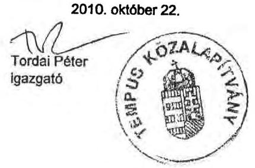

Információt nyújtunk a Tempus, az Erasmus Mundus, az Európa a polgárokért programokról, valamint az EU Kutatás-fejlesztési Keretprogramjának lehetőségeiről

---

# A NEFMI oktatási és kulturális ágazatának közérdekű bejelentései és kivizsgálásának eredményessége 2006-2010. I. félévben

|  Megnevezés | 2006. év | 2007. év | 2008. év | 2009. év | 2010. I. félév  |
| --- | --- | --- | --- | --- | --- |
|  Közérdekű bejelentések száma | 4 | 4 | 4 | 2 | 6  |
|  Kivizsgált bejelentés db | 4 | 4 | 4 | 2 | 0*  |
|  Javasolt intézkedés db | 8 | 42 | 47 | 10 | 0  |
|  Intézkedésre nem volt szükség db | 2 | 0 | 0 | 0 | 0  |
|  Végrehajtott intézkedés db | 8 | 42 | 47 | 10 | 0  |

Budapest, 2010. augusztus 24.

- Illetékesség miatt áttéve más szervezeti egység, illetve szervezetek, hatóságok hatáskörébe.

Megjegyzés: A közérdekű bejelentések nyilvántartását a belső ellenőrzés számára sem jogszabály, sem belső szabályozás nem írta elő.

Igazolom, hogy tanúsítványban szereplő adatok a nyilvántartások adataival megegyeznek.

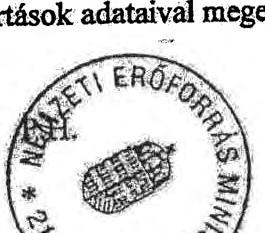

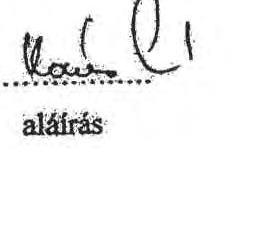

---

# A JELENTÉS FŐBB MEGÁLLAPÍTÁSAI 

$>$ Az ágazati irányítás eszközeként megvalósított törvényelőkészítő és jogszabályalkotó tevékenység végrehajtásához hosszú- és középtávú ágazati szakmai koncepciók, stratégiák nem készültek;
> a feladatok és ellátásuk rendjét tartalmazó OKM utasítások nem határozták meg pontosan a szakmai felügyeleti jogkör tartalmát, az egyértelmű felelősségi köröket;
> intézményrendszerének 2006. évi átalakítását követően a szakmai feladatellátás szervezettebbé, átláthatóbbá vált, azonban nem értékelték a feladatellátás hatékonyabb és eredményesebbé válását;
> intézményműködtetési és fejlesztési stratégia nem volt, az intézmények elfogadott középtávú tervvel, stratégiával nem rendelkeztek;
> nem alakítottak ki olyan érdekeltségi- és szankciórendszert, amely biztosította volna az intézményvezetők számon kérhetőségét, a szakmai irányítás egységes és hatékony ellátását;
> a kormányhatározatokban meghatározott gazdasági társaságok, közalapítványok szervezeti átalakítását megalapozó hatástanulmányok, gazdaságossági számítások csak esetenként készültek (pl. Oktatási Hivatal, KESZ, Nemzeti Színház ZRt.);
> a gazdálkodási forma megválasztásának (közhasznú, kiemelten közhasznú) gyakorlata nem volt egységes (pl. kiemelt kulturális feladatot lát el az Operaház, a Pesti Magyar Színház, amelyek költségvetési intézmények, a Nemzeti Színház Zrt., a MÚPA Kft.);
> a szakterületek nem alakítottak ki a társaságok szakmai tevékenységének mérésére alkalmas kritériumrendszert, mutatókat, nem fogalmaztak meg az éves üzleti tervekhez szakmai elvárásokat;
> a szakmai feladatellátás és a gazdálkodás értékelése általános és formális volt, az éves értékelések nem tértek ki a veszteséges gazdálkodás megszüntetésére;
> a több csatornán biztosított források korlátozták az elszámoltatás, a működés és a gazdálkodás átláthatóságát, a valós teljesítmények mérését;
> pozitív változás, hogy szigorodtak a támogatások felhasználásának ellenőrzései (a 2009. évi támogatásoknál 6 gt-nél összesen 277,6 M Ft visszafizetését rendelték el);
> a minisztérium nem rendelkezett sem kulturális, sem oktatási ágazati informatikai stratégiával;
> az ágazati informatikai fejlesztések a NEFMI létrehozásával decentralizálódtak, két minisztérium (NEFMI és NFM) és két háttérintézmény feladatainak elhatárolása nem egyértelmű, ez további kockázati tényezőt jelent;

---

> az SZMSZ módosításait és a jogszabály változásokat nem vezették át, így az OKH 2009. szeptember 04-én kiadott SZMSZ-t követően a FEUVE rendszer belső előírások nélkül működött;
> a NEFMI SZMSZ-e szabályozza a FEUVE rendszer létrehozásának feladatát, kidolgozása azonban 2010-ben nem történt meg;
> az OKM Ellenőrzési Főosztálya által tett javaslatokat nem hasznosították megfelelő hatékonysággal (átlag 61,8%-ban hasznosultak), a miniszteri döntésekben nem kaptak kellő támogatást;
$>$ ez évről-évre visszatérő hiányosságokat is eredményezett.

---

FÜGGELÉK

---

# TÁJÉKOZTATÁS A KLEBELSBERG KASTÉLY ELADÁSÁVAL KAPCSOLATOS BEJELENTÉS KIVIZSGÁLÁSÁRÓL 

Az ÁSZ-hoz közérdekű bejelentés érkezett 2010. 09. 08-án, a bejelentő Klebelsberg Éva, a Gróf Klebelsberg Kunó Alapítvány elnöke. Vizsgálatunk a Klebelsberg Kunó kulturális örökségét képező kastély tulajdoni viszonyaira és a névhasználat kérdésére tért ki.

A 1028 Budapest II. ker. Templom utca 12. szám alatti Gróf Klebelsberg Kunó által építtetett kastély a földhivatali bejegyzés szerint 54281 helyrajzi számon nyilvántartott $8375 \mathrm{~m}^{2}$ belterület.

Gróf Klebelsberg Kunó kultúr- és tudománypolitikus, vallás- és közoktatásügyi miniszter és felesége, Botka Sarolta 1923-ban vásárolták meg a Templom u 12. szám (Pesthidegkút) alatt található épületegyüttest. A miniszter haláláig ott lakott, özvegyét a háború után lakoltatták ki. 1945 után a kastélyt államosították, ezután pártüdülő, majd SZOT szanatórium működött benne.

A földhivatali bejegyzés szerint 1950. évtől az 1999. évi adás-vételig a Szakszervezetek Országos Tanácsa, illetve jogutód szakszervezetek tulajdonában volt, amely ellen 1995. február 16-án Pest Megye Önkormányzata a Pesti Központi Kerületi Bíróságon tulajdoni jog megállapítását kérte. Az ügy a Legfelsőbb Bíróság határozatával 2001. november 6-án zárult, a jogerős ítélet a szakszervezetek tulajdonjogát állapította meg.

A Klebelsberg Kastélyt 1999. március 18.-i adás-vételi szerződéssel a szakszervezetek 31,75 M Ft-ért eladták, amely Kastélyt (és a szomszédos egy hatod résznyi telket) 2001. 04. 27-én a Pest Megye Önkormányzata árverési hirdetményében 456 M Ft+áfa áron kínálta eladásra.

A Klebelsberg Kastély 1999. március 18.-i adás-vételét nem „jógazdaként”, az ingatlan áraknak megfelelő értéken bonyolították, a jogi eljárás alatt álló ingatlan tulajdonjog megállapítását megelőző értékesítésének nem volt indoka. A szakszervezetek részéről az állami közös vagyon áron aluli, gondatlan, nem értékarányos eladása valósult meg.

A Klebelsberg Kastélyt a Földhivatal 2002. 03. 26.-án jegyezte be a Kuller Ingatlanhasznosító és Forgalmazó Kft. közbenső tulajdonjogán át, adás-vétellel az Immobilia Gold Kft. tulajdonába, majd ugyanazon adás-vétellel jogutódlással és névváltozással került az Ingatlanbank Nemzetközi Ingatlanhasznosító és Forgalmazó Rt. (Váci utca 36.) tulajdonába.

Az ingatlanhasznosítási tervet meghiúsította a Kastélyra 19/1999. (XII. 20.) NKÖM rendelet által előírt műemléki védettség és a műemlék védelemről szóló törvény, amely előírta a kastély eredeti állapotának a megőrzését és fenntartását. Erről a tulajdonosnak (Kuller Ingatlanhasznosító Kft-nek) kellett volna gondoskodnia, amelynek nem tett eleget, de a Kulturális Örökségvédelmi Hiva-

---

tal a kulturális örökség védelméről szóló 2001. évi LXIV. tv. 67.§ (1) bek. alapján sem intézkedett. Ennek következtében a Kastély életveszélyes állapotba került.

A Magyar Nemzeti Vagyonkezelő (MNV) Zrt. jogelődje, a Kincstári Vagyoni Igazgatóság (KVI) terveiben nem ütemezte a „kizárólagos állami tulajdonban tartandó” műemlékek (közöttük a Klebelsberg Kastély) megvételét, annak ellenére, hogy a törvény az állami tulajdonba vételt szabályozta.

A Klebelsberg Kastély tulajdonosa, a Kuller Ingatlanhasznosító Kft jogutóda, az Ingatlanbank 2005. II. 15.-ei NKÖM miniszterének címzett levele szerint 490 M Ft+áfa értékben hajlandó lett volna a Klebelsberg Kastély tulajdonjogát az állam számára átadni.

Az MNV Zrt. 2007. XII. 6-án 430 M Ft+ÁFA áron úgy vásárolta meg az Ybl Villát, hogy a hasznosítás szükségességét nem alapozta meg, és a döntéselőkészítést megalapozó írásos dokumentáció az MNV Zrt.-nél - az általuk tett nyilatkozat alapján - nem lelhető fel. Az Ybl villát 2008. IV. 16.-án csereingatlanként készpénz ráfizetéssel átadta a Klebelsberg Kastélyért.

Az adás-vételt megelőzően 2008. április 04.-én az MNV Zrt. az ingatlanokra vonatkozóan értékbecslést kért, amely az Ybl Villát 399 M Ft+áfa, a Klebelsberg Kastélyt 697,1 M Ft+áfa forgalmi értéken határozta meg, amelyet 2008. május 13.-án Igazságügyi szakértővel kontroláltatott. Az ingatlanok forgalmi értékét az Ybl Villára 384,2 M Ft+áfa, a Klebelsberg Kastélyra 670,3 M Ft+áfa értékben állapította meg.

Így az MNV Zrt., az állam tulajdonába visszakerült Klebelsberg Kastélyért adott egy 430 M Ft+áfa áron megvásárolt kastélyt, és 298,1 MFt készpénzt. Összesen 516 M Ft+ 298,1 M Ft=814,1 M Ft értéket.

Az állam a kastély kezelésével (állagmegóvás biztosítása, értékesítés, visszavásárlás) kapcsolatban „nem a jó gazda gondosságával” járt el.

Kifogásolta a Bejelentő a „Klebelsberg” név használatát, ugyanis a Klebelsberg Kastély közvetlen szomszédságában épült Művelődési és Művészeti Központot a II. ker. Képviselő-testülete a 716/2003. (XI. 20.) határozatával Klebelsberg Kunóról nevezte el. Az intézmények elnevezésére vonatkozó 9/1989. (IV. 30.) MM rendelet azonban nem írja elő, hogy a leszármazók hozzájárulását kellene kérni az elnevezéshez.

A névhasználattal kapcsolatban a Fővárosi Bíróságon személyiségi jog megsértése miatt indított perben a bíróság a Bejelentő keresetét 2010. szeptember 27-én jogerősen elutasította.

Budapest, 2011. május

---

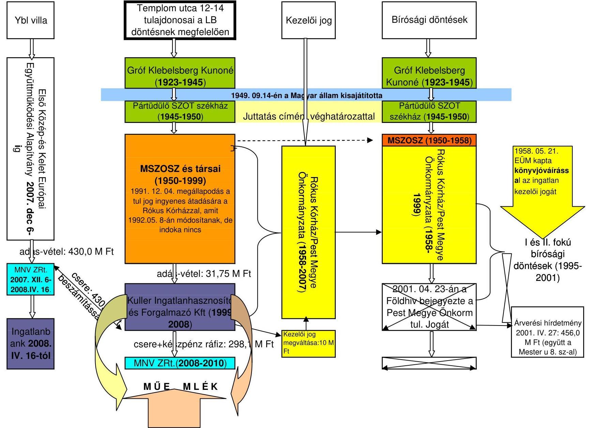

# Klebelsberg Kastély tulajdonlásában bekövetkezett változások időrendi sorrendje

|  Templom utca 12-14 tulajdonosai a LB döntésnek megfelelően | Kezelői jog | Bírósági döntések  |
| --- | --- | --- |
|  Gróf Klebelsberg Kunoné (1923-1945) |  | Gróf Klebelsberg Kunoné (1923-1945)  |
|  Pártüdülő SZOT székház (1945-1950) |  | Pártüdülő SZOT székház (1945-1950)  |
|  MSZOSZ és társai (1950-1999) 1991. 12. 04. megállapodás a túl jog ingyenes átadására a Rókus Kórházzal, amit 1992. 05. 8-án módosítanak, de indoka nincs |  | MSZOSZ (1950-1958)  |
|  adás-vétel: 430,0 M Ft |  | Rókus Kórház/Pest Megye Önkormányzata (1958-2007)  |
|  MNV ZRt. 2007. XII. 6-2008.IV. 16 |  | 2001. 04. 23-án a Földhivatal bejegyezte a Pest Megye Önkorm. tul. jogát  |
|  Ingatlanbank 2008. IV. 16-tól |  | Árverési hírdetmény 2001. IV. 27: 456,0 M Ft (együtt a Mester u. 8. sz-al)  |

Összességében a Kuller Ingatlanhasznosító és Forgalmazó Kft 1999. évi 31,75 M Ft-ért vásárolt Klebelsberg kastélyért megkapta 2008-ban 430,0 MFt értékben az Ybl villát + 298,1 M Ft kp-t
