# ÁLLAMI   SZÁMVEVŐSZÉK 

## JELENTÉS

a természeti katasztrófák megelőzésére, elhárítására, következményeinek felszámolására kialakított rendszerek ellenőrzéséről

---

2. Államháztartás Központi Szintjét Ellenőrző Igazgatóság
2.3. Az Állam és az Állami Vagyon Működését Ellenőrző Főcsoport Iktatószám: V-2019-047/2010-2011.
Témaszám: 1004
Vizsgálat-azonosító szám: V-0535-01

# Az ellenőrzést felügyelte: 

dr. Becker Pál
főigazgató
Az ellenőrzés végrehajtásáért felelős:
Hegedűsné dr. Müllern Veronika
főcsoportfőnök
dr. Varga Sándor
főigazgató-helyettes, főcsoportfőnök
Az ellenőrzést vezette:
dr. Horváth Margit
osztályvezető főtanácsos
Holman Magdolna Julianna
osztályvezető főtanácsos
A számvevői jelentések feldolgozásában és a jelentés összeállításában közreműködtek:

Bocsi Sándor
számvevő tanácsos, főtanácsadó

Szilas István
számvevő tanácsos, tanácsadó

## Varga József

számvevő tanácsos, főtanácsadó

## Az ellenőrzést végezték:

Bocsi Sándor
számvevő tanácsos, főtanácsadó

Dede Katalin
számvevő tanácsos, tanácsadó

Hadnagyné Papp
Ildikó
számvevő
Dr. Jakab Kornél
számvevő tanácsos

Dede Katalin
számvevő tanácsos, tanácsadó

Horthy Eszter
számvevő

Keszthelyi Zoltán
számvevő tanácsos, tanácsadó

## Nagy Attila

számvevő tanácsos

Bíró Zsolt
számvevő tanácsos

Groholy Andrásné
Hangyál Márta
számvevő tanácsos
Iszakné Dóczé Katalin
számvevő tanácsos

Dr. Király László
számvevő tanácsos, tanácsadó

Jelentéseink az Országgyűlés számítógépes hálózatán és az Interneten a www.asz.hu címen is olvashatók.

---

| Kisapáti Angéla számvevő tanácsos | Krüzselyi Attila számvevő tanácsos | Laki Dóra számvevő tanácsos |
| :--: | :--: | :--: |
| Dr. Láng Ágnes számvevő | Luhály Matild számvevő | Dr. Mezei Imréné számvevő tanácsos, főtanácsadó |
| Nagy Attila számvevő tanácsos | Puskás Balázs számvevő | Ritecz Tibor számvevő |
| Szikszainé Király Mária számvevő tanácsos, főtanácsadó | Szilas István számvevő tanácsos, tanácsadó | Tóthné Salamon Ildikó számvevő tanácsos, főtanácsadó |
| Varga József számvevő tanácsos, főtanácsadó | Vida László számvevő tanácsos |  |

---

# A témához kapcsolódó eddig készített számvevőszéki jelentések: 

## címe

Jelentés a természeti katasztrófák megelőzésére való felkészülés ellenőrzéséről
Jelentés a települési önkormányzatok vízrendezési és csapadékvíz 0708
elvezetési feladatai ellátásának ellenőrzéséről
Vélemény a Magyar Köztársaság 2009. évi költségvetési javaslatá- 0836 ról
Vélemény a Magyar Köztársaság 2010. évi költségvetési javaslatá- 0935 ról
Jelentés a Magyar Köztársaság 2009. évi költségvetése végrehajtá- 1016 sának ellenőrzéséről
Vélemény a Magyar Köztársaság 2011. évi költségvetési javaslatá- 1025 ról

---

# TARTALOMJEGYZÉK 

BEVEZETÉS ..... 7
I. ÖSSZEGZŐ MEGÁLLAPÍTÁSOK, KÖVETKEZTETÉSEK, JAVASLATOK ..... 12
II. RÉSZLETES MEGÁLLAPÍTÁSOK ..... 23

1. A katasztrófavédelem szabályozása, szervezetrendszere és működése ..... 23
1.1. A katasztrófavédelem jogszabályi környezete ..... 23
1.2. A katasztrófavédelem irányítása és centrális szervei ..... 33
1.3. A területi és helyi igazgatási szervek, a karitatív szervezetek ..... 37
2. A pénzügyi, technikai és humán források alakulása, a felhasználás hatékonysága, eredményessége ..... 41
2.1. A katasztrófák kezelésében résztvevő szervezetek finanszírozási rendszere ..... 41
2.2. A működésre szolgáló források összhangja a katasztrófa-kezelés feladatainak ellátásával, a források felhasználása ..... 44
2.3. A létszám alakulása ..... 51
3. A megelőzési feladatok megvalósításához kialakított rendszerek működtetése ..... 52
3.1. A felkészítési gyakorlatok rendszere ..... 52
3.2. A képzések, továbbképzések szerepe ..... 54
3.3. A vízügyi megelőzési feladatok és a riasztási rendszer ..... 55
3.4. A meteorológiai előrejelzések szerepe ..... 57
3.5. A települési önkormányzatok megelőzési feladatai ellátásának hatékonysága ..... 58
4. A 2010. évi árvíz-védekezési feladatok ellátása ..... 60
4.1. A védekezési feladatok végrehajtásának eredményessége az ellenőrzött önkormányzatoknál, a karitatív szervezetek közreműködése ..... 64
5. A helyreállítás és az újjáépítés helyi feladatai ..... 68
6. A természeti károkból adódó önkormányzati kiadások megtérülése ..... 75
6.1. A védekezést és helyreállítást segítő vis maior támogatás felhasználása ..... 75

---

# MELLÉKLETEK 

1. számú Észrevételek és válaszok
2/a. számú A helyszíni vizsgálatba bevont szervezetek az államháztartás központi szintjén
2/b. számú A helyszíni vizsgálatba bevont önkormányzatok
2/c. számú A tanúsítványbekéréssel ellenőrzött önkormányzatok
3/a. számú A Kormány által kihirdetett árvízi veszélyhelyzetek főbb jellemzői (2010.)
3/b. számú A 2010-es árvizek jellemzői
2. számú Az árvízi védekezés hatásköri, tájékoztatási rendszere (2010. júniusi állapot)
3. számú A védelmi tervek települések szerinti megoszlása (2009-2010)
4. számú Az Országos Katasztrófavédelmi Főigazgatóság szervezeti felépítése
5. számú A védekezésben részt vevő szervezeteknek nyújtott források nagysága és ütemezése (2010. január és december között)
6. számú Az OKF és területi szervei kiadási előirányzatainak alakulása (2009-2011)
7. számú A Hivatásos önkormányzati, illetve az Önkéntes tűzoltóságok működtetésére, valamint a tűzoltósági eszközfejlesztésre fordítható források alakulása (2009-2011)
8. számú A vízkárelhárítással összefüggő eredeti kiadási előirányzatok forrásmegoszlása a vízügyi szervek, illetve a felhasználás célja szerint
9. számú A vízügyi ágazat védekezési jellemzői a belvíztől a rendkívüli árvízig (2009-2010)
10. számú A belvíz elleni védekezés főbb jellemzői 2010-ben a veszélyhelyzettel érintett időszakokra vonatkozóan
11. számú A vizek kártételeinek megelőzéséhez kapcsolódó operatív programok pályázatainak főbb jellemzői (2010. november 22-éig)
14/a. számú Kimutatás a vis maior tartalékból nyújtott támogatásokról településtípusonként (2009-2010)
14/b. számú Kimutatás a vis maior tartalékból nyújtott támogatásokról megyénként (2009-2010)
12. számú Lakossági kárenyhítéssel kapcsolatos összesítő táblázat (2010. 12. 31-ei állapot)
13. számú Kimutatás a természeti katasztrófák megelőzésére fordított kiadások 20092010. évi forrásösszetételéről
14. számú Kimutatás az önkormányzatok által a 2009. és 2010. évi természeti katasztrófák miatt védekezésére fordított kiadások forrásösszetételének bemutatására
15. számú Kimutatás az ellenőrzött önkormányzatok által a természeti katasztrófák elleni védekezésre és a károk helyreállítására 2009-2010. évben felhasznált vis maior és egyéb támogatásokról

---

# FÜGGELÉKEK 

1. számú Összegzés a polgármesteri kérdőíves felmérésre adott válaszok eredményéről

---

.

---

# RÖVIDÍTÉSEK JEGYZÉKE 

| ÁSZ | Állami Számvevőszék |
| :--: | :--: |
| Bit. | a biztosítókról és a biztosítási tevékenységről szóló 2003. évi LX. törvény |
| BM | Belügyminisztérium |
| DAOP | (Dél-Alföldi Operatív Program) 5.2.1 Belterületi csapadékés belvízelvezetés |
| DDOP | (Dél-Dunántúli Operatív Program) 5.1.5 Települési bel- és külterületi vízrendezés |
| EDR | Egységes Digitális Rádiórendszer |
| EUROSAI | European Organisation of Supreme Audit Institutions |
| EUSZA | EU Szolidaritási Alapja |
| Eütv. | az egészségügyről szóló 1997. évi CLIV. törvény |
| ÉAOP | (Észak-Alföldi Operatív Program) 5.1.2 Belvízvédelemhez kapcsolódó térségi vízrendezés |
| ÉMOP | (Észak-Magyarországi Operatív Program) 3.2.1 Helyi és térségi jelentőségű vízvédelmi rendszerek rekonstrukciója |
| HKR | Honvédelmi Katasztrófavédelmi Rendszer |
| HÖT | Hivatásos Önkormányzati Tűzoltóságok |
| Hszt. | a fegyveres szervek hivatásos állományú tagjainak szolgálati viszonyáról szóló 1996. évi XLIII. törvény |
| HVB | Helyi Védelmi Bizottságok |
| Hvt. | a honvédelemről és a Magyar Honvédségről szóló 2004. évi CV. törvény |
| Kat. | a katasztrófák elleni védekezés irányításáról, szervezetéről és a veszélyes anyagokkal kapcsolatos súlyos balesetek elleni védekezésről szóló 1999. évi LXXIV. törvény |
| Kat. vhr. | Kat. végrehajtására kiadott 179/1999. (XII. 10.) Korm. rendelet |
| KDOP | (Közép-Dunántúli Operatív Program) 4.1.1 Szennyvízelvezetés és -kezelés fejlesztése |
| KEOP | Környezet és Energia Program |
| KKB | Kormányzati Koordinációs Bizottság |
| KMOP | (Közép-Magyarországi Operatív Program) 3.3.1 Belterületi csapadékvíz-elvezetés és gyűjtés |
| MH KOB | Katasztrófavédelmi Operatív Bizottság |
| KOK | Katasztrófavédelmi Oktatási Központ |
| Koncepció | a katasztrófavédelmi rendszer javításáról és fejlesztéséről szóló koncepcióval összefüggő egyes feladatokról szóló 1233/2010. (XI. 15.) Korm. határozat szerint megtárgyalt koncepció |
| KÖVIZIG | Környezetvédelmi és Vízügyi Igazgatóságok |
| MABISZ | Magyar Biztosítók Szövetsége |
| MVB | Megyei Védelmi Bizottságok |
| NGM | Nemzetgazdasági Minisztérium |

---

| NYDOP | (Nyugat-Dunántúli Operatív Program) 4.1.1 Belterületi   vízrendezés |
| :-- | :-- |
| BM OKF | Országos Katasztrófavédelmi Főigazgatóság |
| OMIT | Országos Műszaki Irányító Törzs |
| OMSZ | Országos Meteorológiai Szolgálat |
| OpT | Operatív Törzs |
| ÖT | Önkéntes Tűzoltóságok |
| PVI | Polgári Védelmi Irodák |
| PVK | Polgári Védelmi Kirendeltségek |
| Pvt. | a polgári védelemről szóló 1996. évi XXXVII. törvény |
| RÁH | Regionális Államigazgatási Hivatal |
| RFT | Regionális Fejlesztési Tanácsok |
| ROP | Regionális Operatív Programok |
| SzMSz | Szervezeti és Működési Szabályzat |
| ÚMVP | Új Magyarország Vidékfejlesztési Program |
| Vgtv. | a vízgazdálkodásról szóló 1995. évi LVII. törvény |
| VK | Veszélyhelyzeti Központ |
| VKKI | Vízügyi és Környezetvédelmi Központi Igazgatóság |
| VM | Vidékfejlesztési Minisztérium |
| WMA | Wesselényi Miklós Ár- és Belvízvédelmi Kártalanítási Alap |

---

# JELENTÉS 

## a természeti katasztrófák megelőzésére, elhárítására, következményeinek felszámolására kialakított rendszerek ellenőrzéséről

## BEVEZETÉS

Az utóbbi években a hazánkat rendszeresen sújtó természeti katasztrófák ${ }^{1}$ (árvíz, belvíz, jégeső) folyamatosan operatív feladatokat adnak mind a katasztrófavédelemnek, a vízügyi szerveknek, mind a helyi önkormányzatoknak és a lakosságnak. Az élet- és vagyonbiztonságot, a környezetet, valamint a gazdasági biztonságot közvetlenül fenyegető veszélyhelyzetek kialakulása miatt a védelmi szervek tevékenysége időről időre az érdeklődés homlokterébe kerül, ezért különösen fontos, hogy a megelőzés, a védekezés, a helyreállítás jogi szabályozása és annak végrehajtása megfelelő, a védelem érintett szereplőinek feladata összehangolt legyen.

A katasztrófavédelem a különböző katasztrófák elleni védekezésben azon tervezési, szervezési, összehangolási, végrehajtási, irányítási, létesítési, működtetési, tájékoztatási, riasztási, adatközlési és ellenőrzési tevékenységek összessége, amelyek a katasztrófa kialakulásának megelőzését, a közvetlen veszélyek elhárítását, az előidéző okok megszüntetését, a károsító hatásuk csökkentését, a lakosság élet- és anyagi javainak védelmét, a katasztrófa sújtotta területen az alapvető életfeltételek biztosítását, valamint a mentés végrehajtását, továbbá a helyreállítás feltételeinek megteremtését szolgálják.

A katasztrófavédelem nemzeti ügy, annak ellátásában egyaránt részt vesznek a központi, a területi és a helyi államszervezet intézményei, a helyi/megyei önkormányzatok, a gazdálkodó- és civil szervezetek, valamint az állampolgárok. A hatékony védelem megkívánja a valamennyi szereplő közötti kommunikáció összehangolását és együttműködésüket országos, valamint nemzetközi - adott esetben uniós - szinten egyaránt.

A katasztrófavédelem rendszerében kiemelt szerepet tölt be a katasztrófák elleni védekezésért felelős miniszter felügyelete alatt működő Országos Katasztrófavédelmi Főigazgatóság (OKF), amely államigazgatási feladatokat is ellátó rendvédelmi szerv. A szervezet - a polgári védelem és az állami tűzoltóság országos és területi szerveinek összevonásával - 2000-ben alakult. Területi szervei

[^0]
[^0]:    ${ }^{1}$. A természeti eredetű katasztrófák hidrometeorológiai eredetűek (árvíz, belvíz, hirtelen áradás, szélvihar, aszály, hőség, rendkívüli hideg, felhőszakadás, jégeső, tornádó) és geológiai jellegűek (földrengés, földcsuszamlás) lehetnek. A különböző jellegű katasztrófák (hatásai) gyakran együttesen jelentkeznek.

---

a megyei igazgatóságok, amelyek alárendeltségében helyi szervként polgári védelmi kirendeltségek működnek. A szervezet struktúrája 2010-ben megújult (6. sz. melléklet). A katasztrófák elleni védekezés irányításának és a végrehajtás összehangolásának megszervezése, a tervezés kormányszintű feladatainak végrehajtása, a megelőzés és a végrehajtás feladatainak tárcák közötti koordinációja a Kormányzati Koordinációs Bizottság (KKB) hatásköre, amelynek elnöke a katasztrófák elleni védekezésért felelős miniszter (2010 közepéig az önkormányzati miniszter, azt követően a belügyminiszter).

A katasztrófák elleni védekezés irányításáról, szervezetéről és a veszélyes anyagokkal kapcsolatos súlyos balesetek elleni védekezésről szóló 1999. évi LXXIV. törvény (Kat.) és az annak végrehajtására kiadott 179/1999. (XII. 10.) Korm. rendelet (Kat. vhr.) a KKB tevékenységének támogatására és az érintett tárca katasztrófahelyzetben ellátandó szakmai feladatainak koordinálására védekezési munkabizottságok létrehozásáról rendelkezett.

A Kat. az ágazati feladatkörökbe tartozó területek katasztrófavédelmével kapcsolatos tervező, szervező, irányító tevékenységeket illetően az illetékes miniszterek felelősségét az általánosság szintjén, míg a megelőző védelmi feladatok ágazati végrehajtásának irányításában konkrétan határozta meg. A katasztrófavédelem valamennyi felelős szereplője részére a veszélyhelyzet különböző fokozataihoz határozták meg az irányítói hatásköröket. A honvédelem rendszerében helyi, illetve megyei védelmi bizottságok (HVB és MVB) működnek, amelyek a védelmi igazgatás keretében katasztrófavédelmi feladatokat is ellátnak. A honvédelmi körzetben működő HVB-ket a polgármesterek, az MVB-ket a megyei közgyűlések elnökei vezetik államigazgatási hatáskörükben eljárva. E jogkörükben a katasztrófákra való felkészülésben, a védekezés irányításában a központi szervezetek mellett kiemelt szerepük van.

A vízügyi szervek elemzése szerint a földrajzi és éghajlati adottságaink miatt az ország bármely területén, az év bármely időszakában keletkezhetnek árvizek, illetve belvizek. Kisebb árvizekre és a belvizek elleni védekezésre országosan 2-3 évente, jelentősebb árvizekre 5-6 évente, míg rendkívüli (olykor pusztító) árvizekre 10-12 évenként kell számítani. Az árvizek által veszélyeztetett területeken található a megművelhető területek $40 \%$-a, ott él a lakosság $23 \%$-a. Mind a védművek hossza, mind az általuk mentesített árterek kiterjedése tekintetében Magyarország, sőt önmagában a Tisza védelmi rendszere a legkiterjedtebb Európában. A 2005-ben indult Vásárhelyi Terv Továbbfejlesztése projekt keretében a Tisza-menti térség terület- és vidékfejlesztési, tájgazdálkodási és természetvédelmi feladatain belül kiemelt cél a Tisza-völgy árvízvédelmi biztonságának megteremtése. Az Új Magyarország Fejlesztési Terv azonban nemcsak ehhez biztosít forrásokat, hanem az ország egyéb területein is a vízgazdálkodás feltételeinek fejlesztésére - az eddig megítélt - támogatások összege mintegy 200 Mrd Ft-ot tesz ki. (A vizek kártételeihez kapcsolódó ÜMFT operatív programok pályázatainak főbb jellemzőit a 13. sz. mellékletben mutatjuk be.) A vizek kártételeinek megelőzésére 2007-2009 között évente 38,1-53,4 Mrd Ft támogatást használtak fel.

Hazánkban a vizek kártételei elleni védekezés fontosságára tekintettel vizsgálatunkban kiemelt figyelmet fordítottunk a hidrológiai jellegű katasztrófák kezelésének értékelésére. Az ár- és belvízvédekezés országos irányítását a vízgazdál-

---

kodásról szóló 1995. évi LVII. törvény (Vgtv.) alapján a vízgazdálkodásért felelős miniszter látja el. A Vgtv. többek között előírta a vizek kártételei elleni védelem érdekében a vízkárelhárítási tevékenység szabályozását, szervezését, irányítását, ellenőrzését, a helyi közfeladatokat meghaladó védekezést. Az árvízvédekezés országos irányítása a 2010. évi kormányzati struktúra-átalakítást követően a vidékfejlesztési miniszter hatáskörébe került. (Azt megelőzően a vízügyi ágazat a Környezetvédelmi és Vízügyi Minisztérium irányítása alá tartozott.) A vizek kártételei elleni védelem érdekében szükséges feladatok ellátása - a védművek építése, fejlesztése, fenntartása, valamint a védekezés - az állam, a helyi önkormányzatok, illetve a károk megelőzésében vagy elhárításában érdekeltek közös kötelezettsége. A vízgazdálkodásért felelős miniszter hatáskörébe utalt vízkárelhárítással összefüggő állami feladatokat a vízügyi igazgatási szervezetek - az ágazati minisztérium, valamint az e célra létrehozott központi szervek és területi szerveik - kormány-, illetve miniszteri rendeletekben meghatározott illetékesség szerinti feladatmegosztásban látják el.

A katasztrófavédelem céljaira felhasználható források az államháztartás rendszerében nincsenek egy helyre csoportosítva. A központi költségvetés szerkezeti rendjében a katasztrófavédelem külön címként szerepel a XI. fejezetben (2009-ben Önkormányzati Minisztérium, a 2010. évi kormányalakítást követően Belügyminisztérium). A cím módosított kiadási előirányzata évente 18-20 Mrd Ft, melynek mintegy felét teszi ki az OKF kiadási előirányzata. Ugyanakkor az ágazati minisztériumoknál a katasztrófavédelmi feladatok kiadásai közel további 10 Mrd Ft-os nagyságrendet képviseltek évente a 2007-2009 közötti időszakban.

A IX. Helyi önkormányzatok támogatásai fejezetben vis maior támogatás és vis maior tartalék címen 2009. évben további közel 1,2 Mrd Ft állt rendelkezésre a helyi önkormányzatok számára.

Főként a károk enyhítésében, azok elhárításában a nem kormányzati szervek, civil és karitatív szervezetek is tevékenyen részt vesznek, az általuk e célokra fordított összegek is milliárdos nagyságrendet képviselnek ${ }^{2}$.

Az ÁSZ eddigi ellenőrzései a katasztrófák elleni védekezés szabályozási környezetét, az országos hatáskörű szervek feladat-ellátását, a megelőzés tervezési rendszerét tekintették át [2005. évi jelentés a természeti katasztrófák megelőzésére való felkészülésről (0518), a katasztrófavédelem működési feltételeit a Belügyminisztérium fejezet működésének ellenőrzése keretében (0618)].

Az önkormányzatok katasztrófavédelmi feladatai ellátásának egy részterületére külön teljesítmény-ellenőrzést végeztünk 2006-ban (0708). Ennek keretében értékeltük a települési önkormányzatok vízrendezési és csapadékvíz elvezetési feladatai ellátását. Az ellenőrzés főbb tapasztalatai, következtetései azt mutatták, hogy az önkormányzatok tulajdonában lévő vizek és vízi létesítmények vízelvezető képessége csak részben felelt meg az eredeti funkciójának, a nem

[^0]
[^0]:    ${ }^{2}$ A 2010. évi árvíz károsultjainak támogatására a BM a négy legnagyobb hazai karitatív szervezettel (Magyar Vöröskereszt, Magyar Ökumenikus Segélyszervezet, Katolikus Karitász, Magyar Baptista Szeretetszolgálat) kötött együttműködési megállapodást.

---

önkormányzati tulajdonban lévő vízi létesítmények fejlesztése a belterületi vízelvezető rendszerek fejlesztésével, felújításával nem volt összehangolva, továbbá az 1997-től kötelezően előírt védekezési tervvel az önkormányzatok csak részben rendelkeztek, a vízkárok enyhítésére jellemzően nem képeztek tartalékot.

Hazánkban 2010 május-június hónapban özönvízszerű esőzések árasztották el a folyók, patakok vízgyűjtőit, hatásukra 11 megyében mintegy 320 lakóingatlan összedőlt vagy lakhatatlanná vált. Ezzel összefüggésben a Kormány a polgári védelemről szóló 1996. évi XXXVII. törvény 2. § (2) bekezdés g) és j) pontja szerinti árvízi veszélyhelyzetet hirdetett ki (3/a. sz. melléklet). A védekezés során honvédségi erők igénybevételére is sor került. Az állami kárenyhítés összege több mint 3 Mrd Ft volt. A védekezés során, illetve a helyreállítás költségeihez való hozzájárulásnál támaszkodunk a nemzetközi együttműködésre, továbbá az EU segítségére.

Az EU Szolidaritási Alapja (EUSZA) a tagállamoknak és a csatlakozási tárgyalásokat folytató országoknak nyújthat anyagi támogatást súlyos természeti katasztrófa esetén, ha a katasztrófa okozta közvetlen kár összértéke meghaladja a (2002-es árakon számított) 3 Mrd eurós összeget. Az EUSZA éves költségvetése 1 Mrd eurót tesz ki, melynek 7,5\%-a (75 M euró) áll rendelkezésre rendkívüli regionális katasztrófák esetére. Az Alap azokat a tagállami ráfordításokat egészíti ki, amelyek révén az érintett tagországok létfontosságú sürgősségi intézkedéseit finanszírozzák, így pl. az infrastruktúra, valamint az energiaellátás, ivóvízellátás és szennyvízgazdálkodás, távközlés, közlekedés, egészségügy és oktatás szervezeteinek, intézményeinek működését, azok helyreállítását, átmeneti szállás és a segélyhívó szolgálatok működtetését a lakosság azonnali szükségleteinek kielégítése érdekében.

A jelen ellenőrzés célja annak értékelése volt, hogy

- a természeti katasztrófák kezelésének szabályozási és intézményrendszere, valamint a feladatok, hatáskörök elosztása, felelősségi rendje biztosították-e a megelőzésre, illetve a hatékony katasztrófavédelemre történő felkészülést, az eredményes és gyors védekezési munkálatokat, a helyreállítást;
- rendelkezésre álltak-e a katasztrófavédelem eredményes és hatékony működtetéséhez a szükséges források, azok tervezése és felhasználása az államháztartás szerkezeti rendjében kellőképp átlátható és nyomon követhető volt-e;
- a megelőzésre, védekezésre és a helyreállításra, illetve a kártalanításra fordított hazai és EU-s támogatások szervesen illeszkedtek-e a rendszer működtetésének prioritásaihoz és/vagy gyenge pontjaihoz, azok eredményei a káresemények bekövetkezésének megelőzésében, a káreseményekre való reagálási képességben kimutathatók-e;
- a katasztrófavédelem keretében a különböző szervezetek megbízható mérő-, megfigyelő, előrejelző és infokommunikációs rendszereket működtetnek-e; továbbá azok biztosítják-e a veszélyeztetett területeken a megközelítőleg azonos és arányos biztonsági és védelmi szolgáltatást; valamint a gyors és szakszerű beavatkozás lehetőségét.

---

A helyszíni ellenőrzés a 2009-2010. évekre terjedt ki, bázisul a 2008. év tervezési munkálatai szolgáltak, egyben kitekintettünk a vizsgálat befejezéséig tartó időszak releváns folyamataira is.

Az ellenőrzést a rendszerellenőrzés módszerével végeztük, amelynek során alkalmaztuk az ellenőrzési kritériumokat és kérdéseket, a tanúsítványok adatszolgáltatását, a kérdőíves felmérést, valamint a helyszíni interjúk készítését. A részletes ellenőrzési szempontokat előtanulmánnyal alapoztuk meg.

A vizsgálat fő feladata volt, hogy felmérje és értékelje a központi kormányzati, a helyi önkormányzati szervek, valamint a közreműködő civil szféra együttműködésének eredményességét a természeti katasztrófák elleni védekezésben és helyreállítási munkálataiban, továbbá az azok megelőzésére és a felkészülésre fordított közpénzek hasznosulását.

Az ellenőrzés fontos részét képezte a tevékenységek és a döntéshozatali rendszerek értékelése azon folyamatokra, amelyek a természeti katasztrófák kezelésének rendszerében hatással vannak a döntéshozók által kitűzött célok teljesülésére, a közpénzek hatékony felhasználására.

Az ellenőrzés témája és az áttekinteni kívánt időszak egyaránt illeszkedik a 2010-ben öt ország - köztük hazánk - által elfogadott Együttműködési megállapodásban lefektetett koordinált párhuzamos ellenőrzéshez, amely a katasztrófák megelőzésére és következményeik felszámolására fordított állami pénzeszközök vizsgálatát célozza meg. (A jelentés angol nyelvű összefoglalóját 2011 áprilisában adtuk át a koordinátori szerepet betöltő Ukrán Ellenőrzési Kamarának. A koordinátor gondoskodik a nemzeti összefoglalókból készült közös ellenőrzési jelentés összeállításáról. A jelentés az EUROSAI ${ }^{3}$ 2011. júniusi kongresszusán kerül bemutatásra.)

Az ellenőrzés végrehajtásának jogszabályi alapját az Állami Számvevőszékről szóló 1989. évi XXXVIII. törvény 2. § (3) és (5), valamint a 17. § (3) bekezdéseiben foglaltak képezték.

A jelentést egyeztettük a belügyminiszterrel, a honvédelmi miniszterrel, a közigazgatási és igazságügyi miniszterrel, a nemzetgazdasági miniszterrel, a nemzeti erőforrás miniszterrel, a nemzeti fejlesztési miniszterrel, valamint a vidékfejlesztési miniszterrel. A nemzetgazdasági miniszter kivételével a miniszterek nem tettek észrevételt. (A leveleket és a nemzetgazdasági miniszternek adott válaszomat a jelentés 1. sz. melléklete tartalmazza.)

[^0]
[^0]:    ${ }^{3}$ Az European Organisation of Supreme Audit Institutions (Legfőbb Ellenőrző Intézmények Európai Szervezete) az európai számvevőszékek együttműködésének szervezete.

---

# I. ÖSSZEGZŐ MEGÁLLAPÍTÁSOK, KÖVETKEZTETÉSEK, JAVASLATOK 

Vizsgálatunk előzményeként a természeti katasztrófák megelőzésére való felkészülés rendszerét 2005-ben tekintettük át. Jelentésünk alapvető megállapítása volt, hogy a természeti katasztrófákkal kapcsolatos szabályozásban lényeges inkonzisztenciák mutatkoztak. A jogszabályok belső és egymásnak is ellentmondó előírásokat, következetlenül használt fogalmakat, a jog- és hatáskörökben átfedéseket okozó előírásokat tartalmaztak. A felvázolt kép a jelen vizsgálat helyszíni ellenőrzésének lezárásáig nem változott, ami a katasztrófavédelem minden területén kedvezőtlen hatásokkal járt.

A katasztrófa kérdéskörét legalább két paradigma ${ }^{4}$ alapján lehet megközelíteni. Az egyik szerint a hagyományosan elkülönülő területeknek (ipar, bányászat, közlekedés, egészségügy, mezőgazdaság, vízgazdálkodás stb.), az azokért felelős szervezeteknek kell a katasztrófák kezelésére felkészülnie és védekeznie. A másik megközelítés szerint külön katasztrófavédelmi ágazatként kell értelmezni a megelőzés, elhárítás és a következmények felszámolása egész folyamatát ${ }^{5}$. Szakmai érvekkel mindkét megközelítés alátámasztható. Közöttük az állam működtetéséért, a közfeladatok ellátásáért felelős döntéshozó testületek (Országgyűlés, Kormány) választhatnak azzal, hogy az adott paradigma megvalósítása a szabályozás, a szervezet és működés, valamint a finanszírozás vonatkozásában egyaránt legyen következetes. A hatályos szabályozás és működés a megközelítéseket ötvözi, a világos alapelvek, fogalmak meghatározása, az egyértelmű döntés hiányának eredményeképpen a rendszert belső ellentmondások jellemzik.

A szokatlanul csapadékos időjárás 2010 májusában-júniusában jelentős árvizeket, illetve árvízi veszélyhelyzetet okozott, melyek elhárításában az árvízvédelem a reálisan tervezhető szélsőséges körülmények között működött, megmutatta a rendszer erősségeit és gyengeségeit.

[^0]
[^0]:    ${ }^{4}$ A paradigma a gondolkodásoknak, vélekedéseknek, értékeknek és módszereknek - különösen egy tudományterület vonatkozásában - az adott társadalom vagy szűkebben egy tudományos közösség minden tagja által elfogadott összegzését jelenti.
    ${ }^{5}$ A katasztrófák elleni védekezés irányításáról, szervezetéről és a veszélyes anyagokkal kapcsolatos súlyos balesetek elleni védekezésről szóló 1999. évi LXXIV. törvény (Kat.) szerint ez olyan állapot vagy helyzet, amely az emberek életét, egészségét, anyagi értékeiket, a lakosság alapvető ellátását, a természeti környezetet, a természeti értékeket olyan módon vagy mértékben veszélyezteti, károsítja, hogy a kár megelőzése, elhárítása vagy a következmények felszámolása meghaladja az erre rendelt szervezetek előírt együttműködési rendben történő védekezési lehetőségeit és különleges intézkedések bevezetését, valamint az önkormányzatok és az állami szervek folyamatos és szigorúan összehangolt együttműködését, illetve nemzetközi segítség igénybevételét igényli (3. § e) pont).

---

Erősségei a rendszernek, hogy a veszélyhelyzetek (elsősorban a vizek kártételei) köre és a kockázat mértéke relatíve jól meghatározható, illetve a védműrendszerünk európai viszonylatban is jól kiépített. A vízügyi szolgálatra jellemzők az erős szakmai tradíciók. A katasztrófavédelem rendelkezik egységes centrális szervezettel, továbbá a részt vevő (állami) szervezetek együttműködése begyakorlott és magas színvonalú. Jó alapként szolgált a régóta meglévő védelmi igazgatás rendszerébe az önkormányzatok bevonása (szubszidiaritás). Az egymást kiegészítő, együttműködni kész, külföldi és hazai forrásokat mobilizálni képes karitatív szervezetek működése számottevő hozzáadott értéket generált.

A rendszer működésére kedvezőtlen hatással járt a különböző szervezeteknél allokált források folyamatos csökkentése (különösen a fenntartási költségek terén). A védműrendszerhez kapcsolódó feladatok ellátását jelentősen és kedvezőtlenül befolyásolja a tulajdonviszonyok tagoltsága. A szabályozás inkonzisztenciái (következetlen fogalomhasználat, egymást átfedő és/vagy nem egyértelműen elkülönített hatáskörök, az ellenőrzés és a szankcionálás hiánya stb.) a hatékony működés ellenében fejtik ki hatásukat. A védelmi igazgatás területi, különösen helyi szintjén a kapacitások és kompetenciák rendszerszerű hiányokkal működnek. Az állampolgárok és a gazdálkodó szervezetek kötelező és önkéntes alapon történő mozgósítása nem problémamentes. A karitatív szervezetek bevonása nem volt szervezett és tervezett. A katasztrófavédelmi szabályozás nem határozza meg egyértelműen a katasztrófa fogalmát, így a katasztrófavédelemét sem. A megelőzés feladatkörébe a jogszabály meghatározása szerint beleérthetőek azoknak az egyenként tízmilliárdos nagyságrendű költséget igénylő árapasztó tározóknak az építése, amelyek célja, hogy az árvizeknél csökkentsék a levonuló árhullám tömegét, annak szintjét.

A modern államokkal szemben a jó kormányzás kritériumai ${ }^{6}$ szerint alapvető elvárás, hogy az állam az erejéhez mérten vegyen részt a saját és a más országokban bekövetkezett katasztrófák elleni védekezésben, a következmények elhárításában. Hazánkban az állam és a társadalom normális működését súlyosan megzavaró helyzetekre vonatkozó általános rendelkezéseket az Alkotmány tartalmazza, amely csak az elemi csapás esetén teszi lehetővé a Kormány számára a veszélyhelyzet kihirdetését, ipari szerencsétlenségnél nem ${ }^{7}$, ezzel korlátozza intézkedési körét.

[^0]
[^0]:    ${ }^{6}$ Jellemzői a problémaérzékenység (fogékonyság a társadalmi szükségletek iránt); az érintettek legszélesebb körének bevonása; konszenzus-orientáltság; az emberi jogokat érvényesítő szabályok érvényesülése/érvényesítése a pártatlan, nem-korrupt igazságszolgáltatás által, a méltányosság szempontjainak figyelembevételével; átláthatóság (az igazgatási dokumentumokhoz való hozzájutás és a döntésekben való részvétel lehetősége); a döntést hozók és végrehajtók elszámoltathatósága az érintettek által, például az intézkedések, az állami szervek hatékonyságának és eredményességének minősítésével; a megvalósuláshoz/megvalósításhoz szükséges szabályozási-intézményiműködési feltételek megteremtése (beleértve a megfelelő kapacitás és kompetencia biztosítása, a célravezetően hatékony eredményesség).
    ${ }^{7}$ A 2011. április 25-én elfogadott, 2012. január 1-jével hatályos Magyarország Alaptörvénye már egyértelműen rendezi ezt a kérdést: „A Kormány az élet- és vagyonbiztonságot veszélyeztető elemi csapás vagy ipari szerencsétlenség esetén, valamint ezek következményei-

---

A polgári védelmi és a katasztrófavédelmi feladatok, illetve a vizek kártételeire vonatkozó szabályozás egymástól függetlenül került kialakításra, különösen a tervezés, a védekezés irányítási jogköreinek megosztása, továbbá az önkormányzatokhoz telepített hatáskörök gyakorlása területén. A szabályozásnak az ellenőrzésre és különösen a szankcionálásra vonatkozó hiányosságai ${ }^{8}$ nehezítették a végrehajtást.

A hazai katasztrófavédelmi szabályozásba még nem illesztették be a nemzetközi katasztrófa-segítségnyújtás NATO és EU szinten kialakított szabályrendszerének rendelkezéseit. Az előírások átvételével biztosítható az EU és a NATO gyorsriasztási, monitoring és információs központjaival való kapcsolattartás, valamint a nemzetközi katasztrófasegély nyújtásának, illetve fogadásának feltételei, körülményei.

A természeti katasztrófák sokrétű megjelenési formájának kezelése az ágazatokon túlmutató megközelítést igényel. Ehhez illeszkedik a szervezeti és intézményrendszer, amelyben a kormányzati feladatokat a KKB, mint tárcaközi bizottság és szervezetei látják el a koordinációs és operatív feladatok szintjén egyaránt. A katasztrófák kezeléséért felelős miniszter külön centrális szervezetet irányít. Az OKF országos lefedettségű területi hálózatot működtet. A katasztrófavédelemmel kapcsolatos kormányzati akarat közvetlenül eljut az érintettekhez, és az információ-áramlás visszafelé is biztosított. Ugyanakkor a szabályozás töredezettségét mutatja, hogy a rendszerhez a vízügyi szolgálat illesztése nem történt meg, az ebből eredő hiányosságokat a begyakorlott, jó együttműködés ellensúlyozta.

A természeti katasztrófahelyzetek kezelésének szabályozási és intézményrendszere az önkormányzatok számára nem biztosította teljes körűen a hatékony katasztrófavédelemre történő felkészülést, az eredményes védekezést, valamint ezek koordinációját. A jogszabályok nem biztosították az önkormányzati feladat- és hatáskörök, valamint az ezek ellátásához szükséges logisztikai, szakmai, műszaki és pénzügyi erőforrások, valamint ezek felhasználásának területi összhangját. A katasztrófavédelem helyi feladatai - különösen a megelőzés és felkészülés szakaszában - meghaladták az önkormányzatok személyi lehetőségeit. A vizsgált önkormányzatok közel kétharmadánál hiányos volt a szakmai felkészültség. A katasztrófavédelem területi és helyi igazgatási feladatai a régóta működő védelmi igazgatás szervezeti és feladatrendszerébe épülnek, megyei és helyi szinten leképezik az önkormányzati rendszert. Az ellenőrzési ta-
nek az elhárítása érdekében veszélyhelyzetet hirdet ki, és sarkalatos törvényben meghatározott rendkívüli intézkedéseket vezethet be" (53. cikk (1) bekezdés).
${ }^{8}$ Már a 2005. évi ÁSZ jelentés megállapította, hogy az „elmúlt évek árvizi beszámolóinak visszatérő eleme volt annak észrevételezése, hogy a mentést nehezítette - valószínűsíthetően költségesebbé tette - az, hogy az elöntött települések jelentős része nem rendelkezett - a többször előfordult veszélyeztetettség átélése után sem - védekezési tervvel annak ellenére, hogy mind a katasztrófavédelem hivatásos szerveit, mind a vízügyi igazgatóságokat jogszabály alapján segítségül kérhették volna a tervek elkészítéséhez."

---

pasztalatok alapján főleg a polgármesterekhez a jogszabályok olyan feladat- és hatásköröket telepítettek, amelyek ellátásához rendszerszerűen nem biztosították a szükséges kapacitásokat és kompetenciákat.

A polgármesterek a katasztrófavédelmi irányítási, mentési feladataikat az egyéni rátermettségük és felkészültségük alapján végezték. A központi előírások nem voltak egyértelműek az önkormányzatok koordinációs feladatai, valamint a helyi védelmi tervek készítésének tartalmi és eljárási szabályait illetően. Az elkészített tervekben csak részben jelentek meg a katasztrófa-elhárítás feladatai, illetve az ezekhez szükséges kiadások fedezetére a költségvetésükben forrást nem rendeltek. A polgári védelmi tervek készítésének kötelezettsége nem kapcsolódott szorosan a természeti katasztrófák veszélyeztető hatásaihoz és a szabályozás nem fedte le a teljes önkormányzati kört. A tervek felülvizsgálata a Környezetvédelmi és Vízügyi Minisztérium 2008-ban készített vízkárelhárítási stratégiájában megfogalmazott feladatok ellenére sem kezdődött meg.

A településeket veszélyeztetettségi szempontból - külön jogszabályok alapján polgári védelmi, illetőleg ár- és belvízvédelmi kategóriákba sorolták be. A valós veszélyeztetettséget a besorolások csak részben képezték le, továbbá a két besorolás sem volt összhangban. Az ár- és belvízvédelmi szempontból legveszélyeztetettebb települések 54%-át polgári védelmi szempontból nem sorolták be, illetve a legalacsonyabb fokozatba tették. Polgári védelmi szempontból a települések 30%-át egyáltalán nem sorolták be.

A katasztrófavédelemre fordítható központi kiadások - az osztott feladatrendszernek megfelelően - az államháztartáson belül több fejezetnél, címzett és közvetett (megyei védelmi irodák, KKB Titkársága működési támogatása) formában a költségvetés átláthatóságára vonatkozó követelménnyel ellentétesen szerepelnek. Az előírások ellenére nem került sor a katasztrófavédelmi célú előirányzatok egységes kialakítására. A finanszírozási rendszer előírásai és alkalmazott gyakorlata alapján az államháztartás központi szintjén sem mutatható ki, hogy mennyit fordítottunk a katasztrófavédelem hivatásos, illetve nem hivatásos szervei működtetésére, mivel a források egy része beépült a működési költségekbe. Az árvíz- és belvíz elleni védekezés, valamint a vízminőségi és környezeti kárelhárítás finanszírozását a „Víz- és környezeti kárelhárítás" előirányzat ${ }^{9}$ biztosította. Az előre nem látható események elleni védekezésre tervezett összeg a kárelhárítás kezdeti finanszírozását szolgálja csak, a védekezési feladatok ellátására - vízkáresemény bekövetkeztekor - nem elegendő, azt a Kormány rendszerint az általános tartalék terhére egészíti ki.

A vizsgált időszakban jelentősen csökkentek mind a katasztrófavédelmi, mind a vízkártételek kezelésére rendelkezésére álló előirányzatok. Azok nem biztosították a Kormány által már 2000-ben meghatározott, a megelőzés elsődlegességeként megfogalmazott katasztrófavédelmi stratégiai cé-

[^0]
[^0]:    ${ }^{9}$ 2011-től „Víz-, környezeti és természeti katasztrófa kárelhárítás" jogcím-csoport.

---

lok ${ }^{10}$ megvalósulását, sem az EU-s pályázatokból megvalósult védelmi létesítmények kötelező fenntartását.

A beruházások területén kedvező, hogy - több éves késéssel - az árvízvédelem eredményességét növelő, a Vásárhelyi-terv továbbfejlesztése (VTT) keretében tervezett 6 tározó közül kettő 2008-2009-ben elkészült. Ugyanakkor forráshiány miatt jelentős, korábban tervezett vízügyi fejlesztések elmaradtak (a vízépítési nagyműtárgyak rekonstrukciós programja, a síkvidéki szivattyútelepek felújítása, a dombvidéki tározós program megvalósítása). Ehhez hozzájárult a fenntartásra fordítható költségek trendszerű és jelentős csökkenése is ${ }^{11}$.

Az ár- és belvízvédelem fejlesztéséhez kapcsolódó megelőzési feladatokhoz rendelkezésre álló uniós forrásoknál jellemző volt az utófinanszírozás miatt az alacsony felhasználási arány (9-31%), így a vizsgált időszakban a szükséges fejlesztések még nem valósultak meg. Az önkormányzati pályázati rendszerben nem érvényesítették a térségi összehangolás és az egységes védekezés szempontjait. A pályázati rendszer nem tudta korrigálni a szabályozásból eredő tulajdonosi, döntéshozatali problémákat (10 évre visszamenőleges igazolás a vízügyi szolgálattól a belvíz- és csapadékvíz elöntések gyakoriságáról és súlyosságáról, valamint önkormányzati igazolás a kárelhárítás mértékéről) ennek következtében csökkent a benyújtott pályázatok száma.

A működés folyamatosságát - a költségvetési források szűkössége miatt - csak szigorúan takarékos gazdálkodás biztosította mind az OKF-nél és területi szerveinél, mind a vízügyi szerveknél. Emiatt felújításokat, karbantartásokat halasztottak el. Ezek pótlása a későbbiek során többletköltségekkel jár.

A védművek megfelelő kiépítettségének és állapotának hiányában, továbbá az egyes katasztrófavédelmi igazgatóságoknál a szükséges technikai eszközök felújításának, pótlásának elmaradása miatt az operatív védekezés költségesebb és kockázatosabb volt, jelentős többletköltségeket igényelt. A vízügyi szervek számításai szerint a műszaki igényszintnek megfelelő fenntartások az árvízi védekezési költségeket ötödére csökkentik.

A vizsgált időszakban mind a katasztrófavédelmi, mind a vízügyi terület létszáma csökkent. A létszámhiány az OKF-nél az alapfeladatok ellátását nehezítette, a vízügyi területen a feladatok ellátására nem volt elegendő, ezzel a védekezés műszaki irányítását, a védekezési feladatokat ellátó védelmi osztagok tevékenységét tekintve egyaránt kiemelt, biztonságot veszélyeztető tényezőt jelentett. A több folyón történő együttes védekezésnél a 2010. évi árvizek esetén szakmai feladatellátási kockázatként jelentkezett, hogy

[^0]
[^0]:    ${ }^{10}$ A 2003-2008 közötti időszakra szóló Nemzeti Környezetvédelmi Programban fogalmazott ár- és belvízvédelmi stratégiai célok a védművek előírások szerinti teljes körű kiépítése és emellett a Vásárhelyi Tervben megfogalmazott többlet-biztonság megteremtése voltak.
    ${ }^{11}$ A vízügyi ágazat fejlesztési és fenntartási célkitűzéseinek megvalósításához - a tárca kalkulációja szerint - műszaki igényszinten 21 Mrd Ft-ra lett volna szükség 2010-ben, ugyanakkor a rendelkezésre bocsátott forrás csak 16 Mrd Ft-ot tett ki.

---

az önkormányzati védekezés érdekében más helyekről átirányított műszaki szakemberek nem rendelkeztek kellő helyi ismerettel.

A megelőzés, a védekezés és a helyreállítás költségvetési finanszírozási rendszere nem illeszkedett szervesen a megoldandó feladatokhoz. A természeti katasztrófák megelőzésére szolgáló források nem voltak arányban az ellátandó feladatokkal, összehangolásukat a védekezési tervek hiánya is akadályozta. Az ellenőrzött önkormányzatok kétharmada végzett a védművein karbantartást, fejlesztést mindössze harmaduk, ezek is csak részterületeket érintettek és
 nem voltak összehangoltak. A fejlesztések finanszírozására szolgáló pályázati rendszer a megelőzést csak részben támogatta, elsősorban a kisvízfolyásokkal rendelkező települések szorultak ki a támogatási rendszerből, holott ugyanebben a körben volt a legkisebb az öngondoskodási hajlandóság.

A katasztrófavédelmi feladatok ellátásában az öt nagy karitatív szervezet (a Katolikus Karitász, a Magyar Baptista Szeretetszolgálat, a Magyar Máltai Szeretetszolgálat, a Magyar Ökumenikus Segélyszervezet és a Magyar Vöröskereszt) részvétele a polgármesterek szerint rendkívül hasznos és értékteremtő volt. A karitatív szervezetek tevékenységét nem támogatta teljes körűen, minden szakaszra kiterjedően központi koordináció. A jogszabály ezt nem is írta elő, viszont célszerű lett volna olyan szolgáltatások biztosítása (így különösen szállítás, raktározás), amelyek multiplikátor-hatást gyakorolva növelik a karitatív szervezetek által mobilizált hazai és külföldi források felhasználásának hatékonyságát.

A felkészülési feladatok eredménye, hogy a védekezésben részt vevő alakulatok parancsnokainak személyes kapcsolatai, valamint az adott megye védelmi rendszerének ismeretei kedvező feltételeket biztosítottak az árvíz védekezési feladatok végrehajtásához. Egyes területeken (Borsod-Abaúj-Zemplén (BAZ), Csongrád megye) a polgármesterek felkészülési gyakorlatokon való részvételi hajlandósága alacsony volt, ami nem járult hozzá ${ }^{12}$ a hatékony árvízi védekezéshez. Más megyéknél (Békés, Hajdú-Bihar) felkészülési gyakorlatra, illetve a polgármesterek felkészítő gyakorlatára sem került sor.

A vízügyi szervek a védművek őszi felülvizsgálata keretében az önkormányzatok védelmi terveinek meglétét, megfelelőségét is ellenőrizték. Nem áll rendelkezésre teljes körűen információ ${ }^{13}$ arra, hogy hány település

[^0]
[^0]:    ${ }^{12}$ A Megyei Védelmi Iroda által készített „Összefoglaló jelentés-tervezet a 2010. júniusi árvíz elleni védekezés időszakában a védelmi igazgatási rendszer működési tapasztalatairól" szerint: A védekezés során Borsod-Abaúj-Zemplén megyében problémát jelentett, hogy a polgármesterek többsége nem ismerte milyen feladatokat kell veszélyhelyzetben ellátniuk. Ennek legfőbb oka volt, hogy a Borsod-Abaúj-Zemplén MVB által szervezett felkészítő foglalkozásokon a polgármesterek jelentős része nem vett részt. Az önkormányzati tulajdonú védvonalakon több polgármester csak hathatós külső segítséggel volt képes védekezési feladatát ellátni."
    ${ }^{13}$ Ezt is hivatott pótolni a VKKI gondozásában 2012-re készülő ár- és belvíz veszélyeztetettségi térkép, mely felméri, milyen valószínűséggel kerülnek elöntés alá az egyes területek.

---

és milyen mértékben veszélyeztetett vízkárelhárítási szempontból. A KÖVIZIG-ek nyilvántartásában szereplő 2055 településből csak alig negyede rendelkezett megfelelő védelmi tervvel. A nem kellően kidolgozott vagy hiányzó védekezési tervekre tekintettel a Kormány a leginkább veszélyeztetett 90 BAZ megyei településre vonatkozóan intézkedett a vízkárelhárítási tervek felülvizsgálatáról, a módosítás vagy elkészítés finanszírozásáról.

A védekezés során ismételten bebizonyosodott, hogy a lakosságot jelentősen érintő, tíz- vagy éppen százmilliárdos anyagi értéket veszélyeztető, nagy kiterjedésű, tartós védekezést igénylő katasztrófák (például árvizek) elleni védekezésben a fegyelmezett, magas fizikai és pszichikai állóképességű, gyorsan bevethető, kiképzett tömegerőt csak a hivatásos állománnyal rendelkező Honvédség és a rendvédelmi szervek ${ }^{14}$ képesek biztosítani. BAZ megyében a Honvédség és a Rendőrség hivatásos állományának negyede (összesen 13 ezer fő) vett részt a védekezésben ${ }^{15}$, ezzel szemben csak 2,6 ezer fő polgári védelmi szolgálat ellátására kötelezett működött közre. A hivatásos állományúak ilyen mértékű alkalmazására azért volt szükség, mert a polgári védelmi szolgálatra kötelezettek (és az önkéntesek) nagyobb mértékű bevonásának anyagitechnikai feltételei hiányoztak.

Az önkormányzati védekezéshez szükséges erőforrások átcsoportosítással, kirendeléssel történő biztosítása nem mindig volt zökkenőmentes. Az árvízi védekezéshez szükséges anyagok és technikai eszközök az OKF megyei raktáraiban rendelkezésre álltak, az átirányítási és utánpótlási rendszer működése azonban nem volt zökkenőmentes, a védekezésbe bevont rendőri állomány elhelyezésével és ellátásával kapcsolatban hiányosságok merültek fel ${ }^{16}$. Ez a helyzet is rámutatott a helyszíni és megyei irányítás gyengeségeire, amely szintén megerősíti azt a törekvést, hogy indokolt a katasztrófavédelmi rendszer átfogó fejlesztése a hasonló esetek jövőbeni elkerülése érdekében.

A finanszírozási rendszer nem elég rugalmas a tekintetben, hogy az önkormányzatoknál, valamint a katasztrófák elleni védekezésben részt vevő szerveknél, így különösen a katasztrófavédelmi és a vízügyi szerveknél már a katasztrófaveszély ${ }^{17}$ idején is felmerülnek olyan költségek, amelyekhez központi források bevonása szükséges. A jelenlegi szabályozás szerint a szükséges finanszírozásra az önkormányzatok esetében csak egyedi miniszteri döntés alapján előleg formájában van lehetőség.

A védekezési források biztosítása érdekében a Kormány az eredeti kiadási előirányzatot 2009-ben 1,8 Mrd Ft-tal, 2010-ben 16,3 Mrd Ft-tal emelte

[^0]
[^0]:    ${ }^{14}$ A rendőrség, a polgári védelem, a büntetés-végrehajtási szervezet, az állami és hivatásos önkormányzati tűzoltóság, a Nemzeti Adó- és Vámhivatal (2011. előtt: Vám- és Pénzügyőrség).
    ${ }^{15}$ A két szervezet védekezési költségei együttesen 3 Mrd Ft-ot tettek ki.
    ${ }^{16}$ A térségben élők élete és vagyona védelmének elsődlegessége volt a prioritás.
    ${ }^{17}$ „Katasztrófaveszély: olyan folyamat vagy állapot (pl. természeti, biológiai eredetű, tűz okozta), amely közvetlenül és súlyosan veszélyezteti az emberi egészséget, környezetet, az élet- és vagyonbiztonságot, ha okszerűen lehet számolni a katasztrófa bekövetkezésének valószínűségével" (Kat. 3. § f) pont).

---

meg, továbbá a védekezésben közreműködő szervezetek kiadásait 3 Mrd Ft többlettámogatással részben biztosította. A védekezési költségek utólagos és időben elhúzódó forrásbiztosításának rendszerbeli következménye több esetben a KÖVIZIG-ek fedezet nélküli kötelezettségvállalásával járt. A helyszíni ellenőrzés befejezésekor a KÖVIZIG-ek és a vízi társulatok fedezettel nem rendelkező ár- és belvízvédelmi ki nem egyenlített adóssága elérte a 4 Mrd Ft-ot. Nem történt meg az árvízi védekezés során a három tározó megnyitása nyomán a mezőgazdasági földterületek elárasztásából adódó, közel 1 Mrd Ft-os kárösszeg rendezése ${ }^{18}$.

A helyreállítás során, a helyszínen vizsgált önkormányzatok polgármesterei nem tettek eleget a Kormány felkérésének, nem vizsgálták meg, hogy szükséges-e a településrendezési eszközök ${ }^{19}$ módosítása és az építési tilalom alkalmazása.

A helyreállításban az egymástól különböző támogatási elveken működő karitatív szervezetek is részt vettek, közülük négy a koordinálásért felelős BM-mel kötött megállapodás alapján. Közreműködésük hatékonyságára kedvezőtlenül hatott egyes információk (például a biztosításokkal rendelkező károsultak megbízható beazonosíthatósága) hiánya.

A védekezést és a helyreállítást segítő, vis maior támogatást szolgáló források emelkedése nem követte az igényeket. Az RFT-k és az önkormányzatokért felelős miniszter a 2009. évi decentralizált vis maior keretekre, valamint a vis maior tartalékra benyújtott 3190,4 M Ft támogatási összeg 46%-át ismerte el. 2010-ben az igény az előző évinek közel ötszörösére emelkedett, a 21 057,8 M Ft 42%-át ítélte jogosnak a BM. A védekezési kiadások között nem ismerték el az eszközbeszerzési ráfordítást ${ }^{20}$, a nem kötelező önkormányzati feladatokat ellátó önkormányzati tulajdonú épületekben és építményekben keletkezett károk helyreállítását, a bírálók által meghatározott költségnormát meghaladó mértékű felhasználást, továbbá az elismerhető költségnormákról a pályázó önkormányzatokat nem értesítették.

A Kormány által felvállalt ${ }^{21}$ a helyreállíthatatlanul károsodott lakóingatlanokban élők lakhatási feltételeinek megteremtésére elfogadott támogatási rendszert a végrehajtás során pontosították, ennek ellenére előfordult az alacsony piaci értéket képviselő lakások helyreállításánál értéknövekedés. Az ingatlanokat - egy kivételével - az árvízveszélynek továbbra is kitett területeken építették újjá.

[^0]
[^0]:    ${ }^{18}$ A KÖVIZIG-ek és a vízi társulatok ki nem egyenlített adósságának, továbbá a három tározó megnyitásához kapcsolódó kártérítések finanszírozásának költségvetési forrásait a 1077/2011. (III. 25.) Korm. határozat biztosította.
    ${ }^{19}$ településrendezési eszközök: településfejlesztési koncepció, településszerkezeti terv, helyi építési szabályzat, szabályozási terv
    ${ }^{20}$ A vis-maior támogatás felhasználásának részletes szabályairól szóló 9/2011. (II. 15.) Korm. rendelet már szabályozta a folyó jellegű működési kiadások fogalmát, amelybe az eszközbeszerzések költségei is beletartoznak.
    ${ }^{21}$ A támogatás feltételeit az 1148/2010. (VII. 8.) Korm. határozat és mellékletei tartalmazták.

---

A polgármesterek által kitöltött kérdőívek összegzése (1. sz. függelék) alapján az önkormányzatoknál alacsony volt az öngondoskodásra való törekvés. A vagyonbiztosítások megkötése különösen a kistelepülések körében nem volt jellemző. Nem várt katasztrófa eseményeknél központi segítségre számítanak, miközben a károk egy része az elmaradt karbantartások és megelőzési feladatok miatt következett be. Az árvíz- és belvízveszélyhelyzetek megelőzését a fejlesztések finanszírozására szolgáló pályázati rendszer csak részben támogatta. A vizsgált időszakban meghirdetett ár- és belvízvédelmi pályázati lehetőségek az önkormányzatok többségét a minimális pályázati összeg (100 millió Ft) meghatározásával kizárták a támogatásból.

A vizek 2010 nyarán bekövetkezett kártételeivel kapcsolatos kiadások és károk mértéke, ha a Kormány által elismert tételekhez a biztosításokból fedezett kifizetéseket (6,9 Mrd Ft) és a karitatív szervezetek segítségét (2 Mrd Ft) is hozzászámítjuk mintegy 75 Mrd Ft, amely harmadát a védekezés költségei teszik ki. A károk legnagyobb része az állami/önkormányzati infrastruktúrát érte. Ebben szerepet játszott az is, hogy a védekezés, illetve már a felkészülés során elmaradt az indokolt prioritások meghatározása. A döntéshozók (OGY és Kormány) nem határozták meg a társadalmi-gazdasági szempontból elfogadható mértékű kockázatok nagyságát, ennek megfelelően a lehetséges beavatkozásokat, illetve előzetesen a tervezés paramétereit. A megalapozott tervezéshez és döntésekhez szükséges árvízi kockázatbecslések, árvízi veszélytérképek technikai adatai (például az elöntés mértéke, a vízmélységek/vízszintek, az áramlási sebesség/vízhozam stb.) mellé nem rendelték hozzá a potenciálisan megvédett/megvédendő értékeket.

Magyarország EUSZA-támogatásra benyújtott ${ }^{22}$ - eltérő számítási mód szerint kialakított - pályázata 206 Mrd Ft-os kárt mutatott ki, beleértve általában a szélsőséges időjárásból származó károkat is. Ez a felmérés nem volt teljes körű, mert a megfelelő módszertani és eljárási szabályok hiányában elemeket és szektorokat érintő károk kimaradtak (például a vízi járművek, kikötők, a légi- és tömegközlekedés, a benzinkutak, a honvédségi objektumok).

A meteorológiai riasztási rendszer hozzájárult a nagy károkat okozó időjárási események (pl. mátrakeresztesi és mádi áradási katasztrófák) várható bekövetkezéséről megfelelő időben történő tájékoztatáshoz mind a katasztrófahelyzetekben érintett szerveket (katasztrófavédelem, vízügy), mind pedig a lakosságot érintően. Előfordulhatnak azonban olyan - akár kritikusan veszélyes - időjárási jelenségek is, amelyeket csak közvetlenül kialakulásuk előtt ismernek fel. Nem vált a rendszer részévé a rádió, televízió igénybevétele a lakosság riasztására a hirtelen fellépő veszélyhelyzetekben.

A vízügyi adatátviteli hálózat megfelelően szolgálta a vízügyi célokat és hatékonyan hozzájárult a készültségi helyzetekben, illetve az árvízi védekezéskor szükséges adatoknak, információknak a rendelkezésre állásához, támogatva a vízügyi szervek felkészülését, illetve a védekezést.

[^0]
[^0]:    ${ }^{22}$ Az Európai Bizottság 22,5 millió euro összegű támogatást javasolt az Európai Unió Tanácsának és a Parlamentnek.

---

A katasztrófavédelem keretében működtetett információs rendszer csak részben biztosította a veszélyeztetett területeken a gyors és szakszerű beavatkozás lehetőségét. Nem volt jellemző, hogy a Katasztrófavédelmi Országos Információs Rendszerből az önkormányzatok adatokat, előrejelzéseket vettek volna igénybe, mivel - a kérdőíves felmérés szerint - nem tudtak a hozzáférési lehetőségről. Az ellenőrzött önkormányzatok kétharmada nem kapott az információs rendszerből adatokat, előrejelzéseket. A 2010. évi helyzetet nehezítette, hogy az önkormányzatok kezelésében lévő, veszélyhelyzetet okozó, ún. kisvízfolyásokra nincs megfelelő információs bázis.

Az OKF által elkészített, a Kormány által 2010 novemberében megtárgyalt, a katasztrófavédelmi rendszer javításáról és fejlesztéséről szóló koncepció (Koncepció) a korábbiak mellett a 2010-es árvizek tapasztalatai alapján, céljai szerint a katasztrófavédelem egészét, a szabályozást, a feladat- és hatásköröket, a szervezeti rendszert és finanszírozási rendet szándékozik megújítani. (A Kormány a jogalkotási program szerint 2011 júniusában a jogszabályi változtatásokat is rendezni kívánja.)

A Koncepció alapvető iránya az állami szerepvállalás erősítése, a katasztrófavédelemben önkéntesen vagy jogszabályi kötelezettség alapján részt vevő nem állami szervek, állampolgárok hozzájárulása mértékének fokozása, a közreműködés kereteinek és formáinak bővítése pozitív ösztönzők, illetve szankciók révén. Ez a megközelítés illeszkedik abba a Kat-ban rögzített elvbe, miszerint a katasztrófavédelem nemzeti ügy, a védekezés egységes irányítása pedig állami feladat.

A helyszíni ellenőrzés megállapításainak hasznosítása mellett javasoljuk:

# a Kormánynak 

1. Gondoskodjon a kiválasztott paradigma szerint a hatékonyabb katasztrófavédelem érdekében szükséges szabályozási, szervezeti, működési, finanszírozási átalakításokról, így különösen
a) az egységes fogalomhasználatra (katasztrófa, veszélyhelyzet, megelőzés) épülő szabályozásról, a jelenlegi katasztrófavédelmi, polgári védelmi, vízügyi és egyéb ágazati szabályozások összhangjának megteremtéséről;
b) a hazai szabályozásba a nemzetközi együttműködés NATO és EU szinten kialakított szabályrendszere adaptálásáról, megteremtve ezzel a nemzetközi együttműködés keretében az EU és a NATO gyorsriasztási, monitoring és információs központjaival való kapcsolattartást, valamint a nemzetközi katasztrófasegély nyújtásának, illetve fogadásának feltételeit;
c) vizsgálja felül a katasztrófák kezelésében az önkormányzatokhoz telepített fel-adat- és hatásköröket, a rendelkezésre álló eszközrendszert az összhangjuk megteremtése érdekében.
2. Gondoskodjon a Kat. vhr. 17. §-ában a katasztrófavédelem finanszírozására meghatározott előírások érvényesítéséről a források tervezésétől azok felhasználásáig.

---

3. Vizsgálja meg - az eddigi tapasztalatok hasznosításával - a karitatív szervezetek kiszámíthatóbb, előre lefektetett elveken alapuló bevonásának lehetőségeit a felkészüléstől a helyreállításig.

# a belügy- és a vidékfejlesztési miniszternek: 

Vizsgálják felül a települések veszélyeztetettségi besorolási rendszerét a polgári védelmi, illetve az ár- és belvízvédelmi besorolások összhangja szempontjából.

## a belügy- és a nemzetgazdasági miniszternek:

Vizsgálják felül a finanszírozási rendszert abból a szempontból, hogy az önkormányzatoknak, továbbá a katasztrófavédelmi és vízügyi szerveknek a katasztrófák és következményeik leküzdéséhez már a katasztrófaveszély idején rendelkezésre álljanak a szükséges központi források; továbbá szabályozzák egyértelműen a források felhasználásának célját, mértékét és ütemezését.

---

# II. RÉSZLETES MEGÁLLAPÍTÁSOK 

## 1. A KATASZTRÓFAVÉDELEM SZABÁLYOZÁSA, SZERVEZETRENDSZERE ÉS MŰKÖDÉSE

### 1.1. A katasztrófavédelem jogszabályi környezete

A katasztrófák elleni védekezés irányításáról, szervezetéről és a veszélyes anyagokkal kapcsolatos súlyos balesetek elleni védekezésről szóló 1999. évi LXXIV. törvény (Kat.) 1. § (1) bekezdése alapelvként rögzíti, hogy a katasztrófavédelem „nemzeti ügy. A védekezés egységes irányítása állami feladat".

A minősített időszakra ${ }^{23}$ vonatkozó alapvető fogalmak tekintetében az Alkotmány 35. § (1) bekezdés i) pontja nem következetes. A minősített időszakok fogalmi meghatározása alapján pl. veszélyhelyzetet csak természeti katasztrófák esetén lehet kihirdetni ${ }^{24}$.

A hiányosságot a polgári védelemről szóló 1996. évi XXXVII. törvény (Pvt.) értelmezte, kiterjesztette az Alkotmányban nevesített veszélyhelyzetet. Így az értelmező rendelkezéseiben a katasztrófa és a veszélyhelyzet tartalmilag eltérő fogalmakat jelent.

A szerteágazó szabályozásban a „katasztrófa", és ebből következően a „katasztrófavédelem" tartalmi meghatározása sem egyértelmű. Ezen kívül hiányzik a katasztrófaveszély és a veszélyhelyzet pontos megkülönböztetése is.

A Kat. Értelmező rendelkezései között meghatározza a „katasztrófa" fogalmát is (3. § e) pont). Ennek része pl. a „megelőzés", amely „minden olyan tevékenység vagy rendszabály alkalmazása, amely a katasztrófát előidéző okokat megszünteti vagy minimálisra csökkenti, a károsító hatás valószínűségét a lehető legkisebbre korlátozza" (3. § o) pont). Ebbe a meghatározásba a tevékenységek széles köre belefér, például a vizek kártételeit, illetve hatásukat csökkentő tízmilliárdos beruházások is.

A Kat. „katasztrófa" meghatározása másrészről bizonyos jelentős védekezési költséggel, kárral járó helyzeteket kizár ebből a körből, pl. a belvizek elleni védekezést. A belvizek elleni védekezést az országos vízügyi szervezet, a Környezetvédelmi és Vízügyi Igazgatóságok (KÖVIZIG) ${ }^{25}$ összességében rendelkezésükre álló kapacitásokkal képesek ellátni, azaz nem haladja meg „az erre rendelt szervezetek előírt együttműködési rendben történő védekezési lehetőségeit" és nem teszi szükségessé „különleges intézkedések bevezetését", vagyis rendkívüli készültség elrendelését ${ }^{26}$.

A Pvt. felsorolja, hogy a veszélyhelyzet kihirdetését milyen események válthatják ki, azaz a katasztrófák típusait [2. § (2) bekezdés]: az ár- és belvizek, a környezetkárosodás (felszíni, a felszín alatti vizek és a földtani közeg szennyeződése, légszennyezettség, veszélyes hulladékok), ipari katasztrófák és humán járványok. A Kat. végrehajtására kiadott 179/1999. (XII. 10.) Korm. rendelet (Kat. vhr.) 5. § (2) bekezdése bővíti a katasztrófáknak ezt a listáját.

A Kat.vhr. a katasztrófákhoz sorolja a földrengést, a tömeges méretű migrációt, a veszélyhelyzeti szintű hőhullámot, az állati eredetű járványokat, az élelmiszerbiztonsággal kapcsolatos eseményeket, a veszélyhelyzeti szintet elérő légi, közúti, vasúti, vízi közlekedési baleseteket, valamint a kormányzati, közigazgatási informatikai rendszerek zavarai, leállása vagy összeomlása miatt bekövetkező eseményeket.

Egyes ágazati törvények is meghatározzák a „katasztrófa" fogalmát, amelyeknél a Kat. meghatározását veszik alapul, de nem teljesen azonosak azzal. Az egészségügyről szóló 1997. évi CLIV. törvény (Eütv.) 228. § (2) bekezdés b) pontja szerint ${ }^{27}$ a Kat. körébe tartozik lakosság egészségügyi ellátásának súlyos és közvetlen akadályoztatása is.

A vizek kártételei (hangsúlyozottan az árvizek) elleni védelem jelentőségét hazánkban a Kormányok felismerték ${ }^{28}$, ugyanakkor a polgári védelemre, a katasztrófavédelemre vonatkozó szabályozás nem kezeli kiemelten a vizek kártételeit, holott hazánk a Föld egyik legzártabb medencéjében, annak legmélyebb fekvésű részén helyezkedik el, ezért Magyarország esetében a természeti eredetű katasztrófák között a hidrológiai vagy

[^0]
[^0]:    ${ }^{23}$ Minősített időszak: a szükséghelyzet, a veszélyhelyzet, a rendkívüli állapot, a megelőző védelmi helyzet, illetve annak meghosszabbítása.
    ${ }^{24}$ A 2011. április 25-én elfogadott, 2012. január 1-jével hatályos Magyarország Alaptörvénye már egyértelműen rendezi ezt a kérdést: „A Kormány az élet- és vagyonbiztonságot veszélyeztető elemi csapás vagy ipari szerencsétlenség esetén, valamint ezek következményeinek az elhárítása érdekében veszélyhelyzetet hirdet ki, és sarkalatos törvényben meghatározott rendkívüli intézkedéseket vezethet be" (53. cikk (1) bekezdés).

---

környezetvédelmi és Vízügyi Igazgatóságok (KÖVIZIG) ${ }^{25}$ összességében rendelkezésükre álló kapacitásokkal képesek ellátni, azaz nem haladja meg „az erre rendelt szervezetek előírt együttműködési rendben történő védekezési lehetőségeit" és nem teszi szükségessé „különleges intézkedések bevezetését", vagyis rendkívüli készültség elrendelését ${ }^{26}$.

A Pvt. felsorolja, hogy a veszélyhelyzet kihirdetését milyen események válthatják ki, azaz a katasztrófák típusait [2. § (2) bekezdés]: az ár- és belvizek, a környezetkárosodás (felszíni, a felszín alatti vizek és a földtani közeg szennyeződése, légszennyezettség, veszélyes hulladékok), ipari katasztrófák és humán járványok. A Kat. végrehajtására kiadott 179/1999. (XII. 10.) Korm. rendelet (Kat. vhr.) 5. § (2) bekezdése bővíti a katasztrófáknak ezt a listáját.

A Kat.vhr. a katasztrófákhoz sorolja a földrengést, a tömeges méretű migrációt, a veszélyhelyzeti szintű hőhullámot, az állati eredetű járványokat, az élelmiszerbiztonsággal kapcsolatos eseményeket, a veszélyhelyzeti szintet elérő légi, közúti, vasúti, vízi közlekedési baleseteket, valamint a kormányzati, közigazgatási informatikai rendszerek zavarai, leállása vagy összeomlása miatt bekövetkező eseményeket.

Egyes ágazati törvények is meghatározzák a „katasztrófa" fogalmát, amelyeknél a Kat. meghatározását veszik alapul, de nem teljesen azonosak azzal. Az egészségügyről szóló 1997. évi CLIV. törvény (Eütv.) 228. § (2) bekezdés b) pontja szerint ${ }^{27}$ a Kat. körébe tartozik lakosság egészségügyi ellátásának súlyos és közvetlen akadályoztatása is.

A vizek kártételei (hangsúlyozottan az árvizek) elleni védelem jelentőségét hazánkban a Kormányok felismerték ${ }^{28}$, ugyanakkor a polgári védelemre, a katasztrófavédelemre vonatkozó szabályozás nem kezeli kiemelten a vizek kártételeit, holott hazánk a Föld egyik legzártabb medencéjében, annak legmélyebb fekvésű részén helyezkedik el, ezért Magyarország esetében a természeti eredetű katasztrófák között a hidrológiai vagy

[^0]
[^0]:    ${ }^{25}$ A vízügyi- és környezetvédelmi igazgatás önállóan gazdálkodó, teljes jogkörű regionális szerve. Számuk - vízgyűjtő területekhez igazodva - 12.
    ${ }^{26}$ Az árvíz- és a belvízvédekezésről szóló 10/1997. (VII. 17.) KHVM rendelet szerint akkor kell a rendkívüli készültség elrendelését kezdeményezni, ha „a KÖVIZIG működési területén a belvízi elöntés olyan méreteket ölt, hogy a belvíz lakott területeket, ipartelepeket, fő közlekedési utakat, vasutakat veszélyeztet és további elöntések várhatók" [19. § (4) bekezdés]. 2010 júniusában a védekezés már elsősorban nem a mezőgazdasági területek, hanem a települések védelme érdekében zajlott, de ekkor sem kellett rendkívüli készültséget elrendelni.
    ${ }^{27}$ Ebben szerepet játszott az is, hogy az Eütv. korábban került kihirdetésre, mint a Kat., továbbá annak definíciója kizárólag az egészségügyi ágazatra vonatkozik.
    ${ }^{28}$ A rendkívüli árvízvédekezésről tett kormánybiztosi jelentés kapcsán javasolt intézkedésekről szóló 2055/1999. (III. 26.) Korm. határozat szerint az árvízvédelem „az ország biztonságpolitikájának részét képezi", a Magyarország árvízvédelmi műveinek felülvizsgált fejlesztési tervéről szóló 2005/2000. (I. 18.) Korm. határozatban pedig a „Kormány megerősíti, hogy az árvíz elleni védelem kérdését és feladatait az ország katasztrófavédelmi biztonságpolitikája részének tekinti".

---

hidrometeorológiai jellegűek ${ }^{29}$, azaz a vizek kártételei a meghatározóak ${ }^{30}. Ezen kívül az időjárási körülmények változása abba az irányba mutat, hogy egyre inkább, egyre gyakrabban várhatók extrém csapadékok.

A természeti katasztrófahelyzetek kezelésében az önkormányzatokra vonatkozóan a központi szervek által kialakított szabályozási rendszer bonyolult volt, a feladatok egyértelmű meghatározása elmaradt.

A 10/1997. (VII. 17.) KHVM rendelet 3. § (3) bekezdése szerint az árvíz- és belvízvédekezési terveket védelmi szakaszokhoz kapcsolódva kell elkészíteni, függetlenül a tulajdonviszonyoktól. A vízkárelhárítási tervek készítésére vonatkozó szabályozás ellentmondásos volt, mert a jogszabály a védelmi tervek tartalmi előírásaként csak az állami tulajdonú védelmi szakaszokra jellemző sajátosságokat sorolta fel.

A szabályozási hiányt a vízügyi feladatokat ellátó minisztérium is érzékelte, ezért az önkormányzatok részére útmutatókat fogalmazott meg az árvíz- és belvízvédekezési tervek tartalmára. A 10/1997. (VII. 17.) KHVM rendelet 4. §-a szerint a védekezési tervek jóváhagyása a védekezésre kötelezett önkormányzat esetében a polgármester feladatát képezi.

# A vízgazdálkodást szabályozó jogszabályok a katasztrófavédelem rendszerére, az arra vonatkozó szabályozásra nem utalnak ${ }^{31}$. 

A katasztrófavédelemre és a vízkárelhárításra vonatkozó joganyag elkülönülése nehezíti a jogalkalmazást. Az egyes ágazati szereplők és a katasztrófavédelem szervezetei közötti kapcsolatra vonatkozó részletes előírások hiánya más ágazati szabályozásban (pl. egészségügy) is előfordul.

A Vgtv. 2. § (1) k) bekezdése alapján a helyi közfeladatot meghaladó védekezés állami feladat, azonban azon belül nem határozta meg a helyi közfeladat mértékének tartalmát. Nem egyértelmű, hogy mikortól állami feladat a vízkárelhárítási tevékenység.

A Vgtv. nem tér ki arra, hogy a legfeljebb két település érdekében álló védőműveken a védekezés ellátását a gyakorlatban mi alapján szervezzék, melyik település vezetője kapjon a védekezésben meghatározó szerepet. Ez a szabályozási hiá-

[^0]
[^0]:    ${ }^{29}$ A vizek kártételeinek meghatározása sem következetes. A Vgtv. szerint a „vizek kártételei elleni védelem és védekezés (vízkárelhárítás): a károsan sok vagy károsan kevés víz elleni szervezett tevékenység" (1. sz. melléklet 30. pont). A 232/1996. (XII. 26.) Korm. rendelet alapján viszont ez (csak) az árvíz, a belvíz kártételeire vonatkozik, azaz az aszályra például nem, jóllehet - az ÚMVP szerint - a mezőgazdaságban az aszály az árvízhez és belvízhez hasonló nagyságú területeket érint és az aszály által okozott károk elérik, illetve meghaladják az árvizek, illetve belvizek által okozott károk nagyságát. (Ezen kívül a vízminőség idesorolása sem egyértelmű.)
    ${ }^{30}$ Az árvízzel és belvízzel veszélyeztetett terület nagysága az ország területének 52\%-a, a művelt földterület kétharmada.
    ${ }^{31}$ Egyes helyeken közvetett utalás található, így a Vgtv. 17. § (1) c.) pontja szerint különösen nagy veszély esetén az árvíz- és belvízvédekezés országos irányítása a külön jogszabály szerinti tárcaközi bizottság hatáskörébe tartozik.

---

nyosság az önkormányzatok számára bizonytalanságot okozott a védelmi rendszer kialakítása és működtetése során.

A szabályozásban nincsenek megkülönböztetve a honvédelemhez, illetve a katasztrófavédelemhez vagy mindkettőhöz tartozó polgári védelmi feladatok ${ }^{32}$. A polgári védelem rendszerében a közvetlen, jól definiálható háborús veszély csökkenése miatt szükséges szabályozási, szervezeti hangsúlyeltolódás nem érvényesült következetesen ${ }^{33}$. A polgári védelem a hatályos szabályozás szerint - továbbra is - a honvédelem rendszerének része. Így a polgári védelemhez kapcsolódó katasztrófavédelem során, annak minden szakaszában (megelőzés, elhárítás, következményeinek felszámolása) az állam rendkívül széles kapacitások és lehetőségek mozgósítására, igénybevételére támaszkodhat.

A fogalmi, szabályozási elhatárolások problémáját fokozhatja - a nemzetközi elvárások alapján ellátandó - új állami feladat megjelenése: a kritikus infrastruktúra védelme ${ }^{34}$.

A Hvt. szerint az állampolgárok általános honvédelmi kötelezettségként személyes szolgálat és vagyoni szolgáltatás teljesítésére kötelezhetők.
 [5. § (1) bekezdés]. A személyes szolgálattal teljesíthető honvédelmi kötelezettségek közé tartozik a polgári védelmi kötelezettség [5. § (2) bekezdés c) pont] ${ }^{35}$. Már a veszélyhelyzet kihirdetése előtt („katasztrófa esetén, illetőleg a katasztrófa megelőzése esetén") igénybe lehet venni gazdasági és anyagi szolgáltatásokat. „Ha a honvédelem érdeke más módon nem vagy nem megfelelő időben, illetve csak aránytalanul nagy ráfordítással elégíthető ki, szolgáltatás igénybevételével kell biztosítani ... a polgári védelmi feladatok ellátását" [Hvt. 35. § (1) bekezdés d) pont].
${ }^{32}$ A Pvt. 4. §-ában felsorolt polgári védelmi feladatok közül csak az elsötétítés, a fényálcázás, valamint a lakosság légi riasztásában való közreműködés nem katasztrófavédelmi feladat is egyben. Ugyanakkor a váratlan légitámadás esetén a légi riasztás rendszeréről szóló 186/2007. (VII. 18.) Korm. rendelet a légi riasztással kapcsolatos polgári védelmi feladatok végrehajtását (beleértve a települések riasztását szolgáló helyi berendezések telepítésével, működtetésével, karbantartásával, időszakos hangos próbájával kapcsolatos feladatok tervezését és szervezését), valamint megelőző védelmi helyzetben, rendkívüli állapotban a lakosság riasztását is a katasztrófák elleni védekezésért felelős miniszterhez rendelte (4. §).
${ }^{33}$ A jogalkotó érzékelte a változást, ezért a Pvt. indokolásában szerepel, hogy a „polgári védelem feladatrendszerében azonban az elmúlt időszakban jelentős súlypont áthelyeződés következett be. Figyelemmel arra a körülményre, hogy térségünkben a háborús veszély realitása jelentősen csökkent, a polgári védelemnél a háborús időszaki felkészülés mellett előtérbe kerültek a polgári védelem békeidőszaki, elsősorban humanitárius és katasztrófavédelmi feladatai".
${ }^{34}$ A 212/2010. (VII. 1.) Korm. rendelet szerint a belügyminiszter felelősségi körébe tartozik a polgári válságkezelési, a katasztrófavédelmi és a kritikus infrastruktúra védelmi feladatok kormányzati koordinációjának ellátása [37. § b) és q) pont.]
${ }^{35}$ A Magyar Köztársaság területén lakóhellyel rendelkező, nagykorú magyar állampolgárokra vonatkozó személyes honvédelmi kötelezettség a megelőző védelmi helyzet és rendkívüli állapot idején a hadkötelezettség és rendkívüli állapot idején a honvédelmi munkakötelezettség [Hvt. 5. § (2) bekezdés a)-b) pontjai].

---

# A Kormány által kihirdetett veszélyhelyzetben még szélesebbé válnak az állam által igénybe vehető - a Hvt-ben felsorolt - eszközök. 

A Kormány által kihirdetett veszélyhelyzetben az alpolgármester és a jegyző hatáskörébe tartozó államigazgatási feladatot saját hatáskörben szabályozhat, a települési önkormányzat képviselő-testületének, illetőleg a fővárosi, megyei közgyűlésnek a feladat- és hatáskörét általánosságban a polgármester gyakorolja.

Ennek keretében a közúti, vasúti, vízi és légi járművek forgalmát időben és térben korlátozhatják. Korlátozni lehet a lakosság utcán vagy más nyilvános helyen való tartózkodását (kijárási tilalom). Elrendelhetik, hogy az ország meghatározott területét a lakosságnak a szükséges időtartamra el kell hagynia (kitelepítés), a veszélyeztetett területekről fontos vagyontárgyakat el kell szállítani (kiürítés). Korlátozhatják, illetve megtilthatják a magyar állampolgárok külföldre utazását és a külföldiek beutazását.

## Az állam szervezetei az előírások szerint a Kormány által kihirdetett veszélyhelyzetben a saját erőforrásaikon kívül kiterjedt körben vehetnek igénybe más erőforrásokat, rendkívüli intézkedések széles skálájának alkalmazásával biztosíthatják a mentés érdekében szükséges feltételek megteremtését.

A polgári védelmi, a katasztrófavédelmi és az egyes katasztrófa-típusokra (kiemelten a vizek kártételei) vonatkozó tervezésre a jogszabályok részletes, de egymástól független, esetenként nem egyértelmű előírásokat tartalmaznak. A gyakorlatban jelentős kockázatokkal járó problémát a szabályozásnak az ellenőrzésre és különösen a szankcionálásra vonatkozó hiányosságai okozzák ${ }^{36}$.

A Pvt. felhatalmazása alapján kiadott, a polgári védelmi tervezés rendszeréről és követelményéről szóló 20/1998. (IV. 10.) BM rendelet 4. § (1), (3) bekezdései, valamint a 7. § (2) bekezdése szerint a polgári védelmi besorolás szerint differenciáltan kell a településeknek, valamint a hatósági határozattal kijelölt polgári szerveknek veszély-elhárítási alaptervet (I-III. besorolás) vagy veszély-elhárítási résztervet (a IV. csoportba sorolt, illetve a nem soroltak közül a megyei közgyűlés elnöke által kijelölt) készíteni. A települési és a polgári szervek terveiket maguk, a HVB-k székhelyén a katasztrófavédelmi szervezet készíti el. A veszély-elhárítási alaptervek felhasználásával az illetékes katasztrófavédelmi szervek az adott területre veszély-elhárítási összesített tervet, a megyei összesített tervek felhasználásával pedig az OKF központi veszély-elhárítási tervet készít.

A Kat. a KKB-ra vonatkozóan rendelkezik a katasztrófa veszélye, illetve a katasztrófa esetére a mentésre, valamint a károk enyhítésére vonatkozó rendszabályok bevezetésére és a katasztrófavédelemben részt vevők tervezési feladatai-

[^0]
[^0]:    ${ }^{36}$ A 2005. évben készült ÁSZ jelentés megállapította, hogy az „elmúlt évek árvizi beszámolóinak visszatérő eleme volt annak észrevételezése, hogy a mentést nehezítette - valószínűsíthetően költségesebbé tette - az, hogy az elöntött települések jelentős része nem rendelkezett - a többször előfordult veszélyeztetettség átélése után sem - védekezési tervvel annak ellenére, hogy mind a katasztrófavédelem hivatásos szerveit, mind a vízügyi igazgatóságokat jogszabály alapján segítségül kérhették volna a tervek elkészítéséhez."

---

ról. Ugyanakkor nem teremt összhangot a polgári védelmi, illetve a katasztrófavédelmi tervezés között.

A katasztrófa elhárítási terv használhatósága nem biztosított a tartalmi előírások hiányában. A polgári védelmi tervek készítésének kötelezettsége nem kapcsolódott szorosan a természeti katasztrófák veszélyeztető hatásaihoz. A szabályozás nem fedte le a teljes önkormányzati kört, holott természeti katasztrófa egyetlen lakóközösségnél sem zárható ki.

A szabályozás hiányossága ellenére kedvező, hogy az MVB-ok rendelkeznek intézkedési tervekkel. Ezek formája, tartalma eltérő, de alapvetően megfelelően ${ }^{37}$ összegzik az adott megye veszélyeztetettségi helyzetét, a veszélyeztető forrásokat, a jogi szabályozás legfontosabb elemeit, az MVB és a különböző szervezetek feladat- és hatáskörét, a legfontosabb katasztrófatípusok esetén szükséges intézkedéseket, az MVB tagjainak, az érintett szervek vezetőinek, kijelölt munkatársainak elérhetőségét (értesítés, berendelés).

A települések polgári védelmi besorolásának szabályairól és a védelmi követelményekről szóló 114/1995. (IX. 27.) Korm. rendelet 3-4. §-a szerint a besorolás a veszélyeztetettség mértékének (a települést érintő, tervezhető károsító hatásoknak az összessége), a veszélyeztető tényezők komplex hatáselemzésének alapján történik. A besorolás határozza meg a településen megalakítandó polgári védelmi szervezetek létszámát, az oda beosztottak polgári védelmi továbbképzésének szabályozását. A kormányrendelet alapján a települések polgári védelmi besorolásáról szóló 18/1996. (VII. 25.) BM rendeletben a települések mintegy 70%-a került besorolásra. (Az I. csoportba ezek 6,4%-a, a II-be a 43,3%-a, a III-ba 8,5%, míg a IV-be 41,7% került ${ }^{38}$ ).

A komplex hatáselemzés bonyolult és költségigényes tevékenység, amelyet újabb költséget okozva - időről-időre felülvizsgálni is indokolt. Ezek elmaradása miatt fordulhat elő, hogy a besorolás nem vett figyelembe minden veszélyeztető tényezőt, vagy nem megfelelően minősítette a veszélyeztetettség mértékét ${ }^{39}$.

A polgári védelmi besorolás mellett a települések ár- és belvíz veszélyeztetettségi alapon történő besorolásáról szóló 18/2003. (XII. 9.) KvVM-BM együttes rendelet előírásai a települések ár- és belvíz veszélyeztetettségi alapon történő besorolását „A"-,,C" kategóriákba, amelyet a legveszélyeztetettebb településrész határoz meg. Ezzel egyúttal a Wesselényi Miklós Ár- és Belvízvédelmi Kártalanítási Alap kezelőjével a szerződés megkötésére való jogosultság egyik feltételét (a lakóingatlan a vizek által veszélyeztetett területen található) is meghatározza. Ennek ellenére a

[^0]
[^0]:    ${ }^{37}$ A KKB Tikárság katasztrófavédelmi törvényességi ellenőrzései (évente általában 4) az okmányokra, beleértve a terveket is, az MVB titkársági feladatainak ellátásának, az ottani munkatársak felkészültségének és az illetékes katasztrófavédelmi szervezettel való együttműködés értékelésére terjedtek ki. A 2008-2009-ben ellenőrzött MVB-ok „jó" vagy „kiváló" minősítést kaptak.
    ${ }^{38}$ Az összegük a kerekítések miatt nem adják ki a 100%-ot.
    ${ }^{39}$ Az ÁSZ 2005-ben készült Jelentésének megállapítása - általánosságban, szélesebb összefüggésbe ágyazva - is utalt erre: „A katasztrófavédelmi szabályozás hiányosságára hívja fel a figyelmet az, hogy míg a katasztrófavédelmi szervekre nézve kötelező erővel bír a védelmi követelmények teljesítése, addig a településekre nézve nincs olyan kötelezően érvényesíthető követelményrendszer, amely az önkormányzatok erejükhöz mért, de jogosan elvárható védekezési feladatait határozná meg."

---

településeknek csak 41%-át sorolták be a leginkább veszélyeztetettnek számító „A" kategóriába.

Gyakori volt, hogy az „A" és „B" kategóriába került településeknek a polgári védelmi besorolása egyáltalán nem, vagy csak a IV. csoportba történt meg. Például az „A" besorolású települések 53,7%-át a polgári védelmi besorolás szerint egyáltalán nem, vagy a IV. csoportba sorolták be. Ugyanakkor a 2010. évi árvizekkel leginkább sújtott településeket a jogszabályok jellemzően besorolták az „A" és „B", illetve - főleg - a II. csoportba, ami azt mutatja, hogy a települések valós veszélyeztetettsége eltért a jogszabályban rögzített veszélyeztetettségi szinttől.

A 232/1996. (XII. 26.) Korm. rendelet előírásai a vizek kártételei elleni védekezésre való felkészülés során a védekezési tervek és nyilvántartások elkészítésére kötelezettek tekintetében nem következetesek. A Vgtv. a vízügyi igazgatási szervnek vízkárelhárítással összefüggő feladatai között felsorolja a helyi önkormányzatok, illetve a vízitársulatok vízkárelhárítási tevékenység szakmai irányítását. Ugyanakkor a 232/1996. (XII. 26.) Korm. rendelet 9. §-ának (3) bekezdése a KÖVIZIG szakmai irányítási feladatkörében csak az önkormányzatok védekezési tervei véleményezését sorolja, a vízitársulatokét nem.

A 10/1997. (VII. 17.) KHVM rendelet részletesen szabályozza, hogy a védekezésre kötelezetteknek milyen típusú tervekkel, milyen vízfolyásokra vonatkozóan kell rendelkezniük ${ }^{40}$. Ezenkívül előírja az egyes tervek szakmaitechnikai-személyi adattartalmát is. A jogszabály figyelmen kívül hagyja a polgári védelmi/katasztrófavédelmi szervezetek létezését. A terveket nem kell ezeknek a szervezeteknek véleményezniük, de hivatalosan még csak tájékoztatást sem kapnak azok tartalmáról.

A katasztrófák elleni védekezés egyre inkább nemzetközi dimenziókat kap, az ENSZ mellett a Magyarország szempontjából különösen fontos euro-atlanti szervezetek (EU és NATO) is intézményesítik és tovább kívánják szabályozni a tagállamok erre vonatkozó tevékenységét a katasztrófavédelem teljes folyamatában. Ezért a Koncepció helyesen utal a katasztrófavédelem nemzetközi tevékenységgé váló jellegéből fakadó hazai szabályozási követelményekre.

A hazai katasztrófavédelmi szabályozásba még nem illesztették be a nemzetközi katasztrófa-segítségnyújtás NATO és EU szinten kialakított szabályrendszerének rendelkezéseit. Ezek a jogforrások nem kötelezik a tagállamokat az egyes szabályzók közvetlen átvételére, de az előírások átvételével biztosítható az EU és a NATO gyorsriasztási, monitoring és informáci-

[^0]
[^0]:    ${ }^{40}$ A 0518 sz. Jelentésünkben tett megállapításunk jelenleg is érvényes: „A hatósági jogkör hiánya gátolja a biztonság követelményeinek érvényesítését azokban az esetekben, amelyekben az azt veszélyeztető helyzetek azonnali felszámolására és érdemi intézkedésre van szükség. A vízügyi igazgatóságok hatósági feladatai teljes körű megszüntetésének eredményeként a KÖVIZIG-ek úgy felelősek a felügyeletük alá tartozó vízi létesítményekért, hogy azok hatósági erejű védelmét nem láthatják el, jogellenes helyzetben a vízkárelhárítás szempontjait csak utólag, a vízügyi felügyelet értesítése után tudják érvényre juttatni."

---

ós központjaival való kapcsolattartás, valamint a nemzetközi katasztrófasegély nyújtásának, illetve fogadásának feltételei, körülményei.

Az EU és NATO kötelezettségeink ellenére a hazai törvényi szabályozásnak nem része a NATO veszélyhelyzeti tervezés szisztémája, valamint az nem tartalmazza a polgári védelmet, katasztrófák elleni védekezést érintő uniós feladatokat.

Az EU-ban a polgári védelem nem harmonizált terület, azaz az uniós intézmények támogató, összehangoló, kiegészítő hatáskörrel bírnak, de a szabályozás kialakítása tagállami kompetencia. Ugyanakkor a Lisszaboni Szerződés értelmében meg kell teremteni a nemzetközi humanitárius segítségnyújtás sürgősségi szakaszában való részvételünk lehetőségeit, kapacitásait és szabályait, az EU információs központjával való kapcsolattartást, valamint a hazai katasztrófák esetén nyújtott nemzetközi segítségnyújtás fogadásának feltételeit, körülményeit és szabályait.

A helyi önkormányzatok természeti károkból adódó indokolt és szükséges védekezési kiadásainak részbeni vagy teljes megtérítését, az önkormányzati kötelező feladatok ellátását szolgáló ingatlanokban a vis maior események okozta károk részbeni vagy teljes támogatását a vizsgált időszakban két kormányrendelet, a 33/2009. (II. 20.) Korm. rendelet és a 8/2010. (I. 28.) Korm. rendelet szabályozta.

A 33/2009. (II. 20.) Korm. rendelet a Magyar Köztársaság 2009. évi költségvetéséről szóló 2008. évi CII. törvény IX. fejezet 11. Helyi önkormányzatok vis maior támogatása cím, továbbá a 12. Vis maior tartalék cím előirányzatainak felhasználásának szabályaira terjedt ki. A 11. címben szereplő támogatás felhasználása felosztásra került a regionális fejlesztési tanácsok (RFT-k) között. A vis maior tartalék esetében a döntéshozó az önkormányzatokért felelős miniszter volt.

A katasztrófák miatt bekövetkező káresemények nem a regionális forrásfelosztáshoz igazodóan jelentkeztek a különböző régiókban, ezért a megosztott előirányzat rendszere nem volt megfelelő a vis maior támogatások finanszírozására. Egyes régiókban már a második negyedév végén és a második félév elején kimerült a rendelkezésre álló decentralizált vis maior keret, míg másoknál ugyanabban az időpontban felhasználatlan keretek voltak. A BM-nek és az Nemzeti Fejlesztési és Gazdasági Minisztériumnak nem volt felülvizsgálati joga a RFT-k felett, amely biztosíthatta volna az országosan egységes elbírálási gyakorlat kialakítását.

A RFT-k felülvizsgálati gyakorlata, az alkalmazott elbírálási szempontok, a támogatási igények megítélése is eltért egymástól annak ellenére, hogy ezeket BM utasítás és útmutató segítette.

Az egységes elbírálásra való törekvés érdekében 2010-től [8/2010. (I. 28.) Korm. rendelet] megváltozott a felülvizsgálati rendszer és a korábbi két előirányzat helyett a IX. fejezet Vis maior tartaléka biztosította a katasztrófák miatt bekövetkező önkormányzati védekezési és helyreállítási feladatok finanszírozását.

A 2010. évi rendkívüli időjárás következtében kialakult ár- és belvizek, továbbá egyéb természeti katasztrófák miatt jelentős összegű önkormányzati kár keletkezett, és megnőtt a benyújtott kérelmek száma. A 2010. évi költségvetés-

---

ben - költségvetés általános tartaléka terhére, valamint belső átcsoportosításokkal - pótlólagos forrásokat kellett biztosítani a jogos igények kielégítésére. A 8/2010. (I.28.) Korm. rendelet októberi módosításával - a közpénzek hatékony felhasználása érdekében - megszüntetésre került a becsült helyreállítási költségekhez igazodó „előfinanszírozási" gyakorlat és teljesítésarányos finanszírozást vezettek be.

Ezzel egyidejűleg a kormányrendeletben is meghatározásra került a helyreállítási kiadásokra igényelhető előleg mértéke ${ }^{41}$. 15%-os előlegkérés lehetősége után, részteljesítéssel, a már elvégzett helyreállítási munkálatok költségeinek utólagos kiegyenlítésével történik a finanszírozás. A fenti változások bevezetésével indokolatlanul nem köt le központi költségvetési forrásokat az önkormányzatok által a helyreállítással kapcsolatos feladatok finanszírozására még fel nem használt összeg.

A becsült kiadások előre történő finanszírozása indokolatlanul növelte a központi költségvetés kiadásait, miközben az önkormányzati alrendszerben a helyreállítási kiadások teljesítésének elhúzódása miatt felhasználatlan maradványok képződtek. A vis maior támogatásokról szóló rendeletek értelmében a kapott támogatásokkal az önkormányzatoknak és többcélú kistérségi társulásoknak legkésőbb ugyanis a támogatás költségvetési számlájukra érkezésének napját követő 12 hónap elteltével kellett elszámolniuk.

A közpénzek védelme érdekében írta elő - 2010. október 8-ától - a kormányrendelet az önkormányzatoknak a képviselő-testületi, a többcélú kistérségi társulásoknak a társulási tanácsi határozat meghozatalát, amelyben vállalják, hogy a károsodott ingatlant a költséghatékonyság és a megvalósíthatóság szempontjaira tekintettel állítják helyre.

Az októberi módosítás vezette be a jövőben bekövetkező vis maior eseményekhez benyújtott pályázatok esetében - a miniszteri döntést megelőzően - a pályázatokban szereplő műszaki tartalomnak a káresemény szerint illetékes szaktárca általi vizsgálatát. A módosítással nagyobb mértékben biztosítható az állami támogatásból megvalósuló helyreállítások szükségszerűsége és helytállósága.

A kötelező önkormányzati feladatok ellátását segíti a vis maior támogatások igénybevételi szabályainak kiegészítése a káreseményt megelőző funkciót betöltő beruházás megvalósításának lehetőségével.

A 2010. évi változások körében jelentős előrelépés volt, hogy bevezették az ebr42 elektronikus rendszerben történő bejelentési kötelezettséget ${ }^{42}$, amelynek során az önkormányzatoknak és többcélú kistérségi társulásoknak 5 munkanapon belül jelenteni kellett a védekezési és helyreállítási fel-

[^0]
[^0]:    ${ }^{41}$ A 8/2010. (I. 28.) Korm. rendelet 7. § (3) bekezdése rögzíti, hogy a helyreállításra legfeljebb $15 \%$ előleg vehető igénybe az első teljesítményarányos finanszírozásig [módosította a 243/2010. (X. 5.) Korm. rendelet]. A 2/2010. (VI. 4.) BM utasítás 4. pontja b) alpontja szerint is a helyreállítási költségek legfeljebb 15%-ának megfelelő összeg lehetett az előleg mértéke.
    ${ }^{42}$ Az ebr42 rendszert az önkormányzatok már korábban is használták a normatív állami hozzájárulások igénylésére és tervezésére. Használatát 2010-től a fejlesztési célú támogatásokon felül a vis maior támogatások igénylésére is kiterjesztették.

---

adatok során jelentkező becsült költségeiket. Az elektronikus rendszer bevezetése lehetővé tette a BM számára, hogy folyamatosan, szinte naprakész információval rendelkezzen az országban jelentkező káresemények miatt szükségessé váló költségvetési forrásigény nagyságrendjéről.

A támogatások helyszínen történő ellenőrzésébe 2010-től bevonták a RÁH-okat, akiknek feladatkörébe tartozott a bejelentett események, valamint kárigények helyszíni ellenőrzése. A RÁH-oknak jegyzőkönyvet kellett kiállítaniuk a káreseménnyel kapcsolatos megállapításaikról, amely ugyancsak az ebr42 rendszerben került rögzítésre. Megállapításaik alapját képezték a BM bírálati tevékenységének. A BM vizsgálatai alapján a különböző regionális szervezetek eltérő színvonalú munkát végeztek, így nem alapozhatott teljes körűen a RÁH-ok megállapításaira a tárca.

A 2011. évi szabályozásban jelentős változás a korábbi évekhez képest, hogy a támogatás feltételrendszere nem egyetlen költségvetési évre vonatkozik, hanem általános jellegű, ezzel kiszámíthatóbbá válik a vis maior események kezelése.

Meghatározták a 8/2010. (I.28.) Korm. rendeletet hatályon kívül helyező 9/2011. (II. 15.) Korm. rendelet 2. § 4. pontjában a folyó működési kiadások fogalmát ${ }^{43}$, mivel ezekre a kiadásokra nem lehetett az előző években és jelenleg sem támogatást igényelni ${ }^{44}$. A fogalomba tartozó kiadásfajták rendeleti szintű megjelenítése a jövőben kiküszöböli az önkormányzati pályázatokban a nem támogatható költségelemek feltüntetését.

A védekezési munkák eredményességét segíti, hogy 2011-től a súlyos természeti katasztrófával sújtott települések mindegyike részére folyósítható lesz előleg a belügyminiszter döntése alapján, amelynek igénylését az ebr42 rendszerben külön adatlapon kell rögzíteni.

A gyakorlatban ugyanis nem volt tartható az a szabály, mely szerint 2010-ben az előleg igénylésének feltétele volt, hogy a kár a település nagyobb részét érintse. A kis települések, vagy forráshiánnyal küzdő önkormányzatok gyakran sem a védekezés, sem a helyreállítási munkákra nem tudtak - még átmenetileg sem - forrásokat biztosítani. Az előlegfolyósítás indokoltságát a korábbi évekhez hasonlóan a Katasztrófavédelmi Igazgatóság képviselőjének kell minősíteni.

[^0]
[^0]:    ${ }^{43}$ Folyó működési kiadásnak minősülnek a 2011. évi szabályozás szerint a kötelező feladat ellátáshoz kapcsolódó működési költségek, a dologi kiadások, karbantartási, javítási költségek, eszközbeszerzések költsége, személyi költségek, amely alól kivételt képez a HÖT-ök egyéb központi forrásból meg nem térülő túlóraköltsége és a katasztrófavédelmi szervek egyetértésével alkalmazott polgári védelmi szakaszegységek egyéb központi forrásból meg nem térülő költsége.
    ${ }^{44}$ Ennek egyértelmű meghatározása azért vált szükségessé, mivel a bírálatok során jellemzően az ilyen jogcímeken feltüntetett költségeket nem fogadta el a BM jogos támogatási igényként.

---

# 1.2. A katasztrófavédelem irányítása és centrális szervei

A katasztrófavédelem szervezeti alapja egyrészt a közigazgatás részét képező védelmi igazgatás, amelynek irányításáért a honvédelemi miniszter felel, másrészt az Országos Katasztrófavédelmi Főigazgatóság, amelynek irányításáért a belügyminiszter felelős.

A polgári védelem és a katasztrófavédelem kormányzati felelőse a katasztrófák elleni védekezésért felelős miniszter, (a helyszíni ellenőrzés idején a belügyminiszter). A miniszter feladatát a Kat. csak a saját szervezetével, a hozzátartozó költségvetési előirányzatok felhasználásával kapcsolatos jogosítványok, valamint - a Pvt-ben is említett jogkör - a polgári szervezetek részleges alkalmazása terén nevesíti (13. §). A törvény végrehajtási rendelete a feladatokat (Kat. vhr.) részletezi és egyben ki is bővíti.

A katasztrófák elleni védekezésért felelős miniszter legfontosabb jogkörei az OKF irányítása, katasztrófavédelmi tervező, szervező tevékenység irányelveinek, a védekezés során megvalósítandó együttműködés és a katasztrófavédelmi feladatok személyi, anyagi-technikai biztosítása elvi követelményeinek meghatározása (a Kat. vhr 12. § (1) bekezdés). Ennek az előírásnak a következetes érvényesítése azt jelenti, hogy a miniszter az összes, az egyéb szervezetek első helyi felelősségébe tartozó katasztrófatípus esetében a katasztrófavédelem teljes időszakára (megelőzés, elhárítás, következményeinek felszámolása) vonatkozóan is meghatároz(hat) szakmai és technikai előírásokat.

A természeti katasztrófák kezelésében a kormányzati teendőket a KKB tárcaközi bizottság és szervezetei látják el. A KKB feladata egyrészt, hogy a Kormány katasztrófavédelemmel összefüggő döntéseinek előkészítése során érvényesítse a felkészülés, valamint a védekezés egységes követelményeit, másrészt a védekezés irányítása területén összehangolja a miniszterek és az államigazgatási szervek, a megyei, a fővárosi védelmi bizottság elnöke, valamint a védekezésben részt vevő szervek, továbbá a Honvédség és a rendvédelmi szervek védekezési tevékenységét, de a katasztrófavédelem irányítása a szakirányítást végző miniszterek közreműködésével valósul meg (Kat. 9-10. §-ok).

A KKB elnöke a katasztrófák elleni védekezésért felelős miniszter. A Bizottság tagjai a miniszterek. Állandó jelleggel, tanácskozási joggal az OKF főigazgatója, a KKB Titkársága vezetője és a KKB Tudományos Tanács elnöke, meghívás alapján, tanácskozási joggal a katasztrófavédelemben érintett állami szerv vezetője részt vesz ülésein.

A KKB-ra és szervezeteire vonatkozó szabályozás nem pontos. A gyakorlatban (a 2010. május-júniusi árvizek elleni védekezés során) az előírásoktól eltérő működés is tapasztalható volt. A Kat. vhr. nem határolja el következetesen a KKB és a munkabizottságok feladat- és hatáskörét, nem tartalmazza a munkabizottságokra vonatkozó részletes előírásokat. Ez különösen érvényes a vizek kártételei elleni védekezés esetére.

A feladatot külön szabályozó 232/1996. (XII. 26.) Korm. rendelet szerint az egyes tárcák a védekezéssel összefüggő saját szakmai és államigazgatási feladataikat az illetékes vízgazdálkodásért felelős miniszter munkabizottsága, az Országos Műszaki Irányító Törzs (OMIT) mellett az illetékes miniszterek által kinevezett ál-

---

landó tárcamegbízottak koordinációjával és közreműködésével végzik [3. § (3)-(4) bekezdések]. A kormányrendelet szerint a KKB-nak nincs feladata, az elnökének is csak annyi, hogy nála lehet kezdeményezni a veszélyhelyzet kihirdetését és a rendkívüli védekezés elrendelését.

A KKB döntés-előkészítő szerveként a szakmai feladatok ellátását az adott katasztrófatípus kezelésénél az első helyen felelős miniszter alá tartozó minisztériumban az érintett egyéb szervek tagjait is magába foglaló védekezési munkabizottság koordinálja (Kat. vhr. 5. §).

A védekezési munkabizottság a katasztrófaveszély elhárítására, illetve a katasztrófa elleni védekezés során - a következmények felszámolása érdekében - működik. A munkabizottságok annak a miniszternek szakmai szervei, akinek az adott katasztrófatípus „kezelése" az első helyi felelősségébe tartozik; a katasztrófavédelem irányítása a szakirányítást végző miniszterek közreműködésével valósul meg (Kat. 12. §).

A szabályozás szerint a KKB a védekezésre való felkészülésben és a megelőzésben kialakítja és érvényesíti a Kormány katasztrófavédelemmel összefüggő döntéseinek előkészítése során a felkészülés, valamint a védekezés egységes követelményeit (Kat. 9. §), mely feladatoknak a KKB csak részben tett eleget.

Megtörtént a (jelentősebb és/vagy nemzetközi) gyakorlatokkal kapcsolatos általános feladatok számbavétele, felelősök, határidő kijelölése. Végrehajtásra került a jogszabályi módosítások és a korábbi tapasztalatok áttekintése. Alapvetően hiányzott azonban a katasztrófavédelem működési rendjére, a feladatok, a követelmények meghatározására, a tervezésre vonatkozó előírások megvalósítása. A védekezés során a 2010-es katasztrófák esetében - a KKB szerepe elsősorban nem a védekezés operatív irányítása vagy koordinációja, hanem a veszélyhelyzet kihirdetésének, illetve feloldása szükségességének/lehetőségének értékelése, az erre vonatkozó javaslat meghozatala volt.

A Kormány az árvizekkel kapcsolatban 2010. május 17-én hirdette ki a veszélyhelyzetet, majd 25-én feloldotta. Ezt követően június 2-án ismét kihirdette, ami június 17-éig tartott. Ebben az időszakban a KKB 2010. május 17-én, 20-án és 25-én, illetve június 1-jén és 2-án (kétszer) és 4-én ülésezett. Hasonlóan, az október 4-ei vörösiszap katasztrófa után a KKB másnap ülésezett. A Kormány ezt követően kihirdette a veszélyhelyzetet [245/2010. (X. 6.) Korm. rendelet]. A KKB a vörösiszap-katasztrófával kapcsolatban a helyszíni ellenőrzés befejezéséig már nem tartott több ülést, jóllehet a Kormány a veszélyhelyzetet 2011. március 31-éig meghosszabbította ${ }^{45}$.

A KKB állandó jelleggel Titkárságot, Veszélyhelyzeti Központot (VK) és Nukleárisbaleset-elhárítási Védekezési Munkabizottságot, valamint katasztrófahelyzetben az OKF állományából és az érintett minisztériumok állományából kijelölt szakemberekből álló Operatív Törzset (OpT) és a nukleáris veszélyhelyzeten kívüli kockázat kezelésére védekezési munkabizottságot működtet. A Tit-

[^0]
[^0]:    ${ }^{45}$ A 124/2010. (XII. 22.) OGY határozat felhatalmazása alapján a 304/2010. (XII. 23.) Korm. rendelet.

---

kárság és az OpT a katasztrófák elleni védekezésért felelős miniszter által vezetett minisztérium, a Veszélyhelyzeti Központ az OKF bázisán működik ${ }^{46}$.

A VK az OKF szervezeti elemeként, mint a Katasztrófavédelmi Információs Rendszer országos szintű központja állandó ügyeleti szolgálattal biztosítja a katasztrófákkal összefüggő hazai és külföldi információk gyűjtését, elemzését és 3 óránként, szükség esetén haladéktalanul, az OKF, valamint a Titkárság és az OpT vezetőjének tájékoztatását [Kat. vhr. 3. § (5) bekezdés és a 48/1999. (XII. 15.) BM rendelet 8. §]. A 2010. évi árvizeknél feladatát - kisebb problémák mellett - megfelelően ellátta.

A KKB munkaszervei között a napi munkakapcsolat és feladategyeztetés mindvégig folyamatos volt a 2010. évi árvízi védekezés során. A VK vezetője az OpT és az OKF állandó képviselőjeként mindennap részt vett az Országos Műszaki Irányító Törzs (OMIT) munkájában, az Árvízvédekezési Munkabizottság vezetője részére naponta tájékoztatást adott az OpT, a katasztrófavédelmi szervek által végzett lakosságvédelmi tevékenységekről. Folyamatosan egyeztette a vízügyi szervekkel a homokzsákok felhasználását, a kitelepítettek elhelyezését és tájékoztatást kapott a vízügyi védekezés irányításának helyzetéről.

Az OpT megnevezése nem pontosan tükrözi feladatkörét: nem a védekezés egészének operatív irányításában vagy összehangolásában, hanem annak bizonyos tevékenységeiben játszik szerepet.

Az OpT a nukleáris veszélyhelyzeten kívüli kockázat kezelésére létrehozott védekezési munkabizottság működésének megkezdéséig végzi a katasztrófa következményeinek elhárítására vonatkozó operatív döntések előkészítését, és javaslatot tesz a végrehajtásra az érintett miniszterek részére, ezt követően a KKB elnöke által meghatározott, a katasztrófákkal összefüggő lakosságvédelmi feladatok ${ }^{47}$ koordinálásával kapcsolatos feladatokat látja el (Kat. vhr. 3. §).

Az egyértelmű szabályozás ellenére [a HM és a Vidékfejlesztési Minisztérium (VM) tapasztalatai szerint] az OpT úgy működött 2010 májusában-júniusában, mint a KKB operatív irányítást biztosító szerve. Nem segítették a védekezés hatékonyságát az indokolatlanul beiktatott döntési mechanizmusok.

A HM álláspontja szerint a honvédségi erők, eszközök kirendelésére vonatkozó MVB igények teljesítése, illetve a kérelmekre történő reagálás az OpT bonyolult adminisztrációs tevékenysége, továbbá alkalomszerű és

[^0]
[^0]:    ${ }^{46}$ A Titkárság működéséhez szükséges személyi és tárgyi feltételeket a katasztrófák elleni védekezésért felelős miniszter által vezetett minisztérium, a VK működéséhez szükséges személyi és tárgyi feltételeket az OKF, míg az OpT működését együttesen biztosítják.
    ${ }^{47}$ A 60/1997. (IV. 18.) Korm. rendelet alapján a lakosságvédelem az életvédelmi létesítmények (óvóhelyek) fenntartását és hasznosítását, valamint az elsötétítés, fényálcázás szabályai betartásának ellenőrzését, a lakosság számára az egyéni védőeszközellátás biztosítását, a lakosság riasztását, tájékoztatását, a létfenntartáshoz szükséges anyagi javak védelmét, továbbá a kitelepítés, kimenekítés, befogadás, a visszatelepítés feladatait, illetve mindezekre a lakosság felkészítését és a polgári védelmi szervezetek kiképzését foglalja magába.

---

gyakran változó jóváhagyási eljárási rendje miatt sok esetben indokolatlanul hosszú időt vett igénybe.

A Rendőrség tapasztalatai szerint az első időszakban - főként június 4-én és 5-én - a vízügyi és a katasztrófavédelmi szervek tevékenységének összehangolatlansága komoly problémákat okozott. A helyszínen az árvízvédelmi feladatok koordinálását végző szakemberek kezdetben nem voltak felkészülve a viszonylag rövid időn belül nagy létszámban megjelent rendőri erők mozgatására, elosztására, illetve részükre megfelelő feladat meghatározására. Több esetben a helyi önkormányzatok vezetői sem tudtak az oda vezényelt rendőri állomány érkezéséről, létszámáról és a védekezéssel kapcsolatos információkat esetenként késve adták meg az egységparancsnokoknak.

A Rendőrség védekezésben résztvevő állománya számos negatív tapasztalatot szerzett, a szállások túlzsúfoltak voltak, a katasztrófavédelem téves felmérése miatt. Nem volt megfelelő kapacitása a kijelölt pihenőhelyeknek, sok esetben a megjelölt épületek az állomány odaérkezésekor már foglaltak voltak a védekezésben résztvevő más szervezetek által. Az állomány nagy része kényszerűségből szállító eszközökben vagy a szabad ég alatt töltötte pihenőjét, de az is előfordult, hogy a kijelölt helyiségben nem voltak fekvőhelyek. A területre vezényelt rendőrök speciális technikai eszközökkel és védőfelszerelésekkel nem, vagy csak részben rendelkeztek. Az élelmezési szállítmányok rendszertelenül érkeztek meg a rendőri állományhoz (gyakran az ebéd és a vacsora szinte egy időben került kiosztásra).

# A katasztrófavédelem központi szerve - konkrét katasztrófa típustól

függetlenül - az OKF, amely egyben a katasztrófák elleni védekezésért felelős miniszter feladatellátását biztosító szervezet is. Az OKF a katasztrófavédelmen kívül ellát egyéb feladatokat is, miközben a katasztrófavédelem nemcsak az ő feladatkörébe tartozik.

Az OKF/főigazgató legfontosabb feladatai közé tartozik például a tűzvédelmi ügyek kezelése, a tűzvédelmi technika tervezésének, fejlesztésének meghatározása, illetve piacfelügyeleti hatósági jogkör gyakorlása a tűzoltó-technikai termék, tűz- vagy robbanásveszélyes készülék, gép, berendezés, továbbá építési termék tűzvédelmi megfelelősége tekintetében. A katasztrófa-elhárítás irányítása és koordinálása terén pedig a tervezési, szervezési, felkészítési szakmai elvek és követelmények kidolgozása, a lakosságvédelmi feladatokkal kapcsolatos tervező, szervező feladatok ellátása. A nukleáris és radiológiai veszélyhelyzethez, illetve a veszélyes anyagokhoz kapcsolódó első helyi felelősségbe tartozó feladatok ellátása, beleértve a veszélyes ipari üzem, veszélyes létesítmény-építési, használatbavételi, továbbá veszélyes tevékenység megkezdésének katasztrófavédelmi engedélyezése, a biztonsági elemzés, illetve biztonsági jelentés valóságtartalmának ellenőrzése (akár helyszíni ellenőrzéssel), illetve az elrendelt kiegészítő intézkedések megvalósításának elégtelensége esetén a veszélyes tevékenység korlátozása/megszüntetése.

Az OKF létszáma a 2000-es megalakulását követően 2010-ig folyamatosan csökkent (2001-2009 között több, mint 8%-kal). Az engedélyezett létszám 2011-re 5,4%-kal, 1908 főre nőtt 2010-hez képest, miközben rendvédelmi szerv jellege erősödött: 2009-ben az állomány 55%-a volt hivatásos állományú, 2011-ben már 60%-a. A szervezet kiadási előirányzatának teljesítése 2009-ben 17,95 Mrd Ft volt, 2011-re a költségvetési törvény szerinti előirányzata 11,29 Mrd Ft.

---

Az OKF, illetve a főigazgató rendkívül szerteágazó feladatkörét három törvény (a tűz elleni védekezésről, a műszaki mentésről és a tűzoltóságról szóló 1996. évi XXXI. törvény, a Pvt. és a Kat.) és az azok felhatalmazása alapján kiadott jogszabályok határozzák meg. Ezek szakmai és (szak)hatósági feladatokat egyaránt tartalmaznak.

Az OKF területi katasztrófavédelmi/polgári védelmi struktúráját a 21 igazgatóság (a budapesti és a 19 megyei mellett a Repülőtéri Katasztrófavédelmi Igazgatóság) 98 polgári védelmi kirendeltsége, 68 polgári védelmi irodája, továbbá a Katasztrófavédelmi Oktatási Központ alkotja. Ez alkalmassá teszi, hogy - a tűzoltósági feladatokat ellátó szervezeteivel együtt - az ország bármely részén előforduló katasztrófaveszélyt közvetlenül is felfedje, megkezdje akár önállóan, akár más szervezetekkel együtt a védekezést.

# A katasztrófavédelemben érintett egyéb szervezetek feladatairól ágazati külön jogszabályok is rendelkeznek.

A földművelésügyi és vidékfejlesztési miniszter felügyelete alá tartozó szervek katasztrófák elleni védekezésének irányításáról és feladatairól szóló 42/2001. (VI. 15.) FVM rendeletben a fejezethez tartozó, a katasztrófavédelemben érintett szervezetek kijelölése jelenti a szabályozás érdemi részét. Az egészségügyi ágazat polgári védelmi feladatairól szóló 21/1998. (XII. 27.) EüM rendelet viszont részletesen tartalmazza az ÁNTSZ és más közegészségügyi intézmények, az Országos Mentőszolgálat, egészségügyi intézmények vezetőinek, illetve a háziorvosok/kezelőorvosok feladatait.

A katasztrófavédelemben kiemelt szerepet játszó honvédelmi és rendvédelmi szervezetekre vonatkozóan - a megfelelő törvények felhatalmazása alapján - az ágazati miniszterek külön rendeleteket adtak ki: a honvédelmi ágazat katasztrófák elleni védekezésének irányításáról és feladatairól szóló 23/2005. (VI. 16.) HM rendelet és a 48/1999. (XII. 15.) BM rendelet, amely BM szervezeti egységeire, az OKF-re, területi és helyi szerveire, a Rendőrségre, valamint a szakirányítás keretében a hivatásos önkormányzati, a létesítményi és az önkéntes tűzoltóságokra terjed ki. A rendeletek részletesen és megfelelően szabályozzák a feladat- és jogköröket, az eljárási szabályokat.

### 1.3. A területi és helyi igazgatási szervek, a karitatív szervezetek

A honvédelem területi és helyi igazgatási feladatait centrális alárendeltségben működő közigazgatási szervek, a megyei (fővárosi) védelmi bizottságok (MVB) és helyi védelmi bizottságok (HVB), valamint a polgármesterek végzik.

A megyei közgyűlés elnöke, a főpolgármester és a polgármester - a Pvt. és a Hvt. által kivételes jogintézményként megállapított - államigazgatási hatósági jogkörében jár el, azaz a képviselő-testület nem utasíthatja, döntését nem bírálhatja felül (a helyi önkormányzatokról szóló 1990. évi LXV. törvény 7. § (3) bek.

---

A HVB-ok alapvetően a kistérségi rendszerre épülnek, akárcsak a honvédelmi körzetek ${ }^{48}$. A HVB-k működési helye megegyezik a kistérségi, illetve honvédelmi körzetközpont település székhelyével ${ }^{49}$.

A Hvt. szerint a Kormány közvetlenül, illetőleg az illetékes miniszter útján irányítja az MVB-k honvédelmi feladatainak végrehajtását [55. § (2) bekezdés]. A MVB pedig a honvédelmi igazgatási jogkörében irányítja a HVB-ok és a polgármesterek honvédelmi tevékenységét [56. § (1) bekezdés]. A Kat. vhr-ben a katasztrófák elleni védekezésért felelős miniszter „irányítja és ellenőrzi a védekezéssel és a felkészüléssel kapcsolatban" a MVB-ok, illetve a megyei védelmi bizottságok elnökei feladatainak végrehajtását [12. § (1) a) pont]. A 232/1996. (XII. 26.) Korm. rendelet előírásai szerint a vízgazdálkodásért felelős miniszter ellátja MVB-ok árvíz- és belvízvédekezéssel (a károk megelőzését, elhárítását, illetőleg mérséklését szolgáló műszaki és államigazgatási feladatok végrehajtása) kapcsolatos tevékenységének szakmai irányítását.

Az MVB tagjai közé tartoznak a polgári védelmet irányító állami szervek vezetői/képviselői, összetételénél fogva egyesíti a komplex védelem terén feladat- és hatáskörrel rendelkező szervek szakmai, igazgatási képességeit.

Minősített időszakokban az MVB teljes jogkörét a megyei közgyűlés elnöke gyakorolja, ezáltal államigazgatási, hatósági jogkörben rendeli el a gazdasági, anyagi szolgáltatások igénybevételét [Hvt. 55. § (3) bekezdés.]

A megyei közgyűlés elnöke, a főpolgármester, a polgármester polgári védelmi feladatait a megyei közgyűlés hivatala, a főpolgármesteri hivatal, a polgármesteri hivatal és az illetékes hivatásos polgári védelmi parancsnokság közreműködésével látja el [Pvt. 12. § (1) bekezdés]. Ezzel
 szemben a Hvt. szerint a megyei közgyűlés elnöke, a főpolgármester a védelmi igazgatási feladatait - beleértve a polgári védelmi feladatokat - a főjegyző, valamint a főpolgármesteri hivatal, illetőleg a megyei önkormányzati hivatal közreműködésével látja el [56. § (3) bekezdés]. A Kat. alapján az MVB és HVB elnökei katasztrófavédelmi szakmai feladataikat - nyilván ide számítanak árvíz- és belvízvédekezés műszaki feladatai is - viszont a hivatásos katasztrófavédelmi szervezet közreműködésével látják el [20. § (2) bekezdés].

A bizottságok és elnökeik közötti hatásköri elhatárolás pontatlansága a vízgazdálkodási szabályozásban is megtalálható. A Vgtv. szerint „az árvíz- és belvízvédekezés, valamint a helyi vízkárelhárítás államigazgatási feladat- és hatáskörét - a külön jogszabályban meghatározottak szerint - a megyei közgyűlés elnöke, illetőleg a polgármester, fővárosban a főpolgármester látja el" [17. § (4) bekezdés]. A „külön jogszabály", a 232/1996. (XII. 26.) Korm. rendelet viszont árvíz- és belvíz-védekezési területi bizottság feladat- és hatáskörét az il-

[^0]
[^0]:    ${ }^{48}$ Kivételként a Békés megyei Doboz község kistérségileg Békés városhoz, de kérésére az MVB jóváhagyásával - a HVB vonatkozásában a békéscsabai HVB-hez tartozik.
    ${ }^{49}$ A védelmi körzetek (HVB-k) száma nem követte a kistérségek számának 2007-es bővülését. Jelenleg 174 kistérség, de csak 169 körzet (HVB) van.

---

letékességi területén a honvédelemről szóló törvény szerinti fővárosi, megyei védelmi bizottság [7. § (1) bekezdés].

A KKB a Kat. szerint a védekezés irányítása területén összehangolja a megyei, a fővárosi védelmi bizottság elnöke, valamint a védekezésben részt vevő szervek katasztrófák elleni védelmi tevékenységét (10. § a) pont). Másfelől az MVB és a HVB „az illetékességi területén összehangolja a Hvt. 66. §-ának (1) bekezdésében meghatározott szervek katasztrófavédelemmel kapcsolatos feladatainak ellátását és az arra való felkészülést" [15. § (1) bekezdés]. A többszöri összehangolás a katasztrófavédelemben (védekezésben) alapkövetelményként megjelenő gyorsaság, operativitás ellen hat.

A honvédelmi igazgatás helyi szintjét a polgármesterek jelentik. A polgármesterek ennek keretében irányítják a polgári védelmi, illetve a rendkívüli intézkedésekből eredő feladatok ellátását [Hvt. 59. § (2) bekezdés]. Hasonlóan a katasztrófavédelemre vonatkozó jogszabályok is központi szerepet jelölnek ki számukra.

A polgármester felel a katasztrófavédelem teljes folyamatában (felkészülés/megelőzés, védekezés, helyreállítás) és minden ezzel összefüggő tervezési, szervezési, összehangolási, végrehajtási, irányítási, létesítési, működtetési, tájékoztatási, riasztási, adatközlési és ellenőrzési tevékenység végrehajtásáért.

A polgármesterek feladatait, felelősségét meghatározó jogszabályok szerint: elkészíti a terveket, irányítja védekezésre való felkészítést és a helyi katasztrófavédelmi tevékenységet, szervezi és irányítja a lakosság védelmét, kitelepítését, kimenekítését, illetőleg befogadását és visszatelepítését, valamint az anyagi javak védelmét, a lakosság létfenntartásához szükséges anyagi javakkal történő ellátását, kötelezi a polgári védelmi kötelezettség alatt álló állampolgárt a katasztrófavédelem érdekében határozattal polgári védelmi szolgálatra, gondoskodik a lakosság tájékoztatásáról, elrendeli az élet és az anyagi javak védelméhez szükséges intézkedéseket, illetve a polgári védelmi szervezetek alkalmazását, továbbá együttműködik más települések polgármestereivel, a védekezésbe bevont más szervezetekkel (Kat. 19-20. §-ok).

Ezen kívül vagy ezek végrehajtása során ellenőrzi és értékeli a települési és munkahelyi polgári védelmi szervezetek felkészültségét, gondoskodik a védekezésben részt vevő erők váltásáról, pihentetéséről és ellátásáról, folyamatosan adatokat szolgáltat a HVB részére, szervezi és irányítja a katasztrófa által okozott károk felmérését és a helyi erők által végzett helyreállítási tevékenységet, irányítja a helyreállítási feladatok végrehajtását, a helyreállításhoz szükséges rendelkezésre álló anyagok, eszközök és munkaerő igénybevételét, felhasználását, illetve a humanitárius segélyek elosztását, valamint ellenőrzi a helyreállítási feladatok végrehajtását (Kat. vhr. 14. §). Ugyanakkor a Kat. egy kitétele általánosságban csökkenti a polgármesterek felelősségét. A törvény szerint a polgármester a helyi lehetőségek figyelembevételével felelős a védekezés feltételeinek a biztosításáért [Kat. 19. § (1) bekezdés a) pont.]

A jogszabályok nem célszerűen határozták meg az önkormányzatok számára a feladat és hatásköröket, azok telepítésénél nem vették figyelembe a helyi önkormányzatok rendelkezésére álló erőforrásokat (logisztikai felkészültség, szakmai, műszaki és pénzügyi felkészültség). Az anyagi források hiányában az önkormányzatok egy része nem rendelkezett a védekezéshez

---

szükséges készletekkel. Ennek hiányában viszont a védekezés és a mentés munkálatai a védekezésben részt vevők testi épségére is veszéllyel járt.

A katasztrófahelyzetek megelőzéséhez szükséges műszaki eszközökkel, illetve a védekezés megkezdéséhez szükséges eszközökkel, saját készletekkel nem rendelkeztek az önkormányzatok. Védekezésbe bevonható eszközök a helyi gazdasági társaságok, vízi társulatok, a lakosság tulajdonában voltak. A tulajdonosok elérhetőségéről az önkormányzatok a helyi védekezési tervekből rendelkeztek információval, azonban a más tulajdonát képező védekezésbe bevonható eszközök műszaki állapotáról nem volt információjuk.

# Az önkormányzatok személyi és anyagi lehetőségei nincsenek arányban a katasztrófavédelem helyi feladataival. 

Az önkormányzatokhoz az előírások olyan feladatokat (megelőzés, védekezési tervek, védekezés, helyreállítás) telepítettek, amelyekre szakmailag csak részben készültek fel. A polgármesterek számára nem állt rendelkezésre olyan szakember állomány, akikkel rendszeresen ellenőrizni tudta volna a területén lévő vízfolyások, vízelvezető árkok állapotát, illetve szükség esetén intézkedéseket kezdeményezhetett volna.

Az ellenőrzött önkormányzatoknál tapasztalható volt, hogy a korábban külön helyrajzi számon jegyzett árkok az új térképeken már nem kerültek feltüntetésre sem, amit szintén nem tártak fel időben, így a karbantartásra vonatkozó szükséges intézkedések is elmaradtak.

A szabályozás nem határozta meg célirányosan és egyértelműen a feladat- és hatásköröket a megelőzésben különös tekintettel a helyi önkormányzatok közötti, illetve fölötti koordinációkra. Az eltérő tulajdonosi szerkezet a katasztrófahelyzetek megelőzésénél akadályozta a mederkarbantartást, mederrendezést, mert csak a saját tulajdonú részekre volt benyújtható a pályázat. Ez egy adott vízfolyás esetében megvalósíthatatlanná tette a megelőzési munkához a külső források bevonását. Az állami szervek és az önkormányzatok tevékenységében nem alakult ki kellő együttműködés. Minden érintett szervezet csak a számára előírt feladatok ellátására, a saját tulajdonú eszközök kezelésére figyelt. Egymás irányába még a tájékoztatási kötelezettséget sem tartalmazták a jogszabályok.

A védőművek tulajdonviszonyaiból eredő feladat- és felelősségi viszonyok megosztottsága, az együttműködés hiánya akadályozta a hatékony és eredményes kármegelőzést.

Az önkormányzatoknak nem volt tudomása arról, hogy a területükön lévő vízfolyások tulajdonosai mely feladatok ellátását ütemezték, illetve milyen munkákat végeztek el.

A Kat. alapján az „önként jelentkező társadalmi és karitatív szervezetek segítséget nyújtanak, együttműködnek, ha erre vonatkozó hajlandóságukat kinyilvánítják".

Az önként jelentkező szervezetek és személyek alkalmasságának feltételeit a katasztrófák elleni védekezésért felelős miniszter, illetőleg a tevékenysége szerint illetékes miniszter határozza meg A Kat. vhr. ezt azzal egészíti ki, hogy a KKB tag-

---

jai „javaslatot tesznek az ágazat katasztrófavédelemben részt vevő szerveinek és a katasztrófavédelembe bevonható gazdálkodó, valamint az önkéntesen jelentkező civil szervezetek közül a tevékenységénél és szervezeténél fogva állandó együttműködésre alkalmas és a helyi részvételnél átfogóbb tevékenységre is képes szervezeteknek a kijelölésére, a katasztrófavédelemmel kapcsolatos feladataik meghatározására" [6/A. § (5) bekezdés d) pont].

A BM és külön-külön 4 karitatív szervezet (a Máltai Szeretetszolgálat kivételével) 2010 júniusában, illetve augusztusában az „állampolgárok magántulajdonában keletkezett károk csökkentése, a normális életfeltételek biztosítása, és az eredményes segítségnyújtás céljából" együttműködési megállapodást kötött. Eszerint a karitatív szervezet - az illetékes önkormányzattal egyeztetve, a saját igazolási és ellenőrzési rendszere szerint - közreműködik a kitelepítettek ellátásában, a helyreállítás-újjáépítés feladataira rendelkezésére álló forrásait az árvízkárosult lakosság lakhatási feltételeinek biztosítására, házaik felújítására, valamint ingóságaik pótlására fordítja. Ennek érdekében a BM a veszélyhelyzettel érintett terület(ek)ről - települések szerinti bontásban - a sérült vagy teljesen megsemmisült lakóházakról kimutatást biztosít a karitatív szervezet részére. A kormányzat és a karitatív szervezetek által közösen meghatározott cél, hogy a károsultak lehetőség szerint azonos támogatásban részesüljenek az állami, a biztosítók és a karitatív szervezetek közreműködése eredményeként ${ }^{50}$.

# 2. A PÉNZÜGYI, TECHNIKAI ÉS HUMÁN FORRÁSOK ALAKULÁSA, A FELHASZNÁLÁS HATÉKONYSÁGA, EREDMÉNYESSÉGE 

### 2.1. A katasztrófák kezelésében résztvevő szervezetek finanszírozási rendszere

A Katasztrófavédelemre fordítható központi kiadásokat - az osztott feladatrendszernek megfelelően - az államháztartáson belül több fejezetnél, címzett és közvetett (megyei védelmi irodák, Kormányzati Koordinációs Bizottság Titkársága működési támogatása) előirányzatok formájában tervezték meg, a felhasználás is ebben a rendszerben történt, ezzel nem feleltek meg teljes körűen az átláthatóság követelményének. A finanszírozási rendszer előírásai és gyakorlata alapján az államháztartás központi szintjén sem volt összegezhető, hogy mennyit fordítottunk a katasztrófavédelem hivatásos, illetve nem hivatásos szervei működtetésére, mivel a források egy része beépült a működési költségekbe.

A katasztrófavédelmi felkészülés és megelőzés finanszírozásáról, valamint a védekezés és helyreállítás, illetve a kártalanítás költségeinek megtérítéséről és fedezetéről a Kat. és a Kat. vhr. rendelkezik. A Kat. szerint (46-47. §) a hivatásos katasztrófavédelmi szervezet, a védelmi bizottságok katasztrófa elleni védekezésének költségeit az állam viseli. Kiadásaikat az érintettek az éves költségvetésükben tervezik. A Vhr. 17. §-a rendelkezései szerint a katasztrófavédelmi (ideértve a katasztrófavédelmi felkészülést és megelőzést is) kiadásokat a Katasztrófavédelem cím alatt kell előirányozni a fejezeti költségvetések-

[^0]
[^0]:    ${ }^{50}$ Ez a kitétel a Vöröskereszttel kötött megállapodásban nem szerepelt.

---

ben. Az éves költségvetések tervezéséhez kiadott (PM) tervezési köriratok ${ }^{51}$ sem a katasztrófavédelmi célú előirányzatok képzését, sem azok egységes tervezési követelményeit nem írták elő. Így a Kat. vhr. - katasztrófavédelemmel kapcsolatos anyagi-pénzügyi ellátásra vonatkozó - előírásai nem teljesültek, nem került sor a katasztrófavédelmi célú előirányzatok egységes kialakítására az előírt Katasztrófavédelem cím alatt.

A BM-nek, mint a katasztrófák elleni védekezésért felelős miniszter által vezetett minisztérium költségvetési fejezetében a hivatásos katasztrófavédelmi szervek működési kiadásait, a katasztrófavédelembe bevonható szervezetek külön norma szerint meghatározott kiadásait, a katasztrófavédelmi szervek és szervezetek igénybevétele esetén felmerülő költségek fedezetére szolgáló tartalékot, a KKB Titkárságának, illetve szerveinek működési költségeit, továbbá a védelmi bizottságok és a polgármesterek részére meghatározott katasztrófavédelmi feladatok költségeit kell megtervezni a Katasztrófavédelem címen.

A KKB Titkárság működési költségei nem Katasztrófavédelem címen, hanem a BM Igazgatás költségvetésében jelennek meg. A védelmi bizottságok működési költségei pedig az éves költségvetésről szóló törvényben ${ }^{52}$ a Nemzetgazdasági Minisztérium ${ }^{53}$ (NGM) fejezet - jogelőd PM fejezet - 17/1. vegyes kiadások alcím „Honvédelmi-, katasztrófavédelmi- és gazdasági felkészülés központi kiadásai" jogcímén ${ }^{54}$ jelentek meg.

A „Honvédelmi-, katasztrófavédelmi- és gazdasági felkészülés központi kiadásai" előirányzat felhasználása a védelmi felkészítés egyes kérdéseiről szóló 2005/2009. (IV. 30.) és a 1055/2010. (III. 5.) Korm. határozatok 1. sz. mellékletében ${ }^{55}$ előírt feladatok végrehajtását biztosítják. (A védelmi felkészítés feladatainak végrehajtására 2009-ben 497,0 M Ft, 2010-ben 360,0 M Ft állt rendelkezésre, 2011-ben a védelmi felkészítés feladatainak végrehajtására tervezett összeg 497,0 M Ft. Ugyanezen jogcím szolgálja a területi, helyi polgári védelmi szervezetek felkészítésének financiális hátterét is.)

A hivatásos katasztrófavédelmi szervek területi szervei vonatkozásában nem érvényesül a BM fejezetben való finanszírozási előírás. A Polgári Védelmi Kirendeltségek (PVK) és a Polgári Védelmi Irodák (PVI) működési feltételeit az illetékes önkormányzatok éves költségvetésében tervezik, míg a személyi állomány juttatásait az Országos Katasztrófavédelmi Főigazgatóság (BM fejezet) költségvetése biztosítja.

A Pvt. 38. § (1) bekezdésében előírtak
 alapján mind a hivatásos polgári védelem központi, területi, illetőleg helyi szervei fenntartásával, működésével és fejlesztésével összefüggő kiadások, mind a polgári védelmi kötelezettség alapján létrehozott polgári védelmi szervezetek működéséhez szükséges technikai eszközök be-

[^0]
[^0]:    ${ }^{51}$ TÁJÉKOZTATÓ az éves költségvetési tervezőmunka, a költségvetési javaslat kidolgozásának és a költségvetési törvényjavaslat összeállításának feladatairól.
    ${ }^{52}$ A Magyar Köztársaság 2010. évi költségvetéséről szóló 2009. évi CXXX. törvény.
    ${ }^{53}$ Az új kormányzati struktúra bevezetését megelőzően Pénzügyminisztérium.
    ${ }^{54}$ 2009-ben elnevezése: „Országmozgósítás, gazdasági felkészülés központi kiadásai".
    ${ }^{55}$ A védelmi felkészítés éves feladatterve.

---

szerzésének fedezetét évente a költségvetésről szóló törvény a katasztrófák elleni védekezésért felelős miniszter által vezetett minisztérium fejezetében biztosítja az Országgyűlés.

Az OKF és területi szervei működési forrásait a központi költségvetés szerkezeti rendjében a BM fejezet 7. címe (2011-től 12. címe) tartalmazza. Emellett a BM fejezet költségvetése biztosítja a katasztrófavédelmi feladatokat is ellátó ${ }^{56}$ hivatásos és önkéntes tűzoltóságok eszközfejlesztési, valamint az Önkéntes Tűzoltóságok (ÖT) normatív támogatási forrásait, míg a Hivatásos Önkormányzati Tűzoltóságok (HÖT) normatív támogatását a IX. Helyi önkormányzatok támogatásai és átengedett személyi jövedelemadója biztosította (8. sz. melléklet).

Az OKF működésének forrásait a központi költségvetés biztosítja, míg a területi szerv megyei katasztrófavédelmi igazgatóságok (MKI, Igazgatóság) központi finanszírozását önkormányzati források egészítik ki. Az MKI-khez tartozó polgárvédelmi kirendeltségek és irodák működési kiadásait az igazgatóság, valamint az önkormányzatok együttesen finanszírozzák, illetve a települések önkormányzatai megállapodás alapján hozzájárulnak a finanszírozáshoz. A polgári védelmi kirendeltségek és irodák, valamint az MKI-k nagyrészt önkormányzati tulajdonú ingatlanban végzik tevékenységüket. A települések önkormányzatai eseti jelleggel, együttműködési megállapodások alapján céltámogatással is hozzájárultak a polgárvédelmi kirendeltségek és irodák működéséhez.

A PVK-t és PVI-t érintő önkormányzati támogatások mértékéről az Igazgatóságokat rendszerint nem tájékoztatják, azok az Igazgatóságok éves költségvetési beszámolójában nem jelennek meg.

A vizek kártételei elleni védelemre fordítható központi kiadások - az osztott feladatrendszernek megfelelően - a Vidékfejlesztési Minisztérium fejezetnél ${ }^{57}$ címzett és közvetett formában szerepelnek. A felhasznált források a vízügyi területen a katasztrófa típusoké mellett a katasztrófa kezelés szakaszaiként is elkülöníthetők.

A vizek kártételei elleni védelem műszaki és államigazgatási feladatait ellátó vízügyi igazgatási szervezet működtetésének kiadásait a Vízügyi és Környezetvédelmi Központi Igazgatóság (VKKI) és a Környezetvédelmi és Vízügyi Igazgatóságok (KÖVIZIG) alcímek biztosítják.

A katasztrófavédelmi biztonságpolitika részeként is nevesített vízkármegelőzési feladatokat, - melyek célja, hogy az árvízvédelmi művek képesek legyenek a fent meghatározott visszatérési idejű árhullám levonulását tönkremenetel nélkül elviselni - két fejezeti kezelési előirányzat, a „Vízkárelhárítási művek fejlesztési és állagmegóvási feladatai" beruházási-, valamint a „Vízkárelhárítási művek fenntartása" célelőirányzat támogatta.

[^0]
[^0]:    ${ }^{56}$ A leggyorsabban mobilizálható szervezet.
    ${ }^{57}$ Az új kormányzati struktúra bevezetését megelőzően a Környezetvédelmi és Vízügyi Minisztérium.

---

Az árvíz- és belvíz elleni védekezés, valamint a vízminőségi és környezeti kárelhárítás finanszírozását a „Víz és környezeti kárelhárítás" előirányzat ${ }^{58}$ biztosítja. Az előre nem látható események elleni védekezésre tervezett összeg a kárelhárítás kezdeti finanszírozását szolgálja csak, a védekezési feladatok ellátására - vízkáresemény bekövetkeztekor - nem elegendő, így azt a Kormány rendszerint az általános tartalék terhére egészíti ki.

# 2.2. A működésre szolgáló források összhangja a katasztrófakezelés feladatainak ellátásával, a források felhasználása

A vizsgált időszakban jelentősen csökkentek mind a katasztrófavédelmi, mind a vízkártételek kezelésére rendelkezésére álló előirányzatok. A kialakult finanszírozási gyakorlat alapvetően azt jelentette, hogy a kiadások a rendelkezésre álló (tervezhető) előirányzathoz igazodtak és nem a katasztrófa veszélyeztetettség szintjéhez.

Az OKF és területi szervei működtetésére 2009-ben 13,4 Mrd Ft, 2010-ben 9,9 Mrd Ft és 2011-ben 11,3 Mrd Ft, a vízügyi terület működtetésére, az árvízi védekezéshez, illetve a védművek fenntartására 2009-ben 19,5 Mrd Ft, 2010-ben 16,7 Mrd Ft és 2011-ben 16,6 Mrd Ft volt a jóváhagyott költségvetési támogatás (7., 9. sz. mellékletek). A forrás csökkenés jelentősen érintette az OKF cím dologi kiadásait, mely a 2009. évi 1,7 Mrd Ft-ról 2010-re 0,9 Mrd Ft-ra, 45%-kal csökkent. (2011-re a dologi kiadás eredeti előirányzata visszaállt a 2009. évi szintre).

A vízügyi területen az árvízvédelmi művek fenntartását és fejlesztését finanszírozó előirányzatok csökkenése volt jelentős, 2009-ben 60%-kal, 2010-ben 7,8%-kal, illetve 2011-re 35%-kal csökkent.

A védelmi bizottságok normatív állami támogatása 2009-2010-ben MVB-ként 6 M Ft , összesen 120 M Ft volt. A védelmi igazgatás területi és helyi feladatainak támogatására rendelkezésre állt továbbá 2009-ben 145 M Ft, 2010-ben 200 M Ft forrás, melyből az MVB-k többlettámogatás keretében 2009-ben 80 M Ft -ot, 2010-ben 122,5 M Ft-ot kaptak igazgatási, illetve felkészítési feladatok támogatására.

A költségvetésben jóváhagyott, vízkármegelőzési felhasználást biztosító előirányzatok kiadási előirányzatának mértéke a vizsgált időszakban nem biztosította sem a - 2005/2000. (I. 18.) Korm. határozatban nevesített - megelőzés elsődlegességeként megfogalmazott katasztrófavédelmi stratégiai célok ${ }^{59}$ megvalósulását, sem az EU-s pályázatokból megvalósult védelmi létesítmények kötelező fenntartását. (A 2011. évre tervezett fenntartási költség 215 M Ft volt.)

[^0]
[^0]:    ${ }^{58}$ 2011-től „Víz-, környezeti és természeti katasztrófa kárelhárítás" jogcím-csoport.
    ${ }^{59}$ A 2003-2008 közötti időszakra szóló Nemzeti Környezetvédelmi Programban fogalmazott ár- és belvízvédelmi stratégiai célok a védművek előírások szerinti teljes körű kiépítése és emellett a Vásárhelyi Tervben megfogalmazott többlet-biztonság megteremtése voltak.

---

A vízügyi ágazat fejlesztési és fenntartási célkitűzéseinek megvalósításához - a tárca kalkulációja szerint - műszaki igényszinten 21 Mrd Ft, ún. redukált ${ }^{60}$ szinten 13,4 Mrd Ft éves forrás biztosítása lenne szükséges ${ }^{61}$. A rendelkezésre bocsátott forrás ugyanakkor a szakfeladatellátás és az üzemeltetés éves 16 Mrd Ft igényére is csak szűkösen volt elegendő. Így az éves költségvetések csak az üzemeltetésre biztosítottak forrást, karbantartásra, fejlesztésre nem.

A műszaki rendszerek (technikai erőforrások) működésének fenntartásához szükséges forrás mértékének meghatározását szakértői team végezte naturális mutatókon és műszaki szabványokon alapuló normatív költségek (szakigazgatási, üzemeltetési, fenntartási) átfedések nélküli kialakításával, valamint erőforrásleltár alapján. Az üzemeltetési igényre 5,5 Mrd Ft-ot, míg a rendelkezésre álló létszám kiadásaira 10,5 Mrd Ft-ot kalkuláltak.

Elviselhető a kockázat mértéke, pl. ha a csatornák, tározók kaszálását évi kettőről egyre csökkentik (50%-os költségmegtakarítás), de a műszaki engedmény a csatornák iszaptalanításánál már csak 30%-os, az őrtelepek karbantartásánál 10%-os megtakarítást tesz lehetővé. A műszaki követelmények redukálására azonban általános érvényességgel nem kerülhet sor, így pl. a műtárgyak alapkarbantartásánál, a vízkormányzó műveknél.

A működés folyamatosságát - a költségvetési források szűkössége miatt - csak szigorú, takarékos gazdálkodás biztosította mind az OKF-nél és területi szerveinél, mind a vízügyi szerveknél. Az alapvető működési feltételek biztosításán felül fejlesztésekre, tárgyi eszközök, védőfelszerelések beszerzésére, pótlására rendkívül szűkös keretek között volt lehetőség. A felújítások, karbantartások elhalasztása a későbbiek folyamán jelentős többletköltségeket eredményez(het).

Az OKF-nél az éves gazdálkodás viteléről rendelkező (fő)igazgatói intézkedések előírták a gazdálkodás egyensúlyát biztosító takarékossági intézkedéseket (pl. irodaszer beszerzések normájának meghatározása, a vezetékes- és mobiltelefonhasználat normájának szabályozása, a belső tájékoztatás, valamint a munkavégzés során elektronikus levelezés előtérbe helyezése).

Egyes katasztrófavédelmi igazgatóságoknál (Jász-Nagykun-Szolnok MKI, Baranya MKI, Szabolcs-Szatmár-Bereg MKI) az alulfinanszírozottság következtében elmaradt fenntartások és fejlesztések az elhelyezési- és a munkafeltételek romlásával is jártak. A Jász-Nagykun-Szolnok MKI nem tudta elvégezni a hivatásos állomány jogszabályban előírt időszakos fizikai felmérését sem, mivel az azok feltételeként előírt időszakos orvosi vizsgálatokra finanszírozási problémák miatt nem került sor.

[^0]
[^0]:    ${ }^{60}$ A redukált műszaki igényszint a műszakilag szükséges feladatok mintegy 70%-ának ráfordítás szükségletével számol, az elviselhető kockázat figyelembevételével.
    ${ }^{61}$ A vízkártételek elleni védekezés végrehajtása érdekében a Vízügyi Helyettes Államtitkárság (VHÁ) 2011-re további fejezeti kezelésű előirányzatokat tervezett, összesen 4,8 Mrd Ft kiadási előirányzattal. Az új feladatok az államtitkárság szerint szakmailag alátámasztottak voltak, a forrásszűkösség miatt azonban elfogadásukra nem került sor.

---

A vízügyi Igazgatóságok likviditásuk biztosítására éves tervben írták elő bevételnövelő (pl. feleslegessé vált vagyontárgyak értékesítése) és költségcsökkentő (pl. gépkocsi futások korlátozása, létszámstop, megbízási díjak és a nyugdíjas foglalkoztatás felülvizsgálata, papírfelhasználás ésszerűsítése, étkezési utalványok felfüggesztése) intézkedéseket.

A Jász-Nagykun-Szolnok MKI az árvízi védekezéshez szükséges, térítésmentesen átvett targoncáit (1 db 3,5 tonnás, 1 db 1,2 tonnás gyalogkíséretű) az üzembe helyezést megelőző szakértői vizsgálatokhoz szükséges anyagi fedezet hiányában (50 E Ft) 2009-ben nem tudta használatba venni.

Feladatellátáshoz szükséges eszközök, készletek pótlása - a homokzsákok kivételével -, valamint az OKF kezelésében lévő ingatlanok felújítása, karbantartása forráshiány miatt elmaradt a Szabolcs-Szatmár-Bereg MKI-nál.

A védművek megfelelő kiépítettségének hiányában, továbbá az egyes katasztrófavédelmi igazgatóságoknál a szükséges technikai eszközök elhasználódásának következtében az operatív védekezés költségesebb és kockázatosabb, jelentős többletköltségeket eredményeztek mind a védekezés, mind a helyreállítás során. A VM felmérése szerint az előírásoknak megfelelően kiépített és a műszaki igényszintnek megfelelő fenntartás esetén az árvízi védekezési költség 1/5-re csökkenhetne. 2009-2010-ben árvízvédekezésre a vízügyi szervek 19,5 Mrd Ft-ot, az OKF 1,7 Mrd Ft-ot fordított ${ }^{62}$, míg a kárelhárítási kiadások várhatóan 1,4 Mrd Ft-ot tesznek ki.

Forráshiány miatt töltésmagasítási, rézsűkarbantartási és mederhelyreállítási munkálatok elmaradtak. Így pl.: a Torna patak városlődi elfajult mederszakasz geodéziai bemérése, a tulajdoni határok kitűzése és ennek alapján a szükséges meder helyreállítási munkák elvégzése, a Tisza bal part 1+650-18+550 szelvények közötti nem kellő állékonyságú mentett oldalon található erdőterületek rendezése. De elmaradt a vizsgált időszakban a Martinka II. és a Halápi tározók töltésmagasítása is.

A védműfejlesztés és rekonstrukció alulfinanszírozottságát, illetve fenntartási hiányosságait az Árvízvédelmi miniszteri biztos is kiemelte a rendkívüli árvízről szóló jelentésében ${ }^{63}$ : „A hazai folyók árvízi medrének vízlevezető képessége helyenként jelentős mértékben lecsökkent, amit az eddig mért legmagasabb árvizszintek emelkedése is jelzett. Az elmúlt két évtizedben a fenntartási munkák elmaradtak, ami a művek állagromlásához vezetett és az időjárási anomáliák mellett egyik döntő oka volt a kialakult és súlyos károkat okozó helyi vízkároknak és belvízhelyzetnek (pl. a Lajvér patak függőmedre által okozott bátaszéki veszélyhelyzet, 133 település egyidejű belterületi belvízi készültsége stb.). Az esetenkénti, a védekezési időszakban elvégzett megelőző jellegű, ún. preventív védekezés nem helyettesíti a rendszeres fenntartást és rendszeresen megemeli a védekezési költségeket. A helyi vízkárelhárításban is meghatározó szerepű vízkormányzó művek, torkolati szivattyútelepek üzemképességének megőrzése kiemelt feladat, ami feltétlenül többletforrást igényel, míg a belvízelvezető hálózatnál a fenntartás részben közmunka fokozott igénybevételével biztosítható."

[^0]
[^0]:    ${ }^{62}$ A védekezésben közreműködő szervezeteknél felmerült költség további 3 Mrd Ft, míg az önkormányzati védekezési és helyreállítási kiadás 4 Mrd Ft volt.
    ${ }^{63}$ Jelentés a Kormány részére a május-júniusban elrendelt veszélyhelyzetekkel kapcsolatos rendkívüli árvízvédekezésről.

---

A forráshiány is hozzájárult ahhoz, hogy jelentős, korábban tervezett vízügyi fejlesztések, felújítások elmaradtak, így például a vízépítési nagyműtárgyak rekonstrukciós programja, a síkvidéki szivattyútelepek - a vizsgált időszakot megelőzően megkezdett - felújításának folytatása, továbbá nem került sor a tervezett - és már kidolgozott - dombvidéki tározós program megvalósítására sem. Csak részben került sor pl. a Tassi-zsilip felújítási munkálatai elvégzésére (forráshiány miatt szakadt meg). A felújítás befejezésének hiányában a vizsgált időszakban lábazat megsüllyedés, valamint burkolatrepedés is sürgős beavatkozást igényelt, amelyhez a (Kv)VM biztosított 18 M Ft forrást.

A Koncepció foglalkozik az öngondoskodást elősegítő, a piaci alapú biztosítást állami kártalanítással kiegészítő komplex pénzügyi rendszer létrehozásával. Ennek középpontjába a kötelező ingatlan-biztosítást állítja.

Az Európai Biztosítók Szövetsége (Comité Européen des Assurances - CEA) tudomása szerint az EU-ban csak Romániában van 2010 óta kötelező lakásbiztosítás. 2011. januári állapot szerint a megkötött kötelező lakásbiztosítások száma az eredetileg meghatározott egyéves határidőn belül a potenciálisan biztosítható lakások $3,65 \%$-át tette ki ${ }^{64}$.

A Koncepció szerint a kártalanítás kérdéskörét gazdasági, társadalmi és politikai vetülete miatt kiemelten és összefüggéseiben kell kezelni. Ugyanakkor nem utal arra, hogy a rendszer jelenleg is kevésbé késztet öngondoskodásra, mert a biztosítással nem rendelkező ingatlantulajdonosokat a múltban - részben vagy egészben - kártalanította az állam. A tárcafelelős Nemzetgazdasági Minisztérium (NGM) ${ }^{65}$ és a Magyar Biztosítók Szövetsége (MABISZ) álláspontja szerint, az öngondoskodásra késztetés csak akkor valósul meg, ha az állami segítségnyújtás során megtörténik a különbségtétel a biztosítható és nem biztosítható kockázatok között, illetve létrejön a szigorúan piaci alapon nem biztosítható katasztrófák kezelésére vonatkozó egységes koncepció, kárenyhítési rendszer. Ennek következtében az állam által nyújtott kárenyhítés lényegesen alacsonyabbá válik, mint az ingatlantulajdonos ténylegesen bekövetkezett kárának mértéke, illetőleg csak a lakhatás biztosítására, és nem a vagyon, a tulajdon pótlására irányul.

Az NGM arra is utalt, hogy a biztosítók által nem vállalt, az árterületen és hullámtérben fekvő ingatlanok kockázatainak a kezelésére született a természetes személyek önkéntes részvételére ösztönző, legfeljebb 15 millió forint kártalanításra feljogosító WMA működésének hatéves tapasztalata alapján megállapítható, hogy az érintett lakóingatlanok tulajdonosainak körében az öngondos-

[^0]
[^0]:    ${ }^{64}$ A rendszer működésének komoly akadályát képezi, hogy Romániában (mint ahogyan Magyarországon) sincs lakóingatlan alapú nyilvántartás. Ezen országok nyilvántartási rendszere tehát nem lakóingatlan-nyilvántartáson, hanem a földhivatali nyilvántartáson alapszik, amely nem teszi lehetővé az egyes lakóingatlanokra történő (kötelező) biztosításkötés meglétének ellenőrzését, ellenőrzés hiányában a kötelezővé tett biztosítások rendszere kevésbé nyomon követhető és nem eléggé hatékony, illetve pótlólagos költségeket igényel.
    ${ }^{65}$ A 212/2010. (VII. 1.) Korm. rendelet szerint a nemzetgazdasági miniszter a Kormány pénz-, tőke- és biztosítási piac szabályozásáért felelős tagja (73. § f) pont).

---

kodási hajlam a Magyar Államkincstár, az önkormányzatok, a közbeszerzési pályázaton győztes biztosító ügynöki közreműködése ellenére sem növekedett érzékelhetően.

A szerződésállomány 2006-2007. évi növekedése annak a szabályozásnak köszönhető, amely alapján a 2006. tavaszán kialakult rendkívüli árvíz, valamint belvíz miatt keletkezett károkkal kapcsolatos állami kártérítést a WMA-hoz kötötték. Ezzel együtt is 2010. október 1-jén 824 db szerződés állt fenn 10 megyében és Budapesten, miközben a veszélyeztetett ingatlanok száma - pontos kimutatás hiányában - mindenképp néhány ezerre tehető (addig az időpontig a WMA érvényesen összesen 1432 db kártalanítási szerződést kötött).

A biztosítás az EU-ban harmonizált terület, az arra vonatkozó nemzeti szabályozásnak összhangban kell lenni az Unió előírásaival ${ }^{66}$. A biztosítók részére a szabad piacgazdaság rendszerében a szabályozó által sem ágazat, sem termék kötelező jellegű előírására nincs lehetőség ${ }^{67}$, a lakosságra vonatkozó lakásbiztosítási kötelezettség pedig nem tárgya a biztosítók és biztosítási tevékenység szabályozásának.

Ellenőrzésünk azt is megállapította, hogy az önkormányzatoknál is alacsony volt az öngondoskodásra való törekvés. A vagyonbiztosítások megkötése különösen a kistelepülések körében nem jellemző. Nem várt katasztrófa események bekövetkezésekor központi segítségre várnak, miközben a károk egy része a karbantartások és megelőzési feladatok elmaradása miatt következik be.

A lakóingatlanok kötelező biztosítására vonatkozó szakértői anyag értékelésénél azt is figyelembe kell venni, hogy a jelentős károk nem a magánszemélyek lakó ingatlanaiban keletkeztek, mint ez látható a 2010. májusjúniusi rendkívüli időjárással összefüggő költségek és károk értékének ${ }^{68}$ összegzéséből. A védekezés és azzal szorosan összefüggő költség az állami intézményrendszernél 17,88 Mrd Ft (78%-a a vízügyi szolgálatnál, 21%-a a Honvédségnél és a fegyveres szerveknél), a védelmi anyagok és eszközök (beleértve az önkormányzatoknak térítésmentesen átadott 4 millió homokzsák ${ }^{69}$ ) felmért költsége 0,73 Mrd Ft volt. Az önkormányzatoknál 5,19 Mrd Ft, a vízi társulatoknál pedig 0,57 M Ft volt a védekezés költsége.

[^0]
[^0]:    ${ }^{66}$ A biztosítókról és a biztosítási tevékenységről szóló 2003. évi LX. törvény (Bit.) 12. sz. melléklete sorolja fel a releváns uniós jogi aktusoknak való megfelelést.
    ${ }^{67}$ Bizonyos szempontból kivételt képez a gépjárművek kötelező felelősségbiztosítása, de az is külön EU-szintű egységes szabályozás alapján történik.
    ${ }^{68}$ A 2010. május-június hónapokban kihirdetett veszélyhelyzetekhez kapcsolódó 1148/2010. (VII. 8.) Korm. határozat végrehajtásáról és a keletkezett károk forrásigényéről, valamint a katasztrófavédelmi kérdésekhez kapcsolódó 1111/2010. (V. 6.) Korm. határozat módosításáról szóló 1201/2010. (X. 5.) Korm. határozat és a vízügyi ágazat 2010. évi vízkárelhárítási tevékenységével kapcsolatos védekezési és kártalanítási költségeinek biztosításáról szóló 1077/2011. (III. 25.) Korm. határozat alapján.
    ${ }^{69}$ Az ország egészében az ár- és belvizek bevédésére 14,3 millió homokzsák került beépítésre, ebből az OKF készleteiből 5,7 millió.

---

Az állami közúthálózatban a kár 15,05 Mrd Ft, a MÁV Zrt. által kezelt infrastruktúrában 6,32 Mrd Ft. Ezen kívül az építés alatt lévő, uniós forrásból megvalósuló egyes projekteknél 2,8 Mrd Ft becsült helyreállítási igénnyel számolt a Nemzeti Infrastruktúra Fejlesztő Zrt., az állami infrastruktúrakezelő társaságoknál a védekezési, valamint a sürgősséggel elvégzett helyreállítási munkák fedezete 0,50 Mrd Ft, az árvízvédelmi rendszer védelmi képességének azonnali visszaállításához pedig a Kormány 5,93 Mrd Ft-ot biztosított. Az önkormányzatoknál a Kormány által megállapított kár 3,48 Mrd Ft volt ${ }^{70}$ (ennek több mint fele a közlekedési infrastruktúrában, azaz utakat, hidakat, kompokat érintett). A károk közé kell sorolni a 3 tározó megnyitásából, továbbá a védművek átvágásából eredő kártérítések és károk összegét is: 1,35 Mrd Ft.

A Kormány a megsemmisült, vagy helyreállíthatatlanul károsodott magán lakóingatlanokban élők legfeljebb a korábbi körülményeknek megfelelő elemi lakhatási feltételeinek megteremtésének elősegítésére - kizárólag a biztosításból, vagy a más módon (pl. adományok) megtérülő károk felett - összesen 3,17 Mrd Ft-ot különített el ${ }^{71}$. A Kormány a közintézmények az energia felhasználás racionalizálásával, hatékonyságának javításával összekapcsolt újjáépítésére 3,90 Mrd Ft-os előirányzatot alakított ki.

A biztosítók által kifizetett összeg mellett a karitatív szervezetek által nyújtott támogatást (2 Mrd Ft ${ }^{72}$ ) is figyelembe kell venni. Ezek figyelembevételével a védekezési kiadások és a károk mindösszesen 75,38 Mrd Ft-ot tesznek ki, amelyből a védekezés költségei 23,98 Mrd Ft-ot (31,8%) jelentettek.

A MABISZ adatai alapján a 15 biztosítónál 2010. május-júliusban (július 13-áig) 14 ezer árvízkárt regisztráltak, amelyek becsült kárértéke 6,9 Mrd Ft volt ${ }^{73}$ (ennek 80%-a BAZ megyében, azon belül majdnem a fele Felsőzsolcán keletkezett).

Ezzel össze nem hasonlítható módon más számítás jelenik meg az EUSZÁ-hoz beadott pályázatunkban. Az extrém időjárásból fakadó károk összege 206,47 Mrd Ft, azaz - a beadás napján érvényes középárfolyam (286,76 HUF/EUR) alapján - 719,3 millió € volt. A legtöbb kárértéket az agrárium (24%), és a közlekedés (17%) területén mutattuk ki. A magánszemélyeket ért kár (22%) többszöröse volt a gazdálkodók káránál (5%). A károk egy részét nem sikerült számításba venni ${ }^{74}$, részben a megfelelő módszertan és a felmérést végzők számára egyértelmű kormányzati feladat-meghatározás hiányában.

[^0]
[^0]:    ${ }^{70}$ Az önkormányzatok igénye ennél 2,5-szer volt magasabb: 8,64 Mrd Ft.
    ${ }^{71}$ A 1148/2010. (VII. 8.) Korm. határozat 1. c) pontja.
    ${ }^{72}$ Ez 2010. szeptember eleji kormányzati becslés. A karitatív szervezetek által helyreállítás későbbi szakaszában végzett tevékenysége értékének (még) nincs kormányzati összegzése.
    ${ }^{73}$ Ennél sokkal súlyosabbak voltak a viharkárok: a 214 ezer viharkár becsült kárértéke 22,8 Mrd Ft volt.
    ${ }^{74}$ A felmérésből teljesen kimaradt elemek és szektorok közé tartoznak például a vízi járműveket, kikötőket, a légi- és tömegközlekedést, a benzinkutakat, a Honvédségi objektumokat érintő károk.

---

Igényünket az Európai Bizottság az érvényes szabályok szerint meghatározott mértékben ${ }^{75}$ (22,5 millió €) elfogadásra ajánlotta az Európai Parlament és az Európai Tanács együttdöntési eljárása számára ${ }^{76}$. Ezek a szervezetek azonban a döntést a helyszíni ellenőrzés befejezéséig nem hozták meg.

A megelőzési feladatokhoz rendelkezésre álltak uniós források, az utófinanszírozás miatt a források alacsony felhasználási arányt jelentettek, így a vizsgált időszakban a szükséges fejlesztések még nem valósultak meg.

A természeti katasztrófák elleni védekezéshez kapcsolódóan európai uniós források felhasználására az ár- és belvízvédelem fejlesztésére, valamint az árvízi kockázati térképezés területén volt lehetőség. E területek fejlesztésére a forrásokat a Környezet és Energia Program (KEOP), valamint a Regionális Operatív Programok (ROP) biztosították.

A források a megelőzés és a katasztrófákra való felkészülés keretében az elavult ár- és belvízvédelmi rendszer megújítását és az árvízkockázati térképek elkészítését szolgálták.

A KEOP esetében állami és önkormányzati árvízvédelmi fejlesztésekre, árvízi kockázati térképezésre és stratégiai kockázatkezelési terv készítésére írtak ki pályázatokat. A ROP konstrukciók célja belterületi, térségi vízrendezés volt.

A ROP esetében a vizek kártételeihez kapcsolódó célokra a szerződéssel rendelkező projektek támogatási összege 47,9 Mrd Ft volt, amelynek mindössze 31%-a (14,8 Mrd Ft) került kifizetésre. A KEOP esetében a leszerződött támogatás 107,0 Mrd Ft, az eddig kifizetett támogatás ennek mindössze 9%-a volt. (13. sz. melléklet)

Az önkormányzati árvízvédelmi fejlesztésekre (KEOP 2.1.2 alintézkedés) 9,25 Mrd Ft állt rendelkezésre a projektek végrehajtására. A ROP-ok esetében az elnyert 60,7 Mrd Ft támogatási összeg csak 78%-ra (47,9 Mrd Ft) kötöttek szerződést.

2010-ben a május-júniusi árvízi veszélyhelyzettel érintett települések környezetbiztonságának növelése, környezeti állapotának javítása, az ár- és helyi vízkár veszélyeztetettségének csökkentése, továbbá a környezeti káresemények megelőzése céljából meghirdették a 3 Mrd Ft támogatási forrású ÉMOP-20103.2.1/F alintézkedést.

A 2010. november 1-től megnyitott programra a 2010. május, június havi rendkívüli időjárásból adódóan árvíz elleni védekezést végrehajtott önkormányzat és/vagy KÖVIZIG nyújthatott be pályázatot 100%-os támogatással.

A pályázati rendszer nem tudta korrigálni a szabályozásból eredő tulajdonosi, döntéshozatali problémákat, melyek hozzájárultak mind a pályázatok alacsonyabb számához, mind az elnyert pályázati lehetőségeket követő elálláshoz.

[^0]
[^0]:    ${ }^{75}$ Az összeg meghatározásának alapja: a kár 2,5%-a a küszöbértékig (a GNI 0,6%-a, azaz ebben az esetben 590,7 millió €), afölött pedig
 a fennmaradó rész 6\%-a.
    ${ }^{76}$ A Bizottság támogatta Csehország, Horvátország, Lengyelország, Románia és Szlovákia 2010-es közép-európai árvizekkel összefüggésben benyújtott pályázatát is.

---

Az önkormányzati árvíz- és belvízvédelmi pályázati felhasználást nem segítette a tulajdoni viszonyok rendezetlensége. A pályázatok benyújtásához idegen (nem önkormányzati) tulajdont is érintő fejlesztések esetén tulajdonosi hozzájáruló nyilatkozatok szükségesek a fejlesztéshez való hozzájárulásról, valamint arról, hogy az adott ingatlan a kötelező fenntartási időszakban (10 év) a fejlesztés céljára rendelkezésre áll.

A KÖVIZIG-ek és a katasztrófavédelmi igazgatóságok nem rendelkeznek - erre vonatkozóan előírás sincs - az egyes településeket érintően 10 évre visszamenőleg olyan nyilvántartással, mely alapján kiadhatnák a „Belterületi csapadék-víz-elvezetés és gyűjtés" (KMOP-2010-3.3.1.B, KDOP-2010-4.1.1.E) pályázati kiírásokban meghatározott igazolásokat.

A pályázathoz csatolni kell a területileg illetékes KÖVIZIG-ek/Katasztrófavédelmi Igazgatóságok igazolását a pályázat benyújtását megelőző 10 évre vonatkozóan a projekt által érintett településen a belvíz és/vagy csapadékvíz elöntések gyakoriságáról és súlyosságáról, az elrendelt készültség fokáról, valamint az önkormányzat igazolását a kárelhárítás mértékéről.

# 2.3. A létszám alakulása 

A vizsgált időszakban mind a katasztrófavédelmi, mind a vízügyi terület létszám ellátottsága csökkent. A létszámhiány az OKF-nél az alapfeladatok ellátását nehezítette, míg a vízügyi területen a rendelkezésre álló létszám a feladatok ellátására nem elegendő, ami mind a védekezés műszaki irányítását, mind a védekezési feladatokat ellátó védelmi osztagok tevékenységét tekintve biztonságot veszélyeztető tényezőt jelent.

Az OKF-nél az engedélyezett létszám 2009-ben 1820 fő, 2010-ben 1791 fő volt, míg a tényleges létszám 2009-ben 1790 fő, 2010-ben 1805 fő volt ${ }^{77}$. A katasztrófavédelem személyi állományának megerősítésére 2011-ben 100 fős létszámnövelésre 571,5 M Ft forrást biztosított a költségvetés.

Létszámproblémák következtében az OKF-nél előfordult, hogy az éves munkatervben szereplő feladatok maradtak el. Pl. Békés megyében a 2009. évi ellenőrzési tervben foglalt HÖT-, ÖT-begyakorló gyakorlat és HÖT, ÖT szolgálatellátások ellenőrzések a mentésszervezési osztályvezető tartós betegsége, illetve az osztály főelőadójának ügyeletre történő vezénylése miatt elmaradtak.

A KÖVIZIG-ek tényleges létszáma 2008-ról 2009-re 10\%-kal csökkent, majd 2010-re $2,6 \%$-kal nőtt, részben az uniós projektek alkalmazottai, részben a közcélú foglalkoztatottak miatt.

Az OKF és területi szerveinek létszáma alapvetően az ún. béke időszakra méretezett, veszélyhelyzetek bekövetkeztekor szervezeten belüli átvezényléssel, illetve a tűzoltóságok és a polgári védelmi szervezetek bevonásával történt a feladatok végrehajtására. A hivatásos katasztrófavédelmi szervek mellett 111 hivatásos és 69 önkéntes tűzoltóság (2009-ben 7509, 2010-ben 7707 fős állománya), továbbá polgárvédelmi szervezetek segítették a védekezési feladatokat.

[^0]
[^0]:    ${ }^{77}$ A létszámadatok forrása a költségvetési beszámoló.

---

A 2009-2010. évi árvízi védekezés tapasztalatai szerint a KÖVIZIG-ek többsége csak az I. fokú árvízvédekezéshez szükséges létszámot tudta saját állományából biztosítani, a magasabb szintű védelmi készültség esetén társ-KÖVIZIG-ektől átvezényelt, illetve szerződött külső munkaerővel tudták a kívánt létszámot kiállítani. A több folyón történő együttes védekezésnél - mint a 2010. évi árvizek esetén - szakmai ellátási kockázatot jelentett az is, hogy a szakszerű önkormányzati védekezés érdekében műszaki irányítót kellett kirendelni a településekre. A vízügyi szolgálat ilyenkor csak országos munkaerő átirányítással és a munkaidőre vonatkozó előírások megszegésével tudott eleget tenni kötelezettségének.

Az igazgatóságok alacsony létszámából adódóan a védekezés során egy-egy személy több poszton is látott el feladatot. A védelmi tervekben az állomány 50\%-a két posztra is, a műszaki irányítók egyidejűleg 5-6 posztra (akár több folyóra) is be voltak osztva.

A külső munkatársak igénybe vétele kockázati tényező a hatékony együttműködésben, mivel nincsenek kiképezve az új technológiák és eszközök használatára, nem garantált hely- és helyzetismeretük, és az egymás ismeretét, az összeszokottságot feltételező, azonnali cselekvést igénylő veszélyhelyzetekben tevékenységük kiszámíthatatlan lehet. A külső munkatársak alkalmazása többletkiadásokkal járt.

A létszámproblémák kezelésére a Kormány 2011-től a közcélú foglalkoztatottak szélesebb körű bevonásáról rendelkezett.

A Felsőzsolcán és környékén tervezett, árvízkárok megelőzését szolgáló beruházások megvalósításáról szóló 1280/2010. (XII. 15.) Korm. határozat 3. pontjában a Kormány előírta közcélú foglalkoztatottak bevonását az árvízi veszélyhelyzet megelőzéséhez szükséges munkák, valamint helyreállítási és rekonstrukciós feladatok végrehajtásába. Közcélú foglalkoztatás igénybevételére a vizsgált időszakban is sor került, pl. a Beregi és az alsó Tisza vidéken valósítottak meg nagyobb létszámú közcélú és közmunka foglalkoztatást.

# 3. A megelőzési feladatok megvalósításához kialakított rendszerek működtetése 

### 3.1. A felkészítési gyakorlatok rendszere

Az OKF stratégiai célként jelölte meg a hivatásos katasztrófavédelem állományának rendszeres szakmai felkészítését, továbbá a lakosságfelkészítés célcsoportjainak katasztrófavédelmi felkészítési, tájékoztatási rendszerének kialakítását, azok fejlesztését.

Az OKF az önkormányzati választási időszakot is figyelembe vevő felkészítési, 2004-től akkreditált rendszert dolgozott ki, mely szerint az MVB és HVB elnököknek, a PVK-hez tartozó polgármestereknek a betöltött pozíciójuk (hatáskör, gyakorlati idő) alapján, egymásra épült tematika szerint történik a felkészítése. A ciklusos felkészítési rendszerben a választások lebonyolítását követően kerül sor a polgármesterek felkészítésére, majd kétévente, egynapos aktualizáló előadásokat tartanak, továbbá évente szimulált veszélyhelyzetek, gyakorlati feladatok megoldása kerül levezetésre.

---

Az MVB elnökök BM rendeletben előírt évi egyszeri, OKF által tartandó felkészítése forrás hiányában 2007-től 2011-ig elmaradt ${ }^{78}$.

A 13/1998. (III. 6.) BM rendelet a felkészítési feladatokat célcsoportonként, differenciáltan tartalmazza, ugyanakkor a felkészítésen való részvételt nem írja elő kötelező erővel, az attól való távolmaradást nem szankcionálja.

2009-ben a polgári védelmi gyakorlatokra, felkészítésekre meghívott 517 polgármesterből 256 vett részt személyesen (49,5\%) és további 97 képviselője útján (18,8%).

Az árvízvédelmi miniszteri biztos 2010. évi védekezéssel kapcsolatos beszámolója szerint: „A védekezés során Borsod-Abaúj-Zemplén megyében problémát jelentett, hogy a polgármesterek többsége nem ismerte milyen feladatokat kell veszélyhelyzetben ellátniuk. Ennek legfőbb oka volt, hogy a Borsod-Abaúj-Zemplén MVB által szervezett felkészítő foglalkozásokon a polgármesterek jelentős része nem vett részt. Az önkormányzati tulajdonú védvonalakon több polgármester csak hathatós külső segítséggel volt képes védekezési feladatát ellátni."

Az OKF kiemelt figyelmet fordított a létrehozott területi rendeltetésű árvízvédelmi komplex polgári védelmi szak-alegységek (híradó, műszaki, egészségügyi stb.) közreműködésével megvalósítható közös gyakorlatok megszervezésére, melyre 2009-2010-ben önvédelmi és veszélyhelyzeti felkészülési céllal 10 megyében került sor. A felkészítések hozzájárultak ahhoz, hogy az ideiglenes védművek időben elkészültek és a rendkívül magas vízállás mellett is többségében sikerült megvédeni a veszélyeztetett településeket.

Katasztrófa-elhárítási együttműködési törzsvezetési gyakorlat tartására a veszélyhelyzetek eredményes kezelésének begyakorlása céljából minden megyében sor került.

A vizsgált időszakban az OKF koordinációjával nemzetközi veszélyhelyzetkezelési komplex szimulációs gyakorlat végrehajtására is sor került EU-HUNEX DECATHLON-2009. néven. A gyakorlat földrengés okozta károk kezelésére (sérültek felderítését, személyek felkutatását), mentésre, kritikus infrastruktúrában esett károk helyreállítására, tüzek lokalizálására, valamint a veszélyeztetett lakosság riasztására, tájékoztatására, kimenekítésére terjedtek ki.

A katasztrófavédelmi képzési rendszer kiegészítésére az OKF 2006-ban kidolgozta az önkormányzati vezetők felkészítésének programját, majd 2011 elején akreditálta a Kormányzati Személyügyi Szolgáltató és Közigazgatási Képzési Központ a védelmi bizottságok elnökei és polgármesterek katasztrófavédelmi irányítási vezetési programját. Ugyanakkor az államigazgatási és önkormányzati vezetők felkészítésének eredményességét, hatékonyságát külön nem értékelte. Az OKF a felkészítések eredményességének értékelésére nem alakított ki egységes visszacsatolási rendszert.

[^0]
[^0]:    ${ }^{78}$ Az OKF tájékoztatása szerint 2011. január 21-én került sor a fővárosi, megyei védelmi bizottságok elnökeinek felkészítésére, mely során a szakmai előadásokon túl a résztvevők egy 23 oldalas kiadványt vehettek kézhez.

---

A bekövetkezett katasztrófák kezelésének tapasztalatait az OKF, a HM, és a VKKI országos és helyi szinten elemezte, azokról beszámolókat készített. Az OKF a bekövetkezett káresemények tapasztalatait (fő)igazgatói értekezletein dolgozta fel, továbbá hasznosította a koncepcióban.

# 3.2. A képzések, továbbképzések szerepe 

Az iskolarendszerű képzésen belül a felsőoktatási képzési rendszerben katasztrófavédelmi képzést három, a vízügyi területen kettő felsőfokú oktatási intézmény folytat. A vízügyi képzésekben való részvétel eredményeként a VKKI dolgozóinak iskolai végzettség szerinti megoszlása 2008. évhez képest 2010. évre kedvező irányban mozdult el, a főiskolai végzettséggel rendelkezők aránya $58,82 \%$-kal, míg az egyetemi végzettségűek száma $60 \%$-kal emelkedett.

Katasztrófavédelmi képzést a Rendőrtiszti Főiskolán (rendészeti igazgatási szak, katasztrófavédelmi szakirány), a Szent István Egyetem Ybl Miklós Főiskolai karán (Tűzvédelmi mérnöki szak), a Zrínyi Miklós Nemzetvédelmi Egyetemen (Védelmi igazgatási szak, katasztrófavédelmi szakirány) folytatnak.

A Budapesti Műszaki Egyetem Építőmérnöki Karának több évtizedes okleveles mérnöki és szakmérnöki oktatása mellett az Eötvös József Főiskola biztosított 2002-től speciális felsőfokú szakirányú továbbképzést (szakmérnök képzés) árvíz és belvízvédelmi szakon.

A vizsgált katasztrófavédelmi, honvédelmi és a vízügyi szerveknél állományban lévők számára az iskolarendszeren kívüli (szakképesítést adó OKJ) vagy csak szervezeten belül elfogadott (tanfolyamok, egyéb belső képzések) szakmai képzések, továbbképzések rendszerét célszerűen alakították ki.

Az oktatás, vizsgáztatás személyi és tárgyi feltételei a tűzoltó- és tűzvédelmi, a katasztrófa- és polgári védelmi szakterület vonatkozásában alapvetően biztosítják a képzési hátteret. Az elméleti képzések mellett a gyakorlati képzés is megfelelő figyelmet kap, az egyes tanévekben szervezett és lefolytatott képzések közül azonban a tűzvédelmi szakterülethez kapcsolódó képzések szerepelnek hangsúlyosabban.

A honvédelmi ágazat katasztrófák elleni védekezésének irányításáról és feladatairól szóló 23/2005. (VI. 16.) HM rendelet 7. § b) pontja alapján a HM közigazgatási államtitkára (szak)irányítja a Katasztrófavédelmi Operatív Bizottság (KOB) katasztrófavédelmi felkészítését, kiképzését, továbbképzését a Honvédelmi Katasztrófavédelmi Rendszer (HKR) elemeinek gyakorlatokon történő részvételét.

A VKKI-nél és a KÖVIZIG-eknél az éves képzések nem a katasztrófavédelem, hanem az ágazat speciális igényei mentén szerveződnek (gátőr, csatornaőr, szivattyútelepi gépkezelők, hajós képesítések, fenntartási gépkezelők stb.). A vezetők szakmai tartalmú felkészítését az évente egy-két alkalommal tartott konferenciák, vezetői értekezletek biztosítják.

---

# 3.3. A vízügyi megelőzési feladatok és a riasztási rendszer 

A vízügyi területen a megelőzési feladatok közé a vízkárelhárítási létesítmények karbantartása, illetve fejlesztése mellett éves rendszerességgel visszatérő tevékenysége a vízügyi igazgatóságoknak az ún. védművek őszi felülvizsgálata, vízkár-elhárítási gyakorlatok tartása, az árvizek és belvizek előrejelzése módszertanának fejlesztése, valamint a védekezésben résztvevő szervezetekkel (katasztrófavédelem, rendőrség, stb.) történő együttműködési megállapodások felülvizsgálata, újragondolása tartozik.

Az őszi felülvizsgálatok általános tapasztalatai is alátámasztották a védművek nem megfelelő állapotát. Pl.: „A védvonalak nem mindenhol felelnek meg a kiépítettségre vonatkozó jogszabályi előírásoknak, ezért fejlesztésük szükséges ${ }^{79}$, ... a vízrendezési létesítmények, úgy a belvízcsatornák, a vízfolyások, az ezekhez kapcsolódó műtárgyak vízvezetési alkalmassága, karbantartottsága évről-évre csökken. Hosszú távon sokkal több pénzt kell költeni a teljes felújításra, mint amennyibe a folyamatos fenntartottság kerülne." ${ }^{80}$

A felülvizsgálatok keretében az önkormányzatok védelmi terveinek ellenőrzésére is sor került. Nem áll rendelkezésre azonban teljes körűen információ ${ }^{81}$ arra, hogy hány település és milyen mértékben veszélyeztetett vízkár-elhárítási szempontból. A KÖVIZIG-ek nyilvántartásában szereplő 2055 településből csak alig negyedük rendelkezett megfelelő védelmi tervvel (5. sz. melléklet).

A helyszínen ellenőrzött önkormányzatok 30\%-a nem rendelkezett az illetékes KÖVIZIG által véleményezett védelmi tervvel. Ez is szerepet játszott abban, hogy elmaradt a védelmi művek fenntartási, fejlesztési feladatainak felmérése, a szükséges források számítása.

A Környezetvédelmi és Vízügyi Minisztérium által 2008-ban készített, „A vízkár elhárítás országos irányítása védekezési tapasztalatai, stratégiája" címet viselő dokumentumában is megállapították, hogy „Az önkormányzati védekezések tapasztalatai alapján nagyobb figyelmet kell fordítani a védelmi tervek folyamatos karbantartására." A megfogalmazott feladat ellenére a tervek készítése és felülvizsgálata nem kezdődött meg. A veszélyeztetett területek pontos ismeretének és a védekezési tervek hiányában a megelőzésre irányuló intézkedéseiket nem tudták célszerűen megvalósítani annak ellenére, hogy az önkormányzatok 63\%-a jelezte, indokolt a természeti katasztrófák elleni védekezés további fejlesztése.

Az önkormányzati védekezésekkel kapcsolatos tapasztalatok, illetve a nem kellően kidolgozott vagy hiányzó védekezési tervek miatt a Kormány a leginkább

[^0]
[^0]:    ${ }^{79}$ A védvonalak fejlesztésére hazai források hiányában KEOP projektek keretében lehet pályázni.
    ${ }^{80}$ Forrás: Beszámoló az ÉDUKÖVIZIG vízkárelhárítási műveinek állapotáról a 2009. évi felülvizsgálat tükrében.
    ${ }^{81}$ Ezt is hivatott pótolni a VKKI gondozásában 2012-re készülő ár- és belvíz veszélyeztetettségi térkép, mely felméri, milyen valószínűséggel kerülnek elöntés alá az egyes területek.

---

veszélyeztetett 90 Borsod-Abaúj-Zemplén megyei településre vonatkozóan intézkedett a vízkárelhárítási terveik felülvizsgálatáról, illetve azok módosításának vagy elkészítésének finanszírozásáról.

A Felsőzsolcán és környékén tervezett, árvízkárok megelőzését szolgáló beruházások megvalósításáról szóló 1280/2010. (XII. 15.) Korm. határozatban rendelkezett a Kormány az önkormányzati védelmi tervek elkészítéséről, melyhez - településenként átlagos összegű - támogatást nyújtott.

A vízügyi adatátviteli hálózat megfelelően szolgálta a vízügyi célokat és hatékonyan hozzájárult a készültségi helyzetben, illetve az árvízi védekezéskor szükséges adatok, információknak a rendelkezésre állásához, támogatva a vízügyi szervek felkészülését, illetve a védekezést.

Az 1999-2000-ben kialakított adatátviteli hálózat a 2002-es dunai árvíz esetében is megbízhatóan teljesített. Az adatátviteli hálózathoz a távmérő rendszer mérőállomásai is csatlakoznak, valamint az állami védvonalak 151 öblözetére figyelőrendszert üzemeltet. A rendszer folyamatosan üzemel, az információkat a szakaszmérnökségektől a területi védelmi központokon keresztül az országos szintig továbbítja és a napi vízrajzi tevékenységet is megbízhatóan szolgálja ki.

A katasztrófavédelemben közreműködő szervezetekkel történő kölcsönös és haladéktalan tájékoztatást a KvVM és az OKF, továbbá a VKKI és az OKF közötti együttműködési megállapodások biztosítják.

A hazai infokommunikációs rendszert a határmenti vízfolyamokkal érintett szomszédos országok vízügyi szerveivel kialakított kölcsönös tájékoztatási megállapodások alapján kapott meteorológiai és vízügyi adatok egészítik ki, a határmenti országokból a szükséges adatok a magyar vízügyi szervek rendelkezésére állnak.

Magyarország hidrogeológiai jellegzetességei következtében a felszíni vizek több, mint $90 \%$-a a határokon túlról érkezik az ország területére. A szomszédos országok vízügyi szerveitől a határ menti KÖVIZIG-ek folyamatosan tájékoztatást kapnak a Magyarországra belépő folyók vízhozamáról. Emellett a szomszédos országok az interneten is folyamatosan szolgáltatnak meteorológiai és vízügyi adatokat.

Például a Szlovák Hidrometeorológiai Intézet honlapján a napi és az óránkénti távmért adatok is elérhetők. A honlapon megtalálható meteorológiai előrejelzés, valamint a valószínűsített csapadék és mért vízállás adatok alapján jó közelítésű előrejelzések készíthetők a magyar folyószakaszokra is.

A Tisza ukrajnai szakaszán olyan távmérőrendszert telepítettek magyar szakemberek, aminek az adatai folyamatosan jelzik a vízállásokat és ezzel biztosítható a magyar vízügyi szervek részére a lehető legnagyobb előrejelzési időelőny a védekezéshez.

Magyarország - Szlovénia és Szerbia kivételével - valamennyi szomszédos országgal kormányszintű egyezményt kötött a vízgazdálkodás területén való együttműködésről, aminek részeként a kölcsönösen és folyamatosan tájékoztatják egymást a felek vízügyi szervei. Elmaradt viszont a megállapodások felülvizsgálata és aktualizálása.

---

# 3.4. A meteorológiai előrejelzések szerepe 

A katasztrófavédelemben közreműködő szervezeteket időjárás előrejelzési adatokkal az Országos Meteorológiai Szolgálat (OMSZ) látja el. Az OMSZ a VM költségvetési fejezetében finanszírozva végzi tevékenységét és szolgáltatja a vízügy számára az általános meteorológiai adatokat. Az OKF-fel külön kötött együttműködési megállapodást régiószintű és kistérségi előrejelzésekre.

A veszélyhelyzetek előrejelzése szempontjából követelményszinteket sem EU-s, sem hazai előírások nem tartalmaznak. Törvényi szintű szabályozás annak ellenére nincs, hogy elfogadását az OMSZ több, mint 15 éve szorgalmazza.

A 2009. november 30-án megkötött megállapodás szerint az OMSZ régiószinten, 2011 közepétől kistérségi szinten is ad előrejelzést a veszélyesnek tekinthető időjárási jelenségekről.

A megállapodás alapján a felek a nukleáris és időjárási veszélyhelyzetek kezelése, valamint a balatoni és velencei-tavi viharjelzés során működnek együtt. Az OKF az OMSZ 1-3 órás időelőnnyel rendelkező értesítését azonnal továbbítja a területi szerveihez. Az OMSZ az egyes régiókra kiadott riasztásokat megyei kommentekkel egészíti ki, ami lehetővé teszi az OKF számára, hogy a riasztásokat a régión belül csak a ténylegesen érintett megyei igazgatóságoknak továbbítsa.

Az OMSZ katasztrófavédelmi riasztórendszerének szegmensei (balatoni és ve-lencei-tavi viharelőrejelzés, nukleáris-baleset-elhárítás, árvízvédelemmel kapcsolatos előrejelzések és veszélyes időjárási jelzése) a katasztrófa kezelés valamennyi fázisában (megelőzés, mentés/védekezés és helyreállítás) segítik a katasztrófavédelmet.

A megelőzés magában foglalja a nem kívánt esemény bekövetkezésének megakadályozását, az esemény káros hatásainak csökkentését. Ebben a szakaszban kapnak fontos szerepet a meteorológiai előrejelzések és a nemzetközi kapcsolatok. A mentési szakaszban a helyzet változását, a kiváltó okok megszűnését prognosztizálják, ami folyamatos kapcsolattartást tesz szükségessé a meteorológiai előrejelzést készítő szervezet és a katasztrófavédelmi szervek között. A helyreállítás szakaszában fontos tennivaló a katasztrófahelyzet kialakulási körülményeinek és okainak feltárása, a megelőzéshez szükséges tapasztalatok feltárása és a visszacsatolás egy későbbi katasztrófa helyzet eredményesebb kezelése érdekében.

A riasztási rendszer hozzájárult a nagy károkat okozó időjárási események (pl. mátrakeresztesi és mádi áradási katasztrófák) várható bekövetkeztéről időben történő tájékoztatásához mind a katasztrófahelyzetekben érintett szerveket (katasztrófavédelem, vízügy), mind pedig a lakosságot érintően. Előfordulhatnak azonban olyan - akár kritikusan veszélyes - időjárási jelenségek is, amelyeket csak közvetlenül kialakulásuk előtt ismernek fel.

A legnagyobb kihívást a zivatar helyének, idejének, intenzitásának pontos előrejelzése jelenti. A helyben kifejlődő zivatarok helyét és idejét például még kialakulásuk előtt 30-60 perccel is igen nehéz behatárolni. A zivatarok mellett természetesen más jelenségek esetén is felmerülnek hasonló problémák.

---

A védelmi igazgatás informatikai rendszerét magas műszaki színvonalú és egymástól független, de párhuzamosan működő telekommunikációs rendszerek biztosítják (Marathon Terra, Egységes Digitális Rádiórendszer), továbbá arra az esetre, ha az egyik rendszer meghibásodik, email, telefon és telefax. Ezeket a rendszereket alapvetően nem a riasztási rend támogatására alakították ki, ezért ilyen célú alkalmazásra csak részlegesen alkalmasak.

A katasztrófavédelmi rendszer javítására és fejlesztésére irányuló szabályozási koncepcióban részletesen foglalkoznak a katasztrófavédelmi ügyeleti, informatikai rendszerek fejlesztésének kérdéskörével. A Marathon Terra rendszer tekintetében alapvető célnak kell tekinteni 2011. év végére a professzionális katasztrófavédelmi rendszer teljes vertikumában való kiépítettség elérését, a felhasználók készség szintű felkészítését, ezzel a hazai veszélyhelyzet-kezelési rendszer hatékonyságának növelését.
2011. február elején az OKF főigazgatója a BM kabinetfőnökénél kezdeményezte, hogy a rendszer működtetésével (a BM Informatikai Főosztállyal együttműködésben), a fejlesztési irányok meghatározásával, a rendszermérnöki teendők koordinálásával, valamint az új felhasználók képzésével kapcsolatos feladatokat (a BM Védelmi Koordinációs Osztállyal együttműködésben) jövőre az OKF lássa el.

Az Egységes Digitális Rádiórendszert (EDR) több hazai veszélyhelyzetkezelésben közvetlenül érintett szervezet is használja, azonban az EDR jelenleg még - forráshiányból adódó - műszaki problémákkal küzd.

Magyarországon a negyedik mobilszolgáltatói rendszer az EDR, melyet az állam tart fenn a védelmi szervek - tűzoltók, mentők, rendőrség - munkájához. Azonban térerő problémák (betonépületekben, pincékben nem használható) miatt alkalmazhatósága korlátozott.

Az OMSZ és az OKF honlapján folyamatosan frissítik a jelentéseket. Hiányosságnak tekinthető, hogy a központi rádiós, televíziós lehetőségeket nem használják fel a hirtelen fellépő veszélyhelyzetekben a lakosság riasztására, tájékoztatására.

# 3. 5. A települési önkormányzatok megelőzési feladatai ellátásának hatékonysága 

Az önkormányzatok területükön a vizek kártételének megakadályozása és a természeti katasztrófák megelőzése érdekében vízelvezető csatornákat és árkokat, a természetes vízfolyások mellett védgátakat alakítottak ki. A veszélyes partfalak átépítésével, megerősítésével a veszélyhelyzetet csökkentették. Az önkormányzatok területén (bel- és külterületén) a vízfolyások tulajdonosi szerkezete eltérő és összetett.

A természetes vízfolyások közel 60\%-a, a belvízcsatornák 58\%-a nem önkormányzati tulajdonban volt. A belvizek elszikkasztását és elvezetését szolgáló zárt és nyitott csapadékelvezetők és a vízkárelhárítási célú tározók közel 100\%-ban önkormányzati tulajdonban voltak. A fővédvonalak mindössze 4\%-a volt önkormányzati tulajdonban.

Az utóbbi évek rendkívüli időjárása miatt előfordult természeti katasztrófák hatására az önkormányzatok - a Vgtv. 4. § (1) f) pontjában előírt helyi vízren-

---

dezés és vízkárelhárítás, az árvíz- és belvízelvezetés feladatuk részeként - növelték a megelőzésre fordított kiadásaikat.

A vizsgált önkormányzatok a belvíz, árvíz és földcsuszamlás megelőzése érdekében teljesített karbantartási kiadásaikat 27\%-kal növelték 2010-ben az előző évhez képest. A megelőzés érdekében végrehajtott fejlesztések értéke több, mint duplájára (233\%) emelkedett.

Az önkormányzatok a létesítmények karbantartására fordított kiadásai jelentős szóródást mutattak. Az önkormányzatok harmada nem fordított pénzeszközöket a karbantartásra. A karbantartási kiadásokat elszámoló önkormányzatoknál az egy folyóméterre vetített kiadások évenként, 4-688 Ft között alakultak. Fejlesztést az önkormányzatok mindössze húsz százaléka végzett.

A kiadásokban megállapított jelentős különbségeket elsősorban a rendelkezésre álló források és a karbantartást igénylő létesítményhossz határozta meg.

A védekezést szolgáló létesítmények állapotát a helyszíni ellenőrzések tapasztalatai szerint az önkormányzatok 60\%-a kíséri figyelemmel, amiről elsősorban - az érintettek szóbeli tájékoztatásán kívül - a karbantartási munkák tervezésének és szervezésének áttekintéséből lehetett meggyőződni, mivel a létesítmények állapotát csak az önkormányzatok 17\%-a rögzítette írásban.

A karbantartási munkákat döntően saját forrásokból finanszírozták, a fejlesztések esetében a központi és EU források aránya volt a meghatározó. Nem érvényesítették a megvalósult fejlesztéseknél a térségi összehangolás szempontjait, ez nehezítette az egységes védekezést.

A kérdőíves megkeresésben résztvevő önkormányzatok szerint a károk megelőzésében jelentkező technikai elmaradást ők is tapasztalták. Jellemző volt, hogy a szükséges eszközigényt nem a valós szükséglet és a rendelkezésre álló források mérlegelésével fogalmazták meg.

Községekben is indokoltnak tartották nagyteljesítményű szivattyúk beszerzését, de igényt fogalmaztak meg markológép, lánctalpas kotrók, áramfejlesztők beszerzésére is.

Az önkormányzatok a vizek kártételeivel kapcsolatban a belvíz elleni védekezést tekintették meghatározó feladatuknak. A feladataik megvalósítása érdekében pályázatokat nyújtottak be központi és EU forrásokra egyaránt.

A pályázatok kiírásánál nem vették figyelembe, hogy a vizek többletének elvezetése nem korlátozható a települések belterületére. Külterületen is rendelkeznek az önkormányzatok utakkal, hozzá tartozó vízelvezetést szolgáló útárkokkal, de az ezeken tervezett fejlesztések általában nem tartoznak a támogatott körbe.

Bucsa pályázatát azért utasították el, mert a megvalósítani tervezett vízelvezető rendszer külterületet is érintett. A műszaki megoldás minősítése, megítélése is vezetett elutasításhoz, amikor az önkormányzat a területileg illetékes KÖVIZIG szakmai véleménye alapján nyújtotta be a támogatási kérelmet, de az elbírálás során a mobil gát paramétereit nem fogadta el a pályázat kiírója (pl.: Dunaszekcső).

---

A tapasztalati adatok felhasználásának, normák kialakításának és alkalmazásának hiánya a katasztrófák elleni védekezés és a helyreállítás kiadásainak tervezését, a támogatás összegének meghatározását, de még az elszámolást is nehezítette.

A természeti eredetű károk megelőzését nehezítette, hogy a szakmai ismeretekkel rendelkező munkatársak alkalmazása csak a nagyobb városok esetében gyakorlat. A polgármesterek elsősorban a katasztrófavédelem és a polgárvédelem által szervezett elméleti tanfolyamokon és az általuk kiadott tájékoztatók alapján szerezték meg az alapvető ismereteket, amiről a helyszínen található anyagok áttekintésén kívül a polgármesterek írásos válaszaiból is meggyőződhettünk. Az érintettek $80 \%$-a szerint indokolt lenne a szakmai képzés erősítése.

Az önkormányzatok növelték a megelőzésre fordított kiadásaikat, de a külső források bevonásában nem voltak eredményesek.

A megelőzésre fordított karbantartási és fejlesztési kiadások eltérő mértékben, de a természeti katasztrófák elleni védekezést szolgálták, a döntéseket azonban nem egy jól felépített szakmai elgondolás végrehajtásának érdekében, annak részeként hozták. Az önkormányzatok nem rendelkeztek olyan dokumentációval amely komplex módon tartalmazta volna a védelmi művek fenntartási, fejlesztési feladatait, azok költségigényét. Az önkormányzatok mindössze $30 \%$-a tervezett fejlesztéseket a védelmi műveken, a tényleges fejlesztési tervek egy-egy részterületre készültek. A természeti katasztrófák megelőzésére rendelkezésre álló források és az ellátandó feladatok összehangolását a védekezési tervek hiánya nem tette lehetővé.

A benyújtott pályázatok szolgálták a belvíz elvezetését biztosító csatornarendszer kialakítását, azon keresztül a belvízkárok megelőzését, de a pályázat elnyerésére való törekvés volt a meghatározó és csak a további szempontok között szerepelt, hogy a megvalósuló fejlesztés illeszkedjen a hosszabb távú települési célokhoz. Ezt támasztja alá, hogy a sikertelen pályázatot követően benyújtott újabb pályázatban az elvégzendő feladatok más összetételben, más sorrendben szerepeltek, a fejlesztés által érintett területek (utcák) megváltoztak.

# 4. A 2010. ÉVI ÁRVÍZ-VÉDEKEZÉSI FELADATOK ELLÁTÁSA 

2010-ben a februári (Zagyva, Hortobágy-Berettyó, Ipoly, Kraszna, Bodrog, Tarna) és az áprilisi (Sajó-Bódva, Hernád-Takta, Zagyva-Tarna, Vág-Garam-Ipoly, Sió-Kapos-Sárvíz) jelentősebb árhullámok után május-júniusban a rendkívüli csapadékmennyiség miatt alakult ki árvízi helyzet. Rendkívüli készültség és árvízi veszélyhelyzetek elrendelésére 11 megye területén, több KÖVIZIG-et érintően is sor került (3. sz. melléklet).

A belvízzel elöntött területek nagysága 2009. év végétől kezdve fokozatosan emelkedett 2010. év végéig, de a helyszíni ellenőrzés idején is súlyos problémákat okozott.
2011. január elején a belvízzel elöntött terület 356 ezer ha, 10 KÖVIZIG területén az ország 90 belvízvédelmi szakaszából 69 szakaszon volt érvényben belvízvédelmi készültség. Nagyobb elöntések a Bodrogközben, Felső-Szabolcsban, Közép- és Dél-alföldön, a Körösök vidékén alakultak ki.

---

2010-ben összesen 842 településen, valamint a főváros 6 kerületében került sor árvízi védekezésre. A védekezők maximális napi létszáma közel 25 ezer fő volt (vízügyi szervek, katasztrófavédelem és speciális mentők, tűzoltók, rendőrség, honvédség, pénzügyőrség, büntetés-végrehajtás, polgári védelmi szervezet, lakosság - köztük társadalmi szervezetek, önkéntesek) (11-12. sz. melléklet).

Az önkormányzati védekezéshez szükséges erőforrások átcsoportosítással, kirendeléssel - ugyanakkor nem mindig időben - voltak biztosítottak. Az árvízi védekezéshez szükséges anyagok és technikai eszközök az OKF megyei raktáraiban rendelkezésre álltak, azonban az átirányítási és utánpótlási rendszer (logisztika) működése nem volt zökkenőmentes.

A HM fejezet a védekezésben személyi állománnyal, technikai eszközökkel és más szervezetek részére biztosított ellátással (a Rendőrség és a polgári védelem részére tábori ágyak és vegyvédelmi ruhák, illetve a védekezésben résztvevők élelmezése, egészségügyi biztosítása) vett részt. Kimutatott árvízvédelmi kiadásai 754,8 M Ft-ot ( $47 \%$ személyi, $40 \%$ dologi, $13 \%$ beruházási jellegű) tettek ki$^{82}$. Az igénybevett állomány legmagasabb szintje 3071 fő$^{83}$ volt (ezen kívül még 2136 fő I. fokú katasztrófavédelmi készenlétben). Ez jelentős létszám a fejezet 2010-ben engedélyezett katona állományához (19 383 fő) viszonyítva. A Honvédség olyan eszközöket képes a védekezésben alkalmazni, amelyekkel az országban más szervezet egyáltalán nem, vagy nem ilyen mennyiségben rendelkezik: ilyenek a gátak megerősítéséhez 500 kg-os speciális homokzsákokat szállítani képes és a felderítéshez, a veszélybe kerültek gyors kimentéséhez alkalmazható a Mi-8 és Mi-17 típusú szállítóhelikopterek, illetve nehezen járható terepen és vízen szállítási és mentési feladatok végrehajtására alkalmas PTSZ M típusú kétéltű műszaki különleges járművek.

A rendészeti szervek közül a mintegy 33 ezer fő hivatásos állományúval rendelkező Rendőrség összességében - valamennyi megyei (fővárosi) rendőrfőkapitányság és a Készenléti Rendőrség állományából - 8482 fő vett részt a védekezésben$^{84}$. A nem egészen 200 milliárd forinttal gazdálkodó Rendőrség védekezéssel kapcsolatos költségei elérték a 2,4 Mrd Ft-ot, amelynek $84 \%$-át a személyi kiadások tették ki$^{85}$. A Rendőrség bevetett erői alapvetően nem a

[^0]
[^0]:    ${ }^{82}$ A 2010. május-június hónapokban kihirdetett veszélyhelyzetek időszakában felmerült védekezési költségekről és károk enyhítéséről szóló 1148/2010. (VII. 8.) Korm. határozat és a 2010. május-június hónapokban kihirdetett veszélyhelyzetekhez kapcsolódó 1148/2010. (VII. 8.) Korm. határozat végrehajtásáról és a keletkezett károk forrásigényéről, valamint a katasztrófavédelmi kérdésekhez kapcsolódó 1111/2010. (V. 6.) Korm. határozat módosításáról szóló 1201/2010. (X. 5.) Korm. határozat alapján a fejezet részére a központi költségvetés ennek $48 \%$-át finanszírozta, a közel 400 millió forintos különbözet a tárca saját költségvetését terhelte.
    ${ }^{83}$ A védekezésben mindösszesen 4561 fő vett részt.
    ${ }^{84}$ Nem számolva a Rendőrtiszti Főiskola 133 hallgatóját és a rendészeti szakközépiskolák 656 tanulóját.
    ${ }^{85}$ A központi költségvetés az említett kormányhatározatok alapján ennek 95\%-át finanszírozta. A BM Ellenőrzési Főosztálya a 2010. szeptember 3-ai ellenőrzési jelentésében megállapította, hogy a védekezésben részt vett Rendőrség, büntetés-végrehajtási

---

„klasszikus" alapfeladatokat (bűnmegelőzési, bűnüldözési, államigazgatási és rendészeti feladatok, a közbiztonság és a közrend védelme, valamint az államhatár őrzése, a határforgalom ellenőrzése és az államhatár rendjének fenntartása érdekében), hanem csapatszolgálati feladatokat$^{86}$ láttak el. Ez ugyan nem sértett jogszabályt, hiszen az Rtv. katasztrófa megelőzésére és következményeinek elhárítására kifejezetten engedélyezi csapaterő alkalmazását [58. § (1) bekezdés f) pont]. Az sem vitatható, hogy abban a helyzetben nem állt a Kormány (az ország) részére más, ilyen jellegű erő rendelkezésre, ezért a Rendőrség bevetése az árvízvédelem műszaki feladataiban célszerű és szükséges volt. A katasztrófavédelem rendszere szempontjából viszont tartósan erre az erőre kell támaszkodni.

A polgári védelmi szervezetek fejlesztésénél ezért a Koncepció helyesen emeli ki, hogy a morális eszközök (egyenruha, elismerések és kitüntetések) mellett szükség van - ha az önkéntes alapú szervezetek$^{87}$ ereje nem elegendő - a köteles polgári védelem működtetésére. Az új gondolatot a köteles polgári védelem pénzbeni megválthatósága jelenti, amitől a Koncepció azt várja, hogy gyakorlatilag önfenntartóan finanszírozható lesz a rendszer.

Az állami vízügyi szervezet számára az árvíz- és belvízvédekezés pénzügyi forrásait a „Víz- és környezeti kárelhárítás" előirányzat biztosítja, de az csak védekezési helyzetben felmerülő kiadások kezdeti finanszírozására volt elegendő. (2009-ben 400 M Ft, 2010-ben 260 M Ft volt az eredeti kiadási előirányzat.) A védekezési források biztosítása érdekében a Kormány az eredeti kiadási előirányzatot 2009-ben 1,8 Mrd Ft-tal, 2010-ben 16,3 Mrd Ft-tal emelte meg. Ezen kívül a Kormány a védekezésben közreműködő szervezetek kiadásait 3 Mrd Ft többlettámogatással biztosította (7. sz. melléklet). A védekezési kiadások ellentételezésére 2010-ben csak részben került sor. Nem született döntés - a helyszíni ellenőrzés lezártáig - a HM-nél felmerült 481,5 M Ft védekezési és helyreállítási költség, az árvízvédelmi művekben keletkezett károk rendezésére szükséges kiadások részbeni mértékének (3,4 Mrd Ft), valamint a május-júniusi védekezés során megnyitott tározókkal és állami védművekkel kapcsolatos kártalanítási költségek (1,4 Mrd Ft) rendezésére.

A Kormány az OKF részére 2010-ben 1,7 Mrd Ft átcsoportosításáról rendelkezett a védekezési források biztosítása érdekében, melyből 776 M Ft szolgált a HÖT-ök költségeinek ellentételezésére. Katasztrófavédelmi készlet-kiegészítésre a katasz-
szervezet (a Kormány által elismert védekezési költsége 42,7 M Ft) és az OKF védekezési költségeinek (756,1 M Ft) elszámolása szabályszerűen történt.
${ }^{86}$ A Magyar Köztársaság Rendőrsége Csapatszolgálati Szabályzata kiadásáról szóló 11/1998. (IV. 23.) ORFK utasítás szerint az a feladat, amelyek a személyi állomány összevonását, kötelékbe szervezését (csapaterő), egyszemélyi parancsnoki vezetés alá helyezését teszik szükségessé.
${ }^{87}$ Az OKF adatai szerint jelenleg 67 ilyen szervezet van, létszámuk 890 fő. Közös tevékenységük alapja az önkéntes polgári védelmi szervezetek és a Fővárosi Polgári Védelmi Igazgatósággal, illetve a megyei katasztrófavédelmi igazgatóságokkal kötött együttműködési megállapodás.

---

trófavédelmi felkészülés és megelőzés egyes kérdéseiről szóló 1111/2010. (V. 6.) Korm. határozatban 5 M Ft többletforrást biztosítottak.

A védekezési költségek elszámolása elve szerint a költségviselés szabályait, illetve a költségek megosztását az ügyeleti/védekezési rend biztosítja, az állami tulajdonú védvonalakon belül költségviselő a vízügy, azon kívül a védekezési rendnek megfelelően a mentésben közreműködő szervezetek. Az önkormányzati szakaszokon végzett vízügyi védekezési munkákat is a KÖVIZIG-ek számolják el.

A védekezési kiadások előlegként történő rendelkezésre bocsátásáról a Kormány az 1128/2010. (V. 25.) határozatával intézkedett. Az új Kormány a veszélyhelyzeti védekezésben közreműködő állami szervek felmért és ellenőrzött, - a május 25-én kapott előleg figyelembevételével fennmaradó - költségeinek (14 Mrd Ft) minimum $60 \%$-os mértékű (9,2 Mrd Ft) finanszírozásáról intézkedett$^{88}$ azzal, hogy a fennmaradó összeg biztosítására majd a tételes felülvizsgálat után kerülhet sor.

Az árvízi védekezés során megnyitott tározók (elöntött mezőgazdasági földterületek) közel 1 Mrd Ft-os kárösszegének finanszírozására elsősorban szabályozási hiányosság miatt nem került sor, mert a kártalanítás szabályait a vonatkozó jogszabályi háttér csak részben, a Tiszaroffi tározó esetén rendezte.

Nyílt ártéren fekvő települések belterületének védelme céljából került sor védműveken történő átvágásra. A károk mértékének megállapítására a megnyitást megelőzően hiteles légi fotók készültek.

Az árvízi szükségtározókról szóló 16/1982. (IV. 22.) MT rendeletet - melynek 6. §-a szerint a területileg illetékes KÖVIZIG-nek az elöntött területen levő ingatlan kezelőjét kártalanítania kell - a 2007. évi LXXXII. deregulációs tv. 2008. I. 1-től hatálytalanította. Ugyanakkor a Tiszaroffi tározó igénybevételének kártalanításáról a Vásárhelyi-terv I. ütemében megvalósuló Cigánd-Tiszakarádi és Tiszaroffi árvízi tározók területével érintett földrészletek jegyzékéről, valamint az egyszeri térítés, az igénybevétel és a kártalanítás részletes szabályairól szóló 4/2005. (II. 22.) KvVM-FVM együttes rendelet rendelkezik.

A másik két tározó esetében a jogszabályi alapot a Borsóhalmi és a Jászteleki árvízi tározók igénybevételével kapcsolatos kártalanításról szóló 47/2011. (III. 25.) Korm. rendelet teremtette meg. A három tározó megnyitásához kapcsolódó kártérítések finanszírozásának költségvetési forrásait a 1077/2011. (III. 25.) Korm. határozat biztosította.

Az árvízvédelmi művekben keletkezett károk tételes felülvizsgálata eredményeként - mivel a korábban víz alatt lévő védművek és a medrek nem károsodtak a becsült mértékben - a várható helyreállítási költség 5,9 Mrd Ft-ra csökkent, a védelmi anyagok pótlási költsége pedig 731 M Ft-ra nőtt.

A védekezési költségek utólagos és időben elhúzódó forrásbiztosítása több esetben a KÖVIZIG-ek fedezet nélküli kötelezettségvállalásával járt. (A keretszerződések alapján a védekezéskor megrendelt feladatok ellátására nem állt rendelkezésre forrás.) A kisvállalkozók kifizetéseinek felfüggesztésével járt,

[^0]
[^0]:    ${ }^{88}$ A 2010. május-június hónapokban kihirdetett veszélyhelyzetek időszakában felmerült védekezési költségekről és károk enyhítéséről szóló 1148/2010. (VII. 8.) Korm. határozat.

---

hogy a veszélyhelyzettel érintett igazgatóságok júliusban már nem tudtak eleget tenni fizetési kötelezettségeiknek$^{89}$. Ez veszélyezteti a következő védekezési időszakban a szükséges kapacitásokra vonatkozó keretszerződések megkötését.

A veszélyhelyzet alatti III. fokú és rendkívüli védekezési feladatokat a KÖVIZIG-ek a vállalkozók tevékenysége nélkül nem tudták volna ellátni. Az igénybe vett szolgáltatások aránya a védekezés dologi kiadásaiban a Közép-Tisza-vidéki KÖVIZIG-nél 70\%-os, az Észak-Magyarországi KÖVIZIG-nél 53\%-os volt.

Elsősorban a veszélyhelyzettel érintett KÖVIZIG-eknél merült fel az a probléma, hogy a jóváhagyott szállítói számlák egy részét
 (Észak-Magyarországi KÖVIZIG: 37,7\%, Közép-Tisza-vidéki KÖVIZIG: 43,5\%) a fizetési határidő lejárta után több hónappal sem tudta kiegyenlíteni. Ezzel a védekezésben résztvevő vállalkozásokat - mivel az áfa kötelezettségük is fennáll - nehéz helyzetbe hozták.

Az Észak-Magyarországi KÖVIZIG a 2010. évi május-augusztusban felmerült 2,4 Mrd Ft védekezési költségéből 706 M Ft szállítói kötelezettség mellett 223 M Ft személyi kiadást nem tudott pénzügyileg rendezni.

A védekezés befejezését követően a vízügyi költségek felülvizsgálatára könyvvizsgálói auditálás keretében került sor, míg a katasztrófavédelmi kiadások vonatkozásában a személyi kiadások felülvizsgálatára BM felügyeleti ellenőrzés keretében került sor. Az ellenőrzések megállapításai szerint az elszámolt kiadások a védekezés célját szolgálták, nem számoltak el nem megengedhető költségeket (pl. tervezett fenntartási költségeket). A védekezések során az erőforrások felhasználása elfogadható mértékben és mennyiségben történt. Az OKF-nél a személyi kiadások elszámolása a szabályoknak és a Főigazgatói szakintézkedésnek megfelelően történt.

# 4.1. A védekezési feladatok végrehajtásának eredményessége az ellenőrzött önkormányzatoknál, a karitatív szervezetek közremúködése 

Természeti eredetű katasztrófák elleni védekezésre 2010-ben közel háromszor annyi önkormányzat számolt el kiadásokat, mint 2009-ben, és azok összege megközelítőleg négyszerese volt a 2009. évinek (1 914 millió Ft a 2009. évi 543 millió Ft helyett).

A védekezést kiváltó események száma ennél is nagyobb arányban - tizennégyszeresére - emelkedett, ugyanis 2010-ben a vizsgált településeken előfordult, hogy több alkalommal is védekezésre kényszerültek. A védekezésre fordított napok száma 2010-ben 1723 nap, az átlagos védekezési idő 13 nap volt, de önkormányzatonként jelentős szórást mutatott. A leghosszabb összefüggő védekezési időszak 122 nap volt belvíz miatt.

A védekezés hatékonyságát rontotta, hogy a Katasztrófavédelmi Országos Információs Rendszer működését az önkormányzatok polgármesterei csak rész-

[^0]
[^0]:    ${ }^{89}$ A Kincstár tartozásállományra vonatkozó adatai is jelzik a problémát: 2010. év végén a 60 napon túli tartozás a veszélyhelyzettel érintett Közép-Tisza-vidéki KÖVIZIG-nél 467 M Ft, a Felső-Tisza-vidéki KÖVIZIG-nél 88 M Ft volt.

---

ben ismerték, kétharmaduk a rendszerből nem kapott adatokat, előrejelzéseket, ez a felkészülésre és a védekezésre kedvezőtlenül hatott. A 2010. évi árvízvédelmi helyzetet tovább nehezítette, hogy olyan patakok áradása okozott károkat, amelyeken hosszú évek óta nem volt áradás. Az önkormányzatok kezelésében lévő ún. kisvízfolyásokra nincs megfelelő információs bázis.

A kisvízfolyások vízhozamára, a területükön lévő csapadékmennyiség megfigyelésére nem alakítottak ki monitoring rendszert, a veszély előrejelzésében az illetékes vízügyi igazgatóságok nem tudtak pontos információkat szolgáltatni az ilyen vízfolyásokat kezelő önkormányzatoknak. Tovább növelte a bizonytalanságot, hogy a belvízelvezető rendszerek vízelvezető képességéről a vízügyi szakemberek sem rendelkeztek minden esetben teljes körű információval.

# A védekezés kényszerű gyakorisága sokat javított a védekezésben résztvevők együttműködésén, a feladat szervezésében és irányításában. 

A védekezési munkát segítette, hogy a katasztrófavédelmi (polgárvédelmi) tervek tartalmazták azokat az adatokat, amelyek a bevonható személyek és eszközök elérhetőségét biztosították.

Az önkormányzati vezetők 4\%-a ítélte meg úgy, hogy a katasztrófavédelem területén együttműködő szervezetek nem vették figyelembe az önkormányzat károk megelőzésére irányuló igényeit.

Előfordultak problémák is a védekezés szervezésében, ilyen volt a Bucsa településen előállt kommunikációs zavar, ahol az áramellátás mellett a telefonösszeköttetés, a mobiltelefon-szolgáltatás is megszűnt. A veszély jelzését és a védekezés szervezést a leggyorsabban a helyi hangosbemondó, a kábeltelevízió, rádió és az internet (önkormányzati honlap) biztosította. A legtöbb településen nem működőképesek az elektromos szirénák, de a polgármesterek véleménye szerint megszólaltatásuknak kevés információtartalma lenne, nem is tartják indokoltnak azok használatát.

A védekezéshez szakmai segítséget az önkormányzatok 72\%-a kért a katasztrófavédelmi szervezetektől. Műszaki segítségre 34 önkormányzat tartott igényt. A kért segítséget csaknem minden szervezettől időben megkapták az önkormányzatok, de a vízügyi szervek 14 kérése közül csak 9-et tartottak időben érkezőnek. A nyújtott segítséget az önkormányzatok $71 \%$-a tartotta elegendőnek. A katasztrófavédelmi szervek segítségével csaknem teljesen ( $94 \%$-ban) elégedettek voltak, a vízügyi szervek segítségével való elégedettség csak 64\%-os volt.

A helyszínen ellenőrzött önkormányzatoknál a védekezési kiadások nagyságrendje az összes költségvetési kiadás 1\%-a volt. A kiadásokra fedezetet biztosító források összetétele önkormányzatonként jelentősen eltért, a központi támogatásból származó forrás aránya 0-100\% között változott. Azoknál a településeknél, amelyeknél jelentősebb károkat okozott a természeti katasztrófa, magasabb volt a központi forrás aránya.

A 2010-ben katasztrófa elleni védekezésre kényszerült önkormányzatok felénél a védekezésre fordított kiadások az éves költségvetési kiadás egy százaléka alatt maradtak, és további $31 \%$ esetében sem emelkedett 5\% fölé.

---

Az önkormányzatok a védekezésre alapvetően a központi költségvetési és saját támogatásból származó forrásokat használtak fel. A vizsgált önkormányzatok védekezésre fordított kiadásai 2009-ben 70\%-ban, 2010-ben 73\%-ban központi forrásból származtak. A felhasználás átláthatósága az önkormányzati alrendszerben nem biztosított, mivel a védekezés költségeinek tartalmát egyértelműen nem határozták meg, ezért a katasztrófák miatti többletkiadásokat nem lehetett teljes körűen kimutatni.

Az önkormányzatok által igényelt vis maior támogatást csökkentették az önkormányzat munkatársainak kifizetett személyi jellegű kifizetésekkel és azok járulékaival a védekezés miatt túlmunka végzés esetében is. Hasonlóképpen járt el a BM a védekezés egyes dologi kiadásainál, például a védekezés megszüntetése után végzett szolgáltatások sem képezhették az elszámolás részét, ilyen volt a védelemben alkalmazott gépek leszerelése, visszaszállítása.

Az egy napra jutó védekezési költségekben jelentős eltérések voltak. Az összes védekezési nap átlagában kimutatott napi 900 ezer Ft-os védekezési költségnél nagyságrenddel magasabb ( 12079 ezer Ft-os) napi költség is jelentkezett. Az összes védekezés $73 \%$-ánál azonban a napi védekezési kiadások 500 ezer Ft alatt maradtak. Az önkormányzatok nyilatkozatai alapján a védekezéssel megmentett érték 122908 millió Ft volt. Ezt figyelembe véve minden egymillió Ft-tal 67,5 millió Ft értéket mentettek meg.

A felszerelés és a megfelelő felkészítés hiánya ellenére, a 2010. évi természeti eredetű károk elleni védekezésben jelentős szerep hárult a civil szervezetekre és az önkéntes, vagy kirendelt lakosságra is.

A helyszínen és a tanúsítvány bekérésével vizsgált településeken a Honvédség és a rendvédelmi szervek a védekezési napok közel 20\%-át teljesítették, a vállalkozói és a civil szféra a munkaerő mintegy $80 \%$-át biztosította.

A civilek magas létszáma mellett a szakmai szervezetek tevékenysége elsősorban az irányításra, a rendfenntartásra, a nagy értékű műszaki berendezések biztosítására és üzemeltetésére irányult. A védekezési események rögzítése és az önkéntes segítők nyilvántartása nem volt pontos. A védekezés sürgős feladatai mellett nem jutott elegendő idő a védekezési munka dokumentálására, ami a tevékenység utólagos értékelését, a hasznosítható tapasztalatok összegyűjtését, a tanulságok levonását akadályozza.

A katasztrófavédelem irányítási és mentési feladataiban párhuzamosságok fordultak elő az önkormányzatok, illetve a katasztrófavédelemben közreműködő szervek között. Az előírások nem egyértelműek abban, hogy a polgármesternek önállóan, vagy mások felügyelete által, illetve kinek a közreműködésével és koordinálásával kell ellátni a védekezés irányítását.

A polgármester számára a Kat. 20. § (1) c) és a Ptv. 10. § (2) bekezdései írtak elő védekezés irányításának teendőit, de a Kat. vhr. 14. § (2) bekezdés h) pontja szerint a HVB elnöke által meghatározott mentési feladatokat, a 196/1999. (XII. 22.) Korm. rendelet 5. § e) bekezdése szerint a megyei közgyűlés elnöke által meghatározott feladatokat kell végrehajtania. A 60/1997. (IV. 18.) Korm. rendelet 3. § f) pontja a szakmai irányító és szervezési feladatokat a megyei polgárvédelmi parancsnokság részére írta elő.

---

A jogszabályokban nincs olyan központi szerv megjelölve, amelynek a hatásköre kiterjedne a védekezésben érintett szervezetek logisztikai képességének kialakítására vonatkozó követelmények meghatározására, a logisztikai feladatok koordinálására. Ennek hiányában a polgármesterek egyéni rátermettségük és felkészültségük alapján látták el a védekezés irányítását.

A jelenlegi összetételű HVB közreműködésének előírása a védekezési feladatoknál nem nyújtott számottevő segítséget. A katasztrófa törvény végrehajtásáról rendelkező kormányrendelet 14. § (2) bekezdése a) pontja szerint a védekezési munkálatokat a polgármesternek a helyi védelmi bizottság közreműködésével kell ellátnia.

A katasztrófavédelemben résztvevő hivatásos és civil szervezetek egyöntetű tapasztalata szerint a katasztrófavédelem egyik legjelentősebb problémája, kockázata hogy a jogszabályok olyan jogköröket és felelősséget telepítenek a polgármesterekhez, amelyek maradéktalan ellátásához - különösen a védekezés szakaszában - szükséges kompetencia és erőforrások rendszerszerű biztosítása nincs hozzárendelve. Ugyanakkor a polgármesterek rendelkeznek a hatékony működés szempontjából szintén elengedhetetlenül szükséges feltétellel: ismerik a településüket és az ottani lakosokat. Így a megoldás egyik irányába mutat a polgármesterek vonatkozó jogköreinek szűkítése, és/vagy az intézményesített szakmai háttér megbízható biztosítása.

A polgármester a HVB elnökeként is felelős a településén történő védekezésért, kárelhárításért, kárfelszámolásért. Ugyanakkor HVB elnökként irányítja, koordinálja a térségben kialakult veszélyhelyzetek elhárítását is. A saját települést is érintő veszélyhelyzet nem teszi lehetővé a térségi irányítás lebonyolítását, mivel a HVB nem rendelkezik apparátussal. Főállású szakemberek nélkül a területén lévő önkormányzatoknál azonos időben jelentkező védekezésnél nem várható el a mentési munkálatok településenkénti feladatainak meghatározása.

Az MVB elnökeinél kisebb gondot okoz az intézményesített szakértelem biztosítása, mivel a tagjai között vannak mindazon szervezetek vezetői, képviselői, amelyeknek a katasztrófavédelemben szerepük van. (Ez részben a HVB-kre is igaz.)

A Koncepció egyetlen rövid (négy és fél soros) bekezdésben felveti a polgári védelem, és ezzel a védelmi igazgatás teljes területi rendszerének gyökeres átalakítását: „idei év árvizei felvetették, hogy a hatósági jogköröket a polgármesterektől, illetve a megyei közgyűlés elnökeitől, részben, vagy egészben át kell telepíteni a katasztrófavédelemhez. Ezzel el lehet kerülni az időszakonként változó hatáskört gyakorló személy, újbóli betanításából, gyakorlatszerzéséből adódó költségtöbbleteket, valamint az ismeretek hiányából adódó, adódható szakszerűtlen beavatkozást."

A 2010. évi árvizek elleni védekezés és az azt követő helyreállítási munkákban részt vállaló karitatív szervezetek a Katolikus Karitász, a Magyar Baptista Szeretetszolgálat, a Magyar Máltai Szeretetszolgálat, a Magyar Ökumenikus Segélyszervezet és a Magyar Vöröskereszt voltak.

---

A karitatív szervezetek a 2010. májusi árvizekről saját szervezeti információs csatornáikon és/vagy a médiából értesültek ${ }^{90}$. Központi értesítés, felkérés nem érkezett hozzájuk. Tevékenységük (segítése) állami-önkormányzati koordinációja spontán módon, helyi vagy megyei szinten valósult meg a védekezésben résztvevő szervezetek, de különösen a polgármesterek, védelmi bizottságok által.

A tevékenységük a hazai és külföldi forrásaik, kapacitásaik és munkamódszereik különbözősége miatt eltérő, általában egymást nem zavaró, inkább kiegészítő jellegű volt. Egyes szervezetek a természetbeni adományokon kívül saját erőforrásokkal (emberek, gépek, eszközök) is részt vettek a védekezésben, illetve a katasztrófa következményeinek felszámolásában, mások inkább csak a segélyezésben vállaltak szerepet vagy közvetlenül, vagy az önkormányzatokon keresztül.

# 5. A HELYREÁLLÍTÁS ÉS AZ ÚJJÁÉPÍTÉS HELYI FELADATAI 

A természeti katasztrófák az állami és az önkormányzati tulajdon mellett a magánszektor és az állampolgárok magántulajdonában egyaránt károkat okoztak. A vis maior előirányzat felhasználására vonatkozó jogszabályi előírás csak a kötelező önkormányzati feladatot ellátó ingatlanokban okozott károk helyreállításának részbeni, vagy teljes támogatására vonatkozik. A Kormány az 1148/2010. (VII. 8.) Korm. határozatban önként vállalta, hogy elősegíti a megsemmisült, vagy helyreállíthatatlanul károsodott magán lakóingatlanokban élők - legfeljebb a korábbi körülményeknek megfelelő - elemi lakhatási feltételeinek megteremtését. A belügyminiszter az ország 7 megyéjében, 37 településen, a 317 magántulajdonba tartozó lakóingatlanhoz kapcsolódó támogatási igényt 3170 millió Ft-ban határozta meg.

A felmért és jelentett károk pontosítása a BM, a megyei önkormányzatok közgyűlési elnökei, az önkormányzatok, valamint a RÁH-ok közreműködésével folyamatosan történt. 2010. július végén 44 településen 454 lakóépület volt érintett, amely a felülvizsgálatok függvényében folyamatosan változott ${ }^{91}$.

Az önkormányzatok, valamint a RÁH-ok közreműködésével felmért és szükségesnek ítélt költségvetési forrás átlagos mértéke alapján döntött a Kormány a települési keretösszegekről. A központi támogatáshoz szükséges források tervezésekor - a korábbi évek tapasztalatait figyelembe véve - a BM ingatlanonként 10 millió Ft-os összeggel számolt, amelyből 10\%-ot tartalékként terveztek meg. Így az önkormányzatok ingatlanonként átlagosan legfeljebb 9 millió Ft támogatást kaphattak. A lakosság kárenyhítését szolgáló előirányzatból - benyújtott kérelmeik alapján - 50 önkormányzat számára 2979,7 millió Ft felhasználható keretösszeget hagyott jóvá a belügyminiszter 340 lakóingatlan vásárlására vagy újjáépítésére. Az érintett önkormányzatoknak 1626,6 millió

[^0]
[^0]:    ${ }^{90}$ Az információk a vizsgálat keretében az öt szervezet képviselőivel 2010 januárjában külön-külön folytatott konzultációkon alapulnak.
    ${ }^{91}$ Felsőzsolca 184 ingatlanra nyújtott be előlegigénylést, de ténylegesen 74 ingatlan épült fel állami támogatással, valamint 63 személynek vásároltak lakást. A további 47 ingatlan tulajdonosai önerőből oldották meg lakhatási feltételeik biztosítását.

---

Ft előleg kiutalásán felül, az elszámolást követően további 182,94 millió Ft kifizetésére került sor. Az egy ingatlanra jutó állami támogatás átlagos összege 6,7 millió Ft-ban realizálódott. (Az igényeket és a ténylegesen támogatott ingatlanok számát településenkénti bontásban a jelentés 14. számú melléklete mutatja be.)

A támogatás igénylését és jogszerű felhasználását az önkormányzatok feladatkörébe utalta a kormányhatározat. Egyben meghatározta a települési keretösszeg elosztásának módját, amely szociális, lakás célú, vagy külön rendeletben meghatározott rászorultsági elv alapján történhetett. A támogatás igényelhetőségét meghatározó konkrét feltételek kidolgozását a BM segítette ${ }^{92}$, továbbá az önkormányzati rendeletek megalkotásához a Kormány utasítására minta önkormányzati rendeletet készített, amelyet az érintett önkormányzatok rendelkezésére bocsátott.

A BM által elkészített minta rendelet 2. § (5) bekezdése szerint az önkormányzatoknak kellett volna meghatározniuk településükön a szociális rászorultság konkrét szabályait. Szociális feltételektől függő támogathatóságot azonban a BM által az ellenőrzés rendelkezésére bocsátott 22 önkormányzati rendeletből mindössze egy ${ }^{93}(4,5 \%)$ tartalmazott, holott a kormányhatározat a jegyzők operatív feladataként jelölte meg a helyi általános szociális célkitűzések, követelmények érvényesítését a kártalanítás során. Öt önkormányzat ${ }^{94}(22,7 \%)$ nem szociális szempontokat rögzített rendeletében a rászorultság szabályozásánál, amikor előírta, hogy egy tulajdonos számára csak egy károsult ingatlan vonatkozásában nyújtható támogatás. (Ez a támogatás nyújthatóságának a kormányhatározatban rögzítettek szerint is feltétele volt.) Az önkormányzati rendeletek hiányosságai miatt a lakhatási feltételeket biztosító támogatások elosztásánál a rászorultsági szempontok érvényesítése elmaradt.

A vizsgált önkormányzati rendeleteknek mindössze 13,5\%-a ${ }^{95}$ írta elő, hogy a kártalanítás során figyelembe kell venni a lakhatási feltétel károsodást megelőző állapotát is, illetve a károsodás előtti állapotban felértékelt árat. Azoknál az önkormányzatoknál, ahol a támogatás ilyen szempontok szerinti korlátozása a rendeletükben nem szerepeltet, nem volt elkerülhető a támogatások elosztásakor, hogy egyes magánszemélyek magasabb értékű ingatlant kapjanak annál, mint amilyen értékű ingatlannal a támogatást megelőzően rendelkeztek. Ez nem felelt meg a kormányhatározat 4. számú melléklet 1/a pontjában foglaltaknak, mely szerint a támogatás a rendkívüli időjárást megelőző állapot szerinti megoldást szolgál-

[^0]
[^0]:    ${ }^{92}$ A támogatás elosztásánál figyelembe veendő konkrét szempontokat a 1148/2010. (VII.8.) Korm. határozat 4. számú mellékletében határozták meg.
    ${ }^{93}$ Somogydöröcske 5/2010. (VIII. 9.) számon jóváhagyott rendelete 2. § (4) bekezdése alapján támogatásra az a károsult volt jogosult, akinek a családjában az egy főre jutó havi nettó jövedelem nem haladta meg az öregségi nyugdíjminimum 300\%-át és a Szj. 4. § (1) bekezdés b) pontja szerinti vagyonnal nem rendelkezett.
    ${ }^{94}$ Edelény, Léh, Nagykinizs, Onga, Szikszó.
    ${ }^{95}$ Sajólád, Léh, Szikszó

---

hatja. A kormányhatározat 4. számú melléklet 1/a pontja a támogatás igénylésénél az elemi lakhatási feltételek biztosítását is megfogalmazta, azonban ennek tartalmát nem határozta meg. Az önkormányzatok részére, a kormányhatározat végrehajtásához BM által kiadott tájékoztató új lakás építése esetén a lakáscélú állami támogatásokról szóló 12/2001. (I. 31.) Korm. rendelet 3 §-ában rögzített méltányolható lakásigény mértékének figyelembevételét és legfeljebb a rendkívüli időjárást megelőző állapot szerinti megoldást együttesen tartalmazza. A méltányolható lakásigény és a káresemény előtti lakáshelyzet együttes figyelembevételét nehezítette, hogy a megsemmisült ingatlan értéke nem fedezi az új lakás megépítésének költségét. Az alacsony piaci értéket képviselő, nem karbantartott, leromlott állagú lakások kártalanítása folytán a károsultnál gazdagodás következett be.

#### Abstract

Miskolcon egy lakóingatlan került lebontásra és a károsult új lakóingatlan építését kérelmezte. Az ingatlan értékbecslő hiába állapította meg, hogy a lebontásra került lakás egy biztosítással nem rendelkező, régi vályogépítésű, 3,6 millió Ft-ot érő romos lakóépület, az önkormányzat 9 millió Ft értékű téglaházat épített a károsult számára.

Szikszón az ingatlan értékbecslő megállapította, hogy a két lebontásra került lakás 2,7 millió, illetve 3,4 millió Ft-ot érő vályogház, a károsultak 7,5 millió, illetve 7 millió Ft értékben vásárolhattak lakást, emellett megtarthatták az építési telkeket is, melyeken a lebontott házaik álltak.

Előfordult az is - különösen az egyedülálló idős állampolgárok esetében -, hogy a 12/2001. (I. 31.) Korm. rendelet szerinti támogatható lakásigény mértéke lényegesen alatta volt az ingatlan korábbi nagyságának, ezért esetükben akár jelentős értékvesztés is bekövetkezhetett.

A kárenyhítés alapvető feltételeit vizsgálták az önkormányzatok, az önkormányzati kárfelmérők ellenőrizték a kizáró feltételeket. A kárfelmérők vizsgálták a károsultak által kitöltött kárbejelentő adatlapon szereplő adatok valóságtartalmát, kivéve azt, hogy a tulajdonos helyesen nyilatkozott-e ingatlanának a kár keletkezésének időpontjában fennálló érvényes biztosításáról vagy annak hiányáról. (A biztosítóknak nem kell az önkormányzatok felé jelezni, hogy ki rendelkezett lakásbiztosítással a településen a kontroll hiánya miatt adhattak olyan valótlan nyilatkozatot, ami lehetővé tette ${ }^{96}$, az állami kárenyhítés teljes összege mellett a biztosító kártalanításának igénybevételét is. A Bit-nek a biztosítási titokra vonatkozó előírásai miatt nem tudták ellenőrizni a kárfelmérők, hogy az érintettek az állami kárenyhítés teljes összege mellett esetleg a biztosító kártalanítását is igénybe vették-e.

[^0]
[^0]:    ${ }^{96}$ Az ellenőrzés csak a kontroll hiányát, annak lehetséges következményét tárta fel, megvalósult visszaélést a helyszíni jelentések nem tartalmaztak.

---

Az önkormányzatok nem egységesen jártak el a támogatás mértékének és az öngondoskodás elismerésének szempontjából ${ }^{97}$ helyi rendeleteik megalkotásánál. A biztosított támogatások mértéke önkormányzatonként eltérő összegben került megállapításra. Általános volt, hogy a biztosítással rendelkező károsultak az azonos támogatási feltételek miatt az államtól alacsonyabb támogatásban részesültek, mint azok a személyek, akiknél öngondoskodás miatt önerő nem jelentkezett, amely a maximálisan megkapható támogatás mértékét csökkentette. Az önkormányzatok a maximálisan adható támogatás mértékét tág határok - 2,5-10 millió Ft - között állapították meg, de jellemzően a központi támogatás egy ingatlanra megállapított fajlagos összegéhez igazították vagy annál kisebb összegben határozták meg ${ }^{98}$.

Ez alól kivételt Felsőzsolca önkormányzata képezett, ahol a képviselő-testület a rendelet megalkotásakor azzal támogatta az öngondoskodókat, hogy részükre a maximálisan adható támogatás mértékét 20 millió Ft-ban határozta meg ${ }^{99}$, továbbá a központi rendeletmintától eltérően a biztosítással rendelkezők a méltányolható lakásigény mértékénél $20 \mathrm{~m}^{2}$-rel nagyobb lakásra szerezhettek jogosultságot. Nagyigmánd önkormányzata ezzel ellentétben éppen a biztosítással rendelkező károsultak támogatásának maximális mértékét állapította meg alacsonyabb összegben (helyreállítás esetén 2,5 , lakásvásárlás esetén 6 millió Ft ), mint a biztosítással nem rendelkező magánszemélyekét ( 5 és 9 millió Ft ).

Nem vette figyelembe az öngondoskodást Edelény, Onga, Somogydöröcske, Szekszárd önkormányzata. Itt a biztosítással rendelkező és a biztosítással nem rendelkező károsult esetében is a máshonnan nem fedezett kár 100\%-ig, de legfeljebb 10 millió Ft-ban, Szikszó, Léh, Telkibánya, Sajóivánka, Miskolc 9 millió Ft-ban, Szendrő 5 millió Ft-ban, Rakaca 4,5 millió Ft-ban állapította meg a támogatás mértékét.

A kárenyhítés során a megítélt támogatásból lakást vásárlók esetében a kormányhatározat nem rendelkezett a visszamaradó ingatlan (építési telek) tulajdoni helyzetéről. Az ellenőrzés körébe vont jóváhagyott önkormányzati rendeletekben a megsemmisült ingatlanok elhelyezéséül szolgáló telkek további sorsát többféle módon határozták meg. Az önkormányzatok nagy többsége ( $81,8 \%$-a) nem rendelkezett az üresen maradó teleknek sorsáról. Ezeknél az önkormányzatoknál az államilag támogatott lakás mellett a korábbi telek is a károsultak tulajdonában maradt.

Nagyigmánd önkormányzat rendelete szerint a telek értékét be kellett számítani az önerőbe, illetve a megtérülésbe. Sajóládon a magánszemélyeknek hozzá kellett járulnia, hogy a felszabaduló telek tulajdonjoga per- és tehermentesen az önkormányzat javára átvezetésre kerüljön. Sáta községi önkormányzat ezzel ellen-

[^0]
[^0]:    ${ }^{97}$ Az öngondoskodás elismerésére vonatkozó központi szabályozás nincs, ezért az önkormányzatok egyénileg, szabadon dönthetnek arról.
    ${ }^{98}$ Sem a kormányrendelet, sem a BM által elkészített minta rendelet nem határozta meg a nyújtható állami támogatás felső határát.
    ${ }^{99}$ Ezt a rendelkezést 2010 októberében a RÁH utasítására módosították, de addigra a támogatási szerződések már megkötésre kerültek. Ezeknél az eseteknél az OKF kilátásba helyezte a támogatás jogosságának megkérdőjelezését.

---

tétesen rendelkezett, amikor lemondott a hátramaradt telek tulajdonjogáról a károsodott magánszemély javára. Szendrő önkormányzata lehetőségként ajánlotta fel a magánszemélyek javára a telek tulajdonáról való lemondást, amelynek fejében térítésmentesen biztosította a romeltakarítást.

A Kormány a helyi képviselő-testületek egyedi mérlegelési jogkörébe utalta, hogy a támogatásból biztosított új lakóingatlan 5 vagy 7 évre szóló értékesítési tilalmát elrendeljék, ennek ellenére az önkormányzati rendeleteknek ${ }^{100}$ alig 3\%-ában ${ }^{101}$ került előírásra az elidegenítési tilalom. Ebből három önkormányzat ${ }^{102}$ az ingatlanra jelzálogjog bejegyzését is előírta ${ }^{103}$, amely során nem vették figyelembe, hogy a jelzálogjog bejegyzést csak a juttatott támogatás mértékéig kérjék. Emiatt a különböző minisztériumokhoz, az ÁSZ-hoz és az Állampolgári Jogok Országgyűlési Biztosához is nyújtottak be lakossági panaszt.

A megsemmisült lakóingatlanok bontásának költségei a károsultakat terhelték annak ellenére, hogy ez a keletkezett kár részének tekinthető. A bontási költségeket azonban ennek ellenére a támogatás megállapítása során nem lehetett figyelembe venni.

A kivitelezési munkák késedelme miatt a támogatás felhasználásáról a károsult tulajdonosok a kormányhatározatban megjelölt legkésőbbi 2010. október 31-ei - időpontig nem minden esetben tudtak elszámolni az önkormányzatok felé. A csúszások ellenére 2010-ben minden érintett önkormányzat elszámolt a magánszemélyeknek nyújtott támogatások felhasználásáról. A támogatások jogszerű felhasználását a helyszíni ellenőrzés időszakában a Kincstár folyamatosan végezte, amelynek megállapításairól a BM-et tájékoztatták a visszakövetelés vagy a pótlólagos összeg kiutalása érdekében.

A polgármesterek nem tettek eleget a Kormány azon felkérésének, hogy a vízügyi terület-alkalmassági vizsgálat és összehangolt bel- és külterületi vízgazdálkodási terv készítése
 mellett vizsgálják felül a vízjárta területeket és vizsgálják meg, hogy az újjáépítés, illetve a felújítás, helyreállítás szempontjából szükség van-e településrendezési eszköz módosítására vagy településrendezési sajátos jogintézmény alkalmazására. A 2010. május-júniusi ár- és belvizeket követően nem történt meg a településrendezési eszközök (településfejlesztési koncepció, településszerkezeti terv, helyi építési szabályzat, szabályozási terv) módosítása és nem került sor településrendezési sajátos jog-

[^0]
[^0]:    ${ }^{100} 22$ helyi önkormányzat rendeletét bocsátotta a BM az ÁSZ ellenőrzésének rendelkezésére.
    ${ }^{101}$ Léh, Nagykinizs, Szendrő, Szikszó, Felsőzsolca, Edelény
    ${ }^{102}$ Nagykinizs, Felsőzsolca, Szendrő.
    ${ }^{103}$ A jelzálogjog kötelező bejegyzésére vonatkozóan központi rendelkezést csak az OKF honlapján 2010. augusztus 17-én közzétett állásfoglalás tartalmazott. Ez rendelkezett a visszamaradó telkek esetében követendő önkormányzati eljárásról is. Az önkormányzatok a támogatási szerződések nagy részét azonban erre az időpontra már megkötötték, ezért rendeleteiket jellemzően az állásfoglalásban foglaltak miatt nem módosították.

---

intézmény (építési tilalom) alkalmazására a katasztrófával érintett, vizsgált önkormányzatok esetében.

A területrendezésről és településfejlesztésről szóló 1996. évi XXI. törvény nem tartalmazott olyan előírást, amelyet a nem beépíthető területeknél természeti veszélyforrásként figyelembe kellene venni. A 11. § (1) bekezdés a) pontja alapján a megye területére készített területrendezési terv sem írt elő a települési önkormányzat számára kötelezően figyelembe veendő szempontot.

Ezek hiányában az adott területen visszatérően előforduló természeti katasztrófák ellenére az önkormányzatok nem tettek lépéseket a beépítési tilalom bevezetésére. Az építési tilalom bevezetése, a parti sáv szélesítése számukra olyan kötelezettségeket keletkeztetett volna (pl. 5 éven belül az ingatlanok megvásárlása), melyet az önkormányzatok e célra biztosított forrás nélkül nem vállaltak.

Az 1148/2010. (VII. 8.) Korm. határozatban felkérték az önkormányzatokat, hogy biztosítsanak cseretelket az árvízzel veszélyeztetett területeken megsemmisült lakóingatlanok újjáépítéséhez, az önkormányzatok azonban nem tettek eleget a felkérésnek. Az ingatlanokat - egy kivételével - célszerűtlenül, az árvízveszélynek továbbra is kitett területeken építették újjá a vizsgált önkormányzati körben.

Egyedül Felsőzsolcán épült egy lakás cseretelken, azonban itt is további 73 központi költségvetési segítséggel újjáépített lakás az eredeti, árvízveszélynek továbbra is kitett helyen épült fel, ezáltal a károsultak veszélyeztetettsége nem szűnt meg.

A vis maior tartalékról szóló 8/2010. (I. 28.) Korm. rendelet nem tette lehetővé a helyreállítási munkálatok gyors befejezését. A természeti katasztrófákat, árvizet, belvizet, földcsuszamlást, viharkárt követően a vis maior támogatás igénylésénél az önkormányzatok betartották a rájuk vonatkozó jogvesztő határidőket ${ }^{104}$ azonban a BM döntésére nem volt határidő. A 2011. évi szabályozás már a döntéshozó tevékenységére is tartalmaz időkorlátot ${ }^{105}$. A 2010. május-júniusi árvízi és belvízi káreseményekre vonatkozó döntéseket novemberben, decemberben, sőt még januárban is hoztak (Bakonycsernye, Miskolc vagy Edelény). Az épületek, utak helyreállításával a belügyminiszter döntését megvárták az önkormányzatok, csak a jóváhagyott összeg figyelembevételével került sor az újjáépítésre. A miniszteri döntés elhúzódása és a közbeszerzési eljárások időigénye miatt az épületek, utak felújítása több esetben késve kezdődött, vagy még el sem kezdődött a helyszíni vizsgálat idején (Komlóska, Ravazd, Szikszó, Bakonycsernye, Miskolc, Felsőzsolca, Edelény). A helyreállítási munkák elhúzódása (pl. védőgát sérülések helyreállítása), a közbeszerzési eljárások időigénye ismét árvízi veszélyhelyzetet okozhat.

Edelényben a KÖVIZIG a gát helyreállítására pályázatot írt ki, melynek eredményét novemberben hirdették ki. A sérült gátszakasz helyreállítása azonban a

[^0]
[^0]:    ${ }^{104}$ Az esemény bekövetkeztétől számított 5 munkanapon belüli, illetve 22 munkanapon belüli jelentési kötelezettség, illetve a pályázat beadása.
    ${ }^{105}$ A 9/2011. (II. 15.) Korm. rendelet 7. § (1) bekezdése értelmében a miniszter 90 napon belül köteles dönteni a támogatási igényről.

---

helyszíni ellenőrzés idején még el sem kezdődött, mert a közbeszerzési eljárást megtámadták. A töltés azonban gyors beavatkozást igényelt volna, mivel annak állapota több helyen is kritikus volt.

A magánszemélyek és az önkormányzati tulajdonban keletkező károk helyreállítását is segítették az adományok. A karitatív és segélyszervezetek, magánszemélyek, vállalkozások által felajánlott pénzbeli támogatásokat, utalványokat és tárgyi adományokat (építőanyagok, bútorok, háztartási berendezések) végleges jelleggel, vissza nem térítendő támogatásként osztották szét az önkormányzatok a károsultak között. Ezekből az adományokból azok is részesültek, akik az állami kárenyhítésből nem jutottak támogatáshoz. A beérkező és a kiosztásra került adományokról analitikus nyilvántartást vezettek a polgármesteri hivatalokban. A természeti katasztrófa által leginkább sújtott két település, Felsőzsolca és Edelény részesült a legtöbb pénzadományban, 78,9 millió, illetve 90,7 millió Ft érkezett az erre a célra elkülönített számlájukra. A pénzadományokból történő kárenyhítésre a képviselő-testületek rendeletet alkottak.

Felsőzsolcán a károsult lakóingatlanok tulajdonosai részére 30 ezer Ft pénzbeli támogatást állapítottak meg összesen 19,5 millió Ft összegben. A fennmaradó összeget jellemzően azokra a költségekre különítették el, amelyekre a vis maior támogatás nem nyújtott fedezetet, például rágcsálóirtás, lakossági hulladék elszállítása, önkormányzati ingatlanokban keletkezett károk felmérése, önkormányzati tulajdonú ingatlanok helyreállítása, a katasztrófa-elhárításhoz kapcsolódó közmunka program önrésze, vagy az adományok szállításának és raktározásának költségeire. A kifizetéseket jogszabály nem tiltotta.

Edelényben 100 ezer Ft pénzbeli támogatást állapítottak meg az árvízkárral érintett tulajdonosok részére. Az egyéb költségekre például a lakosság érdekében biztosítási szakértő alkalmazása, statikusok felkérése, adományok eljuttatásának költsége, egy havi víz- és szemétszállítási díj átvállalása, az árvízkárral érintett területekről végzett szivattyúzás 17 millió Ft-ot elkülönítettek. A támogatásra vonatkozóan a károsultakkal megállapodást kötöttek.

A helyreállítási munkálatokban is eltérő módon valósult meg a karitatív szervezetek részvétele. A kárfelvételnél és/vagy az építési munkákban saját szakemberekkel, természetben rendelkezésre bocsátott építőanyaggal vagy éppen a velük leszerződött vállalkozásoknál beváltható utalványok formájában járultak hozzá a károk enyhítéséhez.

Nem valósult meg az a megállapodásokban megjelölt cél, hogy a károsultak lehetőség szerint azonos támogatásban részesüljenek. Ennek a fő oka az volt, hogy nem állt rendelkezésre a megfelelő - például a biztosításokra vonatkozó ${ }^{106}$ - adatok teljes körűsége vagy ellenőrizhetősége (különösen a megsemmisült ingóságok vonatkozásában). Hozzájárult az is, hogy az adott karitatív szervezet elvi alapon nem kívánt figyelembe venni az aktuális rászorultságon kívül más, későbbi és bizonytalan feltételeket (állami támogatás és/vagy biztosítói kifizetés).

[^0]
[^0]:    ${ }^{106}$ A Bit. rendelkezik a biztosítási titokról (153-161. §-ok).

---

# A karitatív szervezetek tapasztalatait intézményesítetten az állami szervek közül senki nem kérte, nem vonták be őket a Koncepcióval kapcsolatos egyeztetésekbe. 

A hatályos szabályozás szerint a karitatív szervezeteknek csak egyetlen feladatuk van, a meghatározott feltételeknek megfelelő szervezeteik képviselőiből álló Karitatív Tanács dönt a büntetőeljárás és a szabálysértési eljárás során elkobzott dolgok közérdekű (ezeknek a dolgoknak az egyéni szükségleteket meg nem haladó mértékű ingyenes juttatása a rászorulók részére) felhasználásáról az egyes elkobzott dolgok közérdekű felhasználásáról szóló 2000. évi XIII. törvény alapján. A karitatív szervezetektől egybehangzóan nyert tájékoztatás alapján, igénylik, hogy hosszú távra szóló, stabil, kiszámítható, a felek jogait és kötelezettségeit teljes körűen meghatározva (például jogszabályban) kerüljön rögzítésre, hogy az általuk ellátott feladatoknál - amelyek közül a katasztrófák elhárításában, következményeik felszámolásában való részvételük csak az egyik - az állam milyen feltételek mellett kíván rájuk támaszkodni, illetve milyen módon járul hozzá közfeladataik ellátáshoz (költségvetési támogatás, szállítási, raktározási és egyéb logisztikai szolgáltatások stb.)

## 6. A TERMÉSZETI KÁROKBÓL ADÓDÓ ÖNKORMÁNYZATI KIADÁSOK MEGTÉRÜLÉSE

### 6.1. A védekezést és helyreállítást segítő vis maior támogatás felhasználása

A 2009. évi decentralizált vis maior keretekre, valamint a vis maior tartalékra 291 önkormányzattól 382 kérelem érkezett, amelyből 282 önkormányzat ${ }^{107}$ (az igénybejelentés 94%-a) részesült támogatásban. Az igényelt 3190,4 millió Ft támogatásból jogos igényként a RFT-k és az önkormányzatokért felelős miniszter mindössze a pályázatokban igényelt összeg 46%-át, összesen 1478,3 millió Ft kiadást ismert el (14/a-b. sz. mellékletek).

A 2009. évi költségvetésről szóló törvényben a decentralizált vis maior keretre ( 800 millió Ft), valamint a vis maior tartalékra ( 360 millió Ft) összesen 1160 millió Ft eredeti előirányzatot hagyott jóvá az Országgyűlés, amely az előző évi teljesítésnek közel kétszerese volt. Fejezeti átcsoportosítással a decentralizált keretet 39 millió, a vis maior tartalékot 460 millió Ft-tal évközben megemelték.

A 2009. évben vis maior támogatásban részesített települések 14,5%-a Zala megyében, 10-10%-a BAZ és Pest megyében, 7,8%-a Baranya megyében, 5,3%-a Komárom-Esztergom megyében, 5%-a Somogy megyében, 4,3%-a Győr-MosonSopron megyében helyezkedett el. A támogatott önkormányzatok további 43,1%-át 13 megye települései, továbbá 4 fővárosi kerület tették ki.

[^0]
[^0]:    ${ }^{107}$ 2009-ben 9 önkormányzat (6%) igénybejelentése nem volt megalapozott, ezért pályázataikat elutasította az önkormányzatokért felelős miniszter.

---

Az önkormányzatok és a többcélú kistérségi társulások 2010. évi vis maior tartalékának 1100 millió Ft-os eredeti előirányzatát már 2010 májusában felhasználták. A 2010. évi rendkívüli időjárási körülmények miatt jelentkező védekezési kiadások, valamint a keletkező károk helyreállítási költségei központi támogatásának biztosítása érdekében a költségvetés általános tartalékából a Kormány három alkalommal, összesen 1500 millió Ft-tal emelte meg az előirányzatot ${ }^{108}$. Ezen felül fejezeten belüli átcsoportosítással 2843.7 millió Ft-al ${ }^{109}$ nőtt az előirányzat.

A 2010. évben az előző évinek közel ötszörösére nőtt az igénybejelentések száma. Ez 915 önkormányzat 1796 pályázatát jelentette, melyből 848 önkormányzat (92,7%) 1584 pályázatát (88,2%) támogatta az önkormányzatokért felelős miniszter. Az igényelt 21 057,8 millió Ft támogatásból - a jogszabályi előírások szerint támogatható - a BM által jogosnak ítélt összeg 8774,4 millió Ft, a pályázott összeg 42%-a volt.

2010-ben a támogatott települések 27,2%-a BAZ megyében, 9,2%-a Baranya megyében, 7%-a Pest, 6,5%-a Nógrád, 6,1%-a Heves megyében található. A támogatott önkormányzatok további 44%-a 14 megye településeit érintette, továbbá 3 fővárosi kerületet.

A helyreállítási költségek 2010. október 8-ától bevezetett teljesítményarányos finanszírozása miatt a 2010. évi 5443,7 millió Ft előirányzatból 4813,8 Ft-ot kifizetése történt meg. A 2010-ben vállalt, de ki nem fizetett kötelezettség 3960,6 millió Ft volt. A ténylegesen jelentkező kiadások fogják determinálni, hogy ebből mekkora összeg terheli majd a 2011. évi költségvetésről szóló törvényben - vis maior támogatásra - jóváhagyott 8000 millió Ft-os eredeti előirányzatot ${ }^{110}$.

A pályázottnál alacsonyabb támogatások jóváhagyásnak (2009-ben 46%-os, 2010-ben 42%-os) jellemző oka, hogy az önkormányzati igényekből - a 33/2009. (II. 20.) Korm. rendelet 4. § (8) bekezdésének és a 8/2010. (I. 28.) Korm. rendelet 3. § (9) bekezdésének előírásaival szinkronban - levonásra kerültek a megelőzési feladatok és a szükséges felújítások elmaradása miatt bekövetkező károk költségei. A kár bekövetkezését megelőző állapotúnál magasabb műszaki tartalmú létesítmények kiadásainak csak töredéke került befogadásra. Az el nem ismert kiadások közé tartoztak a

[^0]
[^0]:    ${ }^{108}$ 2010. május 25-én 500 millió Ft-tal, június 14-én 700 millió Ft-tal, november 25-én 300 millió Ft-tal
    ${ }^{109}$ Ennek nagy részét (2343,7 millió Ft-ot) az önkormányzatok és többcélú kistársulások
 által 2010. április 30-ig lemondott, a feladatmutatók alapján megállapított normatív állami hozzájárulások és támogatásokra jóváhagyott előirányzat egyidejű csökkentésével tudta a tárca átcsoportosítani.
    ${ }^{110}$ A 2011. évi költségvetésről szóló 2010. évi CLXIX. törvény 1. számú melléklet, IX. Helyi önkormányzatok támogatásai és átengedett jövedelemadó fejezet, 10. Vis maior támogatás cím határozza meg az eredeti előirányzatot. Az előirányzat év közben átcsoportosítással növelhető. Az előirányzat szolgál a 2010. évről áthúzódó helyreállítási munkák teljesítésarányos kifizetésére, valamint a 2011. évi vis maior események miatti védekezési, helyreállítási munkák fedezetéül.

---

nem önkormányzati tulajdonban keletkezett károk helyreállításához kért önkormányzati támogatások. Ezeket a költségeket a rendelet értelmében nem lehet támogatni, a gyakorlati védekezés során azonban gyakran elkerülhetetlen, hogy az önkormányzat védekezési tevékenysége során mások (nem állami szervek) tulajdonában kárt okozzon a nagyobb káresemény bekövetkezésének elhárítása miatt. Ebben az esetben a kár helyreállításának költségei teljes egészében az önkormányzatokat terhelik, komoly anyagi terheket jelentve számukra.

Szikszón a polgármester május 16-án a települést védve átvágatta a Vadász patak gátját (depóniáját ${ }^{111}$ ), ezzel 20,1 millió Ft-os kárt okozott egy állattartó telepen, növénykultúrában és gazdasági társaságok műhelyeiben. A jelenlegi szabályozás nem határozza meg, hogy a védekezés miatt a nagyobb károk megelőzése érdekében kinek kell a mások tulajdonában kárt okozó döntést meghozni és ezért vállalni a következményeket, továbbá helytállni az így okozott károkért. A depónia átvágás nem csupán Szikszó, hanem Alsóvadász érdeke is volt. Szikszón a polgármester vállalta a döntést - annak ellenére, hogy nem tulajdonosa és nem kezelője a pataknak és a depóniának -, ezért az önkormányzat kötelezett kártérítésre. A KÖVIZIG részéről a védelemvezető azzal a feltétellel járult hozzá faxon a depónia átvágásához, hogy az elöntésből származó károkkal kapcsolatban megtérítési kötelezettséget vállal az Önkormányzat. A depónia átvágását kezdeményezhette volna a KÖVIZIG, mint kezelő, így az okozott károkat neki, illetve a tulajdonosnak, az államnak kellene állnia. Az átvágott depónia helyreállítási költsége is az Önkormányzatot terheli.

A költségek között nem voltak elszámolhatóak a gépbeszerzések, a fejlesztések, rovar- és kártevőirtás költségei, az eszközbeszerzés költségei (gumicsizma, esőköpeny), valamint a folyó jellegű működési kiadások.

Nem támogatható a vis maior keretből a nem kötelező önkormányzati feladatokat ellátó önkormányzati tulajdonú épületekben és építményekben keletkezett károk helyreállítása. Ezeket nem teljes körűen tudta kiszűrni a bírálati tevékenysége során a BM a helyszíni ismeretek hiánya miatt. [Ezt megoldotta a 9/2011. (II. 15.) Korm. rendelet módosítása, amely előírta a pályázó nyilatkozattételi kötelezettségét arról, hogy a sérült ingatlan milyen kötelező önkormányzati feladat ellátását biztosította.]

A 8/2010. (I. 28.) Korm. rendelet 4. §-ának (3) bek. b). pontja a helyreállítási költségek megállapításához előírja bejegyzett és névjegyzékben nyilvántartott szakértő igénybevételét. A BM tapasztalatai szerint a szakértők becslései általában lényegesen meghaladták a valós költségeket, és elfogultak voltak az önkormányzatok irányába. A pályázat felülvizsgálói szerinti többletköltségek miatt - különösen az úthelyreállítások esetében - több alkalommal a pályázathoz kötelezően mellékelt fotók áttekintését követően a bírálók a jogosnak ítélt helyreállítási költségeket jelentősen csökkentett (akár egyharmados kiadás elfogadásával) összegben állapították meg. Az önkormányzatok által kifizetett szakértői költségeket is több pályázat eseté-

[^0]
[^0]:    ${ }^{111}$ A csatornák és medrek kotrása során kikerült és azok mentén elhelyezett földanyag neve. Általában nincs víztartó szerepe, de ha ilyen célja van, akkor a depóniát rendezni kell. Az ilyen rendezett depóniák az árvízvédelmi töltésekkel azonos rendeltetésűek.

---

ben magasnak ítélte meg a BM (ilyenkor az európai uniós pályázatoknál kialakított átlag szerint ismerték el a központilag támogatható kiadást).

Kőröshegyen a rendkívüli időjárás az önkormányzati tulajdonú utak szerkezetében és a csapadékvíz elvezető árkokban okozott károkat, amelyet szakértő segítségével mértek fel. A helyreállítás érdekében az önkormányzat 37,7 millió Ft vis maior támogatási igényt nyújtott be, amelyre 2,9 millió Ft (7,8\%) támogatást kapott. A nagyságrenddel kisebb összegben jóváhagyott támogatás oka az volt, hogy az utakban, járdákban keletkezett károk esetén kizárólag a károsodott szakasz olyan jellegű helyreállítását támogatták, amely a helyi közlekedés biztonságának visszaállítását szolgálja. (Az utakban keletkezett szerkezeti károk miatti felújítást nem.) Az önkormányzat pályázatában jelzett külterületi út esetében megállapítható volt, hogy a kátyúsodás az elmaradt karbantartás miatt keletkezett és a közlekedésbiztonságot nem veszélyezteti.

Jellemző típushibák (számszaki hibák, több pályázatban ugyanannak a számlának az ismételt feltüntetése, magas árak) miatt is csökkent a benyújtott igényekre jóváhagyott támogatási összeg.

2010-ben a bírálati tevékenységet nehezítette a szükséges személyi feltételek hiánya. Míg 2009-ben az RFT-knél és az ÖM-ben közel 35 fős állomány végezte a felülvizsgálatot és a bírálatot, addig 2010-ben a BM-ben a feladat ellátására 1,5 főt biztosítottak. Visszafizetési kötelezettség 23 önkormányzatnál keletkezett.

Budapest, 2011. május " 20 "
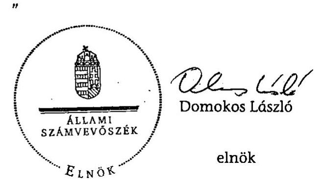

| Melléklet: | 18 db | 17 lap |
| :-- | --: | --: |
| Függelék: | 1 db | 3 lap |

---

Mellékletek

---

# 1. sz. melléklet 

a V-2019-047/2010-2011. sz. jelentéshez

## Nemzetgazdasági MINISZTÉRIUM

MINISZTER

Hiv.szám: V-2019-043/2010-2011.

## Domokos László

## Elnök

## Állami Számvevőszék

## Budapest

## Tisztelt Elnök Úr!

Köszönettel megkaptam az Állami Számvevőszék által a természeti katasztrófák megelőzése, elhárítása, következményeinek felszámolására kialakított rendszerek ellenőrzéséről szóló jelentést. Ezúton tájékoztatom, hogy a Nemzetgazdasági Minisztérium részéről a jelentés tervezetre a következő észrevételeket kívánjuk tenni.

1. A természeti katasztrófa-helyzetek előre nem látható voltára tekintettel a szükségessé váló kiadások fedezete fejezeti szinten nem tervezhető előre teljes körűen, továbbá az államháztartás mindenkori teherbíró-képességét is figyelembe kell venni. A Kormány katasztrófa esetén a központi alrendszer rendkívüli helyzetekre szolgáló tartalékból csoportosít át összegeket az érintett fejezetek számára, valamint az éves költségvetési törvények a vonatkozó előirányzatok többségénél megteremtik az előirányzattól való eltérés módosítás nélküli lehetőségét. 2011. évben a BM és a VM fejezet esetében is megtörtént ezek jogszabályi szinten való szabályozása.

---

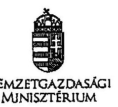

MINISZTER

2. A vis maior támogatások igénybevételi szabályairól szóló jelentésrészt szükséges lenne az alábbiakkal kiegészíteni:

A vis maior támogatások igénybevételi szabályai bővültek azzal, hogy amennyiben a vis maior esemény következtében a kötelező önkormányzati feladatot szolgáló épület összedől, vagy helyreállíthatatlanul károsodik, a helyi önkormányzatokért felelős miniszter javaslatára, a káreseményhez kapcsolódó közfeladatokért felelős fejezetet irányító szerv előzetes szakmai véleménye alapján a Kormány dönt a támogatás felhasználásáról új, a káreseményt megelőző funkciót betöltő beruházás megvalósítása érdekében.

Budapest, 2011. május „12 „

Üdvözlettel:

Dr. Matolcsy György

1035 Budapest, Hönvéd u. 13-15., Postanok 1880 Budapest, Pv. 111., Tel. 3374-2700, 10. 3374/2700, 10. 3374/2700, 103-2394
2/2

200 200 200 200 200 200 200 200 200 200 200 200 200 200 200

SOLZTLE XVI 10:81 TIOZ 90/81

---

# d. Matolcsy György úr 

miniszter
Nemzetgazdasági Minisztérium

## Tisztelt Miniszter Úr!

Megköszönöm a természeti katasztrófák megelőzésére, elhárítására, következményeinek felszámolására kialakított rendszerek ellenőrzéséről szóló jelentésünkre adott észrevételeit.

A természeti katasztrófa-helyzetek előre nem látható voltából adódó tervezési nehézségeket, valamint az államháztartás mindenkori teherbíró képességét, mint felvetett szempontokat, magyarázatként tudomásul veszem. Észrevétele a jelentésünknek a finanszírozással kapcsolatos megállapításaival nincs ellentétben, a szöveg kiegészítését nem tartom szükségesnek.

A vis maior támogatások igénybevételi szabályainak változásáról szóló észrevétele megegyezik a vonatkozó jogszabály, a 8/2010. (I. 28.) Korm. rendelet 3. § (10) bekezdésében foglaltakkal, amely változást a jelentésünkben is jelezzük (31. oldal 6. bekezdés).

Végezetül tájékoztatom Miniszter urat, hogy az ellenőrzésről készült jelentést - kialakult gyakorlatunk szerint - észrevételeivel és az azokra adott válaszommal együtt küldöm meg az Országgyülés elnökének, az illetékes bizottságai elnökeinek és a miniszterelnöknek.

Budapest, 2011. május "20 ".
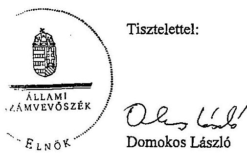

---

U-2019-045-001/2010-2011.

# BELÜGYMINISZTÉRIUM 

DR. PINTÉR SÁNDOR
$5303 / 319 / 2011$
Domokos László úr részére
elnök
Állami Számvevőszék

Budapest

## Tisztelt Elnök Úr!

Tájékoztatom, hogy a természeti katasztrófák megelőzésére, elhárítására, következményeinek felszámolására kialakított rendszerek ellenőrzéséről készített jelentésre észrevételt nem teszek.

Budapest, 2011. május „E,„.
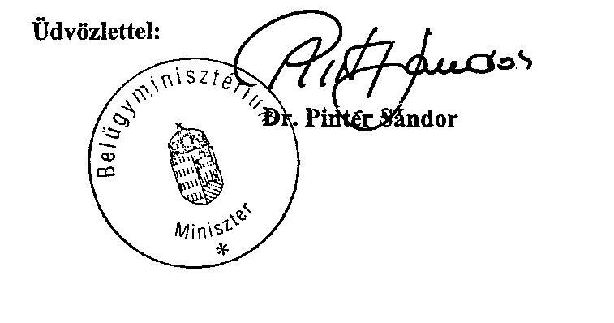

---

# HONVÉDELMI MINISZTÉRIUM VÉDELMI HIVATAL 

Nyt. szám: 20-187/2011.

## ÁLLAMI SZÁMVEVŐSZÉK

Érkezett: 2011 MAJ 18.
Iktató: 2011.04.04.002/20112011
Melléklet: 20

## Domokos László úr

Állami Számvevőszék
elnök

## Budapest

## Tisztelt Elnök Úr!

Dr. Hende Csaba, honvédelmi miniszter felhatalmazása alapján tájékoztatom, hogy a V-2019-043/2010-2011 nyilvántartási számú ügyiratával megküldött „természeti katasztrófák megelőzésére, elhárítására, következményeinek felszámolására kialakított rendszerek ellenőrzéséről" készített jelentésre vonatkozóan a Honvédelmi Minisztérium észrevételt nem tesz.

Budapest, 2011. május 18. - n.

Tisztelettel:
Dr. Tokovicz József mk. dandártábornok főigazgató

[^0]
[^0]:    Készült: 2 példányban
    Egy példány: 1 lap
    Ügyintéző (tel.): Varga Csaba ftudgy. (21-751)
    Kapják: 1. sz. pld.: Irattár
    2. sz. pld.: Címzett

---

VIDÉKFEJLESZTÉSI MINISZTÉRIUM

DR. FAZEKAS SÁNDOR miniszternt

# ÁLLAMI SZÁMVEVŐSZÉK 

Érkezett: 2011 MAJ 18.
Iktató: 2019-045-003/40
Melléklet: 2011

Iktatószám: EF/000092-3/2011.
Ügyintéző: dr. Lukács Ilona
Telefonszám: 79-53927
E-mail: Ilona.lukacs@vm.gov.hu
Hiv.-i szám: V-2019-043/2010-2011

Domokos László úr
elnök
részére
Állami Számvevőszék
Budapest
Tárgy: Ellenőrzési jelentés észrevételezése

## Tisztelt Elnök Úr!

Hivatkozott levelére válaszolva tájékoztatom, hogy a természeti katasztrófák megelőzésére, elhárítására, következményeinek felszámolására kialakított rendszerek ellenőrzéséről készített Ellenőrzési jelentést áttekintettem, arra vonatkozóan nem teszek észrevételt.

Budapest, 2011. május (11)".

Tisztelettel:
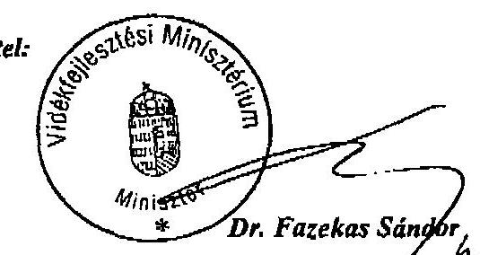

1055 Budapest, Kossuth Lajos tér 11. Telefon: (06 1) 3014100 Fax: (06 1) 302 943

---

# NEMZETI ERŐFORRÁS MINISZTÉRIUM MINISZTER 

Iktatószám:8177-10/2011-ELL
Hiv. szám: V-2019-043/2010-2011.

## Domokos László

elnök

Állami Számvevőszék

## Budapest

Apáczai Csere János u. 10.
1052

Tárgy: a természeti katasztrófák megelőzésére, elhárítására, következményeinek felszámolására kialakított rendszerek ellenőrzéséről készített jelentés

Tisztelt Elnök Úr!

A véleményezésre megküldött a természeti katasztrófák megelőzésére, elhárítására, következményeinek felszámolására kialakított rendszerek ellenőrzéséről készített jelentésre észrevételt nem teszek.

Budapest, 2011. május " 19 „.
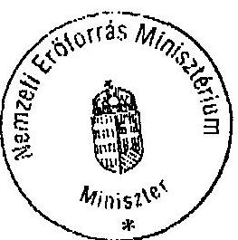

Üdvözlettel:
Eeml:nik
Dr. Réthelyi Miklós

---

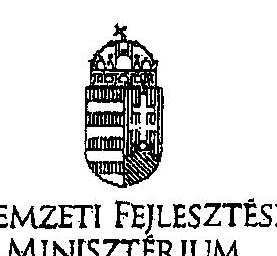

# NEMZETI FEJLESZTÉSI MINISZTÉRIUM

DR. FELLEGI TAMÁS

Hiv. szám V-2019-043/2010-2011. Ikt. szám: NFM/9235/4/2011.

Domonkos László elnök

Állami Számvevőszék

Budapest

Hiv. szám V-2019-043/2010-2011. Ikt. szám: NFM/9235/4/2011.

Tisztelt Elnök Úr!

Köszönettel vettem "a természeti katasztrófák megelőzésére, elhárítására, következményeinek felszámolására kialakított rendszerek ellenőrzéséről" készített számvevőszék jelentős tervezetet.

A jelentés tervezetet a minisztériumunk áttanulmányozta, arra észrevételt nem teszünk.

Budapest, 2011. május 19.

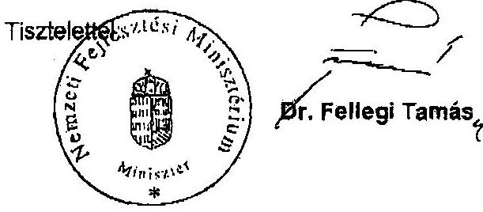

---

# A helyszíni vizsgálatba bevont szervezetek az államháztartás központi szintjén 

## A) Minisztériumok:

Közigazgatási és Igazságügyi Minisztérium
Belügyminisztérium
Nemzetgazdasági Minisztérium
Honvédelmi Minisztérium
Nemzeti Erőforrás Minisztérium
Vidékfejlesztési Minisztérium
Nemzeti Fejlesztési Minisztérium

## B) Fejezeti intézmények

Országos Katasztrófavédelmi Főigazgatóság
Országos Meteorológiai Szolgálat
Nemzeti Fejlesztési Ügynökség
Vízügyi és Környezetvédelmi Központi Igazgatóság

## C) Egyéb

Kormányzati Koordinációs Bizottság

---

# A helyszíni vizsgálatba bevont önkormányzatok 

| Baranya megye | Erzsébet |
| :--: | :--: |
|  | Dunaszekcső |
| Békés megye | Kétegyháza |
|  | Bucsa |
|  | Zsadány |
| Borsod-Abaúj-Zemplén megye | Sátoraljaújhely |
|  | Miskolc |
|  | Felsőzsolca |
|  | Edelény |
|  | Komlóska |
|  | Szikszó |
|  | Szerencs |
|  | Emőd |
| Csongrád megye | Domaszék |
| Fejér megye | Bakonycsernye |
|  | Vál |
| Győr-Moson-Sopron megye | Bőny |
|  | Ravazd |
| Jász-Nagykun-Szolnok megye | Tiszaföldvár |
| Nógrád megye | Pásztó |
|  | Szuha |
| Somogy megye | Somogyfajsz |
|  | Kőröshegy |
| Szabolcs-Szatmár-Bereg megye | Vásárosnamény |
|  | Nyírbogdány |
| Tolna megye | Báta |
| Veszprém megye | Takácsi |
| Zala megye | Szilvágy |
|  | Zalavár |
|  | Zalaapáti |

---

# A tanúsítványbekéréssel ellenőrzött önkormányzatok 

| Bács-Kiskun megye | Vaskút |
| :--: | :--: |
| Baranya megye | Hidas |
|  | Pécs |
| Békés megye | Kőrösladány |
| Borsod-Abaúj-Zemplén megye | Cserépváralja |
|  | Hernádkércs |
|  | Onga |
|  | Sajólád |
|  | Telkibánya |
|  | Tolcsva |
|  | Vilyvitány |
|  | Abaújszántó |
|  | Felsődobsza |
|  | Hernádkak |
|  | Ónod |
|  | Sajóecseg |
|  | Szendrő |
|  | Boldva |
|  | Cserépfalu |
| Csongrád megye | Sándorfalva |
|  | Makó |
| Fejér megye | Tabajd |
| Hajdú-Bihar | Téglás |
| Heves megye | Eger |
|  | Hatvan |
| Jász-Nagykun-Szolnok megye | Alattyán |
|  | Jánoshida |
|  | Jászalsószentgyörgy |
|  | Jászladány |
|  | Szolnok |

---

| Komárom-Esztergom megye | Nagyigmánd |
| :--: | :--: |
|  | Piliscsév |
|  | Kesztölc |
| Pest megye | Aszód |
|  | Gomba |
|  | Nagymaros |
|  | Visegrád |
|  | Kismaros |
|  | Pomáz |
| Somogy megye | Bárdudvarnok |
| Szabolcs-Szatmár-Bereg megye | Gulács |
|  | Tiszavasvári |
| Tolna megye | Cikó |
|  | Értény |
|  | Kakasd |
|  | Nagykónyi |
|  | Ozora |
|  | Mórágy |
|  | Mőcsény |
| Veszprém megye | Veszprém |

---

A Kormány által kihirdetett árvízi veszélyhelyzetek főbb jellemzői (2010.)

|  Korm. rend. száma | Fokozat | Érintett terület | Érintett KÖVIZIG | Elrendelés ideje | Feloldás ideje | Költség-
elszámolás megnvilta | Védekezési munkabizottság | VMB* irányítója | Kitelepítés irányítója  |
| --- | --- | --- | --- | --- | --- | --- | --- | --- | --- |
|  183/2010. (V. 17.) | rendkívüli készültség | Sajó (Sajópüspöki-Ónod) | Észak-Magyarországi KÖVIZIG | 2010.05.17
18.00 óra | 2010.05.25
18.00 óra | 2010.05.15
00 óra | KvVM-ben | KvVM miniszter |   |
|   |  | Bódva (Hídvégardó-Boldva) |  |  |  |  |  |  |   |
|   |  | Hernád (Hidasnémeti-Sajóhídvég) |  |  |  |  |  |  |   |
|  186/2010. (VI. 2.) | rendkívüli készültség | Sajó (08.06; 08.07 szakaszok) | Észak-Magyarországi KÖVIZIG | 2010.06.02
19.00 óra | 2010.06.17
18.00 óra | 2010.06.02
10.00 óra | VM-ben | KvV államtitkár |   |
|   |  | Hernád (08.08; 08.09 szakaszok) |  |  |  |  |  |  |   |
|   |  | Bódva (Hídvégardó-Boldva) |  |  |  |  |  |  |   |
|  187/2010. (VI. 2.) | árvizi veszélyhelyzet | Hasznos, Pásztó területe | Közép-Duna-völgyi KÖVIZIG | 2010.06.02
19.00 óra | 2010.06.09
11.00 óra | 2010.06.01
21.00 óra | VM-ben | KvV államtitkár | OKF
főigazgató  |
|  188/2010. (VI. 3.) | veszélyhelyzet | Bőny, Mezőörs, Rétalap területe | Észak-Dunántúli KÖVIZIG | 2010.06.03
19.00 óra | 2010.06.08
20 óra | 2010.06.02
22.00 óra | VM-ben | KvV államtitkár |   |
|   |  | Jászdózsa, Jánoshida, Jászalsószentgyörgy, Alattyán, Jásztelek, Jásziákóhalma és Jászberény |  |  |  |  |  |  |   |
|   |  |  | Észak-Magyarországi KÖVIZIG |  |  |  |  |  |   |
|   |  |  |  |  | 2010.06.03
19.00 óra |  |  |  |   |
|   | rendkívüli készültség | Zagyva (10.11 védelmi szakasz) |  |  |  |  |  |  |   |
|  189/2010. (VI. 4.) | veszélyhelyzet | Bács-Kiskun megye |  |  |  |  |  |  |   |
|   |  |  | Alsó-Duna-völgyi KÖVIZIG |  |  |  |  |  |   |
|   |  | Csongrád megye |  |  |  |  |  |  |   |
|   |  |  | Alsó-Tisza-vidéki KÖVIZIG |  | 2010.06.04
21.00 óra |  |  |  |   |
|   |  | Jász-Nagykun-Szolnok megye |  |  |  |  |  |  |   |
|   |  |  |  |  |  |  |  |  |   |
|   |  |  |  |  |  |  |  |  |   |
|   |  | Békés megye |  |  |  |  |  |  |   |
|   |  |  |  |  |  |  |  |  |   |
|   |  | Fejér megye |  |  |  |  |  |  |   |
|   |  |  |  |  |  |  |  |  |   |
|   |  |  |  |  |  |  |  |  |   |
|   |  | Heves megye |  |  |  |  |  |  |   |
|   |  |  |  |  |  |  |  |  |   |
|   |  |  |  |  |  |  |  |  |   |
|   |  |  |  |  |  |  |  |  |   |
|   |  | Pest megye |  |  |  |  |  |  |   |
|   |  |  |  |  |  |  |  |  |   |
|   |  | Szabolcs-Szatmár-Bereg megye |  |  |  |  |  |  |   |

- OMIT

---

# A 2010. évi árvizek jellemzői 

A vizek kártételei elleni 2010. május-júniusi védekezés különleges volt, mert Magyarországon ilyen összetett, az egész ország területére kiterjedő hosszú idejű vízkár-elhárítási tevékenységre addig még nem került sor.

Kiugróan csapadékos volt 2010 májusa és júniusa; a két hónap alatt országos átlagban a sokévi átlagot jelentősen, közel 100 %-kal meghaladó, 294 mm csapadék hullott. Ekkora mennyiségű csapadék - a mérések kezdete óta, több mint száz éve - két hónap alatt még nem fordult elő hazánkban ${ }^{1}$. A Tisza mellékvizei szinte egyszerre kezdtek intenzíven áradni, míg a Duna hazai mellékvizei közül a Bakony északi patakjai áradtak meg hirtelen (a Cuhai-Bakonyéren egy nap alatt mintegy 2,5 m-t emelkedett Bakonybánkon a vízszint). Hasonlóan a Kaposon és több, Mecsek-környéki kisvízfolyáson egy nap alatt mintegy 3 m-t áradt a víz. Később a Sajó megduzzadása ${ }^{2}$ miatt a Tisza eddigi második legmagasabb árhulláma alakult ki. A tiszai árhullám hasonló kialakulását utoljára 1974-ben figyelték meg.

A folyókon tapasztalható árhullámok mellett - esetenként nagyobb veszélyt és szélesebb körű intézkedéseket szükségessé téve - a helyi patakok áradása Zemplénben és a Dél-Borsodban is több településen öntötte el az utcákat, lakóépületeket.
2010. május 17-én a mintegy hatezer lakosú Szikszón a Vadász patak áradása miatt a polgármester elrendelte közel ezer fő kitelepítését. Ugyanekkor Sátoraljaújhelyen (közel 16 ezer lakos) a Ronyva patak áradása miatt a több száz veszélybe került lakóházból kellett megkezdeni a lakosok befogadó helyre történő irányítását, akik száma csúcsidőben meghaladta az ezer főt. Az ország másik részén pedig május 19-én a Cuhai-Bakony-ér alámosta az M1-es autópálya egyik hídját, aminek következtében a pályaszerkezet beszakadt.

Júniusban a Tisza mellékfolyóin, majd magán a Tiszán is kialakult árvízveszéllyel párhuzamosan a Dunán is árhullám vonult le. Eközben az esőzések felgyorsították a belvízképződést. A korábbi csapadékhullámok miatt már nem csak a talaj felső rétege volt telített, hanem a talajvíz szintje is az átlagos fölé emelkedett. A Tisza vízrendszerében levonuló árvizek is nehezítették a védekezést, mert a visszavezetett belvizet befogadó folyók magas vízállása miatt a belvizek gravitációs levezetésének lehetősége megszűnt. Ezzel a belvíz az összes síkvidéki területet, mind a 12 vízügyi igazgatóságot érintette, nehezítve az árvízvédelemhez szükséges erők átcsoportosítását. A vizek kártételei elleni védekezés összességében 13 megyét és a fővárost érintette. Országosan összesen 842 településen (az ország településeinek negyede), ebből

[^0]
[^0]:    ${ }^{1}$ Ugyanerre az időszakra vonatkozóan a második legcsapadékosabb év 1940 volt, ekkor az országos átlagot tekintve 70 mm -rel esett kevesebb.
    ${ }^{2}$ Akkora vízhozamot a Sajó torkolatánál még nem regisztráltak, mint 2010. májusában.

---

BAZ megyében 208 település (a megye településeinek közel 60\%-a), valamint 6 fővárosi kerületben került sor védekezésre.

Jellemző volt az is, hogy egy árhullám levonulása után az intenzív csapadék miatt néhány napon belül ismét árvízveszélyes helyzet alakult ki. Ez már önmagában is növelte a védekezés költségeit, hiszen egyes feladatokat (például fertőtlenítés) újra el kellett végezni, illetve az előző védekezés következtében felújításra, kiszáradásra szoruló védművekre nehezedő nyomást ${ }^{3}$ csak a korábbinál nagyobb erőkkel lehetett ismételten védeni.

[^0]
[^0]:    ${ }^{3}$ A Közép-Tiszán például minden idők második legnagyobb terhelése érte a védvonalakat.

---

Az árvízi védekezés hatásköri, tájékoztatási rendszere (2010. júniusi állapot)
(irányítás: $\qquad$ tájékoztatás: $\leftarrow \rightarrow$ )

Kormányzati
szervek:
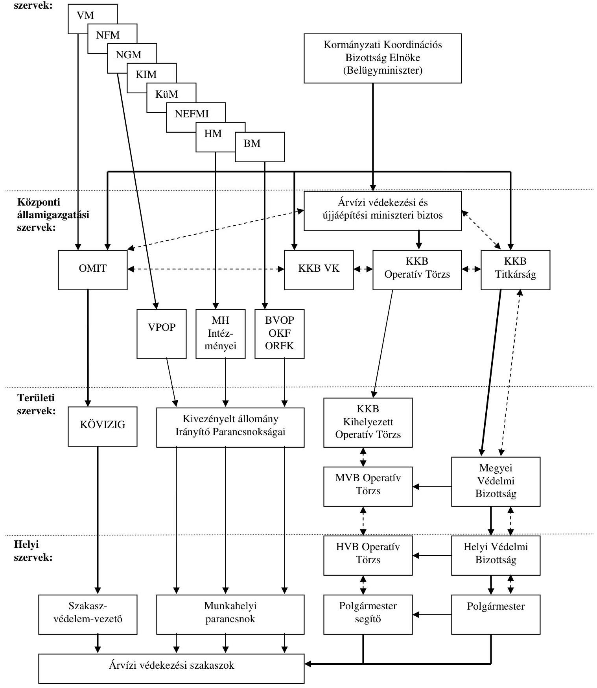

---

A védelmi tervek települések szerinti megoszlása (2009-2010)
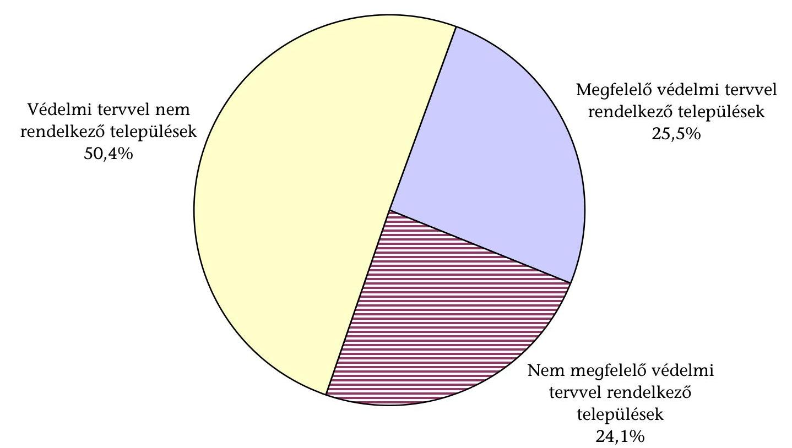

---

**Az Országos Katasztrófavédelmi Főigazgatóság szervezeti felépítése**

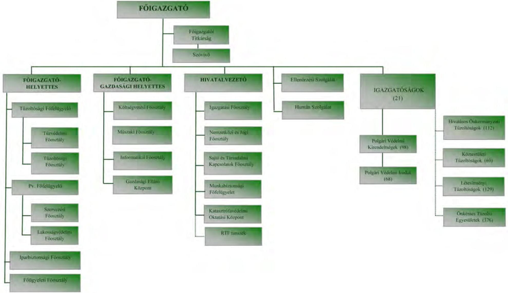

---

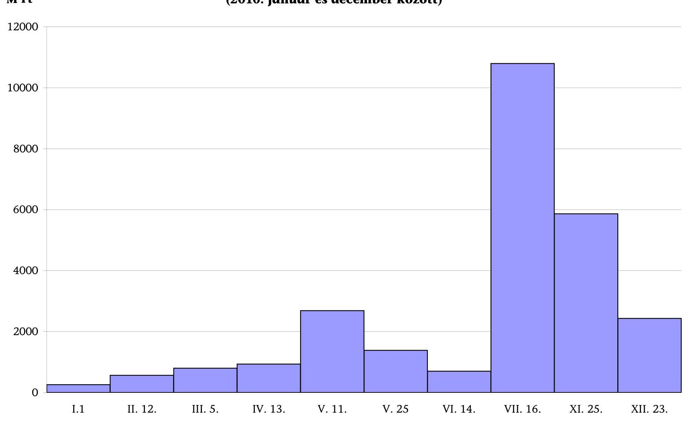

# A védekezésben részt vevő szervezeteknek nyújtott források nagysága

## M Ft (2010. január és december között)

|  I.1 | II. 12. | III. 5. | IV. 13. | V. 11. | V. 25. | VI. 14. | VII. 16. | XI. 25. | XII. 23.  |
| --- | --- | --- | --- | --- | --- | --- | --- | --- | --- | | --- | --- | --- | --- |
|  |   |   |   |   |   |   |   |   |   |

---

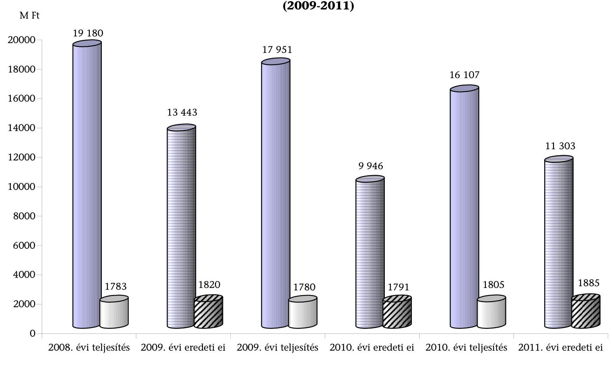

# Az OKF és területi szervei kiadási előirányzatainak és létszámának alakulása (2009-2011)

|  Ite | IIte | IIIte | IVte | Vte | VIte | VIIte | VIIIte | IXte | Xte  |
| --- | --- | --- | --- | --- | --- | --- | --- | --- | --- |
| 2008. évi teljesítés | 1783 | 1820 | 1780 | 1791 | 1805 | 1805 | 1805 | 1805 | 1885  |
| 2009. évi előirányzás | 1843 | 1820 | 1780 | 1791 | 1805 | 1805 | 1805 | 1805 | 1885  |
| 2008. évi teljesítés | 1780 | 1791 | 1791 | 1791 | 1805 | 1805 | 1805 | 1805 | 1885  |
| 2009. évi teljesítés | 1780 | 1791 | 1791 | 1791 | 1805 | 1805 | 1805 | 1805 | 1885  |
| 2008. évi teljesítés | 1783 | 1820 | 1780 | 1791 | 1805 | 1805 | 1805 | 1805 | 1885  |
| 2007. évi teljesítés | 1780 | 1791 | 1791 | 1791 | 1805 | 1805 | 1805 | 1805 | 1885  |
| 2006. évi teljesítés | 1783 | 1820 | 1780 | 1791 | 1805 | 1805 | 1805 | 1805 | 1885  |
| 2005. évi teljesítés | 1783 | 1820 | 1780 | 1791 | 1805 | 1805 | 1805 | 1805 | 1885  |
| 2004. évi teljesítés | 1783 | 1820 | 1780 | 1791 | 1805 | 1805 | 1805 | 1805 | 1885  |
| 2003. évi teljesítés | 1783 | 1820 | 1780 | 1791 | 1805 | 1805 | 1805 | 1805 | 1885  |
| 2002. évi teljesítés | 1783 | 1820 | 1780 | 1791 | 1805 | 1805 | 1805 | 1805 | 1885  |
| 2001. évi teljesítés | 1783 | 1820 | 1780 | 1791 | 1805 | 1805 | 1805 | 1805 | 1885  |
| 2000. évi teljesítés | 1783 | 1820 | 1780 | 1791 | 1805 | 1805 | 1805 | 1805 | 1885  |
| 1999. évi teljesítés | 1783 | 1820 | 1780 | 1791 | 1805 | 1805 | 1805 | 1805 | 1885  |
| 1998. évi teljesítés | 1783 | 1820 | 1780 | 1791 | 1805 | 1805 | 1805 | 1805 | 1885  |
| 1997. évi teljesítés | 1783 | 1820 | 1780 | 1791 | 1805 | 1805 | 1805 | 1805 | 1885  |
| 1996. évi teljesítés | 1783 | 1820 | 1780 | 1791 | 1805 | 1805 | 1805 | 1805 | 1885  |
| 1995. évi teljesítés | 1783 | 1820 | 1780 | 1791 | 1805 | 1805 | 1805 | 1805 | 1885  |
| 1994. évi teljesítés | 1783 | 1820 | 1780 | 1791 | 1805 | 1805 | 1805 | 1805 | 1885  |
| 1993. évi teljesítés | 1783 | 1820 | 1780 | 1791 | 1805 | 1805 | 1805 | 1805 | 1885  |
| 1992. évi teljesítés | 1783 | 1820 | 1780 | 1791 | 1805 | 1805 | 1805 | 1805 | 1885  |
| 1991. évi teljesítés | 1783 | 1820 | 1780 | 1791 | 1805 | 1805 | 1805 | 1805 | 1885  |
| 1990. évi teljesítés | 1783 | 1820 | 1780 | 1791 | 1805 | 1805 | 1805 | 1805 | 1885  |
| 1989. évi teljesítés | 1783 | 1820 | 1780 | 1791 | 1805 | 1805 | 1805 | 1805 | 1885  |
| 1988. évi teljesítés | 1783 | 1820 | 1780 | 1791 | 1805 | 1805 | 1805 | 1805 | 1885  |
| 1987. évi teljesítés | 1783 | 1820 | 1780 | 1791 | 1805 | 1805 | 1805 | 1805 | 1885  |
| 1986. évi teljesítés | 1783 | 1820 | 1780 | 1791 | 1805 | 1805 | 1805 | 1805 | 1885  |
| 1985. évi teljesítés | 1783 | 1820 | 1780 | 1791 | 1805 | 1805 | 1805 | 1805 | 1885  |
| 1984. évi teljesítés | 1783 | 1820 | 1780 | 1791 | 1805 | 1805 | 1805 | 1805 | 1885  |
| 1983. évi teljesítés | 1783 | 1820 | 1780 | 1791 | 1805 | 1805 | 1805 | 1805 | 1885  |
| 1982. évi teljesítés | 1783 | 1820 | 1780 | 1791 | 1805 | 1805 | 1805 | 1805 | 1885  |
| 1981. évi teljesítés | 1783 | 1820 | 1780 | 1791 | 1805 | 1805 | 1805 | 1805 | 1885  |
| 1980. évi teljesítés | 1783 | 1820 | 1780 | 1791 | 1805 | 1805 | 1805 | 1805 | 1885  |
| 1979. évi teljesítés | 1783 | 1820 | 1780 | 1791 | 1805 | 1805 | 1805 | 1805 | 1885  |
| 1978. évi teljesítés | 1783 | 1820 | 1780 | 1791 | 1805 | 1805 | 1805 | 1805 | 1885  |
| 1977. évi teljesítés | 1783 | 1820 | 1780 | 1791 | 1805 | 1805 | 1805 | 1805 | 1885  |
| 1976. évi teljesítés | 1783 | 1820 | 1780 | 1791 | 1805 | 1805 | 1805 | 1805 | 1885  |
| 1975. évi teljesítés | 1783 | 1820 | 1780 | 1791 | 1805 | 1805 | 1805 | 1805 | 1885  |
| 1974. évi teljesítés | 1783 | 1820 | 1780 | 1791 | 1805 | 1805 | 1805 | 1805 | 1885  |
| 1973. évi teljesítés | 1783 | 1820 | 1780 | 1791 | 1805 | 1805 | 1805 | 1805 | 1885  |
| 1972. évi teljesítés | 1783 | 1820 | 1780 | 1791 | 1805 | 1805 | 1805 | 1805 | 1885  |
| 1971. évi teljesítés | 1783 | 1820 | 1780 | 1791 | 1805 | 1805 | 1805 | 1805 | 1885  |
| 1970. évi teljesítés | 1783 | 1820 | 1780 | 1791 | 1805 | 1805 | 1805 | 1805 | 1885  |
| 1969. évi teljesítés | 1783 | 1820 | 1780 | 1791 | 1805 | 1805 | 1805 | 1805 | 1885  |
| 1968. évi teljesítés | 1783 | 1820 | 1780 | 1791 | 1805 | 1805 | 1805 | 1805 | 1885  |
| 1967. évi teljesítés | 1783 | 1820 | 1780 | 1791 | 1805 | 1805 | 1805 | 1805 | 1885  |
| 1966. évi teljesítés | 1783 | 1820 | 1780 | 1791 | 1805 | 1805 | 1805 | 1805 | 1885  |
| 1965. évi teljesítés | 1783 | 1820 | 1780 | 1791 | 1805 | 1805 | 1805 | 1805 | 1885  |
| 1964. évi teljesítés | 1783 | 1820 | 1780 | 1791 | 1805 | 1805 | 1805 | 1805 | 1885  |
| 1963. évi teljesítés | 1783 | 1820 | 1780 | 1791 | 1805 | 1805 | 1805 | 1805 | 1885  |
| 1962. évi teljesítés | 1783 | 1820 | 1780 | 1791 | 1805 | 1805 | 1805 | 1805 | 1885  |
| 1961. évi teljesítés | 1783 | 1820 | 1780 | 1791 | 1805 | 1805 | 1805 | 1805 | 1885  |
| 1960. évi teljesítés | 1783 | 1820 | 1780 | 1791 | 1805 | 1805 | 1805 | 1805 | 1885  |
| 1959. évi teljesítés | 1783 | 1820 | 1780 | 1791 | 1805 | 1805 | 1805 | 1805 | 1885  |
| 1958. évi teljesítés | 1783 | 1820 | 1780 | 1791 | 1805 | 1805 | 1805 | 1805 | 1885  |
| 1957. évi teljesítés | 1783 | 1820 | 1780 | 1791 | 1805 | 1805 | 1805 | 1805 | 1885  |
| 1956. évi teljesítés | 1783 | 1820 | 1780 | 1791 | 1805 | 1805 | 1805 | 1805 | 1885  |
| 1955. évi teljesítés | 1783 | 1820 | 1780 | 1791 | 1805 | 1805 | 1805 | 1805 | 1885  |
| 1954. évi teljesítés | 1783 | 1820 | 1780 | 1791 | 1805 | 1805 | 1805 | 1805 | 1885  |
| 1953. évi teljesítés | 1783 | 1820 | 1780 | 1791 | 1805 | 1805 | 1805 | 1805 | 1885  |
| 1952. évi teljesítés | 1783 | 1820 | 1780 | 1791 | 1805 | 1805 | 1805 | 1805 | 1885  |
| 1951. évi teljesítés | 1783 | 1820 | 1780 | 1791 | 1805 | 1805 | 1805 | 1805 | 1885  |
| 1950. évi teljesítés | 1783 | 1820 | 1780 | 1791 | 1805 | 1805 | 1805 | 1805 | 1885 |
| 1949. évi teljesítés | 1783 | 1820 | 1780 | 1791 | 1805 | 1805 | 1805 | 1805 | 1885 |
| 1948. évi teljesítés | 1783 | 1820 | 1780 | 1791 | 1805 | 1805 | 1805 | 1805 | 1885 |
| 1947. évi teljesítés | 1783 | 1820 | 1780 | 1791 | 1805 | 1805 | 1805 | 1805 | 1885 |
| 1946. évi teljesítés | 1783 | 1820 | 1780 | 1791 | 1805 | 1805 | 1805 | 1805 | 1885 |
| 1945. évi teljesítés | 1783 | 1820 | 1780 | 1791 | 1805 | 1805 | 1805 | 1805 | 1885 |
| 1944. évi teljesítés | 1783 | 1820 | 1780 | 1791 | 1805 | 1805 | 1805 | 1805 | 1885 |
| 1943. évi teljesítés | 1783 | 1820 | 1780 | 1791 | 1805 | 1805 | 1805 | 1805 | 1885 |
| 1942. évi teljesítés | 1783 | 1820 | 1780 | 1791 | 1805 | 1805 | 1805 | 1805 | 1885 |
| 1941. évi teljesítés | 1783 | 1820 | 1780 | 1791 | 1805 | 1805 | 1805 | 1805 | 1885 |
| 1940. évi teljesítés | 1783 | 1820 | 1780 | 1791 | 1805 | 1805 | 1805 | 1805 | 1885 |
| 1939. évi teljesítés | 1783 | 1820 | 1780 | 1791 | 1805 | 1805 | 1805 | 1805 | 1885 |
| 1938. évi teljesítés | 1783 | 1820 | 1780 | 1791 | 1805 | 1805 | 1805 | 1805 | 1885 |
| 1937. évi teljesítés | 1783 | 1820 | 1780 | 1791 | 1805 | 1805 | 1805 | 1805 | 1885 |
| 1936. évi teljesítés | 1783 | 1820 | 1780 | 1791 | 1805 | 1805 | 1805 | 1805 | 1885 |
| 1935. évi teljesítés | 1783 | 1820 | 1780 | 1791 | 1805 | 1805 | 1805 | 1805 | 1885 |
| 1934. évi teljesítés | 1783 | 1820 | 1780 | 1791 | 1805 | 1805 | 1805 | 1805 | 1885 |
| 1933. évi teljesítés | 1783 | 1820 | 1780 | 1791 | 1805 | 1805 | 1805 | 1805 | 1885 |
| 1932. évi teljesítés | 1783 | 1820 | 1780 | 1791 | 1805 | 1805 | 1805 | 1805 | 1885 |
| 1931. évi teljesítés | 1783 | 1820 | 1780 | 1791 | 1805 | 1805 | 1805 | 1805 | 1885 |
| 1930. évi teljesítés | 1783 | 1820 | 1780 | 1791 | 1805 | 1805 | 1805 | 1805 | 1885 |
| 1929. évi teljesítés | 1783 | 1820 | 1780 | 1791 | 1805 | 1805 | 1805 | 1805 | 1885 |
| 1928. évi teljesítés | 1783 | 1820 | 1780 | 1791 | 1805 | 1805 | 1805 | 1805 | 1885 |
| 1927. évi teljesítés | 1783 | 1820 | 1780 | 1791 | 1805 | 1805 | 1805 | 1805 | 1885 |
| 1926. évi teljesítés | 1783 | 1820 | 1780 | 1791 | 1805 | 1805 | 1805 | 1805 | 1885 |
| 1925. évi teljesítés | 1783 | 1820 | 1780 | 1791 | 1805 | 1805 | 1805 | 1805 | 1885 |
| 1924. évi teljesítés | 1783 | 1820 | 1780 | 1791 | 1805 | 1805 | 1805 | 1805 | 1885 |
| 1923. évi teljesítés | 1783 | 1820 | 1780 | 1791 | 1805 | 1805 | 1805 | 1805 | 1885 |
| 1922. évi teljesítés | 1783 | 1820 | 1780 | 1791 | 1805 | 1805 | 1805 | 1805 | 1885 |
| 1921. évi teljesítés | 1783 | 1820 | 1780 | 1791 | 1805 | 1805 | 1805 | 1805 | 1885 |
| 1920. évi teljesítés | 1783 | 1820 | 1780 | 1791 | 1805 | 1805 | 1805 | 1805 | 1885 |
| 1919. évi teljesítés | 1783 | 1820 | 1780 | 1791 | 1805 | 1805 | 1805 | 1805 | 1885 |
| 1918. évi teljesítés | 1783 | 1820 | 1780 | 1791 | 1805 | 1805 | 1805 | 1805 | 1885 |
| 1917. évi teljesítés | 1783 | 1820 | 1780 | 1791 | 1805 | 1805 | 1805 | 1805 | 1885 |
| 1916. évi teljesítés | 1783 | 1820 | 1780 | 1791 | 1805 | 1805 | 1805 | 1805 | 1885 |
| 1915. évi teljesítés | 1783 | 1820 | 1780 | 1791 | 1805 | 1805 | 1805 | 1805 | 1885 |
| 1914. évi teljesítés | 1783 | 1820 | 1780 | 1791 | 1805 | 1805 | 1805 | 1805 | 1885 |
| 1913. évi teljesítés | 1783 | 1820 | 1780 | 1791 | 1805 | 1805 | 1805 | 1805 | 1885 |
| 1912. évi teljesítés | 1783 | 1820 | 1780 | 1791 | 1805 | 1805 | 1805 | 1805 | 1885 |
| 1911. évi teljesítés | 1783 | 1820 | 1780 | 1791 | 1805 | 1805 | 1805 | 1805 | 1885 |
| 1910. évi teljesítés | 1783 | 1820 | 1780 | 1791 | 1805 | 1805 | 1805 | 1805 | 1885 |
| 1909. évi teljesítés | 1783 | 1820 | 1780 | 1791 | 1805 | 1805 | 1805 | 1805 | 1885 |
| 1908. évi teljesítés | 1783 | 1820 | 1780 | 1791 | 1805 | 1805 | 1805 | 1805 | 1885 |
| 1907. évi teljesítés | 1783 | 1820 | 1780 | 1791 | 1805 | 1805 | 1805 | 1805 | 1885 |
| 1906. évi teljesítés | 1783 | 1820 | 1780 | 1791 | 1805 | 1805 | 1805 | 1805 | 1885 |
| 1905. évi teljesítés | 1783 | 1820 | 1780 | 1791 | 1805 | 1805 | 1805 | 1805 | 1885 |
| 1904. évi teljesítés | 1783 | 1820 | 1780 | 1791 | 1805 | 1805 | 1805 | 1805 | 1885 |
| 1903. évi teljesítés | 1783 | 1820 | 1780 | 1791 | 1805 | 1805 | 1805 | 1805 | 1885 |
| 1902. évi teljesítés | 1783 | 1820 | 1780 | 1791 | 1805 | 1805 | 1805 | 1805 | 1885 |
| 1901. évi teljesítés | 1783 | 1820 | 1780 | 1791 | 1805 | 1805 | 1805 | 1805 | 1885 |
| 1900. évi teljesítés | 1783 | 1820 | 1780 | 1791 | 1805 | 1805 | 1805 | 1805 | 1805 | 1885 |
| 1900. évi teljesítés | 1783 | 1820 | 1780 | 1791 | 1805 | 1805 | 1805 | 1805 | 1805 | 1885 |
| 1901. évi teljesítés | 1783 | 1820 | 1780 | 1791 | 1805 | 1805 | 1805 | 1805 | 1805 | 1885 |
| 1902. évi teljesítés | 1783 | 1820 | 1780 | 1791 | 1805 | 1805 | 1805 | 1805 | 1805 | 1885 |
| 1900. évi teljesítés | 1783 | 1820 | 1780 | 1791 | 1805 | 1805 | 1805 | 1805 | 1805 | 1885 |
| 1902. évi teljesítés | 1783 | 1820 | 1780 | 1791 | 1805 | 1805 | 1805 | 1805 | 1805 | 1805 | 1885 |
| 1903. évi teljesítés | 1783 | 1820 | 1780 | 1791 | 1805 | 1805 | 1805 | 1805 | 1805 | 1805 | 1885 |
| 1904. évi teljesítés | 1783 | 1820 | 1780 | 1791 | 1805 | 1805 | 1805 | 1805 | 1805 | 1805 | 1885 |
| 1905. évi teljesítés | 1783 | 1820 | 1780 | 1791 | 1805 | 1805 | 1805 | 1805 | 1805 | 1805 | 1885 |
| 1903. évi teljesítés | 1783 | 1820 | 1780 | 1791 | 1805 | 1805 | 1805 | 1805 | 1805 | 1805 | 1885 |
| 1902. évi teljesítés | 1783 | 1820 | 1780 | 1791 | 1805 | 1805 | 1805 | 1805 | 1805 | 1805 | 1805 | 1885 |
| 1901. évi teljesítés | 1783 | 1820 | 1780 | 1791 | 1805 | 1805 | 1805 | 1805 | 1805 | 1805 | 1805 | 1885 |
| 1902. évi teljesítés | 1783 | 1820 | 1780 | 1791 | 1805 | 1805 | 1805 | 1805 | 1805 | 1805 | 1805 | 1885 |
| 1900. évi teljesítés | 1783 | 1820 | 1780 | 1791 | 1805 | 1805 | 1805 | 1805 | 1805 | 1805 | 1805 | 1805 | 1885 |
| 1902. évi teljesítés | 1783 | 1820 | 1780 | 1791 | 1805 | 1805 | 1805 | 1805 | 1805 | 1805 | 1805 | 1805 | 1805 | 1805 | 1805 |
| 1901. évi | 1783 | 1820 | 1780 | 1791 | 1805 | 1805 | 1805 | 1805 | 1805 | 1805 | 1805 | 1805 | 1805 | 1805 | 1805 | 1805 |
| 1901. évi | 1783 | 1820 | 1780 | 1791 | 1805 | 1805 | 1805 | 1805 | 1805 | 1805 | 1805 | 1805 | 1805 | 1805 | 1805 | 1805 | 1805 | 1805 | 1805 | 1805 | 1805 | 1805 | 1805 | 1805 | 1805 |

---

# A Hivatásos önkormányzati, illetve az Önkéntes tűzoltóságok működtetésére, valamint a tűzoltósági eszközfejlesztésre fordítható források alakulása (2009-2011)

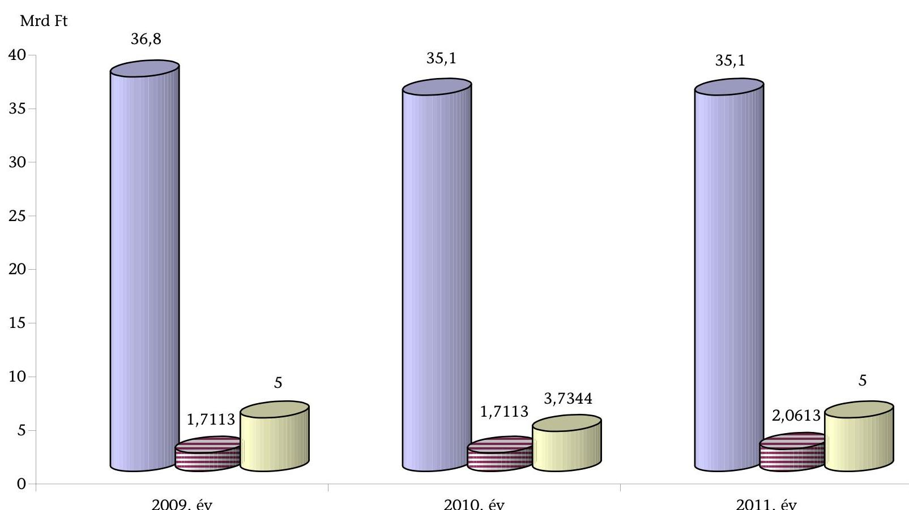
$\square$ Hivatásos önkormányzati tűzoltóságok támogatása
$\square$ Önkéntes tűzoltóságok normatív támogatása
$\square$ Tűzvédelmi bírság és a biztosítók tűzvédelmi hozzájárulása

---

# A vízkárelhárítással összefüggő eredeti kiadási előirányzatok forrásmegoszlása a vízügyi szervek, illetve a felhasználás célja szerint

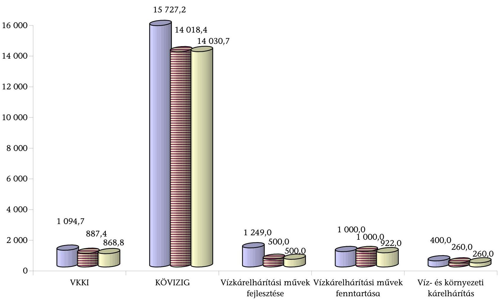

---

# A vízügyi ágazat védekezési jellemzői a belvíztől a rendkívüli árvízig (2009-2010)

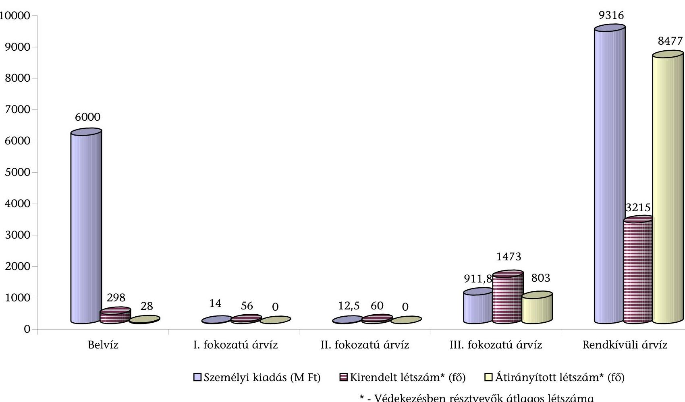

| Fejlesztési árazz | Fejlesztési árazz | Hivatal | Személyi kiadás (M Ft) | Kérendelt létszám* (fő) | Átirányított létszám* (fő) |
| --- | --- | --- | --- | --- | --- |
| 10000 | 9316 | 911,8 | 0 | 0 | 0 |
| 9000 | 9316 | 911,8 | 0 | 0 | 0 |
| 8000 | 9316 | 911,8 | 0 | 0 | 0 |
| 7000 | 9316 | 911,8 | 0 | 0 | 0 |
| 6000 | 9316 | 911,8 | 0 | 0 | 0 |
| 5000 | 9316 | 911,8 | 0 | 0 | 0 |
| 4000 | 9316 | 911,8 | 0 | 0 | 0 |
| 3000 | 9316 | 911,8 | 0 | 0 | 0 |
| 2000 | 9316 | 911,8 | 0 | 0 | 0 |
| 1000 | 9316 | 911,8 | 0 | 0 | 0 |
| 0 | 9316 | 911,8 | 0 | 0 | 0 |

- Személyi kiadás (M Ft)
- Kérendelt létszám* (fő)
- Átirányított létszám* (fő)
- Védekezésben résztvevők átlagos létszáma

---

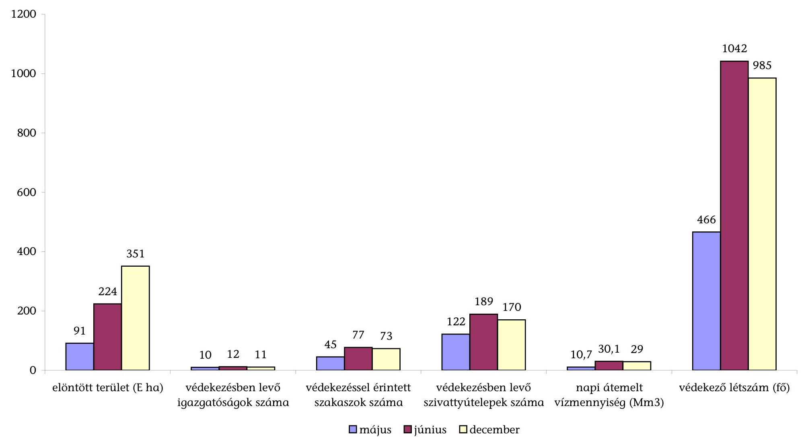

# A belvíz elleni védekezés főbb jellemzői 2010-ben a veszélyhelyzettel érintett időszakokra vonatkozóan

| 1200 | 1042 | 985 |
| --- | --- | --- |
| 800 | 10 | 466 |
| 600 | 10 | 466 |
| 400 | 10 | 466 |
| 200 | 10 | 466 |
| 0 | 10 | 466 |
| elöntött terület (E ha) | | |
| | | |
| | | |
| | | |
| | | |
| | | |
| | | |
| | | |
| | | |
| | | |
| | | |
| | | |
| | | |
| | | |
| | | |
| | | |
| | | |
| | | |
| | | |
| | | |
| | | |
| | | |
| | | |
| | | |
| | | |
| | | |
| | | |
| | | |
| | | |
| | | |
| | | |

---

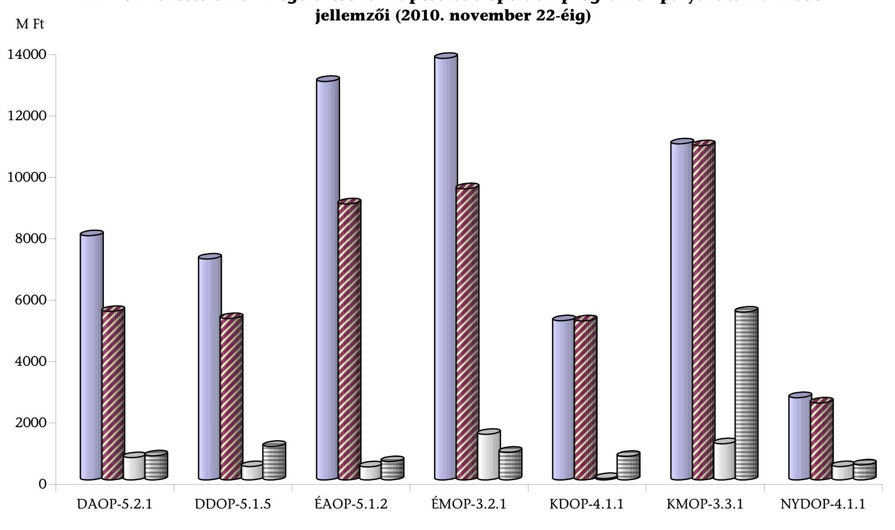

# A vizek kártételeinek megelőzéséhez kapcsolódó operatív programok pályázatainak főbb jellemzői (2010. november 22-éig)

---

# **14/a. sz. melléklet**

a V-2019-047/2010-2011. jelentéshez

## **Kimutatás**

## **a vis maior tartalékból nyújtott támogatásokról településtípusonként (2009-2010)**

| Megnevezés | Támogatási igényt benyújtó önkormányzatok száma (db) | Támogatott önkormányzatok száma (db) | Igényelt támogatás | Kapott támogatás | Megítélt támogatás aránya |
| --- | --- | --- | --- | --- | --- |
| | 1 | 2 | 3 | 4 | 5 |
| | 2009 (kérelemek száma: 382) | 2010 (kérelemek száma: 1796) | 2009 (kérelemek száma: 359) | 2010 (kérelemek száma: 1584) | 2009 |
| Fővárosi önkormányzat | 0 | 0 | 0 | 0 | 0 |
| Fővárosi kerületek | 0 | 4 | 0 | 3 | 0 |
| Megyei önkormányzatok | 7 | 10 | 7 | 10 | 76 |
| Megyei jogú, nem megyeszékhely városok | 1 | 1 | 1 | 1 | 4 |
| Városok | 42 | 155 | 39 | 143 | 715 |
| Nagyközségek | 7 | 42 | 7 | 40 | 70 |
| Községek | 232 | 697 | 226 | 647 | 2 315 |
| Egyéb szervezetek | 2 | 6 | 2 | 4 | 8 |
| Mindösszesen | 291 | 915 | 282 | 848 | 3 190 |

*Főválasztott*

*Főválasztott*

*Főválasztott*

*Főválasztott*

*Főválasztott*

*Főválasztott*

*Főválasztott*

*Főválasztott*

*Főválasztott*

*Főválasztott*

*Főválasztott*

*Főválasztott*

*Főválasztott*

*Főválasztott*

*Főválasztott*

*Főválasztott*

*Főválasztott*

*Főválasztott*

*Főválasztott*

*Főválasztott*

*Főválasztott*

*Főválasztott*

*Főválasztott*

*Főválasztott*

*Főválasztott*

*Főválasztott*

*Főválasztott*

*Főválasztott*

*Főválasztott*

*Főválasztott*

*Főválasztott*

---

# Kimutatás

## a vis maior tartalékból nyújtott támogatásokról megyénként (2009-2010)

| Megnevezés | Támogatási igényt benyújtó önkormányzatok száma (db) | | Támogatott önkormányzatok száma (db) | | Igényelt támogatás | | Kapott támogatás | | Megítélt támogatás aránya | |
| --- | --- | --- | --- | --- | --- | --- | --- | --- | --- | --- |
| | 1 | 2 | 3 | 4 | 5 | 6 | 7 | 8 | 7/5 | 8/6 |
| | 2009
(kérelme
száma: 382) | 2010
(kérelme
száma:
1796) | 2009
(kérelme
száma:
359) | 2010
(kérelme
száma:
1584) | 2009 | 2010 | 2009 | 2010 | 2009 | 2010 |
| Főváros és kerületei összesen | 0 | 4 | 0 | 3 | 0,0 | 90,2 | 0,0 | 13,6 | 0\% | 15\% |
| Baranya | 24 | 86 | 22 | 78 | 151,3 | 1231,1 | 117,2 | 564,0 | 77\% | 46\% |
| Bács-Kiskun | 5 | 30 | 5 | 27 | 74,1 | 905,3 | 39,1 | 220,5 | 53\% | 24\% |
| Békés | 2 | 17 | 2 | 16 | 18,6 | 69,0 | 18,6 | 48,0 | 100\% | 70\% |
| Borsod-Abaúj-Zemplén | 29 | 238 | 28 | 231 | 415,1 | 8922,2 | 207,1 | 3720,0 | 50\% | 42\% |
| Csongrád | 1 | 30 | 1 | 29 | 2,4 | 204,8 | 2,4 | 106,8 | 100\% | 52\% |
| Fejér | 5 | 34 | 5 | 23 | 52,3 | 636,6 | 17,7 | 214,4 | 34\% | 34\% |
| Győr-Moson-Sopron | 12 | 19 | 12 | 18 | 57,2 | 179,6 | 27,5 | 114,2 | 48\% | 64\% |
| Hajdú-Bihar | 2 | 20 | 2 | 17 | 3,3 | 501,9 | 2,4 | 82,4 | 72\% | 16\% |
| Heves | 5 | 54 | 4 | 52 | 35,7 | 358,1 | 16,4 | 163,3 | 46\% | 46\% |
| Komárom-Esztergom | 15 | 37 | 15 | 34 | 104,5 | 1626,2 | 71,1 | 555,7 | 68\% | 34\% |
| Nógrád | 6 | 57 | 4 | 55 | 52,4 | 856,6 | 36,3 | 339,8 | 69\% | 40\% |
| Pest | 28 | 64 | 28 | 59 | 234,8 | 1503,8 | 166,2 | 582,2 | 71\% | 39\% |
| Somogy | 14 | 40 | 14 | 36 | 58,9 | 265,9 | 39,3 | 79,8 | 67\% | 30\% |
| Veszprém | 7 | 37 | 7 | 35 | 17,1 | 1259,5 | 14,5 | 838,5 | 85\% | 67\% |
| Zala | 41 | 12 | 41 | 11 | 226,5 | 58,8 | 164,8 | 21,5 | 73\% | 37\% |
| Egyéb/Jász-Nagykun-Szolnok, Szabolcs-
Szatmár-Bereg, Tolna, Vas megye | 95 | 136 | 92 | 124 | 1686,4 | 2388,4 | 537,8 | 1109,8 | 32\% | 46\% |
| Mindösszesen | 291 | 915 | 282 | 848 | 3190,4 | 21057,8 | 1478,3 | 8774,4 | 46\% | 42\% |

Forrás:Belügyminisztérium

---

Lakossági kárenyhítéssel kapcsolatos összesítő táblázat (2010.12.31-ei állapot)

| Sorszám | Település | Települési keretösszeg* (millió Ft) | Előleg támogatás (millió Ft) | Érintett lakóingatlanok száma | Elszámolást követő támogatás** (millió Ft) | Állami támogatás összesen (millió Ft) | Érintett lakóingatlanok száma az elszámolást követően*** |
| --- | --- | --- | --- | --- | --- | --- | --- |
| 1. | Gesztely | 45,0 | 25,0 | 5 | $-13,467$ | 11,533 | 3 |
| 2. | Mezőörs | 9,0 | 4,5 | 1 | 2,200 | 6,700 | 1 |
| 3. | Felsőzsolca | 1656,0 | 920,0 | 184 | 193,332 | 1113,332 | 137 |
| 4. | |  Ópusztaszer | 9,0 | 5,0 | 1 | 3,600 | 8,600 | 1  |
|  5. | Sajóecseg | 45,0 | 25,0 | 5 | 8,409 | 33,409 | 5  |
|  6. | Szikszó | 36,0 | 20,0 | 4 | 0,000 | 20,000 | 2  |
|  7. | Onga-Ócsanálos | 99,0 | 53,0 | 11 | 16,614 | 69,614 | 10  |
|  8. | Domaszék | 9,0 | 4,5 | 1 | 1,500 | 6,000 | 1  |
|  9. | Edelény | 225,0 | 125,0 | 25 | $-70,740$ | 54,260 | 13  |
|  10. | Felsődobsza | 9,0 | 0,0 | 1 | 2,884 | 2,884 | 1  |
|  11. | Vizsoly | 9,0 | 5,0 | 1 | 0,000 | 5,000 | 1  |
|  12. | Nagyigmánd | 36,0 | 20,0 | 4 | 9,100 | 29,100 | 4  |
|  13. | Hernádnémeti | 9,0 | 5,0 | 1 | $-0,065$ | 4,935 | 1  |
|  14. | Nagybajom | 9,0 | 5,0 | 1 | 0,000 | 5,000 | 1  |
|  15. | Boldva | 81,0 | 45,0 | 9 | $-8,358$ | 36,642 | 8  |
|  16. | Abaújszántó | 18,0 | 10,0 | 2 | 0,087 | 10,087 | 2  |
|  17. | Gibárt | 9,0 | 5,0 | 1 | 0,761 | 5,761 | 1  |
|  18. | Somogydöröcske | 9,0 | 5,0 | 1 | 0,389 | 5,389 | 1  |
|  19. | Medina | 18,0 | 10,0 | 2 | 0,000 | 10,000 | 2  |
|  20. | Gelej | 36,0 | 20,0 | 4 | $-3,315$ | 16,685 | 5  |
|  21. | Tornyosnémeti | 9,0 | 5,0 | 1 | $-5,000$ | 0,000 | 0  |
|  22. | Sajólád | 54,0 | 30,0 | 6 | 3,362 | 33,362 | 4  |
|  23. | Sárkeresztúr | 18,0 | 10,0 | 2 | $-4,000$ | 6,000 | 2  |
|  24. | Önod | 126,0 | 63,0 | 14 | 13,491 | 76,491 | 14  |
|  25. | Bajót | 8,2 | 4,1 | 2 | 4,100 | 8,200 | 2  |
|  26. | Rakaca | 36,0 | 20,0 | 4 | $-10,429$ | 9,571 | 4  |
|  27. | Miskolc | 9,0 | 5,0 | 1 | 3,995 | 8,995 | 1  |
|  28. | Tolcsva | 9,0 | 5,0 | 1 | 4,000 | 9,000 | 1  |
|  29. | Nagykinizs | 9,0 | 5,0 | 1 | $-2,153$ | 2,847 | 1  |
|  30. | Lábatlan | 4,0 | 2,0 | 1 | 2,000 | 4,000 | 1  |
|  31. | Szendrő | 45,0 | 24,0 | 5 | $-3,492$ | 20,508 | 5  |
|  32. | Alsóvadász | 18,0 | 10,0 | 2 | $-4,324$ | 5,676 | 2  |
|  33. | Abaújkér | 18,0 | 10,0 | 2 | 6,545 | 16,545 | 2  |
|  34. | Dunaszentmiklós | 6,0 | 3,0 | 1 | 3,000 | 6,000 | 1  |
|  35. | Ecseg | 28,0 | 14,0 | 7 | 13,921 | 27,921 | 7  |
|  36. | Hernádkércs | 72,0 | 36,0 | 8 | $-5,429$ | 30,571 | 6  |
|  37. | Iregszemcse | 3,0 | 1,5 | 1 | 1,500 | 3,000 | 1  |
|  38. | Léh | 9,0 | 5,0 | 1 | $-0,840$ | 4,160 | 1  |
|  39. | Szekszárd | 18,0 | 10,0 | 2 | 8,000 | 18,000 | 2  |
|  40. | Telkibánya | 9,0 | 5,0 | 1 | 3,958 | 8,958 | 1  |
|  41. | Felsőnána | 3,0 | 1,5 | 1 | 1,500 | 3,000 | 1  |
|  42. | Kovácsvágás | 3,5 | 2,0 | 1 | 1,500 | 3,500 | 1  |
|  43. | Kistelek | 9,0 | 5,0 | 1 | 4,000 | 9,000 | 1  |
|  44. | Ludányhalászi | 7,0 | 3,5 | 1 | 2,900 | 6,400 | 1  |
|  45. | Diósberény | 1,0 | 0,5 | 1 | 0,064 | 0,564 | 1  |
|  46. | Hernádvécse | 9,0 | 4,5 | 1 | $-2,287$ | 2,213 | 1  |
|  47. | Novajidrány | 27,0 | 15,0 | 3 | $-5,173$ | 9,827 | 3  |
|  48. | Sajóivánka | 9,0 | 5,0 | 1 | 1,300 | 6,300 | 1  |
|  49. | Sáta | 18,0 | 5,0 | 2 | 0,000 | 5,000 | 2  |
|  50. | Kazincbarcika | 9,0 | 5,0 | 1 | 4,000 | 9,000 | 1  |
|   | Összesen: | 2979,70 | 1626,60 | 340 | 182,940 | 1809,540 | 271  |

- A sérült ingatlanok száma alapján a belügyminiszter által megállapított fajlagos ( 10 M Ft/ingatlan) összegek. ** A negatív előjel visszafizetési kötelezettséget jelent *** A keretösszegek 2010. november 15-éig történő felhasználásáról készült önkormányzati beszámolók alapján.

---

# 16. sz. melléklet

a V-2019-047/2010-2011. jelentéshez

## Kimutatás

a természeti katasztrófák megelőzésére fordított kiadások 2009-2010. évi forrásösszetételéről

|  Önkormányzatok 2009. évi költségvetési kiadásai összesen: |  |  | 145087746 | 2010. évi költségvetési kiadásai összesen: |  |  |  | 195761257 |  | adatok ezer forintban |   |
| --- | --- | --- | --- | --- | --- | --- | --- | --- | --- | --- | --- |
|  Sorszám | Veszély megnevezése | Megnevezés |  | Tervezett |  |  | Tény |  |  |  |   |
|   |  |  |  | 2009. |  | 2010. |  | 2009. |  | 2010. |   |
|   |  |  |  | karbantartás | fejlesztés | karbantartás | fejlesztés | karbantartás | fejlesztés | karbantartás | fejlesztés  |
|   | 1. | 2. |  | 3. | 4. | 5. | 6. | 7. | 8. | 9. | 10.  |
|  1. | Belvíz | Kiadás összesen |  | 253179 | 312106 | 352705 | 1851867 | 224848 | 390648 | 272063 | 869050  |
|  2. |  | központi költségvetésből |  | 4315 | 148311 | 6000 | 400000 | 11933 | 5262 | 6657 | 400000  |
|  3. |  | saját forrásból |  | 248864 | 59855 | 343705 | 632507 | 212915 | 38088 | 265406 | 53974  |
|  4. |  | EU-s forrásból |  | 0 | 97100 | 0 | 716878 | 0 | 340458 | 0 | 381140  |
|  5. |  | hitelből |  | 0 | 0 | 0 | 97952 | 0 | 0 | 0 | 26700  |
|  6. |  | egyéb forrásból |  | 0 | 6840 | 3000 | 4530 | 0 | 6840 | 0 | 7236  |
|  7. |  | költségvetési kiadás \%-ában |  |  |  |  |  | $0,15 \%$ | $0,27 \%$ | $0,14 \%$ | $0,44 \%$  |
|  8. | Árvíz | Kiadás összesen |  | 9907 | 233482 | 9752 | 562384 | 10148 | 16280 | 39497 | 155111  |
|  9. |  | központi költségvetésből |  | 1000 | 0 | 0 | 0 | 2067 | 0 | 25904 | 0  |
|  10. |  | saját forrásból |  | 8907 | 12258 | 9752 | 38452 | 8081 | 2679 | 13593 | 16581  |
|  11. |  | EU-s forrásból |  | 0 | 221224 | 0 | 523932 | 0 | 13601 | 0 | 138530  |
|  12. |  | hitelből |  | 0 | 0 | 0 | 0 | 0 | 0 | 0 | 0  |
|  13. |  | egyéb forrásból |  | 0 | 0 | 0 | 0 | 0 | 0 | 0 | 0  |
|  14. |  | költségvetési kiadás \%-ában |  |  |  |  |  | $0,01 \%$ | $0,01 \%$ | $0,02 \%$ | $0,08 \%$  |
|  15. | Földcsuszamlás | Kiadás összesen |  | 22487 | 98880 | 15537 | 148873 | 22718 | 83349 | 14719 | 119245  |
|  16. |  | központi költségvetésből |  | 0 | 25684 | 0 | 13692 | 0 | 0 | 0 | 7430  |
|  17. |  | saját forrásból |  | 22487 | 73196 | 15537 | 98649 | 22718 | 79207 | 14719 | 106757  |
|  18. |  | EU-s forrásból |  | 0 | 0 | 0 | 36532 | 0 | 4142 | 0 | 5058  |
|  19. |  | hitelből |  | 0 | 0 | 0 | 0 | 0 | 0 | 0 | 0  |
|  20. |  | egyéb forrásból |  | 0 | 0 | 0 | 0 | 0 | 0 | 0 | 0  |
|  21. |  | költségvetési kiadás \%-ában |  |  |  |  |  | $0,02 \%$ | $0,06 \%$ | $0,01 \%$ | $0,06 \%$  |
|  22. | Összesen | Kiadás összesen ( $=1+8+15$ ) |  | 285573 | 644468 | 377994 | 2563124 | 257714 | 490277 | 326279 | 1143406  |
|  23. |  | központi költségvetésből ( $=2+9+16$ ) |  | 5315 | 173995 | 6000 | 413692 | 14000 | 5262 | 32561 | 407430  |
|  24. |  | saját forrásból ( $=3+10+17$ ) |  | 280258 | 145309 | 368994 | 769608 | 243714 | 119974 | 293718 | 177312  |
|  25. |  | EU-s forrásból ( $=4+11+18$ ) |  | 0 | 318324 | 0 | 1277342 | 0 | 358201 | 0 | 524728  |
|  26. |  | hitelből ( $=5+12+19$ ) |  | 0 | 0 | 0 | 97952 | 0 | 0 | 0 | 26700  |
|  27. |  | egyéb forrásból ( $=6+13+20$ ) |  | 0 | 6840 | 3000 | 4530 | 0 | 6840 | 0 | 7236  |
|  28. |  | költségvetési kiadás \%-ában |  |  |  |  |  | $0,18 \%$ | $0,34 \%$ | $0,17 \%$ | $0,58 \%$  |

---

# KIMUTATÁS

az önkormányzatok által a 2009. és 2010. évi természeti katasztrófák miatt védekezésre fordított kiadások forrásösszetételének bemutatására 2009. év

|  Sor-
szám | Megnevezés | a 2009. évi káreseményekhez kapcsolódó források |  |  |  |  |   |
| --- | --- | --- | --- | --- | --- | --- | --- |
|   |  | saját | központi | EU | egyéb | összes | saját forrás
aránya \%  |
|  1. | 2. | 3. | 4. | 5. | 6. | $7=3+\ldots+6$ | $8=3 / 7^{*} 100$  |
|  Védekezést folytató önkormányzatok 2009. évi költségvetési kiadásai összesen: |  |  |  |  |  |  | 57878596  |
|  1 | belvíz | 156146 | 347746 | 0 | 0 | 503892 | 30,99\%  |
|  2 | árvíz | 642 | 1478 | 0 | 0 | 2120 | 30,28\%  |
|  3 | földcsuszamlás | 3388 | 7904 | 0 | 0 | 11292 | 30,00\%  |
|  4 | viharkár | 3607 | 21638 | 0 | 0 | 25245 | 14,29\%  |
|  5 | Összesen ( $=1+\ldots+4$ ) | 163783 | 378766 | 0 | 0 | 542549 | 30,19\%  |
|  6 | Az éves költségvetési kiadás \%-ában | 0,28\% |  |  |  | 0,94\% |   |

2010. év

|  A | a 2010. évi káreseményekhez kapcsolódó források |  |  |  |  |   |
| --- | --- | --- | --- | --- | --- | --- |
|   |  | saját | központi | EU | egyéb | összes  |
|  1. | 2. | 3. | 4. | 5. | 6. | $7=3+\ldots+6$  |
|  Védekezést folytató önkormányzatok 2010. évi költségvetési kiadásai összesen: |  |  |  |  |  |   |
|  1 | belvíz | 196425 | 151334 | 0 | 22322 | 370081  |
|  2 | árvíz | 268586 | 1208075 | 0 | 5184 | 1481845  |
|  3 | földcsuszamlás | 9327 | 22653 | 0 | 0 | 31980  |
|  4 | viharkár | 14819 | 15314 | 0 | 0 | 30133  |
|  5 | Összesen ( $=1+\ldots+4$ ) | 489157 | 1397376 | 0 | 27506 | 1914039  |
|  6 | Az éves költségvetési kiadás \%-ában | 0,20\% |  |  |  | 0,80\%  |

---

# KIMUTATÁS

az ellenőrzött önkormányzatok által a természeti katasztrófák elleni védekezésre és a károk helyreállítására 2009-2010. évben felhasznált vis maior és egyéb támogatásokról

|  Sor-
szám | Tevékenység célja | Veszély megnevezése | Pályázat megnevezése, azonosítása (megjegyzés) | Terv (pályázott összeg) |  | Tény (elnyert összeg) |  | Megítélt támogatás aránya |   |
| --- | --- | --- | --- | --- | --- | --- | --- | --- | --- |
|   |  |  |  | 2009 | 2010 | 2009 | 2010 | 2009 | 2010  |
|   | 1. | 2. | 3. | 4. | 5. | 6. | 7. | 8=6/4 | 9=7/5  |
|  1. | Védekezés |  | Vis maior támogatás | 1478 | 1591658 | 1478 | 1022769 | 100,00\% | 64,26\%  |
|  2. |  |  | Egyéb központi költségvetési támogatás | 0 | 0 | 0 | 0 |  |   |
|  3. |  |  | Európai Uniós forrásból | 0 | 0 | 0 | 0 |  |   |
|  4. |  |  | Egyéb támogatás | 0 | 0 | 0 | 0 |  |   |
|  5. |  |  | Árvízi védekezésre összesen:(=1+...4) | 1478 | 1591658 | 1478 | 1022769 | 100,00\% | 64,26\%  |
|  6. |  |  | Vis maior támogatás | 496 | 237364 | 1416 | 155734 | 285,48\% | 65,61\%  |
|  7. |  |  | Egyéb központi költségvetési támogatás | 0 | 0 | 0 | 0 |  |   |
|  8. |  | Belvíz | Európai Uniós forrásból | 77677 | 0 | 0 | 77677 | 0,00\% |   |
|  9. |  |  | Egyéb támogatás | 0 | 0 | 0 | 0 |  |   |
|  10. |  |  | Belvízi védekezésre összesen:(=6+...9) | 78173 | 237364 | 1416 | 233411 | 1,81\% | 98,33\%  |
|  11. |  | Föld-
csuszamlás | Vis maior támogatás | 57008 | 73884 | 54258 | 41687 | 95,18\% | 56,42\%  |
|  12. |  |  | Egyéb központi költségvetési támogatás | 0 | 0 | 0 | 0 |  |   |
|  13. |  |  | Európai Uniós forrásból | 0 | 0 | 0 | 0 |  |   |
|  14. |  |  | Egyéb támogatás | 0 | 0 | 0 | 0 |  |   |
|  15. |  |  | Földcsuszamlás megállításra össz.(=11+...14) | 57008 | 73884 | 54258 | 41687 | 95,18\% | 56,42\%  |
|  16. |  |  | Vis maior támogatás | 29813 | 65007 | 21638 | 16448 | 72,58\% | 25,30\%  |
|  17. |  |  | Egyéb központi költségvetési támogatás | 0 | 0 | 0 | 0 |  |   |
|  18. |  |  | Európai Uniós forrásból | 0 | 0 | 0 | 0 |  |   |
|  19. |  |  | Egyéb támogatás | 0 | 0 | 0 | 0 |  |   |
|  20. |  |  | Vihar miatti védelemre összesen: (=16+...19) | 29813 | 65007 | 21638 | 16448 | 72,58\% | 25,30\%  |
|  21. |  |  | Károk elleni védekezésre összesen: (=5+10+15+20) | 166472 | 1967913 | 78790 | 1314315 | 47,33\% | 66,79\%  |

---

1.  sz. melléklet a V-2019-047/2010-2011. jelentéshez

|  Sor-
szám | Tevékenység célja | Veszély megnevezése | Pályázat megnevezése, azonosítása (megjegyzés) | Terv (pályázott összeg) |  | Tény (elnyert összeg) |  | Megítélt támogatás aránya |   |
| --- | --- | --- | --- | --- | --- | --- | --- | --- | --- |
|   |  |  |  | 2009 | 2010 | 2009 | 2010 | 2009 | 2010  |
|   | 1. | 2. | 3. | 4. | 5. | 6. | 7. | $8=6 / 4$ | $9=7 / 5$  |
|  22. | Helyreállítás | Árvíz | Vis maior támogatás | 23294 | 4487894 | 20281 | 1351411 | 87,07\% | 30,11\%  |
|  23. |  |  | Egyéb központi költségvetési támogatás | 0 | 39206 | 0 | 39206 |  | 100,00\%  |
|  24. |  |  | Európai Uniós forrásból | 0 | 182500 | 0 | 0 |  | 0,00\%  |
|  25. |  |  | Egyéb támogatás | 0 | 0 | 0 | 0 |  |   |
|  26. |  |  | Árvízkár helyreállításra összesen:(=22+...25) | 23294 | 4709600 | 20281 | 1390617 | 87,07\% | 29,53\%  |
|  27. |  | Belvíz | Vis maior támogatás | 2886 | 119660 | 2400 | 72450 | 83,16\% | 60,55\%  |
|  28. |  |  | Egyéb központi költségvetési támogatás | 0 | 0 | 0 | 0 |  |   |
|  29. |  |  | Európai Uniós forrásból | 0 | 0 | 0 | 0 |  |   |
|  30. |  |  | Egyéb támogatás | 0 | 0 | 0 | 0 |  |   |
|  31. |  |  | Belvízkárok helyreállítására össz. (=27+..30) | 2886 | 119660 | 2400 | 72450 | 83,16\% | 60,55\%  |
|  32. |  | Föld-
csuszamlás | Vis maior támogatás | 128102 | 1379014 | 82602 | 664060 | 64,48\% | 48,15\%  |
|  33. |  |  | Egyéb központi költségvetési támogatás | 28199 | 0 | 28199 | 0 | 100,00\% |   |
|  34. |  |  | Európai Uniós forrásból | 0 | 0 | 0 | 0 |  |   |
|  35. |  |  | Egyéb támogatás | 0 | 0 | 0 | 0 |  |   |
|  36. |  |  | Földcsuszamlás káraira össz. (=32+...35) | 156301 | 1379014 | 110801 | 664060 | 70,89\% | 48,15\%  |
|  37. |  | Vihar | Vis maior támogatás | 153852 | 269360 | 17922 | 156325 | 11,65\% | 58,04\%  |
|  38. |  |  | Egyéb központi költségvetési támogatás | 116467 | 0 | 64368 | 0 | 55,27\% |   |
|  39. |  |  | Európai Uniós forrásból | 0 | 0 | 0 | 0 |  |   |
|  40. |  |  | Egyéb támogatás | 0 | 0 | 0 | 0 |  |   |
|  41. |  |  | Viharkár utáni helyreállításra össz. (=37+...41) | 270319 | 269360 | 82290 | 156325 | 30,44\% | 58,04\%  |
|  42. |  | Károk helyreállítására összesen: (=26+31+36+41) | 452800 | 6477634 | 215772 | 2283452 | 47,65\% | 35,25\% |   |
|  43. | Arvízre együttesen: (43=15 +26) |  | 24772 | 6301258 | 21759 | 2413386 | 87,84\% | 38,30\% |   |
|  44. | Belvízre együttesen: (44=10+ 31) |  | 81059 | 357024 | 3816 | 305861 | 4,71\% | 85,67\% |   |
|  45. | Földcsuszamlásra együttesen: (45= 15 +36) |  | 213309 | 1452898 | 165059 | 705747 | 77,38\% | 48,58\% |   |
|  46. | Viharkárra együttesen: (46= 20 + 41) |  | 300132 | 334367 | 103928 | 172773 | 34,63\% | 51,67\% |   |
|  47. | Védekezés és helyreállítás összesen: (=43+...46) |  | 619272 | 8445547 | 294562 | 3597767 | 47,57\% | 42,60\% |   |

---

FÜGGELÉK

---

# Összegzés   a polgármesteri kérdőíves felmérésre adott válaszok eredményéről 

A helyszíni ellenőrzés során 80 település polgármesterét kérdőívvel kerestük meg a katasztrófavédelmi feladatok ellátása során szerzett tapasztalataik megismerése érdekében. Ennek keretében a polgármesterek védelemvezetői gyakorlatára, a felkészültségnek a megelőzés időszakában történő fejlesztésére, a védekezés és helyreállítás során szerzett tapasztalatokra irányultak kérdéseink, amelyekben a katasztrófavédelem szabályozásával kapcsolatos véleményüket is megkérdeztük.

A kiválasztott települések - a 18/2003. (XII.9.) KvVM-BM együttes rendelet alapján - 35\%-a erősen veszélyeztetett („A"), 28\%-a közepesen veszélyeztetett („B") és 5\%-a enyhén veszélyeztetett („C") kategóriába tartozott, 32\%-a ár- és belvíz-veszélyeztetettségi szempontból kimaradt a besorolásból. A települések polgári védelmi besorolásáról rendelkező 18/1996. (VII. 25.) BM rendelet alapján a települések 12\%-a tartozott az „I"., 44\%-a a „II.", 3 \%-a „III.", 15 \%-a a „IV." besorolási osztályba. A települések 16\%-ának polgári védelmi besorolása nem volt. A kiválasztott települési önkormányzatok mindegyike a vizsgált időszakban igényelt a központi költségvetésből vis maior támogatást.

## 1. A kérdőíves válaszok összesített eredménye

A polgármesterek harmada szerzett katasztrófavédelemmel kapcsolatos ismereteket megválasztása előtt. Felkészültségüket a katasztrófavédelmi és polgári védelmi szervek által szervezett elméleti képzéseken és gyakorlati foglalkozásokon mélyítették el. Csak az esetek mintegy harmadában küldtek maguk helyettesítésére megbízottat. Az önkormányzati munkatársak felkészültségét nagyobb részben megfelelőnek tartották, de képzéseken való részvételüket is biztosították. A polgármesterek a képzéseket hatékonynak értékelték, a szerzett ismereteket mindennapi munkájukban hasznosíthatónak minősítették. A hatályos jogi szabályozás pontosítását, a feladatok egyértelmű meghatározását többségük indokoltnak tartotta, ennek ellenére úgy ítélték meg, hogy a helyi védekezési munkák összehangolt irányítását a polgármesterhez telepített feladat- és hatáskörök biztosítják. A védekezésre történő felkészülés időszakában a védekezési tervek elkészítéséhez a katasztrófavédelmi szervektől kapták a legtöbb segítséget, a vízügyi védekezési tervek készítéséhez az illetékes KÖVIZIG együttműködéséről nem egészen a megkérdezettek fele volt elégedett.

A polgármesterek fele szerint a kidolgozott tervek nem alkalmazhatók a gyakorlatban. A védekezéshez szükséges eszközök, készletek mennyiségét a polgármesterek negyede látja biztosítottnak, a pénzügyi források rendelkezésre állását ennél is rosszabbnak ítélték.

A védekezés elrendeléséhez szükséges információk biztosítását szolgálja a Katasztrófavédelmi Országos Információs Rendszer. Ennek működéséről a polgármesterek fele sem rendelkezett információval. A helyi tájékoztatási rendszer

---

kiépítettségét, a működtetéshez szükséges személyi és tárgyi feltételeket is hasonló arányban látták biztosítottnak. A szükségessé váló védekezés során történő együttműködésről - a szomszédos települések, és a katasztrófavédelmi szervek vonatkozásában - a polgármesterek kétharmada nyilatkozott pozitívan. A katasztrófavédelem szervezeteitől kért segítséget véleményük szerint időben megkapták, a feladat megoldásához elegendőnek minősítették. Sokkal kritikusabban vélekedtek a pénzügyi segítség időbeliségéről és mértékéről.

A helyreállításhoz kért szakmai és műszaki segítség megítélésében kritikusabbak voltak mint a védekezés során nyújtott segítség esetében. A segítséget nyújtó szervezetek közül a KÖVIZIG tevékenységével voltak legkevésbé elégedettek. A helyreállításhoz nyújtott segítség formái közül is a pénzügyi segítséggel voltak legkevésbé elégedettek.

# 2. A kérdésekre adott válaszok számszerű bemutatása 

A polgármesterek 30\%-a több mint 8 éve, 20\%-a 5-8 éve tölti be a polgármesteri tisztséget. A válaszolók háromnegyede beiktatását követően kapott a katasztrófavédelmi szervektől a katasztrófa elleni védekezésre felkészítő vagy egyéb, a tájékoztatását segítő anyagot, ugyanakkor a szükséges ismeretek gyakorlati képzés formájában történő megszerzésére alig több mint egynegyedüknek (30\%) volt lehetősége. A polgármesterek fele - a katasztrófa kezelési feladatához kapcsolódóan - konzultációt is kezdeményezett, azonban ezt alig több mint fele tartotta hatékonynak.

A polgármesterek 67\%-a - akiknek 36\%-a látott el a beiktatását megelőzően katasztrófavédelmi feladatot, illetve rendelkezett ilyen irányú ismeretekkel nyilatkozott úgy, hogy teljes körűen megismerte a hatáskörébe tartozó katasztrófavédelmi feladatait. A katasztrófák megelőzéséhez szükséges szakmai ismeretekkel rendelkező szakemberek csak az önkormányzatok 35\%-ánál álltak rendelkezésre teljes körűen, 47\%-uknál pedig részben. Ezt döntően tájékoztató anyagok meglétével biztosították. Önkormányzat alkalmazásában álló szakember csak a megkérdezettek $25 \%$-ánál volt. Ezen túl az önkormányzatok 17\%-a kötött megbízási, vagy vállalkozási szerződést a feladat ellátására.

A polgármesterek több mint fele szerint az önkormányzati dolgozók rendelkeznek belvízvédelmi, illetve árvízvédelmi tapasztalattal. Az önkormányzatok 45\%-ának dolgozói elméleti, 29\%-ának dolgozói gyakorlati képzésen is részt vettek, akik közül 59\% szerzett ismereteket mindkét képzési formában. A képzésen résztvevők felkészítését négy kivétellel hatékonynak értékelték a polgármesterek. Az elméleti és gyakorlati feladataikat véleményük szerint pontosan megismerték. A megkérdezettek 12\%-a vízügyi végzettségű szakembert, 11\%-a szervezetet bízott meg a 2009-2010. évi bel- és árvízvédelmi felkészülés érdekében.

A választ adó polgármesterek 39\%-a volt meggyőződve arról, hogy a természeti katasztrófák megelőzésére, a védekezésre és a helyreállításra kialakított különböző központi szabályozások egyértelműen meghatározzák az önkormányzat feladatait. (33\%-uk szerint csak részben felelnek meg az egyértelműség követelményének) A polgármesterek 43\%-a ítélte úgy, hogy feladataikat a központi jogszabályok egyértelműen meghatározzák. Mindössze a pol-

---

gármesterek 29\%-a szerint támogatja jól ( $37 \%$ szerint részben) a feladatok és hatáskörök jelenlegi szabályozása a katasztrófák megelőzését, a mentesítést és a károk felszámolását. Azok a polgármesterek, akik szerint a feladat-és hatáskör szabályozása nem megfelelő ( $27 \%$ ) véleményüket több (összesen 21) indokkal támasztották alá. Ezek között szerepelt a jogszabályok bonyolultsága, a tisztázatlan jogkörök, a feladat-és a hatáskörök nem a megfelelő helyre való telepítése, a feladat ellátásához szükséges egyre több speciális szakmai ismeret, a központi finanszírozás lassúsága. Ennek ellenére az egyes szervezetek jogszabályokban meghatározott feladatai esetében párhuzamosságokat - leginkább a helyi védelmi bizottságok és a megyei védelmi bizottságok munkájában, valamint a helyi és egyéb katasztrófavédelmi feladatokban közreműködő szervezetek feladatellátásában - csak néhány megkérdezett tapasztalt.

A polgármesterhez telepített feladat- és hatáskörök a válaszadók 57,5\%-a szerint biztosítják az összehangolt helyi védekezési munkát ( $5,5 \%$ nem, $37 \%$ részben). Az eddigieket meghaladó képzést (elméleti és gyakorlati) szinte kivétel nélkül indokoltnak tartották a hatáskörrel rendelkező személyek felkészítéséhez.

A katasztrófa-elhárítási tervek elkészítéséhez az illetékes katasztrófavédelmi igazgatóságok a válaszolók kétharmadának (72\%) segítséget nyújtottak, írásos és szakmai konzultáció formájában egyaránt. A katasztrófavédelmi tervben foglaltakat a polgármesterek fele szerint lehet ( $7 \%$-a szerint nem) a gyakorlatban hasznosítani.

A Vgtv-ben előírt védekezési terv elkészítéséhez a KÖVIZIG-ek a polgármesterek $44 \%$-ának nyújtottak teljes egészében, vagy részben segítséget írásos és szakmai konzultáció formájában. A tervben foglaltak gyakorlati alkalmazhatóságáról a válaszolók több mint fele volt teljesen meggyőződve ( $2 \%$-a nem).

Az önkormányzatuk területén fennálló veszélyhelyzetekből eredő károk megelőzésére való felkészüléshez a polgármesterek fele kért segítséget a katasztrófavédelmi, a vízügyi és egyéb szervezettől, amelyet megkaptak és hasznosnak ítéltek.

A polgármesterek szerint a katasztrófa helyzetek (belvíz, árvíz, földcsuszamlás, egyéb) megelőzéséhez szükséges műszaki eszközök az önkormányzatok 17\%-ánál biztosítottak voltak ( $56 \%$-ánál nem). Ennek megoszlása tulajdonosuk szerint: lakossági és önkormányzati tulajdonban egyaránt $26,47 \%$, más állami és vizitársulatok tulajdonában $14,71 \%-14,71 \%$, míg $17,65 \%$ egyéb tulajdonban van. A nyilatkozók mindössze $25 \%$-a szerint rendelkeztek a katasztrófa elleni védekezés megkezdéséhez szükséges készletekkel. 34\%-a ennek részben volt birtokában. A polgármesterek az önkormányzat felkészültségét a védekezésre, a károk hatékony megelőzésére a pénzügyi források terén tartják a legkevésbé megfelelőnek, de a műszaki eszközökkel való ellátottságot és a szakmai ismereteket sem ítélik jónak. Az önkormányzatok tulajdonában lévő védművek a megkérdezettek háromnegyede szerint fejlesztésre szorulnak. Az önkormányzat közigazgatási területén a nem önkormányzati tulajdonban lévő védművek műszaki állapotának szintentartása, fejlesztése érdekében az illetékes szervek által 2009-2010. évek-

---

ben tett intézkedésekről a választ adók közel felének nem volt egyáltalán tudomása. A belvízi, árvízi károk megelőzése érdekében a polgármesterek felvették a kapcsolatot (döntően szóban) a szomszédos települési önkormányzatokkal. Közel fele (43\%) szerint a szomszédos települések nem tettek katasztrófavédelmi intézkedést a településükön átfolyó vízfolyáson, ugyanakkor négyötödének véleménye szerint a
 települések katasztrófaeseményekkel kapcsolatos érdekei összehangolhatók.

A Katasztrófavédelmi Országos Információs Rendszer (KOIR) működéséről a helyszínen ellenőrzött és a tanúsítványbekéréssel érintett önkormányzatok polgármestereinek válaszai között jelentős eltérés volt. A választ adó polgármesterek 41\%-a kapott a KOIR rendszerből tájékoztatást a várható katasztrófa bekövetkezéséről. A KOIR kiépítettségét és annak működését $35 \%$-uk tartotta megfelelőnek és megbízhatónak.

A lakosság értesítésére szolgáló helyi tájékoztatási rendszert a településeken kiépítették, az ehhez szükséges személyi és technikai feltételek rendelkezésre 43\%-ban álltak.

A kérdőíves felmérésre választ adó polgármesterek döntő hányada (65\%) szerint a védekezés során az önkormányzati károk megelőzését szolgáló helyi érdekeket a katasztrófavédelemben résztvevő szervezetek mindegyike - KÖVIZIG, katasztrófavédelmi igazgatóság, szakemberei, a helyi és megyei védelmi bizottságok, mentésben közreműködő egyéb szervezetek - figyelembe vette. A polgármesterek kétharmada rendelkezett teljes információval az önkormányzata közigazgatási területén lévő belvízi, árvízi védművek tulajdonosi köréről, azonban mindössze egyharmaduk szerint hátráltatta a védekezési munkálatokat a védművek különböző tulajdonosi körhöz való tartozása.

A polgármesterek a katasztrófavédelmi szervezettől, a vízügyi hatósági szervezettől, egyéb szervezettől (tűzoltóság, ÁNTSZ, Honvédség stb.) a védekezéshez kért szakmai, logisztikai és műszaki segítséget időben megkapták, és elegendőnek értékelték. A polgármesterek $13 \%$-a úgy ítélte meg, hogy a pénzügyi segítség időben érkezett és mindössze $5 \%$-uk tartotta azt elegendőnek a védekezéshez.

A katasztrófa-elhárítási tervben szereplő és kijelölt eszközöket az élet és az anyagi javak mentése érdekében a polgármesterek igénybe vették. A lakosság időbeni tájékoztatása a veszélyeztetettség mértékéről időben megtörtént. A választ adó polgármesterek egyötöde nyilatkozott úgy, hogy szükség volt kimenekítésre, amelyet egyötödük szerint lehetett volna megelőzni terv szerinti kitelepítéssel. A kitelepítéssel érintett területeket többségében a polgármester határozta meg, egy esetben a katasztrófavédelmi és a védelmi bizottság javaslata alapján. Az érintett polgármesterek $36 \%$-a szerint a kitelepítésekhez szükséges feltételek (logisztikai eszközök, emberi erőforrás, befogadóhely) a kitelepítések szervezett lebonyolításához rendelkezésre álltak. Lakossági ellenállás nem hátráltatta a kitelepítést, a védekezési munkálatokat más szervezet döntése nem akadályozta. A védekezésben közreműködő szervezetek munkáját az érintett polgármesterek négyötöde összehangoltnak, háromnegyede hatékonynak is minősítette.

---

A károk helyreállítási munkái a választ adók kétharmada szerint szervezett és összehangolt volt. Az érintettek 59\%-a a helyreállításhoz a katasztrófavédelmi, vízügyi és egyéb szervektől (pl.: műszaki szakértő, közútkezelő, tűzoltóság stb) szakmai segítséget kért, amelyet $47 \%$ szerint időben megkaptak és $40 \%$-ban elegendőnek tartottak. Műszaki segítséget 34 önkormányzat (45\%) kért. Ebből 24 ítélte úgy, hogy azt időben megkapta, 21 pedig elégségesnek is tartotta. Az átlagnál rosszabb a megítélés a vízügyi szervezettől kapott segítség esetében. E tekintetben 21 polgármesterből 9 tartotta azt elegendőnek.

A helyreállításban érintett települések kivétel nélkül kértek pénzügyi segítséget, amelynek időbeni érkezésével a kérelmezők 19\%-a, annak összegével mindössze $9 \%$-uk volt elégedett.

A megkérdezettek 17\%-a jelezte, hogy a településén sor került károsult magánszemélyek kártalanítására. A kártalanítás koordinálása során a települési önkormányzatok figyelembe vették az elszenvedett kár mértékét, a szociális rászorultságot, szükségleteket, valamint azt, hogy a károsodott ingatlan életvitelszerűen lakott volt-e a kár bekövetkezését megelőzően, és a károsult biztosította-e vagyonát, értékeit. A jogosulatlan vagyongyarapodás megakadályozására az érintettek kétharmada intézkedett. A kártalanításban érintett települési önkormányzatok polgármestereinek mindössze 8\%-a számára okozott nehézséget az ingatlan káresemény bekövetkezte előtti piaci értékének, 7\%-ának az állapotának a megállapítása.

Budapest, 2011. május
