# ÁLLAMI   SZÁMVEVŐSZÉK 

## JELENTÉS

a helyi önkormányzatok fejlesztési célú támogatási rendszerének ellenőrzéséről

---

3. Önkormányzati és Területi Ellenőrzési Igazgatóság
3.2. Önkormányzati Rendszert Ellenőrző Főcsoport

Iktatószám: V-3015-120/2010.
Témaszám: 0992
Vizsgálat-azonosító szám: V0522

# Az ellenőrzést felügyelte: 

Dr. Elek János
megbízott főigazgató
Az ellenőrzés végrehajtásáért felelős:
Dr. Varga Sándor
főigazgató-helyettes
Az ellenőrzést vezette:
Holman Magdolna
osztályvezető főtanácsos
Az összefoglaló jelentést készítették:
Dr. Ernst László
főtanácsadó
Dr. Kiss Károly
tanácsadó
Pintérné Sándor Éva
számvevő
A számvevői jelentések feldolgozásában és a jelentés összeállításában közremüködtek:

Dr. Ernst László
főtanácsadó
Dr. Kiss Károly
tanácsadó
Pintérné Sándor Éva
számvevő

Az ellenőrzést végezték:

Dr. Csapó Anna
tanácsadó
Groholy Andrásné
Hangyál Márta
számvevő tanácsos
Dr. Horváth Klára
számvevő tanácsos

Eigner György
számvevő tanácsos
Hadházy Sándor
számvevő tanácsos
Humli Tamásné
számvevő tanácsos

Dr. Ernst László
főtanácsadó
Dr. Hegdús György
főtanácsadó

Kámán Edina
számvevő

---

| Dr. Kiss Károly   tanácsadó | Klinga László   számvevő tanácsos | Koczor László   számvevő tanácsos |
| :-- | :-- | :-- |
| Komlósiné Bogár Éva   számvevő tanácsos | Krupánszki Dóra   számvevő | Lakatos József   számvevő |
| Moder Beatrix   számvevő | Palágyiné Dr. Gömöri   Katalin   számvevő | Pálfiné Pusztai Mag-   dolna   számvevő tanácsos |
| Pintérné Sándor Éva   számvevő | Szeibel Gáborné   számvevő | Szilágyi Nándorné   számvevő |
| Tótfalusi Zoltán   számvevő tanácsos |  |  |

# A témához kapcsolódó eddig készített számvevőszéki jelentések: 

## Címe

Jelentés a Magyar Köztársaság 2004. évi költségvetése végrehajtásának ellenőrzéséről
Jelentés a Területfejlesztés fejezet múködésének ellenőrzéséről ..... 0603
Jelentés a Magyar Köztársaság 2005. évi költségvetése végrehajtásának ellenőrzéséről
Jelentés a Magyar Köztársaság 2006. évi költségvetése végrehajtásának ellenőrzéséről
Jelentés a Magyar Köztársaság 2007. évi költségvetése végrehajtásának ellenőrzéséről
Jelentés a Magyar Köztársaság 2008. évi költségvetése végrehajtásának ellenőrzéséről

---

# TARTALOMJEGYZÉK 

BEVEZETÉS ..... 7
I. ÖSSZEGZŐ MEGÁLLAPÍTÁSOK, KÖVETKEZTETÉSEK, JAVASLATOK ..... 10
II. RÉSZLETES MEGÁLLAPÍTÁSOK ..... 16

1. A támogatási rendszer céjainak, feltételeinek kialakítása ..... 16
1.1. Az OGY által elfogadott ágazati fejlesztési és területfejlesztési célkitűzések megjelenítése a címzett és céltámogatások, a központosított támogatások, és a decentralizált területfejlesztési támogatások céljaiban ..... 16
1.2. A fejlesztési célú támogatások pályázati, igénylési feltételeinek kialakítása ..... 21
2. A támogatási rendszer múködtetése ..... 25
2.1. Címzett és céltámogatások ..... 27
2.2. Központosított előirányzatokból nyújtott támogatások ..... 30
2.3. Fejezeti kezelésű előirányzatokból nyújtott támogatások ..... 36
2.4. Decentralizált területfejlesztési támogatások ..... 40
3. A monitoring rendszer múködtetése ..... 43
3.1. A monitoring rendszer kialakítása, információk hasznosítása ..... 43
3.2. A monitoring rendszer múködése a helyi önkormányzatoknál ..... 48
4. A helyi önkormányzatok hazai támogatásokkal megvalósított fejlesztései ..... 49
4.1. Az önkormányzati célkitűzések külső és belső összhangja ..... 49
4.2. Az önkormányzatok pályázati, támogatásigénylési tevékenysége ..... 53
4.3. A regionális fejlesztési tanácsok szerepe a támogatások felhasználásában ..... 57
5. A hazai fejlesztési célú támogatásokkal megvalósított fejlesztések eredményessége és hatékonysága az ellenőrzött önkormányzatoknál ..... 61

## MELLÉKLETEK

1. számú A helyszínen ellenőrzött önkormányzatok, többcélú kistérségi társulások és regionális fejlesztési tanácsok
2. számú Az országos koncepciókban, programokban és a hazai fejlesztési célú tá- mosta tásokban meghatározott célok rendszere
3. számú A helyi önkormányzatok fejlesztési feladataihoz rendelkezésre álló hazai

---

támogatások a 2006-2010. években
4. számú Az önkormányzatok feladataihoz megítélt hazai fejlesztési támogatások a 2006-2010. években
5. számú Hazai költségvetési forrásból megítélt támogatások száma a 2006-2010. években
6. számú A 2006. évi új induló beruházások címzett támogatása
7. számú Igényelt és megítélt céltámogatások a 2006-2010. években
8. számú Központosított előirányzatból igényelt és megítélt támogatások a 20062010. években
9. számú Fejlesztési célra hazai költségvetési forrásból igényelt támogatások, benyújtott pályázatok és a megítélt támogatások száma az ellenőrzött önkormányzatoknál
10. számú A 2006-2010 között elnyert és felhasznált hazai fejlesztési célú támogatások az ellenőrzött önkormányzatoknál
11. számú Fejlesztési célú hazai támogatással megvalósult kiadások és azok forrásösszetétele az ellenőrzött önkormányzatoknál
12. számú Fejlesztési célú hazai támogatással teljesített kiadások főbb ágazati célonként 2006-2010 között az ellenőrzött önkormányzatoknál
13. számú Az elnyert és felhasznált cél és címzett támogatások a 2006-2010. években az ellenőrzött önkormányzatoknál
14. számú Az elnyert és felhasznált központosított támogatások a 2006-2010. években az ellenőrzött önkormányzatoknál
15. számú Központosított támogatással megvalósított közoktatásfejlesztési célú szakmai és informatikai kiadások az ellenőrzött önkormányzatoknál
16. számú Központosított támogatásból megvalósított informatikai fejlesztések naturális mutatószámainak alakulása az ellenőrzött önkormányzatoknál
17. számú Dr. Pintér Sándor belügyminiszter úr észrevétele
18. számú Dr. Réthelyi Miklós nemzeti erőforrás miniszter úr észrevétele
19. számú Válaszlevél Dr. Réthelyi Miklós nemzeti erőforrás miniszter úr részére
20. számú Dr. Fellegi Tamás nemzeti fejlesztési miniszter úr észrevétele
21. számú Dr. Matolcsy György nemzetgazdasági miniszter úr észrevétele
22. számú Dr. Navracsics Tibor miniszterelnök-helyettes úr észrevétele

# FÜGGELÉKEK 

1. számú Függelék a közérdekű bejelentés vizsgálatának eredményéről Ajka Város Önkormányzatánál

---

# RÖVIDÍTÉSEK JEGYZÉKE 

## Törvények

Áht.
Cct.

Közokt. tv.
Kvt.

Ötv.
Sport tv.
Szoc. tv.

Tftv.
2006. évi költségvetési törvény
2007. évi költségvetési törvény
2008. évi költségvetési törvény
2009. évi költségvetési törvény
2010. évi költségvetési törvény
2011. évi költségvetési törvény

## Rendeletek, határozatok

Ámr. 1
Ámr. 2
212/2010. (VII. 1.)
Korm. rendelet

Nemzeti Környezetvédelmi Program I

Nemzeti Környezetvédelmi Program II
Nemzeti Sportstratégia
Országos Fejlesztéspolitikai Koncepció
Országos Területfejlesztési Koncepció
az államháztartásról szóló 1992. évi XXXVIII. törvény
a helyi önkormányzatok címzett és céltámogatási rendszeréről szóló 1992. évi LXXXIX. törvény
a közoktatásról szóló 1993. évi LXXIX. törvény
a környezet védelmének általános szabályairól szóló 1995. évi LIII. törvény
a helyi önkormányzatokról szóló 1990. évi LXV. törvény
a sportról szóló 2004. évi I. törvény
a szociális igazgatásról és szociális ellátásról szóló 1993. évi III. törvény
a területfejlesztésről és területrendezésről szóló 1996. évi XXI. törvény
a Magyar Köztársaság 2006. évi költségvetéséről szóló 2005. évi CLIII. törvény
a Magyar Köztársaság 2007. évi költségvetéséről szóló 2006. évi CXXVII. törvény
a Magyar Köztársaság 2008. évi költségvetéséről szóló 2007. évi CLXIX. törvény
a Magyar Köztársaság 2009. évi költségvetéséről szóló 2008. évi CII. törvény
a Magyar Köztársaság 2010. évi költségvetéséről szóló 2009. évi CXXX. törvény
a Magyar Köztársaság 2011. évi költségvetéséről szóló 2010. évi CLXIX. törvény

## Rendeletek, határozatok

az államháztartás múködési rendjéről szóló 217/1998. (12. 30.) Korm. rendelet
az államháztartás múködési rendjéről szóló 292/2009. (12. 19.) Korm. rendelet
az egyes miniszterek, valamint a Miniszterelnökséget vezető államtitkár feladat-és hatásköréről szóló 212/2010. (VII. 1.) Korm. rendelet
a 2003-2008 közötti időszakra szóló Nemzeti Környezetvédelmi Programról szóló 132/2003. (XII. 11.) OGY határozat
a 2009-2014 közötti időszakra szóló Nemzeti Környezetvédelmi Programról szóló 96/2009. (XII. 9.) OGY határozat
a Sport XXI. Nemzeti Sportstratégiáról szóló 65/2007. (VI. 27.) OGY határozat
az Országos Fejlesztéspolitikai Koncepcióról szóló 96/2005. (XII. 25.) OGY határozat
az Országos Területfejlesztési Koncepcióról szóló 97/2005. (XII. 25.) OGY határozat

---

| Szórövidítések |  |
| :--: | :--: |
| ÁSZ | Állami Számvevőszék |
| BM | Belügyminisztérium |
| CÉDE | Céljellegú decentralizált támogatás |
| ESZA Kft. | ESZA Társadalmi Szolgáltató Nonprofit Korlátolt Felelősségú Társaság |
| ESZA Kht. | ESZA Társadalmi Szolgáltató Közhasznú Társaság |
| EU | Európai Unió |
| EuroVelo | Európai Kerékpárút Hálózat |
| GKM | Gazdasági és Közlekedési Minisztérium |
| HÖF | Helyi önkormányzati fejlesztési támogatási program |
| IKT | Infokommunikációs Technológia Eszközök |
| KHEM | Közlekedési, Hírközlési és Energiaügyi Minisztérium |
| Kincstár | Magyar Államkincstár |
| KTM | Környezetvédelmi és Területfejlesztési Minisztérium |
| LEKI | Leghátrányosabb helyzetú kistérségek felzárkóztatásának támogatása |
| MKM | Múvelődési és Közoktatási Minisztérium |
| MTT | Megyei Területfejlesztési Tanács |
| NEFMI | Nemzeti Erőforrás Minisztérium |
| NFGM | Nemzeti Fejlesztési és Gazdasági Minisztérium |
| NFM | Nemzeti Fejlesztési Minisztérium |
| NFT | Nemzeti Fejlesztési Terv (2004-2006.) |
| NKÖM | Nemzeti Kulturális és Örökségvédelmi Minisztérium |
| OKM | Oktatási és Kulturális Minisztérium |
| OM | Oktatási Minisztérium |
| OTH | Országos Területfejlesztési Hivatal |
| OTÉK | Országos Településrendezési és Építési Követelmények |
| ÖM | Önkormányzati Minisztérium |
| ÖTM | Önkormányzati és Területfejlesztési Minisztérium |
| PM | Pénzügyminisztérium |
| SZMM | Szociális és Munkaügyi Minisztérium |
| SzMSz | Szervezeti és Múködési Szabályzat |
| Támogatáskezelő | OKM Támogatáskezelő Igazgatóság |
| TEHU | Települési hulladék közszolgáltatás fejlesztéseinek támogatása |
| TEKI | Területi kiegyenlítést szolgáló fejlesztési támogatás |
| TEUT | Települési önkormányzati szilárd burkolatú belterületi közutak burkolat-felújitásának támogatása |
| TKT | Többcélú Kistérségi Társulás |
| TRFC | Terület- és régiófejlesztési célelóirányzat |
| ÚMFT | Új Magyarország Fejlesztési Terv (2007-2013.) |
| ügynökség | regionális fejlesztési ügynökség |

---

# ÉRTELMEZŐ SZÓTÁR 

| addicionalitás | az Európai Regionális Fejlesztési Alapra, az Európai Szociális Alapra és a Kohéziós Alapra vonatkozó általános rendelkezések megállapításáról és az 1260/1999/EK rendelet hatályon kívül helyezéséről szóló 1083/2006/EK rendelet 15. cikk (1) bekezdése szerint a strukturális alapokból származó hozzájárulások nem helyettesítik a tagállam közkiadásait vagy az annak megfelelő strukturális kiadásokat. |
| :--: | :--: |
| felújítás | a számviteli törvény 3. § (4) bekezdés 8. pontjában meghatározott tevékenység |
| helyi önkormányzatok támogatásai fejezet | a Magyar Köztársaság 2006. és 2007. évi költségvetéséről szóló törvény 1. számú melléklet IX. Helyi önkormányzatok támogatása fejezet, a Magyar Köztársaság 2008. és 2009. évi költségvetéséről szóló törvény 1. számú melléklet IX. Helyi önkormányzatok támogatása és átengedett személyi jövedelemadója fejezet |
| humán-infrastruktúra fejlesztés | az oktatás (alap- és középfokú oktatás), a művelődés, az egészségügy, a szociális ellátás (szociális és családügy), valamint a sport területén megvalósuló fejlesztés |
| komplementer jelleg | egymást kiegészítő jelleg, az Országos Területfejlesztési Koncepció V. 8. pontjában foglaltak szerint mind a regionális finanszírozási programok, mind az ágazati pályázatok esetében biztosítani kell a hazai támogatások és az uniós támogatások közötti összhang megteremtését oly módon, hogy a hazai támogatási rendszer komplementer rendszerként múködjön a Strukturális Alapokból finanszírozott támogatások mellett |
| önkormányzati intézkedési terv | az önkormányzat közoktatási feladatai megszervezéséhez szükséges önkormányzati döntés-előkészítést szolgáló feladatellátási, intézményhálózat-múködtetési és fejlesztési terv |
| szolgáltatástervezési koncepció | a településen, illetve a megyében, fővárosban elő szociálisan rászoruló személyek részére biztosítandó szolgáltatási feladatok biztosítása érdekében a legalább kétezer lakosú települési önkormányzat, illetve a megyei önkormányzat által készítendő koncepció |
| támogatási intenzitás | a támogatástartalom és a jelenértéken számított elszámolható költség hányadosa, \%-os formában kifejezve |
| termelő infrastrukturális fejlesztés | a gáz-, az elektromos és távhőszolgáltatás, az ivóvíz- és a szennyvízhálózat és -tisztító telepek, az utak, a hidak és a vízi létesítmények, a közlekedési, a hírközlési, a vonalas informatikai létesítmények, szakszerű egyedi szennyvízelhelyezési létesítmények létrehozása, valamint az ezek múködését szolgáló technológia- és egyéb gépbeszerzés, valamint a települési folyékony hulladékok fogadó létesítményeinek kialakítása a szennyvíztisztító telepeken |

---

# 6

---

# JELENTÉS 

## a helyi önkormányzatok fejlesztési célú támogatási rendszerének ellenőrzéséről

## BEVEZETÉS

A helyi önkormányzatok a feladataik ellátásához szükséges infrastrukturális háttér létrehozása, szinten tartása és fejlesztése érdekében végrehajtott beruházásokhoz, felújításaikhoz, eszközbeszerzéseikhez jelentős európai uniós és hazai fejlesztési célú támogatásokat használtak fel. Az európai források megjelenésével átalakult a hazai fejlesztések támogatási rendszere. Az Országgyúlés fontosnak tartotta, hogy az európai uniós források mellett a tisztán hazai területfejlesztési támogatásokra is ráirányítsa a figyelmet. A területfejlesztési támogatásokról és a decentralizáció elveiről, a kedvezményezett térségek besorolásának feltételrendszeréről szóló 67/2007. (VI. 28.) OGY határozat II. fejezetének 1. pontjában fogalmazta meg a nem társfinanszírozásra szolgáló, tisztán hazai fejlesztési források koncentrálásának szükségességét azok hatékony felhasználása érdekében.

A 2010. évi költségvetési törvény a helyi önkormányzatok fejlesztési feladatainak támogatására a korábbi évekhez képest minimális hazai előirányzatot tartalmazott. Az európai uniós támogatások fejlesztési céljai behatároltak, a kisebb nagyságú, de az önkormányzati feladatellátás szempontjából fontos fejlesztésekhez - a megítélhető támogatások minimális összegének meghatározása miatt - nem vehetők igénybe. Ezért a tisztán hazai forrásból nyújtott fejlesztési támogatásoknak továbbra is fontos szerepe van mind az országos fejlesztési, mind a helyi önkormányzati célkitűzések megvalósításában.

A Magyar Köztársaság éves költségvetéseiben 2006-2010 között 388 milliárd Ft előirányzat állt rendelkezésre a helyi önkormányzatok fejlesztési célú támogatásaira (cél- és címzett támogatás 185 milliárd Ft, a központosított előirányzatokból nyújtott támogatások 55 milliárd Ft, a fejezeti kezelésű előirányzatokból nyújtott támogatásokra 31 milliárd Ft, a decentralizált területfejlesztési előirányzatokra 117 milliárd Ft.)

Az ellenőrzés célja annak értékelése volt, hogy:

- a helyi önkormányzatok részére a központi költségvetés helyi önkormányzatok támogatásai fejezetből (IX. fejezet) és a fejezeti kezelésű előirányzatokból nyújtott fejlesztési célú támogatások eredményesen és hatékonyan járultak-e hozzá az Országgyúlés által meghatározott ágazati fejlesztési és területfejlesztési célok megvalósításához;

---

- a jogszabályok alapján kötelezően készítendő helyi fejlesztési koncepciókban, tervekben és programokban megfogalmazott célok összhangban voltak-e az Országgyúlés által meghatározott ágazati fejlesztési és területfejlesztési célokkal, továbbá a regionális és a kistérségi célkitúzésekkel;
- a hazai fejlesztési célú támogatások igénybevételével megvalósított fejlesztések eredményesen és hatékonyan járultak-e hozzá a regionális, kistérségi, valamint a helyi célok megvalósításához és a kötelező feladatok ellátásához.

Az ellenőrzés típusa: rendszerellenőrzés volt.
Az ágazati és területfejlesztési célkitűzések alapdokumentuma az Országos Fejlesztéspolitikai Koncepció. Az Országgyúlés annak érdekében, hogy Magyarország az Európai Unió sikeres tagjaként hozzájáruljon Európa kiegyensúlyozott fejlődéséhez és versenyképességéhez, 2005-ben a 96/2005. (XII. 25.) számú határozatával elfogadta az Országos Fejlesztéspolitikai Koncepciót. Ebben 15 évre kijelölte az átfogó és a stratégiai célokat, a stratégia végrehajtása során érvényesítendő horizontális szempontokat. Az Országos Fejlesztéspolitikai Koncepció ezzel egyidejűleg a támogatási rendszer átláthatósága és hatékonysága érdekében megfogalmazta a magyar költségvetési források és az uniós pénzalapok összehangolásának igényét, azok felhasználásának szabályozása, módszere területén. Rögzítette azt is, hogy „a fejlesztéseknek mérhető, egyértelmú eredményekkel kell járniuk". A tervezés folyamatában meg kell határozni az értékeléshez használható indikátorokat, és ezek segítségével, elöre elfogadott módszertan alapján el kell végezni a tervek és programok előzetes és utólagos értékelését, ...a tárcák közötti koordinált feladatmegosztáson túl a finanszírozási párhuzamosságok kiküszöbölésére is szükség van".

Ezzel összhangban az Országos Területfejlesztési Koncepcióról szóló 97/2005. (XII. 25.) OGY határozat az Országos Fejlesztési Koncepcióval összhangban kijelölte az ország közép- és hosszú távú területfejlesztési célkitűzéseit, a területi szempontok érvényesítésének feltételeit. A területfejlesztési célok érvényesítésének egyik eszközeként a területi fejlődést és az állami fejlesztések területi hatásait követő, átláthatóságot és visszacsatolásokat biztosító, a hatékonyságot szolgáló területi monitoring és értékelési rendszer kialakítását határozta meg.

Az ellenőrzés az éves költségvetési törvények IX. fejezetében rendelkezésre álló fejlesztési célú előirányzatokra és a fejezeti kezelésű előirányzatokból a helyi önkormányzatoknak nyújtott fejlesztési célú támogatásokra terjedt ki az EU támogatások kiegészítésére biztosított források kivételével. Ennek során vizsgálta az Országos Fejlesztési Koncepcióban és az Országos Területfejlesztési Koncepcióban - előzőekben - megfogalmazott követelmények teljesítését is.

Az ellenőrzés a helyi önkormányzatok hazai fejlesztési célú támogatási rendszerének irányításában részt vevő Belügyminisztériumra, a Nemzeti Fejlesztési Minisztériumra, a Nemzeti Erőforrás Minisztériumra, a Nemzetgazdasági Minisztériumra, a helyszíni ellenőrzésre kiválasztott két regionális fejlesztési tanácsra, három többcélú kistérségi társulásra és 29 helyi önkormányzatra (1. számú melléklet) terjedt ki.

---

Az ellenőrzés helyszíneinek kiválasztása érték és tulajdonság alapú mintavétellel történt. Ennek során mind a fejlesztési támogatások céljait, mind az egyes önkormányzatoknak nyújtott támogatások nagyságrendjét figyelembe vettük.

Közérdekű bejelentés alapján, a 2008-2010 közötti időszakban lefolytatott közbeszerzésekből mintavételi eljárással kiválasztott eljárások esetében vizsgáltuk Ajka Város Önkormányzata közbeszerzési eljárásainak szabályszerűségét. Ennek megállapításait az 1. számú függelék tartalmazza.

Az ellenőrzés végrehajtására az Állami Számvevőszékről (ÁSZ) szóló 1989. évi XXXVIII. törvény 2. § (3), (5)-(6) bekezdéseiben, valamint a 16. § (1) bekezdésében foglaltak adnak jogszabályi alapot.

---

# I. ÖSSZEGZŐ MEGÁLLAPÍTÁSOK, KÖVETKEZTETÉSEK, JAVASLATOK 

Az Országgyűlés 2005-ben az Országos Fejlesztéspolitikai Koncepcióban 15 évre tűzte ki a fejlesztéspolitika stratégiai céljait, az Országos Területfejlesztési Koncepcióban 2020-ig terjedő időszakra öt átfogó célkitűzést fogalmazott meg. Az Országos Fejlesztéspolitikai Koncepció alapelvként rögzítette a mérhetőség elvét annak érdekében, hogy a fejlesztéspolitikai beavatkozások hatása követhető és számon kérhető legyen. Egyben meghatározta, hogy a tárcák közötti koordinált feladatmegosztáson túl szükséges a finanszírozási párhuzamosságok kiküszöbölése. Az Országos Területfejlesztési Koncepció fogalmazta meg követelményként az átlátható, összehangolt támogatási rendszer kialakítását, amely szerint az egyes szaktárcák támogatási rendszereit időben, támogatási terület és pályázati feltételek tekintetében egyaránt össze kell hangolni. A fejlesztési célok megvalósítását az uniós és - komplementer jelleggel a tisztán hazai célú források szolgálták.

A vizsgált időszakban az önkormányzatok által a fejlesztési feladataikhoz igénybe vehető tisztán hazai fejlesztési célú (címzett és céltámogatások, a központosított előirányzatokból nyújtott, fejezeti kezelésű és decentralizált) támogatások céljai összhangban voltak az Országos Fejlesztéspolitikai Koncepcióban, az Országos Területfejlesztési Koncepcióban, a Nemzeti Környezetvédelmi Programban, a Nemzeti Sportstratégiában meghatározott célkitűzésekkel.

A 2006-2010 közötti időszakban 388 milliárd Ft tisztán hazai fejlesztési célú támogatás állt rendelkezésre az önkormányzatok fejlesztési, felújítási feladatainak támogatására.
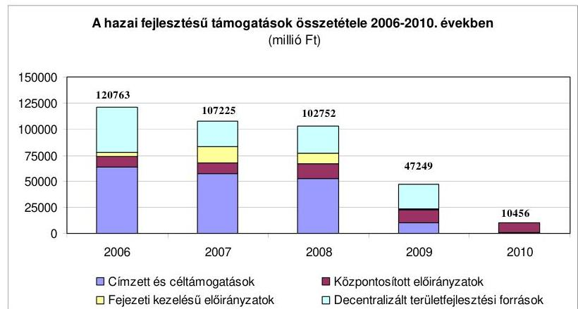

A 2007. évtől címzett támogatás új induló beruházást már nem támogatott. A céltámogatási rendszer múködését a vizsgált időszakban egyszerre jellemezte a források szűkössége és a rendelkezésre álló források kihasználatlansága ${ }^{1}$. A

[^0]
[^0]:    ${ }^{1}$ A régiók között nem volt lehetőség előirányzat-átcsoportosításra.

---

támogatások köre és összege 2009-re, majd 2010-re tovább szűkült ${ }^{2}$, utóbbi az államháztartás egyensúlyának helyreállítását szolgáló intézkedések hatására. Ez leginkább a decentralizált területfejlesztési támogatások visszaesését hozta, csökkentve döntően a kistelepülések önkormányzatainak fejlesztési lehetőségeit. Az egyes önkormányzatok szempontjából így fontos fejlesztések, felújítások elmaradnak. Ez kedvezőtlenül hatott a kötelező feladatok ellátására éppúgy, mint a területi kiegyenlítődésre. Nemcsak az új létesítmények hiánya okoz problémát, hanem a meglévő eszközök állagának romlása is. A folyamat viszszafordítása érdekében - figyelemmel az addicionalitás követelményére is - célszerű a hazai fejlesztési források súlyának emelése.

A hazai fejlesztési célú támogatások a támogatott feladatok, célok tekintetében, előirányzataik nagyságrendjében, az egy feladathoz elnyerhető támogatás összegében, intenzitásában, a múködtető szervezetek vonatkozásában nagyon különbözőek, sokrétűek voltak. Az egyes támogatások céljai között jelentős átfedések voltak, ugyanazon szakágazati célok megvalósításához többféle támogatás is rendelkezésre állt. A támogatási rendszer sokcsatornás, elaprózott, széttagolt, nehezen átlátható volt. A támogatott célok szinte lefedték az önkormányzati feladatok teljes körét. A részükre megítélt támogatások kilenctizede önkormányzati kötelező feladat ellátásához kapcsolódott ${ }^{3}$. A pályázati úton elnyerhető támogatások általában kisebb volumenű fejlesztések megvalósítására nyújtottak lehetőséget.

Az előirányzatok kezelői nem határozták meg a támogatástól elvárt eredményt, az ahhoz kapcsolódó mérőszámokat, a célok teljesítésének mérésére, értékelésére alkalmas indikátorokat.

Az önkormányzatok által igényelhető, pályázható fejlesztési források öszszehangolása szabályozási szinten részben történt meg. A forráskoordináció nem valósult meg. Nem alakítottak ki olyan információs hátteret, amely segítséget nyújtott volna a támogatási célok és a források kölcsönös megfeleltetéséhez, összehangolásához. A támogatások felhasználását nem azonos elvek szerint szabályozták.

Az egyes támogatási előirányzatok köre, ez alapján a pályázható támogatások, a támogatandó célok folyamatosan változtak, egyes támogatások egykét évig voltak elérhetőek, mások a vizsgált időszak valamennyi évében múködtek. Így az önkormányzatok számára nem voltak kiszámíthatóak és hoszszabb távra tervezhetőek. A támogatott célok változásához hozzájárult az is, hogy a költségvetési törvényjavaslatok tárgyalása során módosító indítványok alapján új előirányzatok kerültek kialakításra, vagy finanszírozásuk uniós forrásból történt. Az előirányzatokat a bázis előirányzat és a költségvetési korlátok figyelembevételével tervezték meg, illetve a költségvetési törvények vitájában alakultak ki, nem előzte meg a költségek és az igények felmérése. Az önkor-

[^0]
[^0]:    ${ }^{2}$ részletezését a 3. számú melléklet mutatja
    ${ }^{3}$ Nem kötelező feladatra nyújtott fejlesztési támogatások köre: a köz-és gyógyfürdők, színházak, turisztikai tevékenységek, valamint a települési önkormányzatok által ellátott középfokú oktatás, fekvőbeteg-ellátás, szakosított szociális ellátás.

---

mányzatok igényei minden évben többszörösen (támogatás típustól függően másfélszeresen-tízszeresen) meghaladták a rendelkezésre álló lehetőségeket.

A fejlesztési források döntően pályázati úton kerültek szétosztásra az önkormányzatok között, amelyek nyilvánossága megfelelő volt. A támogatási/pályázati rendszerben biztosították a támogatási lehetőségek megismerését a potenciális pályázók, igénylők számára. Ez alól kivételt képeztek az egyes évek végén fennmaradó pénzek elosztását szolgáló kormányhatározatok alapján és a fejezeti kezelésű előirányzatokból megítélt egyedi támogatások ${ }^{4}$.

A címzett és céltámogatásokat, valamint a decentralizált területfejlesztési támogatásokat több évre ütemezték. A decentralizált forrásokból és a céltámogatásból egészségügyi gép-műszer beszerzésre megítélt 1-6 millió Ft összegű támogatások több évre előre történt ütemezése célszerűtlen volt, mivel a műszaki teljesítés sok esetben megelőzte a támogatás időbeli rendelkezésre állását, ami a kedvezményezetteknél pénzügyi feszültséget okozott. Ez a vizsgált időszak végére megoldódott a támogatások kizárólag tárgyévre történt ütemezésével.

A helyi önkormányzatok hazai fejlesztési célú támogatási rendszerében a vizsgált időszakban a támogatásokat kezelő szervezetek nem működtettek egységes monitoring rendszert. A beszámolók és az ezekhez kapcsolt adatszolgáltatás alapján a támogatás felhasználásának eredményességét a támogatást kezelők saját monitoring rendszerük keretében ellenőrizték és egyedileg értékelték. A monitoring rendszer a decentralizált támogatások körében működött a legjobban. Ezen a területen a támogatások felhasználását a projektek megvalósításának teljes folyamatában helyszíni ellenőrzéssel is nyomon követték. A címzett és céltámogatások, a központosított előirányzatok, illetve a fejezeti kezelésű előirányzatok felhasználására vonatkozó jogszabályok kötelező erővel nem írták elő az előirányzatok kezelőinek a támogatások felhasználásának nyomon követését. A működtetett monitoring visszajelzéseit a támogatási feltételek kialakításakor az előirányzatok kezelői figyelembe vették, de ennek hasznosulása nem volt egységes. A Tftv-ben előírt, és az Országos Területfejlesztési Koncepcióban is szereplő területi monitoring rendszer kialakítására vonatkozó kormányrendelet csak 2010. áprilisban lépett hatályba ${ }^{5}$. Még mindig hiányzik azonban a különböző támogatások összehangolását, a támogatásokkal megvalósuló programok nyomon követését biztosító - az Országos Területfejlesztési Koncepcióban megfogalmazott ${ }^{6}$ - információs rendszer.

A helyi önkormányzatok fejlesztési célkitúzéseiket ágazati, szakmai fejlesztési tervekben, koncepciókban, programokban és gazdasági programban

[^0]
[^0]:    ${ }^{4}$ Így 21 milliárd Ft támogatást hagytak jóvá, amelynek részletezését a 2.3. pont tartalmazza.
    ${ }^{5}$ 37/2010. (II. 26.) Korm. rendelet a területi monitoring rendszerről
    ${ }^{6}$ Az Országos Területfejlesztési Koncepció szerint a „a rendszerszerü, ciklusokban rendeződő fejlesztéseket megfelelő információs rendszerekkel, térinformatikával és intézményi háttérrel támogatott olyan országos monitoring rendszernek kell kiszolgálnia, amely valamennyi regionális, állami és nemzetközi ill. közösségi támogatással megvalósított beruházásra, támogatásra kiterjed".

---

rögzítették. Az önkormányzatok 93,1\%-a rendelkezett közoktatási intézményhálózat múködtetési és fejlesztési tervvel, 94,1\%-a szociális szolgáltatástervezési koncepcióval, amelyekben a fejlesztési célkitűzéseket az Országos Fejlesztéspolitikai Koncepcióban foglaltak figyelembevételével határozták meg. Az önkormányzatok 79,3\%-ánál rendelkezésre álló környezetvédelmi program fejlesztési célkitűzései a Nemzeti Környezetvédelmi Program I-ben megfogalmazott célokkal összhangban voltak. Helyi sportfejlesztési koncepciót az önkormányzatok 37,9\%-a készített, amelyek 72,7\%-ánál vették figyelembe a Nemzeti Sportstratégiában megfogalmazott célkitűzéseket ${ }^{7}$. Az önkormányzatok gazdasági programjának fejlesztési célkitűzései 96,4\%-ban a regionális fejlesztési koncepciókban meghatározott célkitűzésekkel, 92,9\%-ban az egyes feladat ellátási területekre vonatkozó saját célkitűzéseikkel összhangban voltak és teljes mértékben illeszkedtek a kistérségek területfejlesztési koncepciójához.

A helyi önkormányzatok pályázatokon való részvételét a támogatáshoz való hozzájutás és a kitűzött céljaik megvalósítása motiválta. Elsősorban azokat a fejlesztéseket valósították meg, amelyekhez támogatást lehetett igényelni. A fejlesztési célok közül a magasabb támogatás intenzitású ${ }^{8}$ pályázatokat részesítették előnyben. A benyújtott pályázatok céljai az önkormányzatok programjaiban, terveiben, koncepcióiban meghatározott fejlesztési célkitűzéseikkel is összhangban voltak. Az önkormányzatok a pályázatok benyújtása előtt elvégezték a fejlesztendő területre vonatkozóan a helyzetértékelést, a szakmai igényfelmérést. A tervezett fejlesztések költségét az előzetesen készített tervezői költségvetések, illetve árajánlatok alapozták meg. A fejlesztéssel megvalósuló létesítmények jövőbeli üzemeltetésének várható ráfordításait viszont az önkormányzatok 71,9\%-a ( 23 ellenőrzött önkormányzat) nem mérte fel, illetve a fejlesztésekkel elérhető kiadás megtakarításokat nem számszerúsítette.

A támogatással megvalósuló fejlesztési feladatokhoz a pályázatban megjelölt saját források rendelkezésre álltak, részben fejlesztési hitelből (7,2\%), részben kötvény kibocsátásból (3\%). Az utófinanszírozással biztosított fejlesztési célú támogatások az önkormányzatok 31,3\%-ánál (10 ellenőrzött önkormányzat) likviditási problémát okoztak, amelyet folyószámlahitellel hidaltak át. Az ebből adódó többletkiadás a beruházásokhoz kapcsolódó költségüket átlagosan $0,5 \%$-kal emelte meg.

A pályázatfigyelés, pályázatkészítés, támogatásigénylés szervezeti és személyi feltételeit a polgármesteri hivatalokon belül alakították ki és működtették, az ahhoz kapcsolódó feladatokat az önkormányzatok 81,2\%-a szabályozta. A fejlesztési célú támogatások elnyerése érdekében benyújtott pályázatok elkészítésével az önkormányzatok 28,1\%-a bízott meg külső személyt, szervezetet.

[^0]
[^0]:    ${ }^{7}$ A fennmaradó önkormányzatok nem tettek eleget a Közokt. tv, Kvt., Sport tv., Szoc. tv. Előírásainak, és nem készítettek közoktatási intézményhálózat múködtetési és fejlesztési tervet, környezetvédelmi programot, szociális szolgáltatásszervezési koncepciót, helyi sportfejlesztési koncepciót.
    ${ }^{8}$ A hazai fejlesztési célú támogatásoknál a támogatások intenzitása 9\% - 100\% között szóródott, a decentralizált területfejlesztési támogatásoknál a támogatási arányok $50 \%-95 \%$ között mozogtak.

---

Az önkormányzatok ezer Ft támogatással 460 Ft saját és egyéb forrást mobilizáltak. A felhalmozási kiadásaiknak mintegy egynegyedét valósították meg tisztán hazai célú fejlesztési célú támogatással. A végrehajtott fejlesztések eredményesek is voltak, mert $81,3 \%$-ban a tervezett határidőkre és a műszaki tervekkel azonosan, $87,5 \%$-ban a pénzügyi terveknek megfelelően valósultak meg, és $90,6 \%$-ban a tervezett és a tényleges naturális mutatók megegyeztek. A tervektől való eltérés miatt a beruházási költségek átlagosan 3\%-kal növekedtek. A hazai támogatásokkal megvalósított fejlesztésekkel javult az önkormányzatok és intézményeik eszközellátottsága, felszereltsége, infrastruktúrája, az intézményi épületek műszaki állapota. A szakmai és informatikai fejlesztések hozzájárultak az oktatásban korszerűbb technikai eszközök alkalmazásához. Az ellenőrzött önkormányzatok nevelési, oktatási intézményei számítógépeinek száma $50,3 \%$-kal, az IKT tananyagokat tartalmazó szoftverek száma 144,4\%-kal nőtt. Az IKT eszközökkel tartott közismereti órák aránya 2,6\%-ról 12,6\%-ra, a foglalkozásokon IKT eszközöket használó pedagógusok aránya 20,0\%-ról 41,3\%-ra, a számítógépet használó tanulók aránya az iskolákban $28,3 \%$-ról $46,5 \%$-ra emelkedett.

Az önkormányzatok 93,8\%-a belső ellenőrzés keretében nem ellenőrizte a fejlesztési célú támogatások felhasználását. Eleget tettek az elszámolással kapcsolatos adatszolgáltatási kötelezettségüknek.

Összességében a helyi önkormányzatok hazai fejlesztési célú támogatási rendszere hozzájárult az országos ágazati fejlesztési és területfejlesztési célkitűzések megvalósításához. A támogatási rendszer nem volt hatékony, mert az Országos Fejlesztési Koncepcióban és az Országos Területfejlesztési Koncepcióban kitűzött célok teljesítéséhez elvégzendő feladatokat, azok megoldásának, mérésének, értékelésének egységes módját nem határozták meg, a támogatási célokat nem hangolták össze és a források szétaprózottak voltak. A fejlesztési támogatások jogi szabályozása, ebből következően az eljárásrendje nem volt egységes, az programonként illetve támogatási jogcímenként eltért. Nem alakították ki a megbízható adatokat és információkat szolgáltató rendszert, amely a döntéshozóknak rendszeresen, megfelelő időben tájékoztatást adott volna a kitűzött feladatok, célok megvalósításáról.

A helyszíni ellenőrzés megállapításainak hasznosítása mellett javasoljuk:

# a Kormánynak 

1. Tegyen intézkedéseket - az uniós támogatásokra is figyelemmel - az önkormányzatok által igénybe vehető tisztán hazai fejlesztési célú támogatások forráskoordinációjára, a támogatási célok párhuzamosságának elkerülése és átlátható támogatási rendszer létrehozása érdekében.
2. Dolgoztassa ki egységes elvek alapján a hazai fejlesztési célú támogatások indikátor rendszerét és tegye kötelezővé annak alkalmazását a támogatások eredményességének megítélhetősége érdekében.

---

3. Intézkedjen a hazai fejlesztési célú támogatásokra kiterjedően az információs rendszer fejlesztésére, a különböző támogatások összehangolása és felhasználása, a támogatásokkal megvalósuló programok nyomon követése érdekében.

# a nemzeti fejlesztési miniszternek 

A 212/2010. (VII. 1.) Korm. rendelet 85. § a), c), és f) pontjában meghatározott feladatkörében gondoskodjék arról, hogy csak olyan fejlesztési célú támogatásokat lehessen nyújtani, amelyhez párosul a megvalósítandó cél mérhetőségét biztosító indikátor.

---

# II. RÉSZLETES MEGÁLLAPÍTÁSOK 

## 1. A TÁMOGATÁSI RENDSZER CÉJAINAK, FELTÉTELEINEK KIALAKÍTÁSA

### 1.1. Az OGY által elfogadott ágazati fejlesztési és területfejlesztési célkitúzések megjelenítése a címzett és céltámogatások, a központosított támogatások, és a decentralizált területfejlesztési támogatások céljaiban

Az Országgyúlés figyelemmel hazánk társadalmi, gazdasági és környezeti állapotára, valamint az európai uniós csatlakozás által az ország előtt megnyíló lehetőségekre az Országos Fejlesztéspolitikai Koncepcióról szóló 96/2005. (XII. 25.) számú OGY határozat megalkotásával 15 évre tüzte ki a fejlesztéspolitika stratégiai céljait.

A stratégiai célok között rögzítették a magyar gazdaság versenyképességének tartós növekedését, a foglalkoztatás bővülését, a versenyképes tudás és múveltség növekedését, a népesség egészségi állapotának javulását, a fizikai elérhetőség (a települések megközelíthetőségének) javulását, az információs társadalom kiteljesedését, a természeti értékek megőrzését, a kiegyensúlyozott területi fejlődéssel annak biztosíthatóságát, hogy Magyarország valamennyi állampolgára lakóhelyétől függetlenül hasonló eséllyel juthasson hozzá az alapvető szolgáltatásokhoz.

Az ország kiegyensúlyozott területi fejlődése érdekében a területfejlesztési politika átfogó céljaiként a területi felzárkózás megteremtése, a kiegyensúlyozott településhálózat kialakítása a decentralizáció és a regionalizmus erősítése került rögzítésre.

Az Országgyúlés az ország kiegyensúlyozott területi fejlődése és a térségei tár-sadalmi-gazdasági, kulturális fejlődésének előmozdítása, valamint az átfogó területfejlesztési politika érvényesítése, az országos és a térségi területfejlesztési és területrendezési feladatok összehangolása érdekében megalkotta a területfejlesztésről és a területrendezésről szóló törvényt. Ennek figyelembevételével az Országos Területfejlesztési Koncepcióról szóló 97/2005. (XII. 25.) OGY határozat az ország területfejlesztési politikájának célkitúzéseit, elveit és prioritás-rendszerét, valamint a területfejlesztési politika 2020-ig terjedő időszakára - az Országos Fejlesztéspolitikai Koncepció céljainak időtávjával összhangban - öt átfogó célkitúzést fogalmazott meg.

Az átfogó célkitűzések a térségi versenyképességre, a területi felzárkózásra, a fenntartható térségfejlődésre és örökségvédelemre, a területi integrálódásra, a decentralizációra és regionalizmusra vonatkoztak.

---

Az Országos Fejlesztéspolitikai Koncepció ${ }^{9}$ a finanszírozási rendszerben az európai uniós források elsődleges szerepét jelölte ki azáltal, hogy a szükséges fejlesztéseknek lehetőleg minél szélesebb körét a közösségi forrásokból kell finanszírozni és a tisztán hazai fejlesztési forrásokat az unió által nem támogatott célokra, prioritásokra kell koncentrálni. Az Országos Területfejlesztési Koncepció ${ }^{10}$ is a hazai támogatáspolitika komplementer (kiegészítő) jellegét rögzítette. Ugyanakkor az addicionalitás elvének figyelembevételével az európai uniós források felhasználására vonatkozó rendelkezések ${ }^{11}$ értelmében a strukturális alapokból származó források nem helyettesíthetik a tagállamok közkiadásait, vagy annak megfelelő strukturális kiadásait.

Az Országgyúlés külön határozatban döntött a sportra vonatkozó célkitűzésekről, a Sport XXI. Nemzeti Sportstratégiáról szóló 65/2007. (VI. 27.) OGY határozatban. A stratégiai célok között kiemelt fejlesztési feladatként jelent meg a szabadidősport, rekreációs sportnál a sportolási terek (multifunkcionális szabadidőközpontok, szabadidőparkok) fejlesztése.

A stratégiai célok a sport egyes területein: az iskolai testnevelés és diáksport területén a gyermekek jó testi, lelki és szellemi egészségének, fizikai erőnlétének elérése a mindennapos testedzés biztosításával; a szabadidősport, rekreációs sportnál a sportolási terek (multifunkcionális szabadidőközpontok, szabadidőparkok) fejlesztése, a lehetőségek javítása; a versenysport, utánpótlás-nevelés területén az élsportban már hagyományosan elért eredményességi szint fenntartása, illetve a nemzetközileg is népszerű sportágakban az eredményesség javítása.

# Ezt követően az elfogadott koncepciókban és a stratégiában kitűzött célok elérése érdekében végrehajtandó feladatok konkretizálására, a megvalósítás ütemezésére nem került sor, a célok teljesítésének mérésére, értékelésére alkalmas mutatókat nem határoztak meg. 

A 2003-2008. közötti időszakra szóló Nemzeti Környezetvédelmi Programról szóló 132/2003. (XII. 11.) OGY határozatban rögzítette az Országgyúlés a környezetvédelem területén elérendő fő célokat. Ezek az ökoszisztémák védelme, a társadalom és környezet harmonikus kapcsolatának biztosítása, a gazdasági fejlődésben a környezeti szempontok érvényesítése; a környezeti folyamatokkal, hatásokkal, valamint a környezet- és természetvédelemmel kapcsolatos ismeretek, tudatosság és együttmúködés erősítése voltak. A Nemzeti Környezetvédelmi Programban az egyes akcióprogramok tartalmazták az előrehaladási mutatókat, amelyek a célállapotok, valamint a tematikus akcióprogramok által meghatározott feladatok teljesülésének mérését, megítélését biztosították.

[^0]
[^0]:    ${ }^{9}$ Az Országos Fejlesztéspolitikai Koncepció 2.6.2 pontja az NSRK (Nemzeti Stratégia Referenciakeret) megnövekedett forrásainak felhasználásával kapcsolatos kérdések.
    ${ }^{10}$ Az Országos Területfejlesztési Koncepció V.8.1. pontjában a finanszírozási rendszer továbbfejlesztéséhez szükséges általános követelmények.
    ${ }^{11}$ A Tanács 1260/1999/EK rendelete, valamint 2007. január 1-től hatályos 1083/2006/EK rendelet.

---

Az országos koncepciókban, stratégiában megfogalmazott célkitűzések, prioritások megvalósításának egyik fontos szereplője az önkormányzati alrendszer. Az önkormányzatok 2006-2009. között 1939,3 milliárd Ft-ot fordítottak fejlesztésre, és 388 milliárd Ft tisztán hazai (központi költségvetésekből finanszírozott) támogatást vettek igénybe, címzett és cél, központosított előirányzatból nyújtott, decentralizált, valamint fejezeti kezelésű hazai fejlesztési célú támogatások formájában, mintegy 100 jogcímen. A támogatások jelentős része az önkormányzatok infrastrukturális fejlesztéseit szolgálta.

A központosított előirányzatokból 15 feladatra volt lehetőségük az önkormányzatoknak fejlesztési célú forrásokhoz jutni.

A decentralizált fejlesztési támogatások előirányzatán belül a vizsgált időszakban a területfejlesztési célú, önkormányzati fejlesztési támogatási előirányzatok a következők voltak: terület- és régiófejlesztési cébelőirányzat (TRFC), területi kiegyenlítést szolgáló önkormányzati fejlesztések támogatása (TEKI), céljellegú decentralizált támogatás (CÉDE), leghátrányosabb helyzetű kistérségek felzárkóztatásának támogatása (LEKI), települési szilárd burkolatú belterületi közutak bur-kolat-felújításának támogatása (TEUT), települési hulladék közszolgáltatás fejlesztésének támogatása (TEHU).

A fejezeti kezelésű előirányzatok az önkormányzatok szociális, egészségügyi, közoktatási, közművelődési, környezetvédelmi, közlekedési infrastruktúra fejlesztési feladataikhoz nyújtottak támogatást.

Az önkormányzatok által a fejlesztési feladataikhoz igénybe vehető fejlesztési támogatások céljaikat tekintve összhangban voltak az Országos Fejlesztéspolitikai Koncepcióban, az Országos Területfejlesztési Koncepcióban, a Nemzeti Környezetvédelmi Programban, illetve a Nemzeti Sportstratégiában meghatározott célkitűzésekkel. Az országos koncepciókban, programokban és a hazai fejlesztési célú támogatásokban meghatározott célok rendszerét a 2. számú melléklet mutatja be. Az egyes támogatások céljai között átfedések voltak, mivel ugyanazon szakágazati célok megvalósításához többféle támogatás is rendelkezésre állt.

A közoktatás fejlesztését - a címzett támogatás 2006-ban, a központosított támogatás, valamint a TRFC, a CÉDE, a TEKI és a LEKI keretében - a humán infrastruktúra fejlesztési előirányzatok támogatták. A közoktatás területén kiemelten támogatott volt az infrastrukturális fejlesztés és az intézményekben meglévő berendezések, felszerelések, taneszközök korszerűsítése, informatikai fejlesztése.

A szilárd burkolatú utakkal kapcsolatos fejlesztésekhez támogatási forrást a központosított előirányzatok, fejezeti kezelésű előirányzatok, továbbá a TRFC, a CÉDE, és a TEUT keretek biztosítottak.

Az önkormányzatoknak. egészségügyi fejlesztésekhez a cél- és címzett támogatás, valamint a TRFC, a CÉDE és a LEKI támogatások igénybevételére volt lehetőségük.

A kulturális alapszolgáltatások, a közösségi terek, a kulturális infrastruktúra fejlesztése célkitűzés támogatása a címzett támogatás, a központosított támogatás, valamint a TRFC, a CÉDE és a TEKI támogatási céljai között szerepelt.

---

A potenciális szennyező forrásként jelentkező szennyvíz és hulladék korszerű technikával megvalósuló kezelésével, ártalmatlanításával kapcsolatos fejlesztésekhez a címzett és céltámogatás, valamint a TRFC, a CÉDE és a LEKI támogatások álltak rendelkezésre.

A vizsgált időszakban a támogatási előirányzatok köre, ez alapján a pályázható támogatások mértéke, a támogatandó célok folyamatosan változtak. Egyes támogatások egy-két évig voltak elérhetőek, mások a vizsgált időszak valamennyi évében múködtek.

A címzett támogatási igény benyújtására - új induló beruházásokhoz - utoljára csak 2006-ban volt lehetősége az önkormányzatoknak, ezt követően a folyamatban lévő pályázatok finanszírozása történt a címzett támogatási előirányzat terhére.

A céltámogatással támogatható önkormányzati fejlesztések köre szűkült, a Cct. 2008. január 1-jén hatályba lépett módosítását követően a szennyvízelvezetés és tisztítás támogatási cél kikerült a támogatható célok közül. Ezt követően csak a működő kórházak és szakrendelők gép-műszer beszerzéseihez volt lehetőség támogatást igénybe venni.

A vizsgált időszak minden évében központosított előirányzat támogatta a könyvtári, közművelődési, valamint múzeumi szakmai feladatok fejlesztését, a közoktatás szakmai és informatikai fejlesztését, a belterületi utak felújítását, korszerűsítését. A bölcsődék és közoktatási intézmények infrastrukturális fejlesztése, valamint közösségi buszok beszerzése 2008-2010 között volt kiemelt támogatási cél. A 2008. évben a pályázati lehetőség a leghátrányosabb helyzetű kistérségekre történő meghatározása az országos koncepciókban megfogalmazott életesélyek (közszolgáltatások elérhetősége, kommunális infrastruktúra) terén fennálló egyenlőtlenségek mérséklése céllal összhangban történt. A közoktatás területén 2008-ban a közoktatási intézmények részére több csatornás támogatási rendszer állt rendelkezésre, a minden önkormányzat által igényelhető közoktatási intézmények szakmai és informatikai fejlesztési feladatai támogatása mellett a kistelepülési iskolák - az 1500 fő lakosságszám alatti településen - tárgyi feltételeinek javítására, valamint a leghátrányosabb helyzetű kistérségekben a közoktatási intézmények infrastrukturális fejlesztésére állt rendelkezésre támogatási előirányzat.

A decentralizált területfejlesztési támogatások - kormányrendeletekben meghatározott - céljai egyértelműen meghatározott feladatok fejlesztésére vonatkoztak. Az egyes előirányzatok támogatási céljai egy-két évenként változtak, 2008tól a területfejlesztési támogatásokról és a decentralizáció elveiről szóló 67/2007. (VI. 28.) OGY határozatban rögzített célkitűzésekkel összhangban.

Az önkormányzati fejlesztési célokat szolgáló decentralizált fejlesztési forrásokból 2008-tól a humán infrastruktúra fejlesztése, a települési infrastruktúra fejlesztése (önkormányzati tulajdonú közlekedési hálózatok fejlesztése, közvilágítás fejlesztése, hulladékgazdálkodási projektek, belterületi vízrendezés, csapadékvízelvezetés, kegyeleti infrastruktúra fejlesztés, belterületi zöld területek kialakítása, közintézmények akadálymentesítése), a falu- és tanyagondnoki hálózat fejlesztése vált támogathatóvá.

A TRFC (Terület- és régiófejlesztési Célelóirányzat) az önkormányzatok tekintetében 2006-2007-ben az önkormányzati infrastrukturális fejlesztések - többek között a humán infrastruktúra fejlesztések, a belterületi kiépítetlen közúthálózat,

---

valamint kerékpárút fejlesztések - voltak a meghatározó támogatási területek, majd 2008-ban jelentősen változtak a támogatási prioritások, így a lakosság életminőségének javítása került a támogatások fókuszába.

A CÉDE (Céljellegű decentralizált támogatás) területi kötöttség nélkül volt pályázható, amelynek támogatási céljaiban 2008-ban következett be változás. Az addigi önkormányzati feladatkörbe tartózó, széles spektrumon mozgó feladatok intézmények építése, bővítése felújítása; közút, járda építése; villamoshálózat, közvilágítás, vízrendezés - helyett az épített és természeti környezet védelme, fejlesztése, a helyi önkormányzati feladatellátás színvonalának javítását eredményező fejlesztések, a csapadékvizek által okozott terhelések csökkentése került a támogatási prioritásokba.

A TEKI (Területi kiegyenlítést szolgáló fejlesztési támogatás) előirányzat a területi kiegyenlítés érdekében 2006-2007-ben az önkormányzatok kötelező feladatot ellátó intézményeinek fejlesztése mellett a legkülönbözőbb területeken - a felszíni vízelvezető rendszerek fejlesztése, a turizmushoz, a környezet- és a természetvédelemhez, a sporttevékenység gyakorlása infrastrukturális feltételrendszerének megteremtéséhez - biztosított támogatást. A 2008. évtől olyan támogatási célokat határoztak meg, amelyeket európai uniós támogatás nem finanszírozott (pl. a helyi közterületek és közbiztonság fejlesztése, a közterületek akadálymentesítése).

A LEKI (Leghátrányosabb helyzetű kistérségek felzárkóztatásának támogatása) keret a leghátrányosabb helyzetű kistérségek felzárkóztatására biztosított támogatásokat, amelyek céljai között a vizsgált időszak minden évében a helyi önkormányzatok alapfeladatainak ellátása között meglévő színvonalbeli különbségek csökkentése érdekében, a bel- és külterületen megvalósuló humán, illetve termelő infrastruktúra fejlesztések, szociális feladat ellátáshoz kapcsolódó fejlesztések voltak pályázhatók. A 2008. évtől ezen infrastrukturális célok mellett olyan - európai uniós forrásból támogatásban nem részesülő - fejlesztések jelentek meg, mint a helyi piacok, vásárcsarnokok fejlesztése, bővítése, a teleházak kialakítását szolgáló fejlesztések.

A TEUT (Települési önkormányzatok szilárd burkolatú belterületi közutak burko-lat-felújításának támogatása) egyetlen támogatási célt határozott meg, a települési önkormányzatok törzsvagyonába tartozó belterületi - kapacitást nem növelő - szilárd burkolatú közutak felújításának, korszerűsítésének támogatását, amely cél az egyes években nem változott.

A TEHU (Települési szilárd hulladék közszolgáltatás fejlesztéseinek támogatása) támogatás a vizsgált időszak első évében funkcionált, amikor is a szilárd, illetve folyékony hulladék-gyűjtéssel kapcsolatos fejlesztésekre lehetett pályázatot benyújtani, majd 2007-től ezen feladatok támogatása kikerült a decentralizált fejlesztési támogatások közül, tekintettel az európai uniós források megnyílására.

A Tftv. 17. § (2) bekezdés b) pontja területfejlesztési koncepció, továbbá a régió fejlesztési programjának és stratégiájának kidolgozását és elfogadását a regionális fejlesztési tanácsok számára teszi kötelezővé. A regionális területfejlesztési tanácsok az előzőekben foglaltak alapján elkészítették területfejlesztési koncepcióikat, a 2007-2013 közötti évekre vonatkozó stratégiai fejlesztési programjaikat, a 67/2007. (VI. 28.) OGY határozat alapján pedig a 2009-2010 közötti időszakra vonatkozó területfejlesztési operatív programjaikat.

Az ellenőrzött regionális fejlesztési tanácsok a regionális területfejlesztési koncepciók, stratégiai fejlesztési programjaik és 2009-2010.

---

évekre szóló területfejlesztési operatív programjaik célkitűzéseit az OGY által elfogadott ágazati fejlesztési és területfejlesztési célokkal összhangban határozták meg.

A regionális fejlesztési tanácsok által nyújtható fejlesztési támogatások céljait a decentralizált helyi önkormányzati fejlesztési támogatási programok előirányzatai és a vis maior tartalék felhasználásának részletes szabályairól szóló, valamint a TRFC felhasználásának részletes szabályairól szóló kormányrendeletek ${ }^{12}$ szabályozták. A támogatható célok az önkormányzatok igényeit széles körben lefedték. Az ellenőrzött regionális fejlesztési tanácsok az általuk nyújtott támogatások céljait e kormányrendeletek figyelembevételével határozták meg.

A Nyugat-dunántúli Regionális Fejlesztési Tanács a 2006-2007. években kiírt pályázatai a kormányrendeletekben meghatározott valamennyi fejlesztési célt tartalmazták, a 2008. évtől azonban a Tanács a régió sajátosságainak, a rendelkezésre álló keretnek, valamint a pályázói igényeknek - előző évi beérkezett pályázatokban szereplő igények, valamint a kistérségi koordinátorokhoz beérkezett igények - figyelembevételével a pályázati kiírásaiban a kormányrendeletekhez képest a támogatható célok körét szűkítette.

# 1.2. A fejlesztési célú támogatások pályázati, igénylési feltételeinek kialakítása 

A területfejlesztési támogatásokról és a decentralizáció elveiről, szóló 67/2007. (VI. 28.) OGY határozat előírta a források, valamint az igények és a fejlesztések fenntarthatósága összhangjának megteremtését, a források szétaprózódásának megakadályozását. Ennek ellenére a helyi önkormányzatok hazai fejlesztési célú támogatási rendszere sokcsatornás, elaprózott, széttagolt, nehezen átlátható volt, az önkormányzatok több forrásból is juthattak ugyanazon fejlesztéshez támogatáshoz. A támogatások esetenként alacsony intenzitása, a saját forrás hiánya - jellemzően a fejezeti kezelésű előirányzatokból, és a decentralizált fejlesztési keretekből biztosított támogatásoknál - az önkormányzatokat a több támogatás típusra való pályázásra orientálta.

A vizsgált időszakban a forráskoordináció érdekében nem alakítottak ki olyan információs hátteret, amely segítséget nyújtott volna a támogatási célok és a források kölcsönösen megfeleltetéséhez, összehangolásához. Az önkormányzatok által igényelhető, pályázható fejlesztési források összehangolása szabályozási szinten részben történt meg, a jogszabályi előírások esetenként a támogatási források ugyanazon célra történő igénybevételét tették lehetővé. Estenként zárták ki a párhuzamos, vagy többszöri igénybevételt.

A 2006-2009. években a decentralizált helyi önkormányzati fejlesztési támogatásokra vonatkozó kormányrendeletek szerint címzett, illetve céltámogatással megvalósuló fejlesztésekhez a benyújtást követően még hátralévő fejlesztési tarta-

[^0]
[^0]:    ${ }^{12}$ 295/2005. (XII. 23.), 12/2007. (II. 6.), 47/2008. (III. 5.), 148/2008. (V. 26.), 85/2009. (IV. 10.) Korm. rendeletek.

---

lomhoz volt igényelhető decentralizált támogatás. A 2008-2009. években az Európai Unió által társfinanszírozott támogatások rendszerében, illetve az érintett régiók operatív programjaiban támogatható projektekre nem lehetett decentralizált támogatási pályázatot benyújtani. Azon belterületi utak szilárd burkolattal való ellátásához, amelyek 2009-ben központosított előirányzatából támogatásban részesültek a szabályozás 2009-ben kizárta a decentralizált forrás igénybevételét

A decentralizált forrásokkal összhangban valósult meg a három éves kistérségi szociális felzárkóztató programok támogatása, együttmúködésben a regionális fejlesztési tanácsok és a Szociális Minisztérium által is elfogadott fejlesztési tervek alapján. A programban kiemelt jelentőséget kapott a társfinanszírozási gyakorlat, amely szerint a programok lebonyolítása a regionális fejlesztési tanácsokkal egyetértésben történt, a területfejlesztési és minisztériumi fejezeti kezelésű előirányzati források bevonásával.

A közoktatás területén 2008-ban a közoktatási intézmények részére többcsatornás támogatási rendszer állt rendelkezésre. A központosított előirányzatokból két jogcímen (a kistelepülési - az 1500 fő lakosságszám alatti települési - iskolák tárgyi feltételeinek javítására, valamint a közoktatási intézmények a szakmai és informatikai fejlesztési feladatok támogatására), a kötött felhasználású előirányzatokból a leghátrányosabb helyzetű kistérségekben, az 1500 - 10000 fő közötti lakosságszámú településen működő általános iskolák infrastruktúra-fejlesztésre, korszerűsítésre és akadálymentesítésre, valamint eszközbeszerzésre lehetett támogatást igényelni.

A címzett és céltámogatási rendszerre vonatkozóan törvényi, illetve kormányrendeleti ${ }^{13}$ szintü szabályozással alakították ki a müködtetés szabályait, és a szabályozásnak megfelelően müködtették a címzett és céltámogatásokat.

A címzett támogatás igénybevételének feltételeire vonatkozóan a szakminisztériumok közzé tették útmutatójukat, a támogatás elnyerésének prioritásaival együtt. A pályázati rendszer első szakaszában az önkormányzatoknak beruházási koncepciót kellett benyújtani a szakminisztériumokhoz, amelyek a szakmai értékelést végző szervezettel minősíttették azokat. A létrehozott szakmai bizottság által támogatásra javasolt, illetve a feltételeknek nem megfelelő beruházási koncepciókról a Kormány közleményt adott ki.

A szakminiszterek lefolytatták az egyeztetéseket az önkormányzatokkal a beruházások szakmai-műszaki tartalma szűkítéséről, azok megvalósítási költségének csökkentéséről, a bevonható saját források mértékéről, valamint a II. Nemzeti Fejlesztési Tervbe való illesztéséről. A pályázati rendszer második szakaszában az önkormányzatoknak építési engedéllyel rendelkező pályázati dokumentációt (ún. igénybejelentést) kellett benyújtani. A támogatási igényről a döntést - a Kormány előterjesztése alapján - az Országgyűlés hozta meg.

A céltámogatások odaítéléséről 2006-2009 között a regionális fejlesztési tanácsok döntöttek az éves költségvetési törvényekben meghatározott támogatási nagyságrend régiók között felosztott kerete alapján. A 2010. évben az önkormányzatok igénybejelentései alapján a céltámogatásra javasolt beruházásokról a helyi ön-

[^0]
[^0]:    ${ }^{13}$ a helyi önkormányzatok címzett és céltámogatása felhasználásának részletes szabályairól szóló 19/2005. (II. 11.) Korm. rendelet

---

kormányzatokért felelős miniszter döntött. A döntést megelőző eljárás során az önkormányzatok megvalósíthatósági tanulmányt készítettek és szakmai értékelésre benyújtották a külön jogszabályban meghatározott szervezethez. Az önkormányzatok a céltámogatási igénybejelentést - támogatható célonként különkülön - a Kincstár illetékes Igazgatóságnak nyújtották be, amely szabályszerűségi és pénzügyi szempontok alapján megvizsgálta és számítógépen feldolgozta a céltámogatási igénybejelentést és - hiányosság észlelése esetén - az önkormányzatot hiánypótlásra szólította fel. A Regionális Egészségügyi Tanács, illetve 2006-2007-ben a Területi Vízgazdálkodási Tanács véleményezte az igénybejelentést és a támogatási döntésre vonatkozó javaslatát megküldte a döntéshozónak.

A költségvetési törvényekben meghatározott, a helyi önkormányzatok által felhasználható központosított előirányzatokra vonatkozóan a támogatásigénylés, döntés, folyósítás, elszámolás és ellenőrzés előirásait a miniszteri rendeletekben eltérően szabályozták.

A vizsgált időszakra vonatkozó szabályozásokban a döntés előkészítést a Kincstár területileg illetékes igazgatóságai, valamint tárcaközi bizottságok feladataként határozták meg. A támogatásról szóló döntést megelőző bizottsági ${ }^{14}$ szintű előkészítést, javaslattételt a szabályozások háromnegyede tartalmazta.

A támogatásokkal történő elszámolás határidejére sem volt egységes szabályozás, mert részben a zárszámadáshoz kötötték, részben - 2009-ben és 2010-ben az informatikai fejlesztési feladatokhoz igényelhető támogatások esetében a felhasználást követő 30 napban határozták meg.

Az elszámolás módjára sem volt egységes a szabályozás: a szakmai, pénzügyi beszámoló készítést, a zárszámadás rendje szerinti elszámolást határoztak meg, míg más helyen tételesen előírták az elszámolás dokumentációjának tartalmát.

A 2006. évben a többcélú kistérségi társulásokban részt vevő települési önkormányzatok fenntartásában lévő sportpályák felújításának támogatásánál, a bölcsődék és a közoktatási intézmények infrastrukturális fejlesztéséhez, valamint közösségi buszok beszerzéséhez kapcsolódó támogatásoknál szakmai és pénzügyi beszámoló benyújtását írták elő.

Az informatikai fejlesztési feladatokhoz igényelhető támogatásoknál 2009-től a szabályozás értelmében a fenntartó szakmai beszámolót és pénzügyi elszámolást küld a Támogatáskezelő részére, a támogatáskezelő által meghatározott adattartalommal.

A 2006-2008. években a szakmai és informatikai fejlesztési feladatokhoz igényelhető támogatásoknál, valamint 2009-ben a helyi önkormányzatok fenntartásában lévő sportlétesítmények felújítására biztosított támogatásnál, a mindenkori zárszámadás keretében és rendje szerinti elszámolást írták elő.

Az ellenőrzésre vonatkozó szabályozás esetenként nevesítette konkrétan az ellenőrzésre jogosult szervezetet.

[^0]
[^0]:    ${ }^{14}$ A döntés előkészítő, javaslattevő bizottság több minisztérium által delegált tagokból állt, tárcaközi jelleggel múködött. Egy támogatásnál - 2006-ban a pincerendszerek, természetes partfalak és földcsuszamlások veszély elhárítási munkálatainak támogatása - a miniszter által kinevezett bizottság volt a javaslattevő.

---

Az ellenőrzésre jogosult szervezet megnevezésénél általános volt az „erre feljogosított szervek" megfogalmazás. Az informatikai fejlesztési feladatokhoz igényelhető támogatásoknál az OKM Támogatáskezelő a szakmai célok megvalósulásának, a Kincstár a pénzeszközök jogszerű felhasználásának ellenőrzésére kapott felhatalmazást.

Nem határozták meg az ellenőrzések formáját és időbeli ütemezését. A monitoringra történő utalás 2008-tól jelent meg a szabályozásokban, azonban - a közoktatás szakmai és informatikai fejlesztésének támogatására vonatkozó OKM rendeleten ${ }^{15}$ kívül - nem határozták meg a monitoring tevékenység elvégzésére jogosultakat.

Az ellenőrzések lefolytatásának szabályaiként mindössze azt rögzítették, hogy a támogatott a támogatás felhasználását köteles elkülönítetten és naprakészen nyilvántartani, az ellenőrzésre feljogosított szervek megkeresésére az ellenőrzés lefolytatásához szükséges tájékoztatást megadni, a kért dokumentumokat rendelkezésre bocsátani, a helyszíni ellenőrzést lehetővé tenni.

A vizsgált időszakban az egyes minisztériumoknál a fejezeti kezelésú támogatási célú elöirányzatokra vonatkozóan a pályázatkezelés és egyedi elbírálás folyamatára, a támogatási szerződések tartalmi elemeire, illetve a szakmai beszámolók és pénzügyi elszámolások tartalmi követelményeire a szempontrendszert, eljárásrendet kidolgozták. A döntési jogkört miniszteri szintre telepítették a szabályozások.

Megfelelő volt a pályázatok nyilvánossága. A támogatási/pályázati rendszerben biztosították a támogatási lehetőségek megismerését a potenciális pályázók, igénylők számára, jellemzően az interneten elérhető pályázati kiírásokkal.

A közművelődés területén a közművelődés egységes elektronikus rendszerében (www.erikanet.hu) folyamatosan megtekinthetők voltak a pályázatok, a jogszabályi háttérrel rendelkező pályázati kiírások esetében pedig figyelemfelhívás jelent meg, útmutatással együtt. Ezen túl a megyei közművelődési intézmények havi kiadványaikban tett közzé a felhívásokat, valamint regionális és országos konferenciákon, pályázati tanácskozásokon, elektronikus hírlevelekben is informálták az érdekelteket.

Az Egészségügyi Minisztérium „a szakellátási normatíva felosztásáról szóló határozatokból adódó, a fekvőbeteg ellátó egészségügyi szolgáltatóknál megvalósuló intézményi átalakítások költségeinek támogatására" pályázati eljárás keretében tette lehetővé források elnyerését.

A szociális feladatellátás pályázati lehetőségeiről - a minisztérium megbízása alapján - a pályázatkezelő honlapján jelent meg tájékoztatás. A hátrányos hely-

[^0]
[^0]:    ${ }^{15}$ A szakmai és informatikai fejlesztési feladatok támogatása igénylésének, döntési rendszerének, folyósításának, elszámolásának és ellenőrzésének részletes szabályairól szóló 23/2008. (VIII. 6.) OKM rendelet 9. § (13) bekezdése, illetve az informatikai fejlesztési feladatok támogatása igénylésének, döntési rendszerének, folyósításának, elszámolásának és ellenőrzésének részletes szabályairól szóló 20/2010. (V. 13.) OKM rendelet 11. § (19 bekezdése meghatározta, hogy a monitoringgal kapcsolatos feladatokat az OKM Támogatáskezelő végzi.

---

zetű kistérségek három éves szociális felzárkóztató programjában való részvétel lehetőségéről Fehérgyarmat hátrányos helyzetű kistérségre vonatkozóan, figyelemfelhívó levélben tájékoztatták a - programban már résztvevő - regionális fejlesztési tanács elnökét.

A támogatások felett rendelkező szervezetek - az NFGM kivételével - a programok végrehajtásának nyomon követhetősége, az elérendő célok mérése érdekében a fejlesztések eredményének mérésére szolgáló indikátorokat nem határoztak meg. Az NFGM a decentralizált területfejlesztési támogatások pályázati rendszere keretében 2009-ben indikátor listát ${ }^{16}$ készített a regionális fejlesztési tanácsok részére. Az indikátorlista kötelező országos téma specifikus indikátorokat ${ }^{17}$, valamint választható régió specifikus indikátorokat ${ }^{18}$ tartalmazott. Az indikátor rendszer részét képezte a beruházás megvalósítását mérő output indikátor ${ }^{19}$ (gyűjtőindikátor), valamint jogcímenként a beruházás aktiválása után a fejlesztéstől elvárt hasznosságot mérő további output és/vagy eredmény indikátor.

A 2009. évi előirányzati keretekből kötött támogatási szerződésekben rögzítésre kerültek az egyes projektekhez tartozó kötelező és régió által kiválasztott indikátorok. Az indikátor rendszer bevezetése és alkalmazása nem volt problémamentes. Az indikátorok alapvetően igazodtak a programokban foglalt kritériumokhoz, pályázati jogcímekhez, azonban az önkormányzati fejlesztések anynyira sokrétűek voltak, amelyeket a választott indikátorok nem tudtak teljes körűen jellemezni. így össze nem hasonlítható, össze nem vethető fejlesztések esetében kerültek ugyanazon típusú indikátorok meghatározásra. A pályázóknak 2010-től az indikátorok alapján előírtak alakulásáról minden év november 30-ig kell adatot szolgáltatniuk. Mivel 2010-ben és 2011-ben költségvetési fedezet hiányában a decentralizált támogatási rendszerben új pályázatok kiírására nem került sor, így az indikátorok alkalmazásával történő hatáselemzés ki sem teljesedhetett.

# 2. A TÁMOGATÁSI RENDSZER MÜKÖDTETÉSE 

A 2006-2010 közötti időszakban - a központosított előirányzatból nyújtott EU-s támogatással megvalósuló fejlesztések saját forrás kiegészítése és hazai társfinanszírozása nélkül - 388 milliárd Ft hazai fejlesztési célú támogatás

[^0]
[^0]:    ${ }^{16}$ Az indikátor lista a 85/2009. (IV. 10.) Korm. rendelet 22. § (8) bekezdésében előírt értékelő jelentések kiegészítéséül szolgált.
    ${ }^{17}$ Téma specifikus indikátorok voltak: akadálymentesített közintézményi terület, fejlesztéssel érintett kerékpárutak hossza, felújított utak által érintett településrészek becsült lakosságszáma, megújuló energiaforrások felhasználásával elért költségmegtakarítás a közintézményekben.
    ${ }^{18}$ Régió specifikus indikátorokként határozták meg: a fejlesztett intézmény által ellátott lakosok számát, a fejlesztéssel érintett épület forgalmát, létrehozott utcabútorokat használók számát, megújított iskolai vagy óvodai területét, az óvodai férőhelyek számát az óvodáskorú népesség arányában.
    ${ }^{19}$ Output indikátorok voltak: a fejlesztés során beszerzett, felújított összes eszköz száma, a fejlesztés tárgyát képező épület összes területe, vonalas infrastruktúrafejlesztés összes hossza, közlekedési infrastruktúra-fejlesztés alapterülete.

---

# állt rendelkezésre az önkormányzatok fejlesztési feladatainak támogatására (3. számú melléklet). 

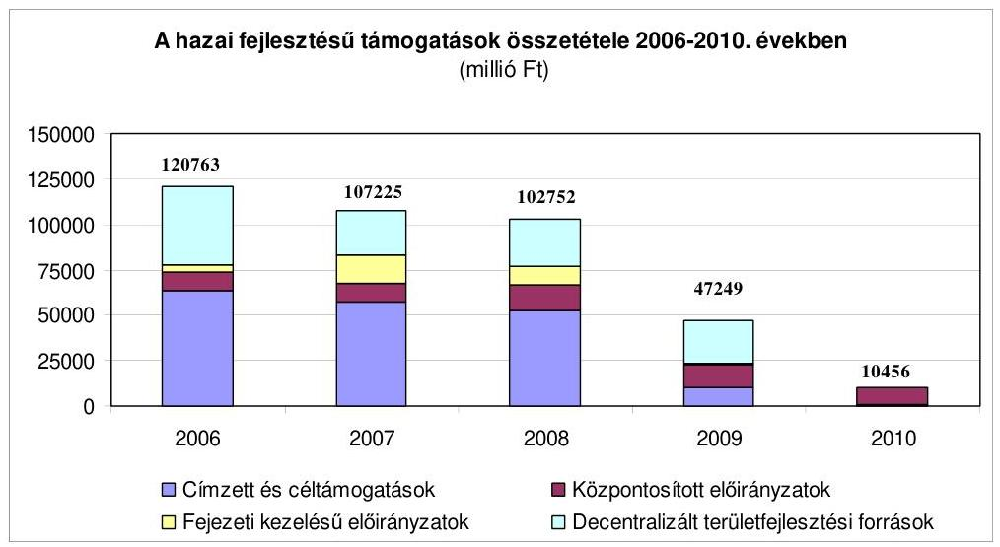

A 2006-2010 között rendelkezésre állt fejlesztési támogatások részben biztosították a korábban elnyert támogatások ütemezetten áthúzódó kötelezettségét, részben ( 249 milliárd Ft) az új önkormányzati fejlesztési feladatokra megítélt támogatást ${ }^{20}$. A fejlesztési támogatások a támogatott feladatok és célok tekintetében, előirányzataik nagyságrendjében, az egy feladathoz elnyerhető támogatás összegében, támogatás intenzitásukban, a működtető szervezetek vonatkozásában nagyon különbözőek, sokrétűek voltak.
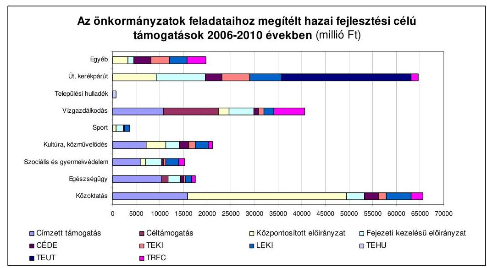

Az önkormányzatok - országos szinten - fejlesztési kiadásaik 18,7\%-ához vettek igénybe hazai fejlesztési célú támogatásokat.

[^0]
[^0]:    ${ }^{20}$ Az önkormányzatok feladataihoz megítélt hazai fejlesztési támogatásokat a 4. számú melléklet tartalmazza. A hazai költségvetési forrásból megítélt támogatások számát az 5. számú melléklet tartalmazza.

---

# 2.1. Címzett és céltámogatások 

A vizsgált időszakban a címzett és céltámogatások jelentősége csökkent, amelyet - a CCt. 2005. I. 1-jétől hatályos módosításával összhangban a 2007., 2008., 2009. és 2010. évi költségvetési törvények korábbiaknál kisebb előirányzatai mutatnak. Ugyanakkor a 2006 előtt vállalt áthúzódó kötelezettségek miatt az önkormányzatok részére rendelkezésre álló fejlesztési forrásokból a legnagyobb részaránya (48\%) a címzett és céltámogatásoknak volt a vizsgált időszakban.

A 2006. évben induló címzett támogatás előkészítése 2005-ben kezdődött el. Az önkormányzatok a rendelkezésre álló forrás közel hatszorosára, 292716 millió Ft-ra nyújtottak be igényt 321 pályázat keretében. A megvalósítani szándékozott fejlesztések kevesebb, mint egynegyede ${ }^{21}$ (75) részesült három évre ütemezetten összesen 50320 millió Ft címzett támogatásban ${ }^{22}$ az Országgyúlés döntése alapján ${ }^{23}$. Legnagyobb arányban és összegben a vízgazdálkodási ágazatba tartozó igényeket utasították el. A megítélt támogatás 31,6\%-a az oktatási intézmények bővítését, rekonstrukcióját szolgálta Az egyes fejlesztések támogatási aránya a beruházási összköltség 33\%-a és 95\%-a között szóródott, átlagosan $78,1 \%$ volt. A legnagyobb támogatási arányban a szociális ágazatba tartozó beruházások részesültek.
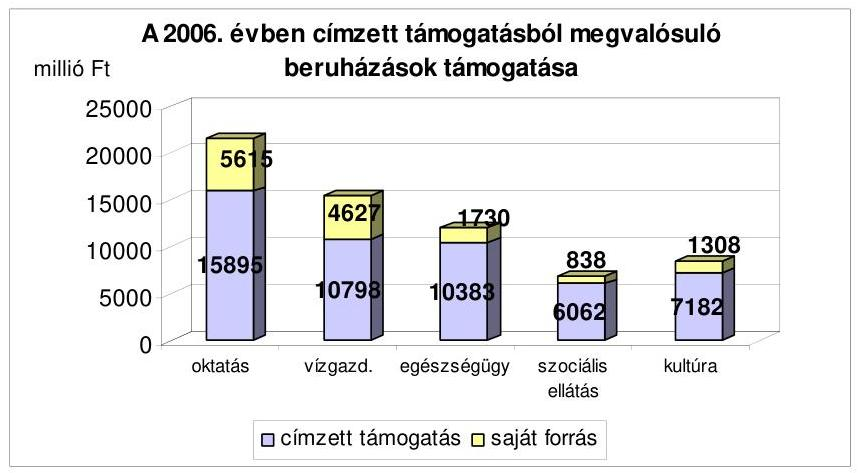

A megítélt címzett támogatások számát és összegét tekintve is a legnagyobb arányban a városok, őket követően a megyei önkormányzatok részesedtek. A támogatott feladatokat tekintve az oktatás, az egészségügy és a kultúra tekintetében ugyan ez volt a helyzet. A szociális ellátások fejlesztésénél a megyei önkormányzatok részesedése volt a legnagyobb és ezt követően a városoké. A vízgazdálkodás területén a legnagyobb arányú támogatást a kisközségek kapták és őket követték a városok. Az ágazatok esetében az egy beruházásra jutó címzett támogatás fél és egymilliárd forint között szóródott. A legkevesebb támogatásban részesülő szociális ágazatnál volt a legnagyobb és a legtöbb támoga-

[^0]
[^0]:    ${ }^{21}$ A beadott pályázatok közül kettő nem felelt meg a jogszabályi feltételeknek, a többi fedezethiány miatt került elutasításra.
    ${ }^{22}$ Az új induló címzett beruházások támogatását a 6. számú melléklet tartalmazza.
    ${ }^{23}$ 2006. évi XXIV. törvény 1. melléklet

---

tásban részesülő oktatási ágazatnál volt a legkisebb összegű az egy beruházásra jutó támogatás nagysága. Az egészségügy és a vízgazdálkodás támogatási nagyságrendje és átlagos támogatási összege is közel azonos volt. A címzett támogatások felét három régió (Észak-magyarországi, Észak-alföldi, Középdunántúli) és közel a negyedét három megye (Borsod-Abaúj-Zemplén, Jász-Nagykun-Szolnok, Szabolcs-Szatmár-Bereg) kapta.

A 2006-2010. években összesen 170 céltámogatási igényt ${ }^{24}$ nyújtottak be az önkormányzatok, amelynek közel háromnegyede a 2006-2007. évekre koncentrálódott és a szennyvíz-elvezetési és tisztítási beruházások megvalósítását célozta. A 127 igénybejelentésből 51-et támogattak a regionális fejlesztési tanácsok, összesen 11528 millió Ft -al. A beadott igények több mint felét forráshiány miatt utasították el a döntéshozók (hét esetben nem volt megfelelő az igénybejelentés). A Cct-ben a múködő kórházak és szakrendelők meghatározott szakterületei fejlesztését szolgáló gép-műszer fajták beszerzésére 43 céltámogatási igénybejelentés történt 2006-2010 között, amelyből 38 (88,4\%) részesült támogatásban, összesen 1429 millió Ft összegben. (A vizsgált időszakban öt önkormányzati igényt utasítottak el.)

A szennyvíz-elvezetési és tisztítási beruházásokra biztosított céltámogatások közel kétharmadát a községek - több mint felét a kisközségek - kapták. A régiókat tekintve a legnagyobb támogatást (az összes 55\%-át) az Észak-alföldi, a Dél-alföldi és az Észak-magyarországi régiók kapták. Megyénként tekintve Veszprém, Szabolcs-Szatmár-Bereg és Bács-Kiskun megyék támogatása (közel egyharmada az egésznek) volt a legnagyobb. Az egészségügyi gép-műszer beszerzésére juttatott céltámogatáson közel fele-fele részben a megyei önkormányzatok és a városok (döntően a megyei jogú városok) osztoztak, ami a támogatott beszerzések meghatározott céljaiból következett. A megítélt támogatások felét kettő megye (Borsod-Abaúj-Zemplén és Békés) kapta.

Az új induló beruházásokra 2008-2010. évekre jóváhagyott évi 200-200 millió Ft céltámogatási elöirányzatot nem használták fel, ugyanakkor forráshiány miatt támogatási igényeket utasítottak el a regionális fejlesztési tanácsok és a megítélt támogatásokat is általában két-három éves ütemezéssel biztosították.

A céltámogatási rendszer múködését 2008-tól egyszerre jellemezte a források szükössége és a rendelkezésre álló források kihasználatlansága. 2008-tól kizárólag aneszteziológiai-intenzívterápiás-sürgősségi eszközök beszerzésére lehetett igénybe venni céltámogatást, amely leszűkítette a támogatás igénylésére jogosult önkormányzatok körét a kórházzal rendelkezőkre. A 2008-2009. években emellett kedvezőtlenül befolyásolta az új induló beruházások támogatására rendelkezésre álló forrás felhasználását, hogy a régiók számára jóváhagyott előirányzat és a régióban jelentkező támogatási igény között nem volt összhang és a régiók között nem volt lehetőség előirányzat átcsoportosítására.

[^0]
[^0]:    ${ }^{24}$ Az igényelt és a megítélt céltámogatásokat a 7. számú melléklet tartalmazza.

---

A 2008. évben a rendelkezésre álló támogatási összeg 85\%-ára hat, 2010-ben mindössze 30\%-ára két önkormányzat nyújtott be igényt. A 2008. évben a Nyu-gat-Dunántúli Regionális Fejlesztési Tanács 6 millió Ft összegű támogatásról döntött két évre ütemezve, mivel a régió részére csak 3 millió Ft éves keret volt jóváhagyva az éves költségvetési törvény szerint. Az Észak-Alföldi Régió rendelkezésére álló 75,2 millió Ft-ot nem használták fel, mivel az önkormányzatok részéről nem történt igénybejelentés.

A 2009. évben hét önkormányzat adott be pályázatot. A Közép-Dunántúli Régióban négy önkormányzat által benyújtott pályázatból három igényét a régió forráshiánya miatt elutasították. Országos szinten azonban az éves új induló céltámogatási keret $37 \%$-ának nem történt meg a felhasználása, mivel négy ${ }^{25}$ régióban nem adtak be céltámogatási igényt az önkormányzatok.

A cél és címzett támogatásból 2008-ban az 53000 millió Ft éves előirányzatból 500 millió Ft, 2009-ben a 10000 millió Ft eredeti előirányzatból 460 millió Ft év közben fejezeti hatáskörben átcsoportosításra került a Vis maior tartalék előirányzatra. Az átcsoportosításokat figyelembe véve 2008-ban 67\%, 2009-ben mindössze 39\%-os volt a felhasználás a rendelkezésre álló forráshoz viszonyítva.

A címzett támogatások fele három régióra (Észak-magyarországi, Északalföldi, Közép-dunántúli) és közel a negyede három megyére (Borsod-Abaúj-Zemplén, Jász-Nagykun-Szolnok, Szabolcs-Szatmár-Bereg) koncentrálódott. A céltámogatások 55\%-át három régió (Észak-alföldi, Dél-alföldi, Észak-magyarországi), közel negyedét két megye (Veszprém, Szabolcs-SzatmárBereg) kapta.

A címzett és céltámogatások településtípusonkénti megoszlása 2006-2010. között
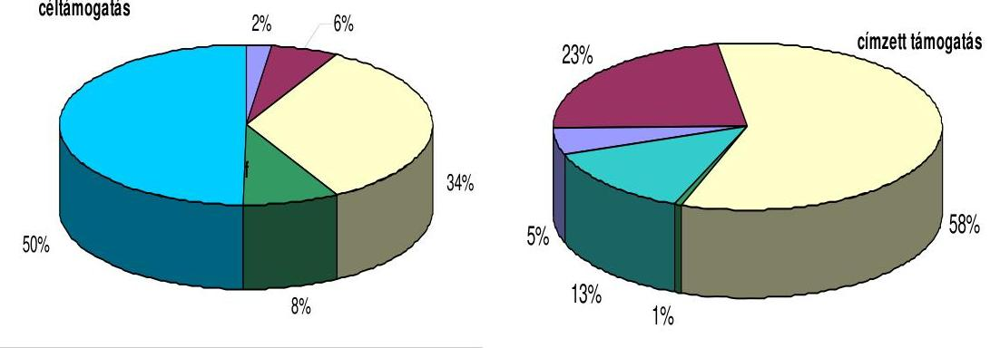

[^0]
[^0]:    ${ }^{25}$ Észak-Alföldi Régió, Közép-Magyarországi Régió, Dél-Dunántúli Régió, NyugatDunántúli Régió.

---

# 2.2. Központosított előirányzatokból nyújtott támogatások 

A 2006-2010. években a központi költségvetésben - miniszteri hatáskörben felosztható ${ }^{26}$ - központosított előirányzatként az önkormányzati feladatok fejlesztésének támogatására 55060 millió Ft állt rendelkezésre ${ }^{27}$, amely $14 \%$-át adta a hazai forrásoknak és 15 önkormányzati fejlesztési feladat támogatását szolgálta. Az előirányzatok a bázis előirányzat és a maradékelv alapján kerültek kialakításra, illetve a költségvetési törvények vitájában véglegeződtek. A központosított támogatások egyes jogcímei előirányzatainak kialakítását a PM az ágazatilag illetékes szakminisztériumokkal egyeztette. Az előirányzatok kialakítását nem előzte meg a támogatási igények felmérése, nem tűzték ki, hogy a fejlesztési célokkal milyen eredményt szeretnének elérni, állapotfelmérés hiányában nem határozták meg, hogy az egyes fejlesztendő területeken a naturális mutatók milyen változása lenne szükséges.

A központosított támogatások legkisebb éves előirányzata 9110 millió Ft, a legnagyobb 13810 millió Ft volt. Az előirányzatok közel kétharmada a közoktatás fejlesztésére szolgált és a megítélt támogatások ${ }^{28}$ összegéből is $62 \%$ volt a részesedése.

A 2009-2010. évek között a központi költségvetés minden évben támogatta a közoktatás informatikai fejlesztését, a könyvtári, a közmúvelődési, valamint múzeumi szakmai feladatokat. A támogatandó célok közül csak egy évben tartalmazott a központi költségvetés előirányzatot a sportpályák felújítására (2006), a sportlétesítmények felújítására (2009), a körjegyző́égek tárgyi feltételeinek javítására (2008), az „ART" mozi hálózat fejlesztésére (2006), a helyi önkormányzati állatkertek fejlesztésére (2006), a pincerendszerek, partfalak, földcsuszamlások veszély elhárítási munkáira ${ }^{29}$ (2006). Ezeknél a feladatoknál az önkormányzatok részéről beérkezett támogatási igények minden esetben meghaladták a rendelkezésre álló előirányzatot.

A központosított támogatások egyes jogcímei igénybevételének feltételei a vizsgált időszakban változtak, amelyek a kedvezményezettek körének, a támogatott céloknak, a támogatás mértékének, a támogatás felhasználása módjának a változásában nyilvánultak meg.

A közoktatás tárgyi feltételeinek és infrastruktúrájának fejlesztésénél a támogatást igénybevevők körének kiszélesítése (az általános iskolák mellett az óvodákra is lehetett pályázni) minden önkormányzat számára kedvező volt. A nem

[^0]
[^0]:    ${ }^{26}$ A TEUT és a TEHU fedezetére rendelkezésre állt előirányzatok felosztásáról a regionális fejlesztési tanácsok döntöttek.
    ${ }^{27}$ Ez tartalmazza 2008-ban évközi forrás átcsoportosítással a leghátrányosabb helyzetű kistérségekben múködő önkormányzatok és társulásaik részére bölcsődék és közoktatási intézmények infrastrukturális fejlesztésére biztosított 1600 millió Ft-ot.
    ${ }^{28}$ A központosított előirányzatból igényelt és megítélt támogatásokat a 8. számú melléklet tartalmazza.
    ${ }^{29}$ Ezt követően a CÉDE pályázat keretében lehetett támogatást igényelni.

---

támogatott eszközbeszerzések és felújítások körének 2010-ben történt meghatározása és az eszközbeszerzésre fordítható költségek arányának csökkentése kedvezőtlen volt.

A 2008. évben az 1500 lakosság szám alatti kistelepülések iskolái tárgyi feltételeinek javítására terveztek a költségvetésben előirányzatot. A 2009-2010. években kiszélesítették az igénybevétel lehetőségét, így az általános iskolák mellett az óvodák infrastruktúrájának fejlesztésére is lehetőség volt, amihez minden önkormányzat és azok társulásai igényelhettek támogatást. A 2010. évben taneszközök, számítástechnikai, tornatermi, konyhai és játszótéri eszközök beszerzésére, valamint udvar és kerítés átalakítására, felújítására nem lehetett támogatást igényelni, továbbá a támogatás összegéhez viszonyítva 20\%-ról 10\%-ra csökkentették az eszközbeszerzésre fordítható költségek arányát.

A közoktatás informatikai fejlesztését célzó támogatás esetében az oktatott és nevelt létszám alapján járó támogatás fejkvótái 2007-ről 2008-ra 15-31\%-kal csökkentek, továbbá a pedagógiai szakszolgálatot ellátó közoktatási intézmények számára igényelhető támogatás fajlagos mértéke 2009-ről 2010-re 20\%kal csökkent. Ezek a változások kedvezőtlenül, míg a támogatás felhasználásának módjában bekövetkezett változás kedvezően hatott az önkormányzati igények kielégítésére, mivel 2009-től a fenntartók az intézményekkel együttmúködve önállóan dönthettek, hogy milyen eszközök beszerzésére igényelnek támogatást.

A közoktatás informatikai fejlesztésének támogatása 2005-ben indult el. A támogatást nagy- és kis értékű hardverek beszerzésére, továbbá a szakminiszter által akkreditált szoftverek bevezetésére igényelhették a helyi önkormányzatok. A támogatás felhasználásának ${ }^{30}$ ez a módja három költségvetési évre szóló kötelezettséget jelentett, mivel a támogatásban részesített önkormányzatok a beszerzést - az OM által kiírt közbeszerzés alapján kiválasztott IBM cégtől - három éves bérleti konstrukcióban tehették meg.

A 2008. évben a rendelet ${ }^{31}$ lehetőséget teremtett arra, hogy a korábban beszerzett hardvereszközökre irányuló bérleti és líingszerződéseket a fenntartók tulajdonszerzés céljából átalakítsák, és az ehhez szükséges fedezet biztosítására támogatási igényt nyújthassanak be. A 2009-2010. években az önkormányzatok és intézményeik már önállóan dönthettek a számukra szükséges eszközök beszerzéséről, míg korábban csak a kötött felhasználásra fel nem használt összegen túl rendelkezésre álló előirányzat erejéig volt meg ez a lehetőség.

A helyi önkormányzatok által fenntartott múzeumok szakmai támogatása esetében a támogatott feladatok tartalma évenként változott. Új támogatott feladat beléptetése, valamint a szükséges saját forrás csökkentése viszont kedvező volt a kedvezményezett kör részére.

[^0]
[^0]:    ${ }^{30}$ A közoktatási intézmények informatikai fejlesztését szolgáló, kötött felhasználású támogatás felhasználásával történő beszerzések igénylési rendjéről szóló 3/2005. (III. 1.) OM rendelet, a 18/2006. (IV. 24.) OM rendelet, 16/2007. (III. 14.) OKM rendeletek szabályozták a támogatás igénylését.
    ${ }^{31}$ A szakmai és informatikai fejlesztési feladatok támogatása igénylésének, döntési rendszerének, folyósításának elszámolásának és ellenőrzésének részletes szabályairól szóló 23/2008. (VIII. 6.) OKM rendelet.

---

A nagyszabású állandó kiállítások előkészítésének támogatására 2008-tól már csak a 10 millió Ft-nál nagyobb forrásigényű fejlesztésekhez lehetett igényt benyújtani. A 2010. évben egy konkrét kiállítás megrendezéséhez kötődően, meghatározott körű kiállítóhelyek igényelhettek felújításra, korszerűsítésre támogatást. A 2009-2010. években új támogatható feladatként határozták meg az oktatási célú közösségi terek kialakítását, de e célra támogatást - a 2009. évben 20\% önrész, 2010-ben 10\% önrész biztosításával - csak a Közép-Magyarországi Régióban székhellyel rendelkező múzeumok igényelhettek.

A közösségi buszok beszerzésének maximális támogatási aránya 2009-től 10\% ponttal csökkent. A kedvezőtlen változás ellenére a beadott pályázatok száma 2009-ben 17\%-kal növekedett, viszont 2010-ben már 31\%-kal csökkent az előző évhez viszonyítva.

A 2006-2010. évek között önkormányzati oktatási intézmények szakmai és informatikai fejlesztési feladataira a központosított előirányzatok $44 \%-a, 24400$ millió Ft állt rendelkezésre. A támogatás igénylésének, döntési rendszerének, folyósításának, elszámolásának és ellenőrzésének szabályairól szóló rendeleteket ${ }^{32}$ - 2007 kivételével - 1-5 hónappal később adta ki az oktatásért felelős miniszter, mint azt részére a költségvetési törvény ${ }^{33} 5$. számú mellékletében az Országgyűlés elrendelte. A rendeletek késedelmes kiadása miatt a pályázat lebonyolítása is elhúzódott, ami gátolta a megítélt támogatások tárgyévi felhasználását.

Támogatást az első három évben meghatározott informatikai eszközök beszerzésére lehetett felhasználni. Ez azt jelentette, hogy a nagyértékű hardver és szoftver eszközöket 2005-2007-ben az oktatásért felelős miniszter tanácsadó testületeként működtetett Programtanács javaslata alapján hozott miniszteri döntésnek megfelelően közétett lista alapján választhatták ki a támogatást igénylők. Iskolai adminisztrációs és ügyviteli szoftverek bevezetésére az oktatásért felelős miniszter által akkreditáltak közül volt lehetőség. A szakmai és taneszközök esetében a kötelező eszközjegyzékben ${ }^{34}$ szerepelőkre igényelhettek támogatást az önkormányzatok.

Az önkormányzati intézmények többsége a hardver eszközöket illetően asztali és hordozható számítógépeket, nyomtatót, monitort, szervert és hálózati eszközöket; a szakmai eszközöket tekintve interaktív táblát, írásvetítőt, projektort, szkennert, digitális fényképezőgépet, televíziót, készségfejlesztő eszközöket; a taneszközök esetében iskolai bútorokat, sportszereket, fizikai, kémiai, biológiai kísérleti eszközöket, térképeket szereztek be.

A 2007. évben a sajátos nevelési igényű gyermekek/tanulók ellátását végző intézmények részére is nyújthattak be támogatási igényt a fenntartó önkormányzatok a rendelet ${ }^{35} 4$. számú mellékletében meghatározott műszaki paraméterek-

[^0]
[^0]:    ${ }^{32}$ a 18/2006. (IV. 24.) OM, a 23/2008. (VIII. 6.) OKM, a 28/2009. (VIII. 19.) OKM, a 21/2010. (V. 13.) OKM rendeletek
    ${ }^{33}$ a 2006. évi, a 2008. évi, a 2009. évi és a 2010. évi költségvetési törvények
    ${ }^{34}$ a nevelési- oktatási intézmények működéséről szóló 11/1994. (VI. 8.) MKM rendelet 7. számú melléklete
    ${ }^{35}$ 16/2007. (III. 14.) OKM rendelet

---

kel rendelkező informatikai, valamint, a különböző fogyatékossági típusok részére külön-külön meghatározott speciális eszközök beszerzésére.

A támogatás igénybevételének nem volt feltétele önrész biztosítása, ennek ellenére 2006-2010 év összességében az előirányzat 96\%-át, 23300 millió Ft-ot használtak fel.

Az eredeti előirányzatként rendelkezésre álló forrásnak 2006-ban a 92\%-a, 2007ben csak $87 \%$-a került felosztásra (412, illetve 663 millió Ft-ra nem volt jogos igény). A 2008-2010. években az előirányzat teljes körűen felosztásra került, mivel ebben az időszakban az önkormányzati igények kis mértékben meghaladták a tervezett összeget.

A szakmai és informatikai fejlesztések támogatása előirányzat maradványának csökkentése érdekében a Kormány saját hatáskörében, illetve fejezeti hatáskörben előirányzat átcsoportosítással tettek intézkedéseket, de ennek ellenére képződtek maradványok.

A Kormány hatáskörében 2006-ban 200 millió Ft, 2007-ben 500 millió Ft, továbbá 2006-ban fejezeti hatáskörben 31 millió Ft átcsoportosításra került a központosított előirányzatok más jogcímeire. A képződött maradvány 2006-ban 181 millió Ft, 2007-ben 163 millió Ft volt. A maradvány a központi költségvetés részét képezte, annak felhasználásáról az államháztartásért felelős miniszter döntött.

A közoktatás szakmai és informatikai fejlesztéséhez támogatásban részesült önkormányzatok száma csökkent, az önkormányzatok feléről alig több mint egyharmadára mérséklődött. Ezzel egyidejűleg az egy önkormányzatra jutó támogatás összege a 2006. évi 3,1 millió Ft-ról 2009-ig folyamatosan nőtt és elérte a 3,9 millió Ft-ot, azonban 2010-re 3,4 millió Ft-ra esett vissza. Egy-egy önkormányzat a vizsgált időszakban több alkalommal is részesült támogatásban.

A 2008. évben a központosított előirányzatok körében a kistelepülési (1500 fő alatti) iskolák tárgyi feltételeinek javítására 2500 millió Ft előirányzatot terveztek. Ugyanebben az évben előző évi maradvány terhére forrás átcsoportosítással a IX. Önkormányzatok támogatása fejezet 18 címe alatt ${ }^{36} 1510$ millió Ft-ot biztosítottak az előbbi körbe nem tartozó, de a leghátrányosabb helyzetű kistérségekben múködő önkormányzatok és társulásaik részére közoktatási intézmények infrastrukturális fejlesztésére. Erre a célra - a kedvezményezettek körének szűkítése nélkül - 2009-2010-ben 6700 millió Ft volt az előirányzat. A kistelepülési iskolák tárgyi feltételeinek javítására kiírt pályázatra a lehetőséghez képest kisebb volt a jogos igény, míg az utóbbi feladat esetében közel ötszöröse volt a rendelkezésre álló összegnek.

Egy pályázó legfeljebb három intézményére nyújthatott be támogatási igényt 2008-2009-ben, míg 2010-ben már csak egyre. A leghátrányosabb helyzetú kistérségekben múködő intézmények fejlesztésére a 2008-ban igénybe vehető támo-

[^0]
[^0]:    ${ }^{36}$ Az új cím évközi létrehozására a 206/2008. (VIII. 26.) Korm. rendelet adott lehetőséget, mely egyben szabályozta a bölcsődék és közoktatási intézmények infrastrukturális fejlesztése a leghátrányosabb helyzetű kistérségekben támogatás igénybevételének részletes feltételeit.

---

gatások összege 2-50 millió Ft, míg az ÖTM, illetve ÖM ${ }^{37}$ rendeletekben meghatározott feladatokra maximum 20 millió Ft volt.

A bölcsődék infrastrukturális fejlesztésére 2008-2010 között biztosított 990 millió Ft-ból a beadott pályázatok 52\%-a részére az igényelt támogatás egyharmadát ítélték meg. A bölcsődék fejlesztéséhez biztosított egy nyertes pályázatra megítélt támogatás átlagos összege fokozatosan növekedett, míg a közoktatási intézményeknél fokozatosan csökkent. A beadott pályázatok számát és összegét tekintve 2009-ben jelent meg a legtöbb igény.

A belterületi utak szilárd burkolattal való ellátására jóváhagyott 9300 millió Ft előirányzatból a fővárosi kerületek burkolatlan útállományának szilárd burkolattal való ellátására 20, az egyesített rendszerú közcsatornával ellátott, de burkolatlan utak szilárd burkolattal való ellátására 13 fővárosi kerület, a leghátrányosabb helyzetű kistérségekben lévő városi utak szilárd burkolattal való ellátására kilenc városi önkormányzat kapott támogatást.

Az előirányzatból 5560 millió Ft támogatás a fővárosi kerületek burkolatlan útállományának kerületi hosszúsága arányában járt és elsődlegesen a csatornázott, de burkolatlan utak szilárd burkolattal való ellátására szolgált, valamint a csapadékvíz elvezetését, továbbá a mellékgyűjtő és főgyűjtő csatornaszakaszok megépítését célozta.

Az egyesített rendszerú közcsatornával ellátott, de burkolatlan utak szilárd burkolattal való ellátását 2040 millió Ft szolgálta.

Az előirányzatból 1700 millió Ft támogatás illette meg azokat a leghátrányosabb helyzetű kistérségekben lévő városi önkormányzatokat, amelyeknél az önkormányzati belterületi kiépítetlen utak aránya meghaladta a $60 \%$-ot. A támogatás az egyes években egyenlő mértékben illette meg az érintett városi önkormányzatokat, és elsősorban a csatornázott, de burkolatlan utak szilárd burkolattal való ellátására szolgált. A vizsgált időszakban kilenc város kapott 57 és 324 millió Ft között támogatást. Egy város (Tiszaföldvár 324 millió Ft) minden évben, öt város (Battonya 224 millió Ft, Hajdúhadház 267 millió Ft, Mezőcsát, Szendrő és Téglás egyaránt 224 millió Ft) három évben, továbbá három város (Füzesgyarmat 100 millió Ft, Hajdúsámson és Kaba egyaránt 57 millió Ft) egy-egy alkalommal kapott támogatást.

A 2006-2010. években a könyvtári, közművelődési és múzeumok szakmai feladatainak ellátását szolgáló fejlesztéseket 3640 millió Ft-al támogatta a központi költségvetés. A könyvtári támogatás keretén belül a pályázatonként átlagosan elnyerhető összeg a pályázó önkor-

[^0]
[^0]:    ${ }^{37}$ a 18/2008. (III. 28.) ÖTM rendelet a kistelepülési iskolák és a körjegyzőségek tárgyi feltételeinek javításával, valamint közösségi buszok beszerzésével kapcsolatos egyszeri költségvetési támogatás igénybevételének részletes feltételeiről, a 8/2009. (II. 26.) ÖM rendelet a bölcsődék és közoktatási intézmények infrastrukturális fejlesztése, valamint közösségi buszok beszerzése támogatás igénybevételének részletes feltételeiről, valamint a 1/2010. (I. 19.) ÖM rendelet a bölcsődék és a közoktatási intézmények infrastrukturális fejlesztéséhez, valamint közösségi buszok beszerzéséhez kapcsolódó, központosított előirányzatból származó támogatás igénybevételének részletes feltételeiről

---

mányzatok nagy száma miatt mindössze 200-300 ezer Ft volt. A felzárkóztatás keretében 2006-2010 években beadott pályázatok közel háromnegyede, az érdekeltségnövelő támogatásból az igények 86\%-a részesült támogatásban (5477 pályázat), összesen 1216 millió Ft összegben.

A könyvtári támogatási előirányzat 10\%-a terhére felzárkóztató pályázaton vehettek részt azok, amelyeknél a tárgyévet megelőző évben az állománygyarapításra fordított összeg nem érte el az országos átlagot. Érdekeltségnövelő támogatásban részesültek az önkormányzatok az előző évi állománygyarapításra fordított saját kiadásuk arányában. Egy-egy önkormányzat több évben is igényelt és nyert támogatást.

A közmúvelődési intézmények, közösségi színterek technikai, múszaki eszközállományának, berendezési tárgyainak gyarapítását szolgáló pályázaton folyamatosan csökkent a támogatást igénylők száma. A benyújtott 1673 millió Ft támogatási igényből 1216 millió Ft támogatást ítéltek meg ( $72,7 \%$ ). A támogatás 2889 millió Ft fejlesztés megvalósítását segített elő. A múzeumok szakmai támogatása a kiállítások előkészítését, létrehozását, felújítást, illetve korszerűsítést támogatta. Egy önkormányzat több pályázatot is benyújtott, illetve nyert is meg. A vizsgált öt év alatt 75 volt a nyertes pályázatok száma, de a támogatási igények összegének a felét sem lehetett kielégíteni. Az elnyert támogatások átlagos összege 16 millió Ft volt, és 1209 millió Ft került szétosztásra.

Miután 2006-ban lehetett utolsó alkalommal címzett támogatást igényelni belterületi belvízrendezésre, az ország legmélyebben fekvő területein rendszeresen jelentkező belvízi helyzet megoldására 2007-2010 között összesen 2550 millió Ft támogatás állt rendelkezésre, azzal, hogy a 2010-re előirányzatként szerepelő 50 millió Ft-on felül 3000 millió Ft kötelezettség volt vállalható ${ }^{38}$ 2011-re. Az igények alapján ennek összege 2800 millió Ft lett. A 90\%os támogatási mérték ellenére az előirányzat 93\%-ának megfelelő igénnyel éltek csak a kedvezményezett városok a 2007-2011 időszakra vonatkozóan. A tényleges felhasználás 2010 végéig 2364 millió Ft volt.

A támogatás kedvezményezettjeinek körét Békés, Csongrád és Jász-NagykunSzolnok megye azon városaira korlátozták, melyeknek a tengerszint feletti magasságuk nem több mint 85 méter, valamint a területfejlesztés kedvezményezett térségeinek jegyzékéről szóló Korm. rendeletben ${ }^{39}$ szereplő kistérségek területén találhatók. A 2007. évben nyolc, míg 2008-tól a kedvezményezettek köre tíz városra terjedt ki.

A 2006. évben a Kormány ${ }^{40}$ év közben - két központosított előirányzatból 400 millió Ft-ot elvonva - új, a többcélú kistérségi társulások közösségi busz ${ }^{41}$ be-

[^0]
[^0]:    ${ }^{38}$ Erre felhatalmazást a 2010. évi költségvetés 5. számú mellékletének 20. b) pontja adott.
    ${ }^{39}$ 2007-ben a 64/2004. (IV. 15.) Korm. rendelet 1-2. számú mellékletében (hatálytalan:2007. XI. 25-től), 2008-ban a 311/2007. (XI. 17.) Korm. rendelet 2-3. számú, 2010ben a 2. számú mellékletében szereplő́ kistérségek
    ${ }^{40}$ A 2211/2006. (XII. 7.) Korm. határozat alapján történt az előirányzat átcsoportosítás.
    ${ }^{41}$ Minimum 15 fő szállítására alkalmas busz beszerzésére volt lehetőség.

---

szerzését támogató központosított előirányzati jogcímre biztosított fedezetet. A 2008-2010. években eredeti előirányzatként tervezve, de nem önálló jogcímként ${ }^{42}$ összesen 1350 millió Ft állt rendelkezésre e célra. Mivel az éves támogatási igény kétszerese-háromszorosa volt a szétosztható forrásnak (összesen 4000 millió Ft), a maximum 30 millió Ft benyújtható igénnyel szemben a megítélt támogatások összege 6 és 24 millió Ft között szóródott. Négy év alatt összesen 110 többcélú kistérségi társulás kapott támogatást 123 busz beszerzéséhez.

Sport célú ingatlanok felújítására keretében 2006-ban sportpályák, 2009ben sportlétesítmények felújítására összesen 750 millió Ft előirányzatot terveztek. A támogatás felhasználásánál a beadott pályázatok minél szélesebb számban történő eredményessé nyilvánítására törekedtek, így a pályázók 95\%-át támogatásban részesítették. Ez egyben azt jelentette, hogy a maximálisan igényelhető 8 , illetve 10 millió Ft-nál a megítélt támogatások kisebbek voltak. Az egy pályázatra jutó támogatás átlagosan alig haladta meg az 5 millió Ft-ot és az összes benyújtott támogatási igény háromnegyedére sem volt elegendő.

A 2007-ben és 2008-ban alakult, illetve új taggal bővült körjegyzőségek tárgyi feltételeik javítására 2008-ban a székhelyük szerinti önkormányzatok központosított támogatást igényelhettek. Az eredetileg e célra előirányzott 500 millió Ft-tal szemben közel másfélszeresét ${ }^{43}$ kapták meg a körjegyzőségek támogatásként. A döntést hozó ebben az esetben is a pályázatok mind nagyobb számban való támogatására törekedett, így az átlagos támogatási mérték az igényelhető összeg egyharmadát sem érte el.

# 2.3. Fejezeti kezelésú előirányzatokból nyújtott támogatások 

Az önkormányzatok szociális, egészségügyi, közművelődési, közlekedési infrastruktúra fejlesztésével összefüggő feladataikhoz fejezeti kezelésú előirányzatokból több jogcímen is támogatásban részesültek, elsősorban a kötelező feladatok múködtetéséhez szükséges fejlesztések megvalósítása érdekében. Ezen támogatások céljai az OGY által elfogadott fejlesztési és területfejlesztési célkitúzésekkel összhangban voltak.

A fejezeti kezelésű előirányzatok felhasználásának eljárásrendjét minisztériumonként alakították ki. A támogatásokat pályázatok útján (39\%ban), vagy egyedi támogatásként ítélték meg. A területfejlesztési célok megvalósítását szolgáló fejezeti kezelésű előirányzatok pályázati

[^0]
[^0]:    ${ }^{42}$ A 2008. évben a kistelepülési iskolák és a körjegyzőségek támogatásával, 2009-ben és 2010-ben a bölcsődék és a közoktatási intézmények infrastruktúra fejlesztésének támogatásával egy jogcímben szerepelt a költségvetési törvény 5 . számú mellékletében.
    ${ }^{43}$ A fedezetet a kistelepülési iskolák tárgyi feltételeinek javítására meghatározott összeg fel nem használt része biztosította. Erre az adott lehetőséget, hogy a költségvetésben egy jogcímen belül tervezték e feladatoknak, valamint a közösségi buszok beszerzésének előirányzatát.

---

rendszerben történő felhasználása során nem érvényesült a Tftv. 21/A § (1) bekezdésében előírt forráskoordináció, az nem terjedt ki a Tftv. 21/A § (2) bekezdés a)-c) pontjában előírtakra (források felhasználását szabályozó jogszabályok és utasítások egyeztetése, pályázati célokat szolgáló források számbavétele, pályázati felhívások egyeztetésére és nyilvántartására). Ezt a területfejlesztésért felelős miniszter feladata volt az érintett miniszterek együttműködésével.

A fejezeti kezelésű előirányzatokból a helyi önkormányzatok részére nyújtott támogatások fajtája és nagyságrendje a fejezeti kezelésű előirányzatok fejezetgazdáinál rendelkezésre álló nyilvántartások alapján nem volt teljes körúen megállapítható, annak kigyűjtésére többségében a helyszíni ellenőrzés során került sor. A rendelkezésünkre bocsátott információk alapján a helyi önkormányzatok a vizsgált időszakban több mint 31 Mrd Ft fejezeti kezelésú előirányzatból nyújtott támogatásban részesültek, amelyből 10 Mrd Ft-ot pályázat útján, 21 Mrd Ft-ot egyedi döntéssel ítéltek meg.

A GKM „Útpénztár" fejezeti kezelésú előirányzata terhére - döntően önkormányzatok és társulásaik részére ${ }^{44}$ - 2006-2008 között, az európai EuroVelo kerékpárút-hálózat magyarországi szakaszai, illetve közlekedésbiztonsági célú kerékpárutak építésének és tervezésének támogatására írt ki pályázatot. Az önkormányzatok által beadott 310 pályázatból 165 részére ítéltek meg támogatást 4376 millió Ft összegben, amellyel 1083 km kerékpárút építése, valamint 889 km tervezése valósulhatott meg. Saját forrás hiány miatt 11 önkormányzat 179 millió Ft elnyert támogatásról mondott le.

A pályázati úton elosztott fejezeti kezelésú előirányzatok közel 30\%a az egészségügyi ellátás területét érintette. A 2007.évben a szerkezet-, illetve intézmény-átalakításra rendelkezésre álló forrásból ${ }^{45}$ kettő fővárosi kórház ${ }^{46}$ feladat átvételéhez kapcsolódó fejlesztést támogatottak 2370 millió Fttal.

A hátrányos helyzetű kistérségek szociális szolgáltatásainak koncentrált és tervszerű fejlesztésére 2001-ben jött létre a „Három éves kistérségi szociális felzárkóztató program". A programban kiemelt jelentőséget kapott a 2002ben indult decentralizált területfejlesztési támogatással (TRFC) történt társfinanszírozási gyakorlat. A 2006. évtől a megyei decentralizált források csökkenésével a fejezeti kezelésű előirányzat ${ }^{47}$ mellett a program fejlesztési keretei re-

[^0]
[^0]:    ${ }^{44}$ Az árvízvédelmi töltésen épülő kerékpárút esetében az illetékes Környezetvédelmi és Vízügyi Igazgatóság is pályázhatott.
    ${ }^{45}$ az Egészségügyi Minisztérium szerkezet, illetve intézmény átalakítás fejezeti kezelésű előirányzatából
    ${ }^{46}$ a Fővárosi Önkormányzat Egyesített Szent István és Szent László KórházRendelőintézet, valamint a Péterfy Sándor utcai Kórház és Rendelőintézet
    ${ }^{47}$ A XXVI. SZMM fejezet Szociális szolgáltatások alcímen belül a szociális alap és szakosított ellátások fejlesztése jogcím csoport előirányzata tartalmazta.

---

gionális forrásokból kerültek elkülönítésre. Az újabb programok indítására ezért a regionális fejlesztési tanácsokkal történt megállapodások alapján került sor. A vizsgált időszakban 23 kistérség támogatására 1310 millió Ft fejezeti kezelésű előirányzatot biztosítottak.

A szociális és gyermekvédelmi feladatok területén a vizsgált időszakban a helyi önkormányzatokat négy jogcímen (a szakosított vagy nappali ellátást nyújtó intézmények felújításának, korszerűsítésének, illetve gyógyászati segédeszközök beszerzésének, lakóotthon létesítésének, működő lakásotthonok elhelyezési feltételei szinten tartásának, javításának, továbbá a szociális intézmények akadálymentesítésének támogatására) 1745 millió Ft-tal támogatta az SZMM. A támogatás döntően beruházások, eszközbeszerzések finanszírozására szolgált. Ezekre a célokra benyújtott pályázatok csak részben voltak eredményesek, mivel műszakilag nem megfelelő tartalmú pályázatokat nyújtottak be az önkormányzatok. A rendelkezésre álló keretösszeget részben az előzők miatt, részben a kevés számú jogos igény miatt nem használták fel.

A lakóotthonok létrehozását támogató pályázaton egy önkormányzat nyert támogatást.

A működő lakásotthon elhelyezési feltételei javításának támogatására kiírt pályázatra nem érkezett annyi jogos igény, mint amennyi erre a célra rendelkezésre állt.

Az akadálymentesítésre 2006-2007-ben beadott 234 pályázat közül csak 99 felelt meg a kiírásban szereplő feltételeknek. Mindkét évben műszakailag nem megfelelő tartalmú pályázatok sokaságát nyújtották be. A nem megfelelő műszaki tartalom a rámpa dőlésszögéhez kapcsolódott, amelynek kialakítását nem az előírásoknak megfelelően tervezték annak ellenére, hogy volt építésügyileg objektív módon mérhető hivatalos standard, valamint az OTÉK szabályzat és különböző kiadványok is segítették a pályázókat.

Az e területen megítélt támogatások nagyságrendje nagy szóródást mutatott. A legnagyobb összeg egy lakóotthon létrehozására biztosított 78 millió Ft, míg a legkisebb egy működő lakásotthon elhelyezési feltételei javítására megítélt 126 ezer Ft volt.

A NKÖM, majd az OKM a vizsgált időszak kezdete előtt indított programjai keretében a közösségi kulturális színterekre, azok felújításának, bővítésének, fejlesztésének, újak kialakításának támogatására az öt év alatt közel 600 millió Ft összegben nyújtott támogatást az infrastruktúra és eszközfejlesztésre rendelkezésre álló fejezeti kezelésű előirányzat terhére.

A „Közkincs Program" keretében fejlesztési célú támogatást az önkormányzatok és társulásaik részére 2006-2008. között infrastruktúra és eszközfejlesztésre 240 esetben biztosítottak. Az igények minden évben többszörösen meghaladták a rendelkezésre álló pályázati keretet. A 2007. évtől a Közkincs hitelprogram keretében a kedvezményezettek által infrastruktúra és eszközfejlesztésre felvett hitel kamatának, illetve tőketörlesztésének átvállalásával is nyújtottak támogatást.

A „Tengertánc Program" keretében a népi kultúra értékeinek megmentését és átörökítését kívánta a tárca támogatni. A népmúvészeti és hagyományőrző tájházak infrastrukturális és eszközfejlesztésére 2006-ban, valamint 2008-2009-ben

---

beadott 77 pályázatból csak 45 volt támogatható és az elnyert összeg átlagosan alig haladta meg az 1 millió Ft-ot.

A fejezeti kezelésű előirányzatok terhére, illetve kormányhatározatok alapján előirányzat átcsoportosításával, valamint tartalékból való fedezetbiztosítással megemelt előirányzatukból nem pályázat keretében, egyedi döntésekkel több mint 21 Mrd Ft nevesített támogatást ítéltek meg önkormányzati feladatok fejlesztésére 2006-2009 között. Ennek 30\%-a a Fővárosi Önkormányzat útépítési és fejlesztési támogatását, 25\%-a egy önkormányzat (Örbottyán) csatorna és szennyvíz elvezetési rendszerének kiépítését szolgálta, 45\%-a valamennyi ágazatot érintő önkormányzati feladat fejlesztéséhez biztosított támogatást, összesen 120 esetben.

A Fővárosi Önkormányzat útépítési és fejlesztési támogatására az „Útpénztár" elnevezésű fejezeti kezelésű előirányzat ${ }^{48}$ terhére 2006-2008 között egyedi döntésekkel a Kormány összesen 52 km hosszú útszakaszhoz 5961 millió Ft felhasználására adott felhatalmazást ${ }^{49}$.

A költségvetés központi egyensúlyi tartalékából az ÖTM fejezet ágazati célfeladatok megnevezésű fejezeti kezelésű alcímre 5964 millió Ft-ot átcsoportosítására került sor ${ }^{50}$, melyből Örbottyán és térsége csatorna és szennyvíz elvezetési rendszerének kiépítése 5100 millió Ft-al került támogatásra. 37 önkormányzat - az egészségügyi ágazat kivételével valamennyi ágazati feladatot érintően - 8-100 millió Ft közötti támogatásban részesült, összesen 864 millió Ft összegben.

A NEFMI jogelőd szakminisztériumai fejezeti kezelésű előirányzataiból egyedi támogatást az ellenőrzött időszakban 45 önkormányzat 746 millió Ft-ot kapott alap és szakosított szociális ellátások, kórházak, rendelőintézet, iskola, óvoda, művelődési ház, polgármesteri hivatal fejlesztéséhez.

A IX. Helyi önkormányzatok támogatása fejezetben - előirányzat átcsoportosítás és tartalékból való fedezetbiztosítással - 2007-2009 között új címek létrehozásával összesen 8344 millió Ft támogatást biztosított a Kormány a határozataiban ${ }^{51}$ megjelölt 38 önkormányzat részére 12-1000 millió Ft közötti nagyságrendben. Ennek 39\%-a közoktatási intézmények, 11\%-a sportlétesítmények fejlesztését, valamint 22\%-a a szombathelyi színház kialakítását célozta. Ezen túl utak, közösségi terek, temető, szennyvíztisztító, egészségügyi alapellátás, játszótér, városközpont, tűzoltóság fejlesztésére, illetve műemléképület megóvására, ipari park kialakításához szükséges földterület megvásárlására is nyújtott támogatást a Kormány ily módon.

[^0]
[^0]:    ${ }^{48}$ Az előirányzat kezelője 2006-2007-ben a GKM, míg 2008-ban a KHEM volt.
    ${ }^{49}$ A 2119/2007. (VI. 25.) Korm. határozattal módosított 2008/2006. (I. 26.) Korm. határozat alapján 2006-ban 2100 millió Ft, 2007-ben további 900 millió Ft állt rendelkezésre. A 2248/2007. (XII. 23. ) Korm. határozat alapján 2000 millió Ft, a 2115/2008. (VIII. 27.) Korm. határozat alapján 961 millió Ft állt rendelkezésre.
    ${ }^{50}$ Az átcsoportosításra a 2258/2007. (XII. 23.) Korm. határozat 3. pontja rendelkezett a 4. számú melléklet szerinti részletezettséggel.
    ${ }^{51}$ a 2238/2007. (XII. 23 Korm. határozat, 2258/2007. (XII. 23 Korm. határozat, 2098/2008. (VII. 24.) Korm. határozat, 2175/2008. (XII. 17.) Korm. határozat, 2177/2008. (XII. 18.) Korm. határozat, 2184/2008. (XII. 23.) Korm. határozat 1212/2009. (XII. 15.) Korm. határozat, 1222/2009. (XII. 29.) Korm. határozat.

---

Több olyan támogatási konstrukció is múködött ebben az időszakban, amely döntően a feladatok múködési jellegű szakmai fejlesztését szolgálta, de a megítélt támogatásból meghatározott mértékben (a támogatás kisebbik hányadából) a feladathoz tartozó infrastruktúra fejlesztésére, illetve eszközbeszerzésekre is lehetőség volt.

Tipikusan ilyenek voltak a gyermekjóléti és gyermekvédelmi szolgáltatások fejlesztését támogató fejezeti kezelésű éves előirányzatokból a gyermekjóléti alapellátások és a gyermekvédelmi szakellátás fejlesztésének támogatása, illetve e területen a módszertani feladatok ellátására kijelölt gyermekjóléti és gyermekvédelmi intézmények módszertani tevékenységének támogatása.

# 2.4. Decentralizált területfejlesztési támogatások 

A 2006-2009. években az önkormányzati feladatok fejlesztését több hazai területfejlesztési támogatási program segítette. A decentralizált területfejlesztési támogatások ${ }^{52}$ kedvezményezettjei - a TRFC kivételével, melyre vállalkozások és nonprofit szervezetek is pályázhattak - az önkormányzatok, illetve társulásaik voltak. A 2006. évben három előirányzat (CÉDE, TEKI, LEKI) feletti döntési jogkör még a megyei területfejlesztési tanácsoké volt, míg 2007-től minden támogatás felhasználásáról a regionális fejlesztési tanácsok döntöttek. (A 2010. évben és 2011-ben az éves költségvétések nem tartalmaztak előirányzatot e faladatra, a döntési jogkör nem változott.)

A kizárólag önkormányzatok által igénybe vehető decentralizált területfejlesztési támogatások fedezeteként a vizsgált időszak alatt 98839 millió Ft előirányzatot biztosított az állami költségvetés. A rendelkezésre álló előirányzatból 88849 millió Ft -ot $(89,9 \%)$ használtak fel, amely értékelésénél figyelemmel kell lenni a felhasználás évek közötti áthúzódására. A korábbi évekről áthúzódó kötelezettségek miatt az előirányzat $85 \%$-a állt rendelkezésre új igények támogatására. Az önkormányzatok az ellenőrzött időszakban 2006-ban és 2008-ban pályázhattak a TRFC előirányzatából támogatás elnyerésére, amelyből 17531 millió Ft-ot ítéltek meg számukra.

A különböző decentralizált forrásokból kiírt pályázatokra a rendelkezésre álló előirányzatok többszörösére nyújtották be igényeiket az önkormányzatok. A változó támogatási célokkal múködtetett pályázati rendszerben az önkormányzati feladatok ellátását biztosító infrastruktúra fejlesztésére és felújítására évente 2500-4000 pályázatot hagytak jóvá.

[^0]
[^0]:    ${ }^{52}$ CÉDE, LEKI, TEKI, TEHU, TEUT

---

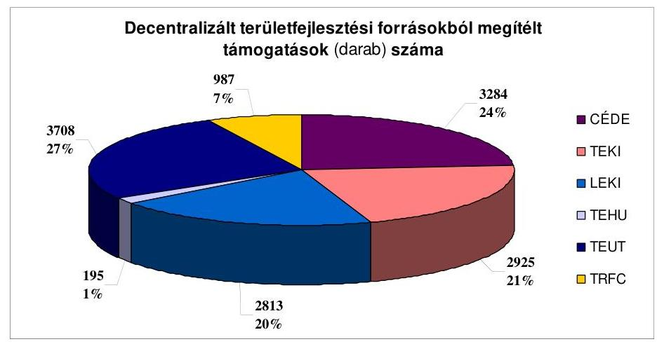

A decentralizált területfejlesztési forrásokból a vizsgált időszakban 100591 millió Ft támogatást ítéltek meg.
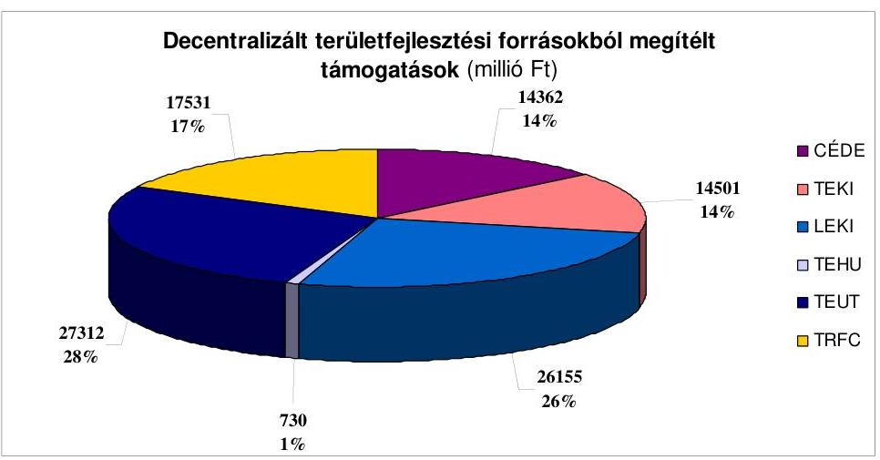

E támogatások népszerűségéhez hozzájárult az is, hogy a megpályázható jogcímek köre igen tág volt - a tematikusan kötött TEHU ${ }^{53}$ és a TEUT előirányzatok kivételével - szinte minden önkormányzati feladat fejlesztése támogatott volt. Kedvező volt az igényelhető támogatás összköltséghez viszonyított aránya, figyelembe véve az egyes térségek, települések elmaradottsági szintjét, amely alapján a hátrányosabb helyzetű településeknek kevesebb önerővel kellett rendelkezniük, illetve bizonyos konstrukciók esetében csak elmaradott térségekből nyújthattak be pályázatot a felzárkóztatás ösztönzése érdekében.

A LEKI, TEKI és a CÉDE pályázatoknál a legnagyobb támogatási intenzitás 70$90 \%$, a TRFC-nél 65-95\%, míg a TEUT esetében a támogatás aránya 50\%, illetve $58 \%$ volt. Az igénybe vehető támogatás összegének korlátai miatt a nem túl magas projekt összköltség (jellemzően 40-60 millió Ft, de nem volt egyedi az egymillió forint alatti támogatási igény sem) az önkormányzatok szükséges saját erő biztosítását könnyebben lehetővé tette.

[^0]
[^0]:    ${ }^{53}$ Költségvetési előirányzat csak 2005-2006-ban volt biztosítva, az előirányzat felhasználása áthúzódott 2007-re is.

---

A támogatások jogcímeinek meghatározásánál törekedtek arra, hogy olyanok kerüljenek kiírásra, amelyek más pályázati konstrukciókból, illetve európai uniós forrásokból nem támogathatók, vagy azokat kiegészítik és összhangban vannak az önkormányzatok fejlesztési céljaival. A támogatott célok alapján több fajta területfejlesztési forrásból is lehetett támogatást igényelni az egyes önkormányzati feladatokhoz ${ }^{54}$.

A 2008. évtől a támogatási jogcímek változtak, illetve szűkültek és még inkább az EU-s forrásokból nem támogatható célokra vonatkoztak. A cél és címzett támogatásokkal megvalósuló fejlesztésekhez kiegészítésként lehetőség volt a decentralizált forrásokból támogatást igényelni, de ezzel a lehetőséggel évente mindössze két-három esetben éltek az önkormányzatok.

A decentralizált területfejlesztési forrásokból megítélt támogatások közel kétharmadát termelő infrastruktúrafejlesztésre használták fel. A legtöbb támogatási igény a közút és szennyvízhálózat fejlesztés, illetve a vízelvezetés területét érintette.

Meghatározó volt - 75\%-os aránnyal - a közút- és járdafejlesztéshez felhasznált összeg. A vízgazdálkodás ágazat, a Vásárhelyi terv megújítása (TRFC) keretében főleg szennyvízközmű beruházásokhoz biztosított támogatás által közel 20\%-os mértékben részesedett.

A humán infrastruktúra-fejlesztésen belül a legtöbb támogatást az oktatási, ezt követően a közművelődési, a szociális és egészségügyi feladatokat ellátó intézmények felújításához, korszerűsítéséhez, akadálymentesítéséhez biztosították.

A 2008. évben a TRFC közel 90\%-a helyi és térségi közmunkaprogramok, valamint a közérdekű önkéntes munkavégzés keretében megvalósuló településképet javító tevékenység, illetve a szociális földprogram támogatási célra biztosított forrást az önkormányzatok számára. E célok mellett komplex szolgáltatást nyújtó ifjúsági irodák, közösségi terek kialakításához, infrastrukturális fejlesztéséhez, eszközeinek beszerzéséhez, valamint önkormányzati tulajdonban lévő, eladásra szánt belterületi lakótelkek elő-közművesítéséhez, szolgálati lakások építéséhez, felújításához kaptak támogatást az önkormányzatok. Továbbá idegenforgalmi szezonalitást mérséklő rendezvényekhez 421 millió Ft nem fejlesztési tevékenységhez biztosítottak támogatást a regionális fejlesztési tanácsok.

A források felhasználása a területfejlesztési támogatásokról és a decentralizáció elveiről, a kedvezményezett térségek besorolásának feltételrendszeréről szóló 67/2007. (VI. 28.) OGY határozatban foglalt elvárásoknak - mely szerint a hatékony felhasználás érdekében a forrásokat koncentrálni szükséges, figyelemmel kell lenni a források szétaprózódásának megakadályozására, a projektfinanszírozásról át kell térni a programfinanszírozásra - nem felelt meg. A területfejlesztési források nagy része egyedi, elaprózott önkormányzati

[^0]
[^0]:    ${ }^{54}$ Az egyes területfejlesztési támogatásokból az önkormányzati feladatokhoz megítélt támogatásokat a 4. számú melléklet szemlélteti. A megítélt támogatások számát az 5. számú melléklet tartalmazza.

---

infrastrukturális fejlesztéseket támogatott, amelyeknek eredménye az adott településen éreztette hatását, de térségi kihatása nem, vagy alig volt.

Egyes régiókban (az Észak-Alföldi és az Észak-Magyarországi Régióban) a decentralizált területfejlesztési támogatások igénybevételi lehetősége a többcélú kistérségi társulási rendszernek, mint több település feladatellátásban megvalósuló integrációs formájának az érdekalapú kialakulását és megerősödését segítette.

A regionális és a megyei területfejlesztési tanácsok a helyi problémákkal összhangban döntöttek a decentralizált területfejlesztési támogatásokról, amely során több esetben nem csak a feladat fontosságát, a fejlesztés megvalósításának szükségességét vették figyelembe a támogatások odaítélésénél, hanem igyekeztek minél több pályázó igényeit kielégíteni.
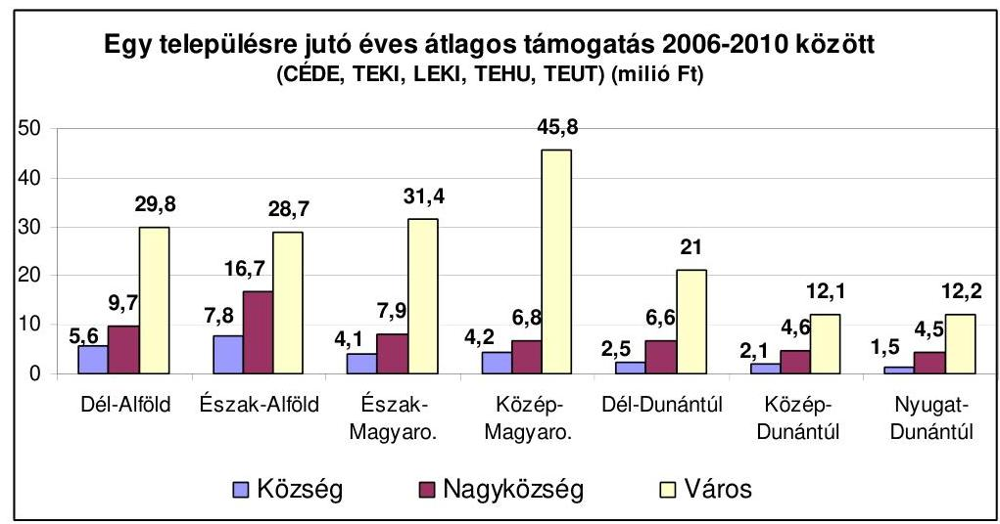

A támogatásban részesült helyi önkormányzatok területén megvalósult fejlesztések, a különböző közösségi intézmények vagy utak felújításával hozzájárultak az önkormányzati feladatok színvonalasabb ellátásához, az ott élők életminőségének javításához. E támogatások segítették az önkormányzatokat abban is, hogy a kötelező feladataik ellátását meghatározó hatósági előírásokat (a konyhák HCCP alapján való múködésének feltételeit, a közegészségügyi-, a közlekedés biztonsági előírásokat, az akadálymentes közlekedés biztosítását) teljesíteni tudják.

# 3. A MONITORING RENDSZER MÜKÖDTETÉSE 

### 3.1. A monitoring rendszer kialakítása, információk hasznosítása

A helyi önkormányzatok hazai fejlesztési célú támogatási rendszerében a vizsgált időszakban a támogatásokat kezelő szervezetek nem múködtettek egységes monitoring rendszert.

Az 1999. XI. 7-től hatályos Tftv. 27. § (1) bekezdésének h) pontja értelmében a Kormánynak rendeletben kellett szabályoznia a területi monitoring rendszer feladat- és hatáskörét, szervezeti és múködési rendjét. A területi monitoring rendszer kialakítása - a területfejlesztési célok érvényesítését szolgáló intéz-

---

mény- és eszközrendszer fejlesztési irányai között - az Országos Területfejlesztési Koncepcióban (Országos Területfejlesztési Koncepció) is szerepel. A Kormány rendelet tervezetét és az azt megalapozó előterjesztést ${ }^{55}$ az NFGM csak 2009-ben készítette el. Az előterjesztők az Országgyűlés, a Kormány, valamint az országos és térségi szereplők döntéseinek elősegítését közpolitikai célként fogalmazták meg, mely országos, regionális, megyei szinten, valamint az Országos Területfejlesztési Koncepcióban meghatározott kiemelt térségekre, egyéb területekre rendszerszerűen elemzi és értékeli a területi folyamatok alakulását, a fejlesztések hatását, valamint vizsgálja a területi tervek és a fejlesztési tervek területi tartalmát. A területi monitoring rendszerről szóló Kormány rendelet ${ }^{56}$ 2010. április végén lépett hatályba. A Kormány a rendeletben Orszá-gos-, Kiemelt térségi-, Regionális- és Megyei területi monitoring bizottság múködését határozta meg. A monitoring bizottságok tevékenységükről a tárgyévet követő március 31-ig kötelesek tájékoztatást adni. A sokszereplős támogatási rendszerből is adódott, hogy az önkormányzatok különböző jogcímú fejlesztési célú támogatáshoz jutásának feltételeit különböző szintű jogszabályok - törvények, kormányrendeletek, szakminiszteri rendeletek -, kormányhatározatok szabályozták, amelyek nem egyformán kezelték a támogatások felhasználása, a támogatással megvalósított teljesítmények nyomon követésének, ellenőrzésének kérdését.

Mind a négy támogatási előirányzat csoport esetében - elsősorban a termelő infrastruktúra fejlesztéseknél, valamint a humán infrastruktúra fejlesztések esetében az eszköz beszerzésekre vonatkozóaknál - a pályázatok és sok esetben a támogatási szerződések is tartalmaztak naturális mutatókat.

A fejlesztési célú támogatások felhasználásáról szakmai és pénzügyi beszámolót minden támogatás típusnál készítettek az önkormányzatok. A beszámolók és az ezekhez kapcsolt adatszolgáltatás alapján a támogatás felhasználásának eredményességét a támogatást kezelők saját monitoring rendszerük keretében ellenőrizték és egyedileg értékelték, azonban összefoglaló értékelés nem készült.

A címzett és céltámogatások felhasználásának szabályairól szóló kormányrendelet ${ }^{57}$ az ÖM/ÖTM és - az ÖM/ÖTM koordinálásával - az érintett szakminisztériumok, továbbá a Kincstár részére a támogatással megvalósított fejlesztés szakmai megvalósulása, a támogatás rendeltetésszerú felhasználása ellenőrzésének lehetőségét írja elő. Az érintett minisztériumok kapacitás hiányra hivatkozva nem éltek ezzel a lehetőséggel.

Az önkormányzatokért felelős minisztériumhoz rendelt központosított előirányzatok felhasználására vonatkozó rendeletek 2008-tól az

[^0]
[^0]:    ${ }^{55}$ A területi monitoring rendszer feladat- és hatásköréről, szervezeti és működési rendjéről szóló 6063/2009. számú NFGM előterjesztés.
    ${ }^{56}$ A 37/2010. (II. 26.) Korm. rendelet a területi monitoring rendszerről.
    ${ }^{57}$ A helyi önkormányzatok címzett és céltámogatása felhasználásának részletes szabályairól szóló 19/2005.(II. 11.) Korm. rendelet 14. § (9) bekezdése.

---

ellenőrzés és monitoring kifejezést együttesen használták, és a támogatások felhasználása ellenőrzésének lehetőségét adták meg az önkormányzatokért felelős miniszternek, illetve az általa megbízott szervek, továbbá jogszabályban erre feljogosított egyéb szervek részére. A minisztérium a fejlesztést megvalósítása folyamatában nem követte nyomon, annak befejezését követően a beküldött szakmai és pénzügyi beszámolók, illetve a csatolt számlák alapján ellenőrizte, értékelte a támogatás cél szerinti felhasználását. Amennyiben ez a dokumentumok alapján nem volt egyértelműen megállapítható, helyszíni ellenőrzésre felkérte a Kincstárt. A vizsgált időszakban két ilyen eset fordult elő. Az OKM által kezelt központosított előirányzatok felhasználását szabályozó miniszteri rendeletek kitértek arra, hogy a miniszter a szakmai megvalósítást szakértők útján folyamatosan ellenőrizheti és vizsgálhatja a támogatás pályázatban meghatározott és a pályázó által vállalt célra történt felhasználását. A minisztérium pályázatai lebonyolítását háttér szervezetei bevonásával, a velük kötött megállapodás alapján múködtette. E pályázatok esetében is a támogatást felhasználók által utólagosan beküldött dokumentumok, alapján végezték el a lebonyolítók a támogatás felhasználásának ellenőrzését, értékelését.

A Támogatáskezelő bonyolította le a közoktatás szakmai és informatikai fejlesztési feladatai támogatásával, a Könyvtári Intézet, a Magyar Művelődési Intézet és Képzőművészeti Lektorátus a könyvtári, közművelődési érdekeltségnövelő támogatások és a múzeumok szakmai támogatásával kapcsolatos pályáztatási, elszámoltatási, illetve monitoring feladatokat.

A szakmai és informatikai fejlesztési feladatok támogatására kapott központi forrásokkal az adott év december 31-i forduló napjával a Kincstár felé a zárszámadás keretében kellett elszámolniuk az önkormányzatoknak. A 2007. évtől a Támogatáskezelő részére az OKM rendeletekben ${ }^{58}$ meghatározott - évente eltérő - időpontig szakmai beszámolót készítettek a támogatásban részesült szervezetek ${ }^{59}$. A Támogatáskezelő helyszíni ellenőrzést önkormányzati intézményeknél, illetve azok fenntartóinál 2007-2008. években nem végzett, statisztikai elemzés módszerével monitoring jelentéseket ${ }^{60}$ készített. 2010. november

[^0]
[^0]:    ${ }^{58}$ a szakmai és informatikai fejlesztési feladatok támogatása igénylésének, döntési rendszerének, folyósításának és ellenőrzésének részletes szabályairól szóló 16/2007. (III. 14.) OKM, a 23/2008. (VIII. 6.) OKM, a 28/2009. (VIII. 19.) OKM, a 21/2010. (V. 13.) OKM rendeletek
    ${ }^{59}$ Az OKM rendeletek az önkormányzati fenntartók mellett a nem állami intézményfenntartók és az állami felsőoktatási intézmények gyakorló oktatási intézményei részére is lehetővé tették a szakmai és informatikai fejlesztési feladatokra a támogatás igénylését.
    ${ }^{60}$ „Monitoring jelentés a szakmai és informatikai fejlesztési feladatok támogatása igénylésének, döntési rendszerének, folyósításának és ellenőrzésének részletes szabályairól szóló 16/2007. (VIII. 6.) OKM rendeletről", továbbá „Monitoring jelentés a szakmai és informatikai fejlesztési feladatok támogatása igénylésének, döntési rendszerének, folyósításának és ellenőrzésének részletes szabályairól szóló 23/2008. (VIII. 6.) OKM rendeletről

---

végéig a rendeletben ${ }^{61}$ foglaltak szerint statisztikai jelentést kellett készíteniük a 2009. évi támogatás felhasználásának eredményességéről, illetve a támogatott eszközök típusa alapján általános jellemzést adni a megvásárolt eszközök alapján. A vizsgálat időszakában a jelentést még nem kapta meg a NEFMI.

A fejezeti kezelésú előirányzatokból az önkormányzati feladatokhoz pályázati úton biztosított támogatások felhasználásának folyamatos nyomon követése sem a támogatást biztosító szakminisztériumok, sem a pályázatokat lebonyolító szervezetek részéről nem történt meg. Ezeknél a pályázatoknál is csak utólagos dokumentum alapú szakmai és pénzügyi felülvizsgálat folyt. Az esetek néhány százalékában a kedvezményezetteknél a fejlesztés megvalósítását követően helyszíni ellenőrzést is folytattak a pályázat lebonyolításával megbízott szervezetek.

A szociális, gyermekjóléti és gyermekvédelmi területen a pályázatokat döntően az ESZA Nonprofit Kft-vel ${ }^{62}$ kötött vállalkozási szerződés alapján bonyolította le a szaktárca. A lebonyolító a pályázatok eredményéről és a lefolytatott ellenőrzésekről adatlapok kitöltésével számolt be az SZMM-nek.

A „Közkincs" és a „Tengertánc" programok keretében kiírt pályázatokat a NKÖM/OKM megbízásából a Magyar Művelődési Intézet és Képzőművészeti Lektorátus (MMI), illetve a Nemzeti Kulturális Alap Igazgatósága közremúködésével bonyolították le. Az MMI a vizsgált időszak elején végzett helyszíni ellenőrzést. A közművelődés, illetve a közgyűjtemények szakmai fejlesztését szolgáló „Közkincs", „Tengertánc", illetve „Alfa" programokban megfogalmazott célkitűzéseket az ezek megvalósítását szolgáló egyes években kiírt pályázatokban kimeneti elvárásként szerepeltették. A miniszteri utasításként kiadott „Fejezeti kezelésú előirányzatok gazdálkodási, kötelezettségvállalási és utalványozási szabályzata" előírásának megfelelően a tárgyévet követő év március 1-jéig - szakmai és számszaki beszámolót, illetve értékelést készítettek a támogatások múködtetői a programok megvalósításának állásáról.

A kerékpárutak tervezésének és építésének támogatását célzó pályázatok lebonyolítását a szaktárca a Közlekedés Fejlesztési Koordinációs Központtal (továbbiakban KKK) végeztette. A KKK a kerékpárát építés megvalósításának folyamatában műszaki ellenőrzési feladatokat nem végzett, a projekt előrehaladásáról tájékoztatást nem kapott. A feladatok szerződésszerű teljesítését - a számlák szakmai teljesítésigazolását - a lebonyolítással megbízott műszaki ellenőr végezte. A KKK műszaki ellenőrzése, a megvalósítás végén a műszaki átadás-átvételi eljáráson való részvétellel és az Útmutatóban meghatározott minőségi követelmények teljesítését igazoló dokumentációk (megvalósulási terv, laboratóriumi mérési jegyzőkönyv) meglétének ellenőrzésével történt meg.

A monitoring rendszer a decentralizált támogatások körében múködött a legjobban. A decentralizált helyi önkormányzati fejlesztési támogatási programok előirányzatai felhasználásának részletes szabályairól szóló kormányrendeleteknek megfelelően a Kincstár és a regionális fejlesztési tanácsok

[^0]
[^0]:    ${ }^{61}$ az informatikai fejlesztési feladatok támogatása igénylésének, döntési rendszerének, folyósításának, elszámolásának és ellenőrzésének részletes szabályairól 21/2010. (V. 13.) OKM rendelet 11. § (3) bekezdésében foglaltak szerint
    ${ }^{62}$ korábban ESZA Kht.

---

munkaszervezete végezte ezt a tevékenységet. A decentralizált támogatásoknál a támogatási részösszegek finanszírozása előtt a támogatásfolyósítási kérelem alapján, a helyszínen is meggyőződtek a fejlesztés megvalósulásának állásáról. A teljes megvalósítási folyamatot végigkísérve utó- és záró ellenőrzést is tartottak.

A monitoring rendszer visszajelzései alapján minden támogatás típus esetében történt nem a célnak megfelelő felhasználás miatt támogatás visszavonás. A visszavont támogatási összeg aránya az elnyert támogatás nagyságrendjéhez viszonyítva kisebb volt, mint a támogatás visszavonással érintett pályázatok számának a nyertes pályázatok számához viszonyított aránya. Azoknál a központosított előirányzatokból nyújtott támogatásoknál ${ }^{63}$, melyeknél támogatás visszavonás történt, a megítélt támogatások $15 \%$-a volt érintett, de összegszerűen ez csak $0,9 \%$-át tette ki az e körben elnyert támogatások összességének. E feladatoknál a visszavont átlagos támogatási összeg 533 ezer Ft volt, míg a megítélt támogatásoknál ez a nagyságrend közel 10 millió Ft volt. A decentralizált területfejlesztési támogatások esetében a megítélt támogatások $0,3 \%$-ánál fordult elő, hogy a támogatás teljes összegét viszszavonták.

# A monitoring visszajelzéseit a támogatások jövőbeli múködési feltételeinek kialakításakor az előirányzatok kezelői figyelembe vették, de ennek hasznosulása nem volt egységes a támogatási rendszeren belül. 

A decentralizált támogatások felhasználásáért felelős minisztert a monitoring tevékenység tapasztalatairól a regionális fejlesztési tanácsok az éves szakmai beszámolójuk keretében tájékoztatták. A 2007. évről szóló beszámolók alapján támogatás fajtánként tájékoztatókat készített az ÖTM, melyek tartalmazták a rendelkezésre álló előirányzatok felhasználásával kapcsolatos tapasztalatokat. A decentralizált források felhasználását szabályozó kormányrendeletek előkészítése során rendszeresen kikérték a regionális fejlesztési tanácsok és a Kincstár véleményét és figyelembe vették a támogatások jövőbeli múködtetési feltételeinek kialakításakor.

A közoktatás szakmai és informatikai fejlesztésének támogatásánál a 2007. év azon tapasztalata alapján, hogy újabb pályázat kiírásával sem volt elegendő igény a támogatásra a túlságosan korlátok közé szorított felhasználási lehetőség miatt, a későbbiekben nagyobb választási lehetőséget adtak a pályázóknak a beszerezhető szakmai és informatikai eszközökre vonatkozóan, aminek következtében az igények meg is haladták a rendelkezésre álló pénzügyi forrást.

Voltak olyan, több szereplő közreműködésével lebonyolított pályázatok, amelyeknél az információk, tapasztalatok nem mindig jutottak el a következő hasonló témájú pályázat pályázati feltételeinek kidolgozásában résztvevőkhöz, illetve a döntéshozókhoz. Ez abból következett, hogy részletes összefoglaló jelentések az ellenőrzési tapasztalatokról nem készültek.

[^0]
[^0]:    ${ }^{63}$ kistelepülési iskolák, körjegyző́ségek tárgyi feltételei javításának, közösségi buszok beszerzésének, sportpályák felújításának támogatása

---

Az önkormányzatokért felelő minisztérium az általuk kezelt központosított előirányzati fedezettel múködtetett pályázatok körében a kedvezményezettek által megküldött beszámolók alapján a támogatás cél szerinti felhasználását ellenőrizték, de azokról írásos összefoglaló nem készült. Így a döntést hozók részére nem állt rendelkezésre információ ez ellenőrzések tapasztalatairól. AZ SZMM pályázatainál közreműködő ESZA Kft. beszámolói csak a kedvezményezettek szakmai és pénzügyi elszámolásának formai és tartalmi vizsgálata elvégzéséről szóltak.

A tapasztalatok hasznosíthatósága olyan esetben is korlátozott volt, mikor a vizsgált időszak csak egy-egy évében volt lehetőség valamely feladathoz támogatást igényelni, illetve, ha egy konkrét feladathoz több évben is igényelhető volt támogatás, de a támogatást kezelő közben más szervezet lett. A Kincstár monitoring rendszeréből nyerhető információk sem jutottak el minden esetben a támogatásokat múködtető minisztériumokba, vagy nem kísérték figyelemmel azokat.

Az alkalmazott monitoring rendszer - a decentralizált támogatásokkal kapcsolatosan múködtetettet kivéve - csak részben volt alkalmas a támogatások hatásának, a pályázatokban foglalt célok teljesülésének nyomon követésére. A 2006-2009. években a hazai fejlesztési támogatásokat működtető szervezetek nem vizsgálták a támogatások felhasználásának hatékonyságát. A monitoring, illetve az ellenőrzési rendszer keretében a támogatások cél szerinti felhasználását, illetve - amennyiben volt - a megvalósított naturális mutatók alapján a támogatások felhasználásának eredményességét egyedileg vizsgálták. A fejlesztések aktiválását követően az önkormányzati feladatellátásra gyakorolt hatásáról nem volt információ. A hazai fejlesztési támogatásokat működtető szervezetek, a támogatási előirányzatok kezelői a kitűzött célok elérését program szinten nem értékelték. A minisztériumok azt sem értékelték, hogy a különböző támogatástípusok együttesen milyen hatást gyakorolnak az ágazatok fejlesztésére.

# 3.2. A monitoring rendszer múködése a helyi önkormányzatoknál 

A hazai fejlesztési célú támogatások közül a támogatás múködtetője, a támogatási előirányzat kezelője kizárólag a decentralizált támogatást elnyert önkormányzatoknál ellenőrizte a helyszínen a támogatások felhasználását.

A decentralizált támogatások helyszíni ellenőrzéseit a megyei területfejlesztési tanácsok munkaszervezetei, illetve a regionális fejlesztési ügynökségek a Kincstár megyei szerveivel közösen végezték. Az ellenőrzések során a támogatás pénzügyi felhasználását és a fejlesztési feladat műszaki-szakmai teljesítését ellenőrizték.

A támogatási előirányzat kezelője a helyszíni ellenőrzések során tett megállapításai alapján mindössze egy esetben, az önkormányzatok szakmai és pénzügyi beszámolói alapján pedig egy önkormányzat két fejlesztési feladatának támogatásával összefüggésben rendelt el visszafizetési kötelezettséget.

Bélapátfalván a TRFC támogatással megvalósuló beruházásnál (üzemi fürdőépület átalakítása egészségházzá) a támogatási szerződésben rögzített 173886 ezer Ft

---

kiadás helyett csak 166931 ezer Ft kiadást tudtak igazolni, amely miatt a Kincstár 2009. évi ellenőrzése alapján 2685 ezer Ft tőke és 1045 ezer Ft kamat támogatás visszavonása történt meg.

Zombán a 18/2008. (III. 28.) ÖTM rendelet alapján központosított előirányzatból igényelhető, kistelepülési iskolák tárgyi feltételeinek javítása esetében 2576 ezer Ft (közbeszerzési eljárás során a tervezett kivitelezési költség csökkenése miatt), a körjegyzőség, a körjegyzőség tárgyi feltétételeinek javítása esetében 454 ezer Ft (nem a támogatási szerződésben meghatározott összetételnek megfelelő támoga-tás-felhasználás) visszafizetési kötelezettség keletkezett, amelyet az önkormányzat teljesített.

Az ellenőrzött önkormányzatok 93,8\%-a a belső ellenőrzés keretében nem ellenőrizte a megpályázott, igényelt és felhasznált fejlesztési célú támogatásokat. Mindössze két önkormányzatnál vizsgálta a belső ellenőrzés e támogatásokat.

Szárligeten a belső ellenőrzés a 2009. évben vizsgálta az általános iskola és az óvoda, támogatásokkal megvalósított szakmai és informatikai fejlesztéseit, a támogatások igénylését és felhasználását, amelyet szabályszerűnek ítélt meg.

Marcaliban a polgármesteri hivatal belső ellenőre 2010-ben rendszerellenőrzés keretében vizsgálta a hazai fejlesztési célú támogatások igénylését, felhasználását és elszámolását, amely során nem állapított meg szabálytalanságot.

Az önkormányzatok teljesítették a támogatások felhasználásával kapcsolatos adatszolgáltatási kötelezettségüket, amely lehetőséget biztosított a támogatási előirányzatok kezelőinek a pénzügyi és szakmai értékelésre a fejlesztési célú támogatással megvalósult projektek, programok esetében.

A hazai fejlesztési célú támogatások felhasználása során az érintettek adatszolgáltatási kötelezettségének teljesítése ellenére a monitoring csak részben múködött, mert a források felhasználásának, az eredményeknek és teljesítményeknek mindenre kiterjedő vizsgálatát a támogatási előirányzatok kezelői rendszeres jelleggel nem végezték el.

A források felhasználását a helyszínen csak a decentralizált támogatásoknál ellenőrizték. A címzett támogatások, a központosított támogatások és a fejezeti kezelésű előirányzatokból nyújtott támogatások felhasználását a támogatás működtetője, a támogatási előirányzat kezelője nem ellenőrizte a helyszínen, és a belső ellenőrzés is az önkormányzatok mindössze 6,2\%ánál vizsgálta a támogatások felhasználását.

# 4. A HELYI ÖNKORMÁNYZATOK HAZAI TÁMOGATÁSOKKAL MEGVALÓSÍTOTT FEJLESZTÉSEI 

### 4.1. Az önkormányzati célkitúzések külső és belső összhangja

Az önkormányzatok intézkedési terveiben, koncepcióiban, programjaiban megfogalmazott fejlesztési célkitúzések összhangban voltak az országos ágazati fejlesztési és területfejlesztési célkitúzésekkel, valamint a regionális, a kistérségi és megyei célkitűzésekkel.

---

Az ellenőrzött helyi önkormányzatok 93,1\%-a rendelkezett - önálló vagy többcélú kistérségi társulás tagjaként kistérségi - a Közokt. tv. 85. § (4) bekezdésében előírt közoktatási intézményhálózat-müködtetési és -fejlesztési tervvel ${ }^{64}$.

Két önkormányzat (Csesztreg, Egervár) nem rendelkeztek közoktatási intézmény-hálózat-müködtetési és -fejlesztési tervvel. Tagjai voltak ugyan többcélú kistérségi társulásnak, azonban e társulások intézkedési terve a Közokt. tv. 85. § (4) bekezdésének előírása ellenére települések szerinti bontásban nem tartalmazta a fejlesztési elképzeléseket, így nem feleltek meg az önkormányzati intézkedési tervvel szembeni követelménynek.

Az önkormányzati közoktatási intézményhálózat-működtetési és -fejlesztési tervek tartalmazták az intézményrendszer működtetésével, fenntartásával, fejlesztésével, átszervezésével összefüggő önkormányzati célkitűzéseket, amelyeket az OFK-ban foglaltak figyelembevételével határoztak meg. A megyei önkormányzatoktól beszerzett szakvélemények ${ }^{65}$ szerint a közoktatási intézményhálózat-működtetési és -fejlesztési tervekben a célok meghatározásakor az önkormányzatok figyelemmel voltak a megyei fejlesztési tervekben foglaltakra.

A vizsgált és szociális szolgáltatástervezési koncepció készítésére kötelezett ${ }^{66}$ önkormányzatok 94,1\%-a rendelkezett az ellenőrzött időszakra vonatkozó szociális szolgáltatástervezési koncepcióval. Egy önkormányzat (Hodász) csak 2010-ben készítette el a Szoc. tv. 92. § (3) bekezdésében előírt koncepciót. A koncepciók tartalmazták a lakosságszám alakulását, a koröszszetételt, a szolgáltatások iránti igényeket, az ellátási kötelezettség teljesítésének helyzetét, a szolgáltatások működtetési, finanszírozási, fejlesztési feladatait, az esetleges együttműködés kereteit, az egyes ellátotti csoportok sajátosságaihoz kapcsolódóan a speciális ellátási formák, szolgáltatások biztosításának szükségességét. A kitűzött fejlesztési feladatok összhangban voltak az OFK-ban meghatározott célokkal.

Az ellenőrzött önkormányzatok 79,3\%-a rendelkezett a Kvt. 46. § (1) bekezdés b) pontja, a 46. § (2) bekezdés a) pontja és a 48/C. § (1) bekezdésében előírt környezetvédelmi programmal.

Elmulasztották a környezetvédelmi program összeállítását Nagypeterd és Zomba községek, Hodász nagyközség, Vaja, Nyergesújfalu és Őriszentpéter városok önkormányzatai.

[^0]
[^0]:    ${ }^{64}$ Nem kell a helyi önkormányzatnak intézkedési tervet készítenie, ha tagja a többcélú kistérségi társulásnak, feltéve, hogy a többcélú kistérségi társulás önálló intézkedési terve - települések szerinti bontásban - tartalmazza mindazt, amit az önkormányzati intézkedési tervnek tartalmaznia kell.
    ${ }^{65}$ A szakvélemény beszerzését a Közokt. tv. 85. § (6) bekezdése írja elő.
    ${ }^{66}$ A Szoc. tv. 92. § (3) bekezdése szerint a legalább kétezer lakosú települési önkormányzat, illetve a megyei önkormányzat a településen, illetve a megyében, fővárosban élő szociálisan rászorult személyek részére biztosítandó szolgáltatási feladatok meghatározása érdekében szolgáltatástervezési koncepciót készít. Kétezer alatti lakosságszáma miatt nem volt szolgáltatástervezési koncepció készítésére kötelezett Gödre, Nagypeterd, Babócsa, Cikó, Kaposszekcső, Tiszakürt, Jármi, Bő, Ikervár, Őriszentpéter, Csesztreg, Egervár.

---

A környezetvédelmi programok tartalmazták - többek között - a célok és célállapotok elérése érdekében teendő főbb intézkedéseket, különösen a folyamatban lévő, illetve az előirányzott fejlesztésekkel és a múködtetéssel kapcsolatos feladatokat, valamint azok megvalósításának ütemezését. Ezeket a NKP 1-ben megfogalmazott célok figyelembevételével határoztak meg. A Nemzeti Környezetvédelmi Program II. célkitűzéseit az önkormányzatok még nem vették figyelembe, mert annak 2009. december 9-i kihirdetését követően még nem vizsgálták felül környezetvédelmi programjaikat ${ }^{67}$. Az önkormányzatok 86,2\%-a Kvt. 46. § (2) bekezdés b) pontjában foglalt előirás ellenére a megyei önkormányzat előzetes véleményének hiányában határozta meg a helyi környezetvédelmi céljait, az előirányzott környezetvédelmi fejlesztéseit.

A környezetvédelmi célok meghatározásánál figyelembe vették a megyei önkormányzat előzetes véleményét Tiszakürt és Szárliget községek, valamint Simontornya és Nyírlugos városok önkormányzatai.

Az ellenőrzött önkormányzatok mindössze 37,9 \%-a készítette el a Sport tv. 55. § (1) bekezdés a) pontja és (3) bekezdése alapján előírt helyi sportfejlesztési koncepciót ${ }^{68}$, amelyek tartalmazták a stratégiai célokat, a fejlesztési irányokat (iskolai testnevelés, diáksport, szabadidősport, létesítményfejlesztés). A helyi sportfejlesztési koncepcióval rendelkező önkormányzatok 72,7\%-a sportfejlesztési koncepciójának céljait a Nemzeti Sportstratégiában megfogalmazott célkitúzések figyelembevételével határozta meg.

Három önkormányzat (Ásotthalom, Bélapátfalva és a Csongrád megyei Önkormányzat) sportfejlesztési koncepciója nem vette figyelembe a Nemzeti Sportstratégiában megfogalmazott célkitúzéseket, mivel a koncepciók a Nemzeti Sportstratégia megalkotása előtt készültek és ezt követően nem vizsgálták felül azokat, illetve a felülvizsgálat a Sport tv. követelményeinek való megfelelés érdekében történt.

A Tftv. 10/C. § (2) bekezdés b) pontja, a 13. § (2) bekezdés b) pontja, továbbá 17. § (2) bekezdés b) pontja területfejlesztési koncepció kidolgozását és elfogadását teszi kötelezővé a kistérségek számára ${ }^{69}$. Ennek a vizsgált három többcélú kistérségi társulás (sellyei, szigetvári, barcsi) közül egy kistérség nem tett eleget és nem rendelkezett jóváhagyott területfejlesztési koncepcióval.

A barcsi kistérségnek nem volt jóváhagyott területfejlesztési koncepciója, mert a kidolgozott koncepciót nem terjesztették a Barcsi Többcélú Kistérségi Tanács elé és nem döntöttek annak elfogadásáról.

[^0]
[^0]:    ${ }^{67}$ A települési környezetvédelmi programok felülvizsgálatára a Kvt. nem tartalmaz közvetlen előírást.
    ${ }^{68}$ A vizsgált időszakra vonatkozó helyi sportfejlesztési koncepcióval rendelkeztek Ásotthalom, Cikó, Kaposszekcső, Szárliget, Ikervár községek, Marcali, Simontornya, Bélapátfalva Ajka, Füzesabony városok önkormányzatai és a Csongrád megyei Önkormányzat.
    ${ }^{69}$ A területfejlesztési koncepciók tartalmi követelményeit a 18/1998. (VI. 25.) KTM rendelet, illetve 2009. október 21-ét követően a 218/2009. (X. 6.) Korm. rendelet határozta meg.

---

Az ellenőrzött két többcélú kistérségi társulás (kistérségek) területfejlesztési koncepciójában megfogalmazott fejlesztési célkitúzések összhangban voltak a regionális fejlesztési koncepciókban meghatározott célkitúzésekkel.

A sellyei és a szigetvári kistérség fejlesztési célkitűzései a Dél-dunántúli 20032007. évi operatív programjának átfogó és specifikus céljaival - a turizmus-, a környezet-, a közlekedés-, valamint a humán közszolgáltatások (egészségügyi ellátás, szociális szolgáltatások, oktatási-, kulturális- és szabadidős szolgáltatások) fejlesztése - összhangban voltak.

A sellyei kistérség 2005. évi területfejlesztési koncepciójában meghatározott fejlesztési célok között szerepelt többek között a kistérség közúti elérhetőségének fejlesztése (közúthálózat fejlesztés az Ormánságban), a szennyvízhálózat bővítése és a vezetékes gázhálózat kiépítése. A célok között volt az egészségügy, szociális ellátás és a foglalkoztatás javítása (munkaerőpiaci felzárkóztató program), az alapfokú oktatási intézmények bővítése, korszerűsítése, a szakoktatás, szakképzés erősítése, a vállalkozásélénkítés, a közigazgatási és közoktatási funkciók erősítése, a turizmus fejlesztése (természetjáró turizmus, termál- és gyógyturizmus). A kistérség 2008. évi területfejlesztési koncepciója a 2005. évi koncepcióban megfogalmazott fejlesztési célokon túlmenően tartalmazta a vidéki jövedelemszerzési lehetőségek bővítését.

A szigetvári kistérség területfejlesztési koncepciójának fejlesztési céljai között szerepelt a közlekedési kapcsolatok javítása, az infrastruktúra egyéb területeinek fejlesztése, a munkanélküliség kezelése, a humán erőforrás fejlesztése, a versenyképes gazdasági szerkezet kialakítása és komplex idegenforgalmi fejlesztés megvalósítása.

Az Ötv. 91. § (6) bekezdésében foglaltak alapján az önkormányzatnak gazdasági programban kell meghatároznia mindazon célkitűzéseket, feladatokat, amelyek a költségvetési lehetőségekkel összhangban, a helyi társadalmi, környezeti, gazdasági adottságok átfogó figyelembevételével - a kistérségi területfejlesztési koncepcióhoz illeszkedve - az önkormányzat által nyújtandó kötelező és önként vállalt feladatok biztosítását, fejlesztését szolgálják. Az ellenőrzött önkormányzatok - egy önkormányzat kivételével ${ }^{70}$ - meghatározták gazdasági programjukat. A benne foglalt célkitúzések az esetek 96,4\%ában összhangban voltak a regionális fejlesztési koncepciókban meghatározott célkitűzésekkel és teljes mértékben illeszkedtek a kistérségek területfejlesztési koncepciójához.

Füzesabony Város Önkormányzatának 2006-2010. évekre szóló eredeti gazdasági programja nem vette figyelembe a Regionális Akcióterv prioritásait, a módosított akcióprogramot pedig az Észak-magyarországi Regionális Operatív Program 2009-2010 elkészülte előtt hagyta jóvá a képviselő-testület.

A gazdasági programokban foglalt célkitűzések az önkormányzatok 92,9\%ánál összhangban voltak az egyes feladatellátási területekre vonatkozó intézkedési terveikben, koncepcióikban, saját programjaikban (közoktatási

[^0]
[^0]:    ${ }^{70}$ Zomba Község Önkormányzata a törvényi előírás ellenére vizsgált időszakra nem állított össze és nem hagyott jóvá gazdasági programot.

---

feladatellátási, intézményhálózat-múködtetési és -fejlesztési tervben, szociális szolgáltatástervezési koncepcióban, sportfejlesztési koncepcióban, valamint környezetvédelmi programban) megfogalmazott fejlesztési célkitúzésekkel.

Két önkormányzatnál (Csesztreg, Egervár) a gazdasági programban szereplő környezetvédelmi és közoktatási célkitűzések - érvényes közoktatás fejlesztési terv hiányában - csak a környezetvédelmi program fejlesztési célkitűzéseivel voltak összhangban.

A 2006-2010. évi költségvetési rendeletek a gazdasági programokban meghatározott, a tárgyévben megvalósítandó fejlesztési feladatokat nevesítették. A pályázati források bevonásával megvalósuló fejlesztési feladatokat - eredeti vagy módosított előirányzatként - megtervezték az Áht. 69. § (1) bekezdésében és az Ámr 29.§ (1) bekezdés c) és d), illetve az Ámr 36. § (1) bekezdés c) és d) pontja előírásainak megfelelően. Eredeti előirányzatként a már megítélt támogatásokkal megvalósuló fejlesztések bevételeit és kiadásait tervezték, a pályázati forrásokkal tervezett fejlesztésekhez - a még meg nem ítélt támogatás esetében - céltartalékot képeztek, illetve tartalék felhasználást terveztek a szükséges saját forrás biztosítása érdekében. Év közben - a támogatási szerződés aláírását követően - rendeletmódosítással építették be a támogatással megvalósuló fejlesztési feladat bevételi és kiadási előirányzatát az éves költségvetésbe.

# 4.2. Az önkormányzatok pályázati, támogatásigénylési tevékenysége 

A helyi önkormányzatok és az önkormányzatok többcélú kistérségi társulásai pályázatokon való részvételét a támogatáshoz való hozzájutás és a kitüzött céljaik megvalósítása motiválta. Az önkormányzati saját források szűkössége miatt a magasabb támogatás intenzitású pályázatokat részesítették előnyben.

Az ellenőrzött önkormányzatok pályázatokról, támogatásigénylésekről való döntései pénzügyi szempontból megalapozottak voltak. A benyújtott pályázatok céljai az önkormányzatok gazdasági programjaikban, a közoktatásra vonatkozó önkormányzati intézkedési terveikben, a szociális szolgáltatásokra vonatkozó szolgáltatástervezési koncepcióikban, környezetvédelmi programjaikban, valamint helyi sportfejlesztési koncepcióikban meghatározott fejlesztési célkitúzéseikkel összhangban voltak. A pályázatok az önkormányzatok kötelező feladatellátásához kapcsolódtak. Az önkormányzatok a pályázatok benyújtása előtt rendelkeztek a fejlesztendő területre vonatkozó helyzetértékeléssel (részben az ágazati, szakmai tervekben, koncepciókban, programokban). A konkrét célokat intézményvezetők szakmai véleményének kikérésével, lakossági és szakmai igények felmérésével fogalmazták meg. A tervezett fejlesztések költségét az előzetesen készíttetett tervezői költségvetések, illetve árajánlatok alapozták meg. A fejlesztéssel megvalósult létesítmények jövőbeli üzemeltetésének várható többletráfordításait az önkormányzatok 71,9\%-a nem mérte fel, illetve a fejlesztésekkel elérhető kiadás megtakarításokat nem számszerűsítették.

---

A fejlesztési célú pályázatok döntés-előkészítése során önkormányzatok döntő része tájékoztatta a képviselő-testületet a pályázatok formájáról, azok szakmai és pénzügyi követelményeiről, az elérendő célokról, a fejlesztések költségkihatásáról és a szükséges saját forrás nagyságáról. A többcélú kistérségi társulási tanácsok számára készített előterjesztések ezen túl tartalmazták a fejlesztéssel érintett önkormányzatok hozzájárulását is. A pályázatok beadását minden esetben testületi döntések alapozták meg ${ }^{71}$. (A pályázatoknál követelmény is volt a támogatással megvalósítani kívánt fejlesztés saját forrás részének vállalására vonatkozó képviselő-testületi határozat benyújtása.)

A pályázatfigyelés, pályázatkészítés, támogatásigénylés a polgármesteri hivatalokon belül koordinált volt, amelyet a polgármesterek, a jegyzők (körjegyzők), az intézményvezetők, illetve a többcélú kistérségi társulások munkaszervezetének vezetői végeztek. A pályázatfigyelés, pályázatkészítés személyi és szervezeti feltételeit a polgármesteri hivatalokon belül alakították ki és múködtették. Az ehhez kapcsolódó feladatokat az önkormányzatok 81,2\%-a szabályozta (SzMsz-ben, ügyrendben és munkaköri leírásokban). A cél- címzett, a decentralizált területfejlesztési támogatások, egyéb hazai fejlesztési célú támogatások elnyerése érdekében benyújtott pályázatok elkészítésével az önkormányzatok 28,1\%-a bízott meg külső személyt, szervezetet.

Kaposszekcsőn és Nógrádmegyeren a decentralizált területfejlesztési támogatások elnyerése érdekében benyújtott pályázatok előkészítése során a többcélú kistérségi társulásnak koordináló, támogató szerepe volt. Zombán a pályázatfigyelés, pályázatkészítés feladatainak ellátására egy alkalommal egy éves időtartamra külső szervezettel kötöttek szerződést. Tiszakürtön a decentralizált és fejezeti kezelésű előirányzatokból nyújtott támogatások pályázatainak előkészítésére két külső szervezettel is kötöttek szerződést a hivatali dolgozó munkájának segítése érdekében. Vaján kilenc decentralizált támogatásra vonatkozó pályázat, valamint egy fejezeti kezelésű előirányzatból nyújtott támogatás elnyerése érdekében kötöttek írásbeli szerződést külső vállalkozással. Egerváron a turisztikai pihenőhely kialakításához, a környezetvédelmi program készítéséhez és a közoktatási intézmények infrastrukturális fejlesztése érdekében benyújtott pályázatok készítésére kötöttek megbízási szerződéseket vállalkozásokkal.

Az önkormányzatok felmérték, áttekintették az adott célkitúzések megvalósításához igénybe vehető támogatási konstrukciókat. A pályázatfigyelés keretében megfelelő információk álltak rendelkezésre a fejlesztési támogatások pályázati, igénylési lehetőségiről. Ugyanazon fejlesztési feladat megvalósítása érdekében a vizsgált önkormányzatok 31,3\%-a nyújtott be több alkalommal pályázatot, részben ismételten a korábbi pályázat elutasítása, részben a csökkentett támogatás kiegészítése miatt.

A Csongrád Megyei Önkormányzat az FVM fejezeti kezelésű előirányzatára két pályázatot nyújtott be az erdészeti szakközépiskola erdészeti oktatóközpontjának bővítésére. A második pályázatot a pótlólagos keret terhére nyújtották be.

[^0]
[^0]:    ${ }^{71}$ A támogatás igénylésekről a képviselő-testületeknek nem kellett döntést hozni, mivel azokat normatív módon, feladatonként meghatározott fejkvóták alapján (pl. nevelt és oktatott tanulólétszám, pedagóguslétszám stb.) nyújthatták be az önkormányzatok.

---

Nagypeterd Község Önkormányzata a vízelvezető árkok felújítására, belterületi utak felújítására, az általános iskola és óvoda felújítására, informatikai eszközök beszerzésére, motoros fükasza vásárlására több pályázatot nyújtott be. Jármi Község Önkormányzata az általános iskola bővítésére és felújítására nyújtott be több pályázatot.

Vaja Város Önkormányzata a polgármesteri hivatal felújítása érdekében 2006ban pályázott TEKI támogatásra és a csökkentett mértékben megítélt támogatás miatt pályázott BM támogatásra, a BM rendkívüli beruházási tartaléka terhére.

Bő Község Önkormányzata a fejlesztési feladatra beadott pályázat elutasítása miatt több egymást követő évben pályázott a Táncsics utca burkolatának felújítására és a Petőfi utcai buszvárók építésére.

Egy adott fejlesztési feladat megvalósításához az ellenőrzött önkormányzatoknak 15,6\%-a vett igénybe több fajta (decentralizál, fejezeti kezelésű, központosított) pályázati forrást.

A Csongrád Megyei Önkormányzat 2009-ben a Megyei Múzeum állandó néprajzi kiállításának létrehozását 30000 ezer Ft központosított támogatással és 20976 ezer Ft EU-s támogatással (TIOP 1.2.2-08/1) valósította meg.

Cikó Község Önkormányzata 2006-ban az iskola alsó tagozatos épületrészének felújításához a TEKI támogatás mellett a Duna-Mecsek Területfejlesztési Alapítvány támogatását is igénybe vette.

Vaja Város Önkormányzata a polgármesteri hivatal felújításához 40000 ezer Ftos TEKI támogatást és 8000 ezer Ft rendkívüli BM támogatást használt fel.

Ajka Város Önkormányzata az Ajka-Padragkút városrész szennyvízcsatorna hálózatának építését céltámogatással és TEKI támogatással valósította meg.

Őriszentpéter Város Önkormányzata a sportöltöző bővítéséhez és felújításához 5000 ezer Ft fejezeti kezelésű támogatást és 3200 ezer Ft TEKI támogatást vett igénybe.

Az ellenőrzött önkormányzatok 2006-2010 között összesen 706 pályázatot, támogatás igénylést nyújtottak be, amelynek 81\%-át (572) fogadták el (9. számú melléklet). A vizsgált önkormányzatok 28,1\%-ának az összes benyújtott pályázatát elfogadták, 21,9\%-ának a pályázott összeggel megegyező támogatást ítéltek meg a döntéshozók. Ezek az arányok a támogatásigénylések esetében kedvezőbbek voltak. Az ellenőrzött önkormányzatok 62,5\%-ának fogadták el az összes támogatási igényét, és 46,9\%-ának hagytak jóvá a döntéshozók a támogatásigénylésekben szereplő összegekkel azonos támogatást.

Gödre, Hosszúhetény, Nagypeterd, Kaposfő, Kaposszekcső, Simontornya, Hodász, Nyírlugos és Tárkány minden benyújtott pályázata támogatásban részesült.

Babócsa, Kaposfő, Marcali, Simontornya, Zomba, Tiszakürt, Nógrádmegyer esetében az elnyert támogatások megegyeztek a pályázott összegekkel.

Az összes igényelt támogatást elnyerte: Ásotthalom, Gödre, Hosszúhetény, Kaposfő, Kaposszekcső, Simontornya, Zomba, Hodász, Jármi, Nyírlugos, Bélapátfalva, Füzesabony, Nyergesújfalu, Tárkány, Bő, Ikervár, Egervár önkormányzatai, továbbá a Sellyei TKT, a Szigetvári TKT és a Barcsi TKT.

---

Gödre, Hosszúhetény, Nagypeterd, Kaposfő, Marcali, Kaposszekcső, Simontornya, Zomba, Tiszakürt, Nógrádmegyer, Ikervár, Csesztreg, Egervár önkormányzatai, továbbá a Szigetvári TKT és a Barcsi TKT a támogatásigénylésekben szereplő öszszegekkel megegyező összegű támogatásokat nyert el.

Az ellenőrzött önkormányzatok 71,9, \%-ánál a pályázatok, 37,5\%-ánál a támogatásigénylések közül egyet, vagy többet forráshiány miatt elutasítottak. A pályázatok és támogatásigénylések elutasításának indokaként a forráshiány, az ágazati fejlesztési koncepció és a gazdasági program hiánya szerepelt.

Zombán a szennyvízközmű megvalósítására irányuló 2006. évi címzett támogatási pályázatát elutasították. Az önkormányzatnak nem volt környezetvédelmi és gazdasági programja, így a pályázatban foglalt célkitúzés ilyen szempontból nem értékelhető.

Ikerváron az elutasított feladatokat (Sportcsarnok felújítása, Művelődési Ház szabadtéri színpadának technikai és eszközfejlesztése) a gazdasági program nem tartalmazta.

A támogatással megvalósuló fejlesztési feladatokhoz - egy kivételével ${ }^{72}$ - a pályázatban megjelölt saját források rendelkezésre álltak. A saját pénzeszközeiket részben fejlesztési hitellel (hat önkormányzat), részben kötvény kibocsátásból származó forrással (három önkormányzat egészítették ki.

Hitelt használt fel a Csongrád Megyei Önkormányzat (47 964 ezer Ft), Vaja (28 748 ezer Ft), Babócsa (48 499 ezer Ft), Bélapátfalva (20 000 ezer Ft) Nógrádmegyer ( 25884 ezer Ft) és Szárliget ( 32197 ezer Ft).

Kötvény kibocsátásból származó pénzeszközt használt fel a Csongrád Megyei Önkormányzat ( 9637 ezer Ft), Füzesabony (47 454 ezer Ft) és Ajka (27 725 ezer Ft) önkormányzatai.

# Az utófinanszírozással biztosított fejlesztési célú támogatások az ellenőrzött önkormányzatok 31,3\%-ánál likviditási problémát okoztak, 

amelyet folyószámlahitellel hidalták át.

A fejlesztési célú támogatások utófinanszírozása miatti likviditási probléma áthidalása érdekében folyószámlahitelt vett fel Ásotthalom, Gödre, Babócsa, Kaposfő, Marcali, Vaja, Bélapátfalva, Füzesabony, Nógrádmegyer, Ajka.

Támogatási igény elutasítása esetén, pályázati források hiányában az ellenőrzött önkormányzatok 28,1\%-a tervezte fejlesztési feladat megvalósítását a kötelező feladatok ellátásának biztosítása, illetve magasabb színvonalú ellátása érdekében.

[^0]
[^0]:    ${ }^{72}$ Füzesabony Város Önkormányzata „Füzesabony térségi tan- és Városi Uszoda" építésére a 2006. évben 698880 ezer Ft összegben címzett támogatást nyert el, amelyet az igénybejelentéskor 104832 ezer Ft összegű saját forrással (15\%) kívánt kiegészíteni. A saját forrás hiánya miatt a Képviselő-testület 4/2007. (II. 7) számú határozatában a beruházás megvalósításától elállt, a címzett támogatásról lemondott. Az Önkormányzat 2009ben döntött egy kisebb méretű Uszoda önkormányzati forrásból való megépítéséről. A beruházás - amely 2010-ben elkezdődött - megvalósításának forrását részben a 2008ban kibocsátott kötvényből tervezik biztosítani.

---

#### Abstract

Az ellenőrzött önkormányzatok közül fejlesztési célú támogatások nélkül is tervezett fejlesztést Nagypeterd (gyalogosok biztonságos közlekedésének megteremtése), Hodász (orvosi rendelő felújítása), Nyírlugos (egészséges ivóvízellátás biztosítása, tornaterem felújítása), Bélapátfalva (óvodai gyermekmosdó- és idősek klubja felújítása, fogászati rendelő gépfelújítása, városközpont fejlesztés terveinek elkészíttetése, Nyergesújfalu (út- és épületfelújítások), Szárliget (közösségi tér és játszótér kialakítása kisebb nagyságrendben), Tárkány (intézményi épületek részleges felújítása, bővítése), Ajka (intézményi épületek felújítása lassabb ütemben, játszótér fejlesztése), Ikervár (út- és járdafelújítás, óvodák felújítása csökkentett műszaki tartalommal) települések önkormányzata.

# 4.3. A regionális fejlesztési tanácsok szerepe a támogatások felhasználásában 

A regionális fejlesztési tanácsok hatáskörébe utalt decentralizált területfejlesztési programok pályázati rendszerének múködtetését kormányrendeletek szabályozták. Az ellenőrzött regionális fejlesztési tanácsok a pályázati rendszer múködtetését az ügynökségeken keresztül látták el. A jogszabályi előírások figyelembevételével az ügynökségek - a vizsgált időszak éveire vonatkozóan - elkészítették a regionális fejlesztési tanácsok hatáskörébe utalt hazai fejlesztési támogatások pályázati rendszere múködtetésének szabályait.

A Nyugat-dunántúli Regionális Fejlesztési Tanácsnál a 2006-2009. években a TRFC előirányzatra vonatkozóan évente külön eljárásrend, míg a TEKI, CÉDE, LEKI, TEUT előirányzatokra közös eljárásrend készült.

Az eljárásrendek szabályozták a pályázati felhívás előkészítésével, a pályázat meghirdetésével, a technikai segítségnyújtással, a pályázatok benyújtásával, a pályázatok formai bírálatával, hiánypótlással, szakmai bírálattal, döntés előkészítéssel, döntéshozatallal, szerződéskötéssel, ellenőrzéssel, projekt lezárásával, szakmai pénzügyi jelentésekkel, pályázatok tárolásával, megsemmisítésével kapcsolatos feladatokat valamint a pályázati eljárás során alkalmazandó nyomtatványokat, a pályázatok elbírálásának értékelési szempontrendszerét.

A regionális fejlesztési tanácsok által kialakított pályázati rendszerben a potenciális pályázók, igénylők számára a támogatási lehetőségek megismerését biztosították. A regionális fejlesztési tanácsok által elfogadott és a minisztérium által nyilvántartásba vett pályázati felhívások és adatlapok a megjelenést követően a honlapokról letölthetőek voltak. Az adott kormányrendeletekben szabályozott előírásoknak megfelelően a pályázati felhívások a megyei napilapokban meghirdetésre kerültek, majd ezt követően személyes tájékoztatásokra is sor került.

A Nyugat-dunántúli Regionális Fejlesztési Tanácsnál az adott évi pályázati felhívások megjelenését követően az ügynökség hazai pályázati program-végrehajtási csoportjának munkatársai információs napokat tartottak.

A Dél-dunántúli Regionális Fejlesztési Tanács a közzétételen kívül a vizsgált időszakban a KINCSTÁR Regionális Igazgatóságával közösen megyei szinten tartott tájékoztató fórumokat.

---

A 2006-2009. évek között a költségvetési törvények és a decentralizált helyi önkormányzati fejlesztési támogatási programok előirányzatai felhasználásának szabályairól szóló kormányrendeletek ${ }^{73}$ tartalmazták a regionális fejlesztési tanácsok döntési hatáskörébe utalt decentralizált fejlesztési programok támogatási kereteit.

A 2007. évet megelőzően a TEKI, CÉDE, LEKI előirányzatok a megyei területfejlesztési tanácsok hatáskörében voltak és a jogszabályok lehetőséget biztosítottak arra, hogy a pályázatok támogatásakor többéves kötelezettségvállalások történjenek. Ez a többéves kötelezettségvállalás jellemző volt a korábbi évek TRFC és TEUT forrásainál is, ezért minden előirányzatnál igaz, hogy az adott évi előirányzat keretének kialakításakor figyelembe kellett venni az előző évek kötelezettségvállalásait is, amelyek csökkentették a pályázható források mértékét. E támogatásoknak a 2006 és 2008 közötti években három évre történő ütemezése sok esetben ellentétes volt a műszaki ésszerűségi szempontokkal, hiszen olyan kisebb munkákat is három éves ütemezésben kellett elvégezni, amelyeket műszaki szempontból egy ütemben, rövid idő alatt lett volna célszerű elvégezni (pl. a Baranya megyei Gödre községben 78 fm csapadékvíz-elvezető árok felújítása 918 ezer Ft TEKI támogatással). Ezt a problémát megoldotta a 2009. évi kormányrendelet, amely szerint éven túli kötelezettség már nem volt vállalható ${ }^{74}$.

Az előirányzat maradványok csökkentése érdekében a támogatások elbírálásakor a nyertes pályázatokon túl tartaléklistára kerülő pályázatokról is döntöttek ${ }^{75}$ a vizsgált regionális fejlesztési tanácsok.

A Nyugat-dunántúli Régióban a 2006. évben tartaléklistán szereplő pályázatokat nem támogattak, mivel minden nyertes pályázóval a támogatási szerződést megkötötték, és ezek az önkormányzatok a tárgyévben nem mondtak le támogatásról. A 2007. évben lemondások, összköltségcsökkenések következtében a CÉDE és a TEUT keretek tartaléklistás pályázatai közül 2-2 db-ot támogatott a Tanács. A 2008. évben 2 db TEUT, 1db LEKI, 7 db CÉDE, 2 db TRFC tartaléklistás pályázat támogatásáról döntött a Tanács a novemberi ülésén. A 2009. évben a TEKI és a CÉDE keretből 1-1 db pályázat, a TEUT keretből 5 db pályázat részesült tartaléklistáról támogatásban.

# Az ellenőrzött regionális fejlesztési tanácsoktól igényelhető támogatások intenzitása $\mathbf{5 0 \%}$ és $\mathbf{8 5 \%}$ között volt a vizsgált időszakban. A decentralizált támogatások közül a támogatás intenzitása a TEUT támogatás esetében volt a legalacsonyabb, amelynél az alaptámogatás mértéke 50\%-ot képviselt, és a társadalmi-gazdasági és infrastrukturális szempontból elmaradott, 

[^0]
[^0]:    ${ }^{73}$ a 12/2007. (II. 6.) Korm. rendelet, a 47/2008. (III. 5.) Korm. rendelet, a 85/2009. (IV. 10.) Korm. rendelet
    ${ }^{74}$ a 85/2009. (IV. 10.) Korm. rendelet 7. § (4) bekezdése
    ${ }^{75}$ A regionális fejlesztési tanácsok a kormányrendeletek alapján döntésekor tartaléklistát állíthatott fel, amelyen a tárgyévben ki nem elégített, a pályázati és jogszabályi feltételeknek megfelelő, forráshiány miatt elutasított pályázatok szerepelhettek. Az előirányzatok tárgyévi keretéből megítélt, azonban még tárgyévben lemondásból, visszavonásból, szerződéskötés miatti összköltségcsökkenésből eredő támogatási összeget a tartaléklistán szereplő pályázatok támogatására fordíthatták.

---

illetve az országos átlagot jelentősen meghaladó munkanélküliséggel sújtott települések esetében is csak 58\% volt. A támogatások intenzitása - a TEUT támogatásokat kivéve - ösztönözte az önkormányzatokat a pályázatok benyújtására.

A decentralizált fejlesztési támogatások összegszerűsége, támogatási aránya segítette az önkormányzati saját források mobilizálását, azonban a pályázatokhoz szükséges több millió Ft összegű saját forrást a kis költségvetésből gazdálkodó önkormányzatok még idegen forrás igénybevételével sem tudták biztosítani. Ennek hatására egyes régiókban az Országos Területfejlesztési Koncepcióban meghatározott regionális fejlesztési iránytól ellentétes folyamatok is zajlottak.

A Dél-dunántúli régióban nem történt meg a régió leszakadó térségeinek az integrálása, a kiegyensúlyozott településszerkezet kialakítása. A leghátrányosabb helyzetű kistérségekben a rossz állapotú belterületi utak minősége tovább romlott, növelve a leghátrányosabb helyzetű kistérségekben a kis települések leszakadását a Régió központjától. Az úthálózat állapota nehezítette az ott élő emberek munkába járását, illetve a szociális és az egészségügyi ellátás elérhetőségét.

Az ellenőrzött regionális fejlesztési tanácsok a decentralizált fejlesztési támogatások adott évi felhasználásának részletes szabályairól szóló 2006-2009. évi kormányrendeleteknek, valamint az ügynökségek és a Kincstár által kötött együttműködési megállapodásnak megfelelően a monitoring rendszer segítségével minden előirányzat esetében figyelemmel kísérték a támogatások felhasználását. Az elvárásoknak megfelelően a regionális fejlesztési ügynökségek és a Kincstár munkatársai a helyszínen ellenőrizték a decentralizált fejlesztési támogatások felhasználását, a fejlesztéseket. Az ellenőrzések - közbenső ellenőrzés, utóellenőrzés, kötelezettség ellenőrzés valamint a záró ellenőrzés biztosították a fejlesztési programok előrehaladásának, ütemezett megvalósításának figyelemmel kísérését.

Az együttműködési megállapodásban foglaltak szerint a fejlesztések megvalósítása során a Kincstár az ügynökségekkel közösen a támogatások lehívása előtt helyszíni ellenőrzést folytatott le, amennyiben a folyósítandó támogatás egyszeri vagy halmozott összege elérte a megítélt támogatás $50 \%$-át. A projekt megvalósítását követően, a kedvezményezett által elkészített elszámoló lap Kincstárhoz történő beérkezése után legfeljebb három hónapon belül a Kincstár az ügynökségekkel közösen utóellenőrzést hajtott végre.

A támogatási szerződésekben vállalt kötelezettségek teljesítésére - a kötelezettség teljesítésének tényleges kezdetétől számított második év leteltét követő három hónapon belül - a kötelezettség ellenőrzést, illetve az ötödik év leteltét követő három hónapon belül a záró ellenőrzést a Kincstár az ügynökségekkel közösen végezte.

A pályázat benyújtásától a projekt lezárásáig tartó időszakban a Kincstár az ügynökségekkel közösen soron kívüli ellenőrzéseket is végzett, amennyiben olyan, a támogatás nem szabályszerű felhasználását valószínűsítő tény, információ birtokába kerültek, amelyről csak helyszíni ellenőrzés keretében állapíthatták meg annak valóságtartalmát.

---

Az ellenőrzések során tapasztalt leggyakoribb hiányosságok, a számviteli dokumentumok és a műszaki dokumentumok hiányával, műszaki átadás-átvételi jegyzőkönyv hiányosságaival, a támogatási szerződésben szereplő műszaki tartalomtól való kisebb eltérésekkel voltak kapcsolatosak. Összességében az ellenőrzések megállapították, hogy a fejlesztések a pályázatok és a támogatási szerződések szerint megvalósultak, általában csak adminisztratív jellegű hiánypótlást, illetve garanciális javítások keretében elvégzendő munkákat kellett előírni a támogatottaknak.

Az ellenőrzések tapasztalatai alapján a támogatási szerződésekben rögzített célok összhangban voltak a pályázati kiírásban szereplő célokkal, a felhasznált fejlesztési célú támogatások biztosították a kitűzött célok megvalósítását.

A decentralizált területfejlesztési célú támogatások adatszolgáltatásai is biztosították a fejlesztési programok előrehaladásának, ütemezett megvalósításának figyelemmel kisérését. Az ügynökségek a vizsgált időszakban minden évben - változó időszakonként - jelentéseket készített a minisztérium ${ }^{76}$ részére a projektek előrehaladásáról és a támogatások kifizetésének alakulásáról.

Nyugat-dunántúli Régióban a támogatások folyósításáról a Kincstár havonta kimutatásokat készített, melyből az ügynökség a saját nyilvántartásába manuálisan rögzítette a szükséges adatokat. Ezt követően állították össze az ügynökség jelentését. A kimutatásokhoz a másik szervezettől kapott adatokat a Kincstár, az ügynökség és a Minisztérium dolgozói párhuzamosan rögzítették a saját nyilvántartásukba.

A Minisztérium, az ügynökség és a Kincstár külön adatbázissal rendelkezett, egymás nyilvántartásaira nem volt rálátásuk. Hiányzott egy olyan elektronikus nyilvántartási rendszer, melyhez minden közremúködő hozzáférési jogosultsággal rendelkezett. Emiatt a támogatási rendszer múködtetői nem tudták naprakészen a teljes folyamatot nyomon követni. A párhuzamosan végzett manuális adatrögzítések miatt lelassult az információáramlás és nőtt a téves adatrögzítés kockázata.

Az ügynökségek az éves szakmai beszámolóikban és az eseti felhívásokra készített felterjesztésekben tájékoztatták a minisztériumot. A decentralizált fejlesztési támogatások felhasználását szabályozó kormányrendelet a vizsgált időszakra vonatkozóan öt alkalommal változott, ami azt jelzi, hogy a monitoring viszszajelzéseit és az azok alapján készített értékeléseket figyelembe vették a támogatások jövőbeni múködési feltételeinek kialakításakor. A decentralizált fejlesztési támogatások monitoring rendszerének múködtetésével eredményesen járultak hozzá e támogatások céloknak megfelelő felhasználásához.

[^0]
[^0]:    ${ }^{76}$ 2006-ban az OTH, 2007-ben az ÖTM, 2008-ban és 2009-ben az NFGM.

---

# 5. A hazai fejlődítsi Célú támogatásokkal megValósított FEJLESZTÉSEK EREDMÉNYESSÉGE ÉS HATÉKONYSÁGA AZ ELLENŐRZÖTT ÖNKORMÁNYZATOKNÁL 

Az ellenőrzött önkormányzatok 2006-2010. között összesen 6,6 milliárd Ft hazai fejlesztési célú támogatást használtak fel ${ }^{77}$, összetételét az alábbi diagram mutatja.
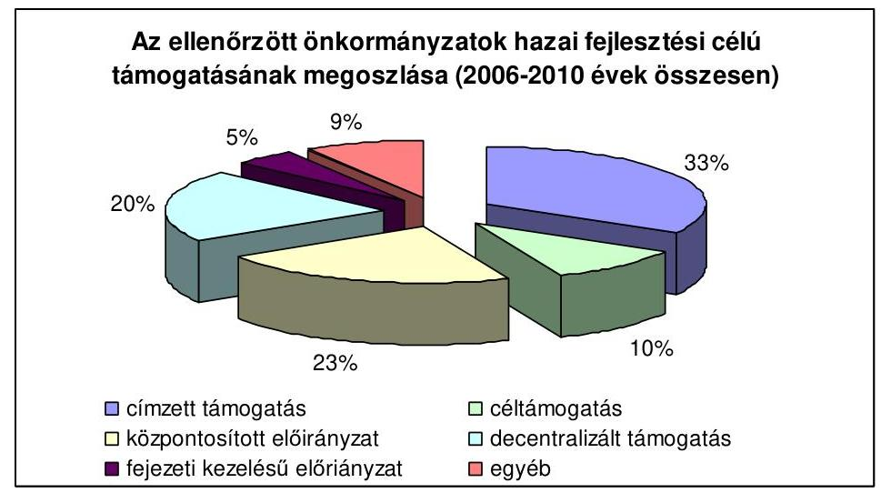

A vizsgált önkormányzatoknál a fenti támogatással a 9,6 milliárd Ft kiadást teljesítettek ${ }^{78}$, a felhasznált hazai fejlesztési célú támogatások átlagos támogatási aránya $68,5 \%$ volt. Az önkormányzatok így egyezer Ft támogatáshoz 460 Ft saját és egyéb forrást mobilizáltak. A vizsgált időszakban jóváhagyott támogatások összege 25 ezer $\mathrm{Ft}^{79}$, és 205632 ezer $\mathrm{Ft}^{80}$ között volt.

Felhasznált saját forrásból 252634 ezer Ft-ot az államháztartáson kívülről átvett pénzeszköz, 100924 ezer Ft-ot a támogatásértékű felhalmozási célú bevétel, 365728 ezer Ft-ot előző évi pénzmaradvány volt.

A felhasznált idegen forrásból 203292 ezer Ft-ot a hitel, 84816 ezer Ft-ot a kötvény, 2013272 ezer Ft-ot az egyéb forrás (helyi adó, személyi jövedelemadó, vagyonhasznosításból származó bevétel, kamatbevétel, egyéb felhalmozási célú bevétel) képviselt.

A vizsgált időszakban az önkormányzatok felhalmozási kiadásainak mintegy egynegyedét $(26,8 \%)$ valósították meg hazai fejlesztési célú

[^0]
[^0]:    ${ }^{77}$ részletezését a 10. számú melléklet tartalmazza
    ${ }^{78}$ Évenkénti bontását és forrásait a 11. számú melléklet tartalmazza.
    ${ }^{79}$ A központosított előirányzatból nyújtott könyvtári és közművelődési érdekeltségnövelő támogatás Jármi község számára
    ${ }^{80}$ címzett támogatás Városi Könyvtár és Szabadidő Központ bővítésére és rekonstrukciójára Ajka város számára

---

támogatással. A felhalmozási kiadások részaránya 2006-2009 között csökkent 14,9\%-ról 7,6\%-ra csökkent (11. számú melléklet).
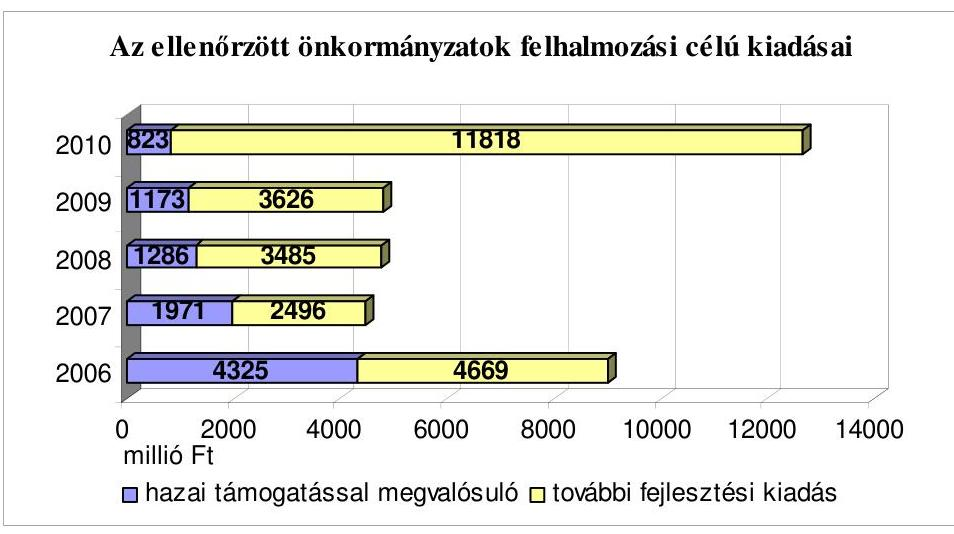

A megvalósított feladatok összhangban voltak az ellenőrzött önkormányzatok koncepcióiban, programjaiban, intézkedési terveiben meghatározott fejlesztési célokkal.

A támogatásokkal megvalósított közoktatási feladatok az érintett önkormányzatok 96,9\%-ánál összhangban voltak a közoktatási intézményhálózat múködtetési és -fejlesztési tervekben meghatározott fejlesztési célokkal. (Csesztreg és Egervár önkormányzatai nem rendelkezetek közoktatási intézményhálózat múködtetési és -fejlesztési tervvel.) A fejlesztési célú támogatásokkal megvalósított szociális feladatok az érintett önkormányzatoknál összhangban voltak a szociális szolgáltatásszervezési koncepciókban, a környezetvédelmi feladatok a környezetvédelmi programokban, a sport feladatok pedig a helyi sportfejlesztési koncepciókban foglalt fejlesztési célkitűzésekkel. A megvalósított fejlesztési feladatok - a gazdasági programmal nem rendelkező Zomba Község Önkormányzata kivételével - összhangban voltak a gazdasági programokban meghatározott fejlesztési célokkal.

A fejlesztések vizsgált önkormányzatok döntő részénél eredményesek voltak, mert 81,3\%-ban a tervezett határidőkre és a műszaki tervekkel azonosan, 87,5\%-ban a pénzügyi terveknek megfelelően valósultak meg és 90,6\%-ban az üzembe helyezését követően a fejlesztéssel megvalósított naturális mutatók a tervezettnek megfelelően alakultak.

Őriszentpéter, Kaposfő, Babócsa, Egervár, Nyírlugos önkormányzatainál és a Csongrád Megyei Önkormányzat, voltak határidőcsúszások és múszaki tervektől eltérések. Bélapátfalva, Őriszentpéter, Ásotthalom önkormányzatai és Csongrád Megyei Önkormányzat pedig a pénzügyi tervektől tértek el a támogatásokkal megvalósított fejlesztések egy részénél.

Őriszentpéteren az IKT eszközökkel rendelkező tantermek aránya és a számítógépet használó tanulók aránya a végrehajtott fejlesztések ellenére a vizsgált időszakban csökkent, mert a 2007. évben az őriszentpéteri iskolához csatolt bajánsenyei iskolában az informatikai ellátottság minimális szinten volt, Cikón a megvalósított informatikai fejlesztések nem eredményeztek mérhető változást a naturális mutatókban, Kaposfőn pedig két útfelújítást a tervezettnél alacsonyabb

---

műszaki tartalommal valósítottak meg, amely a tervezetnél kisebb tényleges naturális mutatókat eredményezett.

A hazai támogatásokkal megvalósított fejlesztések hozzájárultak az önkormányzatok és intézményeik eszközellátottságának, felszereltségének javításához. Korszerúsödtek az intézmények múködésének infrastrukturális feltételei, az intézményi épületek műszaki állapota. Az útfelújítások a komfortosabb, gyorsabb és biztonságosabb közlekedés feltételeinek megteremtése mellett javították a közintézmények megközelíthetőségét is ${ }^{81}$. A vízgazdálkodási ágazatban megvalósított fejlesztések hozzájárultak az ivóvízbázis védelméhez és a szennyvízcsatorna-hálózatba bekapcsolt háztartások számának növekedése révén a települési funkciók korszerűsítéséhez.

Az ellenőrzött önkormányzatok a támogatással megvalósított fejlesztéseinek legfontosabb naturális mutatói a következők:

- Felújítottak $93850 \mathrm{~m}^{2}$ belterületi utat, $7931 \mathrm{~m}^{2}$ járdát, 714 fm vízelvezető árkot, valamint 1417 fm új vízelvezető árkot építettek.
- Létrehoztak $420 \mathrm{~m}^{3} /$ nap szennyvíztisztító kapacitást és $700 \mathrm{~m}^{3} /$ nap ivóvíztermelő kapacitást, megépítettek 20348 fm szennyvízcsatorna-hálózatot, amelyre 750 ingatlan rákötése megtörtént.
- Megépítettek $1090 \mathrm{~m}^{2}$ alapterületi új ingatlant és három bérlakást.
- Felújítottak $13288 \mathrm{~m}^{2}$ alapterületű épületet, $6656 \mathrm{~m}^{2}$ tetőt, $627 \mathrm{~m}^{2}$ felületű homlokzatot, elvégeztek 291 nyílászáró- és 176 radiátor cserét és $541 \mathrm{~m}^{2}$ padlóburkolást.
- A természetes partfalak veszély-elhárítási munkái kertében helyreállítottak $57,5 \mathrm{~m}^{2}$ rézsút és építettek $93 \mathrm{~m}^{2}$ támfalat.
- Vásároltak hét közösségi buszt és öt életmentő készüléket.
- Kialakítottak $17600 \mathrm{~m}^{2}$ alapterületű játszóteret és pihenőparkot, felújítottak $6600 \mathrm{~m}^{2}$ sportpályát.
- Vásároltak az iskolák számára 1356 számítógépet és 1012 IKT tananyagokat tartalmazó szoftvert.

A támogatott fejlesztésekkel a vizsgált önkormányzatok 34,4\%-a biztosította a feladatok magasabb színvonalú ellátását a szociális, gyermekjóléti és gyermekvédelmi ágazatban, $\mathbf{4 6 , 9 \%}$-a végzett a sport ágazatban fejlesztést. A környezetvédelmi követelmények érvényesülése érdekében a környezetvédelemi ágazatban a vizsgált önkormányzatok $\mathbf{6 8 , 8 \%}$-a hajtott végre fejlesztést, $\mathbf{5 3 , 1 \%}$-a valósított meg nyomvonalas fejlesztést (vízelvezető árkok felújítását, útfelújítást, kerékpárút építést, vezetékes ivóvízhálózat kiépítését, szenny-vízcsatorna-hálózat építést). A fejlesztési célú hazai támogatással teljesített ki-

[^0]
[^0]:    ${ }^{81}$ Az útfelújításoknál elsődleges szempont volt az útszakasz tömegközlekedéssel való érintettsége és a közintézmény megközelíthetősége.

---

adások főbb ágazati és támogatási jogcímenkénti bemutatását a 12-14. számú mellékletek tartalmazzák.

A hazai fejlesztési célú támogatásokkal megvalósított fejlesztésekkel javultak a lakosság életkörülményei, életminősége, korszerüsödtek a települési funkciók és ezek által az érintett települések népességmegtartó képessége is erősödött.

A vizsgált önkormányzatok biztosították a támogatással beszerzett eszközök, megvalósított létesítmények rendeltetésüknek megfelelő használatát és az ehhez szükséges múködési kiadásokat. A megvalósított létesítmények kihasználtsága az önkormányzatok 93,8\%-ánál felelt meg a tervezettnek. (Két önkormányzatnál volt a tervezettnél alacsonyabb a létesítmények kihasználtsága.)

Ásotthalmon a csökkenő gyermeklétszám miatt az iskola tervezett kihasználtságát, a lakosság romló anyagi helyzete miatt pedig a strand kihasználtságát, nem tudták biztosítani.

Gödrén, a két településrészen (Gödreszentmártonban és Gödrekeresztúron) kialakított közösségi épületek kihasználtsága maradt a tervezett alatt.

A fejlesztések az ellenőrzött önkormányzatok 43,8\%-ánál (14 önkormányzat) működési többletköltséggel jártak, 53,1\%-ánál (17 önkormányzat) múködési kiadás megtakarítást eredményeztek. A beszerzett eszközök, megvalósított létesítmények rendeltetésüknek megfelelő használatához a múködési kiadásokat megtervezték, a helyszíni vizsgálat időpontjában múködési forráshiány miatt bezárt létesítmény nem volt. A működtetési forrásokat az éves költségvetés három éves gördülő tervezési része tartalmazza. Ezáltal a beszerzett eszközök, megvalósított létesítmények hosszú távú múködtetésének kiadásait figyelembe vették, de az ehhez szükséges bevételek teljesítésének kockázata magas.

A közoktatási célú szakmai és informatikai fejlesztések vizsgálatát azért tartottuk kiemelt területnek, mert az Országos Fejlesztéspolitikai Koncepcióban foglaltak szerint nagy súlyt kell helyezni az oktatási intézmények felszereltségének korszerűsítésére, különös tekintettel az infokommunikációs technológiai eszközöknek az oktatásban való széles körű meghonosítására, az Országos Területfejlesztési Koncepcióban foglaltak szerint pedig a területi prioritások között alapvető cél az oktatás egyenlő esélyű hozzáférhetőségének javítása.

Az ellenőrzött önkormányzatoknál a közoktatás szakmai és informatikai kiadásokhoz 388877 ezer Ft központosított támogatást használtak fel. (15. számú melléklet) A központosított támogatással 2006-2010. között megvalósított fejlesztésekhez - ha szerény összegben (4504 ezer Ft) és mértékben $(1,1 \%)$ - bevontak saját forrást.

A vizsgált önkormányzatok szakmai taneszközökre és informatikai eszközökre központosított támogatással 393381 ezer Ft kiadást teljesítettek, amelyből 209100 ezer Ft-ot (53,2\%) képviseltek a felhalmozási kiadásként elszámolt kifizetések, 184281 ezer Ft-ot (46,8\%) a működési kiadásként elszámolt kifizetések.

---

Szakmai és taneszközökre 89181 ezer Ft-ot (22,7\%), informatikai eszközökre 304200 ezer Ft-ot $(77,3 \%)$ fordítottak. A támogatások felhasználásával az önkormányzatok a felhalmozási kiadásként elszámolható fejlesztésék mellett kis értékű tárgyi eszközként, illetve dologi kiadásként (informatikai eszközök bérleti díja) elszámolható múködési kiadásokat is teljesítettek. A szakmai és taneszközökre fordított kiadásokból 25031 ezer Ft $(28,1 \%)$ felhalmozási kiadásként elszámolt kifizetés, 64150 ezer Ft ( $71,9 \%$ ) pedig múködési kiadásként elszámolt kifizetés volt. Az informatikai eszközökre fordított kiadásokból 184069 ezer Ft-ot (60,5\%) képviseltek a felhalmozási kiadásként elszámolt kifizetések, 120131 ezer Ft-ot $(39,5 \%)$ pedig a múködési kiadásként elszámolt kifizetések.

A közoktatás területén minden ellenőrzött önkormányzat végrehajtott szakmai és informatikai fejlesztéseket, amelyek jelentős mértékben hozzájárultak az oktatásban korszerű technikai eszközök alkalmazásához, javították az oktatási feladatok ellátásának színvonalát.

A fejlesztések eredményeként növekedett az infokommunikációs technológiai (IKT) eszközökkel rendelkező tantermek aránya, a tanári (óvodában nevelői) szobában elhelyezett számítógépek száma, a tanári (óvodában nevelői) szobában elhelyezett, hálózatba kötött internetkapcsolattal ellátott számítógépek száma. A tanulók által használt számítógépekkel felszerelt osztálytermek száma $64,6 \%$-kal emelkedett, az egy számítógépre jutó gyermekek, diákok létszáma $17,2 \%$-kal csökkent (részletezését a 16. számú melléklet tartalmazza).

Az IKT eszközöket a fejlesztések megvalósítói használták, alkalmazásuk javította a közoktatási feladatok ellátásának színvonalát, mert emelkedett az IKT eszközökkel tartott nem számítástechnikai, közismereti órák aránya ( $2,6 \%$-ról $12,6 \%$-ra), az IKT alapú órai mérés-értékelés aránya az összes órai mérés-értékeléshez képest ( $0,7 \%$-ról $2,0 \%$-ra). A foglalkozásokon az IKT eszközöket használó pedagógusok aránya 106,5\%-kal, a számítógépet használó tanulók aránya az iskolákban $64,3 \%$-kal nőtt.

Hosszúhetényben 2006. január 1. és 2009. december 31. között az IKT eszközökkel tartott nem számítástechnikai, informatikai tanítási órák aránya 5\%-ról $25 \%$-ra, a foglalkozásokon, órákon IKT eszközöket használó pedagógusok aránya $5 \%$-ról $30 \%$-ra emelkedett, a számítógépet használó tanulók aránya az iskolában $60 \%$-ról $90 \%$-ra nőtt.

Gödrén a vizsgált időszakban az IKT eszközökkel tartott nem számítástechnikai, informatikai tanítási órák aránya $25 \%$-kal, a foglalkozásokon, órákon IKT eszközöket használó pedagógusok aránya $52 \%$-kal, a számítógépet használó tanulók aránya $45 \%$-kal nőtt az iskolában.

Ajkán 2006. január 1. és 2009. december 31. között az IKT eszközökkel tartott nem számítástechnikai, informatikai tanítási órák aránya csaknem ötszörösére növekedett, a számítógépet használó diákok aránya 13,0\%-ról 35,7\%-ra, a foglalkozásokon, órákon IKT eszközöket használó pedagógusok aránya 11\%-ról $28 \%$-ra nőtt az iskolában.

Ikerváron az iskolában a vizsgált időszakban megkétszereződött az IKT eszközökkel tartott nem számítástechnikai, informatikai tanítási órák és a foglalkozásokon, órákon IKT eszközöket használó pedagógusok aránya.

---

Az önkormányzatok közoktatás területén központosított támogatásokkal végrehajtott szakmai és informatikai fejlesztései eredményesek voltak, mivel a megvalósított feladatok a tervekben, koncepciókban, programokban kitűzött célokkal összhangban voltak, a fejlesztéseket a támoga-tás-igénylésekben szereplő műszaki terveknek megfelelően, a tervezett naturális mutatókkal valósították meg.

Budapest, 2011. június " 14 "

Melléklet: $\quad 22 \mathrm{db}$
Függelék: $\quad 1 \mathrm{db} \quad 8$ lap
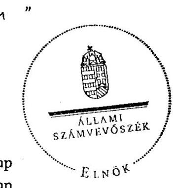

Domokos László

---

# A helyszínen ellenőrzött önkormányzatok, többcélú kistérségi társulások és regionális fejlesztési tanácsok 

| Baranya megye | Sellyei Többcélú Kistérségi Társulás   Szigetvári Többcélú Kistérségi Társulás   Hosszúhetény Község Önkormányzata   Gödre Község Önkormányzata   Nagypeterd Község Önkormányzata   Dél-dunántúli Regionális Fejlesztési   Tanács |
| :--: | :--: |
| Csongrád megye | Ásotthalom Község Önkormányzata   Csongrád Megyei Önkormányzat |
| Heves megye | Bélapátfalva Város Önkormányzata   Füzesabony Város Önkormányzata |
| Jász-Nagykun-Szolnok megye | Tiszakürt Község Önkormányzata |
| Komárom-Esztergom megye | Nyergesújfalu Város Önkormányzata   Tárkány Község Önkormányzata   Szárliget Község Önkormányzata |
| Nógrád megye | Nógrádmegyer Község Önkormányzata |
| Somogy megye | Marcali Város Önkormányzata   Barcsi Többcélú Kistérségi Társulás   Kaposfő Község Önkormányzata   Babócsa Község Önkormányzata |
| Szabolcs-Szatmár-Bereg megye | Hodász Nagyközség Önkormányzata   Jármi Község Önkormányzata   Nyírlugos Város Önkormányzata   Vaja Város Önkormányzata |
| Tolna megye | Simontornya Város Önkormányzata   Cikó Község Önkormányzata   Zomba Község Önkormányzata   Kaposszekcső Község Önkormányzata |
| Vas megye | Bő Község Önkormányzata   Őriszentpéter Város Önkormányzata   Nyugat-dunántúli Regionális Fejlesztési   Tanács   Ikervár Község Önkormányzata |
| Veszprém megye | Ajka Város Önkormányzata |
| Zala megye | Csesztreg Község Önkormányzata   Egervár Község Önkormányzata |

---

Az országos koncepciókban, programokban és a hazai fejlesztési célú támogatásokban meghatározott célok rendszere

|  Támogatási jogcímek | Országos Fejlesztési Koncepció |  |  |  | Országos Területfejlesztési Koncepció |  |  |  |  |  | Nemzeti Környezetvédelmi Program |  |  |  | Nemzeti Sportstratégia  |
| --- | --- | --- | --- | --- | --- | --- | --- | --- | --- | --- | --- | --- | --- | --- | --- |
|   | Fizikai elérhetőség javítása | Befektetés az emberbe | Befektetés a környezetbe | A versenyképes tudás és műveltség növekedése | Térségi versenyképesség | Területi felzárkóztatás | Területi prioritások az oktatáspolitikában | Területi prioritások a szociálpolitikában | Területi prioritások az egészségpolitikában | Területi prioritások a kulturálispolitikában | Fenntartható térségfejlődés | Térségi versenyképesség | Vizeink védelme és fenntartható használata | Hulladékgazdálkodási akcióprogram | A szabadidősport fejlesztése  |
|   |  |  |  |  |  |  |  |  |  |  |  |  |  |  |   |
|   |  |  |  |  |  |  | Címzett támogatás |  |  |  |  |  |  |  |   |
|  > a szociális önkormányzati feladatok ellátását szolgáló, a céltámogatási körben nem támogatható, kiemelt fontosságú, 250 millió forint feletti összköltségű önkormányzati beruházások |  | X |  |  |  |  |  | X |  |  |  |  |  |  |   |
|  > a közoktatási önkormányzati feladatok ellátását szolgáló, a céltámogatási körben nem támogatható, kiemelt fontosságú, 250 millió forint feletti összköltségű önkormányzati beruházások |  | X |  | X |  |  | X |  |  |  |  |  |  |  |   |
|  > az egészségügyi önkormányzati feladatok ellátását szolgáló, a céltámogatási körben nem támogatható, kiemelt fontosságú, 250 millió forint feletti összköltségű önkormányzati beruházások |  | X |  |  |  |  |  |  | X |  |  |  |  |  |   |
|  > a kulturális önkormányzati feladatok ellátását szolgáló, a céltámogatási körben nem támogatható, kiemelt fontosságú, 250 millió forint feletti összköltségű önkormányzati beruházások |  | X |  | X |  |  |  |  |  | X |  |  |  |  |   |
|  > a vízgazdálkodási önkormányzati feladatok ellátását szolgáló, a céltámogatási körben nem támogatható, kiemelt fontosságú, 250 millió forint feletti összköltségű önkormányzati beruházások |  |  | X |  |  |  |  |  |  |  | X |  | X |  |   |

---

|  > a szennyvízelvezetést és -tisztítást szolgáló 1 milliárd forint feletti összköltségű beruházások |  |  | X |  |  |  |  |  |  |  | X |  | X | X |   |
| --- | --- | --- | --- | --- | --- | --- | --- | --- | --- | --- | --- | --- | --- | --- | --- |
|   |  |  |  |  |  |  |  |  |  | Céltámogatás |  |  |  |  |   |
|  > a működő kórházak és szakrendelők gép-műszer beszerzései (képalkotó-diagnosztikai berendezések, onkológiai ellátást biztosító sugárterápiás eszközök, gépek aneszteziológiai-intenzív terápiás-sürgősségi eszközök beszerzése). |  |  |  |  |  |  |  |  |  |  |  |  |  |  |   |
|  >a szennyvízelvezetés és tisztítás (ezen belül szennyvízközmű beruhá-zás keretében szennyvíztisztító telep, valamint a szennyvízcsatorna-hálózat együttes megvalósítása, szennyvíztisztító-telep építése, települési folyékony hulladék tisztítótelep építése, szennyvízcsatorna-hálózat építése) |  |  |  |  |  |  |  |  |  |  |  |  |  |  |   |
|   |  |  |  |  |  |  |  |  |  | Központosított támogatások |  |  |  |  |   |
|  > belterületi utak szilárd burkolattal való ellátása | X |  |  |  |  | X |  |  |  |  |  |  |  |  |   |
|  > települési önkormányzati szilárd burkolatú belterületi közutak burkolatfelújítása | X |  |  |  |  | X |  |  |  |  |  |  |  |  |   |
|  > kistelepülési általános iskolák és körjegyzőségek tárgyi feltételeinek javítása |  | X |  | X |  | X | X |  |  |  |  |  |  |  |   |
|  > a közoktatási intézményekben meglévő berendezések, felszerelések, taneszközök korszerűsítése, működtetéssel összefüggő beszerzések |  | X |  | X |  |  | X |  |  |  |  |  |  |  |   |
|  > a közoktatási informatikai fejlesztések |  | X |  | X |  |  | X |  |  |  |  |  |  |  |   |
|  > a bölcsődék infrastrukturális fejlesztése |  | X |  |  |  |  |  | X |  |  |  |  |  |  |   |
|  > az önkormányzati könyvtári, közművelődési és múzeumi szakmai feladatok fejlesztése |  | X |  | X |  |  |  |  |  | X |  |  |  |  |   |
|  > belterületi belvízrendezés |  |  |  |  |  |  |  |  |  |  |  |  | X |  |   |
|  > közösségi busz beszerzésének támogatása | X |  |  |  |  |  | X |  |  |  |  |  |  |  |   |
|  > a pincerendszerek, természetes partfalak és földcsuszamlások veszély-elhárítási munkálatai |  |  | X |  |  |  |  |  |  |  |  |  |  |  |   |
|  > a sportpályák felújítása |  |  |  |  |  | X |  |  |  |  |  |  |  |  | X  |
|  > a sportlétesítmények felújítása |  |  |  |  |  |  |  |  |  |  |  |  |  |  | X  |
|  Decentralizált területfejlesztési támogatások |  |  |  |  |  |  |  |  |  |  |  |  |  |  |   |

---

|   | CÉDE |  |  |  |  |  |  |  |  |  |  |  |  |  |  |  |   |
| --- | --- | --- | --- | --- | --- | --- | --- | --- | --- | --- | --- | --- | --- | --- | --- | --- | --- |
|  > oktatási intézmények építése, bővítése, felújítása |  | X |  | X |  |  | X |  |  |  |  |  |  |  |  |  |   |
|  > egészségügyi intézmények építése, bővítése, felújítása |  | X |  |  |  |  |  |  | X |  |  |  |  |  |  |  |   |
|  > szociális intézmények építése, bővítése, felújítása |  | X |  |  |  |  |  | X |  |  |  |  |  |  |  |  |   |
|  > kulturális intézmények építése, bővítése, felújítása |  | X |  | X |  |  |  |  |  | X |  |  |  |  |  |  |   |
|  > közút, járda építése | X |  |  |  |  | X |  |  |  |  |  |  |  |  |  |  |   |
|  > villamoshálózat, közvilágítás |  |  |  |  | X | X |  |  |  |  |  | X |  |  |  |  |   |
|  > vízrendezés |  |  |  |  |  |  |  |  |  |  |  |  | X |  |  |  |   |
|  > Önkormányzatok működtetése |  |  |  |  | X | X |  |  |  |  |  | X |  |  |  |  |   |
|  > egyéb célokra |  |  |  |  | X | X |  |  |  |  |  | X |  |  |  | X |   |
|  > a címzett és céltámogatással megvalósuló fejlesztésekhez |  |  |  |  |  |  | X | X | X |  |  |  |  |  |  |  |   |
|  > az 5000-25 000 fő állandó lakosságszámú településeken zöldterületek rekreációs célú megújítása (pihenőpark, sport, szabadidős célú terület) |  |  |  |  |  |  |  |  |  |  | X |  |  |  |  |  | X  |
|  > tájsebek és természeti értékeket károsító jelenségek kiküszöbölése és megszüntetése |  |  | X |  |  |  |  |  |  |  |  |  | X |  |  |  |   |
|  > pincék, természetes partfalak és földcsuszamlások megelőző jellegű veszélyelhárítása |  |  | X |  |  |  |  |  |  |  |  |  |  |  |  |  |   |
|  > köztéri játszóterek bővítése, felújítása |  |  |  |  |  | X |  |  |  |  |  |  |  |  |  |  | X  |
|  > a helyi önkormányzati feladatellátás színvonalának javítását eredményező fejlesztések |  |  |  |  |  | X | X | X | X | X |  |  |  |  |  |  |   |
|  > a csapadékvizek által okozott terhelések csökkentése érdekében szűrőmezők, vízminőségvédelmi tározók, hordalékfogó műtárgyak építése |  |  | X |  |  |  |  |  |  |  |  |  |  | X |  |  |   |
|  > helyi önkormányzatok alapfeladatainak ellátásához kapcsolódó egészségügyi infrastruktúra fejlesztés |  |  |  |  |  |  |  |  | X |  |  |  |  |  |  |  |   |
|  > országos védelem alatt álló veszélyeztetett építmények fejlesztéssel történő megőrzése önkormányzati funkció ellátása esetén |  |  | X |  |  |  |  |  |  |  |  |  |  |  |  |  |   |
|  > önkormányzati fejlesztésekhez kapcsolódó közcélú foglalkoztatás anyag- és eszközbeszerzése |  | X | X |  |  |  |  |  |  |  |  |  |  |  |  |  |   |
|  > kül-, és belterületen keletkező csapadékvizek szabályozott elvezetése |  |  |  |  |  |  |  |  |  |  |  |  |  | X |  |  |   |

---

|  > humán infrastruktúra fejlesztése, beleértve az automata lélegeztetővel ellátott életmentő készülékek beszerzése |  |  |  |  |  |  |  |  |  |  |  |  |  |  |  |  |   |
| --- | --- | --- | --- | --- | --- | --- | --- | --- | --- | --- | --- | --- | --- | --- | --- | --- | --- |
|   |  |  |  |  |  |  |  |  |  |  |  |  |  |  |  |  | TEKI  |
|  > a településeken vagy azok egyes területein - kiemelten a kedvezőtlen telepszerű lakókörzetekben - a termelő infrastrukturális beruházások |  |  |  |  |  |  |  |  |  |  |  |  |  |  |  |  |   |
|  > a felszíni vízelvezető rendszerek fejlesztése |  |  |  |  |  |  |  |  |  |  |  |  |  |  |  |  | X  |
|  > az ipari területek előkészítésének beruházásai |  |  |  |  |  |  |  |  |  |  |  |  |  |  |  |  |   |
|  > a címzett és céltámogatással megvalósuló fejlesztések |  |  |  |  |  |  |  |  |  |  |  |  |  |  |  |  |   |
|  > az önkormányzati tulajdonú kötelező feladatot ellátó intézmények fejlesztései |  |  |  |  |  |  |  |  |  |  |  |  |  |  |  |  |   |
|  > közfürdők korszerűsítése (műemlék és nem műemlék) |  |  |  |  |  |  |  |  |  |  |  |  |  |  |  |  |   |
|  > a turizmus, a környezet- és a természetvédelem, a sporttevékenység gyakorlása infrastrukturális feltételrendszerének megteremtése, valamint a szociális foglalkoztatáshoz kapcsolódó önkormányzati fejlesztések |  |  |  |  |  |  |  |  |  |  |  |  |  |  |  |  |   |
|  > településrendezési eszközök, ideértve a településfejlesztési koncepciók, települési környezetvédelmi programok és területrendezési tervek elkészítése és azok módosítása |  |  |  |  |  |  |  |  |  |  |  |  |  |  |  |  | X  |
|  > közterületek akadálymentesítése a ROP városi rangú településeinek akcióterületein kívül, illetve községekben |  |  |  |  |  |  |  |  |  |  |  |  |  |  |  |  |   |
|  > nem műemlék jellegű közfürdők korszerűsítése |  |  |  |  |  |  |  |  |  |  |  |  |  |  |  |  |   |
|  > középületek megvilágítása |  |  |  |  |  |  |  |  |  |  |  |  |  |  |  |  |   |
|  > közterületi ivókutak létrehozása, meglévők rekonstrukciója |  |  |  |  |  |  |  |  |  |  |  |  |  |  |  |  |   |
|  > önkormányzati tulajdonban lévő közterületi illemhelyek kialakítása és felújítása |  |  |  |  |  |  |  |  |  |  |  |  |  |  |  |  |   |
|  > tájékoztatást elősegítő információs rendszerek fejlesztése (különösen utcanévtáblák, információs táblák, útbaigazító táblák, térképek) |  |  |  |  |  |  |  |  |  |  |  |  |  |  |  |  |   |
|  > zajvédő gátak, falak, fasorok kialakítása |  |  |  |  |  |  |  |  |  |  |  |  |  |  |  |  |   |

---

|  > közbiztonságot szolgáló fejlesztések megvalósítása a közlekedésbiztonság és a bűnmegelőzés területén |  |  | X |  |  | X |  |  |  |  |  |  |  |  |   |
| --- | --- | --- | --- | --- | --- | --- | --- | --- | --- | --- | --- | --- | --- | --- | --- |
|  > települési önkormányzatok törzsvagyonába tartozó külterületi - kapacitást nem növelő - szilárdburkolatú utak felújítása | X |  |  |  |  |  |  |  |  |  |  |  |  |  |   |
|  > közvilágítás energiatakarékos megoldása (pl. hiányzó közvilágítás kiépítése, meglévő korszerűsítése) |  |  | X |  |  |  |  |  |  |  |  |  |  |  |   |
|  > tájjelegű hagyományokat és kulturális örökséget jelentő épületek és műemlékek megőrzése, bemutathatóvá tétele, a közösség szempontjából értékes funkciókkal történő megtöltése |  | X |  | X |  | X |  |  |  | X |  |  |  |  |   |
|  > településfejlesztéssel összefüggő, a régió pályázati felhívásában meghatározott fejlesztési célok, amelyek igazolható módon európai uniós forrásból támogatásban nem részesülhetnek |  | X | X |  |  |  |  |  |  |  |  |  |  |  |   |
|  > közterületek akadálymentesítése | X |  |  |  |  |  |  | X |  |  |  |  |  |  |   |
|  > közfürdők korszerűsítése |  |  | X |  |  | X |  |  |  |  |  |  |  |  |   |
|  > életmentő készülékek beszerzése |  |  |  |  |  |  |  |  | X |  |  |  |  |  |   |
|  > önkormányzati fejlesztésekhez kapcsolódó közcélú foglalkoztatás anyag- és eszközbeszerzése |  | X |  |  |  |  |  |  |  |  |  |  |  |  |   |
|   |  |  |  |  |  |  |  | LEKI |  |  |  |  |  |  |   |
|  > a helyi önkormányzatok alapfeladatainak ellátása között meglévő színvonalbeli különbségek csökkentése érdekében, a bel- és külterületen megvalósuló humán, illetve termelő infrastruktúra fejlesztések |  |  |  |  | X | X | X | X | X | X |  |  |  |  |   |
|  > a kistérségben élők életminőségének javítása érdekében a humán infrastruktúra fejlesztések |  | X |  | X |  | X | X | X | X | X |  |  |  |  |   |
|  > kedvezőtlen telepszerű lakókörzetekben a termelő infrastrukturális beruházások |  |  |  |  | X | X |  | X |  |  |  | X |  |  |   |
|  > az önkormányzati tulajdonú középületek akadálymentesítését szolgáló beruházások | X |  |  |  |  |  |  | X |  |  |  |  |  |  |   |
|  > életmentő készülékek beszerzését szolgáló beruházások |  |  |  |  |  | X |  |  |  |  |  |  |  |  |   |
|  > a falugondnoki hálózat fejlesztését szolgáló beruházások |  |  |  |  |  | X |  | X |  |  |  |  |  |  |   |

---

|  > a tanyagondnoki hálózat fejlesztését szolgáló beruházások |  |  |  |  |  | X |  | X |  |  |  |  |  |  |   |
| --- | --- | --- | --- | --- | --- | --- | --- | --- | --- | --- | --- | --- | --- | --- | --- |
|  > a közösségi terek kialakítását szolgáló fejlesztések |  | X |  | X |  | X |  |  |  |  |  |  |  |  |   |
|  > innovációs központ vagy ipari terület kialakítását szolgáló beruházások |  |  |  |  | X | X |  |  |  |  |  | X |  |  |   |
|  > a közműves ivóvíz-ellátás fejlesztésére, meglévő létesítmények rekonstrukciójára az ivóvíz minőségi követelményeiről és az ellenőrzés rendjéről szóló 201/2001. (X. 25.) Korm. rendelet 6. számú mellékletében nem szereplő, illetve ivóvízminőségjavítási fejlesztésre nem kötelezett települések esetében |  |  |  |  |  |  |  |  |  |  |  |  |  |  |   |
|  > a turizmus, a környezet- és a természetvédelem, a sporttevékenység gyakorlása infrastrukturális feltételrendszerének megteremtése, valamint a szociális foglalkoztatáshoz kapcsolódó önkormányzati fejlesztések |  |  |  |  |  | X | X |  |  |  |  |  | X |  |   |
|  > a helyi piacok, vásárcsarnokok fejlesztése, bővítése |  |  |  |  |  | X |  |  |  |  |  |  |  |  |   |
|  > a teleházak kialakítását szolgáló fejlesztések |  | X | X |  |  |  |  |  |  | X |  |  |  |  |   |
|  > a helyi gazdaságfejlesztéssel összefüggő, a régió pályázati felhívásában meghatározott fejlesztési célokra, amelyek igazolható módon európai uniós forrásból támogatásban nem részesülhetnek |  |  |  |  | X |  |  | X |  |  |  | X |  |  |   |
|  > korszerű információ-technológiával felszerelt közösségi hozzáférési pontok kialakítását szolgáló fejlesztések |  | X |  | X |  |  |  |  |  | X |  |  |  |  |   |
|  > szociális földprogram megvalósítása, a program keretében megtermelt termékek piacra jutásához kapcsolódó fejlesztési költségeket is beleértve |  |  |  |  | X |  |  | X |  |  |  |  |  |  |   |
|  > egészségfejlesztéshez kapcsolódó infrastrukturális fejlesztések |  |  |  |  |  |  |  |  | X |  |  |  |  |  |   |
|  > önkormányzati fejlesztésekhez kapcsolódó közcélú foglalkoztatás anyag- és eszközbeszerzése |  |  |  |  |  |  |  |  |  |  |  |  |  |  |   |
|   |  |  |  |  |  |  |  |  | TEHU |  |  |  |  |  |   |
|  > helyben történő szelektív gyűjtéshez szükséges edényzet, hulladékgyűjtő zsák beszerzése |  |  |  |  |  |  |  |  |  |  | X |  |  | X |   |

---

|  > házi komposztálást segítő speciális eszközök beszerzése |  |  |  |  |  |  |  |  |  |  | X |  |  | X |   |
| --- | --- | --- | --- | --- | --- | --- | --- | --- | --- | --- | --- | --- | --- | --- | --- |
|  > szennyvíztisztító telepen települési folyékony hulladékot befogadó műtárgy létesítése |  |  |  |  |  |  |  |  |  |  | X |  |  | X |   |
|  > szelektív hulladékgyűjtő, -szállító jármű beszerzése |  |  |  |  |  |  |  |  |  |  | X |  |  | X |   |
|  > települési folyékonyhulladék-szippantó, -szállító céljármű beszerzése |  |  |  |  |  |  |  |  |  |  | X |  |  | X |   |
|  > a településen nem csatornázott (hatósági igazolással alátámasztottan gyűjtővezetékkel el nem látott), lakossági és önkormányzati költségvetési szerveknél keletkező, a kommunálishoz hasonló összetételű folyékony hulladék kezelésének fejlesztése és a közszolgáltatásba való bevonása |  |  |  |  |  |  |  |  |  |  |  |  |  |  |   |
|  > a korszerű hulladéklerakási követelményeket ki nem elégítő hulladéklerakó rekultivációs kiviteli tervének elkészítése, illetve ha a hulladéklerakó teljes körű környezetvédelmi felülvizsgálata nem történt meg, akkor a rekultivációs terv és az annak alapjául szolgáló felülvizsgálati dokumentáció együttes elkészítése |  |  |  |  |  |  |  |  |  |  |  |  |  | X |   |
|   |  |  |  |  |  |  |  |  |  |  |  |  |  |  |   |
|   |  |  |  |  |  |  |  |  |  |  |  |  |  |  | TEUT  |
|  > a települési önkormányzatok törzsvagyonába tartozó belterületi - kapacitást nem növelő - szilárd burkolatú kőzutak felújításának támogatása olyan esetekben, amikor az út vízelvezetése megoldott, vagy azt a tervezett burkolatfelújítással egyidejűleg az önkormányzat - saját forrásból - megoldja | X |  |  |  |  |  |  |  |  |  |  |  |  |  |   |
|  > a települési önkormányzatok törzsvagyonába tartozó belterületi - kapacitást nem növelő - szilárd burkolatú kőzutak felújításának, korszerűsítésének támogatása | X |  |  |  |  |  |  |  |  |  |  |  |  |  |   |
|   |  |  |  |  |  |  |  |  |  |  |  |  |  |  | TRFC  |
|  > munkahelyteremtő beruházások |  |  |  |  | X |  |  |  |  |  |  |  | X |  |   |
|  > a kistérségek elérhetőségét és a kistérségen belüli közlekedési kapcsolatokat javító közútfejlesztések |  |  |  |  |  |  |  |  |  |  |  |  |  |  |   |
|  > termelő infrastruktúra fejlesztése |  |  |  |  | X |  |  |  |  |  |  |  | X |  |   |

---

|  > humán infrastruktúra fejlesztése - beleértve az automata lélegeztetővel ellátott életmentő készülékek beszerzését - különös tekintettel a gazdaságfejlesztéssel összefüggő beruházásokra |  |  |  |  |  |  |  |  |  |  |  |  |  |   |
| --- | --- | --- | --- | --- | --- | --- | --- | --- | --- | --- | --- | --- | --- | --- |
|  > turisztikai beruházások |  |  |  |  | X | X |  |  |  |  |  | X |  |   |
|  > turisztikai vonzerővel bíró rendezvények |  |  |  |  | X | X |  |  |  |  |  | X |  |   |
|  > idegenforgalmi fejlesztések |  |  |  |  | X |  |  |  |  |  |  | X |  |   |
|  > autópálya-építést segítő közmunkaprogramok támogatása |  | X |  |  |  |  |  |  |  |  |  | X |  |   |
|  > nemzeti parkok közmunkaprogramok támogatása |  | X |  |  |  |  |  |  |  |  |  |  |  |   |
|  > köztisztviselők és pedagógusok internet- hozzáférésének támogatása |  | X |  | X |  |  |  |  |  |  |  |  |  |   |
|  > háromszoros esélyteremtés a szociális ellátórendszer fejlesztése program támogatása |  |  |  |  |  |  |  | X |  |  |  |  |  |   |
|  > belterületi kiépítetlen közúthálózat fejlesztése | X |  |  |  |  | X |  |  |  |  |  |  |  |   |
|  > kerékpárutak fejlesztése | X |  |  |  |  | X |  |  |  |  |  |  |  |   |
|  > Vásárhelyi-terv továbbfejlesztése |  |  |  |  |  |  |  |  |  |  |  | X |  |   |
|  > közérdekű önkéntes munkavégzés keretében megvalósuló, településképet javító tevékenységekhez |  | X |  |  |  |  |  |  |  |  |  |  |  |   |
|  > hátrányos vagy leghátrányosabb helyzetű térségben, regionális szempontból hátrányos helyzetű kistérségben megvalósuló helyi és térségi közmunkaprogramokhoz |  | X |  |  |  | X |  |  |  |  |  |  |  |   |
|  > a leghátrányosabb helyzetű térségekben megvalósuló szociális földprogramok |  |  |  |  |  | X |  | X |  |  |  |  |  |   |
|  > komplex szolgáltatást nyújtó ifjúsági irodák - beleértve iskolán kívüli tevékenységeknek helyt adó közösségi tereket - kialakítása, infrastrukturális fejlesztése, eszközeinek beszerzése |  |  |  | X |  | X |  |  |  | X |  |  |  |   |
|  > a leghátrányosabb helyzetű térségekben működő települési önkormányzatok számára, a tulajdonukban lévő, új, eladásra szánt belterületi lakótelkek előközművesítése, valamint szolgálati lakások különösen háziorvosi és védőnői szolgálati lakások - felépítése, kialakítása, felújítása |  |  |  |  | X | X |  |  |  |  |  |  |  |   |

---

> térségi együttműködésen alapuló, és az idegenforgalmi szezonalitást mérséklő rendezvények megszervezése

---

A helyi önkormányzatok fejlesztési feladataihoz rendelkezésre álló hazai támogatások a 2006-2010. években

|   |  |  |  |  |  |  | millió Ft  |
| --- | --- | --- | --- | --- | --- | --- | --- |
|  Források megnevezése | 2006. | 2007. | 2008. | 2009. | 2010. | Összesen | Megoszlás
$\%$  |
|   | 1. | 2. | 3. | 4. | 5. | 6. | 7.  |
|  1. | Címzett és céltámogatások | 63800 | 57500 | 53000 | 10000 | 950 | 185250  |
|  2. | Központosított előirányzatok | 9870 | 9710 | 13810 | 12560 | 9110 | 55060  |
|  3. | Fejezeti kezelésű előirányzatok | 3825 | 16145 | 9965 | 669 | 396 | 31000  |
|  4. | Decentralizált területfejlesztési források | 43268 | 23870 | 25977 | 24020 | 0 | 117135  |
|  5. | ebből: CÉDE | 3246 | 5035 | 5035 | 5085 | 0 | 18401  |
|  6. | TEKI | 6848 | 5035 | 5035 | 5085 | 0 | 22003  |
|  7. | LEKI | 9000 | 5800 | 5800 | 5850 | 0 | 26450  |
|  8. | TEHU | 750 | 0 | 0 | 0 | 0 | 750  |
|  9. | TEUT | 8000 | 8000 | 8000 | 8000 | 0 | 32000  |
|  10. | TRFC | 15424 | 0 | 2107 | 0 | 0 | 17531  |
|  11. | Összesen | 120763 | 107225 | 102752 | 47249 | 10456 | 388445  |

---

Az önkormányzatok feladataihoz megítélt hazai fejlesztési támogatások 2006-2010 években

|  Támogatások megnevezése |  | Közoktatás | Egészségügy | Szociális ellátás | Köz-
művelődés | Sport | Út, kerékpárút, járda | Viz- gazdálkodás | Települési hulladék | Egyéb | Összesen | Megoszlás $\%$  |
| --- | --- | --- | --- | --- | --- | --- | --- | --- | --- | --- | --- | --- |
|   |  | 1. | 2. | 3. | 4. | 5. | 6. | 7. | 8. | 9. | 10. | 11.  |
|  1. | Címzett támogatás | 15895 | 10383 | 6062 | 7182 | 0 | 0 | 10798 | 0 | 0 | 50320 | 20,2  |
|  2. | Céltámogatás | 0 | 1429 | 0 | 0 | 0 | 0 | 11528 | 0 | 0 | 12957 | 5,2  |
|  3. | Központosított előirányzat | 33581 | 0 | 990 | 4011 | 742 | 9234 | 2344 | 0 | 3215 | 54117 | 21,7  |
|  4. | Fejezeti kezelésű előirányzat | 3788 | 2540 | 3267 | 2982 | 1532 | 10356 | 5234 | 0 | 1301 | 31000 | 12,5  |
|  5. | Decentralizált támogatás | 12411 | 3183 | 4965 | 6958 | 1400 | 45046 | 10679 | 730 | 15219 | 100591 | 40,4  |
|  6. | Ebből: CÉDE | 2995 | 594 | 490 | 1898 | 176 | 3541 | 1017 | 0 | 3651 | 14362 |   |
|  7. | TEKI | 1588 | 377 | 465 | 1378 | 53 | 5821 | 1028 | 0 | 3791 | 14501 |   |
|  8. | LEKI | 5262 | 1424 | 2781 | 2815 | 1089 | 6839 | 2119 | 0 | 3826 | 26155 |   |
|  9. | TEHU | 0 | 0 | 0 | 0 | 0 | 0 | 0 | 730 | 0 | 730 |   |
|  10. | TEUT | 0 | 0 | 0 | 0 | 0 | 27312 | 0 | 0 | 0 | 27312 |   |
|  11. | TRFC | 2566 | 788 | 1229 | 867 | 82 | 1533 | 6515 | 0 | 3951 | 17531 |   |
|  12. | Összesen | 65675 | 17535 | 15284 | 21133 | 3674 | 64636 | 40583 | 730 | 19735 | 248985 | 100  |

---

5. számú melléklet a V-3015-120/2010. számú jelentéshez

# Hazai költségvetési forrásból megítélt támogatások száma a 2006-2010. években

|  Támogatás fajta megnevezése | 2006. | 2007. | 2008. | 2009. | 2010. | Összesen | Megoszlás \% | Decentralizált támogatások megoszlása \% | Éves átlag  |
| --- | --- | --- | --- | --- | --- | --- | --- | --- | --- |
|   | 1. | 2. | 3. | 4. | 5. | 6. | 7. | 8. | 9.  |
|  1. Címzett támogatás | 75 | 0 | 0 | 0 | 0 | 75 | 0,2 |  | 75  |
|  2. Céltámogatás | 68 | 9 | 6 | 4 | 2 | 89 | 0,3 |  |   |
|  3. Központosított támogatások | 3660 | 3215 | 3405 | 3070 | 2876 | 16226 | 51,9 |  | 3245  |
|  4. Fejezeti kezelésű támogatások | 314 | 344 | 248 | 42 | 21 | 969 | 3,1 |  | 194  |
|  5. Decentralizált támogatások összesen | 4480 | 2603 | 3492 | 3337 | 0 | 13912 | 44,5 | 100 | 3478  |
|  6. CÉDE | 556 | 774 | 950 | 1004 | 0 | 3284 |  | 23,6 | 821  |
|  7. LEKI | 844 | 685 | 649 | 635 | 0 | 2813 |  | 20,2 | 703  |
|  8. TEKI | 950 | 384 | 742 | 849 | 0 | 2925 |  | 21 | 731  |
|  9. TEHU | 195 | 0 | 0 | 0 | 0 | 195 |  | 1,4 | 195  |
|  10. TEUT | 1200 | 760 | 899 | 849 | 0 | 3708 |  | 26,7 | 927  |
|  11. Összesen (6+...+10) | 3745 | 2603 | 3240 | 3337 | 0 | 12925 |  |  | 3231  |
|  12. TRFC | 735 | 0 | 252 | 0 | 0 | 987 |  | 7,1 | 494  |
|  13. ÖSSZESEN (1+..+5) | 8597 | 6171 | 7151 | 6453 | 2899 | 31271 | 100 | 100 | 6254  |

---

A 2006. évi új induló beruházások címzett támogatása

|  Megnevezés |  | Beruházás összes költsége | Saját forrás | Támogatás | Atlagos támogatási arány | 2006. évi ütem | 2007. évi ütem | 2008. évi ütem | Támogatott beruházások száma | Elutasított beruházások száma | Fedezet hiány miatt elutasított | Elutasított támogatási igény millió Ft  |
| --- | --- | --- | --- | --- | --- | --- | --- | --- | --- | --- | --- | --- |
|   |  |  |  |  | \% |  |  |  |  |  |  |   |
|   |  | 1. | 2. | 3. | 4. | 5. | 6. | 7. | 8. | 9. | 10. | 11.  |
|  1. | Egészségügy | 12113 | 1730 | 10383 | 85,7 | 828 | 5012 | 4543 | 13 | 29 | 29 | 47341  |
|  2. | Kultúra | 8490 | 1308 | 7182 | 84,6 | 580 | 3444 | 3158 | 12 | 31 | 31 | 35472  |
|  3. | Oktatás | 21510 | 5615 | 15895 | 73,9 | 1210 | 7660 | 7025 | 30 | 84 | 84 | 57303  |
|  4. | Szociális ellátás | 6900 | 839 | 6062 | 87,9 | 486 | 3051 | 2525 | 6 | 27 | 27 | 17457  |
|  5. | Vízgazdálkodás | 15425 | 4627 | 10798 | 70 | 1005 | 5093 | 4700 | 14 | 73 | 73 | 83893  |
|  6. | ebből: |  |  |  |  |  |  |  |  |  |  |   |
|  7. | belterületi vízrendezés | 4708 | 689 | 4019 | 85,4 | 404 | 18645 | 1751 | 6 |  |  |   |
|  8. | vízellátás | 1428 | 266 | 1162 | 81,4 | 108 | 551 | 503 | 2 |  |  |   |
|  9. | vízminőség javítás | 735 | 147 | 588 | 80 | 60 | 276 | 252 | 1 |  |  |   |
|  10. | szennyvízberuházások | 8553 | 3525 | 5028 | 58,8 | 433 | 2401 | 2194 | 5 |  |  |   |
|  11. | Egyéb | 0 | 0 | 0 | 0 | 0 | 0 | 0 | 0 | 2 | 0 | 930  |
|  12. | Összesen | 64438 | 14119 | 50320 | 78,1 | 4109 | 24260 | 21951 | 75 | 246 | 244 | 242396  |

---

Igényelt és megítélt céltámogatások a 2006-2010. években

|  Támogatott feladat | Támogatási igények száma | Megítélt támogatások száma | Támogatási távszáza | Átlagos támogatási arány | Távszáza | Beruházási összköltség | Céltámogatás összegének éves ütemezése |  |  |  |  |  |   |
| --- | --- | --- | --- | --- | --- | --- | --- | --- | --- | --- | --- | --- | --- |
|   |  |  |  |  |  |  | 2006. | 2007. | 2008. | 2009. | 2010. | 2011. |   |
|   | db | db | millió Ft | \% | millió Ft | millió Ft | millió Ft | millió Ft | millió Ft | millió Ft | millió Ft | millió Ft |   |
|   | 1. | 2. | 3. | 4. | 5. | 6. | 7. | 8. | 9. | 10. | 11. | 12. |   |
|  1. | 2006 |  |  |  |  |  |  |  |  |  |  |  |   |
|  2. | Szennyvíz-elvezetés és tisztítás | 114 | 45 | 11260 | 76,3 | 3495 | 14755 | 3618 | 5399 | 2243 | 0 | 0 | 0  |
|  3. | Egészségügyi gépműszer beszerzés | 25 | 23 | 973 | 59,7 | 659 | 1631 | 560 | 370 | 43 | 0 | 0 | 0  |
|  4. | 2006. év összesen | 139 | 68 | 12233 |  | 4154 | 16386 | 4178 | 5769 | 2286 | 0 | 0 | 0  |
|  5. | 2007 |  |  |  |  |  |  |  |  |  |  |  |   |
|  6. | Szennyvíz-elvezetés és tisztítás | 13 | 6 | 268 | 70,2 | 114 | 382 | 0 | 95 | 123 | 50 | 0 | 0  |
|  7. | Egészségügyi gépműszer beszerzés | 3 | 3 | 100 | 57,1 | 75 | 175 | 0 | 35 | 47 | 17 | 0 | 0  |
|  8. | 2007. év összesen | 16 | 9 | 368 |  | 189 | 557 | 0 | 130 | 170 | 68 | 0 | 0  |
|  9. | 2008 |  |  |  |  |  |  |  |  |  |  |  |   |
|  10. | Egészségügyi gépműszer beszerzés | 6 | 6 | 170 | 74,9 | 58 | 227 | 0 | 0 | 91 | 66 | 13 | 0  |
|  11. | 2009 |  |  |  |  |  |  |  |  |  |  |  |   |
|  12. | Egészségügyi gépműszer beszerzés | 7 | 4 | 126 | 75 | 42 | 168 | 0 | 0 | 0 | 85 | 29 | 12  |
|  13. | 2010 |  |  |  |  |  |  |  |  |  |  |  |   |
|  14. | Egészségügyi gépműszer beszerzés | 2 | 2 | 61 | 74,4 | 20 | 82 | 0 | 0 | 0 | 0 | 61 | 0  |
|  15. | Föösszesen: | 170 | 89 | 12958 |  | 4463 | 17420 | 4178 | 5899 | 2547 | 219 | 103 | 12  |

---

Központosított előirányzatból igényelt és megítélt támogatások a 2006-2010. években

|  Támogatott feladatok | Támogatási igények száma | Támogatási igények összege | Megítélt támogatások száma | Megítélt támogatások összege | Megítélt támogatások megoszlása | Megítélt és igényelt támogatások számanak aránya | Megítélt és igényelt támogatások összegének aránya | Egy támogatott igényre jutó támogatás összege  |
| --- | --- | --- | --- | --- | --- | --- | --- | --- |
|   | db | millió Ft | db | millió Ft | \% | \% | \% | millió Ft  |
|   | 1. | 2. | 3. | 4. | 5. | 6. | 7. | 8.  |
|  1. | Közoktatás szakmai és informatikai fejlesztésének támogatása | 6981 | 23637 | 6974 | 23323 | 43,1 | 99,9 | 98,7  |
|  2. | Közoktatási intézmények infrastruktúrális fejlesztése | 1977 | 38362 | 782 | 8210 | 15,2 | 39,6 | 21,4  |
|  3. | Kistelepülési iskolák tárgyi feltételeinek javítása | 155 | 2444 | 146 | 2048 | 3,8 | 94,2 | 83,8  |
|  4. | Bölcsődék infrastruktúrális fejlesztése | 174 | 2896 | 87 | 990 | 1,8 | 50 | 34,2  |
|  5. | Belterületi szilárdburkolatú utak | 29 | 9234 | 29 | 9234 | 17,1 | 100 | 100  |
|  6. | Könyvtári érdekeltségnövelő támogatás | 6476 | 1216 | 5477 | 1216 | 2,3 | 84,6 | 100  |
|  7. | Közművelődési érdekeltségnövelő támogatás | 2205 | 1673 | 2081 | 1216 | 2,3 | 94,4 | 72,7  |
|  8. | Múzeumok szakmai támogatása | 113 | 2542 | 75 | 1209 | 2,1 | 66,4 | 47,6  |
|  9. | Belterületi belvízrendezési célok támogatása | 24 | 2344 | 24 | 2344 | 4,3 | 100 | 100  |
|  10. | Közösségi buszok beszerzésének támogatása | 179 | 4087 | 113 | 1989 | 3,7 | 63,1 | 48,7  |
|  11. | Körjegyzőségek tárgyi feltételeinek javítása | 184 | 1817 | 158 | 726 | 1,3 | 85,9 | 40  |
|  12. | Sportpályák és sportlétesítmények felújításának támogatása | 147 | 1023 | 140 | 742 | 1,4 | 95,2 | 72,5  |
|  13. | Helyi önkormányzatok állatkerti támogatása | 12 | 275 | 11 | 270 | 0,5 | 91,7 | 98,2  |
|  14. | "ART" mozihálózat fejlesztésének támogatása | 22 | 191 | 20 | 100 | 0,2 | 90,9 | 52,4  |
|  15. | Pincerendszerek, partfalak, földcsuszamlások veszély elhárítási | 138 | 1250 | 108 | 500 | 0,9 | 78,3 | 40  |
|  16. | Központosított előirányzatból megítélt támogatások összesen | 18816 | 92991 | 16225 | 54117 | 100 | 86,2 | 58,2  |

---

# Fejlesztési célra hazai költségvetési forrásból igényelt támogatások, benyújtott pályázatok és a megítélt támogatások száma az ellenőrzött önkormányzatoknál

|  Megnevezés | 2006. |  | 2007. |  | 2008. |  | 2009. |  | 2010. |  | 2006-2010 összesen |  | a benyújtott és megítélt támogatás viszonya \%  |
| --- | --- | --- | --- | --- | --- | --- | --- | --- | --- | --- | --- | --- | --- |
|   | igényelt
támogatás,
benyújtott
pályázat | megítélt
támogatás | igényelt
támogatás,
benyújtott
pályázat | megítélt
támogatás | igényelt
támogatás,
benyújtott
pályázat | megítélt
támogatás | igényelt
támogatás,
benyújtott
pályázat | megítélt
támogatás | igényelt
támogatás,
benyújtott
pályázat | megítélt
támogatás | igényelt
támogatás,
benyújtott
pályázat | megítélt
támogatás |   |
|   | 1. | 2. | 3. | 4. | 5. | 6. | 7. | 8. | 9. | 10. | 11. | 12. | 13.  |
|  1. | Címzett támogatás | 4 | 3 |  |  |  |  |  |  |  |  | 4 | 3  |
|  2. | Céltámogatás | 1 | 1 |  |  |  |  | 1 |  |  |  | 2 | 1  |
|  3. | Központosított támogatások (1) | 65 | 55 | 53 | 52 | 82 | 80 | 77 | 70 | 49 | 29 | 326 | 286  |
|  4. | Kötött felhasználású támogatás |  |  |  |  | 4 | 4 |  |  |  |  | 4 | 4  |
|  5. | Decentralizált támogatások | 79 | 65 | 37 | 26 | 54 | 43 | 57 | 42 | 1 | 1 | 228 | 177  |
|  6. | TRFC | 20 | 14 |  |  | 4 | 3 | 1 | 1 |  |  | 25 | 18  |
|  7. | TEKI | 17 | 17 | 4 | 1 | 11 | 9 | 17 | 14 |  |  | 49 | 41  |
|  8. | CÉDE | 14 | 12 | 13 | 10 | 18 | 10 | 17 | 11 |  |  | 62 | 43  |
|  9. | LEKI | 16 | 15 | 14 | 10 | 12 | 12 | 7 | 6 |  |  | 49 | 43  |
|  10. | TEUT | 9 | 6 | 6 | 5 | 9 | 9 | 15 | 10 | 1 | 1 | 40 | 31  |
|  11. | TEHU | 3 | 1 |  |  |  |  |  |  |  |  | 3 | 1  |
|  12. | Fejezeti kezelésű előirányzatokból nyújtott támogatások | 25 | 17 | 20 | 17 | 13 | 10 | 14 | 9 | 8 | 6 | 80 | 59  |
|  13. | ebből: informatikai eszközök | 2 | 2 |  | 1 | 2 | 2 | 2 | 2 | 1 | 1 | 7 | 8  |
|  14. | sport létesítmények | 7 | 4 | 1 | 1 | 1 | 1 | 1 |  |  |  | 10 | 6  |
|  15. | Egyéb támogatások | 22 | 16 | 17 | 12 | 11 | 8 | 8 | 4 | 4 | 2 | 62 | 42  |
|  16. | Összesen | 196 | 157 | 127 | 107 | 164 | 145 | 157 | 125 | 62 | 38 | 706 | 572  |

---

A 2006-2010 között elnyert és felhasznált hazai fejlesztési célú támogatások az ellenőrzött önkormányzatoknál

|  MEGNEVEZÉS |  | 2006. |  | 2007. |  | 2008. |  | 2009. |  | 2010. |  | 2006-2010 összesen |  | az elnyert támogatások megoszlása $\%$  |
| --- | --- | --- | --- | --- | --- | --- | --- | --- | --- | --- | --- | --- | --- | --- |
|   |  | elnyert | felhaszn-
nált | elnyert | felhaszn-
nált | elnyert | felhaszn-
nált | elnyert | felhaszn-
nált | elnyert | felhaszn-
nált | elnyert | felhaszn-
nált |   |
|   |  | 1. | 2. | 3. | 4. | 5. | 6. | 7. | 8. | 9. | 10. | 11. | 12. | 13.  |
|  1. | Címzett támogatás | 315962 | 1468159 | 282422 | 607750 |  | 100958 |  |  |  |  | 598384 | 2176867 | 12,1  |
|  2. | Céltámogatás | 100000 | 490228 |  | 106822 |  | 77701 |  | 1785 |  |  | 100000 | 676536 | 2,0  |
|  3. | Központosított támogatások | 214840 | 184732 | 133956 | 151329 | 617117 | 312223 | 429321 | 565839 | 165024 | 269082 | 1560258 | 1483205 | 31,5  |
|  4. | Kötött felhasználású támogatás |  |  |  |  | 124000 | 2824 |  | 121176 |  |  | 124000 | 124000 | 2,5  |
|  5. | Decentralizált támogatások | 428032 | 417652 | 147134 | 460594 | 328799 | 207180 | 241822 | 121248 | 13012 | 137472 | 1158799 | 1344146 | 23,4  |
|  6. | TRFC | 163664 | 77748 |  | 147146 | 5400 | 2229 |  | 5400 |  |  | 169064 | 232523 |   |
|  7. | TEKI | 90259 | 165476 | 11101 | 87725 | 71061 | 56698 | 112498 | 26442 |  | 64339 | 284919 | 400680 |   |
|  8. | CÉDE | 19168 | 23576 | 25570 | 36823 | 50047 | 36348 | 47903 | 34560 |  | 28842 | 142688 | 160149 |   |
|  9. | LÉKI | 127964 | 122478 | 94472 | 169938 | 173398 | 95598 | 45026 | 26895 |  | 12258 | 440860 | 427167 |   |
|  10. | TEUT | 22465 | 23862 | 15991 | 18962 | 28893 | 16307 | 36395 | 27951 | 13012 | 32033 | 116756 | 119115 |   |
|  11. | TEHU | 4512 | 4512 |  |  |  |  |  |  |  |  | 4512 | 4512 |   |
|  12. | Fejezeti kezelésű előirányzatokból nyújtott támogatások | 99323 | 74697 | 82519 | 48604 | 63092 | 103086 | 55068 | 69077 | 563408 | 2030 | 863410 | 297494 | 17,4  |
|  13. | ebből: informatika, | 2976 | 2976 | 280 | 280 | 225 | 225 | 354 | 354 | 115 | 115 | 3950 | 3950 |   |
|  14. | sport létesítmények | 11994 | 1300 | 5000 | 13194 | 22000 | 2500 |  | 22000 |  |  | 38994 | 38994 |   |
|  15. | Egyéb támogatások | 187916 | 183127 | 99108 | 27960 | 227369 | 209518 | 3800 | 32251 | 31145 | 1731 | 549338 | 454587 | 11,1  |
|  16. | Összesen | 1346073 | 2818595 | 745139 | 1403059 | 1360377 | 1013490 | 730011 | 911376 | 772589 | 410315 | 4954189 | 6556835 | 100,0  |

---

# Fejlesztési célú hazai támogatással megvalósult kiadások és azok forrásösszetétele az ellenőrzött önkormányzatoknál 

ezer Ft

| Megnevezés | 2006. | 2007. | 2008. | 2009. | 2010. | 2006-2010 összesen |
| :--: | :--: | :--: | :--: | :--: | :--: | :--: |
|  | 1. | 2. | 3. | 4. | 5. | 6. |
| 1. Tárgyévi költségvetési kiadások összesen | 60514905 | 58960687 | 64741184 | 62819142 | 56752210 | 303788128 |
| 2. Felhalmozási kiadások összesen | 8994379 | 4466467 | 4770861 | 4798809 | 12641370 | 35671886 |
| 3. Felhalmozási kiadások aránya a költségvetési kiadáshoz (\%) | 14,9 | 7,6 | 7,4 | 7,6 | 22,3 | 11,7 |
| 4. Fejlesztési célú költségvetési támogatással megvalósult kiadás | 4324461 | 1970874 | 1286209 | 1172747 | 823210 | 9577501 |
| 5. ebből: fejlesztési támogatás felhasználásával teljesített felhalmozási kiadás | 4269214 | 1929947 | 1231952 | 1128861 | 800920 | 9360894 |
| 6. fejlesztési célú támogatás felhasználásával teljesített müködési kiadás | 55247 | 40927 | 54257 | 43886 | 22290 | 216607 |
| 7. Fejlesztési célú költségvetési támogatással megvalósult kiadás aránya a felhalmozási kiadásokon belül (\%) | 48,1 | 44,1 | 27,0 | 24,4 | 6,5 | 26,8 |
| 8. Fejlesztési célú költségvetési támogatással megvalósult kiadások forrása |  |  |  |  |  |  |
| 9. Hazai fejlesztési támogatások | 2818595 | 1403059 | 1013490 | 911376 | 410315 | 6556835 |
| 10. Címzett támogatások | 1468159 | 607750 | 100958 |  |  | 2176867 |
| 11. Céltámogatások | 490228 | 106822 | 77701 | 1785 |  | 676536 |
| 12. Központosított támogatások | 184732 | 151329 | 312223 | 565839 | 269082 | 1483205 |
| 13. Kötött felhasználású támogatás |  |  | 2824 | 121176 |  | 124000 |
| 14. Decentralizált támogatások | 417652 | 460594 | 207180 | 121248 | 137472 | 1344146 |
| 15. Fejezeti kezelésű előirányzatokból nyújtott támogatások | 74697 | 48604 | 103086 | 69077 | 2030 | 297494 |
| 16. Egyéb támogatások | 183127 | 27960 | 209518 | 32251 | 1731 | 454587 |
| 17. Átvett pénzeszközök Áht-n kívülről | 174877 | 34491 | 11499 | 15078 | 16689 | 252634 |
| 18. Támogatásértékű felhalmozási célú bevételek | 30745 | 32712 | 5343 | 15872 | 16252 | 100924 |
| 19. Előző évi pénzmaradvány | 121591 | 120213 | 62922 | 27058 | 33944 | 365728 |
| 20. Hitel | 126659 | 71035 |  | 5598 |  | 203292 |
| 21. Kötvény |  |  | 30928 | 4636 | 49252 | 84816 |
| 22. Egyéb források | 1051994 | 309364 | 162027 | 193129 | 296758 | 2013272 |
| 23. Támogatással teljesített kiadások forrásai összesen | 4324461 | 1970874 | 1286209 | 1172747 | 823210 | 9577501 |

---

# Fejlesztési célú hazai támogatással teljesített kiadások főbb ágazati célonként 2006-2010 között az ellenőrzött önkormányzatoknál

|  Megnevezés |  | Felhalmozási kiadások összesen | Támogatás-
sal
megvalósult
felhalmozási
kiadások | Fejlesztési célú támogatás összege | Támogatással megvalósult kiadások aránya (\%) | Kis értékủ tárgyi eszköz beszerzés | Támogatással megvalósult kis értékủ tárgyi eszköz beszerzés | Fejlesztési célú támogatás összege | Támogatással megvalósult kiadások aránya (\%)  |
| --- | --- | --- | --- | --- | --- | --- | --- | --- | --- |
|   |  | 1. | 2. | 3. | 4. | 5. | 6. | 7. | 8.  |
|  1. | Humán infrastruktúra fejlesztés | 16822503 | 5326349 | 4038063 | 31,7 | 533285 | 205364 | 191639 | 38,5  |
|  2. | ebből: közoktatás | 7071329 | 2253001 | 1747915 | 31,9 | 342146 | 189334 | 187174 | 55,3  |
|  3. | szociális, gyermekjóléti és gyermekvédelmi feladatok | 3653729 | 1847398 | 1513766 | 50,6 | 59399 | 2226 |  | 3,7  |
|  4. | sport | 1163151 | 113889 | 69015 | 9,8 | 5469 | 774 |  | 14,2  |
|  5. | Környezetvédelem | 5678697 | 2296282 | 1483300 | 40,4 |  |  |  |   |
|  6. | ebből: települési hulladék | 204077 | 29724 | 21354 | 14,6 |  |  |  |   |
|  7. | közlekedés | 2950083 | 989467 | 596745 | 33,5 |  |  |  |   |
|  8. | vízgazdálkodás | 2530490 | 1265917 | 863381 | 50,0 |  |  |  |   |
|  9. | Egyéb célok | 13170686 | 1738263 | 837028 | 13,2 | 134123 | 11243 | 6805 | 8,4  |
|  10. | Összesen | 35671886 | 9360894 | 6358391 | 26,2 | 667408 | 216607 | 198444 | 32,5  |

---

# Az elnyert és felhasznált* cél és címzett támogatások a 2006-2010. években az ellenőrzött önkormányzatoknál

|  Megnevezés | 2006. évben felhasznált | 2007. évben felhasznált | 2008. évben felhasznált | 2009. évben felhasznált | Felhasznált támogatás  |
| --- | --- | --- | --- | --- | --- |
|   | 1. | 2. | 3. | 4. | 5.  |
|  1. Céltámogatások |  |  |  |  |   |
|  2. Szennyvízközmű beruházás | 192335 | 59018 |  |  | 251353  |
|  3. Szennyvízcsatorna építés | 202836 |  |  |  | 202836  |
|  4. Szennyvíztisztító telep építése | 95057 |  | 61808 | 1785 | 158650  |
|  5. Folyékony hulladék tisztítótelep építése |  |  |  |  |   |
|  6. Egészségügyi gép-műszer beszerzés |  | 47804 | 15893 |  | 63697  |
|  7. Céltámogatások összesen | 490228 | 106822 | 77701 | 1785 | 676536  |
|  8. Címzett támogatások |  |  |  |  |   |
|  9. Egészségügy | 678011 |  |  |  | 678011  |
|  10. Kultúra |  | 104761 | 100871 |  | 205632  |
|  11. Oktatás | 265837 | 282244 | 87 |  | 548168  |
|  12. Szociális ellátás | 460799 | 220745 |  |  | 681544  |
|  13. Vízgazdálkodás | 63512 |  |  |  | 63512  |
|  14. Címzett támogatások összesen | 1468159 | 607750 | 100958 |  | 2176867  |

*Az adott évben pénzforgalmilag felhasznált támogatások összege, függetlenül az elnyerés évétől

---

Az elnyert és felhasznált központosított támogatások a 2006-2010. években az ellenőrzött önkormányzatoknál ezer Ft.

|  Megnevezés | 2006. évi döntés alapján nyert | 2006. évben felhasznált | 2007. évi döntés alapján nyert | 2007. évben felhasznált | 2008. évi döntés alapján nyert | 2008. évben felhasznált | 2009. évi döntés alapján nyert | 2009. évben felhasznált | 2010. évi döntés alapján nyert | 2010. évben felhasznált | Összesen |  | megoszlás \% |   |
| --- | --- | --- | --- | --- | --- | --- | --- | --- | --- | --- | --- | --- | --- | --- |
|   | 1. | 2. | 3. | 4. | 5. | 6. | 7. | 8. | 9. | 10. | 11. | 12. | 13. | 14.  |
|  1. Könyvtári és közművelődési érdekeltségnövelő támogatás, valamint múzeumok szakmai támogatása | 17122 | 17122 | 47145 | 47145 | 6460 | 6460 | 36098 | 5819 | 3871 | 32077 | 110696 | 108623 | 7,1 | 7,3  |
|  2. Közoktatás-fejlesztési célok támogatása | 80038 | 76589 | 73592 | 64482 | 108169 | 104770 | 105047 | 108432 | 26223 | 34604 | 393069 | 388877 | 25,2 | 26,2  |
|  3. Belterületi utak szilárd burkolattal való kilátása | 52247 | 25588 | 5756 | 32239 | 27520 |  | 23920 | 30581 |  | 20202 | 109443 | 108610 | 7,0 | 7,3  |
|  4. Belterületi belvízrendezési célok támogatása |  |  |  |  |  |  |  |  |  |  |  |  |  |   |
|  5. Sportpályák felújításának támogatása | 7833 | 7833 | 7463 | 7463 |  |  | 2100 | 1752 |  | 348 | 17396 | 17396 | 1,1 | 1,2  |
|  6. Többcélú kistérségi társulások közösségi busz beszerzésének támogatása | 52100 | 52100 |  |  |  |  |  |  |  |  | 52100 | 52100 | 3,3 | 3,5  |
|  7. A kistelepülési iskolák és a körjegyzősegek tárgyi feltételeinek javítása, valamint közösségi buszok beszerzése |  |  |  |  | 299660 | 189321 | 48250 | 114309 |  | 36250 | 347910 | 339880 | 22,3 | 22,9  |
|  8. A bölcsődék és közoktatási intézmények infrastruktúrális fejlesztése, közösségi buszok beszerzése |  |  |  |  | 175000 | 11672 | 213906 | 304946 | 134930 | 145601 | 523836 | 462219 | 33,6 | 31,2  |
|  9. Pincerendszerek, partfalak, földosuszamlások veszélyelhárítási munkái | 5500 | 5500 |  |  |  |  |  |  |  |  | 5500 | 5500 | 0,4 | 0,4  |
|  10. Egyéb támogatások |  |  |  |  | 308 |  |  |  |  |  | 308 |  | 0,0 |   |
|  11. Fejlesztési célú központosított támogatások részösszege | 214840 | 184732 | 133956 | 151329 | 617117 | 312223 | 429321 | 565839 | 165024 | 269082 | 1560258 | 1483205 | 100,0 | 100,0  |
|  12. Önkormányzatok EU-s és hazai fejlesztési pályázatai saját forrás kiegészítésének támogatása (1) | 25301 | 26054 | 38669 | 36783 | 102441 | 104327 | 398 | 398 | 30710 | 26359 | 197519 | 193921 |  |   |
|  13. Fejlesztési célú központosított támogatások összesen | 240141 | 210786 | 172625 | 188112 | 719558 | 416550 | 429719 | 566237 | 195734 | 295441 | 1757777 | 1677126 |  |   |

---

# Központosított támogatással megvalósított közoktatásfejlesztési célú szakmai és informatikai kiadások az ellenőrzött önkormányzatoknál

|  Megnevezés |  | 2006. | 2007. | 2008. | 2009. | 2010. | 2006-2010
összesen  |
| --- | --- | --- | --- | --- | --- | --- | --- |
|   |  | 1. | 2. | 3. | 4. | 5. | 6.  |
|  1. | Felhalmozási kiadásként elszámolt kifizetések | 26547 | 29714 | 57382 | 68712 | 26745 | 209100  |
|  2. | Szakmai és taneszközök | 1783 | 2802 | 6580 | 12187 | 1679 | 25031  |
|  3. | Informatikai eszközök | 24764 | 26912 | 50802 | 56525 | 25066 | 184069  |
|  4. | ebből: hardver eszközök | 17037 | 18555 | 31004 | 35682 | 15366 | 117644  |
|  5. | bérelt hardverek megvásárlása | 0 | 3976 | 1172 | 2630 |  | 7778  |
|  6. | szoftverek | 7727 | 4381 | 18626 | 18213 | 9700 | 58647  |
|  7. | Müködési kiadásként elszámolt kifizetések | 51275 | 35522 | 48753 | 40834 | 7897 | 184281  |
|  8. | Szakmai és taneszközök | 5599 | 7453 | 23962 | 23311 | 3825 | 64150  |
|  9. | Informatikai eszközök | 45676 | 28069 | 24791 | 17523 | 4072 | 120131  |
|  10. | ebből: hardver eszközök | 695 | 2277 | 5941 | 7297 | 2458 | 18668  |
|  11. | szoftverek | 1466 | 736 | 2918 | 3827 | 150 | 9097  |
|  12. | hardver eszközök bérleti díja | 28516 | 21790 | 6470 |  |  | 56776  |
|  13. | bérelt hardverek megvásárlása |  |  | 824 | 240 |  | 1064  |
|  14. | szoftverek bérleti díja | 14999 | 3266 | 8638 | 6159 | 1464 | 34526  |
|  15. | Szakmai és informatikai kiadások összesen | 77822 | 65236 | 106135 | 109546 | 34642 | 393381  |
|  16. | Szakmai és informatikai beszerzések forrása | 77822 | 65236 | 106135 | 109546 | 34642 | 393381  |
|  17. | Szakmai és informatikai fejlesztések központosított támogatása | 76589 | 64482 | 104770 | 108432 | 34604 | 388877  |
|  18. | Saját forrás bevonása a központosított támogatáshoz | 1233 | 754 | 1365 | 1114 | 38 | 4504  |
|  19. | A közoktatás részére egyéb saját forrás felhasználásával informatikai eszközökre teljesített fejlesztési kifizetések | 885 | 6024 | 3099 | 1269 | 1306 | 12583  |

---

# Központosított támogatásból megvalósított informatikai fejlesztések naturális mutatószámainak alakulása az ellenőrzött önkormányzatoknál

|  Indikátor | Indikátor tartalma | Mutató |  |   |
| --- | --- | --- | --- | --- |
|   |  | $\begin{gathered} 2006 . \ \text { január 1. } \end{gathered}$ | $\begin{gathered} 2009 . \ \text { december } \ 31 . \end{gathered}$ | $\begin{gathered} \text { Változás } \ (\%) \ 5=4 / 3 \end{gathered}$  |
|  1. | 2. | 3. | 4. | 5.  |
|  Infokommunikációs technológiai /IKT/ eszközökkel rendelkező tantermek aránya az összes tanteremhez képest (\%) | Azon tantermek és szaktantermek aránya, ahol minimálisan fixen szerelt projektor és hordozható (vagy szintén fixen rögzített) tanári számítógépes munkaállomás található. A hordozható eszközökből összeállítható szett: hordozható projektor, hordozható munkaállomás, és „virtuális" interaktív tábla (vagy szavazó szett) egyetlen tanteremnek felel meg. A számításba bele kell venni azon tantermeket is, ahol minden 10. tanulóra legalább egy tanórán használt számítógép van. | 8,2 | 20,1 | 245,1  |
|  IKT eszközökkel tartott nem számítástechnika, nem informatika tanítási órák aránya az összes óra számához képest (\%) | Azon tanítási órák aránya, melyeken az alábbi eszközök valamelyike felhasználásra került: hordozható számítógép, asztali munkaállomás, projektor, interaktív tábla, szavazó szett, dokumentum kamera és a használatukhoz szükséges digitális tartalmak, tanítási segédeszközök. Az informatika, számítástechnika órák nem számítanak be. | 2,6 | 12,6 | 484,6  |
|  IKT alapú órai mérés-értékelés aránya az összes órai mérés-értékeléshez képest (\%) | IKT alapú mérés-értékelés: tanórán alkalmazott diagnosztikus, fejlesztő és szummatív célú ellenőrzési, értékelési és mérési eljárások megvalósítása olyan IKT eszközök alkalmazásával (szavazó szett, tanulói és tanári munkaállomás, stb.), amelyek a tanár és tanuló számára azonnali, egyénre szabott visszajelzést tesz lehetővé Példák: Órai számonkérés szavazó szett segítségével. Ellenőrző kérdéssor a tananyag érthetőségének lekérdezésére szavazó szett segítségével (szövegértés, absztrakciós készség mérése, stb.) | 0,7 | 2,0 | 285,7  |

---

1. számú melléklet a V-3015-120/2010. számú jelentéshez

|  Indikátor | Indikátor tartalma |  | Mutató |   |
| --- | --- | --- | --- | --- |
|   |  | 2006.
január 1. | 2009.
december
31. | Változás
(\%)
$5=4 / 3$  |
|  1. | 2. | 3. | 4. | 5.  |
|   | Számítógépnél kitöltött teszt (eldöntendő kérdéssel vagy egyszavas válaszokkal) központi kiértékeléssel. |  |  |   |
|  Egy számítógépre jutó gyermekek, diákok létszáma (fó) | A számítógépek számára az oktatáshoz, felkészüléshez használt asztali számítógép és laptop is beleértendő, amely a tantermekben, könyvtárban és a közösségi terekben, tehát a tanulók által elérhető helyen került elhelyezésre. | 551,5 | 456,4 | 82,8  |
|  A tanári (óvodában nevelői) szobában elhelyezett gépek száma (db) | A tanári, nevelői szobában a foglalkozásokra való felkészüléshez, a tanulói nyilvántartáshoz használt gépek. | 149 | 303 | 203,4  |
|  A tanári (óvodában nevelői) szobában elhelyezett, hálózatba kötött, internetkapcsolattal ellátott gépek száma (db) | A tanári, nevelői szobában a foglalkozásokra való felkészüléshez, a tanulói nyilvántartáshoz használt gépek, amelyek internetkapcsolattal is rendelkeznek. | 133 | 282 | 212,0  |
|  IKT tananyagokat tartalmazó szoftverek száma (db) | Különböző tantárgyak tanításához készült, tanórán használható oktatási szoftverek száma. | 701 | 1713 | 244,4  |
|  Az intézményi adminisztrációt és múködést támogató számítógépek száma (db) | A tanulónyilvántartást, KIR-statisztikai adatszolgáltatást, stb. szolgáló titkársági gépek száma. | 232 | 379 | 163,4  |
|  Az intézményi adminisztrációt és múködést támogató szoftverek száma (db) | A tanulónyilvántartást, KIR-statisztikai adatszolgáltatást, stb. szolgáló titkársági gépekhez tartozó szoftverek száma | 289 | 412 | 142,6  |
|  A számítógéplaborban kialakított munkaállomások száma (db) |  | 1434 | 1834 | 127,9  |
|  A tanulók által használt számítógépekkel felszerelt osztálytermek száma (db) | Azoknak a tantermeknek a száma, ahol legalább egy fixen szerelt gép van. | 158 | 260 | 164,6  |
|  A tanulók által használt, internetkapcsolattal rendelkező számítógépekkel felszerelt osztálytermek száma (db) | Azoknak a tantermeknek a száma, ahol legalább egy fixen szerelt, internetkapcsolattal rendelkező gép van | 122 | 250 | 204,9  |
|  A könyvtárban elhelyezett, tanulók által használható |  | 82 | 141 | 172,0  |

---

1. számú melléklet a V-3015-120/2010. számú jelentéshez

|  Indikátor | Indikátor tartalma |  | Mutató |   |
| --- | --- | --- | --- | --- |
|   |  | 2006.
január 1. | 2009.
december
31. | Változás
(\%)
$5=4 / 3$  |
|  1. | 2. | 3. | 4. | 5.  |
|  számítógépek száma (db) |  |  |  |   |
|  |   |   |   |   |
|  A könyvtárban elhelyezett tanulók által használható internetkapcsolattal rendelkező számítógépek száma (db) |  | 74 | 132 | 178,4  |
|  Az intézmény közösségi tereiben elhelyezett, tanulók által használható számítógépek száma (db) | Azoknak a gépeknek a száma, amelyek az aulában, előterekben, folyosókon, klubban vannak elhelyezve. | 27 | 56 | 207,4  |
|  Az intézmény közösségi tereiben elhelyezett, tanulók által használható, internetkapcsolattal rendelkező számítógépek száma (db) | Azoknak az internetkepcsolattal ellátott gépeknek a száma, amelyek az aulában, előterekben, folyosókon, klubban vannak elhelyezve | 26 | 54 | 207,7  |
|  A foglalkozásokon, órákon IKT eszközöket használó pedagógusok aránya (\%) | Azon pedagógusok aránya, akik számítógépet, laptopot, interaktív táblát használnak a foglalkozásokon, órákon. | 20,0 | 41,3 | 206,5  |
|  A számítógépet használó tanulók aránya az iskolákban (\%) | Azoknak a tanulóknak az aránya, akik oktatási célból, valamilyen órakeretben (kötelező, vagy választható) - a számítástechnika, illetve informatika órák kivételével számítógépet használnak az iskolákban. | 28,3 | 46,5 | 164,3  |
|  A nevelési, oktatási intézmény számítógépeinek száma (db) | Az összes számítógép, amely oktatási és adminisztratív célokat szolgál. | 2695 | 4051 | 150,3  |
|  A nevelési, oktatási intézményben internetkapcsolattal rendelkező számítógépek száma (db) | Az összes internetkapcsolattal ellátott számítógép, amely oktatási és adminisztratív célokat szolgál. | 2479 | 3506 | 141,4  |

---

17. számú melléklet a V-3015-120/2010. számú jelentéshez
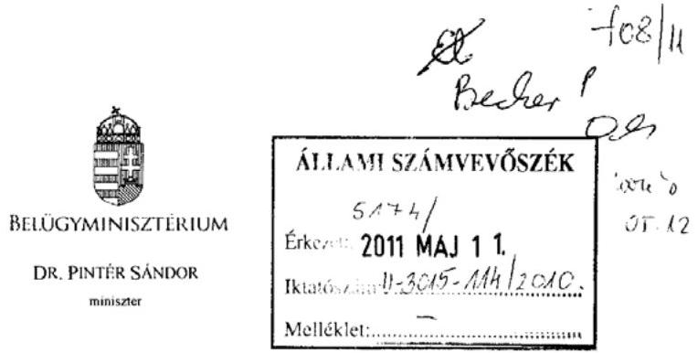

Iktatószám: BMöet-332d/2011.

Domokos László úr részére
elnök

Állami Számvevőszék
Budapest

Tisztelt Elnök Úr!
A helyi önkormányzatok fejlesztési célú támogatási rendszerének ellenőrzéséről készült Jelentés megküldését köszönettel vettem. A Jelentésben foglaltakkal kapcsolatban észrevételt nem teszek.

Elnök Úr munkájához további sok sikert kívánok.

Budapest, 2011. május „ 9 ."

Üdvözlettel:
Pinter furats?
Dr. Pintér-Sándor

---

# 18. számú melléklet a V-3015-120/2010. számú jelentéshez 

## NEMZETI ERÓFORRÁS MINISZIERIUM MINISZTER

Iktatószám:11264-1/2011-ELL

Hiv. szám: V-3015-112/2010.

## Domokos László

elnök

Állami Számvevőszék

## Budapest

Apáczai Csere János u. 10.
1052

Tárgy: a helyi önkormányzatok fejlesztési célú támogatási rendszerének ellenőrzéséről készzittet jelentés

## 1. kergen 5. in

$\infty 5$ Ks
$5^{2}$
Holman ule uain

Tisztelt Elnök Úr!

Köszönöm, hogy a tárgybeli véleményezésre megküldött tervezetre a tárca által tett észrevételeket a dokumentum módosításakor figyelembe vették.

A jelentés véglegesítése során az alábbi -korábban is jelzett - pontosítások átvezetését kérem:

1., A tervezet 26. oldalán a szereplő, az alábbiakban idézett szöveghez kapcsolódóan:
„Nem határozták meg az ellenőrzések formáját és időbeli ütemezését. A monitoringra történő utalás 2008 -tól jelent meg a szabályozásokban, azonban - a közoktatás szakmai és informatikai fejlesztésének támogatására vonatkozó OKM rendeleten kívül - nem határozták meg a monitoring tevékenység elvégzésére jogosultakat."
A monitoring vizsgálatra történő utalás az első - 2007-ben megjelent - OKM támogatási rendeletekbe nem került beépítésre, ebben csupán a szakmai ellenőrzés lebonyolítására kapott felhatalmazást az OKM Támogatáskezelő. 2008-tól azonban a támogatási rendeletek közös rendelkezései között jellemzően - természetesen az adott költségvetési év vonatkozásában - már megtalálható volt mind a monitoring vizsgálatra, mind az ennek elvégzésére jogosult megnevezése az alábbiak szerint:

---

A 8/2008. (III.20.) OKM rendelet 5. § (16) bekezdése szerint :„A támogatás céljának szakmai megvalósulását az OKM Támogatáskezelő a helyszínen is jogosult ellenőrizni 2009. december 31-ig. Az OKM Támogatáskezelő az adatszolgáltatást és a helyszíni ellenőrzést írásban kezdeményezi. Az OKM Támogatáskezelő honlapján (www.okmt.hu) 2008. októberétől megtalálható az elszámoláshoz, monitoringhoz szükséges indikátor táblázat. Amennyiben legkésőbb az ott megadott határidőig az OKM Támogatáskezelőhöz elektronikus úton nem érkezik meg a hiánytalanul kitöltött indikátor táblázat, úgy a támogatott a 2009. évre vonatkozóan elveszíti a támogatási jogosultságát."
A fentiekben leírtak tükrözik azon jogalkotói szándékot, amely az OKM Támogatáskezelőt bízza meg a szakmai ellenőrzések és a monitoring vizsgálatok elvégzésével. Az idézett bekezdésben meghatározottaktól részletesebb ütemezést a vizsgálatok elvégzésére vonatkozóan nem indokolt a rendeletekben szabályozni, ezért a tárca véleménye alapján javasolt a fentiekben dőlt betűvel jelzett mondatrész elhagyása.
2., A Nemzeti Sportstratégia céljait a 17. oldalon a jelentés részletesebben tárgyalja, mint a 2. számú mellékletében a Nemzeti Sportstratégia oszlopban, ezért indokolt a táblázatos formában is a részletesebb kifejtés (iskolai testnevelés és diáksport, szabadidősport, versenysport, utánpótlás-nevelés fejlesztése).

A jelentés tartalmával egyebekben egyetértek.

Budapest, 2011. május 12. „.
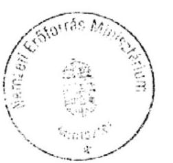

Üdvözlettel:

Dr. Réthelyi Miklós

---

# Dr. Réthelyi Miklós úr 

miniszter
Nemzeti Eröforrás Minisztérium

## Budapest

## Tisztelt Miniszter Úr!

Megköszönöm a helyi önkormányzatok fejlesztési célú támogatási rendszerének ellenőrzéséről szóló jelentésünkre adott észrevételeit.

Az ellenőrzés az önkormányzatok hazai fejlesztési célú támogatásait vizsgálta, ezért az OKM Támogatáskezelő által lebonyolított pályázatok közül csak a közoktatás szakmai és informatikai fejlesztésére szolgáló támogatásra terjedt ki. Így észrevétele a jelentésünk megállapításaival nincs ellentétben.

Az országos koncepciókban, programokban és a hazai fejlesztési célú támogatásokban meghatározott célok rendszerének bemutatását tartalmazó 2. számú mellékletben azok a célok jelennek meg, amelyek megvalósításához az önkormányzatok hazai fejlesztési célú támogatásban részesültek a vizsgált időszakban. A melléklet részletesebb kiegészítése a Nemzeti Sportstratégiában foglalt célokkal nem releváns a téma szempontjából.

Végezetül tájékoztatom Miniszter urat, hogy az ellenőrzésről készült jelentést - kialakult gyakorlatunk szerint - észrevételeivel és az azokra adott válaszommal együtt küldöm meg az Országgyűlés elnökének, a miniszterelnöknek és az illetékes bizottságok elnökeinek.

Budapest, 2011. május „ ${ }^{\text {® }}$ "
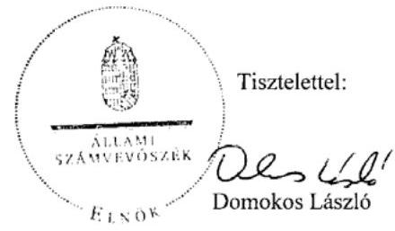

LISUZ BUDAPEST, AFRICZAI CSERE JÁNOS UTCK 3.0. 1364 Budapest 4. Pl. 54 telefon: 4848101 fax: 4848281

---

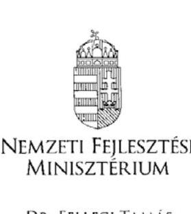

DR. FELLEGI TAMÁS
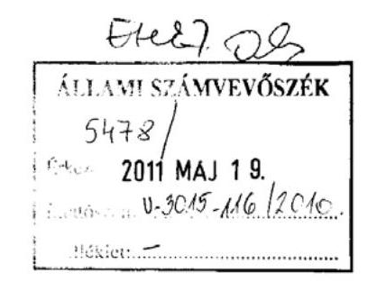

NFM/8939/ 3 /2016

Dr. Domokos László úrnak, elnök

Állami Számvevőszék
Budapest
Apáczai Csere János u. 10. 1052
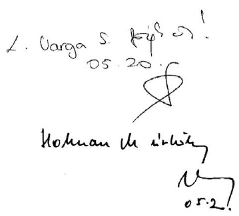

Tisztelt Elnök Úr!
A helyi önkormányzatok fejlesztési célú támogatási rendszerének ellenőrzéséről készített számvevőszéki jelentést köszönettel megkaptam.

A jelentést Minisztériumunk áttanulmányozta, arra észrevételt nem teszünk.

Budapest, 2011. május, 11 .
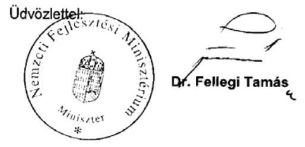

---

21. számú melléklet a V-3015-120/2010. számú jelentéshez

NEMZETGAZDASAGI MINISZTÉRIUM MINISZTER

Iktatószám: NGM/10776/2/2011.
Hivatkozási szám: V-3015-112/2010.
Úgyintéző: Kecskés Ádám

# Domokos László út részére 

elnök
Állami Számvevőszék
Budapest
Apáczai Csere János utca 10.
1052

Tárgy: az Állami Számvevőszék jelentése „a helyi önkormányzatok fejlesztési célú támogatási rendszerének ellenőrzéséről"

## Tisztelt Elnök Úr!

Köszönettel megkaptam „a helyi önkormányzatok fejlesztési célú támogatási rendszerének ellenőrzéséről" szóló ÁSZ jelentést.

Tájékoztatom Elnök Urat, hogy arra észrevételt tenni nem kívánok.
Budapest, 2011. május 16.

Üdvözlettel:
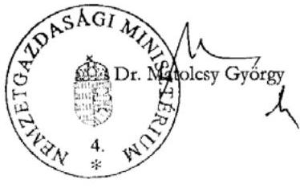

---

# 22. számú melléklet a V-3015-120/2010. számú jelentéshez 

## KÖZIGAZGATÁSI ÉS IGAZSÁGÜGYI MINISZTÉRIUM MINISZTER

XXII-3/1059/6/2011
Hiv. szám: V-3015-112/2010

## Domokos László úr részére

Állami Számvevőszék Elnöke

Budapest
Ápáczai Csere János u. 10.
1052

Tárgy: „A helyi önkormányzatok fejlesztési célú támogatási rendszerének ellenőrzéséről" szóló számvevőszéki jelentés véleményezése
Tisztelt Elnök Úr!
A helyi önkormányzatok fejlesztési célú támogatási rendszerének ellenőrzéséről készített számvevőszéki jelentést köszönettel megkaptam.

A jelentésben található megállapításokkal egyetértek, az abban megfogalmazott, a Kormánynak címzett javaslatokkal kapcsolatban észrevételt nem teszek.

A végleges jelentés elkészültét követően a Kormány - a megfogalmazott javaslatoknak megfelelően - a fejlesztéspolitikáért felelős tagja útján jogosult előkészíteni és megtenni a szükséges intézkedéseket annak érdekében, hogy a helyi önkormányzatok fejlesztési célú támogatási rendszere minél hatékonyabban, eredményesebben és összehangoltabban szolgálja az Országos Területfejlesztési Koncepcióban meghatározott célkitűzések megvalósítását.

Budapest, 2011. május „a"
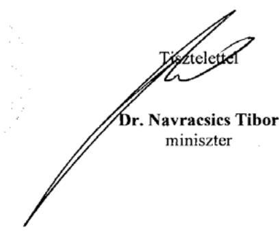

---

# FÜGGELÉK 

## a közérdekú bejelentés vizsgálatának eredményéről Ajka Város Önkormányzatnál

Az Állami Számvevőszékhez közérdekű bejelentés érkezett Ajka Város Önkormányzata közbeszerzési gyakorlatár vonatkozóan. Az európai uniós csatlakozással összefüggő egyes törvénymódosításokról, törvényi rendelkezések hatályon kívül helyezéséről, valamint egyes törvényi rendelkezések megállapításáról szóló 2004. évi XXIX. törvény 141-143. §-ának előírásai az állami szervek, így az ÁSZ számára is kötelezővé teszi a közérdekű bejelentések intézését. Az ÁSZ a közérdekű bejelentést a helyi önkormányzatok fejlesztési célú támogatásának ellenőrzésbe illesztve vizsgálta meg. A közérdekű bejelentés tényéről a vizsgálat helyszíni indításakor a polgármestert az eljáró számvevő tájékoztatta.

### 1.1. A közbeszerzési eljárások előkészítésének, lebonyolításának szabályozottsága, a felelősök és hatáskörök meghatározása

Az önkormányzatnál a közbeszerzés eljárások előkészítésére, lebonyolítására vonatkozó előírásokat a vizsgált időszakra vonatkozóan közbeszerzési szabályzatokban rögzítették.

A Képviselő-testület 242/2005. (XI.22.) határozatával hagyta jóvá a 2005. november 22 -étől hatályos szabályzatot. Ezen közbeszerzési szabályzatot a polgármester által 2007. december 28 -án kiadott közbeszerzési szabályzat váltotta fel.

A Kbt. 6. § (1) bekezdésében előírtaknak megfelelően a közbeszerzési szabályzatokban meghatározták a közbeszerzési eljárások előkészítésének, lefolytatásának, belső ellenőrzésének felelősségi rendjét, az önkormányzat nevében eljáró, illetőleg az eljárásba bevont személyek, illetőleg szervezetek felelősségi körét és a közbeszerzési eljárásai dokumentálási rendjét, továbbá az eljárás során hozott döntésekért felelős személyt, személyeket, illetőleg testületeket.

Mindkét közbeszerzési szabályzatban a közbeszerzés előkészítésével kapcsolatosan a közbeszerzési igények egyeztetését, az előzetes összesített tájékoztató elkészítését, a hirdetmény, a dokumentáció előkészítését a közbeszerzési előadó, illetve a közbeszerzési megbízott feladataként írták elő. A közbeszerzési terv elkészítéséért az Építési és Városgazdálkodási Iroda vezetője a felelős. A hirdetmény tervezetek jóváhagyásáról - ennek keretében az igazolási módokról, a bírálati szempontokról - a polgármester dönt.

A szabályzatokban az eljárások lefolytatásával kapcsolatos feladatokat - az ajánlattételi felhívástól a szerződés teljesítéséig - szabályozták: az eljárás lefolytatásával kapcsolatos adminisztratív feladatokat (ajánlatok átvétele, jegy-

---

zőkönyvek elkészítése) a polgármesteri hivatal köztisztviselői látták el. Mindkét közbeszerzési szabályzatban rögzítették a bíráló bizottság feladatkörét (az ajánlatok bontása, bírálat) és felelősségi körét. Az Önkormányzat közbeszerzési eljárásaiban a közbeszerzési szabályzatok szerint a polgármester volt jogosult az ajánlatkérő nevében az eljárások lezárásával kapcsolatos döntések - a nyertes ajánlattevő kiválasztása, eredménytelenség megállapítása - meghozatalára.

A közbeszerzési eljárás lezárását követő feladatokat (tájékoztatók közzététele, szerződések teljesülésének ellenőrzése) határidőket és felelősöket (közbeszerzési előadó, illetve hivatalos közbeszerzési tanácsadó) a közbeszerzési szabályzatok tartalmazták.

A szabályzatokban a Kbt. 10. § (7) bekezdésében foglaltaknak megfelelően előírták az ajánlatkérő nevében eljáró személyek részére írásbeli összeférhetetlenségi és titoktartási nyilatkozat megtételének kötelezettségét, amelynek az érintettek a vizsgált közbeszerzési eljárásokban eleget tettek.

Az Önkormányzatnál külső bonyolító szervezetet/személyt a közbeszerzések szakszerű és szabályszerű lefolytatása érdekében - a vizsgált időszakban minden közbeszerzési eljárás lefolytatásához - alkalmaztak. A külső lebonyolító megbízására vonatkozóan közbeszerzést nem volt köteles lefolytatni az Önkormányzat.

A 2006-2010. években az Önkormányzat évenként bízta meg a VeszprémBer Rt-t közbeszerzési feladatok és közbeszerzési tanácsadás ellátására. A megbízott a 2006-2008. években 15, a 2009. évtől 10 közbeszerzési eljárás teljes körű előkészítését és lebonyolítását vállalta. A megbízási díj éves összege 6 millió Ft volt, amely a 2010. évben 6,8 millió Ft-ra változott.

# 1.2. A közbeszerzési értékhatárra vonatkozó elöírások betartása, az egybeszámítási követelmények érvényesülése 

Az Önkormányzatnál a közbeszerzési eljárások előkészítése során az árubeszerzések esetén figyelembe vették a Kbt. 24. §-ában foglaltakat, az építési beruházások körét a Kbt. 25. §-ában foglaltak figyelembevételével határozták meg, és sorolták be a tervezett beszerzést.
A mintavételen alapuló vizsgálat alapján ${ }^{1}$ megállapítottuk, hogy az Önkormányzat a Kbt. 40. §-ában foglaltakat megsértve, az egybeszámítás feltételei együttes fennállását figyelmen kívül hagyva, több alkalommal nem folytatott le közbeszerzési eljárást, annak ellenére, hogy az egybeszámítás feltételei fennálltak.
A) Az egybeszámítás feltételeinek fennállása ellenére 2008. évben összesen 179,3 millió Ft összegű út, járda, parkoló építési, felújítási (29 esetben) munkáknál a Kbt. 40. §-ában foglaltakat megsértve nem folytatták le a közbeszerzési eljárásokat.

[^0]
[^0]:    ${ }^{1}$ Az egybeszámítási kötelezettség teljesítését a 2008-2010. években a 123 Ingatlanok és kapcsolódó vagyoni értékű jogok vásárlása, létesítése, valamint a 124 Ingatlanok felújítása főkönyvi számlák esetében vizsgáltuk.

---

Az ÁSZ az ellenőrzési tevékenysége során tudomására jutott mulasztás miatt a Kbt. 327. § (1) bekezdés b) pontja alapján a Közbeszerzési Döntőbizottságnál jogorvoslati eljárást kezdeményezhet, azonban a Kbt-be ütköző jogsértések megtörténtétől egy év eltelt. A jogvesztő határidőre miatt - a Kbt. 327. § (2) bekezdés a) pontjában foglaltak alapján - az ÁSZ jogorvoslati eljárást nem kezdeményezett.

Az egybeszámítás feltételei ezen beszerzések esetében fennálltak, mivel:

- a beszerzések megvalósítására egy költségvetési évben, a 2008. évben került sor;
- a beszerzés megvalósítására egy ajánlattevővel köthető szerződés, amelyet az is alátámaszt, hogy több építési munkára ugyanazon vállalkozással kötötték meg a szerződést. (A Betonút Zrt-vel 14 esetben, a BAUMIDEX Kft-vel nyolc esetben, az AVÉP Kft-vel négy esetben, valamint az EuroAszfalt Kft-vel három esetben.);
- a közbeszerzés tárgyainak rendeltetése azonos vagy hasonló, illetve felhasználásuk egymással közvetlenül összefügg, tekintettel arra, hogy út, járda, parkoló építésekre, felújításokra kötötték a szerződéseket. Az elvégzett munkák a közbeszerzési eljárások besorolásánál alkalmazandó CPV kódok alapján (közútkarbantartás 45233141-9, gyalogosok által használt utak építése 45233260-9, gyalogút építése 45233161-5) építési munkák voltak, és a Kbt. 25. §-a alapján építési beruházásnak minősültek.

A beszerzések egybeszámítás alapján figyelembe veendő becsült értéke a Kbt. 35. § (1) bekezdésében foglaltak szerint, az általános forgalmi adó nélkül meghaladta a Magyar Köztársaság 2008. évi költségvetéséről szóló 2007. évi CLXIX. törvény 91. § (3) bekezdése alapján az egyszerű közbeszerzési eljárás értékhatárát, amely építési beruházás esetében 15 millió Ft volt.
B) A 2009. évben összesen 71,9 millió Ft összegben út, járda, parkoló építéseket, felújításokat végeztek, amely építési munkákra 13 esetben kötöttek szerződést. Annak ellenére, hogy az egybeszámítás feltételei ezen építési munkák esetében fennálltak, a Kbt. 40. §-ában foglaltakat megsértve nem folytatták le a közbeszerzési eljárásokat. Az egybeszámítás feltételei ezen beszerzések esetében fennálltak, mivel:

- a beszerzések megvalósítására egy költségvetési évben, a 2009. évben került sor;
- a beszerzés megvalósítására egy ajánlattevővel köthető szerződés, amelyet az is alátámaszt, hogy több építési munkára ugyanazon vállalkozással kötötték meg a szerződést. (A BAUMIDEX Kft-vel hét esetben, az AVÉP Kft-vel három esetben, valamint az Építész Kőműves Kft-vel három esetben.);
- a közbeszerzés tárgyainak rendeltetése azonos vagy hasonló, illetve felhasználásuk egymással közvetlenül összefügg, tekintettel arra, hogy út, járda, parkoló építésekre, felújításokra kötötték a szerződéseket. Az elvégzett munkák a közbeszerzési eljárások besorolásánál alkalmazandó CPV kódok alapján (közútkarbantartás 45233141-9, gyalogosok által hasz-

---

nált utak építése 45233260-9, gyalogút építése 45233161-5) építési munkák voltak, és a Kbt. 25. §-a alapján építési beruházásnak minősültek;

- Az egybeszámítást arra tekintettel is alkalmaznia kellett volna az önkormányzatnak, hogy a 2009. évben az önkormányzat az AjkaPadragkút, Ajka-Ajkarendek közötti szakaszon kerékpárút építésére közbeszerzési eljárást folytatott le és ez alapján 2009. május 4 -én kötött a beszerzésre szerződést, 116,9 millió Ft értékben. Ezen időpontot követően - 2009. május 11-e és 2010. február 12-e közötti időszakban - tíz esetben építési szerződéseket kötöttek járda, parkoló építésekre, felújításokra. Az egyes beszerzések értéke - nettó 1 millió és 12,4 millió Ft között volt nem érte el a közbeszerzési értékhatárt, azonban az egybeszámítás feltételeinek fennállására tekintettel a már közbeszerzési eljárás eredményeként megvalósított építési beruházással egybe kellett volna számítani a beszerzéseket és a Kbt. akkor hatályos előírásai - 240. § (1) bekezdése, a 244. § (1) bekezdése - alapján általános egyszerű közbeszerzési eljárást kellett volna lefolytatni.

A közbeszerzési eljárást jogtalan mellőzése esetén követendő eljárásnak megfelelően az ellenőrzést végző számvevő jegyzőkönyvbe foglalva kérte a kifogásolt beszerzésekkel kapcsolatos dokumentumok - szerződések, nyilvántartások másolatai - átadását, amelyet a polgármester - a 2010. október 6án felvett jegyzőkönyvben foglaltak alapján - megtagadott. Dr. Lóránt Zoltán főigazgató úr a polgármesternek címzett - 2010. október 11-én kelt - levelében tájékoztatta az Önkormányzatot az ÁSZ álláspontjáról, és kérte a 2010. október 6-án felvett jegyzőkönyvben felsorolt dokumentumok átadását. A vizsgálatot végző számvevő 2010. október 18-án - előzetes értesítés (a jegyzővel történt telefonos egyeztetés) alapján - ismételten megkísérelte a 2010. október 6-án kelt jegyzőkönyvben felsorolt dokumentumok átvételét, ezt a Polgármester - a 2010. október 18-án felvett jegyzőkönyvben foglaltak alapján - ismételten megtagadta. Az ismertetettek miatt az írásos dokumentációkba való betekintés alapján, az így rendelkezésre álló információk figyelembevételével az ÁSZ a kifogásolt beszerzések tekintetében a Közbeszerzési Döntőbizottságnál - 2010. október 19-én - jogorvoslati eljárást kezdeményezett.

A Közbeszerzési Döntőbizottság a D.824/14/2010. számú, 2010. november 30 -án kelt határozatában megállapította, hogy az Önkormányzat a Kbt. megsértésével jogsértően mellőzte a közbeszerzési eljárások lefolytatását, ezért egy millió Ft bírság megfizetésére kötelezte.

# 1.3. A közbeszerzési eljárások során alkalmazott a bírálati szempontrendszer célszerüsége 

A legalacsonyabb összegű ellenszolgáltatás bírálati szempontként történő alkalmazására a mintavételi eljárás során kiválasztott közbeszerzési eljárások közül négy beszerzésnél került sor.

A 2008. évben két esetben (az egyszerű közbeszerzés keretében lebonyolított, a Városháza földszint és I. emelet átalakítási munkáira kiírt eljárásban, valamint a hirdetmény közzététele nélküli tárgyalásos közbeszerzési eljárásban, az Ajka, Gyár utcai csomópontban körforgalom építésének II. üteme), a 2009. évben ugyancsak két esetben (Ajka város Belváros I. terület rehabilitáció kere-

---

tében a Polgármesteri Hivatal felújítása, a Nagy László Városi Művelődési Központ színházterem, öltözői szárny és kiállító terem felújítási munkái, valamint a Fekete István - Vörösmarty Mihály Iskola infrastrukturális fejlesztésének eszközbeszerzése) a nyertes ajánlattevő kiválasztása a legalacsonyabb összegű ellenszolgáltatás bírálati szempont alapján történt.

Az építési beruházások esetében nem volt célszerú a legalacsonyabb összegű ellenszolgáltatás bírálati szempontnak az alkalmazása, mert az ellenszolgáltatás mértéke mellett egyéb szempontok többek között a jótállás ideje, a fizetési határidő, a kötbér, a hibás teljesítésért járó kötbér - hiányában az Önkormányzat érdekeit védő garanciális elemekre nem fordítottak figyelmet.

Az összességében legelőnyösebb ajánlat szempontjainak alkalmazása a 2010. évben a belvárosi kerékpárút építésére kiírt, általános egyszerű közbeszerzési eljárásban került sor. Az ajánlattételi felhívásban a rész szempontokat, a súlyszámokat, a ponthatárokat és az elbírálás módszerét meghatározták.

A közbeszerzési eljárásban a vállalási ár volt a legmagasabb súlyszámú. További rész szempontok - a jótállási idő, valamint a környezetvédelmi intézkedések bemutatása - meghatározásával a bírálati szempontok biztosították az ajánlatok összehasonlíthatóságát. A rész szempontok és az ahhoz tartozó súlyszámok meghatározásánál figyelembe vették a beszerzés tárgyának lényeges körülményeit, a kötendő szerződés lényeges feltételeit. A pontkiosztás értékelése elősegítette az ajánlatok közötti sorrend egyértelmű meghatározását.

Az alkalmazott összességében legelőnyösebb ajánlat bírálati szempontrendszer biztosította a beszerzés során az ajánlatok, a nyertes ajánlattevő megalapozott elbírálását, illetve kiválasztását.
1.4. A közbeszerzési eljárások eredményeként a nyertes ajánlattevővel megkötött szerződéseknek az ajánlati felhívással, a dokumentációkkal és az ajánlatokkal való összhangja, a szerződések megkötésénél a Kbt-ben elöírt határidők érvényesülése

Az ajánlati felhívásokban az Önkormányzat - a Kbt. 65. § (1) bekezdésben előírtak alapján - minden esetben előírta az ajánlattevő pénzügyi és gazdasági, valamint a műszaki és szakmai alkalmasságának feltételeit, és annak igazolási módját.

A jellemző alkalmassági feltételek a következők voltak: az ajánlattevő tárgyévet megelőző beszámolója szerinti eredménye nem lehet negatív, bankszámláján nem volt 30, illetve 60 napot meghaladó sorban állás, az ajánlattevő rendelkezzen a közbeszerzés tárgyára vonatkozó referenciával, a kivitelezés műszaki vezetéséhez megfelelő képzettségű szakemberrel.

Az ajánlatok felbontása során érvényesültek a Kbt. ajánlatok bontására vonatkozó szabályai. A vizsgált közbeszerzési eljárások során beérkezett ajánlatok bontására az ajánlattételi felhívásban előírt időpontban került sor, arra az ajánlattevőket meghívták. Az ajánlatok bontásakor a Kbt. 80. § (3) bekezdésében előírt ajánlati elemeket ismertették.

---

A közbeszerzési eljárások során a bíráló bizottságot minden alkalommal létre hoztak. A tagok megbízásakor a Kbt. 8. § (1) bekezdésében foglaltak alapján, a megfelelő szakértelem - közbeszerzési, pénzügyi, jogi, múszaki - biztosítása érdekében a Polgármesteri hivatal szakmai irodáinak köztisztviselőit és a megbízott közbeszerzési szakértőt jelölték ki.

Az Önkormányzatnál a bíráló bizottság az ajánlatokat az ajánlati felhívásban meghatározott értékelési szempontok szerint bírálta el, a bírálati módszert valamennyi ajánlatnál azonos módon alkalmazta.

A Nagy László Városi Művelődési Központ színházterem, öltözői szárny és kiállító terem felújítási munkái kiírt közbeszerzési eljárásban a nyertes ajánlattevő által tett ajánlati ár összege 328367 ezer Ft volt, még a másik ajánlattevő által adott vállalási ár 336606 ezer Ft volt.

A beérkezett ajánlatok értékelése során a bírálati jegyzőkönyvek nem tartalmaznak arra utalást, megállapítást, hogy a benyújtott ajánlatok kirívóan alacsonynak értékelt ellenszolgáltatást, illetve az ajánlat tartalmi eleme lehetetlen, vagy túlzottan magas, vagy alacsony mértékű, illetőleg kirívóan aránytalan kötelezettségvállalást tartalmaztak. Irreálisan alacsony ár, illetve egyéb irreális megajánlás miatt az ajánlattevőktől írásos indoklást kérésének szükségessége nem merült fel, irreális ajánlati elem miatt nem nyilvánítottak érvénytelenné ajánlatot.

A közbeszerzési eljárások lezárásáról a döntést - a közbeszerzési szabályzatban megállapított jogkörében eljárva - a polgármester hozta meg.

A Városháza földszint és I. emelet átalakítási munkáira kiírt közbeszerzési eljárás lezárásaként a nyertes ajánlattevőt a polgármester a 06/239-8/2008. számú határozatában, az Ajka város Belváros I. terület rehabilitáció tárgyában a 04/1/2009. számú határozatában állapította meg.

A nyertes ajánlattevő kiválasztása a bíráló bizottság javaslata alapján, annak elfogadásával történt.

A mintavételi eljárás során kiválasztott közbeszerzési eljárások lezárásaként a szerződéseket a Kbt-ben előírt határidőn belül megkötötték, a szerződés megkötése időpontjának meghatározásakor figyelembe vették a jogorvoslat kezdeményezési határidőket is. A nyertes ajánlattevőkkel kötött szerződések (kiemelten a vállalási árra, a teljesítési rész- és véghatáridőre, a műszaki tartalom meghatározására) összhangban voltak az ajánlattételi felhívásokkal, részletes pályázati dokumentációkkal és a nyertes ajánlatokkal.

# 1.5. A szerződések módosítása során a Kbt. szerződésmódosítására vonatkozó elöírások betartása 

A közbeszerzési eljárások eredményeként megkötött szerződéseket több esetben módosították. Az ellenőrzött négy szerződésmódosítás indokolt volt, azonban egy esetben nem tettek eleget a Kbt. 296. § (d) pontjában és a 299. § (1) bekezdésében foglaltaknak, mivel nem folytattak le közbeszerzési eljárást, valamint három szerződés módosítá-

---

# sáról a Kbt. 307. § (1) bekezdésében foglaltak ellenére a tájékoztató hirdetményt késedelmesen adták fel: 

- Az Önkormányzat a 2008. évben hirdetmény közzététele nélküli, egyszerű közbeszerzési eljárás keretében lebonyolított, a Városháza földszint és I. emelet átalakítási munkáira 2008. június 24 -én kötött szerződést, nettó 42,7 millió Ft összegben. A kivitelezés során - a feltárások alapján - a szerződés-kötéskor előre nem látható okból pótmunkák elvégzése vált szükségessé. Az Önkormányzat és a korábbi nyertes ajánlattevő az eredeti szerződést 2008. augusztus 7 -én módosították az elvégzendő pótmunkák miatt és a szerződés összegét nettó 65,8 millió Ft-ra emelték. Az Önkormányzat a pótmunkákra - a pótmunka becsült értékére tekintettel - a szerződés módosítás időpontjában hatályos Kbt. 299. § (1) bekezdésében foglaltakat megsértve a közbeszerzési eljárást jogtalanul mellőzte ${ }^{2}$, mivel a Kbt. 296. § (d) pontjában előírtakat megsértve közbeszerzési eljárás mellőzésével módosította a szerződést: építési beruházás esetében, ha a korábban megkötött szerződésben nem szereplő, de előre nem látható körülmények miatt kiegészítő építési beruházás szükséges, feltéve, hogy a kiegészítő építési beruházást műszaki vagy gazdasági okok miatt az ajánlatkérőt érintő jelentős nehézség nélkül nem lehet elválasztani a korábbi szerződéstől, akkor az ilyen kiegészítő építési beruházásra a korábbi nyertes ajánlattevővel köthető szerződés, azonban a szerződés becsült összértéke nem haladhatja meg az eredeti építési beruházás értékének felét. A szerződés-módosítással elfogadott pótmunka értéke nettó 23,06 millió Ft volt, amely az eredeti szerződés összegének felét - 21,3 millió Ft - meghaladta.
- A 2009. évben az Ajka város Belváros I. terület rehabilitáció tárgyú feladaton belül a Nagy László Általános Művelődési Központ színházterem öltözői szárny és kiállító terem felújítási munkái kötött szerződést a felek azzal az indokkal módosították kettő alkalommal, hogy olyan műszaki, előre nem látható ${ }^{3}$ munkák váltak szükségessé, amelyek elvégzése nélkül a beruházás nem valósítható meg. Az Önkormányzat és a vállalkozó első alkalommal 2010. február 17-én módosította a vállalkozási szerződést a befejezési határidő és a pénzügyi ütemezés tekintetében. A második szerződés-módosítás - 2010. április 9-én - során az előre nem látható munkák miatt ezek értékével - 5,3 millió Ft - megnövelték a vállalkozási díj összegét. Az Önkormányzatnál a Kbt. 307. § (1) bekezdésében előírtakat ${ }^{4}$ megsértve a szerződés-módosításról a tájékoztató hirdetményt késedelmesen - 2010. szeptember 23-án - adták fel.

[^0]
[^0]:    ${ }^{2}$ Az ÁSZ az ellenőrzési tevékenysége során tudomására jutott mulasztás miatt a Kbt. 327. § (1) bekezdés b) pontja alapján a Közbeszerzési Döntőbizottságnál jogorvoslati eljárást kezdeményezhet, azonban a Kbt-be ütköző jogsértések megtörténtétől egy év eltelt, a jogvesztő határidőre való tekintettel - a Kbt. 327. § (2) bekezdés a) pontjában foglaltak alapján - az ÁSZ jogorvoslati eljárást nem kezdeményezett.
    ${ }^{3}$ A meglévő burkolatok, gépészeti rendszerek bontása után váltak láthatóvá olyan műszaki állapotok, okok, amelyek miatt az eredeti költségvetésben nem tervezett munkák elvégzése vált szükségessé.
    ${ }^{4}$ Az ajánlatkérő köteles a szerződés módosításáról külön jogszabályban meghatározott minta szerint tájékoztatót készíteni, és hirdetmény útján a

---

- A 2009. évben a Fekete István - Vörösmarty Mihály Iskola infrastrukturális fejlesztésének eszközbeszerzése kötött szállítási szerződést a II. és a III. részfeladat tekintetében 2009. augusztus 28 -án, illetve 2009. szeptember 9-én a felek módosították. A módosítások a szerződésszerű teljesítést követő számla kiegyenlítés meghatározására vonatkoztak. Az Önkormányzatnál a Kbt. 307. § (1) bekezdésében előírtakat megsértve a szerződésmódosításról a tájékoztató hirdetményt késedelmesen - 2009. december 1-én - adták fel.
- A 2010. évben a belvárosi kerékpárút építésére kötött szerződést a felek első alkalommal 2010. május 31-én a végszámla benyújtásának esedékessége időpontja tekintetében módosították. A második szerződés módosításakor a befejezési határidő, valamint a kifizetés pénzügyi ütemezését módosították 2010. augusztus 25-én. Az Önkormányzatnál a Kbt. 307. § (1) bekezdésében előírtakat megsértve a szerződés-módosításról a tájékoztató hirdetményt késedelmesen - 2010. szeptember 30-án, illetve 2010. szeptember 14-én - adták fel.

Közbeszerzési Értesítőben közzétenni. A hirdetményt legkésőbb a szerződés módosításától számított öt munkanapon belül kell feladni.