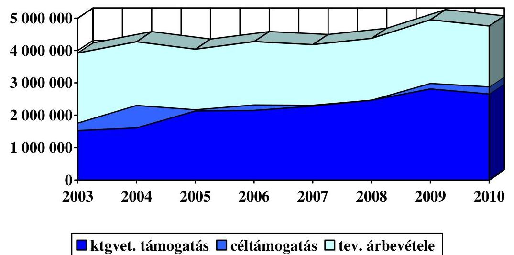
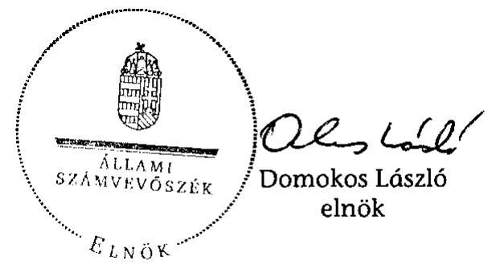
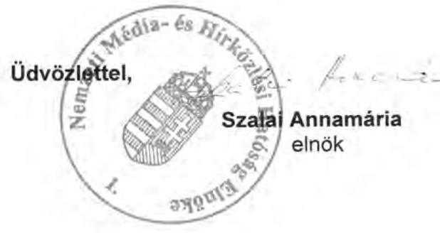
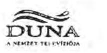
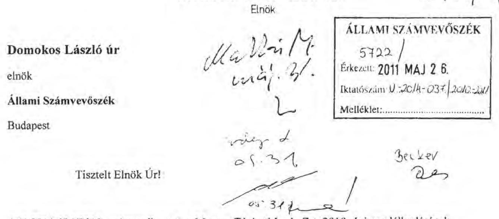
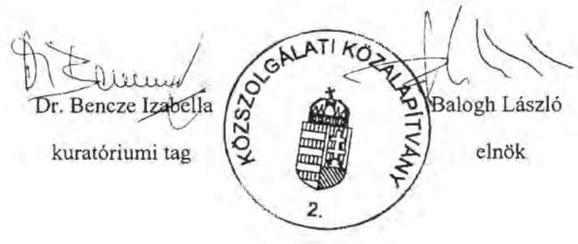
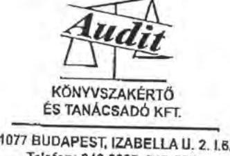
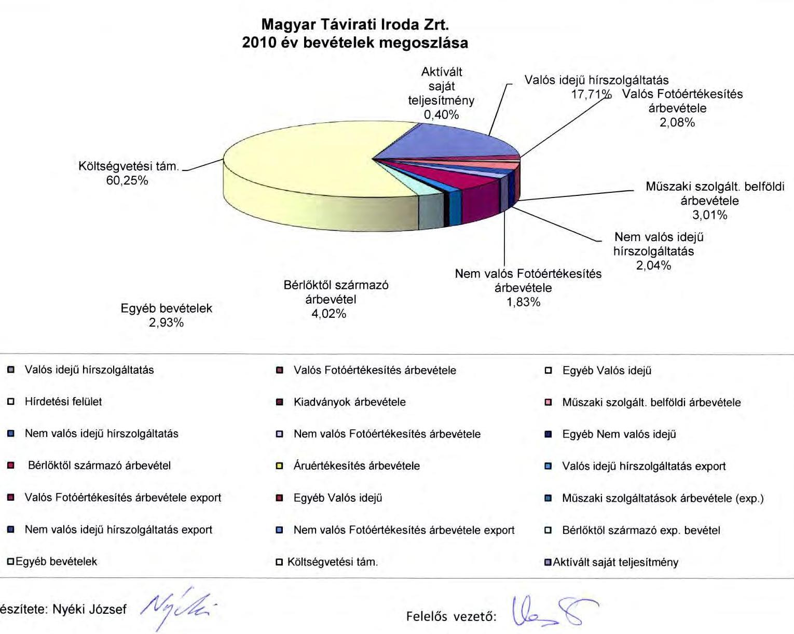
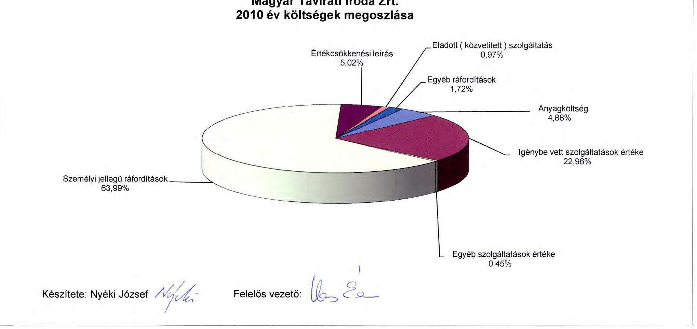
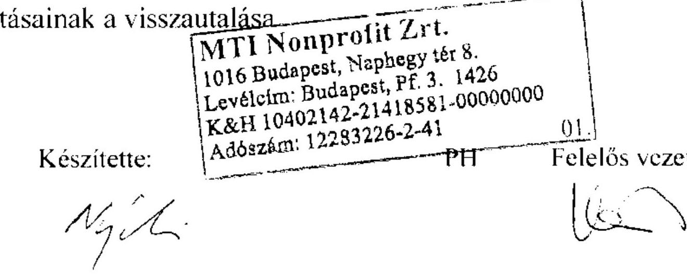

# ÁLLAMI   SZÁMVEVŐSZÉK 

## JELENTÉS

a Magyar Távirati Iroda Zrt. 2010. évi gazdálkodásának ellenőrzéséről

---

2. Államháztartás Központi Szintjét Ellenőrző Igazgatóság
2.3. Az Állam és az Állami Vagyon Működését Ellenőrző Főcsoport Iktatószám: V-2014-040/2010-2011.
Témaszám: 998
Vizsgálatazonosító szám: V0526
Az ellenőrzést felügyelte:
Dr. Becker Pál
főigazgató
Az ellenőrzés végrehajtásáért felelős:
Hegedűsné dr. Müllern Veronika
főcsoportfőnök (2011. április 30-ig)
Makkai Mária
főcsoportfőnök
Az ellenőrzést vezette:
Dr. Podonyi László
igazgatóhelyettes
A számvevői jelentések feldolgozásában és a jelentés összeállításában
közreműködött:

Fülöppné Nagy Marianna
számvevő tanácsos

Az ellenőrzést végezték:
Dalmayné Szerző Ildikó
Fülöppné Nagy Marianna
számvevő tanácsos
számvevő tanácsos

# A témához kapcsolódó eddig készített számvevőszéki jelentések: 

## címe

Jelentés a Magyar Távirati Iroda költségvetési fejezet és a Magyar 9829 Távirati Iroda Részvénytársaság pénzügyi-gazdasági ellenőrzéséről
Jelentés a Magyar Távirati Iroda Részvénytársaság működésének 9924 pénzügyi-gazdasági ellenőrzéséről (1998.)
Jelentés a Magyar Távirati Iroda Rt. 1999. évi gazdálkodásának 0029 ellenőrzéséről
Jelentés a Magyar Távirati Iroda Rt. 2000. évi gazdálkodásának 0124 ellenőrzéséről
Jelentés a Magyar Távirati Iroda Rt. 2001. évi gazdálkodásának 0236 ellenőrzéséről

---

Jelentés a Magyar Távirati Iroda Rt. 2002. évi gazdálkodásának 0326 ellenőrzéséről
Jelentés a Magyar Távirati Iroda Rt. 2003. évi gazdálkodásának 0425 ellenőrzéséről
Jelentés a Magyar Távirati Iroda Rt. 2004. évi gazdálkodásának 0520 ellenőrzéséről
Jelentés a Magyar Távirati Iroda Rt. 2005. évi gazdálkodásának 0610 ellenőrzéséről
Jelentés a Magyar Távirati Iroda Rt. 2006. évi gazdálkodásának 0709 ellenőrzéséről
Jelentés a Magyar Távirati Iroda Rt. 2007. évi gazdálkodásának 0804 ellenőrzéséről
Jelentés a Magyar Távirati Iroda Rt. 2008. évi gazdálkodásának 0909 ellenőrzéséről
Jelentés a Magyar Távirati Iroda Rt. 2009. évi gazdálkodásának 1004 ellenőrzéséről

---

# TARTALOMJEGYZÉK 

BEVEZETÉS ..... 5
I. ÖSSZEGZŐ MEGÁLLAPÍTÁSOK, KÖVETKEZTETÉSEK, JAVASLATOK ..... 8
II. RÉSZLETES MEGÁLLAPÍTÁSOK ..... 15

1. A Társaság működésének szabályozottsága, a döntéshozatali mechanizmus működése ..... 15
1.1. A Társaság működésének, döntéshozatali rendjének szabályozása ..... 15
1.2. A Társaság közfeladat-ellátásának és közzétételi kötelezettségének szabályozása ..... 19
1.3. A vezetői- és a belső ellenőrzés rendszerének működése ..... 21
1.4. A TTT és az FB működésének eredményei ..... 22
2. Az MTI Zrt. 2010. évi gazdálkodása ..... 25
2.1. Az MTI Zrt. 2010. évi üzleti tervének teljesülése ..... 25
2.2. A működési- és az év közben folyósított egyéb célú támogatások felhasználásának célszerűsége és hatékonysága ..... 27
2.3. A Társaság költség-struktúrájának megalapozottsága ..... 30
2.4. Az MTI Zrt. vagyon, létszám- és bérgazdálkodása ..... 32
2.4.1. Vagyoni helyzet alakulása ..... 32
2.4.2. Az eszközbeszerzések szabályozottsága, megalapozottsága ..... 33
2.4.3. A Társaság létszám- és bérgazdálkodása; a személyi jellegű ráfordítások megalapozottsága ..... 35
2.5. A Társaság díjszabása ..... 37
3. A Társaság szervezeti formájának, tulajdonosi struktúrájának átalakulásával kapcsolatos intézkedések ..... 39
3.1. A Társaság új ügyvezetőjének kinevezéséig tartó átmeneti időszakban meghozott vezetői döntések szabályszerűsége ..... 39
3.2. Az MTI Zrt. szervezetrendszerének átalakításával kapcsolatos döntések ..... 40
3.3. A Közszolgálati Közalapítvány Kuratóriumának a nonprofit társasággá alakult MTI Zrt. működését befolyásoló döntései ..... 41
3.4. A szervezeti átalakulással összefüggő gazdálkodási feladatok végrehajtása ..... 44
4. Az Állami Számvevőszék javaslatai alapján tett intézkedések ..... 44

---

# MELLÉKLETEK 

1. A jelentésre és jelentéstervezetre tett észrevételek
2. ÁSZ-javaslatokkal összefüggő OGY határozatok és az előző évi ajánlások
3. Kérdések és válaszok a rendszer értékeléséhez
4. A Társaság gazdálkodásával kapcsolatos kimutatások
5. Tanúsítványok

---

# RÖVIDÍTÉSEK JEGYZÉKE 

| AKR | Automatikus Kódoló Rendszer |
| :--: | :--: |
| Alap | Műsorszolgáltatás Támogató és Vagyonkezelő Alap, az Mttv.-ben új néven Médiaszolgáltatás-támogató és Vagyonkezelő Alap |
| Alapítvány | Közszolgálati Közalapítvány |
| AO | Alapító Okirat |
| Avtv. | A személyes adatok védelméről és a közérdekű adatok nyilvánosságáról szóló 1992. évi LXIII. törvény |
| áfa | Általános Forgalmi Adó |
| Áht. | Az államháztartásról szóló 1992. évi XXXVIII. törvény |
| ÁSZ | Állami Számvevőszék |
| Deloitte-modell | A közszolgálati tevékenységgel összefüggő bevételek és kiadások kimutatást segítő szakértői modell |
| Eitv. | Az elektronikus információszabadságról szóló 2005. évi XC. törvény |
| ekho | Az egyszerűsített közteherviselési hozzájárulásról szóló 2005. évi CXX. törvény |
| EU | Európai Unió |
| FB | Felügyelő Bizottság |
| FVIR | Felsővezetői Információs Rendszer |
| Gt. | A gazdasági társaságokról szóló 2006. évi IV. törvény |
| Kbt. | A közbeszerzésekről szóló 2003. évi CXXIX. törvény |
| Közszolgálati részvénytársaságok, Részvénytársaságok | A Magyar Rádió Zrt.. a Magyar Televízió Zrt., a Duna Televízió Zrt., a Magyar Távirati Iroda Zrt. közös néven |
| KSH | Központi Statisztikai Hivatal |
| KSZ | Kollektív Szerződés |
| Kuratórium | A Közszolgálati Közalapítvány Kuratóriuma |
| Kvtv. | A Magyar Köztársaság 2010. évi költségvetéséről szóló 2009. évi CXXX. törvény |
| MÁK | Magyar Államkincstár |
| Mt. | A Munka Törvénykönyvéről szóló 1992. évi XXII. törvény |
| MTI Zrt., Részvénytársaság,Társaság, Szervezet | Magyar Távirati Iroda Zártkörűen működő Részvénytársaság |
| MTI Nonprofit Zrt. | 2010. december 1-jétől Magyar Távirati Iroda Zártkörűen működő nonprofit Részvénytársaság |
| Mttv. | A médiaszolgáltatásokról és a tömegkommunikációról szóló 2010. évi CLXXXV. törvény |
| MTV | Magyar Televízió |
| NGM | Nemzetgazdasági Minisztérium |
| NKÖM | Nemzeti Kulturális Örökség Minisztériuma |
| Nht., hírügynökségi törvény | A nemzeti hírügynökségről szóló 1996. évi CXXVII. törvény |

---

| OGY | Országgyűlés |
| :-- | :-- |
| PM | Pénzügyminisztérium |
| Ptk. | A Polgári Törvénykönyvről szóló 1959. évi IV. törvény |
| Rttv. | A rádiózásról és a televíziózásról szóló 1996. évi I. törvény |
| Szja. | A személyi jövedelemadóról szóló 1995. évi CXVII. tör- |
| Sztv. | vény |
| SZKTSZ | A számvitelről szóló 2000. évi C. törvény |
| SZMSZ | Szakmai és Közszolgálati Tájékoztatási Szabályzat |
| Taktv. | Szervezeti és Működési Szabályzat |
| TTT | A köztulajdonban álló gazdasági társaságok takaréko- |
| VIR | sabb működéséről szóló 2009. évi CXXII. törvény |
| Tulajdonosi Tanácsadó Testület |  |
| VIR | Vezetői Információs Rendszer |

---

# JELENTÉS 

## a Magyar Távirati Iroda Zrt. 2010. évi gazdálkodásának ellenőrzéséről

## BEVEZETÉS

A nemzeti hírügynökségi tevékenység ellátására az Állam nevében az Országgyűlés egyszemélyes részvénytársaságként 1997. július 15-én megalapította a Magyar Távirati Iroda Részvénytársaságot, amely 2007. június 21-étől, mint zártkörű részvénytársaság folytatja tevékenységét. Az MTI Zrt. szervezeti formája és tulajdonosi struktúrája - a közszolgálati média szervezetrendszere 2010. évi átalakításának részeként - átalakult. A Társaság 2010. november 3-ától a közszolgálati médiaszolgáltatókat (Magyar Televízió, Duna Televízió, Magyar Rádió zártkörűen működő részvénytársaságok) egyesítő Közszolgálati Közalapítvány tulajdonába került, 2010. december 1-jétől nonprofit részvénytársasággá vált. A Társaság 2010-ben a nemzeti hírügynökségről szóló 1996. évi CXXVII. törvény (Nht.) 2. § (1) bekezdésében felsorolt közszolgálati feladatokat látta el, amelyhez állami támogatásban részesült.

A 100%-ban állami tulajdonú MTI Zrt. tulajdonosi joggyakorlója 2010. november 2-áig az Országgyűlés volt. A tulajdonosváltás időpontjától számítva az alapítói, részvényesi jogokat, valamint a közgyűlés jogait az Országgyűlés helyett a Közszolgálati Közalapítvány, illetve annak kuratóriuma gyakorolja. ${ }^{1}$ A Társaság ügyvezetője a Kuratórium által 2010. november 18-tól kinevezett vezérigazgató lett. Az Nht. módosított (2010. december 31-ig hatályos) 11. § (1) bekezdése, (2011. január 1-től) a médiaszolgáltatásokról és a tömegkommunikációról szóló 2010. évi CLXXXV. törvény (Mttv.) 108. § (7) bekezdés szerint a Társaság vezérigazgatója évente beszámol a Kuratóriumnak a Részvénytársaság tevékenységéről, amelynek keretében sor kerül a mérleg- és az eredménykimutatás jóváhagyására. A vezérigazgató beszámolóját a közszolgálati részvénytársaságok Felügyelő Bizottságának véleményével együtt kell a Kuratórium elé terjeszteni.

A nemzeti hírügynökségről szóló törvény 11. § (1) bekezdése - a médiaszolgáltatásokról és a tömegkommunikációról szóló törvény 2011. január 1-jei hatályba lépéséig - megfogalmazta az Állami Számvevőszéknek a Társaság gazdasági tevékenységére kiterjedő ellenőrzési kötelezettségét. A 2011. január 1-től hatályos Mttv. 108. § (14) bekezdése szerint az Állami Számvevőszék a közszolgálati médiaszolgáltatók - köztük az MTI Nonprofit Zrt. - gazdálkodását ellenőrzi.

[^0]
[^0]:    ${ }^{1}$ A médiaszolgáltatásokról és a tömegkommunikációról szóló 2010. évi CLXXXV. törvény 90. § (1) bekezdésében és 92. § (1), (2) bekezdésében meghatározott eltérésekkel.

---

A közfeladatok ellátására szolgáló forrásokat a Magyar Köztársaság 2010. évi költségvetésében, az Országgyűlés fejezetben tervezték meg. Az Országgyűlés a Magyar Távirati Iroda Zrt. közszolgálati feladatai ellátásának költségeire 2930 M Ft állami támogatást, ebből a határon túli magyar sajtó hírellátásának támogatására 80 M Ft-ot, a 2010. évi országgyűlési és önkormányzati választások időszakában történő tájékoztatási többletfeladatokra 110 M Ft-ot, a szerkesztőségi rendszer fejlesztésére és elnöki stratégiai feladatokra 160 M Ft-ot hagyott jóvá. A Társaság 2010-re 1871 M Ft értékesítési árbevételt és (egyéb) saját bevételt tervezett, amely 100%-ban teljesült. Összes költsége és ráfordítása 2010-ben 4657 M Ft volt, ami 4%-kal alacsonyabb a tervezettnél.

# Az ellenőrzés célja annak értékelése volt, hogy 

- az MTI Zrt. szervezeti felépítése, működése, belső szabályozási és irányítási rendszere összhangban volt-e feladataival és a hatályos jogszabályokkal, a vezetői döntéshozatal célszerű és eredményes volt-e; a vezetői információs és az ellenőrzési rendszer működése megfelelően biztosította-e a kitűzött célok megvalósítását, megfelelően segítette-e a Társaság vezetését a döntések meghozatalában;
- a gazdálkodás kereteit meghatározó tervek összhangban voltak-e a feladataival; törvényesen, célszerűen és eredményesen gazdálkodott-e a rendelkezésére bocsátott erőforrásokkal, ezen belül a központi költségvetésből a közszolgálati feladatai ellátásához nyújtott működési célú és egyéb céltámogatásokkal;
- a szervezeti forma és a tulajdonosi struktúra átalakításával összefüggő feladatokat teljes körűen és eredményesen hajtotta-e végre; biztosítva voltak-e a nonprofit társasággá alakult MTI Zrt. működésének személyi és tárgyi feltételei;
- hasznosultak-e az MTI Zrt. 2009. évi tevékenységének ellenőrzéséről készült ÁSZ-jelentés megállapításai, ajánlásai.

Az ellenőrzés során összevetettük és elemeztük a 2009. és 2010. évek főbb mutatóinak alakulását, értékeltük a külső vállalkozások igénybevételének volumenét, a Kormány takarékossági intézkedéseinek betartását, a vezetői- és a belső ellenőrzés működését. Az ellenőrzés kiterjedt továbbá az MTI Zrt. szervezeti formájának, valamint tulajdonosi struktúrájának átalakításával összefüggő feladatok végrehajtására is.

Az ellenőrzést előtanulmánnyal megalapozott meghatározott kritériumok ${ }^{2}$ alapján végeztük. Vizsgáltuk, hogy a Társaság megfelelő intézkedéseket és eljárásokat alakított-e ki az erőforrások hatékony felhasználása és a kitűzött célok elérése érdekében. Ez utóbbi arra irányult, hogy értékeljük a különböző döntési szinteken meghozott intézkedések összhangját a kitűzött célokkal. Az eredményesség kritériuma egyrészt azt jelentette, hogy a vezetői információs és az ellenőrzési rendszer kiépítése és működése megfelelően segítette-e a vezetést a döntések meghozatalában, megfelelő biztosítékot adott-e a Társaság által kitű-

[^0]
[^0]:    ${ }^{2}$ 3. sz. melléklet „Kérdések és válaszok a rendszer működésének értékeléséhez"

---

zött célok megvalósításához, másrészt a központi költségvetési támogatás felhasználása a kitűzött céloknak és az elvárt eredményeknek megfelelően valósult-e meg.

Az MTI Zrt. székházában végzett helyszíni ellenőrzés módszere a dokumentális vizsgálat, interjúkészítés és elemzés volt. A helyszíni vizsgálat korábban befejeződött, mint az éves beszámoló könyvvizsgálati ellenőrzése, ezért a könyvekben bekövetkezett változásokat figyelemmel kísértük.

Az ellenőrzés végrehajtására az Állami Számvevőszékről szóló 1989. évi XXXVIII. törvény 1. § (2) bekezdése, 2. § (5),
 (6), (9) bekezdése, 16. § (1) bekezdése, 21. § (3) bekezdése, a 2010. december 31-ig hatályos Nht. 11. § (1) bekezdése, a 2011. január 1-jétől hatályos Mttv. 108. § (14) bekezdése, továbbá az államháztartásról szóló 1992. évi XXXVIII. törvény (Áht.) 104. § (3) bekezdése és 120/A. § (1) bekezdése adtak jogszabályi alapot.

A jelentést egyeztettük a Nemzeti Média- és Hírközlési Hatóság és a Közszolgálati Közalapítvány elnökeivel, a jelentéstervezet az MTI Nonprofit Zrt. elnökével és könyvvizsgálójával. Az észrevételeket az 1. sz. melléklet tartalmazza.

---

# I. ÖSSZEGZŐ MEGÁLLAPÍTÁSOK, KÖVETKEZTETÉSEK, JAVASLATOK 

Az MTI Zrt. működési környezetében 2010-ben jelentős változás következett be, ami a közszolgálati média szervezetrendszerének felülvizsgálatát követően a Társaság szervezeti formájának, tulajdonosi struktúrájának és ellenőrzési rendszerének átalakulását eredményezte. A Társaság új tulajdonosa az Országgyűlés helyett a Közszolgálati Közalapítvány lett, amelynek feladata és hatásköre a jogszabályváltozásból eredően átláthatóvá vált. A szervezetrendszer átalakítása során a fokozatosság elve érvényesült.

Az alapítói, tulajdonosi jogokat 2010 utolsó negyedévéig gyakorló Országgyűlés a 2002-ben határozatban megfogalmazott feladatait (a nemzeti hírügynökségről szóló törvény és a Társaság Alapító Okiratának felülvizsgálata és összehangolása) közel 8 éven keresztül nem teljesítette, ${ }^{3}$ nem tett lépéseket a változtatások irányába. Jelentősebb változást, a médiát és a hírközlést szabályozó egyes törvények módosításáról szóló törvény 2010. július 22-ei elfogadása jelentett.

A Társaság 2010. évi közszolgálati feladatellátásában a szabályozási hiányosságokra visszavezethető kockázatok fennálltak, mert a közszolgálati feladatok tevékenység szintű meghatározása, az ellátásukhoz szükséges állami támogatás mértékének szabályozása hiányzott. Az Országgyűlés, a Társaság alapítói és tulajdonosi jogainak gyakorlója, nem gondoskodott az EU konform állami finanszírozás átlátható rendszerének és a támogatás felhasználása monitoring rendszerének a kialakításáról. Az Alapító és az MTI Zrt. között a 2008-ban elkészült közszolgálati szerződés csak tervezet maradt. A 2010. évre és azt megelőző évekre szóló működési céltámogatás igénylés pénzügyminisztériumi előírások szerinti összeállítása nem tett eleget a 2010. december 31-éig hatályos Nht. előírásainak, ami a közszolgálati feladatok ellátásához szükséges mértékű támogatás biztosítását fogalmazta meg. ${ }^{4}$ Az Országgyűlés a stratégiai és az éves tervekre vonatkozó tulajdonosi döntést és kontrollt nem teremtette meg, a közgyűlés jogait 2010-ben az MTI Zrt. 2009. évi tevékenységéről szóló beszámoló elfogadásának hiányában korlátozottan gyakorolta.

Az MTI Zrt. javaslattevő, véleményező, tanácsadó és egyes esetekben döntéshozó szerve - a Tulajdonosi Tanácsadó Testület - a Társaság tulajdonosi joggyakorlójának személyében bekövetkezett változással szűnt meg. A TTT 2010. első hat hónapjában rendszeresen, ezt követően (2010. november 3-ai megszűnéséig) egy alkalommal tartott testületi ülést. A TTT működése idején nem helyezett elegendő hangsúlyt a költségtakarékos gazdálkodására, mert a köztulajdonban álló gazdasági társaságok takarékosabb működéséről szóló törvény

[^0]
[^0]:    ${ }^{3}$ Korábbi jelentéseinkre tett észrevételek szerint konszenzus hiányában nem volt lehetőség a változtatásra.
    ${ }^{4}$ Az Nht. a médiaszolgáltatásokról és a tömegkommunikációról szóló 2010. évi CLXXXV. törvény 2011. január 1-jei hatályba lépésével hatályát vesztette.

---

céljait nem helyezte előtérbe. Az MTI Zrt. Javadalmazási szabályzatának TTT tagjaira történő kiterjesztése nem történt meg, ami önmagában a Szabályzat hatálya alá tartozó FB tagok és a Szabályzat hatálya alá nem tartozó TTT tagok átlagos havi egy főre számított juttatása között 52%-os eltérést okozott.

Az MTI Zrt. 2010. évi működését a jogszabályváltozás három jelentős szakaszra osztotta. Közel nyolc hónapon keresztül a Társaság az Nht. szerint és a 2009. évi működéséhez hasonlóan, két hónapon keresztül a médiát és a hírközlést szabályozó egyes törvények (pl. Rttv., Nht.) módosításáról szóló törvényben meghatározott kereteken belül és az átmeneti időszakra előírt működőképesség fenntartásának biztosítása érdekében, közel két hónapon keresztül az új tulajdonos (Közszolgálati Közalapítvány) határozatai, és az új ügyvezető (vezérigazgató) döntései alapján működött. Az átmeneti időszakban az MTI Zrt. elnöke és alelnökei a Társaság működőképességét fenntartották, a vezetői döntések és az Nht. ezen időszakra megállapított előírásai közötti összhang biztosított volt, hatáskörtúllépés nem történt.

Az MTI Zrt. elnöke a Társaság 2010. december elsejei nonprofit szervezetté történő átalakítását megelőzően a szükséges intézkedéseket meghozta, azonban nem teljes körűen alakított ki megfelelő eljárásokat az erőforrások hatékony felhasználása és a kitűzött célok elérése érdekében. A költségvetési támogatás igénylésekor a Társaság nem támaszkodott a közszolgálati tevékenységgel összefüggő bevételek és kiadások kimutatását segítő szakértői modell számítására. A belső szabályzatok és a vizsgált időszakban hatályos szakmai, társasági és gazdálkodást érintő jogszabályok közötti összhang összességében biztosított volt, azonban egyes szabályzatok - az MTI Zrt. vezetői körére és a Felügyelő Bizottság tagjaira kiterjedő Javadalmazási szabályzat és a Takarékossági törvény, valamint a Kollektív Szerződés és a Munka Törvénykönyve - összhang hiányát mutatták. Az MTI besorolási, javadalmazási és teljesítményértékelési rendszerének kialakítása - a Társaság nonprofit szervezetté történő átalakítását megelőzően és azt követően - nem történt meg, a munkáltató a határozatlan idejű munkaviszonyban foglalkoztatott munkavállalók munkaszerződésében a személyi alapbért szabályozásban lefektetett egységes elvek hiányában állapította meg.

A Társaság Kollektív Szerződése 2010-ben felülvizsgálatra került, azonban személyi hatálya az elnökön és az alelnökön kívül kiterjed az MTI Zrt.-vel munkaviszonyban álló valamennyi munkavállalóra, annak ellenére, hogy a Munka Törvénykönyve (Mt.) 2009. december 4-től hatályos módosítása - az MTI Zrt. Javadalmazási szabályzatában és SZMSZ-ében meghatározott - vezetőnek minősülő munkavállalói körre a KSZ kiterjesztésének lehetőségét megszűntette. E körre az Mt. alapján a munkáltatói rendkívüli felmondás, a munkaidő és a kártérítési felelősség tekintetében a vezetőkre vonatkozó szigorúbb szabályok az irányadók.

Az MTI Zrt. 2009. július 1-jétől hatályos SZMSZ-e összességében jól szabályozta a Társaság 2010. évi működését, azonban a szervezet átalakítással összefüggő felülvizsgálata a helyszíni ellenőrzés végéig ${ }^{5}$ nem történt meg. Kockázatot je-

[^0]
[^0]:    ${ }^{5}$ 2011. február 18.

---

lentett, illetve a szervezet céljainak elérését nehezítette, hogy az SZMSZ a döntés-előkészítés és döntéshozatal rendjét is szabályozta, azonban a végrehajtás nem volt e szabályzattal - valamint az MTI Zrt. Iratkezelési szabályzatával - összhangban. A vezetői értekezletekre előterjesztések, az ott elhangzottakról jegyzőkönyvek nem készültek, ami gátolta a szervezeti működés átláthatóságát, az utólagos ellenőrzés lehetőségét. A vezetői intézkedések elnöki és alelnöki utasításokban jelentek meg, belső szabályzatok és intézkedési tervek kiadásához kapcsolódtak, azonban a szabályozáshoz nem kapcsolható felső vezetői döntések írásba foglalása nem történt meg. Az MTI Nonprofit Zrt. szervezeten belüli döntéshozatali rendszerének - a szervezetrendszer átalakítását követő szabályozásáról - belső utasítás nem került kiadásra.

A Társaság 2010-ben közzétételi kötelezettségének - egyes eseteket leszámítva - eleget tett. Nem tette közzé a szervezet teljesítményét jellemző mutatókat; a tevékenységére vonatkozó jogszabályon alapuló statisztikai adatgyűjtés eredményeit, valamint az üres álláshelyek számáról szóló jelentést. A Társaság az 500 E Ft nagyságú szerződési értéket meghaladó szerződéseiről az átláthatóságot biztosító nyilvántartást vezetett, azonban nem tett teljes körűen közzé az államháztartás pénzeszközei felhasználásával, az államháztartáshoz tartozó vagyonnal történő gazdálkodással összefüggő - nettó öt millió forintot elérő vagy meghaladó értékű - árubeszerzésre, építési beruházásra, szolgáltatás megrendelésére vonatkozó szerződéseket.

Az MTI Zrt. ellenőrzési rendszerének működése összességében megfelelő biztosítékot adott a Társaság céljainak megvalósításához. Az MTI Zrt. Kockázatkezelési szabályzattal rendelkezett, amely megfogalmazta, hogy a kockázat elemzésének fontos eszköze a vezetői ellenőrzést támogató Vezetői Információs Rendszer. E rendszer 2010-ben a felső vezetői szinten ellátta feladatát, a vezetői értekezleteken - a havonta frissítésre kerülő adatokat tartalmazó és az üzleti tervben szereplő tervszámokkal összevethető - adattáblák a vezetői beszámoltatást segítették. A Felügyelő Bizottság 2010. december 20-ig tartó működése, egyes területeket leszámítva (pl. közbeszerzési gyakorlat felülvizsgálata), összességében eredményes volt, a 2010. évre elfogadott munkatervével összhangban végezte tevékenységét. Az év során összesen 38 határozatot hozott, amelyek közül 7 esetben döntött az irányítása alá tartozó belső ellenőrzés jelentésének elfogadásáról. Az FB a Társaság vezetésénél a jelentésekben jelzett hiányosságok megszűntetése érdekében kezdeményezte az intézkedések megtételét. A belső ellenőri jelentések megállapításait az MTI Zrt. vezetése összességében figyelembe vette.

Az MTI Zrt. 2010. évi gazdálkodása az üzleti tevékenység, valamint a mérleg szerinti eredmény szintjén is nyereséget mutat, azonban az egy fő átlaglétszámra vetített költség és ráfordítás árbevétel fedezete a 2009. évi 40,7%-hoz képest 2010-ben 40,4%-ra változott. A Társaság a közszolgálati feladatokra jutó állami támogatás kimutatását segítő szakértői modellt részben alkalmazta, eljárásrendet a modell hasznosítására nem alakított ki, ezért a költségvetési forrás-felhasználás átláthatóbbá tételéhez kis mértékben járult hozzá. A Társaság gazdálkodási feltételeiben bekövetkezett változás (a saját forrás korlátozása, díjszabás szerinti árkialakítás megszűntetése) az MTI Zrt. gazdálkodására 2010-ben nem volt hatással. Az Nht. 2010. augusztus 11-étől hatályos módosítása valamint a Társaság Alapító Okirata - nem határozta meg tevékenység szintű

---

mélységben a hírügynökség közszolgálati feladatait, ezzel a díjmegállapítás megszűntetésének kiterjesztése nem volt egyértelmű.

A Társaság 2010. évi Üzleti terve a 2009. évi tényadatokhoz képest a bevételek (4801 M Ft) 8,3%-os, a költségek és ráfordítások 1,9%-os csökkenését tartalmazta, 7,7 M Ft mérleg szerinti nyereség elérésével. 2010-re a belföldi értékesítés árbevételének 4,8%-os, az export értékesítés árbevételének 3,3%-os csökkenését tervezte. A költségek és ráfordítások 2010-re tervezett összegén belül az anyagjellegű ráfordítások 4%-os emelését tervezték. Az Üzleti terv létszámra vonatkozóan nem tartalmaz adatot; a személyi jellegű ráfordítások (5,5%-os átlagos béremelés melletti) 8,5%-os csökkenését tervezték, figyelembe véve a 2009-es létszámcsökkentés miatt várható megtakarításokat.

A Társaság vezetése az üzleti tervben a 2010. évi költségvetési törvényben jóváhagyott 2660 M Ft, továbbá 110 M Ft (2010. évi országgyűlési- és önkormányzati választások miatti tájékoztatási többletfeladatokra) és 160 M Ft (szerkesztőségi rendszer fejlesztésére és elnöki stratégiai elképzelések megvalósítására) céltámogatással, összesen 2930 M Ft (a 2009. évihez képest 2,3%-kal kevesebb) költségvetési támogatással számolt, amely 100%-ban teljesült.

A 2010. évi összes bevétel (4780 M Ft) az Üzleti tervben tervezettnél (4801 M Ft) 0,4%-kal, a 2009. évi tényadatokhoz képest - az áfa arányosítás (315 M Ft) visszautalásának figyelembevétele nélkül - (4921 M Ft) 3%-kal alacsonyabb szinten teljesült. 2010-ben a Társaság összes bevételének 60,3%-át a költségvetési támogatás, 39,7%-át a saját bevétel jelentette, ami az előző évi 60,9-39,1%-hoz képest 0,6% pontos változást - lényegében stagnálást - mutat.

A Magyar Távirati Iroda Zrt. bevételei a 2003-2010. években (E Ft-ban)

A 2010. évi összes költség és ráfordítás (4657 M Ft) a tervhez képest (4857 M Ft) 4,1%-kal, a 2009. évi tényadatokhoz képest (4956 M Ft) 6%-kal alacsonyabb szinten teljesült. A bázishoz képest az anyagjellegű ráfordítások (1363 M Ft) 9%-kal; a személyi jellegű ráfordítások (2980 M Ft) 3,6%-kal alacsonyabbak, a 2009. évi 150 M Ft céltámogatás figyelembevételével (2942 M Ft-hoz képest) 38

---

M Ft-tal
 magasabbak. A költségstruktúrán belül továbbra is a személyi jellegű ráfordítások domináltak, az anyag- és a személyi jellegű ráfordítások együttes összegéből a személyi jellegű ráfordítások 68,6%-ot, az anyagjellegű ráfordítások 31,4%-ot tettek ki.

A költségek szerkezete, az egyes költségtényezők aránya lényegesen nem változott az előző évhez képest. A tanácsadói, szakértői és ügyvédi szolgáltatásra 2010-ben és azt megelőzően kötött egyes szerződésekről (pl. a vezetőképzési program megvalósításában való közreműködésre, kommunikációs tanácsadásra, pályázatfigyelésre) nem állapítható meg az, hogy a szerződésért kifizetett költségnek van-e hozzáadott értéke, illetve a ráfordítás megtérült-e.

A személyi jellegű ráfordítások az összes költség és ráfordításhoz viszonyítva is magas, 64%-os részarányt képviseltek, ugyanakkor a szabályozottságban meglévő hiányosságok, valamint a 2010. évi 4,5%-os bérfejlesztés, a 13. havi bér és a 2010. decemberi 70 M Ft jutalom kifizetése nem volt összhangban a Kormány takarékossági intézkedéseivel. Az MTI Zrt. (személyi juttatások nagyságrendjét is befolyásoló) létszám- és bérgazdálkodása - a csoportos létszámleépítést követően 2010. január 1-jétől létesült új álláshelyek (319-ről 2010. szeptember 30-ára 334), az Üzleti tervnek részét nem képező álláshely/létszámtervezés és az MTI Zrt. összes munkavállalójára kiterjedő javadalmazási szabályzat hiánya miatt - részben volt eredményes.

Az MTI Zrt. 2010. évi üzleti tevékenységének eredménye (összes bevétel 4780 M Ft/összes költség és ráfordítás 4657 M Ft egyenlege) 123 M Ft, 2009-ben - az előző évek áfa arányosításainak visszautalása miatt - 280 M Ft volt. A rendkívüli eredmény és a pénzügyi műveletek beszámítását követően a mérleg szerinti eredmény 2010-ben 156 M Ft.

Az MTI Zrt. 2010. évi mérlegfőösszege 4210 M Ft. A Társaság befektetett eszközeinek 2010. december 31-ei nettó záró állománya 2853 M Ft, ami 2,1%-kal magasabb a bázisnál. A forgóeszközök állománya 1228 M Ft, a bázishoz viszonyítva 12,7%-kal, 139 M Ft-tal nőtt, amely több tényező együttes hatásának - ezen belül a pénzeszközök növekedésének - a következménye. A források összege 6,5%-kal magasabb a bázisévinél, amelynek indoka döntő részben az eredménytartalék növekedése volt.

Az Országgyűlés 2010. augusztus 11-én helyezte hatályba a médiát és a hírközlést szabályozó egyes törvények (pl. Rttv., Nht.) módosításáról szóló törvényt, amelyben a jogalkotó többek között megfogalmazta az MTI Zrt. Közszolgálati Közalapítvány tulajdonába adását, az MTI Zrt. nonprofit zártkörűen működő részvénytársasággá alakítását, az MTI (és a közszolgálati média társaságok) vagyona meghatározott részének kezelésére a Műsorszolgáltatás Támogató és Vagyonkezelő Alap létrehozását. A jogalkotó a nemzeti hírügynökség szervezetrendszerének átalakításához szükséges főbb intézkedéseket határozta meg. Az átalakítás lebonyolításának menete tervezett volt, a szervezeti átalakítást megelőzően a döntések megszülettek.

A Társaság vonatkozásában a közgyűlés jogait gyakorló Közszolgálati Közalapítvány Kuratóriuma 2010. november 5-étől hozott az MTI Zrt.-t érintő döntéseket. Az MTI Zrt. 2010. december 1-jétől nonprofit társasággá vált, Alapító Ok-

---

irata (AO) módosult. Az Alapító Okirat rögzíti, hogy a (Közszolgálati) Közalapítvány gyakorolja a Részvénytársaság vonatkozásában az alapítói, illetve részvényesi jogokat. Az AO tartalmazza az MTI Zrt. új szervezeti formáját (nonprofit társaság), azonban részletezés nélkül rögzíti, hogy közszolgálati feladatai ellátásának elősegítésére vállalkozhat.

A Közszolgálati Közalapítvány Kuratóriuma 2010. december 29-én határozatban döntött arról, hogy (2011. január 1-jétől) az MTI Nonprofit Zrt.-nél 39248962 Ft nettó értékű, tételesen felsorolt, személyes használatra kiadott eszköz és 5400000 Ft pénzügyi tartalék marad. E határozat tartalmazta, hogy a Társaságnál maradó vagyon feletti vagyonelemek térítésmentesen a Magyar Állam tulajdonába kerülnek, a tulajdonosi jogokat és kötelezettségeket a Műsorszolgáltatás Támogató és Vagyonkezelő Alap gyakorolja. A szervezeti változásokkal összefüggésben külön vagyonmérleg nem készült.
2011. január 1-jétől az MTI Nonprofit Zrt. dolgozóinak 58%-a az Alaphoz került, a Társaság létszáma 145 főre csökkent; a közszolgálati feladatok ellátásához szükséges vagyon feletti vagyonrész Műsorszolgáltatás Támogató és Vagyonkezelő Alap részére történő átadása ugyanakkor 2011. január 1-jét követően folyamatosan történik.

Az Alap, a Médiaszolgáltatásokról és a tömegkommunikációról szóló 2011. január 1-jétől hatályos - a nemzeti hírügynökségről szóló törvényt hatályon kívül helyező - törvény (Mttv.) szerint olyan elkülönített pénzalap (az Mttv.-ben új néven a Médiaszolgáltatás-támogató és Vagyonkezelő Alap), amely nem része a központi költségvetésnek. Az Alap jogi személy, a műsorszolgáltatás és a közszolgálati médiaszolgáltatók (pl. MTI Nonprofit Zrt.) feladatai ellátásának támogatása 2011-től (részben a közszolgálati költségvetési hozzájárulásból) rajta keresztül - 2011. I. negyedévében az előző időszakhoz hasonlóan - történik.

Az Mttv. nem rendelkezik arról, hogy az Alapot milyen szervezeti formában kell működtetni. Az Alap a Ptk. alapján nem gazdálkodó szervezet. Az államháztartásról szóló 1992. évi XXXVIII. törvény az elkülönített állami pénzalap fogalmát kezeli, az alapok létrehozásának feltételeit, valamint költségvetését szabályozza, azonban az Áht. a Műsorszolgáltatás Támogató és Vagyonkezelő Alapot nem sorolja ebbe a kategóriába, és törzskönyvi nyilvántartásba vételéről sem rendelkezik.

Az ÁSZ 2010-ben készített jelentésében az Országgyűlésnek, a Kormánynak, a TTT, az FB és az MTI Zrt. elnökének fogalmazott meg ajánlásokat. Az Országgyűlésnek, a Kormánynak tett, jogalkotással és szabályozással kapcsolatos ÁSZ javaslatok, a korábbi években is megfogalmazott megállapítások 2010-ben összességében hasznosultak. A TTT elnöke részére megfogalmazott javaslatok (ezen belül a Javadalmazási szabályzat kiterjesztése a TTT tagjaira, és a Szabályzat vezetőkre vonatkozó részének a Takarékossági törvénnyel és az MTI belső szabályzataival való összehangolása) nem hasznosultak. Az FB 2010-ben megismerte a Társaság közbeszerzési gyakorlatáról szóló tájékoztatóját, azonban konkrét közbeszerzés vizsgálatáról nem döntött.

Az MTI Zrt. elnöke részére 2010-ben megfogalmazott ÁSZ javaslatokat a Társaság részben hasznosította, amelynek oka egy esetben vezethető vissza a szer-

---

vezetrendszer átalakítására. A Társaság felülvizsgálta a Kollektív Szerződést, az év közben folyósított céltámogatásokhoz készített projekt javaslatok a projektszabályzattal döntő többségben összhangba kerültek. Nem teremtődött meg az összhang az MTI Zrt. SZMSZ-ének döntéshozatali eljárásra vonatkozó rendelkezései, és a döntéshozatal formája között; az Mt. 188/A. § (1) bekezdésben meghatározott vezetői kör az MTI Zrt. belső szabályzataiban egyértelműen nem jelent meg, az MTI besorolási, javadalmazási és teljesítményértékelési rendszerének kialakítása nem történt meg.

A Médiaszolgáltatás-támogató és Vagyonkezelő Alapon keresztül a közszolgálati médiaszolgáltatók (pl. MTI Nonprofit Zrt.) feladatai ellátására és a műsorszolgáltatásra (részben a közszolgálati költségvetési hozzájárulásból) 2011-től támogatásban részesülnek, amelynek biztosítása - 2011. I. negyedévében, a szervezeti átalakulást megelőző időszakhoz hasonlóan - a közszolgálati feladatokra jutó állami támogatás arányának konkrét megjelölése hiányában történik.

Az MTI Zrt. 2009. július 1-jétől hatályos SZMSZ-ének a szervezet átalakítással összefüggő felülvizsgálata és új SZMSZ kiadása a helyszíni ellenőrzés végéig nem történt meg.

Az SZMSZ a döntés-előkészítés és döntéshozatal rendjét szabályozta, azonban a végrehajtás nem volt e szabályzattal, valamint az MTI Zrt. Iratkezelési szabályzatával összhangban, illetve az MTI Nonprofit Zrt. szervezeten belüli döntéshozatali rendszerének - a szervezetrendszer átalakítását követő - szabályozásáról belső utasítás nem került kiadásra.

Az MTI besorolási, javadalmazási és teljesítményértékelési rendszerének kialakítása - a Társaság nonprofit szervezetté történő átalakítását megelőzően és azt követően - nem történt meg.

A helyszíni ellenőrzés megállapításainak hasznosítására - az új szabályozás és az új szervezet-rendszer figyelembevétele mellett - javasoljuk:

# a Médiatanács elnökének és   a Közszolgálati Közalapítvány Kuratóriuma elnökének 

kezdeményezzék a Médiaszolgáltatás-támogató és Vagyonkezelő Alap és az MTI Nonprofit Zrt. vezérigazgatóinál a Társaság közszolgálati feladataira jutó állami támogatásának egyértelmű kimutatását segítő finanszírozási rendszer kialakítását.

## az MTI Nonprofit Zrt. vezérigazgatójának

1. gondoskodjon a szervezeti változásokkal összefüggésben az MTI Nonprofit Zrt. SZMSZ-ének kiadásáról, ezen belül
a) teremtse meg az összhangot a belső szabályzatokban a döntéshozatali eljárásra vonatkozó rendelkezések és a döntéshozatal formája között;
b) alakítsa ki az MTI Nonprofit Zrt. besorolási, javadalmazási és teljesítményértékelési rendszerét.

---

# II. RÉSZLETES MEGÁLLAPÍTÁSOK 

## 1. A TÁRSASÁG MŰKÖDÉSÉNEK SZABÁLYOZOTTSÁGA, A DÖNTÉSHOZATALI MECHANIZMUS MŰKÖDÉSE

### 1.1. A Társaság működésének, döntéshozatali rendjének szabályozása

Az MTI Zrt. szabályozási keretrendszere 2010-ben változott, szervezeti formája, tulajdonosi struktúrája és ellenőrzési rendszere átalakult.

Az MTI Zrt. 2010. évi működését alapvetően a nemzeti hírügynökségről szóló 1996. évi CXXVII. törvény (Nht.), a médiát és a hírközlést szabályozó egyes törvények módosításáról szóló 2010. évi LXXXII. törvény és a Társaság Alapító Okirata határozta meg. Az Nht. 2010. augusztus 11-étől hatályos 36/C. § (1) bekezdése szerinti módosítása rögzítette a részvénytársaság javaslattevő, véleményező, tanácsadó és e törvény szerint döntéshozó szervének - a Tulajdonosi Tanácsadó Testületnek - a megszűnését. A törvény 2010. szeptember 6-ától hatályos módosítása megváltoztatta az alapítói és a részvényesi jogokat, valamint a közgyűlés jogait gyakorló személyét (Országgyűlés helyett a Közszolgálati Közalapítvány, illetve annak Kuratóriuma), a Társaság ügyvezetésére (elnök helyett vezérigazgató) és az ügyvezetés ellenőrzésére (MTI Zrt. FB helyett közös FB) jogosultat, továbbá megfogalmazta az MTI Zrt. nonprofit társasággá alakításának kötelezettségét. A Közszolgálati Közalapítvány Kuratóriuma a Társaság Gt. szerinti - közgyűlési feladatait $^{6}$ látja el.
2010. november 3-ától az MTI Zrt. a Közszolgálati Közalapítvány tulajdonába került, ezzel egyidejűleg a TTT működése megszűnt, a tulajdonosi joggyakorló személye megváltozott. A Közszolgálati Közalapítvány Kuratóriuma a Társaság vezérigazgatóját 2010. november 18-ával nevezte ki. Az MTI Zrt. 2010. december 1-jétől nonprofit társaságként látja el feladatait. A Társaság új ügyvezetésének ellenőrzésére jogosult Felügyelő Bizottság 2010. december 21-ével kezdte meg működését.

A Társaság 2010. augusztus 10-éig az Nht. szerint és a 2009. évi működéshez hasonlóan működött. 2010. augusztus 11. és november 17. között az Nht. 2010. augusztus 11-étől hatályos 36/C. §-ában meghatározott rendelkezések szerint (átmeneti időszak), 2010. november 18-ától - a médiát és a hírközlést szabályozó egyes törvények módosításáról szóló törvényben meghatározott kereteken belül - a Közszolgálati Közalapítvány határozatai, a vezérigazgató döntései alapján működött. $^{7}$

[^0]
[^0]:    $^{6}$ Az Mttv-ben meghatározott eltérésekkel.
    $^{7}$ Az átmeneti időszak, valamint a szervezeti forma és a tulajdonosi struktúra változásához kapcsolódó intézkedéseket lásd. 3.1. alatt.

---

A vezérigazgató és a vezérigazgató-helyettesek kinevezéséig tartó átmeneti időszakban az elnök és az alelnökök a működőképesség fenntartásához szükséges intézkedések megtételére voltak jogosultak, de nem hozhattak az SZMSZ módosításával, ingatlanok elidegenítésével kapcsolatos döntést, továbbá korlátozott volt a szerződéskötés lehetősége is.

A Társaság működtetésének feladat-, hatásköri és felelősségi szabályozása 2010. augusztus 11-étől 2010. december 31-éig - az Nht. 2010. augusztus 11-ét megelőzően hatályos rendelkezéséihez képest - átláthatóvá vált. A Társaság Alapító Okirata az MTI szervezeti formájának változását követően módosult.

Az alapítói, részvényesi jogokat, valamint a közgyűlés jogait 2010. november 2-áig gyakorló Országgyűlés nem döntött a Magyar Távirati Iroda Zrt. 2009. évi tevékenységéről szóló beszámoló elfogadásáról, az abban foglalt mérleg- és eredmény-kimutatás jóváhagyásáról. A beszámoló és az adózott eredmény felhasználására vonatkozó határozat Cégbíróságnak továbbítása 2010. december 31-éig nem valósult meg. Változás 2011. február 9-én történt, ekkor a - 2010. november 3-tól - közgyűlés jogait gyakorló Közszolgálati Közalapítvány Kuratóriuma döntött az MTI Zrt. 2009. évi beszámolójának elfogadásáról. A Társaság 2010-ben nem rendelkezett olyan határozattal, amelyben az Országgyűlés döntött az MTI
 Zrt. 2010. évi üzlettervének elfogadásáról.

A Társaság működésének szabályozása a jogszabályi rendelkezéseken és az AO-n kívül a Szervezeti és Működési Szabályzatra, elnöki és alelnöki utasításokra, szakmai kézikönyvre épült. Elnöki és alelnöki utasításokkal a Társaság vezetése a belső szabályzatokat, eljárásrendeket, valamint az intézkedési terveket adta ki, a szabályozáshoz nem kapcsolható felsővezetői döntések írásba foglalása nem történt meg.

A Társaság vezetése 2010-ben 9 elnöki és 1 gazdasági alelnöki utasítást adott ki. Elnöki utasítás született többek között az Állami Számvevőszék jelentése alapján foganatosítandó intézkedésekről; a Társaság besorolási, javadalmazási és teljesítményértékelési rendszere kialakításának feladatairól; az MTI Zrt. kockázatkezelési-, a beszerzési-, a létszámtervezés és a létszámgazdálkodás szabályzatáról. A gazdasági alelnök az ingatlangazdálkodásról adott ki utasítást.

A Társaság 2009. július 1-től hatályos SZMSZ-e összességében jól szabályozta a Társaság működését. A szervezet átalakításával összefüggésben - a Kuratórium tájékoztatása szerint - felülvizsgálata folyamatban van. A szervezeten belüli hierarchikus viszonyok 2009. november 30-ától átláthatóvá váltak. A megyei és a külföldi tudósítók is a napi munka irányítására ezt megelőzően létrehozott operatív központhoz (Hírszerkesztési Központ) kerültek, ami a hírkiadási tevékenységet átláthatóvá tette.

Az SZMSZ szabályozta a döntéshozatal rendjét, azonban a végrehajtás nem volt e szabályzattal és az MTI Zrt. 333/2007. sz. Iratkezelési szabályzatával összhangban. A vezetői értekezletekre előterjesztések, az ott elhangzottakról jegyzőkönyvek nem készültek, ami nem segítette a szervezeti működés átláthatóságát, az utólagos ellenőrzés lehetőségét. A vezetői döntéshozatal folyamata kockázatot jelentett a Társaság működésében. A Társaság 2010. január 15-én - a 4/2010. számú elnöki utasítással - kiadott Kockázatkezelési Szabályzata általános alapelvként rögzíti, hogy a kockázatok elemzése és kezelése a döntéselőkészítésnek szerves részét képezi, ugyanakkor - a döntéselőkészítés hiányossága miatt - a kockázatelemzés e területen nem működött. Az MTI Nonprofit Zrt. szervezeten belüli döntéshozatali rendszerének - a szervezetrendszer átalakítását követő - szabályozásáról belső utasítás nem került kiadásra.

Az MTI Zrt. SZMSZ-e négy vezetői kategóriába sorolja a vezetői munkaköröket, és szabályozza - a vezetői I. kategóriába tartozó - elnök, alelnökök feladatellátását, hatáskörét és felelősségét. A vezető II-IV kategóriába tartozók munkaköri feladatainak leírása az SZMSZ-ben megtalálható, ugyanakkor a munkáltató részéről aláírt, a munkavállaló részéről átvett munkaköri leírással nem egységesen rendelkeznek.

Az MTI Zrt. az Nht.-ban foglalt feladatok ellátását 2009. december 31-én 338, 2010. január 31-én 319 álláshelyen biztosította, azonban 2010. szeptember 30-án - annak ellenére, hogy az MTI-ben végrehajtott 2009. évi létszámleépítés magával vonta az álláshelyek számának csökkenését is - az álláshelyek számát 334-re emelte. A Társaság elnöke a létszámtervezés és létszámgazdálkodás szabályairól szóló 2/2010. számon kiadott utasításában megfogalmazta, hogy a létszámgazdálkodás alapja az álláshely-gazdálkodás. 2010-ben az álláshelyek csökkentése, az azzal való gazdálkodás racionalizálása nem következett be.

A köztulajdonban álló gazdasági társaságok takarékosabb működéséről szóló 2009. évi CXXII. törvény 5. § (3) bekezdésében (Taktv.) előírt szabályzattal az MTI Zrt. rendelkezik, a TTT által elfogadott Javadalmazási szabályzat 2010. február 1-től hatályos. A kiadott szabályzat átfogó felülvizsgálata és módosítása - a 7.2. pontban a prémium-feladatok elbírálására vonatkozó szabályok pontosítása kivételével - az Állami Számvevőszék 2010-ben lefolytatott ellenőrzésének javaslatát $^{8}$ követően nem történt meg. A Javadalmazási szabályzatnak a Tulajdonosi Tanácsadó Testület tagjaira történő kiterjesztésének hiánya, a szabályzatban vezetőnek minősülő munkavállalói kör személyi alapbére viszonyítási alapjának meghatározása, a versenyjogi megállapodás vezető munkavállalókkal történő megkötésének lehetősége a Taktv. céljával (takarékosság), illetve a Taktv.-ben foglaltakkal nem volt összhangban. A Szabályzat elfogadása nem jelentett garanciát a Társaság takarékosabb működésére.

2010-ben az egy főre jutó havi átlag tiszteletdíj és költségtérítés járulékkal a Javadalmazási szabályzat hatálya alá tartozó FB esetében 319 E Ft, a Javadalmazási szabályzat hatálya alá nem került TTT esetében 485 E Ft volt, ami 52% pontos eltérést jelent.

Az MTI Zrt. 2010. április 10. napján helyezte hatályba - a 2000. december 8-án megkötött és felülvizsgált - Kollektív Szerződését (KSZ). A KSZ személyi hatálya - az elnökön és az alelnökön kívül - kiterjed az MTI Zrt.-vel munkaviszonyban álló valamennyi munkavállalóra, annak ellenére, hogy a Munka Törvénykönyve 2009. december 4-től hatályos 189. §-a a 188/A. § szerinti vezetőnek minősülő munkavállalói körre a KSZ kiterjesztésének lehetőségét megszűntette.

[^0]
[^0]:    $^{8}$ Jelentés a Magyar Távirati Iroda Zrt. 2009. évi gazdálkodásának ellenőrzéséről (1004)

Az MTI Zrt. Javadalmazási szabályzatának személyi hatálya az Mt. - 188. § (1) bekezdése szerint munkaviszonyban álló vezető állású munkavállalón kívül 188/A. § szerint munkaviszonyban álló vezetőnek minősülő munkavállalókra is kiterjed, továbbá a Szabályzat VII. pontja az MTI Zrt. vezető munkavállalóit vezető állású és az - SZMSZ-ben meghatározott, az Mt. 188/A. §-a szerinti - vezetőnek minősülő munkavállalókra osztja.

Az SZMSZ V. fejezet 5. pontja meghatározza, hogy az MTI munkaszervezetében milyen beosztások minősülnek vezetői munkakörnek, és a vezetőket vezető I-IV közötti kategóriába sorolja. Az Mt. két vezetői csoportot különböztet meg, a 188. § szerinti vezető állású munkavállalót (MTI esetében elnök, alelnökök) és a 188/A. § szerinti az Mt. egyes rendelkezései (pl. munkáltatói rendkívüli felmondás, kártérítési szabályok) tekintetében vezetőnek minősülő munkavállalót. Az MTI-nél 2010.11.17-én a vezetői I. kategóriát (elnök, alelnökök) leszámítva összesen 26 munkavállaló tartozott az SZMSZ-ben meghatározott vezető II-IV kategóriába.

A KSZ a Társaság dolgozóit négy - rugalmas, kötetlen, kötött és megszakítás nélküli - munkarend szerinti kategóriába sorolja és rögzíti, hogy a munkaidő beosztását - a KSZ-ben szabályozott munkaidőkeret alkalmazásával - a szervezeti egységek vezetői határozzák meg, illetve ellenőrzik ennek betartását. A Társaság 2009. július 1-jétől hatályos SZMSZ-e kimondja, hogy az MTI-ben a hírkiadás megszakítás nélküli rendben folyik, amelynek folyamatosságát a szervezeti egységek megfelelő üzemelési rendje és a célszerű munkaidő-beosztás biztosítja. A KSZ-ben foglaltak az Mt. rendelkezéseivel és az SZMSZ-szel összhangban vannak, ugyanakkor nincs pontosan behatárolva az ügyeleti díjban részesülők köre.

A KSZ VI. fejezet 4. pontja - az ügyeleti díj összegének meghatározásánál - besorolási bérekre hivatkozik, azonban az MTI Zrt. nem rendelkezik olyan általános szabályzattal, amely a (nem vezetői kategóriába tartozó) munkavállalók besorolását és bérkategóriáját tartalmazza. 2010. június 10-én az MTI Zrt. elnöke - az elnöki pályázatban és az MTI középtávú tervében meghatározott humánstratégiai feladatok teljesítése érdekében - 8/2010. sz. utasításával intézkedési tervet fogadott el az MTI besorolási, javadalmazási és teljesítményértékelési rendszere kialakításának feladatairól. Az MTI besorolási, javadalmazási és teljesítményértékelési rendszerének hiányára az Állami Számvevőszék évek óta felhívta az MTI Zrt. vezetésének figyelmét $^{9}$ azonban az elnöki pályázatban is meghatározott feladatok 2010-ben sem kerültek végrehajtásra.

A munkáltató (az MTI Zrt. elnöke vagy az elnök megbízásából az alelnökök) a határozatlan idejű munkaviszonyban foglalkoztatott munkavállalók munkaszerződésében a személyi alapbért és egyes munkavállalók esetében a bérpótlékot szabályozásban lefektetett egységes elvek és viszonyítási alap hiányában állapította meg.

2010-ben az MTI Zrt.-vel munkaviszonyt létesített, vezetői I. kategóriába nem tartozó munkavállalók munkaszerződései és a kapcsolódó - a dolgozónak minden esetben átadott - tájékoztatás dokumentumai az Mt.-ben meghatározott kötelező elemeket (pl. a munkaviszony időtartama, a dolgozó munkaköre,

[^0]
[^0]:    $^{9}$ Jelentés a Magyar Távirati Iroda Zrt. 2007., 2008., 2009. évi gazdálkodásának ellenőrzéséről (0804), (0909), (1004)

munkabére, a munkaszerződés megkötésének feltételei, a felmondási idő szabályai, rendkívüli felmondás esete) tartalmazták, azonban a vezető II-IV kategóriába tartozó munkavállalók kártérítési felelősségéről nem rendelkeztek. A 2010-ben megkötött, illetve módosított munkaszerződésekben - egyes kivételeket leszámítva - nem történt hivatkozás a köztulajdonban álló gazdasági társaságok takarékosabb működéséről szóló törvényben (Taktv.) foglaltakra.

# 1.2. A Társaság közfeladat-ellátásának és közzétételi kötelezettségének szabályozása 

Az MTI Zrt. a közfeladatok ellátásához alapvetően kapcsolható szabályzatokkal - a közszolgálati feladatokhoz kapcsolódó állami támogatás igénylésével és felhasználásával kapcsolatos szabályzat $^{10}$ kivételével - összességében rendelkezett. E körbe az Nht. 2. § (1) bekezdés j) pontjában meghatározott közfeladatot képező Archiválási szabályzat, a Szakmai és Közszolgálati Tájékoztatási Szabályzat, valamint a - 2010-ben módosított, a közbeszerzések rendjét is meghatározó - Beszerzési szabályzat tartozott.

A Társaság 2010. évi közfeladat-ellátásának és finanszírozásának szabályozása nem volt EU-konform. Az Nht. és a Társaság Alapító Okirata tevékenység szinten nem határozta meg a nemzeti hírügynökség közszolgálati feladatait, az állami finanszírozást átláthatóvá tevő közszolgálati szerződés (Alapító és a Társaság közötti) megkötése elmaradt. A Magyar Távirati Iroda Zrt. 2006-2009. évi gazdálkodásának ellenőrzéseiről készült jelentéseinkben megállapítottuk, hogy a Társaság közfeladatainak állami finanszírozása - közszolgálati szerződés nélkül - nincs összhangban az uniós szabályokkal. Megfogalmaztuk, hogy az EU előírások megsértésének megállapítása olyan szankciókat vonhat maga után, amelyek hátrányosan érinthetik az állami költségvetést.

Az Nht. 2010. szeptember 5-ig hatályos 30. § (1) bekezdése, illetve 2010. szeptember 6-ától 2010. december 31-éig hatályos 29. § (1) bekezdése a Társaságnak a közszolgálati feladatok ellátásához szükséges mértékű céltámogatásban részesítéséről rendelkezik, azonban ehhez nélkülözhetetlen a közszolgálati feladatokra jutó támogatás összegének a kimutatása. A Társaság rendelkezik a közszolgálati feladataihoz szükséges mértékű állami támogatás kimutatását segítő „Deloitte" szakértői modellel, $^{11}$ annak alkalmazása részben valósult meg.

Az MTI Zrt. a Pénzügyminisztériumnak - a PM által 2009. júliusában kiadott Tervezési Köriratot követően és azzal összhangban készített - 2009. augusztus 6-án küldött költségvetési támogatási kérelemben fogalmazta meg a 2010. évi támogatási igényét, amely nem támaszkodott a közszolgálati tevékenységgel összefüggő bevételek és kiadások kimutatását segítő „Deloitte" szakértői modell

[^0]
[^0]:    $^{10}$ Jelentés a Magyar Távirati Iroda Zrt. 2004-2009. évi gazdálkodásának ellenőrzéseiről (0520), (0610), (0709), (0804), (0909), (1004)
    $^{11}$ 2005-2007 között (a modellt is beleértve) közel 40 M Ft értékben készültek „Deloitte" szakértői anyagok.

számítására. $^{12}$ A PM 2010. évi Tervezési Körirata szerint összeállított és továbbított adatszolgáltatás nem volt elégséges feltétele annak, hogy az Állam által biztosított támogatás odaítélése megfeleljen a vizsgált időszakban hatályos jogszabályokban (Pl. Nht. 30. § (1) bekezdés), illetve az EU előírásokban foglaltaknak.

Az Országgyűlés a Magyar Köztársaság 2010. évi költségvetéséről szóló törvényben a Társaság közszolgálati feladataira és a határon túli magyar sajtó hírellátására (az igényelt 2580 M Ft és 80 M Ft összegű) 2660 M Ft támogatást hagyott jóvá. Ezen felül az Országgyűlés összesen 270 M Ft (az igényelt összegnél 30 M Ft-tal kevesebb) céltámogatást fogadott el a 2010. évi országgyűlési és önkormányzati választások időszakában történő tájékoztatási többletfeladatokra, valamint a szerkesztőségi rendszer fejlesztésére és elnöki stratégiai elképzelésekre.

A (köz)beszerzések szabályozására az MTI Zrt. elnöke a 6/2010. számú utasításával 2010. február 1-től helyezte hatályba a Társaság (3/2009. számú elnöki utasítással elfogadott szabályzatot módosító) Beszerzési szabályzatát. A Beszerzési szabályzatban foglaltak összességében összhangban voltak a Kbt. 6. §-ban meghatározott (közbeszerzési szabályzat kötelező tartalmára vonatkozó) rendelkezéseivel, azonban a szabályozás a közbeszerzési eljárások belső
 ellenőrzésének felelősségi rendjére nem terjedt ki. A Kbt. 2010. szeptember 15-ei módosítását követően – a szervezeti rendszer átalakítása miatt – a szabályzat nem módosult.

Az MTI Zrt. (közfeladatot ellátó egyéb szerv) az elektronikus információszabadságról szóló 2005. évi XC. törvény (Eitv.) 4. § (3) bekezdésében előírt közzétételi szabályzattal rendelkezik. Közzétételi kötelezettségét – egyes kivételeket leszámítva – teljesítette, 2010-ben azt az SZMSZ-re kiterjesztette. Nem tette közzé a közfeladat-ellátás teljesítményére, kapacitásának jellemzésére, hatékonyságának mérésére szolgáló mutatókat; a tevékenységére vonatkozó jogszabályon alapuló statisztikai adatgyűjtés eredményeit, valamint az üres álláshelyek számáról szóló jelentést.

A Társaság közzétette a 2010-re elfogadott közbeszerzési tervét, a 2010-ben, illetve azt megelőzően indított közbeszerzési eljárások kimutatását, valamint a 2009. évi közbeszerzésekről 2010. május 31-éig elkészített statisztikai összegezést. Nem tett teljes körűen közzé az államháztartás pénzeszközei felhasználásával, az államháztartáshoz tartozó vagyonnal történő gazdálkodással összefüggő – nettó öt millió forintot elérő vagy meghaladó értékű – árubeszerzésre, építési beruházásra, szolgáltatás megrendelésére vonatkozó szerződéseket.

A Társaság 2010-ben az 500 E Ft-os szerződési értéket meghaladó szerződéseiről – az Nht. 2010. december 31-éig hatályos 27. § (2) bekezdés alapján, és a Társaság gazdasági alelnöke által utasításban kiadott egységes elvek mentén – az át-

[^0]
[^0]:    ${ }^{12}$ A Magyar Távirati Iroda Zrt. 2008-2009. évi gazdálkodásának ellenőrzéseiről szóló (0909) és (1004) jelentésekben a TTT elnökének, illetve az MTI Zrt. elnökének javasoltuk, hogy az MTI a működési céltámogatás igénylésekor alkalmazza a „Deloitte" modell szerinti számítást.

---

láthatóságot biztosító nyilvántartást vezetett. A szerződés-nyilvántartás az Nht.-ban előírt adatokat olyan formában tartalmazza, hogy a szerződéskötés ideje helyett a szerződés érvényességének kezdetét és végét jeleníti meg; illetve a nyilvántartásból és a megkötött szerződésekből együtt lehetett megállapítani, hogy egyazon naptári évben ugyanazon szerződő féllel milyen összegben kötött szerződést a Társaság.

# 1.3. A vezetői és a belső ellenőrzés rendszerének működése 

Az MTI Zrt. 4/2010. sz. elnöki utasítással kiadott 2010. január 15-étől hatályos kockázatkezelési szabályzata meghatározza, hogy a kockázatok kezelése és azok elemzése a Társaság felső- és középvezetőinek feladatát képezi az MTI éves üzleti tervének elkészítése és a terv megvalósítása során is. A szabályzat megfogalmazza, hogy a kockázat elemzésének fontos eszköze a Társaságnál működő – a vezetői ellenőrzést támogató – Vezetői Információs Rendszer (VIR). E rendszer működésével szemben a szabályzatban támasztott követelmény, hogy az információszolgáltatást havi rendszerességgel, olyan időpontban szükséges e rendszernek biztosítania, amikor a Társaságnak lehetősége van a veszteségek elkerülésére. E követelménynek a VIR megfelel.

A Társaság 2009. július 1-jétől hatályos SZMSZ-e szerint a hatékony vezetői ellenőrzés működéséért az alelnökök a felelősek, ugyanakkor a vezetői ellenőrzés működésének hatékonysági szempontból történő értékelésére a Társaság nem dolgozott ki kritériumokat. Az SZMSZ egyes fejezetei meghatározzák a vezetői ellenőrzéshez tartozó részterületeket (a vezetők szabályozási, utasítási, ellenőrzési joga, vezetői beszámoltatás), azonban a vezetői ellenőrzés folyamatát szabályzat 2010-ben sem tartalmazza. Kockázatot jelent, hogy a Társaság belső intranet – információs rendszerének adattartalma több esetben félrevezető, mert az MTI Zrt. olyan belső szabályzatait – beszerzési szabályzat, projektszabályzat – is hatályban lévőnek mutatott, amelyek felülvizsgálata és – a 2010. évben kiadott új szabályzat hatályba lépésekor – hatályon kívül helyezése elnöki vagy alelnöki utasítással megtörtént.

A VIR 2010-ben a felső vezetői szinten látta el feladatát, a vezetői értekezleteken az adattáblák a vezetői beszámoltatást segítették. A VIR adattáblái áttekinthetőek, egységes, havonta frissítésre kerülő adatokat tartalmaznak, illetve olyan információkat és olyan szerkezetben (alaptevékenység és projektek) szolgáltatnak a felső vezetés számára, amelyek a 2010. évre elfogadott üzleti tervben szereplő tervszámokkal összevethetőek. A VIR a Társaság legfontosabb gazdálkodási, kereskedelmi, szakmai és humánerőforrás-gazdálkodási mutatóiról időbeni összehasonlítást, havi rendszerességgel biztosított a felső vezetés számára.

A Társaságnál az FB irányítása alá tartozó – függetlenített – belső ellenőr látta el 2010-ben a belső ellenőrzési tevékenységet, akinek feladatait a 2003. január 14-én elfogadott Belső Ellenőrzési Szabályzat határozza meg. 2010. évi ellenőrzési munkatervét az FB jóváhagyta; az ellenőrzések lefolytatása – a Megbízólevelek átadását követően – megtörtént. 2010-ben az FB a 7 elkészült belső ellenőri jelentést elfogadta, és döntést hozott arról, hogy a 2010. évi munkaterv szerinti utóvizsgálatokat teljes körűen szükséges elvégezni. Összességében a belső ellenőr a vizsgált területeken jelentős – a gazdálkodási fegyelmet befolyásoló – szabálytalanságot nem tárt fel. Az FB és a Társaság vezetése felé 2010-ben biz-

---

tosított volt a belső ellenőri megállapításokról történő tájékoztatás. Az FB a jelentésekkel kapcsolatos jegyzőkönyveket az MTI elnökének megküldte, ezzel a Társaság vezetésénél a jelzett hiányosságok megszűntetése érdekében kezdeményezte az intézkedések megtételét.

A belső ellenőr vizsgálta az MTI Zrt. központi házipénztárát, pénz- és értékkezelését; a 2009. év végi 2010. év eleji leltározásokat; az MTI Zrt. gépjárműgazdálkodását és cégautó-adózását; a szuperbruttósítást jövedelmi és jövedelemadózási területeken; az adófolyószámlák főkönyvi nyilvántartásokkal történő egyeztetését; a Társaság belföldi kiküldetéseit és a kiküldési rendelvényeket.

A belső ellenőr utóvizsgálat keretében értékelte a 2009. második félévben készített ellenőri jelentésekbe foglalt megállapítások és javaslatok hasznosulását, a Társaság megtett intézkedéseit. Az utóvizsgálatról készült jelentés megállapította, hogy az FB üléseken tárgyalt vizsgálati jelentések megállapításait, javaslatait a vezetés nagyobb részt figyelembe vette és hasznosította.

A hiányosságok közül kiemelte a 2010. január 31-én kiadott beszerzési szabályzatban a közbeszerzési eljárások belső ellenőrzésének felelősségi rendjére vonatkozó szabályozás, a közérdekű adatszolgáltatásban az SZMSZ teljes szövege és a feladatellátással kapcsolatos teljesítmény-mérési mutatók és változásaik közzétételének elmaradását.

Az FB a 2010. december 8-ai ülésén döntést hozott a 2009. évi ÁSZ vizsgálat nyomán kiadott 7/2010. sz. Elnöki utasítás végrehajtását segítő belső ellenőri vizsgálatról, valamint az ellenőrzési jelentés elkészítéséről.

Az elkészült jelentésben a belső ellenőr megállapította, hogy az Elnöki utasításban elrendelt feladatok végrehajtása részben véleménykülönbség miatt – Mt. 188/A. § (1) bekezdése szerinti vezetőnek minősülő munkavállalók belső szabályzatokban megjelenítése – elmaradt, két feladat – döntéshozatali eljárás menete; MTI besorolási, teljesítményértékelési, javadalmazási rendszerének kialakítása – nem teljesült; egy feladat – Kollektív Szerződés Mt.-vel való összhangba hozása – részben teljesült. Az év közben folyósított céltámogatásokhoz készített projekt javaslatok az MTI projekt szabályzatával összhangban történő elkészítésének feladata teljesült.

# 1.4. A TTT és az FB működésének eredményei 

Az Nht. 2010. augusztus 10-ig hatályos 17. § (1) bekezdése és az MTI Zrt. Alapító Okirata szerint a Tulajdonosi Tanácsadó Testület (TTT) a Társaság javaslattevő, véleményező, tanácsadó és – az Nht.-ban meghatározott esetekben – döntéshozó szerve volt. Feladatát képezte a Társaság elnöke pályázatban foglalt célkitűzései megvalósításának ellenőrzése és értékelése, a Társaság díjszabásának jóváhagyása, az Alapító Okirat módosításának előkészítése, valamint az SZMSZ véleményezése. A TTT a 2010. I. félévre elfogadott munkaterv alapján végezte tevékenységét.

A (2010 júniusát követően 7 tagú) TTT június 8-áig rendszeresen (havonta) tartott testületi ülést. Ezt követően – a TTT 2010. november 3-ai megszűnéséig – a TTT-nek szeptember 14-én volt egy napirend nélküli, informális ülése, ahol a testület határozatot nem fogadott el. A TTT tagjainak megbízatása és a TTT működése jogszabály alapján meghozott döntést követően szűnt meg.

---

A TTT 2010-ben jogszabályban előírt (Nht., Taktv.) feladatai közül az MTI Zrt. elnökének a megbízási szerződésben foglaltak 2009. évi teljesítésének értékeléséről és a 2009. évi prémiumfeladatainak teljesítéséről, az MTI Zrt. elnöke 2010. évi prémiumfeladatainak kitűzéséről, az MTI Zrt. Javadalmazási Szabályzatáról, illetve annak módosításáról, valamint az FB elnökének és tagjainak díjazásáról döntött. ${ }^{13}$ A TTT az MTI Zrt.-nek az Állami Számvevőszék 2008. évi jelentésében foglaltak alapján készült feladatterv végrehajtásáról szóló beszámolóját, az MTI Zrt. 2009. évi mérlegadatairól és 2010. évi üzleti tervéről készített tájékoztatóját, valamint az országgyűlési választásokról készült beszámolóban foglaltakat elfogadta.

A TTT 2010-ben a Javadalmazási Szabályzatot módosította, azonban átfogó felülvizsgálatát és módosítását ${ }^{14}$ (a köztulajdonban álló gazdasági társaságok takarékosabb működéséről szóló törvény céljának megfelelően a szabályzat TTT tagjaira történő kiterjesztését) a TTT elnöke nem kezdeményezte. ${ }^{15}$

A TTT, az MTI Zrt. elnöke 2009. évi prémium feladatai teljesítésének elfogadásakor olyan, a prémium-kiírásában megtalálható feladat (hír- és fotóarchívum anyagainak digitalizációja) teljesítését hagyta jóvá, amelynek megfelelő végrehajtása és a végrehajtáshoz (a központi költségvetés általános tartalékából, az NKA-ból, a norvég finanszírozási mechanizmuson keresztül) biztosított támogatásokkal határidőben történő elszámolás – az MTI Zrt. elnökének ösztönzésétől függetlenül – a Társaság kötelezettsége.

A TTT a 2008-2012. évekre meghatározott stratégia tartalmának az MTI 2009. évi munkájában történő érvényesüléséről, az MTI Zrt. 2010. évi előzetes üzleti tervéről, a 2010. évi választások előkészületeiről, a Társaság internetes honlapjáról szóló előterjesztéseket tudomásul vette. Egy esetben – összehasonlító elemzés alapján a hírügynökségi teljesítmények figyelemmel kísérése – élt javaslattal az MTI Zrt. elnöke felé.

Az MTI Zrt. Felügyelő Bizottsága (FB) feladatait és hatáskörét az Nht. 2010. augusztus 10-ig hatályos 16. §-a és az MTI Zrt. Alapító Okirata határozta meg. Az FB tagjainak – a gazdasági társaságokról szóló 2006. évi IV. törvény 2008. január 1-jétől hatályos módosított 36. § (4) bekezdésében előírt – felelősséggel kellett ellenőrizni a Társaság ügyvezetését, irányítani a Társaság belső ellenőrzési szervezetét. Feladatát képezte a Társaság éves beszámolójának véleményezése; az egymilliárd forintnál vagy a tervezett éves forgalom tíz százalékánál magasabb értékű szerződésekhez előzetes tárgyalási felhatalmazás megadása; hitelfelvétel, illetve háromszázmillió forintnál vagy a tervezett éves forgalom három százalékánál nagyobb értékű szerződések előzetes jóváhagyása; ingatlan elidegenítés, illetve százmillió forint feletti vagyoni értékű jog elidegenítésének engedélyezése.

[^0]
[^0]:    ${ }^{13}$ A TTT-19 és 20/2010. (VI. 08.); a TTT-16/2010. (IV. 22.); a TTT-1/2010. (I. 29.) és 11/2010. (III. 18.); valamint a TTT-2/2010. (I. 29.) számú határozatai
    ${ }^{14}$ Jelentés a Magyar Távirati Iroda Zrt. 2009. évi gazdálkodásának ellenőrzéséről (1004)
    ${ }^{15}$ A TTT elnöke és tagjai azon az állásponton voltak, hogy rájuk a Taktv. előírásai nem vonatkoznak.

---

A 2010 júniusát követően a 4 tagú FB utolsó bizottsági ülését 2010. december 8-án tartotta, működése 2010. december 20-án szűnt meg. Az FB 2010. október 11-étől felkészült megszűntetésére, az általa őrzött iratanyagok – a létrejövő új Felügyelő Bizottságnak történő – átadására. Az FB a 2010. évre elfogadott munkatervével összhangban végezte tevékenységét, az év során összesen 38 határozatot hozott, amelyek közül 7 esetben döntött belső ellenőri jelentés elfogadásáról. Az ülésekről emlékeztetők készültek.

Az FB a 2010. április 27-ei ülésén megtárgyalta az MTI Zrt. 2009. évi mérlegbeszámolóját és a tulajdonosnak – 3954 M Ft mérleg főösszeggel, 3487 saját tőkével és 439 M Ft mérleg szerinti eredménnyel – javasolta annak elfogadását (13/2010. (IV. 27.) határozat).

Az FB a 2010. április 27-ei ülésén elfogadta a 2009. évi saját tevékenységéről szóló jelentését, valamint az összefoglaló értékelést a Társaság 2009. évi gazdálkodásáról. Megtárgyalta
 és tudomásul vette az MTI Zrt. 2010. évi üzleti tervét, és megállapította, hogy a terv alkalmas az Alapító Okiratban megfogalmazott feladatok ellátására (14. és 15/2010. (IV. 27.) sz. FB határozat). A 2010. évi gazdálkodással kapcsolatban hangsúlyozta, hogy a Társaság 2010-ben is biztosítsa a pénzügyi egyensúlyt és a gazdálkodás eredményességét - indokolt esetben - az üzleti tervnek év közbeni felülvizsgálatával. A Társaságnak a fokozott figyelmét kérte a külső üzleti és gazdasági környezet esetleges változásaira, az időben történő alkalmazkodásra, valamint a szükséges intézkedések megtételére. Különös figyelmet javasolt a személyi- és az anyagjellegű ráfordítások tekintetében, és indokoltnak tartotta a személyi jellegű ráfordítások folyamatos áttekintését, mert ezen a területen vállalt kötelezettségek tartósak, nem csak a tárgyévi, hanem a következő évek költségeit is növelhetik. Az anyagjellegű ráfordítások esetében fontosnak tartotta a takarékosabb szempontok érvényesülését.

Az FB 6/2010. (II. 23.) sz. határozatával - szóbeli kiegészítésekkel - tudomásul vette a köztulajdonban álló gazdasági társaságok takarékosabb működéséről szóló 2009. évi CXXII. törvény MTI Zrt.-nél történt végrehajtásáról készült tájékoztatót, és - önmagában csak a végrehajtást, azonban annak minőségét nem értékelve - megállapította, hogy az MTI Zrt. a Taktv. által előírt törvényi kötelezettségének eleget tett.

Az FB 2010. szeptember 8-i ülésén megismerte a Társaság 2010. évi közbeszerzési eljárásokról készített tájékoztatóját, azonban a tájékoztató alapján a közbeszerzési eljárások vizsgálatáról ${ }^{16}$ a bizottság nem hozott határozatot. Az FB, a Társaság közbeszerzési eljárásainak ellenőrzéséről - sem külső szakértő, sem a belső ellenőr megbízásával - 2009-2010-ben nem döntött.

Az FB 2010-ben 22 esetben (a határozatok 58%-ánál) határozott arról, hogy szóbeli - írásban a határozatban nem rögzített - kiegészítésekkel tudomásul veszi az MTI előterjesztés formájában az FB számára benyújtott tájékoztatóját.

[^0]
[^0]:    ${ }^{16}$ Jelentés a Magyar Távirati Iroda Zrt. 2009. évi gazdálkodásának ellenőrzéséről (1004)

---

Az FB tudomásul vette többek között az MTI Zrt. 2010. I. félévi és I-III. negyedévi üzleti tervének teljesítéséről; a Társaság projektjeinek működéséről; az országgyűlési és helyhatósági választások lebonyolításának költségeiről; a 2010. évi beruházások helyzetéről; a Társaság kereskedelmi, marketing és kontrolling szervezeteinek munkájáról; a vidéki és külföldi tudósítói hálózat működéséről; az ingatlangazdálkodás időszerű kérdéseiről; a teljesítmény-ösztönző rendszerről; a Társaság szerkesztőségi rendszerének tervezett fejlesztéséről; az elnöki tanácsadói szerződésekről; valamint a jogi ügyek állásáról készült írásos tájékoztatókat.

# 2. Az MTI Zrt. 2010. ÉVI GAZDÁLKODÁSA 

### 2.1. Az MTI Zrt. 2010. évi üzleti tervének teljesülése

A stratégiában megfogalmazott célokkal összhangban - azonban a stratégiában hiányzó gazdasági mutatók nélkül - készítette el a Társaság 2010. évi Üzleti tervét, amelyet az FB 2010. április 27-én megtárgyalt és tudomásul vett (FB-14 és 15/2010. sz. határozatai). Az éves Üzleti terv az előző évi tényszámokhoz viszonyítottan, alaptevékenységek, projektek szintjén, és a Társaság egészére vonatkozóan, a főbb bevétel fajták, és költség nemek szerint részletezve rögzíti az összes bevételt, ezen belül az állami támogatás (törvény szerinti) összegét, az összes kiadást, valamint a mérleg szerinti eredményt.

A Társaság (2010. április 20-án elkészített és az MTI Zrt. elnökének aláírásával ellátott) 2010. évi Üzleti terve a bázisévhez képest a bevételek (4801 M Ft-os nagyságával) 8,3%-os csökkenésével, ebből a belföldi értékesítés (1634 M Ft-os) 4,8%-os, az exportértékesítés 3,3%-os csökkenésével, és a költségvetési támogatás 2,3%-os csökkenésével számolt. A bázisévhez képest a költségek és ráfordítások 1,9%-os csökkenését tervezték, azon belül az éves inflációt 4,6%-kal beszámítva, az anyagjellegű ráfordításokat 4%-kal, az igénybevett szolgáltatások értékét 12,1%-kal emelték. A mérleg szerinti eredményt 7,7 M Ft-ra kalkulálták. Az Üzleti terv létszámra vonatkozóan nem tartalmaz adatot; 5,5%-os átlagos béremelést tervez-, a személyi jellegű kiadásokat 8,5%-kal alacsonyabban tervezték, figyelembe véve a 2009-es létszámcsökkentés miatt várható megtakarításokat.

A beruházásra tervezett feladatok egy részét az Üzleti tervben nem számszerűsítették; a teljesítések alapján, az ellenőrzés által kalkulált 2010. évi beruházási és fejlesztési tervszám (435 M Ft) eltér a stratégiai terv éves átlagszámától (356 M Ft), a realizálódott érték (262 M Ft) azonban - mivel a tervezett fejlesztések egy része nem valósult meg - a terven belül marad.

Az informatikai jellegű eszközbeszerzésekre 150 M Ft-ot (azonos szinten, mint az előző évi terv), az ingatlan üzemeltetési beruházásokra ugyancsak 150 M Ft-ot terveztek (67,5 M Ft-tal magasabbat a bázisévi tervnél). Ez utóbbiak részletezettek, az informatikai beruházások keretét eszközcsoportonként beárazták és az ingatlan üzemeltetési beruházások, felújítások tárgyévi keretét is munkák szerint számszerűsítették, táblázatban bemutatták. Ide kapcsolódik egy összesített, 2010 évre vonatkozó közbeszerzési terv is, amely szervezeti egységenként részletezi a beszerezés tárgyát, mennyiségét, becsült értékét, az eljárás fajtáját és

---

az eljárás indításának várható időpontját. A tervben rögzített, becsült értékek összesítése 326 M Ft, amely az eltérő szerkezet és a hiányzó értékek (beárazás hiánya) miatt nem vethető össze a beruházási tervszámokkal.

A 2010. évre tervezett értékesítési árbevétel összesen 1721 M Ft, amely 95,2%-a a bázisévinek. A tényleges összeg 1741 M Ft, alig 1%-kal haladja meg a tervezettet. A belföldi értékesítés tervezett árbevétele (1634 M Ft) 4,8%-kal alacsonyabb a 2009. évi árbevételnél (1717 M Ft); tényleges összeg 1633 M Ft, 4,9%-kal alatta marad a bázisévinek, és közel a tervezett szinten alakult. Az exportbevételek tervezett értéke 88 M Ft (a bázisévi 96,7%-a), a tényleges összeg 108 M Ft, 18,7%-kal magasabb a bázisnál és 22,7%-kal a tervezettnél.

A hírszolgáltatásból származó kereskedelmi bevételek a bázishoz képest jelentős csökkenést mutatnak. A csökkenés, jó esetben a stagnálás csaknem minden területre jellemző volt, mert a gazdasági válság miatt keresletcsökkenés következett be, valamint a médiapartnerek olyan szolgáltatásokat kerestek, amelyekkel az élőmunka megtakarítását tudták elérni. Ezt kihasználva a Társaság folytatta az utóbbi években kialakított gyakorlatot, a szolgáltatásokat a hírfolyamban egyébként is készülő tartalmakból, pluszráfordítások nélküli hírválogatásokkal színesítették, bővítették, amivel mérsékelhetővé vált a bevételcsökkenés. A hazai internetes piacot, az adatbázisok vevői piacát is felhasználták a piacbővítés érdekében; az árképzésben követték a változó ügyféligényeket. Mindezek azonban nem tudták ellensúlyozni a külső-belső negatív körülményeket, a romló piaci viszonyokat (csökkenő fizetőképességű és vásárlási hajlandóságú nagy vevők) és az ezek miatt kieső bevételeket.

Az egyéb bevételeket 150 M Ft-os nagyságban tervezték. A bérlők igényeihez jobban igazodó árpolitika hatására - amelyet 2009-ben vezettek be - a bérlőktől származó éves bevétel 92 M Ft, 2 M Ft-tal több, az előző évinél.

Az Üzleti tervben, az állami támogatás 2930 M Ft, amely 90 M Ft-tal magasabb az előző évi tervnél. A működési jellegű támogatást és a céltámogatást, a Magyar Köztársaság 2010. évi költségvetéséről szóló 2009. évi CXXX. törvény hagyta jóvá. Ebből a működésre 2580 M Ft-ot és összesen 350 M Ft-os célfeladatokra előirányzott összeget hagyott jóvá az Országgyűlés. Éves szinten a törvény szerinti összeget folyósították a Társaság részére; 2881 M Ft költségvetési támogatást használtak fel (a többit a következő évekre elhatárolták).

Az anyagjellegű ráfordítások 2010-re tervezett értéke 1558 M Ft, 60 M Ft-tal (4%) magasabb a 2009. évi tényleges értéknél. Az egyes költség nemek között jelentősek az eltérések. A 2010. évi tervben az anyagköltség (220 M Ft) 28,8%-os csökkenését, az igénybevett szolgáltatások (138 M Ft-os) 12,5%-os emelkedését tervezték. A költségek és ráfordításokon belül a terv szerint legnagyobb részarányt (58,3%-ot) képviselő személyi jellegű ráfordításokban, a bázisévben végrehajtott csoportos létszámleépítés miatt (262 M Ft-os) 8,5%-os csökkenést terveztek. Ugyanakkor a szándékozott bérfejlesztés miatt a munkavállalók részére a rendszeres jövedelmet (55 M Ft-tal) 6,9%-kal magasabban tervezték. A költségek és ráfordítások összesen tervezett értéke 4857 M Ft, 2%-kal kevesebb az előző évinél. A tényleges összeg 4657 M Ft, amely alatta marad mind a tervezettnek 200 M Ft-tal (4857 M Ft), mind az előző évi ténynek 299 M Ft-tal (4956 M Ft). A Társaság tényleges mérleg szerinti eredménye 156 M Ft, amely

---

az üzleti terv szerinti tervet 148 M Ft-tal meghaladja. A Társaság tevékenységének eredményességét az üzleti tevékenység eredménye mutatja, amely 123 M Ft nyereség.

A 2010. évi Üzleti terv teljesítésének értékelése alapján az értékesítési árbevétel 1741 M Ft. A költségvetési támogatás (2880 M Ft) az összes bevételen belül (4780 M Ft) 60,3%, ami 0,6% pontos változást jelent a bázisévi 60,9%-hoz képest.

# 2.2. A működési és az év közben folyósított egyéb célú támogatások felhasználásának célszerűsége és hatékonysága 

A nemzeti hírügynökségről szóló 1996. évi CXXVII. törvényben és a Társaság Alapító Okiratában (70/1997. (VII. 15.) OGY. határozat) foglaltak szerint a közszolgálati tevékenységek finanszírozásához a központi költségvetés céltámogatást biztosít. A 2010. évi állami céltámogatás igénylésének módja, és annak az Országgyűlés fejezetben a központi költségvetésben történő biztosítása a korábbi évekhez képest nem változott. A tárgyévben nem következett érdemi előrelépés sem a közszolgálati szerződés megkötése tárgyában, sem az ÁSZ részéről előző években felvetett, EU szabályoknak való megfelelés biztosításában.

A működési célú támogatás felhasználása - a közfeladatok tevékenység szintű meghatározása nélkül - részben volt célszerű és eredményes, a támogatás felhasználása hatékonyságának mérésére a Társaság mutatókat nem dolgozott ki. A Társaság a közszolgálati feladatokra jutó állami támogatás kimutatását segítő „Deloitte” szakértői modellt korlátozottan - a 2010. évi Üzleti terv elkészítéséhez igen, azonban a költségvetési működési célú támogatási igény megalapozásához nem - alkalmazta.

A Társaság 2009-ben - részben az ÁSZ korábbi javaslatát elfogadva - megrendelte a fejlesztőnél (Deloitte Üzletviteli és Vezetési Tanácsadó Zrt.) a közszolgálati feladatokkal összefüggő bevételek és kiadások kimutatását segítő informatikai modell korszerűsítését, amelyet az év utolsó negyedében elkészítettek. Az MTI számviteli szétválasztást elősegítő modelljének dokumentációja (2009. október) a 2009. év tervadatait feldolgozva, a Társaság 2010. évi önköltség számítási szabályzata. A változtatás lényege, hogy a 2006 óta végrehajtott belső szervezeti módosításokat a modellben lekövették és a projektek, mint felosztási alapok beszámítása miatt, módosították az általános költség felosztási kulcsokat. Ezt követően, a modellel feldolgozták a 2008. év és a 2009. I-III. negyedév tényadatait, a 2009. év tervadatait, és a levont következtetéseket hasznosították a gazdálkodási év tervadatainak kidolgozásához, a 2010. évi Üzleti terv elkészítéséhez.

Az Országgyűlés az MTI Zrt. részére a Magyar Köztársaság 2010. évi költségvetéséről szóló 2009. évi CXXX. törvény alapján 2930 M Ft költségvetési támogatást hagyott jóvá. Ennek 88%-a (2580 M Ft) a közszolgálati feladatok; 2,7%-a (80 M Ft) a határon túli magyar sajtó hírellátása; 3,8%-a (
 110 M Ft ) a 2010. évi országgyűlési és önkormányzati választások időszakában történő tájékoztatási többletfeladatok; 5,5%-a ( 160 M Ft ) a szerkesztőségi rendszer fejlesztése és elnöki stratégiai elképzelések támogatására szolgál. Éves szinten a jóváhagyott összeget folyósították a Társaság részére. A tárgyévben a költségvetési támogatás felhasználása 2880 M Ft volt. A választási többletfeladatokkal és a szerkesztőségi rendszer fejlesztésével kapcsolatosan beszerzett eszközök, beruházások értékcsökkenését a következő évekre a Társaság elhatárolta. A közszolgálati feladatok végzésére kapott finanszírozási forrással az elszámolás a 2010. évi gazdálkodásról szóló - könyvvizsgáló által auditált - MTI beszámolónak a tulajdonoshoz való benyújtásával történik.

A Társaság belső szabályzatban határozta meg, hogy a külső forrásból, év közben támogatott célfeladatokra - amikor megkövetelt a költségek elkülönített elszámolása - projektet ${ }^{17}$ hoz létre. A projektek megvalósításával összefüggő tevékenységet szabályozó, 2010-ben felülvizsgált Projektszabályzat rendelkezik a projektek tervezési folyamatáról, irányításuk szervezeti formájáról, megvalósítási tervük tartalmáról.

A Projektszabályzat módosított 5. pontja megfogalmazza, hogy az MTI Zrt. projektjeinek megvalósításával összefüggő tevékenységet az arra létrehozott team teljesíti. A projektvezető feladata többek között a projekt megvalósíthatósági tanulmányának és üzleti tervének elkészítése, a jóváhagyott megvalósítási terv betartása, a projekt állásáról tájékoztató, a projekt befejezésekor összefoglaló értékelő anyag készítése. A szabályzat tartalmazza, hogy a projekt vezetője és tagjai munkájukat munkaidőben a munkaköri kötelezettségük teljesítése mellett végzik, szükség esetén - az alelnökök javaslatára, az Elnök engedélyével - korábbi munkaköri feladataik ellátása alól részlegesen vagy teljes egészében mentességet kaphatnak a projekt időtartamára.

A Társaság projektként kezelte többek között a Magyar Köztársaság 2010. évi költségvetéséről szóló törvényben (Kvtv.) meghatározott céltámogatáshoz kapcsolódó (a határon túli magyar sajtó hírellátása, a 2010. évi országgyűlési és önkormányzati választások időszakában történő tájékoztatási többletfeladatok, a szerkesztőségi rendszer fejlesztése), valamint a norvég finanszírozási mechanizmus ${ }^{18}$ által (2010-2011 között) közelítőleg 111 M Ft-tal támogatott feladatokat.

A Költségvetésből támogatott projektekre a finanszírozó - többek között a felhasználási és elszámolási kötöttségeket, a határidőket, a projekt szabályos lebonyolításáért felelőst tartalmazó, a számviteli szabályok betartását előíró - az Áht.-ban meghatározott támogatási szerződést nem kötött, ami kockázatot jelentett a céltámogatás szabályos felhasználásánál. Ezt a kockázatot a Társaság úgy csökkentette, hogy a céltámogatások felhasználását - a határon túli magyar sajtó hírellátására biztosított céltámogatást kivéve - elkülönített költséghelyeken nyilvántartotta, így biztosította az átláthatóságot és az utólagos ellenőrzés lehetőségét.

A Társaság, a határon túli magyar sajtó hírellátására biztosított 80 M Ft költségvetési céltámogatás terhére, - szerződések alapján - ingyenes hír- és fotószolgáltatást nyújtott a határon túli médiumok részére.

A Társaságtól megkapott dokumentumokból (projektjavaslatok, célfeladat kiírások, elkülönített költséghelyi nyilvántartások) megállapítható, hogy a projektek (az MTI-nél teljes munkaidőben foglalkoztatott) tagjai meghatározott cél-

[^0]
[^0]:    ${ }^{17}$ A projekt egyszeri célfeladat megvalósítási formáját jelenti.
    ${ }^{18}$ A „Norvég Alap" terhére biztosított EU támogatás.

feladatra 2010-ben összesen 55,6 M Ft jutalomban részesültek. Ebből a „Fotódigitalizálás 40000" projekthez 19,2 M Ft, a „Választás 2010" projekthez 36,4 M Ft kapcsolódott. A Társaság Elnöke a célfeladatok (és a kapcsolódó jutalom) megállapításánál nem helyezte előtérbe a munkaszervezési és költségtakarékossági szempontokat, mert a Projektszabályzat megfogalmazza, hogy a projekt feladat ellátása munkaidőben, a munkaköri feladatok ellátása alól részleges felmentéssel történjen.

A Társaság a norvég finanszírozási mechanizmus által támogatott „Fotódigitalizálás 40000" projekthez kapcsolódóan rendelkezik - a benyújtott és elfogadott pályázatot követően megkötött - Támogatási Megállapodással, valamint a Nemzeti Fejlesztési Ügynökséggel kötött Végrehajtási Szerződéssel. A Társaság a projekthez kapcsolódóan megvalósíthatósági tanulmánnyal, költségvetési és forrásösszesítővel, az MTI Zrt. elnöke által jóváhagyott projektjavaslattal, elkülönített költséghelyi nyilvántartással rendelkezik. Az MTI Zrt. a vállalt feladatok végrehajtására (külső vállalkozókkal) kötött szerződésekben a támogatásra -, a könyvelési bizonylatokon a projekthez kapcsolódó megnyitott költséghelyre hivatkozik, az időszakosan előírt elszámolási kötelezettségét - könyvvizsgálatot követően - teljesítette.

A „Fotódigitalizálás 40000" projekt költséghelyen 2010-ben 13,4 M Ft személyi jellegű költség + járulékai, 41,1 M Ft vállalkozói díj, 3,8 M Ft értékcsökkenési leírás összege került a nyilvántartásba.

A Társaság a 2010. évi országgyűlési és önkormányzati választások időszakában történő tájékoztatási többletfeladatokra megállapított 110 M Ft felhasználásához kapcsolódóan az MTI Zrt. Elnöke által elfogadott projektjavaslattal, az MTI Zrt. elnöke által elkészített Választási elszámolási szabályzattal, elkülönített költséghelyi nyilvántartással rendelkezik.

A „Választás 2010." költséghelyen 67 M Ft személyi jellegű költség + járulékai, 10,9 M Ft vállalkozói díj, 15,1 M Ft informatikai beruházás (beszerzés), 4,6 M Ft értékcsökkenési leírás összege került a nyilvántartásba.

A Társaság az „MTI News Producer" projekthez - a szerkesztőségi rendszer fejlesztésére tervezett 120 M Ft támogatás felhasználásához - kapcsolódóan az MTI Zrt. Elnöke által elfogadott projektjavaslattal, költségkalkulációval, koncepciótervvel, a hírügynökségi rendszer fejlesztésével szemben támasztott elvárásokat és a rendszer funkcionalitását részletező dokumentummal, elkülönített költséghelyi nyilvántartással rendelkezik. A könyvelési bizonylatok a megnyitott költséghelyre hivatkozást tartalmazzák. A támogatás felhasználásáról a Társaság felelős vezetőjének negyedévente tájékoztatás készült, a támogatás összegével történő elszámolás a Társaság éves beszámolójával egyidejűleg (a Társaság által kialakított formában) történik.

A Társaság a hírügynökségi rendszer fejlesztését támogató informatikai szolgáltatásokra és szoftver licencek vásárlására (központosított közbeszerzés keretében) a Grepton Zrt.-vel 2009. november 2-án kötött (a fejlesztési szolgáltatásokra 132 M Ft+áfa összeget tartalmazó, a saját forrást is figyelembe vevő) szerződést. A rendszer egyes alkalmazásainak fejlesztésére az Ovitas Magyarország Kft. részére (már létező szerződés keretében, 2010. június 18-án 3,2 M Ft+áfa összegben), valamint

a Logipress Bt. felé (2010. július 8-án kelt, 1,9 M Ft+áfa összegben) megrendelést küldött.

# 2.3. A Társaság költség-struktúrájának megalapozottsága 

A költségek és ráfordítások 2010. évre tervezett értéke 4857 M Ft, 2%-kal kevesebb, mint a 2009. évi tény. A tervezett 99 M Ft költségcsökkenés túlnyomó részben a bázishoz képest alacsonyabb összegben tervezett személyi jellegű ráfordítások és a kisebb mértékű emeléssel tervezett anyagjellegű és egyéb ráfordítások együttes eredménye.

Költségstruktúrájában a személyi jellegű és az anyagjellegű költségek dominálnak. A feladat ellátás érdekében 2010-ben összesen 4343 M Ft anyag- és személyi jellegű ráfordítás merült fel, 5,4%-kal ( 246 M Ft-tal) kevesebb, mint az előző évben. Az anyag- és személyi jellegű ráfordítások együttes összegéből a személyi jellegű ráfordítások 68,6%-ot, az anyagjellegű ráfordítások 31,4%-ot tettek ki.

A 2010. évi személyi jellegű ráfordítások elszámolt összege 2980 M Ft, 112 M Ft-tal alacsonyabb az előző évinél, és 5,3%-kal magasabb a tervezettnél. A személyi jellegű ráfordításokon belül 30,8% a rendszeres jövedelem, 20,6% a bérjárulék, 48,6% a személyi és egyéb kifizetés. A személyi jellegű kifizetések bázis évhez viszonyított csökkenése részben volt a 2009 évben végrehajtott csoportos létszámcsökkentés eredménye. Az Üzleti tervhez képest 150 M Ft-tal magasabb szintű teljesítés az állományba tartozók átlagos 4,5%-os (12 havi) béremelése, a 13. havi illetmény kifizetése, az évközi prémium, jutalom, valamint a decemberi mintegy kétheti differenciált jutalomosztás következménye.

A 2010. évi anyagjellegű ráfordítások 1363 M Ft-ot tettek ki, az előző évinél 9%-kal, a tervezettnél 12,5%-kal alacsonyabban teljesültek. Ezen belül a költségek szerkezete, az egyes költségtényezők aránya lényegesen nem változott az előző évhez képest. A Társaság működési kiadásaiban továbbra is az igénybe vett szolgáltatások aránya a meghatározó (az anyagjellegű ráfordítások 78,5%-a), éves összege 1069 M Ft. Ezen belül az anyagköltségek értéke 227 M Ft (16,7%). A külső vállalkozóknak, tanácsadóknak, szakértőknek, ügyvédeknek együttesen kifizetett díjazás 2010-ben 341 M Ft, ami 31,9%-a az igénybevett szolgáltatásoknak; a további részarányt (68,1%-ot) oktatási költségre, távközlési szolgáltatásra, hír-és képügynökségi díjakra, egyéb szolgáltatásokra fizetik ki.

Az ötszázezer forintos szerződési értéket meghaladó (eseti, rendszeres, határozott vagy határozatlan időre szóló) vállalkozási és megbízási szerződésekről a nemzeti hírügynökségről szóló 1996. évi CXXVII. törvény 27. § (2) bekezdése szerinti nyilvántartást kell a Társaságnak vezetni. 2009-ben a szerződések nyilvántartására új, számítógépes rendszert vezettek be, amelynek a Társaságon belüli alkalmazásáról a 2/2009. sz. gazdasági alelnöki utasítással kiadott eljárásrend rendelkezik. Az eljárásrend tartalmazza a szerződéstárral összefüggő szervezeti egységekre lebontott feladatokat. A „Vectory M-SEC" elnevezésű program alkalmazásával a bevitt adatok (kereskedelmi szerződések nélküli) feldolgozása alapján (500 E Ft érték felett) 2010. december 31-én összesen 234 hatályos szerződést tartottak nyilván, amelyből 232 határozott, 2 határozatlan időre szóló volt.

2010-ben 16 vállalkozói (15 rendszeres és 1 eseti), 3 tanácsadói, szakértői; 2 ügyvédi és 317 fotó és fotótudósításra irányuló szerződést kötöttek. E szerződött tevékenységek értéke 142 M Ft volt. Az újonnan megkötött szerződések a Társaság alaptevékenységének, működésének, esetenként új, rendkívüli feladatainak, projektjeinek, a bérbeadással összefüggő szolgáltatásoknak az elvégzésére irányulnak.

A tanácsadói, szakértői és ügyvédi szolgáltatásra 2010-ben és azt megelőzően történt szerződéskötés egyes esetekben nem volt a szervezeti célok megvalósítását elősegítő (pl. kommunikációs tanácsadás, pályázatfigyelés), illetve egyes szerződésekről (pl. vezetőképzési program megvalósításában való közreműködés, kommunikációs tanácsadás, pályázatfigyelés) nem állapítható meg az, hogy a szerződésért kifizetett költségnek van-e hozzáadott értéke, azaz a ráfordítás megtérült-e.

Pl. a 2/00163/2008 számon nyilvántartott vállalkozási szerződés „Üzletviteli, egyéb vezetési tanácsadás"-ra jött létre (vállalkozó közreműködése a Társaság humánstratégiai akcióinak előkészítésében, a humánerőforrás-gazdálkodás szabály- és kritériumrendszerének kidolgozásában), 2010-re 4,4 M Ft éves nettó összegben maximálva. Az ezt módosító (2010. április 6-án aláírt, 2010. március 1-jétől érvényes) 03744/2010 számú szerződés további feladatként oktatást, vezetőképzési program megvalósításában való közreműködést rögzít, maximum éves nettó 7,5 M Ft összegben. A szerződésekre 2010-ben az összes kifizetés 3,8 M Ft volt.

A 2/00155/2005. számon nyilvántartott és többször módosított megbízási szerződés kommunikációs tanácsadásra, az MTI tevékenységének társadalmi visszhangjáról történő aktuális információk szolgáltatására jött létre; a tárgyévi kifizetett nettó összeg 4,5 M Ft volt. A 679/09. számon nyilvántartott vállalkozási szerződés stratégiai és gazdasági tanácsadásra, médiapolitikai elemzésre, eseti médiajogi tanulmányok és elemzések készítésére jött létre; a tárgyévi kifizetett nettó összeg 2,6 M Ft volt. A 01200/2009. számon nyilvántartott határozatlan idejű megbízási szerződés elnöki tanácsadási feladatokra jött létre; a tárgyévi kifizetett nettó összeg 1,2 M Ft volt. A 399/06. számon nyilvántartott határozatlan idejű (2010. augusztus 31-ével felbontott) vállalkozási szerződés pályázatfigyelésre jött létre havi 105 E Ft díjazással; a tárgyévben kifizetett nettó összeg 1,2 M Ft volt.

A 2010-ben hatályos ügyvédi szerződések a pénzügyi igazgatóságon kezdeményezett fizetési meghagyásos, kintlévőségek behajtásával kapcsolatos ügyek ellátására; jogi állásfoglalást igénylő ügyekben tanácsadásra, jogi képviseletre; jogi feladatok ellátására; munkaügyi szakértői feladatok, munkaügyi peres ügyek ellátására, valamint az Országgyűléshez benyújtott törvényjavaslatok írásbeli véleményezésére jöttek létre, nem egységesen havi, vagy óradíjas (egy órára számítva 15-40 E Ft közötti) díjazással. A tárgyévben az ügyvédi szerződések alapján kifizetett nettó ügyvédi szolgáltatási díj 19,8 M Ft volt.

A Társaság működését, funkcionális feladatainak ellátását segítették az olyan vállalkozási szerződések, amelyeket a számítógépes szoftverek elkészítésére, számítógépek üzemeltetésére, a működő
 szoftverek támogatására, pénzügyi-, számviteli-, humánerőforrás-, műszaki szakértői tevékenységre kötöttek.

Pl. a Vectory Ügyviteli rendszer, Iktató és Ügyiratkezelő szoftver, Kiküldetés nyilvántartó, és engedélyező szoftver verzió- és jogszabály követési munkáinak el-

---

végzésére, a kereskedelmi igazgatóságon működő szoftver kifejlesztésére egy vállalkozóval létrejött (2010-ben hatályos) szerződések alapján a tárgyévi kifizetés összesen 26 M Ft volt.

A 06824/2010. és a 01268/2010. számon nyilvántartott, illetve a 2010. március 10-én kötött (határozott idejű) vállalkozási szerződések az „MTI Video projekt"hez kapcsolódtak, videók vágására, archiválására jöttek létre. A szerződött szolgáltatások eltérő feladatok ellátására irányultak, eltérő műsorokhoz, projektekhez készültek, közöttük közvetlen összefüggés nem állt fenn. A szerződések alapján a tárgyévi kifizetés összesen 17 M Ft volt. Az európai uniós tanácsadási szolgáltatásokra 2009-ben létrejött megbízási szerződés alapján 2010-ben 1,767 M Ft-ot fizetett ki a Társaság.

2010-ben tanácsadói, szakértői feladatokra 21,5 M Ft-ot (2009-ben 39 M Ft); ügyvédi szolgáltatásokra 19,8 M Ft-ot (2009-ben 15 M Ft); oktatási költségekre 6,6 M Ft-ot (2009-ben 10,8 M Ft) fizettek ki. A szerződések végrehajtását (teljesítését) a szerződésben rögzített szervezeti egység vezetője, vagy a szerződés aláírója igazolta (teljesítésigazolás). A kiemelten vizsgált tanácsadói, szakértői és ügyvédi tevékenységre kötött szerződések többségében az elnöki, alelnöki feladat ellátásához és a 2011. évi közszolgálati média szervezeti változásával összefüggő szakmai előkészítési munkálatokhoz kapcsolódtak. A szerződött tevékenység ellenértékének átutalását rögzítő „pénzügyi kísérőlap" egyes esetekben nem utalt a vonatkozó szerződés számára, ami - egyes kifizetések esetében a bizonylatolás hiányosságával - csökkentette az utólagos ellenőrzés hatékonyságát.

# 2.4. Az MTI Zrt. vagyon-, létszám- és bérgazdálkodása 

### 2.4.1. Vagyoni helyzet alakulása

A Társaság vagyonába tartoznak a tevékenységének ellátásához szükséges immateriális javak, tárgyi eszközök, befektetett pénzügyi eszközök, továbbá a működése során keletkezett követelések és saját pénzeszközök. A Társaság kettős könyvviteli rendszert vezet, eredménykimutatását „A" típusú összköltség eljárással készíti.

A Társaság 2010. évi éves beszámolójának mérleg szerinti főösszege 4210 M Ft (Eszközök, illetve Források összesen), amely 6,5%-kal (256 M Ft-tal) magasabb a bázisév főösszegénél. A Társaság befektetett eszközeinek 2010. december 31-ei nettó záró állománya 2853 M Ft, 2,1%-kal magasabb a bázisnál. Ezen belül az immateriális javak 79 M Ft-tal magasabb, a tárgyi eszközök (pl. műszaki berendezések) 21 M Ft-tal alacsonyabb (2611 M Ft) értékűek. A tárgyi eszközökön belül az ingatlanok értéke 2458 M Ft, a műszaki berendezéseké 116 M Ft, az egyéb berendezéseké és járműveké 19 M Ft. A Társaság belföldön üzemelő gépjármű állománya évvégén 17 db, kettővel kevesebb az előző évinél. Ezen felül 3 gépkocsit külföldön, a kiküldött tudósítók használnak. Gépkocsi beszerzés a tárgyévben nem volt, két gépkocsi értékesítésére került sor.

A befektetett pénzügyi eszközök záró állománya 66 M Ft, a bázishoz képest alig változott. A tartós részesedések (EPA, MTI Kiadó Kft., Promopress Kft.) összege (59,9 M Ft) nem módosult.

---

A forgóeszközök állománya 1228 M Ft, a bázishoz viszonyítva 12,7%-kal, 139 M Ft-tal nőtt, amely több tényező együttes hatásának a következménye. Döntő oka az előző évhez képest a pénzeszközök 98 M Ft-tal magasabb összege. A követelések 232 M Ft-ot, a készletek 6 M Ft-ot, az aktív időbeli elhatárolások 129 M Ft-ot tettek ki. Likviditási mutatói kedvezőek; a likviditási ráta 3,62; a likviditási gyorsráta 4,47.

Az eszközökkel megegyező a források összege (4210 M Ft), amely 6,5%-kal magasabb a 2009. évinél. Indoka döntő részben az eredménytartalék növekedése (+439 M Ft), valamint a mérleg szerinti nyereség (-284 M Ft) változása együttes hatásaként a Zrt. saját tőkéjének 4,5%-os növekedése, amelynek összege (3644 M Ft) 156 M Ft-tal magasabb a bázisnál. A kötelezettségek 273 M Ft-ot, a passzív időbeli elhatárolások 277 M Ft-ot, a céltartalékok 16 M Ft-ot tettek ki.

A számvitelről szóló 2000. évi C. törvény alapján az éves beszámoló mérlegtételeit a főkönyvi könyvelés adataival egyező, a valóságban is meglevő eszközöket és forrásokat tartalmazó leltárral kell alátámasztani. A leltározással összefüggő eljárási rendet a gazdasági alelnök által kiadott 2010. január 1-jétől hatályos MTI Zrt. Számviteli Politika, a 2008. január elsejétől hatályos 2/2008. sz. utasítással kiadott Eszközök és források leltárkészítési és leltározási szabályzata, a 2009. január 5-étől hatályos Selejtezési szabályzat és ütemterv, valamint a Pénzügyi igazgató által 2010. november 15-én kiadott - a 2010. évi leltározásra, leltárkészítésre és könyvviteli zárlatra vonatkozó utasítás - tartalmazza. A december 31-ei fordulónappal végrehajtandó leltározást az említett belső rendelkezések egyértelműen szabályozták. Ez a felelősök, a feladatok és az azért való felelősség meghatározását, valamint a folyamat tartalmi megjelölését, időbeli lebonyolítását, tartalmi és formai kellékeit, dokumentálását jelentette.

A 2010. évi leltár - a Társaság valamennyi eszközét és forrását tartalmazó - teljes vagyonmegállapító leltár. A tárgyi eszközöket ötévenként, a járműveket és a személyi használatra kiadott tárgyi eszközöket évenként leltározzák. A 2010. évi leltározásnál a lista szerinti egyeztetéssel a személyi használatra kiadott eszközök, és a járművek állományát határozták meg, eltérést nem találtak. Tételes leltárfelvételt végeztek a műszaki- és egyéb berendezéseknél, gépeknél 2010. november 30-ai fordulónappal. Eltérés itt sem mutatható ki.

Tételes mennyiségi felvétellel a saját előállítású készleteket (kiadványokat), és az árukat vették fel. Az ezt követő leltár kiértékelés a minilabor árukészletében 23756 Ft hiányt állapított meg. A saját előállítású kiadványoknál (pl. Korképek, Fotós szem, Ki-kicsoda?, Elfelejtett képek) leltárhiány nem volt.

Selejtezés 2010-ben az elavult, és már leíródott eszközökből (öt alkalommal) történt, eredeti bruttó értékük 105.210.405 Ft volt. A Fotós-szem újság kiadása 2010. áprilisával megszűnt, júniusban a még készleten lévő példányokat, mint eladhatatlant leselejtezték.

# 2.4.2. Az eszközbeszerzések szabályozottsága, megalapozottsága 

A Társaság 2010. évi Üzleti terve összesen 435 M Ft-os beruházási, fejlesztési tervszámból, 285 M Ft-ot informatikai célú beruházásokra és 150 M Ft-ot ingatlanüzemeltetési beruházásokra, felújításokra tervezett. Ebből ténylegesen in-

---

formatikai célokra 214 M Ft, ingatlanüzemeltetésre 48 M Ft, összesen 262 M Ft realizálódott.

Az FB 2010. szeptember 8-ai és december 8-ai ülésén megtárgyalta a Társaság írásos tájékoztatóit a 2010. évi közbeszerzési eljárásokról és a beruházások (ingatlan és informatikai területen) helyzetéről. Mindkét Tájékoztatóban foglaltakat tudomásul vette. (FB-29/2010. (IX. 8.) sz. és 37/2010. (XII. 8.) sz. határozat).

A beszerzések eljárási rendjét az évente felülvizsgált és javított, elnöki utasítással kiadott beszerzési szabályzat tartalmazza. A tárgyévben a 6/2010.(I.31.) sz. Elnöki utasítás, 2010. február elsejétől hatályos. (Ennek vizsgálatát a Belső ellenőr tárgyévben elvégezte.) Ebben szabályozzák a közbeszerzéssel kapcsolatos eljárási rendet, valamint az értékhatár alatti beszerzéseket.

Az értékhatár feletti beruházások lebonyolítására a Társaság 2010. évre „Közbeszerzési tervet" készített, amelyet tárgyév március 31-én elfogadtak, és amely része az éves Üzleti tervnek. A közbeszerzési terv összesen 326 M Ft becsült értékben két nyílt eljárást (pl. villamos energia beszerzés), négy egyszerű, tárgyalás nélküli eljárást (pl. gázbeszerzés) és kilenc, központosított közbeszerzés keretében megvásárolni tervezett eszközféleség (terméklicencek, szerverek stb.) leírását tartalmazza; szervezeti egységekhez rendelten rögzíti a beszerzés tárgyát, becsült értékét és az alkalmazandó eljárás fajtáját. A központosított közbeszerzés keretében beszerzetteken felül a tervben rögzített eljárások, valamint a közbeszerzési terv elkészítése előtt lebonyolított eljárások száma (az ismételt kiírásokkal együtt) 2010 évben összesen 10, amelyből öt volt eredményes, mintegy 180,8 M Ft értékben (ebből a villamos energia pályázat beszerzési összege kb. 84 M Ft; a tényleges fogyasztás előre, pontosan nem meghatározható jellege miatt csak becsült érték). Egy eljárást a Társaság visszavont, a médiára vonatkozó törvényi rendelkezés miatt (2010. évi LXXXII. törvény 36./C (2) bekezdése). A közbeszerzési eljárásokat, hivatalos közbeszerzési tanácsadó bevonásával végezték. ${ }^{19}$

A Társaság az informatikai célú beruházásokra, fejlesztésekre a 150 M Ft-ot, továbbá a céltámogatási keretösszegből 135 M Ft-ot tervezett. Az MTI Zrt. ezt az összeget (285 M Ft-ot) az Üzleti terv szerint - az informatikai területen a folyamatos működéshez- és az integrált, multimédiás hírügynökségi rendszerhez szükséges infrastruktúra biztosítására, valamint a kiemelt alkalmazások és alapszoftverek bérleti, követési, frissítési díjainak kifizetésére fordította. Különböző eszközbeszerzéseket terveztek a főbb feladatok, prioritások (pl. Választások, hírügynökségi rendszer fejlesztése projekt) informatikai támogatásához. Az informatikai célú beszerzésekből a tárgyi eszközökre 82,3 M Ft-ot (a 150 M Ft-os tervezett érték 55%-át), a céltámogatási tervösszegből 131,6 M Ft-ot, (a céltámogatási 135 M Ft-os keret 97,5%-át) használta fel; az Üzleti terv szerinti teljes keretösszeg (285 M Ft) 75%-át, 214 M Ft-ot. Az informatikai célú beszerzéseket (pl. számítógépek) központosított közbeszerzések útján, a KSZF kijelölt partnereitől szerezték be, illetve pl. fotóeszközök megvételekor egyszerű, tárgyalás nélküli közbeszerzési eljárást bonyolítottak le.

[^0]
[^0]:    ${ }^{19}$ 4/a. sz. melléklet: Az MTI Zrt. közbeszerzési eljárásai 2010-ben

---

Az Üzleti terv tartalmazza az ingatlanüzemeltetéssel összefüggő a beruházási és felújítási munkák tervét, a munkanemenkénti (építészet, gépészet, elektromosság, munka-, vagyon-, tűzvédelem, egyéb) munkákat. A megvalósult beruházási és felújítási munkákat, összehasonlítva az Üzleti tervvel, megállapítható, hogy év közben a tervezett munkák jelentős részét elhagyták. A ténylegesen beruházásra és felújításra fordított összeg 2010-ben 48 M Ft, 33 M Ft-tal kevesebb az előző évinél és 102 M Ft-tal alacsonyabb a tervezettnél. Elvégezték az előző évről áthúzódó munkákat, kazánok felújítását, a bérlői mozgások miatti felújításokat, a légtechnika szabályozás átalakításait, számítógépes bútorok beszerzését. Külső szakértőkkel végeztették, vizsgáltatták meg az üzemeltetéssel, közbeszereztetéssel összefüggő feladatokat, pl. szivárgásvizsgálatot, gázbeszerzési tanácsadást. Közbeszerzési eljárást írtak ki és sikeresek lettek az eljárások a földgáz, villamos energia beszerzésére, az irodaépületek hűtését szolgáló léghűtő, beltéri folyadékhűtők, és léghűtéses kondenzátor cseréjére.

Az ingatlanüzemeltetési beruházások, felújítások részben a Társaság használatában lévő, részben a bérbe adandó területek építészeti átalakításait, üvegtető-, speciális üvegmunkák-, vizes helyiségek felújítási munkáit tartalmazta. A bérbeadás érdekében elvégzett beruházások, átalakítások összege 2010-ben 3 M Ft, 2 M Ft-tal kevesebb, mint a bázisévi. A Társaság által alkalmazott gyakorlat szerint egybeszámolva a bérleti díjbevételeket az elszámolt amortizációval, azok összege 2010. évben is fedezi a beruházási és a karbantartási költségeket (+77 M Ft), de önmagában a bérleti díjbevétel (92 M Ft) is fedezetet nyújtott az irodaházra költött beruházási és karbantartási összegekre (62 M Ft).

# 2.4.3. A Társaság létszám- és bérgazdálkodása; a személyi jellegű ráfordítások megalapozottsága 

A Társaság 2009-ben - a gazdálkodási egyensúly megőrzése érdekében - csoportos (37 főt érintő) létszámcsökkentést hajtott végre. A csoportos létszám leépítéséhez kormányzati döntéssel (1060/2009. (IV. 24.) Korm. határozat) 150 M Ft-os céltámogatást hagytak jóvá. E határozat alapján megállapodtak a pénzügyminiszterrel a csökkentés lebonyolításának pénzügyi támogatási, visszafizetési, ellenőrzési kérdéseiről. A 2009-es csoportos létszámcsökkentéshez folyósított 150 M Ft-os állami támogatással az MTI Zrt. a Pénzügyminisztérium felé
 2010-ben elszámolt. (4852/2010. sz. levél) A létszámcsökkentés összes költsége 250 M Ft volt. A létszámcsökkentés végrehajtásaként 2009-ben 18 főnek, 2010-ben 19 főnek szűnt meg a munkaviszonya, az ezzel összefüggő kifizetéseket a jogszabály szerint, a munkavállalók utolsó munkában töltött napján, azaz 2009-ben (1 főnek 2010-ben) teljesítette a munkáltató.
2010. január 1. és október 31. között az MTI Zrt.-be 16 új munkavállaló lépett be. Új munkavállaló felvételekor 7 esetben új álláshely létesült (pl. a video gyártásvezető-szerkesztő munkakör létrehozása, valamint a fotószerkesztőség vezetői és külföldi tudósítói nyílt álláspályázatok nyerteseinek alkalmazása). A tárgyidőszakban összesen 28 fő munkaviszonya szűnt meg. A Társaság (elnökkel számított) munkajogi létszáma 2009. január elsején 370 fő, 2009. december 31-én és 2010. január elsején 344 fő, 2010. október 31-én 332 fő volt. Az MTI Nonprofit Zrt. záró (munkajogi) létszáma 2010. december 31-én 342 fő volt, amelyből 2011. január 1-jén 145 fő maradt az MTI Nonprofit Zrt.-nél, 197 fő az MTV Alaphoz került.

---

A Társaság létszám- és bérgazdálkodása 2010-ben részben volt eredményes, mert a csoportos létszámleépítést követően 2010. január 1-től a Társaságnál új álláshelyek létesültek. 2010. január 31-én az álláshelyek száma 319, 2010. szeptember 30-án 334 volt. Az MTI Zrt. 2010-ben meghatározta, hogy a létszámgazdálkodás alapja az álláshely-gazdálkodás, azonban a 2010. évi kimutatások a létszámot nem álláshelyre mutatták ki, az Üzleti tervnek az álláshely/létszám-tervezés nem volt része. Az év során az MTI Zrt. munkavállalóinak bér- és bérjellegű kifizetései önmagában nem mutatják a bérgazdálkodás racionalizálását, a személyi jellegű ráfordítások 2009-hez képest alacsonyabb szintű teljesülése részben volt a csoportos létszámcsökkentéssel összefüggő.

A költségek és ráfordítások együttes összegén belül a legnagyobb részarányt (64%) a személyi jellegű ráfordítások képviselik, amelynek 2010. évi összege 2980 M Ft, 112 M Ft-tal alacsonyabb a bázisévnél és 150 M Ft-tal haladja meg a tervezettet.

A Társaság a 2010. évi személyi jellegű ráfordításokat a 2010. évi Üzleti tervben tervezte, a terv teljesítésének negyedéves felülvizsgálata, az FB tájékoztatása megtörtént. Az MTI Zrt. Javadalmazási szabályzata az elnök és az alelnökök javadalmazását szabályozza, - a Kollektív Szerződés a munkavállalók bérjellegű (és béren kívüli) juttatásait annyiban határozza meg, hogy besorolási bérekre utal -, azonban az MTI nem rendelkezik olyan általános szabályzattal, amely a munkavállalók besorolási és bérkategóriáját tartalmazza. Az MTI besorolási, javadalmazási és teljesítményértékelési rendszerének kiépítése 2010-ben is elmaradt. A személyi jellegű ráfordítások az összes költség és ráfordításon belül 64%-ot tettek ki, ugyanakkor a szabályozásban meglévő hiányosságok, valamint a 2010. évi 4,5%-os bérfejlesztés, a 13. havi bér és a 2010. decemberi 70 M Ft jutalom kifizetése nem volt teljes körűen összhangban a Kormány takarékossági intézkedéseivel, illetve célszerűségük sem volt teljes körű.

A 2010. évi Üzleti terv 5,5%-os átlagos béremelést tartalmaz, amelyet a Sajtószakszervezet MTI Zrt. alapszervezete és az Elnök között létrejött 2010. március elsejei „Bérmegállapodás” alapján január elsejétől, visszamenőlegesen hajtottak végre. Ez a tárgyévben, bázisévhez képest, 2010-ben dolgozónként átlagosan 4,5%-os béremelést jelent. A 2010. évi Üzleti terv számszaki összeállítása a 13. havi illetmény kifizetését tartalmazza. Éves szinten számfejtették és kifizették a 13. havi illetményt (2010. december 6-án); fejenként átlagosan kétheti bért jutalomként (2010. december 15-én); ez utóbbit a 2010. december 7-ei „Bérmegállapodás” alapján (amelyet az MTI Nonprofit Zrt. már kinevezett vezetőjével kötöttek), amely szerint a bérterhekkel együtt 70 M Ft jutalom, egyszeri juttatásként fizetendő a munkavállalóknak. A kifizetés összege szervezeti egységenként alapbérarányos, személyenként a vezető javaslata alapján differenciált.

Jutalom címén további 53 M Ft-ot számfejtették, amelyet részben a projektekben dolgozók, az egyes szerkesztőségek, a Sajtónapi kitüntetettek kaptak. Ez az összeg tartalmazza továbbá a - 2009-es év lezárását követően kifizetett - vezetői prémiumot és a tárgyévre vonatkozó prémiumelőleget.

A Kollektív szerződés 2010. április 1-jei kiegészítése a választható béren kívüli juttatások (VBK) részletes szabályozását, az évenkénti jogszabálykövetést, az éves felhasználható keret módosítását tartalmazzák. Ennek összege 175 E Ft/fő, amely a korábbi, 2009. évi keretnél 50 E Ft/fő összeggel magasabb. Ezen a jogcímen a Társaság 2010-ben 49 M Ft-ot fizetett ki, 17 M Ft-tal többet a bázisnál

---

(2009-ben 32 M Ft-t). További Kollektív szerződés szerinti juttatások, a VBK-n felüli (közterhek nélkül) étkezési hozzájárulás 41 M Ft, önkéntes nyugdíjpénztári hozzájárulás 5,1 M Ft, szociális juttatások 18,7 M Ft.

Megbízási díjként a 2010-ben 44,6 M Ft-ot fizettek ki (40,2%-kal többet, mint a bázisban), ennek oka a határozott idejű, külsős szerződések számának emelkedése. A Társaság tisztségviselőinek díjazására tiszteletdíjként 30 M Ft-ot számfejtették.

Felmentésre és végkielégítésre az Üzleti terv 10 M Ft-ot és 15 M Ft-ot tartalmaz, amely a két jogcímen 23 M Ft-os nagyságban realizálódott. A volt elnöki tanácsadót - munkakörének megszűnése miatt - tárgyévi, munkáltatói rendes felmondással (2010. augusztus elsejétől) elküldték, az e címen tervezett felmentési összegből 9,4 M Ft-t, és végkielégítésként a teljes összeget (11 M Ft) részére számfejtették. A szabadság megváltásként és 13. havi illetményként fizetett összegen felül további milliós nagyságrendű összeget (2,6-2,8 M Ft) juttattak számára prémium/jutalom jogcímen 2010. július 30-ai átutalással, ami - a belső szabályozási hiányosságok, a prémiumfeladat kijelölése, illetve teljesítésének elfogadása következtében - nem mutatott a takarékos gazdálkodás irányába.

# 2.5. A Társaság díjszabása 

A Társaságot a közszolgálati tevékenységéért az Nht. 2010. VIII. 10-éig hatályos 2. § (3) bekezdése alapján jóváhagyott díjszabás szerint megállapított díjazás vagy költségtérítés illette meg. Az Nht. 2010. VIII. 10-éig hatályos 21. § (1) bekezdés h) pontja meghatározta, hogy a TTT feladata a társaság díjszabásának jóváhagyása. Az Nht. 2010. augusztus 11-től nem tartalmazta a nemzeti hírügynökség - közszolgálati tevékenységért díjszabás szerint megállapított - díjazását. A Társaság gazdálkodási feltételeiben bekövetkezett változás (a saját forrás korlátozása, díjszabás szerinti árkialakítás megszűntetése) az MTI Zrt. gazdálkodására 2010-ben nem volt hatással. Az Nht. 2010. augusztus 11-étől hatályos módosítása - valamint a Társaság Alapító Okirata - továbbra sem határozta meg tevékenység szintű mélységben a hírügynökség közszolgálati feladatait, ezzel a díjmegállapítás megszűntetésének kiterjesztése nem volt egyértelmű. A jogszabály-módosításra tekintettel ugyanakkor a Társaság 2010-ben nem alakított ki új árképzési elveket.

A 2010. évi díjszabás alapelveinek megfogalmazásakor fő szempont volt az előfizetők megtartása, a piacra lépők megszerzése, a rugalmas árpolitika kialakítására az ármaximum díjszabási tételek meghatározása, a vevő besorolási kategóriák (média esetében a lefedettség vagy az eladott/terjesztett példányszám, nem média esetében a felhasználó szám) megtartása, a szerkesztőségi kiadásokból álló hírcsomagok létrehozása.

A TTT a 14/2009. (X. 22.) számú határozatával döntött az MTI Zrt. 2010. évi díjszabásának elfogadásáról. A 2010. évi díjszabás - az előző évi díjszabáshoz hasonlóan - irányadó mértéket, a rugalmas árpolitika kialakítására ármaximum díjszabási tételeket határoz meg, azonban nem rögzíti a konkrét árak eltéríthetőségének százalékos mértékét. Ennek hiánya az árképzés átláthatóságát csökkentette.

---

A Társaság - a hírszolgáltatási piac és a média- és nem média-vevők viselkedésének elemzésén alapuló - 2010. évi díjszabását a hagyományos médiumoknál az előfizetői díj emelkedésével csökkenő (degresszív), az internet esetében az előfizetői díj emelkedésével növekvő (progresszív) fajlagos díjtételek kialakítása jellemzi. 2010-ben a díjtételek strukturálisan nem változtak. Kisebb kiigazítást jelent, hogy a Társaság a nem média felhasználóknál a felhasználószámhoz kötötte a díjszabást. Az MTI Zrt. a vevők igényeihez alkalmazkodva meghatározta a teljes hírkiadás - tematikus vagy szerkesztőségek szerinti - százalékos bontásának (csomagbontás) viszonyszámait, ami a vevőszám növekedését eredményezte. A Társaság 2010-ben a hírkiadás tematikákra bontásán túl az Automatikus Kódoló Rendszer (AKR) segítségével - az előfizetők által pontosan meghatározott témákra - alakított ki hírválogatásokat.

2010-ben az éves szinten nettó 12 M Ft-ot meghaladó előfizetési díjon szerződő (nagy)vevők száma 2009-hez képest nem növekedett. A 2010-ben érvényes szerződések közül 19, összesen éves nettó 594 M Ft értékben tartozott e kategóriába, ami 2009-hez képest 13%-os csökkenést jelent. Az új médiumok (internet, mobiltechnika) területén - a csomagbontás kedvező hatásaként, illetve külön mobilra kifejlesztett szolgáltatások értékesítésével - a Társaság erősítette piaci pozícióit. A Társaság vevőinek jelentős részét a médiaszolgáltatók alkotják. A hírszolgáltatáshoz kapcsolódó szerződéses belföldi vevőállomány 68%-a (2009-hez képest 10%-kal kevesebb) tartozik az említett körbe, a 2010. évi árbevételen belüli részesedésük 70%, ami 2009-hez képest 4%-os csökkenést jelent.

Jogszabályi kötelezettségének eleget téve a Társaság rendelkezik a „Deloitteféle” modellen alapuló (Sztv. 14. § (7) bekezdésében meghatározott) önköltségszámítással, amelynek segítségével, utókalkuláció módszerével meghatározta az MTI által előállított egyes termékek/szolgáltatások teljes önköltségét, valamint az egyes termékek/szolgáltatások árbevétel-fedezettségét is.

Pl. a belpolitikai, a külpolitikai, a gazdasági, a panoráma, a sport, valamint a parlamenti hírek (a teljes hírszolgáltatás és a válogatott hírek árbevételét is figyelembe véve) összes számított költségének árbevétel-fedezete 2009. évi adatokkal számolva közelítőleg 40% volt, ami az azt megelőző évhez képest közel 4%-pontos csökkenést jelent.

A Társaság díjszabásának 2010. évi módosítása - a díjszámításban alkalmazott szorzószámok változtatása - kapcsolható az egyes termékek/szolgáltatások önköltségéhez.

A hírszolgáltatási díjak egyedi árkialakításának ellenőrizhetősége 2010-ben javult, a megkötött kereskedelmi szerződések tartalmazzák a hírszolgáltatás előfizetési díját is meghatározó lefedettségi szintet, illetve terjesztett példányszám mértéket. Összességében az árkialakítás - a 2010-ben megkötött kereskedelmi szerződésekben - összhangban volt a 2010. évi díjszabásban csomagbontás esetén (a hírszolgáltatási kör szűkítésekor) alkalmazandó, a díjszabásban rögzített árképzési kulcsokkal.
2010. IV. negyedévben az MTI Zrt. a 2010. évi díjszabás szerint megállapított díjazás alapján kötött kereskedelmi szerződést. Ebben az időszakban, illetve az ezt megelőzően megkötött - és felülvizsgálatot követően módosított - határozatlan idejű kereskedelmi szerződésekben 30 napos felmondási határidőt kötött ki.

---

Az MTI Zrt. 2010. IV. negyedévben is megállapított a közszolgálati tevékenységéért díjazást, így saját bevétele e területen történő értékesítésből (hírszolgáltatás és fotóértékesítés) származott. A Kereskedelmi Igazgatóság javaslatára a Társaság 2010. IV. negyedévben felülvizsgálta termék-struktúráját, és kilenc termék 2011. január 1-jével történő megszüntetése mellett döntött.

# 3. A TÁRSASÁG SZERVEZETI FORMÁJÁNAK, TULAJDONOSI STRUKTÚRÁJÁNAK ÁTALAKULÁSÁVAL KAPCSOLATOS INTÉZKEDÉSEK 

Az Országgyűlés 2010. július 22-ei napján fogadta el és 2010. augusztus 11-én helyezte hatályba a médiát és a hírközlést szabályozó egyes törvények (pl. Rttv., Nht.) módosításáról szóló - az MTI Zrt. szervezeti formáját, tulajdonosi struktúráját és ellenőrzési rendszerének átalakítását megfogalmazó - 2010. évi LXXXII. törvényt. Az átalakítás lebonyolításának menete tervezett volt, a döntések a szervezeti átalakítást megelőzően megszülettek.

A jogalkotó e törvényben elhatározta a Közszolgálati Közalapítványnak - és kezelő szervének a Kuratóriumnak - a létrehozását, a közszolgálati részvénytársaságok (Magyar Rádió Zrt., Magyar Televízió Zrt., Duna Televízió Zrt. és a Magyar Távirati Iroda Zrt., a továbbiakban: Részvénytársaságok) Közszolgálati Közalapítvány tulajdonába adását és az MTI Zrt. esetében a TTT megszüntetését, az MTI Zrt. (és
 a Részvénytársaságok) nonprofit zártkörűen működő részvénytársasággá alakítását, a Részvénytársaságok vezetésére vezérigazgató kinevezését, a Részvénytársaságok közös Felügyelő Bizottságának a felállítását, a - Részvénytársaságok vagyona meghatározott részének kezelésére - Műsorszolgáltatás Támogató és Vagyonkezelő Alap (átalakulással történő) létrehozását.

A médiát és a hírközlést szabályozó egyes törvények módosításáról szóló törvény rendelkezik arról, hogy az Országgyűlés határozatban dönt az MTI Zrt. Közszolgálati Közalapítvány tulajdonába adásáról, a TTT megszűntetéséről, az MTI Zrt. nonprofit társasággá alakításáról, a Műsorszolgáltatás Támogató és Vagyonkezelő Alap részére történő vagyonátadásról (annak módjáról és ütemezéséről). A határozatokat az Országgyűlés 2010. szeptember 15-én és 2010. október 28-án kiadta. (80/2010. (IX. 15.) és 109/2010. (X. 28.) OGY határozat)

### 3.1. A Társaság új ügyvezetőjének kinevezéséig tartó átmeneti időszakban meghozott vezetői döntések szabályszerűsége

Az Nht. 2010. augusztus 11-től hatályos 36/C. § (2) bekezdése kimondja, hogy a hivatalban lévő elnök és alelnökök a médiát és a hírközlést szabályozó egyes törvények módosításáról szóló 2010. évi LXXXII. törvény hatályba lépését követően a működőképesség fenntartásához szükséges intézkedések megtételére jogosultak. Az MTI Zrt. elnökének a megbízatása - az Nht. alapján - az MTI Zrt. vezérigazgatójának kinevezésével egyidejűleg szűnik meg. Az Nht.-ban meghatározott - átmeneti időszak - 2010. augusztus 11-től 2010. november 17-ig tartott.

Az átmeneti időszakban az MTI Zrt. elnöke és alelnökei az Nht. 36/C. § (2) bekezdés szerint nem voltak jogosultak az SZMSZ módosítására, az RTTV. 66. § (3) bekezdésében - a Kuratórium feladat- és jogkörében - meghatározott jogügyletek létrehozására, ingatlan elidegenítésére, az egy évet meghaladó tartalmú, vagy a Részvénytársaság éves üzleti terve kiadási főösszege 0,5%-át (24,3 M Ft-ot) meghaladó értékű, vagy a reklámjogok kizárólagos hasznosítását átengedő szerződés megkötésére.

Az MTI Zrt. elnöke és alelnökei az átmeneti időszakban nem módosították a Társaság SZMSZ-ét, nem hoztak létre az RTTV. 66. § (3) bekezdésében meghatározott jogügyleteket, nem idegenítettek el ingatlant. A szerződés-nyilvántartás és a szerződéstárban megtalálható szerződések vizsgálata alapján megállapítható volt, hogy az Elnök és az Alelnökök nem kötöttek egy évet meghaladó tartalmú, továbbá 24,3 M Ft-ot meghaladó értékű, valamint a reklámjogok kizárólagos hasznosítását átengedő szerződést. Az átmeneti időszakban az Elnök és az alelnökök nem lépték túl hatáskörüket, a meghozott vezetői döntések szabályszerűek voltak, az Nht.-ban foglaltakkal való összhangjuk biztosított volt. A Társaság megőrizte működőképességét, fenntartotta likviditását (a 2010. november 17-ei bankszámla kivonat szerint az MTI Zrt. záró pénzkészlete 264 M Ft volt). A Társaság Elnöke és alelnökei az átmeneti időszakban biztosították a vagyon megőrzését.

Az MTI Zrt. elnöke 2010. október 22-én az elnöki megbízás megszűnésével összefüggésben elkészítette az MTI Zrt. új ügyvezetője (vezérigazgató) számára átadásra kerülő dokumentumok jegyzékét, amely áttekinthető szerkezetben készült. A jegyzék mellett az abban felsorolt dokumentumok másolatban rendelkezésre álltak, az utólagos ellenőrzés lehetősége biztosított volt. Az egyes szervezeti egységek vezetői beszámoltak - a jegyzék készítéséig - elvégzett-, a folyamatban lévő- és a várható feladatokról, ami a Szervezetben zajló folyamatok megismerését segítette.

# 3.2. Az MTI Zrt. szervezetrendszerének átalakításával kapcsolatos döntések 

A médiát és a hírközlést szabályozó egyes törvények módosításáról szóló 2010. évi LXXXII. törvény indoklása kiemeli, hogy az új jogi szabályozást a megváltozott média- és hírközlési piac, a média átalakult társadalmi környezete, illetve az európai uniós szabályozás kötelező átültetése indokolja. Megfogalmazza, hogy a korábbi szabályok módosítására elsősorban a média és a hírközlés szervezetrendszerének átalakítása érdekében van szükség, mert a közszolgálati média szervezetrendszere korábbi formájában nem működőképes. A törvény átformálja a teljes közszolgálati szervezetrendszert, összevonja az egyes műsorszolgáltatók tulajdonosi testületeit és gazdasági felügyeletét.

Az indoklás szerint a Közszolgálati Közalapítvány létrehozásánál fő szempont a - közszolgálati műsorszolgáltatók feletti - hatékonyabb tulajdonosi ellenőrzés megvalósítása. Az indoklás általánosságban határozza meg a Magyar Távirati Iroda Zrt. közszolgálati médiatársaságokat egyesítő Közszolgálati Közalapítvány tulajdonába adásának indokait, nem részletezi nonprofit zártkörűen működő részvénytársasággá átalakításának okait.

Az Nht. 36/A. § (3) bekezdése rendelkezik arról, hogy a Magyar Távirati Iroda Zrt. Közszolgálati Közalapítvány tulajdonába adásáról, illetve a Társaság nonprofit részvénytársasággá alakításáról szóló országgyűlési határozatban foglaltak végrehajtásához szükséges közgyűlési döntéseket a Közszolgálati Köz-

alapítvány Kuratóriuma jogosult és köteles meghozni. A Kuratórium 2010. november 5-étől hozott az MTI Zrt.-t érintő közgyűlési döntéseket.

A Közszolgálati Közalapítvány felállításáról - Alapító Okiratának elfogadásáról - szóló 80/2010. (IX. 15.) OGY határozat rendelkezik arról, hogy a kuratórium tagjainak és elnökének megválasztását, illetve kijelölését követően a TTT feladatait a Közszolgálati Közalapítvány veszi át, az MTI Zrt. nonprofit részvénytársasággá alakítását a kuratórium kezdeményezi a cégbíróságnál, illetve az MTI Nonprofit Zrt. a Közszolgálati Közalapítvány tulajdonába kerül. A Közszolgálati Közalapítvány Kuratóriuma 2010. december 1-én 44 és 45/2010. KH számon határozatot hozott az MTI Zrt. Alapító Okiratának módosításáról, a Kuratórium által elfogadott Alapító Okirat ellenjegyzéséről, és a vezérigazgató intézkedését kérte az adatok cégbírósági átvezetéséhez.

A Cégbíróság 2010. december 21-én kelt Végzése szerint az MTI Zrt. egyedüli tulajdonosa 2010. november 3-tól a Közszolgálati Közalapítvány, a Társaság vezetését 2010. november 18-ától vezérigazgató látja el, a társasági forma 2010. december 1-étől nonprofit Zrt. Az Alapító Okirat 2010. december 1-jén módosult. Az MTI Nonprofit Zrt. Alapító Okiratának 4.1. pontja rögzíti, hogy a (Közszolgálati) Közalapítvány gyakorolja a Részvénytársaság vonatkozásában az alapítói, illetve részvényesi jogokat. Az AO tartalmazza, hogy az MTI Zrt. nonprofit társaságként működik, részletezés nélkül rögzíti, hogy közszolgálati feladatai ellátásának elősegítésére vállalkozhat.

# 3.3. A Közszolgálati Közalapítvány Kuratóriumának a nonprofit társasággá alakult MTI Zrt. működését befolyásoló döntései 

Az MTI Zrt. 2010. december 1-jétől nonprofit gazdasági társaság formában működik, (2010. november 3-ától) az alapítói, részvényesi jogokat, valamint a közgyűlés jogait a Közszolgálati Közalapítvány, illetve annak Kuratóriuma gyakorolja. A Társaság az MTI Zrt. vezérigazgatójának - 2010. november 18-ától történt - kinevezésétől 2010. december 31-éig a médiát és a hírközlést szabályozó egyes törvények módosításáról szóló törvényben meghatározott kereteken belül, 2011. január 1-jétől a médiaszolgáltatásokról és a tömegkommunikációról szóló 2010. évi CLXXXV. törvényben (Mttv.) és 2010-ben elfogadott OGY határozatokban foglaltak alapján működött.

Az Országgyűlés a 109/2010. (X. 28.) OGY határozatban - a vagyon hatékonyabb kezelése és hasznosítása, továbbá a vagyonnal történő ésszerű gazdálkodás érdekében - döntött az MTI Zrt. (és a Részvénytársaságok) vagyona meghatározott körének - valamint az Archívumnak - állami tulajdonba kerüléséről. A határozatban az Országgyűlés döntött a Közszolgálati Közalapítvány tulajdonában álló (jelen vizsgálatban érintett) MTI Zrt. vagyona - a közszolgálati feladatai ellátásához szükséges vagyon és egyes vagyonértékű jogok kivételével - teljes egészében, térítésmentesen a Magyar Állam részére történő tulajdonba adásáról, e vagyon feletti tulajdonosi jogok és kötelezettségek összességének Műsorszolgáltatás Támogató és Vagyonkezelő Alap részéről történő gyakorlásáról. A határozat szerint az MTI Zrt. tulajdonában maradó vagyon pontos körének meghatározására - a vezérigazgató javaslata alapján - a Közalapítvány jogosult. A - vagyonátadás befejezési határidejét meghatározó - OGY határozat szerint a vagyon 2011. január 1. napjával kerül átadásra. Az Országgyűlés kötelezte a Közalapítványt az OGY határozatban foglaltak végrehajtásában, az ahhoz szükséges közgyűlési döntések meghozatalában való közreműködésre, ideértve az MTI Zrt. vagyonátadással összefüggő alaptőke leszállítását. Az Országgyűlés a Közalapítvány közreműködését kérte az átadott vagyon kezeléséhez, hasznosításához szükséges személyi feltételeknek a Műsorszolgáltatás Támogató és Vagyonkezelő Alap szervezetrendszerén belül történő biztosítása érdekében.

A közszolgálati Részvénytársaság tulajdonában maradó vagyon pontos körének meghatározására a Közszolgálati Közalapítvány - a vezérigazgató javaslata alapján - jogosult. A Közalapítványt arra kötelezte az Országgyűlés, hogy - az átadott vagyonra tekintettel - eljárjon az MTI Zrt. szerződéses jogviszonyaiból származó kötelezettségek átvállalása érdekében. Az Országgyűlés döntött továbbá, hogy a Magyar Állam tulajdonában álló MTI ingatlanok felett az Alap gyakorolja a tulajdonosi jogokat és kötelezettségeket.

A 109/2010. (X. 28.) OGY határozat a vagyonátadásra, egyes szerződéses jogviszonyokból eredő jogok és kötelezettségek átruházására szoros határidőt jelölt ki.

A Közszolgálati Közalapítvány Kuratóriuma 2010. december 29-én kiadott 74/2010. KH határozatában - az Nht. 36/B. § (3) bekezdés és a 109/2010. (X. 28.) OGY határozat 2. pontja alapján - döntött az MTI (Nonprofit) Zrt. tulajdonában maradó vagyonelemekről és pénzeszközökről. A Kuratórium elfogadta az MTI Nonprofit Zrt. javaslatát és döntött a 39248962 Ft nettó értékű, tételesen felsorolt eszköz és 5400000 Ft pénzügyi tartalék Zrt.-nél maradásáról. A gépjárműveket, számítógépeket stb. tartalmazó listában a beazonosíthatóságot az eszközök megnevezése, gyártási száma, bruttó- és nettó értéke, valamint a beszerzés időpontja szolgálja. A lista összeállításánál a Társaságnál továbbdolgozók munkaeszközeit, a személyes használatra kiadott és nyilvántartott gépeket, eszközöket vették figyelembe, amelyek a zökkenőmentes működés feltételei.

A határozat tartalmazza továbbá, hogy az e körbe nem tartozó vagyonelemek 2011. január 1. napjával - az Nht. 36/B. § és a 109/2010. (X. 28.) OGY határozat 1. pontja alapján - térítésmentesen a Magyar Állam tulajdonába kerülnek, mely vagyon vonatkozásában a tulajdonosi jogok és kötelezettségek összességét a Műsorszolgáltatás Támogató és Vagyonkezelő Alap gyakorolja. A Közalapítvány, az Mttv. 213. § (4) bekezdése alapján felhatalmazta az MTI (Nonprofit) Zrt.-t, hogy az Mttv. hatályba lépése előtt létrejött egyes szerződéses jogviszonyaiból eredő jogait és kötelezettségeit - a vagyonátruházásra tekintettel - a Műsorszolgáltatás Támogató és Vagyonkezelő Alapra átruházza.

A közgyűlés jogait gyakorló Közszolgálati Közalapítvány Kuratóriuma a 74/2010.KH számú határozatát 2010. december 29-én fogadta el, és kikötötte a vagyon- és szerződéses jogviszony átruházás végrehajtásáról szóló (a Társaság vezérigazgatójának kötelezettségeként előírt) kuratóriumi tájékoztatás 2011. június 15-éig történő teljesítését.

A Közszolgálati Közalapítvány Kuratóriuma az 56/2010. KH határozatában - 2010. december 16-án - előzetesen jóváhagyta (a Részvénytársaságok és) a nemzeti hírügynökség nonprofit részvénytársaság, valamint a Műsorszolgáltatás Támogató és Vagyonkezelő Alap közötti munkáltatói jogutódlás tárgyában megkötendő Megállapodást. A Megállapodás 1. pontja az MTI Zrt. (a Társaság 2010. december 1-től nonprofit Zrt.) vagyona meghatározott körének a Műsorszolgáltatás Támogató és Vagyonkezelő Alap részére történő átadását, ezzel összefüggésben (2. pontban) a munkaviszony keretében foglalkoztatott (a Megállapodás mellékletét nem képező) munkavállalók - az Mt. 85/A. § (1) bekezdésére hivatkozva - jogutódlás keretében 2011. január 1. napjával történő átadását rögzíti. A Műsorszolgáltatás Támogató és Vagyonkezelő Alap a Megállapodás 2. pontja szerint jogutód munkáltatóvá válik, az érintett munkavállalók a 6. pont szerint a jogutód munkáltató állományába kerülnek.

Az MTI Nonprofit Zrt. - névre szólóan, az átvétel igazolásával - 2010. december 22-én írásban tájékoztatta az érintett munkavállalót az új munkáltató személyéről és a Médiaszolgáltatás-támogató és Vagyonkezelő Alap állományába kerülésről (a pontos hovatartozás, „Divízió" megjelölése nélkül). Az érintett dolgozók munkaszerződései nem módosultak, és új munkaszerződések megkötésére sem került sor. A Munka Törvénykönyve 85/B. §-a alapján munkáltatói jogutódlás esetén vizsgálni szükséges az átvevő munkáltató Mt. hatálya alá tartozását, a munkaszerződés-módosítás az Mt. alá tartozó új munkáltató esetében is
 szükséges.

A Műsorszolgáltatás Támogató és Vagyonkezelő Alap (az Rttv. 2010. szeptember 6-ától hatályos módosított 77. §-a szerint), illetve az Mttv.-ben új néven a Médiaszolgáltatás-támogató és Vagyonkezelő Alap (az Mttv. 2011. január 1-jétől hatályos 136. §-a szerint) elkülönített vagyonkezelő- és pénzalap, valamint jogi személy, amelynek kezelője a Médiatanács. Az Alapot vezető vezérigazgató felett a munkáltatói jogkört a Médiatanács elnöke gyakorolja. Az Alap éves költségvetését külön – nem a Költségvetési – törvényben az Országgyűlés hagyja jóvá.

A Médiaszolgáltatás-támogató és Vagyonkezelő Alap 2011. január 1-től hatályos – az Alap 2010. december 1-től érvényes SZMSZ-ét hatályon kívül helyező – SZMSZ-e az (új) Alap nevét, székhelyét, adószámát, statisztikai számjelét és pénzforgalmi jelzőszámát rögzíti, azonban nem utal a Műsorszolgáltatás Támogató és Vagyonkezelő Alap és a Médiaszolgáltatás-támogató és Vagyonkezelő Alap egymás közötti jogviszonyára, és nem rögzíti a Médiaszolgáltatás-támogató és Vagyonkezelő Alap nyilvántartási számát.

Az Alap az Mttv. szerint olyan elkülönített pénzalap, amely nem része a központi költségvetésnek, jogi személy, a műsorszolgáltatás támogatása 2011-től rajta keresztül történik. Az Alap az Mttv. 108. §-ának (1) bekezdése szerint a 136. § (3) bekezdésben meghatározott forrásaiból, ezen belül közszolgálati (költségvetési) hozzájárulásból támogatja a közszolgálati médiaszolgáltatók feladatainak ellátását, támogatja és elvégzi műsorszámainak előállítását. 2011. I. negyedévében a támogatás nyújtásához továbbra sem alakult ki a közszolgálati feladatokra jutó állami támogatás egyértelmű kimutatását segítő finanszírozási rendszer.

Az Mttv. nem rendelkezik arról, hogy az Alapot milyen szervezeti formában kell működtetni. Az Alap a Ptk. alapján nem gazdálkodó szervezet. Az államháztar-

---

tásról szóló 1992. évi XXXVIII. törvény 4. §-a az elkülönített állami pénzalap fogalmát kezeli, IV. fejezete az alapok létrehozásának feltételeit, költségvetését szabályozza, azonban az Áht. a Műsorszolgáltatás Támogató és Vagyonkezelő Alapot nem sorolja ebbe a kategóriába, és törzskönyvi nyilvántartásba vételéről sem rendelkezik.

# 3.4. A szervezeti átalakulással összefüggő gazdálkodási feladatok végrehajtása 

A 2010. december 1-től nonprofit MTI Zrt. gazdálkodására vonatkozó szabályokat a gazdasági társaságokról szóló 2006. évi IV. törvény tartalmazza. Főtevékenysége továbbra is a hírügynökségi tevékenység, közszolgálati feladatai mellett üzletszerű tevékenységet kiegészítő jelleggel folytathat (közszolgálati feladatai ellátása mellett, azok elősegítésére vállalkozhat). Gazdálkodása nem nyereségorientált, a gazdálkodása során elért eredményét nem oszthatja fel, azt az alapító okiratában meghatározott tevékenységére kell fordítania.

Az MTI Zrt. december 1-jén nonprofit társasággá alakult, 2011. január elsejével a közszolgálati feladatok ellátásához szükséges vagyonrész a Közszolgálati Közalapítvány tulajdonában lévő MTI Nonprofit Zrt.-nél maradt. A szervezeti változásokkal összefüggésben külön vagyonmérleg nem készült.
2011. január 31-éig az MTI Zrt. és az Alap közötti – a működtetéshez szükséges feltételrendszert biztosító – Működtetési-szolgáltatási megállapodás nem került aláírásra. A Társaság névre szóló (1750 M Ft névértékű) törzsrészvényének részvénykönyvben – a Közszolgálati Közalapítvány nevére – történő átvezetése megtörtént.

## 4. Az Állami Számvevőszék javaslatai alapján tett intézkedések

Az ÁSZ 2010-ben készített jelentésében az Országgyűlésnek, a Kormánynak, a TTT, az FB és az MTI Zrt. elnökének fogalmazott meg ajánlásokat.

Az Országgyűlésnek, a Kormánynak tett, jogalkotással és szabályozással kapcsolatos ÁSZ javaslatok, a korábbi években is megfogalmazott megállapítások 2010-ben összességében hasznosultak. A Társaság működési környezete megváltozott. A 2010-ben elfogadott jogszabályok a Társaság tulajdonosi struktúráját (az új tulajdonos a Közszolgálati Közalapítvány lett, a TTT működése megszűnt), szervezeti formáját és ellenőrzési rendszerét átalakították, az új tulajdonos feladatát és hatáskörét átláthatóvá tették. A Társaság gazdálkodási, illetve finanszírozási rendszere is átalakult, összetetté vált.

A 68/2002. (X. 4.) OGY határozatban megfogalmazott feladat végrehajtása – a nemzeti hírügynökségről szóló törvény és a Társaság Alapító Okiratának felülvizsgálata és összehangolása – közel 8 éven keresztül nem teljesült, a – volt tulajdonos – Országgyűlés nem tett lépéseket a változtatások irányába. Az Országgyűlés, a Társaság (2010. november 2-áig) tulajdonosi jogainak gyakorlója nem gondoskodott a 2010. évi éves tervre vonatkozó tulajdonosi döntés és kont-

---

roll megteremtéséről, az MTI Zrt. 2009. évi tevékenységéről szóló beszámoló elfogadásáról.

A TTT elnöke részére megfogalmazott – a Javadalmazási szabályzat kiterjesztése a TTT tagjaira, és a Szabályzat vezetőkre vonatkozó részének a Taktv.-nyel és az MTI belső szabályzataival való összehangolása – javaslatok nem hasznosultak.

Az FB elnöke részére megfogalmazott – gondoskodás az MTI Zrt. közbeszerzési eljárásainak ellenőrzéséről – javaslat nem hasznosult. Az FB testületi ülésen megismerte az MTI Zrt. 2010-ben lebonyolított közbeszerzési eljárásairól szóló tájékoztatóját, azonban közbeszerzési eljárás vizsgálatáról nem hozott döntést.

Az MTI Zrt. elnöke részére 2010-ben az ÁSZ hat javaslatot fogalmazott meg, amelyek közül négy javaslat nem hasznosult, melyből egy feladat – az MTI működési céltámogatási igényének a „Deloitte” modell szerinti elkészítése és igénylése – a szervezetrendszer átalakításával összefüggésben nem teljesült. Az MTI Zrt. elnöke a 7/2010. számú utasításával az ÁSZ jelentése alapján foganatosítandó intézkedésekről intézkedési tervet fogadott el. A Kollektív Szerződés felülvizsgálata, valamint módosítása 2010. április 10-én megtörtént; az év közben folyósított céltámogatásokhoz készített projektjavaslatok a (belső) projekt szabályzattal döntő többségben összhangba kerültek. Nem teremtődött meg az összhang az MTI Zrt. SZMSZ-ének döntéshozatali eljárásra vonatkozó rendelkezései, az MTI Irattári terve és a döntéshozatal formája között; az Mt. 188/A. § (1) bekezdésben meghatározott vezetőnek minősülő munkavállalói kör az MTI Zrt. belső szabályzataiban egyértelműen nem jelent meg.

Az MTI Zrt. elnöke 2010. június 10-én kiadta a 8/2010. sz. utasítását, amellyel intézkedési tervet fogadott el az – ÁSZ által előző években is hiányolt – MTI besorolási, javadalmazási és teljesítményértékelési rendszere kialakításának feladatairól, azonban a feladatok végrehajtása – a szervezetrendszer átalakítására hivatkozással – 2010-ben is elmaradt.

Budapest, 2010. június 16

Melléklet: $\quad 5 \mathrm{db} \quad 40$ lap

---

# Mellékletek

---

# Mellékletek jegyzéke 

1. sz. melléklet
2. sz. melléklet
3. sz. melléklet
4. sz. melléklet
5. sz. melléklet

A jelentésre és a jelentéstervezetre tett észrevételek
ÁSZ-javaslatokkal összefüggő OGY határozatok és az előző évi ajánlások
Kérdések és válaszok a rendszer értékeléséhez
A Társaság gazdálkodásával kapcsolatos kimutatások jegyzéke
Tanúsítványok

---

1. sz. melléklet
a V-2014-040/2010-2011. sz. jelentéshez

# A jelentésre és a jelentéstervezetre tett észrevételek 

1. Nemzeti Média- és Hírközlési Hatóság elnökének észrevétele
2. Közszolgálati Közalapítvány elnökének észrevétele
3. Magyar Távirati Iroda Nonprofit Zrt. vezérigazgatójának észrevétele
4. Magyar Távirati Iroda Zrt. könyvvizsgálójának észrevétele

---

# 1.sz. melléklet 

1015 Budapest, Ostrom utca 23-25. + Levelcím: 1525 Budapest, Pf. 75 Telefon: $(+361) 4577100$ + Fax: $(+361) 3565520$ E-mail: info@nmhh.hu - Web: www.nmhh.hu

## 1111

## Domokos László elnök úr részére

Állami Számvevőszék

## Budapest

Apáczai Csere János utca 10.
1052

## Tisztelt Elnök úr!

2011. május 23-án kelt levelével kapcsolatban, amelyben a Magyar Távirati Iroda Zrt. 2010. évi gazdálkodásának ellenőrzéséről számol be, az alábbiakról tájékoztatom:

A jelentés 14. oldalán szereplő javaslatnak megfelelően kezdeményeztem a Médiaszolgáltatás-támogató és Vagyonkezelő Alap és az MTI Nonprofit Zrt. vezérigazgatóinál a Társaság közszolgálati feladataira jutó állami támogatásának egyértelmű kimutatását segítő finanszírozási rendszer kialakítását.

Az ellenőrzés egyéb megállapításaira nem kívánok érdemben reagálni.

Budapest, 2011. május 30.

---

mti)

A V-2014-034/2010. számon iktatott, a Magyar Távirati Iroda Zrt. 2010. évi gazdálkodásának ellenőrzéséről készített jelentésükkel kapcsolatban észrevételt nem kívánunk tenni.

A Közszolgálati Közalapítvány Kuratórium elnöke számára tett javaslatot tudomásul vettük.

Budapest, 2011. május 25.

Tisztelettel

---

# MTI Magyar Távirati Iroda Nonprofit Zártkörűen működő Részvénytársaság Vezérigazgatóság

Iktatási szám: 03465/2011

Állami Számvevőszék
Dr. Becker Pál
Főigazgató részére

Tárgy: Észrevételek az Állami Számvevőszék V-2014-023/2010-2011. számú jelentésére

Tisztelt Főigazgató Úr!

Köszönettel megkaptam az Állami Számvevőszék V-2014-023/2010-2011. számú jelentéstervezetét a Magyar Távirati Iroda Zrt. 2010. évi gazdálkodásának ellenőrzéséről.

Ezúton tájékoztatom, hogy a Jelentéstervezetet megtekintettem, az abban foglaltakkal kapcsolatosan észrevételt nem kívánok tenni.

Budapest, 2011. április 12.

Tisztelettel:

Belénessy Csaba
Vezérigazgató

---

**ÁLLAMI SZÁMVEVŐSZÉK**

**ÜGYVITELI IRODA**

**Érk.: 4444/2011**

**Állami Számvevőszék**

**Iktatószáma: 2-2016-22/10-11**

**Melléklet:**

---

MTI Nonprofit Zrt.
vezérigazgató

1016 Budapest, Naphegy tér 8.

---

MTI nonprofit Zrt.
1016 Budapest, Naphegy tér 8.
Telefon: 441-9001
Fax: 201-2581

Internet: http://mtl.hu
E-mail: belenessycs@mtl.hu

---

1077 BUDAPEST, IZABELLA U. 2. 1.6. Telafon: 342-9938, 342-8501 Fax: 342-4320

Dr. Becker Pál
főigazgató
Állami Számvevőszék

Tisztelt Uram!

Tájékoztatom, hogy az MTI Zrt. 2010. évi gazdálkodásának ellenőrzéséről készített jelentés-tervezetükhöz észrevételem nincs.

Budapest, 2011. április 11.

Tisztelettel:

AUDIT
Könyvvizsgáló és Tanácsadó Kft.

Dr. Horváth József
ügyvezető igazgató

---

# ÁSZ-javaslatokkal összefüggő OGY határozatok és az előző évi ajánlások 

2/a. ÁSZ-javaslatokkal összefüggő OGY határozatok
2/b. Az előző számvevőszéki ellenőrzés javaslatai

---

# ÁSZ-javaslatokkal összefüggő OGY határozatok 

7/1998. (II. 18.) OGY határozat

64/2002. (X. 4.) OGY határozat

65/2002. (X. 4.) OGY határozat

66/2002. (X. 4.) OGY határozat

67/2002. (X. 4.) OGY határozat

68/2002. (X. 4.) OGY határozat

10/2003. (II. 19.) OGY határozat

99/2004. (X. 13.) OGY határozat

100/2004. (X. 13.) OGY határozat

73/2005. (IX. 22.) OGY határozat

26/2007. (III. 28.) OGY határozat

27/2007. (III. 28.) OGY határozat

64/2007. (VI. 27.) OGY határozat

79/2008. (VI. 13.) OGY határozat

69/2009. (VII. 3.) OGY határozat

a Magyar Távirati Iroda Rt. létrehozásáról szóló 70/1997. (VII. 15.) OGY határozat módosításáról
6 Magyar Távirati Iroda Részvénytársaság 1997. évi tevékenységéről szóló beszámolójáról
a Magyar Távirati Iroda Részvénytársaság 1998. évi tevékenységéről szóló jelentés elfogadásához
a Magyar Távirati Iroda Részvénytársaság 1999. évi tevékenységéről szóló jelentés elfogadásához
a Magyar Távirati Iroda Részvénytársaság 2000. évi tevékenységéről szóló beszámolójáról
a Magyar Távirati Iroda Részvénytársaság 2001. évi tevékenységéről szóló beszámolójáról
a közszolgálati műsorszolgáltatók és a nemzeti hírügynökség európai uniós csatlakozással kapcsolatos tájékoztatási feladatainak költségvetési többlettámogatásáról
a Magyar Távirati Iroda Részvénytársaság 2002. évi tevékenységéről szóló beszámolójáról
a Magyar Távirati Iroda Részvénytársaság 2003. évi tevékenységéről szóló beszámolójáról
a Magyar Távirati Iroda Részvénytársaság 2004. évi tevékenységéről szóló beszámolójáról
a 125 éves MTI - Éves jelentés 2005. címú beszámolójáról
a Magyar Távirati Iroda Részvénytársaság létrehozásáról szóló 70/1997. (VII. 15.) OGY határozat módosításáról
a Magyar Távirati Iroda Zrt. 2006. évi tevékenységéről szóló beszámoló elfogadásáról
a Magyar Távirati Iroda Zrt. 2007. évi tevékenységéről szóló beszámoló elfogadásáról
a Magyar Távirati Iroda Zrt. 2008. évi tevékenységéről szóló beszámoló elfogadásáról

---

# Előző számvevőszéki ellenőrzés javaslatai 

1004. Jelentés a Magyar Távirati Iroda Zrt. 2009. évi gazdálkodásának ellenőrzése

A helyszíni ellenőrzés megállapításainak hasznosítására – a korábbi évek megállapításainak határozott megerősítésével – javasoljuk:

## az Országgyűlésnek

1. módosítsa a 68/2002. (X. 4.) OGY határozatban megfogalmazott jogalkotási feladatnak megfelelően – a Kormány intézkedésének figyelembevételével – a nemzeti hírügynökségről szóló 1996. évi CXXVII. törvényt és az MTI Zrt. Alapító Okiratát a teljes körűen összehangolt szabályozás kialakítása, a közszolgálati feladatok és azok ellátásához szükséges állami támogatás egyértelmű és pontos meghatározása, az EU szabályok betartása, az alapítói és részvényesi joggyakorlás és a végrehajtás ellenőrzésének felülvizsgálata, hatékonyabbá tétele érdekében;
2. gondoskodjon az MTI Zrt. működését befolyásoló középtávú stratégiai, illetve az éves tervre vonatkozó tulajdonosi döntés és kontroll megteremtéséről;
3. vizsgálja meg az MTI sajátos tulajdonosi és irányítási rendszerét annak érdekében, hogy a Társaságra vonatkozó döntések és a felelősségi viszonyok egyértelművé váljanak.

## a Kormánynak

1. kérje számon a 2010. október 31-i határidővel intézkedési tervben – felelős megjelölésével – meghatározott feladatok végrehajtását, ezen belül a 68/2002. (X. 4.) OGY határozatban az MTI Zrt. támogatásával kapcsolatban megfogalmazott átláthatósági követelmény érvényre juttatása érdekében szükséges jogalkotási és egyéb intézkedéseket, különös figyelemmel az Európai Unió közösségi előírásaira;
2. kérje számon az MTI Zrt. jegyzett tőkéje állami részesedésként történő nyilvántartásba vételéhez szükséges törvények módosításának 2010. október 31-i határidőre való előkészítését.
3. kezdeményezze az Országgyűlés felé a takarékossági
 törvény felülvizsgálatával - a köztulajdonban álló gazdasági társaságok takarékosabb működéséről szóló törvény céljának és a jogalkotói szándéknak megfelelően - az olyan köztulajdonban álló gazdasági társaságok fogalomrendszerének a pontosítását, amelyek speciális jogi szabályozással működnek.

---

# a TTT elnökének 

4. kezdeményezze az MTI Zrt. közfeladat-ellátás feltételei teljes körű - az államháztartásról szóló törvény 100/K. §-a szerinti - fennállásának vizsgálatát, annak érdekében, hogy a Tulajdonos (Országgyűlés) teljesebb képet kapjon az MTI Zrt. közfeladat ellátásáról;
5. terjessze ki a köztulajdonban álló gazdasági társaságok takarékosabb működéséről szóló törvény céljának megfelelően a Javadalmazási szabályzatot a TTT tagjaira, illetve a szabályzat vezetőkre vonatkozó részét hozza összhangba e törvény előírásával, és az MTI belső szabályzataival. (Kollektív Szerződés, SZMSZ, stb.)

## az FB elnökének

gondoskodjon az MTI Zrt. közbeszerzési eljárásainak - a Társaság által elkészített tájékoztató megismerésén és annak tudomásul vételén túli - ellenőrzéséről.

## az MTI Zrt. elnökének

1. biztosítsa a köztulajdonban álló gazdasági társaságok takarékosabb működéséről szóló törvényben - az elnök és az alelnöki körön kívüli - az Mt. 188/A. § (1) bekezdése szerinti vezető állású munkavállalókra előírt közzétételi kötelezettség teljesítését, valamint gondoskodjon e vezetői kör belső szabályzatokban történő egyértelmű, Munka Törvénykönyvével összhangban lévő megjelenítéséről;
2. gondoskodjon az MTI Zrt. SZMSZ-ének döntéshozatali eljárásra vonatkozó rendelkezései, az MTI irattári terve és a döntéshozatal menete, formája közötti összhang megteremtéséről;
3. gondoskodjon az MTI teljes munkavállalói körére kiterjedő besorolási és javadalmazási rendszer belső szabályainak vállalt határidőben történő kidolgozásáról, valamint a teljesítménymérési rendszer kialakításáról;
4. gondoskodjon az MTI működési céltámogatás igényének „Deloitte" modell szerinti meghatározásáról;
5. gondoskodjon az év közben folyósított céltámogatásokhoz készített projekt javaslatok (belső) projekt szabályzattal való összhangjáról;
6. kezdeményezzen egyeztetést a Sajtószakszervezet MTI Zrt. alapszervezetével az MTI Zrt. 2000. december 8-án kötött Kollektív Szerződésének felülvizsgálatáról, a Munka Törvénykönyvével összhangba hozásáról, valamint az új Kollektív Szerződés kiadásáról.

---

3. sz. melléklet

V-2014-040/2010-2011. sz. jelentéshez

# Kérdések és válaszok a rendszer működésének értékeléséhez

---

# Kérdések és válaszok a rendszer működésének értékeléséhez 

Célszerűségen azt értettük, hogy a különböző döntési szinteken meghozott, ezen belül az MTI Zrt. szervezeti formájának és tulajdonosi struktúrájának átalakításával kapcsolatos intézkedések összhangban voltak-e a kitűzött célokkal. Az eredményesség kritériuma azt jelentette, hogy a vezetői információs és az ellenőrzési rendszer kiépítése és működése megfelelő biztosítékot adott-e a Társaság által kitűzött célok megvalósításához, e rendszerek megfelelően segítették-e a vezetést a döntések meghozatalában; illetve a központi költségvetési támogatás felhasználása a kitűzött céloknak és az elvárt eredményeknek megfelelően valósult-e meg.

Főkérdés: Az MTI Zrt. - a szervezeti átalakulást megelőzően - megfelelő intézkedéseket hozott-e és megfelelő eljárásokat alakított-e ki az erőforrások hatékony felhasználása és a kitűzött célok elérése érdekében, illetve ellenőrzési rendszerének működése megfelelő biztosítékot adott-e e célok megvalósításához. Az MTI Zrt. szervezeti formájának, tulajdonosi struktúrájának és gazdálkodási rendszerének átalakulásával kapcsolatos intézkedések összhangban voltak-e a Média törvényben és a nemzeti hírügynökségi törvényben megfogalmazott célokkal, az MTI Zrt. szabályosan és eredményesen hajtotta-e végre az átalakítással kapcsolatos feladatokat?

Válasz: Az MTI Zrt. elnöke a Társaság 2010. december elsejei nonprofit szervezetté történő átalakítását megelőzően a szükséges intézkedéseket meghozta, azonban nem teljes körűen alakított ki megfelelő eljárásokat az erőforrások hatékony felhasználása és a kitűzött célok elérése érdekében. A költségvetési támogatás igénylésekor a Társaság nem támaszkodott a közszolgálati tevékenységgel összefüggő bevételek és kiadások kimutatását segítő szakértői modell számítására. A belső szabályzatok és a vizsgált időszakban hatályos szakmai, társasági és gazdálkodást érintő jogszabályok közötti összhang összességében biztosított volt, azonban egyes szabályzatok - az MTI Zrt. vezetői körére és a Felügyelő Bizottság tagjaira kiterjedő Javadalmazási szabályzat és a Takarékossági törvény, valamint a Kollektív szerződés és a Munka Törvénykönyve - összhang hiányát mutatták. Az MTI besorolási, javadalmazási és teljesítményértékelési rendszerének kialakítása nem történt meg, a munkáltató a határozatlan idejű munkaviszonyban foglalkoztatott munkavállalók munkaszerződésében a személyi alapbért szabályozásban lefektetett egységes elvek hiányában állapította meg.
Az MTI Zrt. ellenőrzési rendszerének működése összességében megfelelő biztosítékot adott a Társaság céljainak megvalósításához. Az MTI Zrt. Kockázatkezelési szabályzattal rendelkezett, amely megfogalmazta, hogy a kockázat elemzésének fontos eszköze a vezetői ellenőrzést támogató Vezetői Információs Rendszer. E Rendszer 2010-ben a felső vezetői szinten ellátta feladatát, a vezetői értekezleteken a vezetői beszámoltatást segítette. A Felügyelő Bizottság 2010. december 20-ig tartó működése egyes területeket leszámítva (pl. közbeszerzési gyakorlat felülvizsgálata) összességében eredményes volt.

A jogalkotó a nemzeti hírügynökség szervezetrendszerének átalakításához szükséges főbb intézkedéseket határozta meg. Az átalakítás lebonyolításának menete tervezett volt, a szervezeti átalakítást megelőzően a döntések megszülettek. A Társaság vonatkozásában a közgyűlés jogait gyakorló Közszolgálati Közalapítvány Kuratóriuma 2010. november 5-étől hozott az MTI Zrt.-t érintő döntéseket. Az MTI Zrt. 2010. december 1-jétől nonprofit társasággá vált, Alapító Okirata módosult, Szervezeti és Működési Szabályzatának felülvizsgálata folyamatban van.

---

A Közszolgálati Közalapítvány Kuratóriuma 2010. december 29-én határozatban döntött az MTI Nonprofit Zrt.-nél (2011. január elsejétől) maradó vagyonrészről. A határozat tartalmazta, hogy e vagyon feletti vagyonelemek a Magyar Állam tulajdonába kerülnek, a tulajdonosi jogokat a Műsorszolgáltatás Támogató és Vagyonkezelő Alap gyakorolja. 2011. január 1-jétől az MTI Nonprofit Zrt. dolgozóinak 58%-a az Alaphoz került, a közszolgálati feladatok ellátásához szükséges vagyon feletti vagyonrész Műsorszolgáltatás Támogató és Vagyonkezelő Alap részére történő átadása ugyanakkor folyamatban van. A szervezeti változásokkal összefüggésben külön vagyonmérleg nem készült.

| Vizsgálati kérdés - szempont |  | Válasz | Indoklás |
| :--: | :--: | :--: | :--: |
| 1. | Törvényes és szabályozott volt-e az MTI Zrt. működése, célszerűek és eredményesek voltak-e a döntéshozók intézkedései? |  |  |
| 1.1. | Összhangban voltak-e a belső szabályzatok a vizsgált időszakban hatályos szakmai, társasági és gazdálkodást érintő jogszabályokkal, a kitűzött célok elérését szolgálták-e a döntéshozók intézkedései? | Szabályzatok összességében igen, döntéshozók intézkedései részben | A belső szabályzatok és a vizsgált időszakban hatályos szakmai, társasági és gazdálkodást érintő jogszabályok közötti összhang összességében biztosított volt, azonban egyes szabályzatok (az MTI Zrt. vezető állású munkavállalóira és az FB tagjaira kiterjedő Javadalmazási szabályzat és a Taktv., valamint a Kollektív Szerződés és az Mt.) esetében az összhang nem volt biztosított.   Az SZMSZ szabályozta a döntés-előkészítés rendjét, azonban a végrehajtás nem volt e szabályzattal összhangban. A vezetői értekezletekre előterjesztések, az ott elhangzottakról jegyzőkönyvek nem készültek, ami nem javította a szervezeti működés átláthatóságát, az utólagos ellenőrzés lehetőségét. A vezetői döntések utasításokban jelentek meg, azonban az utasítások belső szabályzatokon, intézkedési terveken kívül egyéb döntésekhez nem kapcsolódtak. |
| 1.1.1. | Célszerű és eredményes volt-e a feladatok végrehajtásához kialakított szervezeti struktúra, illetve az SZMSZ? | Összességében igen | A Társaság 2009. július 1-től hatályos SZMSZ-e összességében jól szabályozta a Társaság 2010. évi működését. A szervezeten belüli hierarchikus viszonyok 2009. november 30-ától - azzal, hogy a megyei és a külföldi tudósítók is a napi munka irányítására ezt megelőzően létrehozott operatív központhoz (Hírszerkesztési Központ) kerültek - egyértelművé váltak, ami a hírkiadási tevékenységet átláthatóvá tette. |
| 1.1.2.1. | Összhangban voltak-e a szervezeti működés és az SZMSZ, a munkaszerződések és a | Részben | A munkáltató a határozatlan idejű munkaviszonyban foglalkoztatott munkavállalók munkaszerződésében a személyi alapbért |

---

|  | munkaköri leírások? |  | szabályozásban lefektetett egységes elvek és viszonyítási alap hiányában állapította meg.   2010-ben az MTI Zrt.-vel munkaviszonyt létesített, vezetői I. kategóriába nem tartozó munkavállalók munkaszerződései és a kapcsolódó tájékoztatás dokumentumai az Mt.-ben meghatározott kötelező elemeket tartalmazták, azonban a vezető II-IV kategóriába tartozó munkavállalók kártérítési felelősségéről nem rendelkeztek. A 2010-ben megkötött, illetve módosított munkaszerződésekben (egyes kivételeket leszámítva) nem történt hivatkozás a Takarékossági törvényben foglaltakra. A vezetői II-IV kategóriába tartozó munkavállalók feladatellátását az SZMSZ, illetve munkaköri leírás szabályozza. |
| :--: | :--: | :--: | :--: |
| 1.1.2.2. | Meghatározta-e a Társaság a vezető állású munkavállalók körét, illetve szabályozott volt-e a vezető állású munkavállalók feladatellátása és felelőssége? | Igen | A Társaság SZMSZ-e szerint az MTI Zrt. elnöke és alelnöke vezető állású munkavállalók, feladatellátásukat és az azért való felelősséget az SZMSZ szabályozza.   A Munka Törvénykönyve 188/A. § szerinti vezetőnek minősülő munkavállalói körről az SZMSZ nem rendelkezik egyértelműen (vezetői II-IV kategória), a Javadalmazási szabályzat meghatározza, hogy ilyen munkavállalói vannak a Társaságnak, azonban a Kollektív Szerződés személyi hatálya - az elnökön és az alelnökön kívül - kiterjed az Mt. 188/A. § alá tartozó munkavállalókra is. Ez a gyakorlat nem volt összhangban az Mt.-ben foglaltakkal. A vezetői II-IV kategóriába tartozó munkavállalók feladatellátását az SZMSZ szabályozza. |
| 1.1.3.1. | Aktualizálták-e a Részvénytársaság közfeladatainak ellátásához kapcsolódó szabályzatokat? | Összességében igen | Az MTI Zrt. a közfeladatok ellátásához alapvetően kapcsolható szabályzatokkal - a közszolgálati feladatokhoz kapcsolódó állami támogatás igénylésével és felhasználásával kapcsolatos szabályzat kivételével - összességében rendelkezett, e szabályzatokat aktualizálta. A Társaság 2010-ben rendelkezett az Nht. 2. § (1) bekezdés j) pontjában meghatározott közfeladatot képező archiválás szabályzatával, (2009-ben módosított) Szakmai és Közszolgálati Tájékoztatási Szabályzattal, (2010-ben módosított, a közbeszerzések rendjét is meghatározó) Beszerzési szabályzattal. |
| 1.1.3.2. | Szabályozta-e a Társa- | Részben | Az Nht. és a Társaság Alapító Okirata tevékenységén. |

---

|  | ság a működési célú támogatás igénylését, megalapozott volt-e a költségvetési törvényben jóváhagyott működési támogatás? |  |  képesség szinten nem határozta meg a nemzeti hírügynökség közszolgálati feladatait, az állami finanszírozást átláthatóvá tevő közszolgálati szerződés (Alapító és a Társaság közötti) megkötése elmaradt, azonban a Társaság rendelkezik a közszolgálati tevékenységgel összefüggő bevételek és kiadások kimutatását segítő „Deloitte" szakértői modellel. Az MTI Zrt. a Pénzügyminisztériumnak - a Tervezési Körirat alapján készített - 2009. augusztus 6-án küldött költségvetési támogatási kérelemben fogalmazta meg a 2010. évi támogatási igényét, azonban a szakértői modell számítását nem alkalmazta. |
| :--: | :--: | :--: | :--: |
| 1.1.4.1. | Szabályozott volt-e az állami költségvetésből év közben biztosított egyéb (cél)támogatások igénylése, felhasználása és elszámolása? | Részben | A Társaság belső szabályzatban határozta meg, hogy a külső forrásból (év közben) támogatott célfeladatokra - amikor megkövetelt a költségek elkülönített elszámolása - projektet hoz létre. A projektek megvalósításával összefüggő tevékenységet szabályozó, 2010-ben felülvizsgált Projektszabályzat rendelkezik a projektek tervezési folyamatáról, irányításuk szervezeti formájáról, megvalósítási tervük tartalmáról. A Társaság a támogatott célfeladathoz (projekt) kapcsolódóan többek között a támogatás felhasználására projekt javaslatot készített, elkülönített költséghelyi nyilvántartást vezetett, azonban a Támogató az MTI Zrt.-vel - a felhasználási és elszámolási szabályokat is tartalmazó - támogatási szerződést nem kötött. |
| 1.1.4.2. | Összhangban voltak-e a céltámogatások felhasználására készített (projekt) javaslatok és a szabályzatok? | Összességében igen |  |

 | A projekt javaslatok - az MTI Zrt. teljes munkaidőben foglalkoztatott dolgozói számára megfogalmazott célfeladatokat, illetve azok megállapításának módját kivéve - összességében összhangban voltak a 2010-ben felülvizsgált projektszabályzattal. |
| 1.1.5.1. | Szabályozott és átlátható volt-e a Társaság szerződéseinek nyilvántartása? | Összességében igen | A Társaság 2010-ben az 500 E Ft-os szerződési értéket meghaladó szerződéseiről - a gazdasági alelnök által utasításban kiadott egységes elvek mentén - az átláthatóságot biztosító nyilvántartást vezetett. A nyilvántartás az Nht.-ban előírt adatokat olyan formában tartalmazza, hogy a szerződéskötés ideje helyett a szerződés érvényességének kezdetét és végét jeleníti meg, illetve a nyilvántartásból és a megkötött szerződésekből együtt lehetett megállapítani, hogy egyazon naptári |

---

|  |  |  | évben ugyanazon szerződő féllel milyen összegben kötött szerződést a Társaság. |
| :--: | :--: | :--: | :--: |
| 1.1.5.2. | Teljes körűen és határidőben teljesítette-e a Társaság az államháztartás pénzeszközei felhasználásával kapcsolatos közzétételi kötelezettséget? | Összességében igen | A Társaság 2010-ben közzétételi kötelezettségét - az SZMSZ-re is kiterjesztve - összességében teljesítette. Nem tette közzé a közfeladat-ellátás teljesítményére, kapacitásának jellemzésére, hatékonyságának mérésére szolgáló mutatókat; a tevékenységére vonatkozó jogszabályon alapuló statisztikai adatgyűjtés eredményeit, valamint az üres álláshelyek számáról szóló jelentést. |
| 1.1.6. | Szabályozott volt-e és eredményesen működött-e a vezetői információs rendszer, célszerű és eredményes volt-e a vezetői döntéshozatal? | Részben | A Vezetői Információs Rendszer 2010-ben a felső vezetői szinten látta el feladatát, a vezetői értekezleteken az adattáblák a vezetői beszámoltatást segítették. A VIR adattáblái áttekinthetőek, egységes, havonta frissítésre kerülő adatokat tartalmaznak, illetve olyan szerkezetűek, amelyek a 2010-re elfogadott üzleti tervben szereplő tervszámokkal összevethetőek.   A döntéselőkészítés rendjét az SZMSZ szabályozta, azonban a végrehajtás nem volt e szabályzattal összhangban, mert a vezetői értekezletekre előterjesztések, az ott elhangzottakról jegyzőkönyvek nem készültek. A vezetői döntések utasításokban jelentek meg, azonban az utasítások belső szabályzatokon, intézkedési terveken kívül egyéb döntésekhez nem kapcsolódtak. |
| 1.2. | Eredményes volt-e a TTT és az FB törvény által meghatározott feladat ellátása, hasznosultak-e az FB ellenőrzési javaslatai? | Részben | A TTT feladatellátása részben volt eredményes, mert elnöke 2010-ben a Javadalmazási Szabályzat átfogó felülvizsgálatát és módosítását - a szabályzatnak a TTT tagjaira történő kiterjesztését - nem kezdeményezte, továbbá egy esetben élt javaslattal az MTI Zrt. vezetése felé. A TTT 2010. június 8-a után 2010. november 3-i megszünéséig testületi ülést egy alkalommal tartott.   Az FB működése - egyes területeket (közbeszerzési gyakorlat felülvizsgálata) leszámítva - összességében eredményes volt, a 2010. évre elfogadott munkatervével összhangban végezte tevékenységét. Az év során összesen 38 határozatot hozott, amelyek közül 7 esetben döntött belső ellenőri jelentés elfogadásáról. A jelentések megállapításai 2010. évben részben hasznosultak. Az FB a 2010. ápri- |

---

|  |  |  | lis 27-i ülésén megtárgyalta az MTI Zrt. 2009. évi mérlegbeszámolóját és a tulajdonosnak javasolta annak elfogadását. Az FB megtárgyalta az MTI Zrt. 2010. évi üzleti tervét, és megállapította, hogy a terv alkalmas az Alapító Okiratban megfogalmazott feladatok ellátására. A 2010. évi gazdálkodással kapcsolatban hangsúlyozta, hogy a Társaság 2010-ben is biztosítsa a pénzügyi egyensúlyt és a gazdálkodás eredményességét - indokolt esetben - az üzleti tervnek év közbeni felülvizsgálatával. Különös figyelmet javasolt a személyi- és az anyagjellegű ráfordítások tekintetében, és indokoltnak tartotta a személyi jellegű ráfordítások folyamatos áttekintését, az anyagjellegű ráfordítások esetében a takarékosabb szempontok érvényesülését. Az FB 2010. december 20-án szűnt meg, megszüntetésére (az iratanyagok az új FB számára történő átadásával) felkészült, utolsó ülését december 8-án tartotta. |
| :--: | :--: | :--: | :--: |
| 2. | Célszerű és eredményes volt-e az MTI Zrt. 2010. évi gazdálkodása? |  |  |
| 2.1. | Megalapozott volt-e a társaság 2010. évi üzleti terve, teljesültek-e az üzleti tervben kitűzött célok? | Összességében igen | Az MTI Zrt. 2010. évi Üzleti terve a stratégiai tervben megfogalmazott célokkal összhangban készült, azonban a stratégiai terv nem volt kellő részletezettségű. Az éves tervezés és a tervszámok teljesülése közötti közel 4%-os kedvező irányú eltérés az anyagjellegű költségek csökkenése miatt következett be, ugyanakkor az üzleti terv sora, ezen belül a tanácsadói-, szakértői vállalkozói szerződések alapján tervezett kiadások, bér- és bérjellegű kifizetések, illetve azok teljesülése nem volt minden esetben a szervezeti célok megvalósítását elősegítő. |
| 2.1.1. | Összhangban volt-e a 2010. évi üzleti terv a 2008-2012 évekre szóló stratégiai tervvel? | Részben | A 2008-2012 évekre szóló stratégiai terv nem tartalmaz számszaki adatokat a főbb gazdasági (bevétel, kiadás, eredmény, költségvetési támogatás, létszám, bér) mutatók tekintetében. A Társaság az eszközei vonatkozásában a színvonal fenntartásához szükséges forrásigényét; fejlesztési, beruházási terveit, annak 5 évi költségigényét forintosítja. A 2010. évi üzleti terv a Társaság stratégiában megfogalmazott céljaival összhangban készült, azonban a stratégiai terv kellő mélységű részletezettsége miatt az éves üzleti tervvel való összevetése egyes területekre korlátozódott. |

---

| 2.1.2. | Teljesült-e az MTI Zrt.   2010. évi árbevétel-,   költség- és eredmény-   terve, a terv és a teljesí-   tés közötti eltérések   okait feltárták-e? | Összességében igen | A 2010. évre tervezett értékesítési árbevétel   összesen 1721 M Ft, tényleges összege 1741   M Ft, ami 1%-kal haladja meg a tervezettet.   A költségek és ráfordítások összesen tervezett   értéke 4857 M Ft, tényleges összege 4657 M   Ft, amely a tervezett alatt marad. A mérleg   szerinti eredmény tervezett értéke 7,7 M Ft,   tényleges összege 156 M Ft. |
| :--: | :--: | :--: | :--: |
| 2.2. | Célszerű, eredményes   és hatékony volt-e az   állami támogatások   felhasználása? | Részben | Az állami támogatások felhasználása - a működési támogatás esetében a közfeladatok tevékenységszintű meghatározásának a hiánya; az év közben biztosított céltámogatások esetében a támogatási szerződések megkötésének elmaradása, illetve egyes célfeladatok meghatározása miatt - részben volt célszerű és eredményes. A Társaság a támogatás felhasználása hatékonyságának mérésére mutatókat nem dolgozott ki. |
| 2.2.1. | Célszerű, eredményes   és hatékony volt-e a   működési célú támoga-   tás felhasználása, be-   tartották-e az EU sza-   bályokat, a Társaság   alkalmazta-e   „Deloitte”-modellt? | Részben | A működési célú támogatás felhasználása - a közfeladatok tevékenységszintű meghatározásának hiányában - részben volt célszerű és eredményes, a támogatás felhasználása hatékonyságának mérésére a Társaság mutatókat nem dolgozott ki. A Társaság a közszolgálati feladatokra jutó állami támogatás kimutatását segítő „Deloitte”-szakértői modellt korlátozottan alkalmazta, az EU szabályok betartásában - az előző évekhez képest - csak a szakértői modell (nem következetes) alkalmazásában volt előrelépés. |
| 2.2.2. | Hatással voltak-e a   Társaság gazdálkodási   mutatóira a finanszíro-   zási rendszerben bekö-   vetkezett változások? | Összességében nem | A Társaság gazdálkodási mutatóira a finanszírozási rendszerben bekövetkezett változás - saját forrás korlátozása (díjszabás szerinti árkialakítás megszüntetése) - annyiban volt hatással, hogy a Társaság 2010-ben nem alakított ki új árképzési elveket. |
| 2.3. | Eredményes volt-e az   MTI Zrt. vagyon-, létszám-   és bérgazdálkodása, célszerű volt-e a   személyi jellegű ráfor-   dítások felhasználása? | Részben | Az MTI Zrt. vagyongazdálkodása összességében igen, azonban létszám- és bérgazdálkodása - a csoportos létszámleépítést követően 2010. január 1-től létesült új álláshelyek, az Üzleti tervnek részét nem képező álláshely/létszám-tervezés és az MTI Zrt. összes munkavállalójára kiterjedő javadalmazási szabályzat hiánya miatt - részben volt eredményes. 2010-ben a személyi jellegű ráfordítások az összes költség és ráfordításon belül 64%-ot tettek ki, ugyanakkor a szabályozottságban meglévő hiányosságok, valamint a 2010. évi 4,5%-os bérfejlesztés, a 13. havi bér és a 2010. decemberi 70 M Ft jutalom kifizetése nem volt teljes körűen összhangban a Kormány takarékossági intézkedéseivel, célszerűségük nem volt teljes körű. |

---

|  |  |  | A tanácsadói, szakértői és ügyvédi szolgáltatásra 2010-ben és azt megelőzően történő szerződéskötés egyes esetekben nem volt a szervezeti célok megvalósítását elősegítő, mert egyes szerződések vezetőképzési

 program megvalósításában való közreműködésre, kommunikációs tanácsadásra, pályázatfigyelésre jöttek létre. Egyes szerződésekről nem állapítható meg az, hogy a szerződésért kifizetett költségnek van-e hozzáadott értéke, azaz a ráfordítás megtérült-e. |
| :--: | :--: | :--: | :--: |
| 2.3.4.1. | Szabályozott és célszerű volt-e a személyi jellegű ráfordítások felhasználása, a 2010. évi javadalmazás mértéke összhangban volt-e a Kormány takarékossági intézkedéseivel? | Részben | A Társaság a 2010. évi személyi jellegű ráfordításokat a 2010. évi Üzleti tervben tervezte, a terv teljesítésének negyedéves felülvizsgálata, az FB tájékoztatása megtörtént. Az MTI Zrt. Javadalmazási szabályzata az elnök és az alelnökök javadalmazását szabályozza, a Kollektív Szerződés a munkavállalók bér jellegű (és béren kívüli) juttatásait annyiban határozza meg, hogy besorolási bérekre utal, azonban az MTI nem rendelkezik olyan általános szabályzattal, amely a munkavállalók besorolási és bérkategóriáját tartalmazza. Az MTI besorolási, javadalmazási és teljesítményértékelési rendszerének kiépítése 2010-ben is elmaradt. A személyi jellegű ráfordítások az összes költség és ráfordításon belül 64%-ot tettek ki, ugyanakkor a szabályozottságban meglévő hiányosságok, valamint a 2010. évi 4,5%-os bérfejlesztés, a 13. havi bér és a 2010. decemberi 70 M Ft jutalom kifizetése nem volt teljes körűen összhangban a Kormány takarékossági intézkedéseivel, illetve célszerűségük sem volt teljes körű. A személyi jellegű ráfordítások teljesítése 2980 M Ft, amely az előző évi szintnél alacsonyabb, azonban a tervezettnél 5,3%-kal magasabb összegű. |
| 2.3.4.2. | Szabályozták-e a Társaság munkavállalóinak teljesítményértékelési és javadalmazási rendszerét? | Részben | A Társaság munkavállalóinak teljesítményértékelési rendszere részben kialakított, azonban a javadalmazás rendszere - a felsővezetőket kivéve - nem szabályozott. |
| 2.3.5. | Eredményes volt-e a Társaság 2009. és 2010. évi létszám- és bérgazdálkodása; hozzájárult-e a csoportos | Részben | A Társaság létszám és bérgazdálkodása 2010-ben részben volt eredményes, mert a csoportos létszámleépítést követően 2010. január 1-től a Társaságnál új álláshelyek létesültek. 2010. január 31-én az álláshelyek száma 319, |

---

|  | létszámcsökkentés a   Társaság bérgazdálko-   dásának racionalizálá-   sához? |  | 2010. szeptember 30-án 334 volt. Az MTI   Zrt. 2010-ben meghatározta, hogy a létszám-   gazdálkodás alapja az álláshely gazdálkodás,   azonban a 2010. évi kimutatások a létszámot   nem álláshelyre mutatják ki, az Üzleti tervnek   az álláshely/létszám-tervezés nem volt része.   Az év során az MTI Zrt. munkavállalóinak   bér- és bérjellegű kifizetései önmagában nem   mutatják a bérgazdálkodás racionalizálását, a   személyi jellegű ráfordítások 2009-hez képest   alacsonyabb szintű teljesülése részben volt a   csoportos létszámcsökkentéssel összefüggő. |
| :--: | :--: | :--: | :--: |
| 2.4. | Szabályozott volt-e a   Társaság által alkal-   mazott díjszabás mér-   téke, egységes árképzé-   si elveket alkalmazott-e   a Társaság, a megköt-   tött kereskedelmi szer-   zödések visszatükröz-   ték-e az éves elfogadott   díjszabásban foglalta-   kat? | Részben | A Társaság által alkalmazott (TTT által   2010-re elfogadott) díjszabás mértéke szabályozott volt. A díjszabás a rugalmas árpolitika kialakítására ármaximum díjszabási tételeket határoz meg, azonban nem rögzíti a konkrét árak eltéríthetőségének százalékos mértékét, amelynek hiánya az árképzés átláthatóságát csökkentette. A hírválogatásra 2010-ben megkötött kereskedelmi szerződésekben - egyes eseteket leszámítva - az árkialakítás összhangban volt a 2010. évi díjszabásban csomagbontás esetén (hírszolgáltatási kör szükítésekor) alkalmazandó árképzési kulcsokkal. |
| 2.5. | Eredményes volt-e a   vezetői- és a belső el-   lenőrzés működése,   hasznosultak-e az el-   lenőrzési javaslatok? | Összessé-   gében igen | A vezetői ellenőrzést a Társaságnál felső vezetői szinten működő Vezetői Információs rendszer támogatta. Az MTI Zrt. SZMSZ-e meghatározta a hatékony vezetői ellenőrzés működéséért felelős személyét, ugyanakkor a vezetői ellenőrzés működésének hatékonysági szempontból történő értékelésére a Társaság nem dolgozott ki kritériumokat. A Társaságnál a belső ellenőrzés eredményesen működött, a belső ellenőr javaslatait a Társaság összességében figyelembe vette. |
| 3.1. | Célszerűek voltak-e az   MTI Zrt. szervezeti   formájának, tulajdon-   si struktúrájának és   gazdálkodási rendszer-   ének átalakulásával   kapcsolatos intézkedé-   sek, eredményesen haj-   totta-e végre az MTI   Zrt. ezen intézkedése-   ket, eleget tett-e a Tár- | Összessé-   gében igen | A jogalkotó a nemzeti hírügynökség szervezetrendszerének átalakításához szükséges főbb intézkedéseket határozta meg. Az átalakítás lebonyolításának menete tervezett volt, a szervezeti átalakítást megelőzően a döntések megszülettek. A Társaság vonatkozásában a közgyűlés jogait gyakorló Közszolgálati Közalapítvány Kuratóriuma 2010. november 5-étől hozott az MTI Zrt.-t érintő döntéseket. Az MTI Zrt. 2010. december 1-jétől nonprofit társasággá vált, Alapító Okirata módosult. Az |

---

|  | saság az Nht.-ban foglalt törvényi kötelezettségének? |  | AO tartalmazza az MTI Zrt. új szervezeti formáját (nonprofit társaság), azonban részletezés nélkül rögzíti, hogy közszolgálati feladatai ellátásának elősegítésére vállalkozhat. Szervezeti és Működési Szabályzatának felülvizsgálata folyamatban van.   A Közszolgálati Közalapítvány Kuratóriuma 2010. december 29-én határozatban döntött az MTI Nonprofit Zrt.-nél (2011. január elsejétől) maradó vagyonrészről. A határozat tartalmazta, hogy e vagyon feletti vagyonelemek a Magyar Állam tulajdonába kerülnek, a tulajdonosi jogokat a Műsorszolgáltatás Támogató és Vagyonkezelő Alap gyakorolja. 2011. január 1-jétől az MTI Nonprofit Zrt. dolgozóinak 58%-a az Alaphoz került, a Társaság létszáma 145 főre csökkent; a közszolgálati feladatok ellátásához szükséges vagyon feletti vagyonrész Műsorszolgáltatás Támogató és Vagyonkezelő Alap részére történő átadása ugyanakkor folyamatban van. A szervezeti változásokkal összefüggésben külön (az eszközöket és a forrásokat számba vevő) vagyonmérleg nem készült. |
| :--: | :--: | :--: | :--: |
| 4. | Hasznosultak-e az ÁSZ 2009. évi ellenőrzésében megfogalmazott javaslatok, eredményesek voltak-e az ezek alapján tett intézkedések? |  |  |
| 4.1. | Hasznosultak-e a részvénytársaságon kívüli szervezeteknek (Országgyülés, Kormány) és a TTT-nek tett ajánlások? | Részben | Az Országgyülésnek, a Kormánynak tett, jogalkotással és szabályozással kapcsolatos ÁSZ javaslatok, a korábbi években is megfogalmazott megállapítások 2010-ben összességében hasznosultak. A TTT elnöke részére megfogalmazott javaslatok (ezen belül a Javadalmazási szabályzat kiterjesztése a TTT tagjaira, és a Szabályzat vezetőkre vonatkozó részének a Taktv.-nyel és az MTI belső szabályzataival való összehangolása) nem hasznosultak. 2010. június 8-a és 2010. november 3-a között a TTT nem tartott testületi ülést. |
| 4.2. | A Társaság hasznosította-e a helyszíni ellenőrzés megállapításait, hatékonyak és eredményesek voltak-e az elrendelt intézkedések? | Részben | Az MTI Zrt. elnöke részére 2010-ben megfogalmazott ÁSZ javaslatokat a Társaság részben (50%-ban) hasznosította, amelynek oka egy esetben vezethető vissza a szervezetrendszer átalakítására. A Társaság felülvizsgálta Kollektív Szerződését, az év közben folyósított céltámogatásokhoz készített projekt javaslatok a projektszabályzattal döntő többségben összhangba kerültek. Nem teremtődött meg az összhang az MTI Zrt. SZMSZ-ének döntésho- |

---

| zatali eljárásra vonatkozó rendelkezései, és a   döntéshozatal formája között; az Mt. 188./A.   § (1) bekezdésben meghatározott vezetői kör   az MTI Zrt. belső szabályzataiban egyértelműen   nem jelent meg, az MTI besorolási,   javadalmazási és teljesítményértékelési rend-   szerének kialakítása nem történt meg. |  |
| :-- | :-- | :-- |

---

# A Társaság gazdálkodásával kapcsolatos kimutatások jegyzéke 

4/a. Az MTI Zrt. közbeszerzési eljárásai 2010-ben
4/b. Bevételek, költségek és ráfordítások alakulása
4/c. Magyar Távirati Iroda Zrt. 2010. évi bevételek megoszlása
4/d. Magyar Távirati Iroda Zrt. 2010. évi költségek megoszlása

---

Az MTI Zrt. közbeszerzési eljárásai 2010-ben 4/a sz. melléklet V-2014-040/2010-2011. sz. jelentéshez

|  Név szám | időpont | Ajánlatotartó változás száma | Tárgy | Az eljárás hajtása | Eredménye | Az eljárás eredményező szaki hirdetmény eljárás | A szerződés(ek) értéke (FH-Rfe) | Megjegyzés  |
| --- | --- | --- | --- | --- | --- | --- | --- | --- |
|  1 | 2010. január-  március | - | Az MTI tartós használatú eszközök egy részének értékesítésétől és széles körű használatát miközben digitalizálása (NKK) #2 | Hirdetmény közzététel nélkül tárgyalásos (a Kkt. VI. fejezet szerint) | Előzőleg eredményes (6.2. részre nem érkezett ajánlat, 2. 4. rész esetében az ajánlat érvénytelen) | K.E-4439/2010 | 28.349.299 | Az ajánlatkérő 2009. augusztus 14-én K.E.16683/2009 számú ajánlattételi felhívással egyszerű közbeszerzési eljárást indított, nélkül a jelen előírások szerint tárgyalhat. Az eljárás nyertese egy öt megbeszélésből és meg vállalkozásból álló beszerzést kell.  Előzőleg egyik (megjelölt) tagja a nem megfelelő munkavégzése miatt az ajánlatkérő 2009. október 20-án felbontotta a szerződést. 2009. december 3-án pedig a beszerzésre egy másik tagja meghalt. Az ajánlatkérő (árgyalást kezdeményezett a korszámbannal annak érdekében, hogy megoldást találjanak a szerződés teljesítésére a két személy kérésére ellenére, de a tárgyalás nem vezetett eredményes. Ezért a hibát a szerződés között megegyezéssel történő felhívást kezdeményeztek, és ajánlatkérő új közbeszerzési eljárás megindításáról döntött. Mivel az ajánlatkérő a közbeszerzési támogatástól valósítja meg, és a támogató nem járult hozzá a támogatási szerződés (a teljesítés halasztó) módosításához, ajánlatkérőnél a lehető legrövidebb idő alatt kellett hirdetni! Mivel az ajánlatkérő a közbeszerzési eljárást, ezért elkezdés a közintétele nélkül biztosítóval vádolni. Az 1. sz. eljárás megemlékezése a 2. sz.4. rész telemedéke!  |
|  2 | 2010. április- május | - | Az MTI tartós használatú eszközök egy részének értékesítésétől és széles körű használatát miközben digitalizálása (NKK) #3 | Hirdetmény közzététel nélkül tárgyalásos (a Kkt. VI. fejezet szerint) | Eredményes | K.E-7641/2010 | 3.891.430 |   |
|  3 | 2010. április- május | K.E-8399/2010 | Átékosítési szerződés hatáskörök beszerzésére Nikon 2750 DSLR fényképezőgép (2 db) Átékosítési szerződés hatáskörök beszerzésére PDK-1 Power Drive Kit (2 db) Nikon 24-70mm f/2.8G ED AF-S objektív (2 db) Nikon 70-200mm f/2.8G AF-S IP ED VR objektív (2 db) UV szűrő 77 mm (16 db) EN-EL3e akkumulátor (6 db) Az adatfelvitel az ajánlat hatáskörében nyerte ajánlatot kért Nikon C1a DSLR fényképezőgép (1 db) Nikon 24-70mm f/2.8G ED AF-S objektív (2 db) Nikon 70-200mm f/2.8G AF-S IP ED VR objektív (2 db) TG-14C II felvételmérő (1 db) | Egyszerű, tárgyalás nélkül (Kkt. VI. fejezet) | Eredménytelen | K.E-15958/2010 | - | Az ajánlatkérő a rendelkezésre álló anyagi felszereltség - tekintettel a gazdaságosság elvére nem pontosan meghatározható mennyiségre - a szerződésre (számított) egységet - maximális értékével határozta meg egy, magyar nem haladhatja meg a közbeszerzési eljárás időpontjában érvényes számított egyeignet. Telemettel erre, hogy az ajánlat magasabb számított egységével tartalmazott, mert a jelenleg érvényes, így az ajánlattevő nem kell - az ajánlatkérő rendelkezésére álló anyagi felszereltség mellékére lehetetlenség - megfelelő ajánlatot, és az eljárás eredménytelen kell.  |
|  4 | 2010. április- május | K.E-11046/2010 | Az MTI Zrt. részére fióktároló beszerzésére Éves mennyiség: 400 szén m3 (+40%-os eltérés lehetősége) | Egyszerű, tárgyalás nélkül (Kkt. VI.

 fejezet) | Eredményes | K.E-17360/2010 | 3.399.760 | A 3. sz. eljárás megemlélése  |
|  5 | 2010. április-május | K.E-11046/2010 | Az MTI Zrt. részére fióktábla beszerzésre Éves mennyiség: 400 szén m3 (+40%-os eltérés lehetősége) | Hirdetmény közzététel nélkül tárgyalásos (a Kkt. VI. fejezet szerint) | Eredményes | K.E-17345/2010 | 43.528.680 | A 4. sz. eljárás megemlélése  |
|  6 | 2010. május | - | Az MTI Zrt. részére fióktábla beszerzésre Éves mennyiség: 400 szén m3 (+40%-os eltérés lehetősége) | Hirdetmény közzététel nélkül tárgyalásos (a Kkt. VI. fejezet szerint) | Eredményes | K.E-17345/2010 | 43.528.680 | A 4. sz. eljárás megemlélése  |
|  7 | 2010. június 2010. május | K.E-16253/2010 | Az MTI Zrt. építésében felmerülő átalakítási, felújítási és javítási munkálatokkal kapcsolatos határozatlan idejű vállalkozási szerződés (az 18. edől 21.62a tüzvödő értékben) 40%-eltérés értékének! | Egyszerű, tárgyalás nélkül (Kkt. VI. fejezet) | Visszavonta | K.E-22427/2010 | - | A közbeszerzési eljárás tárgyát képező vállalkozási szerződés határozatlan időre vonatkozott volna. Figyelemmel a 2010. évi LXX/IX. tv. 36/C. § (2) bekezdésében foglaltakra, az ajánlatkérő az ajánlattételi felhívást visszavonta.  |
|  8 | 2010. 2010. május | K.E-23173/2010 | Átádeszögre vállalkozási szerződés az MTI Zrt. módszerfejlesztésekhez hőtechnikai szolgáltató mordoros ingától, beltéri folyadékhűtők és ingákban honosodó csomópontjára | Egyszerű, tárgyalás nélkül (Kkt. VI. fejezet) | Eredményes | K.E-30199/2010 | - | Kizárólag érvényes ajánlatot nyújtottak be  |
|  9 | 2010. 2010. május | TEG 2010/5 177.070334 | Vállalkozásos gáz beszerzés Fogyasztási helyek száma: 13 db. Szerződött ellátási energia mennyiség: 3,5 GWh (1 db/h) | Tárgyalásos (Kkt. IV. fejezet) | Eredményes | K.E-32491/2010 | 84.500.000 (kivezető érték) | -  |
|  10 | 2010. 2010. május | K.E-22315/2010 | Az MTI Zrt. K.E.32315/2010 az. ajánlati felhívással egyszerű közbeszerzési eljárás útján a fénypontozott bolygótestben lévő épületek ff. 22-es hőtechnikai rácsok köveszögvének csomópontja a kapcsolódó hőtechnikai szállító vezetékekkel tárgyalásos. Nyertes ajánlatkérők: Az 1. rész (hatásvizsgálat) nyertese a Cool. Akconditonal. Koroskeletet és Szolgáltató kft. Vállalkozási díj: 7.901.991,- Ft A 2. rész nyertese (kivételes helyiség 1 db szabadítókével együtt) a Scorpio Koroskeletet és Szolgáltató kft. Vállalkozási díj: 5.700.004,- Ft A 3. rész nyertese (hajthogy tér 1. szám alatt) épület tetőjén 1db köveszög a Scorpio Koroskeletet és Szolgáltató kft. Vállalkozási díj: 3.701.100,- Ft 1. Halandó A kezelő legfizetési időpontja: A hőtechnikai szerződés aláírásának napja Tárfeszítés leginkábbis időpontja: A kezdete halandótól számított: 80 napon belül. A munkautigülei megkezdésének és befejezésének konkrét időpontját Felek külön állapodnak meg. Szerződéskötés időpontja: 2010. december 21. | Egyszerű, tárgyalásos (Kkt. VI. fejezet) | Eredményes | K.E-32315/2010 | 17.363.179 | A 8. sz. eljárás megemlélése  |
|  Összesen: |  |  |  |  |  |  | 189 879 563 |   |

---

# Bevételek, költségek és ráfordítások alakulása

|  Megnevezés | Adatok EFt. 2010.12.31  |
| --- | --- |
|  Anyagköltség | 227368  |
|  Igénybe vett szolgáltatások értéke | 1069247  |
|  Eladott ( közvetített ) szolgáltatás | 45378  |
|  Egyéb szolgáltatások értéke | 20961  |
|  Anyagjellegű ráfordítások | 1362954  |
|  Személyi jellegű ráfordítások | 2980364  |
|  Értékcsökkenési leírás | 233815  |
|  Egyéb ráfordítások | 80286  |
|  KÖLTSÉGEK ÉS RÁFORDÍTÁSOK ÖSSZESEN: | 4657419  |
|  Valós idejű hírszolgáltatás | 846729  |
|  Valós Fotóértékesítés árbevétele | 99476  |
|  Egyéb Valós idejű | 33765  |
|  Hirdetési felület | 5912  |
|  Kiadványok árbevétele | 13393  |
|  Műszaki szolgált. belföldi árbevétele | 143894  |
|  Nem valós idejű hírszolgáltatás | 97455  |
|  Nem valós Fotóértékesítés árbevétele | 87512  |
|  Egyéb Nem valós idejű | 19078  |
|  Bérlőktől származó árbevétel | 283750  |
|  Áruértékesítés árbevétele | 2001  |
|  Belföldi értékesítés árbevétele | 1632965  |
|  Valós idejű hírszolgáltatás export | 77224  |
|  Valós Fotóértékesítés árbevétele export | 7879  |
|  Egyéb Valós idejű | 13115  |
|  Műszaki szolgáltatások árbevétele (exp.) | 7660  |
|  Nem valós idejű hírszolgáltatás export | 622  |
|  Nem valós Fotóértékesítés árbevétele export | 1200  |
|  Bérlőktől származó exp. bevétel | 193  |
|  Export értékesítés árbevétele | 107893  |
|  Alaptevékenység egyéb bevétel | 140156  |
|  ÉRTÉKESÍTÉS ÁRBEVÉTELE ÉS BEVÉTELEK | 1881014  |
|  Költségvetési támogatás | 2656200  |
|  Projekt Céltámogatások | 223966  |
|  Aktivált saját teljesítmény | 19261  |
|  BEVÉTELEK ÖSSZESEN: | 4780441  |

Budapest, 2011. Április 14. Készítette:

---

4/c sz. melléklet V-2014-040/2010-2011. sz. jelentéshez

# Magyar Távirati Iroda Zrt.
2010 év bevételek megoszlása

Költségvetési támogatás 60,25%
Bérlőktől származó árbevétel 4,02%
Valós idejű hírszolgáltatás 17,71% Valós Fotóértékesítés árbevétele 2,08%
Nem valós fotóértékesítés árbevétele 3,01%
Nem valós idejű hírszolgáltatás 2,04%
Egyéb bevételek 2,93%
Bérlőktől származó árbevétel 4,02%
Nem valós Fotóértékesítés árbevétele 1,83%
Egyéb Valós idejű 1,71%
Műszaki szolgált. belföldi árbevétele 2,08%
Egyéb Nem valós idejű 1,71%
Műszaki szolgált. belföldi árbevétele 2,04%
Egyéb Valós idejű 1,83%
Készítés: Nyéki József *Nyéki:* Felelős vezető: *Usz*

---

# Magyar Távirati Iroda Zrt.
## 2010 év költségek megoszlása

- **Eladott (közvetített) szolgáltatás**: 0.97%
- **Egyéb ráfordítások**: 1.72%
- **Anyagköltség**: 4.88%
- **Igénybe vett szolgáltatások értéke**: 22.96%
- **Egyéb szolgáltatások értéke**: 0.45%

**Készítés**: Nyéki József

**Felelős vezető**: ______

---

# Tanúsítványok jegyzéke 

| 1/a. tanúsítvány | Árbevétel és eredményterv kimutatása 2005-2010. év |
| :--: | :--: |
| 1/b. tanúsítvány | Költség- és ráfordításterv kimutatása 2005-2010. év |
| 2. tanúsítvány | A társaság vagyoni helyzetének alakulása (eszközök) 2005-2010. év |
| 3. tanúsítvány | A társaság vagyoni helyzetének alakulása (források) 2005-2010. év |
| 4. tanúsítvány | Bevételek alakulása 2005-2010. év |
| 5. tanúsítvány | Költség- és ráfordítások alakulása 2005-2010. év |
| 6. tanúsítvány | Eredmény alakulása 2005-2010. év |
| 7. tanúsítvány | Költségvetési befizetési kötelezettségek (adók, járulékok) 2005-2010. év |
| 8. tanúsítvány | Költségvetési juttatások (közvetlen és közvetett támogatások) |
| 9. tanúsítvány | Az MTI Zrt. létszámmegoszlása 2005-2010. év |

---

Magyar Távirati Iroda Zrt.

Árbevétel és eredményterv kimutatása 2005-2010. év

5. sz. melléklet 1/a sz. tanúsítvány V-2014-040/2010-2011. sz. jelentéshez

|  Megnevezés | Tény 2005 | Tény 2006 | Tény 2007 | Tény 2008 | Tény 2008 | Index (%) 2008 tény/terv | Tény 2009 | Előző évek módosításai | Tény 2009 | Index (%) 2009 tény/terv | Tény 2010 | Tény 2010 | Index (%) 2010 tény/terv  |
| --- | --- | --- | --- | --- | --- | --- | --- | --- | --- | --- | --- | --- | --- |
|   |  |  | 1 | 2 | 3 | 4 (3/2) | 5 |  | 6 | 7 (6/5) | 8 | 9 | 10 (9/8)  |
|  Belföldi értékesítés nettó árbevétele | 1 732 040 | 1 747 818 | 1 707 184 | 1 736 159 | 1 833 540 | 105,61% | 1 673 370 |  | 1 716 751 | 102,59% | 1 633 734 | 1 632 965 | 99,95%  |
|  Export értékesítés nettó árbevétele | 125 803 | 150 987 | 135 669 | 141 500 | 57 739 | 40,81% | 60 070 |  | 90 698 | 150,99% | 87 691 | 107 893 | 123,04%  |
|  Egyéb bevételek | 15 144 | 58 330 | 35 026 | 22 000 | 17 181 | 78,10% | 18 000 | 315 202 | 389 857 | 2165,87% | 150 039 | 140 156 | 93,41%  |
|  Árbevétel összesen | 1 872 987 | 1 957 135 | 1 877 879 | 1 899 659 | 1 908 460 | 100,46% | 1 751 440 |  | 2 197 306 | 125,46% | 1 871 464 | 1 881 014 | 100,51%  |
|  Költségvetési támogatás | 2 167 458 | 2 318 872 | 2 307 064 | 2 526 813 | 2 469 666 | 97,74% | 2 840 362 |  | 2 997 551 | 105,53% | 2 930 000 | 2 880 166 | 98,30%  |
|  Intézményi támogatás | 2 050 000 | 2 150 000 | 2 283 000 | 2 475 000 | 2 468 720 | 99,75% | 2 663 000 |  | 2 663 000 | 100,00% | 2 660 000 | 2 656 200 | 99,86%  |
|  Céltámogatások * | 37 458 | 168 872 | 24 064 | 51 813 | 946 | 1,83% | 177 362 |  | 184 551 | 104,05% | 270 000 | 223 966 | 82,95%  |
|  Intézményi támogatás kiegészítése | 80 000 | 0 | 0 | 0 | 0 | 0 | 0 |  | 150 000 | 0 | 0 | 0 | 0  |
|  Aktivált saját teljesítmény | 14 336 | -5 478 | 5 257 | 5 000 | 64 338 | 0 | 0 |  | 40 922 | 0 | 0 | 19 261 | 0  |
|  H. Bevételek összesen | 4 054 781 | 4 270 528 | 4 190 200 | 4 431 472 | 4 442 464 | 100,25% | 4 591 802 |  | 5 235 779 | 114,02% | 4 801 464 | 4 780 441 | 99,56%  |
|  K. Költségek és ráfordítások összesen | 4 058 829 | 4 277 686 | 4 197 073 | 4 440 169 | 4 456 358 | 100,36% | 4 604 792 |  | 4 955 520 | 107,62% | 4 857 062 | 4 657 419 | 95,89%  |
|  Életi eredmény (II-V) | -4 048 | -7 158 | -6 873 | -8 698 | -13 894 | 159,75% | -12 990 |  | 280 259 | -2157,55% | -55 598 | 123 022 | -221,27%  |
|  Pénzügyi műveletek bevétele | 35 611 | 30 205 | 20 906 |  | 37 983 |  |  |  | 57 810 |

 |  |  | 53 675 |   |
|  Pénzügyi műveletek ráfordítása | 15 324 | 13 476 | 8 283 |  | 11 186 |  |  |  | 7 997 |  |  | 15 693 |   |
|  B. Pénzügyi műveletek eredménye | 20 287 | 16 729 | 12 623 | 13 000 | 26 796 | 206,13% | 17 000 |  | 49 813 | 293,02% | 63 300 | 37 982 | 60,00%  |
|  C. Szokásos vállalkozói eredmény | 16 239 | 9 571 | 5 750 | 4 302 | 12 902 | 299,9% | 4 010 |  | 330 072 | 8230,6% | 7 702 | 161 004 | 2090,4%  |
|  D. Rendkívüli eredmény | -9732 | -1135 | -815 | 0 | -6329 |  | 0 | 113 756 | 109 033 |  | 0 | -4 985 |   |
|  E. Mérleg szerinti eredmény | 6 507 | 8 436 | 4 935 | 4 302 | 6 573 | 152,8% | 4 010 | 428 958 | 439 105 | 10949,4% | 7 702 | 156 019 | 2025,7%  |

Adatkivás: 2010. kontrolljelentés

*2009. év. Előző évek módosításai: Az előző évek ÁFA utánpótlásának a visszautalása: 428 958 el!

Budapest, 2011. április 14.

MTI Nonprofit Zrt. 1016 Budapest, Naphegy tér 8. Levélcím: Budapest, Pf. 3. 1426 K&H 10402142-21418581-00000000 Adószám: 12283226-2-41 01

Készítési

Feltételek sporto

1/2

---

Magyar Távirati Iroda Zrt.

Költség-és ráfordításterv kimutatása 2005-2010. év

5. sz. melléklet 1/b sz. tanúsítvány V-2014-040/2010-2011. sz. jelentéshez

|  Megnevezés | Tény 2005 | Tény 2006 | Tény 2007 | Tény 2008 | Tény 2008 | Index (%) 2008 tény/terv | Tény 2009 | Tény 2009 | Index (%) 2009 tény/terv | Tény 2010 | Tény 2010 | Index (%) 2010 tény/terv  |
| --- | --- | --- | --- | --- | --- | --- | --- | --- | --- | --- | --- | --- |
|   |  |  |  | 1 | 2 | 3 | 4 (3/2) | 5 | 6 | 7 (6/5) | 8 | 9  |
|  IV. Anyagjellegű ráfordítások | 1 376 662 | 1 345 793 | 1 153 294 | 1 259 196 | 1 260 856 | 100,13% | 1 273 505 | 1 321 093 | 103,74% | 1 346 976 | 1 202 240 | 89,25%  |
|  V. Személyi jellegű ráfordítások | 1 981 502 | 2 283 069 | 2 535 640 | 2 733 195 | 2 697 762 | 98,70% | 2 786 618 | 2 843 283 | 102,03% | 2 709 431 | 2 832 603 | 104,55%  |
|  VI. Fritékesökkenés összesen | 320 026 | 309 515 | 309 659 | 209 969 | 218 218 | 103,93% | 218 088 | 204 451 | 93,75% | 220 121 | 186 669 | 84,80%  |
|  VII. Egyéb költség és ráford. össz. | 202 071 | 41 396 | 39 268 | 5 720 | 81 453 | 1424,01% | 16 110 | 104 024 | 645,71% | 66 589 | 80 160 | 120,38%  |
|  *Céltámogatás elszámolt költségei | 178 569 | 297 913 | 159 212 | 232 089 | 198 069 | 85,34% | 310 470 | 482 670 | 155,46% | 513 945 | 355 747 | 69,22%  |
|  - Anyagjellegű ráfordítások |  |  |  | 137 329 | 129 325 | 94,17% | 150 709 | 176 524 | 117,13% | 210 885 | 160 714 | 76,21%  |
|  - Személyi jellegű ráfordítások |  |  |  | 62 678 | 30 359 | 48,44% | 90 717 | 97 458 | 107,43% | 120 884 | 147 761 | 122,23%  |
|  - Egyéb költség |  |  |  | 32 082 | 38 384 | 119,64% | 69 044 | 57 530 | 83,32% | 182 176 | 47 272 | 25,95%  |
|  - Létszámleépítés |  |  |  |  |  |  | 0 | 151 158 |  |  |  |   |
|  Költség és ráfordítások összesen | 4 058 829 | 4 277 686 | 4 197 073 | 4 440 169 | 4 456 358 | 100,36% | 4 604 792 | 4 955 520 | 107,62% | 4 857 062 | 4 657 419 | 95,89%  |

Adatkivás: 2010 kontrolling jelentés

- A IV. V. VI. VII. sorokban csak Alaptes ékenység terv és tény adatai
- Céltámogatás elszámolt költségri: Projekt költségek= 355 747

Budapest, 2011. április 14.

MTI Nonprofit Zrt. 1016 Budapest, Naphegy tér 8. Levélcím: Budapest, Pf. 3. 1426 K&H 10402142-21418581-00000000 Adószám: 12283226-2-41

Készítette: 191

Felelős vezető

---

Magyar Távirati Iroda Zrt.

A társaság vagyoni helyzetének alakulása (ESZKÖZÖK) (2005-2010. év)

|  Megnevezés | 2005 | 2006 | 2007 | 2008 | Előző évek módosításai | 2009 | 2010  |
| --- | --- | --- | --- | --- | --- | --- | --- |
|  Befektetett Eszközök | 2 906 577 | 2 928 427 | 2 793 142 | 2 741 546 | 0 | 2 795 404 | 2 853 337  |
|  ebből: Immateriális javak | 138 606 | 129 707 | 96 313 | 78 161 |  | 97 404 | 176 029  |
|  tárgyi eszközök | 2 707 058 | 2 732 080 | 2 629 953 | 2 595 602 |  | 2 631 756 | 2 611 144  |
|  befektetett pü. eszközök | 60 913 | 66 640 | 66 876 | 67 783 |  | 66 244 | 66 164  |
|  Forgóeszközök | 599 370 | 551 087 | 673 304 | 736 089 | 428 958 | 1 088 987 | 1 227 668  |
|  ebből: készletek | 22 386 | 19 240 | 9 998 | 28 141 |  | 6 291 | 6 140  |
|  követelések | 286 162 | 219 795 | 225 653 | 152 931 |  | 191 613 | 231 939  |
|  értékpapírok | 0 | 0 | 0 | 0 |  | 0 | 0  |
|  pénzeszközök | 290 822 | 312 052 | 437 653 | 555 017 | 428 958 | 891 083 | 989 589  |
|  Aktív időbeli elhatárolások | 18 417 | 32 763 | 27 449 | 54 528 |  | 69 811 | 129 358  |
|  ESZKÖZÖK ÖSSZESEN: | 3 524 364 | 3 512 277 | 3 493 895 | 3 532 163 | 428 958 | 3 954 202 | 4 210 363  |

Adatforrás: 2010. kontrolling jelentés

Előző évek módosításai: Az előző évek ÁFA arányosításainak a visszautalása

Budapest, 2011. április 14.

Készítette: MTI Nonprofit Zrt. 1016 Budapest, Naphegy tér 8. Levélcím: Budapest, Pf. 3. 1426 K&H 10402142-31418 Adószám: 12283226-2-41

M. K.

---

Magyar Távirati Iroda Zrt.

A társaság vagyoni helyzetének alakulása (FORRÁSOK) (2005-2010. év)

|  Megnevezés | 2005 | 2006 | 2007 | 2008 | Előző évek módosításai | 2009 | 2010  |
| --- | --- | --- | --- | --- | --- | --- | --- |
|  Saját tőke | 3028810 | 3037246 | 3042181 | 3048754 | 428958 | 3487859 | 3643878  |
|  ebből: jegyzett tőke | 1750000 | 1750000 | 1750000 | 1750000 |  | 1750000 | 1750000  |
|  tőketartalék | 892396 | 892396 | 892396 | 892396 |  | 892396 | 892396  |
|  eredménytartalék | 379907 | 386414 | 394850 | 399785 |  | 406358 | 845463  |
|  mérleg szerinti eredmény | 6507 | 8436 | 4935 | 6573 | 428958 | 439105 | 156019  |
|  Céltartalék | 16712 | 13000 | 0 | 45000 |  | 19300 | 16300  |
|  Kötelezettségek | 346476 | 363464 | 364923 | 220355 |  | 267357 | 273213  |
|  Passzív időbeli elhatárolások | 132366 | 98567 | 86791 | 218054 |  | 179686 | 276972  |
|  FORRÁSOK ÖSSZESEN: | 3524364 | 3512277 | 3493895 | 3532163 | 428958 | 3954202 | 4210363  |

Adatforrás: 2010. kontrolling jelentés Előző évek módosításai: Az előző évek ÁFA arányosításainak a visszautalása Budapest, 2011. április 14.

---

Magyar Távirati Iroda Zrt.

Bevételek alakulása (2005-2010. év)

Bevételek alakulása (2005-2010. év)

|  Megnevezés | 2005 | 2006 | 2007 | 2008 | Előző évek módosításai | 2009 | 2010  |
| --- | --- | --- | --- | --- | --- | --- | --- |
|  Belföldi értékesítés nettó árbevétele | 1 732 040 | 1 747 818 | 1 707 184 | 1 833 540 |  | 1 716 751 | 1 632 965  |
|  Export értékesítés nettó árbevétele | 125 803 | 150 987 | 135 669 | 57 739 |  | 90 698 | 107 893  |
|  Költségvetési Támogatás és Egyéb bevételek | 2 182 602 | 2 377 202 | 2 342 090 | 2 486 847 | 315 202 | 3 387 408 | 3 020 322  |
|  Aktivált saját teljesítmények | 14 336 | -5 478 | 5 257 | 64 338 |  | 40 922 | 19 261  |
|  Pénzügyi műveletek bevételei | 35 611 | 30 205 | 20 906 | 37 983 |

 | 57 810 | 53 675  |
|  Rendkívüli bevételek | 1 946 | 1 517 | 397 | 29 | 113 756 | 114 285 | 171  |
|  BEVÉTELEK ÖSSZESEN: | 4 092 338 | 4 302 251 | 4 211 503 | 4 480 475 | 428 958 | 5 407 874 | 4 834 287  |

Adatforrás: 2010. kontrolling jelentés

Előző évek módosításai: Az előző évek ÁFA arányosításainak a visszautalása

Budapest, 2011. április 14.

MTI Nonprofit Zrt. 1016 Budapest, Naphegy tér 8. Levélcím: Budapest, Pf. 3. 1426 K&H 10402142-21418381 000000001 Adószám: 12383226-3-41

Készítette: PH Felelős vezető:

Kófel

---

Magyar Távirati Iroda Zrt.

Költségek és ráfordítások alakulása (2005-2010. év)

Költségek és ráfordítások alakulása (2005-2010. év)

c.cer Ft-ban 2010

|  Megnevezés | 2005 | 2006 | 2007 | 2008 | Előző évek módosításai | 2009 | 2010  |
| --- | --- | --- | --- | --- | --- | --- | --- |
|  Anyagjellegű ráfordítások | 1 484 010 | 1 467 149 | 1 255 671 | 1 390 182 |  | 1 497 615 | 1 362 954  |
|  Személyi jellegű ráfordítások | 2 011 604 | 2 390 401 | 2 558 193 | 2 728 121 |  | 3 091 899 | 2 980 364  |
|  Értékcsökkenési leírás | 361 144 | 378 741 | 343 797 | 248 214 |  | 232 835 | 233 815  |
|  Egyéb költségek és ráfordítások | 202 071 | 41 396 | 39 412 | 89 841 |  | 133 171 | 80 286  |
|  Pénzügyi műveletek ráfordításai | 15 324 | 13 476 | 8 283 | 11 186 |  | 7 997 | 15 693  |
|  Rendkívüli ráfordítások | 11 677 | 2 652 | 1 212 | 6 359 |  | 5 252 | 5 156  |
|  KÖLTSÉGEK ÉS RÁFORD. ÖSSZESEN: | 4 085 831 | 4 293 815 | 4 206 568 | 4 473 903 | 0 | 4 968 769 | 4 678 268  |

Adatforrás: 2010. kontrolling jelentés Előző évek módosításai: Az előző évek ÁFA arányosításainak a visszautalása MTI Nonprofit Zrt. 1016 Budapest, Naphegy tér 8. Levélcím: Budapest, Pf. 3. 1426 K&H 10402142-21418581-00000000 Adószám: 12283226-2-41

Készítette: PH Felelős vezető: *Nyil* *1*

---

Magyar Távirati Iroda Zrt.

# Eredmény alakulása (2005-2010. év)

5. sz. melléklet 6. sz. tanúsítvány V-2014-040/2010-2011. sz. jelentéshez

|  Megnevezés | 2005 | 2006 | 2007 | 2008 | Előző évek módosításai | 2009 | 2010  |
| --- | --- | --- | --- | --- | --- | --- | --- |
|  1.Üzemi(üzleti)tevékenység eredménye | -4 048 | -7 158 | -6 873 | -13 894 | 0 | 280 259 | 123 022  |
|  2.Pénzügyi műveletek eredménye | 20 287 | 16 729 | 12 623 | 26 796 |  | 49 813 | 37 982  |
|  3.Szokásos vállalkozási eredmény (1+2) | 16 239 | 9 571 | 5 750 | 12 902 | 0 | 330 072 | 161 004  |
|  4.Rendkívüli eredmény | -9 732 | -1 135 | -815 | -6 329 | 113 756 | 109 033 | -4 985  |
|  5.Adózás előtti eredmény (3+4) | 6 507 | 8 436 | 4 935 | 6 573 | 428 958 | 439 105 | 156 019  |

Adatforrás: 2010. kontrolling jelentés Előző évek módosításai: Az előző évek ÁFA arányosításainak a visszautalása

Budapest, 2011. Április 14.

---

Magyar Távirati Iroda Zrt.

Költségvetési befizetési kötelezettségek (adók, járulékok) (2005-2010. év)

|  Megnevezés | 2005 | 2006 | 2007 | 2008 | 2009 | 2010  |
| --- | --- | --- | --- | --- | --- | --- |
|  Személyi jövedelemadó | 411 558 | 346 977 | 673 462 | 320 842 | 384 147 | 375 832  |
|  Általános forgalmi adó | 255 728 | 76 147 | 210 644 | 136 217 | 92 729 | 94 114  |
|  Munkaadói járulék | 36 018 | 36 942 | 34 324 | 28 649 | 30 782 | 929  |
|  Munkavállalói járulék | 10 927 | 13 389 | 15 760 | 13 631 | 16 077 | 0  |
|  Mindösszesen: | 714 230 | 473 455 | 934 190 | 499 339 | 523 735 | 470 875  |

Adatforrás: 2010. kontrolling jelentés Budapest, 2011. Április 14.

---

Magyar Távirati Iroda Zrt.

Költségvetési juttatások (közvetlen és közvetett támogatások)

szerint Ft-ban

|  Megnevezés | 2005 | 2006 | 2007 | 2008 | 2009 | 2010  |
| --- | --- | --- | --- | --- | --- | --- |
|  Bevételt növelő támogatások (alap. kategóriák) |  |  |  |  |  |   |
|  Készségfejlesztési feladatok céltámogatása | 2 080 000 | 2 100 000 | 2 233 000 | 2 362 003 | 2 583 000 | 2 576 200  |
|  Huzasos tájékoztató magyar saját hatályú kiadása | 50 000 | 50 000 | 50 000 | 80 000 | 80 000 | 80 000  |
|  Üzleti támogatás terhére |  |  |  | 25 717 |  |   |
|  Működési támogatás összesen | 2 130 000 | 2 150 000 | 2 283 000 | 2 468 720 | 2 663 000 | 2 656 200  |
|  ÖSSZESEN: | 2 130 000 | 2 150 000 | 2 283 000 | 2 468 720 | 2 663 000 | 2 656 200  |
|  Saját tőkét növelő támogatások |  |  |  |  |  |   |
|  Egyéb, bevételt növelő támogatások |  |  |  |  |  |   |
|  |   |   |   |   |   |   |
|  Céltámogatás: |  |  |  |  |  |   |
|  Választási feladatok |  | 116 800 | 0 | 0 | 0 | 87 381  |
|  EU- Választási feladatok |  |  |  |  | 61 495 | 4 350  |
|  Forogós írói körös feladatok |  | 3 071 | 0 | 0 | 0 | 0  |
|  Szerkesztőségi rendszer |  |  |  |  |  | 11 780  |
|  Üzleti Közalapítvány | 694 | 428 | 0 | 0 | 0 | 0  |
|  Stratégiai ágazati támogatás | 1 880 | 8 120 | 0 | 0 | 0 | 0  |
|  Látszámleírási támogatás |  |  |  |  | 150 000 | 0  |
|  IKB-IBM MTI Net projekt* | 2 202 | 2 504 | 113 | 103 | 11 | 0  |
|  IBM - MTI DAK projekt* | 11 456 | 11 444 | 3 449 | 0 | 0 | 0  |
|  NKOM Digitális Fotóakció pr.* | 420 | 118 | 0 | 0 | 0 | 0  |
|  SINTAGMA | 9 201 | 2 758 | 3 545 | 541 | 1 977 | 0  |
|  Környezetvédelmi Minisztérium - Zöld Forrás | 3 053 | 323 | 323 | 202 | 20 | 0  |
|  Üzleti |  |  |  |  | 2 796 | 2 796  |
|  Nyilvános arcképváltók Ft1 |  |  |  |  | 82 228 | 7 899  |
|  NKA fotóarchíválás |  |  |  |  | 10 094 | 17 077  |
|  Bővítési támogatás 4000 |  |  |  |  | 21 958 | 44 708  |
|  Ündékintézmények |  |  |  |  |  | 2 598  |
|  Ki Kiásoda |  | 2 292 |  |  |  |   |
|  Feltámasztás |  |  | 2 000 | 0 | 0 | 0  |
|  Vektorizálás |  |  |  |  |  | 39 668  |
|  MEH - EU Adatbázis - "Kor-Képek 1956" |  | 7 000 | 0 | 0 | 192 | 0  |
|  Nemzeti Kulturális Alap - "Kor-Képek 48-55" |  |  | 1 000 | 0 | 0 | 0  |
|  Nemzeti Kulturális Alap - "Kor-Képek 89/84" |  |  |  |  | 800 | 0  |
|  Norvég alap |  |  |  |  |  | 4 311  |
|  Varkotni Közel |  |  |  |  |  | 2 100  |
|  Életrajzi írói táv | 7 552 | 13 903 | 13 634 | 0 | 0 | 0  |
|  ÖSSZESEN: | 37 458 | 168 872 | 24 064 | 946 | 334 551 | 223 966  |
|  MINDÖSSZESEN: | 2 167 458 | 2 318 872 | 2 307 064 | 2 469 666 | 2 997 551 | 2 880 166  |

- A céltámogatások tíznyévben elszámolt összegei nem tartalmazzák a beruházások miatt a következő évekre az amortizációval arányosan eltolt támogatási fedezését

Budapest, 2011. április 14.

Készítette: Meglévő

PH

Felelős vezető: 01

MTI Nonprofit Zrt. 1016 Budapest, Naphegy tér 8. Levélcím: Budapest, Pf. 3. 1426 K&H 10402142-21418581-00000000 Adószám: 12283226-2-41

---

Magyar Távirati Iroda Zrt.

Az MTI Zrt. létszámmegoszlása (2005-2010. év)

több

|  Foglalkoztatottak | 2005.01.01
a bér alatt levés
nétted | 2005.06.30 | 2007.06.30
a bér alatt levés
nétted | 2008.12.31 | 2009.12.31

 | 2010.12.31  |
| --- | --- | --- | --- | --- | --- | --- |
|  Munkaviszony keretében foglalkoztatott aktív munkavállalók | 322 | 324 | 351 | 330 | 297 | 316  |
|  Munkaviszony keretében foglalkoztatott nyugdíjasok | 8 | 8 | 18 | 26 | 9 | 9  |
|  Statisztikai létszám összesen | 330 | 332 | 369 | 356 | 306 | 325  |
|  GYES-GYED |  |  |  | 9 | 13 | 12  |
|  Tartós távollévő, egyéb |  |  |  | 4 | 4 | 3  |
|  Felmentés alatt |  |  |  | 1 | 21 | 2  |
|  Munkajogi létszám összesen | 330 | 332 | 369 | 370 | 344 | 342  |
|  Munkajogi létszámból: |  |  |  |  |  |   |
|  - Határozott idejű msz | 0 | 0 | 0 | 6 | 5 | 9  |
|  - Határozott idejű nyugdíjas | 8 | 8 | 18 | 0 | 0 | 0  |
|  - Részmunkaidős |  |  |  | 8 | 6 | 6  |
|  Mellékfoglalkozás | 1 | 1 | 0 | 0 | 0 | 0  |
|  Másodállás | 0 | 0 | 0 | 0 | 0 | 0  |
|  Kettős jogviszonyban | 60 | 52 | 0 | 0 | 0 | 0  |
|  Külsős foglalkoztatottak |  |  |  |  |  |   |
|  Határozott | 44 | 68 | 62 | 66 | 82 | 124  |
|  Határozatlan | 80 | 81 | 25 | 29 | 27 | 19  |
|  Összesen | 124 | 149 | 87 | 95 | 109 | 143  |
|  - Ebből Projekt keretében |  |  |  |  | 30 | 61  |

Budapest, 2011. április 14.

Készítette: *Mila*

*M. S.*

MTI Nonprolit Zrt. 1016 Budapest, Napbegy tér 8. Levélcím: Budapest, Pf. 3. 1426 K&H 10402142-21418581-00000000 Adószám: 12283226-2-41

