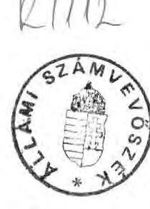
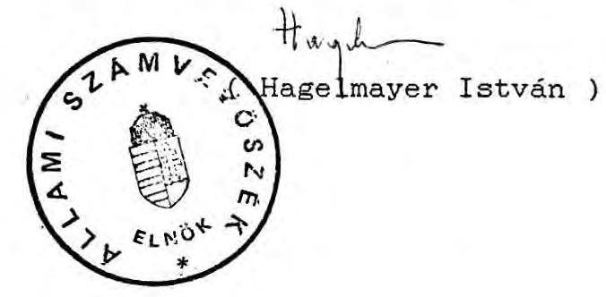
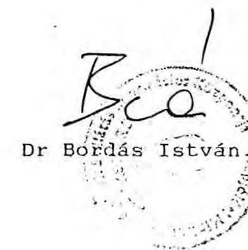
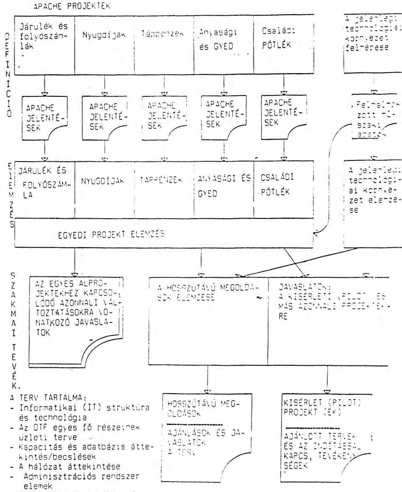
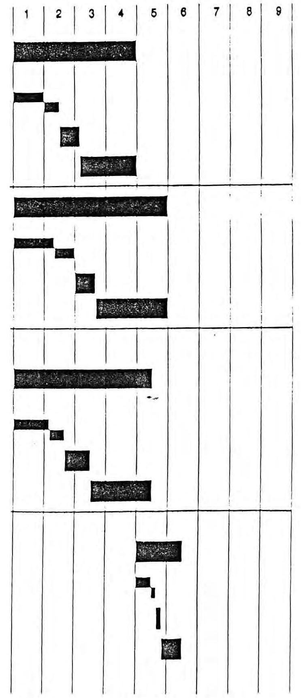
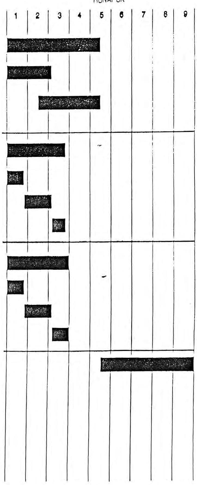
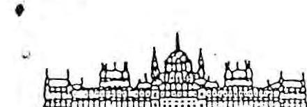
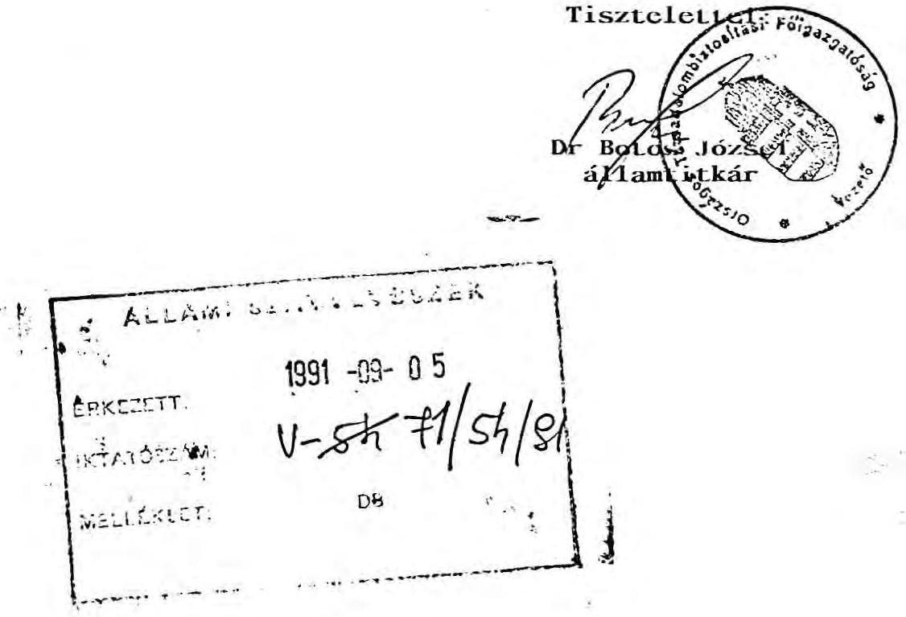
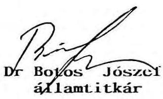

# Állami Számvevőszék 

## ÖSSZEFOGLALÓ JELENTÉS

a Társadalombiztosítási Alap kezelőjénél végzett számvevőszéki vizsgálatok hasznosulásának utóellenőrzéséről

---

Az ellenőrzést vezette: Bamberger Mária (az Egészségbiztosítási Felügyelő Bizottsági taggá választásáig)
dr. Csépán Magdolna

A jelentés összeállításában résztvett:
dr. Csépán Magdolna
tanácsos
Hajagos Józsefné
- számvevő
Molnár Istvánné
tanácsos

A helyszíni vizsgálatot végezték: 1. sz. melléklet szerint

---

# TARTALOMJEGYZÉK 

A Társadalombiztosítási Alap kezelőjénél végzett
számvevőszéki vizsgálatok hasznosulásának utóellenőrzéséről
című jelentéshez

OLDAL
BEVEZETÉS ..... 1.
VIZSGÁLATI MEGÁLLAPÍTÁSOK ..... 4.
I. A társadalombiztosítás átalakításának folyamata, ..... 4. törvényi szabályozás megalapozottsága
1./ A Társadalombiztosítási Alapra vonatkozó ..... 4. jogalkotói tevékenység
2./ A reformot megalapozó kutatási-fejlesztési ..... 5. tevékenység
2.1 A Pénzügyminisztériumban ..... 6.
2.2 A Népjóléti Minisztériumban ..... 6.
2.3 Az Országos Társadalombiztosítási Főigazgatóságnál ..... 7.
II. A törvényi szabályozások hatásai, szabályozatlanságok következményei ..... 10.
1./ A Társadalombiztosítási Alapról szóló ..... 10. törvényi szabályozások

---

1.1 Működési költségvetés bevételének ..... 10.
meghatározása 1990-ben
1.2 Beszámolási kötelezettség ..... 11.
1.3 Tartalékalapok képzése és felhasználása ..... 12.
2./ Alapító okirat ..... 13.
3./ A Társadalombiztosítási Alap gazdálkodásának pénzügyi, ellenőrzési, elszámolási, számviteli kérdései ..... 14.
3.1 Pénzügyi ellenőrzés ..... 14.
3.2 Az egészségügy társadalombiztosítási ..... 15.
támogatásának elszámolása
3.3 Az egészségügyi intézményeknek nyújtott ..... 16.
beruházási jellegű támogatások
3.4 Az állami egészségügyi ellátás körén ..... 18.
kívüli egészségügyi szolgálatok finanszírozása
III. Az Alap kezelőjének belső szabályozásai, működése ..... 19.
1./ Szervezeti- és Működési Szabályzat ..... 19.
2./ Számlarend ..... 20.
3./ Pénzpiaci műveletek ..... 21.
3.1 Szabályozás, gazdasági értékelés, ..... 21.
nyilvántartás
3.2 Pénzpiaci ügyletek ..... 22.
4./ Az Alap kezelőjének működési költségvetése ..... 23.

---

IV. A Társadalombiztosítási Alap pénzügyi biztonsága ..... 27.
1./ Az Alap bevételeinek és kiadásainak alakulása a két vizsgálat közötti időszakban ..... 27.
2./ A 3304/1991. Kormányhatározat és a megvalósítására született intézkedések ..... 30.
3./ A Társadalombiztosítási Alappal kapcsolatos állami garancia érvényesülése, a költségvetés megtérítési kötelezettségei ..... 30.
3.1 Az állami garancia ..... 30.
3.2 A központi költségvetés megtérítési ..... 32. kötelezettségei
4./ Az Alap tartalékainak alakulása ..... 34.
4.1 Tartósan befektetett eszközök növekedése ..... 35.
4.2 Befektetések hozama tartalék ..... 35.
4.3 Likviditási tartalék ..... 36.
4.4 Ügyviteli tartalék ..... 37.
5./ A társadalombiztosítás ingyenes vagyonjuttatása ..... 38.
V. A gyógyító-megelőző egészségügyi ellátás finanszírozásának helyzete ..... 39.
1./ Az ASZ 1991. évi vizsgálata nyomán elrendelt OTF intézkedések ..... 39.
1.1 Az OTF intézkedési terve ..... 39.
1.2 A belső ellenőri vizsgálat következményei ..... 40.

---

2./ Az egészségügyi ellátásra fordított pénzeszközök nyilvántartása ..... 42.
2.1 Nyilvántartási hiányosságok miatti pontatlanságok hatása az 1990. évi zárszámadásra ..... 42.
2.2 A nyilvántartások 1991. évi változása ..... 43.
3./ A finanszírozási rendszer 1991. évi változásai ..... 44.
3.1 Az árellentételezés fedezetének biztosítása ..... 44.
3.2 Az 1990. évi gép-műszerbeszerzések rendezése ..... 45.
3.3 A fejlesztési igények elbírálásának 1991. évi rendszere ..... 47.
4./ A szabályozás változása 1992-re ..... 50.
ÖSSZEFOGLALÓ MEGÁLLAPÍTÁSOK ÉS KÖVETKEZTETÉSEK ..... 52.
JAVASLATOK ..... 58.

---

# Állami Számvevőszék 

$\mathrm{V}-143-74 / 1991 / 92$.
Témaszám: 92 .

## ÖSSZEFOGLALÓ JELENTÉS

## A Társadalombiztosítási Alap kezelőjénél végzett számvevőszéki vizsgálatok hasznosulásának utóellenőrzéséről

Az Állami Számvevőszék - az Országgyűlés Szociális, Családvédelmi és Egészségügyi Bizottságának felkérésére - munkatervének megfelelően 1991. október és 1992. május közötti időszakban a Népjóléti Minisztériumban (a továbbiakban: NM), a Pénzügyminisztériumban (a továbbiakban: PM), az Országos Társadalombiztosítási Főigazgatóságnál (a továbbiakban: OTF), öt megyei Társadalombiztosítási Igazgatóságnál, öt önkormányzatnál és tizennégy egészségügyi intézménynél végzett utóellenőrzést az alapvizsgálatok hasznosulása tárgyában.

Az utóvizsgálat célja: a Társadalombiztosítási Alappal kapcsolatos korábbi számvevőszéki vizsgálatok megállapításai nyomán született intézkedések, a társadalombiztosítás átalakítási folyamatának, az ezt szolgáló jogi szabályozások áttekintése, értékelése. A vizsgálat kiterjedt a Társadalombiztosítási Alap legfontosabb elszámolási kérdéseire, a működési költségvetés alakulására, az Alap pénzügyi biztonságának értékelésére, valamint a gyógyító-megelőző egészségügyi ellátás finanszírozásának fontosabb kérdéseire.

A vizsgált időszak: 1990. év, időarányosan 1991. és 1992.

Az összefoglaló jelentés az OTF kapcsolódó tevékenységét négy, a nagyobb területeket egységbe foglalva vizsgáló, valamint a Pénzügyminisztériumban és a Népjóléti Minisztériumban felvett részjelentéseken alapul. A hat részjelentésben foglalt vizsgálati megállapításokra az érintett szervek írásos észrevételt tettek, amelyeket több esetben nem tudtunk elfogadni. Ezekben az esetekben álláspontunk fenntartásáról, illetve annak indoklásáról az érintetteket írásban tájékoztattuk.

Az elmúlt időszakban végzett két alapvizsgálat a társadalombiztosítás átalakításának egy-egy részterületét érintette.

Az 1990. évi alapvizsgálat arra irányult, hogy az 1988. évi XXI. törvényben megfogalmazott célok a Társadalombiztosítási Alap 1989. évi gazdálkodása során hogyan realizálódtak. A vizsgálat főbb kérdései voltak:

- az Alap pénzügyi keretének megteremtése, a bevételi többlet képzése és felhasználása,
- a XXI. törvény hatályba lépésével, az átfogó, új társadalombiztosítási törvény hiánya miatti joghiányok és átmeneti szabályozások, továbbá a törvény illesztése a meglévő szabályokhoz,
- az Alap kezelőjének belső szabályozásai, szervezetének ki- és átalakítása,

---

- az Alap működési kiadásai, fejlesztései,
- a járulékfizetési kötelezettség elmulasztásából eredő tartozások alakulása.

A gyógyító-megelőző egészségügyi ellátásra fordított pénzeszközök felhasználása tárgyában végzett 1991. évi vizsgálat főbb kérdései - a feladatcsere előkészítése, jogi szabályozása,

- az Alap kezelőjének intézkedései, új szervezet létrehozása, annak működése,
- az ellátásra fordítható összeg felhasználása és annak elszámolása,
- a finanszírozás 1991. évi változásai
voltak.

Az alapvizsgálatok megállapításaira tett intézkedésekkel az elkészült részjelentések tételesen foglalkoztak. Ezért az összefoglaló jelentés inkább tendenciájában, illetve a súlyponti ügyeket tekintve ismerteti e kérdéseket.

Az összefoglaló jelentés sajátos - meglehetősen összetett - szerkezetét egyrészt meghatározza a több témára kiterjedő utóvizsgálati jelleg, másrészt az a szándék, hogy áttekintést nyújtson a társadalombiztosítás reformjának, ezen belül elsődlegesen az egészségbiztosítás kialakításának eddigi lépéseiről.

---

# VIZSGÁLATI MEGÁLLAPÍTÁSOK 

## I. A társadalombiztosítás átalakításának folyamata, törvényi szabályozások megalapozottsága

Már az 1990. évi alapvizsgálat is felhívta a figyelmet arra, hogy a társadalombiztosítás reformjának előkészítése csak tudatos, tervszerű és összehangolt munkavégzéssel történhet, amelynek része a reformot képviselő törvényeket megalapozó kutatás-fejlesztési tevékenység is.

## 1./ A Társadalombiztosítási Alapra vonatkozó jogalkotói tevékenység

A társadalombiztosítás reformja több lépcsős folyamat, melynek törvényi szabályozási folyamatát a 2. sz. melléklet részletezi.

A jogalkotási folyamat eddigi eredményeit áttekintve megállapítható, hogy mind az OTF, mind a népjóléti tárca óriási jogszabályalkotási munkát végzett. Az egészségügyi és társadalombiztosítási reform - ezen belül az egészségbiztosítás kialakítása az egészségügyi reform kapcsán - zökkenőkkel ugyan, de megindult. A tervezett ellátási rendszer szakmai, szervezeti, működési, finanszírozási kérdéseinek, rendszerszemléletű összefüggéseinek teljes mértékű tisztázása azonban mindeddig nem történt meg.

---

A különböző irányból megnyilvánuló változást sürgető igények miatt szinte párhuzamosan folyt (és folyik) a szakmai koncepció részleteinek kidolgozása, az egészségbiztosítással összefüggésben annak orvos-szakmai megalapozása és a változások bevezetéséhez szükséges jogi, elszámolási, ügyviteli és ellenőrzési kérdések tisztázása, egyeztetése és jogszabályokban történő megfogalmazása.

Az 1991-ben és 1992-ben megjelent törvények a jogi szabályozást igénylő kérdések egy részénél megteremtették ugyan a kereteket (például a két biztosítási ág létrejöttének deklarálása), a Kormány hatáskörébe utalt témák szabályozása az egészségügy területén viszont több lépcsőben elhúzódó folyamatként valósul meg. A szabályozás szintjeinek egymásra épülése és kölcsönös összefüggése következtében így a már megalkotott jogszabályok sem fejtettek ki megfelelően hatásukat.

Az évente módosuló szabályozás a Társadalombiztosítási Alap kezelőjét a belső szabályozások tekintetében is állandó változtatásokra kényszeríti, illetve gazdálkodási, elszámolási kérdésekben számos problémát hozott felszínre (lásd részletesen a II/3. pontban).

# 2./ A reformot megalapozó kutatási-fejlesztési tevékenység 

A társadalombiztosítás reformjának megalapozására valamennyi vizsgált szerv (PM, NM, OTF) támogatott kutatási-fejlesztési tevékenységet.

---

A kutatás-fejlesztési tevékenység a vizsgált szerveknél egy-egy részterületre irányult, a támogatott munkák nem kapcsolódnak egymáshoz. A szerződések tartalmában, a partnerek személyében azonban érzékelhető átfedés.

# 2.1 A Pénzügyminisztériumban: 

A társadalombiztosítási rendszer megújításának koncepciójáról szóló 60/1991. (X.29.) OGY. határozatban foglaltakra való hivatkozással a Pénzügyminisztérium több kutatási célt is támogatott. A Fraternité Tanácsadó Részvénytársasággal kötött szerződés a társadalombiztosítás tőkefedezetével összefüggő elemzések készítésére szólt, 2,8 millió forint összegben. A PX Kft-vel kötött szerződés biztosítási pénztárak konstrukciójának kidolgozására irányult, a vizsgálat idején a tárca erre 28 millió forintot fordított, a megbízásokhoz adott feladatmeghatározás alapján. A vizsgálati tapasztalatok arra utalnak, hogy a PM által támogatott kutatási célok bizonyos fokig eltérnek a kötelező társadalombiztosítás Országgyűlés által elfogadott koncepciójától, annak hatókörét szűkebben értelmezik, előnyben részesítik jövőbeni nyugdíj-modell - a jelenlegi nyugdíjrendszertől legjobban eltérő - "C" variánsát.

### 2.2 A Népjóléti Minisztériumban:

A Népjóléti Minisztérium kimutatása szerint az egészségügyi, illetve társadalombiztosítási reform megalapozását szolgáló kutatás-fejlesztési tevékenységre 1988-tól 1991. végéig 276,8 millió forintot költöttek (3. sz. melléklet).

---

A feltüntetett kiadások nem teljeskörűek, hivatkozással arra, hogy a kimutatás nehézségekbe ütközik, nem tartalmazzák a működési költségek azon részét, melyből a Népjóléti Minisztérium szakapparátusának vagy háttérintézeteinek munkaköri feladatként végzett ilyen irányú tevékenységét finanszírozták.

A Népjóléti Minisztérium fejezeti költségvetése 1991-ben először tartalmazta tételenként a tárca ágazati célprogramjait (4. sz. melléklet). Ezek közül néhány az egészségügyi reformmal volt kapcsolatos. A célprogramok előirányzatai - külső (PM) és belső döntések alapján - az év folyamán jelentősen módosultak. Ezen belül a megjelölt céloktól eltérő jogcímekre is történt pénzügyi teljesítés.

A kutatás-fejlesztési célra felhasznált pénzeszközöket az ASZ, a népjóléti tárca 1992. évi fejezeti ellenőrzése keretében részletesen vizsgálja.

# 2.3 Az Országos Társadalombiztosítási Főigazgatóságnál: 

Az OTF 1990-1991. évi kutatás-fejlesztési terve szerinti és az ezen kívüli kutatásokra-fejlesztésekre 74,5 millió forint és 1,3 millió US dollár értékben kötött szerződést, ezen belül a társadalombiztosítás reformjára 35,6 millió forint és 1,3 millió US dollár értékben (5. sz. melléklet).

---

A kutatási témák egyrészről szakértői munkálatok a jelenlegi állapot megváltoztatására, továbbfejlesztésére és a társadalombiztosítási reform megalapozására irányultak, másrészről jogi, szabályozási és jogalkalmazási jellegűek.

A fejlesztési témában - a társadalombiztosítás szervezeti, munkafolyamati, információ-technológiai fejlesztésére - az OTF vezetője 1991. szeptember 13-án az EDS Electronic Data System Corporation-nal megállapodott (továbbiakban: EDS). A megállapodás aláírását megelőzően az EDS saját költségére elkészítette a "Társadalombiztosítás szervezetét és tevékenységét felmérő tanulmány"-t, emellett az OTF-nél a tanulmánykészítés költsége meghaladta a 3,0 millió forintot. A tanulmány elkészítése után ugyan az OTF lefolytatott egy zártkörű versenyeztetést, de a beérkezett ajánlatok tételes feldolgozását és összehasonlítását nem végezte el, csupán a kiválasztás főbb szempontjait rögzítette, ezért egzakt módon nem állapítható meg a pályázók sorrendje és az EDS első helye.

A megkötött megállapodást (6. sz. melléklet) szakmai tartalom, határidő, díj és tulajdonjog kérdésében módosították.

A módosított megállapodás több helyen pontatlanul fogalmaz, nem védi kellően a Társadalombiztosítási Alap érdekeit, pénzügyileg hátrányos az OTF számára, mert:

- a szerződésben csak a szolgáltatás díja rögzített, de ehhez a szerződés szerint bármiféle díjazással kapcsolatos adó és felmerült kiadás megtérítése járulhat,

---

- a szállítási határidő és fizetési feltételnél ugyan rögzített a késedelmes fizetés szankciója, de a késedelmes teljesítésé nem; a fizetés és a szolgáltatás teljesítésének üteme között nincs konkrét összefüggés,
- a jogi garanciák hiányoznak, a teljesítés minősítésére csak annyiban szerepelnek

 garanciák, hogy az átvételt és visszautasítást szabályozza, de pénzügyi következmények és határidő nélkül.

A fejlesztési terv szakmai tartalmába nem kerültek bele az egészségügyi folyamatok, valamint a 60/1991. OGY határozatban és a társadalombiztosítás önkormányzati igazgatásáról szóló 1991. évi LXXXIV. törvényben a szervezetre, a biztosítási ágak feladataira, működésére vonatkozó elhatározások. Ennek oka, hogy az egészségügyi folyamatok kellő jogszabályi előkészítése a megállapodás aláírásának időpontjára nem készült el, valamint az eredeti szakmai tartalom rossz meghatározása, a munkálatok elkezdése és a menetközbeni módosítással járó veszteség minimalizálása. Így az információ-technológiai fejlesztésben javaslatot kérnek a szervezet kialakítására, a fő folyamatok között szerepel az ellátási körön kívüli családi pótlék vagy csak átmenetileg a társadalombiztosítás által finanszírozott GYED, továbbá a kialakítandó szervezethez szorosan kapcsolódó járulék-folyószámla és számítástechnikai hálózat terve.

Az, hogy a kutatás-fejlesztés csak részterületeket érintően foglalkozik a társadalombiztosítással, eddig is zavaró volt, későbbi hatásai a megvalósítás során pedig ma még be nem láthatóak.

---

II. A törvényi szabályozások hatásai, szabályozatlanságok következményei

A végrehajtás ellenőrzése során mindkét alapvizsgálat jelentős hiányosságokat állapított meg amiatt, hogy a törvények elfogadása és hatályba lépése - a szükséges szakmai előkészítés és megfelelő felkészülési idő nélkül - egyidejűleg történt.
1./ A Társadalombiztosítási Alapról szóló törvényi szabályozások

A Társadalombiztosítási Alapról szóló 1988. évi XXI. törvény joghézagai és módosításai az 1990. évi költségvetési törvény végrehajtásánál értelmezési problémákhoz vezettek.

E problémák részben abból származtak, hogy az alaptörvény módosításaira az éves költségvetési törvény jóváhagyásával együtt került sor, amíg az előző évi költségvetés végrehajtásáról szóló törvény megalkotása időben a módosítás jóváhagyását követte. Az értelmezési problémákat és következményeit az 1.1, 1.2 és az 1.3 pontok ismertetik.
1.1 Működési költségvetés bevételének meghatározása 1990-ben

Az Alap 1990. évi költségvetésének végrehajtásáról szóló 1991. évi XXXVI. törvényben a működési költségvetés bevételeit nem az 1990. évre hatályos alaptörvény szerint határozták meg, hanem az 1991. január 1-jétől hatályos módosítás azon rendelkezésének figyelembevételével, hogy az

---

Alap pénzügyi tevékenységéből (kamat- és egyéb hozambevétel) származó bevétel nem vetítési alap a működési költségvetést megillető 1% megállapításánál. Az előbbiek miatt a működési költségvetés bevételének, valamint a bevétel és kiadás különbözetéből képzett ügyviteli tartalék nagysága a költségvetés végrehajtásáról szóló törvényben 7 millió forinttal volt kisebb az 1990. évben hatályos törvény szerinti elszámoláshoz viszonyítva.

# 1.2 Beszámolási kötelezettség 

Az Alap pénzügyi, elszámolási és számviteli rendjéről szóló 13/1989. (II. 10.) MT rendelet kimondta, hogy az Alapra és kezelő szervezetére a költségvetési szervekre vonatkozó gazdálkodási, pénzügyi, elszámolási és számviteli rendet kell alkalmazni néhány eltéréstől eltekintve. Az alaptörvény előírja, hogy az Alap működéséről az Országgyűlés előtt évente be kell számolni, jogcímenként bemutatva a bevételeket és kiadásokat, az Alap eszközeivel való gazdálkodás eredményét, annak felhasználását és a működés költségeit.

Ugyanakkor a költségvetés végrehajtását az 1990. évi zárszámadási törvény nem teljeskörűen mutatta be, csak az Alap szempontjából végleges bevételekről és kiadásokról számolt be, továbbá a működési költségvetést is csak az ellátási kiadásokon keresztül számszerűsítette, az olyan közvetlenül hozzátartozó pénzforgalomról (mint a vállalkozói tevékenységből származó bevétel eredménye és visszaforgatása, továbbá az előző évi pénzmaradvány bevonása) pedig nem szólt.

---

Az államháztartási mérleg sem foglalja magában a társadalombiztosítás egészére vonatkozó adatokat, minthogy a zárszámadási törvény adataira épülve az ellátási szektor költségvetési beszámolóját továbbították a Pénzügyi Számítástechnikai Intézetnek az országos összesítéshez. Így nem szerepel az országos összesítésben a működési költségvetés, csak az Alapból a működéshez átadott pénzeszközök. Mindennek következtében maga az államháztartási mérleg sem teljeskörűen mutatja be az alrendszereire vonatkozó adatokat.

Az államháztartásról elfogadott törvény szerinti információs és mérlegrendszer kialakítása keretében a PM koordinációja mellett jelenleg folyik a társadalombiztosítás információs rendszerének kidolgozása. E munka remélhetőleg azt is eredményezi, hogy az Alap(ok) kezelője megfelelő módon integrálódik az államháztartás rendszerébe.

# 1.3 Tartalékalapok képzése és felhasználása 

Az alaptörvény módosítása a tartalékalapok képzése és felhasználása belső szabályozásának változtatását vonta maga után. Az Alap kezelőjének számlarendje ezeket a módosításokat eltolódva, nem teljeskörűen követi.

Ugyanakkor az alaptörvényt módosító 1991. évi III. törvény előírása a befektetések hozama tartalék felhasználására az általános rendelkezésben és az 1991. évi költségvetésre vonatkozóan ellentmond egymásnak.

---

Az Alap bevételei, kiadásai, a képzett tartalékok nagysága és a költségvetés végrehajtásáról szóló törvénybeli értéke nem egyezőek. Az eltérés nagyságát a IV/4. pont részletezi. Az OTF helytelen könyvelése, elszámolása is okozott eltéréseket, amelynek rendezésére részben intézkedtek.

A számlarend 1992. évben is, hasonlóan az előző évekhez, a törvényi változásokat eltolódva nem teljeskörűen követi, illetve tudja követni. Ennek alapvető oka a tartalékok Nyugdíjbiztosítási- és Egészségbiztosítási Alap közötti megosztásáról rendelkező törvény hiánya. A kialakult helyzet azért is előnytelen, mert a kamat- és egyéb hozambevétel felosztásának is törvényi szabályozáson kell alapulnia.

# 2./ Alapító okirat 

Az OTF alapító okirattal nem rendelkezik. Feladatait a Társadalombiztosítási Alapról szóló törvényi szabályozások alapján végzi. A törvényi úton nem szabályozott kérdések az alapító okirat hiányában annak módosításával nem rendezhetők, az OTF működésében a joghézagok visszatükröződnek. Így az alapító okiratnak, illetve az ezen alapuló Szervezeti Működési Szabályzatnak kellett volna kitérnie az alaptevékenységek és a vállalkozói tevékenységek meghatározására, az országos hatáskörű szerv szervezeteire, feladataira, kapcsolataira. A szakfeladatonkénti tevékenységek szabályozásának hiányában a költségvetési beszámoló helyessége megítélés kérdése.

---

Az alap- és vállalkozói tevékenység elhatárolását a számviteli törvény, illetve a költségvetés alapján gazdálkodó szervek beszámolási és könyvvezetési kötelezettségről szóló 179/1991. (XII. 30.) Kormányrendelet is megköveteli a tőkeváltozás és a tartalékok kimutatásához.
3./ A Társadalombiztosítási Alap gazdálkodásának pénzügyi, ellenőrzési, elszámolási, számviteli kérdései

# 3.1 Pénzügyi ellenőrzés 

Bár az Alap létrehozásakor a 13/1989. (II. 10.) MT rendelet előírta, hogy az Alapra és kezelőjére e kérdésekben a költségvetési szervekre vonatkozó 23/1979. (VI. 28.) MT rendeletben előírtak a hatályosak, a pénzügyi ellenőrzés kérdésében nem rendelkezett.

Az alaptörvényt módosító 1991. évi III. törvény szerint az OTF csak az Alapon belüli gazdálkodás és pénzügyi műveletek szabályait állapíthatja meg.

Az Alap kezelője a pénzügyi ellenőrzés kérdésének rendezését nem kezdeményezte. Ez 1990. évben az egészségügy finanszírozása és a családi pótlék folyósítása közötti feladatcsere miatt még indokoltabb lett volna, amire az alapvizsgálat is felhívta a figyelmet. Az Alapból egészségmegőrzési és a működési költségvetésen belül különféle célokra pénzeszközök átadása korábban is előfordult, de az OTF sem az ellátások, sem az ügyvitel te-

---

rületén nem szabályozta a külső szervezeteknek adott támogatások elszámolását és ellenőrzését. Egyes esetekben (pl. egészségmegőrzés) a szerződésben ugyan kikötötte az ellenőrzés jogát, a gyakorlatban azonban nem élt vele.

Az egészségügyi intézmények vonatkozásában a társadalombiztosítási jogszabályokban megjelenő, 1992-től érvényes ellenőrzési jog ugyanis szakmai jellegű, a pénzügyi ellenőrzést továbbra sem teszi lehetővé, annak ellenére, hogy reform folyamatában, az átmenet figyelemmel kíséréséhez, a pénzügyi ellenőrzés elengedhetetlen lenne. Nem fogadható el az OTF-nek és a Népjóléti Minisztériumnak az a felfogása, hogy a társadalombiztosítást a törvényekben megfogalmazott ellenőrzési szabályok az általa finanszírozott jellemzően költségvetési szerveknél automatikusan felhatalmazzák pénzügyi ellenőrzés végzésére is. Ugyanakkor a kialakuló biztosítási ellenőrzés miatt a pénzügyi ellenőrzésnek nem tulajdonítanak jelentőséget.

# 3.2 Az egészségügy társadalombiztosítási támogatásának elszámolása 

Az egészségügyi ellátás társadalombiztosítási finanszírozásával kapcsolatos 1991. évi alapvizsgálat kifogásolta a támogatások elszámolásának - Pénzügyminisztérium által kialakított - rendszerét, mivel az intézményeknél bevezetett 375. Társadalombiztosítási támogatás elszámolása számla technikailag alkalmatlannak bizonyult a tényleges helyzet (a kiutalt támogatás és annak felhasználása) bemutatására.

---

Az elszámolási probléma rendezése céljából az OTF és a PM között többszöri levélváltásra került sor, a félreértésekre okot adó PM-közlemény helyesbítése azonban végül is nem történt meg. Módosult ugyanakkor a költségvetési szervek 1991. évi beszámolóinak kitöltési utasítása, majd az 1992-től érvényes számviteli előírások életbelépésével az említett számla alkalmazása megszűnt, egyenlegét 1992. január 1-jével a 411. Induló tőke számlával szemben véglegesen rendezték.

A költségvetési szervekre vonatkozó számviteli szabályok egységes pénzforgalmi szemlélete ugyanakkor az egészségügy területén nem felel meg a teljesítmény finanszírozásra való áttéréshez nélkülözhetetlen költségmegfigyelés követelményeinek. A költségek tevékenységenkénti meghatározását a szabályozás ugyan nem zárja ki, de mivel a "kettős" nyilvántartás vezetésének és az önköltség számításának szükségességét az egészségügyi intézmény saját hatáskörében döntheti el, az nem biztosított. A nem számviteli nyilvántartásokon alapuló adatszolgáltatás pedig nem megbízható és ennek következtében a teljesítményfinanszírozás adatbázisa sem az.
3.3 Az egészségügyi intézményeknek nyújtott beruházási jellegű támogatások

Az 1991. évi alapvizsgálat megállapította, hogy a Társadalombiztosítási Alap kezelője működési költségek finanszírozása mellett jelentős támogatásokat adott nagyértékű gép- és műszerbeszerzésekhez, annak ellenére, hogy a törvényi szabályozás a finanszírozás keretösszegét "beruházások, nagyjavítások" nélkül határozta meg. Az Országgyűlés Szociális-Egészségügyi és Családvédelmi Bizottsága a beruházási és működési célok egyértelmű elhatárolására a Népjóléti Minisztériumot kérte fel, aminek teljesítése azonban nem történt meg.

A társadalombiztosítási forrásból finanszírozandó kiadások körének meghatározása változatlanul nehézségekbe ütközik.

A számviteli törvény értelmében a működés és a beruházás nem választható szét. A gazdálkodók működését egy éven túl szolgáló - a mérlegben tárgyi eszközként megjelenő - gépek, berendezések, felszerelések beszerzésének, pótlásának kiadásai a tárgyi eszközök értékét növelik. A tárgyi eszköz fogalomba azonban olyan eszközök is beletartozhatnak, amelyek korábban a működési költségek között jelentek meg.

A társadalombiztosítási jogszabályok szóhasználata (működési kiadás, beruházások) nincs összhangban a számviteli törvényben foglaltakkal, azok időközben más tartalmat nyertek. (Így például a törvénynek megfelelően beruházásként kell kimutatni minden tárgyi eszközt, amit még nem aktiváltak, helyeztek üzembe.)

A költségvetési szervek számlakerete egyébként a 47. Felhalmozási célú átutalások jogcímei között feltünteti a Társadalombiztosítási Alaptól származó átutalásokat is, tehát nem zárja ki annak lehetőségét, hogy valamely intézmény beruházási jellegű célra tárgyi eszköz beszerzésére társadalombiztosítási támogatást kapjon.

---

# 3.4 Az állami egészségügyi ellátás körén kívüli egészségügyi szolgálatok finanszírozása 

Az 1991. évi III. törvény elvileg már megengedte a nem állami szervezetek egészségügyi szolgáltatásainak teljesítményfinanszírozási rendszerben történő társadalombiztosítási támogatását. Az ASZ alapvizsgálata megállapította, hogy ennek feltételei még nem biztosítottak, a szakmai követelményrendszer, a betegellátásért való felelősség kritériumai nem kidolgozottak. A Országgyűlés Szociális Egészségügyi és Családvédelmi Bizottsága a szükséges szabályozásra a Népjóléti Minisztériumot kérte fel.

Az utóvizsgálat idejére a finanszírozás tervezeti szintű szabályozása készült el.

Az időközben megjelent, az 1992. évi X. törvényen alapuló 79/1992. (V. 12.) Kormányrendelet lehetőséget teremtett egyházzal, alapítvánnyal, egészségügyi vállalkozással és magángyakorlatot folytató orvossal történő szerződéskötésre. Az ilyen jellegű igényeket szakmailag a Népjóléti Minisztérium rangsorolja. A támogatás szakmai szempontjai illetve a teljesítményfinanszírozás normái még nem ismeretesek (lásd V/3.3. pontját).

---

# III. Az Alap kezelőjének belső szabályozásai, működése 

## 1./ Szervezeti- és Működési Szabályzat

A Társadalombiztosítási Alap létrehozásakor a kitűzött célok között megfogalmazták az önkormányzati irányítást, amit csak 1991 végén a LXXXIV. törvényben szabályozták. Az önkormányzati irányítás életbeléptetését 1993. januárjára ütemezték. Az átmeneti időszak végére, a jelen helyszíni vizsgálat lezárását követően az OTF több lépcsős munka eredményeként készítette el Szervezeti és Működési Szabályzatát.

Az SZMSZ
 azonban lényegében csak egy évig van érvényben. Az OTF szervezete az önkormányzati irányításhoz igazodva átalakul, illetve új szervezetek jönnek létre, amelyekre ez a szabályzat már nem vonatkozik.

Az 1989-91. közötti időszakban csak ideiglenes Szervezeti és Működési Szabályzat volt érvényben, amely csak az új, illetve a megváltozott feladatokra és szervezetekre vonatkozott. Egyes feladatokat nem szabályoztak, vagy több szervezeti egységet érintő feladat esetén az egységek közötti összhangot nem teremtették meg.

A több szervezeti egységet érintő feladatok szabályozási hiányosságai:

- Nincsenek egyértelműen elhatárolva az értékpapír vagyon gazdálkodásával kapcsolatos feladatok.

---

- Az alapszerű gazdálkodás elszámolási szabályainak kialakítása nem rendezett.

Nincsenek továbbra sem szabályozva

- a kutatási-fejlesztési tevékenység szervezeti-, működési kérdései
- az egészségügyi finanszírozás területén a javaslattevő, a döntő, a végrehajtó és az ellenőrző személyek megnyugtató elkülönítése,
bár az alapvizsgálatok ezeket mint hiányosságokat megállapították.

Nem rögzítették a szabályzatban a maradványérdekeltségű alaptevékenységet és vállalkozói tevékenységet a szakfeladat megjelölésével, amit az Alap kezelőjére is hatályos 4/1991. (II. 13.) PM rendelet előír.

Mindezen hiányosságok többnyire az Alap gazdálkodásával függnek össze. Az Alap kezelője azonban gazdálkodási szervezettel és gazdasági vezetővel nem rendelkezik. A feladatokat több főosztály, több vezetőhelyettes, illetve maga az OTF vezetőjének irányításával látja el.

# 2./ A számlarend 

Az alapvizsgálatot követően az új számlarendet csak 1991. január 1-jével léptették életbe, de csupán a Társadalombiztosítási Alapra. Az Alap kezelőjének gazdálkodásához továbbra is csak a költségvetési szervekre vonatkozó általános számlakeretet alkalmazták. Az életbe

---

léptetett számlarend törekedett az 1991. évi III. törvényben szabályozott alapképzés előírásainak eleget tenni. Ahhoz azonban, hogy a tartalék elszámolások a törvényi szabályoknak megfeleljenek, az év folyamán a számlarendet többször módosítani kellett. A módosítások alkalmával figyelembe vették a helyszíni vizsgálat során megállapított hiányosságokat is. Az Alap kezelőjének gazdálkodásának könyvelési hibái döntő többségében értelmezési problémákból származtak, melyeket az OTF sajátosságait figyelembevevő számlarend kiküszöbölt volna (amelyeknek egy részét időközben ugyancsak helyesbítették).

# 3./ Pénzpiaci műveletek 

### 3.1 Szabályozás, gazdasági értékelés, nyilvántartás

Az ASZ az alapvizsgálati jelentésében már megfogalmazta a befektetések gazdaságosságának, időszakos elemzésének szükségességét. Az Alap gazdálkodásában 1989-ben is szerepet kapott az átmenetileg szabad pénzeszközök befektetése, de az ügyletek számának növekedése még inkább alátámasztotta ezt az igényt.

Az elemzés rendjére és szempontjaira belső utasítást készített az OTF. Az utasításban foglaltakat az időszakosan elkészített elemzések nem elégítik ki minden vonatkozásában, ezért csak általános helyzetkép bemutatására alkalmasak és a befektetések minősítésére kevésbé.

---

A pénzpiaci műveletek nyilvántartását az alapvizsgálat még jónak ítélte, de az ügyletek számának és fajtájának növekedése miatt ma már nem felel meg a számvitel analitikus nyilvántartási igényének. Az ügyletekről megbízható információ a nyilvántartásból nem nyerhető, csak magából a szerződésből. (A pénzpiaci műveletek megfelelő, számítógépes nyilvántartására az OTF már intézkedett.)

# 3.2 Pénzpiaci ügyletek 

A törvényi szabályozás megtartásával az Alap 1990. évi ügyleteinek eredményeként a zárszámadási törvényben 712.941 ezer forint kamat- és egyéb hozambevételt számoltak el az Alap bevételeként. A bevételi tételek téves könyvelése miatt a tényleges bevétel 753.887 ezer forint. Az eltérés a tartalékalapok képzésére gyakorol hatást, melyet a IV/4. pont ismertet. A vizsgálat által megállapított értékből a tartós befektetések hozadéka 652.814 ezer forint, az átmenetileg szabad pénzeszközök rövidlejáratú befektetéseinek bevétele 60.087 ezer forint és a gyógyszer ellátással kapcsolatos előlegek kamatbevétele 40.986 ezer forint.

A pénzpiaci ügyleteket terhelő ráfordítás 8.547 ezer forint volt, a rövidlejáratú ügyletek éves kamatszintje 23-29 % között mozgott 1990. évben. 1991. I-III. negyedévben a tartós befektetések hozadéka megközelítette a 3 millió forintot, a rövidlejáratú pénzpiaci műveletekből származó bevételek meghaladták a 420 millió forintot.

---

Amíg az Alap átmenetileg szabad pénzeszközeinek rövidlejáratú befektetései az elmúlt időszakban évenként a többszörösére emelkedtek, addig az ügyviteli tartalékból ezen időszak alatt befektetésként egy ügyletet bonyolítottak le. Ez azzal magyarázható, hogy az átvezetést az Alapból a költségvetési év vége felé eszközölték, mert addig az Alap kiadási többletének finanszírozásához használták az ügyviteli tartalékot.

# 4./ Az Alap kezelőjének működési költségvetése 

Az 1991. évi III. törvény értelmében az Alap és kezelőjének működési költségvetése elkülönül. A működési költségvetés bevétele "folyamatosan - közvetlenül a bevétel beérkezését követően" keletkezik. A törvénybeli változás igazgatóságok szintjén nem érvényesül, mivel a társadalombiztosításnak vannak olyan gazdálkodói, ahol bevétel nem keletkezik, vagy bevételeik működési kiadásaikat nem biztosítják. Ez az egyik oka annak, hogy a Főigazgatóság és az igazgatóságok közötti pénzügyi kapcsolat változatlan, vagyis csak a jóváhagyott működési költségvetésnek megfelelően vehetik igénybe a bevételt, az azon felül tovább kell utalni a Főigazgatóság bankszámlájára.

A működési kiadások (7. sz. melléklet) előirányzatai az Alap létrehozásától kezdődően mintegy évi 50 %-kal növekedtek.

Az 1990. évben a növekedési ütem elégségesnek bizonyult, 1991. évben viszont már szükség volt az előző években

---

képződött ügyviteli tartalék bevonására részben a megnövekedett kiadásokhoz, részben az elmaradt bevételek pótlására. A működési költségvetés bevétele döntően a járulékfizetéstől függ.

A tényleges működési kiadás az 1989. és 1990. évben nem érte el az Alap bevételének 1 %-át, a különbözetből tartalékot képeztek.

Az 1991. évi kiadást az előre nem tervezett feladatok, kifizetések is növelték, melyből néhány fontosabb tétel:

- az egyéni vállalkozók számának nagyarányú növekedése növelte a postai be- és kifizetések forgalmi díja miatt a banki költségeket,
- a betegbiztosítási kártya bevezetésének előkészítési költségei,
- új, az OTF valamennyi intézményét egyetemesen érintő biztosítás díja,
- kárpótlási törvényből az OTF-re háruló többlet feladatok,
- lakossági és szabadidő-sport tevékenység támogatásának finanszírozásával kapcsolatos kiadások.

Már az Alap létrehozásakor lehetőség biztosított a jogszabály, hogy a működési költségvetésen belül maga határozza meg "a szervezet működéshez szükséges béralapot és érdekeltségi rendszert". Ezen lehetőség mellett is, - az 1990. évben két lépcsőben (16 % automatizmus, 20 %) végrehajtott bérfejlesztés ellenére - az átlagos havi jövedelem 14.200 forint volt.

---

A létszámhiány OTF szinten csökkenő tendenciát mutat, de a budapesti régióban változatlanul magas. Továbbra is jelentős a fluktuáció, melynek okai közül ki kell emelni a szakképzetteknél a jobb bérezést, a fiatalabb szakképzettség nélkülieknél a nagy terhelést.

Az Alap kezelője 1990. évben fejlesztésekre (épületbővítés, rekonstrukció) 427 millió forintot fordított, ami az 1989. évi felhasználás 87 %-ának felel meg.

Az épület beruházások döntő mértékben a többlet feladatok tárgyi feltételeit biztosították és csak kisebb arányban javította az elhelyezési körülményeket.

A Budapesti és Pest megyei Igazgatóság épületének teljeskörű rekonstrukciójához ki kellett költöztetni az idegen szervezeteket. A helyiségek felszabadításáért 60 millió forint vissza nem térítendő fejlesztési hozzájárulást és 10 millió forint kamatmentes hitelt nyújtottak. Az Alap működési költségvetéséről rendelkező 1991. évi III. törvény ilyen hitel nyújtását nem teszi lehetővé. Az OTF időközben intézkedett a hitelszerződés felbontásáról.
1991. évben megkezdődött az új irodaépület beruházásának előkészítése, 1992-93. évi kivitelezéssel és 1994. évi pénzügyi lezárással ütemezve, 1,6 milliárd forint + ÁFA költség előirányzattal. A beruházás forrása a működési költségvetés és az ügyviteli tartalék.

---

A munkavégzés technikai feltételeinek javításához 1990. és 1991. években nagyobb arányban eszközöltek hírközlési, ügyvitelgépesítési beszerzéseket mint korábban.

A számítástechnikai fejlesztésekre 1990. évben 144 millió forintot használtak fel. A korábbi gyakorlatnak megfelelően a rendelkezésre álló központi keretből hardware fejlesztésre 41 millió forintot, software fejlesztésre 10 millió forintot fordítottak.

A Budapesti Igazgatóságon az AS/400-as számítógépre alapuló helyi hálózatot kialakították, s hozzá a software fejlesztést (komplex nyugdíj megállapítási rendszer) 1991. évben befejezték. A rendeltetésnek megfelelő használatbavételhez azonban nagyobb kapacitású hardware szükséges. Ismételten bebizonyosodott, hogy a hardware és software fejlesztést össze kell hangolni, s ez még ma sem megfelelő.

A mikrofilm technika fejlesztésére 1990. és 1991. évben 30 millió forintot fordítottak, az egyre több gondot okozó archiválási probléma megoldásaként és az elhelyezési körülmények javításaként, a felszabaduló irattározási területek hasznosításával.

Az alapvizsgálat kifogásolta, hogy a befejezett beruházások aktiválását nem végezték el maradéktalanul. Jelen vizsgálat során ellenőrzött befejezett beruházások üzembehelyezése, az állóeszközök állománybavétele megtörtént.

---

IV. A Társadalombiztosítási Alap pénzügyi biztonsága
1./ Az Alap bevételeinek és kiadásainak alakulása a két vizsgálat közötti időszakban:

A Társadalombiztosítási Alap önállósulásának első évét a stabil pénzügyi helyzet jellemezte. Mint emlékezetes az Alap az 1989. évet - a tervezettet meghaladó bevételnövekedés következtében - 26,9 milliárd forint többlettel zárta, az 1990. évi ASZ-alapvizsgálat egyik fő témája a felhasználás ellenőrzése volt.

A későbbiek során azonban jelentős változás következett be.

A Társadalombiztosítási Alap bevétele 1989-91. között 47,2 %-kal növekedtek, a kiadások növekedésének mértéke ugyanakkor 70 %-os. (A bevételek és kiadások adatait a 8.sz. melléklet mutatja be.) A Társadalombiztosítási Alap pénzügyi helyzetét 1991-ben már negatívan befolyásolta a járulékbevételek előirányzatoktól elmaradó ütemű emelkedése, amiben a gazdasági folyamatok (kedvezőtlen) alakulása egyértelműen szerepet játszott.

A társadalombiztosítási kiadásokat eddig lényegében sikerült a tervezett keretek között tartani, túllépés 1991-ben csak a gyógyszer-gyógyászati segédeszközök esetében következett be.

A jövőt illetően azonban ez egyre nehezebb lesz, hiszen a nyugdíjkiadásokat determinálja a lakosság

---

korösszetételének alakulása, az import gyógyszerek növekvő felhasználása miatt az ártámogatás nagymértékű emelkedésére kell számítani, az egészségügyi ellátás pedig közismerten "költségrobbanás" előtti állapotban van.

A Társadalombiztosítási Alap pénzügyi helyzetét a bevételek kedvezőtlen alakulását alapvetően meghatározza, hogy a társadalombiztosítás kinnlévőségei az elmúlt időszakban ugrásszerűen növekedtek.

A tartozások bruttó összege 1989. év végén 11,2 milliárd forint, 1990. decemberben már 23,9 milliárd forint volt és 1991. végén - az ASZ helyszíni vizsgálat idején - pedig meghaladta az 54,4 milliárd forintot, ami átlagosan 1,5 havi tartozásnak felel meg. (Részletes adatok a 9. sz. mellékletben.)

A tartozások területi, szektorális alakulása jól tükrözi a gazdaság egészében jelentkező problémákat (hagyományos ipari övezetek, bányavállalatok, mezőgazdasági nagyüzemek válsága, fizetési nehézségek, az általános fizetési morál romlása stb.)

A tartozások növekedése az 1992. évben tovább folytatódott, bruttó állománya a március 31-i adatok szerint 64,9 milliárd forint, amiből a gazdálkodó szervek (átalakult gazdasági társaságok) által be nem fizetett összeg 50,4 milliárd forint (77,6 %).

A társadalombiztosítási járuléktartozások témakörében az Alap kezelőjénél tartott - több megyei igazgatóságot is

---

érintő - helyszíni vizsgálat áttekintette a folyószámla könyvelés és nyilvántartás rendszerét. Az ellenőrzés e területen súlyos problémákat tapasztalt, melyek közül a leglényegesebb, hogy:

- a járulékfizetés adatai nem naprakészek, a gépi feldolgozás rendszere sem alkalmas a valóságos helyzet bemutatására,
- a munkafolyamatok bonyolultak, rendkívül nagy a dolgozók munkaterhelése,
- a folyószámlák jelentős része rendezetlen, nem követi a bekövetkezett változásokat (ez elsősorban a Budapesti és Pest megyei Társadalombiztosítási Igazgatóságra jellemző, ugyanitt komoly probléma a felgyülemlett ügyirathátralék is).

Mindezek jelentősen gátolják a társadalombiztosítási szervek hatékonyabb behajtási tevékenységének megszervezését.

Szabályszerűségi követelmény, hogy a mérleget (éves beszámolót) szabályszerű leltárral alátámasztott bizonylatok (analitikus és szintetikus nyilvántartások) alapján kell összeállítani. Az előzőekben vázolt problémák miatt az OTF a szolgáltatási szektorban e követelménynek még 1991-92-ben sem tudott, illetve tud eleget tenni, teljeskörűen és rendszeresen nem tudja elvégezni a járulékfizetőkkel - adósokkal - a tételes egyeztetést.

---

2./ A 3304/1991. Kormányhatározat és a megvalósítására született
 intézkedések

Az 1991. év folyamán szükségessé vált, hogy a Társadalombiztosítási Alap helyzetére tekintettel kormányzati intézkedések szülessenek.

Az Országgyűlés - a 42/1991. (VII.25.) OGY határozat 3. pontjában - felkérte a Kormányt, hogy az Alap helyzetére tekintettel, kinnlévőségeinek behajtása érdekében tegyen intézkedéseket. Ezt követően született meg a 3304/1991. Kormányhatározat, amely a legszükségesebb intézkedéseket megfogalmazta (részletezésüket a 10. sz. melléklet ismerteti).

A kedvezőtlen folyamatok megállítása érdekében hozott központi intézkedéseket áttekintve az Állami Számvevőszék megállapította, hogy azok jelentős része a kitűzött határidőre nem valósult meg, illetőleg hatásuk a helyszíni vizsgálat idején még nem mutatkozott. Úgy ítéli meg, hogy (erre egyébként a tartozások növekedésének tendenciája is utal) a Társadalombiztosítási Alap védelmében hozott intézkedések esetleges hatásánál sokkal erősebben érvényesülnek a gazdasági szféra külső hatásai.
3./ A Társadalombiztosítási Alappal kapcsolatos állami garancia érvényesülése, a költségvetés megtérítési kötelezettségei

# 3.1 Az állami garancia 

A Társadalombiztosítási Alap a költségvetéshez legszorosabban az állami garancia érvényesülésével kapcsolódik.

---

A társadalombiztosításról szóló - legutóbb 1992. márciussában módosított 1975. évi II. törvény 5. paragrafusa, mely szerint: "A társadalombiztosítás kiadásainak fedezetére járulékot kell fizetni. A bevételeket meghaladó kiadásokat az állam fedezi."

Ezen általános érvényű állami garancia mellett, évről évre változnak a garancia szabályok (ennek konkrét az 1989-92. évek közötti érvényesülését a 11. sz. melléklet ismerteti).

Az évenkénti garanciaszabályokat áttekintve meg kell állapítani, hogy - függetlenül az 1975. évi II. törvényben foglalt általános érvényű garanciától - a kötelező társadalombiztosításból való állami feladatvállalás folyamatosan szűkül. Kezdetben (1989-ben és 1990-ben) a biztonságos működéshez a jogszabályok bizonyos mértékű bevételi többletet garantáltak, 1991-re a költségvetés "vállalta" az esetleges fedezethiány megtérítését, ami azonban a feltételek miatt már csak formális volt, 1992-re pedig csak a Nyugdíjbiztosítási Alap tekintetében érvényesül.

Az ellátások akadálytalan folyósítása érdekében az OTF az 1989-91. közötti években 5 milliárd forint készenléti hitelt vehetett igénybe és e felett - kamatmentes hitelként - használhatta az állami forgóalaphoz kapcsolt Nyugdíjmegelőlegezési számlát. Ez évtől az Alap fizetőképességét csak az utóbbi lehetőség szolgálja, egyelőre "korlátlanul". Az 1992. évi állami

---

költségvetésről szóló törvény ugyan egyértelműen megfogalmazza, hogy a Nyugdíjmegelőlegezési számla igénybevételére csak a Nyugdíjbiztosítási Alappal összefüggésben kerülhet sor, a gyakorlatban azonban az alapok pénzforgalmi számláinak szétválasztására nem került sor, így nem bizonyítható, hogy az igénybevételre milyen okból került sor.

# 3.2 A központi költségvetés megtérítési kötelezettségei 

A központi költségvetés zömében eleget tett a Társadalombiztosítási Alappal szembeni (az évenkénti költségvetési, illetve zárszámadási törvényekben megfogalmazott) megtérítési kötelezettségeinek, melyeknek tételes ismertetését a 12. sz. melléklet tartalmazza.

Eltérések olyan esetekben következtek be, ahol az OTF és a költségvetés közötti pénzügyi kapcsolat egyértelműen nem szabályozott.

A központi költségvetés és a társadalombiztosítás között 1990-ben végrehajtott feladat- és forráscsere következtében 1990-től az alanyi jogon járó családi pótlék finanszírozása állami feladat. Az ellátást az év első három hónapjában az Alap fedezte, aminek kiadásait a szabályozás értelmében legkésőbb 1992. december 31-ig kell visszatéríteni. A ténylegesen kifizetett 14.722 millió forintot időközben az Alap már megkapta, a PM utasítására az Állami Vagyonügynökség a privatizációs bevételekből közvetlenül térítette meg. A költségvetési tartozás kiegyenlítésének ezt a módját az ASZ már az 1992. évi költségvetés megalapozottságának vizsgálata alkalmával kifogásolta, kifejtve, hogy azt a központi költségvetésnek bevételként és kiadásként is tartalmaznia kell. Az összeg után a költségvetésnek a mindenkori legmagasabb lakossági betéti kamatot is térítenie kellett. Ezen a címen az OTF 1990. év után 3.500, 1991. után pedig 4.000 millió forintot kapott.

Arra vonatkozó számításokat, hogy ezek az összegek mennyiben felelnek meg az időszak betéti kamatának, a vizsgálat során (az OTF-nél, a PM-nél, az NM-ben) nem sikerült fellelni.

A felmerüléshez képest csak egy év késedelemmel utalta át a költségvetés az 1990. április és december között ténylegesen kifizetett családi pótlék és a már megtérített összeg közötti 110 millió forintos különbözetet.

A megtérítési kötelezettségek között jelentkeznek a családi pótlék (1992-től más ellátások) társadalombiztosítás általi folyósításával kapcsolatos kiadások is. Ennek összege 1991-re vonatkozóan az 1991. évi III. törvény szerint 400 millió forint (a kifizetett összeg 0,5%-a), az állami költségvetésről szóló törvény viszont a megtérítést a tételes elszámoláshoz kötötte. Mivel az elszámolás módjában az OTF és a PM nem tudtak megállapodni, 1991-ben a megtérített összeg 100 millió forinttal volt kevesebb. A vitatott összeg megtérítésére eddig nem került sor.

A törvényi szabályozás 1992-re is hasonlóan ellentmondásos, ebből - érvényes megállapodás hiányában - feltételezhetően ismét vita származik.

---

# 4./ Az Alap tartalékainak alakulása 

Már a Társadalombiztosítási Alapot létrehozó 1988. évi XXI. törvény megfogalmazta, hogy a társadalombiztosítás előtt álló feladatok ellátásának elengedhetetlen feltétele a tartalékalap és annak hasznosulása. A kívánt korszerűsítés üteme, a társadalombiztosítás kockázatviselő képességének megteremtése alapvetően függ attól, hogy a tartalékok hogyan képződnek és milyen jövedelmet "termelnek".

Az Alap tartalékainak elkülönítését az Alap létrehozatalát szabályozó 1988. évi XXI. törvényben még nem írták elő. Az Alap 1989. évi költségvetésének végrehajtásáról szóló 1990. évi LXXXI. törvényben már az elszámolás elkülönített tartalékokra készült, előzetes törvényi szabályozás nélkül. A tartalékok képzéséről, felhasználásáról, feltöltéséről az 1991. évi III. törvény rendelkezett, de nem teljeskörűen. A tartalékok (13. sz. melléklet) részben a mindennapi gazdálkodásnak (likviditási tartalék), részben az Alap biztonságának (tartós befektetések) eszközei. A befektetések hozamának tartaléka az 1991. évi III. törvény értelmében mindkét célt szolgálja.

Amíg 1989. évben a tartalékok forrása alapvetően a bevételi többlet, addig 1990. évben az állami garancia alapján biztosított összeg és 1991. évben az állami megtérítések és tartósan befektetett pénzügyi eszközök hozadéka.

---

# 4.1 Tartósan befektetett eszközök növekedése 

Az 1990. évben a tartósan befektetett eszközök növekedése nem volt számottevő. Az 1991. évi XXXVI. törvény szerinti 15.030 millió forintot az ASZ megállapítása alapján - a PX Kft-nek 1988-ban törzstőke címén átutalt összeg miatt - 1 millió forinttal meg kell növelni. A tartósan befektetett pénzügyi eszközök növekedése 1991. évben meghaladta az 1 milliárd forintot. A befektetések túlnyomó része kötvényvásárlás és kisebb mértékben részvényvásárlás volt. A részvényvásárláskor a megtérülésre gazdaságossági számítás nem készült.

### 4.2 Befektetések hozama tartalék

Képzését és felhasználását az 1991. évi III. törvény úgy szabályozta, hogy a tartósan befektetett pénzügyi eszközök nettó hozamából kell képezni (korábban valamennyi pénzpiaci művelet hozama), felhasználni csak a tartós befektetések növelésére lehet, de az átmenetileg szabad pénzeszközök rövidlejáratú pénzpiaci műveletek lebonyolításához igénybevehetők.

Az 1990. évben az 1989. évi tartós befektetések hozamát (644 millió forint) számolták el a zárszámadási törvényben a befektetések hozamának tartalékaként. A vizsgálat megállapította, hogy további bevételeket - összesen 104 millió forintot - kellett volna elszámolni.

A megállapítások közül 4 millió forintot elfogadott az OTF, míg 100 millió forint (az 1989. évben a gyógyszertárak gépesítésére a befektetések hozamából kifizetett összeg költségvetési megtérítésé) esetében véleményeltérés van, mivel a visszakapott összeggel a likviditási tartalékot növelték meg.

---

Az 1991. évben a tartós befektetések 1990. évi hozama és az I-III. negyedévi forgatása többszörösére (2,9 milliárd forintra) növelte a korábbi tartalékot, amelyből a tartós befektetéseket eszközölték. Az 1991. évi III. törvény előírta, hogy 600 millió forint egészségmegőrzési célra fordítható, ami csak úgy valósítható meg, - eleget téve a Társadalombiztosítási Alapra vonatkozó előírásnak - ha a korábbi években képzett tartalékból (774 millió forint) történik a finanszírozás. Ez lényegében az addig képzett tartalék döntő többségének felhasználását jelenti.

# 4.3 Likviditási tartalék 

Az 1989. évi XLVIII. törvény szerint a likviditási tartalék mértéke a kiadási főösszeg 5 %-a. Az 1991. évi III. törvény szabályozása szerint azt az Alap mindenkori éves kiadási főösszege 6 %-ának megfelelő mértékig kell képezni, első ízben legkésőbb 1992. évi mérlegzárásnál kell feltölteni.
1989. évi bevételi többletből 9854 millió forint tartalék képzésére volt mód.

A tartalékalapot két lépcsőben képezte meg az OTF, aminek oka - többek között - elszámolási pontatlanság.

Az 1990. évi pénzpiaci műveletekből likviditási tartalék nem képződött, mivel a rövidlejáratú befektetések nettó hozama a felvett hitelek bankköltségét nem érte el. Az Alap gazdálkodása 1990. évben kiadási többlettel zárt, ezért tartalékot csak az állami költségvetés megtérítési kötelezettségéből (1,6 milliárd forint) és az állami

---

költségvetés garancia vállalási kötelezettség megtérítéséből (2999 milliárd forint) képeztek. A képzett tartalék a befektetések hozamának tartalékát illető 2 millió forinttal, illetve a 4.2 pontban említett 100 millió forinttal lenne kevesebb az ellenőrzés számításai szerint.

Az 1991. évben a likviditási tartalékot csupán a családi pótlék 1990. évi 3 havi finanszírozásának részleges megtérítésé és az 1990. évi kamatbevétel növelte. Ugyanakkor az 1991. évi jelentős kiadási többlet miatt a likviditási tartalék alappal az Alap bankszámláján felvett hitel áll szemben.

Állami garancia, illetve megtérítés hiányában a kiadási többlet miatt a likviditási tartalék jelentős része felemésztődik és a törvény által előírt feltöltési kötelezettség illuzórikussá válik.

# 4.4 Ügyviteli tartalék 

A működési költségvetés az 1989. és 1990. évben bevételi többlettel teljesült, melynek eredményeként az ügyviteli tartalék képződött. Az 1990. évi költségvetés végrehajtásáról szóló 1991. évi XXXVI. törvényben meghatározott 1.086 millió forint ügyviteli tartalék nagyságában véleményeltérés van az OTF és az ASZ között (lásd. a II. fejezet 1.1 pontját).
Az 1991. évi működési költségvetés kiadási többlettel teljesült, melyhez az 1991. évi LXXIV. törvény értelmében a korábbi években képződött ügyviteli tartalékot kell

---

forrásként bevonni, 1992. évi visszapótlási kötelezettséggel. Ezzel biztosítják az új székház építéshez az 1992. évi fedezetet.

# 5./ A társadalombiztosítás ingyenes vagyonjuttatása 

A 60/1991. (X.29.) OGY határozat az állami támogatás formájának tekinti a társadalombiztosítás vagyonhoz juttatását is. A határozat 4. sz. pontja szerint az állami vagyon privatizálása keretében szükséges a társadalombiztosítás tartalékalapjainak - ingyenes vagyonjuttatás formájában történő - feltöltése.

Ezt követően az 1992. évi X. törvény 21. paragrafus (4) bekezdése előírta, hogy "a Tb. Alap 1994. december 31-ig 300 milliárd forint ingyenes vagyonjuttatásban részesül".

A vizsgálat lezárásáig az ingyenes vagyonjuttatás tárgyában jogszabálytervezet nem készült. A Gazdasági Kabinet erre a célra 1992. június 3-án egy bizottságot állított fel. A bizottság június 29-én előterjesztésben foglalta össze a legfontosabb döntést igénylő kérdéseket. A vagyonátadás lehetséges tárgyaként társasági részesedést, ingatlant, illetve készpénzt fogalmazták meg (utóbbinak jelenleg nincsenek meg a jogszabályi feltételei). Az előterjesztők szerint 1992-ben közel 100 milliárd forint értékű üzletrészt kellene elkülöníteni a Társadalombiztosítási Alap részére, az AVU tartalékolási lehetősége ezzel szemben csak kb. 65 milliárd forint. Az 1993-ra és 94-re fennmaradó vagyontömeg átadása és ütemezése az említett előterjesztés alapján még bizonytalanabbnak tűnik.

---

# V. A gyógyító-megelőző egészségügyi ellátás finanszírozásának helyzete 

Az egészségügy-finanszírozás átalakulása 1990. január 1-jén a társadalombiztosítás és az állami költségvetés közötti forráscserével vette kezdetét.

Az OTF egy szakmapolitikai, gazdasági-pénzügyi oldalról meglehetősen előkészítetlen, jogilag rendezetlen helyzetben vette át az egészségügyi tárca által korábban ellátott finanszírozási feladatokat.
 Ezt igazolták a gyógyító-megelőző egészségügyi ellátásra fordított társadalombiztosítási pénzeszközök felhasználását ellenőrző, 1991. júliusában lezárult számvevőszéki vizsgálat tapasztalatai is.

Az erről készült jelentés tartalmával egyetértve, az Országgyűlés Szociális, Egészségügyi és Családvédelmi Bizottsága 1991. évi 14. számú határozatában felszólította az OTF vezetőjét a szükséges intézkedések megtételére és intézkedéseket kezdeményezett a Kormánynál a szabályozás hiányosságainak felszámolására (14. sz. melléklet).

A Bizottság az Állami Számvevőszéket utóvizsgálat elvégzésére kérte fel.
1./ Az ASZ 1991. évi vizsgálata nyomán elrendelt OTF intézkedések

### 1.1 Az OTF intézkedési terve

A vizsgálat megállapításai, illetve az ASZ javaslatai alapján kezdeményezett intézkedéseiről az OTF vezetője 1991. szep-

---

tember 3-án egy 17 pontból álló intézkedési tervet, valamint a végrehajtás állásáról készített tájékoztatót juttatott el az ASZ elnökéhez és a parlamenti bizottsághoz (15. sz. melléklet).

A tájékoztató lényegében nem ad érdemi választ az országgyűlési bizottság határozatában foglaltakra, az intézkedési terv pedig csak a rövidtávú feladatokat tartalmazza.

Az ASZ elnöke erről a véleményéről V-71/56/1991. sz. levelében értesítette az OTF vezetőjét.

Az utóvizsgálat megállapította, hogy az intézkedési tervhez csatolt tájékoztató olyan intézkedéseket is megtörténtnek vagy folyamatban lévőnek tüntetett fel, amelyek érdemi végrehajtására a helyszíni utóvizsgálat idején sem került sor.

# 1.2 A belső ellenőri vizsgálat következményei 

Az intézkedési terv 1. pontja előírja, hogy az OTF belső ellenőre célvizsgálat keretében ellenőrizze az ASZ által kifogásolt finanszírozási gyakorlatot és tegyen javaslatot a megoldásra.

Az ASZ által kifogásolt megoldásokat a belső ellenőri jelentés általában nem bírálta. Még azokban az esetekben is, amikor "elméletileg" egyetértett az ASZ megállapításaival, objektív külső feltételek alapján indokoltnak tartotta az OTF intézkedéseit (pl. a működési előirányzatokból támogatott gép-műszerbeszerzések esetében).

---

A belső ellenőrzés eljárása nemcsak a hozzáállás, hanem a ténybeli tévedések miatt is kifogásolható.

A belső ellenőrzés jelentése szerint az Egészségügyi Finanszírozási Főosztályon - a folyamatba épített belső ellenőrzés keretében - az 1990. évi gép-műszerbeszerzésekkel kapcsolatosan "minden esetben bekérték az intézményektől a beszerzési számla másolatát, a nyilvántartásba vétel és az aktiválás dokumentumait". Ezzel szemben ezek a dokumentumok az ASZ alapvizsgálata során nem álltak rendelkezésre, az Egészségügyi Finanszírozási Főosztály csak 1991. szeptember 5-i körlevélben szólította fel a műszerbeszerzési támogatásban részesített intézményeket a vonatkozó iratok beküldésére.

A belső ellenőr jelentése mellett, egy 4 pontból álló intézkedési javaslatot és ütemtervet nyújtott be az OTF vezetőjéhez.
A javaslatok a következők voltak:

- a társadalombiztosítás egységes gazdálkodási rendjének kidolgozása 1992. január 1-jéig, az ehhez szükséges szakmai bizottságok létrehozása 1991. szeptember 30-ig,
- az Egészségügyi Finanszírozási Főosztályon a vezetői és a munkafolyamatba épített belső ellenőrzés rendszerének kialakítása,
- az OTF függetlenített belső ellenőrzésének megerősítése,
- az intézkedési tervben rögzített feladatok teljesítésének a belső ellenőr általi folyamatos figyelemmel kísérése.

Az OTF vezetője a javaslatokat elfogadta a helyszíni vizsgálat idejéig azonban ezekből semmi nem valósult meg. Az ASZ javaslata ellenére 1991. évi belső ellenőri vizsgálat

---

- megbízás hiányában - nem terjedt ki az 1990. évi zárszámadás tételes felülvizsgálatára. Erre csak 1992-ben az utóvizsgálat hatására került sor a belső ellenőrzésnek kiadott feladat formájában, valamint külső könyvvizsgáló cég megbízásával, de teljesítés a vizsgálat lezárásáig nem történt.
2./ Az egészségügyi ellátásra fordított pénzeszközök nyilvántartása
2.1 Nyilvántartási hiányosságok miatti pontatlanságok hatása az 1990. évi zárszámadásra

Az ASZ 1991. júliusában befejezett alapvizsgálatáról készült jelentésében megállapította, hogy az OTF Egészségügyi Finanszírozási Főosztályán az előirányzatok felhasználásának figyelemmel kísérésére kialakított számítógépes nyilvántartási rendszer nem alkalmazkodik a Társadalombiztosítási Alap költségvetési törvényében foglalt részletezése tételsoraihoz.

Ezt a problémát támasztja alá a gyógyító-megelőző ellátások finanszírozására fordított pénzeszközök 1990. évi elszámolásáról készült OTF kimutatás, illetve a társadalombiztosítás zárszámadását tartalmazó 1991. évi XXXVI. törvény 5. mellékletében közölt adatok eltérése.

Az Egészségügyi Finanszírozási Főosztály adatai szerint (16. sz. melléklet)
1990. évi módosított előirányzat 67.770.000 E Ft

Felhasználás
67.763.929 E Ft

Maradvány
6.071 E Ft

---

A zárszámadási törvény 5. mellékletét (17. sz. melléklet) az előterjesztő Népjóléti Minisztérium Pénzügyi Főosztályán készítették el a költségvetési beszámoló előírt szerkezetében. Miután ezek az adatok az OTF nyilvántartásaiból közvetlenül nem voltak előállíthatók (más csoportosításban tartották nyilván) - a Népjóléti Minisztérium az egyezőséget "technikai" sor beállításával biztosította. Így az 1991. évi XXXVI. törvény 5. mellékletében bemutatott elszámolás a költségvetési beszámoló előírt részletezettségnek megfelel ugyan, de egy sora értelmezhetetlen, ugyanis teljesítésként számol el 608,3 millió forintot az "évközi tartalék" soron. (A tartalék teljesítésnek nem minősíthető, azzal a maradvány összegét kellene növelni. Ugyanakkor az összeg nem is maradvány, azt felhasználták.)

Az 1990. évi zárszámadás - ASZ által szorgalmazott - belső ellenőri felülvizsgálatára az OTF vezetője csak 1992. február 11-én adott utasítást (lásd e fejezet 1.2 pontjában foglaltakat).

# 2.2 A nyilvántartások 1991. évi változása 

1991-re az OTF nevében az Egészségügyi Finanszírozási Főosztály meghosszabbította a szerződést a COMPART Bt-vel számítástechnikai és ügyvitel szervezési háttér feladatok ellátására, az egészségügy finanszírozás és irányítás alapprogramjainak folyamatos karbantartására és továbbfejlesztésére havi 1 millió forint + ÁFA átalánydíjért. A gyógyító-megelőző egészségügyi ellátásokra fordított pénzeszközök 1991. évi nyilvántartási rendszere alkalmazkodik az OTF finanszírozási gyakorlatához, részletes áttekintést ad jogcímenkénti és intézményi - önkormányzati - megyei bontásban. A nyilvántartások naprakészsége biztosított.

---

Az ellenőrzés számára változatlanul problémát jelent, hogy a kifizetések gyűjtése most sem a Társadalombiztosítási Alap költségvetését jóváhagyó törvény szerkezetének megfelelően történik.

Bár az elemi adatok összesítéséből építkező számítógépes nyilvántartási rendszer elméletileg mindenfajta csoportosítást lehetővé tesz, az egészségügyi ellátások finanszírozásával kapcsolatos 1991. évi ráfordításokról az Egészségügyi Finanszírozási Főosztály és a Pénzügyi Főosztály - eltérő szerkezetben elkészített - adatfeldolgozása eltérő eredményt mutat.

1991. évi módosított előirányzat: 89.135.000 E Ft

Felhasználás
a.) Pénzügyi Főosztály szerinti: 89.151.727 E Ft
b.) Egészségügyi Finansz. Főo. szerinti: 88.336.843 E Ft
(1992. III. 23-i adat)

A két főosztály adatainak eltéréséből 717.856 ezer forintot indokol a gyógyászati szolgáltatások felhasználása, mellyel nem az Egészségügyi Finanszírozási Főosztály gazdálkodik. Ezen túlmenően is fennmarad 97.028 ezer forint különbözet, melynek okát a zárszámadási törvény benyújtása előtt tisztázni szükséges.
3./ A finanszírozási rendszer 1991. évi változásai

# 3.1 Az árellentételezés fedezetének biztosítása 

Az 1991. évi alapvizsgálat az egészségügy támogatására fordítható 88,1 milliárd forintos eredeti előirányzatot elemezve

---

rámutatott arra, hogy az intézmények összesített alapelőirányzata és a törvényben rögzített összeg között - a költségvetési tervezés gyakorlatából eredően - jelentős eltérés mutatkozik, részben az OTF meghatározatlan célú, újra elosztható forrását képezve. Ez a feltételezés az utóvizsgálat alkalmával igazolódott.

Az OTF Egészségügyi Finanszírozási Főosztályának kimutatásában (18. sz. melléklet) az 1991. évi felhasználási jogcímek között 2.034.310 ezer forint báziskorrekció címen szerepel, ezen kívül gyógyszer-támogatásra két tételben, összesen 1.962.368 ezer forintot fordítottak. Ez utóbbi tételek fedezetét a gyógyító-megelőző egészségügyi ellátás 1991. évi költségvetése nevesítetten tartalmazza. (A 985.000 ezer forint részleges árellentételezés az alapelőirányzat részeként, 1.000.000 ezer forint az 1991. évi LXXIV. törvény szerinti előirányzat módosítás, az intézmények 100%-os gyógyszertérítési díjra való áttérése miatt).

A báziskorrekció címen - az év végén - kifizetett összegek fedezetét az említett, nem nevesített tartalékok biztosították. A "báziskorrekció" kifejezés megtévesztő, a gyakorlatban árkompenzációról van szó.

# 3.2 Az 1990. évi gép-műszerbeszerzések rendezése 

A Társadalombiztosítási Alapból finanszírozott gyógyító-megelőző egészségügyi ellátások 1991. évi vizsgálatáról készült ASZ jelentés számos észrevételt tartalmazott az OTF által 1990-ben több mint 800 millió forinttal támogatott gép-műszer beszerzésekkel kapcsolatban. Rámutatott arra, hogy az ilyen támogatások nyújtását a társadalombiztosítási jogszabályok nem teszik lehetővé, hiányolta az illetékes orvos-szakmai fórumok véleményének kikérését, a beszerzett eszközök tulajdonjogának tisztázását, intézeti leltárba vételét, a szállító cégek OTF általi közvetlen finanszírozását.

A vizsgálat hatására az Egészségügyi Finanszírozási Főosztály 1991. szeptember 5-én levélben felhívta a műszerbeszerzési támogatásban részesített intézményeket, hogy jelentsék a kapott céltámogatás összegét, a leltári bevételezés megtörténtét, csatolják a beszerzési számlák másolatait, az aktiválás dokumentumait. Az érintett intézményektől beszerzett adatok azonban nem egyeznek az Egészségügyi Finanszírozási Főosztály kimutatásával.

Megállapítható, hogy az OTF-nek ma sincsenek megbízható adatai az 1990. évi pályázaton kívüli gép-műszerbeszerzésekre fordított társadalombiztosítási támogatás tényleges összegéről.

A benyújtott elszámolások legalább szúrópróbaszerű ellenőrzésére sem az OTF, sem a megyei igazgatóságok részéről nem került sor.

Az Állami Számvevőszék az utóvizsgálat során néhány egészségügyi intézményben helyszíni ellenőrzést folytatott és azok tapasztalatai alátámasztják a korábbi kifogásokat.

---

A főbb tapasztalatok:

- a pályázaton kívüli műszerbeszerzésekhez biztosított támogatási keretösszeg és a támogatási jogcímek között változatlanul nem található az összefüggés. A döntés elvei nem ismeretesek,
- több tételnél, ahol a számlákat közvetlenül az OTF egyenlítette ki, nem rendezettek a járulékos költségek (ÁFA, vám). Árfolyamkülönbözet címen több esetben került sor az eredeti támogatási összegen felüli kifizetésekre - közvetlenül a szállítóknak,
- az utóvizsgálat idején is rendezetlen volt több műszernek az intézeti vagyonnyilvántartásba való szabályszerű bevételezése.

# 3.3 A fejlesztési igények elbírálásának 1991. évi rendszere 

Az ASZ 1991. évi jelentésében javasolta a Népjóléti Minisztériumnak, hogy határozza meg a szakmai jóváhagyásban és a teljesítményfinanszírozási rendszer alapjául szolgáló normák megállapításában illetékes szervezeteket és határozza meg, szakmai elvek alapján rendelkezzen, hogy mely egészségügyi orvosi gép-műszerbeszerzés minősül működési kiadásnak és melyik beruházásnak. Az Országgyűlés Szociális Egészségügyi és Családvédelmi Bizottsága 1991. évi 14. sz. határozatával kezdeményezte a Kormánynál a javasolt intézkedés megtételét (lásd II/3.4. pontban foglaltakat).

---

Az intézkedés megtételét indokolta, hogy az 1991. évi III. törvény lehetőséget adott nem állami egészségügyi szervek társadalombiztosítási finanszírozására, továbbá arra, hogy az Alap kezelője - előzetes szakmai jóváhagyás esetén - teljesítményfinanszírozásra vagy más, kísérleti jellegű finanszírozásra térhet át. Nem intézkedett ugyanakkor a szakmai jóváhagyásban és a finanszírozás alapjául szolgáló normák megállapításában illetékes szervezet kijelöléséről.

Hasonlóan döntést igénylő kérdés a gyógyító-megelőző ellátások fedezetére szolgáló pénzeszközökből finanszírozott gépműszerbeszerzések működési kiadásoknak vagy beruházás jellegű fejlesztésnek történő minősítése. (A fogalmi tisztázás szükségességét a II/2. pontban részleteztük.)

Az 1991-es év szűkülő pénzügyi lehetőségei a fejlesztési igényeknek az eddigiektől eltérő kezelését, a Népjóléti Minisztérium és az OTF tevékenységének és igénybe vehető forrásainak valamiféle összehangolását tették szükségessé.

A Népjóléti Minisztérium két irányban tett intézkedést:

- 1991-re vonatkozóan elfogadták a "Szakmapolitikai cél- és eszközrendszert", amelyben összefoglalták a gyógyító ellátások fejlesztésére javasolt területeit, feladatait,
- az OTF-fel létrehoztak egy közös bizottságot - "kuratóriumot" - az egyedi fejlesztési igények elbírálására.

---

A bizottság feladatát, hatáskörét, működési mechanizmusát és ügyviteli rendjét írásban nem rögzítették. Az jogszabályi háttér nélkül működött. A közös bizottság emlékeztetői az általa elvileg elfogadott fejlesztési igényekkel kapcsolatban összegszerű adatokat nem tartalmaznak.

Az 1991. évre érvényesnek tekinthető szűkített szakmai programtervezethez - a Szakmapolitikai célrendszerhez - kapcsolódó támogatási igények általában nem kerültek a közös bizottság elé, ugyanígy a korábban jóváhagyott beruházások 1991-ben belépő működési többletei sem. A támogatott fejlesztési célokhoz tartozó egyedi ügyekben a döntés továbbra is az OTF Egészségügyi Finanszírozási Főosztálya hatáskörében maradt.

A Népjóléti Minisztérium-OTF közös bizottság több ülésén foglalkozott a teljesítmény-finanszírozásba bevont ellátások intézményi elszámolásának problémáival. Az ülésekről készült emlékeztetők összegszerűen meghatározott
 díjtételeket nem tartalmaznak. Nem ismeretes, milyen szervezet jogosult a tarifák megállapítására, illetve a szakmai szempontok meghatározására, nincsenek rögzítve a díjtételek számításának szabályai.

A bizottság – kuratórium – egyedi témákban hozott elvi döntései nem küszöbölték ki a fejlesztési pénzeszközök megszerzéséért folyó költségvetési alku lehetőségét. A döntéseket megalapozó jogszabályi háttér és a döntések normatív feltételrendszere a vizsgálat befejezéséig nem alakult ki. A kuratórium működése nem hozott megoldást az ASZ által szorgalmazott fogalmi tisztázás, a gép-műszerbeszerzések működési

---

vagy fejlesztési kiadásként való minősítése, szétválasztása tárgyában sem.

# 4./ A szabályozás változása 1992-re 

Az utóvizsgálat befejezésével egyidőben jelent meg a 79/1992. (V. 12.) Kormányrendelet az egészségügy 1992. évi társadalombiztosítási finanszírozásának egyes kérdéseiről.

A jogszabály elsősorban a háziorvosi ellátás finanszírozásának előírásait részletezi. E szerint az Alap kezelője a háziorvosi szolgálat működtetője részére az 1991. évi adatok alapján számított, 1992. évi automatizmusokkal növelt előirányzatot, továbbá ezen felül havonta (utólag) teljesítményarányos díjazást folyósít. A díj összegét a háziorvosnál leadott biztosítási igazolványok ellenőrző szelvényeinek száma, a korcsoportonkénti pontszám, a szakképesítési szorzó alapján és a területi pótlék figyelembevételével állapítják meg.

Az 1992. évi X. törvény értelmében a háziorvosi rendszer teljesítmény-finanszírozására (a gyógyító-megelőző egészségügyi ellátás 110,6 milliárd forintos keretösszegéből) 1992-ben 2,6 milliárd forint szolgál.

A rendelet szabályozza a Népjóléti Minisztérium és az OTF szerepét egyes fejlesztési döntések elbírálásában. Ennek értelmében az egészségügyi szakellátás és a háziorvosi ellátáson kívüli egyes alapellátások finanszírozásánál az alapelőirányzat – meghatározott és a jogszabályban tételesen felsorolt esetekben indokolt – módosítására irányuló igényeket a Népjóléti Minisztérium rangsorolja és az Alap kezelője elé terjeszti.

Az Alap kezelője a szakmai rangsor figyelembevételével az Egészségbiztosítási Felügyelő Bizottság által meghatározott rendben dönt az igények befogadásáról. A többletelőirányzat mértékének meghatározásakor eltérhet a Népjóléti Minisztérium rangsorától, de szakmailag nem támogatott igényekről nem dönthet.

---

A Társadalombiztosítási Alap kezelőjénél folytatott 1990. és 1991. évi számvevőszéki alapvizsgálatok (amelyek az Alap bevételi többletének felhasználását, gazdálkodásának általános kérdéseit, működési kiadásait, a járuléktartozásokat és a gyógyító-megelőző egészségügyi ellátás társadalombiztosítási finanszírozását érintették) megállapításainak jelentős része az utóvizsgálat tapasztalatai szerint továbbra is fennáll.

A társadalombiztosítás átalakításának folyamatát áttekintve megállapítható, hogy az OTF illetve a Népjóléti Minisztérium óriási jogszabályalkotói munkát végzett. Első lépés e téren az önálló Társadalombiztosítási Alap 1989. évi létrehozása volt, amelyet 1990-ben a társadalombiztosítás és az állami költségvetés közötti feladat- és forráscsere követett, megteremtve az egészségügy biztosítási alapokra helyezésének szervezeti keretét. A társadalombiztosítási rendszer megújításának koncepciójáról és a rövid távú feladatokról szóló 60/1991. (X. 29.) OGY határozat megfogalmazta a társadalombiztosítással szembeni elengedhetetlen változtatások igényét, az alapvető döntéseknél szükséges társadalmi konszenzust, amelyet a létrehozandó önkormányzat hivatott elősegíteni és kitért az 1992-től megvalósítandó intézkedésekre is.

Az 1991. év végén megjelent a társadalombiztosítás önkormányzati igazgatásáról szóló törvény, majd 1992. márciusában a társadalombiztosításról szóló 1975. évi II. törvényt módosító törvény, továbbá a Társadalombiztosítási Alap 1992. évi költségvetéséről szóló, az alaptörvényt is módosító törvények. A törvények mellett időközben több kormányrendelet is született.

---

Az ASZ úgy ítéli meg, hogy a megjelent törvények a reformtörekvések kereteit, mozgásterét megteremtették, de mindeddig nem történt meg a tervezett ellátási rendszer szakmai, szervezeti, működési, finanszírozási kérdéseinek teljeskörű tisztázása, illetve mindez „menet közben alakul”. A reformot megalapozó kutatás-fejlesztési tevékenység a különböző szervezeteknél összehangolatlanul folyik és annak jelentőségéhez képest esetleges.

Különösen az egészségügy reformja, az egészségbiztosítás területén lenne nélkülözhetetlen az egészségügyi rendszer egységes egészének, szervezetének, hierarchiájának, kapcsolódásának rendszer-szemléletű meghatározása és a fokozatos megvalósítás ehhez való igazítása. Ez nem korlátozható szerződéskötési, finanszírozási kérdésekre. A reform során az alapellátás prioritása ugyan (legalábbis a deklaráció szintjén) nyilvánvaló lett, de a szakellátást alkotó intézményrendszer belső és külső kapcsolatrendszere, egymás mellé- vagy fölérendeltsége nem tisztázódott.

A társadalombiztosítás jövőjét alapvetően befolyásolhatja az a vizsgálat során szerzett tapasztalat, hogy a Társadalombiztosítási Alap önálló gazdálkodási, pénzügyi funkciójának megteremtését a PM már nem tartja feladatának, a Népjóléti Minisztérium azt felvállalni még nem képes, az OTF energiáit pedig felemésztik a végrehajtás napi tennivalói.
Ez különösen 1993-tól okozhat problémát, hiszen a társadalombiztosításért való kormányzati felelősség nem hárítható a társadalombiztosítási önkormányzatokra. Mindeddig lényegében tisztázatlan a kormány feladatvállalása és felelőssége a társadalombiztosítás szakmai, pénzügyi, szervezeti és működési kérdéseiben.

---

Az államháztartásról szóló 1992. évi XXXVIII. törvény a kötelező társadalombiztosítás rendszerét az eddigiekhez hasonlóan az államháztartás részének tekinti. Ugyanakkor a társadalombiztosítást csak mint „kidolgozatlan alrendszert” tartalmazza, működését, gazdálkodását, vagyonát külön törvény szabályozási keretébe utalja, nem rendezi a központi költségvetéssel való kapcsolatát sem.

A Társadalombiztosítási Alap önállósulásának első évét a stabil pénzügyi helyzet jellemezte, a későbbiekben azonban negatív irányú változások következtek be. Az előirányzathoz képest elmaradtak a járulékbevételek, jelentősen emelkedett a tartozásállomány. A kedvezőtlen folyamatok megállítása érdekében 1991. év során hozott kormányzati intézkedések egy része a kitűzött határidőnél csak később valósult meg, illetőleg hatásuk a helyszíni vizsgálat idején még nem mutatkozott. Az intézkedések hatásánál egyébként sokkal jobban hatnak a gazdasági szféra külső hatásai, amelyeket a társadalombiztosítás nem képes befolyásolni. Halaszthatatlan követelmény ugyanakkor, hogy az OTF tegyen intézkedéseket a járulék- és folyószámla területen tapasztalt ügyviteli hiányosságok megszüntetésére.

Az alapvizsgálat megállapítása szerint a Társadalombiztosítási Alapról szóló 1988. évi XXI. törvény több kérdést nem, vagy nem egyértelműen szabályozott, ami nehézségeket okozott az Alap kezelőjének gazdálkodásában, belső szabályozásainak kialakításában. Különösen az Alap 1990. évi zárszámadási törvényével kapcsolatban merültek fel értelmezési problémák (a működési bevételek meghatározása, illetve a tartalékalapok képzése és felhasználása terén), főként amiatt, hogy az alaptörvény módosítására az 1991. évi költségvetési törvény jóváhagyásával együtt került sor, miközben az előző évi költségvetés végrehajtásáról szóló törvény időben csak ezt követően született meg.

---

Az 1990. évi zárszámadás felülvizsgálata során az ASZ megállapította, hogy annak keretében az OTF költségvetését nem mutatták be teljeskörűen. Az OTF ugyanis csak az Alap szempontjából végleges bevételekről és kiadásokról számolt be, a működési költségvetést is csak az ellátási kiadásokon keresztül számszerűsítette. Mindezek következménye, hogy az államháztartási mérleg sem tartalmazza a társadalombiztosítás egészére vonatkozó adatokat.

Az Alap kezelője továbbra sem rendelkezik pénzügyi ellenőrzési joggal az általa külső szerveknek nyújtott támogatások rendeltetésszerű felhasználása felett. A vizsgálat ezt elsősorban az egészségügyi intézmények vonatkozásában hiányolta, a reform folyamatában, az átmenet figyelemmel kíséréséhez ez elengedhetetlen.

Az egészségügyi ellátás társadalombiztosítási finanszírozásával kapcsolatos, az alapvizsgálatban feltárt, az intézmények és az OTF közötti elszámolási-számviteli probléma az 1992-től érvényes számviteli előírások érvénybe lépésével megoldódott. Az egészségügyi intézményeknek a működési költségek terhére nyújtott, 1991. évi döntésen alapuló beruházási jellegű támogatással az ellenőrzés nem találkozott. Az ASZ 1991. évi vizsgálati megállapításai és javaslatai alapján elkészített OTF-intézkedési terv csak formálisan tett eleget a változtatás igényének.

Változatlanul problematikus a társadalombiztosítási forrásból finanszírozandó egészségügyi kiadások körének meghatározása. E tekintetben nincs összhang a társadalombiztosítási jogszabályok és a számviteli törvény között (működési kiadások értelmezése, tárgyi eszközök beszerzése, pótlása, amortizációja, beruházások).

---

Az összhang megteremtésén túl az ASZ megítélése szerint a teljes egészségügyi ágazat finanszírozását, forrásszükségletét egyértelműen meg kell határozni. El kell dönteni, hogy a teljesítményarányos, szektorsemleges, biztosítási alapú finanszírozáshoz elegendő-e az egészségügy működési kiadásaira eredetileg rendelt összeg, vagy újabb feladat- és forrásátcsoportosítást szükséges a társadalombiztosítás (most már Egészségbiztosítási Alap) és a költségvetés között végrehajtani. A társadalombiztosításra csak annyi teher hárítható, amit az Egészségbiztosítási Alap pénzügyi keretei – a Nyugdíjbiztosítási Alap érdekeinek sérelme nélkül – megengednek. Ha egyedül a társadalombiztosítás dönti el, hogy milyen jellegű kiadások megtérítését vállalja, a továbbiakban is számolni kell szubjektív döntésekkel, a pénz megszerzéséért folyó alku fennmaradásával.

Az egészségügy finanszírozási gyakorlata 1991-re érdemben nem változott, az intézmények a hagyományos költségvetési tervezési rendszernek megfelelően kapták meg alapelőirányzataikat. A fejlesztési igények elbírálása zömében továbbra is az OTF Egészségügyi Finanszírozási Főosztálya hatáskörében maradt. Az év közben létrehozott NM-OTF közös bizottság döntéseiben a támogatás összegszerűségével nem foglalkozott.

Az egészségügyi intézmények 1992. évi tervezési-finanszírozási gyakorlata az utóvizsgálat során érdemben nem volt ellenőrizhető, hiszen a finanszírozás változásait meghatározó kormányrendelet csak a helyszíni vizsgálat lezárását követően jelent meg.

A társadalombiztosítás pénzügyi biztonsága szempontjából lényeges tényező az állami garancia érvényesülése. Az 1975. évi II. törvényben megfogalmazott általános állami garancia mellett évről

---

évre változnak a szabályok, fokozatosan szűkül a kötelező társadalombiztosításból való állami feladatvállalás köre, mértéke. Az ellátások akadálytalan folyósítását az állami forgóalaphoz kapcsolt Nyugdíjmegelölegezési számla (az egészségbiztosítási körbe tartozó juttatásoknál lényegében az 1992. évi költségvetési törvény megsértésével) ugyan biztosítja, de nem ad megoldást a deficitfinanszírozás módjára, a hiány rendezésére. A Társadalombiztosítási Alap 1991. évi hiánya mintegy 22 milliárd forint. A hiány kezeléséről törvények nem rendelkeznek. Ez egyúttal azt is jelenti, hogy a társadalombiztosítás likviditási tartaléka jelentős részben fedezetlen.

A központi költségvetés társadalombiztosítással szembeni konkrét megtérítési kötelezettségeit törvények írják elő. Komolyabb problémát egyedül a családi pótlék folyósítási költségeinek megtérítése jelentett. Az ellentmondó törvényi szabályozás miatt és a feltételekre vonatkozó megállapodás hiányában a költségvetés 100 millió forint átutalását visszatartotta. .

A társadalombiztosítást 1994. végéig 300 milliárd forint ingyenes vagyonjuttatásban kell részesíteni. Ennek részletei még meglehetősen kidolgozatlanok, a vagyontömeg átadása és ütemezése bizonytalannak tűnik.

Az ASZ az utóvizsgálat idején összességében súlyosnak találta a társadalombiztosítás pénzügyi helyzetét, amely az ellátások biztonságát, az egészségügyben színvonalát és a társadalombiztosítás reformjának sikerét egyaránt veszélyezteti.

---

# JAVASLATOK 

Megerősítve és aktualizálva az alapvizsgálatok megállapításait, a következő javaslatokat tartjuk megfontolandónak.

## A Kormány feladatkörét érintően

1./ Az egészségbiztosítással összefüggésben az egészségügyi rendszer egészének, szervezetének, a kötelező biztosítás rendszerének teljeskörű meghatározása után szabályozni szükséges:

- a kötelező egészségbiztosítás viszonyát a többi biztosításhoz;
- az államnak és szervezeteinek viszonyát a kötelező egészségbiztosításhoz, beleértve szervező, irányító, ellenőrző feladatait, a finanszírozást befolyásoló tevékenységét;
- a teljesítményfinanszírozási rendszer alapjául szolgáló normák megállapításának feltételrendszerét;
- a fejlesztési igények rangsorolásának, a támogatás odaítélésének szempontjait.
2./ Felül kell vizsgálni a teljes egészségügyi ágazat forrásszükségletét és ennek keretében meghatározni a teljesítményarányos, szektorsemleges, biztosítási alapú finanszírozáshoz szükséges és elégséges társadalombiztosítási forrást (a feladat- és forrásátcsoportosítás összegét a társadalombiztosítás és a költségvetés között). Meg kell teremteni továbbá, a társadalombiztosítási jogszabályok és a számviteli törvény közötti összhangot.

---

3./ A társadalombiztosítás önkormányzati irányítása kezdetének időpontjáig rendezni kell a társadalombiztosításért való kormányzati felelősséget, az ágazati, szakmai és pénzügyi irányítással kapcsolatos feladat- és hatásköröket, továbbá az önkormányzati irányításhoz igazodó szervezeti- és működési kérdéseket.
4./ A kötelező társadalombiztosítással összefüggő állami garanciát a költségvetési és zárszámadási törvényekben úgy kell megfogalmazni, hogy az összhangban legyen a társadalombiztosításról szóló 1975. évi II. törvényben foglalt általános érvényű állami garanciával. Egyúttal e törvényekben – azonos tartalommal – kell rendelkezni a társadalombiztosítás hiánya rendezésének módjáról, a központi költségvetés megtérítési kötelezettségeiről (ide értve a különösen fontos állami tulajdonban lévő vállalatok tartozásainak rendezési módját is).
5./ Gondoskodni kell arról, hogy

- a társadalombiztosítás működését,
 az Alap(ok) és kezelőjének tevékenységét a zárszámadási törvény teljeskörűen mutassa be;
- az államháztartás információs- és mérlegrendszerébe is teljeskörűen épüljenek be a társadalombiztosítás adatai.

# Az OTF feladatkörét érintően 

1./ A szakmai ellenőrzés mellett továbbra is szükséges a pénzügyi ellenőrzés jogszabályi és belső szervezeti feltételeinek megteremtése.
2./ A központi költségvetés megtérítési kötelezettségi körébe tartozó, a társadalombiztosítás által folyósított ellátások és

---

ezek folyósítási költségei megfizetésének részletes feltételeire, módjára a társadalombiztosítás és a Pénzügyminisztérium előre állapodjon meg.
3./ A folyószámla-nyilvántartás területén mutatkozó súlyos ügyviteli hiányosságok mielőbbi rendezése szükséges. A társadalombiztosítás igazgatási szerveinél a tevékenység teljeskörű áttekintése után meg kell határozni és biztosítani kell a szervezeti, személyi, tárgyi és technikai feltételeket.
4./ Számviteli szempontból is végre kell hajtani a Nyugdíjbiztosítási Alap és az Egészségbiztosítási Alap elkülönítését.

Budapest, 1992. augusztus hó

Az 1-18. sz. mellékletek összesen 57 lapot tartalmaznak.

---

V-143-74/1991/92.
Tsz: 92

# MELLÉKLETEK 

"A Társadalombiztosítási Alap kezelőjénél végzett
számvevőszéki vizsgálatok hasznosulásának utóellenőrzéséről"
című
Összefoglaló jelentéshez

---

# 1. sz. melléklet   a V-143-74/1991-92. sz.   jelentéshez 

A helyszíni vizsgálatot végezték:
Az Országos Társadalombiztosítási Főigazgatóságon:

| Balla Józsefné | számvevő |
| :-- | :-- |
| dr. Csépán Magdolna | tanácsos |
| Hajagos Józsefné | számvevő |
| Pozsonyi Lajos | szakértő |
| Somogyi Zoltánné | szakértő |

A Népjóléti Minisztériumban: Béltekiné dr. Major Mária Molnár Istvánné dr. Lezák György

A Pénzügyminisztériumban: dr. Csépán Magdolna
az OTF Budapesti és Pest Megyei Igazgatóságán: dr. Csépán Magdolna az OTF Komárom-Esztergom Megyei Igazgatóságán: dr. Lacó Bálintné az OTF Győr-Moson-Sopron Megyei Igazgatóságán: dr. Lacó Bálintné az OTF Jász-Nagykun-Szolnok Megyei Igazgatóságán: dr. Csapó Anna az OTF Békés Megyei Igazgatóságán: dr. Csapó Anna
a Komárom-Esztergom Megyei Önkormányzatnál: dr. Lacó Bálintné
a Győr-Moson-Sopron Megyei Önkormányzatnál: dr. Lacó Bálintné a Hajdú-Bihar-Bereg Megyei Önkormányzatnál: dr. Csapó Anna a Bács-Kiskun Megyei Önkormányzatnál: dr. Csapó Anna a Jász-Nagykun-Szolnok Megyei Önkormányzatnál: dr. Csapó Anna

A Budapesti Szent Imre Kórháznál:
dr. Tóth Annamária
dr. Kurucz István
Giday Zoltán
a Semmelweis Orvostudományi Egyetemen és
az OERI Központi Radiológiai Diagnosztikán:
dr. Tóth Annamária
dr. Kurucz István
Giday Zoltán

---

a Zala Megyei Önkormányzati
Kórház-Rendelőintézetben:

Országos Ideg- és Elmegyógyászati Intézetben:
a Sopron Megyei Jogú város Önkormányzata Kórház- és Rendelőintézetében:
a Jávorszky Odön Kórházban:
Komárom-Esztergom Megyei Önkormányzat Kórház-Rendelőintézetében:

Esztergom Város Vaszary Kolos Kórházában
Jász-Nagykun-Szolnok Megyei Önkormányzat Hetényi Géza Kórház-Rendelőintézetében:

Berettyóújfalui Városi Önkormányzat
Területi Kórházában:
Debreceni Orvostudományi Egyetem
Radiológiai Klinikáján:
Bács-Kiskun Megyei Önkormányzat
Hollós József Kórház-Rendelőintézetében:
Hajdúböszörmény Városi Önkormányzat
Egészségügyi Intézményei
Szakorvosi Rendelőintézetében:
Hajdú-Bihar Megyei Önkormányzat
Knézy Gyula Kórház-Rendelőintézetben:

Pozsonyi Lajos
dr. Tóth Annamária
dr. Kurucz István
Giday Zoltán
dr. Lacó Bálintné
dr. Lacó Bálintné
dr. Lacó Bálintné
dr. Lacó Bálintné
dr. Csapó Anna
dr. Csapó Anna
dr. Csapó Anna
dr. Csapó Anna
dr. Csapó Anna

Budapest, 1992. augusztus

---

2. sz. melléklet
a V-143-74/1991-92. sz.
jelentéshez

# A társadalombiztosítás reformfolyamata a törvényi szabályozás tükrében 

1./ A TB Alapról szóló 1988. évi XXI. törvényben megfogalmazott célok

Az állami költségvetéstől elkülönült pénzalap - Társadalombiztosítási Alap - létrehozásával egy olyan pénzügyi keretet kívántak megteremteni a reformhoz, mely állami garanciával működik. Ez az alapja az önálló gazdálkodásnak. Közvetlen a kapcsolat a bevételek (járulék, állami megtérítés, saját tevékenység) és a kiadások (biztosítási típusú-, szociális jellegű ellátás) között. Ellenőrizhetővé vált a bevételek felhasználása, a gazdálkodás eredményessége.

A társadalombiztosítás átalakításának további feladataként az új átfogó társadalombiztosítási törvény megalkotását jelöli meg. Ennek keretében el kell végezni.

- az intézmény szervezeti és irányítási rendszerének törvényi szintű szabályozását,
- az ellátási rendszer korszerűsítését.

Az új feladatok érdemi megvalósítását 1990. január 1. után, a megfelelő tartalékalapok biztosítása után lehet elkezdeni. A korszerűsítés üteme a tartalékalapok feltöltésének mértékétől függ.

---

A társadalombiztosítás átalakításának célja, hogy pénzintézeti intézményként működjön, önkormányzati irányítással, amely gazdálkodik az Alap pénzeszközeivel. A járulékbevételekből és tartalékalapjainak jövedelméből csak biztosítási kifizetéseket eszközöljenek, állami garancia mellett. Az állampolgári jogon járó ellátásokat társadalombiztosításon kívüli forrásból kell biztosítani.

Az önkormányzati törvény megalkotásáig az Alapra és kezelőjére a költségvetési szervezetekre vonatkozó pénzügyi, elszámolási és számviteli rend vonatkozik, módjáról 13/1989. (II. 10.) MT rendelet intézkedik, figyelembevéve az OTF különleges helyzetéből adódó sajátosságokat.

A törvény joghibáit, a költségvetési szervekre vonatkozó rendelkezések alkalmazásának problémáit, az 1990. évi alapvizsgálat bemutatta.
2./ A Társadalombiztosítási Alapról szóló 1988. évi XXI. törvény módosításai:

Az alaptörvény módosításaira az éves költségvetési törvények jóváhagyásával együtt került sor. Ez az eljárás az előző évi költségvetés végrehajtásáról szóló törvény megalkotásánál, mely időben a módosítás jóváhagyását követi, értelmezési problémákhoz vezetett.

---

2.1 A Társadalombiztosítási Alap 1990. évi költségvetéséről szóló 1989. évi XLVIII. törvény:

Az állami költségvetés és az Alap között feladat- és forráscserét hajtanak végre. A gyógyító-megelőző egészségügyi ellátás a társadalombiztosítás feladata, a családi pótlék állampolgári jogon járó juttatás. A feladatcsere a reform szempontjából profiltisztítás, illetve közeledés a biztosításon alapuló ellátáshoz, de csak részlegesen, mert a finanszírozási rendszer a korábbihoz képest változatlan. A törvény rendelkezik a reformfolyamat ütemezéséről. E szerint 1990. évre a Társadalombiztosítás önkormányzatát ki kell alakítani, az önálló biztosítási ágakat pedig a későbbiekben, de meg kell akadályozni az egymás terhére történő finanszírozást. Fokozatosan kell kidolgozni az egészségügyben a teljesítmény mérését, a tarifa rendszert.

A gyógyító-megelőző egészségügyi ellátás finanszírozására való áttérés megalapozatlanságával, erőltetett végrehajtásával és a reform kiragadott momentumaival az 1991. évi alapvizsgálat foglalkozott.
2.2 A Társadalombiztosítási Alap 1991. évi költségvetéséről szóló törvény elfogadásáig szükséges egyes intézkedésekről rendelkező 1990. évi XCVI. törvény:

A gyógyító-megelőző ellátás finanszírozási rendszere 1991-től - a megyei tanácsok megszünése miatt - megváltozik, a fejezet szintű pénzellátás helyett az intézmények felé köz-

---

vetlenül, az önálló alapellátási egységek részére a megyei igazgatóságokon keresztül történik.

# 2.3 A Társadalombiztosítási Alap 1991. évi költségvetéséről szóló 1991. évi III. törvény 

A módosítások, tekintettel a reform várható elhúzódására, a kialakult objektív társadalmi és gazdasági körülményekre döntően a joghibák megszüntetésére irányultak.

Szabályozások az Alap önállóságának megteremtése érdekében:

- az Alap gazdálkodásának és pénzügyi műveleteinek szabályozása az OTF joga,
- a pénzügyi tevékenység eredményét tartalékok képzésére kell felhasználni,
- a tartalékok feltöltésének, felhasználásának szabályozása.

Az ellátási kiadásoktól teljesen elkülönülnek az Alap kezelőjének működési kiadásai. Az Alap kezelőjére a továbbiakban a költségvetési szervekre vonatkozó szabályok fokozottabban érvényesek. Az Alap kezelőjének működési költségvetése azonban a klasszikus költségvetési szerv költségvetésétől eltér, mivel bevétele nem meghatározott, hanem a járulék fizetés függvénye.

A törvény a gyógyító-megelőző ellátás finanszírozásának területén tartalmazott kisebb módosításokat, de ezek újabb szabályozatlanságokat is teremtettek, mert:

- lehetőség nyílt nem állami szerv egészségügyi költségeinek megtérítésére, továbbá
- áttérési lehetőséget adott teljesítményfinanszírozásra,

---

- a finanszírozás tervezési, beszámolási és pénzellátási rendjét az OTF határozza meg,
de a törvény nem rendelkezik a szakmai jóváhagyásban és teljesítményfinanszírozási rendszerben döntést hozó szervezetekről.

2.4 A Társadalombiztosítási Alap 1992. évi költségvetéséről, valamint az 1988. évi XXI. törvény módosításáról szóló 1992. évi X. törvény

A 60/1991. OGY határozat és a társadalombiztosítás önkormányzati igazgatásáról szóló 1991. évi LXXXIV. törvény figyelembevételével a Társadalombiztosítási Alap megoszlik Egészségbiztosítási (E) és Nyugdíjbiztosítási (Ny) Alapokra, melyeket a Felügyelő Bizottságok irányítanak és az OTF kezel.

Az Alapok kezelőjének feladatköre azokra szűkül, melyeket törvényi úton más hatáskörbe nem utaltak, illetve melyeket a Felügyelő Bizottságok rá átruháznak. Az ellátás biztosításának felelőssége nem, csupán az ellátások mértéke változik az egészségügy terén.

Az E. és Ny. Alap létrehozásával együtt nem valósult meg a teljes profiltisztítás, továbbra is terheli az Alapok költségvetését szociális ellátás.

Módosult az Alap költségvetésének bevételi és kiadási oldala. A bevételi források bővültek az ingyenesen juttatott vagyon törvényileg szabályozott módú hasznosításából származó bevétellel és az állami, önkormányzati hozzájárulással. Az Alap-

---

ból teljesíthető kiadások köre bővült, az ellátásokkal összefüggő helyek fenntartójának költségtérítésével és a bevételek 1,5 %-ára nőtt a működési költségvetés mértéke.

Nem része a TB Alap költségvetésének (sem bevételi, sem kiadási oldalon) a társadalombiztosítás által folyósított, de az állami költségvetés más intézménye vagy gazdálkodó szervezet által finanszírozott kiadások, illetve azok megtérítése. (Ezek a működési költségvetés bevételei, illetve kiadásai között jelennek meg.)

A törvény szabályozza a bevételek, kiadások megoszlását az Alapok között és egymás közötti átutalásait, rendelkezik az ingyenesen juttatott és az adósság fejében felajánlott vagyonról.

Szabályozások és előírások az E. Alapból való finanszírozással kapcsolatban:

- a gyógyító-megelőző ellátások E. Alapból finanszírozott szolgáltatásainak 1992. évi előirányzatát le kell vezetni és be kell mutatni az OGY Szociális, Családvédelmi és Egészségügyi Bizottságának,
- az Alap kezelőjének jogosítványai bővültek, (a finanszírozott részére meghatározhatja a tervezés, elszámolás és pénzellátás rendjét, ellenőrizheti a finanszírozott szolgáltatások teljesítését, indokoltságát, nyilvántartását és adatszolgáltatását), de továbbra sincs pénzügyi ellenőrzési lehetősége,
- az egészségügyi finanszírozás csak az Alapban e célra rendelkezésre álló összeg erejéig lehetséges,

---

- keretjelleggel szabályozza az állami egészségügyi szolgálat szakellátást végző intézményeinek, a háziorvosi szolgáltatásoknak és az alapellátás azon szolgálatainak finanszírozási rendjét, amelyek 1992-ben nem kerülnek be a háziorvosi rendszerbe. (A részletes szabályozást a 79/1992. (V. 12.) Kormányrendelet tartalmazza.)

3./ 60/1991. (X. 29.) OGY határozat a társadalombiztosítási rendszer megújításának koncepciójáról és a rövidtávú feladatokról

A határozat a társadalombiztosítási rendszer korszerűsítését társadalompolitikai és gazdasági szempontból is halaszthatatlannak ítéli, megfogalmazza a társadalombiztosítás elérendő céljait, az 1992-től bevezetésre javasolt intézkedéseket, a nyugdíjrendszerrel és az egészségüggyel összefüggő, 1992. I. félévben teendő feladatokat.
4./ Az Állami Népegészségügyi és Tisztiorvosi Szolgálat (ANTSZ) létrehozásáról szóló 1991. évi XI. törvény

Ezzel a törvénnyel kezdődött meg az állami egészségügyi irányítás és ellenőrzés illetékességének, feladat és hatáskörének átalakítása, amely részben a betegellátással és ezen keresztül a betegbiztosítással is kapcsolatos. Ezért e törvény figyelembevétele is indokolt a reform feltételrendszerét alakító törvények sorában.

Az ANTSZ az egészségvédelmi tevékenysége keretében irányítja és szervezi a népbetegségek megelőzését szolgáló feladatok végrehajtását, az egészségügyi ismeretek terjesztését.

---

Ennek keretében szakmai felügyeletet gyakorol a
a.) gyógyító-megelőző alapellátás és tanácsadás,
b.) család- és nővédelmi feladatot ellátó intézmények,
c.) iskolaegészségügyi és ifjúságorvosi szolgálatok,
d.) mentálhigiénés szolgálatok,
e.) munka- és üzemegészségügyi szolgálatok,
f.) sportorvosi szolgálatok
felett.
5./ A társadalombiztosítás önkormányzati igazgatásáról szóló 1991. évi LXXXIV. törvény elvileg megfogalmazta, hogy az állam által garantált társadalombiztosítási ellátások megszervezésére, igazgatására "legalkalmasabb az önkormányzati irányítás, mely egyidejűleg biztosítja az érdekeltek beleszólási jogát és érdekérvényesítési lehetőségeit, valamint az állami felelősség érvényesülését", azonban az állami garanciák mibenlétéről nem intézkedett.

A törvény az elkülönült biztosítási alapok két önkormányzatát, a nyugdíj- az egészségbiztosításét, a biztosítási önkormányzatok központi hivatali szerveit - az Országos Nyugdíjbiztosítási Főigazgatóságot és az Országos Egészségbiztosítási Pénztárat - valamint az 1993-ig működtetendő két felügyelő bizottságot, amely az állami vagyon tekintetében gyakorolja a tulajdonosi jogokat, önálló jogi személlyé teszi.

A biztosítási önkormányzatok hatáskörükben:

- közreműködnek a társadalombiztosítási viszonyok szabályozásában;
- önállóan gazdálkodnak az Alapokhoz tartozó állami vagyonnal;
- rendelkeznek az önkormányzati tulajdonnal;

---

- kialakítják saját szervezeti és működési rendjüket irányító és igazgatási szerveiket.

Az önkormányzatok hatáskörét a Közgyűlés gyakorolja. A társadalombiztosítás átalakulása szempontjából fontos jogosítványa közreműködés a társadalombiztosítás viszonyainak szabályozásában, ami az alábbiakra ad lehetőséget:

- kezdeményezheti a társadalombiztosítás, ezen belül a biztosítási ág, valamint az ellátások fejlesztését;
- javaslatot tehet a társadalombiztosítás egészét vagy a biztosítási ágat érintő törvényjavaslat előterjesztésére;
- feladatkörében véleményezi a törvénytervezeteket;
- a biztosítási ágra vonatkozó rendeletek megalkotására tehet javaslatot a Kormánynak;
-

 feladatkörében egyetértési jogot gyakorol a kormányrendeletek megalkotása során.

Az egészségügyért viselt állami felelősség érvényesítésének módját az önkormányzati döntésekben a törvény nem szabályozza.

A társadalombiztosítási önkormányzatok állami felügyeletét az Országgyűlés, az Állami Számvevőszék és a Kormány gyakorolja. Az Országgyűlés felügyeleti jogkörében

- jóváhagyja a biztosítási önkormányzatok alapszabályát,
- beszámoltatja a biztosítási ág helyzetéről és a biztosítási ágba tartozó igazgatási feladatok ellátásáról;
- az Állami Számvevőszék vagy a Kormány indítványára vagy saját hatáskörében - az előbbiek véleményének meghallgatása után - a biztosítási teherviselők érdekeit súlyosan sér-

---

tő működés esetén felfüggesztheti a biztosítási önkormányzat gazdálkodási jogosítványát, súlyosan törvénysértő működés esetén feloszlathatja annak választott szerveit és elrendelheti új választott önkormányzati szervek megalakítását.

# Az Állami Számvevőszék: 

- ellenőrzi a biztosítási önkormányzatok gazdálkodását és
- súlyosan törvénysértő gazdálkodás esetén indítványozhatja az Országgyűlésnek a biztosítási önkormányzat gazdálkodási jogosítványának felfüggesztését vagy az önkormányzat választott szervének feloszlatását.

## A Kormány:

- jogszabálysértő vagy az alapszabállyal ellenes működés esetén kezdeményezheti a döntés bírósági felülvizsgálatát, elrendelheti a közgyűlés összehívását;
- súlyosan törvénysértő gazdálkodás vagy működés esetén javasolhatja az Országgyűlésnek az önkormányzat gazdálkodási jogosítványainak felfüggesztését, az önkormányzat választott szervének feloszlatását.

A törvény szerint az önkormányzatok első közgyűlését 1993. január 1-15. között kell összehívni. A társadalombiztosítás önkormányzati választását szabályozó kormányrendelet a vizsgálat idején nem jelent meg.

---

6./ Az 1992. évi IX. törvény a társadalombiztosításról szóló 1975. évi II. törvény módosításáról és kiegészítéséről

A törvény célja - az 1. paragrafus megfogalmazása szerint "hogy egységes elvek szerint szabályozza az állampolgároknak az Alkotmány rendelkezései alapján a társadalombiztosítás keretében járó ellátásokat".

Ennek során általánosságban és keretjelleggel meghatározta: - a biztosítottak körét,

- az egészségügyi szolgáltatások azon körét, melyek igénybevételére a biztosítottak térítésmentesen jogosultak,
- a táppénz alapjául szolgáló naptári napi átlagkereset legmagasabb figyelembe vehető összegét,
- a Betegbiztosítási Alapot illető járulék mértékét,
- a járulékfizetés alapját,
- a járulékfizetés tekintetében az állami kötelezettségvállalás eseteit,
- az egyéni vállalkozók járulékfizetésének szabályait. (A törvénynek csak a betegbiztosítási ágat érintő paragrafusaira utalunk.)

A törvény felhatalmazza a Kormányt, hogy rendeletben határozza meg:
a/ a biztosítási kötelezettség részletes szabályait,
b/ a 16/A. paragrafus (3) bekezdésében meghatározott egészségügyi ellátásokra és az (5) bekezdésében említett egészségügyi ellátások társadalombiztosítási támogatására vonatkozó részletes szabályokat,
c/ az utazási költség címén járó támogatás módját,
d/ a külföldön felmerült gyógykezelés költségének megtérítésére vonatkozó részletes szabályokat,

---

e/ az egészségügyi szolgáltatásra való jogosultság igazolására rendszeresített igazolványra vonatkozó részletes szabályokat,
f/ a járulék fizetésének és elszámolásának részletes szabályait,
g/ a 119/D. paragrafus (2) bekezdése szerint a külföldi természetes személlyel köthető megállapodás részletes szabályait,
h/ a társadalombiztosítás terhére igénybe nem vehető egészségügyi ellátások költségeinek, illetőleg a társadalombiztosítás terhére igénybe vehető egészségügyi ellátásokkal kapcsolatban felmerülő többletköltségek megtérítésének módját.

Ezeket a jogszabályokat, az e/ pont kivételével, az utóvizsgálat befejezéséig a Kormány nem alkotta meg. A Népjóléti Minisztérium tájékoztatása szerint a Kormány azóta elfogadta az 1975. évi II. törvény 89/1990. (V.1.) MT. sz. végrehajtási rendeletének fentiekre vonatkozó módosítását, ez a vizsgálat lezárásáig hivatalosan nem jelent meg.

Budapest, 1992. augusztus

---

# Az egészségügyi reform előkészítő munkáival kapcsolatban 

## felmerült költségek

$1988-1991$

A rendelkezésünkre álló adatok alapján a következő csoportosításban történtek a kifizetések:
a.) Reformtitkárság működési költségei
b.) A reformkísérletek GYÓGYINFOK költségvetésén keresztül kifizetett költségei
c.) Minisztériumi közvetlen kifizetések

A reformtitkárság és a GYÓGYINFOK bonyolításában kifizetett költségekről pontos kimutatásaink vannak, a közvetlen minisztériumi kifizetésekről nincsenek.
A TB részéről "reformköltségek" címén történt kifizetésekről (pl. alapellátási kísérletek) semmi információnk sincs.

1988:
a.) A reformtitkárság működési költségei
2.428 e Ft
b.) A reformkísérletek GYÓGYINFOK-on keresztül kifizetett költségei

- gépátadás
3.573 e Ft
- működési célú pénzátadás
2.653 e Ft
- mátészalkai labor-műszer beszerzés
3.000 e Ft

Összesen:
11.654 e Ft
$==========$
c.) 1988-ban minisztériumi közvetlen kifizetésekről nem volt tudomásunk.

---

1989:
a.) Reformtitkárság működési költségei
6.035 e Ft
b.) GYÓGYINFOK-on keresztüli kifizetések

- gépbeszerzés
10.800 e Ft
- nyomtatványköltségek
2.600 e Ft
- ráfordítás felmérőlapok
6.770 e Ft
c.) Minisztériumi közvetlen kifizetések
- kórházaknak átadott pénzek
20.171 e Ft
( Jahn F., Korányi, stb.)
- reformbizottságok
2.500 e Ft
- többletteljesítményért kifizetések kórházaknak
8.476 e Ft
- mátészalkai laborfejlesztés
2.000 e Ft
- SOTE betegfelvételi rendszerének megvásárlása
3.625 e Ft
- előleg az egyetemek belépéséhez
35.000 e Ft

Összesen:
97.977 e Ft
$==========$

1990:
a.) Reformtitkárság működési költsége
2.430 e Ft
b.) GYÓGYINFOK-on keresztüli kifizetések

- gépbeszerzés
8.000 e Ft
- átadott pénzek
3.934 e Ft
- fogyóeszköz, stb.
907 e Ft
c.) Minisztériumi közvetlen kifizetések
- egyetemek belépése a kísérletbe
62.000 e Ft
- 1989 évi többletteljesítményekért
7.256 e Ft
- "társadalomkutatási feladatok támogatása"
2.000 e Ft

Összesen:
86.527 e Ft

1991:
a. A Reformtitkárság 1990-ben megszűnt, ezért ilyen jogcímen költségfelhasználás nem történt.
b. GYÓGYINFOK-on keresztüli kifizetések:

- kórházak számítógépesítése
32.000 e Ft
- pénzátadás
95 e Ft
- fogyóeszköz, egyéb
500 e Ft
c. Minisztériumi közvetlen kifizetések:
- egyetemek részére
29.250 e Ft
- kórházaknak
6.111 e Ft
- alapellátási kísérlet
12.732 e Ft

Összesen:
80.688 e Ft

Az 1991. évet terhelő kiadások egy része áthúzódott 1992-re.

---

Az 1983 előtt felmerült költségek nem voltak elkülönítve, azok a résztvevő szervezetek működési költségei terhére lettek elszámolva. Becsléseink szerint nem haladták meg összességükben az 1 millió Ft-ot.

Az eddigi összes költségek:

- 1988 előtti becsült költségek
- reformtitkárság működési költségei
- GYÓGYINFOK bonyolításában
- Minisztériumi közvetlen kifizetések

| 1.000 e Ft | |
| --- | --- |
|  10.893 e Ft | |
|  75.632 e Ft | |
|  132.121 e Ft | |

Összesen: 276.846 e Ft

A felhasznált költségek jelentős része informatikai fejlesztéseket szolgált, a reformmunkák eredményétől függetlenül is komoly, a jövőt megalapozó értéket képvisel. Ezek közül kettő munkát külön is ki kell emelni. a.) Az orvostudományi egyetemeknek átadott 126 millió Ft megalapozta azok információrendszerének kiépítését. Alapja volt az egyetemek számítógépesítésének, számítógéphálózatai létesítésének. b.) A kórházak részére átadott számítógépek illetve gépvásárlásra átadott pénzek alapozták meg a kórházi ápolási események bázisadatainak országos gyűjtésére indított programot. Ez a munka vált teljessé 1991-ben az összes kórház számítógéppel és számítógépes programmal való ellátásával, a bázisadatok 100%-os gyűjtésével.

A reformmunkák keretében történt fejlesztések jelentik az elmúlt időszak legjelentősebb informatikai fejlesztési programját.

Szekszárd, 1992. április 27.

Budapest, 1992. augusztus

---

Budapest, 1992. augusztus

- 7 -

Az ágazati- és cökkeretek teljesítése

1991.

|  C I M |  | PARLAMENTI |  |  |  |  |  |  |  |  |  |  |  |  |  |  |  |  |  |  |  |  |  |  |  |  |  |  |  |   |
| --- | --- | --- | --- | --- | --- | --- | --- | --- | --- | --- | --- | --- | --- | --- | --- | --- | --- | --- | --- | --- | --- | --- | --- | --- | --- | --- | --- | --- | --- | --- | --- |
|   |  |  |  |  |  |  |  |  |  |  |  |  |  |  |  |  |  |  |  |  |  |  |  |  |  |  |  |  |  |  |   |
|  10/1/2 |  | Kiomeit egészségügyi feladatok |  |  |  |  |  |  |  |  |  |  |  |  |  |  |  |  |  |  |  |  |  |  |  |  |  |  |  |  |   |
|   |  |  | 297.500 |  |  |  |  |  |  |  |  |  |  |  |  |  |  |  |  |  |  |  |  |  |  |  |  |  |  |  |   |
|  10/1/3 |  | Új típusú szakmai szervezeti formák |  |  |  |  |  |  |  |  |  |  |  |  |  |  |  |  |  |  |  |  |  |  |  |  |  |  |  |  |   |
|   |  |  | 240.000 |  |  |  |  |  |  |  |  |  |  |  |  |  |  |  |  |  |  |  |  |  |  |  |  |  |  |  |   |
|  10/1/4 |  | Intézményi ellátások normatív köv.r. |  |  |  |  |  |  |  |  |  |  |  |  |  |  |  |  |  |  |  |  |  |  |  |  |  |  |  |  |   |
|   |  |  | 135.000 |  |  |  |  |  |  |  |  |  |  |  |  |  |  |  |  |  |  |  |  |  |  |  |  |  |  |  |   |
|  10/1/5 |  | Egészségnevelési megelőzési célok |  |  |  |  |  |  |  |  |  |  |  |  |  |  |  |  |  |  |  |  |  |  |  |  |  |  |  |  |   |
|   |  |  | 120.000 |  |  |  |  |  |  |  |  |  |  |

 |  |  |  |  |  |  |  |  |  |  |  |  |  |  |  |  |   |
|  10/1/6 |  | AIDS támogatási keret |  |  |  |  |  |  |  |  |  |  |  |  |  |  |  |  |  |  |  |  |  |  |  |  |  |  |  |  |   |
|   |  |  | 125.000 |  |  |  |  |  |  |  |  |  |  |  |  |  |  |  |  |  |  |  |  |  |  |  |  |  |  |  |   |
|  10/1/7 |  | TB megtakarítás és nagyértékű műsz.üz. |  |  |  |  |  |  |  |  |  |  |  |  |  |  |  |  |  |  |  |  |  |  |  |  |  |  |  |  |   |
|  10/1/8 |  | Oltoanyag többlet |  |  |  |  |  |  |  |  |  |  |  |  |  |  |  |  |  |  |  |  |  |  |  |  |  |  |  |  |   |
|  10/1/9 |  | Oktatási formák kiegészítő támogatás. |  |  |  |  |  |  |  |  |  |  |  |  |  |  |  |  |  |  |  |  |  |  |  |  |  |  |  |  |   |
|   |  |  | 100.000 |  |  |  |  |  |  |  |  |  |  |  |  |  |  |  |  |  |  |  |  |  |  |  |  |  |  |  |   |
|  10/1/10 |  | Tankönyv kiadás |  |  |  |  |  |  |  |  |  |  |  |  |  |  |  |  |  |  |  |  |  |  |  |  |  |  |  |  |   |
|  10/1/11 |  | Társadalmi szervezetek |  |  |  |  |  |  |  |  |  |  |  |  |  |  |  |  |  |  |  |  |  |  |  |  |  |  |  |  |   |
|   |  |  | 25.000 |  |  |  |  |  |  |  |  |  |  |  |  |  |  |  |  |  |  |  |  |  |  |  |  |  |  |  |   |
|  10/2/1 |  | Külön szociális célok |  |  |  |  |  |  |  |  |  |  |  |  |  |  |  |  |  |  |  |  |  |  |  |  |  |  |  |  |   |
|   |  |  | 560.000 |  |  |  |  |  |  |  |  |  |  |  |  |  |  |  |  |  |  |  |  |  |  |  |  |  |  |  |   |
|  10/2/2 |  | Mozgákorlátozottak üzemanyag támog. |  |  |  |  |  |  |  |  |  |  |  |  |  |  |  |  |  |  |  |  |  |  |  |  |  |  |  |  |   |
|  10/2/3 |  | Nevelési segély |  |  |  |  |  |  |  |  |  |  |  |  |  |  |  |  |  |  |  |  |  |  |  |  |  |  |  |  |   |
|   |  |  | 3.800.000 |  |  |  |  |  |  |  |  |  |  |  |  |  |  |  |  |  |  |  |  |  |  |  |  |  |  |  |   |
|  10/3/1 |  | Szociális int. ellát. |  |  |  |  |  |  |  |  |  |  |  |  |  |  |  |  |  |  |  |  |  |  |  |  |  |  |  |  |   |
|   |  |  | 244.700 |  |  |  |  |  |  |  |  |  |  |  |  |  |  |  |  |  |  |  |  |  |  |  |  |  |  |  |   |
|  10/3/2 |  | Idősek |  |  |  |  |  |  |  |  |  |  |  |  |  |  |  |  |  |  |  |  |  |  |  |  |  |  |  |  |   |
|  10/3/3 |  | Gyermekotthon |  |  |  |  |  |  |  |  |  |  |  |  |  |  |  |  |  |  |  |  |  |  |  |  |  |  |  |  |   |
|  10/3/4 |  | Egyéb |  |  |  |  |  |  |  |  |  |  |  |  |  |  |  |  |  |  |  |  |  |  |  |  |  |  |  |  |   |
|   |  |  | 21.000 |  |  |  |  |  |  |  |  |  |  |  |  |  |  |  |  |  |  |  |  |  |  |  |  |  |  |  |   |
|   |  | Tartós munkanélküliek |  |  |  |  |  |  |  |  |  |  |  |  |  |  |  |  |  |  |  |  |  |  |  |  |  |  |  |  |   |
|   |  |  |  |  |  |  |  |  |  |  |  |  |  |  |  |  |  |  |  |  |  |  |  |  |  |  |  |  |  |  |   |
|   |  | Gyorssegély Alapítvány |  |  |  |  |  |  |  |  |  |  |  |  |  |  |  |  |  |  |  |  |  |  |  |  |  |  |  |  |   |
|   |  |  |  |  |  |  |  |  |  |  |  |  |  |  |  |  |  |  |  |  |  |  |  |  |  |  |  |  |  |  |   |

 |  |  |  |  |  |  |  |  |  |  |  |  |  |  |  |  |  |  |  |   |
|   |  | Tüzelő |  |  |  |  |  |  |  |  |  |  |  |  |  |  |  |  |  |  |  |  |  |  |  |  |  |  |  |  |   |
|   |  |  |  |  |  |  |  |  |  |  |  |  |  |  |  |  |  |  |  |  |  |  |  |  |  |  |  |  |  |  |   |
|   |  | Hajléktalanok |  |  |  |  |  |  |  |  |  |  |  |  |  |  |  |  |  |  |  |  |  |  |  |  |  |  |  |  |   |
|  11 |  | Családi pótlék |  |  |  |  |  |  |  |  |  |  |  |  |  |  |  |  |  |  |  |  |  |  |  |  |  |  |  |  |   |
|  13 |  | Felújítás |  |  |  |  |  |  |  |  |  |  |  |  |  |  |  |  |  |  |  |  |  |  |  |  |  |  |  |  |   |
|  |   |   |   |   |   |   |   |   |   |   |   |   |   |   |   |   |   |   |   |   |   |   |   |   |   |   |   |   |   |   |
|  |   |   |   |   |   |   |   |   |   |   |   |   |   |   |   |   |   |   |   |   |   |   |   |   |   |   |   |   |   |   |
|  |   |   |   |   |   |   |   |   |   |   |   |   |   |   |   |   |   |   |   |   |   |   |   |   |   |   |   |   |   |   |
|   |  |  |  |  |  |  |  |  |  |  |  |  |  |  |  |  |  |  |  |  |  |  |  |  |  |  |  |  |  |   |
|  |   |   |   |   |   |   |   |   |   |   |   |   |   |   |   |   |   |   |   |   |   |   |   |   |   |   |   |   |   |   |
|  |   |   |   |   |   |   |   |   |   |   |   |   |   |   |   |   |   |   |   |   |   |   |   |   |   |   |   |   |   |   |
|  |   |   |   |   |   |   |   |   |   |   |   |   |   |   |   |   |   |   |   |   |   |   |   |   |   |   |   |   |   |   |
|  |   |   |   |   |   |   |   |   |   |   |   |   |   |   |   |   |   |   |   |   |   |   |   |   |   |   |   |   |   |   |
|  |   |   |   |   |   |   |   |   |   |   |   |   |   |   |   |   |   |   |   |   |   |   |   |   |   |   |   |   |   |   |
|  |   |   |   |   |   |   |   |   |   |   |   |   |   |   |   |   |   |   |   |   |   |   |   |   |   |   |   |   |   |   |
|  |   |   |   |   |   |   |   |   |   |   |   |   |   |   |   |   |   |   |   |   |   |   |   |   |   |   |   |   |   |   |
|  |   |   |   |   |   |   |   |   |   |   |   |   |   |   |   |   |   |   |   |   |   |   |   |   |   |   |   |   |   |   |
|  |   |   |   |   |   |   |   |   |   |   |   |   |   |   |   |   |   |   |  

 |   |   |   |   |   |   |   |   |   |   |   |
|  |   |   |   |   |   |   |   |   |   |   |   |   |   |   |   |   |   |   |   |   |   |   |   |   |   |   |   |   |   |   |
|  |   |   |   |   |   |   |   |   |   |   |   |   |   |   |   |   |   |   |   |   |   |   |   |   |   |   |   |   |   |   |
|  |   |   |   |   |   |   |   |   |   |   |   |   |   |   |   |   |   |   |   |   |   |   |   |   |   |   |   |   |   |   |
|  |   |   |   |   |   |   |   |   |   |   |   |   |   |   |   |   |   |   |   |   |   |   |   |   |   |   |   |   |   |   |
|  |   |   |   |   |   |   |   |   |   |   |   |   |   |   |   |   |   |   |   |   |   |   |   |   |   |   |   |   |   |   |
|  |   |   |   |   |   |   |   |   |   |   |   |   |   |   |   |   |   |   |   |   |   |   |   |   |   |   |   |   |   |   |
|  |   |   |   |   |   |   |   |   |   |   |   |   |   |   |   |   |   |   |   |   |   |   |   |   |   |   |   |   |   |   |
|  |   |   |   |   |   |   |   |   |   |   |   |   |   |   |   |   |   |   |   |   |   |   |   |   |   |   |   |   |   |   |
|  |   |   |   |   |   |   |   |   |   |   |   |   |   |   |   |   |   |   |   |   |   |   |   |   |   |   |   |   |   |   |
|  |   |   |   |   |   |   |   |   |   |   |   |   |   |   |   |   |   |   |   |   |   |   |   |   |   |   |   |   |   |   |
|  |   |   |   |   |   |   |   |   |   |   |   |   |   |   |   |   |   |   |   |   |   |   |   |   |   |   |   |   |   |   |
|  |   |   |   |   |   |   |   |   |   |   |   |   |   |   |   |   |   |   |   |   |   |   |   |   |   |   |   |   |   |   |
|  |   |   |   |   |   |   |   |   |   |   |   |   |   |   |   |   |   |   |   |   |   |   |   |   |   |   |   |   |   |   |
|  |   |   |   |   |   |   |   |   |   |   |   |   |   |   |   |   |   |   |   |   |   |   |   |   |   |   |   |   |   |   |
|  |   |   |   |   |   |   |   |   |   |   |   |   |   |   |   |   |   |   |   |   |   |   |   |   |   |   |   |   |   |   |
|  |   |   |   |   |   |   |   |   |   |   |   |   |   |   |   |   |   |   |   |   |   |   |   |   |   |   |   |   |   |   |
|  |   |   |   |   |   |   |   |   |   |   |   |   |   |   |   |   |   |   |   |   |   |   |   |   |   |   |   |   |   |   |
|  |

   |   |   |   |   |   |   |   |   |   |   |   |   |   |   |   |   |   |   |   |   |   |   |   |   |   |   |   |   |   |
|  |   |   |   |   |   |   |   |   |   |   |   |   |   |   |   |   |   |   |   |   |   |   |   |   |   |   |   |   |   |   |
|  |   |   |   |   |   |   |   |   |   |   |   |   |   |   |   |   |   |   |   |   |   |   |   |   |   |   |   |   |   |   |
|  |   |   |   |   |   |   |   |   |   |   |   |   |   |   |   |   |   |   |   |   |   |   |   |   |   |   |   |   |   |   |

---

5.sz. melléklet a V-143-74/1991-92.sz. jelentéshez

|  Megnevezés | Megbízott | Szeredda |  |  |  |  |  |  |  |  |  |  |   |
| --- | --- | --- | --- | --- | --- | --- | --- | --- | --- | --- | --- | --- | --- |
|   |  | Kelte | Szállítási határidő | Díj | Kelte | Számla érték | Továbbfizetendő kötelezettség | Meg |  |  |  |  |   |
|  1. | 2. | 3. | 4. | 5. | 6. |  |  |  |  |  |  |  |   |

III. TB rendszer korszerűsítése

1.1. A gyógyszerfogyasztás csökkentésének stratégiai terve

|  |   |   |   |   |   |   |   |   |   |   |   |   |   |
| --- | --- | --- | --- | --- | --- | --- | --- | --- | --- | --- | --- | --- | --- |
|  1990. | ütemterv | 6.300 |  |  |  |  |  |  |  |  |  |  |   |
|  1991. | szer. vég-h.i. 1991. |  |  |  |  |  |  |  |  |  |  |  |   |
|  1992. | 12.20. 1991. |  |  |  |  |  |  |  |  |  |  |  |   |
|  1993. | 07.10. 1991. |  |  |  |  |  |  |  |  |  |  |  |   |
|  1994. | 07.04. 1991. |  |  |  |  |  |  |  |  |  |  |  |   |
|  1995. | 00.12. 1991. |  |  |  |  |  |  |  |  |  |  |  |   |
|  1996. | 00.12. 1991. |  |  |  |  |  |  |  |  |  |  |  |   |
|  1997. |  |  |  |  |  |  |  |  |  |  |  |  |   |
|  1998. |  |  |  |  |  |  |  |  |  |  |  |  |   |
|  1999. |  |  |  |  |  |  |  |  |  |  |  |  |   |
|  2000. |  |  |  |  |  |  |  |  |  |  |  |  |   |
|  1991. |  |  |  |  |  |  |  |  |  |  |  |  |   |
|  1992. |  |  |  |  |  |  |  |  |  |  |  |  |   |
|  1993. |  |  |  |  |  |  |  |  |  |  |  |  |   |
|  1994. |  |  |  |  |  |  |  |  |  |  |  |  |   |
|  1995. |  |  |  |  |  |  |  |  |  |  |  |  |   |
|  1996. |  |  |  |  |  |  |  |  |  |  |  |  |   |
|  1997. |  |  |  |  |  |  |  |  |  |  |  |  |   |
|  1998. |  |  |  |  |  |  |  |  |  |  |  |  |   |
|  1999. |  |  |  |  |  |  |  |  |  |  |  |  |   |
|  2000. |  |  |  |  |  |  |  |  |  |  |  |  |   |
|  1991. |  |  |  |  |  |  |  |  |  |  |  |  |   |
|  1992. |  |  |  |  |  |  |  |  |  |  |  |  |   |
|  1993. |  |  |  |  |  |  |  |  |  |  |  |  |   |
|  1994. |  |  |  |  |  |  |  |  |  |  |  |  |   |
|  1995. |  |  |  |  |  |  |  |  |  |  |  |  |   |
|  1996. |  |  |  |  |  |  |  |  |  |  |  |  |   |
|  1997. |  |  |  |  |  |  |  |  |  |  |  |  |   |
|  1998. |  |  |  |  |  |  |  |  |  |  |  |  |   |
|  1999. |  |  |  |  |  |  |  |  |  |  |  |  |   |
|  2000. |  |  |  |  |  |  |  |  |  |  |  |  |   |
|  1991. |  |  |  |  |  |  |  |  |  |  |  |  |   |
|  1992. |  |  |  |  |  |  |  |  |  |  |  |  |   |
|  1993. |  |  |  |  |  |  |  |  |  |  |  |  |   |
|  1994. |  |  |  |  |  |  |  |  |  |  |  |  |   |

 |  |  |  |  |  |  |  |   |
|  1994. |  |  |  |  |  |  |  |  |  |  |  |  |   |
|  1995. |  |  |  |  |  |  |  |  |  |  |  |  |   |
|  1996. |  |  |  |  |  |  |  |  |  |  |  |  |   |
|  1997. |  |  |  |  |  |  |  |  |  |  |  |  |   |
|  1998. |  |  |  |  |  |  |  |  |  |  |  |  |   |
|  1999. |  |  |  |  |  |  |  |  |  |  |  |  |   |
|  2000. |  |  |  |  |  |  |  |  |  |  |  |  |   |
|  1991. |  |  |  |  |  |  |  |  |  |  |  |  |   |
|  1992. |  |  |  |  |  |  |  |  |  |  |  |  |   |
|  1993. |  |  |  |  |  |  |  |  |  |  |  |  |   |
|  1994. |  |  |  |  |  |  |  |  |  |  |  |  |   |
|  1995. |  |  |  |  |  |  |  |  |  |  |  |  |   |
|  1996. |  |  |  |  |  |  |  |  |  |  |  |  |   |
|  1997. |  |  |  |  |  |  |  |  |  |  |  |  |   |
|  1998. |  |  |  |  |  |  |  |  |  |  |  |  |   |
|  1999. |  |  |  |  |  |  |  |  |  |  |  |  |   |
|  2000. |  |  |  |  |  |  |  |  |  |  |  |  |   |
|  1991. |  |  |  |  |  |  |  |  |  |  |  |  |   |
|  1992. |  |  |  |  |  |  |  |  |  |  |  |  |   |
|  1993. |  |  |  |  |  |  |  |  |  |  |  |  |   |
|  1994. |  |  |  |  |  |  |  |  |  |  |  |  |   |
|  1995. |  |  |  |  |  |  |  |  |  |  |  |  |   |
|  1996. |  |  |  |  |  |  |  |  |  |  |  |  |   |
|  1997. |  |  |  |  |  |  |  |  |  |  |  |  |   |
|  1998. |  |  |  |  |  |  |  |  |  |  |  |  |   |
|  1999. |  |  |  |  |  |  |  |  |  |  |  |  |   |
|  2000. |  |  |  |  |  |  |  |  |  |  |  |  |   |
|  1991. |  |  |  |  |  |  |  |  |  |  |  |  |   |
|  1992. |  |  |  |  |  |  |  |  |  |  |  |  |   |
|  1993. |  |  |  |  |  |  |  |  |  |  |  |  |   |
|  1994. |  |  |  |  |  |  |  |  |  |  |  |  |   |
|  1995. |  |  |  |  |  |  |  |  |  |  |  |  |   |
|  1996. |  |  |  |  |  |  |  |  |  |  |  |  |   |
|  1997. |  |  |  |  |  |  |  |  |  |  |  |  |   |
|  1998. |  |  |  |  |  |  |  |  |  |  |  |  |   |
|  1999. |  |  |  |  |  |  |  |  |  |  |  |  |   |
|  2000. |  |  |  |  |  |  |  |  |  |  |  |  |   |
|  1991. |  |  |  |  |  |  |  |  |  |  |  |  |   |
|  1992. |  |  |  |  |  |  |  |  |  |  |  |  |   |
|  1993. |  |  |  |  |  |  |  |  |  |  |  |  |   |
|  1994. |  |  |  |  |  |  |  |  |  |  |  |  |   |
|  1995. |  |  |  |  |  |  |  |  |  |  |  |  |   |
|  1996. |  |  |  |  |  |  |  |  |  |  |  |  |   |
|  1997. |  |  |  |  |  |  |  |  |  |  |  |  |   |
|  1998. |  |  |  |  |  |  |  |  |  |  |  |  |   |
|  1999. |  |  |  |  |  |  |  |  |  |  |  |  |   |
|  2000. |  |  |  |  |  |  |  |  |  |  |  |  |   |
|  1991. |  |  |  |  |  |  |  |  |  |  |  |  |   |
|  1992. |  |  |  |  |  |  |  |  |  |  |  |  |   |
|  1993. |  |  |  |  |  |  |  |  |  |  |  |  |   |
|  1994. |  |  |  |  |  |  |  |  |  |  |  |  |   |
|  1995. |  |  |  |  |  |  |  |  |  |  |  |  |   |
|  1996. |  |  |  |  |  |  |  |  |  |  |  |  |   |

 |  |  |   |
|  1997. |  |  |  |  |  |  |  |  |  |  |  |  |   |
|  1998. |  |  |  |  |  |  |  |  |  |  |  |  |   |
|  1999. |  |  |  |  |  |  |  |  |  |  |  |  |   |
|  2000. |  |  |  |  |  |  |  |  |  |  |  |  |   |
|  1991. |  |  |  |  |  |  |  |  |  |  |  |  |   |
|  1992. |  |  |  |  |  |  |  |  |  |  |  |  |   |
|  1993. |  |  |  |  |  |  |  |  |  |  |  |  |   |
|  1994. |  |  |  |  |  |  |  |  |  |  |  |  |   |
|  1995. |  |  |  |  |  |  |  |  |  |  |  |  |   |
|  1996. |  |  |  |  |  |  |  |  |  |  |  |  |   |
|  1997. |  |  |  |  |  |  |  |  |  |  |  |  |   |
|  1998. |  |  |  |  |  |  |  |  |  |  |  |  |   |
|  1999. |  |  |  |  |  |  |  |  |  |  |  |  |   |
|  2000. |  |  |  |  |  |  |  |  |  |  |  |  |   |
|  1991. |  |  |  |  |  |  |  |  |  |  |  |  |   |
|  1992. |  |  |  |  |  |  |  |  |  |  |  |  |   |
|  1993. |  |  |  |  |  |  |  |  |  |  |  |  |   |
|  1994. |  |  |  |  |  |  |  |  |  |  |  |  |   |
|  1995. |  |  |  |  |  |  |  |  |  |  |  |  |   |
|  1996. |  |  |  |  |  |  |  |  |  |  |  |  |   |
|  1997. |  |  |  |  |  |  |  |  |  |  |  |  |   |
|  1998. |  |  |  |  |  |  |  |  |  |  |  |  |   |
|  1999. |  |  |  |  |  |  |  |  |  |  |  |  |   |
|  2000. |  |  |  |  |  |  |  |  |  |  |  |  |   |
|  1991. |  |  |  |  |  |  |  |  |  |  |  |  |   |
|  1992. |  |  |  |  |  |  |  |  |  |  |  |  |   |
|  1993. |  |  |  |  |  |  |  |  |  |  |  |  |   |
|  1994. |  |  |  |  |  |  |  |  |  |  |  |  |   |
|  1995. |  |  |  |  |  |  |  |  |  |  |  |  |   |
|  1996. |  |  |  |  |  |  |  |  |  |  |  |  |   |
|  1997. |  |  |  |  |  |  |  |  |  |  |  |  |   |
|  1998. |  |  |  |  |  |  |  |  |  |  |  |  |   |
|  1999. |  |  |  |  |  |  |  |  |  |  |  |  |   |
|  2000. |  |  |  |  |  |  |  |  |  |  |  |  |   |
|  1991. |  |  |  |  |  |  |  |  |  |  |  |  |   |
|  1992. |  |  |  |  |  |  |  |  |  |  |  |  |   |
|  1993. |  |  |  |  |  |  |  |  |  |  |  |  |   |
|  1994. |  |  |  |  |  |  |  |  |  |  |  |  |   |
|  1995. |  |  |  |  |  |  |  |  |  |  |  |  |   |
|  1996. |  |  |  |  |  |  |  |  |  |  |  |  |   |
|  1997. |  |  |  |  |  |  |  |  |  |  |  |  |   |
|  1998. |  |  |  |  |  |  |  |  |  |  |  |  |   |
|  1999. |  |  |  |  |  |  |  |  |  |  |  |  |   |
|  2000. |  |  |  |  |  |  |  |  |  |  |  |  |   |
|  1991. |  |  |  |  |  |  |  |  |  |  |  |  |   |
|  1992. |  |  |  |  |  |  |  |  |  |  |  |  |   |
|  1993. |  |  |  |  |  |  |  |  |  |  |  |  |   |
|  1994. |  |  |  |  |  |  |  |  |  |  |  |  |   |
|  1995. |  |  |  |  |  |  |  |  |  |  |  |  |   |
|  1996. |  |  |  |  |  |  |  |  |  |  |  |  |   |
|  1997. |  |  |  |  |  |  |  |  |  |  |  |  |   |
|  1998. |  |  |  |  |  |  |  |  |  |  |  |  |   |
|  1999. |  |  |  |  |  |  |  |  |  |  |  |  |   |
|  2000.
 |  |  |  |  |  |  |  |  |  |  |  |  |   |
|  1991. |  |  |  |  |  |  |  |  |  |  |  |  |   |
|  1992. |  |  |  |  |  |  |  |  |  |  |  |  |   |
|  1993. |  |  |  |  |  |  |  |  |  |  |  |  |   |
|  1994. |  |  |  |  |  |  |  |  |  |  |  |  |   |
|  1995. |  |  |  |  |  |  |  |  |  |  |  |  |   |
|  1996. |  |  |  |  |  |  |  |  |  |  |  |  |   |
|  1997. |  |  |  |  |  |  |  |  |  |  |  |  |   |
|  1998. |  |  |  |  |  |  |  |  |  |  |  |  |   |
|  1999. |  |  |  |  |  |  |  |  |  |  |  |  |   |
|  2000. |  |  |  |  |  |  |  |  |  |  |  |  |   |
|  1991. |  |  |  |  |  |  |  |  |  |  |  |  |   |
|  1992. |  |  |  |  |  |  |  |  |  |  |  |  |   |
|  1993. |  |  |  |  |  |  |  |  |  |  |  |  |   |
|  1994. |  |  |  |  |  |  |  |  |  |  |  |  |   |
|  1995. |  |  |  |  |  |  |  |  |  |  |  |  |   |
|  1996. |  |  |  |  |  |  |  |  |  |  |  |  |   |
|  1997. |  |  |  |  |  |  |  |  |  |  |  |  |   |
|  1998. |  |  |  |  |  |  |  |  |  |  |  |  |   |
|  1999. |  |  |  |  |  |  |  |  |  |  |  |  |   |
|  2000. |  |  |  |  |  |  |  |  |  |  |  |  |   |
|  1991. |  |  |  |  |  |  |  |  |  |  |  |  |   |
|  1992. |  |  |  |  |  |  |  |  |  |  |  |  |   |
|  1993. |  |  |  |  |  |  |  |  |  |  |  |  |   |
|  1994. |  |  |  |  |  |  |  |  |  |  |  |  |   |
|  1995. |  |  |  |  |  |  |  |  |  |  |  |  |   |
|  1996. |  |  |  |  |  |  |  |  |  |  |  |  |   |
|  1997. |  |  |  |  |  |  |  |  |  |  |  |  |   |
|  1998. |  |  |  |  |  |  |  |  |  |  |  |  |   |
|  1999. |  |  |  |  |  |  |  |  |  |  |  |  |   |
|  2000. |  |  |  |  |  |  |  |  |  |  |  |  |   |
|  1991. |  |  |  |  |  |  |  |  |  |  |  |  |   |
|  1992. |  |  |  |  |  |  |  |  |  |  |  |  |   |
|  1993. |  |  |  |  |  |  |  |  |  |  |  |  |   |
|  1994. |  |  |  |  |  |  |  |  |  |  |  |  |   |
|  1995. |  |  |  |  |  |  |  |  |  |  |  |  |   |
|  1996. |  |  |  |  |  |  |  |  |  |  |  |  |   |
|  1997. |  |  |  |  |  |  |  |  |  |  |  |  |   |
|  1998. |  |  |  |  |  |  |  |  |  |  |  |  |   |
|  1999. |  |  |  |  |  |  |  |  |  |  |  |  |   |
|  2000. |  |  |  |  |  |  |  |  |  |  |  |  |   |
|  1991. |  |  |  |  |  |  |  |  |  |  |  |  |   |
|  1992. |  |  |  |  |  |  |  |  |  |  |  |  |   |
|  1993. |  |  |  |  |  |  |  |  |  |  |  |  |   |
|  1994. |  |  |  |  |  |  |  |  |  |  |  |  |   |
|  1995. |  |  |  |  |  |  |  |  |  |  |  |  |   |
|  1996. |  |  |  |  |  |  |  |  |  |  |  |  |   |
|  1997. |  |  |  |  |  |  |  |  |  |  |  |  |   |
|  1998. |  |  |  |  |  |  |  |  |  |  |  |  |   |
|  1999. |  |  |  |  |  |  |  |  |  |  |  |  |   |
|  2000. |  |  |  |  |  |  |  |  |  |  |  |  |   |
|  1991. |  |  |  |  |  |  |  |  |  |  |  |  |   |
|  1992. |  |  |  |  |  |  |  |  |  |  |  |  |   |
|  1993. |  |  |  |  |  |  |  |  |  |  |  |  |   |

 |  |  |  |  |  |  |  |   |
|  1994. |  |  |  |  |  |  |  |  |  |  |  |  |   |
|  1995. |  |  |  |  |  |  |  |  |  |  |  |  |   |
|  1996. |  |  |  |  |  |  |  |  |  |  |  |  |   |
|  1997. |  |  |  |  |  |  |  |  |  |  |  |  |   |
|  1998. |  |  |  |  |  |  |  |  |  |  |  |  |   |
|  1999. |  |  |  |  |  |  |  |  |  |  |  |  |   |
|  2000. |  |  |  |  |  |  |  |  |  |  |  |  |   |
|  1991. |  |  |  |  |  |  |  |  |  |  |  |  |   |
|  1992. |  |  |  |  |  |  |  |  |  |  |  |  |   |
|  1993. |  |  |  |  |  |  |  |  |  |  |  |  |   |
|  1994. |  |  |  |  |  |  |  |  |  |  |  |  |   |
|  1995. |  |  |  |  |  |  |  |  |  |  |  |  |   |
|  1996. |  |  |  |  |  |  |  |  |  |  |  |  |   |
|  1997. |  |  |  |  |  |  |  |  |  |  |  |  |   |
|  1998. |  |  |  |  |  |  |  |  |  |  |  |  |   |
|  1999. |  |  |  |  |  |  |  |  |  |  |  |  |   |
|  2000. |  |  |  |  |  |  |  |  |  |  |  |  |   |
|  1998. |  |  |  |  |  |  |  |  |  |  |  |  |   |
|  1999. |  |  |  |  |  |  |  |  |  |  |  |  |   |
|  2001. |  |  |  |  |  |  |  |  |  |  |  |  |   |
|  1991. |  |  |  |  |  |  |  |  |  |  |  |  |   |
|  1992. |  |  |  |  |  |  |  |  |  |  |  |  |   |
|  1993. |  |  |  |  |  |  |  |  |  |  |  |  |   |
|  1994. |  |  |  |  |  |  |  |  |  |  |  |  |   |
|  1995. |  |  |  |  |  |  |  |  |  |  |  |  |   |
|  1996. |  |  |  |  |  |  |  |  |  |  |  |  |   |
|  1997. |  |  |  |  |  |  |  |  |  |  |  |  |   |
|  1998. |  |  |  |  |  |  |  |  |  |  |  |  |   |
|  1999. |  |  |  |  |  |  |  |  |  |  |  |  |   |
|  2000. |  |  |  |  |  |  |  |  |  |  |  |  |   |
|  1998. |  |  |  |  |  |  |  |  |  |  |  |  |   |
|  1999. |  |  |  |  |  |  |  |  |  |  |  |  |   |
|  2001. |  |  |  |  |  |  |  |  |  |  |  |  |   |
|  1999. |  |  |  |  |  |  |  |  |  |  |  |  |   |
|  1998. |  |  |  |  |  |  |  |  |  |  |  |  |   |
|  1999. |  |  |  |  |  |  |  |  |  |  |  |  |   |
|  2002. |  |  |  |  |  |  |  |  |  |  |  |  |   |
|  1999. |  |  |  |  |  |  |  |  |  |  |  |  |   |
|  2003. |  |  |  |  |  |  |  |  |  |  |  |  |   |
|  1998. |  |  |  |  |  |  |  |  |  |  |  |  |   |
|  1999. |  |  |  |  |  |  |  |  |  |  |  |  |   |
|  2004. |  |  |  |  |  |  |  |  |  |  |  |  |   |
|  1999. |  |  |  |  |  |  |  |  |  |  |  |  |   |
|  2005. |  |  |  |  |  |  |  |  |  |  |  |  |   |
|  1998. |  |  |  |  |  |  |  |  |  |  |  |  |   |
|  1999. |  |  |  |  |  |  |  |  |  |  |  |  |   |
|  2006. |  |  |  |  |  |  |  |  |  |  |  |  |   |
|  1999. |  |  |  |  |  |  |  |  |  |  |  |  |   |
|  2007. |  |  |  |  |  |  |  |  |  |  |  |  |   |
|  1999. |  |  |  |  |  |  |  |  |  |  |  |  |   |
|  1998. |  |  |  |  |  |  |  |  |  |  |  |  |   

 |
|  1999. |  |  |  |  |  |  |  |  |  |  |  |  |  |   |
|  2008. |  |  |  |  |  |  |  |  |  |  |  |  |  |   |
|  1999. |  |  |  |  |  |  |  |  |  |  |  |  |  |   |
|  2009. |  |  |  |  |  |  |  |  |  |  |  |  |  |   |
|  1998. |  |  |  |  |  |  |  |  |  |  |  |  |  |   |
|  1999. |  |  |  |  |  |  |  |  |  |  |  |  |  |   |
|  2010. |  |  |  |  |  |  |  |  |  |  |  |  |  |   |
|  1999. |  |  |  |  |  |  |  |  |  |  |  |  |  |   |
|  1999. |  |  |  |  |  |  |  |  |  |  |  |  |  |   |
|  1998. |  |  |  |  |  |  |  |  |  |  |  |  |  |   |
|  1998. |  |  |  |  |  |  |  |  |  |  |  |  |  |   |
|  1998. |  |  |  |  |  |  |  |  |  |  |  |  |  |   |
|  1998. |  |  |  |  |  |  |  |  |  |  |  |  |  |   |
|  1998. |  |  |  |  |  |  |  |  |  |  |  |  |   |
|  1998. |  |  |  |  |  |  |  |  |  |  |  |  |  |   |
|  1998. |  |  |  |  |  |  |  |  |  |  |  |  |  |   |
|  1998. |  |  |  |  |  |  |  |  |  |  |  |  |   |
|  1998. |  |  |  |  |  |  |  |  |  |  |  |  |  |   |
|  1998. |  |  |  |  |  |  |  |  |  |  |  |  |   |
|  1998. |  |  |  |  |  |  |  |  |  |  |  |  |   |
|  1998. |  |  |  |  |  |  |  |  |  |  |  |  |   |
|  1998. |  |  |  |  |  |  |  |  |  |  |  |   |
|  1998. |  |  |  |  |  |  |  |  |  |  |  |   |
|  1998. |  |  |  |  |  |  |  |  |  |  |  |   |
|  1998. |  |  |  |  |  |  |  |  |  |  |  |  |   |
|  1998. |  |  |  |  |  |  |  |  |  |  |  |   |
|  1998. |  |  |  |  |  |  |  |  |  |  |  |   |
|  1998. |  |  |  |  |  |  |  |  |  |  |  |   |
|  1998. |  |  |  |  |  |  |  |  |  |  |   |
|  1998. |  |  |  |  |  |  |  |  |  |  |  |  |   |
|  1998. |  |  |  |  |  |  |  |  |  |  |  |   |
|  1998. |  |  |  |  |  |  |  |  |  |  |  |   |
|  1998. |  |  |  |  |  |  |  |  |  |  |  |  |   |
|  1998. |  |  |  |  |  |  |  |  |  |  |   |
|  1998. |  |  |  |  |  |  |  |  |  |  |  |   |
|  1998. |  |  |  |  |  |  |  |  |  |  |  |   |
|  1998. |  |  |  |  |  |  |  |  |  |  |  |   |
|  1998. |  |  |  |  |  |  |  |  |  |  |  |   |
|  1998. |  |  |  |  |  |  |  |  |  |  |  |   |
|  1998. |  |  |  |  |  |  |  |  |  |  |   |
|  1998. |  |  |  |  |  |  |  |  |  |  |   |
|  1998. |  |  |  |  |  |  |  |  |  |  |  |  |   |
|  1998. |  |  |  |  |  |  |  |  |  |  |   |
|  1998. |  |  |  |  |  |  |  |  |  |  |  |   |
|  1998. |  |  |  |  |  |  |  |  |  |  |   |
|  1998. |  |  |  |  |  |  |  |  |  |  |   |
|  1998. |  |  |  |  |  |  |  |  |  |  |   |
|  1998. |  |  |  |  |  |  |  |  |  |  |  |  |   |
|  1998. |  |  |  |  |  |  |  |  |  |  |  |   |
|  1998. |  |  |  |  |  |  |  |  |  |  |   |
|  1998. |  |  |  |  |  |  |  |  |  |  |   |
|  1998. |  |  |  |  |  |  |  |  |  |  |  |   |
|  1998. |  |  |  |  |  |  |  |

 |  |   |
|  1998. |  |  |  |  |  |  |  |  |  |  |   |
|  1998. |  |  |  |  |  |  |  |  |  |  |   |
|  1998. |  |  |  |  |  |  |  |  |  |  |   |
|  1998. |  |  |  |  |  |  |  |  |  |  |   |
|  1998. |  |  |  |  |  |  |  |  |  |  |   |
|  1998. |  |  |  |  |  |  |  |  |  |  |  |   |
|  1998. |  |  |  |  |  |  |  |  |  |   |
|  1998. |  |  |  |  |  |  |  |  |  |   |
|  1998. |  |  |  |  |  |  |  |  |  |   |
|  1998. |  |  |  |  |  |  |  |  |   |
|  1998. |  |  |  |  |  |  |  |  |  |   |
|  1998. |  |  |  |  |  |  |  |  |  |   |
|  1998. |  |  |  |  |  |  |  |  |   |
|  1998. |  |  |  |  |  |  |  |  |  |   |
|  1998. |  |  |  |  |  |  |  |  |   |
|  1998. |  |  |  |  |  |  |  |  |  |   |
|  1998. |  |  |  |  |  |  |  |  |  |  |   |
|  1998. |  |  |  |  |  |  |  |   |
|  1998. |  |  |  |  |  |  |  |   |
|  1998. |  |  |  |  |  |  |  |  |  |   |
|  1998. |  |  |  |  |  |  |  |  |  |   |
|  1998. |  |  |  |  |  |  |  |  |  |   |
|  1998. |  |  |  |  |  |  |  |   |
|  1998. |  |  |  |  |  |  |  |   |
|  1998. |  |  |  |  |  |  |  |  |  |   |
|  1998. |  |  |  |  |  |  |  |   |
|  1998. |  |  |  |  |  |  |  |   |
|  1998. |  |  |  |  |  |  |  |   |
|  1998. |  |  |  |  |  |  |  |  |   |
|  1998. |  |  |  |  |  |  |  |  |   |
|  1998. |  |  |  |  |  |  |   |
|  1998. |  |  |  |  |  |  |  |   |
|  1998. |  |  |  |  |  |  |  |  |   |
|  1998. |  |  |  |  |  |   |
|  1998. |  |  |  |  |  |  |   |
|  1998. |  |  |  |  |  |  |  |  |   |
|  1998. |  |  |  |  |  |  |  |   |
|  1998. |  |  |  |  |  |  |   |
|  1998. |  |  |  |  |  |  |   |
|  1998. |  |  |  |  |  |  |   |
|  1998. |  |  |  |  |  |  |   |
|  1998. |  |  |  |  |  |  |  |   |
|  1998. |  |  |  |  |  |  |   |
|  1998. |  |  |  |  |  |  |   |
|  1998. |  |  |  |  |  |  |   |
|  1998. |  |  |  |  |  |  |   |
|  1998. |  |  |  |  |  |   |
|  1998. |  |  |  |  |  |   |
|  1998. |  |  |  |  |  |   |
|  1998. |  |  |  |  |  |  |   |
|  1998. |  |  |  |  |  |   |
|  1998. |  |  |  |  |   |
|  1998. |  |  |  |  |  |   |
|  1998. |  |  |  |  |   |
|  1998. |  |  |  |  |  |   |
|  1998. |  |  |  |  |  |   |
|  1998. |  |  |  |  |  |   |
|  1998. |  |  |  |  |  |   |
|  1998. |  |  |  |   |
|  1998. |  |  |  |  |  |   |
|  1998. |  |  |  |  |   |
|  |   |
|  |  |  |  |  |  |  |   |
|  1998. |  |  |  |  |  |   |
|  1998. |  |  |  |  |  |   |
| 1998. |  |  |  |  |   |
|  1998. |  |  |  |  |   |
|  1998. |  |  |  |  |   |
|  1998. |  |  |  |   |
|  1998. |  |  |  |  |   |
|  |   |
|  |  |  |  |  |  |   |
| 1998. |  |  |  |   |
|  |  |   |
|  |  |  |  |  |   |
|  |  |   |
|  |  |  |  |  |   |
| 1998. |  |  |  |  |  |   |
|  |   |
| 1998. |  |  |  |  |  |   |
| 1998. |  |  |  |   |
|  |  |  |  |   |
|  | 1998. |  |  |  |   |
|  | 1998. |  |  |  |   |
|  | 1998. |  |  |   |
|  | 1998. |  |  |   |
|  |  |   |
|  |  |  |  |  |   |
|  |  |   |
|  |  |  |  |  |   |
|  |  |   |
|  |  |  |  |  |   |
|  |  |  |

  |
|  |  |  |   |
|  |  |  |  |  |  |   |
|  |  |   |
|  |  |  |  |  |   |
|  |  |   |
|  |  |  |  |  |   |
|  |  |   |
|  |  |  |  |  |   |
|  |  |  |  |   |
|  |  |  |  |   |
|  |  |   |
|  |  |  |  |  |   |
|  |  |   |
|  |  |  |  |  |   |
|  |  |   |
|  |  |  |  |  |   |
|  |  |  |   |
|  |  |  |   |
|  |  |   |
|  |  |  |  |   |
|  |  |   |
|  |  |  |  |  |   |
|  |  |   |
|  |  |  |  |   |
|  |  |  |  |  |   |
|  |  |   |
|  |  |  |  |   |
|  |  |   |
|  |  |  |  |  |   |
|  |  |   |
|  |  |  |  |  |   |
|  |  |   |
|  |  |  |  |   |
|  |  |  |  |  |   |
|  |  |   |
|  |  |  |  |   |
|  |  |   |
|  |  |  |  |   |
|  |  |  |  |  |   |
|  |  |   |
|  |  |  |  |   |
|  |  |   |
|  |  |  |  |  |   |
|  |  |   |
|  |  |  |  |  |   |
|  |  |   |
|  |  |  |  |   |
|  |  |   |
|  |  |  |  |   |
|  |  |   |
|  |  |  |  |  |   |
|  |  |  

---

$$
\begin{aligned}
& \text { 6. sz. melléklet } \\
& \text { a V-143-74/1991-92.sz. } \\
& \text { jelentéshez }
\end{aligned}
$$

# KUTATÁS-FEJLESZTÉSI 

## MEGÁLLAPODÁS

Az Országos Társadalombiztosítási Főigazgatóság /OTF/ és az EDS Electronic Data Systems Corporation /EDS/ között 1991. szeptember 13-án az alábbi megállapodás / továbbiakban "Megállapodás"/ jött létre azokra a szolgáltatásokra vonatkozóan, amelyeket az "A" mellékletben foglaltak szerint az EDS az OTF részére biztosít.
A Megállapodás lehetővé teszi az EDS számára ezen szolgáltatások elvégzését, illetve biztosítását, amelyekért az OTF az alábbi feltételek szerinti fizetést teljesíti az EDS részére:

## 1. Határidő

A Megállapodás 9 hónapos időtartamra szól, hatálybalépésének időpontja 1991. október 1-e és 1992. június 30-án jár le, amennyiben a felek erről írásban másképpen nem rendelkeznek.

## 2. A szolgáltatások biztosítása

A hatálybalépés időpontjától kezdve, a Megállapodásban meghatározott időtartam alatt, illetve hosszabbítás esetén, ennek ideje alatt, az EDS maga látja el, vagy biztosítja a jelen szerződés "A" mellékletében található szolgáltatások elvégzését az OTF részére. Az OTF együttműködik az EDS-el, az EDS méltányos kérelmére biztosítja, hogy megfelelő vezetéssel, döntésekkel, jóváhagyásokkal segíti elő az EDS kötelezettségeinek teljesítését, valamint a későbbiekben konkretizált további feltételeket.
3. Az EDS anyagi felelősségének korlátozása a szolgáltatások nem teljesítése esetén

Amennyiben az EDS-nek jelen Megállapodásban foglalt kötelezettségeinek betartásából, vagy mulasztásából eredő felelőssége merül fel az OTF-el szemben, akár gondatlanságból vagy egyéb okból (a 4. szakaszban foglaltak kivételével), az EDS-től

---

bármely, vagy valamennyi ilyen jellegű tevékenységéért, vagy mulasztásáért követelhető kártérítés teljes összege nem haladja meg a 100 ezer USA dollárt. Nem követelhető olyan kártérítés az EDS-től, amelyeket üzleti-, adminisztratív-, profitveszteségből, a goodwill, vagy a hírnév elvesztéséből, vagy a felek bármelyikét, beleértve harmadik feleket, érintő ilyen jellegű kárból származnak.

# 4. Általános felelősség-korlátozás 

Amennyiben bármely fél felelőssége egy alkalmazott, vagy harmadik fél személyes testi sérüléséből, vagy halálából, vagy egyik fél súlyos gondatlanságából, vagy szándékosságából ered, a felelős fél kizárólag a magyar jog által biztosított felelősség-korlátozások alá esik.

## 5. Díjazás és a segélyalapok

Jelen Megállapodás hatálya alatt az OTF az "A" mellékletben megállapított összegeket az ebben rögzített időpontokban fizet havonta az EDS-nek.

Az EDS tudomásul veszi, hogy az OTF 450.000.- USD segélyadományért folyamodott az USA Nemzetközi Fejlesztési Együttműködési Ügynöksége Kereskedelmi és Fejlesztési Programjához (továbbiakban: KFP). Az EDS tudomásul veszi továbbá, hogy az OTF a jelen Megállapodásban rögzíti a "B" melléklet előírásait a KFP segélyadomány feltételeinek teljesítése érdekében.

Ennek megfelelően, az EDS a KFP által szükségesnek tartott, a "B" mellékletben foglalt további rendelkezésekkel összhangban biztosítja szolgáltatásait. Amennyiben az EDS eleget tesz a "B" mellékletben szereplő előírásoknak, az OTF-nek az EDS-el szembeni fizetési kötelezettségét semmiképpen sem érinti a KFP által biztosított segély /részleges vagy teljes/ bármely oknál fogva történő visszavonása, illetve elvonása.

---

# 6. Adók 

A jelen Megállapodásban foglalt minden díjazás esetében, az OTF megtéríti az EDS-nek a járulékos adókat, beleértve az ÁFA-t, kivéve, ha a magyar jogszabályok az adófizetés alól felmentést adnak.

Jelen Megállapodás és a segélyadomány a Magyarország és az Egyesült Államok között érvényben lévő, az USA vállalatokat a kettős adóztatás alól mentesítő egyezmény hatálya alá esik. A KFP segélyadomány keretében juttatott pénzösszeget nem lehet a hatályos magyar jogszabályok szerinti adók, vagy illetékek fizetésére vagy visszafizetésére felhasználni.

## 7. Banki megbízások

Az OTF átadja az EDS-nek az illetékes bank írásbeli igazolását arról, hogy az OTF megbízást adott az EDS-nek történő fizetésre és megjelöli az EDS-nek történő fizetés megkezdésének időpontját.

## 8. Külkereskedelmi szerződés

Jelen Megállapodás a magyar törvényeknek megfelelő külkereskedelmi szerződés és az OTF garantálja, hogy rendelkezik a magyar törvényeknek megfelelő, a fent említett fizetéseknek kemény valutában (USA dollárban) történő teljesítésére vonatkozó engedéllyel.

## 9. Nyilvános versenytárgyalás

Az OTF garantálja, hogy jelen Megállapodás nem esik a magyar jog nyilvános versenytárgyalásokra vonatkozó előírásai alá és rendelkezik azokkal a pénzeszközökkel, amelyeket jelen Megállapodás alapján az EDS-nek fizet.

---

10. A Megállapodás megszünése

Jelen Megállapodás 1992. június 30-án jár le, ezt követően a felekre további kötelezettség nem hárul, kivéve a 13. szakaszt és az EDS azon jogát, hogy az OTF-tól megkapja jelen Megállapodásban foglalt szolgáltatások ellátásáért és a felmerült kiadásokért járó teljes összeget.

# 11. Fizetési késedelem 

Amennyiben az OTF elmulasztja a jelen Megállapodás szerint az EDS-nek járó bármely összeg esedékes kifizetését és ezt 30 napon belül nem orvosolja, az EDS az OTF írásbeli értesítésével a szerződést felbonthatja és jogosult a ki nem fizetett összeg után járó évi 22%, /huszonkét százalék/ kamatra.

## 12. Tömegtájékoztatás

A felek jogszerű ellenőrzésén túlmenő törvényi, számviteli, vagy egyéb szabályzati előírásokkal kapcsolatos bejelentések kivételével, a jelen megállapodással vagy tartalmával összefüggő, a felek, tagjaik, alkalmazottaik vagy ügynökeik által a tömegtájékoztatási eszközök számára adott sajtóközleményeket, nyilvános bejelentéseket és egyéb közleményeket (beleértve, de nem kizárólag a propaganda és marketing anyagokra korlátozva) a másik féllel írásban kell egyeztetni és jóváhagyatni a közlemény megjelenése előtt.

## 13. Titoktartási kötelezettség

Minden bizalmas és/vagy magánjellegű információ, amelyet az egyik fél (a társaság tagjait beleértve) a másik rendelkezésére bocsát a Megállapodás hatálybalépését megelőzően, vagy

---

# - 5 - 

azt követően, szigorúan bizalmasnak tekintendő és kizárólag a jelen Megállapodás célkitűzései érdekében használható fel, és semmi ilyen jellegű információ, - beleértve, de nem kizárólag a jelen Megállapodás rendelkezéseire és a szoftverre korlátozva - nem tehető közzé az információhoz jutó fél által, kivéve ha azt számára a jogszerű ellenőrzésén túlmenő törvényi, számviteli, egyéb szabályzati vagy kormányzati előírások szükségessé teszik.

Az OTF ezen túlmenően együttműködik az EDS-sel annak biztosítása érdekében, hogy olyan az EDS számára elfogadható titoktartási megállapodás kerüljön kidolgozásra, amelynek feltételei alapvetően megegyeznek ezen 13. szakasz rendelkezéseivel és biztosítják jelen Megállapodásnak, az EDS jelentéseinek és jegyzőkönyveinek bizalmas jellegét a "B" mellékletben foglaltak szerint. Az OTF nem ad ki ilyen jellegű információkat a KFP-nek és a KFP nem jut ilyen információhoz, amíg a titoktartási megállapodás nem jön létre.
A félreértések elkerülése érdekében, a feleknek módjukban áll ilyen jellegű bizalmas és/vagy magánjellegű információt adni szervezetük azon tagjai számára, akik erre jogosultak fenti titoktartási kötelezettségeik betartása mellett. E szakasz jelen Megállapodás lejártát vagy megszünését követően is érvényben marad.

## 14. Tulajdonjog

Minden, az EDS és harmadik fél tulajdonát képező információ, beleértve a vonatkozó anyagokat, az EDS, vagy a harmadik, információt szolgáltató fél tulajdonában marad. Valamennyi az OTF tulajdonát képező információ az OTF tulajdonában marad. Az OTF megszerzi az "A" mellékletben részletezett EDS jelentések tulajdonjogát, (amelyet azonban az OTF kizárólag arra használhat fel, hogy az EDS által a projekt tartama alatt nyújtott információ-technológiai /a továbbiakban IT/ szolgáltatásokat kiértékelje. A tulajdonjog akkor száll át az OTF-re, ha USD 900.000. /kilencszázezer USA dollár/ összeget teljes egészében kifizette az EDS által nyújtott szolgáltatásokért.

---

15. Irányadó jog

A jelen Megállapodás a magyar törvények hatálya alá esik. A felek mindent megtesznek annak érdekében, hogy bármely vitás kérdést egymás között békés úton rendezzenek, amennyiben azonban ez nem lehetséges az egyik félnek a másikhoz intézett írásbeli értesítése alapján a jogvitát a budapesti Gazdasági Kamara mellett működő választottbíróság dönti el hatályos eljárási szabályai szerint.

Ezen szabályokkal összhangban három döntőbíró kerül megválasztásra, mindkét fél megválasztja a maga bíróját és az így megválasztott
 két bíró választja meg a harmadik döntőbírót.

A felek olyan döntőbírókat is választhatnak, akik nem szerepelnek a Magyar Gazdasági Kamara választott bíróinak jegyzékében; ezek a döntőbírók más országokból is származhatnak. A választott bírósági eljárás nyelve az angol, de a bírósági eljárásban szükséges írásos anyagok mind magyar, mind angol nyelven készülnek.

# 16. Technológia export 

Az OTF a jelen Megállapodásban biztosított, az EDS, vagy harmadik fél tulajdonát képező szoftvert, vagy egyéb külföldről behozott technológiát nem használhatja fel és ezt a szoftvert vagy technológiát nem reexportálhatja, forgalmazhatja vagy használhatja fel, kivéve ha a felek írásban másképpen állapodnak meg. Mindkét fél köteles betartani a technológiai transzferekre vonatkozó előírásokat, beleértve a COCOM szabályokat.
17. Az engedélyezett használat ellenőrzése

Az OTF biztosítja az EDS vagy képviselői számára az OTF vagy ügyfelei helyiségeibe történő indokolt bejutást annak érdekében, hogy ellenőrizhessék a szoftver vagy a műszaki berendezé-

---

sek, technológia elhelyezését és használatát. Csak az EDS által kijelölt vagy az EDS alkalmazottai jogosultak, az EDS kötelezettségeinek teljesítése céljából a jelen Megállapodásban meghatározott szoftvert és egyéb műszaki berendezéseket használni.

# 18. A Megállapodás 

A felek között a jelen Megállapodás, az "A" és "B" mellékletekkel együtt képezi a tárgyra vonatkozó teljes szerződést és nem érvényesek a jelen megállapodással kapcsolatos olyan szóbeli, vagy írásbeli előterjesztések, értelmezések vagy megállapodások, amelyek jelen Megállapodásban kifejezetten nem szerepelnek.

Ily módon minden változtatás, jogról való lemondás vagy a kötelezettségek alóli felmentés kizárólag akkor érvényes, ha írásos formában kerül rögzítésre és azon fél meghatalmazott képviselője által végrehajtásra, aki ellen ez a változtatás, felmondás, vagy lemondás irányul. Mindkét fél garantálja, hogy rendelkezik a jelen Megállapodás végrehajtásához szükséges valamennyi engedéllyel a magyar jogszabályok szerint.

## 19. Átruházás

Jelen Megállapodás a felekre, jogutódaikra és megbízottaikra nézve kötelező érvényű. Egyik fél sem ruházhatja át a jelen Megállapodást a másik fél előzetes írásos beleegyezése nélkül, amely beleegyezést nem lehet indokolatlanul visszavonni. Ugyanakkor, mind az EDS, mind az OTF átruházhatja jelen Megállapodást az EDS ill. az OTF valamely leányvállalatára, anélkül, hogy ilyen hozzájárulásra szükség lenne. Az engedményezett, minden esetben írásban biztosítja a másik felet arról, hogy betartja a jelen Megállapodásban foglalt kötelezettségeket. Nem lehetséges olyan átruházás, amely a KFP "B" mellékletében foglalt előírásaival ellentétben áll.

---

20. Angol-magyar változat

Jelen Megállapodás angol és magyar nyelven készült. Értelmezési kérdésekben az angol változat irányadó a döntőbírósági és egyéb eljárások során és jelen Megállapodás bármely fordításával szemben elsőbbséget élvez. A Megállapodás mindkét nyelven két eredeti példányban készül.

Electronic Data Systems Corporation 7171 Forest Lane, Dallas, Texas, USA

Nyomtatott neve: $\quad$ durgen Berg
Beosztása: $\quad$ Group Executive

Országos Társadalombiztosítási Főigazgatóság
1656 Budapest, Váci ut 73, Magyarország

Nyomtatott neve: Dr. Botos József
Beosztása: az OTF vezetője

---

# A Melléklet 

1. EDS jelentések /tervdokumentáció

Az EDS által az OTF részére angol nyelven készített jelentések azokon az információkon alapulnak, amelyeket az OTF alkalmazottak szolgáltatnak az EDS project-munkacsoport számára. Valamennyi elemzést, megoldási javaslatot és ajánlást az OTF és az EDS alkalmazottainak együttesen kell elvégezni ill. kifejleszteni.
a. Javaslat a társadalombiztosítási azonosítási számra:

Szállítandó dokumentum (1): EDS javaslat az új társadalombiztosítási azonosítási szám kiválasztására.
b. Javaslat és terv az OTF budapesti irodáinak telefonrendszereire

Szállítandó dokumentum (1): A jelenlegi telefonhelyzet rövid leírása.
Szállítandó dokumentum (2): A jelenleg használt főbb berendezések jegyzéke Budapest területén, OTF központi épületében, Budapesti és Pest megyei Igazgatóságán és Nyugdíjfolyósító Igazgatóságnál /NYUFIG/

Szállítandó dokumentum (3): Javaslat információ-technológiai ( a továbbiakban: IT) megoldásra, amely tartalmazza az eszközök konfigurációját, magas szintű árelemzést és megvalósítási tervet. Az árkalkuláció ajánlatot tartalmaz
beszerzésre és/vagy lízingre.

---

A kivitelezési terv tartalmazza a tervezést és becsléseket.

# c. Papíradathordozók rövid távú tárolási terve 

Szállítandó dokumentum (1): Fakultativ megoldási javaslatok a megyei igazgatóságokon, a Nyugdíjfolyósítási Igazgatóságnál és az OTF központi épületében raktározott nyugdíjadathordozók jelenlegi tárolásával kapcsolatban.

Szállítandó dokumentum (2): Javaslat a tárolási megoldásra, amely magában foglalja az eszközök konfigurációját, magas szintű árelemzést és kivitelezési tervet. Az árkalkuláció ajánlatot tartalmaz a beszerzésre és/vagy lízingre. A kivitelezési terv magában foglalja a tervezést és becsléseket.
d. Társadalombiztosítási azonosítási szám átállítási terv

Szállítandó dokumentum (1): Terv a régi társadalombiztosítási számról az újra való átállásra, feladatleírások, továbbá Gantt hálós tervek formájában és a havi munkaerő-szükséglet terve
e. Öregségi nyugdíjmegállapítás és folyósítás fejlesztési terve

Szállítandó dokumentum (1): Az öregségi nyugdíj munkafolyamattal kapcsolatos tanulmányban megállapított specifikus problémák leírása. Azon problémák feltárása szükséges, amelyek a kifizetési folyamat
A-2
pontosságára és gyorsaságára kiha-

---

- 11 -
tással vannak. A problémákkal összefüggő jogi és szabályozási problémák elemzésére nem kerül sor.

Szállítandó dokumentum (2): Akciótervre és fejlesztési tervre vonatkozó javaslat, amely potenciális idő és munka megtakarítást eredményez.

Szállítandó dokumentum (3): Magas szintű feldolgozási és jelentési követelményeknek a vonatkozó szöveggel történő azonosítása, amelyek szükség szerint magukban foglalnak magas szintű adatfeldolgozási és eljárási műveleteket.
f. Társadalombiztosítási járulék és folyószámla fejlesztési terv

Szállítandó dokumentum (1): Azoknak a specifikus problémáknak a bemutatása, amelyeknek felmérésére a járulékok beszedéséről és a folyószámlák vezetéséről szóló tanulmányban került sor. Csak azok a problémák kerülnek feldolgozásra, amelyek kihatással vannak a műveletek pontosságára és gyorsaságára. A problémákkal összefüggő jogi és szabályozási kérdésekkel kapcsolatos követelmények nem kerülnek vizsgálatra, kivéve, ha azt állapítják meg, hogy a bekövetkezendő változások ezekre jelentős kihatással lesznek.
Szállítandó dokumentum (2): Akciótervre és fejlesztési tervre vonatkozó javaslat, amely potenciális idő és munkamegtakarítást eredményez.

---

Szállítandó dokumentumok (3): Magas szintű feldolgozási és jelentési követelményeknek a vonatkozó szöveggel történő azonosítása, amelyek szükség szerint magukban foglalnak magas szintű adatfeldolgozási és eljárási műveleteket.
g. Az IT projektek számba vétele és azok helyzete

Szállítandó dokumentum (1): A jelenlegi IT projektek áttekintésének dokumentálása és az OTF szervezetére vonatkozó tervek.

Szállítandó dokumentum (2): Valamennyi IT projekt meghatározása, leírással, költségelemzéssel, a tervezett haszon elemzésével, valamint a jelenlegi helyzet bemutatásával.

Szállítandó dokumentum (3): Specifikus javaslatok az egyes IT projektek kezelésére.
h. A fizikai biztonság elemzése

Szállítandó dokumentum (1): Az OTF irodák és az IT szervezetek fizikai biztonságának elemzése, különösen a három fő budapesti helyszín (lásd b. pont) kiemelésével.
i. Fizikai és adatbiztonsági javaslatok

Szállítandó dokumentum (1): A minimálisan elfogadható szabványok kialakításához szükséges fizikai és adatbiztonsági követelmények meghatározása,

---

mindazon, a vizsgálat során felmerült problémákkal, amelyek az összefoglaló anyagban kerültek bemutatásra, kihatásuk elemzése és megoldási javaslat. A jelentés magában foglalja a fizikai biztonságra vonatkozó javaslatokat a Budapesten található három fő épület vonatkozásában (lásd b. pont).

Szállítandó dokumentum (2): Az igazgatóságok és a fiókirodák számára az általános fizikai biztonsági követelményeket magában foglaló összeállítás készül.
j. Katasztrófa elhárítási terv

Szállítandó dokumentum (1): Tartalomjegyzék készítése, az osztályok és egységek leírása általános formában, és egy példaértékű katasztrófa elhárítási terv az OTF jelenlegi működését támogató IT szervezet számára.
Szállítandó dokumentum (2): A 4. fázis kivitelezésére vonatkozó jövőbeli szükségletek szempontjainak összefoglalása
k. A jelenlegi IT kapacitás elemzése

Szállítandó dokumentum (1): Összefoglalók készítése a két jelenleg működő, fő IT műveleteket végző számítástechnikai szervezet működéséről /Budapesti és Pest megyei Igazgatóság/ és NYUFIG).
Szállítandó dokumentum (2): A normál- és csúcsteljesítményt ábrázoló grafikonok készítése.

---

Szállítandó dokumentum (3): A fő számítástechnikai műveletek leírása, amely magában foglalja a telekommunikációt, az adattárolást/előhívást és további terveket, amelyek jelen tanulmány megkezdése előtt már léteztek.

# 1. Egy integrált IT szervezet modellje 

Szállítandó dokumentum (1): Javaslat az OTF integrált IT szervezetére, amely egy szervezeti modell és a fennálló helyzet magas szintű leírásának formájában kerül kidolgozásra. A jelenlegi és a javasolt munkaerő-szükséglet bemutatása grafikon formájában.

Szállítandó dokumentum (2): A vizsgálati tanulmány elkészítése során felmerült fő szervezeti problémák bemutatása,
m. Javaslat egységes IT szabványokra

Szállítandó dokumentum (1): Javaslat olyan IT szabvány egységcsomagra, amely az OTF minden szervezeti egységében alkalmazásra kerül, a jelenleg létező szabványok áttekintésének összefoglalásával és a jövőben bevezetendő egyes szabványokra vonatkozó javaslatokkal. Amennyiben egyes szabványok nem alkalmazhatók minden területre, a jelentés az integrált IT szervezethez igazodó specifikus IT szabványra tesz javaslatot.

---

# n. A 4.fázisra vonatkozó komputer-kapacitás terv szempontjai 

Szállítandó dokumentum (1): A 4. fázis rendszereivel kapcsolatos IT kapacitás tervezésére vonatkozó főbb szempontok kidolgozása, beleértve a számítástechnikai műveleteket, a fejlesztést, a személyzet, a hardware és a software kapacitás kérdéseit.

## 2. Díjazás

A Megállapodás időtartama alatt, az OTF minden hónapban havi $ 50.000 (ötvenezer) USA dollárt (A. oszlop) fizet az EDS (i) részére, valamint továbbít (ii) $ 50.000 (ötvenezer) USA dollárnak megfelelő magyar forintot (a Magyar Nemzeti Bank által a kifizetés esedékességének időpontjában, a kereskedelmi tranzakcióra vonatkozó napi átváltási középárfolyam figyelembevételével) (B. oszlop), az alábbi fizetési ütemterv szerint, amely a szolgáltatásokért járó $ 900.000 (kilencszázezer) USA dollárnak megfelelő teljes összeg fizetését biztosítja.

Számlázás időpontja A.oszlop B.oszlop Fizetési határidő havi díj
október 1.
november 1.
december 1.
január 1.
február 1.
március 1.
április 1.
május 1.
június 1.
$ 50.000 USD $ 50.000 USD
50.000 USD 50.000 USD
50.000 USD 50.000 USD
50.000 USD 50.000 USD
50.000 USD 50.000 USD
50.000 USD 50.000 USD
50.000 USD 50.000 USD
50.000 USD 50.000 USD
50.000 USD 50.000 USD

Fizetési határidő
október 31.
november 30.
december 31.
január 31.
február 28.
március 31.
április 30.
május 31.
június 30.

A-7

---

# 3. A jelentések elfogadása 

A hatálybalépés időpontjától számított tizenöt (15) munkanapon belül az OTF és az EDS megállapodik az egyes EDS Jelentések tartalmáról. Az OTF abban az esetben fogadja el az egyes EDS Jelentéseket, ha a leszállított EDS jelentésekben foglalt információk megfelelnek a jóváhagyott tartalomjegyzéknek és a jelen "A" melléklet első pontjában leírt szállítandó dokumentumokra vonatkozó előírásoknak ("Szállítandó dokumentumok"). Az OTF csak abban az esetben jogosult az EDS jelentését visszautasítani, ha a szóban forgó EDS jelentésből nem veszik figyelembe a Szállítandó dokumentumokra vonatkozó követelményeket. Az EDS jelentésének leszállítását követően az OTF az egyes jelentések jóváhagyását, illetve visszautasítását írásban közli a szállítást követő huszonöt (25) napon belül. Amennyiben az OTF nem fogadja el, vagy nem utasítja vissza az EDS Jelentését 25 napos határidőn belül, ezen időszak elteltével az EDS jelentés OTF által elfogadottnak minősül. Amennyiben az OTF visszautasítja a szóban forgó EDS jelentést, az EDS-nek további méltányos idő áll rendelkezésére, hogy a fenti leírt eljárással azonos módon a kérdéses EDS Jelentést ismét beterjessze.

---

# A KFP szerződésből eredő záradékok 

A Megállapodás a KFP szerződés alábbi előírásait tartalmazza:
A. A felek tudomásul veszik, a KFP bizonyos jogainak fenntartását, úgy mint, de nem kizárólag, a jelen Megállapodásra és bármely alvállalkozási szerződésre vagy ennek módosításaira, a szerződő felek és alvállalkozók kiválasztására, a munka területére és valamennyi és bármely a KFP segéllyel támogatott mindennemű szerződéshez kapcsolódó dokumentumra vonatkozó feltételek jóváhagyását illető jogokat. A felek továbbá tudomásul veszik és egyetértenek abban, hogy a KFP a bármely vagy valamennyi jóváhagyási jogának fenntartásával kizárólag finanszírozó jogi személyként jár el az USA kormány pénzadománya megfelelő felhasználásának érdekében és a KFP bármely, a jóváhagyási jog gyakorlására, vagy annak visszautasítására vonatkozó minden döntését mint finanszírozó hozza és ezt nem lehet úgy értelmezni, hogy a jelen Megállapodásban szerződő féllé válik.
A felek ezennel tudomásul veszik és egyetértenek abban, hogy a KFP jogosult a fenti jóváhagyási jogát az e
 jogokkal és projekttel kapcsolatos ügyek megtárgyalásakor a felekkel együtt vagy külön esetenként megvitatva gyakorolni anélkül, hogy ezáltal bármilyen felelősséget vagy kötelezettséget hárit a felekre vagy azok egyikére. A KFP bármilyen jóváhagyása, vagy jóváhagyásának hiánya nem foszthatja meg az OTF-et illetve a KFP-t jogainak érvényesítésétől illetve nem mentheti fel az EDS semmilyen az OTF-el szemben fennálló kötelezettsége alól.
B. Minden az EDS vagy bármely alvállakozója által biztosított szolgáltatás és áru nemzetiségét, eredetét tekintve az USA-ból vagy Magyarországról származik. Az áruknál és szolgáltatásoknál figyelembe vehető magyar nemzetiségű, származású és eredetű szolgáltatások értéke nem haladhatja meg a KFP által nyújtott segélyadomány összegének 20%-át.
$B-1$

---

C. Az EDS pénzügyi könyveket, nyilvántartásokat, dokumentumokat és a jelen Megállapodás szolgáltatásainak elvégzésére vonatkozó egyéb kimutatásokat vezet / "Nyilvántartások" / és egységes pénzügyi eljárásokat és gyakorlatot alkalmaz, amely megfelelően tükrözik a jelen Megállapodással összefüggő vagy abból eredő tranzakciókat.
(1) Ezeket a Nyilvántartásokat a szerződés időtartama alatt és a KFP által eszközölt utolsó kifizetést követő 3 évig meg kell őrizni.
(2) Ezek a Nyilvántartások az OTF és/vagy a KFP / vagy meghatalmazott képviselői, amennyiben ezeket az EDS nem tekinti az EDS információ-technológiai versenytársainak/, munkanapokon bármikor megtekintheti és megvizsgálhatja, amennyiben erről előzetesen időben írásban értesíti az EDS-t. Az EDS köteles az OTF és/vagy KFP részére a betekintéshez és az ellenőrzéshez szükséges méltányos feltételeket biztosítani.
D. A személyek vagy a segélyből fizetett vagyontárgyak légi szállítása USA légitársasággal történik, az USA 49 U.S.C. 1517 sz. légiközlekedési törvényével összhangban, az USA kormányzati előírásai szerint e szállító eszközök által biztosított szolgáltatások mértékéig.
E. Jelen Megállapodás értelmében a dolgozók részére megfelelő biztosítási fedezetet kell nyújtani a KFP által finanszírozott szolgáltatási szerződések értelmében.
F. A KFP-hez történő továbbítás céljából az EDS átad az OTF-nek 10 (tíz) példányt a KFP segélyből finanszírozott szállítandó dokumentumokból.

---

# 1. számú Kiegészítés   Dátum: 

Ez a kiegészítés az Országos Társadalombiztosítási Főigazgatóság ("OTF") és az Electronic Data Systems Corporation ("EDS") között jött létre, a két fél által 1991. szeptember 13-án aláírt KUTATÁS-FEJLESZTÉSI MEGÁLLAPODÁS ("MEGÁLLAPODÁS") módosítása céljából. A felek a MEGÁLLAPODÁS egyes kikötéseit és feltételeit módosítani kívánják és e célból a következőkben egyeznek meg:

## 1) "A" melléklet:

Az OTF prioritásában végbement jelentős változások következtében az OTF a MEGÁLLAPODÁS eredeti "A" mellékletében meghatározott feladatok kibővítését kérte. Az OTF és az EDS megegyezett abban, hogy a MEGÁLLAPODÁS régi "A" mellékletét az 1. számú Kiegészítéshez csatolt új "A" melléklettel helyettesítik, amely meghatározza az OTF által kért feladatokat.

## 2) Határidő:

A feladatbővülés miatt a MEGÁLLAPODÁS időtartama két hónappal meghosszabbodik, hatálybalépésének időpontja 1991. október 1.

## 3) Díjazás:

A feladatbővülés miatt a projekt EDS-nek kifizetendő teljes költsége 1.300.000 USD. Ez az összeg az alábbi fizetési ütemterv szerint kerül az EDS számára kifizetésre és ezáltal a korábban megállapított fizetési ütemterv módosul. A félreértések elkerülése érdekében a következő összegek tartalmazzák a 450.000 USD végösszegű TDP segélyt is.

| 1991. | október 31. | 125.000 USD |
| :-- | :-- | :-- |
| 1991. | november 30. | 125.000 USD |
| 1991. | december 31. | 125.000 USD |
| 1992. | január 31. | 130.000 USD |
| 1992. | február 29. | 130.000 USD |
| 1992. | március 31. | 130.000 USD |
| 1992. | április 30. | 130.000 USD |
| 1992. | május 31. | 130.000 USD |
| 1992. | június 30. | 125.000 USD |
| 1992. | július 31. | 75.000 USD |
| 1992. | augusztus 31. | 75.000 USD |

Az 1991. októberre, novemberre és decemberre esedékes összegeket az OTF 1991. december 31-én fizeti ki.

---

# 4) Tulajdonjog: 

A félreértések elkerülése érdekében mindkét fél elfogadja, hogy:
Valamennyi, az EDS és harmadik fél tulajdonát képező információ - beleértve az összes ezzel kapcsolatos anyagot - az EDS, illetve a harmadik fél tulajdonában marad. Hasonlóképpen, az OTF tulajdonát képező valamennyi információ az OTF tulajdonában marad. Az OTF megkapja az "A" melléklet szerint elvégzett munka eredményeit tartalmazó EDS zárójelentés tulajdonjogát az 1. számú Kiegészítés 3. pontjában meghatározott költségek kifizetését követően. Az EDS jelentéseket az OTF csak belső célokra használhatja fel. Azok bármely más célra történő felhasználása tilos.
5) További változtatások nincsenek:

Ezen 1. számú Kiegészítésben foglalt módosításokon kívül a MEGÁLLAPODÁS-ban egyéb változtatások nem történtek. A MEGÁLLAPODÁS összes többi kikötése és feltétele érvényben marad. A fentiekre tekintettel a felek ezen 1. számú Kiegészítés szerint járnak el a fent jelzett dátumtól kezdve.

Electronic Data Systems Corporation
7171 Forest Lane, Dallas, Texas, USA
Aláíró:
Nyomtatott név: Jürgen Berg
Beosztása: Group Executive

Országos Társadalombiztosítási Főigazgatóság Budapest, Váci út 73. 1656 Budapest

Aláíró:
Nyomtatott név: Dr. Botos József
Beosztása: Főigazgató

---

# AMENDMENT NO. 1. 

Date: $\qquad$

This amendment is between the National Social Insurance Administration ("OTF") and Electronic Data Systems Corporation ("EDS") and is an amendment to the Agreement for Research and Development Services ("AGREEMENT"), signed by both parties on the 13th of September 1991, whereas the parties wish to amend certain terms and conditions of the Agreement, now therefore the parties agree as follows:

## 1) Schedule A:

As a result of significant changes in the priorities of OTF, OTF has requested an increase in project scope above that defined in the Schedule A of the Agreement. OTF and EDS have agreed that the Schedule A of the Agreement will be replaced by a new Schedule A, attached to this Amendment no. 1, which defines the scope desired by OTF.

## 2) Extension:

Due to increased scope, the duration of the Agreement shall be extended by two months, beginning on October 1st, 1991.

## 3) Charges:

Due to the increased scope, the total project charges, payable to EDS shall be USD $1,300,000 .$. This amount shall be paid to EDS according to the following payment schedule and amend the payment schedule previously agreed. For avoidance of doubt the following amounts include funds from TDP of a total of USD $450,000 .$.

Oct 31st, 1991 USD 125,000 . . Nov 30th, 1991 USD 125,000 . . Dec 31st, 1991 USD 125,000 . . Jan 31st, 1992 USD 130,000 . . Feb 29th, 1992 USD 130,000 . . Mar 31st, 1992 USD 130,000 . . Apr 30th, 1992 USD 130,000 . . May 31st, 1992 USD 130,000 . . Jun 30th, 1992 USD 125,000 . . Jul 31st, 1992 USD 75,000 . . Aug 31st, 1992 USD 75,000 . .

The amounts for October, November and December 1991 will be paid by OTF on December 31st, 1991.

---

4) Right of ownership:

For the avoidance of doubt, it is the understanding of both parties that:

All EDS and third party proprietary information, including all related materials, shall remain the property of EDS or such third party. Likewise, all OTF proprietary information shall remain the property of OTF. OTF shall receive all ownership rights to the final EDS report resulting from the work described in Schedule A, upon payment of the charges described in point 3 of this Amendment no. 1. The EDS report can only be used for OTF internal purposes. Their use for any other purpose is forbidden.

5) No other changes:

No other changes were made to the Agreement, except as set forth in this Amendment no. 1. All other terms and conditions of the Agreement shall remain valid. In consideration of the above, the parties execute this Amendment no. 1. as of the date set forth above.

Electronic Data Systems Corporation
7171 Forest Lane, Dallas, Texas, USA

By:

Printed Name: Jürgen Berg
Title: Group Executive

National Social Insurance Administration
Váci út 73, 1656 Budapest, Hungary

By:

Printed Name: Dr. Botos József
Title: General Director

---

# *A* melléklet 

Az OTF-EDS szerződés keretében vizsgálandó témák

## 1. TB fő folyamatok

A valamennyi témára kiterjedő munkafolyamat vizsgálat és elemzés eredményként, azt követően, de a jelenlegi 9 hónapos munka során a társadalombiztosítás számára elkészülnek az alábbi dokumentumok:

1. A társadalombiztosítás nagyvonalú koncepcionális IT fejlesztési terve. A terv tartalmazzon javaslatot arra, hogy a társadalombiztosítás a feladatait

- milyen szervezetben,
- milyen adminisztratív folyamatokkal,
- milyen technológiával,
- milyen technikai háttérrel,
- milyen költséghatékonysággal
lássa el.

2-6. A társadalombiztosítás egyes fő folyamatainak fejlesztési terve.

A fő folyamatok:
/2. Nyugdíjak
/3. Járulék-folyószámla
4. Családi pótlék
5. Betegségi ellátások
6. Anyasági ellátások és gyermekgondozási díj

---

A terv tartalmazza az egyes folyamatoknál

- az ügyviteli folyamat nagyvonalú tervét,
- a folyamat interfészeinek definiálását, bemenő és kimenő adatait,
- a folyamat nyilvántartási (adatbázis) igényeit,
- a folyamat tranzakcióinak fajtáit, méretét, gyakoriságát,
- a folyamat számítástechnikai háttér (hw-sw-telekommunikáció) igényét.

7. A társadalombiztosítás számára szükséges számítástechnikai hálózat terve.

Az egyes fő folyamatok kapacitásigényének integrálása révén adjon javaslatot a társadalombiztosítás számítástechnikai hálózatára, a hálózat topológiájára, a szükséges számítógépek kapacitására, a telekommunikációs vonalakra.

A fenti pontokban definiált dokumentumoktól a társadalombiztosítás elvárása, hogy adjanak lehetőséget

- az egyes témák (alprojektek) önálló fejlesztésére,
- a számítógépes hálózat kiépítésének megkezdésére,
- az egyes alprojektek elkészülésük ütemében legyenek üzemeltethetők a hálózaton,
- végül valamennyi alprojekt integráltan kapcsolódjon (és a hálózaton megfelelő válaszidőkkel működhessen).

---

# II. Pilot projektek 

1. A nyugdíj ellátatlansági idő csökkentése a Budapesti és Pest megyei Társadalombiztosítási Igazgatóságon.
2. A járulék-folyószámla problémák megoldása egy megyei igazgatóságon.
3. Nagytömegű, papíralapú adattárolás és kezelés korszerűsítése.
4. A telefonhelyzet megoldása a budapesti társadalombiztosítási szerveknél.

---

# A PROJEKT MODSZERET (SLO) 

---

JAVASOLT PROJEKT - TERV

HÓNAPOK

---

JAVASOLT PROJEKT, - TERV

HÓNAPOK

|  1 | 2 | 3 | 4 | 5 | 6 | 7 | 8 | 9  |
| --- | --- | --- | --- | --- | --- | --- | --- | --- |
|  |   |   |   |   |   |   |   |   |

INFORMATIKA

A JELENLEGI MŰSZAKI ESZKÖZÖK SZÁMBAVÉTELE

A JELENLEGI TECHNIKA ELEMZÉSE

TELEFONOK

TELEFONOK

TELEFONOK

KÍSÉRLETI ÉS AZONNALI PROJEKTEK

PAPÍR

PAPÍR

PAPÍR

PAPÍR

PAPÍR

TEVÉKENYSÉGI TERV AZONNALI AJÁNLÁSOK AZ EGYEDI PROJEKTEK SZÁMÁRA

AJÁNLÁSOK A KÍSÉRLETI ÉS MÁS PROJEKTEKRE KÍSÉRLETI PROJEKTEK AJÁNLÁSI TERVEK ÉS BEINDÍTÓ TEVÉKENYSÉGEK A HOSSZÚTÁVÚ MEGOLDÁSOK ELEMZÉSE AZ ÚJ SZÁMÍTÓGÉPES HÁLÓZAT MEGTERVEZÉSE HOSSZÚTÁVRA SZÓLÓ JAVASLATOK ÉS AJÁNLÁSOK

---

# Megjegyzések 

az OTF-EDS szerződés keretében vizsgálandó témákhoz

1. Az EDS a részletes felmérést a fő folyamatokra kiterjedően tervezi elvégezni az Apache-módszer alkalmazásával. Az Apache-módszer az egyes TB szerveknél intenzív, széles körre kiterjedő interjú készítésekén alapul. Ezt a TB-nek tudomásul kell vennie és feltételeit biztosítania kell.
2. Felmérésre kerülnek a jelenlegi IT folyamatok is, SLC módszerrel.
3. A felmérések eredményei szolgálnak az elemzések és a koncepcionális tervek elkészítésének alapjául.
4. A felmérések és elemzések melléktermékeként - külön ráfordítás igénye nélkül - adódnak az azonnal megtehető intézkedések javaslatai.
5. A pilot projektek az EDS
 értelmezése szerint a pilot projektek megtervezésére terjednek ki, azok indításáig és nem tartalmazzák a pilot projektek megvalósításának fázisait.
6. A pilot projektekben javasolt megoldásokat az EDS a koncepcionális tervekbe illeszthetően dolgozza ki.
7. Az EDS jelenlévő képviselői garantálták, hogy a felmérések a csatolt "Vizsgálandó témák"-ban meghatározott elemzések, valamint az EDS nemzetközi tapasztalatai a

---

"Projekt-módszertan"-ban vázolt módszer alapján előállítják a társadalombiztosítás által kért koncepcionális terveket.
Az EDS a csatolt "Vizsgálandó témák"-ban meghatározott koncepcionális terveket a csatolt "Projekt-módszertan"-ban vázolt módszerek alapján készíti el.
8. A TB Fejlesztési Iroda úgy látja, hogy az eddigi tárgyalások eredményeként a szakmai kérdésekben kialakult a megfelelő konszenzus.

---

Dr József Botos
General Director of NSIA

Dr. Botos,

In our recent discussions concerning Amendment No 1 and the new Schedule A, paragraph 3 of the old Schedule A was omitted from the new Schedule A. To clarify this situation I would like to assure you that the intention of this paragraph remains the same. I believe that since NSIA and EDS have already agreed to the contents of the EDS Reports, paragraph 3 of Schedule A should read as follows:

"Each EDS Report shall be accepted by OTF if such EDS Report is delivered containing information responding to the agreed table of contents and the deliverables described in the new Schedule A. OTF shall only have the right to reject an EDS Report if the applicable Deliverables are omitted from the affected EDS Report. After EDS has delivered the EDS Report, OTF shall accept or reject in writing each EDS Report within 25 days after EDS' delivery of the applicable EDS Report. If OTF does not accept or reject such EDS Report within the 25 day period, then the EDS Report shall be deemed accepted by OTF at the end of such period. If OTF rejects the applicable EDS Report, then EDS shall have a reasonable additional period of time to resubmit the affected EDS Report in accordance with the same acceptance procedures described above."

If you agree with the above paragraph, could you please initial this letter indicating your approval.

R. C. Kschinka

For Approval
Dr. J. Botos

EDS Project Manager

General Director

16 JAN 92

---

Dr. Botos József
főigazgató
Országos Társadalombiztosítási
Főigazgatóság

Botos Doktor,

A közelmúltban folytatott és az 1.sz. Függelékre, valamint az új "A" ütemtervre vonatkozó megbeszéléseink szerint a régi "A" ütemterv 3. bekezdése kimaradt az új "A" ütemtervből. E helyzet tisztázása érdekében szeretném biztosítani Önt, hogy a szándék, amit ez a bekezdés kifejez, továbbra is ugyanaz marad. Úgy vélem, hogy mivel az OTF és az EDS már megállapodtak az EDS jelentéseinek tartalmában, az "A" ütemterv 3. fejezetének olvasata a következő:
"Az OTF minden olyan, az EDS által készített és átadott beszámoló jelentést elfogad, amely megfelel a megegyezés szerinti tartalomjegyzéknek és az új "A" ütemtervben leírt szállítandó dokumentumoknak. Az OTF csak akkor lesz jogosult az EDS beszámoló jelentését elutasítani, ha a megfelelő szállítandó dokumentumok hiányoznak a vonatkozó EDS jelentésből. Miután az EDS átadta az EDS beszámoló jelentését, az OTF az EDS mindegyik beszámoló jelentése esetén azt írásban elfogadja, vagy elutasítja az EDS vonatkozó beszámoló jelentésének átadását követő 25 napon belül; ezután, az említett időszak végén az EDS beszámoló jelentése az OTF által elfogadottnak minősül. Ha az OTF elutasítja az EDS vonatkozó beszámoló jelentését, akkor az EDS számára további ésszerű időmennyiség áll rendelkezésre, hogy a vonatkozó EDS jelentést újra benyújthassa a fentiekben leírtakkal azonos, az elfogadásra vonatkozó eljárással összhangban."

Ha egyetért a fenti bekezdéssel, jóváhagyása jeléül, kérem, szíveskedjék ezt a levelet kézjegyével ellátni.

Jóváhagyásra:
R.C.Kschinka

EDS Projekt vez.

Dr. Botos József
főigazgató

Budapest, 1992. augusztus

---

7. sz. melléklet
a V-143-74/1991-92.sz. jelentéshez

# Működési költség alakulása 1989. évtől   (millió forintban) 

|  | 1989. | 1990. | 1991. |
| :--: | :--: | :--: | :--: |
| I. Tervezett működési kiadások | 2.135 | 3.100 | 4.742 |
| ebből |  |  |  |
| - bér | 872 | 1.101 | 1.538 |
| - dologi | 1.263 | 1.999 | 2.804 |
| - családi pótlék folyósítás kiadásai | - | - | 400 |
| Tervezett ügyviteli tartalék | - | 477 | 229 |
| II. Tényleges működési kiadások ebből | 2.564 | 3.201 | 5.435 |
| - bér | 811 | 1.041 | 1.706 |
| - dologi | 1.753 | 1.867 | 3.342 |
| - családi pótlék folyósítás kiadásai | - | 293 | 411 |
| Elkülönített ügyviteli tartalék | 400 | 686 |  |

* Az 1991. évi LXXIV. sz. törvény értelmében a működési kiadásokhoz az 1989. és 1990. évben képzett ügyviteli tartalék (1086 K Ft) felhasználható.

Budapest, 1992. augusztus

---

B. sz. melléklet a V-143-74/1991-92. sz. jelentéshez

# A társadalombiztosítás bevételeinek és kiadásainak alakulása (1989-91.) 

| BEVÉTELEK |  |  | KIADÁSOK |  |
| :--: | :--: | :--: | :--: | :--: |
|  | előír. | tény | előír. | tény |
| 1989. év * | - | 296,4 | - | 269,5 |
| 1990. év | 347,0 | 360,2 | 342,6 | 360,8 |
| 1991. év | 453,7 | 436,4 | 453,7 | 458,4 |
| INDEX |  |  |  |  |
| 1991/89. (\%) | - | 147,2 | - | 170,1 |

* Megjegyzés: 1989-re vonatkozóan a Társadalombiztosítási Alap költségvetését még törvény nem határozta meg.

Budapest, 1992. augusztus

---

9. sz. melléklet a V-143-74/1991-92.sz. jelentéshez

A társadalombiztosítási tartozások alakulása igazgatóságonként

|  |   |   |   |   |
| --- | --- | --- | --- | --- |
|  megnevezés /székhely/ | 1989. | 1990. | 1991. | 91.XII. 89.XII.  |
|  Békéscsaba | 215 | 380 | 674 | 313,5  |
|  Debrecen | 292 | 525 | 763 | 261,3  |
|  Eger | 103 | 345 | 968 | 939,8  |
|  Győr | 118 | 202 | 703 | 595,8  |
|  Kaposvár | 148 | 283 | 605 | 408,8  |
|  Kecskemét | 180 | 494 | 870 | 483,3  |
|  Miskolc | 935 | 2662 | 5464 | 584,4  |
|  Nyíregyháza | 269 | 405 | 861 | 320,1  |
|  Pécs | 122 | 651 | 1942 | 1591,2  |
|  Salgótarján | 355 | 663 | 1281 | 418,6  |
|  Szeged | 306 | 601 | 1183 | 386,6  |
|  Szekszárd | 56 | 118 | 327 | 583,9  |
|  Székesfehérvár | 418 | 923 | -1747 | 417,9  |
|  Szolnok | 90 | 257 | 483 | 536,7  |
|  Szombathely | 93 | 174 | 556 | 597,8  |
|  Tatabánya | 359 | 949 | 1930 | 537,6  |
|  Veszprém | 234 | 515 | 1030 | 440,2  |
|  Zalaegerszeg | 187 | 166 | 357 | 190,9  |
|  vidék összesen: | 4480 | 10313 | 21744 | 485,4  |
|  Budapest | 6215 | 11665 | 21655 | 348,4  |
|  Együtt | 10696 | 21978 | 43399 | 405,7  |
|  VTI |  | 704 | 9199 |   |
|  NYUFIG | 499 | 836 | 1062 | 2207,6  |
|  Egyéb |  | 396 | 755 |   |
|  Mindösszesen: | 11195 | 23914 | 54415 | 486,1  |

Budapest, 1992. augusztus

---

10. sz. melléklet
a V-143-74/1991-92. sz. jelentéshez
2./ A 3304/1991. Kormány határozat és a megvalósítására született intézkedések

Az 1991. év folyamán szükségessé vált, hogy a Társadalombiztosítási Alap helyzetére tekintettel kormányzati intézkedések szülessenek.
Az Országgyűlés - a 42/1991. (VII.25.) OGY határozat 3.pontjában - felkérte a Kormányt az Alap helyzete, kinnlévőségeinek behajtása érdekében hozza meg a megfelelő intézkedéseket.

Ezt követően született meg a 3304/1991. Kormányhatározat, amely megfogalmazta azokat az intézkedéseket, amelyeket a Társadalombiztosítási Alap védelmében soron kívül meg kell hozni. A kormányhatározat fő felelősként a PM-et nem említi, de a feladatok egy része a tárca ügykörét is érinti.
2.1. A társadalombiztosításról szóló 1975. évi II. törvény végrehajtásáról szóló 89/1990. (V.1.) MT rendelet módosítására kiadott 118/1991. (IX. 12.) Kormányrendelet hatályon kívül helyezte azt az előírást, hogy a késedelmi pótlék összege a járuléktartozást nem haladhatja meg.
2.2. A rendelet arról is intézkedett, hogy a magánszemélyekkel, illetve a bankszámlával rendelkező adósokkal szembeni követeléseket végső soron ingó- és ingatlan végrehajtással kell ér-

---

vényesíteni. Ekkortól valósult meg az adózási és a társadalombiztosítási szabályok - jogkövetkezményeket illető - teljes összhangja.

A témához kapcsolódik a társadalombiztosítás önálló behajtási szervezetének kialakítása. A behajtási munka, végrehajtási eljárások lefolytatását is magában foglaló szervezeti kereteinek megteremtése a jogszabályi feltételek hiányában még nem teszi lehetővé az eredeti célok érvényesítését. (A társadalombiztosítás szerveinek jelenleg nincs végrehajtási joga.)
2.3. A 144/1991. (XI.15.) Kormány rendelettel módosult a pénzforgalomról szóló 39/1984. (XI.5.) MT rendelet, továbbá a 4/1986. MNB rendelkezés, amelyek értelmében a pénzforgalmi jellegű bankszámlát vezető pénzintézet, a bankszámlák megnyitásától számított 15 napon belül köteles a jelzőszámot közölni az OTF-fel.
2.4. A 3304/1991. Kormányhatározat 2. pontja elvi lehetőséget adott arra, hogy a járulékkal adós gazdálkodó szerv a tartozás kiegyenlítésére értékpapírokat, ingó és ingatlan vagyont is felajánlhat. Az ehhez szükséges jogszabályi feltételeket végül is csak az 1992. évi X. törvény teremtette meg - az Alaptörvényt módosító 22. paragrafusával - miszerint:
"Az Alap követelései fejében az adós által felajánlott vagyont - ha azt az Alap kezelője elfogadja - külön e célra létrehozott tartalékalapba kell helyezni. Az elfogadás tulajdonszerzésnek minősül. Ez a vagyonátruházás mentesül az adó- és illeték fizetési kötelezettség alól. Az átvett vagyon felhasználásáról az Országgyűlés dönt.

---

Az előbbiek szerinti vagyonfelhasználás, így az Országgyűlés kompetenciájának megítélésében az Állami Számvevőszék és az OTF nézetei eltérnek. Az OTF csak az adott vagyontárgy folyó finanszírozásra történő végleges felhasználását érti ezen, a vagyon összetételének változtatását (a vagyon "forgatását") nem.
2.5. Igen lényeges része a kormányhatározatnak a MÁV társadalombiztosítási tartozásának rendezési szándéka.

Erre az 1991. év folyamán az OTF, a VTI és a MÁV részéről történtek ugyan kísérletek, de végleges megoldás nem született. Az év végére a MÁV tartozása meghaladta a 9 milliárd forintot.

A Gazdasági Kabinet
 1992. január 10-i ülése megtárgyalta a MÁV kritikus likviditási helyzetét, javaslatokat fogalmazott meg a társadalombiztosítási tartozások rendezésére is.

A Kormány előtt 1992. márciusában szerepelt a MÁV válságos helyzete. Ezt követően született meg a 3122/1992. Kormányhatározat (március 26-án) "a MÁV csődeljárásának elkerüléséhez szükséges intézkedésekről". A határozat 4. pontja a következőket tartalmazta:
"4. a Kormány egyetért azzal, hogy a társadalombiztosítási tartozások rendezésére a MÁV és az OTF a következő feltételekkel kössön megállapodást:
a.) A MÁV kötelezi magát, hogy az esedékes befizetési kötelezettségeinek folyamatosan eleget tesz és a fennálló tartozásait 3 éven belül rendezi a következő ütemezésben:

---

- 1992. június 30-ig 2 milliárd forintot (ebből 400 millió forint befizetése megtörtént),
- 1993. december 31-ig 3 milliárd forintot, - 1994. december 31-ig 3,3 milliárd forintot.
b.) A társadalombiztosítás a MÁV kötelezettségvállalása alapján a felhalmozott adósság (1991. november 30-i állapotot alapul véve) késedelmi pótlékának 50%-át elengedi.
c.) A MÁV a tartozás rendezésére a társadalombiztosítással 24%-os induló alapkamattal a mindenkori jegybanki alapkamat százalékos változásához igazodó változó kamatozású kölcsönszerződést köt.
A kamatfizetési kötelezettségeknek a MÁV először 1992. október 15-ig, azt követően negyedévenként, a negyedév utolsó napjáig tesz eleget.
d.) Az a.) pontban megjelölt fizetési kötelezettség határidőre történő teljesítésének garanciájaként a kormány hozzájárul ahhoz, hogy a MÁV az egyes ingatlanait értékesítse. Az értékesítésből származó bevételt a MÁV köteles a társadalombiztosítási tartozás törlesztésére fordítani. Ugyancsak köteles a tartozás rendezésére felhasználni a Világkiállításra lefoglalt Budapest-Dunapart teherpályaudvar területén lévő épületek, vagyoni értékű jogok kártalanításáért kapott összeget."

Április 8-án a Közlekedési, Hírközlési és Vízügyi Minisztérium, valamint az OTF között keretjellegű megállapodás jött létre, amelyben a teljesítéshez szükséges kormányzati garanciákat rögzítették, az 1992. évre és az ezt követő két évre.

---

Ugyanezen a napon kötött megállapodást a Vasutas Társadalombiztosítási Igazgatóság és a MÁV, a lejárt tartozás megfizetésének részletkérdéseit illetően (10. sz. melléklet).

A hivatkozott kormányhatározat szerint az 1992. évre június 30-ig megfizetendő 2 milliárd forintot a MÁV átutalta (időközben befolyt külföldi követeléseiből, illetve a költségvetési garancia mellett felvett hitelből).

Az említett megállapodások 1993-ra és 1994-re vonatkozó részei csak akkor lépnek életbe, ha a közlekedési tárca vezetője a fennmaradó tőketartozás és járulékaik megfizetésére is kormányzati garanciát szerez.

Budapest, 1992. augusztus

---

11. sz. melléklet
a V.143-74/1991-92. sz. jelentéshez
III. A Társadalombiztosítási Alap költségvetési kapcsolatai, helye szerepe az államháztartás rendszerében
1./ A Társadalombiztosítási Alappal kapcsolatos állami garancia
1.1./ az általános garancia

A Társadalombiztosítási Alap a költségvetéshez legszorosabban az állami garancia érvényesülésével kapcsolódik.

A társadalombiztosításról szóló - legutóbb 1992. márciusában módosított - 1975. évi II. törvény 5. paragrafusa.
"A társadalombiztosítás kiadásainak fedezetére járulékot kell fizetni. A bevételeket meghaladó kiadásokat az állam fedezi."

Ezen általános érvényű állami garancia mellett, évről évre változnak a garancia szabályok.
1.2./ A garancia 1989-ben

A Társadalombiztosítási Alap önállósulásának első évében garanciára nem volt szükség, mivel az 1989. év jelentős összegű bevételi többlettel zárt. (Az Alap szabad pénzeszközeinek jelentős részét a költségvetés egyensúlya érdekében a Lakásalap-kötvénnyel tartósan lekötötték, illetőleg azt költségvetést terhelő feladatok finanszírozására - az előzőekben már említett 1,3 milliárd forint összegben - igénybevették.) Az Alapot az induláshoz a költségvetés forgóalappal látta el.

# 1.3./ A garancia 1990-ben 

Az 1990. év már nehezebbnek ígérkezett, erre tekintettel a Társadalombiztosítási Alap 1990. évi költségvetéséről szóló 1989. évi XLVII. törvény bizonyos mértékű bevételi többletet garantált, annak 5. paragrafusa szerint:
"ha a bevételi többlet a kiadási főösszeg 1,2%-át nem éri el, azt ennek erejéig az állami költségvetésből ki kell egészíteni."

A garantált bevételi többlet az 1991. évi CIV. törvényben, illetve az Alap 1990. évi zárszámadásáról szóló 1991. évi XXXVI. törvényben realizálódott.
a 619 millió forintos hiány és
a 4.329 millió forintos (1,2%-os) többlet
együttesen 4.948 millió forint biztosításával, mely összeg 1991. október 3-án megérkezett az Alap kezelőjéhez.

Ugy 1989-ben, mint 1990-ben az állami garancia lényeges eleme, hogy az Alap kezelője a nyugdíjkiadások zavartalan biztosítása érdekében, kamat mellett, 5 milliárd

---

forint összegű készenléti hitelt vehetett igénybe az MNB-től, ezen felül pedig kamatmentesen "használhatta" a Nyugdíj-megelőlegezési-számlát.

# 1.4./ A garancia 1991-ben 

A Társadalombiztosítási Alap 1991. évi költségvetéséről szóló III. törvény a bevételi és kiadási előirányzatokat egyező összegben ("0" szaldóval) határozta meg. Tételesen sorolja fel azokat az 1989. és 1990. években keletkezett költségvetési tartozásokat, amelyeket az Alap részére kötelező megtéríteni. A törvény 2. paragrafus (3) bekezdése szerint:
"Az állami költségvetés garantálja a Társadalombiztosítási Alap 1991. évi költségvetéséről szóló törvényben jóváhagyott kiadásoknak teljesítését akkor is, ha a bevételek nem nyújtanak fedezetet. A vállalt garancia nem keletkeztet fizetési kötelezettséget, ha a hiány abból ered, hogy a be nem hajtott követelések állománya - ide nem értve a felszámolások miatt véglegesen behajthatatlanná vált követeléseket - meghaladja az 1990. december 31-én fennálló állományt."

Az Alap 1990. évi zárszámadásáról szóló 1991. évi XXXVI. törvény az 1990. december 31-i adósságállományának összegét 21.978 millió forintban rögzítette.

Az OTF-nél a járuléktartozások témakörében lefolytatott utóvizsgálat megállapította, hogy az előbbi adat nem

---

teljeskörű, mivel csak az úgynevezett nagyszámítógépes feldolgozási kör adatbázisára épült. A tényleges (bruttó) adósságállomány az év végén ugyanis 23,9 milliárd forint volt. Mivel az 1991. évi végi társadalombiztosítási tartozások összege ennél sokkal több (54,4 milliárd forint) volt, a törvény idézett garancia szabályának csak formális jelentősége van.

Így az 1991. év mindenképpen jelentős összegű (ismereteink szerint 22 milliárd forintos) kiadási többlettel zárt.
Az Alap fizetőképességének biztosítása érdekében 1991-ben is igénybevehette (kamatmentesen) az állami forgóalaphoz kapcsolt Nyugdíjmegelőlegezési-számlát. Mint, ahogyan a 3. sz. melléklet is tanúsítja erre az év során növekvő összegben volt szükség, 1991. decemberében a legmagasabb napi igénybevétel 23,1 milliárd forintot tett ki.

# 1.5./ A garancia 1992-ben 

A Társadalombiztosítási Alap 1992. évi X. törvénnyel elfogadott költségvetésében hasonlóan az előző évihez, megegyezik a bevételek és a kiadások tervezett nagysága.
Az 1992. évi állami költségvetésről szóló 1991. évi XCI. törvény kitér a társadalombiztosítás és a központi költségvetés közötti kapcsolatokra is. E törvény és az említett 1992. évi X. törvény közötti egyezőség nem biztosított.

---

A táppénzrendszer módosulása miatt a költségvetési szerveket, mint munkáltatókat terhelő kiadások, valamint a társadalombiztosítási járulék 1%-os emelésének fedezésére a központi költségvetés - együttesen - 4.400 millió forintot irányoz elő. Ezt az összeget a Népjóléti Minisztérium fejezete, mint a Társadalombiztosítási Alapnak fizetendő költségvetési térítést tartalmazza, holott nyilvánvalóan nem az Alap kapja, hanem a költségvetési szervek, amelyek ebből fizetik a társadalombiztosítás felé az 1%-os járuléktöbbletet, illetve a betegszabadság bevezetésének munkáltatókra háruló többletköltségeit. (Ennek kimutatása a járulékbevételekből a Társadalombiztosítási Alap költségvetésében csak fiktív módon lenne lehetséges.) A 4.400 millió forint egyébként értelemszerűen nem is jelenik meg, bevételként az Alap 1992. évi költségvetésében.

Az 1992. évtől szerkezeti változások is bekövetkeztek. Az állami költségvetés által a profiltisztítás keretében átvállalt 3.600 millió forint részletezését ugyan tartalmazza az Alap költségvetésének 10. melléklete, de a törvény kimondja, hogy e kiadások már nem részei az Alap költségvetésének. A korábbi szabályozással ellentétben nem minősül az Alap bevételének, illetve kiadásának a társadalombiztosítás által folyósított, az állami költségvetés, más intézmény vagy gazdálkodó szervezet által finanszírozott ellátások fedezete (kiadása). Ilyen például a politikai rehabilitációval kapcsolatos nyugdíjkiegészítés is.

A központi költségvetés az Alap 1992. évi költségvetéséről szóló törvényben jóváhagyott Nyugdíjbiztosítási Alap kiadásainak 1%-a erejéig (ami 2,8 milliárd forintnak felel meg) vállal garanciát, hiány keletkezése esetén.

---

Ha a társadalombiztosítás által folyósított segély, díj, járadék jellegű ellátások összege objektív okból meghaladja a 44.700 millió forintot, a különbözetet a költségvetés megtéríteni köteles. Ez a szám a társadalombiztosítás 1992. évi költségvetési törvényében található számok alapján 44.800 millió forint, ami később az elszámoláskor okozhat majd gondot.

A Nyugdíjbiztosítási Alapot terhelő ellátások folyamatos teljesítését ismét az állami forgóalaphoz kapcsolt Nyugdíj-megelőlegezési számla hitel-jellegű igénybevételi lehetősége garantálja.

A Társadalombiztosítási Alapot a már hivatkozott 1992. évi X. törvény ugyan két biztosítási alapra szétválasztotta, de a helyszíni vizsgálat idején az Alapok közötti megosztás még csak formális volt (változatlanul csak egy alapszámla van). Tekintettel arra, hogy az Egészségbiztosítási Alap kiadásainak biztosításáért a költségvetés semmilyen formában nem vállalt garanciát és az elkülönült alapok közötti tartalékok megosztását csak az 1991. évi zárszámadási törvényben tervezik rendezni, nem bizonyítható, hogy a Nyugdíjmegelőlegezési-számla igénybevételére milyen okból került sor.

Budapest, 1992. augusztus

---

12. sz. melléklet
a V-143-74/1991-92. sz. jelentéshez
13. A központi költségvetés megtérítési kötelezettségei
2.1./ Az 1990. év után

A politikai rehabilitáció címén felmerült nyugdíjkiegészítésre az 1990. évi CIV. törvény 500 millió forintot irányzott elő. Tételes elszámolás alapján e címen 1990-ben ténylegesen 219 millió forint került kifizetésre, amit az állami költségvetés - a Nyugdíjfolyósító Igazgatóság adatszolgáltatása alapján - megtérített.

Hasonló módon került sor a korengedményes nyugdíjazással kapcsolatos - munkáltató megtérítési kötelezettségi körébe tartozó, de 1990. végéig ténylegesen meg nem fizetett - 580 millió forint nyugdíj-kiadás költségvetés általi megtérítésére.

A gyógyszerek 1990. április 1-jei térítési díjemelésének elhalasztására hozott 1043/1990. (III.19.) MT határozat következtében felmerült 401 millió forint többletkiadást a költségvetés ugyancsak megtérítette.

A felsorolt összegeket a társadalombiztosítás zárszámadásának elfogadása után az OTF 1991. október 3-án kapta meg.

---

# 2.2./ Az 1991. év után 

A politikai rehabilitációval kapcsolatos nyugdíjkiegészítés megtérítésére az Alap 1991. évi költségvetéséről szóló 1991. évi III. törvény 2.345 millió forintot, az állami költségvetés 1.845 millió forintot irányozott elő. A tényleges kifizetéseket a költségvetés folyamatosan térítette meg.

A foglalkoztatáspolitikai célú korengedményes nyugdíjazás kiadásainak az 1991. évi III. törvény 2.155 millió forintot tartalmazott. Ennek megtérítésére 1991-ben került sor.

E megtérítések konkrét összegeinek megállapításáról a társadalombiztosítás 1991. évi zárszámadási törvényében kell rendelkezni.

Az 1990. évi gyógyszeráremelés elhalasztásának áthúzódó hatása (1991. május 2-ig) a számítások szerint 867 millió forint. Ezt az összeget a költségvetés 1991. decemberében az előírások szerint térítette meg az OTF-nek.
2.3./ A központi költségvetés és a társadalombiztosítás között 1990-ben végrehajtott feladat- és forráscseréhez kapcsolódó megtérítési kötelezettségek

A Társadalombiztosítási Alap 1990. évi költségvetéséről szóló XLVIII. törvény rögzíti, hogy az 1990-től alanyi jogon járó családi pótlék finanszírozása költségvetési feladat.

---

Mivel azonban az ellátást 3 hónapon át az Alap finanszírozta a törvény úgy intézkedett, hogy a költségvetésnek a 3 havi kiadást a Társadalombiztosítási Alap javára a mindenkori legmagasabb lakossági betéti kamattal növelten legkésőbb 1992. december 31-ig vissza kell téríteni. A kamat 1990-re jutó összegét az 1990. évi CIV. törvény 3.500 millió forintban határozta meg.

A kamat összegére vonatkozó számításokat a PM-ben nem sikerült fellelni.

A PM a 3.500 millió forintot 1991. március 5-én utalta át.
Az 1990. év első három hónapjára jutó családi pótlék összegére - társadalombiztosítási forrásból - az OTF-nél 14.722 millió forintot fizettek ki. Az Állami Vagyonügynökség a privatizációs bevételekből a PM levélben történt utasítására (4/a, b. mellékeltek) 1991. december 28-án 12 milliárd forintot közvetlenül
 utalt át az OTF-nek, majd 1992. január 20-án a további 2.722 millió forintot. A megtérített összeget az Alap kezelője közvetlenül likviditási tartalékába helyezte.

A törvényben millió forintban meghatározott összeg "kerekített" szám. A számviteli nyilvántartásokból megállapítható, hogy a tényleges összeg 403.671 forinttal több. A különbözet megtérítését az OTF (az 5. melléklet szerinti levélben) pótlólag kérte a Pénzügyminisztériumtól.

A 14.722 millió forintos összegű költségvetési tartozás privatizációs bevételekből történő kiegyenlítését az 1991. évi XCI. törvény 17. paragrafusa tette lehetővé.

---

Az 1992. évi központi költségvetés megalapozottságának ellenőrzéséről készített jelentésében az Állami Számvevőszék úgy foglalt állást, hogy a tartozás közvetlenül nem teljesíthető a privatizációs bevételekből. A költségvetési mérleg teljességének és a bruttó elszámolás elvének megfelelően a tartozás kiegyenlítésére szolgáló forrásnak és a teljesített kifizetésnek a központi költségvetésben szerepelnie kellett volna.

A családi pótlék címén ténylegesen kifizetett összeg 1990. április 1-től december 31-ig 110 millió forinttal volt magasabb, mint amennyit a költségvetés átutalt az OTF-nek. Az Alap kezelője ezt az összeget - az 1990. év zárása után közvetlenül - 1991. februárjában kérte a Népjóléti Minisztériumtól, de azt csak az év végén (a felmerüléshez képest egy év késedelemmel) kapták meg. A késedelem okára a vizsgálat során nem sikerült magyarázatot találni.
A 14.722 millió forint összegű családi pótlék után 1991-re a Társadalombiztosítási Alapot az előírások szerint megillető 4.000 millió forint kamatot a központi költségvetés az 1991. évi XCI. törvény előírásai szerint április 15-én térítette meg.

Az Alap kezelőjének működési költségei között merülnek fel a családi pótlék folyósításával összefüggő kiadások, amelyeket az ellátási kiadásokhoz hasonlóan a költségvetésnek meg kell térítenie.

Az 1990. év során ilyen címen felmerült összeg 293 millió forint volt, amit a zárszámadás, illetve a folyósítás

---

bemutatott számításainak elfogadása után a költségvetés megtérített az Alapnak.

Az 1991. évre a III. törvény hasonló címen 400 millió forintot tartalmazott, amit a törvény 6. sz. mellékletében szereplő táblázat a családi pótlék címén kifizetett összeg 0,5 %-aként határoz meg. Ennek lényegében ellentmond az állami költségvetésről szóló 1990. évi CIV. törvény 2. paragrafus (2) bekezdése, amely az említett 400 millió forint megtérítésének feltételéül a tételes elszámolást írta elő. A Pénzügyminisztérium nem fogadta el az OTF által javasolt, becslésen alapuló elszámolási módot (6. sz. mellékelt szerinti levelezés), annak ellenére, hogy 1990-ben is hasonlóan állapították és térítették meg a már említett 293 millió forintot. A tételes elszámolás hiánya, illetve az OTF módszerének elutasítása miatt 1991-ben végül is 300 millió forint átutalására került sor, december 27-én. A vitatott 100 millió forint átutalása a vizsgálat lezárásáig még nem történt meg,

A családi pótlék folyósítási költségeinek 1992. évi megtérítésére (a profiltisztítás keretében 1992-től a költségvetési feladatot képező egyes pénzbeli ellátások folyósítási költségeinek megtérítésével együtt) a Társadalombiztosítási Alap költségvetése és a központi költségvetés egyaránt 500 millió forintot irányoz elő, hasonlóan ellentmondásos szabályozás mellett, amiből - érvényes megállapodás hiányában - feltételezhetően ismét vita származik majd a PM és az OTF között.

Egységes jogi szabályozással, illetve a PM-NM-OTF közötti megállapodásokkal az ilyen viták elkerülhetőek lennének.

---

Ennek szükségessége azért is jelentkezik sürgős igénnyel, mert a profiltisztítással fokozatosan bővül a társadalombiztosítás által folyósított, ám tőle "idegen" juttatások köre, továbbá 1993-tól az önkormányzatok irányítása alatt álló kezelő szervezeteket a Kormány ilyen feladatok ellátására nem utasíthatja.
Valódi tételes elszámolásra az Állami Számvevőszék egyébként nem lát lehetőséget.

Az Állami Számvevőszék 1991. évi alapvizsgálata a forráscserét - elvonatkoztatva a társadalombiztosítási reform által diktált szükségszerűségtől - úgy értékelte, hogy az a központi költségvetés számára feltétlenül előnyös volt. Azzal a megoldással, hogy a családi pótlékot 3 hónapig a Társadalombiztosítási Alapból fedezték, az 1990. évben az Alap összesen 82,5 milliárd forintot, míg a központi költségvetés csupán 49,5 milliárd forintot viselt.

A gyógyító-megelőző egészségügyi ellátás működési feltételei is előnyösebben alakultak a társadalombiztosítási keretek között.
Az 1991. évben az egészségügy társadalombiztosítási támogatására 89,2 milliárd forintot fordítottak, az 1992-re előirányzott összeg 110,6 milliárd forint. A központi költségvetés családi pótlékra 1991-ben 81,5 milliárd forintot fordított, 1992-ben pedig ez az összeg várhatóan 92,7 milliárd forint lesz.

A számok tükrében úgy véljük, levonható az a következtetés, hogy a társadalombiztosításhoz a forráscsere nyomán az egészségügy működési költségeinek finanszírozásával egy sokkal költségigényesebb feladat került át, a

---

költségek befolyásolására ugyanakkor a finanszírozónak alig van ráhatása. Ezzel szemben a központi költségvetés a családi pótlék formájában egy biztonsággal tervezhető, inflációs hatásoktól csak részben függő pénzbeli juttatás kiadását fedezi. A garanciavállalás későbbiekben felvetett szükségességét, ez a tény is indokolja.

Budapest, 1992. augusztus

---

13. sz. melléklet a V-143-74/1991-92.sz. jelentéshez

# A Társadalombiztosítási Alap tartalékai az 1990. évi költségvetés végrehajtása után 

(millió forint)

| MEGNEVEZÉS | 1991. évi XXXVI. törvény szerint | ASZ vizsgálat   szerinti helyes   bítés | Korrigált érték |
| :--: | :--: | :--: | :--: |
| Tartósan befektetett eszközök | 15.030 | $+1$ | 15.031 |
| Befektetések ho-   zama tartalék* | 770 | $+104$ | 874 |
| Likviditási tar-talék* | 14.453 | $\begin{aligned} & -102 \\ & -7 \end{aligned}$ | 14.344 |
| ÖSSZESEN: | 30.253 | $-4$ | 30.249 |
| ÖGYVITELI TARTALÉK: | 1.086 | $+7$ | 1.093 |

Megjegyzés: * A 100 millió forint és a 7 millió forint elszámolásában véleményeltérés van az OTF és az ASZ között.

Budapest, 1992. augusztus

---

A Magyar Országgyűlés
Szociális, Egészségügyi és Családvédelmi Bizottsága

A szociális, egészségügyi és családvédelmi bizottság
14. számú határozata

A Szociális, egészségügyi és családvédelmi bizottság a mai napon megtárgyalta az Állami Számvevőszék jelentését a Társadalombiztosítási Alapból a gyógyító-megelőző ellátásokra fordított pénzeszközök felhasználásának ellenőrzéséről.

A jelentést a Bizottság jóváhagyólag elfogadta. A jelentés megállapításaiból következően a Bizottság

1.     - felszólítja a Társadalombiztosítási Főigazgatóság vezetőjét, hogy - a gyógyító-megelőző ellátás finanszírozása során a költségvetési törvényekkel ellentétesnek, vagy szabályozatlannak, ellenőrizhetetlennek, illetve szakszerűtlenül elbíráltnak talált esetek okait vizsgálja meg, biztosítsa a megismétlődésüket kizáró feltételeket, továbbá mindezekről 30 napon belül tájékoztassa a Bizottságot;

- biztosítsa a törvények és egyéb rendeletek szabályainak betartását, ellentmondásos szabályozás esetén, mivel jogszabályalkotási jogosítványa nincsen, tegyen javaslatot azok megváltoztatására, ezeket dokumentálja;
- tegyen javaslatot az 1990. év végi esetleges fejezeti maradványok rendezésére;
- biztosítsa, hogy a javaslattevő, a döntő, a végrehajtó és az ellenőrző személyek szervezetileg elkülönítve dolgozzanak;
- biztosítsa, hogy a gyógyító-megelőző ellátásokra fordított pénzeszközökről vezetett nyilvántartás a törvényi jogcímeknek megfelelően naprakész információkat adjon;

---

- biztosítsa, hogy a beruházások előirányzatának felhasználása a jogszabályokban előírt módon történjék;
- a működési fejlesztési többleteknél az intézeti igényektől eltérő jóváhagyás esetén, annak okáról tájékoztatást adjon;

2.     - felhívja a Kormány figyelmét az észlelt hiányosságokra és kéri sürgős intézkedését megszüntetésük érdekében;

Kezdeményezi a Kormánynál, hogy

- a Társadalombiztosítási Alapról szóló törvény (a biztosítási alapokról szóló törvények) átdolgozásával, illetve új törvények kidolgozásával biztosítsa az alapok tervezési, elszámolási, beszámolási és ellenőrzési rendszere közötti összhangot, azokat az államháztartási törvény alrendszereként értelmezze;
- a Népjóléti Minisztérium alkosson rendeletet az 1991. évi III. törvény 7. paragrafus (1) bekezdés végrehajtása tárgyában - határozza meg a szakmai jóváhagyásban és a teljesítményfinanszírozási rendszer alapjául szolgáló normák megállapításában illetékes szervezeteket és határozza meg, szakmai elvek alapján rendelkezzen, hogy mely egészségügyi orvosi gép-műszerészbeszerzés minősül működési kiadásnak és melyik beruházásnak;
- a Pénzügyminisztérium az Állami Számvevőszék vizsgálati jelentése tartalmának figyelembe vételével módosítsa az egészségügyi intézményeknek folyósított társadalombiztosítási támogatás elszámolásának szabályait, ezzel is elősegítve a Társadalombiztosítási Alap végleges elszámolását.

3. felkéri az Állami Számvevőszéket, hogy 6 hónapon belül végezzen utóvizsgálatot a hozott intézkedések eredményeiről.

Budapest, 1991. július:

Budapest, 1992. augusztus

---

ORSZÁGOS TÁRSADALOMBIZTOSÍTÁSI FŐIGAZGATÓSÁG VEZETŐJE
19. EüF. 4280/A/1991

Dr. Hagelmayer István úrnak elnök

Állami Számvevőszék
Budapest
Apáczai Csere János u. 10.

1051

Tisztelt Elnök Úr!

Elnézését kérve a késedelemért, melynek objektív okai vannak, szíves tájékoztatásul mellékelten megküldöm az Állami Számvevőszék vizsgálatához készített tájékoztatónkat, valamint intézkedési tervünket.

Budapest, 1991. szeptember 3.

---

# TÁJÉKOZTATÓ 

## az Állami Számvevőszék megállapításainak végrehajtásáról készített Intézkedési terv jelenlegi állásáról

Az Állami Számvevőszék elnöke és az Országgyűlés Szociális, Egészségügyi és Családvédelmi Bizottsága felszólította az Országos Társadalombiztosítási Főigazgatóság vezetőjét, hogy a gyógyító-megelőző ellátás 1990. évi finanszírozása során feltárt hiányosságok, problémák megoldására, illetve kijavítására készítsen intézkedési tervet.

1. A gyógyító-megelőző ellátás 1990. évi finanszírozásának egyik alapvető gondját jelentette az áttérést követő általános, mindenre kiterjedő jogszabályi rendezés végrehajtása. Ennek következményeként nem tisztázódtak a finanszírozó és a fejezetek közötti jogosítványok, nem nyert egyértelmű definiálást a változatlan rend szerinti finanszírozás tartalma és nem rendeződött a Népjóléti Minisztérium szerepének kérdése a gyakorlati megoldásban.

A gyógyító-megelőző ellátás finanszírozásának átvállalása az OTF részéről alapvetően és újból felelevenítette azokat a jogi szabályozásban fellelhető jogszabály-ütközéseket, melyek az OTF egészére vonatkoznak.

Az OTF jogállása, hatásköre az OTF feladatainak végrehajtása érdekében éppen az Állami Számvevőszék vizsgálati megállapításaira is tekintettel alapvetően törvényi, pénzügyekre vonatkozó minisztertanácsi szintű újraszabályozást igényel.

A törvényi szabályozás felülvizsgálatát 1975-ig kell visszavezetni, hiszen az OTF jogállása, illetve annak felügyelete egymással ütköző jogi normák által szabályozott. Az OTF valamennyi feladatát, illetve annak hiánytalan végrehajtását érinti a jogi szabályozásban meglevő ütközés, de ez különösen kitűnik a gyógyító-megelőző ellátások finanszírozása terén.

A jogszabályi rendezetlenségből adódó hiányosságok megszüntetésére kezdeményeztük, illetve kezdeményezzük az általunk sarkallatosnak ítélt pénzügyekre vonatkozó törvények, a pénzügyi ellenőrzés, az önkormányzati törvény, és a Népjóléti Miniszter jogköréről és hatásköréről szóló jogszabály előírásainak a Társadalombiztosítási Alapról szóló törvénnyel való megfeleltetését, illetve kiegészítését.

---

A jogszabályi rendezésre készített javaslatunk természetszerűen már az 1991. évi közvetlen intézményi, illetve önkormányzati finanszírozáshoz igazodóan kerül meghatározásra, azzal, hogy a társadalombiztosítás önkormányzatának létrejöttéhez kapcsolódóan alakítható ki csak a hosszabb távon állandónak tekinthető eljárás.

Az említetteken túl kezdeményeztük a Társasági Törvény és az orvosi magángyakorlat közötti ellentmondás rendezését, szorgalmaztuk az Orvosi Kamarai törvény megalkotását és ennek szellemében az egészségügyi vállalkozások szakmai és pénzügyi kérdéseinek egységesítését.

Figyelembe véve a gyógyító-megelőző ellátás finanszírozási feladatának átvállalását, az OTF vezetőjének hatásköréből eredően elkészült, és jóváhagyás előtt áll a Főigazgatóság ügyrendjének módosítása, amely az egészségügyi finanszírozás szervezeti felépítését is tartalmazza.

Az 1991. évi közvetlen finanszírozási rendhez kapcsolódóan az OTF vezetőjének hatásköréből és jogköréből adódó lehetőségek figyelembevételével, a finanszírozási és bizonyos ellenőrzési gyakorlatot a megyei társadalombiztosítási igazgatóságokon keresztül gyakorlunk, illetve gyakoroltatunk.

A Népjóléti Minisztérium, a Szakmai Kollégiumok és Országos Intézetek felé kezdeményezzük a fejlesztések egységes szakmai követelményrendszerének előkészítését és a tudomány- és technika mindenkori szintjéhez igazodó dinamizálását.

Mindennemű jogszabályrendezés alapfeltétele viszont az, hogy véglegesen rendeződjön a forráscsere, azaz az önkormányzat létrehozása, működési feltételeinek megteremtése révén megvalósulhasson a betegbiztosítás.

Véleményünk szerint az általunk felvetett jogi rendezés nem különíthető el a jelenleg az Országgyűlés előtt
 levő 2534-es számú Jelentéstől, illetve annak megvitatásától, mely a társadalombiztosítási rendszer megújításának koncepcióját tartalmazza.

Az Állami Számvevőszék által kifogásolt 1990. évi felhasználás törvény szerinti jogcímekre bontott nyilvántartásának analitikus és jogcím szerinti felülvizsgálata megtörtént, elkészült a teljes szuperrevízió és az ehhez kapcsolódó pénzforgalmi egyeztetés is. Intézkedés történt a nyilvántartások folyamatos vezetésére és ellenőrzésére.

---

A jogszabályi rendezésre készített javaslatunk természetszerűen már az 1991. évi közvetlen intézményi, illetve önkormányzati finanszírozáshoz igazodóan kerül meghatározásra, azzal, hogy a társadalombiztosítás önkormányzatának létrejöttéhez kapcsolódóan alakítható ki csak a hosszabb távon állandónak tekinthető eljárás.

Az említettek túl kezdeményeztük a Társasági Törvény és az orvosi magángyakorlat közötti ellentmondás rendezését, szorgalmaztuk az Orvosi Kamarai törvény megalkotását és ennek szellemében az egészségügyi vállalkozások szakmai és pénzügyi kérdéseinek egységesítését.

Figyelembe véve a gyógyító-megelőző ellátás finanszírozási feladatának átvállalását, az OTF vezetőjének hatásköréből eredően elkészült, és jóváhagyás előtt áll a Főigazgatóság ügyrendjének módosítása, amely az egészségügyi finanszírozás szervezeti felépítését is tartalmazza.

Az 1991. évi közvetlen finanszírozási rendhez kapcsolódóan az OTF vezetőjének hatásköréből és jogköréből adódó lehetőségek figyelembevételével, a finanszírozási és bizonyos ellenőrzési gyakorlatot a megyei társadalombiztosítási igazgatóságokon keresztül gyakorlunk, illetve gyakoroltatunk.

A Népjóléti Minisztérium, a Szakmai Kollégiumok és Országos Intézetek felé kezdeményezzük a fejlesztések egységes szakmai követelményrendszerének előkészítését és a tudomány- és technika mindenkori szintjéhez igazodó dinamizálását.

Mindennemű jogszabályrendezés alapfeltétele viszont az, hogy véglegesen rendeződjön a forráscsere, azaz az önkormányzat létrehozása, működési feltételeinek megteremtése révén megvalósulhasson a betegbiztosítás.

Véleményünk szerint az általunk felvetett jogi rendezés nem különíthető el a jelenleg az Országgyűlés előtt levő 2534-es számú Jelentéstől, illetve annak megvitatásától, mely a társadalombiztosítási rendszer megújításának koncepcióját tartalmazza.

Az Állami Számvevőszék által kifogásolt 1990. évi felhasználás törvény szerinti jogcímekre bontott nyilvántartásának analitikus és jogcím szerinti felülvizsgálata megtörtént, elkészült a teljes szuperrevízió és az ehhez kapcsolódó pénzforgalmi egyeztetés is. Intézkedés történt a nyilvántartások folyamatos vezetésére és ellenőrzésére.

---

Ennek szemléltetésére csatoltan megküldjük az Állami Számvevőszéknek, a Népjóléti Minisztériumnak, és az Országgyűlés Szociális, Családvédelmi és Egészségügyi Bizottságának átadott anyagaink másolatait.

Figyelembe véve az Állami Számvevőszék Vizsgálati Jelentésében foglaltakat, a gyógyító-megelőző ellátás finanszírozásának naprakész, és elemi mélységű nyilvántartási rendszerét dolgoztuk ki, mely a külső igények információs szolgáltatásának rendjére is tekintettel volt, és összhangban van az OTF könyvviteli elszámolási adataival.
1991. év gazdálkodásának végrehajtásához az NM-OTF által működtetett Kuratórium tárgyalta, illetve tárgyalja az önkormányzati és intézményi fejlesztési igényeket. A kuratóriumi döntések végrehajtásáról havonta, illetve negyedévente a vezetői értekezlet tájékoztatása is megtörténik.
2. Javaslatot készítettünk, illetve tettünk a Pénzügyminisztérium felé az áttéréskor létesített technikai szakfeladat megszüntetésére és ehhez kapcsolódóan a 375. számla könyvviteli elszámolási rendjére. A Pénzügyminisztérium javaslatunkat elfogadva, az érintettek bevonásával bizottságot hoz létre a rendezésre. Az 1990. év végén megszüntetett megyei társadalombiztosítási elosztási számlák egyenlegének visszautalására és számviteli elszámolására az intézkedések megtörténtek.

Havonkénti állandó egyeztetési kötelezettségeket írtunk elő az Egészségügyi Finanszírozási Főosztály és Pénzügyi Főosztály között beiktatva a megyei társadalombiztosítási igazgatóságok pénzügyi osztályait is.
3. Az 1990. évi gép-műszer beszerzések elszámolásáról, nyilvántartásba vételéről intézkedtünk és ennek dokumentációját 1991. szeptember 10-ig az Állami Számvevőszék, a Népjóléti Minisztérium az Országgyűlés Szociális, Egészségügyi és Családvédelmi Bizottsága részére megküldjük.
Egyúttal kezdeményezzük az állóeszköz állomány szakmai, műszaki felülvizsgálatát, az intézmények szakmai, gazdasági-pénzügyi és műszaki átvilágítását a működési kiadások kedvezőbb felhasználása, valamint a fejlesztések és működések összhangjának ellátási szintekhez igazodó biztosítását.

---

4. A működési kiadások ellenőrizhetősége és egységes gyakorlat szerinti értelmezése érdekében bevezetett Kalkulációs lap ellenőrzését - formai, tartalmi - szabályoztuk, melynek keretében az igénytől eltérő jóváhagyás információs rendjét is meghatároztuk.

Budapest, 1991. augusztus 29.

---

# INTÉZKEDÉSI TERV 

## az ÁSZ vizsgálati jelentésben megfogalmazott hiányosságok felszámolására

1. Az Országos Társadalombiztosítási Főigazgatóság vezetőjének belső ellenőrzővizsgálat keretében, munkatervén belül vizsgálja meg és tegyen javaslatot az Állami Számvevőszék vizsgálatában kifogásolt és vitatott ügyekre.

Felelős: Dr. Hargitai Sándor
Határidő: 1991. augusztus 20.
2. Javaslatot kell készíteni az egységes jogi szabályozás megteremtéséhez.

Felelős: Perényi László
Dr. Futó Gábor
Gerencsér László
Dr. Selényi Károly
Határidő: folyamatos, illetve a tervkészítés és beszámolás rendjét illetően 1991. szeptember 10.
3. Javaslatot kell készíteni a Népjóléti Minisztérium és az Országos Társadalombiztosítási Főigazgatóság munkamegosztására a működési fejlesztési többletigények elbírálásához.

Felelős: Perényi László
Határidő: 1991. augusztus 10.
4. Tételesen felül kell vizsgálni az 1990. évi fejlesztési igényeket, az orvosszakmai felülvizsgálat, illetve egyetértés teljessége érdekében.

Felelős: Perényi László
Határidő: 1991. augusztus 2.

---

5. Intézkedést kell készíteni a megyei elosztási számlák megszüntetéséről, a számlamaradványok visszautalásáról.

Felelős: Perényi László Dr. Selényi Károly
6. Javaslatot kell készíteni a Pénzügyminisztérium részére a technikai szakfeladat és a 375. számla könyvviteli megoldására.

Felelős: Dr. Selényi Károly
Perényi László
Határidő: 1991. augusztus 10.
7. Ki kell dolgozni a 375. számla egyenlegének rendezésére vonatkozó javaslatot.

Felelős: Perényi László
Dr. Selényi Károly
8. Ki kell dolgozni a pénzmaradvány felülvizsgálat szabályait, és gyakorlatát.

Felelős: Perényi László
Dr. Selényi Károly
Határidő: 1991. szeptember 9.
9. A finanszírozási rendszer és annak ellenőrzési metodikájának elkészítése és bevezetése.

Felelős: Dr. Hargitai Sándor
Perényi László
Határidő: folyamatos

---

10. Biztosítani kell a pénzforgalmi nyilvántartások naprakészségét, és a törvényi jogcímek szerinti elszámolást.

Felelős: Perényi László → Dr. Selényi Károly Határidő: 1991. augusztus 2.

11. Szabályozni kell a külső szervek részére történő adat szolgáltatás rendjét, formáját és tartalmát.

Felelős: Dr. Hargitai Sándor Perényi László

Határidő: 1991. augusztus 17.
12. Havi egyeztetést kell biztosítani a Pénzügyi Főosztály és a megyei társadalombiztosítási igazgatóságok pénzügyi osztályai között a havi kiutalások ellenőrzésére.

Felelős: Perényi László
Dr. Selényi Károly
Határidő: folyamatos
13. Az NM-OTF Kuratórium által elfogadott fejlesztések végrehajtásáról a mindenkori pénzügyi helyzet alakulásáról, havonta, illetve negyedévente tájékoztatni kell a vezetői értekezletet.

Felelős: Perényi László
Békeli Péter
Határidő: folyamatos
14. Ki kell dolgozni a vállalkozások elbírálásának általános szabályait, és javaslatot kell készíteni a Népjóléti Minisztérium részére annak bevezetéséről.

Felelős: Perényi László
Határidő: 1991. szeptember 15.

---

15. Biztosítani szükséges a gép-műszer beszerzés támogatásában részesített intézmények teljes pénzügyi elszámolását, analitikus, szintetikus nyilvántartásba vételét dokumentálását.

Felelős: Perényi László

Határidő: 1991. szeptember 20
16. Javaslatot kell készíteni a fejlesztések elbírálásának rendjében a Szakmai Kollégiumok részvételének.

Felelős: Perényi László
Határidő: folyamatos
17. Ki kell dolgozni a megyei társadalombiztosítási igazgatóságok jogszabályi kereteken belül biztosítható feladatait.

Felelős: Dr. Hargitai Sándor
Dr. Selényi Károly
Perényi László

Budapest, 1991. augusztus 10.

Budapest, 1992. augusztus

---

16. sz. melléklet a V-143-74/1991-92. sz. jelentéshez

A gyógyító-megelőző ellátási feladatok 1990. évi társadalombiztosítási támogatása /I./

| Megyék | Alap-előirányzat | Korrekciós tételek | Korrigált alapelőirányzat | Egyszerűs. eszk. ifjúságvédelem | Bérpolitikai intézkedés | Vérellátás | Belépő beruházások | Szakmai program műsor | Alapárszáció és válságsz., gazd. garancia |
|---|---|---|---|---|---|---|---|---|---|
| Baranya | 1.609.000 | - | 1.609.000 | 2.400 | 174.619 | 12.093 | 29.634 | 3.300 | 72.440 |
| Bécs | 2.251.000 | - | 2.251.000 | 2.400 | 196.150 | 16.281 | 37.803 | 34.400 | 103.020 |
| Békés | 1.517.000 | 15.800 | 1.532.800 | 3.400 | 139.563 | 12.732 | 32.033 | 2.000 | 67.180 |
| Borsod | 3.426.000 | - | 3.426.000 | 6.200 | 276.016 | 23.129 | 45.054 | 40.800 | 157.160 |
| Csongrád | 1.487.000 | - | 1.487.000 | 3.200 | 153.874 | 8.203 | 45.694 | 5.300 | 76.320 |
| Fejér | 1.527.000 | 13.800 | 1.540.800 | 2.900 | 147.570 | 13.945 | 35.212 | 500 | 71.750 |
| Győr | 1.859.000 | 50.100 | 1.909.100 | 4.200 | 162.890 | 14.247 | 27.085 | 27.825 | 90.830 |
| Hajdú | 1.628.000 | 93.036 | 1.721.036 | 3.400 | 177.981 | 14.393 | 25.131 | 18.753 | 63.200 |
| Heves | 1.335.000 | 47.200 | 1.382.200 | 1.400 | 125.507 | 15.663 | 16.719 | 11.250 | 58.200 |
| Komárom | 1.325.000 | - | 1.325.000 | 2.700 | 121.311 | 10.271 | 15.180 | 13.000 | 89.850 |
| Nógrád | 1.019.000 | 7.500 | 1.026.500 | 1.600 | 86.343 | 8.380 | 12.325 | 8.900 | 55.460 |
| Pest | 2.810.000 | 2.000 | 2.812.000 | 6.700 | 269.983 | 21.883 | 65.513 | 40.800 | 163.250 |
| Somogy | 1.694.000 | - | 1.694.000 | 2.400 | 132.971 | 11.792 | 69.565 | 2.000 | 76.800 |
| Szabolcs | 2.107.000 | - | 2.107.000 | 3.400 | 175.157 | 13.302 | 30.606 | 5.594 | 89.380 |
| Szolnok | 1.616.000 | 27.000 | 1.643.000 | 2.900 | 152.989 | 15.216 | 11.756 | 40.900 | 83.100 |
| Tolna | 1.125.000 | - | 1.125.000 | 1.700 | 93.654 | 7.775 | 22.872 | - | 51.000 |
| Vas | 1.236.000 | 44.400 | 1.280.400 | 2.400 | 113.994 | 11.123 | 10.496 | 600 | 72.640 |
| Veszprém | 1.528.000 | 59.712 | 1.587.712 | 2.200 | 140.157 | 15.659 | 38.097 | 750 | 69.930 |
| Zala | 1.263.000 | 50.000 | 1.313.000 | 2.800 | 117.226 | 11.423 | 8.857 | 30.000 | 61.300 |
| Budapest | 10.369.000 | 87.823 | 10.456.823 | 8.000 | 920.495 | 49.657 | 70.751 | 56.023 | 405.850 |
| ÖSSZESEN: | 42.736.000 | 498.371 | 43.234.371 | 66.300 | 3.883.390 | 307.182 | 654.403 | 342.700 | 1.983.700 |
| Személyi | 11.058.000 | 222.571 | 11.280.571 | - | 419.473 | 80.755 | 527.733 | 491.623 | 269.250 |
| KÜHFEN (MÁV) | 1.329.000 | - | 1.329.000 | - | 101.870 | 946 | - | - | 30.000 |
| IM | 609.000 | - | 609.000 | - | 17.123 | 217 | - | - | 10.000 |
| H | 1.573.500 | - | 1.573.500 | - | 85.989 | 6.559 | - | - | 30.000 |
| IM (BV) | 219.500 | -43.302 | 176.193 | - | 13.951 | 78 | - | - | 5.000 |
| ÖSSZESEN: | 57.525.000 | 677.640 | 58.202.640 | 66.300 | 4.521.806 | 395.737 | 1.182.136 | 834.323 | 2.327.950 |
| 16. Maradvány 1990. évi előirányzat: |  |  |  |  |  |  |  |  |   |

---

A gyógyító-megelőző ellátási feladatok 1990. évi társadalombiztosítási támogatása /II./

| Megyék | Alkohológia | Minimálbér emelés | Cseppfolyós oxigén ellátás | Csontvelőátültetési protézis | Üzemanyag árellentét | Támogatás összesen | Alapítványok ellátás-igazg. | Mindösszesen |
| :--: | :--: | :--: | :--: | :--: | :--: | :--: | :--: | :--: |
| 1. Baranya |  |  |  |  |  |  |  |  |

 | - | 2.880 | - | - | 999 | 1.907 .365 |  | 1.907 .365 |
| 2. Bács | - | 445 | - | 2.657 | 1.077 | 2,645.238 |  | 2,645.238 |
| 3. Békés | - | 525 | 5.000 | - | 1.317 | 1,796.560 |  | 1,796.560 |
| 4. Borsod | - | 687 | - | 1.328 | 2.037 | 3,978.411 |  | 3,978.411 |
| 5. Csongrád | - | 527 | - | 836 | 616 | 1,781.500 |  | 1,781.500 |
| 6. Fejér | - | 417 | - | 973 | 1.075 | 1,815.182 |  | 1,815.182 |
| 7. Győr | - | 664 | - | 1.401 | 886 | 2,239.128 |  | 2,239.128 |
| 8. Hajdú | 1.000 | 231 | - | - | 1.305 | 2,026,441 |  | 2,026,441 |
| 9. Heves | - | 1.334 | - | 450 | 555 | 1,613.284 |  | 1,613.284 |
| 10. Komárom | 2.000 | 361 | - | 1.780 | 1.176 | 1,582.631 |  | 1,582.631 |
| 11. Nógrád | 1.000 | 660 | - | 563 | 573 | 1,202.304 |  | 1,202.304 |
| 12. Pest | 1.000 | 1.721 | - | 563 | 1.531 | 3,388.954 |  | 3,388.954 |
| 13. Somogy | 3.000 | 512 | - | 802 | 1.398 | 1,995.240 |  | 1,995.240 |
| 14. Szabolcs | 1.000 | 1.878 | - | 802 | 1.321 | 2,429.440 |  | 2,429.440 |
| 15. Szolnok | 3.000 | 722 | - | 563 | 677 | 1,959.823 |  | 1,959.823 |
| 16. Tolna | 2.000 | 508 | - | - | 633 | 1,310.142 |  | 1,310.142 |
| 17. Vas | 1.000 | 349 | - | 988 | 559 | 1,494.549 |  | 1,494.549 |
| 18. Veszprém | 3.000 | 360 | - | 450 | 944 | 1,859.249 |  | 1,859.249 |
| 19. Zala | 2.000 | 239 | - | 1.083 | 648 | 1,553.586 |  | 1,553.586 |
| 20. Budapest | 3.000 | 1.547 | 22.500 | 10.660 | 2.620 | 12,007.926 |  | 12,007.926 |
| TANÁCSOK ÖSSZESEN: | 23.000 | 16.567 | 27.500 | 25.899 | 21.951 | 50,586.953 |  | 50,586.953 |
| 21. SZEM | 21.000 | 1.319 | - | 30.514 | 57.457 | 13,179.695 |  | 13,179.695 |
| 22. KÜHÜM (MÁV) | - | 302 | - | 1.046 | 484 | 1,463.648 |  | 1,463.648 |
| 23. IM | - | - | - | - | 202 | 636.542 |  | 636.542 |
| 24. IM | - | - | - | 1.790 | 595 | 1,698.433 |  | 1,698.433 |
| 25. IM (BV) | - | - | - | - | 116 | 195.353 |  | 195.353 |
| ÖSSZESEN ÖSSZESEN: | 44.000 | 18.178 | 27.500 | 59.249 | 80.805 | 67,760.624 | 3.305 | 67,763.929 |
| 26. Maradvány |  |  |  |  |  |  |  | 6.071 |
| 1990. évi előirányzat: |  |  |  |  |  |  |  | 67,770.000 |

Budapest, 1992. augusztus

---

# 1991/102. szám

## MAGYAR KÖZLÖNY

### 5. számú melléklet az 1991. évi XXXVI. törvényhez

A gyógyító-megelőző ellátási feladatok 1990. évi finanszírozása társadalombiztosítási forrásból (Az előirányzatok levezetése)

|  Megnevezés | Tanácsi felügyeletű eü. int.-ek | SZEM felügyeletű eü. int.-ek | KÖHEM felügyeletű eü. int.-ek | BM, HM, IM felügyeletű eü. int.-ek | Évközi tart., alapítvány | Együtt  |
| --- | --- | --- | --- | --- | --- | --- |
|  1. 1989. évi eredeti előirányzat | 32 298 | 9 519 | 940 | 2 021,5 |  | 44 784,5*  |
|  2. 1989. évi évközi (szerkezeti) változások összesen | 3 725 | -77 | 177 | 61,5 |  | 3 886,5  |
|  3. Áthúzódó hatások (szintrehozások) összesen | 693 | 0 | 0 |  |  | 693  |
|  4. 1989. évi báziselőirányzat | 36 716 | 9 442 | 1 123 | 2 083,0 |  | 49 364,0  |
|  — 16% bérautomatizmus | 3 386 | 711 | 107 | 194,0 |  | 4 398,0  |
|  — gyógyszer, élelmezés, energia árellentételezés | 1 200 | 345 | 49 | 125,0 |  | 1 719,0  |
|  — 10%-os forintleértékelés, benzinár-emelés ellentét, kiadás-költségarány vált. | 1 434 | 560 | 50 | 0 |  | 2 044,0  |
|  5. 1990. évi alapelőirányzat | 42 736 | 11 058 | 1 329 | 2 402,0 |  | 57 525,0  |
|  6. 1990. évi fejlesztések |  |  |  |  |  |   |
|  — 1990. évi bérpolitikai intézkedés | 3 883,4 | 419,5 | 101,9 | 117,0 |  | 4 521,8  |
|  — vérellátás | 307,2 | 80,7 | 1,0 | 6,8 |  | 395,7  |
|  — belépő beruházások és mutatószámos fejlesztések | 654,4 | 527,7 | 0 | 0 |  | 1 182,1  |

---

| Megnevezés | Tanácsi felügyeletű eü. int.-ek | SZEM felügyeletű eü. int.-ek | KöltEM felügyeletű eü. int.-ek | BM, HM, IM felügyeletű eü. int.-ek | Évközi tart., alapítvány | Együtt |
| :--: | :--: | :--: | :--: | :--: | :--: | :--: |
| - szakmai programok, műszerpályázatok, hozzájárulás rekonstrukciós tám.-hoz | 342,7 | 491,6 | 0 | 0 |  | 834,3 |
| - évközi tartalék, függő tételek rendezése | 792,2 | 243,6 |  | -43,3 | 611,6 | 1541,1 |
| - SZEM állami bérpolitika |  | 220,2 |  |  |  | 220,2 |
| - Egyszer használatos iskolafogászat | 66,3 |  |  | - |  | 66,3 |
| - alkohológia (Nagyfa megszüntetése) | 23,0 | 21,0 |  |  |  | 44,0 |
| - oxigénellátás | 27,5 |  |  |  |  | 27,5 |
| - gazdálkodási garancia | 114,0 |  |  |  |  | 114,0 |
| - alapelőirányzati korrekciók | 498,4 | 2,4 |  | -43,3 |  | 457,5 |
| - alapítvány támogatás |  |  |  |  | 3,3 | 3,3 |
| - évközi tartalék |  |  |  |  | 608,3 | 608,3 |
| 7. Az 1990. évi számított keret | 48652,9 | 12821,1 | 1431,9 | 2482,5 | 611,6 | 66000,0 |
| - csípőprotézis | 25,9 | 30,5 | 1,0 | 1,8 |  | 59,2 |
| - minimálbér | 16,6 | 1,3 | 0,3 |  |  | 18,2 |
| - üzemanyag árellentételezés | 21,9 | 57,5 | 0,5 | 0,9 |  | 80,8 |
| - árkompenzáció | 1261,4 | 269,3 | 30,0 | 45,0 |  | 1605,7 |
| - maradvány |  |  |  |  | 6,1 | 6,1 |
| Az 1990. évi módosított előirányzat (teljesítés) | 49978,7 | 13179,7 | 1463,7 | 2530,2 | 617,7 | 67 770,0** |

* A törvényben a várható adat szerepel (44782,6 millió forint).
** Ebből Társadalombiztosítási Alapon belüli átcsoportosítás (gyógyászati segédeszközök előirányzatából a gyógyító-megelőző ellátások előirányzatába) 70 millió forint.

Budapest, 1992. augusztus

---

18. sz. melléklet a V-143-74/1991-92. sz. jelentéshez

|  09:23:56 | 1991. évi elszámolás |  |  |  |   |
| --- | --- | --- | --- | --- | --- |
|  Intézet vagy Kifizetési jogcím |  | Belépés dátuma | Kód | Tárgyévi Alapelőirányzat | Tárgyévi AEI bér  |
|  Alapelőirányzat | összesen |  |  | 76840863.4 | 34417615.9  |
|  Bérintézkedés | összesen |  |  | 3750271.2 | 2622581.6  |
|  Téglaépítés beépülő | összesen |  |  | 1181567.4 | 216195.0  |
|  Téglaépítés egyszeri | összesen |  |  | 1913631.6 | 59524.3  |
|  Tér | összesen |  |  | 397802.1 | 0.0  |
|  Csípőprotézis | összesen |  |  | 198199.0 | 0.0  |
|  Gyógyszer beépülő | összesen |  |  | 976134.1 | 0.0  |
|  Gyógyszer egyszeri | összesen |  |  | 986234.5 | 0.0  |
|  Vesekőműtét | összesen |  |  | 57830.0 | 0.0  |
|  Báziskorrekció | összesen |  |  | 2034310.0 | 0.0  |
|  Mindösszesen |  |  |  | 88336843.3 | 37315916.8  |
|  Beépülő |  |  |  | 84783146.1 | 37256392.5  |
|  Egyszeri |  |  |  | 3553697.2 | 59524.3  |
|  Összes intézet: 2174 |  |  |  |  |   |

Budapest, 1992. augusztus
