# ÁLLAMI   SZÁMVEVŐSZÉK 

## JELENTÉS

a Nemzeti Fejlesztési Terv végrehajtásának ellenőrzéséről

---

2. Államháztartás Központi Szintjét Ellenőrző Igazgatóság
2.1. Tematikus Ellenőrzési Főcsoport
Iktatószám: V-2006-137/2010-2011.
Témaszám: 980
Vizsgálat-azonosító szám: V0527
Az ellenőrzést felügyelte:
Dr. Becker Pál
főigazgató
Az ellenőrzés végrehajtásáért felelős:
Dr. Zöldréti Attila
főcsoportfőnök
Az ellenőrzést vezette:
Tóthné Kiss Katalin
osztályvezető
Az ellenőrzést végezték:

| Czeglédi Dénes számvevő tanácsos | Fekete Gábor számvevő tanácsos tanácsadó | Maklári Dorottya számvevő gyakornok |
| :--: | :--: | :--: |
| Szepes Béla számvevő tanácsos | Szihalminé Kovács   Zsuzsanna számvevő tanácsos | Dr. Szűcs Zoltán számvevő tanácsos |
| Ritecz Tibor számvevő | Terbe Mónika számvevő tanácsos | Tóth Gergely számvevő gyakornok |
| Tukacs Éva számvevő tanácsos tanácsadó |  |  |

# A témához kapcsolódó eddig készített számvevőszéki jelentések: 

címe
A Nemzeti Fejlesztési Terv végrehajtásának ellenőrzéséről 0636
A Földművelésügyi és Vidékfejlesztési Minisztérium fejezet működésének ellenőrzéséről
Az uniós támogatások hazai monitoring és ellenőrzési rendszere 0723
működésének ellenőrzéséről
A gazdaságfejlesztés állami eszközrendszere múködésének ellenőrzéséről
A Nemzeti Fejlesztési Ügynökség múködésének ellenőrzéséről 0812
Az EU támogatások felhasználása során alkalmazott szabálytalan- 1010
ság-, adósság- és követeléskezelési folyamatok ellenőrzéséről
Tájékoztató az európai uniós támogatások 2009. évi felhasználá- 1027
sának ellenőrzéséről

---

## Eierlikör (1)

Menge: 1 Drink

2 Zentiliter Zitronensaft
2 Zentiliter Zuckersirup
1 Zentiliter Zuckersirup
1 Zentiliter Zuckersirup
etwas Zitronensaft
etwas Zuckersirup
etwas Zuckersirup
etwas Zuckersirup
etwas Zuckersirup
etwas Zuckersirup
etwas Zuckersirup
etwas Zuckersirup
etwas Zuckersirup
etwas Zuckersirup
etwas Zuckersirup
etwas Zuckersirup
etwas Zuckersirup
etwas Zuckersirup
etwas Zuckersirup
etwas Zuckersirup
etwas Zuckersirup
etwas Zuckersirup
etwas Zuckersirup
etwas Zuckersirup
etwas Zuckersirup
etwas Zuckersirup
etwas Zuckersirup
etwas Zuckersirup
etwas Zuckersirup
etwas Zuckersirup
etwas Zuckersirup
etwas Zuckersirup
etwas Zuckersirup
etwas Zuckersirup
etwas Zuckersirup
etwas Zuckersirup
et

---

# TARTALOMJEGYZÉK 

BEVEZETÉS ..... 11
I. ÖSSZEGZŐ MEGÁLLAPÍTÁSOK, KÖVETKEZTETÉSEK, JAVASLATOK ..... 18
II. RÉSZLETES MEGÁLLAPÍTÁSOK ..... 26

1. Az NFT-ben kitűzött pénzügyi célok teljesítésének helyzete ..... 26
1.1. A pénzügyi keret felhasználásának alakulása ..... 26
1.2. A finanszírozási arányok alakulása ..... 29
1.3. A szabálytalanság miatt el nem számolható kiadások, vagy egyéb forrásvesztések aránya a felhasznált támogatáshoz képest ..... 30
1.4. A forrásátcsoportosítás szerepe a pénzügyi keret kihasználásában, a célok teljesítésében ..... 31
1.5. A forráselosztás területi alakulása ..... 31
1.6. Az Európai Pályázat Előkészítő Alapból felhasznált támogatások teljesítésének helyzete ..... 36
2. Az NFT-ben kitűzött teljesítmény célok, eredmények ..... 36
2.1. A projektek szintjén a tervezetthez képest megvalósult teljesítmények, eredmények mértéke, az eltérések indokoltsága ..... 36
2.2. A projektek szintjén az eredmények fenntarthatóságának helyzete ..... 38
2.2.1. A projektek keretében létrehozott teljesítmények használata, hasznosítása a kedvezményezettek által vállalt kötelezettségekhez képest ..... 40
2.2.2. A projektek tárgyának tulajdoni- és használati viszonyai fenntartásának helyzete a támogatási szerződéshez, illetve az engedélyezetthez képest ..... 44
2.3. Az operatív programok intézkedései szintjén megvalósult teljesítmények, eredmények mértéke, az eltérések indokoltsága ..... 45
2.3.1. A tervezetthez képest megvalósult teljesítmények, eredmények mértéke, az eltérések indokoltsága ..... 45
2.3.2. A teljesítmények és az azokra felhasznált források viszonya ..... 47
2.4. Az operatív programok prioritásai szintjén a tervezetthez képest megvalósult teljesítmények, eredmények mértéke, az eltérések indokoltsága ..... 47
2.5. A strukturális alapok támogatásával elért eredmények értékelése, az eltérések indokoltsága ..... 51
2.6. Makrogazdasági szintű hatások alakulása ..... 59
3. Az irányító hatóságok és a közreműködő szervezetek működése ..... 60

---

3.1. A támogatási folyamatok időigényének hatása a program végrehajtására ..... 60
3.2. A Technikai Segítségnyújtás forrásainak felhasználása a programok hatékonyságának javítása szempontjából ..... 64
3.3. Az irányító hatóságok, közremúködő szervezetek múködésének javítása érdekében tervezett intézkedések teljesítésének helyzete ..... 67
3.3.1. Az irányító hatóságok múködése ..... 67
3.3.2. A közremúködő szervezetek múködése ..... 70
3.3.3. Az intézményrendszer hatékonyabb múködése érdekében tett intézkedések teljesülésének helyzete ..... 71
MELLÉKLETEK
1/a. sz. Nemzeti Fejlesztési Minisztérium észrevétele
1/b. sz. Vidékfejlesztési Minisztérium észrevétele
1/c. sz. Nemzetgazdasági Minisztérium észrevétele
2. sz. Az operatív programok, a prioritások és a finanszírozási alapok kapcsoló- dása
2/a. sz. Az operatív programok prioritásaira és intézkedéseire felhasznált források nagysága
3. sz. A helyszíni ellenőrzésre kiválasztott projektek listája
4. sz. Az ellenőrzésre kiválasztott projektek helyszínei
5. sz. Az irányító hatóságok és a közremúködő szervezetek felsorolása és adatai
6. sz. Helyszíni ellenőrzés képekben
7. sz. Az NFT ROP keretének területi megoszlása
8. sz. Szabálytalanság miatt teljesítményellenőrzéssel nem ellenőrzött projektek
9. sz. Az abszorpció (forrás-felhasználás) alakulása
10. sz. A helyszínen ellenőrzött projektek indikátorainak teljesítéséről
11/a. sz. A GVOP indikátorok teljesítése
11/b. sz. Az AVOP indikátorok teljesítése
11/c. sz. A HEFOP indikátorok teljesítése
11/d. sz. A KIOP indikátorok teljesítése
11/e. sz. A ROP indikátorok teljesítése
12. sz. Az intézkedések indikátorainak összefoglaló értékelése
13. sz. A Technikai Segítségnyújtás súlya az NFT-ben
14. sz. Az NFT intézményi feladatok fajlagos költségei
15. sz. A Technikai Segítségnyújtás felhasználása szervezetenként
16. sz. A Technikai Segítségnyújtás felhasználása költségtípusonként
17. sz. A Technikai Segítségnyújtás monitoring indikátorainak helyzete

---

18. sz. Az intézmények működéséért felelős személyek
19. sz. Az NFT és az ÚMFT közreműködő szervezetei
20. sz. A lebonyolítási folyamatok átlagos időigényének alakulása
21. sz. Az NFÜ tájékoztatása az indikátorok használatának helyzetéről
22. sz. Az NFÜ összefoglalója, az NFT operatív programjainak és intézkedéseinek utólagos értékelései során feltárt pozitív eredményekről
23. sz. Vélemények, értékelések korábbi számvevőszéki jelentésekből

---

.

---

# RÖVIDÍTÉSEK JEGYZÉKE 

| ÁSZ | Állami Számvevőszék |
| :--: | :--: |
| Áfa | Általános Forgalmi Adó |
| Ámr. | Az államháztartás múködési rendjéről szóló 217/1998. (XII.30.) Korm. rendelet (régi) |
|  | Az államháztartás múködési rendjéről szóló 292/2009. (XII.19.) Korm. rendelet (új) |
| APEH | Adó- és Pénzügyi Ellenőrzési Hivatal |
| AVOP | Agrár- és Vidékfejlesztési Operatív program |
| BHÉ | Bruttó Hozzáadott Érték |
| EU Bizottság | Európai Bizottság |
| BM | Belügyminisztérium |
| EMIR | Egységes Monitoring Információs Rendszer |
| EMOGA | Európai Mezőgazdasági Orientációs és Garancia Alap |
| EMVA | Európai Mezőgazdasági és Vidékfejlesztési Alap |
| ERFA | Európai Regionális Fejlesztési Alap |
| ESZA | Európai Szociális Alap |
| EU | Európai Unió |
| EUTAF | Európai Támogatásokat Auditáló Főigazgatóság |
| FVM | Földmúvelésügyi és Vidékfejlesztési Minisztérium |
| GDP | Gross Domestic Product   (Bruttó Hazai Termék) |
| GVOP | Gazdasági Versenyképesség Operatív program |
| HEFOP | Humánerőforrás-fejlesztési Operatív program |
| HOPE | Halászati Orientációs Pénzügyi Eszköz |
| IH | Irányító Hatóság |
| IIER | Integrált Igazgatási és Ellenőrzési Rendszer |
| IMD | Institut für Management-Entwicklung (Vezetőképző és Gazdaságkutató Intézet) |
| INTOSAI | International Organisation of Supreme Audit Institutions (Legfőbb Ellenőrző Intézmények Nemzetközi Szervezete) |
| ISPA | Instrument for Structural Policies for Pre-Accession (Strukturális Politikák Csatlakozás Előtti Eszköze) |
| KAP | Közösségi Agrárpolitika |
| KEHI | Kormányzati Ellenőrzési Hivatal |
| KIOP | Környezetvédelem és Infrastruktúra Operatív program |
| Kkv | kis- és középvállalkozás |
| KSH | Központi Statisztikai Hivatal |
| KSZ | Közremúködő Szervezet |
| KTK | Közösségi Támogatási Keret |
| LEADER | Liaison Entre Actions pour le Developpement de l'Economie Rurale (Akciók a vidék gazdaságfejlesztéséért) |
| MVH | Mezőgazdasági és Vidékfejlesztési Hivatal |

---

| NFGM | Nemzeti Fejlesztési és Gazdasági Minisztérium |
| :--: | :--: |
| NFM | Nemzeti Fejlesztési Minisztérium |
| NFT | Nemzeti Fejlesztési Terv |
| NFÜ | Nemzeti Fejlesztési Ügynökség |
| OCCR | Országos Cégnyilvántartó és Céginformációs Rendszer |
| OFK | Országos Fejlesztéspolitikai Koncepció |
| OTK | Országos Területfejlesztési Koncepció |
| OTMR | Országos Támogatási Monitoring Rendszer |
| PEA | Európai Pályázat Előkészítő Alap |
| PHARE | Poland-Hungary: Assistance for Restructuring the Economy   (Támogatás Lengyelország és Magyarország gazdaságának átalakításához) |
| PkD | Program-kiegészítő Dokumentum |
| PM | Pénzügyminisztérium |
| SAPARD | Support for Pre-Accession measures for Agriculture and Rural Development   (Mezőgazdasági és Vidékfejlesztési Előcsatlakozási Intézkedések Támogatása) |
| SKV | Stratégiai Környezeti Vizsgálatok |
| NAO Iroda | National Authorising Office (Nemzeti Programengedélyező Iroda) |
| RFÜ | Regionális Fejlesztési Ügynökség |
| ROP | Regionális Fejlesztés Operatív program |
| SLA | Service Level Agreement   (Szolgáltatási Szerződés IH-KSZ között) |
| STRAPI | Strukturális Alapok Programiroda |
| SZMSZ | Szervezeti és Múködési Szabályzat |
| TS | Technikai Segítségnyújtás |
| TTI | Tudomány-, technológiai- és innováció-politika |
| ÚMFT | Új Magyarország Fejlesztési Terv |
| ÚMVP | Új Magyarország Vidékfejlesztési Program |
| VM | Vidékfejlesztési Minisztérium |
| 4/2011. (I. 28.) Korm. rendelet | A 2007-2013 programozási időszakban az Európai Regionális Fejlesztési Alapból és a Kohéziós Alapból származó támogatások felhasználásának rendjéről szóló 4/2011. (I. 28.) Korm. rendelet |

---

# ÉRTELMEZŐ SZÓTÁR 

abszorpció

Egységes Monitoring Információs Rendszer (EMIR)

IMD versenyképességi rangsor
intézkedés
irányító hatóság
központi projekt
közreműködő szervezet

Közösségi Támogatási Keret (KTK)

Az uniós források minél gyorsabb és teljesebb körű lehívását jelenti az uniós programok megvalósítása során. Azt mutatja meg, hogy egy ország vagy szervezete mennyi támogatást tud fogadni. Pénzügyi elszámolás szempontjából az EU felé az operatív programok zárásáig elszámolt költségeknek a kerethez való arányát jelenti.
A nemzeti költségvetési, illetve nemzetközi támogatással megvalósuló programok figyelemmel kísérése céljából létrehozott egységes számítógépes rendszer, amely kizárólagosan jogosult a programok monitoring adatainak gyűjtésére és rendszerezésére. (124/2003. (VIII. 15.) Korm. rendelet $15 . \S$ )
Az IMD rangsor a gazdasági teljesítményt, a kormányzati hatékonyságot, a versenyszféra teljesítőképességét, valamint az infrastrukturális feltételeket vizsgálja.
Olyan eszköz, amelynek segítségével egy prioritást többéves keretben valósítanak meg, és amely lehetővé teszi műveletek finanszírozását. Intézkedés a Szerződés 87. cikke szerinti bármely támogatási rendszer, valamint minden olyan támogatás, amelyet a tagállamok által kijelölt szervek nyújtanak, továbbá a támogatási rendszerek vagy előbb említett típusú támogatások bármely csoportja, és ezeknek bármely kombinációja, amelyek célja megegyezik. (1260/1999/EK Tanácsi rendelet 9. cikk j) pont)
Az uniós támogatások irányítását végző bármely, a tagállam által kijelölt közjogi, vagy magánjogi, országos, regionális vagy helyi szintű szerv vagy szervezet; Magyarországon: operatív program irányító hatóságok és Közösségi Támogatási Keret Irányító Hatóság. (1260/1999/EK Tanácsi rendelet)
A program indításakor nemzeti szinten kijelölt projektek, amelyek nem versenyeznek más projektekkel, de megvalósításuk előfeltétele a megfelelő előkészítettség. A központilag kijelölt projektek indokolt esetben más, jobban előkészített projektekkel helyettesíthetők.
Az európai uniós forrásból finanszírozott támogatások esetén a támogató képviseletében eljáró, jogszabályban kijelölt szervezet. (292/2009. (XII. 19.) Korm. rendelet)
Az érintett tagállammal egyetértésben az EU Bizottság által jóváhagyott fejlesztési terv, amely tartalmazza az alapok és a tagállam fellépésére vonatkozó stratégiát és prioritásokat, azok meghatározott céljait, valamint az alapok és más pénzügyi források hozzájárulását. (1260/1999/EK Tanácsi rendelet)

---

nemzeti fejlesztési terv
operatív program
prioritás
program-kiegészítő dokumentum
strukturális alapok
szabálytalanság
zárónyilatkozat

Olyan helyzetelemzés, amelyet egy tagállam készít a célok elérését szolgáló kiemelt szükségletek tükrében, valamint ide tartozik a stratégia, a tervezett cselekvési prioritások, azok konkrét céljai és a hozzájuk kapcsolódó indikatív pénzügyi források. (1260/1999/EK Tanácsi rendelet) Olyan dokumentum, amelyet egy közösségi támogatási keretterv végrehajtására vonatkozóan az Európai Bizottság hagy jóvá, és amely több évre szóló intézkedésekhez kapcsolódó, egymással összhangban lévő prioritások öszszességét tartalmazza, továbbá amelynek esetében a kerettervben foglaltak egy vagy több alap, és egyéb meglévő pénzügyi eszköz, valamint az Európai Beruházási Bank segítségével hajthatók végre. Az integrált operatív program több alap által finanszírozott operatív program. (1260/1999/EK Tanácsi rendelet)
A közösségi támogatási kerettervben vagy támogatásban elfogadott stratégia valamely prioritása; ehhez rendelik hozzá az alapokból és egyéb pénzügyi eszközökből, valamint a tagállam megfelelő pénzügyi forrásaiból származó hozzájárulást, továbbá a meghatározott célok összességét. (1260/1999/EK Tanácsi rendelet)
A tagállam vagy az irányító hatóság által kidolgozott a támogatási stratégia és támogatási prioritások (operatív program) végrehajtásáról szóló dokumentum, amely intézkedésekre bontva tartalmazza a 1260/1999/EK Tanácsi rendelet 18. cikk (3) bekezdésében meghatározott elemeket. (1260/1999/EK Tanácsi rendelet)
Az Európai Regionális Fejlesztési Alapot (ERFA), az Európai Szociális Alapot (ESZA), az Európai Mezőgazdasági Orientációs és Garanciaalapot (EMOGA) Orientációs Részlege és a Halászati Orientációs Pénzügyi Eszközt (HOPE) foglalják magukban. (1260/1999/EK Tanácsi rendelet)
A strukturális alapok és a Kohéziós Alap felhasználása során, a jogszabályokban foglalt előírások, illetve a támogatási szerződésben vállalt kötelezettségek megsértése, amelyek eredményeképpen az Európai Közösség vagy a Magyar Köztársaság pénzügyi érdekei sérülnek, illetve sérülhetnek. (360/2004. (XII. 26.) Korm. rendelet)
A kijelölt irányító hatóságoktól funkcionálisan független ellenőrző hatóság által kiállítandó nyilatkozat, mely öszszegzi a korábbi években végzett ellenőrzések során tett megállapításokat, elbírálja a záró kifizetés iránti kérelem megalapozottságát, valamint a kiadásokról szóló záró igazolás tárgyát képező ügyletek jogszerűségét és szabályszerűségét, az Európai Bizottság és a pénzügyminiszter által kiadott módszertani útmutatások alapján. Ellenőrző hatóság a KEHI, illetve 2010. július 01-jétől az Európai Uniós Támogatásokat Auditáló Főigazgatóság. (360/2004. (XII. 26.) Korm. rendelet 2. § (1) bekezdés 17. pont)

---

# 1.3.2.2 Integrals, Integrals and Integrals 

Integrals are the basic and fundamental principles of quantum mechanics. They are the fundamental principles of quantum mechanics, which are the fundamental principles of quantum mechanics. The fundamental principles of quantum mechanics are the following:

1. The laws of quantum mechanics are the same as the laws of quantum mechanics.
2. The states of the states of the system are the same as the states of the system of the system of states.
3. The states of the system of states are the same as the states of the system of states of the system of states.
4. The states of the system of states are the same as the states of the system of states of the system of states of the system of states of the system of states of the system of states of the system of states of the system of states of the system of states of the system of states of the system of states of the system of states of the system of states of the system of states of the system of states of the system of states of the system of states of the system of states of the system of states of the system of states of the system of states of the system of states of the system of states of the system of states of the system of states of the system of states of the system of states of the system of states of the system of states of the system of states of the system of states of the system of states of the system of states of the system of states of the system of states of the system of states of the system of states of the system of states of the system of states of the system of states of the system of states

---

.

---

# JELENTÉS 

## a Nemzeti Fejlesztési Terv végrehajtásának ellenőrzéséről

## BEVEZETÉS

Magyarország azáltal, hogy 2004. május 1-jén az Európai Unió (továbbiakban: EU) teljes jogú tagállamává vált, igénybe vehette az EU strukturális alapok támogatásait. A strukturális alapok ún. 1. célkitúzés szerinti támogatásából részesülhetett, amelynek feladata a gazdaságilag elmaradott régiók ${ }^{1}$ fejlődésének és strukturális átalakulásának elősegítése volt.

A 2000-2006-os programozási időszakban csatlakoztunk, és az időszak 7 éve helyett a csatlakozást követő 2004-2006-os időszakra, azaz 3 évre (a 2004-2006. költségvetési évekre) vehettünk igénybe strukturális támogatást.

A csatlakozási tárgyalások adta lehetőséggel élve, az első pályázati kiírások már a csatlakozás előtt, 2004. januárban megjelentek. Az első pályázatos kifizetések 2004. december elején és az utolsó uniós támogatást is tartalmazó kifizetések 2009. június 30 -án, a vonatkozó határidő utolsó napján voltak.

A támogatások igénybevételéhez a csatlakozás előtt fejlesztési tervet kellett készíteni, amely a Nemzeti Fejlesztési Terv (továbbiakban: NFT) volt. Hazai szinten a Kormány, uniós szinten az Európai Bizottság (továbbiakban: EU Bizottság) hagyta jóvá az NFT céljait, pénzügyi kereteit az ún. Közösségi Támogatási Keretben (továbbiakban: KTK-ban). Az Országgyúlés az NFT 3 éves pénzügyi keretét hagyta jóvá az éves költségvetési törvényekben, a már elfogadott KTK alapján. A célok meghatározásán túl, a támogatás igénylésének további feltételét jelentette az eszközrendszer (stratégiák, szabályozás, társfinanszírozás) és az intézményrendszer uniós normáknak megfelelő kialakítása és múködtetése.

Az NFT a strukturális alapok forrásaira épített, így a prioritási területeinek összhangban kellett állniuk az Európai Parlamentnek és a Tanácsnak a finanszírozási alapokra vonatkozó rendeleteivel, továbbá igazodniuk kellett az EU 2000-2006-os időszakra vonatkozó, a gazdasági versenyképesség javítása és a foglalkoztatottság növelése stratégiai céljaihoz.

[^0]
[^0]:    ${ }^{1}$ Az 1. célkitúzés alá tartoznak azok a régiók, amelyek megfelelnek a Statisztikai Célú Területi Egységek Nómenklatúrája II. szintjének (NUTS-II), vagyis amelyekben a vásárlóerő paritáson mért, az utolsó három évre vonatkozó, 1999. március 26-án rendelkezésre álló adatok szerinti egy főre eső GDP nem éri el a közösségi átlag 75\%-át. (A Tanács 1999. június 21-ei 1260/1999/EK rendelet 3. cikk (1) bekezdése)

---

Az NFT általános célkitűzése volt a társadalmi-gazdasági fejlődés közelítése az EU szintjéhez. Ennek alátámasztására négy specifikus célt, és a specifikus célokhoz igazodóan négy prioritást ${ }^{2}$ határoztak meg.

A célkitűzéseket és az azok megvalósítását szolgáló négy ágazati és egy regionális operatív programot az 1 . sz. ábra mutatja be.

1. sz. ábra

# Az NFT célkitüzései 

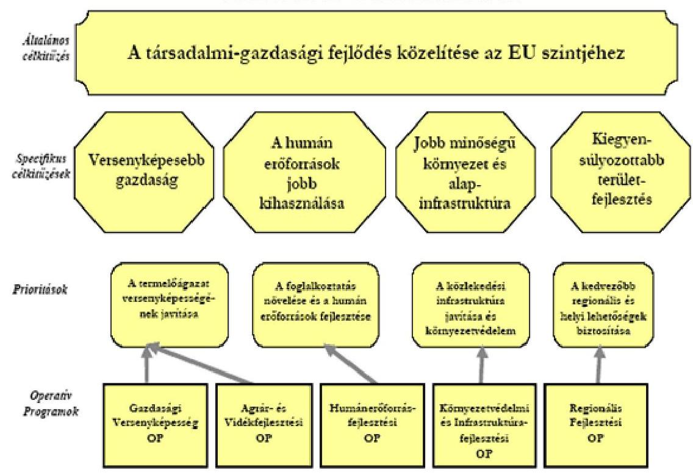

Forrás: Közösségi Támogatási Keret
Az uniós és az azzal összhangban álló hazai szabályozás az ún. irányító hatóságokat tette felelőssé a gazdálkodás és a végrehajtás szabályosságáért és hatékonyságáért. A hatóságok kezdetben 22, majd 2006 közepétől 16 közreműködő szervezetet vettek igénybe a támogatások lebonyolítására. Az operatív programok felügyeletére (a hatékonyság és a minőség javítása céljából) programonként ún. monitoring bizottságok múködtek. Az uniós támogatások intézményrendszerének, uniós szabályozás alapján kötelezően része volt még a Kifizető Hatóság és az Ellenőrzési Hatóság.

A hazai intézmények az operatív programok dokumentuma alapján elkészítették a célok, pénzügyi keretek részletesebb bontását tartalmazó programkiegészítő dokumentumokat, amelyek a pályázati kiírások alapját képezték. E dokumentumokat (bennük a pénzügyi, fizikai mutatókat) uniós szabályozással összhangban a monitoring bizottságok hagyták jóvá és módosították.

[^0]
[^0]:    ${ }^{2}$ Az 5. prioritás a „technikai segítségnyújtás" volt intézményi múködési kiadásokra, amely prioritás beépült az operatív programokba.

---

Az NFT céljainak megvalósítására összesen 687,6 Mrd Ft (2 696,3 M euró) ${ }^{3}$ állt rendelkezésre, amelyből 508,9 Mrd Ft (1 995,7 M euró) uniós és 178,7 Mrd Ft (700,6 M euró) nemzeti hozzájárulás volt. Az uniós keret operatív programonkénti megoszlását a 2. sz. ábra szemlélteti.
2. sz. ábra

Az NFT operatív programok pénzügyi kereteinek megoszlása teljes közkiadás, M euróban
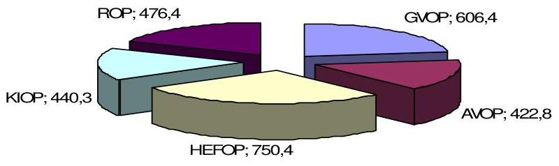

Forrás: az NFT jóváhagyott pénzügyi terve
Az EU-val való elszámolás alapját a 687,6 Mrd Ft teljes közkiadás képezte, mivel Magyarország - a vonatkozó uniós szabályban foglalt lehetőség alapján ${ }^{4}$ a forrás-felhasználás számítását az ERFA, ESZA és az EMOGA finanszírozási alapok esetében a teljes közkiadásra vállalta. A HOPE esetében még a magánfinanszírozás is az elszámolás alapját képezte a KTK szerint. A forrásfelhasználással operatív programonként és finanszírozási alaponként kellett elszámolni. Az operatív programok, a prioritások és a finanszírozási alapok kapcsolódását a 2. sz. melléklet tartalmazza.

A kitűzött célokat lehetőség szerint számszerűsíteni kellett. ${ }^{5}$ A különböző szintű (a KTK-tól az intézkedésekig lebontott) célokhoz különböző típusú mutatókat rendeltek, amelyeknek egymásra kellett épülniük. A pénzügyi terv előrehaladását és a fizikai teljesítményt mérő mutatókat határoztak meg, amelyeket az EU Bizottság jóváhagyott és megfelelőnek tartott a tagjelölt országok számára készített munkaanyagban ${ }^{6}$ megfogalmazott minimális követelményekhez képest.

Az irányító hatóságok a monitoring és az értékelési tevékenység támogatására, az adatok folyamatos gyűjtésére a támogatások nyilvántartási rendszerét (az Egységes Monitoring Információs Rendszert) kellett, hogy használják a vonat-

[^0]
[^0]:    ${ }^{3}$ A KTK-ban meghatározott keret 255Ft/euró technikai árfolyamon átszámítva. A keret a teljes közkiadást (az uniós, a nemzeti központi és helyi hozzájárulást) tartalmazza.
    ${ }^{4}$ A Tanács 1999. június 21-ei 1260/1999/EK rendelet 29. cikk (2) bekezdés.
    ${ }^{5}$ A Tanács 1999. június 21-ei 1260/1999/EK rendelet 36. cikk.
    ${ }^{6}$ Európai Bizottság, Az új programozási időszak 2000-2006: módszertani segédanyag, 3. segédanyag: mutatók a monitoring és az értékelés számára, 1999.

---

kozó jogszabályi előírással összhangban, és ezen túlmenően adatokat használtak fel a KSH, az APEH és a munkaügyi nyilvántartó rendszerekből.

A kiadások elszámolhatósági ideje eredetileg 2008. december 31-e, ${ }^{7}$ amely határidőt az EU Bizottság fél évvel, 2009. június 30 -áig meghosszabbított. A hoszszabbítást az irányító hatóságok - a ROP Irányító Hatóság kivételével - igénybe vették. Ennek megfelelően a ROP zárási dokumentumait 2010. március 31éig, a GVOP, a KIOP, a HEFOP, az AVOP dokumentumait 2010. szeptember 30áig küldték meg az EU Bizottság részére. A ROP/ERFA pénzügyi elszámolása már megtörtént, a többi operatív program, illetve program rész zárása még folyamatban volt az EU Bizottság és az irányító hatóságok között a jelentésünk lezárásakor.

Az NFT forrásai iránti igényt mutatta, hogy a pályázók a keret kétszeresét hívták volna le. A pályázatok és a szerződések alakulását az 1. sz. táblázat tartalmazza.

1. sz. táblázat

| Beérkezett pályázat |  | Támogatott pályázat |  | Hatályos szerződések |  | Kifizetés |
| :--: | :--: | :--: | :--: | :--: | :--: | :--: |
| száma (db) | összege   (Mrd Ft) | száma (db) | összege   (Mrd Ft) | száma (db) | összege   (Mrd Ft) | összege   (Mrd Ft) |
| 42852 | 1615 | 19509 | 726 | 19410 | 722,17 | 678,12 |

A kedvezményezettek típusait és a részükre juttatott támogatások arányát a 2. sz. táblázat tartalmazza. ${ }^{8}$
2. sz. táblázat

| Egyéni vállalkozók |  | Kis- és középvállalkozások |  | Nagyvállalatok |  |
| :--: | :--: | :--: | :--: | :--: | :--: |
| szerződés   aránya | támogatás   aránya | szerződés   aránya | támogatás   aránya | szerződés   aránya | támogatás   aránya |
| 2,6\% | 0,7\% | 66,1\% | 25,5\% | 2,7\% | 7,8\% |
| Nonprofit szervezetek   államháztartáson belül |  | Nonprofit szervezetek   államháztartáson kívül |  | Egyéb szervezetek |  |
| szerződés   aránya | támogatás   aránya | szerződés   aránya | támogatás   aránya | szerződés   aránya | támogatás   aránya |
| 20,0\% | 58,1\% | 8,5\% | 7,2\% | 0,1\% | 0,7\% |

A 2. sz. táblázat adatai szerint a szerződések 66,1\%-át kis- és középvállalkozásokkal kötötték, akik a támogatások negyedét kapták. A támogatások legnagyobb része ( $58,1 \%$-a) az állami-önkormányzati, ún. nonprofit szervezetekhez, mint kedvezményezettekhez áramlott.

Az NFT végrehajtásának időszakában a magyar gazdaság növekedése a 2006. évi költségvetési konszolidáció (a költségvetés megszilárdítása), a konvergencia program, a belső kereslet visszafogása hatására a korábbi évek 4-5\%-os növekedési üteme helyett 2007-re 1\%-ra mérséklődött. 2008-ban ehhez hozzájárult

[^0]
[^0]:    ${ }^{7}$ A már megkötött szerződésekre - főszabályként - a kedvezményezettek eddig teljesíthettek kifizetést.
    ${ }^{8}$ Az NFÜ által az ÁSZ részére átadott 2010. augusztus 04-ei EMIR adatok EU felé elszámolt tételei alapján.

---

a külső feltételek romlása, a világméretekben kialakult pénzügyi és gazdasági válság, amelyek hatására a gazdasági növekedés 2009-re negatív rekordot ért el $(-6,3 \%)$, és az EU-27 átlagához képest is visszaesett.

Az uniós átlaghoz való közelítés jellemző adata, az egy főre jutó GDP csekély mértékben nőtt, a 2004. évi 63\%-ról 2009-re 65\%-ot ért el. ${ }^{9}$ A visegrádi országok közül előttünk haladt a Cseh Köztársaság és 2007-re megelőzött Szlovákia, amit a 3. sz. ábra mutat.
3. sz. ábra

Egy főre jutó GDP
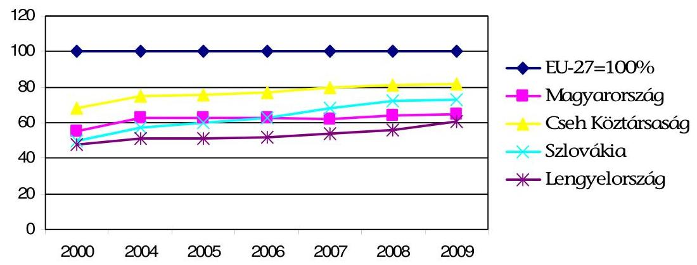

Forrás: EUROSTAT
A termelékenységünk némi javulást mutatott, ${ }^{10}$ de az a foglalkoztatás csökkenése mellett következett be. A foglalkoztatás szintjében távolodtunk az EU átlagtól. A 2004. évi magyarországi foglalkoztatási ráta $56,8 \%$, az EU átlaga $63 \%$ volt. 2009-re a hazai foglakoztatási ráta csökkent ( $55,4 \%$ ), ${ }^{11}$ a már kibővült EU átlaga kis mértékben nőtt ( $64,7 \%$ ). Ehhez képest uniós szinten elfogadott célkitúzés, hogy a 18-65 éves korú népesség foglalkoztatási rátája érje el a 75\%-os szintet 2020-ra.

A magyar gazdaság versenyképessége az IMD: World Competitiveness Yearbook, 2009-es kiadványa szerint 2008-ról 2009-re hét helyezéssel lejjebb csúszott, így a 45. helyen állt. 2010-re szerény mértékben javult, a 2009. évi 45. helyről a 42. helyre lépett elő.

Az NFT kifizetések a programok életciklusának megfelelően alakultak, és a felhasználási csúcson, 2006-ban a GDP 0,97\%-át, 2007-ben a 0,85\%-át érték el. A forrásfelhasználás éveiben (2005-2008. években) átlagosan a GDP 0,73\%-át, a

[^0]
[^0]:    ${ }^{9}$ Ugyanezen időszakban az egy főre jutó GDP a Cseh Köztársaságban 7 százalékponttal, Szlovákiában 16 és Lengyelországban 10 százalékponttal növekedett.
    ${ }^{10}$ Az egy munkavállalóra jutó GDP az EU-27 átlagához képest a 2004. évi 67,4\%-ról 2009-ben $70,2 \%$-ra nőtt.
    ${ }^{11}$ Az EU tagállamok közül 2009-ben a magyar foglalkoztatási ráta - a máltait kivéve a legalacsonyabb volt.

---

2004-2006. évek összes fejlesztési jellegű államháztartási kiadás 15\%-át tették ki. ${ }^{12}$

Az ÁSZ 2006-ban ellenőrizte az NFT időarányos végrehajtását ( 0636 sz. jelentés), de a végrehajtás eredményességének átfogó értékelésére jelen vizsgálat keretében volt lehetőség. A vizsgálat illeszkedik az ÁSZ stratégiai célkitúzéséhez, az ellenőrzési tapasztalatokkal hozzá kívánunk járulni a jövőbeni források hatékony, eredményes felhasználásához. A témához kapcsolódó korábbi számvevőszéki ellenőrzéseket bővebben jelentésünk belső borítója tartalmazza.

A jelenlegi ellenőrzés célja: annak értékelése volt, hogy az NFT végrehajtása eredményesen és hatékonyan szolgálta-e a tervezett célrendszer teljesítését és a rendelkezésre álló források hasznosítását.

Ennek során értékeltük, hogy

- a pénzügyi célok teljesültek-e,
- a teljesítménycélok megvalósultak-e, illetve az elért eredmények fenntartha-tóak-e;
- a lebonyolító intézményrendszer hatékony működése érdekében tervezett intézkedéseket végrehajtották-e, továbbá
- az NFT korábbi ellenőrzése alapján tett ajánlások hasznosultak-e.

Az ellenőrzés módszere teljesítmény-ellenőrzés volt, azon belül eredményességi és hatékonysági szempontok szerinti ellenőrzés.

Az ellenőrzésünk kiterjedt az operatív programok végrehajtásával közvetlenül elért eredmények értékelésére, az eredmények fenntarthatóságának vizsgálatára. Az értékelést a célkitúzések és a ténylegesen teljesített eredmények összevetésével a vonatkozó záró dokumentumok (záró végrehajtási jelentés, záró költségnyilatkozat) alapján végeztük el. A dokumentumok operatív programonként, azon belül finanszírozási alaponként külön-külön álltak rendelkezésre az elszámolási kötelezettségnek megfelelően, így a programok NFT szintű összesítését ellenőrzésünk keretében végeztük el.

A dokumentumokon alapuló ellenőrzést kiegészítettük a projektek kedvezményezetteknél történő helyszíni ellenőrzésével, hogy közvetlen bizonyítékot kapjunk a projektek megvalósításáról, az eredmények fenntarthatóságáról.
A mintavétel alapjául szolgáló elvek a teljesítmény-ellenőrzéshez alkalmazott INTOSAI Ellenőrzési Standardokkal ${ }^{13}$ és a számvevőszéki ellenőrzés azok alapján kidolgozott szakmai szabályaival összhangban voltak.

[^0]
[^0]:    ${ }^{12}$ A témával részletesen a 0802 sz. ÁSZ jelentés foglalkozik.
    ${ }^{13}$ INTOSAI Ellenőrzési Standardokon és gyakorlati tapasztalaton alapuló ISSAI 3000 Standard és irányelv a teljesítmény-ellenőrzéshez (ISSAI 3000, Standard and guidelines for performance auditing based on INTOSAI Auditing Standards and practical experience)

---

A projektek ellenőrzését kockázati szempontok figyelembevételével, a projektek tulajdonságain alapuló rétegezéssel, véletlenszerű mintavétellel folytattuk le. Így a kiválasztott projektek nem egyedi példának tekinthetők, hanem alkalmasak a dokumentumok alapján történő értékelés alátámasztására.

Mintaként az EU felé elszámolt projektek (vizsgált alapsokaság) mintegy 18000 darabos köréből 147 projektet választottunk ki, amelyek támogatása 56,7 Mrd Ft, az összes támogatás $8,2 \%-a$. A kiválasztott projektek listáját a 3. sz., a projektek megvalósításának helyszíneit a 4. sz., és a projektekről készített képeket a 6. sz. melléklet tartalmazza.

Az ellenőrzött szervezetek az NFÜ és a vele szerződéses kapcsolatban álló közreműködő szervezetek, valamint a Vidékfejlesztési Minisztérium, a Mezö-gazdasági- és Vidékfejlesztési Hivatal, és a helyszíni ellenőrzésre kiválasztott kedvezményezettek voltak. (Az irányító hatóságok és a közreműködő szervezetek felsorolását és adatait az 5. sz. melléklet tartalmazza.)

Az ellenőrzött időszak az operatív programok 2004. január 1-jei indulásától (a legelső pályázati kiírás megjelenésétől) a helyszíni ellenőrzés befejezéséig (2010. október 29-éig) terjedt ki azzal, hogy hasznosítottuk a témához kapcsolódó korábbi számvevőszéki jelentések megállapításait, valamint felhasználtuk az NFÜ által a helyszíni ellenőrzés befejezése után, az NFT-hez kapcsolódóan készített elemzéseket, értékeléseket.

Az ÁSZ az ellenőrzés során, a helyszíni ellenőrzésre kiválasztott projektek közül egy esetben hűtlen kezelés bűncselekménye elkövetésének alapos gyanúja miatt a Budapesti Rendőr-főkapitányságnál feljelentést tett ismeretlen tettesek ellen.

Az ellenőrzés jogalapját az Állami Számvevőszékről szóló 1989. évi XXXVIII. törvény 2. § (5) és (9) és az államháztartásról szóló 1992. évi XXXVIII. törvény 120/A. § (1) bekezdései képezték.

A jelentést 8 napos egyeztetésre megküldtük a nemzetgazdasági, vidékfejlesztési és a nemzeti fejlesztési miniszter uraknak. Válaszleveleik másolatát az 1/a-c. számú mellékletek tartalmazzák.

---

# I. ÖSSZEGZŐ MEGÁLLAPÍTÁSOK, KÖVETKEZTETÉSEK, JAVASLATOK 

#### Abstract

Az NFT végrehajtása segítette és támogatta hazánk uniós integrációját, ugyanakkor a nemzetgazdaság fejlesztésére irányuló főbb célokat meghatározó stratégiák harmonizációs hiányosságai, egyes stratégiai célok változása miatt a források felhasználásának össztársadalmi haszonmaximalizálása elmaradt. Az ÁSZ a 0802 sz. Jelentésében megállapította, hogy a vizsgált időszakban „anélkül irányoztak elő gazdaságfejlesztési jellegü államháztartási kiadásokat, hogy meghatározták volna hazánk közép- és hosszú távú társadalmigazdasági fejlesztésének átfogó stratégiáját... Nem valósult meg a gazdaságfejlesztés területére irányuló állami eszközök és erőforrások alkalmazásának szabályozott harmonizációja.". A felvázolt kép a jelen vizsgálat helyszíni ellenőrzésének lezárásáig nem változott, ami kedvezőtlen hatásokkal járt a szakpolitika és a fejlesztéspolitika együttmúködésében, kockázatot jelentett a fejlesztések fenntarthatóságában (egészségügyi, oktatási, képzési területen).

A támogatást nyújtó intézmények törekvéseiben a források mind teljesebb felhasználása elsőbbséget kapott a források eredményes és hatékony felhasználásával szemben. Ennek eredményeként az NFT forrásfelhasználása, abszorpciója kedvező képet mutatott, de a forrás-felhasználás eredményességéhez és hatékonyságához szükséges feltételek, eszközök (megfelelő stratégia, kitörési pontok, egyértelmű, mérhető és számon kérhető célok meghatározása a nemzetgazdaság és a támogatottak szintjén) még fejlesztésre szorultak. (Ezért a jövőbeli támogatási rendszerek fejlesztése érdekében javaslatot tettünk a nemzeti fejlesztési miniszternek és a vidékfejlesztési miniszternek, Javaslatok 1. pontja.)

Az NFT által is támogatni kívánt átfogó cél, Magyarország felzárkózása az uniós átlaghoz az egy főre jutó jövedelemben mérve csekély mértékű volt (az egy főre jutó GDP a 2004. évi uniós átlag 63\%-áról 2009-re 65\%-ot ért el). A fejlesztések közül a környezetvédelmi, az egészségügyi és egyes oktatási beruházásokkal, a vidékfejlesztéssel közeledtünk az EU fejlettségi szintjéhez, de ezek rövidtávon nem vezetnek gazdasági növekedéshez, továbbá a növekedésre kedvezőtlenül hatottak az országon belüli és kívüli pénzügyi-gazdasági folyamatok is.

Az NFT 687,6 Mrd Ft-os keretéből mintegy 20 ezer projekt valósult meg a gazdaság, az emberi erőforrások, a területfejlesztés, a közlekedés és a környezetvédelem terén. E területeken belül számtalan célt támogattak: a szennyvíz beruházásoktól kezdve, a képzéseken, az útfelújításokon, a város rehabilitáción át, a falunapig bezárólag. Az NFT végrehajtása segítette a célterületek fejlesztését, de a források nagyságrendje és elaprózottsága miatt csak részeredmények vannak egy-egy szakpolitikai területen, jellemzően az uniós előírásokhoz kapcsolódóan. Az ellenőrzött projektek céljai a projektek háromnegyedénél teljesültek, vagy túlteljesültek ugyanakkor minden negyedik projekt esetében elmaradás volt a célok időarányos teljesítésében.

---

# Az NFT végrehajtásának pénzügyi, abszorpciós eredményessége azt jelentette, hogy a pénzügyi keretet $99,1 \%$-ban felhasználták, ezáltal a forrásvesztést minimalizálták. Ez azonban hazai többlet-kiadással járt. 

A fel nem használt keret $0,9 \%$, mintegy 6 Mrd Ft a programok felénél keletkezett. A programok másik felénél a teljes keretet kihasználták. A kedvező teljesítés érdekében - más tagországok gyakorlatához hasonlóan - ún. tartalék projekteket támogattak, így az elszámolt költségek összege 5-7\%-kal, mintegy 26,5 Mrd Ft-tal meghaladta az eredeti keretet. Ez a többlet a hazai költségvetést terhelte. A forrás-felhasználás, abszorpció alakulását a 4. sz. ábra szemlélteti.
4. sz. ábra

Az NFT operatív programok abszorpciójának alakulása
keret $=100 \%$
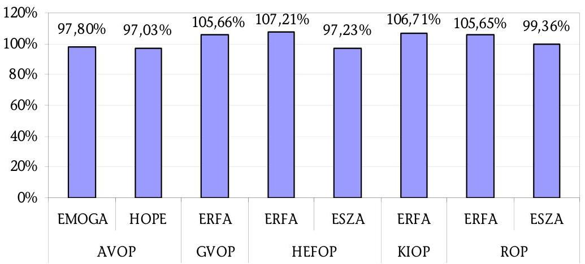

Forrás: az operatív programok záró költségnyilatkozatai
A hazai többlet-kiadásokat nem összesítették, de a fenti 26,5 Mrd Ft-on felül további 6 Mrd Ft-ot tett ki az uniós költségelszámolásból kivett projektek támogatása és az árfolyamveszteség, valamint közel 3 Mrd Ft volt az NFT projektek előkészítése, amelyek együtt mintegy 35 Mrd Ft-ot tettek ki. Ezen felüli terhet jelent az ország számára az elkövetkező években az uniós strukturális támogatásoknál kötelező, hazai költségvetési társfinanszírozáshoz felvett Európai Beruházási Banki hitel és kamatainak törlesztése. ${ }^{14}$

A többlet-kiadások között számolták el az irányító hatóságok az uniós finanszírozásból a zárás során kivett 37 db projekt költségét. Ezeknél az uniós támogatási részt hazai költségvetésből pótolták a közösség pénzügyi érdekeinek védelme érdekében, ugyanakkor nem zárható ki a hazai pénzügyi érdekek sérelme, szabálytalan tételek elszámolása a költségvetés terhére. (Ezért javaslatot tettünk a nemzeti fejlesztési miniszternek és a vidékfejlesztési miniszternek, Javaslatok 2. pontja)

[^0]
[^0]:    ${ }^{14}$ Ez 445 M euró összegű hitel, 255Ft/euró technikai árfolyamon átszámítva mintegy 113,5 Mrd Ft volt.

---

Az NFT szintű célok közül az új és a megtartott munkahelyek száma 34 és fél ezer körül alakult - az ellenőrzés alapját képező zárójelentések szerint -, és ezen belül inkább a programok munkahely-megörző hatása érvényesült. ${ }^{15}$ Ezt támasztja alá, hogy a támogatást nyújtó intézmény a válság hatását figyelembe véve - a GVOP projekteknél a teremtett munkahelyek helyett elfogadta a megtartott munkahelyeket is. ${ }^{16}$ Továbbá a kisméretű mezőgazdasági vállalkozások, őstermelők eleve a vállalkozás teljes létszámát jelentették teljesítésként, függetlenül a vállalástól, mivel szerintük a teljes cég fenntartásához hozzájárult a támogatás. Ezt szintén elfogadta a támogatást nyújtó. A munkahelyek száma részben (GVOP esetében) a támogatást nyújtó intézmény által számított adat, részben (AVOP, ROP esetében) a kedvezményezettek adatközlése volt. A munkahelyek teremtésének költségeire nem állt rendelkezésre pontos, elkülönített adat, mert számos projekt esetében a munkahelyteremtés mellett más célt, így más tevékenységet is támogattak, illetve a munkahelyteremtés egy adott fejlesztés hozadéka volt. ${ }^{17}$

A bruttó hozzáadott érték növekedett az AVOP és a GVOP támogatások hatására, de ezek az adatok ellenőrzésünk idején nem voltak összesíthetőek az NFT egészére. A fenti adatok részletezését a következő 3. sz. táblázat, a részletes elemzést a jelentés 2.5 pontja tartalmazza.
3. sz. táblázat

| A termelőágazat versenyképességének javítása területén elért   teljesítmények (KTK 1. prioritási cél) | Teljesítés   2004-2008. |
| :-- | :--: |
| Új és megtartott munkahelyek száma   GVOP 11 263; ROP: 2 972; AVOP: 20 237 | 34472 |
| Bruttó hozzáadott érték - GVOP | 128 Mrd Ft |
| Bruttó hozzáadott érték - AVOP | $0,5 \%$-os növekedés |

Másik NFT szintű cél volt az emberi erőforrás minőségi fejlesztése, amelynek keretében mintegy 330 ezer embert képeztek. Ebből a szakképzett emberek számára vonatkozóan nincs adat a tervezettnek megfelelően, mert bizonyos program részek esetében ${ }^{18}$ az oktatás jellege megváltozott, nem feltétlenül adott szakképzést. A programok egy része, összhangban a társadal-

[^0]
[^0]:    ${ }^{15}$ Árnyalja az eredményeket, hogy más értékelési módszer szerint az NFT 20200 új munkahelyet teremtett. Ez a GVOP és a HEFOP programok közvetlen foglalkoztatási hatása és becsült adat volt, az NFÜ megbízásából a TÁRKI Zrt., a KOPINT-TÁRKI Zrt. és a PPH Értékelő Kft. konzorcium által készített „A kohéziós politika hatása a visegrádi országok foglalkoztatási szintjére és minőségére" című értékelő jelentés (2010. november) szerint. Az értékelésben alkalmazott módszer szerint a 20200 új munkahely mintegy 250 Mrd Ft támogatásból származik, így egy munkahely teremtése átlagosan 12,4 M Ft-ba került.
    ${ }^{16}$ Ez az elbírálás hazai kompetencia volt, és állami támogatási, transzparencia és esélyegyenlőségi uniós szabályokat, valamint hazai jogszabályt nem sértett.
    ${ }^{17}$ Például a ROP esetében az alapfokú oktatási infrastruktúra (iskolák, óvodák) fejlesztése, a turisztikai attrakciók ugyan jártak munkahelyteremtéssel, de nem ez volt a cél, hanem ez csak a fejlesztés hozadéka volt.
    ${ }^{18}$ Például a HEFOP 1. prioritás esetében.

---

mi kirekesztés elleni küzdelemmel, az integrált nevelési és a szociális területen dolgozók képzésére, valamint a hátrányos helyzetű emberek foglalkoztathatóságának javítására koncentrált. Továbbá az uniós célokkal összhangban, az egész életen át tartó tanulás támogatása keretében pedagógusokat képeztek a szükséges készségek és kompetenciák fejlesztéséhez, valamint voltak a vállalkozói készségek fejlesztését elősegítő képzések is. Voltak olyan képzések, amelyek a vállalati igényekhez igazodtak, mintegy belső képzést pótoltak és a betöltött munkakör eredményesebb ellátását kívánták elősegíteni. Más képzési programok az elhelyezkedést segítették elő, eltérő eredménnyel. Bizonyos programok esetében a programot befejezők mintegy fele, ${ }^{19}$ a hátrányos helyzetú embereknek csak a $10 \%-a^{20}$ helyezkedett el. Ezekben az esetekben a képzések és az elhelyezkedési lehetőségek nem álltak összhangban. A képzésben résztvevők számát a következő 4. sz. táblázat részletezi operatív programonként.
4. sz. táblázat

| A foglalkoztatás növelése és a humánerőforrások fejlesztése területén elért teljesítmények (KTK 2. prioritási cél) | Teljesítés 2004-2008. |
| :--: | :--: |
| Humánerőforrás fejlesztési, képzési programban résztvevők száma   HEFOP 234421 fő; ${ }^{21}$ AVOP 14861 fő; ROP 85735 fő ${ }^{22}$ | 335017 fő |
| A felnőttképzésben részt vevő 25-64 évesek számaránya - HEFOP | $3,1 \%$ |

A környezetvédelem területén a támogatásoknak köszönhetően 113 ezer lakos csatlakozott szennyvíztisztító rendszerhez. A közlekedés fejlesztése területén 723 km az új, a korszerüsített és a felújított utak hossza. Az utak építését és felújítását közös mutató tartalmazza, de föként az úthálózat javítása, korszerüsítése valósult meg, a hazai szükségleteknek megfelelően. ${ }^{23}$ Az adatokat a következő 5. sz. táblázat részletezi.
5. sz. táblázat

| A közlekedési infrastruktúra javítása és a környezetvédelem fejlesztése területén elért teljesítmények (KTK 3. prioritási cél) | Teljesítés 2004-2008. |
| :--: | :--: |
| Új és korszerüsített utak hossza - KIOP | 179 km |
| Új vagy felújított négy és öt számjegyű állami vagy önkormányzati utak hossza - ROP | 544 km |
| Új és megújult víz- és szennyvíztisztító kapacitással ellátott lakosok száma - KIOP | 113055 fő |

[^0]
[^0]:    ${ }^{19}$ A HEFOP 1.1 intézkedés esetében.
    ${ }^{20}$ A HEFOP 2.3 intézkedés esetében.
    ${ }^{21}$ A részletes adatokat a 11/c. sz. melléklet tartalmazza.
    ${ }^{22}$ A részletes adatokat a 11/e. sz. melléklet tartalmazza. A ROP által támogatott képzésben résztvevők közel 70\%-a (3.1.1. komponens) esetében egy ember több tanfolyami képzésben, jellemzően 3-5 napos képzéseken vett részt.
    ${ }^{23}$ A környezetvédelem és a közlekedés nagy projektjeit nem az NFT-t finanszírozó alapokból, hanem a Kohéziós Alapból támogatták, amely nem volt ellenőrzésünk tárgya.

---

Bár a ROP pénzügyi mutatója teljesült, az NFT egészének végrehajtása nem javított a regionális fejlődésben kialakult különbségek helyzetén (KTK 4. prioritási cél), így az ország régióinak kiegyensúlyozottabb fejlesztése az NFT végrehajtási időszakát követően is kiemelt cél maradt és várhatóan nagy kihívást jelent a jövőben is.

A ROP terve szerint a támogatások legalább 75\%-a, ténylegesen a 78\%-a a négy kevésbé fejlett régióba áramlott, de hatása a szerény mértékű támogatások ${ }^{24}$ és a sokféle cél miatt csak egy-egy szűk földrajzi terülten volt érezhető, ahol a pályázati igény és a támogatás koncentrálódott (7. sz. melléklet).

Hosszabb időszakot tekintve (2000-2008 között) a Közép-magyarországi régió erőteljesen (21 százalékponttal) növekedett, míg a többi hat régió helyzete nem változott lényegesen. Az Észak-magyarországi, az Észak- és a Dél-alföldi, valamint a Dél-dunántúli régiók felkerültek az EU „legszegényebb 20 régió" listájára az EUROSTAT 2008. évi adatai szerint. ${ }^{25}$

A forrásfelhasználás eredményességét, hatékonyságát és azok értékelhetőségét rontották a tervezési hiányosságok, a tervezés során a kiinduló szakmai adatok hiánya, a szerteágazó célok kijelölése. Továbbá a programokhoz rendelt mutatók (indikátorok) az EU bizottsági munkaanyagokban meghatározott (minimális) követelményeknek megfeleltek ugyan tervezéskor, de korlátozottan voltak alkalmasak a célok teljesítésének, az eredményeknek a mérésére. ${ }^{26}$ A tervezett és a tényleges eredmények összevetését nehezítette, hogy a vonatkozó szabályok szerint végrehajtott pénzügyi átcsoportosítások során a teljesítménycélokat nem igazították a megnövelt vagy csökkentett forrásokhoz.

Jó gyakorlat a költséghatékonyság utólagos elemzésében, hogy a VÁTI Nonprofit Kft., mint közremúködő szervezet a megvalósult projektek alapján utólag fajlagos mutatókat számolt és értékelte azokat. Többek között rámutatott a fajlagos mutatók kialakításának, használhatóságának hiányosságaira, így az értékelés hozzájárul a következő időszak megfelelő tervezéséhez.

Az EU Bizottság és a tagállamok, köztük Magyarország is nemcsak a programokhoz rendelt mutatók, mint mérőszámok elemzésével, hanem többféle módszerrel (például a támogatott vállalkozásokat a nem támogatottakkal összehasonlítva) mérik a támogatások hatását, eredményét, amelyet honlapon, weboldalon közzétesznek. A hazai programok eredményéről azonban nincs a

[^0]
[^0]:    ${ }^{24}$ Az NFT jelentős részét (82,3\%) az ágazati programok tették ki, a ROP a keret 17,7\%ának megfelelő összeg volt, amit 7 régióban osztottak szét.
    ${ }^{25}$ A rangsort az EU27 átlagához mért egy főre jutó GDP alapján állították fel.
    ${ }^{26}$ Például egy közös mutató volt az új és a korszerűsített közutak hosszára, valamint hasonlóan közös mutató volt a képzés eredményeként foglalkoztatásba bevont és az egyéb előnyt szerzett személyek számára vonatkozóan. Ezzel az uniós szinten is felmerült jelenséggel az EU Bizottság is szembesült és ennek alapján útmutatót dolgozott ki egyes strukturális alapok legfontosabb indikátorainak körére és tartalmának meghatározására 2009 folyamán. Ettől eltérően a vidékfejlesztési programok már 2009 előtt is rendelkeztek uniós szinten meghatározott indikátor rendszerrel, azaz uniós szinten sem volt egységes a gyakorlat.

---

döntéshozók (a fejlesztési célokat meghatározók, támogatást nyújtók), a társadalom számára áttekinthető, közérthető összegzés. ${ }^{27}$ (Ezért javaslatot tettünk a nemzeti fejlesztési miniszternek és a vidékfejlesztési miniszternek, Javaslatok 3. pontja) Az NFT néhány programjának hatásáról, eredményéről az NFÜ által az ellenőrzés számára készített összefoglalót a 22. sz. melléklet tartalmazza.

A teljesítmény-ellenőrzéssel vizsgált 143 projekt ${ }^{28}$ megvalósult. Ezek közül 110 projekt volt a fenntartási időszakban és e projektek háromnegyedénél a célok teljesültek, vagy túlteljesültek, minden negyedik projektnél elmaradás volt a célok időarányos teljesítésében (az ellenőrzés során értékelt mutatók közül egy $80 \%$ alatt teljesült).

A projektek eredményességének értékelését nehezítette, hogy míg a projektek szabályosságának megítéléséhez részletes szabályozás állt rendelkezésre, addig a támogatási, eljárási szabályok a kedvezményezettek által vállalt célok teljesítésének értékeléséhez, számon kéréséhez nem tartalmaztak előírást. Továbbá egy-egy projekt esetében a kedvezményezettek a pályázatban, szerződésben gyakran 10-15 célt is megjelöltek, amit indikátornak tekintettek, de nem mindegyik képezte az értékelés, számonkérés alapját. Az irányító hatóságok a célok teljesítését projektenként egyedileg bírálták el.

A vizsgált projektek között találtunk jó gyakorlatot. Erős versenyhelyzetben és válság idején is voltak sikeres fejlesztések, amelyeknél a kedvezményezettek elsőként a saját felkészültségüket emelték ki, továbbá azt, hogy törekedtek az intézményrendszerrel való jó együttmúködésre az ellenőrzési kérdőívre adott válaszok szerint (például egy „gyógynövények gyártásával", vagy egy „wellness szálloda múködtetésével" foglalkozó cég).

A sikerességet gátló tényezőként említették az ügyintézés és a kifizetések lassúságát, a kifizetési igazolások határidőn túli kiadását, a gyakori szervezeti és személyi változásokat, a jogszabályi és gazdasági környezet változását, a túlzott bürokráciát, valamint a sokszereplős intézményrendszert.

A kedvezményezettek a célok részbeni teljesítését 30\%-ban a pénzügyigazdasági válsággal indokolták, ezen túlmenően a mezőgazdaságban a rossz terméshozamra, a túlzott terménytároló kapacitás létrehozására, az általános iskoláknál átszervezésre, a normatív támogatások csökkenésére és a közoktatási törvény változására hivatkoztak.

Három projekt hasznosításában (az értékelt projektek 2\%-a, értékben 15,8\%-a esetében) hiányosság mutatkozott. A Győr-Gönyű Országos Közforgalmú Kikötő környezetbarát közlekedést szolgáló fejlesztése egy komplex

[^0]
[^0]:    ${ }^{27}$ A megítélt támogatások összegét „az NFÜ térképtere" nyomon követhetővé teszi. http://www.nfu.hu/terkepter
    ${ }^{28}$ A kiválasztott 147 projektből 4 szabálytalan volt (a projektek 2,7\%-a, értékben 1,0 Mrd Ft), így azokat teljesítmény-ellenőrzéssel nem vizsgáltuk. (A szabálytalanság miatt teljesítményellenőrzéssel nem ellenőrzött projektek részletezését a 9. sz. melléklet tartalmazza.)

---

projekt volt, amelynek csak egy része készült el, és emiatt a projekt megvalósult része nem funkcionált a tervezettnek megfelelően. Ellenőrzésünk idején ütemterv készült a hasznosításhoz szükséges teendőkre. ${ }^{29}$ Egy önkormányzat által vállalkozások számára kifejlesztett információszolgáltató IT modul használata jogszabály-módosítás következtében ellehetetlenült. A fővárosi és másik 21 önkormányzat zajtérképek alapján intézkedési terveket készített, azonban 10 önkormányzat képviselő-testülete csak jóváhagyta azokat, de a feladatokra nem jelölt ki felelőst és határidőt. Ezek közül az ellenőrzésre kiválasztott mintában szereplő Fővárosi Önkormányzatnál az intézkedési tervben foglalt feladatok megvalósításának helyzetéről nem tudtak számot adni, így a terv hasznosítását nem lehetett megállapítani. (Ezért javaslatot tettünk a nemzeti fejlesztési miniszternek és a vidékfejlesztési miniszternek, Javaslatok 4. pontja)

Kockázatot hordoz magában az egészségügy és a humánerőforrás projektek fenntartása a forráshiányos időszakban, azokban az esetekben, amikor a szakpolitika nem számol a fejlesztések hatásaival a múködtetés, finanszírozás során. Az egészségügyi ellátórendszer fejlesztésére vonatkozó törvény ${ }^{30}$ kapacitást korlátozó hatása miatt, a törvényben meghatározott kapacitásokon felül az uniós beruházások működtetéséhez kapacitásokat kellett átcsoportosítani a kórházak között a fenntarthatóság érdekében. A humánerőforrás fejlesztési program keretében kifejlesztett tananyagokat, modelleket ingyenesen átvehetik a képző szervezetek az óvodáktól egészen az egyetemekig, de a fenntarthatóság és ezzel a hasznosítás további feltétele, hogy az átalakuló, új képzési stratégiák építsenek ezekre az alapokra.

A vizsgált időszakban a támogatást nyújtó intézmények megfeleltek az uniós szabályozásnak, de a végrehajtás során még változtak, formálódtak és nem voltak hatékonyak. A támogatási rendszert elhúzódó folyamatok, túlzott adminisztráció, bonyolult pályázatok jellemezték. Az értékelések, ellenőrzések nyomán tettek gyorsító, egyszerűsítő intézkedéseket, de azok - az NFT rövid ( 7 év helyett 3 éves) programozási időszakából adódóan főként az ÚMFT időszakában jelentek meg. ${ }^{31}$

A strukturális alapok forrásainak felhasználása során alkalmazott módszerek, a több éves tervezés, monitorozás, értékelés területén szerzett tapasztalat fejlesztette a hazai gyakorlatot. Pozitívum még, hogy az uniós támogatásokhoz kapcsolódó pénzügyi, számviteli, monitoring tevékenységek, ügyviteli folyamatok nyilvántartására létrehozott Egységes Monitoring Információs Rendszer valamennyi hazai uniós intézmény rendelkezésére állt. A rendszer moduljait, funkcióit folyamatosan fejlesztették és a kezdetekhez képest jelentősen javult a nyilvántartás minősége.

[^0]
[^0]:    ${ }^{29}$ Az ütemterv 2010. szeptember 21-én kelt, az Észak-dunántúli Környezetvédelmi és Vízügyi Igazgatóság és az NFÜ képviselője készítette.
    ${ }^{30}$ 2006. évi CXXXII. törvény
    ${ }^{31}$ Például az internet-alapú folyamattámogatás, gyorsabb lebonyolítást segítő normatív pályáztatás kiterjesztése, hosszú átfutási idejű támogatási szerződés helyett támogatói okirat, kevesebb számla-másolat benyújtása stb. Más intézkedések (előlegnyújtás növelése, biztosítéki terhek enyhítése) a pénzügyi kockázatot növelték, különösen az utóbbi évek megváltozott gazdasági környezetében ( 1010 sz. ÁSZ jelentés).

---

A 0636 sz. korábbi ÁSZ jelentésben az NFT-re vonatkozó három javaslat közül egyet teljesítettek az NFT időszakában, az intézményrendszer költséghatékonysági elemzését elvégezték. A többi intézkedés - az előzőek szerint - az ÚMFT időszakára esett. A jelenlegi ellenőrzés lezárásakor a Nemzeti Fejlesztési Minisztérium számos intézkedést vezetett be, illetve tervezett bevezetni 2011-ben az eredményesség, hatékonyság javítására, de ezek az intézkedések, illetve ez az időszak nem képezte jelenlegi vizsgálatunk tárgyát.

A forrás-felhasználás eredményessége, a hatékonyság háttérbe szorulása, a túl szerteágazó célok, a célok mérhetővé tétele és az eredmények számon kérésének szükségessége nemcsak hazai szinten meglévő jelenség, ezért ezekkel a kérdésekkel foglalkozik napjainkban az uniós felzárkóztatási (kohéziós) politika reformja, amely a 2014-től kezdődő időszakra irányul. Tekintettel arra, hogy Magyarország a 2007-2013-as programozási időszak teljes egészére már részletes végrehajtási tervvel rendelkezik, a támogatási rendszer gyengeségeinek megoldását a 2013 utáni időszakra az EU fejlesztési célkitűzések fényében javasoljuk.

A helyszíni ellenőrzés megállapításainak hasznosítása mellett javasoljuk:

# a nemzeti fejlesztési miniszternek és a vidékfejlesztési miniszternek 

1. Fejlesszék tovább a jövőbeni támogatási rendszert - a 2013 utáni EU fejlesztési célkitűzések fényében - úgy, hogy a forrásvesztés elkerülése és a szabályosság mellett a stratégiai célok megvalósítása és a projektek fenntarthatósága is kiemelt szempont legyen.
2. Intézkedjenek arra vonatkozóan, hogy a közösség pénzügyi érdekeinek védelme érdekében az uniós költségelszámolásból kivett és teljes egészében hazai költségvetés terhére elszámolt NFT projekteket vizsgálják felül a hazai pénzügyi érdekek védelme érdekében és a vizsgálat tapasztalatait építsék be a következő programozási időszakba.
3. Intézkedjenek arra vonatkozóan, hogy mutassák be közérthető módon, összegezve az NFT programok által elért eredményeket a döntéshozók (a fejlesztési célokat meghatározók, támogatást nyújtók) és a társadalom számára.
4. Vizsgáltassák felül a hasznosítási problémákkal küzdő projektek intézkedési terveinek megalapozottságát, szükség szerint dolgoztassanak ki új intézkedési terveket.

---

# II. RÉSZLETES MEGÁLLAPÍTÁSOK 

## 1. Az NFT-ben KITŰZÖTT PÉNZÜGYI CÉlok TELJESÍTÉSÉNEK HELYZETE

### 1.1. A pénzügyi keret felhasználásának alakulása

Az NFT végrehajtása pénzügyi, abszorpciós szempontból eredményes az operatív programok zárási adatait figyelembe véve. Az abszorpció, azaz az elszámolt költségek aránya a kerethez viszonyítva ugyan összességében meghaladta a 100\%-ot, de az EU Bizottsággal az elszámolás operatív programonként és finanszírozási alaponként (programrészenként) az adott keret 100\%-áig lehetséges.

Az Irányító Hatóságok által elszámolt költség a program részek felénél (GVOP/ERFA, HEFOP/ERFA, KIOP/ERFA, ROP/ERFA) 5-7\%-kal meghaladta a rendelkezésre álló 2004-2006. évi keretet, de a keretet meghaladó túlvállalásokat a hazai költségvetésnek kellett finanszíroznia.

A programrészek másik felénél (AVOP/EMOGA, AVOP/HOPE, HEFOP/ESZA, ROP/ESZA) nem sikerült a teljes rendelkezésre álló keretösszeget kihasználni, összességében mintegy 6 Mrd Ft ( 24 M euró) elmaradás volt, ami az NFT keret $0,9 \%$-ának megfelelő összeg. A fentiek szerint az ERFA által finanszírozott beruházási projektekkel könnyebb volt kihasználni a keretet, mint a kisebb méretű EMOGA, HOPE és ESZA által finanszírozott projektekkel. A részletes adatokat a 9. sz. melléklet, az abszorpció alakulását az 6. sz. táblázat tartalmazza.
6. sz. táblázat

| OP/Finanszíroz   ási alap | Keret | Elszámolható   költség | Elszámolható   költség /Keret | Fel nem használt   keret $^{32}$ |
| :-- | :--: | :--: | :--: | :--: |
|  | M euró | M euró | $\%$ | M euró |
| GVOP/ERFA | 606,44 | 640,75 | $105,66 \%$ | 0 |
| AVOP/EMOGA | 417,11 | 407,93 | $97,80 \%$ | 9,17 |
| AVOP/HOPE | 5,73 | 5,56 | $97,03 \%$ | 0,17 |
| HEFOP/ERFA | 236,52 | 253,58 | $107,21 \%$ | 0 |
| HEFOP/ESZA | 513,92 | 499,66 | $97,23 \%$ | 14,26 |
| KIOP/ERFA | 440,29 | 469,82 | $106,71 \%$ | 0 |
| ROP/ERFA | 407,70 | 430,74 | $105,65 \%$ | 0 |
| ROP/ESZA | 68,66 | 68,22 | $99,36 \%$ | 0,44 |
| Összesen | 2696,36 | 2776,26 | - | 24,04 |

Forrás: az Operatív Programok záró költségnyilatkozat (teljes közkiadás)

[^0]
[^0]:    ${ }^{32}$ A 24,04 M euró 255 Ft/euró technikai árfolyamon számítva mintegy 6,1 Mrd Ft.

---

A KTK szerint ${ }^{33}$ az abszorpció számításánál „az Alapokból származó hozzájárulást az összes támogatható köz- vagy hasonló kiadáshoz (nemzeti, regionális, helyi, közösségi) viszonyitva számítják ki az ERFA, ESZA és az EMOGA esetében. A HOPE-ból származó hozzájárulást az összes támogatható kiadáshoz viszonyitva számítják ki." Ezért a KTK pénzügyi táblái csak a HOPE esetében tartalmaznak magánfinanszírozást. Azoknál a projekteknél, ahol volt nemzeti helyi, önkormányzati finanszírozás is, az is beleszámít az abszorpció számításába.

A kedvező pénzügyi teljesítést, a keretek mind teljesebb kihasználását több uniós és hazai szabály segítette, amelyeket az irányító hatóságok alkalmaztak is. A vonatkozó uniós szabályozásnak megfelelően az operatív programokon belüli ún. prioritási keretösszegek módosítása az EU Bizottság jóváhagyásával, a prioritásokon belüli intézkedések közötti átcsoportosítások a hazai ún. Monitoring Bizottságok jóváhagyásával történtek. ${ }^{34}$

Az általános szabályon túlmenően lehetőség volt az EU Bizottság 2009. évi döntése alapján az ún. 10\%-os rugalmassági szabály alkalmazására. Ennek megfelelően egy jobban teljesítő intézkedés kisegítheti az azonos prioritáson belüli rosszabbul teljesítő intézkedést, illetve adott operatív program/alapon belül a rosszabbul teljesítő prioritásokat bizonyos mértékig kisegíthetik a jobban teljesítő prioritások, hiszen adott prioritások esetén lehetőség van az operatív program pénzügyi táblájában a rögzítettnél 10\%-kal magasabb kumulált öszszeg elszámolására. Összességében azonban a rugalmasság a kereteket nem érinti.

A rugalmassági mérték eredetileg maximum 2\% volt, azonban az abszorpció biztosítása és a program végrehajtásának könnyítése érdekében az EU Bizottság C (2009) 960. sz. döntése értelmében a maximum $2 \%$-os mértéket maximum 10\%-ra módosította (rugalmassági küszöb), tehát adott prioritás esetén lehetőség volt a rögzítettnél maximum 10\%-kal magasabb kumulált összeg elszámolására.

Az EU Bizottság továbbá lehetővé tette a kiadások elszámolhatósági idejének fél évvel való meghosszabbítását a 2008. év végétől a világgazdaságot sújtó válság miatt, amely lehetőséget az irányító hatóságok - a ROP Irányító Hatóság kivételével igénybe vettek.

A 2008-ban kezdődő pénzügyi válság közvetlen hatással volt a tagországokban a programok megvalósítására. Az EU Bizottság 2008. december 12-én kelt levelében felajánlotta a tagállamok számára, hogy a 2000-2006-os (2004-2006-os) operatív programok elszámolhatóságának végső határidejét 2008. december 31éről 2009. június 30 -ára módosítsák, a 1260/1999/EK rendelet 30. cikk (2) bekezdés és a 14. cikk (2) bekezdés értelmében a pénzügyi zárás időpontja a fentieknek megfelelően módosult, így a programok zárásának határideje is 2010. szeptember 30-ra módosult.

[^0]
[^0]:    ${ }^{33}$ A Tanács 1999. június 21-ei 1260/1999/EK rendelete 29. cikk (2) bekezdése alapján.
    ${ }^{34}$ A Tanács 1999. június 21-ei 1260/1999/EK rendelete 35. cikk 3. a) pontja.

---

A hazai költségvetési törvények ${ }^{35}$ alapján az irányító hatóságoknak a 2004-2006. évi keretet meghaladóan 5-10\%-os, illetve indokolt esetben a pénzügyminiszter egyetértésével meg nem határozott mértékű többletkötelezettségvállalási lehetősége volt az egyes operatív programok esetében.

Az irányító hatóságok éltek a többlet-kötelezettségvállalási (szerződéskötési) lehetőséggel. Az NFT egészére átlagosan a keretnél $8 \%$-kal nagyobb összegre vállaltak kötelezettséget ${ }^{36}$ a hatályos szerződések alapján, ami hozzájárult ahhoz, hogy a keretnek csak mintegy $0,9 \%$-a nem került költségekkel elszámolásra záráskor. Ez az érték nem tartalmazta a meghiúsult szerződéseket, ugyanakkor a jövőbeni tervezésnél ezeket is figyelembe kell venni az abszorpció számításánál. A lemorzsolódások aránya eltérő volt az egyes operatív programoknál, a legnagyobb a GVOP esetében volt, ami miatt itt a hatályos szerződések összege többlet-kötelezettségvállalás ellenére sem érte el a keretet, mintegy $2 \%$-kal alatta maradt. Az irányító hatóságok a hatályos szerződésekben foglalt támogatások $93,9 \%$-át tudták kifizetni a kedvezményezettek részére a 7 . sz. táblázat szerint.
7. sz. táblázat

| Operatív Programok | Szerződések   összege | Kifizetés | Kifizetés/   Szerződések |
| :-- | :--: | :--: | :--: |
|  | Mrd Ft | Mrd Ft | $\%$ |
| GVOP | 148,62 | 147,42 | $99,2 \%$ |
| AVOP | 114,69 | 107,77 | $94,0 \%$ |
| HEFOP | 212,01 | 185,00 | $87,3 \%$ |
| KIOP | 121,28 | 119,08 | $98,2 \%$ |
| ROP | 125,57 | 118,85 | $94,6 \%$ |
| Összesen: | 722,17 | 678,12 | $93,9 \%$ |

Forrás: az operatív programok zárójelentései (az összegek a nemzeti helyi hozzájárulást nem tartalmazzák)
Az EU támogatás 95\%-a előleg és időközi kifizetés címén zárásig már lehívásra került az EU Bizottságtól. A záró költségnyilatkozat szerint az elszámolható támogatás minden operatív program esetében meghaladta a keret $95 \%$-át, így amennyiben az EU Bizottság a fenti záró dokumentumokat elfogadja, és nem kerül sor korrekcióra (nem számítva a szabálytalanság miatt behajtásra váró összegek és függő tételek miatti esetleges korrekciót), akkor visszafizetési kötelezettség az eddig lehívott összegből Magyarország esetében egyik operatív programnál sem áll fenn. Az EU Bizottság egyedül a ROP/ERFA esetében 2011 már-

[^0]
[^0]:    ${ }^{35}$ A Magyar Köztársaság 2005. évi költségvetésről szóló 2004. évi CXXXV. törvény 53. § 2. pontja, a 2006. évi költségvetéséről szóló 2005. évi CLIII. törvény 55. § (1)-(2) bekezdései, a 2007. évi költségvetéséről szóló 2006. évi CXXVII. törvény 54. § (6) bekezdése.
    ${ }^{36}$ A szerződéssel lekötött összeg nem tartalmazza a nemzeti helyi (önkormányzati) hozzájárulást, így a viszonyítás alapját képező keretet is csökkentettük ezzel az összeggel.

---

ciusában elfogadta a zárási dokumentumokban foglaltakat és pénzügyi korrekció nélkül átutalta a még hátralévő egyenleget (közel 15,3 M eurót, 3,9 Mrd Ft-ot) azzal, hogy a még folyamatban lévő szabálytalanságokat, függő ügyeket Magyarországnak kell lefolytatni, az azok miatti esetlegesen keletkező pénzügyi veszteséget az EU Bizottsággal megosztani már nem lehet.

A Magyar Állam 2004. április 30-án a KTK-ban tervezettnek megfelelően egy 445 M euró összegű hitelkeret megállapodást írt alá az Európai Beruházási Bankkal, amely a 2004-2006-os pénzügyi időszak strukturális alapok támogatásához kapcsolódó központi költségvetési rész finanszírozását szolgálta. Magyarország 2008 márciusáig a teljes hitelkeret lehívta.

# 1.2. A finanszírozási arányok alakulása 

Az operatív programok végrehajtása során a kötelező finanszírozási arányok nem változtak, a finanszírozási arányokat betartották. A hazai forrásszükségletet azonban növelte a többlet-kötelezettségvállalásból adódó többlet-kiadás, az uniós keret terhére el nem számolható költségek, illetve projektek költsége, az árfolyamváltozás és az intézkedések közötti forrásátcsoportosítás (amennyiben ez a finanszírozási arány változásával járt: ROP, KIOP). A többlet-kiadások között nem vettük figyelembe a szabálytalanságok miatt a kedvezményezettektől behajtásra váró összegeket és a függőben lévő ügyeket, mert azok elszámolására a zárás után kerül sor.

A többlet-kiadások összegét a 8. sz. táblázat és a következőkben leírtak részletezik. A 8. sz. táblázat adatainak számítása a 9. sz. mellékletben található.
8. sz. táblázat

| Operatív Program | Többlet-kiadás többlet-kötelezettségvállalás miatt |  |  |  | Egyéb többletkiadás |
| :--: | :--: | :--: | :--: | :--: | :--: |
|  | EU | hazai | összesen | 255 Ft/euró |  |
|  | M euró | M euró | M euró | M Ft | M Ft |
| GVOP/ERFA | 23,8 | 10,5 | 34,3 | 8746,5 | 41,6 |
| AVOP/EMOGA | 0,0 | 0,0 | 0,0 | 0,0 | 344,5 |
| AVOP/HOPE | 0,0 | 0,0 | 0,0 | 0,0 | 131,0 |
| HEFOP/ERFA | 12,8 | 4,2 | 17,0 | 4335,0 | 513,5 |
| HEFOP/ESZA | 0,0 | 0,0 | 0,0 | 0,0 | 37,7 |
| KIOP/ERFA | 21,7 | 7,8 | 29,5 | 7522,5 | 4,5 |
| ROP/ERFA | 17,6 | 5,4 | 23,0 | 5865,0 | 57,5 |
| ROP/ESZA | 0,0 | 0,0 | 0,0 | 0,0 | 0,0 |
| KTK TS | 0,0 | 0,0 | 0,0 | 0,0 | 4,5 |
| OKM OM | 0,0 | 0,0 | 0,0 | 0,0 | 57,5 |
| Összesen | 75,9 | 27,9 | 103,8 | 26 469,0 | 1 192,3 |

Forrás: az 1-3. oszlop esetében az operatív programok záró költségnyilatkozata, az 5. oszlop esetében az NFÜ adatszolgáltatása az „Európai Uniós programokhoz kapcsolódó tartalék" előirányzatról

A táblázatban feltüntetett „egyéb többlet-kiadás" csak az „Európai Uniós programokhoz kapcsolódó tartalék előirányzat terhére teljesített kiadásokat tartal-

---

mazza 1,2 Mrd Ft értékben, de ezen kívül „az NFÜ-nek 4,79 Mrd Ft (EU forrás) tagállami kötelezettsége (adóssága) keletkezett, az általa alkalmazott (kedvezményezettnek fel nem róható), és a Bizottság által uniós szabályozástól eltérőnek minősített eljárások, jogszabályok miatt 2004-2009 között. Ez az összeg a strukturális támogatásokhoz kapcsolódó, el nem számolható kiadások (áfa, eszközbeszerzés) miatti pénzügyi korrekció volt, amit költségvetési forrásból kellett fedezni." - a 1010 sz. ÁSZ jelentésben megállapítottak szerint.

A többlet-kötelezettségvállalás miatti többlet-kiadásokat a meghiúsuló szerződések pótlására kötött szerződések tették ki, az ún. túlvállalási keret terhére. Az NFÜ által kezelt „Európai Uniós programokhoz kapcsolódó tartalék" előirányzat felhasználási célját (árfolyamváltozás miatti költségek stb.) a vonatkozó rendeletek évente meghatározták, 2009-re a vonatkozó NFGM rendelet határozta meg. ${ }^{37}$ A gyakorlatban az irányító hatóságok a „túlvállalási keret" és a „tartalék" előirányzat terhére is elszámoltak költségeket, amelyeket a közösség pénzügyi érdekeinek védelme érdekében az EU Bizottság felé megküldött záró költségnyilatkozatból kivettek. Jelenlegi ellenőrzésünknek nem képezte tárgyát a túlvállalási és a tartalék keret terhére elszámolt tételek szabályosságának ellenőrzése. Az irányító hatóságok a KEHI/EUTAF szabálytalansági gyanúja alapján 37 projektet vettek ki az uniós költségelszámolásból a zárás során.

# 1.3. A szabálytalanság miatt el nem számolható kiadások, vagy egyéb forrásvesztések aránya a felhasznált támogatáshoz képest 

A kedvezményezettektől szabálytalanság miatt behajtásra váró összeg átlagosan az EU Bizottság felé elszámolt költségek 1\%-a (összesen mintegy 7 Mrd Ft) volt az operatív programok zárásának időpontjában, de programonként eltérő arányú. A GVOP esetében a legmagasabb (3\%) volt, a kedvezményezettek felszámolási eljárása miatt, mivel a támogatott kedvezményezettek túlnyomó része sérülékeny kkv, amelyeknél bármely külső probléma a cég felszámolását eredményezte. A szabálytalanságokkal egy korábbi ÁSZ vizsgálat (1010 sz. jelentés) részletesen foglalkozott, és az abban foglaltak e témához is kapcsolódtak, a következők szerint:
„A követelések értékvesztése az NFÜ által az Operatív Programokról összeállított beszámolóban került kimutatásra az adósok minősitése alapján, és a GVOP-ban volt a legnagyobb arányú. Itt a követelések értékének várhatóan a 79\%-a nem térül meg a 2009. év végi állapot szerint."

A szabálytalanságok alakulását a 9. sz. táblázat mutatja.

[^0]
[^0]:    ${ }^{37}$ A 11/2009. (IV. 14.) NFGM rendelet 6. §-a.

---

| Operatív   Program/   Finanszírozási   alap | Elszámolt költségek (M euró) |  | Szabálytalanság miatt   behajtásra váró   követelések (M euró) |  |  | Követe-   lés   aránya   $\%$ |
| :-- | :--: | :--: | :--: | :--: | :--: | :--: |
|  | EU | Hazai | össz. | EU | Ha-   zai | össz. |
| GVOP/ERFA | 452,78 | 187,97 | 640,75 | 13,77 | 5,67 | 19,44 | $3,03 \%$ |
| AVOP/EMOGA | 305,94 | 101,99 | 407,93 | 4,68 | 1,56 | 6,24 | $1,53 \%$ |
| AVOP/HOPE | 4,26 | 1,30 | 5,56 | 0,10 | 0,03 | 0,13 | $2,34 \%$ |
| HEFOP/ERFA | 190,19 | 63,39 | 253,58 | 0,00 | 0,00 | 0,00 | $0,00 \%$ |
| HEFOP/ESZA | 374,75 | 124,91 | 499,66 | 1,15 | 0,38 | 1,53 | $0,29 \%$ |
| KIOP/ERFA | 349,00 | 120,82 | 469,82 | 0,01 | 0,00 | 0,01 | $0,00 \%$ |
| ROP/ERFA | 323,37 | 107,37 | 430,74 | 0,22 | 0,07 | 0,29 | $0,07 \%$ |
| ROP/ESZA | 53,40 | 14,82 | 68,22 | 0,30 | 0,08 | 0,38 | $0,56 \%$ |
| Összesen: | 2053,69 | 722,57 | 2776,26 | 20,15 | 7,77 | 27,92 | $1,01 \%$ |

Forrás: az operatív programok záró költségnyilatkozatai
A szabálytalanságok miatt behajtásra váró összeggel való elszámolásra az EU Bizottság és az irányító hatóságok között ellenőrzésünket követően, a záró dokumentumok EU Bizottság általi elfogadása után kerül sor.

# 1.4. A forrásátcsoportosítás szerepe a pénzügyi keret kihasználásában, a célok teljesítésében 

Az operatív programok intézkedései közötti forrásátcsoportosítások a forrásfelhasználást szolgálták a pályázói igények figyelembe vételével. Amely intézkedésnél, a vártnál kisebb volt a pályázói érdeklődés, onnan átcsoportosítottak olyan intézkedésre, ahol nagyobb volt a pályázói igény.

### 1.5. A forráselosztás területi alakulása

Az NFT összes támogatásának 20\%-a a Közép-magyarországi régióba, a források $80 \%$-a a többi régióba áramlott. A négy kevésbé fejlett régióba pedig a támogatások $61 \%$-a jutott. A legkevesebb támogatás a Nyugat-dunántúli (9\%) és a Közép-dunántúli régióba (10\%) került a hatályos támogatási szerződések szerint. Ez az elosztás szoros összefüggést mutatott a pályázói igénnyel, illetve a lehetséges pályázók régiónkénti elhelyezkedésével. A szerződött összegek megoszlását az 5. sz. ábra mutatja. ${ }^{38}$

[^0]
[^0]:    ${ }^{38}$ A főváros forrásszerző képességét támasztja alá, hogy Budapesten élt az ország népességének $17 \%$-a, de a főváros részesedése az előállított GDP-ből 35\% volt (2001). A működő vállalkozások $28 \%$-a, a külföldi érdekeltségű cégek több mint fele, a jegyzett tőke 53\%-a itt koncentrálódott. A humántőke koncentrációját jelzi a felsőoktatásban részt vevő hallgatók (41\%) és a K+F ráfordítások (65\%) magas aránya (adatok a KTK 18. oldaláról).

---

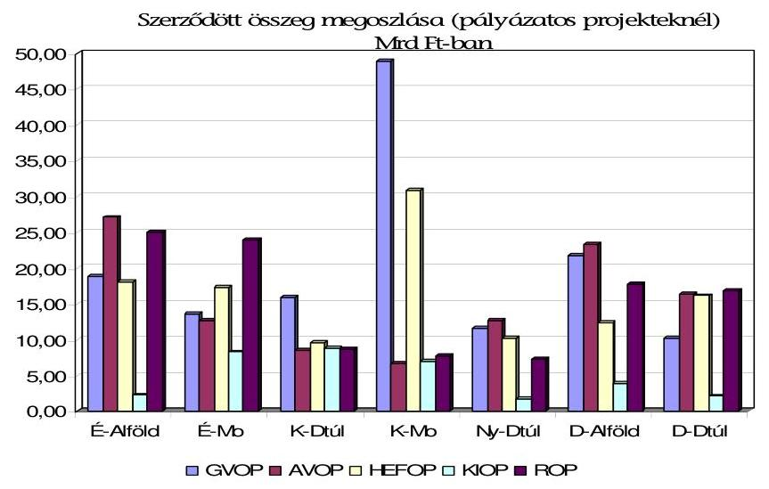

Az NFÜ elemzése szerint, az NFT egészét tekintve a kifizetett támogatási összegek nagysága és a hét régió - egy főre jutó GDP alapján meghatározott - tár-sadalmi-gazdasági fejlettsége között nem volt kimutatható szignifikáns összefüggés. Az országos átlag felett jutott támogatásokhoz Észak-Magyarország, a két alföldi régió, valamint Dél-Dunántúl is. Relatív fejlettségük miatt átlag alatt részesedtek ugyanakkor a forrásokból a fejlett dunántúli régiók, valamint a fővárosi régió, Közép-Magyarország.

A pályázók érdeklődését minden régióban a ROP projektek keltették fel a legjobban ( 3,2 és 4,9 szerese volt a beérkezett pályázatok száma a szerződéssel zárult pályázatoknak), egyetlen kivétel a KIOP, amelyikre az Észak-alföldi régióban ötszörös igény jelentkezett. A legalacsonyabb arányú érdeklődés az AVOP támogatásokat kísérte, de a pályázatok száma így is 1,5 , illetve 2,2-szerese volt a szerződések számának. A beérkezett pályázatok arányát a szerződött összeghez képest a 6. sz. ábra szemlélteti.
6. sz. ábra

Beérkezett pályázatok aránya a szerződött pályázatokhoz képest
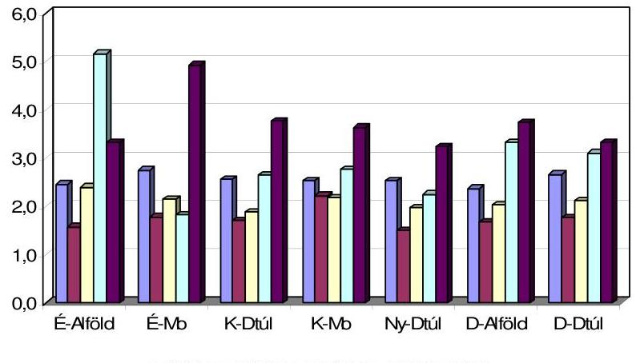

---

A programok közül a ROP kifejezett célja volt a 4 kevésbé fejlett régió (ÉszakMagyarország, Észak-Alföld, Dél-Alföld, Dél-Dunántúl) támogatása a fejlett régiókkal szemben. A ROP teljesítette a regionális felzárkóztatás OP szintű követelményét, hogy a források legalább 75\%-a a 4 kevésbé fejlett régióba kerüljön. A tényérték $78 \%$ lett (forint adatok alapján). A cél teljesítésénél az országos szinten megvalósuló vagy minimum több régiót érintő központi projekteket, illetve a technikai segítségnyújtási támogatást nem vettük figyelembe, így a ROP 4 intézkedése (3.1, 3.4, 4.1, 4.2) nem releváns e cél elérése szempontjából.

A ROP támogatás $78 \%$-a jutott a 4 kevésbé fejlett régióba, amelynek $65,5 \%$-a volt a hátrányos és ezen belül 39,3\%-a a leghátrányosabb helyzetű kistérségben hasznosult. A pályázatok megoszlását (db) a 7. sz. ábra szemlélteti.
7. sz. ábra

ROP pályázói igény és támogatott pályázat megoszlása
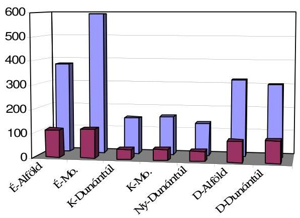

■ leszerzödött pályázat db ■ beérkezett pályázat db
Az AVOP-ból az Észak-alföldi és a Dél-alföldi régióknak a legtöbb, míg a legfejlettebbnek tekinthető Közép-Magyarországnak a program jellegéből adódóan a második legkisebb arányú támogatás jutott. Az AVOP pályázatok számát és a leszerződött pályázatok megoszlását a 8. sz. ábra szemlélteti.
8. sz. ábra

AVOP pályázói igény és támogatott pályázat megoszlása
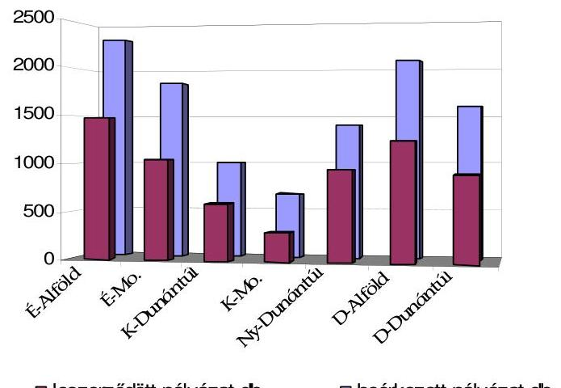

■ leszerződött pályázat db
■ beérkezett pályázat db

---

A GVOP jellemzően a Közép-magyarországi vállalkozásokat támogatta, a vállalkozások száma régiók szerinti súlyának megfelelően. Ennek elsődleges oka, hogy a program fő célja, a gazdasági versenyképesség fokozása elsősorban ott valósul meg, ahol a megfelelő infrastrukturális és logisztikai háttér, valamint humán-tőke rendelkezésre áll, illetve másodlagosan az a tény, hogy országos viszonylatban Budapesten és vonzáskörzetében múködik a legtöbb vállalkozás. A pályázatok területi megoszlását a 9. sz. ábra szemlélteti.
9. sz. ábra

GVOP pályázói igény és támogatott pályázat megoszlása
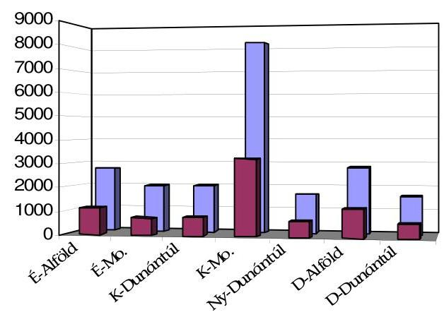

■ leszerzödött pályázat db ■ beérkezett pályázat db
A HEFOP támogatások területi kiegyenlítő hatását torzította a központi projektek magas, értékben közel $42 \%$-os aránya, ezért a diagram csak a pályázaton elnyert támogatások területi megoszlását mutatja. A központi projektek hatóköre országos volt, a 4.3.1 projekt kivételével. A pályázatos projektek kimagaslóan magas arányban (26,9\%) a legfejlettebb Közép-magyarországi régióban valósultak meg. A pályázatok megoszlását a 10. sz. ábra mutatja.
10. sz. ábra

HEFOP pályázói igény és támogatott pályázat megoszlása
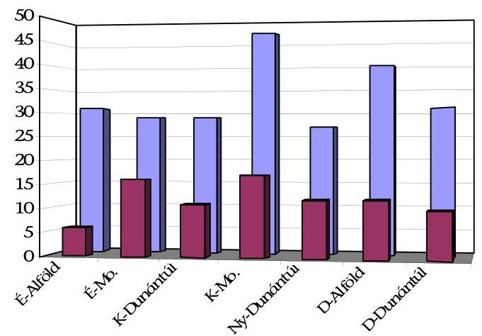

■ leszerződött pályázat db ■ beérkezett pályázat db

---

A KIOP a legfejlettebb Közép-Magyarország mellett a fejletlenebb déli régiókat támogatta, $71 \%$-ban központi projektek keretében. A központi projektek kedvezményezettjei államháztartáson belüli nonprofit szervezetek és nagyvállalatok voltak.

Központi projektek keretében valósult meg többek között három nemzeti park fejlesztése, egy árvízvédelmi beruházás, levegőszennyezés és zajterhelés mérése, elkerülő és tehermentesítő utak építése, elővárosi vasút és két dunai kikötői logisztikai központ.

A pályázatok megoszlását a 11. sz. ábra szemlélteti.
11. sz. ábra

KIOP pályázói igény és támogatott pályázat megoszlása
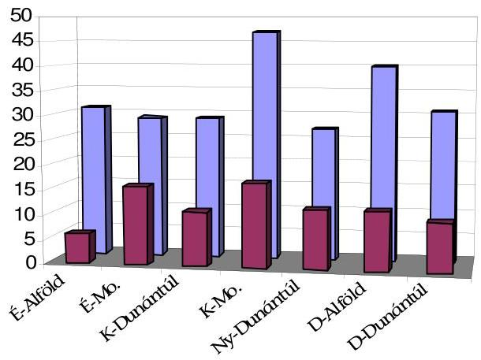

■ leszerződött pályázat db ■ beérkezett pályázat db

A nemzeti szinten kijelölt központi projektek főként a HEFOP és a KIOP esetében voltak. A kedvezményezettek részben vagy teljesen központi költségvetésből gazdálkodó szervezetek voltak, amelyek állami feladatokat láttak el egyebek mellett uniós forrásból. A központi és a pályázatos projektek arányát az 10. sz. táblázat mutatja.
10. sz. táblázat

| Operatív   Program | Központi   projektek |  | Központi   projektek összege/OP | Pályázatos projektek |  |
| :-- | :--: | :--: | :--: | :--: | :--: |
|  | db | Mrd Ft | $\%$ | db | Mrd Ft |
| GVOP | 25 | 3,56 | $2,46 \%$ | 8279 | 140,70 |
| AVOP | 1 | 0,78 | $0,72 \%$ | 6488 | 107,49 |
| HEFOP | 37 | 81,95 | $41,71 \%$ | 3218 | 114,53 |
| KIOP | 39 | 83,00 | $70,91 \%$ | 81 | 32,74 |
| ROP | 13 | 10,63 | $9,02 \%$ | 537 | 107,21 |
| Összesen | 115 | 179,92 | $26,31 \%$ | 18606 | 503,97 |

Forrás: NFÜ, EMIR

---

# 1.6. Az Európai Pályázat Előkészítő Alapból felhasznált támogatások teljesítésének helyzete 

Az Európai Pályázat Előkészítő Alap (továbbiakban: PEA) című PHARE program célja Magyarország abszorpciós képességének növelése volt az NFT I. időszakában (2004-2006), ennek keretében pályázatok kidolgozása, és nemzetközi szakértők projektek tervezésével kapcsolatos tudásának átvétele. Emellett nagyobb, komplex beruházási projekteknél lehetőség volt a projekt tényleges indításához szükséges (részleges terv- és közbeszerzési) dokumentumok készítésére is.

A PEA program 2002-ben indult és 2006-ban fejeződött be. A program pénzügyi kerete ( $44 \%$-os arányú) a hazai társfinanszírozással együtt 27 M euró volt, ami 255 Ft/euró technikai árfolyamon számítva mintegy 7 Mrd Ft-os keretet jelentett.

A PEA keretében nagyrészt hazai szakértők dolgoztak, ugyanakkor a külföldi szakértők 20\%-os részvételével működő munkacsoportokon keresztül valósult meg a tudásátadás.

A PEA keret tervszerű felhasználásában nehézséget jelentett, hogy a kidolgozandó projektek kiválasztásakor (2003), illetve a kidolgozás indításakor (2004 eleje) az NFT I. véglegesített tervdokumentumai, pályázati kiírásai még nem álltak rendelkezésre. Ennek következtében a program megvalósítás során folyamatos beavatkozás, módosítás, a projektötletek átdolgozása vált szükségessé.

A projektek tervezési nehézségeiből adódóan a PEA keretében kidolgozott projektek $80 \%$-át adták be az NFT I. pályázati kiírásaira, és e projektek $62 \%$-a nyert támogatást 120,2 Mrd Ft értékben, ami több mint a PEA-tól eredetileg várt eredmény kétszerese és közel háromszorosa a nem PEA projektek támogatási arányának.

A PEA projektek végrehajtásának tapasztalatairól nyomon követés hiányában nem állt rendelkezésre információ.

## 2. AZ NFT-BEN KITŰZÖTT TELJESÍTMÉNY CÉLOK, EREDMÉNYEK

### 2.1. A projektek szintjén a tervezetthez képest megvalósult teljesítmények, eredmények mértéke, az eltérések indokoltsága

A projekteket mintavétellel választottuk ki, ${ }^{39}$ az NFÜ által az ÁSZ részére átadott EMIR adatbázis 2010. augusztus 4-ei lekérdezéséből.

A 147 projektből álló minta operatív programok közötti megosztását a projektek programonkénti darab száma és értéke arányában határoztuk meg, és

[^0]
[^0]:    ${ }^{39}$ Az alapsokaság, amelyből a minta kiválasztásra került az EU felé elszámolásra kerülő 18135 db projekt volt, 690,6 Mrd Ft értékben.

---

kockázati szempont miatt az értéket kétszeres súllyal vettük figyelembe. Így az AVOP-ból 32, a GVOP-ból 44, a HEFOP-ból 35, a KIOP-ból 17, a ROP-ból 19 db mintát kellett venni. Az ellenőrzésre kiválasztott projektek listáját a 3. sz. melléklet tartalmazza, a projektek megvalósításának helyszíneit a 4. sz. melléklet mutatja.

A rétegezési szempontok a mintavétel céljának megfelelően és a projektek jellemző tulajdonságai alapján a következőek voltak: az operatív program és a finanszírozási alap típusa, a támogatás nagysága (kiemelten nagy, vagy nem kiemelten nagy tétel), a kedvezményezett típusa, a projekt megvalósítás helye szerinti régió, a projekt típusa eljárásrend szerint (pályázatos, vagy központi), a projekt fenntartási időszakából a helyszíni ellenőrzés kezdetéig eltelt időtartam.

A minta ellenőrzéséhez egy előzetesen összeállított kérdőívet és azok mellékletét képező tanúsítványokat alkalmaztunk. A helyszíni ellenőrzés lefolytatásáról Jegyzőkönyvet vettünk fel.

Az ellenőrzött projektek a fenntartási időszakban voltak (két projekt zárult le), így a projektek fenntartási időszak alatti összteljesítményének megítélésére még nem volt mód ellenőrzésünk idején.

A 147 projektből 4 esetben (1, 103, 114, 123. sz. projekteknél) nem tudtuk lefolytatni a teljesítményellenőrzést, mert azok közül 3 projekt szabálytalan volt és egy projekt tagállami tervezési hiba miatt kikerült az EU felé elszámolt projektek közül. ${ }^{40}$ Ebből 2 projekt (103, 114. sz.) már az ellenőrzés mintavétele előtt, a másik 2 projekt (1, 123. sz.) az ellenőrzésünk folyamán került kivételre (8. sz. melléklet).

A kiválasztott mintából teljesítmény ellenőrzéssel nem ellenőrzött projektek helyzete a következő:

- a 103. sz. projekt kedvezményezettje szabálytalanság miatt a támogatást teljes összegben visszafizette, további eljárás nem szükséges;
- a 114. sz. projekt kedvezményezettjének a szabálytalanság nem róható fel, tagállami tervezési hiba volt a 8. sz. mellékletben leírtak szerint;
- a 123. sz. projektet az irányító hatóság ellenőrzésünk idején az ellenőrzési hatóság záráshoz kapcsolódó rendszerellenőrzése alapján a költségnyilatkozatból kivette;
- az 1. sz. projekt esetében a közösség pénzügyi érdekei nem sérültek, de a hazai pénzügyi érdekek sérelme nem zárható ki. Az AVOP Irányító Hatóság a pénzügyi állapot helyreállítása érdekében ellenőrzésünk idején még nem folytatta le a követelés behajtási eljárást.

A 143 ellenőrzött projektek megvalósult. A célok indikátorok szerinti teljesítése a projektek befejezésének állapota szerint 143 projektből 24 esetben nem, 119 esetben értékelhető volt a helyszíni ellenőrzés idején. A 24 projektnél (20,2\%) a

[^0]
[^0]:    ${ }^{40}$ Az NFÜ által végrehajtott EMIR lekérdezés az EU felé utólagosan korrigált tételeket is tartalmazta.

---

szerződésből, illetve a pályázatból hiányzott ugyanaz a mutató. A 119 projektből 98 esetben ( $82,4 \%$ ), teljesültek, vagy túlteljesültek a vállalt célok, 21 projektnél $(17,6 \%)$ pedig részben teljesültek. A projektcélok teljesítésének helyzetét helyszíni ellenőrzésünk idején a 12. sz. ábra mutatja.
12. sz. ábra

A projektcélok teljesítésének helyzete a projektek befejezésekor
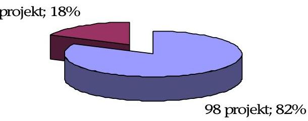

■ A célok mutatói teljesültek, vagy túlteljesültek
■ Részben teljesültek (2-3 indikátorból egy 80\% alatt teljesült)

Forrás: a helyszíni ellenőrzések jegyzőkönyvei
Az ellenőrzés során a kedvezményezettel közösen kiválasztott maximum 3 db , a projektre legjellemzőbb indikátort értékeltük. Volt olyan projekt ahol csak egy indikátor volt, de volt olyan is, ahol 15 közül kellett választani. Az indikátor fogalmát az NFT-re vonatkozó EU és hazai jogszabályok ${ }^{41}$ nem határozták meg, csak uniós módszertani segédanyagok. Az indikátorok esetleges nem, vagy részben való teljesítését az irányító hatóságok egyedileg bírálták el.

# 2.2. A projektek szintjén az eredmények fenntarthatóságának helyzete 

A 143 ellenőrzött projekt megvalósult. A projektek fenntarthatósága 143 projektből 110 esetben volt értékelhető, illetve értelmezhető a helyszíni ellenőrzés idején.

A projektek befejezésének időpontja szerinti 24 projekthez képest a fenntartási időszakban már 33 projektnél ( $23,4 \%$ ) a szerződésből, illetve a pályázatból, vagy a fenntartási jelentésből hiányzott egy-egy mutatónak a mérése, illetve nem volt értelmezhető a fenntartási kötelezettség ellenőrzésünk idején (például képzési program esetén). Képzési program esetén fenntartási kötelezettséget (például továbbfoglalkoztatást) nem kellett vállalni a kedvezményezettnek, de ennek ellenére fenntartási jelentéseket kértek be a kedvezményezettől.

[^0]
[^0]:    ${ }^{41}$ A 360/2004. (XII. 26.) Korm. rendelet 21. § (1) bekezdés a fizikai előrehaladás indikátorai kifejezést használja, fogalom meghatározása nélkül.

---

Például nem határoztak meg mutatókat a szerződésben (pályázatban) az elvárt célokhoz (25, 10, 62, 24. sz. projektnél). Nem releváns a fenntarthatóság az 57. sz. projektnél. A 60. sz. projektre nem volt lebontott célérték (csak a központi projekt egészére), a kedvezményezett tényleges teljesítési értéket számolt. A 17. sz. projektnél a fenntartási jelentés nem tartalmazott teljesítési értéket.

A 110 projektből 82 esetben (75\%), teljesültek, vagy túlteljesültek a vállalt célok, 28 projektnél (25\%) pedig részben teljesültek. A projektcélok teljesítésének helyzetét helyszíni ellenőrzésünk idején a 13. sz. ábra mutatja.
13. sz. ábra

A projektcélok teljesítésének helyzete ellenőrzésünk idején
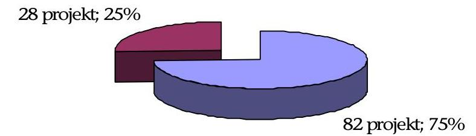

■ A célok mutatói teljesültek, vagy túlteljesültek
■ Részben teljesültek (2-3 indikátorból egy 80\% alatt teljesült)
Forrás: a helyszíni ellenőrzések jegyzőkönyvei
A fenntarthatóság teljesítését a következő 14. sz. ábra szemlélteti.
14. sz. ábra

Helyszínen vizsgált projektek (143) fenntarthatósága
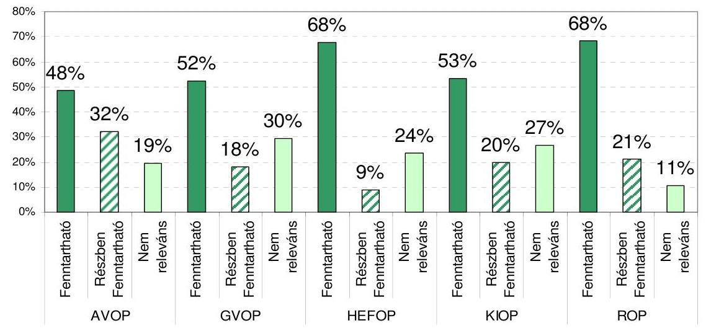

Forrás: a helyszíni ellenőrzések jegyzőkönyvei

---

A részbeni teljesülések jellemző okai az AVOP-nál a rossz termés (3. sz. projekt), az ágazat (mézfeldolgozó ágazat) egészének alulteljesítése (14. sz. projekt) és a gazdasági válság hatására a forgóeszköz-finanszírozási gondok miatt a nettó árbevétel kisebb lett a tervezettnél (18. sz. projekt), túlzott tárolói kapacitás.

A GVOP-nál az okok között szerepel elsősorban a gazdasági válság, ezzel összefüggésben a vevői kör csökkenése és az építőipar alulteljesülése (48. sz. projekt).

A HEFOP-nál kevés projekt (9\%) volt csak részben fenntartható. A 81-es projektnél a kedvezményezett, általános iskolánál történt átszervezés vezetett a részbeni fenntarthatósághoz, ugyanis a diákok és tanárok száma lecsökkent, ezért nem tudták fenntartani az erre vonatkozó indikátort.

A KIOP egyik projektjénél (116. sz.) koncessziós közbeszerzési eljárás kerül kiírásra az üzemeltetésre ezért a fenntarthatóság egyenlőre nem tud teljesülni. Egy másiknál (122. sz. projekt) pedig az intézmények fútése ugyan teljesül, de az enyhe időjárás miatt a megújuló energia felhasználás nem érte el az eredetileg tervezettet.

A ROP-nál a 132-es számú projektnél egy általános iskolánál a normatív támogatások csökkenése miatt alulteljesült a projektben érintett diákok száma. A közoktatási törvény változása miatt nem fenntartható minden indikátor, mert a sajátos nevelési igényű gyerekek kategória megváltozott (137. sz.). A 142-es sz. projektnél pedig az üdülési csekk megadóztatása valamint a gazdasági válság hatására a szállodai kapacitáskihasználtság indikátor alulteljesült.

# 2.2.1. A projektek keretében létrehozott teljesítmények használata, hasznosítása a kedvezményezettek által vállalt kötelezettségekhez képest 

A GVOP projektek múködtetése, hasznosítása általában a kedvezményezett által vállaltnak megfelelő. A mintaként kivett 44 projektböl 39 esetben volt legalább egy fenntartási jelentés a projekt zárását követően, ezeknél a projekteknél volt mért adat. Valamennyi esetben teljesültek a kitüzött célok. Így történt ez az 54-es projekt esetében is, azonban a fenntartási időszakban az önkormányzat információ-szolgáltató tevékenységéhez kifejlesztett IT modul használata ellehetetlenült, a 2004. évi CXL. törvény a közigazgatási hatósági eljárás és szolgáltatás általános szabályairól szóló törvény (KET) jogszabályi módosításainak következtében.

Összehasonlítva a tervben szereplő indikátorokat a helyszíni ellenőrzés idején tapasztaltakkal a következő megállapítások tehetőek:

- 25 db projekt esetében a helyszíni ellenőrzés idején (a fenntartási időszakban) az indikátorok mindegyike elérte, vagy meghaladta a tervekben szerepeltetett értékeket;
- 7 db projektnél csak részben teljesültek a pályázatban vállalt indikátorok $(35,48,52,55,64,70,71$. sz. projektek);

---

- 9 db projektnél vagy a fenntartási jelentésből, vagy a szerződésből, vagy mindkettőből korlátozottan álltak rendelkezésre az indikátorok, így nem lehetett megalapozott következtetést levonni azok teljesülését illetően (36, 38, $39,46,57,62,65,68,74$. sz. projektek);
- 3 db projekt központi program részét képezte (alapszintű tanácsadás), és a részprojektekre nem volt lebontott célérték, csak tényleges adat, így a tervtény adatok összehasonlítására, értékelésére nem volt mód e projektek esetében (56, 59, 60. sz. projektek).

Az AVOP projektek esetében a vállalt kötelezettségek alul teljesültek a 3, 4, $13,14,15,18,19,27,29,30,32$. sz. projektek esetében (11/b. sz. melléklet).

A 29. sz. projekt egy borászati beruházás volt, amely a korábbi készleteinek egy részét értékesíteni nem tudta, a 2010. évi szőlőtermés rossz volt, így a vállalt pénzügyi kötelezettségek nem teljesültek.

A 30. sz. projekt esetében a projekt eredményességéről a projekt megvalósításának helyszínén nem tudtunk meggyőződni, így megkerestük a projekttel foglalkozó közreműködő szervezetet is. A kedvezményezett által a közreműködő szervezetnek megküldött utolsó fenntartási jelentés hiányosságokat, és a mutatókban alulteljesítést mutatott (például a növénytermesztéshez használt terület az elvárt 216ha helyett csak 20ha volt). A kedvezményezett különböző okokra hivatkozva saját termény helyett bérszárítási-tárolási szolgáltatást végzett, emiatt a foglalkoztatottak létszámának a növelése és az árbevétel is csak részben teljesült. A projekt zárásakor a támogató intézmény feladata lesz a céloktól való eltérés indokoltságának minősítése.

A 18. sz. projekt részben teljesült. A kedvezményezett zöldség-gyümölcs feldolgozó hűtőházat létesített, amellyel a gazdasági válság hatására a vállalt árbevételt nem tudta elérni, így a vállalt célok részben teljesültek.

A HEFOP projektekben elért eredmények (képzési tananyagok, felújított, felépített iskolák, kórházak, egyéb épületek) abban az esetben fenntarthatóak, ha az üzemeltető (önkormányzat, magánvállalkozás, non-profit szervezet, költségvetési szerv) a szerződésben vállaltnak megfelelően folytatni képes tevékenységét, vagy jogutóddal szűnik meg.

A központi projektekben kifejlesztett tananyagok, együttműködési modellek fenntarthatóságát segíti, hogy azokat ingyenesen átvehetik a képző szervezetek (óvodától egészen az egyetemekig). A fenntarthatóság és ezzel a hasznosítás további feltétele, hogy az átalakuló, kormányzati szinten új képzési stratégiák építsenek ezekre az alapokra.

A HEFOP ESZA támogatású projektjeinek fenntarthatósága a támogatott célok jellegéből adódóan nem minden esetben értelmezhető a szerződés szerint elvárt öt éves időtartamra.

A megszerzett ismeretek fenntarthatóságát nem lehet értékelni sem az oktatáson részt vett személy, sem a kedvezményezett szervezet szempontjából. Ezt a HEFOP zárójelentés (1-3, 5. prioritások ESZA) 82. oldalán az irányító hatóság is megerősítette.

---

A helyszínen vizsgált képzési projektek fenntarthatósági idejének megítélése a közreműködő szervezet részéről ellentmondásos volt. A kedvezményezettnek semmiféle kötelezettséget nem kellett vállalnia a támogatási szerződésben a kiképzett személyek továbbfoglalkoztatására, vagy egyéb kötelezettségre, ennek ellenére kötelező öt évig fenntartási jelentést beadniuk. Az átvizsgált fenntartási jelentéseket a közreműködő szervezetek elfogadták az indikátorokra vonatkozó „nem releváns" megjegyzéssel, vagy a zárójelentésben foglaltak megismétlésével is (például képzésben résztvevők, képzettséget szerzettek száma).

Hasonlóan korlátozottan értelmezhető a „Munkához vagy más pozitív eredményhez jutottak száma" fenntarthatósága, mert a projekt érintettekre gyakorolt hatását korlátozott ideig, legfeljebb fél, egy évig követi a kedvezményezett, ezért az öt éves fenntartás szükségessége nem indokolt. Az indikátor tartalmának értelmezése tág teret enged teljesítésének igazolására.

A fenntartási kötelezettség forrása sem a jogszabályokban, sem a támogatási szerződésben nem volt meghatározva. Így fordulhatott elő, hogy költségvetési szervek működési forrásaikban a központi költségvetési többletből tervezik fenntartani az elért eredményeket.

Mind az ESZA, mind az ERFA beruházási projektek fenntartási kötelezettségének betartását - a helyszíni tapasztalataink szerint - a módosult gazdasági környezet nehezítheti.

A vizsgált projektek keretében megvalósítottak hasznosítása a fenntartási kötelezettségüknek megfelelően történt.

A vizsgált projektek a támogatási szerződésekben és azok módosításaiban vállaltak szerint valósították meg céljaikat, a források és a rendelkezésre álló megvalósítási időtartam keretein belül. Az eredeti célok elérésének értékelését a forrás átcsoportosítások, az indikátor rendszer átdolgozása (új indikátorok, a régi indikátor fogalmának módosulása) korlátozta, de a fejlesztések iránya az eredeti operatív programban meghatározott maradt.

A KIOP projektek múködtetése, hasznosítása összességében a kedvezményezettek által vállaltaknak megfelelően történik, 2 projekt (116, 120. sz.) esetében ez korlátokba ütközött.

A 116. sz. projektnél a pályázatban szereplő 5 E t/év vasútra terelt áruforgalom helyett az utolsó jelentett állapot ${ }^{42} 1,5$ E t/év. Ennek oka, hogy a komplex projektnek a további elemei még nem valósultak meg, ugyanakkor a kitűzött cél a komplex, teljes egészében működő projektre lett meghatározva, 2012-re. A kikötő további termináljainak üzembe helyezési határideje 2010 volt, azonban ez nem teljesült, mert a beruházás az ingatlan tulajdonviszonyok, vagyonkezelői jogi helyzet rendezetlensége és támogatás hiánya miatt még nem kezdődött el.

A 120. sz. projektben érintett 22 önkormányzat a környezetvédelmi zajtérképét és intézkedési tervét elkészítette. Az intézkedési tervet 10 önkormányzat képviselő testülete csak jóváhagyta, de az abban szereplő feladatokra nem jelölt ki

[^0]
[^0]:    ${ }^{42}$ A 2008.08.31-2009.08.31. közötti időszakra vonatkozó fenntartási jelentés.

---

felelőst és határidőt (a többi önkormányzat a jóváhagyással együtt feladatokat és felelőst is megjelölt). A fővárosi és másik 21 önkormányzat zajtérképek alapján intézkedési terveket készített, azonban 10 önkormányzat képviselő-testülete csak jóváhagyta azokat, de a feladatokra nem jelölt ki felelőst és határidőt. Ezek közül az ellenőrzésre kiválasztott mintában szereplő Fővárosi Önkormányzatnál az intézkedési tervben foglalt feladatok megvalósításának helyzetéről nem tudtak számot adni, így a terv hasznosítását nem lehetett megállapítani.

A ROP projektek ellenőrzés idején rendelkezésre álló teljesülési értékét összehasonlítva az indikátorok tervadatának első teljesülési értékével, valamint az eredeti tervadattal is, a következő eredményt kaptuk:

- 2 db projekt adat hiányában nem értékelhető. A 143. sz. projektnek nem volt projektfenntartási kötelezettsége és nem is értelmezhető a mutató a projektbefejezés utáni időszakra. (A befejezéskori adatok alapján a 143. sz. projekt mutatói jól teljesültek.) A 146. sz. projektnek volt fenntartási időszaka, de arra a 3 mutató nem értelmezhető;
- 12 db projekt mutatóinak teljesülése jellemzően 100\%-os vagy annál jobb volt, projektenként legfeljebb egy mutató teljesült a 90-100\% tartományban (129, 130, 131, 133, 134, 135, 136, 137, 139, 140, 144, 145. sz. projektek). A 137. sz. projektnél az ellátott különleges nevelési igényű gyerekek számának nagymérvű csökkenését csak a jogi szabályozás változása („újradefiniálás") okozta, valójában az ilyen ellátottak száma nem változott;
- A 142. sz. projekt, amely 58 idegenforgalmi férőhelyet hozott létre, a vállalt $35 \%$ kapacitáskihasználtság helyett 5,6\%-ot tudott elérni. A 138. sz. projekt az eredetileg tervezett tanulólétszámot $62,7 \%$-ra teljesítette. Egy harmadik iskola (132. sz. projekt) a tanulólétszám és az új munkahelyek száma mutatókat nem tudta teljesíteni. A fejlesztések támogatása és a megvalósult fejlesztések működőképessége a szakpolitika és a fejlesztéspolitika együttes felelőssége.

A mintában szereplő projektek közül három projekt (az értékelt projektek $2 \%$-a, értékben $15,8 \%$-a) esetében egy-egy projekt elem hasznosulása további intézkedést igényelt. Egy projekt, a környezetbarát közlekedést szolgáló országos közforgalmú kikötő fejlesztés esetében ellenőrzésünk idején ütemterv készült a hasznosításhoz szükséges teendőkre. Egy másik esetben egy önkormányzat információ-szolgáltató tevékenységéhez kifejlesztett IT modul jogszabályi módosítás következtében használhatatlanná vált. A harmadik esetben, a környezetvédelmi törvény által előírt zajtérképeket elkészítette a 22 kedvezményezett önkormányzat, de 10 önkormányzat képviselő testülete a projekt részét képező intézkedési tervet csak jóváhagyta, az abban szereplő feladatokra nem jelölt ki felelőst és határidőt.

A projektek sikerességéhez, vagy sikertelenségéhez hozzájáruló tényezők közül a kedvezményezettek a sikeresség tényezőjeként kiemelték saját felkészültségüket, ugyanakkor többen is említették az intézményrendszerrel való jó együttműködést. A kérdőív tükrözi, hogy 91-en elégedettek az intézményrendszer közvetítő szerepével, ez az összes kedvezményezett 63,6\%-a. Csupán a kedvezményezettek 7,5\%-a fejezte ki elégedetlenségét. A negatívumok között szerepelt az ügyintézés és a kifizetések lassúsága, a kifizetési igazolások határidőn túli kiadása, a gyakori szervezeti és személyi változások, a jogszabályi környezet változása, a túlzott bürokrácia, valamint a sokszereplős intézmény-

---

rendszer. (a Kérdőíves felmérés eredményénél figyelembe kell venni, hogy a válaszadás nem volt névtelen.)

A gazdasági válság is hátrányosan befolyásolta a vállalt célok eredményességét a reprezentatív mintában szereplők közel harmadánál (28,6\%-nál). A horizontális célok a 143 projektből 101 projektnél teljesültek, 4 projekt esetében nem, 3 esetben pedig csak részben. 35 projektnél nem voltak értelmezhetőek a horizontális célkitűzések.

# 2.2.2. A projektek tárgyának tulajdoni- és használati viszonyai fenntartásának helyzete a támogatási szerződéshez, illetve az engedélyezetthez képest 

A GVOP projektek tulajdoni- és használati viszonya a támogatási szerződésben foglaltak szerint alakult.

Egy projekt esetében (35. sz.) történt tulajdonosváltás, ami a projekt megvalósulását befolyásolta, mert a helyszíni ellenőrzésünkig az 5 indikátorból csak 2-t sikerült teljesíteni.

Az AVOP projektek tulajdoni- és használati viszonya a támogatási szerződésben foglaltak szerint alakult. Egy esetben a beszerzett eszközt (projektort) eltulajdonították (10. sz.). Négy esetben a projekt tárgyát jelzálogjoggal terhelték (7, 14, 29, 32. sz.), amelyhez a szükséges engedélyt beszerezték. Két esetben (22, 24. sz.) a szükséges engedély nem volt fellelhető a helyszínen.

A HEFOP ESZA projektek esetében a tulajdoni és használati viszony nem értelmezhető. Az ERFA projektek tulajdoni és használati viszonyai nem tértek el a támogatási szerződésben megfogalmazottaktól.

A KIOP projektek tulajdoni- és használati viszonya a helyszínen ellenőrzött 15 projektből 11 esetében a támogatási szerződésben foglaltak szerint alakult.

A 115, 117. és a 119. sz. projektek esetében a területek tulajdonviszonyainak rendezése a vizsgálat idején folyamatban volt, így a projektek nem minősíthetők befejezettnek, de a projekt keretében épített, illetve felújított út már használatban volt. A 116. sz. projekt esetében a teljes iparvágány hálózat üzemeltetése szolgáltatási koncessziós közbeszerzési eljárás keretében kerül kiírásra.

A ROP projektek tulajdoni és használati viszonya megfelelt a szerződéses előírásoknak és az engedélyezett állapotnak, ahol ez releváns szempont volt. Két projektnél fordult elő, hogy éppen a támogatási szerződéssel összefüggő bankhitel vagy bankgarancia miatt jelzálog került bejegyzésre a projekt tárgyára, szabályosan.

---

# 2.3. Az operatív programok intézkedései szintjén megvalósult teljesítmények, eredmények mértéke, az eltérések indokoltsága 

### 2.3.1. A tervezetthez képest megvalósult teljesítmények, eredmények mértéke, az eltérések indokoltsága

A GVOP intézkedések közötti forrásátcsoportosítások a PkD 2007. november 6ai módosításával bezárólag a forrásvesztést minimalizálták. Az indikátorok teljesítését a 11/a. sz. melléklet részletezi.

A legnagyobb támogatási összeggel (41,9 Mrd Ft, a teljes GVOP keret 28,4\%-a) érintett intézkedéseket (2.1, 4.1 és 4.2) a „Támogatott KKV-k száma" című indikátorral jellemezhető. Többszöri változtatás után a tervezett 8880 KKV-ból 6966 támogatása valósult meg, ez 78,4\%-os teljesülést jelent.

Az AVOP intézkedéseinek teljesítmény mérésére kialakított indikátorrendszer (11/b. sz. melléklet) a Monitoring Bizottság keretében 2005. augusztus és szeptember hónapban lezajlott írásbeli eljárásokat követően alakult ki végleges formájában. A Zárójelentés megállapítása szerint is csak korlátozottan voltak alkalmasak az indikátorok az elért teljesítmények értékelésére, ezért azok matematikai értékelése nem tükrözte a valós teljesítményeket.

Legnagyobb súllyal, az 1.1. intézkedéssel a mezőgazdasági beruházásokat támogatta az AVOP.

A HEFOP intézkedései közül az 1.1. intézkedés, a munkanélküliség megelőzése és kezelése (29,20 Mrd Ft, a teljes keret 15,2\%-a), és a 4.1. intézkedés, az oktatási és képzési infrastruktúra fejlesztése (24,88 Mrd Ft, a teljes keret 12,9\%-a) nyerte a legtöbb támogatást. Mindkét intézkedés indikátorai a tervezetthez képest túlteljesültek, a 4.1 intézkedés egyik indikátorának 22-szeres túlteljesülése tervezési, adatgyűjtési vagy értelmezési hibákra utal (11/c. sz. melléklet).

A tervezett $9600 \mathrm{~m}^{2}$ felújított vagy épített alapterület helyett $217815 \mathrm{~m}^{2}$ valósult meg.

A HEFOP minden szintjén találhatók a kedvezményezett munkájától függő indikátorok, amelyek lehetővé tették a teljesítés értékelését. A külső körülményektől is függő indikátorok nem minősítették egyértelműen a kedvezményezettek végső soron az operatív program - teljesítményét.

Például az 1.2 intézkedés egyik indikátorának teljesítése nem csak a kedvezményezettől függ (havonta bejelentett új álláshelyek átlagos száma), ezért az indikátor alulteljesülése ( 50000 helyett 29020 ) nem minősíti egyértelműen a kedvezményezett munkáját.
„A 2.1. intézkedés operatív programban megfogalmazott célja: a hátrányos helyzetü, különösen a roma, illetve fogyatékos diákok továbbtanulási lehetőségeinek, ezáltal munkaerő-piaci és társadalmi beilleszkedési esélyeinek javitása. Az alkalmazott indikátorok nem tértek ki a roma, illetve a fogyatékos diákok programba vonására.", a 0636 sz. ÁSZ jelentés szerint.

---

„A HEFOP 4.1.2 intézkedés ${ }^{43}$ a HEFOP 3.3 pályázatainak ${ }^{44}$ infrastrukturális hátterét biztosította. Az infrastrukturális beruházások nem közvetlenül a 2004-06 időszakban a HEFOP 3.3 keretében megvalósuló projektek végrehajtásához kapcsolódnak, hanem azok eredményeinek fenntarthatóságát biztosítják." (ESZA Zárójelentés 20. oldal)

A megvalósító, esetenként nonprofit szervezetek fennmaradása, így a projekt fenntarthatósága, nyomon követése is kockázatos. A 2.3 intézkedés célja a hátrányos helyzetú emberek foglalkoztathatóságának javítása, különös tekintettel a roma népességre, ez három alintézkedésben valósult meg többek között egyénre szabott fejlesztésekkel a foglalkoztatás és a szociális szolgáltatások eszközeivel. A 2.3.3. alintézkedésben 8 db , a 2.3.2. 104 db , a 2.3.1. 49 db , összesen 161 kedvezményezettet jelentett. A Zárójelentés (123. oldal) szerinti közel 11 Mrd Ft-ból tehát pályázatonként átlagosan közel 70 M Ft jutott a projektek megvalósítására önerő hozzáadási kötelezettség nélkül úgy, hogy a megcélzott roma lakosság bevonásáról a kedvezményezettek adatvédelmi okok miatt nem tudtak beszámolni.

A KIOP esetében nem teremtették meg a teljes összhangot a célrendszer és a lekötött források között, ezt a 0727 sz. ÁSZ jelentés is megállapította. Az értékeléshez módszertani segédlet készült 2008-ban. A hatályos PkD indikátorokat már ennek figyelembe vételével alakították ki. Ezek figyelembe vételével a hatályos indikátorok jellemzően teljesültek (11/d. sz. melléklet).

A KIOP indikátorrendszere a program heterogenitásából következően szerteágazó, ami program és prioritásszinten nehezítette az átfogó jellegű indikátorok megalkotását. A PkD intézkedésszintű indikátorai tervezési hibák miatt korlátozottan voltak alkalmasak a projektek nyomon követésére. A mutatók egy része nem volt értelmezhető (például energiahatékonyságnál a kimenet), vagy azokat félreértelmezték a kedvezményezettek.

Az EMIR volt hivatott átfogóan nyilvántartani az indikátorok minden tervezett és tényleges előrehaladását, azonban az EMIR rendszerben voltak adatfeltöltési hiányosságok, pontatlanságok, külön adatbázisokban tartották nyilván az indikátorok teljesítését.

A ROP források felhasználásának eredményességét jelző teljesítési értékek alapvetően alátámasztottak. Értelmezést, pontosítást igényelt, a ROP zárójelentésben a 2.3 intézkedés 5 indikátora. A mutatók nem minden esetben fejezték ki az intézkedés célját, például „megépített vagy felújított utak hossza", valamint az elvárt mérték tág határok között mozgott, például a 2.1 intézkedésnél; „a barnamezős beruházások száma", tervtartomány 5-20 db. A képzési jellegű intézkedések többszörös túlteljesítése tervezési hiányosságokra utalt.

A ROP intézkedés szintű indikátora közül:

- 4 db indikátorra nincs tényleges intézkedés szintű adat (1.1, 1.2, és 2.1 intézkedés), mert a célok teljesítését projektenként \%-os mértékegységben mérték, így az intézkedés szintű összesítés nem volt lehetséges, csak a projektenkénti értékelés;

[^0]
[^0]:    ${ }^{43}$ 4.1.2. Felsőoktatási intézmények infrastrukturális feltételeinek javítása
    ${ }^{44}$ 3.3. A felsőoktatás tartalmi és szerkezeti fejlesztése

---

- a roma származásúak számával kapcsolatos indikátorok értékéről adatvédelmi okok miatt nem lehet beszámolni, bár a tervadat alulteljesüléséről számolt be a zárójelentés (3.1, 3.2, 3.4 intézkedések);
- az indikátorok tervértékének teljesülését két intézkedésnél (1.2, 2.2) a tervtartomány alsó határához viszonyítja a zárójelentés, a többi intézkedésnél tervtartomány esetében a felső határ a viszonyítási alap;
- a 3.1 „A képzést sikeresen befejezők száma" intézkedés 441\%-os, és a 2.1 „A megépített, vagy felújított utak hossza" intézkedés 389\%-os teljesítése, a for-rás-felhasználást is figyelembe véve tervezési hiányosságokra, a tervezéshez szükséges megfelelő kiinduló adatok hiányára utal.

# 2.3.2. A teljesítmények és az azokra felhasznált források viszonya 

Az operatív programok pénzügyi kereteinek és a teljesítményeknek a tervezett és a tényleges viszonya nem adott reális képet, mert a forrásátcsoportosítások során jellemzően nem végezték el a fizikai célértékek illesztését a megnövelt, illetve csökkentett forrásokhoz, továbbá a tervezett és a tényleges mutatók tartalmának, adatgyűjtési módjában is voltak eltérések.

A VÁTI Nonprofit Kft., mint közreműködő szervezet ROP-ra vonatkozó indikátortanulmánya a megvalósult projektek alapján több fajlagos mutatóra tényadatot szolgáltatott. 1 km útfejlesztés (megvalósult útépítés vagy -felújítás) támogatási összege 45,7-53,9 M Ft sávban ingadozott 5 régióban. Ez az indikátor 2 olyan régióban vette fel a szélső értékeket ( 29,2 és $60,2 \mathrm{MFt}$ ), ahol csak útfelújítás volt. Egyéb fajlagos mutatók (egy munkahely létrehozására/egy általános iskolai tanulóra vagy óvodai ellátottra/egy idegenforgalmi férőhelyre jutó támogatás vagy összköltség) nagy regionális szórást mutattak. Használhatóságukat rontotta, hogy a támogatott projektek, különböző tartalmúak voltak (például óvodák, iskolák, közutak, idegenforgalmi szálláshelyek - valamilyen szintű, formájú - fejlesztése/kialakítása), és egyszerre többféle indikátort (például munkahelyteremtést és idegenforgalmi férőhelybővülést) kellett teljesíteniük.

### 2.4. Az operatív programok prioritásai szintjén a tervezetthez képest megvalósult teljesítmények, eredmények mértéke, az eltérések indokoltsága

A GVOP prioritás szintű indikátorainak változásait és teljesülésüket a 11/a. sz. melléklet tartalmazza.

Az 1. Beruházás ösztönzés-prioritás keretét 97\%-os mértékben használták fel, a prioritáson belül az intézkedésekre a pályázók igényei szerint forrásokat csoportosítottak át. Az 1. prioritás keretét 107\%-os mértékben lekötötték szerződésekkel, de a gazdasági válság hatására a jelentéskészítés időszakára a fennálló szerződésállomány lemorzsolódott 97\%-ra.

A támogatott kedvezményezettek számának output mutatói túlteljesültek, ugyanakkor a tőkebevonást célzó és az infrastruktúrát teremtő kedvezményezetteknek a megcélzott darabszámú vállalkozásokat vonzó hatásai, mint eredménymutatók a célkitűzéseiktől mintegy 15-20\%-kal elmaradtak (2009. szeptember).

---

A 2. Kkv fejlesztés prioritás keretének 16\%-át prioritáson belül átcsoportosították. A teljes keret lekötésre került ( $101 \%$-os mértékben), de a gazdasági válság hatására a szerződésállomány lemorzsolódott és a keret felhasználása $89 \%$ lett.

A 3. $\mathbf{K}+\mathbf{F}$ és innováció prioritás keretének 3,3\%-át csoportosították át, abszorpciója sikeres volt (102\%), egyetlen kiemelkedően népszerű intézkedésének a „Vállalati K+F kapacitások és innovációs képességek erősitése" 141\%-os teljesének köszönhetően. A prioritás teljesítménymutatói jelentősen túlteljesültek (135\% sok száz \%), ami alapvetően tervezési hibára (az indikátor rossz definíciójára) vezethető vissza.

A 4. Információs társadalom és gazdaság prioritásnál volt a legnagyobb az átcsoportosítások mértéke és gyakorisága is (a keret 46,7\%-a). A teljes keret 101\%-át kötötték le szerződésekkel, és a lemorzsolódás hatására a keretet 94\%ban használták ki. A prioritás teljesítménymutatói inkább lehetőségeket jelentenek, mint a támogatások gyakorlati hasznosulását.

Az AVOP prioritás indikátorait a zárójelentés szerint a 11/b. sz. melléklet mutatja be. A program teljes időszakára az 1. prioritáson belül: „Versenyképes alapanyag termelés megalapozása" a tervezett 15700 db szerződés helyett azonban csak 2940 db szerződéskötés történt. Ez az arány a program tervezett output eredményének csupán 19\%-a, amely a beérkezett pályázatok nagyobb összegű támogatási igényével magyarázható. A fiatal gazdák által létrehozott gazdaságok száma a tervezett eredménynek a 112\%-át teszi ki, a nők által létrehozandó gazdaságok száma mindössze egy fővel maradt el a tervezettől, így az eredmény indikátorokra vonatkozóan a megvalósulások jó eredménynek számítanak.

Az 1. prioritás indikátorai között szereplő hatásindikátor („a mezőgazdasági tevékenység jövedelmezöségének növelése \%") értékének meghatározása nem volt lehetséges. Ez a mutató hivatott meghatározni a mezőgazdasági tevékenység jövedelmezőségének növekedését. A meghatározás kudarcának oka kettős: egyrészt az alapadatok hiánya, másrészt a makrogazdasági helyzet változása nem tette lehetővé a mutató értelmezését és elemzését. Az alapadatokkal kapcsolatos probléma, hogy a pályázóktól bekért gazdálkodási eredményadatok a Társaságok egész múködésére vonatkozó információkat tartalmaznak, ennek következtében a projekt hatása nem volt kimutatható.

A 2. prioritás: „Élelmiszer-feldolgozás modernizálása" esetében a támogatott pályázatok átlagos támogatási igénye a tervezettnél magasabb volt, így a program kidolgozása során becsült 200 db pályázatnál kevesebb kedvezményezett juthatott támogatáshoz.

Mivel a fejlesztések komplex beruházások megvalósítására irányultak, és ezen beruházások esetében a legnagyobb forrásigényű fejlesztési célt kellett a projekt céljaként számszerúsítve is megjelölni, így az indikátorok csak a kiemelt cél teljesülését mutatták be. A pályázatok darabszámban 13\%-a az élelmiszerbiztonságot célzó beruházás, értékben ez csak 9\%. Ennek oka, hogy ezen beruházások megvalósítására jóval kevesebb összeget szánnak a pályázók, mint egy versenyképességet javító, gyorsan megtérülő projekt esetében.

---

A 3. prioritás: „Vidéki térségek fejlesztése" esetében a támogatott pályázatok számát, típusát és a kedvezményezettek minősítési kódját tartalmazó output indikátor tervezett és megvalósult értékei között jelentős eltérések mutatkoznak. Egyedül az idegenforgalmi pályázatok száma haladta meg a tervezettet. Az eltérés oka az intézkedések közötti források átcsoportosítása, valamint a projektméretek hibás tervezése volt (az egy projektre jutó támogatási összeg 7,74 M Ft volt a tervezett 5,61 M Ft-tal szemben).

A HEFOP prioritás szintű indikátorok projektjelentésekből származó teljesítése a Zárójelentések szerint az 1-2. prioritás esetében megfelelő, a 3-4. prioritás esetében alulteljesített volt ( $11 /$ c. melléklet).

Az 1. prioritás kimeneti indikátora a „szakképzett emberek száma" nem tartozott a projekt által kötelezően gyűjtött adatok közé (Zárójelentés 24. oldal), ezért az Irányító Hatóság nem rendelkezett pontos adatokkal a prioritás céljának teljesüléséről. Ugyanezen prioritás eredmény indikátora statisztikai mintavétel alapján készült a projekt jelentése alapján. A bejelentett üres álláshelyek számának teljesített értéke 30,6 (Zárójelentés 32. oldal) vagy 23,6 (Zárójelentés 47. oldal) mindkét adat szerint elfogadható, első esetben $2 \%$-kal maradt el a célértéktől (30), második esetben 22\%-kal túlteljesítette azt. Az „Azoknak a résztvevőknek a száma, akik foglalkoztatáshoz jutottak vagy munkaerő-piaci helyzetük más módon javult" a zárójelentés szerint nem mérendő indikátor volt, az értékelésbe nem vonták be.

A 2. prioritás projektjelentésekből képzett indikátorértékei 44 illetve 141\%-kal túlteljesültek. A túlteljesítés egyrészt a projekt lebonyolítása folyamán elért megtakarítások újrafelhasználásából, másrészt az 1. prioritásban már említett „Foglalkoztatáshoz jutott vagy más munkaerő-piaci helyzetjavulást tapasztalt résztvevők száma" mutató bizonytalanságaiból eredt. Ugyanakkor a prioritás eredményességét megkérdőjelezi, hogy a „Tartós munkanélküliség aránya" a kiinduló 2,6\%-ról a megcélzott 2,2\%-ra csökkenés helyett 4,2\%-ra nőtt a KSH szerint.

A 3. prioritás kimeneti indikátora a „képzettséget szerzett személyek száma" és „azoknak a résztvevőknek a száma, akik foglalkoztatáshoz jutottak vagy munkaerőpiaci helyzetük más módon javult". Ez egyetlen hatásindikátorától eltekintve (kimenet, eredmény és egy hatásindikátorában) elmaradt. A mért indikátorokban 88\%-os illetve 92\%-os, az „oktatásban és képzésben résztvevő 25-64 éves népesség aránya" indikátorban 78\%-os teljesítéssel maradtak el a célkitűzésektől.

A 4. prioritás három indikátora átlagosan 217\%-ban teljesült (az eltérések értelmezésére a zárójelentés sem adott magyarázatot). A túlteljesítések forrásai a végrehajtásban elért megtakarítások voltak. (A 4.1.1 alintézkedés szerint a hallgatói létszám csak 125 570, a fejlesztésből részesülő hallgatók létszáma azonban 161432 fő.) Az eredménymutató (elhelyezés, kapacitás, betegforgalom) egyes tényezői az egészségügyet érintő struktúraváltás hatására a fejlesztésektől függetlenül változtak, ezért a HEFOP hatása nem értékelhető.

---

11. sz. táblázat

| Indikátor megnevezése | Tervezett érték | Eredmény |
| :-- | :--: | :--: |
| Újonnan létrehozott és továbbfejlesztett IT kapacitás | 2550 | 4449 |
| Újonnan létrehozott és továbbfejlesztett szociális szol-   gáltatásokban részesülő háztartások száma | 4000 | 8212 |
| Infrastruktúra-fejlesztésből profitáló diákok száma | 80000 | 332611 |
| Egészségügyi IT szolgáltatások végső felhasználóinak   száma | 3000 | 8215 |

Az előzőek közül egyik mutató sem a projektek teljesítéséből képzett érték, hanem az Állami Foglalkoztatási Szolgálat statisztikai adata.

A KIOP első prioritása indikátorai 68-706\%-ra teljesültek. A 2. prioritás (közlekedési infrastruktúra fejlesztése) kizárólag központi projektekkel valósult meg. Fő indikátorai közül az „utazási idő csökkenése a magasabb rendű utakhoz történő kapcsolódási lehetőség" számszerűsítéséhez alkalmazott módszerek eltérő eredményt adtak, az értékelésben nem volt meghatározva a számítási mód, az értékelés utólag nem egyértelműen alapozható meg. (11/d. sz. melléklet)

A közútról vasútra, illetve vízi útra terelt tehergépjárművek száma intézkedés főindikátora $18 \%$-ra teljesült, mert a projekt múködése további termináljának 2010-es kiépítése nem megoldott.

Bizonyos esetekben az alapértékek vagy túl magasak voltak, vagy nem hordoztak elegendő jelentést, ami lehetővé tette volna a pontos meghatározást, ezért az ilyen esetekben az alapértékeket meghagyták 0-nak. ${ }^{45}$

A PkD-ban előirányzott a balesetek számának tervezett 5\%-os csökkentése a teljesítés során elérte a $15 \%$-ot, mely $300 \%$-os teljesülés a 2009-es célokhoz képest. A teljesítési értékben a 69/2009 (IV. 2.) Korm. rendelet hatásainak megjelenítését („objektív felelősség") az adatforrás nem tette lehetővé.

A ROP prioritásainak teljesítményértékelése során az irányító hatóság a PkD-ban meghatározott ${ }^{46}$ prioritásszintű indikátorokra ismertetett teljesülési adatokat. ${ }^{47}$

A tényleges prioritás szintű indikátorokból KSH-adatokból kinyerhető 3, ezekről nincs teljesülési adat. 14 indikátor az intézkedés szintű mutatókra épül.

[^0]
[^0]:    ${ }^{45}$ A KIOP esetében csak a 2.1 intézkedés új és felújított útszakaszok hossza mutató rendelkezett kiinduló adattal, 894 km volt.
    ${ }^{46}$ Az EU Bizottság által jóváhagyott ROP alapdokumentumban foglalt prioritás szintű indikátorok statisztikai jellegű mutatóinak alakulása nem mutatott közvetlen összefüggést a támogatott projektek megvalósulásával, így a Monitoring Bizottság által jóváhagyott ROP program-kiegészítő dokumentum alapján értékeltek.
    ${ }^{47}$ „Az I. Nemzeti Fejlesztési Terv Regionális Operatív Program indikátorrendszerének áttekintő elemzése" 2009. február 31. oldal.

---

A hatályos OP verzióban levő prioritásindikátorok összesítő jellegűek, ezért nem hordoznak többlet információt az intézkedés szintű indikátorokhoz képest. Az azonos tartalmú intézkedés- és prioritásszintű mutatók tervadatai, tervtartományai gyakran nincsenek összhangban egymással. (például „támogatott óvodák száma" 40-50, „támogatott általános iskolák száma" 50-60, és prioritás szintén az indikátor - „támogatott óvodák és általános iskolák száma" - értéke 150-180.) A 3. prioritás egyik indikátoránál sincs összhangban a tervtartomány a megfelelő intézkedésszintű indikátorok tervtartományainak összegével. A két szint indikátorainak tartalma között is van különbség: pl. „képzések résztvevőinek száma" (prioritás szint), illetve „képzések, rendezvények résztvevőinek száma" (indikátor szint). Mindez nem alapozta meg a prioritás szintű célok teljesülésének vizsgálatát.

A hatályos ROP PkD prioritás szintű indikátorainak teljesülését a 11/e. sz. melléklet mutatja be.

Az 1. prioritás mutatói alulteljesültek. A turisztikai ágazatban a teremtett munkahelyek számát országos szinten, illetve 4 fejletlen régióra megadó 2 indikátor enyhén alulteljesült. 2 indikátor (támogatott kkv-ék száma és a támogatott projektek száma), amelyek önmagukban még nem adnak információt a teljesítményről, rendkívüli mértékben alulteljesült, részben számbavételi problémák és felültervezés miatt. További 2 mutatónak a forrása a KSH, az NFÜ/VÁTI Kht. nem ismertettek rájuk vonatkozó adatot az anyagaikban. Egy mutató, amelynek a KSH a forrása, teljesült, de az adattartalom eltér a kívánttól.

A 2. prioritás esetében az 5 mutatóból egyre egyáltalán, egyre pedig megbízható tényadat nincs, de ami a ROP zárójelentésben szerepel, az alulteljesítést jelent. 2 mutató ( 2.1 és 2.2. intézkedésekből), jól teljesült. Az „új munkahelyek száma" indikátor a tervtartományon belül teljesült.

A 3 prioritás indikátorai számszerűleg jól teljesültek, de kevés támpontot adnak a valós eredményességről. A 6 mutatóból a roma származásúak alapsokaságon belüli arányát jellemző 2 mutató alul, a másik 4 mutató túlteljesült.

# 2.5. A strukturális alapok támogatásával elért eredmények értékelése, az eltérések indokoltsága 

A strukturális alapok fogadásához elkészített NFT, illetve a KTK általános céljának az EU szociális és gazdasági színvonalához való felzárkózást tekintette. Ezt az általános célt nem értük el, sem az egy főre jutó GDP, sem a foglalkoztatási ráta (mint a szociális és gazdasági szintre utaló mutató) nem közelített az EU átlagához még azt figyelembe véve sem, hogy a 2008-2009. évi pénzügyi válság az EU országait is sújtotta, valamint a 2009. évi EU átlag már a két legutóbb csatlakozó tagállam vonatkozó adatait is tartalmazza.

A KTK az általános célt lebontotta négy célra: 1. versenyképesebb gazdaság (a termelő szektor versenyképességének javításával), 2. a humán erőforrások jobb kihasználása (a foglalkoztatás növelésével és az emberi erőforrások fejlesztésével), 3. a jobb minőségű környezet és alap infrastruktúra (jobb infrastruktúra,

---

tisztább környezet biztosításával), valamint 4. kiegyensúlyozottabb területi fejlődés (a regionális és helyi potenciál erősítésével).

Az első célt főként a GVOP és az AVOP, a másodikat a HEFOP, a harmadikat a KIOP és a negyediket a ROP támogatásaival kívánta az NFT elérni, de mindegyik OP közvetve vagy közvetlenül segítette a többi cél elérését is, a Strukturális Alapok 1. célkitűzésének megfelelően (összhangban a KTK-val).

Például a vidék megtartó erejének növelésével javítani lehet a helyi foglalkoztatást, a regionális programból kisebb útépítések valósultak meg, oktatási intézmények újultak meg.

A termelőágazat versenyképességének javításában elért eredmények alakulását a 12. sz. táblázat mutatja.
12. sz. táblázat

| A termelőágazat versenyképes-   ségének javítása (GVOP,   AVOP) | Mérték-   egység | Terv | Terv | Tény | Tény/Terv |
| :-- | :--: | :--: | :--: | :--: | :--: |
|  |  | KTK | Zárójelentés |  |  |
| Új és megtartott munkahelyek   száma a támogatott vállalkozá-   soknál | munkahely | 28500 |  | 34472 | $132,60 \%$ |
| Új munkahelyek száma: GVOP | munkahely | 21500 |  | 11263 | - |
| Új és megtartott munkahelyek   száma: AVOP | munkahely | 3500 |  | 20237 | - |
| Új munkahelyek száma: ROP | munkahely | 3500 |  | 2972 | $84,9 \%$ |
| Bruttó hozzáadott érték növekedés   a támogatott vállalkozásoknál | Mrd Ft | 152 |  | nem   összegezhető |  |
| GVOP | Mrd Ft | n.a. | 80 | 128 | $160,00 \%$ |
| AVOP | \%-os vált. | n.a. | 1,5 | 0,5 | $33,33 \%$ |
| Támogatott KKV-k száma | db | 59290 | 9260 | 6621 | $71,50 \%$ |
| GVOP | db | n.a. | 9200 | 6546 | $71,15 \%$ |
| AVOP | db | n.a. | 60 | 75 | $125,00 \%$ |

A GVOP és az AVOP esetében a terv-tény adatok a mutatók eltérő számítási módja, tartalma miatt nem összehasonlíthatóak.

A GVOP-ra vonatkozó adat a 2004-ben és 2005-ben befejezett projekttel rendelkező vállalkozások átlagos statisztikai állományi létszámának növekedését, vagyis csak a létrehozott munkahelyeket mutatja a projekt befejezését követő második évre.

Az AVOP esetében a tervezett érték a támogatás hatására létrejövő és megtartott munkahelyek számára vonatkozott, amelynek megállapítása a pályázó részéről irreális elvárás. Az esetek többségében a kedvezményezettek új munkahelyként a vállalkozás keretén belüli létszámnövekedést, a megtartott munkahelyeknél a teljes létszámot adták meg. A terv meghatározásakor csak a közvetlen várható hatásokkal kalkuláltak, a tényszámok esetenként a vállalkozás teljes létszámát is jelentették, mivel a kedvezményezett szerint a pályázati pénz nélkül a teljes vállalkozás megszűnt volna. A különbség másik oka, hogy az értéket alultervezték.

---

A bruttó hozzáadott érték (BHÉ) növekedés a támogatott vállalkozásoknál a GVOP keretében 128 Mrd Ft volt, amely 160\%-ban meghaladta a tervezettet. A mutató tartalma és számítási módszere, valamint forrása azonban eltért az eredetileg tervezettől.

Az adatok a 2004-ben és 2005-ben befejezett projekttel rendelkező vállalkozások összes anyagjellegú ráfordítással csökkentett nettó árbevételének növekedését mutatják a projekt befejezését követő második évre. (Vizsgált vállalkozások száma: 2618 db .)

A BHÉ növekedése azokban a régiókban a legnagyobb, ahol a legtöbb támogatott vállalkozás található, ugyanakkor Közép-Magyarország növekedési adata csak a harmadik a régiók között, ami a régióból pályázó sok, de többnyire kisebb vállalkozás eredménye.

Az NFÜ tájékoztatása szerint ezek a célok nem voltak kellőképpen megalapozottak ezért a Gazdaságfejlesztési Operatív Programban (2007-2013) az indikátor meghatározása APEH adatbázison alapszik.

A mezőgazdaság bruttó hozzáadott értékének ${ }^{48}$ növekedését (AVOP) a kitűzöttnek mindössze a $33,33 \%$-ában ${ }^{49}$ sikerült teljesíteni, mert a gazdasági növekedés megtorpanása a mezőgazdaság szinte minden területére kihatott, a közép- és nagyvállalkozások az addig meglévő pénzügyi stabilitásukat elvesztették.

A két OP forrásaihoz a KTK közös célkitűzése 152 Mrd Ft. A mutató elnevezése nem fejezi ki egyértelmúen, hogy a támogatásnak a projektre kivetített hatására vonatkozik-e, vagy a vállalkozásra összességében. A két OP-ból származó adatokat az alapadatok hiányában nem lehetett összesíteni, mert a GVOP a bruttó hozzáadott érték mutatót Mrd Ft-ban - ahogy a KTK célkitúzésben is szerepelt -, míg az AVOP \%-os változásban fejezte ki.

A támogatott kkv-k száma mutatóhoz az AVOP program indikátorok csak részben kapcsolódtak, mivel az „újonnan teremtett vagy biztositott munkahelyek száma" és a „támogatott $k k v-k$ száma" nem szerepel az AVOP indikátorai között. A négy KTK alapmutató közül egyedül a „létrehozott és megtartott munkahelyek száma" jelenik meg az AVOP programindikátorok között, azonban ez utóbbi esetben más a vonatkoztatási alap, mint a KTK indikátoroknál. A HEFOP tervtény adatainak alakulását a 13. sz. táblázat tartalmazza.

[^0]
[^0]:    ${ }^{48}$ Az adat forrása a KSH által publikált makrogazdasági tényadatok, illetve az ágazatok egyes időszakokra vonatkozóan.
    ${ }^{49}$ A tervezett 1,5\%-os változás helyett csak 0,5\%-os változás következett be.

---

13. sz. táblázat

| A foglalkoztatás növelése és a humánerőforrások fejlesztése (HEFOP) | Mértékegység | Terv | Tény | Tény/Terv |
| :--: | :--: | :--: | :--: | :--: |
|  |  | KTK | Zárójelentés |  |
| Fiatal munkanélküliek aránya (25 év alatt), akik fél év elteltével még mindig munkanélküliek a munkanélküli viszony megszakítása nélkül | $\%$ | 18 | 17,3 | $96,11 \%$ |
| Felnőtt munkanélküliek aránya (25 év felett), akik egy év elteltével még mindig munkanélküliek a munkanélküli viszony megszakítása nélkül | \% | 12 | 12 | $100,00 \%$ |
| Képzésben, továbbképzésben és átképzésben résztvevők száma | fő | 165.528 | 234421 | $141,62 \%$ |
| 1.1 intézkedés   1.3 intézkedés   2.1 intézkedés   2.2 intézkedés   2.3 intézkedés   3.1 intézkedés   3.2 intézkedés   3.3 intézkedés   3.4 intézkedés   3.5 intézkedés | fő | $\begin{array}{r} 32000 \\ 3200 \\ 7000 \\ 10000 \\ 20000 \\ 12000 \\ 4286 \\ 1042 \\ 50000 \\ 26000 \end{array}$ | $\begin{array}{r} 32606 \\ 6725 \\ 18376 \\ 21618 \\ 31278 \\ 17185 \\ 22631 \\ 1161 \\ 47759 \\ 35082 \end{array}$ |  |
| Képzés eredményeként foglalkoztatásba bevont vagy egyéb előnyt szerzett személyek száma | fő | 91400 | 100491 | $109,95 \%$ |
| A szociális szolgáltatások újonnan kialakított vagy korszerűsített infrastruktúrájának előnyeit élvező háztartások száma | háztartás | 4000 | 8212 | $205,30 \%$ |

A tartós munkanélküliség növekedési arány 2 eredménymutatót tartalmaz. Az egyik a fiatal munkanélküliek aránya ( 25 év alatt), akik fél év elteltével még mindig munkanélküliek a munkanélküli viszony megszakítása nélkül, mely a tervezett célértéket $96,11 \%$-ban teljesítette. A másik a felnőtt munkanélküliek aránya ( 25 év felett), akik egy év elteltével még mindig munkanélküliek a munkanélküli viszony megszakítása nélkül, amely 100\%-ban teljesült.

A képzések, továbbképzések és átképzések összhangban a társadalmi kirekesztés elleni küzdelemmel az integrált nevelési, a szociális területen dolgozók képzésére és a hátrányos helyzetű emberek foglalkoztathatóságának javítására (különös tekintettel a roma népességre) koncentráltak. Az uniós célokkal összhangban az egész életen át tartó tanulás támogatása keretében pedagógusokat képeztek a szükséges készségek és kompetenciák fejlesztéséhez, valamint voltak a vállalkozói készségek fejlesztését elősegítő képzések is (a különböző képzésekben résztvevők számát a 11/c. sz. melléklet részletezi).

---

A képzés eredményeként foglalkoztatásba bevont vagy egyéb előnyt ${ }^{50}$ szerzett személyek száma mutatóra a KTK 91400 fôt tervezett. A Zárójelentés 3 db prioritásra ${ }^{51}$ összesített adatának tervezett értéke ${ }^{52}$ megegyezik a KTK-ban szereplő tervezett 91400 fővel, azonban ha intézkedésenként összeadva a tervadata 118683 fő volt. A teljesítési értékek összesítése a különböző szinteken hasonló eltérést mutatott.

A szociális szolgáltatások újonnan kialakított vagy korszerűsített infrastruktúrájának előnyeit élvező háztartások száma ${ }^{53}$ 205,3\%-osan túlteljesült.

A vártnál jobb eredmények elérése az abszorpció növelése érdekében meghoszszabbított megvalósítási időtartamra is visszavezethetők, mert az abszorpció miatti növekedéshez nem igazították hozzá az indikátorok elvárt értékét.

A 3. és a 4. prioritáshoz a programdokumentum nem rendelt prioritás szintű indikátort. A népesség képzettségi szintje növelésének értékelését szolgáló, „a felnőttképzésben részt vevő 25-64 évesek száma" mutatót az Irányító Hatóság nem vizsgálta, csak az „oktatásban és képzésben részt vevő 25-64 éves népesség aránya" KSH mutatót, amely szerint a kitűzött célt (4\%) nem sikerült elérni, a teljesítés $3,1 \%$ volt.

A tartósan munkanélküliek aránya a KSH szerint 4,2\% (2009. évi adat), ami a megcélzott 2,2\% értéktől elmaradt.

Az OP céljainak teljesülését a KSH és egyéb statisztikák mellett a projektjelentéseknek kellett megalapozni az EMIR rendszer adataiból. A Zárójelentés összeállításához a HEFOP Irányító Hatóság nem rendelkezett általuk ellenőrzött adatbázissal, azokat az egyes közreműködő szervezetek állították össze az EMIR-en kívüli adatbázisokból. Jelenlegi helyszíni ellenőrzésünk szerint továbbra is érvényes az a korábbi megállapításunk, amelyet a 0636 sz. ÁSZ jelentés 56. oldala tartalmazott.
„A HEFOP időarányos teljesülésének értékeléséhez az EMIR-ben rögzített adatok nem nyújtottak elég segítséget." Ez a gyakorlat nem felelt meg a Tanács 1999. június 21-i 1260/1999/EK rendelet 36. cikkének, amely szerint az irányító hatóságnak a felügyeletet az operatív programban, illetve a program-kiegészítő dokumentumban meghatározott fizikai és pénzügyi mutatók alapján kell végeznie."

[^0]
[^0]:    ${ }^{50}$ „Azon személyek közül, akik a projekt keretében képzettséget szereztek, akik ezáltal munkához jutottak, vagy valamilyen egyéb pozitív eredményt értek el (munkahelyükön elöreléptek, újabb képzésben vesznek részt, stb.)". HEFOP zárójelentés
    ${ }^{51}$ 1. prioritás: Aktív munkaerő-piaci politikák támogatása, 2. prioritás: Társadalmi kirekesztés elleni küzdelem, 3. prioritás: Az egész életen át tartó tanulás támogatása és az alkalmazkodó-képesség javítása.
    ${ }^{52}$ Az összesítésben szereplő indikátorok prioritásonkénti elnevezése: elhelyezkedettek száma, munkához vagy más pozitív eredményhez jutott személyek száma, munkához vagy más pozitív eredményhez jutott személyek száma 6 hónappal a program befejezése után.
    ${ }^{53}$ Újonnan létrehozott és továbbfejlesztett szociális szolgáltatásokban részesülő háztartások száma

---

Az értékeléshez felhasznált adatbázisok alapján összeállított Zárójelentés alátámasztottságát helyszíni ellenőrzésünk adatai korlátozottan erősítik meg.

A helyszíni ellenőrzéskor 12 db projekt adatait tételesen összevetettük az Irányító Hatóság - Zárójelentését megalapozó - adatokkal és a kedvezményezettől átvett tanúsítványok adataival. A 12 db projektből 5 db esetében az IH adataitól eltérő teljesítményekről számoltak be a tanúsítványok. A szabálytalanság miatt korábban már törölt projekt teljesítési adatait a Zárójelentés adatbázisa tartalmazta, a 4.1.1 alintézkedés szerint a hallgatói létszám csak 125 570, a fejlesztésből részesülő hallgatók létszáma azonban 161432 fő. A 4.1. indikátorok (Zárójelentés 27. oldal) tervezési vagy adatösszesítési pontatlanságára a zárójelentés nem adott magyarázatot. Az ESZA Zárójelentés 150. oldalán szereplő - 3.1.1 indikátora ellentmond a 146. oldal - 3.1 indikátora - szerződéses és tény adatainak.

Az Irányító Hatóság projekt-értékelésének megalapozásához szükséges helyszíni ellenőrzéseket a PkD 5000 darabban, a TS felhasználására kötött támogatási szerződés 5415 darabban határozta meg, ezzel szemben a záró végrehajtási jelentés szerint 2411 projektet érintett ellenőrzés, ami $44,52 \%$-os teljesítést jelent. A vállalt ellenőrzési darabszámot az Irányító Hatóság nem tudta az EMIR alapján kimutatni, más adatbázisból sem egészítette ki ezt az információt.

A HEFOP fenntarthatósága a program és prioritás indikátorok jellegéből adódóan a kedvezményezettektől továbbra is megköveteli a folyamatos munkát, aminek a központi programok teljesítése megteremtette az intézményi infrastrukturális és módszertani alapjait.

Az ESZA prioritások fenntarthatósága a fentiek szerint korlátozott, ez már a programdokumentumban és a PkD-ban sem volt kifejezett elvárás. Ezt a megállapításunkat erősítette meg a „HEFOP időközi értékelés 2007" című dokumentum is, amelyet külső szervezet készített az Irányító Hatóság megbízásából.
„A fenntarthatóság kritériuma a humán projekteknél elég nehezen definiálható; emiatt a kritérium teljesülésére elsősorban olyan számszerüsithető kötelezettségeket határoztak meg, ami költség szempontból is konkrétabban nyomon követhető, mint például az eszközbeszerzések. A humán kapacitások, kapcsolatrendszer és szellemi fejlesztések fenntartása kívánatos, sok projekt esetében igen jó színvonalon járultak hozzá a sikerességhez; ugyanakkor ezek igen költségigényesek is - a tapasztalat alapján azonban megállapítható, hogy az ezen a területen elért eredmények további felhasználásához, más projektekbe való adaptálásához további támogatások hiányában nincs reális esély." Fenti dokumentum 17. oldala.

A 4. prioritás kedvezményezettjei nonprofit szervezetek az államháztartáson belül és kívül. A gazdasági válság hatására ezek a szervezetek (többségében iskolákat, egészségügyi szervezeteket fenntartó önkormányzatok) „gyakran további pályázatokon való részvétellel kívánják a fenntartáshoz szükséges forrásokat előteremteni" ERFA Zárójelentés 35. oldal.

Az egészségügyi ellátórendszer fejlesztéséről szóló 2006. évi CXXXII. törvényben meghatározott, az uniós beruházásokat negatívan érintő kapacitáskorlát kompenzálására a fenntarthatóság érdekében a törvényben meghatározott kapacitásokon felül az uniós beruházások megvalósításához es múködtetéséhez kapacitásokat csoportosítottak át kórházak között.

---

A program zárójelentése és a „HEFOP időközi értékelés 2007" is rámutatott, hogy „az egészségügyi projektekkel kapcsolatosan a legnagyobb nehézséget a fenntarthatóság jelenti, ugyanis a tapasztalatok szerint az egészségügyi fejlesztésekhez akkor sem csatlakozik müködtetési finanszirozás, ha azok egyértelmüen a hazai és az európai uniós ágazati célok elérését szolgálják. A létrehozott informatikai rendszerek finanszirozása nélkül a kedvezményezettek számára azonban nemcsak az eredmény- és hatásindikátorok elérése, hanem a létrehozott kapacitások üzemeltetése is nehézséget okoz, ugyanis azok egyelöre folyamatosan veszteséget termelnek".

A KIOP a jobb infrastruktúra, tisztább környezet biztosítását szolgálta, a 6 db mutató közül 3 db túlteljesítette a célkitúzésben szereplő értéket.
„A vízminőség javítása: mérőállomások számának növekedése ott, ahol a vízminőség javító intézkedések eredményeként megfelelő/jó vízminőséget lehetett elérni" hatás-mutató 586,7\%-os, a „Balesetek számának csökkenése" hatás-mutató 300\%-os, míg az „Új vagy felújított vízközművekkel (szennyvíztisztító művekkel) kiszolgált háztartások száma" eredménymutató 217,4\%-os túlteljesítést mutat.

A terv-tény adatok alakulását a 14. sz. táblázat tartalmazza.
14. sz. táblázat

| A közlekedési infrastruktúra javítása és környezetvédelem (KIOP) | Mértékegység | Terv | Tény | Tény/ Terv |
| :--: | :--: | :--: | :--: | :--: |
|  |  | KTK | Zárójelentés |  |
| A vízminőség javulása: azon mérőállomások számának növekedése, ahol a vízminőség elfogadható/jó a víгmi-nőség-javító intézkedések által érintett folyó vízgyűjtő területén | \%-os növekedés | 15 | 88 | 586,67\% |
| A fertőzött területek megtisztítása vagy a hatékonyabb árvízmegelőzés eredményezte csökkent kockázatból származó előnyöket közvetlenül élvezö háztartások száma | háztartás | 19800 | 19115 | $96,54 \%$ |
| Az európai uniós elvárásoknak megfelelő víz- és szennyvízkezelő létesítmények számának növekedése a legfeljebb 50000 fő népességű településeken/agglomerációkban | $\mathrm{m} / \mathrm{nap}$ | 35000 | 23914 | $68,33 \%$ |
| Új vagy korszerűsített közutak hossza | km | 260 | 179 | $68,85 \%$ |

A környezetvédelmi és a közlekedési indikátorokat is - utólag, az elért teljesítmények ismeretében - pontosították a 2008-ban végzett indikátorértékelés eredményeként a program célját jobban kifejező, értelmezhető, mérhető indikátorokkal. Ennek szükségességét és eredményességét ellenőrzésünk tapasztalata is megerősítette.

A pontosított mutató: a háztartások talajba juttatott szennyvizének csökkenése. Az 5\%-os célkitűzés teljesítéseként 2009 végére közel hétszeres, 33\%-os csökkenést mutattak ki.

A KIOP zárójelentés 8. oldalán „a fejlesztéssel érintett településeken mérhető összes tisztitóba befolyó szennyvízmennyiség 33,3\%-a származik újonnan bekötött háztartásból, azaz ennyivel csökkent a talajba juttatott szennyvíz."

---

A KIOP másik program szintű indikátora a balesetek számának csökkenése relatív baleseti mutató alapján. A balesetek száma a fejlesztéssel érintett útszakaszokon 14,6\%-kal csökkent, ami a kitűzött 5\%-nak közel háromszorosa. A Zárójelentés indikátorértékelését megalapozó 2008. évi szakértői dolgozat adatai szerint az intézkedésen belül az elkerülő utaknál a relatív baleseti mutató 47,5\%-os, igen kedvező csökkenését, míg a 11,5 tonnás megerősítéseknél és „négynyomúsításoknál" a mutató 3,3\%-os növekedése a kitűzött cél ellen hatott.

A ROP elsődleges célja a regionális és helyi potenciál erősítése volt. A terv-tény adatok alakulását a 15. sz. táblázat mutatja.
15. sz. táblázat

| A kedvezőbb regionális és   helyi lehetőségek biztosítása   (ROP) | Mérték-   egység | Terv | Terv | Tény | Tény/Terv |
| :-- | :--: | :--: | :--: | :--: | :--: |
|  |  | KTK | Zárójelentés |  |  |
| A programhoz kapcsolódó   négy legkevésbé fejlett régi-   óban teremtett munkahe-   lyek száma | db | 2400 | 2400 | 2048 | $85,33 \%$ |
| A programhoz kapcsolódó-   an a képzést sikeresen befe-   jezők száma (3.1.1, 3.1.2   komponensek és a 3.4 in-   tézkedés alapján) | fő | $18000-$   22000 | $19000-$   22000 | 85735 | - |
| A támogatott KKV-k száma   az idegenforgalmi ágazat-   ban, regionális megosztás-   ban | db | 2225 | $200-250$ | 69 | $34,50 \%$ |

*A teljesítés a KTK-ban tervezethez képest
A ROP 2 indikátor típust tartalmazott. A programhoz kapcsolódó négy legkevésbé fejlett régióban teremtett munkahelyek száma, a tervezett érték 85,33\%ára teljesült. A támogatott KKV-k száma a KTK tervadata mintegy tízszerese a ROP célértéknek, ami elírás vagy értelmezési különbség, így a tényadatot csak a ROP programdokumentum célérték alsó értékéhez viszonyítottuk.

A projektjelentésekből kinyerhető 2 OP-szintű indikátor elfogadható mértékben teljesült. Az új munkahelyek száma (tervtartomány 2700-4300), elfogadhatóan teljesült 2972-re. A 4 fejletlen régióban teremtett új munkahelyek számának tervadata 1700-3100 tartomány (a korábbi KTK szerint 2400) a teljesülés 2048.

A 0636 sz. ÁSZ jelentésben megállapítottuk, hogy „az országos és a regionális tervek hiányosságai miatt a kiegyensúlyozottabb, a régiók adottságainak legmegfelelőbb fejlődés csak korlátozottan érvényesülhetett".

Ennek oka az volt, hogy a 2005 végén, vagyis a ROP források lekötésének legfontosabb időszaka után elkészült Országos Fejlesztéspolitikai Koncepció céljai a projektek kiválasztásának alapját képező regionális akciótervekben még nem jelenhettek meg. Jellegéből adódóan csak a 3.4 intézkedés volt csak kifejezetten régió specifikus, az ennek keretében megvalósult képzések a tényleges regionális igényeken alapultak.

---

A ROP összhangja a különböző hazai ágazati politikákkal is eltérő szintű volt. A legnagyobb eltérés a 3. prioritásnál volt az oktatás szakpolitikai szabályozásának 2004 óta folyamatos változása miatt „az elmúlt években a közoktatási intézmények hatékonysági szempontok mentén történő racionalizációja jelentős mértéket öltött ${ }^{54 \prime \prime}$. Az 1. prioritás („turizmus") esetében a szakpolitikák kevésbé változtak, jóllehet a 2005-ben elfogadott Nemzeti Turizmusfejlesztési Stratégia és a ROP fókuszai, súlypontjai nem teljesen azonosak, de jelentős átfedésben vannak egymással. Az egyezőség, összhang a hazai ágazati szabályozás és a ROP között a 2. prioritás (településfejlesztés, infrastrukturális fejlesztések) esetében a legjobb.

# 2.6. Makrogazdasági szintű hatások alakulása 

Az EU Bizottság a tervezés során a konvergencia régiók tekintetében makrogazdasági modellek segítségével próbálja meg előzetesen megbecsültetni a tagországokkal a támogatások makrogazdasági mutatókra gyakorolt hatásait.

Az EU Bizottság maga is több makrogazdasági modellt használ: HERMIN, EcoMod, QUEST modellek. Ezek a modellek általában a támogatások hatékony felhasználását, optimális beruházás-kiválasztást feltételezik. A tényleges hatások azonban ennél kisebbek, például az ún. holtteher, vagy a kiszorítási hatás miatt.

Az NFH (az NFÜ jogelődje), az NFT EU Bizottsághoz való benyújtásához, előzetes értékelés keretében becslést végzett az NFT-nek a főbb gazdasági mutatókra gyakorolt hatására vonatkozóan. Ez az NFT 2004-ben feltételezett kifizetési ütemterve alapján készült. Ekkor még a piacok bővülésével, a gazdaság fellendülésével számoltak. Az NFH hatásvizsgálata szerint a GDP 2006-ig a fejlesztési források beáramlásának hatására a becslések szerint 4,29\%-kal, 2009-re 3,67\%-kal volt magasabb, mint amekkora a fejlesztések nélkül lett volna. Az előrejelzések kedvező képet vázoltak fel hazánk számára.

A hatásvizsgálatot 2006 márciusában újra elvégezték, amely az addig megítélt támogatásokon alapult, és az addigra rendelkezésre álló frissebb makrogazdasági adatokat is figyelembe vették. Ez a korábbinál szerényebb GDP növekedést mutatott ki, mivel a makrogazdasági környezet a tervekhez képest romlott.

Az NFÜ az NFT utólagos makrogazdasági hatásvizsgálatát helyszíni ellenőrzésünk végéig nem végezte el, csak előzetes és közbenső makrogazdasági hatásvizsgálatot végeztek.

Az EU Bizottság végzett utólagos makrogazdasági hatásvizsgálatokat, és az Európai Regionális Fejlesztési Alap, 2000-2006-os utóértékeléséről közzétett dokumentuma ${ }^{55}$ szerint a strukturális alapokból finanszírozott kiadásoknak valószínűleg lényeges hatása volt a gazdasági növekedésre azokban az országokban, amelyek többet kaptak, mint amennyivel ők hozzájárultak. Az EU-10 országot együtt véve, a GDP 2009-ben 5\%-kal magasabbra becsülhető, mint strukturális alapok támogatása nélkül lett volna, a rendelkezésre álló rövid idő

[^0]
[^0]:    ${ }^{54}$ ROP zárójelentés, 7. oldal, utolsó mondat.
    ${ }^{55}$ European Union, Ex-post Evaluation of Cohesion Policy programmes 2000-06 cofinanced by the ERDF (Objective 1 and 2), Synthesis Report.

---

ellenére. Ezen túlmenően az EU Bizottság a magyarországi NFT foglalkoztatási hatását 20 ezer körülire becsülte.

Az NFÜ megbízásából a TÁRKI Zrt., a KOPINT-TÁRKI Zrt. és a PPH Értékelő Kft. konzorcium által készített „A kohéziós politika hatása a visegrádi országok foglalkoztatási szintjére és minőségére" című értékelő jelentés (2010. november) szerint az NFT - az EU Bizottság által kimutatott foglalkoztatási hatáshoz hasonlóan - 20200 új munkahelyet teremtett. Ez a GVOP és a HEFOP programok közvetlen foglalkoztatási hatása és becsült adat volt.

# 3. AZ IRÁNYÍTÓ HATÓSÁGOK ÉS A KÖZREMŰKÖDŐ SZERVEZETEK MŰKÖDÉSE 

Az NFT végrehajtása során jelentős problémák merültek fel mind a bürokratikus terhek, mind az intézményrendszer struktúrája, mind pedig a tevékenységek szervezése, allokálása tekintetében. Az ellenőrzések, értékelések és tanulmányok javaslatai a rövid időszak miatt is már többnyire csak a következő, teljes programozási időszak (2007-2013) alatt teljesültek. Ugyanakkor a két időszak (NFT és ÜMFT) intézményrendszere jelentősen átfed, azaz egy-egy közreműködő szervezet és irányító hatóság ellátja mind a 2 időszak feladatait. Ezáltal nem tekinthetünk el az ÚMFT időszakára átnyúló fejlesztések bemutatásától, ha az intézményrendszer fejlesztésének folyamatát kívánjuk értékelni.

### 3.1. A támogatási folyamatok időigényének hatása a program végrehajtására

A pályázatok/projektek döntéshozatali, szerződéskötési, kifizetési és szabálytalanságkezelési folyamatok időigénye meghaladta a vonatkozó jogszabály ${ }^{56}$ által előírt határidőket, azonban a 0636 sz. ÁSZ jelentésben megállapítottuk, hogy „Az EMIR-ben kialakított lekérdezés a bírálati, szerződéskötési és kifizetési folyamatoknál a hiánypótlással bővített időintervallumokat mutatja ki, elfedve és összekeverve ezzel a jogszabályban előírt határidők betartásáért az intézményi és a pályázói felelősséget." Azáltal, hogy nem volt megállapítható az intézményrendszer késedelmes teljesítése, a késedelmes teljesítés szankcionálása sem merült fel.

A 0636 sz. ÁSZ jelentésben megállapítottuk, hogy a támogatási döntéshozatalra jogszabályban előírt 60 napot egyetlen OP esetében sem tartották be. Ez az időintervallum különösen magas volt a ROP esetében, ahol a 124 nap és 539 nap között mozgott a támogatási döntések meghozatalára fordított idő, ami abból adódott, hogy a ROP forráshiány miatt a támogatható projekteket tartalék listára helyezte és mivel az EMIR-ben ilyen funkció nem múködött, így az értékelési döntési folyamatot nem tudták lezárni.

A folyamatok időigénye nem javult az NFT programjai esetében. Az EMIR ÚMFT modulja fejlesztéseinek köszönhetően az intézmények vezetői nyomon

[^0]
[^0]:    ${ }^{56}$ A strukturális alapok és a Kohéziós Alap felhasználásának általános eljárási szabályairól szóló 14/2004. (VIII. 13.) TNM-GKM-FMM-FVM-PM együttes rendelet.

---

követhetik az egyes folyamatok időszükségletét, azok jogszabályban előírt megfelelőségét és kezdeményezhetik a szükséges beavatkozásokat a rendszerbe.

A 20. sz. melléklet tartalmazza operatív programonként a támogatási döntés, a szerződéskötés és a kifizetési folyamatok időigényét 2005 és 2008 között. Az NFÜ által szolgáltatott adatok alapján látható, hogy összességében, NFT szinten nem mutat javuló tendenciát egyetlen folyamat lebonyolításának időtartama sem, de OP-ként felfedezhetünk javulást. A döntéshozatal időtartama a HEFOP, KIOP és a ROP esetében csökkent, míg ugyanez nem mondható el a GVOP-ról és az AVOP-ról. Hasonló az OP-k teljesítménye a szerződéskötéseknél. A kifizetések lebonyolítása során már a GVOP és a KIOP mutat javuló tendenciát, míg a HEFOP projektek kifizetései a többi OP-hoz képest is jóval több időt vettek igénybe. A jogszabályban előírt határidők betartása átlagosan csak a kifizetési folyamatok esetében teljesült a KIOP, ROP és az AVOP programok keretében.

Támogatási döntéshozatal: a 14/2004. (VIII. 13.) TNM-GKM-FMM-FVM-PM együttes rendelet 26. § (1) bekezdése szabályozza a pályázati döntés időtartamát, ez 60 nap volt. A következő 16. sz. táblázat tartalmazza a ténylegesen ráfordított átlagos időtartamot, azonban ez az időtartam magában foglalja a hiánypótlás időszükségletét is.
16. sz. táblázat

| Megnevezés/év | 2005 | 2006 | 2007 | 2008 |
| :-- | --: | --: | --: | --: |
| Napok száma | 156,02 | 222,77 | 155,9 | 234,96 |

Forrás: NFÜ
Szerződéskötés: a rendelet 27. § (4) bekezdése 30 napban határozta meg a támogatási szerződés megkötéséhez szükséges időtartamot. A határidő be nem tartása esetén a támogatásról szóló döntés hatályát veszti.

A szerződéskötések a kezdeti időszakban lassan történtek meg a jelentős adminisztrációs terhek miatt (APEH igazolás, önkormányzati igazolás, stb.) ${ }^{57}$. Az intézmények a más hatóságoknál már rendelkezésre álló adatokat a kedvezményezetteken keresztül kérték be. A pályázók APEH és VPOP tartozásainak lekérdezésére közvetlen adatkapcsolat az APEH-VPOP adatbázisa és az EMIR között 2006 májusától jött létre az NFÜ kezdeményezésére, ezt megelőzően a köztartozási adatokat a Magyar Államkincstár által üzemeltetett Országos Támogatási Monitoring Rendszerből kapták és töltötték az EMIR rendszerbe, ami nem volt zökkenőmentes.

A 17. sz. táblázat a szerződéskötések átlagos időtartamát mutatja be a hiánypótláshoz szükséges időtartammal együtt.

[^0]
[^0]:    ${ }^{57}$ Lásd 0636 sz. ÁSZ jelentés.

---

| Megnevezés/év | 2005 | 2006 | 2007 | 2008 |
| :--: | :--: | :--: | :--: | :--: |
| Napok száma | 119,01 | 134,01 | 177,79 | 142,1 |

Forrás: NFÜ
A pályázó önkormányzatok kitöltő programmal rögzítik a pályázói alapadatokat. Ennek támogatására megtörtént az EMIR-ÚMFT alrendszer és az Önkormányzati nyilvántartás összekapcsolásának kiépítése.

2008-ban - az ÁSZ jelentés ${ }^{58}$ szerint - az NFÜ a hibátlan adatrögzítés érdekében az Igazságügyi és Rendészeti Minisztérium továbbiakban: IRM) által üzemeltetett Országos Cégnyilvántartó és Céginformációs Rendszerrel (OCCR) való közvetlen kapcsolat kialakítását tervezte. A fejlesztés felfüggesztésre került az adatokat kezelő IRM-el megállapodás hiányában. Időközben az NFÜ működő EMIR adatkapcsolatot épített ki a MÁK Törzskönyvi Nyilvántartó Rendszerével, így egy kisebb adatkörben már megvalósultak a kitüzött célok.

Támogatások folyósítása: a 14/2004. (VIII. 13.) TNM-GKM-FMM-FVM-PM együttes rendelet 33. § (5) bekezdése szerint a Közreműködő Szervezet a projektek pénzügyi elszámolását és azokat alátámasztó dokumentumok, számlák benyújtását követően, amennyiben nincs szükség hiánypótlásra, azokat 60 naptári napon belül kifizeti.

A támogatás folyósításához szükséges tényleges időszükségletet a hiánypótlással együtt a következő 18. sz. táblázat mutatja.
18. sz. táblázat

| Megnevezés/év | 2005 | 2006 | 2007 | 2008 |
| :--: | :--: | :--: | :--: | :--: |
| Napok száma | 66,43 | 81,32 | 83,58 | 73,87 |

Forrás: NFÜ
Az átlagos időtartamot jóval meghaladta egy-egy kifizetés időszükséglete, mivel a 60 napnál nem régebbi adótartozást igazolni kellett. 2006-ban az OTMREMIR adatszolgáltatási nehézségek miatt az ügyféltől elfogadták az APEH és VPOP igazolásokat, ami az igazolás költségigényét jelentette a pályázó számára, és általában 3 héttel meghosszabbította az eljárást. Ez az eljárás, az államháztartási törvény vonatkozó rendelkezésének (13/A. § (5) bekezdés) nem felelt meg, amely szerint a kedvezményezettre nem terhelhetők olyan igazolások, dokumentumok beszerzésének költségei, amelyek más hatóságnál rendelkezésre állnak.

Az Áht. 13/A. § (5) bekezdés szerint a támogatási kérelem benyújtója a támogató által meghatározott határidőig nyilatkozik, hogy adó, járulék, vagy vámtartozá-

[^0]
[^0]:    ${ }^{58}$ NFÜ múködésének ellenőrzése.

---

sa nincs és hozzájárul, hogy a támogatás folyósítója nyilatkozat valódiságának igazolását kérje az illetékes hatóságtól.

A kifizetések és más eljárások jogszabályban foglalt határidejének be nem tartása nem jelentettek hátrányt a támogatást bonyolító intézményekre nézve.

Késedelmes kifizetés esetén, késedelmi kamatfizetési kötelezettsége a 2007-2013. programozási időszakban a 281/2006. (XII. 23.) Korm. rendelet 20. § (7) bekezdése szerint - 2009. április 1-jétől volt a lebonyolító szervezetnek (a nekik felróható esetben). Az ÚMFT esetében már nyomon követhető az EMIR-ben, hogy a késedelem a támogatásokat folyósító intézménynek, vagy a Kedvezményezettnek róható fel.

A pályáztatás, szerződéskötés, kifizetés folyamataival, időigényének értékelésével - Operatív Programonként bemutatva - részletesen foglalkoztunk a 0636 sz. ÁSZ jelentésünkben, a szabálytalanságkezelési folyamatok időigényével pedig a 1010 sz. ÁSZ jelentésben.

Az NFÜ 2007 tavaszán meghirdette „nagytakarítás" akcióját, a rendezetlen számlákat felszámolták, még ha a csúszások egy része újratermelődött is.

A pályázók igényeit szolgálta, hogy az Ámr. ${ }^{59}$ előlegigénylésre vonatkozó szabályai 2008. december 10-ei hatállyal megváltoztak. A módosítás legfontosabb következménye volt, hogy - általános szabályként - a támogatási szerződés keretében igényelhető előleg legalacsonyabb mértéke a megítélt támogatási összeg $25 \%$-a, legmagasabb mértéke pedig $40 \%$-a lehetett. Ezen felül eltörlésre kerültek az előlegigényléshez kapcsolódó időbeli korlátok. Az Ámr. vonatkozó 91. § (4) és (5) bekezdései 2009. december 31-éig maradtak hatályban.

Az egyszerúsítés és gyorsítás jegyében többször módosításra kerültek a vonatkozó jogszabályok, elsősorban a 16/2006 (XII. 28.) MeHVM-PM együttes rendelet ${ }^{60}$. A következő módosítások többsége 2009. január 1-vel bevezetésre került, vagy ahol jogszabály-módosítás volt szükséges, az adott jogszabály hatályba lépett - az ettől való eltérések külön jelezve:

- a gyorsabb lebonyolítást segítő ún. normatív pályáztatás kiterjesztése;
- a hosszú átfutási idejű támogatási szerződések megkötése helyett normatív pályázatok esetében ún. támogatási okirat kötelező alkalmazása;
- kifizetések gyorsítása: hitelesített számla-másolatok benyújtása alóli felmentés összeghatárának megemelése 25 M Ft feletti projekteknél 100000 Ft-ról 500000 Ft-ra;
- biztosítéki terhek enyhítése: biztosítékmentes kör (alanyainak és összeghatárának) kiterjesztése (közhasznú szervezet, a 25 M Ft alatti támogatásban ré-

[^0]
[^0]:    ${ }^{59}$ 217/1998.( XII. 30.) Korm. rendelet az államháztartás működési rendjéről; 2010. január 1-től a 292/2009. (XII. 19.) Korm. rendelet az államháztartás múködési rendjéről.
    ${ }^{60}$ A 2007-2013 időszakban az Európai Regionális Fejlesztési Alapból, az Európai Szociális Alapból és a Kohéziós Alapból származó támogatások felhasználásának általános eljárási szabályairól.

---

szesülő projekt). valamint lehetőség nyílik a lépcsőzetes biztosítéknyújtásra is;

- előleg maximum 40\%-ra emelése, az Ámr. ${ }^{61}$ 2008. december 10-étől hatályos módosításával az előlegek kifizetése 60 napról 15 napra csökkent;
- kormányhatározatban nevesített projektek kiválasztási eljárásrendjének gyorsítása (hatálybalépés: 2009. március 1.);
- késedelmi kamat bevezetése a végrehajtó intézményrendszer vonatkozásában (hatálybalépés: 2009. április 1.);
- a rendszer átláthatóságának, stabilitásának erősítése eljárási alapelvek meghatározásával;
- jól teljesítési garancia 10-20\%-ról 3-5\%-ra csökkentése a támogatási szerződésekben - megvalósítás folyamatban;
- elvárásként került megfogalmazásra a nyílt közbeszerzési eljárás alkalmazása (egyéb esetekben a közbeszerzés eredményeképp létrejövő szerződés értékére jutó támogatási összeg erejéig a kedvezményezett biztosíték-nyújtásra kötelezett).

A fenti tevékenységek időigénye mellett az ÁSZ 2010-ben (1010 sz. ÁSZ jelentés) vizsgálta a szabálytalansági eljárás időtartamát is, amely átlagosan 65 nap volt a jogszabályban előírt 45 naptári nap helyett és a teljes időigény a gyanú beérkezésétől a döntés meghozataláig 4 és 509 nap között alakult.

# 3.2. A Technikai Segítségnyújtás forrásainak felhasználása a programok hatékonyságának javítása szempontjából 

Az NFT intézményrendszer működése a támogatások 7\%-ának megfelelő öszszegbe került egy felmérés szerint. ${ }^{62}$ Jelenlegi ellenőrzésünk az NFT-re terjedt ki, így csak az NFT részét képező Technikai Segítségnyújtás (továbbiakban: TS) keretének felhasználását értékeltük ${ }^{63}$.

A különböző operatív programok TS kerete ${ }^{64}$ az első programozási időszakban (13. sz. melléklet) még igen szerény mértékben segítette elő a projektek hatékony megvalósítását. A hangsúly elsősorban a forrás-vesztés elkerülésén és a

[^0]
[^0]:    ${ }^{61}$ A 217/1998. (XII. 30.) Korm. rendelet 91. § (5) a) pont; 2010. január 1-jétől a 292/2009. (XII. 19.) Korm. rendelet 150. § (4) a) pont rendelkezik az előlegek folyósítási határidejéről.
    ${ }^{62}$ Az IFUA Horváth \& Partners Kft. 2006. március-május során elvégzett felmérése. Tényleges múködési költség adatok az NFT-re vonatkozóan nem álltak rendelkezésre. Az egyes szervezetek, munkatársak egyidejűleg az NFT-n kívül, más programokat is kezelnek és a működési kiadások többféle forrásból (NFT, ÜMFT) táplálkoznak.
    ${ }^{63}$ Az irányító hatóságok közül a HEFOP és a ROP Irányító Hatóság adott meg egyéb forrást, de összességében az egyéb források nem tekinthetők teljes körűnek, így azokkal nem számoltunk.
    ${ }^{64}$ A 14/2004. (VIII. 13.) TNM-GKM-FMM-FVM-PM együttes rendelet 2. § g) pontja.

---

szabályszerúségen volt, a hatékonyság, eredményesség háttérbe szorult. Az abszorpción túlmutató célok hiánya jellemezte ezt az időszakot.

A TS felhasználásának vizsgálatához az irányító hatóságok által összeállított költségtípusonkénti adatok egymástól eltérő megbontásban készültek. Eltérő volt a zárójelentésekben közölt információtartalom, a kiadási jogcímek megbontása. Nem volt egységes a TS monitoring indikátorok meghatározása sem, ami gátolta az összehasonlíthatóságot.

Az NFT intézményi feladatok fajlagos költségeit a 14. sz. melléklet részletezi, és a főbb adatokat a 19. sz. táblázat tartalmazza.
19. sz. táblázat

| Megnevezés/OP | GVOP | HEFOP | KIOP | ROP | AVOP | KTK | NFT |
| :-- | --: | --: | --: | --: | --: | --: | --: |
| TS uniós forrás   (Mrd Ft) | 4,33 | 5,72 | 3,26 | 3,56 | 2,07 | 1,83 | 20,77 |
| TS nemzeti   társfinanszíro-   zás (Mrd Ft) | 1,44 | 1,91 | 1,09 | 1,18 | 0,69 | 0,61 | 6,92 |
| TS összesen | 5,77 | 7,63 | 4,35 | 4,74 | 2,76 | 2,44 | 27,69 |
| Kifizetett   Támogatás   (Mrd Ft) | 149,19 | 191,14 | 119,98 | 120,39 | 99,19 | - | 679,88 |
| TS az OP kif.   támogatások   arányában   (tény) | $3,87 \%$ | $3,99 \%$ | $3,63 \%$ | $4,02 \%$ | $2,78 \%$ | - | $4,08 \%$ |
| TS keret az OP   eredeti költség-   vetésének \%-   ában (terv) | $3,78 \%$ | $5,01 \%$ | $3,96 \%$ |  | $2,49 \%$ | - | $4,35 \%$ |

* A KTK szintű Technikai Segítségnyújtás keretet, amelyből az NFÜ, a PM és a Magyar Államkincstár is részesedett, a ROP pénzügyi keretén belül helyezték el.

Az operatív programonként a TS keretből finanszírozott múködési költségek és a tényleges kifizetések aránya az NFT egészére nézve 4,08\%-ot tett ki, amely arány programonként eltért, $2,78 \%$ és $4,01 \%$ között mozgott. A TS keretének $75 \%$-a uniós, $25 \%$-a hazai társfinanszírozás volt.

Az NFÜ által rendelkezésre bocsátott különféle indikátorokból számított mutatók esetében (14. sz. melléklet), mint például egy kifizetésre jutó múködési költség a különböző OP-k átlagos projektnagysága jelentősen eltért. A KIOP átlagos projektnagysága 449,93 M Ft, míg a sok kis projekttel foglalkozó GVOP-nál ez a szám 17,46 M Ft. Az egy tevékenységre vetített múködési költség mutatóknál szintén figyelembe kell venni, hogy egyszerre több tevékenység is zajlik. A kifizetések száma a ROP esetében meghaladta a többi OP kifizetés számait (egy szerződésre jutó kifizetések száma) annak ellenére, hogy a projektnagyság átlagosnak mondható. A 15. sz. melléklet szervezetenként tartalmazza a TS felhasználását.

Az egyes operatív programok esetében a Monitoring Bizottság által jóváhagyott TS Stratégia határozta meg a források felhasználásának területeit az EU Bizottság 448/2001/EK rendelet mellékletének 11. szabályával összhangban. Az

---

irányító hatóságok a közreműködő szervezetekkel előzetes egyeztetéseket követően kötötték meg a TS keret által finanszírozott szerződéseket. A szerződésekben az irányító hatóságok delegálták a Tanács 1260/1999/EK rendelete 34. cikkében meghatározott feladataik egy részét. Jellemzően a pályáztatási folyamatok, szerződéskötések és a projektek végrehajtása során a szakmai és pénzügyi monitoring, illetve az első szintű $100 \%$-os dokumentumalapú ellenőrzés, projektek helyszíni ellenőrzése feladatainak ellátása került a közreműködő szervezetek tevékenységi körébe.

A TS keretet az EU Bizottság két részre bontotta, „a program megvalósításához közvetlenül kapcsolódó tevékenységek" és a „más kategóriájú tevékenységek" keretre. A közvetlenül kapcsolódó tevékenységek keret biztosította többek között az irányító hatóságok, a közreműködő szervezetek működési kiadásaira felhasználható forrást, míg a más kategóriájú tevékenységek kerete a kommunikáció, programértékelés, tanulmányok forrása volt. Például a ROP esetében a 4,9 Mrd Ft-os keret $60 \%$-a volt a program megvalósításához közvetlenül kapcsolódó tevékenységre, és $40 \%$ a kommunikációra, értékelésre és tanulmányokra fordítható kiadás.

A TS szervezetenkénti felhasználásának megoszlása (15. sz. melléklet) azt mutatja, hogy az irányító hatóságok részesültek a TS-ből a legnagyobb mértékben projektgazdaként. A TS támogatások költségtípusonkénti felhasználási adatai (16. sz. melléklet) szerint az irányító hatóságok a kifizetett összegek túlnyomó részét a strukturális alapok által nyújtott támogatásokra vonatkozóan a tagállamok által végrehajtandó, a tájékoztatásra és a nyilvánosságra vonatkozó intézkedésekről szóló 1159/2000/EK Bizottsági rendelet előírásainak megfelelően és az eredeti tervekkel összhangban kommunikációs és publicitási tevékenységekre költötték a teljes TS 33,18\%-át.
20. sz. táblázat

| Operatív Program | TS összes felhasználása | Felhasználás kommunikációra és publicitásra | $\%$ |
| :--: | :--: | :--: | :--: |
| GVOP | 5,78 Mrd Ft | 1,55 Mrd Ft | 26,82 |
| AVOP | 2,77 Mrd Ft | 0,34 Mrd Ft | 12,27 |
| HEFOP | 7,63 Mrd Ft | 2,90 Mrd Ft | 38,01 |
| KIOP | 4,35 Mrd Ft | 1,30 Mrd Ft | 29,89 |
| ROP | 4,74 Mrd Ft | 1,95 Mrd Ft | 41,14 |
| KTK (Tájékoztatás, nyilvánosság, képzés) | 2,44 Mrd Ft | 1,15 Mrd Ft | 47,13 |
| Összesen | 27,71 Mrd Ft | 9,19 Mrd Ft | 33,16 |

Az ÁSZ 2008-as „Az NFÜ müködésének ellenőrzése" című vizsgálata során javasolta a közpénzek védelme érdekében a tanácsadási szolgáltatások felülvizsgálatát, mely vizsgálatot az NFÜ Belső Ellenőrzési Főosztálya elindított, de kapacitáshiány miatt megszakított 2008-ban, és 2009-ben a 2/2009 sz. ellenőrzésbe illesztette, majd később a külső ellenőrzések (KEHI, EU Bizottság) feltorlódása miatt ismételten megszakította. A 21. sz. táblázat a tanulmányok készítésére fordított összegeket mutatja.

---

21. sz. táblázat

| OP | Tevékenység | TS összes   felhasználá-   sa | Felhasználás   kutatásra, érté-   kelésre, tanul-   mányokra | $\%$ |
| :-- | :-- | --: | --: | --: |
| HEFOP | Kutatás, tanulmánykészítés | $7,63 \mathrm{Mrd} \mathrm{Ft}$ | $0,32 \mathrm{Mrd} \mathrm{Ft}$ | 4,2 |
| GVOP | Értékelés, kutatás, tanulmányok | $5,78 \mathrm{Mrd} \mathrm{Ft}$ | $0,71 \mathrm{Mrd} \mathrm{Ft}$ | 12,3 |
| KIOP | Értékelések, tanulmányok | $4,35 \mathrm{Mrd} \mathrm{Ft}$ | $0,36 \mathrm{Mrd} \mathrm{Ft}$ | 8,3 |
| ROP | Tanulmányok, programértékelés | $4,74 \mathrm{Mrd} \mathrm{Ft}$ | $0,21 \mathrm{Mrd} \mathrm{Ft}$ | 4,4 |
| KTK | Tanulmányok és értékelések | $2,44 \mathrm{Mrd} \mathrm{Ft}$ | $0,20 \mathrm{Mrd} \mathrm{Ft}$ | 8,2 |
| AVOP | Kutatás, tanulmánykészítés | $2,77 \mathrm{Mrd} \mathrm{Ft}$ | $0,34 \mathrm{Mrd} \mathrm{Ft}$ | 12,3 |
| Összesen |  | $27,71 \mathrm{Mrd} \mathrm{Ft}$ | $2,14 \mathrm{Mrd} \mathrm{Ft}$ | 7,7 |

Forrás: NFÜ irányító hatóságok adatszolgáltatása
A TS monitoring indikátorainak célértékeit a PkD tartalmazta. Az eredményindikátorok teljesültek (17. sz. melléklet). A GVOP TS teljesítmény mérésére összesen csak 2 indikátort alkalmaztak. A többi operatív program esetében is eltérő indikátorokat alkalmaztak, ami korlátozta az összehasonlíthatóságot.

# 3.3. Az irányító hatóságok, közremúködő szervezetek múködésének javítása érdekében tervezett intézkedések teljesítésének helyzete 

Az uniós támogatásokat kezelő intézményrendszer hatékonysága az elmúlt évek pozitív irányú fejlesztéseit és átalakításait követően is még jelentős javításra szorul. A 255/2006. (XII. 8.) Korm. rendelet ${ }^{65}$ 7. § (3) d) pontja szerint a közreműködő szervezetek előminősítését a KPMG és az IFUA Horváth \& Partners Vezetési és Informatikai Tanácsadó Kft. végezte. 2006. december 4-én elkészült az „Új Magyarország Fejlesztési Terv intézményrendszerének minősítése" című jelentés, mely a korábbi időszak tapasztalatai alapján megállapította: „a KSZ-ek a fejlesztéspolitikai célok elérése helyett inkább az abszorpciós célokat helyezték előtérbe, amely részben annak is köszönhető, hogy az IH-k ezt kérték rajtuk számon. A források lehívása, mint indikátor fontosabb szerepet kapott a kitűzött fejlesztési célok elérésénél, azaz az eredmény és hatásindikátorok értékeinél."

### 3.3.1. Az irányító hatóságok múködése

Amint azt számos tanulmány, ÁSZ ellenőrzés ${ }^{66}$ és az NFT időközi értékelése is javasolta, az intézményrendszer integrációja megtörtént.

[^0]
[^0]:    ${ }^{65}$ A 2007-2013 programozás időszakban az ERFA-ból, az ESZA-ból és a Kohéziós Alapból származó támogatások felhasználásának alapvető szabályairól és felelős intézményeiről.
    ${ }^{66}$ A 0636 sz. és a 0812 sz. ÁSZ jelentés, valamint az éves zárszámadási vizsgálatok.

---

A Strukturális Alapok irányító hatóságait 2006. július 1-jével az NFÜ-be (az NFH jogutódja) integrálták ${ }^{67}$, a források pedig 2008-tól átkerültek a XIX. Uniós fejlesztések fejezetbe.

Az AVOP Irányító Hatóság, az akkori FVM felügyelete alatt maradt, így egy helyen maradtak az agráriumhoz és vidékfejlesztéshez kapcsolódó uniós források intézményei. Az AVOP-ot a Kohéziós Politikán belül az akkor még oda tartozó EMOGA Orientációs Részlege finanszírozta, ${ }^{68}$ míg a Közösségi Agrárpolitika (KAP) pénzügyi forrása az EMOGA Garancia Részlege volt a 2000-2006-os programozási időszak alatt. 2007-től már uniós szinten is rendezték a helyzetet az új EMVA és EMGA források már csak a KAP-ot finanszírozzák és egységes jogszabályi környezet rendelkezik a vidékfejlesztési forrásokról.

A 22. sz. táblázat az NFÜ felügyeleti szerveinek változását mutatja.
22. sz. táblázat

| 2004 - 2006. június 30. | Miniszterelnöki Hivatal |
| :-- | :-- |
| 2006. július 1 - 2008. április 30. | Önkormányzati és Területfejlesztési Minisztéri-   um |
| 2008. május 1 - 2010. május 28. | Nemzeti Fejlesztési és Gazdasági Minisztérium |
| 2010. május 29-étől | Nemzeti Fejlesztési Minisztérium |

Az AVOP létszámadatai 2004-től, az NFÜ adatai 2006. július 1-jétől, azaz az NFÜ megalakulásától álltak rendelkezésre (korábbi adatok a már többször átalakult szakminisztériumokban voltak).

A teljes munkaidőben foglalkoztatottak létszáma 2010-ben a GOP Irányító Hatóságnál a legkevesebb, míg a HEP Irányító Hatóság létszáma közel azonos a 7 regionális operatív programok kezelő ROP Irányító Hatóság létszámával. A 2007-től elindult új operatív programokkal járó növekvő feladatokhoz kapcsolódóan növekedett a létszám is.

A fluktuáció káros hatására jellemző példa, hogy a HEFOP 1.2. intézkedés közreműködő Szervezete nem változott a program időszakában, viszont 8 programirányító dolgozott a projekten és a Kincstárnál is 5-6 munkatárs végezte egymást követően a pénzügyi ellenőrzési feladatokat. A betanulás, a program megismerése, korábbi gyakorlat átvétele több hónapot vett igénybe.

A folyamatok egységesítése az Interaktív Működési Kézikönyv bevezetésével megtörtént. A Koordinációs Irányító Hatóság az irányító hatóságok munkáját hangolta össze. 2007-től web-alapon elérhető, könnyen kezelhető Interaktív Múködési Kézikönyv készült, ${ }^{69}$ amely hatálya az NFÜ összes szervezeti egységére, illetve a közreműködő szervezetekre kiterjed. A Kézikönyv célja a fogalmak egységesítése (például monitoring, értékelés, horizontális témák), az eljárási szabályokat részletezése, egységes dokumentum-minták és útmutatók meghatározása.

[^0]
[^0]:    ${ }^{67}$ A 130/2006. (VI. 15.) Korm. rendelet a Nemzeti Fejlesztési Ügynökségről.
    ${ }^{68}$ A 1260/1999/EK 2. cikk (2) a) pont: 1. célkitúzés.
    ${ }^{69}$ A 255/2006. (XII.8.) Korm. rendelet 7. § (3) f) pontja.

---

Egy időközi értékelés megállapította, hogy a hazai uniós intézményrendszer célja meghatározatlan, a probléma megoldására a célok pontos kijelölését, az intézményekben dolgozók motivációjának fokozását javasolta. Ennek érdekében az NFÜ bevezette a közreműködő szervezetek teljesítményfinanszírozását (a 255/2006 (XII. 8.) Korm. rendelet 12. § alapján), amely ellenőrzésünk idején felülvizsgálatra és módosításra került.
2007. június 21-én hatályba lépett a Nemzeti Fejlesztési Ügynökség elnökének 10/2007. (06. 21.) utasítása az NFÜ juttatási szabályzatának kiadásáról. Az utasítás tartalmazza az éves célok meghatározásának kötelezettségét az Ügynökség, a főosztályok és a munkatársak részére. A rendelkezések értelmében az éves jövedelem összetevői az illetmény, a bónusz és a béren kívüli juttatások. A bonusz a munkatársak részére meghatározott teljesítmény célkitűzések, ezen keresztül az NFÜ átfogó céljainak elérését ösztönző eszköz, amely a magas színvonalú, hatékony és eredményes munkavégzést hivatott jutalmazni (10. §), amely azonban megszüntetésre került a 2010. évi 40. sz. Elnöki utasítással.

A különböző intézmények (közreműködő szervezetek, ellenőrzési hatóság stb.) által a helyszínen végzett projektek ellenőrzések ${ }^{70}$ száma, aránya az összes projekthez képest magas volt az AVOP, a ROP és a KIOP esetében. Az AVOP projekteknek csak a 3,3\%-a, a ROP projekteknek az 5,3\%-a, a KIOP projekteknek csak a $6,7 \%$-a nem volt ellenőrizve egyszer sem a helyszínen. Ez főként azzal volt összefüggésben, hogy az AVOP és a ROP esetében a közreműködő szervezeteknek regionális szervezetei is vannak, így több ellenőrzést tudtak lefolytatni. A KIOP esetében a projektek viszonylag kis száma miatt volt magas az ellenőrzöttek aránya.

A projektek nagy számára vezethető vissza leginkább, hogy legnagyobb arányban, közel az ellenőrzött projektek 50\%-a esetében nem volt ellenőrzés a GVOP-nál, és a projektek 30\%-nál a HEFOP esetében.

Az ellenőrzött projektek 23,9\%-ánál nem volt, a 27,5\%-ánál egyszeri, és a 48,6\%-ánál többszöri ellenőrzés volt a kedvezményezettek kérdőívre adott válasza szerint (a projektek 3,5\%-ára nem kaptunk információt). Az ellenőrzések száma operatív programonként jelentősen eltért, amit a 23. sz. táblázat mutat.
23. sz. táblázat

| Operatív   program | Ellenőrzések száma, aránya |  |  |  |  |  | Össz.   projekt | n.a. | Értékel-   hető   projekt |
| :--: | :--: | :--: | :--: | :--: | :--: | :--: | :--: | :--: | :--: |
|  | Nem volt |  | Egyszeri |  | Többszöri |  |  |  |  |
|  | db | $\%$ | db | $\%$ | db | $\%$ | db | db | db |
| GVOP | 20 | $48,8 \%$ | 8 | $19,5 \%$ | 13 | $31,7 \%$ | 44 | 3 | 41 |
| AVOP | 1 | $3,3 \%$ | 16 | $53,3 \%$ | 13 | $43,3 \%$ | 31 | 1 | 30 |
| HEFOP | 10 | $30,3 \%$ | 11 | $33,3 \%$ | 12 | $36,4 \%$ | 34 | 1 | 33 |
| KIOP | 1 | $6,7 \%$ | 2 | $13,3 \%$ | 12 | $80,0 \%$ | 15 | 0 | 15 |
| ROP | 1 | $5,3 \%$ | 1 | $5,3 \%$ | 17 | $89,5 \%$ | 19 | 0 | 19 |
| Össz. | 33 | $23,9 \%$ | 38 | $27,5 \%$ | 67 | $48,6 \%$ | 143 | 5 | 138 |

Forrás: helyszíni ellenőrzések jegyzőkönyvei és Kérdőív

[^0]
[^0]:    ${ }^{70}$ Itt figyelembe vettünk bármilyen helyszíni ellenőrzést.

---

# 3.3.2. A közremúködő szervezetek múködése 

A közremúködő szervezetek feladatai közötti átfedés, illetve a koordináció hiánya a pályázóknak többlet bürokratikus terheket jelentett.

Például 2006-ig a HEFOP/ESZA 1.-3. prioritásaiban 3 ablakos rendszer múködött, a Kedvezményezetteknek 3 Közreműködő szervezettel kellett kapcsolatban állniuk. A szakmai közreműködő a szakmai jelentéseket, a MÁK a pénzügyi elszámolásokat és a Foglalkoztatási Hivatal az eljárásrendi megfelelőséget, a közbeszerzések szabályosságát vizsgálta. A HEFOP 4-es prioritásnál is 2 különböző Közreműködő Szervezethez kellett megküldeni a dokumentumokat. Ezt a problémát kiküszöbölték a rendszer egy ablakossá tételével.

Az irányító hatóságok NFÜ-be való integrálásával egy időben a közreműködő szervezetek száma 22-ről lecsökkent 15-re. A közreműködő szervezetek számának csökkentése során több közreműködő szervezet összevonásával létrejött MAG Zrt., amely egy korábban széttagolt vállalkozásfejlesztési rendszert (GVOP végrehajtás) kívánt kezelni.

A közreműködő szervezetek összevonásának hatásaként nem mutattak ki múködési költségcsökkentést. Az irányító hatóságok és a közreműködő szervezetek közötti szerződések a programozási időszak kezdetén még nem tartalmaztak sem mennyiségi, sem minőségi követelményeket, a finanszírozás tevékenységalapú volt (1/2004. (I. 5.) Korm. rendelet 20. §-a). A közreműködő szervezetek által elszámolt költségek kifizetésre kerültek. Bár a rendelet 2005. márciusi módosítása bevezette a közreműködő szervezetek éves munkatervében meghatározott teljesítménycéloktól való eltérés, késedelmes vagy szabálytalan teljesítés esetére alkalmazható szankciókat (részlet szabályok nélkül), ez a szabály a gyakorlatban nem érvényesült.

Az intézmények költséghatékonyságának javítása érdekében, annak megalapozásához a 0636 sz. ÁSZ jelentésében javasoltuk az NFÜ elnökének az intézményrendszer költséghatékonysági elemzését, ezáltal segítve a következő NFT tervezésének előkészítését. Az NFH által 2006 júniusában kiadott „A Strukturális Alapok közbenső értékelése" is megállapította, hogy „A folyamatok és szervezetek gazdaságosságának mérése olyan mértékig nem jellemző, hogy a számításokhoz szükséges adatok még elemzési eszközökkel sem szerezhetők be."

A költséghatékonysági elemzést elvégezték, 2007-től teljesítményfinanszírozási rendszert vezettek be, azonban a 2007-2010-es tapasztalatok alapján a teljesítményfinanszírozási rendszer felülvizsgálata vált szükségessé, amely ellenőrzésünk idején folyamatban volt.

2007-től kezdődően negyedéves jelentések (2009-ben havi jelentések) készültek az NFÜ vezetése számára, amelyekben összefoglalásra került az operatív programok előrehaladása, a határidők telesítése, célok megvalósulása.

Az NFÜ SZMSZ-éről szóló 3/2008. (I. 31.) E. u. 6. §-a a Fejlesztési elnökhelyettes feladataként jelöli meg a kontrolling tevékenységben történő részvételt. A 31. § alapján a Koordinációs Irányító Hatóság a kontrolling rendszer múködtetője, a 17/2009. (IX. 4.) NFGM utasítás 6. § (5) értelmében a Gazdasági elnökhelyettes koordinálja az Ügynökségi szintű kontrolling rendszer kialakítását és múködtetését.

---

A 255/2006. (XII. 8.) Korm. rendelet 7. §. (5) b) pontjában jelenik meg a „teljesítményalapú finanszírozás" fogalma. A 2007-2013-as időszakra a közremúködő szervezetek és az irányító hatóságok e jogszabály alapján szolgáltatási szerződéseket kötöttek (SLA-k: Service Level Agreements), szemben az NFT intézményfinanszírozási támogatási szerződésekkel.

# 3.3.3. Az intézményrendszer hatékonyabb múködése érdekében tett intézkedések teljesülésének helyzete 

A strukturális alapok közbenső értékelésében (2006. június) az intézményrendszerre vonatkozó javaslatok nyomán végrehajtott intézkedések hatása már csak az ÚMFT-ben érvényesült, ezen intézkedések eredményességének vizsgálata az ÚMFT különböző ellenőrzésének tárgyát képezheti. A tervezett és megvalósított intézkedések az alábbiak voltak.

A végrehajtás és a tervezés szorosabb együttmúködése érdekében az NFÜ elnökének 3/2008. (I. 31.) E. u. sz. utasítása alapján létrehozták az Elnöki Kabinetet, amelynek feladata az Ügynökség munkatervének véglegesítése, a munkaterv végrehajtásának nyomon követése. [19. § (1)].

A beérkezett pályázatok számának növelése és minőségének javítása érdekében az új programozási időszakban bevezették: a kiemelt projekt kategóriát, ${ }^{71}$ a kétfordulós eljárást, ${ }^{72}$ létrejött a Pólus Program (a Kormány által elfogadott zászlóshajó program), amely a nemzetközi versenyképesség növelését tűzte ki célul (http://polusprogram.eu/hu/polus_program).

Bevezették a Kistérségi Koordinációs Hálózatot ${ }^{73}$ a kistérségek felzárkózásának gyorsítására. A Központi Fejlesztési Programiroda az NFÜ szervezeti egységeként ellátja a Kistérségi Koordinációs Hálózat központi koordinációjával kapcsolatos feladatokat. Az NFÜ működteti a civil egyeztető fórumot és Roma Program Támogatási Hálózatot is.

Az AVOP Irányító Hatóság és a közreműködő szervezeti feladatok és hatáskörök nem kerültek felülvizsgálatra a 2004-2006-os időszak alatt. Az új programozási időszakban a 2007. évi XVII. törvény értelmében az ÚMVP-re vonatkozóan a döntési jogkör teljes mértékben átkerült a közreműködő szervezethez, azaz az MVH-hoz, és az irányító hatóság már csak jogszabályalkotó szerepet tölt be, tehát a feladatok és jogkörük elválasztása törvényi szinten rendezett.

Az ÚMVP támogatásokhoz az IIER informatikai rendszerben kialakították az elektronikus kérelembenyújtás keretrendszerének kérelem-kitöltési komponensét öt jogcímre 2009-ben továbbá elkészült a LEADER kérelmezést és jogcímfeldolgozást kiszolgáló szoftver is.

Az elektronikus kitöltő program segíti a pályázatok elkészítését, amely megtalálható az NFÜ honlapján. A 16/2006. (XII. 28.) MeHVM-PM együttes

[^0]
[^0]:    ${ }^{71}$ Kiemelt projekt fogalma 255/2006. (XII.8.) Korm. rendelet 2. § (1) bekezdés h) pont.
    ${ }^{72}$ 255/2006. (XII.8.) Korm. rendelet 2. § g) pont.
    ${ }^{73} 344 / 2007$. (XII. 19.) Korm. rendelet.

---

rendelet 23. §-a 2008. január 11-ei hatállyal bevezette az elektronikus formájú előrehaladási jelentést. A kedvezményezettek az elektronikus számlakitöltő alkalmazásával intézhetnek kifizetés igénylést a közremüködő szervezetek felé.

A hátrányos helyzetú térségek elönyben részesítése érdekében a területfejlesztési támogatásokról szóló 67/2007. (VI. 28.) OGY határozat alapján, annak végrehajtására a Kormány (a 311/2007. (XI. 17.) Korm. rendeletben) meghatározta a 33 leghátrányosabb helyzetű kistérséget, és döntött ezek komplex programmal történő fejlesztésének szükségességéről az ÚMFT és az ÚMVP keretében.

Az egyes miniszterek, valamint a Miniszterelnökséget vezető államtitkár fel-adat- és hatásköréről szóló 212/2010. (VII. 1.) Korm. rendelet 85. § (n) és (o) bekezdések egyetlen felügyeleti szerv, a Nemzeti Fejlesztési Minisztérium alá rendelték az összes közremüködő szervezetet. Az egységes koordináció erősítheti és javíthatja az uniós támogatásokat kezelő intézmények működésének hatásfokát.

Budapest, 2011. július, 12 ,
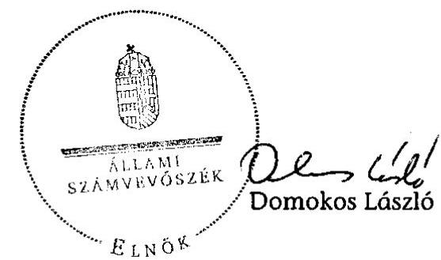

Melléklet: $\quad 23 \mathrm{db} \quad 27$ lap

---

# MELLÉKLETEK

---

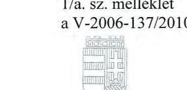

NEMZETI FEJLESZTÉSI MINISZTÉRIUM

DR. FELLEGI TAMÁS
119/05/2011

NFM/12716/5/2011.

Domokos László
elnök
Állami Számvevőszék

Budapest

Tisztelt Elnök Úr!

Köszönettel vettem a V-2006-131/2010-2011. iktatószámon küldött, a „Nemzeti Fejlesztési Terv végrehajtásának ellenőrzéséről" készített számvevőszéki jelentésüket.

Tájékoztatom, hogy a megküldött jelentés-tervezetre észrevételt nem kívánok tenni.
Az Állami Számvevőszékről szóló 2011. évi LXVI. tv. 33. § (1) bekezdése értelmében az ellenőrzés alapján elrendelt intézkedésekről 30 napon belül tájékoztatjuk.

Budapest, 2011. július „ 19.
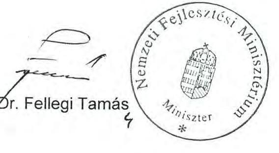

---

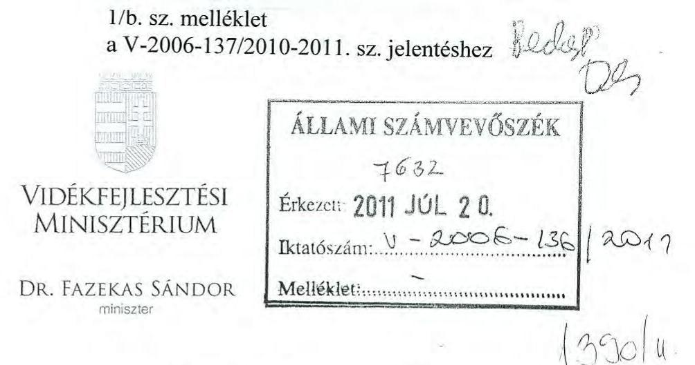

Iktatószám: EF/000106-3/2011.

Ügyintéző: dr. Lukács Ilona
Telefonszám: 79-53927
E-mail: ilona.lukacs@vm.gov.hu
Hiv.-i szám: V-2006-131/2010-2011.

Domokos László úr
elnök
részére

Állami Számvevőszék

Budapest

Tárgy: Ellenőrzési jelentés észrevételezése

Tisztelt Elnök Úr!

Hivatkozott levelére válaszolva tájékoztatom, hogy a Nemzeti Fejlesztési Terv végrehajtásának ellenőrzéséről készített Jelentést áttekintettem, arra vonatkozóan észrevételt nem teszek.

Budapest, 2011. július 19.

Tisztelettel:

Dr. Fazekas Sándor

1055 Budapest, Kossuth Lajos tér 11. Telefon: (06 1) 301 4100 Fax: (06 1) 302 0413

---

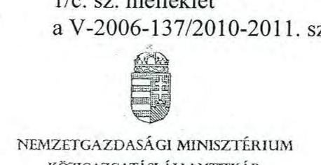

Ikt.: NGM / 15384 / 3 / 2011.

# Domokos László Úr 

Elnök

## Állami Számvevőszék

Budapest

Hiv.szám: V-2006-131/2010-2011.
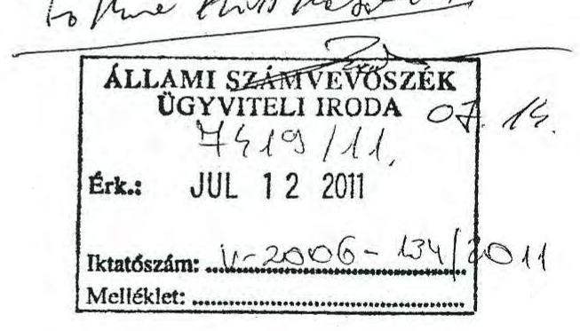

## Tisztelt Elnök Úr!

Köszönettel megkaptam az Állami Számvevőszék által a Nemzeti Fejlesztési Terv végrehajtásának ellenőrzéséről szóló jelentéstervezetét.

Tájékoztatom, hogy a jelentéstervezettel kapcsolatban észrevételt nem teszünk. A jelentés sem olyan megállapítást, sem javaslatot nem tartalmaz, mely a Nemzetgazdasági Minisztérium részéről további intézkedést igényelne.

Kérem tájékoztatásom szíves tudomásul vételét.
Budapest, 2011. július „ 11 „
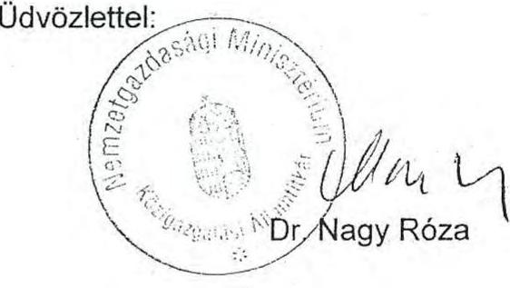

---

# Az operatív programok, a prioritások és a finanszírozási alapok kapcsolódása 

| KTK prioritás | Az OP-k prioritásai | EU alapok | Kifizetés   Mrd Ft | Prioritás /OP aránya |
| :--: | :--: | :--: | :--: | :--: |
|  | GVOP összesen (TS nélkül) | ERFA | 141,64 |  |
| 1 | 1. Beruházás-ösztönzés |  | 34,91 | 24,65\% |
| 1 | 2. Kis- és középvállalkozások fejlesztés |  | 38,64 | 27,28\% |
| 1 | 3. Kutatás-fejlesztés, innováció |  | 35,08 | 24,77\% |
| 1 | 4. Információs társadalom- és gazdaságfejlesztés |  | 33,01 | 23,31\% |
|  | AVOP összesen (TS nélkül) |  | 106,45 |  |
| 1 | 1. Versenyképes alapanyag-termelés megalapozása | EMOGA | 63,06 | 59,24\% |
|  |  | HOPE | 1,45 | 1,36\% |
| 1 | 2. Élelmiszer-feldolgozás modernizálása | EMOGA | 14,55 | 13,67\% |
| 1 | 3. Vidéki térségek fejlesztése | EMOGA | 27,39 | 25,73\% |
|  | HEFOP összesen (TS nélkül) |  | 184,97 |  |
| 2 | 1. Aktív munkaerő-piaci politikák támogatása | ESZA | 40,61 | 21,95\% |
| 2 | 2. Társadalmi kirekesztés elleni küzdelem | ESZA | 23,14 | 12,51\% |
| 2 | 3. Az egész életen át tartó tanulás támogatása és az alkal-mazkodó-képesség javitása | ESZA | 62,34 | 33,70\% |
| 2 | 4. Az oktatási, szociális és egészségügyi infrastruktúra fejlesztése | ERFA | 58,88 | 31,83\% |
|  | KIOP összesen (TS nélkül) | ERFA | 114,73 |  |
| 3 | 1. Környezetvédelem |  | 47,70 | 41,58\% |
| 3 | 2. A közlekedési infrastruktúra fejlesztése |  | 67,03 | 58,42\% |
|  | ROP összesen (TS nélkül) |  | 111,67 |  |
| 4 | 1. Turisztikai potenciál erősítése a régiókban | ERFA | 29,61 | 26,51\% |
| 4 | 2. Térségi infrastruktúra és települési környezet fejlesztése | ERFA | 64,65 | 57,89\% |
| 4 | 3. A humánerőforrás-fejlesztés regionális dimenziójának erősítése | ESZA | 17,41 | 15,59\% |
|  | OP-k összesen: |  | 659,5 |  |

Készítette: az Állami Számvevőszék az operatív programok zárójelentései és a KTK alapján

---

# Az operatív programok priortásaira és intézkedéseire felhasznált források nagysága

|  OP/Prioritások/Intézkedések | Alap | Tervezett | Tényleges | Prioritás aránya | Intézkedés aránya  |
| --- | --- | --- | --- | --- | --- |
|   |  | Mrd Ft-ban | Mrd Ft-ban |  |   |
|  GVOP Összesen | ERFA | 154,64 | 147,42 |  |   |
|  1. Beruházás-ösztönzés |  | 35,85 | 34,91 | 23,68\% |   |
|  1.1 Az ipari és szolgáltató szektor versenyképességenek fejlesztése |  | 29,89 | 27,81 |  | 79,66\%  |
|  1.2 Ipari infrastruktúra fejlesztése |  | 4,43 | 5,58 |  | 15,98\%  |
|  1.3 Pro-aktív beruházásösztönzési tanácsadás |  | 1,53 | 1,52 |  | 4,35\%  |
|  2. Kis- és középvállalkozások fejlesztés |  | 43,42 | 38,64 | 26,21\% |   |
|  2.1 Kis- és középvállalkozások műszaki-technológiai hátterének fejlesztése |  | 31,48 | 33,59 |  | 86,93\%  |
|  2.2 Vállalkozói kultúra és ismeretek fejlesztése |  | 4,07 | 2,49 |  | 6,44\%  |
|  2.3 Az együttműködés fejlesztése a vállalkozói szektorban |  | 7,86 | 2,57 |  | 6,65\%  |
|  3. Kutatás-fejlesztés, innováció |  | 34,52 | 35,08 | 23,80\% |   |
|  3.1 Alkalmazás-orientált kooperatív kutatási és technológiatejlesztési tevékenységek támogatása |  | 15,33 | 13,82 |  | 39,40\%  |
|  3.2 Kormánszírozású és non-profit kutatóhelyeken a kutatás, technológiatranszter és kooperáció feltételeinek javítása |  | 11,41 | 10,29 |  | 29,33\%  |
|  3.3 Vállalati K+F kapacitások és innovációs képességek erősítése |  | 7,78 | 10,97 |  | 31,27\%  |
|  4. Információs társadalom- és gazdaságfejlesztés |  | 35,00 | 33,01 | 22,39\% |   |
|  4.1 E-gazdaság fejlesztése, e-kereskedelem ösztönzése |  | 12,50 | 6,18 |  | 18,72\%  |
|  4.2 Információs (digitális tartalom) iparág fejlesztése |  | 4,70 | 2,13 |  | 6,45\%  |
|  4.3 Az e-közigazgatás fejlesztése |  | 7,31 | 12,77 |  | 38,69\%  |
|  4.4 A szélessávú távközlési infrastruktúra bővítése |  | 10,49 | 11,93 |  | 36,14\%  |
|  5. Technikai segítségnyújtás |  | 5,85 | 5,78 | 3,92\% |   |
|  5.1 A GVOP irányításának, megvalósításának, monitoringjának és ellenőrzési tevékenységének támogatása |  | 3,09 | 3,06 |  |   |
|  5.2 Kommunikáció, tanulmányok és informatikai fejlesztés |  | 2,76 | 2,72 |  |   |
|  AVOP összesen: |  | 109,22 | 109,22 |  |   |
|  1. Versényképes alapanyagtermelés megalapozása | EMOGA | 60,02 | 63,06 |  |   |
|   | HOPE | 1,46 | 1,45 |  |   |
|   | Össz: | 61,48 | 64,51 | 59,06\% |   |
|  1.1. A mezőgazdasági beruházások támogatása | EMOGA | 56,98 | 60,15 |  | 93,24\%  |
|  1.2. A halászati ágazat strukturális támogatása | HOPE | 1,46 | 1,45 |  | 2,25\%  |
|  1.3. Fiatal gazdálkodók induló támogatása | EMOGA | 1,87 | 1,89 |  | 2,93\%  |
|  1.4. Szakmai továbbképzés és állképzés támogatása | EMOGA | 1,17 | 1,02 |  | 1,58\%  |
|  2. Élelmiszer-feldolgozás modernizálása | EMOGA | 15,10 | 14,55 | 13,32\% |   |
|  2.1. A mezőgazdasági termékek feldolgozásának és értékesítésének fejlesztése |  | 15,10 | 14,55 |  | 100,00\%  |
|  3. Videki térségek fejlesztése | EMOGA | 28,56 | 27,39 | 25,08\% |   |
|  3.1. Videki jövedelemzzerzési lehetőségek bővítése |  | 4,10 | 2,90 |  | 10,59\%  |
|  3.2. Mezőgazdasághoz kötődő infrastruktúra fejlesztése |  | 13,50 | 12,90 |  | 47,10\%  |
|  3.3. Falutéjlesztés, megújítás a videk tárgyi és szellemi örökségének védelme és megőrzése |  | 6,08 | 5,30 |  | 19,35\%  |
|  3.4. Leader+ |  | 4,88 | 6,27 |  | 22,89\%  |
|  HEFOP mindösszesen: |  | 190,77 | 192,60 |  |   |
|  1. prioritás Aktív munkaerő-piaci politikák támogatása | ESZA | 40,82 | 40,61 | 21,08\% |   |
|  1.1. A munkanélküliség megelőzése és kezelése |  | 29,30 | 29,20 |  | 71,92\%  |
|  1.2. Az Állami Foglalkoztatási Szolgálat fejlesztése |  | 9,27 | 9,16 |  | 22,56\%  |
|  1.3. A nők munkaerőpiaci részvételének támogatása, a család és a munka összehangolásának segítése |  | 2,24 | 2,24 |  | 5,52\%  |
|  2. prioritás Társadalmi kirekesztés elleni küzdelem | ESZA | 22,19 | 23,14 | 12,02\% |   |
|  2.1 Hátrányos helyzetű tanulók esélyegyenlőségének biztosítása az oktatásban |  | 7,74 | 7,87 |  | 34,02\%  |
|  2.2. A társadalmi beilleszkedés elősegítése a szociális területen dolgozó szakemberek képzésével |  | 4,24 | 4,97 |  | 21,47\%  |
|  2.3. Hátrányos helyzetű emberek foglalkoztathatóságának javítása, különös tekintettel a roma népességre |  | 10,20 | 10,30 |  | 44,51\%  |
|  3. prioritás Az egész eleten át tartó tanulás támogatása és az alkalmazkodó-képesség javítása | ESZA | 58,46 | 62,34 | 32,37\% |   |

---

|  OP/Prioritások/Intézkedések | Alap | Tervezett | Tényleges | Prioritás aránya | Intézkedés aránya  |
| --- | --- | --- | --- | --- | --- |
|  3.1. Egész életen át tartó tanuláshoz szükséges készségek és kompetenciák fejlesztése |  | 18,16 | 20,71 |  | 33,21\%  |
|  3.2. A szakképzés tartalmi, módszertani és szerkezeti fejlesztése |  | 10,84 | 11,40 |  | 18,28\%  |
|  3.3. A felsőoktatás tartalmi és szerkezeti fejlesztése |  | 7,28 | 7,58 |  | 12,15\%  |
|  3.4. A munkahelyteremtéshez kapcsolódó és a vállalkozói készségek fejlesztését elősegítő képzések támogatása |  | 9,81 | 10,81 |  | 17,35\%  |
|  3.5. A felnőttképzés rendszerének fejlesztése |  | 12,37 | 11,85 |  | 19,01\%  |
|  4. prioritás Az oktatási, szociális és egészségügyi infrastruktúra fejlesztése | ERFA | 59,72 | 58,88 | 30,57\% |   |
|  4.1. Az oktatási és képzési infrastruktúra fejlesztése |  | 25,12 | 24,88 |  | 42,26\%  |
|  4.2. A társadalmi beilleszkedést elősegítő szolgáltatások infrastruktúrájának fejlesztése |  | 9,09 | 8,75 |  | 14,86\%  |
|  4.3. Egészségügyi infrastruktúra fejlesztése a hátrányos helyzetű régiókban |  | 21,46 | 21,21 |  | 36,02\%  |
|  4.4. Egészségügyi IT fejlesztés a hátrányos helyzetű régiókban |  | 4,05 | 4,04 |  | 6,86\%  |
|  KIOP összesen |  | 107,84 | 114,73 |  |   |
|  1. prioritás Környezetvédelem |  | 43,62 | 47,70 | 41,58\% |   |
|  1.1 Vízminőség javítás |  | 15,17 | 17,21 |  | 36,08\%  |
|  1.2 Állati hulladék kezelése |  | 3,26 | 2,61 |  | 5,47\%  |
|  1.3 Egészségügyi és építési-bontási hulladék kezelése |  | 3,26 | 2,43 |  | 5,09\%  |
|  1.4 Környezeti karmentesítés a felszín alatti vizek és az ivóvízbázisok védelme érdekében |  | 6,51 | 4,44 |  | 9,31\%  |
|  1.5 Természetvédelem és fenntartható árvízvédelem |  | 9,13 | 14,17 |  | 29,71\%  |
|  1.6 A levegőszennyezés és a zajterhelés mérése |  | 1,13 | 0,82 |  | 1,72\%  |
|  1.7 Az energiagazdálkodás környezetbarát fejlesztése |  | 5,16 | 6,02 |  | 12,62\%  |
|  2. prioritás A közlekedési infrastruktúra fejlesztése |  | 64,22 | 67,03 | 58,42\% |   |
|  2.1 A főúthálózat műszaki színvonalának emelése |  | 53,08 | 52,45 |  | 78,25\%  |
|  2.2 Környezetbarát közlekedési infrastruktúra fejlesztése |  | 11,14 | 14,58 |  | 21,75\%  |
|  ROP összesen: |  | 114,13 | 111,67 |  |   |
|  1. prioritás: Turisztikai potenciál erősítése a régiókban | ERFA | 28,42 | 29,61 | 26,51\% |   |
|  1.1 Turisztikai vonzerők fejlesztése |  | 21,74 | 21,98 |  | 74,22\%  |
|  1.2 Turisztikai fogadóképesség javítása |  | 6,68 | 7,63 |  | 25,78\%  |
|  2. prioritás Térségi infrastruktúra és települési környezet fejlesztése | ERFA | 68,20 | 64,65 | 57,89\% |   |
|  2.1 Hátrányos helyzetű régiók és kistersegek elerhetőségének javítása |  | 29,53 | 24,57 |  | 38,00\%  |
|  2.2 Városi területek rehabilitációja |  | 24,08 | 23,77 |  | 36,77\%  |
|  2.3 Óvodai és alapfokú nevelési-oktatási intézmények infrastruktúráli̊s fejlesztése |  | 14,60 | 16,31 |  | 25,22\%  |
|  3. prioritás: A humanerőforrás-fejlesztés regionalis dimenziójának erősítése | ESZA | 17,51 | 17,41 | 15,59\% |   |
|  3.1. A helyi közigazgatás és a civil szervezetek kapacitásépítése |  | 6,27 | 6,19 |  | 35,56\%  |
|  3.2 A helyi foglalkoztatási kezdeményezések támogatása |  | 4,85 | 5,26 |  | 30,18\%  |
|  3.3 Felsőoktatási intézmények és a helyi szereplők együttműködésének erősítése |  | 2,88 | 2,63 |  | 15,10\%  |
|  3.4 Régió-pecifikus szakmai képzések támogatása |  | 3,52 | 3,34 |  | 19,16\%  |

---

# A helyszíni ellenőrzésre kiválasztott projektek listája

|  Ssz. | Operatív Program / Szerződés száma | Pályázatos/ központi projekt | Finanszírozási alap | EU felé elszámolt költség ${ }^{a}$ (EU+hazai
a) tervezésmét | Projekt nagysága érték szerint | Kedvezményezett típusa | Projekt megval. helye szerinti régió | Fenntartási időből 2010. 09. 06án 1 év eltelt
a. a. 1. 1. | Projektet ellenőrző számvevő  |
| --- | --- | --- | --- | --- | --- | --- | --- | --- | --- |
|  1. | AVOP-3.5.4.-2006-09-0001/1.0 | Központi | EMOGA | 783676507 | kiemelt | Nem besorolható | Közép-Mo. | n.o. | Szihalminé Kovács Zsuzsanna  |
|  2. | AVOP-1.1.1.-2005-03-0043/0.2 | Pályázatos | EMOGA | 89999999 | kiemelt | KKV | Közép-Dunántúl | n.o. | Fekete Gábor  |
|  3. | AVOP-1.1.2.-2005-04-0092/0.6 | Pályázatos | EMOGA | 89999999 | kiemelt | KKV | Észak-Alföld | n.o. | Szücs Zoltán  |
|  4. | AVOP-1.1.2.-2005-03-0131/0.4 | Pályázatos | EMOGA | 89999996 | kiemelt | KKV | Dél-Dunántúl | n.o. | Czeglédi Dénes  |
|  5. | AVOP-1.3.1.-2004-09-0001/0.5 | Pályázatos | HOPE | 22781733 | nem kiemelt | KKV | Észak-Mo. | 1 év eltelt | Szihalminé Kovács Zsuzsanna  |
|  6. | AVOP-3.2.23.-2004-12-0011/0.7 | Pályázatos | EMOGA | 21693091 | nem kiemelt | Nagy vállalat | Dél-Alföld | 1 év eltelt | Czeglédi Dénes  |
|  7. | AVOP-1.1.2.-2005-03-0078/0.7 | Pályázatos | EMOGA | 89963148 | kiemelt | KKV | Dél-Alföld | 1 év eltelt | Tóth Gergely  |
|  8. | AVOP-1.3.1.-2005-04-0004/0.6 | Pályázatos | HOPE | 14301634 | nem kiemelt | KKV | Észak-Alföld | n.o. | Szücs Zoltán  |
|  9. | AVOP-1.1.3.-2004-11-0003/0.1 | Pályázatos | EMOGA | 14239285 | nem kiemelt | Természetes személy | Nyugat-Dunántúl | n.o. | Ritecz Tibor  |
|  10. | AVOP-3.5.12.-2005-08-0163/0.3 | Pályázatos | EMOGA | 13500000 | nem kiemelt | Nonprofit áht-on belül | Közép-Mo. | n.o. | Szihalminé Kovács Zsuzsanna  |
|  11. | AVOP-2.1.1-05/1.-2005-08-0034/0.3 | Pályázatos | EMOGA | 186005612 | kiemelt | Nagy vállalat | Közép-Mo. | n.o. | Fekete Gábor  |
|  12. | AVOP-3.2.12-05/1.-2006-03-0031/0.1 | Pályázatos | ERFA | 12629345 | nem kiemelt | KKV | Nyugat-Dunántúl | n.o. | Ritecz Tibor  |
|  13. | AVOP-1.1.2.-2005-04-0061/0.1 | Pályázatos | EMOGA | 11650832 | nem kiemelt | KKV | Nyugat-Dunántúl | 1 év eltelt | Ritecz Tibor  |
|  14. | AVOP-2.1.1.-2004-07-0003/0.7 | Pályázatos | EMOGA | 171556235 | kiemelt | KKV | Dél-Alföld | 1 év eltelt | Czeglédi Dénes  |
|  15. | AVOP-3.1.3.-2004-12-0005/0.5 | Pályázatos | EMOGA | 7231983 | nem kiemelt | Természetes személy | Észak-Mo. | 1 év eltelt | Szihalminé Kovács Zsuzsanna  |
|  16. | AVOP-3.2.12-05/1.-2006-03-0048/0.6 | Pályázatos | ERFA | 6653520 | nem kiemelt | KKV | Észak-Alföld | n.o. | Szücs Zoltán  |
|  17. | AVOP-3.2.11-05/1.-2006-02-0002/0.7 | Pályázatos | ERFA | 76836351 | nem kiemelt | KKV | Dél-Alföld | 1 év eltelt | Tóth Gergely  |
|  18. | AVOP-2.1.1.-2005-03-0009/0.7 | Pályázatos | EMOGA | 144492574 | kiemelt | KKV | Dél-Alföld | 1 év eltelt | Szepes Béla, Maklári Dorottya  |
|  19. | AVOP-1.1.3.-2004-10-0355/0.7 | Pályázatos | EMOGA | 3641400 | nem kiemelt | Természetes személy | Dél-Alföld | 1 év eltelt | Tóth Gergely  |
|  20. | AVOP-2.1.1-05/1.-2005-08-0013/0.4 | Pályázatos | EMOGA | 132100392 | kiemelt | KKV | Dél-Dunántúl | 1 év eltelt | Fekete Gábor  |
|  21. | AVOP-3.5.2.-2006-09-2146/6.03 | Pályázatos | EMOGA | 3147531 | nem kiemelt | Nonprofit áht-on belül | Észak-Alföld | n.o. | Szücs Zoltán  |
|  22. | AVOP-1.1.3.-2004-09-0394/0.6 | Pályázatos | EMOGA | 65293162 | nem kiemelt | KKV | Észak-Alföld | n.o. | Szücs Zoltán  |
|  23. | AVOP-3.5.2.-2006-09-1214/7.07 | Pályázatos | EMOGA | 1643928 | nem kiemelt | Nonprofit áht-on belül | Dél-Alföld | n.o. | Tóth Gergely  |
|  24. | AVOP-3.5.2.-2006-12-0422/7.11 | Pályázatos | EMOGA | 1176468 | nem kiemelt | Nonprofit áht-on belül | Dél-Alföld | n.o. | Tóth Gergely  |
|  25. | AVOP-3.5.2.-2006-09-0360/1.06 | Pályázatos | EMOGA | 962514 | nem kiemelt | Nonprofit áht-on kívül | Nyugat-Dunántúl | 1 év eltelt | Ritecz Tibor  |
|  26. | AVOP-3.5.2.-2006-09-1379/7.06 | Pályázatos | EMOGA | 499998 | nem kiemelt | Nonprofit áht-on kívül | Dél-Alföld | n.o. | Tóth Gergely  |
|  27. | AVOP-1.1.3.-2004-11-0427/0.4 | Pályázatos | EMOGA | 52615381 | nem kiemelt | Nagy vállalat | Dél-Dunántúl | 1 év eltelt | Fekete Gábor  |
|  28. | AVOP-3.5.2.-2006-09-1487/3.03 | Pályázatos | EMOGA | 115560 | nem kiemelt | KKV | Közép-Mo. | nem telt el 1 év | Szihalminé Kovács Zsuzsanna  |
|  29. | AVOP-2.1.1-05/1.-2005-09-0014/0.7 | Pályázatos | EMOGA | 454479199 | kiemelt | KKV | Dél-Alföld | 1 év eltelt | Czeglédi Dénes  |
|  30. | AVOP-1.1.2.-2004-09-0059/0.1 | Pályázatos | EMOGA | 90000000 | kiemelt | KKV | Nyugat-Dunántúl | 1 év eltelt | Ritecz Tibor  |
|  31. | AVOP-1.1.2.-2005-03-0121/0.7 | Pályázatos | EMOGA | 90000000 | kiemelt | KKV | Dél-Alföld | 1 év eltelt | Tóth Gergely  |
|  32. | AVOP-1.1.2.-2005-03-0139/0.7 | Pályázatos | EMOGA | 90000000 | kiemelt | KKV | Dél-Alföld | n.o. | Czeglédi Dénes  |
|  33. | GVOP-3.3.3-05/1.-2005-05-0012/3.0 | Pályázatos | ERFA | 25151995 | nem kiemelt | KKV | Közép-Mo. | 1 év eltelt | Tóth Gergely  |
|  34. | GVOP-2.1.1-06/1.-2006-05-0639/1.0 | Pályázatos | ERFA | 25000000 | nem kiemelt | KKV | Közép-Mo. | 1 év eltelt | Szepes Béla, Maklári Dorottya  |
|  35. | GVOP-3.2.2.-2004-07-0015/3.0 | Pályázatos | ERFA | 602103748 | kiemelt | Nonprofit áht-on belül | Közép-Mo. | n.o. | Szepes Béla, Maklári Dorottya  |
|  36. | GVOP-1.1.1.-2004-10-0004/5.0 | Pályázatos | ERFA | 150000000 | kiemelt | KKV | Közép-Mo. | n.o. | Szepes Béla, Maklári Dorottya  |
|  37. | GVOP-2.1.1-05/1.-2005-04-1513/1.0 | Pályázatos | ERFA | 24838710 | nem kiemelt | KKV | Dél-Alföld | 1 év eltelt | Czeglédi Dénes  |
|  38. | GVOP-2.1.1.-2004-04-0210/1.0 | Pályázatos | ERFA | 23735524 | nem kiemelt | KKV | Észak-Mo. | 1 év eltelt | Szihalminé Kovács Zsuzsanna  |
|  39. | GVOP-1.1.1.-2004-11-0019/5.0 | Pályázatos | ERFA | 149999998 | kiemelt | KKV | Közép-Mo. | n.o. | Tóth Gergely  |

Az elszámolt költség összege az ÁSZ részére átadott EMIR adatbázisból származik. A korrigáló tételeket a 8. sz. melléklet tartalmazza.

---

3. sz. melléklet a V-2006-137/2010-2011. sz. jelentéshez

|  Ssz. | Operatív Program / Szerződés száma | Pályázatos/ központi projekt | Finanszírozási alap | EU felé elszámolt költség* (EU+hazai elégiószaki) | Projekt nagysága érték szerint | Kedvezményezett típusa | Projekt megval. helye szerinti régió | Fenntartási időből 2010. 09. 06-án 1 év eltelt | Projektet ellenőrző számvevő  |
| --- | --- | --- | --- | --- | --- | --- | --- | --- | --- |
|  40. | GVOP-1.1.1.-2004-05-0002/5.0 | Pályázatos | ERFA | 149999944 | kiemelt | Nagy vállalat | Észak-Alföld | 1 év eltelt | Szücs Zoltán  |
|  41. | GVOP-3.3.3-05/1.-2005-05-0059/3.0 | Pályázatos | ERFA | 20000000 | nem kiemelt | KKV | Észak-Mo. | n.o. | Szihalminé Kovács Zsuzsanna  |
|  42. | GVOP-1.1.1.-2005-01-0006/5.0 | Pályázatos | ERFA | 149993324 | kiemelt | Nagy vállalat | Közép-Dunántúl | 1 év eltelt | Szepes Béla, Maklári Dorottya  |
|  43. | GVOP-3.1.1.-2004-05-0410/3.0 | Pályázatos | ERFA | 18725000 | nem kiemelt | KKV | Közép-Mo. | nem telt el 1 év | Szepes Béla, Maklári Dorottya  |
|  44. | GVOP-1.1.1.-2004-12-0020/5.0 | Pályázatos | ERFA | 149264881 | kiemelt | Nagy vállalat | Nyugat-Dunántúl | 1 év eltelt | Ritecz Tibor  |
|  45. | GVOP-1.1.1-05/1.-2005-06-0018/5.0 | Pályázatos | ERFA | 144500000 | kiemelt | Nagy vállalat | Dél-Dunántúl | 1 év eltelt | Czeglédi Dénes  |
|  46. | GVOP-2.1.1-05/2.-2005-09-0600/1.0 | Pályázatos | ERFA | 14897527 | nem kiemelt | KKV | Közép-Mo. | 1 év eltelt | Szepes Béla, Maklári Dorottya  |
|  47. | GVOP-2.1.1.-2004-07-0350/1.0 | Pályázatos | ERFA | 14797653 | nem kiemelt | KKV | Nyugat-Dunántúl | 1 év eltelt | Ritecz Tibor  |
|  48. | GVOP-2.1.1-05/1.-2005-04-0948/1.0 | Pályázatos | ERFA | 14150912 | nem kiemelt | KKV | Dél-Dunántúl | nem telt el 1 év | Fekete Gábor  |
|  49. | GVOP-1.2.1-05/1.-2005-06-0003/5.0 | Pályázatos | ERFA | 131638200 | nem kiemelt | Nagy vállalat | Közép-Mo. | 1 év eltelt | Fekete Gábor  |
|  50. | GVOP-1.1.1-05/1.-2005-03-0002/5.0 | Pályázatos | ERFA | 124705395 | nem kiemelt | Nagy vállalat | Közép-Dunántúl | 1 év eltelt | Szepes Béla, Maklári Dorottya  |
|  51. | GVOP-3.2.1.-2004-04-0370/3.0 | Pályázatos | ERFA | 12293993 | nem kiemelt | Nonprofit áht-on kívül | Észak-Alföld | 1 év eltelt | Szücs Zoltán  |
|  52. | GVOP-4.1.2-05/1.-2005-10-0006/4.0 | Pályázatos | ERFA | 11396993 | nem kiemelt | KKV | Közép-Mo. | 1 év eltelt | Szepes Béla, Maklári Dorottya  |
|  53. | GVOP-3.2.1.-2004-04-0205/3.0 | Pályázatos | ERFA | 8670838 | nem kiemelt | Nonprofit áht-on belül | Közép-Mo. | 1 év eltelt | Szepes Béla, Maklári Dorottya  |
|  54. | GVOP-4.3.1.-2004-06-0009/4.0 | Pályázatos | ERFA | 378199998 | kiemelt | Nonprofit áht-on belül | Közép-Mo. | 1 év eltelt | Tóth Gergely  |
|  55. | GVOP-2.1.1.-2004-03-0212/1.0 | Pályázatos | ERFA | 4539556 | nem kiemelt | KKV | Dél-Alföld | 1 év eltelt | Czeglédi Dénes  |
|  56. | GVOP-2.2.1.-2004-12-0006/1.0 | Központi | ERFA | 79390343 | nem kiemelt | Nonprofit áht-on kívül | Dél-Alföld | 1 év eltelt | Tóth Gergely  |
|  57. | GVOP-4.3.1.-2004-07-0013/4.0 | Pályázatos | ERFA | 349348753 | kiemelt | Nonprofit áht-on belül | Észak-Alföld | 1 év eltelt | Szücs Zoltán  |
|  58. | GVOP-2.1.1.-2004-05-0112/1.0 | Pályázatos | ERFA | 3040000 | nem kiemelt | KKV | Közép-Mo. | 1 év eltelt | Szepes Béla, Maklári Dorottya  |
|  59. | GVOP-2.2.1.-2004-12-0018/1.0 | Központi | ERFA | 64742590 | nem kiemelt | Nonprofit áht-on kívül | Nyugat-Dunántúl | 1 év eltelt | Ritecz Tibor  |
|  60. | GVOP-2.2.1.-2004-12-0019/1.0 | Központi | ERFA | 64307529 | nem kiemelt | Nonprofit áht-on kívül | Észak-Alföld | 1 év eltelt | Szücs Zoltán  |
|  61. | GVOP-2.1.2-05/1.-2005-10-0264/1.0 | Pályázatos | ERFA | 1123802 | nem kiemelt | KKV | Közép-Mo. | 1 év eltelt | Czeglédi Dénes  |
|  62. | GVOP-2.1.2.-2004-07-0301/1.0 | Pályázatos | ERFA | 870349 | nem kiemelt | KKV | Észak-Mo. | 1 év eltelt | Szihalminé Kovács Zsuzsanna  |
|  63. | GVOP-2.1.2-05/1.-2005-07-0065/1.0 | Pályázatos | ERFA | 831666 | nem kiemelt | KKV | Dél-Alföld | 1 év eltelt | Czeglédi Dénes  |
|  64. | GVOP-2.2.2-05/1.-2005-06-0023/1.0 | Pályázatos | ERFA | 800000 | nem kiemelt | KKV | Dél-Dunántúl | 1 év eltelt | Fekete Gábor  |
|  65. | GVOP-2.1.2-05/1.-2005-07-0123/1.0 | Pályázatos | ERFA | 785000 | nem kiemelt | KKV | Közép-Mo. | 1 év eltelt | Szepes Béla, Maklári Dorottya  |
|  66. | GVOP-2.1.2-05/1.-2005-09-0107/1.0 | Pályázatos | ERFA | 683750 | nem kiemelt | KKV | Közép-Mo. | 1 év eltelt | Szepes Béla, Maklári Dorottya  |
|  67. | GVOP-2.1.2.-2004-08-0006/1.0 | Pályázatos | ERFA | 680000 | nem kiemelt | KKV | Észak-Alföld | 1 év eltelt | Szücs Zoltán  |
|  68. | GVOP-2.1.2.-2004-09-0198/1.0 | Pályázatos | ERFA | 650000 | nem kiemelt | KKV | Nyugat-Dunántúl | 1 év eltelt | Ritecz Tibor  |
|  69. | GVOP-2.1.2.-2004-06-0146/1.0 | Pályázatos | ERFA | 631500 | nem kiemelt | KKV | Közép-Mo. | 1 év eltelt | Szepes Béla, Maklári Dorottya  |
|  70. | GVOP-2.1.2-05/1.-2005-11-0510/1.0 | Pályázatos | ERFA | 575000 | nem kiemelt | KKV | Közép-Dunántúl | 1 év eltelt | Czeglédi Dénes  |
|  71. | GVOP-1.1.3-05/1.-2005-05-0009/2.0 | Pályázatos | ERFA | 42375878 | nem kiemelt | Nagy vállalat | Közép-Mo. | 1 év eltelt | Szepes Béla, Maklári Dorottya  |
|  72. | GVOP-2.1.2-05/1.-2005-11-0028/1.0 | Pályázatos | ERFA | 442500 | nem kiemelt | KKV | Dél-Dunántúl | n.o. | Fekete Gábor  |
|  73. | GVOP-2.1.2-05/1.-2005-10-0279/1.0 | Pályázatos | ERFA | 412500 | nem kiemelt | KKV | Közép-Mo. | 1 év eltelt | Szepes Béla, Maklári Dorottya  |
|  74. | GVOP-4.3.1.-2004-07-0012/4.0 | Pályázatos | ERFA | 254999999 | kiemelt | Nonprofit áht-on belül | Közép-Mo. | 1 év eltelt | Szepes Béla, Maklári Dorottya  |
|  75. | GVOP-2.1.2-05/1.-2005-10-0198/1.0 | Pályázatos | ERFA | 349722 | nem kiemelt | KKV | Közép-Mo. | 1 év eltelt | Szepes Béla, Maklári Dorottya  |
|  76. | GVOP-3.3.2-05/1.-2005-05-0012/3.0 | Pályázatos | ERFA | 34898882 | nem kiemelt | KKV | Dél-Alföld | 1 év eltelt | Tóth Gergely  |
|  77. | HEPOP-4.3.1-K.-2004-08-0001/4.0 | Központi | ERFA | 12119699379 | kiemelt | Nonprofit áht-on belül | Észak-Alföld | n.o. | Szücs Zoltán  |
|  78. | HEPOP-4.1.2-P.-2004-07-0034/1.0 | Pályázatos | ERFA | 2336517216 | kiemelt | Nonprofit áht-on belül | Dél-Alföld | nem telt el 1 év | Szepes Béla, Maklári Dorottya  |
|  79. | HEPOP-3.1.3-05/1.-2005-10-0408/1.0 | Pályázatos | ESZA | 16120361 | nem kiemelt | Nonprofit áht-on belül | Nyugat-Dunántúl | 1 év eltelt | Ritecz Tibor  |
|  80. | HEPOP-3.1.3-05/1.-2005-10-0435/1.0 | Pályázatos | ESZA | 14436005 | nem kiemelt | Nonprofit áht-on belül | Közép-Dunántúl | 1 év eltelt | Fekete Gábor  |
|  81. | HEPOP-3.1.3-05/1.-2005-10-0115/1.0 | Pályázatos | ESZA | 13923468 | nem kiemelt | Nonprofit áht-on belül | Nyugat-Dunántúl | 1 év eltelt | Ritecz Tibor  |
|  82. | HEPOP-3.4.1/05/1.-2006-02-0073/2.0 | Pályázatos | ESZA | 13452215 | nem kiemelt | KKV | Dél-Dunántúl | n.o. | Czeglédi Dénes  |
|  83. | HEPOP-3.4.1-08/1.-2008-06-0032/2.0 | Pályázatos | ESZA | 13321500 | nem kiemelt | KKV | Közép-Mo. | n.o. | Tukacs Éva  |

Az elszámolt költség összege az ÁSZ részére átadott EMIR adatbázisból származik. A korrigáló tételeket a 8. sz. melléklet tartalmazza.

---

3. sz. melléklet a V-2006-137/2010-2011. sz. jelentéshez

|  Ssz. | Operatív Program / Szerződés száma | Pályázatos/ központi projekt | Finanszírozási alap | EU felé elszámolt költség* (EU+hazai részvételére) | Projekt nagysága érték szerint | Kedvezményezett típusa | Projekt megval. helye szerinti régió | Fenntartási időből 2010. 09. 06-án 1 év eltelt (nem tett el) | Projektet ellenőrző számvevő  |
| --- | --- | --- | --- | --- | --- | --- | --- | --- | --- |
|  84. | HEPOP-3.4.1/05/1.-2006-04-0031/2.0 | Pályázatos | ESZA | 13234476 | nem kiemelt | KKV | Közép-Mo. | n.q. | Tukacs Éva  |
|  85. | HEPOP-3.4.1/05/1.-2005-10-0055/2.0 | Pályázatos | ESZA | 13188390 | nem kiemelt | KKV | Dél-Dunántúl | n.q. | Fekete Gábor  |
|  86. | HEPOP-3.4.1/05/1.-2005-12-0057/2.0 | Pályázatos | ESZA | 12452353 | nem kiemelt | Nagy vállalat | Közép-Mo. | n.q. | Tukacs Éva  |
|  87. | HEPOP-3.4.1/05/1.-2005-10-0039/2.0 | Pályázatos | ESZA | 11445728 | nem kiemelt | KKV | Közép-Mo. | n.q. | Tukacs Éva  |
|  88. | HEPOP-2.2.1-06/1.-2006-12-0053/4.0 | Pályázatos | ESZA | 10818697 | nem kiemelt | Nonprofit áht-on kívül | Közép-Mo. | n.q. | Tukacs Éva  |
|  89. | HEPOP-3.4.1/05/1.-2005-11-0086/2.0 | Pályázatos | ESZA | 10788154 | nem kiemelt | KKV | Közép-Mo. | n.q. | Tukacs Éva  |
|  90. | HEPOP-2.1.9-08/1.-2008-06-0112/1.0 | Pályázatos | ESZA | 8346500 | nem kiemelt | Nonprofit áht-on belül | Közép-Mo. | n.q. | Szihalminé Kovács Zsuzsanna  |
|  91. | HEPOP-3.4.1-08/1.-2008-06-0015/2.0 | Pályázatos | ESZA | 8252288 | nem kiemelt | Nagy vállalat | Közép-Mo. | n.q. | Tukacs Éva  |
|  92. | HEPOP-3.4.1/05/1.-2006-03-0036/2.0 | Pályázatos | ESZA | 6108800 | nem kiemelt | KKV | Közép-Mo. | n.q. | Tukacs Éva  |
|  93. | HEPOP-3.1.3/B-09/3.-2009-05-0045/1.0 | Pályázatos | ESZA | 5494684 | nem kiemelt | Nem besorolható | Közép-Mo. | 1 év eltelt | Szihalminé Kovács Zsuzsanna  |
|  94. | HEPOP-3.4.1/05/1.-2005-08-0076/2.0 | Pályázatos | ESZA | 4480140 | nem kiemelt | KKV | Közép-Dunántúl | n.q. | Ritecz Tibor  |
|  95. | HEPOP-3.4.1-08/1.-2008-06-0036/2.0 | Pályázatos | ESZA | 4480000 | nem kiemelt | KKV | Észak-Mo. | n.q. | Szihalminé Kovács Zsuzsanna  |
|  96. | HEPOP-4.3.2/05/1.-2005-06-0002/4.0 | Pályázatos | ERFA | 1297249199 | kiemelt | Nonprofit áht-on belül | Észak-Alföld | 1 év eltelt | Szücs Zoltán  |
|  97. | HEPOP-3.4.1/05/1.-2005-12-0061/2.0 | Pályázatos | ESZA | 2042406 | nem kiemelt | KKV | Közép-Mo. | n.q. | Tukacs Éva  |
|  98. | HEPOP-4.2.1-P.-2004-10-0005/4.0 | Pályázatos | ERFA | 65582107 | nem kiemelt | Nonprofit áht-on belül | Észak-Mo. | n.q. | Szihalminé Kovács Zsuzsanna  |
|  99. | HEPOP-3.4.1-08/1.-2008-06-0058/2.0 | Pályázatos | ESZA | 1440000 | nem kiemelt | KKV | Nyugat-Dunántúl | n.q. | Ritecz Tibor  |
|  100. | HEPOP-3.4.1/05/1.-2005-11-0039/2.0 | Pályázatos | ESZA | 1252960 | nem kiemelt | KKV | Közép-Mo. | n.q. | Tukacs Éva  |
|  101. | HEPOP-3.4.1/05/1.-2006-03-0038/2.0 | Pályázatos | ESZA | 1216000 | nem kiemelt | KKV | Közép-Dunántúl | n.q. | Fekete Gábor  |
|  102. | HEPOP-2.3.2-05/1.-2005-10-0045/2.0 | Pályázatos | ESZA | 62506284 | nem kiemelt | Nonprofit áht-on kívül | Nyugat-Dunántúl | n.q. | Ritecz Tibor  |
|  103. | HEPOP-3.4.1/05/1.-2005-09-0003/2.0 | Pályázatos | ESZA | 0 | nem kiemelt | KKV | Közép-Mo. | n.q. | Tukacs Éva  |
|  104. | HEPOP-2.3.2-2.-2004-08-0013/2.0 | Pályázatos | ESZA | 37846120 | nem kiemelt | Nonprofit áht-on kívül | Észak-Alföld | 1 év eltelt | Szücs Zoltán  |
|  105. | HEPOP-2.1.6/05/1.-2005-08-0017/1.0 | Pályázatos | ESZA | 33870638 | nem kiemelt | Nonprofit áht-on belül | Dél-Alföld | 1 év eltelt | Tóth Gergely  |
|  106. | HEPOP-3.2.1-K.-2004-09-0001/1.0 | Központi | ESZA | 5103036875 | kiemelt | Nonprofit áht-on belül | Közép-Mo. | n.q. | Tukacs Éva  |
|  107. | HEPOP-1.1.1-K.-2004-07-0015/3.0 | Központi | ESZA | 750754297 | kiemelt | Nonprofit áht-on belül | Nyugat-Dunántúl | 1 év eltelt | Ritecz Tibor  |
|  108. | HEPOP-2.2.2-06/1.-2006-11-0003/4.0 | Központi | ESZA | 23585337 | nem kiemelt | Nonprofit áht-on belül | Dél-Dunántúl | n.q. | Fekete Gábor  |
|  109. | HEPOP-2.2.2-05/1.-2006-02-0001/4.0 | Központi | ESZA | 654771905 | kiemelt | Nonprofit áht-on belül | Közép-Mo. | n.q. | Tukacs Éva  |
|  110. | HEPOP-3.4.1-08/1.-2008-05-0087/2.0 | Pályázatos | ESZA | 20512800 | nem kiemelt | KKV | Észak-Alföld | n.q. | Szücs Zoltán  |
|  111. | HEPOP-3.1.3-05/1.-2005-10-0473/1.0 | Pályázatos | ESZA | 17513641 | nem kiemelt | Nonprofit áht-on belül | Közép-Dunántúl | 1 év eltelt | Fekete Gábor  |
|  112. | KIOP-1.7.0F-05/1.-2006-01-0018/3 | Pályázatos | ERFA | 52890000 | nem kiemelt | KKV | Nyugat-Dunántúl | 1 év eltelt | Ritecz Tibor  |
|  113. | KIOP-1.7.0F-05/1.-2006-02-0004/3 | Pályázatos | ERFA | 52000000 | nem kiemelt | Nagy vállalat | Közép-Dunántúl | 1 év eltelt | Ritecz Tibor  |
|  114. | KIOP-1.3.1.-2004-07-0004/2 | Pályázatos | ERFA | 3152000 | nem kiemelt | Nonprofit áht-on belül | Nyugat-Dunántúl | n.q. | Ritecz Tibor  |
|  115. | KIOP-2.2.1.-2005-09-0001/1 | Központi | ERFA | 2015623781 | kiemelt | Nagy vállalat | Közép-Mo. | 1 év eltelt | Szepes Béla, Maklári Dorottya  |
|  116. | KIOP-2.2.2.-2005-04-0001/1 | Központi | ERFA | 7875718606 | kiemelt | Nonprofit áht-on belül | Nyugat-Dunántúl | n.q. | Ritecz Tibor  |
|  117. | KIOP-2.1.1.-2004-07-0003/1 | Központi | ERFA | 1104874956 | nem kiemelt | Nonprofit áht-on belül | Észak-Alföld | 1 év eltelt | Szücs Zoltán  |
|  118. | KIOP-2.2.1.-2005-09-0002/1 | Központi | ERFA | 1069392464 | nem kiemelt | Nagy vállalat | Közép-Mo. | 1 év eltelt | Szepes Béla, Maklári Dorottya  |
|  119. | KIOP-2.1.3-2.-2004-10-0004/1 | Központi | ERFA | 6497792492 | kiemelt | Nagy vállalat | Észak-Mo. | 1 év eltelt | Szihalminé Kovács Zsuzsanna  |
|  120. | KIOP-1.6.1.-2005-11-0001/2 | Központi | ERFA | 561186551 | nem kiemelt | Nonprofit áht-on belül | Közép-Mo. | 1 év eltelt | Szepes Béla, Maklári Dorottya  |
|  121. | KIOP-1.1.1-F.-2005-10-0001/2 | Pályázatos | ERFA | 515984970 | nem kiemelt | Nonprofit áht-on belül | Észak-Mo. | nem tett el 1 év | Szihalminé Kovács Zsuzsanna  |
|  122. | KIOP-1.7.0F-05/1.-2006-01-0009/3 | Pályázatos | ERFA | 407650509 | nem kiemelt | Nonprofit áht-on belül | Dél-Dunántúl | nem tett el 1 év | Fekete Gábor  |
|  123. | KIOP-1.3.0-F.-2005-07-0001/2 | Pályázatos | ERFA | 237136131 | nem kiemelt | Nonprofit áht-on kívül | Dél-Alföld | nem tett el 1 év | Szepes Béla, Maklári Dorottya  |
|  124. | KIOP-1.7.0F-05/1.-2006-01-0019/3 | Pályázatos | ERFA | 144359999 | nem kiemelt | Nonprofit áht-on belül | Dél-Dunántúl | 1 év eltelt | Czeglédi Dénes  |
|  125. | KIOP-1.7.0F-05/1.-2005-12-0002/3 | Pályázatos | ERFA | 121558700 | nem kiemelt | KKV | Észak-Alföld | 1 év eltelt | Szücs Zoltán  |

Az elszámolt költség összege az ÁSZ részére átadott EMIR adatbázisból származik. A korrigáló tételeket a 8. sz. melléklet tartalmazza.

---

|  Ssz. | Operatív Program /
Szerződés száma | Pályázatos/
központi
projekt | Finanszí
rozási
alap | EU felé
elszámolt
költség*
(EU+ hazai
szám) | Projekt
nagysága
érték
szerint | Kedvezményezett
típusa | Projekt
megval. helye
szerinti régió | Fenntartási
időkől
2010. 09. 06-
án 1 év eltelt
(1) | Projektet ellenőrző
számvevő  |
| --- | --- | --- | --- | --- | --- | --- | --- | --- | --- |
|  126 | KIOP-1.7.0.-2004-05-0006/3 | Pályázatos | ERFA | 108 000 000 | nem kiemelt | KKV | Dél-Allóld | 1 év eltelt | Czeglédi Dénes  |
|  127 | KIOP-1.7.0F-05/1.-2006-01-0017/3 | Pályázatos | ERFA | 100 704 061 | nem kiemelt | Nagy vállalat | Közép-Dunántúl | 1 év eltelt | Szepes Béla, Maklári Dorottya  |
|  128 | KIOP-1.7.0F-05/1.-2005-06-0003/3 | Pályázatos | ERFA | 132 191 275 | nem kiemelt | KKV | Nyugat-Dunántúl | 1 év eltelt | Ritecz Tibor  |
|  129 | ROP-3.1.1.-2005-02-0001/1.0 | Központi | ESZA | 2 873 717 979 | kiemelt | Egyéb | Közép-Mo. | n.o. | Tukacs Éva  |
|  130 | ROP-1.2.1.-2004-08-0002/31 | Pályázatos | ERFA | 299 999 996 | nem kiemelt | KKV | Észak-Mo. | n.o. | Szihalminé Kovács Zsuzsanna  |
|  131 | ROP-1.2.1-05/1.-2005-09-0035/31 | Pályázatos | ERFA | 273 842 000 | nem kiemelt | KKV | Észak-Mo. | n.o. | Szihalminé Kovács Zsuzsanna  |
|  132 | ROP-2.3.1.-2004-06-0004/31 | Pályázatos | ERFA | 220 551 755 | nem kiemelt | Nonprofit áht-on belül | Észak-Mo. | n.o. | Szihalminé Kovács Zsuzsanna  |
|  133 | ROP-1.2.1.-2004-07-0011/37 | Pályázatos | ERFA | 199 900 000 | nem kiemelt | Nagy vállalat | Észak-Allóld | 1 év eltelt | Szücs Zoltán  |
|  134 | ROP-2.2.1.-2004-07-0011/33 | Pályázatos | ERFA | 970 767 929 | kiemelt | Nonprofit áht-on belül | Dél-Dunántúl | 1 év eltelt | Ritecz Tibor  |
|  135 | ROP-2.3.1.-2004-07-0061/37 | Pályázatos | ERFA | 147 763 778 | nem kiemelt | Nonprofit áht-on belül | Észak-Allóld | 1 év eltelt | Szücs Zoltán  |
|  136 | ROP-3.2.2.-2004-09-0008/37 | Pályázatos | ESZA | 135 638 252 | nem kiemelt | Nonprofit áht-on kívül | Észak-Allóld | 1 év eltelt | Szücs Zoltán  |
|  137 | ROP-2.3.1.-2004-07-0150/31 | Pályázatos | ERFA | 119 452 195 | nem kiemelt | Nonprofit áht-on belül | Észak-Mo. | n.o. | Szihalminé Kovács Zsuzsanna  |
|  138 | ROP-2.3.1.-2004-09-0103/37 | Pályázatos | ERFA | 101 960 944 | nem kiemelt | Nonprofit áht-on belül | Észak-Allóld | 1 év eltelt | Szücs Zoltán  |
|  139 | ROP-1.2.1-05/1.-2005-09-0134/32 | Pályázatos | ERFA | 95 316 794 | nem kiemelt | KKV | Nyugat-Dunántúl | n.o. | Ritecz Tibor  |
|  140 | ROP-3.2.2.-2004-07-0022/33 | Pályázatos | ESZA | 82 510 884 | nem kiemelt | Nonprofit áht-on belül | Dél-Dunántúl | 1 év eltelt | Fekete Gábor  |
|  141 | ROP-2.3.1.-2004-06-0050/36 | Pályázatos | ERFA | 77 090 595 | nem kiemelt | Nonprofit áht-on belül | Közép-Dunántúl | n.o. | Szepes Béla, Maklári Dorottya  |
|  142 | ROP-1.2.1-05/1.-2005-08-0028/31 | Pályázatos | ERFA | 65 108 005 | nem kiemelt | KKV | Észak-Mo. | n.o. | Szihalminé Kovács Zsuzsanna  |
|  143 | ROP-3.4.1.-2005-03-0001/1.0 | Központi | ESZA | 624 636 189 | kiemelt | Nem besorolható | Közép-Mo. | n.o. | Czeglédi Dénes  |
|  144 | ROP-3.2.1.-2004-08-0006/32 | Pályázatos | ESZA | 25 525 198 | nem kiemelt | KKV | Nyugat-Dunántúl | n.o. | Ritecz Tibor  |
|  145 | ROP-3.2.1.-2004-11-0004/37 | Pályázatos | ESZA | 23 605 547 | nem kiemelt | Nonprofit áht-on kívül | Észak-Allóld | 1 év eltelt | Szücs Zoltán  |
|  146 | ROP-3.2.2.-2004-07-0017/31 | Pályázatos | ESZA | 19 843 394 | nem kiemelt | Nonprofit áht-on kívül | Észak-Mo. | n.o. | Szihalminé Kovács Zsuzsanna  |
|  147 | ROP-2.1.1.-2004-06-0008/37 | Pályázatos | ERFA | 559 322 450 | kiemelt | Nonprofit áht-on belül | Észak-Allóld | 1 év eltelt | Szücs Zoltán  |
|  Összesen: |  |  |  | 56 709 942 631 |  |  |  |  |   |

---

4. sz. melléklet a V-2006-137/2010-2011. sz. jelentéshez

# Az ellenőrzésre kiválasztott projektek helyszínei 

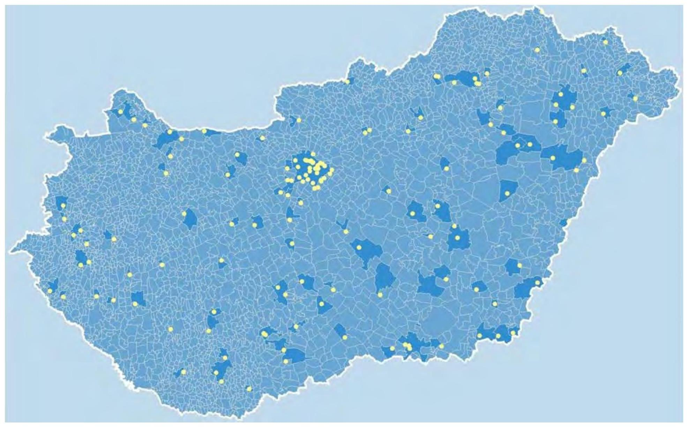

---

# Az irányító hatóságok és közreműködő szervezetek felsorolása és adatai

1. december 31.

|  Ssz. | Irányító Hatóságok adatai |  |  |  |   |
| --- | --- | --- | --- | --- | --- |
|   | OP | IH neve | székhely | IH címe | ir.sz.  |
|  1. | - | NFÜ/Koordinációs IH | Budapest | Wesselényi u. 20-22. | 1077  |
|  2. | KIOP | NFÜ/Környezetvédelmi OP IH | Budapest | Wesselényi u. 20-22. | 1077  |
|  3. | KIOP | NFÜ/Közlekedési Programok IH |  |  |   |
|  4. | GVOP | NFÜ/Gazdaságfejlesztési Programok IH | Budapest | Wesselényi u. 20-22. | 1077  |
|  5. | ROP | NFÜ/Regionális Fejlesztési Programok IH | Budapest | Wesselényi u. 20-22. | 1077  |
|  6. | HEFOP | NFÜ/Humán Eröforrás Programok IH | Budapest | Mozsár u. 16. | 1066  |
|  7. | AVOP | VM/Vidékfejlesztési Helyettes Államtitkárság | Budapest | Kossuth Lajos tér 11. | 1055  |
|  |   |   |   |   |   |
|  Ssz. |  | Közreműködő Szervezetek adatai |  |  |   |
|   | OP | KSZ neve | székhely | KSZ címe | ir.sz.  |
|  1. | AVOP | Mezőgazdasági és Vidékfejlesztési Hivatal | Budapest | Soroksári út22-24. | 1054  |
|  2. | GVOP | MAG-Magyar Gazdaságfejlesztési Központ Zrt. | Budapest | Váci út 83. | 1139  |
|  3. | KIOP | Energia Központ NKfht. | Budapest | Váci út 45.A ép. 6.em | 1134  |
|  4. | KIOP | KvVM - Fejlesztési Igazgatóság | Budapest | Váci út 45. | 1134  |
|  5. | KIOP | KIKSZ Közlekedésfejlesztési Zrt. | Budapest | Vérmező út 4. | 1012  |
|  6. | HEFOP | Európai Szociális Alap Nemzeti Programirányító Iroda Társadalmi Szolgáltató Kht (ESZA Kht.) | Budapest | Váci út 45. C lépcs.ház | 1134  |
|  7. | HEFOP | OKM Támogatáskezelő Igazgatóság | Budapest | Bihari J. u. 5. | 1055  |
|  8. | HEFOP | Strukturális Alapok Programiroda | Budapest | Honvéd u. 20. | 1055  |
|  9. | ROP | VÁTI Magyar Regionális Fejlesztési és Urbanisztikai Nonprofit Kft. | Budapest | Gellérthegy u. 30-32. | 1016  |
|  10. | ROP | Nyugat-Dunántúli RFÜ | Sopron | Csatkai u. 6. | 9400  |
|  11. | ROP | Közép-Dunántúli Regionális Fejlesztési Ügynökség Közhasznú Nonprofit Kft. | Székesfehérvár | Rákóczi út 25. | 8000  |
|  12. | ROP | Dél-Dunántúli RFÜ | Kaposvár | Szántó u. 5 | 7400  |
|  13. | ROP | Pro Régió Közép-Magyarországi RFÜ | Budapest | Hermina út 17. | 1146  |
|  14. | ROP | Észak-Magyarországi RFÜ | Miskolc | Széchenyi u. 107. | 3529  |
|  15. | ROP | Észak-Alföldi RFÜ Nonprofit Kft. | Debrecen | Simonyi u. 14. | 4028  |
|  16. | ROP | Dél-Alföldi RFÜ | Szeged | Közép fasor 13. | 6726  |

---

.

---

# **Helyszíni ellenőrzés képekben**

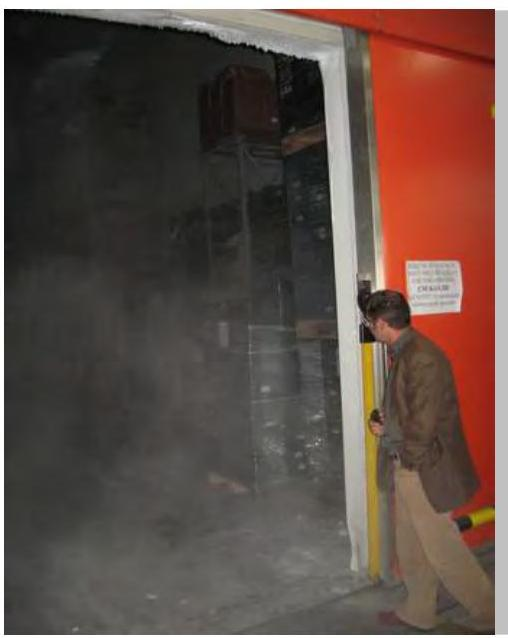

AVOP 2.1.1-2005-03-0009/0.7

**Mórahalom, hűtőház**
PH-Centrum Kft.

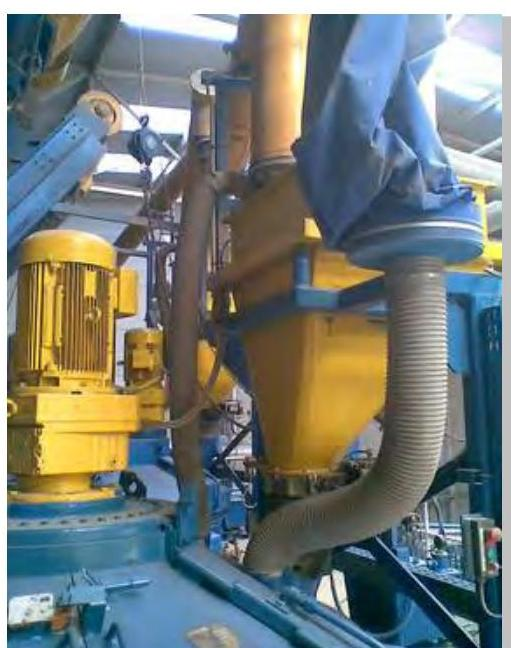

GVOP-1.1.1.-2004-10-0004/5.0

**Majosháza, térkő gyártó üzem**
A Beton- Viacolor Térkő Gyártó és Kereskedelmi Zrt.

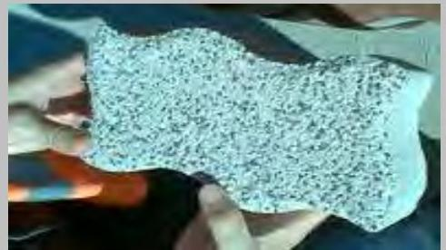

GVOP-1.1.1.-051.-2005-03-00025.0

**Tatabánya, padlókárpitok gyártása**
Graboplast Zrt.

---

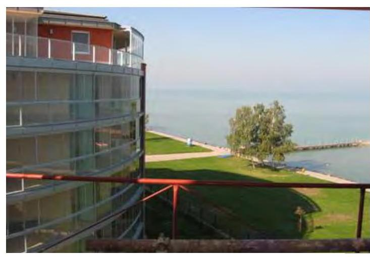

GVOP-2.1.1-05/2.-2005-09-0600/1.0
Magasépítési technológiával épült épület

CREDIT Építóipari és Szolgáltató Kft.
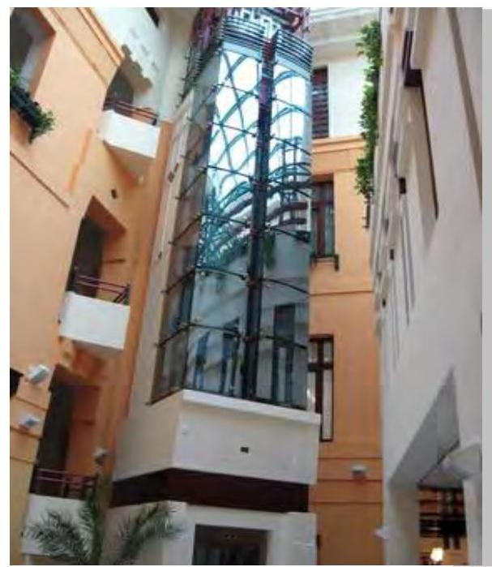

HEFOP-4.1.2-P.-2004-07-0034/1.0
A Közgazdasági kar és a Biológiai kar épületének felújítása Szegedi Tudományegyetem TIK
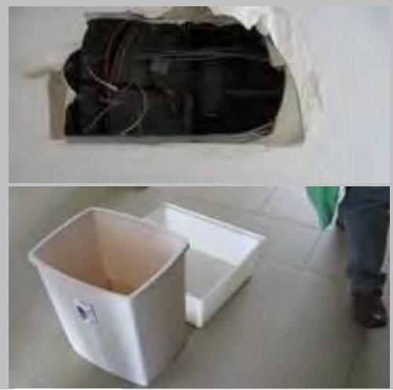

AVOP 1.1.3-2004-11-0427/0.4.
Új arató-cséplőgép beszerzése
Dalmand Zrt.

---

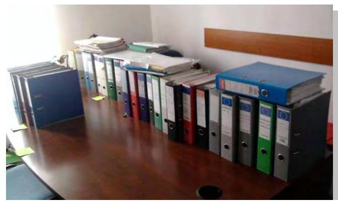

# Alapszintű tanácsadás 

(felsőfokú dokumentáció)
Vállalkozásfejlesztési Központ, Szeged
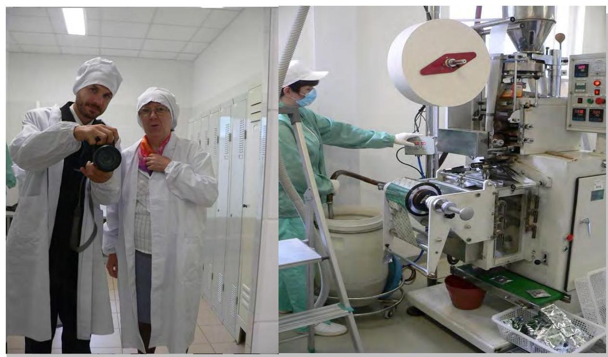

GVOP 1.1.1. 2004-11-0019/5.0
Hagyományos gyógynövények gyártása
Oriental Herbs Kft.
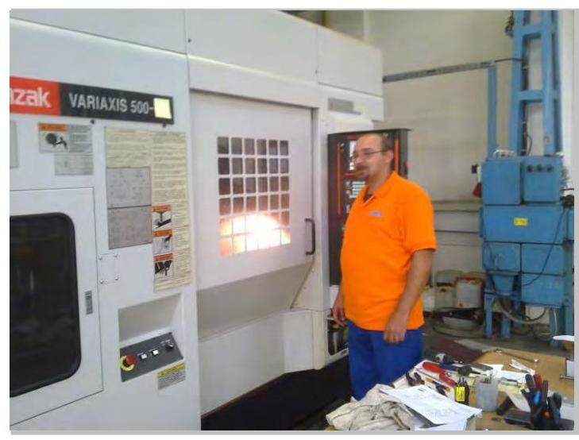

GVOP-1.1.3.-05/1.-2005-05-0009/2.2
Európai és amerikai műszergyártó cégek által igényelt geodéziai műszer fő és részegységel gyártási feltételeinek megteremtése Budapest

---

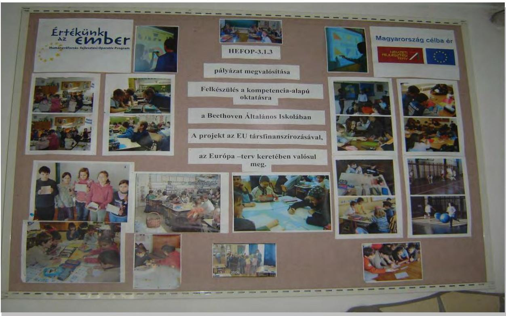

HEFOP-3.1.3-05/1-2005-10-0473/1.0
Felkészítés a kompetencia-alapú oktatásra Beethoven Általános Iskolában
Martonvásáron
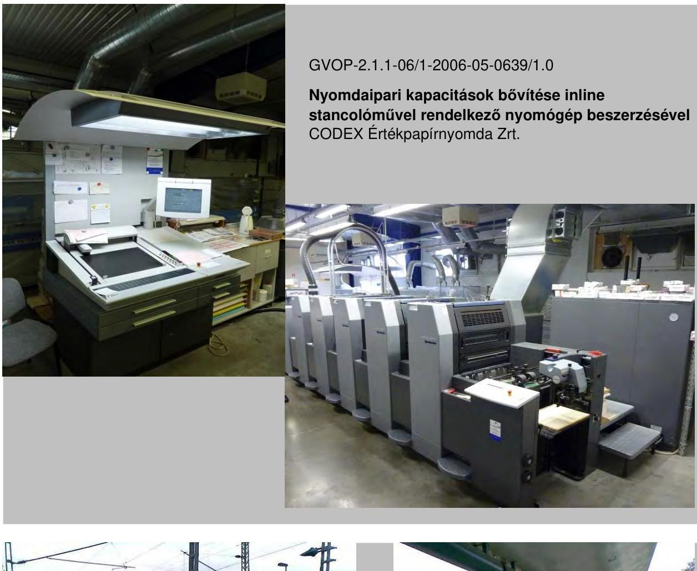

---

6. sz. melléklet a V-2006-137/2010-2011. sz. jelentéshez.
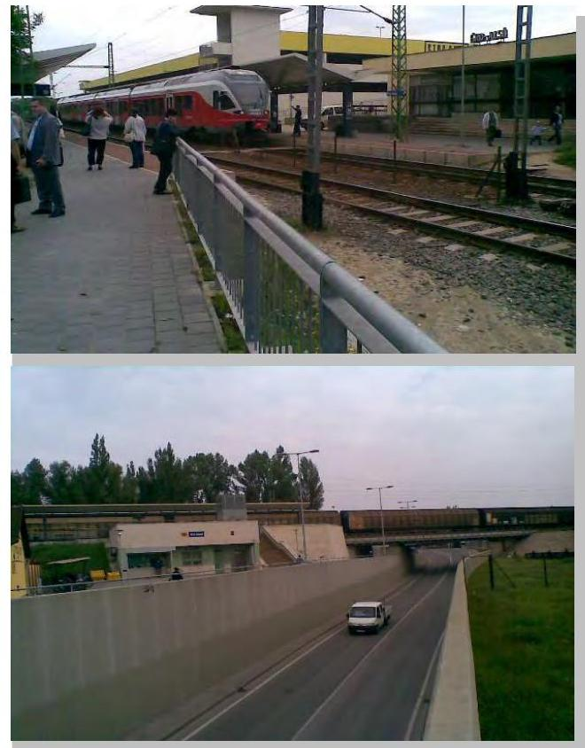

KIOP-2.2.1.-2005-09-0001/1 és KIOP-2.2.1.-2005-09-0002/1
Érd, Diósdi út vasúti átjárók fejlesztése és az Érd-felső állomás felújítása, és Bartók Béla úti új megállóhely létesítése MÁV Zrt.
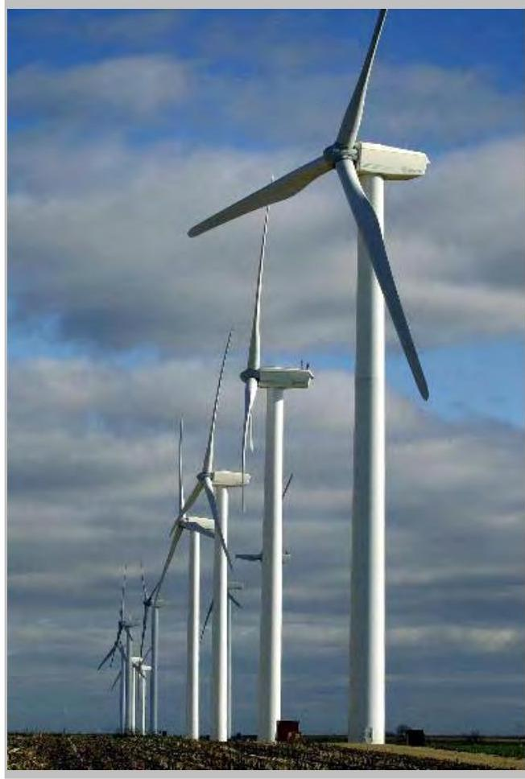

KIOP 1.7.0F-05/1-2005-06-0003/3
2 MW teljesítményű szélerőmü telepítése
Mosonmagyaróvár
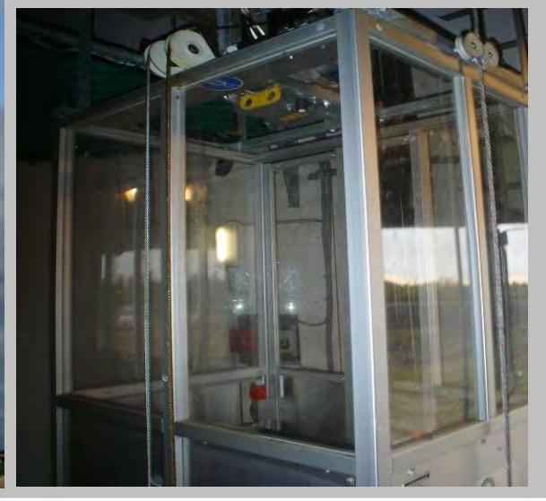

---

7. sz. melléklet a V-2006-137/2010-2011. sz. jelentéshez

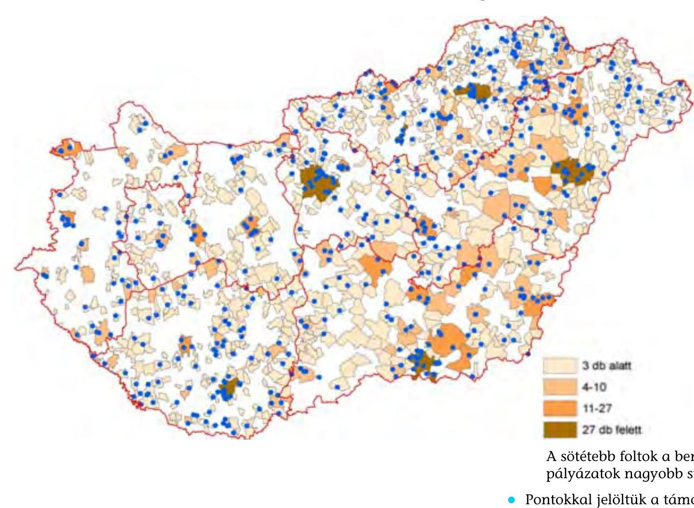

# Az NFT ROP keretének területi megoszlása

- **3 db alatt**: 4-10
- **11-27**: 27 db felett

A sötétebb foltok a benyújtott pályázatok nagyobb sűrűségét jelzik.

- Pontokkal jelöltük a támogatott projekteket.

Forrás: Záró Végrehajtási Jelentés a Regionális Fejlesztés Operatív Program megvalósításáról, 2010

---

# Szabálytalanság miatt a teljesítményellenőrzéssel nem ellenőrzött projektek

|  Minta
ssz. | Projekt száma | Projekt
összege*
Ft | Szabálytalanság oka | Szabálytalanság megállapításának ideje a mintavétel időnontáthoz késnęt  |
| --- | --- | --- | --- | --- |
|  1. | AVOP-3.5.4.-2006-09-0001/1.0 | 783676507 | A KEHI 2009-ben végzett ellenőrzése során jogszabálysértést állapított meg. Az EU-tól lehívott 58775774 Ft támogatási összeg egy része - 456740664 Ft - visszafizetésére tett javaslatot. Az összeg visszafizetésére az IH egy alkalommal felhívta a kedvezményezettet, de a visszafizetés nem történt meg, az IH a visszafizetésre egyéb intézkedést nem tett.
Az EU-tól lehívott támogatási összeg a záró költségnyilatkozatból a közösség pénzügyi érdekeinek védelme érdekében levonásra került, de a hazai pénzügyi érdekek sérelme nem zárható ki. Az ÁSZ hűtlen kezelés bűncselekménye elkövetésének alapos gyanúja miatt a Budapesti Rendőrfőkapitányságnál feljelentést tett ismeretlen tettesek ellen. | 2010. 08. 04-e után  |
|  103. | HEFOP-3.4.1/05/1.-2005-09-0003 | 4615351 | Szabálytalanságot állapítottak meg és a Kedvezményezett visszafizette a támogatás összegét. | 2010. 08. 04-e előtt  |
|  114. | KIOP-1.3.1.-2004-07-0004/2 | 3152000 | A projekt 100\%-osan hazai forrásból került finanszírozásra, mivel az Európai Bizottság a lakóingatlanok azbesztmentesítésével kapcsolatos költségeket nem ítélte elszámolhatónak. A legfőbb indok: a közegészségügyi típusúnak tekinthető projektek keretében csak akkor lehetséges magántulajdonban levő ingatlanok fejlesztése, ha arra létezik átfogó regionális program. A Bizottság szerint ilyen átfogó, magyar kormányzati program nem került elfogadásra, így a költségek nem elszámolhatók az ERFA terhére. A szabálytalanság nem róható fel a kedvezményezettnek (tagállami hiba).
Az IH a projekt támogatását hazai költségvetési forrásból, a 10\%-os túlvállalási keret terhére oldotta meg. | 2010. 08. 04-e előtt  |
|  123. | KIOP-1.3.0-F.-2005-07-0001/2 | 237136131 | A projekt EU felé nem elszámolt projekt. A projekt pénzügyi tételei kivételére a záró költségnyilatkozatból az EUTAF jelentése alapján került sor, azonban az IH a kedvezményezettet a jegyzőkönyvünk felvételéig 2010. szeptember 20-áig nem értesítette. Az IH intézkedése szerint a projekt az NFÜ által kezelt "Európai Uniós Programokhoz kapcsolódó tortalék" elöriányzat KIOP kerete terhére kerül elszámolásra. | 2010. 08. 04-e után  |

- A tételek összege a helyszíni ellenőrzés során az irányító hatóságok által megadott összeg. Ezeket az összegeket az EU felé megküldött költségelszámolásokban korrigálták

Forrás: helyszíni ellenőrzések jegyzőkönyv

---

# Az abszorpció (forrás-felhasználás) alakulása

|  OP-k és
finanszírozási alapok | Hatályos keret (EU rész) | Hatályos keret (hazai rész) | Hatályos keret (EU+hazai) |  | Szerződéssel lekötött összeg (EU+hazai) | Szerződéssel lekötött / keret (EU+hazai) | Összes elszámolható költség (Záró költségnyilatkoz at EU része) | Összes elszámolható költség (Hazai része) | Összes elszámolható költség (EU+hazai) | Összes elszámolható költség / Keret | Összes elszámolható költség EU része/Hatályos keret EU része  |
| --- | --- | --- | --- | --- | --- | --- | --- | --- | --- | --- | --- |
|  ME | M euró | M euró | M euró | Mrd Ft | Mrd Ft | \% | M euró | M euró | M euró | \% | \%  |
|  1. | 2. | 3. | $4=2+3$ | 5. | 6. | $7=6 / 5$ | 8. | 9. | $10=8+9$ | $11=10 / 4$ | $12=8 / 2$  |
|  GVOP/ERFA | 429,00 | 177,44 | 606,44 | 154,64 | 148,62 | 96,1\% | 452,78 | 187,97 | 640,75 | 105,66\% | 105,54\%  |
|  AVOP/EMOGA | 312,83 | 104,27 | 417,10 | 106,37 | 114,69 | 107,8\% | 305,94 | 101,99 | 407,93 | 97,80\% | 97,80\%  |
|  AVOP/HOPE | 4,39 | 1,34 | 5,73 | 1,46 | 1,56 | 106,8\% | 4,26 | 1,30 | 5,56 | 97,03\% | 97,04\%  |
|  HEFOP/ERFA | 177,38 | 59,14 | 236,52 | 60,31 | 60,72 | 100,7\% | 190,19 | 63,39 | 253,58 | 107,21\% | 107,22\%  |
|  HEFOP/ESZA | 385,44 | 128,48 | 513,92 | 131,05 | 151,29 | 115,4\% | 374,75 | 124,91 | 499,66 | 97,23\% | 97,23\%  |
|  KIOP/ERFA | 327,25 | 113,04 | 440,29 | 112,27 | 121,28 | 108,0\% | 349,00 | 120,82 | 469,82 | 106,71\% | 106,65\%  |
|  ROP/ERFA | 305,75 | 101,95 | 407,70 | 97,03 | 106,44 | 109,7\% | 323,37 | 107,37 | 430,74 | 105,65\% | 105,76\%  |
|  ROP/ESZA | 53,68 | 14,98 | 68,66 | 17,47 | 19,13 | 109,5\% | 53,40 | 14,82 | 68,22 | 99,36\% | 99,48\%  |
|  Összesen | 1995,72 | 700,64 | 2696,36 | 680,60 | 723,73 | 106,3\% | 2053,69 | 722,57 | 2776,26 | 102,96\% | 102,90\%  |

Forrás: Operatív Programok, programozási dokumentumai és záró végrehajtási jelentései, záró költségnyilatkozatai

---

1.     1.         1.             1.                 1.                     1. 

|  Sorszám | Místosorszám |  |  |  |  |  |  |  |  |   |
| --- | --- | --- | --- | --- | --- | --- | --- | --- | --- | --- |
|   |  |  |  |  |  | Tény | Tény helysz. | Befeje |  | Helyszási  |
|   |  |  |  |  |  |  | ell. idején | zéskori |  | ellenőrzés  |
|   |  |  |  |  |  |  |  | tény/ |  | kori tény/  |
|   |  |  |  |  |  |  |  | tény/ |  | terv  |
|   |  |  |  |  |  |  |  | tény/ |  |   |
|   |  |  |  |  |  |  |  | tény/ |  |   |
|   |  |  |  |  |  |  |  |  |  |   |
|   |  |  | 1. | 2. | 3. | 4. | 5. | 6. | 7. | 8. =(6)/4  |
|   |  |  |  |  |  |  |  |  | =(5)/(4) |  |   |
|  1 | 2 |  | AVOP-1.1.1.-2005-03- | Megtartott munkahelyek száma | fő | 38 | 38 | 43 | 100% | 113% |   |
|   |  |  | 0043/0.2 | A támogatásnak köszönhetően megtartott |  |  |  |  |  |  |   |
|   |  |  |  | női munkahelyek száma | fő | 7 | 7 | 7 | 100% | 100% |   |
|  2 | 3 |  | AVOP-1.1.2.-2005-04- | Megtartott munkahelyek száma | fő | 40 | 40 | 42 | 100% | 105% |   |
|   |  |  | 0092/0.6 | Fedezett összeg | Ft | 65 278 000 | 56 376 000 | 35 686 000 | 86% | 55% |   |
|   |  |  |  | Nettó árbevétel | Ft | 239 933 000 | 360 401 000 | 541 546 000 | 150% | 226% |   |
|  3 | 4 |  | AVOP-1.1.2.-2005-03- | Értékesítés nettó árbevétele | e Ft. | 575 445 | 621 804 | 464 421 | 108% | 81% |   |
|   |  |  | 0131/0.4 | Standard Fedezett Hozzájárulás | m/t/év | 220 | 178 | 179 | 81% | 81% |   |
|   |  |  |  | Megtartott munkaerő | fő | 3 | 3 | 3 | 100% | 100% |   |
|  4 | 5 |  | AVOP-1.3.1.-2004-09- | A támogatásnak köszönhetően megtartott | db | 8 | 8 | 9 | 100% | 113% |   |
|   |  |  | 0001/0.5 | munkahelyek száma |  |  |  |  |  |  |   |
|   |  |  |  | A felújított halastavak hektáronkénti | Ft/év | 320 000 | 320 000 | 344 000 | 100% | 108% |   |
|   |  |  |  | kibocsátása |  |  |  |  |  |  |   |
|   |  |  |  | Haltermelés mennyisége | t/év | 160 | 160 | 183 | 100% | 114% |   |
|  5 | 7 |  | AVOP-1.1.2.-2005-03- | Értékesítés nettó árbevétele | m Ft | 1 170 | 2 220 | 2 003 | 190% | 171% |   |
|   |  |  | 0078/0.7 | Tároló kapacitás m² | m² | 3 190 | 3 190 | 3 190 | 100% | 100% |   |
|  6 | 8 |  | AVOP-1.3.1.-2005-04- | Támogatott halastavak területe | ha | 4 | 4 | 4 | 100% | 100% |   |
|   |  |  | 0004/0.6 | Támogatott vállalkozás kibocsátása | Ft/év | 52 365 000 | 52 365 000 | 53 284 000 | 100% | 102% |   |
|   |  |  |  | Nettó árbevétel | Ft | 820 874 000 | 1 066 293 000 | 1 066 293 000 | 130% | 130% |   |
|  7 | 9 |  | AVOP-1.1.3.-2004-11- | Új erőgépek száma | db | 1 | 1 | 1 | 100% | 100% |   |
|   |  |  | 0003/0.1 | Új munkaigépek száma | db | 3 | 3 | 3 | 100% | 100% |   |
|   |  |  |  | Megtartott munkahelyek száma | db | 1 | 1 | 1 | 100% | 100% |   |
|  8 | 11 |  | AVOP-2.1.1-05/1.- | Megtartott munkahelyek száma | fő | 295 | 295 | 301 | 100% | 102% |   |
|   |  |  | 2005-08-0034/0.3 | Nettó árbevétel | m Ft | 14 180 | 15 558 | 17 145 | 110% | 121% |   |
|   |  |  |  | Üzemi üzlett tevékenység eredménye | m Ft | 458 | 683 | 1 301 | 149% | 284% |   |
|  9 | 12 |  | AVOP-3.2.12-05/1.- | Csatorna felújítás | km | 3 | 3 | 3 | 100% | 100% |   |
|   |  |  | 2006-03-0031/0.1 | Érintett települések száma | db | 3 | 3 | 3 | 100% | 100% |   |
|  10 | 13 |  | AVOP-1.1.2.-2005-04- | Új gépek száma | db | 3 | 3 | 3 | 100% | 100% |   |
|   |  |  | 0061/0.1 | Fedezett összeg | m Ft | 13 |  | 12 | 0% | 78% |   |
|   |  |  |  | Nettó árbevétel | m Ft | 75 |  | 120 | 0% | 159% |   |
|  11 | 14 |  | AVOP-2.1.1.-2004-07- | Fedezett összeg | e Ft | 48 256 | 71 347 | 67 215 | 148% | 139% |   |
|   |  |  | 0003/0.7 | Értékesített méz mennyisége | tonna | 3 000 | 2 364 | 2 354 | 79% | 78% |   |
|   |  |  |  | Beszállító méztermelők száma | fő | 1 200 | 1 820 | 1 476 | 152% | 123% |   |
|  12 | 15 |  | AVOP-3.1.3.-2004-12- | Szálláshely kialakítása | fő | 4 | 4 | 4 | 100% | 100% |   |
|   |  |  | 0005/0.5 | Új munkahely kialakítása | fő | 2 | 1 |  | 50% | 0% |   |
|   |  |  |  | Vendégéjszabák száma | nup | 160 | 316 | 703 | 198% | 439% |   |
|  13 | 16 |  | AVOP-3.2.12-05/1.- | Csatorna felújítás | kW | 3 | 3 | 3 | 100% | 100% |   |
|   |  |  | 2006-03-0048/0.6 | Belvútől megvédett terület | ha | 490 | 490 | 490 | 100% | 100% |   |
|   |  |  |  | Érintett gazdasági száma | db | 6 | 6 | 6 | 100% | 100% |   |
|  14 | 18 |  | AVOP-2.1.1.-2005-03- | Fogulkoztatott létszám | fő | 12 | 7 | 20 | 58% | 167% |   |
|   |  |  | 0009/0.7 | Nettó árbevétel | e Ft | 1 649 181 |  | 827 000 | 0% | 50% |   |
|  15 | 19 |  | AVOP-1.1.3.-2004-10- | Munkagépek száma | db | 2 | 2 | 2 | 100% | 100% |   |
|   |  |  | 0355/0.7 | Új munkaigépek teljesítménye összesen | kW | 175 | 134 | 138 | 77% | 79% |   |
|   |  |  |  | Megtartott munkaigépek száma | db | 1 | 1 | 1 | 100% | 100% |   |
|  16 | 20 |  | AVOP-2.1.1-05/1.- | Nettó árbevétel (a projekt befejezéseinek | m Ft | 250 | 326 | 392 | 150% | 157% |   |
|   |  |  | 2005-08-0013/0.4 | idejére tervezett |  |  |  |  |  |  |   |
|   |  |  |  | Fedezett összeg | m Ft | 47 | 82 | 79 | 173% | 168% |   |
|   |  |  |  | Munkavállalót létszám | fő | 9 | 11 | 10 | 122% | 111% |   |
|  17 | 22 |  | AVOP-1.1.3.-2004-09- | Új munkaigépek száma | db | 19 | 19 | 19 | 100% | 100% |   |
|   |  |  | 0394/0.6 | Új erőgépek száma | db | 4 | 4 | 4 | 100% | 100% |   |
|   |  |  |  | Új betakarításép száma | db | 1 | 1 | 1 | 100% | 100% |   |
|  18 | 23 |  | AVOP-3.5.2.-2006-09- | Tervezett rendezvények, programok száma |  | 1 |  | 1 | 0% | 100% |   |
|   |  |  | 1214/7.07 |  |  |  |  |  |  |  |   |
|   |  |  |  | A rendezvényen, programokon résztvevők | fő | 1 247 |  | 1 247 | 0% | 100% |   |
|   |  |  |  | száma |  |  |  |  |  |  |   |
|  19 | 26 |  | AVOP-3.5.2.-2006-09- | Megtartott munkahelyek száma | fő | 6 |  | 10 | 0% | 167% |   |
|   |  |  | 1379/7.06 | Megvalósult programok száma | db | 2 |  | 2 | 0% | 100% |   |
|  20 | 27 |  | AVOP-1.1.3.-2004-11- | A támogatásnak köszönhetően megtartott | fő | 549 | 549 | 427 | 100% | 78% |   |
|   |  |  | 0427/0.4 | munkahelyek száma |  |  |  |  |  |  |   |
|   |  |  |  | A támogatásnak köszönhetően megtartott | fő | 563 | 563 | 438 | 100% | 78% |   |
|   |  |  |  | munkahelyek száma, munkaerő |  |  |  |  |  |  |   |
|   |  |  |  | véremértékben |  |  |  |  |  |  |   |
|  21 | 28 |  | AVOP-3.5.2.-2006-09- | Megtartott munkahelyek száma | db | 1 | 1 | 1 | 100% | 100% |   |
|   |  |  | 1467/3.03 | Mézpergető gép beszerzése | db | 1 | 1 | 1 | 100% | 100% |   |
|  22 | 29 |  | AVOP-2.1.1-05/1.- | Nettó értékesítés árbevétele | e Ft | 314 593 | 44 939 | 60 902 | 14% | 19% |   |
|   |  |  | 2005-09-0014/0.7 | Fedezett összeg | e Ft | 14 500 | -39 482 | -108 648 | -272% | -749% |   |
|   |  |  |  | Bortermelés éves mennyisége | hl | 16 140 | 34 269 | 18 357 | 212% | 114% |   |
|  23 | 30 |  | AVOP-1.1.2.-2004-09- | Fedezett összeg | Ft | 28 309 000 |  | 14 722 000 | 0% | 52% |   |
|   |  |  | 0059/0.1 | Nettó árbevétel | Ft | 88 050 006 |  | 131 078 000 | 0% | 149% |   |
|   |  |  |  | Munkahelyek száma | fő | 3 |  | 1 | 0% | 50% |   |
|  24 | 31 |  | AVOP-1.1.2.-2005-03- | Tároló kapacitás | tonna | 15 000 | 15 000 | 15 000 | 100% | 100% |   |
|   |  |  | 0121/0.7 | Termékek száma/búza, napraforgó, repce, | db | 5 |  | 5 | 0% | 100% |   |
|   |  |  |  | kokosica, arpa |  |  |  |  |  |  |   |
|   |  |  |  | Megőrzítő munkahelyek száma | db | 128 |  | 133 | 0% | 104% |   |
|  25 | 32 |  | AVOP-1.1.2.-2005-03- | Nettó árbehétel | e Ft | 946 000 | 1 180 438 | 765 902 | 125% | 81% |   |

---

|  Sorszám | Mítároktóre | Projektszám | Indikátor megnevezése | Mérték egység | Terv | Tény | Tény helysz. ell. idején | Befeje zéskori tény/ terv | Helyszíni ellenőrzés kori tény/ terv  |
| --- | --- | --- | --- | --- | --- | --- | --- | --- | --- |
|   |  | 1. | 2. | 3. | 4. | 5. | 6. | 7. =(5)/(4) | 8. =(6)/(4)  |
|   |  | 0139/0.7 | Eedezeti összeg | e Ft | 76 000 | 96 294 | 25 327 | 127% | 33%  |
|   |  |  | Foglalkoztatottuk létszáma | fő | 50 | 53 | 42 | 106% | 84%  |
|  26 | 33 | GVOP-3.3.3-05/1.-
2005-05-0012/3.0 | Tudásbázisok száma | db | 3 | 3 | 5 | 100% | 167%  |
|   |  |  | Az elért kutatási eredmények ismertetésére, népszerűsítésére rendezett bemutatók száma | db | 10 | 13 | 13 | 130% | 130%  |
|  27 | 34 | GVOP-2.1.1-06/1.-
2006-05-0639/1.0. | Projekthez vállalt többlet állományi létszám | fő | 1 | 1 | 1 | 100% | 100%  |
|  28 | 35 | GVOP-3.2.2.-2004-07-0015/3.0 | Biotechnológia képzésben résztvevő hallgatók | fő | 10 | 16 | 16 | 160% | 160%  |
|   |  |  | Prepúnált, izolált sejtkélszittmények kifejlesztése, gyógyúszati ill. kísérleti célra | db | 6 | 2 | 3 | 33% | 50%  |
|   |  |  | Kiszéltett publikációk száma | db | 12 | 11 | 18 | 92% | 150%  |
|  29 | 37 | GVOP-2.1.1-05/1.-
2005-04-1513/1.0. | Nettó árbevétel | e Ft | 122 595 | 132 992 | 293 513 | 108% | 239%  |
|   |  |  | Átlagos Statisztikai állományi létszám | fő | 12 | 11 | 21 | 92% | 175%  |
|   |  |  | Bruttó hozzásolott érték | e Ft | 6 944 | 5 000 | 7 000 | 72% | 101%  |
|  30 | 38 | GVOP-2.1.1.-2004-04-0210/1.0. | Állományi létszám 2004. év | fő | 38 | 39 | 25 | 103% | 66%  |
|   |  |  | Állományi létszám 2005. év | fő | 40 | 43 | 25 | 108% | 63%  |
|   |  |  | Állományi létszám 2006. év | fő | 40 | 41 | 25 | 103% | 63%  |
|  31 | 40 | GVOP-1.1.1.-2004-05-0002/5.0 | Létszám | fő | 8 | 8 | 8 | 100% | 100%  |
|   |  |  | Foglalkoztatottuk éves létszáma | fő | 25 | 28 | 44 | 112% | 176%  |
|   |  |  | Többlet export árbevétel | m Ft | 850 | 807 | 950 | 95% | 112%  |
|  32 | 41 | GVOP-3.3.3-05/1.-
2005-05-0059/3.0 | Kutatási napló a használható anyagokra vonatkozólag | db | 1 | 1 | 1 | 100% | 100%  |
|   |  |  | Technológiai leírás elkészítése, kutatási napló átadása | db | 1 | 1 | 1 | 100% | 100%  |
|   |  |  | Anyagmintu készítés, átadás |  | 1 | 1 | n.r. | 100% |   |
|  33 | 42 | GVOP-1.1.1.-2005-01-0006/5.0 | Nettó árbevétel | m Ft | 2 700 | 3 083 | 3 083 | 114% | 114%  |
|   |  |  | Állományi létszám | fő | 6 | 27 | 27 | 450% | 450%  |
|  34 | 43 | GVOP-3.1.1.-2004-05-0410/3.0 | Adott szakaszban megvalósított, műszaki szempontból független részegységek darabszáma | db | 7 | 8 | 8 | 114% | 114%  |
|   |  |  | Adott szakaszban megvalósított szoftver és firmwarék darabszáma | db | 13 | 14 | 14 | 108% | 108%  |
|   |  |  | Adott szakaszban beszerzett közvetlenül a fejlesztéshez felhasznált tárgyi eszközök darabszáma | db | 3 | 19 | 19 | 633% | 633%  |
|  35 | 44 | GVOP-1.1.1.-2004-12-0020/5.0 | A projekt bruttó összköltségéből a beruházás | Ft | 444 200 000 | 442 023 000 | 442 023 000 | 100% | 100%  |
|   |  |  | Éves nettó árbevétel | e Ft | 29 441 000 |  | 41 308 816 | 0% | 140%  |
|   |  |  | Éves átlagos statisztikai állományi létszám | fő | 590 | 614 | 757 | 104% | 128%  |
|  36 | 45 | GVOP-1.1.1-05/1.-
2005-06-0018/5.0 | Alkalmazottuk átlagos statisztikai létszáma | fő | 107 | 118 | 117 | 110% | 109%  |
|   |  |  | Fejlesztésből származó többlet nettó árbevétel | e Ft | 221 499 | 342 962 | 374 965 | 155% | 169%  |
|  37 | 47 | GVOP-2.1.1.-2004-07-0150/1.0. | Foglalkoztatottuk éves átlagos statisztikai létszáma | fő | 6 | 7 | 7 | 117% | 117%  |
|  38 | 48 | GVOP-2.1.1-05/1.-
2005-04-0948/1.0. | A projekthez vállalt többlet állományi létszám | fő | 3 | 0 | 0 | 0% | 0%  |
|   |  |  | Fejlesztéssel bevezetett új termékek, termékcsoportok száma | fő | 4 | 4 | 4 | 100% | 100%  |
|   |  |  | Új eljárások, technológiák száma | db | 2 | 2 | 2 | 100% | 100%  |
|  39 | 49 | GVOP-1.2.1-05/1.-
2005-06-0003/5.0 | Megőrzött munkahelyek száma | fő | 1 | 1 | 1 | 100% | 100%  |
|   |  |  | Foglalkoztatottuk éves átlagos statisztikai létszáma | fő | 6 | 7 | 30 | 117% | 500%  |
|  40 | 50 | GVOP-1.1.1-05/1.-
2005-03-0002/5.0 | Foglalkoztatottuk száma | fő | 178 | 188 | 179 | 106% | 101%  |
|   |  |  | Többlet árbevétel | e Ft | 622 000 | 1 336 700 | 15 402 459 | 215% | 2476%  |
|  41 | 51 | GVOP-3.2.1.-2004-04-0370/3.0 | A törzagyűjteményben elhelyezett tételek száma | db | 150 | 220 | 220 | 147% | 147%  |
|   |  |  | Kutatási tevékenységhez felhasznált tételek száma | db | 25 | 5 | 67 | 20% | 268%  |
|   |  |  | A törzagyűjteményre alapuló szakmai együttműködések száma | db | 5 | 1 | 5 | 20% | 100%  |
|  42 | 52 | GVOP-4.1.2-05/1.-
2005-10-0006/4.0 | Foglalkoztatott átlagos statisztikai létszám | fő | 139 | 127 |  | 91% |   |
|   |  |  | Megtartott munkahelyek száma | fő | 23 | 23 | 25 | 100% | 109%  |
|   |  |  | Bruttó hozzásolott érték | e Ft | 758 684 | 212 545 | 416 946 | 28% | 55%  |
|  43 | 53 | GVOP-3.2.1.-2004-04-0205/3.0 | Pattibációk száma | db | 20 | 40 | 40 | 200% | 200%  |
|   |  |  | Kutatási pályázatok, szerződéses munkák | db | 9 | 11 | 11 | 122% | 122%  |
|   |  |  | Kutatásba bevont személyek száma | fő | 17 | 23 | 23 | 135% | 135%  |
|  44 | 54 | GVOP-4.3.1.-2004-06-0009/4.0 | létrehozott munkahely | fő | 5 | 5 | 5 | 100% | 100%  |
|   |  |  | E-közigazgatási szolgáltatásokat elérő vállalkozások száma | db | 17 800 | 20 000 | 22 000 | 112% | 124%  |
|   |  |  | A 3. és 4. szintű ügyintézési szolgáltatások száma. A megvalósítás évét tekintve. (2007) | db | 20 | 20 | 19 | 100% | 95%  |
|  45 | 55 | GVOP-2.1.1.-2004-03- | Teljes munkaidős létszám | fő | 8 | 9 | 12 | 113% | 150%  |

---

|  Sorszám | Mítárosto | Fogadtszám | Indikátor megnevezése | Mértékegység | Terv | Tény | Tény helysz. ell. idején | Befeje zéskori tény/ terv | Helyszíni ellenőrzés kori tény/ terv  |
| --- | --- | --- | --- | --- | --- | --- | --- | --- | --- |
|   |  |  |  |  |  |  |  |  | 8. =(6)/(4)  |
|   |  |  | 2. | 3. | 4. | 5. | 6. |  |   |
|   |  | 0212/1.0. | Éves nettó árbevétel | e Ft | 51 468 | 49 959 | 40 386 | 97% | 78%  |
|  46 | 58 | GUOP-2.1.1.-2004-05-0112/1.0. | Átlagos állományi létszám megtartása | fő | 12 | 14 | 16 | 117% | 133%  |
|   |  |  | Targonca beszerzés | db | 2 | 2 | 2 | 100% | 100%  |
|  47 | 61 | GUOP-2.1.2-05/1.-2005-10-0264/1.0. | Bruttó hozzájadott érték alakulása | e Ft | 8 026 |  | 8 208 | 0% | 102%  |
|   |  |  | Fogalkoztatottuk éves átlagos statisztikai létszáma | fő | 15 |  | 19 | 0% | 127%  |
|  48 | 63 | GUOP-2.1.2-05/1.-2005-07-0065/1.0. | Bruttó hozzájadott érték alakulása | e Ft | 1 690 | 1 600 | 1 640 | 95% | 97%  |
|   |  |  | Megtartott munkahelyek száma | fő | 22 | 22 | 27 | 100% | 123%  |
|  49 | 66 | GUOP-2.1.2-05/1.-2005-09-0107/1.0. | Nyvík számanak változása | db | 30 | 200 | 200 | 667% | 667%  |
|   |  |  | Megtartott munkahelyek száma | db | 1 | 1 | 1 | 100% | 100%  |
|   |  |  | Közvetlen magán beruházás | eFt | 800 | 800 | 800 | 100% | 100%  |
|  50 | 69 | GUOP-2.1.2.-2004-06-0146/1.0. | ISO 9001:2000 szabvány szerinti min. ir. Bszer bevezetése | db | 1 | 1 | 1 | 100% | 100%  |
|   |  |  | ISO 9001:2000 szabvány szerinti min. ir. Bszer tanúsíthatása | db | 2 | 2 | 2 | 100% | 100%  |
|  51 | 70 | GUOP-2.1.2-05/1.-2005-11-0510/1.0. | Fogalkoztatottuk éves átlagos statisztikai létszáma | fő | 15 | 16 | 19 | 107% | 127%  |
|   |  |  | Bruttó hozzájadott érték | eFt | 2 100 | 6 332 | 12 019 | 302% | 572%  |
|  52 | 71 | GUOP-1.1.3-05/1.-2005-05-0009/2.0 | Árbevétel 2008. | e Ft | 935 000 | 1 107 294 | 931 150 | 118% | 100%  |
|   |  |  | Létszám | fő | 130 | 130 | 78 | 100% | 60%  |
|  53 | 72 | GUOP-2.1.2-05/1.-2005-11-0028/1.0. | Megtisztít munkahelyek száma | fő | 4 | 4 | 4 | 100% | 100%  |
|   |  |  | A foglalkoztatottuk éves átlagos statisztikai létszáma | fő | 4 | 4 | 4 | 100% | 100%  |
|  54 | 73 | GUOP-2.1.2-05/1.-2005-10-0279/1.0. | Megtartott munkahelyek száma | fő | 2 | 2 | 2 | 100% | 100%  |
|   |  |  | létrehozott munkahely | fő | 1 | 1 | 1 | 100% | 100%  |
|   |  |  | Bruttó hozzájadott érték | m Ft | 6 | 8 | 8 | 133% | 133%  |
|  55 | 75 | GUOP-2.1.2-05/1.-2005-10-0198/1.0. | ISO 9001:2001 tanúsítvány megszerzése | db | 1 | 1 | 1 | 100% | 100%  |
|   |  |  | Ágáltok megszerzése 7. | db | 3 | 3 | 3 | 100% | 100%  |
|   |  |  | Létszám megőrzése | fő | 14 | 14 | 14 | 100% | 100%  |
|  56 | 76 | GUOP-3.3.2-05/1.-2005-05-0012/3.0 | A rendszer használatát oktató intézmények Magyumeszágen | db | 4 |  | 7 | 0% | 175%  |
|   |  |  | Felhasználók száma összesen (nemzetközi szinten) | fő | 25 000 |  | 13 364 | 0% | 53%  |
|   |  |  | Fogalkoztatottuk száma | fő | 3 | 3 | 3 | 100% | 250%  |
|  57 | 77 | HEFOP-4.3.1-K.-2004-08-0001/4.0 | Felújított alapterület | m2 | 11 578 | 16 832 | 16 832 | 145% | 145%  |
|   |  |  | Új épület alapterülete | m2 | 13 510 | 17 296 | 17 296 | 128% | 128%  |
|  58 | 78 | HEFOP-4.1.2-P.-2004-07-0034/1.0 | A fejlesztett gyakorlatoientált képzési helyek száma | db | 54 | 63 | 63 | 117% | 117%  |
|   |  |  | Az infrastrukturális fejlesztésekből részesülő tanulók az | fő | 27 000 | 29 721 | 27 436 | 110% | 102%  |
|   |  |  | Felújított vagy épített alapterület | m² | 26 780 | 27 371 | 27 371 | 102% | 102%  |
|  59 | 79 | HEFOP-3.1.3-05/1.-2005-10-0408/1.0 | Képzésben érintett pedagógusok száma | fő | 9 | 20 | 20 | 222% | 222%  |
|   |  |  | Képzést eredményesen elvégzett személyek száma | fő | 9 | 20 | 20 | 222% | 222%  |
|   |  |  | Fejlesztési téma gyuk. megvalósítása során érintett gyerekek és tanulók aránya | % | 100 | 100 | 100 | 100% | 100%  |
|  60 | 80 | HEFOP-3.1.3-05/1.-2005-10-0435/1.0 | Képzésben érintett pedagógusok száma | fő | 6 | 6 | 6 | 100% | 100%  |
|   |  |  | Képzésben érintett intézményvezetők száma | fő | 2 | 2 | 2 | 100% | 100%  |
|   |  |  | Fejlesztési téma gyuk. megvalósítása során érintett gyerekek és tanulók aránya | fő | 38 | 39 | 38 | 103% | 101%  |
|  61 | 81 | HEFOP-3.1.3-05/1.-2005-10-0115/1.0 | Képzésben érintett pedagógusok száma | fő | 6 | 6 | 6 | 100% | 100%  |
|   |  |  | Képzést eredményesen elvégzett személyek száma | fő | 8 | 8 | 8 | 100% | 100%  |
|   |  |  | Fejlesztési téma gyuk. megvalósítása során érintett gyerekek és tanulók aránya | % | 61 | 61 | 45 | 100% | 74%  |
|  62 | 83 | HEFOP-3.4.1-08/1.-2008-06-0032/2.0 | Képzési programokban résztvettek száma | fő | 27 | 28 | 28 | 104% | 104%  |
|   |  |  | Képzetséget szerzett személyek száma | fő | 23 | 28 | 28 | 112% | 112%  |
|   |  |  | Megszerzett képzetségek száma | db | 49 | 54 | 54 | 110% | 110%  |
|  63 | 84 | HEFOP-3.4.1./05/1.2006-04-0031/2.0 | Képzési programokban résztvettek száma | fő | 8 | 13 | 9 | 163% | 113%  |
|   |  |  | Képzetséget szerzettek száma | fő | 8 | 13 | 9 | 163% | 113%  |
|  64 | 86 | HEFOP-3.4.1/05/1.-2005-12-0057/2.0 | Képzési programokban résztvettek száma | fő | 47 | 48 | 48 | 102% | 102%  |
|   |  |  | Képzetséget szerzett személyek száma | fő | 47 | 48 | 48 | 102% | 102%  |
|  65 | 87 | HEFOP-3.4.1/05/1.-2005-10-0039/2.0 | A képzési programokban résztvettek száma | fő | 8 | 8 | 8 | 14 | 100% | 175%  |
|   |  |  | Képzetséget szerzett személyek száma | fő | 8 | 8 | 8 | 14 | 100%  |
|  66 | 89 | HEFOP-3.4.1/05/1.-2005-11-0086/2.0 | Képzési programokban résztvettek száma | fő | 9 | 9 | 9 | 100% | 100%  |
|   |  |  | Képzetséget szerzett személyek száma | fő | 9 | 9 | 9 | 100% | 100%  |

---

|  67 | 92 | HEFOP-3.4.1/05/1.-
2006-03-0036/2.0 | Képzési programokban résztvettek száma | fő | 32 | 31 | 31 | 97% | 97%  |
| --- | --- | --- | --- | --- | --- | --- | --- | --- | --- |
|   |  |  | Képzettséget szerzett személyek száma | fő | 30 | 31 | 31 | 103% | 103%  |
|  68 | 93 | HEFOP-3.1.3/B-09/3.-
2009-05-0045/1.0 | A projekt keretében könyvtári állományba
vett mutató alapján | db | 4 | 4 | 4 | 100% | 100%  |
|   |  |  | A projekt keretében beszerzett intézményi
állományba vett eszközök darabozáma | db | 40 | 40 | 40 | 100% | 100%  |
|   |  |  | A fejlesztés révén könyvtári állományú
eszközi elemeket használó tanulók száma | fő | 135 | 135 | 169 | 100% | 125%  |
|  69 | 94 | HEFOP-3.4.1/05/1.-
2005-08-0076/2.0 | Képzési programokban résztvettek száma | fő | 9 | 9 | 6 | 100% | 67%  |
|   |  |  | Képzettséget szerzett személyek száma | fő | 9 | 9 | 6 | 100% | 67%  |
|  70 | 95 | HEFOP-3.4.1-08/1.-
2008-06-0036/2.0 | Nyelvi képzésben résztvevők száma | fő | 6 | 6 | 6 | 100% | 100%  |
|   |  |  | Képzési eredményesen elvégzők | fő | 6 | 6 | 6 | 100% | 100%  |
|   |  |  | Megszerzett képzettségek száma | fő | 6 | 6 | 6 | 100% | 100%  |
|  71 | 96 | HEFOP-4.3.2/05/1.-
2005-06-0002/4.0 | Összes konszerúsített m² | m² | 1 972 | 1 972 | 1 972 | 100% | 100%  |
|   |  |  | Betegőregülom 2008-ra | fő | 88 901 | 84 500 | 84 500 | 95% | 95%  |
|  72 | 98 | HEFOP-4.2.1-P.-2004-
10-0005/4.0 | Felújított vagy újonnan épített alapterület | m² | 405 | 405 | 405 | 100% | 100%  |
|   |  |  | Beruházás eredményként létrejött új
férőhelyek száma | fő | 25 | 25 | 32 | 100% | 128%  |
|   |  |  | A létrehozott vagy fejlesztett szociális
szolgáltatásokkal kiszolgált háztartások
száma | db | 25 | 26 | 35 | 104% | 140%  |
|  73 | 99 | HEFOP-3.4.1-08/1.-
2008-06-0058/2.0 | A képzésben résztvevő személyek száma | fő | 11 | 11 | 11 | 100% | 100%  |
|   |  |  | a képzést eredményesen elvégzők száma | fő | 10 | 11 | 11 | 110% | 110%  |
|   |  |  | Megszerzett képzettségek száma | fő | 10 | 11 | 11 | 110% | 110%  |
|  74 | 100 | HEFOP-3.4.1/05/1.-
2005-11-0039/2.0 | Képzési programokban résztvettek száma | fő | 3 | 3 | 3 | 100% | 100%  |
|   |  |  | Képzési programokban résztvettek száma /
m² | fő | 1 | 1 | 1 | 100% | 100%  |
|   |  |  | Képzettséget szerzett személyek száma | fő | 3 | 3 | 3 | 100% | 100%  |
|  75 | 101 | HEFOP-3.4.1/05/1.-
2006-03-0238/2.0 | A képzési programokban résztvettek
száma | fő | 2 | 2 | 1 | 100% | 50%  |
|   |  |  | Képzettséget szerzett személyek száma | fő | 2 | 2 | 1 | 100% | 50%  |
|  76 | 102 | HEFOP-2.3.2-05/1.-
2005-10-0045/2.0 | A programba bevont és legalább egy
személyes konzultáción résztvevő
személyek száma a célcsoportba tartozó
személyek közül. | fő | 120 | 120 | 120 | 100% | 100%  |
|   |  |  | Képzettséget szerzett vagy képzésbe
helyezett és a program végéig képzésben
tartott személyek száma | fő | 3 | 3 | 3 | 100% | 100%  |
|   |  |  | A projekt időtartama alatt a bevontak
közül igazolhatóan legalább 4 hónapig
folyamatos munkaviszonyban álló
személyek száma | fő | 49 | 49 | 49 | 100% | 100%  |
|  77 | 104 | HEFOP-2.3.2-2.-2004-
08-0013/2.0 | A programban résztvevők száma | fő | 100 | 110 | 110 | 110% | 110%  |
|   |  |  | Képzettséget szerzett személyek száma | fő | 40 | 77 | 30 | 193% | 125%  |
|   |  |  | Munkához vagy más pozitív eredményhez
jutottak száma | fő | 50 | 85 | 95 | 170% | 190%  |
|  78 | 105 | HEFOP-2.1.6/05/1.-
2005-08-0017/1.0 | Az integrált oktatás efterjesztése
érdekében együttműködő intézmények
szak, szakmai szolgáltatók száma | fő | 15 | 15 | 15 | 100% | 100%  |
|   |  |  | Integrált oktatásban részesülő 5NI tanulók
száma | fő | 120 | 151 | 278 | 126% | 232%  |
|   |  |  | Integrált nevelésre felkészítő
továbbképzéseken részt vett pedagógusok
és pedagógiai munkát segítők száma. | fő | 53 | 71 | 58 | 134% | 109%  |
|  79 | 106 | HEFOP-3.2.1-K.-2004-
09-0001/1.0 | Szakképesítések száma a teljes OKJ-ben | fő | 400 | 420 | 424 | 105% | 106%  |
|   |  |  | Alap-szakkunk száma | fő | 40 | 59 | 65 | 148% | 163%  |
|   |  |  | Tanítási órákhoz készült szakképzési
dokumentáció | fő | 100 | 152 | 190 | 152% | 190%  |
|  80 | 107 | HEFOP-1.1.1-K.-2004-
07-0015/3.0 | Programot sikeresen befejezők száma | fő | 534 | 797 | 797 | 149% | 149%  |
|   |  |  | Programot pozitív kiemenettel végző
személyek száma | fő | 267 | 494 | 508 | 185% | 190%  |
|   |  |  | A program befejezése után 180. nappal
munkába állók száma | fő | 178 | 318 | 334 | 179% | 188%  |
|  81 | 109 | HEFOP-2.2.2-05/1.-
2006-02-0001/4.0 | Sikeresen akkreditált képzési program | fő | 7 | 7 | 7 | 100% | 100%  |
|   |  |  | Egyébált együttműködési modellek | db | 6 | 7 | 7 | 117% | 117%  |
|   |  |  | Képzésben sikeresen részt vett szakember | fő | 200 | 194 | 194 | 97% | 97%  |
|  82 | 110 | HEFOP-3.4.1-08/1.-
2008-05-0087/2.0 | A képzésben résztvevő személyek száma | fő | 10 | 10 | 10 | 100% | 100%  |

---

|  Sorszám | Mítároktóre | Projektszám | Indikátor megnevezése | Mérték
egység | Terv | Tény | Tény helysz.
ell. idején | Befeje
zéskori
tény/
terv | Helyszíni
ellenőrzés
kori tény/
terv  |
| --- | --- | --- | --- | --- | --- | --- | --- | --- | --- |
|   |  | 1. | 2. | 3. | 4. | 5. | 6. | 7.
=(5)/(4) | 8. =(6)/(4)  |
|   |  |  | Képzést eredményesen elvégzett személyek
száma | fő | 10 | 10 | 10 | 100% | 100%  |
|   |  |  | Megszerzett képzettségek száma | fő | 10 | 10 | 10 | 100% | 100%  |
|  83 | 112 | KIOP-1.7.0F-05/1.-
2006-01-0018/3 | Beépített megújuló új villamosenergia
kapacitás | kW | 800 | 800 | 800 | 100% | 100%  |
|   |  |  | Új kapacitással termelt villamos energia
éves mennyisége | MkW | 1 300 |  | 1 330 |  | 102%  |
|  84 | 115 | KIOP-2.2.1.-2005-09-
0001/1 | Közült aluljárók száma | db | 1 | 1 | 1 | 100% | 100%  |
|   |  |  | Gyalogos liftek száma | db | 3 | 3 | 3 | 100% | 100%  |
|   |  |  | Új épület alapterülete Érd felső
megállóhely befogadó területe 100m2;
ebből hasznos terület 54 m2 | m² | 100 | 100 | 100 | 100% | 100%  |
|  85 | 116 | KIOP-2.2.2.-2005-04-
0001/1 | A jelen projekt keretében épített új
utazakuszok hossza | km | 5,5 | 7,2 | 7,2 | 131% | 131%  |
|   |  |  | Jelen projekt keretében építendő új vasúti
pálya hossza | km | 13,9 | 18,9 | 18,9 | 136% | 136%  |
|   |  |  | A vasútta ismét áradorgalom | ezer táv | 5,0 |  | 1,5 |  | 30%  |
|  86 | 117 | KIOP-2.1.1.-2004-07-
0003/1 | Felújított utazakusz hossza | km | 8,8 | 8,8 | 8,8 | 100% | 100%  |
|   |  |  | Barkolatállapot | kA osztálya | 1,0 | 1,0 | 1,0 | 100% | 100%  |
|   |  |  | Teherbérás | kA osztálya | 1,0 | 1,0 | 1,0 | 100% | 100%  |
|  87 | 118 | KIOP-2.2.1.-2005-09-
0002/1 | Akadálymentesen használható és korszerű
utastájékoztató rendszerrel ellátott
peronok száma | db | 6,0 | 6,0 | 6,0 | 100% | 100%  |
|   |  |  | Gyalogos vasúti aluljárók száma | db | 2,0 | 2,0 | 2,0 | 100% | 100%  |
|   |  |  | Kerékpártúroló férőhely | db | 50,0 | 50,0 | 50,0 | 100% | 100%  |
|  88 | 120 | KIOP-1.6.1.-2005-11-
0001/2 | Azon személyek becsült száma, akiki Lden
55 dB és Léjjel 50 dB-nél nagyobb
zajterhelikvá területen élnek | fő | 100,0 | 100,0 | 100,0 | 100% | 100%  |
|   |  |  | Ülétezőtendő zajtérkégek száma | db | 16,0 | 14,0 | 14,0 | 88% | 88%  |
|   |  |  | A stratégiai zajtérkép alapján készült
intézkedési tervvel rendelkező települések
száma | db | 22,0 | 22,0 | 22,0 | 100% | 100%  |
|  89 | 121 | KIOP-1.1.1-F.-2005-10-
0001/2 | Szükséges műtárgyak építése, berendezési
tárgyak | db | 9,0 | 9,0 | 9,0 | 100% | 100%  |
|   |  |  | Az ivóvíz bártartalmának csökkentése
Gyöngyösapátin | mg/l | 0,3 | 0,1 | 0,2 | 38% | 69%  |
|   |  |  | Új vagy felújított közművel kiszolgáltatott
háztartások száma | db | 4 997 | 3 584 | 5 022 | 72% | 101%  |
|  90 | 122 | KIOP-1.7.0F-05/1.-
2006-01-0009/3 | Megújuló energiahordozó felhasználás
növekedése/helysz.ell. idején | GJ/év | 19 089 |  | 15 123 |  | 79%  |
|   |  |  | Üvegházhatású házok kibocsátás
csökkentése/helysz.ell. idején | t/év CO2 | 1 003 |  | 794 |  | 79%  |
|   |  |  | Üvegházhatású házok kibocsátás
csökkentése/helysz.ell. idején | t/év NOX | 1 337 |  | 1 059 |  | 79%  |
|  91 | 124 | KIOP-1.7.0F-05/1.-
2006-01-0019/3 | Energiahatékonysággal kiváltott éves
energiahordozó megtakarítás
hősgyenértékben | GJ | 15 073 | 14 140 | 19 102 | 94% | 127%  |
|   |  |  | Éves megtakarítás az energiafelhasználás
csökkentéséből | Ft | 28 126 000 | n.r. | 62 168 361 |  | 221%  |
|  92 | 126 | KIOP-1.7.0.-2004-05-
0006/3 | Beépített megújuló új hőenergia kapacitás | kW | 8 000 | 8 000 | 8 000 | 100% | 100%  |
|   |  |  | A kiváltott éves fosszilis energiahordozó
megtakarítás hőegyenértéke | GJ | 71 508 | 71 508 | 71 508 | 100% | 100%  |
|   |  |  | Új kapacitással termelt hőenergia éves
mennyisége | ? | 100 331 | 97 607 | 98 692 | 97% | 98%  |
|  93 | 128 | KIOP-1.7.0F-05/1.-
2005-06-0003/3 | Beépített megújuló új villamosenergia
kapacitás | kW | 2 000 | 2 000 | 2 000 | 100% | 100%  |
|   |  |  | Új kapacitással termelt villamos energia
éves mennyisége | MkW | 3 800 | 3 800 | 3 800 | 100% | 100%  |
|   |  |  | Energiahatékonysággal kiváltott éves
energiahordozó megtakarítás
hősgyenértékben | GJ/év | 44 460 | 44 460 | 45 157 | 100% | 102%  |
|  94 | 129 | ROP-3.1.1.-2005-02-
0001/1.0 | Továbbképzési programok száma | db | 35 | 38 | 38 | 109% | 109%  |
|   |  |  | Képzési programokban részt vett
közöszíviselők száma | fő | 52 300 | 59 524 | 61 071 | 114% | 117%  |
|  95 | 130 | ROP-1.2.1.-2004-08-
0002/31 | Évente eltöltött regisztrált vendégéjszakák
száma | fő | 2 105,241 | 2 105 | 22 925 |  |   |
|   |  |  | Tervezett férőhelyek |  | 132 | 132 | 132 | 100% | 100%  |
|   |  |  | Termített munkahelyek száma | fő | 10 | 24 | 26 | 240% | 260%  |
|  96 | 131 | ROP-1.2.1-05/1.-2005-
09-0035/31 | Szolgáltatások mérete | m2 | 209 | 225 | 225 | 108% | 108%  |
|   |  |  | Foglalkoztatottak létszáma | fő | 21 |  | 21 | 0% | 167%  |
|   |  |  | Támogatott turisztikai vonzerők éves
hátogatóinak száma | fő | 22 500 |  | 21 448 | 0% | 95%  |
|  97 | 132 | ROP-2.3.1.-2004-06-
0004/31 | Az intézményben ellátott tanulók száma | fő | 567 | 512 | 536 | 90% | 95%  |
|   |  |  | Általános iskolai tanulmányokat befejező
középiskolában továbbtanulók száma | fő | 53 | 47 | 58 | 89% | 109%  |

---

|  Sorszám | Mítároktóre | Projektszám | Indikátor megnevezése | Mértékegység | Terv | Tény | Tény helysz. ell. idején | Befeje zéskori tény/ terv | Helyszíni ellenőrzés kori tény/ terv  |
| --- | --- | --- | --- | --- | --- | --- | --- | --- | --- |
|   |  | 1. | 2. | 3. | 4. | 5. | 6. | 7. =(5)/(4) | 8. =(6)/(4)  |
|   |  |  | A projekt hatására létrejövő új munkahelyek száma | db | 2 | 0 | 0 | 0% | 0%  |
|  98 | 133 | ROP-1.2.1.-2004-07-0011/37 | Férőhelyek száma a fejlesztendő szálláshelyen | db | 100 | 100 | 100 | 100% | 100%  |
|   |  |  | A projekt hatására létrejövő új munkahelyek száma | db | 36 | 36 | 47 | 100% | 131%  |
|   |  |  | A vendégéjanskák száma a támogatott projekteknél | db | 18 250 | 18 250 | 25 200 | 100% | 138%  |
|  99 | 134 | ROP-2.2.1.-2004-07-0011/33 | Városrehabilitáció során érintett terület megvalaki | m2 | 54 462 | 54 462 | 54 462 | 100% | 100%  |
|   |  |  | Kármentesítendő terület | m2 | 16 319 | 16 319 | 16 319 | 100% | 100%  |
|   |  |  | A felújítandó/kialukítandó zöldfelületek tervezett mayosága | m2 | 30 000 | 30 000 | 30 000 | 100% | 100%  |
|  100 | 135 | ROP-2.3.1.-2004-07-0061/37 | Tantermek száma | db | 10 | 10 | 10 | 100% | 100%  |
|   |  |  | Informatikai labor | db | 1 | 1 | 1 | 100% | 100%  |
|   |  |  | Akadálymentesített épület | db | 1 | 1 | 1 | 100% | 100%  |
|  101 | 136 | ROP-3.2.2.-2004-09-0008/37 | Projekt keretében lebonyolított képzéseken részt vevők száma | fő | 48 | 48 | 48 | 100% | 100%  |
|   |  |  | Létezőtt új munkahelyek száma | fő | 48 | 48 | 48 | 100% | 100%  |
|   |  |  | Továbbfoglalkoztatottak száma | fő | 4 | 4 | 4 | 100% | 100%  |
|  102 | 137 | ROP-2.3.1.-2004-07-0150/31 | Csoportszobák száma | db | 7 | 7 | 0 | 100% | 0%  |
|   |  |  | Eljátott roma származású gyerekek száma | fő | 78 | 74 | 81 | 95% | 104%  |
|   |  |  | Eljátott saját nevelési igényű gyermekek száma | fő | 39 | 46 | 7 | 118% | 18%  |
|  103 | 138 | ROP-2.3.1.-2004-09-0103/37 | Akadálymentesített épület | db | 2 | 2 | 2 | 100% | 100%  |
|   |  |  | Nyílászáró korszorűsítése | db | 97 | 97 | 97 | 100% | 100%  |
|   |  |  | Tanuló létszám | fő | 880 | 247 | 186 | 82% | 63%  |
|  104 | 139 | ROP-1.2.1-05/1.-2005-09-0134/32 | Udulóbúj | db | 16 | 16 | 16 | 100% | 100%  |
|   |  |  | Megtartott munkahelyek száma | fő | 3 | 3 | 3 | 100% | 100%  |
|   |  |  | Akadálymentesített út | m | 640 | 640 | 640 | 100% | 100%  |
|  105 | 140 | ROP-3.2.2.-2004-07-0022/33 | A projektbe bevont nők száma | fő | 14 | 14 | 50 | 100% | 357%  |
|   |  |  | A projekt keretében OKJ-s képzésben résztvevők száma | fő | 23 | 23 | 70 | 100% | 304%  |
|   |  |  | A projekt keretén belül létesülő nyilvános internet elérhetőség használóinak száma | fő | 2 000 | 6 297 | 29 878 | 315% | 1494%  |
|  106 | 141 | ROP-2.3.1.-2004-06-0050/36 | Az intézményben ellátott tanulók száma | fő | 152 | 125 | 132 | 82% | 87%  |
|   |  |  | Általános iskolai tanulmányokat befejező k száma | fő | 13 | 16 | 14 | 123% | 108%  |
|   |  |  | Általános iskolai tanulmányokat befejező középiskolában tovább tanulók száma | fő | 16 | 16 | 14 | 100% | 88%  |
|  107 | 142 | ROP-1.2.1-05/1.-2005-08-0028/31 | Szúllalérőhelyek száma | db | 58 | 58 | 58 | 100% | 100%  |
|   |  |  | Szűllolási kapacitás kihasználtság | % | 35 | 0 | 5 | 0% | 14%  |
|   |  |  | Támogatott turisztikai vonzerő kapcsán létrejött új munkahelyek száma | fő | 5 | 5 | 5 | 100% | 100%  |
|  108 | 144 | ROP-3.2.1.-2004-08-0006/32 | A projekt keretében elkészített tanulmányok száma | db | 4 | 4 | 4 | 100% | 100%  |
|   |  |  | A támogatott foglalkoztatási paktum eredményeként megvalósult, a foglalkoztatást bővítő, elősegítő projektek száma | db | 6 | 5 | 9 | 83% | 150%  |
|   |  |  | A támogatott foglalkoztatási paktum eredményeként megvalósult, a foglalkoztatást bővítő, projektekben teremtett munkahelyek száma | fő | 70 |  | 117 | 0% | 167%  |
|  109 | 145 | ROP-3.2.1.-2004-11-0004/37 | A foglalkoztatást bővítő, elősegítő projektek száma | db | 3 | 7 | 15 | 140% | 300%  |
|   |  |  | A foglalkoztatást bővítő, elősegítő projektekben teremtett munkahelyek száma | db | 10 | 10 | 47 | 100% | 470%  |
|   |  |  | Foglalkoztatási megállapodások száma | db |  | 1 | 1 |  |   |
|  110 | 147 | ROP-2.1.1.-2004-06-0008/37 | Közvetlenül érintett települések lakossága | fő | 22 867 | 22 867 | 21 651 | 100% | 95%  |
|   |  |  | Felújított útszakasz hossza | km | 25,6 | 25,6 | 25,6 | 100% | 100%  |
|   |  |  | Burkolat egyenetlensége | OKA | 1,0 | 1,0 | 1,1 | 100% | 110%  |
|  Azon projektek listája, ahol nem volt fenntartási kötelezettség, vagy a fenntartási kötelezettség időszakában nem volt számszerű |  |  |  |  |  |  |  |  |   |
|  111 | 6 | AVOP-3.2.23.-2004-12-0011/0.7 | a létrehozott hűtőházból értékesített vodhús éves menny. | kg |  | 120 744 | 141 373 |  |   |
|   |  |  | Hűtőház létrehozásával elért éves értékesítési többletbevétel vasúszatja | e Ft |  | 1 800 | 2 959 |  |   |
|   |  |  | A fejlesztéssel érintett települések száma |  | 8 | 11 | 11 | 138% | 138%  |
|  112 | 10 | AVOP-3.5.12.-2005-08-0163/0.3 | Nincs |  |  |  |  |  |   |

---

|  Sorszám | Mítárosto |  |  |  |  |  |  |  |   |
| --- | --- | --- | --- | --- | --- | --- | --- | --- | --- |
|   |  |  |  |  | Mérték-
egység | Terv | Tény | Tény helysz. ell. idején | Befeje- zéskori tény/ terv  |
|   |  |  |  |  |  |  |  |  | 8. $=(8) /(4)$  |
|  113 | 17 |  |  |  |  |  |  |  |   |
|  114 | 21 |  |  |  |  |  |  |  |   |
|  115 | 24 |  |  |  |  |  |  |  |   |
|  116 | 25 |  |  |  |  |  |  |  |   |
|  117 | 36 |  |  |  |  |  |  |  |   |
|  118 | 39 |  |  |  |  |  |  |  |   |
|  119 | 46 |  |  |  |  |  |  |  |   |
|  120 |  |  |  |  |  |  |  |  |   |
|  121 | 56 |  |  |  |  |  |  |  |   |
|  122 | 64 |  |  |  |  |  |  |  |   |
|  123 | 57 |  |  |  |  |  |  |  |   |
|  124 | 59 |  |  |  |  |  |  |  |   |
|  125 | 59 |  |  |  |  |  |  |  |   |
|  126 | 60 |  |  |  |  |  |  |  |   |
|  127 | 62 |  |  |  |  |  |  |  |   |
|  128 | 65 |  |  |  |  |  |  |  |   |
|  129 | 74 |  |  |  |  |  |  |  |   |
|  130 | 82 |  |  |  |  |  |  |  |   |
|  131 | 90 |  |  |  |  |  |  |  |   |
|  132 | 90 |  |  |  |  |  |  |  |   |
|  133 | 91 |  |  |  |  |  |  |  |   |
|  134 | 91 |  |  |  |  |  |  |  |   |
|  135 | 97 |  |  |  |  |  |  |  |   |
|  136 | 108 |  |  |  |  |  |  |  |   |

---

|  Sorszám | Mít/udr. |  |  |  |  |  |  |  |   |
| --- | --- | --- | --- | --- | --- | --- | --- | --- | --- |
|   |  |  |  |  | Mérték-
egység | Terv | Tény | Tény helysz. ell. idején | Befeje ziskori tény/ terv  |
|   |  |  |  |  |  |  |  |  | 8. $=(8) /(4)$  |
|   |  |  | 1. | 2. | 3. | 4. | 5. | 6. | 7.
$=(5) /(4)$  |
|   |  |  | 2006-11-0003/4.0 | Egyéni fejlesztési és szolgáltatási tervre kiválasztott személyek száma | fő | 100 | 110 |  | 110\% |   |
|   |  |  |  | Munkába, képzésbe betegség esetén kezelésre, együttműködésre, egyéb̋ő szolgáltatásba részesültek | fő | 50 | 84 |  | 168\% |   |
|  137 | 111 | HEFOP-3.1.3-05/1.-
2005-10-0473/1.0 |  | A képzésben érintett pedagógusok száma | fő | 9 | 10 |  | 111\% |   |
|   |  |  |  | Képzésben érintett intézményvezetők száma | fő | 3 | 3 |  | 167\% |   |
|   |  |  |  | Képzést eredményesen elvégzett személyek száma | fő | 12 | 12 |  | 100\% |   |
|  138 | 113 | KIOP-1.7.0F-05/1.-
2006-02-0004/3 |  | Energia megtakarítás | GJ/év | 10649 | 26630 |  | 250\% |   |
|  139 | 119 | KIOP-2.1.3-2.-2004-10 0004/1 |  | Új és vagy felújított útszakasz | km | 8,4 | 8,4 |  | 100\% |   |
|   |  |  |  | Utazási idő csökkenés (nem készült ilyen irányú mérés) |  | 25,0 |  |  | 0\% |   |
|  140 | 125 | KIOP-1.7.0F-05/1.-
2005-12-0002/3 |  | Beépített megújuló vill.energia kapacitás | kW | 1500 | 1500 | 1500 | 100\% |   |
|   |  |  |  | Új kapacitással termelt vill.energia éves mennyiség |  | 2675295 |  |  |  |   |
|  141 | 127 | KIOP-1.7.0F-05/1.-
2006-01-0017/3 |  | Energiabattékonysággal kiváltott éves energiahordozó megtakarítás
hőegyenértékben | GJ | 13555 | 13483 |  | 99\% |   |
|  142 | 143 | ROP-3.4.1.-2005-03-
0001/1.0 |  | Képzésre jelentkeztnek elősegítése | fő | 10000 | 27855 |  | 279\% |   |
|   |  |  |  | A projekt keretében készült felmérések száma | db | 14 | 14 |  | 100\% |   |
|   |  |  |  | Ké fejlesztett és akkreditált képzések száma | db | 15 | 15 |  | 100\% |   |
|  143 | 146 | ROP-3.2.2.-2004-07-
0017/31 |  | A projekt keretében lebonyolított képzési programok száma | db | 2 | 2 |  | 100\% |   |
|   |  |  |  | A projekt hatására létrejövő új munkabefyék száma | db | 5 | 3 |  | 60\% |   |
|   |  |  |  | A projektbe bevont célcsoportba tartozó személyek száma | fő | 25 | 25 |  | 100\% |   |
|  144 |  | AVOP-3.5.4.-2006-09-
0001/1.0 |  | kivéve | - | - | - |  | - |   |
|  145 | 103 | HEFOP-3.4.1/05/1.-
2005-09-0003/2.0 |  | kivéve | - | - | - |  | - |   |
|  146 | 114 | KIOP-1.3.1.-2004-07-
0004/2 |  | kivéve | - | - | - |  | - |   |
|  147 | 123 | KIOP-1.3.0-F.-2005-07-
0001/2 |  | kivéve | - | - | - |  | - |   |

Kórá Szürkével jelölve azok a projektek, amelyek részben teljesültek ( 28 db ) A teljesül, vagy túlteljesült 82 db projekt, nem volt értékelhető, illetve nem volt releváns a célok fenntartása ellenőrzésünk idején 33 db projekt esetében

---

11/a. sz. melléklet a V-2006-137/2010-2011. sz. jelentéshez

A GVOP indikátorok teljesítése

|  |   |   |   |   |   |   |   |   |
| --- | --- | --- | --- | --- | --- | --- | --- | --- |
|   |  |  |  |  |  | PKD |  | Zárójelentés alapján  |
|   |  |  |  |  |  | első PKD (2004 07 22.) számezerületet cél (2008) | Halályos PKD (2007.11.06.) számezerületet cél (2008) | Cálok tényleges teljesülése (2009.09.30-ig)  |
|  11. sz. melléklet |  |  |  |  |  |  |  |   |
|  11. sz. melléklet |  |  |  |  |  |  |  |   |
|  11. sz. melléklet |  |  |  |  |  |  |  |   |
|  11. sz. |  |  |  |  |  |  |  |   |
|  11. sz. |  |  |  |  |  |  |  |   |
|  11. sz. |  |  |  |  |  |  |  |   |
|  11. sz. |  |  |  |  |  |  |  |   |
|  11. sz. |  |  |  |  |  |  |  |   |
|  11. sz. |  |  |  |  |  |  |  |   |
|  11. sz. |  |  |  |  |  |  |  |   |
|  11. sz. |  |  |  |  |  |  |  |   |
|  11. sz. |  |  |  |  |  |  |  |   |
|  11. sz. |  |  |  |  |  |  |  |   |
|  11. sz. |  |  |  |  |  |  |  |   |
|  11. sz. |  |  |  |  |  |  |  |   |
|  11. sz. |  |  |  |  |  |  |  |   |
|  11. sz. |  |  |  |  |  |  |  |   |
|  11. sz. |  |  |  |  |  |  |  |   |
|  11. sz. |  |  |  |  |  |  |  |   |
|  11. sz. |  |  |  |  |  |  |  |   |
|  11. sz. |  |  |  |  |  |  |  |   |
|  11. sz. |  |  |  |  |  |  |  |   |
|  11. sz. |  |  |  |  |  |  |  |   |
|  11. sz. |  |  |  |  |  |  |  |   |
|  11. sz. |  |  |  |  |  |  |  |   |
|  11. sz. |  |  |  |  |  |  |  |   |
|  11. sz. |  |  |  |  |  |  |  |   |
|  11. sz. |  |  |  |  |  |  |  |   |
|  11. sz. |  |  |  |  |  |  |  |   |
|  11. sz. |  |  |  |  |  |  |  |   |
|  11. sz. |  |  |  |  |  |  |  |   |
|  11. sz. |  |  |  |  |  |  |  |   |
|  11. sz. |  |  |  |  |  |  |  |   |
|  11. sz. |  |  |  |  |  |  |  |   |
|  

---

11/a. sz. melléklet a V-2006-137/2010-2011. sz. jelentéshez

|   |  |  |  |  |  | PkD |  | Zárójelentés alapján |   |
| --- | --- | --- | --- | --- | --- | --- | --- | --- | --- |
|   |  |  |  |  |  | első PKD
(2004 07.22.)
számszervizetett
cél (2008) | Halályos PKD
(2007.11.06.)
számszervizetett
cél (2008) | Célok tényleges
teljesülése
(2009.08.30-ig) | Teljesítés %
(skocsen megadott
célérték esetén
középértékhez)  |
|   |  |  |  |  |  |  |  |  | 139%  |
|   |  |  |  |  |  |  |  |  | 138%  |
|   |  |  |  |  |  |  |  |  | 138%  |
|   |  |  |  |  |  |  |  |  | 137%  |
|   |  |  |  |  |  |  |  |  | 135%  |
|   |  |  |  |  |  |  |  |  | 134%  |
|   |  |  |  |  |  |  |  |  | 133%  |
|   |  |  |  |  |  |  |  |  | 132%  |
|   |  |  |  |  |  |  |  |  | 131%  |
|   |  |  |  |  |  |  |  |  | 129%  |
|   |  |  |  |  |  |  |  |  | 128%  |
|   |  |  |  |  |  |  |  |  | 127%  |
|   |  |  |  |  |  |  |  |  | 126%  |
|   |  |  |  |  |  |  |  |  | 125%  |
|   |  |  |  |  |  |  |  |  | 124%  |
|   |  |  |  |  |  |  |  |  | 123%  |
|   |  |  |  |  |  |  |  |  | 122%  |
|   |  |  |  |  |  |  |  |  | 121%  |
|   |  |  |  |  |  |  |  |  | 119%  |
|   |  |  |  |  |  |  |  |  | 118%  |
|   |  |  |  |  |  |  |  |  | 117%  |
|   |  |  |  |  |  |  |  |  | 116%  |
|   |  |  |  |  |  |  |  |  | 115%  |
|   |  |  |  |  |  |  |  |  | 114%  |
|   |  |  |  |  |  |  |  |  | 113%  |
|   |  |  |  |  |  |  |  |  | 112%  |
|   |  |  |  |  |  |  |  |  | 111%  |
|   |  |  |  |  |  |  |  |  | 109%  |
|   |  |  |  |  |  |  |  |  | 108%  |
|   |  |  |  |  |  |  |  |  | 107%  |
|   |  |  |  |  |  |  |  |  | 106%  |
|   |  |  |  |  |  |  |  |  | 105%  |
|   |  |  |  |  |  |  |  |  | 104%  |
|   |  |  |  |  |  |  |  |  | 103%  |
|   |  |  |  |  |  |  |  |  | 102%  |
|   |  |  |  |  |  |  |  |  | 101%  |
|   |  |  |  |  |  |  |  |  | 100%  |
|   |  |  |  |  |  |  |  |  | 100%  |
|   |  |  |  |  |  |  |  |  | 100%  |
|   |  |  |  |  |  |  |  |  | 100%  |
|   |  |  |  |  |  |  |  |  | 100%  |
|   |  |  |  |  |  |  |  |  | 100%  |
|   |  |  |  |  |  |  |  |  | 100%  |
|   |  |  |  |  |  |  |  |  | 100%  |
|   |  |  |  |  |  |  |  |  | 100%  |
|   |  |  |  |  |  |  |  |  | 100%  |
|   |  |  |  |  |  |  |  |  | 100%  |
|   |  |  |  |  |  |  |  |  | 100%  |
|   |  |  |  |  |  |  |  |  | 100%  |
|   |  |  |  |  |  |  |  |  | 100%  |
|   |  |  |  |  |  |  |  |  | 100%  |
|   |  |  |  |  |  |  |  |  | 100%  |
|   |  |  |  |  |  |  |  |  | 100%  |
|   |  |  |  |  |  |  |  |  | 100%  |
|   |  |  |  |  |  |  |  |  | 100%  |
|   |  |  |  |  |  |  |  |  | 100%  |
|   |  |  |  |  |  |  |  |  | 100%  |
|   |  |  |  |  |  |  |  |  | 100%  |
|   |  |  |  |  |  |  |  |  | 100%  |
|   |  |  |  |  |  |  |  |  | 100%  |
|   |  |  |  |  |  |  |  |  | 100%  |
|   |  |  |  |  |  |  |  |  | 100%  |
|   |  |  |  |  |  |  |  |  | 100%  |
|   |  |  |  |  |  |  |  |  | 100%  |
|   |  |  |  |  |  |  |  |  | 100%  |
|   |  |  |  |  |  |  |  |  | 100%  |
|   |  |  |  |  |  |  |  |  | 100%  |
|   |

---

### **Az AVOP indikátorok teljesítése**

|  Az indikátor | AVOP indikátorok |  |  |  | Hatályos
tervezett érték
(PkD) | AVOP Záró
Végrehajtási
jelentés szerint | Teljesítés %
(sávosan
megadott célérték
esetléti
középértékhez)  |
| --- | --- | --- | --- | --- | --- | --- | --- |
|   |  |  |  |  | Módosított
célérték (2004.
2005.) | Tényleges érték
(2010.03.31-én) |   |
|  1 |  |  |  |  |  |  |   |
|  2 |  |  |  |  |  |  |   |
|  3 |  |  |  |  |  |  |   |
|  4 |  |  |  |  |  |  |   |
|  5 |  |  |  |  |  |  |   |
|  6 |  |  |  |  |  |  |   |
|  7 |  |  |  |  |  |  |   |
|  8 |  |  |  |  |  |  |   |
|  9 |  |  |  |  |  |  |   |
|  10 |  |  |  |  |  |  |   |
|  11 |  |  |  |  |  |  |   |
|  12 |  |  |  |  |  |  |   |
|  13 |  |  |  |  |  |  |   |
|  14 |  |  |  |  |  |  |   |
|  15 |  |  |  |  |  |  |   |
|  16 |  |  |  |  |  |  |   |
|  17 |  |  |  |  |  |  |   |
|  18 |  |  |  |  |  |  |   |
|  19 |  |  |  |  |  |  |   |
|  20 |  |  |  |  |  |  |   |
|  21 |  |  |  |  |  |  |   |
|  22 |  |  |  |  |  |  |   |
|  23 |  |  |  |  |  |  |   |
|  24 |  |  |  |  |  |  |   |
|  25 |  |  |  |  |  |  |   |
|  26 |  |  |  |  |  |  |   |
|  27 |  |  |  |  |  |  |   |
|  28 |  |  |  |  |  |  |   |
|  29 |  |  |  |  |  |  |   |
|  30 |  |  |  |  |  |  |   |
|  31 |  |  |  |  |  |  |   |
|  32 |  |  |  |  |  |  |   |
|  33 |  |  |  |  |  |  |   |
|  34 |  |  |  |  |  |  |   |
|  35 |  |  |  |  |  |  |   |
|  36 |  |  |  |  |  |  |   |
|  37 |  |  |  |  |  |  |   |
|  38 |  |  |  |  |  |  |   |
|  39 |  |  |  |  |  |  |   |
|  40 |  |  |  |  |  |  |   |
|  41 |  |  |  |  |  |  |   |
|  42 |  |  |  |  |  |  |   |
|  43 |  |  |  |  |  |  |   |
|  44 |  |  |  |  |  |  |   |
|  45 |  |  |  |  |  |  |   |
|  46 |  |  |  |  |  |  |   |
|  47 |  |  |  |  |  |  |   |
|  48 |  |  |  |  |  |  |   |
|  49 |  |  |  |  |  |  |   |
|  50 |  |  |  |  |  |  |   |
|  51 |  |  |  |  |  |  |   |
|  52 |  |  |  |  |  |  |   |
|  53 |  |  |  |  |  |  |   |
|  54 |  |  |  |  |  |  |   |
|  55 |  |  |  |  |  |  |   |
|  56 |  |  |  |  |  |  |   |
|  57 |  |  |  |  |  |  |   |
|  58 |  |  |  |  |  |  |   |
|  59 |  |  |  |  |  |  |   |
|  60 |  |  |  |  |  |  |   |
|  61 |  |  |  |  |  |  |   |
|  62 |  |  |  |  |  |  |   |
|  63 |  |  |  |  |  |  |   |
|  64 |  |  |  |  |  |  |   |
|  65 |  |  |  |  |  |  |   |
|  66 |  |  |  |  |  |  |   |
|  67 |  |  |  |  |  |  |   |
|  68 |  |  |  |  |  |  |   |
|  69 |  |  |  |  |  |  |   |
|  70 |  |  |  |  |  |  |   |
|  71 |  |  |  |  |  |  |   |
|  72 |  |  |  |  |  |  |   |
|  73 |  |  |  |  |  |  |   |
|  74 |  |  |  |  |  |  |   |
|  75 |  |  |  |  |  |  |   |
|  76 |  |  |  |  |  |  |   |
|  77 |  |  |  |  |  |  |   |
|  78 |  |  |  |  |  |  |   |
|  79 |  |  |  |  |  |  |   |
|  80 |  |  |  |  |  |  |   |
|  81 |  |  |  |  |  |  |   |
|  82 |  |  |  |  |  |  |   |
|  83 |  |  |  |  |  |  |   |
|  84 |  |  |  |  |  |  |   |
|  85 |  |  |  |  |  |  |   |
|  86 |  |  |  |  |  |  |   |
|  87 |  |  |  |  |  |  |   |
|  88 |  |  |  |  |  |  |   |
|  89 |  |  |  |  |  |  |   |
|  90 |  |  |  |  |  |  |   |
|  91 |  |  |  |  |  |  |   |
|  92 |  |  |  |  |  |  |   |
|  93 |  |  |  |  |  |  |   |
|  94 |  |  |  |  |  |  |   |
|  95 |  |  |  |  |  |  |   |
|  96 |  |  |  |  |  |  |   |
|  97 |  |  |  |  |  |  |   |
|  98 |  |  |  |  |  |  |   |
|  99 |  |  |  |  |  |  |   |
|  100 |  |  |  |  |  |  |   |
|  101 |  |  |  |  |  |  |   |
|  102 |  |  |  |  |  |  |   |
|  103 |  |  |  |  |  |  |   |
|  104 |  |  |  |  |  |  |   |
|  105 |  |  |  |  |  |  |   |
|  106 |  |  |  |  |  |  |   |
|  107 |  |  |  |  |  |  |   |
|  108 |  |  |  |  |  |  |   |
|  109 |  |  |  |  |  |  |   |
|  110 |  |  |  |  |  |  |   |
|  111 |  |  |  |  |  |  |   |
|  112 |  |  |  |  |  |  |   |
|  113 |  |  |  |  |  |  |   |
|  114 |  |  |  |  |  |  |   |
|  115 |  |  |  |  |  |  |   |
|  116 |  |  |  |  |  |  |   |
|  117 |  |  |  |  |  |  |   |
|  118 |  |  |  |  |  |  |   |
|  119 |  |  |  |  |  |  |   |
|  120 |  |  |  |  |  |  |   |
|  121 |  |  |  |  |  |  |   |
|  122 |  |  |  |  |  |  |   |
|  123 |  |  |  |  |  |  |   |
|  124 |  |  |  |  |  |  |   |
|  125 |  |  |  |  |  |  |   |
|  126 |  |  |  |  |  |  |   |
|  127 |  |  |  |  |  |  |   |
|  128 |  |  |  |  |  |  |   |
|  129 |  |  |  |  |  |  |   |
|  130 |  |  |  |  |  |  |   |
|  131 |  |  |  |  |  |  |   |
|  132 |  |  |  |  |  |  |   |
|  133 |  |  |  |  |  |  |   |
|  134 |  |  |  |  |  |  |   |
|  135 |  |  |  |  |  |  |   |
|  136 |  |  |  |  |  |  |   |
|  137 |  |  |  |  |  |  |   |
|  138 |  |  |  |  |  |  |   |
|  139 |  |  |  |  |  |  |   |
|  140 |  |  |  |  |  |  |   |
|  141 |  |  |  |  |  |  |   |
|  142 |  |  |  |  |  |  |   |
|  143 |  |  |  |  |  |  |   |
|  144 |  |  |  |  |  |  |   |
|  145 |  |  |  |  |  |  |   |
|  146 |  |  |  |  |  |  |   |
|  147 |  |  |  |  |  |  |   |
|  148 |  |  |  |  |  |  |   |
|  149 |  |  |  |  |  |  |   |
|  150 |  |  |  |  |  |  |   |
|  151 |  |  |  |  |  |  |   |
|  152 |  |  |  |  |  |  |   |
|  153 |  |  |  |  |  |  |   |
|  154 |  |  |  |  |  |  |   |
|  155 |  |  |  |  |  |  |   |
|  156 |  |  |  |  |  |  |   |
|  157 |  |  |  |  |  |  |   |
|  158 |  |  |  |  |  |  |   |
|  159 |  |  |  |  |  |  |   |
|  160 |  |  |  |  |  |  |   |
|  161 |  |  |  |  |  |  |   |
|  162 |  |  |  |  |  |  |   |
|  163 |  |  |  |  |  |  |   |
|  164 |  |  |  |  |  |  |   |
|  165 |  |  |  |  |  |  |   |
|  166 |  |  |  |  |  |  |   |
|  167 |  |  |  |  |  |  |   |
|  168 |  |  |  |  |  |  |   |
|  169 |  |  |  |  |  |  |   |
|  170 |  |  |  |  |  |  |   |
|  161 |  |  |  |  |  |  |   |
|  162 |  |  |  |  |  |  |   |
|  163 |  |  |  |  |  |  |   |
|  164 |  |  |  |  |  |  |   |
|  165 |  |  |  |  |  |  |   |
|  166 |  |  |  |  |  |  |   |
|  167 |  |  |  |  |  |  |   |
|  168 |  |  |  |  |  |  |   |
|  169 |  |  |  |  |  |  |   |
|  171 |  |  |  |  |  |  |   |
|  168 |  |  |  |  |  |  |   |
|  169 |  |  |  |  |  |  |   |
|  172 |  |  |  |  |  |  |   |
|  173 |  |  |  |  |  |  |   |
|  174 |  |  |  |  |  |  |   |
|  175 |  |  |  |  |  |  |   |
|  176 |  |  |  |  |  |  |   |
|  177 |  |  |  |  |  |  |   |
|  178 |  |  |  |  |  |  |   |
|  179 |  |  |  |  |  |  |   |
|  180 |  |  |  |  |  |  |   |
|  181 |  |  |  |  |  |  |   |
|  182 |  |  |  |  |  |  |   |
|  183 |  |  |  |  |  |  |   |
|  184 |  |  |  |  |  |  |   |
|  185 |  |  |  |  |  |  |   |
|  186 |  |  |  |  |  |  |   |
|  187 |  |  |  |  |  |  |   |
|  188 |  |  |  |  |  |  |   |
|  189 |  |  |  |  |  |  |   |
|  190 |  |  |  |  |  |  |   |
|  191 |  |  |  |  |  |  |   |
|  192 |  |  |  |  |  |  |   |
|  193 |  |  |  |  |  |  |   |
|  194 |  |  |  |  |  |  |   |
|  195 |  |  |  |  |  |  |   |
|  196 |  |  |  |  |  |  |   |
|  197 |  |  |  |  |  |  |   |
|  198 |  |  |  |  |  |  |   |
|  199 |  |  |  |  |  |  |   |
|  200 |  |  |  |  |  |  |   |
|  201 |  |  |  |  |  |  |   |
|  202 |  |  |  |  |  |  |   |
|  203 |  |  |  |  |  |  |   |
|  204 |  |  |  |  |  |  |   |
|  205 |  |  |  |  |  |  |   |
|  206 |  |  |  |  |  |  |   |
|  207 |  |  |  |  |  |  |   |
|  208 |  |  |  |  |  |  |   |
|  209 |  |  |  |  |  |  |   |
|  210 |  |  |  |  |  |  |   |
|  211 |  |  |  |  |  |  |   |
|  212 |  |  |  |  |  |  |   |
|  213 |  |  |  |  |  |  |   |
|  214 |  |  |  |  |  |  |   |
|  215 |  |  |  |  |  |  |   |
|  216 |  |  |  |  |  |  |   |
|  217 |  |  |  |  |  |  |   |
|  218 |  |  |  |  |  |  |   |
|  219 |  |  |  |  |  |  |   |
|  220 |  |  |  |  |  |  |   |
|  221 |  |  |  |  |  |  |   |
|  222 |  |  |  |  |  |  |   |
|  223 |  |  |  |  |  |  |   |
|  224 |  |  |  |  |  |  |   |
|  225 |  |  |  |  |  |  |   |
|  226 |  |  |  |  |  |  |   |
|  227 |  |  |  |  |  |  |   |
|  228 |  |  |  |  |  |  |   |
|  229 |  |  |  |  |  |  |   |
|  230 |  |  |  |  |  |  |   |
|  231 |  |  |  |  |  |  |   |
|  232 |  |  |  |  |  |  |   |
|  233 |  |  |  |  |  |  |   |
|  234 |  |  |  |  |  |  |   |
|  235 |  |  |  |  |  |  |   |
|  236 |  |  |  |  |  |  |   |
|  237 |  |  |  |  |  |  |   |
|  238 |  |  |  |  |  |  |   |
|  239 |  |  |  |  |  |  |   |
|  240 |  |  |  |  |  |  |   |
|  241 |  |  |  |  |  |  |   |
|  242 |  |  |  |  |  |  |   |
|  243 |  |  |  |  |  |  |   |
|  244 |  |  |  |  |  |  |   |
|  245 |  |  |  |  |  |  |   |
|  246 |  |  |  |  |  |  |   |
|  247 |  |  |  |  |  |  |   |
|  248 |  |  |  |  |  |  |   |
|  249 |  |  |  |  |  |  |   |
|  250 |  |  |  |  |  |  |   |
|  251 |  |  |  |  |  |  |   |
|  252 |  |  |  |  |  |  |   |
|  253 |  |  |  |  |  |  |   |
|  254 |  |  |  |  |  |  |   |
|  255 |  |  |  |  |  |  |   |
|  256 |  |  |  |  |  |  |   |
|  257 |  |  |  |  |  |  |   |
|  258 |  |  |  |  |  |  |   |
|  259 |  |  |  |  |  |  |   |
|  260 |  |  |  |  |  |  |   |
|  261 |  |  |  |  |  |  |   |
|  262 |  |  |  |  |  |  |   |
|  263 |  |  |  |  |  |  |   |
|  264 |  |  |  |  |  |  |   |
|  265 |  |  |  |  |  |  |   |
|  266 |  |  |  |  |  |  |   |
|  267 |  |  |  |  |  |  |   |
|  268 |  |  |  |  |  |  |   |
|  269 |  |  |  |  |  |  |   |
|  270 |  |  |  |  |  |  |   |
|  271 |  |  |  |  |  |  |   |
|  272 |  |  |  |  |  |  |   |
|  273 |  |  |  |  |  |  |   |
|  274 |  |  |  |  |  |  |   |
|  275 |  |  |  |  |  |  |   |
|  276 |  |  |  |  |  |  |   |
|  277 |  |  |  |  |  |  |   |
|  278 |  |  |  |  |  |  |   |
|  279 |  |  |  |  |  |  |   |
|  280 |  |  |  |  |  |  |   |
|  281 |  |  |  |  |  |  |   |
|  282 |  |  |  |  |  |  |   |
|  283 |  |  |  |  |  |  |   |
|  284 |  |  |  |  |  |  |   |
|  285 |  |  |  |  |  |  |   |
|  286 |  |  |  |  |  |  |   |
|  287 |  |  |  |  |  |  |   |
|  288 |  |  |  |  |  |  |   |
|  289 |  |  |  |  |  |  |   |
|  290 |  |  |  |  |  |  |   |
|  291 |  |  |  |  |  |  |   |
|  292 |  |  |  |  |  |  |   |
|  293 |  |  |  |  |  |  |   |
|  294 |  |  |  |  |  |  |   |
|  295 |  |  |  |  |  |  |   |
|  296 |  |  |  |  |  |  |   |
|  297 |  |  |  |  |  |  |   |
|  298 |  |  |  |  |  |  |   |
|  299 |  |  |  |  |  |  |   |
|  300 |  |  |  |  |  |  |   |
|  301 |  |  |  |  |  |  |   |
|  302 |  |  |  |  |  |  |   |
|  303 |  |  |  |  |  |  |   |
|  304 |  |  |  |  |  |  |   |
|  305 |  |  |  |  |  |  |   |
|  306 |  |  |  |  |  |  |   |
|  307 |  |  |  |  |  |  |   |
|  308 |  |  |  |  |  |  |   |
|  309 |  |  |  |  |  |  |   |
|  310 |  |  |  |  |  |  |   |
|  311 |  |  |  |  |  |  |   |
|  312 |  |  |  |  |  |  |   |
|  313 |  |  |  |  |  |  |   |
|  314 |  |  |  |  |  |  |   |
|  315 |  |  |  |  |  |  |   |
|  316 |  |  |  |  |  |  |   |
|  317 |  |  |  |  |  |  |   |
|  318 |  |  |  |  |  |  |   |
|  319 |  |  |  |  |  |  |   |
|  320 |  |  |  |  |  |  |   |
|  321 |  |  |  |  |  |  |   |
|  322 |  |  |  |  |  |  |   |
|  323 |  |  |  |  |  |  |   |
|  324 |  |  |  |  |  |  |   |
|  325 |  |  |  |  |  |  |   |
|  326 |  |  |  |  |  |  |   |
|  327 |  |  |  |  |  |  |   |
|  328 |  |  |  |  |  |  |   |
|  329 |  |  |  |  |  |  |   |
|  330 |  |  |  |  |  |  |   |
|  331 |  |  |  |  |  |  |   |
|  332 |  |  |  |  |  |  |   |
|  333 |  |  |  |  |  |  |   |
|  334 |  |  |  |  |  |  |   |
|  335 |  |  |  |  |  |  |   |
|  336 |  |  |  |  |  |  |   |
|  337 |  |  |  |  |  |  |   |
|  338 |  |  |  |  |  |  |   |
|  339 |  |  |  |  |  |  |   |
|  340 |  |  |  |  |  |  |   |
|  341 |  |  |  |  |  |  |   |
|  342 |  |  |  |  |  |  |   |
|  343 |  |  |  |  |  |  |   |
|  344 |  |  |  |  |  |  |   |
|  345 |  |  |  |  |  |  |   |
|  346 |  |  |  |  |  |  |   |
|  347 |  |  |  |  |  |  |   |
|  348 |  |  |  |  |  |  |   |
|  349 |  |  |  |  |  |  |   |
|  350 |  |  |  |  |  |  |   |
|  351 |  |  |  |  |  |  |   |
|  352 |  |  |  |  |  |  |   |
|  353 |  |  |  |  |  |  |   |
|  354 |  |  |  |  |  |  |   |
|  355 |  |  |  |  |  |  |   |
|  356 |  |  |  |  |  |  |   |
|  357 |  |  |  |  |  |  |   |
|  358 |  |  |  |  |  |  |   |
|  359 |  |  |  |  |  |  |   |
|  360 |  |  |  |  |  |  |   |
|  361 |  |  |  |  |  |  |   |
|  362 |  |  |  |  |  |  |   |
|  363 |  |  |  |  |  |  |   |
|  364 |  |  |  |  |  |  |   |
|  365 |  |  |  |  |  |  |   |
|  366 |  |  |  |  |  |  |   |
|  367 |  |  |  |  |  |  |   |
|  368 |  |  |  |  |  |  |   |
|  369 |  |  |  |  |  |  |   |
|  370 |  |  |  |  |  |  |   |
|  371 |  |  |  |  |  |  |   |
|  372 |  |  |  |  |  |  |   |
|  373 |  |  |  |  |  |  |   |
|  374 |  |  |  |  |  |  |   |
|  375 |  |  |  |  |  |  |   |
|  376 |  |  |  |  |  |  |   |
|  377 |  |  |  |  |  |  |   |
|  378 |  |  |  |  |  |  |   |
|  379 |  |  |  |  |  |  |   |
|  380 |  |  |  |  |  |  |   |
|  381 |  |  |  |  |  |  |   |
|  382 |  |  |  |  |  |  |   |
|  383 |  |  |  |  |  |  |   |
|  384 |  |  |  |  |  |  |   |
|  385 |  |  |  |  |  |  |   |
|  386 |  |  |  |  |  |  |   |
|  387 |  |  |  |  |  |  |   |
|  388 |  |  |  |  |  |  |   |
|  389 |  |  |  |  |  |  |   |
|  390 |  |  |  |  |  |  |   |
|  391 |  |  |  |  |  |  |   |
|  392 |  |  |  |  |  |  |   |
|  393 |  |  |  |  |  |  |   |
|  394 |  |  |  |  |  |  |   |
|  395 |  |  |  |  |  |  |   |
|  396 |  |  |  |  |  |  |   |
|  397 |  |  |  |  |  |  |   |
|  398 |  |  |  |  |  |  |   |
|  399 |  |  |  |  |  |  |   |
|  400 |  |  |  |  |  |  |   |
|  401 |  |  |  |  |  |  |   |
|  402 |  |  |  |  |  |  |   |
|  403 |  |  |  |  |  |  |   |
|  404 |  |  |  |  |  |  |   |
|  405 |  |  |  |  |  |  |   |
|  406 |  |  |  |  |  |  |   |
|  407 |  |  |  |  |  |  |   |
|  408 |  |  |  |  |  |  |   |
|  409 |  |  |  |  |  |  |   |
|  410 |  |  |  |  |  |  |   |
|  411 |  |  |  |  |  |  |   |
|  412 |  |  |  |  |  |  |   |
|  413 |  |  |  |  |  |  |   |
|  414 |  |  |  |  |  |  |   |
|  415 |  |  |  |  |  |  |   |
|  416 |  |  |  |  |  |  |   |
|  417 |  |  |  |  |  |  |   |
|  418 |  |  |  |  |  |  |   |
|  419 |  |  |  |  |  |  |   |
|  420 |  |  |  |  |  |  |   |
|  421 |  |  |  |  |  |  |   |
|  422 |  |  |  |  |  |  |   |
|  423 |  |  |  |  |  |  |   |
|  424 |  |  |  |  |  |  |   |
|  425 |  |  |  |  |  |  |   |
|  426 |  |  |  |  |  |  |   |
|  427 |  |  |  |  |  |  |   |
|  428 |  |  |  |  |  |  |   |
|  429 |  |  |  |  |  |  |   |
|  430 |  |  |  |  |  |  |   |
|  431 |  |  |  |  |  |  |   |
|  432 |  |  |  |  |  |  |   |
|  433 |  |  |  |  |  |  |   |
|  434 |  |  |  |  |  |  |   |
|  435 |  |  |  |  |  |  |   |
|  436 |  |  |  |  |  |  |   |
|  437 |  |  |  |  |  |  |   |
|  438 |  |  |  |  |  |  |   |
|  439 |  |  |  |  |  |  |   |
|  440 |  |  |  |  |  |  |   |
|  439 |  |  |  |  |  |  |   |
|  441 |  |  |  |  |  |  |   |
|  442 |  |  |  |  |  |  |   |
|  443 |  |  |  |  |  |  |   |
|  444 |  |  |  |  |  |  |   |
|  445 |  |  |  |  |  |  |   |
|  446 |  |  |  |  |  |  |   |
|  447 |  |  |  |  |  |  |   |
|  447 |  |  |  |  |  |  |   |
|  448 |  |  |  |  |  |  |   |
|  449 |  |  |  |  |  |  |   |
|  450 |  |  |  |  |  |  |   |
|  449 |  |  |  |  |  |  |   |
|  451 |  |  |  |  |  |  |   |
|  452 |  |  |  |  |  |  |   |
|  453 |  |  |  |  |  |  |   |
|  454 |  |  |  |  |  |  |   |
|  455 |  |  |  |  |  |  |   |
|  456 |  |  |  |  |  |  |   |
|  457 |  |  |  |  |  |  |   |
|  458 |  |  |  |  |  |  |   |
|  459 |  |  |  |  |  |   |
| 460 |  |  |  |  |  |   |
| 461 |  |  |  |  |  |   |
| 462 |  |  |  |  |  |   |
| 463 |  |  |  |  |  |   |
| 464 |  |  |  |  |  |   |
| 465 |  |  |  |  |  |   |
| 466 |  |  |  |  |  |   |
| 467 |  |  |  |  |  |   |
| 467 |  |  |  |  |  |   |
| 468 |  |  |  |  |  |   |
| 468 |  |  |  |  |  |   |
| 469 |  |  |  |  |  |   |
| 470 |  |  |  |  |  |   |
| 471 |  |  |  |  |  |   |
| 472 |  |  |  |  |  |   |
| 472 |  |  |  |  |  |   |
| 473 |  |  |  |  |  |   |
| 474 |  |  |  |  |  |   |
| 474 |  |  |  |  |  |   |
| 475 |  |  |  |  |  |   |
| 476 |  |  |  |  |  |   |
| 477 |  |  |  |  |  |   |
| 478 |  |  |  |  |  |   |
| 478 |  |  |  |  |  |   |
| 479 |  |  |  |  |   |
| 480 |  |  |  |  |  |   |
| 481 |  |  |  |  |  |   |
| 482 |  |  |  |  |  |   |
| 483 |  |  |  |  |  |   |
| 484 |  |  |  |  |  |   |
| 485 |  |  |  |  |  |   |
| 486 |  |  |  |  |  |   |
| 487 |  |  |  |  |   |
| 488 |  |  |  |  |  |   |
| 489 |  |  |  |  |  |   |
| 490 |  |  |  |  |  |   |
| 491 |  |  |  |  |  |   |
| 492 |  |  |  |  |  |   |
| 493 |  |  |  |  |  |   |
| 494 |  |  |  |  |  |   |
| 495 |  |  |  |  |  |   |
| 496 |  |  |  |  |  |   |
| 497 |  |  |  |  |   |
| 498 |  |  |  |  |  |   |
| 499 |  |  |  |  |   |
| 499 |  |  |  |  |  |   |
| 50 |  |  |  |  |   |
| 51 |  |  |  |  |   |
| 52 |  |  |  |  |   |
| 52 |  |  |  |  |   |
| 53 |  |  |  |  |   |
| 53 |  |  |  |  |   |
| 54 |  |  |  |  |   |
| 54 |  |  |  |  |   |
| 55 |  |  |  |  |   |
| 55 |  |  |  |  |   |
| 56 |  |  |  |  |   |
| 56 |  |  |  |  |   |
| 57 |  |  |  |  |   |
| 58 |  |  |  |  |   |
| 59 |  |  |  |   |
| 59 |  |  |  |  |   |
| 510 |  |  |  |   |
| 511 |  |  |  |   |
| 52 |  |  |  |   |
| 52 |  |  |  |   |
| 52 |  |  |  |   |
| 53 |  |  |  |   |
| 53 |  |  |  |   |
| 54 |  |  |  |   |
| 54 |  |  |  |   |
| 55 |  |  |  |   |
| 55 |  |  |  |   |
| 56 |  |  |  |   |
| 57 |  |  |  |   |
| 58 |  |  |  |   |
| 59 |  |  |  |   |
| 59 |  |  |  |   |
| 59 |  |  |  |   |
| 512 |  |  |   |
| 513 |  |  |   |
| 514 |  |  |  |   |
| 520 |  |  |   |
| 521 |  |  |   |
| 53 |  |  |  |   |
| 53 |  |  |   |
| 54 |  |  |   |
| 54 |  |  |   |
| 55 |  |  |   |
| 55 |  |  |   |
| 56 |  |  |   |
| 57 |  |  |   |
| 58 |  |  |   |
| 59 |  |  |   |
| 59 |  |  |   |
| 514 |  |   |
| 515 |  |   |
| 522 |  |   |
| 53 |  |   |
| 522 |  |   |
| 53 |  |   |
| 54 |  |  |   |
| 53 |  |   |
| 54 |  |  |   |
| 54 |  |   |
| 55 |  |  |   |
| 55 |  |   |
| 55 |  |   |
| 56 |  |   |
| 57 |  |   |
| 58 |  |   |
| 59 |  |   |
| 59 |  |   |
| 59 |  |   |
| 510 |  |   |
| 511 |  |   |
| 521 |  |   |
| 522 |  |   |
| 522 |  |   |
| 53 |  |   |
| 53 |  |   |
| 53 |  |   |
| 54 |  |   |
| 54 |  |   |
| 54 |  |   |
| 55 |  |   |
| 55 |  |   |
| 55 |  |   |
| 56 |  |   |
| 57 |  |   |
| 58 |  |   |
| 59 |  |   |
| 59 |  |   |
| 59 |  |   |
| 512 |  |   |
| 53 |  |   |
| 59 |  |   |
| 511 |  |   |
| 522 |  |   |
| 53 |  |   |
| 522 |  |   |
| 53 |  |   |
| 54 |  |   |
| 54 |  |   |
| 54 |  |   |
| 55 |  |   |
| 55 |  |   |
| 55 |  |   |
| 56 |  |   |
| 57 |  |   |
| 58 |  |   |
| 59 |  |   |
| 59 |  |   |
| 59 |  |   |
| 512 |  |   |
| 513 |  |   |
| 520 |  |   |
| 521 |  |   |
| 522 |  |   |
| 53 |  |   |
| 53 |  |   |
| 54 |  |   |
| 54 |  |   |
| 54 |  |   |
| 55 |  |   |
| 55 |  |   |
| 55 |  |   |
| 56 |  |   |
| 57 |  |   |
| 58 |  |   |
| 59 |  |   |
| 59 |  |   |
| 510 |  |   |
| 511 |  |   |
| 522 |  |   |
| 523 |  |   |
| 524 |  |   |
| 53 |  |   |
| 524 |  |   |
| 53 |  |   |
| 54 |  |   |
| 53 |  |   |
| 54 |  |   |
| 54 |  |   |
| 54 |  |   |
| 54 |  |   |
| 55 |  |   |
| 55 |  |   |
| 54 |  |   |
| 55 |  |   |
| 55 |  |   |
| 56 |  |   |
| 56 |  |   |
| 57 |  |   |
| 58 |  |   |
| 59 |  |   |
| 59 |  |   |
| 511 |  |   |
| 520 |  |   |
| 520 |  |   |
| 521 |  |   |
| 5222 |  |   |
| 53 |  |   |
| 53 |  |   |
| 54 |  |   |
| 54 |  |   |
| 54 |  |   |
| 54 |  |   |
| 55 |  |   |
| 55 |  |   |
| 56 |  |   |
| 57 |  |   |
| 58 |  |   |
| 58 |  |   |
| 59 |  |   |
| 510 |  |   |
| 511 |  |   |
| 522 |  |   |
| 522 |  |   |
| 522 |  |   |
| 53 |  |   |
| 53 |  |   |
| 54 |  |   |
| 54 |  |   |
| 54 |  |   |
| 523 |  |   |
| 54 |  |   |
| 54 |  |   |
| 523 |  |   |
| 55 |  |   |
| 55 |  |   |
| 55 |  |   |
| 56 |  |   |
| 57 |  |   |
| 58 |  |   |
| 58 |  |   |
| 59 |  |   |
| 59 |  |   |
| 511 |  |   |
| 522 |  |   |
| 522 |  |   |
| 522 |  |   |
| 522 |  |   |
| 53 |  |   |
| 53 |  |   |
| 54 |  |   |
| 54 |  |   |
| 54 |  |   |
| 54 |  |   |
| 55 |  |   |
| 55 |  |   |
| 55 |  |   |
| 56 |  |   |
| 57 |  |   |
| 58 |  |   |
| 58 |  |   |
| 59 |  |   |
| 59 |  |   |
| 511 |  |   |
| 520 |  |   |
| 5120 |  |   |
| 5211 |  |   |
| 5222 |  |   |
| 522 |  |   |
| 5222 |  |   |
| 53 |  |   |
| 53 |  |   |
| 53 |  |   |
| 54 |  |   |
| 54 |  |   |
| 54 |  |   |
| 54 |  |   |
| 54 |  |   |
| 54 |  |   |
| 54 |  |   |
| 54 |  |   |
| 55 |  |   |
| 55 |  |   |
| 55 |  |   |
| 56 |  |   |
| 57 |  |   |
| 58 |  |   |
| 59 |  |   |
| 5120 |  |   |
| 5120 |  |   |
| 511 |  |   |
| 5222 |  |   |
| 5222 |  |   |
| 523 |  |   |
| 523 |  |   |
| 53 |  |   |
| 523 |  |   |
| 54 |  |   |
| 523 |  |   |
| 54 |  |   |
| 524 |  |   |
| 54 |  |   |
| 524 |  |   |
| 524 |  |   |
| 524 |  |   |
| 55 | 

---

|   |  |  |  |  |  |  |  | 11/b sz. melléklet  |
| --- | --- | --- | --- | --- | --- | --- | --- | --- |
|   |  |  |  |  |  |  |  | a V-2006-137/2010-2011. sz. jelentéséhez  |
|   |  |  |  |  |  |  |  |  | 11/b sz. melléklet  |
|   |  |  |  |  |  |  |  |  | a V-2006-137/2010-2011. sz. jelentéséhez  |
|   |  |  |  |  |  |  |  |  | 11/b sz. melléklet  |
|   |  |  |  |  |  |  |  |  | a V-2006-137/2010-2011. sz. jelentéséhez  |
|   |  |  |  |  |  |  |  |  | 11/b sz. melléklet  |
|   |  |  |  |  |  |  |  |  | a V-2006-137/2010-2011. sz. jelentéséhez  |
|   |  |  |  |  |  |  |  |  | 11/b sz. melléklet  |
|   |  |  |  |  |  |  |  |  | 11/b sz. melléklet  |
|   |  |  |  |  |  |  |  |  | 11/b sz. melléklet  |
|   |  |  |  |  |  |  |  |  | 11/b sz. melléklet  |
|   |  |  |  |  |  |  |  |  | 11/b sz. melléklet  |
|   |  |  |  |  |  |  |  |  | 11/b sz. melléklet  |
|   |  |  |  |  |  |  |  |  | 11/b sz. melléklet  |
|   |  |  |  |  |  |  |  |  | 11/b sz. melléklet  |
|   |  |  |  |  |  |  |  |  | 11/b sz. melléklet  |
|   |  |  |  |  |  |  |  |  | 11/b sz. melléklet  |
|   |  |  |  |  |  |  |  |  | 11/b sz. melléklet  |
|   |  |  |  |  |  |  |  |  | 11/b sz. melléklet  |
|   |  |  |  |  |  |  |  |  | 11/b sz. melléklet  |
|   |  |  |  |  |  |  |  |  | 11/b sz. melléklet  |
|   |  |  |  |  |  |  |  |  | 11/b sz. melléklet  |
|   |  |  |  |  |  |  |  |  | 11/b sz. melléklet  |
|   |  |  |  |  |  |  |  |  | 11/b sz. melléklet  |
|   |  |  |  |  |  |  |  |  | 11/b sz. melléklet  |
|   |  |  |  |  |  |  |  |  | 11/b sz. melléklet  |
|   |  |  |  |  |  |  |  |  | 11/b sz. melléklet  |
|   |  |  |  |  |  |  |  |  | 11/b sz. melléklet  |
|   |  |  |  |  |  |  |  |  | 11/b sz. melléklet  |
|   |  |  |  |  |  |  |  |  | 11/b sz. melléklet  |
|   |  |  |  |  |  |  |  |  | 11/b sz. melléklet  |
|   |  |  |  |  |  |  |  |  | 11/b sz. melléklet  |
|   |  |  |  |  |  |  |  |  | 11/b sz. melléklet  |
|   |  |  |  |  |  |  |  |  | 11/b sz. melléklet  |
|   |  |  |  |  |  |  |  |  | 11/b sz. melléklet  |
|   |  |  |  |  |  |  |  |  | 11/b sz. melléklet  |
|   |  |  |  |  |  |  |  |  | 11/b sz. melléklet  |
|   |  |  |  |  |  |  |  |  | 11/b sz. melléklet  |
|  

---

|   |  |  |  |  |  |  |  | 11/b sz. melléklet  |
| --- | --- | --- | --- | --- | --- | --- | --- | --- |
|   |  |  | Az indikátor |  |  |  |  | a V-2006-137/2010-2011. sz. jelentésthez  |
|   |  |  |  |  |  |  | Hatályos
tervezett érték
(PKD) | AVOP Záró
Végrehajtási
jelentés szerint  |
|  OP-szint |  |  |  |  |  |  |  |   |
|   |  |  |  |  |  |  |  | Tényleges érték
(2010.03.31-án)  |
|   |  |  |  |  |  |  |  | 2005.)  |
|   |  |  |  |  | 5. prioritás: Vidési térségek fejlesztése |  |  |   |
|   |  |  |  |  |  |  |  | 2005.)  |
|   |  |  |  |  |  |  |  | 150%  |
|   |  |  |  |  |  |  |  | 100%  |
|   |  |  |  |  |  |  |  | 21%  |
|   |  |  |  |  |  |  |  | 108%  |
|   |  |  |  |  |  |  |  | 108%  |
|   |  |  |  |  |  |  |  | 68%  |
|   |  |  |  |  |  |  |  | 149%  |
|   |  |  |  |  |  |  |  | 27%  |
|   |  |  |  |  |  |  |  | 11%  |
|   |  |  |  |  |  |  |  | 11%  |
|   |  |  |  |  |  |  |  | 108%  |
|   |  |  |  |  |  |  |  | 16%  |
|   |  |  |  |  |  |  |  | 16%  |
|   |  |  |  |  |  |  |  | 16%  |
|   |  |  |  |  |  |  |  | 11%  |
|   |  |  |  |  |  |  |  | 108%  |
|   |  |  |  |  |  |  |  | 108%  |
|   |  |  |  |  |  |  |  | 108%  |
|   |  |  |  |  |  |  |  | 108%  |
|   |  |  |  |  |  |  |  | 108%  |
|   |  |  |  |  |  |  |  | 108%  |
|   |  |  |  |  |  |  |  | 108%  |
|   |  |  |  |  |  |  |  | 108%  |
|   |  |  |  |  |  |  |  | 108%  |
|   |  |  |  |  |  |  |  | 108%  |
|   |  |  |  |  |  |  |  | 108%  |
|   |  |  |  |  |  |  |  | 108%  |
|   |  |  |  |  |  |  |  | 108%  |
|   |  |  |  |  |  |  |  | 108%  |
|   |  |  |  |  |  |  |  | 108%  |
|   |  |  |  |  |  |  |  | 108%  |
|   |  |  |  |  |  |  |  | 108%  |
|   |  |  |  |  |  |  |  | 108%  |
|   |  |  |  |  |  |  |  | 108%  |
|   |  |  |  |  |  |  |  | 108%  |
|   |  |  |  |  |  |  |  | 108%  |
|   |  |  |  |  |  |  |  | 108%  |
|   |  |  |  |  |  |  |  | 108%  |
|   |  |  |  |  |  |  |  | 108%  |
|   |  |  |  |  |  |  |  | 108%  |
|   |  |  |  |  |  |  |  | 108%  |
|   |  |  |  |  |  |  |  | 108%  |
|   |  |  |  |  |  |  |  | 108%  |
|   |  |  |  |  |  |  |  | 108%  |
|   |  |  |  |  |  |  |  | 108%  |
|   |  |  |  |  |  |  |  | 108%  |
|

---

11/b sz. melléklet a V-2006-137/2010-2011. sz. jelentésthez

|  |   |   |   |   |   |   |   |
| --- | --- | --- | --- | --- | --- | --- | --- |
|  |   |   |   |   |   |   |   |
|  |   |   |   |   |   |   |   |
|  |   |   |   |   |   |   |   |
|  |   |   |   |   |   |   |   |
|  |   |   |   |   |   |   |   |
|  |   |   |   |   |   |   |   |
|  |   |   |   |   |   |   |   |
|  |   |   |   |   |   |   |   |
|  |   |   |   |   |   |   |   |
|  |   |   |   |   |   |   |   |
|  |   |   |   |   |   |   |   |
|  |   |   |   |   |   |   |   |
|  |   |   |   |   |   |   |   |
|  |   |   |   |   |   |   |   |
|  |   |   |   |   |   |   |   |
|  |   |   |   |   |   |   |   |
|  |   |   |   |   |   |   |   |
|  |   |   |   |   |   |   |   |
|  |   |   |   |   |   |   |   |
|  |   |   |   |   |   |   |   |
|  |   |   |   |   |   |   |   |
|  |   |   |   |   |   |   |   |
|  |   |   |   |   |   |   |   |
|  |   |   |   |   |   |   |   |
|  |   |   |   |   |   |   |   |
|  |   |   |   |   |   |   |   |
|  |   |   |   |   |   |   |   |
|  |   |   |   |   |   |   |   |
|  |   |   |   |   |   |   |   |
|  |   |   |   |   |   |   |   |
|  |   |   |   |   |   |   |   |
|  |

---

### A HEFOP indikátorok teljesítése

|  HEFOP |  |  | HEFOP/Prioritások/Intézkedések valamint az ehhez tartozó indikátorok |  |  | tervezett | tényleges | Teljesítés /  |
| --- | --- | --- | --- | --- | --- | --- | --- | --- |
|   |  |  | (Az OP- és prioritás szintű indikátorok tényadatainak bűnys miatt nem tartalmazza az indikátoraikat sem az alábbi táblat |  |  | Indikátor értéke |  | (csúrzható)  |
|  HEFOP |  |  | Foglalkortatási ráta | % |  | 60,0 | 59,4 | 92%  |
|  HEFOP |  |  | A mipesség képzettségi szintje, a feladitképzésben részt vevő 25-64 évesek számaránya | % |  | 4,0 | 5,1 | 78%  |
|  HEFOP |  |  | A tartósan munkanélkülnek aránya (cél: 2,6%-ról 2,2%-ra csökkenés, tény 4,2%): | % |  | -0,4 | 1,8 | -400%  |
|   |  |  | 1.1. A munkanélküliség megelőzése és kezelése |  |  |  |  |   |
|   |  |  | 1.1.1.1.1.2.2.2.2.2.2.2.2.2.2.2.2.2.2.2.2.2.2.2.2.2.2.2.2.2.2.2.2.2.2.2.2.2.2.2.2.2.2.2.2.2.2.2.2.2.2.2.2.2.2.2.2.2.2.2.2.2.2.2.2.2.2.2.2.2.2.2.2.2.2.2.2.2.2.2.2.2.2.2.2.2.2.2.2.2.2.2.2.2.2.2.2.2.2.2.2.2.2.2.2.2

---

|   |  |  | HEFOP/Prórózások/Imózkedések valamint az ehhez tartozó indikátorok |  |  |  |  |  |  |  |  |  |  |  |  |  |  |  |  |  |  |  |  |  |  |  |  |  |  |  |  |  |  |  |  |  |  |  |  |  |  |  |  |  |  |  |  |  |  |  |  |  |  |  |  |  |  |  |  |  |  |  |  |  |  |  |  |  |  |  |  |  |  |  |  |  |  |  |  |  |  |  |  |  |  |  |  |  |  |  |  |  |  |  |  |  |  |  |  |  |  |  | 

---

# A KIOP indikátorok teljesítése

|  OP szánta |  |  |  | Indikátorok |  |  | PKD-ből |  | Zárójelentés alapján |  |   |
| --- | --- | --- | --- | --- | --- | --- | --- | --- | --- | --- | --- |
|   |  |  |  |  |  |  | Számszerúsített cél 2009 |  | Célok tényleges teljesítése | Teljesítés % (sámson megadott célérték esetén középértékhez) |   |
|  KIOP |  |  |  |  |  |  |  |  |  |  |   |
|  KIOP |  |  |  |  |  |  |  |  |  |  |   |
|   |  |  |  |  |  |  | Házfartások talajba jutatott szennyvízének csökkentése programszinten | % | -3 | -33 | 660  |
|   |  |  |  |  |  |  |  |  |  |  |   |
|  KIOP |  |  |  |  |  |  |  |  |  |  |   |
|   |  |  |  |  |  |  | Hatás Balestek számának csökkenése | % | -3 | -15 | 300  |
|   |  |  |  |  |  |  |  |  |  |  |   |
|   |  |  |  |  |  |  | Output Beépített megújuló új villamos energia kapacitás | MW | 25 | 22 | 88  |
|   |  |  |  |  |  |  |  |  |  |  |   |
|   |  |  |  |  |  |  | Output A környezetvédelem javítására tett intézkedések által érintett területek nagysága | ha | 8 500 | 59 969 | 706  |
|   |  |  |  |  |  |  |  |  |  |  |   |
|   |  |  |  |  |  |  | A Az EU követelményeket kielégítő ivóvíz-és szennyvízkapacitás növekedése az 50 000-nél kisebb lakosságszámú szenciálisan | m3/nap | 21 664 | 23 914 | 110  |
|   |  |  |  |  |  |  | Eredmény A szennyezett területek megfisztítása és a megnövekedett árvízbiztonsági által közvetlenül érintett háztartások számú |  |  |  |   |
|   |  |  |  |  |  |  |  |  |  |  |   |
|   |  |  |  |  |  |  | A (i) és megújult víz-és szennyvíztisztító kapacitással ellátott lakosok számának növekedése | fő | 52 000 | 113 055 | 217  |
|   |  |  |  |  |  |  |  |  |  |  |   |
|   |  |  |  |  |  |  | Hatás Az EU regionális Fejlesztési Alap által támogatott, NATURA 2000 ökológiai hálózatba bevont területek arányi | % (védett területekből) | 5 | 7,49 | 150  |
|   |  |  |  |  |  |  |  |  |  |  |   |
|   |  |  |  |  |  |  | Hatás A vízminőség javítási: mérődítomások számának növekedése ott, ahol a vízminőség javító intézkedések eredményeként megfelelőjó vízminőséget lehetett elérni | % | 15 | 88 | 587  |
|   |  |  |  |  |  |  |  |  |  |  |   |
|   |  |  |  |  |  |  | 1.1. Vízminőség javítás |  |  |  |   |
|   |  |  |  |  |  |  |  |  |  |  |   |
|   |  |  |  |  |  |  | 1.2. Állal hulladék kezelése |  |  |  |   |
|   |  |  |  |  |  |  |  |  |  |  |   |
|   |  |  |  |  |  |  | 1.3. A új illetve felújított hulladék kezelő egységek száma | db | 13 | 14 | 108  |
|   |  |  |  |  |  |  |  |  |  |  |   |
|   |  |  |  |  |  |  | 2.2. Eredmény Az intézkedés által közvetve érintett háztartások száma (egy háztartást állatosan 3 fővel számolva) | db | 3 400 000 | 3 796 741 | 112  |
|   |  |  |  |  |  |  |  |  |  |  |   |
|   |  |  |  |  |  |  | 1.4. Egészségügyi és építési-bontási hulladék kezelése |  |  |  |   |
|   |  |  |  |  |  |  |  |  |  |  |   |
|   |  |  |  |  |  |  | 3.1. A új illetve felújított hulladék kezelők száma (építési-bontási hulladékkezelő egység kialakítása) | db | 4 | 6 | 150  |
|   |  |  |  |  |  |  |  |  |  |  |   |
|   |  |  |  |  |  |  | 3.2. Eredmény Az intézkedés által közvetve érintett lakosok száma (egy háztartást állatosan 3 fővel számolva) |  | 297 000 | 357 392 | 120  |
|   |  |  |  |  |  |  |  |  |  |  |   |
|   |  |  |  |  |  |  | 4.1. K környezeti kármentesítés a felszín alatt vízek és az ivóvízbázisok védelme érdekében |  |  |  |   |
|   |  |  |  |  |  |  |  |  |  |  |   |
|   |  |  |  |  |  |  | 4.2. A díjtartás felújított hulladék kezelő egységek száma | ha | 8 000 | 59 938 | 749  |
|   |  |  |  |  |  |  |  |  |  |  |   |
|   |  |  |  |  |  |  | 5.3. Eredmény A megerősített árvízvédelemből adódó kockázatcsökkenéssel közvetlenül érintett háztartások száma | db | 17200 | 17200 | 100  |
|   |  |  |  |  |  |  |  |  |  |  |   |
|   |  |  |  |  |  |  | 6.4. A levegőszennyezés és a zajterhelés mérése |  |  |  |   |
|   |  |  |  |  |  |  |  |  |  |  |   |
|   |  |  |  |  |  |  | 6.5. A díjtartás felújított mérőegységek és berendezések száma (új levegőszennyezeltséget mérő műszer/berendezés) | db | 23 | 46 | 200  |
|   |  |  |  |  |  |  |  |  |  |  |   |
|   |  |  |  |  |  |  | 6.6. A díjtartás felújított mérőegységek és berendezések száma (új cajszennyeztet mérő állomás) | db | 4 | 4 | 100  |
|   |  |  |  |  |  |  |  |  |  |  |   |
|   |  |  |  |  |  |  | 6.7. A díjtartás felújított érzésre érintett háztartások száma (új cajszennyeztet mérő állomás) | db | 1 711 467 | 1 699 311 | 99  |
|   |  |  |  |  |  |  |  |  |  |  |   |
|   |  |  |  |  |  |  | 7.1. Az energiajazdálkodás környezetbarát fejlesztése |  |  |  |   |
|   |  |  |  |  |  |  |  |  |  |  |   |
|   |  |  |  |  |  |  | 7.2. A tűzhalózat műszaki színvonalának emelése |  |  |  |   |
|   |  |  |  |  |  |  |  |  |  |  |   |
|   |  |  |  |  |  |  | 1.3. A tűzhalózat műszaki színvonalának emelése |  |  |  |   |
|   |  |  |  |  |  |  |  |  |  |  |   |
|   |  |  |  |  |  |  | 1.4. Eredmény Utazási idő csökkenése a magasabb rendű utakhoz történő kapcsolódási lehetőség miatt |  | 1 060 | 1 073,13 | 101  |
|   |  |  |  |  |  |  |  |  |  |  |   |
|   |  |  |  |  |  |  | 2.2. K környezetbarát közlekedési infrastruktúra fejlesztése |  |  |  |   |
|   |  |  |  |  |  |  |  |  |  |  |   |
|   |  |  |  |  |  |  | 1.5. A következő közlekedési módokhoz kapcsolódó infrastruktúra hosszának növekedése |  |  |  |   |
|   |  |  |  |  |  |  |  |  |  |  |   |
|   |  |  |  |  |  |  | 2.1. A közhálózat műszaki színvonalának emelése |  |  |  |   |
|   |  |  |  |  |  |  |  |  |  |  |   |
|   |  |  |  |  |  |  | 1.6. A tűzhalózat műszaki színvonalának emelése |  | 1 060 | 1 073,13 | 101  |
|   |  |  |  |  |  |  |  |  |  |  |   |
|   |  |  |  |  |  |  | 2.2. K környezetbarát közlekedési infrastruktúra fejlesztése |  |  |  |   |
|   |  |  |  |  |  |  |  |  |  |  |   |
|   |  |  |  |  |  |  | 1.7. A tűzhalózat műszaki színvonalának emelése |  |  |  |   |
|   |  |  |  |  |  |  |  |  |  |  |   |
|   |  |  |  |  |  |  | 2.1. A tűzhalózat műszaki színvonalának emelése |  |  |  |   |
|   |  |  |  |  |  |  |  |  |  |  |   |
|   |  |  |  |  |  |  | 1.8. A tűzhalózat műszaki színvonalának emelése |  |  |  |   |
|   |  |  |  |  |  |  |  |  |  |  |   |
|   |  |  |  |  |  |  | 2.2. K környezetbarát közlekedési infrastruktúra fejlesztése |  |  |  |   |
|   |  |  |  |  |  |  |  |  |  |  |   |
|   |  |  |  |  |  |  | 1.9. A következő közlekedési módokhoz kapcsolódó infrastruktúra hosszának növekedése |  |  |  |   |
|   |  |  |  |  |  |  |  |  |  |  |   |
|   |  |  |  |  |  |  | 2.3. Eredmény A közösségi közlekedés használati arányának növekedése | % | 5 | 28,0 | 560  |
|   |  |  |  |  |  |  |  |  |  |  |   |
|   |  |  |  |  |  |  | 2.4. A közösségi közlekedés használati arányának növekedése | db | 17 000 | 3 070 | 18  |
|   |  |  |  |  |  |  |  |  |  |  |   |
|   |  |  |  |  |  |  | 2.5. A közösségi közlekedési mazbólási elégítő iránytólalá |  |  |  |   |
|   |  |  |  |  |  |  |  |  |  |  |   |
|   |  |  |  |  |  |  |  |  |  |  |   |
|   |  |  |  |  |  |  |  |  |  |  |   |
|   |  |  |  |  |  |  |  |  |  |  |   |
|   |  |  |  |  |  |  |  |  |  |  |   |
|   |  |  |  |  |  |  |  |  |  |  |   |
|   |  |  |  |  |  |  |  |  |  |  |   |
|   |  |  |  |  |  |  |  |  |  |  |   |
|   |  |  |  |  |  |  |  |  |  |  |   |
|   |  |  |  |  |  |  |  |  |  |  |   |
|   |  |  |  |  |  |  |  |  |  |  |   |
|   |  |  |  |  |  |  |  |  |  |  |   |
|   |  |  |  |  |  |  |  |  |  |  |   |
|   |  |  |  |  |  |  |  |  |  |  |   |
|   |  |  |  |  |  |  |  |  |  |  |   |
|   |  |  |  |  |  |  |  |  |  |  |   |
|   |  |  |  |  |  |  |  |  |  |  |   |
|   |  |  |  |  |  |  |  |  |  |  |   |
|   |  |  |  |  |  |  |  |  |  |  |   |
|   |  |  |  |  |  |  |  |  |  |  |   |
|   |  |  |  |  |  |  |  |  |  |  |   |
|   |  |  |  |  |  |  |  |  |  |  |   |
|   |  |  |  |  |  |  |  |  |  |  |   |
|   |  |  |  |  |  |  |  |  |  |  |   |
|   |  |  |  |  |  |  |  |  |  |  |   |
|   |  |  |  |  |  |  |  |  |  |  |   |
|   |  |  |  |  |  |  |  |  |  |  |   |
|   |  |  |  |  |  |  |  |  |  |  |   |
|   |  |  |  |  |  |  |  |  |  |  |   |
|   |  |  |  |  |  |  |  |  |  |  |   |
|   |  |  |  |  |  |  |  |  |  |  |   |
|   |

---

## A ROP indikátorok teljesítése

|  |   |   |   |   |   |   |   |   |
| --- | --- | --- | --- | --- | --- | --- | --- | --- |
|   |  |  |  |  |  |  | Zárój Végrehajtási Jelentés alapján |   |
|   |  |  |  |  |  | Eredeti célérték (2004-2008) | Módosított célérték (2004-2009) | Tényleges érték  |
|  10 |  |  |  |  |  |  |  |   |
|  11 |  |  |  |  |  |  |  |   |
|  12 |  |  |  |  |  |  |  |   |
|  13 |  |  |  |  |  |  |  |   |
|  14 |  |  |  |  |  |  |  |   |
|  15 |  |  |  |  |  |  |  |   |
|  16 |  |  |  |  |  |  |  |   |
|  17 |  |  |  |  |  |  |  |   |
|  18 |  |  |  |  |  |  |  |   |
|  19 |  |  |  |  |  |  |  |   |
|  20 |  |  |  |  |  |  |  |   |
|  21 |  |  |  |  |  |  |  |   |
|  22 |  |  |  |  |  |  |  |   |
|  23 |  |  |  |  |  |  |  |   |
|  24 |  |  |  |  |  |  |  |   |
|  25 |  |  |  |  |  |  |  |   |
|  26 |  |  |  |  |  |  |  |   |
|  27 |  |  |  |  |  |  |  |   |
|  28 |  |  |  |  |  |  |  |   |
|  29 |  |  |  |  |  |  |  |   |
|  30 |  |  |  |  |  |  |  |   |
|  31 |  |  |  |  |  |  |  |   |
|  32 |  |  |  |  |  |  |  |   |
|  33 |  |  |  |  |  |  |  |   |
|  34 |  |  |  |  |  |  |  |   |
|  35 |  |  |  |  |  |  |  |   |
|  36 |  |  |  |  |  |  |  |   |
|  37 |  |  |  |  |  |  |  |   |
|  38 |  |  |  |  |  |  |  |   |
|  39 |  |  |  |  |  |  |  |   |
|  40 |  |  |  |  |  |  |  |   |
|  41 |  |  |  |  |  |  |  |   |
|  42 |  |  |  |  |  |  |  |   |
|  43 |  |  |  |  |  |  |  |   |
|  44 |  |  |  |  |  |  |  |   |
|  45 |  |  |  |  |  |  |  |   |
|  46 |  |  |  |  |  |  |  |   |
|  47 |  |  |  |  |  |  |  |   |
|  48 |  |  |  |  |  |  |  |   |
|  49 |  |  |  |  |  |  |  |   |
|  50 |  |  |  |  |  |  |  |   |
|  51 |  |  |  |  |  |  |  |   |
|  52 |  |  |  |  |  |  |  |   |
|  53 |  |  |  |  |  |  |  |   |
|  54 |  |  |  |  |  |  |  |   |
|  55 |  |  |  |  |  |  |  |   |
|  56 |  |  |  |  |  |  |  |   |
|  57 |  |  |  |  |  |  |  |   |
|  58 |  |  |  |  |  |  |  |   |
|  59 |  |  |  |  |  |  |  |   |
|  60 |  |  |  |  |  |  |  |   |
|  61 |  |  |  |  |  |  |  |   |
|  62 |  |  |  |  |  |  |  |   |
|  63 |  |  |  |  |  |  |  |   |
|  64 |  |  |  |  |  |  |  |   |
|  65 |  |  |  |  |  |  |  |   |
|  66 |  |  |  |  |  |  |  |   |
|  67 |  |  |  |  |  |  |  |   |
|  68 |  |  |  |  |  |  |  |   |
|  69 |  |  |  |  |  |  |  |   |
|  70 |  |  |  |  |  |  |  |   |
|  71 |  |  |  |  |  |  |  |   |
|  72 |  |  |  |  |  |  |  |   |
|  73 |  |  |  |  |  |  |  |   |
|  74 |  |  |  |  |  |  |  |   |
|  75 |  |  |  |  |  |  |  |   |
|  76 |  |  |  |  |  |  |  |   |
|  77 |  |  |  |  |  |  |  |   |
|  78 |  |  |  |  |  |  |  |   |
|  79 |  |  |  |  |  |  |  |   |
|  80 |  |  |  |  |  |  |  |   |
|  81 |  |  |  |  |  |  |  |   |
|  82 |  |  |  |  |  |  |  |   |
|  83 |  |  |  |  |  |  |  |   |
|  84 |  |  |  |  |  |  |  |   |
|  85 |  |  |  |  |  |  |  |   |
|  86 |  |  |  |  |  |  |  |   |
|  87 |  |  |  |  |  |  |  |   |
|  88 |  |  |  |  |  |  |  |   |
|  89 |  |  |  |  |  |  |  |   |
|  90 |  |  |  |  |  |  |  |   |
|  91 |  |  |  |  |  |  |  |   |
|  92 |  |  |  |  |  |  |  |   |
|  93 |  |  |  |  |  |  |  |   |
|  94 |  |  |  |  |  |  |  |   |
|  95 |  |  |  |  |  |  |  |   |
|  96 |  |  |  |  |  |  |  |   |
|  97 |  |  |  |  |  |  |  |   |
|  98 |  |  |  |  |  |  |  |   |
|  99 |  |  |  |  |  |  |  |   |
|  100 |  |  |  |  |  |  |  |   |
|  101 |  |  |  |  |  |  |  |   |
|  102 |  |  |  |  |  |  |  |   |
|  103 |  |  |  |  |  |  |  |   |
|  104 |  |  |  |  |  |  |  |   |
|  105 |  |  |  |  |  |  |  |   |
|  106 |  |  |  |  |  |  |  |   |
|  107 |  |  |  |  |  |  |  |   |
|  108 |  |  |  |  |  |  |  |   |
|  109 |  |  |  |  |  |  |  |   |
|  110 |  |  |  |  |  |  |  |   |
|  111 |  |  |  |  |  |  |  |   |
|  112 |  |  |  |  |  |  |  |   |
|  113 |  |  |  |  |  |  |  |   |
|  114 |  |  |  |  |  |  |  |   |
|  115 |  |  |  |  |  |  |  |   |
|  116 |  |  |  |  |  |  |  |   |
|  117 |  |  |  |  |  |  |  |   |
|  118 |  |  |  |  |  |  |  |   |
|  119 |  |  |  |  |  |  |  |   |
|  120 |  |  |  |  |  |  |  |   |
|  121 |  |  |  |  |  |  |  |   |
|  122 |  |  |  |  |  |  |  |   |
|  123 |  |  |  |  |  |  |  |   |
|  124 |  |  |  |  |  |  |  |   |
|  125 |  |  |  |  |  |  |  |   |
|  126 |  |  |  |  |  |  |  |   |
|  127 |  |  |  |  |  |  |  |   |
|  128 |  |  |  |  |  |  |  |   |
|  129 |  |  |  |  |  |  |  |   |
|  130 |  |  |  |  |  |  |  |   |
|  131 |  |  |  |  |  |  |  |   |
|  132 |  |  |  |  |  |  |  |   |
|  133 |  |  |  |  |  |  |  |   |
|  134 |  |  |  |  |  |  |  |   |
|  135 |  |  |  |  |  |  |  |   |
|  136 |  |  |  |  |  |  |  |   |
|  137 |  |  |  |  |  |  |  |   |
|  138 |  |  |  |  |  |  |  |   |
|  139 |  |  |  |  |  |  |  |   |
|  140 |  |  |  |  |  |  |  |   |
|  141 |  |  |  |  |  |  |  |   |
|  142 |  |  |  |  |  |  |  |   |
|  143 |  |  |  |  |  |  |  |   |
|  144 |  |  |  |  |  |  |  |   |
|  145 |  |  |  |  |  |  |  |   |
|  146 |  |  |  |  |  |  |  |   |
|  147 |  |  |  |  |  |  |  |   |
|  148 |  |  |  |  |  |  |  |   |
|  149 |  |  |  |  |  |  |  |   |
|  150 |  |  |  |  |  |  |  |   |
|  151 |  |  |  |  |  |  |  |   |
|  152 |  |  |  |  |  |  |  |   |
|  153 |  |  |  |  |  |  |  |   |
|  154 |  |  |  |  |  |  |  |   |
|  155 |  |  |  |  |  |  |  |   |
|  156 |  |  |  |  |  |  |  |   |
|  157 |  |  |  |  |  |  |  |   |
|  158 |  |  |  |  |  |  |  |   |
|  159 |  |  |  |  |  |  |  |   |
|  160 |  |  |  |  |  |  |  |   |
|  161 |  |  |  |  |  |  |  |   |
|  162 |  |  |  |  |  |  |  |   |
|  163 |  |  |  |  |  |  |  |   |
|  164 |  |  |  |  |  |  |  |   |
|  165 |  |  |  |  |  |  |  |   |
|  166 |  |  |  |  |  |  |  |   |
|  167 |  |  |  |  |  |  |  |   |
|  168 |  |  |  |  |  |  |  |   |
|  169 |  |  |  |  |  |  |  |   |
|  170 |  |  |  |  |  |  |  |   |
|  171 |  |  |  |  |  |  |  |   |
|  172 |  |  |  |  |  |  |  |   |
|  173 |  |  |  |  |  |  |  |   |
|  174 |  |  |  |  |  |  |  |   |
|  175 |  |  |  |  |  |  |  |   |
|  176 |  |  |  |  |  |  |  |   |
|  177 |  |  |  |  |  |  |  |   |
|  178 |  |  |  |  |  |  |  |   |
|  179 |  |  |  |  |  |  |  |   |
|  180 |  |  |  |  |  |  |  |   |
|  181 |  |  |  |  |  |  |  |   |
|  182 |  |  |  |  |  |  |  |   |
|  183 |  |  |  |  |  |  |  |   |
|  184 |  |  |  |  |  |  |  |   |
|  185 |  |  |  |  |  |  |  |   |
|  186 |  |  |  |  |  |  |  |   |
|  187 |  |  |  |  |  |  |  |   |
|  188 |  |  |  |  |  |  |  |   |
|  189 |  |  |  |  |  |  |  |   |
|  190 |  |  |  |  |  |  |  |   |
|  191 |  |  |  |  |  |  |  |   |
|  192 |  |  |  |  |  |  |  |   |
|  193 |  |  |  |  |  |  |  |   |
|  194 |  |  |  |  |  |  |  |   |
|  195 |  |  |  |  |  |  |  |   |
|  196 |  |  |  |  |  |  |  |   |
|  197 |  |  |  |  |  |  |  |   |
|  198 |  |  |  |  |  |  |  |   |
|  199 |  |  |  |  |  |  |  |   |
|  200 |  |  |  |  |  |  |  |   |
|  201 |  |  |  |  |  |  |  |   |
|  202 |  |  |  |  |  |  |  |   |
|  203 |  |  |  |  |  |  |  |   |
|  204 |  |  |  |  |  |  |  |   |
|  205 |  |  |  |  |  |  |  |   |
|  206 |  |  |  |  |  |  |  |   |
|  207 |  |  |  |  |  |  |  |   |
|  208 |  |  |  |  |  |  |  |   |
|  209 |  |  |  |  |  |  |  |   |
|  210 |  |  |  |  |  |  |  |   |
|  211 |  |  |  |  |  |  |  |   |
|  212 |  |  |  |  |  |  |  |   |
|  213 |  |  |  |  |  |  |  |   |
|  214 |  |  |  |  |  |  |  |   |
|  215 |  |  |  |  |  |  |  |   |
|  216 |  |  |  |  |  |  |  |   |
|  217 |  |  |  |  |  |  |  |   |
|  218 |  |  |  |  |  |  |  |   |
|  219 |  |  |  |  |  |  |  |   |
|  220 |  |  |  |  |  |  |  |   |
|  221 |  |  |  |  |  |  |  |   |
|  222 |  |  |  |  |  |  |  |   |
|  223 |  |  |  |  |  |  |  |   |
|  224 |  |  |  |  |  |  |  |   |
|  225 |  |  |  |  |  |  |  |   |
|  226 |  |  |  |  |  |  |  |   |
|  227 |  |  |  |  |  |  |  |   |
|  228 |  |  |  |  |  |  |  |   |
|  229 |  |  |  |  |  |  |  |   |
|  230 |  |  |  |  |  |  |  |   |
|  231 |  |  |  |  |  |  |  |   |
|  232 |  |  |  |  |  |  |  |   |
|  233 |  |  |  |  |  |  |  |   |
|  234 |  |  |  |  |  |  |  |   |
|  235 |  |  |  |  |  |  |  |   |
|  236 |  |  |  |  |  |  |  |   |
|  237 |  |  |  |  |  |  |  |   |
|  238 |  |  |  |  |  |  |  |   |
|  239 |  |  |  |  |  |  |  |   |
|  240 |  |  |  |  |  |  |  |   |
|  241 |  |  |  |  |  |  |  |   |
|  242 |  |  |  |  |  |  |  |   |
|  243 |  |  |  |  |  |  |  |   |
|  244 |  |  |  |  |  |  |  |   |
|  245 |  |  |  |  |  |  |  |   |
|  246 |  |  |  |  |  |  |  |   |
|  247 |  |  |  |  |  |  |  |   |
|  248 |  |  |  |  |  |  |  |   |
|  249 |  |  |  |  |  |  |  |   |
|  250 |  |  |  |  |  |  |  |   |
|  251 |  |  |  |  |  |  |  |   |
|  252 |  |  |  |  |  |  |  |   |
|  253 |  |  |  |  |  |  |  |   |
|  254 |  |  |  |  |  |  |  |   |
|  255 |  |  |  |  |  |  |  |   |
|  256 |  |  |  |  |  |  |  |   |
|  257 |  |  |  |  |  |  |  |   |
|  258 |  |  |  |  |  |  |  |   |
|  259 |  |  |  |  |  |  |  |   |
|  260 |  |  |  |  |  |  |  |   |
|  261 |  |  |  |  |  |  |  |   |
|  262 |  |  |  |  |  |  |  |   |
|  263 |  |  |  |  |  |  |  |   |
|  264 |  |  |  |  |  |  |  |   |
|  265 |  |  |  |  |  |  |  |   |
|  266 |  |  |  |  |  |  |  |   |
|  267 |  |  |  |  |  |  |  |   |
|  268 |  |  |  |  |  |  |  |   |
|  269 |  |  |  |  |  |  |  |   |
|  270 |  |  |  |  |  |  |  |   |
|  271 |  |  |  |  |  |  |  |   |
|  272 |  |  |  |  |  |  |  |   |
|  273 |  |  |  |  |  |  |  |   |
|  274 |  |  |  |  |  |  |  |   |
|  275 |  |  |  |  |  |  |  |   |
|  276 |  |  |  |  |  |  |  |   |
|  277 |  |  |  |  |  |  |  |   |
|  278 |  |  |  |  |  |  |  |   |
|  279 |  |  |  |  |  |  |  |   |
|  280 |  |  |  |  |  |  |  |   |
|  281 |  |  |  |  |  |  |  |   |
|  282 |  |  |  |  |  |  |  |   |
|  283 |  |  |  |  |  |  |  |   |
|  284 |  |  |  |  |  |  |  |   |
|  285 |  |  |  |  |  |  |  |   |
|  286 |  |  |  |  |  |  |  |   |
|  287 |  |  |  |  |  |  |  |   |
|  288 |  |  |  |  |  |  |  |   |
|  289 |  |  |  |  |  |  |  |   |
|  290 |  |  |  |  |  |  |  |   |
|  291 |  |  |  |  |  |  |  |   |
|  292 |  |  |  |  |  |  |  |   |
|  293 |  |  |  |  |  |  |  |   |
|  294 |  |  |  |  |  |  |  |   |
|  295 |  |  |  |  |  |  |  |   |
|  296 |  |  |  |  |  |  |  |   |
|  297 |  |  |  |  |  |  |  |   |
|  298 |  |  |  |  |  |  |  |   |
|  299 |  |  |  |  |  |  |  |   |
|  300 |  |  |  |  |  |  |  |   |
|  301 |  |  |  |  |  |  |  |   |
|  302 |  |  |  |  |  |  |  |   |
|  303 |  |  |  |  |  |  |  |   |
|  304 |  |  |  |  |  |  |  |   |
|  305 |  |  |  |  |  |  |  |   |
|  306 |  |  |  |  |  |  |  |   |
|  307 |  |  |  |  |  |  |  |   |
|  308 |  |  |  |  |  |  |  |   |
|  309 |  |  |  |  |  |  |  |   |
|  310 |  |  |  |  |  |  |  |   |
|  311 |  |  |  |  |  |  |  |   |
|  312 |  |  |  |  |  |  |  |   |
|  313 |  |  |  |  |  |  |  |   |
|  314 |  |  |  |  |  |  |  |   |
|  315 |  |  |  |  |  |  |  |   |
|  316 |  |  |  |  |  |  |  |   |
|  317 |  |  |  |  |  |  |  |   |
|  318 |  |  |  |  |  |  |  |   |
|  319 |  |  |  |  |  |  |  |   |
|  320 |  |  |  |  |  |  |  |   |
|  321 |  |  |  |  |  |  |  |   |
|  322 |  |  |  |  |  |  |  |   |
|  323 |  |  |  |  |  |  |  |   |
|  324 |  |  |  |  |  |  |  |   |
|  325 |  |  |  |  |  |  |  |   |
|  326 |  |  |  |  |  |  |  |   |
|  327 |  |  |  |  |  |  |  |   |
|  328 |  |  |  |  |  |  |  |   |
|  329 |  |  |  |  |  |  |  |   |
|  330 |  |  |  |  |  |  |  |   |
|  331 |  |  |  |  |  |  |  |   |
|  332 |  |  |  |  |  |  |  |   |
|  333 |  |  |  |  |  |  |  |   |
|  334 |  |  |  |  |  |  |  |   |
|  335 |  |  |  |  |  |  |  |   |
|  336 |  |  |  |  |  |  |  |   |
|  337 |  |  |  |  |  |  |  |   |
|  338 |  |  |  |  |  |  |  |   |
|  339 |  |  |  |  |  |  |  |   |
|  340 |  |  |  |  |  |  |  |   |
|  341 |  |  |  |  |  |  |  |   |
|  342 |  |  |  |  |  |  |  |   |
|  343 |  |  |  |  |  |  |  |   |
|  344 |  |  |  |  |  |  |  |   |
|  345 |  |  |  |  |  |  |  |   |
|  346 |  |  |  |  |  |  |  |   |
|  347 |  |  |  |  |  |  |  |   |
|  348 |  |  |  |  |  |  |  |   |
|  349 |  |  |  |  |  |  |  |   |
|  350 |  |  |  |  |  |  |  |   |
|  351 |  |  |  |  |  |  |  |   |
|  352 |  |  |  |  |  |  |  |   |
|  353 |  |  |  |  |  |  |  |   |
|  354 |  |  |  |  |  |  |  |   |
|  355 |  |  |  |  |  |  |  |   |
|  356 |  |  |  |  |  |  |  |   |
|  357 |  |  |  |  |  |  |  |   |
|  358 |  |  |  |  |  |  |  |   |
|  359 |  |  |  |  |  |  |  |   |
|  360 |  |  |  |  |  |  |  |   |
|  361 |  |  |  |  |  |  |  |   |
|  362 |  |  |  |  |  |  |  |   |
|  363 |  |  |  |  |  |  |  |   |
|  364 |  |  |  |  |  |  |  |   |
|  365 |  |  |  |  |  |  |  |   |
|  366 |  |  |  |  |  |  |  |   |
|  367 |  |  |  |  |  |  |  |   |
|  368 |  |  |  |  |  |  |  |   |
|  369 |  |  |  |  |  |  |  |   |
|  370 |  |  |  |  |  |  |  |   |
|  371 |  |  |  |  |  |  |  |   |
|  372 |  |  |  |  |  |  |  |   |
|  373 |  |  |  |  |  |  |  |   |
|  374 |  |  |  |  |  |  |  |   |
|  375 |  |  |  |  |  |  |  |   |
|  376 |  |  |  |  |  |  |  |   |
|  377 |  |  |  |  |  |  |  |   |
|  378 |  |  |  |  |  |  |  |   |
|  379 |  |  |  |  |  |  |  |   |
|  380 |  |  |  |  |  |  |  |   |
|  381 |  |  |  |  |  |  |  |   |
|  382 |  |  |  |  |  |  |  |   |
|  383 |  |  |  |  |  |  |  |   |
|  384 |  |  |  |  |  |  |  |   |
|  385 |  |  |  |  |  |  |  |   |
|  386 |  |  |  |  |  |  |  |   |
|  387 |  |  |  |  |  |  |  |   |
|  388 |  |  |  |  |  |  |  |   |
|  389 |  |  |  |  |  |  |  |   |
|  390 |  |  |  |  |  |  |  |   |
|  391 |  |  |  |  |  |  |  |   |
|  392 |  |  |  |  |  |  |  |   |
|  393 |  |  |  |  |  |  |  |   |
|  394 |  |  |  |  |  |  |  |   |
|  395 |  |  |  |  |  |  |  |   |
|  396 |  |  |  |  |  |  |  |   |
|  397 |  |  |  |  |  |  |  |   |
|  398 |  |  |  |  |  |  |  |   |
|  399 |  |  |  |  |  |  |  |   |
|  400 |  |  |  |  |  |  |  |   |
|  401 |  |  |  |  |  |  |  |   |
|  402 |  |  |  |  |  |  |  |   |
|  403 |  |  |  |  |  |  |  |   |
|  404 |  |  |  |  |  |  |  |   |
|  405 |  |  |  |  |  |  |  |   |
|  406 |  |  |  |  |  |  |  |   |
|  407 |  |  |  |  |  |  |  |   |
|  408 |  |  |  |  |  |  |  |   |
|  409 |  |  |  |  |  |  |  |   |
|  410 |  |  |  |  |  |  |  |   |
|  411 |  |  |  |  |  |  |  |   |
|  412 |  |  |  |  |  |  |  |   |
|  413 |  |  |  |  |  |  |  |   |
|  414 |  |  |  |  |  |  |  |   |
|  415 |  |  |  |  |  |  |   |
|  416 |  |  |  |  |  |  |  |   |
|  417 |  |  |  |  |  |  |  |   |
|  418 |  |  |  |  |  |  |  |   |
|  418 |  |  |  |  |  |  |  |   |
|  419 |  |  |  |  |  |  |  |   |
|  420 |  |  |  |  |  |  |  |   |
|  421 |  |  |  |  |  |  |  |   |
|  422 |  |  |  |  |  |  |  |   |
|  423 |  |  |  |  |  |  |  |   |
|  424 |  |  |  |  |  |  |  |   |
|  425 |  |  |  |  |  |  |   |
|  426 |  |  |  |  |  |  |  |   |
|  427 |  |  |  |  |  |  |   |
|  428 |  |  |  |  |  |  |   |
|  429 |  |  |  |  |  |  |   |
|  430 |  |  |  |  |  |  |   |
|  431 |  |  |  |  |  |  |   |
|  432 |  |  |  |  |  |  |   |
|  433 |  |  |  |  |  |  |   |
|  434 |  |  |  |  |  |  |   |
|  435 |  |  |  |  |  |  |   |
|  436 |  |  |  |  |  |  |   |
|  437 |  |  |  |  |  |  |   |
|  438 |  |  |  |  |  |  |   |
|  439 |  |  |  |  |  |  |   |
|  440 |  |  |  |  |  |  |   |
|  439 |  |  |  |  |  |  |   |
|  441 |  |  |  |  |  |  |   |
|  442 |  |  |  |  |  |  |   |
|  443 |  |  |  |  |  |  |   |
|  444 |  |  |  |  |  |  |   |
|  444 |  |  |  |  |  |  |   |
|  445 |  |  |  |  |  |   |
|  446 |  |  |  |  |  |   |
|  447 |  |  |  |  |  |   |
|  448 |  |  |  |  |  |   |
|  449 |  |  |  |  |  |   |
|  450 |  |  |  |  |  |   |
|  451 |  |  |  |  |  |   |
|  452 |  |  |  |  |  |   |
|  453 |  |  |  |  |  |   |
|  454 |  |  |  |  |  |   |
|  452 |  |  |  |  |  |   |
|  453 |  |  |  |  |  |   |
|  455 |  |  |  |  |  |   |
|  455 |  |  |  |  |  |   |
|  456 |  |  |  |  |  |   |
|  457 |  |  |  |  |  |   |
|  457 |  |  |  |  |  |   |
|  458 |  |  |  |  |  |   |
|  459 |  |  |  |  |  |   |
|  460 |  |  |  |  |  |   |
|  461 |  |  |  |  |  |   |
|  462 |  |  |  |  |  |   |
|  463 |  |  |  |  |  |   |
|  464 |  |  |  |  |  |   |
|  465 |  |  |  |  |  |   |
|  466 |  |  |  |  |  |   |
|  466 |  |  |  |  |  |   |
|  467 |  |  |  |  |  |   |
|  467 |  |  |  |  |  |   |
|  468 |  |  |  |  |   |
|  469 |  |  |  |  |   |
|  470 |  |  |  |  |   |
|  471 |  |  |  |  |  |   |
|  472 |  |  |  |  |   |
|  473 |  |  |  |  |   |
| 474 |  |  |  |  |   |
| 475 |  |  |  |  |   |
| 475 |  |  |  |  |   |
|  476 |  |  |  |  |   |
| 477 |  |  |  |  |   |
| 477 |  |  |  |  |   |
| 478 |  |  |  |  |   |
| 479 |  |  |  |  |   |
| 480 |  |  |  |  |   |
| 481 |  |  |  |  |   |
| 482 |  |  |  |  |   |
| 483 |  |  |  |  |   |
| 484 |  |  |  |  |   |
| 482 |  |  |  |   |
| 483 |  |  |  |  |   |
| 484 |  |  |  |   |
| 484 |  |  |  |   |
| 485 |  |  |  |  |   |
| 486 |  |  |  |   |
| 487 |  |  |  |   |
| 487 |  |  |  |   |
| 488 |  |  |  |   |
| 488 |  |  |  |   |
| 490 |  |  |  |   |
| 491 |  |  |  |   |
| 492 |  |  |  |   |
| 493 |  |  |   |
| 494 |  |  |  |   |
| 492 |  |  |   |
| 493 |  |  |   |
| 494 |  |  |   |
| 495 |  |  |  |   |
| 496 |  |  |   |
| 497 |  |  |   |
| 497 |  |  |   |
| 498 |  |  |   |
| 498 |  |  |   |
| 499 |  |  |   |
| 499 |  |  |   |
| 499 |  |  |   |
| 50 |  |  |   |
| 51 |  |  |   |
| 52 |  |  |   |
| 52 |  |  |   |
| 410 |  |   |
| 53 |  |  |   |
| 53 |  |   |
| 53 |  |  |   |
| 53 |  |   |
| 54 |  |  |   |
| 54 |  |  |   |
| 54 |  |  |   |
| 54 |  |  |   |
| 55 |  |   |
| 55 |  |   |
| 55 |  |   |
| 56 |  |  |   |
| 56 |  |   |
| 57 |  |   |
| 57 |  |   |
| 58 |  |   |
| 59 |  |   |
| 59 |  |   |
| 59 |  |   |
| 590 |  |   |
| 510 |  |   |
| 511 |  |   |
| 52 |  |   |
| 52 |  |   |
| 52 |  |   |
| 53 |  |   |
| 53 |  |   |
| 53 |  |   |
| 53 |  |   |
| 53 |  |   |
| 53 |  |   |
| 54 |  |   |
| 54 |  |   |
| 54 |  |   |
| 54 |  |   |
| 54 |  |   |
| 55 |  |   |
| 55 |  |   |
| 55 |  |   |
| 56 |  |   |
| 56 |  |   |
| 57 |  |   |
| 58 |  |   |
| 58 |  |   |
| 59 |  |   |
| 59 |  |   |
| 59 |  |   |
| 59 |  |   |
| 59 |  |   |
| 59 |  |   |
| 510 |  |   |
| 511 |  |   |
| 52 |  |   |
| 52 |  |   |
| 53 |  |   |
| 53 |  |   |
| 53 |  |   |
| 53 |  |   |
| 54 |  |   |
| 54 |  |   |
| 54 |  |   |
| 54 |  |   |
| 53 |  |   |
| 54 |  |   |
| 54 |  |   |
| 55 |  |   |
| 55 |  |   |
| 55 |  |   |
| 55 |  |   |
| 56 |  |   |
| 57 |  |   |
| 57 |  |   |
| 58 |  |   |
| 59 |  |   |
| 59 |  |   |
| 59 |  |   |
| 59 |  |   |
| 5111 |  |   |
| 52 |  |   |
| 52 |  |   |
| 53 |  |   |
| 53 |  |   |
| 53 |  |   |
| 54 |  |   |
| 54 |  |   |
| 54 |  |   |
| 54 |  |   |
| 53 |  |   |
| 54 |  |   |
| 54 |  |   |
| 54 |  |   |
| 55 |  |   |
| 55 |  |   |
| 55 |  |   |
| 55 |  |   |
| 56 |  |   |
| 56 |  |   |
| 57 |  |   |
| 57 |  |   |
| 58 |  |   |
| 59 |  |   |
| 59 |   |
| 59 |   |
| 59 |  |   |
| 510 |  |   |
| 5111 |  |   |
| 59 |  |   |
| 59 |   |
| 512 |  |   |
| 52 |  |   |
| 513 |  |   |
| 52 |  |   |
| 53 |  |   |
| 53 |  |   |
| 53 |  |   |
| 54 |  |   |
| 54 |  |   |
| 53 |  |   |
| 53 |  |   |
| 54 |  |   |
| 54 |  |   |
| 54 |  |   |
| 54 |  |   |
| 54 |  |   |
| 55 |  |   |
| 55 |  |   |
| 55 |  |   |
| 56 |  |   |
| 56 |  |   |
| 57 |  |   |
| 58 |  |   |
| 57 |  |   |
| 58 |  |   |
| 59 |   |
| 59 |   |
| 59 |   |
| 59 |   |
| 512 |  |   |
| 513 |  |   |
| 513 |  |   |
| 54 |  |   |
| 52 |  |   |
| 54 |  |   |
| 54 |  |   |
| 54 |  |   |
| 54 |  |   |
| 514 |  |   |
| 54 |  |   |
| 52 |  |   |
| 52 |  |   |
| 53 |  |   |
| 53 |  |   |
| 52 |  |   |
| 53 |  |   |
| 54 |  |   |
| 54 |  |   |
| 55 |  |   |
| 54 |  |   |
| 54 |  |   |
| 54 |  |   |
| 55 |  |   |
| 55 |  |   |
| 56 |  |   |
| 57 |  |   |
| 56 |  |   |
| 57 |  |   |
| 58 |  |   |
| 58 |  |   |
| 59 |   |
| 59 |   |
| 59 |   |
| 510 |  |   |
| 5111 |  |   |
| 511 |  |   |
| 52 |  |   |
| 52 |  |   |
| 52 |  |   |
| 53 |  |   |
| 53 |  |   |
| 53 |  |   |
| 54 |  |   |
| 53 |  |   |
| 54 |  |   |
| 54 |  |   |
| 53 |  |   |
| 53 |  |   |
| 54 |  |   |
| 54 |  |   |
| 54 |  |   |
| 54 |  |   |
| 54 |  |   |
| 55 |  |   |
| 55 |  |   |
| 55 |  |   |
| 54 |  |   |
| 55 |  |   |
| 56 |  |   |
| 56 |  |   |
| 57 |  |   |
| 57 |  |   |
| 58 |  |   |
| 59 |   |
| 59 |   |
| 59 |   |
| 5111 |  |   |
| 5111 |  |   |
| 52 |  |   |
| 52 |  |   |
| 52 |  |   |
| 53 |  |   |
| 53 |  |   |
| 53 |  |   |
| 54 |  |   |
| 54 |  |   |
| 54 |  |   |
| 53 |  |   |
| 54 |  |   |
| 54 |  |   |
| 54 |  |   |
| 54 |  |   |
| 54 |  |   |
| 55 |  |   |
| 55 |  |   |
| 55 |

---

11/e. sz. melléklet a V-2006-137/2010-2011. sz. jelentéshez

|  |   |   |   |   |   |   |   |   |
| --- | --- | --- | --- | --- | --- | --- | --- | --- |
|   |  |  |  |  |  |  | Zárój Végrehajtási Jelentés alapján |   |
|   |  |  |  |  | Eredeti |  |  | Teljesítés %  |
|   |  |  |  |  | célérték |  | Tényleges érték | (válvosan  |
|   |  |  |  |  | (2004- |  |  | megadott  |
|   |  |  |  |  | 2008) |  |  | célérték esetén  |
|   |  |  |  |  |  |  |  | középértékhez)  |
|   |  |  |  |  |  |  |  | 2  |
|   |  |  |  |  |  |  |  | 3  |
|   |  |  |  |  |  |  |  | 4  |
|   |  |  |  |  |  |  |  | 5  |
|   |  |  |  |  |  |  |  | 6  |
|   |  |  |  |  |  |  |  | 7  |
|   |  |  |  |  |  |  |  | 8  |
|   |  |  |  |  |  |  |  | 9  |
|   |  |  |  |  |  |  |  | 10  |
|   |  |  |  |  |  |  |  | 11  |
|   |  |  |  |  |  |  |  | 12  |
|   |  |  |  |  |  |  |  | 13  |
|   |  |  |  |  |  |  |  | 14  |
|   |  |  |  |  |  |  |  | 15  |
|   |  |  |  |  |  |  |  | 16  |
|   |  |  |  |  |  |  |  | 17  |
|   |  |  |  |  |  |  |  | 18  |
|   |  |  |  |  |  |  |  | 19  |
|   |  |  |  |  |  |  |  | 20  |
|   |  |  |  |  |  |  |  | 21  |
|   |  |  |  |  |  |  |  | 22  |
|   |  |  |  |  |  |  |  | 23  |
|   |  |  |  |  |  |  |  | 24  |
|   |  |  |  |  |  |  |  | 25  |
|   |  |  |  |  |  |  |  | 26  |
|   |  |  |  |  |  |  |  | 27  |
|   |  |  |  |  |  |  |  | 28  |
|   |  |  |  |  |  |  |  | 29  |
|   |  |  |  |  |  |  |  | 30  |
|   |  |  |  |  |  |  |  | 31  |
|   |  |  |  |  |  |  |  | 32  |
|   |  |  |  |  |  |  |  | 33  |
|   |  |  |  |  |  |  |  | 34  |
|   |  |  |  |  |  |  |  | 35  |
|   |  |  |  |  |  |  |  | 36  |
|   |  |  |  |  |  |  |  | 37  |
|   |  |  |  |  |  |  |  | 38  |
|   |  |  |  |  |  |  |  | 39  |
|   |  |  |  |  |  |  |  | 40  |
|   |  |  |  |  |  |  |  | 41  |
|   |  |  |  |  |  |  |  | 42  |
|   |  |  |  |  |  |  |  | 43  |
|   |  |  |  |  |  |  |  | 44  |
|   |  |  |  |  |  |  |  | 45  |
|   |  |  |  |  |  |  |  | 46  |
|   |  |  |  |  |  |  |  | 47  |
|   |  |  |  |  |  |  |  | 48  |
|   |  |  |  |  |  |  |  | 49  |
|   |  |  |  |  |  |  |  | 50  |
|   |  |  |  |  |  |  |  | 51  |
|   |  |  |  |  |  |  |  | 52  |
|   |  |  |  |  |  |  |  | 53  |
|   |  |  |  |  |  |  |  | 54  |
|   |  |  |  |  |  |  |  | 55  |
|   |  |  |  |  |  |  |  | 56  |
|   |  |  |  |  |  |  |  | 57  |
|   |  |  |  |  |  |  |  | 58  |
|   |  |  |  |  |  |  |  | 59  |
|   |  |  |  |  |  |  |  | 60  |
|   |  |  |  |  |  |  |  | 61  |
|   |  |  |  |  |  |  |  | 62  |
|   |  |  |  |  |  |  |  | 63  |
|   |  |  |  |  |  |  |  | 64  |
|   |  |  |  |  |  |  |  | 65  |
|   |  |  |  |  |  |  |  | 66  |
|   |  |  |  |  |  |  |  | 67  |
|   |  |  |  |  |  |  |  | 68  |
|   |  |  |  |  |  |  |  | 69  |
|   |  |  |  |  |  |  |  | 70  |
|   |  |  |  |  |  |  |  | 71  |
|   |  |  |  |  |  |  |  | 72  |
|   |  |  |  |  |  |  |  | 73  |
|   |  |  |  |  |  |  |  | 74  |
|   |  |  |  |  |  |  |  | 75  |
|   |  |  |  |  |  |  |  | 76  |
|   |  |  |  |  |  |  |  | 77  |
|   |  |  |  |  |  |  |  | 78  |
|   |  |  |  |  |  |  |  | 79  |
|   |  |  |  |  |  |  |  | 80  |
|   |  |  |  |  |  |  |  | 81  |
|   |  |  |  |  |  |  |  | 82  |
|   |  |  |  |  |  |  |  | 83  |
|   |  |  |  |  |  |  |  | 84  |
|   |  |  |  |  |  |  |  | 85  |
|   |  |  |  |  |  |  |  | 86  |
|   |  |  |  |  |  |  |  | 87  |
|   |  |  |  |  |  |  |  | 88  |
|   |  |  |  |  |  |  |  | 89  |
|   |  |  |  |  |  |  |  | 90  |
|   |  |  |  |  |  |  |  | 91  |
|   |  |  |  |  |  |  |  | 92  |
|   |  |  |  |  |  |  |  | 93  |
|   |  |  |  |  |  |  |  | 94  |
|   |  |  |  |  |  |  |  | 95  |
|   |  |  |  |  |  |  |  | 96  |
|   |  |  |  |  |  |  |  | 97  |
|   |  |  |  |  |  |  |  | 98  |
|   |  |  |  |  |  |  |  | 99  |
|   |  |  |  |  |  |  |  | 100  |
|   |  |  |  |  |  |  |  | 101  |
|   |  |  |  |  |  |  |  | 102  |
|   |  |  |  |  |  |  |  | 103  |
|   |  |  |  |  |  |  |  | 104  |
|   |  |  |  |  |  |  |  | 105  |
|   |  |  |  |  |  |  |  | 106  |
|   |  |  |  |  |  |  |  | 107  |
|   |  |  |  |  |  |  |  | 108  |
|   |  |  |  |  |  |  |  | 109  |
|   |  |  |  |  |  |  |  | 110  |
|   |  |  |  |  |  |  |  | 111  |
|   |  |  |  |  |  |  |  | 112  |
|   |  |  |  |  |  |  |  | 113  |
|   |  |  |  |  |  |  |  | 114  |
|   |  |  |  |  |  |  |  | 115  |
|   |  |  |  |  |  |  |  | 116  |
|   |  |  |  |  |  |  |  | 117  |
|   |  |  |  |  |  |  |  | 118  |
|   |  |  |  |  |  |  |  | 119  |
|   |  |  |  |  |  |  |  | 120  |
|   |  |  |  |  |  |  |  | 121  |
|   |  |  |  |  |  |  |  | 122  |
|   |  |  |  |  |  |  |  | 123  |
|   |  |  |  |  |  |  |  | 124  |
|   |  |  |  |  |  |  |  | 125  |
|   |  |  |  |  |  |  |  | 126  |
|   |  |  |  |  |  |  |  | 127  |
|   |  |  |  |  |  |  |  | 128  |
|   |  |  |  |  |  |  |  | 129  |
|   |  |  |  |  |  |  |  | 130  |
|   |  |  |  |  |  |  |  | 131  |
|   |  |  |  |  |  |  |  | 132  |
|   |  |  |  |  |  |  |  | 133  |
|   |  |  |  |  |  |  |  | 134  |
|   |  |  |  |  |  |  |  | 135  |
|   |  |  |  |  |  |  |  | 136  |
|   |  |  |  |  |  |  |  | 137  |
|   |  |  |  |  |  |  |  | 138  |
|   |  |  |  |  |  |  |  | 139  |
|   |  |  |  |  |  |  |  | 140  |
|   |  |  |  |  |  |  |  | 141  |
|   |  |  |  |  |  |  |  | 142  |
|   |  |  |  |  |  |  |  | 143  |
|   |  |  |  |  |  |  |  | 144  |
|   |  |  |  |  |  |  |  | 145  |
|   |  |  |  |  |  |  |  | 146  |
|   |  |  |  |  |  |  |  | 147  |
|   |  |  |  |  |  |  |  | 148  |
|   |  |  |  |  |  |  |  | 149  |
|   |  |  |  |  |  |  |  | 150  |
|   |  |  |  |  |  |  |  | 151  |
|   |  |  |  |  |  |  |  | 152  |
|   |  |  |  |  |  |  |  | 153  |
|   |  |  |  |  |  |  |  | 154  |
|   |  |  |  |  |  |  |  | 155  |
|   |  |  |  |  |  |  |  | 156  |
|   |  |  |  |  |  |  |  | 157  |
|   |  |  |  |  |  |  |  | 158  |
|   |  |  |  |  |  |  |  | 159  |
|   |  |  |  |  |  |  |  | 160  |
|   |  |  |  |  |  |  |  | 161  |
|   |  |  |  |  |  |  |  | 162  |
|   |  |  |  |  |  |  |  | 163  |
|   |  |  |  |  |  |  |  | 164  |
|   |  |  |  |  |  |  |  | 165  |
|   |  |  |  |  |  |  |  | 166  |
|   |  |  |  |  |  |  |  | 167  |
|   |  |  |  |  |  |  |  | 168  |
|   |  |  |  |  |  |  |  | 169  |
|   |  |  |  |  |  |  |  | 170  |
|   |  |  |  |  |  |  |  | 171  |
|   |  |  |  |  |  |  |  | 172  |
|   |  |  |  |  |  |  |  | 173  |
|   |  |  |  |  |  |  |  | 174  |
|   |  |  |  |  |  |  |  | 175  |
|   |  |  |  |  |  |  |  | 176  |
|   |  |  |  |  |  |  |  | 177  |
|   |  |  |  |  |  |  |  | 178  |
|   |  |  |  |  |  |  |  | 179  |
|   |  |  |  |  |  |  |  | 180  |
|   |  |  |  |  |  |  |  | 181  |
|   |  |  |  |  |  |  |  | 182  |
|   |  |  |  |  |  |  |  | 183  |
|   |  |  |  |  |  |  |  | 184  |
|   |  |  |  |  |  |  |  | 185  |
|   |  |  |  |  |  |  |  | 186  |
|   |  |  |  |  |  |  |  | 187  |
|   |  |  |  |  |  |  |  | 188  |
|   |  |  |  |  |  |  |  | 189  |
|   |  |  |  |  |  |  |  | 190  |
|   |  |  |  |  |  |  |  | 191  |
|   |  |  |  |  |  |  |  | 192  |
|   |  |  |  |  |  |  |  | 193  |
|   |  |  |  |  |  |  |  | 194  |
|   |  |  |  |  |  |  |  | 195  |
|   |  |  |  |  |  |  |  | 196  |
|   |  |  |  |  |  |  |  | 197  |
|   |  |  |  |  |  |  |  | 198  |
|   |  |  |  |  |  |  |  | 199  |
|   |  |  |  |  |  |  |  | 200  |
|   |  |  |  |  |  |  |  | 201  |
|   |  |  |  |  |  |  |  | 202  |
|   |  |  |  |  |  |  |  | 203  |
|   |  |  |  |  |  |  |  | 204  |
|   |  |  |  |  |  |  |  | 205  |
|   |  |  |  |  |  |  |  | 206  |
|   |  |  |  |  |  |  |  | 207  |
|   |  |  |  |  |  |  |  | 208  |
|   |  |  |  |  |  |  |  | 209  |
|   |  |  |  |  |  |  |  | 210  |
|   |  |  |  |  |  |  |  | 211  |
|   |  |  |  |  |  |  |  | 212  |
|   |  |  |  |  |  |  |  | 213  |
|   |  |  |  |  |  |  |  | 214  |
|   |  |  |  |  |  |  |  | 215  |
|   |  |  |  |  |  |  |  | 216  |
|   |  |  |  |  |  |  |  | 217  |
|   |  |  |  |  |  |  |  | 218  |
|   |  |  |  |  |  |  |  | 219  |
|   |  |  |  |  |  |  |  | 220  |
|   |  |  |  |  |  |  |  | 221  |
|   |  |  |  |  |  |  |  | 222  |
|   |  |  |  |  |  |  |  | 223  |
|   |  |  |  |  |  |  |  | 224  |
|   |  |  |  |  |  |  |  | 225  |
|   |  |  |  |  |  |  |  | 226  |
|   |  |  |  |  |  |  |  | 227  |
|   |  |  |  |  |  |  |  | 228  |
|   |  |  |  |  |  |  |  | 229  |
|   |  |  |  |  |  |  |  | 230  |
|   |  |  |  |  |  |  |  | 231  |
|   |  |  |  |  |  |  |  | 232  |
|   |  |  |  |  |  |  |  | 233  |
|   |  |  |  |  |  |  |  | 234  |
|   |  |  |  |  |  |  |  | 235  |
|   |  |  |  |  |  |  |  | 236  |
|   |  |  |  |  |  |  |  | 237  |
|   |  |  |  |  |  |  |  | 238  |
|   |  |  |  |  |  |  |  | 239  |
|   |  |  |  |  |  |  |  | 240  |
|   |  |  |  |  |  |  |  | 241  |
|   |  |  |  |  |  |  |  | 242  |
|   |  |  |  |  |  |  |  | 243  |
|   |  |  |  |  |  |  |  | 244  |
|   |  |  |  |  |  |  |  | 245  |
|   |  |  |  |  |  |  |  | 246  |
|   |  |  |  |  |  |  |  | 247  |
|   |  |  |  |  |  |  |  | 248  |
|   |  |  |  |  |  |  |  | 249  |
|   |  |  |  |  |  |  |  | 250  |
|   |  |  |  |  |  |  |  | 251  |
|   |  |  |  |  |  |  |  | 252  |
|   |  |  |  |  |  |  |  | 253  |
|   |  |  |  |  |  |  |  | 254  |
|   |  |  |  |  |  |  |  | 255  |
|   |  |  |  |  |  |  |  | 256  |
|   |  |  |  |  |  |  |  | 257  |
|   |  |  |  |  |  |  |  | 258  |
|   |  |  |  |  |  |  |  | 259  |
|   |  |  |  |  |  |  |  | 260  |
|   |  |  |  |  |  |  |  | 261  |
|   |  |  |  |  |  |  |  | 262  |
|   |  |  |  |  |  |  |  | 263  |
|   |  |  |  |  |  |  |  | 264  |
|   |  |  |  |  |  |  |  | 265  |
|   |  |  |  |  |  |  |  | 266  |
|   |  |  |  |  |  |  |  | 267  |
|   |  |  |  |  |  |  |  | 268  |
|   |  |  |  |  |  |  |  | 269  |
|   |  |  |  |  |  |  |  | 270  |
|   |  |  |  |  |  |  |  | 271  |
|   |  |  |  |  |  |  |  | 272  |
|   |  |  |  |  |  |  |  | 273  |
|   |  |  |  |  |  |  |  | 274  |
|   |  |  |  |  |  |  |  | 275  |
|   |  |  |  |  |  |  |  | 276  |
|   |  |  |  |  |  |  |  | 277  |
|   |  |  |  |  |  |  |  | 278  |
|   |  |  |  |  |  |  |  | 279  |
|   |  |  |  |  |  |  |  | 280  |
|   |  |  |  |  |  |  |  | 281  |
|   |  |  |  |  |  |  |  | 282  |
|   |  |  |  |  |  |  |  | 283  |
|   |  |  |  |  |  |  |  | 284  |
|   |  |  |  |  |  |  |  | 285  |
|   |  |  |  |  |  |  |  | 286  |
|   |  |  |  |  |  |  |  | 287  |
|   |  |  |  |  |  |  |  | 288  |
|   |  |  |  |  |  |  |  | 289  |
|   |  |  |  |  |  |  |  | 290  |
|   |  |  |  |  |  |  |  | 291  |
|   |  |  |  |  |  |  |  | 292  |
|   |  |  |  |  |  |  |  | 293  |
|   |  |  |  |  |  |  |  | 294  |
|   |  |  |  |  |  |  |  | 295  |
|   |  |  |  |  |  |  |  | 296  |
|   |  |  |  |  |  |  |  | 297  |
|   |  |  |  |  |  |  |  | 298  |
|   |  |  |  |  |  |  |  | 299  |
|   |  |  |  |  |  |  |  | 300  |
|   |  |  |  |  |  |  |  | 301  |
|   |  |  |  |  |  |  |  | 302  |
|   |  |  |  |  |  |  |  | 303  |
|   |  |  |  |  |  |  |  | 304  |
|   |  |  |  |  |  |  |  | 305  |
|   |  |  |  |  |  |  |  | 306  |
|   |  |  |  |  |  |  |  | 307  |
|   |  |  |  |  |  |  |  | 308  |
|   |  |  |  |  |  |  |  | 309  |
|   |  |  |  |  |  |  |  | 310  |
|   |  |  |  |  |  |  |  | 311  |
|   |  |  |  |  |  |  |  | 312  |
|   |  |  |  |  |  |  |  | 313  |
|   |  |  |  |  |  |  |  | 314  |
|   |  |  |  |  |  |  |  | 315  |
|   |  |  |  |  |  |  |  | 316  |
|   |  |  |  |  |  |  |  | 317  |
|   |  |  |  |  |  |  |  | 318  |
|   |  |  |  |  |  |  |  | 319  |
|   |  |  |  |  |  |  |  | 320  |
|   |  |  |  |  |  |  |  | 321  |
|   |  |  |  |  |  |  |  | 322  |
|   |  |  |  |  |  |  |  | 323  |
|   |  |  |  |  |  |  |  | 324  |
|   |  |  |  |  |  |  |  | 325  |
|   |  |  |  |  |  |  |  | 326  |
|   |  |  |  |  |  |  |  | 327  |
|   |  |  |  |  |  |  |  | 328  |
|   |  |  |  |  |  |  |  | 329  |
|   |  |  |  |  |  |  |  | 330  |
|   |  |  |  |  |  |  |  | 331  |
|   |  |  |  |  |  |  |  | 332  |
|   |  |  |  |  |  |  |  | 333  |
|   |  |  |  |  |  |  |  | 334  |
|   |  |  |  |  |  |  |  | 335  |
|   |  |  |  |  |  |  |  | 335  |
|   |  |  |  |  |  |  |  | 336  |
|   |  |  |  |  |  |  |  | 337  |
|   |  |  |  |  |  |  |  | 338  |
|   |  |  |  |  |  |  |  | 339  |
|   |  |  |  |  |  |  |  | 340  |
|   |  |  |  |  |  |  |  | 341  |
|   |  |  |  |  |  |  |  | 342  |
|   |  |  |  |  |  |  |  | 343  |
|   |  |  |  |  |  |  |  | 344  |
|   |  |  |  |  |  |  |  | 345  |
|   |  |  |  |  |  |  |  | 346  |
|   |  |  |  |  |  |  |  | 347  |
|   |  |  |  |  |  |  |  | 348  |
|   |  |  |  |  |  |  |  | 349  |
|   |  |  |  |  |  |  |  | 350  |
|   |  |  |  |  |  |  |  | 351  |
|   |  |  |  |  |  |  |  | 352  |
|   |  |  |  |  |  |  |  | 353  |
|   |  |  |  |  |  |  |  | 354  |
|   |  |  |  |  |  |  |  | 355  |
|   |  |  |  |  |  |  |  | 356  |
|   |  |  |  |  |  |  |  | 357  |
|   |  |  |  |  |  |  |  | 358  |
|   |  |  |  |  |  |  |  | 359  |
|   |  |  |  |  |  |  |  | 360  |
|   |  |  |  |  |  |  |  | 361  |
|   |  |  |  |  |  |  |  | 362  |
|   |  |  |  |  |  |  |  | 363  |
|   |  |  |  |  |  |  |  | 364  |
|   |  |  |  |  |  |  |  | 365  |
|   |  |  |  |  |  |  |  | 366  |
|   |  |  |  |  |  |  |  | 367  |
|   |  |  |  |  |  |  |  | 368  |
|   |  |  |  |  |  |  |  | 369  |
|   |  |  |  |  |  |  |  | 370  |
|   |  |  |  |  |  |  |  | 371  |
|   |  |  |  |  |  |  |  | 372  |
|   |  |  |  |  |  |  |  | 373  |
|   |  |  |  |  |  |  |  | 374  |
|   |  |  |  |  |  |  |  | 375  |
|   |  |  |  |  |  |  |  | 376  |
|   |  |  |  |  |  |  |  | 377  |
|   |  |  |  |  |  |  |  | 378  |
|   |  |  |  |  |  |  |  | 379  |
|   |  |  |  |  |  |  |  | 380  |
|   |  |  |  |  |  |  |  | 381  |
|   |  |  |  |  |  |  |  | 382  |
|   |  |  |  |  |  |  |  | 383  |
|   |  |  |  |  |  |  |  | 384  |
|   |  |  |  |  |  |  |  | 385  |
|   |  |  |  |  |  |  |  | 386  |
|   |  |  |  |  |  |  |  | 387  |
|   |  |  |  |  |  |  |  | 388  |
|   |  |  |  |  |  |  |  | 389  |
|   |  |  |  |  |  |  |  | 390  |
|   |  |  |  |  |  |  |  | 391  |
|   |  |  |  |  |  |  |  | 392  |
|   |  |  |  |  |  |  |  | 393  |
|   |  |  |  |  |  |  |  | 394  |
|   |  |  |  |  |  |  |  | 395  |
|   |  |  |  |  |  |  |  | 396  |
|   |  |  |  |  |  |  |  | 397  |
|   |  |  |  |  |  |  |  | 398  |
|   |  |  |  |  |  |  |  | 399  |
|   |  |  |  |  |  |  |  | 399  |
|   |  |  |  |  |  |  |  | 400  |
|   |  |  |  |  |  |  |  | 401  |
|   |  |  |  |  |  |  |  | 402  |
|   |  |  |  |  |  |  |  | 403  |
|   |  |  |  |  |  |  |  | 404  |
|   |  |  |  |  |  |  |  | 405  |
|   |  |  |  |  |  |  |  | 406  |
|   |  |  |  |  |  |  |  | 407  |
|   |  |  |  |  |  |  | 408  |
|   |  |  |  |  |  |  |  | 409  |
|   |  |  |  |  |  |  |  | 410  |
|   |  |  |  |  |  |  | 411  |
|   |  |  |  |  |  |  |  | 412  |
|   |  |  |  |  |  |  | 413  |
|   |  |  |  |  |  |  | 414  |
|   |  |  |  |  |  |  | 415  |
|   |  |  |  |  |  |  | 416  |
|   |  |  |  |  |  |  | 417  |
|   |  |  |  |  |  |  | 418  |
|   |  |  |  |  |  |  | 419  |
|   |  |  |  |  |  |  | 420  |
|   |  |  |  |  |  |  | 421  |
|   |  |  |  |  |  |  | 422  |
|   |  |  |  |  |  |  | 423  |
|   |  |  |  |  |  |  | 424  |
|   |  |  |  |  |  |  | 425  |
|   |  |  |  |  |  |  | 426  |
|   |  |  |  |  |  |  | 426  |
|   |  |  |  |  |  |  | 427  |
|   |  |  |  |  |  | 427  |
|   |  |  |  |  |  |  | 428  |
|   |  |  |  |  |  | 428  |
|   |  |  |  |  |  | 429  |
|   |  |  |  |  |  | 430  |
|   |  |  |  |  |  | 431  |
|   |  |  |  |  |  | 432  |
|   |  |  |  |  |  | 4332  |
|   |  |  |  |  |  | 4333  |
|   |  |  |  |  |  | 4334  |
|   |  |  |  |  |  | 434  |
|   |  |  |  |  |  | 435  |
|   |  |  |  |  |  | 435  |
|   |  |  |  |  |  | 436  |
|   |  |  |  |  |  | 436  |
|   |  |  |  |  |  | 437  |
|   |  |  |  |  |  | 437  |
|   |  |  |  |  |  | 438  |
|   |  |  |  |  |  | 438  |
|   |  |  |  |  |  | 439  |
|   |  |  |  |  |  | 440  |
|   |  |  |  |  |  | 441  |
|   |  |  |  |  |  | 442  |
|   |  |  |  |  |  | 439  |
|   |  |  |  |  |  | 450  |
|   |  |  |  |  |  | 451  |
|   |  |  |  |  |  | 452  |
|   |  |  |  |  |  | 453  |
|   |  |  |  |  |  | 453  |
|   |  |  |  |  |  | 454  |
|   |  |  |  |  |  | 454  |
|   |  |  |  |  |  | 455  |
|   |  |  |  |  |  | 455  |
|   |  |  |  |  |  | 456  |
|   |  |  |  |  |  | 457  |
|   |  |  |  |  |  | 456  |
|   |  |  |  |  |  | 458  |
|   |  |  |  |  |  | 459  |
|   |  |  |  |  |  | 460  |
|   |  |  |  |  |  | 461  |
|   |  |  |  |  |  | 470  |
|   |  |  |  |  |  | 471  |
|   |  |  |  |  |  | 472  |
|   |  |  |  |  |  | 473  |
|   |  |  |  |  |  | 474  |
|   |  |  |  |  |  | 475  |
|   |  |  |  |  |  | 480  |
|   |  |  |  |  |  | 482  |
|   |  |  |  |  |  | 49  |
|   |  |  |  |  |  | 49  |
|   |  |  |  |  |  | 49  |
|   |  |  |  |  |  | 49  |
|   |  |  |  |  |  | 49  |
|   |  |  |  |  |  | 410  |
|   |  |  |  |  |  | 411  |
|   |  |  |  |  |  | 412  |
|   |  |  |  |  |  | 420  |
|   |  |  |  |  |  | 421  |
|   |  |  |  |  |  | 422  |
|   |  |  |  |  |  | 432  |
|   |  |  |  |  |  | 433  |
|   |  |  |  |  |  | 435  |
|   |  |  |  |  |  | 436  |
|   |  |  |  |  |  | 4444  |
|   |  |  |  |  |  | 445  |
|   |  |  |  |  |  | 452  |
|   |  |  |  |  |  | 462  |
|   |  |  |  |  |  | 463  |
|   |  |  |  |  |  | 473  |
|   |  |  |  |  |  | 474  |
|   |  |  |  |  |  | 48  |
|   |  |  |  |  |  | 49  |
|   |  |  |  |  |  | 49  |
|   |  |  |  |  |  | 49  |
|   |  |  |  |  |  | 413  |
|   |  |  |  |  |  | 414  |
|   |  |  |  |  |  | 414  |
|   |  |  |  |  |  | 422  |
|   |  |  |  |  |  | 424  |
|   |  |  |  |  |  | 425  |
|   |  |  |  |  |  | 437  |
|   |  |  |  |  |  | 48  |
|   |  |  |  |  |  | 48  |
|   |  |  |  |  |  | 49  |
|   |  |  |  |  |  | 446  |
|   |  |  |  |  |  | 49  |
|   |  |  |  |  |  | 410  |
|   |  |  |  |  |  | 411  |
|   |  |  |  |  |  | 420  |
|   |  |  |  |  |  | 421  |
|   |  |  |  |  |  | 422  |
|   |  |  |  |  |  | 434  |
|   |  |  |  |  |  | 438  |
|   |  |  |  |  |  | 439  |
|   |  |  |  |  |  | 444  |
|   |  |  |  |  |  | 444  |
|   |  |  |  |  | 445  |
|   |  |  |  |  | 453  |
|   |  |  |  |  |  | 454  |
|   |  |  |  |  |  | 455  |
|   |  |  |  |  | 46  |
|   |  |  |  |  | 46  |
|   |  |  |  |  | 46  |
|   |  |  |  | 47  |
|   |  |  |  |  | 47  |
|   |  |  |  |  | 48  |
|   |  |  |  |  | 48  |
|   |  |  |  |  | 49  |
|   |  |  |  |  | 49  |
|   |  |  |  |  | 49  |
|   |  |  |  | 412  |
|   |  |  |  |  | 412  |
|   |  |  |  | 413  |
|   |  |  |  |  | 422  |
|   |  |  |  |  | 423  |
|   |  |  |  |  | 424  |
|   |  |  |  | 424  |
|   |  |  |  | 435  |
|   |  |  |  |  | 446  |
|   |  |  |  | 439  |
|   |  |  |  |  | 447  |
|   |  |  |  | 44  |
|   |  |  |  | 49  |
|   |  |  |  | 448  |
|   |  |  |  | 49  |
|   |  |  |  | 44  |
|   |  |  |  | 414  |
|   |  |  |  | 450  |
|   |  |  |  | 424  |
|   |  |  |  | 45  |
|   |  |  | 45  |
|   |  |  |  | 44  |
|   |  |  | 46  |
|   |  |  |  |  | 46  |
|   |  |  | 46  |
|   |  |  | 47  |
|   |  |  | 47  |
|   |  |  |  | 48  |
|   |  |  | 49  |
|   |  |  |  | 49  |
|   |  |  | 48  |
|   |  |  | 49  |
|   |  |  |  | 410  |
|   |  |  | 410  |
|   |  |  | 411  |
|   |  |  | 420  |
|   |  |  | 421  |
|   |  |  | 422  |
|   |  |  | 422  |
|   |  | 422  |
|   |  | 4312  |
|   |  | 432  |
|   |  | 433  |
|   |  |  | 4333  |
|   |  |  | 4344  |
|   |  |  | 4444  |
|   |  | 43444  |
|   |  |  | 447  |
|   |  | 448  |
|   |  | 45  |
|   |  | 45  |
|   |  |  | 45  |
|   |  |  | 45  |
|   |  | 46  |
|   |  | 47  |
|   |  |  | 47  |
|   |  |  | 48  |
|   |  | 49  |
|   |  | 49  |
|   |  |  | 41334  |
|   |  |  | 46  |
|   |  | 48  |
|   |  | 49  |
|   |  |  | 411  |
|   |  | 4234  |
|   |  |  | 424  |
|   |  | 424  |
|   |  | 424  |
|   |  |  | 422  |
|   |  | 44  |
|   |  |  | 4232  |
|   |  | 435  |
|   |  | 435  |
|   |  | 46  |
|   |  | 435  |
|   |  | 47  |
|   |  | 48  |
|   |  | 49  |
|   |  |  | 449  |
|   |  | 44  |
|   |  | 44  |
|   |  | 44  |
|   |  | 44  |
|   |  | 44  |
|   |  | 44  |
|   |  |  | 4135  |
|   |  | 44  |
|   |  | 49  |
|   |  | 4132  |
|   |  |  | 45  |
|   |  | 45  |
|   |  | 46  |
|   |  |  | 47  |
|   |  | 48  |
|   |  |  | 4136  |
|   |  | 47  |
|   |  |  | 48  |
|   |  | 49  |
|   |  | 414  |
|   |  |  | 420  |
|   |  |  | 424  |
|   |  |  | 424  |
|   |  | 422  |
|   |  |  | 424  |
|   |  | 43  |
|   |  |  | 43  |
|   |  | 43  |
|   |  | 4344  |
|   |  |  | 43  |
|   |  |  | 444444  |
|

---

# Az intézkedések indikátorainak összefoglaló értékelése

|  OP-k/prioritások/ intézkedések | tény/ tery
$\%$ | 20\%-nál nagyobb eltérési indikátorok aránya | Eltérés indoklása
zárójelentés szerint  |
| --- | --- | --- | --- |
|  GVOP |  |  |   |
|  1. Beruházás-ösztönzés |  |  |   |
|  1.1 Az ipari és szolgáltató szektor versenyképességének fejlesztésének indikátorai | $63-467 \%$ | $2 / 6 \mathrm{db}$ | Sávosan megadott indikátorcél alsó határához viszonyítva. Bruttó Hozzáadott Érték (BHÉ) sok más tényező hatását is tükrözi, nem alkalmas mutató.  |
|  1.2 Iipari infrastruktúra fejlesztésének indikátorai | $79-467 \%$ | $3 / 4 \mathrm{db}$ | A túlteljesítés oka előirányzat ide való átcsoportosítása indikátornövelés nélkül. A BHÉ nem alkalmas mutató.  |
|  1.3 Pro-aktív beruházás ösztönzési tanácsadás indikátorai | $113-126 \%$ | $1 / 2 \mathrm{db}$ | ITDH önértékelése indoklás nélkül.  |
|  2. Kis- és középvállalkozások fejlesztése |  |  |   |
|  2.1 Kis- és középvállalkozások műszaki-technológiai bátterének fejlesztésének indikátorai | $69-280 \%$ | $3 / 4 \mathrm{db}$ | Forráscsökkenés és indikátorcsökkenés nincs összhangban, visszalépések, visszavonások. A BHÉ nem alkalmas mutató.  |
|  2.2 Vállalkozói kultúra és ismeretek fejlesztésének indikátorai | $28-520 \%$ | $3 / 6 \mathrm{db}$ | Hiányos módszer a KKV-k müködésének után követésére, definícióváltozás a magántőke-befektetésben. A BHÉ nem alkalmas mutató.  |
|  2.3 Az együttműködés fejlesztése a vállalkozói szektorban indikátorai | $105-2780 \%$ | $3 / 5 \mathrm{db}$ | Hiányzik az indoklás a sikeres, innovációs célú mutatókhoz. A BHÉ nem alkalmas mutató.  |
|  3. Kutatás-fejlesztés, innováció |  |  |   |
|  3.1 Alkalmazás-orientált kooperatív kutatási és technológiafejlesztési tevékenységek támogatásának indikátorai | $86-237 \%$ | $2 / 3 \mathrm{db}$ | Részben van indoklás. Közös K+F projektek indikátor definíciójának változása.  |
|  3.2 Közfinanszírozású és non-profit kutatóhelyeken a kutatás, technológiatranszfer és kooperáció feltételeinek javításának indikátorai | $87-490 \%$ | $1 / 3 \mathrm{db}$ | Részben van indoklás. Közös K+F projektek indikátor definíciójának változása.  |
|  3.3 Vállalati K+F kapacitások és innovációs képességek erősítésének indikátorai | $97-129 \%$ | $1 / 4 \mathrm{db}$ | Részben van magyarázat a jelentésben (forrás-átcsoportosításhoz rossz indikátorérték)  |
|  4. Információs társadalom- és gazdaságfejlesztés |  |  |   |
|  4.1 E-gazdaság fejlesztése, e-kereskedelem ösztönzésének indikátorai | $84-772 \%$ | $3 / 5 \mathrm{db}$ | Indoklás a túllépésre 3 esetben, hogy forrás-átcsoportosításhoz rossz indikátorérték van megadva.  |
|  4.2 Információs (digitális tartalom) iparág fejlesztésének indikátorai | $10-123 \%$ | $2 / 4 \mathrm{db}$ | Részben van indoklás az alulteljesítésre. Egy esetben forráscsökkentés indikátorérték csökkentés nélkül.  |
|  4.3 Az e-közigazgatás fejlesztésének indikátorai | $145-16481 \%$ | $7 / 7 \mathrm{db}$ | Részben van indoklás. Jelentős forrásnövelések indikátorérték növelése nélkül.  |
|  4.4 A szélessávú távközlési infrastruktúra bővítésének indikátorai | $62-508 \%$ | $4 / 5 \mathrm{db}$ | Indoklás az alul-és túlteljesítésre, a többszóri forrásváltozás megfelelő indikátorérték nélkül.  |
|  AVOP |  |  |   |
|  1. Versenyképes alapanyag termelés megalapozása |  |  |   |
|  1.1. A mezőgazdasági beruházások támogatásának indikátorai | $10-973 \%$ | $8 / 12 \mathrm{db}$ | Tülteljesítést (2) nem indokolta, alultelj okai: rossz indikátor, ágazati problémák. A BHÉ nem alkalmas mutató.  |
|  1.2. A halászati ágazat strukturális támogatásának indikátorai | $20-450 \%$ | $12 / 14 \mathrm{db}$ | "Indoklás": nem volt igény, vagy túlzott igény volt e célokra. A BHÉ nem alkalmas mutató.  |
|  1.3. Fiatal gazdálkodók induló támogatásának indikátorai | $42-471 \%$ | $6 / 10 \mathrm{db}$ | Tülteljesítéseket 3 esetben nem indokolta, alulteljesítés oka indulási nehézségek. A BHÉ nem alkalmas mutató.  |
|  1.4. Szakmai továbbképzés és átképzés támogatásának indikátorai | $39-346 \%$ | $17 / 18 \mathrm{db}$ | 5 esetben alulteljesítés oka: kevés pályázó volt.  |
|  2. Élelmiszer-feldolgozás modernizálása |  |  |   |
|  2.1. A mezőgazdasági termékek feldolgozásának és értékesítésének fejlesztésének indikátorai | $10-160 \%$ | $12 / 19 \mathrm{db}$ | nincs indoklás  |
|  3. Vidéki térségek fejlesztésének indikátorai |  |  |   |
|  3.1. Vidéki jövedelemszerzési lehetőségek bővítésének indikátorai | $11-149 \%$ | $7 / 7 \mathrm{db}$ | indoklás van  |
|  3.2. Mezőgazdasághoz kötődő infrastruktúra fejlesztésének indikátorai | $17-163 \%$ | $5 / 7 \mathrm{db}$ | Tervezési hiányosság miatt túllépés.  |
|  3.3. Falufejlesztés, megújítás a vidék tárgyi és szellemi örökségének védelme és megőrzésének indikátorai | $48-147 \%$ | $3 / 5 \mathrm{db}$ | Csak a túlteljesítést indokolták.  |
|  3.4. Leader+ indikátorai | $45-1040 \%$ | $12 / 14 \mathrm{db}$ | érdemi magyarázat nincs  |

---

|  OP-k/prioritások/ intézkedések | tény/terv
$\%$ | 20\%-nál nagyobb eltérési indikátorok aránya | Eltérés indoklása zárójelentés szerint  |
| --- | --- | --- | --- |
|  HEFOP |  |  |   |
|  1. Aktív munkaerő-piaci politikák támogatása |  |  |   |
|  1.1.A munkanélküliség megelőzése és kezelésének indikátorai | $76-102 \%$ | $1 / 3 \mathrm{db}$ | Válság az alulteljesítés oka.  |
|  1.2.Az Állami Foglalkoztatási Szolgálat fejlesztésének indikátorai | $58-100 \%$ | $2 / 3 \mathrm{db}$ | Válság az alulteljesítés oka.  |
|  1.3. A nők munkaerőpiaci részvételének támogatása, a családi és a munka összehangolásának segítésének indikátorai | $210 \%$ | $1 / 1 \mathrm{db}$ | nincs indoklás  |
|  2. Társadalmi kirekesztés elleni küzdelem |  |  |   |
|  2.1. Hátrányos helyzetű tanulók esélyegyenlőségének biztosítása az oktatásban indikátorai | $147-263 \%$ | $3 / 3 \mathrm{db}$ | Kisebb képzési költség/fő a túlteljesítés oka.  |
|  2.2. A társadalmi beilleszkedés elősegítése a szociális területen dolgozó szakemberek képzésével indikátorai | $106-216 \%$ | $3 / 5 \mathrm{db}$ | Kisebb képzési ktg/fő a túlteljesítés oka.  |
|  2.3. Hátrányos helyzetű emberek foglalkoztathatóságának javítása, különös tekintettel a roma népességre indikátorai | $13-156 \%$ | $4 / 4 \mathrm{db}$ | Szervezői leleményesség miatt túlteljesítés.  |
|  3. Az egész életen át tartó tanulás támogatása és az alkalmazkodó-képesség javítása |  |  |   |
|  3.1. Egész életen át tartó tanuláshoz szükséges készségek és kompetenciák fejlesztésének indikátorai | $121-143 \%$ | $2 / 2 \mathrm{db}$ | Kisebb képzési költség/fő a túlteljesítés oka.  |
|  3.2. A szakképzés tartalmi, módszertani és szerkezeti fejlesztésének indikátorai | $528-951 \%$ | $2 / 2 \mathrm{db}$ | Nem egzakt mutató egy esetben.  |
|  3.3. A felsőoktatás tartalmi és szerkezeti fejlesztésének indikátorai | $35-190 \%$ | $5 / 11 \mathrm{db}$ | Nincs indoklás.  |
|  3.4. A munkahelyteremtéshez kapcsolódó és a vállalkozói készségek fejlesztését elősegítő képzések támogatásának indikátorai | $96-103 \%$ | $0 / 2 \mathrm{db}$ | Nincs indoklás.  |
|  3.5. A felnőttképzés rendszerének fejlesztésének indikátorai | $135-307 \%$ | $3 / 3 \mathrm{db}$ | Nem egzakt mutató, más esetben nincs indoklás.  |
|  4. Az oktatási, szociális és egészségügyi infrastruktúra fejlesztésének indikátorai |  |  |   |
|  4.1. Az oktatási és képzési infrastruktúra fejlesztésének indikátorai | $416-2269 \%$ | $2 / 2 \mathrm{db}$ | "Összevont" indikátorok.  |
|  4.2. A társadalmi beilleszkedést elősegítő szolgáltatások infrastruktúrájának fejlesztésének indikátorai | $94-617 \%$ | $2 / 3 \mathrm{db}$ | Ellentmondás az indikátorok között (beiratkozottak+résztvevők).  |
|  4.3. Egészségügyi infrastruktúra fejlesztése a hátrányos helyzetű régiókban indikátorai | $107-203 \%$ | $1 / 2 \mathrm{db}$ | Nem egzakt mutató.  |
|  4.4. Egészségügyi IT fejlesztés a hátrányos helyzetű régiókban indikátorai | $238 \%$ | $1 / 1 \mathrm{db}$ | Nincs indoklás.  |
|  KIOP |  |  |   |
|  1. Környezetvédelem össz. |  |  |   |
|  1.1. Vízminőség javításának indikátorai | $100-130 \%$ | $1 / 1 \mathrm{db}$ | Nincs indoklás.  |
|  1.2. Állati hulladék kezelésének indikátorai | $108-112 \%$ | $0 / 2 \mathrm{db}$ | Nincs indoklás.  |
|  1.3.Egészségügyi és építés-bontási hulladék kezelésének indikátorai | $120-150 \%$ | $2 / 2 \mathrm{db}$ | Nincs indoklás.  |
|  1.4. Környezeti kármentesítés a felszín alatti vizek és az ivóvízbázisok védelme érdekében indikátorai | $100-217 \%$ | $1 / 3 \mathrm{db}$ | Bp. Vegyiművek Illatos út egymaga túltelesített (tisztán hazai forrásból).  |
|  1.5 Természetvédelmi és fenntartható árvízvédelem indikátorai | $100-749 \%$ | $1 / 2 \mathrm{db}$ | Túlteljesítés az érintett terület számítási módszere miatt.  |
|  1.6 A levegőszennyezés és a zajterhelés mérésének indikátorai | $99-200 \%$ | $1 / 3 \mathrm{db}$ | Több, kevésbé komplex müszer.  |
|  1.7 Az energiagazdálkodás környezetbarát fejlesztésének indikátorai | $89-104 \%$ | $0 / 3 \mathrm{db}$ | Nincs indoklás.  |
|  2. A közlekedési infrastruktúra fejlesztése össz. indikátorai |  |  |   |
|  2.1 A fóúthálózat műszaki színvonalemelésének indikátorai | $90-101 \%$ | $0 / 2 \mathrm{db}$ | Nincs indoklás.  |
|  2.2 Környezetbarát közlekedési infrastruktúra fejlesztésének indikátorai | $18-560 \%$ | $3 / 3 \mathrm{db}$ | Részben van indoklás.  |
|  ROP |  |  |   |
|  1. Turisztikai potenciál erősítése a régiókban indikátorai |  |  |   |
|  1.1. Turisztikai vonzerők fejlesztésének indikátorai | $100-253 \%$ | $2 / 3 \mathrm{db}$ | Nincs indoklás.  |
|  1.2. Turisztikai fogadóképesség javításának indikátorai | $31-10979 \%$ | $6 / 6 \mathrm{db}$ | Nincs indoklás.  |
|  2. Térségi infrastruktúra és települési környezet fejlesztésének indikátorai |  |  |   |
|  2.1. Hátrányos helyzetű régiók és kistérségek elérhetőségének javításának indikátorai | $72-389 \%$ | $4 / 4 \mathrm{db}$ | Nincs indoklás.  |
|  2.2. Városi területek rehabilitációjának indikátorai |  |  |   |
|  2.3. Óvodai és alapfokú nevelési-oktatási intézmények infrastrukturális fejlesztésének indikátorai | $60-135 \%$ | $3 / 6 \mathrm{db}$ | Konkrét indikátor-teljesítésre nincs indoklás. Alultelj általános ok például közoktatási intézmény-átszervezése, iskola összevonás.  |

---

| OP-k/prioritások/ intézkedések | tény/terv   \% | 20\%-nál nagyobb eltérési indikátorok aránya | Eltérés indoklása   zárójelentés szerint |
| :--: | :--: | :--: | :--: |
| 3. A humánerőforrás-fejlesztés regionális dimenziójának erősitésének indikátorai |  |  |  |
| 3.1. A helyi közigazgatás és a civil szervezetek kapacitásépítésének indikátorai | $58-442 \%$ | $6 / 6 \mathrm{db}$ | A részleges magyarázat sem a hatályos indikátorok teljesítésére vonatkozott |
| 3.2. A helyi foglalkoztatási kezdeményezések támogatásának indikátorai | $51-1684 \%$ | $6 / 9 \mathrm{db}$ | Részleges indoklás van, de nem a hatályos indikátorok teljesítésére vonatkozott. |
| 3.3. Felsőoktatási intézmények és a helyi szereplők együttműködésének erősítésének indikátorai | $84-466 \%$ | $4 / 5 \mathrm{db}$ | Részben van indoklás. |
| 3.4. Régió-specifikus szakmai képzések támogatásának indikátorai | $19-604 \%$ | $8 / 1 \mathrm{db}$ | Részben van indoklás. |

---

# A Technikai Segítségnyújtás súlya az NFT -ben

|  Operatív
Program
neve | ESZA összege
(euró) | ERFA összege
(euró) | EMOGA (OR)
+ HOPE
(euró) | Nemzeti
társfinanszíroz
ás (euró) | NFT összes
támogatás (euró) | TS keret
(euró) | TS az NFT
keret \%
ában  |
| --- | --- | --- | --- | --- | --- | --- | --- |
|  1. | 2. | 3. | 4. | 5. | $6 .=2 .+3 .+4 .+5$. | 7. | $8 .=7 . / 6$.  |
|  HEFOP | 385440935 | 177381752 |  | 187607579 | 750430266 | 37593354 | $5,01 \%$  |
|  KIOP |  | 327245758 |  | 113048028 | 440293786 | 17453108 | $3,96 \%$  |
|  ROP | 53676287 | 305744465 |  | 116941862 | 476362614 | 28812310 | $6,05 \%$  |
|  GVOP |  | 429009213 |  | 177438929 | 606448142 | 22931150 | $3,78 \%$  |
|  AVOP |  |  | 317218750 | 105617335 | 422836085 | 10535717 | $2,49 \%$  |
|  OSSZESEN | 439117222 | 1239381188 | 317218750 | 700653733 | 2696370893 | 117325639 | $4,35 \%$  |

Fonrás: NGM NAO

---

1. sz. melléklet V-2006-137/2010-2011 sz. jelentéshez

Az NFT intézményi feladatok fajlagos költségei

|   |  |  | NFT | GVOP | AVOP | HEFOP | KIOP | ROP | ROP megoszlása  |
| --- | --- | --- | --- | --- | --- | --- | --- | --- | --- |
|   |  |  |  |  |  |  |  |  | KTK TS  |
|   |  |  | sorszám és összefüggés | 1 =2.+3.+4.+5.+6. | 2 | 3 | 4 | 5 | 6=7.+8.  |
|  Intézményrendszer költségei | TS Közősségi hozzájárulás | 1 | 20,78 | 4,33 | 2,08 | 5,72 | 3,26 | 5,38 | 1,83  |
|   | TS Nemzeti társfin. | 2 | 6,93 | 1,44 | 0,69 | 1,10 | 1,09 | 1,80 | 0,60  |
|   | TS összesen | 3=1+2 | 27,71 | 5,77 | 2,77 | 7,63 | 4,35 | 7,18 | 2,43  |
|  Kifizetett támogatások | EU forrás | 4 | 515.04 | 111,90 | 74,41 | 143,35 | 89,96 | 95,42 | 1,83  |
|   | Nemzeti társfin. | 5 | 164,84 | 37,29 | 24,77 | 47,78 | 30,01 | 24,96 | 0,60  |
|   | Összesen | 6=4+5 | 679,85 | 149,19 | 99,18 | 191,13 | 119,97 | 120,38 | 2,43  |
|  Intézményrendszer költségei a kifizetések %-ában |  | 7=3/6 | 4,08% | 3,87% | 2,79% | 3,99% | 3,63% | 5,96% | 100,00%  |
|  Indikátorok | kifizetések száma | 8 | 98 175 | 8 966 | 9 040 | 22 350 | 7 477 | 50 342 | 946  |
|   | pályázati kiírások száma | 9 | 131 | 55 | 44 | 11 | n.a. | 21 | 0  |
|   | Monitoring Bizottsági ülések száma | 10 | 64 | 15 | 11 | 9 | 10 | 19 | 9  |
|   | beérkezett pályázatok száma | 11 | 56 115 | 21 392 | 22 259 | 3 770 | 465 | 8 229 | 41  |
|   | megkötött szerződések száma | 12 | 19 556 | 8 511 | 7 041 | 2 931 | 274 | 799 | 40  |
|   | megkötött szerződések összege Mrd Ft | 13 | 598,01 | 148,64 | 116,27 | 80,93 | 123,29 | 128,89 | 2,61  |
|   | helyszíni ellenőrzések száma | 14 | 16 944 | 3 653 | 10 090 | 1 473 | 385 | 1 343 | 0  |
|   | Kedvezményezetteknél átlagos projektnagyság (összes szerződéses összeg/ szerződések száma)Ft | 15=13/12 | 0 | 0 | 0 | 0 | 0 | 0 | 0  |
|  Teljesítmény-mutatók | 1 szerződésre jutó kifizetések száma | 16=8/12 | 5,02 | 1,05 | 1,28 | 7,63 | 27,29 | 63,01 | 23,65  |
|   | egy kifizetésre jutó működési költség Ft | 17=3/8 | 0 | 0 | 0 | 0 | 0 | 0 | 0  |
|   | egy beérkezett pályázatra jutó működési költség | 18=3/11 | 0 | 0 | 0 | 0 | 0 | 0 | 0  |
|   | 1 Ft megkötött szerződéses összegre jutó működési költség | 19=3/13 | 0,05 | 0,04 | 0,02 | 0,09 | 0,04 | 0,06 | 0,93  |
|   | 1 szerződésre jutó helyszíni ellenőrzések száma | 20=14/12 | 0,87 | 0,43 | 1,43 | 0,50 | 1,41 | 1,68 | nem releváns  |

---

# A Technikai Segítségnyújtás felhasználása szervezetenként 2004-2009 között 

Adatok: Ft-ban

| GVOP TS ÖSSZESEN | 5778532158 |
| :--: | :--: |
| Gazdasági és Közlekedési Minisztérium | 2952398372 |
| Informatikai és Hírközlési Minisztérium | 109982000 |
| IT Információs Társadalom Kht. | 112896929 |
| Kutatás-fejlesztési Pályázati és Kutatáshasznosítási Iroda | 72209837 |
| MAG Magyar Gazdaságfejlesztési Központ Zrt. | 443519676 |
| Magyar Fejlesztési Bank Rt. | 23878342 |
| NFÜ Gazdaságfejlesztési Programok Irányító Hatóság | 1442935293 |
| Magyar Vállalkozásfejlesztési Kht. | 265565098 |
| Nemzeti Kutatási és Technológiai Hivatal | 5000000 |
| Regionális Támogatás-közvetítő Kht. Összesen | 57508000 |
| Vállalkozói Támogatásközvetítő Zrt. | 292638611 |
| AVOP TS ÖSSZESEN | 2766351425 |
| Földművelésügyi és Vidékfejlesztési Minisztérium - AVOP IH | 1657768686 |
| Mezőgazdasági és Vidékfejlesztési Hivatal | 1108582739 |
| HEFOP TS ÖSSZESEN: | 7632520265 |
| NFÜ HEP IH | 3291616294 |
| Strukturális Alapok Programiroda | 1069054601 |
| OKM Támogatáskezelő Igazgatósága | 898467099 |
| Magyar Államkincstár | 868485258 |
| Foglalkoztatási és Szociális Hivatal | 561678473 |
| ESZA nKFT | 941597778 |
| MB tagok | 1620762 |
| KIOP TS ÖSSZESEN: | 4350043356 |
| Energia Központ Energiahatékonysági, Környezetvédelmi és Energia Információs Ügynökség Közhasznú Társaság | 736029467 |
| Gazdasági és Közlekedési Minisztérium Környezetvédelem és Infrastruktúra Operatív Program Irányító Hatóság | 1860013796 |
| KKK Közlekedésfejlesztési Integrált Közreműködő Szervezet (KIKSZ) | 67761233 |
| Környezetvédelmi és Vízügyi Minisztérium Fejlesztési Igazgatóság | 634819557 |
| Nemzeti Fejlesztési Ügynökség Környezetvédelem és Infrastruktúra Operatív Program Irányító Hatóság | 135070988 |
| Nemzeti Fejlesztési Ügynökség Közlekedési Operatív Programok Irányító Hatósága | 458097999 |
| Útgazdálkodási és Koordinációs Igazgatóság | 458250316 |
| ROP TS ÖSSZESEN: | 7180415988 |
| ROP 4.1. intézkedés KTK TS összesen | 2436391141 |
| NFÜ | 2324454904 |
| PM Ellenőrzési Rendszer Fejlesztési Főosztály | 68374252 |
| PM Nemzeti Programengedélyező Iroda | 31420953 |
| Magyar Államkincstár | 12141032 |
| ROP 4.2. ROP TS összesen | 4744024847 |
| NFÜ ROP IH | 2697309160 |
| DARFÜ | 102607782 |
| DDRFÜ | 92272766 |
| ÉARFÜ | 137934484 |
| ÉMRFÜ | 128675708 |
| KDRFÜ | 47873798 |
| PRO REGIO (KMRFÜ) | 110701399 |
| NYDRFÜ | 56246612 |
| VÁTI | 1370403138 |

Forrás: NFÜ

---

# A Technikai Segítségnyújtás felhasználása költségtípusonként

|  Költségtípusok | Adatok: Ft-ban  |
| --- | --- |
|  GVOP TS Összesen: | 5778532158  |
|  Személyi jellegű kiadások és járulékai | 126714978  |
|  IH múködési költségek | 573276690  |
|  KSZ múködési költségek | 2245232167  |
|  Ellenőrzési költségek | 57450200  |
|  Publicitás és kommunikáció | 1553548050  |
|  Informatikai rendszer | 419365591  |
|  Képzések, szakmai tapasztalatcsere biztosítása az IH/KSZ munkatársai számára | 88370704  |
|  Értékelés, kutatás, tanulmányok | 714573778  |
|  AVOP TS Összesen: | 2766351425  |
|  Értékelés | 206388190  |
|  Informatikai rendszer | 56943693  |
|  Képzés, tapasztalatcsere | 607035729  |
|  Kutatás, tanulmánykészítés | 338456750  |
|  Külső szakértők | 36619019  |
|  Múködési költségek | 118918860  |
|  Pályázatok értékelése, bírálata, kiválasztása, monitoringja | 2400000  |
|  Publicitás, kommunikáció | 344547448  |
|  Személyi jellegű kiadások és járulékai | 1055041736  |
|  HEFOP TS Összesen: | 7632520265  |
|  Személyi jellegű kiadások és járulékai | 1394899526  |
|  Múködési költségek | 788826736  |
|  Számviteli-pénzügyi és egyéb auditok kiadásai | 11565000  |
|  Külső szakértők | 349902010  |
|  Pályázatok értékelése, bírálata, kiválasztása, monitoringja | 858097766  |
|  Képzések, szakmai tapasztalatcsere biztosítása az IH/KSZ munkatársai számára | 79742734  |
|  Publicitás és kommunikáció | 2899744867  |
|  Informatikai rendszer | 639405044  |
|  Kutatás, tanulmánykészítés | 322100786  |
|  Képzés,tapasztalatcsere | 51344600  |
|  Értékelés | 236891196  |
|  KIOP TS Összesen: | 4350043356  |
|  Anyagi jellegű ráfordítások | 984222419  |
|  Értékelések, tanulmányok | 356492270  |
|  Gépek, berendezések | 139789232  |
|  Informatika, EMIR | 329687438  |
|  Képzés | 135620106  |
|  Kommunikáció | 1295930147  |
|  Végrehajtást segítő menedzsment, monitoring és ellenőrzési tevékenység | 333128393  |
|  Személyi jellegű ráfordítások | 775173351  |
|  ROP TS Összesen: | 7180438693  |
|  ROP 4.2 intézkedés összesen: | 4744047552  |
|  Közremúködő Szervezetek finanszírozása | 2046715687  |
|  Egyéb program menedzsment | 164189808  |
|  Monitoring Bizottság múködtetése | 10258293  |
|  Ellenőrzési és audit tevékenységek | 18081513  |
|  ROP IH kapacitásépítése | 259134879  |
|  Központi projektek monitoringja | 81165332  |
|  Kommunikáció | 1951785505  |
|  Programértékelés | 176716535  |
|  Tanulmányok | 36000000  |
|  KTK TS 4.1. intézkedés összesen: | 2436391141  |
|  a KTK megvalósításának menedzsmentje és nyomon követése | 459824459  |
|  a KTK monitoring bizottság és albizottságai ülései | 12786171  |
|  a KTK megvalósításának központi ellenőrzése | 208281464  |
|  Az egységes monitoring informatikai rendszer működtetése és továbbfejlesztése | 361380000  |
|  Tájékoztatás, nyilvánosság, képzés | 1148488518  |
|  Tanulmányok és értékelések | 201805943  |
|  A közpénzek felhasználásának "legjobb gyakorlatának" elterjesztése, a szabálykövetés és a csalások megelőzésének támogatása | 43824586  |

Forrás: $N F U$

---

# A Technikai Segítségnyújtás monitoring indikátorainak helyzete

|  Indikátorok megnevezése | Cél (PKD) | Tény | Teljesülés  |
| --- | --- | --- | --- |
|  GVOP |  |  |   |
|  Monitoring Bizottság és albizottság eseti szakértői | 10 | 8 | 80,00\%  |
|  Elkészült kutatások és tanulmányok száma | 15 | 15 | 100,00\%  |
|  AVOP |  |  |   |
|  Elkészített és kiosztott általános tájékoztatást nyújtó kiadványok száma (brosúrák, szórólapok) (db) | 10000 | 692200 | 6922,00\%  |
|  Képzésben részesültek száma, (fő) | 2000 | 2070 | 103,50\%  |
|  A közvélemény tájékoztatása, reklám megjelenések száma (db), | 150 | 118 | 78,70\%  |
|  Megrendezett konferenciák, szemináriumok, „workshop"-ok száma (db/év) | 15-20 | 7 | 41,20\%  |
|  Kitöltött kérdőívek száma (kérdőívek a hatékony kampány érdekében), (db) | 1000 | 110 | 11,00\%  |
|  Szakértői megbízások száma (db) | 4 | 34 | 850,00\%  |
|  A Monitoring Bizottság üléseinek száma (db) | 6 | 9 | 150,00\%  |
|  Tanulmányutak száma (db) | 10 | 4 | 40,00\%  |
|  Tanulmányok száma (db) | 2 | 17 | 850,00\%  |
|  A képzéseket, konferenciákat eredményesen befejezők száma (fő, \%) | 2000 | 2070 | 103,50\%  |
|  A közvélemény reklám kampány után történő kérdőíves felmérésének eredménye (\%) | még n.a. | még n.a. | -  |
|  A Strukturális Alapokról átfogó ismeretekkel rendelkezők számának bővülése (\%) | 5000 | még n.a. | -  |
|  Az AVOP ismertségének növekedése (\%) | 20 | még n.a. | -  |
|  változása (\%) | 15 | még n.a. | -  |
|  HETOP |  |  |   |
|  Helyszíni ellenőrzések száma | 5000 | 2411 | 48,20\%  |
|  Monitoring Bizottsági ülések száma | 14 | 14 | 100,00\%  |
|  Projektszám | 3000 | 9612 | 320,40\%  |
|  Elkészült kutatások és tanulmányok száma | 8 | 43 | 537,50\%  |
|  Rendezvényeken résztvevők száma | 5000 | 20705 | 414,10\%  |
|  A honlap látogatóinak átlagos száma/hó fő/hó | 100 | 62993 | 62993,00\%  |
|  Képzésben részesültek száma | 270 | 123 | 45,60\%  |
|  Megjelent HETOP IH kiadványok száma | 20 | 1 | 5,00\%  |
|  Telefonos ügyfélszolgálatra beérkezett hívások átlagos száma/hó db/ hó | 50 | 43 | 86,00\%  |
|  KIOP |  |  |   |
|  Monitoring bizottsági ülések száma | 9 | 9 | 100,00\%  |
|  Irányítási rendszer értékelések száma | 4 | 3 | 75,00\%  |
|  Pályázóknak szervezett események száma | 7 | 7 | 100,00\%  |
|  Sajtóközlemények száma | 15 | 24 | 160,00\%  |
|  Kiadványok száma | 8000 | 15000 | 187,50\%  |
|  Képzésben részesültek száma | 100 | 400 | 400,00\%  |
|  ROP |  |  |   |
|  nem voltak a PkD-ban TS indikátorok meghatározva |  |  |   |

Forrás: NFÜ

---

# Az intézmények működéséért felelős személyek ${ }^{1}$ 

|  | 2004.01.05-étől | 2005.03.29-étől | 2006.09.28-ától |
| :-- | :-- | :-- | :-- |
| KTK Irányító Hatóság | - | európai ügyekért fele-   lős tárca nélküli mi-   niszter | Nemzeti Fejlesztési   Ügynökség elnöke |
| GVOP Irányító Hatóság | gazdasági és közleke-   dési miniszter | gazdasági és közleke-   dési miniszter | Nemzeti Fejlesztési   Ügynökség elnöke |
| KIOP Irányító Hatóság | környezetvédelmi és   vízügyi miniszter | gazdasági és közleke-   dési miniszter | Nemzeti Fejlesztési   Ügynökség elnöke |
| HEFOP Irányító Hatóság | foglalkoztatáspolitikai   és munkaügyi minisz-   ter | foglalkoztatáspolitikai   és munkaügyi minisz-   ter | Nemzeti Fejlesztési   Ügynökség elnöke |
| AVOP Irányító Hatóság | földművelésügyi és   vidékfejlesztési minisz-   ter | földművelésügyi és   vidékfejlesztési minisz-   ter | földművelésügyi és   vidékfejlesztési minisz-   ter |
| ROP Irányító Hatóság | európai integrációs   ügyek koordinációjáért   felelős tárca nélküli   miniszter | regionális fejlesztésért   és felzárkóztatásért   felelős tárca nélküli   miniszter | Nemzeti Fejlesztési   Ügynökség elnöke |
| Kifizető Hatóság | pénzügyminiszter | pénzügyminiszter | pénzügyminiszter |

19. sz. melléklet
a V-2006-137/2010-2011. sz. jelentéstervezethez

## Az NFT és az ÚMFT közremúködő szervezetei

| OP | Közreműködő Szervezetek NFT | Közreműködő Szervezetek ÚMFT |
| :--: | :--: | :--: |
| Gazdaságfejlesztés   NFT: GVOP   ÚMFT: GOP | MFB Zrt., MVF Kht., IT Kht., Mag Zrt. Regionális Támogatásközvetítő Közhasznú Társaság, KPI | Mag Zrt. |
| Humán erőforrás fejlesztés NFT: HEFOP ÚMFT: TÁMOP, TIOP | ESZA Kht., OMAI, STRAPI, FH, MÁK | ESZA nonprofit Kft., OKMTI, STRAPI |
| Regionális OP-k   NFT: 1 ROP   ÚMFT: 7 ROP | Váti Kht., Regionális Fejlesztési Ügynökségek (RFÜ) | VÁTI Kht., RFÜ-k, (KMOP még: Mag Zrt., ESZA nonprofit Kft., KKK,OKMTI, STRAPI) |
| Környezet és Infrastruktúra (közlekedés) OP-k   NFT: KIOP   ÚMFT: KEOP, KÖZOP | KvVM Fejlesztési Igazgatóság, Energiaközpont nonprofit Kft., Közlekedésfejlesztési Integrált Közreműködő Szervezet (KIKSZ) | KvVM Fejlesztési Igazgatóság, Energiaközpont nonprofit Kht., KIKSZ Közlekedésfejlesztési Zrt. |
| NFT: AVOP | MVH | MVH |

A MAG Zrt. az ÚMFT keretében a Gazdaságfejlesztési Operatív Program (GOP), a Közép-magyarországi Operatív Program közreműködő szervezete és továbbra is ellátja a GVOP feladatait. A MAG Zrt. a GVOP korábbi négy közreműködő szervezeteinek integrálásával jött létre.

[^0]
[^0]:    ${ }^{1}$ 1/2004. (I. 5.) Korm. rendeletben meghatározott egyes intézmények működtetéséért felelős személyek

---

A lebonyolítási folyamatok átlagos időigényének alakulása 2005-2008. évekre naptári nap

|   | Döntési folyamat átlagos időigénye |  |  |  | Szerződéskötés átlagos időigénye |  |  |  | Kifizetés átlagos időigénye |  |  |   |
| --- | --- | --- | --- | --- | --- | --- | --- | --- | --- | --- | --- | --- |
|   | 2005 | 2006 | 2007 | 2008 | 2005 | 2006 | 2007 | 2008 | 2005 | 2006 | 2007 | 2008  |
|  Jogszabályban elöirt | 60 | 60 | 60 | 60 | 30 | 30 | 30 | 30 | 60 | 60 | 60 | 60  |
|  GVOJ | 123 | 151 | 239 | 473 | 132 | 163 | 174 | 421 | 116 | 147 | 55 | 44  |
|  HEFOP | 142 | 128 | 165 | 63 | 219 | 195 | 223 | 92 | 102 | 109 | 211 | 176  |
|  KIOP | 102 | 166 | 113 | 80 | 110 | 182 | 219 | 85 | 43 | 56 | 62 | 37  |
|  ROP | 206 | 360 | - | 96 | 63 | 59 | 199 | 5 | 39 | 53 | 48 | 61  |
|  AVOJ | 207 | 309 | 263 | 463 | 72 | 71 | 75 | 107 | 31 | 42 | 42 | 51  |
|  NFT átlag | 156 | 223 | 156 | 235 | 119 | 134 | 178 | 142 | 66 | 81 | 84 | 74  |

Fonrás: NFÜ

---

# Az NFÜ tájékoztatása az indikátorok használatának helyzetéről 

Az I. NFT programozási feladata már 2002-ben, vagyis jóval hazánk EU-s csatlakozása előtt elindult. Az akkori hazai programozási gyakorlat még nem volt felkészülve teljes mértékben sem támogatásokat felhasználását meghatározó programozói, tervezői feladatokra, sem a támogatások felhasználására. Ezt gyakorlatban sajátította el a rendszer. Ugyanakkor azt is le kell szögezni, hogy mind az EU-s, mind a hazai szabályozó környezet a programok, projektek szabályos lebonyolítására és a pénz felhasználásra (abszorpció) koncentrált és kevéssé az eredményességre.

Ezt a hiányosságot az Európai Bizottság Regionális Főigazgatósága is felismerte és 2009-ban meghatározta az ún. magindikátorok körét, amelyet Magyarország is átvett és a gyakorlatban használja is. A magindikátorok alakulásáról az éves jelentések során kell jelenteni, az Európai Bizottság SFC 2007 rendszerén keresztül. A magindikátorok használata a következő programozási időszakban ki fog terjedni az Európai Szociális Alapra is.

Az első programozási időszak rövid volta miatt az indikátor-kezelési tapasztalatok egy része nem, vagy csak részlegesen került feldolgozásra. E tapasztalatok azonban nélkülözhetetlen módszertani támaszt jelentettek a jelenlegi programozási időszak indikátor-kezelési folyamatainak egységesítésében és kialakításában. Külön indikátortervezést támogató informatikai rendszer került kialakításra, amelyben az indikátorok összes fontos tulajdonságát rögzíteni lehet (lásd a következő részt az indikátorok IT támogatásáról).

Az indikátorok szerepe elsősorban a programok előrehaladásának a nyomon követése, a célokhoz képesti visszamérés. A programoknak a gazdasági, társadalmi, környezeti állapotra gyakorolt hatásait nem elsősorban a monitoring tevékenységen, hanem az értékelések keretében lehet vizsgálni. Ezt megtörtént a korábbi időszakban (tematikus értékeléseken és horizontális értékeléseken keresztül), illetve folyamatos értékelések vannak a 2007-13-as időszakban is.

## Az indikátor meghatározás IT támogatás 2007-13-as időszakban

Jelen programozási időszakban számottevő előrelépést jelent az online PEJ-kitöltő használata, vagyis a jelentések és az indikátor tényadatok online benyújtása és az adatok kedvezményezettek általi, közvetlen feltöltése.

Fontos módszertani tapasztalat, hogy nem elegendő a mutatószámok értékeinek egy rendszerben történő kezelése, hanem azok egységes felületen való tervezésére is szükség van. A különböző tervezői csoportok kooperációja és a mutatók egységes definiálása, s ily módon a redundanciák megszüntetése elengedhetetlen. E problémákra reflektálva kialakításra került az UMFT Indikátor Tervező felület, ahol a tervezői csoportok egységes struktúrásban láthatják a programozás minden indikátorát. A tervező eszközben a különböző tervezési szintekhez rendelt indikátorok a fejlesztő beavatkozása nélkül, közvetlenül a tervezők által kerülnek be a rendszerbe.

Az indikátorok naprakész monitoringának előfeltétele az adattöltési hiányosságok kiküszöbölése. Ennek biztosítására számos ellenőrzés, figyelmeztetés épült be a rendszerbe.

Az NFÜ prioritással kezeli az indikátor adatok minőség-ellenőrzését. Ennek egyik módja a benchmarking. Közösen kidolgozott módszertan alapján a rendszerben küszöb és plafonértékek rögzíthetők, melyek kontrollálhatóvá teszik a hibás adatrögzítést és az extrém adatok felvitelét. A minőség-ellenőrzés keretében kiemelt prioritást kap az Európai Bizottság által meghatározott magindikátorok kezelése. E szűk mutatólista elemeinek rendszerbe történő felvitele többszintű minőségi és módszertani ellenőrzés beiktatásával történik.

Budapest, 2010. december 09.

---

# Az NFÜ összefoglalója 

## az NFT operatív programjainak és intézkedéseinek utólagos értékelései során feltárt pozitív eredményekről

## Horizontális elvek, környezeti fenntarthatóság érvényesülése az I. NFT-ben

Az I. NFT 2004-2006 közötti végrehajtása egy tanulási időszak volt, minimális előzetes tapasztalattal arról, hogyan kell az EU-s pályázati rendszert működtetni. Az operatív programokat végrehajtó intézményrendszernek számos új feladattal kellett megbirkóznia, a horizontális szempontok emiatt időnként háttérbe szorultak a nagyobb fontosságúnak tartott szempontok mellett. A tervezés során megvolt a szándék, hogy a környezeti fenntarthatóság szempontjait érvényesítik a projektek során, de ez elsősorban kapacitás hiány miatt csak részben tudott megvalósulni. Általában jellemző volt, hogy a tervdokumentumokban a környezeti fenntarthatóság szempontjából megfogalmazott elvárások csak általános szinten jelentek meg, nem voltak konkrét, kitűzött fenntarthatósági célok, így indikátorokkal sem lehetett nyomon követni a megvalósítást. A pályázók jelentős része - különösen GVOP és a HEFOP esetében - nem vagy nehezen tudta értelmezni a környezeti fenntarthatóság fogalmát, és hogy ezt a szempontot hogyan lehet érvényesíteni az adott projektnél. Kivételt képeztek ez alól a kifejezetten környezetvédelmi célú, vagy erős környezetvédelmi vonatkozású projektek.

## Az I. NFT foglalkoztatási hatásai

A kohéziós politika hatása a visegrádi országok (V4) foglalkoztatási szintjére és minőségére vonatkozó értékelés kulcskérdése az volt, hogy milyen mértékben járultak hozzá a kohéziós politika beavatkozásai közvetlenül vagy közvetetten a munkahelyek teremtéséhez vagy a meglévők megtartásához. A Magyarországon, Csehországban és Lengyelországban, hasonló téma és módszertan szerint készült értékelések együttes tanulságait egy közös szintézis jelentés fogja összegezni 2011-ben. A Magyarországra vonatkozó értékelés eredményei szerint a támogatott cégeknél 17 százalékkal magasabb a foglalkoztatottak száma, kizárólag a támogatás hatására, mint a nem támogatott cégek között. Az I. NFT-s uniós forrásoknak köszönhetően körülbelül 20200 új munkahely jött létre, és mintegy 49 ezer Euró támogatás jut egy teremtett munkahelyre. Ez az eredmény a más országokban becsült értékektől nem tér el jelentősen, az I. NFT indikátor célértékeitől eltér, amely azonban a tovagyűrűző hatásokkal is számolt. A beavatkozások térségi hatásai a Közép-Magyarországi régióban kiemelkedő a hatás, míg a többi régióban nem található szignifikáns foglalkoztatási hatást. A rosszabb munkapiaci helyzetü térségekben a hatás közel 5, illetve 7 százalékponttal magasabb az aktivitás növelésére, illetve a munkanélküliség csökkentésére. Fajlagosan szignifikánsan költséghatékonyabb egy munkahely megőrzése, mint egy új létrehozása. Az alacsony képzettségűeknek ugyanakkor az új munkahelyek létrehozására irányuló támogatások kedveznek inkább. Mind a GVOP mind a HEFOP keretprogramok esetében meghatározó tényező a pályázó gazdálkodó szervezet mérete. A támogatások fő haszonélvezői a KKV-k, a hatás a középvállalatoknál a legerősebb. A munkaintenzívebb vállalatoknál a foglalkoztatási hatás nem magasabb. A munkaerő-intenzív ágazatokat (pl. építőipar) érintő programok az alacsonyabb végzettségűek körében fejtik ki hatásukat, különösen a technológiai korszerűsítés és beszerzés (GVOP 2.1.1 és 2.1.2) konstrukció esetében. A középfokú végzettségűek számára kedvezőek a megfigyelt pályázati konstrukciók, míg a felsőfokú képzettségűeknek főleg a HEFOP konstrukciók kedveznek.

## Gazdasági Versenyképesség operatív program (GVOP)

Az ipari parkok és logisztikai központok fejlesztését célzó „Az üzleti infrastruktúra fejlesztése" intézkedés (GVOP 1.2.) értékelése, ökonometriai hatásvizsgálata alapján megállapítható, hogy a beavatkozás hatására 2004 és 2008 között, a támogatott ipari parkokban jobban növekedett az üzleti szolgáltatások szintje, több vállalkozás települt be, és a foglalkoztatottak száma is jobban emelkedett, mint a támogatáshoz nem jutó parkokban. A támogatott fejlesztéseknek pozitív hatása volt a technológia intenzív vállalatok megjelenésére, a támogatott ipari parkokban az átlagos mértéket meghaladóan bővültek az innovációs szolgáltatások, és a technológia intenzív ágazatokban müködő vállalkozások száma. A támogatásban részesült logisztikai szolgáltatók az átlagosnál nagyobb mértékű fejlesztéseket hajtottak végre, és a támogatások a logisztikai vállalatok hozzáadott értékére, tárgyi eszközeire és foglalkoztatottaira egyaránt pozitív hatást gyakoroltak. A beavatkozás területi hatásai (kistérségi foglalkoztatottság, munkanélküliség) szintén kedvezőnek és pozitívnak bizonyultak.
A beszállítók támogatására és a klaszterek ösztönzésére vonatkozó „Vállalatközi rendszerek fejlesztése" intézkedés (GVOP 1.1.3) értékelés megállapította, hogy mindkét beavatkozás esetében a pályázatok, valamint az intézkedés feltételrendszere megfelelt a kedvezményezettel igényeinek, a

---

pályázók alapvetően elégedettek voltak az intézményrendszer közreműködésével a pályázatok lebonyolításával. A célcsoport lehatárolása, valamint a bírálati szempontok lehetővé tették, hogy a pályázók komplementer forrásbevonási lehetőségként tekintsenek a konstrukciókra. Az értékelés során feltárt pozitív példák bizonyítják, hogy a hazai KKV szektor jellemzői, igényei indokolják a hasonló támogatási programok létét.
A GVOP 2.1.1. keretében nyújtott támogatás ösztönözte és megnövelte a (fizikai tőkébe és immateriális javakba történő) beruházásokat. A támogatott vállalatok előrehozták beruházásaikat és átlagosan tárgyi eszközállományuk 34\%-ának megfelelő (tehát igen jelentős) mértékű többletberuházást valósítottak meg. A támogatás - illetve vélelmezhetően a támogatás igénybevételéhez kapcsolt adminisztratív kényszer - hatására nőtt a támogatott vállalkozások foglalkoztatottainak száma, ugyanakkor a foglalkoztatottak létszám növekedése mellett is javul termelésük (elvi) hatékonysága.
A vállalati K+F kapacitások és innovációs képességek, tevékenységek erősítését támogató GVOP 3.3 intézkedés keretén belül allokált támogatás hozzájárult a magyarországi innovációs képességek és kapacitások sikeres bővítéséhez. A hazai vállalkozások K+F+I ráfordításainak 10\%-át kitevő támogatás - továbbá egyéb ösztönzők (pl. Kutatási és Technológiai Innovációs Alap, FP6) - hatására az uniós átlagot bőven meghaladó szinten nőttek a hazai vállalakozások kutatás-fejlesztésre fordított kiadásai.
Az önkormányzati ügymenet hatékonyabbá tételét és ezáltal a vállalkozások részére nyújtott szolgáltatások javítását és bővítését célozták a GVOP „Az önkormányzatok információ-szolgáltató tevékenységének fejlesztése (GVOP-4.3.1)" és „Az önkormányzati adatvagyon másodlagos hasznosítása (GVOP4.3.2) című pályázati konstrukciók, amelyek eredményeként jelentősen növekedett az ügyintézés elektronizáltságának szintje. A konstrukciók fenntarthatóságát vizsgáló értékekés kimutatta, hogy a KKV-k tapasztalatai szerint az elektronikus ügyintézési szolgáltatás az esetek többségében a hagyományos ügyintézésnél kismértékben, néha pedig jelentősen gyorsabb, valamint nagymértékben megkönnyítette a vállalkozás és az önkormányzat közötti kapcsolattartást. A felmérés alapján a KKV-k a GVOP-4.3.1 keretében kifejlesztett rendszereket döntően jól, és egyszerűen használhatóknak minősítik. Fontos hozadéka továbbá a beavatkozásnak, hogy kimutathatóan pozitív hatást gyakorol a hazai közigazgatási informatikai „írástudás" fejlődésére.

# Környezetvédelmi és Infrastruktúra operatív program (KIOP) 

A szennyvízberuházásokat támogató intézkedés (KIOP 1.1.) keretében a terveknek megfelelően, az uniós és hazai célokhoz hozzájárulva épültek meg a telepek, mindazonáltal a technológiai rendszer választásának értékelése több tekintetben az uniós jelentésekkel és az ÁSZ jelentéssel összhangban hiányosságokra, hibákra is felhívja a figyelmet. A korábbi támogatási konstrukciókhoz (ISPA/KA) képest a KIOP 1.1. intézkedés kifinomultabb, a kiválasztás szempontjai kevésbé ad hoc jellegűek és a lebonyolítás is sokkal tervszerűbb, ami a rendszer tanulási folyamatát is mutatja.

## Humánerőforrás-fejlesztési operatív program (HEFOP)

A Térségi Integrált Szakképző Központok (TISZK) létrehozását támogató beavatkozás (HEFOP 3.2.2.) eredményeképpen a pályázat alapvető célkitűzései megvalósultak, a pályázati kiírásban előírt eszközökkel: létrejöttek a TISZK szervezetek, amelyek a törvénymódosításoknak megfelelően átalakultak, és mindegyik valamilyen módon tovább él ma is. Kialakításra kerültek a központi képzőhelyek, egymástól nagyon eltérő kihasználtsággal. A projektmegvalósítás időszaka alatt minden TISZK-ben kidolgozták a közösségi szolgáltatásokat, a közös tevékenységeket és azok irányítási rendszerét. A korszerű gyakorlati helyeken a diákok szakképzése, nevelése a korábbihoz képest magasabb színvonalon valósul meg.
Az egész életen át tartó tanuláshoz szükséges készségek és kompetenciák fejlesztését támogató intézkedés (HEFOP 3.1.) hatására javultak a munkaerő-piacra való belépést és az ott való részvételt is megkönnyítő alapvető készségek (olvasás, írás, számolás), a szociális, életviteli és környezeti, valamint az életpálya-építési, idegen nyelvi és IKT készségek, amelyek tekintetében a magyar tanulók jelentős elmaradása volt megfigyelhető.
Az Állami foglalkoztatási Szolgálat (ÁFSZ) modernizációját támogató intézkedés (HEFOP 1.2.) több alapvető fontosságú eredményt hozott, kialakításra került többek között az ügyintézést és a fejlesztéseket-elemzéseket egyaránt támogató országos integrált informatikai rendszer, a szervezeti tudatosságot fokozó önértékelési rendszer, valamint a modernizált kirendeltségek belső terének ügyfélbarát átalakítása. A kirendeltségi szintű adatok többváltozós elemzése szerint a fejlesztések szignifikánsan megnövelték a regisztrált munkanélküliek nyílt piacra való kilépésének esélyét. Ez a 2008-as mintegy 440 ezres átlagos regisztrált létszámhoz viszonyítva azt jelenti, hogy minden hónapban a teljes létszám mintegy 5 százalékából, 19 ezer regisztrált munkanélküliből lett a nyílt piacon dolgozó foglalkoztatott, akikből mintegy 1440 azért tudott elhelyezkedni, mert a program intézkedései életbe léptek.

---

# Regionális Fejlesztés operatív program (ROP) 

A ROP 3. prioritás, létező és megoldandó társadalmi problémákra adott válaszokat. A prioritás 4 különböző intézkedése révén szerteágazó és kísérleti jellegű volt, olyan beavatkozásokat támogatott, melyek integráltan igyekeztek megjeleníteni az ESZA és ERFA eszközeit.
A helyi közigazgatás és a civil szervezetek kapacitásépítése intézkedés (ROP 3.1.) tömeges képzési lehetőséget biztosított a közigazgatásban dolgozók számára, illetve lehetőséget teremtett a regionális együttmúködési hálózatok építésére és humánkapacitás-fejlesztésre. Az intézkedés sikerrel hozott létre több régióban is máig múködő együttműködéseket. A partnerség-építésre fordított eszközök fejlesztéspolitikai haszna jelentős. A projekt folytatására szükség lenne.
A helyi foglalkoztatási kezdeményezések támogatása intézkedés (ROP 3.2) feladata alapvetően a foglalkoztatási paktumok és szociális gazdasági programok szakmai segítése volt. A szociális gazdasági projektek ott tudták a legnagyobb eredményeket elérni és hosszú távú hatásokat kifejteni, ahol egy lokális rendszer részeként múködnek, amelyben egymással szorosabb-lazább kapcsolatban lévő projektek együttesen biztosítják egy helyi közösség foglalkoztathatóságát, életszínvonalának emelését és a gazdaszervezet múködését, építkezését. Egyfajta fejlesztési központok ezek, ahol az adott projekt nem cél, hanem eszköz: egy a sok forrásbevonási megoldás közül. Ezeken a helyeken a szociális gazdasági projekt eredményei jó eséllyel egy nagyobb rendszer részeként élnek tovább. Megfelelő finanszírozási konstrukciók mellett - hosszú, 6-10 éves időtávban - a szociális gazdaság, és a foglalkoztatási paktumok terén létrejövő projektek hatékony munkahely-teremtési eszközök lehetnek.
A felsőoktatási intézmények és a helyi szereplők együttmúködésének erősítése intézkedés (ROP 3.3) nyílt pályáztatás útján felsőoktatási intézményeket támogatott, hogy alakítsanak ki kapcsolatokat a helyi vállalkozói szférával. Ezek a kapcsolatok többféle vonatkozásban létre is jöttek és sok helyen tartósan fenn is maradtak. A cégek egyrészt a gyakornoki programok keretében jelentek meg, mint lehetséges szakmai gyakorlati helyszínek; másrészt a kialakuló állásközvetítő rendszerekben, adatbázisokban állandó partnerként, így - gazdasági lehetőségüktől függően - az adott felsőoktatási intézményből elégítik ki bizonyos szakmákban fellépő munkaerőigényüket. A konstrukció hatására sok helyen változott a képzési kínálat. Fontos, hogy nemcsak a versenyszférával alakultak ki tartós együttműködések, hanem az államigazgatással, önkormányzatokkal és civil szervezetekkel is. Az együttműködésekre fordított eszközök fejlesztéspolitikai haszna itt is bizonyítást nyert, a program főbb elemeinek újraindítása indokolt lehet.
A „Régió specifikus szakmai képzések támogatása" intézkedés (ROP 3.4) két központi projekt (3.4.1 és 3.4.2 konstrukció) révén a helyi igényeknek megfelelő szakképzéseket támogatott. Összességében a teljes intézkedés sikerként értékelhető, és követendő példaként szolgálhat további hasonló intézkedések lebonyolításához. A beazonosított hiányszakmák valóban hiányoznak a munkaerőpiacról. Az intézkedés egyik legfőbb pozitív tulajdonsága a keresletorientáltság volt, vagyis hogy a képzési igények azonosítását a képzett személyeket foglalkoztató vállalkozásokra bízta.

## A fenti összefoglaló anyag alapját képező részletes értékelési anyagok a következő linken érhetőek el:

http://www.nfu.hu/elemzesek_ertekelesek
Az Európai Bizottságnak az EU Kohéziós politika 2000-2006 közötti programozási időszakára vonatkozó expost értékelések linkjei:
ERFA: http://ec.europa.eu/regional_policy/sources/docgener/evaluation/expost_reaction_en.htm
Tagországi értékelések:
http://ec.europa.eu/regional_policy/sources/docgener/evaluation/pdf/expost2006/wp5a_ms_report.pdf
ESZA: http://ec.europa.eu/social/main.jsp?catld=307\&langld=en
A Magyarországra vonatkozó rész:
http://ec.europa.eu/regional_policy/sources/docgener/evaluation/pdf/expost2006/wp1_tsk4_hungary.pdf
Budapest, 2010. december 09.

---

# Vélemények, értékelések korábbi számvevőszéki jelentésekből 

A 0812 sz. ÁSZ Jelentés, a Nemzeti Fejlesztési Ügynökség múködésének ellenőrzéséről
A fejlesztéspolitikáról szóló törvény kidolgozásának szükségességét egy 2005-ben hozott OGY határozat kinyilvánította, elkészítésének felelősét 2006-ban - egy évig hatályban levő - kormányhatározat a fejlesztéspolitikai kormánybiztos személyében jelölte meg. A törvény előkészítése nem történt meg, annak ellenére, hogy felelőse 2007-ig a kormánybiztos, ezt követően az önkormányzati és területfejlesztési miniszter személyében kijelölt volt. 2006-ban elkészült a fejlesztéspolitika intézményrendszeréről szóló törvénytervezet, de nem terjesztették a Kormány elé. Mindezek miatt a fejlesztéspolitika törvényi háttér nélkül maradt, múködését - Kormány, illetve miniszteri - rendeletek rögzítik. (13. oldal)

A Kormány létrehozta a miniszterelnöki kabineten belül a Nemzeti Fejlesztési Tanácsot, valamint a Fejlesztéspolitikai Irányító Testületet, mint javaslattevő, véleményező, döntés-előkészítő szervet. Mindkét szervezet elnöke a miniszterelnök, alelnöke ugyanaz a személy, a két szervezet összetétele átfedésben van. A két szervezet múködését az NFÜ dokumentált formában teljes körűen nem tudta bemutatni. (14. oldal)

Megosztott az EU előirányzatok feletti jogosultság, mert az előirányzatok tervezési, beszámolási kötelezettsége az NFÜ elnökének, a szabályozási jogkör a miniszter hatásköre lett. Ez megnehezítheti az uniós támogatások költségvetésben történő felhasználása során a felelősségi szabályok érvényesülését és a nemzeti fejlesztési tervek végrehajtásának nyomon követését (hivatkozás: Vélemény a Magyar Köztársaság 2008. évi költségvetéséről szóló ÁSZ jelentés szerint). (15. oldal)

A 2007-től ismert panaszok, illetve felülvizsgálati kérelmek száma a pályázók számához képest elenyésző volt. Ezek kizárólag a jogszabályban rögzített körbe tartoznak, a szélesebb körű, pl. a működés kapcsán felmerült véleményeket az NFÜ nem kezeli, holott például a legnagyobb KSZ ezeket nyilvántartja. Ez hiányosság, mert - többek között - ezek tükrözik a KSZ-ek múködésével szemben felmerülő kifogásokat, és ez lehet a KSZ-ek minősítésének egyik szempontja. (17. oldal)

Az Egységes Monitoring Információs Rendszer (EMIR): Nem biztosított az NFÜ önállósága a nyilvántartó rendszer felett, mert a működtetést és a fejlesztést külső szolgáltató végzi. Ellentétes az ITB ajánlással, hogy az IT főosztályvezetőjét jelölték ki biztonsági felügyelőnek, mert ezzel nem biztosított a független szakmai felügyelet. Az EMIR-t folyamatosan módosították, fejlesztették, a külső cég megbízásával, versenyeztetés nélkül, hirdetmény nélküli, tárgyalásos eljárás keretében. Például 2007. februárban kötöttek meg nettó 2571 millió Ft összegű keretszerződést.

A 1010 sz. ÁSZ Jelentés, az EU támogatások felhasználása során alkalmazott szabálytalan-ság-, adósság- és követeléskezelési folyamatok ellenőrzéséről

A gyakorlatban ellenőrzésünk idején még értelmezték a szabálytalanságok megítélésének szempontjait. A szabálytalanságkezelés eljárásrendje nem volt kellően kidolgozott. Más jogi eljárási rendbe tartozott a szerződéskötés és a szerződéstől való elállás intézménye (polgári jogügylet), és más jogi eljárási rendbe a támogatás visszakövetelése23 (közigazgatási hatósági eljárás), de a két jogviszonyból adódó feladat nem került rendezésre szabályozásban. A szabálytalansági döntések jogorvoslatának polgári peres útja hosszadalmas volt az NFÜ és a kedvezményezett közötti vitás esetekben. (20. oldal)

A szabálytalanságkezelés eredményességét hátrányosan befolyásolta a szabálytalansági eljárás időigényessége. A teljes időigény a gyanú beérkezésétől a döntés meghozatalának időpontjáig 4

---

és 509 nap között változott, átlagban 65 nap volt, szemben a jogszabály által előírt 45 naptári nappal. A jogszabályi határidőt az esetek 42\%-ában tartották be. (21. oldal)

A 0636 sz. ÁSZ Jelentés, a Nemzeti Fejlesztési Terv végrehajtásának ellenőrzéséről
A kiválasztási folyamat hatékonyságát rontotta, hogy a csúszások az adminisztratív terhek spirálját indították be. A pályázat beadásakor mellékelt dokumentumok érvényessége korlátozott időtartamú, így azok érvényessége többször lejárt a bírálati döntés előtt. (22. oldal)

A projektek lebonyolításának, fizikai megvalósításának hatékonyságát rontotta, hogy a bírálati rendszer csúszásai miatt a projektek végrehajtása a pályázatokban vállalt ütemezésekhez képest valamennyi operatív program esetében több hónapos késedelemmel indult. A késedelmek miatt a vállalt ütemtervek és így a szerződések módosítása vált szükségessé. (23. oldal)

Az 5. sz. különjelentése az Európai Számvevőszéknek, a LEADER-megközelítés a vidékfejlesztés gyakorlatában

A gyakorlatban a LEADER+ végrehajtása túl bürokratikusan zajlott: a legtöbb akciócsoport, a támogatást nyújtó intézmények követelménye alapján még a legkisebb projektek esetében is hosszú és részletező támogatási igénylőlapok kitöltését követelte meg, számos melléklettel és alátámasztó dokumentummal. A „plébánia projekt" 4500 EUR-os támogatására összesen 60 oldalas kérelmet nyújtottak be. Egy másik pályázat esetében a támogatás összege mintegy 5400 EUR volt, a pályázat oldalszáma 126 volt. Az akciócsoportnak (pályáztató szervezetnek) hét hónapjába tellett, míg a regionális kifizető ügynökségnek ellenőrzésre és jóváhagyásra továbbította a pályázatokat. A hat megvizsgált projekt esetében a pályázat benyújtásától a szerződés aláírásáig eltelt idő 11 és 16 hónap között volt. (70. megállapítás)