# ÁLLAMI   SZÁMVEVŐSZÉK 

## JELENTÉS

a munkaügyi és munkavédelmi ellenőrzés rendszerének értékeléséről

---

# 2. Államháztartás Központi Szintjét Ellenőrző Igazgatóság 

2.3. Az Állam és az Állami Vagyon Működését Ellenőrző Főcsoport

Iktatószám: V-2007-077/2010-2011.
Témaszám: 981
Vizsgálat-azonosító szám: V0515

## Az ellenőrzést felügyelte:

Dr. Becker Pál
főigazgató
Az ellenőrzés végrehajtásáért felelős:
Hegedűsné dr. Müllern Veronika
főcsoportfőnök
2011. március 16-tól:

## Makkai Mária

főcsoportfőnök
Az ellenőrzést vezette:
dr. Kuti Anna
osztályvezető főtanácsos
2011. március 9-től:

Bartolák Márta
számvevő főtanácsos
Az ellenőrzést végezték:

| Domonkosné Kurilla | Gombás István | Kapronczai Gabriella |
| :-- | :-- | :-- |
| Edit | számvevő | számvevő tanácsos, |
| számvevő tanácsos, |  | főtanácsadó |
| tanácsadó | Mokánszkiné Mengyi | Salamin Viktor |
| Kiss Rita Teréz | Andrea | számvevő |
| számvevő tanácsos | számvevő tanácsos |  |
| Szenthelyi Dávid | Vásárhelyi Zoltán |  |
| számvevő gyakornok | számvevő tanácsos, |  |
|  | tanácsadó |  |

---

# TARTALOMJEGYZÉK 

BEVEZETÉS ..... 11
I. ÖSSZEGZŐ MEGÁLLAPÍTÁSOK, KÖVETKEZTETÉSEK, JAVASLATOK ..... 16
II. RÉSZLETES MEGÁLLAPÍTÁSOK ..... 28

1. A munkavédelmi és a munkaügyi hatósági ellenőrzések eredményei ..... 28
1.1. Az ellenőrzések mennyiségét és eredményeit jellemző mutatók alakulása ..... 28
1.2. A felügyelők átlagos teljesítményét jellemző mutatók ..... 32
2. Az ellenőrzések eredményeinek megalapozása az ellenőrzések előkészítésével ..... 34
2.1. Az éves feladatok meghatározása ..... 34
2.2. A munkáltatók ellenőrzésre történő kijelölése ..... 40
3. Az ellenőrzések visszatartó hatását erősítő intézkedések ..... 43
3.1. Az ellenőrzések lefolytatásának, a szankciók megállapításának belső szabályozása, joggyakorlata ..... 43
3.2. Utóellenőrzések ..... 46
3.3. Jogorvoslat ..... 49
4. A visszatartó hatást javító egyéb intézkedések ..... 51
4.1. A hatósági nyilvántartások vezetése ..... 51
4.2. A bírságok behajtása ..... 54
4.3. Az ellenőrzések nyilvánossága, kommunikációja ..... 58
5. Irányítási, működési feltételek értékelése ..... 59
5.1. A hatósági ellenőrzések kontroll környezete ..... 59
5.1.1. A korrupció kezelése ..... 62
5.2. Az OMMF humánerőforrás gazdálkodása, feladatellátásra gyakorolt hatása ..... 63
5.2.1. A feladatellátás létszámfeltételeiben rejlő kockázatok kezelése ..... 63
5.2.2. A létszámfejlesztések hatása az ellenőrzési célkitűzések teljesítésére, a hatékonyság alakulására ..... 67
5.3. Az érdekeltségi rendszer ösztönző hatása a teljesítménykövetelmények megvalósítására ..... 68
5.4. A feladatellátás informatikai támogatottsága ..... 71
6. A korábbi ÁSZ vizsgálat utóellenőrzésének tapasztalatai ..... 73

---

# MELLÉKLETEK 

1/a. sz. melléklet
1/b. sz. melléklet
2. sz. melléklet
3. sz. melléklet
4. sz. melléklet
5. sz. melléklet
6. sz. melléklet
7. sz. melléklet
8. sz. melléklet
9. sz. melléklet
10. sz. melléklet
11. sz. melléklet
12. sz. melléklet
13. sz. melléklet
14. sz. melléklet

NGM észrevétele
ÁSZ válasz az NGM észrevételre
A hatósági ellenőrzések folyamata
Munkavédelmi ellenőrzések eredménymutatói
Munkaügyi ellenőrzések eredménymutatói
Kiemelt és érdemi intézkedések száma
Működő vállalkozások, foglalkoztatottak és gazdaságilag aktívak száma

Munkavédelmi szakmai teljesítménykövetelmények és teljesítésük
Munkaügyi szakmai teljesítménykövetelmények és teljesítésük
Az ellenőrzendő munkáltatók számára előírt követelmény és teljesítése a munkaügyi felügyelőségeknél

Az ellenőrzések kezdeményező szerinti csoportosítása
Gazdálkodó szervezetek és ellenőrzések ágazati megoszlása
A jogerős bírságok állományának alakulása
Az átlagos statisztikai állományi létszám alakulása
A felügyelői kérdőívek értékelése

---

# RÖVIDÍTÉSEK JEGYZÉKE 

| ABF | Adatbiztonsági Felelős |
| :--: | :--: |
| Áht. | 1992. évi XXXVIII. törvény az államháztartásról |
| APEH | Adó- és Pénzügyi Ellenőrzési Hivatal (2011. január 1-jétől Nemzeti Adó- és Vámhivatal, NAV) |
| Art. | 2003. évi XCII. törvény az adózás rendjéről |
| ÁNTSZ | Állami Népegészségügyi és Tisztiorvosi Szolgálat |
| ÁSZ | Állami Számvevőszék |
| Ber. | 193/2003 (XI. 26.) Korm. rendelet a költségvetési szervek belső ellenőrzéséről |
| Bizottság | Európai Unió Bizottsága |
| Btk. | 1978. évi IV. törvény a Büntető Törvénykönyvről |
| EMMA | Egységes Magyar Munkaügyi Adatbázis |
| EU | Európai Unió |
| FEIR | Felügyelők Ellenőrzési Információs Rendszere |
| FEUVE | Folyamatba épített előzetes és utólagos vezetői ellenőrzés |
| FMM | Foglalkoztatáspolitikai és Munkaügyi Minisztérium |
| Flt. | 1991. évi IV. törvény a foglalkoztatás elősegítéséről és a munkanélküliek ellátásáról |
| FSZH | Foglalkoztatási és Szociális Hivatal (2011. január 1-jétől Foglalkoztatási Hivatal, FH) |
| IBF | Informatikai Biztonsági Felelős |
| IBSZ | Informatikai Biztonsági Szabályzat |
| IFO | Informatikai Főosztály |
| ILO | Nemzetközi Munkaügyi Szervezet |
| KEHI | Kormányzati Ellenőrzési Hivatal |
| Ket. | 2004. évi CXL. törvény a közigazgatási hatósági eljárás és szolgáltatás általános szabályairól |
| KIM | Közigazgatási és Igazságügyi Minisztérium |
| KSH | Központi Statisztikai Hivatal |
| KDMU | Közép-dunántúli Munkaügyi Felügyelőség |
| MÁK | Magyar Államkincstár |
| MBFH | Magyar Bányászati és Földtani Hivatal |
| Met. | 1996. évi LXXV. törvény a munkaügyi ellenőrzésről |
| METT | Munkaügyi Ellenőrzést Támogató Tanács |
| MgSZH | Mezőgazdasági Szakigazgatási Hivatal |
| MOP | Munkavédelem Országos Programja |
| MPA | Munkaerőpiaci Alap |
| Mvt. | 1993. évi XCIII. törvény a munkavédelemről |
| NGM | Nemzetgazdasági Minisztérium |
| NNI | Nemzeti Nyomozó Iroda |
| NyÖO | Nyilvántartási Önálló Osztály |
| OÉT | Országos Érdekegyeztető Tanács |

---

| OMFI | Országos Munkahigiénés és Foglalkozás-egészségügyi Intézet |
| :-- | :-- |
| OMMF | Országos Munkavédelmi és Munkaügyi Főfelügyelőség |
| OTH | Országos Tisztiorvosi Hivatal |
| Ptk. | 1959. évi IV. törvény a Polgári törvénykönyvről |
| SZMM | Szociális és Munkaügyi Minisztérium |
| SZMSZ | Szervezeti és Működési Szabályzat |
| Szabs. tv. | 1999. évi LXIX. törvény a szabálysértésekről |
| TÁMOP | Társadalmi Megújulás Operatív Program |
| TÉR | Köztisztviselői Teljesítményértékelés |
| VPOP | Vám- és Pénzügyőrség Országos Parancsnoksága |

---

# ÉRTELMEZŐ SZÓTÁR 

| Álláskeresők / munkanélkü- | A munkanélkülivé válást megelőző négy év alatt |
| :--: | :--: |
| liek ellátása | legalább 365 napig munkaviszonyban állt álláskereső/munkanélküli részére járó, legfeljebb 91 napig az átlagkeresettől, azt követően a legkisebb munkabér nagyságától függő pénzbeli ellátás (álláskeresési járadék/segély, költségtérítés). |
| Baleset | Az emberi szervezetet ért olyan egyszeri külső hatás, amely a sérült akaratától függetlenül, hirtelen vagy aránylag rövid idő alatt következik be és sérülést, mérgezést vagy más (testi, lelki) egészségkárosodást, illetőleg halált okoz. [1] |
| EMMA | Egységes Magyar Munkaügyi Adatbázis, amely a munkaadók bejelentéseit tartalmazza a foglalkoztatási jogviszony kezdetéről, szüneteléséről, megszűnéséről. [2] |
| Ergonómia | Az a tudományág, amely az emberek és egy rendszer más elemei közötti interakciók tanulmányozásával foglalkozik, és az a mesterség, amely elméleti alapelveket, adatokat és módszereket alkalmaz a tervezésben, annak érdekében, hogy optimalizálja az emberi jólétet és az egész rendszer teljesítményét. [3] |
| Érdemi határozatok | Az ellenőrzéseknél tapasztalt jogsértésekre hozott szabálysértési, valamint munkavédelmi és munkaügyi határozatok. |
| Érdemi munkaügyi határozat | Munkaügyi bírság, külföldiek szabálytalan foglalkoztatása miatti befizetésre kötelezés, szabálytalanság megszüntetésére kötelező, foglalkoztatást megtiltó, tevékenységtől eltiltó, szabálysértési bírság, helyszíni bírság, figyelemfelhívás. |
| Érdemi munkavédelmi határozat | Munkavédelmi bírság, hiányosság megszüntetését előíró, foglalkoztatást megtiltó, használatot felfüggesztő, tevékenységet felfüggesztő, figyelemfelhívás, szabálysértési bírság, helyszíni bírság. |
| Feketemunka | Feketemunkának minősül a be nem jelentett, írásba nem foglalt és mindenféle közteher befizetésének mellőzésével történő foglalkoztatás, illetve munkavégzés [4] |
| Fiatal munkavállaló | Munkaviszony szempontjából, aki 18. életévét még nem töltötte be. [5] |
| Foglalkozási megbetegedés | A munkavégzés, a foglalkozás gyakorlása közben bekövetkezett olyan heveny és idült, valamint a foglalkozás gyakorlását követően megjelenő vagy kialakuló idült egészségkárosodás, amely a munkavégzéssel, a foglalkozással kapcsolatos, a munkavégzés, a munkafolyamat során előforduló fizikai, kémiai, biológiai, pszichoszociális és ergonómiai kóroki tényezőkre vezethető vissza, illetve a munkavállalónak az optimálisnál nagyobb vagy kisebb igénybevételének a következménye. [1] |

---

Foglalkoztatási arány (foglalkoztatottság)

Foglalkoztatásra irányuló jogviszony

Foglalkoztatott

Fokozott expozíció

Kiemelt intézkedés

Kockázat

Kockázatkezelés

Korrupció

Lefedettségi mutató

Létesítés

Megelőzés
zőkre vezethető vissza, illetve a munkavállalónak az optimálisnál nagyobb vagy kisebb igénybevételének a következménye. [1]

A foglalkoztatottak aránya a 15-64 vagy a 15-74 éves népességhez viszonyítva (KSH). A Nemzetközi Munkaügyi Szervezet (ILO) a mutatót a 15-74 éves korcsoportra közli.
Minden olyan jogviszony, amelyben a szolgáltatás tárgya a foglalkoztató részére ellenérték fejében végzett munka [6]. Ilyen jogviszony pl. a munkaviszony, a közalkalmazotti, köztisztviselői jogviszony, a bedolgozói jogviszony, az alkalmi munkavállalói könyvvel történő foglalkoztatási jogviszony.
A KSH megkérdezésen alapuló munkaerő felmérésében foglalkoztatottnak számít az adott héten legalább egyórányi, jövedelmet biztosító munkát végző, vagy munkával rendelkező, de átmenetileg nem dolgozó (pl. beteg, szabadságon levő) személy. [7]
A munkavállaló szervezetében a munkavégzés során, a foglalkozás gyakorlása közben vagy azzal összefüggésben a külön jogszabályban meghatározott biológiai határértékeket meghaladó koncentrációja vagy mértéke, illetve zaj esetében 4000 Hz -en a 30 dB halláscsökkenés mindkét fülön. [1]
A munkavédelmi, illetve munkaügyi jogsértések megszüntetését, szankcionálását célzó, határozatban elrendelt, szakmai szempontból kategorizált hatósági döntés, intézkedés.
A veszélyhelyzetben a sérülés vagy az egészségkárosodás valószínűségének és súlyosságának együttes hatása. [1]
A költségvetési szerv tevékenységében, gazdálkodásában rejlő kockázati tényezők azonosítása, elemzése és a kockázatokat csökkentő, megszüntető intézkedések meghozatali rendjének meghatározása, az intézkedések megtétele [8].
a közhatalommal való visszaélés magánnyereség elérése céljából [9]
Az ellenőrzött támogatások aránya az adott évben a támogatásokra fordított kiadások összegéhez viszonyítva.

Az a folyamat, melynek eredményeként új üzem, munkahely jön létre, vagy meglévő felújítása, bővítése, átalakítása, illetve gép telepítése történik, függetlenül attól, hogy létrejötte után termelő vagy nem termelő célra használják. [1]
A munkáltató által megtett vagy tervezett intézkedé-

---

Munkabaleset

Munkaerő-kölcsönzés

Munkaeszköz

Munkahely

Munkahigiéné

Munkahigiénés vizsgálatok
sek a munkáltatói tevékenység bármely fázisában, amelyeknek célja a munkával összefüggő kockázatok megelőzése vagy csökkentése. [1]
Az a baleset, amely a munkavállalót a szervezett munkavégzés során vagy azzal összefüggésben éri, annak helyétől és időpontjától és a munkavállaló közrehatásának mértékétől függetlenül. [1]
Az a baleset, amely a munkavállalót a foglalkozás körében végzett munkához kapcsolódó közlekedés, anyagvételezés, anyagmozgatás, tisztálkodás, szervezett üzemi étkeztetés, foglalkozás-egészségügyi szolgáltatás és a munkáltató által nyújtott egyéb szolgáltatás stb. igénybevétele során éri.
Nem tekinthető munkavégzéssel összefüggésben bekövetkező balesetnek (munkabalesetnek) az a baleset, amely a sérültet a lakásáról (szállásáról) a munkahelyére, illetve a munkahelyéről a lakására (szállására) menet közben éri, kivéve, ha a baleset a munkáltató saját vagy bérelt járművével történt.
A munkaerő-kölcsönzés olyan tevékenység, amelynek keretében a kölcsönadó a vele kölcsönzés céljából munkaviszonyban álló munkavállalót ellenérték fejében munkavégzésre a kölcsönvevőnek átengedi. [10]
Minden gép, készülék, szerszám vagy berendezés, amelyet a munkavégzés során alkalmaznak, vagy azzal összefüggésben használnak (kivéve: az egyéni védőeszköz). [1]
Minden olyan szabad vagy zárt tér (ideértve a föld alatti létesítményt, a járművet is), ahol munkavégzés céljából vagy azzal összefüggésben munkavállalók tartózkodnak. Munkahelynek kell tekinteni a mást nem foglalkoztató, a munkáját kizárólag személyesen végző egyéni vállalkozó (akkor is, ha egyéni céget alapított) munkavégzési helyét is az Mvt. 9. § (2) bekezdésében meghatározott rendelkezései tekintetében. [1]
A munkakörnyezetből származó egészségkárosító veszélyek és kockázatok előrelátásával, felismerésével, értékelésével és kezelésével foglalkozó orvosi szakterület. Tevékenysége során célja a munkát végző személy egészségének megóvása. [11]
A munkakörnyezetben lévő kóroki (fizikai, kémiai, biológiai, ergonómiai, pszichoszociális) tényezők feltárására, szintjének, továbbá a végzett munkából és a munkakörnyezet hatásaiból adódó megterhelés mennyiségi meghatározására alkalmas eljárások, valamint olyan vizsgálatok, amelyek eredményeként javaslat tehető a munkából és a munkakörnyezetből

---

Munkáltató

Munkaügyi hatósági nyilvántartás

Munkavállaló

Munkavédelmi hatósági nyilvántartás

Munkavédelmi képviselő

Rákregiszter (foglalkozási)

Regisztrált munkanélküli/álláskereső
Rejtett gazdaság
származó egészségkárosító kockázatok

 csökkentésére. [1]
A munkavállalót szervezett munkavégzés keretében foglalkoztató. [1]
Munkáltatónak kell tekinteni a munkaerő-kölcsönzés keretében átengedett munkavállalót kölcsönvevőként foglalkoztatót, a kirendelt munkavállalót foglalkoztatót, a szakképzés keretében gyakorlati oktatást folytatót, valamint a mást nem foglalkoztató, a munkáját kizárólag személyesen végző egyéni vállalkozót (akkor is, ha egyéni céget alapított) a munkavégzés hatókörében tartózkodók védelmére vonatkozó rendelkezések [12] tekintetében. A társadalmi munka esetén munkáltató a társadalmi munka szervezője. Magyar adószámmal nem rendelkező külföldi munkáltató esetén munkáltató az a személy vagy szervezet, aki, illetve amely a tényleges irányítást gyakorolja, vagy a munkahelyért a fő felelősséget viseli, ennek hiányában az, akinek a területén a munkavégzés folyik.
Az OMMF honlapján elérhető adatbázis, mely a jogsértések típusa, illetve intézkedések és szankciók szerint tartalmazza meghatározott munkaügyi jogsértést elkövetett munkáltatók adatait. [13]
A szervezett munkavégzés keretében munkát végző személy. [1]
Az OMMF honlapján elérhető adatbázis, mely a jogsértések típusa, illetve intézkedések és szankciók szerint tartalmazza meghatározott munkavédelmi jogsértést elkövetett munkáltatók adatait. [14]
A munkavállalók által választott személy, aki a munkáltatóval való együttműködés során képviseli az egészséget nem veszélyeztető és biztonságos munkavégzéssel összefüggő munkavállalói jogokat és érdekeket. [1]
A munkavédelmi felügyelőség részére a munkáltató által évente, illetve esetenként bejelentett adatok alapján az OMFI a rákkeltőkről, rákkeltőkkel végzett tevékenységről, és a rákkeltőkkel exponált munkavállalókról foglalkozási rákregisztert vezet. [18] (A regiszter nem azonos az Országos Onkológiai Intézet által a daganatos megbetegedésekről vezetett „rákregiszter" nyilvántartással.)
Az állami foglalkoztatási szerveknél nyilvántartásba vett munkanélküli.
A rejtett munka azokat a pénzért végzett termelési folyamatokat és szolgáltatásokat foglalja magában, amelyeket az állam nem regisztrál, amelyek rejtettek az állam elől adózási vagy segélyhez jutási célból, és

---

Súlyos munkabaleset

Szabálytalansággal érintett munkáltató
Szabálytalanul foglalkoztatott munkavállaló

Szervezett munkavégzés

Telephely

Ügyfél
amelyek minden más tekintetben legálisak [17].
A sérült halálát, magzata vagy újszülöttje halálát, önálló életvezetését gátló maradandó károsodását; valamely érzékszerv, érzékelőképesség, illetve a reprodukciós képesség elvesztését vagy jelentős mértékű károsodását; orvosi vélemény szerint életveszélyes sérülést, egészségkárosodást; súlyos csonkulást, hüvelykujj vagy kéz, láb két vagy több ujja nagyobb részének elvesztését (továbbá ennél súlyosabb esetek); beszélőképesség elvesztését okozta vagy feltűnő eltorzulást, bénulást, illetőleg elmezavart okozott. [1] Halálos munkabaleset az a baleset is, amelynek bekövetkezésétől számított egy éven belül a sérült orvosi szakvélemény szerint a balesettel összefüggésben életét vesztette.
Az a munkáltató, akinél a hatósági ellenőrzés szabálytalanságot, jogsértést tárt fel, állapított meg.
Hatósági ellenőrzés szerint szabálytalan körülmények között, rendezetlen jogviszonyban (például munkaszerződés nélkül) foglalkoztatott munkavállaló.
A munkaviszonyban - ide nem értve a természetes személy munkáltató háztartásában egyszerűsített foglalkoztatás keretében történő munkavégzést -, a közszolgálati, a közalkalmazotti jogviszonyban, a bíró szolgálati viszonyában, az igazságügyi alkalmazottak szolgálati jogviszonyában, az ügyészségi szolgálati viszonyban, szövetkezeti tagság esetén a munkaviszony jellegű jogviszonyban, a szakképző iskolákban a tanulói jogviszony keretében a szakmai képzési követelmények teljesülése során, továbbá a tanulószerződés alapján, a hallgatói jogviszonyban a gyakorlati képzés során, a büntetés-végrehajtási jogviszonyban (előzetes letartóztatásban, elítéltként), a közigazgatási határozat alapján, a Magyar Honvédség, a rendvédelmi szervek, a polgári nemzetbiztonsági szolgálatok, a katasztrófavédelem szerveinek tagjai által szolgálati viszonyukban, az önkéntes jogviszonyban végzett munka, valamint a munkáltató által szervezett (kezdeményezett, irányított vagy jóváhagyott) társadalmi munka. [1]
A tevékenység (munkavégzés) gyakorlásának - a munkáltató székhelyétől különböző - helye, ideértve a munkáltató fióktelepét is. [1]
Az a természetes vagy jogi személy, továbbá jogi személyiséggel nem rendelkező szervezet, akinek (amelynek) jogát, jogos érdekét vagy jogi helyzetét az ügy érinti, akit (amelyet) hatósági ellenőrzés alá vontak, illetve akire (amelyre) a hatósági nyilvántartás adatot tartalmaz. [15]

---

Védett munkavállalók

Veszélyes

Veszélyes anyag

Veszélyforrás

Azok a személyek (nők, fiatalkorúak, megváltozott munkaképességűek), akik életkoruknál, nemüknél, vagy egészségügyi állapotuk okán speciális munkajogi védelemben részesülnek [16]
Az a létesítmény, munkaeszköz, anyag/készítmény, munkafolyamat, technológia (beleértve a fizikai, biológiai, kémiai kóroki tényezők expozíciójával járó tevékenységeket is), amelynél a munkavállalók egészsége, testi épsége, biztonsága megfelelő védelem hiányában károsító hatásnak lehet kitéve. [1]
Minden anyag vagy készítmény, amely fizikai, kémiai vagy biológiai hatása révén veszélyforrást képviselhet, így különösen a robbanó, oxidáló, gyúlékony, sugárzó, mérgező, maró, ingerlő, szenzibilizáló, fertőző, rákkeltő, mutagén, teratogén,- utódkárosító, egyéb egészségkárosító anyag. [1]
A munkavégzés során vagy azzal összefüggésben jelentkező minden olyan tényező, amely a munkát végző vagy a munkavégzés hatókörében tartózkodó személyre veszélyt vagy ártalmat jelenthet. [1]

# Források jegyzéke: 

[1] Mvt. (1993. évi XCIII. törvény 87. §)
[2] Flt. (1991. IV. törvény 57/E. § (1) bekezdés, 2004. V. 1. hatállyal, hatálytalan 2007. I. 1-től)
[3] Molnár Réka: Számítógépes munkahelyi rendszer tervezése 14. oldal
[4] Btk. (1978. évi IV. törvény 310/A. §-hoz kommentár)
[5] Felügyelői kézikönyv 33. o.
[6] Met. (1996. évi LXXV. törvény 1. § (3) bekezdés)
[7] KSH munkaügyi statisztika
[8] 292/2009 (XII.19.) Korm. rendelet (Ámr. ${ }_{2}$ ) 157. §
[9] Stratégiai kutatások 2007-2008
[10] www.afsz.hu
[11] Egészségpolitikai Fogalomtár (http://fogalomtar.eski.hu)
[12] Mvt. (1993. évi XCIII. törvény 9. § (2) bekezdés)
[13] Met. (1996. évi LXXV. törvény 8/C. §)
[14] Mvt. (1993. évi XCIII. törvény 83/B. §)
[15] Ket. (2004. évi CXL. törvény 15. § (1) bekezdés)
[16] Met. (1996. évi LXXV. törvény 3. § (1) bekezdés e) pont)
[17] Rejtett gazdaság, rejtett foglalkoztatottság - kutatási eredmények és kormányzati politika a nemzetközi és hazai irodalom tükrében, tanulmány az MTA KTI kutatási projektje keretében, 2009.
[18] 26/2000. (IX. 30.) EüM rendelet a foglalkozási eredetű rákkeltő anyagok elleni védekezésről és az általuk okozott egészségkárosodások megelőzéséről, 18. §.

---

# JELENTÉS 

## a munkaügyi és munkavédelmi ellenőrzés rendszerének értékeléséről

## BEVEZETÉS

A munkát végző személyek fizikai biztonságának, egészségvédelmének, valamint anyagi és munkajogi biztonságának követelményeit törvényi előírások tartalmazzák. A gyakorlatban ezek a követelmények számos esetben nem teljesülnek, megsértésük súlyos következményekkel jár a munkavállalóra és a munkáltatóra, valamint a társadalomra egyaránt, ezért elengedhetetlen, hogy az állam a foglalkoztatásra vonatkozó szabályok betartását ellenőrizze, azok megszegését szankcionálja. A biztonságot, az egészséget, testi épséget nem veszélyeztető munkavégzés feltételeinek kereteit és az ellenőrzést végzők jogkörét a munkavédelemről szóló 1993. évi XCIII. törvény (Mvt.) határozza meg ${ }^{1}$. A foglalkoztatás szabályszerűségét a munkaügyi ellenőrzésről szóló 1996. évi LXXV. törvény (Met.) alapján ellenőrzik. Az ellenőrzést mintegy negyedszázada végző hatóság az Országos Munkavédelmi és Munkaügyi Főfelügyelőség (OMMF) központja és területi szervei, amelynek felügyelői a hatósági ellenőrzéseket a közigazgatási hatósági eljárás és szolgáltatás általános szabályairól szóló 2004. évi CXL. törvény (Ket.), a Met., az Mvt., és a szabálysértésekről szóló 1999. évi LXIX. törvény (Szabs. tv.) szerint folytatják le. A hatóság 1984. óta látja el a munkavédelem irányítását és ellenőrzését, és 1987. óta a munkaügyi ellenőrzés feladatait.

A gazdaság teljesítményének egy részét a „rejtett gazdaság" állítja elő. A tevékenység eltitkolásának egyik módja az ún. fekete-foglalkoztatás (feketemunka). A feketemunkának rövid és hosszú távon súlyos hátrányai vannak az egyénre és a társadalomra nézve egyaránt. A járulékok meg nem fizetése korlátozza a dolgozók jogosultságát a társadalombiztosítási ellátások igénybevételére, egyben az államot megillető bevételekből - becslések szerint - 1000 Mrd Ft-os nagyságrendű kiesést okoz ${ }^{2}$.

[^0]
[^0]:    ${ }^{1}$ Speciális területeken (pl. honvédelem, bányászat) külön jogszabályok határozzák meg a munkavédelmi ellenőrzési feladatokat és az ellenőrzésre jogosultak körét, az általános munkavédelmi hatóságnak (OMMF, 2011-től fővárosi/megyei kormányhivatalok is) ezeken a területeken nincs hatásköre.
    ${ }^{2}$ PM Tájékoztató a Kormány részére a feketegazdaság visszaszorítására tett intézkedésekről, azok hatásairól (2007. július 10.).

---

Magyarországon - egyes szakértői vélemények szerint - 2001-2005-ben ${ }^{3}$ a munkát végzők mintegy 16-17\%-a feketén dolgozott. A Kormány munkaerőpiaci helyzetelemzése szerint az évtized második felében kb. 15-20\%-os volt a be nem jelentett foglalkoztatás aránya ${ }^{4}$. A kutatások rámutattak arra, hogy gyakoribb a feketemunka Közép-Magyarországon és az Alföldön, illetve a magasépítésben, a szállításban, a mezőgazdaságban és a személyi szolgáltatásokban.

Nemzetközi tapasztalat szerint a rejtett gazdaság visszaszorítása a legális foglalkoztatást ösztönző (adózás, társadalombiztosítás) intézkedések és a feketemunkától visszatartó eszközök (ellenőrzés, szankcionálás) együttes alkalmazásától várható, az eszközök működtetése több intézmény feladata. Az OMMF egyik szereplője a fekete-foglalkoztatás elleni fellépésnek, hatósági tevékenysége a feketegazdaság elleni küzdelem, a munkavállalók védelmének egyik eszköze. A hatósági ellenőrzés önmagában nem eredményezi a rejtett gazdaság visszaszorítását, közvetlen hatása nem mérhető. A Kormány 2007. évi határozatában ${ }^{5}$ döntött a feketegazdaság elleni küzdelemben résztvevő intézmények (APEH, VPOP, MÁK, KEHI, OMMF) létszámának növeléséről, a munkaügyi hatósági ellenőrzést végző OMMF létszámát 150 fővel emelte meg.

2009-ben összesen 18454 munkabalesetet regisztráltak, ezen belül 173 súlyos munkabaleset volt, 99 személy pedig életét vesztette. Az Egészségbiztosítási Alapból naponta átlagosan 4000 fő részesült baleseti táppénzben, összesen évente mintegy 6,8 Mrd Ft összegben. Természetbeni ellátásukra ${ }^{6}$ 1,4 Mrd Ft-ot fordítottak. A Nyugdíjbiztosítási Alap 62 ezer fő - foglalkozási megbetegedések miatti - korkedvezményes nyugdíját finanszírozta 108,6 Mrd Ft összegben. A munkabalesetek száma 2010-ben 19 948-ra, kis mértékben emelkedett.

Az egészséget nem veszélyeztető és biztonságos munkavégzés feltételeit két hatóság, az OMMF és az Állami Népegészségügyi és Tisztiorvosi Szolgálat (ÁNTSZ) ellenőrizte 2006 végéig. A munkavédelem két, szakmailag egybetartozó ágának (munkabiztonság és munkaegészségügy) szervezeti integrációjával az ellenőrzések lefolytatása 2007-től egyetlen hatóság feladata. Az OMMF új feladatának ellátásához 138 fős létszámkeretet kapott.

Az OMMF a foglalkoztatáspolitikáért felelős miniszter irányítása alatt áll, 2010. május 28-ig a szociális és munkaügyi miniszter, azt követően a nemzetgazdasági miniszter irányítása alá tartozott. Székhelye Budapesten van, önállóan működő, gazdálkodó központi költségvetési szerv ${ }^{7}$. Jogállását, feladatait, működését 2010. december 31-ig az Országos Munkavédelmi és Munkaügyi Főfelügyelőségről szóló 295/2006. (XII. 23.) Korm. rendelet szabályozta.

A vizsgált időszakban öt miniszter irányította az OMMF-et. A Szociális és Munkaügyi Minisztérium SZMSZ-e szerint a társadalmi kapcsolatokért felelős szakállamtitkár a koordinációs szakállamtitkárral együttműködve közreműködött az OMMF szakmai irányításával kapcsolatos feladatok ellátásában.

A miniszter által kinevezett elnök a központi szervezetet közvetlenül vezette. A regionális munkavédelmi, valamint a regionális munkaügyi felügyelőségeket igazgatók irányították, a felügyelőségekhez megyei irodák tartoztak.
2008. december 18-től megbízott elnök, 2009. december 1-jétől 2010. július 11-ig kinevezett elnök látta el a vezetői
 teendőket. 2010. július 12-étől az elnök azonnali hatályú felmentésétől az új elnök kinevezéséig a Főfelügyelőséget az SZMSZ-nek megfelelően a munkavédelmi elnökhelyettes vezette. 2010. október 20-tól a miniszter új elnököt nevezett ki.

A miniszter irányítási jogkörében nevezte ki és mentette fel az OMMF elnökhelyettesét, valamint az OMMF elnöke véleményének kikérésével a munkavédelmi, munkaügyi felügyelőségek igazgatóit. Az irodák létrehozásáról az elnök döntött. A régiós szervezeti elvet 2006. január 1-jétől érvényesítették.

A területi államigazgatási szervezetrendszer működésének egységessé és hatékonyabbá tétele érdekében 2011. január 1-jétől a felügyelőségek a fővárosi és megyei kormányhivatalok munkavédelmi és munkaügyi szakigazgatási szervének önálló feladat- és hatáskörrel rendelkező szervezeti egységeiként működnek. Szakmai irányításukat továbbra is az OMMF elnöke által vezetett szervezet (központ) látja el. Működésüket az Országos Munkavédelmi és Munkaügyi Főfelügyelőségről, valamint a munkavédelmi és munkaügyi hatóságok kijelöléséről szóló 314/2010. (XII. 27.) Korm. rendelet határozza meg.

Az OMMF a munkavédelem állami irányítási feladatainak keretében ellátja a munkavédelem nemzetgazdasági szintű irányítását. Hatósági tevékenysége keretében lefolytatja a munkavédelmi (hatósági) ellenőrzéseket. Az OMMF munkaügyi állami irányítási feladatai a munkaügyi (hatósági) ellenőrzésre terjednek ki. A hatósági ellenőrzés jogkörét az OMMF, a regionális (2011-től megyei) felügyelőségek és a felügyelők gyakorolják.

Az OMMF engedélyezett létszámát a 2006. évre 762 főben, 2010-re 1055 főben állapították meg. Az átlagos statisztikai létszám 2006 és 2009 között közel 40%-kal, 713 főről 993 főre emelkedett, a létszám 2010-ben 941 főre csökkent. Az OMMF éves kiadása 2006-ban 5,1 Mrd Ft, 2009-ben 51%-kal magasabb összeg, 7,7 Mrd Ft volt. A létszám és a költségvetés emelkedését az ellenőrzési feladatok bővülése is okozta [a munkaegészségügyi ellenőrzési feladatok átvétele, az OMFI OMMF-hez csatolása 2007. április 16-tól].

Az ellenőrzés célja annak értékelése volt, hogy:

- a miniszter biztosította-e az ellenőrzési tevékenység szakmai-irányítási, szabályozási feltételeit;

---

- az OMMF ellenőrzési tevékenysége eredményesen járult-e hozzá az ellenőrzések fokozásához, a jogszerűtlen foglalkoztatás állami kezeléséhez;
- az ellenőrzések szabályozási környezete, belső kontrollrendszere, létszám feltételeinek változása elősegítette-e a munkavédelmi és munkaügyi ellenőrzések hatékonyságának javítását;
- az ellenőrzések visszatartó hatását erősítette-e a jogsértések szankcionálásának következetessége és egységesítése, a tapasztalatok értékelése és hasznosítása, valamint a nyilvánosság tájékoztatása.

Az ellenőrzés módszere rendszerellenőrzés volt, azaz a vizsgált területen a társadalmi probléma megoldására tett állami és intézményi beavatkozásokat értékeltük abból a szempontból, hogy megteremtették-e az eredményes és hatékony munkaügyi, munkavédelmi ellenőrzések feltételeit, illetve a tapasztalatok értékelésével segítették-e a jogszerűtlen foglalkoztatás, a fekete-foglalkoztatás állami kezelését, annak visszaszorítását.

Az OMMF hatósági ellenőrzési tevékenységét eredményesnek tekintettük, ha az ellenőrzések fokozásával nő a szabálytalan gazdálkodók, a feketefoglalkoztatás, a jogsértő helyzetek feltárt eseteinek száma. A jogkövetkezmények érvényre juttatásával a gazdálkodók végrehajtják az elrendelt intézkedéseket, a jogsértő helyzeteket megszüntetik, a kivetett bírságot befizetik, a jogsértőkről közzétett adatokat mások felhasználják. Az OMMF utóellenőrzéssel, a bírságok behajtásával járulhat hozzá döntéseinek végrehajtásához.

Az ellenőrzések visszatartó hatását erősíti, ha a jogkövetkezmények kiszámíthatók, átláthatók, egységes a hatóság joggyakorlata és megvalósul az ellenőrzések nyilvánossága.

A hatósági ellenőrzés hatékonyságának alakulását az átlagos felügyelői teljesítmény alapján értékeltük. A tendenciák megállapításához a 2009. évi működésből indultunk ki, figyelembe vettük a megelőző évek változásait, valamint a 2010. év adatait is. A létszámnövelés hatásainak elemzéséhez bázisként felhasználtuk a 2006. év adatait. A helyszíni ellenőrzést az OMMF központjában és három régió (Nyugat-dunántúli, Közép-magyarországi és Észak-alföldi) Munkavédelmi Felügyelőségén, illetve Munkaügyi Felügyelőségén folytattuk le.

Az ellenőrzés időszaka: 2007-2010. Az ellenőrzést meghatározott kritériumok szerint végeztük. Irányait, szempontrendszerét előtanulmánnyal alapoztuk meg.

A felügyelők véleményének megismerésére - név nélkül kitöltendő - kérdőíves felmérést végeztünk. A kérdőívet valamennyi felügyelőségre, irodába eljuttattuk a helyi létszámnak megfelelően (a 2010. évi felügyelői átlagos statisztikai létszám 592 fő volt). Megkeresésünkre 411 darab kitöltött kérdőívet kaptunk vissza. Kérdéseink a válaszadó személyét jellemző információkon (kor, képzettség, szakterület, tapasztalat stb.) túl a felügyelők képzésére, a végzendő feladatokra, a munkát segítő és hátráltató tényezőkre, a hatékonyságot és eredményességet befolyásoló tényezőkre, teljesítményük értékelésére, valamint elégedettségükre vonatkoztak.

---

Az ÁSZ korábbi vizsgálatai közül a Foglalkoztatáspolitikai és Munkaügyi Minisztérium 2005. évi átfogó ellenőrzése ${ }^{8}$ érintette az OMMF-et. Az ÁSZ a jelentésében tett megállapítások mellett az OMMF-et érintő konkrét javaslatot nem fogalmazott meg.

A jelen ellenőrzés végrehajtására az Állami Számvevőszékről szóló 1989. évi XXXVIII. törvény 1. § (2), 2. § (3), (5), (6), (9) és 17. § (3) bekezdéseiben, valamint az államháztartásról szóló 1992. évi XXXVIII. törvény 104. § (3), és 120/A. § (1) bekezdéseiben foglaltak adnak jogszabályi alapot.

A jelentést észrevételezésre megküldtük Dr. Matolcsy György miniszter úrnak (NGM), aki jelentésünkre észrevételt tett. Az észrevételt és az arra adott válaszunkat a jelentés 1/a-b. számú melléklete tartalmazza.

[^0]
[^0]:    ${ }^{8} 0543$ ÁSZ Jelentés a Foglalkoztatáspolitikai és Munkaügyi Minisztérium fejezet működésének ellenőrzéséről, 2005. október.

---

# I. ÖSSZEGZŐ MEGÁLLAPÍTÁSOK, KÖVETKEZTETÉSEK, JAVASLATOK 

A munkavállalók egészségét, fizikai és munkajogi biztonságát védő szabályok megtartásának felügyelete és kikényszerítése érdekében az állam biztosította a hatósági ellenőrzés feltételeit, megalkotta a munkaügyi és munkavédelmi ellenőrzés szabályait és működtette az ellenőrzést végző szervezetet (OMMF). A hiányos, illetve hibás szabályozás ugyanakkor gátolta az OMMF-et egyes hatósági feladatai ellátásában (egyszerűsített foglalkoztatás ellenőrzése, jogsértést elkövetők közzététele), ami az ellenőrzések eredményessége, a jogkövetkezmények érvényre jutása ellenében hatott.

A gazdálkodóknak a felügyelői létszám növeléséből adódó magasabb fenyegetettsége a gyakorlatban nem érvényesült, az ellenőri jelenlét nem erősödött. A létszámemeléssel az ellenőrzések hatékonysága és a hatóság összesített teljesítménye 2009-ig csökkent, az egy felügyelőtől folyamatosan elvárható teljesítményt nem határozták meg számításokkal alátámasztottan. A hatósági ellenőrzések nem egyformán „fenyegették" az ország különböző területén működő munkáltatókat, a felügyelői létszám régiók közötti megosztása eltért a gazdálkodók, a foglalkoztatottak megoszlásától. Az ellenőrzések előkészítésénél, a súlypontok meghatározásánál felhasználták a korábbi megállapítások tapasztalatait, ugyanakkor ellenőrzési stratégia és az információkat rendszerszerűen hasznosító kockázatkezelés hiányában néhány ágazatra az ellenőrzések közel 90%-át fordították, a munkáltatókat az esetek 85-90%-ában a felügyelők választották ki. A többi ágazatba tartozóknak (a gazdálkodók mintegy felének) alig kellett ellenőrzésre számítani. A hasonló jogsértések elkövetői hasonló szankciókra számíthattak, az OMMF kialakította az ellenőrzések lefolytatásának, a bírságok kivetésének belső szabályozási és kontroll feltételeit.

A Kormány intézkedéseinek ${ }^{9}$ hatására a felügyelők átlagos létszáma 2007 és 2009 között mintegy 30%-kal emelkedett, a kereteket ténylegesen 2008-ban és 2009-ben töltötték be. Egy munkaügyi felügyelőre 2009-ben 24%-kal, egy munkavédelmi felügyelőre 19%-kal kevesebb működő gazdálkodó jutott, mint 2007-ben.

A létszám folyamatos emelkedése mellett a vizsgált mutatók nem jelzik az ellenőrzések egyértelmű fokozását. Az ellenőrzések számának 2007. évi ugrásszerű (munkavédelem 32%, munkaügy 28%) emelkedését 2009-ben csökkenés követte, ez a tendencia a munkaügy területén 2010-ben is folytatódott (1. számú ábra).

[^0]
[^0]:    ${ }^{9}$ 2118/2006. (IV. 30.) Korm. határozat az államháztartás hatékony működését elősegítő szervezeti átalakításokról és az azokat megalapozó intézkedésekről (a munkaegészségügyi feladatok OMMF-hez helyezése), hatálytalan 2010. május 13-tól és 2146/2007. (VII. 27.) Korm. határozat a fekete-gazdaság elleni küzdelemmel kapcsolatos feladatokról, a végrehajtásban érintett intézmények erőforrásigényéről.

---

1. számú ábra
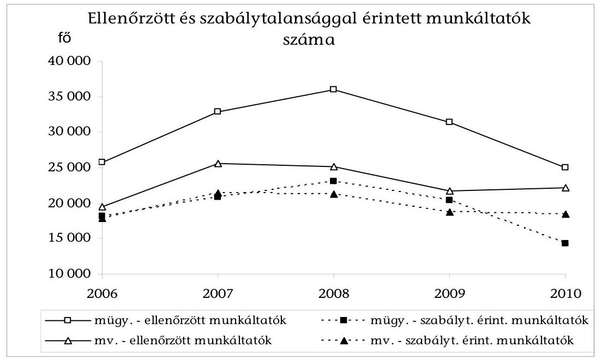

A hatóság 2010-ben 13%-kal kevesebb munkavédelmi, és 24%-kal kevesebb munkaügyi ellenőrzést folytatott le, mint 2007-ben. A 2007. és 2008. évi ellenőrzések kiugró adatait a társhatósági (rendvédelmi szervekkel megerősített) ellenőrzések magas száma eredményezte ${ }^{10}$. A munkavédelmi felügyelők ugyanakkor egy munkáltató ellenőrzésénél egyre több (2007-ben átlagosan négy, 2010-ben 6,9) intézkedést hoztak, a munkavédelmi ellenőrzések szélesebb körűek lettek, kiegészültek a munkaegészségügy ellenőrzésével.

A fekete-foglalkoztatás feltárásának állami és OMMF általi előtérbe helyezésével a feltárt esetek száma fokozatosan, 2007-ben kiugróan (73%-kal) emelkedett. A kedvező folyamat 2008-ra megtört (2. számú ábra).
2. számú ábra
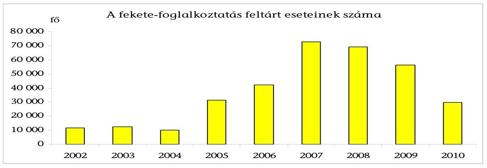

[^0]
[^0]:    ${ }^{10}$ Például a 2007. év végi „Csillagszóró hadműveletben" másfél hónap alatt a munkavédelmi felügyelők az éves ellenőrzések közel 30%-át teljesítették.

---

2010-ben 29869 személynél állapítottak meg fekete-foglalkoztatást, 2007-ben 72743 személynél. A feltárt esetek számának 2007-2010. közötti 59%-os visszaeséséhez az ellenőrzések számának csökkenésén túl hozzájárult az ellenőrzésre kiválasztott, a korábbi tapasztalatok szerint jellemzően feketén foglalkoztató területeken (mobil és szezonális munkavégzés, meghatározott ágazatok) a termelés csökkenése (építőipar), 2010-ben az alkalmi/egyszerűsített munkavállalás szabályozásának módosítása, ehhez kapcsolódóan a tanácsadás előtérbe helyezése ${ }^{11}$, a jogsértés kiemelt hatósági kezelésének megszüntetése. Az OMMF tapasztalatai szerint a kiemelten és visszatérően ellenőrzött területeken érvényesült a hatóság várható megjelenésének visszatartó hatása (Hungaroring). A hatóság ugyanakkor nem ellenőrizte a gazdálkodók közel felét, így a feltárt esetek csökkenéséből nem következik a rejtett gazdaság visszaszorulása.

A felügyelők átlagos (a hatékonyságot jellemző fajlagos) teljesítési mutatói, az ellenőrzés - mennyiségi mutatókkal kifejezett - hatékonysága (egy felügyelőre jutó ellenőrzések, szabálytalan foglalkoztatás feltárt eseteinek, érdemi határozatok, kiemelt intézkedések száma) összességében, a 2007-2008. évi kiugró adatokhoz képest romló tendenciát mutatott. A kedvezőtlen tendencia a munkavédelmi ellenőrzéseknél 2010-ben - a munkaegészségügy szakmai követelmények szerinti ellenőrzésével - megfordult (3. számú ábra).
3. számú ábra
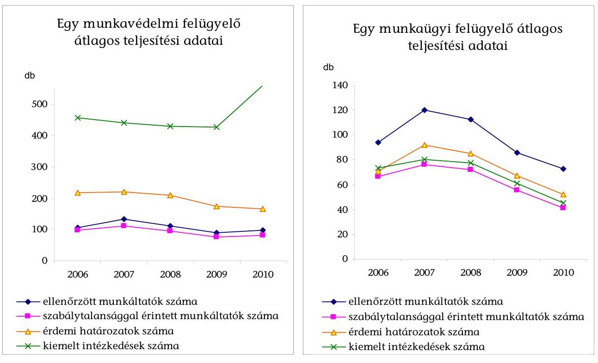

[^0]
[^0]:    ${ }^{11}$ Bajnai Gordon miniszterelnök 2009. július 8-i, az OMMF megbízott elnöke részére küldött levele szerint: „... az első alkalommal előforduló kisebb súlyú szabályszegések jogkövetkezményeként lehetőleg ne szabjanak ki bírságot. Ehelyett a hatóság a jogellenes helyzetet szüntesse meg a jogsértővel együttműködve a szükséges tájékoztatás megadásával..."

---

Egy munkaügyi felügyelő 2010-ben 40%-kal kevesebb munkáltatót ellenőrzött, mint 2007-ben, az egy felügyelőre jutó érdemi határozatok száma 43%-kal csökkent. A további két hatékonysági mutató a munkaügy területén hasonló tendenciát mutatott. A munkavédelmi felügyelők 2010-ben átlagosan 27%-kal kevesebb munkáltatót ellenőriztek, mint 2007-ben, az egy felügyelőre jutó érdemi határozatok száma 26%-kal csökkent. Az ellenőrzések számának csökkenése 2010-ben megállt, az intézkedések száma 2009-hez képest közel 30%-kal nőtt, az intézkedések alapján számított hatékonyság javult.

A hatékonyság csökkenéséhez hozzájárult a szabálytalanságok teljes köre feltárásának szakmai igénye, egyes teljesítménykövetelmények megalapozatlansága, az érdekeltségi rendszer pénzügyi forrásának megszűnése, a társhatósági ellenőrzések csökkenése. A munkavédelmi ellenőrzések hatékonyságának alakulását befolyásolta az új ellenőrzési feladattal kapcsolatos belső szabályok kialakítása, a felügyelők betanítása, képzése, az adminisztratív nyilvántartási feladatok bővülése.

A hatósági tevékenység közvetlen gazdasági környezetében nem történtek olyan változások, amelyek indokolták az ellenőrzések számának, az ellenőrző hatóság „jelenlétének" csökkenését. A hatóság ügyfeleit jelentő gazdálkodó szervezetek száma lényegében stagnált (a működő gazdálkodók száma 2007-ben 688 058, 2008-ban 701 390), a foglalkoztatottak száma a 2007. évi 3901 000-ről 2009-re négy százalékkal csökkent.

Az állami támogatásból kizáró feltételek módosításai a szabályozás felpuhulását eredményezték. A helyenként nem kellően átgondolt, hibás, illetve hiányos szabályok esetenként ellehetetlenítették a hatóság munkáját, és így korlátozták az ellenőrzések visszatartó hatásának érvényesülését.

A jogsértések elkövetőinek ugyanis az ellenőrzés közvetlen következményein kívül (bírság, jogsértés megszüntetésére kötelező határozat) további jogkövetkezményekkel is számolniuk kellett. Nem indulhattak közbeszerzési pályázatokban ajánlattevőként, alvállalkozóként 2005. augusztus 4-től, és nem kaphattak állami támogatást 2006. január
 1-től. A fekete-foglalkoztatás egyik alapvető elkövetési módja, a munkavállaló bejelentésének ${ }^{12}$ elmulasztása azonban csupán 2009. júniustól járt a támogatásból kizárással ${ }^{13}$.

A kizáró feltétel teljesülését az OMMF a jogsértő gazdálkodók adatainak honlapján történő közzétételével igazolta. A kizárási feltétel visszatartó hatása mindössze 9 hónapig érvényesült, mivel a jogalkotó 2010. március 13-tól módosította a törvényi előírásokat ${ }^{14}$. A bejelentések elmulasztása csak akkor

[^0]
[^0]:    ${ }^{12}$ A munkáltatók 2007. január 1-jétől kötelesek bejelenteni a foglalkoztatás megkezdését, megszűnését az APEH részére, és havonta adatot szolgáltatni minden munkavállaló foglalkoztatásáról, az APEH az adatokat az OMMF-nek továbbítja.
    ${ }^{13}$ Az OMMF tapasztalatai szerint a bejelentést elmulasztó gazdálkodók jellemzően munkaszerződést sem kötöttek. Az utóbbi gazdálkodók bekerültek a közzétételre kerülők körébe.
    ${ }^{14}$ Áht. 15. § (5) bek. a) pont és (8) bek.

---

jelentett kizáró feltételt, ha a gazdálkodó egyben a járulékfizetési kötelezettségét sem teljesítette. A járulékok megfizetéséről az OMMF-nek a jogszabályok alapján nem volt információja, a kettős feltétel teljesülését tehát nem tudta megállapítani, így a jogsértő gazdálkodók adatait nem tudta közzétenni. A végrehajthatatlan törvényi szabályozás miatt a bejelentéseket - 2009. június 1-jét követően - elmulasztók 2010. április 12-étől december végéig a közzététel elmaradása miatt nem voltak kizárhatók az állami támogatásokból, így a szabályozás eredeti célja nem teljesült. A közzétett gazdálkodók száma 2009. december 31-én 14 929, 2010. június 30-án 6864 volt. Az OMMF már a törvényi módosítás egyeztetésénél jelezte az együttes feltétel problematikáját. A módosítás hatályba lépése után honlapján nyilvánosságra hozta, hogy a számára előírt feladatot (a jogsértést elkövetők adatainak közzétételét) nem tudja végrehajtani. A hibás szabályozást 2011. január 1-jei hatállyal megszüntették. ${ }^{15}$

Az egyszerűsített foglalkoztatásra vonatkozó törvény ${ }^{16}$ végrehajtási szabályainak és a szükséges technikai feltételek hiánya akadályozta az OMMF-et ellenőrzési feladatainak elvégzésében, a feketemunka feltárásában. Az OMMF elnökének megállapítása ${ }^{17}$ szerint a gazdálkodók és a hatóságok nem tudtak időben felkészülni a törvény végrehajtására (például nem volt biztosított a kötelező nyomtatványok beszerzése, az informatikai rendszer nem épült ki). Az elnök ezért törölte a 2010. évi szakmai követelmények közül a feketemunka feltárásának elvárt mértékére vonatkozó feltételt.

A foglalkoztatáspolitikáért felelős miniszter nem látta el következetesen az OMMF szakmai irányítását, nem gondoskodott a hatósági tevékenység kereteinek kijelöléséről.

A munkaügyi ellenőrzés területén a miniszternek szakmai irányító tevékenysége keretében évente meg kell jelentetnie ${ }^{18}$ az ellenőrzési irányelveket. Az irányelvek részlegesen töltötték be szabályozó funkciójukat, mivel a miniszternek a tervezettel kapcsolatos tartalmi kifogása miatt az irányelvek 2007-ben és 2009-ben nem jelentek meg, 2008-ban és 2010-ben pedig csak a törvényi határidőt követően. Az irányelveket az OMMF állította össze, amit miniszteri jóváhagyás után tettek közzé.

A munkavédelem területén a miniszter szakmai irányítási jogosultsága más módon érvényesült. A munkavédelem Országgyűlés által elfogadott középtávú programja (MOP) intézkedési terveinek előkészítése, a teljesítésről szóló beszámoló előterjesztése a miniszter felelőssége volt, aki az OMMF közreműködésével látta el a feladatot. A 2008-ban elkészült és benyújtott, 2009 októberében ismételten benyújtott, a MOP-ot lezáró jelentést a Kormány nem tűzte napirendre,

[^0]
[^0]:    ${ }^{15}$ 2010. évi CLIII. törvény a Magyar Köztársaság 2011. évi költségvetését megalapozó egyes törvények módosításáról, 10. § (7) bek.
    ${ }^{16}$ 2010. évi LXXV. törvény az egyszerüsített foglalkoztatásról.
    ${ }^{17}$ Az OMMF elnökének 2010. július 6-ai levele a munkaügyi felügyelőségek igazgatóinak.
    ${ }^{18}$ Met. 2/A §.

---

az OMMF a beszámolót 2010 októberében ismételten felterjesztette a minisztériumnak ${ }^{19}$. A következő nemzeti munkavédelmi politika tervezetét az OMMF még a 2008. évben elkészítette, amely 2011. március 11-ig nem került a Kormány elé.

Az OMMF működésében változást jelentett az ellenőrzési feladat tartalmi bővülése (munkaegészségügy), a létszámkeretek fokozatos betöltése. A szervezet krízishelyzetként élte meg ${ }^{20}$ az OMMF vezető munkatársaival szemben indított nyomozati eljárásokat ${ }^{21}$. Bizonytalanságot, bizalmi válságot okozott az elnök személyének többszöri változása és a feladatkör átmeneti jellegű betöltése, valamint a 2010 szeptemberétől ismert ${ }^{22}$, 2011-től bekövetkezett szervezeti változás $^{23}$.

Az OMMF vezetésének intézkedései elsősorban a hatósági ellenőrzési feladatok ellátását közvetlenül meghatározó feltételek biztosítására irányultak, kialakították és működtették a tevékenység szabályozási, kontroll kereteit. A vezetés ugyanakkor nem alakította ki a hatósági ellenőrzést közvetetten vagy hosszabb távon befolyásoló célok és feltételek követelményrendszerét, és nem intézkedett azok megvalósításáról. Ebben szerepet játszott, hogy a miniszter nem minden évben adta ki a munkaügyi ellenőrzés irányelveit, valamint a MOP-ot lezáró értékelés elmaradt. A hatóság nem rendelkezett átfogó szervezeti stratégiával. Nem rögzítették a középtávon (3-5 év távlatában) elérni kívánt ellenőrzési célokat, a megvalósításukhoz szükséges szakmai és egyéb - szervezeti, létszám, informatikai - lépéseket.

Az OMMF véleménye szerint „középtávú munkavédelmi feladatokat súlyozottan tartalmazó nemzeti program nélkül a munkavédelmi hatóság saját stratégiát érdemben nem tud alkotni".

Az ellenőrzések előkészítése részlegesen járult hozzá a hatóság eredményes és hatékony feladatellátásához. Az éves ellenőrzési tervben és a munkáltatók kiválasztására is kiterjedő belső szabályozásban kezelték az ellenőrzési kockázat egyes elemeit. A korábbi tapasztalatok alapján kijelölték az ellenőrzések tartalmi súlypontjait, a munkavállalókat veszélyeztető helyzeteket, ágazatokat, tevékenységet, ami elősegítette a jogsértések feltárását.

[^0]
[^0]:    ${ }^{19}$ Az NGM 2011. március 10-ei tájékoztatása szerint kezdeményezték a beszámoló államigazgatási egyeztetését, ezt megelőzően az OMMF aktualizálja az összeállítást.
    ${ }^{20}$ Az OMMF 2009. február 6-án megtartott munkavédelmi igazgatói értekezlet emlékeztetője.
    ${ }^{21}$ A Nemzeti Nyomozó Iroda 2010. augusztus 2-ai közleménye szerint jogtalan változtatásokat hajtottak végre az OMMF hatósági nyilvántartásában, valamint munkaügyi eljárások megállapításainak megváltoztatására adtak jogtalan utasítást.
    ${ }^{22}$ 1191/2010 (IX. 14.) Korm. határozat a területi államigazgatási szervezetrendszer átalakítását megalapozó intézkedésekről.
    ${ }^{23}$ A 314/2010. (XII. 27.) Korm. rendelet szerint a felügyelőségek 2011. január 1-jétől a területi kormányhivatalokhoz tartoznak. A szakmai irányítás továbbra is az OMMF feladata.

---

A mennyiségi és minőségi követelményeket, a teljesítés mérőszámait tartalmazó ellenőrzési tervet a felügyelőségek számára szakmai minimumkövetelmények formájában határozták meg. A szakmai főosztályok a felügyelők átlagos teljesítménykövetelményeit is előírták, teljesítésük az előírt szakmai követelmények automatikus megvalósulását jelentette. Az ellenőrzések mintegy 85-90%-ában annak ügyfelét, helyszínét a felügyelő választotta ki. A kiválasztásban rejlő korrupciós kockázat csökkentése érdekében a régió/megye területének felügyelők közötti felosztását időszakonként megváltoztatták.

Az éves ellenőrzési tervhez és a munkáltatók ellenőrzésre kiválasztásához ugyanakkor nem állt rendelkezésre az ellenőrzési tapasztalatokat és a meglévő információkat teljes körűen hasznosító, az ellenőrzési kockázatot, a korrupciós veszélyt kezelő rendszer.

Az OMMF véleménye szerint ilyen rendszer kialakításához a hatóságnak sem szervezeti, sem anyagi erőforrás nem állt rendelkezésére.

A jogszabályok alapján a gazdálkodók által jelentett információk, a hatósági ellenőrzések adatai részlegesen hasznosultak az ellenőrzések tervezésében, lefolytatásában. A felügyelőségek részére - építkezés, azbesztmentesítés megkezdéséről - jelentett egyes adatok ellenőrzési, elemzési célú hasznosításához az adatok nem kerültek országos adatbázisba, a szakmai vezetés számára nem voltak teljes körűen elérhetők. A rákkeltő anyagokkal, technológiával történő munkavégzésre vonatkozó bejelentések rögzítése biztosította az adatszolgáltatást a rákregiszter felé, a felügyelői ellenőrzések tervezésére azonban a nyilvántartás nem volt alkalmas.

Az OMMF nem fogalmazott meg igényt országos foglalkoztatási adatbázisának (EMMA) szélesebb körű, a bejelentések ellenőrzésén kívüli felhasználására. Nem használták fel az adatokat a munkaerőpiac területi, szakmai létszám szerinti összetétele alakulásának nyomon követésére, az információk alapján a szabálytalanságok kockázatának becslésére. A felügyelők a gazdálkodók bejelentéseit papíron vagy elektronikusan tárolták, a gazdálkodókat esetlegesen ellenőrizték ${ }^{24}$. Az OMMF 2010-re előírta a munkavédelmi szakmai követelményekben a bejelentésekhez kapcsolódó ellenőrzések lefolytatását. Az EMMÁ-t, valamint a lefolytatott ellenőrzések adatait tartalmazó nyilvántartást (Felügyelők Ellenőrzési Információs Rendszere, FEIR) a már kiválasztott gazdálkodók ellenőrzésére történő felkészüléshez használták fel.

Az OMMF véleménye szerint nem áll rendelkezésükre olyan naprakész gazdálkodói adatbázis, amely a véletlen kiválasztást, illetve egyéb mintavételi eljárások alapját képezhetnék. Az ÁSZ álláspontja szerint az OMMF a számára hozzáférhető adatbázisok (EMMA, KSH gazdálkodói adatbázis, a FEIR rendszerben az évek során felhalmozott ellenőrzési adatok) tartalma kiindulási alapként szolgálhat a kockázat alapú kiválasztási rendszer megtervezéséhez.

[^0]
[^0]:    ${ }^{24}$ Összefoglaló jelentés munkaegészségügyi célvizsgálatról, OMMF Munkavédelmi Főosztály, 2009. május 31.

---

Az ellenőrzések 90%-át 4-5 ágazatban folytatták le ${ }^{25}$, így a hatóság nem szerzett elégséges ismeretet a többi ágazatba tartozó, az összes munkáltató mintegy felét kitevő munkáltatóról, az általuk elkövetett jogsértések kockázatáról. A foglalkoztatottak mintegy 40%-ának munkát adó gazdálkodókra évenként az ellenőrzések mintegy 10%-a jutott, körükben az ellenőrzések visszatartó hatása korlátozottan érvényesült. A baleseti statisztikák a kiemelten ellenőrzendő ágazatok arányát, a munkavédelmi ellenőrzések mintegy 60-70%-át alapozták meg.

A területi munkaügyi felügyelőségek az ellenőrizendő munkáltatók és a feketemunkások számára vonatkozó belső előírást a vizsgált években nem teljesítették, amelynek következtében az OMMF folyamatosan csökkentette a szakmai követelményt. 2008-ban az elvárt 40 000 helyett összesen 36 026, 2009-ben pedig 38 000 helyett 31 431 munkáltatót ellenőriztek. 2010-re az OMMF összesen 33 500 munkáltató ellenőrzését írta elő, ebből 25 056 munkáltató ellenőrzését teljesítették a felügyelőségek. A munkaügyi ellenőrzési terv egyes számszerű célkitűzései nem voltak megalapozottak, a teljesítés és a követelmény eltérésének okait nem elemezték.

A munkaügyi ellenőrzések gazdálkodókra gyakorolt hatásairól az OMMF-nek nincs információja. A hatóság ott sem értékelte az ellenőrzések hatását, ahol bizonyos kontroll információk a rendelkezésére álltak (fekete-foglalkoztatás feltárt eseteinek tartós rendezése). A munkavédelem területén kedvező, hogy a baleseti statisztika szerint a munkabalesetek száma a 2003. évi 25 745 esetről 2007-re fokozatosan 20 922 esetre, 2009-re pedig 18 454 esetre mérséklődött, (2010-re 19 948-ra emelkedett). A halálos balesetek 100 000 munkavállalóra jutó gyakorisága a 2003. évi 3,4-ről 2007-ben 3,0-ra, 2009-ben 2,6-ra, 2010-ben 2,5-re mérséklődött. Az OMMF az ellenőrzések tapasztalatait felhasználta jogszabály-módosítások kezdeményezésére többek között a fővállalkozói felelősség Met.-ben és Mvt.-ben történt szabályozásánál, valamint az alkalmi munkavállalás szabályainak módosításánál.

A létszám területi elosztása nem biztosította, hogy a különböző régiók gazdálkodóinál hasonló eséllyel induljon ellenőrzés. A létszám szakmai és területi elosztására a feladatokból kiinduló, mutatószámokon alapuló elemzések nem álltak rendelkezésre. A megnövelt létszámkeretet az elnök osztotta el, figyelembe véve a kialakult arányokat és a régiók igényeit. Az OMMF szakterületek közötti létszámarányai 2007-2009 között gyakorlatilag nem változtak. A központ és a régiók létszámaránya 1:4, a felügyelők összlétszámon belüli aránya 61-64%, a régiók összlétszámában 78% volt.

[^0]
[^0]:    ${ }^{25}$ A munkavédelmi ellenőrzések az építőipar, a feldolgozóipar és azon belül külön a gépipar, a mezőgazdaság, a kereskedelem és vendéglátás területére koncentráltak, a munkaügyi ellenőrzéseknél a felsoroltakon kívül a nyomozási, biztonsági tevékenységet végzőket is kiemelten kezelték.

---

A felügyelők
 létszámának megoszlása eltért a munkáltatók és foglalkoztatottak területi megoszlásától ${ }^{26}$ (4. számú ábra). Az ellenőrzések valószínűségét illetően, egy munkaügyi felügyelőre 2009-ben Észak-Magyarországon 1273, Közép-Magyarországon 3120 gazdálkodó jutott, egy munkavédelmi felügyelőre 1608, illetve 5049 gazdálkodó. Mindhárom évben e két régió gazdálkodóinak volt a legkisebb, illetve legnagyobb esélye az ellenőrzésre, a létszám növelésével az „esélyegyenlőtlenség" minimálisan csökkent (a munkaügyi területen a 2,7-szeres különbség 2,5-szeresre, a munkavédelemnél a 3,3-szeres különbség 3,1-szeresre).
4. számú ábra
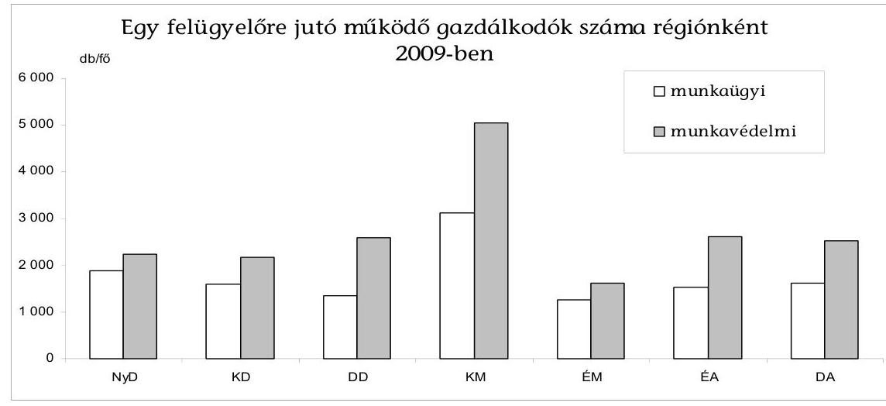

Az EU a munkaügyi ellenőrzések területén a 10%-os lefedettség elérését javasolja. Az OMMF statisztikái nem tartalmaztak mutatót az ellenőrzések lefedettségének mérésére. Ellenőrzésünk számításai szerint az OMMF-nek a lefedettségre vonatkozó 2008. évi 6%-os, valamint a 2010. évi 5%-os célja nem teljesült, a munkaügyi szabályok megtartását a működő gazdálkodók 5,1%-ánál, illetve 3,6%-ánál ellenőrizték.

Az OMMF meghatározta a felügyelők felkészültségének, a hatósági ellenőrzések szakszerű és törvényes lefolytatásának, a jogsértések elbírálásának, a hatósági nyilvántartások vezetésének követelményeit, kialakította a teljesítést megalapozó feltételeket. A belső szabályozás és a tevékenység folyamatos kontrollja elősegítette a hatósági ellenőrzések szakszerű és törvényes lefolytatását.

Elnöki utasítás rendelkezett a munkaügyi és munkavédelmi ellenőrzések általános követelményeiről, valamint az ellenőrzés szakmai és eljárási szabályait, iratmintáit tartalmazó felügyelői kézikönyvek használatáról ${ }^{27}$. A központi irányító szerv a jogszabályok és módosításaik értelmezésére és alkalmazására

[^0]
[^0]:    ${ }^{26}$ A felügyelők területi eloszlása hasonló módon eltér a foglalkoztatottak területi megoszlásától, lásd a Részletes megállapítások 11. ábráját.
    ${ }^{27}$ Az OMMF elnökének 8/2009. számú utasítása a munkaügyi és munkavédelmi ellenőrzéssel kapcsolatos egyes követelményekről.

---

iránymutatásokat, módszertani útmutatásokat jelentetett meg. Az igazgatók a belső kontrollrendszer működtetésével, a megyei irodák vezetőinek rendszeres beszámoltatásával, iratanyagok áttekintésével felügyelték az eljárások szabályszerűségét. A szakmai utasítások, iránymutatások végrehajtását témafelelősi rendszer kialakításával, régiós és megyei értekezletek tartásával segítették.

Elsőfokú hatósági jogkörrel a felügyelők és a felügyelőségek rendelkeztek (az ellenőrzések területén). Az elsőfokú hatósági tevékenység rendszeres, utólagos kontrollját jelentette a központi szakmai felügyeleti ellenőrzések lefolytatása. A felügyeleti vizsgálatokban a joggyakorlat, az ügyintézés mellett a vezetői kontrollt is értékelték. A hatósági nyilvántartás megbízhatóságának biztosítására a hatóság az adatok kettős kontrollját írta elő ${ }^{28}$.

A bírságolási gyakorlatban törekedtek az egységes kivetésre, a behajtás biztosítására, alkalmazták a hatóság rendelkezésére álló eszközöket. Az Mvt. és a Met. több szempont (a jogsértés típusa, veszélyessége, ismételt jellege, a gazdálkodó létszáma, a veszélyeztetett munkavállalók száma stb.) figyelembevételét írja elő a hatóság számára a bírság megállapításánál. A szakmai főosztályok a jogsértések kategorizálásával, bírságtábla összeállításával segítették annak meghatározását. A felügyelőségek bírságolási gyakorlatában megmutatkozó különbségeket az éves munka értékelésénél számszerűsítették.

A jogorvoslati eljárások a hatósági ellenőrzés szabályszerűségének javulását mutatják. Az elsőfokú határozatokra benyújtott fellebbezések aránya 2010-ben alacsonyabb volt, mint 2007-ben (a munkavédelemnél 1,2% és 2,3%, a munkaügynél 5,2% és 9,6%). A másodfokú határozatok módosítására kezdeményezett, a tárgyévben lezárt perek közül az elveszített perek aránya ingadozott (a munkavédelmi pereknél 7-19%, a munkaügyi pereknél 11-16% között).

A korrupció elleni küzdelem előtérbe kerülésével ${ }^{29}$ 2007-ben az OMMF belső utasításban meghatározta a munkavédelmi és munkaügyi felügyelők magatartási követelményeit. A felügyelők oktatáson vettek részt a korrupciós helyzetekre történő felkészüléshez. Az OMMF Korrupció Elleni Stratégiáját csak három évvel később, 2010 nyarán fogadta el a megbízott elnök. A stratégia végrehajtásának további lépéseit a korrupciós kockázati térkép alapozta meg, a térkép azonnali intézkedéseket nem határozott meg.

A jogsértő állapot megszüntetésének kikényszerítésére az utóellenőrzés eszközét csak meghatározott jogsértéseknél (fekete-foglalkoztatás) alkalmazták, ezért az utóellenőrzés a hatósági tevékenység visszatartó hatását korlátozottan erősítette. A munkaügyi ellenőrzés módszertana és az éves szakmai követelmények csak (az érdemi felügyelői intézkedések 2009-ben mintegy 60%-át adó) feketemunka megszüntetésének utóellenőrzését írták elő. ${ }^{30}$ A munkavédelmi felügyelőnek a veszélyes körülményeket azonnal megszüntető (az érdemi intézkedések mintegy 20%-át kitevő) intézkedést követően, az egészséget és biztonságot védő munkafeltételek kialakítását kellett utólag ellenőriznie. Az OMMF kimutatásai szerint a munkáltatók túlnyomó többsége, mintegy 92%-a teljesítette az előírásokat.

A bírságok behajtásának az OMMF rendelkezésére álló eszközeit alkalmazták, a szükséges szervezeten belüli munkamegosztást (a központ feladata a pénzügyi intézkedések, a felügyelőségek a munkáltatóval tartott napi kapcsolatban intézkednek a bírság teljesítésére) kialakították. A bírságkövetelések év végi záró állománya - a munkaügyi bírság kintlévőségei miatt - a 2007. évi 9,1 Mrd Ft-ról 2009-ben 9,4 Mrd Ft-ra emelkedett, miközben a kivetett bírság összege csökkent.

Az ellenőrzések visszatartó hatásának érvényre jutása érdekében az OMMF élt a nyilvánosság és a tájékoztatás eszközével. A tevékenységről szóló beszámolók számszerű információkat tartalmaztak, pozitív és negatív példákat mutattak be a szabályszerű foglalkoztatás megvalósulásáról. A munkavédelmi tanácsadó szolgálat 2010-ben 40224 telefonos és személyes megkeresésre adott választ gazdálkodóknak és munkavállalóknak. A Kormánynak szóló beszámolók tájékoztatást adtak a jogsértések előfordulásairól, a hatóság intézkedéseiről.

A szervezet szakmai tevékenységét és ügyviteli folyamatait lefedő FEIR rendszer támogatja az ellenőrzések eredményeinek (látogatási lap, jegyzőkönyv, határozatok, végzések) rögzítését és azok utólagos elérését, áttekintését. A rendszer nem felel meg azonban több olyan feltételnek, követelménynek, amelyek egy korszerű, integrált rendszertől elvárhatóak lennének. Gyakori a duplikált adatbevitel, a lekérdezési lehetőségek nehézkesek és korlátozottak, a logikai ellenőrzés lehetőségeit nem használja ki. A FEIR kialakítására kötött „felhasználói" szerződés nem rendelkezett egyértelműen a szoftver későbbi módosításának, fejlesztésének feltételeiről, ez a hatóság egyfajta kiszolgáltatottságához vezetett. A FEIR teljes megújítása a 2007-2009. években folyamatosan napirenden volt, a végrehajtott módosításokkal a működés változását (feladatok változása, jogszabály-módosítások) követték.

A nyilvántartások informatikai biztonságának belső szabályait elkészítették. A biztonsági rendszer egyes elemei működnek (jogosultsági rendszer, naplózás), ugyanakkor a működés kockázatát növelte, hogy a helyszíni vizsgálat idején a rendelkezések betartását ellenőrző, az OMMF adatbiztonsággal kapcsolatos felelősi feladatait ellátó informatikai biztonsági felelős felmentését töltötte.

[^0]
[^0]:    ${ }^{28}$ Az OMMF elnökének 39/2009. számú utasítása az egyes munkaügyi, illetve munkavédelmi jogsértések hatósági nyilvántartásával és a be nem jelentett munkavállalók hatósági nyilvántartásával, valamint e nyilvántartásokhoz kapcsolódó, és az akkreditációs eljárás alapjául szolgáló hatósági bizonyítvány kiállításával kapcsolatos feladatokról.
    ${ }^{29}$ 1037/2007. (VI. 18.) Korm. határozat a korrupció elleni küzdelemmel kapcsolatos feladatokról.

---

A helyszíni ellenőrzés megállapításainak hasznosítása mellett javasoljuk:

# a nemzetgazdasági miniszternek a foglalkoztatáspolitikáért való felelőssége körében 

1. Vizsgálja felül a jogszabályok alapján rendelkezésre álló adatok, információk körét a hatósági ellenőrzésben való hasznosíthatóság szempontjából és biztosítsa a nyilvántartások adatainak a hatósági munkát támogató felhasználhatóságát.
2. A Met. előírásainak megfelelően - az aktuális foglalkoztatási folyamatokra, célkitűzésekre és jogszabályváltozásokra is tekintettel - számonkérhető módon határozza meg és évente tegye közzé a munkaügyi ellenőrzés irányelveit.

## az OMMF elnökének

1. Gondoskodjon a hatósági ellenőrzés középtávú stratégiájának kidolgozásáról.
2. Alakítsa ki az ellenőrzési stratégiára alapozva a gazdasági környezetről és a korábbi ellenőrzésekről rendelkezésre álló információkat hasznosító, az ellenőrzési kockázatokat (beleértve a korrupciós kockázatokat is) kezelő kiválasztási rendszert.
3. A felügyelők fajlagos teljesítési mutatóinak elemzése alapján határozza meg a felügyelőktől alapkövetelményként elvárt ellenőrzési teljesítményt, ami alapul szolgál az OMMF éves szakmai követelményeinek megállapításához.

---

# II. RÉSZLETES MEGÁLLAPÍTÁSOK 

## 1. A MUNKAVÉDELMI ÉS A MUNKAÜGYI HATÓSÁGI ELLENŐRZÉSEK EREDMÉNYEI

A munkavédelmi és a munkaügyi hatóság eljárása a munkáltató telephelyén, a helyszíni látogatással kezdődik. A felügyelőnek a vonatkozó hatályos jogszabályok (Mvt., Met., Ket., Szabs. tv.) alapján kell eljárnia és az előírások szerinti döntéseket hozhatja. Végzésben tájékoztatja a munkáltatót a hatósági eljárás megindításáról, annak lezárásáról. Kevés munkavállalót érintő, nem súlyos szabálytalanság esetén figyelemfelhívást alkalmaz, felhívja a munkáltatót a hiba kijavítására, szabálysértési eljárást folytat le. Súlyosabb esetekben a munkáltató határozatot kap a hatóság döntéseiről, kötelező rendelkezéseiről, a bírság kivetéséről. A felügyelő kötelezettsége, hogy intézkedjen a dolgozó egészségét súlyosan veszélyeztető körülmények azonnali megszüntetéséről, megtiltsa a veszélyt eredményező anyag, munkaeszköz, technológia használatát/alkalmazását, felfüggessze a veszélyeztető tevékenységet, határidőt tűzzön ki a jogsértés megszüntetésére, a szabályos állapot helyreállítására, így például a dolgozó bejelentésére, a munkaidővel-szabadsággal kapcsolatos előírások betartására, a munkabér kötelező minimumának megfizetésére. (A hatósági ellenőrzési folyamat sematikus vázlatát az 1. számú melléklet tartalmazza.)

A hatóság ellenőrzési tevékenysége akkor eredményes, ha feltárja a jogsértő helyzeteket, és az ellenőrzés közvetlen következményeként a munkáltatók megszüntetik azokat. Hosszabb távú, közvetett hatásaként érvényesül a jogsértések elkövetésétől visszatartó ereje. A felügyelők létszámának emelésétől a tevékenység fokozását várták, ami megmutatkozik a tevékenységet jellemző mutatók emelkedésében.

Az ÁSZ a hatósági ellenőrzések alakulásáról, eredményeiről mennyiségi mutató (az ellenőrzött munkáltatók, úgy is, mint az ellenőrzések száma) és a szabálytalanságok feltárását jelző eredménymutatók (a szabálytalanul foglalkoztatott munkavállalók száma, az ellenőrzött munkáltatók között a szabálytalanságot elkövetett foglalkoztatók aránya, egy ellenőrzésnél a jogsértések megszüntetésére hozott érdemi határozatok és intézkedések száma) alakulása alapján mond véleményt. Hatékonysági mutatóként a mennyiségi és eredménymutatók egy felügyelőre számított adatait értékeltük. A mutatók alakulását - és azok különböző szempontok szerinti bontását - az OMMF folyamatosan figyelemmel kísérte, számszerűen kimutatta.

### 1.1. Az ellenőrzések mennyiségét és eredményeit jellemző mutatók alakulása

A mutatók alakulása szerint a humán kapacitásban bővülő hatóság nem ért el stabil eredményeket, teljesítésének változása irányában és dinamikájában nem volt egyenletes. Az ellenőrzések mennyiségének 2007. évi ugrásszerű emelkedését 2009-ben visszaesés követte. A változások a területi fel-

[^0]
[^0]:    ${ }^{30}$ Az OMMF véleménye szerint „a felügyelőségeknek az ellenőrzés-számok megtartására kellett törekedniük, így nem volt elvárható, hogy a bejelentések teljesítésének vizsgálatán túl egyéb jogsértések esetében is teljesítsék az utóellenőrzést. Az ellenőrzések és az utóellenőrzések száma együtt nem növelhető."

---

ügyelőségeket egyöntetűen jellemezték. A csökkenő tendencia a munkaügy területén 2010-ben is folytatódott (1. számú ábra). A hatóság 2010-ben 13%-kal kevesebb munkavédelmi, és 24%-kal kevesebb munkaügyi ellenőrzést folytatott le, mint 2007-ben. Az ellenőrzött gazdálkodók számának módosulásával a megállapított, szabálytalansággal érintett munkáltatók és a szabálytalan körülmények között munkát végzők száma is ingadozott (5. számú ábra). Az ellenőrzések számának 2006. év előtti adatai nem állnak rendelkezésre, így az ingadozások egyedi vagy ismétlődő jellege nem ítélhető meg ${ }^{31}$. (A mutatók számszerű alakulását a 2., 3. és 4. számú mellékletek tartalmazzák.)

Egy-egy felügyelőség kivételével valamennyi felügyelőségen nőtt 2007-ben és csökkent 2009-ben az ellenőrzések száma.
5. számú ábra ${ }^{32}$
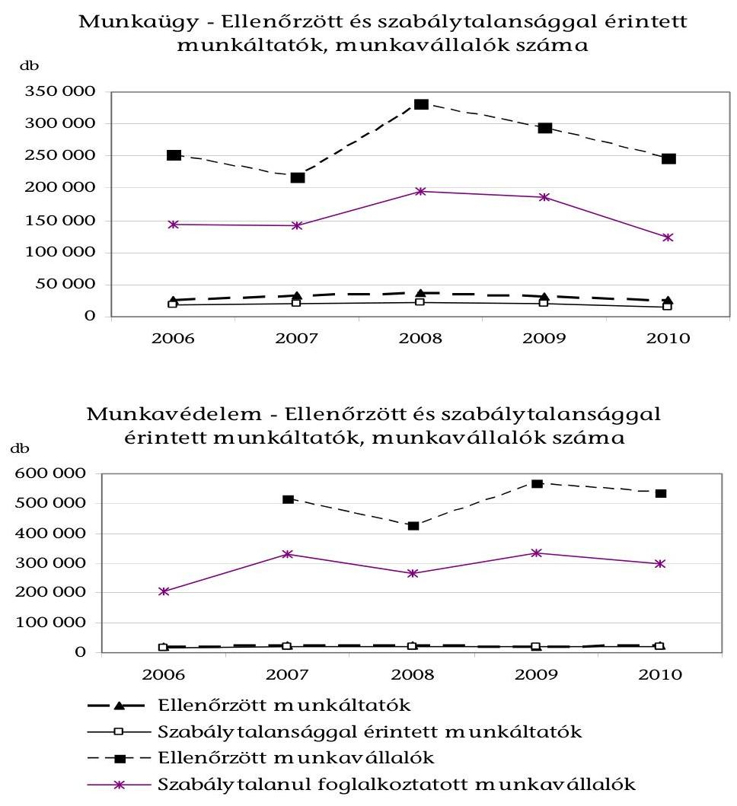

[^0]
[^0]:    ${ }^{31}$ A mutató alakulásának visszamenőleg hosszabb idősorra alapozott elemzésére nem volt mód, mivel ugyanazon tartalmú adatok nem álltak rendelkezésre. 2006-ot megelőzően nem az egyes gazdálkodókra, hanem a telephelyeken elvégzett ellenőrzések számára van adat.
    ${ }^{32}$ A munkavédelemben ellenőrzött munkavállalók 2006. évi száma teljeskörűen nem állt rendelkezésre, mivel a létszám adat gyűjtése 2006-ban indult.

---

A több ellenőrzéssel 2007-ben arányukat tekintve kevesebb munkáltatónál és több foglalkoztatottnál állapítottak meg jogsértő körülményeket. A feltárási arányok 2007-től tendenciájukban csökkentek.

A munkavédelmi ellenőrzések során 2006-ban
 az ellenőrzött munkáltatók 92%-ánál, 2007-ben 84%-ánál, 2009-ben 86%-ánál, 2010-ben 84%-ánál állapítottak meg szabálytalanságot, a munkaügyi ellenőrzéseknél az arány 71%, 64%, 65%, illetve 57% volt. Törvényt sértő munkafeltételeket, körülményeket állapítottak meg a munkavédelmi felügyelők 2007-ben a létszám 64%-ánál, 2009-ben 59%-ánál és 2010-ben 56%-ánál, a munkaügyi felügyelők 2006-ban az ellenőrzött foglalkoztatottak 57%-ánál, majd 65%-ánál, 63%-ánál, illetve 50%-ánál.

A Kormány az OMMF-től a fekete-foglalkoztatás visszaszorításában történő közreműködést várta el. A hatóság 2004 óta eredményes volt a feketemunka feltárásában, a kedvező tendencia 2008-ban megtört (2. számú ábra és 1. számú táblázat). A tendencia megfordulásának okait a hatóság nem értékelte.

1. számú táblázat

A fekete-foglalkoztatás feltárt eseteinek száma

| Év | 2004 | 2005 | 2006 | 2007 | 2008 | 2009 | 2010 |
| :-- | :--: | :--: | :--: | :--: | :--: | :--: | :--: |
| Esetszám (db) | 10025 | 31252 | 42147 | 72743 | 69075 | 56206 | 29869 |

A feketemunka ellenőrzése kiterjedt a munkaszerződésre (pl. írásbeliség), a foglalkoztatás munkáltató általi bejelentésére, a külföldi foglalkoztatásához szükséges engedély meglétére, az alkalmi munkavállalás stb. szabályainak betartására.

Minden munkáltató köteles bejelentést tenni és havonta adatokat közölni az általa foglalkoztatott személyekről az APEH-nek, amely a megfelelő adatokat továbbítja az OMMF részére. Az OMMF vezeti az Egységes Munkaügyi Adatnyilvántartást (EMMA), amelynek lekérdezésével ellenőrizhető a bejelentés megtörténte.

A feltárt esetek számának 2007-2010. közötti lényeges (59%-os) visszaeséséhez az ellenőrzések számának csökkenésén túl hozzájárult az ellenőrzésre kiválasztott, a tapasztalatok szerint a fekete-foglalkoztatást szempontjából kockázatos területeken (mobil és szezonális munkavégzés, meghatározott ágazatok) a termelés csökkenése (építőipar), 2010-ben az alkalmi/egyszerűsített munkavállalás szabályozásának módosítása, a jogsértés kiemelt hatósági kezelésének megszüntetése. A visszatérően ellenőrzött területeken érvényesülhetett a hatósági ellenőrzéssel való fenyegetettség visszatartó hatása (Hungaroring, F1). A hatóság ugyanakkor nem ellenőrizte a gazdálkodók közel felét, a feltárt esetek csökkenéséből nem következik a rejtett gazdaság visszaszorulása.

Az OMMF ellenőrzési tevékenységét a gazdasági környezet, a jogi szabályozás és a belső feltételek határozták meg. A hatósági tevékenység közvetlen gazdasági környezetében nem történtek olyan változások, amelyek indokolták az ellenőrzések számának, a szabálytalanságok feltárásának ingadozásait, az ellenőrző hatóság „jelenlétének" csökkenését. A hatóság ügyfeleit jelentő gazdálkodó szervezetek száma lényegében

---

stagnált, a munkát végző foglalkoztatottak száma kis mértékben csökkent. A működő vállalkozások és a foglalkoztatottak régiók közötti megoszlásában gyakorlatilag nem - a statisztika szerint néhány tized százalékponttal - történt változás (lásd az 5. számú mellékletet). A változások nem indokolták a hatósági ellenőrzések számának csökkentését.

A működő vállalkozások száma 2006-ban 698 146, 2008-ban 701 390 volt, a regisztrált gazdálkodók számának 1,3 millióról 1,7 millióra emelkedését az őstermelők regisztrációba vonása okozta. A foglalkoztatottak száma a 2006. évi 3 930 100-ról 2010-re négy százalékkal csökkent ${ }^{33}$.

A határozatok száma a munkaügyi és a munkavédelmi eljárások sajátosságait kifejezve, a szabálytalan munkáltatók számával arányosan változott (6. számú ábra).

A jogsértés megállapítását követően egy - szabálytalanságot elkövetett - munkáltató átlagosan 2006-ban és 2009-ben 2,2, továbbá 2010-ben 2 darab érdemi munkavédelmi, illetve 1,1 - 1,2, 2010-ben 1,3 darab munkaügyi határozatot kapott.

A munkaügyi felügyelők egy határozatban rendelkeznek büntetés megfizetéséről és a szabálytalanság megszüntetéséről, a munkavédelmi felügyelők külön határozatot bocsátanak ki enyhébb szabálytalanság elkövetésénél (szabálysértési bírság), a munkavédelmi bírságról és az egyéb intézkedésekről. A hatósági eljárás akadályozása, vagy a hiba kijavításának elmulasztása esetén eljárási bírságról hoznak határozatot.

# A munkavédelmi ellenőrzések számának csökkenése mellett, az intézkedések száma alapján a jogsértések feltárása átfogóbbá, összetettebbé vált. 

6. számú ábra
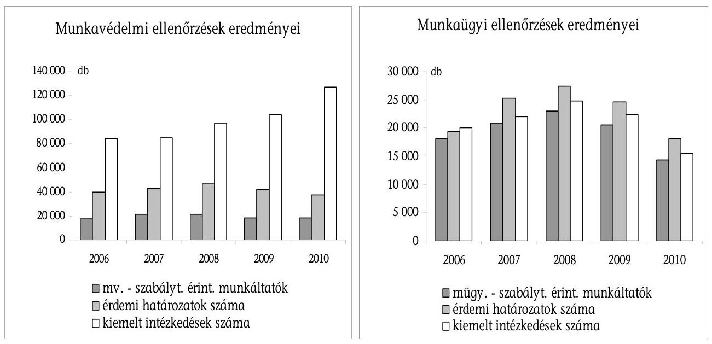

[^0]
[^0]:    ${ }^{33}$ Forrás: KSH Stadat adatbázis.

---

Egy ellenőrzés során mintegy 50%-kal több intézkedést hoztak 2009-ben, mint 2006-ban, az intézkedések száma 2010-ben tovább emelkedett.

Az adatok szerint a munkavédelmi ellenőrzések számának megnövelése együtt járt az egy gazdálkodóra eső intézkedések számának csökkenésével (2007-ben az egy ellenőrzésre eső intézkedések száma a 2006. évi 4,7-ről 4,0-ra csökkent), majd az ellenőrzések számának csökkenését az intézkedések számának növekedése követte. Egy szabálytalan munkáltatónál egyre több területen intézkedtek, az intézkedések átlagos száma 2008-ban 4,6, 2009-ben 5,6 és 2010-ben 6,9.

A munkaügyi jogsértést elkövetett gazdálkodóknál a vizsgált időszakban átlagosan 1,1 intézkedés történt, a munkaügyi ellenőrzések összetettebbé válása nem mutatható ki. A feketemunkával érintett munkavállalók esetén - jogviszony hiányában - a hatóságnak más munkaügyi jogsértés megállapítására nincs módja.

A feketemunkával kapcsolatos intézkedések arányának csökkenésével párhuzamosan a munkaügyi nyilvántartások és a munkaidő szabályok betartásával kapcsolatos intézkedések aránya 13%-ról 24%-ra (a 2006-ban érvényes arányra), 2010-ben 28%-ra változott.

# A gazdálkodók jogkerülő magatartásának tapasztalatai alapján az OMMF kezdeményezte a jogszabályok módosítását. 

Az alkalmi munkavállalók jogviszonyának átmeneti rendezésének gyakorlata alapján javasolták az egyszerűsített foglalkoztatás esetén is a bejelentés kötelezettségét, amit előírtak a törvényben.

Az ellenőrzések gazdálkodókra gyakorolt hosszabb távú hatásait, a jogkövető magatartás terjedését az OMMF nem értékelte. A jogsértések ismételt elkövetésének alakulását nem elemezte annak ellenére, hogy a jogsértések ismétlődő jellegét a bírság megállapításánál figyelembe kellett venni. A hatóság a fekete-foglalkoztatás területén azokban az esetekben sem értékelte az ellenőrzések hatását, ahol bizonyos kontroll információk a rendelkezésére álltak.

A munkaügyi felügyelők az EMMA-ból lekérdezték, hogy a be nem jelentett munkavállalókat a munkáltató bejelentette-e a hatósági eljárás időszakában, a határozat meghozatala előtt. 2009-ben a 9299 feketén foglalkoztató munkáltató utóellenőrzésénél megállapították, hogy 79%-uk helyreállította a jogszerű állapotot. A bejelentések „tartósságát" nem elemezték.

### 1.2. A felügyelők átlagos teljesítményét jellemző mutatók

Az ingadozó összteljesítményt (ellenőrzések száma, szabálytalansággal érintett munkáltatók, intézkedések száma) egy a létszámában jelentősen megerősített szervezet állította elő. A létszám 30% körüli emelkedése gyakorlatilag 2008-ban és 2009-ben valósult meg.

A munkavédelmi felügyelők átlagos statisztikai létszáma 2006-ról 2009-re 184 főről 243 főre, a munkaügyi felügyelőké 274 főről 366 főre emelkedett. A megfelelő adatok 2010-ben 246 fő, illetve 346 fő.

---

Az ellenőrzések eredményeit jelző mutatók (ellenőrzött munkáltatók, szabálytalansággal érintett munkáltatók, érdemi határozatok és kiemelt intézkedések száma) egy felügyelőre vetített értékei, az ellenőrzés hatékonysága összességében romló tendenciát mutat (7. számú ábra).
7. számú ábra
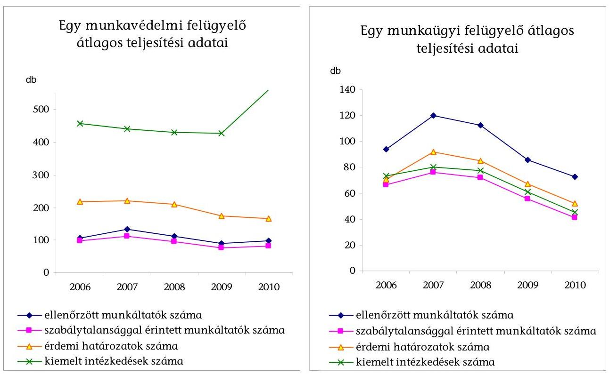

A hatékonyság romlásához hozzájárult az új felügyelők betanulási folyamatának időigénye, a munkavédelmi feladatok, az adminisztrációs feladatok bővülése.

A fajlagos mutatók 2007-ben (egy kivétellel) emelkedtek, 2008-tól, a létszám feltöltés időszakában csökkentek. A tevékenység eredményéhez kapcsolható mutatók szintjében a munkaügy és munkavédelem közötti különbséget magyarázza, hogy a munkavédelmi felügyelő egyedül ellenőrizhet (mobil munkahely kivételével), a munkaügyi felügyelő nem ${ }^{34}$.

A hatékonyság alakulását sokféle tényező befolyásolja, a felügyelők felkészültségétől, szakmai tapasztalatától kezdve az ellenőrzendő gazdálkodók földrajzi elhelyezkedéséig, a jogsértések összetételéig, a felügyelőre háruló egyéb feladatokig. Az OMMF elnöke a felügyelők számára az ellenőrzésre fordított munkaidőre (a kieső idővel csökkentett munkaidőre) vonatkozóan határo-

[^0]
[^0]:    ${ }^{34}$ Az OMMF elnökének 8/2009. számú utasítása a munkaügyi és munkavédelmi ellenőrzéssel kapcsolatos egyes követelményeiről, 2. § (2) bek, valamint 6/2007. OMMF utasítása a köztisztviselők, ezen belül a munkavédelmi és munkaügyi felügyelők egyes magatartási követelményeiről, 3. § (2) bek.

---

zott meg követelményt ${ }^{35}$, annak 40%-át helyszíni ellenőrzésre kellett fordítani. A költséghatékonyság méréséhez a tevékenységre jutó kiadások adatai az ÁSZ ellenőrzés számára nem álltak rendelkezésre. A kiadásokat és az elért eredményt korlátozottan jellemző adatokkal a költséghatékonyság alakulására csak durva becslés adható.

Ismerni vagy becsülni kellene további költségelemeket, a személyi kiadások munkáltatót terhelő járulékait és hozzájárulásait, az ellenőrzésekre közvetlenül és közvetve elszámolható további személyi és dologi kiadásokat, a területi és központi irányítás, kisegítő tevékenységek és egyéb általános költségek kiadásait.

A felügyelőknek teljesített személyi kifizetések és az ellenőrzött munkáltatók száma alapján megállapítható, hogy az egy munkaügyi ellenőrzéshez szükséges felügyelői személyi kiadás 2006-ban 37 100 Ft, 2009-ben 44 500 Ft és 2010-ben 47 800 Ft volt, a mutató értéke a munkavédelemnél 32 900 Ft, 47 200 Ft, illetve 38 000 Ft volt. A munkaügyi ellenőrzések durván becsült költséghatékonysága (az 1 Ft személyi juttatásra jutó ellenőrzések száma) 2006-ról 2010-re fokozatosan, összességében 22%-kal csökkent. A munkavédelmi ellenőrzéseknél a mutató 2009-ig csökkent, majd 2010-ben emelkedett, összességében 2006-hoz képest 13%-kal romlott. A hatékonyság alakulását, annak okait nem elemezték. A létszám, a jövedelmek, az ellenőrzések száma változásának hatását nem mutatták ki.

# 2. Az ellenőrzések eredményeinek megalapozása az ellenőrzések előkészítésével 

### 2.1. Az éves feladatok meghatározása

Az OMMF az éves ellenőrzési tervet a külső elvárásokra tekintettel és saját tapasztalatai figyelembevételével határozta meg. A hatósági ellenőrzéssel szembeni kormányzati elvárás, az ellenőrzés működési feltételeire, követelményeire vonatkozó elképzelések különböző dokumentumokban jelentek meg. Az ellenőrzések fokozásának igénye a rejtett gazdaság, a feketemunka visszaszorításánál merült fel. Az Európai Unió ajánlása a munkaügyi ellenőrzések mértékével kapcsolatban az volt, hogy az ellenőrzésekkel érjék el a munkáltatók 10%-át. Az EU 2007-2012. évekre elfogadott munkavédelmi stratégiája a munkabalesetek és foglalkozási megbetegedések tartós és folyamatos - százezer munkavállalóra eső 25%-os - csökkenését tűzte ki. A Kormány 2007-ben a felügyelők létszámának növelésével intézkedett az ellenőrzési kapacitás növelésére ${ }^{36}$.

Az állam meghatározta a munkavállalók jogi és fizikai biztonságának, egészségének védelmét szolgáló szabályokat, az előírások betartását ellenőrző szervezet működésének feltételeit. Az ellenőrző szervezet felállításával, erőforrások hozzá-

[^0]
[^0]:    ${ }^{35}$ Az OMMF elnökének 8/2009. számú utasítása a munkaügyi és munkavédelmi ellenőrzéssel kapcsolatos egyes követelményeiről, 2. § (3) bekezdés.
    ${ }^{36}$ 2146/2007. (VII. 27.) Korm. határozat a feketegazdaság elleni küzdelemmel kapcsolatos feladatokról, a végrehajtásban érintett intézmények erőforrásigényéről, 1. pont.

---

rendelésével gondoskodott a szervezet működőképességéről. A munkavédelmi ellenőrzés hatékonyságának növeléséhez a létszám-, eszköz- és infrastruktúrafejlesztés feltételeinek meghatározását írta elő 2005. és 2006. évi határozataiban ${ }^{37}$. Az EU Bizottság által elfogadott Nemzeti Akcióprogramban (2008) célként szerepelt ${ }^{38}$ a kapacitások erősítése mellett a felügyelők képzése, a minőségbiztosítási rendszer bevezetése is.

A rejtett gazdaság kifehérítésére irányuló kormányzati szándéknak megfelelően a hatósági ellenőrzéseknél is kiemelt szempont volt a fekete-foglalkoztatás feltárása. 2006-2010-ben a munkaügyi felügyelők intézkedéseinek évente 62%-a, 75%-a, 63%-a, 59%-a és 49%-a vonatkozott a feketemunka valamely elkövetési módjára (a dolgozó bejelentésének elmulasztása, írásbeli munkaszerződés hiánya, a valóságtól eltérő tartalmú munkaszerződés, külföldiek engedély nélküli foglalkoztatása stb.).

A feketemunka minél szélesebb körű feltárása érdekében a munkavédelmi felügyelők számára is követelmény volt, hogy a feketemunkára utaló körülményeket jelezzék a munkaügyi hatóságnak.

Az OMMF éves hatósági ellenőrzési feladatait az elnök által elfogadott éves szakmai követelmények tartalmazták. A szervezet nem rendelkezett átfogó szervezeti, az ellenőrzési feladatokra is kiterjedő stratégiával. Az OMMF nem rögzítette a törvényi előírások, az EU és a Kormány célkitűzéseire tekintettel középtávon (3-5 év távlatában) elérni kívánt célokat, az ellenőrzési szakterület eredményesebb és hatékonyabb működése érdekében hosszabb távon szükséges szakmai és egyéb - szervezeti, létszám, informatikai - intézkedéseket. Nem döntött különböző, egymással ütköző ellenőrzési szempontok
 - az ellenőrzés célzottsága és lefedettsége követelményének összehangolásáról, az EU által ajánlott 10\%-os lefedettség eléréséhez szükséges intézkedésekről.

Nem határozták meg, hogy a munkáltatók mely csoportjainál szükséges az átlagos lefedettségnél több vagy kevesebb ellenőrzés, biztosítani kell-e egy minimális szintű lefedettséget valamennyi ágazatban, létszám-kategóriában. Meghatároztak ugyanakkor ellenőrzési követelményeket azon ágazatokra, ahol a tapasztalatok alapján a munkavállalók nagyobb veszélynek, súlyos jogsértésnek voltak kitéve.

A stratégia elkészítését az OMMF vezetése is szükségesnek tartotta. A szervezet általános és hatósági feladatai, a szervezeti működés fejlesztése körében meghatározott éves célok, elvárások összefoglalásaként 2008-ra és 2009-re „Szakmai Program"-ot adtak ki. A 2008. évi Szakmai Program előírta, hogy „...készüljön el a következő öt éves munka alapját képező munkavédelmi, munkaügyi stratégia." A munkáltatók ellenőrizni kívánt arányát a 2008. évi program 6\%-ban jelölte meg. A 2009. évi program a munkaügyi ellenőrzéseknél 2012-ben

[^0]
[^0]:    ${ }^{37}$ 2002/2005. (I. 11.) Korm. határozat a munkavédelem országos programja 2005. évi intézkedési és ütemtervéről, Program 25. pont, illetve 2009/2006. (I. 26.) Korm. határozat a munkavédelem országos programja 2006. évi intézkedési és ütemtervéről, Program 25. pont.
    ${ }^{38}$ 2120/2008. (IX. 9.) Korm. határozat a Nemzeti Lisszaboni Akcióprogram a Növekedésért és Foglalkoztatásért című dokumentum kidolgozásáról.

---

megvalósítandó arányra (7,2\%) tartalmazott célkitűzést. A miniszter 2010-re 5\%-os arány elérését várta el.

Az éves ellenőrzési feladatokat a miniszter illetve az elnök által meghatározott irányelvek, valamint az elnök (szakmai főosztályok) által előírt szakmai követelmények határozták meg.

A Met 2/A. §-a szerint a munkaügyi miniszter irányelve az aktuális foglalkoztatási folyamatokra és célkitűzésekre, a jogszerű foglalkoztatást leginkább sértő magatartásformákra, a foglalkoztatási szempontból legnagyobb kockázatot jelentő foglalkoztatói és munkavállalói csoportokra tekintettel szabályozza a munkaügyi hatóság kapacitásainak felhasználását. A február 20-ig közzétett irányelv tartalmazza az adott év kiemelt ellenőrzési, vizsgálati céljait, az ellenőrizni kívánt főbb ágazatokat, szakmákat, tevékenységi köröket.

A miniszteri irányelv elkészítésének gyakorlata nem garantálta, hogy az intézményekben - a Foglalkoztatási és Szociális Hivatalban (FSZH) és a munkaügyi központokban, a szakképzési és felnőttképzési intézményekben - összegyűlt, az ellenőrzések irányultságát, tárgyát, módszerét érintő információkat beépítsék az irányelvekbe.

A munkaügyi ellenőrzés támogatására létrehozott, a munkaadók és munkavállalók érdekképviseleti szervei és a Kormány képviselőiből álló szerv, a Munkaügyi Ellenőrzést Támogató Tanács ${ }^{39}$ (METT) 2009-ben egyetlen ülést tartott, amely nem volt határozatképes a munkavállalók képviseletének hiányában.

A hatósági ellenőrzést érintő, jogszabályalkotásban megnyilvánuló kormányzati elképzelésekről az OMMF tudomást szerzett a tervezetek államigazgatási egyeztetésének folyamatában.

A miniszter az OMMF által elkészített tervezetet hagyta jóvá és tette közzé. A tervezet átdolgozását 2007-ben és 2009-ben szükségesnek ítélte, a feladat végrehajtásának elmaradása, illetve késedelme miatt az irányelvek végül nem jelentek meg. Az irányelvek általános és kiemelt ellenőrzési szempontokat, elveket tartalmaztak, megvalósulásuk méréséhez részlegesen állapítottak meg kritériumokat.

A miniszter 2007-ben azért küldte vissza a tervezetet, mert annak tartalma csaknem azonos volt a 2006. évivel, új változatot az OMMF nem készített. A 2009. évi tervezet átdolgozott változatát július 23-án küldték el a miniszternek, aki az idő múlása miatt nem tartotta célszerűnek annak közzétételét. 2008-ban és 2010-ben az irányelvek áprilisban jelentek meg a Munkaügyi Közlönyben, illetve a Szociális és Munkaügyi Közlönyben.

Az irányelvekben általános elvárások voltak, például:

- A munkaügyi ellenőrzés kezelje kiemelt feladatként a feketefoglalkoztatás következetes feltárását, visszaszorítását, annak társadalmi hatására figyelemmel hozza meg szankcióit (2007. és 2008. évek).
- Fordítson figyelmet a munkavállalási engedély nélkül külföldi munkavállalókat foglalkoztató munkáltató kiszűrésére (2007. és 2008. évek).

[^0]
[^0]:    ${ }^{39}$ Met. 8/D. §.

---

- Fokozottan járuljon hozzá a munkavállalók munkaügyi jogbiztonságának növeléséhez a foglalkoztatás szabályainak megszegésére irányuló panasz és közérdekű bejelentések szakszerű, gyors kivizsgálásával (2007. év).
- Az ellenőrzések minden esetben terjedjenek ki annak vizsgálatára is, hogy a munkavállalók munkaszerződése a tényleges állapotnak megfelelően rögzíti-e a felek megállapodását (2010.).

A szakmai követelményekben mérhető célok voltak:

- Az összfelügyelői kapacitás 65\%-át a munkaszerződés, illetőleg az adóhatósági nyilvántartásba való bejelentés nélküli foglalkoztatás feltárására, a munkavállalók anyagi érdekeinek és pihenéshez való jogának biztosítására vonatkozó jogszabályok megtartásának ellenőrzésére kell fordítani (2009. év).
- Az ellenőrzések legalább 30\%-át képezzék a mobil munkahelyeken történő ellenőrzések (2009. év).
- Az ellenőrzések legalább 30\%-át képezzék az építőiparban, valamint a személy- és vagyonvédelem területén működő munkáltatóknál foglalkoztatottak munkaviszonyának ellenőrzése (2010. év).

A mennyiségi és minőségi követelményeket, a teljesítés mérőszámait tartalmazó ellenőrzési tervet a felügyelőségek számára szakmai minimumkövetelmények formájában határozták meg. A szakmai követelmények egyben alapját képezték a felügyelők éves teljesítménymutatóinak és kritériumainak. A szakmai főosztályok a régiós és a felügyelői teljesítménykövetelmények meghatározásánál hasznosították a korábbi ellenőrzések statisztikáit, és figyelembe vették a felügyelőségek javaslatait. A tartalmi súlypontok kijelölésével elősegítették a tevékenység eredményes ellátását, az ellenőrzéstől várt hatások bekövetkezését. A munkavállalókat súlyosan veszélyeztető helyzetek feltárásának szempontját, a súlyos jogsértések és a kiemelt ágazatok és tevékenységek ellenőrzését minden évben előírták (lásd a 6. és 7. számú mellékletet).

Rendszeres, régiókra és megyékre lebontott kimutatások készültek az ellenőrzésekről (az ellenőrzött munkáltatók és munkavállalók számáról, az egyes jogsértésekről és a megszüntetésükre hozott intézkedésekről, az azokban érintett munkavállalók számáról, a határozatokról, a kivetett különböző bírságokról stb.). A mutatók felügyelőre vetített átlagos értékeit régiós és megyei szintre is meghatározták, a régióban pedig a felügyelő ellenőrzései alapján az egyéni mutatókat értékelték.

A 2009. évi teljesítményértékelési rendszer kidolgozásánál a Nyugat-dunántúli Munkavédelmi Felügyelőség igazgatója - az előző évhez hasonlóan - javasolta az érdemi intézkedések, illetve kiemelt érdemi intézkedések számának vagy arányának, továbbá a saját hatáskörben visszavont határozatok számának figyelembevételét ${ }^{40}$. A javasolt szempontokat a 2009. évi szakmai irányelveknél és teljesítménykitűzéseknél figyelembe vették. Beépült a követelményekbe az az igazgatói javaslat is, hogy a feketemunkába áttett ügyek (jelzések) helyett az áttételben szereplő feketemunkások számát kellene meghatározni.

[^0]
[^0]:    ${ }^{40}$ Az igazgató Nemzetközi és Stratégiai Főosztálynak írt 2008. november 11-i levele.

---

A hatóságnak az ellenőrzések visszatartó hatását megalapozó lépéseire nem vonatkozott teljes körűen követelmény. Évről évre szempont volt a bírságok behajtása, a hatósági eljárások szakszerűsége, az utóellenőrzések elvégzése csak meghatározott területen (munkaügy) vagy egy évben (munkavédelem, 2009).

Az előírt intézkedések megtörténtét utóellenőrzéssel vizsgálták, amit meghatározott jogsértésekre (feketemunka megszüntetése, a munkavédelmi felügyelő azonnali intézkedéseit követően a biztonságos munkavégzés feltételeinek betartása) írtak elő.

Az éves szakmai követelmények időbeni és egyre korábbi elküldése a felügyelőségeknek lehetővé tette azok mihamarabbi figyelembevételét, így elősegítette a követelmények teljesítését.

2007-ben a tárgyév márciusában, 2008-ban februárban, 2009-ben januárban juttatták el a felügyelőségeknek a szakmai minimumkövetelményeket.

Egyes mennyiségi célkitűzések a statisztikák felhasználása mellett sem voltak megalapozottak, a teljesítés és a követelmény eltérésének okait nem elemezték. A területi munkaügyi felügyelőségek az ellenőrizendő munkáltatók és a fekete-foglalkoztatás megállapításának mennyiségére előírt feltételt a vizsgált években nem teljesítették, miközben a szakmai főosztály folyamatosan csökkentette a követelményt. A felügyelőtől elvárható átlagos összteljesítményt mérő (egy vagy több) kritérium hiánya nem csak az elvárható követelmények meghatározásának, hanem a teljesítés érdemi értékelésének is akadályát képezte. Nem jelentett „éles" követelményt a munkavédelmi felügyelőségek számára a megfellebbezett határozatok helybenhagyási arányára megállapított követelmény, amelyet rendszeresen túlteljesítettek.

A munkaügyben ellenőrizendő munkáltatók számát nem írták elő a 2007. évre, a területi felügyelőségek összesen 32840 munkáltatót ellenőriztek. 2008-ban az elvárt 40000 helyett összesen 36026 (90\%), 2009-ben pedig 38000 helyett 31431 (82,7\%) munkáltatót ellenőriztek. 2010-re az OMMF összesen 33500 munkáltató ellenőrzését írta elő, a teljesítés 75\%-os, 25056 fő volt.

Az ellenőrzéssel megállapítandó feketemunkások számára 2007-ben nem volt előírás a szakmai követelmények között, a területi felügyelőségek összesen 72743 feketemunkást találtak. 2008-ban az elvárt 80000 fő helyett összesen 69075 (86\%), 2009-ben pedig 65000 helyett 56206 (86,5\%) feketemunkás foglalkoztatását állapították meg. 2010-re az előírt 55000 fő helyett 29869 főnél állapították meg a jogsértést.

A munkavédelmi felügyelőségek elsőfokú határozatai 80\%-ának helybenhagyását várták el fellebbezés esetén, a tényleges helybenhagyási arány 93-94\% volt a 2007-2010. években.

# A régiós követelmények meghatározásánál a szakmai főosztályok 

nem vették figyelembe a régiók gazdasági helyzetének sajátosságait. A felügyelőktől elvárt teljesítmény meghatározásánál az ellenőrzési feladat „objektív nagyságának" (az adott régióban működő gazdálkodók, a foglalkoztatottak száma) figyelembe vétele nem mutatható ki. A gazdálkodók és a foglalkoztatottak 30-40\%-át képviselő Közép-magyarországi régióra csökkent a

---

legnagyobb mértékben, 40\%-kal az egy munkaügyi felügyelő által ellenőrzendő munkáltatók száma (lásd a 8. számú mellékletet). A munkavédelem területén az egész országra azonosan (átlagosan egy felügyelőre) meghatározott fajlagos követelményeket a felügyelők átlagos teljesítményeként kellett teljesíteni minden régiónak. A munkavédelmi követelményekben előírták a régióra jellemző ágazatok, tevékenységek figyelembevételét, a helyi sajátosságok megállapítását, a szempont érvényesítését az igazgatók (régiók) feladatává tették.

A 2010. évi követelményekkel kapcsolatban a Nyugat-dunántúli Munkaügyi Felügyelőség igazgatója szükségesnek tartotta a kiemelt ágazatok mellett olyan munkáltatók kiemeltebb, komplex ellenőrzését is, akiknél korábban csak eseti jelleggel, vagy soha nem történtek ellenőrzések: ügyvédek, közjegyzők, orvosok, bankok.

A régióra jellemző ágazatok legalább 30 főt foglalkoztató munkáltatóinál 2009-ben felügyelőnként átlag 10, 2010-ben a jellemző tevékenységű kis- és középvállalatoknál átlagosan 15 munkavédelmi ellenőrzést irányoztak elő.

Az OMMF a vizsgált időszakban negyedévente beszámolót készített a szakmai követelményekben meghatározott kritériumok teljesüléséről, és az ellenőrzési eredmények alakulásáról rendszeresen tájékoztatta az intézmény felügyeletét ellátó minisztert. A szakmai minimumkövetelményeket év közben egyszer, 2010. júliusban módosította az elnök ${ }^{41}$. A módosítás törölte a feketemunka feltárására vonatkozó szakmai követelményt. Az intézkedést az elnök azzal indokolta, hogy az egyszerűsített foglalkoztatás törvényi szabályai többször változtak, azok értelmezése problémát okozott, a gazdálkodók és a hatóság nem tudtak felkészülni a törvény végrehajtására.

Az OMMF statisztikái nem tartalmaztak mutatót az ellenőrzések lefedettségének mérésére, az irányelvben kitűzött cél megalapozása nem dokumentált.
2. számú táblázat

Az ellenőrzések lefedettsége

| Megnevezés | Ellenőrzött munkáltatók száma |  |  |  | Lefedettségi százalék |  |  |  |
| :-- | :--: | :--: | :--: | :--: | :--: | :--: | :--: | :--: |
| Év | 2007 | 2008 | 2009 | 2010 | 2007 | 2008 | 2009 | 2010 |
| Munkavédelem | 25610 | 25171 | 21660 | 22169 | 3,7 | 3,6 | 3,1 | 3,2 |
| Munkaügy | 32840 | 36026 | 31431 | 25056 | 4,8 | 5,1 | 4,5 | 3,6 |
| Működő gazdasági szervezetek száma | 688058 | 701309 | 701309 | 701309 |  |  |  |  |

[^0]
[^0]:    ${ }^{41}$ Az OMMF elnökének 6282-2/2010-5040 iktatószámú, a munkaügyi felügyelőségek igazgatóinak címzett levele.

---

Megjegyzés: A KSH a működő vállalkozások számát az adóbevallást benyújtó gazdálkodókra közli, a 2009. évi adat 2011. március 30-ig nem jelent meg.
 Az ÁSZ becsléséhez a 2008. évi adatot használtuk.

Az ÁSZ számításai szerint a lefedettségre vonatkozó 2008. évi 6\%-os, valamint a 2010. évi 5\%-os célja nem teljesült, a munkaügyi szabályok megtartását a működő gazdálkodók 5,1\%-ánál és 3,6\%-ánál ellenőrizték (2. számú táblázat).

# 2.2. A munkáltatók ellenőrzésre történő kijelölése 

Az ellenőrzési tevékenységet nem alapozta meg a munkáltatók (ügyfelek) ellenőrzésre kiválasztását elősegítő kockázatkezelési rendszer. Az ellenőrzési tevékenységet befolyásoló, különféle fennálló - az ellenőrzött személyéhez, tevékenységéhez, működésének földrajzi területéhez, valamint az ellenőrzést végzőhöz, a személyi és módszertani feltételekhez kapcsolódó - kockázat ellenére az OMMF nem alakított ki kockázatkezelési rendszert. Az ellenőrzések mintegy 85-90\%-ában annak ügyfelét, a helyszínt a felügyelő választotta ki (lásd a 9. számú mellékletet). Az ügyfél, az ellenőrzött gazdálkodó személye a hatóság számára adottság volt a külső kezdeményezésre (panaszok, közérdekű bejelentések, kötelezően kivizsgálandó balesetek, más hatóság megkeresése) indított ellenőrzéseknél, a munkavédelmi ellenőrzések 10-14\%-ánál és a munkaügyi ellenőrzések évente csökkenő, 2009-ben 13\%-ánál, 2010-ben 6\%-ánál.

A felügyelők önállósága megnyilvánult az ellenőrzöttek - a kötelező ellenőrzéseken felül a szakmai követelményekre, a teljesítmény-követelményekre is tekintettel lévő - kiválasztásában. Az eljárás a gyakorlatban úgy valósult meg, hogy a felügyelők az ellenőrzésekre vagy onnan történő visszautazás közben tapasztaltak alapján választottak helyszínt, például építkezést, ahol munkavégzés folyt. A munkavégzés székhelytől, telephelytől eltérő tényleges helyszínét az országos nyilvántartások (cégjegyzék, EMMA) nem tartalmazzák.

A kiválasztás rendje és gyakorlata nem garantálta az OMMF által felhalmozott tapasztalatok és a környezetről rendelkezésre álló információk rendszerszerű figyelembe vételét, ezáltal a munkáltatóknak az ellenőrzések eredményei és hatékonysága szempontjából célszerű kiválasztását. Szabályozás hiányában a felügyelők esetlegesen vettek figyelembe információkat az ügyfelek meghatározásánál.

A kockázatkezelési rendszer működtetője meghatározza az ellenőrzési tapasztalatok, baleseti és egyéb statisztikák alapján a munkavállalók releváns csoportjaira a biztonságukat, egészségüket, a foglalkoztatáshoz kapcsolódó jogosultságaikat leginkább veszélyeztető jogsértéseket, a jogsértéseket elkövető munkáltatói csoportokat, létszám kategóriákat, ágazatokat, szakmákat, tevékenységeket, az egyes csoportokra jellemző jogsértések kockázatát. A munkáltatók és foglalkoztatottak kockázat szempontjából kiemelt csoportjainak létszámára, területi megoszlására ismert információk és az ellenőrzésnél érvényesítendő szempontok (pl. lefedettségi cél) alapján meghatározza, hogy az egyes régiókban mely munkáltatói csoportokból hány munkáltatót javasolt ellenőrizni. Segítségével megalapozható, hogy az ellenőrzések mekkora hányadát végezzék a „terepen" aktuálisan tapasztaltak alapján. A kockázatkezelési rendszer alkalmas a homogén gazdálkodói csoportokból az ellenőrzésbe kerülők véletlenszerű kiválasztására is.

---

Behatárolt az ellenőrzésre kiválaszthatók köre a Kormány, OMMF elnöki vagy igazgatói döntéssel indított akció- és célellenőrzések esetében, ahol a felügyelők számára meghatározták az ellenőrzés feltételeit. A többi ellenőrzés a felügyelő és/vagy vezetője kezdeményezésére indult. A központi kezdeményezésű eljárásoknál is - egy-egy esettől eltekintve ${ }^{42}$ - a felügyelő döntött a helyszínről.

Az akció- és célellenőrzéseknél központilag előírták az ellenőrzés ágazatát, tárgyát, időszakát, a vizsgálat szempontjait, a jelentési kötelezettséget, a munkáltatót csak egy-két esetben jelölték ki (pl. egy országos gazdálkodó több telephelyének ellenőrzésekor). Ismétlődően ellenőrzés volt ünnepek előtt (Csillagszóró, Kánikula és Húsvét akciók), továbbá időben vagy térben átmeneti, ideiglenes munkavégzésnél, mint vásárok, nagy rendezvények, diákok szünidei foglalkoztatása, strandok és gyógyfürdők nyári működése stb.

A kockázatkezelés egyes elemei (a kiválasztás szempontjainak megadásával) a belső szabályozásban megjelentek. A felügyelői kézikönyv tartalmazta a munkáltatók kiválasztásának általános szempontjait. A szakmai követelmények a tapasztalatok alapján kijelölték a leginkább veszélyes ágazatokat, tevékenységeket, előírták a súlyos jogsértések feltárását, ami hozzájárult a szabálytalanságok eredményes feltárásához. A kiválasztásban rejlő korrupciós kockázat csökkentése érdekében a régió/megye területének felügyelők közötti felosztását időszakonként megváltoztatták.

A felügyelői kézikönyv részletezésében a gazdálkodók kiválasztását segítik az előző ellenőrzések, illetve a közlekedés során tapasztaltak, a kollégák és a médiában megjelenő információk. További adatok biztosíthatók a felügyelő által elérhető belső és külső adatbázisokból (FEIR, KIM honlap, cégtár), valamint a munkáltatóktól, az önkormányzattól az OMMF-hez érkezett bejelentésekből, adatszolgáltatásokból.

A kiemelt ágazatokban végzett ellenőrzések arányát 2007-2009-re a munkavédelmi szakmai követelmények 33/50/50-60/40\%-ban írták elő, a teljesítés 2007-ben 44\%, azt követően 70\% körüli volt. Kiemelt ágazat volt 2007-ben az építőipar, 2008-2010-ben az építőipar, mezőgazdaság, feldolgozóipar (azon belül nevesítve a gépipar), az egészségügy és a külszíni bányászat.

A munkaügyi szakmai követelmények a feketemunka feltárása kapcsán nevesítettek ágazatokat (építőipar, mezőgazdaság, vendéglátás, kereskedelem, nyomozás-biztonsági tevékenység) 2007-2008-ban, a 75/70\%-os előírás 87-87\%-ra teljesült. 2009-ben és 2010-ben a prioritásként kezelendő ágazatokat jelölték ki (építőipar, feldolgozóipar, mezőgazdaság, illetve építőipar, személy- és vagyonvédelem). 2009-ben ezekben az ágazatokban folytatták le az ellenőrzések 57\%-át, 2010-ben a követelmény 30\%, a teljesítés 35\% volt.

Igazgatói utasítás rendelkezett az egyes felügyelőkhöz tartozó földrajzi területről, esetleg szakterületről. A körzeteket általában évente (előfordult, hogy félévente) megváltoztatták.

[^0]
[^0]:    ${ }^{42}$ A bányászati munkaegészségügyi ellenőrzésnél központilag kijelölték a Hegyeshalmi Kavicsbányát ellenőrzésre.

---

Az ellenőrzések néhány ágazatra koncentrálása következtében a hatóság nem szerzett elégséges tapasztalatokat a többi ágazatba tartozó, az összes munkáltatók mintegy felét kitevő munkáltatókról, az általuk elkövetett jogsértések kockázatáról. A foglalkoztatottak legalább 40\%-ának munkát adó gazdálkodókra évenként az ellenőrzések mintegy 10\%-a jutott (lásd a 10. számú mellékletet).

Az ellenőrzések mintegy 90\%-át az építőipari, feldolgozóipari, mezőgazdasági, kereskedelmi és vendéglátó gazdálkodók körében folytatta le a hatóság, az ellenőrzöttek köre kiegészült a munkaügyi ellenőrzéseknél a nyomozási, biztonsági tevékenységet végzőkkel.

Jogszabályok az OMMF felé előírt bejelentési és adatszolgáltatási kötelezettség előírásával rendelkeztek annak érdekében, hogy az ellenőrzendő környezetről lényeges információk a hatóság rendelkezésére álljanak. A gazdálkodók és a jegyzők kötelező bejelentései alapján az OMMF adatokkal bírt a foglalkoztatási jogviszonyt létesített munkáltatókról és munkavállalókról, a jogviszonyok jellemző körülményeiről, a dolgozók egészségét veszélyeztető munkakörülményekkel járó tevékenységről.

A gazdálkodóknak adatszolgáltatási kötelezettségük van a munkaviszonyokról, a rákkeltő anyagok alkalmazásáról-védekezésről, az építkezési, azbesztmentesítési tevékenység megkezdéséről, a munkabalesetekről, a foglalkoztatás-egészségügyi szolgáltatókról. Az illetékes jegyző papír alapon megküldi az ipari és szolgáltató tevékenység végzésére kiadott engedélyek, a telepengedély egy példányát. Információt kapnak a foglalkozási megbetegedésekről, a fokozott expozíciós esetekről. Az OMMF hozzáféréssel rendelkezik az építkezési helyszínek, a kivitelezők adatait tartalmazó országos adatbázishoz.

A felügyelők korlátozottan hasznosították a külső és belső információkat a munkáltatók kiválasztásához. A bejelentéseket régiós (vagy megyei) szinten papíron vagy Excel táblában tartották nyilván, országos adatokat az EMMA elektronikus nyilvántartás és a rákregiszter tartalmazott. Az utóbbi nem alkalmas az ellenőrzési szempontok szerinti lekérdezésre. A kötelező bejelentések alapján ellenőrzések megindítását a 2010. évi munkavédelmi szakmai követelményekben írták elő.

A Munkavédelmi Főosztály 2009-ben célvizsgálatot folytatott a munkavédelmi felügyelőségeken meghatározott kötelező bejelentések kezeléséről, hasznosításáról. A tapasztalatok alapján rendelték el 2010-re minden olyan munkáltató ellenőrzését, amely 2009-ben bejelentést tett rákkeltő anyagokkal végzett tevékenységről; valamennyi bejelentett építkezés ellenőrzését és az azbesztbontási tevékenységet végzőknek a bontás alatt legalább egy alkalommal történő ellenőrzését.

A bejelentések helyi rögzítését követően a rákregiszterből nem kérdezhetők le a régió/megye megfelelő tevékenységű munkáltatóinak adatai, a felhasznált rákkeltő anyagok fajtái, a veszélyeztetett munkavállalók adatai.

A lefolytatott ellenőrzések adatait rögzítő FEIR rendszerhez a felügyelők hozzáfértek, de jogosultságuk csak a saját megyéjükre/régióra terjedt ki. A belső információk napi felhasználásának igénye nem merült fel a munkáltatók ellenőrzésre kiválasztásához, nem készültek célszerű lekérdezések, listák az elektronikus nyilvántartások adatainak hasznosításához. A FEIR adatait jellemzően a cél- és akcióellenőrzések ügyfeleinek kiválasztásánál, valamint az új felügyelők a munkáltatók feltérképezéséhez használták.

Nem volt automatikusan lekérdezhető pl. az EMMA rendszerből az adott területen/ágazatban meghatározott időszakban munkavállalókat bejelentő munkáltatók listája. A FEIR-ből nem voltak „gombnyomásra" leszűrhetők az adott ágazatban meghatározott jogsértéseket már elkövető munkáltatók. A gazdálkodók kiválasztásához a kiemelt ágazatok munkáltatóit kérdezték le jellemzően a belső adatbázisból.

Az OMMF 2010-ben az Európai Unió 2007-2013 évekre vonatkozó programozási időszakához kapcsolódó, a megvalósítást - az Európai Szociális Alapon keresztül - Uniós pénzből fedező TÁMOP keretében egy fejlesztési projekt megvalósítását célozta meg. A projekt része elemző kapacitás létrehozása is.

# 3. AZ ELLENŐRZÉSEK VISSZATARTÓ HATÁSÁT ERŐSÍTŐ INTÉZKEDÉSEK

A hatósági ellenőrzések visszatartó erejének hatását erősíti, ha kiszámíthatóak, átláthatóak a jogkövetkezmények, egységes a hatóság joggyakorlata és megvalósul az ellenőrzések nyilvánossága.

### 3.1. Az ellenőrzések lefolytatásának, a szankciók megállapításának belső szabályozása, joggyakorlata

Az OMMF az egységes eljárásrend és joggyakorlat kialakítására tett központi és régiós szintű intézkedésekkel hozzájárult a hatósági ellenőrzések eredményességének (visszatartó erejének) javításához.

Az egységes eljárásrend és joggyakorlat megvalósítását az OMMF központilag - munkavédelmi és munkaügyi területre egyaránt - a felügyelői kézikönyv kiadásával, elnöki utasításokkal és módszertani útmutatókkal, az egyes Főosztályok által kiadott belső szakmai utasításokkal, tájékoztatásokkal; régiós szinten pedig - igazgatói utasításokkal, körlevelekkel alapozta meg.

A felügyelői kézikönyv 2008-ban készült, ezt megelőzően a módszertani útmutatók segítették a felügyelők munkáját. A kézikönyv kiadásának elsődleges célja az volt, hogy segítséget nyújtson a felügyelők számára a munkavédelmi és munkaügyi ellenőrzési tevékenység részét képező valamennyi feladat egységes és következetes ellátásában. Minden felügyelő rendelkezett felügyelői kézikönyvvel. Az újonnan belépetteknek a felügyelői kézikönyv anyaga vizsgaanyag volt.

Módszertani útmutató készült a munkavédelmi és munkaügyi intézkedések alkalmazásához, a Ket. felügyelői alkalmazásához, az utóellenőrzések végrehajtásához, a munkavédelmi és munkaügyi ellenőrzésekkel szemben támasztott minimális szakmai követelményekről, a szabálysértések helyszíni elbírálásához.

A munkaügyi irányítás ugyancsak kiadott 2008. áprilisban egy komplex intézkedési módszertani útmutatót, amelynek bírságkiszabást érintő felülvizsgálata 2009 májusában teljesült, figyelemmel a 2009. júniusi - kötelező bírságkiszabásról rendelkező - jogszabályváltozásra.

Az elnöki utasításokat, módszertani útmutatókat a felügyelőségek időben - a jogszabályváltozáshoz kapcsolódókat azok elkészülte után, hatályba lépésük előtt - megkapták. Emellett a jelentős törvényi módosítások ${ }^{43}$ hatályba lépése előtt igazgatói értekezleten, megyei, illetve régiós értekezleten ismertették a változások lényegét és az ezzel kapcsolatos eljárásrendet. Az eredményesség fokozása érdekében az eljárásrendeket a regionális felügyelőségek szakmai véleményét figyelembe véve alakították ki.

Az egységes joggyakorlat alkalmazását központilag a jogsértések kategorizálásával (kódtábla előírásával), bírságtábla ajánlásával segítették, továbbá iratminták közzétételével támogatták, egyszerűsítették a felügyelők munkáját.

A munkavédelmi bírság mértékének meghatározásához kiadott útmutató folyamatos finomításaként a 2010-es útmutatóban tételesen felsorolták törvényi hivatkozással a súlyos veszélyeztetést jelentő munkaegészségügyi és munkabiztonsági tényállásokat, közülük megjelölve azokat, amely esetben felső határ közeli bírság kiszabása volt indokolt.

Az egységes régiós joggyakorlat működését régiós szinten témafelelősi rendszer kialakításával, az irodák rendszeres vezetői kontrolljával, valamint régiós értekezletek megtartásával segítették elő.

A Nyugat-dunántúli Munkavédelmi Felügyelőségnél előírták, hogy a jogász előzetes ellenőrzése és jóváhagyása nélkül nem kiadmányozhatók az eljárási bírság, szabálysértési bírság (kivéve helyszíni) határozatok, felterjesztések, panaszügyek. A fellebbezésekhez készített előterjesztések és a másodfok által visszaküldött észrevételek is a jogászhoz érkeznek, aki ezek tapasztalatait mindhárom megyében ismerteti. A felügyelők részére évente általában kétszer régiós értekezleteket tartottak, ahol a jogszabályokat, módszertani útmutatókat közösen értelmezték, a problémás ügyeket megbeszélték.

Az OMMF törekedett a jogalkotó által elvárt felügyelői mérlegelési szabadság és a jogkövetkezmények kiszámíthatóságát szolgáló intézkedések közötti egyensúly megteremtésére. A kiszámíthatóság növelését szolgáló bírságtábla, iratminták, a határozatok kötelező igazgatói kiadmányozása, illetve a jogi felülvizsgálati kontroll
 beépítése nem volt ellentétben a nagyfokú felügyelői mérlegelési hatáskörrel.

Az egységes joggyakorlat érvényesülését erősítette, hogy a felügyeleti ellenőrzések (az ún. hivatalvizsgálatok és célellenőrzések) keretében a jogszabályok és kiadott utasítások (módszertani útmutatók) betartását, a kötelező formai előírások alkalmazását, a szankcionálás gyakorlatát ellenőrizték, valamint a régiók éves értékelése során felhívták a figyelmet a szakmai teljesítés szélsőséges értékeire.

# A kiszámíthatóság érdekében intézkedtek a jogsértések következetes és egységes szankcionálására. Az egységes jogértelmezés megítélése érde- 

[^0]
[^0]:    ${ }^{43}$ Mvt. 2007. január 1-i, Ket. 2009. október 1-i módosítása.

---

kében a „Kánikula II" célellenőrzés ${ }^{44}$ adatait alkalmazva három munkavédelmi intézkedési kódhoz tartozóan (be- és leesés veszélye, az egyéni védőeszköz használatának elmulasztása és a védőberendezések működésképtelensége, hiánya) vizsgáltuk a felügyelői intézkedések megoszlását (3. számú táblázat).
3. számú táblázat

Felügyelői intézkedések a Kánikula II. célellenőrzés során

| Megnevezés | Be- és leesés   veszélye miatti   intézkedések | Védőberendezések   működésképtelen-   sége, hiánya | Egyéni védőeszköz   használatának elmu-   lasztása |  |  |  |
| :-- | :--: | :--: | :--: | :--: | :--: | :--: |
| Foglalkozás megtiltása |  |  |  |  | 155 | $90 \%$ |
| Használat felfüggesztése | 98 | $27 \%$ | 52 | $84 \%$ | 2 | $1 \%$ |
| Tevékenység felfüggesz-   tése | 253 | $70 \%$ | 10 | $16 \%$ | 15 | $8 \%$ |
| Figyelemfelhívás | 13 | $3 \%$ |  |  |  |  |
| Hiányosság megszünte-   tése |  |  |  |  | 1 | $1 \%$ |
| Összesen | 364 | $100 \%$ | 62 | $100 \%$ | 173 | $100 \%$ |

A célvizsgálatban azonos veszélyhelyzet esetén a felügyelők jellemzően azonos intézkedéseket hoztak, mert a be- és leesés veszélyének fennállása esetén szinte teljes körűen a használat illetve a tevékenység felfüggesztését rendelték el. Az egyéni védőeszköz használatának elmulasztása közel 90%-ban a foglalkoztatást megtiltó döntést, a védőberendezések működésképtelensége vagy hiánya a használat felfüggesztését vonta maga után.

A határozatok 19-22%-ában munkavédelmi bírság kiszabására tettek javaslatot.

Az évente több alkalommal elrendelt országos, illetve régiós akció-és célvizsgálatoknál ${ }^{45}$ a központ előírta az ellenőrzések egységes elvek szerinti végrehajtását, továbbá a határozatok (és beszámolók) azonos szerkezetben és elvek szerinti elkészítését. Az akció- és célellenőrzéseknél kiemelt szerepe volt a társhatóságokkal ${ }^{46}$ való együttműködésnek.

[^0]
[^0]:    ${ }^{44}$ Az ország több területén egyszerre, társhatóságokkal (például Fogyasztóvédelmi Főfelügyelőség) együtt végzett fogyasztóvédelmi célellenőrzés.
    ${ }^{45}$ 2006-ban pl. autópálya célellenőrzés, 2007-ben diákok és fiatalkorú munkavállalók biztonságos foglalkoztatása, 2008-ban a bányászati egységek OMMF és a Magyar Bányászati és Földtani Hivatal (MBFH) közös munkaegészségügyi ellenőrzése, színesfémlopás visszaszorítása érdekében előirányzott országos akcióellenőrzés, 2009-ben bányászati célvizsgálat, szociális intézmények célvizsgálata.
    ${ }^{46}$ Közös ellenőrzéseket folytattak például az APEH, a VPOP, az ÁNTSZ, az MgSZH területi szerveinek képviselőivel.

---

- 2010. tavaszi célvizsgálatot munkafüzettel és vizsgálati szempontok megadásával segítették.
- A gyógy- és wellness fürdők tevékenységének ellenőrzése során a felügyelőknek azonos tartalmú adatlapot kellett kitölteniük a helyszíni ellenőrzések eredményeként.
- Az akció- és célvizsgálatok esetében a konkrét munkáltató - a bányászati célvizsgálat kivételével - központilag nem került meghatározásra. Az ellenőrizendő célterületet, ágazatokat viszont meghatározták, ezen belül - tevékenységlista alapján - a régió választhatta ki - a központilag meghatározott számú - tevékenységet, a konkrét gazdálkodó kiválasztásánál pedig felügyelői szabadság érvényesült.
- Az akció- és célvizsgálatokról készítendő régiós szöveges értékelés szempontjait, formáját központilag határozták meg.

# 3.2. Utóellenőrzések 

A munkáltatók jogkövető magatartásának kikényszerítése érdekében a hatóság az (elsőfokú hatósági eljárás alapján) előírt munkáltatói kötelezettségek teljesítését utóellenőrzés ${ }^{47}$ keretében vizsgálta.

Az utóellenőrzések menetét és szabályait a Felügyelői Kézikönyv és a hozzá tartozó belső utasítások, illetve módszertani útmutatók szabályozták.

Az OMMF utóellenőrzésre kialakított eljárási rendje és követelményrendszere és az utóellenőrzés gyakorlata nem ösztönözte a munkáltatók jogkövető magatartásának kikényszerítését. A visszatartó erő hatását csökkentette, hogy a hatósági határozatban a munkáltatóra rótt bejelentési kötelezettség kikényszerítésére a munkaügyi ellenőrzésnek szűk eszköztár áll rendelkezésére.

A vizsgált időszakban a munkavédelem területén a szabálytalansággal érintett munkáltatók alacsony hányadánál (2006-ban 14%-nál, 2007-ben mindössze 7%-nál, 2008-ban és 2009-ben pedig 22-22%-nál, 2010-ben 10%-ánál) volt utóellenőrzés (4. számú táblázat). A munkaügy területén ez az arány 2009-ben 45%, 2010-ben 51% volt.

A jogsértések kezelése és az ellenőrzések visszatartó erejének érvényesülése szempontjából kockázatot jelentett, hogy az OMMF - különösen a munkavédelem területén - nem fektetett kellő hangsúlyt a követelményrendszer kialakítására, illetve annak teljesülésére.

[^0]
[^0]:    ${ }^{47}$ Az OMMF csak az azonos munkáltatónál azonos munkavállalóra azonos hiányosság fennállását tekintette utóellenőrzésnek.

---

4. számú táblázat

A munkavédelmi utóellenőrzések tapasztalatai

| Megnevezés | 2006 | 2007 | 2008 | 2009 | 2010 |
| :-- | :--: | :--: | :--: | :--: | :--: |
| Szabálytalansággal érintett munkálta-   tók (db) | 17859 | 21427 | 21217 | 18730 | 18523 |
| Utóellenőrzéssel érintett munkáltatók   (db) | 2433 | 1445 | 4718 | 4214 | 1934 |
| Utóellenőrzéssel érintett munkáltatók   aránya a szabálytalansággal érintett   munkáltatókhoz viszonyítva (\%) | $14 \%$ | $7 \%$ | $22 \%$ | $22 \%$ | $10 \%$ |
| Az előírt intézkedést teljesítő munkálta-   tók száma (db) | 2289 | 1162 | 4344 | 3865 | 1739 |
| Az előírt intézkedést teljesítő munkálta-   tók aránya (\%) | $94 \%$ | $80 \%$ | $92 \%$ | $92 \%$ | $90 \%$ |

A munkavédelem területén a központi előírás hiányát a szervezet azzal indokolta, hogy az utóellenőrzések tapasztalatai jelentős mértékben jogkövető magatartásra utaltak, illetve a Ket. 2009. évi módosítása az egy határozatban megállapított különböző jogsértések utóellenőrzését megnehezítette.

Az új rendelkezés alapján a végrehajtás ellenőrzése a jogerőre emelkedéstől vagy a határidő lejártát követően 15 napon belül történhet meg. A többféle jogsértés megszüntetéséhez egy határozatban több határidő tartozott.

Az OMMF központilag a munkaügyi ellenőrzés területén szakmai követelményként csak a feketemunkával érintett munkáltatók utóellenőrzésének arányát határozta meg (2008-ban és 2009-ben 80%, 2010-ben 50%-os, majd év közepétől 100%-os arány előírásával).

Az igazgatók a régiókban a központi előírás mellett további teljesítménykövetelményeket írhattak elő. A felügyelőségek ezért más típusú (a munkaidőnyilvántartással, a pihenőidő kiadásával, a munkabér-elszámolásokkal kapcsolatos) utóellenőrzéseket is végeztek, ezek arányát az OMMF nem figyelte és nem mutatta ki.

Az Észak-alföldi régióban 2007-ben az ellenőrzést követő újabb ellenőrzés lefolytatását írták elő a nem, vagy nehezen bizonyítható jogsértések esetén. További előírás volt, hogy a feltárt fekete-foglalkoztatás esetén a munkavállalók legalább 60%-ának bejelentése - az ellenőrzés hatására - megtörténjen.

Az Észak-alföldi régióban a beszámoltatáson alapuló vezetői ellenőrzés teljesülése érdekében a munkaügyi felügyelőknek napi gyakorisággal kellett tájékoztatni a helyi vezetőt az utóellenőrzésekről, a helyi vezetők pedig heti gyakorisággal tájékoztatták az igazgatót az előző héten a felügyelők által végzett munkáról.

A szakmai követelményeket a régiók éves értékelése szerint a felügyelőségek nem minden esetben teljesítették, a 2009. évi 80%-os követelmény országosan

---

66%-ra teljesült. Ez a teljesítési adat azonban nagymértékű régiós eltérést takart: az Észak-alföldi régióban a munkáltatók 37%, a Közép-magyarországi régióban 80%-át utóellenőrizték.

A feketemunkával érintett gazdálkodók utóellenőrzését a felügyelőségek a határozat jogerőre emelkedését követően elsődlegesen az EMMA rendszerből adatlekérdezéssel, illetve (például írásos munkaszerződés hiánya esetén) helyszíni ellenőrzés útján végezték.

Az utóellenőrzések tapasztalatai alapján a munkaügy területén az előírt intézkedést teljesítő munkáltatók aránya (2009-ben 79%, 2010-ben 64%) jelentősen elmaradt a munkavédelem mutatóitól. A felügyelőségek tapasztalata szerint azonban - bár vannak kedvező példák - a bejelentések többsége továbbra is jellemzően egy napra történt.

A felügyelőnek eljárási bírság kiszabása mellett jelzési kötelezettsége van az APEH ${ }^{48}$ felé. Amennyiben a vállalkozás az utóellenőrzéskor már nem lelhető fel és a megszűnés nem a jogszabály által biztosított keretek között ment végbe ${ }^{49}$, a felügyelőnek feljelentést kell tennie gazdasági adatszolgáltatás elmulasztása miatt. A cégbíróságnál a közigazgatási szerv kérelmezheti törvényességi felügyeleti eljárás lefolytatását a "fantomcég" törlése érdekében.

Az OMMF a munkaviszony legalizálásának mértékét (a bejelentések megtételét és érvényben tartását), mint mutatószámot nem értékeli és elemzi kiemelt hangsúllyal annak ellenére, hogy ez az ellenőrzések legfőbb eredménye.

Mivel az egyéb jogsértések utóellenőrzése nem szerepelt a célkitűzések között, az egyéb helyszíni utóellenőrzés háttérbe szorult.

A Nyugat-dunántúli Munkaügyi Felügyelőségnél az egyéb helyszíni utóellenőrzések száma nagyon elenyésző. Az ÁSZ számára végzett kigyűjtés szerint 2006. évben összesen 70, a 2007. évben 189 ügyben, a 2008. évben 26 ügyben, a 2009-ben 20 ügyben végeztek helyszíni utóellenőrzést.

A munkavédelmi területen az alacsony utóellenőrzöttségi szint arra is visszavezethető, hogy a vizsgált időszakban - 2008 kivételével - nem határozták meg központilag a kötelező utóellenőrzöttségi szintet, illetve az utóellenőrzés hatókörét.

A 2008. évi szakmai követelmények között központilag előírták az azonnali határozatok 50%-ára kell kiterjedő utóellenőrzési kötelezettséget.

[^0]
[^0]:    ${ }^{48}$ A bejelentési kötelezettséget nem teljesítő munkáltatókról havonta kimutatás készült, melyet a feladat elvégzésével megbízott felügyelő az APEH részére kísérőlevéllel megküldött.
    ${ }^{49}$ A felügyelő akkor fordul az ügyészséghez, ha az utóellenőrzés során a megadott címen, telephelyen a munkáltató nem lelhető fel, nem végez semmilyen tevékenységet.

---

Az Észak-alföldi régióban a 2008-as 50%-os célkitűzés (az azonnali határozatokra) 21%-ra teljesült. A 2006-ban és 2007-ben a kötelező határozatok 20%-ára kiterjedő ellenőrzési kötelezettség 12%-ra teljesült.

Az azonnali intézkedést igénylő szabálytalanságokat a munkáltatók lehetőség szerint már a helyszíni ellenőrzések során a felügyelő jelenlétében megszüntették, illetve az adatok szerint (2007. kivételével) az utóellenőrzött munkáltatók 90%-a eleget tett a hiányosság megszüntetésére kötelező, valamint az azonnali intézkedéseket előíró határozatokban előírtaknak.

A regionális szintű előírások a központi előírások hiányát részlegesen pótolták, a szabályozás teljes körűsége itt sem valósult meg.

Az Észak-alföldi régió igazgatója a 2006. és 2007. évben a felügyelői teljesítménykövetelmények között előírta a súlyos veszélyhelyzet megszüntetésére tett kötelezések 20%-ának utóellenőrzését. A 2009. és a 2010. célok között azonban már nem szerepelt az utóellenőrzés.

# 3.3. Jogorvoslat 

A jogorvoslati eljárások keretében a határozatok megfellebbezésének, a fellebbezések elbírálásával az eredeti határozatok helybenhagyásának aránya jelzi a hatósági eljárások szakszerűségét és törvényszerűségét.

Az OMMF illetve felügyelőségei az Mvt.-ben és a Met.-ben, illetve az OMMF-ről rendelkező kormányrendeletben ${ }^{50}$ valamint az SZMSZ-ben foglaltak értelmében munkavédelmi- és munkaügyi hatósági feladatokat látnak el, a Ket. szerinti hatósági eljárásokat foganatosíthatnak. Ennek keretében munkavédelmi és munkaügyi tárgykörben hatósági ellenőrzéseket hajtanak végre, megállapításaikról közigazgatási határozatot hoznak, az ügyfelet az eljárásokkal kapcsolatosan, illetve annak megállapításaival
 szemben jogorvoslat illeti meg.

A hatósági ellenőrzésekben elsőfokon az OMMF területi szervei (igazgató, felügyelő) járnak el, az általuk első fokon hozott határozatokat másodfokon az OMMF Munkavédelmi és Munkaügyi Főosztályai bírálják el.

A hatósági munka szakszerűségének javulását jelzi, hogy mindkét területen - a hozott határozatok számának növekedése mellett - a jogorvoslatot kezdeményező munkáltatók aránya 2006 és 2010 között jelentős csökkenést mutatott. Munkavédelmi területen 3,6%-ról 1,2%-ra, munkaügyi területen 11,9%-ról 5,2%-ra csökkent a fellebbezések aránya (5. számú táblázat).

[^0]
[^0]:    ${ }^{50}$ 295/2006. (XII. 23.) Korm. rendelet az Országos Munkavédelmi és Munkaügyi Felügyelőségről.

---

5. számú táblázat

Fellebbezések alakulása

| Megnevezés | $\mathbf{2 0 0 6}$ | $\mathbf{2 0 0 7}$ | $\mathbf{2 0 0 8}$ | $\mathbf{2 0 0 9}$ | $\mathbf{2 0 1 0}$ |
| :-- | --: | --: | --: | --: | --: |
| Munkavédelem |  |  |  |  |  |
| I. fokú határozatok   száma | 31461 | 33427 | 37456 | 41417 | 33711 |
| Fellebbezések száma | 1134 | 761 | 934 | 650 | 389 |
| Fellebbezések aránya | $3,6 \%$ | $2,3 \%$ | $2,5 \%$ | $1,6 \%$ | $1,2 \%$ |
| Munkaügy |  |  |  |  |  |
| I. fokú határozatok   száma | 25031 | 30483 | 36195 | 44799 | 44817 |
| Fellebbezések száma | 2980 | 2912 | 2271 | 2445 | 2340 |
| Fellebbezések aránya | $11,9 \%$ | $9,6 \%$ | $6,3 \%$ | $5,5 \%$ | $5,2 \%$ |

A munkavédelem területén ezt a tendenciát erősíti meg, hogy 90% feletti arányt mutat a II. fokú határozatokból a helybenhagyó döntések aránya. Az elveszített perek száma 2009-re jelentősen (20,2%-ról 7%-ra) csökkent, 2010-ben ismét magasabb értéket mutatott (6. számú táblázat). (A bírósági felülvizsgálatok száma évi száz körül mozgott.)
6. számú táblázat

Jogorvoslatok alakulása munkavédelmi területen

| Megnevezés | 2006 | 2007 | 2008 | 2009 | 2010 |
| :-- | :--: | :--: | :--: | :--: | :--: |
| II. fokú határozatokból a hely-   benhagyó döntések aránya | $94,6 \%$ | $93,6 \%$ | $92,7 \%$ | $93,2 \%$ | $93,3 \%$ |
| Elveszített perek aránya ${ }^{51}$ | $20,2 \%$ | $8,8 \%$ | $11,1 \%$ | $7,0 \%$ | $19,4 \%$ |

A munkaügyi terület arányszámai sokkal kedvezőtlenebb képet mutattak a vizsgált időszakban: a II. fokú határozatokból a helybenhagyó döntések aránya 70% és 84%, az elveszített perek aránya 18,3% és 11,6% között ingadozott (7. számú táblázat). (A munkaügyi területen a tárgyévben indult perek száma 400 és 700 darab között alakult.)

[^0]
[^0]:    ${ }^{51}$ Az elveszített perek száma/a tárgyévben lezárt közigazgatási perek száma.

---

7. számú táblázat

Jogorvoslatok alakulása munkaügyi területen

| Megnevezés | 2006. | 2007. | 2008. | 2009. | 2010. |
| :-- | :--: | :--: | :--: | :--: | :--: |
| II. fokú határozatokból a   helybenhagyó döntések   aránya | $76,7 \%$ | $84,0 \%$ | $83,7 \%$ | $70,9 \%$ | $71,6 \%$ |
| Elveszített perek aránya ${ }^{52}$ | $18,3 \%$ | $14,6 \%$ | $11,6 \%$ | $16,1 \%$ | $16,1 \%$ |

A felügyelők munkájára érkezett panaszbejelentéseket az igazgatók kivizsgálták. A felügyeleti ellenőrzés figyelemmel kísérte a panaszok, és azok kezelésének alakulását.

# 4. A VISSZATARTÓ HATÁST JAVÍTÓ EGYÉB INTÉZKEDÉSEK 

### 4.1. A hatósági nyilvántartások vezetése

Az OMMF ellenőrzéseinek tapasztalatait, a hozott határozatokat, az alkalmazott szankciókat nyilvántartási rendszerében rögzíti. Az Mvt.-ben és a Met.-ben meghatározott jogsértések esetén a jogerős határozattal sújtott foglalkoztató adatai bekerülnek az ún. hatósági nyilvántartásba. A hatósági nyilvántartás foglalkoztatói adatainak egy - jogszabályban meghatározott - részét az OMMF honlapján nyilvánosságra hozza. Ezzel biztosítja a lehetőséget a közbeszerzési pályázatot elbíráló és az állami támogatást nyújtó szervezetek részére, hogy a rendezett munkaügyi kapcsolatok és a közbeszerzési eljárások követelményeinek való megfelelést ellenőrizhessék. Amennyiben ezek a követelmények nem teljesülnek, a foglalkoztató közbeszerzési eljárásban és állami támogatásra kiírt pályázatokon nem vehet részt. Az OMMF tevékenységének kiemelt jelentőségű hozadéka, hogy az ellenőrzések alapján a jogszabály követelményének meg nem felelő munkáltatókat a pályázati lehetőségtől megfosztja.

Végrehajthatatlan törvényi előírás miatt 2010. április 12-től a Met. és az Áht. eredeti célja - meghatározott jogsértések elkövetésének igazolása, és ennek alapján a jogsértő gazdálkodók kizárása az állami támogatásokból - nem valósult meg. Az Áht. 2010. évi módosítása végrehajthatatlan feladatot rótt az OMMF-re, a hatóság nem rendelkezett olyan adatokkal, amely alapján a fenti módosított feltételeket ellenőrizni tudta volna.

A jogszabályalkotó célja a munkaügyi és munkavédelmi előírások megszegőinek kizárása egyes támogatási, pályázati lehetőségekből. A vonatkozó jogszabályok következetlensége miatt a cél nem valósult meg teljes körűen. A bejelentési kötelezettség elmulasztása, mint a „fekete-foglalkoztatás" jellemző módja (leggyakoribb) csupán 2009. június 1-jétől kizáró feltétel. A közzététel időtartama 5-ről 2 évre csökkent.

[^0]
[^0]:    ${ }^{52}$ Az elveszített perek száma/a tárgyévben lezárt közigazgatási perek száma.

---

Az Áht. 2010. március 13-ai változását ${ }^{53}$ [a 15. § (5) bekezdése a) pontjának változását, valamint (8) bekezdésének beiktatását] a törvény indoklása a munkavállalók foglalkoztatásához fűződő érdek figyelembevételével indokolta. A változtatás lényege, hogy a honlapon történő közzététel feltétele a munkaviszony létesítésével összefüggő bejelentési kötelezettség elmulasztása mellett egyidejűleg a járulékfizetési kötelezettség elmulasztása is. Alkalmi munkavállalók foglalkoztatása esetén a közzététel akkor történhet meg, ha a bejelentési kötelezettség elmulasztása mellett a foglalkoztató a közteherjegy beragasztási kötelezettségét is elmulasztotta.

A Met. 8/C. § (4) bekezdése előírta, hogy a nyilvánosságra hozatal az OMMF által vezetett nyilvántartásból történjen. Az előírtak teljesítése érdekében az OMMF elnöke levélben megkereste a szociális és munkaügyi minisztert, valamint az APEH elnökét. Az OMMF kísérletet tett a jogszabálytervezet módosítására, a végrehajtás érdekében egyeztetést kezdeményezett. Ezek sikertelensége után a hivatal honlapján nyilatkozatban tette közzé, hogy nem áll a hatóság rendelkezésére olyan adat, amely alapján megállapítható lenne, hogy a foglalkoztató járulékfizetési kötelezettségének eleget tett-e, ezért „2010. április 12-én a honlapról határozatlan ideig a 2009. június 1-jét követően jogerős és végrehajtható határozattal megállapított és munkaügyi bírsággal sújtott, be nem jelentett munkavállalókat foglalkoztató munkáltatók adatait töröltük." A törlés érintette az Áht. 15. § (8) bekezdés szerinti, alkalmi munkavállalók bejelentésével kapcsolatos adatokat 2009. június 1-jéig visszamenőleg.

Az ÁSZ véleménye szerint a visszamenőleges törlésnek csak a közteherjegy beragasztását elmulasztó gazdálkodókra kellett volna kiterjednie. A visszamenőleges törlés a 2010. évi XIV. törvény 4. § (5) bekezdésének a) pontja szerinti együttes, egyszerre teljesülendő feltételei [Áht. 15. § (5) bekezdés a) pontja, Áht. 15. § (8) bekezdése, valamint 2010. évi XIV. törvény 4. § (3) bekezdése szerint jogsértőnek nem minősülő foglalkoztató] csak az alkalmi munkavállalással kapcsolatos jogsértések elkövetőire vonatkoznak, csak ezeket kellett volna törölni visszamenőleg 2009. június 1-ig. A járulékfizetési kötelezettség teljesítésével kapcsolatos feltételt csak a 2010. tavaszi módosítás hatályba lépését követő ügyekben kellett volna figyelembe venni. Az OMMF-nek nyilvántartásaiban nem állt rendelkezésére olyan adat, amely alapján a bejelentést elmulasztók közül az alkalmi munkavállalás esetei kiválaszthatók voltak.

A jogszabály megkülönböztet munkavédelmi és munkaügyi hatósági nyilvántartást, valamint a be nem jelentett munkavállalók hatósági nyilvántartását.

Az OMMF, mint munkavédelmi hatóság az Mvt. szerint hatósági nyilvántartást vezet. A nyilvántartás azoknak a munkáltatóknak az adatait tartalmazza, amelyekre az OMMF határozatban jogsértést állapított meg és munkavédelmi bírságot szabott ki. Az OMMF az Mvt. 83/B. § (5) bekezdésében meghatározott adatokat honlapján történő közzététel útján nyilvánosságra hozza, azokat az Mvt. 83/B. § (4) bekezdése szerint két év elteltével törli.

Az OMMF, mint munkaügyi hatóság a Met. szerint hatósági nyilvántartást vezet. A nyilvántartás azon foglalkoztatók adatait tartalmazza, amelyekre vonatkozóan a munkaügyi ellenőrzés során a munkaügyi hatóság határozata, illetve jogerős bírósági határozat állapított meg. Az OMMF a nyilvántartásból az adatok

[^0]
[^0]:    ${ }^{53}$ 2010. évi XIV. törvény a rendezett munkaügyi kapcsolatokkal kapcsolatos egyes törvények módosításáról, 1. §.

---

meghatározott körét honlapján közzéteszi, a nyilvántartásban szereplő, illetve nyilvánosságra hozott adatokat - a Met. 8/C. § (3) bekezdése szerint - két év elteltével törli. A honlapra kerülés feltételeit (az azt megalapozó jogsértéseket) 2009. június 1-jétől a Met. 8/C. § (4) bekezdése szerint az Áht. 15. § (5) és (8) bekezdései rögzítik, melyek a vizsgált időszakban többször változtak.

Az Országgyűlés 2010. december 13-ai ülésnapján elfogadott Áht. módosítással a hibás szabályozást 2011. január 1-jei hatállyal megszüntette ${ }^{54}$.

Az OMMF - 2009. január 1-jétől ${ }^{55}$ - hatósági nyilvántartást vezet a Met. 8. § (6) bekezdése alapján a be nem jelentett munkavállalókról. A nyilvántartás alapján a munkaügyi hatóság havi rendszerességgel, elektronikusan adatot szolgáltat az állami foglalkoztatási szerv részére. Az FSZH részére történő adatátadás célja az álláskeresési ellátásokra ${ }^{56}$, valamint az aktív korúak ellátására való jogosultság ${ }^{57}$ fennállásának ellenőrzése. A hatóság az adatokat - a Met. 8. § (7) bekezdésének megfelelően - két év elteltével törli.

Az adatok rögzítése az OMMF informatikai adatbázisában a munkaügyi hatóság által, illetve területi szervei útján történik. A belső szabályozás a nyilvántartáshoz kapcsolódó feladatokat felosztja a központ és a regionális felügyelőségek között, a feladatot ellátók közötti munkamegosztást elnöki utasításban szabályozták.

Az OMMF-ről szóló kormányrendelet ${ }^{58}$ az Mvt. és a Met. szerinti hatósági nyilvántartások vezetését az OMMF hatósági feladatai közé sorolja. A hatóság mindenkori SZMSZ-e a feladatokat konkrét szervezeti egységekhez rendelte, a végrehajtást, az egyes tevékenységeket, a feladatot végzők körét elnöki utasítások és az egyes szervezeti egységek ügyrendjei részletezték.

Elnöki utasításnak megfelelően ${ }^{59}$ az igazgatók utasításban rendelkeztek az eljárási rendről, valamint azok mellékletében rögzítették az adatrögzítésért, a jogerősítésért és az ellenőrzésért felelős személyeket. Megyénként csupán egy-egy személy (valamint egy-egy helyettes) foglalkozik iktatással, ellenőrzéssel és jogerősítéssel.

Az OMMF Nyilvántartási Önálló Osztálya (továbbiakban NYÖO) látja el a hatósági nyilvántartásokkal összefüggő feladatokat, gondoskodik az adattartalom karbantartásáról, napi frissítéséről. Egy-egy régió tartozik az osztályon dolgozó

[^0]
[^0]:    ${ }^{54}$ 2010. évi CLIII. törvény a Magyar Köztársaság 2011. évi költségvetését megalapozó egyes törvények módosításáról, 10. § (7) bek.
    ${ }^{55}$ A Met-be beiktatta: 2008. évi CVII. törvény egyes szociális és foglalkoztatási tárgyú törvények módosításáról, 40. § (2) bekezdés.
    ${ }^{56}$ 1991. évi IV. törvény a foglalkoztatás elősegítéséről és a munkanélküliek ellátásáról.
    ${ }^{57}$ 1993. évi III. törvény a szociális igazgatásról és szociális ellátásokról.
    ${ }^{58}$ 295/2006.
 (XII. 23.) Korm. rendelet az Országos Munkavédelmi és Munkaügyi Főfelügyelőségről.
    ${ }^{59}$ Az OMMF elnökének 39/2009. számú utasítása az egyes munkaügyi, illetve munkavédelmi jogsértések hatósági nyilvántartásával és a be nem jelentett munkavállalók hatósági nyilvántartásával, valamint e nyilvántartásokhoz kapcsolódó, és az akkreditációs eljárás alapjául szolgáló hatósági bizonyítvány kiállításával kapcsolatos feladatokról.

---

szakmai koordinátorokhoz (kontrollerekhez), aki a régió határozatainál gondoskodik az ellenőrzésről, közzétételre alkalmasnak minősítésről, javítási és jogerő-visszavonási igények elbírálásáról, a keresetek rögzítéséről, a bírósági döntéseknek megfelelő javításokról. A határozatokat régióban és a központban is ellenőrzik nyilvánosságra hozatal előtt, ez hozzájárult a jogalkotó szándékának megvalósulásához.

A kétszeres (az igazgatóságokon, illetve a NYÖO-n végzett) ellenőrzés gyakorlatát a jogsértések összetettsége, az eltérő értelmezések lehetősége, valamint az esetleges visszaélések kiszűrése indokolta. 2010. évben (december 28-ig) a helyi ellenőrök és a kontrollerek által javításra „visszaadott" határozatok statisztikái a kétszeres ellenőrzés indokoltságát mutatják. Munkaügyi területen a helyi ellenőrök országos átlagban a határozatok 18,4%-át, míg a kontrollerek - a helyi ellenőrök által már ellenőrzött - közigazgatási határozatok 10,5%-át adták vissza javításra. Munkavédelmi területen ezek az arányok 3,4%, illetve 2,6%. A többszörös ellenőrzés segítette a határozathozatal gyakorlatának egységességét.

2008-ban a hatósági nyilvántartásokhoz kapcsolódó visszaélések miatt OMMF vezető munkatársaival szemben nyomozati eljárások indultak. A Nemzeti Nyomozó Iroda (továbbiakban NNI) 2010. augusztus 2-ai közleménye szerint jogtalan változtatásokat hajtottak végre az OMMF hatósági nyilvántartásában, valamint munkaügyi eljárások megállapításainak megváltoztatására adtak jogtalan utasítást (2008-ban vagy korábban).

# A hatósági nyilvántartások vezetése a jogszabályoknak megfelelően történt. Az OMMF közzétételi kötelezettségeinek 2010. áprilisáig eleget tett. 

A NYÖO feladata a jogszabály által előírt hatósági bizonyítványok kiállítása. Hatósági bizonyítványt kell kiállítani a megváltozott munkaképességű munkavállalókat foglalkoztató akkreditációjához szükséges eljáráshoz ${ }^{60}$, valamint a Ket. szerint bármely - a hatósági nyilvántartások adattartalmával kapcsolatos adat, tény, állapot igazolására. Az Mvt. 83/B §-át 2007. január 1-jei hatállyal beiktató törvény ${ }^{61}$ indoklása szerint az OMMF munkavédelmi ellenőrzéseivel összefüggésben hozott határozatok meghatározott adatainak nyilvánosságra hozásával az igazolás kiállítása szükségtelenné válik. A helyszíni ellenőrzés ideje alatt az adatok honlapon történő közzététele és a hatósági bizonyítványok kiállítása párhuzamosan folyt.

### 4.2. A bírságok behajtása

Az OMMF hatósági tevékenységének célja, hogy az ellenőrzéseik nyomán megvalósuljon a törvényes foglalkoztatás, növekedjen a munkavégzés biztonsága. A jogkövető magatartás kikényszerítésének egyik eszköze az anyagi szankció, a bírság alkalmazása, melynek akkor van visszatartó ereje, ha

[^0]
[^0]:    ${ }^{60}$ 176/2005. (IX. 2.) Korm. rendelet a megváltozott munkaképességű munkavállalókat foglalkoztató munkáltatók akkreditációjának, továbbá az akkreditált munkáltatók ellenőrzésének szabályairól, 5. § (7) bekezdés a)-b) pont, 14/2005. (IX. 2.) FMM rendelet a rehabilitációs akkreditációs eljárás és követelményrendszer szabályairól, 8. § (3) bekezdés g) pont.
    ${ }^{61}$ 2006. évi CXXIX. törvény a munkavédelemről szóló 1993. évi XCIII. törvény módosításáról.

---

elkerülhetetlen, azaz a kiszabott bírság végrehajtásra, behajtásra kerül.
2009. évben az ellenőrzések eredményeként 59423 határozat keletkezett, melyből 22536 darab az anyagi szankcióval kapcsolatos határozatok száma, 6518,0 M Ft bírságösszeg kiszabásával (8. számú ábra).
8. számú ábra
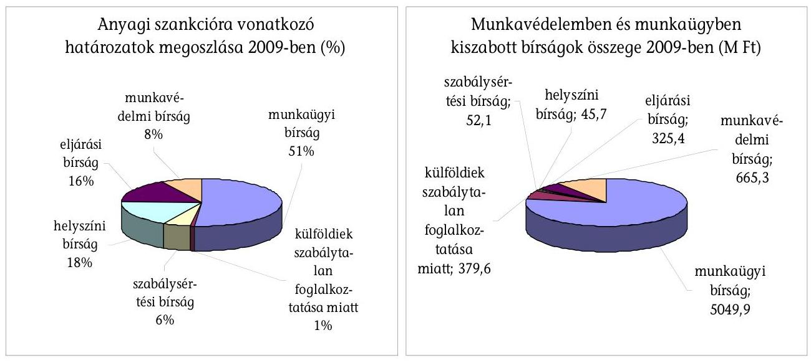

A hatósági ellenőrzés során kiszabott bírságok végrehajtása az OMMF feladata. A bírságtartozást az OMMF nem tudja azonban közvetlenül végrehajtani (az ingó és ingatlan végrehajtáshoz nincs jogosultsága), ezért a kiszabott bírság behajtására átadja a követelést a területileg illetékes adóhatóságnak (természetes személy esetében önkormányzat, jogi személy és jogi személyiséggel nem rendelkező egyéb szervezet esetében APEH). A bírságbehajtásra átadást megelőzően megtehető eljárási cselekményeket az OMMF-nek kell foganatosítania, megtennie a bírságbehajtással kapcsolatban.

A társas vállalkozásokkal szemben előírt pénzfizetési kötelezettségek esetén az OMMF Gazdasági Főosztálya naponta tételes listán értesíti a felügyelőségeket a beérkezett befizetésekről. Az átadott tételek összepárosítását az átadást követő három munkanapon belül köteles minden felügyelőség elvégezni. Amennyiben a fizetési határidő leteltét követő öt munkanapon belül a felügyelőség nem kapott értesítést a befizetés megtörténtéről, az eljáró ügyintéző a bírságnyilvántartásban rögzíti ezt a tényt.

Ha valószínűsíthető, hogy a kötelezettség későbbi teljesítése veszélyben van, a Ket. 29/A. § szerint, a 151. § szabályainak figyelembe vételével alkalmazott ideiglenes biztosítási intézkedés foganatosítására van lehetőség. Ideiglenes biztosítási intézkedés során a kötelezett bankszámláján lévő összeget vonják végrehajtás alá, a Gazdasági Főosztály felhívja a kötelezett bankszámláját vezető pénzintézetet, hogy a biztosítandó összeget és az eljárás fedezésére szolgáló összeget sem a kötelezett, sem más javára ne fizesse ki.

Ha a bankszámla ellen vezetett végrehajtás, illetve a biztosítási intézkedés nem vezet eredményre, az elsőfokú hatóság az OMMF Gazdasági Főosztályának erről szóló értesítése alapján - annak kézhezvételétől számított 10 munkanapon belül

---

- megkeresi a területileg illetékes állami adóhatóságot a követelés adók módjára történő behajtása érdekében.

A bírságbehajtás gyakorlata szoros együttműködést követelt meg a központ és a régió között.

A Ket. 2009. október 1-jén hatályba lépett módosítása (131. § (2) bekezdése) lehetővé tette, hogy a közigazgatási szervek a pénzfizetési kötelezettségek végrehajtására önálló bírósági végrehajtókkal szerződést kössenek. A bírságbehajtás hatékonyságának növelése érdekében az OMMF élt a lehetőséggel, a munkáltatókkal szemben jogerősen kiszabott eljárási bírság, valamint a magánszemély és egyéni vállalkozó munkáltatóval szemben kiszabott valamennyi bírság vonatkozásában a végrehajtást önálló bírósági végrehajtó végzi 2010-től. Az intézkedés eredményessége, illetve a bírósági végrehajtókkal történő bírságbehajtások hatékonysága a bevezetés óta eltelt idő rövidsége miatt még nem értékelhető.

A hatósági intézkedések végrehajtásának kikényszerítése érdekében meghatározták a bírságkövetelések behajtásának szervezeti és működési rendjét, belső szabályait. A bírságbehajtás hatékonyságának növelése érdekében a szabályozást többször módosították.

A bírságkövetelések behajtásának országos koordinációjával kapcsolatos feladatokat az OMMF SZMSZ-e szerint a gazdasági vezető irányításával az OMMF Gazdasági Főosztálya látta el. A területi felügyelőségeken a bírságok nyilvántartásával és behajtásával kapcsolatos feladatokat a felügyelőség ügyrendjében és a munkavállalók munkaköri leírásában rögzítették.

Az OMMF a bírságbehajtás eredményességének javítása érdekében a vizsgált évek alatt folyamatosan megtette a módosító intézkedéseket, a belső szabályozáson és a gyakorlaton a szükséges korrekciókat folyamatosan átvezették. A módosításoknál figyelembe vették az első fokon eljáró területi munkaügyi- és munkavédelmi hatóság tapasztalatait. A behajtási tevékenység hatékonyságának növelése érdekében tett jogszabály-módosító, illetve intézkedési, módszertani javaslatokat a területi felügyelőségekkel véleményeztették, a tapasztalatokról, a módszertannal alátámasztott egységes eljárásokról, a jó gyakorlatról esetenként országos konzultációkat, munkaértekezleteket tartottak. A bírságkövetelések behajtására a jogszabályban biztosított, rendelkezésre álló eszközöket alkalmazták.

---

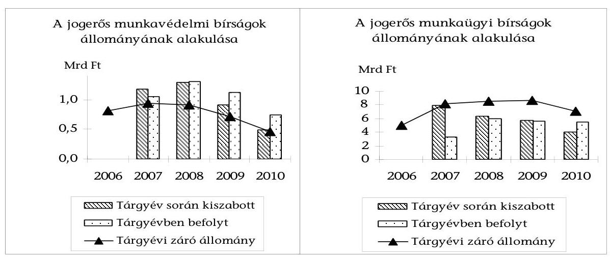

A munkavédelemben és munkaügyben kiszabott bírság állománya a 2007. évet követően visszaesett (2007-ben 9053,6 M Ft, 2008-ban 7575,2 M Ft, 2009-ben 6651,0 M Ft, 2010-ben 4479,1 M Ft). A befolyt bírság (beleértve a pénzforgalom nélküli, illetve a leírt, visszavont, törölt tételeket) összege 2008-ban az előző évihez képest nagy mértékű, 65%-os emelkedést követően 7252,2 M Ft, 2009-ben 6745,7 M Ft és 2010-ben 6278,8 M Ft volt. A 2008-ra felhalmozódott követelésállomány 2010-re 13%-kal csökkent (lásd a 11. számú mellékletet és a 9. számú ábrát).

A befolyt munkaügyi és a külföldiek engedély nélküli foglalkoztatása utáni bírság bevételek a Munkaerőpiaci Alapot (MPA), a szabálysértési bírság a központi költségvetést illeti. Az eljárási bírságok egy része - behajtás után az önkormányzati adóhatóságnál marad. A munkavédelmi és eljárási bírságbevétel az OMMF intézményi működési bevételét képezi, melynek felhasználását jogszabályi ${ }^{62}$ előírás szabályozza.

A követelések behajtásának alakulását figyelemmel kísérték és rendszeresen értékelték az intézkedések hatását. A bírságbefizetések realizálása érdekében teendő szakszerű és gyors intézkedések fontosságát a kiemelt ágazati célokat meghatározó miniszteri irányelvek is hangsúlyozták. Az OMMF az éves szakmai követelmények, illetve a területi felügyelőségek és egyéni teljesítménykitűzések részeként szerepeltette a bírságok behajtási mutatóinak javítását.

Az OMMF-nek 2008-ban a szakmai követelmények között mennyiségi mutatóhoz kötötten kiemelt feladata volt a bírságok eredményesebb behajtása. A követelmény teljesítése érdekében a felügyelőségek nagyobb hangsúlyt helyeztek a bírság behajtási munkában a gyors és szakszerű ügyintézésre, a bírságnyilvántartás naprakész vezetésére, a határidők pontos betartására, a jogerősítések határidőben való elvégzésére. A munkáltatók fize-

[^0]
[^0]:    ${ }^{62}$ 5/2002. (XI. 12.) FMM rendeletet hatályon kívül helyező 32/2009. (XII. 23.) SZMM rendelet a munkavédelmi jellegű bírságok pályázati, valamint információs célú felhasználásának részletes szabályairól.

---

tési hajlandósága - a válság hatására is - 2008-ban és 2009-ben romlott, a bírságkövetelések záró állománya érdemben nem (mindössze 1%-kal) csökkent.

Az országos szintű teljesítést legnagyobb mértékben befolyásoló Közép-magyarországi Munkaügyi Felügyelőség - a helyszíni vizsgálat alatt szolgáltatott adatai alapján - 2009-ben az 1434915 E Ft jogerős és végrehajtandó bírságokból befolyt 576435 E Ft befizetés 45,7%-a önkéntes teljesítéssel, 38,5%-a inkasszó útján, 11,5%-a APEH behajtással és 4,3%-a önkormányzati megkereséssel teljesült. A befizetett bírságok teljesülés típusa szerinti megoszlása azt mutatja, hogy az OMMF végrehajtási intézkedései (bankszámla elleni végrehajtás és biztosítási intézkedés) hatására nőtt az inkasszóval történő bírságbefizetések aránya 2008-2009-ben 19%-ról 40%-ra, és a befizetett bírságok mindössze 10-15%-a folyt be az APEH és az önkormányzati behajtással 2007-2009 között.

A meghozott intézkedések hatására az évente csökkenő bírságkivetés mellett ingadozott a behajtási arány. 2007-ben a 2856,6 Mrd Ft bírságkiszabás 35,2%-át, 2008-ban az 1591,3 M Ft 56,6%-át, 2009-ben az 1434,9 M Ft 40,2%-át hajtották be összesen a Közép-magyarországi Munkaügyi Felügyelőségnél.

Az Észak-magyarországi Munkaügyi Felügyelőségen a kintlévőségek felülvizsgálatával igen jelentős mértékben emelkedtek a behajthatatlanság miatt törölt követelések (melyeket a bírságnyilvántartásból kivezettek). A behajthatatlan követelések darabszáma a 2006. évben 7 db volt, míg a 2009. évben már 517 db behajthatatlan követelés leírására került sor, mely közel 74-szeres növekedést jelentetett. A behajthatatlan követelések összege - a 2006. évi 1266,3 ezer Ft-ról a 2009. évre 250505,7 ezer Ft-ra - emelkedett, amely közel 200-szoros növekedést jelentett. A leírt és elévült követelések állományának darabszáma a 2006. évi 2 db-ról 15 db-ra emelkedett, ugyanakkor az összegük a 2006. évi 1247,5 ezer Ft-ról 1078,5 ezer Ft-ra csökkent a 2009. évre.

# 4.3. Az ellenőrzések nyilvánossága, kommunikációja 

A visszatartó hatást erősítette az ellenőrzések nyilvánossága, a cél- és akcióellenőrzésekhez kapcsolódó kommunikáció. Az OMMF negyedéves és éves beszámolói nyilvánosak, ezek statisztikák, elemzések közreadásával segíti a munkaadókat. Az OMMF honlapján negyedévente közzéteszi a munkabalesetek számáról, alakulásáról szóló statisztikákat.

Az OMMF (a központ és a régiók) kommunikációs gyakorlata elősegítette a gazdálkodók számára a jogszabályok értelmezését, az ellenőrzések következményeinek átlátását. Az ellenőrzések nyilvánossága hozzájárult a visszatartó hatás erősítéséhez. A közösen végzett célvizsgálatok tapasztalatairól tartott sajtótájékoztatókkal is segítették a gazdálkodók informáltságát. A honlapon megjelent (utoljára a 2008. évre vonatkozó) az egyes évek munkavédelmi helyzetéről szóló tájékoztató jelentés, amely az OMMF tapasztalatai alapján elemzi a munkafeltételek, munkabalesetek, foglalkozási megbetegedések stb. alakulását. Tájékoztató jelent meg a honlapon a 2010. évi LXXV. törvény által bevezetett egyszerűsített foglalkoztatás új szabályairól.

A Nyugat-dunántúli régióban működő helyi televíziók felkérése alapján az igazgató tájékoztató műsorokban vett részt, ahol az eljárásaik során tapasztalt hiányosságokat, vagy pozitív
 tapasztalatokat ismertették. Részt vettek továbbá a régió három megyéjében az érdekképviseletek, különböző társadalmi szervezetek meghívása nyomán előadásokon, tájékoztatókon, ahol a munkaügyi jogszabályokkal, illetve a munkájuk során tapasztalt hiányosságokat, pozitív tapasztalatokat ismertették.

Az OMMF Munkavédelmi Tanácsadó Szolgálatot működtet, feladata tanácsadás munkavédelmi kérdésekben vállalkozásoknak, vállalkozás megkezdését tervezőknek, munkavédelmi képviselőknek, bizottságoknak. A szolgálat működése elősegítette a gazdálkodók számára a jogszabályok értelmezését.

A honlapon hozzáférhető több olyan oktatófilm, ami a helyes és helytelen munkavédelmi gyakorlatot mutatja be. Ezeket a korábbi években kampányok keretében mutatták be.

# 5. IRÁNYÍTÁSI, MŰKÖDÉSI FELTÉTELEK ÉRTÉKELÉSE 

### 5.1. A hatósági ellenőrzések kontroll környezete

Az OMMF a vizsgált időszakra vonatkozóan kialakította belső kontroll rendszerét. Az OMMF elnöke egységes szerkezetben 2010 áprilisában, belső utasításban ${ }^{63}$ határozta meg a szervezet belső kontrollrendszerének működését, illetve a kapcsolódó fogalmak körét.

A belső ellenőrzést a jogszabályi előírásoknak megfelelően alakították ki, annak feladatait és a szervezetben elfoglalt helyét, szerepét a mindenkor hatályos (utoljára a 2010 tavaszán elfogadott ${ }^{64}$ ) SZMSZ-ben rögzítették, a belső ellenőrzési tevékenységet az OMMF Központ szervezetében látták el. A felügyelőségek belső ellenőrt saját döntésük alapján foglalkoztattak.

A Közép-magyarországi Munkaügyi Felügyelőségen 2010. január elsejével kialakításra és betöltésre került egy belső ellenőri státusz. A belső ellenőr az igazgató által meghatározott kritériumok szerint negyedévente végrehajtja ellenőrzéseit, annak tapasztalatairól jelentésben tájékoztatja vezetőjét.

A független belső ellenőrzés tevékenységét kézikönyv szabályozta. Jogi normák ${ }^{65}$ szerint az OMMF elkészítette belső ellenőrzési stratégiáját ${ }^{66}$, amelyet folyamatosan aktualizált. Az éves ellenőrzési feladatok - a 2010. év kivételével teljes egészében az OMMF gazdálkodási tevékenységének elemzésére és értékelésére terjedtek ki.

Az OMMF a felügyelőségek átfogó, valamint téma vizsgálatát felügyeleti ellenőrzés keretében egységes szempontok és módszerek alapján végezte. A vizsgálatok során értékelték a határozathozatal egységességét, illetve azok különbségeit, elemezték a módszertani útmutatók alkalmazásának gyakorlatát. A felügyele-

[^0]
[^0]:    ${ }^{63}$ Az OMMF elnökének 11/2010. számú utasítása az Országos Munkavédelmi és Munkaügyi Felügyelőség belső kontrollrendszeréről.
    ${ }^{64}$ 8/2010. (III.3.) SZMM utasítás az Országos Munkavédelmi és Munkaügyi Főfelügyelőség Szervezeti és Működési Szabályzatáról.
    ${ }^{65}$ 193/2003. (XI. 26.) Korm. rendelet a költségvetési szervek belső ellenőrzéséről.
    ${ }^{66}$ Országos Munkavédelmi és Munkaügyi Főfelügyelőség belső ellenőrzésére vonatkozó stratégiai munkaterve (2006-2010).

---

leti ellenőrzések során kiemelten kezelték a panaszok és közérdekű bejelentések kivizsgálását. Feladataikat az OMMF éves munkaterve határozta meg.

A felügyeleti ellenőrzés feladatát a Szakmai Ellenőrzési Osztály, illetve - 2009. július 1-jétől a Törvényességi és Ellenőrzési Főosztály látta el. 2010. február 15-től - a panaszok és közérdekű bejelentések kivizsgálásának kivételével - a felügyeleti ellenőrzést a Munkavédelmi és Munkaügyi Főosztályok Felügyeleti Osztályai látták el. A panaszok és közérdekű bejelentések kivizsgálását a Panaszkezelési és Elemző Önálló Osztály végzi. A felügyeleti ellenőrzésen belül a panaszok kivizsgálásának, illetve a felügyelőségek szakmai munkája vizsgálatának külön-külön szervezeti egységhez rendelték. Az utód szervezeti egységek feladatköre leszűkült, munkájuk elvégzéséhez a szolgálati út betartásával egymástól kértek adatokat, amely meghosszabbította az ügyintézést.

A felügyeleti ellenőrzést végző Törvényességi és Ellenőrzési Főosztály szakmai ellenőrei elsőfokú hatósági ellenőrzésben is részt vettek, ami a hatósági jogkört gyakorló és az ezt ellenőrző függetlenségének elve szempontjából kockázatot jelentett.

Az OMMF a folyamatba épített, előzetes és utólagos vezetői ellenőrzési rendszer (FEUVE) kialakítására vonatkozó törvényi kötelezettségének ${ }^{67}$ 2006. július 1-én tett eleget ${ }^{68}$. Az ellenőrzési nyomvonalat 2010. április elsejével kiterjesztették az egész szervezetre ${ }^{69}$. A módosításnál figyelembe vették a szervezeti korrekciókat, az új szabályozással lefedték az OMMF teljes működését.

A 2006. évi szabályozás a gazdálkodási tevékenység ellenőrzési nyomvonalát határozta meg, a szervezet alaptevékenységének ellenőrzési pontjait keret jelleggel rögzítette, a 2010-ben végrehajtott szabályozási korrekció a gazdálkodáshoz hasonlóan minden egyes szervezeti egység tekintetében konkrétan rögzítette az ellenőrzési feladatokat és az ellenőrzési pontokat, a végrehajtandó feladatok tartalmi leírását, a keletkező dokumentumok körét, felelősét és az ellenőrzésre jogosultak körét.

A FEUVE rendszer kialakítása és működtetése felügyelőségenként eltért.
A Közép-magyarországi Munkavédelmi Felügyelőség igazgatójának kezdeményezésére - az igazgató közvetlen irányításával - három-fős jogász csoportot hoztak létre, hogy az igazgatóhoz olyan határozatok kerüljenek be kiadmányozásra, amelyek a Ket.-ben előírt alaki és forma követelményeknek megfelelnek.

A Nyugat-dunántúli és az Észak-alföldi Munkavédelmi Felügyelőségeken a FEUVE rendszer elősegítette az ellenőrzési célok megvalósítását. A felügyelői teljesítményeket tartalmazó listákat a FEIR-ből havonta kérdezték le, szükség esetén felhív-

[^0]
[^0]:    ${ }^{67}$ 2006. évi CIX. törvény a kormányzati szervezetalakítással összefüggő törvénymódosításokról 168. § (1) f pontja, a 1992. évi XXXVIII. törvény módosításáról, az államháztartásról.
    ${ }^{68}$ Az OMMF elnökének 12/2006. számú utasítása az OMMF és a területi munkabiztonsági, munkaügyi felügyelőségek ellenőrzési nyomvonaláról.
    ${ }^{69}$ Az OMMF elnökének 7/2010. számú utasítása az OMMF és a területi munkavédelmi, munkaügyi felügyelőségeinek ellenőrzési nyomvonaláról.

---

ták a felügyelő(k) figyelmét az elmaradásokra. Régiós értekezleten a felügyelői teljesítményekről az igazgató tájékoztatást adott.

A Nyugat-dunántúli és az Észak-alföldi Munkaügyi Felügyelőségeken a FEUVE rendszer hatékony működéséhez szükséges adatokat a FEIR rendszeréből havi gyakorisággal kérték le, amelyet a vezetői ellenőrzéshez felhasználtak.

A FEUVE működését az OMMF átfogóan a vizsgált időszakban nem értékelte.
Az OMMF Észak-alföldi Munkaügyi Felügyelősége nyíregyházi irodájában bejelentés alapján kezdeményezett vizsgálata a FEUVE hiányosságait tárta fel.

Az államháztartás működési rendjéről szóló kormányrendeletek ${ }^{70}$ a költségvetési szervek vezetőinek meghatározzák, hogy a vezetői információs rendszer működése érdekében olyan információs, kommunikációs, illetve monitoring rendszereket kötelesek kialakítani és működtetni, amelyek biztosítják, hogy a szükséges információk megfelelő időben eljuthassanak az illetékes szervezethez, szervezeti egységhez, illetve személyekhez, valamint a monitoring rendszer tegye lehetővé a szervezet tevékenységének, a célok megvalósításának nyomon követését.

A vezetői információs rendszer működését a szakmai feladatok tekintetében ellenőriztük. A szakmai tevékenység alakulását folyamatosan nyomon követték (részletesen lásd az adott szakmai pontoknál). A teljesítés alakulását a központ számszerűen kimutatta, de azt tartalmában nem értékelte. A szükséges intézkedéseket a területi szervnek kellett meghoznia.

Az OMMF elnöke a szervezet működésével kapcsolatos kockázati tényezőket, illetve azok kezelhetőségét a kockázatkezelési rendről kiadott belső utasításokban határozta meg ${ }^{71}$. Az elnöki utasítást a PM által közzétett módszertani útmutatóból vették át. A szervezet a dokumentum átvétele során kevés figyelmet fordított a helyi sajátosságokra (a kockázatok tekintetében a személyi összeférhetetlenség kérdésére).

Az OMMF belső utasítása ${ }^{72}$ csak részben szabályozta a személyi összeférhetetlenség fennállása esetén követendő szabályokat. A magatartási szabályok kimondottan csak a felügyelőkkel szemben fogalmaz meg elvárásokat, ebből adódóan szükségesnek tartjuk kiegészítését azzal, hogy terjedjen ki a szervezet minden tagjára.

[^0]
[^0]:    ${ }^{70}$ 217/1998. (XII.30.) Korm. rendelet az államháztartás működési rendjéről, illetve a 292/2009. (XII. 19.) Korm. rendelet az államháztartás működési rendjéről.
    ${ }^{71}$ Az OMMF elnökének 32/2007. és 9/2010 számú utasításai az OMMF, területi munkavédelmi, munkaügyi felügyelőségei a kockázatok kezelési rendjéről.
    ${ }^{72}$ Az OMMF elnökének 6/2007. számú utasítása a köztisztviselők, ezen belül a munkavédelmi és munkaügyi felügyelők egyes magatartási követelményeiről.

---

# 5.1.1. A korrupció kezelése 

A Kormány 2007-ben a korrupció elleni küzdelemmel kapcsolatos feladatait kormányhatározatban ${ }^{73}$ rögzítette. A dokumentum rámutatott a Magyar Köztársaság nemzetközi egyezményekben vállalt kötelezettségeire, a korrupciós jelenségek megfelelő kezelésére, illetve megelőzésére, a korrupció elleni küzdelem területén újfajta stratégiai megközelítésére. A Kormány a korrupció elleni küzdelem koordinálása érdekében létrehozta az Antikorrupciós Koordinációs Testületet, amely összeállította a Korrupció Elleni Stratégia lényeges feltételeit és javaslatokat, elveket fogalmazott meg. Az OMMF a kormányhatározatban foglaltak tekintetében elkötelezettnek vallotta magát, hogy szervezetében a korrupciós lehetőségeket visszaszorítsa és megszüntesse, ennek érdekében belső utasítást adott ki. ${ }^{74}$ Kidolgozta az OMMF Korrupció Elleni Stratégiáját, amelyet 2010. július 14-én a megbízott elnök jóváhagyott. A dokumentumban rögzítették, hogy:
a kockázatelemzési módszerekkel azonosítani kell a korrupciós szempontból kritikus pontokat,
a kritikus pontok beazonosításával kockázati térképet kell kidolgozni,
a kritikus pontok visszaszorítására cselekvési tervet kell készíteni,
a kockázati térképet rendszeres kockázatelemzéssel folyamatosan aktualizálják.
Az OMMF a korrupció elleni stratégiájában rögzítette, hogy a központi szervezeti egységeinek és a területi felügyelőségeinek bevonásával 2010. szeptember 30-ig azonosítja a szervezet feladatellátása során esetlegesen felmerülő kritikus pontokat. A kritikus pontok ismeretében a Korrupciós Kockázatkezelő Bizottság - október végéig - elkészítette az OMMF korrupciós kockázati térképét ${ }^{75}$. A korrupciós kockázati térkép elfogadásáról az OMMF elnöki értekezlete 2010. november 25-én döntött, amely azonnali intézkedéseket nem fogalmazott meg.

A stratégia megvalósításának végrehajtási tervét melléklet tartalmazza. A terv az azonnali, illetve a szükséges intézkedések meghatározására és a végrehajtására nem tartalmaz ütemezést. Az első feladat eredményeként elkészített kockázati térkép azonnali feladatokat nem határozott meg. 2010 decemberében intézkedési terv készült az OMMF korrupciós kockázati térképében megfogalmazott intézkedések végrehajtásához 2011-es, illetve folyamatos határidőkkel.

Az OMMF korrupciós stratégiája nem tesz említést a köztisztviselők, ezen belül a munkavédelmi és munkaügyi felügyelők egyes magatartási követelményeiről szóló 6/2007. OMMF utasításban foglaltakról.

[^0]
[^0]:    ${ }^{73}$ 1037/2007. (VI. 18.) Korm. határozat a korrupció elleni küzdelemmel kapcsolatos feladatokról.
    ${ }^{74}$ Az OMMF elnökének 6/2007. számú utasítása köztisztviselők, ezen belül a munkavédelmi és munkaügyi felügyelők egyes magatartási követelményeiről.
    ${ }^{75}$ Kockázati térkép (5295-103/2010-5040. ikt számú e-mail levél melléklete).

---

# 5.2. Az OMMF humánerőforrás gazdálkodása, feladatellátásra gyakorolt hatása 

### 5.2.1. A feladatellátás létszámfeltételeiben rejlő kockázatok kezelése

Az OMMF állami feladatai ellátására a jogszabályi előírásoknak megfelelően köztisztviselőket ${ }^{76}$, illetve néhány fő, az Mt. hatálya alá tartozó (fizikai) munkavállalót foglalkoztatott.

Az OMMF állami feladatként ellátandó alaptevékenységébe tartozik a munkavédelmi, valamint a munkaügyi hatósági feladatok ellátása, illetve 2009-től a munkavédelem és munkaügy irányítása. A munkavédelmi feladatok ellátása 2007. január 1-től kiterjed a munkabiztonság és a munkaegészségügy (munkahigiénés és foglalkozás-egészségügy) hatósági feladataira is.

Az OMMF jogkörét országos illetékességű központi (Főfelügyelőség), illetve külön jogszabályban meghatározott illetékességű területi szervei (felügyelőségek) keretében működő munkavédelmi és munkaügyi felügyelők, munkavédelmi felügyelő tanácsadók, orvos végzettségű felügyelők és igazgatók útján gyakorolja.

Az OMMF 2006-2010. között költségvetési törvényben engedélyezett létszámkerete 762 főről 1055 főre (293 fővel, 38,5\%-kal) emelkedett. Átlagos statisztikai állományi létszámát tekintve a vizsgált időszakban az egyes állománycsoportok aránya lényegében változatlan volt (lásd a 12. számú mellékletet).

A létszám megoszlása a központ és a területi szervek között hozzávetőlegesen 1:4 arányú (18-20\% a központ aránya), a területi szerveknél a munkavédelem és munkaügyi létszám 40-60\% arányban alakult. Annak ellenére, hogy a létszámfejlesztések célja az ellenőri jelenlét fokozása volt, a felügyelők aránya - a teljes létszámon belül - gyakorlatilag nem változott (61-64\%). A felügyelőségek összlétszámához viszonyítva a felügyelői létszám a vizsgált időszakban kedvezőbb képet mutatott, aránya 77-78 \% volt (10. számú ábra).

Az OMMF a vizsgált
 időszakban nem rendelkezett átfogó, humánerőforrásainak fejlesztésére vonatkozó, az elérendő célkitűzéseket megfogalmazó középtávú humánstratégiával, annak elemei a belső szabályozásban megjelentek (teljesítményértékelés, képzés, utánpótlás). A humánerőforrás-gazdálkodás keretében gondoskodtak a nagymértékű létszámbővítés megvalósításáról.

Az egyes szakterületek eredményesebb és hatékonyabb működését, a feladatok és létszámkapacitások összhangját biztosító, mutatószámokon, elemzéseken alapuló humánerőforrás-tervezési és felhasználási (elosztási) szabályozás hiányában az OMMF elnöke osztotta meg a létszámkereteket a szakterületek és a regionális szervezetek között és határozta meg a szakmai létszám és az egyéb létszám arányát. Ennek során figyelembe vette a kialakult arányokat és a felügyelőségek létszámigényét, a felügyelői létszám aránya a vizsgált időszakban

[^0]
[^0]:    ${ }^{76}$ 2010. július 6. napjától kormánytisztviselők.

---

gyakorlatilag állandó (az OMMF-n belül 60% körüli, régiós létszámot tekintve 78%) volt. A létszámkeret felhasználásáért, a feladatellátáshoz megfelelő szakképzettséggel rendelkező létszámmal való betöltéséért az igazgató felelt.
10. számú ábra
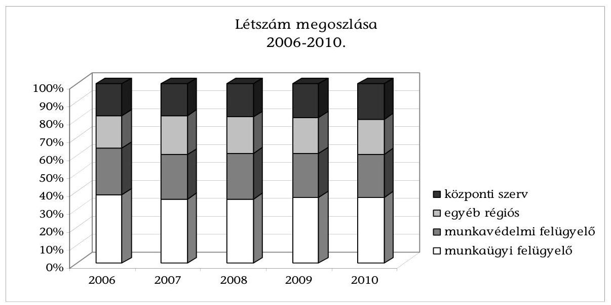

A felügyelői munka szakszerűségének, törvényességének, valamint hatékonyságának javítása érdekében a felügyelőségek javaslatára - a szakmai főosztályok véleményezésével és az elnök jóváhagyásával - esetenként létszámátcsoportosításokat hajtottak végre, valamint új szervezeti struktúrákat alakítottak ki.

A Közép-Magyarországi Munkavédelmi Felügyelőségen 2009-től 3 fős jogász csoport segíti a felügyelői munkát. Informatikus alkalmazásával a módosított Ket. jogszabályi előírásainak betartását határidő-figyelő rendszer támogatja.

2009. áprilisától a Közép-Magyarországi Munkaügyi Felügyelőségtől 7 fő felügyelői, az Észak-Alföldi Munkavédelmi Felügyelőségtől 1 fő felügyelői üres álláshely került átcsoportosításra 1-1 fővel az Észak-Magyarországi Munkaügyi-, a Közép-Dunántúli Munkaügyi-, a Dél-Alföldi Munkaügyi-, a Nyugat-Dunántúli Munkavédelmi Felügyelőséghez, valamint 4 fő az OMMF Központjához. Ezzel egyidőben az OMMF megbízott elnöke a Közép-Magyarországi Munkaügyi Felügyelőségnél az adminisztratív állomány 2 fő ügyintézői státusszal történő növeléséről döntött a felügyelőségi üres felügyelői álláshelyek terhére.

A feladatellátás szempontjából kockázatot jelentett, hogy a felügyelői létszám régiók közötti elosztása nem volt összhangban a régió sajátosságaival (a működő vállalkozások és a foglalkoztatottak, valamint a felügyelők száma, 11. számú ábra).

---

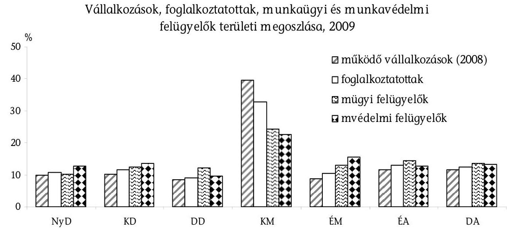

A bővülő álláshelyek megfelelő munkaerővel, felügyelővel való betöltésének eredményeként az üres álláshelyek aránya - 2007 kivételével - 2,0 és 4,7% között tudták tartani.

2007-ben az üres álláshelyek aránya 10,0% kiugró értéket mutatott, mivel az év közepétől biztosított létszámfejlesztési kereteket az év végéig még nem tudták betölteni.

2009-ben megnehezítette a személyi állomány szinten tartását az év közben kormányhatározattal ${ }^{77}$ elrendelt létszámstop rendelkezés, mely értelmében az üres álláshelyek és a megüresedők (akár nyugdíjazás miatt) nem voltak feltölthetők.

A felügyelői kar cserélődését és bővülését jellemzik a vizsgált időszak létszámváltozásának adatai. A munkavédelem területén a 2007. évben - a munkaegészségügyi feladatok átvétele miatt - a munkavédelmi felügyelők létszáma 52%-kal nőtt (2006-ban ez az arány 7, 2008-ban 23 és 2009-ben 6% volt). A munkaügy területén a belépők aránya 2007-ben és 2008-ban meghaladta a nyitó létszám 30%-át. 2009-re ez az arány 19%-ra (8. számú táblázat).

2008-tól egységes toborzási és kiválasztási eljárási rendet alkalmaztak, gondoskodtak a kilépők pótlásáról. Az üres álláshelyek betöltésénél nehézséget okozott, hogy a munkaerőpiacon kevés a feladatok elvégzésére alkalmas, megfelelő képzettséggel rendelkező szakember.

A jogszabályi követelményeknek megfelelően kiadták a Közszolgálati Szabályzatot. Tekintettel a hatósági ellenőrzéssel járó megterhelésre, a munka speciális jel-

[^0]
[^0]:    ${ }^{77}$ 1127/2009. (VII. 29.) Korm. határozat az egyes költségvetési szervek létszámgazdálkodását érintő átmeneti intézkedésekről.

---

legére, valamennyi felügyelői munkára jelentkező esetében - a jogszabályi követelmények alapján ${ }^{78}$ - munkaköri alkalmassági vizsgálat elvégzésére is sor került.
8. számú táblázat

Felügyelők állományváltozása

| Felügye-   lök (fő) | 2007 |  | 2008 |  | 2009 |  | 2010 |  |
| :-- | :--: | :--: | :--: | :--: | :--: | :--: | :--: | :--: |
|  | nyitó | belépő | nyitó | belépő | nyitó | belépő | nyitó | belépő |
| munka-   védelmi | 189 | 98 | 255 | 58 | 274 | 17 | 265 | 3 |
| munka-   ügyi | 282 | 92 | 324 | 97 | 355 | 66 | 380 | 16 |
| összesen | 471 | 190 | 579 | 155 | 629 | 83 | 645 | 19 |

2008-tól a képzéseket, továbbképzéseket előtérbe helyező Szakmai Programot dolgoztak ki. Kialakították az újonnan belépő felügyelőkre vonatkozó eljárásrendet. A felügyelőknek a felkészítésük során el kellett sajátítani a módszertani ismereteket, az elméleti szakmai ismereteket és gyakorlati felkészítésben részesültek.

A felügyelői munkakör ellátásához szakirányú egyetemi (főiskolai) végzettséggel és megfelelő munkavédelmi szakképesítéssel kell rendelkezni. A feladat sikeres elvégzéséhez jó áttekintő, helyzetfelismerő, problémamegoldó és konfliktuskezelő képesség szükséges. A munkaügyi és munkavédelmi - különösen munkaegészségügyi orvos - felügyelő máshol nem szerezhet gyakorlatot.

A felügyelőknek a felkészítésük során el kellett sajátítani a módszertani ismereteket, az elméleti szakmai ismereteket és gyakorlati felkészítésben részesültek. A gyakorlati felkészülés alatt már tapasztalt felügyelővel végezték el a helyszíni ellenőrzéseket és folytatták le az eljárásokat, de önálló intézkedést nem hozhattak.

A korösszetételt tekintve a helyszíni vizsgálat idején készült kérdőíves felmérésben résztvevő munkavédelmi felügyelők 58%-a tartozott a 45 feletti és 23% az 55 feletti korosztályba. A munkaügyi felügyelőknél a domináns korosztályt a 30-45 évesek alkották (45%). A munkavédelmi felügyelők 52%-a több, mint 5 éve és 37% több, mint 10 éve van az OMMF-nél. A munkaügyi felügyelők 70%-a legfeljebb 5 éve, míg 21%-a több, mint 10 éve felügyelő (13. számú melléklet).

[^0]
[^0]:    ${ }^{78}$ 33/1998 (VI. 24.) NM rendelet a munkaköri, szakmai, illetve személyi higiénés alkalmasság orvosi vizsgálatáról és véleményezéséről.

---

# 5.2.2. A létszámfejlesztések hatása az ellenőrzési célkitűzések teljesítésére, a hatékonyság alakulására 

Az OMMF létszámának alakulását a jogszabályváltozásokból adódó új és több feladat, valamint a létszámnövekedést elrendelő kormányhatározatok végrehajtása befolyásolta. Létszámának emelése feladatokhoz kötötten, kormányzati döntést követően történt. Az OMMF erőforrásait, létszámfeltételeit meghatározó korábbi évek kormányzati intézkedései rövid- és középtávon nem voltak minden esetben következetesek.

Az OMMF számára 2002. év végén engedélyezett bővülést 2003-ban és 2004-ben a létszám Kormány által elrendelt csökkentése követte, miközben 2004. óta napirenden volt a munkaügyi ellenőri létszám 100 fős emelése ${ }^{79}$, mely 2005. év végével valósult meg.

Az OMMF-nél két ütemben (2005 és 2007) végrehajtott ${ }^{80}$, jelentős, a feketegazdaság visszaszorítását, a jogkövető magatartás elterjedését célzó, összességében 250 fős létszámbővítés mindkét szakterületen hozzájárult a teljesítmények 2008-ig tartó növekedéséhez. A létszám jelentős, (2006. évi bázison számolva) 30%-ot meghaladó arányú növekedése 2008-tól azonban nem járt együtt a hatósági ellenőrzések számának növekedésével (12. számú ábra). A romló tendencia a munkavédelem területén 2010-ben megállt.
12. számú ábra
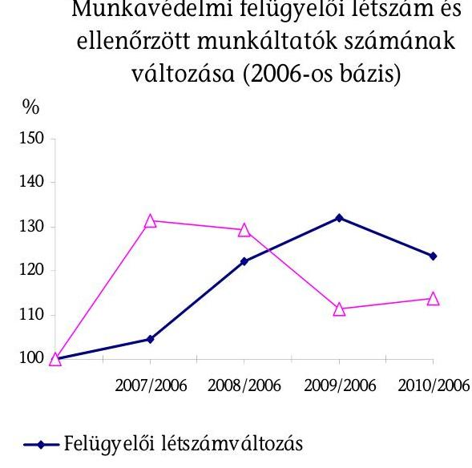

Munkavédelmi felügyelői létszám és ellenőrzött munkáltatók számának változása (2006-os bázis)
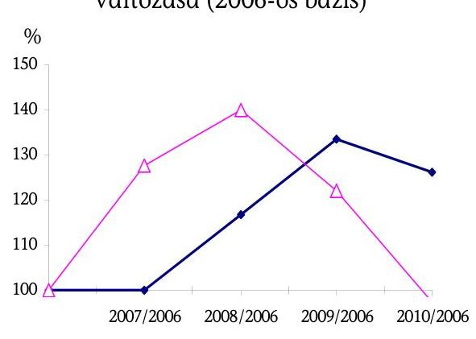
-Felügyelői létszámváltozás
-Ellenőrzött munkáltatók számának változása

[^0]
[^0]:    ${ }^{79}$ Forrás: A Foglalkoztatáspolitikai és Munkaügyi Minisztérium fejezet működésének ellenőrzéséről szóló ÁSZ Jelentés (0543).
    ${ }^{80}$ 2168/2005. (VIII. 2.) Korm. határozat a munkaügyi ellenőrzés hatékonyságának javítása érdekében a munkaügyi felügyelők létszámának emeléséről, 2146/2007. (VII. 27.) Korm. határozat a feketegazdaság elleni küzdelemmel kapcsolatos feladatokról, a végrehajtásban érintett intézmények erőforrásigényéről.

---

A létszámfejlesztéseket megalapozó elemzések azzal számoltak, hogy a létszámfejlesztés tovább bővíti a munkaügyi ellenőrzés lehetőségeit, növeli a törvényes foglalkoztatás betartatására, a munkavállalók kiszolgáltatottságának csökkentésére, a munkavállalók garanciális jogainak védelmére irányuló hatósági feladatellátást. A munkaügyi ellenőrzések hatékonyságának további növelési lehetőségét az erőforrások növelése mellett az ellenőrzések szigorításában látták annak érdekében, hogy ne csak az ellenőrzött munkáltatók számának növelését eredményezze, hanem nagyobb visszatartó erőt képviseljen és a jogkövetés irányába hasson.

A munkavédelmi feladatok ellátása 2007. január 1-től kiterjed a munkabiztonság és a munkaegészségügy (munkahigiénés és foglalkozás-egészségügy) hatósági feladataira is. Az OMMF munkavédelmi tevékenységének ellátását az Országos Munkahigiénés és Foglalkozás-egészségügyi Intézet (továbbiakban: OMFI) segíti - külön jogszabályban és az alapító okiratában meghatározott - a munkahigiénés, foglalkozás-egészségügyi és a munkavédelmi kutatással összefüggő feladatok ellátásával.

Feladatbővülésből adódó lényegi változást jelentett e téren a korábban megyei ÁNTSZ hivatalok feladatkörébe tartozó munkaegészségügyi hatósági feladatok 2007. január 1-jétől kezdődő átvétele 138 fő betöltetlen álláshellyel, egyben az OMFI tevékenységének irányítása. Az ÁNTSZ az OMMF részére megfelelő szakértői apparátust nem adott át.

A munkaegészségügyi integrációt elrendelő határozat végrehajtásához kapcsolódó kormányrendelet ${ }^{81}$ alapján az OMMF a jelzett feladatokat 2007. április 16. napjától látja el és irányítása alá került a korábban az Országos Tisztiorvosi Hivatal (OTH) irányítása alatt működő OMFI (100 fővel), mint részben önállóan gazdálkodó részjogkörű költségvetési szerv is.

A munkabiztonság és a munkaegészségügy integrációjával jogi értelemben egységes munkavédelmi hatóság szervezeti kereteit, hatásköri kérdéseit, az állások betöltését 2008. év elejére rendezték. Az egységes ellenőrzési munkagyakorlat kialakítása és a munkaegészségügyi szempontok módszertani integrálása céljából a szükséges továbbképzésekről gondoskodtak.

# 5.3. Az érdekeltségi rendszer ösztönző hatása a teljesítménykövetelmények megvalósítására 

Az OMMF az eredményes feladatellátás érdekében teljesítménykitűzésekhez kötött érdekeltségi rendszert alakított ki és működtetett, mely összességében elősegítette az egymásra épülő köztisztviselői egyéni, szervezeti, intézményi teljesítménykövetelmények megvalósulását.

[^0]
[^0]:    ${ }^{81}$ 362/2006. (XII. 28.) Korm. rendelet az Állami Népegészségügyi és Tisztiorvosi Szolgálatról és a gyógyszerészeti államigazgatási szerv kijelöléséről.

---

Az OMMF a teljesítményértékelés rendjét 2009-ig a Közszolgálati szabályzat, ${ }^{82}$ ezt követően a köztisztviselői teljesítményértékelésről jogszabályban előírtakat ${ }^{83}$ (továbbiakban: TÉR) is figyelembe véve a Főfelügyelőség, valamint a területi felügyelőségek köztisztviselőinek teljesítményértékelését és jutalmazásainak részletes szabályait külön elnöki utasítás ${ }^{84}$ keretében szabályozta.

A foglalkoztatott köztisztviselők teljesítményértékelésének alapját 2006-2007-ben az irányító miniszter által meghatározott általános célkitűzések és szakmai célok képezték ${ }^{85}$, ezen túlmenően az OMMF - a formai eljárási szabályok kivételével - nem határozott meg egyéb kritériumokat a teljesítményértékelések végrehajtásához.

Az OMMF központi szervezeti egységeire 2008. január 1-jétől, a területi felügyelőségekre 2009. január 1-jétől, majd ezt elhalasztva 2011. január 1-jétől írták elő a TÉR alkalmazását.

A területi felügyelőségek teljesítményértékelésére az átmeneti időszakban eltérő rendelkezések vonatkoztak.

# Az OMMF törekedett az egyéni, a szervezeti és az ágazati cél, illetve követelményrendszer összhangjára. 

Az intézmény egészére, és a két szakterületre vonatkozó szakmai követelményeket az irányító miniszter irányelveire alapozva határozták meg, ami az egyéni és a felügyelőségi feladatellátás teljesítményértékelésének alapját képezte. Az igazgatók az OMMF központja által a részükre kitűzött teljesítménykövetelmények alapján úgy alakították ki a felügyelők, illetve az egyéb köztisztviselők egyéni teljesítménykövetelményét, hogy a felügyelőség számára meghatározott szakmai követelmények összességében teljesüljenek. A teljesítménykövetelmények az általános célkitűzések mellett mennyiségi és minőségi elvárásokat is tartalmaztak.

A mérhető követelmények alakulását a FEIR nyilvántartásból kinyerhető, havonta készített statisztikai kimutatásokból folyamatosan nyomon követték és a

[^0]
[^0]:    ${ }^{82}$ Az OMMF elnökének az Országos Munkavédelmi és Munkaügyi Főfelügyelőség és területi felügyelőségei Közszolgálati szabályzatáról szóló 10/2007. OMMF utasítása, valamint a 14/2008. OMMF utasítása.
    ${ }^{83}$

 301/2006. (XII. 23.) Korm. rendelet a köztisztviselői teljesítményértékelés és jutalmazás szabályairól, hatálytalan 2010. június 30-tól.
    ${ }^{84}$ Az OMMF elnökének 38/2009. számú utasítása az Országos Munkavédelmi és Munkaügyi Főfelügyelőség, valamint területi munkavédelmi, munkaügyi felügyelőségei köztisztviselőinek teljesítményértékeléséről és jutalmazásának szabályairól szóló 2/2009. OMMF utasítás módosításáról, valamint az OMMF 5/2010. utasítása az Országos Munkavédelmi és Munkaügyi Főfelügyelőség, valamint területi munkavédelmi, munkaügyi felügyelőségeinek teljesítményértékeléséről és jutalmazásának szabályairól.
    ${ }^{85}$ 3/2006. (MüK.2.) FMM utasítás a Foglalkoztatáspolitikai és Munkaügyi Minisztériumban, és az ágazati irányítása alá tartozó szervezeteknél foglalkoztatott köztisztviselők 2006. évi tevékenységét meghatározó kiemelt célokról. A miniszteri utasítás 2006. év február 1-jétől 2007. év december 27-ig volt hatályban.

---

belső szabályozásban előírt időközönként (félévkor szóban, év végén írásban rögzítve) az egyéni teljesítményértékeléseket teljes körűen elvégezték.

A felügyelőségek intézményi és a régiók összehasonlító, valamint a felügyelők munkájának egyéni értékelése során alkalmazott mutatószámok egységes rendszert alkottak. Együttes alkalmazásuk lehetővé tette a teljesítmények értékelését, a régiók objektív összehasonlítására azonban csak részben voltak alkalmasak, mivel figyelmen kívül hagyták a régiók eltérő adottságait, illetve a minőségi követelmények érvényesülését.

# A felügyelők érdekeltségi rendszere ösztönzőleg hatott a teljesítménykövetelmények megvalósulására. 

Az OMMF ösztönzési rendszere az irányító miniszter által meghatározott célfeladatok teljesítéséhez kötött, az úgynevezett többletadó-bevételből - a költségvetési törvényben meghatározott feltételek teljesülése ${ }^{86}$ esetén - finanszírozott jutalmazáson alapult.

Az OMMF számára a célfeladatokhoz kötött jutalmazás fedezetére 2006-ban 220,0 M Ft, 2007-ben 440,0 M Ft, 2008-2009-ben 726,0 M Ft és 2010-ben 317,0 M Ft összegű előirányzat túllépésének lehetőségét irányozták elő, amennyiben az APEH-nak a törvényben meghatározott adóbevételi előirányzatai az adott mértékben (2006-2008-ban egyaránt 1%-kal, 2009-ben 0,3%-kal, 2010-ben 1%-kal) túlteljesülnek. A jutalomkeret terhére az - a pénzügyminiszter egyetértésével - irányító miniszter engedélyezte a kifizetést, ha az általa meghatározott feltételek teljesültek. 2009-ben a szociális és munkaügyi miniszter a pénzügyminiszter egyetértésével az év I. negyedévi célfeladat teljesítései alapján engedélyezte a negyedéves jutalom kifizetését, azonban a II. negyedévtől kezdődően a szakmai feltételek eredményes teljesítése ellenére a többletjuttatásokat nem hagyta jóvá, mivel a bevételi előirányzatokra vonatkozó feltételek nem teljesültek.

Az ösztönző rendszer hatékony működésére utal, hogy a - rendszeres és nem rendszeres (teljesítménytől függő) - felügyelői átlagbér és a teljesítmény 2006-2009. években egymással összhangban változott (13. számú ábra).

Az értékelések a szakmai feltételekhez kötött teljesítménymutatók alapján történtek, a jutalom elosztás arányait a két szakterület, illetve a központ vonatkozásában az OMMF elnöke határozta meg. A jutalomkeret elosztása a felügyelőségeken - a központilag meghatározott szempontrendszer és teljesítménymutatók alapján - igazgatói hatáskörben történt.

A kérdőíves felmérésünkben a válaszadó felügyelők szerint az arányosabb teljesítménykövetelmények, illetve a teljesítményértékelések és a munka minőségének nagyobb összhangja segítené a leginkább a felügyelők eredményesebb munkavégzését (13. számú melléklet).

[^0]
[^0]:    ${ }^{86}$ Az APEH-nak a törvényben meghatározott adóbevételi előirányzatai együttesen az adott mértékben (2006-2008-ban egyaránt 1%-kal, 2009-ben 0,3%-kal, 2010-ben 1%-kal) való túlteljesülése esetén.

---

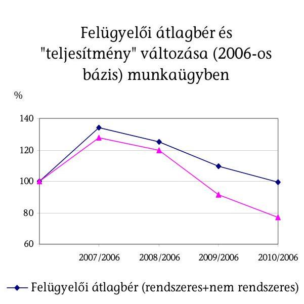
13. számú ábra

Felügyelői átlagbér és "teljesítmény" változása (2006-os bázis) munkavédelemben
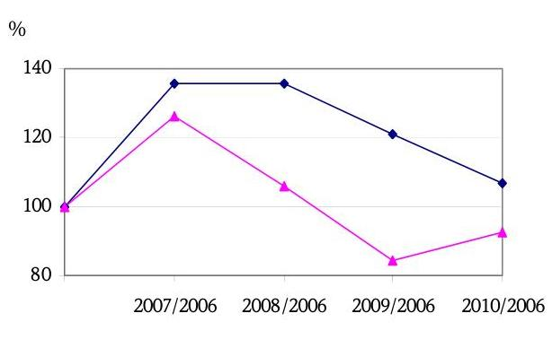
$\rightarrow-$ Felügyelői átlagbér (rendszeres+nem rendszeres)
$\rightarrow 1$ felügyelőre jutó ellenőrzött munkáltatók száma munkaügyben
$\rightarrow-$ Felügyelőre jutó ellenőrzött munkáltatók száma munkavédelemben

# 5.4. A feladatellátás informatikai támogatottsága 

A Felügyelők Ellenőrzési Információs Rendszere (továbbiakban FEIR) egy egyedi fejlesztésű szoftver, amely integráltan tartalmazza a szakmai és iratkezelési rendszert, lefedi a szervezet szakmai tevékenységét és ügyviteli folyamatait, az egyes folyamatokhoz informatikai támogatást nyújt.

Az OMMF vizsgált évekre vonatkozó munka- és ellenőrzési tervei rendre tartalmaztak az informatikai rendszer fejlesztéséhez kapcsolódó feladatokat. Az ellenőrzött időszakban a FEIR rendszer teljes megújítása folyamatosan napirenden volt. Az új rendszerrel szemben megfogalmazott elvárások jelzik az azóta is működő rendszer hiányosságait.

Az új rendszerrel szembeni követelmények között szerepel, hogy nagyobb segítséget adjon a felhasználók gyors információhoz, adathoz jutásához (pl. adatrögzítés, határidő figyelés stb.), valamint a vezetői munka támogatásához, adatsorok elemzésére, tendenciák felismerésére, adatok, ágazatok, régiók összehasonlítására alkalmas feldolgozási lehetőség megteremtésével.

A FEIR rendszer az ellenőrzések eredményeinek rögzítését és azok utólagos elérhetőségét, áttekinthetőségét jól támogatja. A kirendeltségek szakmai munkáját a FEIR támogatja, a rendszer felépítése hozzájárul a biztonságos működéshez. Gyakori ugyanakkor a duplikált adatbevitel, egyes már rögzített adatokat esetenként újra fel kell vinni. A lekérdezési lehetőségek nehézkesek és korlátozottak. Az ellenőrzött gazdálkodók adatainak ellenőrzése manuálisan történik a Céghírek rendszerből, a gazdálkodói adatbázis on-line frissítése nem megoldott. A rendszer a hatóság te-

---

vékenységének minden lényeges területét lefedi, de ezek összekapcsolása nem minden esetben történik meg. ${ }^{87}$

A FEIR-t az évek során folyamatosan módosították, kiegészítették, a módosítások a jogszabályok változásai és a szakmai igények mentén történtek. A FEIR rendszer megújítására vonatkozó törekvések végül egy TÁMOP projekthez kapcsolódó támogatási szerződésben jelentek meg. A projekt több hónapos késedelembe van, az előleg folyósítása az OMMF részére megtörtént, kötelezettségvállalás a helyszíni vizsgálat végéig nem született. Az OMMF 2011. május 2-ai tájékoztatása szerint „az előleg időközben visszafizetésre került. Tekintettel a területi államigazgatási szervezetrendszer átalakítását megalapozó intézkedésekről szóló 1191/2010. (IX. 14.) Korm. határozatban foglaltakra, jelenleg a projekttel kapcsolatos átfogó döntés előkészítése folyik, mivel a közigazgatási integrációra tekintettel konzorciumi partner bevonása válik szükségessé. Erre tekintettel várhatóan a projekt 2012-2015 időszakban fog megvalósulni."

Az informatikai rendszer megújításához, az új program funkcióinak meghatározásához, a részletes programspecifikáció kialakításához állandó, stabil szervezeti és működési struktúrára van szükség. Az OMMF vezetésében történt folyamatos személycserék, az állandóság és a folyamatosság hiánya nem segítették a nyilvántartási és informatikai kérdések, feladatok hatékony megoldását, a fejlesztések megvalósítását.

Összességében elmondható, hogy a jelenleg használt FEIR rendszer a felhasználók által ismert, megszokott, elfogadott alkalmazás. A rendszer folyamatos módosítása, fejlesztése az OMMF igényei és az egyes folyamatok jellegzetességei alapján történt. Nem felel meg azonban több olyan feltételnek, követelménynek, amelyek egy korszerű, integrált rendszertől elvárhatóak lennének (pl. rugalmas lekérdezési lehetőségek, automatikus logikai ellenőrzések, az alkalmazások közötti adatkapcsolatok, a munkafolyamatok és nyomon követésük támogatása, a manuális munka csökkentése).

A FEIR kialakítására 1999-ben kötött „felhasználói" szerződés nem rendelkezett egyértelműen a szoftver későbbi módosításának, fejlesztésének feltételeiről, ez a hatóság egyfajta kiszolgáltatottságához vezetett. 2009-ben a Nemzetbiztonsági Hivatal vizsgálata „alapvető hiányosságként fogalmazta meg a forráskódok meglétét és kezelését. ${ }^{88}$" Az OMMF a szerződés hiányosságainak rendezésére tett kísérlet nem járt eredménnyel.

A helyszíni vizsgálat tapasztalatai alapján a „kijáró", ellenőrzést végző felügyelők a FEIR rendszert a mindennapi munkájukban korlátozottan használják, erre - a beszélgetések tapasztalatai alapján - igényük sincs. Többségük a mindennapi munkához a FEIR-t „bonyolultnak", „nehézkesnek" tartja. A felügyelők nincsenek „rákényszerítve" a rendszer használatára, az adatokat helyettük a megyében, régióban kijelölt adatrögzítők rögzítik. Igazgatói vélemény szerint „a felügyelő ellenőrizzen, ne a FEIR-rel foglalkozzon."

[^0]
[^0]:    ${ }^{87}$ A két bekezdés megállapításai a helyszíni ellenőrzés tapasztalatai mellett támaszkodnak a Consact. Kft. által 2008. január 25-én készült tanulmányára is.
    ${ }^{88}$ Az OMMF elnökének 2009. november 11-én írt levele szerint.

---

A felügyelők által kitöltött kérdőívekből kiderül, hogy a - kérdőívet kitöltő - felügyelők 20%-a vett részt a kitöltést megelőző két évben informatikai képzésen. A kérdőívet kitöltő több, mint 400 felügyelő az informatikai feltételek fejlesztését, mint a munkát egyszerűsítő, hatékonyságát növelő változást fontosnak jelölte, az 1-től 5-ig terjedő skálán átlagosan 4-es osztályzatot adtak (ezzel a harmadik legfontosabb hatékonyságnövelő tényező a 10-es listán) (13. számú melléklet).

A helyszíni ellenőrzés során kapott informatikai stratégia a FEIR fejlesztésének kérdését nem érinti, pedig az a stratégia készültekor (2007 nyarán) már napirenden volt. Az informatikai stratégia nincs összhangban a FEIR rendszer - mint a szakmai munkát alapvetően meghatározó informatikai alkalmazás - megújításának igényével, jelentőségével, aktualitásával.

Az OMMF hatályos SZMSZ-e szerint az elnök közvetlen irányítása és felügyelete alatt ténykedő informatikai biztonsági felelős (továbbiakban IBF) feladata az adatbiztonságra, az informatikai biztonságra vonatkozó jogszabályok rendelkezései megtartásának ellenőrzése. A helyszíni vizsgálat ideje alatt az OMMF informatikai biztonsági felelőse felmentését töltötte, feladatait nem látta el, a közvetlenül az elnök alá rendelt ellenőrző, közvetítő és koordinációs funkció ezért betöltetlen volt.

Az Informatikai Biztonsági Szabályzat ${ }^{89}$ (továbbiakban IBSZ) az OMMF informatikai rendszerével kapcsolatos biztonsági intézkedéseket szabályozta, rögzítette az egyes informatikai szerepköröket, az egyes szerepkörökhöz tartozó feladatokat és jogosultságokat. A szabályzat szerint az OMMF dolgozóinak hozzáférési jogosultságát, adatokba való betekintési jogosultságát a szervezeti egységek vezetőinek felterjesztése és az ABF (IFO vezetője) véleményezése alapján az OMMF elnöke hagyja jóvá, a beállításokat rendszergazdák végzik.

Elnöki utasítás ${ }^{90}$ rendelkezik az operátorok szakmai és vizsgakövetelményeiről, a munkakör egyes kérdéseiről. A FEIR adatbázisába adatot csak operátori vizsgát tett személy rögzíthet.

A FEIR rendszer az adatbázisaiban történt minden változtatást, módosítást naplóz, rögzít. Az automatikus rendszernapló állomány tartalmazza, hogy ki, mikor, melyik adatbázisban mit módosított, utólag minden hozzáférés visszakereshető, ellenőrizhető. Az IBSZ az adatbiztonsági felelős feladataként rögzíti a rendszernapló bejegyzéseinek értékelését.

# 6. A KORÁBBI ÁSZ VIZSGÁLAT UTÓELLENŐRZÉSÉNEK TAPASZTALATAI 

Az ÁSZ 2005. évi - az FMM-re vonatkozó átfogó - vizsgálata rámutatott az OMMF belső szabályozottságának hiányosságaira. Az ÁSZ a kijavításukra

[^0]
[^0]:    ${ }^{89}$ Az OMMF elnöki 20/2009. számú utasítása az Országos Munkavédelmi és Munkaügyi Főfelügyelőség Informatikai Biztonsági Szabályzatának kiadásáról.
    ${ }^{90}$ OMMF elnökének 5/2007. számú utasítása az operátori tevékenységhez fűződő szakmai és vizsgakövetelményekről, valamint az operátori munkakör egyes kérdéseiről, és az utasítást módosító 23/2007. elnöki utasítás.

---

konkrét javaslatot nem tett, az OMMF elkészítette a belső normákat, tevékenységében figyelembe vette az ÁSZ megállapításait:

- kiadta gazdálkodási és alaptevékenységének ellenőrzési nyomvonalát, a szabálytalanságok kezelésének eljárási rendjét,
- kidolgozta a Ber. előírásai szerinti kockázatkezelési rendszert,
- az informatikai folyamatokat, valamint az informatikai stratégiának technológiai szemléletét,
- a belső ellenőrzési tevékenységének éves értékelésében kitér a tárgyi és személyi feltételek bemutatására,
- a belső ellenőrzés által feltárt hiányosságok megszüntetésére intézkedési tervet készíttetett,
- szabályozta gazdálkodásának átfogó normatíváit (pl. a bizonylati rendet, az okmányfegyelmet és a közbeszerzés szabályait).

Az OMMF a korábbi ÁSZ ellenőrzés időszakában nem rendelkezett alapító okirattal, a hiányzó dokumentumot az SZMM elkészítette és miniszteri utasításként kiadmányozta. A regionális munkavédelmi és munkaügyi felügyelőségeket 2011. január elsejével a fővárosi és megyei kormányhivatalokba integrálták, ebből adódóan szükségessé vált az OMMF alapító okiratának módosítása. A jelen ÁSZ jelentés elkészítésének időszakában módosított alapító okiratot az irányító miniszter jóváhagyását követően a szervezet honlapján közzétették.

Budapest, 2011. augusztus "ő"

---

Mellékletek

---

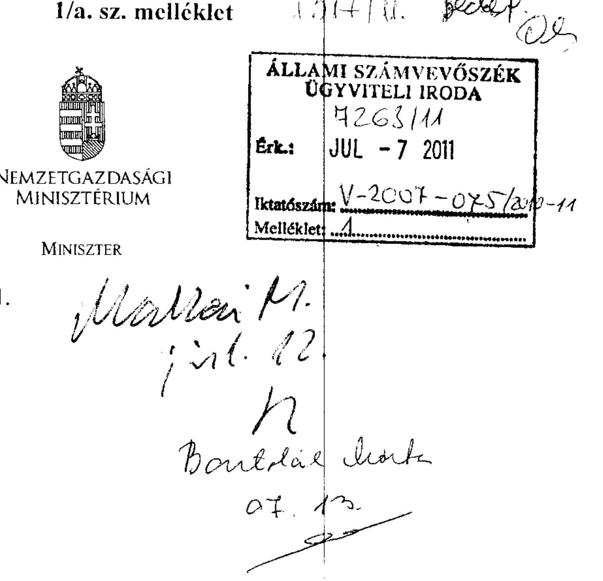

Iktatószám: NGM / 13846 / 3 / 2011.
Domokos László
elnök
Állami Számvevőszék

Tisztelt Elnök Úr!
A Nemzetgazdasági Minisztérium az alábbi észrevételeket teszi a munkaügyi és munkavédelmi ellenőrzés rendszerének ellenőrzéséről szóló jelentésre.

A tervezet 27. oldalán - az Összegző megállapítások, következtetések, javaslatok című részben - szereplő, a nemzetgazdasági miniszternek a foglalkoztatáspolitikáért való felelőssége körében javasolt
 1. pont a következőket tartalmazza:
„Vizsgálja felül a jogszabályok alapján rendelkezésre álló adatok, információk körét a hatósági ellenőrzésben való hasznosíthatóság szempontjából és biztosítsa a nyilvántartások adatainak a hatósági munkát támogató felhasználhatóságát.”

Javasolom az ÁSZ részéről a fenti pontban megfogalmazottak részletes kifejtését, pontosítását, a megállapítások hasznosítása, valamint az ellenőrzés alapján elrendelt intézkedések végrehajtásának megkönnyítése érdekében.

Az Országos Munkavédelmi és Munkaügyi Főfelügyelőség elnökének külön kérésére mellékelem észrevételemet.

Budapest, 2011. június 29.
Üdvözlettel:
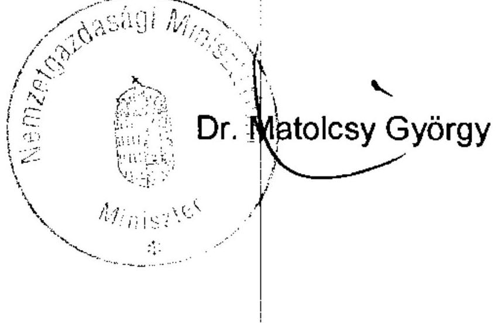

---

# ORSZÁGOS MUNKAVÉDELMI ÉS MUNKAÜGYI FŐFELÜGYELŐSÉG 

## ELNÖK

Iktatószám: 89-107/2011-5040

## Dr. Jáczku Tamás

főosztályvezető úr részére

## Nemzetgazdasági Minisztérium

Tisztelt Főosztályvezető Úr!
Az Állami Számvevőszék (ÁSZ) „a munkaügyi és munkavédelmi ellenőrzés rendszereinek értékeléséről” szóló jelentésére vonatkozóan az alábbi észrevételeket teszem:

## Általánosságban:

A jelentés összességében – minden, az OMMF erre irányuló szakmai észrevétele ellenére, amit az ÁSZ számára a vizsgálat illetve a jelentés-tervezet egyeztetése során adott és megküldött – nem tükrözi azt a körülményt és annak szükségszerűen a teljesítményre kiható következményeit, hogy az OMMF, illetve felügyelőségei egy jogalkalmazó szerv, amely a hatályos jogszabályi keretek között működik a rendelkezésére bocsátott költségvetési keretek közt.
A kiemelt célok és területek meghatározása és azok lefedése nem kizárólagosan a hatóság döntése, hanem azt meghatározza az aktuális foglalkoztatáspolitikai irány. Ezt az ellenőrzések számának csökkenésére, valamint a feketefoglalkoztatás visszaszorításának eredménytelenségére utaló összegzéssel kapcsolatban különösen fontos hangsúlyozni, mivel éppen ezek a mutatók az OMMF-en kívül álló döntések hatásaként álltak elő.

## Általános a munkavédelmi szakterületet érintő észrevételek:

1. A munkavédelemben a létszámemelés nem az „ellenőrzések fokozása”, és: ahogy a jelentés fogalmaz „magasabb fenyegetettség” érdekében történt. A munkavédelem két ága összekapcsolódásakor számos jogszabály ellenőrzése újonnan került a műszaki végzettségű munkavédelmi felügyelők feladatai közé, így a munkavédelmi ellenőrzések vertikális kiterjedése többszöröződött meg.
2. Az alkalmazott hatékonysági mutatókra vonatkozóan idézzük „A Régiók Bizottsága véleménye A munkahelyi egészségvédelemről és biztonságról szóló közösségi stratégia (2007-2012) (2008/C 53/03) megállapítását.
„42. szükségesnek tartja egy mutatórendszer mielőbbi kialakítását a tagállamok számára, amely a kiinduló és a végső helyzet, valamint a megtett intézkedések hatékonysága értékelésének alapjául szolgálna. A mutatók fő jellemzői a relevancia, a lényegesség, a mérhetőség, a stabilitás és a feladat szempontjából való hatékonyság kell, hogy legyenek.”

---

Az idézet alapján is megállapítható, jelenleg nem meghatározott az a mutatórendszer, amely a munkavédelmi intézkedések hatékonyságát objektíven mérni tudja. Ennek következtében a munkavédelmi hatóság munkáját három paraméter –mutató– kielégítően nem jellemzi.
3. Ellentétben a jelentésben megfogalmazott következtetéssel, továbbra sem értünk egyet a hatékonyság csökkenésének értékelésével. A kiugróan magas 2007. és 2008. évi ellenőrzési adat véleményünk szerint nem tekinthető viszonyítási mutatónak, amely alapján jutott az ÁSZ arra a következtetésre, hogy a további években a hatékonyság csökkent. A statisztikai módszerek szerint is a kiugró értékeket figyelmen kívül szükséges hagyni.
4. Szükségesnek tartjuk elmondani, hogy munkáltatók ellenőrzésre történő kijelölésére a jelentésben megfogalmazott igényeknek az OMMF sem szervezeti, sem anyagi erőforrásainak hiánya okán nem tudott megfelelni, az erre vonatkozó szakmai igényt az OMMF a TÁMOP projektjében szerepelteti.

# Speciálisan az informatikai biztonság tekintetében: 

Az OMMF a korábbi ÁSZ jelentés kapcsán is felmérte az informatikai rendszer, ezen belül a FEIR rendszer működésének információbiztonsági és egyéb működési kockázatait, hiányosságait. Törekedett arra, hogy a rendszert mielőbb korszerűsítse, megfeleltesse a korszerű informatikával szemben támasztott elvárásoknak. Az anyagi forrást a TÁMOP 2.4.4 biztosította. Az Informatikai alprojektben végzett tervezési munka egyértelműen tartalmazza a FEIR rendszer megújításával kapcsolatos informatikai stratégiát középtávon a projektidőszak végéig. A TÁMOP 2.4.4 kapcsán bevezetésre tervezett MSZ ISO/IEC 27001-es szabvány egyértelműen mutatja az OMMF elkötelezettségét arra vonatkozóan, hogy a jelentésben felsorolt informatikai és informatikai biztonsági hiányosságokat orvosolja a leghatékonyabb módon, így biztosítva a projekt lezárása után is a hatékony megfelelést az OMMF jogszabályokban meghatározott feladatainak.

## Formai észrevételek:

A jelentés 12. oldala 4. bekezdésében az országos Munkahigiénés és Foglalkozásegészségügyi Intézet, mint 2007. évet megelőzően hatóság megjelölése hibás. A megjelölt időszak előtt a munkaegészségügyi hatósági feladatokat az Állami Népegészségügyi és Tisztiorvosi Szolgálat látta el.

## Tisztelt Főosztályvezető Úr!

Kérem, hogy észrevételeimet az Állami Számvevőszék jelentéséhez mint az OMMF ellenvéleményét csatolni szíveskedjen.

Budapest, 2011. június 23.
Tisztelettel:
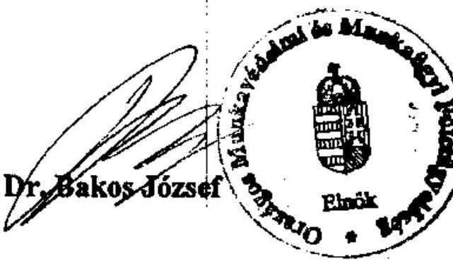

---

# Dr. Matolesy György úr 

miniszter
Nemzetgazdasági Minisztérium

## Budapest

## Tisztelt Miniszter Úr!

A munkaügyi és munkavédelmi ellenőrzés rendszerének ellenőrzéséről készített jelentésünkre tett észrevételét köszönöm.

Jelentésünkben javasoltuk, hogy Miniszter úr a foglalkoztatáspolitikáért való felelőssége körében vizsgálja felül a jogszabályok alapján rendelkezésre álló adatok, információk körét a hatósági ellenőrzésben való hasznosíthatóság szempontjából és biztosítsa a nyilvántartások adatainak a hatósági munkát támogató felhasználhatóságát.

A javaslat azzal függ össze – amint azt a jelentésünkben kifejtettük –, hogy a gazdálkodók és jegyzők számára a jogszabályok bejelentési és adatszolgáltatási kötelezettséget (pl. munkaviszonyokról, rákkeltő anyagok alkalmazásáról, ipari tevékenység végzésére kiadott engedélyekről, foglalkozási megbetegedésekről stb.) írnak elő annak érdekében, hogy a lényeges információk az ellenőrzendő környezetről a hatóság rendelkezésére álljanak. A hatóság az információkat a munkáltatók ellenőrzésre történő kiválasztása során azonban korlátozottan alkalmazza. A gazdálkodók (és jegyzők) adatszolgáltatási kötelezettségét indokolt csökkenteni, ha a kapott adatokra az ellenőrzések megalapozásához az Országos Munkavédelmi és Munkaügyi Főfelügyelőségnek (OMMF) nincs szüksége, azokat nem használja fel. Az adatoknak a szakmai munka során való felhasználása esetén pedig meg kell teremteni azok nyilvántartásának, feldolgozásának és hozzáférhetőségének feltételeit.

Javaslatunkat a jelentés megállapításai alapozták meg, amelyeket a következőkben röviden összefoglalunk.

Jelentésünkben megállapítottuk, hogy az éves ellenőrzési tervhez és a munkáltatók ellenőrzésre kiválasztásához nem állt rendelkezésre az ellenőrzési tapasztalatokat és a meglévő információkat teljes körűen hasznosító, az ellenőrzési kockázatot, a korrupciós veszélyt kezelő rendszer.

---

Az ellenőrzések tervezésében, lefolytatásában a jogszabályok alapján a gazdálkodók által jelentett információk, a hatósági ellenőrzések adatai részlegesen hasznosultak. A felügyelőségek részére – építkezés, azbesztmentesítés megkezdéséről – jelentett egyes adatok ellenőrzési, elemzési célú hasznosításához azok nem kerültek az országos adatbázisba, a szakmai vezetés számára teljes körűen nem voltak elérhetők. A rákkeltő anyagokkal, technológiával történő munkavégzésre vonatkozó bejelentések rögzítése biztosította az adatszolgáltatást a rákregiszter felé, a felügyelői ellenőrzések tervezésére azonban a nyilvántartás nem volt alkalmas.

Az OMMF nem használta fel az adatokat a munkaerőpiac területi, szakmai létszám szerinti összetétele alakulásának nyomon követésére, az információk alapján a szabálytalanságok kockázatának becslésére. A felügyelők a gazdálkodók bejelentéseit papíron vagy elektronikusan tárolták, a gazdálkodókat esetlegesen ellenőrizték.

A gazdálkodók és a jegyzők jogszabályok által előírt bejelentései alapján az OMMF rendelkezett adatokkal a foglalkoztatási jogviszonyt létesített munkáltatókról és munkavállalókról, a jogviszonyok jellemző körülményeiről, a dolgozók egészségét veszélyeztető munkakörülményekkel járó tevékenységről. A felügyelők azonban a külső és belső információkat korlátozottan hasznosították a munkáltatók kiválasztásához. A bejelentéseket régiós (vagy megyei) szinten papíron vagy Excel táblázatban tartották nyilván, országos adatokat az EMMA elektronikus nyilvántartás és a rákregiszter tartalmazott. Az utóbbi nem alkalmas az ellenőrzési szempontok szerinti lekérdezésre. A kötelező bejelentések alapján az ellenőrzések megindítását a 2010. évi munkavédelmi szakmai követelményekben írták elő.

Az OMMF elnökének kérésére mellékelt levélben a korábbi egyeztetésekhez képest új észrevétel nem merült fel. Az OMMF szakembereinek véleményét az egyeztetések során figyelembe vettük, illetve a megfogalmazott ellenvéleményeket a jelentésben már feltüntettük. A Főfelügyelőség levelében megfogalmazott formai észrevétel helytálló, a jelentés vonatkozó részében az OMFI helyett az ANTSZ-t szerepeltetjük. A jelentés további módosítását nem tartom indokoltnak.

Végezetül tájékoztatom Miniszter urat, hogy az ellenőrzésről készült jelentést – kialakult gyakorlatunk szerint – észrevételével és az arra adott válaszommal együtt küldöm meg az Országgyűlés elnökének, a miniszterelnöknek és az illetékes bizottságok elnökeinek.

Budapest, 2011. július 25.
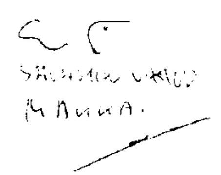

Tisztelettel:

Domokos László

---

# A hatósági ellenőrzések 

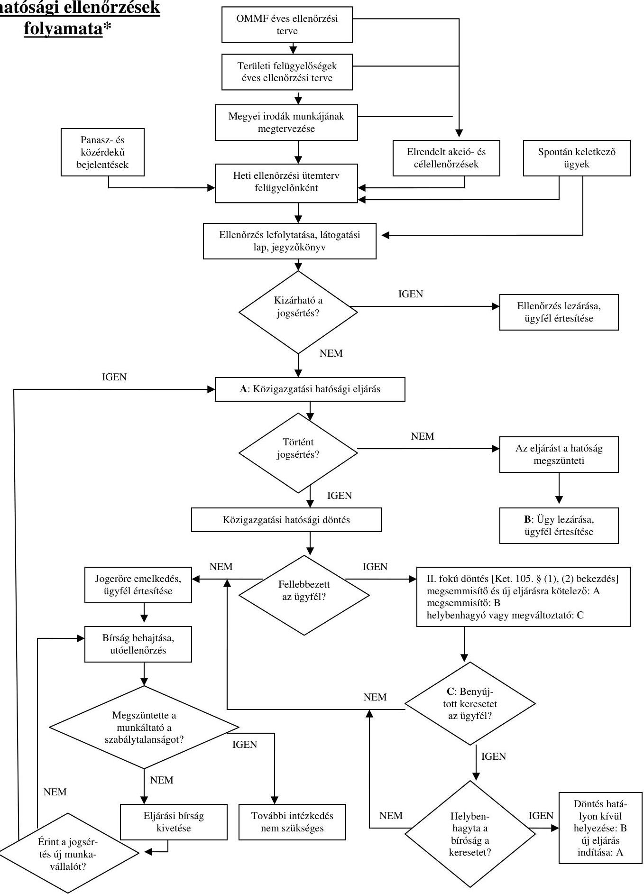

* A saját hatáskörben hozott jogorvoslati döntések, a bíróság által elrendelt új eljárás, és a felülvizsgálati eljárások nélkül

---

### Munkavédelmi ellenőrzések eredménymutatói

### 3. sz. melléklet

a V-2007-077/2010-2011. sz. jelentéshez

|  Régiók | Ellenőrzött munkáltatók száma | Szabálytalansággal érintett munkáltatók | Ellenőrzött munkáltatók száma | Szabálytalansággal érintett munkáltatók | Ellenőrzött munkáltatók száma | Szabálytalansággal érintett munkáltatók | Ellenőrzött munkáltatók száma | Szabálytalansággal érintett munkáltatók | Ellenőrzött munkáltatók száma | Szabálytalansággal érintett munkáltatók | Ellenőrzött munkáltatók száma | Szabálytalansággal érintett munkáltatók  |
| --- | --- | --- | --- | --- | --- | --- | --- | --- | --- | --- | --- | --- |
|   | db | % | db | % | db | % | db | % | db | % | db | %  |
|  Nyugat-Dunántúl | 2 219 | 11,4 | 1 854 | 10,4 | 3 198 | 12,5 | 2 538 | 11,8 | 3 238 | 12,9 | 2 558 | 12,1  |
|  Közép-Dunántúl | 2 648 | 13,6 | 2 320 | 13,0 | 3 435 | 13,4 | 2 490 | 11,6 | 3 646 | 14,5 | 2 718 | 12,8  |
|  Dél-Dunántúl | 1 942 | 10,0 | 1 777 | 10,0 | 2 595 | 10,1 | 2 044 | 9,5 | 2 944 | 11,7 | 2 320 | 10,9  |
|  Közép-Magyarország | 4 467 | 22,9 | 4 292 | 24,0 | 5 252 | 20,5 | 5 046 | 23,5 | 5 474 | 21,7 | 5 134 | 24,2  |
|  Észak-Magyarország | 2 445 | 12,6 | 2 257 | 12,4 | 3 591 | 14,0 | 2 668 | 12,5 | 3 572 | 14,2 | 2 639 | 12,4  |
|  Észak-Alföld | 3 043 | 15,6 | 2 847 | 15,9 | 4 008 | 15,7 | 3 556 | 16,6 | 3 327 | 13,2 | 3 113 | 14,7  |
|  Dél-Alföld | 2 705 | 13,9 | 2 512 | 14,1 | 3 531 | 13,8 | 3 085 | 14,5 | 2 970 | 11,8 | 2 735 | 12,9  |
|  Összesen | 19 469 | 100,0 | 17 859 | 100,0 | 25 610 | 100,0 | 21 427 | 100,0 | 25 171 | 100,0 | 21 217 | 100,0  |

|  Régiók | 2006 | 2007 | 2008 | 2009 | 2010  |
| --- | --- | --- | --- | --- | --- |
|   | Látogatással érintett létszám | Szabálytalansággal érintett ellenőrzött létszám | Látogatással érintett létszám | Szabálytalansággal érintett ellenőrzött létszám | Látogatással érintett létszám  |
|   | fő | % | fő | % | fő  |
|  Nyugat-Dunántúl | 47 543 |

 5,5 | 18 072 | 8,8 | 59 313  |
|  Közép-Dunántúl | 75 721 | 8,7 | 22 436 | 11,0 | 101 295  |
|  Dél-Dunántúl | 46 053 | 5,3 | 13 362 | 6,5 | 39 746  |
|  Közép-Magyarország | 382 204 | 44,0 | 80 920 | 39,5 | 132 574  |
|  Észak-Magyarország | 77 160 | 8,9 | 23 619 | 11,5 | 66 986  |
|  Észak-Alföld | 43 595 | 5,0 | 20 365 | 9,9 | 47 213  |
|  Dél-Alföld | 195 522 | 22,6 | 26 091 | 12,8 | 68 513  |
|  Összesen | 867 798 | 100,0 | 204 865 | 100,0 | 515 640  |

---

|  Régiók | 2006 |  |  |  | 2007 |  |  |  | 2008 |  |  |  | 2009 |  |  |  | 2010 |  |  |   |
| --- | --- | --- | --- | --- | --- | --- | --- | --- | --- | --- | --- | --- | --- | --- | --- | --- | --- | --- | --- | --- |
|   | Ellenőrzött munkáltatók száma |  | Szabálytalansággal érintett munkáltatók |  | Ellenőrzött munkáltatók száma |  | Szabálytalansággal érintett munkáltatók |  | Ellenőrzött munkáltatók száma |  | Szabálytalansággal érintett munkáltatók |  | Ellenőrzött munkáltatók száma |  | Szabálytalansággal érintett munkáltatók |  | Ellenőrzött munkáltatók száma |  | Szabálytalansággal érintett munkáltatók |   |
|   | db | % | db | % | db | % | db | % | db | % | db | % | db | % | db | % | db | % | db | %  |
|  Nyugat-Dunántúl | 2 806 | 10,9 | 1 992 | 11,0 | 4 003 | 12,2 | 2 730 | 13,1 | 5 080 | 14,1 | 3 484 | 15,1 | 3 833 | 12,2 | 2 647 | 12,9 | 3 331 | 13,3 | 1 854 | 13,0  |
|  Közép-Dunántúl | 2 082 | 8,1 | 1 387 | 7,6 | 3 346 | 10,2 | 2 336 | 11,2 | 2 766 | 7,7 | 1 815 | 7,9 | 3 419 | 10,9 | 2 281 | 11,1 | 2 290 | 9,1 | 1 599 | 11,2  |
|  Dél-Dunántúl | 3 246 | 12,6 | 2 564 | 14,1 | 4 242 | 12,9 | 3 049 | 14,6 | 4 826 | 13,4 | 3 113 | 13,5 | 4 640 | 14,8 | 3 207 | 15,7 | 3 539 | 14,1 | 2 302 | 16,1  |
|  Közép-Magyarország | 6 739 | 26,2 | 5 044 | 27,8 | 7 896 | 24,0 | 4 653 | 22,3 | 7 625 | 21,2 | 4 550 | 19,8 | 6 462 | 20,6 | 3 758 | 18,4 | 5 449 | 21,7 | 2 425 | 17,0  |
|  Észak-Magyarország | 3 026 | 11,8 | 2 055 | 11,3 | 5 032 | 15,3 | 2 684 | 12,8 | 5 031 | 14,0 | 3 009 | 13,1 | 4 451 | 14,2 | 2 418 | 11,8 | 3 111 | 12,4 | 1 707 | 11,9  |
|  Észak-Alföld | 4 726 | 18,4 | 2 777 | 15,3 | 4 250 | 12,9 | 2 948 | 14,1 | 5 924 | 16,4 | 4 238 | 18,4 | 5 221 | 16,6 | 4 008 | 19,6 | 4 070 | 16,2 | 2 478 | 17,3  |
|  Dél-Alföld | 3 115 | 12,0 | 2 331 | 12,9 | 4 071 | 12,5 | 2 506 | 11,9 | 4 774 | 13,2 | 2 789 | 12,2 | 3 405 | 10,7 | 2 143 | 10,5 | 3 266 | 13,2 | 1 937 | 13,5  |
|  Összesen | 25 740 | 100,0 | 18 150 | 100,0 | 32 840 | 100,0 | 20 906 | 100,0 | 36 026 | 100,0 | 22 998 | 100,0 | 31 431 | 100,0 | 20 462 | 100,0 | 25 056 | 100,0 | 14 302 | 100,0  |

|  Régiók | 2006 |  |  |  | 2007 |  |  |  | 2008 |  |  |  | 2009 |  |  |  | 2010 |  |  |   |
| --- | --- | --- | --- | --- | --- | --- | --- | --- | --- | --- | --- | --- | --- | --- | --- | --- | --- | --- | --- | --- |
|   | Ellenőrzött munkavállalók száma |  | Szabálytalanul foglalkoztatott munkavállalók száma |  | Ellenőrzött munkavállalók száma |  | Szabálytalanul foglalkoztatott munkavállalók száma |  | Ellenőrzött munkavállalók száma |  | Szabálytalanul foglalkoztatott munkavállalók száma |  | Ellenőrzött munkavállalók száma |  | Szabálytalanul foglalkoztatott munkavállalók száma |  | Ellenőrzött munkavállalók száma |  | Szabálytalanul foglalkoztatott munkavállalók száma |   |
|   | fő | % | fő | % | fő | % | fő | % | fő | % | fő | % | fő | % | fő | % | fő | % | fő | %  |
|  Nyugat-Dunántúl | 23 989 | 9,5 | 11 710 | 8,1 | 22 209 | 10,2 | 14 048 | 10,0 | 28 727 | 8,7 | 19 876 | 10,2 | 29 086 | 9,9 | 21 414 | 11,5 | 34 129 | 13,8 | 18 575 | 15,0  |
|  Közép-Dunántúl | 41 697 | 16,5 | 20 176 | 14,0 | 31 058 | 14,3 | 19 089 | 13,5 | 53 828 | 16,2 | 23 292 | 12,0 | 32 948 | 11,2 | 19 970 | 10,7 | 20 492 | 8,3 | 14 752 | 11,9  |
|  Dél-Dunántúl | 37 429 | 14,8 | 21 308 | 14,7 | 25 772 | 11,9 | 15 725 | 11,2 | 33 126 | 10,0 | 21 435 | 11,0 | 26 552 | 9,0 | 17 090 | 9,2 | 17 638 | 7,2 | 10 907 | 8,8  |
|  Közép-Magyarország | 60 604 | 24,0 | 42 902 | 29,7 | 53 571 | 24,7 | 39 164 | 27,8 | 75 202 | 22,7 | 48 586 | 25,0 | 68 960 | 23,4 | 44 401 | 23,8 | 61 182 | 24,8 | 20 840 | 16,8  |
|  Észak-Magyarország | 26 368 | 10,5 | 16 082 | 11,1 | 22 080 | 10,2 | 13 416 | 9,5 | 40 422 | 12,2 | 26 094 | 13,4 | 49 255 | 16,7 | 37 400 | 20,1 | 41 685 | 16,9 | 25 429 | 20,5  |
|  Észak-Alföld | 38 521 | 15,3 | 18 054 | 12,5 | 25 085 | 11,6 | 18 607 | 13,2 | 55 846 | 16,8 | 32 852 | 16,9 | 52 143 | 17,7 | 28 829 | 15,5 | 39 801 | 16,1 | 20 785 | 16,7  |
|  Dél-Alföld | 23 515 | 9,4 | 14 331 | 9,9 | 37 013 | 17,1 | 20 887 | 14,8 | 44 673 | 13,4 | 22 410 | 11,5 | 35 319 | 12,1 | 17 223 | 9,2 | 31 536 | 12,9 | 12 910 | 10,3  |
|  Összesen | 252 123 | 100,0 | 144 563 | 100,0 | 216 788 | 100,0 | 140 936 | 100,0 | 331 824 | 100,0 | 194 545 | 100,0 | 294 243 | 100,0 | 186 327 | 100,0 | 246 463 | 100,0 | 124 198 | 100,0  |

---

# Kiemelt és érdemi intézkedések száma

## 5. sz. melléklet

a V-2007-077/2010-2011. sz. jelentéshez

## Kiemelt intézkedések száma munkaügyben

|  Intézkedés | 2006 | 2007 | 2008 | 2009 | 2010 | db |  |  |  | rész | rány  |
| --- | --- | --- | --- | --- | --- | --- | --- | --- | --- | --- | --- |
|   |  |  |  |  |  | 2006 | 2007 | 2008 | 2009 | 2010 |   |
|  Feketefoglalkoztatás | 12405 | 16623 | 15547 | 13076 | 7559 | 61,6\% | 75,5\% | 62,7\% | 58,6\% | 48,6\% |   |
|  Munkaidő szabályainak megsértése | 1555 | 1005 | 1720 | 1699 | 1679 | 7,7\% | 4,6\% | 6,9\% | 7,6\% | 10,8\% |   |
|  Pihenőidő szabályainak megsértése | 662 | 513 | 831 | 689 | 765 | 3,3\% | 2,3\% | 3,3\% | 3,1\% | 4,9\% |   |
|  Rendkívüli munkavégzés szabályainak megsértése | 227 | 244 | 249 | 133 | 129 | 1,1\% | 1,1\% | 1,0\% | 0,6\% | 0,8\% |   |
|  Jogellenes munkaerő-kölcsönzés | 72 | 85 | 75 | 83 |  | 0,4% | 0,4% | 0,3% | 0,4% |  |

 | 45 | 0,4% | 0,4% | 0,3% | 0,4% | 0,3% |   |
|  Nyilvántartással kapcsolatos szabályok megsértése | 3198 | 1701 | 3638 | 3538 | 2606 | 15,9% | 7,7% | 14,7% | 15,9% | 16,7% |   |
|  Egyéb fő jogsértések | 2010 | 1850 | 2753 | 3086 | 2783 | 10,0% | 8,4% | 11,1% | 13,8% | 17,9% |   |
|  Összes főbb intézkedés | 20129 | 22021 | 24813 | 22304 | 15566 | 100% | 100% | 100% | 100% | 100% |   |

2007-ben az alábbiak szerint változott az osztályozás: Feketefoglalkoztatásból az Egyéb fő jogsértések közé került: Alaki hibás munkaszerződés; AM könyv hiányossága háztartásban, munkavállalónál. Az Egyéb fő jogsértések közé bekerült: Szabadságra vonatkozó szabályok megszegése; Külföldi engedély nélküli foglalkoztatása egyéb módon.

## Összes érdemi intézkedés száma munkavédelemben

|   |  |  |  | db  |
| --- | --- | --- | --- | --- |
|   | 2007 | 2008 | 2009 | 2010  |
|  Összes intézkedés | 84873 | 97088 | 104066 | 127254  |

---

Működő vállalkozások, foglalkoztatottak és gazdaságilag aktívak száma a V-2007-077/2010-2011. sz. jelentéshez

|  Régiók |  |  | Működő vállalkozások száma |  |   |
| --- | --- | --- | --- | --- | --- |
|   | 2006 |  | 2007 |  | 2008  |
|   | db | % | db | % | db  |
|  Nyugat-Dunántúl | 69592 | 10,0 | 68820 | 10,0 | 69455  |
|  Közép-Dunántúl | 72161 | 10,3 | 71177 | 10,3 | 71402  |
|  Dél-Dunántúl | 60432 | 8,7 | 58878 | 8,6 | 59823  |
|  Közép-Magyarország | 271965 | 39,0 | 270786 | 39,4 | 277669  |
|  Észak-Magyarország | 61696 | 8,8 | 60703 | 8,8 | 61090  |
|  Észak-Alföld | 81515 | 11,7 | 78942 | 11,5 | 81169  |
|  Dél-Alföld | 80785 | 11,6 | 78752 | 11,4 | 80782  |
|  Összesen | 698146 | 100,0 | 688058 | 100,0 | 701390  |

Foglalkoztatottak száma

|  Régiók | 2006 |  | 2007 |  | 2008 |  | 2009 |  | 2010 |   |
| --- | --- | --- | --- | --- | --- | --- | --- | --- | --- | --- |
|   | ezer fő | % | ezer fő | % | ezer fő | % | ezer fő | % | ezer fő | %  |
|  Nyugat-Dunántúl | 426 | 10,9 | 432 | 11,1 | 423 | 11,0 | 406 | 10,8 | 404 | 10,7  |
|  Közép-Dunántúl | 464 | 11,9 | 464 | 11,9 | 457 | 11,9 | 433 | 11,5 | 433 | 11,4  |
|  Dél-Dunántúl | 350 | 9,0 | 334 | 8,6 | 334 | 8,7 | 336 | 8,9 | 342 | 9,0  |
|  Közép-Magyarország | 1229 | 31,5 | 1234 | 31,7 | 1233 | 32,0 | 1226 | 32,7 | 1229 | 32,5  |
|  Észak-Magyarország | 421 | 10,8 | 423 | 10,8 | 407 | 10,6 | 393 | 10,5 | 393 | 10,4  |
|  Észak-Alföld | 527 | 13,5 | 518 | 13,3 | 509 | 13,2 | 486 | 13,0 | 498 | 13,2  |
|  Dél-Alföld | 489 | 12,5 | 493 | 12,7 | 486 | 12,6 | 471 | 12,6 | 483 | 12,8  |
|  Összesen | 3906 | 100,0 | 3897 | 100,0 | 3849 | 100,0 | 3751 | 100,0 | 3782 | 100,0  |

Gazdaságilag aktívak (15-64 év) száma*

|  Régiók | 2006 |  | 2007 |  | 2008 |  | 2009 |  | 2010 |   |
| --- | --- | --- | --- | --- | --- | --- | --- | --- | --- | --- |
|   | ezer fő | % | ezer fő | % | ezer fő | % | ezer fő | % | ezer fő | %  |
|  Nyugat-Dunántúl | 452 | 10,7 | 455 | 10,8 | 445 | 10,6 | 445 | 10,7 | 445 | 10,5  |
|  Közép-Dunántúl | 494 | 11,7 | 489 | 11,6 | 485 | 11,6 | 477 | 11,4 | 483 | 11,3  |
|  Dél-Dunántúl | 384 | 9,1 | 371 | 8,8 | 372 | 8,9 | 377 | 9,0 | 389 | 9,1  |
|  Közép-Magyarország | 1296 | 30,7 | 1296 | 30,8 | 1292 | 30,9 | 1313 | 31,5 | 1349 | 31,7  |
|  Észak-Magyarország | 473 | 11,2 | 482 | 11,5 | 471 | 11,3 | 464 | 11,1 | 468 | 11,0  |
|  Észak-Alföld | 592 | 14,0 | 581 | 13,8 | 579 | 13,9 | 567 | 13,6 | 582 | 13,7  |
|  Dél-Alföld | 531 | 12,6 | 536 | 12,7 | 533 | 12,8 | 528 | 12,6 | 540 | 12,7  |
|  Összesen | 4222 | 100,0 | 4209 | 100,0 | 4178 | 100,0 | 4172 | 100,0 | 4256 | 100,0  |

- Foglalkoztatottak és munkanélküliek összesen

---

# Munkavédelmi szakmai teljesítménykövetelmények és teljesítésük ${ }^{1}$

|  Követelmény megnevezése | 2007 |  | 2008 |  | 2009 |  | 2010 |   |
| --- | --- | --- | --- | --- | --- | --- | --- | --- |
|   | követelmény | teljesítés | követelmény | teljesítés | követelmény | teljesítés | követelmény | teljesítés  |
|  Ellenőrzött munkáltatók száma (db) | nincs előírás | 25610 | 26600 | 25171 | 2 előírás | 21660 | É-M-on és D-A-ön min. 3%-kal emelkedjen, a többi régióban ne csökkenjen | Ny-D-on és D-Don csökkent az ellenőrzöttek száma, a többi régiónál teljesült  |
|  Feltárandó feketemunkások száma (fő) | nincs előírás | $\begin{gathered} 2710 \ \text { (okt 31-ig) } \end{gathered}$ | 5000 | - | felügyelőnként 20 fő | $\begin{gathered} 21,6 \ \text { (dec-ig) } \end{gathered}$ | nincs előírás | -  |
|  Határozatok helybenhagyási aránya fellebbezés esetén | nincs előírás | $94 \%$ | $80 \%$ | $93 \%$ | $80 \%$ | $93 \%$ | $80 \%$ | $93 \%$  |
|  Feltárt súlyos jogsértések aránya | $40 \%$ | $52 \%$ | $65 \%$ | $60 \%$ | előzetes bejelentéssel végzett ellenőrzések száma felügyelőségenként legalább 3 | - | nincs előírás | -  |
|  Kiemelt ágazatokban végzett ellenőrzések aránya ${ }^{2}$ | $33 \%$ | $44 \%$ | $50 \%$ | $67 \%$ | $50-60 \%$ | $70 \%$ | $40 \%$ | $68 \%$  |

${ }^{1}$ A kimutatásban a csak legalább két vizsgált évben meghatározott követelmények szerepelnek. ${ }^{2}$ : Kiemelt ágazat volt 2007-ben az építőipar, 2008-2010-ben az építőipar, mezőgazdaság, feldolgozóipar (azon belül nevesítve a gépipar), az egészségügy és a külszíni bányászat.

---

# Munkaügyi szakmai teljesítménykövetelmények és teljesítésük ${ }^{1}$

|  Követelmény megnevezése | 2007 |  | 2008 |  | 2009 |  | 2010 |   |
| --- | --- | --- | --- | --- | --- | --- | --- | --- |
|   | követelmény | teljesítés | követelmény | teljesítés | követelmény | teljesítés | követelmény | teljesítés  |
|  Ellenőrzött munkáltatók száma (db) | nincs előírás | 32840 | 40000 | 36026 | 38000 | 31431 | 33500 | 25056  |
|  Feltárandó feketemunkások száma (fő) | nincs előírás | 72743 | 80000 | 69075 | 65000 | 56206 | 55000 | 29859  |
|  Határozatok helyenhagyási aránya fellebbezés esetén | $75 \%$ | $84 \%$ | $80 \%$ | $84 \%$ | $80 \%$ | $71 \%$ | $80 \%$ | $72 \%$  |
|  Feltárt súlyos jogsértések aránya | $70 \%$ | $67 \%$ | $70 \%$ | $82 \%$ | nincs előírás | - | $80 \%$ | $82 \%$  |
|  Kiemelt ágazatokban végzett ellenőrzések aránya ${ }^{2}$ | $75 \%$ | $83 \%$ | $70 \%$ | - | nincs előírás | $87 \%$ | nincs előírás | $88 \%$  |
|  Utóellenőrzések a feketemunkával érintett munkáltatók esetében | nincs előírás | $79 \%$ | $80 \%$ | $83 \%$ | $80 \%$ | $89 \%$ | $50 \%$ | $93 \%$  |

${ }^{1}$ A kimutatásban a csak legalább két vizsgált évben meghatározott követelmények szerepelnek. ${ }^{2}$ : Kiemelt ágazat volt az építőipar, mezőgazdaság, vendéglátás, kereskedelem, nyomozás-biztonsági tevékenység.

---

# Az ellenőrzendő munkáltatók számára előírt követelmény és teljesítése a munkaügyi felügyelőségeknél

|  Régiók | 2008 |  |  |  | 2009 |  |  |  | 2010 |  |  |   |
| --- | --- | --- | --- | --- | --- | --- | --- | --- | --- | --- | --- | --- |
|   | munkáltatók száma (db) | nyitó létszám (fő) | egy felügyelőre jutó követelmény (db) | egy felügyelőre jutó teljesítés (átlagos létszámra) | munkáltatók száma (db)* | nyitó létszám (fő) | egy felügyelőre jutó követelmény (db) | egy felügyelőre jutó teljesítés (átlagos létszámra) | munkáltatók száma (db) | nyitó létszám (fő) | egy felügyelőre jutó követelmény (db) | egy felügyelőre jutó teljesítés (átlagos létszámra)  |
|  Nyugat-Dunántúl | 4000 | 35 | 114 | 154 | 3500 | 34 | 103 | 104 | 3500 | 37 | 95 | 93  |
|  Közép-Dunántúl | 4000 | 34
 | 118 | 79 | 4000 | 44 | 91 | 76 | 3500 | 42 | 83 | 57  |
|  Dél-Dunántúl | 5000 | 36 | 139 | 124 | 5000 | 42 | 119 | 105 | 4500 | 47 | 96 | 86  |
|  Közép-Magyarország | 10000 | 80 | 125 | 98 | 8000 | 82 | 98 | 73 | 7000 | 94 | 74 | 61  |
|  Észak-Magyarország | 6000 | 46 | 130 | 109 | 5500 | 49 | 112 | 93 | 5000 | 50 | 100 | 68  |
|  Észak-Alföld | 6000 | 47 | 128 | 123 | 6000 | 53 | 113 | 99 | 5500 | 54 | 102 | 83  |
|  Dél-Alföld | 5000 | 45 | 111 | 116 | 5000 | 50 | 100 | 68 | 4500 | 48 | 94 | 73  |
|  Összesen | 40000 | 323 | 724 | 661 | 37000 | 354 | 661 | 505 | 33500 | 372 | 590 | 472  |

- A szakmai követelményekben összesen 38000 munkáltató szerepel, de a régiónkénti részadatok összeadásakor ennél 1000-el kevesebb jön ki

---

Az ellenőrzések kezdeményező szerinti csoportosítása

# Munkavédelem

|  Megnevezés | 2006 | 2007 | 2008 | 2009 | 2010  |
| --- | --- | --- | --- | --- | --- |
|  A Kormány vagy az OMMF Központja, regionális vezetése döntésével indult (Célvizsgálat és akcióellenőrzés) | 8190 | 17443 | 12373 | 8053 | 2816  |
|  A felügyelő és a főnöke döntésével indult (terv szerinti, előre nem tervezett, utó, komplex stb.) | 14182 | 11713 | 22794 | 25371 | 30035  |
|  Egyéb külső kezdeményezésre indult: | 2920 | 3363 | 4464 | 4541 | 5430  |
|  Panasz-, közérdekű-, baleseti bejelentés vagy kérelem következtében | 2667 | 3011 | 4149 | 4288 | 5166  |
|  Felkérésre végzett | 72 | 116 | 152 | 49 | 69  |
|  Attétel | 59 | 108 | 73 | 92 | 72  |
|  Illetékességi területen kívüli ellenőrzés | 1 | 47 | 2 | 5 | 0  |
|  Más felügyelőség megkeresése alapján történt ellenőrzés | 9 | 6 | 13 | 42 | 43  |
|  Nem ellenőrzési célú látogatás | 112 | 75 | 75 | 65 | 80  |
|  Összesen | 25292 | 32519 | 39631 | 37965 | 38281  |

|  2006 | 2007 | 2008 | 2009 | 2010  |
| --- | --- | --- | --- | --- |
|  $32,4 \%$ | $53,6 \%$ | $31,2 \%$ | $21,2 \%$ | $7,4 \%$  |
|  $56,1 \%$ | $36,0 \%$ | $57,5 \%$ | $66,8 \%$ | $78,5 \%$  |
|  $11,5 \%$ | $10,4 \%$ | $11,3 \%$ | $12,0 \%$ | $14,1 \%$  |
|  $10,5 \%$ | $9,3 \%$ | $10,5 \%$ | $11,3 \%$ | $13,5 \%$  |
|  $0,3 \%$ | $0,4 \%$ | $0,4 \%$ | $0,1 \%$ | $0,2 \%$  |
|  $0,2 \%$ | $0,3 \%$ | $0,2 \%$ | $0,2 \%$ | $0,2 \%$  |
|  $0,0 \%$ | $0,1 \%$ | $0,0 \%$ | $0,0 \%$ | $0,0 \%$  |
|  $0,0 \%$ | $0,0 \%$ | $0,0 \%$ | $0,1 \%$ | $0,1 \%$  |
|  $0,5 \%$ | $0,3 \%$ | $0,2 \%$ | $0,3 \%$ | $0,1 \%$  |
|  $100 \%$ | $100 \%$ | $100 \%$ | $100 \%$ | $100 \%$  |

## Munkaügy

|  Megnevezés | 2006 | 2007 | 2008 | 2009 | 2010  |
| --- | --- | --- | --- | --- | --- |
|  A Kormány vagy az OMMF Központja, regionális vezetése döntésével indult (Célvizsgálat és akcióellenőrzés) | 8597 | 16849 | 30193 | 19821 | 12852  |
|  A felügyelő és a főnöke döntésével indult (terv szerinti, előre nem tervezett, utó, komplex stb.) | 30392 | 41774 | 31465 | 57842 | 54660  |
|  Egyéb külső kezdeményezésre indult: | 10098 | 10150 | 11615 | 11658 | 4078  |
|  Panasz-, közérdekű bejelentés vagy kérelem következtében | 7737 | 7299 | 8912 | 8527 | 2118  |
|  Felkérésre végzett | 938 | 1148 | 954 | 875 | 407  |
|  Attétel | 1103 | 1279 | 1269 | 1763 | 1147  |
|  Illetékességi területen kívüli ellenőrzés | 14 | 0 | 29 | 26 | 3  |
|  Más felügyelőség megkeresése alapján történt ellenőrzés | 197 | 277 | 292 | 326 | 297  |
|  Nem ellenőrzési célú látogatás | 109 | 147 | 159 | 141 | 106  |
|  Összesen | 49087 | 68773 | 73273 | 89321 | 71590  |

|  2006 | 2007 | 2008 | 2009 | 2010  |
| --- | --- | --- | --- | --- |
|  $17,5 \%$ | $24,5 \%$ | $41,2 \%$ | $22,2 \%$ | $18,0 \%$  |
|  $61,9 \%$ | $60,7 \%$ | $42,9 \%$ | $64,8 \%$ | $76,4 \%$  |
|  $20,6 \%$ | $14,8 \%$ | $15,9 \%$ | $13,0 \%$ | $5,6 \%$  |
|  $15,8 \%$ | $10,6 \%$ | $12,2 \%$ | $9,5 \%$ | $3,0 \%$  |
|  $1,9 \%$ | $1,7 \%$ | $1,3 \%$ | $1,0 \%$ | $0,6 \%$  |
|  $2,2 \%$ | $1,9 \%$ | $1,7 \%$ | $2,0 \%$ | $1,6 \%$  |
|  $0,0 \%$ | $0,0 \%$ | $0,0 \%$ | $0,0 \%$ | $0,0 \%$  |
|  $0,4 \%$ | $0,4 \%$ | $0,4 \%$ | $0,4 \%$ | $0,3 \%$  |
|  $0,3 \%$ | $0,2 \%$ | $0,3 \%$ | $0,1 \%$ | $0,1 \%$  |
|  $100 \%$ | $100 \%$ | $100 \%$ | $100 \%$ | $100 \%$  |

---

# Gazdálkodó szervezetek és ellenőrzések ágazati megoszlása

Munkavédelem

|  Ágazatok | 2007 |  | 2008 |  | 2009 |  | 2010 |   |
| --- | --- | --- | --- | --- | --- | --- | --- | --- |
|   | Működő
vállalkozások
megoszlása | Ellenőrzések
megoszlása | Működő
vállalkozások
megoszlása | Ellenőrzések
megoszlása | Regisztrált
gazdasági
szervezetek
megoszlása | Ellenőrzések
megoszlása | Regisztrált
gazdasági
szervezetek
megoszlása | Ellenőrzések
megoszlása  |
|  Építőipar | 10,0 | 44,0 | 9,8 | 41,7 | 5,7 | 33,1 | 5,9 | 31,6  |
|  Feldolgozóipar és gépipar | 8,6 | 22,0 | 8,3 | 20,2 | 4,2 | 30,3 | 4,3 | 30,4  |
|  Mezőgazdaság | 3,3 | 5,0 | 3,4 | 4,1 | 24,2 | 4,3 | 25,6 | 4,5  |
|  Kereskedelem és vendéglátás | 26,4 | 20,0 | 26,0 | 23,7 | 15,9 | 21,7 | 16,6 | 22,9  |
|  Kiemelt összesen | 48,3 | 91,0 | 47,6 | 89,6 | 50,1 | 89,5 | 52,4 | 89,4  |
|  Egyéb | 51,7 | 9,0 | 52,4 | 10,4 | 49,9 | 10,5 | 47,6 | 10,6  |
|  Mindösszesen | 100 | 100 | 100 | 100 | 100 | 100 | 100,0 | 100  |

## Munkaügy

|  Ágazatok | 2007 |  | 2008 |  | 2009 |  | 2010 |   |
| --- | --- | --- | --- | --- | --- | --- | --- | --- |
|   | Működő
vállalkozások
megoszlása | Ellenőrzések
megoszlása | Működő
vállalkozások
megoszlása | Ellenőrzések
megoszlása ${ }^{2}$ | Regisztrált
gazdasági
szervezetek
megoszlása | Ellenőrzések
megoszlása | Regisztrált
gazdasági
szervezetek
megoszlása | Ellenőrzések
megoszlása  |
|  Építőipar | 10,0 | 32,0 | 9,8 | 37,0 | 5,7 | 44,4 | 5,9 | 24,0  |
|  Feldolgozóipar és gépipar | 8,6 | 5,6 | 8,3 | 6,0 | 4,2 | 7,0 | 4,3 | 9,0  |
|  Mezőgazdaság | 3,3 | 6,1 | 3,4 | 6,0 | 24,2 | 5,3 | 25,6 | 4,0  |
|  Kereskedelem és vendéglátás | 26,4 | 35,1 | 26,0 | 32,0 | 15,9 | 28,0 | 16,6 | 40,0  |
|  Nyomozási, biztonsági tevékenység ${ }^{1}$ | 1,5 | 7,8 | 1,4 | 6,0 | 0,8 | 6,0 | 0,8 | 11,0  |
|  Kiemelt összesen | 49,8 | 86,7 | 49,0 | 87,0 | 50,9 | 90,8 | 53,2 | 88,0  |
|  Egyéb | 50,2 | 13,3 | 51,0 | 13,0 | 49,1 | 9,2 | 46,8 | 12,0  |
|  Összes ellenőrzés | 100 | 100 | 100 | 100 | 100 | 100 | 100,0 | 100  |

${ }^{1}$ : A nyomozási, biztonsági tevékenységet végzők 2010. évi arányát a 2009. évi adattal becsültük. ${ }^{2}$ : A 2008.01.01-2008.11.30. közti időszak munkaügyi ellenőrzéseinek megoszlása alapján.

---

# A jogerős bírságok állományának alakulása

1. sz. melléklet a V-2007-077/2010-2011. sz. jelentéshez

## A jogerős munkavédelmi bírságok állományának alakulása

|  Régiók | 2007 |  |  |  | 2008 |  |  |  | 2009 |  |  |  | 2010 |  |   |
| --- | --- | --- | --- | --- | --- | --- | --- | --- | --- | --- | --- | --- | --- | --- | --- |
|   | Nyitó | Tárgyév
során
kiszabott | Tárgyévben befolyt
bírság, pénzforgalom
nélküli tranzakciók,
tárgyévben törölt,
visszavont, leírt bírság | Záró =
2008.
nyitó | Tárgyév
során
kiszabott | Tárgyévben befolyt
bírság, pénzforgalom
nélküli tranzakciók,
tárgyévben törölt,
visszavont, leírt bírság | Záró | Tárgyév
során
kiszabott | Tárgyévben befolyt
bírság, pénzforgalom
nélküli tranzakciók,
tárgyévben törölt,
visszavont, leírt bírság | Záró | Tárgyév
során
kiszabott | Tárgyévben befolyt
bírság, pénzforgalom
nélküli tranzakciók,
tárgyévben törölt,
visszavont, leírt bírság | Záró |

 =
2009.
nyitó | Tárgyév
során
kiszabott | Tárgyévben befolyt
bírság, pénzforgalom
nélküli tranzakciók,
tárgyévben törölt,
visszavont, leírt bírság | Záró =
2010.
nyitó | Tárgyév
során
kiszabott | Tárgyévben befolyt
bírság, pénzforgalom
nélküli tranzakciók,
tárgyévben törölt,
visszavont, leírt bírság | Záró |   |
|  Nyugat-Dunántúl | 93 068 | 129 900 | 128 882 | 94 086 | 136 250 | 148 523 | 81 813 | 82 940 | 97 418 | 67 335 | 44 199 | 79 564 | 31 970 |  |   |
|  Közép-Dunántúl | 87 175 | 167 961 | 160 786 | 94 350 | 195 732 | 186 389 | 103 693 | 137 583 | 165 653 | 75 623 | 79 230 | 105 509 | 49 344 |  |   |
|  Dél-Dunántúl | 101 406 | 152 962 | 153 405 | 100 963 | 156 048 | 148 581 | 108 430 | 160 326 | 146 496 | 122 260 | 100 343 | 116 206 | 106 397 |  |   |
|  Közép-Magyarország | 227 753 | 249 305 | 235 421 | 241 637 | 282 788 | 297 827 | 226 598 | 196 253 | 271 277 | 151 574 | 78 920 | 141 764 | 88 730 |  |   |
|  Észak-Magyarország | 126 194 | 203 791 | 144 094 | 185 891 | 215 764 | 205 735 | 195 920 | 156 437 | 202 156 | 150 201 | 80 880 | 134 771 | 96 310 |  |   |
|  Észak-Alföld | 46 961 | 79 119 | 84 273 | 41 807 | 99 398 | 97 066 | 44 139 | 82 487 | 83 957 | 42 669 | 44 520 | 62 314 | 24 875 |  |   |
|  Dél-Alföld | 127 927 | 193 915 | 143 025 | 178 817 | 196 617 | 220 175 | 155 259 | 99 801 | 153 902 | 101 158 | 66 447 | 102 211 | 65 394 |  |   |
|  Összesen | 810 484 | 1 176 953 | 1 049 886 | 937 551 | 1 282 597 | 1 304 296 | 915 852 | 915 827 | 1 120 859 | 710 820 | 494 539 | 742 339 | 463 020 |  |   |

## A jogerős munkaügyi bírságok állományának alakulása

E Ft

|  Régiók | 2007 |  |  |  | 2008 |  |  |  | 2009 |  |  |  | 2010 |  |   |
| --- | --- | --- | --- | --- | --- | --- | --- | --- | --- | --- | --- | --- | --- | --- | --- |
|   | Nyitó | Tárgyév során kiszabott | Tárgyévben befolyt bírság, pénzforgalom nélküli tranzakciók, tárgyévben törölt, visszavont, leírt bírság | Záró = 2008. nyitó | Tárgyév során kiszabott | Tárgyévben befolyt bírság, pénzforgalom nélküli tranzakciók, tárgyévben törölt, visszavont, leírt bírság | Záró = 2009. nyitó | Tárgyév során kiszabott | Tárgyévben befolyt bírság, pénzforgalom nélküli tranzakciók, tárgyévben törölt, visszavont, leírt bírság | Záró = 2010. nyitó | Tárgyév során kiszabott | Tárgyévben befolyt bírság, pénzforgalom nélküli tranzakciók, tárgyévben törölt, visszavont, leírt bírság | Záró |   |
|  Nyugat-Dunántúl | 463 939 | 718 131 | 369 277 | 812 793 | 738 265 | 658 733 | 892 325 | 643 869 | 573 928 | 962 266 | 465 184 | 630 941 | 796 509 |  |   |
|  Közép-Dunántúl | 681 855 | 837 783 | 465 240 | 1 054 398 | 651 993 | 885 745 | 820 646 | 795 998 | 656 008 | 960 636 | 651 334 | 688 257 | 923 713 |  |   |
|  Dél-Dunántúl | 452 582 | 905 805 | 623 824 | 734 563 | 813 627 | 728 809 | 819 381 | 861 264 | 691 655 | 988 990 | 652 571 | 656 172 | 985 389 |  |   |
|  Közép-Magyarország | 1 695 897 | 2 837 690 | 1 636 138 | 2 897 449 | 1 619 647 | 1 771 839 | 2 745 257 | 1 427 707 | 1 478 902 | 2 694 062 | 809 474 | 1 494 982 | 2 008 554 |  |   |
|  Észak-Magyarország | 654 595 | 1 110 066 | 611 428 | 1 153 233 | 981 064 | 762 933 | 1 371 364 | 758 904 | 911 518 | 1 218 749 | 542 939 | 819 542 | 942 146 |  |   |
|  Észak-Alföld | 487 910 | 753 816 | 457 506 | 784 220 | 673 937 | 622 338 | 835 819 | 632 713 | 676 733 | 791 800 | 449 941 | 630 396 | 611 345 |  |   |
|  Dél-Alföld | 504 498 | 743 309 | 475 989 | 771 818 | 814 108 | 517 525 | 1 068 401 | 614 722 | 636 111 | 1 047 012 | 413 108 | 616 171 | 843 949 |  |   |
|  Összesen | 4 941 276 | 7 906 600 | 4 639 402 | 8 208 474 | 6 292 641 | 5 947 922 | 8 553 193 | 5 735 177 | 5 624 855 | 8 663 515 | 3 984 551 | 5 536 461 | 7 111 605 |  |   |

---

# Az átlagos statisztikai állományi létszám alakulása

|  Felügyelőségek | 2006 |  |  |  |  | 2007 |  |  |  |  | 2008 |  |  |  |  | 2009 |  |  |  |  | 2010 |  |  |  |   |
| --- | --- | --- | --- | --- | --- | --- | --- | --- | --- | --- | --- | --- | --- | --- | --- | --- | --- | --- | --- | --- | --- | --- | --- | --- | --- |
|   | Teljes létszám | Munkaügyi felügy | Műszaki felügy | Műszaki tanácsadó | Egyéb | Teljes létszám | Munkaügyi felügy | Műszaki felügy | Műszaki tanácsadó | Egyéb | Teljes létszám | Munkaügyi felügy | Műszaki felügy | Műszaki tanácsadó | Egyéb | Teljes létszám | Munkaügyi felügy | Műszaki felügy | Műszaki tanácsadó | Egyéb | Teljes létszám | Munkaügyi felügy | Műszaki felügy | Műszaki tanácsadó | Egyéb  |
|  Nyugat-Dunántúl | 62 | 27 | 22 | 0 | 13 | 69 | 28 | 24 | 2 | 15 | 80 | 33 | 28 | 2 | 17 | 88 | 37 | 31 | 2 | 18 | 80 | 36 | 27 | 1  |
|  Közép-Dunántúl | 68 | 30 | 23 | 0 | 15 | 78 | 31 | 27 | 2 | 18 | 87 | 35 | 31 | 2 | 19 | 103 | 45 | 33 | 2 | 23 | 94 | 40 | 31 | 2  |
|  Dél-Dunántúl | 64 | 30 | 17 | 0 | 17 | 73 | 33 | 20 | 3 | 17 | 86 | 39 | 24 | 3 | 20 | 92 | 44 | 23 | 3 | 22 | 83 | 41 | 19 | 3  |
|  Közép-Magyarország | 145 | 68 | 44 | 0 | 33 | 150 | 65 | 39 | 4 | 42 | 171 | 78 | 49 | 4 | 40 | 191 | 89 | 55 | 4 | 43 | 185 | 89 | 55 | 3  |
|  Észak-Magyarország | 84 | 38 | 26 | 0 | 20 | 92 | 39 | 29 | 3 | 21 | 106 | 46 | 34 | 3 | 23 | 115 | 48 | 38 | 3 | 26 | 108 | 46 | 36 | 3  |
|  Észak-Alföld | 84 | 42 | 26 | 0 | 16 | 85 | 41 | 24 | 3 | 17 | 101 | 48 | 27 | 3 | 23 | 111 | 53 | 31 | 4 | 23 | 105 | 49 | 29 | 4  |
|  Dél-Alföld | 81 | 39 | 26 | 0 | 16 | 87 | 37 | 29 | 3 | 18 | 96 | 41 | 32 | 3 | 20 | 107 | 50 | 32 | 3 | 22 | 100 | 45 | 30 | 3  |
|  Összesen | 588 | 274 | 184 | 0 | 130 | 634 | 274 | 192 | 20 | 148 | 727 | 320 | 225 | 20 | 162 | 807 | 366 | 243 | 21 | 177 | 755 | 346 | 227 | 19  |
|  Központ | 125 |  |  |  | 125 | 136 |  |  |  | 136 | 165 |  |  |  | 165 | 186 |  |  |  | 186 |

 | 186 |  |  |   |
|  Mindösszesen | 713 | 274 | 184 | 0 | 255 | 770 | 274 | 192 | 20 | 284 | 892 | 320 | 225 | 20 | 327 | 993 | 366 | 243 | 21 | 363 | 941 | 346 | 227 | 19  |

---

# A felügyelői kérdőívek értékelése 

Beérkezett kérdőívek száma: 411 db [2009. évi felügyelői zárólétszám: 617 fő]

## 1. SZEMÉLYES INFORMÁCIÓK

### 1.1. Kora

A munkavédelmi felügyelők 58%-a, míg a munkaügyi felügyelők 31%-a a 45 év feletti korosztályba tartozik. A teljes létszám 57%-a a 45 év alatti korosztályba tartozik.
A munkaügyi felügyelők 24, a munkavédelmi felügyelők 12%-a 30 év alatti. A 30-45 év közötti korosztályba tartozik a munkaügyi felügyelők 45, illetve a munkavédelmi felügyelők 29%-a. A munkavédelmi felügyelők 36, a munkaügyi felügyelők 20%-a 46-55 év közötti. A munkavédelmi felügyelők 23, a munkaügyi felügyelők 11%-a az 55 év feletti korosztály tagja.
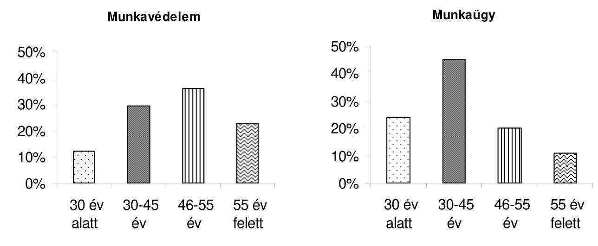

### 1.2. Neme

Munkaügyben a létszám 60%-a, munkavédelemben 76%-a férfi. A teljes létszám 68%-a férfi.

### 1.3. Legmagasabb képzettsége

A válaszadók 98%-a rendelkezik felsőfokú végzettséggel. Munkavédelemben és munkaügyben is a főiskolát végzettek aránya a legmagasabb (62 és 54%).

### 1.4. Az Ön által betöltött felügyelői munkakör?

A válaszadók 56%-a munkaügyi, 44%-a munkavédelmi munkakörű.

### 1.5. Mi az Ön szakterülete, korábban milyen területen végzett felügyelői munkát?

A munkavédelmi felügyelők átlagosan kétszer annyi szakterületet (6-ot) jelöltek meg, mint a munkaügyisek. A válaszokban jellemzően a hatósági ellenőrzés kiemelt területeit jelölték meg.

---

A leggyakoribb és legritkább válaszok:
Munkavédelem: feldolgozóipar (11,2%); kereskedelem, vendéglátás (10,2%); építőipar (10,1%); gépipar (9,4%); munkaegészségügy (9,1%); ... ; őrzés-védelem (4,2%); munkaügy (3,7%); bányászat (1,8%)

Munkaügy: munkaügy (27,5%); kereskedelem, vendéglátás (9,2%); őrzés-védelem (8,1%); építőipar (7,8%); mezőgazdaság (7,1%); .... ;közlekedés (4,4%); oktatás, kultúra (4,3%); gépipar (4,0%); egyéb (3,3%); munkaegészségügy (0,2%); bányászat (0%)

# 1.6. Mióta felügyelő Ön? 

A munkavédelmi felügyelők 52%-a több mint 5, és 37%-a több mint 10 éve van az OMMF-nél. A munkaügyi felügyelők 70%-a legfeljebb 5 éve, míg 21%-a több mint 10 éve felügyelő. A teljes létszám 60%-a legfeljebb 5 éve, 28%-a több mint 10 éve áll az OMMF alkalmazásában.
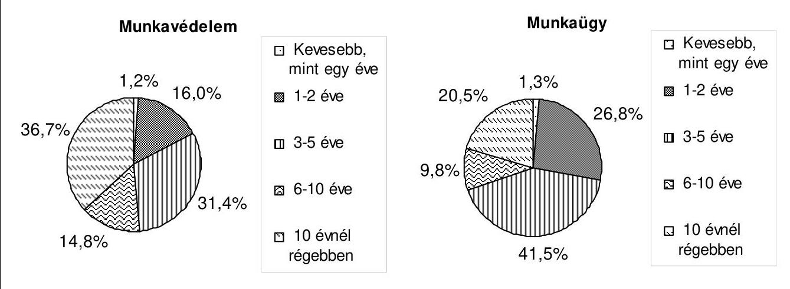

## 2. TOVÁBBKÉPZÉS ÉS FEJLESZTÉS

### 2.1. Kap-e Ön elegendő vezetői visszajelzést munkájáról, teljesítményéről?

A válaszadók 86%-a az IGEN választ jelölte be.

### 2.2. Felügyelői teljesítményének értékelése keretében 2009-ben hány ellenőrzésén vett részt Önnel az osztályvezető, irodavezető, OMMF szakmai ellenőr?

A munkavédelmi felügyelőket 2009-ben gyakrabban kísérték el ellenőrzésre, mint a munkaügyiseket. A hétféle gyakoriság közül mindkét területen a „soha" válasz fordult elő a legtöbbször.

Leggyakoribb (összevont) válaszok:
Munkavédelem: osztályvezető és/vagy irodavezető: legalább félévente 55%, soha 35% szakmai ellenőr: évente egyszer 33%, soha 54%

Munkaügy: osztályvezető és/vagy irodavezető: legalább félévente 29%, soha 58% szakmai ellenőr: évente egyszer 13%, soha 83%

---

# 2.3. Mikor vett részt utoljára a felügyelői munkát segítő képzésben? 

Az elmúlt 2 évben a felügyelők több mint 95%-a részt vett valamilyen képzésben. A munkavédelmi felügyelők 75, a munkaügyi felügyelők 68%-a az elmúlt 1 évben részt vett képzésen.

## 2.4. Milyen típusú képzésben vett részt?

A legtöbben a jogszabályokhoz (318 fő, 80%), valamint a belső eljárásokhoz (213 fő, 54%) kapcsolódó képzéseken vettek részt. Az informatikai képzést 79 fő (20%) jelölte meg, míg az egyéb képzést 158 fő (40%).
A munkaügyi felügyelők 86, a munkavédelmi felügyelők 74%-a vett részt jogszabályokhoz kapcsolódó képzésen. Az egyéb képzést a munkavédelmi felügyelők 53, a munkaügyi felügyelők 30%-a jelölte meg.

## 2.5. Mi a véleménye, a képzés mennyiben segítette Önt abban, hogy a munkáját jobban lássa el?

A felügyelők 74%-a számára a képzések segítettek munkájuk jobb ellátásában, míg 26%-uk számára keveset vagy egyáltalán nem segítettek a képzések. A munkavédelmi felügyelők számára 68, a munkaügyi felügyelők számára 79%-ban nyújtottak segítséget a képzések.

## 3. A FELÜGYELŐI FELADAT ELLÁTÁSA

### 3.1. Egy átlagos héten milyen feladatokat végez, melyiket mennyi ideig (38 órás munkahetet feltételezve)?

A legtöbb időt igénylő feladatok (óra):
Munkavédelem: rutin ellenőrzés (13,4); határozat megírása (8,9)

- munkaügyhöz képest alacsony értékek: bírság előkészítése (2,0); bejelentés ellenőrzése (3,0)

Munkaügy: rutin ellenőrzés (10,0); bejelentés ellenőrzés (7,0); bírság előkészítése (6,9); határozat megírása (5,6)

A munkavédelmi felügyelők átlagosan több időt töltenek az ellenőrzéssel (23,4 - 17), míg a munkaügyi felügyelők a felkészüléssel (3,8-2,7) és a határozatok elkészítésével (12,5 - 10,8).
A súlyos munkabaleset kivizsgálása és a foglalkozási megbetegedés, fokozott expozíciós esetek vizsgálata egy adott hétből több napot is igénybe vehet, ha felmerül.

### 3.2. Egy évben kb. hány napot tölt összesen az alábbiakkal?

Munkavédelemben átlagosan másfélszer annyi napot (9,6) töltenek egy évben adatszolgáltatással, mint munkaügyben.
Továbbképzéssel mindkét területen átlagosan évi 5 napot töltenek a felügyelők.
Mindkét kérdésnél nagy a válaszok közti szórás.

### 3.3. Mikor gondolja, hogy jól végzi a saját munkáját?

A válaszadók szakterülettől függetlenül hasonlóan ítélik meg a kérdést.
A tényezők közül a legkevésbé (közepesen - 2,9) fontos a „bírság megállapítása", a többi válasz átlaga 3,7 és 4,8 közötti.

---

A válaszokból megállapítható, hogy a felügyelők számára a jó munkavégzés ismérvei az alaposság és az eredményesség. Munkájuk akkor eredményes, ha az ügyfél megérti a jogsértés hátrányos következményeit és intézkedik annak megszüntetéséről.
Amely felügyelők egyéb tényezőket is megneveztek, azok számára azok a legfontosabbak (pl. balesetveszély csökkentése, másodfok kimenetele, törvényesség, korrektség).

# 3.4. Az alábbiak közül mely jellemzők hátráltatják Önt abban, hogy munkáját a (helyszíni) ellenőrzés során a legjobban ellássa? 

A munkavédelmi felügyelők összességében kevésbé ítélik meg akadálynak a kérdőívben felsorolt tényezőket.
Az ügyfél általi korrupció a túlnyomó többség szerint nem jellemző.
A munkát leginkább hátráltató tényezők az alábbiak:
Munkavédelem: a munkavállaló fél elmondani a körülményeket (3,3); túl magas ügyszám, sok az ellenőrzés (3,3); a hatóság "ellenséges", büntetőhatóságként való közmegítélése (3,2)

Munkaügy: a munkavállaló fél elmondani a körülményeket (4,1); az ügyfélnek nem érdeke a segítség megadása (3,7); a hatóság "ellenséges", büntetőhatóságként való közmegítélése (3,6); az ügyfél egyéb módon akadályozza az ellenőrzést (pl. nem elérhető) (3,5); túl magas ügyszám, sok az ellenőrzés (3,3)

## 3.5. Véleménye szerint milyen gyakorlati változás egyszerüsítené az Ön munkáját, növelné a hatékonyságát?

A két területen összességében hasonlóan ítélik meg a felsorolt tényezők fontosságát.
Eltérően fontosnak ítélik meg: komplex ellenőrzések előtérbe helyezése (munkaügy) (3,7 munkaügy 2,2 munkavédelem).

Legfontosabb tényezők (összevont adatok):
Adminisztratív támogatás, kevesebb papírmunka (4,5); panasz bejelentések szűrése (4,4); az informatikai feltételek fejlesztése (4,0); egyéb technikai feltételek javítása (pl. fényképezőgép) (3,9); több, ill. jobb továbbképzés (3,8); változás az OMMF-en belüli együttműködésben (3,8)

### 3.6. Hogyan lehetne eredményesebb (a szabályok betartását jobban elősegítő) a munkája?

A két területen összességében hasonlóan ítélik meg a felsorolt tényezők fontosságát.
Legfontosabb, ill. legkevésbé fontos tényezők (összevont adatok):
arányosabb teljesítménykövetelmények meghatározása (súlyozás az egyes kritériumok között) (3,9); tanácsadás előtérbe helyezésével (3,8); a teljesítményértékelések jobban tükröznék a munkája minőségét, színvonalát (3,8); magasabb lenne az Ön jövedelme (3,8)
magasabb lenne a pénzbüntetés (2,0); pontosabban előírnák az Ön vezetői, kit ellenőrizzen (2,2)

### 3.7. Ha mindent figyelembe vesz, mennyire elégedett a munkájával?

A válaszadók 76%-a elégedett a munkájával, 20% semleges választ adott, 4% elégedetlen.

---

Készült egy külön összesítés, melyben a válaszadókat aszerint rendeztük két külön csoportba, hogy kevesebb, vagy legalább három éve dolgoznak az OMMF-nél. A két csoport válaszai nem mutattak érdemi eltérést, az alábbiakat kivéve:

- 2.2 kérdés: A „3-10+ éve dolgozók"-at összességében gyakrabban kísérték el ellenőrzésre 2009 folyamán, mint a „0-2 éve dolgozók"-at.

0-2 éve dolgozók: osztályvezető: legalább félévente 40,2%, soha 40,2%
irodavezető: legalább félévente 24,6%, soha 63,8%
OMMF szakmai ellenőr: soha 83,3%, évente egyszer 13,6%

- 3-10+ éve dolgozók: osztályvezető: legalább félévente 45,1%, soha 43,4%
irodavezető: soha 52,8%, legalább félévente 39,4%
OMMF szakmai ellenőr: soha 64,4%, évente egyszer 25,7%
- 3.2 kérdés: A „0-2 éve dolgozók" átlagosan több időt töltenek továbbképzéssel (6,4 4,7), a „3-10+ éve dolgozók" az adatszolgáltatással (8,1-5,5).

---

# A felügyelői kérdőívekre adott válaszok összesítése* 

## 1. SZEMÉLYES INFORMÁCIÓK

1.1. Kora

| Sorszám | Válasz | Munkavédelem |  | Munkaügy |  | Teljes |  |
| :--: | :--: | :--: | :--: | :--: | :--: | :--: | :--: |
|  |  | db | megoszlás | db | megoszlás | db | megoszlás |
| 1 | 30 év alatt | 20 | 12,0% | 53 | 24,1% | 73 | 18,6% |
| 2 | 30-45 év | 49 | 29,3% | 99 | 45,0% | 150 | 38,2% |
| 3 | 46-55 év | 60 | 35,9% | 44 | 20,0% | 107 | 27,2% |
| 4 | 55 év felett | 38 | 22,8% | 24 | 10,9% | 63 | 16,0% |
|  | Összesen | 167 | 100% | 220 | 100% | 393 | 100% |

1.2. Neme

| Sorszám | Válasz | Munkavédelem |  | Munkaügy |  | Teljes |  |
| :--: | :--: | :--: | :--: | :--: | :--: | :--: | :--: |
|  |  | db | megoszlás | db | megoszlás | db | megoszlás |
| 1 | Férfi | 133 | 76,4% | 134 | 60,4% | 272 | 67,5% |
| 2 | Nő | 41 | 23,6% | 88 | 39,6% | 131 | 32,5% |
|  | Összesen | 174 | 100% | 222 | 100% | 403 | 100% |

1.3. Legmagasabb képzettsége

| Sorszám | Válasz | Munkavédelem |  | Munkaügy |  | Teljes |  |
| :--: | :--: | :--: | :--: | :--: | :--: | :--: | :--: |
|  |  | db | megoszlás | db | megoszlás | db | megoszlás |
| 1 | Érettségi | 4 | 2,3% | 4 | 1,8% | 8 | 2,0% |
| 2 | Főiskola | 108 | 62,1% | 122 | 54,5% | 235 | 58,0% |
| 3 | Egyetem | 62 | 35,6% | 98 | 43,8% | 162 | 40,0% |
|  | Összesen | 174 | 100% | 224 | 100% | 405 | 100% |

1.4. Az Ön által betöltött felügyelői munkakör?

| Sorszám | Válasz | Munkavédelem |  | Munkaügy |  | Teljes |  |
| :--: | :--: | :--: | :--: | :--: | :--: | :--: | :--: |
|  |

 | db | megoszlás | db | megoszlás | db | megoszlás |
| 1 | Munkavédelmi | 177 | 100,0\% | 0 | 0,0\% | 177 | 43,9\% |
| 2 | Munkaügyi | 0 | 0,0\% | 226 | 100,0\% | 226 | 56,1\% |
|  | Összesen | 177 | 100\% | 226 | 100\% | 403 | 100\% |

[^0]
[^0]:    * A kérdőívet kitöltők nem minden esetben adták meg, hogy munkavédelmi, vagy munkaügyi felügyelőségen dolgoznak. Ezen felügyelők válaszait a teljes oszlopokban feltüntetett adatok tartalmazzák, a munkavédelmi és munkaügyi adatoszlopok azonban nem. Ennek következtében a munkavédelmi és munkaügyi válaszok darabszámainak összege nem egyezik a teljes darabszámmal.

---

14. sz. melléklet a V-2007-077/2010-2011. sz. jelentéshez
1.5. Mi az Ön szakterülete, korábban milyen területen végzett felügyelői munkát?

| Sorszám | Szakterület | Munkavédelem |  | Munkaügy |  | Teljes |  |
| :--: | :--: | :--: | :--: | :--: | :--: | :--: | :--: |
|  |  | fő | Megoszlás | fő | Megoszlás | fő | Megoszlás |
| 1 | munkaügy | 38 | 3,6\% | 173 | 27,5\% | 217 | 12,6\% |
| 2 | bányászat | 19 | 1,8\% | 0 | 0,0\% | 19 | 1,1\% |
| 3 | építőipar | 105 | 9,9\% | 49 | 7,8\% | 158 | 9,2\% |
| 4 | gépipar | 98 | 9,3\% | 25 | 4,0\% | 126 | 7,3\% |
| 5 | mezőgazdaság | 77 | 7,3\% | 45 | 7,1\% | 125 | 7,3\% |
| 6 | feldolgozó ipar | 116 | 11,0\% | 39 | 6,2\% | 159 | 9,2\% |
| 7 | közlekedés | 55 | 5,2\% | 28 | 4,4\% | 85 | 4,9\% |
| 8 | kereskedelem, vendéglátás | 106 | 10,0\% | 58 | 9,2\% | 167 | 9,7\% |
| 9 | egészségügy, szociális terület | 67 | 6,3\% | 36 | 5,7\% | 106 | 6,1\% |
| 10 | oktatás, kultúra | 66 | 6,2\% | 27 | 4,3\% | 95 | 5,5\% |
| 11 | őrzés-védelem | 44 | 4,2\% | 51 | 8,1\% | 96 | 5,6\% |
| 12 | államigazgatás, közigazgatás | 53 | 5,0\% | 41 | 6,5\% | 96 | 5,6\% |
| 13 | munkaegészségügy | 94 | 8,9\% | 1 | 0,2\% | 97 | 5,6\% |
| 14 | egyéb | 55 | 5,2\% | 21 | 3,3\% | 77 | 4,5\% |
| 15 | ágazattól független | 64 | 6,1\% | 36 | 5,7\% | 101 | 5,9\% |
|  | Összesen | 1057 |  | 630 |  | 1724 |  |
|  | Összes válaszadó száma | 172 |  | 215 |  | 393 |  |
|  | 1 válaszadóra jutó válaszok száma | 6,1 |  | 2,9 |  | 4,4 |  |

1.6. Mióta felügyelő Ön?

| Sorszám | Válasz | Munkavédelem |  | Munkaügy |  | Teljes |  |
| :--: | :--: | :--: | :--: | :--: | :--: | :--: | :--: |
|  |  | db | megoszlás | db | megoszlás | db | megoszlás |
| 1 | Kevesebb, mint egy éve | 2 | 1,2\% | 3 | 1,3\% | 5 | 1,3\% |
| 2 | 1-2 éve | 27 | 16,0\% | 60 | 26,8\% | 87 | 21,8\% |
| 3 | 3-5 éve | 53 | 31,4\% | 93 | 41,5\% | 147 | 36,8\% |
| 4 | 6-10 éve | 25 | 14,8\% | 22 | 9,8\% | 48 | 12,0\% |
| 5 | 10 évnél régebben | 62 | 36,7\% | 46 | 20,5\% | 113 | 28,3\% |
|  | Összesen | 169 | 100\% | 224 | 100\% | 400 | 100\% |

# 2. TOVÁBBKÉPZÉS ÉS FEJLESZTÉS 

2.1. Kap-e Ön elegendő vezetői visszajelzést munkájáról, teljesítményéről?

| Sorszám | Válasz | Munkavédelem |  | Munkaügy |  | Teljes |  |
| :--: | :--: | :--: | :--: | :--: | :--: | :--: | :--: |
|  |  | db | megoszlás | db | megoszlás | db | megoszlás |
| 1 | Igen | 154 | 88,0\% | 190 | 84,4\% | 352 | 86,3\% |
| 2 | Nem | 21 | 12,0\% | 35 | 15,6\% | 56 | 13,7\% |
|  | Összesen | 175 | 100\% | 225 | 100\% | 408 | 100\% |

---

14. sz. melléklet a V-2007-077/2010-2011. sz. jelentéshez
2.2. Felügyelői teljesítményének értékelése keretében 2009-ben hány ellenőrzésén vett részt Önnel az osztályvezető, irodavezető, OMMF szakmai ellenőr?

Munkavédelem
válaszadók száma: 171 fő

| Sorszám | Válasz | osztályvezető |  | irodavezető |  | OMMF szakmai ellenőr |  |
| :--: | :--: | :--: | :--: | :--: | :--: | :--: | :--: |
|  |  | fő | megoszlás | fő | megoszlás | fő | megoszlás |
| 1 | havonta egynél többször | 13 | 10,0\% | 13 | 10,6\% | 1 | 0,8\% |
| 2 | havonta egyszer | 30 | 23,1\% | 21 | 17,1\% | 0 | 0\% |
| 3 | 2-3 havonta | 15 | 11,5\% | 23 | 18,7\% | 1 | 0,8\% |
| 4 | 4-5 havonta | 6 | 4,6\% | 2 | 1,6\% | 4 | 3,1\% |
| 5 | félévente | 10 | 7,7\% | 5 | 4,1\% | 11 | 8,6\% |
| 6 | évente egyszer | 16 | 12,3\% | 11 | 8,9\% | 42 | 32,8\% |
| 7 | soha | 40 | 30,8\% | 48 | 39,0\% | 69 | 53,9\% |

Munkaügy
válaszadók száma: 216 fő

| Sorszám | Válasz | osztályvezető |  | irodavezető |  | OMMF szakmai ellenőr |  |
| :--: | :--: | :--: | :--: | :--: | :--: | :--: | :--: |
|  |  | fő | megoszlás | fő | megoszlás | fő | megoszlás |
| 1 | havonta egynél többször | 12 | 6,4\% | 10 | 6,0\% | 0 | 0\% |
| 2 | havonta egyszer | 10 | 5,3\% | 6 | 3,6\% | 0 | 0\% |
| 3 | 2-3 havonta | 34 | 18,1\% | 4 | 2,4\% | 0 | 0\% |
| 4 | 4-5 havonta | 4 | 2,1\% | 5 | 3,0\% | 1 | 0,6\% |
| 5 | félévente | 8 | 4,3\% | 11 | 6,6\% | 5 | 3,1\% |
| 6 | évente egyszer | 27 | 14,4\% | 17 | 10,2\% | 21 | 13,0\% |
| 7 | soha | 93 | 49,5\% | 114 | 68,3\% | 135 | 83,3\% |

Teljes
válaszadók száma: 391 fő

| Sorszám | Válasz | osztályvezető |  | irodavezető |  | OMMF szakmai ellenőr |  |
| :--: | :--: | :--: | :--: | :--: | :--: | :--: | :--: |
|  |  | fő | megoszlás | fő | megoszlás | fő | megoszlás |
| 1 | havonta egynél többször | 25 | 7,7\% | 24 | 8,1\% | 1 | 0,3\% |
| 2 | havonta egyszer | 42 | 13,0\% | 28 | 9,5\% | 0 | 0\% |
| 3 | 2-3 havonta | 49 | 15,1\% | 27 | 9,1\% | 1 | 0,3\% |
| 4 | 4-5 havonta | 10 | 3,1\% | 7 | 2,4\% | 6 | 2,0\% |
| 5 | félévente | 19 | 5,9\% | 17 | 5,7\% | 16 | 5,4\% |
| 6 | évente egyszer | 43 | 13,3\% | 28 | 9,5\% | 66 | 22,3\% |
| 7 | soha | 136 | 42,0\% | 165 | 55,7\% | 206 | 69,6\% |

---

14. sz. melléklet

a V-2007-077/2010-2011. sz. jelentéshez
2.3. Mikor vett részt utoljára a felügyelői munkát segítő képzésben?

| Sorszám | Válasz | Munkavédelem |  | Munkaügy |  | Teljes |  |
| :--: | :--: | :--: | :--: | :--: | :--: | :--: | :--: |
|  |  | db | megoszlás | db | megoszlás | db | megoszlás |
| 1 | az elmúlt 1 hónapon belül | 17 | 9,6\% | 41 | 18,3\% | 59 | 14,4\% |
| 2 | 1 és 6 hónap közt | 44 | 24,9\% | 54 | 24,1\% | 101 | 24,7\% |
| 3 | 6 és 12 hónap közt | 71 | 40,1\% | 58 | 25,9\% | 131 | 32,0\% |
| 4 | 1 és 2 év közt | 40 | 22,6\% | 61 | 27,2\% | 103 | 25,2\% |
| 5 | több mint két évvel ezelőtt | 5 | 2,8\% | 9 | 4,0\% | 14 | 3,4\% |
| 6 | nem vettem részt képzésben | 0 | 0,0\% | 1 | 0,4\% | 1 | 0,2\% |
|  | Összesen | 177 | 100\% | 224 | 100\% | 409 | 100\% |

2.4. Milyen típusú képzésben vett részt?

| Sorszám | Válasz | Munkavédelem |  | Munkaügy |  | Teljes |  |
| :--: | :--: | :--: | :--: | :--: | :--: | :--: | :--: |
|  |  | fő | megoszlás | fő | megoszlás | fő | megoszlás |
| 1 | jogszabályokhoz, azok változásához kapcsolódó képzés | 126 | 73,7\% | 186 | 86,1\% | 318 | 80,5\% |
| 2 | belső eljáráshoz, utasításokhoz, azok változásához kapcsolódó képzés | 87 | 50,9\% | 121 | 56,0\% | 213 | 53,9\% |
| 3 | informatikai képzés | 40 | 23,4\% | 37 | 17,1\% | 79 | 20,0\% |
| 4 | egyéb | 90 | 52,6\% | 64 | 29,6\% | 158 | 40,0\% |
|  | Válaszadók

 száma | 171 | - | 216 | - | 395 | - |

2.5. Mi a véleménye, a képzés mennyiben segítette Önt abban, hogy a munkáját jobban lássa el?

| Sorszám | Válasz | Munkavédelem |  | Munkaügy |  | Teljes |  |
| :--: | :--: | :--: | :--: | :--: | :--: | :--: | :--: |
|  |  | db | megoszlás | db | megoszlás | db | megoszlás |
| 1 | sokat segített | 39 | 22,7\% | 60 | 27,9\% | 100 | 25,3\% |
| 2 | segített | 78 | 45,3\% | 110 | 51,2\% | 193 | 48,9\% |
| 3 | keveset segített | 44 | 25,6\% | 40 | 18,6\% | 85 | 21,5\% |
| 4 | nem segített | 11 | 6,4\% | 5 | 2,3\% | 17 | 4,3\% |
|  | Összesen | 172 | 100\% | 215 | 100\% | 395 | 100\% |

---

1. sz. melléklet a V-2007-077/2010-2011. sz. jelentéshez

|  Sorszám | 3. A FELÜGYELŐI FELADAT ELLÁTÁSA
3.1. Egy átlagos héten milyen feladatokat végez, melyiket mennyi ideig (38 órás munkahetet feltételezve)? |  | Munkavédelem |  | Munkaügy |  | Teljes |   |
| --- | --- | --- | --- | --- | --- | --- | --- | --- |
|   |  |  | Adott tevékenységet megjelölők száma | Átlagosan eltöltött órák száma az adott tevékenységet megjelölők körében | Adott tevékenységet megjelölők száma | Átlagosan eltöltött órák száma az adott tevékenységet megjelölők körében | Adott tevékenységet megjelölők száma | Átlagosan eltöltött órák száma az adott tevékenységet megjelölők körében  |
|  1 | munkaterv elkészítése | munkáltató kiválasztásához adatok begyűjtése stb. | 168 | 1,1 | 192 | 2,0 | 367 | 1,6  |
|  2 | felkészülés | fizikai (szigorú számadású nyomtatványok beszerzése, autóigénylés stb.) | 154 | 0,8 | 195 | 1,3 | 357 | 1,1  |
|  3 |  | szakmai (visszaellenőrzéshez ügyirat beszerzése, szabványok, jogszabályok áttekintése stb.) | 156 | 1,9 | 187 | 2,5 | 351 | 2,2  |
|   |  | felkészülés összesen | - | 2,7 | - | 3,8 | - | 3,3  |
|  4 | ellenőrzés | rutin ellenőrzés | 172 | 13,4 | 190 | 10,0 | 367 | 11,7  |
|  5 |  | súlyos munkabaleset kivizsgálása* | 86 | 3,7 | - | - | 88 | 4,0  |
|  6 |  | foglalkozási megbetegedés, fokozott expozíciós esetek vizsgálata* | 42 | 3,3 | - | - | 42 | 3,3  |
|  7 |  | közérdekű és panaszbejelentés | 153 | 3,0 | 195 | 7,0 | 354 | 5,2  |
|   |  | ellenőrzés összesen | - | 23,4 | - | 17,0 | - | 24,3  |
|  8 | határozatok elkészítése | saját kiadványozású határozat megírása | 168 | 8,9 | 177 | 5,6 | 353 | 7,2  |
|  9 |  | munkavédelmi/munkaügyi bírság előkészítése | 144 | 2,0 | 181 | 6,9 | 330 | 4,9  |
|   | határozatok elkészítése összesen |  | - | 10,8 | - | 12,5 | - | 12,1  |
|  10 | az ügyhöz kapcsolódó iratkezelés (látogatási lap, tértivevények kezelése, jogerősítés, irattári előkészítés) |  | 163 | 2,5 | 198 | 3,8 | 374 | 3,2  |
|  11 | baleseti jegyzőkönyvek feldolgozása* |  | 151 | 1,9 | - | - | 156 | 1,9  |
|  12 | bejelentések feldolgozása |  | 117 | 1,1 | 132 | 1,9 | 254 | 1,5  |
|  13 | jelentések készítése |  | 131 | 2,0 | 113 | 1,4 | 247 | 1,7  |
|  14 | értekezlet |  | 144 | 1,3 | 167 | 1,4 | 321 | 1,4  |
|  15 | továbbképzés |  | 53 | 1,0 | 45 | 1,5 | 101 | 1,3  |
|  16 | egyéb, éspedig: ... |  | 25 | 7,0 | 25 | 4,3 | 52 | 5,7  |
|   | ÖSSZESEN - az egyedi kérdőív adatok alapján |  | 174 | 40,5 | 220 | 38,0 | 402 | 39,2  |

- csak munkavédelem

---

3.2. Egy évben kb. hány napot tölt összesen az alábbiakkal?

| Sorszám | Válasz | Munkavédelem |  | Munkaügy |  | Teljes |  |
| :--: | :--: | :--: | :--: | :--: | :--: | :--: | :--: |
|  |  | Összes válasz | Átlag | Összes válasz | Átlag | Összes válasz | Átlag |
| 1 | adatszolgáltatás negyedéves, illetve célvizsgálati jelentésekhez | 172 | 9,6 | 201 | 6,1 | 381 | 7,7 |
| 2 | továbbképzés | 137 | 4,6 | 169 | 5,1 | 314 | 5,1 |

3.3. Mikor gondolja, hogy jól végzi a saját munkáját?

Kérjük, értékelje 1-től 5-ig az egyes tényezőket aszerint, hogy Ön szerint mennyire fontosak! Az 1-es a kevésbé fontos, az 5-ös a nagyon fontos tényezőt jelöli.

| Sorszám | Válasz | Munkavédelem |  | Munkaügy |  | Teljes |  |
| :--: | :--: | :--: | :--: | :--: | :--: | :--: | :--: |
|  |  | Összes válasz | Átlag | Összes válasz | Átlag | Összes válasz | Átlag |
| 1 | alapos, valamennyi lehetséges jogsértésre kiterjed az ellenőrzés | 174 | 4,6 | 225 | 4,6 | 407 | 4,6 |
| 2 | bírság megállapítása | 170 | 2,7 | 221 | 3,2 | 398 | 2,9 |
| 3 | a feltárt probléma hátrányos következményeinek megértetése az ügyféllel | 173 | 4,6 | 223 | 4,5 | 404 | 4,6 |
| 4 | az ügyfelet minél gyorsabban sikerül a megfelelő intézkedésre bírni | 175 | 4,4 | 224 | 4,4 | 407 | 4,4 |
| 5 | teljesítmény követelményeknek való megfelelés | 174 | 3,7 | 223 | 3,7 | 405 | 3,7 |
| 6 | pozitív visszajelzés a munkahelyi vezetőtől | 176 | 4,2 | 224 | 4,3 | 408 | 4,3 |
| 7 | pozitív visszajelzés ügyféltől, tanútól | 176 | 4,1 | 223 | 4,0 | 407 | 4,0 |
| 8 | egyéb, éspedig: | 23 | 4,9 | 16 | 4,7 | 39 | 4,8 |

# Említett egyéb tényezők: 

Munkavédelem: sérülések megelőzése, utóellenőrzés pozitív eredménye, ügyfél tájékoztatása, fizetés, tisztesség

Munkaügy: másodfok szerepe, törvényes eljárás, korrektség, társadalmi hasznosság, anyagi elismerés

---

3.4. Az alábbiak közül mely jellemzők hátráltatják Önt abban, hogy munkáját a (helyszíni) ellenőrzés során a legjobban ellássa?

Kérjük, értékelje 1-től 5-ig az egyes tényezőket aszerint, hogy Ön szerint mennyire fontosak! Az 1-es a nem jellemző, az 5-ös a nagyon gyakran előforduló tényezőt jelöli.

| Sorszám | Válasz | Munkavédelem |  | Munkaügy |  | Teljes |  |
| :--: | :--: | :--: | :--: | :--: | :--: | :--: | :--: |
|  |  | Összes válasz | Átlag | Összes válasz | Átlag | Összes válasz | Átlag |
| 1 | az ügyfél fizikailag akadályozza az ellenőrzést | 173 | 1,8 | 221 | 2,4 | 402 | 2,1 |
| 2 | az ügyfél egyéb módon akadályozza az ellenőrzést (pl. nem elérhető) | 173 | 2,6 | 223 | 3,5 | 404 | 3,1 |
| 3 | a munkavállaló fél elmondani a körülményeket | 172 | 3,3 | 222 | 4,1 | 401 | 3,8 |
| 4 | az ügyfél korrumpálni próbálja a felügyelőt | 172 | 1,3 | 218 | 1,5 | 397 | 1,4 |
| 5 | túl magas ügyszám, sok az ellenőrzés | 172 | 3,3 | 223 | 3,3 | 402 | 3,3 |
| 6 | túl sok rendkívüli, nem tervezett ellenőrzést kell végezni | 172 | 2,9 | 222 | 2,7 | 401 | 2,8 |
| 7 | az ügyfélnek nem érdeke a segítség megadása | 173 | 2,8 | 223 | 3,7 | 404 | 3,3 |
| 8 | a hatóság "ellenséges", büntetőhatóságként való közmegítélése | 173 | 3,2 | 223 | 3,6 | 404 | 3,4 |

---

3.5. Véleménye szerint milyen gyakorlati változás egyszerűsítené az Ön munkáját, növelné a hatékonyságát?

Kérjük, értékelje 1-től 5-ig az egyes tényezőket aszerint, hogy Ön szerint mennyire fontosak a hatékonyság növelése szempontjából (adott idő alatt több ügyfél ellenőrzése)! Az 1-es a kevésbé fontos, az 5-ös a nagyon fontos tényezőt jelöli.

| Sorszám | Válasz | Munkavédelem |  | Munkaügy |  | Teljes |  |
| :--: | :--: | :--: | :--: | :--: | :--: | :--: | :--: |
|  |  | Összes válasz | Átlag | Összes válasz | Átlag | Összes válasz | Átlag |
| 1 | adminisztratív támogatás, kevesebb papírmunka | 176 | 4,6 | 226 | 4,5 | 410 | 4,5 |
| 2 | komplex ellenőrzések előtérbe helyezése (munkaügy) | 129 | 2,2 | 224 | 3,7 | 359 | 3,2 |
| 3 | meghatározott szakterületre való specializálódás | 175 | 3,5 | 225 | 3,1 | 408 | 3,3 |
| 4 | panasz bejelentések szűrése | 175 | 4,2 | 226 | 4,5 | 409 | 4,4 |
| 5 | az informatikai feltételek fejlesztése | 173 | 4,0 | 226 | 3,9 | 407 | 4,0 |
| 6 | egyéb technikai feltételek javítása (pl. fényképezőgép) | 174 | 3,9 | 225 | 3,8 | 407 | 3,9 |
| 7 | irodai munkafeltételek javítása (pl. külön tárgyaló, ügyfélfogadás körülményei) | 174 | 3,2 | 226 | 3,7 | 408 |
 3,5 |
| 8 | több, ill. jobb továbbképzés | 175 | 3,9 | 226 | 3,8 | 409 | 3,8 |
| 9 | a vezetés nagyobb támogatása | 170 | 3,5 | 226 | 3,6 | 404 | 3,6 |
| 10 | változás az OMMF-en belüli együttműködésben | 168 | 3,8 | 221 | 3,7 | 397 | 3,8 |

---

3.6. Hogyan lehetne eredményesebb (a szabályok betartását jobban elősegítő) a munkája?

Kérjük, értékelje 1-től 5-ig az egyes tényezőket aszerint, hogy Ön szerint mennyire fontosak! Az 1-es a kevésbé fontos, az 5-ös a nagyon fontos tényezőt jelöli.

| Sorszám | Válasz | Munkavédelem |  | Munkaügy |  | Teljes |  |
| :--: | :--: | :--: | :--: | :--: | :--: | :--: | :--: |
|  |  | Összes válasz | Átlag | Összes válasz | Átlag | Összes válasz | Átlag |
| 1 | magasabb lenne a pénzbüntetés | 172 | 1,8 | 226 | 2,2 | 406 | 2,0 |
| 2 | többször visszamennének ugyanarra a helyre | 175 | 3,5 | 226 | 3,4 | 409 | 3,4 |
| 3 | tanácsadás előtérbe helyezésével | 174 | 3,8 | 226 | 3,9 | 408 | 3,8 |
| 4 | magasabb lenne az Ön jövedelme | 171 | 3,9 | 226 | 3,7 | 405 | 3,8 |
| 5 | pontosabban előírnák az Ön vezetői, kit ellenőrizzen | 171 | 2,0 | 226 | 2,3 | 404 | 2,2 |
| 6 | nagyobb mértékben bíznák Önre, kit és mit ellenőrizzen | 170 | 3,5 | 225 | 3,3 | 403 | 3,4 |
| 7 | arányosabb teljesítménykövetelmények meghatározása (súlyozás az egyes kritériumok között) | 171 | 3,9 | 226 | 3,9 | 405 | 3,9 |
| 8 | a teljesítményértékelések jobban tükröznék a munkája minőségét, színvonalát | 171 | 3,8 | 225 | 3,8 | 404 | 3,8 |

3.7. Ha mindent figyelembe vesz, mennyire elégedett a munkájával?

| Sorszám | Válasz | Munkavédelem |  | Munkaügy |  | Teljes |  |
| :--: | :--: | :--: | :--: | :--: | :--: | :--: | :--: |
|  |  | db | megoszlás | db | megoszlás | db | megoszlás |
| 1 | nagyon elégedett | 13 | 7,5\% | 19 | 8,4\% | 33 | 8,1\% |
| 2 | elégedett | 111 | 64,2\% | 162 | 72,0\% | 278 | 68,5\% |
| 3 | sem elégedett/sem elégedetlen | 38 | 22,0\% | 40 | 17,8\% | 80 | 19,7\% |
| 4 | elégedetlen | 9 | 5,2\% | 4 | 1,8\% | 13 | 3,2\% |
| 5 | nagyon elégedetlen | 2 | 1,2\% | 0 | 0,0\% | 2 | 0,5\% |
|  | Összesen | 173 | 100\% | 225 | 100\% | 406 | 100\% |

2011. augusztus
