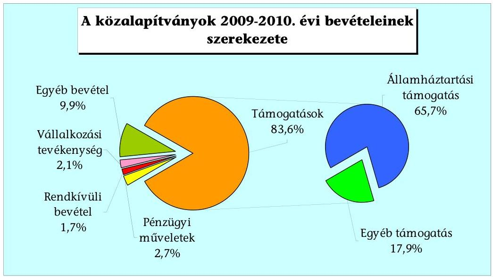
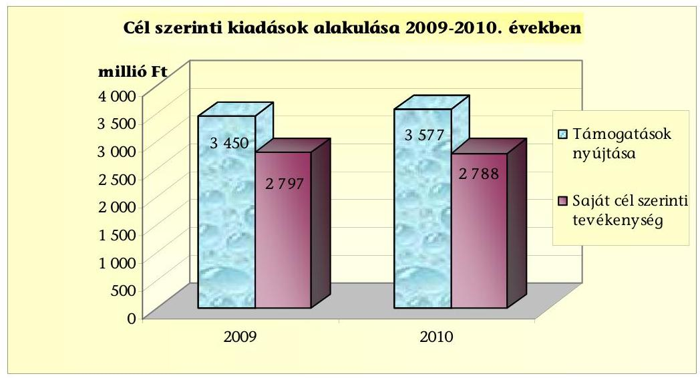
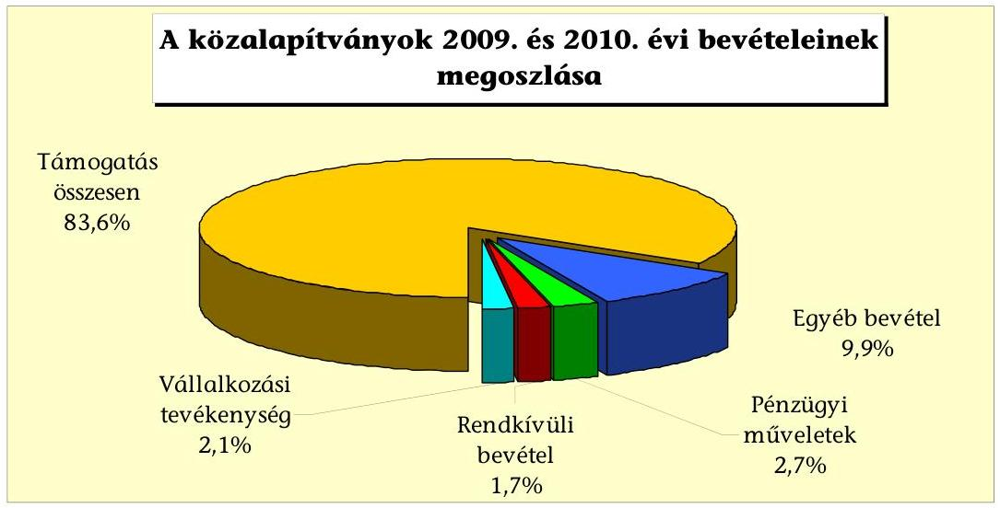
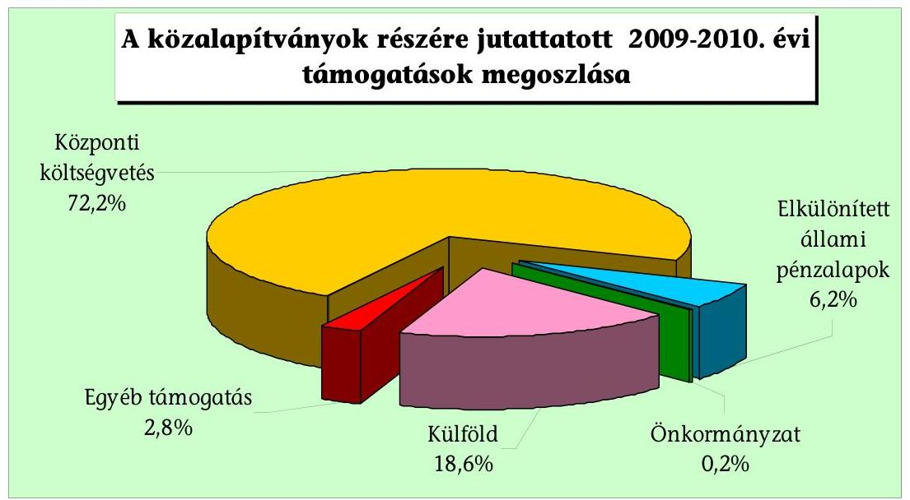
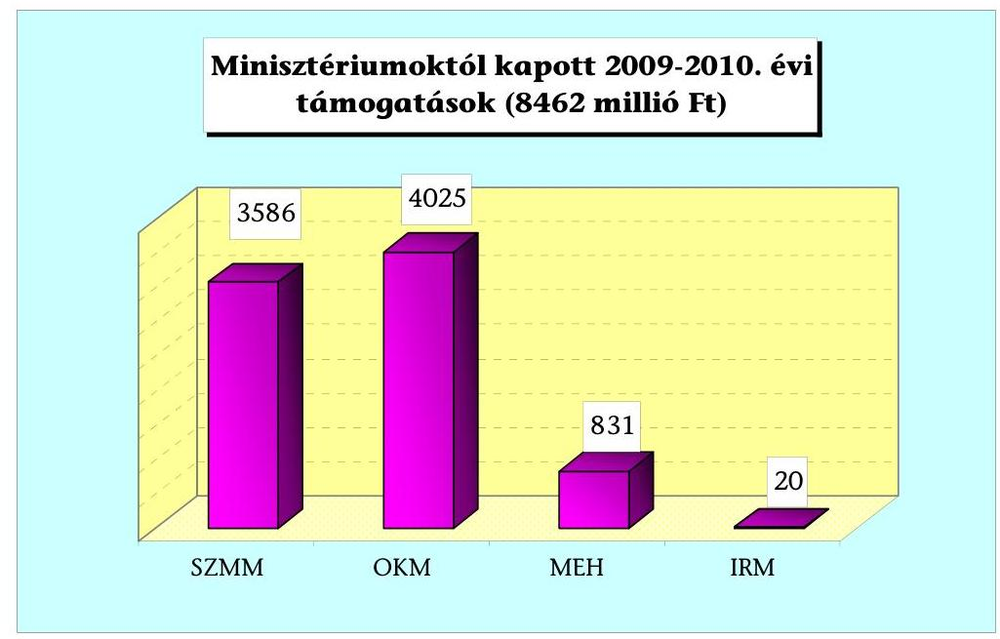
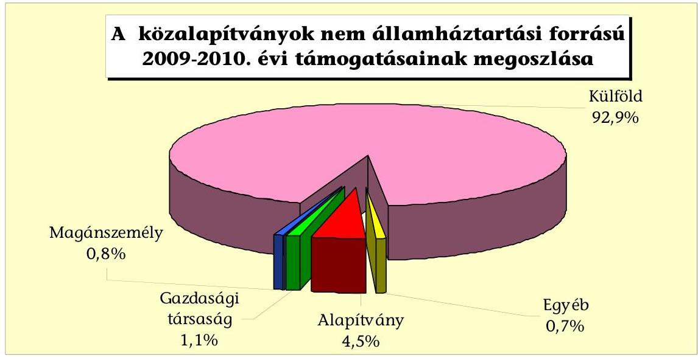
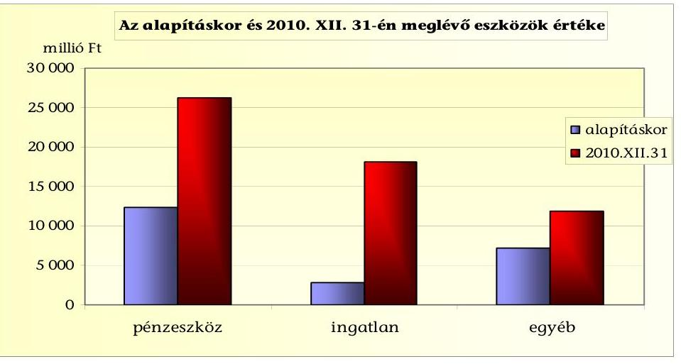
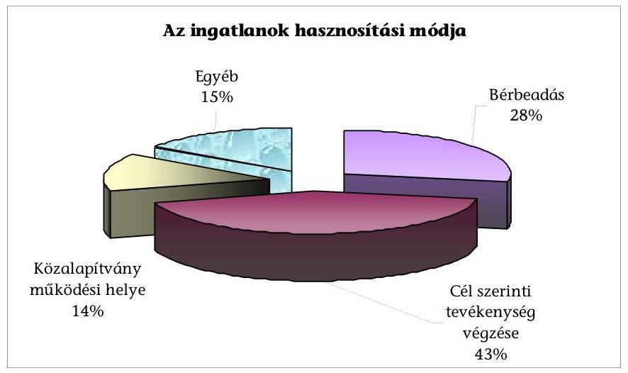
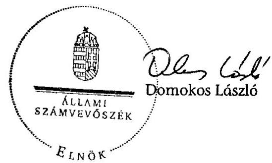

# JELENTÉS 

a Kormány által létrehozott közalapítványok 2009 - 2010. évi feladatellátása és vagyongazdálkodása szabályszerűségének és eredményességének ellenőrzéséről

---

3. Önkormányzati és Területi Ellenőrzési Igazgatóság
3.1. Államháztartáson Kívüli Szervezeteket Ellenőrző Főcsoport

Iktatószám: V-3008-098/2011.
Témaszám: 1019
Vizsgálat-azonosító szám: V-0522

# Az ellenőrzést felügyelte: 

Dr. Elek János
mb. föigazgató
Az ellenőrzés végrehajtásáért felelős:
Dr. Elek János
mb. főigazgató
Az ellenőrzést vezette:
Solymár Ágnes
osztályvezető főtanácsos
Az összefoglaló jelentést készítették:

| Kulcsár Lászlóné | Szappanos Júlia |
| :-- | :-- |
| számvevő | számvevő tanácsos |

## Az ellenőrzést végezték:

| Fónyad Erzsébet | Hadnagyné Papp | Krüzselyi Attila |
| :-- | :-- | :-- |
| számvevő tanácsos | Ildikó | számvevő tanácsos |
|  | számvevő |  |
| Kulcsár Lászlóné | Robák Ferencné | Szappanos Júlia |
| számvevő | számvevő tanácsos | számvevő tanácsos |

A témához kapcsolódó eddig készített számvevőszéki jelentések:
címe
sorszáma
Jelentés a Magyar Alkotóművészeti Közalapítvány gazdálkodásának 0323 ellenőrzéséről
Jelentés a Magyarországi Cigányokért Közalapítvány gazdálkodásának 0427 ellenőrzéséről
Jelentés a Magyarországi Nemzeti és Etnikai Kisebbségekért Közalapítvány gazdálkodásának ellenőrzéséről
Jelentés a Határon Túli Magyar Oktatásért Apáczai Közalapítvány 0510 gazdálkodásának ellenőrzéséről
Jelentés a Betegjogi, Ellátottjogi és Gyermekjogi Közalapítvány 0720 gazdálkodásának ellenőrzéséről
Jelentés a Habsburg-kori Kutatások Közalapítvány gazdálkodásának 0939 ellenőrzéséről

---

# TARTALOMJEGYZÉK 

BEVEZETÉS ..... 6
I. ÖSSZEGZŐ MEGÁLLAPÍTÁSOK, KÖVETKEZTETÉSEK, JAVASLATOK ..... 8
II. RÉSZLETES MEGÁLLAPÍTÁSOK ..... 12

1. A bevételek alakulása ..... 12
1.1. A bevételek összetétele ..... 12
1.2. Az államháztartásból kapott támogatások ..... 13
1.3. Az államháztartáson kívülről kapott támogatások ..... 15
2. A kapott támogatások felhasználása ..... 16
2.1. Az alapító okiratokban rögzített cél szerinti feladatok ellátása ..... 16
2.2. A cél szerinti feladatellátás területei és felhasználásai ..... 16
2.3. A cél szerinti feladat ellátásának ellenőrzése ..... 18
2.4. A működéssel kapcsolatos költségek és ráfordítások ..... 19
3. A vagyon megőrzése és hasznosítása ..... 20
3.1. Az induló vagyon változása, a törzsvagyon megőrzése ..... 21
3.2. Az ingatlanállomány változása, az ingatlanok hasznosítása ..... 23
3.3. A részesedések változása és hatása a gazdálkodás eredményére ..... 24
MELLÉKLETEK
4. sz. melléklet A közalapítványok bevételeinek összetétele és évenkénti alakulása
5. sz. melléklet A helyszínen ellenőrzött közalapítványok támogatásai
FÜGGELÉKEK
6. számú A tanúsítványi adatszolgáltatást teljesítő Kormány által alapított közalapítványok

---

.

---

# RÖVIDÍTÉSEK JEGYZÉKE 

| Áht. | Az államháztartásról szóló 1992. évi XXXVIII. törvény |
| :-- | :-- |
| Ámr. | 292/2009. (XII. 19.) Korm. rendelet az államháztartás működési rendjéről (hatályos 2010. január 1-jétől) |
| ÁSZ tv. | Állami Számvevőszékről szóló 1989. évi XXXVIII. törvény |
| Unió | Európai Unió |
| FB | Felügyelő Bizottság |
| IRM | Igazságügyi és Rendészeti Minisztérium |
| Kh. tv. | A közhasznú szervezetekről szóló 1997. évi CLVI. törvény |
| KIM | Közigazgatási és Igazságügyi Minisztérium |
| Kormányhatározat | A Kormány által alapított közalapítványokkal és alapítványokkal kapcsolatos időszerű intézkedésekről szóló 1159/2010. (VII. 30.) Korm. határozat által előírt felülvizsgálati eljárás megállapításai alapján szükséges intézkedésekről szóló 1316/2010. (XII. 27.) Korm. határozat |
| Korm. rendelet | A számviteli törvény szerinti egyes egyéb szervezetek beszá-moló-készítési és könyvvezetési kötelezettségének sajátosságairól szóló 224/2000. (XII. 19.) Korm. rendelet |
| MÁK | Magyar Államkincstár |
| MEH | Miniszterelnöki Hivatal |
| MPA | Munkaerőpiaci Alap |
| NEFMI | Nemzeti Erőforrás Minisztérium |
| NKA | Nemzeti Kulturális Alap |
| OEP | Országos Egészségbiztosítási Pénztár |
| OKM | Oktatási és Kulturális Minisztérium |
| Számv. tv. | A számvitelről szóló 2000. évi C. törvény |
| SZMSZ | Szervezeti és Működési Szabályzat |
| 2006. évi LXV. törvény | Az államháztartásról szóló 1992. évi XXXVIII. törvény és egyes kapcsolódó törvények módosításáról szóló, 2006. évi LXV. törvény |

---

.

---

# ÉRTELMEZŐ SZÓTÁR 

| Cél szerinti tevékenység | Minden olyan tevékenység, amely az alapító okiratban megjelölt célkitűzés elérését közvetlenül szolgálja [Kh. tv. 26. § b) pont]. |
| :--: | :--: |
| Induló vagyon | A (köz)alapítvány javára a célja megvalósításához az alapító okiratban meghatározott vagyon [Ptk. 74/A. § (1) bekezdés, 74/B. § (1) bekezdés]. A (köz)alapítvány rendelkezésére legalább olyan mértékű vagyont kell bocsátani, amely a működése megkezdéséhez feltétlenül szükséges [Ptk. 74/B. (4) bekezdés]. A (köz)alapítványi vagyon pontos megjelölése nélkül a (köz)alapítvány nem jöhet létre [BH2001. 303 számú, egyedi ügyben hozott bírósági végzés]. |
| Közalapítvány | A közalapítvány olyan alapítvány, amelyet a Kormány, közfeladat ellátásának folyamatos biztosítása céljából hozott létre [Ptk. 74/A. §]. |
| Közhasznú tevékenység | A társadalom és az egyén közös érdekeinek kielégítésére irányuló, az közalapítvány alapító okiratában szereplő cél szerinti tevékenység, a közhasznú szervezetekről szóló 1997. évi CLVI. törvényben meghatározott körben [Kh. tv. 26. § c) pont]. |
| Közhasznú szervezet | Közhasznú szervezetté minősíthető a Magyarországon nyilvántartásba vett társadalmi szervezet, kivéve a biztosító egyesületet és a politikai pártot, valamint a munkáltatói és a munkavállalói érdek-képviseleti szervezetet, alapítvány, közalapítvány, köztestület, ha a létrehozásáról szóló törvény azt lehetővé teszi, országos sportági szakszövetség, nonprofit gazdasági társaság [Kh. tv. 2. § (1) bekezdés a)-l) pont]. |
| Támogatás | Pénzbeli és nem pénzbeli juttatás [Kh. tv. 26. § j) pont]. |
| Törzsvagyon | Az induló vagyon dologi-eszköz elemeit törzsvagyonként indokolt elkülöníteni, ami elidegenítési és terhelési tilalmat jelent. A törzsvagyonná nyilvánítás az alapító kizárólagos jogköre, erre az alapító okiratban a kuratórium részére nem adható felhatalmazás [1052/1997. (V. 21.) Korm. határozat 5. a) pont, melyet az 1159/2010. (VII. 30) Korm. határozat 4.1 pontja 2010. VII. 31-től hatályon kívül helyezett]. |

---

# JELENTÉS 

## a Kormány által létrehozott közalapítványok 2009 - 2010. évi feladatellátása és vagyongazdálkodása szabályszerűségének és eredményességének ellenőrzéséről

## BEVEZETÉS

Az Országgyűlés az államháztartási rendszer megújítása keretében, a közpénzek felhasználásának hatékonyabbá tétele érdekében alkotta meg az államháztartásról szóló 1992. évi XXXVIII. törvény és egyes kapcsolódó törvények módosításáról szóló 2006. évi LXV. törvényt, amely a közalapítvány - mint szervezettípus - perspektivikus megszüntetését célozta, amikor hatályon kívül helyezte a Ptk. közalapítványokra vonatkozó 74/G. §-át. A törvény értelmében új közalapítvány 2006. augusztus 24-től nem hozható létre, a már bejegyzett közalapítványokra átmeneti szabályok vonatkoznak. Az Országgyűlés a törvény 2009. január 1-jétől hatályos módosítása értelmében úgy döntött, ha törvény eltérően nem rendelkezik, kötelező egy éven belül kezdeményezni a közalapítványok megszüntetését, ha annak vagyonán belül az államháztartáson kívüli eredetű bevétel - így különösen juttatás, adomány - aránya (a működés megkezdésének évét nem számítva) két éven át 80% alatti.

Az Állami Számvevőszék (ÁSZ) rendszeresen ellenőrzi a Kormány által alapított közalapítványok gazdálkodásának törvényességét és célszerűségét, ezen belül az állami támogatás felhasználását.

Az ellenőrzés jogalapját az Állami Számvevőszékről szóló 1989. évi XXXVIII. törvény 2. § (5) bekezdése, valamint az államháztartásról szóló 1992. évi XXXVIII. törvény és egyes kapcsolódó törvények módosításáról szóló 2006. évi LXV. törvény 1. § (2) bekezdés e) pontja biztosította.

## Jelen ellenőrzés célja volt annak értékelése, hogy a közalapítványok

- a részükre nyújtott támogatásokat szabályosan, az alapító okiratban és a támogatási szerződésekben meghatározott céloknak megfelelően használták-e fel;
- a működésükhöz rendelkezésre bocsátott állami vagyonnal törvényesen és célszerűen gazdálkodtak-e;
- bevételszerző tevékenysége eredményes volt-e, különös tekintettel az államháztartáson kívüli bevételekre, ezen belül az európai uniós források arányára.

---

A Kormány által alapított közalapítványokkal és alapítványokkal kapcsolatos időszerű intézkedésekről szóló 1159/2010. (VII. 30.) Korm. határozat által előírt felülvizsgálati eljárás megállapításai alapján szükséges intézkedésekről szóló 1316/2010. (XII. 27.) Korm. határozat értelmében a Kormány arról határozott, hogy mely közalapítványok működhetnek tovább változatlan formában, melyek nonprofit gazdasági társaságként, illetve központi költségvetési szervként.

A Kormány által alapított közalapítványok közül 2010. év végén harminchat működött, amelyek az ellenőrzéshez tanúsítványi adatokat szolgáltattak (1. számú függelék). Ezek felülvizsgálata és kiértékelése eredményeként tizenhat közalapítványt a helyszínen is ellenőriztünk, mivel ezek tevékenységét a kormányhatározat szerint a továbbiakban központi költségvetési szerv látja el.

Az ellenőrzés a közalapítványok jövedelemszerző tevékenységének eredményességére, a bevételszerkezet elemzésére, a közhasznú feladatellátásra fordított költségvetési támogatások felhasználásának szabályszerűségére, valamint a vagyongazdálkodás törvényességére és célszerűségére irányult.

A jelentésben a bevételek összetételéről és a vagyongazdálkodásról szóló fejezetek harminchat közalapítványra, a kapott támogatásokról és azok felhasználásáról a helyszínen ellenőrzött tizenhat közalapítványra vonatkozó megállapítások szerepelnek.

A helyszíni ellenőrzésre kijelölt közalapítványok vizsgálata során a kapott támogatások szerződéseit és azok elszámolásait teljes körűen, a cél szerinti feladatok ellátásához kapcsolódó dokumentumokat véletlenszerű mintavételi eljárással választottuk ki, oly módon, hogy a közalapítványok által végzett tevékenységek megfelelő módon reprezentálják az ellátott feladatokat.

Az ellenőrzés a 2009-2010. évekre terjedt ki.

---

# I. ÖSSZEGZŐ MEGÁLLAPÍTÁSOK, KÖVETKEZTETÉSEK, JAVASLATOK 

A Kormány által alapított közalapítványok létrehozását motiváló gazdasági szándék - a civil szféra bevonása a közfeladatok finanszírozásába - nem teljesült, mivel a közalapítványok 81%-a nem tudott államháztartáson kívüli forrást bevonni közfeladataik ellátásához. Működésük biztonsága egyértelműen a központi költségvetési támogatás nagyságától és rendszerességétől függött. A vizsgálatba vont 36 közalapítvány 86204 millió Ft bevételt realizált, tevékenységüket kétharmad részben az állami költségvetés finanszírozta. Az államháztartáson kívüli forrásból szerzett bevételek aránya az ellenőrzött időszak átlagában 34,3%-os volt, melyek uniós forrásokból, gazdálkodó szervezetek és magánszemélyek támogatásaiból, valamint gazdálkodásuk bevételeiből származtak.

A közalapítványok bevételszerző tevékenysége nem volt eredményes, mivel az államháztartáson kívüli forrásból szerzett bevételek aránya a közalapítványok négyötödénél nem érte el törvényi elvárás szerinti¹ összes bevétel 80%-át.

A helyszínen ellenőrzött közalapítványok a támogatásokat céljaik elérése érdekében végzett feladataikra kapták. A közalapítványok támogatásaikat a törvényi előírásnak megfelelően szerződéssel kapták, a támogatásokkal elszámoltak. A támogatók a közalapítványok által benyújtott elszámolások 73%-át nem ellenőrizték.

[^0]
[^0]: ¹ 2006. évi LXV. törvény 1. § (3) bekezdése (2009. január 1-től 2010. december 31-ig volt hatályos).

---

A közalapítványok a cél szerinti feladataikra kapott támogatásokat a továbbadott támogatásokkal való elszámolások alapján az alapító okirataikban és a támogatási szerződésekben foglaltak szerint használták fel, az egymillió Ft összeghatárt meghaladóan pályázaton kívül nyújtott támogatások kivételével. Az alapító okirataikban megjelölt feladatok egyharmadát nem végezték az időszakban. Ennek oka volt a közalapítványok alapító okirataiban előírt célok széleskörűsége, a forrásbevonás eredménytelensége, valamint az, hogy a 2010. évben közalapítványonként eltérő összegű és hányadú támogatási zárolások voltak.

A közalapítványok a továbbadott támogatásokkal, valamint a saját és önálló intézményeiken keresztül történő feladatellátásokkal oktatási, szociális, kulturális és kutatási tevékenység végzéséhez, országos és regionális rendezvények megtartásához, a határon túli kapcsolatok erősítéséhez járultak hozzá.

A kuratóriumok a cél szerinti feladatokra fordított pénzeszközök 56%-át továbbadott támogatással osztották szét, azon belül 99,6%-át pályázattal. A pályázatok elbírálásának, a felhasználás ellenőrzésének folyamata szabályozott volt. Öt közalapítvány kuratóriuma törvénysértő módon, közel 24 millió Ft összegben nyújtott pályázaton kívül támogatást. A jogszabály előírásától eltérő gyakorlat sértette a támogatottak esélyegyenlőségét. A pályázat mellőzésével nyújtott támogatásokat egyedi kérelemre adták, azokkal a kedvezményezettek szabályszerűen elszámoltak. A támogatásokat egy 0,3 millió Ft-os támogatás kivételével, írásbeli szerződéssel adták. A szerződések tartalmazták a közpénzek végső

 felhasználásának átláthatóságát és ellenőrizhetőségét lehetővé tevő garanciákat. Ugyanakkor a kuratóriumok a határidőn túli elszámolások esetén a szükséges szankciókat nem alkalmazták következetesen, amely hozzájárult az elszámolási fegyelem fellazulásához.

A közalapítványok elszámolható működési költségeinek tartalmára a hatályos jogszabályok nem adtak iránymutatást. Az alapító okiratokban három közalapítványnál egyáltalán nem, a többinél pedig eltérően szabályozták a működési költségek tartalmát és mértékét. Az összes ráfordításhoz viszonyított és a közalapítványok nyilvántartásaiban kimutatott működési költség hányadok átlaga 8% volt. A közalapítványok egynegyede nem tartotta be az alapító

---

okirat által előírt működési költség mértékét, melyet az alapítók nem kifogásoltak.

Az alapítók a kuratóriumi tagok részére az alapító okiratokban a közalapítványok 70%-ánál engedélyeztek tiszteletdíj kifizetést, 30%-ánál nem. Az eltérő szabályozást az ellátott feladatok jellege nem indokolta. A kuratóriumok az alapító okiratban meghatározottak szerint üléseztek, határozataikat a döntéshozatali előírások betartásával hozták meg.

A kuratóriumok és az FB-k részére kifizetett tiszteletdíjak és költségtérítések összhangban voltak az alapító okiratok és egyéb belső szabályzatok előírásaival. Egy közalapítványnál a kuratórium tagjai annak ellenére felvették a tiszteletdíjukat, hogy cél szerinti tevékenységet nem végzett a közalapítvány. Két közalapítványnál lemondtak az alapító okirat szerinti őket megillető tiszteletdíjról.

A közalapítványok külső és belső ellenőrzése ${ }^{2}$ nem volt egységes. Egy közalapítvány a vonatkozó jogszabályok előírása ellenére nem tett eleget a könyvvizsgálati kötelezettségnek. 2009-ben három, 2010-ben öt közalapítványnál nem működött a felügyelő bizottság (FB). Függetlenített belső ellenőr két közalapítványnál működött. Az ellenőrzések hiánya is hozzájárult a szabálytalanul nyújtott támogatásokhoz, valamint ahhoz, hogy a közalapítványok negyede nem különítette el bevételeit és ráfordításait a jogszabályoknak megfelelően.

A 36 közalapítvány induló vagyona összesen 22256 millió Ft volt. Az alapításkor juttatott ingatlanok értéke 2772 millió Ft, a pénzeszközök összege 12326 millió Ft, az egyéb formában juttatott 7158 millió Ft volt. A közalapítványok eszközeinek értéke 14,6%-kal csökkent, mert 2010-ben a kapott támogatásokhoz képest nőtt a cél szerinti kifizetések összege, amit a rendelkezésre álló pénzeszközök felszabadításából finanszíroztak.

Adatok millió Ft-ban

| 36 tanúsítványi adatszolgáltatással   érintett közalapítvány adatai | 2009. év | 2010. év | Változás \% |
| :-- | --: | --: | :--: |
| Befektetett eszközök | 22914,3 | 25846,8 | 12,8 |
| Forgóeszközök | 40477,9 | 29389,3 | $-27,4$ |
| Aktív időbeli elhatárolások | 2573,5 | 1097,8 | $-57,3$ |
| ESZKÖZÖK ÖSSZESEN | 65965,7 | 56334,0 | $\mathbf{- 1 4 , 6}$ |
| Saját tőke | 28199,6 | 28559,2 | 1,3 |
| Céltartalék | 79,4 | 79,6 | 0,4 |
| Kötelezettségek | 3708,5 | 3462,6 | $-6,6$ |
| Passzív időbeli elhatárolások | 33978,2 | 24232,5 | $-28,7$ |
| FORRÁSOK ÖSSZESEN | $\mathbf{6 5 9 6 5 , 7}$ | $\mathbf{5 6 3 3 4 , 0}$ | $\mathbf{- 1 4 , 6}$ |

A közalapítványok eleget tettek az alapító okiratukban előírt törzsvagyon megőrzési kötelezettségüknek, kivéve egy közalapítványt, amely alapítói felha-

[^0]
[^0]:    ${ }^{2}$ Külső ellenőrzés alatt a könyvvizsgáló és felügyelő bizottság ellenőrzéseit, a belső ellenőrzés alatt a függetlenített belső ellenőrzést és a folyamatba épített, előzetes, utólagos és vezetői ellenőrzést kell érteni.

---

talmazás nélkül a törzsvagyon részét képező telekingatlan egyötödét értékesítette.

A közalapítványok a vizsgált időszakban vagyonvesztés nélkül gazdálkodtak, saját tőkéjüket megőrizték. Az eszközök struktúrája tekintetében a feladat ellátásához szükséges pénzeszközök és értékpapírok állománya 51% volt. A közalapítványok ingatlanvagyona- és hasznosítása áttekinthető volt, az ellenőrzött időszak végén 71 db ingatlannal rendelkeztek. Az ingatlanokat 57%-ban tevékenységük végzésére használták, illetve hat közalapítványnak 631 millió Ft bevétele származott ingatlan hasznosításból. A közalapítványok hatoda cél szerinti feladatai ellátására gazdasági társaságokat hozott létre betartva a minősített többséget biztosító befolyás gyakorlására vonatkozó törvényi előírást. A gazdasági társaságok közül egy esetben került sor osztalékfizetésre 85 millió Ft összegben.

Az ellenőrzés a megállapított szabálytalanságokra figyelemmel egy tovább működő közalapítvány részére a számvevői jelentésben javaslatokat tett.

A helyszíni ellenőrzés megállapításainak hasznosítása mellett javasoljuk:

# a Kormánynak: 

Szabályozza a működő közalapítványok alapító okirataiban:
a) a működési költségek tartalmát, mértékét és vetítési alapját a feladatellátás sajátosságainak megfelelően kialakított szempontok szerint;
b) a kuratórium és a felügyelő bizottság részére fizetendő tiszteletdíjak és költségtérítések mértékét az ellátott feladatokhoz kötötten.

## a Hajléktalanokért Közalapítvány kuratóriumának:

Tartsa be az államháztartásról szóló 1992. évi XXXVIII. törvény és egyes kapcsolódó törvények módosításáról szóló 2006. évi LXV. tv. 1. § (2) c) pontját a pályázaton kívül nyújtott támogatások tekintetében.

---

# II. RÉSZLETES MEGÁLLAPÍTÁSOK 

## 1. A bevételek alakulása

### 1.1. A bevételek összetétele

A tanúsítványi adatszolgáltatással beszámoltatott 36 közalapítvány a vizsgált két évben 86204 millió Ft (2009-ben 43687 millió Ft; 2010-ben 42517 millió Ft) bevételt realizáltak (1. számú melléklet). A közalapítványok bevételszerző tevékenysége nem volt eredményes, mivel 30 közalapítványnál az államháztartáson kívüli forrásból szerzett bevételek aránya az időszak átlagában 33%-os volt, jelentősen elmaradt az államháztartásról szóló 1992. évi XXXVIII. törvény és egyes kapcsolódó törvények módosításáról szóló 2006. évi LXV. tv. 1. § (3) bekezdése szerinti elvárástól.
2006. évi LXV. törvény 1. § (3) bekezdése: "Ha törvény vagy önkormányzati rendelet eltérően nem rendelkezik, kötelező egy éven belül kezdeményezni a megszüntetést, ha a közalapítvány vagyonán belül az államháztartáson kívüli eredetű bevétel - így különösen: juttatás, adomány - aránya (a működés megkezdésének évét nem számítva) két éven át 80% alatti."3

Az államháztartáson kívüli bevételek aránya a következő közalapítványoknál haladta meg a 80%-ot: Bay Zoltán Alkalmazott Kutatási Közalapítvány, Tempus Közalapítvány, Magyarországi Zsidó Örökség Közalapítvány, Magyar Honvédség Szociálpolitikai Közalapítvány, Apertus Közalapítvány a Nyitott Szakképzésért és Távoktatásért és a Magyary Zoltán Felsőoktatási Közalapítvány.

A vizsgált időszak alatti bevételek összetételét szemlélteti az alábbi diagram:

[^0]
[^0]:    ${ }^{3}$ E bekezdést 2011. január 1-jétől hatályon kívül helyezte a Magyar Köztársaság 2011. évi költségvetését megalapozó egyes törvények módosításáról szóló 2010. évi CLIII. törvény 54. § (5) bekezdése.

---

Az időszak alatt a közalapítványok összesen 72031 millió Ft támogatásban részesültek, melyek forrásonkénti megoszlását mutatja a következő diagram:

A támogatásokból az állami támogatás 56660 millió Ft-ot a költségvetések keretében címzetten, minisztériumoktól pályázattal és egyedi döntés alapján, az elkülönített állami pénzalapoktól, az önkormányzatoktól és az szja 1%-os felajánlásból.

A külföldi támogatás 13398 millió Ft-ot, ennek 95%-át az uniós támogatások tették ki. Az egyéb támogatás 1973 millió Ft-ot tett ki, amely gazdasági társaságoktól, alapítványoktól és egyéb szervezetektől származott.

A közalapítványok több mint a fele (16 közalapítvány) folytatott vállalkozási tevékenységet, amelyből 1778 millió Ft bevételük származott. Ezt a tevékenység jellege vagy a rendelkezésükre bocsátott ingatlanvagyon tette lehetővé.

A közalapítványok pénzügyi tevékenységének 2374 millió Ft összegű bevételei a szabad rendelkezésű pénzeszközök, valamint az alapító által előírt pénzbeli törzsvagyon lekötéséből, és/vagy diszkont-kincstárjegyek kamataiból származtak.

A közalapítványok 8531 millió Ft egyéb bevételei tartalmazták többek között a cél szerinti tevékenységek bevételeit (pályázati díj bevételek, térítési díjak), káreseményekkel kapcsolatos bevételeket, kötbéreket.

# 1.2. Az államháztartásból kapott támogatások 

A helyszínen ellenőrzött közalapítványok az államháztartási forrásból 12961 millió Ft támogatást kaptak, ebből 8462 millió Ft-ot a minisztériumoktól. A kapott támogatásokon belül 71,4% az alapítótól (költségvetés keretében) 28,2% a minisztériumoktól egyedi döntéssel és 0,4% a minisztériumoktól pályázattal kapott támogatások aránya (1. számú melléklet).

---

A minisztériumoktól kapott támogatások összegét szemlélteti a következő diagram:

A támogatások száma és összege kiemelkedett az SZMM-nél és az OKM-nél, mivel a legtöbb közalapítvány szakmai felügyeletét e minisztériumok látták el. A vizsgált időszak alatt a minisztériumoktól a legnagyobb összegű támogatásokat a Magyar Alkotóművészeti Közalapítvány (2956 millió Ft), a Hajléktalanokért Közalapítvány (1540 millió Ft) és a Magyarországi Cigányokért Közalapítvány (1233 millió Ft) kapta. Az Apertus Közalapítvány a Nyitott Szakképzésért és Távoktatásért, valamint a Magyar Történelmi Film Közalapítvány nem kapott minisztériumi támogatást.

Államháztartási forrásból fentieken túl az elkülönített állami pénzalapoktól öt közalapítvány kapott támogatást 4319 millió Ft összegben, melynek 87%-a az Oktatási Közalapítvány MPA-tól kapott 3753 millió Ft támogatása volt. Önkormányzati forrásból négy közalapítvány részesült támogatásban összesen 169 millió Ft-tal, ezen belül Budapest Főváros Önkormányzata 159 millió Ft-tal járult hozzá, amelynek négyötödét a hajléktalan ellátásban résztvevő közalapítványok kapták. A közalapítványok az szja 1%-ából számottevő bevételt nem realizáltak, 56%-uk részesült a felajánlásokból, összesen 10 millió Ft összegben, ennek több mint felét a Nemzetközi Pikler Emmi Közalapítvány szerezte (5,5 millió Ft).

A támogatásokat a közalapítványok minden esetben - a Kh.tv. 14. § (2) bekezdésével összhangban - írásbeli szerződések alapján kapták, amelyek megfeleltek az alapító okiratokban, az Ámr. 112-113. §-aiban, valamint a közpénzekből nyújtott támogatások átláthatóságáról szóló 2007. évi CLXXXI. törvény 1. § (4) és a 2. § (2) bekezdései előírásainak. A támogatási szerződésekben meghatározott célok összhangban voltak a közalapítványok alapító okirataiban rögzített célokkal. A szerződések előírták a támogatásokkal való elszámolás módját és határidejét, a támogatások felhasználásának elkülönített nyilvántartási kötelezettségét.

---

A közalapítványok a helyszíni vizsgálat befejezéséig a támogatásokkal, amelyeknek az elszámolása esedékes volt, a szerződéseknek megfelelő módon és határidőben elszámoltak. A támogatók a közalapítványok által benyújtott elszámolások 27%-át ellenőrizték dokumentáltan. A támogatást nyújtók nem helyeztek hangsúlyt a helyszíni ellenőrzések lefolytatására, a beküldött elszámolások 10%-át ellenőrizték helyszínen, hét esetben az OKM, egy esetben az SZMM.

# 1.3. Az államháztartáson kívülről kapott támogatások 

A közalapítványok nem államháztartási forrású támogatásainak összege 1067 millió Ft-ot tett ki, amelynek összetételét szemlélteti a következő diagram:

A közalapítványok a támogatásokat szerződéssel, valamint adományként kapták. A szerződések céljai összhangban voltak az alapító okiratok céljaival. A külföldről kapott támogatások 81%-a uniós támogatás volt, amelyből öt közalapítvány részesült. A támogatott programok céljai igazodtak a közalapítványok tevékenységéhez.

Az Apertus Közalapítvány a Nyitott Szakképzésért és Távoktatásért az új tanulási formák és rendszerek kiemelt projektek megvalósítását szolgáló támogatást kapott. A Betegjogi, Ellátottjogi és Gyermekjogi Közalapítvány a képviseleti hálózat és civil jogvédő munka fejlesztésére kapott támogatást. A Hajléktalanokért Közalapítvány, az Összefogás a Budapesti Lakástalanokért és Hajléktalan Emberekért Közalapítvány a hajléktalan emberek társadalmi és munkaerőpiaci integrációjának szakmai és módszertani megalapozására kapták a támogatást. A Magyary Zoltán Felsőoktatási Közalapítvány kutatói ösztöndíjakra, elismerésekre részesült támogatásban.

A kapott támogatások szerződései 81%-ban tartalmazták az elszámolások módját és határidejét, a többi nem írt elő elszámolási kötelezettséget. A helyszíni ellenőrzés időpontjáig esedékes elszámolásokat a közalapítványok szabályszerűen teljesítették. A támogatók az elszámolások felét ellenőrizték dokumentáltan, ebből kettőt a helyszínen is. A támogatók az elszámolásokat elfogadták.

---

# 2. A KAPOTT TÁMOGATÁSOK FELHASZNÁLÁSA 

### 2.1. Az alapító okiratokban rögzített cél szerinti feladatok ellátása

A közalapítványok cél szerinti feladatellátásának kereteit az alapító okiratokban, az SZMSZ-ekben, a támogatási/pályáztatási szabályzatokban, a jogszabályoknak megfelelően határozták meg.

A közalapítványok céljaik elérése érdekében az ellenőrzött időszak alatt összesen 12613 millió Ft cél szerinti kiadást teljesítettek, amely a
 14774 millió Ft összes bevétel 85%-át tette ki. A közalapítványok alapító okirataikban meghatározott cél szerinti feladatok 34%-át nem végezték az ellenőrzött időszakban. Ennek oka volt, hogy az alapító okiratokban rögzített célok túlságosan tagoltak és széleskörűek voltak, a 2010. évben közalapítványonként eltérő összegű és hányadú támogatási zárolások történtek és az államháztartáson kívüli forrásbevonás eredménytelen volt.

A Nemzeti Kiválóságokért Közalapítvány a vizsgált időszakban cél szerinti feladatot nem végzett, mivel annak tárgyi feltételét képező diákotthonként működő Nemzeti Kiválóságok Kollégiumának létrehozását készítette elő.

A Magyar Történelmi Film Közalapítvány nem törekedett a közpénzek takarékos felhasználására akkor, amikor a kuratóriumi tagok tiszteletdíja az összes ráfordítás 25%-át (34 millió Ft) fizette ki, annak ellenére, hogy költségvetési támogatás hiányában pénzfelhasználással kapcsolatos feladata nem volt. A kifizetésekre az alapító okirat lehetőséget biztosított.

A Magyar Történelmi Film Közalapítvány részére a 2009. és 2010. évi támogatás nem került folyósításra, mert az előző évi támogatás elszámolásait nem fogadta el a támogató minisztérium.

### 2.2. A cél szerinti feladatellátás területei és felhasználásai

A közalapítványok könyvvezetésükben 2009-ben 6986 millió Ft, 2010-ben 7096 millió Ft, összesen 14082 millió Ft költséget és ráfordítást számoltak el összesen. A közalapítványok ráfordításain belül a cél szerinti tevékenységekre fordított összeg több mint felét más szervezetek és magánszemélyek részére nyújtott támogatások, a többit saját szervezeti keretek között és a saját intézményen keresztül megvalósított tevékenységek költségei és ráfordításai alkották.

Adatok millió Ft-ban

| A közalapítványok cél szerinti   tevékenységének költségei és   ráfordításai | $\mathbf{2 0 0 9 .}$ év | $\mathbf{2 0 1 0 .}$ év | Összesen | $\mathbf{2 0 0 9 - 2 0 1 0 .}$ évi   megoszlás   $\%$ |
| :-- | :--: | :--: | :--: | :--: |
| Támogatások pályázattal | 3439,4 | 3562,7 | 7002,1 | 55,5 |
| Támogatások pályázat nélkül | 11,0 | 14,0 | 25,0 | 0,2 |
| Saját tevékenységgel megvalósuló | 2797,5 | 2788,3 | 5585,8 | 44,3 |
| Összesen | $\mathbf{6 2 4 7 , 9}$ | $\mathbf{6 3 6 5 , 0}$ | $\mathbf{1 2 6 1 2 , 9}$ | $\mathbf{1 0 0 , 0}$ |

---

A közalapítványok cél szerinti feladatellátása összhangban voltak mind az alapító okiratban foglaltakkal, mind a kapott támogatások szerződéseiben rögzített célokkal. A közalapítványok a továbbadott támogatásokkal, valamint a saját és önálló intézményeiken keresztül történő feladatellátásokkal oktatási, szociális, kulturális és kutatási tevékenység végzését, országos és regionális rendezvények megtartását, a határon túli kapcsolatok erősítését segítették.

A támogatási szabályzatok tartalmazták a pályázati felhívásokra, a pályázatok tartalmi és formai kellékeire, a pályázatok benyújtására, érvényességére, elbírálására, a szerződéskötésre, a támogatások folyósítására, felhasználására, elszámolására, ellenőrzésére, a támogatások megszüntetésére és a pályázatok lezárására vonatkozó előírásokat.

A közalapítványok több mint fele nyújtott támogatást pályázattal, amelynek összege 2009-ben 3439 millió Ft, 2010-ben 3563 millió Ft volt. A pályázatokkal a kuratóriumok magánszemélyeket, civil szervezeteket és egyéb gazdálkodó szervezeteket támogattak. A pályázati felhívásokról, a kiírásokra beérkezett pályázatok támogatásáról, illetve elutasításáról a közalapítványok kuratóriumai szabályosan döntöttek, jellemzően előzetes szakértői vélemények alapján.

A támogatottak kiértesítését követően a sikeres pályázatot benyújtókkal a közalapítványok részéről az arra jogosult, képviseleti joggal felruházott személy támogatási szerződést kötött. A támogatási szerződések és az odaítélésükről szóló kuratóriumi döntések az alapító okiratok és a belső szabályzatok szerint szabályosak voltak. A támogatási szerződések tartalmazták a támogatási összeget, a folyósítás feltételeit és módját, a beszámolási kötelezettséget, az elszámolás ellenőrzését és a szerződésszegés eseteit és szankcióit.

A támogatottak az elszámolási kötelezettségüket szakmai és pénzügyi beszámoló benyújtásával eseti kivételekkel teljesítették. A kuratóriumok gondoskodtak az általuk nyújtott támogatások elszámolásának ellenőrzéséről. Az elszámolások felülvizsgálata során az elszámoláshoz beküldött dokumentumokat ellenőrizték, illetve helyszíni ellenőrzés keretében vizsgálták a felhasználást. A közalapítványok belső ellenőrzési dokumentumai és a helyszíni ellenőrzések jegyzőkönyvei alapján azon szervezeteket választották ki helyszíni ellenőrzésre, amelyek magasabb összegű támogatást nyertek el, vagy amelyek a szokásostól eltérő ellenőrzést igényeltek. Az elszámoláshoz benyújtott dokumentumok vonatkozásában szükség esetén hiánypótlásra szólították fel a támogatottakat. Az ellenőrzött támogatások 46%-át küldték vissza egyszeri vagy többszöri hiánypótlásra.

A lejárt határidejű, el nem számolt támogatásokról minden közalapítványnál vezettek nyilvántartást, de nem minden esetben intézkedtek a határidő lejártát követően. Az elszámolás során tapasztalt további hiányosságok és szabálytalanságok, valamint az elszámolási kötelezettség nem teljesítése következtében közalapítványok 50%-a érvényesítette a szerződésben foglalt szankciókat (szerződött összegtől függetlenül csak az elszámolt összeg kiutalása; részben, illetve teljes összegben történő visszafizettetés; kötbér követelése; inkasszó alkalmazása; a támogatott kizárása a további pályázatokból; peres eljárás kezdeményezése). A közalapítványok mindegyike érvényesítette az elszámolását elmulasztókkal szembeni szankciót abban a formában, hogy az új támogatásokat

---

csak az előző támogatással való elszámolást követően folyósították, betartva a szabályzatokban, támogatási szerződésekben rögzítetteket.

Öt közalapítvány nyújtott pályázat kiírásának mellőzésével támogatást közel 24 millió Ft összegben, amely nem felelt meg a 2006. évi LXV. tv. 1. § (2) c) pontjában foglalt azon feltételnek, hogy a közalapítvány pályázat kiírása nélkül évente legfeljebb összesen egymillió Ft támogatást nyújthat.

Adatok ezer Ft-ban

| Pályázaton kívül, szabálytalanul kifizetett összegek | 2009.   év | 2010.   év |
| :-- | :--: | :--: |
| 1956-os Magyar Forradalom Történetének Dokumentációs és   Kutatóintézete Közalapítvány | 1033 | 1133 |
| Hajléktalanokért Közalapítvány |  | 1300 |
| Magyar Alkotóművészeti Közalapítvány | 9000 | 9000 |
| Összefogás a Budapesti Lakástalanokért és Hajléktalan Embere-   kért Közalapítvány |  | 1050 |
| Emberi Jogok Magyar Központja |  | 1200 |
| Összesen | $\mathbf{10} \mathbf{033}$ | $\mathbf{13} \mathbf{683}$ |

Két közalapítványnál a pályázat nélkül nyújtott támogatásokról a kuratórium nem hozott határozatot (Hajléktalanokért Közalapítvány, 1956-os Magyar Forradalom Történetének Dokumentációs és Kutatóintézete Közalapítvány). A támogatottakkal - az utóbbi közalapítvány egy 300 ezer Ft-os támogatása kivételével - szerződést kötöttek, a kötelezettségvállalást minden esetben az arra jogosult tette. A támogatásokkal szabályszerűen elszámoltak, a szerződésben foglaltak teljesítését igazolták.

A közalapítványok által saját szervezeti keretek között végzett tevékenységek a szervezett programok, társadalmi projektek, kutatások készítése során, illetve a saját szociális és kulturális intézmények működtetésében valósultak meg.

# 2.3. A cél szerinti feladat ellátásának ellenőrzése 

A közalapítványok - egy kivétellel - eleget tettek a 2009. évre vonatkozóan a könyvvizsgálati kötelezettségnek, melynek során az éves beszámolóikat független könyvvizsgáló hitelesítette, a beszámolókat elfogadó nyilatkozattal látta el. Az Emberi Jogok Magyar Központja Közalapítvány megsértette a számviteli törvény szerinti egyes egyéb szervezetek beszámoló-készítési és könyvvezetési kötelezettségének sajátosságairól szóló 224/2000. (XII. 19.) Korm. rendelet 19. § (1) bekezdés előírását, mivel a 2009. évi éves beszámolóját könyvvizsgálóval nem vizsgáltatta felül.

A 2009. évben három, 2010-ben öt közalapítványnál nem működött a kuratórium folyamatos ellenőrzése céljából felügyelő bizottság (FB), ezzel megsértették a Kh. tv. 10. § (1) és 11. § (1) bekezdése előírását, valamint az alapító okiratban foglaltakat.

---

A közalapítványok alapító okirata eltérően rendelkezett az FB tagok feladatáról és beszámolási kötelezettségéről. A Kh. tv. 10. § (2) bekezdése ugyan rögzíti, hogy a felügyelő bizottság ügyrendjét maga állapítja meg, de a törvénynek nincs olyan ellenőrzésre vonatkozó előírása, amely meghatározza az ellenőrzésre feljogosított szervezetek tevékenységét, az ellenőrzési feladatokat. A működő FB-k ellenőrzési tevékenysége a közalapítványok éves beszámolójának, költségvetésének és szabályzatainak felülvizsgálatára és véleményezésére irányult. Hat közalapítványnál a kötelező ellenőrzésen túl ellenőrizték a házipénztárt, támogatási szerződéseket és elszámolásokat, beruházásokat. Az ellenőrzött időszakban két közalapítványnál (Oktatásért Közalapítvány, Magyar Alkotóművészeti Közalapítvány) működött belső ellenőr. Az FB és a belső ellenőrzés javaslatait elfogadták a kuratóriumok és döntéseik során figyelembe vették.

A folyamatba épített, előzetes, utólagos és vezetői ellenőrzések rendjét a belső szabályzatok és a munkaszerződések tartalmazták. A cél szerinti feladatok ellátásának ellenőrzése az adott támogatások elszámolásának, valamint a saját tevékenységek, programok dokumentumainak ellenőrzésén keresztül valósult meg. A Magyar Alkotóművészeti Közalapítvány és a Hajléktalanokért Közalapítvány a továbbadási céllal kapott támogatásait beszámolójában nem mutatta ki bevételként és ráfordításként, ezzel megsértette a Számv. tv. 15. § (3), (5), (7) és (9) bekezdéseinek beszámoló készítésére vonatkozó elveit (valódiság, következetesség, összemérés, bruttó elszámolás), valamint a számviteli törvény szerinti egyes egyéb szervezetek beszámoló-készítési és könyvvezetési kötelezettségének sajátosságairól szóló 224/2000. (XII. 19.) Korm. rendeletet 16. § (6) bekezdése előírását. Az ellenőrzött időszakban a hibákat a könyvvizsgálók és az FB-k sem tárták fel.

# 2.4. A működéssel kapcsolatos költségek és ráfordítások 

A működési költségek tartalmára vonatkozóan a hatályos jogszabályok nem adtak iránymutatást. Az alapító okiratok, a támogatási szerződések nem szabályozták teljes körűen a támogatásból működésre fordítható összegek nagyságát, mértékét. Három közalapítványnál egyáltalán nem szabályozták az alapító okiratok a működési költségekre fordítható költségek mértékét, illetve vetítési alapját, a többinél pedig eltérő módon. A támogatási szerződések 45%-a előírta az elszámolható működési költségek mértékét (5-8%-os vagy meghatározott összeg formájában). A működési költségekre vonatkozó tartalmi elvárást három alapító okirat tartalmazott, azonban egymástól eltérő követelménnyel. Emiatt a közalapítványok a működésükre fordított költségeiket nem egységesen mutatták ki nyilvántartásaikban.

A közalapítványok a vizsgált időszakban nyilvántartásaikban 1098 millió Ft-ot mutattak ki működési költségként. A közalapítványok közül 2009-ben kilenc, 2010-ben tíz működési költség hányada alatta maradt a közalapítványok mintegy 8%-os átlagának. A Magyar Történelmi Film Közalapítványnál 2009-ben 54,1%, 2010-ben 100% volt a működési költséghányad, ennek oka, hogy nem kapott támogatást, így a kuratóriumnak pénzfelhasználással kapcsolatos feladata nem volt, az alapító okiratban engedélyezett, működési költségbe tartozó tiszteletdíjakat ennek ellenére kifizették. A közalapítványok a támogatási szerződésekben rögzített működési költségszinteket a szerződések elszámolásai

---

szerint nem lépték túl, azonban mintegy negyede nem tartotta be az alapító okirat által előírt működési költségre vonatkozó korlátot. A működési költségeken belül 182 millió Ft volt a kuratóriumi és FB tagok részére kifizetett tiszteletdíjak és járulékaik, valamint költségtérítéseik összege, amely a közalapítványok összes ráfordításainak mindössze egy százalékát tették ki.

A kuratóriumok az alapító okiratban meghatározott, vagy annál nagyobb számban üléseztek, határozataikat a részvételi arányok és a döntéshozatali előírások betartásával, vezetett nyilvántartásaik szerint szabályosan hozták. A Magyar Történelmi Film Közalapítvány kivételével a juttatások összhangban voltak az elvégzett feladatokkal, valamint az alapító okiratok és egyéb belső szabályzatok előírásaival. A tiszteletdíjak mértékét az alapító okiratok (egy esetben az SZMSZ) nem egységesen határozták meg, azokat a minimálbérhez (maximum ennek másfélszereséhez), vagy az illetményalaphoz (maximum 9,5-szerese) kötötték, kifizetésüket havi gyakorisággal írták elő, vagy az ülések számához igazították. A közalapítványok közül a vizsgált időszakban hat közalapítvány kuratóriuma tagjai nem részesültek (alapító okiratuk sem tette lehetővé) és egy kuratóriumnál csak az elnök részesült tiszteletdíjban.

A közalapítványok mindegyikénél minimum három főből álló FB működését
 írta elő az alapító okirat, melyek 2009-ben négy, 2010-ben öt közalapítvány kivételével az alapító okirat által előírt megfelelő számban üléseztek, feladatukat ellátták, így a részükre kifizetett tiszteletdíjak és költségtérítések mértéke megfelelt az alapító okiratban meghatározott előírásoknak.

Három közalapítvány (Magyarországi Cigányokért Közalapítvány, Nemzetközi Pikler Emmi Közalapítvány, Oktatásért Közalapítvány) a ráfordításait nem az alapítványok gazdálkodási rendjéről szóló 115/1992. (VII. 23.) Korm. rendelet 3. és 5. §-ainak megfelelő részletezéssel tartotta nyilván, azaz nem különítette el a vállalkozási tevékenység közvetlen költségeit, az alapítványi célú tevékenység közvetlen költségeit és az alapítvány kezelőszervének költségeit (kiadásait) és az egyéb közvetett költségeket (kiadásokat). Két közalapítvány (Hajléktalanokért Közalapítvány, Oktatásért Közalapítvány) esetében a helyszíni ellenőrzés idején még folyt a 2010. évi gazdasági események rögzítése, ezen közalapítványok megsértették a Számv. tv. 165. § (3) bekezdés a) és b) pontja szerinti naprakész könyvvezetésre vonatkozó előírást.

# 3. A VAGYON MEGŐRZÉSE ÉS HASZNOSÍTÁSA 

Az alapító okiratok, a vagyonkezelésre vonatkozó szabályzatok tartalmazták a közalapítványok vagyonával való gazdálkodására, nyilvántartására, az átmenetileg szabad pénzeszközök befektetésére, valamint a gazdálkodó szervezetben való részvétel feltételére vonatkozó előírásokat. A közalapítványok vagyongazdálkodása, vagyonának megőrzése és hasznosítása a kuratóriumok szabályszerű döntésein alapult. Az 1956-os Magyar Forradalom Történetének Dokumentációs és Kutatóintézete Közalapítvány nem készített befektetési szabályzatot, annak ellenére, hogy a Kh. tv. 17. §-a szerinti befektetési tevékenységet végzett, ugyanis a MÁK-tól diszkont-kincstárjegyet vásárolt. A közalapítványok mérlegfőösszege 2009-ben 65966 millió Ft, 2010-ben 56334 millió Ft volt.

---

A közalapítványok eszközeinek összetételében, nagyságrendjében a 2009-2010. években bekövetkezett változásokat a következő táblázat szemlélteti:

| Adatok millió Ft-ban |  |  |  |
| :--: | :--: | :--: | :--: |
| 36 tanúsítványi adatszolgáltatással érintett közalapítvány mérlegadatai | 2009. év | 2010. év | Változás \% |
| Befektetett eszközök | 2420,5 | 25846,8 | 967,8 |
| Immateriális javak | 727,9 | 876,4 | 20,4 |
| Tárgyi eszközök | 17674,9 | 20557,1 | 16,3 |
| Befektetett pénzügyi eszközök | 4307,2 | 4209,0 | $-2,3$ |
| Részesedések | 3111,4 | 3111,4 | 0,0 |
| Értékpapírok | 1195,7 | 1097,3 | $-8,2$ |
| Befektetett eszközök értékhelyesbítése | 204,3 | 204,4 | 0,0 |
| Forgóeszközök | 40477,9 | 29389,3 | $-27,4$ |
| Készletek | 926,2 | 661,4 | $-28,6$ |
| Követelések | 3608,4 | 2418,1 | $-33,0$ |
| Értékpapírok | 27670,9 | 17533,3 | $-36,6$ |
| Pénzeszközök | 8272,4 | 8776,6 | 6,1 |
| Aktív időbeli elhatárolások | 2573,5 | 1097,8 | $-57,3$ |
| ESZKÖZÖK ÖSSZESEN | 65965,7 | 56334,0 | $-14,6$ |
| Saját tőke | 28199,6 | 28559,2 | 1,3 |
| ebből: induló tőke | 21257,9 | 21257,9 | 0,0 |
| Céltartalék | 79,4 | 79,6 | 0,4 |
| Kötelezettségek | 3708,5 | 3462,6 | $-6,6$ |
| Passzív időbeli elhatárolások | 33978,2 | 24232,5 | $-28,7$ |
| FORRÁSOK ÖSSZESEN | 65965,7 | 56334,0 | $-14,6$ |

A mérlegfőösszeg 14,6%-os csökkenését az értékpapírok állományának változása okozta, mert a közalapítványoknál a kapott támogatásokhoz képest 2010-ben több cél szerinti kifizetés történt, amit a rendelkezésre álló eszközök felszabadításából finanszíroztak. A közalapítványok saját tőkéje számottevően nem változott, a vagyonukat megőrizték.

# 3.1. Az induló vagyon változása, a törzsvagyon megőrzése 

A közalapítványok induló vagyona az alapító okiratban rögzítettek alapján és eszközeik a 2010. december 31-i mérlegadatok szerint a következők szerint alakult.

---

A közalapítványok induló vagyonként 49 ingatlant kaptak, 2772 millió Ft értékben. Az alapításkor kapott pénzeszközök összege 12326 millió Ft volt, az egyéb formában juttatott vagyon - többek között - tárgyi eszközöket (műszaki, számítástechnikai, irodai berendezések), speciális értékpapírt (életjáradékra váltható kárpótlási jegy) tartalmazott 7158 millió Ft értékben.
2010. XII. 31-én a közalapítványok 71 ingatlannal rendelkeztek, a mérlegben kimutatott értékük 18142 millió Ft volt. Az évvégén rendelkezésre álló pénzeszközök és rövid lejáratú értékpapírok összege 26310 millió Ft volt. Az egyéb eszközök 13043 millió Ft-os összege legnagyobb arányban ingóságokat, befektetett pénzügyi eszközöket és követeléseket, valamint időbeli elhatárolásokat tartalmaztak.

Az alapító okiratok a Ptk. 74/A. § (1) és a 74/B. § (1) bekezdéseivel összhangban rögzítették a közalapítványok indulásakor rendelkezésre bocsátott vagyon összegét, az induló vagyon felhasználásának módját és mértékét.

Az alapító okiratokban és a mérlegek forrás oldalán szerepeltetett induló tőke összege nyolc közalapítványnál nem egyezett meg. Az eltérések a közalapítványok saját tőkéjének összegét és a mérlegek főösszegét nem befolyásolták, azok a valós értéket mutatták.

Az alapító okirat szerinti induló vagyon a mérlegben kimutatott induló tőkével szemben a következő összegekkel tért el:

Adatok: ezer Ft-ban

| Bay Zoltán Alkalmazott Kutatási Közalapítvány | -21948 |
| :-- | --: |
| Tempus Közalapítvány | -5702 |
| Holocaust Dokumentációs Központ és Emlékgyűjtemény Közalapítvány | 150171 |
| Fogyatékos Személyek Esélyegyenlőségéért Közalapítvány | 816248 |
| Európai Összehasonlító Kisebbségkutatások Közalapítvány | 40000 |
| Emberi Jogok Magyar Központja Közalapítvány | -135 |
| Hajléktalanokért Közalapítvány | 29450 |
| Nemzetközi Pikler Emmi Közalapítvány | -10209 |

Az eltérés oka többféle volt: induló vagyonként az alapító okiratban törzsvagyon szerepelt; intézményi használatban lévő tárgyi eszközök, anyagok, könyvtári állományok értékét is tartalmazta; az induló tőke nem tartalmazta a jogelőd alapítvány zárómérlegéből a vagyonelemeket.

A közalapítványok - egy kivétellel - eleget tettek az alapító okiratukban előírt törzsvagyon megőrzési kötelezettségüknek, azokat nem idegenítették el, nem terhelték meg, nem használták fel. A közalapítványok 73%-ánál az alapító összesen 6042 millió Ft összegű törzsvagyont határozott meg.

---

A Hajléktalanokért Közalapítvány csak részben őrizte meg törzsvagyonát, mivel 2005-ben a törzsvagyon részét képező telek egyötödét az alapító okirat előírása ellenére eladta. A kuratórium túllépett hatáskörén, amikor alapító okirata IX. 1. pontjával ellentétes határozatával elrendelte a telekingatlan 925 nm-es területrészének eladását, amelyhez nem kérte az alapító hozzájárulását. A telekrész eladásából a közalapítványnak 5 millió Ft bevétele származott.

# 3.2. Az ingatlanállomány változása, az ingatlanok hasznosítása 

Az alapítás óta a közalapítványok az induló vagyonként kapott ingatlanokon felül további 20 ingatlant kaptak. Állami vagyonjuttatás keretében tízet, önkormányzati vagyonjuttatással hetet, belföldi szervezettől három ingatlant kaptak. Az alapítás óta vásároltak nyolc ingatlant, és hatot értékesítettek.

Az ellenőrzés időpontjában 17 közalapítvány összesen 71 ingatlannal rendelkezett, mintegy $238590 \mathrm{~m}^{2}$ alapterülettel.

A közalapítványok a tulajdonukban lévő ingatlanokat az alábbiakban bemutatott céllal és módon használták.

Az ingatlanokat 57%-ban a közalapítványok tevékenységével közvetlen összefüggésben használták, azokban működött közalapítványi irodájuk, illetve a cél szerinti tevékenységet azokban az ingatlanokban végezték.

Azoknak a közalapítványoknak származott bérbeadásból bevételük (28%), amelyek a rendelkezésükre álló nem székhelyül szolgáló ingatlan(oka)t részben vagy egészben hasznosították. A bérbeadásból hat közalapítványnak származott 631 millió Ft bevétele. Az egyéb módon hasznosított ingatlanok között (15%) jelenleg üresen álló, használaton kívüli telkek, telekrészek, épületek szerepeltek.

---

# 3.3. A részesedések változása és hatása a gazdálkodás eredményére 

A közalapítványok hatoda cél szerinti feladatai részbeni ellátása érdekében gazdasági társaság(oka)t hozott létre. A részesedések állománya az ellenőrzött években nem változott, összesen 3111 millió Ft volt. Együttesen 13 szervezetben volt tulajdoni hányaduk 99-100%-os, minősített többséget biztosító befolyás gyakorlásával, amely megfelelt a 2006. évi LXV. törvény 1. § (2) bekezdés a) pontjában foglaltaknak.

A céginformációs adattár 2009. évre vonatkozó nyilvántartásai alapján nyolc gazdasági társaságnak volt adózott nyeresége, amelyből hét esetben a vállalkozás tulajdonosai részére nem jelöltek ki, vagy a vonatkozó jogszabályok nem tették lehetővé az adózott eredményből osztalékfizetésre fordítandó részt. A gazdasági társaságok működéséből mindösszesen a Puskás Tivadar Közalapítványnak származott osztalék bevétele, 85 millió Ft összegben.

Budapest, 2011. augusztus 25.

| Melléklet: | 2 db | 2 lap |
| :-- | :-- | :-- |
| Függelék | 1 db | 2 lap |

---

A közalapítványok bevételeinek összetétele és évenkénti alakulása

|  36 tanúsítványi adatszolgáltatással érintett közalapítvány bevételei | 2009. év | 2010. év | Összesen | 2009-2010. évt összes bevétel megoszlása $\%$ | 2009-2010. évt összes támogatás megoszlása $\%$  |
| --- | --- | --- | --- | --- | --- |
|  Minisztériumoktól kapott támogatások | 26534,7 | 25387,8 | 51922,5 | 60,2 | 72,1  |
|  költségvetési törvényben a közalapítványnak juttatott támogatás | 16609,4 | 12999,8 | 29609,2 | 34,3 | 41,1  |
|  minisztériumoktól pályázat alapján kapott támogatás | 1226,9 | 612,2 | 1839,0 | 2,1 | 2,6  |
|  minisztériumoktól egyedi döntéssel alapján kapott támogatás | 8698,4 | 11775,8 | 20474,2 | 23,8 | 28,4  |
|  Költségvetési intézményektől kapott támogatás | 27,4 | 16,4 | 43,8 | 0,1 | 0,1  |
|  Elkülönített állami pénzalapoktól kapott támogatás | 2008,1 | 2485,1 | 4493,3 | 5,2 | 6,2  |
|  Önkormányzatok által juttatott támogatás, adomány | 83,8 | 85,9 | 169,8 | 0,2 | 0,2  |
|  Más (köz)alapítványoktól kapott támogatás, adomány | 51,4 | 34,1 | 85,5 | 0,1 | 0,1  |
|  Pártoktól kapott támogatás, adomány | 0,0 | 0,0 | 0,0 | 0,0 | 0,0  |
|  Gazdasági társaságtól kapott támogatás, adomány | 33,9 | 19,2 | 53,1 | 0,1 | 0,1  |
|  Egyéb szervezetektől kapott támogatás, adomány | 284,1 | 394,8 | 678,9 | 0,8 | 0,9  |
|  Magánszemélyektől kapott támogatás, adomány | 6,8 | 20,7 | 27,4 | 0,0 | 0,0  |
|  Külföldről kapott támogatás, adomány | 6304,0 | 7093,6 | 13397,6 | 15,5 | 18,6  |
|  ebből Európai Uniós támogatás | 6031,0 | 6716,8 | 12747,7 | 14,8 | 17,7  |
|  SZJA 1\% támogatás | 19,4 | 11,7 | 31,1 | 0,0 | 0,0  |
|  Egyéb forrásból kapott támogatás | 384,3 | 743,9 | 1128,2 | 1,3 | 1,6  |
|  Támogatások összesen | 35738,0 | 36293,2 | 72031,2 | 83,6 | 100,0  |
|  Egyéb bevétel | 5051,6 | 3478,9 | 8530,5 | 9,9 |   |
|  Pénzügyi műveletek bevétele | 1575,5 | 797,3 | 2372,8 | 2,8 |   |
|  Rendkívüli bevétel | 249,5 | 1240,9 | 1490,4 | 1,7 |   |
|  Vállalkozási tevékenység bevétele | 1072,5 | 706,3 | 1778,8 | 2,1 |   |
|  OSSZES BEVETEL | 43687,2 | 42516,6 | 86203,7 | 100,0 |   |

|  16 helyszíni vizsgálatra került közalapítvány bevételei | 2009. év | 2010. év | Összesen | 2009-2010. évi összes bevétel megoszlása $\%$ | 2009-2010. évi összes támogatás megoszlása $\%$  |
| --- | --- | --- | --- | --- | --- |

 | --- | --- |
|  Minisztériumoktól kapott támogatások | 3986,8 | 4474,8 | 8461,6 | 0,6 | 0,6  |
|  költségvetési törvényben a közalapítványnak juttatott támogatás | 3071,5 | 2974,0 | 6045,5 | 0,4 | 0,4  |
|  minisztériumoktól pályázat alapján kapott támogatás | 5,9 | 24,5 | 30,3 | 0,0 | 0,0  |
|  minisztériumoktól egyedi döntéssel alapján kapott támogatás | 909,4 | 1476,4 | 2385,8 | 0,2 | 0,2  |
|  Költségvetési intézményektől kapott támogatás | 0,0 | 0,0 | 0,0 | 0,0 | 0,0  |
|  Elkülönített állami pénzalapoktól kapott támogatás | 1943,7 | 2376,2 | 4319,9 | 0,3 | 0,3  |
|  Önkormányzatok által juttatott támogatás, adomány | 83,6 | 85,7 | 169,3 | 0,0 | 0,0  |
|  Más (köz)alapítványoktól kapott támogatás, adomány | 26,8 | 21,3 | 48,1 | 0,0 | 0,0  |
|  Pártoktól kapott támogatás, adomány | 0,0 | 0,0 | 0,0 | 0,0 | 0,0  |
|  Gazdasági társaságtól kapott támogatás, adomány | 10,0 | 1,7 | 11,8 | 0,0 | 0,0  |
|  Egyéb szervezetektől kapott támogatás, adomány | 4,2 | 2,9 | 7,1 | 0,0 | 0,0  |
|  Magánszemélyektől kapott támogatás, adomány | 4,4 | 4,6 | 9,0 | 0,0 | 0,0  |
|  Külföldről kapott támogatás, adomány | 409,6 | 581,0 | 990,7 | 0,1 | 0,1  |
|  ebből Európai Uniós támogatás | 337,7 | 530,7 | 868,4 | 0,1 | 0,1  |
|  SZJA 1\% támogatás | 4,8 | 5,3 | 10,2 | 0,0 | 0,0  |
|  Egyéb forrásból kapott támogatás | 0,0 | 0,0 | 0,0 | 0,0 | 0,0  |
|  Támogatások összesen | 6474,0 | 7553,5 | 14027,4 | 0,9 | 1,0  |
|  Egyéb bevétel | 197,3 | 142,0 | 339,3 | 0,0 |   |
|  Pénzügyi műveletek bevétele | 99,4 | 65,8 | 165,2 | 0,0 |   |
|  Rendkívüli bevétel | 31,4 | 36,5 | 67,8 | 0,0 |   |
|  Vállalkozási tevékenység bevétele | 100,6 | 73,4 | 174,0 | 0,0 |   |
|  ÖSSZES BEVÉTEL | 6902,5 | 7871,2 | 14773,7 | 1,0 |   |

---

# A helyszínen ellenőrzött közalapítványok támogatásai

|  Kapott és bevételként elszámolt támogatások közalapítványonként | Előző
időszak | 2009 |  | 2010 |  | Összesen |   |
| --- | --- | --- | --- | --- | --- | --- | --- |
|   | db | db | millió Ft | db | millió Ft | db | millió Ft  |
|  Apertus Közalapítvány a Nyitott Szakképzésért és Távoktatásért | 0 | 1 | 90 | 0 | 153 | 1 | 243  |
|  Az 1956-os Magyar Forradalom Történetének Dokumentációs és
Kutatóintézete Közalapítvány | 0 | 4 | 172 | 2 | 142 | 6 | 314  |
|  Betegjogi, Elátottjogi és Gyermekjogi Közalapítvány | 1 | 3 | 400 | 1 | 319 | 5 | 720  |
|  Emberi Jogok Magyar Központja Közalapítvány | 0 | 5 | 23 | 1 | 11 | 6 | 34  |
|  Habsburg-kori Kutatások Közalapítvány | 1 | 3 | 67 | 1 | 62 | 5 | 129  |
|  Hajléktalanokért Közalapítvány | 3 | 8 | 718 | 8 | 904 | 18 | 1622  |
|  Határon Túli Magyar Oktatásért Apáczai Közalapítvány | 5 | 2 | 132 | 1 | 221 | 8 | 352  |
|  Magyar Alkotóművészeti Közalapítvány | 0 | 2 | 1503 | 1 | 1453 | 3 | 2956  |
|  Magyar Történelmi Film Közalapítvány | 0 | 0 | 0 | 0 | 0 | 0 | 0  |
|  Magyarországért Cigányokért Közalapítvány | 7 | 3 | 623 | 3 | 610 | 13 | 1233  |
|  Magyarországért Nemzeti és Etnikai Kisebbségekért Közalapítvány | 0 | 2 | 416 | 1 | 420 | 3 | 836  |
|  Magyary Zoltán Felsőoktatási Közalapítvány | 1 | 4 | 136 | 2 | 239 | 7 | 374  |
|  Nemzeti Kiválóságokért Közalapítvány | 0 | 0 | 0 | 1 | 20 | 1 | 20  |
|  Nemzetközi Pikler Emmi Közalapítvány | 1 | 2 | 135 | 2 | 104 | 5 | 239  |
|  Oktatásért Közalapítvány | 13 | 2 | 1739 | 2 | 2561 | 17 | 4301  |
|  Összefogás a Budapesti Lakástalanokért és Hajléktalan Emberekért
Közalapítvány | 1 | 3 | 320 | 3 | 334 | 7 | 654  |
|  Összesen | 33 | 44 | 6474 | 28 | 7553 | 105 | 14027  |

|  Kapott és bevételként elszámolt államháztartási forrású támogatások közalapítványonként | Előző időszak | 2009 |  | 2010 |  | Összesen |   |
| --- | --- | --- | --- | --- | --- | --- | --- |
|   | db | db | millió Ft | db | millió Ft | db | millió Ft  |
|  Apertus Közalapítvány a Nyitott Szakképzésért és Távoktatásért | 0 | 0 | 0 | 0 | 0 | 0 | 0  |
|  Az 1956-os Magyar Forradalom Történetének Dokumentációs és Kutatóintézete Közalapítvány | 0 | 3 | 170 | 2 | 142 | 5 | 312  |
|  Betegjogi, Elátottjogi és Gyermekjogi Közalapítvány | 0 | 3 | 282 | 1 | 195 | 4 | 477  |
|  Emberi Jogok Magyar Központja Közalapítvány | 0 | 2 | 11 | 1 | 9 | 3 | 20  |
|  Habsburg-kori Kutatások Közalapítvány | 1 | 3 | 67 | 1 | 62 | 5 | 129  |
|  Hajléktalanokért Közalapítvány | 1 | 6 | 669 | 6 | 870 | 13 | 1540  |
|  Határon Túli Magyar Oktatásért Apáczai Közalapítvány | 5 | 2 | 132 | 1 | 221 | 8 | 352  |
|  Magyar Alkotóművészeti Közalapítvány | 0 | 2 | 1503 | 1 | 1453 | 3 | 2956  |
|  Magyar Történelmi Film Közalapítvány | 0 | 0 | 0 | 0 | 0 | 0 | 0  |
|  Magyarországért Cigányokért Közalapítvány | 7 | 3 | 623 | 3 | 610 | 13 | 1233  |
|  Magyarországért Nemzeti és Etnikai Kisebbségekért Közalapítvány | 0 | 2 | 416 | 1 | 420 | 3 | 836  |
|  Magyary Zoltán Felsőoktatási Közalapítvány | 1 | 2 | 36 | 2 | 30 | 5 | 66  |
|  Nemzeti Kiválóságokért Közalapítvány | 0 | 0 | 0 | 1 | 20 | 1 | 20  |
|  Nemzetközi Pikler Emmi Közalapítvány | 1 | 2 | 65 | 2 | 56 | 5 | 121  |
|  Oktatásért Közalapítvány | 13 | 2 | 1739 | 2 | 2561 | 17 | 4301  |
|  Összefogás a Budapesti Lakástalanokért és Hajléktalan Emberekért
Közalapítvány | 0 | 3 | 305 | 2 | 292 | 5 | 598  |
|  Összesen | 29 | 35 | 6019 | 26 | 6942 | 90 | 12961  |

|  Kapott és bevételként elszámolt nem államháztartási forrású támogatások közalapítványonként | Előző időszak | 2009 |  | 2010 |  | Összesen |   |
| --- | --- | --- | --- | --- | --- | --- | --- |
|   | db | db | millió Ft | db | millió Ft | db | millió Ft  |
|  Apertus Közalapítvány a Nyitott Szakképzésért és Távoktatásért | 0 | 1 | 90 | 0 | 153 | 1 | 243  |
|  Az 1956-os Magyar Forradalom Történetének Dokumentációs és Kutatóintézete Közalapítvány | 0 | 1 | 3 | 0 | 0 | 1 | 3  |
|  Betegjogi, Elátottjogi és Gyermekjogi Közalapítvány | 1 | 0 | 118 | 0 | 124 | 1 | 243  |
|  Emberi Jogok Magyar Központja Közalapítvány | 0 | 3 | 13 | 0 | 2 | 3 | 14  |
|  Habsburg-kori Kutatások Közalapítvány | 0 | 0 | 0 | 0 | 0 | 0 | 0  |
|  Hajléktalanokért Közalapítvány | 2 | 2 | 49 | 2 | 34 | 6 | 82  |
|  Határon Túli Magyar Oktatásért Apáczai Közalapítvány | 0 | 0 | 0 | 0 | 0 | 0 | 0  |
|  Magyar Alkotóművészeti Közalapítvány | 0 | 0 | 0 | 0 | 0 | 0 | 0  |
|  Magyar Történelmi Film Közalapítvány | 0 | 0 | 0 | 0 | 0 | 0 | 0  |
|  Magyarországért Cigányokért Közalapítvány | 0 | 0 | 0 | 0 | 0 | 0 | 0  |
|  Magyarországért Nemzeti és Etnikai Kisebbségekért Közalapítvány | 0 | 0 | 0 | 0 | 0 | 0 | 0  |
|  Magyary Zoltán Felsőoktatási Közalapítvány | 0 | 2 | 100 | 0 | 209 | 2 | 308  |
|  Nemzeti Kiválóságokért Közalapítvány | 0 | 0 | 0 | 0 | 0 | 0 | 0  |
|  Nemzetközi Pikler Emmi Közalapítvány | 0 | 0 | 70 | 0 | 48 | 0 | 118  |
|  Oktatásért Közalapítvány |
 0 | 0 | 0 | 0 | 0 | 0 | 0  |
|  Összefogás a Budapesti Lakástalanokért és Hajléktalan Emberekért
Közalapítvány | 1 | 0 | 14 | 1 | 42 | 2 | 56  |
|  Összesen | 0 | 9 | 455 | 3 | 611 | 16 | 1067  |

---

# A tanúsítványi adatszolgáltatást teljesítő, Kormány által alapított közalapítványok

|  Sorszám | Közalapítvány neve | Közalapítvány székhelye | Közalapítvány tevékenysége  |
| --- | --- | --- | --- |
|  1. | Apertus Közalapítvány a Nyitott Szakképzésért és Távoktatásért | 1088 Budapest, Múzeum utca 17. | A szakmai tevékenység magasabb szintű gyakorlásához szükséges ismeretek elsajátításának segítése, szakképzés, felnőtt szakképzés, nyitott szakképzés, a távoktatás fejlesztése  |
|  2. | Az 1956-os Magyar Forradalom Történetének Dokumentációs és Kutatóintézete Közalapítvány | 1074 Budapest, Dohány u. 74. | Az 1956-os magyar forradalom történetét feltáró hazai és nemzetközi tudományos kutatások, dokumentációs munkák megszervezése, koordinálása  |
|  3. | Bay Zoltán Alkalmazott Kutatási Közalapítvány | 1116 Budapest, Fehérvár u. 130. | A magyarországi műszaki, természettudományi és üzemszervezési alkalmazott kutatások támogatása  |
|  4. | Betegjogi, Ellátottjogi és Gyermekjogi Közalapítvány | 1051 Budapest, Akadémia u. 3. | Betegjogi, ellátottjogi és gyermekjogi képviselet, jogvédő tevékenység  |
|  5. | Demokrácia Központ Közalapítvány | 1121 Budapest, Svájci út 10. | A Magyar Köztársaság demokratikus átalakulása során szerzett tapasztalatai feldolgozása, a hazai és nemzetközi közvélemény tájékoztatása, más országok demokratikus reformfolyamatainak előmozdítása  |
|  6. | Emberi Jogok Magyar Központja Közalapítvány | 1135 Budapest, Szent László u. 59. | Emberi jogok érvényesítése, védelme, jogi szabályozás, a nemzetközi és a belső jog összhangjának megteremtése  |
|  7. | Európai Összehasonlító Kisebbségkutatások Közalapítvány | 1097 Budapest IX., Lónyay u. 24. | Magyarország kisebbségpolitikájának megalapozása, szakmai képviselete  |
|  8. | Fogyatékos Személyek Esélyegyenlőségéért Közalapítvány | 1139 Budapest, Pap Károly u. 4-6. | A fogyatékos személyek esélyegyenlőségének, társadalmi integrációjának és komplex (re)habilitációjának elősegítése  |
|  9. | Gandhi Közalapítvány | 7629 Pécs Komját Aladár u. 5. | A nyitott szellemű, a tudományok iránt fogékony, népéhez és anyanyelvéhez kötődő cigány fiatalok képzésének elősegítése  |
|  10. | Habsburg-kori Kutatások Közalapítvány | 1054 Budapest, Báthory u. 20. III/3. | Magyarország európai integrációjának a társadalomtudományok eszközeivel történő elősegítése, a Habsburg Történeti Intézet működtetése  |
|  11. | Hadigondozottak Közalapítványa | 1055 Budapest, Balaton u. 5-7. | A hadigondozottakról való állami, alanyi jogú gondoskodás megvalósítása  |
|  12. | Hajléktalanokért Közalapítvány | 1067 Budapest, Szobi u. 3. | A hajlékkal, lakhatási megoldással nem rendelkező Magyarországon jogszerűen tartózkodó személyek szociális problémáinak enyhítése, illetőleg életvitelük segítését, szociális gondozását végző szervezetek támogatása  |
|  13. | Határon Túli Magyar Oktatásért Apáczai Közalapítvány | 1055 Budapest, Szalay utca 10-14. | A határainkon túl élő magyar közösségek és a szórványmagyarság oktatásának, felnőttoktatásának, szakképzésének, valamint oktatási szakemberek továbbképzésének elősegítése és támogatása  |
|  14. | Holocaust Dokumentációs Központ és Emlékgyűjtemény Közalapítvány | 1094 Budapest, Páva u. 39. | A náci koncentrációs táborokban faji, vallási, etnikai és más politikai okokból elpusztított magyar állampolgárok emlékének megőrzése, a holokauszt-tal kapcsolatos dokumentáció gyűjtése  |
|  15. | Iparfejlesztési Közalapítvány | 1063 Budapest, Munkácsy Mihály u. 16. | Kis- és középvállalkozások fejlődésének támogatása, műszaki, minőségügyi, logisztikai, környezetvédelmi fejlesztés  |
|  16. | Közalapítvány a Budapesti Német Nyelvű Egyetemért | 1088 Budapest, Pollack Mihály tér 3. | A külföldi államok és Magyarország közötti oktatási és kutatási együttműködés fejlesztése, a kapcsolatok erősítése  |
|  17. | Közép- és Kelet-Európai Történelem és Társadalom Kutatásáért Közalapítvány | 1122 Budapest, Határőr út 35. | A magyar és közép-kelet-európai történelem, politika és társadalom tényeinek kutatása és elemzése, különös tekintettel az 1917-től napjainkig terjedő időszakra, a diktatúrák történetére és a magyarországi viszonyokra  |
|  18. | Magyar Alkotóművészeti Közalapítvány | 1054 Budapest, Báthory u. 10. | A színvonalas alkotások létrehozásához a magyar irodalom, képzőművészet, iparművészet, ipari tervezőművészet, fotóművészet és zenei alkotóművészet területén történő támogatása  |
|  19. | Magyar Honvédség Szociálpolitikai Közalapítvány | 1134 Budapest, Lehel u. 41. | Munkaerőpiacon hátrányos helyzetű honvédségi állományúak képzésének, foglalkoztatásának elősegítése és kapcsolódó szolgáltatások folytatása  |
|  20. | Magyar Mozgókép Közalapítvány | 1068 Budapest, Városligeti fasor 38. | A nemzeti és egyetemes kulturális örökség részét képező hazai mozgóképkultúra megóvása, tudományos feltárása és közkinccsé tétele, továbbá az  |

---

|  Sorszám | Közalapítvány neve | Közalapítvány székhelye | Közalapítvány tevékenysége  |
| --- | --- | --- | --- |
|  21. | Magyar Történelmi Film
Közalapítvány | 1014 Budapest, Kapisztrán tér 2-4. | Történelmi dokumentumfilm és játékfilm készítésének, valamint forgatókönyv írásának támogatása  |
|  22. | Magyarországi Cigányokért
Közalapítvány | 1081 Budapest, Köztársaság tér 3. | Támogatja a hazai cigányok önazonosságának megőrzését, társadalmi integrálódását, az őket érintő munkanélküliség mérséklését, az iskolai és iskolán kívüli oktatásban esélyeik növelését és emberi jogaik védelmét  |
|  23. | Magyarország Nemzeti és Etnikai Kisebbségekért Közalapítvány | 1051 Budapest, Október 6. utca 17. | Kisebbségpolitikai törekvések megvalósításának támogatása, a hazai nemzeti, etnikai közösségi lét fennmaradásának ösztönzése  |
|  24. | Magyarországi Zsidó Örökség
Közalapítvány | 1054 Budapest, Tüköry u. 3. | Zsidó származású személyek vallási, kulturális, oktatási rendszerének újjászervezése, a zsidó identitás erősítése, a szociális helyzet javítása  |
|  25. | Magyary Zoltán Felsőoktatási
Közalapítvány | 1055 Budapest, Szalay utca 10-14. | Felsőoktatás, képzés fejlesztése, támogatása, az oktatás színvonalának emelése, a felsőoktatási hallgatók tanulmányainak elősegítése  |
|  26. | Mező Ferenc Közalapítvány | 1051 Budapest, József Attila u. 2-4. | A nyugdíjas olimpiai és világbajnoki érmes sportolók, azok özvegyei, valamint a kimagasló sporteredmények elérésében közreműködő nyugdíjas sportszakemberek erkölcsi és anyagi megbecsülése, támogatása  |
|  27. | Nemzeti Kiválóságokért
Közalapítvány | 1014 Budapest, Szentháromság u. 2. | Diákotthonként működő Nemzeti Kiválóságok Kollégiumának fenntartása, a kiemelkedően tehetséges diákok képzésének támogatása  |
|  28. | Nemzetközi Pető András
Közalapítvány | 1125 Budapest, Kútvölgyi út 6. | A Mozgássérültek Pető András Nevelőképző és Nevelőintézetének fenntartása  |
|  29. | Nemzetközi Pikler Emmi
Közalapítvány | 1022 Budapest, Lóczy Lajos u. 3. | Pikler Emmi magyar gyermekorvos nemzetközileg elismert nevelési koncepciójának megismertetése, alkalmazása, a Közalapítvány integráns részeként működő Pikler Intézet fenntartása és működtetése  |
|  30. | Oktatásért Közalapítvány | 1054 Budapest, Báthory u. 10. | Közoktatás fejlesztése, kollégiumok működésének támogatása, a magyar kultúrával és társadalommal kapcsolatos programok támogatása  |
|  31. | Országos Foglalkoztatási
Közalapítvány | 1037 Budapest, Bokor u. 9-11. | A foglalkoztatás elősegítése, a munkanélküliség mérséklése  |
|  32. | Összefogás a Budapesti Lakástalanokért és Hajléktalan Emberekért Közalapítvány | 1134 Budapest, Dózsa György út 152 | A fővárosban élő lakástalan és hajléktalan emberek szociális helyzetének javítása  |
|  33. | Puskás Tivadar Közalapítvány | 1063 Budapest, Munkácsy Mihály u. 16. | A legkorszerűbb technológiák megismeréséhez, elterjesztéséhez és gyakorlati bevezetéséhez való hozzájárulás  |
|  34. | Szabadságharcosokért
Közalapítvány | 1051 Budapest, József Attila utca 2-4. | Az 1956 előtti politikai üldözöttek és az 1956-os forradalom és szabadságharcban részt vevők és sérelmet szenvedettek támogatása  |
|  35. | Tempus Közalapítvány | 1093 Budapest, Lónyay u. 31. | Szakképzés, oktatás és kutatás-fejlesztés európai felzárkózásának előmozdítása, európai integráció, esélyegyenlőség elősegítése  |
|  36. | Wesselényi Miklós Sport
Közalapítvány | 1147 Budapest, XIV. Thököly út 31-33. | Sportösztöndíj folyósítása, hozzájárulás a sporttehetségekkel foglalkozó speciális közoktatási intézmények működéséhez, a szabadidősport támogatása  |

