# ÁLLAMI   SZÁMVEVŐSZÉK 

## JELENTÉS

Budapest Főváros Önkormányzata költségvetési és pénzügyi egyensúlyi helyzetének elemzése, a költségvetés-tervezés és a zárszámadás-készítés
folyamatában kialakított belső kontrollok múködésének 2011. évi ellenőrzéséről

---

3. Önkormányzati és Területi Ellenőrzési Igazgatóság
3.3. Fővárosi és a Kiemelt Önkormányzatokat Ellenőrző Főcsoport Iktatószám: V-3003-107/2011.
Témaszám: 1013
Vizsgálat-azonosító szám: V0541

# Az ellenőrzést felügyelte: 

Dr. Elek János
főigazgató
Az ellenőrzés végrehajtásáért felelős:
Dr. Sepsey Tamás
számvevő igazgató
Az ellenőrzést vezette:
Gyüre Lajosné
ellenőrzés-vezető, főtanácsadó
Az ellenőrzést végezték:
Bus András Péter
számvevő
Fejszák Tamás
számvevő tanácsos
Groholy Andrásné Hangyál Márta
számvevő tanácsos
Kozma Gábor
számvevő tanácsos
Lajterné Hudák Magdolna
számvevő
Páncsics Judit
számvevő
Szeibel Gáborné
számvevő
Tóth Tamás
számvevő tanácsos
Tímár József
külső szakértő

Castro Hurtadoné Juhász Erika
számvevő tanácsadó
Dr. Fónagy Diána
számvevő tanácsos
Dr. Karáné Kőszegi Zsuzsanna
főtanácsadó
Körmendi Tibor
számvevő
Nagy Istvánné dr.
főtanácsadó
Schósz Attila Ferencné
számvevő tanácsos
Tóth László
számvevő tanácsos
Vojcsekné Szabó Ágnes
számvevő tanácsos

## A témához kapcsolódó eddig készített számvevőszéki jelentések:

címe
sorszáma
Az önkormányzati gazdálkodás átfogó ellenőrzésének IV. üteme
1046
Jelentés Budapest Főváros Önkormányzata költségvetési gazdálkodásában kialakított belső kontrollok múködésének ellenőrzéséről

---

# TARTALOMJEGYZÉK 

BEVEZETÉS ..... 17
I. ÖSSZEGZŐ MEGÁLLAPÍTÁSOK, KÖVETKEZTETÉSEK, JAVASLATOK ..... 24

1. A Fővárosi Önkormányzat költségvetési, pénzügyi helyzete, az eladósodás alakulása ..... 24
2. A belső kontrollok múködése a költségvetés-tervezési, a zárszámadás készítési folyamatokban és a pénzügyi-számviteli területen alkalmazott informatikai rendszereknél ..... 32
3. Az elektronikus közszolgáltatás feltételeinek kialakítása, a közzétételi kötelezettség teljesítése ..... 33
4. Az ÁSZ korábbi ellenőrzési javaslatai alapján készített intézkedési terv végrehajtása, hasznosulása ..... 34
5. A közútfenntartási feladatok ellátásának gazdaságossága, eredményessége ..... 35
II. RÉSZLETES MEGÁLLAPÍTÁSOK ..... 45
6. A Fővárosi Önkormányzat költségvetési, pénzügyi helyzete, az eladósodás alakulása ..... 45
1.1. A Fővárosi Önkormányzat költségvetési és pénzügyi-egyensúlyi, valamint likviditási helyzete ..... 48
1.1.1. A tervezett költségvetési bevételek és kiadások alapján a költségvetési egyensúly alakulása, a költségvetési hiány okai ..... 48
1.1.2. A teljesített költségvetési bevételek és kiadások alapján a pénzügyi egyensúly alakulásához hozzájáruló tényezők és intézkedések ..... 49
1.1.3. A Fővárosi Önkormányzat által tett intézkedések a likviditás, a fizetőképesség megőrzésére, illetve javítására ..... 60
1.2. A Fővárosi Önkormányzat eladósodásának hatása a pénzügyi és vagyoni helyzetére. Az adósságot keletkeztető
kötelezettségvállalások során a kockázatok csökkentése érdekében tett intézkedések ..... 68
1.2.1. A költségvetések végrehajtása során az adósságot keletkeztető kötelezettségvállalások előkészítése, céljai, feltételei ..... 68
1.2.2. Az adósságot keletkeztető kötelezettségvállalások kockázatainak csökkentése érdekében tett intézkedések, az adósságot keletkeztető kötelezettségvállalásokról szóló döntések előkészítése és végrehajtása során ..... 76

---

1.2.3. Az adósságot keletkeztető kötelezettségvállalások következtében a Fővárosi Önkormányzat pénzügyi és vagyoni helyzetének változása, eladósodása, valamint hosszú távú fizetőképességének alakulása ..... 80
2. A belső kontrollok múködése a költségvetés-tervezési, a zárszámadás- készítési folyamatokban és a pénzügyi-számviteli területen alkalmazott informatikai rendszereknél ..... 85
2.1. A belső kontrollok múködése a költségvetés-tervezés és a zárszámadás-készítés folyamataiban ..... 85
2.2. A belső kontrollok múködése a pénzügyi-számviteli feladatok ellátása során alkalmazott informatikai rendszereknél ..... 87
3. Az elektronikus közszolgáltatás feltételeinek kialakítása, a közzétételi kötelezettség teljesítése ..... 89
3.1. Az elektronikus közszolgáltatás megvalósításához szükséges feladatok meghatározása, az elektronikus közszolgáltatás bevezetése és múködtetése érdekében tett intézkedések ..... 89
3.2. A közérdekú gazdálkodási adatok meghatározott köre (támogatások, szerződések) elektronikus közzétételének biztosítása ..... 90
4. Az ÁSZ korábbi ellenőrzési javaslatai alapján készített intézkedési terv végrehajtása, hasznosulása ..... 93
4.1. A Fővárosi Önkormányzat költségvetési gazdálkodásában kialakított belső kontrollok múködésének 2010. évi ellenőrzése során tett javaslatok - az intézkedési tervben előírt határidőig történő -hasznosítása ..... 93
5. A Fővárosi Önkormányzat közútfenntartási feladatellátásának gazdaságossága, eredményessége ..... 95
5.1. A közútfenntartásra vonatkozó keretszerződés megalapozása ..... 95
5.2. A Fővárosi Önkormányzat érdekeinek érvényesülése a közszolgáltatási szerződésekben ..... 95
5.3. A közútfenntartási feladatok ellátása során a gazdaságossági szempontok érvényesítése ..... 98
5.4. A közútfenntartási feladatok ellátására irányuló ellenőrzés szabályozása ..... 100
5.5. A közútfenntartási feladatok ellátásának összhangja a jogi szabályozásban, valamint a közszolgáltatási szerződésben foglaltakkal ..... 101
5.6. A közútfenntartási feladatok ellátásának Fővárosi Önkormányzat általi ellenőrzése ..... 104
5.7. A közutak használati értéke hosszú távú fennmaradásának biztosítása ..... 106

---

# MELLÉKLETEK 

| 1. számú | A Fővárosi Önkormányzat gazdálkodását meghatározó adatok, mutató-   számok (1 oldal) |
| :-- | :-- |

2/a. számú
2/b. számú
3. számú

4. számú

A Fővárosi Önkormányzat 2007-2011. évi költségvetési előirányzatainak és 2007-2010. évi pénzügyi teljesítési adatainak bemutatása a 2010. január 1-jétől hatályos jogszabály alapján (1 oldal)
A Fővárosi Önkormányzat 2007-2011. évi költségvetési előirányzatainak és 2007-2010. évi pénzügyi teljesítési adatainak bemutatása a 2009. december 31-ig hatályos jogszabály alapján (1 oldal)
A Fővárosi Önkormányzat vagyonának alakulása (1 oldal)
A Fővárosi Önkormányzat kötelezettségeinek alakulása (1 oldal)
A 2009. és a 2010. évi közszolgáltatási szerződésben rögzített, szerződött, valamint a tevékenységek szerint összesített, az elszámolás szerint teljesített volumen- és költségadatok (1 oldal)
3. számú tanúsítvány a közutak értékadataira vonatkozóan 2006-2010. évek között (1 oldal)
Kérdések és válaszok a Fővárosi Önkormányzat közútfenntartási feladatellátásának megítéléséhez (4 oldal)

## FÜGGELÉKEK

1. számú

Kimutatás a Fővárosi Önkormányzat 2010. december 31-én forintban fennálló adósságot keletkeztető kötelezettségvállalásairól (hitelfelvételek jellemzőiről) (1 oldal)
2. számú

Kimutatás a Fővárosi Önkormányzat 2007-2010. év végi hitel állományáról (2 oldal)
3. számú

A BKV Zrt. részére (2004-2009 között) folyósított fővárosi önkormányzati hozzájárulások, támogatások, valamint az állami támogatások bemutatása (1 oldal)
4. számú

Kimutatás a Fővárosi Önkormányzat likviditásának, eladósodottságának, vagyoni helyzetének és az adósságszolgálati kötelezettségekkel kapcsolatos kockázatoknak a 2007-2010. évi elemzéséhez felhasznált mutatószámokról (3 oldal)
5. számú

A Fővárosi Önkormányzat pénzügyi helyzete 2007-2010 között az elemzéshez alkalmazott CLF módszer szerint (1 oldal)

---

.

---

# RÖVIDÍTÉSEK JEGYZÉKE 

| Törvények |  |
| :--: | :--: |
| Áht. | az államháztartásról szóló 1992. évi XXXVIII. törvény |
| ÁSZ tv. | az Állami Számvevőszékről szóló 1989. évi XXXVIII. törvény |
| Eisz. tv. | az elektronikus információszabadságról szóló 2005. évi XC. törvény |
| Htv. | a helyi önkormányzatok és szerveik, a köztársasági megbízottak, valamint egyes centrális alárendeltségű szervek feladat- és határköreiről szóló 1991. évi XX. törvény |
| Kbt. | a közbeszerzésekről szóló 2003. évi CXXIX. törvény |
| Ktv. | a köztisztviselők jogállásáról szóló 1992. évi XXIII. törvény |
| Ötv. | a helyi önkormányzatokról szóló 1990. évi LXV. törvény |
| Rendeletek |  |
| Áhsz. | az államháztartás szervezetei beszámolási és könyvvezetési kötelezettségének sajátosságairól szóló 249/2000. (XII. 24.) Korm. rendelet |
| Ámr. | az államháztartás múködési rendjéről szóló 217/1998. (XII. 30.) Korm. rendelet |
| Ámr. | az államháztartás múködési rendjéről szóló 292/2009. (XII. 19.) Korm. rendelet |
| GKM rendelet | a helyi közutak kezelésének szakmai szabályairól szóló 5/2004. (I. 28.) GKM rendelet |
| önkormányzati SzMSz | Budapest Főváros Önkormányzata 7/1992. (III. 26.) számú rendelete a Fővárosi Önkormányzat Szervezeti és Múködési Szabályzatáról, hatályos 2010. december 31-ig (2011. január 1-től Budapest Főváros Önkormányzata 55/2010. (XII. 9.) számú a Fővárosi Önkormányzat Szervezeti és Múködési Szabályzatáról szóló rendelete lépett hatályba) |
| vagyongazdálkodási rendelet | Budapest Főváros Önkormányzat vagyonáról, a vagyontárgyak feletti tulajdonosi jogok gyakorlásáról szóló 75/2007. (XII. 28.) számú rendelet |
| 18/2005. (XII. 27.) IHM rendelet | a közzétételi listákon szereplő adatok közzétételéhez szükséges közzétételi mintákról szóló 18/2005. (XII. 27.) IHM rendelet |
| 223/2009. (X.14.) Korm. rendelet | az elektronikus közszolgáltatás biztonságáról szóló 223/2009. (X. 14.) Korm. rendelet |
| 2007. évi költségvetési rendelet | Budapest Főváros Önkormányzat 2007. évi költségvetéséről szóló 11/2007. (III. 14.) számú rendelete |
| 2008. évi költségvetési rendelet | Budapest Főváros Önkormányzat 2008. évi költségvetéséről szóló 15/2008. (III. 15.) számú rendelete |

---

2009. évi költségvetési rendelet
2010. évi költségvetési rendelet
2011. évi költségvetési rendelet
2007. évi zárszámadási rendelet
2008. évi zárszámadási rendelet

2009. évi zárszámadási rendelet

2010. évi zárszámadási rendelet

## Szórövidítések

Adó Főosztály

Adó Ügyosztály
áfa
ÁSZ
Belső Ellenőrzési Osztály
BKV Zrt.
egészségügyi intézmények
Egészségügyi Ügyosztály
együttes intézkedés ${ }_{1}$
együttes intézkedés ${ }_{2}$

EIB hitelek

Budapest Főváros Önkormányzat 2009. évi költségvetéséről szóló 28/2009. (V. 25.) számú rendelete
Budapest Főváros Önkormányzat 2010. évi költségvetéséről szóló 9/2010. (III. 31.) számú rendelete
Budapest Főváros Önkormányzat 2011. évi költségvetéséről szóló 10/2011. (III. 10.) számú rendelete
Budapest Főváros Önkormányzat 2007. évi költségvetés végrehajtásáról szóló 24/2008. (V. 14.) számú rendelete
Budapest Főváros Önkormányzat 2008. évi költségvetés végrehajtásáról szóló 23/2009. (V. 11.) számú rendelete
Budapest Főváros Önkormányzat 2009. évi költségvetés végrehajtásáról szóló 18/2010. (V. 20.) számú rendelete
Budapest Főváros Önkormányzat 2010. évi költségvetés végrehajtásáról szóló 29/2011. (V. 12.) számú rendelete

Budapest Főváros Önkormányzat Főpolgármesteri Hivatala Adó Főosztálya, 2011. január 15-ét megelőzően Adó Ügyosztálya
Budapest Főváros Önkormányzat Főpolgármesteri Hivatala Adó Ügyosztálya, 2011. január 15-től Adó Főosztály
általános forgalmi adó
Állami Számvevőszék
Budapest Főváros Önkormányzat Főpolgármesteri Hivatala Belső Ellenőrzési Osztálya
Budapesti Közlekedési Zártkörűen Működő Részvénytársaság
a Fővárosi Önkormányzat egészségügyi intézményei
Budapest Főváros Önkormányzata Főpolgármesteri Hivatalának Egészségügyi Ügyosztálya, 2011. január 15-től Egészségügyi és Szociálpolitikai Főosztálya
Budapest Főváros Főpolgármesterének és Főjegyzőjének 513/2008. számú együttes intézkedése a közérdekú információk elektronikus közzétételének szabályzatáról
a Budapest Főváros Főpolgármesterének és Főjegyzőjének 2010. szeptember 27-től hatályos 540/2010. számú együttes intézkedése a közérdekú információk elektronikus közzétételének szabályzatáról
az EIB és Budapest Főváros Önkormányzata közötti hitelmegállapodásokban rögzített hitelek (EIB I., EIB II., EIB III., M4, EIB Csepel, EIB M2)

---

EIB I. hitel
EIB II. hitelek

EIB III. hitelkeret

EIB Csepel

EIB M2 jármú hitel

EIB M4 hitel
e-közszolgáltatás
FIMÜV
FKF Zrt.
FKF Zrt. Közúti Gyorskarbantartó Igazgatósága
főjegyzó
főpolgármester
Főpolgármesteri hivatal
Főpolgármesteri Iroda
FŐSZINFORM
Fővárosi Önkormányzat
Gazdasági Bizottság
gazdálkodási hatáskörök szabályzata
az EIB és Budapest Főváros Önkormányzata közötti 1998. október 15-én aláírt hitel-megállapodásban rögzített hitel a környezetvédelmi és infrastrukturális fejlesztésekre
az EIB és Budapest Főváros Önkormányzata közötti 2002. december 16-án aláírt hitel-megállapodásban rögzített hitel a villamos felújítás II. fázisára, M2 metró rehabilitációra, a 2004. április 30-án aláírt hitel-megállapodásban rögzített hitel az oktatási intézmények fejlesztésére, valamint a 2006. március 31-én aláírt hitelmegállapodásban rögzített hitel az egészségügyi intézmények fejlesztésére
az EIB és Budapest Főváros Önkormányzata közötti 2009. december 21-én aláírt megállapodásban rögzített hitelkeret a városi infrastruktúra fejlesztés megvalósításához a városi tömegközlekedés és úthálózat területén
az EIB és Budapest Főváros Önkormányzata közötti 2005. július 18-án aláírt hitel-megállapodásban rögzített hitel a Budapesti Központi Szennyvíztisztító Üzem fejlesztésére
az EIB és Budapest Főváros Önkormányzata közötti 2006. június 19-én aláírt hitel-megállapodásban rögzített hitel a 2-es metróvonal (M2) jármúbeszerzésre
az EIB és Budapest Főváros Önkormányzata közötti 2005. július 18-án aláírt hitel-megállapodásban rögzített hitel a 4-es metróvonal (M4) építésére
elektronikus közszolgáltatás
Fővárosi Ingatlankezelő Műszaki Vállalkozói Zártkörűen Müködő Részvénytársaság
Fővárosi Közterület-fenntartó Zártkörűen Müködő Részvénytársaság
Fővárosi Közterület-fenntartó Zártkörűen Müködő Részvénytársaság Közúti Gyorskarbantartó Igazgatósága
Budapest Főváros Önkormányzatának Főjegyzője
Budapest Főváros Önkormányzatának Főpolgármestere
Budapest Főváros Önkormányzatának Főpolgármesteri hivatala
Budapest Főváros Önkormányzat Főpolgármesteri Hivatalának Főpolgármesteri Irodája
Fővárosi Önkormányzat Közigazgatás-Szervezési és Informatikai Szolgálat
Budapest Főváros Önkormányzata
Budapest Főváros Önkormányzatának Gazdasági Bizottsága
a Főpolgármesteri Hivatal pénzgazdálkodásával kapcsolatos kötelezettségvállalás, utalványozás, ellenjegyzés, érvényesítés és szakmai teljesítést igazoló hatásköri rendjéről szóló 556/2005. számú főpolgármesteri és főjegyzői együttes intézkedés

---

Gyermek- és Ifjúságvédelmi Ügyosztály
hétéves terv
Informatikai Ügyosztály

Ingatlanügynöki Szerződés

IT
Kiemelt Fejlesztések Bizottsága
Költségvetési Gazdálkodási Ügyosztály

Költségvetési Tervezési Ügyosztály

Közbeszerzési Bizottság
középtávú városfejlesztési terv

Közgyűlés
közlekedési terület betétlap

Közraktárak projekt

Budapest Főváros Önkormányzat Főpolgármesteri Hivatalának Gyermek- és Ifjúságvédelmi Ügyosztálya, 2011. január 15-től Oktatási, Gyermek- és Ifjúságvédelmi Főosztálya
Budapest Főváros Önkormányzatának hétéves fejlesztési és finanszírozási prognózisa
Budapest Főváros Önkormányzat Főpolgármesteri Hivatalának Informatikai Ügyosztálya, 2011. január 15től Informatikai Főosztálya
Budapest Főváros Önkormányzata, mint Megrendelő, a PORTO Investment Hungary Ingatlanfejlesztő és Beruházó Kft., mint Szolgáltató között 2007. június 23-án megkötött szolgáltatási szerződés 5. számú melléklete
informatikai technológia
Budapest Főváros Önkormányzatának Kiemelt Fejlesztések Bizottsága (2010. október 19-ig)
Budapest Főváros Önkormányzat Főpolgármesteri Hivatalának Költségvetési Gazdasági Ügyosztálya, 2011. január 15-től Pénzügyi Főosztálya
Budapest Főváros Önkormányzat Főpolgármesteri Hivatalának Költségvetési Tervezési Ügyosztálya, 2011. január 15-től Pénzügyi Főosztálya
Budapest Főváros Önkormányzatának Közbeszerzési Bizottsága (2006. december 14-ig, illetve 2010. október 19-től)
Budapest Középtávú Városfejlesztési Programja (Podmaniczky Program), amely elfogadásáról a Közgyűlés az 1451/2005. (VI. 29.) számú határozatával döntött. A Közgyűlés az 1706/2008. (X. 30.) számú határozatában rögzítette, hogy Budapest Integrált Városfejlesztési Stratégiája egyben a Podmaniczky Program aktualizált, felülvizsgált változata
Budapest Főváros Önkormányzatának Közgyűlése
az ingatlanvagyon-kataszter ingatlan adatlapjának a közlekedési területre vonatkozó betétlapja, amely tartalmazza az alapadatokat (a közlekedési terület megnevezését, rendeltetését, hosszát, a kiépített átlagos burkolat szélességet, a burkolt területet, a burkolat anyagát stb.), a bruttó értéket és annak változásait, valamint az állagmutató adatát
Budapest Főváros Önkormányzat Főpolgármesteri Hivatalának Közlekedési Ügyosztálya, 2011. január 15-től Városüzemeltetési Főosztálya
Budapest IX. kerület Fővám tér 11-12. szám alatti ingatlanon a Közraktárak épületegyüttes terveztetése, kivitelezése

---

közszolgáltatási keretszerződés

Közmű Ügyosztály

Közvetlen Megállapodás

Kulturális Ügyosztály

MK Nzrt.
OEP
Oktatási Ügyosztály

ÖKIF hitelprogram
ÖKIF I. hitel

ÖKIF II. hitel
a Közgyűlés 1110/2008. (VI. 26.) számú határozat alapján Fővárosi Önkormányzat és a Fővárosi Közterületfenntartó Zrt. között 2008. július 14-én létrejött, a 2009. január 1-től 2018. december 31-ig terjedő időszakra vonatkozó, a hulladékkezelési, köztisztasági és a közútkezelési közszolgáltatások ellátásáról szóló keretszerződés, amelyet a Közgyűlés 1507/2008. (IX. 25.) számú határozata alapján egészítették ki az 1-4. számú mellékletekkel Budapest Főváros Önkormányzat Főpolgármesteri Hivatalának Közmű Ügyosztálya, 2011. január 15-től Közmű és Környezetvédelmi Osztálya
Magyar Külkereskedelmi Bank Zrt., mint hitelező, Budapest Főváros Önkormányzata, mint Megrendelő, valamint a PORTO Investment Hungary Ingatlanfejlesztő és Beruházó Kft., mint Szolgáltató között 2008. június 9-én létrejött közvetlen megállapodás
Budapest Főváros Önkormányzat Főpolgármesteri Hivatalának Kulturális Ügyosztálya, 2011. január 15-től Kulturális, Turisztikai és Sport Főosztálya
Magyar Közút Nonprofit Zártkörűen Működő Részvénytársaság
Országos Egészségpénztár
Budapest Főváros Önkormányzat Főpolgármesteri Hivatalának Oktatási Ügyosztálya, 2011. január 15-től Oktatási, Gyermek- és Ifjúságvédelmi Főosztály
„Sikeres Magyarországért" Önkormányzati Infrastruktúra Fejlesztési Hitelprogram
a 2009. november 18-án aláírt hitel-megállapodásokban rögzített hitelek: az Erste Bank Hungary Nyrt. és Budapest Fővárosi Önkormányzata között az útfelújítások 2009. évi ütemére; az OTP Bank Nyrt. és Budapest Főváros Önkormányzata között a 2009. évi felüljáró felújításokra, az Erzsébet híd díszkivilágítására, a Breznó közi átmeneti gyermekotthon rekonstrukciójára; a Raiffeisen Bank Zrt. és Budapest Főváros Önkormányzata között a Budapest Szíve Program I. szakaszában Hídfőterek és új pesti korzó kiépítésére, Reprezentatív kaputérség kiépítésére, pályázatokhoz szükséges önrész biztosítására
OTP Bank Nyrt. és Budapest Főváros Önkormányzata között 2010. március 31-én aláírt hitel-megállapodásban rögzített hitel az útfelújítások 2010. évi ütemére, a Délbudai tehermentesítő út III. szakaszának megépítésére, az intézményi rekonstrukciókra, a hivatali informatikai feladatok 2009. évi ütemének megvalósítására, a Városligeti mújégpálya rekonstrukciójára, a Rákoskeresztúri buszkorridor megépítésére, a Csepeli gerincút kiépítésének I. szakaszára

---

pénzügyi befektetési szabályzat

Pénzügyi és Közbeszerzési Bizottság
Pénzügyi Főosztály
pénzügyi főpolgármester-helyettes
PIR

Személyzeti Ügyosztály

Szervezési Ügyosztály

Szindikált I. hitel

Szindikált II. hitel

Szociálpolitikai Ügyosztály

Szolgáltatási Szerződés

Szolgáltató
UKIG
UME

Budapest Főváros Önkormányzata Főpolgármesterének és Főjegyzőjének 518/2006. (IV. 13.) számú intézkedése a Főpolgármesteri Hivatal pénzügyi befektetési szabályzatáról
Budapest Főváros Önkormányzatának Pénzügyi és Közbeszerzési Bizottsága
Budapest Főváros Önkormányzat Főpolgármesteri Hivatala Pénzügyi Főosztálya, 2011. január 15-ét megelőzően Költségvetési Tervezési Ügyosztálya és Költségvetési Gazdálkodási Ügyosztálya
Budapest Főváros Önkormányzatának pénzügyi főpol-gármester-helyettese
A Főpolgármesteri hivatal költségvetési gazdálkodása pénzügyi, számviteli folyamatainak számítógépes programon alapuló egységes nyilvántartási rendszere. A pénzügyi információs rendszer magában foglalja az ügyosztályok és irodák költségvetési gazdálkodási feladatainak nyilvántartását, a pénzügyi-gazdasági információszolgáltatást, valamint a főpolgármesteri hivatali szintű összesítéseket.
Budapest Főváros Önkormányzat Főpolgármesteri Hivatalának Személyzeti, Oktatási és Munkaügyi Ügyosztálya, 2011. január 15-től Humán Erőforrás Menedzsment Főosztálya
Budapest Főváros Önkormányzat Főpolgármesteri Hivatalának Szervezési Ügyosztálya, 2011. január 15-től Szervezési Főosztály
12 bel- és külföldi hitelintézet és Budapest Főváros Önkormányzata közötti 2002. december 3-án aláírt hitelmegállapodásban rögzített hitel infrastrukturális beruházásokra
12 bel- és külföldi hitelintézet és Budapest Főváros Önkormányzata közötti 2003. december 19-én aláírt hitelmegállapodásban rögzített hitel infrastrukturális beruházásokra
Budapest Főváros Önkormányzat Főpolgármesteri Hivatalának Szociálpolitikai Ügyosztálya, 2011. január 15-től Egészségügyi és Szociálpolitikai Főosztály
Budapest Főváros Önkormányzata, mint Megrendelő, a PORTO Investment Hungary Ingatlanfejlesztő és Beruházó Kft., mint Szolgáltató között 2007. június 23-án megkötött szolgáltatási szerződés
PORTO Investment Hungary Ingatlanfejlesztő és Beruházó Kft.
Útgazdálkodási és Koordinációs Igazgatóság
a Magyar Útügyi Társaság által kidolgozott Útügyi Műszaki Előírások; a kátyúzási és burkolati jelek létesítésével, felújításával összefüggő útügyi műszaki előírások

---

útfelújítási program ${ }_{1}$

Útmetster program

Vállalkozási és Vagyonkezelési Ugyosztály

Városüzemeltetési és Környezetgazdálkodási Bizottság
világbanki hitel
2010. évi közszolgáltatási szint megajánlás
2009. évi közszolgáltatási szerződés
2010. évi közszolgáltatási szerződés

Budapest Főváros Önkormányzatának - a Közgyűlés 2390-2392/2005. (X. 27.) számú határozataival jóváhagyott - a 2006-2007. évekre szóló útfelújítási programja, amelyet a Közgyűlés az 1659/2006. (X. 26.), a 26/2007. (I. 25.), az 504/2007. (III. 29.), az 1609/2007. (X. 9.), a 2124/2007. (XII. 20.) számú határozatokkal módosított
Budapest Főváros Önkormányzatának a 2008-2010. évekre szóló útfelújítási programja, amelyet a Közgyűlés a 2127/2007. (XII. 20.) számú határozattal fogadott el, és az 1656/2008. (X. 30.), az 1849/2008. (XI. 27.), a 663/2009. (V. 14.), valamint az 595/2010. (III. 31.) számú határozatokkal módosított
Fővárosi Közterület-fenntartó Zártkörűen Müködő Részvénytársaság által használt Útmester útnyilvántartó program
Budapest Főváros Önkormányzat Főpolgármesteri Hivatalának Vállalkozási és Vagyonkezelési Ügyosztálya, 2011. január 15-től Vagyongazdálkodási Főosztály
Budapest Főváros Önkormányzatának Városüzemeltetési és Környezetgazdálkodási Bizottsága
a Nemzetközi Újjáépítési és Fejlesztési Bank (International Bank for Reconstruction and Development) és Budapest Főváros Önkormányzata közötti 1999. szeptember 22-én aláírt hitel-megállapodás
az FKF Zrt. által készített javaslat a 2010. évi köztisztasági és közútkezelési szerződések tartalmára és a szolgáltatási szintekre
a közszolgáltatási keretszerződés, valamint a Közgyűlés 876/2009. (VI. 3.) számú határozata alapján a Fővárosi Önkormányzat és a Fővárosi Közterület-fenntartó Zrt. között 2009. június 19-én létrejött közútkezelési közszolgáltatási szerződés, amelyet 2009. június 19-én és 2009. december 17-én módosítottak a Közgyűlés 877/2009. (VI. 3.) és Fővárosi Önkormányzat Városüzemeltetési és Környezetgazdálkodási Bizottságának 392/2009. (XII. 16.) számú határozatai alapján
a közszolgáltatási keretszerződés, valamint a Közgyűlés 837/2010. (IV. 29.) számú határozata alapján a Fővárosi Önkormányzat és a Fővárosi Közterület-fenntartó Zrt. között 2010. június 4-én létrejött közútkezelési közszolgáltatási szerződés, amelyet 2010. október 1-jén módosítottak a Közgyűlés 1585/2010. (VIII. 26.) számú határozata alapján

---

.

---

# ÉRTELMEZŐ SZÓTÁR 

állagmutató
árfolyamkockázat
belső múködési szabály-
zat
burkolatfenntartás
közutak felújítása
fizetőképességi kockázat
Az állagmutató százalékos mutatószám, amely a közutak műszaki állapotát tükrözi. Az állagmutatónak az ingat-lanvagyon-kataszter közlekedési terület betétlapján való feltüntetéséről az önkormányzatok tulajdonában lévő ingatlanvagyon nyilvántartási és adatszolgáltatási rendjére vonatkozó 147/1992. (XI. 6.) Korm. rendelet módosításáról szóló 48/2001. (III. 27.) Korm. rendelet rendelkezett. A közutakat - a műszaki állapotát tükröző állagmutató alapján - hét csoportba sorolják.
Az a kockázat, amely a külföldi devizában fennálló pénzügyi eszközök tulajdonosainál abból ered, hogy az árfolyam elmozdulásával a tulajdonukban lévő eszköz hazai fizetőeszközben kifejezett értéke megváltozik.

A Főpolgármesteri Hivatalban a szervezeti egységenként készített belső múködési szabályzat, amely a hivatali SzMSz-ben meghatározott feladatokat, végrehajtásuk szabályait a szervezeti egységeken belül alosztályonkénti részletezés szerint tartalmazza.
Az FKF Zrt. beszámolói alapján a következő tevékenységek sorolandók ide: repedések javítása, kő- és viacolor burkolatok javítása, buszmegállók javítása és marásos javítása, felületjavítás a vízelvezetési problémák megszüntetése érdekében, csomóponti területek burkolatjavítása, burkolaterősítések, vékony aszfalttal történő javítás, járdasülylyedés javítása, járdaszegély és járda kopórétegének javítása, beton lapburkolatú járda javítása, kerékpárutak fenntartása.
A közutak felújítása a tervezett élettartam alatt ismételten elvégzendő azon tevékenységek összessége, amelyek a forgalmi igényeknek megfelelő útállapot előállítását szolgálják és a használati értéket megőrzik, illetve növelik. A felújítás az útpálya szerkezetén belül méretezett erősítőréteg, vagy rétegek ráépítését, illetve átépítését jelenti.
Az a kockázat, amely a felhalmozási feladatok finanszírozásánál azért keletkezik, mert a felvett, de fel nem használt felhalmozási célú hitelből átmeneti jelleggel végrehajtott betételhelyezés, költségvetési elszámolási számlán történő elhelyezés év végén a pénzmaradvány részét képezi, és így mint tartalék átmenetileg javítja az önkormányzat likviditási mutatóit, a múködési kiadásokra igénybe vehető szabad forrást jelez, miközben felhalmozási célt kell szolgálnia. (ezen ellenőrzéshez kialakított értelmezés)

---

Fővárosi Önkormányzat által kezelt közutak
gazdálkodó szervezeti egységek
informatikai stratégia
irányítást ellátó szervezeti egység
kamatkockázat
kátyúzás
kompenzációigény
közutak karbantartása
közútfenntartás
közútkezelés
megtérülési kockázat

A Fővárosi Önkormányzat tulajdonában és kezelésében lévő, továbbá a kerületi önkormányzatok tulajdonában lévő, de a közösségi közlekedés által használt közutak összessége.
A Főpolgármesteri hivatal gazdálkodási kerettel rendelkező, belső szervezeti egységként meghatározott ügyosztályai és irodái. A gazdálkodási kerettel történő gazdálkodáshoz biztosított - a gazdálkodási hatáskörök szabályzata szerint - a kötelezettségvállalás, az utalványozás, ezek ellenjegyzése, az érvényesítés és a szakmai teljesítésigazolás hatáskörök gyakorlása.
Az információs rendszerek és az azt múködtető infrastruktúra olyan közép, vagy hosszútávra szóló megtervezése, amely segíti az önkormányzat informatikai törekvéseinek és céljainak a rendszerszemléletű megvalósítását.
A Főpolgármesteri hivatal azon szervezeti egységei (ügyosztályai) amelyeknek feladata a költségvetési intézmények szakmai irányítása, ellenőrzése.
Az a kockázat, amely akkor áll fenn, ha a forint-, vagy a devizahitel futamideje alatt emelkedik a kamat, és ez által nő a hitel törlesztésére fordítandó összeg.

A gyorskarbantartási feladatok közül a lokális úthibák javítása, amely magában foglalja a kátyúk körbevágását, bontását, tisztítását, a kátyúk alsó és oldalsó felületének emulziós kenését, az aszfalt terítését, bedolgozását, a meglévő burkolathoz a szintbeli csatlakozás kialakítását.
Azon összeg, amelyre az FKF Zrt. az általa a közszolgáltatási szerződés alapján egy adott naptári évben ténylegesen teljesített közszolgáltatási kötelezettség ellentételezéseként jogosult, és amely évente utólag, a közszolgáltatási keretszerződésben foglalt éves elszámolás szabályainak megfelelően kerül meghatározásra.
A forgalmi igénybevételből és az időjárási, valamint egyéb természeti hatásokból származó természetes leromlás ellensúlyozásához szükséges tevékenységek ellátása, amely alkalmas a meglévő közutak állagának megóvására.
A közutak karbantartási feladatai közül az ellenőrzés során a kátyúzás, a burkolatfenntartás és az útburkolati jelek fenntartása tevékenységek közös megnevezése.
A 2009. és a 2010. évi közszolgáltatási szerződések 1. számú mellékleteiben felsorolt tevékenységek összessége.
Az a kockázat, amely akkor áll fenn, ha a hitelfelvétellel megvalósuló fejlesztés tervezett bevételei, illetve kiadás megtakarításai pénzügyi hasznot, eredményt nem biztosítanak, illetve társadalmi hasznot nem eredményeznek.

---

műszaki-szakmai normák

PPP
szervezeti egység
szolgáltatási szint
visszafizetési kockázat
I. és II. közút-közlekedési szolgáltatási osztályba sorolt közutak

1. elektronikus szolgáltatási szint
2. elektronikus szolgáltatási szint

A kátyúzással és a burkolati jelek létesítésével, felújításával összefüggő UME-nak és az FKF Zrt. vonatkozó múveleti utasításainak összessége.
A köz- és a magánszféra együttmúködésén alapuló fejlesztési konstrukció.
A hivatali SzMSz-ben belső szervezeti egységként meghatározott ügyosztályok és irodák közös megnevezése.
A Fővárosi Önkormányzat a közszolgáltatási keretszerződés 2. számú melléklete alapján a közszolgáltatást a közútkezelési tevékenységek csoportjának „alap", illetve „választható" szolgáltatási szintjén rendeli meg. Az FKF Zrt. 2009-2010. évekre vonatkozó szintmegajánlása szerint az I. szolgáltatási szint az előző évi bázison alapuló változat, a II. szolgáltatási szint az un. alapváltozat, amely a szakmai szempontból elengedhetetlen feladatok elvégzését biztosítja, a III. szolgáltatási szint a szükséges hibaelhárítási munkákon túl tartalmazza az állagmegóvó tervszerű megelőző karbantartást is.
Annak a kockázata, hogy a hitelt felvevőnél rendelkezésre állnak-e a visszafizetéshez, a hitel törlesztéséhez szükséges pénzügyi források. A visszafizetési kockázatot növeli a kamat- és árfolyamkockázat növekedése, mivel ezekben az esetekben az adósságszolgálat nőhet.
A közutak igazgatásáról szóló 19/1994. (V. 31.) KHVM rendelet 1. számú melléklete II. pontjában foglaltak alapján közút-közlekedési szolgáltatási osztályba besorolt helyi közutak.
Az 1044/2005. (V. 11.) Korm. határozat (hatályos 2010. május 12-ig, hatályon kívül helyezte a 1117/2010. (V. 12.) Korm. határozat) alapján olyan információs, tájékoztató szolgáltatás, amely csak általános információkat közöl az adott üggyel kapcsolatos teendőkről és a szükséges dokumentumokról.
Az 1044/2005. (V. 11.) Korm. határozat alapján olyan egyirányú kapcsolatot biztosító szolgáltatás, amely az 1. szinten túl biztosítja az adott ügy intézéséhez szükséges dokumentumok, nyomtatványok letöltését, és azok ellenőrzéssel, vagy ellenőrzés nélküli elektronikus kitöltését, amely esetben a dokumentumok benyújtása hagyományos úton történik.

---

.

---

# JELENTÉS 

## Budapest Főváros Önkormányzata költségvetési és pénzügyi egyensúlyi helyzetének elemzése, a költségvetés-tervezés és a zárszámadás-készítés folyamatában kialakított belső kontrollok múködésének 2011. évi ellenőrzéséről

## BEVEZETÉS

Az Állami Számvevőszék a 2006-2010. évekre vonatkozó stratégiájában foglalt célkitűzéseknek megfelelően a 2007-2010. években egységes program alapján folytatta le a kiemelt körbe tartozó (megyei, megyei jogú városi, fővárosi kerületi, városi) önkormányzatok gazdálkodási rendszerének ellenőrzését. E vizsgálat keretében a Fővárosi Önkormányzat gazdálkodási rendszerének ellenőrzése - az ellenőrzött szervezet mérete és feladatainak összetettsége miatt - több ütemben valósult meg. Mivel az egységes program jelentős részének végrehajtására nem került sor a tervezett időszakban, ezért az ellenőrzési program teljes körű befejezését 2011-ben teljesítette az Állami Számvevőszék, melynek keretében elvégezte a Fővárosi Önkormányzat költségvetési és pénzügyi egyensúlyi helyzetének elemzését, ellenőrizte a költségvetés-tervezési, a zárszámadáskészítési folyamatokban és a gazdálkodással összefüggő informatikai rendszereknél a belső kontrollok kialakítását és múködését, az elektronikus közszolgáltatás feltételei kialakításának, valamint egyes közérdekú gazdálkodási adatok közzétételi kötelezettségének teljesítését, továbbá a korábbi - a gazdálkodásban kialakított belső kontrollok múködésének 2010. évi ellenőrzése során tett számvevőszéki javaslatok hasznosításának utóvizsgálatát.

Az Állami Számvevőszék a 2011-2015. évekre vonatkozó stratégiájában célul tűzte ki, hogy az önkormányzatoknál a hatékonyabb és eredményesebb közpénzfelhasználás érdekében a szabályszerűségi követelmények érvényesülése mellett előtérbe helyezi a közpénzekből finanszírozott programok, feladatok tel-jesítmény-ellenőrzését. Ezért a Fővárosi Önkormányzat 2011. évi ellenőrzése kiegészült egy közérdeklődésre számot tartó terület, a Fővárosi Önkormányzat kezelésében lévő közutak fenntartási feladatai gazdaságosságának, eredményességének, a közutak használati értéke hosszú távú fennmaradása biztosításának értékelésével.

## Az ellenőrzés célja annak értékelése volt, hogy a Fővárosi Önkormányzat

- biztosította-e a költségvetési, a pénzügyi egyensúlyt a költségvetésben és annak végrehajtása során, az adósságot keletkeztető kötelezettségvállalásokat

---

megelőzően megtették-e az eladósodási és a likviditási kockázatok csökkentése érdekében szükséges intézkedéseket, az igénybe vett pénzügyi eszközök hatására kedvezően változott-e a pénzügyi és vagyoni helyzete, az eladósodásának mértéke, valamint a hosszú távú fizetőképessége;

- a külső és a belső feltételek figyelembevételével kialakította és múködtette-e a belső kontrollokat a költségvetés-tervezési, a zárszámadás-készítési folyamatokban, valamint a pénzügyi-számviteli területen az informatikai rendszereknél;
- biztosította-e az elektronikus közszolgáltatás feltételeit, a gazdálkodási adatok (támogatások, szerződések) közzétételével a gazdálkodás nyilvánosságát;
- hasznosította-e a Fővárosi Önkormányzat költségvetési gazdálkodásában kialakított belső kontrollok múködésének 2010. évi ellenőrzése során tett számvevőszéki ellenőrzés megállapításait, szabályszerűségi és célszerűségi javaslatait;
- gazdaságosan és eredményesen látta-e el a közútfenntartási feladatait.

Az ellenőrzés típusa: teljesítmény-ellenőrzés, továbbá az ellenőrzés meghatározott területein szabályszerűségi ellenőrzés.

A közútfenntartási tevékenység teljesítmény-ellenőrzéssel történő vizsgálatához a részletes ellenőrzési szempontokat előtanulmány alapozta meg. Az ellenőrzés eredményességi és gazdaságossági kritériumai az alábbiak:

Gazdaságos a közútfenntartási tevékenység ellátása, ha:

- a közszolgáltatási szerződésekben rögzített feladatellátásért járó szolgáltatási díjat - az előkalkuláció eredményeként - a közútfenntartás közvetlen költségei, valamint a megalapozottan hozzárendelt közvetett költségek alapján határozták meg, és
- a feladattal megbízott szervezet - versenyeztetési eljárás eredményeként - a legjobb ajánlatot tevő alapanyag beszállítókat és alvállalkozókat választotta ki, valamint a versenyeztetés során kialakult árat érvényesítették a szolgáltatási ellenérték meghatározásakor, és
- a közútfenntartási munkák minőségi színvonala nem okozott indokolatlan többletfeladatot azáltal, hogy a nem megfelelő minőségű munkavégzés miatt ismételt javításra az elvárt élettartamon belül került sor, és mindezek együttesen biztosítják, hogy a legalacsonyabb költség (ráfordítás) mellett valósul meg a közútfenntartási tevékenység.

Eredményes a Fővárosi Önkormányzat közútfenntartási tevékenysége ha:

- a feladatellátással megbízott szervezet a jogszabályban előírt határidőben valósította meg a közútfenntartási feladatokat, azaz a teljesített határidő, gyakoriság nem haladja meg a kapcsolódó jogszabályban ajánlott határidőket, gyakoriságot, és a közszolgáltatási szerződésekben megrendelt menynyiségben megvalósította a közútfenntartási feladatokat, valamint a meg-

---

rendelt, a műszaki-szakmai normáknak megfelelő minőségben látta el a 2010. évi közszolgáltatási szerződésben előírt közútfenntartási feladatokat, továbbá;

- a Fővárosi Önkormányzat legalább akkora összegben biztosította a közutak használati értéke hosszú távú fennmaradásához a fedezetet, hogy a tényleges felújítási kiadások értéke minden évben elérte, vagy meghaladta az éves terv szerinti értékcsökkenés összegét, ezáltal a közutak átlagéletkora évente kedvezően alakult, azaz mérséklődött az előző évhez viszonyítva.

Az ellenőrzött időszak: az ellenőrzési programban foglalt, a költségvetési, pénzügyi egyensúlyi helyzettel, az eladósodással kapcsolatos elemzéseket, értékeléseket a 2007-2010. évekre, valamint a 2011. évi költségvetés tervezésére vonatkozóan végeztük el, a belső kontrollok kialakítását és működését a költségvetés-tervezési, valamint az informatikai folyamatokban a 2010. évre, a zárszámadás-készítés folyamatában a 2009. évre irányulóan ellenőriztük. Az egyes közérdekű gazdálkodási adatok közzétételi kötelezettségének teljesítését a 2009. és a 2010. évekre vonatkozóan vizsgáltuk. Az Állami Számvevőszék korábbi ellenőrzési javaslatainak megvalósítását a 2011. évre irányulóan - az ellenőrzött által készített intézkedési tervben foglalt határidők figyelembe vételével - vizsgáltuk. A közútfenntartási feladatok teljesítmény-ellenőrzését a 20092010. évekre vonatkozóan, míg a feladatellátásra jellemző mutatószámok alapján az időbeli összehasonlításokat a 2006-2010. évek adatainak értékelésével végeztük. A javaslatok megfogalmazásánál lehetőség szerint figyelembe vettük a helyszíni ellenőrzés ideje alatt tett intézkedéseket is.

Az Ötv. 92. § (1) bekezdése, az Állami Számvevőszékről szóló 1989. évi XXXVIII. törvény 2. § (3) bekezdése, továbbá a 16. § (1) bekezdése, valamint az Áht. 120/A. § (1) bekezdése alapján az önkormányzatok gazdálkodását az Állami Számvevőszék ellenőrzi.

A főváros lakosainak száma 2010. január 1-jén 1721556 fő volt. A 2010. évi önkormányzati képviselő- és főpolgármester választást követően a Közgyűlés tagjainak száma 67 főről 33 főre változott, a Közgyűlés munkáját 2006-2010 októbere között 15, azt követően nyolc állandó bizottság segítette. A 2010. évi önkormányzati képviselő- és főpolgármester választást követően változott a főpolgármester személye. A főjegyző személye 2010. december 20-tól változott, az előző főjegyző 1992-től 2010. november 18 -áig látta el a főjegyzői feladatokat. (Az ellenőrzés során az ellenőrzött időszakra tett megállapítások az előző főjegyző tevékenységére vonatkoznak, míg a javaslatokat, a feladatokat jelenleg ellátó főjegyző részére fogalmaztuk meg.)

A Fővárosi Önkormányzat feladatainak végrehajtása érdekében a 2007. évben 224, a 2010. évben 214 költségvetési intézményt működtetett, amelyekből a 2007. évben 193 önállóan gazdálkodó, a 2010. évben 182 önállóan működő és gazdálkodó volt. A Fővárosi Önkormányzat intézményei a fővárosban és több megyében összesen 753 telephelyen működtek. A feladatok ellátásában a 2007. évben 40, míg a 2010. évben 44 gazdasági társasága vett részt. A Főpolgármesteri hivatalban a 2010. évben 33 szervezeti egységet (hat irodát és 27 ügyosztályt) alakítottak ki, a köztisztviselők száma 2007. január 1-jén 1007 fő, 2010. december 31-én 1108 fő volt, a költségvetési intézményekben foglalkoztatott

---

közalkalmazottak száma 2007. január 1-jén 33519 fő, 2010. december 31-én 33021 fő volt.

A Fővárosi Önkormányzat a 2010. december 31-i könyvviteli mérlege szerint 2226,9 milliárd Ft értékű vagyonnal ${ }^{1}$ rendelkezett. A vagyon a 2007. év végi állományhoz viszonyítva 8,5\%-kal (175,2 milliárd Ft-tal), a befektetett eszközök 8,2\%-kal (159 897 millió Ft-tal), a forgóeszközök állománya 16,6\%-kal (15 277 millió Ft-tal) emelkedett. A befektetett eszközök növekedését a beruházások 214,8\%-os (115,9 milliárd Ft-os), míg a forgóeszközök növekedését a követelések 46,2\%-os ( 3,7 milliárd Ft-os) és az egyéb aktív pénzügyi elszámolások 141,5\%-os (16,6 milliárd Ft-os) emelkedése okozta. A Fővárosi Önkormányzat adósságállománya 2010. december 31-én 217,6 milliárd Ft volt, jelentős összegű (163,4 milliárd Ft) hosszú lejáratú kötelezettség állománnyal rendelkezett, ami a teljes kötelezettség állomány $73,4 \%$-át tette ki.

A Fővárosi Önkormányzatnál a 2010. évben a tervezett költségvetési bevételek összege 491,9 milliárd Ft, a költségvetési kiadások összege 524,8 milliárd Ft volt. A különbözet finanszírozására hosszú lejáratú, fejlesztési célú hitelek felvételét és forgatási célú értékpapírok értékesítését tervezték. A Fővárosi Önkormányzat a 2010. évben 471,9 milliárd Ft költségvetési bevételből gazdálkodott, a költségvetés végrehajtása során 423,0 milliárd Ft költségvetési kiadást teljesített. Az összes költségvetési bevétel $22,6 \%$-át a saját bevétel, illetve 18,4\%-át a helyi adó bevétel biztosította a 2010. évben. A helyi adóbevétel összes költségvetési bevételen belüli aránya a 2007. évihez viszonyítva 1,9 százalékponttal csökkent. Az összes költségvetési kiadásból a felhalmozási célú kiadások részaránya a 2007. évi 35,4\%-hoz képest folyamatosan csökkent, a 2010. évben $25,9 \%$ volt. A teljesített felhalmozási célú költségvetési kiadások részarányának csökkenését az államháztartáson kívülre átadott felhalmozási célú pénzeszközök 54,2\%-os, a felhalmozási célú kamatkiadások 67,1\%-os csökkenése okozta, a beruházások 18,8\%-os növekedése mellett. A 2011. évi költségvetési rendeletben 447,7 milliárd Ft költségvetési bevételt és 493,2 milliárd Ft költségvetési kiadást irányoztak elő. A Fővárosi Önkormányzat gazdálkodását meghatározó adatokat², mutatószámokat az 1-4. számú mellékletek tartalmazzák.

A Fővárosi Önkormányzat költségvetési előirányzatait, illetve teljesítési adatait összehasonlítva - az elemző eljárás módszerével - értékeltük a költségvetési, pénzügyi egyensúlyi helyzet alakulását, bemutattuk a pénzügyi egyensúly biztosítása érdekében tett intézkedéseket. Az elemzéseknél bemutatott költségvetési bevételek (a CLF módszerrel végzett számítások kivételével) tartalmazzák az előző évi pénzmaradvány igénybevételét. Pénzügyi mutatószámok felhasználásával elemeztük a pénzügyi és likviditási, valamint az eladósodási helyzetet. Az elemzés kiterjedt továbbá a forgatási célú értékpapír vásárlásokra, betétlekötésekre is. Vizsgáltuk, hogy az adósságot keletkeztető kötelezettségvállalásokról

[^0]
[^0]:    ${ }^{1}$ A könyvviteli mérleg szerinti vagyon értéke nem tartalmazta az Erzsébet téri Kulturális Központ és Park 1224 millió Ft összegű befejezetlen beruházás állományát, mivel a nyilvántartásba vételhez szükséges adatokat, információkat az átadó minisztérium nem bocsátotta rendelkezésre.
    ${ }^{2}$ a Magyar Államkincstár részére benyújtott éves költségvetések és beszámolók adatain alapulnak

---

szóló döntéseket megelőzően felmérték-e az eladósodás kockázatait (szabályossági, árfolyam, kamat, visszafizetési, fizetőképességi és mérlegen kívüli tételek kockázatai), és a kockázatok csökkentése érdekében tettek-e intézkedéseket. Ellenőriztük, hogy milyen összegű hosszú távú kötelezettséget vállalt a Fővárosi Önkormányzat a Közraktárak projekt megvalósításához, a szerződéskötések során betartották-e az Áht., az Ötv., az Ámr., ${ }_{1,2}$, valamint egyéb vonatkozó jogszabályok és a Közgyűlés által megfogalmazott követelményeket.

A költségvetési és pénzügyi egyensúlyi helyzet elemzése során figyelemmel voltunk a jelenleg folyamatban lévő - a megyei, megyei jogú városi önkormányzatok pénzügyi helyzetére irányuló - ellenőrzések módszereire, szempontjaira is. Így a hagyományos költségvetési szerkezet mellett a Fővárosi Önkormányzat pénzügyi helyzetét, hitelfelvételi képességét és hosszú távú fizetőképességét a CLF módszerrel is bemutattuk. A módszer arra szolgál, hogy elkülönítse a vagyonnal kapcsolatos bevételeket és kiadásokat a feladatokkal kapcsolatos közvetlen működtetési bevételektől és kiadásoktól. A módszer következetesen elkülöníti a folyó és a felhalmozási költségvetés bevételeit és kiadásait, azok költségvetési egyenlegeit. Ez a módszer - amelynek alkalmazásával a Fővárosi Önkormányzat hitelfelvételi képességét, hosszú távú fizetőképességét (bonitását) a pénzügyi kapacitással, ezen belül is a nettó múködési jövedelemmel jellemeztük - a pénzügyi kapacitás fogalmát helyezi a középpontba. A pozitív értéket mutató nettó múködési jövedelem fejlesztési kiadások fedezetét biztosíthatja, illetve a folyamatosan, évenként képződő pozitív nettó múködési jövedelemből meghatározható a jövőben vállalható, teljesíthető éves adósságszolgálat, ily módon az a hitelösszeg, amely - a többi tényezőt, feltételt adottnak tekintve visszafizetési kockázat nélkül felvehető. A CLF módszerrel végzett elemzésnél egységesen a folyamatban lévő megyei, megyei jogú városi önkormányzati ellenőrzések során alkalmazott szempontokkal - a saját folyó bevételek, valamint a saját felhalmozási bevételek (a jelentés 1.2.3. programpontjában) bemutatott adatai nem tartalmazzák az előző évi pénzmaradványok igénybevételének összegét. Az új módszereken alapuló helyzetértékelés fontosságát az adja, hogy a helyi önkormányzatok bruttó adósságállománya ${ }^{3}$ a 2010. éves költségvetési beszámoló alapján 1248 milliárd Ft-ot tett ki. Ebből a Fővárosi Önkormányzat részesedése 17,4\%, azaz 217,6 milliárd Ft volt. Az önkormányzatok 2010. évi (a finanszírozási műveletek, továbbá a pénzmaradvány igénybevétel nélkül számított) hiánya 232 milliárd Ft volt, ebből a Fővárosi Önkormányzat hiánya - az év elején tervezett 90 milliárd Ft-os költségvetési hiánnyal szemben - 26 milliárd Ft-ot, 11,2\%-ot tett ki.

A Fővárosi Önkormányzatnál a belső kontrollok ellenőrzése kiterjedt a költség-vetés-tervezési és a zárszámadás-készítési feladatok, továbbá - a pénzügyiszámviteli területen - az informatikai feladatok kontrolljai múködésének értékelésére. Az ellenőrzés során felmértük a belső kontrollokban rejlő kockázatot, bemutattuk azokat a szabályozási hiányosságokat, amelyek miatt a kontrollok nem nyújtottak elegendő védelmet a lehetséges hibákkal szemben, továbbá

[^0]
[^0]:    ${ }^{3}$ A bruttó adósságállomány 2010. év végi összege magában foglalja fejlesztési és a működési célú kötvénykibocsátások, a beruházási és fejlesztési hitelek, múködési célú hosszú lejáratú hitelek, rövid lejáratú hitelek, váltótartozások miatti kötelezettségek teljes (2011-ben, illetve az azt követő években esedékes) állományát.

---

minősítettük a kontrollok működésének megfelelőségét, valamint meghatároztuk, hogy a költségvetés-tervezési, a zárszámadás-készítési és az informatikai folyamatokban mely kontrollok nem biztosították a múködésbeli hibák megelőzését, feltárását, kijavítását. A költségvetés-tervezési és zárszámadás-készítési folyamatokban alkalmazott belső kontrollok kialakításának és múködésének ellenőrzését a Főpolgármesteri hivatalra vonatkozóan a Költségvetési Tervezési Ügyosztályon és a Költségvetési Gazdálkodási Ügyosztályon végeztük. A 182 önállóan működő és gazdálkodó költségvetési intézmény közül az ellenőrzésbe vont 34 költségvetési intézményt egyszerű véletlen mintavétellel választottuk ki. A kiválasztás alapján a belső kontrollok múködését egy-egy informatikai és kulturális, három-három egészségügyi és szociális, nyolc gyermek- és ifjúságvédelmi, valamint 18 oktatási tevékenységet ellátó intézmény vonatkozásában az irányítást ellátó hat szervezeti egységnél - az Egészségügyi, a Gyermek- és Ifjúságvédelmi, az Informatikai, a Kulturális, az Oktatási, a Szociálpolitikai Ügyosztálynál - vizsgáltuk.

A helyszíni ellenőrzés megállapításainak részletes dokumentálását munkalapokon végeztük. Ezeken a munkalapokon a minősítés alapjául szolgáló kérdésekre adott válaszok alapján értékeltük a kialakított belső kontrollokban rejlő kockázatokat ${ }^{4}$ és a belső kontrollok múködésének megfelelőségét ${ }^{5}$.

Az európai uniós csatlakozás óta felgyorsult közigazgatási modernizációra tekintettel, valamint a közpénzek felhasználásának átláthatósága érdekében szükségessé vált annak áttekintése, hogy a Fővárosi Önkormányzat felkészült-e az elektronikus közszolgáltatásra, milyen intézkedéseket tett ezen a területen, továbbá eleget tett-e a gazdálkodásra vonatkozó közérdekú adatok nyilvánosságra hozatali kötelezettségének. Vizsgáltuk az elektronikus közszolgáltatás bevezetése és múködtetése érdekében tett intézkedéseket, továbbá az egyes közérdekú gazdálkodási adatok közzétételét.

Utóellenőrzés keretében értékeltük a Fővárosi Önkormányzat költségvetési gazdálkodásában kialakított belső kontrollok múködtetésének 2010. évi ellenőrzéséről készített számvevőszéki jelentésben rögzített szabályszerűségi és célszerűségi javaslatok - az intézkedési tervben előírt határidőig történő - megvalósítását, hasznosítását.

[^0]
[^0]:    ${ }^{4}$ A költségvetés-tervezés és a zárszámadás-készítés szabályozásában rejlő kockázatot alacsonynak minősítettük, ha a kontrollok megfelelő védelmet nyújtottak a hibák bekövetkezése ellen. Közepesnek minősítettük kockázatot, amennyiben a kontrollok a lehetséges hibák többsége ellen védelmet nyújtottak. Magasnak értékeltük a kockázatot, ha a kontrollok - kialakításuk hiányában, vagy hiányos kialakításuk miatt - nem nyújtottak elegendő védelmet a lehetséges hibákkal szemben.
    ${ }^{5}$ A kontrollok múködésének megfelelőségét kiválónak értékeltük abban az esetben, ha azok múködése megfelelt a hibák megelőzésére és kijavítására meghatározott szabályozásnak és a legmagasabb szintű elvárásoknak. Jónak minősítettük a kontrollok múködését, ha a megállapított kisebb (tolerálható mértékű) hiányosságok nem veszélyeztették az ellenőrzött terület hibáinak megelőzését és kijavítását. Amennyiben a kontrollok múködésében túl sok hiányosság fordult elő ahhoz, hogy a kontrollok biztosítsák a hibák megelőzését, feltárását, kijavítását és ezáltal veszélyeztették az eredményes, megfelelő múködést, a kontroll múködésének megfelelősége gyenge minősítést kapott.

---

A Fővárosi Önkormányzat vagyonában a közúthálózat jelentős (656 milliárd Ft) értékű vagyonelem, a könyvviteli mérleg szerinti vagyoni értékből közel 30\%-ot képviselt. Az autópályák és autóutak kivételével a Budapest belterületén elhelyezkedő és a Fővárosi Önkormányzat tulajdonában lévő országos közutak, valamint a kerületi önkormányzatok tulajdonában lévő közösségi közlekedés által igénybe vett közutak (a továbbiakban: helyi közutak) fenntartása az Ötv. 63/A. § g) pontjának előírása szerint a Fővárosi Önkormányzat feladatás hatásköre. A közutak fenntartása, biztonságos közlekedésre alkalmas állapotban tartása folyamatosan finanszírozandó költségvetési tétel. A 2006-2010. években átlagosan 1050 km hosszúságú közösségi közlekedéssel érintett fővárosi közúthálózat fenntartása átgondolt, műszakilag megalapozott munkát igényel. A közútfenntartásra a Fővárosi Önkormányzat a 2009. évben 3845,3 millió Ft-ot, a 2010. évben 5373,4 millió Ft-ot fordított. A közútfenntartási tevékenység - jogszabályban megfogalmazott - célja a közút forgalmi igénybevételtől, az időjárási, valamint egyéb természeti hatásoktól származó leromlásának ellensúlyozása. A közutak fenntartási feladatai magukban foglalják az útburkolatok hibáinak javítását, a járdák, gyalogutak, kerékpárutak, továbbá a vízelvezető-rendszerek, és az úttartozékok, közöttük a közúti jelzőtáblák, a forgalomirányító jelzőberendezések, a biztonsági és zajárnyékoló berendezések, valamint az útburkolati jelek megfelelő állapotának biztosítását, amelyekből az Állami Számvevőszék az útburkolatok hibái javítását, valamint az útburkolati jelek megfelelő állapota biztosítását ellenőrizte.

A közútfenntartási feladatok megrendelt mennyiségben és a műszaki-szakmai normáknak megfelelő minőségben történt ellátását, valamint a minőségnek a feladatellátás gazdaságosságára gyakorolt hatását az ÁSZ megbízott műszaki szakértője által végzett mintavételes helyszíni ellenőrzés és dokumentumelemzés alapján értékeltük, azon időszaki javítások vonatkozásában, amelyek esetében a javítások minőségét még ellenőrizni lehetett. A negyedéves kimutatásokban foglalt mennyiségek Főpolgármesteri hivatal általi ellenőrzése szempontjából a közútfenntartási munkák 2009 IV. negyedévi és 2010 III. negyedévi kimutatásait ellenőriztük. Az FKF Zrt. által végzett 2009-2010. évi közútfenntartási munkák Főpolgármesteri hivatal általi helyszíni ellenőrzését egyszerű véletlen mintavétellel kiválasztott közútfenntartási munkák alapján, megfelelőségi tesztek lefolytatásával vizsgáltuk.

---

# I. ÖSSZEGZŐ MEGÁLLAPÍTÁSOK, KÖVETKEZTETÉSEK, JAVASLATOK 

## 1. A FőVÁrosi ÖNKORMÁNYZAT KÖLTSÉGVETÉSI, PÉNZÜGYI HELYZETE, AZ ELADÓSODÁS ALAKULÁSA

A Fővárosi Önkormányzat a 2010. évben 472 milliárd Ft költségvetési bevételből gazdálkodott, a költségvetés végrehajtása során 423 milliárd Ft költségvetési kiadást teljesített, az önkormányzati kimutatások szerint ennek mintegy 5\% át fordították önként vállalt feladatokra. Az önként vállalt feladatok kiadásai azonban teljes körűen nem határozhatók meg, mivel a Fővárosi Önkormányzat által nevesített önként vállalt feladatok bemutatása nem terjed ki valamennyi ellátott, önként vállalt feladatra, így a költségvetési intézmények, valamint az önkormányzati tulajdonú gazdasági társaságok részére - az önként vállalt feladatokhoz - nyújtott támogatásokra sem. (főpolgármesternek tett 3. számú javaslat) A Fővárosi Önkormányzat feladatait az Ötv., a Htv. és az ágazati törvények határozzák meg. Az Ötv. szerint a Fővárosi Önkormányzat látja el azokat a feladatokat, melyek a főváros egészét vagy egy kerületet meghaladó részét érintik, illetve amelyek a fővárosnak az országban betöltött különleges szerepköréhez kapcsolódnak. Az Ötv. a kötelező feladatok ellátásának elsődlegességét írja elő, amelyet az önként vállalt feladatok nem veszélyeztethetnek.

A Fővárosi Önkormányzat 2007-2011. évi költségvetéseiben a tervezett költségvetési bevételek - a felhalmozási bevételek hiánya miatt - nem nyújtottak fedezetet a költségvetési kiadásokra, a tervezett hiány külső finanszírozására hosszú lejáratú, fejlesztési célú hitelek felvételével és forgatási célú értékpapírok értékesítésével számoltak. A 2007-2011. évi költségvetési rendeletekben az Áht-ban előírtak ellenére - költségvetési hiányt módosító költségvetési kiadásként, illetve költségvetési bevételként finanszírozási célú pénzügyi műveleteket (hiteltörlesztési kiadásokat és értékpapír értékesítés bevételeit) vettek figyelembe. (főjegyzőnek tett 1. számú javaslat) A 2007-2011. évi költségvetési rendeletekben a Főpolgármesteri hivatal és az intézmények működési célú kiadási előirányzatainak, valamint az intézményi beruházási és felújítási feladatok eredeti előirányzatainak tervezése nem volt megalapozott, mivel az előző évről áthúzódó múködési célú költségvetési kiadásokat, valamint az intézményi beruházási és felújítási feladatok kiadásait és az azok forrásául szolgáló előző évi pénzmaradványt, továbbá előző években keletkezett tartalékok várható összegét (az időszak alatt összesen 237663 millió Ft-ot) - az Áht-ban előírtak ellenére - nem vették figyelembe. (főjegyzőnek tett 2. a) számú javaslat) A 20102011. évi költségvetési rendeletekben a Főpolgármesteri hivatalnál tervezett felhalmozási célú előző évi pénzmaradvány igénybevételt ( 57457 millió Ft-ot, valamint 26957 millió Ft-ot) - az Áht-ban előírtak ellenére - a költségvetési bevételek között mutatták be, így nem gondoskodtak a pénzmaradvány igénybevételének a költségvetési bevételektől történő elkülönítéséről, ezen összegek költségvetési hiány belső finanszírozására szolgáló pénzforgalom nélküli bevételként való bemutatásáról. (főjegyzőnek tett 3. számú javaslat) A 2007-2010.

---

években az ingatlanok értékesítésből származó, valamint a 2010. évben az osztalék bevételek tervezése sem volt megalapozott, ami ezen előirányzatok jelentős túlteljesítéséhez vezetett. (főjegyzőnek tett 2. b) számú javaslat)

A Közgyűlés az előző évi pénzmaradvány és az előző évek tartalékai összegét a 2007. évi zárszámadással egyidejűleg 41606 millió Ft-tal, a 2008. évben 45221 millió Ft-tal, a 2009. évben 90818 millió Ft-tal, valamint a 2010. évben 104083 millió Ft-tal hagyta jóvá. A pénzmaradvány az ellenőrzött időszakban kiadási megtakarításból, valamint feladat-áthúzódásból származott, melynek 94-97\% közötti aránya kötelezettségvállalással terhelt volt. A 2007-2010. években az előző évi pénzmaradvány jóváhagyásakor a Főpolgármesteri hivatalban, valamint három költségvetési intézménynél - az Ámr. ${ }_{1,2}$ ben előírtak ellenére - előző évi kötelezettségvállalásról szóló, szabályszerűen megtett jognyilatkozat hiányában mutattak ki kötelezettségvállalással terhelt pénzmaradványként szabad pénzmaradványt (összesen 2856 millió Ft-ot). (főjegyzőnek tett 4. számú javaslat)

A Fővárosi Önkormányzatnál a 2007-2010. évi költségvetések végrehajtása során a teljesített költségvetési bevételek az előző évi pénzmaradvány igénybevételével összességében fedezetet nyújtottak a költségvetési kiadásokra, 2007-ben 29501 millió Ft, 2008-ban 96425 millió Ft, 2009-ben 72 115, 2010-ben 48933 millió Ft összegű pénzügyi többlet keletkezett. A 2007-2010. években a pénzügyi többletet - a tervezett költségvetési hiányhoz képest - az eredeti előirányzatokat meghaladóan teljesített múködési célú költségvetési bevételek és a felhalmozási célú költségvetési kiadások tervezettnél alacsonyabb teljesítése együttesen eredményezték. A felhalmozási célú költségvetési kiadások alulteljesítését (2007-ben 89270 millió Ft, 2008-ban 79300 millió Ft, 2009ben 111375 millió Ft, 2010-ben 146120 millió Ft) a felújítási és beruházási kiadások, valamint az államháztartáson kívülre teljesített felhalmozási célú pénzeszköz átadások és támogatás értékű kiadások tervezettől elmaradt teljesítése okozta. A fejlesztési célú kiadások alacsony teljesítése a közbeszerzési eljárások időigénye, a beruházások, felújítások előkészítésének és a műszaki megvalósításnak az időbeli elhúzódása, valamint a kivitelezés során jelentkező pótés többletmunkák miatti szerződésmódosítások miatt következett be. A fejlesztési célú kiadási előirányzatok jelentős alulteljesítésében meghatározó szerepet játszott az egyes kiemelt fejlesztési feladatok - többek között a 4-es metró építése, a Budapesti központi szennyvíztisztító telep beruházása, a városrehabilitációs keret terhére tervezett pénzeszközátadások, a 2-es metró járműcseréje, a híd- és útfelújítások, az 1-es és 3-as villamosvonal meghosszabbítása - kiadásainak elmaradása. Ezek összesen 2007-ben 64768 millió Ft, 2008-ban 65733 millió Ft, 2009-ben 65052 millió Ft, míg 2010-ben 107304 millió Ft alulteljesítést okoztak. A 2010. évben a felhalmozási célú költségvetési kiadások előirányzatainak alulteljesítéséhez hozzájárult, hogy az európai uniós támogatással megvalósuló fejlesztések esetében összesen 18473 millió Ft-ot - a támogatás folyósításának időpontjáig - az átfutó kiadások között mutattak ki.

A Fővárosi Önkormányzat 2010. évet követő évekre vállalt fejlesztési feladatokkal kapcsolatos kötelezettségeinek összege 300823 millió Ft, melynek fedezetét képező források összetétele $53,8 \%$-az európai uniós támogatás, $25,8 \%$-a saját bevétel, $13,5 \%$-a hazai támogatás, $6,8 \%$-a hitel, valamint $0,1 \%$-a az államháztartáson kívülről átvett pénzeszköz. A Fővárosi Önkormányzat 2010. év utáni

---

kötelezettségvállalásából 2447 millió Ft kapcsolódik az egészségügyi intézmények fejlesztéséhez. A beruházásokhoz és felújításokhoz kapcsolódó, a 2010. évet követően esedékessé váló kötelezettségvállalások fedezete csak akkor biztosítható, ha - a hétéves tervben - a fejlesztésekhez számításba vett saját források teljesülnek, valamint ezen bevételeket terhelő további újabb, jelentős nagyságrendű fejlesztési kötelezettséget a Fővárosi Önkormányzat nem vállal.

A Fővárosi Önkormányzatnál a tárgyi eszközök után a 2007-2010. években együttesen 88079 millió Ft terv szerinti értékcsökkenést számoltak el, felújítási előirányzatként az időszakban összesen 88866 millió Ft-ot terveztek, míg ténylegesen 59569 millió Ft-ot fordítottak felújítási célokra. A felújítások nem biztosították az önkormányzati vagyon tárgyi eszköz állománya használati értékének hosszú távú fennmaradását. (főpolgármesternek tett 4. számú javaslat)

A 2007-2010. években a Fővárosi Önkormányzatnál kiadáscsökkentő intézkedéseket (intézmény átszervezéseket, megszüntetéseket, létszámcsökkentéseket, takarékossági intézkedéseket), valamint bevételnövelő intézkedéseket hajtottak végre. A végrehajtott kiadáscsökkentő intézkedések - a szociális, gyermek- és ifjúságvédelmi, egészségügyi, oktatási és egyéb - ágazatokat, valamint a Főpolgármesteri hivatalt érintették. A Fővárosi Önkormányzatnál mindösszesen 790-nel csökkent a közalkalmazotti és egyéb jogviszonyban foglalkoztatottak álláshelyeinek száma, amelyből 498 volt a ténylegesen betöltött, 292 a be nem töltött (üres) álláshely csökkenés. A 2007-2010. években a kiadáscsökkentő intézkedések hatásaként - a Főpolgármesteri hivatal által készített kimutatások szerint - 6620 millió Ft megtakarítás, a bevételnövelő intézkedések eredményeként mindösszesen 8667 millió Ft többletbevétel keletkezett. Ebből az intézményeknél 5863 millió Ft kiadási megtakarítás, illetve 7493 millió Ft többletbevétel realizálódott, melynek meghatározó részét a szabad kapacitások hasznosítása (ingatlanok bérbeadása) tette ki. A Fővárosi Önkormányzat kiadáscsökkentő és bevételnövelő intézkedései nem ellensúlyozták a központi források - különösen a 2008. évről 2009-re történő 29166 millió Ftos - csökkenését.

A 2007-2010. években a Fővárosi Önkormányzat kötelező feladatot kerületi önkormányzattól nem vett át, a közoktatási feladatok körében egyéb szervezettől egy, az egészségügyi feladatok körében központi költségvetési szervezettől hat, míg gazdasági társaságtól kettő intézményt vett át. A 2007-2010. években a közoktatási feladatok körében egy, az egészségügyi feladatok körében kettő intézményt adtak át központi költségvetési szervnek. Az oktatási intézmény átadások-átvételek a Fővárosi Önkormányzat gazdálkodására hatást nem gyakoroltak, míg az egészségügyi intézmények átadása, átvétele összességében a személyi juttatások és a dologi kiadások növekedéséhez vezetett.

A Fővárosi Önkormányzat pénzügyi helyzete, likviditása 2007 és 2010 között - a költségvetési szervei tekintetében, az egészségügyi intézményei kivételével - megfelelő volt, mivel a pénzeszközök, a követelések és a forgatási célú hitelviszonyt megtestesítő értékpapírok együttesen minden évben fedezetet biztosítottak a rövid lejáratú fizetési kötelezettségek rendezéséhez. A 2007-2010. években a teljesített múködési célú költségvetési kiadásoknál nem volt hiányzó forrás, múködési célú hitel, illetve likviditási célú hitel felvételére nem került

---

sor. Ennek ellenére a főpolgármester a számlavezető pénzintézettel folyószám-la-hitelkeret szerződéseket kötött, melynek keretösszege 2007. november 30-ig 10000 millió Ft, ezt követően 16000 millió Ft volt. A hitelkeret szerződések szerint 2009. december 28-tól terhelte a Fővárosi Önkormányzatot rendelkezésre tartási jutalék fizetési kötelezettség, melynek évi mértéke a rendelkezésre tartott hitelkeret összegének 0,156\%-a, azaz 25 millió Ft volt. (főpolgármesternek tett 5. számú javaslat) A Főpolgármesteri hivatalban a 2009-2010. években - az év közbeni összesen - 9177 millió Ft-os határidőn túl teljesített szállítói tartozással kapcsolatos kifizetéseket nem likviditási nehézségek, illetve nem likviditáskezelési problémák, hanem főként a szervezeti változások pénzügyi gazdasági folyamatokkal összefüggő késedelmei, továbbá az új integrált pénzügyi rendszer bevezetésének nehézségei, valamint az utalványozó mulasztásai (fizetési határidőkön túli utalványozások) okozták, amely miatt fegyelmi eljárást indítottak az utalványozó ellen. A Fővárosi Önkormányzat a 2007-2010. években az átmenetileg szabad pénzeszközeiből forgatási célú értékpapírokat vásárolt, illetve a lehívott, de még fel nem használt hitelbevételeket betétként kötötte le. A forgatási célú értékpapírok év végi állományának (13 967 millió Ft-ról 7928 millió Ft-ra) csökkenése mellett az időszak alatt összesen 8606 millió Ft hozamot realizált.

A Fővárosi Önkormányzat lejárt szállítói tartozása a 2007. év végén 1018 millió Ft volt, mely a 2010. év végére (az egészségügyi intézmények tartozásállományának növekedése következtében) több mint kétszeresére (2327 millió Ft-ra) emelkedett. A lejárt szállítói tartozásokból kiugróan magas volt az egészségügyi intézményeknél jelentkező állomány, melynek aránya (az önkormányzati összes lejárt szállítói tartozáson belül) 2010. december 31-én 92,6\%, összege 2154 millió Ft volt. Az egészségügyi intézmények közül a 2007. évben hat, a 2008. évben négy, a 2009-2010. években öt-öt intézménynek volt 30 napon túli lejárt tartozásállománya. A 2007-2011. I. negyedéve között öt esetben rendelt ki a főpolgármester önkormányzati biztost lejárt tartozásállomány miatt akkor, amikor a tartozás elérte az egészségügyi intézmény éves költségvetése eredeti előirányzatának 10\%-át, vagy a 100 millió Ft-ot és a tartozást egy hónap alatt sem sikerült 30 nap alá csökkenteni. A Fővárosi Önkormányzat lejárt szállítói tartozásállományán túl a többségi tulajdonában lévő gazdasági társaságainál az év végi lejárt szállítói tartozás állomány 2007-ben 4604 millió Ft, 2008-ban 3910 millió Ft, 2009-ben 318 millió Ft, míg 2010-ben 254 millió Ft volt. A 2010. évben három gazdasági társaságnál került sor a szállítói tartozásállomány átütemezésére, összesen 6934 millió Ft összegben. A gazdasági társaságok szállítói tartozásaival kapcsolatos adatokat az önkormányzati éves beszámolók nem tartalmazzák. (főpolgármesternek tett 6. számú javaslat)

A Fővárosi Önkormányzat kötvényt nem bocsátott ki, működési célú hitelt nem vett fel, fejlesztési célú hitelállományának összege a 2006. év végi 152306 millió Ft-ról a 2010. év végére 172743 millió Ft-ra növekedett, melyből 162875 millió Ft hosszú lejáratú, 9868 millió Ft rövid lejáratú kötelezettség volt. A 2010. évi hitelállományból $14,1 \%$-ot a forint, $85,9 \%$-ot a deviza (euró) alapú hitelek képviseltek. A Fővárosi Önkormányzat 2007-2010. között a rendelkezésére álló hitelkeretekből 71579 millió Ft hitelt hívott le fejlesztési célokra. A már lehívott hitelekből a szerződéses céloknak megfelelően a 2010. év végéig felhasznált összesen 56750 millió Ft-ot, a fel nem használt összeg (14 829

---

millió Ft) év végén látra szóló betétszámlákon állt rendelkezésre. A már lehívott hitelekből a látra szóló betétszámlákon elhelyezett fel nem használt összeg év végén fennálló betétállományként a pénzmaradvány részét képezte, a felhasználás évében azonban hiányt növelő tényező. A 2010. év végén a Fővárosi Önkormányzat hitelszerződései alapján rendelkezésre álló hitelkeretekből 88360 millió Ft még le nem hívott összeg állt rendelkezésre. A Fővárosi Önkormányzat 2007-2010 között összesen 65609 millió Ft hitelt törlesztett. A Fővárosi Önkormányzat hitelállományán túl a többségi tulajdonában lévő gazdasági társaságok hosszú lejáratú hitelállománya - amelyet az önkormányzati éves beszámoló nem tartalmaz - a 2010. év végén 39865 millió Ft, ebből a BKV Zrt. hosszú lejáratú hitelállománya 36290 millió Ft volt. (főpolgármesternek tett 6. számú javaslat) A gazdasági társaságok hosszú lejáratú hitelállományából a kötelező feladatokat ellátó gazdasági társaságoké 99,8\%-ot képviselt. A gazdasági társaságok által felvett hitelekhez kapcsolódó kezességvállalást a Fővárosi Önkormányzat nem tett.

A Fővárosi Önkormányzat hosszú távú kötelezettségeit jelentősen (több tízmilliárd forinttal) növelték a Közraktárak projekt megvalósításával kapcsolatos kötelezettségvállalások, amelyek többéves kihatásaival, finanszírozási forrásaival a döntést megelőzően nem, de még az azt követő évek költségvetési rendeleteiben (2011-ig) sem számoltak. A Közraktárak projekttel kapcsolatos fizetési kötelezettségvállalások több éves kihatásait - az Áht. előírása ellenére nem tartalmazta a 2010 szeptemberében a korábbi főpolgármester által a Fővárosi Önkormányzat „pénzügyi helyzetéről, valamint az elmúlt választási ciklusban keletkezett és a későbbi éveket terhelő determinációkról" készített jelentés sem. A Közgyűlés 2005 decemberében döntött a Közraktárak projekt megvalósításáról közbeszerzési eljárás útján, szolgáltatás megrendeléssel, PPP konstrukcióban.

A Fővárosi Önkormányzat nem tartotta be a Kbt. szabályait, mert a nyertes ajánlattevő által adott, a saját forrás rendelkezésre állását bizonyító igazolás nem felelt meg az ajánlati felhívásban rögzítetteknek. A nyertes gazdasági társasággal a Fővárosi Önkormányzat, mint megrendelő a 2007. évben 25 évre szóló szolgáltatási szerződést kötött, amelyben a teljes futamidőre vállalta, mintegy összesen nettó ( $283 \mathrm{Ft} /$ euró árfolyam mellett) 33,4 milliárd Ft szolgáltatási díj megfizetését, valamint ingatlan bérbeadási, ügynöki szerződést is kötött. Ezen túl azt is vállalta, hogy a beruházáshoz a gazdasági társaság által igénybevett projekthitelt ( 28,4 millió euró) és járulékait - a gazdasági társaság nem fizetése esetén - a finanszírozó bank részére egy összegben teljesíti. Ezzel a kötelezettségvállalással a Fővárosi Önkormányzat a Közraktárak projekt beru-házás-finanszírozási kockázatát átvállalta. Mind a Kiemelt Fejlesztések Bizottsága, mind a Közgyűlés ülésein a projekttel kapcsolatos döntések meghozatalakor a Főpolgármesteri hivatal, valamint egyes képviselők is aggályokat fogalmaztak meg a projekt gazdaságosságával és szabályosságával kapcsolatban, azonban ennek ellenére a bizottság és a Közgyűlés többsége megszavazta az előterjesztéseket. A Szolgáltatási Szerződés feltételei - a Kbt-ben foglaltak ellenére - a nyertes pályázó által tett ajánlat tartalmától (a szolgáltatási díj, az ingatlan bérbeadására vonatkozó alapjutalék mértéke, valamint a Szolgáltató által felvett projekthitelre vonatkozó fizetési kötelezettségvállalás tekintetében) eltértek. A Szolgáltatási Szerződésben a szolgáltatási díj összegének meghatározásául szolgáló képletet rögzítették, a képlet alkalmazásával kiszá-

---

mított nettó szolgáltatási díj 13,2 milliárd Ft-tal haladta meg a nyertes pályázó ajánlatában szereplő 20,2 milliárd Ft összegét. A nyertes pályázó ajánlatában a beruházáshoz felvett hitelre vonatkozó önkormányzati fizetési kötelezettségvállalás (ami a beruházás finanszírozási kockázatának önkormányzati átvállalását jelenti) nem szerepelt. A fentiek miatt az Állami Számvevőszék feljelentést tett. A Szolgáltató által felvett projekthitelre vonatkozó fizetési kötelezettségvállalás az Európai Unió belső piacával összeegyeztethetetlen, tiltott - versenyt torzító - támogatásnak minősülhet (amelynek minősítésével kapcsolatos eljárás folyamatban van), valamint kétségessé teszi a PPP konstrukció számviteli szabályainak alkalmazhatóságát. (főjegyzőnek tett 10. számú javaslat) A Közraktárak projekt feltételes adó megállapítását az adóhivatalnál - az áfa és más számviteli kérdésekről készíttetett adójogi elemzés javaslata ellenére - nem kezdeményezték. A Közraktárak projekt megvalósításának végső határideje a Szolgáltatási Szerződés szerint 2010. augusztus vége volt, ennek ellenére a beruházás átadás-átvételi eljárása 2011. június végéig sem zárult le. (főpolgármesternek tett 7. számú javaslat) A 2009-2010. évi költségvetések előterjesztésekor - az Áht-ban foglaltak ellenére - nem mutatták be a többéves kihatással járó döntések között évenkénti bontásban a Szolgáltatási Szerződésben vállalt szolgáltatási díj összegét. A Közraktárak projekttel kapcsolatos szolgáltatási díjjal kapcsolatos kötelezettségvállalás, valamint a szolgáltató által felvett hitellel kapcsolatos kezességvállalás állományát - az Áhsz-ben foglaltak ellenére nem tartották nyilván a megfelelő számlaosztályban. (főjegyzőnek tett 5. számú javaslat)

A Közraktárak projekthez kapcsolódó - euró alapú - szolgáltatási díj fizetésére vonatkozó (25 éves) kötelezettségvállalás árfolyamváltozásból eredő kockázatait a kötelezettségvállalásról szóló döntés során nem vették figyelembe. A Fővárosi Önkormányzat számára árfolyamkockázatot jelentett továbbá a hitelszerződésekből származó, devizában (euróban) fennálló, hosszú lejáratú adósságot keletkeztető kötelezettségvállalások - összes hosszú lejáratú kötelezettségeken belüli - 2007. évi magas ( $82,5 \%$-os) aránya, ami a 2010. évre 4,8 százalékponttal tovább növekedett. A fejlesztési feladatok szükségességének vizsgálatakor nem mérlegelték a megvalósítás hitelfelvétel melletti indokoltságát. Az ÖKIF I. és ÖKIF II. hitelekkel megvalósuló fejlesztések 63\%-ánál nem végeztek megtérülési számításokat, nem vizsgálták, hogy az bevételi többletet, vagy kiadás csökkenést eredményez-e. A fejlesztések 37\%-ánál - a kölcsönveendő forrás finanszírozási eszközök közötti számbavételének hiánya miatt - a megtérülési számítások során nem vették figyelembe a hitelfelvételből származó adósságszolgálati kötelezettségeket. (főjegyzőnek tett 11. számú javaslat) A Fővárosi Önkormányzatnál a 2007-2009. években beváltott garan-cia- és kezességvállalás, valamint PPP konstrukció miatti szolgáltatási díjfizetési kötelezettség nem volt, ezért ebben az időszakban a mérlegen kívüli tételek nem jelentettek kockázatot a Fővárosi Önkormányzat fizetőképességére. Az eladósodás, a hosszú távú fizetőképesség szempontjából a 2010. évtől kockázatot jelent a Közraktár projekthez kapcsolódó szolgáltatási díjfizetési kötelezettség, továbbá a felvett hitelhez kapcsolódó fizetési kötelezettségvállalás. (főpolgármesternek tett 8. számú javaslat; főjegyzőnek tett 12. számú javaslat)

A 2011-2015 közötti időszakban - a tervezett fejlesztési kiadások összegét tekintve - a Fővárosi Önkormányzat legjelentősebb fejlesztése a 4-es metró épí-

---

tése, amelynek finanszírozásával kapcsolatos feltételek változása beruházás finanszírozási kockázatot jelent. A 4-es metró I. szakasza építésének kezdetétől a 2015. évig tervezett összes beruházási kiadása 377447 millió Ft, amelyből az állami támogatás - a Közlekedés Operatív Program támogatásával (beleértve a 32000 millió Ft előleget) - 313742,4 millió Ft-ot, azaz 83,1\%-os arányt, míg a Fővárosi Önkormányzat saját forrása 63 704,7 millió Ft-ot, azaz 16,9\%-ot képvisel. A beruházást finanszírozó forrásokból 2010. december 31-éig 191 602,4 millió Ft-ot, azaz 50,8\%-ot használtak fel, az állami támogatásból $48,6 \%$-ot, az önkormányzati saját forrásból $61,2 \%$-ot. A Fővárosi Önkormányzatnak a 2011-től 2015-ig terjedő időszakban a 4-es metró építéséhez 24692 millió Ft saját forrást kell biztosítani, amennyiben az alábbi feltételek teljesülnek: az I. szakasz tervezett építési kiadása változatlan; az évenkénti műszaki, illetve pénzügyi ütemezés a terv szerint alakul; a finanszírozásban résztvevők a finanszírozási szerződés szerint teljesítik a pénzügyi támogatási kötelezettségüket; a Közlekedés Operatív Program terhére el nem számolható költségek összege - amely teljes mértékben a Fővárosi Önkormányzatot terheli - nem változik. A felsorolt feltételek nem teljesülése beruházás finanszírozási kockázatot jelent a Fővárosi Önkormányzat számára, mivel bármelyik feltételben bekövetkező elmaradás a többlet kiadások felmerülése miatt további saját források bevonásának szükségességéhez vezet.

A Fővárosi Önkormányzat pénzügyi helyzetét jelentősen befolyásolják az általa működtetett gazdasági társaságokkal, kiemelten a BKV Zrt-vel ${ }^{6}$ szemben fennálló kötelezettségek, amelyeket nevesítve az önkormányzati éves beszámolók nem tartalmaznak. (főpolgármesternek tett 6. számú javaslat) A Fővárosi Önkormányzat az Ötv-ben kötelezően előírt tömegközlekedési feladatok ellátására 2004 áprilisában, nyolc évre szolgáltatási szerződést kötött a BKV Zrt-vel. A szolgáltatási szerződésben a BKV Zrt. a személyszállításon túl vállalta az eszközök javítását, karbantartását, valamint az adott évre tervezett értékcsökkenés mértékéig azok felújítását és pótlását. A Fővárosi Önkormányzat a szolgáltatási szerződésben arra vállalt kötelezettséget, hogy a szolgáltatás ellenértékeként a - BKV Zrt. által számított - kompenzáció-igény ellenőrzése alapján elismert összeget (a minőségi követelményeknek való megfelelés figyelembevételével) teljesíti. A BKV Zrt. a 2004. évben benyújtott számított kompenzáció igényét ( 33,1 milliárd Ft) a Fővárosi Önkormányzat nem ellenőrizte, nem határozta meg az elismert összeget. A Fővárosi Önkormányzat bár szerződésben megrendelte a szolgáltatást a közösségi közlekedéssel kapcsolatos kötelező feladatai ellátására, azonban a 2005. évtől a 2010. év végéig nem tervezte meg és nem teljesítette a szolgáltatás igénybevételéért járó, szolgáltatási szerződésen alapuló kompenzációs kiadásokat. A BKV Zrt. 2004-2009 között veszteségesen múködött, a veszteség összege évente 5,7 és 26,4 milliárd Ft között volt. A 2008. évben 10 milliárd Ft, a 2010. évben 17,5 milliárd Ft összegű egyéb állami támogatást kapott. A 2004-2010. évek között a Fővárosi Önkormányzat, mint tulajdonos saját forrásból, felhalmozási célú végleges pénzeszközátadásként 146283,8 millió Ft-ot bocsátott a BKV Zrt. rendelkezésére beruházások támogatására, járműfejlesztésre, rekonstrukciók, felújítások finanszírozására, amelyből 64580,2 millió Ft-ot - a Közgyűlés döntése alapján - tőketartalékba

[^0]
[^0]:    ${ }^{6}$ A BKV Zrt. gazdálkodását jelenleg vizsgálja az ÁSZ, a jelentés előreláthatóan 2011. év végén kerül nyilvánosságra.

---

helyezési kötelezettséggel nyújtott. A BKV Zrt. a 2004-2009. években a felvett hitelek miatt a 2010. év végére jelentős (mintegy 64 milliárd Ft) adósságállományt halmozott fel.
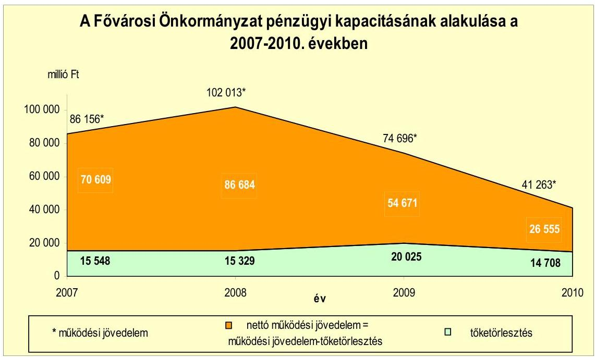

A 2007-2010. évek között a Fővárosi Önkormányzatnál a CLF módszer szerint számított, összesen 304128 millió Ft összegű működési jövedelemnek 22,6\%-át ( 65609 millió Ft) tette ki a fejlesztési célú hitelekhez kapcsolódó tőketörlesztés, amelynek kifizetését követően 238519 millió Ft nettó működési jövedelem keletkezett. A nettó működési jövedelem - az évenként változó összegű tőketörlesztés mellett - csökkent, 2007-ben 70609 millió Ft, 2010-ben 26555 millió Ft volt. A pénzügyi kapacitás 2007-hez viszonyított kedvezőtlen alakulását a 2009-2010. években a folyó bevételek és kiadások különbségéből származó működési jövedelem 33433 millió Ft-tal történő csökkenése okozta. A Fővárosi Önkormányzat a rövidtávon (három éven belül) esedékes kötelezettségei teljesítésének - a hétéves terv finanszírozási előirányzatai figyelembevételével - képes eleget tenni. Abban az esetben, ha a Közraktárak fejlesztése projekttel kapcsolatos kezességvállalás beváltására sor kerül, annak teljesítéséhez (a következő évekre vonatkozó tervadatok szerint) hitel igénybevételével számol a Főváros Önkormányzat. A Fővárosi Önkormányzatnál a felvett hitelek futamideje (1525 év) és türelmi ideje (három-hét év) volt. A hosszú futamidő és türelmi idő nehezen prognosztizálhatóvá teszi a változó kamatozású, többségében (mintegy $90 \%$-ban) eruróban fennálló hitelek kamatainak és árfolyamának hosszú távú alakulását.

A Fővárosi Önkormányzatnak a jelenlegi eladósodottsági szintjét és az ismert több tíz évre kiható - kötelezettségvállalásait, továbbá azok kockázatait figyelembe véve fokozatosan növekvő adósságszolgálati terhekkel kell számolnia. Ezek mértéke függ a kamatkondíciók, illetve a forint/euró árfolyam alakulásától is, ami a hosszú távú fejlesztési feladatok megvalósításához szükséges források meglétében bizonytalanságot jelent. A Közraktárak projekttel kapcsolatos fizetési kötelezettségek teljesítése, valamint a kezességvállalás

---

beváltása esetén a Fővárosi Önkormányzat pénzügyi helyzete jelentősen romlani fog. (főpolgármesternek tett 9. számú javaslat) További kockázatot jelentenek az általa múködtetett gazdasági társaságokkal, kiemelten a BKV Zrtvel szemben fennálló (szerződésben vállalt, de nem számszerúsített) kötelezettségei, valamint a 4-es metró építése ütemezésének, illetve finanszírozásának esetleges módosításai.

# 2. A BELSŐ KONTROLLOK MŰKÖDÉSE A KÖLTSÉGVETÉS-TERVEZÉSI, A ZÁRSZÁMADÁS KÉSZÍTÉSI FOLYAMATOKBAN ÉS A PÉNZÜGYISZÁMVITELI TERÜLETEN ALKALMAZOTT INFORMATIKAI RENDSZEREKNÉL 

A Főpolgármesteri hivatalban az előző főjegyző - belső szabályzatokban, intézkedésekben - meghatározta a gazdálkodó szervezeti egységek és a költségvetési intézmények részére a költségvetési javaslat összeállításával kapcsolatos követelményeket, kijelölte a tervezési és a zárszámadási feladatok koordinálásáért felelős személyeket, az intézményi költségvetésekben szereplő adatok egyeztetésének, ellenőrzésének felelőseit. Az előző főjegyző - az Ámr. ${ }_{2}$ előírása ellenére azonban nem írta elő a költségvetés tervezésének folyamatában a Főpolgármesteri hivatal szervezeti egységei és a költségvetési intézmények vezetői által javasolt előirányzatok megalapozottságának, az ismert kötelezettségek tervezésének, a benyújtott költségvetési igények teljesíthetőségének, a saját bevételek előirányzatai és a költségvetés megalapozását szolgáló helyi rendeletek összhangja ellenőrzését. Ezek a hiányosságok közepes kockázatot jelentettek a költségvetés-tervezési és a zárszámadás-készítési folyamatok megfelelő és szabályszerű végrehajtásában. A Főpolgármesteri hivatalban a 2010. évi költségvetés-tervezési és a 2009. évi zárszámadás-készítési folyamatban a belső kontrollok múködésének megfelelősége gyenge volt, mert - a hiányos szabályozás miatt - nem végezték el a gazdálkodó szervezeti egységek és a költségvetési intézmények által javasolt előirányzatok megalapozottságának, a költségvetési igények teljesíthetőségének, az ismert kötelezettségek megtervezésének, valamint a saját bevételek előirányzatai és a költségvetés megalapozását szolgáló helyi rendeletek összhangjának ellenőrzését. Ezen túl - a belső szabályozás ellenére - nem ellenőrizték az intézményi költségvetési javaslat összeállítására vonatkozó követelmények teljesítését és a zárszámadás készítéséhez kapcsolódóan a pénzmaradvány megállapításának szabályszerűségét. (főjegyzőnek tett 6. számú javaslat)

A pénzügyi-számviteli tevékenységhez kapcsolódó informatikai feladatok szabályozásának hiányosságai magas kockázatot jelentettek az informatikai feladatok megfelelő végrehajtásában, mert a Főpolgármesteri hivatal - a 223/2009. (X. 14.) Korm. rendelet előírása ellenére - nem rendelkezett Informatikai Biztonsági Szabályzattal, illetve Üzletmenet-folytonossági tervvel. (főjegyzőnek tett 7. a) számú javaslat) Az Informatikai Katasztrófa-elhárítási tervet indokoltsága ellenére nem módosították. (főjegyzőnek tett 13. a) számú javaslat). A pénzügyi-számviteli rendszer hozzáférési jogosultságaihoz kapcsolódóan eljárásrendet nem készítettek, így nem szabályozták ezen eljárások ellenőrzésének módját. (főjegyzőnek tett 13. b) számú javaslat) A Főpolgármesteri hivatal informatikai szabályzata nem tiltotta külső fejlesztők bármilyen típusú hozzáférését az éles rendszerhez (főjegyzőnek tett 13. c) számú javaslat), valamint

---

nem tartalmazott részletes leírást a jelszavakkal kapcsolatosan (főjegyzőnek tett 13. b) számú javaslat). A Főpolgármesteri hivatalban nem szabályozták a pénzügyi-számviteli szoftver-változások eljárásrendjét, és a PIR frissítésének menetét (főjegyzőnek tett 13. d) számú javaslat). A Főpolgármesteri hivatal nem rendelkezett az informatikai tevékenységeinek szabályozásáról szóló főpolgármesteri és főjegyzői együttes intézkedésben hivatkozott Mentési Szabályzattal (főjegyzőnek tett 7. b) számú javaslat). A Főpolgármesteri hivatalban a pénzügyi-számviteli tevékenységhez kapcsolódó informatikai feladatoknál a belső kontrollok múködésének megfelelősége gyenge volt, mert nem aktualizálták az Informatikai Katasztrófa-elhárítási tervet, ezért azt nem tudták tesztelni a pénzügyi-számviteli rendszer tekintetében. A jelszavak kezeléséhez kapcsolódó kontrollok működése nem volt megfelelő, a pénzügyi-számviteli rendszer szoftvere frissítéseinek ellenőrzése nem történt meg. A pénzügyi-számviteli rendszerek mentéseit tároló számítógépterem kialakítása és üzemeltetése nem felelt meg a rendkívüli üzemeltetési helyzetek elleni szakszerű védelemre vonatkozó kormányrendeletben foglalt előírásoknak. (főjegyzőnek tett 7. c) és 13. e) számú javaslat)

# 3. Az elektronikus köZSZOLGÁltATÁs feltételeinek kialakítÁSA, A KÖZZÉTÉTELI KÖTELEZETTSÉG TELJESÍTÉSE 

A Fővárosi Önkormányzat az e-közszolgáltatási feladatok ellátásának személyi feltételeit biztosította. A Fővárosi Önkormányzat informatikai, vagy eközszolgáltatási stratégiával a 2009-2010. években nem rendelkezett, nem határozták meg az elektronikus közszolgáltatás megvalósítása érdekében szükséges teendőket és az elérendő elektronikus szolgáltatási szinteket. (főjegyzőnek tett 13. f). számú javaslat) Az e-közszolgáltatási feladatokat ellátó informatikai rendszerben tájékoztatási és 2. elektronikus szolgáltatási szintű ügyintézési funkciókat biztosítottak az állampolgárok és a vállalkozások számára. A Fővárosi Önkormányzatnál az e-közszolgáltatási feladatokat ellátó informatikai rendszer ügyfelek általi igénybevételét nem kísérték figyelemmel. (főjegyzőnek tett 13. g) számú javaslat)

A Főpolgármesteri hivatalban közérdekű adatainak honlapon történő közzétételének rendjét együttes intézkedés ${ }_{1-2}$-ben, valamint a vagyongazdálkodási rendeletben szabályozták. Az együttes intézkedés ${ }_{1-2}$ nem tartalmazta a Fővárosi Önkormányzat intézményei közérdekű adatainak a Fővárosi Önkormányzat honlapján történő közzétételi rendjét. A nettó öt millió Ft-nál alacsonyabb értékhatárú szerződések közzétételének szabályozásáról nem önkormányzati rendeletben döntöttek, hanem az e tárgykörben főpolgármester és főjegyző által kiadott együttes intézkedés ${ }_{2}$-ben, annak ellenére, hogy ennek előírására az Áht. szerint önkormányzati rendeletben van lehetőség. (főpolgármesternek tett 1. számú javaslat) A Főpolgármesteri hivatal által a 2009-2010. években nyújtott nem normatív, céljellegú múködési és felhalmozási célú támogatások 25\%ánál az előző főjegyző - az Áht. előírása ellenére - nem gondoskodott azok kedvezményezettjei nevének, a támogatás céljának, összegének, továbbá a támogatási program megvalósítási helyének a Fővárosi Önkormányzat honlapján történő közzétételéről. (főjegyzőnek tett 8. a) számú javaslat) A Főpolgármesteri hivatal 2009-2010. évi főkönyvi elszámolásaiban és a költségvetési beszámolóiban - az Áhsz. előírásai ellenére - szolgáltatás megrendelés ellentételezéseként

---

teljesített kiadásokat a múködési célú pénzeszköz átadások között mutattak ki, a dologi kiadások között szereplő vásárolt közszolgáltatások helyett. (főjegyzőnek tett 8. b) számú javaslat)

Az előző főjegyző - az Áht-ban előírtak - ellenére a 2009-2010. években a Főpolgármesteri hivatal által nyújtott nem normatív, céljellegú múködési és felhalmozási közzétett támogatások 50\%-nál nem biztosította a támogatási program megvalósítási helyének közzétételét. Az Áht-ban előírt 60 napos határidőn túl tették közzé a Fővárosi Önkormányzat honlapján a Főpolgármesteri hivatal által a 2009-2010. évben nyújtott céljellegú, nem normatív múködési és fejlesztési közzétett támogatások kétharmadát. Az intézmények által nyújtott céljellegú, nem normatív múködési és felhalmozási támogatások kedvezményezettjei nevét, a támogatás célját, összegét, továbbá a támogatási program megvalósítási helyét a Fővárosi Önkormányzat honlapján - az Áht. rendelkezései ellenére - nem tették közzé. (főjegyzőnek tett 8. a) számú javaslat) Az Áhtban foglalt 60 napos határidőn túl tették közzé a Fővárosi Önkormányzat honlapján a Főpolgármesteri hivatal által a 2009. évben kötött nettó öt millió Ft-ot meghaladó értékű árubeszerzésre, építési beruházásra, szolgáltatás megrendelésre, vagyonértékesítésre, vagyonhasznosításra, vagyon vagy vagyoni értékú jog átadására, valamint koncesszióba adásra vonatkozó szerződések 56\%-át. Az intézmények által a 2009-2010. években kötött szerződések megnevezését (típusát), tárgyát, a szerződést kötő felek nevét, a szerződés értékét, határozott időre kötött szerződés esetében annak időtartamát, valamint az említett adatok változását - az Áht. és a vagyongazdálkodási rendelet előírása ellenére - a Fővárosi Önkormányzat honlapján nem tették közzé. (főjegyzőnek tett 8. c) számú javaslat)

# 4. Az ÁSZ KORÁBBI ELLENŐRZÉSI JAVASLATAI ALAPJÁN KÉSZÍTETT INTÉZKEDÉSI TERV VÉGREHAJTÁSA, HASZNOSULÁSA 

Az ÁSZ a 2010. évben a Fővárosi Önkormányzat költségvetési gazdálkodásában kialakított belső kontrollok múködését ellenőrizte és értékelte, valamint utóellenőrzést végzett az önkormányzati feladatok és a rendelkezésre álló források összhangja 2006. évi ellenőrzéséről, a Fővárosi Önkormányzat egyes hatósági díjak megállapítására irányuló tevékenységének 2008. évi ellenőrzéséről, a Fővárosi Önkormányzat európai uniós források igénylésére és felhasználására történt felkészülésének 2009. évi ellenőrzéséről készített jelentések javaslatainak hasznosításáról. A jelentés 18 szabályszerűségi és két célszerűségi javaslatot tartalmazott. A főpolgármester a felelősök és a határidők megjelölésével intézkedési tervet készíttetett, melyet 2011. április 6-án a Közgyűlés részére tájékoztatásul bemutatott.

Az ÁSZ javaslatára 2011 februárjában elrendelték az állományba nem tartozók megbízási díjaival kapcsolatosan a 2006-2010 között teljesített megbízási díj kifizetések ellenőrzését 2011. június végi befejezési határidővel. A Belső Ellenőrzési Osztály a szerződéskötések és kifizetések ellenőrzését elvégezte, a feltárt hiányosságok miatt további intézkedéseket, valamint felelősségre vonásokat javasolt. A 2011 márciusában kiadott intézkedési tervben meghatározott határidők szerint kitűzött feladatokat öt szabályszerűségi és a kettő célszerűségi javaslat tekintetében határidőben végrehajtották. A további 12 szabályszerűségi ja-

---

vaslat végrehajtási határidejét az intézkedési terv szerint 2011. október végéig írták elő.

A főjegyző - az intézkedési tervben kitűzött határidőben - intézkedett annak érdekében, hogy a Főpolgármesteri hivatal a külső személyi juttatások előirányzata terhére, szellemi tevékenység igénybevételére kizárólag akkor kössön szerződést, ha az adott feladat elvégzéséhez megfelelő szakértelemmel, szakképzettséggel rendelkező személyt a Főpolgármesteri hivatal nem foglalkoztat. A főjegyző az ÁSZ javaslata alapján fegyelmi büntetésben részesítette az Adó Főosztály vezetőjét, továbbá felszólította a FIMÚV Zrt. volt vezérigazgatóját az ingatlanhasznosítási és vagyongazdálkodási tanácsadó tevékenységre részére kifizetett 2479893 Ft megbízási díj visszafizetésére. A felszólítás nem járt eredménnyel, az érintett a megbízási díj visszafizetését megtagadta, a Fővárosi Önkormányzat a polgári pert megindította. A belső ellenőrzés szabályszerű kereteinek kialakítása és múködtetése érdekében a hivatali SzMSz módosításával intézkedtek, hogy 2011 januárjától a Főpolgármesteri Hivatalon belül egy ellenőrzési egység múködjön, egyúttal a főjegyző kijelölte a belső ellenőrzési vezetői feladatok ellátásáért felelős személyt. Hasznosították a célszerűségi javaslatokat, intézkedtek hogy a belső ellenőrzési tervet megalapozó kockázatelemzés terjedjen ki a kedvezményezett szervezeteknél a Fővárosi Önkormányzat költségvetéséből céljelleggel nyújtott támogatások rendeltetés szerinti felhasználására, továbbá a kockázatelemzésben magas kockázatúnak értékelt területek ellenőrzése szerepeljen a 2011. évi ellenőrzési tervben. A 2011. évi ellenőrzési tervet a kockázatelemzésben magas kockázatúnak értékelt területek ellenőrzésével kiegészítették.

# 5. A KÖZÚTFENNTARTÁSI FELADATOK ELLÁTÁSÁNAK GAZDASÁGOS-   SÁGA, EREDMÉNYESSÉGE 

A Fővárosi Önkormányzat a 2009-2018. évekre - a közútfenntartási feladatok elvégzésére kizárólagos jogot biztosítva - az FKF Zrt-vel közszolgáltatási keretszerződést, valamint az egyes éveket megelőzően éves közszolgáltatási szerződéseket kötött. A közszolgáltatási keretszerződés megkötéséről szóló döntés alátámasztását, megalapozását szolgáló közgazdasági elemzést, hatásszámítást nem készítettek. A közszolgáltatási keretszerződésben, illetve a 2009. és 2010. évi közszolgáltatási szerződésekben nem jelölték meg a feladatellátásért felelős munkaköröket, a kapcsolattartó személyeket. (főjegyzőnek tett 14. a) javaslat) Az elszámolás közszolgáltatási szerződésben meghatározott rendjét célszerűtlenül alakították ki, mert az átalánydíjas elszámolási mód alkalmazása mellett a tárgyévi első kifizetést követő másfél év elteltével biztosítottak lehetőséget a pénzügyi elszámolásra, amikor a szolgáltatás megrendelt mennyiségben és minőségben történt teljesítése - a kátyúzás és a burkolatfenntartás eseteiben - az éves elszámolás keretében a javítások élettartamán túl, utólag már nem, vagy csak közvetetten ellenőrizhető. (főpolgármesternek tett 10. a) számú javaslat) A közszolgáltatási keretszerződésben, továbbá a 2009. és 2010. évi közszolgáltatási szerződésekben arról sem rendelkeztek, hogy az FKF Zrt. szabályozza az alvállalkozók ellenőrzésének rendjét. Miközben a közszolgáltatási keretszerződés céljai között szerepeltették a minőségi paraméterek meghatározását és előírták a minőségi paraméterek szerinti teljesítés követelményét, azonban ezeket a minőségi előírásokat, paramétereket nem határozták meg. (főpol-

---

gármesternek tett 10. b) számú javaslat) A közszolgáltatási keretszerződésben és az éves közszolgáltatási szerződésben a Fővárosi Önkormányzat nem írt elő a burkolathibák javításánál teljesítési határidőt az FKF Zrt. részére. (főpolgármesternek tett 10. c) számú javaslat) Az FKF Zrt. a közszolgáltatási keretszerződés előirása ellenére nem végzett évente elégedettségvizsgálatot a közúthasználók körében. (főjegyzőnek tett 14. b) számú javaslat)

A Közgyűlés a 2009. és a 2010. években az I. szolgáltatási szint megrendeléséról döntött, amellyel nem biztosította a közutak állapotára a GKM rendeletben előírtak szerinti, valamint az állagmegóvó, tervszerű megelőző közútfenntartási feladatellátást. A közszolgáltatási szint kiválasztásáról szóló döntést a Fővárosi Önkormányzat által kezelt közutak állapotának bemutatásával nem alapozták meg. (főjegyzőnek tett 14. c) számú javaslat) A 2010. évi szolgáltatási szint (I. szolgáltatási szint) megválasztására vonatkozó közgyűlési előterjesztésben az FKF Zrt. által megajánlott II. és III. szolgáltatási szinteket, mint döntési lehetőségeket be sem mutatták. (főjegyzőnek tett 14. d) számú javaslat) A Fővárosi Önkormányzat a költségvetéseiben nem biztosította teljes összegben a megrendelt közútfenntartási feladatok elvégzése ellenértékének megfelelő előirányzatot, azt mindkét évben az FKF Zrt. képződő nyereségével egészítették ki. (főpolgármesternek tett 10. d) számú javaslat) Az FKF Zrt. a közszolgáltatási keretszerződésben foglaltak ellenére a 2009. és a 2010. években nem rendelkezett a Fővárosi Önkormányzat által elfogadott egységárgyűjteménnyel. (főjegyzőnek tett 14. e) számú javaslat) A Főpolgármesteri hivatalban a feladatellátásért járó tervezett szolgáltatási díj megalapozottságát műszaki és közgazdasági szempontból nem ellenőrizték. Az éves közszolgáltatási szerződésekben a közútkezelési szolgáltatások ellenértékét nem az FKF Zrt. által készített előkalkuláció alapján határozták meg. (főjegyzőnek tett 9. számú javaslat)

Az FKF Zrt. a közút-fenntartási feladatát nem a műszaki-szakmai normáknak megfelelő minőségben látta el a kátyúzások és az útburkolati jelek felfestése tekintetében, mivel az aszfaltkátyúzás csatlakozó felületei hézagai kiöntése, lezárása hiányzott, az aszfalt terítése, bedolgozása, szintbeli csatlakozásának kialakítása, így felületének egyenletessége nem volt megfelelő, valamint az útburkolati jeleket nem festették fel, illetve a felfestett jelek minősége nem a mű-szaki-szakmai normák szerinti volt. A közútfenntartási munkák nem megfelelő minőségi színvonala többletfeladatot okozott azáltal, hogy a kátyúzást és a burkolati jel fenntartást követően az elvárt élettartamon belül ismételt javítások váltak szükségessé. A rossz minőségű kátyúzást és burkolati jel felfestést az FKF Zrt. műszaki ellenőrzés elvégzéséért felelős dolgozói nem tárták fel, a Főpolgármesteri hivatal helyszíni ellenőrzést nem végzett. A közútfenntartási feladatok ellátásával megbízott FKF Zrt. a kátyúzási munkákat a 2009. évben átlagosan 4,6 nappal, a 2010. évben átlagosan 6,5 nappal a GKM rendeletben ajánlott határidőn túl végezte el. A Fővárosi Önkormányzat részére készített elszámolások megalapozását szolgáló felmérési naplókban foglalt mennyiségi adatokat becsléssel határozták meg, mivel a kátyúzások mélységére vonatkozó méréseket nem végeztek. Az ÁSZ által mintavétellel kiválasztott útszakaszoknál a felmérési naplók a kátyúzások esetében a szállítólevelekben foglalt aszfaltmennyiségektől 0,5-17,3 tonna közötti mértékben eltérő adatokat, a felfestett útburkolati jelek tekintetében pedig az ÁSZ által megállapított mennyiségektől 3-35 $\mathrm{m}^{2}$-rel több anyagmennyiséget tartalmaztak. A felmérési naplók mennyiségi adatait sem a Főpolgármesteri hivatal, sem az FKF Zrt. műszaki ellenőrzés-

---

sel megbízott munkatársai nem vetették össze a szállítólevelekben foglalt mennyiségekkel, és helyszíni műszaki ellenőrzést sem végeztek, így nem tárták fel a mennyiségi eltéréseket. A felmérési naplók szerint összeállított elszámolási dokumentumokban szereplő mennyiségi adatok, mivel azokat becsléssel határozták meg pontatlanok voltak, így az éves közszolgáltatási szerződésekben megrendelt mennyiségek valós teljesítése az elszámolási dokumentumokból nem állapítható meg. (főjegyzőnek tett 14. f) számú javaslat)

A Főpolgármesteri hivatalban a szakmai teljesítésigazolásra kijelölt köztisztviselők a belső szabályzatban előírt módon, okmányok - az FKF Zrt. által benyújtott számlák és az éves közszolgáltatási szerződésben foglaltak - alapján ellenőrizték a közútfenntartási kiadások teljesítésének jogosságát, összegszerűségét, a szerződésben előírt kompenzáció teljesítését. A Főpolgármesteri hivatal a 2009. évi közszolgáltatási szerződés teljesítésére 4,0 milliárd Ft-ot, a 2010. évi közszolgáltatási szerződés teljesítésére 5,7 milliárd Ft-ot fizetett ki a szerződésekben előírt - az önkormányzati költségvetés terhére teljesítendő - kompenzáció összegének megfelelően az FKF Zrt. részére. A közútfenntartási feladatok ellátása vonatkozásában a Főpolgármesteri hivatalban nem határozták meg a Főpolgármesteri hivatal általi helyszíni múszaki ellenőrzés feladatait és gyakoriságát, a Főpolgármesteri hivatal általi helyszíni ellenőrzésre nem jelöltek ki személyt, illetve nem bíztak meg más szervezetet sem. (főjegyzőnek tett 14. g) számú javaslat). A Főpolgármesteri hivatal helyszíni ellenőrzést nem végzett, ezáltal a nem megfelelő mennyiségben, minőségben és időben történő munkavégzéseket sem tárták. (főjegyzőnek tett 14. h) számú javaslat)

A FKF Zrt. közútfenntartásról szóló beszámolója megalapozottságának ellenőrzésével kapcsolatos szempontokat, feladatokat, hatásköröket a Fővárosi Önkormányzatnál nem szabályozták. (főjegyzőnek tett 14. i) számú javaslat) Nem ellenőrizték, hogy az FKF Zrt. az előírt módon számolt-e be a 2009. évi közútfenntartási tevékenységéről. Az FKF Zrt. 2009. évi közútfenntartási tevékenységéről szóló beszámolóját, annak a Főpolgármesteri hivatal általi kontrollja nélkül fogadta el a Gazdasági Bizottság. A Gazdasági Bizottság részére való előterjesztésben kimutatott, az FKF Zrt. 2009. évi közútkezelési tevékenységével kapcsolatban felmerült költségeket és az FKF Zrt. kompenzációigényét - a 2009. évi közszolgáltatási szerződés előírása ellenére - nem alapozta meg a szerződés szerinti tevékenységek tételes mennyiségi és költség elszámolása. A Főpolgármesteri hivatalnál nem végezték el az FKF Zrt. által a 2009. évi közszolgáltatási szerződés teljesítésével kapcsolatban kimutatott kompenzációigény ellenőrzését. (főjegyzőnek tett 14. j) számú javaslat)

Az FKF Zrt. kátyúzási egységárai az érintett villamosközlekedéssel rendelkező megyei jogú városok önkormányzatai és a fővárosi kerületi önkormányzatok által megadott adatok többségéhez és a megyei jogú városok átlagához képest is magasabbak voltak, ahogy az UKIG által kiadott és az MK Nzrt. által a 2005. évben alkalmazott, az infláció mértékével korrigált egységárakhoz viszonyítva is. A 2010. évben a megyei jogú városok a meleg aszfalttal történő kátyúzásra átlagosan 51393 Ft/tonna összeget fordítottak, míg a Fővárosi Önkormányzat 78100 Ft/tonna összeget.

A közutak felújításának évenkénti tényleges kiadásai a 2006-2007. években meghaladták a fizikai kopást, elhasználódást kifejező éves terv szerinti érték-

---

csökkenési leírás összegét, a 2008-2010. években azonban elmaradtak attól. (főpolgármesternek tett 10. e) számú javaslat) A felújítások hatására a közutak burkolatának - a számviteli nyilvántartás értékadatai alapján számított - átlagéletkora a 2008. évben csökkent, a megelőző és a követő években azonban évről évre folyamatosan emelkedett, mert a felújítások nem voltak képesek ellensúlyozni az értékcsökkenéssel kifejezett kopást, elhasználódást. A Fővárosi Önkormányzatnál az útfelújítási program ${ }_{1,2}$ alapján felújított közutaknál az egymást követő felújítások között eltelt időtartam minden esetben meghaladta a 19 évet, amely négy évvel magasabb volt az útfelújítási programok engedélyokirataiban és módosításaiban megjelölt 15 éves várható élettartamhoz kapcsolódó felújítási gyakoriságnál. (főpolgármesternek tett 10. f) számú javaslat) A Fővárosi Önkormányzat tulajdonában lévő közutak műszaki állapotáról az ingatlanvagyon-kataszter közlekedési terület betétlapjain rögzített állagmutatók a vonatkozó jogszabályi előírások hiánya miatt nem nyújtottak valós információt, ugyanis jogszabály nem rendelkezik a közlekedési terület betétlapjainak állagmutató adataira vonatkozóan a vezetés módjáról. (a Belügyminiszternek tett javaslat) A kezelt közutak múszaki állapotára vonatkozó teljes körű felmérést 1996-ban végeztek, az 1999-ben és a 2007-ben végzett műszaki állapot-felmérések nem terjedtek ki valamennyi közútra. A teljes körű műszaki állapotfelmérés adatai nem álltak rendelkezésre, ezért a közutak műszaki állapot szerinti összetételének vizsgálatát nem lehetett elvégezni. (főjegyzőnek tett 14. k) számú javaslat)

# A Fővárosi Önkormányzat közútfenntartási tevékenységének ellátá- 

sa a 2009. és a 2010. években nem volt gazdaságos, mert a közszolgáltatási szerződésben rögzített feladatellátásért járó szolgáltatási díjat nem az FKF Zrt. előkalkulációjának eredménye alapján határozták meg. A közútfenntartási munkák minőségi színvonala indokolatlan többletfeladatot okozott azáltal, hogy a nem megfelelő munkavégzés miatt ismételt javításra került sor az elvárt élettartamon belül, így nem volt biztosított, a feladat legalacsonyabb költséggel (ráfordítással) történő ellátása. A közútfenntartási tevékenység ellátása annak ellenére nem volt gazdaságos, hogy az FKF Zrt. a feladat ellátása során a legjobb ajánlatot tevő alapanyag beszállítókat és alvállalkozókat választotta ki, és a versenyeztetés során kialakult árat érvényesítette a szolgáltatás ellenértékének meghatározásakor.

## A Fővárosi Önkormányzat közútfenntartási tevékenységének ellátá-

sa a 2006-2010. években nem volt eredményes, mert az FKF Zrt. a GKM rendeletben meghatározott határidőn túl és nem a műszaki szakmai normáknak megfelelő minőségben valósította meg feladatait. A Fővárosi Önkormányzat nem biztosította a közutak használati értéke hosszú távú fennmaradásához szükséges legalább akkora összeget, hogy a 2009-2010. években a tényleges felújítási kiadások mértéke elérje az éves terv szerinti értékcsökkenés összegét. A közutak átlagéletkora - a 2008. év kivételével - évről évre növekedett. A 20092010. évi közszolgáltatási szerződésekben megrendelt közútfenntartási feladat mennyiségi teljesítése nem volt értékelhető, mert a Fővárosi Önkormányzat részére készített elszámolások megalapozását célzó felmérési naplókban foglalt mennyiségi adatokat becsléssel határozták meg, így azok és a felmérési napló alapján összeállított elszámolások nem voltak pontosak.

---

A helyszíni ellenőrzés megállapításainak hasznosítása mellett javasoljuk:

# a Belügyminiszternek 

kezdeményezze, hogy a Kormány egészítse ki az önkormányzatok tulajdonában lévő ingatlanvagyon nyilvántartási és adatszolgáltatási rendjéről szóló 147/1992. (XI. 6.) Korm. rendelet 2. mellékletét a közlekedési terület betétlapjain kitöltendő állagmutató vezetése módjának előírásával, a települési önkormányzatoknál az állagmutató adatának karbantartott, valós műszaki állapotot tükröző, egységes és kötelező vezetése érdekében;

## a főpolgármesternek

a jogszabályi előírások maradéktalan betartása érdekében

1. kezdeményezze az Áht. 15/B. § (1) bekezdése alapján a Fővárosi Önkormányzat pénzeszközei felhasználásával, a vagyonnal történő gazdálkodással összefüggő, a nettó öt millió Ft-nál alacsonyabb összegű szerződések adatainak közzétételét szabályozó együttes intézkedés ${ }_{2}$ 17. §-ának hatályon kívül helyezését és indokoltság esetén annak rendeletben történő szabályozását;
a munka színvonalának javítása érdekében
2. kezdeményezze, hogy a jelentésben foglaltakat a Közgyűlés tárgyalja meg és a feltárt hiányosságok megszűntetése érdekében készíttessen intézkedési tervet a határidők és felelősök megjelölésével;
3. készíttessen előterjesztést a Közgyűlés részére, amelyben teljes körűen felmérik és bemutatják a Fővárosi Önkormányzat által ellátott önként vállalt feladatokat annak érdekében, hogy a költségvetési döntések előkészítése során mérlegelni tudják ezen feladatok ellátásának lehetőségét, tekintettel a Fővárosi Önkormányzat kötelező fe-ladat-ellátási kötelezettségének elsődlegességére;
4. mutassa be a Közgyűlésnek évente a zárszámadási rendelet előterjesztésében az értékcsökkenési leírás összegét, és ezzel összevetve az elhasználódott eszközök pótlására fordított tényleges kiadásokat;
5. fontolja meg a Fővárosi Önkormányzat likviditási helyzetéhez igazodóan a folyószámla hitelkeret összegének csökkentését;
6. tájékoztassa a Közgyűlést - a zárszámadási rendelet-tervezet előterjesztéséhez kapcsolódóan - a Fővárosi Önkormányzat gazdasági társaságai felé fennálló követeléseiről, nyújtott kölcsöneiről, kötelezettségeiről (beleértve a garancia- és kezességvállalást), folyósított támogatási adatairól gazdasági társaságonkénti részletezettségben, továbbá az egyes gazdasági társaságok év végi adósságállományáról és szállítói tartozásáról, a valóságos helyzet bemutatása, a teljes körű tájékoztatás, valamint a pénzügyi helyzet alakulására ható jövőbeni tényezők pontos megismerése érdekében;
7. vizsgáltassa meg a Közraktárak projekttel kapcsolatos Közvetlen Megállapodásban rögzített kezességvállalás jogi érvényesíthetőségének feltételrendszerét, továbbá az

---

önkormányzati érdekek és a jogi lehetőségek figyelembe vételével végeztessen elemzést a projekt befejezésének és az ingatlan hasznosításának lehetséges kimeneteleiről, és ennek alapján terjesszen a Közgyűlés elé javaslatot a további intézkedésekre az önkormányzati vagyon védelmének szem előtt tartásával;
8. mérje fel a jövőbeni várható - árfolyam-, fizetőképességi-, visszafizetési - kockázatokat, valamint a mérlegen kívüli tételek (kezességvállalás, helytállási kötelezettségvállalás) kockázatait, folyamatosan vizsgáltassa azok alakulását, és tegyen javaslatot a Közgyűlés részére a kockázatok csökkentésére;
9. tájékoztassa rendszeresen (legalább évente) a Közgyűlést a fennálló pénzügyi helyzetről, azon belül - a kötelezettségállomány teljes körű számbavételével - a bekövetkezett változásokról, az adósságot keletkeztető kötelezettségvállalások teljesítési feltételeiről, jelezve a tárgyévet követő három évre a törlesztések lehetséges forrásait;
10. kezdeményezze, hogy a Közgyűlés
a) módosítsa a közútfenntartási feladat ellátásáért járó szolgáltatás ellenértékének pénzügyi elszámolási rendjét, a közszolgáltatási szerződés módosításával úgy, hogy a feladat elvégzésének műszaki - mennyiségi és minőségi - ellenőrzésén alapuló szakmai teljesítés igazolását követően a pénzügyi elszámolásra legalább negyedévente sor kerüljön;
b) határozza meg a közszolgáltatási keretszerződésben, illetve az éves közszolgáltatási szerződésben a közútfenntartási feladatok ellátására vonatkozó minőségi előírásokat műszaki-szakmai normák alkalmazásával és rögzítse a feladatellátással megbízott részére, hogy szabályozza a feladatellátásba bevont alvállalkozók ellenőrzésének rendjét;
c) mérlegelje a burkolathibák javítására teljesítési határidő meghatározását - a GKM rendelet melléklete 5.3.2 fejezetében ajánlott egy, illetve két napos határidő figyelembevételével - a közszolgáltatási keretszerződésben, illetve az éves közszolgáltatási szerződésben;
d) biztosítsa a megrendelt közútfenntartási feladatok elvégzése ellenértékének megfelelő előirányzatot az éves költségvetésben;
e) vegye figyelembe a közutak felújítására fordított pénzeszközök meghatározásánál a közutak használati értéke hosszú távú megőrzését;
f) vegye figyelembe a felújításokról szóló döntéshozatal során, hogy az egyes közutak, közútszakaszok két egymást követő felújítása között eltelt időtartam ne haladja meg a felújítások várható élettartamát;

# a föjegyzönek 

a jogszabályi előírások maradéktalan betartása érdekében

1. gondoskodjon az Áht. 8/A. § (7) bekezdésében előírtaknak megfelelően a költségvetési rendelettervezet elkészítésekor arról, hogy finanszírozási célú pénzügyi művele-

---

teket ne vegyenek figyelembe költségvetési hiányt módosító költségvetési bevételként és költségvetési kiadásként;
2. intézkedjen az éves költségvetés eredeti előirányzatainak kialakításánál az Áht. 8/C. § (3)-(4) bekezdésében előírtaknak megfelelően arról, hogy
a) a költségvetési rendelet teljes körűen tartalmazza a tervezett feladatok ellátásához teljesíthető jóváhagyott kiadásokat és a teljesítendő várható bevételeket, így kiemelten a Főpolgármesteri hivatal és az intézmények előző évről áthúzódó működési kiadásait, valamint az intézmények előző évről áthúzódó beruházási és felújítási kiadásait, és ezek forrásául a várható előző évi pénzmaradvány és előző évek tartalékai igénybevételét;
b) az ingatlanok értékesítéséből származó bevételt a várható gazdasági folyamatok figyelembevételével tervezzék meg, beleértve a fizetőképes piaci keresletet is, továbbá az osztalék- és hozambevételek tervezésekor vegyék figyelembe a Fővárosi Önkormányzat gazdasági társaságainak várható mérleg szerinti eredményét;
3. biztosítsa az Áht. 69. § (1) bekezdés c) pontjában előírtaknak megfelelően, hogy az előző évi pénzmaradvány igénybevételét a költségvetési bevételektől elkülönítetten, a költségvetési hiány belső finanszírozására szolgáló pénzforgalom nélküli bevételként tervezzék meg;
4. gondoskodjon arról, hogy a pénzmaradvány jóváhagyásakor a kötelezettségvállalással terhelt pénzmaradványként csak előző évi - az Ámr. 2 72. §-a (1) bekezdés a) pontjában, a (2) és (8)-(11) bekezdésében előírtaknak megfelelő - kötelezettségvállalást vegyenek figyelembe, és ellenőriztesse ennek betartását;
5. intézkedjen a Közraktárak projekthez kapcsolódó szolgáltatási díjak, valamint a kezességvállalás teljes állományának - az Áhsz. 9. számú melléklet 15. pontjában foglaltak szerint - a 0 . számlaosztályban történő nyilvántartásáról;
6. intézkedjen az Ámr. 2 155. §-ában foglalt előírások érvényesítése érdekében a Főpolgármesteri hivatal és a költségvetési intézmények javasolt előirányzatai megalapozottságának, ismert kötelezettségei tervezésének, a Főpolgármesteri hivatal gazdálkodó szervezeti egységei és a költségvetési intézmények által benyújtott költségvetési igények teljesíthetőségének, a saját bevételek előirányzatai és a költségvetés megalapozását szolgáló helyi rendeletek közötti összhang ellenőrzésének előírásáról és ezen belső kontrollok müködtetéséről;
7. a pénzügyi-számviteli feladatoknál alkalmazott informatikai rendszerek szabályszerű müködése keretében:
a) biztosítsa a 223/2009. (X. 14.) Korm. rendelet 13. §-ában meghatározott IT rendszerekkel kapcsolatos Informatikai Biztonsági Szabályzat és Üzletmenetfolytonossági terv kiadását;
b) intézkedjen a Főpolgármesteri hivatal informatikai tevékenységeinek szabályozásáról szóló 505/2006. számú főpolgármesteri és főjegyzői együttes intézkedésben hivatkozott Mentési Szabályzat elkészítéséről;

---

c) intézkedjen a 223/2009. (X. 14.) Korm. rendelet 25-26. §-ában foglalt előírásoknak megfelelően a számítógépterem - rendkívüli üzemeltetési helyzetek esetén alkalmazandó - szakszerű védelemmel történő ellátásáról;
8. a közérdekű adatok nyilvánosságának biztosítása érdekében:
a) intézkedjen az Áht. 15/A. § (1) bekezdése alapján valamennyi - a Főpolgármesteri hivatal és a Fővárosi Önkormányzat intézményei által nyújtott - nem normatív, céljellegű, működési és fejlesztési támogatás esetében a kedvezményezettek nevének, a támogatás céljának, összegének, a támogatással megvalósuló program megvalósítási helyének a Fővárosi Önkormányzat honlapján a támogatás odaítélését követő 60 napon belüli határidőben történő közzétételéről;
b) biztosítsa, hogy a szolgáltatás megrendelések főkönyvi könyvelési rendszerben történő rögzítésekor tartsák be az Áhsz. 9. számú mellékletének 3. f) pontjában az államháztartáson kívüli végleges pénzeszközátadások és az Áhsz. 9. számú mellékletének 9. c) pontjában a dologi kiadások elszámolási rendjére vonatkozó előírásokat;
c) intézkedjen az Áht. 15/B. § (1) bekezdésében, valamint a vagyongazdálkodási rendelet 11. § (2) bekezdésében foglaltak alapján a Fővárosi Önkormányzat pénzeszközei felhasználásával, a vagyonnal történő gazdálkodással összefüggő intézmények által kötött nettó ötmillió forintot elérő vagy azt meghaladó értékű - árubeszerzésre, építési beruházásra, szolgáltatás megrendelésre, vagyonértékesítésre, vagyonhasznosításra, vagyon, vagy vagyoni értékű jog átadására, továbbá koncesszióba adásra vonatkozó szerződés megnevezésének (típusának), tárgyának, a szerződést kötő felek nevének, a szerződés értékének, határozott időre kötött szerződés esetében annak időtartamának, valamint az említett adatok változásának a szerződés megkötését követő 60 napon belüli határidőben a Fővárosi Önkormányzat honlapján történő közzétételére;
9. a közútfenntartási feladatok eredményes és gazdaságos ellátása érdekében biztosítsa a közútfenntartási közszolgáltatási szintekre vonatkozó ajánlat műszaki és közgazdasági szempontú ellenőrzését a feladatellátásért járó tervezett szolgáltatási díj megalapozottsága érdekében a közszolgáltatási keretszerződés 2. számú melléklete 7.2 c) pontja szerint a Fővárosi Önkormányzat által elfogadott egységárgyűjtemény alapján;
a munka színvonalának javítása érdekében
10. kezdeményezze a Közraktárak projekt nemzetgazdasági minősítését a Nemzeti Statisztikai Hivatalnál;
11. biztosítsa a hitelek megtérülési kockázatának csökkentése érdekében, hogy a döntés előkészítés során mérlegeljék a fejlesztési feladat megvalósításának hitelfelvétel melletti indokoltságát. Elemezzék, hogy a fejlesztés eredményeképpen létrejövő befektetett eszköz müködtetése során bevételi többletet, vagy kiadás csökkenést eredmé-nyez-e. Végezzenek megtérülési számításokat, amelyek során számoljanak a fejlesztéssel létrehozott tárgyi eszközök fenntartási kiadásai között az adósságszolgálati kötelezettségekkel, vizsgálják, hogy a megvalósításhoz igénybe vett hitel a jövőbeni bevételekből, kiadási megtakarításokból megtérül-e;

---

12. intézkedjen a mérlegen kívüli tételek kockázatának csökkentése érdekében az adósságot keletkeztető kötelezettségvállalások teljeskörű nyilvántartásba vételét követően az ezekből származó valamennyi adósságszolgálati tehernek az éves költségvetési rendeletekben és a hétéves tervben való megfelelő összegű számbavételéről, továbbá az árfolyam-változásból eredő kockázatok elemzéséről;
13. a pénzügyi-számviteli feladatoknál alkalmazott informatikai rendszerek biztonságos müködése érdekében intézkedjen
a) az Informatikai Katasztrófa-elhárítási terv aktualizálásáról;
b) a pénzügyi-számviteli rendszer hozzáférési jogosultságaihoz kapcsolódó eljárásrend elkészítéséről, amely tartalmazzon részletes leírást a jelszavakkal kapcsolatosan;
c) annak érdekében, hogy az informatikai szabályzat ne tegye lehetővé a külső fejlesztők bármilyen típusú hozzáférését az éles pénzügyi-számviteli rendszerhez;
d) a pénzügyi-számviteli szoftver-változások eljárásrendje és a PIR frissítésének menete szabályozásáról;
e) a számítógépterem illetéktelen behatolások elleni védelmének kialakításáról;
f) gondoskodjon a meglévő informatikai infrastruktúra értékeléséből kiindulva a hosszú távú, önkormányzati szintű informatikai, vagy e-közszolgáltatási stratégia elkészítéséről és jóváhagyásáról, abban az elektronikus közszolgáltatás megvalósítása érdekében szükséges teendők meghatározásáról;
g) gondoskodjon arról, hogy a Főpolgármesteri hivatalban az e-közszolgáltatási feladatokat ellátó informatikai rendszer ügyfelek általi igénybevételét kísérjék figyelemmel és értékeljék tapasztalatait;
14. a közútfenntartási feladatok eredményes és gazdaságos ellátása érdekében
a) intézkedjen, az éves közszolgáltatási szerződések előkészítése során, hogy azokban jelöljék meg az egyes közútfenntartási feladatok elvégzéséért felelősöket, továbbá név szerint szerepeltessék a kapcsolattartásra jogosultakat;
b) intézkedjen, hogy a közútfenntartási feladatot ellátó szervezet a közszolgáltatási keretszerződés előírása szerinti rendszerességgel végezzen elégedettségvizsgálatot a közút-használók körében;
c) intézkedjen a közútfenntartási feladatok ellátási módjáról szóló döntést megelőzően a feladatellátás gazdaságos módjára vonatkozó alternatívákat bemutató közgazdasági elemzés elkészítéséről;
d) készíttessen - GKM rendeletnek, továbbá a közutak állapotának megfelelő szolgáltatási szint megrendelésére vonatkozó - olyan közgyűlési előterjesztést, amely döntési alternatívát tartalmaz az állagmegóvást biztosító, tervszerű megelőző karbantartási feladatokat is magában foglaló szolgáltatási szintekről;

---

e) intézkedjen, hogy az éves közszolgáltatási szerződésekben a közútkezelési szolgáltatások ellenértékét a Főpolgármesteri hivatal által elfogadott egységárgyűjteménnyel megalapozott, ellenőrzött előkalkuláció alapján határozzák meg;
f) biztosítsa, hogy a közútjavítási munkák során a ténylegesen felhasznált alap-anyag-mennyiségek alapján készítsék el az elszámolást megalapozó felmérési naplókat;
g) intézkedjen, hogy határozzák meg a Főpolgármesteri hivatal általi, a közútfenntartási feladatok ellátására irányuló helyszíni műszaki ellenőrzés feladatait, gyakoriságát, valamint jelöljék ki a helyszíni műszaki ellenőrzés elvégzéséért felelős személyeket;
h) biztosítsa a feladatellátással megbízott szervezet által elvégzett munka helyszíni műszaki ellenőrzését - a szerződés teljesítéséről való elszámolás elfogadását megelőzően - annak érdekében, hogy a közszolgáltatási szerződésben rögzítendő határidőben, a műszaki-szakmai normáknak megfelelő minőségben végezze el a közútfenntartási feladatokat, továbbá a javított útszakaszokon a múszakiszakmai normák szerint elvárt élettartamon belül, nem megfelelő minőségű munkavégzés miatt ismételt javítás ne váljon szükségessé;
i) intézkedjen a közútfenntartási tevékenységről szóló beszámoló megalapozottságának ellenőrzésével kapcsolatos szempontok, feladatok, hatáskörök szabályozásáról, és biztosítsa, hogy a közútfenntartásról szóló beszámolót a Főpolgármesteri hivatal általi ellenőrzést követően terjesszék a Közgyűlés általi elfogadásra;
j) intézkedjen a közszolgáltatást végző által kiszámított kompenzációigény elfogadását megelőző ellenőrzéséről. Ennek érdekében biztosítsa, hogy a közútkezelési tevékenységgel kapcsolatban a közszolgáltató által kimutatott felmerült költségeket és a közszolgáltató kompenzációigényét támasszák alá a szerződés szerinti tevékenységek tételes mennyiségi és költség elszámolásával;
k) alakítsa ki a közutak műszaki állapot-felmérésének rendszerét, valamint határozza meg a műszaki állapot-felmérések közötti időszakra a közutak állagmutató adata vezetésének részletes belső szabályait, annak érdekében, hogy elősegítse az in-gatlanvagyon-kataszter közlekedési terület betétlapja állagmutató adatának folyamatos, aktualizált vezetését.

---

# II. RÉSZLETES MEGÁLLAPÍTÁSOK 

## 1. A Fővárosi ÖNKORMÁNYZAT KÖLTSÉGVEtési, PÉNZÜGYI HELYZETE, AZ ELADÓSODÁS ALAKULÁSA

A Fővárosi Önkormányzat a 2010. évben 471,9 milliárd Ft költségvetési bevételből gazdálkodott, a költségvetés végrehajtása során 423,0 milliárd Ft költségvetési kiadást teljesített. A 2010. évben a realizált költségvetési bevételek $9,6 \%$-kal, míg a teljesített költségvetési kiadások 5,4\%-kal haladták meg a 2007. évben teljesített költségvetési bevételeket, illetve kiadásokat a múködési célú költségvetési bevételek és kiadások, valamint a felhalmozási célú költségvetési bevételek növekedése következtében, miközben a felhalmozási célú költségvetési kiadások 32,5 milliárd Ft-tal csökkentek.
A Fővárosi Önkormányzat kötelező feladatait az Ötv., a Htv. és az ágazati törvények határozzák meg. Az Ötv. 63/A. §-a rögzíti, hogy a fővárosban melyek azok a kötelező feladatok, amelyekről a Fővárosi Önkormányzatnak kell gondoskodnia, illetve 63. § (1) bekezdés rendelkezik a kerületi önkormányzatok kötelező feladatairól. Az Ötv. 1. § (4) bekezdése a kötelező feladatok elsődlegességét írja elő, amelyek ellátását az önként vállalt feladatok nem veszélyeztethetik. A Fővárosi Önkormányzat látja el azokat a kötelező és önként vállalt helyi, települési önkormányzati feladatokat, melyek a főváros egészét vagy egy kerületet meghaladó részét érintik, illetve amelyek fővárosnak az országban betöltött különleges szerepköréhez kapcsolódnak. A 2007-2011. években a Fővárosi Önkormányzat által az önként vállalt feladatok ellátásával kapcsolatban kimutatott ${ }^{7}$ kiadások a tervezett költségvetési kiadásoknak mindössze mintegy 5\%-át tették ki. Az önként vállalt feladatok kiadásai azonban teljes körüen nem határozhatók meg, mivel a Fővárosi Önkormányzat által nevesített önként vállalt feladatok bemutatása nem terjed ki valamennyi, ellátott önként vállalt feladatra.

Az Önkormányzati SZMSZ-ben önként vállalt feladatként nevesítették a szociálisan rászorultak számára nappali melegedők fenntartását, az utcai szociális munkavégzést a hajléktalanok ellátása keretében, az időskorúak gondozóházának fenntartását, a fővárosi romák szociális segítését a Fővárosi Roma Oktatási és Kulturális Központ fenntartásával. A Fővárosi Önkormányzat által önként vállalt feladatok kiadásai között kimutatott összegek tartalmazták továbbá a társasházas és a szövetkezeti lakóépületek felújításának támogatását, az alapfokú oktatás, továbbá sport- kulturális- egészségügyi és szociális célú civil szervezetek, alapítványok múködési támogatását.

Ezeken túl önként vállalt feladatként látták el többek között az egészségügyi intézmények múködési célú támogatását, az önkormányzati tulajdonú gazdasági társaságok részére az önként vállalt feladataikhoz nyújtott támogatásokat, az intézmények által Közgyűlés engedélyével - nem kötelező feladatok ellátásához -

[^0]
[^0]:    ${ }^{7}$ Az önként vállalt feladatokról és azok kiadásairól szóló kimutatást a Főpolgármesteri hivatal az Önkormányzati SzMSz 1. számú mellékletében bemutatott feladatok alapján készítette.

---

nyújtott támogatásokat, a Fővárosi Állat- és Növénykert múködtetése, a Budapesti Vidám Park Zrt. fenntartása, a nem kötelező feladatokkal kapcsolatos fejlesztések, a testvérvárosi kapcsolatok támogatását, amelyeket nem számszerúsítettek.

A Fővárosi Önkormányzat feladatainak végrehajtása érdekében a 2007. évben 224, a 2010. évben 214 költségvetési intézményt múködtetett, amelyekből a 2007. évben 193 önállóan gazdálkodó, a 2010. évben 182 önállóan múködő és gazdálkodó volt. A feladatok ellátásában a 2007. évben 40, a 2010. évben 44 gazdasági társasága vett részt. A Főpolgármesteri hivatalban dolgozó köztisztviselők száma 2007. január 1-jén 1007 fő, 2010. december 31-én 1108 fő volt, a költségvetési intézményekben foglalkoztatott közalkalmazottak száma 2007. január 1-jén 33519 fő, 2010. december 31-én 33021 fő volt.

A Fővárosi Önkormányzat költségvetési szervei (az alapító okirataik szerint) 753 telephelyen múködtek. Az egészségügyi feladatokat 12 egészségügyi intézménynyel (kórházzal és rendelőintézetekkel, valamint szakosított egészségügyi intézménnyel) látta el, 115 telephelyen. A szociális feladatok ellátásáról 22 intézmény (idősek otthona, értelmi fogyatékosok, szociális foglalkoztató, módszertani központ) keretében gondoskodott. A közoktatási feladatokat 129 oktatási intézmény (gimnázium, szakközépiskola, szakiskola, általános iskola, valamint kollégium keretében) biztosította, 222 telephelyen. A gyermek- és ifjúságvédelemmel kapcsolatos tevékenységet 30 intézménnyel, 111 telephelyen látta el. A kulturális és sport feladatok ellátásáról 16 intézménnyel, 64 telephelyen gondoskodott. Egyéb feladatokat (közterület felügyelet, csarnok- és piac felügyelet) öt intézmény keretében végezte.

Az egyes ágazatok feladatellátását a 2010. évben következő mutatók jellemzik:

| Megnevezés | egész-   ségügy | szociá-   lis ellá-   tás | közok-   tatás | gyer-   mek- és   ifjúság-   védelem | kultú-   ra és   sport | egyéb   felada-   tok |
| :-- | :--: | :--: | :--: | :--: | :--: | :--: |
| az ágazatban fog-   lalkoztatottak   száma (fő) 2010.   dec. 31-én | 13921 | 3596 | 11054 | 2128 | 1977 | 2210 |
| az ágazat intézmé-   nyeiben ellátottak   átlagos száma (fő) | 372591 | 9230 | 64919 | 2053 |  |  |
| fekvőbeteg férőhe-   lyek száma (db)   2010. dec. 31-én | 10626 | 73 |  |  |  |  |

A Fővárosi Önkormányzat többségi tulajdonában lévő 44 gazdasági társasága közül 29 kötelező feladatokat látott el, míg 12 önként vállalt feladatok ellátásában vett részt, illetve három önként vállalt és kötelező feladatokat együttesen ellátott. Az egészségügyi feladatokat kettő, a szociális feladatok ellátását egy, a közoktatást három, a kulturális feladatokat 11, az egyéb feladatokat (pl. városüzemeltetést, városfejlesztést, vagyongazdálkodást) 27 többségi tulajdonú gazdasági társaság végezte.

---

A 2007-2010. években a Fővárosi Önkormányzat kötelező feladatot kerületi önkormányzattól nem vett át. A 2007-2010. években a közoktatási feladatok körében egyéb szervezettől egy, az egészségügyi feladatok körében központi költségvetési szervezettől hat, míg gazdasági társaságtól kettő intézményt vett át. A 2007-2010. években a közoktatási feladatok körében egy, az egészségügyi feladatok körében kettő intézményt adtak át központi költségvetési szervnek. Az oktatási intézmény átadások-átvételek a Fővárosi Önkormányzat gazdálkodására hatást nem gyakoroltak, míg az egészségügyi intézmények átvétele mind a személyi juttatások, mind a dologi kiadások növekedéséhez vezetett.

A Fővárosi Önkormányzatnál a 2010. évben teljesített költségvetési kiadások szerkezetében a személyi juttatások és azok járulékai, valamint a dologi kiadások ${ }^{8} 240655$ millió Ft-os összege a múködési célú költségvetési kiadásokon belül 76,8\%-ot tett ki, az összes költségvetési kiadásból 56,9\%-os részarányt jelentett. A három kiemelt előirányzat teljesített összegéből az egészségügyi ágazat 40,5\%-os részarányával ( 97579 millió Ft-tal) a meghatározó, a közoktatásra 19,4\%-ot, a gyermek- és ifjúság védelemre 3,5\%-ot, a szociális ellátásra 6,8\%ot, a kulturális- és sport feladatokra $6,2 \%$-ot, az egyéb gazdasági feladatokra $5,7 \%$-ot, az igazgatási feladatokra $17,9 \%$-ot fordítottak.
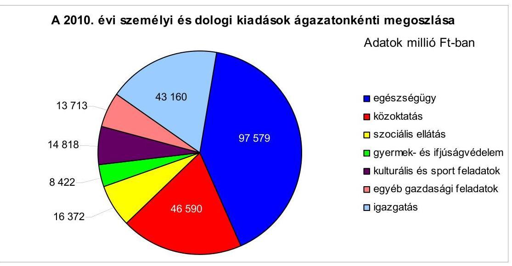

A Fővárosi Önkormányzat 2010. évi teljesített költségvetési kiadásaiból az intézmények kiadásai 50,6\%-ot ( 214272 millió Ft-ot), a Főpolgármesteri hivatal kiadásai 49,4\%-ot ( 208702 millió Ft-ot) tettek ki. A Főpolgármesteri hivatal kiadásaiból múködési célú kiadásokra 53,4\%-ot (ebből a személyi juttatásokra 8040 millió Ft-ot, a munkaadót terhelő járulékokra 1907 millió Ft-ot, a dologi kiadásokra 33157 millió Ft-ot, államháztartáson kívüli múködési célú pénzeszköz átadásra 65543 millió Ft-ot) fordítottak.

[^0]
[^0]:    ${ }^{8}$ A dologi kiadások tartalmazzák az egyéb folyó kiadásokat és a múködési célú kamatkiadásokat is, de nem foglalják magukba a fejlesztési célú kamatkiadásokat.

---

# 1.1. A Fővárosi Önkormányzat költségvetési és pénzügyiegyensúlyi, valamint likviditási helyzete 

### 1.1.1. A tervezett költségvetési bevételek és kiadások alapján a költségvetési egyensúly alakulása, a költségvetési hiány okai

A Fővárosi Önkormányzatnál a 2007-2011. évi költségvetésekben nem volt biztosított a költségvetési egyensúly, mivel a tervezett költségvetési bevételek ${ }^{9}$ nem nyújtottak fedezetet a tervezett költségvetési kiadásokra. A 2007-2011. években a múködési célú költségvetési kiadásoknál nem volt forráshiány. A tervezett felhalmozási célú költségvetési kiadások a 20072011. években 59566 millió Ft-tal, 34646 millió Ft-tal, 74212 millió Ft-tal, 58634 millió Ft-tal, illetve 74982 millió Ft-tal meghaladták a felhalmozási célú költségvetési bevételeket.

A Fővárosi Önkormányzatnál a 2007-2011. évi költségvetési rendeletekben a költségvetési egyensúly biztosításához, a költségvetési hiány külső finanszírozására és a finanszírozási célú pénzügyi kiadások forrásául hosszú lejáratú, fejlesztési célú hitelek felvételét és forgatási célú értékpapír értékesítését tervezték. Rövid lejáratú hitelfelvételt és kötvénykibocsátást a 2007-2011. években nem terveztek, a 2007-2010. években kötvényt nem bocsátottak ki, rövid lejáratú hitelt nem vettek igénybe. A 2007-2011. években a költségvetési hiány csökkentésére a Fővárosi Önkormányzatnál nem tervezték és nem is vettek igénybe az előző évi pénzmaradványból és az előző évek tartalékaiból a szabad rendelkezésú pénzmaradványt ${ }^{10}$.

Az előző évi pénzmaradványból és az előző évek tartalékaiból az áthúzódó fejlesztési célú kiadások forrásául 2010-ben 57457 millió Ft-ot, a 2011. évben 26757 millió Ft-ot, továbbá múködési célra ${ }^{11} 200$ millió Ft-ot terveztek.

[^0]
[^0]:    ${ }^{9}$ 2010. január 1-jétől az Áht. 69. § (1) bekezdése alapján az előző évi pénzmaradvány, vállalkozási maradvány igénybevétele a költségvetési hiány belső finanszírozását szolgáló bevételnek minősül, míg ezek összegét a 2007-2009. években a jogszabály szerint a költségvetési bevételek között kellett számba venni. A 2007-2011. évi költségvetési adatok azonos tartalommal történő kimutatása, illetve összehasonlítása érdekében a 2/a. számú mellékletben a 2010. január 1-jétől hatályos szabály szerint, míg a 2/b. számú mellékletben a 2009. év végéig hatályos szabályok szerint mutattuk be az adatokat. A jelentésben a költségvetési bevételeket és a költségvetési hiányt, illetve többletet a 2009. december 31-ig hatályos szabály szerint számoltuk, azaz a költségvetési bevételek (a CLF módszerrel végzett számítások kivételével) tartalmazzák az előző évi pénzmaradvány igénybevételét. Az adatokat a Magyar Államkincstár adatbázisából, a Fővárosi Önkormányzat éves költségvetési beszámolójából vettük figyelembe.
    ${ }^{10}$ A 2006. évi költségvetési beszámolóban 1337,9millió Ft, a 2007. évben 2047,9 millió Ft, a 2008. évben 3833,8 millió Ft, a 2009. évben 5255,3 millió Ft, míg a 2010. évben 21 989,9 millió Ft összegű szabad pénzmaradványt mutattak ki.
    ${ }^{11}$ A 200 millió Ft a Fővárosi Közterületi Parkolási Társulás múködési célú 2010. évi pénzmaradványa volt.

---

A 2010-2011. évi költségvetési rendeletekben a Főpolgármesteri hivatalnál tervezett előző évi pénzmaradvány tervezett igénybevételét (57 457 millió Ft-ot, illetve 26957 millió Ft-ot) - az Áht. 69. § (1) bekezdés c) pontjában előírtakat megsértve - a költségvetési bevételek között mutatták be, így nem gondoskodtak a pénzmaradvány igénybevételének a költségvetési bevételektől történő elkülönítéséről, ezen összegek költségvetési hiány belső finanszírozására szolgáló pénzforgalom nélküli bevételként való bemutatásáról. A 2007-2011. évi költségvetési rendeletek 1. § (1) bekezdésében meghatározott kiadási főösszeg tartalmazta a felvett hitelek esedékes tőketörlesztési kiadásait, a bevételi főösszeg a forgatási célú értékpapír értékesítés bevételét, és ezek különbségeként állapították meg a költségvetés hiányát, amellyel megsértették az Áht. 8/A. § (7) bekezdésében előírtakat, mert költségvetési hiányt módosító költségvetési kiadásként, illetve költségvetési bevételként finanszírozási célú pénzügyi műveleteket ${ }^{12}$ vettek figyelembe.

# 1.1.2. A teljesített költségvetési bevételek és kiadások alapján a pénzügyi egyensúly alakulásához hozzájáruló tényezők és intézkedések 

A Fővárosi Önkormányzatnál a teljesített költségvetési bevételek 2007ben 29,5 millió Ft-tal, 2008-ban 96,4 millió Ft-tal, 2009-ben 72,1 millió Ft-tal, 2010-ben 48,9 millió Ft-tal haladták meg a költségvetési kiadásokat. A 2007-2010. években a teljesített múködési célú költségvetési kiadásoknál nem volt hiányzó forrás, a keletkezett múködési célú pénzügyi többlet minden évben meghaladta a tervezett múködési célú költségvetési többletet. A 2007. évben a teljesített felhalmozási célú költségvetési bevételek nem fedezték a felhalmozási célú költségvetési kiadásokat, míg a 2008-2010. években a felhalmozási célú költségvetési bevételek meghaladták a megvalósított fejlesztési feladatokra fordított felhalmozási célú költségvetési kiadásokat.

A Fővárosi Önkormányzatnál kötvényt nem bocsátottak ki, a költségvetés végrehajtása során a 2007-2010. években összesen 65 925,9 millió Ft külföldi forrásból, valamint 5653,3 millió Ft belföldi forrásból származó, hosszú lejáratú hitelt vettek igénybe a tervezett fejlesztési feladatok megvalósítása érdekében. A felvett hitelek évenkénti részletezését a 2. számú függelék tartalmazza. A Fővárosi Önkormányzatnál 2007-ben 9039,6 millió Ft összegben, a 2009-2010. években 487,6 millió Ft, illetve 9667,2 millió Ft összegben értékesítettek hitelviszonyt megtestesítő forgatási célú értékpapírt.

[^0]
[^0]:    ${ }^{12}$ A 2007. évben 16561,8 millió Ft, a 2008. évben 15935,0 millió Ft, a 2009. évben 19 118,6 millió Ft, a 2010. évben 14 509,8 millió Ft, a 2011. évben 9905,1 millió Ft költségvetési hiányt módosító hiteltörlesztést költségvetési kiadásként vettek figyelembe. A 2007. évben 23058,3 millió Ft, a 2008. évben 13 967,0 millió Ft, a 2009. évben 18 082,8 millió Ft forgatási célú értékpapír értékesítését költségvetési bevételként tervezték meg.

---

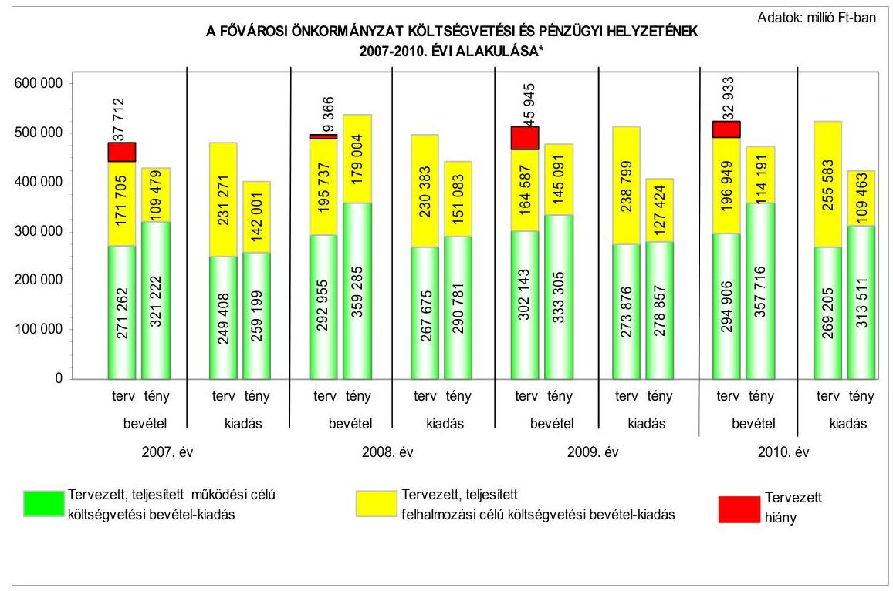

* Az adatok a Magyar Államkincstár részére benyújtott éves költségvetések és beszámolók adatain alapulnak. A tervezett költségvetési bevételek 2007-ben 2750 millió Ft, 2008-ban 20196 millió Ft, 2009-ben 25578 millió Ft 2010-ben 57457 millió Ft előző évi pénzmaradvány igénybevételt tartalmaznak, míg a teljesített költségvetési bevételek az évek sorrendjében 29 977, 42 852, 78 139, 75216 millió Ft-ot.

A 2007-2011. években az éves költségvetések összeállításakor a Főpolgármesteri hivatalban és az intézményekben az előző évről áthúzódó működési célú költségvetési kiadásokat, a felhalmozási célú kiadások közül az intézményi beruházási és felújítási kiadásokat, valamint az azok forrásául szolgáló előző évi pénzmaradványt és előző években keletkezett tartalékok várható összegét ${ }^{13}$ nem vették figyelembe, ezért az Áht. 7. § (2) bekezdésében ${ }^{14}$ előírtakat megsértve, az éves költségvetések múködési célú kiadási előirányzatainak és az intézményi beruházási és felújítási kiadások előirányzatának tervezése nem volt megalapozott. A 2007-2010. években az ingatlanok értékesítésből származó bevételek eredeti előirányzatainak tervezése sem volt megalapozott, a tervszámok alulteljesítése ${ }^{15}$ tervezési hiányosságra vezethető vissza. Ezen a jogcímen a bevételek tervezésekor a gazdasági folyamatok alakulásával (a fizetőképes piaci kereslet csökkenésével) - a vagyonkezelő szervezet általi fi-

[^0]
[^0]:    ${ }^{13}$ 2007-ben 38856 millió Ft-ot, 2008-ban 25025 millió Ft-ot, 2009-ben 65240 millió Ftot, 2010-ben 46626 millió Ft-ot, 2011-ben 61916 millió Ft-ot
    ${ }^{14}$ 2010. január 1-től az Áht. 8/C. § (3)-(4) bekezdései szabályozzák.
    ${ }^{15}$ A bevételi előirányzatokból 2007-ben 69\% (8943 millió Ft), 2008-ban 60\% (10455 millió Ft), 2009-ben 74\% (13 785 millió Ft), 2010-ben 81\% (9796 millió Ft) nem teljesült.

---

gyelem-felhívás ${ }^{16}$ ellenére - nem számoltak, több éve sikertelenül meghirdetett ingatlanok értékesítéséből származó bevételt terveztek, ezért az Áht. 7. § (2) bekezdésében előírtakat megsértve az ingatlanok értékesítéséből származó bevétel tervezése nem volt megalapozott. Az osztalék bevételek 2010. évi tervezése azért nem volt megalapozott, mert nem vették figyelembe a Fővárosi Vízmúvek Zrt. várható nyeresége alapján a Fővárosi Önkormányzatot megillető osztalék bevételt. A teljesített osztalék bevétel 2010-ben 1114 millió Ft többletbevételt eredményezett.

A Közgyűlés az előző évi pénzmaradvány és az előző évek tartalékai összegét a 2007. évi zárszámadási rendeletben 41606 millió Ft-tal, a 2008. évben 45221 millió Ft-tal, a 2009. éviben 90818 millió Ft-tal, valamint a 2010. éviben 104083 millió Ft-tal hagyta jóvá. A pénzmaradvány az ellenőrzött időszakban kiadási megtakarításból, valamint feladat-áthúzódásból származott, melynek 94-97\% közötti aránya kötelezettségvállalással terhelt volt. A 20072010. években az előző évi pénzmaradvány jóváhagyásakor a Főpolgármesteri hivatalban a költségvetési rendelet 7100-7200 címein ${ }^{17}$, valamint három költségvetési intézménynél kötelezettségvállalással terhelt pénzmaradványként mutattak ki szabad pénzmaradványt (összesen 2856 millió Ft-ot), amelyeket nem támasztottak alá az Ámr. ${ }_{1}$ 2. § 67-68. pontjában ${ }^{18}$ előírtaknak megfelelő, előző évi kötelezettségvállalásról szóló, szabályszerűen megtett jognyilatkozattal.

A 2007-2010. években a tervezett költségvetési hiányhoz képest a pénzügyi többletet a következő főbb tényezők idézték elő:

- a pénzügyi többlet kialakulására kedvezően hatott a tervezett múködési célú költségvetési bevételek túlteljesítése 2007-ben 49 960, 2008-ban 66 329, 2009-ben 31 162, 2010-ben 62810 millió Ft összegben. A működési célú költségvetési bevételek tervezetthez viszonyított többletbevételét az állami költségvetési támogatások, az államháztartáson kívülről múködési célra átvett pénzeszközök, a 2007-2009. években a helyi adóbevételek és a helyi adókhoz kapcsolódó pótlékok, bírságok, valamint az egyéb sajátos bevételek, a múködési célú hozam- és kamatbevételek, továbbá a 2007-2008. és a 2010. években a támogatás értékű működési bevételek túlteljesítése eredményezte;
- a pénzügyi többlet kialakulásában a 2007-2010. években jelentős szerepet játszott a felhalmozási célú költségvetési kiadások nagy összegű alulteljesítése. A felhalmozási célú kiadások a 2007. évben 38,6\%-kal ( 89270 millió Fttal), a 2008. évben 34,4\%-kal ( 79300 millió Ft-tal), a 2009. évben 46,6\%-kal (111 375 millió Ft-tal), a 2010. évben 56,7\%-kal (146 120 millió Ft-tal) ma-

[^0]
[^0]:    ${ }^{16}$ a Budapest Fővárosi Vagyonkezelő Központ Zrt. 1403/K/2009. számú, 2009. november 25 -ei keltezésű levele
    ${ }^{17}$ A 7100-as címeken a hivatali feladatok és a testületi múködés és a 7200-as címeken az önkormányzati feladatokhoz kapcsolódó hivatali szakmai tevékenységek bevételi és kiadási előirányzatai és azok teljesítése szerepelnek.
    ${ }^{18}$ 2010. január 1-től az Ámr. ${ }_{2}$ 72. § (1) bekezdés a) pontja, a (2) és (8)-(11) bekezdései írják elő.

---

radtak el az eredeti előirányzattól. A felhalmozási célú költségvetési kiadások alulteljesítését a beruházási és a felújítási feladatok, illetve kifizetések, valamint az államháztartáson kívülre teljesített felhalmozási célú pénzeszköz átadások és támogatás értékű kiadások tervezettől elmaradt teljesítése, illetve a következő évekre való áthúzódása okozta. A fejlesztési célú kiadási előirányzatok alulteljesítésében meghatározó szerepet játszott az egyes kiemelt fejlesztési feladatok - többek között a 4-es metró építése, a Budapesti központi szennyvíztisztító telep beruházása, a városrehabilitációs keret terhére tervezett pénzeszközátadások, a 2-es metró járműcseréje, a híd- és útfelújítások, az 1-es és 3-as villamosvonal meghosszabbítása - kiadásainak jelentős elmaradása. Ezek összesen 2007-ben 64768 millió Ft, 2008-ban 65733 millió Ft, 2009-ben 65052 millió Ft, míg 2010ben 107304 millió Ft alulteljesítést okoztak. A 2010. évben a felhalmozási célú költségvetési kiadások előirányzatainak alulteljesítéséhez hozzájárult, hogy az európai uniós támogatással megvalósuló fejlesztések esetében összesen 18473 millió Ft-ot - a támogatás folyósításának időpontjáig - az átfutó kiadások között mutattak be az Áhsz. 9. számú mellékletének a 3.) pontjában foglalt előírásnak megfelelően.

A fejlesztési célú kiadások alacsony teljesítésében szerepet játszott a közbeszerzési eljárások időigénye, a beruházások, felújítások előkészítésének és a műszaki megvalósításnak az időbeli elhúzódása, valamint a kivitelezés során jelentkező pót- és többletmunkák miatti szerződésmódosítások.

A 4-es metró építésére teljesített kifizetés 2007-ben 43491 millió Ft-tal, 2008-ban 32957 millió Ft-tal, 2009-ben 33049 millió Ft-tal, 2010-ben 55007 millió Ft-tal maradt el a tervezettől az engedélyezési és a közbeszerzési eljárás, valamint az alagútépítés elhúzódása miatt. A Budapesti központi szennyvíztisztító telep beruházására 2007-ben 1946 millió Ft, 2008-ban 11311 millió Ft, 2009-ben 4368 millió Ft, 2010-ben 18246 millió Ft kifizetésére nem került sor a közbeszerzési pályázat eredménytelensége következtében. A város-rehabilitációs keret terhére tervezett pénzeszközátadások 2007-ben 7439 millió Ft-tal, 2008-ban 7219 millió Ft-tal, 2009-ben 7884 millió Ft-tal, 2010-ben 7295 millió Ft-tal húzódott át a következő évre az utófinanszírozás miatt. A 2-es metró járműcseréje esetében 2007-ben 10411 millió Ft, 2009-ben 10631 millió Ft, 2010-ben 18803 millió Ft kifizetésére nem került sor, mivel az engedélyezési eljárás elhúzódott. A hídfelújításokra tervezett kifizetés 2007-ben 1481 millió Ft-tal, 2008-ban 3761 millió Ft-tal, 2009-ban 2440 millió Ft-tal, 2010-ben 2111 millió Ft-tal maradt el a tervezettől a tervezetési és az engedélyezési eljárás elhúzódása miatt, valamint a pillérszobrok restaurálásának időbeli átütemezése miatt. Az útfelújítások esetében 2008-ban 5485 millió Ft, 2009-ben 6680 millió Ft, 2010-ben 4342 millió Ft kifizetésére nem került sor a közbeszerzési eljárás elhúzódása, valamint a becsült kiadások alatti ajánlatok beérkezése következtében. Az 1-es és 3as villamosvonal meghosszabbítása esetében 2008-ban 5000 millió Ft, 2010-ben 1500 millió Ft kifizetése maradt el az adott évben az engedélyezési lejárás elhúzódása, valamint a korábban elfogadott projekt átdolgozása miatt.

---

A Fővárosi Önkormányzatnál a 2007-2010. években teljesített egyes kiemelt működési célú költségvetési bevételek alakulását a következő ábra részletezi:
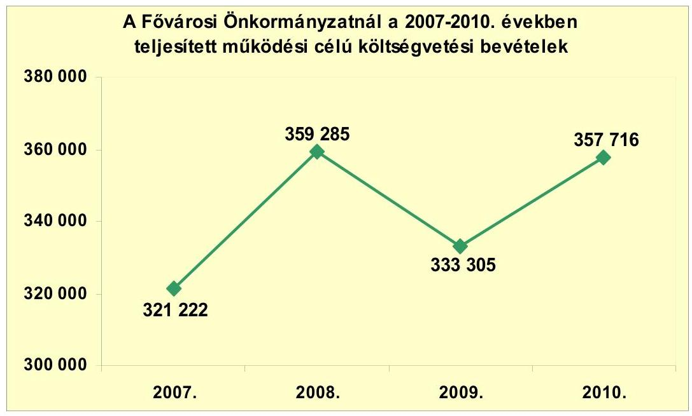

A Fővárosi Önkormányzatnál a múködési célú költségvetési bevételek a 2007évről a 2010. évre 11,4\%-kal növekedtek, ezen belül az önkormányzat költségvetési támogatása $27,7 \%$-kal 20694 millió Ft-tal, az OEP-től származó támogatás értékű bevételek összege 20,2\%-kal, 14226 millió Ft-tal emelkedett, míg a helyi adóbevételek összege $0,7 \%$-kal, 632 millió Ft-tal csökkent. A költségvetési támogatás 2007-ről 2008-ra 44,2\%-kal ( 33027 millió Ft-tal) emelkedett az egyéb központi támogatások növekedése (a 2007. év után járó 13. havi illetmény 2008. évi elszámolása, az eseti kereset kiegészítés, valamint a BKV-nak juttatott 10000 millió Ft összegű egyszeri kiegészítő támogatás) következtében. Hozzájárult továbbá a növekedéshez a feladatmutatókhoz kötött normatív állami hozzájárulás - normatív módon elszámolt személyi jövedelemadó átrendezéséből adódó - 7544 millió Ft összegű emelkedése, valamint a tűzoltóság támogatásának ( 7196 millió Ft) elszámolása. A Fővárosi Önkormányzatnál a múködési célú költségvetési bevételek - ezen belül kiemelten nőttek az önkormányzati költségvetési támogatások, valamint az OEP-től származó múködési célú bevételek - 2008. évről a 2009. évre 25980 millió Ft-tal, azaz 7\%-kal csökkentek. A 2010. évi múködési célú költségvetési bevételek - az előző évihez viszonyított növekedésük ellenére - sem érték el a 2008. évi 359285 millió Ft-ot. A költségvetési támogatás a 2008. évről a 2009. évre 27,1\%-kal (29 166 millió Ft-tal) csökkent a 2008. évi egyszeri, eseti jellegú egyéb központi támogatásokból adódóan, illetve hozzájárult a normatív állami hozzájárulás és a központosított előirányzatok összegének csökkenése.

---

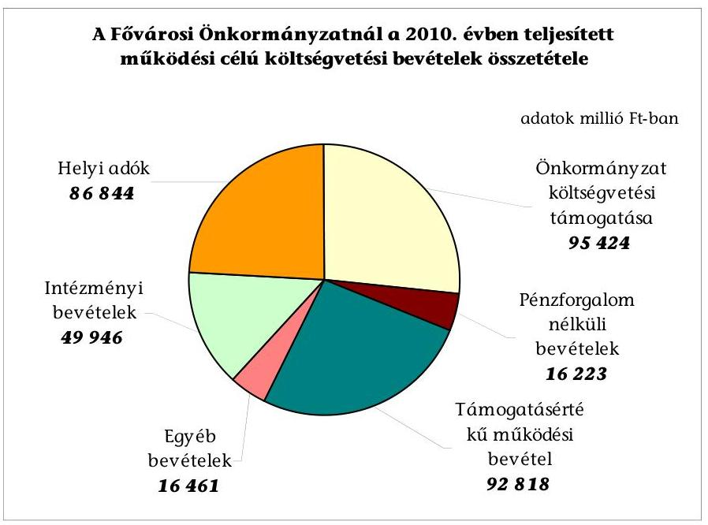

A 2010. évben a működési célú költségvetési bevételeknek valamivel több, mint egynegyede költségvetési támogatásból származott, de közel hasonló arányban részesedtek a támogatásértékű működési bevételek és a helyi adók is. (A támogatásértékű működési bevételeken belül meghatározó volt az OEP-től származó, az egészségügyi intézmények fenntartását szolgáló pénzeszköz átvétel.) A működési célú költségvetési bevételekből az intézményi bevételek részesedése az intézményi térítési díjak emelésének eredményeként - fokozatosan növekedett a 2007. évi 11,7\%-ról a 2010. évre 14\%-ot ért el, a négy év alatt bekövetkező 12435 millió Ft-os növekedése eredményeként.

A Fővárosi Önkormányzat múködési célú bevételeiből az egészségügyi ágazat múködési célú bevételei a 2007-2010. években mintegy 5-8 \%-ot tettek ki. Az egészségügyi intézmények múködési célú bevételeinek összege 2007-ről 2010-re 33,2\%-kal ( 4232 millió Ft-tal) emelkedett, melyet elsősorban a nem OEP-től kapott támogatásértékű működési célú bevételek 4478 millió Ft-os emelkedése okozott. A Fővárosi Önkormányzat saját forrásából biztosított múködési célú támogatásának összege a 2007-2010. években mindösszesen 4118 millió Ft volt, melynek célja többek között az intézkedési tervekből eredő adósságrendezés, a létszámleépítés nem támogatott költségeinek és a pályázati források önrészének a biztosítása volt. Ezen túl 5690 millió Ft-ot a személyi juttatások (bérpolitikai intézkedésekkel, eseti kereset-kiegészítéssel, 13. havi keresetkiegészítéssel) állami támogatásokkal finanszírozott fedezeteként juttatott az egészségügyi intézményei részére.

A Fővárosi Önkormányzatnál a 2007-2010. években teljesített felhalmozási célú költségvetési bevételeket az egyes kiemelt jogcímek részletezésével a következő táblázat szemlélteti:

---

| Megnevezés | 2007. év | 2008. év | 2009.év | 2010. év |
| :--: | :--: | :--: | :--: | :--: |
| Felhalmozási célú költségvetési bevételek összesen | 109479 | 179004 | 145091 | 114191 |
| Ebböl: |  |  |  |  |
| Felhalmozási célú kamat, osztalék, koncessziós díjbevétel | 10333 | 12661 | 12632 | 8159 |
| Pénzügyi befektetések bevétele, részesedés értékesítés, privatizációból, vagyonhasznosításból származó bevétel | 14867 | 19400 | 296 | 2 |
| Támogatásértékű felhalmozási bevételek | 24523 | 63993 | 33310 | 36897 |
| Önkormányzat felhalmozási célú költségvetési támogatása | 37488 | 44309 | 27669 | 6367 |
| Pénzforgalom nélküli bevétel (előző évi pénzmaradvány és előző évek tartalékainak igénybevétele) | 9856 | 25012 | 56153 | 58993 |

A Fővárosi Önkormányzatnál a felhalmozási célú költségvetési bevételek a 2007-évről a 2010. évre 4,3\%-kal növekedtek, ezen belül támogatás értékű bevételek 50,5\%-kal, 12374 millió Ft-tal, az előző évi pénzmaradvány és előző évek tartalékai igénybevétele a hatszorosára, 49137 millió Ft-tal emelkedett. A 2010. évben a kamat, osztalék és koncessziós díjból származó bevételek összege 21,0\%-kal (2174 millió Ft-tal), a költségvetési támogatások összege 83,0\%-kal ( 31121 millió Ft-tal) csökkent a 2007. évhez képest. Ennek részeként a 4-es metró építésének finanszírozási forrásaiban bekövetkezett átrendeződés miatt az igénybe vett állami támogatás a 2007. évi 35648 millió Ft-ról a 2010. évben 6271 millió Ft-ra csökkent, ugyanakkor a Kohéziós Alapból lehívott támogatás a 2008. évben 32000 millió Ft, a 2009. évben 13237 millió Ft, míg a 2010. évben 13560 millió Ft volt.

A Fővárosi Önkormányzat felhalmozási célú bevételeiből az egészségügyi ágazat bevételei a 2007-2010. években mintegy 1-2\%-ot tettek ki. A Fővárosi Önkormányzatnál az egészségügyi intézmények felhalmozási célú bevételei a 2007. évről a 2010. évre 72,6\%-kal csökkentek a támogatásértékű felhalmozási célú bevételek csökkenése következtében.

A Fővárosi Önkormányzat a 2007-2010. években az egészségügyi intézmények számára 3565 millió Ft felhalmozási célú támogatást nyújtott az intézményi céljelleggel támogatott beruházások és felújítások - többek között az egészségügyi intézmények gép- és eszközbeszerzései, a Károlyi Sándor Kórház és Rendelőintézet hőellátó rendszer korszerűsítése, Péterfy Sándor utcai Kórház-Rendelőintézet és Baleseti Központ Alsóerdősor utcai épület fűtési rendszerének részleges felújítása, és az Egyesített Szent István és Szent László Kórház - Rendelőintézet telephelye

---

(Merényi Gusztáv Kórház) pszichiátriai épületének generál felújítása - megvalósítására.

A Fővárosi Önkormányzatnál a 2007-2010. években teljesített múködési célú költségvetési kiadásokat egyes kiemelt jogcímenként a következő táblázat részletezi:
adatok millió Ft-ban

| Megnevezés | 2007. év | 2008. év | 2009. év | 2010. év |
| :-- | :--: | :--: | :--: | :--: |
| Múködési célú költségvetési   kiadások összesen | 259199 | 290781 | 278857 | 313511 |
| Ebböl: |  |  |  |  |
| Személyi juttatások | 96589 | 102183 | 97283 | 96580 |
| Munkaadókat terhelő járulékok | 30231 | 31747 | 28706 | 24963 |
| Dologi kiadások | 85767 | 99883 | 103886 | 119167 |
| Múködési célú pénzeszköz át-   adás államháztartáson kívülre | 41249 | 50537 | 43738 | 64501 |

A Fővárosi Önkormányzatnál a múködési célú költségvetési kiadások 2007-ről 2010-re 21,0\%-kal (54 313 millió Ft-tal) növekedtek. Ezen belül a dologi kiadások $38,9 \%$-kal ( 33400 millió Ft-tal), az államháztartáson kívülre átadott múködési célú pénzeszközök kiadásai 56,4\%-kal (23 252 millió Ft-tal) emelkedtek, míg a személyi juttatások 9 millió Ft-tal, a munkaadóakat terhelő járulékok 17,4\%-kal (5268 millió Ft-tal) csökkentek. A dologi kiadások folyamatos emelkedésében szerepet játszott a készletbeszerzés 8846 millió Ft-os növekedése, az egészségügyi intézmények körében gazdasági társasági formában múködő két kórház költségvetési szervbe történő integrálása, továbbá hat egészségügyi intézmény (központi költségvetési szervtől történő) átvétele következtében. A szolgáltatási kiadások 5020 millió Ft-tal emelkedtek, amit elsődlegesen a gáz-, villamos energia és az egyéb üzemeltetési szolgáltatások díjainak áremelkedése idézett elő. A vásárolt közszolgáltatások 5636 millió Ft-os növekedését további az ingatlanok üzemeltetésére, felújítására, hasznosítására irányuló - feladatkiszervezések okozták. Az áfa kiadások 10332 millió Ft-tal növekedtek, ami a vásárolt közszolgáltatások és az áfa kulcs mértékének emelkedéséből adódott.

A Fővárosi Önkormányzat múködési kiadásaiból az egészségügyi ágazat kiadásai a 2007-2010. években mintegy 30\%-ot (évente 80-100 milliárd Ft-ot tettek ki. A Fővárosi Önkormányzatnál az egészségügyi intézmények múködési célú kiadásai a 2007. évről a 2010. évre 24,1\%-kal emelkedtek, kiemelten a személyi juttatások, valamint a dologi kiadások növekedésének következtében. A személyi és a dologi kiadások (20 193 millió Ft-os) emelkedésére ható jelentős tényező volt, hogy a 2009. évben a Szent János Kórházba integrálták a korábban gazdasági társasági formában múködő Észak-budai kórházak által ellátott feladatokat.

---

A Fővárosi Önkormányzatnál a 2007-2010. években teljesített felhalmozási célú költségvetési kiadásokat egyes kiemelt jogcímenként a következő táblázat részletezi:
adatok millió Ft-ban

| Megnevezés | 2007. év | 2008. év | 2009. év | 2010. év |
| :-- | :--: | :--: | :--: | :--: |
| Felhalmozási célú költségveté-   si kiadások összesen | 142001 | 151083 | 127424 | 109463 |
| Ebből: |  |  |  |  |
| Intézményi beruházások | 45972 | 56067 | 47145 | 54625 |
| Felújítások | 16284 | 10845 | 14590 | 17849 |
| Fejlesztési célú pénzeszköz átadás   államháztartáson kívülre | 66479 | 71592 | 56502 | 30463 |

A Fővárosi Önkormányzatnál fejlesztési célú költségvetési kiadások 2007-ről 2010-re 22,9\%-kal csökkentek, ezen belül az államháztartáson kívülre átadott fejlesztési célú pénzeszközök 54,2\%-kal, 36016 millió Ft-tal csökkentek. A beruházások kiadásai 18,8\%-kal (8653 millió Ft-tal), a felújítási kiadások 9,6\%$\mathrm{kal}(1565$ millió Ft-tal) emelkedtek 2007-ről 2010-re.

A Fővárosi Önkormányzat 2007-ben 62256 millió Ft, 2008-ban 66913 millió Ft, 2009-ben 61735 millió Ft, míg 2010-ben 72474 millió Ft-ot fordított beruházási és felújítási kiadásokra, amelyek között szennyvíztisztító telepek és kapcsolódó létesítményeinek megépítése, kórházak rekonstrukciói, intézmény felújítások, korszerűsítések, 4-es és 2-es metró megépítése, útépítések, út- és hídfelújítások szerepeltek. Több, - a 2007. évet megelőzően indult - egyenként közel 1000 millió Ft bekerülési költségű fejlesztés megvalósult a vizsgált időszakban:

- a Pók úti átemelő telep bekerülési költsége 1421,6 millió Ft volt, forrása 622,8 millió Ft összegben hitel, 798,8 millió Ft saját forrás, a 2007-2010. évek között összesen 1018,1 millió Ft-ot fizettek ki;
- a Bajcsy Zsilinszky Kórház rekonstrukciója, új diagnosztikai és mútéti tömb bekerülési költsége 9502,1 millió Ft volt, forrása 3650,0 millió Ft hitel, 852,1 millió Ft saját forrás, 5000,0 millió Ft állami támogatás, a 2007-2010. évek között teljesített összes kiadás 1592,8 millió Ft volt;
- a Fővárosi Állat- és Növénykert részleges rekonstrukció II. ütemének teljes kiadása 2719,6 millió Ft volt, forrása 2000,0 millió Ft állami támogatás, 719,6 millió Ft saját forrás, a 2007-2010. évek között összesen 1833,3 millió Ft-ot fizettek ki;
- a Váci út és gyűjtőcsatorna kiépítésének bekerülési költsége 1239,3 millió Ft volt, forrása 960,8 millió Ft állami támogatás, 278,5 millió Ft saját forrás, a 2007-2010. évek között teljesített összes kiadás 1182,1 millió Ft volt;

---

- a Csalogány úti Általános Iskola és Diákotthon elhelyezésének teljes kiadása 2198,8 millió Ft volt, forrása 1157,2 millió Ft hitel és 1041,6 millió Ft saját forrás, a 2007-2010. évek között összesen 2020,2 millió Ft-ot fizettek ki;
- a Magyar Gyula Kertészeti Szakközépiskola bővítésének teljes kiadása 1406,9 millió Ft volt, forrása 768,3 millió Ft hitel és 638,6 millió Ft saját forrás, a 2007-2010. évek között teljesített összes kiadás 1212,8 millió Ft volt;
- a Szabadság híd felújításának bekerülési költsége 5771,8 millió Ft volt, forrása 2491,4 millió Ft állami támogatás és 3280,4 millió Ft saját forrás, a 20072010. évek között összesen 5771,3 millió Ft-ot fizettek ki;
- az Északpesti Térségi Integrált Szakképző Központ kialakításának teljes kiadása 1049,8 millió Ft volt, forrása 189,3 millió Ft saját forrás, 752,5 millió Ft átvett pénzeszköz és 108 millió Ft hitel volt, a 2007-2010. évek között teljesített kiadás összes 1028 millió Ft volt;
- a Belvárosi Térségi Integrált Szakképző Központ kialakítása 1127,5 millió Ft volt, forrása 273,1 millió Ft saját forrás, 500 millió Ft átvett pénzeszközé és 354,4 millió Ft hitel volt, a 2007-2010. évek között összesen 1094,9 millió Ftot fizettek ki.

A Fővárosi Önkormányzat felhalmozási célú kiadásaiból az egészségügyi ágazat felhalmozási célú kiadásai a 2007-2010. években mintegy 2-4\%ot tettek ki ${ }^{19}$. A Fővárosi Önkormányzatnál az egészségügyi intézmények felhalmozási célú kiadásai a 2007. évről a 2010. évre 1,7\%-kal (326 millió Ft-tal) emelkedtek az intézményi beruházások értékének emelkedése következtében. Intézményi beruházási kiadásokat teljesítettek többek között a Heim Pál Gyermekkórház Gyermek Fogászati Központ berendezésére, a Visegrádi Rehabilitációs Szakkórház részére gépjárművek, az egészségügyi intézmények gép-műszer és berendezés beszerzésére és informatikai fejlesztésekre. Az egészségügyi intézmények költségvetésében megjelenő saját hatáskörű, valamint a céljelleggel támogatott beruházási és felújítási feladatokon túlmenően a Fővárosi Önkormányzat az egészségügy fejlesztési kiadásaira a 2007-2010. évek között összesen 13248 millió Ft-ot fordított.

A 2007-2010. évek között az egészségügy fejlesztési kiadásaiból kiemelten az Uzsoki utcai Kórház „Regionális Egészségügyi Központ Rekonstrukció" II. ütemére 5796 millió Ft kiadást teljesítettek, amelyből 1373 millió Ft az önkormányzati saját forrás, 822 millió Ft EIB hitel és 3601 millió Ft európai uniós támogatás volt. A Szent Imre Kórház „Regionális Egészségügyi Központ Rekonstrukció" II. ütemére 5452 millió Ft kiadást teljesítettek, amelyből 507 millió Ft az önkormányzati saját forrás, 2170 millió Ft EIB hitel és 2775 millió Ft európai uniós támogatás volt. Az Uzsoki utcai Kórház onkológiai fejlesztésére mindösszesen 36 millió Ft kifizetést teljesítettek, amely teljes egészében önkormányzati saját forrás volt.

A Fővárosi Önkormányzat 2010. évet követő évekre vállalt fejlesztési feladatokkal kapcsolatos kötelezettségeinek összege 300823 millió Ft,

[^0]
[^0]:    ${ }^{19}$ Az egészségügyi ágazat fejlesztési kiadásaira a 2007. évben 3418 millió Ft, a 2008. évben 6065 millió Ft, a 2009. évben 4720 millió Ft és a 2010. évben 3477 millió Ft-ot fordítottak.

---

melynek fedezetét képező források összetétele 53,8\%-az európai uniós támogatás, $25,8 \%$-a saját bevétel, $13,5 \%$-a hazai támogatás, $6,8 \%$-a hitel, valamint $0,1 \%$-a az államháztartáson kívülről átvett pénzeszköz ${ }^{20}$. A Fővárosi Önkormányzat 2010. év utáni kötelezettségvállalásából 2447 millió Ft kapcsolódik az egészségügyi intézmények fejlesztéséhez. A beruházásokhoz és felújításokhoz kapcsolódó, a 2010. évet követően esedékessé váló kötelezettségvállalások fedezete csak akkor biztosítható, ha- a hétéves tervben - a fejlesztésekhez számításba vett saját források teljesülnek, valamint ezen bevételeket terhelő további újabb, jelentős nagyságrendű fejlesztési kötelezettséget a Fővárosi Önkormányzat nem vállal.

A 2011-2015. közötti időszakban - a tervezett fejlesztési kiadások mértékét tekintve - a Fővárosi Önkormányzat legjelentősebb fejlesztése a 4-es metró építése ${ }^{21}$, amelynek finanszírozásával kapcsolatos feltételek változása beruházás finanszírozási kockázatot jelentenek. A 4-es metró I. szakasza ${ }^{22}$ építésének a 2015. évig tervezett összes beruházási kiadása 377447 millió $\mathrm{Ft}^{23}$, amelyből az állami támogatás a Közlekedés Operatív Program támogatásával ${ }^{24}$ együtt 313742,4 millió Ft-ot, azaz 83,1\%-os arányt, míg a Fővárosi Önkormányzat saját forrása 63704,7 millió Ft-ot, azaz 16,9\%-ot képvisel. A beruházást finanszírozó forrásokból 2010. december 31-éig 191602,4 millió Ft-ot, azaz 50,8\%-ot használtak fel, az állami támogatásból $48,6 \%$-ot, az önkormányzati saját forrásból $61,2 \%$-ot. A Fővárosi Önkormányzatnak a 2011-től 2015-ig terjedő időszakban a 4-es metró építéséhez - a szerződések szerint - 24692 millió Ft saját forrást kell biztosítani, amennyiben a következő feltételek az alábbiak szerint teljesülnek: az I. szakasz tervezett építési kiadása változatlan ${ }^{25}$; az évek szerinti műszaki, illetve pénzügyi ütemezés a terv szerint alakul; a finanszírozásban résztvevők a finanszírozási szerződés szerint teljesítik a pénzügyi támogatási kötelezettségüket; az el nem számolható költségek összege - amely teljes mértékben a Fővárosi Önkormányzatot terheli

[^0]
[^0]:    ${ }^{20}$ a Főpolgármesteri hivatal által 2011. május 19-én kiállított tanúsítvány szerint
    ${ }^{21}$ Az ÁSZ a 2010. évben ellenőrizte a 4-es metró beruházási folyamatát (jelentés száma: 1023).
    ${ }^{22}$ A 4-es metró építésének szakaszai: I. szakasz: Kelenföldi pályaudvar (Etele tér) - Keleti pályaudvar (Baross tér), II. szakasz: Keleti pályaudvar (Baross tér) - Bosnyák tér. A II. szakasz megvalósítását elhalasztották, így a 2011-2014. évek fejlesztési előirányzatai csak az I. szakasz tervezett kiadásait, valamint kapcsolódó beruházásait az általános tartalékkal együtt, továbbá Közlekedési Operatív Program támogatása terhére el nem számolható költségek miatt - a 2011. évben 887,3 millió Ft összegben - képzett tartalékkeret összegét foglalják magukba.
    ${ }^{23}$ A tervezett beruházási kiadások meghatározásánál az euróban igénybeveendő hitel és az európai uniós támogatás összegét 280 Ft /euró árfolyamon számították. A 377447 millió Ft összes beruházási kiadás magában foglalja a II. szakasz 2011. évig felmerült előkészítési költségét is.
    ${ }^{24}$ A Közlekedési Operatív Program támogatása a Kohéziós Alap és az operatív program támogatását foglalja magába. A Közlekedési Operatív Programból - támogatási szerződés alapján - 32000 millió Ft előleget folyósítottak a beruházás kiadásainak finanszírozására.
    ${ }^{25}$ Az I. szakasz építési kiadásai főként a járműszerelvények beszerzésével összefüggő műszaki okok miatt emelkedhetnek.

---

- nem változik. A felsorolt feltételek nem teljesülése pénzügyi kockázatot jelent a Fővárosi Önkormányzat számára, mivel bármelyik feltételben bekövetkező elmaradás a költségvetési kiadási előirányzatok módosításának (növelésének) szükségességéhez vezet. A Főváros Önkormányzat a 4-es metró építésének finanszírozási kockázatát a beruházás fokozott gondossággal történő végrehajtásával, valamint a szerződéses kötelezettségei következetes betartásával csökkentheti.

A Fővárosi Önkormányzatnál a 2007-2010. években a tárgyi eszközök után 88079 millió Ft terv szerinti értékcsökkenést számoltak el, felújítási előirányzatként 88866 millió Ft-ot terveztek. Az elszámolt terv szerinti értékcsökkenésnek 67,6\%-át, azaz 59569 millió Ft-ot fordítottak felújítási célokra, ezáltal a felújítások nem biztosították az önkormányzati vagyon tárgyi eszköz állománya használati értékének hosszú távú fennmaradását.

# 1.1.3. A Fővárosi Önkormányzat által tett intézkedések a likviditás, a fizetőképesség megőrzésére, illetve javítására 

A Fővárosi Önkormányzatnál a pénzügyi egyensúly megteremtése és fenntartása érdekében a hétéves tervet évente aktualizálták. Stratégiai célként a kiegyensúlyozott gazdálkodást fogalmazták meg. A Fővárosi Önkormányzat a 2007-2010. években a szociális, gyermek- és ifjúságvédelmi, egészségügyi, oktatási és egyéb ágazatokat, valamint a Főpolgármesteri hivatalt érintő kiadási megtakarítást, illetve bevétel növelést eredményező döntéseket hozott. Az időszakban a Fővárosi Önkormányzatnál intézmény átszervezéseket, megszüntetéseket, létszámcsökkentéseket, takarékossági intézkedéseket, valamint bevételnövelő intézkedéseket hajtottak végre. Önkormányzati szinten összesen 6619,8 millió Ft-ot mutattak ki a kiadás csökkentő intézkedések hatásaként. Ebből az intézmények körében érvényesítettek 5862,8 millió Ft-ot, melynek $52,7 \%$-át a személyi juttatások és járulékai, $46,4 \%$-át a dologi kiadások, $0,1 \%$-át a pénzeszközátadások, valamint $0,8 \%$-át az ellátottak pénzbeli juttatásai tettek ki. A Fővárosi Önkormányzat kiadáscsökkentő és bevételnövelő intézkedései nem voltak képesek ellensúlyozni a központi források 2008. évről 2009re történő 29166 millió Ft-os csökkenését.

A racionalizálási döntések eredményeként:

- a szociális ágazatban két intézményi telephelyet bezártak, három idősek otthonát és két pszichiátriai betegek otthonát jogutóddal megszüntettek. A Budapesti Módszertani Szociális Központ és Intézményei használatában lévő ingatlanok fenntartására és üzemeltetésére egy egységes szervezetet hoztak létre, valamint négy telephelyen működő önként vállalt feladatot (Krizis AnyaGyermek lakások) megszüntettek, illetve átszerveztek (az éjjeli menedékhely egy részét átmeneti szállássá minősítették át magasabb összegű normatív állami hozzájárulás igénylése, illetve térítési díj fizetése érdekében);
- a gyermek- és ifjúságvédelmi ágazatban hat intézményt részben önállóan gazdálkodó részjogkörű költségvetési intézménnyé alakították, két intézményt, valamint két telephelyet megszüntettek. Négy intézményben az önként vállalt feladatokat (pl. gyermeklélektani szolgálat, segélyhívó telefonszolgálat) megszüntették;

---

- az egészségügyi ágazatban a kihasználatlan, párhuzamos kapacitások felszámolása érdekében a Szent László Kórházat jogutóddal megszüntették, az észak-budai kórházakat integrálták, a Schöpf-Mérei Ágost Kórházban a fekvőbeteg szakellátást megszüntették, később az intézményt bezárták;
- az oktatási ágazatban a kapacitásfelesleg miatt átszervezték az intézményrendszert, melynek során 21 önállóan gazdálkodó intézményt jogutóddal megszüntettek, valamint egy új intézményt hoztak létre két megszűnő intézmény feladatainak ellátására. Átalakították továbbá a fővárosi szakképzés rendszert, térségi integrált szakképző központokat hoztak létre, valamint négy intézmény telephelyét megszüntették.

A költségvetési intézményeknél a 2007-2010. években a személyi juttatásoknál és járulékainál a megtakarításokat jellemzően a létszámcsökkentési döntések (feladatmegszüntetéssel, átszervezéssel járó létszámcsökkentés, határozott idejű alkalmazások megszüntetése) 969,5 millió Ft-tal, a feladatkiszervezések (karbantartás, takarítás, portaszolgálat) 767,1 millió Ft-tal, a többletjuttatások csökkentése (közalkalmazotti bértáblán felüli pótlékok elvonása) 698,0 millió Ft-tal eredményezték. A dologi kiadások csökkenését eredményezték jellemzően a beszerzési szerződések felülvizsgálata (861,5 millió Ft), a vásárolt közszolgáltatások (586,2 millió Ft), a központosított közbeszerzés (666,3 millió Ft). Az intézmény átszervezések, feladat átrendezések következtében az ellátottak pénzbeli juttatásaira 48,6 millió Ft-tal fordítottak kevesebbet. A Főpolgármesteri hivatalnál végrehajtott kiadás csökkentő intézkedések hatásaként a 2007-2010. évekre összesen 757 millió Ft-ot mutattak ki a beszerzési szerződések felülvizsgálatának, illetve a vásárolt közszolgáltatásoknak a megtakarításaiból.

A 2007-2010. évek között végrehajtott kiadás csökkentő intézkedések és az egészségügyi, az oktatási és a szociális intézményeknél, a Főpogármesteri hivatalban, a Fővárosi Közterület Felügyeletnél bekövetkezett feladat bővülések ${ }^{26}$ együttes hatásaként - a Fővárosi Önkormányzat kimutatása szerint - összesen 790-nel csökkent a közalkalmazotti és egyéb jogviszonyban foglalkoztatottak álláshelyeinek száma, amelyből 498 volt a ténylegesen betöltött, míg 292 volt a be nem töltött álláshely csökkenés.

A 2007-2010 között végrehajtott összes álláshely megszűntetés ágazati megbontását a következő ábra szemlélteti:

[^0]
[^0]:    ${ }^{26}$ Az egészségügyi ellátásban az egészségügyi kht-k megszüntetése és az általuk ellátott feladatok egészségügyi intézménybe integrálása, az oktatási ágazatban a tanulólétszám növekedése, fejlesztői iskolai csoportok indítása, sérült tanulók ellátásának bővítése, a szociális ágazatban az újonnan létrehozott átmeneti szálló és nappali melegedő férőhely bővítése, a Főpolgármesteri hivatalban a Fővárosi Ellátási és Gazdasági Szolgálat visszeszervezése, valamint a Fővárosi Közterület Felügyeletnél az „aluljárók program" miatt történt feladat bővülések (járőrözések).

---

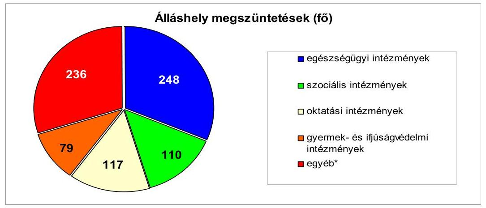
*Az egyéb álláshelyek a Zugló és Városliget Térfigyelő Rendszer Társulásnál, a Fővárosi Ellátási és Gazdasági Szolgálatnál, a Fővárosi Közterület Parkolási Társulásnál, valamint a Fővárosi Önkormányzat Csarnok és Piac Igazgatóságán jelentkezett.

A Fővárosi Önkormányzatnak a létszámcsökkentési döntéseivel kapcsolatos kiadásaiból - a helyi szervezési intézkedésekhez kapcsolódóan folyósított támogatás révén - a 2007-2010. évek között összesen 2 494,5 millió Ft térült meg.

A kiadáscsökkentő intézkedések mellett a bevételnövelésre irányuló intézkedések hatásaként - az önkormányzati kimutatások szerint - összesen 8666,7 millió Ft többletbevétel realizáltak a 2007-2010. években. Ebből az intézményeknél jelentkezett 7492,9 millió Ft , melynek 62,6\%-a a szabad kapacitások hasznosításából keletkezett, ezen belül az ingatlanok bérbeadása volt a meghatározó 2514,1 millió Ft-os bevétellel. A bevétel növekedés több mint fele ( $56,7 \%$-a) az egészségügyi és az oktatási ágazatban jelent meg.

A Fővárosi Önkormányzatnál - a 2007-2010. években - a köztisztviselők béren kívüli juttatásai tekintetében hozott döntések nem a kiadáscsökkentés irányába hatottak. A Főpolgármesteri hivatalban a köztisztviselők számára a 2007-2009. években béren kívüli juttatások címen terveztek előirányzatot, melynek mértéke 2007-ben 852,5 ezer Ft/fő/év volt. A 2010. évben a Ktv. 49/F. § (4) bekezdése alapján cafetéria-juttatásra - a juttatást terhelő 25,0\%-os személyi jövedelemadóval együtt - 966,3 ezer Ft/fő/év összeget terveztek. A 2007. évben a tervezett összeg a Ktv-ben foglalt kötelező béren kívüli juttatásokat 711,1 ezer Ft/fő/év összeggel, 2010-ben a cafetéria-juttatás Ktv-ben megállapított minimális összegét 773,0 ezer Ft/fő/év összeggel haladta meg. A köztisztviselők béren kívüli juttatásaira a 2007. évben 1122,3 millió Ft-ot, a 2010. évben személyi juttatások között cafetéria-juttatásra 1323,4 millió Ft-ot, a juttatást terhelő személyi jövedelemadóra 330,0 millió Ft-ot fizettek ki. A 2011. évben a cafetéria-juttatás mértékét bruttó 200 ezer Ft/fő/év összegben tervezték, emellett további bruttó 300 ezer Ft/fő/év összeget hagytak jóvá a Ktv. 49/H. §ára hivatkozva, egyéb juttatásokra.

A főpolgármester a költségvetési kiadások folyamatos finanszírozása érdekében, betartva az éves költségvetési rendeletben előírtakat, a számlavezető pénzintézettel folyószámla-hitelkeret szerződéseket kötött, melynek keretösszege - az évente megkötött szerződés alapján - 2007. november 30-ig 10000 millió Ft, ezt követően 16000 millió Ft volt. A hitelkeret szerződések sze-

---

rint 2009. december 28-tól terhelte a Fővárosi Önkormányzatot rendelkezésre tartási jutalék, melynek évi mértéke a rendelkezésre tartott hitelkeret összegének $0,156 \%$-a ( 25 millió Ft ) volt. A Főpolgármesteri hivatalnál a 2007-2010. években likviditási célú hitel felvételére nem került sor, mivel a vizsgált években likviditási nehézségek nem merültek fel. A főjegyző a 2007-2010. években intézkedett az Ámr. ${ }_{1}$ 139. § (1) bekezdésében ${ }^{27}$ előírtak alapján likviditási terv készítéséről és gondoskodott annak folyamatos (napi) aktualizálásáról. A Fővárosi Önkormányzatnál likviditási problémát nem okoztak a 2007-2010. években a nyújtott kölcsönök ${ }^{28}$ sem.

A Fővárosi Önkormányzat, valamint a többségi tulajdonában álló gazdasági társaságainak év végi lejárt szállítói tartozásait a következő táblázat tartalmazza:
adatok millió Ft-ban

| Megnevezés | 2007. év | 2008. év | 2009. év | 2010.év |
| :-- | :--: | :--: | :--: | :--: |
| Fővárosi Önkor-   mányzat | 1018 | 955 | 3105 | 2327 |
| Ebből: egész-   ségügyi in-   tézmények | 698 | 590 | 3010 | 2154 |
| Többségi tulajdoná-   ban lévő gazdasági   társaságok | 4604 | 3910 | 318 | 254 |

A Fővárosi Önkormányzatnál a szállítókkal szembeni kötelezettségek év végi állományi értéke (2007-ben 12934 millió Ft, 2008-ban 14020 millió Ft, 2009ben 16089 millió Ft, 2010-ben 12500 millió Ft volt. A Fővárosi Önkormányzat lejárt szállítói tartozása a 2007. év végén 1018 millió Ft volt, mely a 2010. év végére több mint duplájára ( 2327 millió Ft-ra) emelkedett. A lejárt szállítói tartozásokból kiugróan magas volt az egészségügyi intézményeknél jelentkező állomány, melynek aránya 2010. december 31-én 92,6\%, összege 2154 millió Ft volt. A 2010. év végén a lejárt szállítói tartozásállomány $2,2 \%-a$ éven túli, $10,4 \%-a 91-365$ nap közötti, $17,3 \%-a 61-90$ nap közötti, $24,3 \%-a$ 30-60 nap közötti, míg $45,8 \%-a 30$ napon belüli volt.

[^0]
[^0]:    ${ }^{27}$ 2010. január 1-től az Ámr. ${ }_{2}$ 201. § (1) bekezdése írja elő.
    ${ }^{28}$ A kölcsönöket (összesen 3624 millió Ft-ot) a Fővárosi Önkormányzat tulajdonában lévő gazdasági társaságok részére rövid lejáratú kötelezettségek rendezésére, projektmenedzsment feladatok ellátására, a fővárosi városrehabilitációs keretből, illetve a települési értékvédelmi támogatási keretből kerületi önkormányzatoknak, társasházaknak, magánszemélyeknek, egyházaknak a tulajdonukban lévő épületek, épületegyüttesek felújítására, rekonstrukciójára, lakóépületek felújítására, rehabilitációjára, továbbá részleges bontására, valamint önkormányzati lakásállomány pótlására nyújtották.

---

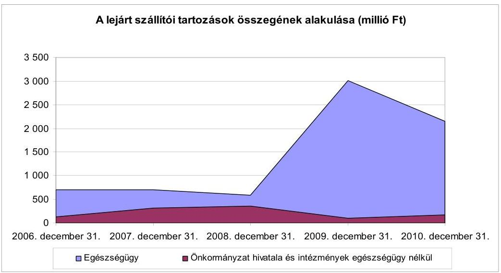

Az önkormányzati fenntartású egészségügyi intézmények közül a 2007. évben hat, a 2008. évben négy, a 2009-2010. években öt-öt intézménynek volt 30 napon túli lejárt tartozásállománya. A 2007-2011. I. negyedév között öt esetben rendelt ki a főpolgármester (2009. december 23-tól a Pénzügyi és Közbeszerzési Bizottság) önkormányzati biztost ${ }^{29}$ a 30 napon túli, lejárt tartozásállomány miatt, mivel a tartozás elérte az egészségügyi intézmény éves költségvetése eredeti előirányzatának 10\%-át, vagy a 100 millió Ft-ot és a tartozást egy hónap alatt sem sikerült 30 nap alá szorítani.

A Fővárosi Önkormányzat többségi tulajdonában lévő gazdasági társaságok év végi lejárt szállítói tartozás állománya 2007-ben 4604 millió Ft, 2008-ban 3910 millió Ft, 2009-ben 318 millió Ft, míg 2010-ben 254 millió Ft volt. A 2010. évi szállítói tartozás állomány átütemezett része három gazdasági társaságnál ${ }^{30}$ összesen 6934 millió Ft volt. A többségi tulajdonban lévő gazdasági társaságok lejárt szállítói tartozásállományáról az önkormányzati éves beszámolók nem nyújtottak információt.

A Főpolgármesteri hivatalban a 2007-2010. évek végén a szállítói kötelezettségek összege 5708,0 millió Ft, 6293,3 millió Ft, 5465,9 millió Ft és 3394,7 millió Ft volt, melyből a lejárt szállítói tartozások összege - az évek sorrendjében - 35-15-40-49 millió Ft volt. A Föpolgármesteri hivatalban a 2009-2010. években az évközi szállítói tartozások köréből összesen 9177,3 millió Ft-ot határidőn túl fizettek ki. A késedelmes teljesítés egy hónaptól egy év három hónapig terjedt ${ }^{31}$. A költségvetési elszámolási számla napi záró egyenlege

[^0]
[^0]:    ${ }^{29}$ A Heim Pál Gyermekkórházhoz a 2007. és a 2010. évben, a Károlyi Sándor Kórház és Rendelőintézethez a 2008. és a 2011. évben, a Péterfy Sándor utcai Kórház Rendelőintézet és Baleseti Központhoz a 2010. évben rendeltek ki önkormányzati biztost.
    ${ }^{30}$ Az átütemezett tartozás a Budapesti Távhőszolgáltató Zrt-nél 2858 millió Ft, a Budapesti Közlekedési Zrt-nél 3998 millió Ft és a Budapesti Vidámpark Zrt-nél 78 millió Ft volt.
    ${ }^{31}$ A Főpolgármesteri hivatalban a határidőn túl rendezett szállítói tartozások után fizetett késedelmi kamat nem érte el még a 10000 Ft-ot sem, a 2010. évben mintegy 1 millió Ft volt.

---

ugyanakkor ebben az időszakban 72,1 millió Ft és 14325,8 millió Ft között volt. A szállítói tartozások késedelmes teljesítésének okai nem likviditási nehézségek, illetve nem likviditás-kezelési problémák, hanem főként a szervezeti változások pénzügyi gazdasági folyamatokkal összefüggő késedelmei, továbbá az új integrált pénzügyi rendszer bevezetésének nehézségei, valamint az utalványozó mulasztásai (fizetési határidőkön túli utalványozások voltak, mely miatt fegyelmi eljárást indítottak az utalványozó ellen.

A Fővárosi Önkormányzat a 2007-2010. években a likviditási helyzetének megőrzése, folyamatos biztosítása érdekében a szabad pénzeszközeiből forgatási célú értékpapírokat vásárolt, illetve a lehívott, de még fel nem használt hitelbevételeket betétként kötötte le ${ }^{32}$. A forgatási célú értékpapírok vásárlásakor és betét lekötésekor összehasonlították és ellenőrizték a pénzintézetek által kínált kamatlábakat, hozamokat, egyeztették a szerződéses feltételeket és a legkedvezőbb kamat, illetve hozamfeltételeket tartalmazó ajánlat alapján kötötték meg a szerződéseket.

A pénzügyi befektetési szabályzat előírásai szerint legalább három pénzintézettől kértek ajánlatot a betét lekötésekkel, értékpapír vásárlásokkal kapcsolatos döntések előkészítéséhez. Az átlagos betét-lekötési összeg 1873 millió Ft, az átlagos be-tét-lekötési időtartam 44 nap, a vásárolt értékpapírok átlagos értéke 950 millió Ft, átlagos futamideje 88 nap volt a 2007-2010. évek közötti időszakban. A betéti szerződésekben rögzített kamatlábak a szerződéskötéskor érvényes változó kamatozású bankközi kamatlábak értékének, az állampapír adásvételek szerződéseiben szereplő hozamok a referenciahozamnak megfelelőek voltak.

A forgatási célú értékpapírokból, lekötött forint betétekből realizált hozam a 2007. évi 2652 millió Ft-ról a 2010. évre 2102 millió Ft-ra mérséklődött, a befektetési forgalom és a piaci kamatlábak csökkenése miatt. A befektetés forrása szerint a 2007. és a 2010. évben egyaránt a forgatási célú értékpapírok adásvételéből származott a magasabb hozam ${ }^{33}$. A realizált hozam alakulását a piaci kamatlábak és az állampapír hozamok változása (2008. évben és 2009 I. félévében növekedő, a II félévtől csökkenő volt a tendencia), valamint az éves szintű befektetési forgalom ${ }^{34}$ határozta meg, amely a 2008. évben még növekedett, a 2009. évtől kezdődően folyamatosan csökkent.

A Fővárosi Önkormányzat tartós hitelviszonyt megtestesítő értékpapírral nem rendelkezett, az egyéb tartós részesedések ${ }^{35}$ a 2007. évről a 2010. évre 9269 millió Ft-tal növekedtek, amelyben jelentős szerepet játszott a BKV Zrt-ben lévő részesedés után az értékvesztés 2009. évi visszaírása.

[^0]
[^0]:    ${ }^{32}$ A forgatási célú értékpapírok év végi állománya 2007-ben 13 967, 2008-ban 18 083, 2009-ben 17 595, 2010-ben 7928 millió Ft, a pénzeszközök állománya év végén 2007ben 55 831, 2008-ban 96 749, 2009-ben 86 631, 2010-ben 56525 millió Ft volt.
    ${ }^{33}$ A 2007. évben a forgatási célú értékpapírok adásvételéből 1704 millió Ft hozamot, a lekötött betétekből 948 millió Ft kamatot realizáltak. A 2010. évben a forgatási célú értékpapírok hozama 1523 millió Ft, a lekötött betétek kamata 579 millió Ft volt.
    ${ }^{34}$ A befektetési forgalom az értékpapír vásárlások és a betét lekötések éves szintű halmozott összege.
    ${ }^{35}$ Az egyéb tartós részesedések év végi állománya 2007-ben 280804 millió Ft, 2008-ban 276506 millió Ft, 2009-ben 289724 millió Ft, 2010-ben 290073 millió Ft volt.

---

A Fővárosi Önkormányzat pénzügyi, likviditási helyzete 2007 és 2010 között - a költségvetési szervei tekintetében, az egészségügyi intézményei kivételével - megfelelő volt, mert a pénzeszközök, a követelések és a forgatási célú hitelviszonyt megtestesítő értékpapírok együttesen minden évben fedezetet biztosítottak rövid lejáratú fizetési kötelezettségek rendezéséhez. A pénzügyi helyzet alakulását likviditási szempontból a 2007-2010. években a rövid lejáratú kötelezettségek fedezetét számító mutatók változása szemlélteti, mely mutatók tartalmát és értékét a 4. számú függelék mutatja be. A Fővárosi Önkormányzatnál a forgóeszközök minden évben fedezték a rövid lejáratú kötelezettségeket, melynek aránya folyamatosan javult a forgóeszközök 16,6\%-os (15 276 millió Ft-os) növekedésének és a rövid lejáratú kötelezettségek 26,3\%-os (19 305 millió Ft-os) csökkenésének együttes hatásaként. A pénzeszközök, a követelések és a forgatási célú hitelviszonyt megtestesítő értékpapírok együttesen minden évben fedezetet biztosítottak a rövid lejáratú fizetési kötelezettségek rendezéséhez, ennek aránya folyamatosan javult.
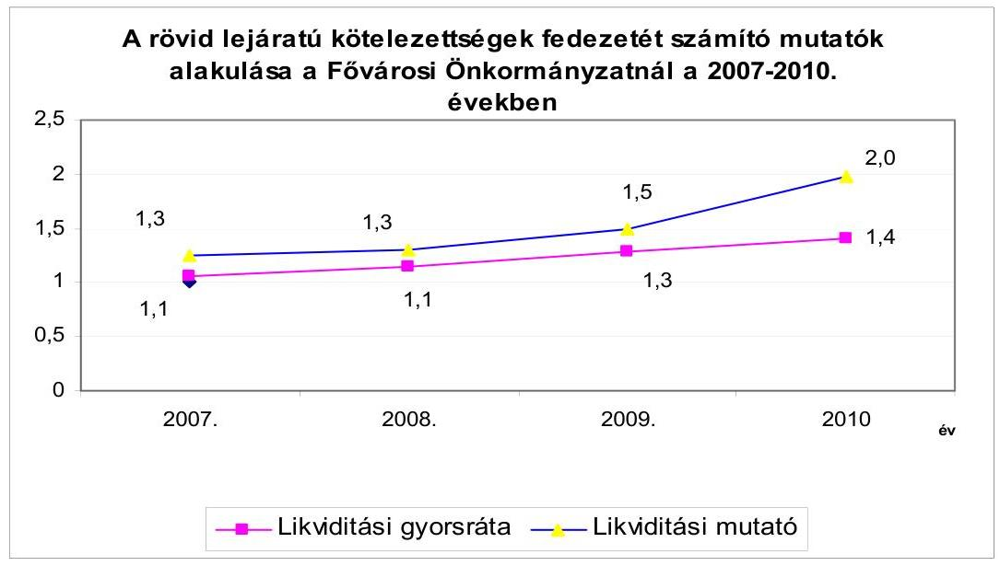

A Fővárosi Önkormányzatnál a rövid lejáratú fizetési kötelezettségek aránya az összes fizetési kötelezettségen belül a 2007. évről a 2010. évre kedvezően változott (csökkent).

A Fővárosi Önkormányzat pénzügyi helyzetét a már leírtakon túl jelentősen befolyásolják az általa múködtetett gazdasági társaságokkal, kiemelten a BKV Zrt-vel szemben fennálló kötelezettségek, amelyeket nevesítve az önkormányzati éves beszámolók nem tartalmaznak. A Fővárosi Önkormányzat az Ötv. 63/A. § g) pontjában kötelezően előírt tömegközlekedési feladatok ellátására 2004. április 30-án, nyolc évre szolgáltatási szerződést kötött a BKV Zrt-vel. A szolgáltatási szerződésben a BKV Zrt. a személyszállításon túl vállalta az eszközök javítását, karbantartását, valamint az adott évre tervezett értékcsökkenés mértékéig azok felújítását és pótlását. A Fővárosi Önkormányzat a szolgáltatási szerződésben arra vállalt kötelezettséget, hogy a szolgáltatás ellenértékeként a - BKV Zrt. által számított - kompenzáció-igény ellenőrzése alapján elismert összeget (a minőségi követelményeknek való megfelelés figyelembevételével) teljesíti. A BKV Zrt. 2004. évben benyújtott számított

---

kompenzáció igényét ( 33,1 milliárd Ft) a Fővárosi Önkormányzat nem ellenőrizte, nem határozta meg az elismert összeget, de nem is egyenlítette ki azt. A 2004-et követő években a BKV Zrt. nem adta át a Fővárosi Önkormányzat részére a kompenzációs összeg számítását, a kötelező feladat ellátására igénybe vett szolgáltatás ellenértékének teljes kiegyenlítése nem történt meg. A BKV Zrt. 2004-2009 között veszteségesen múködött ${ }^{36}$, a Közgyűlés nem biztosította az szolgáltatás igénybevételéért járó múködési forrásokat. A veszteséget csökkentette a 2008-ban és 2010-ben kapott 10 illetve 17,5 milliárd Ft összegű egyéb állami támogatás. A BKV Zrt. 2004-2010 közötti bevételeit, ráfordításait és eredményét a 3. számú függelék mutatja be.

A 2004-2010. évek között a Fővárosi Önkormányzat, mint tulajdonos saját forrásból, felhalmozási célú végleges pénzeszközátadásként 146 283,8 millió Ft-ot bocsátott a BKV Zrt. rendelkezésére, beruházások támogatására, jármúfejlesztésre, rekonstrukciók, felújítások finanszírozására. A felhalmozási célú pénzeszközátadásból 64580,2 millió Ft-ot - a Közgyűlés döntése alapján - tőketartalékba helyezési kötelezettséggel nyújtottak. A Fővárosi Önkormányzatnál további forrásátadási kötelezettséget jelentett az éves költségvetési törvényekben a közösségi közlekedés normatív támogatásával kapcsolatos jogcímen ${ }^{37}$ biztosított központosított előirányzatból származó bevételnek a BKV Zrt. - mint a közforgalmú közlekedést lebonyolító szervezet - részére történő átadása.

A Fővárosi Önkormányzat bár szerződésben megrendelte a szolgáltatást a közösségi közlekedéssel kapcsolatos kötelező feladata ellátására, azonban 2005. évtől nem tervezte meg és nem teljesítette a szolgáltatás igénybevételéért járó, szerződésen alapuló kiadásokat. A BKV Zrt. a felvett hitelek miatt a 2010. év végére jelentős (mintegy 64 milliárd Ft, amelyből hosszú lejáratú hitelállománya 36 milliárd Ft) adósságállományt halmozott fel ${ }^{38}$. A Fővárosi Önkormányzat 2011-2014. évekre vonatkozó gazdasági programja szerint a budapesti közlekedés új koncepciójában a Budapesti Közlekedési Központ Zártkörűen Múködő Részvénytársaság rendeli meg és finanszírozza a közösségi közlekedési közszolgáltatásokat, valamint a BKV Zrt. külső adósságállományát az Állam átvállalja.

[^0]
[^0]:    ${ }^{36}$ A veszteség összege a 2004. évben 26,4 milliárd Ft, a 2005. évben 22,5 milliárd Ft, a 2006. évben 11,0 milliárd Ft, a 2007. évben 16,9 milliárd Ft, a 2008. évben 5,7 milliárd Ft, valamint a 2009. évben 23,6 milliárd Ft volt.
    ${ }^{37}$ A 2004-2010. években az éves költségvetési törvények 5. számú melléklete tartalmazta a helyi önkormányzatok által felhasználható központosított előirányzatokat, köztük „a helyi közforgalmú közlekedés normatív támogatása", a 2007. évtől „helyi közösségi közlekedés támogatása" megnevezésű jogcímet.
    ${ }^{38}$ A Közgyűlés a 937/2011. (IV. 27.) számú határozatával fogadta el a 2011-2014. évi választási ciklusra vonatkozó gazdasági programját, amely a BKV Zrt-ével kapcsolatban tartalmazza, hogy „A belső eladósodottsága több száz milliárd Ft-os nagyságrendű."

---

# 1.2. A Fővárosi Önkormányzat eladósodásának hatása a pénzügyi és vagyoni helyzetére. Az adósságot keletkeztető kötelezettségvállalások során a kockázatok csökkentése érdekében tett intézkedések 

### 1.2.1. A költségvetések végrehajtása során az adósságot keletkeztető kötelezettségvállalások előkészítése, céljai, feltételei

A Fővárosi Önkormányzat fejlesztési célú hitelállományának összege a 2006. december 31-i 152306 millió Ft-ról a 2010. év végére 172743 millió Ft-ra növekedett. A hitelállomány mintegy 20000 millió Ft-os növekedését első sorban ( $70,8 \%$-ban) a devizaárfolyamok kedvezőtlen változásai idézték elő. A fennálló pénzintézeti kötelezettségei hazai és külföldi hitelek igénybevételéből keletkeztek ${ }^{39}$. A devizában (euróban) felvett hitelek könyvviteli mérleg szerinti értékének meghatározásakor az árfolyamváltozás miatti év végi értékelést a 2007-2010. évek között elvégezték, melyet a következő táblázat mutatja be:
adatok millió Ft-ban

| Megnevezés | 2007. év | 2008. év | 2009. év | 2010. év |
| :-- | --: | --: | --: | --: |
| Mérleg szerinti nyitó állomány | 152306,0 | 159077,3 | 159722,4 | 161491,8 |
| Növekedés (hitelfelvétel) | 20982,2 | 10700,3 | 18325,6 | 21571,1 |
| Csökkenés (hiteltörlesztés) | 15547,5 | 15328,5 | 20024,7 | 14708,1 |
| Záró állomány | 157740,7 | 154449,1 | 158023,3 | 168354,8 |
| Árfolyam különbözet | 1336,6 | 5273,3 | 3468,5 | 4388,2 |
| Mérleg szerint záró állomány | 159077,3 | 159722,4 | 161491,8 | 172743,0 |

A Fővárosi Önkormányzat 2010. december 31-én forintban fennálló adósságot keletkeztető kötelezettségvállalásait az 1. számú függelék mutatja be.

A Közgyűlés 2009-2010. években az ÖKIF hitelprogram keretében döntött ${ }^{40}$ az ÖKIF I. és ÖKIF II. 20 éves lejáratú hitelek felvételéről. A főpolgármester a Közgyűlés felhatalmazása alapján az ÖKIF I. hitelszerződést közbeszerzés útján kiválasztott három pénzintézettel (közöttük a számlavezető pénzintézettel) 3250 millió Ft, 934 millió Ft és 1098 millió Ft összegben, változó kamatozással, 20 év

[^0]
[^0]:    ${ }^{39}$ A Fővárosi Önkormányzat, mint ajánlatkérő az ÖKIF I. és ÖKIF II. hitelek esetében a Kbt. 124. § (2) bekezdés d) pontja alapján, közösségi eljárási rend szerinti, hirdetmény közzétételével induló tárgyalásos közbeszerzési eljárást folytatott le, melynek eredményeként az ÖKIF I. hitelekből 934 millió Ft, az ÖKIF II. hitel esetében 12171 millió Ft értékben számlavezető pénzintézetével kötött hitelszerződést. Az EIB III. hitelkeret esetében a Fővárosi Önkormányzat a Kbt. 29. § (1) bekezdés e) pontjának alkalmazásával mellőzte a versenyeztetést és nem folytatott le közbeszerzési eljárást.
    ${ }^{40}$ A Közgyűlés 1799/2009. (X. 29.) számú és a 406/2010. (III. 11.) számú határozataival döntött az ÖKIF I. és ÖKIF II. hitelek felvételéről.

---

futamidővel három-öt év türelmi idő mellett, az ÖKIF II. hitelszerződést 12171 millió Ft összegben, változó kamatozással, 20 év futamidővel, - a fejlesztési céloktól függően - három, illetve öt év türelmi idő mellett kötötte meg. A Közgyűlés a 2009. évben döntött az EIB III. hitelkeret-szerződés ${ }^{41}$ megkötéséről, amelynek fő kereteit a városi infrastruktúra-fejlesztésben a városi tömegközlekedés és úthálózat területén jelölték meg. A főpolgármester a Közgyűlés felhatalmazása alapján a hitelkeret szerződést az Európai Beruházási Bankkal 150 millió euró összegben kötötte meg a lehíváskor választható (változó vagy fix) kamatozással, 25 év futamidővel hét év türelmi idő mellett.

A 2010. évi hitelállományból 14,1\%-ot a forint alapú, 85,9\%-ot a deviza (euró) alapú hitel képviselt. A 2007. év elején a korábbi években kötött, fejlesztési célokra irányuló hitelszerződések alapján még rendelkezésre álló, le nem hívott hitelösszeg 103520 millió Ft volt.

# A Fővárosi Önkormányzat a 2007-2010. évek között mindösszesen 

71579,2 millió Ft fejlesztési célú hitelt hívott le az Észak-Pesti Szennyvíztisztító telep felújítása, az M2 Metro vonal felújítása és jármúállományának cseréje, a Budapesti központi szennyvíztisztító telep építése, az egészségügyi és oktatási intézmények rekonstrukciója, felüljárók felújítása, az Erzsébet híd díszvilágítása, a Városligeti Mújégpálya rekonstrukciója, Budapest Szíve Program I. szakasz, a Dél-Budai tehermentesítő út kiépítése, útfelújítások, hivatali informatikai feladatok, Rákoskeresztúri buszkorridor finanszírozására. A 2010. év végén a Fővárosi Önkormányzat hitelszerződéseiből a le nem hívott hitelkeretekből 88 360,3 millió $\mathrm{Ft}^{42}$ állt rendelkezésre elsősorban a 4-es metróvonal építésére, a 2-es metróvonal felújítására, a Budapesti központi szennyvíztisztító telep építésére, útfelújításokra.

A Kiemelt Fejlesztések Bizottsága - a 8/2005. (X. 4.) számú határozata alapján - megvalósíthatósági tanulmányt készíttetett a Közraktárak ingatlan magántőke bevonásával történő kereskedelmi, kulturális funkciójú fejlesztésének jogi előkészítésére. A Kiemelt Fejlesztések Bizottsága - a korábbi vezetői döntések alapján - a Közraktárak fejlesztésével szemben az alábbi követelményeket támasztotta ${ }^{43}$ :
„A régi Közraktár épületek megtartásával, felújításával és funkcióváltásával kulturálisszórakoztató létesítmény alakuljon ki, az ingatlan önkormányzati tulajdonban maradjon. A megvalósítás - az önkormányzati vagyon hasznosítására vonatkozó jogszabályok alkalmazásával - külső tőke bevonásával történjen. A beruházó ellentételezésként az ingatlan hasznosításának jogát határozott időre megkapja. A beruházó bevételei az épületegyüttesben kialakított összes helyiség bérleti dijából, illetve a kapcsolódó mélygarázs használati dijbevételéből tevődnek össze (kb. 10000 m² hasznosítható

[^0]
[^0]:    ${ }^{41}$ A Közgyűlés a 2194/2009. (XII. 17.) számú határozatával döntött EIB III. hitelkeretszerződés megkötéséről.
    ${ }^{42}$ A 88 360,3 millió Ft-ból 11799,7 millió Ft hitelkeret maradvány forintban állt fenn, a különbözet euróban, melyet - az EIB M4 hitelből 125,5 millió eurót, az EIB M2 jármű hitelből 13 millió eurót, EIB Csepel hitelből 21,7 millió eurót, az EIB III-ból 115 millió eurót - 2010. december 31-i OTP középárfolyamon, 278,2 Ft-on számoltunk át.
    ${ }^{43}$ a 120-360/2005 iktatószámú előterjesztésben

---

(bérbe adható) terület létesíthető). Az e terület után fizetett bérleti dijnak kell fedezetet biztosítani a három épület felújításának, átalakításának költségeire, valamint a Fővárosi Önkormányzat által megkövetelt kötelező fejlesztésekre. A beruházónak a bérbe adható terület 1/3-át kulturális célokra kell hasznosítani."

A Közgyűlés a 2875/2005. (XII. 20.) számú határozatával a Közraktárak projekt PPP konstrukcióban történő megvalósításáról döntött. A döntés előkészítése során a szakértői vélemények ${ }^{44}$, illetve a lehetséges jogi megoldások előnyeinek és hátrányainak elemzése rámutatott arra, hogy szükséges a szolgáltatás megrendelési konstrukció további szakértői vizsgálata. A 2005. szeptember 30-ai ${ }^{45}$ Előzetes Jogi Megvalósíthatósági Tanulmányban a finanszírozási kérdések között szerepelt, hogy a Közraktárak projekt PPP konstrukcióban történő megvalósítása, a már meglévő épületek átalakítására, felújítására irányul, a fővárosi önkormányzati tulajdon megtartása mellett. A befektető által felvett projekthitel biztosítékaként a Fővárosi Önkormányzat tulajdonában lévő ingatlanra jelzálog nem terhelhető, azért, hogy az Önkormányzat ne vállalja át a projekt finanszírozásának kockázatát. A jelzálogjog, mint biztosíték nélkül bizonytalan a projekt hitelképessége, valamint a konstrukció PPP minősítése, ezért mindenképpen szükségesnek tartották a PM és az MNB, valamint a KSH megkeresését a kérdésben ${ }^{46}$. A jogi konstrukció pénzügyi kérdéseinek tisztázása során, újabb többváltozós modellt dolgoztak ki, amelyet a Kiemelt Fejlesztések Bizottsága a Közgyűlésnek bemutatott ${ }^{47}$. Az előterjesztés hangsúlyozta, hogy fontos olyan számítások elvégzése, amely a közbeszerzési eljárás során összehasonlítási alapot ad a hagyományos önkormányzati beruházással szemben, a magánbefektető bevonásával megvalósított projekt hozzáadott értékéről. A javasolt számításokat azonban nem végezték el. Az előterjesztésben a kockázatmegosztás mellett, a Fővárosi Önkormányzat projekttel kapcsolatos hosszú távú kötelezettségvállalását, valamint a finanszírozási kockázat miatt, a lehetséges biztosítéki rendszert ismertették.

A Közgyűlés 2877/2005. (XII. 20.) számú határozatában felkérte a Kiemelt Fejlesztések Bizottságát a projekt közbeszerzési eljárásának előkészítésére. A határozat alapján a Fővárosi Önkormányzat, mint ajánlatkérő nevében tárgyalásos eljárás megindítására vonatkozó részvételi felhívás került közzétételre 2006. május 26-án az Európai Unió, illetve a Közbeszerzések Tanácsa hivatalos lapjában. A megrendelt szolgáltatás tárgya a részvételi felhívás szerint: „a Budapest, IX. kerület, Fővámtér 11-12. szám alatti ingatlan fejlesztése PPPkonstrukcióban. Épületegyüttes üzemeltetésére, karbantartására irányuló határozott idejű szolgáltatási szerződés, valamint a szolgáltatási szerződéshez kapcsolódóan megvalósított beruházással létrejövő bérbe adható helyiségek ügynöki konstrukcióban

[^0]
[^0]:    ${ }^{44}$ A Kiemelt Fejlesztések Bizottságának 105-204/5/2005 és a 105-204/7/2005 iktatószámú előterjesztéseinek mellékletei tartalmazták a szakértői véleményeket, a jogi struktúrák előnyeinek és hátrányainak elemzéseit.
    ${ }^{45}$ a Kiemelt Fejlesztések Bizottságának megrendelésére készült
    ${ }^{46}$ A projekt előkészítése során a javaslat ellenére és az EUROSTAT állásfoglalása szerinti értelmezés céljából az érintett hivatalok megkeresése nem történt meg a projekt pénzügyi besorolásának tisztázása érdekében.
    ${ }^{47}$ a 120-360/2005 iktatószámú előterjesztésében

---

való, az ajánlatkérő javára történő bérbeadására vonatkozó kizárólagos ügynöki szerződés".

A részvételi felhívás részletesen rögzíti a szerződéses konstrukció alapvető feltételeit, melyek a következők:

- az ingatlanon megvalósult beruházás, fejlesztés után az épületegyüttes a Fővárosi Önkormányzat tulajdonában marad, illetve kerül;
- az ingatlanon történő beruházás a nyertes ajánlattevő finanszírozásában történik;
- az üzemeltetésre 25 éves szolgáltatási, illetve az ingatlanok bérbeadásában való kizárólagos ügynöki tevékenységre irányuló 25 éves ingatlanügynöki szerződést kell kötni,
- az üzemeltetésért szolgáltatási díj jár, az első 8 évben a Fővárosi Önkormányzat által realizált bérleti bevételeknek azonban meg kell haladni, vagy legalább el kell érni a fizetendő éves szolgáltatási díjat, ellenkező esetben a szolgáltatási díj a szerződésben meghatározott képlet szerint csökken a negatív különbözettel;
- amennyiben a szolgáltatás megkezdésétől számított első 24 hónapban a bérleti díjak nem érik el a fizetendő szolgáltatási díjat, a díjat az első 12 hónapban a díjképlet szerint számíthatóhoz képest 500.000 euróval, a második 12 hónapban 300.000 euróval növelt összegben kell megállapítani, majd erről a bázisról kell csökkenteni a ténylegesen realizált bérleti bevétel és a díjképlet szerinti éves szolgáltatási díj negatív összegével;
- az üzemeltetés első 8 évében a realizált bérleti bevétel és a díjképlet szerinti éves szolgáltatási díj közti pozitív különbözet után a Fővárosi Önkormányzat az ajánlattevőnek az ingatlanügynöki szerződésben meghatározott százalékos ügynöki díjat fizet (az ügynöki díj tehát a realizált bevétel után jár, és nem attól függetlenül).
A Közbeszerzési Bizottság a 209/2006. (VII. 13.) számú határozatával a részvételi szakaszt eredményesnek nyilvánította és három részvételre jelentkezőt javasolt ajánlattételre felkérni.
A döntés megalapozatlan volt, mivel a Porto Kft. nem tett eleget az ajánlati felhívás P. 3. pontjában előírtaknak, mely szerint az ajánlattevőnek igazolnia kell, hogy legalább 6 millió EUR vagy azzal egyenértékű Ft összegű, a projekt céljára fordítható saját forrás (készpénz, vagy likvid értékpapír) rendelkezésére áll. A Porto által beadott igazolás nem felelt meg a fenti feltételeknek, ugyanis egy kölcsönszerződés feltételeinek teljesülése esetén állt volna csak az ajánlattevő rendelkezésére az összeg. Az ÁSZ azért nem kezdeményezte a jogorvoslati eljárást, mivel a jogsértés megállapításakor letelt a Kbt. 327. § (2) bekezdés b) pontjában előírt három éves jogvesztő határidő.

A Közraktárak projekt megvalósításának közbeszerzési eljárásához kapcsolódóan a szerződés-tervezeteket a közbeszerzési eljárás lebonyolításával megbízott ügyvédi iroda készítette el.

---

- A jogi előkészítő munkák, a közbeszerzési eljárásban való közreműködés, valamint a szerződések előkészítésében való részvételre a Kiemelt Fejlesztések Bizottsága kerete terhére 2005. november és 2008. december 17-e között négy ügyvédi megbízási szerződést kötöttek két ügyvédi irodával (a közreműködő ügyvéd személye nem változott) 40 millió Ft összegben. A Közraktárak fejlesztési projekt előkészítésére 2005 és 2009. december 31. között az egyéb jogi és pénzügyi szakértői díjakkal együtt összesen 65 millió Ft fizettek ki a Kiemelt Fejlesztések Bizottsága keretéből.

Az előző főjegyző az ügyvédi iroda által előkészített szerződés tervezetek rendkívüli szakmai és jogi koordinációját rendelte el ${ }^{48}$, melynek részleteiről és eredményéről a Jogi Ugyosztály feljegyzést ${ }^{49}$ juttatott el részére.

A feljegyzés - amellett, hogy jelzi a szerződés tervezetek elkészítése kapcsán a Főpolgármesteri hivatal megkerülését - megállapítja, hogy

- a Közgyűlés pénzügyi kötelezettségvállalásra vonatkozó döntése hiányában is a tervezetek által alkotott jogi-pénzügyi konstrukció nagy összegű, hosszú távú kötelezettségvállalást tartalmaz a Fővárosi Önkormányzat terhére;
- az eredeti tanulmányokban és határozatokban foglaltakhoz képest - miszerint a beruházás teljes összegét a beruházónak kell biztosítani - a tervezetek alapvető koncepcióváltást tükröznek;
- a projekt lefolytatása során a Pénzügyi Bizottság erre irányuló kérése ellenére nem kapott kellő egyeztetési lehetőséget;
- a tervezeteken alapuló pénzügyi kötelezettségvállalás csak a Közgyűlés előzetes döntése alapján vállalható.

A jogi egyeztetések megindításával egyidejűleg a szerződések kapcsán felmerülő áfa és más számviteli kérdésekről szakvéleményt szereztek be. Az adójogi elemzés javasolta, hogy részletesen kidolgozott kérelemmel a projekt feltételes adó megállapítását kezdeményezzék az adóhivatalnál. A Kiemelt Fejlesztések Bizottságának jegyzőkönyve szerint tárgyalásokat folytattak az Adó és Pénzügyi elszámoló Hivatallal - azonban a javaslat ellenére, írásban, előzetes adó megállapítást nem kértek. A szakértői vélemény az adójogi szakvéleményben kifogásoltakon felül, a tervezett szerződéses konstrukció főbb összefüggéseinek rendezését és pontosítását is javasolta.

A jogi koordinációról készült emlékeztetőben ${ }^{50}$ rögzítették, hogy melyek azok a konstrukciós és egyéb hiányosságok, amelyeknek a szerződés tervezeteken történő átvezetése nélkül - mivel azok olyan súlyos jogi problémákat vetnek fel, melyek rendezésének hiányában, a jogi koordináció eredménnyel nem zárható le - a Főpolgármesteri hivatal érintett ügyosztályai a szerződés tervezeteket nem szignálják. A Kiemelt Fejlesztések Bizottsága által megbízott ügyvédi iroda

[^0]
[^0]:    ${ }^{48}$ A 2006. szeptember 12-én az aljegyző irányításával, az érintett szakmai igazgatóságok közreműködésével.
    ${ }^{49}$ a Jogi Ügyosztály 05-1476/2006 szám alatt feljegyzése
    ${ }^{50}$ Készült a 2006. szeptember 13-15-e között tartott jogi koordináción elhangzott véleményekről a Jogi, a Közbeszerzési, a Költségvetési Gazdálkodási, a Költségvetési Tervezési, a Vállalkozási és Vagyonkezelési Ügyosztály, valamint a Főépítészi Iroda vezetői, az aljegyző egyetértésével.

---

a szerződéstervezeteket átdolgozta, azonban nem vette figyelembe a Főpolgármesteri hivatal által megfogalmazott - a Fővárosi Önkormányzat érdekeit szolgáló - szakmai, pénzügyi és jogi észrevételeket ${ }^{51}$. Az érintett szakmai ügyosztályok az átdolgozott szerződés tervezetek ismételt véleményezését követően feljegyzésben ${ }^{52}$ rögzítették, hogy azok továbbra sem rendezik azokat a szakmai, pénzügyi és jogi észrevételeket, melyek a koordinációra megküldött szerződés-tervezetek jóváhagyásához, illetve a megbízott ügyvédi iroda szakmai teljesítés igazolásának kiadásához szükségesek. A Kiemelt Fejlesztések Bizottságának kerete terhére megkötött ügyvédi megbízási szerződés szakmai teljesítésigazolására a Kiemelt Fejlesztések Bizottságának elnöke és a Kiemelt Fejlesztések Iroda vezetője volt jogosult. Az ügyvédi megbízási díj kifizetésre került.

A Közgyűlés 2007. április 26-án a Jogi Ügyosztály ${ }^{53}$ a főjegyző részére készített feljegyzésében, a Közraktárak projekt szerződés tervezeteinek - kockázatokra irányuló - felhívásai, megállapításai ellenére döntött ${ }^{54}$ a közbeszerzési eljárást lezáró szerződések jóváhagyásáról.

A szerződéses, jogi megoldást és a teljes futamidőre vállalt szolgáltatási díj megfizetésére vonatkozó hosszú távú pénzügyi kötelezettségvállalást a Közgyűlés tudomásul vette és felkérte a Kiemelt Fejlesztések Bizottságának elnökét ${ }^{55}$ a közbeszerzési eljárás nyertesével a szerződések ${ }^{56}$ aláírására. A Közgyűlés felkérte a főpolgármestert ${ }^{57}$, hogy a Közraktárak projekt futamideje alatt, annak várható bevételeit és kiadásait az éves költségvetésben terveztesse be. A projekt végrehajtására vonatkozó első szerződést a 2007. évben kötötte meg a Fővárosi Önkormányzat, mint megrendelő a 2007. évben 25 évre szóló szolgáltatási szerződést kötött, amelyben a teljes futamidőre vállalta, mintegy összesen (nettó) 33,4 milliárd Ft szolgáltatási díj megfizetését. A Szolgáltatási szerződésben nem a szolgáltatási díj összegét, hanem azt a képletet rögzítették, amely alapján a szolgáltatásért fizetendő ellenértéket meg kell határozni. A szolgáltatási díj megfizetésén túl, egy háromoldalú megállapodásban (Közvetlen megállapodás) arra is garanciát vállalt, hogy a beruházáshoz a gazdasági társaság által igénybevett projekthitelt és járulékait - a gazdasági társaság nem fizetése esetén - a finanszírozó bank részére egy öszszegben teljesíti. Ez az Európai Unió belső piacával összeegyeztethetetlen, tiltott, versenyt torzító támogatásnak minősülhet - amelynek minősítésével kapcsolatos eljárás ${ }^{58}$ folyamatban van - valamint kétségessé teszi a PPP konstrukció számviteli szabályainak alkalmazhatóságát. A közbeszerzési eljárás lezárá-

[^0]
[^0]:    ${ }^{51}$ a 2006. szeptember 25-i feljegyzésben rögzített észrevételek
    ${ }^{52}$ A Jogi Ügyosztály 05-1476/2006 számú feljegyzését a Főpolgármesteri hivatal 72310/143/2006 iktatószámmal 2006. szeptember 27-én nyilvántartásba vette.
    ${ }^{53}$ 05-1476/2006. számú
    ${ }^{54}$ az 597/2007. (04. 26) számú Közgyűlési határozattal
    ${ }^{55}$ a Közgyűlés 597/2007. (IV. 26.) számú és a 601/2007. (IV. 26.) számú határozatai
    ${ }^{56}$ Szolgáltatási Szerződés, Ingatlanügynöki Szerződés
    ${ }^{57}$ az 598/2007. (IV. 26.) és a 599/2007. (IV. 26.) számú határozatokban
    ${ }^{58}$ a Nemzeti Fejlesztési Minisztérium Támogatásokat Vizsgáló Irodáján 62-116/2011. számon

---

saként 2007. július 23-án megkötött Szolgáltatási Szerződés feltételei - a Kbt. 99. § (1) bekezdésében foglaltakat megsértve ${ }^{59}$ - a megajánlott nettó szolgáltatási díj, az ingatlan bérbeadására vonatkozó alapjutalék összege, valamint a Szolgáltató által felvett 28,4 millió euró hitelre és járulékaira vállalt fizetési kötelezettségvállalás vonatkozásában eltértek az ajánlati felhívástól (a dokumentációtól, az annak részeként kiadott szerződéstervezettől), valamint az ajánlat tartalmától. A Szolgáltatási szerződésben rögzített nettó szolgáltatási díj 13,2 milliárd Ft-tal tért el a nyertes pályázó ajánlatában szereplő 20,2 milliárd Ft összegétől.

A szolgáltatási szerződést, valamint a Közvetlen megállapodást a Közgyűlés határozata alapján az előző főpolgármester felhatalmazásával a Kiemelt Fejlesztések Bizottságának elnöke írta alá, a kötelezettségvállalások ellenjegyzését az előző főjegyző által a gazdálkodási hatáskörök szabályzata alapján felhatalmazott személyek végezték.
A Fővárosi Önkormányzat a hitelintézet és a Porto Kft. között létrejött hitelszerződés vizsgálatára és az addigi szerződéses dokumentumokkal, a hosszú távú kötelezettségvállalással való egyezőség megítélésére kérte fel a pénzügyi szakértői tevékenységet folytató Profil Kft-t. A Profil Kft. a 2008. március 5-én elkészített tanulmányában a megfelelőségre vonatkozó nyilatkozat tételét megtagadta és felhívta a figyelmet a következőkre:

- A Fővárosi Önkormányzat kötelezettségvállalásának megismerése érdekében át kell adni a hitelszerződést a Fővárosi Önkormányzat részére is;
- A Közvetlen Megállapodás 5.1 (f) pontja és 9.11. pontjaiban foglaltak üzleti hatásukat nézve a Fővárosi Önkormányzat visszavonhatatlan és feltétel nélküli fizetési garanciavállalását eredményezik a Porto Kft. teljes tartozásáért, amelyet a Fővárosi Önkormányzat közvetett pénzügyi adósságaként kell kezelni és nyilvántartani. Mindez egyrészt a projekt megvalósítási kockázatának a Fővárosi Önkormányzatra való hárítását jelenti, másrészt meghaladja a Fővárosi Önkormányzat által korábban kijelölt kereteket és addicionális kötelezettséget keletkeztet, amihez újabb közgyűlési felhatalmazás elengedhetetlen;
- Szükséges lenne kikötni, hogy a hitelszerződést a Fővárosi Önkormányzat előzetes írásbeli jóváhagyása nélkül ne lehessen módosítani;
- A közbeszerzési dokumentációtól való eltérés miatt a szerződések érvényessége megkérdőjelezhető.

A Profil Kft. tanulmánya az érkeztetési bélyegző alapján a Közgyűléshez 2008. május 29-én érkezett meg, az a közgyűlési előterjesztés 9. számú melléklete volt, amelyet a Közgyűlés tagjai megkaptak, annak tartalmát megismerték. A szakértői vélemény ellenére a Közgyűlés elutasította ${ }^{60}$ azt a módosító indít-

[^0]
[^0]:    ${ }^{59}$ Az ÁSZ nem kezdeményezte a Közbeszerzési Döntőbizottság hivatalból való eljárását, mivel a jogsértés megállapításakor letelt a Kbt. 327. § (2) bekezdés b) pontjában előírt három éves jogvesztő határidő.
    ${ }^{60}$ a Közgyűlés 802/2008. (V. 29.) számú határozata

---

ványt, miszerint a Profil Kft. szakértői véleményét a főpolgármester vizsgáltassa meg és intézkedjen azoknak a szerződéses dokumentumokba való beépítéséről. A Közgyűlés a Közvetlen Megállapodás aláírását jóváhagyta ${ }^{61}$. A Közvetlen Megállapodás 2008. június 9 -én történt aláírásával a Szolgáltatási szerződés 3.1. pontjában felsorolt feltételek teljesültek, így a szerződéses konstrukció ezen a napon hatályba lépett.

A Közraktárak projekttel kapcsolatos szolgáltatási díj, valamint a Közvetlen Megállapodásban a Fővárosi Önkormányzat által tett kezességvállalás ${ }^{62}$ összegét - az Áht. 118. § (1) bekezdés 2. b) pontjában foglaltakat megsértve - a 2009-2010. évi költségvetések előterjesztésben nem mutatták be a többéves kihatással járó döntések között. A Közraktárak projekttel kapcsolatos fizetési kötelezettségvállalások több éves kihatásait - az Áht. 50/A. § (4) bekezdésének előírása ellenére - nem tartalmazta a 2010 szeptemberében a korábbi főpolgármester által a Fővárosi Önkormányzat „pénzügyi helyzetéről, valamint az elmúlt választási ciklusban keletkezett és a későbbi éveket terhelő determinációkról" készített jelentés sem. A fizetendő szolgáltatási díjjal kapcsolatos kötelezettségvállalás, valamint a szolgáltató által felvett hitellel kapcsolatos kezességvállalás állományát az Áhsz. 9. számú melléklet 15. pontjában foglaltak ellenére a 0 . számlaosztály erre kijelölt főkönyvi számláin nem tartották nyilván. A Közraktárak projekt megvalósításának végső határideje a Szolgáltatási Szerződés 15.2 pontja szerint 2010. augusztus 31. volt, ennek ellenére a beruházás módosított határidő szerinti átadás-átvételi eljárása 2011. június végéig sem zárult le.

A Közgyűlés a 2007-2008. években két költségvetési intézménye kötelezettségvállalásával kapcsolatban kezességvállalási nyilatkozat ${ }^{63}$ kiadásáról döntött összesen 210 millió Ft összegben. A kezességvállalással biztosított kötelezettségeket a költségvetési intézmények egy éven belül rendezték. A Közgyűlés a 2009. évben döntött a Kossuth téri mélygarázzsal kapcsolatos kezességvállalásról ${ }^{64}$. A Parking Szervező, Fejlesztő és Tanácsadó Kft. hitelszerződést és a Fővárosi Önkormányzattal készfizető kezességvállalási szerződést - 2011. április végéig - nem kötötte meg. A 2007-2010. években a Fővárosi Önkormányzat a tulajdonában álló gazdasági társaságai kötelezettségvállalásához garanciát nem nyújtott, kezességet nem vállalt. A Fővárosi Önkormányzat többségi tulajdonában lévő gazdasági társaságok hosszú lejáratú hitelállománya 2010. év végén 39864 millió Ft volt, amelyből a kötelező feladatokat ellátó gazdasági társaságoké $99,8 \%$-ot képviselt. A többségi tulajdonban lévő gazdasági társaságok hosszú lejáratú hitelállományáról az önkormányzati éves beszámolók nem nyújtottak információt.

A Fővárosi Önkormányzat 27 ingatlanán a 2007-2011. években a Magyar Állam javára bejegyzett elidegenítési és terhelési tilalom állt fenn, egyrészt a la-

[^0]
[^0]:    ${ }^{61}$ a Közgyűlés 803/2008. (V. 29.) számú határozata
    ${ }^{62}$ a 803/2008. (V. 29.) számú határozattal
    ${ }^{63}$ A Közgyűlés 209/2007. (II. 22.) számú, a 1086/2007. (VI. 28.) számú valamint a 151/2008. (II. 28.) számú határozatai a Heim Pál Gyermekkórház és a Károlyi Sándor Kórház és Rendelőintézet OEP finanszírozási előlegének biztosítására.
    ${ }^{64}$ a Közgyűlés 1831/2009. (X. 29.) számú határozata

---

káscélú állami támogatásokkal létrehozott lakásokra, másrészt a sportcélú ingatlanok tulajdoni helyzetének rendezésével összefüggésben.

# 1.2.2. Az adósságot keletkeztető kötelezettségvállalások kockázatainak csökkentése érdekében tett intézkedések, az adósságot keletkeztető kötelezettségvállalásokról szóló döntések előkészítése és végrehajtása során 

A Fővárosi Önkormányzat az adósságot keletkeztető kötelezettségvállalásai során betartotta az Ötv. 88. § (2) bekezdése szerint az éves kötelezettségvállalás felső korlátjára vonatkozó rendelkezést. A 2007-2010. évi költségvetési rendeletekben bemutatta a hosszú lejáratú hitelállomány adósságszolgálatának tényleges, illetve várható összegét.

A Fővárosi Önkormányzatnál a 2007-2010. években a saját bevételek folyamatosan fedezetet biztosítottak az adósságszolgálat teljesítésére, az időszakban az éves hiteltörlesztések összege a saját bevételeknek közel 15\%át érte el. A hosszú lejáratú kötelezettségek visszafizetési kockázata nőtt azáltal, hogy a Közraktárak projekthez kapcsolódó, a 2010. évtől jelentkező szolgáltatási díffizetési kötelezettséggel a 2010. évi költségvetési rendeletében a többéves kihatással járó kötelezettségvállalások között nem számolt. A Fővárosi Önkormányzatnál egyösszegű visszafizetés terhe melletti hitelfelvételből származó kötelezettségvállalás nem volt a 2007-2010. években. Az igénybe vett hitelek visszafizetési kockázatát mérsékelte, hogy a Fővárosi Önkormányzat által a 2001-2006. években felvett hosszú lejáratú hitelek mintegy kétharmadához ( 358629 millió Ft-hoz) állami garanciavállalás kapcsolódott a 2007-2010. években ${ }^{65}$.
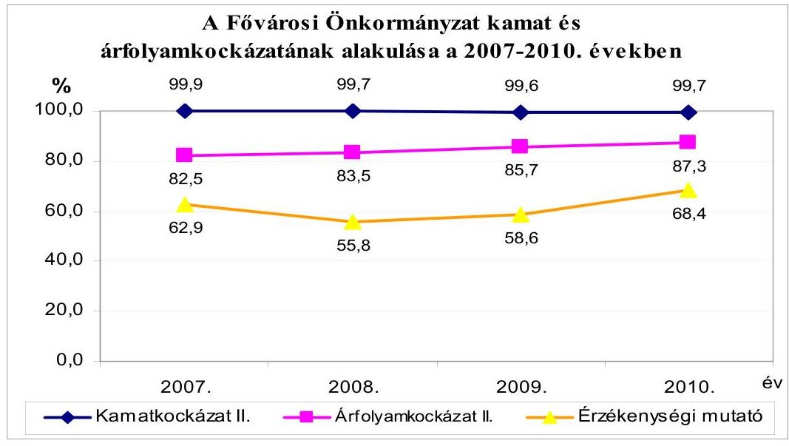

[^0]
[^0]:    ${ }^{65}$ A hosszú lejáratú hitelek állományában a nemzetközi pénzügyi intézményektől a 2005. év folyamán felvett állami projektfinanszírozó hitelek (EIB M4, EIB Csepel, továbbá az oktatási intézményfejlesztésre felvett EIB II. hitelek) rendelkeztek állami garanciavállalással.

---

A kockázatelemzéshez kapcsolódó mutatók tartalmát és a 2007-2010. évek közötti változását a 4. számú függelék mutatja be.

A Fővárosi Önkormányzat 2010. év végi hosszú lejáratú hitelállományában szereplő hitelek referencia kamatainak alakulását a 2007-2010 közötti időszakban a következő táblázat mutatja be:
adatok \%-ban

| Megnevezés | Első lehíváskor | Utolsó lehíváskor | Változás |
| :-- | :--: | :--: | :--: |
|  | alapkamat |  | (alapkamat   változás\%-a-100) |
| 3 havi EURIBOR | 3,745 | 0,993 | $-73,48$ |
| 6 havi LIBOR | 4,385 | 1,677 | $-61,74$ |

A 2007. évről a 2010. évre a referencia kamatok mérséklődtek, ami hozzájárult az adósságszolgálaton belül a kamattörlesztés 5045 millió Ft-os csökkenéséhez. A Fővárosi Önkormányzatnak a 2007-2010. években fennálló hosszú lejáratú kötelezettség állománya közel 100\%-ban változó kamatozású volt. A Fővárosi Önkormányzatnál az adósságot keletkeztető, változó kamatozású kötelezettségek a 2007-2010. években kialakult magas, közel 100\%-os aránya a piaci kamatlábak kedvezőtlen alakulása (emelkedése) esetén kamatkockázatot jelent a futamidő hátralévő időtartamára.

A Fővárosi Önkormányzat 2010. évi hosszú lejáratú kötelezettségeinek (163 407 millió Ft-nak) 87,3\%-a devizában állt fenn, ami a Fővárosi Önkormányzat számára árfolyamkockázatot jelentett. Ha a rövid lejáratú (egy éven belüli) kötelezettségeket is figyelembe vesszük, a devizában fennálló kötelezettségek (összes kötelezettségen belüli) aránya a 2010. év végén 68,4\%-ot képviselt. A Közgyűlés részére az árfolyam változásból eredő kockázatot a 2007-2010. évi költségvetések előterjesztéseiben bemutatták, valamint a devizahitelek adósságszolgálatára céltartalékot képeztek ${ }^{66}$, továbbá folyamatosan korrigálták a tervezési árfolyamot. A hitelszerződésekből eredő, deviza alapú adósságot keletkeztető kötelezettségek adósságszolgálati terheinek alakulását a 2007-2010. években figyelemmel kísérték a Főpolgármesteri hivatalban. A 2010. évben a deviza alapú adósságot keletkeztető kötelezettségek csökkentése érdekében, a választható devizanemú hitel esedékes összegét forintban vették igénybe. Az árfolyamkockázat vizsgálata nem terjedt ki a Közraktárak projekttel kapcsolatos szolgáltatási díjból eredő fizetési kötelezettségek árfolyam-változásaira, annak ellenére, hogy azokat a 25 éves futamidőre euróban határozták meg.

A Fővárosi Önkormányzat a 2007-2010. években nem vett igénybe felhasználási kötöttség nélküli hosszú lejáratú hitelt, azonban az 1999-ben szennyvíz-

[^0]
[^0]:    ${ }^{66}$ Az árfolyamkockázati céltartalékot 2008-ban képezték először, 2000 millió Ft eredeti előirányzattal, a tartalékot nem vették igénybe. A 2009. évben az eredeti előirányzat 500 millió Ft volt, melyet év közben 2011 millió Ft-ra módosítottak, a tartalékot nem használták fel.

---

csatornázásra megkötött világbanki hitelből a 2007. évben 210,5 millió Ft, valamint az EIB hitelekből a 2007-2010. évek végén jelentős összegű ${ }^{67}$ lehívott, de fel nem használt tőkeösszeg állt rendelkezésre, mivel - a hitelszerződésekben meghatározott részfolyósítási feltételek miatt - a hitellehívások nem a konkrét fejlesztési kifizetések ütemét követték. Az igénybe vett világbanki és EIB hitelek után a 2007-2010. években összesen 13110 millió Ft kamatot fizetett a Fővárosi Önkormányzat. A Fővárosi Önkormányzat a 2007-2010. évek végén a lehívott, de még fel nem használt hitelekből betétlekötésekkel ${ }^{68}$ rendelkezett, illetve azokat látra szóló betétszámlákon helyezte el. A 2007-2010. években ezen lekötött betétek után összesen 698 millió Ft kamatbevételt realizáltak. A Fővárosi Önkormányzat a látra szóló, illetve a lekötött betétek után kapott betétkamattal a hitelszerződésekben előírt részfolyósítási feltételek miatt a 2007-2010. években keletkezett - összesen 252,6 millió Ft többletkamat kiadását kompenzálta.

A Fővárosi Önkormányzatnál a 2007-2010. években a felvett, de fel nem használt, betétként elhelyezett hitelösszegek fizetőképességi kockázatot jelentettek, mivel az év végén fennálló betétállományok a tárgyévi pénzmaradvány összegét növelték és a pénzmaradvány részeként, a következő költségvetési évben igénybe vehető saját forrásként jelentek meg, valamint hitelfelvételből származó, fel nem használt pénzeszköz a rövid távú likviditást a valós pénzügyi helyzetnél kedvezőbbnek mutatta. Az előző főjegyző a fizetőképességi kockázat csökkentése érdekében a fejlesztési hitelekből igénybe vett, de még fel nem használt pénzeszközeit elkülönítetten tartotta nyilván, a főpolgármester a 2007-2011. évi költségvetési rendeletek előterjesztésekor bemutatta, hogy a tervezett pénzmaradványból ez mekkora összeget tesz ki, továbbá biztosította, hogy ezen összegek a hitelekből finanszírozandó fejlesztési feladatok forrásául kerüljenek tervezésre.

A Fővárosi Önkormányzatnál a 2009-2010. években megkötött ÖKIF I-II. hitelszerződésekben megjelölték a hitelek konkrét felhasználási célját. A 2009-ben megkötött EIB III. hitelkeret szerződésben a kölcsönvett forrás végleges felhasználási céljainak meghatározására a későbbiekben - az Európai Beruházási Bank által lefolytatott engedélyezési eljárás keretében - kerül sor.

A Fővárosi Önkormányzatnál a 2009-2010. évi ÖKIF I-II. hitelekkel megvalósuló egyes fejlesztési feladatokról szóló döntések előkészítése során nem vizsgálták, hogy megvalósításukhoz szükséges-e hitel igénybevétele, illetve a fejlesztési tevékenység szükségességének vizsgálatakor nem mérlegelték, hogy annak megvalósítása hitelfelvétel mellett is indokolt-e.

[^0]
[^0]:    ${ }^{67}$ 2007-ben 5979,4 millió Ft, 2008-ban 3058,6 millió Ft, 2009-ben 13015,3 millió Ft, 2010-ben 14828,8 millió Ft
    ${ }^{68}$ A világbanki hitelből 2007-ben 217 millió Ft, az EIB M4 hitelből 2007-ben 176 millió Ft, az EIB I., az EIB II. és az EIB Csepel hitelekből összesen 2007-ben 5197 millió Ft, 2008-ban 2492 millió Ft, 2009-ben 11865 millió Ft lekötött betétállománya volt.

---

Az ÖKIF I-II. hitelszerződésekhez kapcsolódó 16 fejlesztési feladat közül tíz ${ }^{69}$ fejlesztési célhoz kapcsolódóan felmérték a fejlesztéssel létrehozott tárgyi eszközök jövőbeni fenntartási költségeit, illetve a fejlesztések által létrejövő egyéb hasznokat ${ }^{70}$, azonban nem vizsgálták, hogy a létrejövő új „,kapacitások" bevételi többletet, illetve kiadás csökkenést eredményeznek-e. Az ÖKIF III. hitelek segítségével megvalósuló fejlesztési feladatoknál nem vizsgálták, hogy a hitel a jövőbeni bevételekből, vagy kiadási megtakarításokból megtérüle. Hat kiemelt projekt ${ }^{71}$ esetében végeztek megtérülési számításokat, ahol bemutatták a várható bevételi többletet, a költségcsökkenéseket, valamint a fejlesztés megvalósításának egyéb hasznait, azonban - a fejlesztés forrásai között a hitel számbavételének hiánya miatt - a megtérülési számítások során nem vették figyelembe a hitelfelvételből származó adósságszolgálati kötelezettségeket. Tíz fejlesztési feladat esetében megtérülési számításokat nem végeztek.

A Fővárosi Önkormányzatnál a 2007-2009. években beváltott garancia- és kezességvállalás, valamint PPP konstrukció miatti szolgáltatási díjfizetési kötelezettség nem volt, ezért ebben az időszakban a mérlegen kívüli tételek nem jelentettek kockázatot a Fővárosi Önkormányzat fizetőképességére. Az eladósodás, a hosszú távú fizetőképesség szempontjából a 2010. évtől kockázatot jelent a Közraktár projekthez kapcsolódó szolgáltatási dij, illetve a hitel megfizetésével kapcsolatos fizetési kötelezettségvállalás, mivel a Fővárosi Önkormányzatnak a Szolgáltatási Szerződés szerint a 2010. évben a szolgáltatási dí fizetése, továbbá a Szolgáltatónak a beruházáshoz felvett hitel törlesztése ettől az évtől esedékes volt. A Fővárosi Önkormányzat a 2010. évben az adósságot keletkeztető kötelezettségvállalások felső korlátjának számításánál nem vette figyelembe a Közraktárak projekttel kapcsolatos kezességvállalásból eredő kötelezettséget (8037 millió Ft megszüntetési összeget, 283Ft/euró árfolyamon számolva), de a korlátot ezen kötelezettség figyelembevételével sem lépte túl.

[^0]
[^0]:    ${ }^{69}$ Az ÖKIF I-II. hitelszerződésekben a kiemelt projektek mellett nevesített fejlesztési feladatok voltak az útfelújítások 2009-2010. évi ütemei, a felüljárók felújításának 2009. évi üteme, az Átmeneti Gyermekotthon (Breznó köz) rekonstrukciója, az Erzsébet híd díszkivilágítása, az Idősek Otthona Baross utca rekonstrukciója, az Idősek Otthona Dózsa György út telephely kiváltása és új otthon létesítése, a Kamaraerdei úton új idősek otthona építése, a hivatali informatikai feladatok 2009. évi üteme, valamint a Mozgásjavító Általános Iskola és Diákotthon rekonstrukciója.
    ${ }^{70}$ Kapacitáshiányt pótolt az Idősek otthonával kapcsolatos fejlesztés, biztonságosabb, hatékonyabb, eredményesebb munkavégzés valósítható meg az informatikai fejlesztések eredményeképpen, stb.
    ${ }^{71}$ Kiemelt projektek voltak a Budapest Szíve program I. szakasz "Hidfőterek és új pesti korzó", valamint "Reprezentatív kaputérség" kiépítése, Dél-Budai tehermentesítő út III. szakasz, Városligeti Mújégpálya rekonstrukciója, a Rákoskeresztúri buszkorridor kialakítása, valamint a Csepeli gerincút kiépítésének I. szakasza

---

# 1.2.3. Az adósságot keletkeztető kötelezettségvállalások következtében a Fővárosi Önkormányzat pénzügyi és vagyoni helyzetének változása, eladósodása, valamint hosszú távú fizetőképességének alakulása 

A Fővárosi Önkormányzatnál a hosszú lejáratú kötelezettségek összege a 2007. évi 143330 millió Ft-ról a 2010. évre - az EIB hitelekből történő hitellehívások következtében - 14,0\%-kal emelkedett, amit ellensúlyozott a rövid lejáratú kötelezettségek összegének 26,3\%-os csökkenése a beruházási hitelek következő évet terhelő törlesztő részletének 37,9\%-os mérséklődése következtében. A beruházási hitelek következő évet terhelő törlesztő részleteinek ( 6018 millió Ft összegű) csökkenését az okozta, hogy a 2007. évet megelőzően felvett Szindikált I-II. hiteleket teljes egészében visszafizették.

A Fővárosi Önkormányzat 2007-ben 143330 millió Ft, 2008-ban 141039 millió Ft, 2009-ben 147533 millió Ft, 2010-ben 163407 millió Ft összegű hosszú lejáratú kötelezettség állománnyal rendelkezett, ebből az egyéb hosszú lejáratú múködési célú kötelezettségek állománya ${ }^{72}$ a Fővárosi Önkormányzat intézményeinek nyújtott, év végéig vissza nem fizetett előlegállományból adódott.

A 2007-2010. években a Fővárosi Önkormányzat pénzügyi helyzetének - CLF módszer szerinti - bemutatását az 5. számú függelék tartalmazza, a működési jövedelem ${ }^{73}$ alakulását a következő ábra szemlélteti:
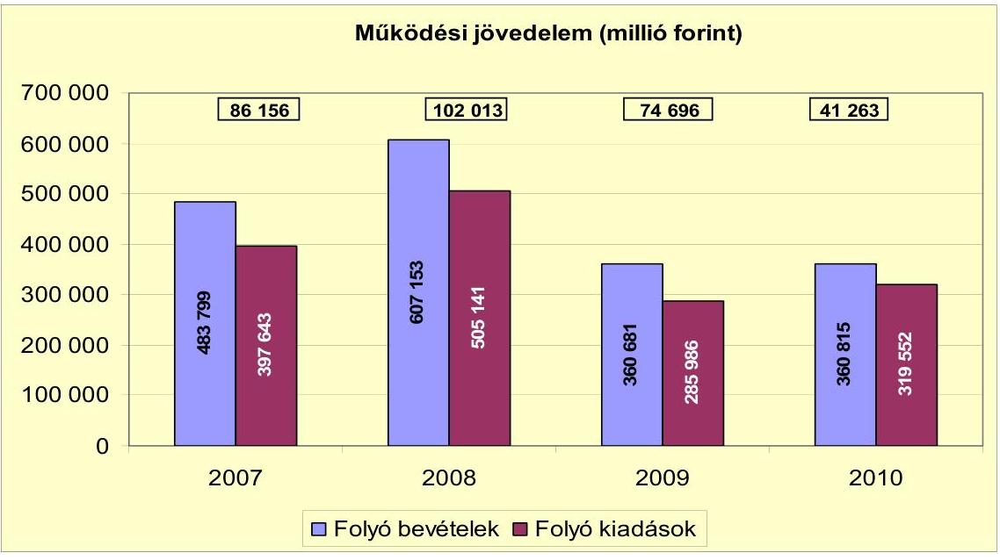

[^0]
[^0]:    ${ }^{72}$ 2007-ben 102,8 millió Ft, 2008-ban 388,8 millió Ft, 2009-ben 388,8 millió Ft, 2010ben 388,8 millió Ft
    ${ }^{73}$ A múködési jövedelem a folyó bevételek és a folyó kiadások különbözete. A folyó bevételek és a folyó kiadások az előző évi pénzmaradvány átadását, valamint átvételét azonos összegben tartalmazzák: a 2007. évben 131091 millió Ft-ot, a 2008. évben 206269 millió Ft-ot, a 2009. évben 2303 millió Ft-ot, a 2010. évben 7116 millió Ft-ot.

---

A Fővárosi Önkormányzat 2007-2010. évi folyó költségvetési egyenlege, (működési jövedelme) pozitív előjelű, de 2008. óta évente csökkenő összegű volt. A folyó költségvetés egyenlege (azaz a múködési jövedelem) azt jelzi, hogy a folyó bevételek az időszak mindegyik évében fedezetet biztosítottak - a kötelező és önként vállalt feladatellátáshoz kapcsolódó - éves folyó kiadásokra. A folyó költségvetés egyenlege, (a múködési forrástöbblet) 2007-ben a folyó kiadások 21,7\%-át, 2008-ban 20,2\%-át, 2009-ben 26,1\%-át, 2010-ben 12,9\%-át jelentette. Az időszakban a múködési jövedelem összesen 304128 millió Ft megtakarítást mutatott, ami forrásul szolgálhatott a Fővárosi Önkormányzatnál fennálló tőketörlesztési kötelezettség teljesítéséhez, valamint a folyamatban lévő fejlesztései finanszírozásához.

A Fővárosi Önkormányzat pénzügyi kapacitásának ${ }^{74}$, alakulását a következő ábra mutatja be:
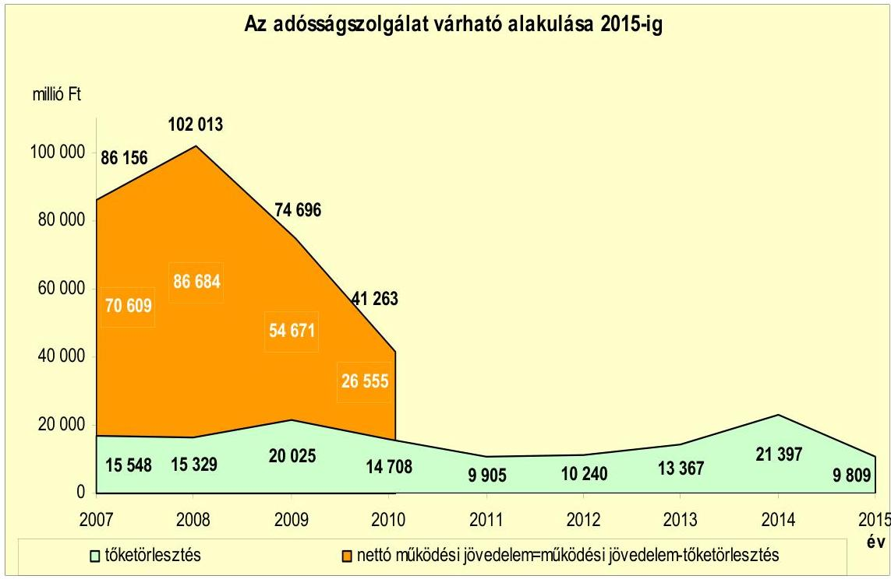

A Fővárosi Önkormányzat pénzügyi kapacitása 2007-2010 között pozitív volt, de a 2008. évtől folyamatosan csökkenő értéket mutatott. A nettó múködési jövedelem a folyó költségvetési helyzet mellett az adott költségvetési év adósságtörlesztésének hatását is tükrözi. A Fővárosi Önkormányzat fennálló adósságállománya mellett a 2007-2010. években a gazdálkodás még fenntartható volt, azonban az adósságszolgálati terhek megfizetése után megmaradó, szabadon elkölthető jövedelme 2007-ről 2010-re jelentős mértékben (62,4\%-kal, azaz 44054 millió Ft-tal) csökkent a múködési jövedelem mérséklődése következtében. Az időszak alatt keletkezett, összesen 304128 millió Ft múködési jövedelemnek 22,6\%-át ( 65609 millió Ft) tette ki a fejlesztési célú hitelekhez kapcsolódó tőketörlesztés, amelynek kifizetését

[^0]
[^0]:    ${ }^{74}$ A pénzügyi kapacitást a nettó múködési jövedelem összege fejezi ki.

---

követően a négy év alatt 238519 millió Ft nettó működési jövedelme keletkezett a Fővárosi Önkormányzatnak. A pénzügyi kapacitás 2008-hoz viszonyított kedvezőtlen alakulását a 2009-2010. években a folyó bevételek és kiadások különbségéből származó működési jövedelem csökkenése okozta. A Fővárosi Önkormányzatnál változatlan nettó múködési jövedelem képződés mellett - a CLF módszer alapján - a fejlesztési kiadások fedezete biztosítottnak látszik.

A beruházási költségvetés egyenlegének alakulását a következő ábra szemlélteti:
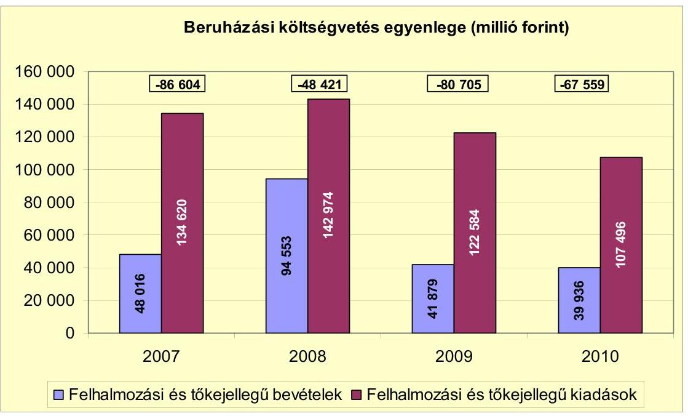

A 2007-2010. években a Fővárosi Önkormányzat felhalmozási (beruházási) költségvetésének egyenlege folyamatosan negatív összegű volt, amely a jogszabályoknak és a belső szabályozásnak megfelelő költségvetési gazdálkodás, valamint a pénzügyileg fenntartható ${ }^{75}$ beruházások esetén nem jár magas pénzügyi kockázattal. A felhalmozási hiányból eredő finanszírozási igény önmagában nem jár pénzügyi kockázattal, a pénzügyileg fenntartható beruházásokhoz kapcsolódó kötelezettségvállalás (adósságszolgálat) prudens költségvetési gazdálkodással teljesíthető. A Fővárosi Önkormányzat pénzügyi mozgásterét a 2007-2010. években javította a működési célú pénzmaradvány adósságszolgálati terhek megfizetésébe történő bevonása ${ }^{76}$. A felhalmozási forráshiánynak a felhalmozási és tőke jellegű kiadásokhoz viszonyított aránya 2007-ben 64,3\%, 2008-ban 33,9\%, 2009-ben 65,8\%, 2010-ben 62,8\% volt.

A Fővárosi Önkormányzat finanszírozási múveletei egyenlegének alakulását a 2007-2010. évek között a következő ábra szemlélteti:

[^0]
[^0]:    ${ }^{75}$ Pénzügyileg fenntartható beruházásnak minősül az, amelynek működtetésére az nettó múködési jövedelem még fedezetet nyújt.
    ${ }^{76} 2007$-ben 20121 millió Ft, 2008-ban 7840 millió Ft, 2009-ben 21986 millió Ft, 2010ben 16223 millió Ft bevonása

---

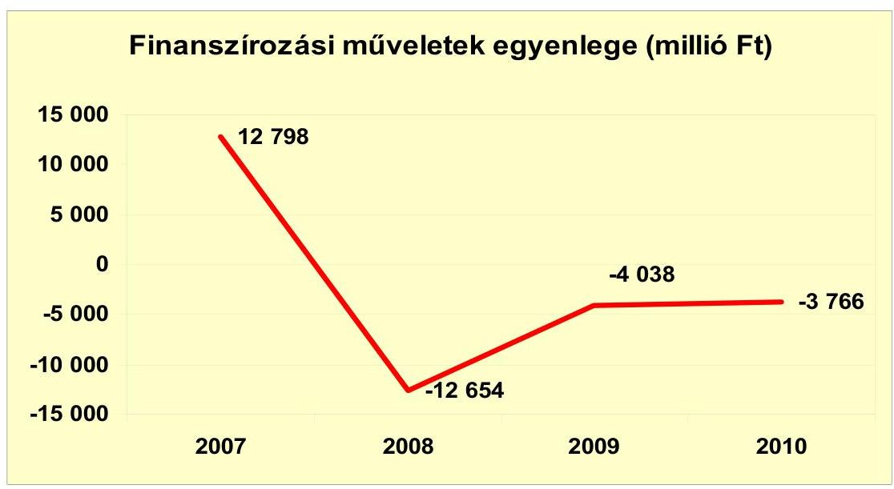

A Fővárosi Önkormányzatnál a 2008. évtől a finanszírozási múveletek egyenlege negatív volt, mivel a finanszírozási célú pénzügyi kiadások (hiteltörlesztés, forgatási célú értékpapírok vásárlása) meghaladták a finanszírozási célú pénzügyi bevételekből (hitelfelvétel, forgatási értékpapírok értékesítése) származó bevételek összegét.

A 2007-2010 között a Fővárosi Önkormányzat összesen 23256 millió Ft kamatot fizetett. Az átmenetileg szabad pénzeszközei lekötései után realizált kamatbevétel, valamint a forgatási célú értékpapírok értékesítéséből elért hozambevétel együttesen 4,2\%-kal, azaz 969 millió Ft-tal haladta meg a kamat kiadás öszszegét. A 2007-2010. évben a még fel nem használt hitelekből betétlekötésekkel rendelkezett, illetve azokat látra szóló betétszámlákon helyezte el, amelyek hozzájárultak a magas kamatbevételekhez. A Fővárosi Önkormányzat hozam és kamatbevételeinek, valamint kamatkiadásainak alakulását a következő ábra mutatja:
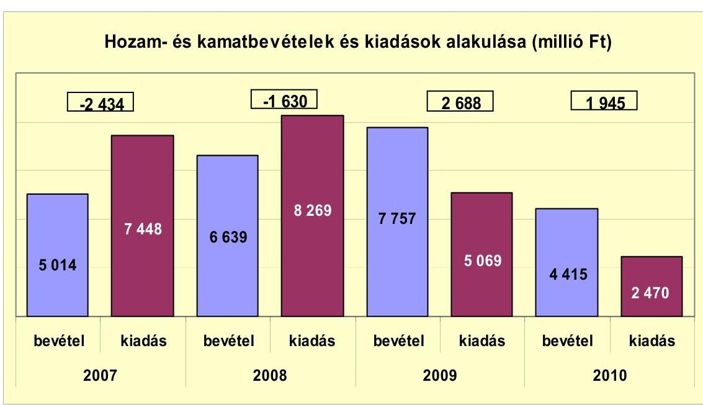

---

A kamatkiadások 2008. évtől bekövetkező csökkenéséhez a Szindikált I-II. hitelek visszafizetése járult hozzá. A 2011. évre a Fővárosi Önkormányzat az EIB III. hitelkeretből történő további lehívások, valamint az ÖKIF hitelek törlesztési kötelezettsége eredményeként a kamatkiadások növekedését tervezte, a költségvetési rendeletében előirányzott 3269 millió Ft kamatráfordítás 32,3\%kal, azaz 799 millió Ft-tal haladja meg a 2010. évit.

A Fővárosi Önkormányzat pénzügyi helyzete, eladósodása az adósságot keletkeztető kötelezettségvállalások következtében összességében 2007-ről 2010re nőtt, vagyoni helyzete - a saját tőke és a befektetett eszközök aránya tekintetében - az időszak alatt nem változott.
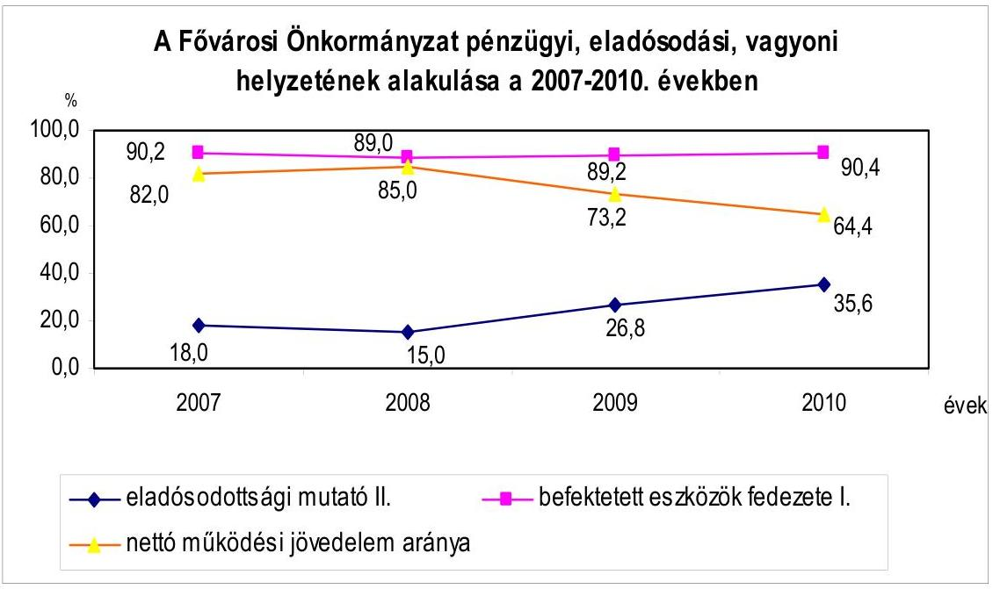

A Fővárosi Önkormányzatnál a felvett hitelek futamideje (15-25 év) és türelmi ideje (három-hét év) bizonytalanná, valamint nehezen prognosztizálhatóvá teszi a saját bevételeinek és a változó kamatozású, többségében (mintegy 90\%ban) eruróban fennálló hitelek kamatainak és árfolyamának hosszú távú alakulását, amely a visszafizetési-, a kamat- és az árfolyamkockázatot növeli. A Közraktárak projekttel kapcsolatos fizetési kötelezettségek teljesítése, valamint a kezességvállalás beváltása esetén a Fővárosi Önkormányzat pénzügyi helyzete jelentősen romlani fog. További pénzügyi kockázatot jelentenek az általa múködtetett gazdasági társaságokkal, kiemelten a BKV Zrt-vel szemben fennálló kötelezettségei, valamint a 4-es metró építése ütemezésének, illetve finanszírozásának esetleges módosításai.

---

# 2. A BELSŐ KONTROLLOK MŰKÖDÉSE A KÖLTSÉGVETÉS-TERVEZÉSI, A ZÁRSZÁMADÁS-KÉSZÍTÉSI FOLYAMATOKBAN ÉS A PÉNZÚGYISZÁMVITELI TERÜLETEN ALKALMAZOTT INFORMATIKAI RENDSZEREKNÉL 

### 2.1. A belső kontrollok múködése a költségvetés-tervezés és a zárszámadás-készítés folyamataiban

A Főpolgármesteri hivatalban az előző főjegyző meghatározta ${ }^{77}$ a gazdálkodó szervezeti egységek és a költségvetési intézmények részére a költségvetési javaslat összeállításával kapcsolatos követelményeket, kijelölte a tervezési és a zárszámadási feladatok koordinálásáért felelős személyeket, az intézményi költségvetésekben szereplő adatok egyeztetésének, ellenőrzésének felelőseit, azonban - az Ámr. ${ }_{2}$ 155. §-ában foglalt szabályozás ellenére - nem írta elő a költségvetés tervezésének folyamatában a Főpolgármesteri hivatal szervezeti egységei és a költségvetési intézmények vezetői által javasolt előirányzatok megalapozottságának, az ismert kötelezettségek tervezésének, a benyújtott költségvetési igények teljesíthetőségének, a saját bevételek előirányzatai és a költségvetés megalapozását szolgáló helyi rendeletek összhangja ellenőrzését, amely hiányosságok közepes kockázatot jelentettek a költségvetés-tervezési és a zárszámadás-készítési folyamatok megfelelő és szabályszerű végrehajtásában.

A Főpolgármesteri hivatalban a 2010. évi költségvetés-tervezési és a 2009. évi zárszámadás-készítési folyamatban a belső kontrollok múködésének megfelelősége gyenge volt, mert - a hiányos szabályozás miatt - nem végezték el a gazdálkodó szervezeti egységek és a költségvetési intézmények által javasolt előirányzatok megalapozottságának, a költségvetési igények teljesíthetőségének, az ismert kötelezettségek megtervezésének, valamint a saját bevételek előirányzatai és a költségvetés megalapozását szolgáló helyi rendeletek összhangjának ellenőrzését. A Főpolgármesteri hivatalban ${ }^{78}$ - a belső szabályozás ellenére - nem ellenőrizték az intézményi költségvetési javaslat összeállítására vonatkozó követelmények teljesítését és a zárszámadás készítéséhez kapcsolódóan a pénzmaradvány megállapításának szabályszerűségét.

A Főpolgármesteri hivatalnál a 2010. évi költségvetés tervezésének folyamatában a gazdálkodó szervezeti egységek által javasolt előirányzatok megalapozottságát nem ellenőrizték, ezáltal nem tárták fel a következő tervezési hiányosságokat:

- a Vállalkozási és Vagyonkezelési Ügyosztály az ingatlanértékesítési 10 731,6 millió Ft bevétel ${ }^{79}$ tervezése során több éve sikertelenül meghirdetett ingatla-

[^0]
[^0]:    ${ }^{77}$ a gazdálkodó szervezeti egységek belső múködési szabályzatában, ellenőrzési nyomvonalában, főjegyzői intézkedésekben, tervezési köriratokban
    ${ }^{78}$ Az Informatikai Ügyosztályon nem végezték el a belső szabályozásban előírt ellenőrzési feladatokat.
    ${ }^{79}$ A 2010. évben az ingatlanértékesítésből 856,6 millió Ft bevétel teljesült.

---

nok értékesítéséből származó bevételeket is figyelembe vett, az eladásra tervezett 35 ingatlan közül kettőt ${ }^{80} 2005$ óta, másik kettőt ${ }^{81} 2007$ óta, kilencet ${ }^{82}$ 2008 óta a többszöri pályáztatás, meghirdetés ellenére nem értékesítettek;

- a külső személyi juttatások előirányzatának tervezését nem támasztották alá a Személyzeti Úgyosztályon a főpolgármesteri keret 9,5 millió Ft és járulékai, a Városüzemeltetési és Vagyongazdálkodási főpolgármester-helyettesi keret 6,84 millió Ft, valamint a Humán és Várospolitikai főpolgármester-helyettesi keret 7,48 millió Ft, a Főpolgármesteri Iroda 30,72 millió Ft és a Közmű Úgyosztály 15,10 millió Ft, a Sajtóirodán 4,8 millió Ft, a Főpolgármesteri Irodán 3,0 millió Ft, a Szervezési Úgyosztályon 6,0 millió Ft, a PR Irodán 1,0 millió Ft esetében, mivel nem határozták meg, hogy ezen kiadási előirányzatok milyen feladatok ellátásához szükségesek;
- a Főpolgármesteri hivatalban az előző évről áthúzódó működési célú költségvetési kiadásokat, mint ismert kötelezettségvállalásokat, valamint az azok kiegyenlítésére szolgáló előző évi pénzmaradványt és az előző években keletkezett tartalékok várható összegét nem vették figyelembe eredeti előirányzatként;
- a közútfenntartás szolgáltatási díjára vonatkozó egységárak kontrollját nem végezték el, ezért a 2010. évi közszolgáltatási szerződésben megrendelt szolgáltatás ellenértékének ( 5774,2 millió Ft) meghatározása nem volt megalapozott.

Az irányítást ellátó szervezeti egységek ${ }^{83}$ nem ellenőrizték az intézmények által javasolt előirányzatok megalapozottságát, ezáltal nem tárták fel a következő hiányosságokat:

- a 2010. évi intézményi költségvetésekben nem tervezték meg eredeti előirányzatként az előző évről áthúzódó működési, beruházási és felújítási célú kiadásokat, mint ismert kötelezettségvállalásokat, valamint az azok forrásául szolgáló előző évi pénzmaradványt;

Elmaradt 1065,72 millió Ft összegben a múködési célú költségvetési kiadások megtervezése (többek között a Budapesti Történeti Múzeum esetében 251,3 millió Ft, a Katona József Műszaki, Közgazdasági Szakközépiskola vonatkozásában 61,2 millió Ft, a Veres Pálné Gimnáziumnál 45,6 millió Ft), valamint 228,4 millió Ft összegben az intézményi felhalmozási célú költségvetési kiadások megtervezése (többek között a Veres Pálné Gimnázium esetében 42,7 millió Ft, a Budapesti

[^0]
[^0]:    ${ }^{80}$ Szőlősgyörök kastély (171,8 millió Ft), Esztergom Vaskapu utca, camping (55,0 millió Ft)
    ${ }^{81}$ Kéthely-Sáripuszta kastély ( 95,0 millió Ft), Tordas Sajnovics tér 5., kastély (191,5 millió Ft)
    ${ }^{82}$ Budapest IV. kerület Megyeri út 45. (358,8 millió Ft), Budapest IV. kerület Lőrincz u. 40. (152,0 millió Ft), Budapest XI. kerület Andor u. 76. (76,9 millió Ft), Budapest XII. kerület Bürök u. (84,5 millió Ft), Budapest XX. kerület Török Flóris u. 74. (131,0 millió Ft), Gyomaendrőd József Attila u. 4/2. (4,0 millió Ft), Budapest III. kerület Hajógyári sziget hrsz. 23796/41, 43, 45 ingatlanok (93,4-94,4-107,0 millió Ft)
    ${ }^{83}$ az Egészségügyi, a Gyermek- és Ifjúságvédelmi, az Informatikai, a Kulturális, az Oktatási és a Szociálpolitikai Úgyosztályok

---

Módszertani Szociális Központ vonatkozásában 31,5 millió Ft, a Katona József Műszaki, Közgazdasági Szakközépiskolánál 28,4millió Ft).

- a 2010. évi költségvetés tervezése során három intézmény ${ }^{84}$ a ténylegesnél 43,8 millió Ft-tal magasabb összegben mutatott ki kötelezettséggel terhelt pénzmaradvány igénybevételt ${ }^{85}$.

A FŐSZINFORM ${ }^{86}$ irányítását ellátó Informatikai Ügyosztályon a feladatra kijelölt személy - az előírások ${ }^{87}$ ellenére - nem ellenőrizte a költségvetési javaslat összeállításával kapcsolatban az intézmény részére meghatározott követelmények teljesítését, valamint a zárszámadás készítésének folyamatában a pénzmaradvány megállapítása szabályszerűségét ${ }^{88}$.

A Költségvetési Tervezési Ügyosztály és a Költségvetési Gazdálkodási Ügyosztály előterjesztette a Pénzügyi és Közbeszerzési Bizottsághoz véleményezésre a 2010. évi költségvetési javaslatot, valamint a 2009. évi költségvetés végrehajtásáról szóló éves beszámoló tervezetet. A Pénzügyi és Közbeszerzési Bizottság a költségvetési javaslatot, a beszámoló tervezetét a Közgyűlés elé terjesztésre alkalmasnak találta. A zárszámadás készítésének folyamatában a Főpolgármesteri hivatal vizsgálta az intézmények által az állami támogatásokkal, hozzájárulásokkal történő elszámoláshoz közölt mutatószámok adatainak megfelelőségét.

# 2.2. A belső kontrollok múködése a pénzügyi-számviteli feladatok ellátása során alkalmazott informatikai rendszereknél 

A pénzügyi-számviteli feladatok ellátása során alkalmazott informatikai rendszerek működtetéséhez a Főpolgármesteri hivatal Középtávú Informatikai Stratégiával csak a 2008. év végéig rendelkezett. A Főpolgármesteri hivatal 2009. január 1-jén új integrált pénzügyi-számviteli rendszert vezetett be.

A pénzügyi-számviteli tevékenységhez kapcsolódó informatikai feladatok szabályozásának hiányosságai magas kockázatot jelentettek az informatikai feladatok megfelelő végrehajtásában, mert a Főpolgármesteri hivatal - a 223/2009. (X. 14.) Korm. rendelet 13. §-a előírása ellenére - nem rendelkezett Informatikai Biztonsági Szabályzattal, illetve Üzletmenet folytonossági tervvel. A 2005 decemberében kiadott Informatikai Katasztrófa-elhárítási ter-

[^0]
[^0]:    ${ }^{84}$ A Fővárosi Gyermekvédelmi Intézmények Gazdasági Szervezete, Kolibri- Gyermek és Ifjúsági Színház, Fővárosi Tűzoltóparancsnokság
    ${ }^{85}$ A könyvvizsgáló a 2009. évi költségvetés végrehajtásáról szóló rendelettervezet vizsgálata során rámutatott a hiányosságra.
    ${ }^{86}$ A FŐSZINFORM 2011. február 28-án megszűnt.
    ${ }^{87}$ Az Informatikai Ügyosztály az FPH027/484-13/2009. iktatószámú levelében meghatározta az intézmény részére a 2010. évi költségvetés tervezésével kapcsolatos előírásokat.
    ${ }^{88}$ A pénzmaradvány szabályszerűségének ellenőrzését az Informatikai Ügyosztály ellenőrzési nyomvonalában írták elő.

---

vet, indokoltsága ellenére nem módosította, így nem tartalmazott előírást a 2009 januárjában bevezetett integrált pénzügyi-számviteli rendszerrel kapcsolatban. A pénzügyi-számviteli rendszer hozzáférési jogosultságaihoz kapcsolódóan eljárásrendet nem készítettek, nem szabályozták a pénzügyi-számviteli rendszer hozzáférési jogosultságainak megállapítására, kiosztására, módosítására, illetve visszavonására vonatkozó eljárásokat, továbbá nem szabályozták ezen eljárások ellenőrzésének módját. A Főpolgármesteri hivatal pénzügyiszámviteli rendszerét külső cég fejlesztette, azonban az informatikai szabályzatban nem tiltották meg a külső fejlesztők bármilyen típusú hozzáférését az éles rendszerhez. A Főpolgármesteri hivatal informatikai szabályzata nem tartalmazott részletes leírást a jelszavakkal kapcsolatosan (karakterhossz, speciális karakterek alkalmazása, időszakonkénti változtatási kötelezettség). A Főpolgármesteri hivatalban nem szabályozták a pénzügyi-számviteli szoftverváltozások eljárásrendjét és a PIR frissítésének menetét. A Főpolgármesteri hivatal annak ellenére nem rendelkezett Mentési Szabályzattal, hogy a Főpolgármesteri hivatal informatikai tevékenységeinek szabályozásáról szóló 505/2006. számú főpolgármesteri és főjegyzői együttes intézkedés több esetben hivatkozott rá.

A Főpolgármesteri hivatalban a 2010. évben a pénzügyi-számviteli tevékenységhez kapcsolódó informatikai feladatoknál a kialakított belső kontrollok múködésének megfelelősége gyenge volt, mert nem aktualizálták az Informatikai Katasztrófa-elhárítási tervet, ezért azt nem tudták tesztelni az elmúlt két évben a pénzügyi-számviteli rendszer tekintetében. A fejlesztő külső cég munkatársai hozzáfértek a pénzügyi-számviteli éles rendszerhez. A Főpolgármesteri hivatalban - a részletes szabályok hiányában - a jelszavak kezeléséhez kapcsolódó kontrollok múködése nem volt megfelelő, a pénzügyiszámviteli rendszer szoftvere frissítésének ellenőrzése nem történt meg. A Főpolgármesteri hivatalban a pénzügyi-számviteli rendszerek mentéseit a számítógépteremben tárolták. A számítógépterem kialakítása és üzemeltetése nem felelt meg a rendkívüli üzemeltetési helyzetek elleni szakszerű védelemre vonatkozóan a 223/2009. (X. 14.) Korm. rendelet 25-26. §-ában foglalt előírásoknak a környezeti ártalmak elleni védelem és illetéktelen hozzáférés tekintetében. A múemlék épület harmadik emeletén kialakított számítógépterem ajtaja nem volt biztonságos, a számítógépteremben a biztonsági rács nélküli ablakok nem rendelkeztek üvegtörés érzékelővel, továbbá a helyiségben nem volt video megfigyelő és rögzítő eszköz. A számítógépteremben az épületrezgés és az elektromágneses sugárzás elleni árnyékolást nem oldották meg. A számítógépteremben nyolc darab egyszerű légkondicionáló volt, melyek nem voltak megfelelőek az informatikai központ feladat ellátására, állandóan üzemeltek, meghibásodás esetén a többi üzemelő berendezés nem tudta ellátni a kiesett légkondicionáló berendezés feladatát, illetve nem volt biztosított a berendezés automatikus leállása. Tűzvédelmi szempontból a számítógépterem üzemeltetése nem volt megfelelő, többek között a földön heverő kartondobozok és a fa íróasztal bútorzat miatt.

---

# 3. Az elektronikus KÖzszolgáltatás feltételeinek kialakítása, a KÖzzzÉTÉTELI KÖTELEZETTSÉG TELJESÍTÉSE 

### 3.1. Az elektronikus közszolgáltatás megvalósításához szükséges feladatok meghatározása, az elektronikus közszolgáltatás bevezetése és múködtetése érdekében tett intézkedések

A Fővárosi Önkormányzat a 2009. évtől nem rendelkezett a Közgyűlés által elfogadott, vagy a főjegyző által kiadott e-közszolgáltatási stratégiával, így nem határozták meg az elektronikus közszolgáltatás megvalósítása érdekében szükséges teendőket és a fejlesztések eredményeképpen elérendő elektronikus szolgáltatási szinteket ${ }^{89}$.

A Fővárosi Önkormányzat az e-közszolgáltatási feladatok ellátásának személyi feltételeit a Főpolgármesteri hivatal köztisztviselőivel, valamint vállalkozási szerződésekkel biztosította. Az e-közszolgáltatási feladatokat saját számítógépes információs rendszeren keresztül, saját és vásárolt programok üzemeltetésével oldotta meg. Az e-közszolgáltatási feladatok biztosítása érdekében - az állampolgárok és a vállalkozások igényeinek gyorsabb és komfortosabb kielégítése érdekében - integrált hálózatokat építettek ki (internet, intranet), kialakították a 2002. évtől kezdődően az önkormányzati portált ${ }^{90}$, amelyen keresztül ügyfélszolgálatot múködtettek, biztosították az egyes közigazgatási szolgáltatásokhoz szükséges kérelmek, nyomtatványok internetről történő letölthetőségét.

A Fővárosi Önkormányzat az e-közszolgáltatási feladatok közül az információs és tájékoztató szolgáltatást alapeljárások leírása formájában biztosította (1. elektronikus szolgáltatási szint):

- az állampolgárok vonatkozásában az egészségügyi, a természetvédelmi és energetikai, a közlekedési hatósági, az oktatási és a szociális ügyek esetében;
- a vállalkozások vonatkozásában a kommunális, a természetvédelmi és energetikai, a közlekedési hatósági és az oktatási ügyeknél, továbbá a Budapest név, címer, zászló és turisztikai logó használat engedélyeztetésével és a múködési engedélyek kiadásával kapcsolatos ügyintézés területein.

Az állampolgárok és a vállalkozások helyi adóztatásával kapcsolatos - idegenforgalmi adó, iparűzési adó, valamint a termőföld bérbeadásából származó jövedelem adója - tevékenységnél, a közterület-használat engedélyezésénél és a lakásrezsi támogatások biztosításánál 2. elektronikus szolgáltatási szinten valósult meg a Fővárosi Önkormányzatnál az e-közszolgáltatás keretében az ügyintézés biztosítása. A Fővárosi Önkormányzatnál az e-közszolgáltatási feladatokat ellátó informatikai rendszer ügyfelek általi igénybevételét nem kísérték figyelemmel, illetve azt nem értékelték.

[^0]
[^0]:    ${ }^{89}$ Az elektronikus szolgáltatási szinteket meghatározó 1044/2005. (V. 11.) Korm. határozat 2010. május 12-ig volt hatályos, hatályon kívül helyezte a 1117/2010. (V. 12.) Korm. határozat.
    ${ }^{90} \mathrm{http}: / / w w w . b u d a p e s t . h u /$

---

# 3.2. A közérdekú gazdálkodási adatok meghatározott köre (támogatások, szerződések) elektronikus közzétételének biztosítása 

A Fővárosi Önkormányzatnál kialakították az Eisz. tv. 21. § (1)-(3) bekezdés ${ }^{91}$ alapján a közérdekú adatok honlapon történő elektronikus közzétételének lehetőségét. Betartották a 18/2005. (XII. 27.) IHM rendelet 2. § (1)(2) bekezdéseinek előírását, mivel a közérdekú adatokra való hivatkozást a Fővárosi Önkormányzat honlapján a megnyitáskor megjelenő oldalon helyezték el (E-információszabadság - "Közérdekü adatok"), valamint az adatok közzétételére az előírt, közzétételi egységenkénti szerkezetet biztosították. A közérdekű adatok honlapon történő közzétételének rendjét az együttes intézkedés ${ }_{1-2}$-ben szabályozták. Az együttes intézkedés ${ }_{1-2}$-ben kijelölték a közzéteendő adatok szolgáltatásáért felelős személyeket (a Főpolgármesteri hivatal belső szervezeti egységeinek vezetőit), a közzététel felelőseit (a Főpolgármesteri Iroda vezetőjét, illetve az adatvédelmi felelőst), az adatbázisok múködési környezetéért és az üzemeltetésért felelős személyt (az Informatikai Ügyosztály vezetőjét), továbbá rögzítették a megjelentetéssel kapcsolatos konkrét feladatokat. A szabályozás nem tartalmazta a Fővárosi Önkormányzat intézményei közérdekú adatainak ${ }^{92}$ - az intézmények által nyújtott, nem normatív működési és felhalmozási célú támogatások és a nettó öt millió Ft-ot elérő, vagy azt meghaladó összegű szerződések vonatkozásában - a Fővárosi Önkormányzat honlapján történő közzétételi rendjét.

A Közgyűlés nem rögzítette önkormányzati rendeletben, hogy a Fővárosi Önkormányzat által nyújtott támogatásokra vonatkozó közzétételi kötelezettség a 200000 Ft alatti támogatásokra nem vonatkozik, továbbá nem alkotott a nettó öt millió Ft-nál alacsonyabb összegű szerződések kötelező közzétételét előíró önkormányzati rendeletet. Az előző főjegyző 2010. március 2-án elrendelte a Főpolgármesteri hivatal által kötött valamennyi nettó öt millió Ft alatti szerződés 2005. január 1-ig visszamenőleges megjelentetését a Fővárosi Önkormányzat honlapján. A Főpolgármesteri hivatalra vonatkozó főjegyzői utasítás 2010. szeptember 23-án beépítésre került az együttes intézkedés ${ }_{2}$ 17. §-ába, így az Áht. 15/B. § (1) bekezdésében foglalt előírást megsértve nem önkormányzati rendeletben döntöttek a nettó öt millió Ft-nál alacsonyabb értékhatárú szerződések közzétételének szabályozásáról. Az előző főjegyzö megsértve az Áht. 15/A. § (1) bekezdésben előírtakat - nem gondoskodott a Főpolgármesteri hivatal által a 2009-2010. években nyújtott nem normatív, céljellegú múködési és felhalmozási célú támogatások 25\%-nál azok kedvezményezettjei nevének, a támogatás céljának, összegének, továbbá a támogatási program megvalósítási helyének a Fővárosi Önkormányzat honlapján történő közzétételéröl.

[^0]
[^0]:    ${ }^{91}$ Az Eisz. tv. 21. § (3) bekezdése 2010. december 31-ig volt hatályos, hatályon kívül helyezte a 2010. évi CXXX. törvény 48. § (1) bekezdése.
    ${ }^{92}$ A Fővárosi Önkormányzat intézményeire az együttes intézkedés ${ }_{2}$ III. része tartalmazott szabályozást, de az csak a 18/2005. (XII. 27.) IHM rendelet 1. melléklete szerinti 1. Szervezeti, személyzeti adatokra és a 3.2. Költségvetések, beszámolók adataira vonatkozott.

---

A Főpolgármesteri hivatal a 2009-2010. évi főkönyvi elszámolásaiban és a költségvetési beszámolóiban az Áhsz. 9. mellékletének 3. f) pontjában az államháztartáson kívüli végleges pénzeszközátadások elszámolása és az Áhsz. 9. mellékletének 9. c) pontjában a dologi kiadások elszámolására vonatkozó előírások ellenére a települési folyékony hulladék begyűjtési illetve ártalmatlanítási, valamint a zöldterület kezelési tárgyú közszolgáltatási szerződések alapján szolgáltatás megrendelés ellentételezéseként kifizetett összegeket (összesen 3757 millió Ft-ot) a múködési célú pénzeszköz átadások között mutatták ki, a dologi kiadások között szereplő vásárolt közszolgáltatások helyett.

Az előző főjegyző az Áht. 15/A. § (1) bekezdésében előírtakat megsértve a 20092010. években nem gondoskodott a Főpolgármesteri hivatal által nyújtott nem normatív, céljellegú múködési és felhalmozási közzétett támogatások 50\%-ánál a támogatási program megvalósítási helyének közzétételéről. A Főpolgármesteri hivatal által a 2009-2010. évben nyújtott, nem normatív célú múködési és fejlesztési közzétett támogatások 66\%-át - megsértve az Áht. 15/A. § (1) bekezdésében a döntés meghozatalát követő 60 napon belüli közzétételi kötelezettségre vonatkozó előírást - a szerződés megkötését követő 60 napos határidőn túl (31-326 nappal) tették közzé a Fővárosi Önkormányzat honlapján.

Az előző főjegyző - megsértve az Áht. 15/A. § (1) bekezdésében foglalt előírást nem tette közzé az intézmények által a 2009. és 2010. évben nyújtott nem normatív, céljellegú múködési és fejlesztési támogatások kedvezményezettjei nevét, a támogatás célját, összegét, továbbá a támogatási program megvalósítási helyét a Fővárosi Önkormányzat honlapján. A 2010. évben a Főpolgármesteri hivatalnál biztosították az Áht. 15/B. § (1) bekezdés előírásai alapján a Fővárosi Önkormányzat pénzeszközei felhasználásával, vagyonnal történő gazdálkodással összefüggő - a nettó öt millió forintot elérő vagy azt meghaladó értékű - árubeszerzésre, építési beruházásra, szolgáltatás megrendelésre, vagyonértékesítésre, vagyonhasznosításra, vagyon vagy vagyoni értékű jog átadására, valamint koncesszióba adásra vonatkozó szerződések közzétételét.

Az előző főjegyző - megsértve az Áht. 15/B. § (1) bekezdésében a döntés meghozatalát követő 60 napon belüli közzétételi kötelezettségre vonatkozó előírást - 51-155 nappal a szerződés létrejöttét követő 60 napos határidőn túl tette közzé a Fővárosi Önkormányzat honlapján a Főpolgármesteri hivatal által a 2009. évben kötött nettó öt millió Ft-ot elérő vagy azt meghaladó értékú árubeszerzésre, építési beruházásra, szolgáltatás megrendelésre, vagyonértékesítésre, vagyonhasznosításra, vagyon vagy vagyoni értékú jog átadására, valamint koncesszióba adásra vonatkozó szerződések 56\%-át. Az intézmények által kötött, a nettó öt millió forintot elérő vagy azt meghaladó értékű árubeszerzésre, építési beruházásra, szolgáltatás megrendelésre, vagyonértékesítésre, vagyonhasznosításra, vagyon vagy vagyoni értékú jog átadására, valamint koncesszióba adásra vonatkozó 2009-2010. évi szerződések megnevezését (típusát), tárgyát, a szerződést kötő felek nevét, a szerződés értékét, határozott időre kötött szerződés esetében annak időtartamát, valamint az említett adatok változását - megsértve az Áht. 15/B. § (1) bekezdésének és a vagyongazdálkodási rendelet 11. § (2) bekezdésének az előírásait - nem tették közzé a Fővárosi Önkormányzat honlapján.

---

A közbenső egyeztetés során a pénzügyi főpolgármester-helyettes által tett észrevétel szerint: „Eltérő vélemény a közérdekü gazdálkodási adatok közzétételi módja tekintetében fogalmazható meg. Megállapításaik felülvizsgálata érdekében szíves tájékoztatásul csatoljuk az Adatvédelmi Biztos közzétételi kötelezettségre vonatkozó álláspontját, amelyet kérjük, hogy jelentésük véglegesitése során figyelembe venni szíveskedjenek. Jelezzük, hogy a hivatal által müködtetett új E-Infoszab rendszer a honlappal nem rendelkező intézményeink számára jelenleg is felületet biztosít, valamint lehetővé teszi az intézmény honlapjának közvetlen elérését, amennyiben az rendelkezik honlappal." Az Adatvédelmi Biztos álláspontja szerint: „...az önkormányzati fenntartású szervezetek a jogszabályokban előírt közérdekü és közérdekből nyilvános adatokat választásuk alapján vagy a honlapjukon kötelesek közzétenni vagy - ennek hiányában - a fenntartó honlapján. A Fővárosi Önkormányzat csak ez utóbbi körben köteles a fenntartásában müködő közfeladatot ellátó szervek kötelezően közzéteendő adatait a honlapján hozzáférhetővé tenni."

Az észrevétel nem megalapozott, mivel az Eisz. tv. 3. § (2) bekezdése alapján Budapest Főváros Önkormányzatának az elektronikus közzétételi kötelezettség teljesítése tekintetében a saját honlapján kell - a vonatkozó jogszabályokban előírt tartalmi és formai követelmények betartásával - eleget tennie. Ezzel összefüggésben megjegyezzük, hogy az Ötv. 6. § (1) bekezdése az önkormányzat számára állapít meg feladatokat, a 8. § (1) bekezdés részletezi a feladat-ellátási kötelezettséget a települési önkormányzatok részére. A Fővárosi Önkormányzat feladatait az Ötv. 63. § és 63/A. § határozza meg. Az Ötv. 77. § (1) bekezdése szerint „Az önkormányzat közszolgáltatásokat nyújt. Saját tulajdonnal rendelkezik és költségvetési bevételeivel, kiadásaival önállóan gazdálkodik." A fenti jogszabályhelyekből levonható az a következtetés, hogy a jogi szabályozás alanya (adatfelelős) az Eisz. tv. esetében sem lehet más, mint az önkormányzat, mert a feladatot az önkormányzat látja el, a közszolgáltatásokat az önkormányzat nyújtja, az önkormányzat vagyona egységes. Ezt az értelmezést erősíti, hogy az Eisz. tv. 21. § (3) bekezdése a megyei önkormányzatok és az 50000 főnél nagyobb lakónépességű városok esetében írta elő a honlapon történő közzétételi kötelezettséget 2007. január 1-i hatállyal, más helyi önkormányzatok, továbbá az egyéb közfeladatot ellátó szervek esetében pedig 2008. július 1. volt a határidő. A szövegezésből is levonható az a következtetés, hogy a jogalkotó az önkormányzatot tekintette közfeladatot ellátó szervnek, és az önkormányzatoktól megkülönböztette az egyéb közfeladatot ellátó szervet. Következésképp az önkormányzatot a közérdekű adatok közzététele szempontjából sem lehet megbontani az önkormányzat hivatalára, önállóan működő és gazdálkodó költségvetési szervekre, mert erre sem az Ötv., sem az Eisz. tv. nem ad lehetőséget. Figyelemmel kell lenni arra is, hogy a közérdekű adatok megismerhetősége alapvető állampolgári jog, annak érvényesülését nem lehet megnehezíteni azzal, hogy az állampolgároknak Budapest Főváros Önkormányzata esetében több mint 200 honlapon kelljen keresnie, a vagyonnal kapcsolatban melyik intézmény, milyen döntést hozott. Az Áht. 15/A. § (1) bekezdése is a fenti értelmezést támasztja alá.

A Budapest Fővárosi Önkormányzat vagyonáról, a vagyontárgyak feletti tulajdonosi jogok gyakorlásáról szóló 75/2007. (XII. 28.) számú rendeletének 11. § (2) bekezdése szerint: "az önkormányzati vagyonnal történő gazdálkodással összefüggő a nettó ötmillió forintot elérő vagy azt meghaladó értékü - árubeszerzésre, épitési beruházásra, szolgáltatás-megrendelésre, vagyonértékesitésre, vagyonhasznosításra, vagyon vagy vagyoni értékü jog átadására, valamint koncesszióba adásra vonatkozó szerződések megnevezését (típusát), tárgyát, a szerződést kötő felek nevét, a szerződés értékét, határozott időre kötött szerződés esetében annak időtartamát, valamint az említett adatok változásait a szerződés létrejöttétől számított 60 napon belül a Főpolgármesteri Hivatal www.budapest.hu internetes portálján közzé kell tenni, továbbá ilyen irányú kérelemre - az önköltségi ár megfizetésével - papír alapon is ki kell adni. A közzétételről és a

---

kiadásról a főpolgármester gondoskodik." Összegezve, az intézmények által nyújtott nem normatív, céljellegű működési és felhalmozási támogatások és az intézmények - a nettó öt millió forintot elérő vagy azt meghaladó értékű - árubeszerzésre, építési beruházásra, szolgáltatás megrendelésre, vagyonértékesítésre, vagyonhasznosításra, vagyon vagy vagyoni értékű jog átadására, valamint koncesszióba adásra vonatkozó szerződései közzététele sem a vonatkozó központi jogszabályoknak, sem a helyi rendeletnek nem felelt meg. Továbbra is fenntartjuk a számvevői jelentésben megfogalmazott javaslatot annak érdekében, hogy a költségvetési intézmények az Âht. 15/A. § (1) bekezdése és az Âht. 15/B. § (1) bekezdése szerinti közzétételi kötelezettségüket a Fővárosi Önkormányzat honlapján, a Budapest Portálon teljesítsék.

# 4. Az ÁSZ KORÁBBI ELLENŐRZÉSI JAVASLATAI ALAPJÁN KÉSZíTETT INTÉZKEDÉSI TERV VÉGREHAJTÁSA, HASZNOSULÁSA 

### 4.1. A Fővárosi Önkormányzat költségvetési gazdálkodásában kialakított belső kontrollok múködésének 2010. évi ellenőrzése során tett javaslatok - az intézkedési tervben előírt határidőig történő - hasznosítása

Az ÁSZ a 2010. évben a Fővárosi Önkormányzat költségvetési gazdálkodásában kialakított belső kontrollok múködését ellenőrizte és értékelte, valamint utóellenőrzést végzett az önkormányzati feladatok és a rendelkezésre álló források összhangja 2006. évi ellenőrzéséről, a Fővárosi Önkormányzat egyes hatósági díjak megállapítására irányuló tevékenységének 2008. évi ellenőrzéséről, a Fővárosi Önkormányzat európai uniós források igénylésére és felhasználására történt felkészülésének 2009. évi ellenőrzéséről készített jelentések javaslatainak hasznosításáról. A jelentés 18 szabályszerűségi és kettő célszerűségi javaslatot tartalmazott. A főpolgármester és a főjegyző a felelősök és a határidők megjelölésével intézkedési tervet készíttetett, melyet 2011. április 6án a Közgyűlés részére tájékoztatásul bemutattak.

Az ÁSZ javaslatára 2011. február 14-én elrendelték az állományba nem tartozók megbízási díjaival kapcsolatosan a 2006-2010 között teljesített megbízási díj kifizetések ellenőrzését 2011. június végi befejezési határidővel. Az ÁSZ részére adott tájékoztatás ${ }^{93}$ szerint a Belső Ellenőrzési Osztály a vizsgálatot a 2006. január 1-jétől 2010. december 31-éig terjedő időszakban megkötött 1105 db megbízási szerződés vonatkozásában teljes körűen elvégezte, az ÁSZ szempontjainak és módszereinek figyelembevételével. A Belső Ellenőrzési Osztály a vizsgált szerződések és kifizetések tekintetében 29 esetben további intézkedést, valamint felelősségre vonást javasolt. A 2011. márciusában kiadott intézkedési tervben meghatározott határidők szerint kitűzött feladatokat öt szabályszerűségi és kettő célszerűségi javaslat tekintetében végrehajtották. A további 12 sza-

[^0]
[^0]:    ${ }^{93}$ a 2011. július 6-ai keltezésű, 70/8-48/2011. számú tájékoztatás szerint

---

bályszerűségi javaslat ${ }^{94}$ végrehajtási határidejét az intézkedési terv szerint 2011. október végéig ${ }^{95}$ írták elő.

# A következő szabályszerűségi javaslatokat valósították meg: 

- a főjegyző intézkedett annak érdekében, hogy a Főpolgármesteri hivatal a külső személyi juttatások előirányzata terhére, szellemi tevékenység igénybe vételére kizárólag akkor kössön szerződést, ha az adott feladat elvégzéséhez megfelelő szakértelemmel, szakképzettséggel rendelkező személyt a Főpolgármesteri hivatal nem foglalkoztat;

A főjegyző az intézkedési tervben a Főpolgármesteri Iroda vezetője részére a szükséges eljárási rendre vonatkozó javaslat kidolgozásának előírásával, valamint a Humán Erőforrás Menedzsment Főosztály nyilatkozattételi kötelezettségének előírásával, továbbá a Pénzügyi Főosztály egyeztetési és ellenőrzési feladatainak meghatározásával intézkedett a javaslatban foglaltak hasznosításáról.

- a főjegyző fegyelmi eljárást indított 2011. január 27-én az ÁSZ által kifogásolt megbízási szerződés vonatkozásában, a fegyelmi tanács az eljárást lefolytatta, és fegyelmi büntetésben részesítette az Adó Főosztály vezetőjét;
- a főjegyző 2011. március 23-án felszólította a FIMŰV Zrt. volt vezérigazgatóját az ingatlanhasznosítási és vagyongazdálkodási tanácsadó tevékenységre kötött szerződés alapján, a részére kifizetett 2479893 Ft megbízási díj visszafizetésére. Az érintettet a felszólításban tájékoztatták a szerződés érvénytelenségének megállapítása iránti polgári per kezdeményezéséről nem fizetés esetén. A felszólítás nem járt eredménnyel, 2011. március 29-i válaszában az érintett a megbízási díj visszafizetését megtagadta. A Fővárosi Önkormányzat a polgári pert 2011. június 6-án megindította;
- a főjegyző a belső ellenőrzés szabályszerű kereteinek kialakítása és működtetése érdekében intézkedett a hivatali SzMSz 2011. január 15-től hatályos módosításáról, ennek eredményeként a Főpolgármesteri hivatalon belül egy ellenőrzési egység működik. A főjegyző egyúttal kijelölte a belső ellenőrzési vezetői feladatok ellátásáért felelős személyt;
- a főjegyző intézkedett a foglalkoztatott belső ellenőrök számának megállapításához szükséges kapacitás-felmérés elkészítéséről.

[^0]
[^0]:    ${ }^{94}$ A Fővárosi Önkormányzat gazdálkodási rendszerének 2006., 2008. és 2009. évi ellenőrzései során az ÁSZ által a főpolgármester és főjegyző részére tett, részben, illetve nem teljesült szabályszerűségi javaslatok az önkormányzati feladatok és rendelkezésre álló források összhangja, az egyes hatósági díjak megállapítására irányuló tevékenység, az európai uniós források igénylésére és felhasználására történt felkészültség vonatkozásában. A belső kontrollok múködésének 2010. évi ellenőrzése keretében a belső múködési szabályzatok kiegészítésére, a pénzügyi-gazdasági munkafolyamatok leírására, a szakmai teljesítésigazolók kijelölésére, a belső kontrollok szabályszerű működtetésére vonatkozó javaslatok.
    ${ }^{95}$ Az előző főjegyző az intézkedési terv végrehajtását rész-határidők teljesítésének előírásával szervezte meg az összetett, illetve a több szervezeti egység együttműködését igénylő javaslatok esetében. A további javaslatok hasznosításához kapcsolódó részhatáridők 2011. április 30., 2011. május 31., 2011. június 15., 2011. június 20., 2011. június 30., 2011. július 1., 2011. szeptember 30. és 2011. október 15. voltak.

---

A főjegyző a belső ellenőrzés vezetője részére 2011. február 14-én előírta a 2011. évi belső ellenőrzési munkaterv módosítását. A módosított, kapacitás-felmérésen alapuló belső ellenőrzési munkatervet a belső ellenőrzés vezetője 2011. április 18án elkészítette.

Hasznosították a célszerúségi javaslatokat, a főjegyző intézkedett a belső ellenőrzés megfelelő működése érdekében, hogy a belső ellenőrzési tervet megalapozó kockázatelemzés terjedjen ki a kedvezményezett szervezeteknél a Fővárosi Önkormányzat költségvetéséből céljelleggel nyújtott támogatások rendeltetés szerinti felhasználására, továbbá, hogy a kockázatelemzésben magas kockázatúnak értékelt területek ellenőrzését a 2011. évi ellenőrzési tervben tervezzék meg. A 2011. évi ellenőrzési tervet a kockázatelemzésben magas kockázatúnak értékelt területek ellenőrzésével kiegészítették, amit a főpolgármester és a főjegyző 2011. május 25 -én jóváhagyott.

# 5. A Fővárosi ÖNKORMÁNYZAT KÖZÚTFENNTARTÁSI FELADATELLÁTÁSÁNAK GAZDASÁGOSSÁGA, EREDMÉNYESSÉGE 

### 5.1. A közútfenntartásra vonatkozó keretszerződés megalapozása

A Fővárosi Önkormányzat 2009. évtől - a feladatok elvégzésére kizárólagos jogot biztosítva - az FKF Zrt-hez szervezte ki a közútfenntartási feladatait. A 2009. évig a Fővárosi Önkormányzat több vállalkozóval kötött szerződést a közútfenntartási feladatok ellátására, ezeket - a hulladékkezelési és a köztisztasági közszolgáltatási feladatokkal együtt - 2009. január 1-től tíz évre szóló közszolgáltatási keretszerződés és éves közszolgáltatási szerződések rendszerében kizárólag az FKF Zrt. látja el, esetenként alvállalkozók igénybevétele mellett. A közszolgáltatási keretszerződés megkötéséről szóló döntést ${ }^{96}$ megelőzően nem készült közgazdasági elemzés, hatásszámítás, így a Főpolgármesteri hivatal a Közgyűlés számára nem biztosított információt ahhoz, hogy megalapozott döntést hozzon a közútfenntartási feladatok leggazdaságosabb ellátási módjáról.

### 5.2. A Fővárosi Önkormányzat érdekeinek érvényesülése a közszolgáltatási szerződésekben

A közszolgáltatási keretszerződésben, illetve a 2009. és 2010. évi közszolgáltatási szerződésekben az FKF Zrt. feladat-ellátási kötelezettségét rögzítették, azonban nem jelölték meg a feladatellátásért felelős munkaköröket. Az információk átadásának formájáról, tartalmáról ${ }^{97}$, módjáról ${ }^{98}$ a köz-

[^0]
[^0]:    ${ }^{96}$ a Közgyűlés 1110/2008. (VI. 26.) számú határozata
    ${ }^{97}$ A beszámolási kötelezettség tartalmát a közszolgáltatási keretszerződés 3. számú mellékletében határozták meg.
    ${ }^{98}$ A közszolgáltatási keretszerződés 18. pontja szerint a felek közötti bármely értesítést, vagy közlést írásban kell megtenni személyes kézbesítés, tértivevényes levél, vagy telefax útján.

---

szolgáltatási keretszerződésben rendelkeztek, azonban sem a közszolgáltatási keretszerződés, sem a 2009. és 2010. évi közszolgáltatási szerződések nem tartalmazták a kapcsolattartó személyek megnevezését. A pénzügyi elszámolás rendjét a közszolgáltatási keretszerződésben meghatározták.

A Fővárosi Önkormányzat az éves költségvetési rendeleteiben, illetve az éves közszolgáltatási szerződésekben rögzített szolgáltatások ellenértékét évente 12 egyenlő részletben, havonta utólag a tárgyhót követő hónap 3. napjáig fizeti meg. A ténylegesen teljesített feladatokért járó szolgáltatási díj és a havonta elszámolt szolgáltatási díjak összegének különbözetéről a felek a közszolgáltatási keretszerződés előírása szerint az éves elszámolás keretében számolnak el, egy összegben a tárgyévet követő évben az FKF Zrt. éves beszámolóját követő 30 napon belül, de legkésőbb a tárgyévet követő év június 30. napjáig.

Az elszámolás közszolgáltatási szerződésben meghatározott rendjét azonban célszerütlenül alakították ki, mert az átalánydíjas elszámolási mód alkalmazása mellett a tárgyévi első kifizetést követő másfél év elteltével biztosítottak lehetőséget a pénzügyi elszámolásra, amikor a szolgáltatás megrendelt mennyiségben és minőségben történt teljesítése, - a kátyúzás és a burkolatfenntartás eseteiben a javítás élettartalmán túl - az éves elszámolás keretében utólag már nem, vagy csak közvetetten ellenőrizhető. A Fővárosi Önkormányzat ellenőrzési jogosultságát a közszolgáltatási keretszerződésben és a 2009-2010. évi közszolgáltatási szerződésekben biztosították.

A közszolgáltatási keretszerződésben, továbbá a 2009. és 2010. évi közszolgáltatási szerződésekben sem rendelkeztek arról, hogy az FKF Zrt. szabályozza az alvállalkozók ellenőrzésének rendjét, annak ellenére nem határozták meg, hogy milyen minőségben kell elvégeznie az FKF Zrt-nek a közútfenntartási feladatokat, hogy a minőségi paraméterek meghatározását a közszolgáltatási keretszerződés céljai között szerepeltették és előírták a minőségi paraméterek szerinti teljesítés követelményét. Az UME alkalmazását ${ }^{99}$ a Fővárosi Önkormányzat a közszolgáltatási keretszerződésben, továbbá a 2009. és 2010. évi közszolgáltatási szerződésekben annak célszerúsége ellenére nem írta elő, miközben az UME-ban foglalt minőségi előírások betartása az országos közúthálózaton kötelező, az önkormányzati kezelésben álló közutak esetében csak ajánlott. A közszolgáltatási keretszerződésben és az éves közszolgáltatási szerződésekben a Fővárosi Önkormányzat nem írta elő a GKM rendelet melléklete 5.3.2 fejezetében javasolt egy, illetve kettő napos határidőt az FKF Zrt. részére a burkolathibák javítására. Az FKF Zrt. a közszolgáltatási keretszerződés előírása ellenére nem végzett évente elégedettségvizsgálatot a közút használók körében.

[^0]
[^0]:    ${ }^{99}$ Az Aszfaltburkolatok fenntartására vonatkozó, a Magyar Útügyi Társaság gondozásában „Út 2-2. 107" jelzéssel megjelent UME alkalmazását a Gazdasági és Közlekedési Minisztérium Hálózati Infrastruktúra Főosztálya 2007. július 15-én rendelte el. A kátyúzási tevékenységhez az „Út 2-3.5 506,301,504,310", az útburkolati jelek fenntartásához az „Út 2-1.106" jelzésű Útügyi Műszaki Előírások tartoznak. Az Útügyi Műszaki Előírások további részei vonatkoznak a közútfenntartási tevékenységhez felhasználható zúzalékok minőségére, minősítésére.

---

A közgyűlési elő́terjesztésekben ${ }^{100}$ a Fővárosi Önkormányzat által kezelt közutak állapotának bemutatásával nem alapozták meg a közszolgáltatási szint kiválasztásáról szóló döntést. A 2010. évi szolgáltatási szint megválasztására vonatkozó közgyűlési előterjesztés FKF Zrt. által megajánlott II. és III. szolgáltatási szinteket, mint döntési lehetőséget be sem mutatták.

Az FKF Zrt. a 2009. évre és a 2010. évre vonatkozó közszolgáltatási szintmegajánlásában, valamint a 77-1221/2008. számú közgyűlési előterjesztésben foglaltak szerint az FKF Zrt. által megajánlott I. szolgáltatási szint " a jogszabályokban elöirt kötelezö ellenörzési, üzemeltetési, forgalombiztonsági feladatokra sem nyújt fedezetet. A város müködtetéséhez szükséges minimális üzemeltetési és adminisztrációs funkciókon felül csak minimális, tüzoltó jellegü karbantartási munkákat tartalmaz, ami a mütárgyak folyamatos degradációját okozza." A közszolgáltatási keretszerződésben foglaltaknak megfelelően az FKF Zrt. a közútkezelési feladatok több szolgáltatási szinten való elvégzésére tett javaslatot a 2009., illetve a 2010. évekre vonatkozóan a tárgyévet megelőző év október 9-én, illetve október 12-én.

A Közgyűlés a 2009. és a 2010. években is a közútkezelési szolgáltatások I. szolgáltatási szintjének megrendeléséről döntött, azonban az ajánlathoz képest alacsonyabb összegben rendelte meg a szolgáltatást. A Közgyűlés a közútfenntartási feladatok szolgáltatási szintjének megrendeléséről szóló döntésével nem biztosította a GKM rendelet szerinti ${ }^{101}$, valamint az állagmegóvó, tervszerú megelőző közútfenntartási feladatellátást.

A közszolgáltatási szint elfogadásáról szóló döntésekor a Közgyűlés a 2009. évre a közútkezelési feladatokra összesen az FKF Zrt. által az I. szolgáltatási szinten tervezett 4600 millió Ft-tól eltérően csak 3845 millió Ft-ot fogadott el. Az útburkolati jelek fenntartására az FKF Zrt. ajánlatában szereplő 306,3 millió Ft tervezett szolgáltatási ellenértékkel - ez 32000 m 2 útburkolati jel fenntartására vonatkozott, amelyből 12000 m 2 tartós festékkel történő újrafestést foglalt magában - szemben 300 millió Ft-ot fogadott el a szolgáltatás ellenértékeként (ez a technológia megjelölése nélkül 10250000 m 2 útburkolati jel újrafestését jelentette).

A 2009. évben kátyúzásra az ajánlatban az FKF Zrt. 800 millió Ft tervezett szolgáltatási ellenértékért 11430 tonna aszfalt bedolgozását tervezte elvégezni, a Fővárosi Önkormányzat azonban csak 8340 tonna aszfalt bedolgozását rendelte meg 550 millió Ft ellenében. A burkolatfenntartásra a naturális mutatók meghatározása nélkül tett ajánlatot az FKF Zrt., 185 millió Ft ellenében a Fővárosi Önkormányzat ezt meghaladó összegben 225 millió Ft-ért rendelte meg 12500 fm repedés kijavítását, $1400 \mathrm{~m}^{2}$ kő- és viacolor burkolat javítását, 1786 m 2 autóbuszmegálló javítást, $3745 \mathrm{~m}^{2}$ felületjavítást, illetve burkolaterősítést, 3500 m 2 vékony aszfalttal történő javítást, $3500 \mathrm{~m}^{2}$ járdajavítást, $500 \mathrm{~m}^{2}$ kerékpárútfenntartást.

A 2010. évben az I. szolgáltatási szinten a közútkezelési feladatokra 6377 millió Ft összegben tett ajánlatot az FKF Zrt., a Fővárosi Önkormányzat ettől alacsonyabb összegben, 5774,2 millió Ft-ért rendelte meg a közszolgáltatást. (A megrendelt közútkezelési szolgáltatások ellenértéke a 2009. évhez képest 1929,2 mil-

[^0]
[^0]:    ${ }^{100}$ a 77-1221/2008., illetve 011/769-14/2009 számú előterjesztések
    ${ }^{101}$ a GKM rendelet mellékletének 5. pontjában foglalt
    102 A legdrágább termo technológia egységára, több mint a kétszerese a legolcsóbb festett technológia egységárának. Az FKF Zrt. négy féle technológiát alkalmazott.

---

lió Ft-tal volt magasabb, ebből a közútfenntartási feladatokra 1190,9 millió Ft jutott, amely összegből 799,3 millió Ft-ot jelentett az aluljárók átfogó állapotjavítási programja). Az útburkolati jelek fenntartására a közszolgáltatási szintmegajánlásban szereplő 700 millió Ft helyett 500 millió Ft-ot biztosított a Fővárosi Önkormányzat, a lokális úthibák javítása és az útburkolat fenntartási feladatok elvégzését az ajánlatban foglaltakkal egyezően rendelték meg.

A 2009. és a 2010. évi közszolgáltatási szerződésekben a közútfenntartási tevékenységek mennyiségi követelményeit teljesítménymérésre alkalmas formában határozták meg. Az FKF Zrt. a közszolgáltatási keretszerződés 2. számú melléklete 7. 2 c) pontjában foglaltak ellenére a 2009. és a 2010. években nem rendelkezett a Fővárosi Önkormányzat által elfogadott egységárgyűjteménnyel, a Főpolgármesteri hivatalban a szolgáltatás ellenértékének megalapozottságát műszaki és közgazdasági szempontból nem ellenőrizték. A 2009. és a 2010. évi közszolgáltatási szerződésekben a közútkezelési szolgáltatások ellenértékét nem az FKF Zrt. által készített előkalkuláció alapján határozták meg.

# 5.3. A közútfenntartási feladatok ellátása során a gazdaságossági szempontok érvényesítése 

Az FKF Zrt. a kátyúzási, illetve az útburkolati jelek fenntartása feladatok elvégzéséhez legnagyobb mennyiségben felhasznált, jellemző öntött-, hengerelt- és hidegaszfalt, illetve a festékanyagok 2009-2010. évi beszállítóit, továbbá a kátyúzási, illetve útburkolati jelek fenntartása feladatok elvégzésére alkalmazott alvállalkozókat versenyeztetéssel, a Kbt. előírásait betartva választotta ki. A versenyeztetési eljárás eredményeként a ráfordítások minimalizálása érdekében a legjobb ajánlatot tevő alapanyag beszállítókat és alvállalkozókat választotta ki, és a legkedvezőbb ajánlatban foglalt árakkal kötötte meg a szerződéseket a verseny-felhívásban szereplő munkák elvégzésére. Az FKF Zrt. - a közútfenntartási költségelszámolások, a költségek utókalkulációja, az azokat alátámasztó alapanyag beszállítói és alvállalkozói szerződések és számlák, továbbá a Fővárosi Önkormányzat felé kiállított számlák és a kifizetések bankbizonylatai alapján - a versenyeztetéssel kiválasztott alapanyag beszállítókkal és alvállalkozókkal kötött, teljesített szerződésekben szereplő árakat építette be a Fővárosi Önkormányzat felé elszámolt közútfenntartási költségekbe.

A versenyeztetéssel kiválasztott alvállalkozókkal kötött, teljesített szerződésekben szereplő és a Fővárosi Önkormányzat felé elszámolt árak ellenére az FKF Zrt. 2009. és 2010. évre vonatkozó egységárai ${ }^{103}$ a kérdőíves felméréssel megkérdezett a villamosközlekedéssel rendelkező megyei jogú városi önkormányzatok ${ }^{104}$ és a fővárosi kerületi önkormányzatok által megadott adatok többségéhez, a megyei jogú városok átlagához, illetve az UKIG ál-

[^0]
[^0]:    ${ }^{103}$ 2009. évben 66000 Ft/tonna, a 2010. évben 78100 Ft/tonna
    ${ }^{104}$ A villamos közlekedéssel, illetve sínekkel összefüggően jellegzetes meghibásodási helyek keletkeznek, valamint ezekhez az úthibákhoz forgalomterelések kapcsolódnak.

---

tal kiadott ${ }^{105}$ és a MK Nzrt. által a 2005. évben alkalmazott, az infláció mértékével korrigált egységárakhoz képest is magasabbak voltak.

A meleg aszfalttal végzett kátyúzás magas egységárához - az FKF Zrt. által végzett versenyeztetés árcsökkentő hatása ellenében - a következő, az ellenőrzés által feltárt okok vezettek:

- az előző főjegyző a szolgáltatás ellenértékének kontrolljáról nem gondoskodott;
- az FKF Zrt. a közút-fenntartási feladatát - az ÁSZ szakértője véleményében részletezettek alapján - nem a műszaki-szakmai normáknak megfelelő minőségben látta el, amivel többletfeladatot okozott azáltal, hogy a kátyúzást és a burkolati jel fenntartást követően, az elvárt élettartamon belül ismételt javítások váltak szükségessé;
- a Fővárosi Önkormányzat felé készített elszámolások megalapozását szolgáló felmérési naplókban foglalt mennyiségi adatokat becsléssel határozták meg, így azok nem voltak pontosak.

A 2009-2010. évi közútfenntartási tevékenység Főpolgármesteri hivatal általi helyszíni ellenőrzése nem történt meg, ezért a hibákat a Főpolgármesteri hivatal a szolgáltatás ellenértékének elszámolását megelőzően nem tárta fel.

Az FKF Zrt. a 2009. évben kátyúzásra nem vett igénybe alvállalkozót, a 2010. évben a 474,3 millió Ft-os saját kivitelezésű kátyúzás mellett 224,9 millió Ft értékben versenyeztetéssel kiválasztott alvállalkozókat alkalmazott.

Az útburkolati jelek fenntartásra az FKF Zrt. a 2009. évben 202,1 millió Ft, míg a 2010. évben 72,5 millió Ft értékben számolt el versenyeztetéssel kiválasztott alvállalkozók általi teljesítést a 100,2 millió Ft, illetve 124,2 millió Ft értékben végzett az útburkolati jelek saját kivitelezésű fenntartása mellett. Az útburkolati jelek fenntartásának egységára a 2009. évben az éves közszolgáltatási szerződést módosító útburkolati jel fenntartási programban foglalt mennyiségi növekedés hatásaként $6000 \mathrm{Ft} / \mathrm{m}^{2}$-ről $5543 \mathrm{Ft} / \mathrm{m}^{2}$-re csökkent a tervezetthez képest, amely változás összhangban állt az eszközpark jobb kihasználásának, a hatékonyság növelésének lehetőségével. Ezzel ellenkező volt a tendencia a 2010. évben, mert az útburkolati jelek fenntartásának egységára - a 2009. évi eredeti egységárhoz képest $14 \%$-kal, a módosított egységárhoz képest $24 \%$-kal - emelkedett, annak ellenére, hogy a 2009. évben eredetileg megrendelt mennyiséghez képest a Fővárosi Önkormányzat 45\%-kal nagyobb mennyiséget rendelt.

A kérdőíves felmérés szerint a megyei jogú városok egységárainak átlaga alapján tendencia volt a kátyúzásra vonatkozó egységáraknak a 2009. évről a 2010. évre történt csökkenése. Ennek ellenére a Fővárosi Önkormányzat a 2010. évben a kátyúzást a 2009. évhez képest $18 \%$-kal magasabb egységáron rendel-

[^0]
[^0]:    ${ }^{105}$ Az országos közúthálózaton végzendő karbantartási munkák normatív költségeinek aktualizálása az Útgazdálkodási és Koordinációs Igazgatóság által (érvényes 2005. január 1-től), amely alapján a kátyúzás átlag egységára az infláció figyelembe vételével 2009-ben 60153 Ft/tonna, 2010-ben 62739 Ft/tonna volt.

---

te meg az FKF Zrt-től. A kátyúzásra vonatkozó egységárak összehasonlítására vonatkozó adatokat a következő táblázat tartalmazza:

| Megnevezés | Kátyúzás meleg aszfalttal |  |  |  |
| :--: | :--: | :--: | :--: | :--: |
|  | 2009. év |  | 2010. év |  |
|  | Egységár, (Ft/tonna) | Összehasonlításba bevont egységár/ FKF Zrt. egységár (\%) | Egységár ${ }^{106}$, (Ft/tonna) | Összehasonlításba bevont egységár/FKF Zrt. egységár   (\%) |
| 1. FKF Zrt.   éves szerződés szerinti egységár | 66000 | $100,0 \%$ | 78100 | $100,0 \%$ |
| 2. Megyei jogú városok egységár átlaga | 52138 | $79,0 \%$ | 51393 | $65,8 \%$ |
| 3. Villamosközlekedéssel rendelkező nagyvárosok |  |  |  |  |
| 3.1. Miskolc | 99412 | $150,6 \%$ | 74800 | $95,8 \%$ |
| 3.2. Debrecen | 54030 | $81,9 \%$ | 56281 | $72,1 \%$ |
| 3.3. Szeged | 74750 | $113,3 \%$ | 74750 | $95,7 \%$ |
| 4. Budapesti kerületek |  |  |  |  |
| 4.1. XIII. kerület | 26042 | $39,5 \%$ | 27136 | $34,7 \%$ |
| 4.2. XVII. kerület | 52614 | $79,7 \%$ | 53451 | $68,4 \%$ |
| 4.3. XXIII. kerület | 45375 | $68,8 \%$ | 47281 | $60,5 \%$ |

# 5.4. A közútfenntartási feladatok ellátására irányuló ellenőrzés szabályozása 

A Főpolgármesteri hivatalban a közútfenntartási feladatellátásra vonatkozó számlák kifizetéséhez rögzítették a szakmai teljesítésigazolás módjára vonatkozó előírásokat, kijelölték a szakmai teljesítésigazolásra jogosultakat ${ }^{107}$. A közútfenntartási számlák szakmai teljesítés igazolására - a gazdálkodási hatáskörök szabályzata aláírás bejelentői alapján - jogosult sze-

[^0]
[^0]:    ${ }^{106}$ A táblázat negyedik oszlopában szereplő egységárak a megkérdezettek nem ellenőrzött adatszolgáltatása alapján kerültek feltüntetésre.
    ${ }^{107}$ Az előző főjegyző a szakmai teljesítésigazolás 2009. január 1-jétől alkalmazandó módjáról a gazdálkodási hatáskörök szabályzatában, valamint a PIR-t hatályba léptető főjegyzői intézkedésben rendelkezett. A szakmai teljesítésigazolásra jogosultak kijelölését a gazdálkodási hatáskörök szabályzatához tartozó fedlapokon és aláírás bejelentőkön rögzítették.

---

mélyek közül azonban két köztisztviselő munkaköri leírásában nem szerepelt a közútfenntartással kapcsolatos szakmai teljesítésigazolás ${ }^{108}$.

A 2009-2010. évi közútfenntartási feladatok ellátása vonatkozásában a Főpolgármesteri hivatalban nem határozták meg a Főpolgármesteri hivatal általi helyszíni múszaki ellenőrzés feladatait és gyakoriságát, a Főpolgármesteri hivatal általi helyszíni ellenőrzésre nem jelöltek ki személyt, illetve nem bíztak meg más szervezetet.

A FKF Zrt. közútfenntartásról szóló beszámolója megalapozottságának ellenőrzésével kapcsolatos szempontokat, feladatokat, hatásköröket a Fővárosi Önkormányzatnál a 2009. és 2010. években nem szabályozták. Az önkormányzati SzMSz 5. sz. mellékletének II. 8. pontja ${ }^{109}$ a valamennyi bizottságra vonatkozó általános hatáskörök között rögzítette, hogy „feladatkörében dönt az általa, valamint a Közgyülés által jóváhagyott közszolgáltatási szerződésekkel kapcsolatos beszámolók elfogadásáról". Nevesítve azonban egyik bizottság feladatkörében sem szerepelt az FKF Zrt. közszolgáltatási szerződésével kapcsolatos beszámoló elfogadása. Az önkormányzati SzMSz módosításával 2010. október 19-től a Közgyűlés megszűntette a bizottságokra átruházott hatáskört a közszolgáltatási szerződésekkel kapcsolatos beszámolók elfogadására. A beszámolás gyakoriságát, tartalmi követelményeit a közszolgáltatási keretszerződésben, illetve a 2009-2010. évi közszolgáltatási szerződésekben rögzítették.

# 5.5. A közútfenntartási feladatok ellátásának összhangja a jogi szabályozásban, valamint a közszolgáltatási szerződésben foglaltakkal 

A Fővárosi Önkormányzat kezelésében lévő, az FKF Zrt. által fenntartott átlag 1050 km-es közúthálózatot a GKM rendelet szerinti ${ }^{110}$ I. és II. közút-közlekedési szolgáltatási osztályba sorolt fő- és tömegközlekedési utak teszik ki. Ezen a közúthálózaton a 2009. évben átlag 4,6 nap, míg a 2010. évben átlag 6,5 nap volt az FKF Zrt. Közúti Gyorskarbantartó Igazgatósága részére elektronikusan átadott kátyúzási megrendelés, valamint a kátyúzás elvégzése között eltelt idő ${ }^{111}$. Így a feladatellátással megbízott FKF Zrt. a GKM rendeletben javasolt egy, illetve két napos határidőn túl végezte el a kátyúzást.

A 2009. évben a közútellenőrzés által megállapított, majd az Útmester programban történt rögzítéssel az FKF Zrt. Közúti Gyorskarbantartó Igazgatóságától megrendelt kátyúzás kivitelezése az összes megrendelt kátyúzás 14,6\%-ában azonnal, a megrendelés napján, $25,4 \%$-ában a megrendelést követő napon, $13,2 \%$-ában a

[^0]
[^0]:    ${ }^{108}$ A munkaköri leírások kiegészítése a közútfenntartással kapcsolatos szakmai teljesítésigazolás feladatával az ÁSZ helyszíni ellenőrzésének ideje alatt megtörtént.
    ${ }^{109}$ hatályos 2010. október 18-ig
    ${ }^{110}$ a GKM rendelet mellékletének I. 1.2. pont 1.1. táblázata szerint
    ${ }^{111}$ A GKM rendelet melléklete 5.3.2. „A burkolathibák javításának javasolt időhatárai" fejezetének 5-1. táblázata az I., illetve II. közút-közlekedési szolgáltatási osztályba tartozó utaknál egy, illetve két nap javítási időhatárt javasol.

---

megrendelést követő második napon, 46,8\%-ában a második napon túl történt. A 2010. évben az összes megrendelt kátyúzás 21,2\%-ában azonnal, 17,8\%-ában a megrendelést követő napon, 10,2\%-ában a megrendelést követő második napon, $50,8 \%$-ában kettő napon túl történt meg a megrendelést követően a kátyúzás elvégzése. A kátyúzás megrendelése és elvégzése között öt napnál több idő telt el a 2009-2010. években az összes megrendelés 24,4\%-ában, illetve 33,0\%-ában, 30 napnál több idő telt el az összes megrendelés 1,9\%-ában, illetve 3,6\%-ában. A kátyúzás megrendelése és a javítás elvégzése között eltelt maximális idő 2009ben a Budapest X. kerületi Mádi utcában a Zrínyi Miklós Gimnázium gépkocsi behajtójánál 119 nap, 2010-ben a Budapest XI. kerületi Villányi út-Menta utca sarkon 195 nap volt.

A Fővárosi Önkormányzat felé készített elszámolások megalapozását szolgáló felmérési naplókban foglalt mennyiségi adatokat becsléssel határozták meg, mivel a kátyúzások mélységére vonatkozó méréseket nem végeztek. A kátyúzások tekintetében nem a szállítólevelekben foglalt aszfaltmennyiségeket, a felfestett útburkolati jelek tekintetében nem az ellenőrzés során feltárt, ÁSZ által megállapított mennyiségeket tartalmazták. A Fővárosi Önkormányzat felé teljesített elszámolás alapdokumentumaként csatolt felmérési naplókban foglalt mennyiségi adatok nem voltak megalapozottak, alátámasztottak, mert - a Budapest XIV. kerületi Bosnyák téri közlekedési csomópont, a XI. kerületi Fadrusz utca Villányi út és Bartók Béla út által határolt része, a VI. kerületi Kodály körönd, az V. kerületi Ferenciek terén az Astoria felé vezető irányban a buszmegálló és a buszsáv, a XIX. kerületi Katona József utcában a Hofherr Albert utca és a Nagy Balogh János utca kötött lévő autóbuszmegállók, az M3-as autópálya budapesti be- és kivezető szakaszának Rákospalotai körvasút sori felüljáró, illetve Szentmihályi úti felüljáró utáni szakasza burkolatának javítása esetében - a felmérési naplókban foglalt mennyiségi adatok a kátyúk mélységét pontatlanul meghatározó becslések alapján kerültek rögzítésre, és ezek pozitív és negatív irányba eltértek a felhasznált aszfaltkeverék szállításához kiállított szállítólevelekben foglalt mennyiségekhez képest ${ }^{112}$. A Budapest XIV. kerületi Bosnyák téri közlekedési csomópont, az V. kerületi Ferenciek terén az Astoria felé vezető irányban a buszmegálló és a buszsáv, továbbá az M3-as autópálya budapesti be- és kivezető szakaszának Rákospalotai körvasút sori felüljáró, illetve Szentmihályi úti felüljáró utáni szakasza burkolatának javítása során beépítésre került egyes aszfalt-típusok esetében is eltért a szállítólevelekben foglalt leszállított mennyiség a felmérési naplóban rögzített és elszámolt mennyiségekhez képest.

Eltért a - Budapest XVI. kerületi Csömöri út-Ilona utca kereszteződésében, a XVIII. kerületi Üllői út-Ráday utca kereszteződésében, valamint a XXII. kerület Nagytétényi út 318. szám előtt - felfestett útburkolati jelek esetében a felmérési naplóban rögzített mennyiség és az ÁSZ által mért felfestések mennyisége.

A Budapest XVI. kerületi Csömöri út-Ilona utca kereszteződésében felfestett útburkolati jelek esetében a felmérési naplóban szereplő mennyiség $14,51 \mathrm{~m}^{2}$-rel,

[^0]
[^0]:    ${ }^{112}$ A felsorolt útburkolat javításoknál sorrendben 8,$2 ; 0,5 ; 1,1 ;-2,6 ;-1,4 ; 1,7$ és $-17,3$ tonna, azaz $2,1,1,-2,-2,1$ és $-2 \%$-os eltérés volt a felmérési naplókban foglalt menynyiségi adatok és a felhasznált aszfaltkeverék szállításához kiállított szállítólevelekben foglalt mennyiségek között.

---

48\%-kal meghaladta a felfestett felületet, ami a 2010. évi közszolgáltatási szerződés szerinti $6870 \mathrm{Ft} / \mathrm{m}^{2}$ egységáron számolva 99684 Ft különbséget jelentett.

A Budapest XVIII. kerületi Üllői út-Ráday utca kereszteződésében felfestett útburkolati jelek esetében a felmérési naplóban szereplő mennyiség $34,5 \mathrm{~m}^{2}$-rel, $75 \%$ kal meghaladta a felfestett felületet, ami a 2010. évi közszolgáltatási szerződés szerinti $6870 \mathrm{Ft} / \mathrm{m}^{2}$ egységáron számolva 237015 Ft különbséget jelentett.

A Budapest XXII. kerület Nagytétényi út 318. szám előtt felfestett útburkolati jelek esetében a felmérési naplóban szereplő mennyiség $3,3 \mathrm{~m}^{2}$-rel, $12 \%$-kal meghaladta a felfestett felületet, ami a 2010. évi közszolgáltatási szerződés szerinti $6870 \mathrm{Ft} / \mathrm{m}^{2}$ egységáron számolva 22671 Ft különbséget jelentett.

Az FKF Zrt. műszaki ellenőrzéssel megbízott munkatársai a felmérési naplókat ugyan ellátták aláírásukkal, de a felmérési naplók mennyiségi adatait sem ők, sem Főpolgármesteri hivatalban nem vetették össze a szállítólevelekben foglalt mennyiségekkel, és helyszíni múszaki ellenőrzést sem végeztek, így nem tárták fel a mennyiségi eltéréseket.

Az elszámolások megalapozását szolgáló (becsléssel meghatározott) adatokat tartalmazó felmérési naplók szerint összeállított elszámolási dokumentumok pontatlanok voltak, így a 2009. és a 2010. évi közszolgáltatási szerződésekben megrendelt mennyiségek valós teljesítése az elszámolási dokumentumokból nem volt megállapítható.

A pontatlan elszámolási dokumentumok szerint az FKF Zrt. a közútfenntartási feladatokat a 2009. évben az útburkolati jelek fenntartása esetében 0,3\%-kal, a burkolat-fenntartási feladatok esetében az egyes burkolat-fenntartási feladatok egységértékeivel súlyozott átlag teljesítményvolument tekintve 4,1\%-kal, a 2010. évben az útburkolati jelek fenntartása esetében 4,7\%-kal, a kátyúzások esetében 90,9\%-kal és a burkolat-fenntartási feladatok átlag teljesítményvolumene esetében 201,2\%-kal a 2009. és a 2010. évi közszolgáltatási szerződésekben rögzített, megrendelt mennyiséget meghaladó mértékben valósította meg, azaz a mennyiségi teljesítési mutatószámok értéke az elszámolások szerint meghaladta a 100\%ot. A 2009. évben a kátyúzás elvégzett volumene a pontatlan dokumentumok szerint 2,6\%-kal alatta maradt a 2009. évi közszolgáltatási szerződésekben megrendelt mennyiségnek, amit az FKF Zrt. azzal indokolt, hogy az anyagköltség a tervezetthez képest megemelkedett, valamint a kátyúzások mélysége meghaladta az átlagos mértéket. (lásd 5. számú melléklet)

Az FKF Zrt. 2009. évi közszolgáltatások teljesítéséről szóló beszámolója - a közszolgáltatási keretszerződés előírása ellenére - nem tartalmazott a közútfenntartási tevékenységéről készült tételes és részletes, a közszolgáltatási szerződésben megrendelt mennyiségek teljesítését szemléltető kimutatást.

Az FKF Zrt. a közút-fenntartási feladatát nem a múszaki-szakmai normáknak megfelelő minőségben látta el, mivel a minősített 35 kátyúzási munka 11\%-ában nem, vagy nem megfelelően végezte el a kátyúk körbevágását, 49\%-ában hiányzott az aszfaltkátyúzás csatlakozó felületei hézagai kiöntése, lezárása, 11\%-ában nem volt megfelelő az aszfalt terítése, bedolgozása, szintbeli csatlakozásának kialakítása, így felületének egyenletessége sem. A kátyúzást követően 17-ből 13-szor- indokoltsága ellenére - nem festették fel újra az útburkolati jeleket, illetve a felfestett útburkolati jelek minősége négyből két esetben nem a műszaki-szakmai normák szerinti volt, mert az UME szerint

---

elvárt 12 hónapos élettartam ellenére a készítés után már 8 hónappal kopottak voltak a felfestési technológia és a felhasznált festékanyag nem megfelelő alkalmazása miatt.

A közútfenntartási munkák nem megfelelő minőségi színvonala többletfeladatot okozott azáltal, hogy a kátyúzott útszakaszokon és a felfestett burkolati jelek tekintetében a kátyúzást és a burkolati jel fenntartást követően, az elvárt élettartamon belül ismételt javítások váltak szükségessé, amelyek a kátyúk körbevágásának, az aszfalt terítésének, bedolgozásának, a meglévő burkolathoz a szintbeli csatlakozás kialakításának hibáira, a kátyúk alsó és oldalsó felülete emulziós kenésének, a hézagzáró szalag beépítésének hiányára, vagy hibás beépítés miatti megbomlására, a nem megfelelő aszfaltkeverék beépítésére ${ }^{113}$, továbbá az útburkolati jelek esetében a felfestési technológia és a felhasznált festékanyag nem megfelelő alkalmazására vezethetők vissza. A kátyúzásnál a dokumentáltság és az adminisztráció hiányosságai, valamint a döntéshozatal szabályozatlansága is a minőség romlásához vezetett. A rossz minőségű kátyúzást és burkolati jel felfestést az FKF Zrt. műszaki ellenőrzés elvégzéséért felelős dolgozói nem tárták fel, a Főpolgármesteri hivatal helyszíni ellenőrzést pedig nem végzett.

# 5.6. A közútfenntartási feladatok ellátásának Fővárosi Önkormányzat általi ellenőrzése 

A Főpolgármesteri hivatalban a 2009-2010. években a szakmai teljesítésigazolásra kijelölt köztisztviselők a belső szabályzatban előírt módon, okmányok az FKF Zrt. által benyújtott számlák és a 2009-2010. évi közszolgáltatási szerződésben foglaltak - alapján ellenőrizték a közútfenntartási kiadások teljesítésének jogosságát, összegszerüségét, a szerződésben előírt kompenzáció teljesítését. A Főpolgármesteri hivatal a 2009. évi közszolgáltatási szerződés teljesítésére 4045293 ezer Ft-ot, a 2010. évi közszolgáltatási szerződés teljesítésére 5673432 ezer Ft-ot fizetett ki a szerződésekben előírt - az önkormányzati költségvetés terhére teljesítendő - kompenzáció összegének megfelelően az FKF Zrt. részére.

Az FKF Zrt. által végzett 2009-2010. évi közútfenntartási tevékenység Főpolgármesteri hivatal általi helyszíni ellenőrzése nem történt meg. A Főpolgármesteri hivatal elmulasztott helyszíni ellenőrzései következtében a nem megfelelő mennyiségben, minőségben és időben történő munkavégzéseket nem tárták fel.

A kérdőíves felmérés adatai alapján azon önkormányzatoknál, ahol a feladatot ellátó szervezettől független műszaki ellenőrt bíztak meg, átlagosan az elvégzett munkák $85 \%$-át ellenőrizték a helyszínen, napi, illetve heti rendszerességgel. Hódmezővásárhelyen, Miskolcon, Pécsen, Békéscsabán, Salgótarjánban, Budapest XIII. kerületében az elvégzett munkák 100\%-át ellenőrizték a helyszínen az önkormányzat részéről.

[^0]
[^0]:    ${ }^{113}$ Hibás beépítés miatt a hézagzáró szalag megbomlását egy esetben, nem megfelelő aszfaltkeverék beépítését kettő esetben állapítottuk meg.

---

A Közlekedési Ügyosztály nem ellenőrizte, hogy az FKF Zrt. az előírt módon számolt-e be a 2009. évi közútfenntartási tevékenységéről, mivel az FKF Zrt. I. negyedévi, I. félévi és I-III. negyedévi, a közútfenntartást is tartalmazó közszolgáltatói tevékenységéről szóló - a Közlekedési Ügyosztály vezetőjének elektronikus levélben, nem pedig a közszolgáltatási keretszerződésben előírt hivatalos kapcsolattartási formában ${ }^{114}$ megküldött - beszámolókat a Közlekedési Ügyosztály nem ellenőrizte, a 2009. évi közszolgáltatási szerződés teljesítéséről pedig nem kapott a közszolgáltatási keretszerződésben előírt éves beszámolót. A 2009. évi beszámolók ellenőrzésének hiányához hozzájárult továbbá a beszámolás ellenőrzése szabályozásának hiánya is. Az FKF Zrt. 2009. évi közútfenntartási tevékenységét tartalmazó beszámolók, jelentések, kimutatások ${ }^{115}$ nem tartalmazták a tevékenységek közötti mennyiségi átcsoportosítások részletezését és annak indokait a 2009. évi közszolgáltatási szerződés 5.4. pontjában foglaltak ellenére.

Az FKF Zrt. 2009. évi közútfenntartási tevékenységéről való beszámolást a Főpolgármesteri hivatal felülvizsgálata nélkül ${ }^{116}$ fogadta el a Gazdasági Bizottság ${ }^{117}$.

A Főpolgármesteri hivatalnál nem végezték el az FKF Zrt. által a 2009. évi közszolgáltatási szerződés teljesítésével kapcsolatban kimutatott kompenzációigény ellenőrzését, annak elfogadását megelőzően. A Gazdasági Bizottság részére való előterjesztésben ${ }^{118}$ kimutatott, az FKF Zrt. 2009. évi közútkezelési tevékenységével kapcsolatban felmerült költségeket és az FKF Zrt. kompenzációigényét - a 2009. évi közszolgáltatási szerződés 5.6. pontja ellenére - nem alapozta meg a szerződés szerinti tevékenységek tételes mennyiségi és költség elszámolása.

[^0]
[^0]:    ${ }^{114}$ A közszolgáltatási keretszerződés szerint a szerződéssel összefüggő minden értesítést vagy más közlést írásban kell megtenni, és - eltérő megállapodás hiányában - személyes kézbesítéssel, tértivevényes levél vagy telefax útján lehet a címzetthez továbbítani.
    ${ }^{115}$ az FKF Zrt. I. negyedévi, I. félévi és I-III. negyedévi, a közútfenntartást is tartalmazó közszolgáltatói tevékenységéről szóló beszámolók, az FKF Zrt. 2009. társasági beszámolója, továbbá a Közlekedési Ügyosztálynak megküldött műszaki jelentések és mennyiségi kimutatások
    ${ }^{116}$ Nem vizsgálták felül a beszámoló alátámasztottságát és a 2009. évi közszolgáltatási szerződésben foglaltak szerinti teljesítést.
    ${ }^{117}$ a Gazdasági Bizottság 241/2010. (V. 25.) számú határozatával, a Városüzemeltetési és Környezetgazdálkodási Bizottság egyetértésével
    ${ }^{118}$ Az előterjesztés részét képezte az FKF Zrt. 2009. évi társasági beszámolója, az FKF Zrt. által készített a „Közszolgáltatások alul-/túlkompenzációjának számítása, kiegyenlítése" című dokumentum, „az Igazgatóságnak a társaság 2009. évi múködéséről készített jelentése" (ez utóbbi dokumentum nem volt megtalálható a Főpolgármesteri hivatal irattárában az előterjesztés anyagai között), a könyvvizsgálói jelentés és az FKF Zrt. Igazgatóságának és Felügyelő-bizottságának határozata.

---

# 5.7. A közutak használati értéke hosszú távú fennmaradásának biztosítása 

A közutak használati értékének hosszú távú fennmaradása a karbantartási feladatok rendszeres ellátása mellett a szükségessé váló felújítások időben és megfelelő minőségben történő elvégzésével biztosítható.

## A közút-felújítás 2006-2010. évek közötti tervadatai

adatok milliárd Ft-ban

| Megnevezés | Tervadatok, elöirányzatok |
| :-- | :--: |
| Középtávú városfejlesztési terv | 81,5 |
| Hétéves fejlesztési terv | 82,1 |
| Útfelújítási programok* | 61,0 |
| Költségvetés** | 51,8 |

Jelmagyarázat:
*az útfelújítás program ${ }_{1,2}$ összevont tervadata
** a 2006-2010. évek költségvetéseinek összevont közút-felújítási előirányzata
A 2006-2010. évek között a közutak felújításának előirányzatai fokozatosan csökkentek, az éves költségvetési felújítási előirányzatok összege a hétéves fejlesztési terv vonatkozó előirányzatának már csak 63,1\%-a volt. A Fővárosi Önkormányzat a 2006-2010. évek között a közutak felújítására 34,6 milliárd Ft-ot használt fel, a teljesített felújítási kiadások a vonatkozó útfelújítási program ${ }_{1,2}$ tervadatainak $56,8 \%$-át, az éves költségvetési előirányzatoknak $66,8 \%$-át tették ki. A közutak felújításának évenkénti tényleges kiadásai a 2006-2007. években meghaladták a fizikai kopást, elhasználódást kifejező éves terv szerinti értékcsökkenés ${ }^{119}$ összegét, a 2008-2010. években azonban elmaradtak attól. Ez utóbbi három évben a Fővárosi Önkormányzat 11 milliárd Ft-ot fordított a közutak felújítására, amely nem érte el a használati érték hosszú távú megőrzéséhez szükséges - az értékcsökkenés szerinti 18,1 milliárd Ft-ot. A felújítások hatására a közutak burkolatának átlagéletkora ${ }^{120}$ a 2008. évben csökkent, a megelőző és a követő években azonban folyamatosan emelkedett, mivel a felújítások nem voltak képesek ellensúlyozni az értékcsökkenéssel kifejezett kopást, elhasználódást.

[^0]
[^0]:    ${ }^{119}$ A terv szerinti értékcsökkenés összegét az Áhsz. 30. § (2) bekezdésében előírtak alapján, 3\%-os értékcsökkenési leírási kulcs alkalmazásával határozták meg.
    ${ }^{120}$ A közutak burkolatának - az építés, a felújítás évétől számított - átlagéletkorát az elhasználódási szint \%-a és az értékcsökkenési leírási kulcs \%-a hányadosaként számítottuk, a 6. számú melléklet adatai alapján.

---

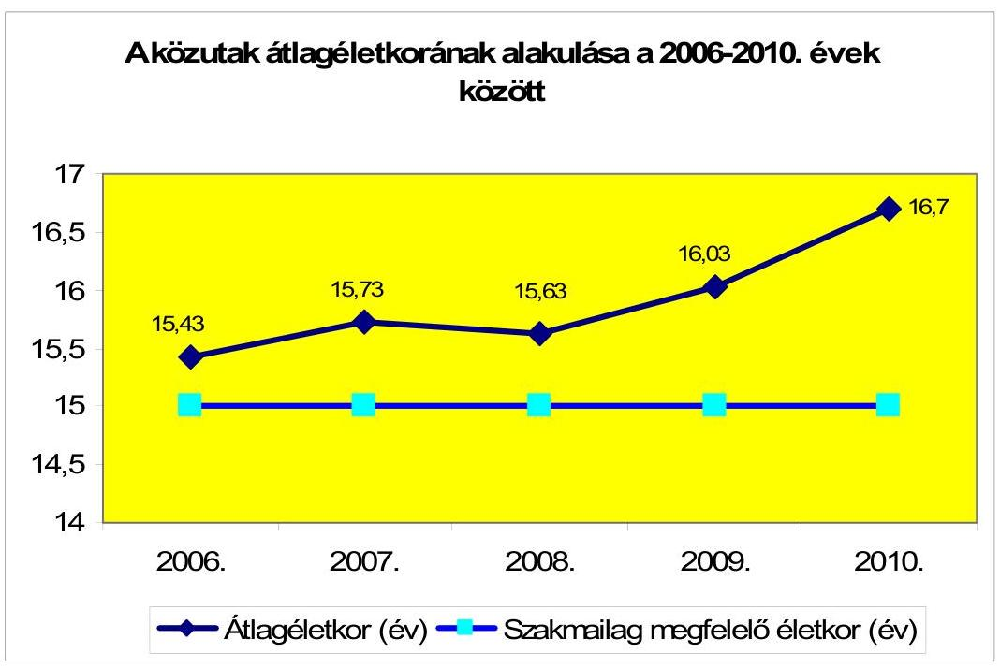

A Fővárosi Önkormányzatnál az útfelújítási program ${ }_{1,2}$ alapján felújított közutaknál az egymást követő felújítások között eltelt időtartam minden esetben meghaladta a 19 évet. A felújítások 19 évet meghaladó gyakorisága négy évvel magasabb volt az útügyi műszaki előírások szerinti 15 évenként javasolt gyakoriságnál ${ }^{121}$, valamint az útfelújítási program ${ }_{2}$ engedélyokiratának módosításaiban megjelölt felújítási gyakoriságnál ${ }^{122}$.

A 23 megyei jogú városi, valamint a három fővárosi kerületi önkormányzat adatszolgáltatása szerint a kezelésükben lévő egyes közutak, közútszakaszok két egymást követő felújítása között eltelt átlagos időtartam - a Fővárosi Önkormányzathoz hasonlóan - 19,8 év volt. A két felújítás között eltelt leghosszabb időtartam 43 év (Szeged), a legrövidebb négy év (Szekszárd) volt.

A 2006-2010. évek között a Fővárosi Önkormányzat kezelésében lévő 1050 km hosszúságú közút $38,6 \%$-át, azaz $405,4 \mathrm{~km}$ közutat, közútszakaszt újítottak fel. A közútfelújítás $78,9 \%$-át, azaz 320 km hosszúságú felújítást a 2006-2007. években végezték el, míg a követő években együttesen $85,3 \mathrm{~km}$-t közútszakaszt újítottak fel. A 2006. és 2007. évi közútfelújítás mértékéhez hozzájárult a központi költségvetésből a „települési önkormányzati szilárd burkolatú belterületi közutak burkolat-felújításának támogatása" jogcímen pályázat útján, valamint

[^0]
[^0]:    ${ }^{121}$ Az ÚT 2-1.201:2008 Közutak tervezése útügyi műszaki előírás (UME) 1.3. Közutak forgalmi tervezése c. fejezetének 1.3.1.2. Tervezési időtáv c. szakasza szerint:„A tervezési időtáv - amennyiben a létesítmény mértékadó részeinek élettartama konkrétan nem határozható meg - általában a létesítmény üzembe helyezésének időpontjától számított 15 év. Az erre az időtávra előrebecsült mértékadó forgalomra kell megtervezni: a közutak keresztszelvényét, az ütemezés lehetőségeinek figyelembevételével, a csomópontok ütemezett kialakítását, a nagy távlatra kialakított, végső állapotból „visszatervezve" a közutak pályaszerkezetét."
    ${ }^{122}$ Az útfelújítási program ${ }_{2}$ módosított engedélyokiratai szöveges indoklásának 3. pontja a közútszakaszok felújításának várható élettartamát 15 évben jelölte meg.

---

egyedi döntés alapján ${ }^{123}$ elnyert 7724,5 millió Ft állami támogatás. A pályázati feltételek szigorításával a közutak felújítási tervei visszafogottabbá váltak. A 2006-2010. évek között a közutak felületének 40,2\%-át, azaz $3978741 \mathrm{~m}^{2}$ útfelületet újítottak fel, amelynek $80 \%$-át a 2006-2007. években valósították meg.
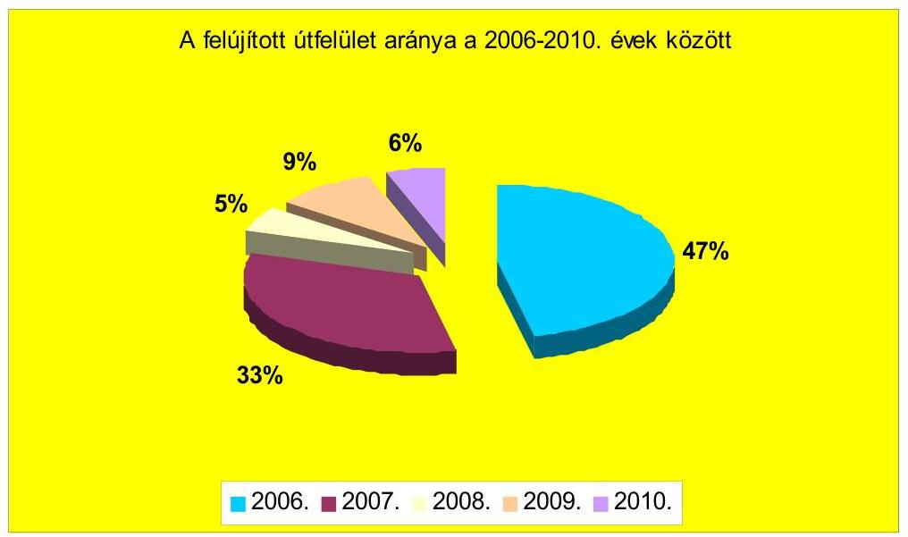

A 2006-2010. években az $1 \mathrm{~m}^{2}$-re jutó átlagos felújítási kiadás $8699 \mathrm{Ft} / \mathrm{m}^{2}$ volt, amely évente átlag - az árindexet meghaladó mértékben ${ }^{124}-22,3 \%$-kal növekedett. Az $1 \mathrm{~m}^{2}$-re jutó átlagos felújítási kiadás emelkedésére jelentős hatást a 2008. év - közbeszerzési eljárás eredményeként meghatározott - $15916 \mathrm{Ft} / \mathrm{m}^{2}$ értéke gyakorolt, amely egyrészt a felújítások műszaki tartalmával, azaz a magas költségigényű felújításokkal, valamint a fajlagos költségek növekedésével függött össze.

A Fővárosi Önkormányzat tulajdonában lévő közutak múszaki állapotáról az ingatlanvagyon-kataszter közlekedési terület betétlapjain rögzített állagmutatók nem nyújtottak valós, megalapozott információt, mivel a vonatkozó jogszabályi előírások, valamint a műszaki állapotfelmérések hiánya miatt nem aktualizálták ${ }^{125}$ a 2002. évben rögzített adatokat. Az önkormányzatok tulajdonában lévő ingatlanvagyon nyilvántartási és adatszolgáltatási rendjéről szóló 147/1992. (XI. 6.) Korm. rendelet 2. melléklete ugyanis nem rendelkezik a közlekedési terület betétlapjainak állagmutató adataira vonatkozóan a vezetés módjáról.

[^0]
[^0]:    ${ }^{123}$ A közútfelújítást a Fővárosi Önkormányzat útépítési és -fejlesztési támogatásáról szóló 2008/2006. (I. 26.) Korm. határozatban foglaltak szerint - a Kormány egyedi döntése alapján - 3 milliárd Ft támogatás segítette.
    ${ }^{124}$ A Központi Statisztikai Hivatal által a költségalapon számított építőipari árindexek, továbbá az építményfajták termelői árindexei között az „utak építményalcsoport"-ra közölt áridex adatok: 2007. év 106,3\%, 2008. év 104,7\%, 2009. év 103,7\%, 2010. év $101,6 \%$.
    ${ }^{125}$ A Főpolgármesteri Hivatalban a 2008. évtől az ingatlanvagyon-kataszter közlekedési terület betétlapjainak állagmutató adatait kizárólag a felújított útszakaszok esetében változtatták.

---

Az ingatlanvagyon-kataszter közlekedési terület betétlapjainak állagmutató adatai alapján a közutak műszaki állapotáról a 23 megyei jogú városi, valamint a három fővárosi kerületi önkormányzatból négy szolgáltatott teljes körűen, további öt hiányosan információkat, 17 önkormányzat pedig egyáltalán nem közölt adatokat. A hiányos adatszolgáltatás, valamint az adatok folyamatos karbantartásának elmaradása összefüggött az aktualizált vezetést előíró jogszabályi kötelezettség hiányával.

A Fővárosi Önkormányzat által kezelt közutak műszaki állapotára vonatkozó teljes körű felmérés 1996-ban volt, az 1999-ben és a 2007-ben végzett műszaki állapot-felmérések nem terjedtek ki valamennyi közútra. A teljes körű műszaki állapotfelmérés adatai nem álltak rendelkezésre, ezért a közutak műszaki állapot szerinti összetételének vizsgálatát nem lehetett elvégezni.

A Közgyűlés a 2009. évre az I. szolgáltatási szinthez kapcsolódóan 3845,3 millió Ft üzemeltetési és fenntartási szolgáltatás igénybevételéről döntött ${ }^{126}$, amelynek megfelelő összegben tervezték meg a közútkezelés előirányzatát a költségvetési rendeletben. A 2009. évi közútkezelési közszolgáltatási szerződés 1. számú módosítása ${ }^{127}$ során azonban a kiemelt aluljárók állapotjavítási programjának fedezetét - 563,4 millió Ft-ot - nem a Fővárosi Önkormányzat költségvetéséből tervezték biztosítani, hanem az FKF Zrt. képződő nyereségét (a fejlesztési célok fedezetét szolgáló összegen felüli részét) jelölték meg forrásként. A módosítás eredményeként a közszolgáltatás értékének 87,2\%-ára a Fővárosi Önkormányzat költségvetése, a 12,8\%-ára az FKF Zrt. képződő nyeresége nyújtott fedezetet. Az FKF Zrt. a társasági szintű nyereségéből a közutak üzemeltetési és fenntartási feladatai 2009. évi ellátásához 235 millió Ft-ot vett igénybe, amely a teljes ráfordításnak 5,8\%-a volt.

A Közgyűlés a 2010. évre szintén az I. szolgáltatási szint megrendeléséről döntött 5774,2 millió Ft összegben, a szolgáltatási érték forrásaként 93,1\%-ban a Fővárosi Önkormányzat költségvetését, 6,9\%-ban az FKF Zrt. 2010. évben képződő nyereségét határozták meg. A 2010. évi közszolgáltatási szerződés módosítása során a 300 millió Ft szolgáltatás ellenérték növekedés fedezetét előirány-zat-növeléssel a Fővárosi Önkormányzat költségvetése biztosította, amelynek eredményeként a költségvetés a feladatellátás 6,6\%-ára nem tartalmazott fedezetet. A 2010. év során az üzemeltetési és fenntartási feladatok ellátásához az FKF Zrt. nyereségéből 362 millió Ft-ot használtak fel, amely a teljes ráfordításnak $6,3 \%$-a volt.

Budapest, 2011. október „ 1

| Melléklet: | 7 db | 11 lap |
| :-- | :-- | --: |
| Függelék | 5 db | 8 lap |

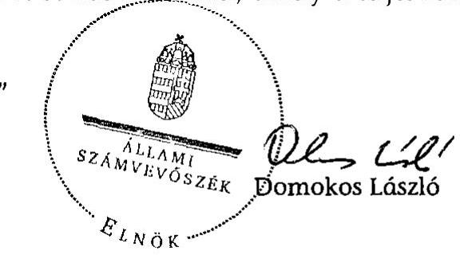

[^0]
[^0]:    ${ }^{126}$ a Közgyűlés 1980-1981/2008. (XII. 18.) számú határozatai
    ${ }^{127}$ A 2009. évi közszolgáltatási szerződést elsőként 2009. június 19-én módosították.

---

Budapest Főváros Önkormányzata

# A Fővárosi Önkormányzat gazdálkodását meghatározó adatok, mutatószámok 

| Megnevezés |  |
| :--: | :--: |
| Budapest állandó lakosainak száma (fő) 2010. január 1-jén* | 1721556 |
| A Fővárosi Közgyűlés tagjainak a száma (fő) (2010. december 31-én) | 33 |
| A Fővárosi Közgyűlés munkáját segítő állandó bizottságok száma (2010. december 31-én) | 8 |
| A Főpolgármesteri hivatalban foglalkoztatott köztisztviselők száma (fő) (2010. december 31-én) | 1108 |
| Az összes vagyon értéke a 2010. december 31-i könyvviteli mérleg szerint (millió Ft) | 2226943 |
| Az adósságállomány (hosszú és rövid lejáratú kötelezettség) 2010. december 31-én (millió Ft) | 217582 |
| Az összes 2010. évben teljesített költségvetési bevétel (millió Ft)** | 471907 |
| Ebből: saját bevétel (millió Ft), melyből | 106822 |
| helyi adóbevétel (millió Ft) | 86844 |
| Az egy lakosra jutó 2010. évi költségvetési bevétel (Ft) | 274117 |
| Az egy lakosra jutó 2010. évi saját bevétel (Ft) | 62050 |
| Az egy lakosra jutó 2010. évi helyi adóbevétel (Ft) | 50445 |
| Saját bevétel/Összes költségvetési bevétel aránya a 2010. évben (\%) | 22,6 |
| Helyi adó bevétel/Összes költségvetési bevétel aránya a 2010. évben (\%) | 18,4 |
| Az összes teljesített költségvetési kiadás a 2010. évben (millió Ft) | 422974 |
| Ebből: felhalmozási célú költségvetési kiadás (millió Ft) | 109463 |
| A 2010. évi költségvetési kiadásból a felhalmozási célú költségvetési kiadás aránya (\%) | 25,9 |
| Az egy lakosra jutó 2010. évi költségvetési kiadás (Ft) | 245693 |
| Az egy lakosra jutó 2010. évben teljesített felhalmozási célú költségvetési kiadás (Ft) | 63584 |
| A költségvetési intézmények száma 2010. december 31-én (db) | 214 |
| Ebből: önállóan működő és gazdálkodó (db) | 182 |
| A költségvetési intézményekben foglalkoztatott közalkalmazottak száma (fő) (2010. december 31-én) | 33021 |

* A Központi Statisztikai Hivatal által közzétett adat (népesség 2010. január 1.)
** A költségvetési bevétel összege tartalmazza az előző évi pénzmaradvány igénybevételét.

---

# A Fővárosi Önkormányzat 2007-2011. évi költségvetési előirányzatainak és 2007-2010. évi pénzügyi teljesítési adatainak bemutatása a 2010. január 1-jétől hatályos jogszabály alapján

|  Megnevezés | 2007. év |  |  |  | 2008. év |  |  |  | 2009. év |  |  |  | 2010. év |  |  |  | 2011.  |
| --- | --- | --- | --- | --- | --- | --- | --- | --- | --- | --- | --- | --- | --- | --- | --- | --- | --- |
|   | Eredeti | Módosított | Teljesítés (millió Ft) | Teljesítés (millió Ft) | Eredeti | Módosított |  | Teljesítés (millió Ft) | Teljesítés (millió Ft) | Eredeti | Módosított |  | Teljesítés (millió Ft) | Teljesítés (millió Ft) | Eredeti | Módosított |   |
|   | előirányzat (millió Ft) |  |  |  | előirányzat (millió Ft) |  | előirányzat (millió Ft) |  |  | előirányzat (millió Ft) |  |  |  | előirányzat (millió Ft) |  | előirányzat (millió Ft) |   |
|  Müködési célú költségvetési bevételek összesen | 271 262 | 291 081 | 301 101 | 111,0 | 292 955 | 332 682 | 341 445 | 116,6 | 302 143 | 325 223 | 311 319 | 103,0 | 294 906 | 345 218 | 341 493 | 115,8 | 300 405  |
|  Müködési célú költségvetési kiadások összesen | 249 408 | 283 729 | 259 199 | 103,9 | 267 675 | 318 158 | 290 781 | 108,6 | 273 876 | 311 122 | 278 857 | 101,8 | 269 205 | 338 104 | 313 511 | 116,5 | 271 125  |
|  Müködési célú költségvetési bevételek és kiadások egyenlege: hiány-, többlet + | 21 854 | 7 352 | 41 902 | 191,7 | 25 280 | 14 524 | 50 664 | 200,4 | 28 267 | 14 101 | 32 462 | 114,8 | 25 781 | 7 114 | 27 982 | 108,9 | 29 280  |
|  Felhalmozási célú költségvetési bevételek összesen | 168 955 | 162 251 | 99 623 | 59,0 | 175 541 | 149 123 | 153 992 | 87,7 | 139 009 | 89 016 | 88 938 | 64,0 | 139 492 | 122 510 | 55 190 | 39,6 | 120 376  |
|  Felhalmozási célú költségvetési kiadások összesen | 231 271 | 248 937 | 142 001 | 61,4 | 230 383 | 221 228 | 151 083 | 65,6 | 238 799 | 242 015 | 127 424 | 53,4 | 255 583 | 263 721 | 109 463 | 42,8 | 222 095  |
|  Felhalmozási célú költségvetési bevételek és kiadások egyenlege: hiány-, többlet+ | $-62316$ | $-86686$ | $-42378$ | 68,0 | $-54842$ | $-72105$ | 2909 |  | $-99790$ | $-152999$ | $-38486$ | 38,6 | $-116091$ | $-141211$ | $-54265$ | 46,7 | $-101739$  |
|  Költségvetési bevételek összesen* | 440 217 | 453 332 | 400 724 | 91,0 | 468 496 | 481 805 | 495 437 | 105,8 | 441 152 | 414 239 | 400 257 | 90,7 | 434 398 | 467 728 | 396 691 | 91,3 | 420 761  |
|  Költségvetési kiadások összesen | 480 679 | 532 666 | 401 200 | 83,5 | 498 058 | 539 386 | 441 864 | 88,7 | 512 675 | 553 137 | 406 281 | 79,2 | 524 788 | 601 825 | 422 974 | 80,6 | 493 220  |
|  Költségvetési bevételek és kiadások egyenlege: hiány-, többlet+ | $-40462$ | $-79334$ | $-476$ | 1,2 | $-29562$ | $-57581$ | 53573 |  | $-71523$ | $-138898$ | $-6024$ | 8,4 | $-90390$ | $-134097$ | $-26283$ | 29,1 | $-72459$  |
|  Előző évek pénzmaradványa, vállalkozási maradvány igénybevétele működési célra | 0 | 26 034 | 20 121 |  | 0 | 21 320 | 17 840 |  | 0 | 30 328 | 21 986 |  | 0 | 21 246 | 16 223 |  | 200  |
|  Előző évek pénzmaradványa, vállalkozási maradvány igénybevétele felhalmozási célra | 2750 | 15 588 | 9 856 | 358,4 | 20 196 | 26 895 | 25 012 | 123,8 | 25 578 | 62 395 | 56 153 | 220 | 57 457 | 83 124 | 58 993 | 103 | 26 757  |
|  Előző évek pénzmaradványa, vállalkozási maradvány igénybevétele összesen | 2750 | 41 622 | 29 977 | 1090,1 | 20 196 | 48 215 | 42 852 | 212,2 | 25 578 | 92 723 | 78 139 | 305,5 | 57 457 | 104 370 | 75 216 | 130,9 | 26 957  |
|  Előző évek pénzmaradványa, vállalkozási maradvány igénybevétele utáni hiány-/többlet+ | $-37712$ | $-37712$ | 29 501 |  | $-9366$ | $-9366$ | 96 425 |  | $-45945$ | $-46175$ | 72 115 |  | $-32933$ | $-29727$ | 48 933 | $-148,6$ | $-45502$  |
|  Ebből: Előző évek működési célú pénzmaradványa, vállalkozási maradvány igénybevétele utáni működési célú költségvetési bevételek és kiadások egyenlege: hiány-, többlet + | 21 854 | 33 386 | 62 023 | 283,8 | 25 280 | 35 844 | 68 504 | 271,0 | 28 267 | 44 429 | 54 448 | 192,6 | 25 781 | 28 360 | 44 205 | 172,0 | 29400  |
|  Előző évek felhalmozási célú pénzmaradványa, vállalkozási maradvány igénybevétele utáni felhalmozási célú költségvetési bevételek és kiadások egyenlege: hiány-, többlet + | $-59566$ | $-71098$ | $-32522$ | 54,6 | $-34646$ | $-45210$ | 27 921 |  | $-74212$ | $-90604$ | 17 667 |  | $-58634$ | $-58087$ | 4 728 | $-8,1$ | $-74982$  |
|  Finanszírozási célú pénzügyi bevételek | 54 274 | 54 274 | 30 022 |  | 25 301 | 25 301 | 10 700 |  | 65 064 | 65 294 | 18 813 |  | 47 443 | 44 237 | 31 238 |  | 55 407  |
|  Finanszírozási célú pénzügyi kiadások | 16 562 | 16 562 | 15 548 |  | 15 935 | 15 935 | 19 444 |  | 19 119 | 19 119 | 20 025 |  | 14 510 | 14 510 | 14 708 |  | 9 993  |
|  Finanszírozási célú pénzügyi műveletek egyenlege | 37712 | 37712 | 14 474 |  | 9366 | 9366 | $-8744$ |  | 45945 | 46175 | $-1212$ |  | 32933 | 29727 | 16530 |  | 45502  |

Fonrás: - Magyar Államkincstár éves költségvetési beszámoló "80" számú árlap ÁSZ ellenőrzés során korrigált (könyvvizsgáló auditálási eltéelt is figyelembe véve) adatai;

- a 2011. évi adatok esetében az Önkormányzat 2011. évi elemi költségvetése;
- a költségvetési bevétel-kiadás működési-felhalmozási célra történt megoszúsúnál az analitikus nyilvántartás.
- A 2010. évtől az Ábt-ban foglaltak alapján a költségvetési bevételek nem tartalmazzák az előző évi pénzmaradvány, vállalkozási maradvány igénybevételeinek összegét, a költségvetési hiány vagy többlet összegének megállapítása is ezeknek a pénzforgalom nélküli bevételeknek a figyelembe vétele nélkül történik Az egyes évek adatainak összehasonlításiúsága, a Fővárosi Önkormányzat költségvetési és pénzügyi helyzetéről a helyes következtetések levonása érdekében a 2008. és 2009. évben a költségvetési bevételek, illetve a költségvetési többlet vagy hiány összegét az előző évi pénzmaradvány, vállalkozási tartalék igénybevételeinek összegével korrigáltak.

---

Budapest Főváros Önkormányzata

A Fővárosi Önkormányzat 2007-2011. évi költségvetési előirányzatainak és 2007-2010. évi pénzügyi teljesítési adatainak bemutatása a 2009. december 31-ig hatályos jogszabály alapján

|  Megnevezés | 2007. év |  |  |  | 2008. év |  |  |  | 2009. év |  |  |  | 2010. |  |  |  | 2011.  |
| --- | --- | --- | --- | --- | --- | --- | --- | --- | --- | --- | --- | --- | --- | --- | --- | --- | --- |
|   | Eredeti | Módosított | Teljesítés
(millió Ft) | Teljesítés
eredeti
előirány-
zat % | Eredeti | Módosított | Teljesítés
(millió Ft) | Teljesítés
eredeti
előirány-
zat % | Eredeti | Módosított | Teljesítés
(millió Ft) | Teljesítés
eredeti
előirány-
zat % | Eredeti | Módosított | Teljesítés
(millió Ft) | Teljesítés
eredeti
előirány-zat
% | Eredeti
előirányzat
(millió Ft)  |
|  Müködési célú költségvetési bevételek összesen | 271 262 | 317 115 | 321 222 | 118,4 | 292 955 | 354 002 | 359 285 | 122,6 | 302 143 | 355 551 | 333 305 | 110,3 | 294 906 | 366 464 | 357 716 | 121,3 | 300 605  |
|  Müködési célú költségvetési kiadások összesen | 249 408 | 283 729 | 259 199 | 103,9 | 267 675 | 318 158 | 290 781 | 108,6 | 273 876 | 311 122 | 278 857 | 101,8 | 269 205 | 338 104 | 313 511 | 116,5 | 271 125  |
|  Müködési célú költségvetési bevételek és kiadások egyenlege: hiány-, többlet + | 21 854 | 33 386 | 62 023 | 283,8 | 25 280 | 35 844 | 68 504 | 271,0 | 28 267 | 44 429 | 54 448 | 192,6 | 25 701 | 28 360 | 44 205 | 172,0 | 29 480  |
|  Felhalmozási célú költségvetési bevételek összesen | 171 705 | 177 839 | 109 479 | 63,8 | 195 737 | 176 018 | 179 004 | 91,5 | 164 587 | 151 411 | 145 091 | 88,2 | 196 949 | 205 634 | 114 191 | 58,0 | 147 113  |
|  Felhalmozási célú költségvetési kiadások összesen | 231 271 | 248 937 | 142 001 | 61,4 | 230 383 | 221 228 | 151 083 | 65,6 | 238 799 | 242 015 | 127 424 | 53,4 | 255 583 | 263 721 | 109 463 | 42,8 | 222 095  |
|  Felhalmozási célú költségvetési bevételek és kiadások egyenlege: hiány-, többlet+ | -59 566 | -71 098 | -32 522 | 54,6 | -34 646 | -45 210 | 27 921 |  | -74 212 | -90 604 | 17 667 |  | -58 634 | -58 087 | 4 728 |  | -74 982  |
|  Költségvetési bevételek összesen | 442 967 | 494 954 | 430 701 | 97,2 | 488 692 | 530 020 | 538 289 | 110,1 | 466 730 | 506 962 | 478 396 | 102,5 | 491 855 | 572 098 | 471 907 | 95,9 | 447 718  |
|  Költségvetési kiadások összesen | 480 679 | 532 666 | 401 200 | 83,5 | 498 058 | 539 386 | 441 864 | 88,7 | 512 675 | 553 137 | 406 281 | 79,2 | 524 788 | 601 825 | 422 974 | 80,6 | 493 220  |
|  Költségvetési bevételek és kiadások egyenlege: hiány-, többlet+ | -37 712 | -37 712 | 29 501 |  | -9 366 | -9 366 | 96 425 |  | -45 945 | -46 175 | 72 115 |  | -32 933 | -29 727 | 48 933 |  | -45 502  |
|  Finanszírozási célú pénzügyi bevételek | 54 274 | 54 274 | 30 022 |  | 25 301 | 25 301 | 10 700 |  | 65 064 | 65 294 | 18 813 |  | 47 443 | 44 237 | 31 238 |  | 55 407  |
|  Finanszírozási célú pénzügyi kiadások | 16 562 | 16 562 | 15 548 |  | 15 935 | 15 935 | 19 444 |  | 19 119 | 19 119 | 20 025 |  | 14 510 | 14 510 | 14 708 |  | 9 905  |
|  Finanszírozási célú pénzügyi műveletek egyenlege | 37 712 | 37 712 | 14 474 |  | 9 366 | 9 366 | -8 744 |  | 45 945 | 46 175 | -1 212 |  | 32 933 | 29 727 | 16 530 |  | 45 502  |

*Forrás:* - Magyar Államkincstár éves költségvetési beszámoló "80" számú űrlap ÁSZ ellenőrzés során korrigált (kőnyvvizsgáló auditálási eltéšet is figyelembe véve) adatai; - a 2011. évi adatok esetében a Fővárosi Önkormányzat 2011. évi költségvetése

---

Budapest Főváros Önkormányzata

# A Fővárosi Önkormányzat vagyonának alakulása

|  Mérlegsor megnevezése | 2007.év
(millió Ft) | 2008.év
(millió Ft) | 2009. év
(millió Ft) | 2010. év
(millió Ft) | Változás \%-a (Előző év=100\%) |  |   |
| --- | --- | --- | --- | --- | --- | --- | --- |
|   |  |  |  |  | 2008/2007. | 2009/2008. | 2010/2009.  |
|  Immateriális javak | 1597 | 1497 | 1998 | 1826 | 93,7 | 133,5 | 91,4  |
|  Tárgyi eszközök | 1236383 | 1275468 | 1328203 | 1380120 | 103,2 | 104,1 | 103,9  |
|  ebből; ingatlanok | 1153047 | 1164225 | 1188815 | 1192114 | 101,0 | 102,1 | 100,3  |
|  beruházások, felújítások | 53966 | 87004 | 119825 | 169887 | 161,2 | 137,7 | 141,8  |
|  Befektetett pénzügyi eszközök | 283069 | 278805 | 291953 | 292928 | 98,5 | 104,7 | 100,3  |
|  Üzemeltetésre átadott eszközök | 438583 | 447222 | 447271 | 444655 | 102,0 | 100,0 | 99,4  |
|  Befektetett eszközök összesen | 1959632 | 2002992 | 2069425 | 2119529 | 102,2 | 103,3 | 102,4  |
|  Forgóeszközök összesen | 92137 | 141678 | 133861 | 107414 | 153,8 | 94,5 | 80,2  |
|  ebből; követelések | 7972 | 8745 | 10548 | 11656 | 109,7 | 120,6 | 110,5  |
|  értékpapírok | 13967 | 18083 | 17595 | 7928 | 129,5 | 97,3 | 45,1  |
|  pénzeszközök | 55831 | 96749 | 86631 | 56525 | 173,3 | 89,5 | 65,2  |
|  egyéb aktív pénzügyi elszámolások | 11699 | 15228 | 16090 | 28254 | 130,2 | 105,7 | 175,6  |
|  Eszközök összesen | 2051769 | 2144670 | 2203286 | 2226943 | 104,5 | 102,7 | 101,1  |
|  Saját tőke összesen | 1767410 | 1783070 | 1845821 | 1916654 | 100,9 | 103,5 | 103,8  |
|  ebből; induló tőke(2010-től tartós tőke) | 155739 | 154930 | 154930 | 337441 | 99,5 | 100,0 | 217,8  |
|  Tartalék összesen | 52000 | 96848 | 107223 | 87803 | 186,2 | 110,7 | 81,9  |
|  Kötelezettségek összesen | 232359 | 264752 | 250242 | 222486 | 113,9 | 94,5 | 88,9  |
|  ebből; hosszú lejáratú kötelezettségek | 143330 | 141039 | 147533 | 163407 | 98,4 | 104,6 | 110,8  |
|  rövid lejáratú kötelezettségek | 73480 | 108584 | 89616 | 54175 | 147,8 | 82,5 | 60,5  |
|  Források összesen: | 2051769 | 2144670 | 2203286 | 2226943 | 104,5 | 102,7 | 101,1  |

Forrás: Magyar Államkincstár éves költségvetési beszámoló "01" számú űrlap ÁSZ ellenőrzés során korrigált adatai.

---

Budapest Főváros Önkormányzata

A Fővárosi Önkormányzat kötelezettségeinek alakulása

|  Mérlegsor megnevezése | 2007.év (millió Ft) | 2008.év (millió Ft) | 2009. év (millió Ft) | 2010. év (millió Ft) | Változás \%-a (Előző év=100\%) |  |  |   |
| --- | --- | --- | --- | --- | --- | --- | --- | --- |
|   |  |  |  |  | 2008/2007. | 2009/2008. | 2010/2009. | 2010/2007.  |
|  Hosszú lejáratú kötelezettségek összesen | 143330 | 141039 | 147533 | 163407 | 98,4 | 104,6 | 110,8 | 114,0  |
|  ebből: hosszú lejáratra kapott kölcsönök | 0 | 0 | 0 | 0 |  |  |  |   |
|  tartozások fejlesztési célú kötvénykibocsátásból | 0 | 0 | 0 | 0 |  |  |  |   |
|  tartozások müködési célú kötvénykibocsátásból | 0 | 0 | 0 | 0 |  |  |  |   |
|  beruházási és fejlesztési hitelek | 141191 | 140639 | 147005 | 162875 | 99,6 | 104,5 | 110,8 | 115,4  |
|  müködési célú hosszú lejáratú hitelek | 0 | 0 | 0 | 0 |  |  |  |   |
|  egyéb hosszú lejáratú kötelezettségek | 139 | 400 | 528 | 532 | 287,8 | 132,0 | 100,8 | 382,7  |
|  Rövid lejáratú kötelezettségek összesen | 73480 | 108584 | 89616 | 54175 | 147,8 | 82,5 | 60,5 | 73,7  |
|  ebből: rövid lejáratú kölcsönök | 0 | 0 | 0 | 0 |  |  |  |   |
|  rövid lejáratú hitelek | 0 | 0 | 0 | 0 |  |  |  |   |
|  kötelezettségek áruszállításból, szolgáltatásból | 12934 | 14020 | 16089 | 12500 | 108,4 | 114,8 | 77,7 | 96,6  |
|  garancia- és kezességvállalásból szárm. köt. | 0 | 0 | 0 | 0 |  |  |  |   |
|  h. lejár. kapott kölcsön köv. évet terh.törl.részl. | 0 | 0 | 0 | 0 |  |  |  |   |
|  felh.c.kötv.kib-ból szárm.tart.köv.évet terh.r. | 0 | 0 | 0 | 0 |  |  |  |   |
|  mük.c.kötv.kib-ból szárm.tart.köv.évet terh.r. | 0 | 0 | 0 | 0 |  |  |  |   |
|  beruh.fejl.hitel köv.évet terhelő törl. részlete | 15886 | 19083 | 14487 | 9868 | 120,1 | 75,9 | 68,1 | 62,1  |
|  müködési c.hosszú lej.hitel köv.évet terh.törl.r. | 0 | 0 | 0 | 0 |  |  |  |   |
|  egyéb hosszú lej.köt.köv.évet terh.törl. részlete | 103 | 7 | 2 | 48 | 6,8 | 28,6 | 2400,0 | 46,6  |

Forrás: Magyar Államkincstár éves költségvetési beszámoló "01" számú űrlap adatai.

---

5. számú melléklet a V-3003/2011. számú jelentéshez

**A 2009. és a 2010. évi közszolgáltatási szerződésben rögzített, szerződött, valamint a tevékenységek szerint összesített, az elszámolás szerint teljesített volumen*- és költségadatok**

|  Év | Tevékenység megnevezése | Mennyiségi egység | Egységérték (Ft) | Szerződött volumen | Tervezett forrás | Elszámolás szerinti volumen* | Tényköltség az egységérték alapján | Felmerült tényköltség | Volumen eltérés (Elszámolás szerinti*- Szerződött volumen) | Teljesített volumen (%) (Elszámolás szerinti*- Szerződött volumen) | Egységértékkel kalkulált költségeltérés (Tényköltség egységérték alapján - Terv) | Eltérés költség (Felmerült tény - Terv)  |
| --- | --- | --- | --- | --- | --- | --- | --- | --- | --- | --- | --- | --- |
|  2009. év | Ülburkolati jelek fenntartása | m³ | 5 543 | 90 208 | 500 000 000 | 90 441 | 501 315 461 | 442 472 365 | 233 | 100,3% | 1 315 461 | -57 527 635  |
|   | Kátyúzás | tonna | 66 000 | 8 340 | 550 000 000 | 8 119 | 535 867 200 | 676 155 398 | -221 | 97,4% | -14 132 800 | 126 155 398  |
|   | Burkolatfenntartás, ezen belül |  |  |  |  |  |  |  | 104,1% ** |  |  |   |
|   | Repedések javítása | fm | 1 200 | 12 500 | 15 000 000 | 7 370 | 8 844 000 | 8 844 000 | -5 130 | 59,0% | -6 156 000 | -6 156 000  |
|   | Kö- és viacolorburkolatok javítása | m³ | 28 000 | 1 400 | 40 000 000 | 657 | 18 397 120 | 11 826 000 | -743 | 46,9% | -21 602 880 | -28 174 000  |
|   | Autóbuszmegálló javítása viacolorral és egyéb technológiával, szélsó sávok nyomvályúsodásának megszüntetése | m³ | 28 000 | 1 786 | 50 000 000 | 3 070 | 85 955 240 | 79 820 000 | 1 284 | 171,9% | 35 955 240 | 29 820 000  |
|   | Felületjavítás vízelvezetési problémák megszüntetése érdekében, csomóponti területek, járműosztályozók burkolatjavítása és buszmegállók marásos javítása | m³ | 21 360 | 2 340 | 50 000 000 | 2 783 | 59 444 880 | 16 705 662 | 443 | 118,9% | 9 444 880 | -33 294 338  |
|   | Burkolatjelintések | m³ | 21 360 | 1 405 | 30 000 000 | 1 848 | 39 476 270 | 36 960 000 | 443 | 131,5% | 9 476 270 | 6 960 000  |
|   | Vékonyaszkálnál történő javítás | m³ | 0 | 0 | 0 | 0 | 0 | 0 | 0 | 0,0% | 0 | 0  |
|   | Járdasüllyedések, járdaszegélyek és járda kopóréteg javítása | m³ | 10 000 | 3 500 | 35 000 000 | 3 255 | 32 552 400 | 24 477 600 | -245 | 93,0% | -2 447 600 | -10 522 400  |
|   | Szirályáratak fenntartása | m³ | 10 000 | 500 | 5 000 000 | 0 | 0 | 0 | -500 | 0,0% | -5 000 000 | -5 000 000  |
|   | Összesen |  |  |  | 1 275 000 000 |  | 1 281 852 571 | 1 297 261 025 |  |  | 6 852 571 | 22 261 025  |
|  2010. év | Ülburkolati jelek fenntartása | m³ | 6 870 | 72 776 | 500 000 000 | 76 228 | 523 686 360 nincs adat | 3 452 | 104,7% | 23 686 360 |  |   |
|   | Kátyúzás | tonna | 78 100 | 7 800 | 609 180 000 | 14890 | 1 162 909 000 nincs adat | 7 090 | 190,9% | 553 729 000 |  |   |
|   | Burkolatfenntartás, ezen belül |  |  |  |  |  |  |  | 101,2% ** |  |  |   |
|   | Repedések javítása | fm | 1 850 | 9 300 | 17 205 000 | 9 291 | 17 188 350 nincs adat | -9 | 99,9% | -16 650 |  |   |
|   | Kö- és viacolorburkolatok javítása | m³ | 18 000 | 290 | 5 220 000 | 863 | 15 534 000 nincs adat | 573 | 297,6% | 10 314 000 |  |   |
|   | Betonalap készítés | m³ | 71 000 | 300 | 21 300 000 | 1 217 | 86 407 000 nincs adat | 917 | 405,7% | 65 107 000 |  |   |
|   | Autóbuszmegálló javítása egyéb speciális technológiákkal | m³ | 31 500 | 3 750 | 118 125 000 | 46 | 1 449 000 nincs adat | -3 784 | 1,2% | -116 676 000 |  |   |
|   | Ülburkolat marásos javítása 2 rétegben | m³ | 22 700 | 3 090 | 70 143 000 | 17 959 | 407 669 300 nincs adat | 14 869 | 581,2% | 337 526 300 |  |   |
|   | Felületjavítás csak marással cm-enként | m³ | 780 | 6 870 | 5 358 600 | 45 | 35 100 nincs adat | -6 825 | 0,0% | -5 323 500 |  |   |
|   | Szegélyépítés | fm | 9 000 | 1 850 | 16 650 000 | 1 514 | 13 626 000 nincs adat | -336 | 81,8% | -3 024 000 |  |   |
|   | Járda kopóréteg javítás | m³ | 7 500 | 5 500 | 41 250 000 | 4 218 | 31 635 000 nincs adat | -1 282 | 76,7% | -9 615 000 |  |   |
|   | Összesen |  |  |  | 1 404 431 608 |  | 2 260 139 110 |  |  |  | 855 707 510 |   |

- A Fővárosi Önkormányzat felé készített elszámolások megalapozását célzó felmérési naplókban, így az elszámolásokban foglalt mennyiségi adatok sem voltak pontosak

* Az egyes burkolatfenntartási feladatok egységértékeivel súlyozott átlag teljesítmény volumen

---

Budapest Fővágó Önkormányzata

6. számú melléklet a V-3003-2011. számú jelentéshez

# SZÁMÚ TANISÍTVÁNY

A Közutak értékadatukor vonatkozóan 2006-2010. évúi között

|  Évúzi |  |  |  | A közutak |  |  |   |
| --- | --- | --- | --- | --- | --- | --- | --- |
|   |  |  |  | Bruttó értékának és
bánbani információra | Bruttó értékának és
bánbani
rejtőférítése** | Az végé bruttó érték | Megtekintés
értékacélbanná vej | Megtekintés
értékacél ben-
szereté
értékacélbanná
bánba  |
|  2006. |  |  |  | 158 240 431 | 16 706 119 | 2 815 195 | 170 131 355 | 73 246 212  |
|  2007. |  |  |  | 110 131 355 | 10 475 354 | 2 201 776 | 178 404 933 | 76 797 263  |
|  2008. |  |  |  | 178 404 933 | 15 352 748 | 1 825 763 | 192 130 918 | 84 277 035  |
|  2009. |  |  |  | 192 130 918 | 11 269 905 | 3 125 726 | 200 275 097 | 90 048 526  |
|  2010. |  |  |  | 202 275 097 | 5 437 427 | 1 576 725 | 204 135 798 | 96 417 643  |

Jönnegyértézik:

- Az értékadások kizárólag a közlérsek, nem különínynek az értékadások tartalmazzal, nem foglalják megukós a főtő értékét.
- A rejtőférítés adatai nem tartalmazzák a külön oszlopban is tudatot, ha a szerinti értékacélbannáa leírás összegét.

Megjegyzés:

Az adatazolgáltatás a kulcsosan „U" igazolási nyilvántartott adatok alapján kerül összeállítókra, és kizárólag a 100-ánzés Önkormányzat Jiátgőértékűn lévő ingatlanokra vonatkozóan, nem tartalmazza az elegen ingatlanokon végzett beruházások, felújítások értékét. A tévétezésénél a 12. és 15. számúszoprotokban nyilvántartott ingatlanokat egyaránt figyelembe vettük.

Nyilatkozat: A tanisilványban szereplő adatok valódóságrát igazoljon.

Kizárója időpontja: 2011. április 1/1.

P. H.

a közszolgáltató képviselőkben

---

# Kérdések és válaszok a Fővárosi Önkormányzat közútfenntartási feladatellátásának megítéléséhez 

Főkérdés: Gazdaságosan és eredményesen látta-e el a Főváros Önkormányzata a főváros tömegközlekedési feladatait?
(minősités a gazdaságossági és az eredményességi kritériumokra adott válaszok figyelembe vételével)

1. Gazdaságos a főváros közútfenntartási feladatainak ellátása, ha:

- a közszolgáltatási szerződésekben rögzített feladatellátásért járó szolgáltatási díjat - az előkalkuláció eredményeként - a közútfenntartás közvetlen költségei, valamint a megalapozottan hozzárendelt közvetett költségek alapján határozták meg, és
- a feladattal megbízott szervezet - versenyeztetési eljárás eredményeként - a legjobb ajánlatot tevő alapanyag beszállítókat és alvállalkozókat választotta ki, és a versenyeztetés során kialakult árat érvényesítették a szolgáltatási ellenérték meghatározásakor és
- a közútfenntartási munkák minőségi színvonala nem okozott indokolatlan többletfeladatot azáltal, hogy nem megfelelő minőségủ munkavégzés miatt ismételt javításra az elvárt élettartamon belül került sor és mindezek együttesen biztosították, hogy a legalacsonyabb költség (ráfordítás) mellett valósult meg a közútfenntartási tevékenység.

### 1.1 A 2009. és a 2010. évi közszolgáltatási szerződésekben rögzített feladatellátásért járó szolgáltatási díjat - az előkalkuláció eredményeként - a közútfenntartás közvetlen költségei, valamint a megalapozottan hozzárendelt közvetett költségek alapján határozták-e meg?

NEM
Az. éves közszolgáltatási keretszerződésekben a szolgáltatásért járó ellenértéket nem az FKF Zrt. által elkészített előkalkuláció alapján határozták meg. A 2009. és 2010. évekre a közszolgáltatási keretszerződés 2. számú mellékletében foglaltakkal ellenére az FKF Zrt. - nem rendelkezett (az Önkormányzat által elfogadott) egységárgyűjteménnyel.

---

| 1.2 | Versenyeztetéssel érvényesítette-e a közútfenntartási feladatok ellátásával megbízott szervezet a gazdaságossági szempontokat a feladatok ellátása során?   IGEN   Összességében: az FKF Zrt. mind az alapanyag beszállítók, mind az alvállalkozók kiválasztásakor versenyeztetett és a versenyeztetés során kialakult árat érvényesítette a Fővárosi Önkormányzat felé. |
| :--: | :--: |
| 1.2.1 | A feladattal megbízott szervezet - versenyeztetési eljárás eredményeként - a ráfordítások minimalizálása érdekében a legjobb ajánlatot (a megfelelő technológia melletti legalacsonyabb ár) tevő alapanyag beszállítókat választotta-e ki, és a versenyeztetés során kialakult árat érvényesítették-e a szolgáltatási ellenérték meghatározásakor?   IGEN   Az FKF Zrt. az útfenntartási feladatok ellátásához szükséges öntött és hengerelt aszfalt beszállítóját, továbbá az útburkolati jel festékanyagok beszállítóját közbeszerzési eljárás keretében választotta ki, illetve a közbeszerzési értékhatárt el nem érő értékủ hidegaszfalt beszerzésre három ajánlat bekérését követően szerződött a legjobb ajánlatot tevővel. Az FKF Zrt. - a közútfenntartási költségelszámolások, a költségek utókalkulációja, az azokat alátámasztó alapanyag beszállítói és alvállalkozói szerződések és számlák, továbbá a Fővárosi Önkormányzat felé kiállított számlák és a kifizetések bankbizonylatai alapján - a versenyeztetéssel kiválasztott alapanyag beszállítókkal kötött, teljesített szerződésekben szereplő árakat építette be a Fővárosi Önkormányzat felé elszámolt közútfenntartási költségekbe. |
| 1.2.2 | A feladattal megbízott szervezet - versenyeztetési eljárás eredményeként - a ráfordítások minimalizálása érdekében a legjobb ajánlatot (a megfelelő technológia melletti legalacsonyabb ár) tevő alvállalkozókat választotta-e ki, és a versenyeztetés során kialakult árat érvé-nyesítették-e a szolgáltatási ellenérték meghatározásakor?   IGEN   Az FKF Zrt. a 2009. évben nem vett igénybe alvállalkozót kátyúzási feladatok ellátására. 2010. januárban egy közbeszerzési értékhatárt el nem érő értékủ szerződést kötött három ajánlat bekérését követően a kátyúzási munkák kivitelezésére, további kettő szerződés megkötésére közbeszerzési eljárás keretében kiválasztott, a legjobb ajánlatot adó alvállalkozókkal került sor. Az FKF Zrt. a 2009-2010. években egy-egy közbeszerzési eljárás keretében kiválasztott, legkedvezőbb ajánlatot tevő alvállalkozóval kötött szerződést útburkolati jel létesítési, illetve fenntartási feladatok ellátására. Az FKF Zrt. a versenyeztetéssel kiválasztott alapanyag beszállítókkal kötött, teljesített szerződésekben szereplő árakat építette be a Fővárosi Önkormányzat felé elszámolt közútfenntartási költségekbe. |

---

# 1.3. A közútfenntartási munkák minőségi színvonala okozott-e indokolatlan többletfeladatot azáltal, hogy nem megfelelő minőségü munkavégzés miatt ismételt javításra az elvárt élettartamon belül került sor? 

## IGEN

A közútfenntartási munkák nem megfelelő minőségi színvonala többletfeladatot okozott azáltal, hogy a kátyúzott útszakaszokon és a felfestett burkolati jelek tekintetében a kátyúzást és a burkolati jel fenntartást követően indokolatlanul gyorsan, az elvárt élettartamon belül ismételt javítások váltak szükségessé. Ezek a kátyúk körbevágásának, az aszfalt terítésének, bedolgozásának, a meglévő burkolathoz a szintbeli csatlakozás kialakításának hibáira, a kátyúk alsó és oldalsó felületének emulziós kenésének, hézagzáró szalag beépítésének hiányára, vagy hibás beépítés miatti megbomlására, a nem megfelelő aszfaltkeverék beépítésére, továbbá az útburkolati jelek esetében a felfestési technológia és a felhasznált festékanyag nem megfelelő alkalmazására vezethetők vissza. A kátyúzásnál a dokumentáltság és az adminisztráció hiányosságai, valamint a döntéshozatal szabályozatlansága is a minőség romlását, így többletfeladatokat eredményezett.
2. Eredményes a főváros közútfenntartási feladatainak ellátása, ha:

- a feladatellátással megbízott szervezet a jogszabályban előírt határidőben valósította meg a közútfenntartási feladatokat, azaz a teljesített határidő, gyakoriság nem haladja meg a kapcsolódó jogszabályban ajánlott határidőket, gyakoriságot, és közszolgáltatási szerződésekben megrendelt mennyiségben megvalósította a közútfenntartási feladatokat, valamint a megrendelt, a műszakiszakmai normáknak megfelelő minőségben látta el a 2010. évi közszolgáltatási szerződésben előírt közútfenntartási feladatokat, továbbá;
- a Fővárosi Önkormányzat legalább akkora összegben biztosította a közutak használati értéke hosszú távú fennmaradásához a fedezetet, hogy a tényleges felújítási kiadások értéke minden évben elérte, vagy meghaladta az éves terv szerinti értékcsökkenés összegét, ezáltal a közutak átlagéletkora évente kedvezően alakult, azaz mérséklődött az előző évhez viszonyítva.
2.1 Az FKF Zrt. a jogi szabályozásban előírt határidőben valósította-e meg a közútfenntartási feladatokat?

## NEM

Az FKF Zrt. a GKM rendeletben javasolt egy, illetve két napos határidőn túl, a 2009. évben átlag 4,6 nap, míg a 2010. évben átlag 6,5 nap elteltével végezte el a kátyúzást.
2.2 A FKF Zrt. a 2009-2010. évi közszolgáltatási szerződésekben megrendelt mennyiségben valósította-e meg a közútfenntartási feladatokat?

Az elszámolások megalapozását szolgáló, geometriai méretek alapján, vagy becsléssel meghatározott adatokat tartalmazó felmérési naplók szerint összeállított elszámolási dokumentumok pontatlanok voltak, így a megrendelt mennyiségek valós teljesítése az elszámolási dokumentumokból nem állapítható meg.

---

| 2.3 | A FKF Zrt. a megrendelt, a múszaki-szakmai normáknak megfelelő minőségben látta-e el a 2010. évi közszolgáltatási szerződésben előírt közútfenntartási feladatokat?   NEM   Az aszfaltkátyúzás csatlakozó felületei hézagai kiöntése, lezárása hiányzott, az aszfalt terítése, bedolgozása, szintbeli csatlakozásának kialakítása, így felületének egyenletessége nem volt megfelelő, valamint az útburkolati jelek hiányoztak, illetve minőségük nem a műszaki-szakmai normák szerinti volt. |
| :--: | :--: |
| 2.4 | Biztosította-e a Fővárosi Önkormányzat a közutak használati értéke hosszú távú fennmaradásához szükséges fedezetet azáltal, hogy a 2006-2010. évek között a tényleges felújítási kiadások mértéke minden évben elérte, vagy meghaladta a számviteli előírások alapján számított éves terv szerinti értékcsökkenési leírás összegét, valamint a közutak átlagéletkora évente kedvezően alakult, azaz mérséklődött az előző évhez viszonyítva?   NEM   A felújítások évenkénti tényleges kiadásai a 2006-2007. években ugyan meghaladták a fizikai kopást, elhasználódást kifejező éves terv szerinti értékcsökkenési leírás összegét, azonban a 2008-2010. években elmaradtak attól. A felújítások hatására közutak burkolatának átlagéletkora - a 2008. év kivételével - folyamatosan emelkedett, mivel a felújítások nem voltak képesek ellensúlyozni az értékcsökkenéssel kifejezett kopást, elhasználódást. |

---

|  KIMUTATÁS
a Fővárosi Önkormányzat 2010. december 31-én forintban fennálló adósságot keletkeztető kötelezettségvállalásairól (hitelfelvételek jellemzőiről) |  |  |  |  |  |   |
| --- | --- | --- | --- | --- | --- | --- |
|  Sorszám | Hitelszerződés megnevezése | Hitelt nyújtó megnevezése | Szerződéskötés időpontja | Összeg (HUF) | Kamat mértéke \% | Felhasználás célja  |
|  1. | EIB I. hitel | Európai Beruházási Bank (EIB) | 1998.10.15 | 11465229856 | 3 havi EURIBOR + évi 0,13\% | Felhalmozási célú - Hungária krt. felújítása, Gyógyfürdők felújítása, Rákospa-lotai hulladékhasznosító felújítása, Orczy kert felújítása  |
|  2. | Világbanki hitel | Nemzetközi Újjáépítés-si és Fejlesztési Bank (IBRD) | 1999.09.22 | 2989824197 | 6 havi EURO LIBOR + évi 0,75\% | Felhalmozási célú - Észak-Pesti szennyvíztisztító telep felújítása, szennyvízcsatorna építések  |
|  3. | EIB II .- M2 hitel | Európai Beruházási Bank (EIB) | 2002.12.16 | 32132100000 | 3 havi EURIBOR + évi 0,13\% | Felhalmozási célú - M2 Metrovonal felújítása  |
|  4. | EIB II .- Villamos | Európai Beruházási Bank (EIB) | 2002.12.16 | 20865000000 | 3 havi EURIBOR + évi 0,13\% | Felhalmozási célú - Villamosvonalak felújítása  |
|  5. | EIB II .- Oktatás | Európai Beruházási Bank (EIB) | 2004.04.30 | 4552363635 | 3 havi EURIBOR + évi 0,13\% | Felhalmozási célú - Oktatási intézmények rekonstrukciója  |
|  6. | EIB Csepel | Európai Beruházási Bank (EIB) | 2005.07.18 | 21783060000 | 3 havi EURIBOR + évi 0,13\% | Felhalmozási célú - Budapesti központi szennyvíztisztító telep építése  |
|  7. | EIB M4 | Európai Beruházási Bank (EIB) | 2005.07.18 | 16274700000 | 3 havi EURIBOR + évi 0,13\% | Felhalmozási célú - M4 Metrovonal építése  |
|  8. | Általános fejlesztési célok | OTP Bank Nyrt. | 2006.03.24 | 18775000000 | 3 havi BUBOR + évi 0,07451\% | Felhalmozási célú - Általános fejlesztési célok  |
|  9. | EIB II .-
Egészségügy | Európai Beruházási Bank (EIB) | 2006.03.31 | 8485100000 | 3 havi EURIBOR + évi 0,13\% | Felhalmozási célú - Egészségügyi intézmények rekonstrukciója  |
|  10. | EIB II .- M2
járműcsere | Európai Beruházási Bank (EIB) | 2006.06.19 | 20030400000 | 3 havi EURIBOR + évi 0,02\% | Felhalmozási célú - M2 Metro járműállományának cseréje  |
|  11. | ÖKIF I. hitel | ERSTE Bank Hungary Nyrt. | 2009.11.18 | 3130519688 | 3 havi EURIBOR + évi 3,49\% | Felhalmozási célú - útfelújítások  |
|  12. | ÖKIF I. hitel | OTP Bank Nyrt. | 2009.11.18 | 232556480 | 3 havi EURIBOR + évi 2,7\% | Felhalmozási célú - felüljárók felújítása, Erzsébet híd díszvilágítása, Intézményi rekonstrukció  |
|  13. | ÖKIF I. hitel | Raiffeisen Bank Zrt. | 2009.11.18 | 0 | 3 havi EURIBOR + évi 2,25\% | Felhalmozási célú - Budapest Szíve Program I. szakasz  |
|  14. | EIB III. hitel | Európai Beruházási Bank (EIB) | 2009.12.18 | 9737000000 | Láhívaíkor választha-tó 3 havi EURIBOR + évi 0,6\% vagy 3 havi BUBOR - évi 0,06\% | Felhalmozási célú - útfelújítások, Margit híd felújítása, BKV villamosvonal felújítása  |
|  15. | ÖKIF II. hitel | OTP Bank Nyrt. | 2010.03.31 | 2290192907 | 3 havi EURIBOR + évi 1,6\% illetve 2,1\% | Felhalmozási célú Dél-Budai tehermentesítő út III. szakasz, Intézmény rekonstrukció, Hivatali informatikai feladatok, Müjégpálya rekonstrukció, Rákoske-resztúrí buszkorridor, Csepeli gerincút kiépítése I. szakasz  |

Megjegyzés: A 12. sorszámú Raiffeisen Bank Zrt.-vel megkötött 1098000 E Ft összegű ÖKIF I.szerződésből 2010.december 31-ig nem történt lehívás.

---

|  KIMUTATAS
a Fövárosi Önkormányzat 2007- 2010. év végi hitel állományáról |  |  |  |  |  |  |  |  |   |
| --- | --- | --- | --- | --- | --- | --- | --- | --- | --- |
|  Sorszám | A Fövárosi Önkormányzattal szerződő fél megnevezése | Kötelezettségvállalás összege előző év december 31-ig |  | Növekedés |  | Csökkenés |  | Adósságállomány tárgyév december 31-én |   |
|   |  | millió EUR-ban | millió Ft-ban | millió EUR-ban | millió Ft-ban | millió EUR-ban | millió Ft-ban | millió EUR-
ban | millió Ft-ban  |
|  2007. évben: |  |  |  |  |  |  |  |  |   |
|  Belföldi hitelek |  |  |  |  |  |  |  |  |   |
|  1. | OTP Bank Nyit. |  | 25000,0 |  |  |  | 0,0 |  | 25000,0  |
|   | Belföldi hitelek összesen: |  | 25000,0 |  | 0,0 |  | 0,0 |  | 25000,0  |
|  Küfföldi hitelek |  |  |  |  |  |  |  |  |   |
|  2. | Világbanki hitel | 15,1 |  | 1,2 |  | 2,8 |  | 13,5 |   |
|  3. | EIB I. hitel | 96,2 |  | 0,0 |  | 13,8 |  | 82,4 |   |
|  4. | EIB II. hitel | 158,0 |  | 37,0 |  | 0,0 |  | 195,0 |   |
|  5. | Szindikált hitel I. | 78,0 |  | 0,0 |  | 26,0 |  | 52,0 |   |
|  6. | Szindikált hitel II. | 80,0 |  | 0,0 |  | 20,0 |  | 60,0 |   |
|  7. | EIB M4 hitel | 58,5 |  | 0,0 |  | 0,0 |  | 58,5 |   |
|  8. | EIB M2 jármű hitel | 20,0 |  | 20,0 |  | 0,0 |  | 40,0 |   |
|  9. | EIB Csepel hitel | 0,0 |  | 26,0 |  | 0,0 |  | 26,0 |   |
|   | Küfföldi hitelek összesen: | 505,8 |  | 84,2 |  | 62,6 |  | 527,4 | 134077,3  |
|   | Hitelek összesen(Belföldi + Küfföldi): | 505,8 | 25000,0 | 84,2 | 0,0 | 62,6 | 0,0 | 527,4 | 159077,3  |
|  2008. évben: |  |  |  |  |  |  |  |  |   |
|  Belföldi hitelek |  |  |  |  |  |  |  |  |   |
|  1. | OTP Bank Nyit. |  | 25000,0 |  | 0,0 |  | 0,0 |  | 25000,0  |
|   | Belföldi hitelek összesen: |  | 25000,0 |  | 0,0 |  | 0,0 |  | 25000,0  |
|  Küfföldi hitelek |  |  |  |  |  |  |  |  |   |
|  2. | Világbanki hitel | 13,5 |  | 1,6 |  | 2,7 |  | 12,4 |   |
|  3. | EIB I. hitel | 82,4 |  | 0,0 |  | 13,7 |  | 68,7 |   |
|  4. | EIB II. hitel | 195,0 |  | 15,5 |  | 0,0 |  | 210,5 |   |
|  5. | Szindikált hitel I. | 52,0 |  | 0,0 |  | 26,0 |  | 26,0 |   |
|  6. | Szindikált hitel II. | 60,0 |  | 0,0 |  | 20,0 |  | 40,0 |   |
|  7. | EIB M4 hitel | 58,5 |  | 0,0 |  | 0,0 |  | 58,5 |   |
|  8. | EIB M2 jármű hitel | 40,0 |  | 0,0 |  | 0,0 |  | 40,0 |   |
|  9. | EIB Csepel hitel | 26,0 |  | 27,3 |  | 0,0 |  | 53,3 |   |
|   | Küfföldi hitelek összesen: | 527,4 |  | 44,4 |  | 62,4 |  | 509,4 | 134722,4  |
|   | Hitelek összesen(Belföldi + Küfföldi): | 527,4 | 25000,0 | 44,4 | 0,0 | 62,4 | 0,0 | 509,4 | 159722,4  |

---

|  KIMUTATÁS
a Fővárosi Önkormányzat 2007- 2010. év végi hitel állományáról |  |  |  |  |  |  |  |  |   |
| --- | --- | --- | --- | --- | --- | --- | --- | --- | --- |
|  Sorszám | A Fővárosi Önkormányzattal szerződő fél megnevezése | Kötelezettségvállalás összege előző év december 31-ig |  | Növekedés |  | Csökkenés |  | Adósságállomány tárgyév december 31-én |   |
|   |  | millió EUR-ban | millió Ft-ban | millió EUR-ban | millió Ft-ban | millió EUR-ban | millió Ft-ban | millió EUR-
ban | millió Ft-ban  |
|  2009 évben: |  |  |  |  |  |  |  |  |   |
|  Belföldi hitelek |  |  |  |  |  |  |  |  |   |
|  1. | OTP Bank Nyit. |  | 25000,0 |  | 0,0 |  | 2075,0 |  | 22925,0  |
|  2. | ÖKIF I. hitel |  | 0,0 |  | 1831,5 |  | 0,0 |  | 1831,5  |
|   | Belföldi hitelek összesen: |  | 25000,0 |  | 1831,5 |  | 2075,0 |  | 24756,5  |
|  Küfföldi hitelek |  |  |  |  |  |  |  |  |   |
|  3. | Világbanki hitel | 12,4 |  | 3,7 |  | 2,7 |  | 13,4 |   |
|  4. | EIB I. hitel | 66,7 |  | 0,0 |  | 13,7 |  | 55,0 |   |
|  5. | EIB II. hitel | 210,5 |  | 0,0 |  | 1,8 |  | 208,7 |   |
|  6. | Szindikált hitel I. | 26,0 |  | 0,0 |  | 26,0 |  | 0,0 |   |
|  7. | Szindikált hitel II. | 40,0 |  | 0,0 |  | 20,0 |  | 20,0 |   |
|  8. | EIB M4 hitel | 58,5 |  | 0,0 |  | 0,0 |  | 58,5 |   |
|  9. | EIB M2 jármű hitel | 40,0 |  | 32,0 |  | 0,0 |  | 72,0 |   |
|  10. | EIB Csepel hitel | 53,3 |  | 25,0 |  | 0,0 |  | 78,3 |   |
|   | Küfföldi hitelek összesen: | 509,4 |  | 60,7 |  | 64,2 |  | 505,9 | 136735,3  |
|   | Hitelek összesen(Belföldi + Küfföldi): | 509,4 | 25000,0 | 60,7 | 1831,5 | 64,2 | 2075,0 | 505,9 | 161491,8  |
|  2010 évben: |  |  |  |  |  |  |  |  |   |
|  Belföldi hitelek |  |  |  |  |  |  |  |  |   |
|  1. | OTP Bank Nyit. |  | 22925,0 |  | 0,0 |  | 4150,0 |  | 18775,0  |
|  2. | ÖKIF I. hitel |  | 1831,5 |  | 1531,5 |  |  |  | 3363,0  |
|  3. | ÖKIF II. hitel |  |  |  | 2290,2 |  | 0,0 |  | 2290,2  |
|   | Belföldi hitelek összesen: |  | 24756,5 |  | 3821,7 |  | 4150,0 |  | 24428,2  |
|  Küfföldi hitelek |  |  |  |  |  |  |  |  |   |
|  3. | Világbanki hitel | 13,4 |  | 0,0 |  | 2,7 |  | 10,7 |   |
|  4. | EIB I. hitel | 55,0 |  | 0,0 |  | 13,7 |  | 41,3 |   |
|  5. | EIB II. hitel | 208,7 |  | 30,5 |  | 1,8 |  | 237,4 |   |
|  6. | Szindikált hitel II. | 20,0 |  | 0,0 |  | 20,0 |  | 0,0 |   |
|  7. | EIB M4 hitel | 58,5 |  | 0,0 |  | 0,0 |  | 58,5 |   |
|  8. | EIB M2 jármű hitel | 72,0 |  | 0,0 |  | 0,0 |  | 72,0 |   |
|  9. | EIB Csepel hitel | 78,3 |  | 0,0 |  | 0,0 |  | 78,3 |   |
|  10. | EIB III. hitel | 0,0 |  | 35,0 |  | 0,0 |  | 35,0 |   |
|   | Küfföldi hitelek összesen: | 505,9 |  | 65,5 |  | 38,2 |  | 533,2 | 148314,7  |
|   | Hitelek összesen(Belföldi + Küfföldi): | 505,9 | 24756,5 | 65,5 | 3821,7 | 38,2 | 4150,0 | 533,2 | 172742,9  |

---

# A BKV Zrt. részére (2004-2009 között) folyósított fővárosi önkormányzati hozzájárulások, támogatások, valamint az állami támogatások bemutatása 

adatok: milliárd Ft-ban

| Megnevezés | 2004. | 2005. | 2006. | 2007. | 2008. | 2009. | 2010. |
| :--: | :--: | :--: | :--: | :--: | :--: | :--: | :--: |
| Összes bevétel | 73,9 | 86,1 | 110,5 | 109,6 | 124,0 | 114,7 | 139,0 |
| az összes bevételből menetdíj bevételek | 34,7 | 38,7 | 42,5 | 45,9 | 50,9 | 50,5 | 49,7 |
| az összes bevételből központi költségvetésből származó bevételek |  |  |  |  |  |  |  |
| árkiegészítés (menetdíj kiegészítés) | 18,7 | 19,0 | 17,9 | 17,1 | 17,1 | 16,9 | 16,0 |
| állami normatív támogatás | 5,9 | 12,0 | 32,1 | 32,2 | 32,2 | 32,2 | 32,2 |
| egyéb állami támogatások | 1,0 |  |  | 1,0 | 10,0 |  | 17,5 |
| az összes bevételből a Fővárosi Önkormányzattól, mint szolgáltatás megrendelőtől származó bevétel és múködési célú támogatás | 3,0 | 8,0 | 8,0 | 8,0 | 8,0 | 8,0 | 5,1 |
| Összes ráfordítás | 100,3 | 108,6 | 121,5 | 126,5 | 129,7 | 138,3 | 138,0 |
| Mérleg szerinti eredmény | $-26,4$ | $-22,5$ | $-11,0$ | $-16,9$ | $-5,7$ | $-23,6$ | 1,0 |
| Fővárosi Önkormányzattól kapott fejlesztési célú támogatás | 8,6 | 29,3 | 38,5 | 26,2 | 21,4 | 11,0 | 11,2 |
| ebből tőketartalékba helyezett összeg | 3,0 | 11,9 | 10,0 | 10,0 | 9,7 | 10,0 | 10,0 |

---

Kimutatás a Fővárosi Önkormányzat likviditásának, eladósodottságának, vagyoni helyzetének és az adósságszolgálati kötelezettségekkel kapcsolatos kockázatoknak a 2007-2010. évi elemzéséhez felhasznált mutatószámokról

|  A mutató és számítása | A mutató tartalma | 2007 | 2008 | 2009 | 2010  |
| --- | --- | --- | --- | --- | --- |
|  Likviditási mutató
forgóeszközök / rövid lejáratú kötelezettségek | Kifejezi, hogy a költségvetési szerv rövidtávon milyen mértékben tudja fedezni forgóeszközeiből a rövid lejáratú kötelezettségeit. Akkor jó a mutató értéke, ha egy, vagy egynél nagyobb. Minél nagyobb a mutató értéke, annál kiegyensúlyozottabb az Önkormányzat likviditása. | 1,3 | 1,3 | 1,5 | 2,0  |
|  Likviditási gyorsráta
pénzeszközök+követelések+forgatási célú hitelviszonyt megtestesítő értékpapírok / rövid lejáratú fizetési kötelezettségek | Mutatja, hogy a rövid lejáratú fizetési kötelezettségek kiegyenlítéséhez a pénzeszközökön túl bevonható követelések, forgatási célú értékpapírok milyen arányban nyújtanak fedezetet. Akkor jó a mutató értéke, ha egy, vagy egynél nagyobb. A mutató alacsony értéke jelzi a nagyobb kockázatot, mivel ebben az esetben a kötelezettségek tejesítéséhez szükséges források nem, vagy csak korlátozott mértékben állnak rendelkezésre. | 1,1 | 1,1 | 1,3 | 1,4  |
|  Kamatkockázat mutató II. (\%)
változó kamatozású hosszú lejáratú kötelezettségek/hosszú lejáratú kötelezettségek (\%) | A változó kamatozású hosszú lejáratú kötelezettségek arányát fejezi ki a hosszú lejáratú kötelezettségekhez viszonyítva. Annál jobb a mutató értéke, minél kisebb. | 99,9 | 99,7 | 99,6 | 99,7  |
|  Árfolyam-kockázat II. mutató (\%)
devizában fennálló hosszú lejáratú kötelezettség / összes hosszú lejáratú kötelezettség (\%) | A devizában fennálló hosszú lejáratú kötelezettségek összes hosszú lejáratú kötelezettségen belüli arányát mutatja meg. Az 50\% feletti arány jelzi, hogy az eladósodási folyamat döntően devizában történt, a mutató növekedése növekvő kockázatot jelent. | 82,5 | 83,5 | 85,7 | 87,3  |
|  Érzékenységi mutató (\%)
devizában fennálló hosszú és rövid lejáratú kötelezettségek / hosszú és rövid lejáratú kötelezettségek (\%) | A devizában fennálló hosszú és rövid lejáratú kötelezettségek hosszú és rövid lejáratú kötelezettségeken belüli arányát mutatja meg. Hasonlóan az árfolyamkockázati mutatóhoz, 50\% feletti értéke jelzi, hogy - a teljes kötelezettségállomány tekintetében - az eladósodás döntően devizában történt, növekvő értéke növekvő kockázatot jelent. | 62,9 | 55,8 | 58,6 | 68,4  |

---

|  A mutató és számítása | A mutató tartalma | 2007 | 2008 | 2009 | 2010  |
| --- | --- | --- | --- | --- | --- |
|  Múködési jövedelem (millió Ft)
folyó bevételek-folyó kiadások | A folyó bevételek és a folyó kiadások különbözete. | 86 156,1 | 102 012,8 | 74 695,8 | 41 262,9  |
|  Eladósodottsági mutató II. (%) |  |  |  |  |   |
|  éves tőketörlesztési kötelezettség / működési jövedelem (%) | Megmutatja, hogy a működési jövedelem fedezetet nyújt-e az éves tőketörlesztési kötelezettségekre. | 18,0 | 15,0 | 26,8 | 35,6  |
|  Nettó működési jövedelem (millió Ft)
működési jövedelem-tőketörlesztés | Megmutatja, hogy a működési jövedelem fedezetet nyújt-e a tőketörlesztési kötelezettségekre, illetve a tőketörlesztési kötelezettségek rendezése után mennyi elkölthető szabad jövedelme van az önkormányzatnak, illetve milyen mértékben tudná még növelni adósságát oly módon, hogy nem kellene csökkentenie az aktuális, illetve jövőben esedékes kiadásait a fizetésképtelenség elkerülése érdekében. A mutató értéke akkor jó, ha pozitív, illetve minél magasabb. Tendenciájában növekvő mutató az önkormányzat mozgásterének növekedését jelenti. | 70 608,6 | 86 684,3 | 54 671,1 | 26 554,9  |
|  Befektetett eszközök fedezete I. mutató:
saját tőke / befektetett eszközök (%) | Hosszú távú működésbiztonsági mutató. Megmutatja, hogy a saját tőke hogyan aránylik a befektetett eszközökhöz. A mutató értéke kedvező esetben 100% feletti. | 90,2 | 89,0 | 89,2 | 90,4  |
|  Nettó működési jövedelem aránya (%) |  |  |  |  |   |
|  Nettó működési jövedelem/Működési jövedelem | Megmutatja, hogy a tőketörlesztési kötelezettségek teljesítését követően mennyi elkölthető szabad jövedelme marad az önkormányzatnak. A mutató értéke akkor jó, ha pozitív, illetve minél magasabb. Tendenciájában növekvő mutató az önkormányzat mozgásterének növekedését jelenti. | 82,0 | 85,0 | 73,2 | 64,4  |

---

|  A mutató és számítása | A mutató tartalma | 2007 | 2008 | 2009 | 2010  |
| --- | --- | --- | --- | --- | --- |
|  Fejlesztési kiadások támogatásaránya mutató (\%) | Megmutatja, hogy a fejlesztési feladatokat milyen |  |  |  |   |
|   | mértékben fedezik támogatásokból. A mutató értéke minél magasabb, a fejlesztési kiadások finans- |  |  |  |   |
|   | szírozása annál biztonságosabb. Az összes fejlesztésen belül minél magasabb a támogatások aránya, annál kevesebb saját forrás bevonását igényli. | 45,9 | 73,1 | 49,2 | 40,3  |

---

# A Fővárosi Önkormányzat pénzügyi helyzete 2007-2010 között az elemzéshez alkalmazott CLF módszer szerint

|  Megnevezés | 2007. | 2008. | 2009. | 2010.  |
| --- | --- | --- | --- | --- |
|  Folyó bevételek | 483 799 | 607 153 | 360 681 | 360 815  |
|  Folyó kiadások | 397 643 | 505 141 | 285 986 | 319 552  |
|  Működési jövedelem | 86 156 | 102 013 | 74 696 | 41 263  |
|  Nettó működési jövedelem =müködési jövedelem - tőketörlesztés | 70 609 | 86 684 | 54 671 | 26 555  |
|  Felhalmozási bevételek | 48 016 | 94 553 | 41 879 | 39 936  |
|  Felhalmozási kiadások | 134 620 | 142 974 | 122 584 | 107 496  |
|  Felhalmozási költségvetés egyenlege | -86 604 | -48 421 | -80 705 | -67 559  |
|  Finanszírozási műveletek nélküli (GFS) pozíció | -448 | 53 592 | -6 009 | -26 296  |
|  Finanszírozási műveletek egyenlege | 12 798 | -12 654 | -4 038 | -3 766  |
|  Tárgyévi pozíció | 12 350 | 40 937 | -10 047 | -30 062  |
|  Egyéb tájékoztató adatok |  |  |  |   |
|  Összes kötelezettség | 216 811 | 249 623 | 237 149 | 217 582  |
|  - ebből rövid lejáratú | 73 480 | 108 584 | 89 616 | 54 175  |
|  Folyószámlahitel napi átlagos állománya | 0 | 0 | 0 | 0  |
|  Likvidhitel napi átlagos állománya | 0 | 0 | 0 | 0  |
|  Munkabérhitel napi átlagos állománya | 0 | 0 | 0 | 0  |
|  Egyéb finanszírozásba bevonható eszközök: | 69 102 | 114 155 | 103 621 | 63 891  |
|  Tartós hitelviszonyt megtestesítő értékpapírok | 0 | 0 | 0 | 0  |
|  Hosszú lejáratú bankbetétek | 0 | 0 | 0 | 0  |
|  Értékpapírok | 13 967 | 18 083 | 17 595 | 7 928  |
|  Pénzeszközök (idegen pénzeszközök nélkül) | 55 135 | 96 073 | 86 026 | 55 963  |