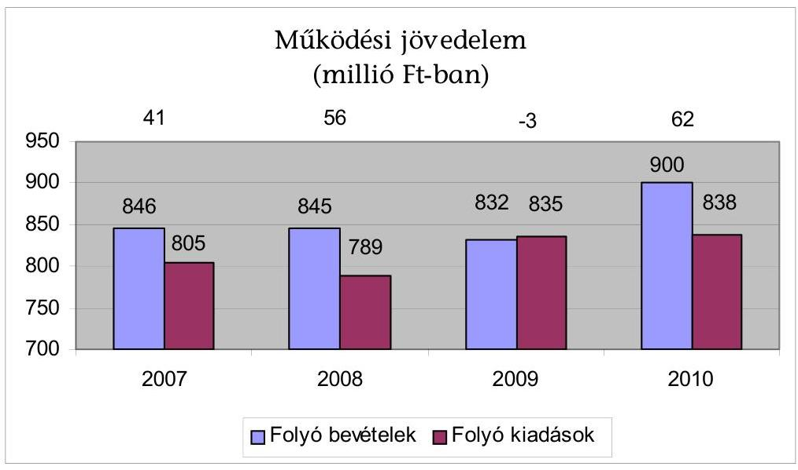
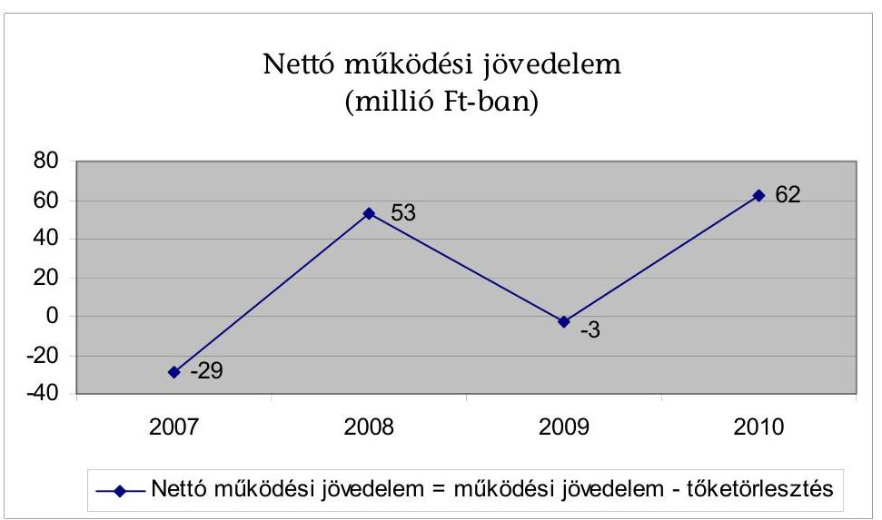
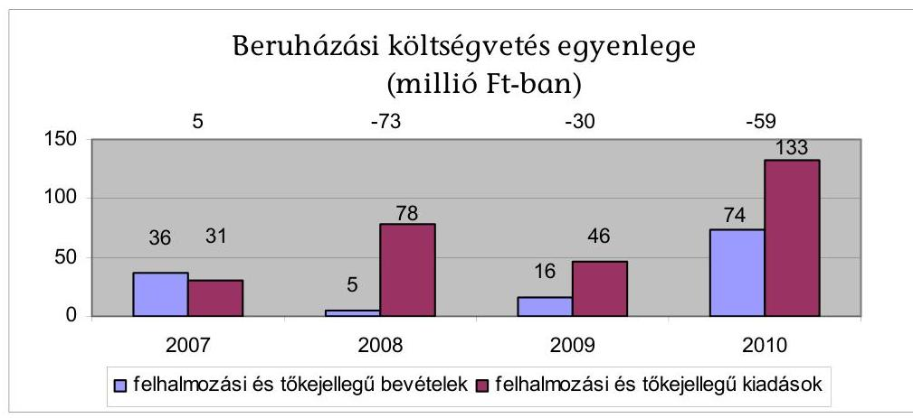
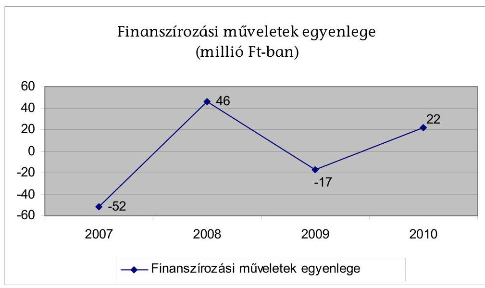
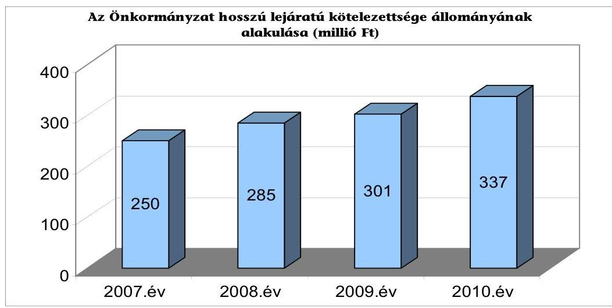
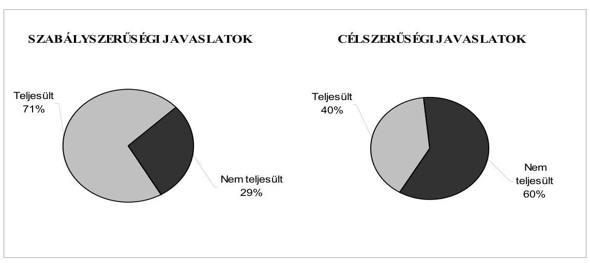
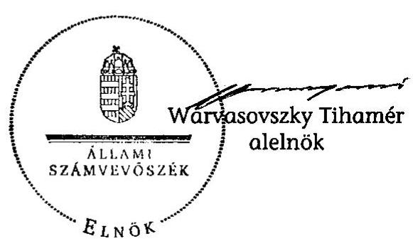

# ÁLLAMI   SZÁMVEVŐSZÉK 

## JELENTÉS

## Emőd Város Önkormányzata

gazdálkodási rendszerének 2011. évi ellenőrzéséről (43/1)

---

3. Önkormányzati és Területi Ellenőrzési Igazgatóság
3.2. Önkormányzati Rendszert Ellenőrző Főcsoport

Iktatószám: V-3030-10/2011.
Témaszám: 1015
Vizsgálat-azonosító szám: V0560002

# Az ellenőrzést felügyelte: 

Dr. Elek János
megbízott főigazgató
Az ellenőrzés végrehajtásáért felelős:
Dr. Varga Sándor
főigazgató-helyettes
Az ellenőrzést vezette:
Csecserits Imréné
főcsoportfőnök-helyettes, vizsgálatvezető
Az ellenőrzést végezte:
Kányáné Murvai Tünde
számvevő tanácsos
A témához kapcsolódó eddig készített számvevőszéki jelentések:
címe
sorszáma
Jelentés a helyi önkormányzatok gazdálkodási rendszerének 2008. 0927
évi ellenőrzéséről

---

# TARTALOMJEGYZÉK 

BEVEZETÉS ..... 7
I. ÖSSZEGZŐ MEGÁLLAPÍTÁSOK, KÖVETKEZTETÉSEK, JAVASLATOK ..... 10
II. RÉSZLETES MEGÁLLAPÍTÁSOK ..... 16

1. Az Önkormányzat adósságkezelési tevékenységének eredményessége a pénzügyi egyensúly fenntartásában, az adósságot keletkeztető kötelezettségvállalások pénzügyi kockázatainak hatása a gazdálkodás stabilitására, a közfeladat-ellátásra ..... 16
2. A vagyoni helyzet alakulása, valamint a vagyongazdálkodás folyamataiban a kontrollok múködése ..... 24
2.1. Az Önkormányzat vagyoni helyzetének 2007-2010 közötti alakulása ..... 24
2.2. A vagyongazdálkodás belső kontrolljainak múködése ..... 26
3. Az Önkormányzat gazdálkodási rendszerének korábbi ellenőrzése során tett szabályszerűségi és célszerűségi javaslatok hasznosítása ..... 28
MELLÉKLETEK
4. számú Az Önkormányzat gazdálkodását meghatározó adatok, mutatószámok (1 oldal)
5. számú Tájékoztató a költségvetési bevételek és kiadások összetételéről (2 oldal)

---

.

---

# RÖVIDÍTÉSEK, MOZAIKSZAVAK JEGYZÉKE 

## Törvények

Áht.
ÁSZ tv.
Ötv.

## Rendeletek

Áhsz.

Ámr. 1
Ámr. 2
Ber.
2007. évi költségvetési rendelet
2008. évi költségvetési rendelet
2009. évi költségvetési rendelet
2010. évi költségvetési rendelet
2011. évi költségvetési rendelet
SzMSz

## Szórövidítések

ÁSZ
FEUVE
jegyző
Képviselő-testület
polgármester
Polgármesteri hivatal
Polgármesteri hivatal
SzMSz-e
az államháztartásról szóló 1992. évi XXXVIII. törvény az Állami Számvevőszékről szóló 1989. évi XXXVIII. törvény
a helyi önkormányzatokról szóló 1990. évi LXV. törvény
az államháztartás szervezetei beszámolási és könyvvezetési kötelezettségének sajátosságairól szóló 249/2000. (XII. 24.) Korm. rendelet
az államháztartás múködési rendjéről szóló 217/1998. (XII. 30.) Korm. rendelet
az államháztartás múködési rendjéről szóló 292/2009. (XII. 19.) Korm. rendelet
a költségvetési szervek belső ellenőrzéséről szóló 193/2003. (XI. 26.) Korm. rendelet
az Önkormányzat 3/2007. (II. 23.) számú rendelete a 2007. évi költségvetésről
az Önkormányzat 3/2008. (II. 22.) számú rendelete a 2008. évi költségvetésről
az Önkormányzat 3/2009. (II. 20.) számú rendelete a 2009. évi költségvetésről
az Önkormányzat 2/2010. (II. 12.) számú rendelete a 2010. évi költségvetésről
az Önkormányzat 2/2011. (II. 11.) számú rendelete a 2011. évi költségvetésről
az Önkormányzat 11/2006. (XI. 17.) számú rendelete a Képviselő-testület és Szervei Szervezeti és Múködési Szabályzatáról

Állami Számvevőszék
folyamatba épített, előzetes, utólagos és vezetői ellenőrzés
Emőd Város Önkormányzatának címzetes főjegyzője
Emőd Város Önkormányzat Képviselő-testülete
Emőd Város Önkormányzat polgármestere
Emőd Város Önkormányzatának Polgármesteri Hivatala
Emőd Város Önkormányzata Polgármesteri hivatalának a Képviselő-testület 62/2006. (XI. 16.) számú határozatával elfogadott Szervezeti és Múködési Szabályzata

---

.

---

# ÉRTELMEZŐ SZÓTÁR 

árfolyamkockázat
eredményesség
garancia és kezességvállalás
kamatkockázat
kötvény

A külföldi devizában lévő pénzügyi eszközök tulajdonosainak abból fakadó kockázata, hogy az árfolyam elmozdulásával az általuk tartott eszköz hazai fizetőeszközben kifejezett értéke megváltozik. (ezen ellenőrzéshez kialakított értelmezés)
A kitűzött célok megvalósításának mértékeként vagy egy tevékenység kimenete szándékolt és tényleges hatása közötti kapcsolat. Ebben a meghatározásában - kiterjesztve a teljesítmény-ellenőrzés értelmezési tartományára - a hatás az operatív, a specifikus vagy átfogó szinten keletkezett „végterméket" jelenti, amely lehet output, eredmény és hatás egyaránt. (ÁSZ Teljesítmény-ellenőrzési módszertan 16 oldal)
A garanciavállalás az önkormányzat kötelezettségvállalása arra vonatkozóan, hogy a szerződésben meghatározott feltételek beálltakor a garancia kedvezményezettje számára, határozott összegig, határozott időpontig, felszólításra azonnal fizet. Ez a kötelezettség az önkormányzat számára azzal a bizonytalansággal jár, hogy nem tudja, hogy ezt a kötelezettség-vállalását igénybe veszik-e vagy nem, és ha igen, mikor. A kezesség járulékos kötelezettségvállalás, amely lehet egyszerú vagy készfizető, és mindig feltételezi a főkötelezettet. Az egyszerú kezességvállalás esetén a kezes mindaddig megtagadhatja a teljesítést, míg mindazoktól behajtható, akik őt megelőzően vállaltak kötelezettséget. A készfizető kezest nem illeti meg a sortartás kifogása. A fentiek következtében mind a garancia-, mind a kezességvállalás esetében az önkormányzatnak a futamidő teljes időtartama alatt azzal kell számolnia, hogy ha a főkötelezett elmulasztja teljesíteni a fizetést, a vállalt kötelezettséget vele szemben érvényesítik az adott időpontban fennálló összeg erejéig. Előbbiek ismerete szükséges a felelős döntéshozatalhoz, valamint a kezességvállalást megelőzően indokolt, hogy a főkötelezett gazdasági társaság az önkormányzat rendelkezésére bocsássa a garancia- és kezességvállalás alapját képező kötelezettségéről kötött szerződést (pl. hitel, kölcsönszerződés), amelyből nemcsak annak főösszege állapítható meg, hanem a tőke-és járulékai, valamint a törlesztés futamideje, illetve határideje is. (ezen ellenőrzéshez kialakított értelmezés)
Az a kockázat, hogy a forint-, vagy a devizahitel futamideje alatt emelkedik a kamat és így a hitel törlesztésére fordítandó összeg. (ezen ellenőrzéshez kialakított értelmezés)
Hosszabb lejáratra szóló, hitelviszonyt megtestesítő kama-

---

költségvetési bevétel

PPP (public private partnership)
tozó értékpapír. A kötvényben a kibocsátó arra kötelezi magát, hogy a kötvényben megjelölt pénzösszegnek az előre meghatározott kamatát vagy egyéb jutalékait, továbbá az adott pénzösszeget a kötvény mindenkori tulajdonosának, illetve jogosultjának a megjelölt időben és módon megfizeti. A kötvények csoportosítása és fajtái igen sokfélék. Lehetnek névre, vagy bemutatóra szóló; fix vagy változó kamatozású; állami, közintézményi, jegybanki vagy kereskedelmi banki, illetve vállalati kibocsátású; visszahívható, amely lehetőséget ad a kibocsátó számára, hogy a kötvényt valamilyen előre meghatározott árfolyamon bármikor visszavásárolja. A kötvény lehet átváltható, amely lehetőséget ad a birtokosa részére a kötvények meghatározott időpontban meghatározott számú részvényre történő kicserélésére. A devizakötvényt devizában bocsátják ki. (ezen ellenőrzéshez kialakított értelmezés)
Az Áht. 69. § (1) bekezdés a) és c) pontjaiban foglaltak figyelembevételével meghatározott összeg, amelynek számítása során a tárgyévi költségvetési bevételeket növeli - a költségvetési hiány belső finanszírozására szolgáló előző évek pénzmaradványából, vállalkozási maradványából igénybe vett összeg. (Az Áht. alapján ezen ellenőrzéshez kialakított értelmezés.)
Az állami és a magánszféra együttmúködésének egyik formája, amelynek keretében a közcél a magánszféra jelentős mértékű közremúködésével valósul meg. Az állam (önkormányzat) a közszolgáltatások létrehozását a tradicionálisnál komplexebb módon bízza a magánszférára. Az együttmúködés keretében megvalósuló közszolgáltatás hosszú távra szól. A magán partner felelőssége az infrastruktúra tervezésére, megépítésére, múködtetésére és legalább részben a projekt finanszírozására terjed ki. Az állam (önkormányzat) és/vagy a szolgáltatások igénybe vevője szolgáltatási díjat fizet. A közszférabeli szerződő fél feladata a projekt definiálása, a szolgáltatás elvárt minőségének, mennyiségének és az igénybevétel idejének meghatározása, valamint az árazási politika kialakítása, az ellenőrzési, monitoring feladatok ellátása. (Államháztartási fogalomtár)

---

# SZÁMVEVŐI JELENTÉS   Emőd Város Önkormányzata gazdálkodási rendszerének 2011. évi ellenőrzéséről 

## BEVEZETÉS

Az Állami Számvevőszék a 2011. évben életbe lépett stratégiája szerint „az önkormányzatok ellenőrzése során azok pénzügyi-gazdasági helyzetét értékeli, kockázatait feltárja, valamint az ellenőrzések helyszíneit objektív mutatószámrendszer alapján választja ki". E célkitűzéseknek megfelelően összeállított ellenőrzési program alapján végzi a helyi önkormányzatok gazdálkodási rendszerének ellenőrzését, valamint ezen kockázatelemzés alapján történt Emőd Város Önkormányzatának kiválasztása.

## Az ellenőrzés célja az Önkormányzatnál annak értékelése volt, hogy:

- biztosított-e a pénzügyi egyensúly, a fizetőképesség, a gazdálkodás stabilitása, ezeket segítette-e az adósság kezelése;
- a vagyoni helyzet a külső és belső tényezők hatására miként változott, megfelelően biztosították-e a vagyongazdálkodás szabályosságát, eredményességét a belső kontrollok;
- hasznosultak-e a gazdálkodási rendszer korábbi ellenőrzése során tett szabályszerűségi és célszerűségi javaslatok.

Az ellenőrzés típusa: teljesítmény-ellenőrzés, továbbá az ellenőrzés meghatározott területein szabályszerűségi ellenőrzés.

Az ellenőrzött időszak: a pénzügyi, vagyoni helyzettel kapcsolatos elemzéseket, értékeléseket, valamint az önkormányzat gazdálkodási rendszerének korábbi ellenőrzése során tett javaslatok megvalósításának ellenőrzését alapvetően a 2007-2010. évekre vonatkozóan végeztük, valamint lehetőség szerint kitértünk a helyszíni ellenőrzést megelőző utolsó negyedév végéig terjedő időszakra is. A vagyongazdálkodás belső kontrolljai múködésének tesztelése a 2010. évre, valamint a helyszíni ellenőrzést megelőző utolsó negyedév végéig terjedő időszakra vonatkozott.

Az ellenőrzés jogszabályi alapját az Állami Számvevőszékről szóló 1989. évi XXXVIII. törvény 2. § (3), (5), (6) és (9) bekezdései, a helyi önkormányzatokról szóló 1990. évi LXV. törvény 92. § (1) bekezdése, az államháztartásról szóló 1992. évi XXXVIII. törvény 104. § (3), és a 120/A. § (1) bekezdése előírásai képezték.

---

Emőd Város állandó lakosainak száma 2011. január 1-jén 5305 fő volt. A 2010. évi önkormányzati képviselő és polgármester választást követően az Önkormányzat kilenc tagú Képviselő-testületének munkáját öt állandó bizottság segítette. A polgármester a 1990. évi önkormányzati képviselő és polgármester választás óta tölti be tisztségét, míg a jegyző 2002 óta.

Az Önkormányzat pénzügyi egyensúlyi helyzetének rövid bemutatásán túlmenően a pénzügyi egyensúly fenntartását, a pénzügyi kockázatok kezelését és annak hatását (a pénzügyi egyensúly fenntartását veszélyeztető külső és belső pénzügyi kockázatok csökkentésére hozott döntések, tett intézkedések eredményességét) minősítettük. Lényegességi szempontok figyelembevételével értékeltük a döntés-előkészítést, a megtett intézkedések eredményességét és azt, hogy a pénzügyi egyensúly fenntartását mely kockázatok és milyen mértékben veszélyeztették. Az ellenőrzés részletes szempontok szerinti elvégzéséhez az egységes végrehajtás alapját az ellenőrzési program mellékletét képező teljesítményellenőrzési kérdésfa és a kapcsolódóan meghatározott kritériumok, valamint a fogalmak egységes tartalmát meghatározó értelmező szótár biztosította.

A vagyongazdálkodás ellenőrzése kiterjedt a vagyon értékének, összetételének, 2007-2010. évek között a vagyonváltozást előidéző okok elemzésére. A vagyongazdálkodás belső kontrolljai azonosításának és múködésének ellenőrzése keretében a vagyonértékesítés és a vagyonhasznosítás, valamint a finanszírozási célú pénzügyi műveletek folyamatait értékeltük ${ }^{1}$. Felmértük a belső kontrollokban rejlő kockázatot, minősítettük a kontrollok múködését és meghatároztuk, hogy a vagyongazdálkodás folyamatában mely kontrollok nem biztosították a működésbeli hibák megelőzését, feltárását, kijavítását, és ezáltal veszélyeztették az eredményes, megfelelő múködést.

A vagyongazdálkodási folyamatokban alkalmazott belső kontrollok azonosításának és működésének vizsgálatát többlépcsős megfelelőségi tesztek útján végeztük. A vizsgált területek könyvviteli tételei alapján (meghatározott tételszám felett egyszerű véletlen minta alapján) történt a vagyongazdálkodás belső kontrolljai múködésének a megítélése. Az ellenőrzés során alkalmazott módszer - többlépcsős megfelelőségi teszt - lényege, hogy a kiválasztott minta ellenőrzését csak addig végeztük, amíg elegendő és megfelelő bizonyítékot nem

[^0]
[^0]:    ${ }^{1}$ A vagyongazdálkodás területén a szabályozottságban rejlő kockázatot alacsonynak minősítettük, ha a szabályozottság megfelelő védelmet nyújtott a vagyongazdálkodással összefüggő hibák bekövetkezése ellen. Közepesnek minősítettük a vagyongazdálkodás szabályozottságában rejlő kockázatot, amennyiben a szabályozottság a lehetséges vagyongazdálkodási hibák többsége ellen védelmet nyújtott. Magasnak értékeltük a vagyongazdálkodás szabályozottságában rejlő kockázatot, ha a szabályok - kialakításuk hiányában, vagy hiányos kialakításuk miatt - nem nyújtottak elegendő védelmet a lehetséges vagyongazdálkodási hibákkal szemben.

---

szereztünk a vizsgált folyamatok kulcskontrolljai múködésének megfelelő vagy nem megfelelő voltáról².

Az Önkormányzat gazdálkodási rendszerének korábbi ellenőrzésekor tett szabályszerűségi és célszerűségi javaslatok hasznosulását utóellenőrzés keretében ellenőriztük.

A helyszíni ellenőrzés során kitöltött - az ellenőrzést végző számvevő és az Önkormányzati hivatal felelős köztisztviselője által aláírt - ellenőrzési munkalapokat, azok kitöltési útmutatóit, továbbá a megfelelőségi tesztek dokumentumait a polgármester részére a számvevői jelentéssel egyidejúleg átadtuk.

[^0]
[^0]:    ${ }^{2}$ A vagyongazdálkodás területén azonosított kontrollok múködését kiválónak értékeltük abban az esetben, ha azok múködése megfelelt a hibák megelőzésére és kijavítására meghatározott szabályozásnak és a legmagasabb szintű elvárásoknak. Jónak minősítettük a vagyongazdálkodás területén azonosított kontrollok múködését, ha a megállapított kisebb (tolerálható mértékű) hiányosságok nem veszélyeztették a vagyongazdálkodás ellenőrzött területei hibáinak megelőzését és kijavítását. Amennyiben a kontrollok múködésében túl sok hiányosság fordult elő ahhoz, hogy a kontrollok biztosítsák a vagyongazdálkodási hibák megelőzését, feltárását, kijavítását és ezáltal veszélyeztették az eredményes, megfelelő vagyongazdálkodást, a kontrollok múködése gyenge minősítést kapott.

---

# I. ÖSSZEGZŐ MEGÁLLAPÍTÁSOK, KÖVETKEZTETÉSEK, JAVASLATOK 

Az Önkormányzat - a feladatainak végrehajtása érdekében - a Polgármesteri hivatal mellett a 2007. és a 2010. évben is hat költségvetési szervet múködtetett, amelyek gazdálkodását közülük egy intézmény fogta össze. Ez a költségvetési szerv végzi a városüzemeltetési, zöldterület- és ingatlankezelési feladatokat, a közhasznú és közcélú foglalkoztatást, karbantartást, élelmezési tevékenységet, a szociális juttatások folyósítását, a védőnői szolgálat valamint a kistérségi családsegítő és gyermekjóléti szolgálat múködtetését, továbbá ellátja a gazdálkodási feladatokat az óvodai nevelést, az általános iskolai, az alapfokú művészeti és a szakiskolai oktatást, az idősek nappali ellátását, a közművelődési és könyvtári tevékenységet végző, önállóan múködő intézmények részére.

Az Önkormányzat a belső ellenőrzési feladatok ellátásáról önkormányzati társulás megbízásával gondoskodik. Az Önkormányzat 2007-2009 között a köz-feladat-ellátás szervezeti formájának változtatásáról nem döntött, 2010-ben a szennyvíztisztítás európai uniós támogatással történő korszerűsítése érdekében határozott az Emődi Agglomeráció Szennyvíztisztító Fejlesztési Önkormányzati Társulás létrehozásáról. A Társulás tevékenységét a benyújtott pályázat támogatása esetén kezdi meg. Az Önkormányzat gazdasági társasági részesedéssel nem rendelkezik.

Az Önkormányzat önként vállalt feladatként gondoskodott az alapfokú zeneoktatásról, valamint szakképesítés megszerzésére felkészítő szakmai elméleti szakiskolai oktatásról, amelyekre 2010-ben költségvetési kiadásának 3,8\%át, (37,3 millió Ft-ot) fordított.

A Polgármesteri hivatalban dolgozó köztisztviselők száma 2007. január 1-jén 23 fő, 2011. január 1-jén 21 fő, a költségvetési szerveknél foglalkoztatott közalkalmazottak száma 2007. január 1-jén 131, 2011. január 1-jén 113 fő volt.

A vizsgált időszakban az Önkormányzat pénzügyi helyzetét - az elemzéséhez alkalmazott CLF módszer szerint - a következők jellemzik: A folyó költségvetések egyenlege (a múködési jövedelem) összességében pozitív volt. Egy évben mutatkozott minimális hiány. Emellett is minden évben igénybe vett munkabérhitelt, ez azonban nem vált tartóssá. A felhalmozási költségvetések egyenlege a 2007. év kivételével minden évben negatív összegű volt. Ez nem járt pénzügyi kockázattal, mert részben a finanszírozási műveletekkel, de még inkább a rendelkezésre álló maradvánnyal biztosítani tudták a pénzügyi egyensúlyt.

Az Önkormányzat 2011 utáni kötelezettségei (pénzintézeti, szállítói, egyéb) 337,0 millió Ft, amelyből a pénzintézeti kötelezettség 2011-2013 között 62,5 millió Ft, a 2013 után 187,5 millió Ft. Egyéb hosszú lejáratú kötelezettséggel az Önkormányzat nem rendelkezik. A könyvviteli mérleg szerinti hosszú lejáratú kötelezettség teljesítése nem számszerűsített.

---

Az Önkormányzat költségvetési bevétele a 2007. évi 883,3 millió Ft-ról 2010-re 974,2 millió Ft-ra, 10,3\%-kal emelkedett. Ezen belül legnagyobb mértékben - 236,7 millió Ft-tal, 67,8\%-kal - a kapott múködési és felhalmozási célú költségvetési támogatás emelkedett, ugyanakkor az átengedett adók összege - 120,0 millió Ft-tal, 33,4\%-kal - csökkent. Az összes költségvetési bevétel 9,2\%át a saját bevétel, $4,3 \%$-át a helyi adóbevétel biztosította 2010-ben. A helyi adóbevétel összes költségvetési bevételen belüli aránya a 2007. évihez viszonyítva 0,4 százalékponttal csökkent.

Az összes költségvetési kiadás 2010-ben 960,3 millió Ft volt, amelyből a felhalmozási célú kiadás (125,6 millió Ft) részaránya 2007-hez viszonyítva 2010re 8 százalékponttal nőtt, a 2010. évben 13\% volt. A 2011. évi költségvetésben 667,0 millió Ft költségvetési bevételt és 829,4 millió Ft költségvetési kiadást irányoztak elő. A tervezett költségvetési bevételt meghaladó költségvetési kiadásra a fedezetet az előző évi pénzmaradvány igénybevételével, valamint hosszú lejáratú hitel felvételével tervezték biztosítani. Az Önkormányzat gazdálkodását meghatározó bevételi-kiadási adatokat, mutatószámokat az 1-2. számú mellékletek tartalmazzák.

Vizsgálták és betartották az Ötv. adósságot keletkeztető kötelezettségvállalásának felső határára és a visszafizetés fedezetére vonatkozó előírásait, a Képvise-lő-testület kiadás csökkentésére vonatkozó döntései megtakarítást eredményeztek, az átmenetileg szabad forrást a bevételek növelése érdekében lekötötték, a folyamatos fizetőképesség fenntartásához a munkabér megelőlegezési hitelen kívül egyéb likviditást biztosító hitelt nem vettek igénybe.

A pénzügyi egyensúly biztosításához ugyanakkor 2007-2010 között minden évben szükség volt a helyi önkormányzatok működőképességének megőrzését szolgáló kiegészítő támogatás igénybevételére. A 2007. évi 250,0 millió Ft kibocsátáskori értékű, 15 éves lejáratú, változó kamatozású, svájci frank alapú, három év türelmi idő után visszafizetendő kötvény kibocsátására vonatkozóan kötött szerződésben az Önkormányzat lemondott arról a lehetőségről, hogy a kötvénykibocsátás bevételéből képződő átmenetileg szabad forrás lekötésénél a kötvénykibocsátást végző pénzintézeten kívül más pénzintézetektől is kérhessen ajánlatot, és ezek közül választhassa ki a legkedvezőbbet. Az összes bevételi forráson belül a változó kamatozású, devizában fennálló hosszú lejáratú kötelezettségek aránya növekedett. A Képviselő-testület nem kapott évente tájékoztatást arról, hogy a kötvénykibocsátás miatti adósságszolgálati kötelezettséget az Önkormányzat milyen feltételek mellett tudja teljesíteni.

Az államháztartáson kívüli szervezeteknek év közben nyújtott kölcsönök és támogatások esetében a támogatásra vonatkozó döntést megelőzően a Képviselőtestület részére nem mutatták be az Önkormányzat pénzügyi lehetőségeit, hatását a költségvetés hiányára/többletére.

Az Önkormányzat a 2011. év I. negyedéve végén 0,8 millió Ft 30 és 60 nap közötti, valamint 2,9 millió Ft 365 napon túli lejárt - Sajó- Hernádvölgyi és Bükkvidéki Önkormányzatok Terület- és Településfejlesztési Társulásával szemben fennálló - szállítói tartozással rendelkezett.

---

Az Önkormányzat 2010. december 31-én a könyvviteli mérleg szerint 3644,6 millió Ft értékű vagyonnal rendelkezett. A vagyon 2007-2010 között 204,1 millió Ft-tal, 5,3\%-kal csökkent, elsősorban a vagyon 31,4\%-át képviselő üzemeltetésre átadott eszközök után elszámolt értékcsökkenés miatti nettó érték csökkenésének hatására. Ezen eszközöknél a felújítási igény még nem jelentkezett, így a visszapótlás hiánya még nem okozott gondot. A vagyon összetételét 2007-2010 között módosította a 2007. évben kibocsátott kötvény számviteli értékének emelkedése miatti kötelezettségek 87,0 millió Ft-os, 34,8\%-os növekedése, valamint az áruszállításból, szolgáltatásnyújtásból származó kötelezettségek év végi állományának 0,01 millió Ft-ról 26,4 ezer Ft-ra történt emelkedése. A könyvviteli mérlegben kimutatott vagyoncsökkenés, illetve a kötelezettségek emelkedése indokolta az Önkormányzat ellenőrzésre történő kiválasztását.

# A vagyongazdálkodási folyamatok belsó kontrolljai meghatározásának, beépítésének hiányosságai közepes kockázatot jelentettek a feladatok megfelelő végrehajtásában. 

A jegyző - a vagyon védelme és a körültekintő gazdálkodás követelménye ellenére - nem szabályozta az adatvédelem és adatbiztonság rendjét, a céljellegű támogatások nyújtásának, valamint a gazdálkodási adatok közzétételének eljárási rendjét, a vagyonértékesítéssel, vagyonhasznosítással kapcsolatban a döntés előkészítés folyamatában a költség-haszon elemzés készítésének kötelezettségét, az Önkormányzat tulajdonosi jogainak, érdekeinek védelmét szolgáló garanciális elemek szerződésben, egyéb dokumentumban való rögzítésének kötelezettségét. A finanszírozási célú pénzügyi műveletekkel összefüggésben nem írta elő a pénzügyi kockázatok felmérésének, valamint a futamidő egyes éveit terhelő kötelezettségek költségvetési egyensúlyra gyakorolt hatása vizsgálatának kötelezettségét. Nem határozta meg továbbá a vagyongazdálkodási folyamatok rögzítésénél alkalmazott informatikai programok adatai használatára vonatkozó követelményeket, és az ellenőrzési nyomvonalban a vagyongazdálkodási folyamatokra az ellenőrzési feladatokat, felelősöket. Hiányosan írta elő a vagyongazdálkodással kapcsolatos információs és monitoring feladatokat.

A kialakított kontrollok ugyanakkor a lehetséges hibák többsége ellen védelmet nyújtottak, mivel meghatározták a vagyongazdálkodás stratégiai céljait, szabályait, a vagyongazdálkodással foglalkozók feladatait, hatáskörét, kialakították a vagyongazdálkodásra is kiterjedően a kockázatkezelés rendjét, a folyamatba épített előzetes, utólagos és vezetői ellenőrzési rendszert.

A Polgármesteri hivatalban a vagyongazdálkodási folyamatokban a belső kontrollok múködése jó volt. A szabályozásban foglaltaknak megfelelően betartották a tulajdonosi jogok gyakorlására előírt rendelkezéseket, a vagyongazdálkodási tevékenységek folyamataiban az előírt dokumentumokat elkészítették, teljesítették az adatszolgáltatási, jelentéstételi és közzétételi kötelezettséget, közzétették a vagyongazdálkodással összefüggő közérdekű adatokat. Nem értékelték azonban a vagyongazdálkodás folyamatában a külső és belső kockázatokat, és nem végezték el évenként a beazonosított kockázatok továbbá a belső kontrollok működésének felülvizsgálatát, valamint az előírt nyomon követési módszerrel nem kísérték figyelemmel a vagyongazdálkodási folyamatot.

---

A Polgármesteri hivatalban a 2010. évben az ingatlanok felújításával, valamint az államháztartáson kívülre nonprofit szervezeteknek, egyházaknak és nem önkormányzati többségi tulajdonú vállalkozásoknak nyújtott céljellegú működési és felhalmozási célú támogatásokkal kapcsolatos kifizetések során a belső kontrollok múködése kiváló, mert a vonatkozó előírásokat betartották. A kötelezettségvállalás ellenjegyzésére felhatalmazott személy a kötelezettségvállalás ellenjegyzése során ellenőrizte, hogy a kötelezettségvállalás tárgyával összefüggő kiadási előirányzat, valamint a kifizetés időpontjában a fedezet rendelkezésre áll, továbbá meggyőződött a gazdálkodásra vonatkozó szabályok betartásáról. A szakmai teljesítés igazolására a jegyző által kijelölt személyek ellenőrizték, szakmailag igazolták a kifizetések jogosultságát, összegszerűségét és a szerződések, megállapodások teljesítését, valamint az utalványok ellenjegyzője meggyőződött a gazdálkodásra vonatkozó szabályok betartásáról.

Az ÁSZ az Önkormányzat gazdálkodási rendszerét 2008-ban ellenőrizte átfogó jelleggel. Az utóellenőrzés során megállapítottuk, hogy a Képviselő-testület a jelentésben foglaltakat megismerte, a javaslatok megvalósítására vonatkozó intézkedési tervet tudomásul vette. Az ellenőrzés során tett javaslatok közül 12-t ( $63 \%$-ot) hasznosítottak, hetet ( $37 \%$-ot) nem valósítottak meg. A megtett tíz szabályszerűségi és kettő célszerűségi intézkedés következtében összességében javult a gazdálkodási és a pénzügyi-számviteli feladatok szabályozottsága. A megtett intézkedések hatására megvalósultak a gazdálkodás és a pénzügyiszámviteli feladatellátás szabályozottságára, a költségvetési gazdálkodási és ellenőrzési jogkörök gyakorlására, a közpénzek felhasználására, a köztulajdon felhasználására, nyilvánosságára, a pénzmaradvány elszámolás és felülvizsgálat rendjére, valamint az önkormányzati gazdálkodás egyéb területeinek törvényes, illetve célszerűbb, gazdaságosabb ellátására vonatkozó szabályszerűségi és célszerűségi javaslatok.

Négy szabályszerűségi és három célszerűségi javaslat nem hasznosult. A jegyző nem gondoskodott arról, hogy a költségvetési rendelettervezetekben a költségvetés kiadási főösszegének megállapítása az Áht-ban foglaltak alapján a finanszírozási célú pénzügyi műveletek kiadásai nélkül történjen, nem biztosította az Ámr. ${ }_{1,2}$-ben meghatározottak ellenére a 2008-2010. évi költségvetési beszámoló szöveges indokolásának Önkormányzat honlapján történő közzétételét, a Ber-ben foglaltak ellenére a belső ellenőrzést végző társulás felé nem intézkedett annak érdekében, hogy a Polgármesteri hivatalnál és az önkormányzati költségvetési intézményeknél a FEUVE rendszer kiépítésének, múködésének szabályszerűsége, a pénzügyi irányítási és ellenőrzési rendszerek múködése, valamint a rendelkezésre álló erőforrásokkal való gazdálkodás, a vagyon megóvása és gyarapítása, a beszámolók megbízhatósága ellenőrzésre kerüljön. Nem intézkedett továbbá az Ötv-ben foglaltak ellenére a kedvezményezett szervezeteknél az Önkormányzat költségvetéséből céljelleggel nyújtott támogatások rendeltetés szerinti felhasználásának ellenőrzéséről, az informatikai stratégia e-közigazgatással kapcsolatos célokkal, szükséges feltételekkel történő kiegészítéséről, nem alakította ki az e-közigazgatási feladatokat ellátó informatikai rendszer ügyfelek általi igénybevételének figyelési rendszerét, nem gondoskodott arról, hogy valamennyi analitikus nyilvántartás adatait elektronikus formában tárolják, a főkönyvi nyilvántartás az analitikus nyilvántartásból au-

---

tomatikusan történjen és a számítógépes program biztosítsa a főkönyv és a költségvetési beszámoló adatainak egyezőségét.

A helyszíni ellenőrzés megállapításainak hasznosítása mellett javasoljuk:

# a polgármesternek 

a munka színvonalának javítása érdekében

1. kezdeményezze, hogy a jelentésben foglaltakat a Képviselő-testület tárgyalja meg és a feltárt hiányosságok megszüntetése érdekében készíttessen intézkedési tervet a határidők és felelősök megjelölésével;
2. a pénzügyi egyensúly érdekében
a) a jegyző által készített előterjesztés alapján tájékoztassa a Képviselő-testületet évente az adósságot keletkeztető kötelezettségvállalásokból adódó fizetési kötelezettségek konkrét visszafizetési forrásairól a teljes futamidőre kiterjedően;
b) gondoskodjon arról, hogy a jövőben az adósságot keletkeztető kötelezettségvállalásokról szóló képviselő-testületi döntéseket megalapozó előterjesztések tartalmazzák a teljes futamidőre várható tőketörlesztés, kamat és egyéb költség forrásainak, továbbá a kamat- és árfolyamkockázatnak a bemutatását;

## a jegyzőnek

a jogszabályi előírások maradéktalan betartása érdekében

1. a belső kontrollrendszer Ámr. 155. § (2) bekezdésének megfelelő működése érdekében
a) szabályozza az adatvédelem és adatbiztonság rendjét, a céljelleggel nyújtott támogatások eljárási rendjét és, valamint a közzétételi eljárás rendjét;
b) írja elő az önkormányzati vagyon értékesítésével, hasznosításával kapcsolatos eljárás során a döntés előkészítés folyamatában a költség-haszon elemzés készítésének kötelezettségét, valamint a végrehajtás fázisában az Önkormányzat tulajdonosi jogainak, érdekeinek védelmét szolgáló garanciális elemek szerződésben vagy egyéb dokumentumban való rögzítésének kötelezettségét;
c) írja elő a finanszírozási célú pénzügyi műveletekkel összefüggésben a pénzügyi kockázatok felmérésének kötelezettségét, a hitelfelvételről, kötvénykibocsátásról szóló döntés előkészítési folyamatában a futamidő egyes éveit terhelő kötelezettségek költségvetési egyensúlyra gyakorolt hatása vizsgálatának kötelezettségét;
d) határozza meg az informatikai szabályzatban a vagyongazdálkodási folyamatok rögzítésére használt informatikai programok adatai használatára vonatkozó követelményeket;

---

e) határozza meg a bevételeket megalapozó döntések szerződésben történő felülvizsgálatának feladatai között annak ellenőrzési kötelezettségét, hogy a szerződés tartalmazza-e a döntési hatáskörrel rendelkezők által meghatározott feltételeket, valamint azt, hogy a szerződést az arra hatáskörrel rendelkező személy írta-e alá;
f) jelölje ki a bevételeket megalapozó döntésekben meghatározott feltételek szerződésben történő érvényesítése ellenőrzésének végrehajtásáért felelős személyeket az ingatlan értékesítések esetében;
2. határozza meg az Ámr. 156. § (2) bekezdésében foglaltaknak megfelelően az ellenőrzési nyomvonalban a vagyongazdálkodási folyamatokra vonatkozó ellenőrzési pontokat, az ellenőrzésért felelősöket;
3. az információk illetékes szervezethez, személyhez történő eljutása érdekében az Ámr. 2 159. § (1) bekezdésében előírtaknak megfelelően
a) határozza meg a vagyongazdálkodás külső és belső információi kezelésének rendjét és a közérdekú adatok kezelésének rendjét;
b) alakítsa ki a Polgármesteri hivatalban a vezetői információs rendszert;
4. írja elő az Önkormányzat tevékenységének, a célok megvalósításának Ámr. 160. §-a szerinti nyomon követése érdekében a monitoring stratégiában
a) az indikátorok megvalósulásának, illetve eltéréseinek vizsgálatát;
b) a belső kontrollrendszer múködésének évenkénti felülvizsgálatát;
5. gondoskodjon az Önkormányzat gazdálkodási rendszerének 2008. évi ellenőrzése során az ÁSZ által részére tett és nem teljesült szabályszerűségi és célszerűségi javaslatok végrehajtásáról.

---

# II. RÉSZLETES MEGÁLLAPÍTÁSOK 

## 1. Az ÖNKORMÁNYZAT ADÓSSÁGKEZELÉSI TEVÉKENYSÉGÉNEK EREDMÉNYESSÉGE A PÉNZÜGYI EGYENSÚLY FENNTARTÁSÁBAN, AZ ADÓSSÁGOT KELETKEZTETŐ KÖTELEZETTSÉGVÁLLALÁSOK PÉNZÜGYI KOCKÁZATAINAK HATÁSA A GAZDÁLKODÁS STABILITÁSÁRA, A KÖZFELADAT-ELLÁTÁSRA

A hagyományos költségvetési szerkezet helyett az önkormányzat pénzügyi helyzetét a CLF módszerrel mutatjuk be, amelyben jobban elkülönülnek a vagyonnal kapcsolatos bevételek és kiadások a feladatokkal kapcsolatos közvetlen múködtetési bevételektől és kiadásoktól. A módszer következetesen elkülöníti a folyó és a felhalmozási költségvetés bevételeit és kiadásait, azok költségvetési egyenlegeit. (A saját folyó bevételek, valamint a saját felhalmozási bevételek nem tartalmazzák az előző évi pénzmaradványok felhasználásából származó pénzforgalom nélküli bevételeket ${ }^{3}$.)

A folyó költségvetés egyenlege, a múködési jövedelem megmutatja, hogy az önkormányzat éves folyó bevétele fedezetet biztosít-e a kötelező és önként vállalt feladatellátáshoz kapcsolódó éves folyó kiadására. A múködési jövedelem negatív értéke pénzügyileg fenntarthatatlan helyzetet jelez. A mutató pozitív értéke megtakarítást mutat, amely forrásul szolgálhat az önkormányzat fennálló kötelezettségei megfizetéséhez, valamint fejlesztéseihez.

A felhalmozási költségvetés pozitív értéke felhalmozási többletet mutat, amely a jövőbeni fejlesztések forrását biztosíthatja. Amennyiben a folyó költségvetési hiány finanszírozása a felhalmozási többletből történik, ez szűkebb értelemben vagyonfelélésnek tekinthető. Amennyiben a felhalmozási költségvetés megtakarítása fejlesztési célú hitelek, kötvények adósságszolgálatát finanszírozza, az - változatlan vagyontömeg mellett - a korábban megelőlegezett tőkebevételek valós realizációjának tekinthető.

A módszer a pénzügyi kapacitás fogalmát helyezi a középpontba. Az adós hitelfelvételi képessége, hosszú távú fizetőképessége vagy bonitása a pénzügyi kapacitással, ezen belül is a nettó múködési jövedelemmel jellemezhető. A nettó múködési jövedelem negatív értéke az egyes költségvetési években jelentkező adósságszolgálat túlzott mértékére utal ${ }^{4}$. A nettó múködési jövedelem negatív értékének felhalmozási többletből, vagy további hitelből történő finanszírozása pénzügyileg nem fenntartható gazdálkodást vetít előre. A pozitív értéket mutató nettó múködési jövedelem fejlesztési kiadások fedezetét biztosíthatja, il-

[^0]
[^0]:    ${ }^{3}$ A költségvetési években kialakuló hiány finanszírozása az előző években képzett tartalékok felhasználásával is történhet.
    ${ }^{4}$ Kivéve, ha annak finanszírozására a korábbi években képzett tartalékok fedezetet nyújtanak.

---

letve a folyamatosan, évenként képződő pozitív nettó működési jövedelemből meghatározható a jövőben vállalható, teljesíthető éves adósságszolgálat, ily módon az a hitelösszeg, amely - a többi tényezőt, feltételt adottnak tekintve visszafizetési kockázat nélkül felvehető.

# CLF módszer szerinti önkormányzati összesen adatok ${ }^{5}$ 

|  |  |  |  | ezer Ft |
| :--: | :--: | :--: | :--: | :--: |
| Megnevezés | 2007 | 2008 | 2009 | 2010 |
| Folyó bevételek | 845627 | 845289 | 831916 | 899896 |
| Folyó kiadások | 804920 | 789617 | 834722 | 838387 |
| Müködési jövedelem | 40707 | 55672 | $-2806$ | 61509 |
| Nettó müködési jövedelem = müködési jövedelem - tőketörlesztés | $-28863$ | 52872 | $-2806$ | 61509 |
| Felhalmozási bevételek | 35559 | 5254 | 16026 | 74324 |
| Felhalmozási kiadások | 30676 | 78036 | 45569 | 133354 |
| Felhalmozási költségvetés egyenlege | 4883 | $-72782$ | $-29543$ | $-59030$ |
| Finanszírozási műveletek nélküli (GFS) pozíció | 45590 | $-17110$ | $-32349$ | 2479 |
| Finanszírozási műveletek egyenlege | $-51514$ | 45973 | $-16704$ | 22009 |
| Tárgyévi pozíció | $-5924$ | 28863 | $-49053$ | 24488 |
| Egyéb tájékoztató adatok |  |  |  |  |
| Összes kötelezettség | 264702 | 324597 | 336357 | 427608 |
| ebből rövid lejáratú | 14702 | 40088 | 35287 | 90631 |
| Összes szállítói kötelezettség | 8 | 18483 | 26269 | 26360 |
| ebből lejárt | 0 | 3734 | 3734 | 2939 |
| Pénz és tőkepiaci kötelezettség (adósság) | 252800 | 284509 | 301070 | 367677 |
| ebből rövid lejáratú | 2800 | 0 | 0 | 30700 |
| Folyószámlahitel napi átlagos állománya | 0 | 0 | 0 | 0 |
| Likvidhitel napi átlagos állománya | 0 | 0 | 0 | 0 |
| Munkabérhitel napi átlagos állománya | 534 | 525 | 485 | 510 |
| Egyéb finanszírozásba vonható eszközök összesen: | 229999 | 218869 | 159867 | 164515 |
| Ebből: Tartós hitelviszonyt megtestesítő értékpapírok | 199999 | 160027 | 150000 | 130009 |
| Pénzeszközök (idegen pénzeszközök nélkül) | 30040 | 58862 | 9867 | 34516 |

[^0]
[^0]:    ${ }^{5}$ A CLF módszer alapján a számításokat az önkormányzatok összevont, nettósított, a MÁK központi információs rendszere részére leadott éves költségvetési beszámolójának 80-as űrlapjában szerepeltetett adatok alapján végeztük.

---

A vizsgált időszakban az Önkormányzat folyó költségvetési egyenlege (működési jövedelme) csaknem végig pozitív volt. Kisebb hiány 2009-ben fordult elő.

A tőketörlesztés hatását is tükröző nettó múködési jövedelem két évben negatív volt. Számottevő hiány 2007-ben jelentkezett.

A felhalmozási költségvetés egyenlege 2008 óta vált negatívvá.

---

Az Önkormányzatnál a finanszírozási múveletek egyenlege változott, 2007-ben és 2009-ben negatív, 2008-ban és 2010-ben pozitív volt.

Az Önkormányzat pénzügyi egyensúlya a vizsgált időszakban biztosított volt, mert az egyes években keletkező múködési, felhalmozási, valamint a finanszírozási múveleteknél jelentkező hiányra a rendelkezésre álló tartalék (maradvány) fedezetet nyújtott.

A Képviselő-testület a 2007. év és a 2011. év I. negyedév között egy alkalommal döntött ${ }^{6}$ hosszú lejáratú adósságot keletkeztető kötelezettségvállalásról. A polgármester a Képviselő-testület döntésének megfelelően három pénzintézettől kért ajánlatot a kötvény kibocsátással kapcsolatosan. A pénzintézetektől azonosan 15 évre, három éves türelmi idővel, negyedéves hiteltörlesztéssel kérte be az ajánlatokat, majd ezeket a Képviselő-testület elé terjesztette, majd ezt követően került sor a legjobb ajánlat kiválasztására.

[^0]
[^0]:    ${ }^{6}$ A Képviselő-testület a 56/2007. (XI. 22.) számú határozatában döntött a kötvénykibocsátásról.

---

A Képviselő-testület döntése alapján 2007. december 11-én 15 éves futamidejű, változó kamatozású, 250 millió Ft-nak megfelelő, svájci frank alapú, névre szóló, „Emőd 2022" elnevezésű kötvény zártkörű forgalomba hozataláról kötöttek szerződést a kiválasztott pénzintézettel. A tőke visszafizetése három év és három hó türelmi idő után, 2011. március 30-tól negyedévente esedékes, egyenlő részletekben. A kötvény-kibocsátási szerződésben rögzítették, hogy az Önkormányzat a kötvény-kibocsátásban közremúködő pénzintézet felé fennálló korábbi hitelszerződésből eredő 43,9 millió Ft összegű tartozását a kötvény kibocsátásból befolyt összegből kiegyenlíti. Az Önkormányzat a változó kamatozással, devizában kibocsátott kötvény kamatkockázatának és árfolyamkockázatának kezelése, valamint a kötvény teljes futamidejére pénzpiaci ügyletek bonyolítása céljából a kötvény-kibocsátásban közreműködő pénzintézettel együttműködési megállapodást kötött.

A kötvény kibocsátását megelőzően (a 2007. szeptember 30-i időpontra vonatkozóan) a Képviselő-testület tájékoztatást kapott az adósságot keletkeztető kötelezettségvállalása felső határának alakulásáról. A számítás szerint az Önkormányzat adósságot keletkeztető éves kötelezettségvállalásának felső határa 19 millió Ft volt. A kötvény kibocsátása során az adósságot keletkeztető éves kötelezettségvállalás felső határára vonatkozó előírást betartották.

A kötvény kibocsátásakor meghatározták annak visszafizetési forrását. Az Önkormányzat a kötvényt felhalmozási céllal (útberuházásokra, valamint ingatlan felújítások pályázati önerejének biztosítása érdekében) bocsátotta ki. A felhalmozási célú adósságot keletkeztető kötelezettségvállalásról szóló döntés előkészítése során nem végeztek a felhalmozási kiadások megtérülésére vonatkozó számításokat, értékeléseket, nem vizsgálták a fejlesztéssel létrehozni tervezett tárgyi eszközök fenntartásának várható költségeit.

A változó kamatozású, svájci frank alapú kötvény kibocsátását megelőzően a polgármester tájékoztatta a Képviselő-testületet a kamat- és árfolyamkockázatokról. A döntés előkészítése során vizsgálták a tervezett felhalmozási tevékenység szükségességét, fontosságát a közfeladatok ellátása szempontjából.

Az Önkormányzat PPP konstrukcióban a 2007. év és a 2011. év I. negyedév között beruházást nem végzett, illetve garancia- és kezességvállalásokkal kapcsolatos hosszú távú kötelezettségvállalást nem tett.

A Képviselő-testület a 2007-2010. évi zárszámadási rendeletekben évente tájékoztatást kapott az adósságot keletkeztető kötelezettségvállalásokból adódó fizetési kötelezettségekről. A rendeletekben bemutatásra kerültek a hosszú lejáratú, adósságot keletkeztető kötelezettségvállalásból adódó tőke- és kamatfizetési kötelezettségek, azonban nem rögzítették azok visszafizetésének konkrét forrásait. (A kötelezettségvállalásokhoz nem rendelték hozzá, hogy milyen bevételekből fogják azokat finanszírozni.) Az Önkormányzat pénzintézettel szemben fennálló együttes kötelezettség állománya 2006. december 31-én 72,4 millió Ft, 2010. december 31-én 458,3 millió Ft volt.

Az Önkormányzat bevételt növelő intézkedései eredményeként az intézményi múködési bevételek emelkedtek, továbbá igénybe vettek a működőképesség megőrzésére kiegészítő támogatást. Az önkormányzati saját bevétel

---

2007-2010 között 67,0 millió Ft és 95,8 millió Ft között ingadozott, legmagasabb 2008-ban volt. A saját bevételek meghatározó részét (2007-ben 62,2\%-át, 2010-ben $46,7 \%$-át) a helyi adók biztosították. Ennek beszedési tevékenységét a 2009. év III. negyedévében felülvizsgálták. A megtett intézkedések eredményeként a 2009. október 30-án fennálló 23,7 millió Ft kintlévőség 2009. december 21-ére 20,7 millió Ft-ra csökkent.

A kötvénykibocsátás bevételéből képződött átmenetileg szabad pénzeszközt a 2007. évi kötvénykibocsátásban közreműködő pénzintézetnél rendszeresen lekötötték. Az Önkormányzat a kötvény kibocsátására vonatkozón kötött szerződésben lemondott arról a lehetőségről, hogy a kötvénykibocsátás bevételéből képződő átmenetileg szabad forrás lekötésénél, betétként történő elhelyezésénél a kötvény kibocsátást végző pénzintézeten kívül más pénzintézetektől is kérhessen ajánlatot, és ezek közül választhassa ki a legkedvezőbbet. Az átmenetileg szabad pénzeszközöknek a kötvénykibocsátást végző pénzintézetnél történt lekötéséből (betételhelyezés, kincstárjegyvásárlás) 2007-ben 0,4 millió Ft, 2008-ban 18,3 millió Ft, 2009-ben 14,1 millió Ft, 2010ben 14,6 millió Ft kamatbevételt értek el. A kötvénykibocsátás bevételéből képződött átmenetileg szabad forrásból végrehajtott finanszírozási célú pénzügyi műveletek hozzájárultak a korábbi adósságszolgálati kötelezettség teljesítéséhez. Az éves költségvetési rendeletekben a Képviselő-testület felhatalmazta a polgármestert, hogy - az önkormányzati bevételek növelése érdekében - az átmenetileg szabad pénzeszközt betétként elhelyezze, vagy abból államilag garantált értékpapírt vásároljon. Kamatkiadásra az Önkormányzat 2007-ben 6,1 millió Ft-ot, 2008-ban 10,7 millió Ft-ot, 2009-ben 5,4 millió Ft-ot, 2010-ben 6,1 millió Ft-ot fordított.

A költségvetés teljesítése során, a tervezett költségvetési hiánnyal szemben - a saját bevételhez hasonló nagyságrendű, a működőképesség megőrzését szolgáló kiegészítő támogatás igénybevételével - költségvetési többletet értek el 20072010 között. A tervezett költségvetési kiadások teljesítéséhez minden évben igénybe vették a helyi önkormányzatok múködőképességének megőrzését szolgáló kiegészítő támogatást. A kapott támogatás összege 2007-ben 88,6 millió Ft, 2008-ban 63,7 millió Ft, 2009-ben 63 millió Ft, 2010-ben 76,1 millió Ft volt.

---

A Képviselő-testület a pénzügyi egyensúly biztosítása érdekében a 2007. és a 2011. év I. negyedév között kiadási megtakarítást eredményező döntéseket is hozott. A döntések eredményeként 2007-ben a tervezett múködési célú költségvetési kiadások 1,59\%-át, a 2008. évben 0,54\%-át, a 2009. és a 2010. évben egyaránt $0,01 \%$-át takarították meg.

A Képviselő-testület 2007-ben a 43/2007. (VIII. 23.) számú határozatban döntött arról, hogy Emőd Város Városgondnoksága (költségvetési szerve) esetében két fő, a II. Rákóczi Ferenc Általános Iskola és Szakiskola (költségvetési szerve) esetében öt fő, a Polgármesteri hivatal esetében egy fő álláshelyet megszüntet. 2008-ban a 72/2008. (XI. 27.) számú határozatban arról döntött, hogy 2009. január 1-től a házi segítségnyújtás feladatot a Miskolc Kistérség Többcélú Társulása útján kívánja ellátni. 2009-ben a 17/2009. (II. 19.) számú határozatban a Családsegítő Szolgálatnál egy fő létszámcsökkentésről, 2010-ben pedig a II. Rákóczi Ferenc Általános Iskola és Szakiskola esetében szintén egy álláshely megszüntetésről döntött. Az intézkedésekkel kimutatott kiadási megtakarítások teljesített összege az évek sorrendjében 12668 ezer Ft, 4205 ezer Ft, 6182 ezer Ft, illetve 7774 ezer Ft volt.

A adósságot keletkeztető kötelezettségvállalás (2007. decemberi kötvénykibocsátás) változó kamatozása és deviza alapja miatti kockázat mérséklése érdekében 2011-ben a Képviselő-testület a 14/2011. (IV. 15.) számú határozatban felhatalmazta a polgármestert, hogy a kötvénykibocsátáshoz kapcsolódó kamatteher csökkentése érdekében tárgyalásokat kezdeményezzen a kötvénykibocsátásban közremúködő pénzintézettel. A polgármester a pénzintézettel 2011. április 18-án felvette a kapcsolatot, a konkrét eredményről visszajelzést még nem kapott.

A Képviselő-testület döntése alapján a kibocsátáskor 250,0 millió Ft nyilvántartási értékű kötvénykibocsátás bevételéből a kötvénykibocsátáshoz kapcsolódó kiadásokon túlmenően az új igazgatási épület építéséhez korábban felvett felhalmozási célú, hosszú lejáratú hitel még hátralévő 43,9 millió Ft tartozását a 2007. évben visszafizették, továbbá 2008-2010 között útfelújításokra fordítottak 70,0 millió Ft-ot, valamint a 2010. év végén 130,0 millió Ft-ot kincstárjegyben helyeztek el. A kötvénykibocsátásból származó bevétel felhasználására a költségvetési rendeletek szerint a polgármester döntési hatáskört kapott. A polgármester a felhasználásról évente a zárszámadáskor tájékoztatta a Képviselő-testületet.

A bevételnövelő és kiadási megtakarítást eredményező intézkedések ellenére az Önkormányzat hosszú távú fizetőképessége 2007-2010 között romlott. Az összes forráshoz viszonyítva a fizetési kötelezettségek aránya 7\%ról $12 \%$-ra, ezen belül a hosszú lejáratú kötelezettségek aránya $6 \%$-ról $9 \%$-ra nőtt, annak ellenére, hogy a 2007. decemberi kötvénykibocsátás óta a Képvise-lő-testület újabb hosszú lejáratú kötelezettségvállalásról nem döntött. A kötelezettség összes forráson belüli arányának növekedése részben annak következménye, hogy a kötvénykibocsátás miatti fizetési kötelezettség számviteli nyilvántartási értéke a kibocsátáskori 250,0 millió Ft-ról 337,0 millió Ft-ra, 34,8\%kal nőtt az árfolyamváltozás miatti értéknövekedés következtében (az értékváltozás realizált árfolyamveszteséggel nem járt, mivel a tőketörlesztés 2011-től kezdődik). A könyvviteli mérleg szerinti összes forrást csökkentette ugyanakkor az üzemeltetésre átadott eszközök után a saját tőke terhére elszámolt értékcsökkenés.

---

A 2005. évi hosszú lejáratú- és a 2007-2010 közötti likvid hitelek felvétele, valamint a 2007. évi kötvénykibocsátás miatti adósság teljesítésére a kamatkiadással csökkentett költségvetési bevételi többlet (a kamatkiadással csökkentett költségvetési kiadásokat meghaladó bevétel) a 2007-2009. években nem biztosított fedezetet. A 2010. évben a költségvetési bevételi többlet meghaladta a teljesítendő kamatkiadás összegét. Az évközi fizetőképesség biztosításához a Képviselő-testület 2007-ben, 2009-ben és 2010-ben munkabérmegelőlegezési hitel igénybevételéről döntött, amelyet naptári éven belül visszafizetett.

Az év közbeni fizetőképesség biztosításához 2007-ben 15,0 millió Ft, 2009 februárjától pedig 15,5 millió Ft munkabér megelőlegezési hitelkeret állt az Önkormányzat rendelkezésére. A munkabér megelőlegezési hitel átlagos napi állománya a 2007. évi 534 ezer Ft-ról a 2010. évre 517 ezer Ft-ra csökkent.

Az Önkormányzatnak 2007-2010 között a kötvénykibocsátással kapcsolatos tőkefizetési kötelezettsége nem volt, az a 2011. évben kezdődik. A törlesztés öszszege - 223 Ft-os svájci frank árfolyammal számolva - évente 30,7 millió Ft.

Az Önkormányzat a 2011. év I. negyedév végén 0,8 millió Ft 30 és 60 nap közötti, valamint a Sajó- Hernádvölgyi és Bükkvidéki Önkormányzatok Területés Településfejlesztési Társulásával szemben 2,9 millió Ft 365 napon túli (négy éven túli) lejárt szállítói tartozással rendelkezett.

Az Önkormányzat 2007-ben - a kötvényt kibocsátó pénzintézet kezdeményezésére - a kötvénykibocsátás bevételéből a 2005-ben felvett hosszú lejáratú fejlesztési célú hitelből még hátralévő törlesztési kötelezettséget teljesítette. A 2007. évben visszafizette a 10,1 millió Ft rövid lejáratú hitelt, valamint 200,0 millió Ft értékben értékpapírokat vásárolt. A finanszírozási célú pénzügyi múveletek (kötvénykibocsátás, értékpapír vétel, hiteltörlesztés) egyenlege a 2007. évben -19,6 millió Ft volt. A finanszírozási célú pénzügyi múveletek (minden évben értékpapír eladás, 2008-ban hiteltörlesztés) egyenlege 2008-ban 37,2 millió, 2009-ben 10,0 millió, 2010-ben 20,0 millió Ft volt.

Az Önkormányzatnál betartották az Áht. 12/A. § (2) bekezdésében foglaltakat, mely szerint tárgyéven túli fizetési kötelezettség csak olyan mértékben vállalható, amely a kötelezettségvállalás időpontjában ismert feltételek mellett az esedékesség időpontjában, a rendeltetésszerű működés veszélyeztetése nélkül finanszírozható.

---

# 2. A VAGYONI HELYZET ALAKULÁSA, VALAMINT A VAGYONGAZDÁLKODÁS FOLYAMATAIBAN A KONTROLLOK MŰKÖDÉSE 

2.1. Az Önkormányzat vagyoni helyzetének 2007-2010 közötti alakulása

Az Önkormányzat vagyonának számviteli előírások szerinti nyilvántartási értéke 2007-2010 között 5,3\%-kal (204,1 millió Ft-tal) csökkent.

Adatok millió Ft-ban

| AZ ÖNKORMÁNYZAT VAGYONA |  |  |  |  |
| :-- | --: | --: | --: | --: |
| Eszközök | 2007. | 2008. | 2009. | 2010. |
| Immateriális javak és tárgyi eszközök | $\mathbf{2 2 0 6}$ | $\mathbf{2 2 0 4}$ | $\mathbf{2 1 9 7}$ | $\mathbf{2 2 6 3}$ |
| Befektetett pénzügyi eszközök | $\mathbf{2 4 1}$ | $\mathbf{2 0 1}$ | $\mathbf{1 9 0}$ | $\mathbf{1 7 1}$ |
| Üzemeltetésre átadott eszközök | $\mathbf{1 3 3 9}$ | $\mathbf{1 2 7 4}$ | $\mathbf{1 2 0 9}$ | $\mathbf{1 1 4 4}$ |
| Befektetett eszközök összesen | $\mathbf{3 7 8 6}$ | $\mathbf{3 6 7 9}$ | $\mathbf{3 5 9 6}$ | $\mathbf{3 5 7 8}$ |
| Forgóeszközök | 63 | 92 | 64 | 67 |
| ESZKÖZÖK ÖSSZESEN | $\mathbf{3 8 4 9}$ | $\mathbf{3 7 7 1}$ | $\mathbf{3 6 6 0}$ | $\mathbf{3 6 4 5}$ |
| KÖTELEZETTSÉGEK | $\mathbf{2 9 7}$ | $\mathbf{3 6 2}$ | $\mathbf{3 6 5}$ | $\mathbf{4 2 8}$ |
| SAJÁT VAGYON | $\mathbf{3 5 5 2}$ | $\mathbf{3 4 0 9}$ | $\mathbf{3 2 9 5}$ | $\mathbf{3 2 1 7}$ |

A könyvviteli mérleg szerinti vagyon csökkenését elsősorban a 2002-2010 között üzemeltetésre átadott eszközök után elszámolt értékcsökkenés okozta. Az üzemeltetésre átadott eszközök állománya 2010-ben a könyvviteli mérleg szerinti vagyon 31,4\%-át képviselte, amely után 2007-2010 között 194,4 millió Ft értékcsökkenést számoltak el. Az üzemeltetésre átadott eszközök könyvviteli mérleg szerinti állománya 1338,6 millió Ft-ról 1144,2 millió Ft-ra, 194,4 millió Ft-tal, 5,5\%-kal csökkent.

A kötelezettségek számviteli nyilvántartás szerinti értékének növekedését okozta az Önkormányzat által 2007-ben kibocsátott kötvény értékének - a svájci frank forinthoz viszonyított árfolyam-emelkedése miatt - elszámolt 87,0 millió Ft-os növekedése, valamint az áruszállításból, szolgáltatásnyújtásból származó kötelezettségek év végi állományának 0,01 millió Ft-ról 26,4 millió Ft-ra történt emelkedése.

Az Önkormányzat a 2007-2011. évi költségvetési rendeletekben tervezett ingatlan értékesítést, amely alapján 2007-ben 1,6 millió Ft, 2008-ban 1,6 millió Ft, 2010-ben 0,7 millió Ft bevételt ért el. Az ingatlanok értékesítését megelőzően a Képviselő-testület az értékesítési bevétel felhasználási célját nem határozta meg. A költségvetés teljesítése során az ingatlan értékesítésből származó bevételt a kötelező közfeladatok (közvilágítás fejlesztés, csapadékvíz elvezetés, útépítés, játszótérbővítés) ellátása érdekében használta fel a kimutatások szerint. Az ingatlan értékesítéseken kívül egyéb vagyonhasznosításból származó bevétele nem volt az Önkormányzatnak.

---

Az Önkormányzat a feladatellátás más módjáról, azaz a kötelező vagy önként vállalt feladatok más önkormányzat, egyház, civil szervezet, vállalkozás útján történő ellátásáról nem döntött a 2007. év és a 2011. év I. negyedév között.

A Képviselő-testület a vizsgált időszakban fejlesztési - útépítési, útfelújítási, csapadékvíz elvezetési, tető felújítási, akadálymentesítési, parkoló építési - feladatokról döntött, amelyek az önkormányzati kötelező közfeladatok ellátását szolgálták, illetve az elhasználódás szempontjából szükségesek voltak. A fejlesztések eredményeként 2007-2010 között a tárgyi eszközök állománya 2,6\%kal (56,8 millió Ft-tal) emelkedett. Az Önkormányzat a fejlesztésekkel létrehozott tárgyi eszközök fenntartásának várható költségeit nem számszerúsítette, a fejlesztések dijbevétel növekedést nem eredményeznek. A Képviselő-testület a megvalósult fejlesztések eredményességét a nyújtott közszolgáltatások színvonala, célszerúsége szempontjából nem értékelte.

Az Önkormányzatnál a tárgyi eszközök elhasználódottságát jelző mutató ${ }^{7}$ értéke 2007-ben 87,0\%, 2010-ben 82,6\% volt. A mutató értéke jelzi, hogy a tárgyi eszközök 99,2\%-át kitevő ingatlanok - a beruházások, felújítások eredményeként - nem elavultak. Az Önkormányzat 2007-2010 között évente az elszámolt összes értékcsökkenés 16,2-31,0-20,0-24,4\%-ának megfelelő összeget fordított felújításra.

| Elszámolt értékcsökkenés és a felújításra fordított kiadás   (millió Ft-ban) |  |  |  |  |
| :-- | :--: | :--: | :--: | :--: |
| Megnevezés | 2007. év | 2008. év | 2009. év | 2010. év |
| Elszámolt értékcsökkenés | $\mathbf{1 0 7 , 6}$ | $\mathbf{1 1 5 , 4}$ | $\mathbf{1 1 2 , 7}$ | $\mathbf{1 0 6 , 1}$ |
| Felújításra fordított kiadás | $\mathbf{1 7 , 5}$ | $\mathbf{3 5 , 8}$ | $\mathbf{2 2 , 6}$ | $\mathbf{2 5 , 9}$ |

Az Önkormányzat a 2007. év végén 17,6 millió Ft, a 2008. év végén 37,7 millió Ft, a 2009. év végén -5,3 millió Ft, a 2010. év végén 37,8 millió Ft összegű tartalékkal (előző évek pénzmaradványával) rendelkezett, amelynek felhasználási célját az évenkénti költségvetésekben meghatározta.

Az Önkormányzat kimutatása szerint a tartalék felhasználása 2007-ben 2,5\%ban a kötelező feladatok ellátása érdekében múködési célra, 97,5\%-ban felhalmozási célra, 2008-ban 98,3\%-ban a kötelező feladatok ellátása érdekében múködési célra, 1,6\%-ban felhalmozási célra, 0,1\%-ban az önként vállalt feladatok ellátása érdekében felhalmozási célra, 2009-ben 98,3\%-ban a kötelező feladatok ellátása érdekében múködési célra, 1,7\%-ban felhalmozási célra, 2010-ben 23,2\%-ban a kötelező feladatok ellátása érdekében múködési célra, 76,8\%-ban felhalmozási célra történt.

Az Önkormányzat könyvviteli mérleg szerinti vagyona a 2007. év végi 3848,7 millió Ft-ról a 2010. év végére 3644,6 millió Ft-ra, 204,1 millió Ft-tal, 5,3\%-kal csökkent.

Az Önkormányzat 2007-2009 között a közfeladat-ellátás szervezeti formájának változtatásáról nem döntött, 2010-ben a szennyvíztisztítás euró-

[^0]
[^0]:    ${ }^{7}$ Elhasználódási mutató: tárgyi eszközök nettó értéke/ tárgyi eszközök bruttó értéke

---

pai uniós támogatással történő korszerűsítése érdekében határozott az Emődi Agglomeráció Szennyvíztisztító Fejlesztési Önkormányzati Társulás létrehozásáról.

A Képviselő-testület a 129/2010. (XI. 25.) számú határozatával döntött az Emődi Agglomeráció Szennyvíztisztító Fejlesztési Önkormányzati Társulás létrehozásáról, valamint az „Emőd szennyvíztisztító telep technológiai fejlesztése" megnevezésű, a Környezet és Energia Operatív Program „Egészséges és tiszta település prioritási tengelyén" lévő „Szennyvizedvezetés és tisztitás" egyfordulós (KEOP 1.2. 0/B) pályázat benyújtásáról. A pályázat eredményéről még nincs információja az Önkormányzatnak. A társulás a pályázat pozitív elbírálása esetén kezdi meg tevékenységét.

# 2.2. A vagyongazdálkodás belső kontrolljainak múködése 

A vagyongazdálkodási folyamatok belső kontrolljai meghatározásának, beépítésének hiányosságai közepes kockázatot jelentettek a feladatok megfelelő végrehajtásában.

A jegyző - indokoltsága ellenére - a belső kontrollrendszer keretében nem szabályozta az adatvédelem és adatbiztonság rendjét, a céljellegú támogatások nyújtásának, valamint a gazdálkodási adatok közzétételének eljárási rendjét. Nem írta elő a vagyonértékesítéssel, vagyonhasznosítással kapcsolatban a költ-ség-haszon elemzés készítésének kötelezettségét a döntés előkészítés folyamatában, az Önkormányzat tulajdonosi jogainak, érdekeinek védelmét szolgáló garanciális elemek szerződésben, egyéb dokumentumban való rögzítésének kötelezettségét. A finanszírozási célú pénzügyi műveletekkel összefüggésben - célszerűsége ellenére - nem írta elő a pénzügyi kockázatok felmérésének, valamint a futamidő egyes éveit terhelő kötelezettségek költségvetési egyensúlyra gyakorolt hatása vizsgálatának kötelezettségét. Nem határozta meg a vagyongazdálkodási folyamatok rögzítésére használt informatikai programok adatai használatára vonatkozó követelményeket, az ellenőrzési nyomvonalban a vagyongazdálkodási folyamatokra vonatkozó ellenőrzési pontokat, az ellenőrzésért felelősöket, valamint annak ellenőrzését, hogy a bevételeket megalapozó szerződések tartalmazzák-e a döntési hatáskörrel rendelkező által meghatározott feltételeket, illetve, hogy azokban a kötelezettségvállalásra hatáskörrel rendelkező személy vállalt-e kötelezettséget, nem jelölte ki az ingatlanértékesítés bevételeit megalapozó döntésekben meghatározott feltételek szerződésben történő érvényesítése ellenőrzésének végrehajtásáért felelős személyeket. Nem írta elő a vagyongazdálkodás külső és belső információi kezelésének, valamint a vagyongazdálkodással összefüggő közérdekú adatok kezelésének rendjét. A Polgármesteri hivatalban nem alakította ki a vezetői információs rendszert, a monitoring stratégiában nem írta elő az indikátorok megvalósulásának, illetve eltéréseinek vizsgálatát, valamint a belső kontrollok múködésének évenkénti felülvizsgálatát. A kialakított kontrollok azonban a lehetséges hibák többsége ellen védelmet nyújtottak, mivel meghatározták a vagyongazdálkodás stratégiai céljait, szabályait, a vagyongazdálkodással foglalkozók feladatait, hatáskörét, kialakították a vagyongazdálkodásra is kiterjedően a kockázatkezelés rendjét, a folyamatba épített előzetes, utólagos és vezetői ellenőrzési rendszert.

---

A Polgármesteri hivatalban a 2010. évben a vagyongazdálkodási folyamatokban a belső kontrollok múködése jó volt, mert a szabályozásban foglaltaknak megfelelően betartották a tulajdonosi jogok gyakorlására előírt rendelkezéseket, a vagyongazdálkodás során az előírt dokumentumokat elkészítették, teljesítették az adatszolgáltatási, jelentéstételi és közzétételi kötelezettséget, közzétették a vagyongazdálkodással összefüggő közérdekú adatokat. A kockázatkezelési rendszer hiányos szabályozása miatt azonban nem értékelték a vagyongazdálkodás folyamatában a külső és belső kockázatokat, nem követték nyomon a vagyongazdálkodás kockázati tényezőinek csökkentése érdekében hozott intézkedéseket, valamint nem végezték el a vagyongazdálkodási folyamatok beazonosított kockázatainak és a belső kontrollok múködésének évenkénti vizsgálatát, az előírt nyomon követési módszerrel nem kísérték figyelemmel a vagyongazdálkodási folyamatot.

A Polgármesteri hivatal a 2010., illetve a 2011. évi elemi költségvetésében az ingatlanok felújításának kifizetéseire 46,0, illetve 90,9 millió Ft eredeti előirányzatot tervezett, amely $31,4 \%$-ot, illetve $66,4 \%$-ot képviselt a felhalmozási célú költségvetési kiadások előirányzatából. A 2010. évi teljesítés 32,2 millió Ft volt, amely a felhalmozási célú költségvetési kiadások 25,6\%-át tette ki. Az előirányzat felhasználásra vonatkozó kötelezettségvállalások tárgya ${ }^{8}$ összhangban volt a Polgármesteri hivatal által ellátott feladatokkal.

A Polgármesteri hivatalban a 2010. évben az ingatlanok felújításának gazdasági eseményei között elszámolt kiadások teljesítése során a kötelezettségvállalás ellenjegyzése, a szakmai teljesítés igazolás és az utalvány ellenjegyzés múködése kiváló volt, mert az ingatlanok felújítására vonatkozó szerződésekben vállalt kötelezettség során a kötelezettségvállalás és utalványozás ellenjegyzésére jogosult személy ellenőrizte, hogy a kötelezettségvállalás tárgyával összefüggő kiadási előirányzat, valamint a kifizetés időpontjában a fedezet rendelkezésre áll, és a kötelezettségvállalás során betartották a gazdálkodásra vonatkozó szabályokat. A szerződésekben meghatározott feladatok teljesítésének szakmai igazolását, a kiadások jogosultságának, összegszerűségének ellenőrzését a szakmai teljesítés igazolására jegyző által kijelölt személyek a gazdálkodási szabályzatban előírt módon elvégezték. Az utalványok ellenjegyzője a gazdálkodásra vonatkozó szabályok érvényesüléséről meggyőződött, és ezt aláírásával igazolta.

A Polgármesteri hivatal 2010. évi elemi költségvetésében az államháztartáson kívülre nonprofit szervezeteknek, egyházaknak és nem önkormányzati többségi tulajdonú vállalkozásoknak nyújtott céljellegú múködési és felhalmozási célú támogatások kifizetéseire 14,6 millió Ft eredeti előirányzatot tervezett, a teljesítés 11,6 millió Ft volt. Az előirányzat a költségvetési kiadások eredeti előirányzatából 1,6\%-ot, a teljesítés 1,2\%-ot képviselt. A 2011. évi elemi költségvetésben 10,5 millió Ft eredeti előirányzat szerepelt, mely az összes költségvetési kiadás 1,3\%-át jelentette. A támogatási szer-

[^0]
[^0]:    ${ }^{8}$ A kötelezettségvállalások tárgya pince- és útfelújítással kapcsolatos kiadások megrendelése volt.

---

ződésekben, illetve megállapodásokban meghatározott célok összhangban voltak az Ötv. 8. § (1) bekezdésében foglalt önkormányzati feladatokkal ${ }^{9}$.

A Polgármesteri hivatalnál az államháztartáson kívülre nonprofit szervezeteknek, egyházaknak és nem önkormányzati többségi tulajdonú vállalkozásoknak nyújtott céljellegú múködési és felhalmozási célú támogatások kifizetései során a kötelezettségvállalás ellenjegyzése, a szakmai teljesítés igazolás és az utalvány ellenjegyzés múködése kiváló volt, mert a múködési és felhalmozási célú támogatásokra vonatkozó szerződésekben vállalt kötelezettség során a kötelezettségvállalás ellenjegyzésére jogosult személy ellenőrizte, hogy a kötelezettségvállalás tárgyával összefüggő kiadási előirányzat, valamint a kifizetés időpontjában a fedezet rendelkezésre áll és betartották a gazdálkodásra vonatkozó szabályokat. A támogatási szerződésekben meghatározott célok teljesítésének szakmai igazolását, a kiadások jogosultságának, összegszerűségének ellenőrzését a szakmai teljesítés igazolására jegyző által kijelölt személyek a gazdálkodási szabályzatban előírt módon elvégezték. Az utalványok ellenjegyzője a gazdálkodásra vonatkozó szabályok érvényesüléséről meggyőződött, és ezt aláírásával igazolta.

A Polgármesteri hivatalban a 2010. évben az ingatlanok felújításával, valamint az államháztartáson kívülre nonprofit szervezeteknek, egyházaknak és nem önkormányzati többségi tulajdonú vállalkozásoknak nyújtott céljellegú múködési és felhalmozási célú támogatásokkal kapcsolatos kifizetések során a belső kontrollok múködése kiváló volt, mert a kötelezettségvállalás ellenjegyzésére felhatalmazott személy a kötelezettségvállalás ellenjegyzése során ellenőrizte, hogy a kötelezettségvállalás tárgyával összefüggő kiadási előirányzat, valamint a kifizetés időpontjában a fedezet rendelkezésre áll, továbbá meggyőződött a gazdálkodásra vonatkozó szabályok betartásáról. A szakmai teljesítés igazolására a jegyző által kijelölt személyek ellenőrizték, szakmailag igazolták a kifizetések jogosultságát, összegszerűségét és a szerződések, megállapodások teljesítését, valamint az utalványok ellenjegyzője meggyőződött a gazdálkodásra vonatkozó szabályok betartásáról, és ezt aláírásával igazolta.

# 3. Az ÖNKORMÁNYZAT GAZDÁLKODÁSI RENDSZERÉNEK KORÁBBI ELLENŐRZÉSE SORÁN TETT SZABÁLYSZERŰSÉGI ÉS CÉLSZERŰSÉGI JAVASLATOK HASZNOSÍTÁSA 

Az ÁSZ az Önkormányzat gazdálkodási rendszerét 2008-ban ellenőrizte átfogó jelleggel. A vizsgálat 14 szabályszerűségi és öt célszerűségi javaslatot tartalmazott. A Képviselő-testület 2009. február 19-i ülésén a jelentésben foglaltakat megismerte, a javaslatok megvalósítására vonatkozó - határidőket és felelősöket tartalmazó - 152-2/2009. számú intézkedési tervet tudomásul vette. Az ellenőrzés során tett javaslatok 63\%-át hasznosították, 37\%-át nem valósították meg. A szabályszerűségi javaslatok 71\%-át realizálták,

[^0]
[^0]:    ${ }^{9}$ A megfelelőségi teszt elvégzése során a tételesen ellenőrzött kifizetésekhez kapcsolódó kötelezettségvállalások az orvosi ügyelet, sportegyesületek, a településen található egyházi épületek karbantartásának, felújításának támogatására irányultak.

---

29\%-át nem teljesítették. A célszerűségi javaslatok 40\%-át végrehajtották, 60\%át nem hasznosították.

A megtett intézkedések hatására megvalósultak a gazdálkodás és a pénzügyiszámviteli feladatellátás szabályozottságára, a költségvetési gazdálkodási és ellenőrzési jogkörök gyakorlására, a közpénzek felhasználására, a köztulajdon felhasználására, nyilvánosságára, a pénzmaradvány elszámolás és felülvizsgálat rendjére, valamint az önkormányzati gazdálkodás egyéb területeinek törvényes, illetve célszerűbb, gazdaságosabb ellátására vonatkozó szabályszerűségi és célszerűségi javaslatok.

A polgármester a célszerűségi javaslatnak - amely szerint „kezdeményezze, hogy a számvevői jelentésben foglaltakat a Képviselő-testület tárgyalja meg és a feltárt hiányosságok megszüntetése érdekében készittessen intézkedési tervet a határidők és felelősök megjelölésével. Az intézkedési tervet, az elfogadását követő 30 napon belül küldje meg az ÁSZ Borsod-Abaúj-Zemplén Megyei Ellenőrzési Irodája részére" - megfelelően a számvevői jelentésben foglaltakat a Képviselő-testület elé terjesztette és a feltárt hiányosságok megszüntetése érdekében intézkedési tervet készíttetett a határidők és felelősök megjelölésével. Az intézkedési tervet 2009. április 8-án megküldte az ÁSZ Borsod-Abaúj-Zemplén Megyei Ellenőrzési Irodája részére.

# A következő szabályszerűségi javaslatok megvalósítására intézkedett a jegyző: 

- „gondoskodjon az Önkormányzat honlapján a közérdekú adatok hivatkozás 18/2005. (XII. 27.) IHM rendelet 2. § (1) bekezdése szerinti elhelyezéséről és a közzétett információk 1. és 2. számú melléklet szerinti tagolásáról". A jegyző gondoskodott az Önkormányzat honlapján a „közérdekú adatok" hivatkozás elhelyezéséről és a közzétett információk megfelelő tagolásáról;
- „biztosítsa a nem normatív, céljelleggel nyújtott múködési és fejlesztési támogatások esetében a kedvezményezett nevének, a támogatás céljának, összegének, a támogatási program megvalósítási helyének a közzétételét az Áht. 15/A. § (1) bekezdésében foglalt elöírásoknak megfelelően". A jegyző intézkedése alapján a javasolt közérdekű adatokat az Önkormányzat honlapján közzétették;

---

- „gondoskodjon az Önkormányzat pénzeszközei felhasználásával, a vagyonnal történő gazdálkodással összefüggő a nettó ötmillió Ft-ot elérő vagy azt meghaladó összegű, árubeszerzésre, építési beruházásra, szolgáltatás megrendelésre, vagyonértékesítésre, vagyonhasznosításra, vagyon, vagy vagyoni értékú jog átadására, valamint koncesszióban adásra vonatkozó szerződések megnevezésének, tárgyának, a szerződést kötő felek nevének, a szerződés értékének, határozott időre kötött szerződések esetében annak időtartamának közzétételéről az Áht. 15/B. § (1) bekezdésében foglalt előirásoknak megfelelően". A jegyző intézkedése alapján a javasolt közérdekú adatokat az Önkormányzat honlapján közzítették;
- „írja elő a zárszámadás elkészités rendjének szabályozása során az Ámr., 145/A. § (1)-(2) és a 145/B. § (1) bekezdésének figyelembe vételével az Ámr., 66. § (4) bekezdésben előirtaknak megfelelően az intézményi pénzmaradvány szabályszerű kimunkálásának ellenőrzését". A jegyző előírta az intézményi pénzmaradvány szabályszerű kimunkálásának ellenőrzését;
- „írja elő az Áht. 121.§ (1) és (3) bekezdéseiben, valamint az Ámr., 145/A. § (1)-(2) és a 145/B. § (1) bekezdésében foglalt elöírások alapján az intézmények által az állami támogatásokkal, hozzájárulásokkal történő elszámoláshoz közölt mutatószámok megbízhatóságának ellenőrzését". A jegyző előírta az intézmények által az állami támogatásokkal, hozzájárulásokkal történő elszámoláshoz közölt mutatószámok megbízhatósága ellenőrzését;
- „gondoskodjon a Polgármesteri hivatal számviteli tevékenységének szabályozottsága érdekében az Áhsz. 8. § (4) bekezdés c) pontjában, illetve a (16) bekezdésben, valamint az Ámr., 157/C. § (1)-(2) bekezdésben foglaltak szerint a közérdekú adatok szolgáltatásával kapcsolatos költségtérítés értékének meghatározásához kapcsolódóan az önköltségszámítás rendjére vonatkozó belső szabályzat elkészitéséről". A jegyző gondoskodott a javasolt önköltség számítási szabályzat elkészítéséről;
- „gondoskodjon az Ámr., 135. § (1) bekezdésében előirtak betartásáról, hogy a kiadások teljesítésének elrendelése előtt a jegyző által kijelölt személyek okmányok alapján a belső szabályzatban elöírt módon ellenőrizzék, szakmailag igazolják azok összegszerüségét". A jegyző gondoskodott a kiadások teljesítésének elrendelése előtt az összegszerűség megfelelő ellenőrzéséről, szakmai igazolásáról;
- „gondoskodjon az Ámr., 137. § (3) bekezdésében elöírtak betartásáról, hogy a kiadások teljesítése előtt az utalvány ellenjegyzője a gazdálkodási szabályok betartásának, a kötelezettségvállalás szabályszerú végrehajtásának, nyilvántartásának ellenőrzését végezze el". A jegyző gondoskodott arról, hogy az utalvány ellenjegyzője a kiadások teljesítése előtt a javasolt ellenőrzéseket elvégezze;
- „gondoskodjon arról, hogy a Polgármesteri hivatal SzMSz-ében a Ber. 4. § (2) bekezdésében foglaltak alapján meghatározásra kerüljenek a belső ellenőrzési tevékenységet végző szervezetei egység jogállása, feladatai". A jegyző gondoskodott a belső ellenőrzési tevékenységet végző szervezeti egység ${ }^{10}$ jogállásának, feladatainak a Polgármesteri hivatal SzMSz-ében való meghatározásáról;

[^0]
[^0]:    ${ }^{10}$ A belső ellenőrzési tevékenységet a Miskolc Kistérség Többcélú Társulás látja el.

---

- „gondoskodjon az Ötv. 92. § (6) bekezdésében foglaltak szerint az Önkormányzat éves belső ellenőrzési tervének Képviselő-testület általi jóváhagyásáról az előző év november 15-éig". A jegyző gondoskodott az Önkormányzat 2010. évi belső ellenőrzési tervének Képviselő-testület általi, határidőben történő jóváhagyásáról.

A következő szabályszerűségi javaslatok megvalósítására a jegyző́ nem intézkedett:

- „gondoskodjon arról, hogy a költségvetési rendelettervezetben a költségvetés kiadási föösszegének megállapítása az Áht. 8/A. § (7) bekezdés alapján a finanszírozási célú pénzügyi múveletek kiadásai nélkül történjen". A jegyző nem gondoskodott arról, hogy a költségvetési rendelettervezetekben a költségvetés kiadási főöszszegének megállapítása megfeleljen a javaslatban foglaltaknak;
- „biztosítsa az Ámr., 157/D. § (1) bekezdésében hivatkozott 22. számú melléklet alapján az éves költségvetési beszámoló szöveges indokolásának közzétételét". A jegyző nem biztosította a 2008-2010. évi költségvetési beszámolók szöveges indokolásának az Önkormányzat honlapján történő közzétételét;
- „intézkedjen annak érdekében, hogy a Polgármesteri hivatalnál és az önkormányzati költségvetési intézményeknél a FEUVE rendszer kiépítésének, müködésének szabályszerűsége a Ber. 8. § a) pontjában, a pénzügyi irányítási és ellenőrzési rendszerek müködésének gazdaságossága, hatékonysága és eredményessége a Ber. 8. § b) pontjában, valamint a rendelkezésre álló erőforrásokkal való gazdálkodás, a vagyon megóvása és gyarapítása, a beszámolók megbízhatósága a Ber. 8. § c) pontjában előírtaknak megfelelően ellenőrzésre kerüljön". A jegyző a javasolt ellenőrzések elvégzését nem kezdeményezte;
- „intézkedjen az Ötv. 92. § (11) bekezdés b) pontjában meghatározottak szerint a kedvezményezett szervezeteknél az Önkormányzat költségvetéséből céljelleggel nyújtott támogatások rendeltetés szerinti felhasználásának ellenőrzéséről". A jegyző a javasolt ellenőrzés elvégzését nem kezdeményezte.

A jegyző a célszerűségi javaslatnak - amely szerint „gondoskodjon a zárszám-adás-készítés folyamatában az állami támogatásokkal, hozzájárulásokkal történő elszámoláshoz közölt mutatószámok megbízhatóságának FEUVE keretein belül történő ellenőrzéséről" - megfelelően gondoskodott a 2008. évi zárszámadás-készítés folyamatában az állami támogatásokkal, hozzájárulásokkal történő elszámoláshoz közölt mutatószámok megbízhatóságának a FEUVE keretein belül történő ellenőrzéséről.

# A következő célszerűségi javaslatok megvalósításáról a jegyző́ nem gondoskodott: 

- „intézkedjen az informatikai stratégia közép és hosszú távú e-közigazgatáshoz kapcsolódó célok eléréséhez szükséges fejlesztési elképzelésekkel, azok tárgyi, személyi és pénzügyi feltételeivel történő kiegészítéséről, annak meghatározásáról, hogy az Önkormányzat az elektronikus szolgáltatás melyik szintjére, milyen időpontra kíván eljutni". A jegyző nem intézkedett az informatikai stratégia javasolt kiegészítéséről;

---

- „alakítsa ki az e-közigazgatási feladatokat ellátó informatikai rendszer ügyfelek általi igénybevételének figyelési rendszerét, illetve értékelje annak tapasztalatait". A jegyző nem alakította ki az e-közigazgatási feladatokat ellátó informatikai rendszer ügyfelek általi igénybevételének figyelési rendszerét;
- „gondoskodjon az informatikai rendszer múködtetésének megbízhatósága érdekében arról, hogy valamennyi analitikus nyilvántartás adatait elektronikus formában tárolják, a főkönyvi feladás az analitikus nyilvántartásból automatikusan történjen, a számítógépes program biztosítsa a főkönyv és a költségvetési beszámoló adatainak egyezőségét, csak engedélyezett tranzakciókat lehessen könyvelni, a különböző programfeldolgozások a pénzügyi-számviteli feladatokhoz kapcsolódó egyszer - számítógépes program segítségével - bevitt adatokat használjanak fel". A jegyző nem gondoskodott az informatikai rendszer működtetésének megbízhatósága érdekében tett javaslatok hasznosításáról.

Budapest, 2011. augusztus „ $\mathcal{O}$ "

Melléklet: $\quad 2 \mathrm{db} \quad 3$ lap

---

# Az Önkormányzat gazdálkodását meghatározó adatok, mutatószámok

|  Megnevezés | 2007. év | 2010. év  |
| --- | --- | --- |
|  A település állandó lakosainak száma (fő) 2007. és 2011. január 1-jén | 5526 | 5305  |
|  A Képviselő-testület tagjainak a száma (fő) (december 31-én) | 13 | 9  |
|  A Képviselő-testület munkáját segítő állandó bizottságok száma (december 31-én) | 5 | 5  |
|  Az összes vagyon értéke a december 31-i könyvviteli mérleg szerint (millió Ft) | 3849 | 3645  |
|  A hosszú és rövid lejáratú kötelezettség december 31-én (millió Ft) | 250 | 337  |
|  Az összes teljesített költségvetési bevétel** (millió Ft) | 883 | 974  |
|  Ebből: saját bevétel (millió Ft), melyből helyi adó és illetékbevétel, valamint az SZJA-n kívüli átengedett bevételek (millió Ft) | 67 | 90  |
|  Az egy állandó lakosra jutó költségvetési bevétel (Ft) | 41 | 42  |
|  Az egy állandó lakosra jutó saját bevétel (Ft) | 159790 | 183600  |
|  Az egy állandó lakosra jutó saját bevétel (Ft) | 12125 | 16965  |
|  Az egy állandó lakosra jutó helyi adóbevétel (Ft) | 7419 | 7917  |
|  Saját bevétel/Felhalmozási célú költségvetési kiadásokkal csökkentett összes költségvetési bevétel aránya (\%) | 8,0 | 10,6  |
|  Helyi adó bevétel*/Felhalmozási célú költségvetési kiadásokkal csökkentett összes költségvetési bevétel aránya (\%) | 4,9 | 5,0  |
|  Az összes teljesített költségvetési kiadás (millió Ft) | 836 | 960  |
|  Ebből: felhalmozási célú költségvetési kiadás (millió Ft) | 42 | 126  |
|  A költségvetési kiadásból a felhalmozási célú költségvetési kiadás aránya (\%) | 5,0 | 13,1  |
|  Az egy lakosra jutó teljesített működési célú költségvetési kiadá | 143684 | 157210  |
|  Az egy lakosra jutó teljesített felhalmozási célú költségvetési kiá | 7600 | 23751  |
|  A költségvetési szervek száma december 31-én | 6 | 6  |
|  Ebből: önállóan működő és gazdálkodó | 1 | 1  |
|  A Polgármesteri hivatalban foglalkoztatott köztisztviselők száma (fő) (december 31-én) | 23 | 21  |
|  Az Önkormányzat által foglalkoztatott közalkalmazottak száma (fő), (december 31-én) | 131 | 113  |

- helyi adó és illetékbevétel, valamint az SZJA-n kívüli átengedett bevételek ** a költségvetési bevétel az előző évek pénzmaradvá-nyának, vállalkozási maradványának igénybevételét is tartalmazza

---

# Tájékoztató a költségvetési bevételek és kiadások összetételéről

|   |  | 2007. év | 2008. év | 2009. év | 2010. év  |
| --- | --- | --- | --- | --- | --- |
|  ㅇ | Megnevezés | Teljesítés
ezer Ft | Teljesítés
ezer Ft | Teljesítés
ezer Ft | Teljesítés
ezer Ft  |
|  1. | Személyi juttatások | 373553 | 366209 | 366631 | 387864  |
|  2. | Munkadókat terhelő járulékok | 117297 | 114605 | 104796 | 96672  |
|  3. | Dologi kiadások áfával | 172545 | 163428 | 223465 | 198504  |
|  4. | Egyéb folyó kiadások | 12603 | 9294 | 7644 | 15235  |
|  5. | Társadalom és szocpol. juttatások, valamint ellátottak pénzbeli juttatásai | 94212 | 103340 | 105123 | 110258  |
|  6. | Tervezett maradvány, tartalék (Pénzforgalom nélküli kiadások müködési célú része megosztás alapján) | 0 | 0 | 0 | 0  |
|  7. | Egyéb tárgyévi müködési célú költségvetési kiadások | 22952 | 21565 | 21528 | 26158  |
|  8. | Tárgyévi müködési célú költségvetési kiadások | 793162 | 778441 | 829187 | 834691  |
|  9. | Felújítás áfával | 20985 | 42982 | 27551 | 32203  |
|  10. | Beruházások áfával | 9144 | 6500 | 17773 | 89665  |
|  11. | Ertékesített tárgyi eszközök, immateriális javak áfa befizetése | 7017 | 1557 | 364 | 0  |
|  12. | Támogatás értékű felhalmozási kiadás | 0 | 28000 | 0 | 0  |
|  13. | Államháztartáson kívüli felhalmozási pénzeszköz átadás | 547 | 554 | 245 | 55  |
|  14. | Kamatkiadások felhalmozási célú része (a 2008- 2009. és 2011. években megosztás alapján, a 2010. évben az űrlapokon külön soron szerepel) | 4741 | 9619 | 5171 | 3696  |
|  15. | Tervezett maradvány, tartalék felhalmozási célú része | 0 | 0 | 0 | 0  |
|  16. | Tárgyévi felhalmozási célú költségvetési kiadások | 42434 | 89212 | 51104 | 125619  |
|  17. | TÁRGYÉVI KÖLTSEGVEŤESÍ KIADÁSOK ÖSSZESEN | 835596 | 867653 | 880291 | 960310  |
|  18. | Intézményi müködési bevételek áfával | 49305 | 46184 | 49970 | 54805  |
|  19. | Helyi adók műkö-dési célú része* | 38465 | 46145 | 44242 | 39012  |
|  20. | Átengedett adók müködési célú része | 351124 | 206288 | 213695 | 231048  |
|  21. | Támogatás-értékű müködési bevétel | 32451 | 40493 | 34412 | 33123  |
|  22. | Önkormányzat költségvetési támogatása müködési célra (Megosztás alapján) | 327817 | 471925 | 457335 | 468814  |
|  23. | Egyéb tárgyévi müködési célú költségvetési bevételek | 2192 | 4657 | 7630 | 3781  |
|  24. | Tárgyévi müködési célú költségvetési bevételek összesen | 801354 | 815692 | 807284 | 830583  |
|  25. | Müködési célú előző évi pénzmaradvány igénybevétele | 2164 | 1061 | 40898 | 0  |
|  26. | Müködési célú bevételek összesen | 803518 | 816753 | 848182 | 830583  |
|  27. | Tárgyi eszközök, immateriális javak értékesítése | 1644 | 1639 | 1083 | 0  |
|  28. | Felhalmozási kiadásokhoz kapcsolódó áfa visszatérülés és értékesített tárgyi eszközök, immateriális javak áfája | 17149 | 328 | 169 | 0  |

---

Tájékoztató a költségvetési bevételek és kiadások összetételéről

|  |   |   |   |   |   |
| --- | --- | --- | --- | --- | --- |
|   |  | 2007. év | 2008. év | 2009. év | 2010. év  |
|   | Megnevezés | Teljesítés ezer Ft | Teljesítés ezer Ft | Teljesítés ezer Ft | Teljesítés ezer Ft  |
|  29. | Támogatás-értékű felhalmozási bevételek | 5345 | 1283 | 14319 | 73491  |
|  30. | Helyi adók felhalmozási része | 2928 | 3133 | 3304 | 3178  |
|  31. | Átengedett adók felhalmozási része | 8545 | 8545 | 8545 | 8545  |
|   | Egyéb tárgyévi felhalmozási célú költségvetési bevételek | 44221 | 19923 | 13238 | 58423  |
|   | Tárgyévi felhalmozási célú költségvetési bevételek összesen | 79832 | 34851 | 40658 | 143637  |
|   | Felhalmozási célú előző évi pénzmaradvány igénybevétele | 0 | 17829 | 640 | 0  |
|  35. | Felhalmozási célú bevételek összesen | 79832 | 52680 | 41298 | 143637  |
|   | TÁRGYÉVI KÖLTSEGVETÉSI BEVÉTELEK ÖSSZESEN | 883350 | 869433 | 889480 | 974220  |
|  37. | Költségvetési hiány/többlet | 47754 | 1780 | 9189 | 13910  |