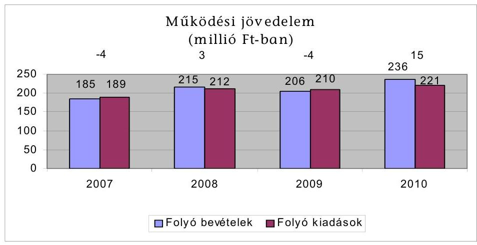
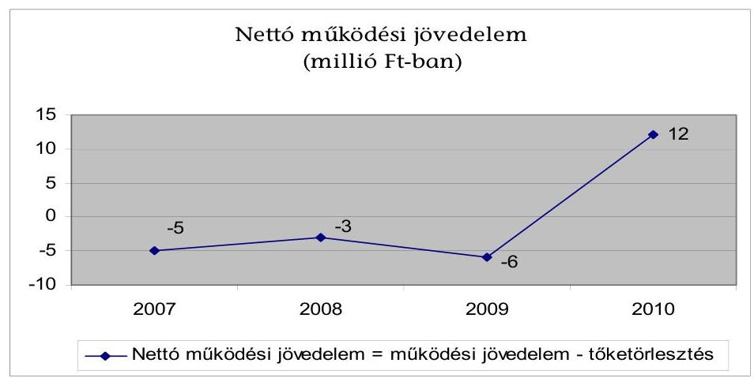
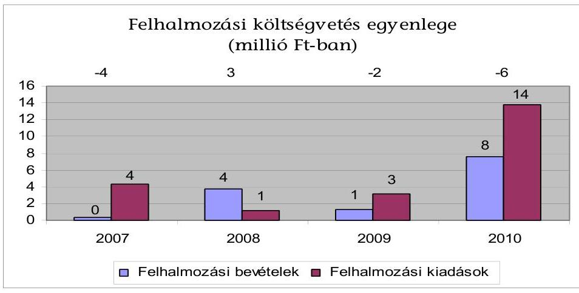
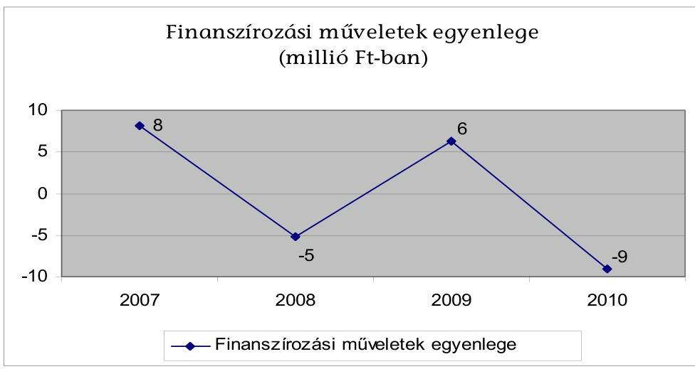
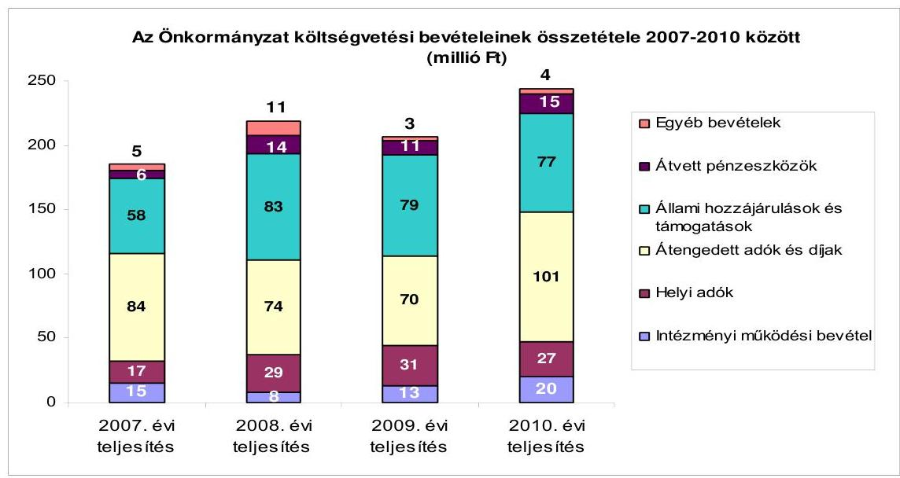
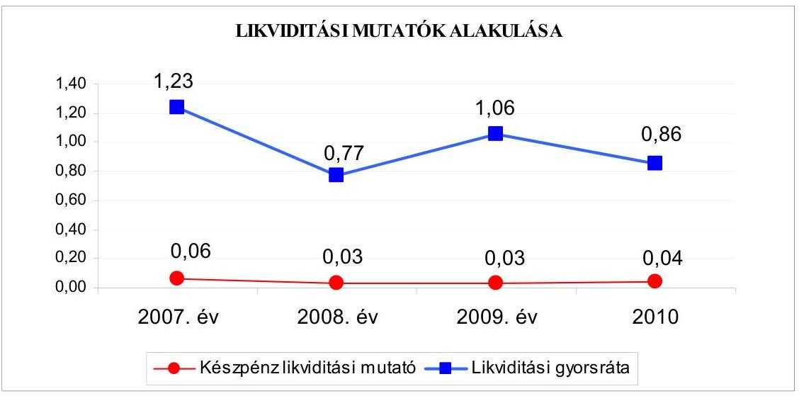
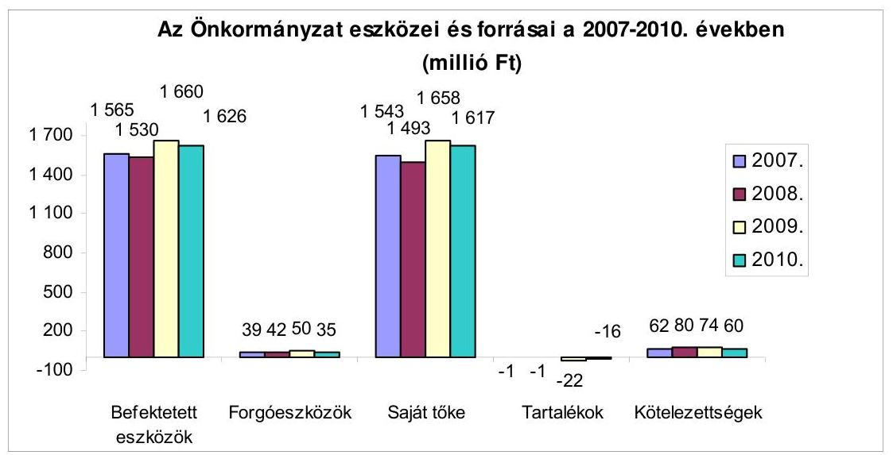
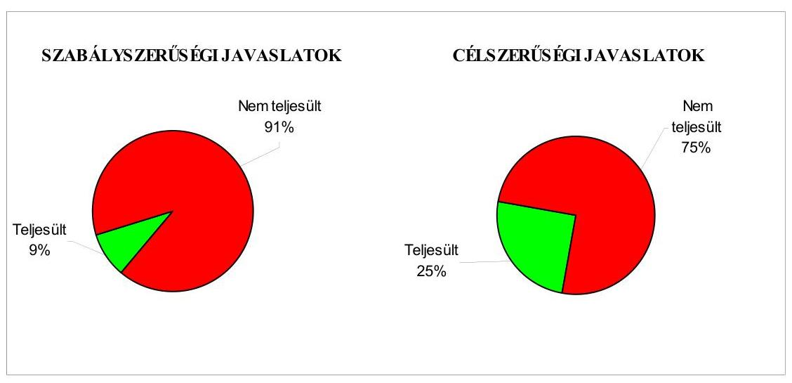
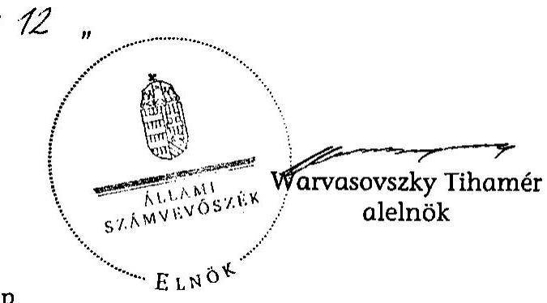

# ÁLLAMI   SZÁMVEVŐSZÉK 

## JELENTÉS

Felcsút Község Önkormányzata
gazdálkodási rendszerének 2011. évi ellenőrzéséről (43/1)

---

# 3. Önkormányzati és Területi Ellenőrzési Igazgatóság 

3.2. Önkormányzati Rendszert Ellenőrző Főcsoport

Iktatószám: V-3028-15/2011.
Témaszám: 1015
Vizsgálat-azonosító szám: V0560001

## Az ellenőrzést felügyelte:

Dr. Elek János
megbízott főigazgató
Az ellenőrzés végrehajtásáért felelős:
Dr. Varga Sándor
főigazgató-helyettes
Az ellenőrzést vezette:
Csecserits Imréné
főcsoportfőnök-helyettes, ellenőrzés-vezető,
Az ellenőrzést végezték:
Dr. Marosi Gyöngyi
Eigner György Zoltán
számvevő tanácsadó
számvevő tanácsos
A témához kapcsolódó eddig készített számvevőszéki jelentések:
címe
sorszáma
Jelentés a helyi és a helyi kisebbségi önkormányzatok gazdálkodási rendszerének 2006. évi átfogó és egyéb szabályszerűségi ellenőrzéséről

---

# TARTALOMJEGYZÉK 

BEVEZETÉS ..... 7
I. ÖSSZEGZŐ MEGÁLLAPÍTÁSOK, KÖVETKEZTETÉSEK, JAVASLATOK ..... 10
II. RÉSZLETES MEGÁLLAPÍTÁSOK ..... 20

1. Az Önkormányzat adósságkezelési tevékenységének eredményessége a pénzügyi egyensúly fenntartásában, az adósságot keletkeztető kötelezettségvállalások pénzügyi kockázatainak hatása a gazdálkodás stabilitására, a közfeladat-ellátásra ..... 20
2. A vagyoni helyzet alakulása, valamint a vagyongazdálkodás folyamataiban a kontrollok működése ..... 29
2.1. Az Önkormányzat vagyoni helyzetének 2007-2010 közötti alakulása ..... 29
2.2. A vagyongazdálkodás belső kontrolljainak működése ..... 32
3. Az Önkormányzat gazdálkodási rendszerének korábbi ellenőrzése során tett szabályszerűségi és célszerűségi javaslatok hasznosítása ..... 42
MELLÉKLETEK
4. számú Az Önkormányzat gazdálkodását meghatározó adatok, mutatószámok (1 oldal)
5. számú Az Önkormányzat költségvetési bevételének és kiadásának összetétele (1 oldal)

---

.

---

# RÖVIDÍTÉSEK, MOZAIKSZAVAK JEGYZÉKE 

## Törvények

Áht.
ÁSZ tv.
Ktv.
Ötv.

## Rendeletek

Áhsz.

Ámr. 1
Ámr. 2
2007. évi költségvetési rendelet
2008. évi költségvetési rendelet
2009. évi költségvetési rendelet
2010. évi költségvetési rendelet
2011. évi költségvetési rendelet
SzMSz

## Szórövidítések

ÁSZ
Belső Kontroll Kézikönyv
FEUVE
gazdálkodási szabályzat
hivatali SzMSz
hivatali új SzMSz
az államháztartásról szóló 1992. évi XXXVIII. törvény az Állami Számvevőszékről szóló 1989. évi XXXVIII. törvény a köztisztviselők jogállásáról szóló 1992. évi XXIII. törvény a helyi önkormányzatokról szóló 1990. évi LXV. törvény
az államháztartás szervezetei beszámolási és könyvvezetési kötelezettségének sajátosságairól szóló 249/2000.
(XII. 24.) Korm. rendelet
az államháztartás működési rendjéről szóló 217/1998. (XII. 30.) Korm. rendelet
az államháztartás működési rendjéről szóló 292/2009. (XII. 19.) Korm. rendelet
az Önkormányzat 2/2007. (II. 15.) számú rendelete a 2007. évi költségvetésről
az Önkormányzat 1/2008. (II. 12.) számú rendelete a 2008. évi költségvetésről
az Önkormányzat 2/2009. (II. 26.) számú rendelete a 2009. évi költségvetésről
az Önkormányzat 1/2010. (III. 4.) számú rendelete a 2010. évi költségvetésről
az Önkormányzat 1/2011. (II. 28.) számú rendelete a 2011. évi költségvetésről
az Önkormányzat 7/2007. (IX. 14.) számú rendelete a Képviselő-testület Szervezeti és Működési Szabályzatáról

Állami Számvevőszék
az államháztartásért felelős miniszter által a 2010. évben közzétett, a belső kontrollrendszer működtetésére vonatkozó módszertani útmutató
folyamatba épített, előzetes, utólagos és vezetői ellenőrzés a polgármester és a jegyző ${ }_{2}$ által kiadott, Felcsút Község Önkormányzata Polgármesteri Hivatalának Gazdálkodási Szabályzata, hatályos 2011. január 30-tól
a Képviselő-testület 54/2007. (IX. 11.) számú határozatával elfogadott, Felcsút Község Önkormányzata Polgármesteri Hivatalának ügyrendje
a Képviselő-testület 6/2011. (I. 2.) számú határozatával elfogadott, Felcsút Község Önkormányzata Polgármesteri Hivatalának szervezeti és működési szabályzata, hatályos 2011. február 1-jétől

---

| jegyzö $_{1}$ | Felcsút Község Önkormányzatának 2010. december 31-   ig kinevezett jegyzője |
| :-- | :-- |
| jegyzö $_{2}$ | Felcsút Község Önkormányzatának 2011. január 1-től   kinevezett jegyzője |
| Képviselő-testület | Felcsút Község Önkormányzatának Képviselő-testülete |
| Pénzügyi bizottság | Felcsút Község Önkormányzatának Pénzügyi és Ügyrendi Bizottsága |
| polgármester | Felcsút Község Önkormányzatának polgármestere, 2011.   március 28-ig |
| Polgármesteri hivatal | Felcsút Község Önkormányzatának Polgármesteri Hivata-   la |
| Társulás | Vértes Többcélú Kistérségi Önkormányzati Társulás |

---

# ÉRTELMEZŐ SZÓTÁR 

árfolyamkockázat
eredményesség
garancia és kezességvállalás
kamatkockázat

A külföldi devizában lévő pénzügyi eszközök tulajdonosainak abból fakadó kockázata, hogy az árfolyam elmozdulásával az általuk tartott eszköz hazai fizetőeszközben kifejezett értéke megváltozik. (ezen ellenőrzéshez kialakított értelmezés)
A kitűzött célok megvalósításának mértékeként vagy egy tevékenység kimenete szándékolt és tényleges hatása közötti kapcsolat. Ebben a meghatározásában - kiterjesztve a teljesítmény-ellenőrzés értelmezési tartományára - a hatás az operatív, a specifikus vagy átfogó szinten keletkezett „végterméket" jelenti, amely lehet output, eredmény és hatás egyaránt. (ÁSZ Teljesítmény-ellenőrzési módszertan 16. oldal)
Valamilyen esemény jövőbeni bekövetkezéséhez kapcsolódó kötelezettségvállalás. A garanciavállalás az önkormányzat kötelezettség-vállalása arra vonatkozóan, hogy a szerződésben meghatározott feltételek beálltakor a garancia kedvezményezettje számára, határozott összegig, határozott időpontig, felszólításra azonnal fizet. Ez a kötelezettség az önkormányzat számára azzal a bizonytalansággal jár, hogy nem tudja, hogy ezt a kötelezettségvállalását igénybe veszik-e vagy nem, és ha igen, mikor. A kezesség járulékos kötelezettségvállalás, amely lehet egyszerű vagy készfizető, és mindig feltételezi a főkötelezettet. Az egyszerű kezességvállalás esetén a kezes mindaddig megtagadhatja a teljesítést, míg mindazoktól behajtható, akik őt megelőzően vállaltak kötelezettséget. A készfizető kezes nem illeti meg a sortartás kifogása. A fentiek következtében mind a garancia-, mind a kezességvállalás esetében az önkormányzatnak a futamidő teljes időtartama alatt azzal kell számolnia, hogy ha a főkötelezett elmulasztja teljesíteni a fizetést, a vállalt kötelezettséget vele szemben érvényesítik az adott időpontban fennálló összeg erejéig. Előbbiek ismerete szükséges a felelős döntéshozatalhoz, valamint a kezességvállalást megelőzően indokolt, hogy a főkötelezett gazdasági társaság az önkormányzat rendelkezésére bocsássa a garancia- és kezességvállalás alapját képező kötelezettségéről kötött szerződést (pl. hitel, kölcsönszerződés), amelyből nemcsak annak főösszege állapítható meg, hanem a tőke-és járulékai, valamint a törlesztés futamideje, illetve határideje is. (ezen ellenőrzéshez kialakított értelmezés)
Az a kockázat, hogy a forint-, vagy a devizahitel futamideje alatt emelkedik a kamat és így a hitel törlesztésére fordítandó összeg. (ezen ellenőrzéshez kialakított értelmezés)

---

költségvetési bevétel

PPP (public private partnership)

Az Áht. 69. § (1) bekezdés a) és c) pontjaiban foglaltak figyelembevételével meghatározott összeg, amelynek számítása során a tárgyévi költségvetési bevételeket növeli - a költségvetési hiány belső finanszírozására szolgáló előző évek pénzmaradványából, vállalkozási maradványából igénybe vett összeg. (Az Áht. alapján ezen ellenőrzéshez kialakított értelmezés.)
Az állami és a magánszféra együttműködésének egyik formája, amelynek keretében a közcél a magánszféra jelentős mértékű közreműködésével valósul meg. Az állam (önkormányzat) a közszolgáltatások létrehozását a tradicionálisnál komplexebb módon bízza a magánszférára. Az együttműködés keretében megvalósuló közszolgáltatás hosszú távra szól. A magán partner felelőssége az infrastruktúra tervezésére, megépítésére, működtetésére és legalább részben a projekt finanszírozására terjed ki. Az állam (önkormányzat) és/vagy a szolgáltatások igénybe vevője szolgáltatási díjat fizet. A közszférabeli szerződő fél feladata a projekt definiálása, a szolgáltatás elvárt minőségének, mennyiségének és az igénybevétel idejének meghatározása, valamint az árazási politika kialakítása, az ellenőrzési, monitoring feladatok ellátása. (Államháztartási fogalomtár)

---

# SZÁMVEVŐI JELENTÉS 

## Felcsút Község Önkormányzata gazdálkodási rendszerének 2011. évi ellenőrzéséről

## BEVEZETÉS

Az Állami Számvevőszék a 2011. évben életbe lépett stratégiája szerint „az önkormányzatok ellenőrzése során azok pénzügyi-gazdasági helyzetét értékeli, kockázatait feltárja, valamint az ellenőrzések helyszíneit objektív mutatószámrendszer alapján választja ki". E célkitűzéseknek megfelelően összeállított ellenőrzési program alapján végzi a helyi önkormányzatok gazdálkodási rendszerének ellenőrzését.

## Az ellenőrzés célja az Önkormányzatnál annak értékelése volt, hogy:

- biztosított-e a pénzügyi egyensúly, a fizetőképesség, a gazdálkodás stabilitása, ezeket segítette-e az adósság kezelése;
- a vagyoni helyzet a külső és belső tényezők hatására miként változott, megfelelően biztosították-e a vagyongazdálkodás szabályosságát, eredményességét a belső kontrollok;
- hasznosultak-e a gazdálkodási rendszer korábbi ellenőrzése során tett szabályszerűségi és célszerűségi javaslatok.

Az ellenőrzés típusa: teljesítmény-ellenőrzés, továbbá az ellenőrzés meghatározott területein szabályszerűségi ellenőrzés.

Az ellenőrzött időszak: a pénzügyi, vagyoni helyzettel kapcsolatos elemzéseket, értékeléseket, valamint az önkormányzat gazdálkodási rendszerének korábbi ellenőrzése során tett javaslatok megvalósításának ellenőrzését alapvetően a 2007-2010. évekre vonatkozóan végeztük, valamint lehetőség szerint kitérünk a helyszíni ellenőrzést megelőző utolsó negyedév végéig terjedő időszakra is. A vagyongazdálkodás belső kontrolljai működésének tesztelése a 2010. évre, valamint a helyszíni ellenőrzést megelőző utolsó negyedév végéig terjedő időszakra vonatkozik.

Az ellenőrzés jogszabályi alapját az Állami Számvevőszékről szóló 1989. évi XXXVIII. törvény 2. § (3), (5), (6) és (9) bekezdései, a helyi önkormányzatokról szóló 1990. évi LXV. törvény 92. § (1) bekezdése, az államháztartásról szóló 1992. évi XXXVIII. törvény 104. § (3), és a 120/A. § (1) bekezdése előírásai képezték.

Felcsút Község állandó lakosainak száma 2011. január 1-jén 1831 fő volt. A 2010. évi önkormányzati képviselő és polgármester választást követően az Ön-

---

kormányzat hét tagú Képviselő-testületének munkáját három állandó bizottság segítette. A polgármester megbízatása 2011. március hónapban megszűnt, munkakörét az alpolgármester vette át. A jegyző személye 2011. január 1-jén változott.

Az Önkormányzat pénzügyi egyensúlyi helyzetének rövid bemutatásán túlmenően a pénzügyi egyensúly fenntartását, a pénzügyi kockázatok kezelését és annak hatását (a pénzügyi egyensúlyt fenntartását veszélyeztető külső és belső pénzügyi kockázatok csökkentésére hozott döntések, tett intézkedések eredményességét) minősítettük. Lényegességi szempontok figyelembevételével értékeltük a döntés-előkészítés, a megtett intézkedések eredményességét és azt, hogy a pénzügyi egyensúly fenntartását mely kockázatok és milyen mértékben veszélyeztették. Az ellenőrzés részletes szempontok szerinti elvégzéséhez az egységes végrehajtás alapját az ellenőrzési program mellékletét képező teljesítményellenőrzési kérdésfa és a kapcsolódóan meghatározott kritériumok, valamint a fogalmak egységes tartalmát meghatározó értelmező szótár biztosította.

A vagyongazdálkodás ellenőrzése kiterjedt a vagyon értékének, összetételének, 2007-2010. évek között a vagyonváltozást előidéző okok elemzésére. A vagyongazdálkodás belső kontrolljai azonosításának és működésének ellenőrzése keretében a vagyonértékesítés és a vagyonhasznosítás, valamint a finanszírozási célú pénzügyi műveletek folyamatait értékeltük ${ }^{1}$. Felmértük a belső kontrollokban rejlő kockázatot, minősítettük a kontrollok működését és meghatároztuk, hogy a vagyongazdálkodás folyamatában mely kontrollok nem biztosították a működésbeli hibák megelőzését, feltárását, kijavítását, és ezáltal veszélyeztették az eredményes, megfelelő működést.

A vagyongazdálkodási folyamatokban alkalmazott belső kontrollok azonosításának és működésének vizsgálatát többlépcsős megfelelőségi tesztek útján végeztük. A vizsgált területek könyvviteli tételei alapján (meghatározott tételszám felett egyszerű véletlen minta alapján) történik a vagyongazdálkodás belső kontrolljai működésének a megítélése. Az ellenőrzés során alkalmazott módszer - többlépcsős megfelelőségi teszt - lényege, hogy a kiválasztott minta ellenőrzését csak addig végeztük, amíg elegendő és megfelelő bizonyítékot nem

[^0]
[^0]:    ${ }^{1}$ A vagyongazdálkodás területén a szabályozottságban rejlő kockázatot alacsonynak minősítettük, ha a szabályozottság megfelelő védelmet nyújtott a vagyongazdálkodással összefüggő hibák bekövetkezése ellen. Közepesnek minősítettük a vagyongazdálkodás szabályozottságában rejlő kockázatot, amennyiben a szabályozottság a lehetséges vagyongazdálkodási hibák többsége ellen védelmet nyújtott. Magasnak értékeltük a vagyongazdálkodás szabályozottságában rejlő kockázatot, ha a szabályok - kialakításuk hiányában, vagy hiányos kialakításuk miatt - nem nyújtottak elegendő védelmet a lehetséges vagyongazdálkodási hibákkal szemben.

---

szereztünk a vizsgált folyamatok kulcskontrolljai működésének megfelelő vagy nem megfelelő voltáról².

Az Önkormányzat gazdálkodási rendszerének korábbi ellenőrzésekor tett szabályszerűségi és célszerűségi javaslatok hasznosulását utóellenőrzés keretében ellenőriztük.

A helyszíni ellenőrzés során kitöltött - az ellenőrzést végző számvevő és a Polgármesteri hivatal felelős köztisztviselője által aláírt - ellenőrzési munkalapokat, azok kitöltési útmutatóit, továbbá a megfelelőségi tesztek dokumentumait a polgármester munkakörében eljáró alpolgármester részére a számvevői jelentéssel egyidejűleg átadtuk.
${ }^{2}$ A vagyongazdálkodás területén azonosított kontrollok működését kiválónak értékeltük abban az esetben, ha azok működése megfelelt a hibák megelőzésére és kijavítására meghatározott szabályozásnak és a legmagasabb szintű elvárásoknak. Jónak minősítettük a vagyongazdálkodás területén azonosított kontrollok működését, ha a megállapított kisebb (tolerálható mértékű) hiányosságok nem veszélyeztették a vagyongazdálkodás ellenőrzött területei hibáinak

 megelőzését és kijavítását. Amennyiben a kontrollok működésében túl sok hiányosság fordult elő ahhoz, hogy a kontrollok biztosítsák a vagyongazdálkodási hibák megelőzését, feltárását, kijavítását és ezáltal veszélyeztették az eredményes, megfelelő vagyongazdálkodást, a kontrollok működése gyenge minősítést kapott.

---

# I. ÖSSZEGZŐ MEGÁLLAPÍTÁSOK, KÖVETKEZTETÉSEK, JAVASLATOK 

Az Önkormányzat a feladatainak végrehajtása érdekében a Polgármesteri hivatal mellett a 2007. évben három, a 2010. évben két költségvetési szervet működtetett, utóbbiak részben önállóak voltak. Ezen költségvetési szervek végzik az óvodai nevelést és az alapfokú általános iskolai oktatást. Az Önkormányzat 2007-2010 között a kötelezően ellátandó feladatai közül az óvodai nevelést és az általános iskolai oktatást az általa fenntartott intézményekkel, a szociális és gyermekvédelmi, valamint az egészségügyi feladatokat és a belső ellenőrzést a Társulással kötött megállapodás alapján biztosította. Az egészséges ivóvíz-ellátási, a csatornázási, valamint a hulladékgazdálkodási feladatokat megrendelés alapján gazdasági társaságok végzik.

Az Önkormányzat által 2007-2011. év I. negyedév között az ellátott feladatok szervezeti formája változott, 2008. december 31-i hatállyal a könyvtár részben önálló gazdálkodási jogkörét megszüntették, feladatait a Polgármesteri hivatal vette át. A házi segítségnyújtás, valamint a jelzőrendszeres házi segítségnyújtás feladatokat 2011. január 1-jétől - a Társulással kötött megállapodást módosítva - a Polgármesteri hivatal látja el.

Az Önkormányzat önként vállalt feladatai a kötelező háziorvosi ellátáshoz kapcsolódtak, valamint támogatást nyújtott non-profit szervezetek és helyi közösségek, klubok részére. Az önként vállalt feladatok részesedése 2010-ben az összes költségvetési kiadás 2%-a (öt millió Ft) volt. Az Önkormányzat nem rendelkezik többségi tulajdonában lévő gazdasági társasággal.

A Polgármesteri hivatalban dolgozó köztisztviselők száma 2007. január 1-jén és 2011. január 1-jén egyaránt hét fő, a költségvetési szerveknél foglalkoztatott közalkalmazottak száma 2007. január 1-jén 31 fő, 2011. január 1-jén 35 fő volt.

A vizsgált időszakban az Önkormányzat pénzügyi helyzetét - az elemzéséhez alkalmazott CLF módszer szerint - a következők jellemzik: A folyó költségvetések egyenlege (a működési jövedelem) 2007-ben és 2009-ben negatív, 2008-ban és 2010-ben pozitív volt. Emellett minden évben igénybe vett különböző likvid hitelt, amelyek közül a munkabér megelőlegezési hitelt növekvő összegben, folyamatosan igényelte, valamint emelkedett a folyószámlahitel keretösszege is. A felhalmozási költségvetések egyenlege a 2008. év kivételével minden évben negatív összegű volt. Ez nem járt pénzügyi kockázattal, mert részben a finanszírozási műveletekkel, de még inkább a rendelkezésre álló maradvánnyal biztosítani tudták a pénzügyi egyensúlyt.

Az Önkormányzat 2011 utáni kötelezettségei (pénzintézeti, szállítói, egyéb) 20,2 millió Ft, amelyből a pénzintézeti kötelezettség 2011-2013 között 7,4 millió Ft, a 2013 után 13,8 millió Ft. Egyéb hosszú lejáratú kötelezettséggel az Ön-

---

kormányzat nem rendelkezik. A könyvviteli mérleg szerinti hosszú lejáratú kötelezettség teljesítése nem számszerűsített.

Az Önkormányzat 2010-ben 244,3 millió Ft költségvetési bevételt ért el, amely a 2007. évi 189,7 millió Ft-nál 28,8%-kal, 54,6 millió Ft-tal magasabb. Ezen belül legnagyobb mértékben - 9,7 millió Ft-tal, 57,0%-kal - a helyi adók, valamint az átengedett adók - 17,1 millió Ft-tal, 20,4%-kal emelkedtek. A felhalmozási kiadásokkal csökkentett összes költségvetési bevétel 33,5%-át a saját bevétel - amelynek 71,4%-át a helyi adóbevétel szja-n kívüli átengedett bevételekkel növelt összege - biztosította 2010-ben.

Az összes költségvetési kiadásból a felhalmozási célú kiadás részaránya a 2007. évihez viszonyítva 2010-re 3,4 százalékponttal (9 millió Ft-tal) 14,4 millió Ft-ra nőtt, 2010-ben 6,0% volt. Az Önkormányzat gazdálkodását meghatározó bevételi-kiadási adatokat, mutatószámokat az 1-2. számú melléklet tartalmazza.

Az Önkormányzat kötelezettségeinek aránya az összes forráshoz képest a 2007. évről a 2010. évre emelkedett. A költségvetési bevételek költségvetési kiadásokat meghaladó része az adósságszolgálati kötelezettség teljesítésére a 2007-2009. években nem biztosított fedezetet, 2010-ben fedezetet nyújtott. Az Önkormányzat 2011. év I. negyedév végén 0,9 millió Ft 30 és 60 nap közötti, valamint 0,4 millió Ft 60 és 90 nap közötti lejárt szállítói tartozásállománnyal rendelkezett. A rövid- és hosszú lejáratú hitelek év végi állománya a 2006. év végi 38,9 millió Ft-ról a 2010. év végére 41,1 millió Ft-ra emelkedett. A 2010. december 31-én fennálló folyószámlahitel állomány 12,7 millió Ft, a munkabér hitel állománya 5,4 millió Ft volt. A folyószámlahitel keretösszege 2007-2010 között 13,0 millió Ft-ról 15,0 millió Ft-ra emelkedett. Magas (353-365 nap közötti) volt a folyószámlahitellel és a munkabér megelőlegezési hitellel zárt napok száma. A likvid hitelállomány növekedése ellenére az Önkormányzat nem rendelkezett a likviditási és eladósodási problémákat kezelő stratégiával.

Az államháztartáson kívüli szervezeteknek 2010-ben 6,6 millió Ft összegben nyújtott támogatások esetében a támogatásra vonatkozó döntést megelőzően a Képviselő-testület részére nem mutatták be az Önkormányzat pénzügyi lehetőségeit, a tervezett támogatás hatását a költségvetés hiányára/többletére.

Az Önkormányzat 2010. december 31-én a könyvviteli mérleg szerint 1661 millió Ft értékű vagyonnal rendelkezett. A vagyon a 2007. év végi állományhoz viszonyítva 3,6%-kal (57,6 millió Ft-tal) emelkedett. Ezen belül a befektetett pénzügyi eszközök állománya 145,9%-kal (8,2 millió Ft-tal) emelkedve 13,8 millió Ft-ra nőtt a Biwatec-Felcsút Kft-ben 2006-ban szerzett, de a könyvviteli nyilvántartásban csak 2008-ban rögzített 10 millió Ft összegű (5%-os tulajdonosi arányt biztosító) részesedés miatt. Az összes kötelezettség állománya 2007-ről 2010-re 3,1%-kal (1,9 millió Ft-tal) 60 millió Ft-ra csökkent, a hosszú lejáratú kötelezettségek 25,5%-os (6,9 millió Ft-tal történt) csökkenése, valamint a rövid lejáratú kötelezettségek 43,9%-os (2,2 millió Ft-tal történt) emelkedése mellett. A rövid lejáratú kötelezettségek év végi állományának emelkedését 2007-2010 között a növekvő összegű, naptári év végén vissza nem fizetett folyószámlahitel és munkabér megelőlegezési hitel, valamint a 2007. évben és a

---

2009. évben felvett egyéb likvid hitel okozta. A Képviselő-testület 2007-2010 között hosszú lejáratú adósságot keletkeztető kötelezettségvállalásról nem döntött.

A vagyon növekedését 83,5%-ban a 2009-ben közösségi összefogással felajánlásként térítésmentesen elvégzett óvodabővítés és felújítás 21,4 millió Ft értékben történt nyilvántartásba vétele okozta. További növekedést eredményezett az Önkormányzat sporttelepén „ismeretlen tulajdonú”-ként nyilvántartott sportlétesítményeknek a földterülettel együttes 2009. évi értékelésének elvégzése és 153,8 millió Ft-tal növelt értékkel, önkormányzati vagyonként történő kimutatása. Az óvodabővítés és felújítás, valamint a sportlétesítmény könyvviteli nyilvántartásba vétele együttesen 175,2 millió Ft-os értéke 93,5%-ban ellentétezte az elszámolt értékcsökkenés miatti 187,5 millió Ft-os vagyoncsökkenést.

Az Önkormányzat vagyongazdálkodási döntései összességében kedvező hatással voltak a vagyoni helyzetére. A könyvviteli mérlegben a forrásokat csökkentő - a teljesített bevételt meghaladó 2007. és 2009. évi kiadás miatti - negatív tartalék azonban a pénzügyi egyensúly tartós hiányát mutatja. Ez, valamint a már tartós jellegű likviditási hitelek, továbbá a 2011. év I. negyedév végén fennálló 0,4 millió Ft összegű 60-90 nap közötti lejárt szállítói tartozás az Önkormányzat pénzügyi és vagyoni helyzetének romlását jelzi.

A vagyongazdálkodási folyamatok szabályozottságának hiányosságai magas kockázatot jelentettek a feladatok megfelelő végrehajtásában.

A jegyző¹ az Ámr² -ben előírtak ellenére nem kezdeményezte, hogy a hivatali SzMSz tartalmazza a vagyongazdálkodási feladatokhoz is kapcsolódó munkakörök feladat- és hatáskörét, a hatáskörök gyakorlásának módját, a helyettesítés rendjét, az ezekhez kapcsolódó felelősségi szabályokat, a szervezeti ábrát, és a Polgármesteri hivatalhoz rendelt más költségvetési szervek felsorolását. Nem készítette el az ellenőrzési nyomvonalat, és a szabálytalanságok kezelésének eljárásrendjét, nem határozta meg a vagyongazdálkodási folyamatokban a szabálytalanságok észlelésekor teendőket.

A Polgármesteri hivatal nem rendelkezett adatvédelmi és adatbiztonsági szabályzattal. Az Áhsz-ben foglalt előírások ellenére a jegyző¹ nem adta ki az eszközök és források értékelési szabályzatát valamint az eszközök és források leltározási és leltárkészítési szabályzatát. Nem határozták meg a Polgármesteri hivatalban a vagyongazdálkodási feladatok ellátásához szükséges humánerőforrás mennyiségi és minőségi, valamint szakmai szükségletét, és a jegyző¹ nem írt elő a köztisztviselők számára vagyongazdálkodási feladatok ellátásához teljesítménykövetelményeket, nem határozta meg az etikus magatartással kapcsolatos elvárásokat.

A jegyző¹ az Ámr.² előírásait figyelmen kívül hagyva a kockázatkezelés rendjének kialakítása keretében nem mérte fel a vagyongazdálkodási folyamatokban rejlő külső és belső kockázatokat, nem határozta meg a kockázatok kezelésére szolgáló kontrolleljárásokat, nem készítette el a kockázatok kezelésével kapcsolatos szabályokat, nem határozta meg a kockázatazonosítás és értékelés módját, a csalás, korrupció kockázatának minősítését, a vagyongazdálkodás főfolyamatára a kockázatokkal kapcsolatos válaszlépéseket, nem dolgozta ki a vagyongazdálkodási folyamatok kockázati tényezőinek csökkentése érdekében

---

hozott intézkedések nyomon követésének módszerét. A jegyző¹ nem kezdeményezte, hogy a Társulásnál az éves ellenőrzési tervben tervezzék a vagyongazdálkodáshoz kapcsolódó magas kockázatúnak értékelt területek ellenőrzését.

A kontrolltevékenységek meghatározása keretében a jegyző az Ámr² -ben foglaltak ellenére nem kezdeményezte a vagyon forgalomképességének megváltoztatási módjára vonatkozó előírások meghatározását. A vagyonértékesítéssel és hasznosítással kapcsolatban nem írták elő a döntés-előkészítés folyamatában a költség-haszon elemzés készítésének kötelezettségét, az Áht-ban meghatározott értékhatár alatti vagyonértékesítésre és hasznosításra vonatkozóan a versenyeztetési kötelezettséget, a hasznosításra szánt vagyon értéke megállapítása céljából értékbecslés készítésének kötelezettségét, a végrehajtás szakaszában az Önkormányzat tulajdonosi jogainak, érdekeinek védelmét szolgáló garanciális elemek szerződésben, egyéb dokumentumban való rögzítésének kötelezettségét, és nem írták elő a Pénzügyi bizottság részére a beszámolási kötelezettséget.

Nem határozták meg a pénzügyi kockázatok felmérésének, a hitelfelvételről szóló döntés-előkészítés folyamatában a futamidő egyes éveit terhelő kötelezettség költségvetési egyensúlyra gyakorolt hatása vizsgálatának kötelezettségét. A jegyző nem határozta meg a vagyongazdálkodási folyamatok dokumentálásának rendjét, nem írta elő a vezetői ellenőrzési kötelezettséget, nem határozta meg a vagyongazdálkodási folyamatokra vonatkozó ellenőrzési pontokat, az ellenőrzésért felelősöket, a helyettesítés és felelősség szabályait, a kapcsolattartás módját, a beszámolási kötelezettséget, nem rögzítette a vagyongazdálkodási feladatokat ellátók munkaköri leírásában a vagyongazdálkodással kapcsolatos jogokat, kötelezettségeket, nem jelölte ki a bevételeket megalapozó döntésekben meghatározott feltételek szerződésben történő érvényesítésének ellenőrzéséért felelős személyeket.

A jegyző az Ámr-ben előírtak ellenére nem határozta meg a szakmai teljesítés igazolás módját, nem jelölte ki a szakmai teljesítés igazolására jogosult személyeket, és indokoltsága ellenére nem írta elő a vagyongazdálkodásban meghatározó saját bevételek esetében a szakmai teljesítés igazolásának kötelezettségét. A jegyző² 2011-ben a gazdálkodási szabályzatban a szakmai teljesítésigazolás módját meghatározta.

Az információt, kommunikációt, monitoringot érintően a jegyző nem határozta meg a vagyongazdálkodás külső és belső információi kezelésének rendjét, a vagyongazdálkodással összefüggő közérdekű (közzé teendő) adatok kezelésének, közzétételének eljárási rendjét, nem hozta létre a vezetői információs rendszert.

A Polgármesteri hivatalban a 2010. évben a vagyongazdálkodási folyamatokban a kontrollok működése gyenge volt.

A számviteli nyilvántartások az Áhsz. előírása ellenére elkülönítetten nem tartalmazták a törzsvagyon körébe tartozó vagyontárgyakat. A jegyző nem gondoskodott az Áhsz-ben előírtak ellenére az ingatlanvagyon évenkénti leltározásáról. A Pénzügyi bizottság a vagyonváltozás alakulásának figyelemmel kíséréséről nem számolt be a Képviselő-testületnek. A finanszírozási célú pénzügyi

---

művelet végzése során a döntés-előkészítés folyamatában nem mérték fel a pénzügyi kockázatokat, nem végezték el a futamidőt terhelő kötelezettségvállalás költségvetési egyensúlyra gyakorolt hatásának vizsgálatát, a Pénzügyi bizottság nem terjesztett be a hitelfelvétel indokainak és gazdasági megalapozottságának vizsgálatáról szóló véleményt a hitelfelvételhez kapcsolódó képviselő-testületi
 döntéshez.

A vagyongazdálkodási tevékenységgel kapcsolatos - támogatások és szerződések meghatározott adataira vonatkozó - közzétételi kötelezettséget az Áht. előírása ellenére nem teljesítették, a vagyongazdálkodási tevékenységek folyamataiban használt számítástechnikai programok adatai tekintetében nem volt biztosított az adatok hozzáférésére vonatkozó előírások betartása. Vezetői ellenőrzés keretében nem számoltatták be a vagyongazdálkodási feladatokat végzőket a vagyonértékesítés, vagyonhasznosítás folyamatairól, annak eredményéről, a finanszírozási célú pénzügyi műveletek végrehajtásának folyamatáról és a végrehajtás eredményéről. A vagyongazdálkodásra kiterjedő belső ellenőrzést nem végeztek.

A Polgármesteri hivatalban a 2010. évben az önkormányzati ingatlanok bérbeadásából származó bevételek elszámolása, valamint a vásárolt közszolgáltatással, az ingatlanok felújításával, a nonprofit szervezeteknek, egyházaknak és egyéb vállalkozásoknak nyújtott céljellegű működési és felhalmozási célú támogatások kifizetése során a belső kontrollok működése gyenge volt, mert az ingatlanok felújításával és a céljellegű működési és felhalmozási célú támogatásokkal kapcsolatos kötelezettségvállalások ellenjegyzés nélkül történtek. Az utalványokat a jegyző, - az Ámr-ben előírtak ellenére - nem ellenjegyezte, ellenőrzési feladatát nem végezte el az önkormányzati ingatlanok bérbeadásával kapcsolatos bevételek esetében, valamint az ingatlanok felújításával, és a céljellegű működési és felhalmozási célú támogatásokkal kapcsolatos kifizetéseket megelőzően. Nem ellenőrizte ennek következtében a szakmai teljesítésigazolás és az érvényesítés megtörténtét, nem vizsgálta az előirányzat és a fedezet meglétét, nem kifogásolta, hogy az utalványrendeleten nem tüntették fel a kötelezettségvállalás nyilvántartási számát. Az Ámr${ }_{2}$-ben előírtak ellenére írásban nem tájékoztatta a kötelezettségvállalásra jogosultat - a polgármestert - arról, hogy kötelezettségvállalása a szennyvízhálózat felújítása, a nyugdíjas klub, és a diák focicsapat támogatása esetében nem felelt meg a gazdálkodásra vonatkozó szabályoknak, mivel - az Áht-ban és az Ámr-ben előírtak figyelmen kívül hagyásával - ellenjegyzés nélkül vállalt kötelezettséget. A támogatások esetében a 2010. évi költségvetési rendeletben előírtak ellenére nem kötött írásbeli megállapodást a támogatottakkal. A vásárolt közszolgáltatások kifizetéseit megelőzően a jegyző, az utalványrendeleteket ellenjegyezte, azonban annak során nem észrevételezte, hogy az Ámr-ben foglalt előírás ellenére nem történt meg a szakmai teljesítésigazolás és az érvényesítés, valamint az utalványrendeleten nem tüntették fel a kötelezettségvállalás nyilvántartási számát.

A költségvetési szerv vezetőjeként, a belső kontrollrendszer, beleértve a FEUVE kialakításáért és működtetéséért felelős a jegyző, azonban a pénzügyi és ellenőrzési rendszer részeként a belső kontrollok - szakmai teljesítés igazolás elvégzésére jogosult kijelölése, az igazolás módjának meghatározása, ellenjegyzés esetén a kiadási előirányzat, valamint a fedezet meglétének a vizsgálata, érvényesítés megtörténtének ellenőrzése, bizonylatok, utalványrendeletek alaki és

---

tartalmi megfelelőségének ellenőrzése, összeférhetetlenség esetére vonatkozó szabályozás - kialakítását és működtetését az Ötv-ben és az Áht-ban előírtakat ellenére a jegyző${ }_{1}$ elmulasztotta. Felelősség terheli a jegyző${ }_{1}$-t, mivel az Ámr${ }_{2}$ben előírtak ellenére nem határozta meg belső szabályzatban a szakmai teljesítésigazolás módját, valamint az Ámr${ }_{2}$-ben foglaltak ellenére nem jelölte ki a szakmai teljesítésigazolást végző személyeket. A szakmai teljesítésigazolás módjának szabályozása, valamint a szakmai teljesítésigazolók kijelölése az Önkormányzat gazdálkodási rendszerének 2006. évi ÁSZ ellenőrzése során tett javaslat ellenére elmaradt. Felelősség terheli a jegyző${ }_{1}$-t azért is, mert a jogszabály szerinti jogosultsága ellenére az utalványok ellenjegyzésekor az előírt ellenőrzési feladatait nem végezte el. Az ÁSZ a jegyző${ }_{1}$ felelősségének érvényesítését, megállapítását nem kezdeményezi, mivel 2010. december 31-én megszűnt a köztisztviselői jogviszonya.

Felelősség terheli a polgármestert, mivel az Áht. előírása ellenére a vagyongazdálkodási feladatok elvégzése során a felújításra, támogatásokra és jutalmazásra, juttatásra 9,5 millió Ft összegben ellenjegyzés és 8,6 millió Ft összegben előirányzat nélkül vállalt kötelezettséget, ezáltal Ötv. előírását figyelmen kívül hagyva nem biztosította az Önkormányzat vagyonával történő szabályszerű gazdálkodást. Az ÁSZ a polgármester felelősségének érvényesítését, megállapítását nem kezdeményezi, mivel 2011. április 1-től megszűnt a polgármesteri megbízatása.

Az ÁSZ az Önkormányzat gazdálkodási rendszerét a 2006. évben ellenőrizte átfogó jelleggel, amelynek során 11 szabályszerűségi és 4 célszerűségi javaslatot tett. Az utóellenőrzés során megállapítottuk, hogy a javaslatok 13%-át hasznosították, 87%-át nem valósították meg. A szabályszerűségi javaslatok 9%-át megvalósították, 91%-át nem teljesítették, a célszerűségi javaslatok 25%-át teljesítették, 75%-a nem teljesült. A számvevői jelentést a polgármester a Képviselő-testülettel nem ismertette, a javaslatok végrehajtását elősegítő intézkedési terv nem készült. A 2006. évi ellenőrzés javaslatai ellenére nem javult a gazdálkodási és pénzügyi-számviteli feladatok meghatározásának és végrehajtásának szabályozottsága, szabályszerűsége.

A jegyző${ }_{1}$ nem gondoskodott az Ámr.${ }_{1}$ előírásai ellenére az SzMSz kiegészítéséről, a számlarend Áhsz. előírásai szerinti kiegészítéséről. Az Áhsz. előírása ellenére nem szabályozta a terven felüli értékcsökkenés elszámolását, továbbá a felesleges vagyontárgyak hasznosítása esetére nem rendelkezett az ármegállapítás szabályairól. Nem szabályozta az Ámr.${ }_{1}$ előírása ellenére a gazdasági eseményenként 50 ezer Ft-ot${ }^{3}$ el nem érő kifizetések esetében azok nyilvántartási rendjét és formáját, nem rendelkezett a szakmai teljesítésigazolás módjáról, és az azt végző személyek kijelöléséről, valamint nem gondoskodott a szakmai teljesítésigazolás, a kötelezettségvállalás és utalványozás ellenjegyzésének elvégzéséről. Nem egészítette ki a munkaköri leírásokat az operatív gazdálkodás során elvégzendő ellenőrzési feladatokkal.

[^0]
[^0]:    ${ }^{3}$ 2010. január 1-jétől 100 ezer Ft

---

A jegyző; gondoskodott arról, hogy a számviteli nyilvántartásban az Áhsz-ben előírt határidőben rögzítsék a gazdasági eseményeket, továbbá előírta a pénztárellenőrzések gyakoriságát.

A helyszíni ellenőrzés megállapításainak hasznosítása mellett javasoljuk:

# a polgármesternek 

a jogszabályi előírások maradéktalan betartása érdekében

1. gondoskodjon arról, hogy az Áht. 12/A. § (1) bekezdése alapján a költségvetési előirányzat mértékéig, továbbá a 100/C. § (3) bekezdése alapján csak ellenjegyzést követően történjen kötelezettségvállalás, ezáltal biztosítsa az Ötv. 90. § (1) bekezdése alapján az önkormányzati vagyongazdálkodási feladatok esetében a szabályszerű gazdálkodást;
2. kössön írásbeli megállapodást a támogatott szervezetekkel a költségvetési rendelet 16. §-ában előírtaknak megfelelően;
a munka színvonalának javítása érdekében
3. kezdeményezze, hogy a Képviselő-testület írja elő
a) a vagyonértékesítéssel és hasznosítással kapcsolatban, a döntés-előkészítés folyamatban a költség-haszon elemzés készítésének, az értékhatár alatti vagyonértékesítésre és hasznosításra vonatkozóan a versenyeztetésnek, valamint a hasznosításra szánt vagyon piaci értékének megállapítása céljából értékbecslés készítésének a kötelezettségét;
b) a Pénzügyi bizottság részére a beszámolási kötelezettséget a vagyon változás figyelemmel kísérésének eredményéről;
4. gondoskodjon arról, hogy a hitelfelvételhez kapcsolódó képviselő-testületi döntéshez a Pénzügyi bizottság terjessze be a hitelfelvétel indokainak és gazdasági megalapozottságának vizsgálatáról szóló véleményét;
5. a pénzügyi egyensúly érdekében
a) a jegyző által készített előterjesztés alapján tájékoztassa a Képviselő-testületet évente az adósságot keletkeztető kötelezettségvállalásokból adódó fizetési kötelezettségek konkrét visszafizetési forrásairól a teljes futamidőre kiterjedően;
b) gondoskodjon arról, hogy a jövőben az adósságot keletkeztető kötelezettségvállalásokról szóló képviselő-testületi döntéseket megalapozó előterjesztések tartalmazzák a teljes futamidőre várható tőketörlesztés, kamat és egyéb költség forrásainak a bemutatását;
6. kezdeményezze, hogy a jelentésben foglaltakat a Képviselő-testület tárgyalja meg és a feltárt hiányosságok megszüntetése érdekében készíttessen intézkedési tervet a határidők és felelősök megjelölésével;

---

# a jegyzőnek 

a jogszabályi előírások maradéktalan betartása érdekében

1. A vagyongazdálkodás belső kontrolljai - kontrollkörnyezet, kockázatkezelés rendje, kontrolltevékenységek, információ, kommunikáció, monitoring - meghatározása és azok működése érdekében az Ötv. 92. § (4) bekezdésében, valamint az Áht. 94. § (1) bekezdés e) pontjában előírtak betartása érdekében
a) kezdeményezze hivatali új SzMSz kiegészítését, hogy az tartalmazza az Ámr.${ }_{2}$ 20. § (1) és a (2) bekezdés e) pontja előírása alapján a vagyongazdálkodási feladatot ellátó szervezeti egység feladatait, (2) bekezdés h) pontjában előírtaknak megfelelően valamennyi munkakörhöz tartozó feladat- és hatáskört, a hatáskörök gyakorlásának módját, a helyettesítés rendjét, az ezekhez kapcsolódó felelősségi szabályokat, az i) pont alapján a költségvetési szerv szervezeti ábráját, valamint a k) pont alapján a Polgármesteri hivatalhoz rendelt más költségvetési szervek felsorolását;
b) alakítsa ki az Ámr${ }_{2}$ 157. §-ában foglalt előírásoknak megfelelően a Polgármesteri hivatal kockázatok kezelésével kapcsolatos szabályait,
c) készítse el az Áhsz. 8. § (4) bekezdésében foglalt előírása alapján az eszközök és források leltározási és leltárkészítési szabályzatát, az eszközök és források értékelési szabályzatát, és az Áhsz. 37. § (1) és (3) bekezdésében előírtak alapján a leltározási és leltárkészítési szabályzatban írja elő az eszközök - kivéve az immateriális javakat, követeléseket - évenkénti mennyiségi felvétellel történő leltározási kötelezettséget, valamint szabályozza az Áhsz. 37. § (4) bekezdésében előírtak alapján az üzemeltetésre, vagyonkezelésre, koncesszióba átadott eszközök leltározásának módját, továbbá biztosítsa az azokban foglaltak végrehajtását;
d) készítse el az Ámr.${ }_{2}$ 156. § (2) bekezdésében előírtaknak eleget téve az ellenőrzési nyomvonalat, annak keretében határozza meg a vagyongazdálkodási folyamatokra vonatkozó ellenőrzési pontokat, az ellenőrzésért felelősöket, a kapcsolattartás módját, a beszámolási kötelezettséget, és gondoskodjon arról, hogy az ellenőrzési pontokon az ellenőrzést elvégezzék, valamint készítse el az Ámr.${ }_{2}$ 156. § (3) bekezdésében foglalt előírások alapján a szabálytalanságok kezelésének eljárásrendjét;
e) határozza meg az Ámr.${ }_{2}$ 157. § (1) bekezdése alapján a külső és belső kockázatokat, a kockázatazonosítás és értékelés módját, a csalás, korrupció kockázatának minősítését, a vagyongazdálkodás főfolyamatára a kockázatokkal kapcsolatos válaszlépéseket, a hozott intézkedések hatásának, hatékonyságának és gazdaságosságának felülvizsgálati módszerét;
f) gondoskodjon arról, hogy a számviteli nyilvántartások az Áhsz. 9. számú melléklet 1.k) pontja szerinti előírás alapján elkülönítetten tartalmazzák a törzsvagyon körébe tartozó vagyontárgyakat,
2. fejlessze és működtesse az Áht. 121/A. § (1) és (4) bekezdésében, valamint az Ámr.${ }_{2}$ 155. § (1) bekezdésében foglaltak alapján a Polgármesteri hivatal belső kontrollrendszerét, ennek keretében a folyamatba épített előzetes, utólagos, és vezetői ellenőrzést;
3. jelölje ki az Ámr. 2 76. § (5) bekezdése alapján a szakmai teljesítésigazolást végző személyeket; és gondoskodjon arról, hogy az Ámr. 76. §-ában előírt ellenőrzési kötelezettségének a szakmai teljesítés igazoló eleget tegyen;
4. az utalványozás szabályszerűségének biztosítása érdekében
a) végezze el az utalványok ellenjegyzésekor az Ámr. 79. §-ában előírt ellenőrzési feladatokat, továbbá tegyen eleget az utalványozás ellenjegyzése során - az Áht. 100/C. § (3) bekezdésében előírtak betartása érdekében - az ellenjegyzése nélkül történt kötelezettségvállalás, illetve az írásbeli kötelezettségvállalás elmaradása esetén az Ámr. 2 74. § (5) bekezdésében előírt, kötelezettséget vállaló részére adandó írásbeli tájékoztatási kötelezettségének;
b) gondoskodjon a szükséges eljárásrend meghatározásával arról, hogy a kötelezettségvállalást követően annak nyilvántartásba vételét az előírt adattartalommal elvégezzék az Ámr. 2 75. § (1) bekezdésében előírtak alapján, és a 78. § (2) bekezdésének g) pontja alapján a nyilvántartási számot az utalványrendeleten tüntessék fel;
5. gondoskodjon az Áht. 15/A. § (1) bekezdésben és 15/B. § (1) bekezdésében foglaltak betartása érdekében a támogatások és szerződések meghatározott adatainak az Önkormányzat honlapján történő közzétételéről;
6. gondoskodjon az Önkormányzat gazdálkodási rendszerének 2006. évi ellenőrzése során az ÁSZ által részére tett és nem teljesült szabályszerűségi és célszerűségi javaslatok megvalósításáról;
a munka színvonalának javítása érdekében
7. készítse el az Önkormányzat likviditásának és eladósodásának kezelését szolgáló stratégiát, melyben mutassák be a rövid lejáratú kötelezettségvállalásokkal kapcsolatos kockázatokat, a
 kockázatok kezelésére vonatkozó eljárásokat, a pénzügyi egyensúly biztosítására, helyreállítására, a fizetőképesség megőrzése érdekében kialakított éven túl elérni kívánt célokat, az azoktól várható előnyöket;
8. gondoskodjon arról, hogy előírásra kerüljön a végrehajtás szakaszában az Önkormányzat tulajdonosi jogainak, érdekeinek védelmét szolgáló garanciális elemek szerződésben, egyéb dokumentumban való rögzítésének kötelezettsége;
9. kezdeményezze, hogy a Képviselő-testület a pénzügyi egyensúly biztosítása érdekében hozzon intézkedéseket;
10. a vagyongazdálkodás belső kontrolljai meghatározása, kiépítése és működtetése érdekében
a) gondoskodjon arról, hogy a Polgármesteri hivatalban készüljön adatvédelmi és adatbiztonsági szabályzat;

---

b) egészítse ki a vagyongazdálkodás területén dolgozó köztisztviselők munkaköri leírásait, hogy azok tartalmazzák a vagyongazdálkodással kapcsolatos jogokat, kötelezettségeket, feladatokat, hatásköröket, felelősséget és beszámolási kötelezettséget, és vezetői ellenőrzés keretében számoltassa be őket a feladatellátásról;
c) határozza meg a vagyongazdálkodási feladatok ellátásához szükséges humán erőforrás mennyiségi és minőségi, valamint szakmai szükségletét;
d) írjon elő a köztisztviselők számára a vagyongazdálkodási feladatok ellátásához teljesítménykövetelményeket, etikus magatartással kapcsolatos elvárásokat;
e) kezdeményezze, hogy a Társulás az éves belső ellenőrzési tervében szerepeltesse a vagyongazdálkodáshoz kapcsolódó magas kockázatúnak értékelt területek ellenőrzését;
f) kezdeményezze, hogy az ingatlanok forgalomképessége megváltoztatási módjának részletes rendje meghatározásra kerüljön;
g) szabályozza, illetve írja elő a finanszírozási célú pénzügyi műveletekkel összefüggésben a pénzügyi kockázatok felmérésének kötelezettségét, a hitelfelvételről szóló döntés-előkészítés folyamatában a futamidő egyes éveit terhelő kötelezettség költségvetési egyensúlyra gyakorolt hatása vizsgálatának kötelezettségét, valamint gondoskodjon ezek elvégzéséről;
h) határozza meg a vagyongazdálkodási folyamatok dokumentálásának rendjét, ezen belül a befejezett építési beruházáshoz, felújításhoz kapcsolódóan a műszaki átadás-átvételi dokumentum tartalmi és formai követelményeit, a vagyongazdálkodási folyamatok rögzítésére használt informatikai programok adatai használatára vonatkozó követelményeket és biztosítsa azok betartását, a rögzített adatok tekintetében biztosítsa az adatok hozzáférését, biztonságos tárolását;
i) a vagyongazdálkodással kapcsolatban kötött szerződésre vonatkozóan határozza meg annak ellenőrzési kötelezettségét, hogy az tartalmazza-e a döntési hatáskörrel rendelkező által meghatározott feltételeket (ellenérték, fizetési feltételek, nem teljesítés esetén szankció), a szerződésben az arra hatáskörrel rendelkező személy vállalt-e kötelezettséget; és jelölje ki a bevételeket megalapozó döntésekben meghatározott feltételek szerződésben történő rögzítésének az ellenőrzéséért felelős személyeket;
j) írja elő a szakmai teljesítésigazolás kötelezettségét a vagyongazdálkodásban meghatározó saját bevételek esetében;
k) határozza meg a vagyongazdálkodás külső és belső információi kezelésének rendjét, a vagyongazdálkodással összefüggő közérdekű, közzé teendő adatok kezelésének és közzétételének eljárási rendjét;
l) mutassa be a Képviselő-testületnek az államháztartáson kívüli szervezet részére tervezett támogatásokra vonatkozó döntések előtt az Önkormányzat pénzügyi lehetőségeit, a tervezett támogatás hatását a költségvetés hiányára/többletére.

---

# II. RÉSZLETES MEGÁLLAPÍTÁSOK 

## 1. Az ÖNKORMÁNYZAT ADÓSSÁGKEZELÉSI TEVÉKENYSÉGÉNEK EREDMÉNYESSÉGE A PÉNZÜGYI EGYENSÚLY FENNTARTÁSÁBAN, AZ ADÓSSÁGOT KELETKEZTETŐ KÖTELEZETTSÉGVÁLLALÁSOK PÉNZÜGYI KOCKÁZATAINAK HATÁSA A GAZDÁLKODÁS STABILITÁSÁRA, A KÖZFELADAT-ELLÁTÁSRA

A hagyományos költségvetési szerkezet helyett az önkormányzat pénzügyi helyzetét a CLF módszerrel mutatjuk be, amelyben jobban elkülönülnek a vagyonnal kapcsolatos bevételek és kiadások a feladatokkal kapcsolatos közvetlen működtetési bevételektől és kiadásoktól. A módszer következetesen elkülöníti a folyó és a felhalmozási költségvetés bevételeit és kiadásait, azok költségvetési egyenlegeit. (A saját folyó bevételek, valamint a saját felhalmozási bevételek nem tartalmazzák az előző évi pénzmaradványok felhasználásából származó pénzforgalom nélküli bevételeket ${ }^{4}$.)

A folyó költségvetés egyenlege, a működési jövedelem megmutatja, hogy az önkormányzat éves folyó bevétele fedezetet biztosít-e a kötelező és önként vállalt feladatellátáshoz kapcsolódó éves folyó kiadására. A működési jövedelem negatív értéke pénzügyileg fenntarthatatlan helyzetet jelez. A mutató pozitív értéke megtakarítást mutat, amely forrásul szolgálhat az önkormányzat fennálló kötelezettségei megfizetéséhez, valamint fejlesztéseihez.

A felhalmozási költségvetés pozitív értéke felhalmozási többletet mutat, amely a jövőbeni fejlesztések forrását biztosíthatja. Amennyiben a folyó költségvetési hiány finanszírozása a felhalmozási többletből történik, ez szűkebb értelemben vagyonfelélésnek tekinthető. Amennyiben a felhalmozási költségvetés megtakarítása fejlesztési célú hitelek, kötvények adósságszolgálatát finanszírozza, az - változatlan vagyontömeg mellett - a korábban megelőlegezett tőkebevételek valós realizációjának tekinthető.

A módszer a pénzügyi kapacitás fogalmát helyezi a középpontba. Az adós hitelfelvételi képessége, hosszú távú fizetőképessége vagy bonitása a pénzügyi kapacitással, ezen belül is a nettó működési jövedelemmel jellemezhető. A nettó működési jövedelem negatív értéke az egyes költségvetési években jelentkező adósságszolgálat túlzott mértékére utal ${ }^{5}$. A nettó működési jövedelem negatív értékének felhalmozási többletből, vagy további hitelből történő finanszírozása pénzügyileg nem fenntartható gazdálkodást vetít előre. A pozitív értéket mutató nettó működési jövedelem fejlesztési kiadások fedezetét biztosíthatja, il-

[^0]
[^0]:    ${ }^{4}$ A költségvetési években kialakuló hiány finanszírozása az előző években képzett tartalékok felhasználásával is történhet.
    ${ }^{5}$ Kivéve, ha annak finanszírozására a korábbi években képzett tartalékok fedezetet nyújtanak.

---

letve a folyamatosan, évenként képződő pozitív nettó működési jövedelemből meghatározható a jövőben vállalható, teljesíthető éves adósságszolgálat, ily módon az a hitelösszeg, amely - a többi tényezőt, feltételt adottnak tekintve - visszafizetési kockázat nélkül felvehető.

# CLF módszer szerinti 2007-2010. évi önkormányzati adatok ${ }^{6}$ 

|  |  |  |  | ezer Ft |
| :--: | :--: | :--: | :--: | :--: |
| Megnevezés | 2007 | 2008 | 2009 | 2010 |
| Folyó bevételek | 184895 | 215312 | 205210 | 236678 |
| Folyó kiadások | 189147 | 212720 | 209996 | 221352 |
| Működési jövedelem | $-4252$ | 2592 | $-4786$ | 15326 |
| Nettó működési jövedelem = működési jövedelem - tőketörlesztés | $-4829$ | $-2753$ | $-6517$ | 11633 |
| Felhalmozási bevételek | 350 | 3755 | 1300 | 7585 |
| Felhalmozási kiadások | 4314 | 1179 | 3173 | 13732 |
| Felhalmozási költségvetés egyenlege | $-3964$ | 2576 | $-1873$ | $-6147$ |
| Finanszírozási műveletek nélküli (GFS) pozíció | $-8216$ | 5168 | $-6659$ | 9179 |
| Finanszírozási műveletek egyenlege | 8157 | $-5163$ | 6343 | $-9006$ |
| Tárgyévi pozíció | $-59$ | 5 | $-316$ | 173 |
| Egyéb tájékoztató adatok |  |  |  |  |
| Összes kötelezettség | 54685 | 72450 | 64472 | 59876 |
| ebből rövid lejáratú | 27589 | 47662 | 41992 | 39703 |
| Összes szállítói kötelezettség | 109 | 20094 | 8034 | 7985 |
| ebből lejárt | 109 | 5276 | 3966 | 7985 |
| Pénz és tőkepiaci kötelezettség (adósság) | 46053 | 40708 | 44809 | 41117 |
| ebből rövid lejáratú | 18957 | 15920 | 22329 | 20944 |
| Folyószámlahitel napi átlagos állománya | 11445 | 10933 | 10963 | 9829 |
| Likvidhitel napi átlagos állománya | 2000 | 2000 | 4000 | 2962 |
| Munkabérhitel napi átlagos állománya | 4638 | 4908 | 5503 | 5597 |
| Egyéb finanszírozásba vonható eszközök összesen: | 1587 | 1592 | 1276 | 1449 |
| Ebből: Pénzeszközök (idegen pénzeszközök nélkül) | 1587 | 1592 | 1276 | 1449 |

[^0]
[^0]:    ${ }^{6}$ A CLF módszer alapján a számításokat az önkormányzatok összevont, nettósított, a MÁK központi információs rendszere részére leadott éves költségvetési beszámolójának 80-as űrlapjában szerepeltetett adatok alapján végeztük.

---

A vizsgált időszakban az Önkormányzat folyó költségvetése kiegyensúlyozott volt, minimális összegű hiány 2007-ben és 2009-ben jelentkezett.

A tőketörlesztés hatását is tükröző nettó működési jövedelem 2007-2009-ben negatív, 2010-ben pozitív volt.

A felhalmozási költségvetés egyenlege három évben - 2007-ben, 2009-ben és 2010-ben - zárt hiánnyal.

---

Az Önkormányzatnál a finanszírozási műveletek egyenlege 2008 és 2009-ben negatív, 2007 és 2010-ben pozitív volt.

Az Önkormányzat pénzügyi egyensúlya a vizsgált időszakban biztosított volt, mert az egyes években keletkező működési, felhalmozási, valamint a finanszírozási műveleteknél jelentkező hiányra a rendelkezésre álló tartalék (maradvány) fedezetet nyújtott. A bevételek és kiadások alig tértek el egymástól a vizsgált időszakban.

Az Önkormányzat 2011 utáni kötelezettsége (pénzintézeti, szállítói, egyéb) 20,2 millió Ft, amelyből a pénzintézeti kötelezettség 2011-2013 között 7,4 millió Ft, a 2013 után 13,8 millió Ft. Egyéb hosszú lejáratú kötelezettséggel az Önkormányzat nem rendelkezik. A könyvviteli mérleg szerinti hosszú lejáratú kötelezettség teljesítése nem számszerűsített.

Az Önkormányzat 2005-ben vett fel (a Képviselő-testület 64/2005. (VI. 7.) számú határozata alapján) 30 millió Ft összegű, 15 éves futamidejű beruházási hitelt a belterületi útfelújításokhoz kapcsolódóan, ezt követően nem volt hosszú lejáratú adósságot keletkeztető kötelezettségvállalás.

A Képviselő-testület a működési forráshiány év közbeni finanszírozása érdekében 2007-2011. év I. negyedévében minden évben döntött folyószámlahitel és munkabérhitel igénybevételéről, továbbá a 2007. és a 2009. évben egyéb likvid hitel felvételéről, azonban nem határozták meg a fizetőképességgel kapcsolatban, annak biztosítása érdekében éven túl elérni kívánt célokat, a vállalható kockázatokat, illetve az azoktól elvárható előnyöket. Az Önkormányzat 2007-2011. év I. negyedévében nem rendelkezett a likviditási és eladósodási problémákat kezelő stratégiával.

Az Önkormányzat a gazdasági programban költségvetési szerkezetének bemutatása során a költségvetési kiadások emelkedésével számolt a személyi jellegű kifizetések járulékai, valamint az infláció emelkedése miatt. A költségvetési kiadások csökkentését takarékosabb gazdálkodással tervezték végrehajtani. A költségvetési bevételek esetében a normatív állami hozzájárulások és támogatások, az átengedett központi adók összegének csökkenése mellett általános

---

célként fogalmazták meg a saját bevétel növelését. Az Önkormányzat pénzügyi egyensúlyát biztosító rövid, vagy hosszútávú célokat nem fogalmaztak meg.

Az Önkormányzat működési célú költségvetési bevétele a 2007. évi 189,3 millió Ft-ról 2010-re 25,4%-kal, 236,7 millió Ft-ra emelkedett a következő okok miatt:

- Az Önkormányzat működési célú költségvetési támogatása a 2008. évre az előző évhez viszonyítva 43%-kal (24,9 millió Ft-tal) emelkedett, melyet az alapfokú oktatási-nevelési intézményekben ellátottak létszámának 14,5%-os növekedése eredményezett;
- A működési célú költségvetési bevételen belül 2008-ban a helyi adóbevétel előző évhez viszonyított 67%-os (11,6 millió Ft összegű) növekedését eredményezte egy gazdasági társaság 2007. évi letelepedése, amely 2008-ban már a teljes évi árbevétele után fizette meg az iparűzési adót. A helyi adóbevételek összegének 2009-ről 2010-re történt 12%-os (3,8 millió Ft-os) csökkenésében az iparűzési adóbevétel 11,6%-os (2,8 millió Ft-os) és a telekadó bevétel 19,5%-os (0,8 millió Ft-os) csökkenése játszott döntő szerepet. Az iparűzési adó csökkenését - az adómérték változatlansága mellett - az adóalanyok árbevételének csökkenése, a telekadóból befolyt bevétel csökkenését az adózók számában történt 8%-os visszaesés okozta. A helyi adókhoz kapcsolódó pótlékok, bírságok bevétele az előző évhez viszonyítva 2010-ben csak 0,7%-kal (5 ezer Ft-tal) nőtt, annak ellenére, hogy a behajtás érdekében szükséges intézkedéseket a jegyző megtette.

Az adózók közül a három legnagyobb adóhátralékkal rendelkező adózó - akik a 2010. év végi adóhátralék pótlékokkal, bírságokkal növelt összegének 30,6%-át, 17,6 millió Ft-ot kitevő hátralékkal rendelkeztek - több év óta nem fizetett adót és nem rendezte a tartozását. A jegyző 2008-tól kezdődően intézkedett az adóbehajtás érdekében. Ezen intézkedések azonban az Önkormányzat számára bevételt nem eredményeztek:

- Egy adózó iparűzési és gépjárműadó tartozása pótlékokkal együtt 2011.
 május 9-i állapot szerint 4,8 millió Ft volt. Az adózót 2009. augusztus hónapban szólította fel a jegyző; írásban az adóbevallás 2004. évig visszamenőleg teljesítésére. Az adós számlavezető bankjának 2010. februári értesítése szerint az adótartozás behajtása érdekében elrendelt hatósági átutalási megbízást a bank sorbaállás miatt nem tudta teljesíteni, majd 2010. május hónapban közölte, hogy a számla megszűnése miatt nem teljesít. A jegyző 2010-ben kezdeményezte a gépjárművek forgalomból való kivonását, amely alapján a hatáskörileg illetékes jegyző határozattal elrendelte a forgalomból való kivonást. A jegyző 2011. májusában végrehajtási végzésben kérte a Nemzeti Adó- és Vámhivatalt a hátralék behajtására;
- Egy adózó társaság iparűzési és gépjárműadó tartozása pótlékokkal együtt a 2011. május 9-i állapot szerint 7,2 millió Ft volt, a társaság a fizetési kötelezettségének már 1999. óta rendszertelenül tett eleget, 2006. január 1-óta pedig nem teljesített befizetést. Az adózó társaság 2007. óta felszámolás alatt állt, a jegyző 2008. évtől kezdődően kérte a felszámoló biztostól a hátralék rendezését, de a felszámoló biztos a várható fedezet hiányára történő hivatkozással a követelést nem teljesítette. A jegyző 2010-ben kezdeményezte a gépjárművek forgalomból való kivonását, de a felszámoló biztos arról tájékoztatta az Önkormányzatot, hogy azok hollétéről nem rendelkezik információval;

---

- Egy adózó társaságnak 2006. évtől 5,6 millió Ft összegű gépjárműadó és pótlék tartozása van. A jegyző 2008-ban szólította fel írásban a 2006. és a 2007. évi adóbevallás pótlólagos benyújtására. Fizetési felszólítást 2009-ben küldött, amelynek teljesítési feltételeiről egyeztető megbeszélést tartottak. Az Önkormányzat 2010-ben az adózó társaság felszámolási eljárásának megindításáról kapott értesítést. A 2010. február 24-i bírósági végzés alapján a jegyző kezdeményezésére a gépjárművek forgalomból való kivonásáról határozott a hatáskörileg illetékes jegyző. A 2010. április 21-i bírósági végzés szerint az adós székhelye és képviselője ismeretlen.

A jegyző részére a Képviselő-testület a 2007. évtől 2009. évig terjedő időszakra 2010-ben 2,7 millió Ft adóbehajtási jutalékot hagyott jóvá a közszolgálati jogviszonyának megszűnése miatti megállapodásban.

Az éves költségvetési rendeletek végrehajtási szabályai szerint az adóbehajtásra tervezett bevételt meghaladó többletbevétel 20%-a jutalmazásra fordítható, 2010-ben a Képviselő-testület előzetes hozzájárulásával, az azt megelőző években pedig a Képviselő-testületet az adóbehajtási jutalom (jutalék) kifizetéséről utólagosan kellett tájékoztatni. A költségvetési rendeletekben nem rögzítették azonban a jutalomszámítás alapját, (hogy mit tekintenek adóbehajtásra tervezett bevételnek), valamint nem határozták meg, hogy milyen arányban részesülhet a feladatellátásban résztvevő köztisztviselő, köztük a jegyző a jutalomból.

A jutalom (jutalék) keretösszegének meghatározásakor az éves költségvetési beszámolókban szereplő bevételi előirányzathoz viszonyították a teljesített bevételt, nem az adónyilvántartás szerinti adókivetések éves adata alapján. A helyi adók és gépjárműadók eredeti előirányzatának együttes összegéhez viszonyított teljesítések alapján számított jutalom (jutalék) keretösszege 2007-2009-ben összesen 6,1 millió Ft (a 2007. évre 1,3 millió Ft, a 2008. évre 4,6 millió Ft, a 2009. évre 0,2 millió Ft). Az adóbehajtási jutalom (jutalék) alapját képező összeg megállapítására vonatkozó szabály hiánya miatt a költségvetésben tervezett előirányzathoz történő viszonyítás nem volt jogszerű. A jegyző - ellentétben a közszolgálati jogviszonyának megszűnése miatti megállapodásban foglalt azon megállapítással, miszerint „...még nem részesült jutalékban........" - 2008. február hónapban a 2007. évi adóbehajtási jutalék címén már 82 ezer Ft-ot kapott.

A jegyző közszolgálati jogviszonyának közös megegyezéssel történő megszüntetésére vonatkozó megállapodás előkészítése tárgyában 72,5 ezer Ft ellenértékkel egy ügyvéddel kötött szerződést a polgármester. A megbízási díj kifizetésére a polgármester - az Áht. 100/C § (3) bekezdésében, illetve az Ámr. 74. § (1) bekezdésében előírtak ellenére - ellenjegyzés nélkül vállalt kötelezettséget. Az ellenjegyzést saját maga részére a jegyző az Ámr. 80. § (2) bekezdése alapján nem végezhette, azonban az összeférhetetlenség esetére szabályozást nem készített, és a szükséges ellenjegyzési feladattal mást nem jelölt ki.

A Képviselő-testület 104/2010. (XI. 25.) számú határozatában a költségvetési rendeletet személyi juttatások előirányzatának módosítása nélkül - az általános tartalék terhére - a jegyző közszolgálati jogviszonyának megszűnése miatt 2 millió Ft jutalom és 2,7 millió Ft adóbehajtási jutalék kifizetését hagyta jóvá. A költségvetési rendeletben szereplő személyi juttatások előirányzata nem nyújtott fedezetet a Képviselő-testület által jóváhagyott jutalom és jutalék kifizetésére. A polgármester az Áht. 12/A. § (1) bekezdésében foglaltakat megsértve kiadási előirányzat nélkül, továbbá az Áht. 100/C. § (3) bekezdésében, illetve az Ámr. 74. § (1) bekezdésében előírtak ellenére ellenjegyzés nélkül vállalt kötelezettséget. Az ellenjegyzést saját maga részére a jegyző az Ámr. 80. § (2) bekezdése alapján

---

nem végezhette, azonban az összeférhetetlenség esetén szükséges ellenjegyzési feladattal mást nem jelölt ki. A 2010. évi költségvetési beszámolóban a személyi juttatások teljesítési összege 8,2%-kal (8,8 millió Ft) haladta meg az eredeti előirányzatot, amelynek 53,4%-át a november 29-én jegyző részére kifizetett jutalom és jutalék okozta. Ugyancsak előirányzat-túllépést okozott az, hogy a Képviselő-testület az intézményi dolgozóknak étkezési hozzájárulás kifizetését engedélyezte, amelynek fedezeteként az általános tartalékot jelölték meg, de a költségvetési rendeletet nem módosították.

Az Önkormányzat adósságszolgálat nélküli működési célú költségvetési kiadása a 2007. évi 188,0 millió Ft-ról a 2010. évre 220,7 millió Ft-ra emelkedett. A működési célú költségvetési kiadásokon belül az előző évhez viszonyítva a dologi kiadások 2008-ra 21,7%-kal (7,3 millió Ft-tal), a 2009. évre 41%-kal (16,7 millió Ft-tal) emelkedtek, mivel egy önkormányzati tulajdonú ingatlaneladáshoz kapcsolódóan bírósági ítélet alapján az Önkormányzatnak magánszeméllyel szemben a 2008. évben 7,0 millió Ft, a 2009. évben 18,4 millió Ft-os fizetési kötelezettsége keletkezett. A személyi juttatások 2008. évi 11,3%-os (10,9 millió Ft összegű) emelkedését a tanulói létszám emelkedése miatti pedagóguslétszám növekedése, valamint végkielégítés kifizetése, a 2010. évi 10%-os (10,4 millió Ft-os) emelkedését a Polgármesteri hivatal dolgozóinak kifizetett jutalom és juttatás okozta.

A beruházási célú költségvetési kiadások a 2007. évi 3,2 millió Ft-ról a 2010. évre 296,9%-kal 12,7 millió Ft-ra emelkedtek a 2010. évben megvalósított játszótér beruházások miatt, a felhalmozási célú költségvetési bevételek a játszótér beruházásokhoz igénybevett ÜMFT támogatások miatt emelkedtek. Az államháztartáson kívüli szervezeteknek év közben nyújtott támogatások esetében a támogatásra vonatkozó döntést megelőzően a Képviselő-testület részére nem mutatták be az Önkormányzat pénzügyi lehetőségeit, a támogatásadás hatását a költségvetés hiányára/többletére. Az Önkormányzat kötelezettségeinek összes forráson belüli aránya a 2007. évi 3%-ról a 2010. évre 4%-ra emelkedett. A hosszú lejáratú kötelezettségek év végi állománya a 2007. évi 27,1 millió Ft-ról a 2010. évre 26%-kal, 20,2 millió Ft-ra csökkent, ugyanakkor a rövid lejáratú kötelezettségek állománya a 2007. évi 27,6 millió Ft-ról a 2010. év végére 43,8%-kal, 39,7 millió Ft-ra emelkedett. Az Önkormányzat a 2005. évi hosszú lejáratú felhalmozási célú hitel adósságterheinek törlesztésére pénzmaradványból forrásbevonást nem tervezett.

Az Önkormányzatnál a 2007-2010. évek között a teljesített költségvetési bevételek és kiadások főösszege az előző évhez viszonyítva - a 2009. év kivételével folyamatosan növekedett. A 2007., és a 2009. évben a pénzügyi egyensúly nem volt biztosított, a teljesített költségvetési bevételek nem nyújtottak fedezetet a költségvetési kiadásokra, így ezekben az években pénzügyi hiány keletkezett. Az adósságszolgálat teljesítésére a 2008. év kivételével a költségvetési bevételek nem nyújtottak fedezetet. A költségvetési bevétel összetételének alakulását a következő grafikon, valamint a bevételek és kiadások alakulását a 2. számú melléklet ismerteti:

---

A pénzügyi egyensúly kialakításához szükséges - bevételt növelő, kiadást csökkentő - intézkedésekről 2007-2010 között a Képviselő-testület nem döntött. Az Önkormányzat 2007-2010 között értékpapírokkal nem rendelkezett. A helyi önkormányzatok működőképességének megőrzését szolgáló kiegészítő támogatást nem vett igénybe, arra pályázatot 2011. május 9-én nyújtott be.

Az Önkormányzat nem vett részt PPP konstrukcióban megvalósuló beruházásban, nem tett garancia és kezességvállalást, 2011. május 31-én fizetési kötelezettséggel kapcsolatos peres eljárásban nem volt érintett.

Az Önkormányzat a költségvetések végrehajtása során az évközi likviditást 2007-2010-ben folyószámlahitel, munkabér megelőlegezési hitel és egyéb likvid hitel igénybevételével biztosította:

- Az átmeneti likviditási problémák áthidalására a számlavezető pénzintézetével évente folyószámlahitel-keretszerződést kötött, a 2007-2009. években 13 millió Ft összegű hitelkerettel rendelkeztek, annak mértékét a 2010. évtől 15 millió Ft-ra emelték. A folyószámlahitellel zárt napok száma 2007-2010 között 353 és 359 nap között alakult. A ténylegesen felvett folyószámlahitel átlagos napi állománya a 2010. évben 9,8 millió Ft-ra csökkent a 2007. évi 11,4 millió Ft-hoz képest. A 2010. április 16-án aláírt, 15 millió Ft összegű folyószámlahitel visszafizetésének biztosítéka két önkormányzati tulajdonú, forgalomképes ingatlan volt. A kölcsön visszafizetése a szerződés szerinti határidőben 2011-ben megtörtént. Az Önkormányzat a 2011. évben ismételten igényelt folyószámlahitelt, melynek fedezete - a korábbi évi folyószámlahitelekhez hasonlóan - forgalomképes ingatlanok voltak;
- Munkabér megelőlegezési hitelt 2007-2011. év I. negyedévéig minden évben, néhány nap kivételével folyamatosan igénybe vett. A munkabér megelőlegezési hitelek átlagos napi állománya a 2007. évben 4,6 millió Ft-

[^0]
[^0]:    ${ }^{7}$ A kölcsön visszafizetésének fedezete az önkormányzati tulajdonú, 296/4 hrsz. és a 296/1 hrsz. forgalomképes ingatlanok.

---

rint, a 2008. évben 4,9 millió Ft, a 2009. évben 5,5 millió Ft, a 2010. évben 5,6 millió Ft, a 2011. év I. negyedévében 5,2 millió Ft volt;

- Egyéb likvid hitel felvételére a számlavezető pénzintézettől 2007-ben 11 napig, 2008-ban 349 napig 2,0 millió Ft összegben, 2009-ben 178 napig 4,0 millió Ft összegben, 2010-ben 159 napig 2,9 millió Ft összegben került sor. A 2007. december 21-én a működési feltételek biztosítása céljából felvett rövid lejáratú hitel kamata változó, mértéke 3 havi BUBOR +2%, a hitel lejárata 2008. december 15. volt. A kölcsönszerződés alapján a visszafizetés biztosítéka forgalomképes ingatlan volt. A 2009. július 7-én - szintén a működési feltételek biztosítása céljából - felvett 4,0 millió Ft összegű hitel kamata változó, amely az irányadó kamatláb (Prime rate) +0% és a hitelszerződés aláírásakor 15,5% mértékű volt. A hitel lejárata 2010. június 25. volt.

A rövid lejáratú hitelek év végi állománya 2007-2010 között 8,5%-kal (1,4 millió Ft-tal), a likvid hitelek átlagos állománya 4,6%-kal (0,7 millió Ft-tal) a folyószámlahitellel zárt napok száma 1,1%-kal (353 napról 357 napra), a folyószámlahitel keretösszege 15,4%-kal (2,0 millió Ft-tal) emelkedett. Az Önkormányzat folyószámlahitel állománya 12,7 millió Ft, a munkabér megelőlegezési hitel állománya 5,4 millió Ft volt 2010. december 31-én.

Az Önkormányzat fizetőképességének alakulását a következő ábra szemlélteti:

A készpénz likviditási mutató 2007-2010 között csökkent. A pénzeszközök év végi állománya azonban egyik évben sem nyújtott fedezetet a rövid lejáratú fizetési kötelezettségekre.

A pénzeszközök év végi állománya 2007-2010 között 1297-1620 ezer Ft közötti volt, ugyanakkor a rövid lejáratú kötelezettségek év végi állománya
 az előző évhez viszonyítva 2008-ban 72%-kal (47 662 ezer Ft-ra) emelkedett, 2009-ben 12%-kal csökkent, 2010-ben 5%-kal csökkent.

[^0]
[^0]:    ${ }^{8}$ A készpénz likviditási mutató kifejezi, hogy a pénzeszközök év végi állománya milyen arányban nyújt fedezetet a rövid lejáratú fizetési kötelezettségekre.

---

A likviditási gyorsráta ${ }^{9}$ értéke évente változó volt, a 2010. év végén a 2007. év végéhez viszonyítva csökkent.

A pénzeszközök és a rövid lejáratú kötelezettségek kiegyenlítéséhez elméletileg számításba vehető követelések állománya 2007-ben és 2009-ben fedezetet nyújtott a rövid lejáratú fizetési kötelezettségekre, 2008-ban és 2010-ben azonban nem.

# A likviditási mutatók csökkenése jelzi, hogy az Önkormányzat pénzügyi helyzete - a 2007-2010. évek között - a fizetőképesség szempontjából kedvezőtlenül alakult. 

Az Önkormányzat a 2005. évben döntött 30 millió Ft összegű hosszú távú adósságot keletkeztető kötelezettségvállalásról, melynek 2011-2015 közötti adósságterhe nem veszélyezteti az Önkormányzat fizetőképességét, mivel az évenkénti adósságtörlesztési kötelezettség az évi saját bevételnek mintegy 3%-a.

A kötelezettségvállalás alapján a 2011-2015 között fennálló adósságtörlesztési kötelezettség összege a 2011. évben 2885 ezer Ft, azt követően évente azonos 2308 ezer Ft, mely összegeknek a saját bevételhez viszonyított aránya a 2011. évben 4%.

Az Önkormányzat 2007-2010 között teljesített kiadásainak összege nem haladta meg a 300 millió Ft-ot, ezért - az Ötv. 92/A. (3) bekezdése alapján - nem volt kötelezett könyvvizsgáló alkalmazására.

## 2. A VAGYONI HELYZET ALAKULÁSA, VALAMINT A VAGYONGAZDÁLKODÁS FOLYAMATAIBAN A KONTROLLOK MŰKÖDÉSE

### 2.1. Az Önkormányzat vagyoni helyzetének 2007-2010 közötti alakulása

Az Önkormányzat saját vagyona ${ }^{10}$ a 2007. évről a 2010. évre 59,5 millió Ft-tal, 3,9%-kal növekedett. A növekedést az eszközök 3,6%-os (57,5 millió Ft-os) növekedése és a kötelezettségek 3,1%-os (1,9 millió Ft-os) csökkenése együttes hatása eredményezte. A kötelezettségek aránya a vagyonhoz viszonyítva a 2007-2010. évek között 3,6-5,1% közötti volt.

Az Önkormányzat vagyonának összetételét mutatja a következő táblázat:

[^0]
[^0]:    ${ }^{9}$ A likviditási gyorsráta mutatja, hogy a rövid lejáratú fizetési kötelezettségek kiegyenlítéséhez a pénzeszközökön túl bevonható követelések, forgatási célú értékpapírok milyen arányban nyújtanak fedezetet.
    ${ }^{10}$ A könyvviteli mérlegben szereplő eszközöknek a kötelezettségekkel csökkentett összege.

---

Adatok millió Ft-ban

| AZ ÖNKORMÁNYZAT VAGYONA |  |  |  |  |
| :-- | --: | --: | --: | --: |
| Eszközök | 2007. | 2008. | 2009. | 2010. |
| Immateriális javak és tárgyi | 1246,7 | 1214,1 | 1355,4 | 1332,1 |
| eszközök | 5,6 | 14,7 | 14,1 | 13,8 |
| Befektetett pénzügyi eszközök | 312,2 | 301,2 | 290,2 | 280,1 |
| Üzemeltetésre átadott eszközök | 1564,5 | 1530,0 | 1659,6 | 1626,0 |
| Befektetett eszközök összesen | 39,4 | 42,3 | 50,2 | 35,5 |
| Forgóeszközök | $\mathbf{1 603,9}$ | $\mathbf{1 572,3}$ | $\mathbf{1 709,8}$ | $\mathbf{1 661,5}$ |
| ESZKÖZÖK ÖSSZESEN | 61,9 | 80,2 | 74,2 | 60,0 |
| KÖTELEZETTSÉGEK | $\mathbf{1 542,0}$ | $\mathbf{1 492,1}$ | $\mathbf{1 635,6}$ | $\mathbf{1 601,5}$ |
| SAJÁT VAGYON |  |  |  |  |

Az Önkormányzat 2007-2010 közötti vagyonának változását a következő mutatók jellemzik:

| Mutatók | $\mathbf{2007.}$ | $\mathbf{2008.}$ | $\mathbf{2009.}$ | $\mathbf{2010.}$ |
| :-- | --: | --: | --: | --: |
| Befektetett eszközök aránya az összes   eszközhöz viszonyítva (\%) | 97,5 | 97,3 | 97,1 | 97,9 |
| Ingatlanok és kapcsolódó vagyoni   értékű jogok aránya a befektetett esz-   közökön belül (\%) | 74,1 | 73,6 | 76,3 | 76,3 |
| Üzemeltetésbe adott eszközök aránya   a befektetett eszközökön belül (\%) | 20,0 | 19,7 | 17,5 | 17,2 |
| Saját vagyon változása (\%) | 100 | 96,8 | 109,6 | 97,9 |
| Befektetett eszközök fedezettsége I. ${ }^{11}$   (\%) | 98,6 | 97,6 | 99,9 | 99,5 |
| Befektetett eszközök fedezettsége II. ${ }^{12}$   (\%) | 100,3 | 99,2 | 101,3 | 100,7 |

A mutatók jelzik, hogy az Önkormányzat vagyona és annak összetétele 2007-2010 között jelentősen nem változott, a vagyon közel 100%-át a befektetett eszközök teszik ki.

[^0]
[^0]:    ${ }^{11}$ befektetett eszközök fedezettsége I = saját tőke/befektetett eszközök
    ${ }^{12}$ befektetett eszközök fedezettsége II = (saját tőke + hosszú lejáratú kötelezettségek)/ befektetett eszközök

---

Az Önkormányzat által 2005-ben, 15 éves futamidőre forintban felvett hitel kamatának változása nem volt hatással az Önkormányzat vagyonára.

Az Önkormányzat 2008-ban és 2011-ben döntött a közfeladat-ellátás szervezeti formájának változtatásáról. A könyvtár részben önálló gazdálkodási jogkörét 2008. december 31-től megszüntette, feladatait a Polgármesteri hivatal vette át. A házi segítségnyújtás, valamint a jelzőrendszeres házi segítségnyújtás feladatokat 2011. január 1-jétől a Társulástól visszavette, azt a Polgármesteri hivatal látja el. A feladatellátás szervezeti formájának változása vagyonváltozást nem okozott.

Az önkormányzati ingatlanok és helyiségek bérbeadásából származó bevétel az adott év költségvetési kiadásának a fedezetét szolgálta, a vagyont közvetlenül nem növelte.

A kötelező közfeladatokhoz kapcsolódó fejlesztések - játszótér felújítása, járdaépítés, számítástechnikai, üzemviteli, konyhai eszközök beszerzése - hatására a 2007. évről 2010. évre 17,7 millió Ft-tal, 1,1%-kal nőtt az Önkormányzat vagyona. Az Önkormányzat vagyonának 2008-hoz viszonyított 2009. évi 8,7%-os (137,5 millió Ft-os) növekedését két, nem fejlesztési feladatként megvalósult eszköz nyilvántartásba vétele okozta.

Az óvoda bővítését és felújítását társadalmi felajánlásként egy helyi vállalkozó végezte ${ }^{13}$, az Önkormányzat térítésmentesen átvette, és a vállalkozóval kötött megállapodásban rögzített 21,4 millió Ft értékben nyilvántartásba vette.

A 2009. évben a 194. hrsz. sporttelep és öltözőként 304 millió Ft értékben nyilvántartott ingatlan értékét növelték 153,8 millió Ft-tal.

Az ingatlanvagyon-kataszterben ezen ingatlanon lévő új és felújított épületekre vonatkozóan korábban „tulajdonjoga ismeretlen" megjegyzés szerepelt. A sportlétesítményt az Önkormányzat által 2001. évben kötött megállapodás alapján

[^0]
[^0]:    ${ }^{13}$ az Önkormányzat által megadott jogerős építési engedély alapján

---

bővítette, újította fel és használta a Felcsút Sportegyesület. A tulajdonviszonyok és a használat rendezése érdekében 2008. március hóban megállapodásban rögzítették, hogy a 2000. évben hozott képviselő-testületi határozatok és a 2001. évi megállapodás alapján megvalósult beruházás az Önkormányzat tulajdonába került, és arra a Sportegyesület 50 éves használati jogot kapott. Ezt követően egy külső ingatlanértékelő által készített értékbecslés alapján állapították meg és növelték meg az ingatlan számviteli bruttó nyilvántartási értékét.

Az Önkormányzat az ellenőrzött időszakban tartalékkal nem rendelkezett.
Az Önkormányzatnál a tárgyi eszközök elhasználódottságát jelző mutató ${ }^{14}$ értéke 2007-ben 91,0%, 2010-ben 84,2% volt. Az Önkormányzat 2007-2010 között évente az elszámolt összes értékcsökkenés 2,2-0,0-2,9-2,1%-ának megfelelő összeget fordított felújításra.

| Elszámolt értékcsökkenés és a felújításra fordított kiadás   (millió Ft-ban) |  |  |  |  |
| :--: | :--: | :--: | :--: | :--: |
| Megnevezés | 2007. év | 2008. év | 2009. év | 2010. év |
| Elszámolt értékcsökkenés | $\mathbf{46,2}$ | $\mathbf{45,3}$ | $\mathbf{47,7}$ | $\mathbf{48,3}$ |
| Felújításra fordított kiadás | $\mathbf{1,0}$ | $\mathbf{0}$ | $\mathbf{1,4}$ | $\mathbf{1,0}$ |

Az Önkormányzat vagyona 2007-2010 között 3,6%-kal (57,6 millió Ft-tal) nőtt. A vagyon növekedését elsősorban (a 209,9 millió Ft növekedés 83,5%-át kitevő 175,2 millió Ft-nak) az ingyenesen elvégzett óvodabővítés és felújítás értékének nyilvántartásba vétele, valamint az Önkormányzat sporttelepén ismeretlen tulajdonúként nyilvántartott sportlétesítmények nem önkormányzati pénzeszközből létrejött új eszköz értékének, illetve felújítás miatti értéknövekedés könyvviteli nyilvántartásba vétele okozta. A két eszközérték-növekedés (175,2 millió Ft) 93,4%-ban ellentételezte az eszközök elszámolt 187,5 millió Ft-os értékcsökkenés miatti vagyoncsökkenését.

Az Önkormányzat vagyongazdálkodási döntései összességében kedvező hatással voltak a vagyoni helyzetére, azonban a vagyonában a 2007. évtől kezdődően minden évben fennálló és növekvő negatív tartalék a pénzügyi egyensúly hiányát mutatja. A 2010. december 31-én fennálló 18,1 millió Ft likvid hitel, a 2011. év I. negyedévében annak 14,1 millió Ft-os napi átlagos állománya, valamint a 2011. év I. negyedév végén fennálló 0,4 millió Ft, 60-90 nap között lejárt szállítói tartozás az Önkormányzat vagyoni helyzetének romlását jelzi.

# 2.2. A vagyongazdálkodás belső kontrolljainak működése 

A vagyongazdálkodási folyamatok szabályozottságának hiányosságai magas kockázatot jelentettek a feladatok szabályszerű végrehaj-

[^0]
[^0]:    ${ }^{14}$ Elhasználódási mutató: tárgyi eszközök nettó értéke/tárgyi eszközök bruttó értéke

---

tásában, mivel a jegyző ${ }_{1}$ nem határozta meg a vagyongazdálkodási folyamatok ellenőrzési feladatait:
a kontrollkörnyezetet érintően ${ }^{15}$ :

- a hivatali SzMSz az Ámr. ${ }_{2}$ 20. § (2) bekezdés h) pontban foglaltak ellenére nem tartalmazta a Polgármesteri hivatalban valamennyi munkakörhöz tartozó feladat- és hatásköröket, a hatáskörök gyakorlásának módját, a helyettesítés rendjét, az ezekhez kapcsolódó felelősségi szabályokat, az i) pontban foglaltak ellenére a szervezeti ábrát, és a k) pontban előírtak ellenére a Polgármesteri hivatalhoz rendelt más költségvetési szervek felsorolását;
- a jegyző ${ }_{1}$ nem készítette el az Áhsz. 8. § (4) bekezdés a) és b) pontjaiban előírtak ellenére az eszközök és források leltározási és leltárkészítési szabályzatát, valamint az eszközök és források értékelési szabályzatát, az Ámr. ${ }_{2}$ 156. § (2) bekezdésében előírtak ellenére az ellenőrzési nyomvonalat, nem határozta meg az Ámr. ${ }_{2}$ 157. § (3) bekezdésében előírtak ellenére a kockázatok kezelésével kapcsolatos szabályokat, az Ámr. ${ }_{2}$ 161. §-ában ${ }^{16}$ foglalt előírások ellenére a szabálytalanságok kezelésének eljárásrendjét, továbbá a személyes adatok védelméről és a közérdekű adatok nyilvánosságáról szóló 1992. évi LXIII. tv. 31/A. § (2) bekezdés d) pontjában előírtak ellenére a Polgármesteri hivatal nem rendelkezett adatvédelmi és adatbiztonsági szabályzattal, indokoltsága ellenére a céljelleggel nyújtott támogatások és azok közzétételének eljárási rendjével;
- a Polgármesteri hivatal SzMSz-e az Ámr. ${ }_{2}$ 20. § (7) bekezdésében előírtak ellenére nem tartalmazta a vagyongazdálkodási feladatot ellátó szervezeti egység feladatait;
- a vagyongazdálkodás területén dolgozó köztisztviselők munkaköri leírásai nem tartalmazták a vagyongazdálkodással kapcsolatos jogokat, kötelezettségeket, feladatokat, hatás- és felelősségi köröket;
- a Ktv. 34. § (4) bekezdésében előírtak ellenére a Polgármesteri hivatalban nem határozta meg a köztisztviselők számára a vagyongazdálkodási feladatok ellátásához a teljesítménykövetelményeket, továbbá nem írta elő a vagyongazdálkodási feladatok ellátásához szükséges humánerőforrás mennyi-

[^0]
[^0]:    ${ }^{15}$ A kontrollkörnyezet - az Ámr. ${ }_{2}$ 156. §-a és a Belső Kontroll Kézikönyv 1. pontja szerint - meghatározza egy szervezet felső szintű vezetésének az
 egész szervezetre kiható stílusát, a vezetők és alkalmazottak belső kontrollokhoz való viszonyát; amelyben világos a szervezeti struktúra, egyértelműek a felelősségi, hatásköri viszonyok és feladatok, meghatározottak az etikai elvárások a szervezet minden szintjén, átlátható a humánerőforrás-kezelés. A kontrollkörnyezet a költségvetési szerv vezetőinek a szervezeti célok elérését segítő kontrollok kialakításával és működtetésével, korszerűsítésével kapcsolatos magatartását, a kontrollpontokról érkező információkra való reagálását jelenti. Az Áht. 121/B. § (1) bekezdésében (2011. január 1-jétől 121/C. § (1) bekezdése) és az Ámr. ${ }_{2}$ 155. § (3) bekezdésében előírtak szerint az államháztartásért felelős miniszter közzétette a belső kontrollrendszer működtetésére vonatkozó módszertani útmutatót a Belső Kontroll Kézikönyvet.
    ${ }^{16}$ 2011. január 1-től 156. § (3) bekezdés

---

ségi és minőségi, valamint szakmai szükségletét, továbbá nem határozta meg az etikus magatartással kapcsolatos elvárásokat.

A kockázatkezelés rendje keretében ${ }^{17}$ :

- az Ámr. ${ }_{2}$ 157. § (1) bekezdésében, és a Belső Kontroll Kézikönyv 2. pontjában előírtak ellenére nem határozta meg a külső és belső kockázatokat ${ }^{18}$, a kockázatazonosítás és értékelés módját, a csalás, korrupció kockázatának minősítését, a vagyongazdálkodás főfolyamatára a kockázatokkal kapcsolatos válaszlépéseket (kockázatkezelő javaslatok elfogadásra, csökkentésre, áthárításra, megszüntetésre);
- a jegyző ${ }_{1}$ nem dolgozta ki a vagyongazdálkodási folyamatok kockázati tényezőinek csökkentése érdekében hozott intézkedések nyomon követésének módszerét;
- nem kezdeményezte az éves ellenőrzési terv előkészítésekor a vagyongazdálkodáshoz kapcsolódó, magas kockázatúnak értékelt területek Társulás által történő ellenőrzését.

A kontrolltevékenységek meghatározása során:

- a jegyző ${ }_{1}$ nem kezdeményezte a forgalomképesség megváltoztatásának módjára vonatkozó előírások meghatározását;
- a jegyző ${ }_{1}$ nem írta elő - az Áhsz. 37. § (1), és (3) bekezdésében foglaltak ellenére - az eszközök - kivéve az immateriális javakat, követeléseket - évenkénti mennyiségi felvétellel történő leltározási kötelezettségét, és az Áhsz. 37. § (4) bekezdésében előírtak ellenére nem szabályozta az üzemeltetésre, vagyonkezelésre, koncesszióba átadott eszközök leltározásának módját;
- a vagyonértékesítéssel és hasznosítással kapcsolatban indokoltsága ellenére nem kezdeményezte, hogy a Képviselő-testület előírja a döntés-előkészítés folyamatában a költség-haszon elemzés készítésének kötelezettségét, az értékhatár alatti vagyonértékesítésre és hasznosításra vonatkozóan a versenyeztetési kötelezettséget, a hasznosításra szánt vagyon értéke megállapítása céljából értékbecslés készítésének kötelezettségét, a végrehajtás szakaszában az Önkormányzat tulajdonosi jogainak, érdekeinek védelmét szolgáló garanciális elemek szerződésben, egyéb dokumentumban való rögzítésének kötelezettségét, és a Pénzügyi bizottság részére beszámolási kötelezettséget a vagyon változása figyelemmel kísérésének eredményéről;

[^0]
[^0]:    ${ }^{17}$ A költségvetési szerv vezetője köteles az Ámr. ${ }_{2}$ 157. § (1) bekezdése és a Belső Kontroll Kézikönyv 2. pontja szerint a kockázati tényezők figyelembe vételével kockázatelemzést végezni és kockázatkezelési rendszert működtetni.
    ${ }^{18}$ Külső kockázatok, amelyek hosszabb távon, és esetleg időközönként módosuló formában és tartalommal hatnak, és függetlenek a költségvetési szerv működésétől. A belső működési kockázatok a Polgármesteri hivatal működésének, tevékenységének rövid távon ható velejárói, amelyek kiküszöbölése vagy mérséklése a vezetéssel szemben támasztott követelmény.

---

- a finanszírozási célú pénzügyi műveletekkel összefüggésben nem szabályozta, illetve nem írta elő a pénzügyi kockázatok felmérésének kötelezettségét, a hitelfelvételről szóló döntés-előkészítés folyamatában a futamidő egyes éveit terhelő kötelezettség költségvetési egyensúlyra gyakorolt hatása vizsgálatának kötelezettségét, nem határozta meg a Pénzügyi bizottság hitelfelvétel indokaira és gazdasági megalapozottságára vonatkozó vizsgálatának eljárását;
- a jegyző ${ }_{1}$ nem határozta meg a vagyongazdálkodási folyamatok dokumentálásának rendjét, ezen belül a befejezett építési beruházáshoz, felújításhoz kapcsolódóan a műszaki átadás-átvételi dokumentum tartalmi és formai követelményeit, a vagyongazdálkodási folyamatok rögzítésére használt informatikai programok adatai használatára vonatkozó követelményeket;
- az Ámr. ${ }_{2}$ 155. § (1) bekezdésében és az Áht. 2010-ben hatályos 121. § (1) bekezdésében ${ }^{19}$ előírtak ellenére hiányosan alakította ki a Polgármesteri hivatal belső kontrollrendszerét, a FEUVE rendszer működtetéséhez nem írta elő a vezetői ellenőrzési kötelezettséget, nem határozta meg a vagyongazdálkodási folyamatokra vonatkozó ellenőrzési pontokat, az ellenőrzésért felelősöket, a kapcsolattartás módját, a helyettesítés és felelősség szabályait, a beszámolási kötelezettséget;
- az Ámr. ${ }_{2}$ 155. § (1) bekezdésében foglalt előírásokat figyelmen kívül hagyva nem megfelelően alakította ki a belső kontrollokat, mert nem határozta meg a bevételeket megalapozó döntések szerződésben történő felülvizsgálatának feladatai között annak ellenőrzési kötelezettségét, hogy a szerződés tartal-mazza-e a döntési hatáskörrel rendelkező által meghatározott feltételeket (ellenérték, fizetési feltételek, nem teljesítés esetén szankció), továbbá, hogy a szerződésben az arra hatáskörrel rendelkező vállalt-e kötelezettséget;
- az Ámr. ${ }_{2}$ 20. § (3) bekezdés a) pontjában előírtak ellenére belső szabályzatban nem határozta meg a szakmai teljesítés igazolás módját, az Ámr. ${ }_{2}$ 76. § (5) bekezdésében előírtak ellenére nem jelölte ki a szakmai teljesítés igazolására jogosult személyeket, továbbá indokoltsága ellenére nem írta elő a szakmai teljesítésigazolás kötelezettségét a vagyongazdálkodásban meghatározó saját bevételek esetében.

A jegyző ${ }_{2}$ 2011-ben a gazdálkodási szabályzatban a szakmai teljesítésigazolás módját meghatározta.

Az információt, kommunikációt, monitoringot érintően:

- a jegyző ${ }_{1}$ nem határozta meg a vagyongazdálkodás külső és belső információi kezelésének rendjét, a vagyongazdálkodással összefüggő közérdekű (közzé teendő) adatok kezelésének rendjét;
- a jegyző ${ }_{1}$ nem hozta létre az információk megbízhatóságához szükséges vezetői információs rendszert;

[^0]
[^0]:    ${ }^{19}$ 2011. január 1-től az Áht. 121/A. § (4) bekezdése

---

- a jegyző ${ }_{1}$ nem határozta meg - szabálytalanságok kezelésére vonatkozó eljárásrend hiányában - a vagyongazdálkodás folyamatokban a szabálytalanságok észlelésével kapcsolatos feladatokat.

A Polgármesteri hivatalban a 2010. évben a vagyongazdálkodási folyamatokban a kontrollok működése gyenge volt a hiányos szabályozás miatt, mert:

A kockázatkezelési rendszer működését érintően

- nem értékelték a vagyongazdálkodás folyamatában a külső és belső kockázatokat,
- a kockázatok felmérésébe nem vonták be az adott terület szakembereit (folyamatgazdáit),
- nem követték nyomon a vagyongazdálkodás kockázati tényezőinek csökkentése érdekében hozott intézkedéseket, és vagyongazdálkodási feladatok főfolyamataiban nem azonosították be a kockázatokat, így nem végezték el azok évenkénti felülvizsgálatát.

A vagyongazdálkodási folyamatban a belső kontrolltevékenységek (eljárások) működése során:

- a számviteli nyilvántartások az Áhsz. 9. számú melléklet 1.k) pontja szerinti előírás ellenére elkülönítetten nem tartalmazták a törzsvagyon körébe tartozó vagyontárgyakat;
- nem végezték el az Áhsz. 37. § (1) és (3) bekezdésében előírtak ellenére az ingatlanvagyon évenkénti leltározását;
- a Pénzügyi bizottság a vagyonváltozás alakulásának figyelemmel kíséréséről nem számolt be a Képviselő-testületnek;
- a finanszírozási célú pénzügyi művelet végzése során a döntés-előkészítés folyamatában nem mérték fel a pénzügyi kockázatokat (kamatkockázat, árfolyamkockázat, visszafizetési kockázat), nem végezték el a futamidőt terhelő kötelezettségvállalásnak a költségvetési egyensúlyra gyakorolt hatásának vizsgálatát, a Pénzügyi bizottság nem terjesztette be a hitelfelvétel indokainak és gazdasági megalapozottságának vizsgálatáról szóló véleményét a hitelfelvételhez kapcsolódó képviselő-testületi döntéshez;
- nem előírt követelmények szerint történt a vagyongazdálkodási tevékenységek folyamatának dokumentálása;
- a vagyongazdálkodási tevékenység adatszolgáltatási kötelezettségét és a támogatások, szerződések meghatározott adatainak közzétételi kötelezettségét az Áht. 15/A. § (1) bekezdésében és 15/B. § (1) bekezdésében előírtakat megsértve nem teljesítették, a jelentéstételi kötelezettséget (KSH részére) a Polgármesteri hivatalban nem előírt követelményeknek megfelelően teljesítették;

---

- a vagyongazdálkodási tevékenységek folyamataiban használt számítástechnikai programok adatai tekintetében nem volt biztosított az adatok hozzáférésére, biztonságos tárolására vonatkozó előírások betartása;
- vezetői ellenőrzés keretében nem számoltatták be a vagyongazdálkodási feladatokat végzőket a vagyonértékesítés, vagyonhasznosítás folyamatairól, annak eredményéről, a finanszírozási célú pénzügyi műveletek végrehajtásának folyamatáról és a végrehajtás eredményéről;
- az ellenőrzési nyomvonal hiányában a vagyongazdálkodási folyamat esetében ellenőrzési pontokon nem végeztek ellenőrzéseket;
- előírás hiányában a vagyongazdálkodási feladatok ellátásával megbízott dolgozók nem ismerték meg, hogy milyen felelősség terheli őket, és nem számoltak be az elvégzett feladatokról.

Az információ, kommunikáció területét érintően nem tették közzé a vagyongazdálkodással összefüggő közérdekű adatokat.

A Polgármesteri hivatal 2010. évi elemi költségvetésében beépített ingatlanok, tartós részesedések értékesítéséből származó költségvetési bevételi előirányzat nem szerepelt, az Önkormányzat tartós hitelviszonyt megtestesítő értékpapírral nem rendelkezett. Önkormányzati ingatlanok, helyiségek bérbeadásból származó költségvetési bevételként a 2010. évi elemi költségvetésben 13,3 millió Ft-ot terveztek, amely összeget nem módosították, és 9,9 millió Ft bevétel teljesült. ${ }^{20}$ Az eredeti és módosított előirányzat és a módosított előirányzat is 13,2%-os, a teljesítés 14,5%-os részarányt képviselt a Polgármesteri hivatal összes saját bevételén (2010. évben eredeti és módosított előirányzat 100,9 millió Ft, teljesítés 68,3 millió Ft) belül. A 2011. évi elemi költségvetésben ingatlanok, tartós részesedések értékesítéséből származó költségvetési bevételt nem terveztek, bérbeadásból származó költségvetési bevételként 19,9 millió Ft eredeti előirányzatot terveztek, ami 13,8%-a a saját bevételeknek (144,6 millió Ft).

A Polgármesteri hivatalban a 2010. évben az önkormányzati ingatlan, helyiség bérbeadása gazdasági eseményei között elszámolt bevételek teljesítéséhez nem kötöttek írásban szerződést, vagy azokat a megelőző években kötötték ${ }^{21}$. Az ingatlan, helyiség bérbeadása gazdasági eseményei között elszámolt bevételek teljesítése során a belső kontroll - az utalvány ellenjegyzés - működése gyenge volt, mert az utalványokat - a jegyző ${ }_{1}$ - a gyógyszertár bérleti díja, a sportcsarnok bérbeadása, az üzemeltetésre átadott eszközök bérleti díja, az árusítás céljából bérbe adott helyiség bérleti díja és a helypénz bevétel beszedésénél nem ellenjegyezte, így nem végezte el az Ámr. ${ }_{2}$ 79. §-ában előírt ellenőrzési feladatokat, nem vizsgálta, hogy az érvényesítés megtörtént-e, valamint a Képviselő-testület által meghatározott bérleti díjakon, illetve a szerződésben meghatározott bérleti díjakon alapul-e a bevétel.

A Polgármesteri hivatal 2010. évi elemi költségvetésében a vásárolt közszolgáltatással kapcsolatos kiadások fedezetére 0,2 millió Ft eredeti előirányzat szerepelt, amely összeget nem módosították, és a teljesítés is ennek megfelelő volt. Az eredeti előirányzat és a módosított előirányzat 0,4%-os, a teljesítés 2,7%-os részarányt képviselt a Polgármesteri hivatal dologi kiadásaiból. A 2011. évi elemi költségvetésben 0,3 millió Ft eredeti előirányzatot terveztek, ami a dologi kiadások 0,6%-át képezte. Az előirányzat felhasználása során a szerződésben meghatározott munka összhangban volt az Önkormányzat által ellátott feladatokkal.

A Polgármesteri hivatalban a 2010. évben vásárolt közszolgáltatás gazdasági eseményeként elszámolt egészségügyi szolgáltatás ${ }^{22}$ kiadás teljesítésére a 2007 decemberében kötött megállapodás alapján került sor. A vásárolt közszolgáltatás kifizetése során a belső kontrollok - szakmai teljesítésigazolás és az utalvány ellenjegyzés - működése gyenge volt, mert:

- a szakmai teljesítés igazolására jogosult
 személyt a jegyző ${ }_{1}$ - az Ámr. ${ }_{2}$ 76. § (3) bekezdésének előírása ellenére ${ }^{23}$ - nem jelölte ki, ezért az egészségügyi szolgáltatás (vérvétel és annak szállítása a járóbeteg-ellátó intézménybe) kifizetését megelőzően nem történt meg kijelölt szakmai teljesítés igazoló által a kifizetés jogosságának, összegszerűségének, és a szerződésszerű teljesítésnek az ellenőrzése. A számlákon található „TELJESÍTÉST IGAZOLOM", és „A KÖLTSÉGVETÉSI ELŐIRÁNYZATTAL EGYEZTETVE A KERET RENDELKEZÉSRE ÁLL" tartalmú pecsétek és a mellettük lévő jegyzői szignó nem felel meg az Ámr. ${ }_{2}$ 76. § (1) és (3) bekezdésében a szakmai teljesítésigazolásra előírtaknak, mert nem szabályozott módon történt, és az nem tartalmazza a kifizetés összegszerűségének, és a szerződésszerű teljesítésének igazolását;
- az utalványok ellenjegyzője - a jegyző ${ }_{1}$ - az egészségügyi szolgáltatások kifizetéseit megelőzően az utalványrendeleten feltüntetett aláírása ellenére az ellenőrzést nem végezte el, nem észrevételezte, hogy az utalványrendeleten az Ámr. ${ }_{2}$ 78. § (2) bekezdés g) pontjában előírtak ellenére nem tüntették fel a kötelezettségvállalás nyilvántartási számát, továbbá a 79. § (2) bekezdésében foglaltak ellenére nem kifogásolta, hogy nem történt meg a szakmai teljesítésigazolás és az érvényesítés.

[^0]
[^0]:    ${ }^{22}$ A megfelelőségi teszt elvégzése során tételesen ellenőrzött vásárolt közszolgáltatásként elszámolt kifizetések az egészségügyi szolgáltatás keretében végzett esetenkénti vérvizsgálat során a vérminta levételével, annak laboratóriumba vitelével és a kapott leletek háziorvoshoz történő szállításával kapcsolatos költségeket jelentették.
    ${ }^{23}$ az Ámr. ${ }_{2}$ módosításával 2010. augusztus 15-től kötelezően az Ámr. ${ }_{2}$ 76. § (5) bekezdése szerint

---

A Polgármesteri hivatal 2010. évi elemi költségvetésében az ingatlanok felújításával kapcsolatos kiadások fedezetére 2,9 millió Ft eredeti előirányzat szerepelt, amely összeget nem módosították. A 2010. évi teljesítés 0,8 millió Ft volt. Az eredeti előirányzat és módosított előirányzat 17,4%-os, a teljesítés 5,9%-os részarányt képviselt a Polgármesteri hivatal felhalmozási kiadásaiból (az eredeti és a módosított előirányzat 16,7 millió Ft, a teljesítés 13,5 millió Ft volt). A 2011. évi elemi költségvetésben ingatlanok felújítására eredeti előirányzatot nem terveztek. A 2010. évi előirányzat felhasználása során elszámolt kiadás ${ }^{24}$ összhangban volt az Önkormányzat által ellátott feladatokkal.

A Polgármesteri hivatalban a 2010. évben ingatlanok felújítása gazdasági eseményeként elszámolt kiadás teljesítése során a belső kontrollok - a kötelezettségvállalás ellenjegyzés, a szakmai teljesítésigazolás és az utalvány ellenjegyzés - működése gyenge volt, mert:

- a kötelezettségvállalás ellenjegyzés nélkül történt a szennyvízhálózat felújítása esetében, a kötelezettségvállalást megelőzően nem ellenőrizték a kiadási előirányzat rendelkezésre állását, a fedezet meglétét, és nem vizsgálták, hogy a kötelezettségvállalás sérti-e a gazdálkodásra vonatkozó szabályokat;
- a szakmai teljesítés igazolására jogosult személyt a jegyző ${ }_{1}$ az Ámr. ${ }_{2}$ 76. § (3) bekezdésének előírása ellenére nem jelölte ki, ezért a szennyvízhálózat felújításának kifizetését megelőzően nem történt meg kijelölt szakmai teljesítés igazoló által a kifizetés jogosságának, összegszerűségének, és a szerződésszerű teljesítésnek az ellenőrzése;
- az utalványokat - a jegyző ${ }_{1}$ - a szennyvízhálózat felújításának kifizetését megelőzően az Ámr. ${ }_{2}$ 79. § (2) bekezdéseiben előírtak ellenére nem ellenjegyezte, nem észrevételezte, hogy a szakmai teljesítésigazolás és az érvényesítést nem történt meg, valamint a kötelezettségvállalás az Áht. 100/C. § (3) bekezdésében előírtakat megsértve ellenjegyzés nélkül történt, továbbá az Ámr. ${ }_{2}$ 74. § (5) bekezdésében előírtak ellenére írásban nem tájékoztatta a kötelezettségvállalót arról, hogy kötelezettségvállalása nem felelt meg a gazdálkodásra vonatkozó szabályoknak, mivel azt ellenjegyzés nélkül tette meg.

A szennyvízhálózat felújítása esetében a 2010. február 2-án kelt szerződésben a polgármester a 944 ezer Ft-ra vonatkozó kötelezettségvállalást az Áht. 100/C. § (3) bekezdésében előírtakat megsértve előzetes ellenjegyzés nélkül végezte.

A Polgármesteri hivatal a 2010. évi elemi költségvetésében nonprofit szervezeteknek, egyházaknak és egyéb vállalkozásoknak nyújtott céljellegű működési és felhalmozási célú támogatás teljesített kifizetések fedezetére 4,9 millió Ft eredeti előirányzatot tervezett, amely összeget a költségvetési beszámoló adata szerint 5,1 millió Ft-ra módosítottak, a 2010. évi teljesítés 6,6 millió Ft volt. Az eredeti előirányzat 17,7%-os, a módosított előirányzat 18,1%-os, a teljesítés 29,5%-os részarányt képviselt a dologi kiadásokon belül. A Polgármesteri hivatal összes működési kiadásaihoz viszonyítva ez az arány 3,4%,

[^0]
[^0]:    ${ }^{24}$ A megfelelőségi teszt elvégzése során tételesen ellenőrzött ingatlanok felújítására teljesített kifizetés a szennyvízhálózat felújítása volt.

---

3,4% és 6,3% volt. A 2011. évi elemi költségvetésben 4,5 millió Ft eredeti előirányzatot terveztek, ami a Polgármesteri hivatal dologi kiadásainak 15,7%-a, az összes működési kiadásainak 3,0%-a. A támogatások célja összhangban volt az Ötv. 8. § (1) bekezdésében foglalt önkormányzati feladatokkal. ${ }^{25}$

A Polgármesteri hivatalban a 2010. évben a nonprofit szervezeteknek, egyházaknak és egyéb vállalkozásoknak nyújtott céljellegű működési és felhalmozási célú támogatások gazdasági eseményeként elszámolt kiadások teljesítése során a belső kontrollok - a kötelezettségvállalás és az utalvány ellenjegyzése, valamint a szakmai teljesítésigazolás - működése gyenge volt, mert:

- a nyugdíjas klub és a diák focicsapat támogatása, valamint az egészségügyi ellátás 2010. januártól áprilisig kifizetett támogatása esetében a kötelezettségvállalás ellenjegyzés nélkül történt. Az egészségügyi ellátás 2010. áprilistól történő többlet-támogatásra vonatkozó kötelezettségvállalás ellenjegyzése során az ellenjegyzést végző jegyző ${ }_{1}$ nem észrevételezte, hogy a kötelezettségvállaláshoz szükséges kiadási előirányzat a költségvetési rendeletben nem áll rendelkezésre. Az egészségügyi ellátás 2010. évi támogatását megalapozó 2009. december 31-i szerződésmódosítás esetében a polgármester a kötelezettségvállalást az Áht. 100/C. § (3) bekezdésében és a 12/A. § (1) bekezdésében előírtakat megsértve előzetes ellenjegyzés, és a költségvetési rendeletben jóváhagyott előirányzat fedezete nélkül végezte.

Az egészségügyi ellátás támogatására 1995. július 17-én kötöttek szerződést. A 2010. évi költségvetésben jóváhagyott előirányzat összegét megalapozó szerződés-módosításban a jegyző ellenjegyzése nélkül vállalt kötelezettséget a polgármester 2009. december 31-én. A Képviselő-testület 32/2010. (III. 16.) számú határozatában az egészségügyi ellátást végző Beneficium Bt. részére 3900 ezer Ft támogatásról döntött - a követelés visszamenőleges elismeréseként -, amelynek fedezetéül a határozatban az általános tartalékot jelölte meg, azonban a költségvetési rendeletben az erre vonatkozó előirányzat módosítása - előterjesztés hiányában - nem történt meg. Ennek ellenére a Képviselő-testületi döntést követő 2010. április 27-i szerződésmódosítás szerinti kötelezettségvállalás a jegyző ${ }_{1}$ ellenjegyzésével történt meg, de a jegyző ${ }_{1}$ nem észrevételezte, hogy az egészségügyi ellátás 2010. áprilistól történő többlet-támogatására vonatkozó kötelezettségvállaláshoz a szükséges kiadási előirányzat a költségvetési rendeletben nem állt rendelkezésre;

- a szakmai teljesítés igazolására jogosult személyt a jegyző ${ }_{1}$ az Ámr. ${ }_{2}$ 76. § (3) bekezdésének előírása ellenére nem jelölte ki, ezért a nyugdíjas klub, a diák focicsapat támogatása és az egészségügyi ellátás támogatásának kifizetését

[^0]
[^0]:    ${ }^{25}$ A megfelelőségi teszt elvégzése során ellenőrzött államháztartáson kívülre teljesített működési célú pénzeszközátadások egészségügyi ellátáshoz, közösségi tér biztosításához (nyugdíjas klub támogatása) közbiztonsági helyi feladathoz (polgárőrség támogatása) sporthoz (diáksport, sportegyesület), városi rendezvények, kulturális programok, a városi televízió működésének támogatására, míg az államháztartáson kívülre teljesített felhalmozási célú pénzeszközátadások a hajómalom építésére, valamint a közműfejlesztési állami támogatás kifizetésére irányultak.

---

megelőzően nem történt meg kijelölt szakmai teljesítés igazoló által a kifizetés jogosságának, összegszerűségének az ellenőrzése;

- az utalványok ellenjegyzésére jogosult jegyző ${ }_{1}$ a nyugdíjas klub, a diák focicsapat, valamint az egészségügyi ellátások támogatására történt kifizetéseket megelőzően az Ámr. ${ }_{2}$ 79. § (2) bekezdésében előírtak ellenére az ellenjegyzést nem végezte el, nem ellenőrizte, hogy a szakmai teljesítésigazolás és az érvényesítés megtörtént-e, nem vizsgálta az előirányzat és a fedezet meglétét, nem kifogásolta, hogy kötelezettségvállalás - az egészségügyi ellátások támogatására a 2010. januártól áprilisig történt kifizetésekhez kapcsolódóan - az Áht. 100/C. § (3) bekezdésében előírtakat megsértve ellenjegyzés nélkül történt, továbbá az Ámr. ${ }_{2}$ 74. § (5) bekezdésében előírtak ellenére írásban nem tájékoztatta a kötelezettségvállalót arról, hogy kötelezettségvállalása nem felelt meg a gazdálkodásra vonatkozó szabályoknak, mivel azt ellenjegyzés nélkül tette meg, valamint a nyugdíjas klub, és a diák focicsapat támogatása esetében a 2010. évi költségvetési rendelet 16. §-ban előírtak ellenére nem kötött írásbeli megállapodást, és az Ámr. ${ }_{2}$ 78. § (2) bekezdés g) pontjában előírtak ellenére utalványrendeleten nem tüntették fel a kötelezettségvállalás nyilvántartási számát.

A Polgármesteri hivatalban a gazdálkodási feladatok, hatáskörök szabályozásáért a Polgármesteri hivatalt vezető - az Ötv. 36. § (2) bekezdése alapján - jegyző a felelős, továbbá az Áht. 121. § (1) bekezdésében foglaltak alapján a folyamatba épített előzetes, utólagos és vezetői ellenőrzés létrehozásáért, valamint az Ötv. 92. § (4) bekezdése és az Áht. 88. § (1) bekezdés e) pontja ${ }^{26}$ alapján a belső kontrollrendszer megszervezéséért - az Áht. 66. §-ában foglaltak szerint költségvetési szervként működő Polgármesteri hivatal vezetője - a jegyző a felelős, ennek ellenére nem készítette el a Polgármesteri hivatal ellenőrzési nyomvonalát, nem alakította ki a kockázatkezelés rendjét, a szabálytalanságok kezelésének eljárásrendjét. Felelősség terheli a jegyző ${ }_{1}$-t, mivel az Ámr. ${ }_{2}$ 20. § (3) bekezdés a) pontjában előírtak ellenére nem határozta meg belső szabályzatban a szakmai teljesítésigazolás módját, valamint az Ámr. ${ }_{2}$ 76. § (5) bekezdésében foglaltak ellenére ${ }^{27}$ nem jelölte ki a szakmai teljesítésigazolást végző személyeket. Felelősség terheli a jegyző ${ }_{1}$-t, mert az Ámr. ${ }_{2}$ 79. § (1) bekezdése szerinti jogosultsága ellenére az utalványok ellenjegyzésekor az Ámr. ${ }_{2}$ 79. § (2) bekezdésében, a 74. § (3) bekezdés a)-c) pontjában előírt ellenőrzési feladatait nem végezte el. A szakmai teljesítésigazolás módjának szabályozása, valamint a szakmai teljesítésigazolók kijelölése az Önkormányzat gazdálkodási rendszerének 2006. évi ÁSZ ellenőrzése során tett javaslat ellenére elmaradt.

Az ÁSZ a jegyző ${ }_{1}$ felelősségének érvényesítését, megállapítását nem kezdeményezi, mivel 2010. december 31-én megszűnt a köztisztviselői jogviszonya.

Felelősség terheli a polgármestert az Ötv. 90. § (1) bekezdése alapján, mert az Áht. 12/A. § (1) bekezdésében, 100/C. § (3) bekezdésében foglaltakat megsértve felújításra, támogatásokra és jutalmazásra, juttatásra 9,5 millió Ft összegben ellenjegyzés és 8,6 millió Ft összegben előirányzat nélkül vállalt kötelezettséget,

[^0]
[^0]:    ${ }^{26}$ 2010. augusztus 15-től Áht. 94. § (1) bekezdés e) pontja
    ${ }^{27}$ 2010. augusztus 15-től hatályos rendelkezés

---

ezáltal nem biztosította az Önkormányzat vagyonával történő szabályszerű gazdálkodást. Az ÁSZ a polgármester felelősségének érvényesítését, megállapítását nem kezdeményezte, mivel 2011. április 1-től megszűnt a polgármesteri megbízatása.

# 3. Az ÖNKORMÁNYZAT GAZDÁLKODÁSI RENDSZERÉNEK KORÁBBI ELLENŐRZÉSE SORÁN TETT SZABÁLYSZERŰSÉGI ÉS CÉLSZERŰSÉGI JAVASLATOK HASZNOSÍTÁSA 

Az ÁSZ az Önkormányzat gazdálkodási rendszerét a 2006. évben ellenőrizte átfogó jelleggel, amelynek során 11 szabályszerűségi és 4 célszerűségi javaslatot tett. Az ellenőrzés során tett javaslatok 13%-át hasznosították, 87%-át nem valósították meg. A szabályszerűségi javaslatok 9%-át
 valósították meg, 91%-át nem teljesítették, a célszerűségi javaslatokat 25%-át teljesítették, 75%-a nem teljesült. Az ÁSZ által az Önkormányzat gazdálkodásának 2006. évi átfogó ellenőrzése során tett szabályszerűségi és célszerűségi javaslatok hasznosulásának megoszlását a következő ábra szemlélteti:

A következő szabályszerűségi és célszerűségi javaslatok megvalósítására intézkedett a jegyző:

- „gondoskodjon arról, hogy a költségvetési pénzforgalmat érintő gazdasági eseményeket, a könyvvitelben készpénzforgalom esetében a pénzmozgást, a banki tételeknél a pénzintézeti értesítés megérkezést követően azonnal rögzítsék, a Vhr. 51 § (1) bekezdés a) pontjában foglaltak alapján”. A szabályszerűségi javaslat alapján gondoskodott a költségvetési pénzforgalmat érintő gazdasági események adatainak határidőben történő rögzítéséről;
- „határozza meg a pénzkezelési szabályzatban a pénztárellenőrzések gyakoriságát”. A jegyző, a célszerűségi javaslatra figyelemmel a 2007. január 1-től hatályos pénz és értékkezelési szabályzatban meghatározta a pénztárellenőrzések gyakoriságát;

---

# A következő szabályszerűségi javaslatok megvalósítására a jegyző nem intézkedett:

- „gondoskodjon a Polgármesteri hivatal szervezeti és működési szabályzatának - az Ámr., 10. § (4) bekezdés f) pontja előírásának megfelelő tartalmú - elkészítéséről, illetőleg az ügyrend kiegészítéséről, hogy az tartalmában feleljen meg az SzMSz-re vonatkozó előírásoknak”. A jegyző a 2007. szeptemberben készített hivatali SzMSz-ben nem gondoskodott a javaslatban jelzettek szerinti kiegészítéséről;
- „egészítse ki - a Vhr. 49. § (2) bekezdésben foglaltak alapján - a számlarendet az analitikus nyilvántartások formájára, tartalmára, vezetésére és egyeztetésére vonatkozó részletes előírásokkal”, és a „gondoskodjon a számlarend kiegészítéséről, hogy az analitikus nyilvántartások adataiból készített összesítő kimutatások, feladások elkészítésének határidejét, a főkönyvi számla és az analitikus nyilvántartás kapcsolatát, az egyeztetési, zárlati teendők rendszerességét és módszerét megfelelően tartalmazza”. A jegyző a javaslatok ellenére nem egészítette ki a számlarendet;
- „belső ellenőrzési rendszer szabályszerű működése érdekében folyamatosan számoljon be az Áht. 97. § (2) bekezdésének megfelelően a Képviselő-testületnek az önkormányzat által alapított és fenntartott költségvetési szervek ellenőrzésének tapasztalatairól”. A javaslat ellenére 2007-2008 között nem, csak 2009-2010-ben számolt be a jegyző előkészítése alapján a polgármester a Képviselőtestületnek az Önkormányzat által alapított költségvetési szervek belső ellenőrzési tapasztalatairól;
- „gondoskodjon az eszközök és források értékeléséről szóló szabályzatban a terven felüli értékcsökkenés szabályozásáról”. A javaslat ellenére a jegyző nem szabályozta a terven felüli értékcsökkenés elszámolását;
- „a selejtezési szabályzatban rögzítse az ármegállapítás szabályait”. A jegyző a javaslat ellenére nem rendelkezett a felesleges vagyontárgyak hasznosítása esetére az ármegállapítás szabályairól;
- „alakítsa ki az 50 ezer Ft-ot el nem érő kifizetések esetén az előzetes írásba foglalást nem igénylő kötelezettségvállalások nyilvántartására vonatkozó szabályokat az Ámr., 134. § (3) bekezdésben foglaltak alapján”. A jegyző a javaslat ellenére az előzetes írásba foglalást nem igénylő kötelezettségvállalások nyilvántartására vonatkozó szabályokat nem határozta meg;
- „gondoskodjon az Ámr., 135. § (3) bekezdésének megfelelően a teljesítés szakmai igazolás módjának szabályozásáról és ennek alapján határozza meg, jelölje ki a teljesítések szakmai igazolóit”. A jegyző a javaslat ellenére nem rendelkezett a szakmai teljesítésigazolás módjáról és az azt végző személyek kijelöléséről;
- „biztosítsa az Ámr., 134. § (9), 135. § (1) és 137. § (3) bekezdéseiben foglaltaknak megfelelően, hogy a munkafolyamatba épített ellenőrzési feladatoknak minden esetben eleget tegyenek”. A jegyző a javaslat ellenére a 2010. évben nem gondoskodott arról, hogy a Polgármesteri hivatalban az önkormányzati ingatlanok, helyiségek bérbeadásából származó bevételek elszámolása, valamint a vásárolt közszolgáltatással, az ingatlanok felújításával, a nonprofit szervezeteknek, egyházaknak és egyéb vállalkozásoknak nyújtott céljellegű működési és felhalmozási célú támogatások kifizetése teljesítése során a

---

munkafolyamatba épített ellenőrzéseket - kötelezettségvállalás és utalványozás ellenjegyzése, szakmai teljesítésigazolás - elvégezzék;

- „biztosítsa, hogy az Ámr., 136. § (4) bekezdés h) pontjának megfelelően a bizonylatokra feljegyezzék a kötelezettségvállalások nyilvántartásba vételének azonosító számát”. A jegyző a javaslat ellenére a 2010. évben az ingatlan felújítása és a nonprofit szervezeteknek, egyházaknak és egyéb vállalkozásoknak nyújtott céljellegű működési és felhalmozási célú támogatásra teljesített kiadások teljesítése során nem biztosította az utalványrendeleten a nyilvántartási sorszám feltüntetését;

# A következő célszerűségi javaslatok megvalósításáról nem gondoskodtak:

- a polgármester „kezdeményezze a számvevőszéki jelentés tapasztalatainak Képviselő-testület általi megtárgyalását, a feltárt hiányosságok megszüntetésére szükség esetén készíttessen intézkedési tervet”. A polgármester nem terjesztette a Képviselő-testület elé a számvevőszéki jelentést, intézkedési tervet nem készíttetett;
- a jegyző „rögzítse a gazdálkodási szabályzatokban, - valamint azokkal összhangban a munkaköri leírásokban is - a pénzügyi-számviteli munkafolyamatok ellenőrzésekor elvégzendő műveleteket, az ellenőrzés viszonyítási alapját, az eltérés megállapításának módját, az eltérés esetén szükséges jelzési kötelezettséget”. A jegyző nem rögzítette a pénzügyi-számviteli munkafolyamatok ellenőrzésekor elvégzendő műveleteket, az ellenőrzés viszonyítási alapját, az eltérés megállapításának módját, az eltérés esetén szükséges jelzési kötelezettséget, nem egészítette ki a munkaköri leírásokat. A jegyző a 2011-ben kiadott gazdálkodási szabályzatban a javaslatban szereplő ellenőrzési feladatokat meghatározta;
- a jegyző „gondoskodjon a belső ellenőrzés által végzett ellenőrzések által feltárt hiányosságok teljes mértékű felszámolásáról, az erre vonatkozóan készített intézkedési terv maradéktalan, mielőbbi végrehajtásáról”. A jegyző a javaslat ellenére 2007-2009 között nem, csak 2010. november 23-án készített intézkedési tervet, amelyet azonban a Képviselő-testület - előterjesztés hiányában - nem tárgyalt.

Budapest, 2011. augusztus 12.

Melléklet:  2 db 2 lap

---

# Az Önkormányzat gazdálkodását meghatározó adatok, mutatószámok

|  Megnevezés | 2007. év | 2010. év  |
| --- | --- | --- |
|  A település állandó lakosainak száma (fő) 2007. és 2011. január 1-jén | 1747 | 1831  |
|  A Képviselő-testület tagjainak a száma (fő) (december 31-én) | 10 | 7  |
|  A Képviselő-testület munkáját segítő állandó bizottságok száma (december 31-én) | 3 | 3  |
|  Az összes vagyon értéke a december 31-i könyvviteli mérleg szerint (millió Ft) | 1604 | 1661  |
|  A hosszú és rövid lejáratú kötelezettség december 31-én (millió Ft) | 62 | 60  |
|  Az összes teljesített költségvetési bevétel (millió Ft) | 190 | 244  |
|  Ebből: saját bevétel (millió Ft), melyből | 56 | 77  |
|  helyi adó és illetékbevétel, valamint az SZJA-n kívüli átengedett bevételek (millió Ft) | 39 | 55  |
|  Az egy állandó lakosra jutó költségvetési bevétel (Ft) | 108758 | 133261  |
|  Az egy állandó lakosra jutó saját bevétel (Ft) | 32055 | 42054  |
|  Az egy állandó lakosra jutó helyi adóbevétel (Ft) | 22324 | 30038  |
|  Saját bevétel/Felhalmozási célú költségvetési kiadásokkal csökkentett összes költségvetési bevétel aránya (%) | 30,3 | 33,5  |
|  Helyi adó bevétel/Felhalmozási célú költségvetési kiadásokkal csökkentett összes költségvetési bevétel aránya (%) | 21,1 | 23,9  |
|  Az összes teljesített költségvetési kiadás (millió Ft) | 193 | 235  |
|  Ebből: felhalmozási célú költségvetési kiadás (millió Ft) | 5 | 14  |
|  A költségvetési kiadásból a felhalmozási célú költségvetési kiadás aránya (%) | 2,6 | 6,0  |
|  Az egy lakosra jutó teljesített működési célú költségvetési kiadás (Ft) | 107613 | 120699  |
|  Az egy lakosra jutó teljesített felhalmozási célú költségvetési kiadás (Ft) | 2862 | 7646  |
|  A költségvetési szervek száma december 31-jén | 3 | 2  |
|  Ebből: önállóan működő és gazdálkodó | 0 | 0  |
|  A Polgármesteri hivatalban foglalkoztatott köztisztviselők száma (fő) (december 31-én) | 7 | 7  |
|  Az Önkormányzat által foglalkoztatott közalkalmazottak száma (fő), (december 31-én) | 31 | 35  |

- helyi adó és illetékbevétel, valamint az SZJA-n kívüli átengedett bevételek a költségvetési bevétel az előző évek pénzmaradványának, vállalkozási maradványának igénybevételét is tartalmazza  A könyvtárt 2008. dec. 31-ével megszüntették 8/2008.(XI.24.) sz. kt határozat

---

# Az Önkormányzat bevételének és kiadásának tervezett előirányzatai és azok teljesítése

|  sor-
szám | Megnevezés | 2007. év | 2008. év | 2009. év | 2010. év  |
| --- | --- | --- | --- | --- | --- |
|   |  | Teljesítés ezer Ft | Teljesítés ezer Ft | Teljesítés ezer Ft | Teljesítés ezer Ft  |
|  1. | Intézményi működési bevételek áfával | 15064 | 8260 | 12898 | 19877  |
|  2. | Helyi adók | 17254 | 28891 | 30738 | 26953  |
|  3. | Átengedett adók | 83897 | 73437 | 69842 | 101041  |
|  4. | Helyi adókhoz kapcsolódó pótlékok, bírságok, egyéb sajátos bevételek | 894 | 11404 | 799 | 1038  |
|  5. | Önkormányzat költségvetési támogatása működési célra | 58110 | 83077 | 78679 | 76954  |
|  6. | Költségvetési kiegészítések, visszatérülések | 3919 | 0 | 2339 | 2567  |
|  7. | Támogatásértékű működési bevételek, átvett pénzeszköz és egyéb működési célú bevételek | 5757 | 10295 | 9915 | 8248  |
|  8. | Tárgyévi működési célú költségvetési bevételek összesen | 184895 | 215364 | 205210 | 236678  |
|  9. | Működési célú előző évi pénzmaradvány igénybevétele | 4427 | 0 | 1594 | 0  |
|  10. | Működési célú bevételek összesen | 189322 | 215364 | 206804 | 236678  |
|  11. | Felhalmozási célú pénzeszközátvétel államháztartáson kívülről | 337 | 3702 | 1000 | 200  |
|  12. | Önkormányzati lakások, helyiségek értékesítése | 0 | 0 | 0 | 0  |
|  13. | Egyéb felhalmozási célú bevételek | 13 | 1 | 300 | 7385  |
|  14. | Tárgyévi felhalmozási célú költségvetési bevételek összesen | 350 | 3703 | 1300 | 7585  |
|  15. | Felhalmozási célú előző évi pénzmaradvány igénybevétele | 0 | 0 | 0 | 0  |
|  16. | Felhalmozási célú bevételek összesen | 350 | 3703 | 1300 | 7585  |
|  17. | TÁRGYÉVI BEVÉTELEK ÖSSZESEN | 189672 | 219067 | 208104 | 244263  |
|  18. | Személyi juttatások | 96455 | 107359 | 101812 | 112208  |
|  19. | Munkadókat terhelő járulékok | 30676 | 33768 | 30657 | 30244  |
|  20. | Dologi kiadások áfával | 33475 | 40730 | 57474 | 45228  |
|  21. | Kamatkiadások működési célú része | 2715 | 2071 | 1915 | 2826  |

  22. | Társadalom és szociálpolitikai juttatások, valamint ellátottak pénzbeli juttatásai | 9235 | 9955 | 10283 | 12438  |
|  23. | Támogatások és pénzeszköz-átadások | 13478 | 8478 | 4384 | 14937  |
|  24. | Egyéb működési célú kiadások | 1945 | 8704 | 1571 | 2839  |
|  25. | Tervezett maradvány, tartalék | 0 | 0 | 0 | 0  |
|  26. | Tárgyévi működési célú költségvetési kiadások | 187979 | 211065 | 208096 | 220720  |
|  27. | Felújítás áfával | 1033 | 0 | 1356 | 994  |
|  28. | Beruházások áfával | 3151 | 710 | 1817 | 12738  |
|  29. | Támogatás értékű felhalmozási kiadás | 0 | 218 | 0 | 0  |
|  30. | Kamatkiadások felhalmozási célú része | 1298 | 1906 | 1900 | 632  |
|  31. | Tárgyévi felhalmozási célú költségvetési kiadások | 5482 | 2834 | 5073 | 14364  |
|  32. | TÁRGYÉVI KÖLTSÉGVETÉSI KIADÁSOK ÖSSZESEN | 193461 | 213899 | 213169 | 235084  |
|  33. | Tárgyévi költségvetési bevételek és kiadások különbözeteként a költségvetési hiány/többlet | $-3789$ | 5168 | $-5065$ | 9179  |

