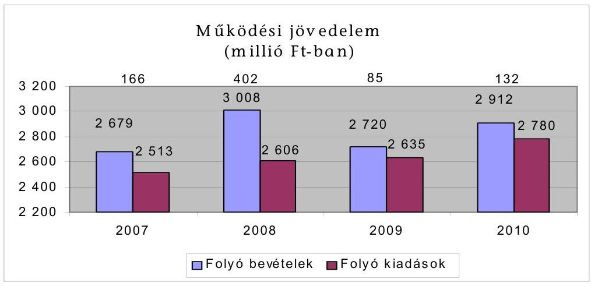
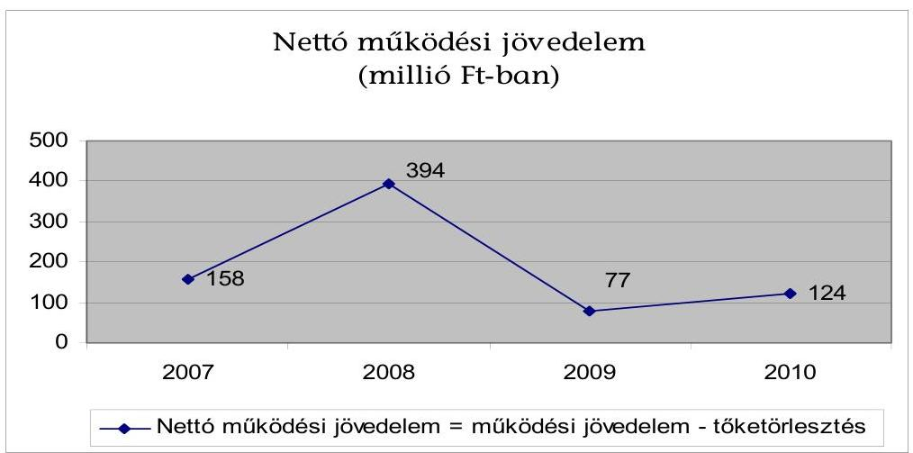
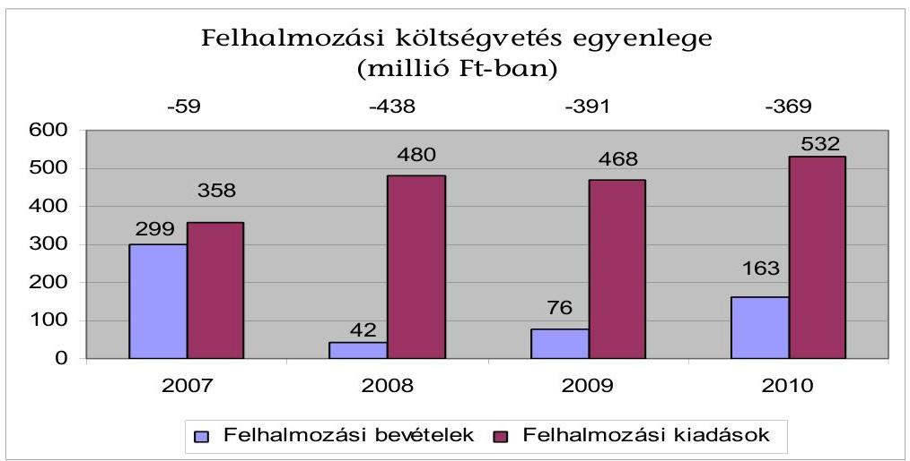
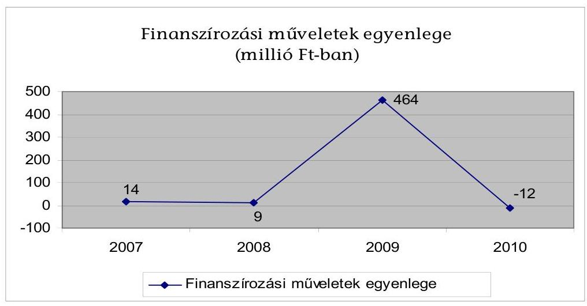
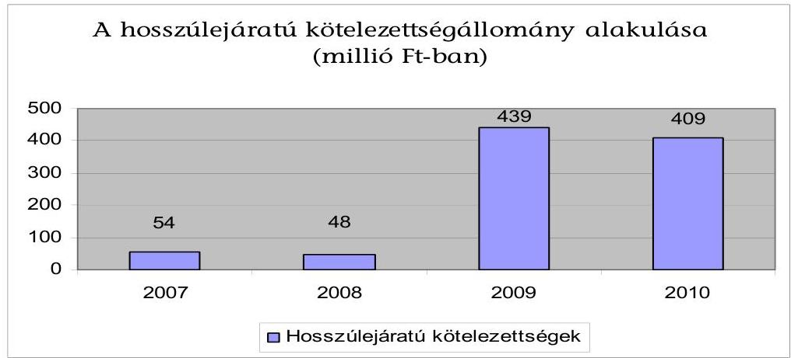
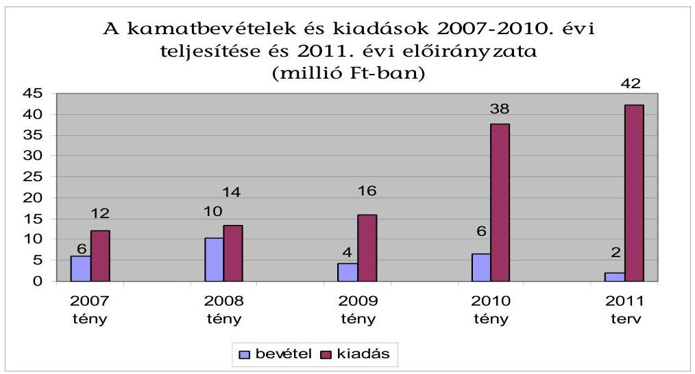
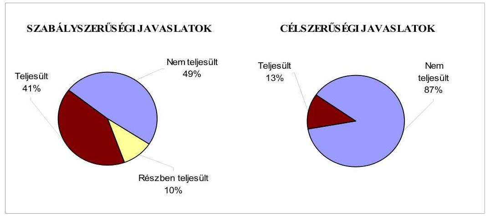
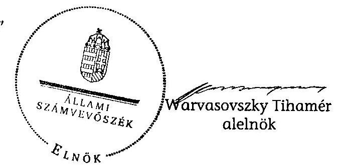

# ÁLLAMI   SZÁMVEVŐSZÉK 

## JELENTÉS

Vásárosnamény Város Önkormányzata
gazdálkodási rendszerének 2011. évi ellenőrzéséről (43/1)

---

3. Önkormányzati és Területi Ellenőrzési Igazgatóság
3.2. Önkormányzati Rendszert Ellenőrző Főcsoport

Iktatószám: V-3031-09/2011.
Témaszám: 1015
Vizsgálat-azonosító szám: V0560003

# Az ellenőrzést felügyelte: 

Dr. Elek János
mb. főigazgató
Az ellenőrzés végrehajtásáért felelős:
Dr. Varga Sándor
főigazgató-helyettes
Az ellenőrzést vezette:
Csecserits Imréné
főcsoportfőnök-helyettes, vizsgálatvezető
Az ellenőrzést végezte:
Ujvári Józsefné
számvevő tanácsos, csoportvezető
Puskás Balázs
számvevő

A témához kapcsolódó eddig készített számvevőszéki jelentések:
címe
sorszáma
Jelentés a helyi önkormányzatok gazdálkodási rendszerének 2008. 0927
évi ellenőrzéséről

---

# TARTALOMJEGYZÉK 

BEVEZETÉS ..... 7
I. ÖSSZEGZŐ MEGÁLLAPÍTÁSOK, KÖVETKEZTETÉSEK, JAVASLATOK ..... 10
II. RÉSZLETES MEGÁLLAPÍTÁSOK ..... 20

1. Az Önkormányzat adósságkezelési tevékenységének eredményessége a pénzügyi egyensúly fenntartásában, az adósságot keletkeztető kötelezettségvállalások pénzügyi kockázatainak hatása a gazdálkodás stabilitására, a közfeladat-ellátásra ..... 20
2. A vagyoni helyzet alakulása. a vagyongazdálkodás folyamataiban a kontrollok múködése ..... 29
2.1. Az Önkormányzat vagyoni helyzetének 2007-2010 közötti alakulása ..... 29
2.2. A vagyongazdálkodás belső kontrolljainak múködése ..... 32
3. A közfeladatok ellátásában résztvevő önkormányzati többségi tulajdon- ban lévő gazdasági társaságoknál a tulajdonosi felelősség érvényítésének eredményessége ..... 38
4. Az Önkormányzat gazdálkodási rendszerének korábbi ellenőrzése során tett szabályszerűségi és célszerűségi javaslatok hasznosítása ..... 39

## MELLÉKLETEK

1. számú Az Önkormányzat gazdálkodását meghatározó adatok, mutatószámok (1 oldal)
2. számú Tájékoztató a költségvetési bevételek és kiadások összegéről (1 oldal)

---

.

---

# RÖVIDÍTÉSEK, MOZAIKSZAVAK JEGYZÉKE 

## Törvények

Áht.
ÁSZ tv.
Ksztv.
Ötv.
Számv. tv.

## Rendeletek

Áhsz.

Ámr. 1
Ámr. 2
Ber.
2007. évi költségvetési rendelet
2008. évi költségvetési rendelet
2009. évi költségvetési rendelet
2010. évi költségvetési rendelet
2011. évi költségvetési rendelet
vagyongazdálkodási rendelet

## Szórövidítések

ÁSZ
fürdő
gazdálkodási jogkörök szabályzata
jegyzö ${ }_{1}$
jegyzö ${ }_{2}$
KEOP
az államháztartásról szóló 1992. évi XXXVIII. törvény az Állami Számvevőszékről szóló 1989. évi XXXVIII. törvény
a közhasznú szervezetekről szóló 1997. évi CLVI. törvény
a helyi önkormányzatokról szóló 1990. évi LXV. törvény a számvitelről szóló 2000 . évi C. törvény
az államháztartás szervezetei beszámolási és könyvvezetési kötelezettségének sajátosságairól szóló 249/2000.
(XII. 24.) Korm. rendelet
az államháztartás múködési rendjéről szóló 217/1998. (XII. 30.) Korm. rendelet
az államháztartás múködési rendjéről szóló 292/2009. (XII. 19.) Korm. rendelet
a költségvetési szervek belső ellenőrzéséről szóló 193/2003. (XI. 26.) Korm. rendelet
Az Önkormányzat 6/2007. (II. 16.) számú rendelete a 2007. évi költségvetésről

Az Önkormányzat 4/2008. (III. 17.) számú rendelete a 2008. évi költségvetésről

Az Önkormányzat 2/2009. (II. 23.) számú rendelete a 2009. évi költségvetésről

Az Önkormányzat 1/2010. (III. 4.) számú rendelete a 2010. évi költségvetésről

Az Önkormányzat 8/2011. (II. 16.) számú rendelete a 2011. évi költségvetésről

Az Önkormányzat 13/1999. (V. 27.) számú rendelete a vagyonáról és a vagyongazdálkodás szabályairól

Állami Számvevőszék
A VITKA Kft tulajdonában lévő Szilva Gyógy- és Termálfürdő
Kötelezettségvállalás, utalványozás, ellenjegyzés, érvényesítés, szakmai teljesítésigazolás rendjének 2008. szeptember 15-én a polgármester és a jegyző ${ }_{1}$ együttes rendelkezése által hatályba helyezett szabályzata
Vásárosnamény Város Önkormányzatának 2010. december 31-ig kinevezett jegyzője
Vásárosnamény Város Önkormányzatának 2011. január 1-től kinevezett jegyzője
Környezet és Energia Operatív Program

---

| Képviselő-testület | Vásárosnamény Város Önkormányzat Képviselőtestülete |
| :--: | :--: |
| Önkormányzat | Vásárosnamény Város Önkormányzata |
| Pénzügyi bizottság | Vásárosnamény Város Önkormányzata Pénzügyi bizottsága |
| polgármester | Vásárosnamény Város Önkormányzat polgármestere |
| Polgármesteri hivatal | Vásárosnamény Város Önkormányzatának Polgármesteri hivatala |
| társulás | Beregi Ivóvíz-minőségjavító Önkormányzati Társulás |
| az Önkormányzat 100\%-os tulajdonában lévő gazdasági társaság | Az Önkormányzat által 1991-ben alapított VITKA Városüzemeltetési Szolgáltató Közhasznú Nonprofit Társaság, amelyet az Önkormányzat 2009-ben korlátolt felelősségű társasággá alakított át |

---

# ÉRTELMEZŐ SZÓTÁR 

árfolyamkockázat
eredményesség
garancia és kezességvállalás
kamatkockázat

A külföldi devizában lévő pénzügyi eszközök tulajdonosainak abból fakadó kockázata, hogy az árfolyam elmozdulásával az általuk tartott eszköz hazai fizetőeszközben kifejezett értéke megváltozik. (ezen ellenőrzéshez kialakított értelmezés)
A kitűzött célok megvalósításának mértékeként vagy egy tevékenység kimenete szándékolt és tényleges hatása közötti kapcsolat. Ebben a meghatározásában - kiterjesztve a teljesítmény-ellenőrzés értelmezési tartományára - a hatás az operatív, a specifikus vagy átfogó szinten keletkezett „végterméket" jelenti, amely lehet output, eredmény és hatás egyaránt. (ÁSZ Teljesítmény-ellenőrzési módszertan 16 oldal)
Valamilyen esemény jövőbeni bekövetkezéséhez kapcsolódó kötelezettségvállalás. A garanciavállalás az önkormányzat kötelezettség-vállalása arra vonatkozóan, hogy a szerződésben meghatározott feltételek beálltakor a garancia kedvezményezettje számára, határozott összegig, határozott időpontig, felszólításra azonnal fizet. Ez a kötelezettség az önkormányzat számára azzal a bizonytalansággal jár, hogy nem tudja, hogy ezt a kötelezettségvállalását igénybe veszik-e vagy nem, és ha igen, mikor. A kezesség járulékos kötelezettségvállalás, amely lehet egyszerú vagy készfizető, és mindig feltételezi a főkötelezettet. Az egyszerú kezességvállalás esetén a kezes mindaddig megtagadhatja a teljesítést, míg mindazoktól behajtható, akik őt megelőzően vállaltak kötelezettséget. A készfizető kezest nem illeti meg a sortartás kifogása. A fentiek következtében mind a garancia-, mind a kezességvállalás esetében az önkormányzatnak a futamidő teljes időtartama alatt azzal kell számolnia, hogy ha a főkötelezett elmulasztja teljesíteni a fizetést, a vállalt kötelezettséget vele szemben érvényesítik az adott időpontban fennálló összeg erejéig. Előbbiek ismerete szükséges a felelős döntéshozatalhoz, valamint a kezességvállalást megelőzően indokolt, hogy a főkötelezett gazdasági társaság az önkormányzat rendelkezésére bocsássa a garancia- és kezességvállalás alapját képező kötelezettségéről kötött szerződést (pl. hitel, kölcsönszerződés), amelyből nemcsak annak főösszege állapítható meg, hanem a tőke-és járulékai, valamint a törlesztés futamideje, illetve határideje is. (ezen ellenőrzéshez kialakított értelmezés)
Az a kockázat, hogy a forint-, vagy a devizahitel futamideje alatt emelkedik a kamat és így a hitel törlesztésére fordítandó összeg. (ezen ellenőrzéshez kialakított értelmezés)

---

költségvetési bevétel
kötvény

PPP (public private partnership)

Az Áht. 69. § (1) bekezdés a) és c) pontjaiban foglaltak figyelembevételével meghatározott összeg, amelynek számítása során a tárgyévi költségvetési bevételeket növeli - a költségvetési hiány belső finanszírozására szolgáló előző évek pénzmaradványából, vállalkozási maradványából igénybe vett összeg. (Az Áht. alapján ezen ellenőrzéshez kialakított értelmezés.)
Hosszabb lejáratra szóló, hitelviszonyt megtestesítő kamatozó értékpapír. A kötvényben a kibocsátó arra kötelezi magát, hogy a kötvényben megjelölt pénzösszegnek az előre meghatározott kamatát vagy egyéb jutalékait, továbbá az adott pénzösszeget a kötvény mindenkori tulajdonosának, illetve jogosultjának a megjelölt időben és módon megfizeti. A kötvények csoportosítása és fajtái igen sokfélék. Lehetnek névre, vagy bemutatóra szóló; fix vagy változó kamatozású; állami, közintézményi, jegybanki vagy kereskedelmi banki, illetve vállalati kibocsátású; visszahívható, amely lehetőséget ad a kibocsátó számára, hogy a kötvényt valamilyen előre meghatározott árfolyamon bármikor visszavásárolja. A kötvény lehet átváltható, amely lehetőséget ad a birtokosa részére a kötvények meghatározott időpontban meghatározott számú részvényre történő kicserélésére. A devizakötvényt devizában bocsátják ki. (ezen ellenőrzéshez kialakított értelmezés)
Az állami és a magánszféra együttmúködésének egyik formája, amelynek keretében a közcél a magánszféra jelentős mértékű közremúködésével valósul meg. Az állam (önkormányzat) a közszolgáltatások létrehozását a tradicionálisnál komplexebb módon bízza a magánszférára. Az együttmúködés keretében megvalósuló közszolgáltatás hosszú távra szól. A magán partner felelőssége az infrastruktúra tervezésére, megépítésére, múködtetésére és legalább részben a projekt finanszírozására terjed ki. Az állam (önkormányzat) és/vagy a szolgáltatások igénybe vevője szolgáltatási díjat fizet. A közszférabeli szerződő fél feladata a projekt definiálása, a szolgáltatás elvárt minőségének, mennyiségének és az igénybevétel idejének meghatározása, valamint az árazási politika kialakítása, az ellenőrzési, monitoring feladatok ellátása. (Államháztartási fogalomtár)

---

# SZÁMVEVŐI JELENTÉS 

## Vásárosnamény Város Önkormányzata gazdálkodási rendszerének 2011. évi ellenőrzéséről

## BEVEZETÉS

Az Állami Számvevőszék 2011-ben életbe lépett stratégiája szerint „az önkormányzatok ellenőrzése során azok pénzügyi-gazdasági helyzetét értékeli, kockázatait feltárja, valamint az ellenőrzések helyszíneit objektív mutatószámrendszer alapján választja ki". E célkitűzéseknek megfelelően összeállított ellenőrzési program alapján végzi a helyi önkormányzatok gazdálkodási rendszerének ellenőrzését, valamint ezen kockázatelemzés alapján történt Vásárosnamény Város Önkormányzatának kiválasztása.

## Az ellenőrzés célja annak értékelése volt, hogy az Önkormányzatnál:

- biztosított-e a pénzügyi egyensúly, a fizetőképesség, a gazdálkodás stabilitása, ezeket segítette-e az adósság kezelése;
- a vagyoni helyzet a külső és belső tényezők hatására miként változott, megfelelően biztosították-e a vagyongazdálkodás szabályosságát, eredményességét a belső kontrollok;
- eredményesen érvényesítették-e a tulajdonosi felelősséget a közfeladatok ellátásában résztvevő többségi tulajdonban lévő gazdasági társaságnál;
- hasznosultak-e a gazdálkodási rendszer korábbi ellenőrzése során tett szabályszerűségi és célszerűségi javaslatok.

Az ellenőrzés típusa: teljesítmény-ellenőrzés, továbbá az ellenőrzés meghatározott területein szabályszerűségi ellenőrzés.

Az ellenőrzött időszak: a pénzügyi, vagyoni helyzettel kapcsolatos elemzéseket, értékeléseket, az Önkormányzat 100\%-os tulajdonában lévő gazdasági társaságánál a tulajdonosi felelősség érvényesítését, valamint az Önkormányzat gazdálkodási rendszerének korábbi ellenőrzése során tett javaslatok megvalósításának ellenőrzését alapvetően a 2007-2010. évekre vonatkozóan végeztük, de lehetőség szerint kitérünk a helyszíni ellenőrzést megelőző utolsó negyedév végéig terjedő időszakra is. A vagyongazdálkodás belső kontrolljai múködésének tesztelése a 2010. évre, valamint a helyszíni ellenőrzést megelőző utolsó negyedév végéig terjedő időszakra vonatkozott.

Az ellenőrzés jogszabályi alapját az Állami Számvevőszékről szóló 1989. évi XXXVIII. törvény 2. § (3), (5), (6) és (9) bekezdései, a helyi önkormányzatokról

---

szóló 1990. évi LXV. törvény 92. § (1) bekezdése, az államháztartásról szóló 1992. évi XXXVIII. törvény 104. § (3), és a 120/A. § (1) bekezdése előírásai képezték.

Vásárosnamény város állandó lakosainak száma 2011. január 1-jén 8833 fő volt. A 2010. évi önkormányzati képviselő és polgármester választást követően az Önkormányzat nyolctagú Képviselő-testületének munkáját négy állandó bizottság segítette. A polgármester a 2010. évi önkormányzati képviselő és polgármester választás óta tölti be tisztségét, míg a jegyző személye 2011. január 1-jén változott.

Az Önkormányzat pénzügyi egyensúlyi helyzetének rövid bemutatásán túlmenően a pénzügyi egyensúly fenntartását, a pénzügyi kockázatok kezelését és annak hatását (a pénzügyi egyensúly fenntartását veszélyeztető külső és belső pénzügyi kockázatok csökkentésére hozott döntések, tett intézkedések eredményességét) minősítettük. Lényegességi szempontok figyelembevételével értékeltük a döntés-előkészítést, a megtett intézkedések eredményességét és azt, hogy a pénzügyi egyensúly fenntartását mely kockázatok és milyen mértékben veszélyeztették. Az ellenőrzés részletes szempontok szerinti elvégzéséhez az egységes végrehajtás alapját az ellenőrzési program mellékletét képező teljesítményellenőrzési kérdésfa és a kapcsolódóan meghatározott kritériumok, valamint a fogalmak egységes tartalmát meghatározó értelmező szótár biztosította.

A vagyongazdálkodás ellenőrzése kiterjedt a vagyon értékének, összetételének, 2007-2010. évek között a vagyonváltozást előidéző okok elemzésére. A vagyongazdálkodás belső kontrolljai azonosításának és múködésének ellenőrzése keretében a vagyonértékesítés és a vagyonhasznosítás, valamint a finanszírozási célú pénzügyi műveletek folyamatait értékeltük ${ }^{1}$. Felmértük a belső kontrollokban rejlő kockázatot, minősítettük a kontrollok múködését és meghatároztuk, hogy a vagyongazdálkodás folyamatában mely kontrollok nem biztosították a működésbeli hibák megelőzését, feltárását, kijavítását, és ezáltal veszélyeztették az eredményes, megfelelő múködést.

A vagyongazdálkodási folyamatokban alkalmazott belső kontrollok azonosításának és működésének vizsgálatát többlépcsős megfelelőségi tesztek útján végeztük. A vizsgált területek könyvviteli tételei alapján (meghatározott tételszám felett egyszerű véletlen minta alapján) történt a vagyongazdálkodás belső kontrolljai múködésének a megítélése. Az ellenőrzés során alkalmazott módszer - többlépcsős megfelelőségi teszt - lényege, hogy a kiválasztott minta ellenőrzését csak addig végeztük, amíg elegendő és megfelelő bizonyítékot nem

[^0]
[^0]:    ${ }^{1}$ A vagyongazdálkodás területén a szabályozottságban rejlő kockázatot alacsonynak minősítettük, ha a szabályozottság megfelelő védelmet nyújtott a vagyongazdálkodással összefüggő hibák bekövetkezése ellen. Közepesnek minősítettük a vagyongazdálkodás szabályozottságában rejlő kockázatot, amennyiben a szabályozottság a lehetséges vagyongazdálkodási hibák többsége ellen védelmet nyújtott. Magasnak értékeltük a vagyongazdálkodás szabályozottságában rejlő kockázatot, ha a szabályok - kialakításuk hiányában, vagy hiányos kialakításuk miatt - nem nyújtottak elegendő védelmet a lehetséges vagyongazdálkodási hibákkal szemben.

---

szereztünk a vizsgált folyamatok kulcskontrolljai múködésének megfelelő vagy nem megfelelő voltáról².

Eredményesnek minősítettük az Önkormányzat 100\%-os tulajdonában lévő gazdasági társaságnál a tulajdonosi felelősség érvényesítését, ha a közfeladatellátás átadására vonatkozó döntést szakmai-gazdaságossági elemzés alapozta meg, az utólagos szakmai-gazdasági értékelés igazolta, hogy a közfeladatellátás választott szervezeti formája révén javult az ellátás szakmai színvonala, bővült az eszközellátottság; a Képviselő-testület meghatározta az Önkormányzat 100\%-os tulajdonában lévő gazdasági társaságával kötött szerződésekben a szolgáltató feladat-ellátási kötelezettségeit és az ahhoz kapcsolódó feladatmutatók mennyiségét; a szolgáltató teljesítette az Önkormányzattal kötött szerződésben előírt feladat-ellátási kötelezettségét, és a közfeladat-ellátáshoz kapcsolódó mennyiségi naturális mutatók teljesítésének mértéke elérte vagy meghaladta a 100\%-ot; továbbá a felügyelő bizottságba delegált tagok a pénzügyigazdasági döntéseknél az Önkormányzattal egyeztetett álláspontot képviselték, és eleget tettek beszámolási kötelezettségüknek.

Az Önkormányzat gazdálkodási rendszerének korábbi ellenőrzésekor tett szabályszerűségi és célszerűségi javaslatok hasznosulását utóellenőrzés keretében ellenőriztük.

A helyszíni ellenőrzés során kitöltött - az ellenőrzést végző számvevő és a Polgármesteri hivatal felelős köztisztviselője által aláírt - ellenőrzési munkalapokat, azok kitöltési útmutatóit, továbbá a megfelelőségi tesztek dokumentumait a polgármester részére a számvevői jelentéssel egyidejúleg átadtuk.

[^0]
[^0]:    ${ }^{2}$ A vagyongazdálkodás területén azonosított kontrollok múködését kiválónak értékeltük abban az esetben, ha azok múködése megfelelt a hibák megelőzésére és kijavítására meghatározott szabályozásnak és a legmagasabb szintű elvárásoknak. Jónak minősítettük a vagyongazdálkodás területén azonosított kontrollok múködését, ha a megállapított kisebb (tolerálható mértékű) hiányosságok nem veszélyeztették a vagyongazdálkodás ellenőrzött területei hibáinak megelőzését és kijavítását. Amennyiben a kontrollok múködésében túl sok hiányosság fordult elő ahhoz, hogy a kontrollok biztosítsák a vagyongazdálkodási hibák megelőzését, feltárását, kijavítását és ezáltal veszélyeztették az eredményes, megfelelő vagyongazdálkodást, a kontrollok múködése gyenge minősítést kapott.

---

# I. ÖSSZEGZŐ MEGÁLLAPÍTÁSOK, KÖVETKEZTETÉSEK, JAVASLATOK 

Az Önkormányzat feladatainak végrehajtása érdekében a Polgármesteri hivatal mellett 2007-ben és 2010-ben is 14 költségvetési szervet múködtetett, amelyekből 2007-ben és 2010-ben ugyancsak négy önállóan gazdálkodó volt. Ezen költségvetési szervek végzik az Önkormányzat kötelező feladatait, valamint önként vállalt feladatként látják el az alapfokú művészetoktatást, középfokú oktatást (gimnázium, szakképzés, kollégium), középfokú kollégium fenntartását. Az Önkormányzat önként vállalt feladatként gondoskodik a fürdő múködtetéséről is, amelyhez az üzemeltetést végző, az Önkormányzat 100\%-os tulajdonában lévő gazdasági társaság részére minden évben támogatást -2010-ben költségvetési kiadásainak 25,8\%-át, 855 millió Ft-ot - adott. Az Önkormányzat 100\%-os tulajdonában lévő gazdasági társaság végzi az Önkormányzat kötelező feladatai közül a nem veszélyes hulladékok gyűjtése, szállítása, ártalmatlanítása, újrahasznosítása feladatokat. Az Önkormányzat társulás tagjaként biztosítja a belső ellenőrzési és az ivóvízhálózat felújítási feladatok ellátását. Az Önkormányzat a 2007-2010. években kötelező és önként vállalt feladatait nem módosította, a feladatellátás módján nem változtatott. A Polgármesteri hivatalban dolgozó köztisztviselők száma 2007. január 1-jén 48 fő, 2011. január 1-jén 47 fő volt, a költségvetési szerveknél foglalkoztatott közalkalmazottak száma 2007. január 1-jén és 2011. január 1-jén is 421 fő volt.

A vizsgált időszakban az Önkormányzat pénzügyi helyzetét - az elemzéséhez alkalmazott CLF módszer szerint - a következők jellemzik: A folyó költségvetések egyenlege (a múködési jövedelem) összességében pozitív volt. Emellett is minden évben igénybe vett folyószámlahitelt és 2009-2010-ben munkabér megelőlegezési hitelt, ezek azonban - bár növekedett az igénybevételi idejük - nem váltak tartóssá. A felhalmozási költségvetések egyenlege minden évben negatív összegű volt. Ez 2010-ig nem járt pénzügyi kockázattal, mert részben a finanszírozási műveletekkel, de még inkább a rendelkezésre álló maradvánnyal biztosítani tudták a pénzügyi egyensúlyt. A felhalmozási költségvetés 2010. évi negatív összegét sem a nettó múködési jövedelem, sem a rendelkezésre álló maradvány nem tudta ellensúlyozni.

Az Önkormányzat 2011 utáni kötelezettségei (pénzintézeti, szállítói, egyéb) 409,4 millió Ft, amelyből a pénzintézeti kötelezettség 2011-2013 között 156,5 millió Ft, a 2013 után 253,0 millió Ft. Egyéb hosszú lejáratú kötelezettséggel az Önkormányzat nem rendelkezik. A könyvviteli mérleg szerinti hosszú lejáratú kötelezettség teljesítése nem számszerűsített.)

Az Önkormányzat költségvetési bevétele a 2007. évi 3093,6 millió Ft-ról 2010-re 3446,8 millió Ft-ra, 11,4\%-kal (353,2 millió Ft-tal) emelkedett. Az összes költségvetési bevétel 10,5\%-át ( 360,5 millió Ft), a saját bevétel, 8,2\%-át ( 281,2 millió Ft) a helyi adóbevétel biztosította 2010-ben. A helyi adóbevétel összes költségvetési bevételen belüli aránya a 2007. évihez viszonyítva 0,7 százalékponttal ( 48,2 millió Ft-tal) nőtt.

---

Az összes költségvetési kiadásból a felhalmozási célú kiadás részaránya 2007-hez viszonyítva 2010-re 4,0 százalékponttal (189,0 millió Ft-tal) nőtt, 2010-ben $16,8 \%, 556,2$ millió Ft volt. A 2011. évi költségvetési rendeletben 2068,5 millió Ft költségvetési bevételt és 2397,1 millió Ft költségvetési kiadást irányoztak elő. A 2007-2010. évi költségvetésekben szereplő eredeti előirányzatok és teljesítési adatok alapján a költségvetési bevételeket és kiadásokat minden évben alultervezték. Az évente tervezett költségvetési hiányt rövid- és hosszú lejáratú hitelből tervezték finanszírozni. Az Önkormányzat gazdálkodását meghatározó adatokat, mutatószámokat az 1-2. számú melléklet tartalmazza.

Az Önkormányzat az Önkormányzat 100\%-os tulajdonában lévő gazdasági társaság által a fürdő megvalósításához felvett hitel visszafizetésének átvállalásához kötvény kibocsátásával biztosított forrást. A kötvénykibocsátás előkészítése során azonban annak visszafizetési lehetőségét nem vizsgálták arra az esetre, ha a fürdő a tervezett bevételt, eredményt nem biztosítja.

A 2009. évi 399,8 millió Ft kibocsátáskori értékű, változó kamatozású, euró alapú, két év türelmi idő után 10 éves lejárattal visszafizetendő kötvény kibocsátásakor az éves kötelezettségvállalás felső határát - ugyan betartották - de nem vizsgálták. A kötvénykibocsátás bevételéből képződő átmenetileg szabad forrás lekötésénél, betétként történő elhelyezésénél több pénzintézettől ajánlatot nem kértek. A kamat és árfolyamváltozás kockázatait nem vették figyelembe. A hitel kiváltása mellett a kötvénykibocsátásból származó bevétel további felhasználásának konkrét célját nem határozták meg.

A fürdő üzemeltetés, mint önként vállalt közfeladat-ellátása hosszú távon - a megvalósításra fordított európai uniós támogatás és saját forrás ellenére - az üzemeltetést végző, az Önkormányzat 100\%-os tulajdonában lévő gazdasági társaság tartósan veszteséges gazdálkodása, és eladósodása következtében nem biztosított.

Az összes bevételi forráson belül a kötelezettségek, valamint ezen belül a változó kamatozású, devizában fennálló hosszú lejáratú kötelezettségek aránya 2007-2010 között növekedett. Emelkedett 2007-2010 között a folyószámlahitel keretösszege, a folyószámlahitellel zárt napok száma, átlagos állománya, év végi állománya is. A likvid hitelállomány, az eladósodottság növekedése ellenére az Önkormányzat nem rendelkezett a likviditási és eladósodási problémákat kezelő stratégiával.

Az adósságot keletkeztető kötelezettségvállalások kockázatait rendszeresen nem vizsgálták felül. A Képviselő-testület 2005-ben - a fürdő építésére - az Önkormányzat 100\%-os tulajdonában lévő gazdasági társaság által felvett 328,0 millió Ft-os hitel visszafizetésére kezességet vállalt. Az Önkormányzat a kezességvállalás miatt 2007-ben 16,6 millió Ft, 2008-ban 61,5 millió Ft, 2009-ben 50,2 millió Ft, 2010-ben 11,1 millió Ft, összesen 139,4 millió Ft kifizetést teljesített. A Képviselő-testület évente nem kapott tájékoztatást arról, hogy a kötvénykibocsátás miatti adósságszolgálati kötelezettséget milyen feltételek mellett tudják teljesíteni.

---

Az Önkormányzat érdemi bevételt növelő, illetve kiadási megtakarítást eredményező intézkedéseket nem tett. Az államháztartáson kívüli szervezeteknek év közben nyújtott támogatások esetében a támogatásra vonatkozó döntést megelőzően a Képviselő-testület részére nem mutatták be az Önkormányzat pénzügyi lehetőségeit, hatását a költségvetés hiányára.

Az Önkormányzat 2011. év I. negyedéve végén 23,0 millió Ft 30 és 60 nap közötti, 17,1 millió Ft 61 és 90 nap közötti és 25,7 millió Ft 91 és 365 nap közötti lejárt szállítói tartozással rendelkezett. A költségvetési bevételek költségvetési kiadásokat meghaladó része az adósságszolgálati kötelezettség teljesítésére 2009-ben nem biztosított fedezetet, 2007-2008-ban és 2010-ben fedezetet nyújtott. A 2011. évi költségvetésben tervezett költségvetési bevétel ugyanakkor nem biztosít fedezetet az esedékessé váló tőketörlesztési és kamatfizetési kötelezettségre. Az adósságszolgálati kötelezettség teljesítéséhez szükség van tervezett kiadások csökkentésére, elhagyására, vagy pótlólagos forrásokra, amely előre vetíti ennek későbbi évekbeli igényét is.

A Képviselő-testület a 2007-2010. években nem hozott olyan, a közfeladat ellátásának módját érintő, illetve a közfeladat ellátás szervezeti formáját érintő döntést, amely az önkormányzati vagyon alakulásában változást eredményezett volna. Az Önkormányzat vagyona a 2007-2010 évek között 870,6 millió Fttal, 18\%-kal növekedett. Ezen belül 28,6 \%-kal (173,7 millió Ft-tal) emelkedve 780,4 millió Ft-ra nőtt a kötelezettségek állománya a 2009-ben történt 399,8 millió Ft-os kötvénykibocsátás hatására. A tárgyi eszközök állománya 2007-hez viszonyítva 2010-ben 18\%-kal (701,1 millió Ft-tal) növekedett a megvalósított beruházások hatására.

A felhalmozási célú kiadások okozták a pénzeszközök 72\%-os (118,6 millió Ftos), és a költségvetési tartalékok 90\%-os (204,2 millió Ft-os) csökkenését. A vagyon növekedésének forrását a működési célú bevételi többlet felhalmozási célra történő fordításával, az előző évi pénzmaradvány felhasználásával és a hosszú lejáratú kötelezettségek (kötvények) állományának növelésével biztosították.

Az Önkormányzat a vagyon értékében bekövetkezett változásokat a zárszámadás keretében bemutatta, azonban nem elemezte, hogy az egyes vagyonelemek növekedése, illetve csökkenése milyen tényezők hatására következett be. Nem készült a kibocsátott kötvény kamatváltozása és árfolyamváltozása önkormányzati vagyonra gyakorolt hatásának bemutatására számítás. Az Áhsz. előírása ellenére nem végezték el a devizában fennálló kötelezettség évenkénti értékelését. A pénzintézettel szemben fennálló kötelezettség a 2006. december 31-i 61,8 millió Ft hiteltartozásról a 2010. év végére 39,7 millió Ft hi-tel-, és 377,7 millió Ft kötvénytartozásra emelkedett.

A Képviselő-testület a 2007-2010. években nem döntött tárgyi eszközök térítés nélküli átadásáról, apportba adásáról, üzemeltetésre, kezelésre, vagyongazdálkodásba történő átadásáról. Az üzemeltetésre átadott eszközök számviteli nyilvántartás szerinti állománya a 2007. évben növekedett, annak ellenére, hogy a Képviselő-testület üzemeltetésre történő átadásról nem rendelkezett. Egy ingatlan üzemeltetésre átadott eszközként történt nyilvántartásba vételekor nem tartották be az Áhsz. könyvviteli elszámolásra vonatkozó előírását.

---

Az Önkormányzat használaton kívüli, korábban önként vállalt feladatok ellátásához használt ingatlanokat értékesített, amelyek a vagyon értékének alakulásában számottevő változást nem eredményeztek. A fejlesztési döntések eredményeként létrejött vagyontárgyak 2007-2010. évben 720,2 millió Ft értékben -62\%-os arányban - az Önkormányzat kötelező és 38\%-ban - 1168,5 millió Ft értékben - az önként vállalt feladatok ellátását segítették a Polgármesteri hivatal kimutatása szerint.

Az Önkormányzatnál az előző évek költségvetési pénzmaradványa 2007-ről 2010-re jelentős mértékben, 204,2 millió Ft-tal - 91\%-kal - csökkent, amit felhalmozási célú kiadások, szállítói tartozások kiegyenlítésére fordítottak. A 2009. évi pénzmaradvány a kötvénykibocsátásából származó forrás még fel nem használt része, amit 2010-ben az Önkormányzat 100\%-os tulajdonában lévő gazdasági társaság részére tagi kölcsönként biztosítottak.

Az Önkormányzat a tárgyi eszközök felújítására 2007-ben a tervszerinti értékcsökkenést 99,2 millió Ft-tal meghaladó, 2008-2010-ben az értékcsökkenést el nem érő összegű felújítást végzett. A tárgyi eszközök elhasználódási mutatójának magas értéke - amely 2007-ben 79,7\%, 2010-ben 77,6\% volt - jelzi, hogy az ingatlanok - a beruházások, felújítások eredményeként - megfelelő műszaki állapotban vannak, nem minősülnek elavultnak.

A vagyongazdálkodási folyamatok szabályozottságának hiányosságai magas kockázatot jelentettek a feladatok szabályszerű végrehajtásában. A jegyző ${ }_{1}$ nem megfelelően alakította ki a vagyongazdálkodási célok eléréséhez szükséges kontrollkörnyezetet. Az Ámr. ${ }_{2}$-ben előírtak ellenére nem határozta meg a csalás, korrupció minősítését, nem készítette el az etikus magatartás szabályait tartalmazó etikai kódexet. Nem kezdeményezte az eszközök forgalomképességének megváltoztatására vonatkozó előírások meghatározását, továbbá nem szabályozta a vagyontárgyak közfeladat-ellátásához kapcsolódó rendelkezésre bocsátásának feltételeit.

A jegyző ${ }_{1}$ nem írta elő a vagyon értékesítésével és hasznosításával kapcsolatban a döntés előkészítés folyamatában a költség-haszon elemzés készítésének kötelezettségét, továbbá az Önkormányzat tulajdonosi jogainak, érdekeinek védelmét szolgáló garanciális elemek szerződésben, egyéb dokumentumban való rögzítésének kötelezettségét. A finanszírozási célú pénzügyi műveletekkel kapcsolatban nem szabályozta a pénzügyi kockázatok felmérésének kötelezettségét, a hitelfelvétel, köténykibocsátás döntés előkészítés folyamatában a futamidő egyes éveit terhelő kötelezettség költségvetési egyensúlyra gyakorolt hatásának vizsgálati kötelezettségét. Nem írták elő, hogy a Pénzügyi bizottság tájékoztassa a Képviselő-testületet a vagyonváltozás figyelemmel kísérésének eredményéről.

A jegyző ${ }_{1}$ hiányosan alakította ki a Polgármesteri hivatal belső kontrollrendszerét. A FEUVE rendszer múködtetéséhez nem írta elő a vezetői ellenőrzési kötelezettséget, valamint a vagyongazdálkodási folyamatokról a beszámolási kötelezettséget és nem jelölte ki a finanszírozási célú pénzügyi műveletek folyamatainak ellenőrzésért felelős személyeket.

---

A jegyző ${ }_{1}$ a belső kontrollrendszer keretében nem határozta meg a bevételeket megalapozó döntések szerződésben történő felülvizsgálatának feladatai között annak ellenőrzési kötelezettségét, hogy a szerződés tartalmazza-e a döntési hatáskörrel rendelkező által meghatározott feltételeket, a szerződésben az arra határkörrel rendelkező vállalt-e kötelezettséget. Nem alakította ki a vagyongazdálkodás külső és belső információi kezelésének rendjét, nem határozta meg a vagyongazdálkodással összefüggő közérdekú adatok kezelésének rendjét, a monitoring stratégiát, nem hozta létre a vezetői információs rendszert, nem írta elő a belső kontrollrendszer évenkénti felülvizsgálatát.

A Polgármesteri hivatalban 2010-ben és 2011. év első negyedévében a vagyongazdálkodási folyamatokban a kontrollok múködése gyenge volt. Nem értékelték a vagyongazdálkodás folyamatában a külső és belső kockázatokat. A szabályozás hiányossága miatt a vagyonértékesítést, vagyonhasznosítást megelőzően nem készítettek költség-haszon elemzést, a kötvénykibocsátás döntés előkészítési folyamatában nem mérték fel és nem számszerúsítették a pénzügyi kockázatokat, nem vizsgálták a futamidő egyes éveit terhelő kötelezettségvállalás költségvetési egyensúlyra gyakorolt hatását. A jegyző ${ }_{1}$ a belső kontrollrendszer évenkénti felülvizsgálatát nem biztosította, 2009-ig nem, csak azt követően gondoskodott a vagyongazdálkodással kapcsolatos közérdekú adatok közzétételéről.

A Polgármesteri hivatalban 2010-ben és 2011. év első negyedévében az ingatlanok, tartós részesedések értékesítéséből, egyéb ingatlan bérbeadásból származó bevételek, valamint a közszolgáltatással, az Önkormányzat 100\%-os tulajdonában levő gazdasági társaság részére nyújtott múködési és felhalmozási célú kiadás és kölcsönnel kapcsolatos kifizetések során - ezen területek súlyának figyelembevételével - összefoglalóan értékelve a belső kontrollok múködése gyenge volt, mert a bevételeket megalapozó szerződések ellenőrzését végző személyek kijelölésének hiányában az ingatlan értékesítésre és az egyéb ingatlanok bérbeadására kötött adásvételi-és bérbeadási szerződésekben történt kötelezettségvállalást megelőzően nem ellenőrizték a Képviselő-testület által meghatározott feltételek, az Önkormányzat tulajdonosi jogait, érdekeit védő garanciális elemek szerződésben való meglétét. Az utalványok ellenjegyzésére jogosult személy az ingatlanértékesítés, tartós részesedés értékesítés, és egyéb ingatlan-bérbeadásából eredő bevétel beszedését megelőzően az utalványt nem ellenjegyezte, így nem végezte el az Ámr. ${ }_{2}$-ben előírt ellenőrzési feladatokat, nem vizsgálta, hogy az érvényesítés és a gazdálkodási jogkörök gyakorlásáról szóló szabályzatban a bevételek elszámolását megelőzően előírt szakmai teljesítésigazolás megtörtént-e, valamint az utalványozás az Ámr. ${ }_{2} 78$. § -ában foglaltaknak megfelelően megtörtént-e. Az utalvány ellenjegyzője - az Ámr. ${ }_{2}$-ben foglaltak ellenére - nem észrevételezte, hogy az önkormányzat 100\%-os tulajdonában levő gazdasági társaság részére múködési és felhalmozási célú pénzeszközátadás és kölcsönnyújtás kiadás teljesítésére szakmai teljesítés igazolása nélkül került sor, továbbá az utalványrendeleten - az Ámr. ${ }_{2}$-ben foglaltak ellenére - a kötelezettségvállalás nyilvántartásba vételi számát nem rögzítették.

Az Önkormányzat 100\%-os tulajdonában lévő gazdasági társaság látta el a településtisztasági, szilárd hulladék gyűjtésével, elszállításával és ártalmatlanításával kapcsolatos feladatokat, a feladatellátásra kötött közszolgáltatási szer-

---

ződés alapján. A gazdasági társaságnál a tulajdonosi felelősséget nem megfelelően érvényesítették. A feladatellátás módjáról és a közszolgáltatási szerződés megkötéséről hozott döntést szakmai és gazdaságossági számításokkal nem támasztották alá. A Képviselő-testület a gazdasági társaság által nyújtott köz-feladat-ellátás szervezeti formájának rendszeres felülvizsgálatára nem írt elő kötelezettséget. Az Önkormányzat 100\%-os tulajdonában lévő gazdasági társaság közszolgáltató tevékenységéről az éves beszámoló keretében beszámolt a Képviselő-testületnek, azonban az Önkormányzatnál nem végeztek utólagos szakmai és gazdaságossági számításokat, mely igazolta volna a gazdasági társaság által végzett közfeladat-ellátás célszerűségét, megtakarítás elérését. Az Önkormányzat a gazdasági társaság tevékenységét, gazdálkodását nem ellenőrizte. A közszolgáltatási szerződésben a feladat ellátási kötelezettség egyértelmúen elhatárolt, mennyiségét meghatározták, a szolgáltatási feladatok teljesítését a Képviselő-testület elfogadta. A Képviselő-testület által a felügyelő bizottságba delegált tagok a Képviselő-testületnek a gazdasági társaság pénz-ügyi-gazdasági döntéseiben az Önkormányzat álláspontjának képviseletéről, tevékenységük végzéséről nem számoltak be. A gazdasági társasággal közfe-ladat-ellátására kötött a szerződésben rögzített szankciók alkalmazására nem került sor.

Az Önkormányzat a közfeladat-ellátása érdekében a gazdasági társasága részére 2010-ben a likvid hitel felvételhez garanciát vállalt, valamint 2007-2010 között összesen 75,1 millió Ft rendszeres és 139,4 millió Ft eseti vissza nem térítendő támogatást nyújtott a múködési költségeinek finanszírozásához. Az évenként megkötött támogatási megállapodásban előírták az elszámolási kötelezettséget, amit a gazdasági társaság teljesített.

Az ÁSZ az Önkormányzat gazdálkodási rendszerét 2008-ban ellenőrizte átfogó jelleggel, amelynek során 39 szabályszerűségi és nyolc célszerűségi javaslatot tett. A Képviselő-testület a javaslatok megvalósítása érdekében intézkedési tervet adott ki a felelősök és határidők megjelölésével. Az utóellenőrzés során megállapítottuk, hogy a javaslatokból az intézkedési tervben foglalt határidőre 36\% (17) hasznosult, 9\% (4) részben valósult meg, 55\% (26) nem teljesült. A szabályszerűségi javaslatok $41 \%$-a (16) realizálódott, 10\%-a (4) részben, $49 \%$-a (19) nem hasznosult. A célszerűségi javaslatok közül egy realizálódott, míg hét nem teljesült.).

A szabályszerűségi javaslatok közül az intézkedési tervben foglalt határidőre a polgármester és a jegyzö ${ }_{1}$ teljesítette a jóváhagyott előirányzaton belüli gazdálkodásra, az éves ellenőrzési jelentések beterjesztésére, a költségvetési rendeletek tartalmára, a vagyongazdálkodással kapcsolatos közérdekú adatok közzétételére, a leltározási és leltárkészítési, selejtezési és számviteli politikát érintő szabályzatok tartalmára, a szabálytalanságok kezelése eljárási rendjére, a belső ellenőrök képzési tervére, a kockázatelemzésen alapuló éves ellenőrzési tervre, a belső ellenőrzési jelentések nyomon követésére, végrehajtására, az intézményekről készített éves ellenőrzési jelentések tartalmára, idejére, a kisebbségi önkormányzat pénztári kifizetéseit tartalmazó bizonylatok utalványozásának ellenjegyzésére vonatkozó javaslatok.

A jegyzö ${ }_{1}$ részben tett eleget a kockázatkezelési szabályzat elkészítésére vonatkozó javaslatnak, mivel elkészítette a kockázatkezelési szabályzatot, azonban

---

az nem tartalmazza a javaslatban foglaltakat. Az Önkormányzat 100\%-os tulajdonában lévő gazdasági társaság részére nyújtott támogatásról a javasolt szerződést az intézkedési tervben foglalt határidő után kötötték meg. A jegyző; a 2008-2010. évi éves költségvetési beszámoló keretében a belső ellenőrzés múködtetéséről beszámolt, azonban a FEUVE rendszer múködésének értékelése a javaslat ellenére elmaradt.

Nem teljesítette a jegyző; az éves belső ellenőrzési tervek elfogadásához, a költségvetési beszámoló szöveges indoklásának közzétételéhez, a Polgármesteri hivatal költségvetési tervezés és a zárszámadás elkészítés rendjéhez, az intézmények pénzmaradvány megállapításának szabályszerűségéhez, az intézményi eredeti, módosított előirányzatok és a teljesítések eltérésnek indokoltságához, az önköltségszámítás rendjére vonatkozó szabályzat elkészítéséhez, az ellenőrzési nyomvonalhoz, a szakmai teljesítés igazolásához, az utalványozás ellenjegyzéséhez, a belső ellenőrzési vezető számára meghatározott feladatok ellátásának módjához, az ellenőrzések lefolytatásához készített ellenőrzési programok jóváhagyásához, a belső ellenőrzés vizsgálataihoz, az Önkormányzat által a támogatott szervezetek számára a céljelleggel juttatott támogatások felhasználásának ellenőrzéséhez, a részesedések, értékpapírok, követelések év végi értékeléséhez, a teljesített és elszámolt bevételek utalványozásához kapcsolódó javaslatokat.

A célszerűségi javaslatokból megvalósult az intézkedési terv készítésére vonatkozó. Nem teljesítette a jegyző; az informatikai rendszer stratégiájával, hozzáférésével, megismerésével, új könyvelési rendszer bevezetésével, az európai uniós pályázati rendszerrel, a szervezeti egység vezetők és a pénzügyi dolgozók munkaköri leírásainak kiegészítésével, valamint a belső ellenőrzésre vonatkozó stratégiai terv és éves terv készítése során a kockázatelemzéssel kapcsolatos javaslatokat.

A helyszíni ellenőrzés megállapításainak hasznosítása mellett javasoljuk:

# a polgármesternek 

a jogszabályi előírások maradéktalan betartása érdekében

1. Gondoskodjon az Önkormányzat gazdálkodási rendszerének 2008. évi ellenőrzése során az ÁSZ által részére tett és nem teljesült szabályszerűségi és célszerűségi javaslatok végrehajtásáról.
a munka színvonalának javítása érdekében
2. Tájékoztassa a Képviselő-testületet rendszeresen a pénzügyi helyzetről, azon belül a kötelezettségállomány alakulásáról, a feltételekben bekövetkező változásokról, az adósságot keletkeztető kötelezettségek teljesítési feltételeiről a teljes futamidőre kitekintően. A feltételek romlása esetén terjesszen a Képviselő-testület elé cselekvési tervet a szükséges - üzemgazdasági számításokkal alátámasztott - bevételnövelő, kiadáscsökkentő, beruházások és más kötelezettségek felülvizsgálata érdekében a pénzügyi egyensúly és a múködés fenntarthatósága céljából.

---

3. Tájékoztassa a Képviselő-testületet az adósságot keletkeztető kötelezettségvállalásokat megelőzően a pénzügyi egyensúlyt veszélyeztető külső-belső kockázatokról és azok hatásairól.
4. Kezdeményezze, hogy a Képviselő-testület részére az Önkormányzat 100\%-os tulajdonában levő gazdasági társaság felügyelő bizottságába az Önkormányzat által delegált bizottsági tag az Önkormányzat tulajdonosi érdekeinek érvényesítéséről rendszeres időszakonként számoljon be.
5. Kezdeményezze, hogy a Pénzügyi bizottság a vagyonváltozás figyelemmel kísérésének eredményéről tájékoztassa a Képviselő-testületet.
6. Kezdeményezze, hogy a jelentésben foglaltakat a Képviselő-testület tárgyalja meg és a feltárt hiányosságok megszüntetése érdekében készíttessen intézkedési tervet a határidők és felelősök megjelölésével.

# a jegyzö ${ }_{2}$-nek 

a jogszabályi előírások maradéktalan betartása érdekében
7. Vizsgáltassa felül az adósságot keletkeztető - különösen a devizában kimutatott - kötelezettségvállalások kockázatait, évente tájékoztassa az eredményről a Képviselőtestületet és szükség esetén intézkedjen a pénzügyi egyensúlyt veszélyeztető kockázatok csökkentésére érdekében.
8. Tegyen eleget a kötvénykibocsátásból származó kötelezettségek Áhsz. 33. § (1) bekezdése által előírt mérleg fordulónapjára vonatkozó értékelési feladatának, vizsgálja meg az árfolyam-különbözet elszámolásának szükségességét.
9. Gondoskodjon arról, hogy az Áhsz. 20. § (1) bekezdésében foglaltakat betartva az üzemeltetésre átadott eszközök között az Önkormányzat tulajdonában levő, üzemeltetésre átadott eszközöket tartsák nyilván.
10. A belső kontrollrendszer Ámr. 155. § (2) bekezdésének megfelelő múködése érdekében:
a) szabályozza a céljelleggel múködési célra nyújtott támogatások eljárási és közzétételi rendjét;
b) készítse el az etikus magatartás szabályait tartalmazó etikai kódexet;
c) minősítse a kockázatkezelési szabályzat módosításával a csalás és korrupció bekövetkeztének kockázatát;
d) kezdeményezze a vagyongazdálkodási rendelet kiegészítését a vagyonelemek forgalomképesség szerinti besorolásának megváltoztatására vonatkozó eljárási szabályokkal, az Önkormányzat kötelező feladatellátásához kapcsolódó vagyonkezelői jog létesítésének, a vagyontárgyak közfeladat-ellátásra történő rendelkezésre bocsátásának feltételeivel, eljárás rendjével;

---

e) kezdeményezze, hogy a Képviselő-testület a vagyongazdálkodással összefüggésben átruházott hatáskör gyakorlóknak és az Önkormányzat 100\%-os tulajdonában lévő gazdasági társaságnál a tulajdonosi jogokat képviselők részére beszámolási kötelezettséget írjon elő, továbbá határozza meg az Önkormányzat 100\%-os tulajdonában levő gazdasági társaság esetében a tulajdonosi érdekek érvényesítésének módját;
f) jelölje ki az ingatlanok értékesítésére és az egyéb ingatlanok hasznosítására kötött adásvételi, illetve bérleti szerződések ellenőrzését végzőket, írja elő a szerződések - aláírását megelőző - ellenőrzését, hogy azok tartalmazzák a döntéshozó által meghatározott feltételeket, az Önkormányzat tulajdonosi jogait, érdekeit védő garanciális elemeket, és gondoskodjon ezen előírások betartásáról;
11. Egészítse ki az Ámr. 156. § (2) bekezdésében foglaltak figyelembevételével az ellenőrzési nyomvonalat
g) a finanszírozási múveletek folyamatai ellenőrzési pontjainak meghatározásával és az ellenőrzést végző felelős személyek kijelölésével;
h) a bevételeket megalapozó szerződések megkötése előtt a szerződés tartalmának ellenőrzési kötelezettségével;
12. Alakítsa ki - a FEUVE rendszerén belül - az Ámr. 159. §-ának megfelelő vezetői információs rendszert, ennek keretében határozza meg a vagyongazdálkodási külső és belső információk kezelésének rendjét.
13. Gondoskodjon az Ámr. 160. §-ában előírt követelményeknek megfelelő monitoring stratégia kidolgozásáról, a monitoring rendszer múködtetéséről, és abban határozza meg a vagyongazdálkodási folyamatokra vonatkozó követési módszereket, írja elő a tevékenységekre meghatározott mutatók megvalósulásának és az eltérések vizsgálatát valamint a belső kontrollok múködésének évenkénti felülvizsgálatát.
14. Tegye meg a szükséges intézkedést, hogy az utalvány ellenjegyzésére jogosultak:
a) a vagyongazdálkodáshoz kapcsolódó bevételek - különös tekintettel az ingatlanértékesítés, részesedés értékesítés és az egyéb ingatlan bérbeadásából származó bevétel - beszedését megelőzően az Ámr. 79. §-ában előírt utalvány ellenjegyzési feladat elvégzése során győződjenek meg arról, hogy a bevételek elszámolását megelőzően a szakmai teljesítés igazolását a gazdálkodási jogkörök gyakorlásáról szóló szabályzatban előírt módon elvégezték-e, az utalványozást az arra hatáskörrel rendelkező elvégezte-e;
b) ellenőrzési jogkörük gyakorlásával biztosítsák, hogy az önkormányzati tulajdonban levő gazdasági társaság részére a múködési és felhalmozási pénzeszközátadás és a kölcsönnyújtás teljesítését megelőzően a szakmai teljesítés igazolását végezzék el, és az utalványrendelet az Ámr. 78. § (2) bekezdés g) pontjában foglaltaknak megfelelően tartalmazza a kötelezettségvállalás nyilvántartásba vételi számát.

---

15. Gondoskodjon az Önkormányzat gazdálkodási rendszerének 2008. évi ellenőrzése során az ÁSZ által tett és nem teljesült szabályszerűségi és célszerűségi javaslatok végrehajtásáról.
a munka színvonalának javítása érdekében
16. Készítse elő az Önkormányzat fizetőképességi és eladósodási problémáit kezelő stratégiát, melyben rögzítse a pénzügyi egyensúly helyreállítása, a fizetőképesség megőrzése érdekében kialakított éven túli célokat, valamint a döntési hatáskörrel rendelkezőket tájékoztassa a kötelezettségvállalásokkal kapcsolatos kockázatokról.
17. A vagyongazdálkodási feladatok hatékony, gazdaságos és eredményes végrehajtása érdekében írja elő a vagyon értékesítésével és hasznosításával kapcsolatban a döntés előkészítés folyamatában a költség-haszon elemzés készítésének kötelezettségét, és gondoskodjon annak elvégzéséről.
18. A közfeladat-ellátásban az Önkormányzat tulajdonosi felelősségének eredményes érvényesítése érdekében:
a) kezdeményezze az Önkormányzat 100\%-os tulajdonában levő gazdasági társasága által végzett közfeladat-ellátás szervezeti formájának rendszeres felülvizsgálatát;
b) végeztessen a közszolgáltatási szerződés megkötését megelőzően a szerződés alátámasztására szolgáló szakmai és gazdaságossági számításokat;
c) kezdeményezze az éves ellenőrzési terv készítésekor az Önkormányzat 100\%-os tulajdonában levő gazdasági társaság tevékenységének ellenőrzését.

---

# II. RÉSZLETES MEGÁLLAPÍTÁSOK 

## 1. Az ÖNKORMÁNYZAT ADÓSSÁGKEZELÉSI TEVÉKENYSÉGÉNEK EREDMÉNYESSÉGE A PÉNZÜGYI EGYENSÚLY FENNTARTÁSÁBAN, AZ ADÓSSÁGOT KELETKEZTETŐ KÖTELEZETTSÉGVÁLLALÁSOK PÉNZÜGYI KOCKÁZATAINAK HATÁSA A GAZDÁLKODÁS STABILITÁSÁRA, A KÖZFELADAT-ELLÁTÁSRA

A hagyományos költségvetési szerkezet helyett az önkormányzat pénzügyi helyzetét a CLF módszerrel mutatjuk be, amelyben jobban elkülönülnek a vagyonnal kapcsolatos bevételek és kiadások a feladatokkal kapcsolatos közvetlen múködtetési bevételektől és kiadásoktól. A módszer következetesen elkülöníti a folyó és a felhalmozási költségvetés bevételeit és kiadásait, azok költségvetési egyenlegeit. (A saját folyó bevételek, valamint a saját felhalmozási bevételek nem tartalmazzák az előző évi pénzmaradványok felhasználásából származó pénzforgalom nélküli bevételeket ${ }^{3}$.)

A folyó költségvetés egyenlege, a múködési jövedelem megmutatja, hogy az önkormányzat éves folyó bevétele fedezetet biztosít-e a kötelező és önként vállalt feladatellátáshoz kapcsolódó éves folyó kiadására. A múködési jövedelem negatív értéke pénzügyileg fenntarthatatlan helyzetet jelez. A mutató pozitív értéke megtakarítást mutat, amely forrásul szolgálhat az önkormányzat fennálló kötelezettségei megfizetéséhez, valamint fejlesztéseihez.

A felhalmozási költségvetés pozitív értéke felhalmozási többletet mutat, amely a jövőbeni fejlesztések forrását biztosíthatja. Amennyiben a folyó költségvetési hiány finanszírozása a felhalmozási többletből történik, ez szűkebb értelemben vagyonfelélésnek tekinthető. Amennyiben a felhalmozási költségvetés megtakarítása fejlesztési célú hitelek, kötvények adósságszolgálatát finanszírozza, az - változatlan vagyontömeg mellett - a korábban megelőlegezett tőkebevételek valós realizációjának tekinthető.

A módszer a pénzügyi kapacitás fogalmát helyezi a középpontba. Az adós hitelfelvételi képessége, hosszú távú fizetőképessége vagy bonitása a pénzügyi kapacitással, ezen belül is a nettó múködési jövedelemmel jellemezhető. A nettó múködési jövedelem negatív értéke az egyes költségvetési években jelentkező adósságszolgálat túlzott mértékére utal ${ }^{4}$. A nettó múködési jövedelem negatív értékének felhalmozási többletből, vagy további hitelből történő finanszírozása pénzügyileg nem fenntartható gazdálkodást vetít előre. A pozitív értéket mutató nettó múködési jövedelem fejlesztési kiadások fedezetét biztosíthatja, il-

[^0]
[^0]:    ${ }^{3}$ A költségvetési években kialakuló hiány finanszírozása az előző években képzett tartalékok felhasználásával is történhet.
    ${ }^{4}$ Kivéve, ha annak finanszírozására a korábbi években képzett tartalékok fedezetet nyújtanak.

---

letve a folyamatosan, évenként képződő pozitív nettó múködési jövedelemből meghatározható a jövőben vállalható, teljesíthető éves adósságszolgálat, ily módon az a hitelösszeg, amely - a többi tényezőt, feltételt adottnak tekintve visszafizetési kockázat nélkül felvehető.

CLF módszer szerinti 2007-2010. évi adatok (ezer Ft)

| Megnevezés | 2007 | 2008 | 2009 | 2010 |
| :-- | --: | --: | --: | --: |
| Folyó bevételek | 2679147 | 3007440 | 2719976 | 2911570 |
| Folyó kiadások | 2512615 | 2605646 | 2635226 | 2779818 |
| Müködési jövedelem | 166532 | 401794 | 84750 | 131752 |
| Nettó müködési jövedelem = mükö-   dési jövedelem - tőketörlesztés | 157890 | 393860 | 76816 | 123818 |
| Felhalmozási bevételek | 298817 | 41951 | 76424 | 162681 |
| Felhalmozási kiadások | 358052 | 479928 | 467728 | 531954 |
| Felhalmozási költségvetés egyenlege | -59235 | -437977 | -391304 | -369273 |
| Finanszírozási műveletek nélküli   (GFS) pozíció | 107297 | -36183 | -306554 | -237521 |
| Finanszírozási műveletek egyenlege | 14397 | 9359 | 463869 | -12092 |
| Tárgyévi pozíció | 121694 | -26824 | 157315 | -249613 |
| Egyéb tájékoztató adatok |  |  |  |  |
| Összes kötelezettség | 606749 | 635086 | 916384 | 780478 |
| ebből rövid lejáratú | 377809 | 402579 | 349809 | 344753 |
| Összes szállítói kötelezettség | 311583 | 289814 | 183362 | 51854 |
| ebből lejárt | 16077 | 72918 | 79050 | 45597 |
| Pénz és tőkepiaci kötelezettség (adósság) | 61912 | 55535 | 447426 | 439494 |
| ebből rövid lejáratú | 8047 | 7934 | 7933 | 30046 |
| Folyószámlahitel napi átlagos állománya | 44000 | 21770 | 77974 | 125519 |
| Munkabér megelőlegezési hitel napi átlagos állománya | 0 | 0 | 49833 | 50000 |
| Kezesség és garanciavállalások | 0 | 0 | 0 | 60000 |
| Egyéb finanszírozásba vonható eszközök összesen: | 167244 | 140420 | 297735 | 47402 |
| Ebből: tartós hitelviszonyt megtestesítő értékpapírok | 1919 | 1919 | 1919 | 1199 |
| Pénzeszközök (idegen pénzeszközök nélkül) | 165325 | 138501 | 295816 | 46203 |

A vizsgált időszakban az Önkormányzat folyó költségvetési egyenlege (müködési jövedelme) minden évben pozitív volt.

---

A tőketörlesztés hatását is tükröző nettó múködési jövedelem is minden évben pozitív volt. számottevő többlet 2008-ban keletkezett.

A felhalmozási költségvetés egyenlege minden évben negatív volt.

---

Az Önkormányzatnál a finanszírozási múveletek egyenlege változott, 2007-ben, 2008-ban és 2009-ben pozitív, 2010-ben -kis mértékben, de - negatív volt.

Az Önkormányzat pénzügyi egyensúlya 2007-2009 között biztosított volt, mert az egyes években keletkező működési, felhalmozási, valamint a finanszírozási műveleteknél jelentkező hiányra a rendelkezésre álló tartalék (maradvány) fedezetet nyújtott, azonban 2010-ben már nem nyújtott fedezetet a felhalmozási költségvetésben, valamint a finanszírozási műveleteknél keletkező hiányra.

A Képviselő-testület a 2007-2011. év I. negyedéve között 2009-ben 399,8 millió Ft értékű kötvénykibocsátásról döntött, valamint 2010-ben kezességet vállalt az Önkormányzat 100\%-os tulajdonában lévő gazdasági társaság 60,0 millió összegű hosszú lejáratú hiteléhez kapcsolódóan, továbbá 2010-ben részére 296,5 millió Ft tagi kölcsönt nyújtott. A 2009. évi kötvénykibocsátás célja a 2005. évi kezességvállalás megszüntetése, valamint a kibocsátáskor konkrétan még nem meghatározott beruházások és fejlesztések megvalósítása volt.

- A Képviselő-testület - a fürdő építéséhez - az Önkormányzat 100\%-os tulajdonában lévő gazdasági társaság által 2005-ben 15 éves lejáratra felvett 328,0 millió Ft-os hitel visszafizetésére kezességet vállalt. Az Önkormányzat a kezességvállalás miatt 2007-ben 16,6, 2008-ban 61,5, 2009-ben 50,2, 2010ben 11,1 millió Ft, összesen 139,4 millió Ft kifizetést teljesített. A Képviselőtestület az 56/2010. (III. 30.) számú határozatában az Önkormányzat 100\%-os tulajdonában lévő gazdasági társaság hiteléből még hátralévő 296,5 millió Ft összeg visszafizetésének átvállalásáról, valamint egyidejűleg 296,5 millió Ft hosszú lejáratú ${ }^{4}$ tagi kölcsön ${ }^{6}$ nyújtásáról döntött.

[^0]
[^0]:    ${ }^{5}$ A 2010. április 15-én kötött tagi kölcsönszerződés értelmében az Önkormányzat 100\%-os tulajdonában lévő gazdasági társaság a kölcsönt csak az általa a fürdő megépítéséhez felvett hitel visszafizetéséhez használhatta fel. A szerződésben rögzítésre került, hogy a kölcsönt 2012. január 1-jétől kezdődően 148 hónapon keresztül, egyenlő részletekben, havonta 2,0 millió Ft összegben köteles visszafizetni.

---

(Az előterjesztés szerint a 2005 óta fennálló hitel után 283,0 millió Ft kamatot, míg a kötvény után csak 150,0 millió Ft kamatot kell várhatóan fizetni.) A tagi kölcsön fedezeteként a 2010. évi költségvetésben az Önkormányzat 100\%-os tulajdonában álló gazdasági társaság részére felhalmozási célú pénzeszköz átadásra jóváhagyott 46,5 millió Ft-ot, valamint a 2009. évi kötvénykibocsátásból biztosított 250,0 millió Ft-ot határozták meg.

A Képviselő-testület 2009-ben a 118/2009. (VIII. 18.) számú határozata alapján 399,8 millió Ft (1488 ezer EUR) összegü kötvényt bocsátott ki.

#### Abstract

A kötvénykibocsátást megelőzően az Önkormányzat öt pénzintézettől kért ajánlatot az Önkormányzat 100\%-os tulajdonában lévő gazdasági társaság által felvett hitel visszafizetése, illetve átvállalása, kamatainak csökkentése, valamint az Önkormányzat likviditását elősegitő, forrást biztosító kötvénykibocsátásra vonatkozóan. Két pénzintézet nemleges választ adott, egy pénzintézet hitelnyújtásra adott ajánlatot. A 2009. augusztus 13 -án készített előterjesztés és a hozzácsatolt számítások szerint a két kötvénykibocsátásra vonatkozó ajánlat közül a legjobb ajánlatot terjesztették a Képviselő-testület elé ${ }^{7}$.

A kötvény éves kamata 6 havi EURIBOR + évi 5\% kamatfelár, futamideje 10 év, a tőketörlesztés a két éves türelmi idő lejártát követően egyenlő részletekben, évente két alkalommal esedékes. A változó kamatozású, euró alapú kötvény kibocsátásakor a kamat- és árfolyamkockázatokat nem vették figyelembe, mert a kötvény kibocsátását megelőzően a kamat- és az árfolyam esetleges változásának hatását bemutató számítások nem készültek, a Kép-viselő-testületet 2007-2011. év I. negyedéve között a kamat- és árfolyam változás hatásainak következményéről nem tájékoztatták. A forint euróhoz viszonyított esetleges árfolyamváltozása, valamint a kibocsátott kötvény változó kamatozása miatt a kötvénykibocsátás az Önkormányzat számára kockázatot jelent. A devizában történt kötvénykibocsátás miatt az Önkormányzat hosszú lejáratú kötelezettségeinek 92\%-ához kapcsolódik árfolyamkockázat. A kötvénykibocsátás során tett adósságot keletkeztető kötelezettségvállalás során annak felső határára vonatkozóan az Ötv. 88. § (2) bekezdésében előírtakat betartották.

Az Önkormányzat Ötv. 88. § (3) bekezdés a) pontjában foglaltak szerinti korrigált saját bevétele, az adósságot keletkeztető kötelezettségvállalás felső határa 2009ben a költségvetés eredeti előirányzatai alapján 175,6 millió Ft volt, amely meghaladta a kötvénykibocsátás miatti várható éves tőke- és kamattörlesztés 72,0 millió Ft-os összegét.

A kötvény visszafizetési kötelezettség fedezeteként az Önkormányzatnál - a fedezet meghatározására vonatkozó, Ötv. 88. § (2) bekezdésben foglalt előírások figyelembe vételével - a 2009. évet követő évek éves saját bevételét vették számításba.

[^0]
[^0]:    ${ }^{6}$ A tagi kölcsön összegét a Képviselő-testület 2010. évi költségvetési beszámolója nem tartalmazta, az ebből eredő követelés összegének a számviteli nyilvántartásban történő rögzítése az ÁSZ ellenőrzés ideje alatt megtörtént.
    ${ }^{7}$ A kötvénykibocsátást nem a számlavezető pénzintézet végezte.

---

- A Képviselő-testület a 125/2010. (VII. 29.) számú határozatában az Önkormányzat 100\%-os tulajdonában lévő gazdasági társaság múködési célú hitelfelvételére (folyószámla-hitel) 60,0 millió Ft összeg erejéig kezességet vállalt. A kezességvállalás kockázatát nem vizsgálták, valamint a kép-viselő-testületi előterjesztésben nem mutatták be a kezesség esetleges érvényesítése során a pénzügyi teljesítés lehetséges forrásait. A kezességvállalás során vizsgálták és betartották az adósságot keletkeztető éves kötelezettségvállalás felső határára vonatkozó előírásokat. A kezességvállalás beváltására még nem került sor.

Az Önkormányzatnál az adósságot keletkeztető kötelezettségvállalás felső határa a 2010. évi költségvetés eredeti előirányzatai alapján 176,9 millió Ft volt.

Az Önkormányzat 100\%-os tulajdonában lévő gazdasági társaságnak nyújtott tagi kölcsönre vonatkozó döntés előtt a Képviselő-testület részére - a 2010. március 24-i keltű előterjesztésben és a kötvény kibocsátásakor - az Önkormányzat pénzügyi helyzetét, lehetőségeit bemutatták.

A kötvénykibocsátás előkészítése során annak visszafizetési lehetőségét nem vizsgálták arra az esetre, ha a fürdő a tervezett bevételt, az üzleti tervben jóváhagyott eredményt nem biztosítja. A kötvénykibocsátás során nem vizsgálták, de betartották az Ötv. 88. § (2) bekezdésében az adósságot keletkeztető éves kötelezettségvállalás felső határára vonatkozó előírást.

A kötvénykibocsátás és a még 2005-ben felvett 48,0 millió Ft összegű hitel 2010. évet követő években esedékes adósságterheinek törlesztésére az előző évek pénzmaradványából forrásokat nem terveztek bevonni.

Az Önkormányzat a 2007-2011. év I. negyedéve között PPP konstrukcióban nem vett részt, hosszú lejáratú múködési célú hitelt nem vett fel.

A Képviselő-testület a 2007-2010. évi zárszámadási rendeletekben évente tájékoztatást kapott az adósságot keletkeztető kötelezettségvállalásokból adódó fizetési kötelezettségekről. Bemutatták a hosszú lejáratú hitelfelvételből és a kötvénykibocsátásból adódó tőke- és kamatfizetési kötelezettségeket, azonban a tájékoztatás a visszafizetési forrásokra nem tért ki.

---

A kötvénykibocsátásból származó bevétel képviselő-testületi döntésben rögzített cél szerinti felhasználását 2010-ben nem ellenőrizték. A kötvénykibocsátásból elért bevétel segítségével tervezett és megvalósult beruházásokat a költségvetésben és a költségvetési beszámolóban nem nevesítették, a felhalmozási kiadások megtérülését nem vizsgálták.

A felhalmozási célú teljesített költségvetési kiadások 2009-ben 203,0 millió Fttal, 2010-ben 184,4 millió Ft-tal haladták meg a felhalmozási célú költségvetési bevételeket. A felhalmozási célú költségvetési bevételt meghaladó kiadást a kötvénykibocsátás bevételéből teljesítették.

A kötvény kibocsátásból származó kötelezettség év végi értékelését az Áhsz. 31. § (4) bekezdésében foglaltak ellenére 2009-ben és 2010-ben a Polgármesteri hivatalban nem végezték el.

Az euró/forint december 31-i értékelési szabályok szerinti árfolyamának figyelembevételével számított értékelési különbség 2009-ben 3,2 millió Ft-tal, 2010ben további 11,8 millió Ft-tal növeli a kötelezettségek év végi állományát.

Az Önkormányzat a pénzügyi egyensúly kialakulásához a saját bevételeket érdemlegesen növelő intézkedéseket nem tett, a bevételek beszedési tevékenységét nem vizsgálta.

A kötvénykibocsátásból származó bevétel a kötvényt kibocsátó pénzintézetnél csökkenő összegekben - a felhalmozási célú felhasználásig - 2009. november 17-től 2010. március 30-ig betétben lekötésre került. Az Önkormányzat a rendelkezésére álló szabad pénzeszközök betétként történő lekötésére más pénzintézettől ajánlatot nem kért.

Betételhelyezésre először 2009. november 17-én került sor 250,0 millió Ft értékben, három hónapra, amely során a kapott kamat 4,6 millió Ft volt. Ezt követően a 100,0 millió Ft 2010. március 30 -ig betétben történő elhelyezése során 0,7 millió Ft kamatot kapott az Önkormányzat.

A Képviselő-testület részére nem készült tájékoztatás arról, hogy a kötvénykibocsátásból származó átmenetileg szabad forrásból történt betétlekötés mennyiben járult hozzá az adósságteher csökkentéséhez.

A pénzügyi egyensúly biztosításához hozzájárult a helyi önkormányzatok múködőképességének megőrzését szolgáló kiegészítő támogatás, melynek összege 2007-ben 26,1 millió, 2009-ben 0,1 millió és 2010-ben 5,0 millió Ft volt. Segítette a pénzügyi egyensúly kialakulását, hogy a saját bevételek teljesített összegei 2007-ben 31,1\%-kal, 2008-ban 74,7\%-kal, 2009-ben 17,6\%-kal, 2010-ben 35,2\%-kal (2007-ben 71,1 millió Ft-tal, 2008-ban 186,8 millió Ft-tal, 2009-ben 47,1 millió Ft-tal, 2010-ben-93,8 millió Ft-tal) meghaladták az eredeti előirányzatot. A működési célú költségvetési kiadások megtakarítását eredményező intézkedésről a Képviselő-testület 2007-2011. év I. negyedéve között nem döntött.

Az államháztartáson kívülre céljelleggel nyújtott támogatások esetében az Önkormányzat pénzügyi kapacitását, lehetőségeit, annak hatását a költségvetési hiányra/többletre nem vizsgálták.

---

A 2007-2010. években a kötvénykibocsátás bevételének felhalmozási célú felhasználása, valamint a bevételt növelő és a kiadási megtakarítást eredményező intézkedések elmaradása hozzájárult ahhoz, hogy az Önkormányzat fizetőképessége romlott. Az Önkormányzat eladósodási mutatójának ${ }^{8} 9 \%$-ról $13 \%$-ra történt emelkedése is jelzi, hogy a hosszú- és rövid lejáratú kötelezettségek nagyobb arányban emelkedtek, mint az összes forrás.

A likviditás biztosítása és az adósságszolgálat finanszírozása érdekében a Kép-viselő-testület 2009-ben 50,0 millió Ft munkabér megelőlegezési hitel igénybevételi lehetőségéről, a folyószámla hitelszerződés szeptemberben történő lejáratakor a folyószámla hitelkeret 100,0 millió Ft-ról 150,0 millió Ft-ra történő felemeléséről, valamint a felhalmozási költségvetés egyensúlyának biztosítása érdekében kötvénykibocsátásról döntött.

A kötvény kibocsátása a két éves türelmi idő miatt rövid távon csökkentette az éves adósságterhet, azonban a keletkezett adósságteher hosszú távon kedvezőtlenül befolyásolja az Önkormányzat pénzügyi egyensúlyát. Az Önkormányzat átmenetileg szabad forrásainak lekötéséből származó hozamés kamatbevétele a 2007-ben 6,1 millió Ft, 2008-ban10,5 millió Ft, 2009-ben 4,2 millió Ft, 2010-ben 6,5 millió Ft volt, amely az összes kötelezettségnek 2007ben az $1 \%-a$, 2008-ban $1,6 \%-a$, 2009-ben $0,5 \%-a$, 2010-ben pedig $0,8 \%$-a.

A folyószámlahitel keretösszege 2007. január 1-jei 90,0 millió Ft-ról 2011. január 1-jére 210,0 millió Ft-ra növekedett. Ugyanezen időszak alatt 136-ról 216ra emelkedett a folyószámlahitellel zárt napok száma, 44,0-ről 158,2 millió Ftra a folyószámlahitel átlagos napi állománya. Az Önkormányzat folyószámla hitellel a 2007. és a 2008. év végén még nem rendelkezett, azonban 2009 végén 51,9 millió Ft, 2010 végén 192,3 millió Ft volt a folyószámlahitel év végi záró állománya. Az először 2009-ben felvett munkabér megelőlegezési hitel 2010ben és a 2011. év I. negyedévben rendszeressé vált. A folyamatos fizetőképesség biztosítása érdekében felvett likviditási hitelek 2007-2011. év I. negyedéve közötti növekedése miatti kamatfizetési kötelezettség emelkedése kedvezőtlenül befolyásolta a pénzügyi egyensúlyt. Az Önkormányzat évenkénti összes kamatfizetési kötelezettsége és a kapott kamata a következő:

[^0]
[^0]:    ${ }^{8}$ Az eladósodási mutató a hosszú és rövid lejáratú fizetési kötelezettségek önkormányzati összes forráson belüli arányát mutatja.

---

A kötvénykibocsátás és a folyamatosan növekvő likvid hitelállomány forrást biztosított az év végi szállítói kötelezettségek állományának csökkenésére.

A szállítói kötelezettségek állománya 2007 végén 311,6 millió Ft, 2008 végén 289,8 millió Ft, 2009 végén 183,4 millió Ft, 2010 végén 51,9 millió Ft volt.

Az intézkedések ellenére az Önkormányzat 2011. év I. negyedéve végén 23,0 millió Ft 30 és 60 nap közötti, 17,1 millió Ft 61 és 90 nap közötti és 25,7 millió Ft 91 és 365 nap közötti lejárt szállítói tartozással rendelkezett.

Az Önkormányzat adósságának növekedéséhez hozzájárult, hogy 2007-2010ben a tárgyévi teljesített összes felhalmozási célú költségvetési kiadás 700,6 millió Ft-tal meghaladta az ugyanezen időszakban elért felhalmozási célú költségvetési bevételeket. A hiányzó forrást a kötvénykibocsátásból származó bevétel valamint a múködési kiadásokat meghaladó összegű működési bevétel biztosította.

A fürdőt üzemeltető, az Önkormányzat 100\%-os tulajdonában lévő gazdasági társaság a veszteséges múködés miatt 2007-2010-ben a felvett hitele utáni ka-mat- és tőkefizetési kötelezettségének nem tett eleget. A nála nyilvántartott kifizetetlen számlák, adótartozások összege 2010. december 31-én 10,3 millió Ft volt. A veszteséges gazdálkodás folytatása esetén az Önkormányzat 100\%os tulajdonában lévő gazdasági társaság nem tudja az Önkormányzat által adott 296,5 millió Ft tagi kölcsönt visszafizetni.

Az Önkormányzat pénzügyi helyzetét hosszú távon kedvezőtlenül befolyásolja, hogy a hosszú lejáratú kötelezettség állományból eredő fizetési kötelezettsége - a 2009-2010. évi zárszámadási rendeletek, valamint a kötvénykibocsátásról szóló képviselő-testületi határozatban foglaltak szerint változatlan ka-mat- és árfolyamszinttel számolva - 2011-2012-ben évente tovább emelkedik a kötvény tőketörlesztési kötelezettségének belépése miatt.

Az Önkormányzat a fizetőképességi és eladósodási problémáit kezelő stratégiával nem rendelkezett, nem határozták meg az éves pénzügyi egyensúly helyreállítása, a fizetőképesség folyamatos biztosítása érdekében szükséges intézkedé-

---

seket, valamint a döntési hatáskörrel rendelkezők nem kaptak tájékoztatást a megvalósított rövid- és hosszú lejáratú kötelezettségvállalásokkal kapcsolatos kockázatokról.

Az adósságállomány éves törlesztő részlete a 2010. évi saját bevételnek 2010ben 2,2\%-a, 2011-ben 8,4\%-a, amely a devizaárfolyam és a kamat változásának mértékétől függően módosul. A várható adósságteher - a kezességvállalás nélkül - 2011-ben 30,0 millió Ft, a 2012-2015. években 52,2 millió Ft, az adósságtörlesztési mutató ${ }^{9}$ értéke 2011-ben 0,08, a 2012-2015. években 0,15 . Az Önkormányzatnál betartották az Áht. 12/A. § (2) bekezdésében foglaltakat, mely szerint tárgyéven túli fizetési kötelezettség csak olyan mértékben vállalható, amely a kötelezettségvállalás időpontjában ismert feltételek mellett az esedékesség időpontjában, a rendeltetésszerű működés veszélyeztetése nélkül finanszírozható.

A jelenlegi ismeretek szerint a pénzügyi egyensúly fenntartását a kötvénykibocsátás miatti adósságterhek 2010. évet követő évekbeli törlesztő részletei nem veszélyeztetik, azonban a fürdő üzemeltetése, mint közfeladat-ellátása hosszú távon nem biztosított, az üzemeltetést végző - az Önkormányzat 100\%-os tulajdonában lévő - gazdasági társaság eladósodása, veszteséges gazdálkodása, valamint a kapcsolódó önkormányzati kezességvállalás terhei miatt.

# 2. A VAGYONI HELYZET ALAKULÁSA. A VAGYONGAZDÁLKODÁS FOLYAMATAIBAN A KONTROLLOK MŰKÖDÉSE 

### 2.1. Az Önkormányzat vagyoni helyzetének 2007-2010 közötti alakulása

Az Önkormányzat könyvviteli mérleg szerinti vagyona a 2007-ről a 2010-re 18\%-kal, 870,6 millió Ft-tal növekedett. A vagyon változását az immateriális javak, ingatlanok, a befektetett pénzügyi eszközök és a követelések növekedésének, valamint a beruházások és a pénzeszközök csökkenésének együttes hatása eredményezte. A vagyon növekedésének forrását a múködési célú bevételi többlet felhalmozási célra fordításával, az előző évi pénzmaradvány felhasználásával, valamint a hosszú lejáratú kötelezettségek állománynak növelésével (kötvénykibocsátással) biztosították.

Az Önkormányzat a vagyon értékében bekövetkezett változásokat a zárszámadás keretében bemutatta, azonban nem értékelte, nem vizsgálta, hogy az egyes vagyonelemek növekedése, illetve csökkenése milyen tényezők hatására következett be.

Az Önkormányzat a 2007-2010. években beruházási, felhalmozási célú hitelt nem vett fel, a fejlesztési kiadások fedezetének biztosítása és - az Önkormányzat 100\%-os tulajdonában levő gazdasági társaság által a Képviselőtestület kezességvállalásával felvett - hitel visszafizetése érdekében 2009-ben kötvényt bocsátott ki.

[^0]
[^0]:    ${ }^{9}$ adósságtörlesztés mutató: a futamidő egyes évei törlesztő részletének aránya az összes saját bevételen belül

---

Adatok millió Ft-ban

| AZ ÖNKORMÁNYZAT VAGYONA |  |  |  |  |
| :-- | --: | --: | --: | --: |
| Eszközök | 2007. | 2008. | 2009. | 2010. |
| Immateriális javak és tárgyi eszközök | $\mathbf{3 9 2 0}$ | $\mathbf{4 2 2 1}$ | $\mathbf{4 5 6 0}$ | $\mathbf{4 6 3 9}$ |
| Befektetett pénzügyi eszközök | $\mathbf{7}$ | $\mathbf{7}$ | $\mathbf{1 9}$ | $\mathbf{1 8}$ |
| Üzemeltetésre átadott eszközök | $\mathbf{4 3 4}$ | $\mathbf{4 2 0}$ | $\mathbf{4 0 6}$ | $\mathbf{3 9 2}$ |
| Befektetett eszközök összesen | $\mathbf{4 3 6 1}$ | $\mathbf{4 6 4 8}$ | $\mathbf{4 9 8 5}$ | $\mathbf{5 0 4 9}$ |
| Forgóeszközök | 472 | 425 | 657 | 654 |
| ESZKÖZÖK ÖSSZESEN | $\mathbf{4 8 3 3}$ | $\mathbf{5 0 7 3}$ | $\mathbf{5 6 4 2}$ | $\mathbf{5 7 0 3}$ |
| KÖTELEZETTSÉGEK | $\mathbf{6 0 7}$ | $\mathbf{6 3 5}$ | $\mathbf{9 1 6}$ | $\mathbf{7 8 0}$ |
| SAJÁT VAGYON | $\mathbf{4 2 2 6}$ | $\mathbf{4 4 3 8}$ | $\mathbf{4 7 2 6}$ | $\mathbf{4 9 2 3}$ |

A Képviselő-testület a 2007-2010. években nem döntött tárgyi eszközök térítés nélküli átadásáról, apportba adásáról, üzemeltetésre, kezelésre, vagyongazdálkodásba történő átadásáról. A könyvviteli nyilvántartás szerint az üzemeltetésre átadott eszközök állománya 2007-ben 226,5 millió Ft-tal nőtt, annak ellenére, hogy üzemeltetésre történő átadásról a Képviselőtestület nem rendelkezett, eszköz üzemeltetésére történő átadásáról szerződést nem kötöttek.

Az Önkormányzat európai uniós forrásból nyert támogatás felhasználásával felújította a tulajdonában levő „Tomcsányi Kastély" épületét. A támogatásra való jogosultság feltétele volt a felújított épület múzeumként való üzemeltetése. A felújítást 2007-ben befejezték, aktivált értékével a Polgármesteri hivatal számviteli nyilvántartásában az üzemeltetésre átadott eszközök értékét növelték. Az elkészült épületben a Szabolcs-Szatmár Megyei Önkormányzat Jósa András Múzeuma üzemeltet múzeumot. A Képviselő-testület az épület üzemeltetésre történő átadásáról határozatot nem hozott. A Képviselő-testület a 139/2008.(X. 30.) számú határozatában a múzeum Szabolcs-Szatmár Megyei Önkormányzat Jósa András Múzeuma általi üzemeltetését, működtetését tudomásul véve döntött arról, hogy a „Beregi Múzeumnak otthont adó" Tomcsányi Kastély víz- és villamos-energia költségét finanszírozza.

A Polgármesteri hivatalban a „Tomcsányi Kastély" épületének üzemeltetésre átadott eszközök közötti nyilvántartásba vétele nem felelt meg az Áhsz. 20. § (1) bekezdésében foglaltaknak, mert az ingatlant üzemeltetését, működtetését a Képviselő-testület nem bízta más szervre, ilyen döntést nem hozott, ugyanakkor nem kifogásolta, hanem a víz- és villamos-energia költség finanszírozásával segítette a múzeum Szabolcs-Szatmár Megyei Önkormányzat Jósa András Múzeuma általi működtetését.

A Képviselő-testület 2007-2010 között használaton kívüli, korábban önként vállalt feladat ellátását szolgáló ingatlanokat, önkormányzati lakásokat és földterületet értékesített. Az értékesített ingatlanok nyilvántartás szerinti értéke 2007-ben 6,3 millió Ft, 2008-ban 7,0 millió Ft, 2009-ben 13,9 millió Ft, 2010ben 3,5 millió Ft volt, amely az összes ingatlan értékének 2007-ben 0,2\%-a, 2008-ban $0,2 \%-a, 2009$-ben $0,3 \%-a, 2010$-ben $0,1 \%$-a volt. A vagyonhasznosí-

---

tásból származó (értékesítés és ingatlan bérbeadás) bevételeket a kötelező önkormányzati feladathoz kapcsolódó felhalmozási célú kiadásokra fordították.

A Képviselő-testület a 2007-2010. évi költségvetési rendeleteiben több - az önkormányzati vagyon növekedését eredményező - fejlesztési feladatról döntött.

#### Abstract

Az Önkormányzat a „Tomcsányi Kastély" rekonstrukciójára 2007-ben 240,6 millió Ft-ot fordított; a belterületi vízrendezéssel kapcsolatos 2007-2008. évi beruházásra összesen 346,4 millió Ft kiadást teljesített; a „Vásárosnamény-VITKA" kerékpárút építésére 2009-ben 44,9 millió Ft-ot, 2010-ben 41,5 millió Ft-ot, a „Vásárosnamény-Gergelyiugornya" kerékpárút építésére 2009-ben 10,8 millió Ft-ot, 2010-ben 43,9 millió Ft-ot fordított. Az Eötvös József Általános Iskola bővítésére az Önkormányzat 2008-ban 40,5 millió Ft kiadást teljesített. Ezen fejlesztések mellett kisebb volumenű - 3,0 millió Ft és 10,0 millió Ft közötti értékben - intézményi fejlesztésekről, eszközbeszerzésektől döntött a Képviselő-testület.

A felhalmozási kiadások 701,1 millió Ft-tal növelték az Önkormányzat könyvviteli mérleg szerinti vagyonának az értékét. A Képviselő-testület fejlesztési döntéseinek eredményeként létrejött vagyon 62\%-ban - 720,2 millió Ft értékben - kötelező és $38 \%$-ban - 1168,5 millió Ft összegben - önként vállalt feladatok ellátását szolgálták a Polgármesteri hivatal kimutatása szerint.

Az Önkormányzat 2007. évi módosított költségvetési pénzmaradványa 229,8 millió Ft-ról a következő évben 170,7 millió Ft-ra csökkent, 2009-ben 221,1 millió Ft-ra emelkedett, majd 2010-ben 20,8 millió Ft-ra csökkent. A felhalmozási célú pénzmaradványt a tartalékképzést követő költségvetési évben a felhalmozási célú kiadások teljesítésére fordították, valamint a múködési célú pénzmaradványt részben a kötelezettségvállalással terhelt szállítói tartozások kiegyenlítésére, részben felhalmozási célú kiadások teljesítésére fordították. A 2009. évben képződött pénzmaradvány a kötvénykibocsátásból származó forrás még fel nem használt része, amely összeget 2010-ben az Önkormányzat 100\%-os tulajdonában lévő gazdasági társaság részére tagi kölcsönként biztosították.

Az Önkormányzat a tárgyi eszközök felújítására 2007-ben 246,5 millió, 2008ban 6,6 millió, 2009-ben 14,5 millió és a 2010. évben 61,1 millió Ft-ot fordított. A tárgyi eszközök elhasználódását jelző mutató ${ }^{10}$ értéke 2007-ben 79,7\%, 2010ben $77,6 \%$ volt, amely jelzi, hogy a tárgyi eszközök $97,5 \%$-át kitevő ingatlanok - amelynek könyv szerinti értéke 2010. december 31-én 4484,2 millió Ft - a beruházások, felújítások eredményeként nem elavultak.

Az ingatlanok felújítására fordított összeg 2007-ben 99,2 millió Ft-tal meghaladta az elszámolt terv szerinti értékcsökkenés összegét. A 2007. évi kiugróan magas felújítási értéket a „Tomcsányi Kastély" rekonstrukciója eredményezte, az azt követő években az intézményi épületek felújítását az igénybevételnek megfelelően végezték el.

[^0]
[^0]:    ${ }^{10}$ Elhasználódási mutató: tárgyi eszközök nettó értéke/tárgyi eszközök bruttó értéke.

---

| Elszámolt értékcsökkenés és a felújításra fordított kiadás   (millió Ft-ban) |  |  |  |  |
| :--: | :--: | :--: | :--: | :--: |
| Megnevezés | 2007. év | 2008. év | 2009. év | 2010. év |
| Elszámolt értékcsökkenés | $\mathbf{1 4 6 , 3}$ | $\mathbf{1 5 9 , 2}$ | $\mathbf{1 1 9 , 3}$ | $\mathbf{1 6 3 , 0}$ |
| Felújításra fordított kiadás | $\mathbf{2 4 5 , 5}$ | $\mathbf{6 , 6}$ | $\mathbf{1 4 , 6}$ | $\mathbf{6 1 , 1}$ |

# 2.2. A vagyongazdálkodás belső kontrolljainak múködése 

A vagyongazdálkodási folyamatok szabályozottságának hiányosságai magas kockázatot jelentettek a feladatok szabályszerű végrehajtásában, mivel a jegyző́ nem határozta meg a vagyongazdálkodási folyamatok ellenőrzési feladatait:
a kontrollkörnyezetet érintően:

- nem készített a céljelleggel nyújtott támogatások eljárási és a közzétételi rendjével kapcsolatos szabályozást;
- nem készítette el az etikus magatartással kapcsolatos elvárások meghatározását tartalmazó etikai kódexet.

A kockázatkezelés rendje keretében ${ }^{11}$ :

- az Ámr. 157. § (1) bekezdésében, és a Belső Kontroll Kézikönyv 2. pontjában előírtak ellenére nem határozta meg a csalás, korrupció kockázatának minősítését,
- a vagyongazdálkodás főfolyamatára a kockázatokkal kapcsolatos válaszlépéseket.

A kontrolltevékenységek meghatározása során:

- nem kezdeményezte az ingatlanok forgalomképessége megváltoztatásának módjára vonatkozó előírások meghatározását;
- nem kezdeményezte a korlátozottan forgalomképes és forgalomképtelen vagyontárgyak azon körének a meghatározását, amelyekre az Önkormányzat közfeladat-ellátásához kapcsolódóan vagyonkezelői jogot létesíthet, továbbá nem szabályozta a vagyontárgyak közfeladat-ellátásához kapcsolódó rendelkezésre bocsátásának feltételeit;
- nem kezdeményezte az Önkormányzat 100\%-os tulajdonában lévő gazdasági társasága esetében a tulajdonosi jogok gyakorlási módjának meghatározását;

[^0]
[^0]:    ${ }^{11}$ A költségvetési szerv vezetője köteles az Ámr. 157. § (1) bekezdése és a Belső Kontroll Kézikönyv 2. pontja szerint a kockázati tényezők figyelembevételével kockázatelemzést végezni és kockázatkezelési rendszert múködtetni.

---

- a vagyon értékesítésével és hasznosításával kapcsolatban indokoltsága ellenére nem kezdeményezte, hogy a Képviselő-testület előírja a döntéselőkészítés folyamatában a költség-haszon elemzés készítésének kötelezettségét, a feladatok végrehajtási szakaszában az Önkormányzat tulajdonosi jogainak, érdekeinek védelmét szolgáló garanciális elemek szerződésben, egyéb dokumentumban való rögzítésének kötelezettségét, és a Pénzügyi bizottság részére beszámolási kötelezettségét a vagyonváltozás figyelemmel kísérésének eredményéről;
- a finanszírozási célú pénzügyi műveletekkel összefüggésben nem szabályozta, illetve nem írta elő a pénzügyi kockázatok felmérésének kötelezettségét, a hitelfelvételről, kötvénykibocsátásról szóló döntések előkészítési folyamatában a futamidő egyes éveit terhelő kötelezettség költségvetési egyensúlyra gyakorolt hatásának vizsgálati kötelezettségét, továbbá nem határozta meg a Pénzügyi bizottság hitelfelvétel indokaira és gazdasági megalapozottságára vonatkozó vizsgálatának eljárását;
- az Ámr. ${ }_{2}$ 155. § (1) bekezdésében és az Áht. - 2010-ben hatályos - 121. § (1) bekezdésében ${ }^{12}$ előírtak ellenére hiányosan alakította ki a Polgármesteri hivatal belső kontrollrendszerét, a FEUVE múködtetéséhez nem írta elő a vezetői ellenőrzési kötelezettséget, nem határozta meg az ellenőrzésért felelős személyeket a finanszírozási célú pénzügyi műveletek folyamataira vonatkozóan, valamint a vagyongazdálkodási folyamatokra vonatkozó beszámolási kötelezettséget;
- nem határozta meg a bevételeket megalapozó döntések szerződésben történő felülvizsgálatának feladatai között annak ellenőrzési kötelezettségét, hogy a szerződés tartalmazza-e a döntési hatáskörrel rendelkező által meghatározott feltételeket (ellenérték, fizetési feltételek, nem teljesítés esetén szankció), a szerződésben az arra hatáskörrel rendelkező vállalt-e kötelezettséget;
- nem jelölte ki a bevételeket megalapozó döntésekben meghatározott feltételek szerződésben történő érvényesítése ellenőrzésének végrehajtásáért felelős személyeket, így nem írta elő az ingatlanértékesítési, tartós részesedésértékesítési és hitelviszonyt megtestesítő értékpapír-értékesítési szerződésekben foglaltak ellenőrzését.

Az információt, kommunikációt, monitoringot érintően:

- nem határozta meg a vagyongazdálkodás külső és belső információi kezelésének rendjét és a vagyongazdálkodással összefüggő közérdekű (közzéteendő) adatok kezelésének rendjét;
- nem hozta létre az információk megbízhatóságához szükséges vezetői információs rendszert;
- nem alakította ki a monitoring stratégiát, így nem határozta meg a vagyongazdálkodási folyamatokra vonatkozó követési módszereket, nem írta

[^0]
[^0]:    ${ }^{12}$ 2011. január 1-től Áht. 121/A. § (4) bekezdése

---

elő a tevékenységekre meghatározott mutatók (indikátorok) megvalósulásának és az eltéréseknek a vizsgálatát, a belső kontrollrendszer évenkénti felülvizsgálatát.

A Polgármesteri hivatalban 2010-ben és 2011. első negyedévben a vagyongazdálkodási folyamatokban a kontrollok múködése gyenge volt a hiányos szabályozás miatt:

A kockázatkezelési rendszer múködését érintően nem értékelték a vagyongazdálkodás folyamatában a külső és belső kockázatokat; a kockázatok felmérésébe nem vonták be az adott terület szakembereit (folyamatgazdáit); nem követték nyomon a vagyongazdálkodás kockázati tényezőinek csökkentése érdekében hozott intézkedéseket; és vagyongazdálkodási feladatok főfolyamataiban nem azonosították be a kockázatokat, és nem végezték el a kockázatok évenkénti felülvizsgálatát;

A vagyongazdálkodási folyamatban a belső kontrolltevékenységek (eljárások) működése során:

- az Önkormányzat 100\%-os tulajdonában lévő gazdasági társaságánál a tulajdonosi jogok érvényesítésére felhatalmazott képviselő nem számolt be a gazdasági társaságnál hozott döntésekről;
- a vagyonértékesítést, hasznosítást megelőzően nem készítettek költséghaszon elemzést;
- a Pénzügyi bizottság a vagyonváltozás alakulásának figyelemmel kíséréséről nem számolt be a Képviselő-testületnek;
- a kötvénykibocsátásról szóló döntés-előkészítés folyamatában nem mérték fel és nem számszerúsítették a pénzügyi kockázatokat, nem végezték el a futamidő egyes éveit terhelő kötelezettségvállalás költségvetési egyensúlyra gyakorolt hatásának vizsgálatát, a Pénzügyi bizottság a kötvénykibocsátással kapcsolatban nem alakította ki véleményét ${ }^{13}$;
- a könyvvizsgáló nem vizsgálta az Önkormányzat pénzügyi helyzetét, az adósságot keletkeztető kötelezettségvállalások hatásait;
- a vagyongazdálkodási tevékenységek folyamataiban használt számítástechnikai programok adatai tekintetében nem volt biztosított az adatokhoz való hozzáférésre, biztonságos tárolásra vonatkozó előírások betartása;
- vezetői ellenőrzés keretében nem számoltatták be a vagyongazdálkodási feladatokat végzőket a vagyonértékesítés, vagyonhasznosítás folyamatairól, annak eredményéről, a finanszírozási célú pénzügyi műveletek végrehajtásának folyamatáról és a végrehajtás eredményéről;

Az információ, kommunikáció,monitoring területét érintően

[^0]
[^0]:    ${ }^{13}$ a Képviselő-testület 2009. augusztus 18-ai ülésének jegyzőkönyvében foglaltak szerint

---

- 2007-2008-ban nem tették közzé, 2009-től közzétették a vagyongazdálkodással összefüggő közérdekű adatokat;
- a belső kontrollrendszer évenkénti felülvizsgálatát elmulasztották.

A Polgármesteri hivatalban a 2010. évi költségvetésben ingatlan értékesítéséből 6,4 millió Ft költségvetési bevételt terveztek, amely 2010-ben a saját költségvetési bevételi előirányzatok 2,4\%-át tette ki. A 2010. évben az ingatlanértékesítés teljesített bevétele 9,0 millió Ft, amely a saját bevételek 2,5 \%-a. A 2011. évben az ingatlanértékesítés bevételi előirányzata 20,0 millió Ft, amely a saját bevételek $7 \%$-át tette ki. A 2011. év első negyedévében teljesített ingatlanértékesítés bevétele 0,9 millió Ft volt.

A Polgármesteri hivatalban 2010-ben és a 2011. év I. negyedévében az ingatlanértékesítésből származó bevételek teljesítése során a belső kontrollok - a bevételeket megalapozó szerződések ellenőrzése és az utalvány ellenjegyzés - múködése gyenge volt, mert az értékesítési feltételek ellenőrzését végző személyek kijelölésének hiányában az 584. hrsz.-ú ingatlan és a 0607/1. hrsz.-ú földterület értékesítésére kötött adásvételi szerződésekben történt kötelezettségvállalást megelőzően nem ellenőrizték a Képviselő-testület által meghatározott feltételek és az Önkormányzat tulajdonosi jogait, érdekeit védő garanciális elemek szerződésben való meglétét.

A jegyző ${ }_{1}$ a belső kontrollrendszer kialakítása során az Ámr. ${ }_{2}$ 155. § (1) bekezdésében foglaltak ellenére a bevételekkel kapcsolatos ellenőrzési feladatokat nem határozta meg. Az ingatlanértékesítés bevételei között elszámolt gazdasági eseményeknél a múködésbeli hibák megelőzésére feltárására, kijavítására szolgáló ellenőrzési feladatok meghatározásának hiánya ellenére nem került sor a Képvi-selő-testület döntésével ellentétes tartalmú adásvételi szerződés megkötésére, a szerződések tartalmazták az Önkormányzat tulajdonosi érdekeit védő garanciális elemeket.

Az utalványok ellenjegyzésére jogosult személy az ingatlanértékesítési bevétel beszedését megelőzően a bevétel elszámolásának alapjául szolgáló utalványt nem ellenjegyezte, így nem végezte el az Ámr. ${ }_{2}$ 79. §-ában előírt ellenőrzési feladatokat, nem vizsgálta, hogy az érvényesítés és a gazdálkodási jogkörök gyakorlásáról szóló szabályzatban a bevételek elszámolását megelőzően előírt szakmai teljesítésigazolás megtörtént-e, valamint a Képviselő-testület által meghatározott ingatlanértékesítési bevétel a szerződésben meghatározottaknak megfelel-e.

A Polgármesteri hivatalban a 2010. és a 2011. évi költségvetésében tartós részesedés étékesítéséből származó bevételt nem terveztek, a 2010. évi gazdálkodás során előirányzatot nem módosítottak. A tartós részesedések értékesítésének teljesített bevétele 2010-ben 0,7 millió Ft volt.

A Polgármesteri hivatalban 2010-ben a tartós részesedések értékesítéséből származó bevételek teljesítése során a belső kontrollok - bevételeket megalapozó szerződés ellenőrzése és az utalvány ellenjegyzés - múködése jó volt, mert a bevétel elszámolását megalapozó bizonylatok ellenőrzésére kijelölt személy az ÉMÁSZ részvények értékesítését tartalmazó dokumentum ellenőrzésével megállapította, hogy az tartalmazza a Képviselő-testület által elő-

---

írt feltételeket. Az utalványok ellenjegyzésére jogosult a bevétel elszámolásának alapjául szolgáló utalványt nem ellenjegyezte, így nem végezte el az Ámr. ${ }_{2} 79$. $\S$-ában előírt ellenőrzési feladatokat, nem vizsgálta, hogy az érvényesítés és a gazdálkodási jogkörök gyakorlásáról szóló szabályzatban a bevételek elszámolását megelőzően előírt szakmai teljesítésigazolás megtörtént-e, valamint az utalványozás az Ámr. ${ }_{2} 78 . \S$-ában foglaltaknak megfelelően történt-e.

A Polgármesteri hivatal a 2010. évi költségvetésében az ingatlanbérbeadásból 55,1 , millió Ft bevételt tervezett, mely a saját költségvetési bevételek előirányzatának 6,6 \%-a. A teljesített bevételek összege 62,6 millió Ft volt, mely a saját bevételek $7,3 \%$-a volt. A 2011. évi tervezett ingatlanbérbeadás tervezett bevétele 63,7 millió Ft, mely a saját bevételek előirányzatának $8,6 \%-a$.

A Polgármesteri hivatalban az egyéb ingatlan-bérbeadásból származó bevételek teljesítése során a belsó kontrollok - a bevételeket megalapozó szerződések ellenőrzése és az utalvány ellenjegyzés - múködése gyenge volt, mert a bevételeket megalapozó szerződések ellenőrzésére kijelölt személy hiányában az egyéb ingatlan bérbeadásra vonatkozó szerződésekben történt kötelezettségvállalást megelőzően nem ellenőrizték a Képviselő-testület által meghatározott feltételek és az Önkormányzat tulajdonosi jogait, érdekeit védő garanciális elemek szerződésben való meglétét.

Az utalványok ellenjegyzésére jogosult a bevétel elszámolásának alapjául szolgáló utalványt nem ellenjegyezte, így nem végezte el az Ámr. ${ }_{2} 79$. §-ában előírt ellenőrzési feladatokat, nem vizsgálta, hogy az érvényesítés és a gazdálkodási jogkörök gyakorlásáról szóló szabályzatban a bevételek elszámolását megelőzően előírt szakmai teljesítésigazolás megtörtént-e, valamint nem észrevételezte, hogy az Ámr. ${ }_{2} 78$. §-ának előírása ellenére az egyéb ingatlan bérbeadás bevételeit utalványozás nélkül számolták el.

A Polgármesteri hivatalban a 2010. és a 2011. évi költségvetésben az egyéb szolgáltatások kiadási előirányzatán belül tervezték meg a vásárolt közszolgáltatások előirányzatát, azonban közszolgáltatások kiadási előirányzatát külön nem számszerúsítették, annak dologi kiadások előirányzatán belüli aránya nem állapítható meg.

A Polgármesteri hivatalban 2010-ben és a 2011. év I. negyedévében a vásárolt közszolgáltatások között elszámolt szilárd hulladék összegyűjtésével, elszállításával és ártalmatlanításával kapcsolatos kiadások teljesítése során a belső kontrollok - a kötelezettségvállalás ellenjegyzése, a szakmai teljesítésigazolás és az utalvány ellenjegyzés - múködése kiváló volt. A települési szilárd hulladék összegyűjtésére, elszállítására és ártalommentesítésére vonatkozó szerződés esetében a kötelezettségvállalás ellenjegyzésére jogosult személy ellenőrizte, hogy a fedezet rendelkezésre áll-e, továbbá a gazdálkodásra vonatkozó további szabályokat betartották-e. A közszolgáltatási szerződésben meghatározott feladatok szakmai teljesítésének igazolását a jegyző ${ }_{1}$ által kijelölt személyek a gazdálkodási jogkörök gyakorlásáról szóló szabályzatban előírt módon elvégezték. Az utalvány ellenjegyzője a gazdálkodásra vonatkozó sza-

---

bályok érvényesüléséről, továbbá a szakmai teljesítésigazolás és az érvényesítés elvégzéséről meggyőződött.

A Polgármesteri hivatalban a 2010. és a 2011. évi költségvetésben az Önkormányzat 100\%-os tulajdonában levő gazdasági társasága részére múködési és felhalmozási célú pénzeszközátadások kifizetéseinek teljesítésére előirányzatot terveztek. A 2010. évben az Önkormányzat 100\%-os tulajdonában levő gazdasági társaságnak nyújtott múködési célú pénzeszköz átadás eredeti és módosított előirányzata, valamit a teljesített kifizetés összege 24,0 millió Ft, míg a felhalmozási célú pénzeszköz átadás előirányzata és teljesítése 8,7 millió Ft volt. A múködési célú pénzeszközátadások előirányzatának $65,1 \%$-át, a teljesített kiadásoknak az $50,8 \%$-át tették ki az Önkormányzat 100\%-os tulajdonában levő gazdasági társaság részére nyújtott támogatások, a felhalmozási célú pénzeszköz átadáson belül az Önkormányzat 100\%-os tulajdonában levő gazdasági társaság részére nyújtott felhalmozási célú támogatás előirányzata $28,8 \%$-ot, a teljesítés $35,3 \%$-ot képviselt. A 2011. évre tervezett múködési célú pénzeszközátadás eredeti előirányzata 20,0 millió Ft volt, felhalmozási célú pénzeszközátadást nem terveztek.

A Polgármesteri hivatalban 2010-ben és 2011. év I. negyedévében az Önkormányzat 100\%-os tulajdonában levő gazdasági társaság részére nyújtott múködési és felhalmozási pénzeszközátadások kiadásainak teljesítése során a belső kontrollok - a kötelezettségvállalás ellenjegyzése, a szakmai teljesítésigazolás és az utalvány ellenjegyzés - múködése gyenge volt. A szakmai teljesítés igazolására kijelölt személyek a kifizetést megelőzően az Ámr. 76. § (3) bekezdésében foglaltak és a gazdálkodási jogkörök gyakorlásáról szóló szabályzatban előírtak ellenére nem ellenőrizték a kifizetés jogosságát, összegszerűségét, nem végezték el a szakmai teljesítés igazolását. Az utalvány ellenjegyző̉e az Ámr. 77. § (2) bekezdésében foglaltak és az aláírása ellenére nem észrevételezte, hogy a kiadások jogosságának, összegszerűségének ellenőrzését a jegyző, által kijelölt személyek nem végezték el, továbbá, az utalványrendelet az Ámr. 78. § (2) bekezdés g) pontjában foglaltak ellenére nem tartalmazta a kötelezettségvállalás nyilvántartásba vételi számát.

A Polgármesteri hivatalban a 2010. és a 2011. évi költségvetésben az Önkormányzat 100\%-os tulajdonában levő gazdasági társaságok részére nyújtott kölcsönök kifizetéseinek teljesítésére előirányzatot nem terveztek, 2010-ben a kölcsönfolyósítást megelőzően az előirányzatot módosították.

A Polgármesteri hivatalban 2010-ben az Önkormányzat 100\%-os tulajdonában levő gazdasági társaság részére nyújtott kölcsön kifizetés teljesítése során a belső kontrollok - a kötelezettségvállalás ellenjegyzése, a szakmai teljesítésigazolás és az utalvány ellenjegyzés - múködése gyenge volt. A szakmai teljesítés igazolására kijelölt személyek az Ámr. 76. § (1) bekezdésében foglaltak és a gazdálkodási jogkörök gyakorlásáról szóló szabályzatban előírtak ellenére a kifizetést megelőzően nem ellenőrizték annak jogosságát, összegszerűségét. Az utalvány ellenjegyzője az Ámr. 77. § (2) bekezdésében foglaltak és az aláírása ellenére nem észrevételezte, hogy a kiadások jogosságának, öszszegszerűségének ellenőrzését a szakmai teljesítés igazolására a jegyző́ által kijelölt személyek nem végezték el, továbbá, az utalványrendeleten - az Ámr. ${ }_{2}$

---

78. § (2) bekezdés g) pontjában foglaltak ellenére - a kötelezettségvállalás nyilvántartásba vételi számát nem rögzítették.

# 3. A KÖZFELADATOK ELLÁTÁSÁBAN RÉSZTVEVŐ ÖNKORMÁNYZATI TÖBBSÉGI TULAJDONBAN LÉVŐ GAZDASÁGI TÁRSASÁGOKNÁL A TULAJDONOSI FELELŐSSÉG ÉRVÉNYÍTÉSÉNEK EREDMÉNYESSÉGE 

Az Önkormányzat a 100\%-os tulajdonában lévő gazdasági társasággal 2001ben kötött közszolgáltatási szerződés útján látta el a településtisztasági feladatait, a települési szilárd hulladék összegyűjtését, elszállítását és ártalommentes elhelyezését.

A gazdasági társaságnál a tulajdonosi felelősséget nem megfelelően érvényesítették. Az Önkormányzat a közszolgáltatási szerződés megkötését megelőzően a település tisztasági, valamint a szilárd hulladék elszállításával, ártalmatlanításával kapcsolatos feladatok ellátására nem dolgozott ki alternatívákat, a döntést nem támasztották alá szakmai és gazdaságossági számításokkal. A Képviselő-testület az Önkormányzat 100\%-os tulajdonában levő gazdasági társasága által nyújtott közfeladat-ellátás szervezeti formájának rendszeres felülvizsgálatára nem írt elő kötelezettséget.

A közszolgáltatási feladatok ellátásáról az Önkormányzat 100\%-os tulajdonában lévő gazdasági társaság az éves beszámoló Képviselő-testület elé történő terjesztésével beszámolt, azonban az Önkormányzatnál nem végeztek utólagos szakmai és gazdaságossági számításokat, amely igazolta volna a gazdasági társaság által végzett közfeladat-ellátás szervezeti formájának célszerűségét, a lehetséges megtakarítások elérése, a közfeladat szakmai színvonalának emelése érdekében. Az Önkormányzat 100\%-os tulajdonában lévő gazdasági társasággal kötött közszolgáltatási szerződésében meghatározta a szolgáltatást végző gazdasági társaság feladatait, annak mennyiségét, továbbá rögzítették azokat a szankciókat, amelyeket szerződésben foglaltak megsértése esetében alkalmaznak.

Az Önkormányzat a közszolgáltatási szerződést felmondja, ha a közszolgáltató a közszolgáltatás ellátása során a jogszabályokat, hatósági előírásokat súlyosan megsértette, a közszolgáltatási feladatait neki felróhatóan súlyosan megsértette.

A Képviselő-testület a gazdasági társasággal kötött közszolgáltatási szerződésben foglaltak végrehajtását a gazdasági társaság által készített éves beszámoló alapján ellenőrizte. A gazdasági társaság közfeladat-ellátását a Képviselőtestület elfogadta ${ }^{14}$, a szerződésben rögzített szankciók alkalmazására nem került sor.

[^0]
[^0]:    ${ }^{14}$ A Képviselő-testület az Önkormányzat 100\%-os tulajdonában álló gazdasági társaság 2007. évi beszámolóját a 73/2008. (V. 29.) számú, a 2008. évi beszámolóját a 88/2009. (VI. 19.) számú, a 2009. évi beszámolóját a 107/2010. (VI. 29.) számú határozatban fogadta el.

---

Az Önkormányzat a 100\%-os tulajdonában lévő gazdasági társaság részére a 2007-2010. években hosszú lejáratú hitelfelvételéhez garancia- és kezességvállalási kötelezettséget nem tett, azonban a 2010. évi likvidhitel felvételére a Képviselő-testület garanciavállalásával került sor. A Képviselő-testület a 2007-2010. évi költségvetési rendeleteiben vissza nem térítendő támogatás folyósításáról döntött, a kötelező és önként vállalt önkormányzati feladatok egyaránt ellátó, az Önkormányzat 100\%-os tulajdonában lévő gazdasági társaság részére. A gazdasági társaság a 2007-2010. években összesen 75,1 millió Ft rendszeres és 139,4 millió Ft eseti jellegú múködési célú vissza nem térítendő támogatásban részesítette az Önkormányzat. A támogatást a múködési költségek fedezetére biztosította, de nem határozta meg, hogy a támogatás a kötelező, vagy az önként vállalt önkormányzati feladatok ellátását szolgálja. Az évenként megkötött támogatási megállapodásban előírták a támogatás felhasználásáról szóló beszámolási kötelezettséget. Az Önkormányzat 100\%-os tulajdonában lévő gazdasági társaság ezen elszámolási kötelezettségének eleget tett, azonban a felhasználás célszerúségét az Önkormányzat a 2007-2009. években nem ellenőrizte, 2010-ben az elszámolás ellenőrzésének eredményét jegyzőkönyvben rögzítették. Az Önkormányzat az Önkormányzat 100\%-os tulajdonában lévő gazdasági társaság 2007-2010. évi tevékenységét, gazdálkodását nem ellenőrizte.

A gazdasági társaság 2007-2010-ben hosszú lejáratú beruházási hitelt nem vett fel, 2010-ben múködési célokat szolgáló likvid hitelt vett fel, amelyhez az Önkormányzat kezességet vállalt.

A Képviselő-testület határozatban döntött a gazdasági társaság felügyelő bizottsági tagjainak kijelöléséről, azonban az Önkormányzat érdekeit képviselő felügyelő bizottsági tagok számára az általuk végzett tevékenységről, illetve a gazdasági társaság döntéseiről tájékoztatási, vagy beszámolási kötelezettséget nem írt elő. A felügyelő bizottságba delegált felügyelő bizottsági tagok a Képvi-selő-testületnek nem számoltak be az általuk végzett tevékenységről.

A közszolgáltatási szerződésben a feladat-ellátási kötelezettséget egyértelmúen elhatárolt, mennyiségét meghatározták, a szolgáltatási feladatok teljesítését a Képviselő-testület elfogadta, azonban a közfeladat-ellátás átadására történő döntéshozatalkor a színvonaljavulás, vagy megtakarítás lehetőségét nem vizsgálták.

# 4. Az Önkormányzat gazdálkodási rendszerének korábBi ELLENÖRZÉSE SORÁN TETT SZABÁLYSZERŰSÉGI ÉS CÉLSZERŰSÉGI JAVASLATOK HASZNOSÍTÁSA 

Az ÁSZ az Önkormányzat gazdálkodási rendszerét 2008-ban ellenőrizte átfogó jelleggel. A vizsgálat 39 szabályszerűségi és nyolc célszerűségi javaslatot tartalmazott. A javaslatok megvalósítása érdekében a felelősöket és határidőket tartalmazó intézkedési terv készült, melyet a Képviselő-testület a 12/2009. (II. 16.) számú határozatában jóváhagyott.

---

Az ÁSZ által tett javaslatokból az intézkedési tervben foglalt határidőre $36 \%$ (17) hasznosult, $9 \%$ (4) részben valósult meg, $55 \%$ (26) nem teljesült.

A szabályszerűségi javaslatok 41\%-a (16) realizálódott, 10\%-a (4) részben, $49 \%$-a (19) nem hasznosult. A célszerűségi javaslatok 13\%-át (1) végrehajtották, $87 \%$-át (7) nem hasznosították.

# A következő szabályszerűségi javaslatok megvalósítására intézkedett polgármester: 

- „biztosítsa az Áht. 12/A. § (1) és a 93. § (1) bekezdései alapján, hogy tárgyévi fizetési kötelezettség vállalása a költségvetési rendeletben jóváhagyott kiadási elöirányzatok mértékéig történjen." A polgármester biztosította, hogy tárgyévi fizetési kötelezettség vállalása a 2009. évi költségvetési rendeletben jóváhagyott kiadási előirányzatok mértékéig történjen;
- „terjessze - az Ötv. 92. § (10) bekezdése alapján - a zárszámadási rendelettervezettel egyidejúleg a Képviselő-testület elé az Önkormányzat felügyelete alá tartozó költségvetési szervek éves ellenőrzési jelentései alapján elkészített éves összefoglaló ellenőrzési jelentést." A polgármester a 2008-2010. évi zárszámadási rendelettervezetekkel egyidejúleg a Képviselő-testület elé terjesztette az éves összefoglaló ellenőrzési jelentéseket;

## A következő szabályszerűségi és célszerűségi javaslatok megvalósítására nem intézkedett polgármester:

- „intézkedjen az Ötv. 92. § (6) bekezdésében foglaltaknak megfelelően, hogy az Önkormányzatra vonatkozó éves belső ellenőrzési tervet a Képviselő-testület az előző év november 15-éig hagyja jóvá." - A szabályszerűségi javaslat ellenére a polgármester nem intézkedett a határidőn belüli jóváhagyásra, a 2010. évi belső ellenőrzési tervet a Képviselő-testület az előző év november 15-e helyett, 2009. november 30-án hagyta jóvá;
- „terjessze a Képviselő-testület elé a Polgármesteri hivatal helyzetelemzést tartalmazó informatikai stratégiáját, mely tartalmazza az informatika területén elérni kivánt közép és hosszú távú célkitúzéseket, és rögzíti az elektronikus szolgáltatás elérni kivánt szintjét és annak megvalósítási határidejét." - A célszerűségi javaslat

---

ellenére - előkészítés hiánya miatt - a polgármester nem terjesztette a Képvi-selő-testület elé a Polgármesteri hivatal informatikai stratégiáját

# A következő szabályszerűségi javaslatok megvalósítására intézkedett jegyző; 

- „tegye meg a szükséges intézkedéseket annak érdekében, hogy az Önkormányzat költségvetési rendeletében az európai uniós forrásból megvalósuló fejlesztések esetében az Ámr., 29. § (1) bekezdés g) pontjának előirása szerint a többéves kihatással járó európai uniós támogatás igénybevételével megvalósuló feladatok előirányzatai éves bontásban, valamint az Ámr., 29. § (1) bekezdés k) pontjának előirása szerint az európai uniós támogatással megvalósuló programok bevételi és kiadási előirányzatai elkülönítetten bemutatásra kerüljenek." A jegyző ${ }_{1}$ az Önkormányzat 2009-2011. évi költségvetési rendeleteiben a javasolt bevételi és kiadási előirányzatokat elkülönítetten bemutatta;
- „a közérdekú adatok közzététele során a céljellegú múködési és fejlesztési támogatások esetében a támogatások kedvezményezettjeinek neve, a támogatások célja, összege, a támogatási program megvalósítási helye az Áht. 15/A. § (1) bekezdésében foglaltaknak megfelelően az Önkormányzat honlapján közzétételre kerüljenek." A jegyző ${ }_{1}$ intézkedése alapján a javasolt közérdekú adatokat az Önkormányzat honlapján közzétették;
- „az Önkormányzat honlapján az Áht. 15/B. § (1) bekezdésében foglaltaknak megfelelően az Önkormányzat pénzeszközeinek felhasználásával, a vagyonnal történő gazdálkodással összefüggő, a nettó 5 millió Ft-ot elérő vagy azt meghaladó értékű árubeszerzésre, szolgáltatás megrendelésre építési beruházásra, vonatkozó adatok, a szerződések megnevezése, tárgya, a szerződő felek neve, a szerződés értéke, határozott időre kötött szerződés esetén annak időtartama közzétételre kerüljön." A jegyző ${ }_{1}$ intézkedése alapján a javasolt közérdekú adatokat az Önkormányzat honlapján közzétették;
- „határozza meg a leltározási és leltárkészítési szabályzatban az Áhsz. 37. § (1) és (7) bekezdésében foglaltak alapján az évenkénti leltározási kötelezettséget, az Áhsz. 37. § (5) bekezdésében foglaltak alapján az üzemeltetésre átadott eszközök leltározásának módját, a leltárkülönbözetek megállapításnak és rendezésének módját, valamint a leltár és a könyvviteli adatok egyeztetésének módját." A jegyző ${ }_{1}$ a leltározási és leltárkészítési szabályzatban meghatározta az évenkénti leltározási kötelezettséget, az üzemeltetésre átadott eszközök leltározásának módját, a leltárkülönbözetek megállapításnak és rendezésének módját, valamint a leltár és a könyvviteli adatok egyeztetésének módját;
- „rögzítse az Áhsz. 37. § (5) bekezdésében foglaltak alapján elkészített felesleges vagyontárgyak hasznosításának, selejtezésének szabályzatában az eszközök selejtezésével, hasznosításával kapcsolatos döntéshozatalra jogosultak körét, beleértve az üzemeltetésre átadott eszközökét is." A jegyző ${ }_{1}$ rögzítette a döntéshozatalra jogosultak körét;
- „gondoskodjon a Számv. tv. 14. § (9) bekezdésében foglaltak alapján a számvitelt érintő változások miatt a számviteli politika és a számviteli szabályzatok módosításáról." A jegyző ${ }_{1}$ gondoskodott a számviteli politika és a számviteli szabályzatok módosításáról;

---

- „határozza meg az Ámr., 145/A. § (5) bekezdésében foglaltak és az Ámr., 45/A. § (3) bekezdésében hivatkozott PM „Útmutató a szabálytalanságok kezeléséhez" módszertani útmutatója alapján a szabálytalanságok kezelése eljárási rendjét, melyben rögzitse a szabálytalanság fogalmát, a szabálytalanság észlelési kötelezettségét, az intézkedések meghatározását, nyomon követését, valamint a szabálytalanság, intézkedés nyilvántartását." A jegyző́ a javasolt tartalommal elkészítette a szabálytalanságok kezelésének eljárási rendjét;
- „tegyen javaslatot arra, hogy a Ber. 12. § k) pontjában foglaltak szerint készüljön a belső ellenőrök rendszeres továbbképzéséhez képzési terv." A jegyző́ ${ }_{1}$ intézkedése alapján elkészült a javasolt képzési terv;
- „gondoskodjon arról, hogy a Ber. 21. § (1) bekezdésében foglaltaknak megfelelően a stratégiai tervvel összhangban álló és a (2) bekezdés szerint kockázatelemzésen alapuló éves ellenőrzési terv készüljön, ami a Ber. 21. § (4) bekezdésében foglaltaknak megfelelően tartalmazza a soron kívüli ellenőrzési feladatok végrehajtásához szükséges kapacitást." A jegyző, gondoskodott a javaslatban foglaltaknak megfelelő éves ellenőrzési tervek készítéséről;
- „győződjön meg arról, hogy a Ber. 8. § f) pontjában foglaltaknak megfelelően a belső ellenőrzés nyomon követi-e az ellenőrzési jelentések alapján megtett intézkedéseket és az ellenőrzött szervezeteknél a feltárt hiányosságok megszüntetését." A jegyző, nyilvántartási rendszer kialakítása segítségével biztosította a megtett intézkedések figyelemmel kísérését;
- „tegyen intézkedést arra, hogy a Ber. 21. §-a alapján elkészített és a Képviselőtestület által elfogadott belső ellenőrzési feladatok terv szerinti végrehajtása megvalósuljon." A jegyző, intézkedése alapján a belső ellenőrzési feladatok terv szerint megvalósultak;
- „várja el, hogy a belső ellenőrzési vezető által készítendő éves ellenőrzési jelentés önértékelés keretében értékelje a belső ellenőrzési tárgyi, személyi feltételeit, tegyen javaslatot a költségvetési szerv vezetőjének a feltételek éves tervvel történő összehangolására a Ber. 12. § l) pontjában foglaltaknak megfelelően." A javasolt tartalmú értékelés elkészült, megállapították, hogy a belső ellenőrzés tárgyi, személyi feltételei összhangban voltak az éves ellenőrzési tervekben szereplő feladatokkal;
- „követelje meg az Önkormányzat felügyelete alá tartozó intézmények vezetőitől, hogy a Ber. 31. § (1) bekezdésében foglaltak alapján a tárgyévet követő év március 15-ig küldjék meg az éves ellenőrzési jelentést." A belső ellenőr az intézményekről a 2008-2010. évi éves ellenőrzési jelentéseket határidőn belül elkészítette;

# A következő szabályszerűségi javaslatok megvalósítására részben intézkedett a jegyző;; 

- „dolgozza ki az Ámr., 145/C. § (1)-(4) bekezdéseiben foglaltak és az Ámr., 145/A. § (3) bekezdésében hivatkozott PM „Útmutató a kockázatkezelés kialakításához" módszertani útmutatója alapján a kockázatkezelési szabályzatot, végezze el a kockázat azonosítását, a kockázatok értékelését és kategóriákba sorolását, rögzítse a kockázatok folyamatgazdáit, az elfogadható kockázati szintet, a kockázatokra adható válaszok megvalósíthatóságának mérlegelését, a kockázat nyilván-

---

tartást, a válaszintézkedések beépitését a folyamatba, valamint írja elő a kockázati környezet rendszeres felülvizsgálatát." A jegyző ${ }_{1}$ elkészítette a kockázatkezelési szabályzatot, azonban az nem tartalmazza a javaslatban foglaltakat;

- „gondoskodjon a Ksztv. 14. § (2) bekezdésében foglaltak betartása érdekében arról, hogy az Önkormányzat által alapított városüzemeltetési közhasznú társaság részére támogatást az Önkormányzat írásbeli szerződés alapján biztosítson, továbbá a támogatási szerződésben határozzák meg a támogatással való elszámolás feltételeit és módját." A jegyző ${ }_{1}$ intézkedett, hogy az Önkormányzat által alapított városüzemeltetési közhasznú társaság részére (amely 2009-ben kft-vé alakult át) támogatást az Önkormányzat írásbeli szerződés alapján biztosítson, továbbá a támogatási szerződésben meghatározták a támogatással való elszámolás feltételeit és módját, azonban javasolt megállapodást az intézkedési tervben meghatározott határidő után - 2009. május 20-án - kötötték meg. A 2011. évi támogatás megállapodást az intézkedési tervben előírt határidőn belül kötötték meg.
- „számoljon be - az Áht. 97. § (2) bekezdésében előírtaknak megfelelően - az éves költségvetési beszámoló keretében a FEUVE, valamint a belső ellenőrzés müködtetéséről." A jegyző ${ }_{1}$ beszámolt a 2008-2010. évi éves költségvetési beszámoló keretében a belső ellenőrzés múködtetéséről, azonban az Áht. 97. § (2) bekezdésében előírtakat megsértve a FEUVE rendszer múködésének értékelése elmaradt;

# A következő szabályszerűségi javaslatok megvalósítására a jegyzö ${ }_{1}$ nem intézkedett: 

- „gondoskodjon arról, hogy a költségvetési rendelettervezetben a költségvetési bevételek és kiadások föösszege az Áht. 8/A. § (7) bekezdés alapján finanszírozási célú pénzügyi múveletek bevételeit és kiadásait ne tartalmazza." A jegyzö ${ }_{1}$ a 20092011. évi költségvetési rendelettervezetekben nem gondoskodott arról, hogy a költségvetés kiadási és bevételi főösszegének meghatározása megfeleljen a javaslatban foglaltaknak;
- „az Önkormányzat éves költségvetési beszámolóinak szöveges indoklása az Ámr. ${ }_{1}$ 157/D. § (1) bekezdésében és annak 22. számú mellékletében elöírtaknak megfelelően az Önkormányzat honlapján közzétételre kerüljenek." A 2008. évi költségvetési beszámoló szöveges indoklását jegyző ${ }_{1}$ az intézkedési tervben előírtak ellenére nem tette közzé az Önkormányzat honlapján;
- „alakítsa ki az Áht. 121. § (1) és (3) bekezdéseiben, valamint az Ámr. ${ }_{1}$ 145/A. § (1)-(2) és a 145/B. § (1) bekezdésében foglalt előirások alapján a Polgármesteri hivatal költségvetési tervezés és a zárszámadás elkészités rendjét, ennek keretében határozza meg az intézmények részére a költségvetési javaslat összeállításával kapcsolatos követelményeket és dokumentáltan ellenőriztesse azok betartását;írja elő a Polgármesteri hivatal szervezeti egységei és az intézmények által benyújtott költségvetési igények indokoltságának, teljesíthetőségének, továbbá a tervezett saját bevételek és az azok megalapozását szolgáló önkormányzati rendeletek összhangjának ellenőrzését és gondoskodjon a költségvetés tervezés folyamatában ezen belső kontrollok müködtetéséről; dokumentáltan ellenőriztesse a költségvetési tervezéshez készített intézményi mutatószám felmérés adatai megalapozottságát, valamint a zárszámadás készités keretében az állami támogatásokkal, hozzájárulá-

---

sokkal történő elszámoláshoz közölt mutatószámok adatainak megbizhatóságát." A jegyző́, nem alakította ki a költségvetési tervezés és a zárszámadás elkészítés rendjét;

- „írja elő és dokumentáltan ellenőriztesse az Ámr., 66. § (4) bekezdésében foglaltak szerint az intézmények pénzmaradvány megállapításának szabályszerüségét." A jegyző, nem írta elő és nem ellenőriztette az intézmények pénzmaradvány megállapításának szabályszerűségét;
- „ellenőriztesse az Ámr., 149. § (3) bekezdés c) pontjában foglaltak alapján az intézményi eredeti, módosított előirányzatok és a teljesitések eltérésnek indokoltságát, valamint az Ámr., 149. § (3) bekezdés d) pontja alapján az intézményi számszaki beszámoló belső, valamint annak a Képviselő-testület által meghatározott adatszolgáltatással való összhangját." A jegyző, a javasolt ellenőrzések elvégzéséről nem gondoskodott;
- „készítse el az Áhsz. 8. § (4) bekezdés c) pontjában, a (16) bekezdésében, illetve az Ámr., 157/C. § (1)-(2) bekezdésében foglalt előirások alapján a közérdekü adatszolgáltatáshoz kapcsolódó költségtérítés összege megállapítására vonatkozóan az önköltségszámítás rendjére vonatkozó belső szabályzatot." A jegyző, nem intézkedett az önköltségszámítás rendjére vonatkozó szabályzat elkészítéséről;
- „rögzítse az Ámr., 145/A. § (1)-(2) bekezdésében foglaltak alapján a pénzkezelési szabályzatban az utólagos vezetői ellenőrzés gyakoriságát, dokumentálásának módját." A jegyző, a pénzkezelési szabályzat javasolt kiegészítéséről nem gondoskodott;
- „készíttesse el az ellenőrzési nyomvonalat a Polgármesteri hivatal sajátos feladatainak figyelembevételével az Ámr., 145/B. § (1) bekezdésében előirtak és az Ámr., 145/A. § (3) bekezdésében hivatkozott PM „Útmutató az ellenőrzési nyomvonal kialakításához" módszertani útmutatója alapján, melyben azonosítsa a folyamatokat, és a folyamatgazdákat, határozza meg a tevékenységcsoportokat, az elvégzendő tevékenységeket, a tevékenység végrehajtásáért felelős szervezeti egységet, személyt, továbbá jelölje ki az ellenőrzési pontokat, a feladat elvégzését igazoló dokumentum megnevezését és annak helyét a rendszerben." A jegyző, az intézkedési tervben meghatározott 2009. május 31-ig nem, csak 2010. január 1jétől hatályosan készítette el az ellenőrzési nyomvonalat, azonban abban nem határozta meg az ellenőrzési pontokat, az ellenőrzésért felelős személyeket a finanszírozási célú pénzügyi műveletek folyamataira vonatkozóan;
- „gondoskodjon az Ámr., 135. § (1)-(2) bekezdésében előirtak alapján, hogy a kiadás teljesítésének elrendelése előtt a kijelölt személyek okmányok alapján, a belső szabályzatban elöirt módon végezzék el ellenőrzési feladataikat, szakmailag igazolják a kifizetés jogosultságát, összegszerűségét, a szerződés, megrendelés megállapodás teljesitését." A javaslat ellenére a jegyző, nem gondoskodott arról, hogy szakmai teljesítés igazolására - az Önkormányzat a 100\%-os tulajdonában lévő gazdasági társaság részére nyújtott kölcsön kifizetésénél és a múködési és felhalmozási célú pénzeszköz átadásoknál - a jegyző, által kijelölt személyek ellenőrzési feladataikat elvégezzék;
- „gondoskodjon arról, hogy az utalvány ellenjegyzöje az Ámr., 137. § (3) bekezdésének elöirása alapján győződjön meg arról, hogy az utalványozás nem sérti-e a

---

gazdálkodásra - a kötelezettségvállalásra - vonatkozó, az Ámr. 134. § (9) bekezdés c) pontjában foglalt szabályokat, továbbá, hogy a szakmai teljesités igazolása az Ámr. 135. § (1) bekezdésében, az érvényesités az Ámr. 135. § (3) bekezdésében elöírtak figyelembe vételével megtörtént-e." A jegyző́, nem biztosította, hogy az utalványok ellenjegyzője az Önkormányzat 100\%-os tulajdonában lévő gazdasági társaság részére nyújtott kölcsön kifizetésénél, valamint a múködési és felhalmozási célú pénzeszköz átadások során a kiadások teljesítését megelőzően kifogásolja a kiadások jogosultsága és összegszerűsége ellenőrzésének, és az érvényesítésnek az elmaradását;

- „kezdeményezze a társulási megállapodás módosítását, hogy az tartalmazza a Ber. 4/A. § (2) bekezdésében foglaltaknak megfelelően a belső ellenőrzési vezető számára meghatározott feladatok ellátásának módját." A jegyző́, nem kezdeményezte a társulási megállapodás javasolt módosítását;
- „intézkedjen annak érdekében, hogy az ellenőrzések lefolytatásához készített ellenőrzési programot a Ber. 23. § (3) bekezdésében foglaltak alapján a belső ellenőrzési vezető hagyja jóvá." A jegyző́, nem kezdeményezte a belső ellenőrzési vezető kijelölését, így az ellenőrzések lefolytatásához készített ellenőrzési programokat nem a belső ellenőrzési vezető hagyta jóvá;
- „biztosítsa, hogy a Ber. 8. § a) pontjában foglaltak alapján a Polgármesteri hivatalnál és az Önkormányzat költségvetési intézményeinél a belső ellenőrzés vizsgálja a FEUVE rendszer kiépítésének, müködésének központi és helyi szabályoknak való megfelelését." A jegyző́ a javasolt ellenőrzés elvégzését nem kezdeményezte;
- „intézkedjen, hogy a Ber. 8. § b) pontjában foglaltak alapján a Polgármesteri hivatalnál a belső ellenőrzés vizsgálja a pénzügyi irányítási és ellenőrzési rendszerek müködésének gazdaságosságát, hatékonyságát és eredményességét." A jegyző́ a javasolt ellenőrzés elvégzését nem kezdeményezte;
- „tegyen eleget az Áht. 13/A. § (2) bekezdésében foglaltaknak és gondoskodjon az Önkormányzat által támogatott szervezetek számára céljelleggel juttatott támogatások rendeltetésszerü felhasználásának ellenőrzéséről." A jegyző́ a céljelleggel juttatott támogatások cél szerinti felhasználását nem ellenőriztette. A céljellegú támogatások cél szerinti felhasználásának ellenőrzése csak a 2010-ben folyósított támogatások esetében történt meg;

# A következő célszerúségi javaslatok megvalósításáról a jegyző, nem gondoskodott: 

- „tegye meg a szükséges lépéseket annak érdekében, hogy a pályázati tevékenység rendjében rögzítésre kerüljön a fejlesztési feladat lebonyolítója és a polgármester közötti kapcsolattartás kötelezettsége és rendje, a pályázatfigyelés- és pályázatkészités eljárási rendje, az európai uniós forrásokkal támogatott fejlesztési feladatok lebonyolításával kapcsolatos folyamatba épített, előzetes és utólagos vezetői ellenőrzés feladatai, továbbá terjessze ki a belső ellenőrzési feladatokat az európai uniós forrásokkal támogatott fejlesztési feladatokra." A jegyző́, nem tette meg a javasolt intézkedéseket;
- „tegye meg a szükséges intézkedéseket annak érdekében, hogy az európai uniós forrásokból megvalósuló fejlesztések projektmenedzserek megbízási szerződéseiben

---

az ellátandó feladatok részletesen rögzítésre kerüljenek, tartalmazzák a polgármesterrel való kapcsolattartás kötelezettségét és rendjét, valamint határozza meg a személyre szóló felelősséget." A jegyző́ ${ }_{1}$ nem tett intézkedéseket a javaslat megvalósítására;

- „tegye meg a szükséges intézkedéseket annak érdekében, hogy meglévő informatikai szabályzataiban rögzítésre kerüljön az informatikai eszközökhöz való hozzáférés rendje és gondoskodjon az informatikával kapcsolatos szabályozás munkavállalókkal történő megismertetéséről." A jegyző́ ${ }_{1}$ nem intézkedett az informatikai szabályzatok javasolt kiegészítéséről;
- „vizsgálja meg olyan informatikai rendszer bevezetésének a lehetőségét a pénz-ügyi-gazdasági feladatok ellátása érdekében, hogy az analitikus nyilvántartások vezetése informatikai eszközökkel teljes körűen megoldott legyen, az így vezetett analitikus nyilvántartás és a fôkönyvi könyvelés kapcsolata automatikus legyen, a könyvviteli nyilvántartás vezetésére és a költségvetési beszámoló készitéséhez használt szoftverek biztosítsák a fôkönyv és a könyvviteli mérleg, illetve a fôkönyv a költségvetési beszámoló többi adatainak egyezőségét, és legyen megoldott a könyvviteli feladatok informatikai elvégzése során az adatok egyszeri bevitele." A jegyzö ${ }_{1}$ nem vizsgálta meg és nem kezdeményezte a javasolt informatikai rendszer bevezetését;
- „intézkedjen a szervezeti egység vezetők és a pénzügyi dolgozók munkaköri leírásainak kiegészítéséről, hogy azok tartalmazzák a gazdálkodási jogkörök szabályzatában és a pénzügyi-számviteli szabályzatokban meghatározott leltárellenőrzési, értékelési és értékelés ellenőrzési, pénztárellenőri, valamint az intézmények költségvetésében szereplő adatok egyeztetési és ellenőrzési feladatait." A jegyző́ ${ }_{1}$ nem intézkedett a munkaköri leírások javasolt kiegészítéséről;
- „intézkedjen annak érdekében, hogy a belső ellenőrzésre vonatkozó stratégiai terv és éves terv készítése során a kockázatelemzés terjedjen ki a közbeszerzésekre, a közhasznú társaságnál a rendelkezésre álló erőforrásokkal való gazdálkodásra, a vagyon megóvására, gyarapítására, az elszámolások, beszámolók megbízhatóságának ellenőrzésére és az Önkormányzat költségvetéséből céljelleggel nyújtott támogatások rendeltetés szerinti felhasználására." A jegyző ${ }_{1}$ nem intézkedett a kockázatelemzés javasolt kiegészítésének elvégzésére.

Budapest, 2011. augusztus 1/2"

Melléklet: $\quad 2 \mathrm{db} \quad 2 \mathrm{lap}$

---

# Az Önkormányzat gazdálkodását meghatározó adatok, mutatószámok

|  Megnevezés | 2007. év | 2010. év  |
| --- | --- | --- |
|  A település állandó lakosainak száma (fő) 2007. és 2011. január 1-jén | 9193 | 8833  |
|  A Képviselő-testület tagjainak a száma (fő) (december 31-én) | 13 | 8  |
|  A Képviselő-testület munkáját segítő állandó bizottságok száma (december 31-én) | 6 | 4  |
|  Az összes vagyon értéke a december 31-i könyvviteli mérleg szerint (millió Ft) | 4833 | 5703  |
|  A hosszú és rövid lejáratú kötelezettség december 31-én (millió Ft) | 432 | 754  |
|  Az összes teljesített költségvetési bevétel** (millió Ft) | 3094 | 3447  |
|  Ebből: saját bevétel (millió Ft), melyből | 300 | 361  |
|  helyi adó és illetékbevétel, valamint az SZJA-n kívüli átengedett bevételek (millió Ft) | 233 | 281  |
|  Az egy állandó lakosra jutó költségvetési bevétel (Ft) | 336560 | 390241  |
|  Az egy állandó lakosra jutó saját bevétel (Ft) | 32633 | 40869  |
|  Az egy állandó lakosra jutó helyi adóbevétel (Ft) | 25345 | 31812  |
|  Saját bevétel/Felhalmozási célú költségvetési kiadásokkal csökkentett összes költségvetési bevétel aránya (\%) | 11,0 | 12,5  |
|  Helyi adó bevétel*/Felhalmozási célú költségvetési kiadásokkal csökkentett összes költségvetési bevétel aránya (\%) | 8,5 | 9,7  |
|  Az összes teljesített költségvetési kiadás (millió Ft) | 2871 | 3302  |
|  Ebből: felhalmozási célú költségvetési kiadás (millió Ft) | 367 | 556  |
|  A költségvetési kiadásból a felhalmozási célú költségvetési kiadás aránya (\%) | 12,8 | 16,8  |
|  Az egy lakosra jutó teljesített működési célú költségvetési kiadás (Ft) | 272381 | 310880  |
|  Az egy lakosra jutó teljesített felhalmozási célú költségvetési kiadás (Ft) | 39921 | 62945  |
|  A költségvetési szervek száma december 31-én | 15 | 15  |
|  Ebből: önállóan működő és gazdálkodó | 4 | 4  |
|  A Polgármesteri hivatalban foglalkoztatott köztisztviselők száma (fő) (december 31-én) | 48 | 47  |
|  Az Önkormányzat által foglalkoztatott közalkalmazottak száma (fő), (december 31-én) | 421 | 421  |

- helyi adó és illetékbevétel, valamint az SZJA-n kívüli átengedett bevételek ** a költségvetési bevétel az előző évek pénzmaradványának, vállalkozási maradványának igénybevételét is tartalmazza

---

# Tájékoztató a költségvetési bevételek és kiadások összegéről

|   |  | 2007. év | 2008. év | 2009. év | 2010. év  |
| --- | --- | --- | --- | --- | --- |
|   |  | teljesítés ezer | teljesítés ezer | teljesítés ezer | teljesítés ezer  |
|   | Megnevezés | Ft | Ft | Ft | Ft  |
|  1. | Intézményi müködési bevételek áfával | 236 597 | 257 712 | 306 986 | 309 425  |
|  2. | Helyi adók | 227 920 | 354 973 | 241 440 | 281 234  |
|  3. | Atengedett adók | 643 944 | 343 978 | 362 346 | 419 519  |
|  4. | Helyi adókhoz kapcsolódó pótlékok, bírságok, egyéb sajátos bevételek | 30 375 | 30 044 | 44 404 | 3 224  |
|  5. | Önkormányzat költségvetési támogatása működési célra | 1 041 448 | 1 467 388 | 1 421 295 | 1 472 687  |
|  6. | Költségvetési kiegészítések, visszatérülések | 0 | 7 422 | 8 383 | 17 405  |
|  7. | Támogatásértékű működési bevételek, átvett pénzeszköz és egyéb müködési célú bevételek | 231 844 | 290 169 | 260 536 | 397 130  |
|  8. | Tárgyévi müködési célú költségvetési bevételek összesen | 2 412 128 | 2 751 686 | 2 645 390 | 2 900 624  |
|  9. | Müködési célú előző évi pénzmaradvány igénybevétele | 110 195 | 14 640 | 26 879 | 174 354  |
|  10. | Müködési célú bevételek összesen | 2 522 323 | 2 766 326 | 2 672 269 | 3 074 978  |
|  11. | Felhalmozási célú pénzeszközátvét államháztartáson kívülről, EU költségvetésből | 181 194 | 4 844 | 35 396 | 93 076  |
|  12. | Önkormányzat költségvetési támogatása és támogatás-értékű bevételek | 311 827 | 265 002 | 64 996 | 56 389  |
|  13. | Önkormányzati lakások, helyiségek, tárgyi eszközök értékesítése | 26 191 | 21 046 | 16 588 | 11 552  |
|  14. | Egyéb felhalmozási célú bevételek | 46 624 | 6 813 | 34 030 | 12 610  |
|  15. | Tárgyévi felhalmozási célú költségvetési bevételek összesen | 565 836 | 297 705 | 151 010 | 173 627  |
|  16. | Felhalmozási célú előző évi pénzmaradvány igénybevétele | 5 468 | 208 609 | 124 382 | 198 215  |
|  17. | Felhalmozási célú bevételek összesen | 571 304 | 506 314 | 275 392 | 371 842  |
|  18. | TÁRGYÉVI BEVÉTELEK ÖSSZESEN | 3 093 627 | 3 272 640 | 2 947 661 | 3 446 820  |
|  19. | Személyi juttatások | 1 218 925 | 1 263 413 | 1 303 316 | 1 347 014  |
|  20. | Munkadókat terhelő járulékok | 381 663 | 397 735 | 358 523 | 326 047  |
|  21. | Dologi kiadások áfával | 563 890 | 590 893 | 603 626 | 631 481  |
|  22. | Kamatkiadások működési célú része | 2 840 | 7 320 | 10 174 | 13 120  |
|  23. | Társadalom és szocpol juttatások, valamint ellátottak pénzbeli juttatásai | 215 307 | 235 244 | 195 089 | 201 339  |
|  24. | Támogatások és pénzeszközátadások | 58 837 | 65 485 | 48 053 | 61 239  |
|  25. | Egyéb müködési célú kiadások | 61 955 | 38 616 | 105 809 | 165 165  |
|  26. | Tervezett maradvány, tartalék | 0 | 0 | 0 | 0  |
|  27. | Tárgyévi müködési célú költségvetési kiadások | 2 503 407 | 2 598 706 | 2 624 590 | 2 745 405  |
|  28. | Felsjítás áfával | 245 509 | 6 551 | 14 552 | 61 085  |
|  29. | Beruházások áfával | 49 310 | 408 057 | 362 025 | 148 419  |
|  30. | Államháztartáson kívül felhalmozási pénzeszköz átadás | 63 233 | 63 867 | 93 350 | 35 020  |
|  31. | Kamatkiadások felhalmozási célú része | 9 208 | 6 190 | 5 728 | 24 621  |
|  32. | Felhalmozási célú támogatási kölcsön | 0 | 0 | 0 | 296 465  |
|  33. | Egyéb felhalmozási célú kiadások | 0 | 2 203 | 2 709 | 757  |
|  34. | Tárgyévi felhalmozási célú költségvetési kiadások | 367 260 | 486 868 | 478 364 | 566 367  |
|  35. | TÁRGYÉVI KÖLTSÉGVETÉSI KIADÁSOK ÖSSZESEN | 2 870 667 | 3 085 574 | 3 102 954 | 3 311 772  |
|  36. | Tárgyévi költségvetési bevételek és kiadások különbözőeként a költségvetési hiányítóbbtel | 222 960 | 187 066 | -155 293 | 135 048  |