# ÁLLAMI   SZÁMVEVŐSZÉK 

## JELENTÉS

a Magyar Köztársaság 2010. évi költségvetése végrehajtásának ellenőrzéséről

1117
T/3927/1
2011. augusztus
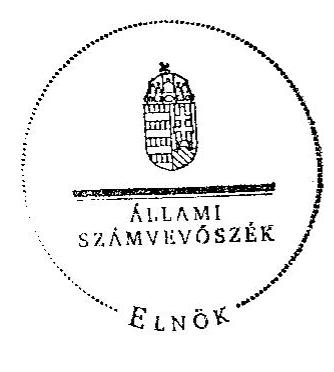

## 0e 1191

Domokos László
elnök

---

# 1. Szervezetirányítási és Müködtetési Igazgatóság 

Vizsgálat-azonosító szám: V0513
Témaszám: 1005

## Az ellenőrzést vezette:

Horváthné Menyhárt Erika
számvevő osztályvezető főtanácsos

## Az ellenőrzést végezték:

Göller Géza
főtanácsadó
Weltherné Szolnoki Dóra
számvevő

Nagyné Lakhézi Éva
számvevő tanácsos
Bálint Józsefné
címzetes főmunkatárs

Dr. Somorjai Zsoltné
számvevő tanácsos

## 2. Államháztartás Központi Szintjét Ellenőrző Igazgatóság

## Az ellenőrzést felügyelte:

Dr. Becker Pál
főigazgató

## Az ellenőrzés végrehajtásáért felelős:

Horváth Sándor
számvevő igazgató

## Az ellenőrzést vezették:

Borbély Zsuzsanna osztályvezető főtanácsos

Hámoriné Maróti Györgyi számvevő vezető főtanácsos

Horváth József
számvevő főtanácsos
Holé Sándorné Dr.
igazgatóhelyettes
Pongrácz Éva
számvevő főtanácsos
Tolnai Lászlóné
számvevő főtanácsos

## Az összefoglaló jelentést készítették:

Baki István
számvevő
Deli Gáborné
számvevő tanácsos
Farkas László
főtanácsadó
Gáspár Eszter
számvevő gyakornok
Huszárné Borbás Melinda
számvevő
Jeszenkovits Tamás
tanácsadó
Keresztes Tamás
számvevő
Marozsán Katalin
számvevő
Niklai Heléna
számvevő tanácsos

Hámoriné Maróti Györgyi
számvevő vezető főtanácsos
Lődiné Cser Zsuzsanna
számvevő főtanácsos
Szabóné Farkas Katalin
számvevő főtanácsos

Horváth József
számvevő főtanácsos
Morvay András
számvevő főtanácsos
Szarka Péterné
számvevő vezető főtanácsos

Csomsztek Ramóna
számvevő gyakornok
Dormán István Zoltán
számvevő
Fodor Edit
számvevő
Horcsin Attila
számvevő tanácsos
Jagicza Istvánné
számvevő tanácsos
Kerek István
számvevő
Kováts Tibor Balázs
számvevő
Molnár Bálint
számvevő
Pető Krisztina
számvevő tanácsos

---

Dr. Pósch Gábor főtanácsadó

Séra Andrásné
főtanácsadó
Dr. Szima Mária
főtanácsadó
Vasváriné Molnár Judit
számvevő tanácsadó
Zentner Róbert
számvevő gyakornok

## Az ellenőrzést végezték:

Baki István
számvevő
Bamberger Mária
tanácsadó
Bravics Judit Barbara
számvevő gyakornok
Csomsztek Ramóna
számvevő gyakornok
Dede Katalin
tanácsadó
Dr. Domján Eszter
tanácsadó
Éva Katalin
főtanácsadó
Fekete Anikó Gyöngyi
számvevő
Gáspár Eszter
számvevő gyakornok
Görgényi Gábor
számvevő tanácsos
Gyarmati István
tanácsadó
Holló András
számvevő
Huszárné Borbás Melinda
számvevő
Dr. Jakab Kornél
számvevő tanácsos
Kerek István
számvevő
Kincses Erzsébet Eszter
számvevő
Kresztyankó Zsuzsana
számvevő gyakornok
Marozsán Katalin
számvevő
Némethné Nagy Mária
számvevő
Peisch Annamária
számvevő

Dr. Remport Katalin
főtanácsadó
Szabó Erzsébet
számvevő tanácsos
Varga Ágnes Klára
számvevő
Zakar László
számvevő tanácsos

Balázs Melinda
tanácsadó
Bene István
számvevő
Burenzsargal Narantuja
számvevő tanácsos
Dancsóné Kuron Ildikó
számvevő tanácsos
Deli Gáborné
számvevő tanácsos
Dormán István Zoltán
számvevő
Farkas László
főtanácsadó
Fekete Győr László
számvevő
Gere Orsolya
számvevő gyakornok
Gregor Andrea
számvevő gyakornok
Gyeraj Péter
számvevő
Horcsin Attila
számvevő tanácsos
Igar Tamás
számvevő
Jeszenkovits Tamás
tanácsadó
Keresztes Tamás
számvevő
Kiss Ferenc Károlyné
számvevő
Kriston-Vizi János
számvevő tanácsos
Dr. Mészáros Leila
számvevő
Niklai Heléna
számvevő tanácsos
Pető Krisztina
számvevő tanácsos

Sali Sándorné
számvevő
Szilágyi Zsuzsanna
tanácsadó
Vas Lajos
főtanácsadó
Zaroba Szilvia
számvevő tanácsos

Dr. Baloghné Sebestyén Éva
számvevő
Béres László
számvevő
Czmarkó Frigyes
számvevő
Deák Tamásné
főtanácsadó
Dombovári Nóra
számvevő tanácsos
Erdélyi Zoltán
számvevő gyakornok
Fehérné Jagasich Mariann
számvevő tanácsos
Ferencz Katalin
tanácsadó
Gergely Tilda
számvevő
Gróf Gábor
számvevő gyakornok
Hajdu Károlyné
tanácsadó
Huszár József
számvevő tanácsos
Jagicza Istvánné
számvevő tanácsos
Karsai Lászlóné
főtanácsadó
Kékesiné Győrffy Zita
számvevő
Kováts Tibor Balázs
számvevő
Dr. Lengyel Attila
főtanácsadó
Molnár Bálint
számvevő
Dr. Novák Zsuzsanna Csilla
tanácsadó
Polyák Ferenc
számvevő tanácsos

---

| Dr. Pósch Gábor főtanácsadó | Dr. Remport Katalin   főtanácsadó | Salamin Viktor számvevő |
| :--: | :--: | :--: |
| Sali Sándorné számvevő | Sápi Henriett számvevő | Sebők Katalin számvevő gyakornok |
| Séra Andrásné   főtanácsadó | Dr. Sinka Zoltán Lajos számvevő tanácsos | Dr. Sipos Dóra számvevő tanácsos |
| Szabó Erzsébet számvevő tanácsos | Szenthelyi Dávid számvevő gyakornok | Szepes Béla számvevő tanácsos |
| Szilas István   tanácsadó | Szilágyi Gyöngyi   főtanácsadó | Szilágyi Zsuzsanna tanácsadó |
| Dr. Szima Mária   főtanácsadó | Szöllősiné Hrabóczki Etelka   főtanácsadó | Terbe Mónika számvevő tanácsos |
| Teski Norbert számvevő gyakornok | Tóth Árpád tanácsadó | Trenovszki István   főtanácsadó |
| Tukacs Éva tanácsadó | Vacsora Erika számvevő tanácsos | Varsányiné Dudás Eleonóra számvevő |
| Vas Lajos   főtanácsadó | Dr. Vass Gábor tanácsadó | Vasváriné Molnár Judit számvevő |
| Villányi Antal számvevő tanácsos | Dr. Vincze Ibolya számvevő | Vitányi István számvevő tanácsos |
| Vlasits Ágnes számvevő | Wölfinger Viktor számvevő gyakornok | Zagyi Judit számvevő tanácsos |
| Zakar László számvevő tanácsos | Zaroba Szilvia számvevő tanácsos | Zentner Róbert számvevő gyakornok |
| Gelencsérné Szabó Erika külső munkatárs | Dr. Nagy Imre külső munkatárs | Rumpler Erzsébet külső munkatárs |
| Varga Ágnes Klára   külső munkatárs |  |  |

# A témához kapcsolódó eddig készített számvevőszéki jelentések: 

## címe

Jelentés a Magyar Köztársaság 2005. évi költségvetése végrehajtásának ellenőrzéséről 0628
Jelentés a Magyar Köztársaság 2006. évi költségvetése végrehajtásának ellenőrzéséről 0724
Jelentés a Magyar Köztársaság 2007. évi költségvetése végrehajtásának ellenőrzéséről 0824
Jelentés a Magyar Köztársaság 2008. évi költségvetése végrehajtásának ellenőrzéséről 0928
Jelentés a Magyar Köztársaság 2009. évi költségvetése végrehajtásának ellenőrzéséről 1016

---

# TARTALOMJEGYZÉK 

BEVEZETÉS ..... 7
I. ÖSSZEGZŐ MEGÁLLAPÍTÁSOK, KÖVETKEZTETÉSEK, JAVASLATOK ..... 11

1. A zárszámadási dokumentum ..... 13
2. Központi költségvetés ..... 13
3. A költségvetési fejezetek ..... 24
4. Az Európai Uniótól származó források felhasználása ..... 26
5. Az elkülönített állami pénzalapok és a társadalombiztosítás pénzügyi alapjai ..... 29
6. A helyi önkormányzatok költségvetési kapcsolatai ..... 36
II. RÉSZLETES MEGÁLLAPÍTÁSOK ..... 45
A) A ZÁRSZÁMADÁSI DOKUMENTUM TÖRVÉNYESSÉGI ÉS SZÁMSZAKI ELLENŐRZÉSE ..... 47
7. A zárszámadási dokumentum tartalma, szerkezete ..... 49
8. A dokumentumra vonatkozó törvényi előírások teljesítése ..... 50
B) HELYSZÍNI ELLENŐRZÉS ..... 55
B.1. A KÖZPONTI KÖLTSÉGVETÉS ..... 57
9. A központi költségvetés 2010. évi törvényi előirányzatainak teljesítése, a hiány alakulása ..... 57
10. A központi költségvetés finanszírozása és a kincstári egységes számla likviditása ..... 60
2.1. A központi költségvetés finanszírozási igénye ..... 60
2.2. A központi költségvetés tényleges finanszírozása ..... 62
11. A központi költségvetés központi előirányzatai ..... 67
3.1. A központi költségvetés közvetlen bevételei ..... 67
3.1.1. Vállalkozások költségvetési befizetései ..... 67
3.1.2. Fogyasztáshoz kapcsolt adók ..... 76
3.1.3. A lakosság befizetései ..... 78
3.1.4. Egyéb költségvetési bevételek ..... 81
3.1.5. Az állami vagyonnal kapcsolatos bevételek ..... 83

---

3.1.6. Uniós elszámolások ..... 94
3.1.7. A vám és egyes adónemek visszatérítése ..... 95
3.2. A központi költségvetés közvetlen bevételei elszámolásának megbízhatósága és a belső kontrollok működése az APEH-nál és a VP-nél ..... 95
3.3. A köztartozások behajtására tett intézkedések ..... 112
3.3.1. Az adóhátralékok behajtására tett intézkedések ..... 112
3.3.2. Végrehajtói letéti rendszer ..... 115
3.3.3. Fizetési könnyítési és méltányossági jog gyakorlása az APEH- nél ..... 116
3.3.4. A vámhatóság által kezelt vám- és adótartozások behajtására tett intézkedések ..... 117
3.3.5. A költségvetési szervek tartozásállománya, köztartozásai ..... 119
3.4. A központi költségvetés közvetlen kiadásai ..... 121
3.4.1. Az előirányzatok felhasználása ..... 121
3.4.2. A központi költségvetés kamatelszámolásai, tőkevisszatérü- lései, az adósság- és követelés-kezelés költségei ..... 128
3.4.3. A központi költségvetés terhére vállalt kezességek ..... 137
3.4.4. A központi költségvetés általános, cél- és stabilitási tartalékának felhasználása ..... 149
3.4.5. Az állami vagyonnal kapcsolatos kiadások ..... 155
3.5. A központi költségvetés közvetlen kiadásai elszámolásainak megbízhatósága ..... 170
4. A közvetlen bevételek és kiadások elszámolásában érintett szervezetek informatikai rendszereinek értékelése ..... 185
5. A fejezetek költségvetésének végrehajtása ..... 191
5.1. A kormányzati struktúraváltozással kapcsolatos feladatok ..... 191
5.2. A szervezeti változások szabályozásával kapcsolatos megállapítások ..... 198
5.2.1. Alapító Okirat ..... 198
5.2.2. Szervezeti és Múködési Szabályzat ..... 199
5.2.3. Gazdálkodási szabályzatok ..... 200
5.3. A kiadások alakulását befolyásoló kormányhatározatok, valamint az ezt egyedileg módosító engedélyek és azok hatásai ..... 200
5.4. A fejezetet irányító szerv feladatai ellátásának értékelése ..... 203
5.5. A fejezetek bevételi és kiadási előirányzatainak alakulása és teljesítése, valamint az előirányzat-maradványok és a létszám alakulása ..... 205
5.5.1. A fejezetek finanszírozása ..... 205
5.5.2. A fejezetek kiadási előirányzatainak alakulása és teljesítése ..... 205
5.5.3. A fejezetek bevételi előirányzatainak alakulása és teljesítése ..... 212
5.5.4. Előirányzat-maradványok ..... 215
5.5.4.1. Az előző évi előirányzat-maradvány jóváhagyása és felhasználása ..... 215

---

5.5.4.2. A tárgyévi előirányzat-maradvány alakulása ..... 216
5.5.5. A fejezetek létszámhelyzete ..... 218
5.6. A beszámolók pénzügyi (szabályszerúségi) ellenőrzésének tapasztalatai ..... 219
5.6.1. Az ún. alkotmányos fejezetek, fejezeti jogosítványú költségvetési címek, illetve egyintézményes fejezet beszámolói pénzügyi (szabályszerúségi) ellenőrzésének tapasztalatai ..... 219
5.6.2. Az igazgatási címek, alcímek beszámolói pénzügyi (szabályszerúségi) ellenőrzésének tapasztalatai ..... 221
5.6.3. A fejezeti kezelésű előirányzatok elszámolásai pénzügyi (szabályszerúségi) ellenőrzésének tapasztalatai ..... 225
5.6.4. Az Uniós Fejlesztések fejezet fejezeti kezelésű előirányzatai beszámolóinak megbízhatósága ..... 227
5.7. A beszámolók pénzügyi (szabályszerúségi) ellenőrzések során feltárt - újszerű, vagy ismétlődő - problémák ..... 230
6. Az EU támogatások és az uniós tagsággal összefüggő hazai befizetések ..... 232
7. A belső kontrollok kiépítésének és múködésének tapasztalatai ..... 238
8. Letéti számlák ..... 243
8.1. A központi letéti számla ..... 243
8.2. Fejezeti letéti számlák ..... 244
9. Központosított bevételek ..... 245
10. A korábbi ÁSZ ellenőrzések megállapításaival kapcsolatban tett intézkedések ..... 246
10.1. A központi költségvetés nemzetgazdasági számláin elszámolt közvetlen bevételek és kiadások utóellenőrzésével kapcsolatos megállapítások ..... 246
10.2. Az egyes fejezetek költségvetése végrehajtásának utóellenőrzésével kapcsolatban tett megállapítások ..... 252
10.2.1.A korábbi ÁSZ ellenőrzések megállapításaival kapcsolatban tett intézkedések ..... 252
10.2.2. Az egyes fejezetek igazgatás címeinek, valamint a fejezeti kezelésű előirányzatok címeinek korábbi vizsgálatai kapcsán tett megállapítások utóellenőrzése ..... 254
10.2.3. Az Uniós Fejlesztések fejezet korábbi vizsgálatai kapcsán tett megállapítások utóellenőrzése ..... 255
B.2. AZ ELKÜLÖNÍTETT ÁLLAMI PÉNZALAPOK ÉS A TÁRSADALOMBIZTOSÍTÁS PÉNZÜGYI ALAPJAI ..... 258

1. Elkülönített Állami Pénzalapok és a Társadalombiztosítás Pénzügyi Alapjai ..... 258
1.1. Az alapok APEH által beszedett bevételek adatai megbízhatóságának minősítése ..... 259
1.2. Elkülönített állami pénzalapok ..... 261

---

1.2.1. Az ELKA bevételi és kiadási előirányzatai, pénzügyi egyensúlya ..... 261
1.2.2. A kormányzati struktúraváltozással összefüggő változások ..... 262
1.2.3. Az ELKA múködésének ellenőrzése a kiválasztott programokon keresztül ..... 265
1.2.4. Az alapkezelők által múködtetett ellenőrzési rendszer ..... 266
1.2.5. Utóvizsgálat ..... 270
1.3. Társadalombiztosítás pénzügyi alapjai ..... 272
1.3.1. A TB. Alapok bevételi és kiadási előirányzatai, pénzügyi egyensúlya ..... 273
1.3.2. A kormányzati struktúraváltozással összefüggő változások ..... 275
1.3.3. A TB. Alapok ellenőrzése során tett megállapításaink ..... 276
1.3.4. A TB. Alapok múködési költségvetése ..... 283
1.3.5. Az alapkezelők által múködtetett ellenőrzési rendszer ..... 285
1.3.6. Utóvizsgálat ..... 286
B.3. AZ ÁLLAMHÁZTARTÁS HELYI SZINTJE, A HELYI ÖNKORMÁNYZATOK ..... 289

1. A Kvtv. mellékleteiben meghatározott központi támogatások elszámolásának szabályszerűsége ..... 289
1.1. Az előirányzatok nyilvántartása ..... 289
1.1.1. Az eredeti előirányzatok jogcímenkénti megfelelősége a Kvtv.- ben és a PM-ÖM együttes rendeletben ..... 289
1.1.2. Az előirányzat módosítások szabályszerűsége ..... 290
1.2. A helyi önkormányzatok jogcímenkénti támogatásai és hozzájárulásai ..... 294
1.2.1. A települési önkormányzatot megillető, a településre kimutatott személyi jövedelemadó ..... 294
1.2.2. A megyei önkormányzatok személyi jövedelemadó részesedése ..... 294
1.2.3. A települési önkormányzatok jövedelem differenciálódásának mérséklése ..... 294
1.2.4. Normatív hozzájárulások ..... 295
1.2.5. A helyi önkormányzatok által felhasználható központosított előirányzatok ..... 297
1.2.6. A helyi önkormányzatok működőképességének megőrzését szolgáló kiegészítő támogatások ..... 305
1.2.6.1. Önhibájukon kívül hátrányos helyzetben lévő települési önkormányzatok támogatása ..... 305
1.2.6.2. Állami támogatás a tartósan fizetésképtelen helyzetbe került helyi önkormányzatok adósságrendezésére irányuló hitelfelvétel visszterhes kamattámogatására, az adósságrendezés alatt múködési célra igényelhető támogatásra, valamint a pénzügyi gondnok díjára ..... 307

---

1.2.6.3. A működésképtelen helyi önkormányzatok egyéb támogatása ..... 308
1.2.7. A helyi önkormányzatok által fenntartott, illetve támogatott előadó-művészeti szervezetek támogatása ..... 310
1.2.8. Normatív, kötött felhasználású támogatások ..... 312
1.2.8.1. Kiegészítő támogatás egyes közoktatási feladatokhoz ..... 313
1.2.8.2. Egyes szociális feladatok támogatása ..... 313
1.2.8.3. A többcélú kistérségi társulások támogatása ..... 314
1.2.8.4. A helyi önkormányzatok hivatásos tűzoltóságok támogatása ..... 314
1.2.9. Felhalmozási célú támogatások ..... 314
1.2.9.1. Címzett és céltámogatások ..... 314
1.2.9.2. Vis maior tartalék ..... 316
1.2.10.Budapest 4-es - Budapest Kelenföldi pályaudvar-Bosnyák tér közötti - metróvonal építésének támogatása ..... 317
1.3. A IX. Helyi önkormányzatok támogatásai és átengedett személyi jövedelemadója fejezet Kormány és fejezeti hatáskörben létrehozott új címei ..... 322
1.3.1. Siklósi vár felújítása ..... 322
1.3.2. A leghátrányosabb helyzetű kistérségek felzárkóztatásának támogatása ..... 323
1.3.3. Helyi önkormányzatok fejlesztési feladatainak támogatása ..... 324
1.3.4. Fővárosi közösségi közlekedés kiegészítő támogatása ..... 325
1.3.5. Üdülőhelyi feladatok kiegészítő támogatása ..... 325
1.3.6. 2010. május-júniusi rendkívüli időjárásban megsemmisült lakóingatlanok helyreállításának támogatása ..... 326
1.3.7. Fővárosi közösségi közlekedés rendkívüli támogatása ..... 327
1.3.8. Várpalota és térsége támogatása ..... 327
2. A Helyi önkormányzatok előző évi elszámolása és ellenőrzése során megállapított eltérések rendezésének szabályszerűsége ..... 328
3. A helyi önkormányzatoknak nyújtott támogatások folyósításának megbízhatósága ..... 330
4. Utóellenőrzés ..... 331
MELLÉKLETEK ..... 335
RÖVIDÍTÉSEK JEGYZÉKE ..... 345

---

.

---

# JELENTÉS 

## BEVEZETÉS

A Magyar Köztársaság 2010. évi költségvetését a 2009. évi CXXX. törvény (Kvtv.) hagyta jóvá, amely magában foglalja a központi költségvetés, az elkülönített állami pénzalapok és a társadalombiztosítás pénzügyi alapjai, valamint az önkormányzatoknak különféle jogcímen juttatott állami támogatás és hozzájárulás központi alrendszerben megjelenő előirányzatait. A törvény az állami költségvetés központi alrendszerének 13533 026,8 M Ft kiadási és 12662 680,6 M Ft bevételi főösszegét, valamint a hiányt 870 346,2 M Ft-ban állapította meg.

A 2010. évre tervezett költségvetési hiány tartása, valamint az új Kormány 2010. második félévre ütemezett gazdaságpolitikai céljainak megvalósítása érdekében az Országgyűlés (OGY) többször módosította a Kvtv.-t és az egyensúly megteremtését szolgáló törvényeket. Az OGY az államháztartásról szóló 1992. évi XXXVIII. törvény (Áht.) által biztosított kereteken belül széleskörű felhatalmazást adott a Kormánynak a célok elérésének teljesítésére.

A Kvtv. módosításáról szóló törvényekben, különösen a 2010. évi CXLIII. törvény bevételt, valamint kiadást módosító intézkedései hatására a 2010. évi költségvetés központi alrendszerének kiadási főösszege 13629 030,4 M Ft-ra, a bevételi főösszege 12764719,3 M Ft-ra, a hiány összege 864 311,1 M Ft-ra módosult.

A kormányzati struktúraváltozással összefüggésben a Magyar Köztársaság minisztériumainak felsorolásáról szóló 2010. évi XLII. törvény - a kiadási és bevételi főösszeg és ennek megfelelően a hiány összegének változatlanul hagyása mellett - módosította a 2010. évi költségvetés szerkezeti rendjét, és a fejezetek közötti átcsoportosítások végrehajtását a Kormány hatáskörébe utalta.

A törvényi felhatalmazásnak megfelelően a Kormány a Magyar Köztársaság minisztériumainak felsorolásáról szóló 2010. évi XLII. törvény (továbbiakban Tv.) 4. §-ának (2) bekezdéséből eredő egyes feladatok végrehajtásáról szóló 1136/2010. (VI. 29.) és a 4. §-ának (2) bekezdéséből eredő feladatok és az egyes miniszterek, valamint a Miniszterelnökséget vezető államtitkár feladat- és hatásköréről szóló 212/2010. (VII. 1.) Korm. rendeletben meghatározott feladatok összehangolásáról szóló 1188/2010. (IX. 10.) Korm. határozatokban részletesen szabályozta a 2010. évi költségvetés új struktúráját, a 2010. évi előirányzatok átrendezésével és a 2010. év első félévi beszámoló jelentés készítésével összefüggő feladatokat.

---

A Tv. és az 1136/2010. (VI. 29.) Korm. határozat alapján a minisztériumok száma tizenháromról nyolcra csökkent. A kormányhatározat alapján a jelentésünk 2010. június 28 -ig a régi, 2010. július 1-jétől az új minisztériumi struktúrának megfelelő elnevezéseket, illetve azok rövidítéseit használja.

Az ellenőrzés célja annak értékelése volt, hogy a 2010. évi költségvetések ${ }^{1}$ végrehajtásáról szóló beszámolók és elszámolások, a központi költségvetés közvetlen bevételei és kiadásai elszámolása megbízhatóságának értékelése, valamint annak elősegítése volt, hogy a Magyar Köztársaság 2010. évi költségvetésének végrehajtásáról az Országgyűlésnek benyújtott törvényjavaslat valósághűen tükrözze a pénzügyi folyamatokat.

A Kvtv. végrehajtását (zárszámadás) - törvényi kötelezettségünknek és az országgyűlési határozatoknak megfelelően - szabályszerűségi, megbízhatósági szempontból vizsgáltuk. Az ellenőrzés során - az előző évekhez hasonlóan a 2010. évre vonatkozóan - sem volt célunk a gazdálkodás változó körülményei miatt meghozott kormányzati intézkedések társadalmi-gazdasági hatásainak, valamint a költségvetés végrehajtása gazdasági folyamatainak célszerűségi, eredményességi szempontból történő értékelése. Ezekről az ÁSZ tematikus jelentései szólnak.

A költségvetések végrehajtásának szabályszerűségét, a beszámolók megbízhatóságát a financial audit módszerével értékeltük. Teljes körűen ellenőriztük az ún. alkotmányos fejezetek, a fejezeti jogosítvánnyal rendelkező költségvetési címek, a fejezetek igazgatási címei és a fejezeti kezelésű előirányzatok beszámolóit, valamint a központi költségvetés közvetlen bevételeinek és kiadásainak elszámolását.

Az ellenőrzés az előző évekhez viszonyítva azonos intézményi kört, de a kormányzati struktúraváltozás következtében kevesebb szervezetet érintett. A rendelkezésre álló időkeret és a szükséges források hiánya miatt az ellenőrzés a fejezetek irányítása alá tartozó intézményi körre, illetve a végfelhasználók helyszíni ellenőrzésére nem terjedt ki.

A központi költségvetés ellenőrzését a fejezetek belső ellenőrzési szervezeti egységeivel együttmúködve - az általuk, a korábbi évekéinél jelentősen szűkebb körben megvalósított, a fejezetekhez tartozó intézményi kör megbízhatósági ellenőrzésével - végeztük el. Ellenőrzési tapasztalataikról nem rendelkezünk információkkal, így azokról - az előző években kialakított gyakorlatnak megfelelő - tájékoztatást nem tudunk adni².

[^0]
[^0]:    ${ }^{1}$ A helyszíni ellenőrzésre meghatározott körben a központi költségvetési szervek (elemi) költségvetései.
    ${ }^{2}$ A Magyar Köztársaság 2011. évi költségvetését megalapozó egyes törvények módosításáról szóló 2010. évi CLIII. tv. 10. § (65) bekezdése az Áht. XIII. fejezetét hatályon kívül helyezte és új szabályokat határozott meg az államháztartási kontrollokra.

---

Az elkülönített állami pénzalapoknál - a Magyar Köztársaság 2009. évi költségvetését megalapozó egyes törvények módosításáról szóló 2008. évi LXXXII. törvény 2. § (11) bekezdése alapján módosított Áht. 57. § (3) bekezdése - a társadalombiztosítás pénzügyi alapjainál - ugyanezen törvény 2. § (22) bekezdésével módosított Áht. 86/A. § (2) bekezdése alapján - megváltozott az ellenőrzés módszere. A korábbi években az alapoknál kötelező volt a beszámolók könyvvizsgálata. 2010. január 1-jétől az ÁSZ által kidolgozott módszertan szerint kellett a beszámoló ellenőrzését elvégezni.

A szabályozás nem egyértelmú meghatározása miatt a különböző alapoknál eltérő gyakorlat alakult ki. Az ÁSZ - módszertana alapján - az alapokat megillető, az APEH által beszedett bevételek elszámolása megbízhatóságát ellenőrizte. Az alapok beszámolóinak megbízhatóságáról készített könyvvizsgálói jelentéseket - az egyes alapokról szóló megállapításaink megfogalmazásakor hasznosítottuk.

A helyi önkormányzatok támogatásai és átengedett személyi jövedelemadója fejezetbe tartozó támogatásokat a Kincstár által történő folyósításig ellenőriztük.
„A helyi önkormányzatokat megillető állami támogatások és hozzájárulások igénylése és elszámolása kincstári helyszíni felülvizsgálati rendszerének, valamint a helyi önkormányzatokat a 2010. évben megillető normatív hozzájárulások elszámolásának helyszíni ellenőrzése" keretében foglalkoztunk egyes normatív hozzájárulások elszámolásának helyszíni ellenőrzési tapasztalataival.

Az ellenőrzés keretében külön értékeltük az európai uniós támogatásokkal kapcsolatos elszámolásokat.

Az ellenőrzés során áttekintettük a Magyar Köztársaság 2009. évi költségvetése végrehajtásának ellenőrzéséről készített számvevőszéki jelentésben (számvevői jelentésekben) rögzített hiányosságok felszámolására tett intézkedéseket, kiemelt figyelmet fordítunk a több éve fennálló hiányosságokra.

Zárszámadási ellenőrzésünk alapján 34 javaslatot tettünk, szükség esetén megismételve, nyomatékosítva korábbi javaslatainkat. Ezekkel erősíteni kívánjuk a zárszámadás adatainak megbízhatóságát, a pénzfelhasználások átláthatóságát, illetve elősegíteni a feltárt hibák jövőbeni elkerülését. Emellett még éltünk azzal a jogszabály adta lehetőségünkkel is, hogy - amennyiben a feltárt hiányosságok jellege azt indokolta - levélben hívtuk fel az érintett szervek vezetőinek figyelmét azok megszüntetésére, ismétlődésük megelőzésére.

Az ellenőrzés lefolytatásának jogi alapját az Állami Számvevőszékről szóló 1989. évi XXXVIII. törvény 1. § (2), a 2. § (1) bekezdései, valamint ezekre a jogszabályi előírásokra figyelemmel a 2. § (3), (5)-(6) és (9) bekezdései, a 17. § (1), a 18. § (2) bekezdései, továbbá az Áht. 104. § (3) és a 120/A. § (1) bekezdései együttesen képezik.

---

A jelentés két kötetből áll. Az első kötet (Jelentés) az ellenőrzés legfontosabb megállapításait és javaslatait, illetve a zárszámadási dokumentum törvényességi és számszaki ellenőrzésére, az államháztartás alrendszereire, valamint az egyes kiemelt témákra vonatkozó megállapításokat tartalmazza. A második kötet (Függelék) a költségvetési fejezetekre, az EU-támogatásokkal és az uniós tagsággal összefüggő hazai befizetésekre, az elkülönített állami pénzalapokra, a társadalombiztosítási alapokra és a helyi önkormányzatok költségvetési kapcsolataira vonatkozó részletes megállapításokat foglalja magában.

A Jelentés és Függelék kötetben előforduló szervezetekre és/vagy jogszabályokra vonatkozó rövidítéseket a Jelentés kötet végén található rövidítések jegyzékében foglaltuk össze.

---

# I. ÖSSZEGZŐ MEGÁLLAPÍTÁSOK, KÖVETKEZTETÉSEK, JAVASLATOK 

Az államháztartás alrendszereinek 2010. évi tervezett bevételi előirányzata 15 719,3 Mrd Ft, kiadási előirányzata 16 779,6 Mrd Ft, hiánya 1060,3 Mrd Ft volt, ami a GDP 4\%-ának felelt meg. Az államháztartás hiánya 1121,5 Mrd Ft (a GDP 4,1\%-a), ami 61,1 Mrd Ft-tal (5,8\%-kal) haladja meg az eredeti előirányzatot.

A hiány növekedéséhez az államháztartás egyes elemei a következő mértékben járultak hozzá:

Az államháztartás 2010. évi hiánya, pénzforgalmi szemléletben
(M Ft)

| Megnevezés | Eredeti   elöirányzat | Teljesítés | Eltérés |
| :-- | --: | --: | --: |
| Központi alrendszer | $\mathbf{- 8 7 0 3 4 6 , 2}$ | $\mathbf{- 8 8 9 4 7 4 , 5}$ | $\mathbf{- 1 9 1 2 8 , 3}$ |
| Ebből |  |  |  |
| Központi költségvetés | -836 063,0 | -853 920,2 | -17 857,2 |
| Elkülönített állami pénz-   alapok | 35125,1 | 59831,9 | 24706,8 |
| Egészségbiztosítási Alap | -69 408,3 | -91 699,0 | -22 290,7 |
| Nyugdíjbiztosítási Alap | 0,0 | -3687,2 | -3687,2 |
| Önkormányzati   alrendszer | $\mathbf{- 1 9 0 0 0 0 , 0}$ | $\mathbf{- 2 3 1 9 8 9 , 0}$ | $\mathbf{- 4 1 9 8 9 , 0}$ |
| Államháztartás összesen | $\mathbf{- 1 0 6 0 3 4 6 , 2}$ | $\mathbf{- 1 1 2 1 4 6 3 , 5}$ | $\mathbf{- 6 1 1 1 7 , 3}$ |

Forrás: a zárszámadási törvényjavaslat
A hiány költségvetési törvényben jóváhagyott eredeti előirányzatát meghaladták a teljesítési adatok. Az elkülönített állami pénzalapok egyenlege a költségvetési előirányzatnál 70,4\%-kal magasabb volt.

A korábbi évek több százmilliárd forintos eltéréséhez képest, az államháztartás szintjén a hiány csupán 61,1 Mrd Ft-tal haladta meg az eredetileg előirányzottat.

A tervezési - és ennek részeként a világgazdasági - környezet folyamatai teljes körűen nem jelezhetőek előre, ezért alapvető a mindenkori hiánycél eléréséhez és megtartásához a pontos tervezés, a felelős költségvetési gazdálkodás. A magyar nemzetgazdaság hitelességének megítélése szempontjából kulcsfontosságú a kitűzött hiánycél betartása.

---

A költségvetési politika alakításában, a költségvetés fenntarthatóságának megítélésében fontos mutató a folyó gazdálkodás eredményét kifejező ún. elsődleges egyenleg, amely a múltban felhalmozott adósság kamatterhe nélkül veszi figyelembe a kiadásokat. Gazdaságpolitikai lényege szerint azt a bevételi és kiadási kört tartalmazza, ahol a kormányzat intézkedéseket hozhat az adósságállomány csökkentése érdekében.
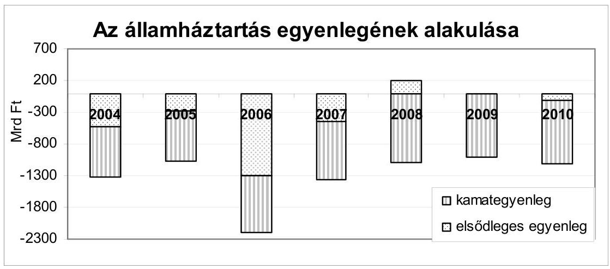

Forrás: zárszámadási törvényjavaslatok
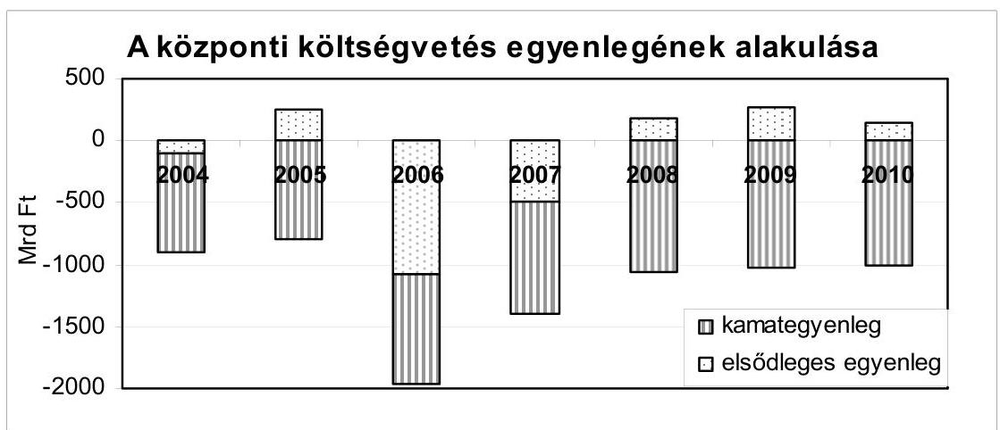

Forrás: zárszámadási törvényjavaslatok

Az államháztartás szintjén - a 2008. év kivételével - nem volt pozitív elsődleges egyenleg. Az államháztartás pénzforgalmi szemléletű elsődleges egyenlege 2010-ben -112,9 Mrd Ft volt. Az elsődleges egyenleget a központi költségvetés 152,0 Mrd Ft-tal, az elkülönített állami pénzalapok 59,8 Mrd Ft-tal javították, míg a helyi önkormányzatok 229,3 Mrd Ft-tal, az egészségbiztosítási alap 91,7 Mrd Ft-tal, a nyugdíjbiztosítási alap 3,7 Mrd Ft-tal rontották.

---

# 1. A ZÁRSZÁMADÁSI DOKUMENTUM 

A törvényjavaslat normaszövege, törvényi mellékletei, általános indokolása és annak mellékletei alapvetően összhangban állnak. A dokumentum különböző részeiben mind kevesebb a pontatlanság. Az általános indokolás évről-évre teljesebb körben és tartalommal számol be a költségvetési törvényben kapott felhatalmazások teljesítéséről, jelezve azt is, ha az érintettek nem éltek a felhatalmazással.

A törvényjavaslatra vonatkozó - nem teljes körű - törvényi előírásokat a zárszámadási dokumentum kevés kivételtől eltekintve, teljesíti. A hosszú távú kötelezettségvállalások állományának összefoglaló áttekintése (Áht. 12/C. § (7) bekezdés) továbbra is hiányzik a dokumentumból.

A törvényjavaslat összeállítására vonatkozó hatályos szabályozási környezet változatlan, így továbbra is érvényes az a számvevőszéki megállapítás, hogy a jelenlegi prezentációs rendszer nem támogatja megfelelően az információtartalom állandóságát, az átláthatóságot, az évek közötti összevetést és a folyamatokról való képalkotást, ide értve a célok és azok teljesülésének követhetőségét.

A zárszámadási törvényjavaslatra vonatkozó többéves ellenőrzési tapasztalatok alátámasztják, hogy a zárszámadás összeállításának teljes körű szabályozása, a tartalom és a szerkezet részletes meghatározása nélkül a prezentáció minősége érdemben nem javulhat. Az ÁSZ évek óta jelzi az erre vonatkozó külön szabályozás indokoltságát, a szükséges és elégséges információk egyértelmú meghatározásával. Érdemi elmozdulás e tekintetben nem történt. A számvevőszéki elvárást megerősíti Magyarország Alaptörvényének előírása (36 cikk (2) bekezdés), mely szerint „A központi költségvetésről és annak végrehajtásáról szóló törvényjavaslatoknak azonos szerkezetben, áttekinthető módon és ésszerü részletezettséggel kell tartalmazniuk az állami kiadásokat és bevételeket.".

## 2. Központi KöltsÉGvetés

A központi költségvetés 2010. évi hiánya 853,9 Mrd Ft volt, amely 2,1\%-kal haladta meg a költségvetési törvényben meghatározott összeget. A hiány öszszege 109,1 Mrd Ft-tal (14,6\%-kal) magasabb a 2009. évinél.

A központi költségvetés hiánya már 2010 márciusában 608,0 Mrd Ft volt, amely $71,2 \%$-a a törvényben meghatározott összegnek. A 2010. év folyamán a hiány dinamikusan emelkedett, júniusban 1021,9 Mrd Ft (119,7\%), novemberben 1282,8 Mrd Ft (150,2\%), illetve december első felében 1641,3 Mrd Ft (192,2\%) volt. A költségvetési hiány kedvezőtlen alakulása miatt év közben azonnali beavatkozás vált szükségessé.

Az előirányzott hiány betartása érdekében a Kormány több intézkedést tett. Elkészítette 29 pontból álló első akciótervét (költségvetési megtakarítások, bankadó bevezetése), majd a másodikat (válságadó bevezetése, kötelező magánnyugdíjpénztári járulékok átirányítása), továbbá a júniusi és a decemberi határozataiban előirányzat zárolást, illetve csökkentést rendelt el.

---

A központi költségvetés hiányának a tervezettnél kedvezőtlenebb alakulása az elmúlt 9 évben öt év során (2002-2004 között, 2006-ban és 2009-ben) volt tapasztalható.

A központi költségvetés hiánya 2004-ben 32,6\%-kal haladta meg a tervezettet, 2005-ben 32,6\%-kal maradt el az előirányzattól, 2006-ban 2,1\%-kal és 2009-ben $12,5 \%$-kal ismét meghaladta a törvényben előirányzott összeget, míg a 2007. évben $16,6 \%$-kal és a 2008. évben $22,2 \%$-kal alacsonyabb volt a törvényben előirányzott összegnél.
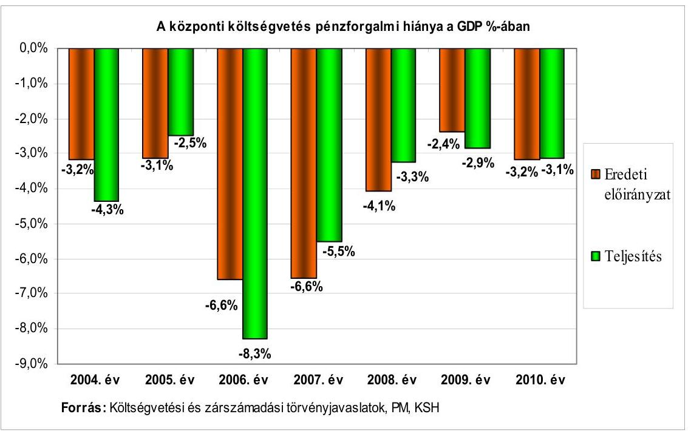

A 2010. évi hiány alakulását befolyásolta - a 2010 második félévében bevezetett új adók mellett -, hogy a költségvetés egyensúlya szempontjából meghatározó jelentőségű egyes előirányzatok és azok teljesítése kisebb vagy nagyobb mértékben eltértek egymástól.

Az adóbevételek (a fogyasztáshoz kapcsolt adók, a gazdálkodók és a lakosság befizetései) összességében 235,8 Mrd Ft-tal maradtak el a törvényben előirányzott összegektől ( 6422,2 Mrd Ft), annak ellenére, hogy év közben több új adónem került bevezetésre a bevételek teljesítése érdekében. A hiányt növelte az állami vagyonnal kapcsolatos bevételek előirányzathoz viszonyított 30,0 Mrd Ftos elmaradása. A tervezés alapját képező makrogazdasági folyamatok alakulása a 2010. év során változó képet mutatott.

A GDP a prognosztizált 0,9\%-os visszaesése helyett 1,2\%-kal (820,0 Mrd Ft-tal) növekedett, azonban a túltervezés miatt és az új adónemek bevezetésének ellenére a gazdálkodók befizetései mindössze $0,1 \%$-kal ( $0,8 \mathrm{Mrd}$ Ft-tal) haladták meg a törvényi előirányzatot. Az év közben bevezetett különadókból 334,0 Mrd Ft bevétel származott. Ezek nélkül az elmaradás 569,8 Mrd Ft lett volna.

A legnagyobb bevételi elmaradás a lakosság befizetéseinél tapasztalható, miután az összevontan adózó jövedelmek a tervezett 1291,0 Mrd Ft-os növekedéshez képest csupán 96,6 Mrd Ft-tal növekedtek.

---

Az adóbevételek miatti kiesést részben ellensúlyozták az egyéb bevételekből (83,2 Mrd Ft), az államháztartás alrendszereiből (30,5 Mrd Ft) és az adósságszolgálattal kapcsolatos bevételekből (20,4 Mrd Ft) származó többletek. Az egyéb költségvetési bevételek cím befizetéseivel kapcsolatban meg kell jegyeznünk, hogy a többletbefizetések többsége a magánnyugdíj-rendszerből a társadalombiztosítási nyugdíjrendszerbe visszalépők után, a nyugdíjpénztárak által az államkasszába befizetett összegekből (64,8 Mrd Ft) származott.

A költségvetési szervek és fejezeti kezelésű előirányzatok többletbevétele 573,1 Mrd Ft volt, azonban ezen előirányzatok kiadásai 721,1 Mrd Ft-tal túlteljesültek, ami így összességében (148,0 Mrd Ft-tal) növelte a hiányt. A hiány növekedésének irányába hatott, hogy egyes kiadási előirányzatok (az egyedi és normatív támogatások, az államháztartás alrendszereinek támogatása, a kezességérvényesítés, az EU költségvetéséhez való hozzájárulás és az állami vagyonnal kapcsolatos kiadások) a tervezettnél 97,6 Mrd Ft-tal magasabb összegben teljesültek. Kedvezően befolyásolták a hiány alakulását, hogy egyes kiadási előirányzatok (családi támogatások, szociális juttatások, kamatkiadások) 27,3 Mrd Ft összegben alulteljesültek.

Az ÁSZ - a 2010. évi költségvetésről szóló véleményében - felhívta a figyelmet a makrogazdasági folyamatok kockázataira és a tervezett adóbevételek realizálhatóságának bizonytalanságára.
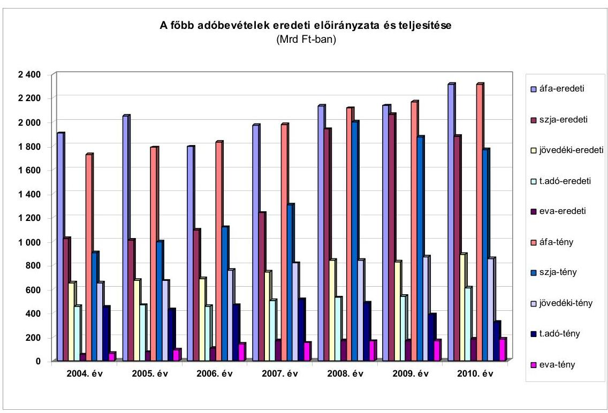

A központi költségvetés 2010. évi adóbevételi előirányzatai tervezetének megalapozottságát (a költségvetési tervező munkát) az ÁSZ teljes körűen nem tudta megítélni. A véleményalkotáshoz szükséges egyes adatok és részletes számítási anyagok hiánya nem tette lehetővé, hogy a tervezett adóbevételek teljesíthetőségét és - néhány kivétellel - ennek kockázatát minősítse. Az ÁSZ a társasági adó, az áfa és a hitelintézeti járadék teljesülésénél jelzett kockázatot. A teljesít-

---

hetőség szempontjából kockázatosnak ítélt adónemek előirányzathoz viszonyított bevétel elmaradása 289,2 Mrd Ft, melynek összegét csak mérsékelte a bányajáradék, a cégautó adó és az egyéb befizetések előirányzatait összesen 68,0 Mrd Ft-tal meghaladó túlteljesítés. A bányajáradékból származó többletbevételt ( $61,9 \mathrm{Mrd}$ Ft) a kőolaj világpiaci árának és a bányajáradék éves átlagos mértékének emelkedése, valamint az MMBF Földgáztároló Zrt. tervezettnél korábbi, ún. sapkagáz kitermelése eredményezte. A tervezettől elmaradt adóbevételeket részben ellensúlyozták az év közben bevezetett különadók (egyes ágazatokat terhelő különadók, pénzügyi szervezetek különadója).

A hátralékállomány - a NAV adatai alapján - a 2010. évben 1989,3 Mrd Ft volt, ami 15,5\%-kal haladta meg a 2009. évi záró kimutatást. A hátralékállomány növekedése az összetétel folyamatos romlásával párosult, mivel az adóhatóság kimutatásai szerint 2009-ben az állomány 70\%-a, 2010-ben már 75,4\%-a a nem múködő adózók köréből származott.

Az adóhátralékok összege az elmúlt években nagymértékben nőtt, a 2007. évi 989,8 Mrd Ft-hoz képest közel megkétszereződött. Az adóhátralékok állománya a 2010. év végén 1890,2 Mrd Ft volt, ami a 2009. évhez képest 15,2\%-kal növekedett.

A hátralékállomány 43,8\%-a az áfa-hoz, 5,4\%-a a személyi jövedelemadóhoz, $3,6 \%$-a a társasági adóhoz kapcsolódik.

Az illeték hátralékállomány 75,1 Mrd Ft volt, ami 7,1\%-kal volt kevesebb a 2009. évi állománynál ( $80,8 \mathrm{Mrd}$ Ft), elsősorban az állományból való törlések összegének növekedése miatt.

Az adóhatóság a rendelkezésére álló valamennyi lehetőséget (a végrehajtási cselekmények számának progresszív növelése, az informatikai rendszerek bővítése és fejlesztése, engedményezések miatti törlések, valamint engedményezésen kívüli eszközök) felhasználta, hogy a hátralékok növekedésének gátat szabjon, de a növekedés ütemét csak mérsékelni tudta.

Az adóhatóság nyilvántartása szerint a túlfizetéses állomány a 2010. évben 756,4 Mrd Ft volt, 3,2\%-kal több mint az előző évben. A túlfizetéses állomány jelentős része ezúttal sem jelent feltétlenül és teljes összegben az adózók felé fennálló fizetési kötelezettséget. Az állomány képződése a 2010. évben is döntően az áfa visszaigénylések kiutalásának következő évre történő áthúzódásából, a befizetett adóelőlegekből, valamint adózói hibából származott.

# A hátralékos és túlfizetéses állományok egyenlegei* 

| Megnevezés | 2007 |  | 2008 |  | 2009 |  | 2010 |  |
| :--: | :--: | :--: | :--: | :--: | :--: | :--: | :--: | :--: |
|  | Mrd   Ft | $\begin{gathered} 2007 / \\ 2006 \end{gathered}$ | Mrd   Ft | $\begin{gathered} 2008 / \\ 2007 \end{gathered}$ | Mrd   Ft | $\begin{gathered} 2009 / \\ 2008 \end{gathered}$ | Mrd   Ft | $\begin{gathered} 2010 / \\ 2009 \end{gathered}$ |
| Hátralékos állomány | 1079,7 | $113,7 \%$ | 1410,4 | $130,6 \%$ | 1722,9 | $122,2 \%$ | 1989,3 | $115,5 \%$ |
| Túlfizetéses állomány | 836,5 | $108,3 \%$ | 766,9 | $91,7 \%$ | 733,3 | $95,6 \%$ | 756,4 | $103,2 \%$ |

[^0]
[^0]:    * a NAV adatszolgáltatása alapján

---

A 2010. évi zárszámadási törvényjavaslatban a központi költségvetés közvetlen bevételeinek teljesítési adatai - az állami vagyonnal kapcsolatos adatok kivételével (az ÁSZ korlátozott minősítést adott) megbízhatóak. Az APEH és a VP (a központi költségvetés bevételeinek $71,8 \%$-t realizálják) a vizsgált bevételek esetében valamennyi lényeges adóztatási, illetékeztetési, vámigazgatási, jövedéki tevékenységet az előírások és a saját belső szabályozásai szerint látta el.

A belső kontrollok a VP-nél megfelelően, az APEH-nél általában ugyan megfelelően múködtek, de egyes esetekben a vizsgálat hiányosságokat tárt fel. Az adótartozások behajthatatlanná nyilvánítása kapcsán a számvevőszéki ellenőrzés által feltárt hiányosságok az adóhatóság ezeken a területeken (pl. a társasági adó, az illetékhátralék, illetve túlfizetés és a fizetési kedvezmények) alkalmazott belső kontrolljainak nem teljes körú múködésével függnek össze.

Az adóhatóság kiválasztó rendszere a főbb adónemeknél (társasági adó, áfa, személyi jövedelemadó) 2537702 db bevallást választott ki kiutalás előtti ellenőrzésre, illetve köztartozás felülvizsgálatra. A kiválasztott bevallások 89,8\%-a a szúrésből kiesett, $8,1 \%$-át a revizor elengedte. A kiválasztott bevallások többi részét ( 47926 db ) vonta az adóhatóság ellenőrzés alá. Az ellenőrzött bevallásokban szereplő visszaigénylés az összes kiválasztott bevallásban bevallott visszaigényelt összeg $28,6 \%$-át tette ki. Ez azt jelenti, hogy 1243 778,0 M Ft kiutalása történt meg ellenőrzés nélkül, amely külön figyelmet igényel. (Részletesen a II. Részletes megállapítások B1. pont 3.2. pont tartalmazza).

A központi költségvetés közvetlen kiadási előirányzatainak teljesítési adatai - az egyéb lakástámogatások és az állami vagyonnal kapcsolatos kiadások kivételével (amelyekre az ÁSZ korlátozott minősítést adott) - megbízhatóak.

Az egyéb lakástámogatásoknál az ÁSZ a 2005. évi zárszámadás ellenőrzése óta minden évben megállapította, hogy az előirányzat terhére - hat hitelintézet esetében - aláírt új szerződés hiányában történt kifizetés. Ez a szabálytalanság a 2009. és a 2010. évben három hitelintézet esetében továbbra is fennállt, a hitelintézetek köre a két évben megegyezett.

A 2009. évhez képest javulás mutatkozott az MNV Zrt. gazdasági-pénzügyi tevékenységének területén a bevételek napi feldolgozottságában. A bevételek pénzügyi teljesítése 2010-ben már általánosan a társaság által előzetesen kibocsátott számlák alapján történt, ami a bevételek jogszabálynak megfelelő azonosítását döntően biztosította. A 2010. évben végrehajtott informatikai fejlesztés eredményeként a bevételi jogcímek beazonosíthatósága, azok megfelelő jogcímen történő elszámolása a 2009. évinél pontosabb volt.

Az állami vagyonnal kapcsolatos nyilvántartás továbbra is az elődszervezetek teljes körűen nem alátámasztott nyilvántartásain alapult, az MNV Zrt. által vezetett vagyonkataszter a 2010. évi közbenső mérleg felvételekor sem felelt meg az Szt. rendelkezéseinek.

---

Az állami vagyonnal kapcsolatos bevételek ( $71,0 \mathrm{Mrd}$ Ft) jelentősen elmaradtak a tervezettől ( $101,4 \mathrm{Mrd}$ Ft). Ennek oka elsősorban a frekvencia használati jogok értékesítését célzó pályázati kiírás elmaradása volt, amely $20,0 \mathrm{Mrd}$ Ft bevételkiesést jelentett. Az értékesítési bevételeken belül a termőföld értékesítés jelentős (mintegy 9,0 Mrd Ft-os) elmaradását okozta az a körülmény is, hogy az NFA (bár a jogszabályi feltételek megvoltak) a termőföldvagyont a 2010. évben teljes körűen nem vette át az MNV Zrt.-től. Ennek oka az - a számvevőszéki ellenőrzés megítélése szerint is -, hogy a szervezet hely, létszám, eszköz és forrás hiánya miatt költségvetési bevételt eredményező gazdasági tevékenységet a 2010. évben nem végezhetett. Az ÁSZ a korábbi évekhez hasonlóan a 2010. évben is úgy ítélte meg, hogy az ingatlan értékesítésből származó bevételek előirányzata és teljesítése nincs összhangban egymással.

Az állami vagyonnal kapcsolatos kiadások az eredeti előirányzatnál ( $81,4 \mathrm{Mrd}$ Ft) 17,2\%-kal, a módosított előirányzathoz ( $92,3 \mathrm{Mrd}$ Ft) viszonyítva 3,3\%-kal teljesültek túl. A tervezettet meghaladó kiadást elsősorban a MALÉV Zrt. tulajdoni részének megszerzése és feltőkésítése miatti, pénzforgalommal nem járó kiadások okozták.

Az elszámolások nem a bevétel, illetve kiadás tartalmának megfelelően történtek összesen 366,5 M Ft összegben. A számvevőszéki ellenőrzés két esetben állapította meg, hogy teljesítés nélküli kifizetések történtek ( $441,6 \mathrm{M} F \mathrm{Ft})$.

A MALÉV Zrt.-vel kapcsolatban 2010-ben 26,0 Mrd Ft-os kifizetés (tőkeemelés) történt.

A nemzetgazdasági elszámolások kiadásai és bevételei teljesítése megbízhatóságának minősítését az 1. sz. melléklet tartalmazza. A minősítésekhez kapcsolódó megállapítások a Jelentésben a II. Részletes megállapításokon belül a 3.1.5. Az állami vagyonnal kapcsolatos bevételek, a 3.2. A központi költségvetés közvetlen bevételei elszámolásának megbízhatósága, a 3.4.5. Az állami vagyonnal kapcsolatos kiadások, valamint a 3.5. A központi költségvetés közvetlen kiadásai elszámolásának megbízhatósága pont alatt találhatóak.

A 2010. évben az államháztartás központi alrendszerének finanszírozási ${ }^{3}$ igénye - a 2010. októberi finanszírozási tervet kivéve - a tervezetthez viszonyítva kedvezőtlenül alakult.

[^0]
[^0]:    ${ }^{3}$ Az éves finanszírozási szükségletet a lejáró adósság megújítási igénye, valamint a központi költségvetés, a TB. alapok és az ELKA mindenkori hiánya határozza meg. Ezen túl a finanszírozási igényt módosíthatja a KESZ egyenlegének és az MNB kiegyenlítési tartalékának változása, az Áht.-ban nevesített megelőlegezési, illetve likviditási hitelek nyújtása, az uniós kifizetésekkel kapcsolatos megelőlegezések és a privatizációs bevételek költségvetést érintő hányada.

---

A 2010. évben a kincstári kör ${ }^{4}$ nettó finanszírozási igénye 871,9 Mrd Ft, a teljes nettó finanszírozási igény ${ }^{5} 966,9$ Mrd Ft volt. A teljes nettó finanszírozási igény összege 34,1 Mrd Ft-tal, a kincstári köré 1,5 Mrd Ft-tal magasabb a 2010. januári finanszírozási tervben szereplő összegnél. Ennek oka, hogy a központi költségvetés hiánya 1,7 Mrd Ft-tal, a társadalombiztosítás hiánya 26,2 Mrd Ft-tal, míg az elkülönített állami pénzalapok egyenlege 26,5 Mrd Ft-tal haladta meg a 2010. januári finanszírozási tervben szereplő összeget.

Az államháztartás központi alrendszerének többlet forrásszükségletét 513,3 Mrd Ft összegű teljes nettó kibocsátás ${ }^{6}$, az IMF/EB hitelből képzett devizabetétből 324,4 Mrd Ft összegben történt felhasználás (új lehívásra nem került sor) és 109,3 Mrd Ft összegű mark-to-market betétfelhasználás biztosította.

A központi költségvetés, a társadalombiztosítás pénzügyi alapjai és az elkülönített állami pénzalapok finanszírozása 2010-ben biztosított volt.

A központi költségvetés bruttó adóssága a 2010. év végén 20041,0 Mrd Ft volt, amely 2,7\%-kal haladja meg a tervezettet (19 509,5 Mrd Ft) és 5,7\%-kal a 2009. évit.

Az előző évhez viszonyítottan a növekedési ütem 2005-ben 10,1\%, 2006-ban 15,2\%, 2007-ben 6\%, 2008-ban 16,2\%, 2009-ben 4,8\%, 2010-ben 5,7\%.
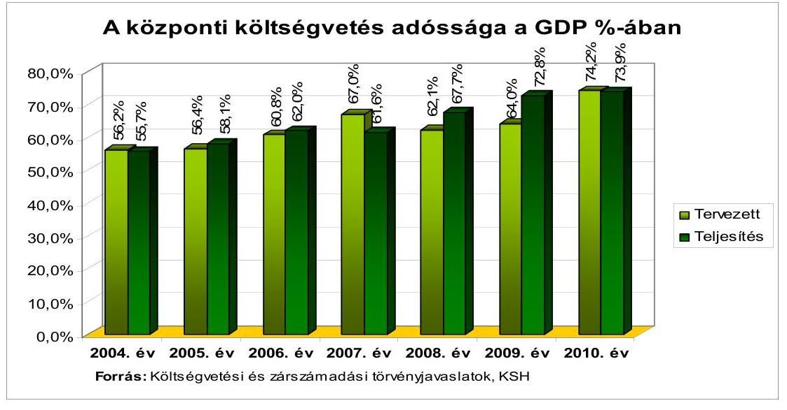

A 2010. évi bruttó adósságállomány a GDP arányában 73,9\%-ot tett ki, amely $1,1 \%$-ponttal magasabb az előző évinél.

[^0]
[^0]:    ${ }^{4}$ A központi költségvetésnek, a TB. pénzügyi alapjai és az ELKA egyenlegei együttesen.
    ${ }^{5}$ A központi költségvetés hiánya, a TB pénzügyi alapjainak finanszírozási szükséglete, az elkülönített állami pénzalapok finanszírozási szükséglete, az MNB tartalékfeltöltésének, valamint az európai uniós mezőgazdasági támogatások előfinanszírozása és viszszatérítése egyenlegének összege, amely nem tartalmazza az adósságátvállalásokat.
    ${ }^{6}$ A forint és deviza kibocsátások, hitelfelvételek és törlesztések, illetve a deviza betét műveletek egyenlegei összesen.

---

Az elmúlt évi növekedést a 2010-ben bekövetkezett kedvező piaci kereslet miatt megemelt nettó kibocsátás, a forint leértékelődése és a swap ügyletek ${ }^{7}$ után az ÁKK Zrt.-nél elhelyezett mark-to-market betétállomány megemelkedése okozta. A központi költségvetés bruttó adósságát növelte a devizaárfolyam 2,5\%-os, $272,1 \mathrm{Ft} /$ euróról ${ }^{8} 278,8 \mathrm{Ft} /$ euróra ${ }^{9}$ emelkedése is.

Az adósságállomány összetétele alig változott az egy évvel korábbihoz viszonyítva, a devizában fennálló adósság aránya $44,1 \%$-ot tett ki. A központi költségvetés devizában fennálló adósságállománya a 2010. év végén 9062,8 Mrd Ft, a forintban fennálló 10978,2 Mrd Ft volt, ami 6,8\%-kal, illetve $4,8 \%$-kal magasabb a 2009. év végi állománynál.

Az adósságállomány növekedéséhez 2010-ben kis mértékben ugyan, de hozzájárult az EMGA támogatások KESZ-ről történt megelőlegezéseinek -49,5 Mrd Ft összegű egyenlege.

A költségvetési szervek finanszírozási helyzetét a 2010. év egészében is magas, jelentősen növekvő tartozásállomány jellemezte. A magas öszszegek ellenére az adósság átmeneti, likviditási jellegűnek tekinthető.

A tartozások éves záróállománya 2010-ben 41,1 Mrd Ft volt, amely az előző évhez képest 11,3 Mrd Ft-tal emelkedett. Az éves átlagos állomány (28,3 Mrd Ft) $50 \%$-kal nőtt.

A minősített (az eredeti költségvetési előirányzat 3,5\%-át, illetve 50,0 M Ft-ot meghaladó) tartozás átlagos mértéke 6,6 Mrd Ft volt, amely 4,4 Mrd Ft-tal magasabb az előző évinél. A minősített adósság év végi állománya 12,4 Mrd Ft volt, amely a 2009. évi záró állomány 3,2-szerese.

A minősített tartozás 2/3-a mindössze három intézménynél koncentrálódik, a Honvéd Körház - Állami Egészségügyi Központnál (3,1 Mrd Ft), a KEKKH-nál (2,0 Mrd Ft) és a Pécsi Tudományegyetemnél (3,1 Mrd Ft).

A tartozásállomány adósság-nemenkénti megoszlása jelentősen nem változott. A mennyiségében és arányában továbbra is meghatározó mértékű egyéb szállítói tartozás mellett a korábban megtett intézkedések, illetve az Adóhivatallal közös tartozásfigyelő rendszer múködésének hatására, és a Kincstár (új köztartozás keletkezését megakadályozó) nettó finanszírozási rendjének bevezetésével az intézmények adó- és járuléktartozása lényegében felszámolásra került.

Az állam által vállalt kezesség és viszontgarancia érvényesítésének 2010. évi előirányzata (20 379,0 M Ft), 64,6\%-kal túlteljesült.

Egy esetben (3628,8 M Ft) az EXIMBANK Zrt. és a MEHIB Zrt. az állami kezességgel érintett hitel kihelyezése, illetve a hitel biztosítása során az

[^0]
[^0]:    ${ }^{7}$ Az ÁKK Zrt. a devizaadósság kockázatainak kezelése céljából fedezeti (swap) ügyleteket köt.
    ${ }^{8}$ A 2010. évi költségvetés tervezésekor prognosztizált árfolyam.
    ${ }^{9}$ 2010. december 31-ei devizaárfolyam. Forrás: MNB

---

ügylet jóváhagyásakor a kockázatokat nem megfelelő súlyozással értékelte. Megítélésünk szerint a feltárt kockázatokat gondosabban kellett volna mérlegelniük. Az üggyel kapcsolatos kezességbeváltások - hitelszerződés szerinti - várható összege a 2016. évig mintegy évi 3,0 Mrd Ft, öszszességében 20,0 Mrd Ft, ami a központi költségvetést terheli, a megtérülések összege várhatóan a beváltások nettó jelenértékének 40,7\%-a.

A számvevőszéki ellenőrzés eredményeként mind az EXIMBANK Zrt., mind a MEHIB Zrt. felülvizsgálta és módosította a vonatkozó eljárásrendet.

Egy PM rendelet alapján a MEHIB Zrt. és az EXIMBANK Zrt. kezességbeváltásainál az utalványozási feladatot - az ügylet tartalmi vizsgálata nélkül - a PM/NGM látja el. A tartalmi vizsgálat nélküli utalványozás kockázatot hordoz.

Az APEH-nál a 2010. évben is érvényben volt az az eljárási rend, amelyet az ÁSZ már több évvel ezelőtt kifogásolt. A 2008. évi költségvetési törvény végrehajtásának helyszíni ellenőrzéséről szóló 0928. számú számvevőszéki jelentés megállapította, hogy a különböző lakáshitelekhez (köztisztviselők és hivatásos állomány, „fészekrakó") kapcsolódó kezességbeváltások során az adósok határozatban való kötelezésének eljárása az APEH-on belül - azon ügyek esetében, ahol a hitelfelvevők egyúttal egyetemleges adóstársak - nem volt egységes, és az esetek nagy hányadánál nem az előirásoknak megfelelően történt, így nem volt jogszerű és szabályszerű.

A számvevőszéki ellenőrzés megállapítását és figyelemfelhívását követően az APEH két és fél évig, így 2010-ben is, folytatta a jogszerűtlen eljárást. Az egységes eljárást biztosító APEH adóügyi főosztályi körlevél csak 2010. november 12-én került kiadásra, az APEH illetékes elnökhelyettese 2010. december 6-án adta ki a vonatkozó eljárási rendet. A vonatkozó APEH Elnöki utasítás, illetve annak tervezete nem állt a számvevőszéki ellenőrzés rendelkezésére.

Az APEH-tól 2009 júniusában kapott írásbeli tájékoztatás szerint: „Az eltérő igazgatósági gyakorlat egységesitését szolgáló informatikai rendszer jelenleg kialakítás alatt áll." Elkészüléséig, az átmeneti időszakra vonatkozóan az eljárási rend kidolgozása már a vizsgálat megkezdésekor is folyamatban volt.

A központi költségvetés tartalékainak (általános tartalék, céltartalék, stabilitási tartalék) 2010. évi eredeti törvényi előirányzata összesen 188,9 Mrd Ft volt, amely az általános tartalék előirányzatának évközi két törvényi változtatását követően, összesen 285,1 Mrd Ft-ra módosult. Az év során 150,5 Mrd Ft-ot csoportosítottak át a fejezetekhez, amelyből 0,6 Mrd Ft visszarendezésre került 2010-ben. Ezt figyelembe véve a tartalékok felhasználása öszszesen 149,9 Mrd Ft (52,6\%), míg az év végi maradvány 135,2 Mrd Ft volt.

Az elmúlt évek ellenőrzési tapasztalataival egyezően az általános tartalék előirányzatának átcsoportosítása több esetben (az éves szinten átcsoportosított 118,4 Mrd Ft-os előirányzat 26\%-át kitevő összegben) nem volt indokolt, az igénylés nem felelt meg az Áht.-ban előírtaknak. A fejezetek többletforrás igénye egyes feladatok esetében nem minősült előre nem valószínűsít-

---

hetőnek, nem tervezhetőnek, illetve előirányzott, de elháríthatatlan ok miatt elmaradó bevétel miatt pótolandónak.

Az éves előirányzat 153,5 Mrd Ft-os összegének 21,1\%-át kitevő 32,4 Mrd Ft-os átcsoportosításra 2010 decemberének második felében (15-e és 27-e között) került sor.

A céltartalékok 33,0 Mrd Ft-os előirányzatából 32,0 Mrd Ft-ot csoportosítottak át a Kvtv. 6. §-ában meghatározott különféle kifizetések fedezeteként, amelyből az elszámolási és visszatérítési kötelezettség alapján év közben 0,6 Mrd Ft visszarendezésre került. Így az előirányzat teljesülése 31,4 Mrd Ft, az év végi maradvány 1,6 Mrd Ft volt, mivel a Kvtv. hét jogcíméből kettő esetében nem történt felhasználás.

A Kvtv. stabilitási tartalék címén 98,6 Mrd Ft előirányzatot tartalmazott, amelyet nem használtak fel. Az év végi maradvány az előirányzat összegével megegyezik.

Az ÁSZ által - a korábbi ellenőrzések során - tapasztalt hiányosságokkal kapcsolatban egyes javaslatokra megtörténtek az intézkedések. Voltak azonban olyan több éve jelentkező problémák, amelyek a 2010. évben is változatlanul fennálltak.

Az állami vagyonnal kapcsolatos bevételek és kiadások 2010. évi teljesítési adatainak egy része - a korábbi évekhez hasonlóan - továbbra sem volt összhangban az előirányzattal. Az állami vagyon valós, teljes körű számbavételének érdekében előrelépés az elmúlt években nem történt. Az MNV Zrt. 2010ben is - a 2009. évihez hasonlóan - úgy látta el a rábízott állami vagyonnal kapcsolatos feladatait, hogy nem rendelkezett a valós állami vagyont tételes leltárral alátámasztó, az állami részesedéseket aktualizált értéken tartalmazó szabályos, pontos és teljes körű nyilvántartással. A javaslatokra történt intézkedési tervek határideje több esetben meghaladja a helyszíni ellenőrzés időszakát, így azok értékelésére nem kerülhetett sor.

A Magyar Állam tulajdonába került ingatlanok hasznosításával (a Nemzeti Lóverseny Kft. Dunakeszi-Alag ingatlanát érintő adásvételi ügylet) kapcsolatos jogi helyzetet rendezték. Az ingatlankezelési, őrzési szolgáltatások biztosítására kiírt pályáztatás körülményeinek, illetve a HM EI Zrt.-vel megkötött szerződésnek a felülvizsgálata azonban nem történt meg.

A kárpótlási jegyek életjáradékra váltásáról szóló tv. és az Áht. összhangjának megteremtésére a 2010. évben sem történt intézkedés. Az MNV Zrt. észrevételében jelezte, hogy a „jogszabályi összhang megteremtése érdekében az MNV Zrt. lépéseket kezdeményezett".

A számvevőszéki ellenőrzés javasolta a kockázatot jelentő, manuálisan végzendő feladatok elektronikus úton való kiváltását a VP-nél. Ennek megoldására intézkedési terv készült, azonban határideje több esetben túlmutat a helyszíni ellenőrzés időszakán, így azokat nem tudtuk értékelni.

---

Az intézkedési terv további (a kintlévőségek csökkentése, az elévült tartozások törlése, valamint a behajthatatlan tartozások egységes értelmezése) megvalósítása érdekében kiadott iránymutatásokban, utasításokban megfogalmazott intézkedések eredményei nem tükröződnek a folyószámlán a 2010. december 31-én kimutatott adatokban.

A VP informatikai biztonság felügyeleti ellenőrzésének rendszere a 2009. évi zárszámadási ellenőrzés megállapításai alapján kiegészült a kockázatelemzési módszertannal. Az elektronikus úton benyújtott jövedéki adóbevallásokkal kapcsolatban tett javaslatokat a 2011. évben a vámhatóság által múködtetett adóbevallás feldolgozó informatikai rendszerbe beépítették.

Az ÁSZ javaslatára az NGM elkészítette intézkedési tervét, amelyben rögzítette, hogy a Magyar Állam külföldi követeléseinek elengedésével járó jövőbeni kormányközi megállapodások kidolgozása és hazai végrehajtása során az ÁSZ ajánlásait figyelembe veszik.

A Garantiqa Hitelgarancia Zrt. a garanciaportfolióját - az ÁSZ javaslata alapján - áttekintette, a saját kockázatra vállalt kezességeket 2010-ben megszüntette. A társaság által tervezett további intézkedések - jellegükből adódóan - folyamatos feladatot jelentenek.

Az általános, cél- és stabilitási tartalék előirányzatának képzésével és módosításával, az igénylések megalapozottságával, az átcsoportosított előirányzatok elszámolásával és visszatérítési kötelezettségével, a költségvetési előirányzatok módosításának nyilvántartási rendje éves aktualizálási időpontjával összefüggésben tett megállapítások, illetve javaslatok kapcsán intézkedés nem történt.

A K-600 hírrendszer fejlesztése keretében a 2007. évben beszerzett eszközök továbbra sem jelennek meg egyetlen szervezet mérlegében sem, annak ellenére, hogy az ÁSZ a 2007. évi zárszámadás ellenőrzése óta folyamatosan jelzi a rendezés szükségességét.

A 2010. évben sem valósult meg, hogy a lakástámogatások folyósításában érintett hitelintézetek teljes köre rendelkezzen olyan aláírt új szerződéssel, amely megfelel a 12/2001. (I. 31.) és a 134/2009. (VI. 23.) Korm. rendeletekben foglaltaknak. Az ÁSZ - lakástámogatásokra vonatkozó - további javaslatainak realizálása megtörtént.

Az APEH elnökének tett javaslatok - a támogatások gyakorított igénybevétele és az egyszeri támogatási előleg engedélyezésénél követendő eljárás tekintetében - megvalósítása a NAV elnöke által kiadott eljárási rendben megtörtént.

Az „egyéb" elengedési ok-kód alkalmazásával kapcsolatos ÁSZ megállapítás alapján az APEH 2010-ben módosította az eljárásrendet. Ennek megfelelően a 2010. évi vizsgálatoknál már a módosított eljárási rendet alkalmazta és csökkent az „egyéb" jogcímen történt elengedés a 2009. évihez képest.

A Kincstár szervezetében - az előző évekhez hasonlóan - az informatikai rendszerek belső ellenőrzése 2010-ben továbbra is megoldatlan volt. A szervezet továbbra sem rendelkezett az alapvető fontosságú informatikai szabályozásokkal.

---

# 3. A KÖLTSÉGVETÉSI FEJEZETEK 

A 2010. évben a Kormány irányítása alá tartozó fejezetek többségének múködését, gazdálkodását jelentős mértékben befolyásolta a kormányzati struktúraváltás. Az új struktúra célja az egyszerűsítés, a minisztériumok számának csökkentése és ennek következményeként az olcsóbb államigazgatás kialakítása volt. A korábbi 13 minisztérium helyett 8 minisztériumot hoztak létre, a szervezetek számának csökkentése az ellátandó feladatok körét nem szűkítette.

A törvény meghatározta a korábbi struktúra átalakításának alapjait, kijelölte a minisztériumok jogutódait, valamint döntött egyes feladatok minisztériumok közötti átcsoportosításáról, továbbá rendelkezett az átadás-átvételek (jogelődjogutód) lebonyolításának és dokumentálásának rendjéről is.

A törvény részletesen meghatározta a miniszteri szintű, valamint az információtechnológiai rendszerek átadás-átvételi jegyzőkönyveinek tartalmát, és azok dokumentálásának követelményeit. A jegyzőkönyvek mellékletét képezték az intézményi és egyéb igazgatási jellegű szervezetek átadásai is.

A miniszteri szintű átadások-átvételek jegyzőkönyveit az előírt formában és tartalommal, határidőre elkészítették, amelyhez csatolták az átadók teljességi nyilatkozatát.

A központi államigazgatási szervek, költségvetési szervek, gazdasági társaságok, alapítványok átadás-átvételi eljárása teljes körűen nem a 2/2010. (VI. 8.) KIM rendeletben foglaltaknak megfelelően történt.

Az ellenőrzés az eljárásban formai hiányosságokat, valamint a jegyzőkönyv előírtakhoz viszonyított - szűkebb információtartalmát állapította meg.

Az új minisztériumi struktúrának megfelelően a feladatok átrendezése - amelyet a 212/2010. (VII. 1.) Korm. rendelet tartalmazott - az előirányzatok mellett a minisztériumok szakmai szervezetei, és a feladatellátást biztosító eszközök átadás-átvételét is szükségessé tette.

A szervezetek átrendezése megtörtént, azonban annak végrehajtásában problémákat tapasztaltunk a személyi juttatások megállapítása, az eszközök átadásátvétele, a dokumentációk fellelhetősége tekintetében.

A törvény végrehajtásáról több kormányhatározat rendelkezett. Az előirányzatok új struktúrának megfelelő átrendezését a Kincstár - a tárcák esetenként késedelmes adatszolgáltatásai alapján - megfelelően hajtotta végre. A további feladatmegosztásról szóló kormányhatározatok alapján az érintett minisztériumok a megállapodásokat a 2010. évben nem teljes körűen kötötték meg, illetve nem határidőben hajtották végre.

A struktúraváltozással érintett minisztériumoknak, szervezeteknek el kellett készíteni az új alapító okirataikat, SzMSz-eiket, valamint gondoskodniuk kellett a törzskönyvi bejegyzésekről.

A minisztériumok eleget tettek az alapító okirat készítési kötelezettségüknek, az átmeneti időszakra ideiglenes SzMSz-t adtak ki, amellyel egy időben hatályban

---

tartották a jogelődök szabályzatait is. Az év végéig kiadták az új SzMSz-eket, amelyek ellenőrzése - a VM és a NEFMI esetében - hiányosságokat tárt fel. Az ügyrendek és a munkaköri leírások aktualizálása teljes körűen nem valósult meg.

Az intézményi és a fejezeti kezelésű előirányzatokkal való gazdálkodáshoz szükséges szabályzatokat jellemzően 2010. II. félévében adták ki. A fejezeti kezelésű előirányzatokra vonatkozóan a jogelődök eljárásrendjeit alkalmazták.

A beszámolók pénzügyi (szabályszerűségi) ellenőrzése során tett megállapításaink azt mutatják, hogy a struktúraváltás, és annak hatásai is befolyásolták a beszámolók megbízhatóságát. A minősített véleménnyel ellátott beszámolókban a feltárt hibák egy része a szerkezetváltással összefüggő szabályozási, nyilvántartási, számviteli hiányosságokra is visszavezethetők.

Az alkotmányos és egyintézményes fejezeteket, a fejezeti jogosítványú költségvetési szerveket, valamint a KSH-t és az MTA-t nem érintette a kormányzati átalakítás. Ezeknek a szervezeteknek a felépítése, feladatai alapvetően nem változtak, változatlan szabályozási környezetben gazdálkodtak, tevékenységüket nem nehezítették a változáshoz kapcsolódó többletfeladatok és az azokkal járó átmeneti nehézségek.

Míg a változatlan formában múködő szervezetek beszámolói között az előző évivel közel azonos arányban voltak a megbízhatónak minősítettek, addig a szerkezeti változással érintett szervezetek esetében a megbízhatónak minősítettek aránya ( $75 \%$-ról $66 \%$-ra) csökkent. A korlátozott és az elutasított beszámolók aránya a szerkezeti változással érintett szervezeteknél nőtt ( $19 \%$-ról $26 \%$-ra, illetve $6 \%$ ról $8 \%$-ra), a változatlan formában múködőknél arányuk nem változott.

Elfogadó véleménnyel láttuk el az OGY 1-4. címe, a KE, az ALB, az OBH, az MKÜ, a KIM, az ME, a BM, az NGM, a KSH és az MTA fejezetek igazgatás címei és fejezeti kezelésű előirányzatai, az NFM fejezet igazgatási címe, a BIR és a KüM fejezetek fejezeti kezelésű előirányzatai, az ABTL, a KT, a KTT, a PSZÁF, az MSZH, a KEHI, az OAH és a MEH intézmények 2010. évi beszámolóit.

Az ellenőrzés során feltárt - a beszámoló megbízhatóságát nem befolyásoló - hiányosságok miatt az elfogadó véleményünket figyelemfelhívó megjegyzéssel láttuk el az OBH, az MKÜ fejezeteknél, a KIM, a BM és az NGM fejezetek igazgatás címei és fejezeti kezelésű előirányzatai beszámolóinál, az NFM fejezet igazgatási címénél, az ABTL, a KT, a PSZÁF, és a MEH intézményeknél, valamint a KüM és az MTA fejezetek fejezeti kezelésű előirányzatainál.

Az ÁSZ beszámolóját a külső könyvvizsgáló elfogadó minősítéssel látta el.
Korlátozott minősítéssel láttuk el a beszámolókat egyes előirányzatokra, illetve mérlegsorokra vonatkozóan a BIR fejezet Bíróságok cím, a GVH fejezet, a KüM igazgatás cím, a HM, az UF és a NEFMI fejezet igazgatása és fejezeti kezelésű előirányzata, valamint az NFM fejezeti kezelésű előirányzatai esetében.

Elutasító minősítéssel láttuk el a VM fejezet igazgatás cím és a fejezeti kezelésű előirányzatokról készült 2010. évi költségvetési beszámolóit.

---

A helyszíni ellenőrzésünk során az ellenőrzött szervezetek múködésének, gazdálkodásának egyes területein az előző évhez viszonyítva pozitív irányú változást, más területeken stagnálást tapasztaltunk. A kormányzati struktúraváltozáshoz kapcsolódóan azonban a problémák megismétlődése mellett újabb, korábban nem észlelt hibák is felmerültek. (A részletes megállapításokat az 5.7. pont tartalmazza.)

A költségvetési fejezetek, igazgatási címek és fejezeti kezelésű előirányzatok pénzügyi (szabályszerúségi) ellenőrzéseinek minősítéseit a 2. sz. melléklet, a beszámolókkal kapcsolatos részletes megállapításokat, véleményeket a II. Részletes megállapítások 5.6. pontja, valamint a Függelék tartalmazza.

# 4. Az EurÓPai Uniótól SzÁrmazó forRÁsOK felHASZNÁlása 

Magyarország - bár hozzájárulása az EU költségvetéséhez évről-évre növekedést mutat - 2010-ben is nagyobb összegű uniós támogatásban részesült, mint amekkora összeggel hozzájárult az unió közös költségvetéséhez. 2010-ben az EU-tól származó, a költségvetésben megjelenő és az ún. „költségvetésen kívüli tételek" együttes 1102,4 Mrd Ft-os összege közel ötszörösen meghaladta a teljesített hazai befizetési kötelezettség 230,2 Mrd Ft-os összegét.
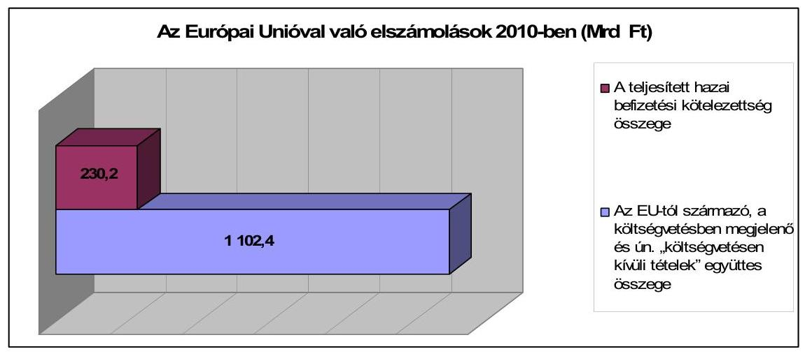

A költségvetésben megjelenő - az EU támogatások utólagos megtérülése nélküli - EU forrás $26,7 \%$-kal ( $171506,8 \mathrm{M}$ Ft-tal), míg a központi költségvetésben megjelenő hazai társfinanszírozás 20,6\%-kal ( $38678,8 \mathrm{M}$ Ft-tal) haladta meg a tervezettet. Utóbbi tényező kockázatot jelent a költségvetés teljesítése szempontjából, mivel hiánynövelő hatása van. Az EU-tól származó bevétel és a hazai költségvetésből történő kiadás túlteljesítésének együttes hatása miatt az EU forrásokat is tartalmazó előirányzatok teljesülése összesen 23,7\%-kal (198 000,3 M Ft-tal) haladta meg a tervezettet. Az ún. „költségvetésen kívüli" agrártámogatásokból a közvetlen termelői támogatások 247 412,0 M Ft-ot, míg az agrárpiaci támogatások 49 748,7 M Ft-ot képviseltek.

---

A 2004-2006-os tervezési periódusban a strukturális alapokból finanszírozott operatív programok zárásának határidejét az irányító hatóságok és a közreműködő szervezetek - néhány kivételtől eltekintve - betartották, és valamennyi operatív programról készített zárójelentést az EU Bizottság felé határidőben benyújtották.

A Kohéziós Alapból finanszírozott 43 projekt közül 2010-ben csak hét záró pénzügyi beszámolóját nyújtották be az EU-hoz, nyolc projekt zárása a 20112012. évre húzódik át. A többi 28 projekt esetén a fizikai zárás megtörtént, de a záró pénzügyi beszámoló nem készült el az előírt határidőre.

Az ÚMFT operatív programjainak 2007-2010. évek közötti kumulált kiadása (az uniós és hazai forrásokat tekintve) 1354465,9 M Ft volt, ebből a 2010. évi kiadás $724116,4^{10} \mathrm{M}$ Ft. A 2010. évi és az azt megelőző évek kifizetéseiből legnagyobb arányt a KöZOP, a TÁMOP és a GOP képvisel. Az ÚMFT végrehajtása a 2007-2013. évek keretösszegének tükrében jelentősen elmarad az időarányostól.

A szerződéssel lekötött támogatási összeg - a KMOP, a TIOP és a KöZOP kivételével - 60\% alatt maradt. A KEOP és a VOP esetében a kifizetések teljesítése a teljes keret $5 \%-a$, illetve $26 \%$-a, a többi OP-nál pedig ez az arány $20 \%$-os volt. Az EU által jóváhagyott és átutalt időközi összegek - a VOP kivételével (27\%) valamennyi operatív program esetében a keret $20 \%$-a alatt maradtak.

Az OP-k esetében - a kormányok és az NFÜ elnökeinek hatáskörében végrehajtott átmeneti intézkedés hatására - kimutatható a késedelem a pályázatok meghirdetésében, a kötelezettségvállalások teljesítésében. Például a GOP vonatkozásában a 2010. év első félévében hét pályázat beadását felfüggesztették, a 2010. év második félévében a GOP akcióterve módosult, pályázatok visszavonására, illetve a konstrukció törlésére is sor került.

A kormányzati struktúraváltást követően az Új Széchenyi Terv előkészítésével kapcsolatban új pályázatok elindítása, illetve az OP-kon belül a források átstrukturálása érdekében harminckét ÚMFT projektet töröltek az akciótervekből. A fenti döntésekkel összefüggő intézkedéseket, így a kötelezettségvállalások rendezését, a támogatások visszakövetelésének módját, a kedvezményezett visszafizetéseinek alakulását a nyilvántartás hiányosságai miatt nem tudtuk nyomon követni.

A támogatási folyamatok egyes fázisainak határidőit az IH-k és a KSz-ek nem tartották be maradéktalanul, így a támogatások kifizetése és felhasználása késedelmet szenvedhet. A pályázatok benyújtása és a támogatási döntés meghozatala között előírt 75 napos határidőt az ellenőrzött projektek csaknem felénél túllépték (GOP, KEOP, RFOP), a kétfordulós pályázatok közül az RFOP esetében a két forduló között közel egy év telt el.

[^0]
[^0]:    ${ }^{10}$ Az NGM észrevételében jelezte, hogy számításai szerint a 2010. évi kiadás-teljesítés összege 729 080,1 M Ft.

---

Az ellenőrzött tételek esetében a támogatási döntés és a szerződéskötés között eltelt idő (35-194 nap) indokolatlanul hosszú volt. A forráslehívás jóváhagyása és a kifizetések indítása között az előírt jogszabályi határidőt a GOP esetében betartották, azonban a KEOP vonatkozásában az előírt határidő egy esetben sem teljesült.

Az agrártámogatások és hazai társfinanszírozások forrásszükséglete a 2010. évben biztosított volt. Az MVH-nál lévő átmenetileg szabad pénzeszközök kezelése, illetve annak intézményi hasznosítása szabályozatlan.

Az UF fejezet fejezeti kezelésű előirányzatainak 2010. évi felhasználásáról operatív programonként/törvényi soronként készült 31 rész-beszámolóból tizenháromról elfogadó véleményt kapott, amelyből nyolc rész-beszámolót figyelemfelhívó megjegyzéssel, tizenegy rész-beszámolót korlátozott véleménnyel láttunk el (KA környezetvédelmi projektek, KöZOP, TÁMOP, TIOP, KEOP, KDOP, ÉAOP, KMOP, ETE, EGT, Norvég Alap támogatásából megvalósuló projektek, HEFOP) hét rész-beszámoló esetében pedig lényeges szintű hibát állapítottunk meg, ezért az ÁROP, EKOP, NYDOP, DDOP, DAOP, ÉMOP, Svájci Alap támogatásából megvalósuló projektek esetében a rész-beszámolókat elutasító véleménnyel láttuk el.

A korlátozott véleményt, illetve az elutasító véleményt eredményező hibák értéke összesen 16 410,9 M Ft. A feltárt hibák aránya az UF fejezet fejezeti kezelésű előirányzatairól készített összesített beszámoló 875 892,3 M Ft-os kiadási főösszegének 1,87\%-a, amely alapján az UF fejezet fejezeti kezelésű előirányzatairól készített összesített beszámolóról korlátozott véleményt adtunk.

A feltárt hibák jelentős részét, 88,9\%-át a mérlegek ellenőrzése során tártuk fel. A feltárt hibák kihatással voltak a mérleg valódiságára, adattartalmának pontosságára, továbbá a következő évi pénzforgalmi elszámolásokra is hatást gyakorolnak. A mérlegek egyes sorainak valódiságára, tartalmi megfelelőségére vonatkozó összesen 14584,2 M Ft összegű hiba az UF fejezet fejezeti kezelésű előirányzatairól készített összesített beszámoló 530 193,5 M Ft-os mérlegfőösszegének 2,75\%-át teszi ki. A feltárt hibák a zárlati feladatoknál a munkafolyamatba épített ellenőrzések hiányosságai mellett, a számvitelt támogató informatikai (EMIR SA, EMIR ÚMFT, IMIR, IMIR2, Forrás SQL) rendszerekkel kapcsolatos belső kontrollok működésének hiányosságaira, illetve az ÚMFT OP-k esetében az EMIR követeléskezelési modulja elindításának csúszására vezethetők vissza.

Ellenőrzésünk során az uniós támogatások kezelésének egész folyamatát érintően tett megállapításaink rámutatnak az irányítási és ellenőrzési rendszer hiányosságaira is. A kiadási tételek pénzforgalmi ellenőrzése során megállapítottuk, hogy az IH-k és KSz-ek által végzett első szintű ellenőrzések néhány kivételtől eltekintve alapvetően megfelelően működtek. Hiányosságokat a kifizetések előtti helyszíni ellenőrzések területén a szabályozás és az ellenőrzések lebonyolítása tekintetében tártunk fel.

A Kincstár 2010-ben a tervezett 5500 nappal szemben 3931 szakértői napot fordított az uniós támogatásokkal kapcsolatos ellenőrzésekre. A Kincstár által végzett ellenőrzések tapasztalatai alapján a szabálytalanság kezelési határidő-

---

ket gyakran nem tartották be, a szabálytalansági döntések dokumentáltsága több esetben nem volt kielégítő. Gyakran nem készült el, illetve nem határidőre készült el a minőségbiztosítási jelentés.

A 2010. évi kormányzati struktúraváltást követően a NAO Irodát (KH-t/IgH-t) több szervezeti változás is érintette.

Az uniós támogatások ellenőrzési rendszerében a belső ellenőrzés is több szinten történik. Az NFÜ BEF szabályozottsága megfelelő, tevékenysége a jogszabályi előírásokkal összhangban folyik, azonban az EU-s források felhasználásának ellenőrzéséhez - különös tekintettel arra, hogy feladatai nem csak erre, hanem egyéb, pl. nyilvántartási, adatszolgáltatási, kockázatkezelési stb. feladatokra is kiterjednek - rendelt erőforrásai korlátozottak, amelyet a külső ellenőri kapacitás enyhíthet.

Az agrár- és vidékfejlesztési támogatások esetében a külső ellenőrzést végző igazoló szerv a 2010. pénzügyi évről kiadott tanúsítványában megállapította, hogy az EU Bizottságnak küldendő EMGA, EMVA beszámolók megfelelők, teljes körűek és pontosak, valamint hogy a belső ellenőrzési eljárások kielégítően működtek.

# 5. AZ ELKÜLÖNÍTETT ÁLLAMI PÉNZALAPOK ÉS A TÁRSADALOMBIZTOSÍTÁS PÉNZÜGYI ALAPJAI 

Az elkülönített állami pénzalapok és a társadalombiztosítás pénzügyi alapjai (alapok) - a korábbi évekhez hasonlóan - az állami költségvetés önálló fejezetét, de 2010. január 1-jétől a központi alrendszer részét képezték. Ezért az alapok APEH/NAV által beszedett bevételek adatainak együttes tárgyalására, az ellenőrzés során alkalmazott közös módszertanra alapozva - a fejezetek ellenőrzéséhez hasonlóan - tematikus feldolgozást alakítottunk ki az alapok ellenőrzésénél is.

Az elkülönített állami pénzalapok (ELKA) közé a Kvtv. a 2010. évben hat alapot a Munkaerőpiaci Alap (MPA), a Szülőföld Alap (SZA), a Központi Nukleáris Pénzügyi Alap (KNPA), a Nemzeti Kulturális Alap (NKA), a Wesselényi Miklós Ár- és Belvízvédelmi Kártalanítási Alap (WMA), valamint a Kutatási és Technológiai Innovációs Alap (KTIA) - sorolt.

A társadalombiztosítás pénzügyi alapjaihoz (TB. Alapok) két alap - a Nyugdíjbiztosítási (Ny. Alap) és az Egészségbiztosítási Alap (E. Alap) - tartozott.

Az alapok 2010. évi bevételei összesen 4707 287,0 M Ft-ban, és kiadásai 4742 841,3 M Ft-ban, összevont hiánya -35 554,3 M Ft-ban teljesült. Az alapok 2010. évi kiadásai a központi alrendszer kiadásainak együttesen 33\%-át $(2 \%+31 \%)$ képezik a következő ábra szerinti megoszlásban:

---

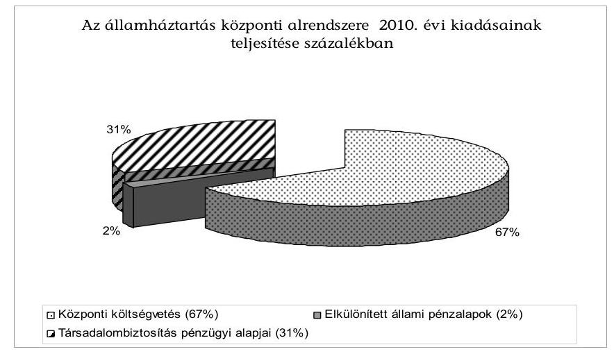

Az alapok pénzügyi egyensúlyát tekintve az ELKA egyenlege (59 831,9 M Ft) javította az államháztartás pénzügyi helyzetét. Az ELKA finanszírozása a 2010. évben is kiegyensúlyozott volt, gazdálkodásuk a tervezetthez képest - a WMA kivételével ${ }^{11}$ - nagyobb megtakarítást eredményezett.

A TB. Alapok összevont hiánya (- 95 386,2 M Ft) rontotta az államháztartás pénzügyi egyensúlyát. A TB. Alapok közül az Ny. Alap 2010. évi hiánya ( $-3687,2 \mathrm{M} \mathrm{Ft}$ ) a tervezettet meghaladta, de a kiadásainak volumenéhez viszonyítva minimálisnak (a kiadásainak $0,1 \%$-a) volt mondható, míg az E. Alap hiánya a tervezett 69 408,3 M Ft-os deficitet (22 290,7 M Ft-tal) meghaladta és 91 699,0 M Ft-ban teljesült.

A TB. Alapok hiányának alakulását a következő ábra szemlélteti:
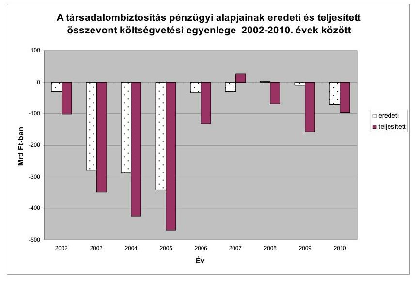

[^0]
[^0]:    ${ }^{11}$ A 2010. évi árvizek következtében a kártalanításra fordított összeg a WMA eddigi múködése során a legmagasabb, 74,2 M Ft-os összeget tett ki. A kártalanítási igények teljesítésére $6,4 \mathrm{M}$ Ft összeg - a jogszabálynak megfelelően - a múködési kiadások tervezett összege terhére, valamint $67,8 \mathrm{M}$ Ft az előző évek maradványából átcsoportosításra került.

---

Az Ny. Alap és az E. Alap finanszírozása a KESZ igénybevételét tette szükségessé.

A Magyar Köztársaság 2010. évi költségvetésének végrehajtásáról szóló törvényjavaslat 11. §-a a TB. Alapok hiányának jóváhagyásáról rendelkezik, és azt a KESZ hitelállományából 2011. december 30-ai hatállyal elengedi.

A TB. Alapok múködési költségvetésében maradvány képződött, az előirányzatmaradvány elsősorban a kormányzati intézkedésekkel - a 2010. évi költségvetési egyenleg teljesítéséhez szükséges intézkedésekről szóló 1268/2010. (XII. 3.) Korm. határozat 1. pontjának rendelkezéseivel - függött össze. A törvényjavaslat - a 14. § az Ny. Alap, illetve a 16. § az E. Alap esetében - az Országgyúlésnek tudomásul vételre ajánlja az összegeket (összesen 7151,3 M Ft).

Az Ny. Alap 2010. évi hiánya ( $-3687,2 \mathrm{M}$ Ft) a tervezettet („0" szaldó) ugyan meghaladta, de az Ny. Alap kiadásainak volumenéhez viszonyítva annak 0,1\%a volt. A hiány kialakulását a bevételek elmaradása ( $19,8 \mathrm{Mrd}$ Ft) okozta, de azt a kiadások előirányzat alatti teljesítése ( $16,1 \mathrm{Mrd}$ Ft) mérsékelte.

Az E. Alap 2010. évi, a tervezettnél magasabb hiányát a kiadások túlteljesítése okozta, amelyet mérsékelt az előirányzatot kissé ( $0,6 \%$-kal) meghaladó bevételek teljesítése. Az E. Alap egyensúlyi helyzete az előző évhez viszonyítva 57 776,9 M Ft-tal javult, amit a központi költségvetésből járulék címen átvett pénzeszköz többlete finanszírozott (298 130,0 M Ft-tal nőtt a 2009. évhez viszonyítva).

Az alapokon belül a kiadásait tekintve legnagyobb súllyal a Ny. Alap a meghatározó. Az alapok összkiadásainak több mint $61 \%$-át az Ny. Alap kiadásai (a 2010. évi kiadása 2918 253,7 M Ft volt) jelentették, ezt követi nagyságrendileg az E. Alap kiadása, amely az alapok összkiadásainak mintegy 31\%-át (1 476 691,2 M Ft-ot) képezte. Az alapok összkiadásainak fennmaradó közel 8\%-át az ELKA kiadásai tették ki, amelyek közül előirányzatait tekintve kiemelkedik az MPA (a 2010. évi kiadása 297 787,7 M Ft volt). A többi elkülönített állami pénzalap a költségvetésben az előirányzataik nagyságrendjét illetően nem jelentősek, de a szerepük - az általuk ellátott feladatokat tekintve - társadalmi jelentőséggel bír.

Az alapok felügyeletében, tevékenységében, szervezeti rendszerében a 2010. évi kormányzati struktúraváltás változatot hozott az ELKA felett rendelkező, a TB. Alapok esetében a Kormány irányítási jogkörét gyakorló miniszterek személyében, de az alapkezelés szerkezetében csak három ELKA-nál történt módosulás.

Az MPA-nál szétvált a Rehabilitációs Alaprész esetében a szakmai felügyelet és a rendelkezési jog ${ }^{12}$.

A KTIA-nál a kormányváltással összefüggő szabályozásváltozás következtében a korábban „egy kézben lévő" Alap és alapkezelő feletti felügyelet és rendelkezési jog különült el egymástól a 2010. évben, a 212/2010. (VII. 1.) Korm. rendelet 73. § q)

[^0]
[^0]:    ${ }^{12}$ Az egyes miniszterek, valamint a Miniszterelnökséget vezető államtitkár feladat- és hatásköréről szóló 212/2010. (VII. 1.) Korm. rendelet 65/A. §, valamint a 81. § (1) bekezdés alapján.

---

pontja, valamint a 85. § m) pontja alapján. 2011. január 1-jétől a KTIA új alapkezelője - a NKTH helyett az NFÜ - és a KTIA is az NFM felügyelete alá került.

Az SZA az év végével megszűnt és helyette 2011. január 1-jével új alapkezelővel, új Alap - a Bethlen Gábor Alap - jött létre.

Az alapoknál a könyvvizsgálati ellenőrzést jogszabály ${ }^{13}$ írja elő. A könyvvizsgálót az ELKA esetében az ÁSZ elnöke jelöli, és a TB. Alapokhoz hasonlóan a könyvvizsgálati ellenőrzést az ÁSZ által kiadott módszertan ${ }^{14}$ alapján kell végrehajtani. A könyvvizsgálati ellenőrzések során az ÁSZ módszertan alkalmazása nem minden esetben érvényesült maradéktalanul.

Az MPA, a KNPA, illetve a KTIA beszámolójának minősítését az ÁSZ módszertan alapján végezték a könyvvizsgálók, a többi alap könyvvizsgálati ellenőrzése nem teljes körűen felelt meg a módszertannak, pl.: az egyéb bevételek minősítése elmaradt, illetve azok a módszertannak csak formailag feleltek meg.

A 2010. évben a könyvvizsgálók megbízása az alapok beszámolóinak könyvvizsgálati ellenőrzésére két esetben jelentős ${ }^{15}$ késedelmet szenvedett, annak ellenére, hogy a jogszabály ${ }^{16}$ szerint a könyvvizsgálót az előző évi beszámoló elfogadásakor kell megbízni.

Az alapok könyvvizsgálóinak véleménye szerint a 2010. évi beszámolók az alapok 2010. december 31-én fennálló vagyoni pénzügyi helyzetéről egy kivétellel ${ }^{17}$ - megbízható és valós képet mutatnak.

Az alapok APEH által beszedett bevételek adatai megbízhatóságáról - az ÁSZ módszertana szerint végzett pénzügyi szabályszerűségi ellenőrzés alapján - minden alapnál elfogadó véleményt adtunk ki, azonban négy alap esetében a kiadott véleményt - különböző, kisebb szabályozásbeli problémák miatt - figyelemfelhívó megjegyzéssel láttuk el. (Az egyes ELKA és TB. Alapok könyvvizsgálati minősítését és az alapok APEH/NAV által beszedett bevételek adatainak megbízhatóságáról kiadott véleményeket összesítve a 3. sz. melléklet tartalmazza.)

A KTIA APEH által beszedett innovációs járulék bevételek adatai megbízhatóságáról elfogadó véleményt adtunk ki.

[^0]
[^0]:    ${ }^{13}$ Az ELKA esetében az Áht. 57. § (3) bekezdése, a TB. Alapok esetében az Áht. 86/A. § (2) bekezdése alapján.
    ${ }^{14}$ Módszertan a Társadalombiztosítás Pénzügyi Alapjai és az Elkülönített Állami Pénzalapok pénzügyi szabályszerűségi ellenőrzéséhez (2009. november).
    ${ }^{15}$ A könyvvizsgálók megbízása a 2010. évi beszámoló és mérleg könyvvizsgálati ellenőrzésére az NKA-nál csak 2011. május 4-én, a KTIA-nál csak 2011. május 5-én történt meg.
    ${ }^{16}$ Az Szt. 155. § (6) bekezdése szerint a könyvvizsgálót az előző üzleti év éves beszámolójának elfogadásakor kell megválasztani. A Magyar Köztársaság 2009. évi költségvetésének végrehajtásáról szóló 2010. évi XCVIII. törvényt 2010. október 28-án hirdették ki.
    ${ }^{17}$ A KTIA 2010. évi beszámolóját a könyvvizsgáló elutasító záradékkal látta el.

---

Az MPA-nál, az E. Alapnál és az Ny. Alapnál az APEH/NAV által beszedett, az alapokat megillető bevételek adatainak megbízhatóságáról a kiadott véleményt - kisebb szabályozásbeli problémák miatt - figyelemfelhívó megjegyzéssel láttuk el, mert a túlfizetések és a hátralékok állományának kimutatásából hiányoztak az osztott adónemek adatai (azok a Kincstár mérlegében kerülnek kimutatásra).

A véleményben kifogásoltuk az Ny. Alapot és az E. Alapot megillető késedelmi pótlék, bírság kiszámításának módját, ezért a szankciós bevételek elszámolásának, felosztásának módszerére vonatkozó szabályozás felülvizsgálatára javaslatot tettünk. A figyelemfelhívásunk arra is vonatkozik, hogy az adóhatóság az érintett alapok kezelői ${ }^{18}$ felé a mérlegadatokra vonatkozó adatszolgáltatási kötelezettségeinek csak részben tett eleget. A jogszabályi környezet módosítására ugyan az APEH/NAV részéről történt kezdeményezés, de a jogszabály a vélemény kiadásáig nem módosult.

Az NKA esetében a véleményt azért láttuk el figyelemfelhívó megjegyzéssel, mert megállapítottuk, hogy az adóhatóság - az NKA alapkezelője kérésére - a 2010. november hónapra vonatkozó, december hónapban esedékes játékadóból származó, az NKA-t megillető bevételt ( 678,1 M Ft-ot) nem utalta át az NKA számlájára.

# Az alapok múködésének, előirányzatai felhasználásának ellenőrzése 

során a 2010. évi zárszámadást befolyásoló szabálytalanságot, céltól eltérő felhasználást jellemzően nem állapítottunk meg, az esetek kis százalékában előforduló kisebb hibák, szabálytalanságok a helyszíni ellenőrzés ideje alatt, vagy azt követően - intézkedési terv alapján - többségében javításra kerültek, néhány - a WMA és a TB. Alapok területén feltárt - költségracionalizálási probléma, szabályozási hiányosság és következetlenség jogszabályi rendezést igényel.

A WMA a létrehozásának célját, az öngondoskodásra való ösztönzést nem tudta hatékonyan kifejteni, rendszeres, szerződésen alapuló bevételei a működési költségeit sem fedezték. Az öngondoskodás ösztönzésére, az árvizekhez kapcsolódó jogszabályok következetes alkalmazására, továbbá káresemény esetén a WMAval szerződők pozitív megkülönböztetésére, előnyben részesítésére tettünk javaslatot.

Az Ny. Alapból folyósított - kisösszegű ${ }^{19}$, illetve külföldre utalt - ellátások költségének racionalizálására tettünk javaslatot, mert a bankköltség 27,3\%-kal emelkedett a külföldi bankszámlára utalt nyugellátások számának növekedése miatt. A külföldre utalás költségei lényegesen meghaladják a belföldi utalásokét. A kedvezményes pénzátutalási rendszerbe a külföldi utalást folyósító szervezet eddig nem kapcsolódott be.

Az E. Alap gyógyító-megelőző ellátások kiadásából az eseti kereset-kiegészítés kifizetésének pontos és gyors lebonyolításához nem állt rendelkezésre megfelelő

[^0]
[^0]:    ${ }^{18}$ Az MPA kezelője az NGM MPA Főosztálya, az Ny. Alap esetében az ONYF az alapkezelő és az E. Alap kezelője az OEP.
    ${ }^{19}$ Az Ny. Alapból folyósított kisösszegű kifizetések pl.: a több országban szerzett jogok alapján járó nyugdíj magyar részösszege, fizetési letiltások esetén a bírói végrehajtások díjai (végrehajtások ügynöki díjai).

---

naprakész adatállomány. Az Irányított Betegellátási Rendszer (IBR) ${ }^{20}$ lezárása problémákkal terhelt, a jogkövető magatartás kikényszerítése, a záróelszámolások benyújtása nem biztosított.

Az alapokból nyújtott támogatások felhasználásának ellenőrzésére múködtetett ellenőrzési rendszer tevékenységének értékelése során megállapítottuk, hogy az alapkezelők a kifizetések ellenőrzésére a kontrollokat kiépítették, azok az ellátások, a támogatások és az egyéb kifizetések ellenőrzését - ha nem is minden alapnál - teljes körűen lefedik.

Az SZA-nál és az MPA-nál a korábbi években és a jelen ellenőrzéskor is megállapítottuk, hogy a támogatások ellenőrzése továbbra sem volt teljes körű. Tekintettel arra, hogy az SZA a 2010. év végén megszűnt, a korábbi években tett javaslatunkat jelen ellenőrzési tapasztalataink alapján nem ismételtük meg.

Az MPA-nál vizsgálatunk során kiemelt figyelmet fordítottunk az MPA területi egységénél, a Nemzeti Szakképzési és Felnőttképzési Intézetnél az MPA Képzési Alaprészéből történt kifizetések ellenőrzésére, mert az MPA múködésének ellenőrzéséről szóló jelentésben a Kormánynak tett javaslatunk ${ }^{21}$ - az NSZFI ellenőreinek hatósági jogkörrel való felruházására - nem hasznosult. Az ellenőrzés tevékenységét azokkal a támogatási szerződésekkel összefüggésben vizsgáltuk, ahol a támogatottaknál a 2010. évi ellenőrzési terv szerint helyszíni ellenőrzésre is sor került. Így áttekintettük az Oktatásért Közalapítvánnyal (Közalapítvány) a korábbi években kötött ${ }^{22}$ támogatási szerződéseket is. Az ellenőrzés megállapításai alapján - a támogatások felhasználásának ellenőrzése során tapasztalt szabálytalanságok kezelhetősége miatt - az ellenőrzés jogainak/ jogosultságainak a felülvizsgálatát - és a felülvizsgálat alapján annak szabályozását a jelenleg folyó, a szakképzés rendszerének átalakítását célzó jogalkotási folyamatban - továbbra is indokoltnak tartjuk.

A 2010. évben a Kormány - többek között - a Közalapítványhoz rendelt feladatok ellátásának hatékonysága felülvizsgálatát ${ }^{23}$ is elrendelte (a témában külön ÁSZ ellenőrzés is indult ${ }^{24}$ ). A felülvizsgálat alapján a 2011. május 18 -án hozott

[^0]
[^0]:    ${ }^{20}$ Az egyes egészségügyi tárgyú törvények módosításáról szóló 2008. évi CVI. törvény 2009. január 1. napjától megszüntette.
    ${ }^{21}$ Jelentés a Munkaerőpiaci Alap működésének ellenőrzéséről (0750) 21. oldal Kormánynak tett 3. javaslat.
    ${ }^{22}$ A 2010. évi zárszámadás ellenőrzése keretében az NSZFI és a Közalapítvány között létrejött szerződések közül az FKA-KT-11/2007. (162,8 M Ft), az FKA-69/2007. (1070,4 M Ft), az FKA-KT-72./2007. (280,3 M Ft) és az FKA-KT-14/2008. számú (1100,0 M Ft) támogatási szerződések (a négy szerződés alapján kifizetett, összesen 2613,5 M Ft) helyszíni ellenőrzéseinek iratanyagait tekintettük át.
    ${ }^{23}$ A Kormány által alapított közalapítványokkal és alapítványokkal kapcsolatos időszerű intézkedésekről szóló 1159/2010. (VII. 30.) Korm. határozat 2. pontja alapján.
    ${ }^{24}$ Az ÁSZ 2011. évi ellenőrzési terve alapján - 2011 januárjában - „A Kormány által létrehozott közalapítványok 2009-2010. évi feladatellátása és vagyongazdálkodása szabályszerűségének és eredményességének ellenőrzése" címmel külön ellenőrzés indult.

---

határozatában ${ }^{25}$ - a közfeladat más szervezeti keretek között történő hatékonyabb ellátása érdekében, azonnali határidővel - az Oktatásért Közalapítvány megszüntetéséről döntött. A tapasztalt hiányosságok felszámolása érdekében javaslatot fogalmaztunk meg a Közalapítvány által ellátott feladatok, a támogatási szerződések alapján kapott támogatások, az elszámolások felülvizsgálatára vonatkozóan.

# Az utóvizsgálat keretében megállapítottuk, hogy a korábbi években tett javaslataink többségében hasznosultak. 

Az MPA kiadásainak struktúrája egyszerűsödött, áttekinthetőbbé vált ${ }^{26}$. A KNPA-val összefüggésben a 2011. évi költségvetésének véleményezése során tett javaslatunk ${ }^{27}$ hasznosult, az Országgyűlés elfogadta az atomenergiáról szóló 1996. évi CXVI. törvény (Atv.) módosítását ${ }^{28}$.

A közigazgatási és igazságügyi miniszternek ${ }^{29}$ a Ket. felülvizsgálatára tett javaslatunk hasznosult. A Ket. 13. § (2) bekezdése 2011. január 1-jétől egy új, i) ponttal ${ }^{30}$ egészült ki.

Nem hasznosult a Kormánynak ${ }^{31}$ az alapok könyvvizsgálatára vonatkozó szabályozás felülvizsgálatára tett javaslatunk.

A 2009. évi ellenőrzés során a nemzetgazdasági miniszternek tett javaslatunk ${ }^{32}$, hogy vizsgálja felül az osztott járulékokkal kapcsolatos adatszolgáltatás rendjét nem hasznosult, mert az osztott bevételek szabályozási környezete továbbra sem változott.

Az elkülönített állami pénzalapokra és a társadalombiztosítás pénzügyi alapjaira vonatkozó megállapítások részletes kifejtését - amelyek a javaslatainkat is megalapozzák - a Jelentés II. Részletes megállapítások B.2. pontja, illetve a Függelék tartalmazza.
${ }^{25}$ Az Oktatásért Közalapítvány megszűntetéséről szóló 1152/2011. (V. 18.) Korm. határozat 4. pontja szerint a Kormány a megszűnő Közalapítvány vagyonának számbavételére a Wekerle Sándor Alapkezelőt jelölte ki.
${ }^{26}$ Ezt már a 2011. évi költségvetési törvényjavaslatról szóló jelentésben - Vélemény a Magyar Köztársaság 2011. évi költségvetési javaslatáról (1025) - rögzítettük a 23. oldal utolsó bekezdésében a lap alján.
${ }^{27}$ Vélemény a Magyar Köztársaság 2011. évi költségvetési javaslatáról (1025) 36. oldal 8. javaslat.
${ }^{28}$ 2011. évi LXXXVII. törvény az atomenergiáról szóló 1996. évi CXVI. törvény, valamint a fegyveres biztonsági őrségről, a természetvédelmi és mezei őrszolgálatról szóló 1997. évi CLIX. törvény módosításáról.
${ }^{29}$ Jelentés a Magyar Köztársaság 2009. évi költségvetése végrehajtásának ellenőrzéséről (1016) 54. oldal, 36. javaslat.
${ }^{30}$ A fővárosi és megyei kormányhivatalokról, valamint a fővárosi és megyei kormányhivatalok kialakításával és a területi integrációval összefüggő törvénymódosításokról szóló 2010. évi CXXVI. törvény 86. § (3) bekezdése alapján.
${ }^{31}$ Jelentés a Magyar Köztársaság 2009. évi költségvetése végrehajtásának ellenőrzéséről (1016) 7. javaslat, 50. oldal.
${ }^{32}$ Jelentés a Magyar Köztársaság 2009. évi költségvetése végrehajtásának ellenőrzéséről (1016) 51. oldal, 15. javaslat.

---

# 6. A HELYI ÖNKORMÁNYZATOK KÖLTSÉGVETÉSI KAPCSOLATAI 

A helyi önkormányzatokat, a helyi kisebbségi önkormányzatokat és a többcélú kistérségi társulásokat megillető támogatások és hozzájárulások előirányzatait a Kvtv. 1. számú mellékletében a IX. Helyi önkormányzatok támogatásai és átengedett személyi jövedelemadója fejezet tartalmazta. Ennek alapján az önkormányzatokat a 2010. évben 1164,4 Mrd Ft illette meg, ami 9,7\%-kal (125,5 Mrd Ft-tal) kevesebb a 2009. évinél.

Az előirányzat-módosítások - Kormány és fejezeti hatáskörben - az Áht.ban és a Kvtv.-ben meghatározott szabályoknak megfelelően történtek. Év végére az előirányzat 1202,6 Mrd Ft-ra változott. A helyi önkormányzatok támogatásai és átengedett személyi jövedelemadójának módosított előirányzata 3,3\%-kal (38,1 Mrd Ft-tal) haladta meg az eredeti előirányzatot. Az előirányzat 1259,4 Mrd Ft-ra teljesült, ami az eredeti előirányzatnál 8,1\%-kal, a módosított előirányzatnál 4,7\%-kal magasabb.

Az Országgyúlés felhasználási kötöttséggel járó állami támogatást állapított meg központosított elöirányzatként a Kvtv. 5. számú mellékletben felsorolt, a helyi önkormányzatok, települési és területi kisebbségi önkormányzatok és a többcélú kistérségi társulások által ellátandó feladatokra. A Kvtv. alapján a központosított előirányzatok cím 20 jogcímének összesített eredeti előirányzata 124,1 Mrd Ft, a módosított előirányzata 134,8 Mrd Ft volt, amely 126,0 Mrd Ft-ra teljesült. A teljesülés az eredeti előirányzatnál 1,5\%-kal magasabb, a módosított előirányzatnál 6,5\%-kal alacsonyabb.

Az eredeti előirányzat 10,7 Mrd Ft összegű növekedését két jogcím (Helyi szervezési intézkedésekhez kapcsolódó többletkiadások támogatása, Települési önkormányzati szilárd burkolatú belterületi közutak burkolat felújításának támogatása) előirányzatának módosítása határozta meg.

A Kvtv. a IX. Helyi önkormányzatok támogatásai és átengedett személyi jövedelemadója fejezet vonatkozásában 17 rendelet ${ }^{33}$ megalkotását írta elő. A rendeletalkotásra vonatkozó határidőt, amelyet a Kvtv. tartalmazott, 14 esetben nem tartották be az ágazati miniszterek ${ }^{34}$. (A 2009. évben 26-ból 24 esetben nem tartották be a rendeletalkotásra vonatkozó határidőt.) A rendeletek késedelmes kihirdetése miatt az önkormányzatoknak a pályázatok elkészítésére rendelkezésre álló idő lerövidült.

Az 5. Központosított előirányzatok cím 2. Lakossági víz- és csatornaszolgáltatás támogatása előirányzaton rendelkezésre álló 4500,0 M Ft-ból a KvVM 3500,0 M Ft felhasználását engedélyezte, mivel a vízkárelhárítási védekezés finanszírozására 1000,0 M Ft összegű megtakarítást irányzott elő. Előirányzatmódosításra azonban sem Kormány, sem fejezeti hatáskörben nem került sor.

[^0]
[^0]:    ${ }^{33} 16$ rendelet az 5. Központosított előirányzatok címhez, 1 rendelet a 7. Helyi önkormányzatok által fenntartott, illetve támogatott előadó-művészeti szervezetek támogatása cím 2. Az I. kategóriába besorolt zenekarok és énekkarok központi költségvetési támogatása előirányzathoz kapcsolódott.
    ${ }^{34}$ Részletesen az 5. számú melléklet tartalmazza.

---

A számvevőszéki ellenőrzés részére nem állt rendelkezésre olyan dokumentáció, ami alátámasztja és indokolja az 1000,0 M Ft „zárolását". Az előirányzat 1000,0 M Ft-tal történő csökkentésére jogszabályi felhatalmazás nélkül nem kerülhetett volna sor. Az NGM 2011. június 22ei észrevételében jelezte, hogy a „megoldás a közpénzek védelme és az államháztartási hiánycél megtartása érdekében történt."

A központosított előirányzatokon belül a 2010. évi bérpolitikai intézkedések támogatás igénylése a 316/2009. (XII. 28.) Korm. rendelet alapján történt, de a rendelet nem tartalmazta a bruttó körbe tartozó OEP finanszírozású költségvetési szervek egészségügyi feladat ellátásában résztvevő intézmények körét. Ebből adódóan ki kellett javítani a szakfeladatokra történő besorolást, és rendezni kellett a támogatás elosztását. A 2010. évi eseti keresetkiegészítési támogatás fedezetbiztosításának megosztása a IX. Helyi önkormányzatok támogatásai és átengedett személyi jövedelemadója fejezet és az E. Alap között utólag a 2010. év során - 2,8 M Ft-ot kivéve - rendezésre került. A 2011. év során a 2,8 M Ft rendezése folyamatban van.

A Budapest 4-es - Budapest Kelenföldi pályaudvar-Bosnyák tér közötti - metróvonal építésének 2010. évi 10000,0 M Ft-os támogatási előirányzata 6271,4 M Ft összegben teljesült, ami 37,3\%-kal alacsonyabb a tervezettnél. Az előirányzat alulteljesítésének oka, hogy a projekt megvalósítása nem a tervezett ütemterv szerint haladt. Az I. szakasz elkészülésének és átadásának határideje - az NGM által a Kormány részére 2011 februárjában készített jelentés alapján - 2013 második vagy harmadik negyedéve.

A 2010. évben a Kincstár negyedévente küldött tájékoztatást a BM felé az adott időszakban teljesített kifizetésekről. Mivel a tájékoztatás nem állt a BM rendelkezésére minden - pénzforgalmi tranzakcióval járó - napon, így az utalványok és a kifizetések naprakész egyeztetése nem történt meg.

A Budapest 4-es metróvonal beruházásának előirányzata kezelését és a teljesítés ellenőrzését azon fejezet kötelezettségei között kell megjeleníteni, amely fejezet a beruházás szakmai megvalósításáért felelős. A változásra azonban a metrótörvény módosításával van lehetőség. Az ÁSZ ezt a 2006. évi zárszámadás ellenőrzése óta folyamatosan jelezte, azonban a törvény módosítása a 2010. évet érintő ellenőrzés lezárásáig sem történt meg.

A metrótörvény 2. § (2) bekezdése értelmében a kontrollpozíció gyakorlását segítő szakértői szolgáltatás igénybevételére az Állam az állami támogatásból évente legfeljebb 50,0 M Ft összeget használhat fel. Ebből a keretből - a korábbi évekhez hasonlóan - a 2010. évben sem történt felhasználás. Az NGM 2011. május 25 -én írásban történt tájékoztatása szerint a 4-es metró beruházás I. szakasza döntő részének finanszírozása uniós forrásból történik és az uniós intézményrendszer szigorú kontrolljai érvényesülnek. A Fővárosi Közgyűlés döntése értelmében a Főváros a projekt II. szakaszát egyelőre nem kívánja megvalósítani. Az ellenőrzés lezárásakor fennálló helyzetből adódóan az NGM álláspontja, hogy az „Állami szakértő" bevonása nem indokolt. Az ÁSZ elfogadja az NGM álláspontját.

---

A budapesti 4-es - Budapest Kelenföldi pályaudvar-Bosnyák tér közötti - metróvonal megépítésének állami támogatásáról szóló 1059/2005. (VI. 4.) Korm. határozat 9. pontjában a Kormány megbízta a KEHI elnökét, hogy a beruházás megvalósítását ellenőrizze, és évente egy alkalommal jelentést tegyen a Kormány részére. A 10. pontban felhívta a pénzügyminisztert, a gazdasági és közlekedési minisztert, hogy félévente adjanak tájékoztatást a Kormány részére a budapesti 4-es metró-projekt előrehaladásáról. A 2010. évben a pénzügyminiszter/nemzetgazdasági miniszter eleget tett a jogszabályi előírásoknak és teljesítette jelentéstételi kötelezettségét. Az NGM 2011. május 26-án írásban történt tájékoztatása szerint a KEHI 2010-ben nem folytatott vizsgálatot a 4-es metró témában, amelyet a Kincstár és a BM is megerősített.

A Gazdasági és Közlekedési Minisztérium 2008. május 15-én szétvált két jogutód intézményre: a Közlekedési, Hírközlési és Energiaügyi (KHEM), illetve a Nemzeti Fejlesztési és Gazdasági Minisztériumra (NFGM). A számvevőszéki ellenőrzés megállapítása szerint - amelyet már a 2008. és a 2009. évi zárszámadás ellenőrzésekor is jelzett - az 1059/2005. (VI. 4.) Korm. határozat 10. pontjának pontositására lett volna szükség, amely előírja, hogy mely jogutód intézmény felelős a metró beruházással kapcsolatos jelentéstételi kötelezettségért. A Tv. és az 1136/2010. (VI. 29.) Korm. határozat alapján az NFGM jogutód intézménye az NGM, míg a KHEM jogutód intézménye az NFM. A felelősség kérdése a helyszíni ellenőrzés lezárásáig továbbra sem tisztázott.

A Budapest Főváros Önkormányzata és a BKV Zrt. között létrejött - a budapesti 4-es metróvonal Budapest Kelenföldi pályaudvar és Budapest Keleti pályaudvar közötti szakasza beruházói feladatainak ellátására 2004. január 19-én megkötött és 2005. augusztus 17-én módosított - szerződés értelmében a BKV köteles a beruházás során hozott beruházói döntések és a beruházás megvalósítása ellenőrzésére „Független Ellenőrző Mérnököt" megbízni. Budapest Főváros Önkormányzata és az Európai Beruházási Bank között 2005. július 18-án létrejött pénzügyi szerződés 6.09 pontja is előírja „egy független és nemzetközi gyakorlattal rendelkező mérnök" alkalmazását. A „Független Ellenőrző Mérnök" a BKV által - a Főváros egyetértésével - meghatározott feltételek szerint végezné feladatát, azonban a számvevőszéki ellenőrzés lezárásáig, a korábbi évekhez hasonlóan, továbbra sem alkalmazták a mérnököt. A „Független Ellenőrző Mérnök" feladatainak ellátása érdekében az Ajánlati felhívás 2011. február 1-jén jelent meg az Európai Unió Hivatalos Lapjában. A közbeszerzési eljárást 2011. július 6-án megszüntették, mert a Kbt. 92. § (b) pontja alapján az eljárás eredménytelen, mivel kizárólag érvénytelen ajánlatokat nyújtottak be.

Az ÁSZ a 2009. évi zárszámadás során javasolta, hogy a - Kormány hatáskörében létrehozott új címek közül - folyósított támogatásoknál a belügyminiszter vizsgálja felül a szerződéskötés feltételeit. A BM a szerződéskötés feltételeit felülvizsgálta, és a 2010. év során nem fordult elő, hogy szerződés megkötése nélkül folyósítottak támogatást az önkormányzatok részére.

---

# JAVASLATOK 

A helyszíni ellenőrzés megállapításainak hasznosítása mellett javasoljuk:

## a nemzetgazdasági miniszter részére

1. Készítsen elő és terjesszen a Kormány elé olyan törvénytervezetet, amely meghatározza az éves költségvetési törvény végrehajtásáról szóló törvényjavaslat tartalmi és formai követelményeit.
2. Kezdeményezze a Kormány felé annak törvényi szabályozását, hogy valamennyi, a rendkívüli kormányzati intézkedésekre szolgáló tartalékból nyújtott támogatás átcsoportosítására a vonatkozó kormányhatározatban határidőhöz kötött elszámolási és - az igényelt célra fel nem használt része tekintetében, illetve nem az igényelt célra történő felhasználás esetén - egyidejú visszatérítési kötelezettség kerüljön meghatározásra.
3. Intézkedjen a lakástámogatásokkal kapcsolatban, hogy
a) az egyéb lakástámogatások folyósításában érintett hitelintézetekkel az új szerződések megkötése megtörténjen;
b) a fiatalok, valamint a többgyermekes családok lakáscélú kölcsöneinek állami támogatásáról szóló 134/2009. (VI. 23.) Korm. rendelet 10. § (9) bekezdése alapján a megbízási szerződések a hitelintézetekkel megkötésre kerüljenek.
4. Vizsgálja meg az illetékmentességek során felmerülő kiszabási eljárás egyszerúsítésének lehetőségeit, és annak eredményeként kezdeményezze a szükséges jogszabályi módosításokat.
5. Vizsgálja meg a közösségi tagállamok részére küldött - a magyar áfa adóalanyok által kitöltött - összesítő nyilatkozatok áfa bevallásban való megjeleníthetőségének jogszabályi lehetőségét, és szükség szerint kezdeményezze annak törvényi szabályozását.
6. Tekintse át a központosított bevételek (különös tekintettel az áfa-alapot képező, számla alapján kiterhelt, központosított bevételnek minősülő összegekre) elszámolására, nyilvántartására és az azokról való beszámolásra vonatkozó szabályokat és tegye meg azok összehangolására a szükséges intézkedéseket.
7. Intézkedjen annak érdekében, hogy a Magyar Exporthitel Biztosító Zrt. és a Magyar Export-Import Bank Zrt. vonatkozásában a devizában kifizetett kezességbeváltások és a devizában befolyt kezesség megtérülések azonos árfolyamon kerüljenek kimutatásra a Magyar Államkincstárnál és a garantőr szervezeteknél.
8. Intézkedjen annak érdekében, hogy a Magyar Exporthitel Biztosító Zrt. és a Magyar Export-Import Bank Zrt. kezességbeváltása esetén is történjen tartalmi ellenőrzés az erre szakosodott intézmény bevonásával.

---

9. Vizsgáltassa meg a Nyugdíjbiztosítási Alapot érintően a jellemzően kisösszegű, de költségesen utalható (nagy arányban külföldi nyugdíjellátás, végrehajtói jutalék) kötelezettségek folyósításának költséghatékonyabb kezelési lehetőségét, és ennek eredményeként tegye meg a szükséges intézkedéseket.
10. Biztosítsa az elkülönített állami pénzalapok és a társadalombiztosítás pénzügyi alapjainak a Nemzeti Adó- és Vámhivatal által beszedett bevételein belül az alapokat megillető késedelmi pótlék, bírság számításának módjára vonatkozó előírások egyértelműségét és az ezen alapuló jogszerű gyakorlatot.
11. Vizsgáltassa felül az elkülönített állami pénzalapok és a társadalombiztosítás pénzügyi alapjainak a Nemzeti Adó- és Vámhivatal által beszedett bevételein belül az alapokat megillető, osztott bevételekre vonatkozó mérlegadatok kimutatására vonatkozó gyakorlatot, és a jogszabályi előírásoknak való megfelelés érdekében tegye meg az szükséges intézkedéseket.
12. Intézkedjen a Nemzeti Szakképzési és Felnőttképzési Intézet ellenőrzési jogainak/jogosultságainak felülvizsgálatáról annak érdekében, hogy a Munkaerőpiaci Alap Képzési Alaprészéből nyújtott támogatások felhasználásának ellenőrzése során tapasztalt szabálytalanságok egyszerűbben kezelhetőek, a szabálytalansággal érintett támogatási összegek visszakövetelhetőek legyenek, különös tekintettel az Oktatásért Közalapítványnak nyújtott támogatásokra.
13. Biztosítsa, hogy az éves költségvetési beszámoló 34-36. űrlapjai olyan létszám és személyi juttatási előirányzat-felhasználásra vonatkozó adatszolgáltatást írjanak elő, amelynek alapján a szolgáltatott adatok teljes körűen bemutatják az intézménynél foglalkoztatottak létszámadatait és az azokhoz tartozó személyi juttatásokat (pl.: a költségvetési támogatáson kívüli forrásból foglalkoztatottak).
14. A Wesselényi Miklós Ár- és Belvízvédelmi Kártalanítási Alapot érintően az egyes törvényeknek a vízkárelhárítás hatékonyabbá tételével összefüggő módosításáról szóló 2011. évi XXII. törvény 6. §-a alapján megalkotandó kormányrendelet kapcsán terjesszen elő a Kormány részére javaslatot a kártalanítási források összehangolására, egy egységes kártalanítási rendszer kialakítására és az öngondoskodás ösztönzése érdekében a pozitív különbségtétel elvének alkalmazására.
15. Az 1247/2010. (XI. 18.) Korm. határozat 1. b) pontjában leírtak végrehajtása érdekében intézkedjen - a nemzeti fejlesztési miniszterrel együttműködve - az NKTH-tól (illetve a Nemzeti Innovációs Hivataltól) 50 fő kormánytisztviselő Nemzeti Fejlesztési Minisztériumhoz történő átadásáról, a KTIA kezelésével kapcsolatos feladatok ellátására.
16. Az Uniós Fejlesztések fejezetet érintően:
a) Intézkedjen, hogy az európai uniós forrásokból nyújtott támogatásoknál a lebonyolítási számlákról történő kifizetések esetében biztosított legyen a dokumentált utalványozás és ellenjegyzés;
b) intézkedjen a beszámoló 77-78. Európai Uniós támogatással megvalósuló programokhoz kapcsolódó kötelezettségvállalások állományának alakulása című űrlapjai kitöltési utasításának felülvizsgálatáról annak érdekében, hogy az űrlapok

---

minden oszlopába egyértelműen ellenőrzött adat kerüljön, amelyek mindegyike összhangban van a beszámoló más űrlapjaiban szereplő adatokkal;
c) felülvizsgálatot követően kezdeményezze annak jogszabályi úton történő biztosítását, hogy az uniós támogatásokból megvalósuló valamennyi projekt esetében támogatási szerződés kötése kötelező legyen.
17. Készíttessen intézkedési tervet a NAV-nál nyilvántartott hátralékállomány növekedésének megállítása érdekében.

# a közigazgatási és Igazságügyi miniszter részére 

18. Kezdeményezze a nemzetgazdasági miniszternél a központosított bevételek beszedéséért felelős fejezetekre vonatkozó, a központosított bevételeket érintő elszámolási, nyilvántartási és beszámolási előírások felülvizsgálatát.
19. Intézkedjen az igazságügyi követelések esetében a büntetőügyekben hozott határozatok végrehajtása során a bíróságokra és az egyéb szervekre háruló feladatokról szóló 9/2002. (IV.9.) IM rendelet és az Áht. - kis összegű követelések törlésére vonatkozó előírásai - közötti összhang megteremtésére.

## a vidékfejlesztési miniszter részére

20. Intézkedjen a 2006-os madárinfluenza tagállami kiadásainak az EU Bizottság által 2010 nyarán megtérített - az MgSzH múködési számlájára érkezett - 294,5 M Ft MgSzH-tól történő beszedésére és a XLII. A központi költségvetés fő bevételei fejezet 7/4. alcím Unios támogatások utólagos megtérülése előirányzat javára történő továbbutaltatása érdekében. Intézkedjen továbbá annak érdekében, hogy az MgSzH a "Veszettség elleni védekezés finanszírozása célterület"-hez kapcsolódóan - soron kívül - visszautaljon az MVH-nak 46,5 M Ft-ot.
21. Intézkedjen a Nemzeti Földalappal kapcsolatban a teljes körű, határidőhöz kötött vagyonátvételről és annak ellenőrzéséről.

## a nemzeti fejlesztési miniszter részére

22. Rendelje el az MNV Zrt. vezérigazgatója részére, hogy intézkedjen az állami vagyon terhére kifizetett - a Komplex Kereskedelmi Zrt.-vel kapcsolatos - 792,5 M Ft összegű garancia behajtásának jogi úton való érvényesítéséről.
23. Intézkedjen, hogy a K-600 hírrendszerrel kapcsolatos beruházás keretében a korábbi években beszerzett eszközök átadás-átvétele megtörténjen.
24. Vizsgálja felül az állami vagyonra vonatkozó jogszabályokat, készítsen előterjesztést a Kormány részére a szükséges törvénymódosításra, illetve a Kormány hatáskörébe tartozó szabályozás aktualizálására annak érdekében, hogy az állami vagyonnal való gazdálkodás során az egyértelmű jogalkalmazás megvalósuljon és az állami vagyonról közölt információk megalapozottsága céljából a nyilvántartási és felelősségi követelmények érvényre juttathatók legyenek.

---

25. Kezdeményezze a Nemzeti Földalappal kapcsolatos teljes körű és határidőhöz kötött vagyonátadást és annak ellenőrzését.
26. Hajtsa végre teljes körűen, a nemzeti erőforrás miniszterrel együttműködve, a 2010. október 15-én - az NFM/383/3/2010. számú, a 2010. évben végrehajtott struktúraváltozás keretében - kötött megállapodást, gondoskodjon a megállapodás II. pontja szerinti vagyonelemek átvételéről, illetve rendezéséről.
27. Az 1247/2010. (XI. 18.) Korm. határozat 1. b) pontjában leírtak végrehajtása érdekében intézkedjen - a nemzetgazdasági miniszterrel együttműködve - az NKTH-tól (illetve a Nemzeti Innovációs Hivataltól) 50 fő kormánytisztviselő Nemzeti Fejlesztési Minisztériumhoz történő átvételéről, a KTIA kezelésével kapcsolatos feladatok ellátására.
28. Az Uniós Fejlesztések fejezetet érintően gondoskodjon arról, hogy minimálisra csökkenjenek a hazai költségvetést érintő pénzügyi kockázatok a szabálytalansági eljárások kivizsgálása során. Ennek érdekében fontolja meg, hogy a szabálytalanságok kivizsgálásának ideje alatt az érintett projekt kifizetései felfüggesztésre kerüljenek.

# a nemzeti erőforrás miniszter részére 

29. Gondoskodjon a rendeletalkotási kötelezettség jogszabályban előírt határidejének betartásáról a helyi önkormányzatok támogatásainál (egyes sajátos közoktatási feladatok támogatása, közoktatási informatikai feladatok támogatása stb.).
30. Hajtsa végre teljes körűen, a nemzeti fejlesztési miniszterrel együttműködve, a 2010. október 15-én - az NFM/383/3/2010. számú, a 2010. évben végrehajtott struktúraváltozás keretében - kötött megállapodást, kezdeményezze a megállapodás II. pontja szerinti vagyonelemek átadását, illetve rendezését.

## a Magyar Államkincstár elnöke részére

31. Intézkedjen - a Magyar Államkincstár központi illetményszámfejtési tevékenysége keretében - az adó- és járulékbevallások és a kapcsolódó pénzügyi teljesítések összhangjának megteremtése, valamint a hibás bevallások 2011. évben befejeződő, Kincstár általi kijavítása és rendezése érdekében.
32. Intézkedjen a K-11-es program müködésének felülvizsgálatáról, annak biztosítására, hogy a beszámolókban ne maradjon számszaki hiba, és az egyéb követelések főkönyvi kivonatban szereplő valamennyi alszámlájának egyenlegét feltüntessék a beszámoló 01-es űrlapján.

## a NAV elnöke részére

33. Intézkedjen - a végrehajtáshoz és az illeték megállapításához való jog elévülési határidejére tekintettel - a 2007. évi illeték nyitóegyenlegek rendezéséről.

---

# az NFÜ elnöke részére 

34. A magyar költségvetés pénzügyi érdekeinek védelme érdekében:
a) intézkedjen - a Zárónyilatkozat kiadásáért felelős szerv ajánlásaiban, az Áht. 13/A. § (2) bekezdésében, és a 360/2004. (XII. 26.) Korm. rendelet 47. § (1) bekezdésében foglaltak szerint, a hatályos Ámr. 127. § (3) bekezdése alapján - a KIOP-ból már kifizetett, de szabálytalanul felhasznált összegek kedvezményezettektől történő behajtásáról, annak érdekében, hogy a kedvezményezett szabálytalanságának következményeit ne a hazai költségvetés finanszírozza;
b) biztosítsa a 2010. december 8-át megelőzően megkezdett - uniós támogatással megvalósuló projektekkel kapcsolatos - közbeszerzések esetében az eljárások az Európai Parlament és Tanács 2004. március 31-ei 2004/18/EK irányelvében foglalt előírásoknak történő megfelelését és a közbeszerzések időbeni, még a program, projekt zárását megelőző felülvizsgálatát;
c) gondoskodjon a 1251/2010. (XI. 19.) Korm. határozat alapján az akciótervekből törölt projektekkel kapcsolatos kötelezettségvállalásokról ÚMFT szintű külön nyilvántartás vezetéséről és folyamatos aktualizálásáról, amely tartalmazza a kötelezettségek kedvezményezettek felé történő rendezésének, a támogatás visszakövetelésének, visszafizetésének státuszát;
d) vizsgáltassa felül a 2010. évben az ÚMFT Operatív Programok terhére finanszírozott önerő-támogatás kifizetéseket, és biztosítsa, hogy a támogatások folyósítása megfeleljen a mindenkori jogszabályi előírásoknak;
e) gondoskodjon a számlaösszesítő alapján teljesített kifizetések, kisösszegű tételek esetében a megfelelő folyamatba épített ellenőrzésekről;
f) intézkedjen, hogy a 1251/2010. (XI. 19.) Korm. határozat alapján az akciótervből törölt TÁMOP 2.1.2-09/1-2009-001 sz. projektnél a támogatási szerződést bontsák fel, és a támogatott mielőbb fizesse vissza a teljes, még el nem számolt összeget.

---

.

---

# II. RÉSZLETES MEGÁLLAPÍTÁSOK

---

.

---

A) A ZÁRSZÁMADÁSI DOKUMENTUM TÖRVÉNYESSÉGI ÉS SZÁMSZAKI ELLENŐRZÉSE

---

.

---

# 1. A ZÁRSZÁMADÁSI DOKUMENTUM TARTALMA, SZERKEZETE 

A zárszámadási dokumentum tartalmára, szerkezetére vonatkozó törvényi előírások nem teljes körúek. Ebből adódóan a törvényjavaslat összeállításához, és így annak ellenőrzéséhez sem adnak megfelelő hátteret. Nem egyértelmú, hogy mit kell törvényi normaszövegben, annak mellékleteként, illetve az általános indokolás tájékoztató kimutatásaként, mellékleteként, vagy a fejezeti indokolások között bemutatni. A számvitelről szóló törvények és kormányrendeletek mind ez ideig nem definiálták egyértelmúen a zárszámadáskor bemutatandó mérlegek, levezetések, kimutatások, elszámolások tartalmát. A zárszámadási dokumentum összeállítására vonatkozó előírásokon belül továbbra is tisztázásra vár, hogy mit tekint az előterjesztő mérlegnek és levezetésnek.

Az ÁSZ a zárszámadási ellenőrzés alkalmával többször jelezte, hogy külön szabályozás kialakítását tartja indokoltnak a törvényjavaslat tartalmi, szerkezeti összeállításához szükséges és elégséges információk egyértelmú meghatározásával. Érdemi elmozdulás e tekintetben évek óta nem történt, így a 2010. évről készített zárszámadási törvényjavaslat prezentációjának részletezettsége a korábbi évekkel mutat hasonlóságot.

Tartalmi szabályozás a törvényjavaslat általános indokolására vonatkozóan sincs, így az előterjesztő megítélése és a rendelkezésre álló információk határozzák meg annak részletezettségét, mélységét. A mellékletek, információs táblák többségének megjelenítése az évek során jellemzően azonos, azonban egyes mellékletek évente különböző szerkezetben, illetve esetlegesen jelennek meg. Az előterjesztés az előző évihez képest új törvényi mellékletet nem tartalmaz, egyes korábbi mellékletek - az előterjesztő szükségességre, illetve a párhuzamos adattartalom elkerülésére irányuló mérlegeléséből adódóan - elmaradtak.

Az általános indokolásban továbbra is megjelenik olyan önálló alcímmel jelölt elemző rész, amely jószerint a vonatkozó mellékletekben bemutatott számadatok, százalékos viszonyszámok megismétlésére korlátozódik, a feladatok teljesítésének érdemi indokolása nélkül.
„Az állami feladatellátás funkcionális bemutatása, változásának jellemzői" fejezet szinte csak az általános indokolás „Az államháztartás konszolidált funkcionális kiadásai" c. melléklete százalékos megoszlási adatait írja le.

Az általános indokolás V. fejezet 2.6.6 alfejezete a (központi költségvetési) bevételek és kiadások kormányzati funkciónkénti alakulását elemzi eltérő részletezettséggel. A 4.a Alapfokú oktatás, 4.b Középfokú oktatás, 6. Társadalombiztosítási és jóléti szolgáltatások, 7. Lakásügyek, települési és közösségi tevékenységek és szolgáltatások, 8.c Músorszórási és kiadói tevékenységek és szolgáltatások, 8.e Párttevékenységek, 8.f egyéb közösségi és kulturális tevékenységek funkciók teljesítésére vonatkozó indokolást az előterjesztés nem tartalmazza.

A törvényjavaslat részletes indokolása - a korábbi évek gyakorlatával megegyező módon - az egyes paragrafusok érdemi magyarázatát nem tartalmazza, leginkább a normaszöveg megismétlésére szorítkozik.

Az Áht. zárszámadási dokumentumra vonatkozó hatályos előírásai, illetve azok többéves teljesítési gyakorlata ismeretében megállapítható, hogy a jelen-

---

legi zárszámadási beszámolási előírások mellett csak mérsékelt előrelépés érhető el. A vonatkozó szabályozási környezet teljes körű áttekintése és megújítása hozhatna új lendületet a zárszámadási prezentációs gyakorlatba.

# 2. A DOKUMENTUMRA VONATKOZÓ TÖRVÉNYI ELŐíRÁSOK TELJESÍTÉSE 

A zárszámadási dokumentum prezentációjára az Áht. fogalmaz meg - a teljesség igénye nélkül - előírásokat. A törvényjavaslat az Áht. előírásait - kevés kivétellel - teljesíti. Az egyes előírások teljesítésének megítélését rontja, hogy nem egyértelmúek a törvényi megfogalmazások.

Az Áht. 8/A. § (1) bekezdése előírja, hogy a költségvetés végrehajtásáról szóló beszámoláskor jóvá kell hagyni a költségvetési hiány finanszírozásának módját. Hasonlóan az Áht. 28. § (2) bekezdése szerint zárszámadáskor jóvá kell hagyni az államháztartás központi alrendszere költségvetési hiánya finanszírozásának módját. Az Áht. 8/A. § (1) és 28. § (2) bekezdésében előírtakat a törvényjavaslat 4-7. §-aiban teljesíti, az általános indokolás, valamint annak mellékletei bemutatják a finanszírozás fontosabb összefüggéseit, számadatait.

Az Áht. 12/C. § (7) bekezdése előírja, hogy a költségvetési törvényjavaslat, illetve a zárszámadási törvényjavaslat benyújtásakor a Kormány tájékoztatni köteles az Országgyűlést a hosszú távú kötelezettségvállalások állományáról a fejezetek és a várható kifizetések éve szerinti bontásban. Továbbra sem mutatja be a dokumentum összefoglalóan, rendszerezetten a hosszú távú kötelezettségvállalások állományát. ${ }^{35}$

Az Áht. 14. § (1) bekezdése előírja, hogy az államháztartás alrendszereinek hiányát rendezni, tartozásokat átvállalni, elengedni, visszatérítendő támogatást vissza nem térítendő támogatássá átalakítani költségvetési előirányzattal megtervezve és költségvetési kiadásként elszámolva lehet. A paragrafus (3) bekezdése előírja továbbá, hogy a tartozás-elengedéssel és a visszatérítendő támogatás vissza nem térítendő támogatássá alakításából származó költségvetési kiadással szemben olyan bevétel számolandó el, amelyet a tartozás vagy a viszszatérítendő támogatás megfizetése eredményezne. A zárszámadási törvényjavaslat XV. fejezet 38. cím 1. alcímén szereplő "Várpalota és Régiója Környezetvédelmi Rehabilitációs Programra létrehozott céltársulás 2010. évi kölcsöntörlesztésének részleges elengedése" a Kvtv.-ben (73,1 M Ft-os) kiadási előirányzattal rendelkezett. A törvényjavaslat fejezeti kötetei vonatkozó indokolása alapján az Áht. 14. § (3) bekezdése előírásának teljesítését az XLI. fejezet 4. cím 2. alcíme tartalmazza.

Az Áht. 20. §-ának (6) bekezdése előírja, hogy a Kormány a címrend változásáról a költségvetés végrehajtásáról szóló törvényjavaslat indokolásában részletesen beszámol. Az előző évekhez hasonlóan az előterjesztés a fejezeti kötetekben jeleníti meg az évközi címrend változásokat.

[^0]
[^0]:    ${ }^{35}$ Az Áht. 12/C. § (1) bekezdése szerint a Kincstár negyedévente kimutatást készít a hosszú távú kötelezettségvállalásokról.

---

Az Áht. 33/A. § (10) bekezdése szerint a Kormány a zárszámadási törvényjavaslatban köteles beszámolni az Országgyúlésnek az Áht. 33/D. §-ának megfelelő állami kötelezettségvállalásokról (kezességekről, különféle garanciákról és viszontgaranciákról), az azok alapján teljesített kifizetésekről és az azokból származó megtérülésekről. A törvényjavaslat 1. sz. mellékletében, általános indokolásában, annak mellékleteiben bemutatja az állam által vállalt kezességeket, viszontgaranciákat, illetve az azok érvényesítésére előirányzott és fordított összegek, az azokkal kapcsolatos állományok alakulását, az egyes keretöszszegek kihasználtságát, valamint a kezesség-visszatérülés összegét.

Az ismertetett különféle állományi összegek 2010-ben a Kvtv. 55-60. §-aiban meghatározott vonatkozó keretösszegeken belül maradtak.

Az Áht. 56. § szerint a gazdasággal összefüggő alap esetében a zárszámadásról szóló törvényjavaslat tárgyalása során az Országgyűlést tájékoztatni kell az érintett gazdasági kamaráknak az alap indokoltságára és további múködésére vonatkozó véleményéről. Nincs meghatározva a törvényi előírásban, hogy pontosan milyen formában és mikor kell ezt a tájékoztatást megadni, de - célszerűen - a zárszámadási törvényjavaslat vonatkozó részében elhelyezve ismerhetné meg az Országgyűlés e véleményeket.

Az ELKA beszámolói ellenőrzésének eredményéről az Áht. 57. § (4) bekezdése szerint a Kormány a zárszámadás keretében tájékoztatja az Országgyűlést. A könyvvizsgálók megállapítása szerint öt alap beszámolója a vagyoni, pénzügyi és jövedelmi helyzetükről megbízható és valós képet ad. A KTIA a helyszíni ellenőrzés jelentése szerint elutasító záradékot kapott. Az egyes alapokról kiadott könyvvizsgálói záradékok a fejezeti indokolások végén szerepelnek.

Az Áht. 86. § (1) bekezdése szerint az Ny. Alap és az E. Alap hiányának a központi költségvetés terhére történő elszámolását a zárszámadásban kell rendezni. Ezt az előírást a törvényjavaslat normaszövegének 11. §-ával teljesíti.

Az Áht. 86/A. § (1) és (3) bekezdése szerint a TB. Alapok költségvetése végrehajtásának ellenőrzési eredményéről a Kormány a zárszámadás keretében tájékoztatja az Országgyűlést. Az általános indokolásban és a fejezeti indokoló kötetek mellékleteiben szerepelő könyvvizsgálati záradékok szerint az alapok konszolidált éves költségvetési beszámolói az alapok 2010. december 31-én fennálló vagyoni, pénzügyi és jövedelmi helyzetéről megbízható és valós képet adnak.

Az Áht. 108/A. §-ának (7) bekezdése előírja, hogy a külföldi követelésekkel való gazdálkodásról az Országgyűlést a zárszámadás keretében évente kell tájékoztatni. Ennek során be kell mutatni a külföldi követelések alakulását országonként, követeléstípusonként, lejárat szerint, ezeken belül külön a lejárt és a kétessé vált állományt. A törvényjavaslat az általános indokolás mellékletei között „A központi költségvetés hitel-, kölcsön- és betéti ügyleteiből származó követelései 2010-ben" c. táblázatban mutatja be a külfölddel szemben fennálló követelések állományát (országonként, volt rubel/dollár elszámolásban, lejárt követelésként), és jelzi a nem kétesnek tekinthető követeléseket.

Az Áht. 114. §-ának (3) bekezdése előírásának megfelelően a törvényjavaslat általános indokolásának mellékletei tartalmazzák az államháztartás funkcio-

---

nális és közgazdasági osztályozás szerinti mérlegeit, továbbá az Áht. 116. § (2) bekezdésének 1. pontja szerint e mérlegeket bemutatja alrendszerenként és öszszevontan is.

Az Áht. 115. §-a előírása szerint a mérlegeknek a zárszámadáskor a vonatkozó év terv- és tény-, illetve az előző év tényadatait kell tartalmazniuk. Az általános indokolás mellékleteiben szereplő mérlegek ezt az előírást teljesítik.

Az Áht. 116. § (2) bekezdésének 2. pontja alapján zárszámadáskor be kell mutatni az államháztartás alrendszerei költségvetési egyenlegének összefüggését és kapcsolatát az EU felé jelentendő mutatóval: a kormányzati szektor hiányával (maastrichti deficitmutató), illetve a kamatkiadásokat figyelmen kívül hagyó elsődleges egyenlegmutatóval (maastrichti elsődleges egyenlegmutató). A törvényjavaslat általános indokolása XII. „A kormányzati szektor adóssága és hiánya az Európai Unió módszertana szerint" c. fejezetében erről többoldalas áttekintést ad. A szöveges bemutatást kiegészítik az általános indokolás mellékleteiként szereplő táblázatok, amelyek a kormányzati szektor uniós statisztikai adatainak, főbb mutatóinak alakulását a 2011. áprilisi Notifikáció alapján mutatják be. A maastrichti elsődleges egyenlegmutató az általános indokolás mellékletei között „A kormányzati szektor főbb mutatóinak alakulása a 2011. áprilisi Notifikáció alapján" c. és „A kormányzati szektor bevételeinek és kiadásainak alakulása" c. táblázatokban kerül bemutatásra.

Az Áht. 116. § (2) bekezdés 3. pontja előírja, hogy az Országgyúlés részére zárszámadáskor be kell mutatni a központi költségvetés adóbevételeiben érvényesülő közvetett támogatásokat (pl. adóelengedéseket, adókedvezményeket) tartalmazó kimutatást adónemenként. A törvényjavaslat a fejezeti kötetekben, az XLII. „A központi költségvetés fő bevételei" c. fejezet mellékletei között mutatja be a különféle adónemek bevételeit összefoglaló táblázatokat, amelyekben a társasági adó és a személyi jövedelemadó esetében szerepelnek az adókedvezmények. A bányajáradék fizetési kedvezményről szövegesen számol be az indokolás.

Az Áht. 116. § (2) bekezdésének 4. pontja alapján az államháztartás könyvviteli mérlegeit alrendszerenként elkülönítetten kell bemutatni. A zárszámadási törvényjavaslat bemutatja e mérlegeket.

Az Áht. 116. § (2) bekezdésének 5. pontja szerint be kell mutatni zárszámadáskor az állami költségvetés finanszírozását bemutató pénzforgalmi kimutatást. A törvényjavaslat az általános indokolása mellékletei között „A központi költségvetés finanszírozási és adósságmúveletei 2010-ben, elözetes adatok alapján" c. táblázatban jeleníti meg a finanszírozási összefüggéseket.

Az Áht. 116. § (2) bekezdése előírja, hogy zárszámadáskor az Országgyúlés részére tájékoztatásul be kell mutatni az államháztartás adósságát instrumentumok, valamint bel- és külföldi hitelezők szerinti bontásban összevontan és alrendszerenként (6. pont); a központi költségvetés adósságát instrumentumok, bel- és külföldi hitelezők, forint és deviza, valamint éven belüli és éven túli lejá-

---

rat szerinti bontásban (7. pont); továbbá az Áht. 110. §-ában ${ }^{36}$ meghatározott adósság-kategóriákat összefüggéseikkel együtt (8. pont).

Az Áht. 116. § (2) bekezdése 7. pontjának előírása tartalmi átfedésben van a 6. pontban előírtakkal. A törvényjavaslat az államháztartás adósságát nem jeleníti meg, helyette a központi költségvetés adósságáról számol be az általános indokolás mellékletei között található táblázatokban („A központi költségvetés bruttó adósságának alakulása 2008-2010 között" c. és „A központi költségvetés bruttó adósságának alakulása 2010-ben, elôzetes adatok szerint" c. kimutatások). Az önkormányzati alrendszerre vonatkozó hasonló kimutatás nem szerepel a törvényjavaslatban, az általános indokolás a helyi önkormányzatok adósságállományáról szövegesen számol be. A maastrichti adósságmutatót „A kiemelt mutatószámok" c. szöveges indokolás mutatja be.

Az Áht. 116. § (2) bekezdésének 9. pontja alapján a központi költségvetés által nyújtott hitelek állományát instrumentumok, bel- és külföldi hitelfelvevők, lejárat szerinti bontásban zárszámadáskor be kell mutatni. Az általános indokolás mellékletei között szerepel „A központi költségvetés hitel-, kölcsön- és betéti igyleteiből származó követelései 2010-ben" c. táblázat, amely bemutatja a devizában (külfölddel, belfölddel), illetve a forintban fennálló követeléseket.

Az Áht. 117. §-a a 116. § (2) bekezdés 1. és 4. pontjaira hivatkozással meghatározza az elkülönített állami pénzalapok bemutatásra kerülő mérlegeit. A törvényjavaslat eleget tesz ezen előírásoknak.

A 2009. évi költségvetés végrehajtásáról szóló 2010. évi XCVIII. törvény 30. § (2) bekezdése szerint a Kormány az ÁSZ megállapításait is figyelembe véve jelentést készít az Országgyúlés részére a 2009-es és 2010-es évek költségvetési folyamatait érintő gazdálkodási problémákról. Ezt a törvényi előírást a Kormány a 2010. évi zárszámadási törvényjavaslat általános indokolásának mellékleteként, „Jelentés a 2009-2010. évek költségvetési folyamatait érintő gazdálkodási problémákról" címmel teljesíti.

A 2008. évi LXXV. törvény közvetlenül a zárszámadással kapcsolatban nem fogalmaz meg feltételeket, bemutatandó adatokat, a zárszámadási dokumentum sem tartalmaz erre nézve közvetlen információt. A 2010. évi tervezésre vonatkozóan a tervezéskor hatályos törvény átmeneti rendelkezései között szerepelt két feltétel, melyeknek a költségvetési törvénytervezet megfelelt.

A 2008. évi LXXV. törvény 18. § (2) bekezdés alapján 2010. és 2011. évre a Kormány olyan költségvetési törvényjavaslatot köteles benyújtani, amely biztosítja,

[^0]
[^0]:    ${ }^{36}$ Az Áht. 110. §-ában szereplő adósság-kategóriák: (1) az államháztartás adóssága az államadósság és az önkormányzati adósság együttes értéke, amelynek számításakor az alrendszerek egymással szembeni adósságát konszolidálni kell, továbbá (2) az önkormányzati adósság a helyi és a kisebbségi önkormányzatokat együttesen terhelő adósság, amelynek számításakor az egyes önkormányzatok egymással szembeni adósságát konszolidálni kell, valamint a (3) a maastrichti adósságmutató az Európai Közösséget létrehozó szerződéshez csatolt, a túlzott hiány esetén követendő eljárásról szóló jegyzőkönyv alkalmazásáról szóló, 1993. november 22-i 3605/93/EK tanácsi rendelet szerint jelentendő adósságmutató.

---

hogy az államháztartás központi alrendszerei korrigált elsődleges kiadási főöszszegének tervezett értéke az ugyanígy számított, megelőző évre tervezett értékéhez képest reálértéken legfeljebb a GDP reálértéke várható növekedési ütemének felével növekedhet.

A 2008. évi LXXV. törvény 18. § (5) bekezdés alapján 2010. és 2011. években a Kormány olyan költségvetési törvényjavaslatot köteles benyújtani, amely biztosítja, hogy az Áht. 116. § (1) bekezdés 2. pontja szerinti maastrichti deficitmutató értéke csökken az előző évi értékhez képest.

Az előírásokban foglaltak a tény adatok alapján is teljesültek.

---

B) HELYSZÍNI ELLENŐRZÉS

---

.

---

# B.1. A KÖZPONTI KÖLTSÉGVETÉS 

## 1. A KÖZPONTI KÖLTSÉGVETÉS 2010. ÉVI TÖRVÉNYI ELŐIRÁNYZATAINAK TELJESÍTÉSE, A HIÁNY ALAKULÁSA

A Magyar Köztársaság 2010. évi költségvetése végrehajtásának összesített adatait - összevetve az előző évi teljesítéssel - a következő táblázat tartalmazza.

| Megnevezés |  | 2009. évi teljesítés | 2010. évi |  |  |
| :--: | :--: | :--: | :--: | :--: | :--: |
|  |  |  | Eredeti$\cdot$ | Módosított$\cdot$ | Teljesítés$\cdot$ |
|  |  | elöirányzat |  |  |  |
|  |  | M Ft-ban |  |  |  |
| Központi költségvetés | Bevételi föösszeg | 8318 809,2* | 7929 155,1 | 8031 193,8 | 8461 161,1 |
|  | Kiadási föösszeg | 9063 645,0* | 8765 218,1 | 8861 221,7 | 9315 081,3 |
|  | Egyenleg | $-744$ 835,8* | $-836$ 063,0 | $-830027,9$ | $-853920,2$ |
| Elkülönített állami pénzalapok | Bevételi föösszeg | 465 173,0 | 423 029,5 | 423 029,5 | 407 728,3 |
|  | Kiadási föösszeg | 496 536,0 | 387 904,4 | 387 904,4 | 347 896,4 |
|  | Egyenleg | $-31363,0$ | 35 125,1 | 35 125,1 | 59831,9 |
| TB alapok | Bevételi föösszeg | 4128 911,7 | 4310 496,0 | 4310 496,0 | 4299 558,7 |
|  | Kiadási föösszeg | 4285 608,9 | 4379 904,3 | 4379 904,3 | 4394 944,9 |
|  | Egyenleg | $-156$ 697,2 | $-69$ 408,3 | $-69$ 408,3 | $-95386,2$ |
| Központi alrendszer | Bevételi föösszeg | 12912 893,9 | 12662 680,6 | 12764 719,3 | 13168 448,1 |
|  | Kiadási föösszeg | 13845 789,9 | 13533 026,8 | 13629 030,4 | 14057 922,6 |
|  | Egyenleg | $-933$ 896,0 | $-870$ 346,2 | $-864311,1$ | $-889474,5$ |

*A központi költségvetés - a táblázatban megjelenő - 2009. évi bevételi, kiadási főösszegei és egyenlege eltér a Magyar Köztársaság 2009. évi költségvetésének végrehajtásáról szóló 2010. évi XCVIII. törvényben megjelent összegektől. Ennek oka, hogy az Áht. 8/A. és az Ámr. 207. §-a alapján a költségvetésben nem lehet a finanszírozási célú pénzügyi műveleteket a költségvetési hiányt, illetve költségve-

[^0]
[^0]:    ${ }^{37}$ A Magyar Köztársaság 2010. évi költségvetéséről szóló 2009. évi CXXX. törvény szerint.
    ${ }^{38}$ A Magyar Köztársaság 2010. évi költségvetésének módosításáról szóló 2010. LXXVI. törvény 4. §-a, a 2010. évi XCVII. törvény 4. §-a és a 2010. évi CXLIII. törvény 1. §-a alapján.
    ${ }^{39}$ A 2010. évi költségvetés végrehajtásáról szóló törvényjavaslatban a teljesítés tartalmazza a központi költségvetés finanszírozását a KESZ likviditásával kapcsolatos műveleteket, illetve a kincstári körön kívüli finanszírozást is.

---

tési többletet módosító költségvetési bevételként, illetve költségvetési kiadásként elszámolni, hanem az előirányzat-maradvány, illetve pénzmaradvány megállapításakor kell figyelembe venni. A szabályozás 2010. január 1-jén lépett hatályba. Ezen tételeket - az évek közötti összehasonlíthatóság megteremtése érdekében is - a 2009. évi - táblázatban megjelenő - teljesítési adatok nem tartalmazzák.

A zárszámadási törvényjavaslat számozott mellékletét képező, az államháztartás központi alrendszerének 2010. évi végrehajtását tartalmazó mérleg föösszegei eltérnek a Kvtv.-ben rögzített összegektől. A központi alrendszer bevételi föösszege ( 13168448,1 M Ft) 505 767,5 M Ft-tal, a kiadási föösszege ( 14057 922,6 M Ft) 524 895,8 M Ft-tal, míg a hiány ( 889 474,5 M Ft) 19128,3 M Ft-tal magasabb a költségvetési törvényben meghatározott összegeknél.

Az államháztartás központi alrendszerén belül a központi költségvetés bevételi föösszege ( 8461161,1 M Ft) 532 006,0 M Ft-tal, a kiadási főösszege ( 9315081,3 M Ft) 549 863,2 M Ft-tal, míg a hiány ( 853 920,2 M Ft) 17 857,2 M Fttal magasabb a költségvetési törvényben meghatározott összegeknél.

A központi költségvetés hiányának a tervezettnél kedvezőtlenebb alakulása az elmúlt 9 évben 2002-2004 között, 2006-ban és 2009-ben volt tapasztalható. 2010-ben a központi költségvetés tervezett hiánya 17,9 Mrd Ft-tal, 2,1\%-kal magasabb a törvényben rögzített összegnél.

A központi költségvetés hiánya 2002-ben 251,6 Mrd Ft-tal (20,7\%-kal), 2003-ban 163,4 Mrd Ft-tal ( $28,7 \%$-kal), 2004-ben 218,2 Mrd Ft-tal ( $32,6 \%$-kal) haladta meg a tervezettet, 2005-ben 265,4 Mrd Ft-tal ( $32,6 \%$-kal) maradt el az előirányzattól. 2006-ban 40,3 Mrd Ft-tal ( $2,1 \%$-kal) és 2009-ben 82,9 Mrd Ft-tal ( $12,5 \%$-kal) ismét meghaladta a törvényben előirányzott összeget, míg a 2007. évben 258,4 Mrd Ft-tal ( $16,6 \%$-kal) és a 2008. évben 247,6 Mrd Ft-tal ( $22,2 \%$-kal) alacsonyabb volt a törvényben előirányzott összegnél.

Az Áht. 50/A. § (2) bekezdésének a) pontja alapján az államháztartásért felelős miniszter - a választásokat megelőzően 15 nappal - jelentést tett közzé az államháztartás pénzügyi és vagyoni helyzetéről, amelyet az ÁSZ 15 napon belül véleményezett. Az ÁSZ összegző véleménye az volt, hogy a költségvetési törvényben rögzített és a választások előtti jelentésben prognosztizált hiány betartása nem valószínűsíthető. A nem megalapozott tervezésre az ÁSZ a 2010. évi költségvetés véleményezése során is felhívta a figyelmet.

A központi költségvetés hiánya már 2010 márciusában 608,0 Mrd Ft volt, amely $71,2 \%$-a a törvényben meghatározott összegnek. A 2010. év folyamán a hiány dinamikusan emelkedett, júniusban 1021,9 Mrd Ft (119,7\%), novemberben 1282,8 Mrd Ft (150,2\%), illetve december első felében 1641,3 Mrd Ft (192,2\%) volt. A kedvezőtlen költségvetési hiány alakulása év közben azonnali beavatkozást tett szükségessé:

- A Kormány 2010 júniusában bejelentett első Akciótervének intézkedése volt a pénzügyi szervezetek részére kivetett különadó (bankadó), amelyből 182,3 Mrd Ft bevétel teljesült. Az első Akcióterv részeként a Kormány az 1132/2010. (VI. 18.) határozatában együttesen 120,0 Mrd Ft összegű kiadási megtakarításról döntött.

---

- A Kormány 2010 októberében bejelentett második Akciótervének intézkedései voltak a költségvetés általános tartalékának 96,2 Mrd Ft összegben történő megemelése, az E. Alap 2007-ben és 2008-ban keletkezett tartalékának igénybevétele az egészségügyi szolgáltatók adósságának rendezésére, a különadó bevezetése ( 151,7 Mrd Ft bevétel teljesült) és a magánnyugdíjpénztári rendszer keretében fizetendő tagdíjak átutalásának felfüggesztése. Ez utóbbi hatásaként mintegy 60,0 Mrd Ft járulékbevétel átirányítása történt meg az Ny. Alapba.
- A Kormány az 1268/2010. (XII. 3.) határozatában döntött a 2010. évi költségvetési egyenleg teljesítéséhez szükséges intézkedésekről a központi költségvetési alrendszerben.
- A Kormány az 1318/2010. (XII. 27.) határozatában az 1132/2010. (VI. 18.) Korm. határozatban előírt, az irányítása alá tartozó fejezetek fejezeti kezelésű előirányzatait és az intézmények dologi kiadásait érintő zárolás helyett csökkentést rendelt el, továbbá a bejelentett támogatás-zárolásokat csökkentésre változtatta. Az ebből származó megtakarítás összege 47,7 Mrd Ft volt.

A 2010. évi központi költségvetési hiány alakulását befolyásolta - a 2010 második félévében bevezetett új adók mellett -, hogy a költségvetés egyensúlya szempontjából meghatározó jelentőségű egyes előirányzatok és azok teljesítései kisebb vagy nagyobb mértékben eltértek egymástól.

A beszedő szervek (az APEH és a VP) bevételei a tervezetthez képest több mint 174,8 Mrd Ft-tal maradtak el a tervezettől. A központi költségvetés főbb bevételi jogcímei közül az előirányzathoz képest a társasági adóból 285,9 Mrd Ft-tal, a személyi jövedelemadóból 113,2 Mrd Ft-tal, a jövedéki adóból 36,4 Mrd Ft-tal és az illeték befizetésekből 26,5 Mrd Ft-tal kevesebb folyt be a központi költségvetésbe. A társas vállalkozások különadója címen előirányzatot nem terveztek, azonban ezen a címen - az adózók visszaigénylési jogosultságai révén 32,4 Mrd Ft kifizetés keletkezett. Az állami vagyonnal kapcsolatos befizetések 46,1 Mrd Ft-tal és az uniós bevételek 11,0 Mrd Ft-tal maradtak el az előirányzattól. A bevételi többletek a pénzügyi szervezetek különadójából (182,3 Mrd Ft összegben), az egyes ágazatokat terhelő különadóból (151,7 Mrd Ft összegben), a bányajáradékból ( 61,9 Mrd Ft összegben) és az energiaellátók jövedelemadójából ( 17,0 Mrd Ft összegben) származtak. Az egyéb bevételekből 118,4 Mrd Fttal és az adósságszolgálattal kapcsolatos bevételekből 20,4 Mrd Ft-tal több bevétele származott a költségvetésnek a törvényi eredeti előirányzatnál. A bevételek növekedéséhez jelentősen hozzájárult, hogy a költségvetési szervek és a fejezeti kezelésű előirányzatok bevételei 573,1 Mrd Ft-tal, illetve az államháztartás alrendszereinek befizetései 36,3 Mrd Ft-tal meghaladták a törvényi előirányzatot.

Az egyes kiadási tételeknél az egyedi és normatív támogatások 40,8 Mrd Ft-tal, a költségvetési szervek és fejezeti kezelésű előirányzatok 721,1 Mrd Ft-tal, az államháztartás alrendszereinek támogatása 20,3 Mrd Ft-tal, az állam által vállalt kezesség érvényesítése 13,2 Mrd Ft-tal, az állami vagyonnal kapcsolatos kiadások 14,0 Mrd Ft-tal és a hozzájárulás az EU költségvetéséhez 9,4 Mrd Ft-tal haladta meg a módosított előirányzatot. A kamatkiadások 17,0 Mrd Ft-tal, valamint a családi támogatások és szociális juttatások 10,4 Mrd Ft-tal maradtak el a törvényi előirányzattól.

---

# 2. A KÖZPONTI KÖLTSÉGVETÉS FINANSZíROZÁSA ÉS A KINCSTÁRI EGYSÉGES SZÁMLA LIKVIDITÁSA 

### 2.1. A központi költségvetés finanszírozási igénye

A Kvtv. 3. §-ában az Országgyúlés felhatalmazta a pénzügyminisztert, hogy a központi alrendszer 2010. évi hiányát finanszírozza, a KESZ folyamatos likviditását biztosítsa és a központi költségvetés adósságát, valamint a Kincstár által kezelt követeléseit kezelje.

A Magyar Köztársaság minisztériumainak felsorolásáról szóló 2010. évi XLII. tv. és az 1136/2010. (VI. 29.) Korm. határozat alapján a minisztériumok száma tizenháromról nyolcra csökkent. A kormányhatározat alapján a jelentés 2010. június 28 -áig a régi, 2010. július 1-jétől az új minisztériumi struktúrának megfelelő elnevezéseket használja.

A 2010. évi költségvetés tervezése során a PM az ÁKK Zrt. által 2009. augusztus 25 -én elkészített finanszírozási tervet (a kamat-előirányzatot megalapozó finanszírozási terv) vette figyelembe.

A 2010. évi költségvetés véleményezése során - az ÁSZ helyszíni ellenőrzésének lezárásakor rendelkezésre álló finanszírozási tervet követően - 2009. augusztus 25-én az ÁKK Zrt. elkészítette az új, kamat-előirányzatot megalapozó finanszírozási tervét. Az ÁSZ a 2010. évi költségvetésről szóló Véleményében jelezte: „az ÁKK Zrt. új finanszírozási tervet készített, amelyben figyelembe vette az új (272,1 Ft/euró) árfolyamot (a korábbi árfolyam 280,7 Ft/euró volt). Ezáltal a pénzforgalmi bruttó kamatkiadás előirányzata 9,6 Mrd Ft-tal csökkent. Az adósságszolgálattal kapcsolatos pénzforgalmi kiadások azonban összességében - az 50,0 Mrd Ft kiadásként jelentkező kamat kockázati tartalékot és az adósság- és követeléskezelés egyéb kiadásainak növekedését (1,3 Mrd Ft) figyelembe véve - 41,7 Mrd Ft-tal növekednek az ellenőrzés lezárásakor rendelkezésre álló tervben megjelenő összeghez képest. Az ellenőrzés lezárásakor a nettó finanszírozási igény 1013,0 Mrd Ft volt, ami az új finanszírozási tervben 7,1 Mrd Ft-tal 1005,9 Mrd Ft-ra csökkent. A költségvetési törvényjavaslatban szereplő hiányhoz kapcsolódó finanszírozási terv nem állt az ellenőrzés rendelkezésére."

A kamat-előirányzatot megalapozó finanszírozási terv a kincstári kör ${ }^{40}$ nettó finanszírozási igényét 755,7 Mrd Ft összegben tartalmazta. (A központi költségvetés pénzforgalmi hiánya $430,5 \mathrm{Mrd} \mathrm{Ft}$, a TB. Alapjainak hiánya 331,0 Mrd Ft, valamint az ELKA többlete 5,8 Mrd Ft.) A teljes nettó finanszírozási igényt ${ }^{41}$ a terv 1005,9 Mrd Ft-ban határozta meg, amely tartalmazta az európai uniós elszámolások egyenlegét ( $-250,2 \mathrm{Mrd} \mathrm{Ft}$ ). A kamat-előirányzatot megalapozó finanszírozási terv a 2010. évre hitelátvállalást, az MNB kiegyenlí-

[^0]
[^0]:    ${ }^{40}$ A központi költségvetés, a társadalombiztosítás pénzügyi alapjai és az elkülönített állami pénzalapok egyenlegei együttesen.
    ${ }^{41}$ A központi költségvetés hiánya, a TB pénzügyi alapjainak finanszírozási szükséglete, az elkülönített állami pénzalapok finanszírozási szükséglete, az MNB tartalékfeltöltésének, valamint az európai uniós mezőgazdasági támogatások előfinanszírozása és viszszatérítése egyenlegének összege, amely nem tartalmazza az adósságátvállalásokat.

---

tési tartalékának feltöltését és privatizációs bevételt nem tartalmazott. A KESZ-t érintő nettó piaci kibocsátás 336,1 Mrd Ft, a bruttó kamatkiadás 1153,3 Mrd Ft volt, az év végi megelőlegezések összegét 120,0 Mrd Ft-ban irányozta elő.

A költségvetés 2010. évi alakulását az ÁKK Zrt. Igazgatósága 2009. szeptember, november, illetve 2010. január, március, október, november és december hónapokban tárgyalta. A finanszírozási terv módosításánál az ÁKK Zrt. figyelembe vette a PM/NGM által az ÁKK Zrt. részére megküldött és a PM/NGM hivatalos honlapján megjelent, a 2010. évi költségvetés teljesülésére vonatkozó prognózisokat (a központi költségvetés, aTB. Alapok, az ELKA havi egyenlegét, a központi kormányzat elsődleges egyenlegét, a várható kamategyenleget, a központi kormányzat teljes egyenlegét, továbbá az MNB és a költségvetés közötti finanszírozási jellegú átutalásokat, az európai uniós elszámolások egyenlegét).

A kamat-előirányzatot megalapozó finanszírozási terv 2009 novemberében kidolgozott és az alapító által jóváhagyott módosítását (alap finanszírozási terv) az indokolta, hogy az elfogadott költségvetési törvény szerint 402,7 Mrd Ft-tal volt magasabb a központi költségvetés jóváhagyott hiánya. A költségvetési törvényjavaslatban szereplő nettó kamatkiadást (1093,3 Mrd Ft) - amely már a PM által képzett kamatkockázati tartalékot is magában foglalta - a 2009. novemberi finanszírozási terv 122,9 Mrd Ft-tal alacsonyabb összegben, 970,4 Mrd Ft-ban tartalmazta. A kincstári kör finanszírozási igénye a novemberi tervben ( 867,5 Mrd Ft) jelentősen, 111,8 Mrd Ft-tal magasabb volt a ka-mat-előirányzatot megalapozó finanszírozási tervben szereplő ( $755,7 \mathrm{Mrd} \mathrm{Ft}$ ) összegnél. Az alap finanszírozási terv szerint a központi költségvetés pénzforgalmi hiánya 833,2 Mrd Ft, a TB. Alapok hiánya 69,4 Mrd Ft, az ELKA többlete pedig $35,1 \mathrm{Mrd}$ Ft. A teljes nettó finanszírozási igényt a terv a korábbinál alacsonyabb, 978,8 Mrd Ft összegben tartalmazta, tekintettel az európai uniós elszámolások csökkenő, 111,3 Mrd Ft összegű negatív egyenlegére. Az alap finanszírozási terv a 2010. évre hitelátvállalást, az MNB kiegyenlítési tartalékának feltöltését és privatizációs bevételt továbbra sem tartalmazott. A KESZ-t érintő nettó piaci kibocsátást 231,9 Mrd Ft-tal magasabb (568,0 Mrd Ft) összegben, míg az év végi megelőlegezések összegét azonos összegben, 120,0 Mrd Ftban tartalmazta az alap finanszírozási terv, mint a kamat-előirányzatot megalapozó finanszírozási terv.

Az ÁSZ a 2010. évi költségvetésről szóló Véleményében jelezte, hogy a költségvetési törvényjavaslat elfogadását követően az ÁKK Zrt. minden költségvetési évben új finanszírozási tervet készít, így az addig elkészült finanszírozási tervek előzetes terveknek minősülnek.

A pénzügyminiszter/nemzetgazdasági miniszter a 2010. évi kamatelőirányzatot megalapozó finanszírozási tervet a 2009. novemberi jóváhagyása után - alapítói határozattal - két alkalommal (januárban és októberben) módosította. A januári módosítás szükségességét a teljes nettó finanszírozási igény csökkenése és időbeli lefutásának jelentős változása indokolta. Az októberi módosítás oka, hogy a teljes nettó finanszírozási igény és a nettó kibocsátás jelentősen eltért a korábbi finanszírozási tervtől.

---

# 2.2. A központi költségvetés tényleges finanszírozása 

A 2010. évben az államháztartás központi alrendszerének finanszírozási igénye a 2010. évi költségvetés kamat-előirányzatait megalapozó finanszírozási tervben szereplő összeghez, a költségvetési törvény eredeti és módosított előirányzataihoz, a 2009. novemberi és a 2010. januári módosított finanszírozási tervekben szereplő összegekhez képest kedvezőtlenebbül, míg a 2010. év októberi finanszírozási tervben szereplő összeghez képest kedvezőbben alakult.

A központi költségvetés pénzforgalmi hiánya 837,8 Mrd Ft, a társadalombiztosítás pénzügyi alapjainak hiánya 95,6 Mrd Ft, az elkülönített állami pénzalapok többlete pedig 61,6 Mrd Ft volt 2010-ben.

A 2010. évben a kincstári kör ${ }^{42}$ nettó finanszírozási igénye 871,9 Mrd Ft volt, amely 1,5 Mrd Ft-tal magasabb a 2010. januári finanszírozási tervben szereplő összegnél ( 870,4 Mrd Ft).

Ennek oka, hogy a központi költségvetés negatív egyenlege 1,7 Mrd Ft-tal, a TB negatív egyenlege $26,2 \mathrm{Mrd}$ Ft-tal, míg az elkülönített állami pénzalapok egyenlege 26,5 Mrd Ft-tal haladta meg a 2010. januári finanszírozási tervben szereplő összeget.

A törvényjavaslat általános indokolás 66. oldalának 5. bekezdésében a kincstári kör hiánya 871,9 Mrd Ft, azonban ugyanebben a bekezdésben a központi költségvetés hiánya 837,8 Mrd Ft, a TB Alapok hiánya 95,6 Mrd Ft, valamint az ELKA többlete 61,6 Mrd Ft, amelyek egyenlege 871,8 Mrd Ft. A 0,1 Mrd Ft eltérés kerekítésből adódik.

Az ÁSZ ellenőrzés a finanszírozási igény elemzésekor a 871,9 Mrd Ftos hiányt veszi alapul, amely pénzforgalmi szemléletü és nem tartalmazza azon tételeket, amelyek pénzforgalommal nem járnak, de bruttó módon kell elszámolni a költségvetésben.

A kincstári kör pénzforgalmi hiánya ( 871,9 Mrd Ft) nem egyezik meg a normaszövegben megjelenített, az államháztartás helyi önkormányzatok nélküli központi alrendszerének hiányával ( 889,5 Mrd Ft). Ennek okai a főkönyvi nyilvántartáson alapuló állományi adatok évek közötti változását is nyomon követő elemi beszámolók és a kincstári nyilvántartás szerinti teljesítési adatok közötti elsősorban rendszerbeli különbségekből adódó - eltérések. Ezeket az eltéréseket az általános indokolás részletezi.

A 2010. évi teljes nettó finanszírozási igény 966,9 Mrd Ft volt, amely 34,1 Mrd Ft-tal magasabb a 2010. januári finanszírozási tervben szereplő 932,8 Mrd Ft összegnél. Az általános indokolás a teljes nettó finanszírozási igényt nem tartalmazza. A nettó finanszírozási igényt ${ }^{43}$ mutatja be, melynek

[^0]
[^0]:    ${ }^{42}$ A központi költségvetés, a társadalombiztosítás pénzügyi alapjainak és az elkülönített állami pénzalapok egyenlegei együttesen, amely nem tartalmazza a kincstári körön kívül finanszírozott tételeket.
    ${ }^{43}$ Nem tartalmazza az európai uniós elszámolások 125,1 Mrd Ft-os negatív egyenlegét.

---

összege 841,8 Mrd Ft. (A kincstári kör hiányánál jelzett 0,1 Mrd Ft-os eltérés a nettó finanszírozási igénynél is megjelenik.)

A 2010. évben az MNB kiegyenlítési tartalékának feltöltésére nem volt szükség, előirányzatot nem terveztek. A 2010. évben 30,1 Mrd Ft privatizációs bevétel (FHB által visszafizetett tőkeemelés) teljesült, azonban e címen előirányzatot nem terveztek. A 2010. évben hitelátvállalás nem történt. Az IMF/EU hitelcsomagból új lehívásra nem került sor, de 324,4 Mrd Ft összegű betétfelhasználás történt. A finanszírozásra fel nem használt betétek állománya a 2010. év végén 974,1 Mrd Ft volt.

A központi költségvetés, a TB. Alapjai és az ELKA finanszírozása 2010-ben is biztosított volt.

Az államháztartás központi alrendszerének forrásszükségletét - a kamatelőirányzatot megalapozó finanszírozási tervhez képest (336,1 Mrd Ft) 177,2 Mrd Ft-tal magasabb - 513,3 Mrd Ft összegű teljes nettó kibocsátás ${ }^{44}$, az IMF/EB hitelből képzett devizabetétből 324,4 Mrd Ft összegben történt felhasználás és a KESZ megfelelő likviditásának biztosítása érdekében az ÁKK Zrt.-nél elhelyezett és 109,3 Mrd Ft összegben bevont mark-to-market betétfelhasználás biztosította.

A 2010. évi kibocsátásokat a kamat-előirányzatot megalapozó finanszírozási tervhez viszonyítva az alábbiak jellemezték:

- A kötvények esetében a nettó kibocsátás 415,3 Mrd Ft-ot tett ki, amely 239,9 Mrd Ft-tal magasabb a tervezett 175,4 Mrd Ft-nál. A magasabb teljesülés oka a kötvénykibocsátások 562,6 Mrd Ft-os és a törlesztések 322,7 Mrd Ftos növekedése a tervezetthez képest.
- A diszkont kincstárjegyek nettó piaci értékesítése -30,1 Mrd Ft volt, amely 79,3 Mrd Ft-tal alacsonyabb a tervezett 49,2 Mrd Ft-nál. A különbség oka az, hogy a törlesztések 306,6 Mrd Ft-tal és a kibocsátások 227,3 Mrd Fttal magasabb összegben teljesültek a tervezettnél.
- A lakossági nettó piaci értékesítés összege -11,0 Mrd Ft volt, amely 3,5 Mrd Ft-tal alacsonyabb az előirányzottnál (-7,5 Mrd Ft). A lakossági állampapírokon belül a kincstári takarékjegyek és a Prémium Magyar Államkötvények nettó értékesítése 59,1 Mrd Ft-tal magasabb volt, míg a kamatozó kincstárjegy nettó értékesítése 62,6 Mrd Ft-tal elmaradt a tervezettől.
- A forint hitelek nettó forgalma 102,1 Mrd Ft, amely 115,6 Mrd Ft-tal alacsonyabb a tervezett 217,7 Mrd Ft-hoz képest.
- A nettó deviza kibocsátás 37,1 Mrd Ft-ot tett ki, amely 135,8 Mrd Ft-tal magasabb az előirányzott -98,7 Mrd Ft-nál.

[^0]
[^0]:    ${ }^{44}$ A forint és deviza kibocsátások, hitelfelvételek és törlesztések, illetve a deviza betét műveletek egyenlegei összesen.

---

A KESZ átlagos állománya 429,3 Mrd Ft volt, amely 22,2 Mrd Ft-tal, 4,9\%kal maradt el a 2010. januári finanszírozási tervben szereplő 451,5 Mrd Ft öszszegtől.

Az ellenőrzés által vizsgált KESZ átlagos állomány a finanszírozási terv hó végi állományainak súlyozott átlagából került kiszámításra. A KESZ átlagos állománya 2009-ben a tervezett 350,0 Mrd Ft-tal szemben 464,2 Mrd Ft (132,6\%) volt.

A KESZ napi állományai alapján számított átlag 2006-ban 383,5 Mrd Ft, 2010-ben 434,4 Mrd Ft volt.

A Kincstár 2010. évről szóló zárszámadási dokumentumának adatai alapján a KESZ optimális szintje és annak a finanszírozási folyamatokkal, illetve a KESZ napi egyenlegével való összevetése az előző évben tapasztaltaknál kedvezőbb képet mutat.

Az Áht. 113/A. § (1) bekezdése alapján az ÁKK Zrt. feladatai közé tartozik az állami költségvetés fizetőképességének fenntartása és az állam átmenetileg szabad pénzeszközeinek kezelése.

A 2010. évben a KESZ likviditására jelentős mértékben hatott, hogy a bankoknál magas volt a szabad pénzeszközök állománya, illetve a bankközi kamat tartósan és lényegesen a jegybanki kamat alatt maradt. Az ÁKK Zrt. az aktív irányú repókötéseket csak nagyon alacsony kamat mellett tudta megvalósítani, ezért a kamatveszteség mérséklése érdekében az ÁKK Zrt. Igazgatósága 2010 októberében korlátozta az elfogadható ajánlatokat.

A 2010. évben a KESZ likviditására szintén jelentős mértékben hatott, hogy az év során nőtt az éves nettó finanszírozási igény összege, illetve annak éven belüli lefutása finanszírozási szempontból kedvezőtlenül alakult. Különösen jellemző volt ez a 2010. év utolsó hónapjára, amikor december 7-10. között a központi költségvetés hiánya 800,0 Mrd Ft-tal haladta meg a 2010. évre tervezett hiányt (836,1 Mrd Ft). Ennek következtében az ÁKK Zrt.-nek ebben az időszakban is nagy összegben kellett még az év vége előtt pótlólagos forrást bevonni. Az ÁKK Zrt. a klasszikus likviditáskezelési eszközök (a likviditási diszkont kincstárjegy és a repózás) mellett a nemzetközi hitelcsomagból korábban lehívott és betétben elhelyezett tartalékokból FX swapokkal ${ }^{45}$ biztosította az átmeneti forrásigényt.

A likviditáskezelés 2010. évi tevékenységére a 2009. évhez hasonlóan, azonban a 2007. és 2008. évekkel ellentétben, nem az aktív, hanem - a piaci korlátok miatt - a passzív oldali repó tevékenység volt jellemző, ugyanakkor a 2009. évhez képest jelentősen nőtt az aktív repó tevékenység. Az aktív repóüzletek összmennyisége a teljes repóösszeg $45 \%$-át tette ki, amely a 2009. évhez képest $25 \%$-pontos növekedést jelentett, azonban a 2008. évi $64 \%$ hoz, illetve a 2007. évi $61 \%$-hoz képest még mindig elmaradást mutatott.

[^0]
[^0]:    ${ }^{45}$ Az FX swap üzlet két ellentétes irányú, különböző értéknapú átváltás egy adott devizaösszegre egy másik deviza ellenében.

---

Az ÁKK Zrt. a repózás segítségével 105 munkanapon helyezte sávba a KESZ-t, 50 napon a sáv felé tolta, 1 napon kitolta a sávból. A 2010. évben 227 értéknapon került sor repózásra (2009-ben ez 223, 2008-ban ez 247, 2007-ben ez 226, 2006-ban ez 209 napon történt), amely az aktivitás kismértékű növekedését mutatja. A repókötések irányát tekintve - 8 értéknapon mindkét irányba indult repóügylet - a pénzbevonást jelentő passzív repó indulási napok (128 értéknap, 54\%) 8\%-ponttal meghaladták az aktív repó indulási napokat (107 értéknap, 46\%). A 2010. évben a megkötött repó tranzakciók abszolút összege 19\%-kal nőtt a 2009. évihez képest.

A 2010. évben összesen 8 alkalommal, 430,0 Mrd Ft névértékben került sor likviditási diszkont kincstárjegy aukcióra, szemben a 2009. évi 13 alkalommal, amikor 565,0 Mrd Ft névértékben történt aukció. A 8 alkalomból 6 kibocsátás a 2010. év utolsó negyedévében történt a jelentős likviditási igény kezelése érdekében.

Az év végi megelőlegezés 56,1 Mrd Ft összeget tett ki, amely 63,9 Mrd Ft-tal alacsonyabb, mint a 2010. évre előirányzott (120,0 Mrd Ft) összeg. A megelőlegezések (a TB ellátás megelőlegezése 13,0 Mrd Ft és a munkabér megelőlegezése 43,1 Mrd Ft) 2011 januárjában visszafizetésre kerültek. A 2009. év végi megelőlegezésekkel összehasonlítva a TB ellátás megelőlegezése 1,7 Mrd Fttal alacsonyabb, illetve a költségvetési szervek, a társadalombiztosítás intézményei és az MPA munkabér megelőlegezése 2,5 Mrd Ft-tal magasabb.

A Kvtv. 40. § (1) bekezdése alapján a központi költségvetés a Kincstár útján kamatmentes hitelt nyújtott az MVH részére az EMGA finanszírozott közvetlen piaci támogatások, az intervenciós intézkedésekhez kapcsolódó kifizetések, valamint az EMVA finanszírozott vidékfejlesztési támogatások felhasználására vonatkozó, nemzeti stratégiai tervekben foglalt támogatások EU által finanszírozott részének (agrártámogatások) teljesítéséhez. A Kincstár adatai szerint a 2010. évben az EMGA támogatások KESZ-ről történő megelőlegezése 314,9 Mrd Ft, az Unió által visszatérített összeg 265,4 Mrd Ft volt, így a megelőlegezés egyenlege -49,5 Mrd Ft.

A Kincstár adatai szerint a 2004-2010. években az EMGA támogatások KESZ-ről történő megelőlegezése 1636,9 Mrd Ft, az Unió által visszatérített összeg 1384,6 Mrd Ft volt. Így - ebben az időszakban - a megelőlegezés egyenlege $-252,3 \mathrm{Mrd} \mathrm{Ft}$.

A TB. Alapjai (az Ny. Alap és az E. Alap) az Áht. 18/B. § (1) bekezdésének d) pontja, valamint a Kvtv. 37. § (1) bekezdése alapján az Ny. Alapot és az E Alapot terhelő ellátások, valamint az alapokat nem terhelő, az alapkezelők által folyósított ellátások folyamatos teljesítése érdekében a bevételek és a kiadások időbeli eltéréséből adódó átmeneti pénzügyi hiányok fedezetére a központi költségvetésből a Kincstár útján, a KESZ-hez kapcsolódó megelőlegezési számlákról rendszeresen vettek igénybe kamatmentes hitelt.

A hitel igénybevételéhez az Alapok az Áht. 101. §-ának (1) bekezdésében, a Kvtv. 37. §-ának (2) bekezdésében, az Ámr. 183. §-ában, a 46/2009. (XII. 30.) PM rendelet 46. §-ában foglaltaknak megfelelően készítettek finanszírozási tervet.

---

A 2010. évben az Ny. Alap 84, az E. Alap 255 napon vett igénybe megelőlegezési hitelt, amelyet a Kvtv. 37. § (3) bekezdésének megfelelően törlesztettek.

A központi költségvetés bruttó adóssága ${ }^{46}$

| 2009. év végi állomány | 2010. évi |  | 2010. év végi állomány / 2010. évi terv | 2010. év végi állomány / 2009. év végi állomány |
| :--: | :--: | :--: | :--: | :--: |
|  | Terv | 2010. év.   végi   állomány |  |  |
|  | M Ft-ban |  | \%-ban |  |
| 18964,9 | 19509,5 | 20041,0 | 102,7 | 105,7 |

A központi költségvetés 2010. év végi - a 2010. évi költségvetésről szóló törvényjavaslat fejezeti kötetében szereplő adósságtáblában prognosztizált - bruttó adósságállományának a tervet meghaladó mértékű és az előző évhez viszonyított növekedését a 2010-ben bekövetkezett kedvező piaci kereslet miatt megemelt nettó kibocsátás, a forint leértékelődése és a swap ügyletek után az ÁKK Zrt.-nél elhelyezett mark-to-market betétállomány megemelkedése okozta. (A devizaárfolyam 272,1 Ft/euróról 278,2 Ft/euróra emelkedett.) A 2010. évi bruttó adósságállomány a GDP arányában $73,9 \%$-ot tett ki, amely $1,1 \%$ ponttal magasabb az előző évinél $(72,8 \%)$.

Az adósságállomány növekedési üteme 2002-től 2006-ig, évről-évre meghaladta a 10\%-ot. A 2007. évi mérséklődés után 2008-ban ismét jelentős mértékben növekedett, majd a 2009. évben mérséklődött.

A központi költségvetés forintban fennálló adósságállománya az egyéb forint kötelezettségekkel együtt 2010. december 31-én 10978,2 Mrd Ft volt, amely 502,0 Mrd Ft-tal (4,8\%-kal) magasabb a 2009. év végi állománynál (10 476,2 Mrd Ft).

A központi költségvetés devizában fennálló adósságállománya az egyéb deviza kötelezettséggel együtt 9062,8 Mrd Ft-ot tett ki, amely 574,2 Mrd Ft összegű ( $6,8 \%$-os) emelkedést jelent a 2009. évihez képest (8488,6 Mrd Ft).

Az adósságállomány összetétele nem változott az egy évvel korábbihoz képest. A devizában fennálló adósság aránya $44,1 \%$-ot tett ki. A teljes adósságon belül a devizaadósság részaránya a háromhavi mozgóátlaggal számolva 32,2\% volt, amely megfelelt az ÁKK Zrt. által meghatározott teljesítménymutatónak ${ }^{47}$. (Ez az arány 2009-ben 38,6\% volt.)

[^0]
[^0]:    ${ }^{46}$ Tartalmazza a devizában fennálló adósságot, a forintban fennálló adósságot és az ÁKK Zrt.-nél elhelyezett mark-to-market betétek állományát.
    ${ }^{47}$ Az ÁKK Zrt. az optimális költség-kockázat összetétel elérése érdekében az államadósság összetételére vonatkozóan benchmarkokat (teljesítménymutatókat) határozott meg.

---

A KESZ forintállománya után az MNB által fizetett kamat előirányzata (a Kvtv. XLI. A központi költségvetés kamatelszámolásai, tőkevisszatérülései, az adósság- és követeléskezelés költségei fejezet 2/4. Kincstári egységes számla forintbetét kamatelszámolásai alcímen) 34 574,9 M Ft. A teljesítés 23 295,9 M Ft volt, amely $32,6 \%$-kal alacsonyabb az előirányzatnál. A bevételcsökkenés oka, hogy a jegybank irányadó kamatszintje az év során alacsonyabban alakult a tervezettnél. A KESZ egyenlege után az állomány csökkenése miatt $0,7 \mathrm{Mrd} \mathrm{Ft}$, az alacsonyabb kamatszint alakulása miatt 10,6 Mrd Ft bevétel elmaradás keletkezett.

A KESZ forint-betét kamatelszámolásai alcímen az előirányzott összeghez képest a teljesítés 2009-ben 20 224,6 M Ft-tal (125,2\%-kal) volt magasabb.

A KESZ forintbetét kamatából származó bevétel egyeztetése és elszámolása a Kincstár és az ÁKK Zrt. között a szabályoknak megfelelően megtörtént.

# 3. A KÖZPONTI KÖLTSÉGVETÉS KÖZPONTI ELŐIRÁNYZATAI 

### 3.1. A központi költségvetés közvetlen bevételei

Az APEH és a VP a 2010. évben 6064,5 Mrd Ft bevételt realizált, 61,1 Mrd Ft-tal - 1\%-kal - többet, mint a 2009. évben. E bevételek aránya a központi költségvetés bevételi főösszegén belül $71,8 \%$, míg a 2009. évi arány $72,1 \%$ volt.

Az APEH kezelésébe tartozó adónemekből és illetékekből 4845,5 Mrd Ft bevétel származott, 109,4 Mrd Ft-tal több, mint a 2009. évben. (Az 1767,9 Mrd Ft öszszegű személyi jövedelemadóból az önkormányzatok részére átengedett bevétel 681,2 Mrd Ft volt.) A VP a 2010. évben 1219,0 Mrd Ft-ot szedett be, 48,3 Mrd Fttal kevesebbet, mint az előző évben.

Egyes kiemeltnek tekinthető adónemek teljesítése elmaradt az előirányzattól. A társasági adó 285,9 Mrd Ft-tal (46,9\%-kal), az áfa 0,3 Mrd Ft-tal, a jövedéki adó 36,4 Mrd Ft-tal ( $4,1 \%$-kal), a személyi jövedelemadó 113,2 Mrd Ft-tal (6\%kal) volt kevesebb a tervezettnél.

### 3.1.1. Vállalkozások költségvetési befizetései

Társasági adó

| 2009. évi teljesítés | 2010. évi |  |  | 2010. évi teljesítés / 2010. évi teljesítés / 2009. évi teljesítés |  |
| :--: | :--: | :--: | :--: | :--: | :--: |
|  | Eredeti | Módosított | Teljesítés |  |  |
|  | elöirányzat |  |  |  |  |
|  | M Ft-ban |  |  | \%-ban |  |
| 385 543,1 | 609 300,0 | 609 300,0 | 323 369,9 | 53,1 | 83,9 |

A 2010. évi költségvetés véleményezésekor az ellenőrzésnek - részletes számítási anyagok hiányában - nem állt módjában az előirányzat-tervezet megalapozottságát, valamint teljesíthetőségét értékelni.

---

A gazdálkodó szervezetektől származó 2010. évi társasági adó bevétel a 494 962,1 M Ft befizetés és a 171 592,2 M Ft kiutalás egyenlege.

A társasági adó 2010. évi előirányzatát meghatározta a társasági adóról és osztalékadóról szóló 1996. évi LXXXI. törvény 2010. január 1-jétől hatályos módosítása.

A társasági adóalap szélesedett, mivel az adóalapot módosító (csökkentő, illetve növelő) tételek egy része megszűnt, valamint az adó mértéke 16\%-ról 19\%-ra emelkedett.

Az ÁSZ megítélése szerint a 2010. évi költségvetési előirányzat teljesítésére vonatkozó általános és részletes indokolás helytálló, a lényeges összefüggésekre magyarázatot ad, de nem teljes, miután az előirányzattól való elmaradásból 27,2\%-ot nem számszerúsít.

A számvevőszéki ellenőrzés megítélése alapján a 2010. évi tervezés több szempontból túlzottan optimista volt. Ezt támasztja alá, hogy a részletes indokolás szerint a 2010. január 1-jétől hatályos adóalap szélesítését, illetve az adókulcs emelkedését eredményező jogszabályváltozások bevétel-növelő hatását a PM 60,0 Mrd Ft-tal túltervezte. Az indokolás szerint a 2010. évi költségvetési bevételt csökkentő, visszaigényelt, 2009. évhez kapcsolódó kiutalások összege 13,0 Mrd Ft-tal meghaladta a tervezett összeget. A bevallott értékekkel szemben a pénzforgalmi kiutalások összege ugyanis 2010-re 171,6 Mrd Ft-ra emelkedett. A részletes indokolás alapján a 2009. év adóelszámolásával kapcsolatos, 2010. májusban esedékes befizetések összege 9,0 Mrd Ft-tal maradt el a tervezettől. Az indokolás a 2010. évi költségvetési teljesítés alapján valószínűsíti, hogy a társas vállalkozások eredményessége - a 2010. év folyamán bekövetkezett jogszabályváltozások hatásain túlmenően - jelentősen elmarad a tervezettől. A számvevőszéki ellenőrzés megállapítja, hogy a túltervezésen túlmenően a PM nem számolhatott - a bevételre hatást gyakorló - a 2010. év folyamán beiktatott, adócsökkentést eredményező jogszabályi változásokkal. A 2010. év második felétől hatályos szabályozás értelmében a 10\%-os kedvezményes adókulcs - a naptári évvel megegyező üzleti éves adózók esetén - 250,0 M Ft pozitív adóalapig volt igénybe vehető, amely az indokolás szerint $70,0 \mathrm{Mrd}$ Ft-ra becsült költségvetési bevételkieséshez vezetett. Az NGM számításai alapján a feltöltési kötelezettséghez tartozó bevételi értékhatár növelése 6,0 Mrd Ft költségvetési bevételkieséssel járt. A részletes indokolás továbbá bemutatja, hogy a pénzügyi szervezetek különadójának bevezetése 27,0 Mrd Ft, az egyes ágazatokat terhelő különadó bevezetése 23,0 Mrd Ft társasági adóbevétel kiesést okozott.

A részletes indokolás az előzőekben ismertetett okokból összesen 208,0 Mrd Ft költségvetési bevételkiesést számszerúsít, holott a teljesítés előirányzattól való elmaradása összesen 285,9 Mrd Ft volt. Az általános és részletes indokolásban nem szerepel, hogy az előirányzattól való elmaradás 77,9 Mrd Ft-ot kitevő része milyen okokra vezethető vissza.

Figyelemre méltó, hogy a 2010. évben a december - a vállalkozások számára előírt feltöltési kötelezettség miatt - meghatározó volt.

---

Decemberben folyt be az éves összes adóbevétel 49,2\%-a (159,0 Mrd Ft), amely 14,8\%-ponttal magasabb a 34,4\%-os (132,6 Mrd Ft) előző évi részaránynál.

# Hitelintézeti járadék 

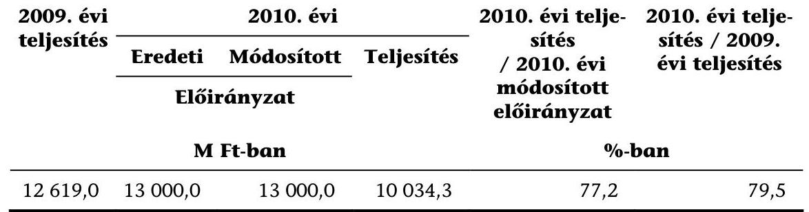

A 2010. évi előirányzat-tervezet teljesíthetőségét a számvevőszéki ellenőrzés magas kockázatúnak ítélte meg, tekintettel a lakásvásárlási és építési (ezen adónemből származó bevételeket közvetetten meghatározó) támogatások 2010. évi jelentős összegű és mértékű csökkentésére.

A bevételi elmaradást elsősorban a 2010. évi adóalap tervezettnél alacsonyabb összege okozta. Az NGM indokolása hiányos, kizárólag a teljesítést mutatja be, de nem tér ki az elmaradás okaira.

## Pénzügyi szervezetek különadója

A 2010. évi költségvetés a pénzügyi szervezetek különadójára nem tartalmazott előirányzatot. A 2010. szeptember 27-étől hatályba lépő pénzügyi szervezetek különadóját a 2010. évi XC. törvény az államháztartás egyensúlyát javító különadóról és járadékról szóló 2006. évi LIX. törvény módosításaként vezette be. A különadóból származó bevétel 182 307,7 M Ft volt.

A számvevőszéki ellenőrzés egyetért a részletes indokolással, amely szerint a bevallott 185,6 Mrd Ft és a pénzforgalmilag befolyt adó közötti különbség döntően azzal áll összefüggésben, hogy egyes adózók nem a különadó számlára teljesítették a befizetést.

## Cégautóadó

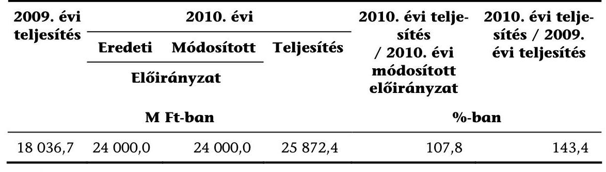

Az ÁSZ a 2010. évi költségvetés véleményezése során a tervezett bevételt megalapozottnak, teljesítését alacsony kockázatúnak minősítette.

A számvevőszéki ellenőrzés megítélése szerint az előirányzatot meghaladó teljesítésre vonatkozó részletes indokolás nem teljes. Az adófizetési hajlandóság

---

javulása tényekkel nem alátámasztott, illetve a cégautóadóból levonható nagy teljesítményű gépjárművek adójának évközi megszüntetéséből származó adótöbbletre vonatkozó adatok az indokolásban nem állnak rendelkezésre.

# Egyszerűsített vállalkozói adó 

| 2009. évi teljesítés | 2010. évi |  |  | 2010. évi teljesítés / 2010. évi módosított előirányzat | 2010. évi teljesítés / 2009. évi teljesítés |
| :--: | :--: | :--: | :--: | :--: | :--: |
|  | Eredeti | Módosított | Teljesítés |  |  |
|  | elöirányzat |  |  |  |  |
|  | M Ft-ban |  |  | \%-ban |  |
| 169 703,5 | 182 600,0 | 182 600,0 | 181 879,5 | 99,6 | 107,2 |

Az ÁSZ-nak a 2010. évi költségvetés véleményezése során nem állt módjában háttérszámítások hiányában - megítélni az előirányzat megalapozottságát és teljesíthetőségét.

Az eva bevétel a 2010. évre vonatkozóan a 182 753,3 M Ft befizetés és a 873,8 M Ft kiutalás egyenlege.

A számvevőszéki ellenőrzés megítélése szerint az előirányzat teljesítésére vonatkozó általános és részletes indokolás helytálló.

A számvevőszéki ellenőrzés a részletes indoklással egyetért, amely szerint az adóbevétel évek közötti növekedését döntően az eva mértékének 5\%-pontos emelkedése okozta.

A 2002. évi XLIII. törvény alapján az eva mértéke 2010. január 1-jétől 25\%-ról $30 \%$-ra módosult.

## Bányajáradék

| 2009. évi teljesítés | 2010. évi |  |  | 2010. évi teljesítés / 2010. évi módosított előirányzat | 2010. évi teljesítés / 2009. évi teljesítés |
| :--: | :--: | :--: | :--: | :--: | :--: |
|  | Eredeti | Módosított | Teljesítés |  |  |
|  | elöirányzat |  |  |  |  |
|  | M Ft-ban |  |  | \%-ban |  |
| 26 620,5 | 47 000,0 | 47 000,0 | 108 878,1 | 231,7 | 409,0 |

A 2010. évi előirányzat megalapozottságát az ÁSZ nem tudta megítélni, miután az előirányzat 53,2\%-át jelentő, a MOL Nyrt. befizetéseit prognosztizáló számítás anyaga nem állt az ellenőrzés rendelkezésére.

A 2010. évtől a bányajáradék előirányzat valamennyi bányajáradék befizetést tartalmazza (a korábbi években a MOL Nyrt. bányajáradék befizetéseinek egy része a XVII. KHEM fejezet 14. Központosított bevételek cím 2. Energiaárkompenzációs befizetés alcímen jelent meg).

---

Az előirányzat teljesítésére vonatkozó általános és részletes indokolás helytálló, a tényleges helyzetet tükröző, a lényeges összefüggésekre magyarázatot ad.

Az előirányzat nagymértékű túlteljesülése több tényezőre vezethető vissza. A szénhidrogének fajlagos értéke a 2009. évhez képest jelentősen nőtt (kőolaj esetében $40 \%$-kal, földgáz esetében $35 \%$-kal), amely a kőolaj világpiaci árának közel 20\%-os növekedéséből, valamint a Ft/USD éves átlagos árfolyamának 2,8\%-os emelkedéséből adódott. Az előirányzatot meghaladó bevétel realizálását eredményezte, hogy a bányajáradék éves átlagos mértéke a kőolaj esetében $8,7 \%$-kal, a földgáz esetében $4,2 \%$-kal nőtt, emellett a 2010. évben 4 hónapon keresztül érvényesülhetett a bányajáradék mértékénél az ún. tőzsdei felár is.

A bevétel 16,0 Mrd Ft összegű növekedését eredményezte, hogy az MMBF Földgáztároló Zrt. a tervezetthez képest egy évvel korábban, 2010. évben megkezdte az ún. sapkagáz (kőolajtelep felett elhelyezkedő, azzal hidrodinamikai kapcsolatban álló gáz) kitermelését.

A bányajáradék bevétel növekedését kismértékben ellensúlyozta a járadék köteles mennyiség csökkenése.

A földgáz esetében 2,3\%-kal, a kőolaj esetében 8,6\%-kal, az építőipari nyersanyagok esetében $25 \%$-kal csökkent a kitermelés volumene.

A bányajáradék számlán átfutó tételként (a befizetés és a kiutalás is a 2010. évben történt) jelent meg a MOL Nyrt. 35,2 Mrd Ft-os befizetése.

Az EU Bizottság a 2010. június 9-én kelt határozatában jogellenes támogatásnak minősítette a MOL Nyrt. által a 2008. és 2009. évben a szerződés alapján ténylegesen megfizetett és a bányászatról szóló törvény alapján fizetendő bányajáradék közötti különbözetet és elrendelte, hogy ezen összeget és annak kamatait, összesen 35,2 Mrd Ft-ot a MOL Nyrt. fizessen vissza a Magyar Államnak. Egyben kötelezte a Magyar Államot, hogy a 2010. évre visszafizetendő összeget állapítsa meg.

A MOL Nyrt. az EU Bizottság döntésével nem értett egyet és az EU Bíróságához fordult jogorvoslatért. A helyszíni ellenőrzés lezárásáig az ügyben ítélet nem született.

Az EU Bizottság határozatának végrehajtása érdekében a NFM 2010. szeptember 29-én Megállapodást kötött a MOL Nyrt.-vel, amely szerint a MOL Nyrt. 2010. szeptember 30-áig visszafizeti a bányajáradék számlára az EU Bizottság határozatában előírt, az EU Bizottság által 2008-2009. évre vonatkozóan tiltott állami támogatásként meghatározott 35,2 Mrd Ft-ot. Ezen megállapodás tartalmazza a 2005. december 22-én a GKM és a MOL Nyrt. között megkötött szerződés EU bizottsági határozatnak megfelelő módosítását.

A MOL Nyrt. az EU Bíróságnál folyó jogorvoslati eljárásra tekintettel a 2008-2009. évre vonatkozó bányajáradék bevallásait nem módosította az EU Bizottság döntésének megfelelően, kizárólag a 35,2 Mrd Ft-os összeg befizetését teljesítette. A számvevőszéki ellenőrzés megítélése szerint a $35,2 \mathrm{Mrd}$ Ft befizetés nincs összhangban a bevallott bányajáradék kötelezettséggel (kvázi túlfizetésként jelentkezik).

---

A 2010. évre vonatkozóan visszafizetendő bányajáradék összegének tárgyában a NFM és a MOL Nyrt. 2010. november 8 -án kötött megállapodást. Tekintettel azonban arra, hogy a Magyar Bányászati és Földtani Hivatal (MBFH) számításai alapján a MOL Nyrt. által a szerződés alapján bevallott összeg meghaladta a bányászati törvény alapján kiszámított bányajáradék összeget, a MOL Nyrt.-nek a 2010. évre visszafizetési kötelezettsége nem volt. A két megállapodást az EU Bizottság részére is megküldték, amely azokkal kapcsolatban kifogással nem élt.

A MOL Nyrt. által a bányajáradék számlára befizetett 35,2 Mrd Ft bevételt a Kvtv. 2010. november 5-étől hatályos módosítása az egyéb költségvetési bevételen belül egyéb vegyes bevételnek minősítette. A Kvtv. módosítását képviselői önálló indítvány keretében terjesztették be. A törvénymódosításnak megfelelően az MBFH a befolyt összeget továbbutalta az egyéb költségvetési bevételek, egyéb vegyes bevételek számlára.

A bányászati törvény alapján a bányajáradékot a bányajáradék számlára kell befizetni. A számvevőszéki ellenőrzés megítélése szerint a MOL Nyrt. által befizetett 35,2 Mrd Ft bányajáradék különbözet. A befizetést a NFM és a MOL Nyrt. által kötött, 2010. szeptember 29-én kelt megállapodásnak megfelelően a MOL Nyrt.-nek a bányajáradék bevételi számlára kellett befizetnie és a MOL Nyrt. a befizetést ennek megfelelően teljesítette. Erre tekintettel nem volt indokolt a Kvtv. módosítása, amely a befizetést az egyéb költségvetési bevételen belül egyéb vegyes bevételnek minősítette. Amennyiben az EU Bíróság helyben hagyja az EU Bizottság döntését és a MOL Nyrt. a 2008-2009. évi bevallásait a 35,2 Mrd Ft-tal korrigálja, úgy a bevallott kötelezettséggel szemben nem jelenik meg bányajáradék befizetés, miután azt a bányajáradék számláról továbbutalta az MBFH.

Játékadó

| 2009. évi teljesítés | 2010. évi |  |  | 2010. évi teljesítés / 2010. évi módosított előirányzat | 2010. évi teljesítés / 2009. évi teljesítés |
| :--: | :--: | :--: | :--: | :--: | :--: |
|  | Eredeti | Módosított | Teljesítés |  |  |
|  | elöirányzat |  |  |  |  |
|  | M Ft-ban |  |  |  | \%-ban |
| 66736,0 | 63097,9 | 63097,9 | 53398,3 |  | 84,6 |

A 2010. évben a központi alrendszer összes játékadó bevétele 62 689,0 M Ft volt, amelyből 53 398,3 M Ft a központi költségvetés bevételei, 9290,7 M Ft a Nemzeti Kulturális Alap (NKA) bevételei között jelenik meg. A 2010. évi törvényi előirányzat nem tartalmazza az NKA részére utalandó játékadó bevételt, míg a 2009. évi teljesítés a központi alrendszer összes bevételét tartalmazza, így a két teljesítés nem összehasonlítható.

A számvevőszéki ellenőrzés a 2010. évi költségvetés véleményezésénél az előirányzatot alacsony kockázatúnak minősítette, azonban a piac forgalma a vártnál jobban visszaesett, ami az előirányzat teljesülésére kedvezőtlenül hatott.

Az ötös lottó játékadójából a 9290,7 M Ft az NKA bevételei között jelenik meg, ami csak az első tíz hónap ötös lottó játékadó bevételének 90\%-át tartalmazza.

---

A 2010. év utolsó két havi bevételének NKA-t megillető $90 \%$-a a 2011. évben került utalásra.

A 2010. január 1-jétől hatályos - a közteherviselés rendszerének átalakítását célzó törvénymódosításokról szóló 2009. évi LXXVII. - törvény 156. §-a alapján, az állami adóhatóság az ötös lottó szerencsejátékból befolyt játékadó összegének $90 \%$-át havonta átutalja az NKA számlája javára.

Az NGM indokolása szerint a gazdasági recesszióval együtt járó fogyasztáscsökkenés az egyes szerencsejátékokat eltérően érintette. A 2010. évi játékadó bevételek 42,5\%-ban a sorsolásos játékokból, 50,8\%-ban a pénznyerő automatákból, míg 6,7\%-ban a fogadásos játékokból, a kaszinók és a játékautomaták utáni befizetésekből származtak. A piaci résztvevők köre a kártyatermeket üzemeltető társaságokkal bővült. Az engedélyek darabszámát figyelembe véve azonban csökkent a játéktermek, a pénznyerő automaták és a pénznyerő automatákat üzemeltetett játékhelyek száma.

A zárszámadási törvényjavaslatban lévő indokolásban leírtakkal a számvevőszéki ellenőrzés egyetért.

# Ökoadó 

## Energiaadó

| 2009. évi teljesítés | 2010. évi |  |  | 2010. évi teljesítés / 2010. évi teljesítés / 2009. évi teljesítés |  |
| :--: | :--: | :--: | :--: | :--: | :--: |
|  | Eredeti | Módosított | Teljesítés |  |  |
|  | előirányzat |  |  |  |  |
|  | M Ft-ban |  |  | \%-ban |  |
| 13 182,9 | 16 400,0 | 16 400,0 | 16 887,2 | $103 \%$ | $128,1 \%$ |

A számvevőszéki ellenőrzés az előirányzat-tervezet megalapozottságát, valamint teljesíthetőségét - a 2010. évi költségvetés tervezésekor - a rendelkezésre álló információk alapján és részletes indokolás hiányában nem tudta megítélni.

Az NGM indokolása szerint az előirányzatot kismértékben meghaladó bevételt a 2010. január 1-jével minden termékkörben bevezetett 17\%-os adómérték (uniós jogharmonizáció miatti) emelése, valamint a vártnál nagyobb ipari energia felhasználás eredményezte. A 2010. évben a földgáz felhasználás utáni befizetések jelentkeztek erőteljesebben ( $28,5 \%$ volt a bővülés, mivel az adóemelésen túl a felhasznált mennyiség is nőtt). Az elektromos energia utáni befizetések 16,6\%-kal, míg a szén utáni befizetések mindössze 1\%-kal növekedtek.

A számvevőszéki ellenőrzés a zárszámadási törvényjavaslat indokolásával egyetért.

---

Környezetterhelési díj

| 2009. évi teljesítés | 2010. évi |  |  | 2010. évi teljesítés / 2010. évi módosított előirányzat | 2010. évi teljesítés / 2009. évi teljesítés |
| :--: | :--: | :--: | :--: | :--: | :--: |
|  | Eredeti | Módosított | Teljesítés |  |  |
|  | elöirányzat |  |  |  |  |
|  | M Ft-ban |  |  | \%-ban |  |
| 10702,7 | 9500,0 | 9500,0 | 6573,7 | 69,2 | 61,4 |

A költségvetési törvényjavaslat véleményezése során az előirányzatot alátámasztó számítások nem álltak az ÁSZ rendelkezésére. A 2010. évi előirányzat teljesíthetőségének megalapozottsága, illetve a teljesítés kockázata a számítási anyagok hiányában nem volt értékelhető.

A 2010. évi befizetések (a bevallások szerinti nettó díffizetési kötelezettséggel összefüggésben) a 2009. évhez viszonyítva 34,6\%-kal csökkentek, míg a visszaigénylésekből eredő kiutalások 79,2\%-kal növekedtek.

A törvényjavaslat általános szakmai indokolást tartalmaz, ami a korábbi évekhez viszonyítva előrelépést jelent. Megemlíti az indokolás a csatornázottság növekedését, a felszíni vizekbe vezetett vízterhelő anyagok csökkenését, a szennyvíztisztítás fejlődését és javuló arányát. Ez utóbbival összefüggésben célszerű lett volna számszerűen is bemutatni, hogy a Budapesti Szennyvíztisztító beruházás 2010. évi üzembe helyezése milyen hatással volt a környezetterhelési dí előirányzat teljesítésére.

# Egyéb befizetések 

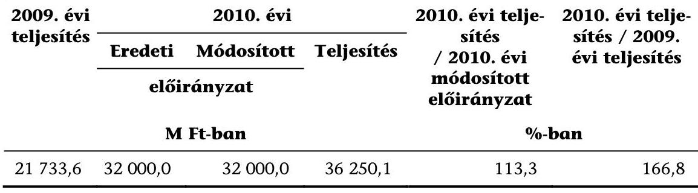

Az ÁSZ a 2010. évi költségvetési törvényjavaslatról szóló véleményében az előirányzat teljesíthetőségét - a tervezéskor rendelkezésre álló dokumentációk alapján - közepes kockázatúnak értékelte. Az ÁSZ kockázati tényezőként vette számításba az e bevételeket esetlegesen csökkentő és előre nem kiszámítható hatásokat, mint a gazdasági válsággal összefüggő fizetési kedvezményekre irányuló kérelmek, valamint a szankciós bevételek központi költségvetés és TB. alapok közötti megosztási arányszámának alakulását.

Az egyéb befizetések körébe különféle - az állami adóhatóság és a VPOP által beszedett - szankciós bevételek, valamint az önkéntesen feltárt adókülönbözet elszámolásából származó befizetések tartoznak. A bevételek 75,9\%-a az állami adóhatóság bírság és késedelmi pótlék számláira befizetett összegekből származik.

---

Az egyéb befizetések előirányzatát meghaladó bevételi többlet 76,9\%-ban az e címhez évközben átsorolt hitelintézetek és a pénzügyi vállalkozások különadója bevételi számlára tévesen teljesített befizetésekből származik, amire az NGM indokolása nem tér ki. Az adóhatóság kimutatása szerint a téves utalások öszszege 3266,6 M Ft, amely jogcím szerint a pénzügyi szervezetek különadója alcím bevételét illeti.

A téves befizetések nélkül az egyéb befizetések teljesítése 32 983,5 M Ft, ami az előirányzathoz képest 3,1\%-os túlteljesülést jelent.

Az állami adóhatóság bírság és késedelmi pótlék számláiról megtörténtek a TB alapokat illető havonkénti átutalások.

# Energiaellátók jövedelemadója 

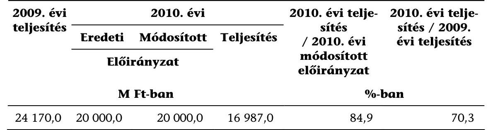

Az ÁSZ-nak a 2010. évi költségvetés véleményezése során nem állt módjában háttérszámítások hiányában - megítélni az előirányzat megalapozottságát és teljesíthetőségét.

A számvevőszéki ellenőrzés megítélése szerint az előirányzat teljesítésére vonatkozó általános és részletes indokolás helytálló. A részletes indokolás szerint helyesen - a költségvetési előirányzatnál kevesebb teljesítést elsősorban az adóalanyok eredményének csökkenése okozta, amelyben szerepet játszott az év közben bevezetett ágazati különadó hatása.
2010. december 4-én bevezették az egyes ágazatokat terhelő különadót, amelynek kötelezettei között szerepelnek az energiaellátó vállalkozási tevékenységet folytatók.

## Társas vállalkozások különadója

A 2010-től megszűnt társas vállalkozások különadója címén a 2010. évi költségvetési törvény előirányzatot nem tartalmazott. A társas vállalkozások különadójának áthúzódásából származó befizetések és kiutalások egyenlege -32 390,4 M Ft volt, ami a központi költségvetésben bevételt csökkentő tételként jelent meg.

## Egyes ágazatokat terhelő különadó

A bolti kiskereskedelmi, a távközlési és az energiaellátó vállalkozási tevékenységet terhelő különadó - a 2010. december 4-én hatályba lépő - az egyes ágazatokat terhelő különadóról szóló 2010. évi XCIV. törvény által került bevezetésre, így a költségvetésben nem szerepelt eredeti előirányzat az adóra vonatko-

---

zóan. A 2010. évi CXLIII. törvény a 2010. évi költségvetésről szóló 2009. évi CXXX. törvény módosításáról 2010. december 19-i hatállyal csak a távközlési ágazati különadóra vonatkozó 61000,0 M Ft összegű módosított előirányzatot tartalmazza.

Az egyes ágazatokat terhelő különadóból származó összbevétel 151 693,4 M Ft volt, amelyből - az APEH adatai alapján - a bolti kiskereskedelmi tevékenységet végzők 28 941,8 M Ft-ot, a távközlési tevékenységet végzők 58 576,2 M Ftot, az energiaellátó vállalkozási tevékenységet végző vállalatok pedig 64 175,4 M Ft-ot fizettek be a költségvetésbe.

A részletes indokolás helytálló, azonban nem teljes. Az ÁSZ egyetért az indokolással, amely szerint az éves adóelőleg bevallásokban szereplő összeggel megegyező 160,9 Mrd Ft prognosztizált bevételhez képest alacsonyabb különadó bevétel abból adódik, hogy több adózó határidőre nem fizette meg az adót, illetve részletfizetést kért. A részletes indokolás azonban nem tartalmazza a távközlési különadó 2010. évi módosított előirányzatát, illetve az ágazatra vonatkozó teljesítést. Nem ad magyarázatot az előirányzattól való 2,4 Mrd Ft-os elmaradásra.

# 3.1.2. Fogyasztáshoz kapcsolt adók 

## Általános forgalmi adó

| 2009. évi teljesítés | 2010. évi |  |  | 2010. évi teljesítés / 2010. évi   teljesítés /   2009. évi   teljesítés |
| :--: | :--: | :--: | :--: | :--: |
|  | Eredeti | Módosított | Teljesítés |  |
|  | Elöirányzat |  |  |  |
|  | M Ft-ban |  |  | \%-ban |
| 2168 488,2 | 2313 900,0 | 2313 900,0 | 2313 582,1 | 100 |

Az ÁSZ a 2010. évi előirányzat-tervezet megalapozottságát - a korábbi évekhez hasonlóan - teljes körűen nem tudta megítélni. A véleményalkotáshoz szükséges egyes adatok és részletes számítási anyagok (pl. a gazdasági fejlődés főbb jellemzőit tartalmazó adatok közül a foglalkoztatottság, valamint a bruttó bérek és keresetek alakulására vonatkozó számítások) hiánya nem tette lehetővé, hogy a tervezett bevételek teljesíthetőségét és ennek kockázatát minősítse.

Az általános indokolás helytálló, mely szerint a bázisév júliusi adómérték emelésének áthúzódó hatása többletbevételeket eredményezett, mely ellensúlyozta a gazdasági válságból való kikerülés nyomán dinamikusan bővülő külpiaci forgalom miatti visszaigénylés növekedését.

Az előirányzat teljesítésére vonatkozóan a számvevőszéki ellenőrzés egyetért azzal, hogy a bevételek 2009. évhez képest bekövetkezett 145,1 Mrd Ft összegű növekedése elsősorban a bázisév júliusi adómérték emelése áthúzódó hatásának, valamint az áfa bevételek növekedésének és a kiutalások befizetéseket meghaladó mértékű növekményének az eredménye.

---

A 2010. évi áfa bevétel az áfa befizetések 362,9 Mrd Ft-os (10,4\%-os) növekedéséből és a kiutalások 217,8 Mrd Ft-os (16,4\%-os) növekedéséből adódott.

Az indokolás nem fordít kellő figyelmet a bázisév júliusi adómérték emelés áthúzódó hatásából eredő bevétel növekmény számszaki kihatásának a bemutatására. Az indokolásból nem állapítható meg, hogy a bázisév júliusi adómérték emelésének áthúzódó hatásából eredő bevétel növekmény milyen szerepet játszott az előirányzat teljesítésében, illetve az áfa bevételek előző évhez viszonyított alakulásában.

Jövedéki adóbevételek

| 2009. évi teljesítés | 2010. évi |  |  | 2010. évi teljesítés / 2010. évi teljesítés / 2009. évi teljesítés |
| :--: | :--: | :--: | :--: | :--: |
|  | Eredeti | Módosított | Teljesítés |  |
|  | elöirányzat |  |  |  |
|  | M Ft-ban |  |  | \%-ban |
| 868 815,5 | 892 900,0 | 892 900,0 | 856 524,0 | 95,9\% |

A 2010. évi költségvetés véleményezésekor a számvevőszéki ellenőrzés az elői-rányzat-tervezet megalapozottságát és teljesíthetőségét a rendelkezésre álló számításokon belüli eltérések, valamint a részletes indokolás hiányában nem tudta megítélni.

Az üzemanyagok termékcsoportjában a bevétel 511,4 Mrd Ft (a bevétel 59,7\%a), a dohánytermékek jövedéki adóbevétele 262,1 Mrd Ft (a bevétel 30,6\%-a) volt, míg az egyéb termékek után befizetett jövedéki adó 83,0 Mrd Ft-ot (a bevétel $9,7 \%$-a) tett ki.

A 2010. évben a teljesítés az előirányzattól 36,4 Mrd Ft-tal, 4,1\%-kal elmaradt, amelyet döntően - a dohánytermékek készletfelhalmozása miatt - a 2010. év elejére tervezett adóbevételek 2009. évi realizálása, valamint a 2010. évi elmaradt üzemanyag forgalom hatása okozta.

Az NGM fejezeti indokolásában termékcsoportonként értékeli a jövedéki adóbevételek 2010. évi alakulását. A számvevőszéki ellenőrzés az indokolással egyetért.

A jövedéki adó visszautalások összege a 2010. évben 28,9 Mrd Ft volt, az előző évinél kismértékben ( $2,8 \%$-kal) magasabb, a visszautalások összege pedig a jövedéki adóbevétel 3,3\%-ának felelt meg (2009-ben az arány 3,1\% volt).

A visszautalásokból 27,9 Mrd Ft-ot ( $96,5 \%$-ot) tett ki az üzemanyag jövedéki adójának a visszautalása, amely a mezőgazdaságban felhasznált gázolaj utáni, valamint a vasúti, hajózási és légiforgalmi társaságok részére történő visszafizetéseket tartalmazta.

---

# Regisztrációs adó 

| 2009. évi teljesítés | 2010. évi |  |  | 2010. évi teljesítés / 2010. évi módosított elöirányzat | 2010. évi teljesítés / 2009.   évi teljesítés |
| :--: | :--: | :--: | :--: | :--: | :--: |
|  | Eredeti | Módosított | Teljesítés |  |  |
|  | elöirányzat |  |  |  |  |
|  | M Ft-ban |  |  | \%-ban |  |
| 33552,4 | 39 300,0 | 39 300,0 | 30038,5 | 76,4 | 89,5 |

A regisztrációs adó esetében a részletes indokolás hiányában a 2010. évi előirányzat-tervezet megalapozottságát, valamint teljesíthetőségét az ellenőrzésnek nem állt módjában megítélni. A 2010. évi előirányzat-tervezet véleményezésekor, az általános indokolás szerint az PM további forgalomcsökkenést nem prognosztizált. Az adóbevétel azonban az első félévben az előző időszakhoz képest lassabb ütemben ugyan, de tovább mérséklődött. A bevételkiesést a második félévi bevétel növekedés sem tudta ellensúlyozni. Az adóbevétel csökkenését a gazdasági válság gépjárműpiacra gyakorolt negatív hatása okozta. Az általános és fejezeti indokolással a számvevőszéki ellenőrzés egyetért.

### 3.1.3. A lakosság befizetései

## Személyi jövedelemadó

| 2009. évi teljesítés | 2010. évi |  |  | 2010. évi teljesítés / 2010. évi módosított elöirányzat | 2010. évi teljesítés / 2009. évi teljesítés |
| :--: | :--: | :--: | :--: | :--: | :--: |
|  | Eredeti | Módosított | Teljesítés |  |  |
|  | elöirányzat |  |  |  |  |
|  | M Ft-ban |  |  |  | \%-ban |
| 1874 224,0 | 1881 100,0 | 1881 100,0 | 1767 865,0 | 94,0 | 94,3 |

A 2010. évi költségvetési törvényjavaslat véleményezése során az ÁSZ nem minősítette a személyi jövedelemadó előirányzatának megalapozottságát, valamint teljesíthetőségét, mivel a megítéléshez szükséges részletes számítások nem álltak az ellenőrzés rendelkezésére.

A 2010. évi előirányzat kialakításában meghatározó szerepe volt az összevontan adózó jövedelmek 2009. évi várható összeghez viszonyított $12,7 \%$-os, valamint az összevont adóalap („szuperbruttó") $36 \%$-os tervezett növekedésének. Ezzel szemben - az NGM zárszámadási törvényjavaslathoz készült előzetes számításai alapján - az összevontan adózó jövedelmek, valamint az összevont adóalap a 2009. évhez képest $1,2 \%$-kal, illetve $26,2 \%$-kal növekedett 2010-ben.

A szja. teljesítése 6\%-kal elmarad az előirányzattól, amelynek okait az NGM általános indokolása csak részben tartalmazza. Az összevontan adózó jövedelmek utáni adó közel 100 Mrd Ft összegű elmaradását a családi pótlék adóztatásának alkotmányellenessé nyilvánításával kapcsolatos $34,5 \mathrm{Mrd}$ Ft összegű

---

bevétel kiesés csak részben magyarázza. A fennmaradó mintegy 65,5 Mrd Ft elmaradásra az indokolás már nem tér ki.

A kifizetői, társasházi szja. 12,4 Mrd Ft-tal marad el az előirányzattól. Ennek okát szintén nem részletezi az indokolás.

Az adókedvezmények - az előirányzat kialakítása során figyelembe vettnél 21,2\%-kal kisebb igénybevétele - összességében 168,2 Mrd Ft-tal ellensúlyozta az adóbevételek elmaradását. Ebben meghatározó szerepe van a számos adókedvezmény megszüntetésének. A megmaradó adókedvezmények közül az adójóváírás 18,7 Mrd Ft-tal haladja meg a tervezettet, míg az adóterhet nem viselő járandóságok adója 181,6 Mrd Ft-tal marad el a tervezettől. Ezekre a tényezőkre a részletes indokolás szintén nem tér ki.

Az NGM részletes indokolása kitér arra, hogy az szja. pénzforgalmi számlára teljesített bruttó befizetések a 2009. évhez képest 5\%-kal kisebbek, míg a bruttó kiutalások 5,1\%-kal magasabbak. Nem ad azonban magyarázatot a befizetési és a kiutalási pénzforgalom változásának okaira.

Az NGM előzetes számításai szerint a folyóáras GDP-hez viszonyított szja. bevétel 7,2\%-ról 6,5\%-ra csökkent, ami az elvonás mérséklődését jelenti. Ezzel összefüggésben csökkent az összevontan adózó jövedelmek átlagos adóterhelése is, a 2009. évi 18\%-ról a 2010. évi 16,4\%-ra.

Egyéb lakossági adóbevételek

| 2009. évi teljesítés | 2010. évi |  |  | 2010. évi teljesítés / 2010. évi   módosított   előirányzat | 2010. évi teljesítés / 2009.   évi teljesítés |
| :--: | :--: | :--: | :--: | :--: | :--: |
|  | Eredeti | Módosított | Teljesítés |  |  |
|  | elöirányzat |  |  |  |  |
|  | M Ft-ban |  |  | \%-ban |  |
| 8272,1 | 5800,0 | 5800,0 | 3020,7 | 52,1 | 36,5 |

A 2010. évi költségvetési törvényjavaslat véleményezése során az előirányzat megalapozottságát, valamint teljesíthetőségét részletes számítások és indokolás hiányában nem lehetett megítélni.

Az előirányzattól való elmaradás a 2010 szeptemberében hatályba lépett, a gyümölcspárlat főzést érintő szabályozás változás miatt kieső bérfőzési szeszadó bevételek következménye.

A beszedett 3,0 Mrd Ft bevételből a bérfőzési szeszadó bevétel 2,8 Mrd Ft-ot, az egyéb adóbefizetések (lakossági vámbefizetések, VP Központi Bűnüldözési Parancsnoksága vámbevételi számlájára befolyt összeg) 0,2 Mrd Ft-ot tettek ki.

---

# Illetékbevételek 

| 2009. évi teljesítés | 2010. évi |  |  | 2010. évi teljesítés / 2010. évi   módosított   elöirányzat | 2010. évi teljesítés / 2009.   évi teljesítés |
| :--: | :--: | :--: | :--: | :--: | :--: |
|  | Eredeti | Módosított | Teljesítés |  |  |
|  | elöirányzat |  |  |  |  |
|  | M Ft-ban |  |  | \%-ban |  |
| 112 175,9 | 110000,0 | 110000,0 | 83517,9 | 75,9 | 74,5 |

Az ÁSZ - a 2010. évi költségvetés véleményezése során - az előirányzat teljesíthetőségét alacsony kockázatúnak értékelte. Az előirányzat tervezése és véleményezése során a 2010. év közben történt jogszabályi változások nem voltak ismertek, és a pénzügyi-gazdasági válság illetékbevételekre gyakorolt hatása bizonytalansággal volt megítélhető.

A központi költségvetés illeték bevételének 60,3\%-a (50 376,6 M Ft) az APEH által realizált bevétel (a Magyar Posta Zrt. 18,2\%-ot, a Kincstár 17,2\%-ot, a VPOP, az önkormányzati adóhatóság és a Cégbíróság együttesen 4,3\%-os bevételi arányt képviselt).

A zárszámadási törvényjavaslat részletes indokolása szerint a 2010. évi bevétel elmaradásában - a számvevőszéki ellenőrzés véleményével részben megegyezően - elsősorban a gazdasági válság következtében csökkenő gépjármű- és ingatlan-átruházások, illetve ingatlanárak játszottak szerepet.

Az illetéknemek tekintetében - az öröklési illeték kivételével - a teljesítések a 2010. évre tervezett összegektől kisebb összegben realizálódtak. Az öröklési illeték 2010. évi tervezett összege ( $900,0 \mathrm{MFt}$ ) 2384,6 M Ft-ra teljesült, ami a 2009. évi teljesítéstől 925,3 M Ft-tal maradt el.

A számvevőszéki ellenőrzés megítélése szerint a 2010. évi központi költségvetést megillető illetékbevételek előirányzattól való jelentős elmaradásának alapvető oka, hogy a - 2010. évben bevezetett - belföldi ingatlannal rendelkező társaságok vagyoni betétének adásvételével összefüggő illetékbevételből a tervezettnél ( $40,0 \mathrm{Mrd}$ Ft) jelentősen kevesebb ( $169,5 \mathrm{M}$ Ft) bevétel realizálódott.

Az előirányzattól való elmaradáshoz hozzájárult az is, hogy az adóhatósági beavatkozásokból a 2010. évben 17,1\%-kal kevesebb bevétel folyt be illetékekből (12,1 Mrd Ft), mint a 2009. évben (14,6 Mrd Ft).

A számvevőszéki ellenőrzés megítélése szerint a költségvetési bevétel alakulását kedvezőtlenül befolyásolta a kiszabatlan/elintézetlen ügyek, határozatok jogerősítéseinek késedelme, továbbá közvetetten és a következő évekre hatóan az is, hogy a 2010. évben az elévülés miatt törölt illeték hátralék ( $2,5 \mathrm{Mrd}$ Ft) 3,1-szerese volt a 2009. évi törlésnek ( $0,8 \mathrm{MrdFt}$ ).

---

Magánszemélyek különadója

| 2009. évi teljesítés | 2010. évi |  |  | 2010. évi teljesítés / 2010. évi teljesítés / 2009. évi teljesítés |  |
| :--: | :--: | :--: | :--: | :--: | :--: |
|  | Eredeti | Módosított | Teljesítés |  |  |
|  | Elöirányzat |  |  |  |  |
|  | M Ft-ban |  |  | \%-ban |  |
| 25 504,9 | 4300,0 | 4300,0 | 6060,1 | 140,9 | 23,8 |

A 2010. évi előirányzat-tervezet megalapozottságát, teljesíthetőségét a számvevőszéki ellenőrzés nem tudta megítélni, tekintettel arra, hogy az előirányzatot alátámasztó számítások nem álltak rendelkezésre.

A 2010. évi adóbevétel 1,8 Mrd Ft-tal, 40,9\%-kal több az előirányzatnál. A számvevőszéki ellenőrzés egyetért a részletes indokolással, amely szerint az előirányzathoz viszonyított többletbevételt a 2009. évtől történő adóelszámolások miatti pénzforgalmi áthúzódások várakozást felülmúló összegei okozták.

# Magánszemélyek jogviszonyának megszünéséhez kapcsolódó egyes jövedelmek különadója 

A magánszemélyek jogviszonyának megszűnéséhez kapcsolódó egyes jövedelmekre alkalmazandó $98 \%$-os különadót az egyes gazdasági és pénzügyi tárgyú törvények megalkotásáról, illetve módosításáról szóló 2010. évi XC. törvény 2010. október 1-jétől léptette hatályba, amelyet az ALB 2010. év október végén hatályon kívül helyezett.
A 2010. évi költségvetés a magánszemélyek egyes jövedelmeinek 98\%-os különadójára nem tartalmaz előirányzatot, a különadóból származó bevétel 11,3 M Ft volt.

## Háztartási alkalmazott utáni regisztrációs dí

A 2010. évi költségvetés a háztartási alkalmazott utáni regisztrációs díra nem tartalmazott előirányzatot. A háztartási alkalmazott utáni regisztrációs díjat az egyes gazdasági és pénzügyi tárgyú törvények megalkotásáról, illetve módosításáról szóló 2010. évi XC. törvény 2010. augusztus 13-ától léptette hatályba.
A 2010. évi háztartási alkalmazott utáni regisztrációs díj bevétele $0,8 \mathrm{M} \mathrm{Ft}$ volt.

### 3.1.4. Egyéb költségvetési bevételek

| 2009. évi teljesítés | 2010. évi |  |  | 2010. évi teljesítés / 2010. évi teljesítés / 2009. évi teljesítés |  |
| :--: | :--: | :--: | :--: | :--: | :--: |
|  | Eredeti | Módosított | Teljesítés |  |  |
|  | elöirányzat |  |  |  |  |
|  | M Ft-ban |  |  | \%-ban |  |
| 39 899,3 | 6766,0 | 41992,6 | 125 167,9 | 298,1 | 313,7 |

---

A 2010. évi költségvetés véleményezésekor a számvevőszéki ellenőrzés az előirányzatot nagy biztonsággal teljesíthetőnek minősítette. A teljesítés és az előirányzat eltéréseinek, valamint a bevételek bevételcsoportok közötti megoszlásának az értékelésekor figyelembe kell venni, hogy a jogcímcsoport egyes bevételei a jellegükből adódóan pontosan nem tervezhetők, a bevételek bevételcsoportonkénti alakulása döntően az adott évi költségvetés végrehajtásának a sajátosságaitól függ.

Az egyéb költségvetési bevételek cím 2010. évi teljesítése 125 167,9 M Ft, ami a módosított előirányzat ( 41992,6 M Ft) közel 3 -szorosa. Az egyéb költségvetési bevételek címen belül az egyéb vegyes bevételek jogcímcsoport módosított előirányzata 5076,0 M Ft, a kezesség-visszatérülés bevételeié 1690,0 M Ft és a MOL Nyrt. befizetésé 35 226,6 M Ft volt. A fejezeti indokolás a teljesülésről megfelelő képet ad.

A 2009. év augusztusától a magánnyugdíjrendszerből a társadalombiztosítási nyugdíjrendszerbe visszalépők után a nyugdíjpénztárak összesen 64 807,5 M Ftot fizettek be az államkasszába, amellyel az előirányzat tervezésekor a PM nem számolt.

A MOL Nyrt. 35,2 Mrd Ft-ot (az előirányzattal azonos összeget) fizetett vissza a Magyar Államnak az EU Bizottság döntése értelmében bányajáradékként. A bevételt - a Kvtv. 2010. november 5-étől hatályos módosítása alapján - az MBFH az egyéb vegyes bevételek számlára utalta.

A túlteljesítéshez hozzájárult továbbá az egyéb vegyes bevételek jogcímcsoport előirányzatának több mint 4-szeres teljesítése is.

| 2009. évi teljesítés | 2010. évi |  |  | 2010. évi teljesítés / 2010. évi módosított előirányzat | 2010. évi teljesítés / 2009. évi teljesítés |
| :--: | :--: | :--: | :--: | :--: | :--: |
|  | Eredeti | Módosított | Teljesítés |  |  |
|  | elöirányzat |  |  |  |  |
|  | M Ft-ban |  |  | \%-ban |  |
| 11736,1 | 5076,0 | 5076,0 | 22762,6 | 448,4 | 193,9 |

Az egyéb vegyes bevételek jogcímcsoporton belül a legjelentősebb összegű bevételek az előző évi kiadásokból származó visszatérülések (16 951,8 M Ft) voltak, amelyekből a nem lakás céljára igénybe vett állami támogatások 1960,8 M Ftot, a lakáskedvezmények visszafizetései 1045,2 M Ft-ot, a pótelőirányzat ellensúlyozása 11707,1 M Ft-ot jelentettek. Származtak továbbá bevételek a ver-seny-felügyeleti bírság 1253,8 M Ft-os összegéből, valamint az önkormányzatok kamattérítésének 1317,7 M Ft-os összegéből.

Az egyéb költségvetési bevételek teljesítésének és elszámolásának adatait a költségvetési mérleg megbízhatóan tartalmazza.

---

# 3.1.5. Az állami vagyonnal kapcsolatos bevételek 

Az Országgyűlés 2010. június 14-ei, és 2010. szeptember 1-jei hatálybalépéssel megalkotta az állami vagyonnal való felelős gazdálkodás érdekében szükséges törvények módosításáról, valamint egyes törvényi rendelkezések megállapításáról szóló 2010. évi LII. tv., és az Nfatv.-ket, továbbá 2010. szeptember 6-ai hatálybalépéssel létrehozta a Nemzeti Média- és Hírközlési Hatóságot. Ennek eredményeként az állami vagyonnal kapcsolatos feladatok és kötelezettségek a korábbi központosított szerkezettel ellentétben funkcionálisan megosztásra kerültek, és így új szervezeti, személyi, hatásköri, döntési és felügyeleti struktúra került kialakításra. Az állami vagyonhasznosítás jelentős jogszabályi háttér változása során az állami vagyonnal kapcsolatos bevételek költségvetési besorolása és elszámolása a korábbi évekhez képest nem változott.

## Állami vagyonnal kapcsolatos bevételek

| 2009. évi teljesítés | 2010. évi |  |  | 2010. évi teljesítés / 2010. évi teljesítés / 2009. évi teljesítés |
| :--: | :--: | :--: | :--: | :--: |
|  | Eredeti | Módosított | Teljesítés |  |
|  | elöirányzat |  |  |  |
|  | M Ft-ban |  |  | \%-ban |
| 143 355,0 | 101 439,7 | 101 439,7 | 71026,3 | 70 |

Az előirányzattól 30,4 Mrd Ft-tal kisebb bevételből 20,0 Mrd Ft-ot a - frekvencia használati jogok értékesítését célzó - pályázati kiírás elmaradása jelentett. A tervezett pályázat elmaradásának az okait a törvényjavaslat általános és részletes indokolása nem tartalmazza.

Az állami vagyonnal kapcsolatos bevételek elmaradását okozta továbbá az Értékesítési bevételek alacsony, az előirányzatnak mindössze csak a 26,4\%-át jelentő teljesülése. A termőföld értékesítésből származó bevételek az előirányzat 9,4\%-ában, az Egyéb ingatlanok értékesítéséből származó bevételek 31,8\%ában teljesültek. Az Értékesítési bevételek elmaradására vonatkozó NGM indokolással a számvevőszéki ellenőrzés döntően egyetért. Az Értékesítési bevételek elmaradását - meghatározóan - a pénzügyi recesszió 2010. évben is érvényesülő keresletszűkítő és árcsökkentő hatása, valamint az év közben végrehajtott jelentős jogszabályi változások indokolják.

Az értékesítési bevételeken belül a termőföld értékesítés jelentős (mintegy 9,0 Mrd Ft-os) elmaradását okozta az a körülmény is, hogy az NFA (bár a jogszabályi feltételek megvoltak) a termőföldvagyont a 2010. évben teljes körűen nem vette át az MNV Zrt.-től. Ennek oka az - a számvevőszéki ellenőrzés tapasztaltak szerint is -, hogy a szervezet a hely, a létszám, az eszköz és a forrás hiánya miatt költségvetési bevételt eredményező gazdasági tevékenységet a 2010. évben nem végezhetett.

A 2010. évi költségvetés tervezése során a számvevőszéki ellenőrzés az előirányzat 101 439,7 M Ft összegű teljesíthetőségét reálisnak, az Osztalékbevételeket túlteljesíthetőnek ítélte. A 2010. évi költségvetés számvevőszéki értékelése során

---

azonban nem volt ismert olyan mértékű jogszabályi és szervezeti struktúraváltozás, amely 2010-ben az állami vagyon hasznosítását érintően megvalósult. A NFA-t érintő bevételeket, a termőföld értékesítést, és az Egyéb tárgyi eszközök értékesítésén belül elszámolt földhaszonbérleti jogértékesítéseket döntően befolyásolta a jogszabályi környezet változása.

Az állami vagyonnal kapcsolatos bevételek teljesülése során létrejött elmaradásokat nem, vagy csak kis részben pótolták a Vegyes és a Pénzforgalommal nem járó bevételek, együttesen 18259,3 M Ft összegű előirányzaton felüli teljesülései, amelyek, mintegy 77\%-át a MALÉV Zrt. 2007. évi privatizációjához kötődő vevői bankgarancia, és a MALÉV Zrt.-ben állami többségi tulajdonszerzés 2010. évi érvényesítéséhez kapcsolódó bevételek adják.

# Értékesítési bevételek 

| 2009. évi teljesítés | 2010. évi |  |  | 2010. évi teljesítés / 2010. évi   módosított   elöirányzat | 2010. évi teljesítés / 2009.   évi teljesítés |
| :--: | :--: | :--: | :--: | :--: | :--: |
|  | Eredeti | Módosított | Teljesítés |  |  |
|  | elöirányzat |  |  |  |  |
|  | M Ft-ban |  |  | \%-ban |  |
| 22 118,2 | 37860,0 | 37860,0 | 9990,4 | 26,4 | 45,2 |

Az Állami vagyonnal kapcsolatos értékesítési bevételeket az Ingatlan és az Egyéb tárgyi eszközök az utóbbin belül meghatározóan a haszonbérleti jogok értékesítéséből származó bevételek jelentették. Az értékesítési bevételeken belül az összes bevételi jogcím teljesülése jelentősen elmaradt az előirányzatoktól.

Az egyéb ingatlan értékesítésből származó bevételek tervezésénél kiemelt területeken lévő és széles körű hasznosítást lehetővé tevő épületek értékesítése került megtervezésre, így többek között a Budapest VI. és XII. kerületi BM kórházak, az OPNI épületének egy része, a Szabolcs utcai Kórház, több XII. kerületi ingatlan, a Margitszigeti „Európa ház", a taszári repülőtér.

A 2010. évi tervezés során a keresletben bekövetkezett jelentős mértékű csökkenéssel nem lehetett számolni, amint a befektetéseket és a beruházásokat is jelentősen érintő hitelezési bizonytalansággal sem.

A Termöföld értékesítésből származó bevételek előirányzatát a Kvtv. 10 000,0 M Ft-ban állapította meg, amely közel 25000,0 ha, zömében szántó területek értékesítését tartalmazta. A teljesítés $939,8 \mathrm{M} \mathrm{Ft}$, ami az előirányzatnak mindössze $9,4 \%-a$.

A Termőföld értékesítésből származó vizsgált bevételek pénzügyi elszámolásait az ellenőrzés szabályszerűnek minősítette.

A Kvtv. az Egyéb ingatlanok értékesítéséből származó bevételek előirányzatát 24470,0 M Ft összegben állapította meg, a teljesítés 7777,6 M Ft, az előirányzat $31,8 \%-a$.

---

Az MNV Zrt. beszámolója szerint a piaci körülmények bizonytalansága miatt az MNV Zrt. 2010. évi ingatlanértékesítési terve a vagyonkezelési terv „legnagyobb kockázatú eleme" volt. A kockázat mérséklésére a társaság az előirányzatot alátámasztó 15 nagy értékű ingatlan értékesítésével számoló elsődleges értékesítési tervéhez - az értékesítések egy részének az esetleges elmaradása esetére -, a tervezett bevétel teljesíthetősége érdekében készített egy további 7 ingatlant tartalmazó értékesítési listát is. Ettől függetlenül 2010-ben a tervezett ingatlaneladásokból - az előirányzatot alátámasztó és a kiegészítő listán szerepeltetett ingatlanok közül - egy sem került értékesítésre. Így a 2010. évi teljesítés, a korábbi évekhez hasonlóan nem az előirányzaton alapult. E bevételi jogcímben az előirányzat és a teljesítés összhangjának hiányát a számvevőszéki ellenőrzés a 2005. év óta minden évben jelezte.

A bevétel legjelentősebb tételét ( $85,3 \%$-át) a győri, volt HM kezelésű ingatlanok Audi Hungaria Motor Kft. részére történt értékesítése adja, amelyekből a költségvetésbe összesen 6631,3 M Ft folyt be. (A HM kezelésű ingatlanok eladása a 2010. évi előirányzatnak nem képezte részét.) Az ingatlanok eladása két adásvételi szerződés révén valósult meg.

Az MNV Zrt., az egyes honvédelmi szempontból feleslegessé nyilvánított állami tulajdonú ingatlanok elidegenítésének előzetes engedélyezéséről szóló 1092/2010. (IV. 15.) Korm. határozat, valamint a pénzügyminiszter 11/2010. (IV. 15.) számú Részvényesi Jogok Gyakorlója (RJGy) határozata alapján, nyilvános pályázati eljárás után, a 2010. június 28 -án kelt adásvételi szerződés révén az Audi Hungaria Motor Kft.-nek (Vevő) eladta a Győr 5510/5, és a 5510/7 hrsz.-ú NATURA 2000 besorolású, a HM vagyonkezelésben állt, „kivett beruházási belterületeket", bruttó 6500,0 M Ft-ért.

A Vevő a vételárat határidőre és teljes körűen megfizette, a területek birtokbaadása 2010. július 5-én, jegyzőkönyv felvételével megtörtént.

Az MNV Zrt., a Vtv. 34. § (2) bekezdésének a) pontja, az állami vagyonnal való gazdálkodásról szóló 254/2007. (X. 4.) Korm. rendelet (Vhr.) 24. §-a, valamint a 101/2010. (I. 20.) Vezérigazgatói határozat alapján és nyilvános pályázat lefolytatása után, a 2010. február 9-én kelt adásvételi szerződés révén az Audi Hungaria Motor Kft.-nek eladta a Győr, Hecsepuszta belterület kivett udvar megnevezésű ingatlant 131,3 M Ft-ért. A Vevő a vételárat határidőre és teljes körűen megfizette, az ingatlan birtokbaadása 2010. április 29-én, jegyzőkönyv felvételével megtörtént.

A számvevőszéki ellenőrzés során ellenőrzésre kerültek 972,0 M Ft összegű további ingatlan értékesítések. A Vevők a vételárat határidőre és teljes körűen megfizették.

Egy esetben a vevő a vételárat késedelmesen fizette meg, amiért az MNV Zrt. 471,2 E Ft késedelmi kamatot számított fel, amit a vevő szintén megfizetett.

---

Egy magánszemély által a Fővárosi Ítélőtábla 7.PF.21.112/2009/4. számú ítélete alapján a 2010. február 12-én megfizetett 12,6 M Ft összegű Termőföld értékesítésből származó bevételt az MNV Zrt. tévesen az Egyéb ingatlanok értékesítéséből származó bevételek között számolta el.

#### Abstract

A Fővárosi Ítélőtábla a fent hivatkozott ítéletében az I. rendű (az MNV Zrt. mint jogutód) és a III. rendű (a Magyar Állam), valamint a II. rendű alperes között 2006. november 30-án, a Fehérgyarmat külterület földterületre megkötött adásvételi szerződést hatálytalannak minősítette és megállapította, hogy az adásvétel a magánszemély felperes és a Magyar Állam, valamint az MNV Zrt. között, mint I. és III. rendű alperesek között jött létre. A Fővárosi Ítélőtábla az ítéletében utasította a Fővárosi Bíróság Gazdasági Hivatalát, hogy a felperes részéről letétbe helyezett 12,6 M Ft összegű vételárat az MNV Zrt. részére utalja ki. Az MNV Zrt. a földterület vételárát (2010. február 15-én) a felperesnek helyesen, mint termőföld értékesítést számlázta ki, ezzel szemben a letétből kiutalt vételárat (2010. február 26-án) helytelenül - termőföld értékesítés helyett - az Egyéb ingatlanok értékesítéséből származó bevételek között számolta el.

Az Egyéb ingatlanok értékesítéséből származó bevételek elszámolását az ellenőrzés, a tévesen elszámolt 12,6 M Ft összegű bevétel kivételével, szabályosnak minősítette.

Az Egyéb tárgyi eszközök értékesítéséből származó bevételek előirányzatát a Kvtv. 3390,0 M Ft összegben állapította meg, a teljesítés 1273,0 M Ft, ami az előirányzat $37,6 \%$-a. A realizálódott bevétel meghatározó részét a földhaszonbérleti jog értékesítések egyszeri bevételei adták.

Az MNV Zrt. beszámolója alapján a bevétel elmaradásból mintegy 1700,0 M Ft-ot tett ki annak a közel 28000,0 ha területű termőföld haszonbérleti jognak az értékesítéséből várt bevétel, aminek az értékesítését az MNV Zrt. a Vtv. módosítása, illetve az Nfatv. hatálybalépése után már nem tudta teljesíteni.

Az Egyéb tárgyi eszközök értékesítéséből származó bevételek között tévesen került elszámolásra egy, a KVI által 2005-ben eladott ingatlan 2010-ben esedékessé vált 290,5 M Ft összegű vételár különbözete. A bevételt jogszerűen az Egyéb ingatlanok értékesítéséből származó bevételek között kellett volna elszámolni.

A számvevőszéki ellenőrzés további földterületek haszonbérleti jogának nagyobb összegű értékesítéseit is vizsgálta, amelynek összege 417,0 M Ft volt.

A jogcímen - a tévesen elszámolt Egyéb ingatlanok értékesítéséből származó bevétel kivételével - az ellenőrzött bevételek elszámolása szabályszerűen valósult meg.

---

Hasznosítási bevételek

| 2009. évi teljesítés | 2010. évi |  |  | 2010. évi teljesítés / 2010. évi teljesítés / 2009. évi teljesítés |
| :--: | :--: | :--: | :--: | :--: |
|  | Eredeti | Módosított | Teljesítés |  |
|  | elöirányzat |  |  |  |
|  | M Ft-ban |  |  | \%-ban |
| 111 251,6 | 63517,2 | 63517,2 | 42714,1 | 67,2 |

A Hasznosítási bevételek meghatározó részét, 73,7\%-át az Osztalékbevételek adták. A bevétel elmaradást döntően az Infrastruktúra koncessziós bevételek jogcímen az előirányzat részét képező frekvencia sáv használati jogok értékesítésére tervezett (20 000,0 M Ft összegű bevétellel számoltak) pályázati kiírás elmaradása okozta.

A bérleti díjakon belül a haszonbérleti díj előirányzatát a Kvtv. 4600,0 M Ft-ban állapította meg, a teljesítés 4977,4 M Ft, ami az előirányzatot $8,2 \%$-kal meghaladta.

A többletbevételt az MNV Zrt. indokolása szerint a haszonbérleti szerződések felülvizsgálata során érvényesített díjemelés és a 2009. évtől egy lépcsős számlázási módszerre történő átállás együttesen eredményezi. Az ellenőrzés álláspontja szerint az indokolás csak részben helytálló, mivel a bevételek 748,2 M Ft öszszegben tartalmaztak olyan 2008. és 2009. évi pénzügyi esedékességű bevételeket, amelyek a kései megfizetésük miatt csak 2010-ben teljesültek, és amelyek nélkül az előirányzat sem teljesült volna.

Egy, az MNV Zrt. részéről intézkedést igénylő számlakiállítás esetében pl. a bérlő, 2007. évre fizetendő haszonbérleti díj mérséklésére irányuló levele 2008. június 27-én érkezett be az MNV Zrt.-hez. Az MNV Zrt.-nél a kérelemre 2008. július 14-én döntés született. A számla kibocsátására azonban 2009. november 26-án került sor, 2009. december 10-ei fizetési határidővel. A bérlő a fizetési kötelezettségének 2010. március 11-én tett eleget.

A 748,2 M Ft összegű - utólagosan megfizetett - számlák esetében az MNV Zrt. késedelmi kamatot - bár annak a felszámítására a számlák figyelmeztetést tartalmaztak - nem érvényesített, a követelések nem teljes körű nyilvántartása miatt azokat figyelemmel nem kísérte, a beszedésükre intézkedéseket nem tett.

A Haszonbérleti díjbevételekből származó ellenőrzött bevételek pénzügyi elszámolásait az ellenőrzés szabályszerűnek minősítette.

Az Egyéb bérleti díjakból származó bevételek előirányzatát a Kvtv. 1126,3 M Ft összegben állapította meg, a teljesítés 685,3 M Ft, ami az előirányzatnak 60,8\%-a. A bevétel elmaradás oka, hogy a tervezett 200,0 M Ft összegű egyéb bevétel a 2010. évben nem realizálódott, az ingatlan bérletből tervezett bevétel fennmaradó részének ( 241,0 M Ft-nak) a pénzügyi teljesítése pedig áthúzódott 2011-re.

---

A Vagyonkezelői díjbevételek előirányzatát a Kvtv. 4511,3 M Ft összegben határozta meg, a teljesítés $3042,2 \mathrm{M}$ Ft, az előirányzat 67,4\%-a. A bevétel elmaradást elsősorban egy beruházás 2010. évi meghiúsulása okozta, ami miatt mintegy 1450,0 M Ft összegű vagyonkezelői díjbevétel kiesés keletkezett. A tervezett beruházás az APEH és a VP dolgozóinak nyíregyházi elhelyezését célozta.

A Vagyonkezelői díjbevétel egyik jelentős bevételi tételét a HungaroControl Zrt. 2010. évi légtérhasználat után fizetett 2195,0 M Ft összegű éves vagyonkezelői díja adta, amelyet a társaság a KVI-vel 2007. szeptember 5-én kötött Vagyonkezelési Szerződés 7.1.4 pontjában rögzített díjszámítás alapján teljesített.

A Vagyonkezelési Szerződés 7.1.6 pontja szerint a HungaroControl Zrt.-nek legkésőbb 2010. február 28-áig az MNV Zrt.-t tájékoztatnia kellett az általa fizetendő éves vagyonkezelői díj összegéről. A HungaroControl Zrt. a tájékoztatási kötelezettségének csak jelentős késéssel, 2010. május 14-én tett eleget, ezért mivel a szerződés rögzíti a számlakiállítások dátumait - az MNV Zrt. számlái is késedelemmel kerültek kiállításra. Bár a 2010. évre esedékes vagyonkezelői díjösszeg még az éven belül befizetésre került, de a szerződésben foglaltakhoz képest késedelmesen.

A teljesítés másik jelentősebb bevételi tételét a BA Zrt. részéről megfizetett 57,8 M Ft összegű éves vagyonkezelői díj adta. A BA Zrt. a vagyonkezelői díjfizetési kötelezettségét a KVI-vel 2005. december 22-én kötött Vagyonkezelési Szerződés alapján teljesítette.

Az ellenőrzés megítélése szerint a BA Zrt. pénzügyi teljesítésére és elszámolására a Vagyonkezelői szerződés indokolatlanul hosszú határidőket biztosít. Az MNV Zrt. írásbeli tájékoztatása szerint - az MNV Zrt. és a BA Zrt. között - a szerződés egyes pontjainak az „értelmezésében" 2010-ig folyamatosan „eltérések voltak", és ez a bevétel elhúzódását okozta. Ezt igazolja, hogy a 2008. évi elszámolásra vonatkozóan az MNV Zrt. 2010. szeptember 22-én állított ki számlát a BA Zrt. felé 2,7 M Ft összegben. Ugyanezen a napon állított ki számlát az MNV Zrt. a 2009. IV. negyedévi bevételarányos díjfizetési kötelezettségről is 69,5 M Ft összegben, mely összegeket a BA Zrt. a számlán feltüntetett határidőre (2010. október 22-re) megfizetett. A teljesítések azonban a szerződés által előírtnál, a 2008. év esetében egy évvel, a 2009. év esetén fél évvel később történtek. Az MNV Zrt., illetve a költségvetés a Vagyonkezelési Szerződés által garantált követeléseihez csak jelentős késedelemmel jutott hozzá.

A helyszíni ellenőrzés vizsgálta a Soproni Önkormányzat 6,8 M Ft-os, a Dunántúli Regionális Vízmú Zrt. 7,3 M Ft-os, a Hévíz Gyógyfürdő Kft. 6,3 M Ft-os, a Duna Menti Regionális Vízmú Kft. 3,3 M Ft-os és a Pro-Mot Hungária Ingatlanfejlesztő Kft. 2,9 M Ft-os díjfizetéseit is, melyek elszámolásait szabályszerűnek minősítette.

---

# Osztalék bevételek 

| 2009. évi teljesítés | 2010. évi |  |  | 2010. évi teljesítés / 2010. évi teljesítés / 2009. évi teljesítés |  |
| :--: | :--: | :--: | :--: | :--: | :--: |
|  | Eredeti | Módosított | Teljesítés |  |  |
|  | elöirányzat |  |  |  |  |
|  | M Ft-ban |  |  | \%-ban |  |
| 93 837,0 | 30610,0 | 30610,0 | 31470,4 | 102,8 | 33,5 |

A 2010. évben a többségi állami tulajdonban lévő társaságoktól osztalék előleg elvonásra nem került sor. Ez eltér a korábbi évek gyakorlatától, amikor az osztalékelőlegek előírása meghatározóan a költségvetési hiány mérséklését szolgálta.

Az Osztalékbevételek között az MNV Zrt. tévesen számolta el az Airport Hungary Kft. 43,5 M Ft összegű, a 2009. évre esedékes kötbérfizetését, amelyet a tartalma szerinti szabályszerűen az Egyéb bevételek között kellett volna elszámolni.

Az osztalékbevételek elszámolásait - a feltárt hiányosságon túl - az ellenőrzés szabályszerűnek minősítette.

## Koncessziós díjak

| 2009. évi teljesítés | 2010. évi |  |  | 2010. évi teljesítés / 2010. évi teljesítés / 2009. évi teljesítés |  |
| :--: | :--: | :--: | :--: | :--: | :--: |
|  | Eredeti | Módosított | Teljesítés |  |  |
|  | elöirányzat |  |  |  |  |
|  | M Ft-ban |  |  | \%-ban |  |
| 3054,7 | 22669,6 | 22669,6 | 2538,8 | 11,2 | 83,1 |

A Koncessziós díjakon belül a Szerencsejáték koncesszióból származó díj előirányzatát a Kvtv. 1665,7 M Ft-ban állapította meg, a teljesítés 1340,5 M Ft, az előirányzat 80,5\%-a.

A bevétel elmaradás oka, hogy a pénzügyminiszter az Európai Közösséget létrehozó Szerződés 87. cikkének (1) bekezdése szerinti állami támogatásokkal kapcsolatos eljárásról és a regionális támogatási térképről szóló 85/2004. (IV. 19.) Korm. rendelet 23/D. §, a 23/E. § (2) bekezdése, valamint az 1. számú melléklet FA pontja alapján a játékkaszinókat múködtető koncessziós társaságoknak - azok kérelmére - a pénzügyi válság kapcsán nyújtható átmeneti támogatás keretében a 2010. évben fizetendő koncessziós díjösszegek egy részének a megfizetését, a pénzügyminiszter feladat- és hatásköréről szóló 169/2006. (VII. 28.) Korm. rendelet 1. § a) bekezdése alapján az államháztartásért felelős pénzügyminiszter a szerencsejáték szervezéséről szóló 1991. évi XXXIV. törvény 3. § (2) bekezdésének a felhatalmazása alapján elengedte. Így a Tropicana Casino és a Las Vegas Casino a fizetendő 732,8 M Ft helyett 589,6 M Ft-ot, a Sopron Casino a 200,2 M Ft helyett 161,3 M Ft-ot fizetett.

---

A pénzügyminiszter és az üzemeltető társaságok aláírták a 2009. december 29-én kelt, a „Szerződés játékkaszinó müködtetését lehetővé tevő koncessziós szerződés módosításáról" szóló megállapodást, amely tartalmazza, hogy a támogatás nem viszszatérítendő, továbbá, hogy 2011-re és 2011-től a koncessziós díj mértékét változatlanul úgy kell tekinteni és megállapítani, mintha a megállapodás szerinti „támogatást az üzemeltetők 2010-re meg sem kapták volna". Ezért a 2010-ben nyújtott támogatás a következő évek költségvetési hiányát nem növeli. A támogatást a PM Ágazati és Finanszírozási Főosztálya és a Támogatásokat Vizsgáló Iroda is véleményezte, és a támogatást jogszerúnek minősítették.

A PM a díjközléseket a fizetési határidőre (minden év február 15-e) tekintettel időben tette meg, a koncessziós társaságok a díjakat határidőre megfizették, a bevételeket a Kincstár szabályszerűen számolta el.

Az Infrastruktúra koncesszióból származó bevételek előirányzatát a Kvtv. 21 003,9 M Ft-ban állapította meg, amely döntően a 20000,0 M Ft összegű, a frekvencia sávok használati jogának értékesítéséből befolyó egyszeri díjbevételeken alapult. A tervezett pályázat a 2010. évben nem került kiírásra.

A pályázat döntően a televíziós szolgáltatások digitalizálása révén felszabaduló analóg frekvencia sávok, részben pedig egyéb frekvencia sávok használatának a tervezett jogértékesítésére irányult, amelyek használata révén lehetővé vált volna a mobil rádiótelefon GSM frekvencia sávjában az internet használat.

A teljesítés 1198,3 M Ft, amelyből 1055,2 M Ft-ot a frekvenciagazdálkodásból eredő koncessziós és pályázati díjak tesznek ki, a fennmaradó 143,1 M Ft autópálya koncessziós díjbevétel. A bevételek teljesülését koncessziós szerződések és hatósági határozatok támasztják alá.

Az Infrastruktúra koncesszióból származó bevételek elszámolása szabályszerűen történt.

Vegyes bevételek

| 2009. évi teljesítés | 2010. évi |  |  | 2010. évi teljesítés / 2010. évi módosított előirányzat | 2010. évi teljesítés / 2009. évi teljesítés |
| :--: | :--: | :--: | :--: | :--: | :--: |
|  | Eredeti | Módosított | Teljesítés |  |  |
|  | elöirányzat |  |  |  |  |
|  | M Ft-ban |  |  | \%-ban |  |
| 8494,7 | 62,5 | 62,5 | 12968,1 | 207,5-szeres | 152,7 |

A jelentős túlteljesítést az előre nem tervezhető egyszeri, nagy összegű bevételek adták: a MALÉV Zrt. privatizációjával összefüggő bankgarancia érvényesítéséből származó 8768,4 M Ft, és a Ferihegyi Utasterminál Fejlesztő Kft. törzstőke csökkentéséből eredő 3041,7 M Ft összegű bevételek.

A Vegyes bevételeken belül az Egyéb bevételek előirányzatát a Kvtv. 62,5 M Ft-ban határozta meg, a teljesítés 12 968,1 M Ft.

---

Az MFB Zrt. és a Magyar Állam között 2003-ban készfizető kezesi szerződés jött létre a MALÉV Rt. 76,0 M EUR összegű alárendelt kölcsönével kapcsolatban, amely kölcsön biztosításáról a 2075/2003. (IV. 10.) Korm. határozat 1. pont e) bekezdése rendelkezett. A MALÉV Zrt. 2007. évi privatizációs konstrukciója alapján a MALÉV Zrt.-től a hitelt átvállalta a 100\%-ban állami tulajdonban lévő MAVA Kft., amely az átvállalt tartozás kamatainak a teljesítését a két társaság között létrejött Márkanév Használati Szerződésből eredő éves márkanév használati díjbevételéből tervezte rendezni. A MALÉV Zrt. szerződésből eredő éves márkanév használati díjfizetési kötelezettségére az Orosz Külkereskedelmi Bank, a VEB a MALÉV Zrt.-ben többségi tulajdonnal rendelkező AirBridge Zrt.nek 32,0 M EUR összegben készfizető kezességet biztosított.

A MALÉV Zrt. a Márkanév Használati Szerződésből eredő kötelezettségét nem teljesítette, ezért a Magyar Állam nevében eljáró MNV Zrt., a 2010. február 27én kelt Ötoldalú Megállapodás (Felek: a Magyar Államok képviselő pénzügyminiszter, az MNV Zrt., a VEB, az AirBridge Zrt., és a MAVA Kft.) alapján érvényesítette a fedezetként rendelkezésére álló 32,0 M EUR összegű bankgaranciát.

A VEB a 32,0 M EUR összeget - az MNV Zrt. kérésének megfelelően megosztva: 13,2 M EUR-t (3522,8 M Ft-ot) az MNV Zrt. Egyéb bevételek kincstári számlájára, és 18,8 M EUR-t az MFB Zrt. számlájára - 2010. március 11-én átutalta.

Az MFB Zrt. a részére átutalt 18,8 M EUR-ból 2,5 M EUR (689,1 M Ft) összeget, 2010. december 31-éig a MAVA Kft.-vel szemben fennálló összes kamatkövetelései kiegyenlítésére visszatartott. A fennmaradó 16,3 M EUR-t (4556,5 M Ft-ot) a nemzetgazdasági miniszter 2010. december 22-én kelt, 16076/1/2010. iktatószámú levelében közölt utasítása alapján az MNV Zrt. Egyéb bevételek kincstári számlájára 2010. december 29-én átutalta.

A MALÉV Zrt. privatizációs szerződésének 5.2.2. pontja alapján a Márkanév Használati Szerződésből eredő kötelezettség nem teljesítése esetén a VEB részéről biztosított 32,0 M EUR összegű bankgarancia teljes körűen az eladó ÁPV Zrt.-t, illetve annak jogutódját, az MNV Zrt.-t illette, ezért került sor a fenti, az MFB Zrt. kamatköveteléseit meghaladó 16,3 M EUR (4556,5 M Ft) összeg MNV Zrt. részére történő átutalására. Mivel a teljes összegű bankgarancia az MNV Zrt.-t illette meg, az MFB Zrt. részéről visszatartott kamatkövetelés úgy került az MNV Zrt. részéről elszámolásra, hogy a kamatösszeget (a 2,5 M EURt/689,1 M Ft-ot) az MNV Zrt. a Pénzforgalommal nem járó bevételei és kiadásai között is elszámolta.

A KVI 2007-ben tőkekivonási céllal a 100\%-ban állami tulajdonban lévő és végelszámolás alatt álló FUF Kft. 2949,1 M Ft-os törzstőkéjét 2650,0 M Ft-tal csökkentette. A Végelszámoló a 2007. december 3-án kelt levelében arról tájékoztatta a KVI vezérigazgatóját, hogy a törzstőke csökkentést végrehajtotta és a KVI részére 80,0 M Ft-ot és 14,4 M USD-t átutalt. A számvevőszéki ellenőrzés rendelkezésére álló dokumentum az összegek átutalására/elszámolására vonatkozó bizonylatokat nem tartalmazott.

Az NGM helyettes államtitkára a 2010. december 23-án kelt, a Kincstár igazgatójának címzett levelében arról rendelkezett, hogy a FUF Kft. végelszámolója által 2007. decemberben a Magyar Állam részére befizetett 14,4 M USD összegű

---

tőkemaradvány forintértéke, ami addig a Kincstár devizaszámláján volt elkönyvelve, a központi költségvetés XLIII. az Állami vagyonnal kapcsolatos bevételek Egyéb bevételek alcím bevételét képezze. A 14,4 M USD-nak megfelelő (210,68 Ft/USD) 3041,7 M Ft jóváírása/elszámolása az MNV Zrt. Vegyes bevételek számlájára 2010. december 29-én szabályszerűen megtörtént. A 14,4 M USD kincstári devizaszámlán - közel három évig - tartásának, és nem megfelelő jogcímen történő elszámolásának az oka a helyszíni ellenőrzés lezárásáig nem volt ismert.

A helyszíni ellenőrzés lezárásáig a végelszámoló által jelzett fennmaradó 80,0 M Ft elszámolására vonatkozóan az MNV Zrt.-nek a KVI-től, vagy egyéb szervezettől származó bizonylat nem állt a rendelkezésére, ezért az összeg elszámolásának a megtörténte és annak módja nem volt ismert.

Az ellenőrzés az Egyéb bevételeken belül vizsgálta további tizenegy zrt., illetve egy magánszemély nagyobb összegű (összesen 578,8 M Ft) befizetéseit, valamint több kisebb összegű bevételt.

Az ellenőrzés megállapítja, hogy a magánszemély részéről 2010. június 7-én, a Fővárosi Bíróság 18.P.23.510/2007/25. ítélete alapján megfizetett 7,9 M Ft összegű bevétel az Egyéb bevételek között helytelenül került elszámolásra. A bevétel helyes elszámolása az Egyéb ingatlanok értékesítéséből származó bevételek között indokolt.

A Fővárosi Bíróság a hivatkozott ítéletének 1-3. bekezdései alapján a Magyar Állam, mint I. rendú és az MNV Zrt. Pest Megyei Területi Irodája, mint II. rendú alperesekkel szemben a felperes magánszemély javára a Budapest III., Szépvölgyi út 3. II. em. 8. ingatlan $1 / 4$ tulajdon és- vagyonkezelői jogát megszüntette. A felperes az ingatlan $1 / 4$ rész tulajdonjogának a vételárát 2010. június 7-én megfizette.

Az ellenőrzés az Egyéb bevételekből kiválasztott tranzakciók elszámolását, az egy nem megfelelő bevételi jogcímen elszámolt 7,9 M Ft összegű bevétel kivételével szabályosnak minősíti.

# Pénzforgalommal nem járó bevételek 

| 2009. évi teljesítés | 2010. évi |  |  | 2010. évi teljesítés / 2010. évi teljesítés / 2009. évi teljesítés |
| :--: | :--: | :--: | :--: | :--: |
|  | Eredeti | Módosított | Teljesítés |  |
|  | elöirányzat |  |  |  |
|  | M Ft-ban |  |  | \%-ban |
| 1490,5 | - | - | 5353,7 | - $\quad 3,6$-szerese |

A Kvtv. pénzforgalommal nem járó bevételekkel nem számolt, ezzel szemben a teljesítés 5353,7 M Ft volt, amelyet a MALÉV Zrt. privatizációjával összefüggő bankgarancia érvényesítéséből származó bevétel egy részletének és a társaságban a 2010. év során többségi állami tulajdonszerzéshez kapcsolódó pénzügyi tranzakciók jogcímcsoportbeli elszámolásai jelentettek.

---

A pénzforgalommal nem járó bevételeken belül a Magyar Államot korábbi értékesítésekhez kapcsolódóan megillető bevételek teljesítéséből származó 689,1 M Ft-ot - az Egyéb bevételek között bemutatott, a MALÉV Zrt. Márkanév Használati Szerződésből eredő kötelezettségének a nem teljesítése után érvényesített 32,0 M EUR összegű bankgarancia egy részletének - az MFB Zrt.-t megillető kamatkövetelésből származó bevétel adta.

Az NGM indokolása szerint „az Állami tulajdonú részesedések követelésbeszámítással történő növelésének bevétele abból ered, hogy a MALÉV Zrt. tulajdoni részének a megszerzése és feltőkésítése részben pénzforgalmi költségvetési kiadás teljesítésével, részben pedig pénzforgalom és költségvetési elszámolás nélküli követelésbeszámítással történt meg. A beszámított követelések egy része, 4664,6 M Ft a MALÉV Zrt.-vel 2009-ben kötött szerződés alapján kifizetett vételár-előlegből eredt".

# Az Állami vagyonnal kapcsolatos bevételek 2010. évi teljesítésének 

az MNV Zrt.-nél lefolytatott vizsgálatát követően az ellenőrzés összegzően a következőket állapítja meg.

A 2008. évhez képest jelentős és a 2009. évhez képest is javulás mutatkozott az MNV Zrt. gazdasági-pénzügyi területén a bevételek időarányos/napi feldolgozottságában. A bevételek pénzügyi teljesítése 2010-ben már általánosan a társaság által előzetesen kibocsátott számlák alapján történt, ami a bevételek jogszabálynak megfelelő azonosítását döntően biztosította.

A bevételek - korábbi éveknél pontosabb - elszámolását eredményezte az a 2010-re teljesült informatikai fejlesztés is, amely a bevételeket rögzítő informatikai rendszerbe beépítette az adott nemzetgazdasági számlákhoz tartozó államháztartási egyedi azonosítókat, amelyek az MNV Zrt. bevételeinek a jogcímeit jelölik. Az azonosítók rendszerbe építése 2010-ben már kizárta a bevételek ÁHT azonosító nélküli rendszerbeli rögzítését. Ez a fejlesztés 2010-re csökkentette azokat a - számvevőszéki ellenőrzések által az utóbbi években megállapított - hiányosságokat, amelyek miatt az MNV Zrt. a bevételek egy részét nem megfelelő jogcímen számolta el.

A bevételek feldolgozásában és elszámolásában tapasztalt javulást eredményezte továbbá azt is, hogy a jogelőd szervezetek részéről átadott - és a többségében évente ismétlődő - gazdasági események az elmúlt két évben feldolgozásra, rendszerezésre kerültek, továbbá ismertté váltak, és ezzel az MNV Zrt. adatbázisa 2010-re teljesebb lett.

Az állami vagyonnal kapcsolatos bevételeknél a közbenső leltár hiányosságai, továbbá az Egyéb tárgyi eszközöknél, az Osztalékbevételeknél és az Egyéb bevételeknél tapasztalt hiányosságok és eltérések (a fejezet bevételi öszszegének a $0,9 \%-a$ ) miatt az adott cím mérlegadatait alátámasztó elszámolások és nyilvántartások csak részben felelnek meg a vonatkozó előírásoknak. Az MNV Zrt. és az NFA közötti folyamatos átadás-átvétel keretében a Termőföld értékesítés és a Haszonbérleti díjakból származó bevételek dokumentációi nem álltak teljes körűen az ellenőrzés rendelkezésére. A teljesítések elszámolása nem minden esetben történt szabályszerűen. A feltárt hibák a lényegességi szintet nem érték el, a tapasztalt szabálytalanságok a mérlegadatok elutasítását nem indokolják, de befolyásolják az előirányzattal való gazdálkodásról kialakított

---

képet, emiatt a vélemény korlátozott. Az adott cím mérlegadatainak a megbízhatóságát a következők befolyásolják:

- Az állami vagyonnal kapcsolatos nyilvántartás továbbra is az elődszervezetek teljes körűen nem alátámasztott nyilvántartásain alapult, az MNV Zrt. által vezetett vagyonkataszter a 2010. évi közbenső mérleg felvételekor nem felelt meg a Szt. rendelkezéseinek.
- Az Egyéb ingatlanok értékesítéséből származó bevételekből 12,6 M Ft (az összbevétel $0,02 \%$-a) összegű bevétel nem a tartalmának megfelelő jogcímen került elszámolásra.
- Az Egyéb tárgyi eszközök értékesítéséből származó bevételekből 290,5 M Ft (az összbevétel $0,4 \%$-a) összegű bevétel nem a tartalmának megfelelő jogcímen került elszámolásra.
- Az Osztalékbevételekből származó bevételeknél 43,5 M Ft (az összbevétel $0,06 \%$-a) összegű bevétel nem a tartalmának megfelelő jogcímen került elszámolásra.
- Az Egyéb bevételeknél 7,9 M Ft (az összbevétel 0,01\%-a) összegű bevétel nem a tartalmának megfelelő jogcímen került elszámolásra.
- Az MNV Zrt. és az NFA között folyamatban lévő vagyon- és dokumentáció átadás miatt a Termőföld értékesítésből és a Haszonbérleti díjakból származó bevételek ellenőrzéséhez nem álltak teljes körűen rendelkezésre dokumentumok.

Az NGM észrevételében jelezte, hogy a helytelenül elszámolt bevételeket érintően a vagyonkezelővel egyeztet.

# 3.1.6. Uniós elszámolások 

Vámbeszedési költség megtérítése

| 2009. évi teljesítés | 2010. évi |  |  | 2010. évi teljesítés / 2010. évi   módosított   elöirányzat | 2010. évi teljesítés / 2009.   évi teljesítés |
| :--: | :--: | :--: | :--: | :--: | :--: |
|  | Eredeti | Módosított | Teljesítés |  |  |
|  | elöirányzat |  |  |  |  |
|  | M Ft-ban |  |  | \%-ban |  |
| 7994,6 | 7200,0 | 7200,0 | 8442,3 | 117,3 | 105,6 |

A számvevőszéki ellenőrzés az előirányzat-tervezet megalapozottságát és teljesíthetőségét részletes indokolás hiányában nem tudta megítélni.

A VP által a számvevőszéki ellenőrzés rendelkezésére bocsátott tanúsítványokban a nemzeti vámbevételek alapját meghatározó - a közösségi bevételeket is tartalmazó - vámbevétel a 2010. évben 33,9 Mrd Ft-ot tett ki, ami mintegy 2,0 Mrd Ft-tal volt több a 2009. évinél.

---

A 2010. évi zárszámadási törvényjavaslat általános indokolásának 24. oldalán az 1.10. pont 3. bekezdésében - a tanúsítvány adatától eltérően - helytelenül 34,3 Mrd Ft vámbevétel szerepel. Az eltérés oka nem ismert. Az ÁSZ rendelkezésére bocsátott 2011. május 26 -ai NGM munkaanyagban is 33,9 Mrd Ft szerepel.

A központi költségvetés a közösségi vámbevételekből 8,4 Mrd Ft-tal részesült.
Az NGM fejezeti indokolása szerint mind a vámköteles import forgalom, mind a vámmal érintett kereskedelmi forgalom a 2010. évben növekedett (a 2009. évi alacsony bevételhez viszonyítva). Az EU átlaghoz képest a magyar import nagyobb arányban tartalmaz alacsony vámtételű termékeket, illetve meghatározóbb a vámkedvezménnyel érintett országokból származó forgalom aránya. (A közösségi szinten jellemző $1 \%$ körüli átlagvámhoz képest a magyar átlagvám lényegesen alacsonyabb, a 2010. évben 0,6\% volt.) A fejezeti indoklás a teljesítésről pontos képet ad.

# 3.1.7. A vám és egyes adónemek visszatérítése 

A 2010. évben a vámokból és a nem közösségi adókból és díjakból (áfa, statisztikai illeték, fogyasztási adó, vámpótlék, regisztrációs adó, környezetvédelmi termékdíj stb.) összesen 5918,0 M Ft visszatérítés történt, a 2009. évinél (7487,6 M Ft) 20,9\%-kal kevesebb.

A 2010. év során összesen 362 vámvisszatérítéshez kapcsolódó felülvizsgálat történt a 2009. évi 617 esettel szemben. A teljes visszautalt összeg 1400,8 M Ft, míg a 2009. évben 1609,2 M Ft volt.

A régiós felülvizsgálatok a 2009. évhez hasonlóan, több eseti hiányosságot és típushibát tártak fel (pl. vámhivatali határozat pontatlan volt, a feltüntetett jogszabályi hivatkozások pontatlanok voltak), amelyekről jelentéseikben beszámoltak a felügyeleti szerv részére. A parancsnokságok a hiányosságok megszüntetésére a vám- és pénzügyőri hivatalok felé a szükséges intézkedéseket megtették.

### 3.2. A központi költségvetés közvetlen bevételei elszámolásának megbízhatósága és a belső kontrollok múködése az APEH-nál és a VP-nél

A zárszámadási törvényjavaslatban az APEH és a VP felelősségi körébe tartozó adó- és vámbevételek, illetékek, szankciós bevételek összege valamennyi bevételi nemnél megegyezett a nemzetgazdasági számlákon teljesített 2010. évi pénzforgalom év végi záró egyenlegeként kimutatott adatokkal.

A 2010. december 31-én az APEH által kezelt bevételekről vezetett analitikus nyilvántartás adatai - a nem azonosított 462,4 M Ft (5525 tétel) figyelembevételével - megegyeztek a Kincstár adónemenként vezetett főkönyvi számláinak egyenlegével és a zárszámadási törvényjavaslatban kimutatott bevételek adataival. (A 2009. évben a nem azonosított állomány 551,0 M Ft (6875 tétel) volt.) A 2010. évi azonosítatlan állományból 137,7 M Ft-ot (3488 tételt) az ille-

---

tékek képviseltek. (A 2009. évben a nem azonosított illeték befizetések száma 4245 , összege $176,7 \mathrm{M}$ Ft volt.)

A folyószámlák logikai zárásakor, 2011. április végén a nem azonosított állomány 13,2 M Ft volt, amelyből az illetékek 5,4 M Ft-ot tettek ki. A nem azonosított állomány az előző évi logikai záráskor kimutatotthoz képest 63,3\%-kal csökkent. (Az azonosítatlan tételek főképp a gépjármú vagyonszerzési illeték befizetésekből származtak.)

Az APEH - a 2010. évi beszámolóhoz és mérlegjelentéshez szükséges - a központi költségvetés követelés- és kötelezettségállományáról szóló információkat a Kincstár részére határidőben biztosította. A Kincstár által vezetett főkönyvi könyvelés és az APEH kincstári elszámolása alapján készített analitikus nyilvántartás összhangban van a - többször módosított - 240/2003. (XII. 17.) Korm. rendelet előírásaival, beleértve a zárómérleg, az adósok főkönyvi számlái és az adósleltár közötti egyezőséget.

Az APEH az adóbevételek 2010. évi elszámolása során valamennyi lényeges adóztatási területre vonatkozóan jogszerűen és a saját belső utasításai, irányelvei szerint járt el.

Az APEH belső kontrolljai általában - egyes esetek kivételével - megfelelően múködtek.

Az adóhatóság a bevallások feldolgozását és azok helyességének az Art. 34. § (1) bekezdése szerinti vizsgálatát a bevallás feldolgozó rendszerben végezte el. A rendszer a bevallások hibátlan feldolgozása érdekében biztosítja a hibák kiszúrését szolgáló kontrollokat, a formai, a számszaki és a logikai összefüggéseken alapuló ellenőrzésekhez.

A bevallás feldolgozó rendszer - az Art. 90. § (6) bekezdésével összhangban - a szűrő feltételek megfelelő beállításával biztosítja a bevallások kiutalás előtti ellenőrzésre, illetve köztartozás miatti felülvizsgálatra történő kiválasztását.

Az adózók a 2010. évben a társasági adó, az áfa és az szja adónemben 7302190 db bevallást nyújtottak be az adóhatósághoz, amelyből a visszaigénylést tartalmazó bevallások száma 2532962 db volt. A bevallásokban szereplő visszaigénylések összege 1743 134,0 M Ft-ot tett ki. Az adóhatóság kiválasztó rendszere 2537702 db bevallást választott ki kiutalás előtti ellenőrzésre, illetve köztartozás felülvizsgálatra. A kiválasztott bevallások közül 2279140 db ( $89,8 \%$ ) bevallás a szúrésből kiesett, $205458 \mathrm{db}(8,1 \%)$ bevallást a revizor elengedett. A kiválasztott bevallások 1,9\%-át (47 926 db) vonta az adóhatóság ellenőrzés alá. Az ellenőrzött bevallásokban szereplő visszaigénylés az összes kiválasztott bevallásban bevallott visszaigényelt összeg 28,6\%-át tette ki. Ez azt jelenti, hogy 1243778,0 M Ft kiutalása történt meg ellenőrzés nélkül. Az ellenőrzés alá vont bevallások 17\%-ánál ( 8169 db ) tett megállapítást az adóhatóság, a feltárt adókülönbözet 16286,0 M Ft volt, míg a 2009. évben az ellenőrzés alá vont bevallások 13\%-a (4915 db) zárult megállapítással, mely során 6855,6 M Ft nettó adókülönbözetet állapítottak meg.

---

A NAV 2011. 08. 03-ai észrevételében jelezte, hogy a szűrésből a bevallások „az összeg nagysága vagy adózói egyéb tulajdonságai miatt" estek ki, „8,1\%-át szük revizori kapacitás, illetve korábbi évek ellenőrzési eredményei miatt a revizor elengedte". Megítélésük szerint „a jelentős összegek kiutalás előtti ellenőrzése megtörtént".

A 2010. évben feldolgozott 3933 E db személyi jövedelemadó bevallás a 2009. évhez képest $1,1 \%$-kal magasabb. A 2010. évben a befejezett kiutalás előtti ellenőrzések száma a 2009. évhez képest 52,7\%-kal nőtt és 2010-ben 6460 db-t ért el. A 2010. évben befejezett ellenőrzések során 715,0 M Ft nettó adókülönbözet került feltárásra, ami mindössze 2,9\%-kal magasabb a 2009. évhez képest.

A 2010. évben az APEH igazgatóságok az áfa adónemben 4625 db kiutalás előtti adóellenőrzést végeztek, amely $30,9 \%$-os csökkenést jelent a 2009. évhez képest. Az ellenőrzések eredményeként összesen 32,5 Mrd Ft nettó adókülönbözet megállapítására került sor.

Az ÁSZ által vizsgált, adóellenőrzésre kiválasztott tételek közül 41 esetben a revízió elmaradt. A számvevőszéki ellenőrzés megítélése szerint kockázattal jár, hogy az adóhatóság az ellenőrzésre kijelölt tételek bevallásainak jelentős részénél különféle jogcímeken eltekint a revíziótól, melynek oka - az adóhatóság 2011. június 27 -ei észrevétele szerint - a szűkös revizori kapacitás. A számvevőszéki ellenőrzés indokoltnak tartja az ellenőrzésre történő kiválasztást megelőzően, hogy az előzetes szűrés során ne essenek ki a nagy összegű visszaigénylést tartalmazó bevallások, és az összeg nagyságrendjére való tekintettel kerüljenek átadásra az ellenőrzésnek. Ezen tételek esetében indokolt lehet a revizori rátekintés és mérlegelés az ellenőrzésre kiválasztás során.

Az áfa adónemben - az ÁSZ által vizsgált és ellenőrzésre kiválasztott tételek (vizsgált tételek), amely tranzakciókat mintavételezés útján választottunk ki és jól reprezentálják a tranzakciók teljes körét - közül az APEH ellenőrzését követően kiutalt összeg $88434,3 \mathrm{M}$ Ft (55,2\%), az ellenőrzés nélkül kiutalt összeg pedig $71836,7 \mathrm{M}$ Ft (44,8\%) volt. Egy autógyártással foglalkozó kiemelt adózó 2009. október havi időszakra beadott bevallása 2524,8 M Ft , egy másik adózóé 1963,1 M Ft visszaigénylést tartalmazott, a beállított paraméterek alapján kiestek a szűrésből és nem kerültek ellenőrzésre.

Az adóhatóság egy 876,9 E Ft összegű személyi jövedelemadó visszaigénylést tartalmazó bevallást „utólagos ellenőrzésre javasolt" ok kóddal engedett el. Döntését a revizori kapacitás szűkösségével és azzal indokolta, hogy az adózó kockázatelemzése során kockázati elemek nem merültek fel.

Az eva-nál az ÁSZ által vizsgált tételek 11,9\%-ánál jelölte ki a bevallásokat az APEH kiválasztó rendszere ellenőrzésre. Az APEH az ellenőrzésre kiválasztott tételek 71,4\%-ánál különféle elengedési jogcímeken eltekintett a vizsgálat végrehajtásától. Az ÁSZ által vizsgált tételekből a bevallások 3,4\%-a „Elfogadható önrevízió", 1,7\%-a „Folyószámla általában túlfizetéses", 1,7\%-a „Utólagos ellenőrzésre javasolt" és szintén 1,7\%-a „Korábbi revízió eredménye alapján ellenőrzés nem javasolt" jogcímen mentesült az ellenőrzés alól.

Az „egyéb" elengedési ok-kód alkalmazásával kapcsolatos ÁSZ megállapítás alapján az APEH 2010-ben módosította az eljárási rendet. Ennek megfelelően a 2010. évi vizsgálatoknál a módosított eljárási rendet már alkalmazta és csökkent az „egyéb" jogcímen történt elengedés a 2009. évihez képest.

---

Az adóhatóság az adóévre vonatkozó társasági adóbevallásban bevallott adókötelezettség és az adóévre bevallott előlegek (ideértve a bevallott előlegkiegészítési kötelezettséget) különbözetét könyveli az adózó folyószámláján általános esetben 2010. május 31-ei esedékességgel. Amennyiben az adózó magasabb összegű adóelőleget (előlegkiegészítést) vallott be az adóévre, mint amennyi az adóévi adókötelezettsége, akkor - feltéve, hogy az előleget (előlegkiegészítést) hiánytalanul megfizette - a társasági adó adónemen túlfizetése keletkezik.

Az adóhatóság a 17-es átvezetési és kiutalási kérelem esetében - mivel az nem minősül adóbevallásnak - nem végez kiutalás előtti ellenőrzést. Az adóhatóság minden olyan esetben teljesíti az adózó átvezetési és kiutalási kérelmét, amenynyiben az adózónak legalább olyan összegű túlfizetése van az adófolyószámláján, mint amekkora összegről az átvezetési és kiutalási kérelmében rendelkezik és nincs köztartozása. Azt azonban a kiutalás előtt nem vizsgálja az adhatóság, csak az utólagos ellenőrzés keretében, hogy az adózó a társasági adóbevallásban a jogszabályoknak, illetve a valóságnak megfelelően vallot-ta-e be a társasági adó összegét.

Évről-évre növekszik a társasági adóból visszautalt összeg, amely a 2009. évben 139,5 Mrd Ft, a 2010. évben 171,6 Mrd Ft volt. Ennek ellenére - a 2009. évhez hasonlóan - kiutalás előtti ellenőrzésre nem került sor a 2010. évben.

Az adóhatóság tájékoztatása szerint a társasági adóbevallások nem pénzforgalmat bonyolító bevallások, ezért nem kerülnek be a kiutalás előtti kiválasztó rendszerbe, az átvezetési és kiutalási kérelem nyomtatványokat pedig ellenőrzésre kiválasztani sem bevalláshoz kapcsolódóan, sem önállóan nem lehet. A kiutalás előtti kiválasztási folyamat szerint a nem pénzforgalmas önrevíziós bevallások esetében az a bevallás kerül kiválasztásra, amely kötelezettség-csökkentést tartalmaz (tehát az adózó saját javára tár fel különbözetet). Továbbá azokat az önrevíziókat (függetlenül a bizonylattípus pénzforgalmasságától) választják ki, amelyeket az adózók olyan időszakra nyújtottak be, amelyre az adóellenőrzés folyamatban van.

A 2010. év folyamán a társasági adónem bevallások utólagos ellenőrzésének száma 16001 db volt, ez a 2009. évhez képest 2,7\%-os ellenőrzés szám csökkenést jelent. Az APEH a társasági adó adónemben a 2009. évben 21,3 Mrd Ft, a 2010. évben 9,9\%-kal több, 23,4 Mrd Ft adókülönbözetet állapított meg. A 2010. évben kiutalt 171,6 Mrd Ft-ból a legnagyobb adóteljesítménnyel rendelkező adózók részére 113,4 Mrd Ft kiutalás/átvezetés történt. Ezeket az adóalanyokat az adóhatóság köteles - az Art. 90. § (2) bekezdése alapján - rendszeresen (legalább 3 évente) utólagos ellenőrzés alá vonni. A 2010. évben a kiutalások, illetve átvezetések 33,9\%-a (58,2 Mrd Ft) a nem rendszeresen ellenőrzött adózók részére történt.

A bevallás feldolgozás során köztartozás miatt kiválasztott visszaigénylések alapján az adóhatóság felülvizsgálta az adózók folyószámláján nyilvántartott adó, illetve illetékes szerv megkeresése alapján fennálló tartozásokat. A köztartozás felülvizsgálata során a bizonylat feldolgozásánál a belső kontrollok megfelelően működtek. Az adóhatóság a köztartozással érintett ügyekben élt viszszatartási jogával.

---

A visszautalásokat és átvezetéseket szabályszerűen, az adóügyi felülvizsgálatok után engedélyezték.

A visszautalásokra és átvezetésekre a szükséges fedezetek fennállása esetén került sor. Amennyiben a folyószámlán a megfelelő fedezet nem állt a kiutaláshoz rendelkezésre, az APEH a visszaigényelt összeget visszatartotta.

A 2010. évben is jellemző volt, hogy a kiutalások az előírások betartása mellett az esedékességi határnapon, illetve az azt megelőző napon történtek. Az adóhatóság a vizsgált tételek közül 1 esetben lépte túl jelentősebb mértékben (40 nappal) a jogszabályban meghatározott - esedékességtől számított 30 napon belüli kiutalási - határidőt.

A számvevőszéki ellenőrzés által megvizsgált tételek közül az adóhatóság - az Art. 151. § alapján - 4 ügyben hozott végzést a visszaigényelt összeg egy részének megtagadásáról, ugyanis a visszatartott összeg nem állt rendelkezésre az adózó folyószámláján többletként.

Az APEH a 2010. évben a késedelmesen kiutalt költségvetési támogatás, adóvisszaigénylés, adó-visszatérítés után 1091,0 M Ft késedelmi kamatot fizetett ki az adózóknak, amely a 2009. évben kiutalt kamat összegnek (11 286,0 M Ft) 9,7\%-a. A NAV 2011. 08. 03-ai észrevételében jelezte, hogy „a költségvetési támogatások kiutalásakor keletkező késedelmi kamat szintje teljes egésze az agrárszámlák folyamatos fedezetlensége miatt keletkezett."

A 2010. év végén legnagyobb hátralékkal rendelkező adózók számvevőszéki vizsgálata alapján megállapítható, hogy az adóhatóság minden esetben a csődeljárásról és a felszámolási eljárásról szóló 1991. évi XLIX. törvény, a bírósági végrehajtásról szóló 1994. évi LIII. törvény, az Art. és más vonatkozó jogszabályok szerint járt el.

A működő gazdasági társaságok hátralékának 72\%-a, míg a felszámolás alatt álló társaságok és a magánszemélyek esetében teljes mértékben az adóhatósági ellenőrzések által feltárt adóhiányból és a kapcsolódóan kiszabott adóbírságból és felszámított késedelmi pótlékból származik.

Az adóhatóság az első végrehajtási cselekményt - az inkasszó benyújtását követően folyamatosan vizsgálta és tárta fel a társaságok banki kapcsolatait, pénzügyi helyzetét, a végrehajtás alá vonható ingó és ingatlan vagyontárgyait és hajtotta végre a végrehajtási cselekményeket. Az adóhatóság a vizsgálatba vont magánszemélyekkel szemben folyó végrehajtási eljárás dokumentumai alapján - végrehajtási költségek megfizetése tekintetében is - a vonatkozó törvények szerint járt el.

Dokumentálták a felszámolási eljárás kezdeményezésére tett adóhatósági belső és a cégbíróság felé foganatosított intézkedéseket. A felszámolási eljárások közzétételét követően az adóhatóság haladéktalanul bejelentette a törvényi előírás szerint kategorizált hitelezői igényét és eleget tett az esetleges hiánypótlási felhívásoknak. Ezen eljárások feltételét képező közzétételi és regisztrációs díjakat időben befizette az adóhatóság.

---

Az adóhatóság a törvények szerint járt el egy autósport területén múködő egyesület felszámolásának kezdeményezéséig folytatott végrehajtási eljárásban. Ennek során megállapításra került, hogy az egyesület ingatlannal és gépjárművel nem rendelkezik, tartozását megfizetni nem tudja.

Az egyesület 2010. január hónapban 2009. év minden hónapjára visszamenőleg nyújtott be a kifizetésekkel, juttatásokkal összefüggő adóról, járulékokról szóló bevallásokat. A 2009. május és december havi bevallásokban egy magánszemély részére fizetett az egyesület havonként 130 M Ft -ot. Ennek az összegnek az adó és járulék vonzatai 12 hónapon keresztül azonos összegekkel jelennek meg kötelezettségként az adózó 2010. évi folyószámláján. Az ugyancsak 2009. évre visszamenőlegesen benyújtott áfa bevallások alapján 165,6 M Ft adótartozást is felhalmozott az adózó. Az egyesület összes 2010. évi hátraléka 1347,6 M Ft volt.

A számvevőszéki ellenőrzés megítélése szerint kétséges, hogy a kifizetett jövedelem valós adóköteles tevékenységgel függ össze. Tekintettel arra, hogy a bevallott járulékok befizetése nem történt meg, felmerül, hogy a bevallott összeg után a magánszemély társadalombiztosítási ellátást vett igénybe, összesen 1560,0 M Ft járulék alap után.

Az adóhatóság által a mérlegjelentéshez készített, adónemre egyenlegezett hátralékos állomány részét képezik a Kincstár igazgatóságainak technikai adószámú folyószámláján nyilvántartott hátralékok. Két megyei igazgatóság esetében ez 2,9 Mrd Ft hátralékot jelentett. Ez a hátralék a rendelkezésre álló adóhatósági dokumentumok szerint nem valós tartalmú kötelezettségekből származik. A pontatlan hátralék adatok torzítják az államháztartás mérlegének követelésállományát. A NAV adóhátralék-állományának alakulását, a benyújtási tevékenység eredményességét a zárszámadási törvényjavaslat szöveges indokolása nem értékeli. A számvevőszéki ellenőrzés kiemelten azért foglalkozik a NAV ezen tevékenységeinek értékelésével, hogy megállapításainkkal erősítsük az adózási fegyelmet és a tárgyévi, illetve a következő évek költségvetési bevételeinek növelését.

Az adóhatóság a 2010. évben 46435 M Ft összegű adóhátralékot törölt elévülés címén.

Az elévülések miatti törlést az adóhatóság az adózók által kezdeményezett átvezetési és kiutalási kérelmek feldolgozása és az elhunyt személyek soron kívüli adó megállapításakor is elvégezte. Az elévült tételeket adónemenként különkülön a kötelezettségek, illetve a túlfizetések eredeti esedékességének vizsgálata alapján az előírásoknak megfelelően törölték.

A vizsgált tételek alapján megállapítható, hogy az elévülések vizsgálata és ennek alapján az elévülésre kijelölő listák készítése folyamatosan része a folyó-számla- és hátralékkezelésnek.

Az ötven vizsgált eset ( $48,9 \mathrm{MFt}$ ) mintegy $75 \%$-ában ( $35,9 \mathrm{MFt}$ ) azonban azt tapasztalta a számvevőszéki ellenőrzés, hogy az elévülés miatti törlésekre tett intézkedésekben több éve elévült tételek szerepelnek. Ez arra utal, hogy az elévülés folyamatos vizsgálata egy-egy évben nem jelenti az elévült tételek teljes körű feltárását. Így nem érvényesül a belső utasításban megfogalmazott cél, hogy az elévült tételek állományból való törlésével a folyószámla kizárólag az

---

érvényesíthető kötelezettségeket, illetve jogosultságokat tartsa nyilván. Kiemelendő, hogy a nem törölt elévült tartozások és túlfizetések a folyószámla év végi állományát torzítják.

Az elévülés miatt törölt tartozások a - gazdasági társaságokat és magánszemélyeket magába foglaló - vizsgált tételek $48 \%$-ában nem álltak végrehajtás alatt.

A végrehajtás alá nem vont tartozások a következő okokból kerültek e besorolásba:

- a végrehajtási eljárást meg kellett szüntetni a felszámolási eljárás megindítását követően,
- a kötelezettekkel szemben lefolytatott végrehajtási eljárás eredménytelenségét megállapította az adóhatóság, és ezért az újabban felmerült tartozásokat már nem vonta végrehajtás alá,
- az elévülési idő a végrehajtási eljárás megindítása nélkül telt el.

A vizsgált esetek közül két magánszemély adózó adótartozása teljes egészében, egy másik esetében egy 1998. évi esedékességú személyi jövedelemadó tétel évült el a tartozások esedékességét követő öt év elteltével úgy, hogy ez alatt az idő alatt az adóhatóság nem indított végrehajtási eljárást az adózókkal szemben. Az elévülés miatt így törőlt összeg 1,1 M Ft volt.

További két magánszemély esetében illeték és késedelmi pótlék került elévülés miatt törölésre - 4,5 M Ft összeggel - végrehajtási eljárás megindítása nélkül. A tételek a korábbi illetékhivatalok integrációjának részeként az adóhatóság részére átadott ügyirat állomány részét képezték. A tisztázási folyamat elhúzódásával ezek a tételek elévültek.

Az adóhatóság a 2010. évben 90 492,0 M Ft összegű adóhátralékot nyilvánított behajthatatlannak.

Az adótartozások behajthatatlanná nyilvánítása kapcsán a számvevőszéki ellenőrzés által feltárt hiányosságok, az adóhatóság ezen a területen alkalmazott belső kontrolljainak a nem teljes körű működésével függnek össze. A behajthatatlanná nyilvánítás belső kontrolljainak hiányosságát az adóhatóság - az írásbeli tájékoztatásuk alapján - a helyszíni ellenőrzés lezárásakor folyamatban lévő informatikai fejlesztéssel szünteti meg.

A vizsgált tételek alapján megállapítható, hogy az adóhatóság a tartozások behajthatatlanná nyilvánítását megelőzően - 10 eset kivételével (vizsgált esetek 20\%-a) - az Art., a Vht. és a behajthatatlan adótartozás nyilvántartásáról szóló 1051/B/2009. Elnöki utasítás szerint járt el a hátralék beszedése érdekében.

Az adóhatóság a belső utasításban foglaltaknak 5 magánszemély esetében nem tett eleget, mert nem keresett meg legalább három hitelintézetet az adózó bankszámlájának megismerése céljából.

---

A végrehajtási eljárás során az adóhatóság az előírásoktól eltérően 5 esetben nem vizsgálta meg az érintett adózók gazdasági társaságokban meglévő üzletrészeit.

Az eredményes végrehajtás egyik feltétele a gyorsaság, ezért az Art. az illetékes adóhatóságot az adótartozás behajtása érdekében szükséges intézkedések, végrehajtási cselekmények haladéktalan megtételére kötelezi. Ettől eltérően a vizsgált tételek 14\%-ában (7 adózó) a végrehajtási eljárás megindítása és a helyszíni végrehajtás között több mint 1 év, 4\%-ában (2 adózó) több mint 3 év telt el. A számvevőszéki ellenőrzés megítélése szerint a késedelmesen lefolytatott helyszíni eljárás veszélyezteti a végrehajtás eredményességét. Ezt mutatja az is, hogy a késedelmesen lefolytatott helyszíni végrehajtás során az adózó nem volt fellelhető a székhelyén, telephelyén, lakóhelyén, vagy már nem volt lefoglalható vagyontárgya.

Az adóhatóság 2011. június 22-ei észrevétele szerint a helyszíni ellenőrzések elhúzódását a kapacitás korlát okozza. A bevétel maximalizálás és a hátralékcsökkentés fokozása érdekében egyre tömegesebb számban indítanak végrehajtást az újonnan keletkezett, ezért eredményesebben beszedhető hátralékok behajtására. A végrehajtási eljárás a gyors adminisztratív végrehajtási cselekményekkel indul és ezek eredménytelensége esetén folytatódik a helyszíni eljárásokkal.

Az adóhátralék behajthatatlanná nyilvánítása az esetek 12\%-ában (6 adózó) nem a jogszabályokban előírtaknak megfelelően történt, két esetben pedig az adózó cégbírósági törlése ellenére csak 2-3 év elteltével került rá sor.

Egy adózónál a törlés a hátralék összegénél magasabb összegben történt meg, ezért az adózó folyószámlája túlfizetést mutat. Ezen adózó esetében a folyószámla rendezése szükséges. Öt másik adózónál a behajthatatlanságot rögzítő bizonylat több, az Art. 164. § (6) pontja szerint már korábban elévült tartozást tartalmaz, amit a jogszabályi előírásoknak megfelelően elévülés címén már a korábbi években törölni kellett volna.

Egy esetben az adózót a cégbíróság 2007. július 7-én jogerőre emelkedett végzésével törölt a cégnyilvántartásból, mert az adózó, illetve annak képviselője nem volt fellelhető a székhelyén, illetve lakóhelyén. Ennek ellenére az adóhatóság a 2010. évben ismételten helyszíni eljárást folytatott le és jegyzőkönyvet vett fel arról, hogy továbbra sem fellelhető az adózó. Az adóhátralékot behajthatatlanság címén 2010 júniusában törölte az adóhatóság. Egy másik esetben az adóhatóság 2010 szeptemberében rendelte el a végrehajtás megszüntetését, holott a bíróság 2008. február 18-án jogerősen törölte az adózót a nyilvántartásból.

Az adóhatóságnál nyilvántartott túlfizetéseket mind a magánszemélyek, mind a gazdálkodó szervek esetében vizsgálta a számvevőszéki ellenőrzés.

Az adóhatóság az adózók által kezdeményezett átvezetési és kiutalási kérelmek feldolgozása során - a vizsgált tételek 45\%-ában - az elévült túlfizetést az Art. 43. § (5) bekezdésének megfelelően az adózót terhelő más adótartozásra számolta el, vagy adótartozás hiányában „hivatalból" törölte azt.

A gazdálkodók esetében a vizsgált körben a túlfizetéseket az áfa visszaigénylések sajátosságai okozzák. A havi rendszerességgel bevallást adó adózók a novemberi és decemberi adó-visszaigénylésüket december 31. után kapták meg,

---

így a december 31-ei fordulónapon az túlfizetésként jelentkezett a folyószámláikon.

Az egyik adózó adóhatóságnál vezetett folyószámlája 2010. december 31-én a társasági adónemen 56 687,7 M Ft túlfizetést mutatott, amely egy 2011 januárjában hibásan benyújtott önellenőrzésből adódott.

Az adóhatóság tájékoztatása szerint a túlfizetés az adózónál történt adminisztrációs hibával - a 2007. adóévre vonatkozó, 2011 januárjában benyújtott önellenőrzés kitöltésekor az adózó forintban írta be a kötelezettség csökkentés összegét, miközben azt ezer forintban kellett volna - magyarázható.

Az adózó javára történő önrevízió esetében a késedelmi pótlék elkerülése érdekében az adóhatóság az önellenőrzött bevallás eredeti esedékességétől egy úgynevezett technikai jóváírást könyvel az adózói folyószámlán. Így az adózó első, tévesen kitöltött önellenőrzése miatt 2010. december 31-én tévesen 56,7 Mrd Ft túlfizetés volt az adózó folyószámláján. A kérdéses ügyben a legkorábbi dátum, amire a túlfizetést eredményező, tévesen kitöltött önellenőrzésben szereplő kötelezettségek könyvelését el lehetett végezni 2010. január 1. volt. Így $55,6 \mathrm{M}$ Ft helyett 55 663,8 M Ft került túlfizetésként kimutatásra. Az adózó a hibásan benyújtott, túlfizetést eredményező önellenőrzését 2011 februárjában újabb, ismételt önellenőrzés benyújtásával megfelelően helyesbítette. A 2011 februárjában benyújtott kötelezettségnövekedést tartalmazó önellenőrzés a jogszabályban előírt esedékességnek megfelelően a 2011. évre került könyvelésre az adózó folyószámláján.

A decentralizált bevallás (Cache) feldolgozó rendszer belső kontrollja az adott önellenőrzés vonatkozásában nem teljes körűen működött.

Az adóhatóság által a 2007. évre rendszeresített önellenőrzési nyomtatványt függetlenül a benyújtás időpontjától a korábbi, decentralizált bevallás feldolgozó rendszerben (Cashe) dolgozzák fel, ahol nem történik meg az önellenőrzéssel érintett előzménybevalláson szereplő kötelezettséggel történő összevetés. A 2007. évre vonatkozó önellenőrzéseket az adózók 2013. december 31-éig, az adó-megállapításhoz való jog elévüléséig nyújthatják be az adóhatósághoz. A 2008. évre és az azt követő évekre vonatkozóan benyújtott önellenőrzések feldolgozása már az új centralizált (Oracle platformú UBEV) bevallás feldolgozó rendszerben történik, ahol az önellenőrzés előzménybevallással történő vizsgálata megtörténik.

A magánszemélyek esetében a túlfizetések a korábbi évekről áthozott állományok felhalmozódásából keletkeztek. A vizsgált tételek közül öt esetben külföldi magánszemélyek az adózók, akiknek évek óta rendezetlen a folyószámlája.

A túlfizetések állományának dokumentumokkal alátámasztott voltát a vizsgált tételek közül két esetben a számvevőszéki ellenőrzés nem tapasztalta.

Az egyik adózónál egy 2008-ban teljesített 93,8 M Ft összegű adózói befizetéssel szemben nincs kötelezettség előírás, így azt már 3 éve túlfizetésként tartják nyilván.

Egy másik adózó a 2008. évi személyi jövedelemadó bevallásában a tájékoztató adatok között osztalékelőleget tüntetett fel. Az adózó a 2009. évben, illetve 2010 januárjában az osztalékelőleg adójának megfelelő összegű adóelőleget fize-

---

tett be. Az osztalékelőleget arra az évre vonatkozó bevallásban kell elkülönülten adózó jövedelemként feltüntetni, amely évben osztaléknak minősül. Az adózó a 2009. évre vonatkozó bevallásában nulla forint elszámolandó adót vallott be. A számvevőszéki ellenőrzés megítélése szerint az adózó bevallása és a befizetett adóelőleg nincs összhangban. Nem állt a számvevőszéki ellenőrzés rendelkezésére olyan dokumentum, amely szerint a kifizető az adóelőleget levonta volna.

Az illetékhátralékkal, illetve túlfizetéssel rendelkező adózóknál - a korábbi évek ÁSZ ellenőrzési tapasztalataihoz hasonlóan - a 2010. év végén is előfordult, hogy az adóhatóság a folyószámlákon nem valós tartozásokat, túlfizetéseket mutatott ki. Az előző évi illetéktartozásokkal kapcsolatos problémák több tekintetben változatlanul fennálltak a 2010. évben is (hibás, hiányos könyvelések, érvényesített illetékkedvezmény adózó általi teljesítés ellenőrzésének és a szükséges intézkedések elmaradása, fel nem lelhető végrehajtható okiratok).

A helyszíni ellenőrzés tapasztalatai alapján a vizsgált túlfizetések tíz esetben a nyitó (2007. január 1. előtti) illetékkötelezettség feladásának hiányából adódtak. Az adóhatóság 2007. január 1-jével vette át az illetékkel kapcsolatos feladatokat és az illetékhivatalnál 2006. december 31-én fennálló illetékhátralékokat és túlfizetéseket nyitóegyenlegként kellett könyvelnie az adózói folyószámlákon.

Egy adózó - az illetékhivatal által a 2005. évben kiszabott - illetékkötelezettségét (2 547050 Ft) 2007. szeptember 21-én fizette meg. Az adóhatóság a nyitó illetékkötelezettség feladásáról a 2011. évben intézkedett.

Egy másik adózó az illetékhivatal által a 2006. évben kiszabott 6000420 Ft vagyonátruházási illetékkötelezettségét megfizette. A kötelezettség előírására 2011. május 20 -án került sor.

Egy adózó - az illetékhivatal által a 2006. évben kiszabott - illetékkötelezettségét (5 258720 Ft ) a fizetési meghagyás sikeres kézbesítését követően megfizette. Az adóhatóság a nyitó illetékkötelezettség feladásáról a 2011. évben intézkedett.

Egy adózó részére az illetékhivatal 1873484 Ft visszterhes vagyonátruházási illetéket szabott ki, amelyről a fizetési meghagyást az adózó 2006. június 6-án átvette, 2006. szeptember 9-én befizetett 273484 Ft-ot. Az adózó fennmaradó tartozása nem került könyvelésre az adózó folyószámláján. Az adózó a tartozásból 1632000 Ft-ot 2007. december 18-án megfizetett. A kötelezettség könyvelése a 2011. évben történt meg.

Egy adózó részére 1100000 Ft illetéket írt elő az illetékhivatal a 2006. évben. Az adózó 2006. október 12-én érkezett kérelmében az illeték módosítását kérte. Az adóhatóság az adózó kérelmének helyt adva a fizetendő illetéket 815396 Ftban állapította meg. A különbözetként mutatkozó illeték törlése az adózó folyószámláján megtörtént. Az adózó a határozatban megállapított 815396 Ft-ot megfizette, azonban a folyószámlán az illeték előírására nem került sor. Az adózó folyószámlájának rendezése 2011. május 20-án megtörtént, így túlfizetés a folyószámlán már nem mutatkozik.

A túlfizetés további okai között a felfüggesztett illetékkötelezettség dupla könyvelése, felfüggesztett illetékkedvezmény határidő letelte előtti megfizetése, adózók részletfizetési kötelezettségeinek határidő előtti megfizetései, részletfizetési

---

kötelezettségek folyószámlán történő könyvelésének elmaradása, visszatérítés/törlés tárgyban készült határozat rossz adónemen történő könyvelése, dupla határozat alapján dupla könyvelés említendők.

Az illeték hátralékok és túlfizetések állományának összegét befolyásolja a 2007. évi nyitó tételek nem teljes körű rendezése, folyószámlára történő könyvelésének elmaradása.

Az ÁSZ tapasztalatai alapján a 2010. év végére a 2007. évi nyitó tételek rendezési, folyószámlára történő könyvelési feladatai még mindig nem valósultak meg hiánytalanul.

A 2010. december 31-ei állapot szerint az illeték szakmai rendszerből a nyitó (2007. január 1. előtt kiszabott illetékek) feladatlan ügyek ${ }^{48}$ összege 434,9 M Ft (1194 db), 336,0 M Ft-tal (1155 db-bal) kevesebb a 2009. december 31-ei állapothoz képest. (Megjegyzendő, hogy a 2008. év 11. hetében a feladatlan ügyek száma 102941 db volt.)

A 2010. év végi folyó évi (2007. január 1. után kiszabott illetékek) feladatlan ügyek 1447,4 M Ft-ot ( 4694 db ) tettek ki, 722,0 M Ft-tal kevesebbet a 2009. év végi ügyek összegénél.

A 2010. évben a nyitó nem könyvelhető ügyek 2413,9 M Ft-ot kitevő összeg rendezése történt meg.

A nem könyvelhető tételek olyan fizetési meghagyásokban előírt kötelezettségek voltak, amelyek valamilyen formai, tartalmi, vagy eljárási hibával érintettek. A tartalmi hibás fizetési meghagyásoknál az állami adóhatóság - amennyiben arra jogszabályi lehetőség volt - módosította a döntéseit és a kötelezettség könyvelése a folyószámlára megtörtént. A formai hibás fizetési meghagyások esetében (pl. aláírás hiánya) ismételt kiadmányozásra volt szükség. Az eljárási problémával érintett döntések (pl. nem igazolható a döntés postázása) esetében a fizetési meghagyást ismételten kézbesíteni kellett, amennyiben az elévülés még nem következett be. A kötelezettség könyvelése a folyószámlán ezen intézkedéseket követően megtörtént.

Az adóhatóság a 2010. évben 78023 db bevallás utólagos ellenőrzését végezte el, amelyből a több adónemet érintő átfogó vizsgálatok száma 28166 db volt. Az ellenőrzések 63,3\%-a zárult megállapítással, a feltárt nettó adókülönbözet 476053 M Ft-ot tett ki, ami a 2009. évhez képest 7,4\%-os - az ellenőrzések számának növekedésével összhangban lévő - eredményesség javulást jelent.

Az Európai Unió tagállamai között az áfa területén múködő áfa információcse-re-rendszer (VIES rendszer) által a 2010. évben is a rendelkezésre álló összeha-

[^0]
[^0]:    ${ }^{48}$ A feladatlan ügyek fogalom olyan ügycsoportot jelöl, amelynél az illeték szakmai rendszerekből az adózói folyószámlákra fel nem könyvelt 2007. évi nyitó és a 2007-es folyó évi bizonylatok szerepelnek. Ezek lehetnek olyan esetek, ahol nincs tértivevény rögzítve, nem áll rendelkezésre adószám vagy nincs bárkód. Ha az egyedi felülvizsgálatot követően az illeték szakmai rendszerben változik az ügyhöz kapcsolódó bejegyzés, akkor az ügy átkerülhet a fel nem adható vagy a nem könyvelhető kategóriába.

---

sonlításokat tartalmazó kimutatások közel 2/3-ában az egyes országokból érkezett kontroll adatok és a bevallásokból összeállított összesítő nyilatkozatok adatai között lényeges különbség mutatkozott az adózói forgalomra vonatkozó VIES adatok eltérésének - összes és országonkénti forgalmat tartalmazó - APEH kimutatásai szerint. Figyelemreméltó azonban, hogy összességében a 2010. évben vizsgálattal érintett, jelentős halmozott negatív eltéréssel rendelkező adózók számának növekedése mellett az eltérés abszolút összege csökkent.

A vizsgálattal érintett jelentős halmozott negatív eltéréssel rendelkező adózók száma a 2010. évben 9421 db (a 2009. évben 7882 db ), az eltérés összege 2779 M Ft (a 2009. évben 2911 M Ft ) volt.

Az adóhatóság komoly erőfeszítéseket tett, hogy a VIES adatokat az ellenőrzésekhez kapcsolódó kockázatkezelés során hasznosítsa a kiválasztási szempontok között, de ezen adatok minősége elsősorban a külföldi társhatóságok adatszolgáltatásainak a függvénye. A számvevőszéki ellenőrzés pozitívumként értékeli, hogy az utólagos vizsgálattal érintett, jelentős halmozott negatív eltéréssel rendelkező adózók esetében az ellenőrzések számának növekedése mellett a megállapított adókülönbözet összege is növekedett, amely közvetetten ugyan, de erősíti a VIES kontrolladatok ellenőrzésben való hasznosítását.

A vizsgálattal érintett, jelentős halmozott negatív eltéréssel rendelkező adózóknál feltárt adókülönbözet a 2010. évben 154634 M Ft , ebből áfa $91,9 \%$ (a 2009. évben 130814 M Ft , ebből áfa $90,6 \%$ ).

Az EU tagországaiban termékértékesítést és szolgáltatásnyújtást végző, magyarországi áfa alanyok az áfa bevallás benyújtásán felül külön nyomtatványon adatszolgáltatásra kötelezettek (összesítő nyilatkozat). A számvevőszéki ellenőrzés célszerűnek tartja az áfa összesítő nyilatkozatok bevallás részeként történő kezelését, megjelenítését. Ezzel a magyarországi VIES kontrolladatok minősége javítható, csökkenthetők az adóhatóság adminisztrációs terhei. Ez azt is eredményezi, hogy az egyezőséget maga az adózó a bevallás kitöltése során automatikusan biztosítja, továbbá lehetőség nyílik a nem megfelelő adatszolgáltatás szankcionálására.

A számvevőszéki ellenőrzés a pénzügyi szervezetek különadójával érintett adózók közül a legnagyobb összeget bevallók bevallásainak, illetve befizetéseinek vizsgálata során megállapította, hogy a különadó a jogszabályban meghatározott határidőben bevallásra, illetve befizetésre került.

Az APEH-től kapott szóbeli tájékoztatás szerint a pénzügyi szervezetek különadóját érintő adóhatósági ellenőrzés a 2010. évre - a bevallási határidőre tekintettel - még nem indult.

A számvevőszéki ellenőrzés megvizsgálta az egyes ágazatokat terhelő különadózók közül a legnagyobb összegű bevallók bevallásait, valamint befizetéseit.

Az ágazatokat terhelő különadót az érintett vállalkozások általában megfelelően bevallották és befizették, néhány esetben azonban az adóelőleg befizetése nem történt meg határidőre.

---

A távközlési tevékenységet folytató vállalkozások köréből vizsgált tételek közül egy esetben a határidőre bevallott adó egy részének befizetésére nem került sor. Az adózó különadó fizetési kötelezettségéből származó hátralékát az adóhatóság 2011. március 17 -éig végrehajtás keretében behajtotta.

Az energiaellátó vállalkozási tevékenységet folytatók közül 1 esetben nem került a határidőben bevallott adó a megszabott határidőig befizetésre. Az 1891,8 M Ft összegű adóhátralékot a 2011. május 23 -áig lezárt folyószámla kivonat alapján sem fizették meg. Az APEH írásbeli tájékoztatása szerint az ügyben nem történt behajtási tevékenység, ugyanis az adózó fizetéskönnyítési kérelmet nyújtott be.

A bolti kiskereskedelmi tevékenységet végző vállalati kört érintő adóhatósági ellenőrzések az esetek többségében - négy esetet kivéve - megállapították, hogy az adózók a megfelelő összegben vallották be az adóelőleget. Az APEH ellenőrzés dokumentumai alapján közel az összes adóelőleg késve került bevallásra, illetve egy esetben a különadó előleg bevallási kötelezettségnek az adózó nem tett eleget a jogszabályban meghatározott - 2010. december 20ai - határidőig. Az ügyek egy részénél az adózó a különadót határidőn túl vallotta be.

A számvevőszéki ellenőrzés az APEH adóellenőrzési tevékenységének vizsgálata során megállapította, hogy az adóhatóság az ellenőrzések során a törvényi előírásoknak megfelelően folytatta ellenőrzéseit, a jogszabályban előírt ellenőrzési határidőket betartotta. Azokban az esetekben, ahol a határidő meghosszabbítására került sor, az Art. vonatkozó rendelkezéseit megfelelően alkalmazták. A jegyzőkönyvre tett észrevételek esetében, ha a tényállás további tisztázása szükségessé tette, az adóhatóság kiegészítő ellenőrzést tartott és kiegészítő jegyzőkönyvet vett fel. A határozat meghozatalakor azok megállapításait is figyelembe vette.

Azokban az esetekben, ahol az adóhatóság alkalmazta az Art. által biztosított jogkövetkezményeket, eljárása során figyelemmel volt az adott ügy valamenynyi körülményére (közrehatás, felróhatóság, adózási gyakorlat stb.) és azok mérlegelésével hozta meg határozatát. A határozatban megállapított adókötelezettséget a határozat jogerőre emelkedését követően az adózók adófolyószámláin valamennyi esetben előírták.

A Kincstár 2010. december 31-ére vonatkozó főkönyvi kivonatában szereplő, APEH által beszedett, központi költségvetést megillető illetékbevételek egyezőek az APEH és a Kincstár által vezetett analitikus nyilvántartásokkal, a havi felosztásokat követő APEH utalásokkal.

Az APEH az illetékbevételek 2010. évi elszámolása során valamennyi lényeges illetékeztetési tevékenységre vonatkozóan alapvetően törvényesen és a saját belső szabályozásának megfelelően járt el.

Az illeték ügyekben eljáró más hatóságok (közjegyző, ingatlanügyi hatóság) az esetek jelentős részében nem voltak tekintettel a dokumentációk Itv.-ben előírt átadási határidejére, késleltetve ezzel az APEH illetékkiszabási tevékenységét.

A rendelkezésre álló dokumentációk és adatok alapján a hagyatékátadások tekintetében az esetek fele, míg az ajándékozási és visszterhes vagyonátruházási

---

jogügyletek esetén az ingatlan tulajdonjogának, valamint az ingatlanhoz kapcsolódó vagyoni értékű jog szerzéséhez tartozó okiratok mindössze 55,6\%-a került az állami adóhatósághoz az Itv. által előírt határidőn belül.

A devizában kötött ingatlan adás-vételi szerződések illeték alapjának forintra történő átváltásai az Itv. előírásainak megfelelően történtek.

A vizsgált tételek esetében az illeték megállapítása az Itv. előírásainak megfelelően történt.

Illetékkötelezettség késedelmes megfizetése esetén - az Art. előírásai szerint - az adóhatóság késedelmi pótlékot számított fel.

A visszatérítéseket és átvezetéseket szabályszerűen, a szükséges és indokolt felülvizsgálatok után engedélyezte az adóhatóság. Késedelmes kiutalások esetén az adóhatóság a késedelem minden napjára a késedelmi pótlékkal azonos mértékű kamatot fizetett az Art. előírásainak megfelelően.

Egy adózó esetében 2008. július 29-én jogerőre emelkedett II. fokú határozat megsemmisítette az elsőfokú határozatot és a fellebbezési illeték visszatérítését rendelte el. Az illeték visszatérítésére közel másfél év elteltével került sor. Adózót a II. fokú határozat jogerőre emelkedésének napjától kamat illette meg, melyet az adóhatóság kiutalt az adózó részére.

Az APEH illetékkiszabási tevékenysége során a belső kontrollok általában megfelelően múködtek.

A 2010. évben az APEH összesen 100325 db ingatlan esetében végzett forgalmi értékmeghatározást helyszíni szemle keretében, $14,1 \%$-kal többet, mint a 2009. évben. A vizsgált ingatlanok $75,9 \%$-ánál a megállapított forgalmi érték megegyezett a bejelentett értékkel, $22,1 \%$-ánál a megállapított forgalmi érték nagyobb (megállapított illetékalap különbözete $59064,3 \mathrm{M}$ Ft), míg 2\%-ánál kisebb (megállapított illetékalap különbözete $23919,7 \mathrm{M}$ Ft) volt, mint a bejelentett érték.

Az ÁSZ által ellenőrzött - visszterhes vagyonátruházási illeték - tételek 26,9\%ánál helyszíni szemle lefolytatására került sor, további egy esetben a szemle lefolytatásáról szóló értesítő levélen és fotókon kívül szemle és értékelő bizottsági jegyzőkönyv nem állt az ÁSZ ellenőrzés rendelkezésére. Az ingatlanhoz kapcsolódó vagyonszerzési illeték ügyek közül 2 ügyben (ami a helyszíni ellenőrzés alá vont nagy értékű ingatlanok $22,2 \%$-a) helyszíni szemle lefolytatása lett volna kötelező az adóhatóság belső utasításai alapján, azonban a szemle lefolytatására nem került sor. Mindkét esetben az illeték a benyújtott szerződésben rögzített forgalmi érték figyelembevételével került meghatározásra.

A helyszíni szemléket az Itv., illetve az illetékekkel kapcsolatos ügyiratok kezeléséről, valamint az illetékek kiszabásáról, elszámolásáról és könyveléséről szóló 40/2006. (XII. 25.) PM rendeletben foglaltak szerint folytatták le.

A lefolytatott szemlék közül egy esetben értékelő bizottsági jegyzőkönyv nem állt a számvevőszéki ellenőrzés rendelkezésére.

---

A számvevőszéki ellenőrzés során vizsgált tételeknél az ingatlan tulajdonjogának megszerzéséről bejelentési kötelezettségüket késedelmesen teljesített adózók felénél mulasztási bírságot szabott ki az adóhatóság belső szabályozásának megfelelően.

A vizsgált vagyonszerzési illetékek esetében az Art. 5/A. §-ában meghatározott előírt határidőt az illetékkiszabások közel 3/4 részénél - beleértve az ügyintézési időbe nem számító időtartamot - az APEH nem tartotta be.

A számvevőszéki vizsgálat alá vont vagyonszerzési illetékek kiszabása az ügyek 14,7\%-ánál (határidő hosszabbítással nem érintett) 31-60 nap között, 23,5\%ánál 61-180 nap között, 17,6\%-ánál 181-360 nap között, 2,9\%-ánál 361-540 nap között és $11,7 \%$-nál 541 napon túl történt meg.

A 30 napon túli illetékkiszabási ügyek 14,8\%-ánál fordult elő, hogy az adóhatóság az illetékkiszabás ügyintézési határidejét 30 nappal meghosszabbította.

A vagyonszerzési illetékek tekintetében az adóhatóságnak az érdemi döntést 30 napon belül kell meghoznia. Ez a határidő egy alkalommal legfeljebb 30 nappal meghosszabbítható.

Az APEH Adóügyi Főosztálya az illetékkiszabás nélkül lezárt, elintézett ügyek vizsgálatát 2010. I. félévére végezte el. A II. félévi értékelés az APEH elnökének döntése értelmében elmaradt.

Az ÁSZ vizsgálat által a Közép-magyarországi Regionális Igazgatóságnál az elvégzett adóhatósági értékelés eredménye alapján a kiválasztott ügyekben az öröklési, ajándékozási és visszterhes vagyonátruházási illeték előírásának rendjéről szóló 1015/B/2010. APEH utasítással módosított 1071/B/2009. APEH utasítás, továbbá az Art. és az Itv. rendelkezéseinek megfelelően járt el az Igazgatóság.

A 2010. december havi kimutatás alapján a kiszabatlan ügyszám a 2009. december havi kiszabatlan ügyszámhoz képest változatlan.

A 2009. december havi kimutatás szerint a kiszabatlan ügyszám 153954 db (ebből a 30 napon belüli ügyek száma 49139 db ), a 2010. december havi kimutatás alapján 153981 db (ebből a 30 napon belüli ügyek száma 47723 db ) volt.

Az ÁSZ ellenőrzés rendelkezésére bocsátott adatok szerint a 2010. december 31én fennálló 60 napon túli kiszabatlan/elintézetlen illeték ügyek ( 77782 db ) $44,8 \%$-a a 180 napot meghaladta (61-180 nap között 45,2\%, 181-360 nap között $21,9 \%, 361-720$ nap között $13,2 \%, 721-1080$ nap között $9,4 \%, 1081$ napon túli $10,3 \%)$.

Az adóhatóság az adatokkal kapcsolatban azt az írásbeli tájékoztatást adta, hogy a kimutatásban iktatási okok miatt a kiszabatlan ügyek között előfordulhatnak olyan ügyek is, amelyek kiszabása megtörtént, azonban az ügyhöz újonnan beérkezett iratot az eredeti ügyindító irathoz rendelték, így az a kimutatásban nem az újraindult ügyek között, hanem a kiszabatlan ügyek között szerepel.

A kiszabatlan/elintézetlen ügyek 68,6\%-a kiszabatlan visszterhes, ajándékozási és öröklési ügy.

---

A 60 napot meghaladó 77782 db kiszabatlan/elintézetlen ügyek 71,7\%-a (55 734 db) az APEH Közép-magyarországi Regionális Igazgatóságához tartozott.

A 2010. december 31-ei 60 napot meghaladó kiszabatlan/elintézetlen ügyek száma 13374 üggyel (20,8\%-kal) nőtt a 2010. április 23-ai állapothoz képest. Az adóhatóság írásos tájékoztatása szerint az úgyszám 2010. év végi emelkedéséhez hozzájárult az év közben történt szervezeti átalakulás, illetve az év végi integrációra való felkészülés.

Az ÁSZ ellenőrzés a vizsgált 1081 napon túli kiszabatlan/elintézetlen ügyeknél azt tapasztalta, hogy az adóhatóság illeték megállapításához való joga néhány (4) esetben elévült, valamint olyan esetek (2) is előfordultak, ahol az üggyel kapcsolatban az iktató rendszerben rögzített iratok fizikailag nem voltak fellelhetőek.

A 2011. január 12-ei kimutatás alapján 40665 db jogerős illeték tárgyú döntés jogerősítése és folyószámlára könyvelése nem történt meg a folyószámlákon (3,7 Mrd Ft előírás, 0,9 Mrd Ft jóváírás).

A 2010. február 10-ei kimutatás alapján 29496 db jogerős illeték tárgyú döntés jogerősítése és folyószámlára könyvelése nem történt meg a folyószámlákon, ami összegszerűségében 5,8 Mrd Ft előírást és 3,8 Mrd Ft jóváírást jelentett.

Az APEH Adóügyi Főosztálya a fel nem osztott állományt negyedévente legyűjtette és felülvizsgálat céljából az igazgatóságok részére megküldte és kérte a folyószámlák rendezését. (A 2010. évben előfordult, hogy a fel nem osztható illetékbevétel a felosztáshoz rendelkezésre álló bevétel $46,8 \%$-át tette ki.)

A fel nem osztható illetékbevételek felülvizsgálata során a következő esetek fordultak elő: a II. fokú döntés alapján az illetékfizetési kötelezettség nem került könyvelésre a folyószámlán, az adóhatóság saját hatáskörében hozott visszavonó határozatban szereplő jóváírás duplán szerepelt a folyószámlán, az adózói folyószámlán szerepelt befizetés, ugyanakkor az iktatási és az illetékszakmai rendszer adatai alapján iktatott illetékügy nincs, a lakóház építésére alkalmas telektulajdon megszerzésével kapcsolatos 4 éves illetékmentesség lejártát követően nem történt meg az illetékügy lezárása, a lakóház építésére alkalmas telektulajdon megszerzésével kapcsolatos 4 éves illetékmentesség még nem járt le, ugyanakkor a folyószámlára befizetés történt.

A jelentős nagyságú kiszabatlan/el nem bírált ügyek haladéktalan feldolgozása, a határozatok jogerősítése, a folyószámlák rendezése a túlfizetéses, illetve a hátralékállomány szempontjából és a költségvetési bevételt tekintve is kiemelt jelentőséggel bír.

A 2010. évben kiadott elsőfokú döntések mintegy negyedét (220 140 db) a 0 Ft illetéket tartalmazó fizetési meghagyások adták (illeték mentesség miatt). Ezek a fizetési meghagyások költségvetési bevételt nem eredményeznek, a határozat elkészítésével járó kapacitás-lekötés is befolyásolja a kiszabatlan/elintézetlen ügyek számának alakulását.

Az illetékmentességek, kedvezmények feltételeinek utólagos vizsgálatára - a vizsgált tételeknél - a lejárt határidőket követően, több hónap elteltével került sor.

---

Egy 2004. október 22-én kelt adásvételi szerződéshez kapcsolódóan az adózó 4 éven belül lakóház felépítését vállalta. A 4 éves határidő (2008. október 27.) elteltét követő - az Itv. által előírt - 15 napon belüli határidőt követően (3 hónap múlva) fordult az adóhatóság igazolásért az építésügyi hatósághoz. Az ingatlan fekvése szerint illetékes építésügyi hatóság 2009. március 30-án az adóhatósághoz beérkezett tájékoztató levele alapján az adózó az illetékmentesség feltételeinek nem tett eleget. Az adóhatóság több mint 1 év elteltével, 2010. május 6-án kelt levelében tájékoztatta adózót illetékfizetési kötelezettségéről és a felszámított pótlék nagyságáról. A mentesség lezárására, a kötelezettség előírására 2010. május 7-én került sor a folyószámlán.

A VP-nél a 2010. évben is a 66/2006. (VII. 10.) utasítás szabályozta és rendelkezett az Európai Uniót megillető vámösszegek könyveléséről és elszámolásáról, valamint az Európai Uniót megillető áfa alapú hozzájárulás meghatározásáról. Az utasítás szabályozta továbbá a megállapított közösségi jogosultságok „A" vagy „B" számla ${ }^{49}$ szerinti könyvelését, a beszedés szabályait, a számlák közötti átvezetéseket, a jelentési és a „B" számlát érintő egyéb jelentési kötelezettségeket.

A VP-nél 2010. január 1-jétől múködő E-FO bevezetésével egyidejűleg sem valósult meg az „AB" számla program kapcsolat. A nyilvántartási és jelentési kötelezettségeket változatlanul manuális feldolgozással végzik, miután a XI. 6469/2010. VPOP Intézkedési terv 2011. 12. 31. határidőt jelöl meg az „AB" számla program bevezetésére. A NAV írásbeli tájékoztatása szerint az Európai Számvevőszék vizsgálta az „A" és „B" számla jelentések elkészítésének folyamatát és elfogadta a feldolgozás módját.

A számvevőszéki ellenőrzés során a NAV Folyószámla-felügyeleti Főosztálya írásbeli tájékoztatást adott az „AB" számla jelentések elkészítési folyamatáról és arról, hogy a belső és külső (EU, ÁSZ) ellenőrzések konkrét hibát az „AB" számla vezetésével kapcsolatosan eddig nem állapítottak meg.

A VPOP üzemanyagok jövedéki adója, az egyéb termékek jövedéki adója, a dohánygyártmány jövedéki adó, az import áfa, a dohánygyártmány áfa a regisztrációs adó és az energiaadó bevételi számlákra a befizetések és visszatérítések az előírásoknak megfelelően, határidőben megtörténtek, az ellenőrzött bizonylatok (adóbevallások és mellékleteik, határozatok) a tartalmi és formai követelményeknek megfeleltek. A számvevőszéki ellenőrzés lényeges hibát, szabálytalanságot nem állapított meg.

A vámhatóságnál a jövedéki adóellenőrzések esetében a 2010. évben a kiutalás előtti ellenőrzések esetszáma 4134 db volt, ami 40,2\%-os csökkenést jelentett a 2009. évi esetszámhoz viszonyítva.

A kiutalás előtti ellenőrzések esetszámának csökkenését döntően az idézte elő, hogy a visszaigénylést érvényesítők száma és személye állandósult, valamint a visszatérítést érvényesítő mezőgazdasági termelők más hatóságnál - tevékenységüket érintően - előzetesen regisztráltak.

[^0]
[^0]:    ${ }^{49}$ Az EU-t megillető vámösszegek könyvelésére és elszámolására szolgáló számlák

---

A bevallások utólagos vizsgálatára irányuló adóellenőrzések 2010. évi esetszáma 144 db volt, az előző évinél 19,1\%-kal alacsonyabb.

A 2010. évben az ellenőrzések esetszámának csökkenését az APEH-VP összevonásra való felkészülés miatti erőforrás átcsoportosítása okozta.

Az egyes adókötelezettségek teljesítésére irányuló adóellenőrzések 2010. évi esetszáma 9 db volt (mind a mezőgazdasági visszatérítésekhez kapcsolódott), az előző évinek ( 42 db ) közel ötöde.

Az uniós vámbevételek helyszíni ellenőrzése során a lebonyolítási számláról a mintaelemek kiválasztása az összes közvetlen jóváirt tranzakcióból történt. Az ellenőrzött dokumentumok a tartalmi és formai követelményeknek megfeleltek, a bizonylatok hitelesítése minden esetben megtörtént.

A 2010. évben az államháztartási bevételi számlákon történő elszámolások feldolgozási folyamatai ellenőrizhetően és átláthatóan múködtek. A VP-nél a kialakított szakterületenkénti ellenőrzési nyomvonalakat folyamatosan aktualizálták, amelyekben a feladatok (a vonatkozó szabályzatokkal), illetve a végrehajtásért felelős szervezeti egységek, ellenőrzési pontok meghatározásra kerültek. Az adatfeldolgozás zártsága és megbízhatósága biztosított, a kialakított feldolgozási rend megfelelő volt.

Tekintettel arra, hogy a 2010. év II. félévében megkezdődött az APEH és a VP integrációja, a VP 2010. évi ellenőrzési tervéből 11 belső ellenőrzést töröltek.

A VP-nél 2010. január 1-jével a bevételi szakterületen egy integrált, a felhasználói igényeket kielégítő E-FO került bevezetésre. A VPSZP Revizori Osztálya a 2010. éves ellenőrzési terve szerint vizsgálta a bevezetésre került E-FO rendszer múködését, valamint az E-FO rendszerben keletkezett korrekciós bizonylatok és az ezekhez köthető könyvelési tételek szabályszerűségét, illetve szigorú számadás alá vonását.

A 2010. évben a VP szerveinél az adóztatás, vámbeszedés keretében működő belső kontrollok megfelelően működtek, a belső szabályzatok és utasítások biztosították a bevételek elszámolásának szabályozottságát.

# 3.3. A köztartozások behajtására tett intézkedések 

### 3.3.1. Az adóhátralékok behajtására tett intézkedések

Az adózók költségvetés felé fennálló tartozása - az APEH folyószámla állományának adónemre egyenlegezett 2010. év végi adatai szerint - 1989,3 Mrd Ft volt, ami 15,5\%-kal haladta meg a 2009. évi záró kimutatást.

A 2010. évi hátralékok súlyát - egyúttal a költségvetés bevételeinek elmaradását - jól szemlélteti, hogy a hátralékok összege 221,4 Mrd Ft-tal haladja meg a személyi jövedelemadóból 2010-ben befolyt adóbevételt. (A hátralékállomány 41,9\%-a, 834,0 Mrd Ft késedelmi pótlék és bírságtartozás.) Figyelemre méltó, hogy 2007-ben a hátralékok összege a személyi jövedelemadó befizetések 3/4-ét érte el.

---

A hátraléknövekedés - az adózói magatartáson és behajthatatlanságon túlmenően - közvetett oka a gazdasági és pénzügyi válság, melynek következtében a gazdasági társaságoknál likviditási problémák merültek fel. A NAV tájékoztatása szerint a vállalkozások a folyamatos múködés biztosításához és a piacvesztés elkerüléséhez a szállítókkal szembeni tartozások rendezésére törekednek, megelőzve az adótartozások kiegyenlítését. A válság hatásai a fizetésképtelen vállalkozások számának és adóhátralékának növekedésében is mutatkoznak. A 2007. évben felszámolási eljárás alá került adózók tartozása 9147 céghez kapcsolódóan meghaladta a 193,0 Mrd Ft-ot, 2010-ben már 28485 társaság adóhátraléka 950,8 Mrd Ft-ot tett ki.

A hátralékállomány összetétele a behajthatóság szempontjából - a korábbi évekhez hasonlóan - nemcsak kedvezőtlen, hanem a 2009. évhez képest tovább romlott.

A hátralékállomány 75,4\%-a nem behajtható (a 2009. évben az állomány 70\%át tette ki a nem múködő adózók köre). A felszámolás alatt állók tartozása 24\%kal nőtt, a felszámolás kezdeményezéssel érintetteké 33\%-kal csökkent az előző évhez képest.

A hátralékállomány értékhatáronkénti összetételében a 2009. évhez képest változás következett be, miután az 1 M Ft alatti hátralékok összege - az adóalanyok számának 157 ezer fős emelkedése mellett - csak kis mértékben ( 4 M Ft-tal) nőtt, az 50 M Ft-ot meghaladó hátralékok összege 174,5 Mrd Ft-tal, míg az adóalanyok száma minimálisan ( 343 db-bal) emelkedett.

Az adóhátralékok behajtása szempontjából kedvezőtlenül alakult a múködő gazdálkodók fennálló hátralékainak időtartam szerinti megoszlása. Az 1 éven belüli hátralékok összege 2009-hez képest ugyan csökkent, azonban a 360 napon túli hátralékok összege 35,3 Mrd Ft-tal nőtt és ez az összes múködő gazdálkodók hátralékán belül 41,2\%-os arányt jelent az előző évi 36\%-kal szemben.

Az adóhátralék állományi adatai 2010-ben megbízhatóak voltak ugyan, azonban a számvevőszéki ellenőrzés hiányosságokat is feltárt (pl.: az elévülés miatti törlésekre tett intézkedésekben több éve elévült tételek is szerepeltek, elévülés miatt törölt tartozások nem álltak végrehajtás alatt stb.), amelyek az adóhátralékokkal függenek össze.

Az adóhátralékok összege az elmúlt években nagymértékben nőtt, a 2007. évi 989,8 Mrd Ft-hoz képest közel megkétszereződött. Az adóhátralékok állománya a 2010. év végén 1890,2 Mrd Ft volt, ami a 2009. évhez képest 15,2\%-kal (249,8 Mrd Ft-tal) növekedett.

A hátralékállomány 43,8\%-a az áfa, 5,4\%-a a szja, 3,6\%-a a társasági adóhoz további $41,9 \%$-a késedelmi pótlékhoz és bírsághoz kapcsolódik.

Az APEH adatszolgáltatása alapján a 2010. december 31-ei illeték hátralékállomány $75,1 \mathrm{Mrd}$ Ft volt, ami 5,7 Mrd Ft-tal ( $7,1 \%$-kal) volt kevesebb a 2009. évi állománynál ( 80,8 Mrd Ft), elsősorban az állományból való törlések összegének növekedése miatt ( 6,9 Mrd Ft). A 2010. évben az elévülés miatt törölt illeték hátralék ( 2,5 Mrd Ft) 3,1-szerese volt a 2009. évi törlésnek.

---

A 2010. évben méltányosság címen 2,4 Mrd Ft illetéket törölt az adóhatóság, $53,8 \%$-kal kevesebbet, mint a 2009. évben.

Az APEH a 2010. évi összevont (adó + járulék + illetéktartozások) behajtási előirányzatát (280,0 Mrd Ft) 7,9\%-kal teljesítette túl, a beszedett 302,2 Mrd Ft 7,1\%kal meghaladta a 2009. évi bevételt (282,2 Mrd Ft). A 302,2 Mrd Ft bevételen belül 190,0 Mrd Ft adóbehajtásból, 92,3 Mrd Ft járulékbehajtásból, 12,1 Mrd Ft illetékhátralékokból és 7,9 Mrd Ft a magánnyugdíj pénztáraknak folyt be.

A bevételi előirányzat teljesítését az APEH a végrehajtási cselekmények számának (és összegének) növelésével érte el, az indított ügyek száma 12,9\%-kal nőtt. A kisösszegű hátralékok emelkedésének következtében megnőtt adózói szám miatt, egységnyi bevétel eléréséhez több végrehajtási cselekmény indítása vált szükségessé. A behajtási intézkedéseknél kiemelt figyelmet fordítottak a hatékonyságra, a hatósági átutalási megbízások ( $12,1 \%$-kal), valamint a végrehajtási átvezetések száma ( $74,5 \%$-kal) kiemelkedően növekedett. A helyszínen végzett eljárási cselekményeken belül azonban egyre kevesebb volt az eredményes eljárások aránya. Az eljárások eredménye eltolódott az adózó tájékoztatása, a végrehajthatatlanság megállapítása, az adózó felkutatásának, valamint a lefoglalt vagyontárgyak becsértékének megállapítása irányába.

Az APEH a rendelkezésére álló valamennyi lehetőséget (a végrehajtási cselekmények számának progresszív növelése, az informatikai rendszerek bővítése és fejlesztése, az állományi törlések, engedményezések miatti törlések, valamint engedményezésen kívüli eszközök) felhasználta, hogy a hátralékok növekedésének gátat szabjon, de a növekedés ütemét csak mérsékelni tudta. Az APEH ez irányú tevékenységét a pénzügyi-gazdasági válság is nehezítette.

Kiemelt feladatként kezelték - az adótörvények módosítása kapcsán - az újonnan bevezetett különadók előlegeinek behajtását, valamint az ellenőrzési tevékenységből származó adóhatósági megállapítások beszedése érdekében elrendelt biztosítási intézkedések következetes foganatosítását.

A behajtási és hátralékkezelési feladatok megvalósítása az informatikai rendszerek folyamatos fejlesztésével, új programok bevezetésével történt.

Az Elektronikus Árverési Felületen tartott ingóárveréseken az adóhivatal összesen 7767 elektronikus ( 5786 ingó és 1981 ingatlan) árverést hirdetett meg, ami az előző évhez képest 30\%-os növekedést jelent. A sikeres árverések száma jelentősen ( $40,6 \%$-kal) növekedett. Az összes árverés $89,4 \%$-a elektronikus árverés volt, amely azonban teljesen nem tudja átvenni a hagyományos árverés szerepét, funkcióját, mivel azt számos esetben továbbra sem lehet mellőzni.

A mögöttes felelősök kötelezésével kapcsolatos behajtási teendőket nagyban elősegítette az újonnan bevezetett „mögöttes egyetemleges kötelezéseket" (MEK) kezelő programmodul. (Az adóhatóság a behajtási eljárás során, amennyiben az eljárás alá vont adózó vagyona nem nyújt fedezetet az eljárás során feltárt hátralékok rendezéséhez, kezdeményezi a mögöttes felelősök felkutatását, amelyek törvényileg kötelesek helytállni a hátralék megfizetéséért.)

A hátralékállomány alakulását továbbra is befolyásolta a jelentős összegű (esetenként százmilliós) jogerős revíziós megállapításokhoz kötődő késedelmi pótlék, bírság, amelyek beszedési valószínűsége csekély.

---

Az illetékhátralékok kezelése folyamatos volt, de végrehajtásuk továbbra is aránytalanul hosszabb ideig tartott, mint az egyéb adótartozások kezelése.

Számottevően nőtt a belső folyószámla egyeztetések száma és ezzel összefüggésben jelentős növekedés volt a végrehajtási kérelmeknél is. Az elvégzett 734,5 ezer folyószámla egyeztetés $10,8 \%$-kal volt több mint az előző évben.

A hátralék növekedésének megakadályozását célzó eszközök közül változatlanul széles körben alkalmazta az adóhatóság az egyéb hátralékkezelési technikákat: felszámolás kezdeményezés, adószám felfüggesztés, cégtörlés kezdeményezés, végrehajthatatlanként való nyilvántartás, elévülés. A hátralék számottevő csökkenését továbbra is a felszámolás kezdeményezések eredményezték. A hátralékcsökkentés eszköze a tartozások behajthatatlanná nyilvánításának és a végrehajtáshoz való jog elévülése miatti törlések folyamatos alkalmazása is.

Behajthatatlanság címén a múködő adózói hátralékállományból 142,3 Mrd Ft került át a behajthatatlanként nyilvántartott állományba.

Az adóhatóság a 2010. évben elévülés miatt 46,4 Mrd Ft adóhátralékot törölt, aminek a $45,2 \%$-a ( $21,0 \mathrm{Mrd} \mathrm{Ft})$ a késedelmi pótlékot érintő törlésekből származott.

Az APEH nyilvántartása szerint az adó és illeték nemre egyenlegezett túlfizetéses állomány a 2010. évben 751,3 Mrd Ft volt, 19,3 Mrd Ft-tal (2,6\%-kal) több mint az előző évben.

A túlfizetéses állomány jelentős része ezúttal sem jelent feltétlenül és teljes öszszegben az adózók felé fennálló fizetési kötelezettséget. A túlfizetéses állomány képződése a 2010. évben is döntően adózói hibából származott. A hibásan benyújtott, feldolgozhatatlan bevallások melletti befizetések átmenetileg, a rendezésig túlfizetést mutatnak a folyószámlán, mivel a befizetésekkel szemben nincs előírás. Túlfizetés mutatkozik a folyószámlán akkor is, ha az adózók október havi áfa elszámolásuk utáni - november 20-ig esedékes bevallásukban szereplő, 500 E Ft-ot meghaladó összeg - kiutalása áthúzódik a következő évre. Önellenőrzés esetén az is előfordult - kötelezettség csökkenésnél -, hogy ezer Ft helyett forintban töltötték ki a bevallást, így a hiba kijavításáig (amely az adózó ismételt önellenőrzésével valósulhat meg) átmenetileg túlfizetést tartottak nyilván a folyószámlán.

Az illeték adónemeken a 2010. év végi túlfizetéses állomány 11,3 Mrd Ft volt, ami az előző évinél 3,2 Mrd Ft-tal (22,1\%-kal) volt alacsonyabb.

A számvevőszéki ellenőrzés tapasztalatai alapján a vizsgált túlfizetések 10 esetben a nyitó (2007. előtti) illetékkötelezettség feladásának hiányából adódtak. A 2010. év végére a 2007. évi nyitó tételek rendezési, folyószámlára történő könyvelési feladatai még mindig nem valósultak meg hiánytalanul.

# 3.3.2. Végrehajtói letéti rendszer 

Az APEH végrehajtói letéti számláinak a 2010. év végi állománya meghaladja a 2009. év végi állományt.

---

A regionális igazgatóságok végrehajtói letéti számláinak 2010. évi záró egyenlege - a letéti számlák forgalmának 21,2\%-os csökkenése mellett - a 2009. év végi állományhoz mérten 8,4\%-kal növekedett.

A végrehajtói letéti számlák 2010. december 31-ei állománya 4614,0 Mrd Ft, a 2009. év végi állomány 4257,1 M Ft volt. A letéti számlák forgalma a 2010. évben 220651,2 M Ft, a megelőző évben 280 167,5 M Ft volt.

A letéti számlák év végi egyenlege a 2010. évben sem érte el az APEH által realizált bevételek 1 ezrelékét, így érdemben nem volt hatással az egyes bevételek éves összegére.

A regionális igazgatóságok letéti számláin 2010. december 31-én lévő összeg 99,9\%-át a folyószámlák logikai zárásának időpontjáig, 2010. április 30 -áig a megfelelő bevételi számlákra utalták.

# 3.3.3. Fizetési könnyítési és méltányossági jog gyakorlása az APEHnél 

A fizetési kedvezményekre irányuló kérelmek száma, valamint a kérelemmel érintett összeg az előző években kezelt kérelmekhez képest csökkent.

A 2010. évben (az előző évről áthúzódó kérelmekkel együtt) 203154 db I. fokú határozatot hoztak, amelynek $82 \%$-a vált jogerőssé a tárgyévben. A határozatok elbírálásának döntés szerinti megoszlása a 2009. évhez képest alig változott.

Az I. fokú határozatokban engedélyezett kedvezmények összege 121,9 Mrd Ft volt, 4,1 Mrd Ft-tal kevesebb, mint az előző évben. Az elutasított kedvezmények összege 111,8 Mrd Ft volt, 5,2 Mrd Ft-tal több, mint a 2009. évben. A fizetési könnyítésre vonatkozó határozatokban 113,2 Mrd Ft hátralék átütemezését engedélyezték. A tartozás mérséklésére irányuló határozatokban 8,7 Mrd Ft volt a törölt összeg.

Az I. fokú határozatok megalapozottságát mutatja, hogy a II. fokon eljáró hatóság $92,7 \%$-ban helyben hagyta azokat (a 2009. évben ez az arány $86,3 \%$ volt).

A számvevőszéki vizsgálat a fizetési kedvezmények témakörében a fizetési könnyítések, az adómérséklés és az ún. vegyes - az előbbi kettőt magába foglaló - kérelmek alapján indított ügyekre terjedt ki.

Az adóhatóság a megvizsgált tételek 91\%-ában a hiánypótlás miatt - a Ket. 33. § (3) bekezdésének c) pontja alapján számított - kieső idő figyelembevételével betartotta a 30 napos ügyintézési határidőt.

A vizsgált esetek 96\%-ában fennálltak az adóhatóság döntését alátámasztó fizetési kedvezményekre vonatkozó jogszabályi feltételek.

A vizsgált határozatok 2\%-ában (két esetben) a határozat indokolása nem tért ki minden körülményre.

---

A vizsgált határozatok a jogerőre emelkedésének dátumát - 2\%-ának (két eset) kivételével - a Ket. 99. § (1) bekezdésével összhangban, helyesen állapították meg.

A vizsgált ügyek 6\%-ánál (hat esetben) a feltételek nem teljesítése miatt, az adóhatóság az adózók folyószámláin elvégezte a kedvezményeknek az eredeti állapot szerinti visszarendezését. Egy esetben (1\%) az adóhatóság egy adózó folyószámláján a kedvezmény megfelelő visszarendezésével az eredeti állapot helyreállítása iránt nem intézkedett.

A fizetési kedvezményre irányuló kérelmek után az Itv. 29. § (1) bekezdése alapján fizetendő 2200 Ft eljárási illetéket a számvevőszéki ellenőrzés által vizsgált esetek 68,4\%-ában a kérelem beérkezésének napjával, mint esedékességgel az adózói folyószámlákra kötelezettségként lekönyvelték.

Az adóhatóság a vizsgált esetekben - két eset (2\%) kivételével - az Art. 111. §ának megfelelően ellenőrizte a fizetési kedvezményekre irányuló kérelmek benyújtásával keletkező illetékfizetési kötelezettség teljesítését.

# 3.3.4. A vámhatóság által kezelt vám- és adótartozások behajtására tett intézkedések 

A VP-nél a 2010. január 1-jétől múködő E-FO rendszer december 31-ei fordulónapi összesített zárási adatai szerint a tartozásállomány összege 51 867,9 M Ftot, a túlfizetések összege 32 153,7 M Ft-ot tett ki.

A tartozásokon belül a tőke összege 18 700,4 M Ft (a 2009. év végi 20 799,4 M Ft), a kamat, bírság összege 33 167,5 M Ft (a 2009. év végi 31 357,0 M Ft) volt. A túlfizetéseken belül a tőke összege 30265,9 M Ft, a kamat, bírság összege 1887,8 M Ft-ot tett ki.

A 2009. december 31-ei adatokhoz viszonyítva a 2010. év végére a tartozások összege 0,6\%-kal csökkent, míg a túlfizetéses állomány 51,6\%-kal nőtt.

A tartozásállományon belül a tőke összege 10\%-kal csökkent a tisztázások, befizetések, folyószámla rendezések eredményeként. A kamat, bírság összege ( 33 167,5 M Ft) 5,8\%-kal emelkedett az előző év azonos időszakához viszonyítva a működő és a cégeljárás (csőd-, felszámolási, végelszámolási eljárás) alatt lévő gazdálkodóknál a jövedéki bírság hátraléknál. A számvevőszéki ellenőrzés a 2009. évi zárszámadás vizsgálatakor javasolta a jövedéki bírság hátralékállomány összetételének felülvizsgálatát, illetve annak csökkentését, azonban a megtett intézkedések a folyószámlán nem tükröződnek a 2010. december 31-én kimutatott adatokban.

A VP XI. 64-69/2010. VPOP Intézkedési tervében (a I-III. pontokban) a VPOP JIG részére a 2010. év végéig feladatokat határozott meg a kintlévőségek csökkentése, az elévült tartozások törlése, valamint a behajthatatlan tartozások egységes kezelése érdekében. A VP Intézkedési terve, illetve a Jövedéki Igazgatóság által tervezett intézkedéseket is figyelembe véve a VPSZP (illetve a NAV Folyószámlafelügyeleti Főosztálya) 2010. december 31-én 2135,1 M Ft elévült jövedéki bírság és kamat összeget mutatott ki, amelynek törlése nem történt meg.

---

A VPOP JIG, illetve a Főosztály hivatkozott a 2060/2010. (V. 03.) VPOP Intézkedésre, amely szerint az E-FO ELEVUL modul kialakításáig a rendszerben nem lehet törölni. A VPSZP a papíralapon feladott tételek törlését végrehajtotta volna. A Jövedéki Főosztály írásbeli tájékoztatása alapján a vám- és pénzügyőri hivatalok az elévült tételek okmány alapon való törlésének előkészítését a 2010. évben megkezdték, azonban nem küldték meg a VPSZP részére a jelzett tételeket rendező okmányokat, figyelemmel az E-FO ELEVUL modul elkészülésére. A számvevőszéki ellenőrzés megjegyzi, hogy az E-FO ELEVUL modul a helyszíni ellenőrzés lezárásáig sem készült el.

A túlfizetéses állomány jelentősen (10,9 Mrd Ft-tal) nőtt a MOL Nyrt. december havi befizetett jövedéki adója eredményeként, amelynek az előírása a folyószámlán 2010. december 31-éig nem történt meg. A túlfizetéses állomány döntően az ügyfelek előleget figyelmen kívül hagyó befizetéseiből és a helytelen számlaszámra történt utalásaiból adódott.

Az 51 867,9 M Ft tartozásállomány összetevői: a folyamatban lévő csőd-, felszámolási és végelszámolási eljárással érintett ügyfelek tartozásainak összege 8558,6 M Ft, az összes tartozás 16,5\%-át tették ki. A múködő gazdálkodók, valamint a csődeljárással (megegyezéssel, illetve rendezéssel) zárultak hátraléka az összes tartozás $81,7 \%-a, 42382,9 \mathrm{M}$ Ft volt. A hátralék $1,8 \%-a, 926,4 \mathrm{M}$ Ft a törölt és jogutóddal megszűnt ügyfelek tartozása.

A kintlévőség-állomány összetétele a beszedhetőség szempontjából pozitív irányba változott, ugyanis a cégeljárás (csőd-, felszámolási, végelszámolási eljárás) alatt álló ügyfelek hátralékának aránya az összes tartozáson belül 4\%ponttal csökkent a 2009. december 31-ei állományhoz viszonyítva.

A 2010. évi behajtásból származó összes bevétel 394,0 M Ft volt, amely az előző évinél 72,0 M Ft-tal, 15,5\%-kal kevesebb. A 2010. évben a VPSZP végrehajtói letéti számlájára az APEH 112,2 M Ft-ot utalt át, ez a behajtani kért összeg $1,5 \%-a$.

A VP vámszervei által a számlavezetés felé kezdeményezett hatósági átutalási megbízások (az előző években azonnali beszedési megbízás volt, módosította a pénzforgalmi szolgáltatás nyújtásáról szóló 2009. évi LXXXV. tv.) száma a 2010. évben 6752 db , az előző évinél ( 6119 db ) 10,3\%-kal több, amelynek $35 \%$-a, 2360 db eredménytelen, $24,2 \%-a, 1633 \mathrm{db}$ időközben törölt volt. A sikertelenség oka elsősorban a gazdálkodók pénzügyi fedezetének hiánya volt. A hatósági átutalási megbízással követelt összeg 3375,0 M Ft-t tett ki. Az átutalási megbízás eredményeként teljesült összeg 282,0 M Ft, az előző évinél 7,8\%-kal kevesebb.

Az APEH részére végrehajtásra átadott követelések összege 7570,4 M Ft-ot tett ki (a 2009. évi 35118,2 M Ft volt, ebből egy tétel $26298,8 \mathrm{M}$ Ft volt behajtási jogsegély címen, külföldi állampolgártól). A behajtás hatékonysága az előző évihez $(0,5 \%)$ viszonyítva $1 \%$-ponttal több, azonban a számvevőszéki ellenőrzés megítélése szerint továbbra is alacsony.

A 2010. évben 1750 db felszámolási eljárás fejeződött be, a 2009. évi mintegy nyolcszorosa. A hitelezői veszteség 4246,7 M Ft volt, ami a 2009. évihez viszonyítva $42 \%$-os növekedést jelent. A 2010. december 31-én felszámolás alatt álló gazdálkodók száma 10053 db , a növekedés a 2009. évihez viszonyítva $22 \%$-os volt.

---

A VP-nél a 2010. évben a végelszámolás alatt állók befizetett vám- és adótartozása 43,3 M Ft volt, ami az előző évinek a hétszerese (a 2009. évi 6,2 M Ft).

A 2010. évben 70 db csődeljárás zárult le (a 2009. évben 2 db ), az eljárással érintettek tőketartozása 25 756,0 E Ft-ot (a 2009. évi 634,0 E Ft) tett ki. Az év folyamán a csődegyezség alatt állók részéről befizetés nem történt. A csődegyezség alatt álló gazdálkodók száma 2010. december 31-én 58 db , az előző évinél $70,6 \%$-kal volt több.

# 3.3.5. A költségvetési szervek tartozásállománya, köztartozásai 

A Magyar Államkincstáron belül múködő Kincstári Biztosi Iroda az Áht. és Ámr. felhatalmazása alapján figyelemmel kíséri a kincstári költségvetéssel rendelkező központi költségvetési szervek tartozásállományának alakulását.

A tartozások éves záróállománya 2010-ben 41,1 Mrd Ft volt, amely az előző évhez képest 11,3 Mrd Ft-tal emelkedett. Az éves átlagos állomány (28,3 Mrd Ft) 9,5 Mrd Ft-tal (50\%-kal) nőtt 2010-ben.

A tartozásállomány emelkedésével romlott az átlagos éves adósságállománynak az összes eredeti költségvetési előirányzathoz viszonyított aránya is, azonban $2,2 \%$-os mértéke még mindig nem jelentős. (2009-ben ez az arány $1 \%$ volt.) A tartozásállomány magas összege ellenére az adósság átmeneti, likviditási jellegú és kincstári, ezen belül kincstári biztosi eszközökkel az év során továbbra is kezelhető volt. A minősített (az eredeti költségvetési előirányzat $3,5 \%$-át, illetve az 50 M Ft-ot meghaladó) tartozás átlagos mértéke 6,6 Mrd Ft volt, amely 4,4 Mrd Ft-tal magasabb az előző évinél. A minősített adósság év végi állománya 12,4 Mrd Ft volt. A minősített tartozás nagy része is mindössze három intézménynél koncentrálódik: a HM-hez tartozó Honvéd Kór-ház-ÁEK-nál (3,1 Mrd Ft), a KIM által felügyelt KEKKH-nál (2,0 Mrd Ft) és a NEFMI fejezetbe tartozó Pécsi Tudományegyetemnél (3,1 Mrd Ft) jelentkezett.

Az adósság lejárat szerinti összetételében továbbra is a 30 nap alatti tartozás a legjelentősebb, éves átlagban 14,2 Mrd Ft volt és az összes tartozás $50 \%$-át tette ki. A 30-60 nap közötti állomány 6,2 Mrd Ft (22\%), a 60 napon túli 7,4 Mrd Ft (26\%), az átütemezett adósság 0,5 Mrd Ft (2\%) volt. Ugyanezek az adatok 2009-ben rendre a következők voltak: $53 \%, 22 \%, 15 \%, 10 \%$.

A tartozásállomány adósság-nemenkénti megoszlása 2009-hez képest jelentősen nem változott. Az összegében és arányában továbbra is meghatározó mértékű egyéb szállítói tartozás mellett a korábban megtett intézkedések, az APEHhel közös tartozásfigyelő rendszer múködésének hatására és a Kincstár (új köztartozás keletkezését megakadályozó) nettó finanszírozási rendjének bevezetésével az intézmények adó- és járulék tartozása lényegében felszámolásra került.

Az egyéb (szállítókkal, szolgáltatókkal szembeni) tartozásállomány mértéke éves átlagban 27,3 Mrd Ft, aránya az össztartozás $96 \%$-a. Az állammal szembeni tartozás a felügyeleti szervekhez be nem fizetett összegeket (földvédelmi járulék, rendvédelmi szervek által beszedett bírság) tartalmazza ( $1,0 \mathrm{Mrd}$ Ft), és az összes adósság $4 \%$-át tette ki 2010-ben (2009-ben ez az arány $93 \%$ és $7 \%$ volt).

---

Az adós költségvetési szervek száma 2010-ben átlagosan 174 intézmény volt, kissé magasabb az előző évinél. Az év során átlagosan 74 intézménynek csak 30 nap alatti tartozása volt, átlagosan 66 intézmény azonban minden lejárati időre jelzett tartozást. Az egy adós intézményre jutó átlagos tartozás a 2009. évi 122 M Ft-ról 163 M Ft-ra emelkedett. Az előző években kialakult helyzettel azonos, hogy néhány kiugróan magas adóssággal rendelkező intézmény mellett a kisebb összegű és rövid lejáratú tartozás a jellemző, mutatva a likviditás átmeneti zavarait.

Az Iroda szervezi a kincstári biztosi rendszer múködésének folyamatát. 2010ben mindössze 3 intézménynél volt szükség az adósság kincstári biztosi eszközökkel történő kezelésére. Ennek keretében összesen 3 kincstári biztos és 2 biztosi szakértő kirendelésére került sor.

A Pécsi Tudományegyetemen 2010-ben is folytatódott a 2004 decembere óta kisebb megszakításokkal végzett kincstári biztosi tevékenység. A kincstári biztosi intézkedések és a korábbi biztosi Intézkedési Tervek végrehajtása, valamint az év végén biztosított kormányzati többletforrás ellenére a gazdálkodás külső körülményeinek, részben az egészségügyi finanszírozás rendszerének változása következtében az adósság tervezett ütemű felszámolását nem sikerült megvalósítani.

A Honvéd Kórház - Állami Egészségügyi Központhoz kirendelt kincstári biztos 2010. június 30 -án befejezte tevékenységét, záró Intézkedési Tervét módosításokkal fogadták el. A megtett intézkedések ellenére a tartozásállomány év végéig folyamatosan nőtt. A tartósan kiegyensúlyozott gazdálkodás megteremtésének feltétele a teljesítmény volumen korlát rendezése, az intézmény tényleges szakmai teljesítményének finanszírozása.

A Közigazgatási és Elektronikus Közszolgáltatások Központi Hivatalához a milliárdos nagyságrendű, de akkor még nem minősített tartozásállomány keletkezése miatt került sor kincstári biztos kirendelésére. A biztos 2010. június 30 -án befejezte munkáját. Ebben az esetben is módosításokkal került elfogadásra az Intézkedési Terv, amelynek végrehajtása ellenére az intézmény új vezetése sem tudta csökkenteni a tartozást, sőt az év végéig jelentősen növekedett. Az adósság elsődleges oka az intézmény feladatai és az azokhoz rendelt források közötti összhang hiánya. A szervezet jelentős átalakítása és egyben a tartozás csökkentése érdekében a kormányzat 2011-ben a szerkezetátalakítási alapból többletforrást biztosított. A jogszabályi előírásoknak megfelelően a végrehajtást költségvetési felügyelő jelenléte erősíti.

A köztartozás miatti zárolás intézményével a Kincstári Biztosi Irodának 2010ben sem kellett élnie.

A Kincstári Biztosi Iroda 2010-ben is folyamatosan figyelemmel kísérte a központi költségvetési szervek tartozásállományának alakulását. A jelentős tartozásállományt felhalmozott intézményeknél a kincstári biztosok az adósság rövid távú kezelésére tett intézkedések mellett a hosszabb távon kiegyensúlyozott gazdálkodás megteremtésében is fogalmaztak meg szervezetátalakítási és gazdálkodási ésszerűsítési javaslatokat. A költségvetési (fő)felügyeleti rendszerrel történő együttműködés a tartozásállomány keletkezésének megakadályozását segíti elő.

---

# 3.4. A központi költségvetés közvetlen kiadásai 

A Magyar Köztársaság minisztériumainak felsorolásáról szóló 2010. évi XLII. tv. alapján a minisztériumok száma tizenháromról nyolcra csökkent. A kormányzati struktúraváltozással összefüggésben e törvény módosította a 2010. évi költségvetés szerkezeti rendjét és a fejezetek közötti átcsoportosítások végrehajtását a Kormány hatáskörébe utalta. Ennek megfelelően a Kormány az 1136/2010. (VI. 29.) és az 1188/2010. (IX. 10.) Korm. határozatokban részletesen szabályozta a 2010. évi költségvetés új struktúráját, a 2010. évi előirányzatok átrendezésével.

### 3.4.1. Az előirányzatok felhasználása

A Kvtv. 4. §-ában foglaltak szerint a tv. 9. számú melléklete tartalmazza azon előirányzatok körét, ahol a teljesülés külön szabályozott módosítás nélkül is eltérhet az előirányzattól. Ezen kiadási előirányzatok esetében a túllépés jogszerűen történt.
X. Közigazgatási és Igazságügyi Minisztérium 20. Volt egyházi ingatlanok tulajdoni helyzetének rendezése

| 2009. évi   teljesítés | 2010. évi |  |  | 2010. évi telje-   sítés   / 2010. évi   módosított   elöirányzat | 2010. évi telje-   sítés / 2009.   évi teljesítés |
| :--: | :--: | :--: | :--: | :--: | :--: |
|  | Eredeti | Módosított | Teljesítés |  |  |
|  | elöirányzat |  |  |  |  |
|  | M Ft-ban |  |  | \%-ban |  |
| 8980,5 | 2500,0 | 4207,1 | 4080,1 | 97 | 45,4 |

Az ÁSZ a Magyar Köztársaság 2010. évi költségvetéséről készített véleményében jelezte, hogy a XX. OKM fejezet, 15. Kormányzati rendkívüli kiadások cím, 1. Volt egyházi ingatlanok tulajdoni helyzetének rendezése előirányzatának 2500,0 M Ft-os összege rendkívül alacsony, nem nyújt elegendő fedezetet a 2010. évi kötelezettségek teljesítésére. A vonatkozó kormányhatározatok (2227/2000., 1049/2004., 1013/2006., 1040/2006., 1119/2006., 1061/2007. és 1047/2008.) alapján ugyanis több mint 8000,0 M Ft kifizetésére kellett volna fedezetet biztosítania az előirányzatnak. Év közben a Kormány a 2009. évi elői-rányzat-maradványokból 1707,1 M Ft-ot átcsoportosított az OKM fejezet, 15. Kormányzati rendkívüli kiadások cím, 1. Volt egyházi ingatlanok tulajdoni helyzetének rendezése előirányzatának javára (1099/2010. (IV. 23.) Korm. határozat alapján), azonban ez az összeg sem volt elegendő. A számvevőszéki ellenőrzés számításai szerint 4285,9 M Ft (az 1013/2006. Korm. határozat alapján 82,5 M Ft+ 35,6 M Ft valorizáció és az 1040/2006. Korm. határozat alapján 2913,7 M Ft+ 1254,1 M Ft valorizáció) - az 1013/2006. és az 1040/2006. kormányhatározatban megállapított kárpótlási kötelezettség ellenére - nem került kifizetésre a 2010. évben.

Az ellenőrzés megítélése szerint a zárszámadási törvényjavaslat szöveges indokolásában a Volt egyházi ingatlanok tulajdoni helyzetének rendezése címről szóló szöveg nem ad pontos képet az előirányzat teljesítéséről. A törvényi

---

eredeti előirányzathoz viszonyított teljesítést (163,2\%-os) mutatja csak be. A módosított előirányzathoz viszonyítva alulteljesítés mutatkozik, amelyet az indokolás nem tartalmaz.

Az előirányzatnál alacsonyabb kifizetést az okozta, hogy a KIM a 2010. év végén a kárpótlási kifizetések összegének felülvizsgálatáról döntött, illetve a kifizetések felfüggesztésében szerepet játszott a 2010. évi költségvetési hiánycél betartása is. A kifizetések felfüggesztéséről jogszabály nem rendelkezett.
X. Közigazgatási és Igazságügyi Minisztérium 21. Települési és területi kisebbségi önkormányzatok támogatása

| 2009. évi teljesítés | 2010. évi |  |  | 2010. évi teljesítés / 2010. évi módosított előirányzat | 2010. évi teljesítés / 2009. évi teljesítés |
| :--: | :--: | :--: | :--: | :--: | :--: |
|  | Eredeti | Módosított | Teljesítés |  |  |
|  | elöirányzat |  |  |  |  |
|  | M Ft-ban |  |  | \%-ban |  |
| 1550,7 | 1520,0 | 1569,5 | 1561,0 | 99,5 | 100,7 |

A 21. Települési és területi kisebbségi önkormányzatok támogatása címből általános működési támogatásra 1135,2 M Ft-ot, feladatalapú támogatásra 378,9 M Ft-ot, kiegészítő támogatásra 14,5 M Ft-ot folyósítottak a 2010. évben a kisebbségi önkormányzatoknak. A bevétel a visszafizetett támogatásokból $17,1 \mathrm{M} \mathrm{Ft}$ volt.

A 2010. év végén módosították az előirányzatot. Az egyes kisebbségi célú állami támogatások forrásának biztosítása érdekében a 2010. évi központi költségvetés általános tartalékának előirányzatából történő felhasználásról szóló 1274/2010. (XII. 8.) Korm. határozat alapján a X. KIM a 21. Települési és területi kisebbségi önkormányzatok támogatása címre a 19. Tartalékok 1. Költségvetés általános tartalékából 49,5 M Ft átcsoportosítására került sor, amit a KIM fejezet az önkormányzati választások során újonnan alakult kisebbségi önkormányzatok támogatására használt fel.

A helyszíni ellenőrzés lezárásakor és a törvényjavaslatban sem állt rendelkezésre indokolás a címre vonatkozóan.

# XV. Nemzetgazdasági Minisztérium 29. Egyéb lakástámogatások 

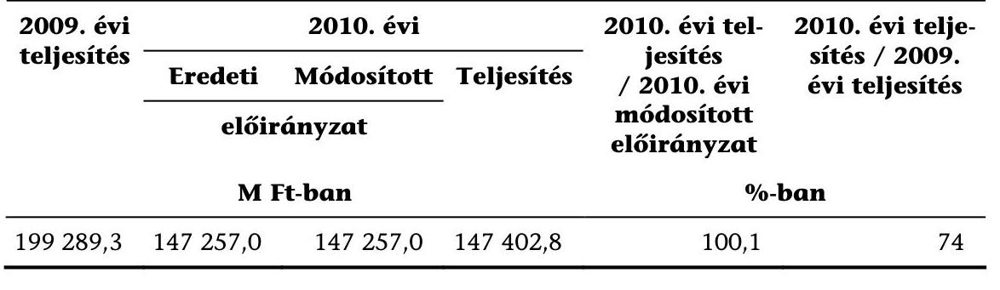

---

A 2010. évre a Lakástámogatások előirányzat-tervezetét az ÖM Lakásügyi Főosztálya tervezte meg. Az ÁSZ a Lakástámogatások előirányzatát a rendelkezésre álló dokumentációk és háttérszámítások alapján megalapozottnak minősítette.

Az általános és fejezeti indokolás pontosan mutatja be az egyéb lakástámogatások 2010. évi alakulását.

# XV. Nemzetgazdasági Minisztérium 30. Vállalkozások folyó támogatása 

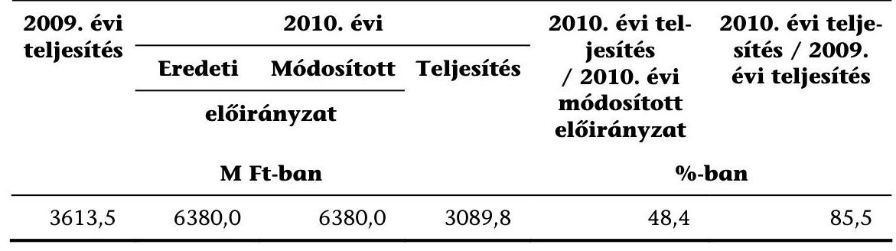

Az ÁSZ a 2010. évi költségvetés véleményezése során az előirányzat megalapozottságát és betarthatóságát az előirányzatot alátámasztó dokumentációk hiánya miatt nem tudta minősíteni.

A zárszámadási törvényjavaslat szöveges indokolása az előirányzat elmaradásának okait megfelelő részletességgel tartalmazza.

## XV. Nemzetgazdasági Minisztérium 31. Fogyasztói árkiegészítés

| 2009. évi teljesítés | 2010. évi |  |  | 2010. évi teljesítés / 2010. évi   módosított   előirányzat | 2010. évi teljesítés / 2009.   ściés / 2009.   ściés / 2009. |
| :--: | :--: | :--: | :--: | :--: | :--: |
|  | Eredeti | Módosított | Teljesítés |  |  |
|  | elöirányzat |  |  |  |  |
|  | M Ft-ban |  |  | \%-ban |  |
| 107 397,9 | 108 500,0 | 108 500,0 | 107 319,2 | 98,9 | 99,9 |

Az ÁSZ a 2010. évi költségvetés véleményezése során az előirányzat megalapozottságáról nem tudott megbizonyosodni, miután a szükséges dokumentumok, számítási anyagok nem álltak rendelkezésre.

Az előirányzat elmaradásának okát a zárszámadási törvényjavaslat szöveges indokolása megfelelő részletességgel tartalmazza. Az indokolás szerint - az ellenőrzés véleményével megegyezően - az előirányzat alulteljesülését a kedvezményes utazások tervezettnél nagyobb mértékű csökkenése okozta.

---

XV. Nemzetgazdasági Minisztérium 32. Egyéb költségvetési kiadások

| 2009. évi teljesítés | 2010. évi |  |  | 2010. évi teljesítés / 2010. évi módosított előirányzat | 2010. évi teljesítés / 2009. évi teljesítés |
| :--: | :--: | :--: | :--: | :--: | :--: |
|  | Eredeti | Módosított | Teljesítés |  |  |
|  | Elöirányzat |  |  |  |  |
|  | M Ft-ban |  |  | \%-ban |  |
| 23588,4 | 22863,5 | 21454,7 | 27878,1 | 129,9 | 118,2 |

Az Egyéb költségvetési kiadások cím előirányzatait - az 1\% szja közcélú felhasználása kivételével - az előző évek tapasztalatai, valamint az előző évi teljesítés, illetve a várható teljesítés összegének figyelembevételével tervezte meg a PM. Az ÁKK Zrt. közreműködési díjára előirányzatot nem terveztek, a teljesítés 3,8 M Ft volt. A cím 2010. évi tervezett előirányzatait a rendelkezésre álló dokumentációk és háttérszámítások alapján megalapozottnak minősítettük.

Az általános és fejezeti indokolás megfelelően mutatja be az egyéb költségvetési kiadások 2010. évi alakulását.
XV. Nemzetgazdasági Minisztérium 34. Kormányzati rendkívüli kiadások

| 2009. évi teljesítés | 2010. évi |  |  | 2010. évi teljesítés / 2010. évi módosított előirányzat | 2010. évi teljesítés / 2009. évi teljesítés |
| :--: | :--: | :--: | :--: | :--: | :--: |
|  | Eredeti | Módosított | Teljesítés |  |  |
|  | elöirányzat |  |  |  |  |
|  | M Ft-ban |  |  | \%-ban |  |
| 5422,3 | 8534,3 | 5177,0 | 5006,1 | 96,7 | 92,3 |

A Magyar Köztársaság 2010. évi költségvetéséről készített véleményben a PM fejezet 24. Kormányzati rendkívüli kiadások cím jogcímcsoportjainak elői-rányzat-tervezeteit megalapozottnak ítéltük meg.

A zárszámadási törvényjavaslat szöveges indokolása a XV. NGM fejezet Kormányzati rendkívüli kiadások cím előirányzatának teljesítéséről pontos képet ad.
XV. Nemzetgazdasági Minisztérium 35. Garancia és hozzájárulás a társadalombiztosítási ellátásokhoz

| 2009. évi   teljesítés | 2010. évi |  |  | 2010. évi   teljesítés   / 2010. évi   módosított   elöirányzat | 2010. évi tel-   jesítés /   2009. évi tel-   jesítés |
| :--: | :--: | :--: | :--: | :--: | :--: |
|  | Eredeti | Módosított | Teljesítés |  |  |
|  | elöirányzat |  |  |  |  |
|  | M Ft-ban |  |  | \%-ban |  |
| 913794,4 | 1206789,7 | 1208217,3 | 1147468,9 | 95 | 125,6 |

---

A Magyar Köztársaság 2010. évi költségvetéséről készített véleményben a Garancia és hozzájárulás a társadalombiztosítási ellátásokhoz cím jogcímcsoportjainak előirányzat-tervezeteit megalapozottnak ítéltük meg. Ugyanakkor jeleztük, hogy a Magánnyugdíjpénztárba átlépők miatti járulékkiesés pótlására és a Nyugdíjbiztosítási Alap kiadásainak támogatása jogcímcsoportok előirányzattervezetei a Kormány döntésének függvényében még változhatnak.

A Garancia és hozzájárulás a társadalombiztosítási ellátásokhoz cím kiadásainak eredeti előirányzatát az év során 1427,7 M Ft-tal megemelték, az alapkezelők által nem tervezhető működési kiadások fedezete érdekében. Az átcsoportosítás 63,5\%-a a Ny. Alapot, míg 36,5\%-a az E. Alapot érintette. Az átcsoportosítások az általános tartalék ( $400,0 \mathrm{MFt}$ ) és a céltartalék ( $1027,7 \mathrm{MFt}$ ) terhére történtek, melyek során új költségvetési jogcímcsoportok jöttek létre.

A zárszámadási törvényjavaslat szöveges indokolása a Garancia és hozzájárulás a társadalombiztosítási ellátásokhoz előirányzatának teljesítéséről pontos képet ad.

A Garancia és hozzájárulás a társadalombiztosítási ellátásokhoz cím módosított előirányzata és a teljesítése közötti eltérést alapvetően a Magánnyugdíjpénztárba átlépők miatti járulékkiesés pótlására jogcímcsoport kifizetéseinek 2010 novemberétől történt megszüntetése okozta. A kiadásoknak a 2009. évhez viszonyított emelkedését az E. Alap támogatása alcímnél a Központi költségvetésből járulék címén átadott pénzeszköz közel duplájára történt növekedése okozta.

# XV. Nemzetgazdasági Minisztérium 36. Nemzetközi elszámolások kiadásai 

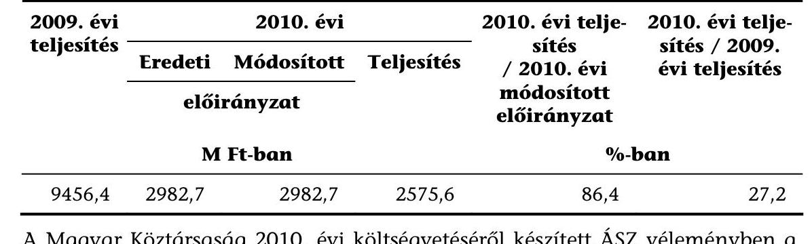

A Magyar Köztársaság 2010. évi költségvetéséről készített ÁSZ véleményben a PM fejezet 28. Nemzetközi elszámolások kiadásai cím jogcímcsoportjainak elői-rányzat-tervezeteit megalapozottnak ítéltük meg.

A nemzetközi pénzügyi kapcsolatokból eredő kiadások teljesítésének az előirányzathoz viszonyított 13,6\%-os elmaradását döntően az egyes kiadások (Hozzájárulás az EBRD által kezelt Nyugat-Balkáni Alaphoz, EU Szomszédsági Beruházási Eszköz, IDA alaptőke-hozzájárulás IV. negyedév) tervezéskor figyelembe vett kifizetéseinek elmaradása okozta.

Az ellenőrzés megítélése szerint a zárszámadási törvényjavaslat szöveges indokolása a Nemzetközi elszámolások kiadásai előirányzatának teljesítéséről nem teljesen pontos. A szöveges indokolásban az szerepel, hogy a 2010-ben teljesí-

---

tett 2,6 Mrd Ft összeg 0,4 Mrd Ft-tal volt kevesebb az előirányzatnál. Ennek oka az, hogy a forint árfolyamváltozása, valamint a kamat alakulása miatt a devizában előírt kötelezettségek teljesítése forintra átszámítva esetenként eltért a tervezettől. A devizában teljesített előirányzatok (Tagdíj az ET Társadalomfejlesztési Alapjához, Bruegel tagdíj) nem az árfolyam változása miatt, hanem azért teljesültek alacsonyabban, mert a válságra való tekintettel csökkentették a devizában szükséges hozzájárulást. A Hozzájárulás az IMF Libéria-Alapjához - amely több mint fele a teljes kifizetésnek - az árfolyamváltozás miatt teljesült túl. Az elmaradás oka az, hogy egyes tervezéskor figyelembe vett kiadások (Hozzájárulás az EBRD által kezelt Nyugat-Balkáni Alaphoz, EU Szomszédsági Beruházási Eszköz, IDA alaptőke-hozzájárulás IV. negyedév) nem kerültek kifizetésre a 2010. év során.

# XVII. Nemzeti Fejlesztési Minisztérium 17. Vállalkozások folyó támogatása 

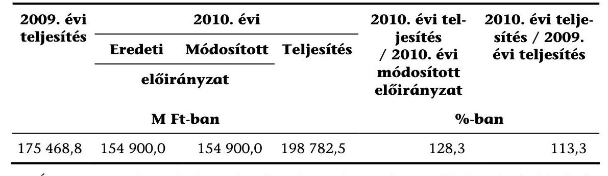

Az ÁSZ a 2010. évi költségvetés véleményezése során a Vállalkozások folyó támogatása cím Bányabezárás jogcímcsoport előirányzatát megalapozottnak minősítette, A helyközi személyszállítási közszolgáltatások és a vasúti pályahálózat múködtetésének költségtérítése jogcímcsoport előirányzat megalapozottságát és betarthatóságát alátámasztó dokumentációk hiánya miatt nem tudta minősíteni.

A zárszámadási törvényjavaslat szöveges indokolása az előirányzat teljesítéséről pontos képet ad.

## XVII. Nemzeti Fejlesztési Minisztérium 20. K-600 hírrendszer müködtetésére

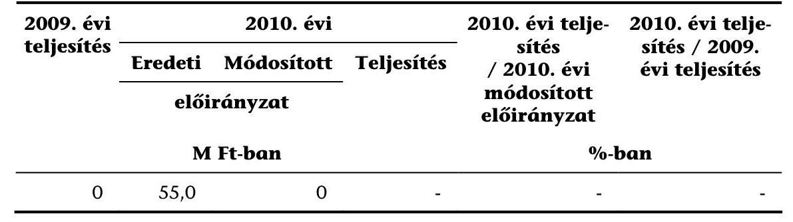

A K-600 hírrendszer múködtetésére szolgáló előirányzatot a HM Védelmi Hivatala tervezte meg az ÖM Védelmi titkárságának koordinálása mellett. A cím előirányzata a rendelkezésre álló dokumentációk és a háttérszámítások alapján megalapozott volt.

---

Az előirányzat kezelését az NFM végzi. Az előirányzat összegét az ME és az NFM átcsoportosította a KEKKH-hoz. A 2010. évben is a KEKKH végezte a kiadások elszámolását.

A KEKKH-nál a K-600 hírrendszer múködtetésére szolgáló 2010. évi előirányzat 55,0 M Ft, a módosított előirányzat 546,7 M Ft és a teljesítés 362,7 M Ft, a módosított előirányzathoz viszonyítva 66,3\% volt. A 2009. évi teljesítés 43,3 M Ft volt.

A módosított előirányzat (546,7 M Ft) a Kvtv. alapján meghatározott 55,0 M Ftból, a védelmi felkészítés egyes kérdéseiről szóló 1055/2010. (III. 5.) Korm. határozat alapján átcsoportosított 175,0 M Ft-ból, a 2010. évre áthúzódott 2009. évi kötelezettségvállalással terhelt 302,4 M Ft összegű maradványból, illetve a 2009. évi kötelezettségvállalással nem terhelt 14,3 M Ft összegű maradványból tevődött össze, aminek felhasználásáról a 2010. évben nem született döntés. (Nem került elvonásra, továbbra is KEKKH pénzforgalmi számláján jelenik meg.)

A 2010. évi teljesítés 362,7 M Ft volt, ami a 2010. évre áthúzódott 2009. évi kötelezettségvállalással terhelt maradvány 302,4 M Ft felhasználásából, illetve 2010. évi kötelezettséghez kapcsolódó 60,3 M Ft összegű kifizetés teljesítéséből állt.

A 2010. évi előirányzat-maradvány 184,0 M Ft, amelyből 171,3 M Ft 2010. évi kötelezettségvállalással terhelt, de a 2011. évre áthúzódó. A kötelezettségvállalással nem terhelt maradvány $12,7 \mathrm{MFt}$.

Az áthúzódás oka, hogy a KEKKH a 1055/2010. (III. 5.) Korm. határozat alapján átcsoportosított 175,0 M Ft-ot 2010. 12. 23-án kapta meg az NFM-től.

# XX. Nemzeti Eröforrás Minisztérium 21. Családi támogatások 

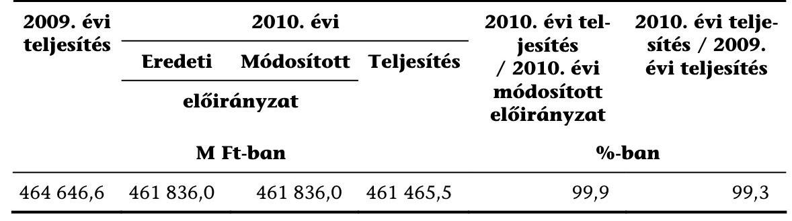

A Családi támogatások 2010. évi előirányzat-tervezeteinek kialakítását a számvevőszéki ellenőrzés a rendelkezésre álló dokumentáció és a háttérszámítások alapján megalapozottnak minősítette. A Kormány a T/10554. számon benyújtott törvényjavaslat fejezeti indokolásában a családi pótlék, az anyasági támogatás, a GYES, a GYET, az életkezdési támogatás, továbbá a pénzbeli gyermekvédelmi támogatás előirányzatainak kialakítása során figyelembe vették, hogy az ellátások összege a 2009. évihez hasonlóan a 2010. évben nem emelkedik.

A fejezeti indokolás a teljesülésről pontos képet ad.

---

# XX. Nemzeti Eröforrás Minisztérium 22. Egyéb szociális ellátások és költségtérítések 

| 2009. évi teljesítés | 2010. évi |  |  | 2010. évi teljesítés / 2010. évi módosított előirányzat | 2010. évi teljesítés / 2009. évi teljesítés |
| :--: | :--: | :--: | :--: | :--: | :--: |
|  | Eredeti | Módosított | Teljesítés |  |  |
|  | elöirányzat |  |  |  |  |
|  | M Ft-ban |  |  | \%-ban |  |
| 183 372,0 | 180 307,0 | 180 307,0 | 170 476,9 | 94,5 | 94,5 |

Az Egyéb szociális ellátások és költségtérítések 2010. évi előirányzattervezeteinek kialakítását a számvevőszéki ellenőrzés a rendelkezésre álló dokumentáció és a háttérszámítások alapján megalapozottnak minősítette.

A fejezeti indokolás a teljesülésről pontos képet ad.

### 3.4.2. A központi költségvetés kamatelszámolásai, tőkevisszatérülései, az adósság- és követelés-kezelés költségei

A központi költségvetés kamatelszámolásai, tőkevisszatérülései, az adósság- és követelés-kezelés költségei kiadási előirányzata

| 2009. évi teljesítés | 2010. évi |  |  | 2010. évi teljesítés / 2010. évi módosított előirányzat | 2010. évi teljesítés / 2009. évi teljesítés |
| :--: | :--: | :--: | :--: | :--: | :--: |
|  | Eredeti | Módosított | Teljesítés |  |  |
|  | elöirányzat |  |  |  |  |
|  | M Ft-ban |  |  |  | \%-ban |
| 1180 244,2 | 1215 790,3 | 1215 790,3 | 1146 301,1 | 94,3 | 97,1 |

Az államadóssággal kapcsolatos kiadások összege az előirányzottnál kedvezőbben alakult. Az elmaradás a fel nem használt kamatkockázati tartalék (50 000,0 M Ft), a kamatkiadások (16 980,6 M Ft) és az egyéb költségek (2508,6 M Ft) megtakarításából származott.

Az előirányzottnál (a kamatkockázati tartalék nélkül) alacsonyabb összegű kiadás a forintban fennálló adósság kamatelszámolásainak 13 485,1 M Ft-os, a devizában fennálló adósság kamatának 3495,5 M Ft-os és az egyéb költségek 2508,6 M Ft-os megtakarításából származott.

A kamatkiadások kedvezőbb alakulása annak az eredménye, hogy a 2010. évi költségvetés kamatkiadási előirányzatainak kialakításánál figyelembe vett egyes tényezők a prognosztizált értéktől eltérően alakultak. Az állampapírpiaci folyamatok - amelyek a piaci finanszírozást biztosították - módosították a finanszírozás és kamatkiadás szerkezetét.

A tényleges forint hozamgörbe átlaga minden állampapír lejáraton alacsonyabb volt a tervezett forint hozamgörbék átlagánál (0,67-2,44\%-ponttal), ami

---

csökkentette a központi költségvetés adóssága után fizetendő kamatok összegét. A kamatok növekedését okozta azonban, hogy a 2010-re előirányzott átlagos 272,1 Ft/EUR-hoz képest a tényleges átlagos árfolyam 275,4 Ft/EUR volt.

A központi költségvetés kamat-előirányzatait megalapozó finanszírozási tervben -98,7 Mrd Ft nettó deviza kibocsátás szerepelt. A tényleges nettó kibocsátás 37,1 Mrd Ft volt, ami 135,7 Mrd Ft-tal magasabb az előirányzott összegnél. A nettó forint kibocsátás 476,3 Mrd Ft volt, ami 41,5 Mrd Ft-tal magasabb a központi költségvetés kamat-előirányzatait megalapozó finanszírozási tervben szereplő 434,7 Mrd Ft-os összegnél. A nettó forint kibocsátáson belül a kötvények nettó kibocsátása 239,9 Mrd Ft-tal magasabb, míg a forinthitelek nettó kibocsátása 115,6 Mrd Ft-tal kevesebb volt a tervezett összeghez viszonyítva.

A központi költségvetés 2010. évi kamat-előirányzatait megalapozó finanszírozási terv szerint a Nemzetközi Fejlesztési Intézmények hitellehívásai forintban történnek. A terv 217,7 Mrd Ft nettó forint kibocsátást tartalmazott. Az állam 2010-ben 102,0 Mrd Ft és 2,6 millió euró hitelt vett fel az EIB-től. Az EIB felfüggesztette a további programfinanszírozó hitelek folyósítását arra hivatkozva, hogy a magyar közbeszerzési törvény nincs összhangban az EUszabályozással.

A nemzetgazdasági miniszter 13661/4/2010. december 27-ei levelében arra kérte a nemzeti fejlesztési minisztert, hogy „a közbeszerzési szabályozásban a nemzeti és az EU-szabályzás közötti összhang megteremtése iránt - már a 2012-re tervezett átfogó módositást megelőzően - intézkedni szíveskedjen."

A CEB nem tartotta megfelelőnek a magyar fél adatszolgáltatását és ezért a 2010. év végén csak kisebb összegű ( 65,7 millió euró) hitelt nyújtott Magyarország számára.

A Nemzetgazdasági Minisztérium 2010. 04. 21-én az ÁKK Zrt. részére küldött e-mailje a következőket tartalmazta: „A folyamatban levő CEB-projekteknek az NFÜtől érkező adatszolgáltatása alapján a CEB tervezetthez képest alacsonyabb összegü lehívást tartott indokoltnak, amelyet az NGM vitatott. A pótlólagos adatszolgáltatási igényekkel kapcsolatos egyeztetések folyamatban vannak, azok eredménye 2011. I. félév végéig várható."

Devizában fennálló adósság kamatkiadása

| 2009. évi teljesítés | 2010. évi |  |  | 2010. évi teljesítés / 2010. évi teljesítés / 2009. évi teljesítés |  |
| :--: | :--: | :--: | :--: | :--: | :--: |
|  | Eredeti | Módosított | Teljesítés |  |  |
|  | elöirányzat |  |  |  |  |
|  | M Ft-ban |  |  | \%-ban |  |
| 295 232,6 | 285 702,7 | 285 702,7 | 282 207,2 | 98,8 | 95,6 |

Az előirányzottnál kedvezőbb kamatkiadás a devizahitelek után fizetett kamatkiadás 8022,6 M Ft-os megtakarításából, és a devizakötvényekben fennálló adósság után fizetett összeg 4527,1 M Ft-os többletkiadásából származott.

---

A devizahitelek kamatelszámolásainak 113 287,3 M Ft-os előirányzata 92,9\%on (105 264,7 M Ft) teljesült. A devizahitelek után elszámolt alacsonyabb kamatkiadás ( 8022,6 M Ft) a nemzetközi pénzügyi szervezetektől felvett hitelek után fizetett kamatok 8110,0 M Ft-os megtakarításából és az 1999-től felvett devizahitelek kamatterhének 87,4 M Ft-os többlet kamatából származott.

A nemzetközi pénzügyi szervezetektől és külföldi pénzintézetektől felvett hitelek utáni kamatkiadás 112 914,2 M Ft-os előirányzata 92,8\%-ban (104 804,2 M Ft) teljesült. A kamatkiadásokat 9033,0 M Ft-tal csökkentették a Világbanki hitelek, az EBB hitelek, az ET Fejlesztési Bank hitelei, a MÁV Rt.-től, a GySEV Rt.-től 2002-ben átvállalt hitelek, az EBRD hitelek és az Európai Bizottság által biztosított hitelek kamatelszámolásainak elmaradása a tervezettől. A kamatkiadásokat 923,0 M Ft-tal növelte a KfW hitelek, az ÁAK Rt.-től 2002-ben átvállalt devizahitelek és az IMF által biztosított hitelek kamatkiadásainak előirányzott összeghez viszonyított többlete.

A IMF és az Európai Bizottság által biztosított hitelkeretből a 2010. évben nem történt lehívás. Az IMF hitele után fizetett kamatkiadás 1,8\%-kal magasabb volt a tervezett összegnél, ezzel szemben az Európai Bizottság által biztosított hitel kamatkiadása 11,2\%-kal volt kevesebb az előirányzottnál. Az eltérések oka, hogy a kamatelszámolásoknál figyelembe vették a hitelekhez kapcsolódó swapok nettó értékét (swap kiadás és -bevétel egyenlege) is. A felvett hitelek kamatozása a hitelnyújtó és a lehívás időpontja szerint különböző. Az IMF hitele változó kamatozású, a kamat mértéke hetente kerül meghatározásra. 2010-ben az IMF első lehívásának átlagkamatlába 1,8\%, a második lehívásé 3,28\%, a harmadik lehívásé szintén 3,28\% volt. Az Európai Bizottság által nyújtott hitelek fix kamatozásúak.

Az 1999-től felvett devizahitelek utáni kamatfizetés előirányzata 371,1 M Ft, a teljesítés $460,5 \mathrm{M} \mathrm{Ft}(123,4 \%)$ volt. A túlteljesítést a magasabb árfolyam és hozam okozta.

Az 1999-től kibocsátott devizakötvények után fizetendő kamat előirányzata (172 413,4 M Ft) 102,3\%-ban (176 351,7 M Ft) teljesült. A túllépést a kötvénykibocsátás volumenének előirányzattól való eltérése és a tervezettnél kisebb rövid hozamok befolyásolták.

A központi költségvetés 2010. évi kamat-előirányzatait megalapozó finanszírozási terv 272,1 Mrd Ft összegű ( 1 Mrd euró) piaci forrásbevonással számolt. A tényleges forrásbevonás egy 10 éves futamidejű, fix kamatozású 2 Mrd dollár (386,2 Mrd Ft) összegű kötvénykibocsátás keretében valósult meg.

Az amerikai kötvények után kifizetett kamat összege 2,1 M Ft volt, amely 0,1 M Ft-tal több, mint az előirányzott (2,0 M Ft) összeg.

Az ütemezett törlesztéseken felüli visszavásárlások eredményeként jelentősen lerövidült az amerikai kötvények hátralevő futamideje (lejárat: 2013. 07. 01.). A fennálló tartozás a 2010. év végén 21,1 M Ft volt.

Az M2M betétekkel kapcsolatos kamatkiadásoknak 2010-ben nem volt előirányzata. A teljesült összeg 588,7 M Ft. Az M2M betétek nagyságát (közvetve a kamatkiadását) a partnerek által elhelyezett betétek összege határozza meg. Az előirányzatok elkészítésének időszakában az elhelyezendő betétek összege

---

nem ismert. A külföldi partnerek a 2010. év végén 220014,9 M Ft összegben helyeztek el betétet az ÁKK Zrt.-nél.

Amennyiben nem euróban, hanem más devizában (elsősorban USD, JPY, GPB) von be forrást az állam, akkor azokat az ÁKK Zrt. devizacsereügyletek (swapok: egy devizában esedékes kifizetést cserélnek el egy másik devizában esedékes kifizetésre) segítségével átalakítja euró alapú kötelezettségekre. Az ilyen fedezeti ügyletekhez kapcsolódóan az ÁKK Zrt. és a vele szerződésben álló külföldi partnerek partnerkockázatot csökkentő eljárást (ún. mark-to-market (M2M): pozíció pillanatnyi piaci árfolyamok melletti kiértékelése) alkalmaznak, mely megállapodások keretében a felek rendszeresen meghatározzák az egymással kötött swap ügyletek piaci értékét. Az a fél, akinek oldaláról a swap piaci értéke negatív és az a kiértékelési küszöbértéket meghaladja, ezen piaci értékkel megegyező összegű betétet helyez el a másik félnél.

# Forintadóssággal kapcsolatos kamatkiadások 

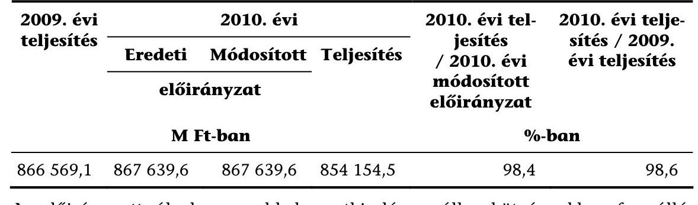

Az előirányzottnál alacsonyabb kamatkiadás az államkötvényekben fennálló adósság kamatának 39874,1 M Ft-os többletkiadásából, a forinthitelekben fennálló adósság kamatának 12 490,7 M Ft-os, és a kincstárjegyek után fizetett kamat 40 868,5 M Ft-os csökkenéséből származott.

A forinthitelek kamatkiadásainak 40099,8 M Ft-os előirányzata 68,9\%-on (27 609,1 M Ft) teljesült. Az eltérés az EIB-től (M3 autópálya hitel kamata, Innovációs hitel kamata, Kohéziós hitel kamata, Térség hitel kamata, Oktatás hitel kamata) felvett forinthitelek kamatkiadásainak 13 833,1 M Ft-os csökkenéséből és az ET Fejlesztési Bank forinthitelek kamatelszámolásainak 1342,4 M Ftos többletköltségéből származott.

A forint államkötvényekkel kapcsolatos kamatelszámolások 619 813,3 M Ft-os előirányzata 106,4\%-on (659 687,4 M Ft) teljesült. A piaci értékesítésű államkötvények kamatelszámolásainál 44 848,5 M Ft-os többlet, míg a nem piaci értékesítésű kötvények kamatelszámolásainál 4974,4 M Ft-os csökkenés jelentkezett.

A piaci értékesítésű, hiányt finanszírozó államkötvények kamatkiadásának 580 161,6 M Ft-os előirányzata 107,7\%-on (625 010,1 M Ft) teljesült. A kamatkiadást 59 068,9 M Ft-tal növelte az előirányzottnál magasabb kötvénykibocsátás. A tervezettnél alacsonyabb hozamok viszont 14 220,4 M Ft-tal csökkentették a piaci értékesítésű, hiányt finanszírozó államkötvények kamatelszámolását. A kötvények nettó kibocsátásának előirányzata 175,4 Mrd Ft, a megvalósult öszszeg 415,3 Mrd Ft volt. A forint hozamgörbe átlaga a tervezett három hónapos hozamnál 2,44\%-ponttal, az egy évesnél 2,28\%-ponttal, a három évesnél 1,25\%-

---

ponttal, az öt évesnél 1,03\%-ponttal, a tíz évesnél 0,67\%-ponttal volt alacsonyabb.

A nem piaci értékesítésű államkötvények 39 651,7 M Ft-os előirányzata 87,5\%-on (34 677,3 M Ft) teljesült. A változó kamatozású kötvényeknél az alacsonyabb hozamok az előirányzathoz képest csökkentették a kötvények kamatkiadásait. A rubelkövetelések megvásárlását fedező államkötvények kamatkiadásainak 359,5 M Ft-os előirányzata 100\%-on teljesült. Az ÁPV Rt. gázközművek miatti tartalékfeltöltést fedező kötvényei utáni kamatkiadás 143,2 M Ft-os előirányzata 86,7\%-ban (124,1 M Ft) teljesült. Az MFB Rt.-nek átadott államkötvények 1378,2 M Ft-os előirányzata 100\%-ban teljesült. Az átadott államkötvények fix kamatozásúak és ennek következtében a hozamok változása nem befolyásolta a kamatkiadást. A lakással kapcsolatos államkötvények 1646,9 M Ft-os előirányzata 67,3\%-ban (1108,5 M Ft) teljesült. A konszolidációval kapcsolatos államkötvények 23 344,8 M Ft-os előirányzata 84,2\%-ban teljesült (19 648,1 M Ft).

A kincstárjegyek 207 726,5 M Ft-os előirányzata 80,3\%-on (166 858,0 M Ft) teljesült, mivel a diszkont kincstárjegyek és lakossági kincstárjegyek kamatkiadása kevesebb volt az előirányzottnál.

A diszkont kincstárjegyek kamatelszámolásának 157 018,7 M Ft-os előirányzata 83,3\%-on (130 730,2 M Ft) teljesült. A tervezetthez képest ( 49,2 Mrd Ft) a teljesült nettó kibocsátás negatív ( $-30,1 \mathrm{Mrd} \mathrm{Ft}$ ) volt. Az alacsonyabb hozamok is csökkentették a kamatkiadás összegét.

A lakossági kincstárjegyek 50 707,8 M Ft-os előirányzott kamatkiadása 71,2\%-on (36 127,8 M Ft) teljesült. A lakossági kincstárjegyek alacsonyabb kamatkiadásából 12 081,5 M Ft-ot a volumenhatás, 2498,5 M Ft-ot a struktúra és az eltérő hozamok indokolnak.

Adósságkezelés egyéb kiadásai

| 2009. évi teljesítés | 2010. évi |  |  | 2010. évi teljesítés / 2010. évi módosított előirányzat | 2010. évi teljesítés / 2009. évi teljesítés |
| :--: | :--: | :--: | :--: | :--: | :--: |
|  | Eredeti | Módosított | Teljesítés |  |  |
|  | elöirányzat |  |  |  |  |
|  | M Ft-ban |  |  | \%-ban |  |
| 18 442,5 | 12 448,0 | 12 448,0 | 9939,4 | 79,8 | 53,9 |

Az adósságkezelés egyéb kiadásainak 12 448,0 M Ft-os előirányzata 79,8\%-on (9939,4 M Ft) teljesült.

A piaci kibocsátások, hitelfelvételek, átvállalások jogcímen 512,8 M Ft kevesebb költség keletkezett, mivel a tervezetthez képest csökkentek a hitelfelvételekhez kapcsolódó jutalékok.

A forint elszámolások 9062,5 M Ft-os előirányzata 7830,4 M Ft-on (86,4\%) teljesült. Az alacsonyabb költséget a lakossági állampapírok értékesítésében történt forgalomcsökkenés okozta.

Az állampapírok értékesítését támogató kiadásokra előirányzott 990,0 M Ft 23,1\%-on (228,9 M Ft) teljesült. Az elmaradás oka az volt, hogy az állampapí-

---

rokkal kapcsolatos marketingkommunikációs feladatok ellátására kötött szerződés 2010. április 22. napján lejárt, és az új szerződésre kiírt közbeszerzési eljárás eredménytelen volt. Az újonnan kinevezett vezérigazgató a marketing közbeszerzési eljárás újraindítását rendelte el, mivel szükségesnek látta a Központi Szolgáltatási Főigazgatóság (NFM) bevonását a pályázat lebonyolításához.

Az adósságkezelő költségeinek 882,0 M Ft-os előirányzata 100\%-on teljesült.
A Követeléskezelés költségei alcím 2,7 M Ft-os előirányzata 3,7\%-on teljesült. Az előirányzat alulteljesülésének oka, hogy a 2010. év során nem került sor külföldi követelések leépítését célzó pályázatok kiírására.

A központi költségvetés kamatelszámolásai, tőkevisszatérülései, az adósság- és követelés-kezelés költségei bevételi előirányzata

| 2009. évi teljesítés | 2010. évi |  |  | 2010. évi teljesítés / 2010. évi   módosított   elöirányzat | 2010. évi teljesítés   2009.   2010. évi teljesítés |
| :--: | :--: | :--: | :--: | :--: | :--: |
|  | Eredeti | Módosított | Teljesítés |  |  |
|  | elöirányzat |  |  |  |  |
|  | M Ft-ban |  |  | \%-ban |  |
| 144 447,5 | 111 402,3 | 111 402,3 | 131793,8 | 118,3 | 91,2 |

Az előirányzatot meghaladó teljesítés oka, hogy a kamatbevételek a tervezettnél 19684,0 M Ft-tal, a tőkekövetelések visszatérüléséből származó bevételek 706,9 M Ft-tal magasabb összegben valósultak meg, továbbá az adósságszolgálattal kapcsolatos egyéb elszámolások címen 0,6 M Ft összegű - nem tervezett bevétel teljesült.

A devizában fennálló adósság bevételeinek előirányzata $32026,0 \mathrm{M}$ Ft, a teljesülés $15400,5 \mathrm{M} \mathrm{Ft}(48,1 \%)$ volt.

A Devizaszámla kamatbevételénél nem terveztek bevételi előirányzatot, a teljesülés $210,1 \mathrm{M}$ Ft volt.

Az M2M betétekkel kapcsolatos kamatbevételeknél nem terveztek bevételi előirányzatot, a teljesülés 531,1 M Ft volt. Az M2M betétek nagyságát (közvetve a kamatbevételt) az ÁKK Zrt. által elhelyezett betétek összege határozza meg. Az előirányzatok elkészítésének időszakában az elhelyezett betétek nagysága előre nem tervezhető. Az ÁKK Zrt. külföldi partnereknél elhelyezett M2M betéteinek összege a 2010. év végén 73743,1 M Ft volt.

Az IMF hiteleiből származó betét kamatának 3722,6 M Ft-os előirányzata 2061,9 M Ft-on (55,4\%) teljesült. A bankoknak nyújtott hitelből származó kamatbevételek 28 303,4 M Ft-os előirányzata 12 593,6 M Ft-on (44,5\%) teljesült. Az IMF első hitelcsomagjának nagyobbik részét betétként elhelyezték a MNBnél, másik részét továbbhitelezték az MFB Zrt., az OTP Nyrt., illetve az FHB Nyrt. részére és ezekből kamatbevétel származott. A kamatbevétel kevesebb volt az előirányzottnál, mivel a továbbkölcsönzött hitelek egy része előtörlesztésre került, másrészt a betétekre fizetett kamatszint a tervekhez képest alacsonyabban alakult.

---

Az EB hitelekből származó betét kamatbevételeinél nem terveztek bevételi előirányzatot, a teljesülés $3,8 \mathrm{M}$ Ft volt.

A forintban fennálló adósság kamatbevételeinek 78 765,1 M Ft-os előirányzata 115 074,6 M Ft-on (146,1\%) teljesült. A tervezett bevételi előirányzat túlteljesítései ( $36309,5 \mathrm{M} \mathrm{Ft}$ ) az államkötvények felhalmozott kamatbevételének és a diszkont kincstárjegyek kamatbevételének többletéből, továbbá a KESZ és az intervenciós felvásárlás előfinanszírozási költsége megtérülésének tervezettnél alacsonyabb kamatbevételéből adódott.

A piaci értékesítésű államkötvények felhalmozott kamatelszámolásának és árfolyamnyereségének 42 109,1 M Ft-os tervezett bevétele 212,9\%-on (89 652,8 M Ft) teljesült, ami döntően a többszöri aukciós értékesítés során keletkező bevétel. A megemelt értékesítés és a tervhez képest alacsonyabb hozamok határozták meg a kamatbevétel alakulását.

Az Alárendelt kölcsöntőke-kötvény kamatelszámolása jogcím 1379,3 M Ft-os előirányzata $77 \%$-on teljesült. A bevétel elmaradás oka, hogy a kamatok a tervezettnél alacsonyabb szinten alakultak.

A KESZ 34 574,9 M Ft-os előirányzata 67,4\%-on (23 295,9 M Ft) teljesült. A 11 279,0 M Ft-tal alacsonyabb kamatbevétel két hatás eredője. A KESZ tervezettnél kisebb hó végi záró állománya miatt a kamatbevétel 655,2 M Ft-tal csökkent. A prognosztizáltnál alacsonyabb átlagos havi alapkamat 10 623,8 M Ft-tal csökkentette a kamatbevételt.

Az Intervenciós felvásárlás előfinanszírozási költségének megtérítése alcím 701,8 M Ft-os előirányzata 280,7 M Ft-on, 40\%-on teljesült. A kamatot az Európai Unió az intervenciós készletek felvásárlásának időpontjától az általa meghatározott időpontban és volumenben történő értékesítéséig terjedő időszakra fizeti a megelőlegezésre fordított összeg után. A bevétel elmaradásának oka, hogy bár a 2010. év folyamán 500 ezer tonnáról 600 ezer tonnára nőtt Magyarországon az intervenciós átlagkészlet, azonban az EU kamatráta 5\%-ról 1,5\%-ra csökkent. Az előirányzat az 5\%-os kamatrátával került megtervezésre. Az ÁSZ a tervezés időszakában az előirányzat megalapozottságát nem megítélhetőnek értékelte. Az előirányzat teljesülése függ a gabonatermelés alakulásától, az intervenciós felvásárlás mértékétől, a kamatok és a HUF/EUR árfolyam alakulásától.

Tökekövetelések visszatérülése

| 2009. évi teljesítés | 2010. évi |  |  | 2010. évi teljesítés / 2010. évi módosított előirányzat | 2010. évi teljesítés / 2009. évi teljesítés |
| :--: | :--: | :--: | :--: | :--: | :--: |
|  | Eredeti | Módosított | Teljesítés |  |  |
|  | elöirányzat |  |  |  |  |
|  | M Ft-ban |  |  |  | \%-ban |
| 2188,7 | 611,2 | 611,2 | 1318,1 | 215,7 | 60,2* |

*A 2009. évben a teljesítés még tartalmazta a 4/4. Állami alapjuttatás járadéka alcímet.

---

A tervezettől való eltérés a kormányhitelek lebontásából származó bevételek 782,0 M Ft-tal magasabb és a nemzetközi pénzügyi szervezetek által nyújtott és belföldre kihelyezett hitelek törlesztése 75,1 M Ft-os elmaradásának egyenlegeként alakult ki.

Kormányhitelek visszatérülése alcím

| 2009. évi teljesítés | 2010. évi |  |  | 2010. évi teljesítés / 2010. évi   módosított   elöirányzat | 2010. évi teljesítés / 2009.   évi teljesítés |
| :--: | :--: | :--: | :--: | :--: | :--: |
|  | Eredeti | Módosított | Teljesítés |  |  |
|  | elöirányzat |  |  |  |  |
|  | M Ft-ban |  |  | \%-ban |  |
| 1795,8 | 314,2 | 314,2 | 1096,2 | 348,9 | 61 |

A 2010. évi előirányzatok kialakításakor Albánia esetében 289,3 M Ft bevételt terveztek, amelynél 12,2 M Ft-tal alacsonyabb, Nicaragua esetében 24,9 M Ft bevételt terveztek, amelynél 1,6 M Ft-tal magasabb összeg térült meg. Ennek oka, hogy a tervezéskor figyelembe vett 191,6 Ft/USD árfolyam a 2010. év első felében alacsonyabb, az év második felében magasabb szinten alakult a teljesítéskor a forint fel-, illetve leértékelődése miatt. A kormányhitelek visszatérülését növelte az algériai viszonylatú MNB garancia felszabadítása kapcsán keletkezett 792,5 M Ft összegű nem tervezett bevétel.

A volt rubel elszámolású országoknak korábban nyújtott kormányhitelek viszszatérülésére 289,3 M Ft előirányzatot terveztek, amelyből 277,1 M Ft bevétel teljesült. A bevétel az Albániával szemben fennálló követelés tervezett visszatérüléséből származott.

A volt dollár elszámolású országoknak korábban nyújtott kormányhitelek viszszatérülésére 24,9 M Ft előirányzatot terveztek, ezzel szemben 819,1 M Ft bevétel teljesült. A bevételek a Nicaraguával ( $26,6 \mathrm{MFt}$ ) szemben fennálló követelés tervezett és az Algériával ( 792,5 M Ft ) szemben fennálló követelés nem tervezett, az MNB garancia felszabadításához kapcsolódó hazai elszámolásából származtak.

Az algériai követelésből 2010-ben 792,5 M Ft befizetés teljesült a központi költségvetés felé.

A 792,5 M Ft a XLIII. Az állami vagyonnal kapcsolatos bevételek és kiadások fejezet 3. cím, 2. Kezesi felelősségből eredő kifizetések alcím kiadásaként jelenik meg.

---

Nemzetközi pénzügyi szervezetek és külföldi pénzintézetek belföldre kihelyezett hiteleinek tőke visszatérülése alcím

| 2009. évi teljesítés | 2010. évi |  |  | 2010. évi teljesítés / 2010. évi tẹljesítés / 2009. évi teljesítés |  |
| :--: | :--: | :--: | :--: | :--: | :--: |
|  | Eredeti | Módosított | Teljesítés |  |  |
|  | elöirányzat |  |  |  |  |
|  | M Ft-ban |  |  | \%-ban |  |
| 278,4 | 297,0 | 297,0 | 221,9 | 74,7 | 79,7 |

Az OECF hitelek tőke-visszatérülése jogcímcsoportra előirányzott összeg alulteljesülésének oka, hogy az érintett 7 önkormányzatból 5 önkormányzat a második félévben esedékes törlesztő részletek 50\%-át fizette be, egy önkormányzat pedig nem törlesztett.

Egy képviselői módosító javaslat alapján a Kvtv. egy új paragrafussal egészült ki, amelynek szövege megegyezett a módosító javaslat szövegével. A Kvtv. 88. §-a értelmében „Az Országgyúlés elengedte a Várpalota és Régiója Környezetvédelmi Rehabilitációs Programra létrehozott céltársulásnak (Várpalota, Berhida, Pétfürdő, Öskü, Ősi, Tés, Balatonalmádi) a Programban meghatározott beruházáshoz kapcsolódó, a 2010. év folyamán esedékes kölcsöntartozások 50\%-át, azaz 73053898 forintot. Az elengedett összegek 2010 májusában: Várpalota: 40276048 forint, Berhida: 5738339 forint, Pétfürdő: 5176623 forint, Öskü: 3568318 forint, Ôsi: 5693350 forint, Tés: 1827494 forint, Balatonalmádi: 10773726 forint."

Az Áht. 14. § (1) bekezdésének megfelelően a 73,1 M Ft a XXII. PM fejezet 32. Adósság-átvállalás és tartozás-elengedés cím 1. Várpalota és Régiója Környezetvédelmi Rehabilitációs Programra létrehozott céltársulás 2010. évi kölcsöntörlesztésének részleges elengedése alcím kiadásaként jelenik meg.

A törvény 88. §-a nem rendelkezik egyértelműen az elengedés összegéről. A vonatkozó § első és második mondata ellentmond egymásnak. Az első rész a 2010. év folyamán esedékes (azaz a májusi és a novemberi) kölcsöntartozás (297,0 M Ft) 50\%-ának elengedéséről szól, míg a második rész csak a májusi törlesztőrészletek 50\%-ának elengedését számszerűsíti.

Az Országgyűlés a 2002. évtől az éves költségvetési törvények tárgyalásának parlamenti szakaszában - képviselői módosító indítványok formájában - minden évben elengedte az éves törlesztőrészletek meghatározott részét. Az Országgyűlés a 2005. évben csak a novemberi, a 2006. évben csak a májusi, míg a 2007-2009. években a májusi és a novemberi törlesztőrészletek 50\%-át egyaránt elengedte. Az elmúlt évek költségvetési törvényei egyértelműen tartalmazták, hogy az elengedés mely hónapokra és mely összegekre vonatkozik, eltérő értelmezés ebből nem adódott.

A tartalmi és a számszaki ellentmondást alátámasztja, hogy az önkormányzatok eltérően értelmezték a 88. §-t és különböző összegben teljesítették fizetési kötelezettségeiket.

---

Balatonalmádi a novemberi kölcsöntartozások teljes, míg Berhida, Öskü, Pétfürdő, Tés és Várpalota az 50\%-át fizette be a központi költségvetésbe. Egy önkormányzat - Ősi - nem törlesztett. Ősi Község Önkormányzata ellen 2010. december 28 -án adósságrendezési eljárás indult.

Egy országgyúlési képviselő 2010. szeptember 28-án kelt levelében tájékoztatta az NGM államháztartásért felelős államtitkárát a kialakult helyzetről és kérte, hogy az önkormányzatok mentesülhessenek az állammal szemben fennálló tartozásuk 2010. novemberi törlesztő részletének 50\%-a alól is.

A Kormány 1317/2010. (XII. 27.) határozatában a novemberi kölcsöntartozások 50\%-ára támogatást biztosított a IX. Helyi önkormányzatok támogatásai és átengedett személyi jövedelemadója fejezetbe - az általános tartalék terhére történt $75,4 \mathrm{M}$ Ft összegű átcsoportosítással.

Az önkormányzatok a beérkezett támogatásokból 2011. január és február hónapokban rendezték fennálló tartozásukat.

A Kvtv. 88. §-ának nem egyértelmú megfogalmazása következtében a 75,4 M Ft összegű támogatás a 2010. évi költségvetési hiányt nem növelte, azonban a 2011. évi hiányt ugyanezzel az összeggel javítja.

Az ellenőrzés megítélése szerint A központi költségvetés kamatelszámolásai, tőkevisszatérülései, az adósság- és követelés-kezelés költségeiről szóló általánosés fejezeti indokolás szövege kellő részletezettséggel mutatja be és pontos képet ad a fejezet előirányzatainak megvalósulásáról.

# 3.4.3. A központi költségvetés terhére vállalt kezességek 

Az állam által vállalt kezesség és viszontgarancia érvényesítése

| 2009. évi teljesítés | 2010. évi |  |  | 2010. évi teljesítés / 2010. évi teljesítés / 2009. évi teljesítés |  |
| :--: | :--: | :--: | :--: | :--: | :--: |
|  | Eredeti | Módosított | Teljesítés |  |  |
|  | elöirányzat |  |  |  |  |
|  | M Ft-ban |  |  | \%-ban |  |
| 20 409,2 | 20379,0 | 20379,0 | 33539,7 | 164,6 | 164,3 |

A Kvtv. a PM fejezet 18. az állam által vállalt kezesség és viszontgarancia érvényesítése címén (8 alcímen) a 2010. évre 20379,0 M Ft-ot irányzott elő. E költségvetési előirányzatok terhére 2010-ben 7 alcímen, valamint téves utalások rendezéseként ( $0,6 \mathrm{MFt}$ ) összesen 33539,7 M Ft került elszámolásra.

Egyes alcímeken túlteljesítés történt, amelyet a Kvtv. 4. §-ában foglaltak alapján a 9. sz. melléklet 1. pontja tett lehetővé. Így elszámolásuk jogszerú volt.

Az előirányzatot lényegesen (13 160,7 M Ft-tal) meghaladó kiadás okai a következők:

---

- Meghatározó, hogy a GH Zrt. 15 200,0 M Ft-os előirányzata terhére pénzforgalmilag 20 099,3 M Ft (132,2\%) kifizetés történt.
- Az ún. fészekrakó programhoz vállalt kezességből eredő fizetési kötelezettség 400,0 M Ft-os előirányzatával szemben 6239,8 M Ft kezességérvényesítés történt.

A valamivel több, mint 15,5-szerest meghaladó teljesülés oka, hogy a 2008. ösztől kezdődő gazdasági és pénzpiaci válság hatásai - figyelembe véve a hitelszerződés felmondásának és a kezesség beváltásának időigényét - a 2010. évben erőteljesebben jelentkeztek, mint a 2009. évben.

- Az EXIMBANK Zrt. 930,0 M Ft-os előirányzata terhére 1066,4 M Ft pénzforgalmi teljesítés történt.
- A Magyar Exporthitel Biztosító Zrt. (MEHIB Zrt.) biztosítási tevékenységéből eredő fizetési kötelezettség 1500,0 M Ft-os előirányzata terhére 3636,2 M Ft kifizetés történt egy kazah bankkal összefüggő kezességérvényesítés következtében.
- A közszférában dolgozók lakáshiteleihez vállalt kezességből eredő fizetési kötelezettség 350,0 M Ft összegű előirányzata terhére 810,2 M Ft kifizetés történt.

A központi költségvetés kiadásait mérsékelte, hogy

- az Agrár-Vállalkozási Hitelgarancia Alapítvány költségvetési viszontgaranciái fedezetéül 1449,0 M Ft előirányzat szolgált, melynek terhére 1357,0 M Ft került felhasználásra,
- az MFB Zrt. 50,0 M Ft összegű előirányzatai terhére kifizetés nem történt,
- az agrárhitelekhez vállalt kezességből eredő fizetési kötelezettség 500,0 M Ft összegű előirányzata 329,8 M Ft összegben teljesült.

A Kormány által vállalt egyedi kezességből eredő fizetési kötelezettségre a Kvtv. előirányzati összeget nem tartalmazott, és ezen jogcímen kezességbeváltás sem volt.

A 2010. évi költségvetés megalapozottságának véleményezése során az ÁSZ az állami kezességekkel és garanciákkal kapcsolatos kiadási és bevételi előirányzatokat megalapozottnak minősítette.

A Kormány 2010-ben a 120 000,0 M Ft összegű egyedi állami kezesség- és állami garanciavállalási keret terhére három egyedi állami kezességet vállalt összesen 17 071,0 M Ft (14,2\%) összegben. (A kormányhatározatokat az általános indokolás részletesen tartalmazza.) Egy esetben kezesi szerződés megkötésére nem került sor, miután a kedvezményezett a hitelt nem vette fel.

Az államháztartásért felelős miniszter 360,0 Mrd Ft összegű (a vállalás időpontjában Ft-ra átszámított) állomány mértékéig vállalhatott - a kultúráért felelős miniszter javaslatára - 2010-ben kiállítási garanciát és viszontgaranciát. A felhatalmazás alapján 2010-ben 9 kiállításhoz kapcsolódva a

---

kiállítási garanciák és viszontgaranciák állománya - a Kincstár kimutatása szerint - 2010. december 31-én 26,4 Mrd Ft volt. A 2010-ben vállalt kiállítási garanciák együttes állománya az év egyetlen napján sem haladta meg a törvényben rögzített felső határt. Kiállítási garancia érvényesítésére 2010-ben - a korábbi évekhez hasonlóan - nem került sor.

Az MFB Zrt. ügyleteiért három módon vállalhatott a Kormány kezességet, illetve garanciát. Forrásszerzési hiteleiért és kötvénykibocsátásaiért 1400,0 Mrd Ft, harmadik fél javára vállalt készfizető kezességeiért, bankgaranciáért, illetve hitelnyújtásaiért 400,0 Mrd Ft, továbbá az általa finanszírozott ügyletekhez kapcsolódó hosszú lejáratú deviza-hitelek árfolyamkockázatára 1400,0 Mrd Ft összegben. Az MFB Zrt. az előírásokat betartotta, miután az éven túli forrásbevonás 824,5 Mrd Ft (58,9\%), a készfizető kezesség- és bankgaranciavállalás, valamint hitelnyújtás 140,9 Mrd Ft (35,2\%), az árfolyamgarancia állománya 1256,2 Mrd Ft (89,7\%) volt.

A Kvtv. 57. § (3) bekezdésében foglalt felhatalmazása alapján a Kormány 3 esetben vállalt kezességet az MFB Zrt. hitelére. (A kormányhatározatokat az általános indokolás részletesen tartalmazza.)

A Kvtv. az EXIMBANK Zrt. által forrásszerzés céljából felvehető hitelek és hitelintézetektől elfogadott betétek, valamint a kibocsátott kötvények együttes állományának 2010. évi felső határát 320,0 Mrd Ft-ban határozta meg. A Bank hitelintézetekkel szemben fennálló kötelezettségei 2010. december 31-én 173,9 Mrd Ft-ot (54,3\%) tettek ki.

A Kvtv. az EXIMBANK Zrt. számára a központi költségvetés terhére vállalt exportcélú garanciaügyletek 2010. december 31-én fennálló állományát legfeljebb 80,0 Mrd Ft összegben írta elő. A Bank az előírást betartotta, miután a kibocsátott garanciaállomány az év végén 34,6 Mrd Ft-ot (43,3\%) tett ki. Ez az állomány az előző évihez viszonyítva 1,3 Mrd Ft összegű csökkenést jelent.

A Kvtv. szerint 2010-ben a garanciavállalás kerete: exporthitel garanciáké 40 Mrd Ft és az egyéb export célú garanciáké 40 Mrd Ft . A kihasználtság az exporthitel garanciáknál $40 \%$-os ( $16,2 \mathrm{Mrd}$ Ft), illetve egyéb exportcélú garanciáknál $46 \%$-os ( $18,4 \mathrm{Mrd}$ Ft) volt.

A 2010. évben három garanciabeváltásra került sor 1066,4 M Ft összegben.
A Kincstár és az EXIMBANK Zrt. kezesség beváltására és annak megtérülésére vonatkozó pénzforgalmi kimutatása között nem volt egyezőség. Az EXIMBANK Zrt. nyilvántartása szerint a beváltások összege a három garancia lehívása esetében 1075,0 M Ft-ot tett ki. Az eltérés oka az volt, hogy a Magyar ExportImport Bank Részvénytársaság és a Magyar Exporthitel Biztosító Részvénytársaság központi költségvetéssel történő elszámolásának részletes szabályairól szóló 16/1998. (V. 20.) PM rendelet 2010. március 24 -étől módosításra került, amely szerint az eddigi gyakorlattól eltérően a devizában érkezett megtérüléseket az EXIMBANK Zrt.-nek, illetve a MEHIB Zrt.-nek nem forintban, hanem devizában kell a Kincstár részére továbbutalnia. Az átutalás és a kincstári számlán történő jóváírás között egy nap eltérés van, ezért az EXIMBANK Zrt., illetve a MEHIB Zrt. és a Kincstár eltérő árfolyamon veszi nyilvántartásba a teljesíté-

---

seket. A nyilvántartásba vétel időpontjára, az ehhez kapcsolódó árfolyamra a PM rendelet nem tartalmaz előírást.

A MEHIB Zrt. által vállalható nem piacképes kockázatok elleni biztosítási és viszontbiztosítási kötelezettség keretösszegét a Kvtv. 500,0 Mrd Ft-ban határozta meg. A keret kihasználása a 2010. december 31-ei állomány alapján 48,2\% (241,0 Mrd Ft) volt, amely 2,3 Mrd Ft-tal marad el a 2009. év végi értéktől.

A Kincstár és a MEHIB Zrt. kezesség beváltására és annak megtérülésére vonatkozó pénzforgalmi kimutatás között nem volt egyezőség. Az eltérés egyrészt abból adódott, hogy a MEHIB Zrt. az év utolsó napján átutalt 1,8 M Ft összegű megtérülést, amely a Kincstárnál 2011. évi tételként jelenik meg. Az eltérés másik oka a különböző árfolyamon történő nyilvántartásba vétel volt.

A MEHIB Zrt.-t érintő 2010. évi 3636,2 M Ft kezesség beváltás közel teljes összege (3628,8 M Ft) az EXIMBANK Zrt. által egy kazah banknak nyújtott bankközi vevőhitellel kapcsolatos biztosítási kárfizetésből származik.

Egy magyar székhelyű Zrt., mint fővállalkozó 118,0 M EUR összegű szerződést kötött egy luxemburgi székhelyű céggel egy moszkvai bevásárlóközpont felépítésére.

A luxemburgi székhelyű cég a céginformációk szerint pénzügyi holding tevékenységgel foglalkozik, a tulajdonosi köre ismeretlen, pénzügyi adatairól nem tett közzé információkat, a foglalkoztatottak száma egy fő. A céginformációk alapján a nevezett cég maximum 3700 EUR/hó összegig hitelképes.

A bevásárlóközpont épületének helyet adó telek tulajdonosa egy orosz projektcég.

A konstrukció lényege, hogy az EXIMBANK Zrt. hitelt nyújt a kazah banknak. Az EXIMBANK Zrt. a hiteladós kazah bank tartozás elismerése után fizeti ki a számlák ellenértékét a magyar székhelyű fővállalkozó Zrt.-nek. A hitel mögött hitelbiztosítási szerződés keretében a MEHIB Zrt. áll, amely hitelbiztosításért a Magyar Állam 100\%-os készfizető kezességet vállal. A kazah bank az EXIMBANK Zrt. által folyósított hitelt továbbhitelezi a megrendelőnek, tehát a kifizetett számlák tekintetében a kazah bank hiteladósa a luxemburgi székhelyű cég. A kialakított konstrukció esetében, miután a hitelfelvevő a kazah bank, a MEHIB Zrt., illetve az EXIMBANK Zrt. a kazah bank fizetési kockázatát viseli, a megrendelővel kapcsolatos kockázat a kazah banké.

A MEHIB Zrt. Cenzúra Bizottsága és igazgatósága jóváhagyta az EXIMBANK Zrt. által nyújtandó hiteléhez kapcsolódó biztosítást. A Cenzúra Bizottság és az igazgatóság részére készített előterjesztés részletes elemzést tartalmazott a kazah bankról és a magyar fővállalkozó Zrt.-ről. Az előterjesztés az összegzésben a BTA Bank kockázatát az átlagos térségbeli bankkockázatoknál alacsonyabbnak tartja. Ezt a tényt azonban az ellenőrzés megítélése szerint az előterjesztésben szereplő, a kazah bankkal kapcsolatban felmerülő kockázatok nem támasztották alá.

A kazah bank a mérleg-főösszegét és nettó jövedelmét tekintve Kazahsztán második, saját tőkéje szerint pedig a legnagyobb kereskedelmi bankja. A bank nem-

---

zetközi minősítése (néhány másik kazah bankkal együtt) a bankok közül a legmagasabb, azonban a Moody's és a S\&P 2007-ben rontott a bank kockázati megítélésén (az S\&P esetében BB stabilról BB negatívra). A Fitch 2007. évi minősítése szerint a BTA Bank besorolása BB+ negatív kilátásokkal, amelyet a makrogazdasági környezet és a banki eszközminőség romlásával indokolt. A hitelminősítő azonban megjegyzi azt is, hogy a BTA Bank egyike azon bankoknak, amelyek szükség esetén kormányzati segítségre számíthatnak. A BTA bank 2007-ben a „Közép-Ázsia Legjobb Bankja" címet is elnyerte az EUROMONEY nemzetközi szaklaptól. A bank 2007-ben már nem közölt adatot bizonyos mutatóiról (pl. devizahitelek aránya, devizapozíció, kamatlábkockázat).

Az Igazgatóság részére készült előterjesztés kitért arra, hogy a nemzetközi hitelminősítők megítélése szerint a tényleges tulajdonosi kör az egyik legkevésbé transzparens eleme a banknak. A hitelminősítők valószínűsítették, hogy a bank részvényeinek jelentős része közvetett úton - kazah befektetőkön keresztül - a bank elnökének kezében van, aki Kazahsztánban miniszteri tisztséget is betöltött, és akit 2002-ben a korrupciós vádak miatti börtönbüntetéstől csak az elnöki kegyelem mentett meg. Az előterjesztés, egyetértve a hitelminősítőkkel, magas kockázatúnak ítélte meg a bank tulajdonosi körét.

A kazah bank szavatoló tőkéje, eredménye, a hitelállománya és az ügyfélbetét állománya nőtt a 2007. évben, de a hitelállomány minőségében romlás volt tapasztalható. A bank kihelyezett hiteleinek 35\%-a az építőiparhoz kapcsolódott, amely magas ágazati kitettséget, ezáltal - a hitelminősítők szerint is nem elhanyagolható kockázatot jelent. Az előterjesztés a bank tőkeszerkezetében javulást jelzett, tekintettel arra, hogy a források közel $70 \%$-a 3 év vagy annál hosszabb lejáratú. Az eszköz-forrás szerkezetében azonban kockázatokat valószínúsített, miután a bank likvid eszköz állománya alacsony, ezzel szemben viszont relatíve kis mennyiségű rövid lejáratú betétállomány állt. Szintén kockázatként szerepelt az előterjesztésben a bank közép és hosszú távú forrásainak megújíthatósága, valamint az országkockázat (a forrásokat az OECD országokból szerzi be, amelynek jelentős részét a FÁK országokba helyezi ki).

Az Igazgatóság a döntése során kizárólag a hitelfelvevő kockázatait értékelte. Az ellenőrzés megítélése szerint a döntéshozóknak azt is vizsgálniuk kell, hogy az ügylet teljesítése valószínűsíthető-e és az milyen mértékben támogatja a magyar vállalkozások exporttevékenységét. Az Igazgatóságnak gondosabban kellett volna mérlegelnie a döntése meghozatala során a kazah bankkal, a luxemburgi megrendelővel, illetve az ügylet megvalósulásával kapcsolatos, az Igazgatóság részére elkészített előterjesztésben szereplő kockázatokat. A MEHIB Zrt. 2011. 08. 05-ei észrevételében a következő kiegészítést tette: „Megjegyzendő ugyanakkor, hogy a kár bekövetkezését ténylegesen az ügyletben a legnagyobb kockázatot jelentő hiteladós fizetésképtelensége idézte elő és ez eredményezte végső soron a kezesség beváltását." Az Igazgatóság álláspontja kialakításakor nem vette figyelembe azt a tényt, hogy a kazah bank által nyújtott hitel mögött tényleges fedezet nem állt, elegendő biztosítéknak értékelték a kazah bank tőkeerejét.

Az Igazgatóság ülésén az egyik igazgatósági tag felvetette, hogy véleménye szerint a fővállalkozói szerződés nem olyan teljesítményre utal, amiért a MEHIB Zrt.-

---

nek egy 100,0 M EUR-os kockázatot kellene vállalnia, és kérte, hogy a fővállalkozó átvilágítása is történjen meg. Egy másik tag véleménye az volt, hogy nem szabad az Igazgatóságnak figyelmen kívül hagynia, hogy állami pénzt használnak fel, és ezért a felelősségük fokozott a döntés meghozatal során. Javaslata szerint az előterjesztésben két dolognak kell szerepelnie, az ügylet kockázatának, illetve a hazai gazdaságfejlesztő hatásoknak. A javaslatokat az Igazgatóság döntése során nem vette figyelembe.

A számvevőszéki ellenőrzés eredményeként mind az EXIMBANK Zrt., mind a MEHIB Zrt. 2011-ben felülvizsgálta és módosította a vonatkozó eljárásrendet.

A kazah bank helyzete a gazdasági válság és a kihelyezett hitelek vissza nem fizetése miatti tőkevesztés hatására 2009. január végére megrendült. A kazah állam ezért a bankot feltőkésítette, abban meghatározó tulajdonossá vált, azonban néhány hitelező egy összegben lejárttá tette a bank tartozását, ezért a bank leállította kifizetéseit és a tartozásai átütemezése érdekében összehívta hitelezőit. A dokumentumok szerint a nagy építőipari projektek (pl. a magyar Zrt. fővállalkozásában végzett moszkvai bevásárlóközpont építése) jellemzően off-shore megrendelő cégei mögött a kazah bank korábbi tulajdonosai állnak, a cégek a hiteleket nem fizették vissza, így károsítva meg a bankot. Ez ügyben a kazah bank új tulajdonosai feljelentést tettek. A kármentés érdekében a kazah bank részére a további kifizetéseket az EXIMBANK Zrt. felfüggesztette. A kifizetések felfüggesztéséig 17,7 M EUR előleghitel és 57,3 M EUR hitel folyósítása történt meg a kazah bank részére, illetve 3,5 M EUR biztosítási összeget hitelezett meg számára az EXIMBANK Zrt.. A kamatokkal együtt a MEHIB Zrt. által biztosított összeg 75,5 M EUR.

A kazah bank új vezetése javasolta, hogy az EXIMBANK Zrt. és a MEHIB Zrt. mérje fel a magyar Zrt. eddigi teljesítéseinek valóság tartalmát, ugyanis felmerült a gyanú, hogy a projekt esetében nem történt meg a számlákban szereplő összegeknek megfelelő teljesítés. [Például a kereskedelmi központ tervezésére 12,0 M EUR ( 275 Ft/EUR árfolyamon számolva 3,3 Mrd Ft), mérnöki tervezési munkára 3,0 M EUR szerepelt a benyújtott számlákon.] A megrendelő luxemburgi céggel sem sikerült a banknak felvenni a kapcsolatot, miután a cég a bejegyzett címén nem volt megtalálható. A MEHIB Zrt. a kazah bankkal történő tárgyalások elősegítése, illetve az események nyomon követése érdekében a KüM segítségét kérte. A kazahsztáni nagykövet az eseményekről, a véleményével ellátva részletesen tájékoztatta a MEHIB Zrt.-t. A nagykövet is javasolta a magyar Zrt. számláiban szereplő teljesítések valóság tartalmának felülvizsgálatát. Az EXIMBANK Zrt. azonban nem támogatta a szakértő kijelölését, így az nem történt meg.

A számvevőszéki ellenőrzés megítélése szerint mindenképpen indokolt lett volna műszaki szakértő kijelölése, mivel a számlák és a teljesítés közötti összhang hiánya bűncselekmény gyanúját is megalapozhatta volna, továbbá lehetőséget nyújtott volna a kárfizetés összegének mérséklésére. A számvevőszéki ellenőrzést követően a 2011-ben módosított eljárásrendek a műszaki szakértő kirendelését már tartalmazzák.

A kazah bank 2009. november 16-án nem tett eleget az EXIMBANK Zrt. felé a kamatfizetési kötelezettségének, ezért az EXIMBANK Zrt. bejelentette a kár-

---

igényét a MEHIB Zrt.-nek. A kárösszeghez kapcsolódó állami kezesség beváltása 475,9 M Ft összegben 2010. február 23-án megtörtént. Az ügylettel összefüggésben a 2010. évben további 3152,9 M Ft kezesség kifizetése történt meg. A kazah bank vonatkozásában a kezességbeváltások szerződés szerinti összege a 2016. évig mintegy évi 3,0 Mrd Ft, összességében 20,0 Mrd Ft.

A MEHIB Zrt. és az EXIMBANK Zrt. a kazah bankkal történő hitelezői tárgyalás során az érintett 22 állami hátterú exporthitel ügynökséggel egy hitelezői csoportba tömörült. Az ellenőrzés rendelkezésére álló dokumentumok szerint a garantőr szervezetek, mint az exporthitel ügynökségek csoportjának tagjai, a tárgyalások során a többi hitelezőhöz képest kedvezőbb feltételeket értek el.

A kazah bank hitelezőkkel folytatott átütemezési tárgyalása 2010. május 1-jén lezárult. Az átütemezés során a MEHIB és az EXIMBANK Zrt. két lehetséges opció közül választhatott. Mindkét opció esetében az átütemezett követelések nettó jelenértéke $40,7 \%$.

A PM a költségvetés szempontjából fontos tényezőket (adósságleírás, várható megtérülés) mérlegelve a 2 . számú opciót választotta. A 2 . számú opciót azonban a hitelezők magasabb hányada választotta, ezért - valamennyi, a 2. számú opcióra jelentkező hitelezővel egyezően - a követelések 13,05\%-a erejéig mégis az 1. számú opció szerint kompenzálták az EXIMBANK Zrt.-t és a MEHIB Zrt.-t. Az átütemezési megállapodás alapján a 2010. évben 244,3 M Ft kezesség megtérülés volt.

A kazah bank ügyletével összefüggésben az MFB Zrt. kérésére mind az EXIMBANK Zrt.-nél, mind a MEHIB Zrt.-nél belső ellenőrzés volt, amely érdemi megállapítást egyik szervezetnél sem tett.

A MEHIB Zrt. egy magyar Kft. biztosításával kapcsolatos kárfizetés vonatkozásában 6,3 M Ft kezességet váltott be.

A magyar Kft. a vevő nem fizetése miatt 60000,0 EUR értékben kárfizetési igényt jelentett be a MEHIB Zrt.-nél. A kárigény elbírálása során derült ki, hogy a magyar Kft. a német exporthitel biztosítónál, a Hermesnél is rendelkezik ugyanannak a vevőjének a kockázatára biztosítással. Mind a Ptk., mind a Legfelsőbb Bíróság döntéseit figyelembe véve nincs akadálya annak, hogy a biztosított ugyanazon vagyontárgyra egyidejűleg több biztosítónál kössön szerződést. Ez a megengedő rendelkezés azonban csak akkor érvényesül, ha a többszörös biztosítások esetén a biztosítók tudnak egymásról és az együttes biztosítás összértéke sem éri el, illetve haladja meg a biztosított vagyontárgy valóságos értékét. A túlbiztosítási tilalom folytán a kettős biztosítás - a később megkötött szerződés tekintetében annak teljes vagy a vagyontárgy tényleges értékét meghaladó részét illetően - a részleges semmisséget okozza. Ezt figyelembe véve a magyar Kft. MEHIB Zrt.-vel kötött biztosítása semmis, ha a MEHIB Zrt. a korábban a Hermessel megkötött biztosításról nem tudott. A biztosítási szerződés megkötését megelőzően a biztosítási ajánlatban a biztosítottnak nyilatkoznia kell arról, hogy van-e, illetve volt-e már hitelbiztosítása és ha volt (van), akkor meg kell adnia a biztosítás legfontosabb adatait. A magyar Kft. biztosítási ajánlatának sem az eredeti, sem a másolati példánya nem volt fellelhető a

---

MEHIB Zrt.-nél. Így a semmisséget sem tudta a MEHIB Zrt. egyértelmúen bizonytani. A MEHIB Zrt. Üzletszabályzatának 3.2. pontja szerint az ügyfél által benyújtott irat MEHIB Zrt. érdekkörében felmerülő megsemmisülése esetén az ügyfél köteles azt haladéktalanul pótolni, a nyilatkozatot ismételten aláírni, illetve a MEHIB Zrt. költségén az eredeti iratról másolatot készíteni. A biztosítási ajánlat vonatkozásában azonban ezzel a lehetőséggel a MEHIB Zrt. nem élt.

A Biztosítási ajánlat meglétének hiányában a kárfizetési üggyel kapcsolatos per kimenetele bizonytalan lett volna, ezért a MEHIB Zrt. - a vezérigazgató 2010. szeptember 10-ei döntése alapján - a biztosítási összeg felének ( 30000 EURO, $6,3 \mathrm{M} \mathrm{Ft}$ ) megfelelő kárigény kifizetésére tett javaslatot, amelyet a magyar Kft. elfogadott.

A számvevőszéki ellenőrzés rendelkezésére bocsátott dokumentumok alapján a MEHIB Zrt. felelősségre vonást nem kezdeményezett az ügyben. Tájékoztatásuk alapján az érintett ügyintéző már nem dolgozott a MEHIB Zrt.-nél.

A MEHIB Zrt. vezérigazgatója az ÁSZ helyszíni vizsgálata után 2011. március 30-án elrendelte a forgalmi típusú kötvényekhez tartozó biztosítási ajánlatok vizsgálatát. A vizsgálat szerint a MEHIB Zrt. valamennyi ügyfele tekintetében rendelkezik a biztosítási ajánlattal.

A Magyar Export-Import Bank Részvénytársaság és a Magyar Exporthitel Biztosító Részvénytársaság központi költségvetéssel történő elszámolásának részletes szabályairól szóló 16/1998. (V. 20.) PM rendelet alapján a Magyar Exporthitel Biztosító Zrt. és a Magyar Export-Import Bank Zrt. kezességbeváltásainál az utalványozási feladatot - az ügylet tartalmi vizsgálata nélkül - a PM/NGM látja el. A számvevőszéki ellenőrzés megítélése szerint a tartalmi vizsgálat nélküli utalványozás kockázatot hordoz magában.

A MEHIB Zrt. 2011. 08. 05-ei észrevételében jelezte, hogy „A MEHIB Zrt. a számvevőszéki vizsgálatot követően megalkotta új Döntéshozatali eljárásrendjét, melyben egyértelmúen szabályozásra kerültek összeghatártól függően az egyes testületek hatáskörei, illetve az ügyletek értékelésével kapcsolatos kockázatértékelési szempontok, továbbá a kárfizetéssel kapcsolatos döntés összeghatártól függően külön testületi hatáskörbe került. Ily módon álláspontunk szerint a már hatályba lépett Döntéshozatali eljárásrend megfelelően kezeli a MEHIB Zrt. által vállalható ügyletek kockázatértékelési szempontjait, ezáltal biztosítva azt, hogy az egyes jövőbeni ügyletek során a döntéshozó testületek valamennyi feltárt kockázat tekintetében az eljárási rendnek megfelelő szempontok szerint hozhassa meg döntését."

A Kvtv. előírása szerint a GH Zrt. által vállalt készfizető kezesség állománya 2010. december 31-én az 550,0 Mrd Ft-ot nem haladhatta meg. A kezességállomány ezen időpontban 378,2 Mrd Ft volt, amely összeg $68,8 \%$-os keretkihasználást jelentett a Kincstárnak küldött auditált adatok szerint. Az állomány a 2009. év végi állományhoz viszonyítottan 22,5 Mrd Ft-tal csökkent.

Az állománycsökkenés alapvetően az ún. hagyományos („normál ügyek") termékek előző évitől 24,1 Mrd Ft-tal kisebb összegű garancia állományának következménye. A Széchenyi-kártya típusú hitelek garanciavállalása kis mértékben (3,7 Mrd Ft-tal) nőtt az előző évi záróállományhoz viszonyítva, és így a garancia portfólióban súlya ( $31,1 \%$ ) változatlanul jelentős. A lízing ügyletek-

---

hez vállalt garanciák állománya ( $0,6 \mathrm{Mrd} \mathrm{Ft}$ ) 0,3 Mrd Ft-tal, a faktoring ügyletekhez kapcsolódó kezességek állománya 2,1 Mrd Ft-tal csökkent, a „Sikeres Magyarországért Program" keretében vállalt állomány (1,3 Mrd Ft-tal) emelkedett az előző év végi állományhoz képest.

A saját kockázatra és az EIB viszontgaranciával vállalt kezességek állománya az elmúlt 3 évben jelentősen, a 2007. évi 11,5 Mrd Ft-ról 2010-ben 111,3 Mrd Ft-ra nőtt. Ezen állományból 26,3 Mrd Ft-ot az EIB viszontgarantált.

A GH Zrt. 2010-ben a költségvetési hátterú beváltásnál 29,2 Mrd Ft kezességet fizetett ki. A kifizetett garancia összege 2,2 Mrd Ft-tal nőtt a megelőző évihez képest, és három év alatt közel háromszorosára emelkedett. Ennek következtében a költségvetési viszontgarancia előirányzat ( $15,2 \mathrm{Mrd}$ Ft) is túlteljesült, öszszességében $20,1 \mathrm{Mrd}$ Ft volt.

A költségvetési előirányzatok és a teljesített kifizetések elmúlt 7 évben tapasztalt jelentős emelkedése összefüggésben van a GH Zrt. kezességállományának növekedésével.

A viszontgarantált kezességállomány a 2004. évi 174,6 Mrd Ft-ról a 2010. év végére 378,2 Mrd Ft-ra, azaz a 2,2-szeresére növekedett. Ezen időszak alatt a költségvetés kiadásai közel kilencszeresére emelkedtek. (2004.: 2,2 Mrd Ft, 2010.:20,1 Mrd Ft.)

Az állomány ugrásszerű növekedése és összetételének romlása mellett ebben szerepet játszott a gazdálkodás környezetének változása, a válság és az azzal járó, a vállalkozásokat sújtó külső hatások.

A saját kockázatra vállalt kezességek állományából 2,8 Mrd Ft került beváltásra és ez hozzájárult a társaság veszteségének nagy összegű emelkedéséhez. (A társaság 2010. évi terve a saját kockázatra vállalt kezességek beváltását 2,3 Mrd Ft összegben tartalmazta.)

A Kincstár és a GH Zrt. adatai között egyezőség áll fenn, azaz a Kincstár által vezetett főkönyvi számlát a GH Zrt., mint analitikus hely nyilvántartásai alátámasztják.

A helyszíni ellenőrzés tételesen vizsgálta a GH Zrt. részére teljesített kifizetések összegének 73,2\%-át, a megtérülések összegének 44,1\%-át.

A GH Zrt. által vállalt kezesség érvényesítése (a beváltások) a költségvetési viszontgarancia vállalásának és érvényesítésének részletes szabályairól szóló 48/2002. (XII. 28.) PM rendelet, a Kincstár és a GH Zrt. közötti megállapodás, valamint a belső szabályzatok előírásai szerint történt.

A hitelbiztosítékok között szereplő óvadék 3 beváltási kérelemben fordult elő. A számvevőszéki ellenőrzés mindhárom esetben azt állapította meg, hogy az óvadékkal a pénzintézet a hiteladós kötelezettségét csökkentette és erre az öszszegre kérelmezte a kezesség érvényesítését.

A korábban beváltott kezességek megtérülésének Kincstárral való elszámolása szabályszerű volt és az utalások az előírt határidőben megtörténtek. A számve-

---

vőszéki ellenőrzés az elmúlt években tapasztaltakkal egyezően a jelen vizsgálat során is megállapította, hogy a hitelintézetek a követelések behajtásának helyzetéről szóló negyedéves tájékoztatási kötelezettségüknek nem, vagy rendszertelenül (jellemzően csak az év végi mérlegzárás munkálatai során) tesznek eleget.

Az előző évekhez hasonlóan, a GH Zrt. kezességállományának gyors ütemű és nagymértékű - egyúttal fokozatosan romló összetétellel párosuló - növekedése fokozott kockázatot jelent a költségvetés kiadásai tekintetében. 2010-ben a GH Zrt. viszontgarancia érvényesítése 20,1 Mrd Ft kiadást jelentett, míg ezek az öszszegek 2008-ban 10,9 Mrd Ft-ot, 2009-ben 16,9 Mrd Ft-ot tettek ki. A garanciaportfólió romlását az is mutatja, hogy az elmúlt években a kezességmegtérülés összege változatlan volt, 1,3-1,4 Mrd Ft költségvetési bevételt jelentett, míg a beváltások összege erőteljesen nőtt. A lezárt behajtások megtérülési rátája is ezt mutatja (2008.: 25,8\%, 2009.: 16,6\%, 2010.: 13\%).

A társaság gazdasági helyzete összefügg a vállalt garanciák kockázatával, mivel a befektetések hozama az elmúlt 5 évben közel azonos összegű (2,32,5 Mrd Ft) volt.

A garanciavállalással kapcsolatos bevételek és kiadások (garanciadíj, bruttó megtérülés, állami garancia, folyósított beváltás, megtérülés államot illető hányada) egyenlege - a 2007. évi kivételével - folyamatosan romló tendenciát mutatott. (2004-ben 1,6 Mrd Ft, 2005-ben 1,1 Mrd Ft, 2006-ban -0,5 Mrd Ft, 2007ben 0,4 Mrd Ft, 2008-ban $-0,4 \mathrm{Mrd}$ Ft, 2009-ben $-4,1 \mathrm{Mrd} \mathrm{Ft}, 2010$-ben pedig $-3,2$ Mrd Ft volt.)

Az ellenőrzés veszteségforrásként ítéli meg a 2008-ban bevezetett OTP Lendület Plusz terméket. Az elmúlt három év összesített adatai szerint a bevételeket (garanciadíj, bruttó megtérülés, viszontgarancia) jelentősen meghaladták a kiadások (folyósított beváltás, megtérülés utalása a Kincstárnak) és ez 989,0 M Ft veszteséget okozott a GH Zrt.-nek. A veszteség a befolyt összegek (kapott garanciadíj, megtérülés, Kincstár viszontgarancia utalása) és a kifizetett összegek (folyósított beváltások, megtérülések utalása a Kincstárnak) különbsége. Ezt az összeget a befolyt garanciadíjak mindössze 36,0 M Ft-tal haladták meg. A 2008-2010. évek között összesen 89,8 Mrd Ft összegű kezességvállalásból 6,2 Mrd Ft beváltás történt, amelyből mindössze 0,24 Mrd Ft bruttó bevétel realizálódott. A beváltási arány 2009-ben 13,7\%, 2010-ben 9,1\% volt, míg a befejezett behajtások megtérülési aránya 3,9\% illetve 1,9\% volt.

A GH Zrt. gazdasági helyzete 2010-ben tovább romlott, miután

- saját tőke 17,9 Mrd Ft (2009.: 24,7 Mrd Ft),
- mérleg szerinti eredmény -6,8 Mrd Ft (2009.: -1,9 Mrd Ft),
- tőkemegfelelési mutató 17,0\% (2009.: 22\%) volt.

Egyes saját kockázatra vállalt kezességek költségvetési hátterű garanciákra történt „átkötésével" kapcsolatos, a 2008. évi állományból beváltott ügyletek esetében 2010-ben a GH Zrt. nem igényelte ezen összegekre a Kincstártól a viszontgarancia folyósítását. Ez összefüggésben volt a Kincstár TJKF 2009. de-

---

cember 1-11. közötti ellenőrzése során megállapítottakkal, mely szerint az „átkötött" ügyletekre nem illeti meg a GH Zrt.-t az állami viszontgarancia, miután a hitel folyósítása megelőzte a készfizető kezességi szerződések megkötését.

A vállalt garanciák összege 6530,4 M Ft volt, melyből a lejárt ügyletek 2494,6 M Ft-ot, a beváltott ügyletek 1215,2 M Ft-ot jelentettek. A 2010. december 31-i állapot szerint érvényes ügyletek közül a vizsgálat időszakában 100,1 M Ft volt beváltás alatt, míg 264,0 M Ft összegű beváltási kérelem elbírálását a GH Zrt. felfüggesztette.

Az Áht. 33. § (14/a) bekezdése 2010. augusztus 15-ei hatálybalépéssel úgy rendelkezik, hogy a Széchenyi Kártyával kapcsolatos kezességek beváltása továbbra is a GH Zrt. - mint állami viszontgaranciával rendelkező kezes - feladata, azonban az ebből származó követeléseket az állami adóhatóság (APEH/NAV) adók módjára köteles behajtani.

Az Áht. jelzett változtatása párosult az Art. 177/A. §-ának módosításával és a törvény egy új szakasszal (177/B. §) való kiegészítésével.

Az Áht. ezen módosítása a költségvetés érdekeivel ellentétes, miután a GH Zrt. és az MKK Zrt. közötti engedményezési szerződés szerint a beváltást és az állami viszontgarancia igénylést követő 15 napon belül a vételárat az MKK Zrt. átutalja a GH Zrt.-nek, amelyből 70\% a központi költségvetést illeti meg. (A vételár az engedményezett összeg 9,5\%-a, amely 2010-ben 818,0 M Ft-ot jelentett és ebből a költségvetés bevétele 574,6 M Ft volt.)

Az Áht. módosított rendelkezése azt jelenti, hogy a beváltott Széchenyi Kártyás ügyletek behajtásából származó bevételeket a központi költségvetés a korábbi 15 napnál hosszabb - a behajtás időbeni időszükséglete miatti - időtartam alatt realizálja, szemben a szinte azonnali megtérüléssel/kiadáscsökkentéssel.

Az Áht. és az Art. új rendelkezései szerint csak a költségvetés által kifizetett viszontgarancia összege válik adók módjára behajtandó köztartozássá. Ez esetben tehát a jelenlegi, a kiadást csökkentő elszámolás megszűnik és a GH Zrt. által kifizetett összeg $30 \%$-a (azaz a garantált tartozás $24 \%$-a) marad csak a társaságnál. Ez mindenképpen veszteségforrást jelent, hiszen a Széchenyi Kártyahitellel kapcsolatos követelései értékesítése során a társaság átlagosan mintegy 10\% körüli megtérülést ért el, amely lényegesen jobb, mint a hasonló (kár-tya-jellegű) konstrukció esetén megvalósuló 3-4\%-os megtérülés.

Az adóhatóság kezesség beváltásokkal kapcsolatos behajtási tevékenysége várhatóan kisebb mértékű megtérülést biztosít, mivel az un. Fészekrakó programhoz kapcsolódó kezesség beváltások 2008.-2010. között 7955,2 M Ft-ot tettek ki, míg a megtérült összeg csupán ennek 1,2\%-a (96,3 M Ft) volt.

A törvényi előírás nemcsak a költségvetést, hanem a GH Zrt.-t és az érintett hitelintézeteket is gazdaságilag kedvezőtlenül érinti. Ennek súlyát mutatja, hogy 2006-2010 között a költségvetés kiadásai 2,2 Mrd Ft-tal csökkentek, a GH Zrt. 0,4 Mrd Ft, a hitelintézetek pedig 0,8 Mrd Ft bevételt realizáltak.

A GH Zrt. 2010. augusztus 15. - 2011. május 30. között 33,7 M Ft-ot váltott be, és a hivatkozott jogszabályokban előírt dokumentumokat megküldte a NAV-

---

nak. A központi költségvetésnek ezen ügyletekkel kapcsoltban bevétele nem volt. További 6 db ügylet, $49,5 \mathrm{M}$ Ft összegben van beváltás alatt. A Széchenyi Kártya ügyletekből a NAV behajtása alá kerülő ügyletek száma és összege 2011. augusztus 15 -ét követően ugrásszerűen megnövekszik, tekintettel az egy éves lejárat időpontjában aktuális tőketörlesztési kötelezettségre.

Az Áht. hivatkozott jogszabályhelye rendelkezik a GH Zrt. adatszolgáltatási kötelezettségéről. Az APEH/NAV és a társaság közötti ezen megállapodás a helyszíni ellenőrzés lezárásáig nem került megkötésre.

Az Agrár-Vállalkozási Hitelgarancia Alapítvány készfizető kezességállományának felső határát a Kvtv. 120,0 Mrd Ft-ban határozta meg. A 2010. december 31 -én fennálló állomány - az előző évit $9 \%$-kal meghaladva 63,9 Mrd Ft volt, amely $53,3 \%$-os keretkihasználást jelentett.

A 2010. évi költségvetésről szóló véleményében az ÁSZ a tervezett állomány összegét túlzottnak minősítette, amelyet a 2010. évi állomány igazolt.

Az Alapítvány 2010-ben összesen 30,9 Mrd Ft összegben vállalt új kezességet.
A 2009. évi 1216,2 M Ft összegű viszontgaranciával szemben 2010-ben már 1357,0 M Ft-ot kellett teljesíteni a költségvetésnek. A kifizetés azonban nem érte el az előirányzat összegét ( $1449,0 \mathrm{MFt}$ ).

A beváltások alakulására a pénzügyi és gazdasági válság hatással volt. A pénzügyi intézményeknek kifizetett beváltások 2010. évi összege 2,3 Mrd Ft volt, amely jelentősen ( $33,9 \%$-kal) meghaladta a 2009. évi összeget. A beváltási arány a 2009. évi 3\%-ról 2010-re 3,9\%-ra nőtt.

2010-ben 34 behajtás fejeződött be, melyek megtérülése $48,8 \%$ volt. A kedvező megtérülési arányt egyrészt az Alapítvány saját behajtási tevékenységének hatékonysága, másrészt egy nagy összegű követelés $60 \%$-on történő értékesítése eredményezte.

Az Agrár-Vállalkozási Hitelgarancia Alapítvány mérleg szerinti eredménye a 2010. évben $0,8 \mathrm{Mrd}$ Ft volt, amely $0,1 \mathrm{Mrd}$ Ft-tal haladta meg a 2009. évi eredményt. Az Alapítvány saját tőkéje a 2010. év végén 22,4 Mrd Ft, míg 2009. december 31-én 21,5 Mrd Ft volt.

A Kvtv. szerint állami kezesség állt fenn a Diákhitel Központ Zrt.-nek a diákhitelezési rendszer finanszírozására felvett hiteleiből, illetve kibocsátott kötvényeiből eredő fizetési kötelezettségei mögött.

A diákhitelek refinanszírozását szolgáló kötelezettségek teljes összege 2010. december 31-én 210,7 Mrd Ft volt, amely 19,8 Mrd Ft-tal haladta meg az előző év végi állományt. Kezesség beváltására a DK forrásbevonásai kapcsán 2010-ben nem került sor.

Az állami kezességvállalások és nyújtott hitelek állománya a Kincstár nyilvántartása szerint 2010. december 31-én 2544,3 Mrd Ft, amely 5,4\%-kal alacsonyabb, mint a 2009. év végi állomány (2689,7 Mrd Ft).

---

Az állam által vállalt kezességek és nyújtott hitelek állományáról a Kincstár teljes körű és az érintett szervezetekkel egyező nyilvántartással rendelkezik.

A zárszámadási törvényjavaslat - PM által készített - általános indokolásában az állami kezességvállalás és viszontgarancia 2010. évi teljesítési adatai kellően részletezettek és helytállóak.

Az állam által vállalt kezességek és nyújtott hitelek állományáról a Kincstár teljes körű és az érintett szervezetekkel egyező nyilvántartással rendelkezik.

A zárszámadási törvényjavaslat - NGM által készített - általános indokolásában az állami kezességvállalás és viszontgarancia 2010. évi teljesítési adatai kellően részletezettek és helytállóak.

A XXII. PM fejezet 17. Egyéb költségvetési kiadások 19. jogcímcsoport EXIMBANK és MEHIB Zrt. behajtási jutaléka előirányzat 2,5 M Ft-ot tartalmazott. Az előirányzat terhére 12,0 M Ft kifizetése történt - jogszerűen - a behajtott összegek jutalékaként.

# 3.4.4. A központi költségvetés általános, cél- és stabilitási tartalékának felhasználása 

A központi költségvetés tartalékainak célját, képzésének, felhasználásának módját, feltételeit, mértékét az Áht., az Ámr., valamint a Kvtv. előírásai szabályozzák. Felhasználásukról (fejezetekhez történő átcsoportosítás) kormányrendeletekben és kormányhatározatokban, valamint PM/NGM intézkedésekben történik rendelkezés.

A végrehajtással kapcsolatos feladat-, hatás- és felelősségi kör meghatározása a vonatkozó kormányrendeletekben, illetve az egyes intézmények Szervezeti és Müködési Szabályzatában, valamint egyéb belső utasításaiban, szabályzataiban történik. Belső szabályozás rendelkezik tételesen az utalványozásról, valamint az előirányzatok éves tervezéséről, módosításáról, a várható teljesítéssel kapcsolatos adatszolgáltatásról és nyilvántartásról.

Tekintettel a központi költségvetés tartalék előirányzatainak (általános, cél- és stabilitási tartalék) felhasználásával kapcsolatban - a korábbi évek zárszámadásainak számvevőszéki ellenőrzése során - tapasztalt problémákra (jogosulatlan igények és átcsoportosítások, a jogszabályi háttér hiányosságai stb.), valamint a központi tartalék előirányzatokkal való gazdálkodás iránti fokozott figyelemre, a 2010. évben is valamennyi átcsoportosításra kiterjedő tételes vizsgálatra került sor.

A belső szabályzatok a hatályos jogszabályi előírásoknak megfelelnek. A 2010. évi törvényi változások a PM/NGM és a Kincstár belső utasításaiban nyomon követhetőek, azokkal összhangban vannak. A munkatársak egy kivétellel (NGM) rendelkeztek a feladatvégzéshez szükséges munkaköri leírással.

A minisztériumi struktúra 2010. május 29 -ével megváltozott, majd ezt követően megtörtént a Kincstárban a fejezetek tényleges átrendezése. A PM jogutódjaként létrejött NGM-ben feladatátcsoportosítás is történt a központi tartalékok vonatkozásában.

---

Egy esetben, a céltartalékok előirányzatán belül a prémium évek programmal összefüggő feladatok tekintetében, a 2010. október 5-étől hatályos SzMSz szerinti szervezethez rendelés nem azonos a feladatokat a korábbi években és 2010-ben is ténylegesen ellátó szervezeti egységgel. Az SzMSz módosítására 2010-ben nem került sor, csak 2011-ben, a helyszíni vizsgálat időszakában.

A PM-nél az előírt új FEUVE szabályzatok (ellenőrzési nyomvonal, kockázatkezelési és szabálytalanság kezelési) csak a PM/NGM Igazgatásra készültek, az egyes kiemelt szakmai területekre - köztük a központi költségvetés tartalékaira - nem.

A PM Ellenőrzési Főosztálya a 2007-ben e tárgyban lefolytatott utóellenőrzése során javasolta a PM-en belül a fontosabb szakmai területekre is a FEUVE rendszer és szabályzatok kialakítását. Erre azonban sem a korábbi években, sem a helyszíni ellenőrzés lezárásáig nem került sor.

A PM/NGM a 4/2009. (III. 20.) PM tájékoztató, majd évközi hatályba lépését követően a 7/2010. (IV. 23.) PM tájékoztató alapján előírásszerúen vezette - a kormányhatározattal, illetve PM/NGM intézkedéssel előírt előirányzatmódosításokat kóddal ellátó és regisztráló, ügyirat számot is tartalmazó számítógépes nyilvántartást. A PM/NGM ezzel tett eleget az államháztartási miniszter feladataként előírt, a központi költségvetés részletes előirányzatainak nyilvántartására vonatkozó kötelezettségnek [Áht. 48. § j) pontja], illetve azon előírásnak, amely szerint a Kvtv.-ben megállapított költségvetési előirányzatokról és azok Kormány hatáskörében végzett módosításairól a PM/NGM nyilvántartást vezet.

Nem múködtek azonban megfelelően a PM/NGM belső kontrolljai, mivel nem történt meg minden esetben a Kincstár értesítése ügyiratban a Kormány által jóváhagyott előirányzat-módosításról a jogszabályi előírás szerinti határidőre. Hét esetben, ebből 3 alkalommal az előírt határidőt hetekkel meghaladóan került sor a Kincstár értesítésére. A Kincstár az ügyirat kézhezvételét követően tudja végrehajtani a kormányhatározatban, vagy PM/NGM intézkedésben elrendelt előirányzat módosítást.

Az Ámr. 71. § (1) bekezdése értelmében a Kormány által jóváhagyott előirányzatmegváltoztatásokról a PM/NGM a határozat közzétételét követő 5 munkanapon belül ügyiratban értesíti a Kincstárat. Az ügyirat a költségvetési törvényi előirányzatok megváltoztatásának a dokumentuma.

Az 1056/2010. (III. 5.) Korm. határozat ügyirata 2010. április 28-án, az 1200/2010. (X. 1.) Korm. határozat ügyirata 2010. október 28-án, az 1209/2010. (X. 6.) Korm. határozat ügyirata 2010. november 8-án érkezett meg a Kincstárba, ahol ezt követően kerülhetett sor az átcsoportosításról hozott kormányzati döntés végrehajtására.

A központi költségvetés általános tartalékának előirányzata terhére benyújtott támogatási igények és az alapján történt előirányzat-átcsoportosítások dokumentumait képező kormány-előterjesztések, illetve kormányhatározatok 2010-ben sem minden esetben feleltek meg a jogszabályi előírásoknak a következők miatt.

---

Három esetben a jogszabályi előírástól eltérően (Ámr. 57. § (1) bek.), írásos előterjesztés nélkül, a kormányülésen szóban előterjesztett javaslat, illetve vezetői levélváltás alapján került sor az általános tartalék előirányzatának fejezetekhez történő átcsoportosítására.

Szóbeli előterjesztés esetén sem írásos előterjesztés, sem az előterjesztés mellékleteként előírt, kötelezően alkalmazandó adatlap nem készült az Ámr.-ben meghatározott adattartalommal a kormányzati döntést megelőzően. Az csak az előirányzat módosításáról kiadásra kerülő kormányhatározathoz került kidolgozásra.

Az írásos előterjesztéseknek és a határozatoknak - egy kivétellel - mellékletét képezte az Ámr. 6. sz. mellékletében meghatározott adatlap az előírt adattartalommal.

Az Ámr. 57. § (4) bekezdése előírja, hogy az előterjesztés és a határozat mellékleteként az Ámr. 6. sz. mellékletében meghatározott adatlapot kell alkalmazni.

A Kvtv. 1. sz. mellékletében a KIM fejezet 19/1 Költségvetés általános tartaléka alcím (az átsorolás előtt X. Miniszterelnökség fejezet 20/1 alcím) 2010. évi eredeti törvényi előirányzata $57278,1 \mathrm{M}$ Ft volt. Az előirányzatot az Országgyűlés év közben két alkalommal módosította, összesen 153 504,7 M Ft-ra. Bevétel elmaradás miatt az általános tartalék zárolására, illetve törlésére nem került sor (Áht. 25. § (2) bekezdés).

Első alkalommal a 2010. évi XCVII. törvénnyel módosult az előirányzat 92 504,7 M Ft-ra, amelynek fedezete a MOL Nyrt. részére egyidejűleg előírt 35 226,6 M Ft-os befizetési kötelezettség volt. Másodszor a 2010. évi CXLIII. törvénnyel módosult az előirányzat 153 504,7 M Ft-ra, amelynek fedezete az egyidejűleg előírt Távközlési ágazati különadó 61 000,0 M Ft-os befizetési kötelezettsége volt.

A Kormány az Áht. 38. §-ának (1) bekezdésében kapott felhatalmazás alapján, az Ámr. 57. § (1) bekezdése szerinti joggyakorlása során a központi költségvetés általános tartalékának 153 504,7 M Ft-os módosított előirányzatából - a pénzügyminiszter/nemzetgazdasági miniszter és a fejezet felügyeletét ellátó szerv vezetője által benyújtott előterjesztések alapján - 2010-ben 49 szabályszerűen kiadott határozattal, összesen 118 438,1 M Ft fejezetekhez történő átcsoportosítását rendelte el. A központi költségvetés általános tartalékának év végi fel nem használt összege (maradványa) 35 066,6 M Ft volt.

A központi költségvetés általános tartalék előirányzatának képzése az Áht. 26. § (1) bekezdésében előírt mértéknek (kiadási főösszeg 0,5\%-a és 2,0\%-a között) az alsó határa közelében történt.

A Kvtv. szerinti eredeti általános tartalék előirányzat 57 278,1 M Ft-os összege a központi költségvetés kiadási főösszegének (8 765 218,1 M Ft) 0,65\%-át tette ki.

Az általános tartalék felhasználásánál a Kormány betartotta az első félévi kötelezettségvállalás 40\%-os felső korlátját (Áht. 26. § (2) bekezdés). Az első félévben kiadott kormányhatározatokban történt 21 874,6 M Ft kötelezettségválla-

---

lás az általános tartalék 2010. június 30 -án érvényben lévő $57278,1 \mathrm{M}$ Ft-os eredeti előirányzatának $38,2 \%$-át tette ki.

Az általános tartalékból a Kormány 21 fejezethez csoportosított át előirányzatot, amelyből 23,3\%-kal 1 fejezet (NFM/KHEM), 19,0\%-kal szintén 1 fejezet (BM/IRM), 10-15\% közötti arányban, összesen 35,3\%-kal 3 fejezet, (HÖT, VM/FVM, ÁVKBK), 5-10\% közötti arányban, összesen 11,8\%-kal két fejezet (KÜM, NEFMI/OKM), míg 5\% alatti arányban, összesen 10,6\%-kal 14 fejezet (OGY, KE, OBH, Bíróságok, MKÜ, KIM/ME, ÖM, HM, NGM/NFGM, KvVM, EüM, PM, SZMM, MTA) részesült.

Az Áht. 48. § d) pontja értelmében az államháztartásért felelős miniszter tesz javaslatot az általános tartalék felhasználására.

A jogszabályi előírás (Ámr. 57. § (3) bekezdés) szerint az államháztartásért felelős miniszternek az előterjesztésben tájékoztatnia kell a Kormányt az általános tartalék előirányzatának szabad összegéről. Ez valamennyi esetben megtörtént, mind az előterjesztésben, mind a PM/NGM által készített és az előterjesztéshez csatolt kimutatásban.

A Kormány valamennyi előirányzat-átcsoportosításról nyilvános (1000-es) határozatban döntött (Áht. 39. § (4) bekezdés).

A kormányhatározatoknál tíz esetben - több fejezetet érintően - a 2010. évi előirányzat átcsoportosítására teljes egészében visszapótlási, illetve utólagos elszámolási és a fel nem használt rész tekintetében előirányzat-visszatérítési kötelezettséggel került sor. Az elszámolások alapján 2010-ben visszautalt 759,9 M Ft-tal a Kormány az általános tartalék előirányzatát nem módosította.

Az Áht. 26. § (4) bekezdésében foglalt rendelkezés szerint: „Az általános tartalékból elszámolási, valamint visszatérítési kötelezettséggel nyújtott támogatás összegét, illetve annak fel nem használt részét az Egyéb vegyes bevételek számlára kell befizetni, amelylyel az adott évi általános tartalék előirányzatát a Kormány megnövelheti."

A 2010. évi általános tartalék terhére megemelt fejezeti előirányzatok tényleges felhasználására, esetleges maradványára vonatkozó információval az NGM a többi esetben - ahol elszámolási, illetve visszapótlási kötelezettséget nem írt elő a kormányhatározat - a korábbi évekhez hasonlóan nem rendelkezik.

A Kormány döntéseinél a kedvezményezettek részére nem fogalmazott meg az általános tartalékból juttatott forrás felhasználására vonatkozó, a PM/NGM felé teljesítendő célszerűségi, eredményességi és egyéb beszámolási kötelezettséget, az - kiemelés nélkül - a fejezet beszámolójában szerepel.

A számvevőszéki vizsgálat megállapítása szerint a következő esetben indokolt lett volna az elszámolási és a fel nem használt rész tekintetében viszszatérítési kötelezettség előirása:

Az 1196/2010. (IX. 15.) Korm. határozattal 250,0 M Ft átcsoportosításra került a KIM fejezethez az egyszerúsített honosítás bevezetésével járó változásokkal kapcsolatos hiteles és közvetlen tájékoztatás, illetve a jogszabályi környezet megváltozásáról szóló információk határon túli átadásának támogatására. A tervezett

---

információátadási, tájékoztatási tevékenység megvalósítására részletes végrehajtási és pénzügyi tervet, amely a 250,0 M Ft-os előirányzat átcsoportosítást alátámasztotta volna, nem tudtak a számvevőszéki ellenőrzés részére bemutatni. A tájékoztatási tevékenység dokumentálását, a támogatással való elszámolást nem írta elő a kormányhatározat, pedig az indokolt lett volna.

A zárszámadási törvényjavaslat központi költségvetés általános tartalék előirányzata változásáról készített általános indokolásában a 2010. évi eredeti előirányzat, annak évközi változásai és az év végi módosított előirányzat az NGM által vezetett nyilvántartással, valamint a Kincstár főkönyvi és analitikus nyilvántartásával és az NGM-nek megküldött Havi jelentés 3/1-a. mellékletében foglaltakkal egyezően került bemutatásra. Az általános indokolásban a visszatérítési kötelezettséggel, illetve elszámolási és a fel nem használt rész tekintetében visszatérítési kötelezettséggel átcsoportosított előirányzatok felhasználásának elszámolása tételesen ismertetésre került.

A Kincstár a központi alrendszer 2010. évi előzetes mérlegében azonban a központi költségvetés adatait - köztük a központi tartalékokét is - a 2009. évi kincstári mérleg szerinti csoportosítástól eltérően tartalmazza. Emiatt az abban szereplő adatok - az általános tartalék vonatkozásában - nem összehasonlíthatóak a zárszámadási törvényjavaslatban a központi alrendszer mérlegében szereplő adatokkal, valamint az NGM által a normaszöveg javaslatban bemutatott „Fejezeti indokolás adott törvényi sorra és elemeire" részletes kimutatásban szereplő évközi változások adataival.

A Kincstár 2010. december 31-ei fordulónappal a központi költségvetés előzetes mérlegében a „2009. évi CXXX. tv szerinti elöirányzat" oszlopban a Kvtv. 2010. 01. 01-én hatályos állapota szerinti előirányzat 57278,1 M Ft-os összegét szerepelteti, figyelmen kívül hagyva a Kvtv. évközi két módosítását, amelynek eredményeként a központi költségvetés általános tartalékának - Kincstár által hivatkozott - hatályos törvény szerinti előirányzata 2010. december 31-én 153 504,7 M Ft volt. A Kincstár által készített előzetes mérlegből sem a törvényi módosított előirányzat összege, sem az abból történt előirányzatátcsoportosítások éves összege nem állapítható meg.

A Kvtv. 1. sz. mellékletében a KIM fejezet 19/2/1 Céltartalékok Különféle kifizetések jogcímcsoportjának (az átsorolás előtt X. Miniszterelnökség fejezet 20/2/1 jogcímcsoport) 2010. évi kiadási előirányzata 33000,0 M Ft volt, amelynek terhére 32 031,0 M Ft átcsoportosításáról született kormánydöntés, illetve PM/NGM intézkedés. Év közben az - egyes kormányzati rendelkezésekben előírt - elszámolási kötelezettségekből 2010-ben összesen 592,8 M Ft visszatérítésére született döntés kormányzati hatáskörben. Így a 2010. évi előirányzatfelhasználás 31438,2 M Ft volt.

A Kvtv. 6. § ( (3), (4) és (5) bekezdése szerinti céltartalék előirányzatának átcsoportosítására a Kormány, míg a Kvtv. 6. § (1) bekezdés a), b), és c) pontja és a 7. § szerinti céltartalék előirányzatának - felmérés alapján történő - átcsoportosítására a pénzügyminiszter kapott felhatalmazást (Kvtv. 31. § (2) bekezdés).

A Kvtv. 6. és 7. §-a 2010-ben 7 címen biztosított lehetőséget a központi költségvetés céltartalékának felhasználására a vonatkozó jogszabályokban előírt felté-

---

telek teljesülése esetén. A 7 címből 5-nél történt, míg 2 cím esetében nem történt felhasználás.

Nem került előirányzat-átcsoportosításra sor a központi költségvetési szerveknél a 13. havi illetmény (munkabér), továbbá a külön juttatás és az azokhoz kapcsolódó munkaadói járulékok csökkentésével összefüggő korrekciós kifizetésekre (Kvtv. 6. § (5) bekezdés, valamint a központi költségvetési szerveknél foglalkoztatottak munkateljesítményeinek elismerésére (Kvtv. 7. §).

A céltartalékok előirányzatának 2010. év végi fel nem használt összege (maradványa) 1561,8 M Ft. Nem volt felhasználás és az NGM-től kapott információ szerint nem volt írásban benyújtott támogatásigénylés sem az előzőekben ismertetett 2 cím, összesen 2000,0 M Ft előirányzata terhére.

A teljesítéssel érintett 5 címre, összesen 31000,0 M Ft előirányzat terhére, $31438,2 \mathrm{M} \mathrm{Ft}(101,4 \%)$ felhasználás történt.

A Kvtv. 6. § (1) bekezdésének c) pontja alapján, a PM/NGM negyedévenkénti, összesen 4 intézkedésével a prémiumévek programmal és a különleges foglalkoztatási állománnyal kapcsolatos egyes munkáltatói kiadások költségvetési megtérítésére a 2004. évi CXXII. tv. alapján kiadott 8/2005. (II. 8.) PM rendelettel szabályozott módon 2949,9 M Ft került átcsoportosításra a céltartalékból. A rendelet alapján a PM/NGM-nek ellenőrzési kötelezettsége a beérkezett igényekkel kapcsolatban nem volt. A KEHI részéről a témával kapcsolatban ellenőrzésre még egyszer sem került sor. (A KEHI 2010. évben elvégzett feladatait a Függelék tartalmazza.)

A program 2005-ben kezdődött, eredetileg 2006. december 31-éig történő belépési lehetőséggel és a legfeljebb 3 éven belül előrehozott öregségi nyugdíjat figyelembe véve 2009-es befejezéssel. Időközben a 2004. évi CXXII. tv. módosításával 5 évre emelkedett a figyelembe vehető előrehozatal, amellyel két évvel kitolódott a programban való részvétel lehetősége. A program vége legutóbb 2008-ban került meghosszabbításra a legkésőbb 2010. december 31-éig történő belépéshez igazodóan 2015. december 31-éig. Konkrét forrásmegjelölésre a rendelet módosítása során nem került sor. A rendelet „a 2006-2015. évekre vonatkozóan az éves költségvetési törvényben meghatározott forrás"-t jelöli meg a program fedezetéül. Ez 2010-ben is - a korábbi évekhez hasonlóan - a központi költségvetés céltartaléka volt.

A KEHI 2011. 08. 05-ei észrevételében jelezte, hogy az „ellenőrzéshez szükséges lett volna az adott ellenőrzési témának a KEHI ellenőrzési tervébe való felvétele és annak Kormány általi jóváhagyása, azonban a vonatkozó időszakban a KEHI Kormány által jóváhagyott ellenőrzési terveiben a PM rendeletben megjelölt kérdéskör egyszer sem szerepelt."

A számvevőszéki helyszíni ellenőrzés a Kvtv., a kapcsolódó jogszabályok, a vonatkozó kormánydöntések és a PM rendelet, illetve az Útmutató alapján készített fejezeti felmérések, egyéb munkaanyagok és összesítő kimutatások felülvizsgálatára terjedt ki.

A PM/NGM az előirányzat-átcsoportosítással érintett jogcímekre beérkezett igényeket - a rendelkezésére álló adatok alapján megvizsgálva, szükség szerint egyeztetve - teljesítette.

---

Az írásos kormány-előterjesztéseknek és -határozatoknak, valamint a PM/NGM intézkedéseknek minden esetben mellékletét képezte az Ámr. 6. sz. mellékletében meghatározott adatlap az előírt adattartalommal (Ámr. 57. § (4) bekezdés).

A központi költségvetés 2010. évi céltartaléka különféle kifizetések jogcímcsoport előirányzatának felhasználásáról a zárszámadási törvényjavaslat általános indokolásában az NGM a központi alrendszer Kincstár által készített előzetes mérlegében és az NGM-nek megküldött Havi jelentésének 3/1-b. mellékletében foglaltakkal egyezően számol be. Ugyanakkor a Kincstár analitikus és főkönyvi kimutatásában a céltartalékok 2010. évi forgalmi adataként mind bevételi, mind kiadási oldalon 195,9 M Ft-tal kisebb összeg (bevételi oldalon 592,8 M Ft helyett 396,9 M Ft , kiadási oldalon 32031,0 M Ft helyett $31835,1 \mathrm{M}$ Ft) szerepel, mint amennyiről kormányzati, illetve fejezeti hatáskörben döntés született az előirányzat átcsoportosítására, illetve visszarendezésére vonatkozóan.

A központi költségvetés tartalék-előirányzatainak új fajtája a 2009. évtől a stabilitási tartalék, amely a ME fejezet, 20. cím, 3. alcímén került a 2010. évi költségvetésben megtervezésre, majd a fejezeti átrendezés után a KIM fejezet 19. cím 3. alcímén került besorolásra. A stabilitási tartalék 2010. évi előirányzata nem került felhasználásra, így a maradvány az előirányzattal egyezően 98 600,0 M Ft.

A zárszámadási törvényjavaslat központi költségvetés stabilitási tartalék előirányzata felhasználásáról készített általános indokolásában a 2010. évi előirányzat, felhasználás és év végi maradvány az NGM által vezetett analitikus nyilvántartással, valamint a Kincstár főkönyvi és analitikus nyilvántartásával egyezően került bemutatásra.

# 3.4.5. Az állami vagyonnal kapcsolatos kiadások 

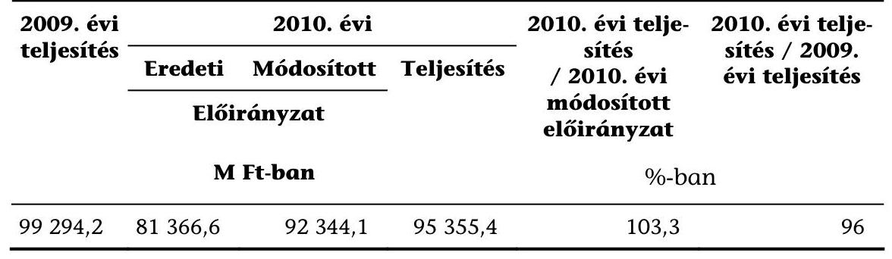

Az előirányzat teljesítésénél figyelembe kell venni, hogy a 2010. évben jelentős összeget tettek ki az előre nem tervezett, pénzforgalommal nem járó kiadások. A 15,2 Mrd Ft összegű pénzforgalom nélküli kiadások elszámolására alapvetően a MALÉV tőkerendezések miatt volt szükség. A MALÉV Zrt. tulajdoni részének megszerzése és feltőkésítése részben pénzforgalmi költségvetési kiadás teljesítésével, részben pénzforgalom és költségvetési elszámolás nélküli követelésbeszámítással történt. A Kvtv. az év során ingyenesen átruházható vagyontárgyak bruttó forgalmi értékét 1,0 Mrd Ft-ban határozta meg. Az ingyenes vagyontárgy átruházások összege a 2010. évben az önkormányzatok részére

---

435,0 M Ft, a társadalmi szervezetek részére 43,9 M Ft (összesen 478,9 M Ft) volt.

Az MNV Zrt.-nél kimutatott állami vagyonnal kapcsolatos pénzforgalommal járó kiadások jogcímenként és összességében ( $80,1 \mathrm{Mrd}$ Ft) is megegyeznek a Kincstár által kimutatott pénzforgalmi adatokkal, továbbá az NGM indokolásában bemutatott számokkal.

Az 1132/2010. (VI. 18.) Korm. határozat 12. pontja szerint az MNV Zrt.-t felügyelő nemzeti fejlesztési miniszternek a 2010. évi költségvetés XLIII. fejezet állami vagyonnal kapcsolatos kiadási előirányzatokból - a hatályos szerződések felülvizsgálatával, megfelelő átütemezésekkel - 20,0 Mrd Ft megtakarítást kellett elérnie. A kormánydöntést követően a nemzeti fejlesztési miniszter a részvényesi jogok gyakorlójaként a 18/2010. (VII. 14.) határozatában döntött az MNV Zrt. vagyonkezelési tervének módosításáról.

Az általános és fejezeti indokolás kitér a kiadásokat érintő átcsoportosításokra és a Kormány által elrendelt 20,0 Mrd Ft összegű kiadás-megtakarítás végrehajtására. Az általános indokolás tartalmazza, hogy a megtett intézkedések ellenére sem csökkentek a kiadások a tervezett szint alá. Az előirányzat teljesítésére vonatkozóan az ellenőrzés egyetért azzal, hogy az intézkedések hatására számos kiadási tételnél jelentkezett ugyan megtakarítás, de ezek hatása több, év közben felmerült, nem tervezett kifizetés, illetve megvalósított pénzforgalom nélküli ügylet miatt összességében nem eredményezte a várt hatást.

Az állami vagyonnal kapcsolatos 2010. évi kiadások egy részének mérsékeltebb teljesülését, más részének az előző évekhez viszonyított erőteljes túlteljesülését a vagyonkezelési terv feltételrendszerének a következőkben bemutatott változásai befolyásolták:

- szervezeti változások;
- az állami szerepvállalás a MALÉV Zrt.ben;
- 20,0 Mrd Ft összegű kiadáscsökkentés előirása a bevételi előirányzat változatlanul hagyása mellett;
- a Magyar Államot a korábbi értékesítésekhez kapcsolódóan terhelő, nagy bizonytalansággal tervezhető helytállási típusú kiadások elmaradtak az egyébként felülről nyitott - előirányzattól, ugyanakkor a MALÉV Zrt. EIB hiteleinek törlesztéséből adódóan az egyéb szerződéses kötelezettségeknél 3,5 Mrd Ft többletkiadás jelentkezett;
- az átcserélhető kötvény kamatfizetése kiadási jogcímcsoportnál a 2009. évben kibocsátásra került kötvény paraméterei alapján a kifizetett kamatkiadás nagysága 10,3 Mrd Ft volt a törvényben meghatározott előirányzathoz képest, ami 7,3 Mrd Ft-os többletet jelentett;
- a fejezeti tartalék eredetileg 10,0 Mrd Ft-os keretéből 1,2 Mrd Ft nem került felhasználásra a 2010. év folyamán.

---

# A felhalmozási jellegú kiadások 

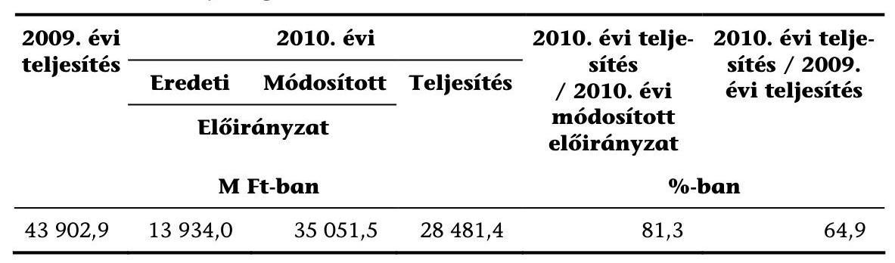

Az alcím ingatlan vásárlás jogcímcsoportján belül a termőföld vásárlás jogcím 2010. évi előirányzatának összege 700,0 M Ft volt, kifizetés nem történt.

A jogcím felett 2010. szeptember 1-jét (a Nemzeti Földalapról szóló törvény hatályba lépését) követően az újonnan megalakult NFA kezelő szervezet rendelkezett. Az MNV Zrt. és az NFA kezelő szervezet közötti megállapodásban a két fél rendelkezett arról, hogy a 2010. év végéig a NFA milyen nagyságú kiadást teljesíthet a jogcím terhére. (A vagyonfejezet fejezetgazdája a 2010. évben - a szervezeti változás ellenére - a nemzeti fejlesztési miniszter maradt, így a vagyonfejezet kiadási megtakarításaiért az elkövetkező hónapokban is ő volt a felelős. 2011-től a felelős a vidékfejlesztési miniszter.)

Az egyéb ingatlanok vásárlása jogcím 2010. évi előirányzata 100,0 M Ft, a teljesítés $1,0 \mathrm{M}$ Ft volt, a teljesítés az előirányzatnak mindössze $1 \%$-a.

Az előirányzat az egyházaknak tulajdonba adott ingatlanokban lakásbérleti joggal rendelkezők elhelyezésére szolgáló ingatlanok megvásárlására fordítható összeget tartalmazta.

A 2010. évi teljesítés a Kulturális Örökségvédelmi Szakszolgálat részére (a Rezi vár geodéziai felmérés tervezésére) szabályszerűen került kifizetésre.

Az egyéb eszközök vásárlása jogcímcsoport előirányzatát összesen 330,0 M Ft-ban állapította meg a Kvtv., amit az évközi módosítás 37,5 M Ft-tal megnövelt, így a 2010. évi módosított előirányzat $367,5 \mathrm{M}$ Ft. A teljesítés $350,8 \mathrm{M}$ Ft, ami a módosított előirányzatnak 95,4\%-a.

A 2010. évi teljesítést az EVEREST informatikai programfejlesztés 283,0 M Ft-os, az „Életjáradékot termőföldért" program ötödik ütemének meghirdetése kapcsán történt számítástechnikai eszközbeszerzés $37,5 \mathrm{M}$ Ft-os és az egyéb eszközbeszerzések 30,3 M Ft-os kiadási összegei adják.

Az MNV Zrt. az Igazgatóság döntését (98/2010. (VIII. 23.) IG határozat) követően 2010. augusztus 23 -ával elállt az IDOM 2000 Konzulens Zrt.-vel megkötött szerződéstől (EVEREST). Az Igazgatóság határozatával felhatalmazta az MNV Zrt. vezérigazgatóját, hogy az elállás érdekében az intézkedéseket meghozza és a szükséges lépéseket megtegye. Az Igazgatóság felkérte a vezérigazgatót, hogy indítson vizsgálatot az EVEREST projekt tekintetében, amely terjedjen ki - a szerződéskötés időpontjától kezdődően - a projekttel kapcsolatos döntések meghozatalára és azok végrehajtására, a projektben közremúködő személyek munkajogi, polgárjogi, és esetlegesen büntetőjogi felelősségének vizsgálatára is,

---

továbbá az MNV Zrt. által a vállalkozó felé már érvényesített szankciókon felüli, azokkal nem fedezett esetleges kár megállapíthatóságára, illetve annak érvényesítési lehetőségeire is. A számvevőszéki helyszíni ellenőrzés lezárásáig a vizsgálat nem fejeződött be.

A helyszíni ellenőrzés a 2009. évi ÁSZ vizsgálattal azonosan megállapította, hogy az Everest program projekt végrehajtása a 2010. évben sem volt átlátható, a program továbbra is használatra alkalmatlan volt. A projekttel kapcsolatos számlakifizetéseket ugyan teljesítésigazolásokkal alátámasztották, azonban a teljesítés valós tartalma nem volt megállapítható. Ezért az ellenőrzés nem tartja megalapozottnak a kifizetéseket. Az áfa nélküli bekerülési értékböl (1667,1 M Ft) a 2010. évben 283,0 M Ft került kifizetésre annak ellenére, hogy 2010 augusztusában a szerződés megszüntetésre került.

Az MNV Zrt. 2011. 08. 03-ai észrevételében jelezte, hogy a „2010. évben, kifizetések kizárólag az akkor még hatályban lévő szerződés alapján kerültek teljesitésre. Az követően, hogy az MNV Zrt. jelenlegi vezetése megismerte az EVEREST projekt részleteit, a szerződéstől - ahogyan az a jelentésben is rögzítve van - elállt. Az elállást követően már nem került sor az IDOM 2000 Zrt. felé kifizetések teljesitésére. ... Mindazonáltal az így kifizetett alacsonyabb összegek is kárként merülnek fel, melynek érvényesitésére peres eljárás kereteiben fog sor kerülni az IDOM 2000 Zrt.-vel szemben."

Az ingatlan-beruházások jogcímcsoport 2010. évi eredeti előirányzata 10 500,0 M Ft, a módosított előirányzata 5780,0 M Ft, ami mindössze 7,1\%-ban $(413,1 \mathrm{M} F t)$ teljesült.

Az előirányzat döntő részben a költségvetési szervek elhelyezését szolgáló projekt beruházások, illetve különböző felújítási munkálatok fedezetére szolgált. A Kvtv. által biztosított előirányzat azonban - a MALÉV Zrt.-ben végrehajtott tőkeemelés, a siklósi vár felújítási munkái miatt, továbbá az évközi előirányzatátcsoportosítások és a 20,0 Mrd Ft-os megtakarítási program következtében - lecsökkent.

A kiadások az amerikai követség felújításának megkezdésén túl a Füzér, Regőc, Rezi várakkal kapcsolatos tervezési munkák fedezetét szolgálták, valamint néhány más műemléki épület felújítását tették lehetővé.

Az MNV Zrt. szerződést kötött a KIVING Kft.-vel a Szigetvári, Tátika és a Füzéri várak beruházási munkálatainak elvégzésére. A benyújtott előlegszámlák 2010. 12. 22-én 84,7 M Ft értékben kifizetésre kerültek. Ugyanezen vállalkozóval kötött szerződés alapján kazánegység cseréjére és kéménybélelésekre szintén előlegszámlák alapján 2010. 12. 22-én 49,6 M Ft és szerződés szerint bontás és törmelék elszállításra vonatkozó előlegszámla alapján 2010. 12. 22-én $24,3 \mathrm{M}$ Ft került kifizetésre.

Az ellenőrzés megállapítja, hogy a KIVING Kft.-vel kötött szerződésekre teljesítések nem történtek, ezért indokolatlanul került kifizetésre a bruttó vállalási díj 80\%-a, összesen 158,6 M Ft. Az MNV/01/44060/0/2010. sz. feljegyzésében a kifizetéseket illetően a 2010. évre rendelkezésre álló pénzügyi keretre hivatkoznak. A kifizetett előlegeket, illetve annak nagyságrendjét, a vállalási díjhoz viszonyított magas arányát a jövőben elvégzendő munkák jellege nem indokolta. A megmaradó keret elköltése nem volt szabályszerű, miu-

---

tán teljesítéssel nem alátámasztott és nem felel meg az Áht. I. fejezet államháztartási gazdálkodás alapelvei 12. § (2) bekezdésben foglaltaknak, mely szerint „A kiadási elöirányzat nem jár felhasználási kötelezettséggel".

Az MNV Zrt. 2011. 08. 03-ai észrevételében jelezte, hogy az előleg kifizetése szabályszerű volt, a hivatkozott előírásokat nem sértette meg. Álláspontjuk szerint az Áht. előírása jelen esetre nem értelmezhető. Az MNV Zrt. a kifizetések során a rendelkezésre álló keretre hivatkozott. Megítélésünk szerint annak ellenére, hogy rendelkezésre áll a keret, elköltése nem szükségszerű.

Az MNV Zrt. észrevételével szemben a számvevőszéki ellenőrzés rendelkezésére álló dokumentáció alapján a 2010. évben a KIVING Kft.-vel kötött szerződésekre teljesítések és részteljesítések sem történtek. A munka jellege (pl. bontás és törmelék elszállítás) előleg kifizetését egyébként sem tette indokolttá a 2010. évben. A rendelkezésünkre bocsátott dokumentációkból megállapítható, hogy az egyik műszaki átadás-átvételi jegyzőkönyv, amelyet az észrevétel említ, 2011. 05. 24-ei keltezésű, mely részteljesítés a 36/2011. sz. szerződésre történt, a másikon szerződés szám nem szerepel, de az a teljesítés is 2011. évi. A 2010. évi kifizetések szerződés száma nem azonos a jegyzőkönyvben szereplő szerződésszámmal.

# A Kvtv. a tőkeemelés állami tulajdonú társaságokban jogcímcsoport 

2010. évi előirányzatát 1779,0 M Ft-ban állapította meg. Az RJGY az MNV Zrt. rábízott vagyonának éves tervében ezt az előirányzatot 27 579,0 M Ft összegben hagyta jóvá. Az előirányzat felhasználása 27 531,6 M Ft, ami a tervezetthez képest $99,8 \%$-os teljesítést mutat. Az előirányzat-módosítás a MALÉV Zrt. helyzetének rendezésével függött össze.

Az előirányzat az erdőgazdasági társaságok megtérülő beruházásait (1,4 Mrd Ft), valamint a Kézmú Nonprofit Kft. tőkeemelését ( 380,0 M Ft) tartalmazta. A MALÉV Zrt.-ben történő állami szerepvállalás miatt a költségvetés általános tartalékából összesen 15 300,0 M Ft és az állami vagyon kiadásai jogcímekből, illetve az ehhez kapcsolódó fejezeti tartalékból 10 500,0 M Ft került év közben átcsoportosításra.

A 2010. évi teljesítés a MALÉV Zrt. tőkeemeléséhez 26 000,0 M Ft, a MAVA Kft. pótbefizetéséhez 1200,0 M Ft, a Greenfield Capital Tőkealapkezelő Zrt. vásárlásához 5,8 M Ft, az Érdi Nonprofit Kft. megalapításához 80,0 M Ft, a Richter Nyrt. részvényvásárlásához (átcserélési vagyon) 218,9 M Ft, a Duna Palota Nonprofit Kft. tőkepótlásához 26,5 M Ft, az MFB Proxy részesedés vásárláshoz 0,4 M Ft kapcsolódott. A tőkeemelések végrehajtása NVT határozatokon alapult.

A 2007-ben értékesített MALÉV Zrt. a 2009. év második felétől nem teljesítette azon kötelezettségeit, amelyek a privatizációs szerződésben rögzítésre kerültek. A privatizációs szerződésben foglaltak szerint az MNV Zrt. lehívta a garanciavállaló VEB garanciáját, a VEB azonban fizetési kötelezettségének nem tett eleget. A helyzet rendezése érdekében kormányközi tárgyalások kezdődtek, amelyek 2010 márciusában a MALÉV Zrt.-ben ismételt állami szerepvállaláshoz vezettek.

Az 1051/2010. (II. 26.) Korm. határozat végrehajtása keretében, az 5/2010. (II. 26.) RJGY határozattal összhangban az MNV Zrt. 2010. február 27-én aláírta az ötoldalú (MALÉV Zrt., Airbridge Zrt., VEB, MNV Zrt. és a Magyar Állam) megállapodást a MALÉV Zrt. helyzetének rendezésére. A megállapodás lényegi eleme

---

a MALÉV Zrt. tőkeszerkezetének átalakítása. Az MNV Zrt. első lépcsőben 2010. március 11-ei hatállyal - 25,3 Mrd Ft tőkeemeléssel (20,7 Mrd Ft-os készpénzt és 4,6 Mrd Ft nem pénzbeli hozzájárulást tartalmazott) a MALÉV Zrt.-ben mintegy 95\%-os tulajdoni hányadot szerzett, míg az Airbridge Zrt. közel 5\%-os tulajdonrészt birtokolt.

2010 októberében - az 1202/2010. (X. 5.) Korm. határozat alapján - újabb tőkeemelésre került sor a MALÉV Zrt.-ben. A tőkerendezésben az MNV Zrt. pénzbeli hozzájárulásként 5,3 Mrd Ft-ot teljesített, amelynek forrását a Kormány a központi költségvetés általános tartaléka terhére biztosította. Nem pénzbeli hozzájárulásként az MNV Zrt. a MALÉV Zrt. részére folyósított kölcsön és kamatai 9,4 Mrd Ft értékben apportálásra kerültek.

A Magyar Állam a 2010. évben öt alkalommal, összesen 18,4 Mrd Ft tulajdonosi kölcsönt nyújtott.

A MALÉV Zrt. 2007. évi privatizációjához kapcsolódóan megalapított MAVA Kft.-nek is folyamatos pénzügyi támogatásra van szüksége.

A MAVA Kft. megalakítását a 2075/2003. (IV. 10.) Korm. rendelet írta elő a 76,1 millió EUR MFB kölcsön kötelezettség külön kezelésére, melyet a MALÉV márkanév használati díj 56,3 millió EUR, a kerozin vezeték 4,9 millió EUR és a MALCO LLC üzletrész értékével egyező 14,9 millió EUR összegek jelenítettek meg az eszköz oldalon. A Kft. bevételei ennek megfelelően a MALÉV Zrt.-től származnak, a kifizetéseit pedig a 2017. évben lejáró hitel kamatai adják.

A 12239/3/2010. NGM és a 15/2010. NFM engedély alapján az 1,2 Mrd Ft pótbefizetés 2010. szeptember 24-ei hatállyal teljesült, ezt követően a társaság törlesztette a 2010. szeptember 30-ai lejáratú, mintegy 860,0 M Ft tőkeösszegű tulajdonosi kölcsöneit. Ezek után 250,0 M Ft szabad pénzeszköz maradt a társaságnál a múködés fedezetére. Az MNV Zrt. ugyanakkor a múltbeli finanszírozás rendezésére 2011 januárjában további 4,5 M EUR-t folyósított a MAVA Kft. részére, a VEB-től befolyt 32 M EUR garancia elszámolása miatt.

A Kft. veszteséges gazdálkodása és finanszírozási nehézségei miatt az állam, mivel tulajdonos, folyamatos tőkepótlást és tulajdonosi kölcsönt nyújt. A költségvetés számára a Kft. múködése kockázatot jelent, amelyet növel a 2017-ben lejáró hitel tőke részének visszafizetési kötelezettsége is.

A volt szovjet ingatlanok kármentesítése jogcímcsoport 2010. évi előirányzata 525,0 M Ft, a kiadás 184,9 M Ft (35,2\%) volt. A kiadások szabályszerűen kerültek kifizetésre, azonban e kifizetéseket ellenőrző társaság díjazása helytelenül került elszámolásra a volt szovjet ingatlanok környezeti kármentesítése kiadások között. Ezek a kifizetések a Kvtv. előírása szerint helyesen a Magyar Államot korábbi értékesítésekhez kapcsolódóan terhelő kiadásokon belül az állami tulajdonosi felelősségével kapcsolatos környezetvédelmi feladatok finanszírozása kiadásokhoz tartoznak.

---

Hasznosítással kapcsolatos folyó kiadások

| 2009. évi teljesítés | 2010. évi |  |  | 2010. évi teljesítés / 2010. évi teljesítés / 2009. évi teljesítés |  |
| :--: | :--: | :--: | :--: | :--: | :--: |
|  | Eredeti | Módosított | Teljesítés |  |  |
|  | Elöirányzat |  |  |  |  |
|  | M Ft-ban |  |  | \%-ban |  |
| 19 435,3 | 19863,3 | 19070,3 | 17473,2 | 91,6 | 89,9 |

A hasznosítással kapcsolatos kiadások alcímen belül az életjáradék termöföldért jogcímcsoport előirányzatának jogszabályi alapját a Nemzeti Földalapról szóló 2001. évi CXVI. tv. és az Állami vagyonról szóló 2007. évi CVI. tv. jelenti. A Termőföldért életjáradékot program V. üteme meghirdetésének, igénybevételének szabályait a 259/2009. (XI. 23.) Korm. rendelet teremtette meg. A 2010. évi előirányzat 9000,0 M Ft , a módosított előirányzat $10000,0 \mathrm{M}$ Ft, a teljesítés 9602,8 M Ft volt, amely a módosított előirányzat $96, \%$-a.

Az MNV Zrt. 2010. április 2-án közzétette a Termőföldért életjáradékot program V. ütemének meghirdetéséről szóló pályázati felhívást. A pályázatok benyújtására 2010. június 18-ig volt lehetőség. A korábbinál szigorúbb - a Magyar Állam tulajdonába kerülő ingatlanok későbbi hasznosításának lehetőségét előtérbe helyező - pályázati feltételek, valamint a pályázat csekély kommunikációja miatt az I-IV. ütemekben benyújtott pályázatoknál lényegesen kevesebb - 700 db ( 402 db szerződéskötésre javasolt, 125 helyszíni szemle alapján elutasítandó és 173 db az adó- és értékbizonyítványban szereplő ár nem megfelelősége miatt az árat felülvizsgálandó) - pályázat benyújtására került sor. A pályázatok a pályázók életkorának megfelelő besorolásához a jogszabály által előírt értékbecslési eljárás lefolytatása nem volt kivitelezhető augusztus 31-éig.

A Nemzeti Földalapról szóló új törvény az életjáradék ellenében történő termőföldvásárlás jogszabályi lehetőségét megszüntette. A törvényjavaslat 35. §-a ugyanakkor arról rendelkezik, hogy ez a törvény hatálybalépését megelőzően közzétett pályázati felhívás alapján kötött életjáradéki szerződéseket nem érinti, a folyamatban lévő eljárások folytatása ezt továbbra is biztosítja. 2010. szeptember 1-jétől a VM a felelőse az NFA-val történő gazdálkodásnak. A szeptember 1jétől az újonnan felálló Nemzeti Földalapért Felelős Szervezet a folyamatban lévő életjáradéki pályázatokat elbírálhatja és a szerződéseket megkötheti a Termőföldért életjáradékot program V. ütemének vonatkozásában.

A kifizetésekből az MNV Zrt. összesen 6428,8 M Ft-ot, míg 2010 szeptemberétől az NFSZ 3174,0 M Ft-ot teljesített. A járadék folyósításánál, valamint a múködési költségekhez kapcsolódó kifizetés utalványozásánál, érvényesítésénél és ellenjegyzésénél az előírásokat betartották.

Az ingatlanok fenntartásával járó kiadások jogcímcsoporton belül az üzemeltetés, fenntartás, karbantartás, javítás jogcím 2010. évi előirányzata 1900,0 M Ft, a teljesítés 1883,1 M Ft (99,1\%) volt.

A KIVING Kft. a 2010. évben az MNV Zrt. rábízott vagyonába tartozó több mint 50 ingatlan üzemeltetési feladatait látta el átalánydíjas, illetve óradíjas szerződés

---

keretében. A szolgáltatási díjak ellenértéke a szerződés szerint elvégzett tevékenységekről kiállított számlák és a területi irodavezetők teljesítésigazolásai alapján kerültek kifizetésre. Az ellenőrzés a kifizetések teljesítését és elszámolását szabályszerűnek ítélte meg.

Az ingatlanok őrzése 2010. évi előirányzata 1000,0 M Ft, a teljesítés $834,7 \mathrm{M} \mathrm{Ft}(83,5 \%)$ volt.

Az ingatlanvagyon egységes vagyonvédelmének biztosítása érdekében a rábízott vagyon részét képező közvetlenül kezelt ingatlanok őrzését központilag végezteti az MNV Zrt. Az őrzést végző cég a HM EI Zrt., amelyet az MNV Zrt. közbeszerzési eljárás keretében választott ki. A szerződés teljesítése és ezzel együtt a fizetési kötelezettség az ingatlanvagyon nagyságától függően változik.

A helyszíni ellenőrzés a 2009. évi zárszámadás ellenőrzéséhez hasonlóan ismételten megállapítja, hogy az őrzésre vonatkozó szerződés a 2010. évben sem került felülvizsgálatra. Az őrzésvédelemi feladatokat a HM EI Zrt. előtt a Kiving Kft. látta el, esetenként lényegesen alacsonyabb áron. (A személy és vagyonőri tevékenységet $540 \mathrm{Ft} /$ óra egységáron végezte a Kiving Kft., ezzel szemben a pályázati nyertes HM EI Zrt. ugyanezt a tevékenységet 970 Ft/óra áron végezte a 2010. évben is.) A vonatkozó szerződés felmondására és új pályázat elindítására az MNV Zrt. a 2010. évben lépéseket tett, de érdemi előrelépés csak a 2011. évben történt.

Az MNV Zrt. 2011. 06. 27-ei észrevételében jelezte, hogy a HM EI Zrt.-vel kötött szerződés határozott időre került megkötésre, általánosan alkalmazható felmondási lehetőség nélkül, így annak módosítása nem volt megoldható a szolgáltató beleegyezése nélkül. Ennek ellenére az MNV Zrt. és a HM EI Zrt. tárgyalásokat kezdett egy közös megegyezéssel történő szerződés-bontásról. A tárgyalások ideje alatt előkészítésre került a teljes őrzés-védelmi szolgáltatás pályáztatására szolgáló új ajánlati felhívás és dokumentáció, amely az Igazgatóság 2011. február 7-ei ülésére került beterjesztésre. Ekkor már folyamatban volt a megegyezés a HM EI Zrt.-vel a keretszerződés felbontására. Az Igazgatóság a HM EI Zrt.-vel meglévő szerződés megszüntetéséről szóló megállapodás aláírásával egy időben jóváhagyta az ingatlanok teljes vagyonvédelmi szolgáltatásának pályáztatását. Az eljárás nyertese az új szerződés eredményeként 2011. június 1-jétől végzi az őrzésvédelmi feladatokat.

Az egyéb vagyonkezelési kiadások 2010. évi eredeti előirányzata 2888,3 M Ft, a módosított előirányzata 1995,3 M Ft, a teljesítés 1985,3 M Ft ( $99,5 \%$ ) volt. A jogcímen 2010-ben elszámolt kiadások közül az ingatlan bérleti díjakra 933,9 M Ft, az állami örökléssel kapcsolatosan 383,3 M Ft, a földmérési feladatokkal, birtokhasznosításokkal összefüggésben 57,9 M Ft és az egyházi kárpótlás során 610,2 M Ft került kifizetésre.

Az MNV Zrt. szerződést kötött a Magyarországi Unitárius Egyházzal a Budapest, Alkotmány u. 12. sz. alatti állami vagyonba tartozó ingatlan ingyenes tulajdonba adásáról. A megállapodás 3. pontja szerint a tulajdonba vevő vállalta magára az MNV Zrt. azon törvényi kötelezettségét, hogy az ingatlant kiürített állapotban, térítésmentesen kell átadni az egyháznak. Az MNV Zrt. Igazgatósága a vonatkozó szerződés aláírását a 290/2010. (XII. 13.) IG. sz. határozatában hagyta jóvá. Az MNV Zrt. a szerződés alapján 285 M Ft-ot átutalt

---

2010. 12. 27-én az egyház részére az ingatlant terhelő bérleti jogviszonyok rendezésére.

Az ellenőrzés álláspontja szerint az MNV Zrt. nem a vonatkozó törvények szerint kötötte a szerződést, illetve az Igazgatóság jóváhagyása is ellentétes a Magyar Köztársaság 2008. évi költségvetésének végrehajtásáról szóló 2009. évi CXXIX tv. 30. § (2) bekezdésével, miszerint „Az Országgyúlés az állami vagyonról szóló 2007. évi CVI. törvény 36. §-ának (1) bekezdése alapján úgy rendelkezik, hogy a Budapest V. kerület Alkotmány u. 12. szám alatti ingatlannak (hrsz: Budapest belterület 24911) a Magyar Állam tulajdonában lévő 49/100 tulajdoni hányada kiürített állapotban, térítésmentesen a Magyarországi Unitárius Egyház tulajdonába kerüljön kulturális, szociális és hitéleti célokra.", továbbá a Vtv.-ről szóló 2007. évi CVI. tv. 36. §-ának (1) bekezdésében foglaltakkal.

Az MNV Zrt. 2011. 06. 27-ei észrevételében jelezte, hogy „A törvény valóban előírja, hogy az ingatlan kiürített állapotban kerüljön az egyház tulajdonába, a kiürítés végrehajtásának mikéntje vonatkozásában azonban semmiféle előirást nem tartalmazott, így az megítélésünk szerint a felek között kötendő megállapodásban rendezhető volt." ... "Az IG döntését megelőzte az érintett Unitárius Egyházzal történt többszöri egyeztetés, ahol a megoldási lehetőségek mérlegelése során figyelembevételre került az a tény, hogy a feladat végrehajtásának véghatárideje 2011. december 31-e, valamint a tárgyalások időpontjában kialakult 2011. évi költségvetési keretek, amelyben fenti célra forrás nem került előirányzatra, így a jogszabályi kötelezettségek teljesithetősége nem látszott biztosítottnak. A jogszabály kihirdetését követően az MNV Zrt. megkezdte a tárgyalásokat a lakókkal, amely azonban nem vezetett eredményre, mivel cserelakást a természetes személy lakók nem fogadtak el, és az általuk igényelt pénzbeli megváltás összege meghaladta az arra biztosított forrás maximális összegét. Nagyon fontos kiemelni, hogy a tulajdonosváltásból eredő, az érintett lakásbérlők esetlegesen kedvezőtlenebb helyzetének elkerülése érdekében a szerződésben kikötésre került, hogy az Egyház nem szabhat kedvezőtlenebb feltételeket a bérlők számára, mint az állami tulajdonos. Ezen felül, amenynyiben a jogszabályban meghatározott kulturális, szociális és hitéleti cél teljesitése érdekében szükséges, úgy akár a bérleti jogok megváltására is fordítható, de tételes elszámoláshoz kötött összeget biztosított az MNV Zrt. az Egyház részére."

A Kvtv. az állami tulajdonú társaságok támogatásának a 2010. évi eredeti előirányzatát 505,0 M Ft-ban állapította meg, a módosított előirányzata 4175,0 M Ft, a felhasználás 3167,4 M Ft (75,9\%) volt. Több társaság részesült különböző összegű (20,0-1000,0 M Ft) támogatásban. A támogatások odaítélése NVT határozatokon alapult, kifizetésük szabályszerű volt.

# A Magyar Államot korábbi értékesítésekhez kapcsolódóan terhelő kiadások 

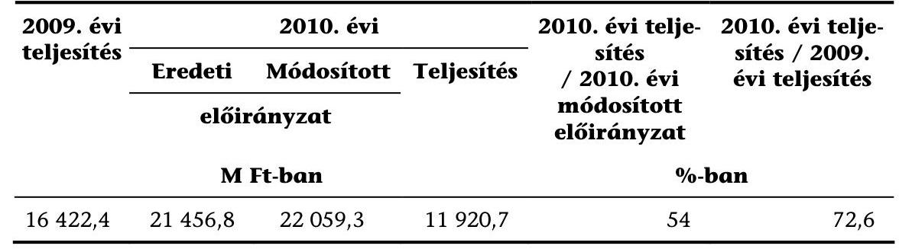

---

A Magyar Államot korábbi értékesítésekhez kapcsolódóan terhelő kiadások alcímen belül a jótállással, szavatossággal kapcsolatos kifizetésekre $90,0 \mathrm{M}$ Ft és a belterületi föld értéke alapján, alapítói jogon kifizetendő járandóságokra $60,0 \mathrm{M}$ Ft összegű kiadást terveztek, de teljesítés nem történt.

A kezesi felelősségből eredő kifizetések jogcímcsoport 2010. évi előirányzata 972,4 M Ft, a teljesítés 1201,6 M Ft (123,6\%) volt. A kifizetés jelentős része (792,5 M Ft) a Komplex Kereskedelmi Zrt. garanciához kapcsolódott, a fennmaradó összeg ( $409,1 \mathrm{M}$ Ft) szerződések, bírósági döntések és jogszabályok alapján került kifizetésre.

A Magyar Kormány és az Algériai Kormány közötti adósságrendezési megállapodás 3. cikke rendelkezik a Magyarországgal szemben fennálló algériai adósságot csökkentő, az ONAB és a Komplex közötti szerződéshez kapcsolódó jólteljesítési garanciából származó 4091 127,99 USD összegű fizetési kötelezettségről. Az MNB a Komplex Kereskedelmi Zrt. vezérigazgatójának írt levelében jelezte, hogy a Komplex által kibocsátott garancia a Magyar Állam terhére került teljesítésre. A beérkezett garancia-felszabadítás alapján beállt az MNB fizetési kötelezettsége a Kincstár javára és egyúttal a Komplex Zrt. fizetési kötelezettsége is. A Komplex nem fizetett, ezért az MNB fizetési kötelezettségének fedezetét az MNV Zrt. kötelezettségvállalása jelentette. Ennek megfelelően 2010. 11. 05-én az MNB inkasszóval leemelte a garancia rendezése címén az MNV Zrt. számlájáról a 4091 127,99 USD-nek megfelelő 792,5 M Ft összeget.

Megbízóként a végső fizetési kötelezettség a Komplex Kereskedelmi Zrt.-t terheli, ezért az MNV Zrt.-nek haladéktalanul intézkednie kell az összeg behajtása érdekében. Az MNV Zrt. 2010. 11. 18-án és 2011. 01. 21-én fizetési felszólítást küldött a fizetésre kötelezettnek, de ezekre a helyszíni ellenőrzés lezárásáig nem történt visszajelzés. Az MNV Zrt. a 792,5 M Ft összegű garancia behajtása érdekében további intézkedést nem tett.

A konszernfelelősség alapján történő kifizetések 2010. évi előirányzata 3591,2 M Ft, a teljesítés 4,2 M Ft ( $0,1 \%$ ) volt.

A Legfelsőbb Bíróság Gfv.X.30.291/2009/2/II. számú végzése alapján a 2010. 03. 26-án 4,2 M Ft konszernfelelősséggel kapcsolatos perköltség került kifizetésre. A peres eljárás az Állami Vagyonügynökséghez (ÁVÜ) tartozó 2006. évi üggyel függött össze. Az MNV/01/8878/3/2010. sz. feljegyzésének tanúsága szerint az ítéletben meghatározott perköltség az MNV Zrt. 10,6 M Ft-os kötelezettsége és az AGMENT Kft.-vel szembeni 6,4 M Ft követelés egyenlegéből adódott.

A tranzakcióhoz kapcsolódóan megállapításra került - amit az MNV Zrt. 2010. évi feljegyzése is alátámaszt -, hogy sem a követelés, sem a kötelezettség nem szerepel az MNV Zrt. 2010. évi nyilvántartásában. A kifizetést az ellenőrzésnek - a rendelkezésre álló dokumentáció alapján - nem állt módjában minősíteni.

Az MNV Zrt. 2011. 06. 27-ei észrevételében jelezte, hogy „Az a feljegyzés, amire a jelentést készitő hivatkozik egy promt időpontbeli információt tartalmazott, miszerint a követelés és kötelezettség egy adott időpontban nem szerepelt az MNV Zrt. nyilvántartásában. Megjegyezzük, hogy teljesen helyesen - a számviteli törvénynek megfelelően nem szerepelt a könyvekben, révén, hogy peres követelésről és kötelezettségről volt szó. A feljegyzés kapcsán az illetékes igazgatóság mind a követelés-változás adatlapot, mind a

---

kötelezettség rendezésére szóló utalványt kitöltötte és teljes dokumentációval átadta a Gazdasági Igazgatóság részére."

Az állam tulajdonosi felelősségével kapcsolatos környezetvédelmi feladatok finanszírozása jogcímcsoport 2010. évi eredeti előirányzata 13 926,9 M Ft, a módosított előirányzata 13 324,4 M Ft, a teljesítés 4559,8 M Ft $(34,2 \%)$ volt.

A teljesítés Simontornya 1459,5 M Ft, a Nitrokémia Zrt. 1427,5 M Ft, a MecsekÖko Zrt. 1502,4 M Ft, a környezetvédelmi audit 64,0 M Ft, a műszaki ellenőrzés 53,6 M Ft és egyéb környezetvédelmi kiadás 52,8 M Ft összegű kifizetésekből tevődik össze.

Az MNV Zrt. és a környezetvédelmi feladatokat ellátó állami tulajdonú társaságok (Mecsek Öko Zrt., Nitrokémia Zrt.) között támogatási szerződések vannak érvényben. A simontornyai bőrgyár kármentesítési munkálatait a Nitrokémia Zrt. végezte. A simontornyai kármentesítésre a Nitrokémia Zrt. és az MNV Zrt. megbízási szerződést kötött. A támogatási szerződéseket a nemzeti fejlesztési miniszter hagyta jóvá.

A kármentesítési munkák jóváhagyott feladatterv és kiírt közbeszerzési pályázatok alapján valósultak meg. A támogatás odaítélése és elszámolása szabályszerű volt.

A Kvtv. az egyéb bírósági döntésből eredő kiadások jogcímcsoport 2010. évi előirányzatát 1054,0 M Ft-ban állapította meg. A teljesítés $148,6 \mathrm{M} \mathrm{Ft}$ ( $14,1 \%$ ) volt, amelynek oka, hogy a bírósági döntések a tervezettnél jobban elhúzódtak.

Az egyéb szerződéses kötelezettségek jogcímcsoport 2010. évi előirányzata 467,3 M Ft, a teljesítés 3730,5 M Ft (8-szoros) volt. A teljesítésből számottevő összeg a MALÉV Zrt. EIB hiteleinek törlesztéséből adódó 3500,0 M Ft.

Az MNV Zrt. a MALÉV privatizációs szerződéshez kapcsolódó kötelezettségek nem teljesítése miatt 2010 februárjában felszólította a garanciavállaló VEB-et a privatizációs szerződésből eredő kötelezettségek teljesítésére.

A VEB az MNV Zrt. lehívási értesítőjében megadott módon teljesítette fizetési kötelezettségét. Ezen rendelkezések értelmében a VEB garanciából befolyt összeg egy része 2010 márciusában az EIB hitel fedezetére ( 3500,0 M Ft) az MNV Zrt.-hez, másik része az MFB hitel kamatterheit biztosító márkanév használati díjak fedezete miatt az MFB Bank Zrt.-hez érkezett ( 5200,0 M Ft). Az MFB-hez érkezett kifizetés egy része, amely az MNV Zrt.-t illette meg, 2010 decemberében pénzforgalmilag is teljesítésre került az MNV Zrt. egyéb bevételi számlájára ( 4500,0 M Ft). A fennmaradó közel 700,0 M Ft-os összeg az MFB-nél maradt, de elszámolásra került a vagyonfejezet pénzforgalmon kívüli tételei között.

A Pilisi Parkerdő Zrt. 54,1 M Ft támogatásban részesült támogatási megállapodás és határozat alapján. A támogatásból 51,1 M Ft még 2009 decemberében, a különbözet, 3,0 M Ft 2010. 01. 18-án került átutalásra. A különbözet kifizetése jogszerű volt, de helytelenül a Magyar Államot korábbi értékesítésekhez kapcsolódóan terhelő kiadások alcímen belül a szerződéseses

---

# kötelezettségre számolták el. Helyesen az állami tulajdonú társaságok támogatásaként kellett volna elszámolni. 

Az MNV Zrt. 2011. 06. 27-ei észrevételében jelezte, hogy a Pilisi Parkerdőt 54134 E Ft támogatás illette meg 2009. évben. A Pilisi Parkerdő részére - tévedésből 51134 E Ft került átutalásra a 2009. év végén. „Mivel a Pilisi Parkerdő részére jogosan járt még 3,0 M Ft, azt az MNV Zrt-nek át kellett utalnia, de emiatt nem csökkenthette a 2010. évi támogatási elöirányzatát (a 2010. évi keretről döntés, engedély nem rendelkezett)." Az MNV Zrt. szerződéses kötelezettsége volt a hiányzó összeg átutalása, amit a Magyar Államok korábbi értékesítésekhez kapcsolódóan terhelő kiadások alcímen belül a Szerződéses kötelezettségek tervsor terhére számolt el. Az MNV Zrt. észrevétele is tartalmazza, hogy a kifizetett összeg támogatás. A hiányzó összeg is a támogatás részét képezte és nem kapcsolódott korábbi értékesítésekhez.

Az egyéb jogszabályból eredő kiadások jogcímcsoporton belül a kárpótlási jegyek életjáradékra váltása 2010. évi előirányzata 2500,0 M Ft, a teljesítés $2276,1 \mathrm{M} \mathrm{Ft}$ ( $91 \%$ ) volt. A vagyoni kárpótlás alapján folyósított életjáradékok havi kiadásai a Számvevőszék által ellenőrzésre kerültek. A havi kifizetések megegyeztek az Országos Nyugdíjbiztosítási Főigazgatóság értesítésében szereplő vagyoni kárpótlás alapján folyósított életjáradékok összegével.

A kárpótlási jegyek életjáradékra váltásáról rendelkező 1992. évi XXXI. törvény szerint a jogosultak kárpótlási jegyeiket életjáradékra válthatják. A beváltott jegyek az MNV Zrt.-re kerültek átruházásra. Az életjáradékok összegét, valamint a folyósítással kapcsolatos költségeket az MNV Zrt. köteles havonta megtéríteni a folyósító ONYF részére. Új beváltás már nincs, azonban a törvény szerint a járadék összegét évente emelni kell.

A kiadások a kárpótlási jegyek életjáradékra váltásáról szóló 87/1992. (V. 29.) Korm. rendelet, valamint az MNV Zrt.-PM-ONYF megállapodás alapján kerültek kifizetésre.

A 2009. évi zárszámadás ellenőrzése során az ÁSZ már jelezte, hogy a kárpótlási jegyek életjáradékra váltásáról rendelkező 1992. évi XXXI. tv. 6. § (2) bekezdése rögzíti, hogy a jogosultak részére folyósítandó életjáradék összegét privatizációs bevételből kell biztosítani. Amennyiben a privatizációs bevételekből fedezet nem áll rendelkezésre, a havi átutalásokat a központi költségvetés biztosítja. A kárpótlási jegyek ellenében fizetendő életjáradékok fedezete a privatizációs bevétel, azonban az Áht. előírása alapján ezen kifizetéseket az állami vagyonnal kapcsolatos kiadások terhére kell elszámolni. Ezzel szemben az MNV Zrt. az e jogcímen keletkező kötelezettségét a 2010. évben még részben sem a privatizációs bevételből fedezte, holott a privatizációs bevétel $61,8 \mathrm{M}$ Ft volt.

Az MNV Zrt. 2011. 06. 27-ei észrevételében jelezte, hogy „A kifizetések teljesitésére a kiadási nemzetgazdasági számlák szolgálnak, melyek a már említett KESZ részei, vagyis a kárpótlási jegyek életjáradékos jogosultjainak kifizetései fedezetét közvetve, természetesen, a privatizációs bevételek is jelentik. Az 1992. évi törvény jogalkotói szándéka az volt, hogy a Magyar Állam összes privatizációs bevétele biztosítson nagyságrendi fedezetet az életjáradék kifizetésekhez. Ez a jogalkotói szándék teljesül, hiszen a privatizációs bevételek 1990-2010. között folyóáron 2328,0 Mrd Ft-ot tettek ki, míg az életjáradék kifizetések ezek töredékét, mintegy 60,0 Mrd Ft-ot."

---

Az MNV Zrt. 2011. 08. 03-ai észrevételében jelezte, hogy „a jogszabályi összhang megteremtése érdekében az MNV Zrt. lépéseket kezdeményezett."

# Vagyongazdálkodás egyéb kiadásai 

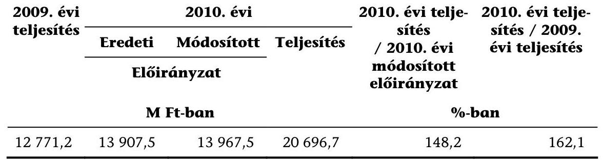

Az alcímen belül a tanácsadók, értékbecslők és jogi képviselők díja 2010. évi eredeti előirányzata 953,0 M Ft, a módosított előirányzata 1013,0 M Ft, a teljesítés 862,3 M Ft ( $85,1 \%$ ) volt. A 60,0 M Ft összegű növelés a Termőföldért életjáradékot V. programmal kapcsolatos ügyvédi díjak fedezetére került átcsoportosításra a fejezeti tartalékból.

A jogcímen 2010-ben elszámolt kiadásból a jogi tanácsadók, jogi képviselet 371,5 M Ft-ot, a vagyonértékelés, értékbecslés 214,4 M Ft-ot, a tanácsadói díjazások 128,7 M Ft-ot, a részvénykezelés díja 56,6 M Ft-ot, a közjegyzők díja 41,8 M Ft-ot, a reklám, média, szakfordítás 49,3 M Ft-ot tettek ki.

A tanácsadók, értékbecslők és jogi képviselők díja között került kifizetésre az MNV Zrt. és a BMSK Zrt. között kötött megbízási szerződés alapján benyújtott számla 3,7 M Ft összegben a Budapest, V. Zoltán u. 16. sz. alatti irodaépült átalakítási munkáinak műszaki ellenőri feladatainak ellátására. A kifizetés és a teljesítés szabályszerűen történt, de a kiadást - a valós tartalma alapján helyesen az Ingatlan beruházások között kellett volna kimutatni.

Az eljárási költségek, perköltségek 2010. évi előirányzata 190,0 M Ft, a teljesítés $92,8 \mathrm{M} \mathrm{Ft}(48,8 \%)$ volt. A tervezettnél kevesebb kiadás az elévülésekkel, illetve elhúzódó eljárásokkal függ össze.

Az MNV Zrt. múködésének támogatása jogcímcsoport előirányzata fedezi a Társaság múködésének költségeit, így a tevékenység ellátásához szükséges személyi juttatásokat, a kapcsolódó munkaadót terhelő járulékokat és a dologi kiadásokat.

A 2010. évi előirányzat 9764,5 M Ft, a teljesítés 9451,5 M Ft (96,8\%) volt. Az elői-rányzat-módosítás a jogcím esetében 313,0 M Ft megtakarítás előírását tartalmazta. A támogatás ilyen összegű csökkentéséről a miniszter intézkedett a 18/2010. (VII.14.) RJGY határozatában. Az MNV Zrt. részére az előirányzat csökkentett összege ( 9451,5 M Ft) került átutalásra a 2010. év során.

Az átcserélhető kötvény kamatfizetése jogcímcsoport 2010. évi előirányzata 3000,0 M Ft, a teljesítés 10290,1 M Ft (több mint 3-szoros) volt. A kibocsátásra került kötvény paraméterei alapján kifizetett kamatkiadás tényleges nagysága a törvényben meghatározott előirányzathoz képest 7300,0 M Ft-os többletet jelentett.

---

A tervezési időszakban még nem volt ismert, hogy a Richter részvényekhez kapcsolódó új kötvény az előzőhöz hasonló struktúrájú (alacsony éves kamatfizetések mellett magasabb lejáratkori törlesztési hányad), vagy attól eltérő (viszonylag magasabb éves kamatkifizetések mellett a kibocsátási árfolyamon történő törlesztés) lesz-e. Emellett nem volt ismert a kibocsátás végleges, pontos nagysága sem, valamint új kötvénykibocsátás és a refinanszírozandó kötvénymennyiség közötti (esetleges) eltérés.

Az MNV Zrt. 2009. szeptember 25-én 833,3 M EUR névértékű, 4,4\%-os kamatozású, $32 \%$ kezdeti átcserélési prémiumot biztosító, 2014. szeptember 25-én lejáró, a Richter Gedeon Nyrt. kibocsátáskor állami tulajdonban lévő törzsrészvényeiből mögöttes vagyonfedezet mellett átcserélhető kötvényt bocsátott ki. Az átcserélhető kötvények bevezetésre kerültek a Luxemburgi Értéktőzsdére.

A 2014. szeptember 25-én lejáró kötvények után évi 4,4\%-os kamatot, azaz évi 36665200 EUR-t kell fizetni, az első kamatfizetés időpontja 2010. szeptember 25 . volt.

A kötvény futamideje alatti jogviszonyokat a Kibocsátási Tájékoztatón és az annak részét képező Kötvényfeltételeken túl lényegében a Bank of New York Mellon csoport tagjaival kötött Letétkezelő Okirat és a Fizető-, Átadási és Átcserélési Ügynöki szerződés szabályozza. A kötvényesekkel a kibocsátó MNV Zrt. nem közvetlenül, hanem a Letétkezelőn és az Ügynökön keresztül van kapcsolatban.

A BNYM megküldte a 2010. szeptember 25-ei pénzügyi teljesítéssel esedékes 2010. évi kamatról kiállított számláját 36665200 EUR értékben, amely 2010. 10. 06-án teljesítésre került 280,65 Ft/EUR árfolyamon, 10290,1 M Ft értékben. A kamat kifizetése szabályszerűen történt.

A Kvtv. a fejezeti tartalék alcím előirányzataként 10000,0 M Ft-ot tartalmazott. Év közben az előirányzatból 8804,5 M Ft-os átcsoportosításra került sor, így a fel nem használt előirányzat 1195,5 M Ft volt.

A fejezeti tartalék az előre nem látható kiadások finanszírozhatóságának megteremtésére szolgál, a - részben felmért, számszerúsített - feszültségpontok, kockázati tényezők kezelését hivatott megoldani. A MALÉV tőkeemelési tranzakcióhoz kapcsolódóan 7321,0 M Ft, a Termőföldért életjáradékot V. programmal kapcsolatos kifizetéseire 1000,0 M Ft, ügyvédi díjaira 60,0 M Ft, adatrögzítésére 86,0 M Ft, informatikai hátterének biztosítására 37,5 M Ft és a MAVA Kft. tőkerendezésére 300,0 M Ft került átcsoportosításra. A fejezeti maradvány a kiadási megtakarításokhoz adódott.

Az áfa elszámolás alcím 2010. évi előirányzata 1000,0 M Ft, a teljesítés 1561,8 M Ft (156,2\%) volt.

A 2010. évi áfa bevallások és befizetések során az MNV Zrt. az Art., az áfa törvény, az Szt. és a Ket. előírásait betartotta.

Az állami vagyonnal kapcsolatos kiadások mérlegadatait alátámasztó elszámolások és nyilvántartások csak részben felelnek meg a vonatkozó jogszabályi előírásoknak. A teljesítések nem minden esetben voltak jogszerűek vagy elszámolásuk nem minden esetben történt szabályszerűen. A feltárt hibák a lényegességi szintet nem érték el, a tapasztalt szabályta-

---

lanságok a mérlegadatok elutasítását nem indokolják, de befolyásolják az előirányzattal való gazdálkodásról kialakított képet, emiatt a vélemény korlátozott. Az adott cím mérlegadatainak megbízhatóságát a következők befolyásolják:

- Az ingatlan-beruházások között került elszámolásra a Szigetvári vár, Tátika vár és a Füzérl vár beruházás munkálatainak elvégzése az MNV Zrt. és a KIVING Kft.-vel kötött szerződés alapján. A KIVING Kft.-vel kötött szerződésekre teljesítések nem történtek, ezért indokolatlanul került kifizetésre a bruttó vállalási díj $80 \%$-a, összesen 158,6 M Ft. A megmaradó keret elköltése nem volt szabályszerű, miután teljesítéssel nem alátámasztott és nem felel meg az Áht. I. fejezet államháztartási gazdálkodás alapelvei 12. § (2) bekezdésben foglaltaknak.
- A volt szovjet ingatlanok környezeti kármentesítése jogcímről került kifizetésre a REPÉT Kft. Nitrokémia Zrt. által irányított környezetvédelmi munkálatok ellenőrzésére vonatkozó számlája 5,3 M Ft összegben. A kifizetés helytelenül került elszámolásra a volt szovjet ingatlanok környezeti kármentesítése kiadások között. Helyesen a Magyar Államot korábbi értékesítésekhez kapcsolódóan terhelő kiadásokon belül az állami tulajdonosi felelősségével kapcsolatos környezetvédelmi feladatok finanszírozása kiadásokhoz tartoznak.
- Az egyéb vagyonkezelési kiadások között került elszámolásra az MNV Zrt. részéről a Magyarországi Unitárius Egyháznak a Budapest Alkotmány u. 12. sz. alatti állami vagyonba tartozó ingatlan ingyenes tulajdonba adásával összefüggésben az ingatlant jelenleg terhelő bérleti jogviszonyok rendezésére átutalt 285 M Ft. Az MNV Zrt. nem a vonatkozó törvények szerint kötötte a szerződést, illetve az Igazgatóság jóváhagyása ellentétes a 2008. évi Kvtv. végrehajtásáról rendelkező 2009. évi CXXIX tv. 30. § (2) bekezdésével és a Vtv.-ről szóló 2007. évi CVI. tv. 36. §-ának (1) bekezdésében foglaltakkal.
- A konszernfelelősség alapján történő kifizetések között került elszámolásra a Legfelsőbb Bíróság végzése alapján az AGMENT Kft. 4,2 M Ft konszernfelelősséggel kapcsolatos perköltsége. A kifizetést - a rendelkezésre álló dokumentáció alapján - az ellenőrzésnek nem áll módjában minősíteni.
- Az egyéb szerződéses kötelezettségek között került elszámolásra a Pilisi Parkerdő Zrt. 54,1 M Ft-os támogatásából 3,0 M Ft. A kifizetés helytelenül a Magyar Államot korábbi értékesítésekhez kapcsolódóan terhelő kiadások alcímen belül a szerződéses kötelezettségre számolták el, erre az állami tulajdonú társaságok támogatása jogcím szolgált.
- A tanácsadók, értékbecslők és jogi képviselők díja között került elszámolásra a Budapest V. Zoltán u. 16. sz. alatti irodaépület átalakítási munkáinak műszaki ellenőri feladat ellátása 3,7 M Ft összege. A kiadást a valós tartalma alapján - helyesen az Ingatlan beruházások között kellett volna kimutatni. Emiatt a zárszámadási törvényjavaslatban a Tanácsadók, értékbecslők és jogi képviselők díjának a teljesítése 3,7 M Fttal kevesebb, az Ingatlan beruházások viszont ugyanezen összeggel több.

---

Az NGM észrevételében jelezte, hogy a helytelenül elszámolt kiadásokat érintően a vagyonkezelővel egyeztet.

# 3.5. A központi költségvetés közvetlen kiadásai elszámolásainak megbízhatósága 

A zárszámadási törvényjavaslatban a központi költségvetés 2010. évi közvetlen kiadásai - az Egyéb lakástámogatások cím kivételével - teljes körűek, megbízható és valós képet mutatnak az elszámolásokról.

2010-ben összesen 50 kormányhatározat került kiadásra az általános tartalék előirányzatának fejezetekhez történő átcsoportosítására, azonban egy esetben a Kormány határozata és az alapját képező kormány-előterjesztés nem az Áht. előírásai szerint készült, illetve került kiadásra és a kormányhatározatban foglalt egyes rendelkezések sem az abban előírt határidőben kerültek végrehajtásra.

Az 1201/2010. (X. 5.) Korm. határozat - többek között - különböző feladatok azonnali végrehajtását rendelte el az ár- és belvízvédelmi rendszer megrongálódása miatt a központi költségvetés általános tartaléka terhére, összesen 1290,9 M Ft összegben, továbbá 4573,3 M Ft két egyenlő részletben történő átcsoportosítását 2010. október 31-ei és november 30 -ai határidővel az 1148/2010. (VII. 8.) Korm. határozattal összefüggésben. Az előterjesztéshez és a határozathoz azonban nem készült adatlap, amellyel az átcsoportosításokat végre lehetett volna hajtani. Az előirányzatok fejezetekhez történő tényleges átcsoportosítására 5864,2 M Ft összegben egy újabb, az előírás szerinti adatlapot is tartalmazó kormányhatározat [1258/2010. (XI. 25.)] kiadását követően, összevontan került sor.

## Az általános tartalék előirányzatának átcsoportosítása több esetben (az éves szinten átcsoportosított elöirányzat 26\%-át kitevő 30762,4 M Ft összegben) nem volt indokolt, az igénylés nem felelt meg az Áht. 25. § (1) bekezdésében előírtaknak.

A fejezetek többletforrás igénye egyes feladatok esetében nem minősült előre nem valószínüsíthetőnek, nem tervezhetőnek, illetve előirányzott, de elháríthatatlan ok miatt elmaradó bevétel miatt pótolandónak.

A szükséges előirányzat az egyes fejezeteknél - azon esetekben, amikor a feladat, illetve tevékenység a tervezéskor már ismert, egyes esetekben folyamatban lévő volt - átgondoltabb költségvetés készítéssel, illetve forrásbiztosítással tervezhető lett volna.

- Az 1069/2010. (III. 18.) Korm. határozattal 300,0 M Ft került átcsoportosításra az OGY fejezethez céltámogatásként az MTV közszolgálati feladatai körében a 2010. évi országgyűlési és önkormányzati választásokkal kapcsolatos feladatokra, valamint többletforrásként nemzetközi tagdíjhoz. Az átcsoportosítás nem volt indokolt, mivel mindhárom forrásigény ismert volt a költségvetés tervezésekor.
- Az 1070/2010. (III. 18.) Korm. határozattal 381,9 M Ft került átcsoportosításra az IRM fejezethez a Rendőrségnél 2009-ben megkezdett ún. Közbiztonsági Háló program folytatásához, a március és április havi költségek utólagos megté-

---

rítésére. Az 1098/2010. (IV. 23.) Korm. határozattal további 618,2 M Ft került átcsoportosításra a május és június havi költségekre. A feladat 2009-ben már ismert és tervezhető lett volna, ezért az átcsoportosítás nem volt indokolt.

- Az 1070/2010. (III. 18.) Korm. határozattal 477,0 M Ft került átcsoportosításra az IRM fejezethez a BV költségvetési szervezeteinek 2009. évi szállítói tartozásai rendezésére.
- Az 1240/2010. (XI. 16.) Korm. határozattal 410,3 M Ft került átcsoportosításra a KÜM fejezethez államfői, illetve kormányfői protokoll költségek finanszírozására. Az előterjesztés szerint a 2010. évi költségvetés tervezésekor a forrásigény $450-450 \mathrm{M}$ Ft volt, szemben a jóváhagyott költségvetésben szereplő 197,2-197,2 M Ft-tal, melynek egy részét év közben zárolták.
- Az 1286/2010. (XII. 15.) Korm. határozattal 5676,0 M Ft került átcsoportosításra a KüM fejezethez „Nemzetközi tagdijak és kötelező jellegü, önkéntes felajánlások" elmaradt teljesítése miatt. A tárcánál nem került ezen címen előirányzat betervezésre annak ellenére, hogy a tervezés időszakában a tagdíjfizetési kötelezettség ismert volt. A 2009. évi tagdíjak pénzügyi rendezése is az általános tartalék előirányzata terhére történt, amit az ÁSZ akkor is kifogásolt.

Az előirányzat-átcsoportosítási kérelmek egy részére 2010-ben is egyes elöirányzatok alultervezettsége, több esetben zárolás, valamint maradványtartási kötelezettség miatt került sor.

- Az 1132/2010. (VI. 18.) Korm. határozattal 10 fejezetnél 40500,4 M Ft került zárolásra, 5 intézmény, illetve fejezet részére 1296,3 M Ft befizetési kötelezettség került előirásra, 3 kormányhivatal részére 812,1 M Ft megtakarítási kötelezettséget javasolt a Kormány.
- Az 1273/2010. (XII. 8.) Korm. határozattal 3 minisztériumnál 5172,5 M Ft maradvány került zárolásra.

Mindezek együtt olyan terheket róttak a fejezetekre, amelyek már hátráltatták a feladatok ellátását és emiatt volt szükség a támogatás más forrásból való biztosítására. Az ilyen kérelem alapján hozott, összesen 18 835,0 M Ft-os előirány-zat-átcsoportosítási döntéssel a Kormány valójában az általános tartalékból - az általános tartalék Áht.-ban meghatározott céljától eltérően - a fejezetek múködési és felhalmozási költségeit finanszírozta, a korábbi évekhez (2005-2009) hasonlóan, amit az ÁSZ minden évben kifogásolt a zárszámadásokról szóló jelentéseiben.

- Az 1231/2010. (XI. 12.) Korm. határozattal 2635,0 M Ft került átcsoportosításra az NFM fejezethez az EDUCATIO Társadalmi Szolgáltató Nonprofit Kft. egész évi finanszírozási problémáinak rendezésére (üzemeltetés, feladatellátás, lejárt szállítói tartozások kiegyenlítése). A társaság már 2009-ben is veszteségesen múködött és a 2010. évi tevékenységével a veszteséget tovább növelte.
- Az 1294/2010. (XII. 15.) Korm. határozattal 1200,0 M Ft került átcsoportosításra az NGM fejezethez az APEH dologi és felhalmozási kiadásai (informatikai és egyéb beruházások) pénzügyi fedezete hiányának rendezésére, további 15000,0 M Ft pedig a BM fejezethez a rendvédelmi szervek (Büntetésvégrehajtás, Terrorelhárítási Központ, Rendőrség, Országos Katasztrófavédelmi Főigazgatóság) megerősítésére és a pénzügyi feszültségek, finanszírozási problémák megoldására.

---

Év végén a Kormány az 1318/2010. (XII. 27.) határozatával 4716,3 M Ft átcsoportosítását rendelte el az általános tartalék előirányzata terhére, 6 fejezetnek nyújtva támogatást 8 különböző jogcímen. Ebből, tekintettel az éves zárás előtti utolsó munkanapokra, több témában, összesen 4064,0 M Ft öszszegben, nem volt indokolt és kellően megalapozott az előirányzat átcsoportosítása. 2010. utolsó pár munkanapján már tárgyévi feladat érdemben és ilyen nagyságrendben nem végezhető, tehát az előirányzat átcsoportosítása - mint az egyébként az előterjesztésből és az azt alátámasztó dokumentumokból egyértelműen kiderül - részben a fejezetek forráshiányának kompenzálása céljából a 2010. évi múködési költségekre, számlatartozások rendezésére, részben pedig a következő időszaki, azaz 2011. évi feladatokra, szolgáltatások igénybevételére történt.

600,0 M Ft a VM-nek a Mezőgazdasági és Vidékfejlesztési Hivatal IIER üzemeltetésére; 2966,0 M Ft az NFM-nek Oracle licencek és támogató szolgáltatások beszerzésére; 240,0 M Ft a KüM-nek az Információs Hivatal speciális múködési problémáinak kezelésére; 200,0 M Ft a NEFMI-nek a Nemzeti Sportközpontok közüzemi és szállítói díjtartozásainak rendezésére; 38,0 M Ft a NEFMI-nek a Nemzeti Múzeum múködési hiányának rendezésére; 20,0 M Ft a NEFMI-nek a Magyar Fesztivál Balett támogatására.

Az átcsoportosítás elrendelése során elszámolási és visszafizetési kötelezettség a kormányhatározatban nem került előírásra, így egyértelműen a költségvetésben (2010. évi és 2011. évi) már szereplő feladatok általános tartalékból történő részbeni finanszírozására került sor.

A számvevőszéki ellenőrzés megállapítása szerint 2010. évben a központi költségvetés általános tartalékából egy előirányzat átcsoportosítása nem volt indokolt.

Az 1056/2010. (III. 5.) Korm. határozattal 41,2 M Ft került átcsoportosításra a PM-hez az Általános Közlekedési Hitelszövetkezet betéteseinek kártalanítására. A kormány-előterjesztésben foglaltak szerint a felszámolásra nem a gazdasági válsággal összefüggésben került sor. A Kormány a felszámolás alá került Általános Közlekedési Hitelszövetkezetnél befagyott, OBA által biztosított betétek betétbiztosítási összeghatárt meghaladó részének ( 50000 euró) állami megtérítéséről döntött a 49/2010. (III. 5.) rendeletében. Ennek végrehajtására került az 1056/2010. (III. 5.) Korm. határozat kiadásra. Az ellenőrzés megítélése szerint egyedileg megtéríteni a betétesek veszteségét közpénzből nem volt indokolt, mivel a betétesek a betétbiztosítási összeghatár ismeretében helyezték el az azt meghaladó összegű betéteiket a Hitelszövetkezetnél.

Egy esetben a Kormány, évekkel az előirányzat-átcsoportosítás után, az eredetitől eltérő célra történő előirányzat-felhasználás engedélyezéséről döntött.

Az 1088/2010. (IV. 9.) Korm. határozattal a Polgári Nemzetbiztonsági Szolgálatok, NBH részére a 2177/2008. (XII. 18.) Korm. határozattal és a 2184/2008. (XII. 23.) Korm. határozattal az általános tartalékból és a fejezeti egyensúlyi tartalékból átcsoportosított összegből még rendelkezésre álló 2298,4 M Ft eredeti céltól eltérő felhasználhatóságáról született döntés a szolgálatok 2010. évi feladatellátásának biztosításához szükséges forráspótlás érdekében, elhalasztva a két kormányhatározat előterjesztésében megfogalmazott célok megvalósítását.

---

Az NGM 2011. 08. 08-án kelt észrevételében foglaltaktól eltérően, amely szerint „a 2008-as célok lényegesen nem változtak a 2010-es felhasználáskor", a vonatkozó kormány-előterjesztés egyértelműen rendelkezik a 2008-ban „az általános tartalékból és a fejezeti egyensúlyi tartalékból átcsoportosított összegből még rendelkezésre álló 2298,4 M Ft eredeti céltól eltérő felhasználhatóságáról" a szolgálatok 2010. évi feladatellátásnak biztosításához szükséges forráspótlás miatt, elhalasztva a 2008. évi kormányhatározatok előterjesztésében megfogalmazott beruházási célok megvalósítását.

Az elszámolási kötelezettség és a fel nem használt rész visszafizetési kötelezettsége előírásának esetén, amire jogszabály lehetőséget biztosít [Áht. 26. § (4) bekezdés], az eredeti célra fel nem használt résszel legkésőbb a tervezett beruházások befejezését követően el kellett volna számolni. Ennek hiányában, mivel a beruházások nem valósultak meg, kötelezettségvállalás nem történt, a 2009. évi maradvány-elszámolás keretében vissza kellett volna rendezni a fel nem használt, valamint a nem az eredeti célra felhasznált előirányzatokat.

A központi költségvetés céltartalékának a Kvtv. 6. és 7. §-a szerinti célokat szolgáló előirányzatából támogatás a vonatkozó jogszabályokban meghatározott támogatás igénylési feltételeket és szempontokat érvényesítő felmérés keretében igényelhető.

A költségvetési szerv a támogatási igényét a felmérés szerinti adatlapon a fejezet felügyeletét ellátó szervnek nyújtja be. A szerv a vonatkozó jogszabályban foglalt igénylési feltételeknek való megfelelés vizsgálatát és a számszaki ellenőrzést követően a fejezet összesített igényét megküldi a PM/NGM-nek.

A pénzügyminiszter/nemzetgazdasági miniszter a beérkezett támogatásigénylések felülvizsgálatát követően, a feltételek megléte esetén intézkedik az igényelt összeg átcsoportosításáról. Kivétel ez alól a prémiumévek program, ahol a PM/NGM-nek nincs az előirányzat átcsoportosítását megelőzően ellenőrzési kötelezettsége.

A különböző jogcímeken felmerült támogatási igényeket az igénylő szervezetek sok esetben a jogszabályokban előírt határidőket jelentősen túllépve, késedelmesen nyújtották be. Így azok feldolgozására, az előirányzat átcsoportosítások előkészítésére - főleg év végén - a szükségesnél kevesebb idő maradt.

A céltartalék előirányzatából a 146/2005. (VII. 27.) Korm. rendelet alapján két alkalommal igényelt támogatások 72,7\%-a (22 igénylésből 16), míg a 20/2005. (II. 1.) Korm. rendelet alapján négy alkalommal igényelt támogatások 54,8\%-a (31 igénylésből 17) érkezett késedelmesen a PM/NGM-be.

A Prémiumévek program keretében a jogszabályi előírások alapján az igénylésbe tájékoztató jelleggel beírandó létszámadatok (nyitó, időszaki változás, záró) több helyen hibásan, következetlenül kerültek az igénylésekben feltüntetésre. Tekintettel arra, hogy összesített adat a Prémiumévek programban résztvevők létszámáról más forrásból nem áll rendelkezésre minisztériumi szinten, fontos lenne érvényt szerezni annak, hogy a létszámadatok és az azokban

---

bekövetkezett változások a tényleges állapotnak megfelelően kerüljenek az igénylésekbe.

A 23 I. n. évi igénylésből 7-nél a 2010. évi nyitó létszámadat nem egyezett a 2009. évi záró létszámadattal. A 2010. II. n. évi 17 igénylésből 6-nál, a III. n. évi 17 igénylésből 5-nél a negyedéves nyitó és a változás adatok nem az igénylésben feltüntetett záró létszámadatot eredményezték.

Több jogszabály aktualizálásra szorul (20/2005. (II. 11.) Korm. rendelet, 146/2005. (VII. 27.) Korm. rendelet), mivel hatálytalan jogszabályokra történő hivatkozásokat, továbbá olyan járulékokkal történő számítási előírásokat tartalmaz, amelyek már korábban módosultak. Olyan ellenőrzési kötelezettséget ír elő az igényléseket összesítő, az előirányzat-átcsoportosítási javaslatokat előkészítő NGM részére, amihez a szükséges adatokat a kellő mélységben nem kell szolgáltatnia az igénylést benyújtóknak a vonatkozó rendeletek értelmében, miközben az egyik rendeletből hiányzik a KEHI utólagos ellenőrzési kötelezettségének előírása.

A 146/2005. (VII. 27.) Korm. rendelet 2008 májusa óta nem került módosításra. Így még a 217/1998. (XII. 30.) Korm. rendeletre történő hivatkozást tartalmaz, miközben a régi Ámr. 2009. 12. 31 -ével hatályát vesztette. Hiányzik a rendelet 4. §-ából a KEHI utólagos ellenőrzési kötelezettségének előírása. A rendelet 1. sz. melléklete olyan járulék mértékeket tartalmaz a napidíjpótlékkal és a helyettesítési díjjal kapcsolatban, amelyek már korábban megváltoztak. A forintosításhoz tévesen MNB devizavételi árfolyam került előírásra.

A 20/2005. (II. 11.) Korm. rendelet 2005 szeptembere óta nem került módosításra. Szintén olyan hivatkozásokat tartalmaz, amelyek már nem időszerűek. (PI.: Miniszterelnöki Hivatal, 70/2005. (IV. 15.) Korm. rendelet a KEHI-ről stb.)

Az NGM a 2011. 06. 22-ei észrevételében jelezte, hogy „a jogszabály módosítások -KIM-mel közös - szakmai szintü egyeztetése megkezdődött".

A számvevőszéki helyszíni ellenőrzés a vonatkozó kormányrendeletekben a PM részére előírt ellenőrzési kötelezettséggel (a támogatási igény jogosultságának teljesítés előtti vizsgálata) kapcsolatban megállapította - mint a 2005-2009. évek között minden évben -, hogy a többnyire nem egyértelmú kormányrendeletek alapján készített költségvetési intézményi igénylések felügyeleti szervek által sok esetben ellenőrzés nélkül megküldött anyaga alapján - amit a korábbi KEHI vizsgálatok megállapításai is alátámasztanak - a PM nem tudott e kötelezettségének eleget tenni.

A kormányrendeletek nem adnak egyértelmú útmutatást az igénylések szabályszerű összeállításához és későbbi ellenőrzéséhez (pl. milyen jogcímen, milyen öszszegek igényelhetők, a felügyeleti szerveknek és a PM-nek milyen ellenőrzési kötelezettsége van, és azt hogyan kell ellátnia és dokumentálnia).

A kormányrendeletek vonatkozó rendelkezése értelmében a jogosulatlanul benyújtott támogatás iránti igény teljesítését meg kell tagadni. A nem minden esetben egyértelmű (megfelelő) jogi szabályozás alapján beküldésre kerülő, összesített adatokat tartalmazó adatszolgáltatások miatt azonban a jogosulatlanság megállapítására a PM/NGM-nek nincs módja.

---

A rendelkezésre álló adatok alapján a PM/NGM az alakiság, a címrend, az ÁHT azonosító helyességét tudja vizsgálni. Emellett számszakilag ellenőrzi a beküldött összesített adatokat.

Vizsgálja a személyi juttatás és a munkaadói járulékok arányosságát, egyezteti az elszámolt munkaadói járulékok helyességét, ellenőrzi a támogatási igények létszámarányosságát, vizsgálja az arányosítások helyességét. Ellenőrzi továbbá a rendelkezésre álló adatok alapján - a jogszabályi feltételek érvényesülését (pl. az ösztöndíjasok támogatásánál az egy főre jutó havi támogatás összegét, hogy nem haladja-e meg az igényelhető támogatás maximális mértékét, illetve a kifizetett ösztöndíj $50 \%$-át).

A felhasználás jogszerúségének utólagos vizsgálata a KEHI hatáskörébe tartozik a 312/2006. (XII. 23.) Korm. rendelet értelmében. Az NGM-től kapott tájékoztatás szerint a KEHI az előző évek gyakorlatától eltérően, amikor évente 2-3 témában is folytatott ellenőrzést - kivéve a prémiumévek programot -, 2010-ben egy vizsgálatot sem folytatott a céltartalékból biztosított korábbi évi költségvetési támogatások jogszerű igénybevételének és a létszámcsökkentés végrehajtásának témakörében.

A korábbi években a céltartalékok jogszerű igénybevételének ellenőrzése keretében lefolytatott KEHI vizsgálatok megállapításai alapján az ÁSZ a 2009. évi zárszámadás ellenőrzéséről készített jelentésében javasolta a Kormánynak, hogy „Gondolja át a központi költségvetés céltartalékának felhasználásával kapcsolatos KEHI ellenőrzések kiterjesztési lehetőségeit és intézkedjen annak megvalósítása érdekében."

A KEHI részéről a korábbi években (2006-2009) lefolytatott vizsgálatokról készült jelentésekben foglalt megállapítások szerint a kormányrendeletek nem minden esetben adnak egyértelmú útmutatást az igénylések szabályszerű összeállításához és későbbi ellenőrzéséhez. A PM részére megfogalmazásra került javaslatként a gyakorlati alkalmazást fokozottabban támogató útmutatók kidolgozása. A fejezetek részéről több esetben hibás támogatási igények érkeztek be a PM-hez, mivel a felügyeleti szervek egy része nem ellenőrizte tartalmilag a támogatási igényeket. Az ellenőrzött szervek számos esetben figyelmen kívül hagyták a támogatás igénybevételének feltételeit és eljárásrendjét szabályozó Korm. rendelet és a végrehajtására kiadott PM útmutató szabályait. A KEHI vizsgálatok eredményeként több esetben visszafizetési kötelezettség került előírásra a jogosulatlanul igénybevett támogatások miatt az érintett fejezetek, illetve intézményeik részére.

A PM/NGM belső kontrolljai a központi költségvetés céltartalék előirányzatának átcsoportosítására hozott döntések előkészítése során nem minden esetben múködtek megfelelően. A számvevőszéki ellenőrzés megállapítása szerint két esetben, összesen 1,6 M Ft összegben, jogosulatlan támogatás igénylés alapján került előirányzat-átcsoportosításra sor, melyet a jogszabályi előírásoknak megfelelő, érdemi előzetes igény-felülvizsgálat esetén el lehetett volna kerülni.

A Kvtv. 6. § (1) bekezdésének b) pontja alapján az ösztöndíjas foglalkoztatásról szóló 2004. évi CXXIII. törvényben meghatározott kiadások fedezetére a 20/2005. (II. 11.) Korm. rendeletben szabályozott előirányzat-igényléssel lehet támogatást kérni a céltartalékból. Az NFGM az I. negyedéves igénylésével megküldte az NKTH 241 E Ft-os igényét annak ellenére, hogy az nem felelt meg a Korm. rendeletben foglalt előírásnak, mely szerint az elszámolási időszakban fog-

---

lalkoztatott ösztöndíjasok átlagos statisztikai létszámának meg kell haladnia az adott szervezet engedélyezett létszámának 1,5\%-át. A PM nem utasította vissza a jogosulatlan igényt, hanem felterjesztette jóváhagyásra.

A Kvtv. 6. § (1) bekezdésének c) pontja alapján a prémiumévek programmal és a különleges foglalkoztatási állománnyal kapcsolatos egyes munkáltatói kiadások költségvetési megtérítésére a 2004. évi CXXII. tv. alapján kiadott 8/2005. (II. 8.) PM rendelettel szabályozott módon került sor átcsoportosításra a céltartalékból. A rendelet alapján a PM/NGM-nek ellenőrzési kötelezettsége a beérkezett igényekkel kapcsolatban nem volt. Az NGM által a III. negyedévre benyújtott igénylésből azonban egyértelmúen kiderül, hogy az több intézmény vonatkozásában, a II. negyedévben már teljesített igényeket is tartalmazott összesen 1399 E Ft összegben. Az NGM a helyszíni vizsgálat ideje alatt írásban nyilatkozott a számvevőszéki ellenőrzés kérésére arról, hogy megtette a szükséges intézkedéseket az 1399 E Ft - intézmények általi - visszarendezésére.

A két eset rávilágít mind a támogatásigénylés benyújtása előtti (intézményi, fejezeti), mind a felhasználást követő KEHI ellenőrzések szükségességére és fontosságára. Jelzi azt is, hogy a belső kontroll rendszer részét képező FEUVE rendszert nem csak az intézmények és minisztériumok múködésére, hanem az általuk végzett főbb tevékenységekre is szükséges lenne kidolgozni és alkalmazni.

Az összeg az éves szinten átcsoportosított $31438,2 \mathrm{M}$ Ft-os előirányzatnak mindössze 0,005\%-a. Megállapítására a PM/NGM-nek beküldött összesített igénylések adatainak vizsgálata során került sor. A részletesen kidolgozott igényléseket a minisztériumoknak nem kell beküldeniük a vonatkozó jogszabályi előírások alapján. Így az abban szereplő tételes igények jogosságának megállapítására csak a minisztériumoknak van módja az intézményeik által benyújtott igények vonatkozásában az NGM-nek történő továbbküldés előtt, valamint a KEHInek van módja utólag, amennyiben vizsgálat alá vonja az adott időszakot és témát.

A központi költségvetés stabilitási tartalékának céljáról, képzésének módjáról, mértékéről, igénybevételének feltételeiről sem az Áht., sem az Ámr., sem az adott évi költségvetési törvény nem rendelkezik. Kizárólag a felhasználás egy feltételét tartalmazza a Kvtv. 31. § (16) bekezdése, melynek értelmében az Országgyűlés felhatalmazza a Kormányt, hogy a költségvetési és gazdasági folyamatok függvényében döntsön a stabilitási tartalék felhasználásáról. Arról azonban egyetlen jogszabályban sem történik rendelkezés, hogy mi célra, milyen körben, milyen feltételek mellett és hogyan lehet igénybe venni a stabilitási tartalék éves előirányzatát.

A számvevőszéki vizsgálat már a 2007. és 2008. évi zárszámadás ellenőrzése során megállapította és jelezte ezt a problémát, akkor még a központi egyensúlyi tartalék vonatkozásában, a 2009. évi zárszámadás ellenőrzésekor pedig a stabilitási tartalékra vonatkozóan.

A Kincstár belső kontrolljai nem múködtek megfelelően a céltartalékok főkönyvi és analitikus kimutatásában - a vonatkozó kormányhatározatokban és PM/NGM intézkedésekben foglalt előirányzat-módosítási rendelkezésekhez képest, melyeket a Kincstár, NGM részére megküldött 2010. 12. 31-ei állapotú havi jelentése megfelelő módon tartalmaz - mind a Tartozik, mind a Követel ol-

---

dal forgalmi adatai 195,9 M Ft-tal kevesebb összeget (bevételi oldalon 592,8 M Ft helyett 396,9 M Ft-ot, kiadási oldalon 32031,0 M Ft helyett $31835,1 \mathrm{M}$ Ft-ot) tartalmaznak. Az eltérés az előirányzat-átcsoportosításnál $0,6 \%-o s$, a visszarendezésnél $33 \%$-os.

A Kincstárnak a 240/2003. (XII. 17.) Korm. rendelet 12. §-ában foglalt rendelkezés alapján a könyvviteli nyilvántartásaiban az éves költségvetésről szóló törvényben meghatározott előirányzatokat és az azokban bekövetkezett változásokat, továbbá azok teljesítését folyamatosan úgy kell rögzítenie, hogy azok az információs igényeknek megfelelően bármely időpontban megállapíthatók legyenek. Ezzel teljesíti a Kincstár az Áht. 18/8. § (1) bekezdésének a) pontjában előírtakat is, mely szerint feladata, hogy nyilvántartsa a költségvetési előirányzatokat, azok változását és teljesülését, a zárszámadás előkészítésével kapcsolatos ügyviteli, nyilvántartási, információgyűjtési és szolgáltatási feladatokat, továbbá az előirányzati fedezetvizsgálatot.

A Kincstár - a helyszíni ellenőrzés lezárását követő, június 23 -ai észrevételében foglalt - indokolása szerint „az eltérést az analitikus elöirányzat nyilvántartó rendszer alapbizonylat feldolgozási módszere okozza, mivel az azonos napon, azonos bizonylaton feladott több ellentétes elöjelü tétel nettó összegben kerül a fökönyvi rendszer felé feladásra. A probléma megoldására már a szakmai terület kezdeményezte az elöirányzat nyilvántartó analitikus informatikai rendszer megfelelő módosítását."

Az Egyéb lakástámogatások címnél a 2005., a 2006., a 2007. és a 2008. évi zárszámadás számvevőszéki ellenőrzése megállapította, hogy az előirányzat terhére - hat hitelintézet esetében - aláírt új szerződés hiányában történt kifizetés. Ez a szabálytalanság a 2009. és a 2010. évben három hitelintézet esetében továbbra is fennállt, a hitelintézetek köre a két évben megegyezett.

Az új megbízási szerződések a 2008. évben - a 2005., 2006. és 2007. évhez képest - tartalmi kérdésekben is változtak, illetve új rendelkezésekkel (a kamattámogatás adott évi összegének meghatározása, a nem magyar állampolgár igénylőnél a jogosultsági feltételek megszűnése esetén a visszafizetendő összeg számítása, a hitelintézet tájékoztatási kötelezettsége a hiteladósok részére az állami kamattámogatás összegéről, a hiteladós felhatalmazása a személyi adatok Kincstár részére való átadására, a hitelintézetek Magyar Állammal szembeni felelőssége, a Kincstár helyszíni ellenőrzésének jogosultsága, közremüködés hatósági eljárásban) egészültek ki, amelyek a 2010. évben is érvényben voltak.

Az ÖM és az NGM a támogatást a három hitelintézet részére - aláírt új szerződés nélkül - 2010-ben is folyósította, amelynek összege 9,4 Mrd Ft volt, ami a folyósított összeg 6,3\%-a. Az NGM 2011. június 16 -ai észrevételében jelezte, hogy „Épitésgazdasági és Otthonteremtési Főosztálya mindent megtesz az új szerződések mielőbbi pótlása érdekében". A probléma megoldására az érintett három hitelintézet számára külön szerződéstervezet készül. A Kincstár is kezdeményezte az NGM-nél írásban - a lakáscélú támogatás jogszabálynak való megfelelése érdekében - a három hitelintézettel az új szerződés soron kívüli megkötését.

Az NGM 2011. 08. 08-án kelt észrevételében hangsúlyozta, hogy az érintett hitelintézetek az „új szerzödést valóban nem írtak alá, azonban az általuk közvetített állami lakáscélú támogatásokkal rendben elszámoltak, betartották az NGM és a Kincstár felé a változó elszámolási és adatszolgáltatási szabályokat."

---

A 12/2001. (I. 31.) Korm. rendelet 2009. július 1-jétől történt szigorítása mellett megjelent egy új, a 134/2009. (VI. 23.) Korm. rendelet. A kormányrendelet 10. § (9) bekezdése alapján a hitelintézeteknek és a jelzálog-hitelintézeteknek a folyósított támogatásokra és az azokkal való elszámolás rendjéről, valamint a pénzügyi ellenőrzéshez szükséges adatszolgáltatásról a lakáspolitikáért felelős miniszterrel és a Kincstárral szerződést kell kötnie. A 2009. évi zárszámadás számvevőszéki ellenőrzése megállapította, hogy a 2009. évben egyik hitelintézettel és jelzálog-hitelintézettel sem kötötték meg a fiatalok, valamint a többgyermekes családok lakáscélú kölcsöneivel kapcsolatos megbízási szerződést. A szerződés megkötésére a 2010. évben sem került sor.

Az NGM 2011. június 16-ai észrevételében jelezte, hogy a „134/2009. (VI. 23.) Korm. rendelet szerinti kamattámogatás elszámolási és adatszolgáltatási szerződés tervezetének egyeztetését jelenleg végezzük, melynek lezárását követően a szerződés a hitelintézetekkel rövidesen megkötésre kerülhet."

A 2009. évben a fiatalok és többgyermekes családok kamattámogatására a folyósítás 75,3 E Ft, 2010. január 1. és július 31. között 8,5 M Ft volt. Ezt követően a Kincstár a folyósítást - a szerződés hiánya miatt - felfüggesztette.

A 2010. évben az ÖM kezdeményezte - a jogszabályváltozásokra való hivatkozással - a háromoldalú (Kincstár-ÖM-hitelintézetek) megbízási szerződések módosítását. A módosított megbízási szerződésbe beépítették a 134/2009. (VI. 23.) Korm. rendelet előírásait is. A módosított szerződés tervezetét 2010 februárjában az ÖM államtitkára megküldte a PM-nek véleményezésre. A PM államtitkára a válaszlevelében javasolta, hogy a tervezetben rögzítsék, hogy „az állam megtérítési kötelezettsége a 2004. május 1. előtti kölcsönszerződésekből eredő banki igényekre terjed ki."

A 12/2001. (I. 31.) Korm. rendelet 25. §-a alapján az állam megtéríti a hitelintézet által nyújtott, behajthatatlanná vált kölcsönt, valamint járulékai együttes összegének 80\%-át. 2004. május 1-jétől azonban az Európai Unió múködéséről szóló szerződés (EUMSZ) 107. cikkének (1) bekezdése szerint - eltérő rendelkezések hiányában - a belső piaccal összeegyeztethetetlen az állami forrásból bármilyen formában nyújtott olyan támogatás, amely bizonyos vállalkozásoknak előnyben részesítése által torzítja a versenyt, vagy azzal fenyeget.

Az EUMSZ 108. cikkének (3) bekezdése alapján a Bizottságot az észrevételei megtételéhez szükséges időben tájékoztatni kell minden támogatás nyújtására és módosítására irányuló szándékról. Ha a Bizottság úgy ítéli meg, hogy ez a szándék a 107. cikk értelmében nem egyeztethető össze a belső piaccal, haladéktalanul megindítja az eljárást.

Ezt követően (2004. május 1-jétől) a bankok részére garancia kifizetésére nem került sor. Az állam nem teljesített megtérítési kötelezettségének összege 2010. december 31-én 425,6 M Ft-ot tett ki, amely három hitelintézet esetében jelentős összegű. Ezek a hitelintézetek nem írták alá a 2010. évben módosított hitelszerződést.

A támogatott lakáshiteleket folyósító hitelintézetek 2010 novemberében a Bankszövetségen keresztül levélben fordultak a nemzetgazdasági miniszterhez az állami megtérítési kötelezettség (garancia) rendezése érdekében. A garanci-

---

ával kapcsolatos nem teljesített kiadások folyamatosan emelkednek, a kifizethetőség kérdése nem megoldott, ami a következő évek költségvetési terheit megnövelheti. Az NGM államtitkára egyeztetést kezdeményezett, amelyre 2011. január 17-én került sor az NGM és a NFM TVI képviselőinek részvételével. Az egyeztetésen feltárták a megtérítési igények kifizetésének, illetve elutasításának lehetséges következményeit, megoldás azonban nem született. Az NGM minisztere úgy ítélte meg, hogy a kérdés eldöntéséhez az EU Bizottságához szükséges fordulni, amelyről az NFM TVI-t 2011. április 15-én levélben tájékoztatta az NGM helyettes államtitkára. Az ellenőrzés lezárásáig döntés nem történt.

A Kincstár a 12/2001. (I. 31.) Korm. rendelet 18. § (7) bekezdése alapján elkészített egy feldolgozási rendet, amelyben szabályozta a Kincstár és a hitelintézetek közötti adatszolgáltatási és ellenőrzési eljárásokat. A hitelintézetek a tárgyévet követő június 30 -áig az adatszolgáltatási kötelezettségüknek - két hitelintézetet kivéve - eleget tettek.

A Kincstár lakástámogatási hatósága 1,4 Mrd Ft állami támogatás visszafizetését rendelte el a 2010. évben.

A Kincstár a 2010. évben a támogatottakkal szemben folytatott hatósági eljárásokat, illetve a hitelintézeteknél hajtott végre ellenőrzéseket. A Kincstár Támogatásokat Közvetítő Főosztályának 232/3/2011. számú Tájékoztatója szerint 2010 januárjától a támogatottakkal szembeni hatósági eljárás lefolytatására bejelentés, megkeresés alapján, illetve kincstári ellenőrzést követően került sor.

A 12/2001. (I. 31.) Korm. rendelet 18. § (8) bekezdésében előírt ellenőrzést a Kincstár a PSZÁF bevonásával a 2010. évben nem végzett. A Kincstár elnöke a jövőbeni együttműködés érdekében 2011. február 28-ai ELN-1-215/1/2011. számú levelében kezdeményezte a PSZÁF elnökénél a kapcsolatfelvételt. A helyszíni ellenőrzés lezárásáig a PSZÁF részéről válaszlevél nem érkezett.

A Fogyasztói árkiegészítés a személyszállításban az állam által biztosított utazási kedvezmények miatti bevételkiesés ellentételezését szolgálja. E támogatásnál az APEH belső kontrolljai jól múködtek a gyakorított igénybevétel során igényelt előleg és a bevallott támogatás arányának vizsgálatához kapcsolódó eljárási szakterület kontrolljának kivételével.

A támogatások gyakorított igénybevétele és az egyszeri támogatási előleg engedélyezésénél követendő eljárásról szóló - 2010-ben még hatályos - 2/2005. (AEÉ 4.) APEH utasítás 1 §. (9) bekezdése előírja, hogy a gyakorított engedély visszavonására kerül sor abban az esetben, ha a szolgáltató által igényelt előleg rendszeresen, legalább 10\%-kal meghaladja a ténylegesen járó támogatás összegét. Az előírt feltételt az eljárási szakterület havonta köteles felülvizsgálni.

Egy szolgáltató társaságnál éves szinten az igényelt előleg összesen 8,1 Mrd Ft-tal haladta meg a bevallott támogatási összeget. Az igényelt előleg és a bevallott támogatás aránya a 12 hónap során 133,1-215,3\% között alakult, mely a 133,1\% esetében 415,2 M Ft, a 215,3\% esetében 1,2 Mrd Ft túligénylést jelentett az adott hónapban.

Egy másik szolgáltató társaság esetében 7 egymást követő hónapon keresztül (14,8-48,9\%-kal), további másik szolgáltató esetében 9 hónap esetében (10,4-

---

72,5\%) haladta meg az előleg a bevallott támogatási összeget legalább 10\%-nál nagyobb mértékben.

A szolgáltató társaságok gyakorított engedélyeinek visszavonására nem került sor.

A NAV 2011. június 21-ei észrevételében jelezte, hogy a „támogatások gyakoritott igénybevételéről szóló korábban hatályos APEH utasitás, és a jelenleg hatályos eljárási rendeken kivül az „A" rendszerben a Támogatások részletes statisztikája menüpont alatt évek óta lehetőséget biztositunk a gyakoritott támogatási engedéllyel rendelkező adózók, havi illetőleg éves legyüjtéséhez az adózók adóügyeiben illetékes igazgatóságok számára. A másodpercek alatt lefutó lista tartalmazza a gyakoritott támogatási engedéllyel rendelkező adózók adószámát, az engedélyező határozat iktatási számát és hatályának időtartamát, a gyakoritás napokban kifejezett ütemét.

Ezen kivül 2011-től az adóigazgatóságok részére egy központi lekérdező felületen olyan havonta frissülő lista áll rendelkezésre, melyből havonkénti bontásban nyomon követhető, hogy az adózók által igényelt előleg meghaladta-e a ténylegesen járó támogatás öszszegét. A lista frissitéséről az Adóügyi Főosztály intranetes honlapján rendszeresen friss információt jelentetünk meg. A fenti adózók vonatkozásában a havonkénti felülvizsgálat szükségességét a főigazgatósági látogatásaink alkalmával szóban is jeleztük."

Az ellenőrzési szakterület a támogatások gyakorított igénybevétele és az egyszeri támogatási előleg engedélyezésénél követendő eljárásról szóló APEH utasítás által előirt ellenőrzési kötelezettségének eleget tett, a határozatlan időtartamra szóló engedéllyel rendelkező szolgáltatók engedélyezésekor meglévő feltételeit felülvizsgálta a 2010. évre vonatkozóan.

A 2010. évben beérkezett, feldolgozott bevallásokat érintő kiutalás előtt végzett APEH ellenőrzések száma a 2010. évben 132 db volt, ami 8,2\%-kal haladta meg a 2009. évben lefolytatott kiutalás előtti ellenőrzések számát. Az ellenőrzések számának növelése az ÁSZ vizsgálat megítélése szerint is indokolt volt. Az elvégzett ellenőrzések 15,2\%-a zárult megállapítással, melyek 55\%-a - a helyszíni ellenőrzés lezárásáig - jogerőssé vált. Az ellenőrzések keretében összesen 973 M Ft összegű támogatás folyósítását tartalmazó bevallások vizsgálatára került sor, amelyből a megállapított támogatás különbözet összege 128 M Ft volt. A támogatás folyósítását tartalmazó adott évre vonatkozóan benyújtott bevallások kiutalás előtti ellenőrzöttségi szintje a 2009. évi 5,6\%-ról a 2010. évben 4,2\%-ra csökkent. A csökkenés oka a visszaigénylést tartalmazó bevallások 2009. évhez viszonyított $42,9 \%$-os növekedése.

A 2010. évben a bevallások utólagos ellenőrzéseinek száma ( 351 db ) a 2009. évi ellenőrzések számától ( 425 db ) elmaradt, azonban a megállapított támogatás különbözet 2,6-szorosa volt a 2009. évinek ( 154 M Ft ), ami az ellenőrzés alá vontak célzottabb kiválasztását mutatja.

A IX-14/8/1/2010. számú Megállapodásnak megfelelően a KEKKH a 2010. évben is a K-600 hírrendszer múködtetésére szolgáló előirányzat folyósításáról elkülönített nyilvántartást és elszámolást vezetett.

A KEKKH a 2010. évben két esetben, 94,8 M Ft összegben folytatott le közbeszerzési eljárást, amelyek szabályosan történtek.

Az egyik esetben a Hivatal egy Zrt.-vel 49,9 M Ft összegű, a védelmi igazgatás informatikai rendszer (KTIR) 2009. évi fejlesztése végrehajtására kötött szerződést,

---

amelyet megelőzően a közbeszerzésről szóló 2003. évi CXXIX. törvény, illetve az államtitkot vagy szolgálati titkot, illetőleg alapvető biztonsági, nemzetbiztonsági érdeket érintő vagy különleges biztonsági intézkedést igénylő beszerzések sajátos szabályairól szóló 143/2004. (IV. 29.) Korm. rendelet alapján azonnali beszerzési eljárást folytatott le.

A másik esetben a K-600 távközlési rendszer üzemeltetési és fenntartási feladatainak ellátására a Hivatal 44,9 M Ft összegben egy Nyrt.-vel határozott időtartamra 2010. július 1-jétől 2010. október 31-éig szerződést kötött. Azt megelőzően a 2003. évi CXXIX. törvény, illetve a 143/2004. (IV. 29.) Korm. rendelet alapján azonnali beszerzési eljárást folytatott le.

A második esetben említett Nyrt. a szerződés lejártát követően a szolgáltatást továbbra is biztosította 2010. november 1-jétől 2010. december 31-éig. Új közbeszerzési eljárás lefolytatására és új szerződés megkötésére azonban nem került sor. A KEKKH a 2010. évi pénzügyi keret terhére visszamenőlegesen elismerte a szolgáltató teljesítését, de kifizetést nem teljesített. 2011. február 25-én utólag megkötötte a 22,5 M Ft-ról szóló szerződést - szerződésmódosítással úgy, hogy a közbeszerzési eljárást nem folytatta le. A Hivatal a közbeszerzési eljárás alóli mentességre vonatkozó 93/42-39/2010. iktatószámú kérelmét 2010 decemberében utólag küldte meg a KIM közigazgatási államtitkárának a K-600 távközlési rendszer fenntartása szerződésmódosításának tárgyában, amiben kérte, hogy azt küldjék tovább az Országgyúlés monitoring munkacsoportjának engedélyezésre. A KEKKH szóbeli tájékoztatása szerint erre válasz nem érkezett.

A Hivatal eljárása nem volt összhangban a 143/2004. (IV. 29.) Korm. rendelet 14. § (3) bekezdés a) és b) pontjainak előírásaival, mivel nem folytatta le a szerződés megkötéséhez szükséges eljárást. A szolgáltatás megrendelés a Kvtv. 87. § (1) bekezdésében foglaltak szerinti a 8,0 M Ft összeghatárt meghaladta. Az előző szerződés 2010. október 31-én lejárt, így az azt követő teljesítés különálló szolgáltatás volt. A 22,5 M Ft összegű számlát a KEKKH a 2010. évben nem fizette ki, hanem kötelezettségvállalással terhelt maradványként szerepelteti a 2010. évi elemi költségvetési beszámolójában.

A 2007. évben beszerzett, 30,4 M Ft összegű tárgyi eszközök a 2010. évben továbbra sem szerepeltek az NGM és a KEKKH mérlegében, értékcsökkenés elszámolására sem került sor. Az ideiglenes személyhez kötés 2008-ban a MeH Infokommunikációért és E-Közigazgatásért felelős Szakállamtitkárságánál megtörtént. Az Áhsz. 15. § (1)-(2) és a 20. § (1) bekezdései értelmében ezen eszközöknek a KEKKH mérlegében kell szerepelniük. Az ÁSZ a 2007., 2008., és a 2009. évi zárszámadásról szóló jelentéseiben jelezte a szabálytalanságot.

A KEKKH 2011. június 21-ei észrevételében jelezte, hogy „az NFGM, illetve a jogutód NGM nem kezdeményezte a KEKKH részére az eszközök és a szükséges dokumentumok átadását. A kormányzati célú hálózatokról szóló 346/2010. (XII. 28.) Korm. rendelet értelmében a KEKKH 2011. évben a K-600 hírendszer müködtetésével kapcsolatos feladatokat átadta a kormányzati célú hírközlési szolgáltatónak. A kérdéses eszközök átadását a továbbiakban az NGM és a szolgáltató között szükséges lebonyolítani."

Az NFGM jogutódja az NGM, a KEKKH és az NFM közötti vagyoneszköz átadásátvétel 2010-ben sem történt meg. Az átadás-átvételre a korábbi években illeté-

---

kes minisztériumok, illetve szervezetek között sem került sor. Az átadás-átvétel elmaradását az ÁSZ már a korábbi évek (2007., 2008., 2009.) zárszámadásról szóló jelentéseiben is jelezte.

A Volt egyházi ingatlanok tulajdoni helyzetének rendezése, a Települési és területi kisebbségi önkormányzatok támogatása, a Kormányzati rendkívüli kiadások, a Vállalkozások folyó támogatása, a Fogyasztói árkiegészítés, az Egyéb költségvetési kiadások, a Garancia és hozzájárulás a társadalombiztosítási ellátásokhoz és a Nemzetközi elszámolások kiadásai címek előirányzatainak teljesülése, illetve az azok terhére történt kifizetések, könyvelési és bizonylati alátámasztásuk, illetve az adott címek mérlegadatai a vonatkozó jogszabályok, valamint belső utasítások előírásainak megfelelt.

A GH Zrt.-nél a garanciavállalás és a kezességbeváltás keretében a belső kontrollok megfelelően múködtek.

A GH Zrt. a 2010. évben 463 db, összesen 58,9 Mrd Ft összegű hitelhez kapcsolódó garanciavállalási kérelmet utasított el, továbbá 449 esetben 48,6 Mrd Ft öszszegű hitelhez kért garanciakérelmet módosított. Az elutasítás, illetve módosítás okait alapvetően a vonatkozó jogszabályi előírásoknak, illetve a belső szabályzatoknak való meg nem felelés, a korábbi évek kevésbé eredményes gazdálkodása, az üzleti tervek megalapozatlansága, a saját tőke jegyzett tőkéhez viszonyított alacsony volta, a hitelcél megvalósíthatatlansága képezték.

A gazdasági társaság 1,3 Mrd Ft összegű kérelem beváltását tagadta meg, elsősorban a fedezeti háttér hozzájárulás nélküli változtatása, határidőn túl kezdeményezett beváltás, a hitellel kapcsolatos eseményről történő banki tájékoztatás elmaradása miatt, valamint a beváltás kapcsán végzett ellenőrzés szerint a garanciavállaláskor nem álltak fenn a kezességvállalás feltételei. A módosított öszszegű beváltási kérelmek 527,5 M Ft-ot tettek ki 2010-ben.

A Széchenyi-kártya beváltási kérelmek közül 43 db-ot (251,3 M Ft-os összegben) utasítottak el.

Az Agrár-Vállalkozási Hitelgarancia Alapítványnál a garanciavállalás és a kezességbeváltás keretében a belső kontrollok megfelelően múködtek, a beváltások jogszerűen történtek.

Az Agrár-Vállalkozási Hitelgarancia Alapítvány 61 esetben 1006,9 M Ft összegű garancia beváltását utasította el a folyósítási feltételek nem teljesítése, fennálló köztartozás és hitelkiváltás miatt.

Az elsőfokú adóhatóságok az agrárgazdasági hitelekhez és a lakáshitelekhez vállalt állami kezesség érvényesítésének elbírálása során jogszerűen jártak el.

A számvevőszéki ellenőrzés tételesen vizsgálta az agrárgazdasági kezesség jogcímen teljesített kifizetések összegének 69,4\%-át, a visszafizetések 88,9\%-át, a köztisztviselők és a hivatásos állomány lakáshiteleihez kapcsolódó kezesség jogcímen kifizetett összegek $47,8 \%$-át, a visszafizetések $51,1 \%$-át valamint a „fészekrakó" programhoz vállalt kezességek jogcímen kifizetett összegek 4,8\%-át, a viszszafizetések 35,6\%-át.

---

A jogszerű eljárás feltételeit biztosította a 110/2006. (V. 5.) Korm. rendelet módosítását követően kiadott, az 1056/B/2009. APEH utasítással és az 1100/B/2009. APEH utasítással módosított 1142/B/2007. APEH utasítás. Az ellenőrzési tevékenységet jelentősen segítette a 2007-ben átdolgozott módszertani útmutató.

A Kincstár és az APEH 2010-ben negyedévente egyeztetett, ami a harmadik negyedév esetében többszöri levélváltást igényelt. A Kincstár és az APEH adatai között egyezőség állapítható meg.

Kedvezőnek értékelhető, hogy a havi gyakoriságú adategyeztetést az állam által vállalt kezesség előkészítésének és a kezesség beváltásának eljárási rendjéről szóló 110/2006. (V. 5.) Korm. rendelet - a helyszíni ellenőrzés lezárásakor már kidolgozás alatt álló - módosítása tartalmazza, ami a korábbinál gyakoribb egyeztetésre ad lehetőséget.

A költségvetés agrárhitelekhez és a lakáshitelekhez kapcsolódó állami kezesség kiadásainak mérsékléséhez érdemben hozzájárult az APEH ellenőrzési tevékenysége.

A 2010. évben a kezességbeváltások során igényelt összeg elérte a 10,0 Mrd Ftot, míg a kérelem elbírálása során jóváhagyott összeg 7,2 Mrd Ft-ot tett ki.

Az óvadékkal biztosított agrárgazdasági hitelszerződések alapján történő kezességbeváltás adóhatósági ellenőrzésének gyakorlata a 2010. évben egységes és megfelelő volt. Az óvadékkal biztosított hitelügylethez kapcsolódó kezességbeváltási kérelmek esetén az adóhatósági vizsgálat során az óvadék szerződésben történő kikötésének, valamint a lekötött óvadék sorsának a vizsgálata és a vizsgálati megállapítások alapján került sor a kezességbeváltási kérelem elbírálására, a kérelem teljesítésére, vagy elutasítására.

A 2008. évi költségvetési törvény végrehajtásának helyszíni ellenőrzéséről szóló 0928. számú számvevőszéki jelentés megállapította, hogy a különböző lakáshitelekhez (köztisztviselők és hivatásos állomány, „fészekrakó") kapcsolódó kezességbeváltások során az adósok határozatban való kötelezésének eljárása az APEH-on belül - azon ügyek esetében, ahol a hitelfelvevők egyúttal egyetemleges adóstársak - nem volt egységes és az esetek nagy hányadánál nem az előírásoknak megfelelően történt, így nem volt jogszerű és szabályszerű.

A lakáshitelekhez kapcsolódó 2008. évi kezességbeváltások több mint felénél helytelenül csak az adóst kötelezte az APEH határozatban a beváltott kezesség összegének megfizetésére, az adóstársat nem. Ennek következtében a kötelezettség előírására is csak az adós folyószámláján, a behajtási intézkedésekre pedig csak az adóssal szemben került, illetve kerül sor, annak ellenére, hogy a hitelt nyújtó pénzintézet a kezességbeváltási kérelemmel egyidejúleg minden adatot, információt és dokumentumot megadott az APEH részére az adóstárs adataira, a kezességvállalással érintett hitelből vásárolt ingatlanban szerzett - zálogjoggal terhelt - tulajdoni hányadára vonatkozóan. (A határozatok indokolásában a határozatok egyébként nevesítik is mind az adóst, mind az adóstársat a hitelfelvétel kapcsán).

---

A számvevőszéki ellenőrzés megállapítását és figyelemfelhívását követően az APEH két és fél évig folytatta a jogszerútlen eljárást.

2009 júniusában az APEH-tól kapott írásbeli tájékoztatás szerint: „Az eltérő igazgatósági gyakorlat egységesítését szolgáló informatikai rendszer jelenleg kialakítás alatt áll." Elkészüléséig, az átmeneti időszakra vonatkozóan az eljárási rend kidolgozása már a vizsgálat megkezdésekor is folyamatban volt.

A 2009. évi költségvetési törvény végrehajtásának ellenőrzése során megállapítást nyert, hogy az APEH elnökének döntése alapján az informatikai és folyószámla kezelési rendszer szükséges módosítása folyamatban volt, ennek befejezését követően - várhatóan 2010 júniusában - az egységes eljárást biztosító szabályozás kiadásra kerül.

A NAV a 2011. június 21-ei észrevételében jelezte, hogy „Az egységes eljárás és az ehhez kapcsolódó informatikai háttér kialakítása hosszabb időt vett igénybe, mint amiről a 2009. évi vizsgálat során az Állami Számvevőszéket tájékoztatta a Hivatal. Az eljárási rend kidolgozása, valamint az „A" rendszer fejlesztése és a kötelezettség folyószámlára könyvelésének megoldása az igért 2010. júniusi időpontig megtörtént. Azonban a témához kapcsolódóan szükséges volt a folyószámla speciális fejlesztése, amely lehetővé tette az adós és az adóstárs folyószámlája közötti téves pénzforgalmi tételek speciális átvezetését, valamint az adóstárs folyószámláján olyan kötelezettség oldali könyvelési tétel feladását, mely nem keletkeztet dupla kötelezettség előirást."

A 2010. évi költségvetési törvény végrehajtásának számvevőszéki ellenőrzése azt állapította meg, hogy az APEH Adóügyi Főosztály egységes eljárást biztosító körlevelét csak 2010. november 12-én, az APEH illetékes elnökhelyettese az eljárási rendet pedig 2010. december 6-án adta ki. A vonatkozó APEH Elnöki utasítás, illetve annak tervezete nem állt a számvevőszéki ellenőrzés rendelkezésére.

A 2008. évi költségvetés végrehajtásának számvevőszéki ellenőrzése az MFB Zrt. által benyújtott, a családi gazdahitelekkel kapcsolatos kezességbeváltási kérelmek jelentős időtartamú késedelmét állapította meg. Az APEH elnöke által 2009. szeptember 18-án kiadott Intézkedési terv 6/a. pontja rendelkezett e hiányosság megszüntetéséről. Az APEH KAIG a rendelkezést maradéktalanul végrehajtotta, a 2006.-2010. december 31-éig benyújtott 424 kérelmet (a 149 viszszavont kérelem kivételével) megvizsgálta és 22 (2010-ben benyújtott) kérelem esetében nem született meg az elsőfokú határozat, további 9 kérelem elbírálása (a 2011. 02. 09. állapot szerint) folyamatban volt, mivel a vizsgálatok még nem zárultak le.

A Családi támogatások, valamint az Egyéb szociális ellátások és költségtérítések címek vonatkozásában a szabályozási rendszert kialakították, a támogatások folyósításánál betartották a jogszabályi előírásokat. A nemzetgazdasági számlákról teljesített családi támogatások, valamint az egyéb szociális ellátások és költségtérítések címek kiadásainak folyósítása az OEP és a kincstári Igazgatóságok által beküldött, a PM/NGM és a Kincstár Családtámogatási Főosztálya által jóváhagyott finanszírozási terveken, továbbá az ONYF által a Kincstárhoz benyújtott elszámolásokon alapult. Az ellenőrzés lényeges hibát, szabálytalanságot nem tapasztalt. A Kincstár betartotta a pénzügyminiszter rendelkezése alatt álló központi költségvetési előirányzatok és finanszírozási

---

kiadások kezelésének eljárási rendjéről szóló 4/2010. (II. 19.) PM, illetve a módosítására kiadott 12/2010. (XII. 22.) NGM utasításban foglaltakat.

Az adósságkezelési múveletek végrehajtását az ÁKK Zrt. integrált adósságkezelő és elszámoló rendszere (Inforex rendszer) támogatja. Az adósságkezelési informatikai rendszer és az Inforex rendszer által kezelt adósságkezelési folyamatok szabályozásának felülvizsgálatát (auditját) az Ernst \& Young Tanácsadó Kft. végezte. A kamatelszámolásokkal kapcsolatos jogszabályi előírásokat és utasításokat betartották és a belső kontrollok megfelelően múködtek.

A forint- és devizaadósságból származó kamatkiadások tranzakcióinak ellenőrzése alapján megállapítható, hogy az integrált adósságkezelő és elszámoló rendszerben rögzített adatok azonosak az alapdokumentáció (szerződések, kifizetőhelyek jelentései, jegyzési összesítők stb.) adataival (összeg, kamatláb, devizanem, esedékesség stb.). Az adósság után fizetendő kamat összegét jól állapították meg. A változó kamatozású devizaadósság esetében a kamatláb mértéke megfelel az adott időszakban érvényes kamatlábnak (EURIBOR, EONIA, LIBOR) és a felárnak. A devizaadósság elszámolásánál az időszakra alkalmazott árfolyamok megegyeznek az MNB által nyilvántartott árfolyamokkal. A változó kamatozású forint adósság esetében a kamat mértékét a megfelelő lejáratú kincstárjegyek átlaghozama alapján határozták meg.

A forint- és deviza adóssághoz kapcsolódó költségek és jutalékok tranzakcióinak ellenőrzése alapján megállapítható, hogy az adósság után fizetendő költségek összegét jól állapították meg. A devizaadósság jutalékai és egyéb költségei elszámolásánál az időszakra alkalmazott árfolyamok megegyeznek az MNB által nyilvántartott árfolyamokkal. Az adósságszolgálattal kapcsolatos elszámolások megbízhatóak, szabályosak és bizonylati alátámasztottságuk megfelelő.

Az ÁKK Zrt. 2010. évi leltára az ÁKK Zrt. leltározási szabályzata alapján készült, amely tartalmazza az adósságállomány leltározásának módját, az adósságleltárok alátámasztására bekért dokumentumok körét, az egyeztetések munkafolyamatait és a benne résztvevő egységek feladatait. Az egyeztetés az Inforex és egyéb nyilvántartások, számlakivonatok, bankkivonatok és a partnerek által szolgáltatott adatok alapján történt. Az Inforex rendszer adatainak és a leltárak adatainak egyezősége biztosított és a számítógépes lekérdezések (riportok) alapján ellenőrizhető.

# 4. A köZVETLEN BEVÉTELEK ÉS KIADÁSOK ELSZÁmolÁSÁbAN ÉRINTETT SZERVEZETEK INFORMATIKAI RENDSZEREINEK ÉRTÉKELÉSE 

A VP szervezetében az informatikai terület munkavégzésének alapvető szabályozási feltételei, valamint képviselete a VP felső vezetésében a 2010. év folyamán megfelelően biztosított volt.

A fejlesztési és üzemeltetési feladatkörök - többek között az ITB 12. sz. ajánlásában előírt - szervezeti szinten történő szétválasztását a VPIÜK és a VPRK elhatárolása megfelelően biztosította.

---

Az informatikai biztonság kialakításának és karbantartásának szervezeti keretei szabályozottak. Az IBSZ olyan szabályozást fogalmaz meg, amely - következetes végrehajtása esetén - biztosítja az informatikai rendszer teljes körű, folyamatos és a kockázatokkal arányos védelmét.

A szervezet a vizsgált időszakban rendelkezett a vámadat-feldolgozó rendszerek üzemen kívül kerülése esetén követendő eljárásról szóló utasítással, valamint múködésfolytonossági tervvel.

A VPOP OPH és a VPIF - a külső vállalkozók által végrehajtott biztonsági felmérések eredményei alapján - 2009 márciusában kiadta a VP Informatikai Biztonsági Fejlesztési Koncepcióját (Koncepció). Ez a koncepció a 2010. évben kiadmányozott, a 2010. és 2011. évekre szóló informatikai stratégia szerves részét képezi. A Koncepcióban megfogalmazott feladatokat a hozzákapcsolódó intézkedési terv szerint végrehajtották.

A VP fizikai és logikai hozzáférési jogosultságainak kialakítását teljeskörűen szabályozták, az abban foglaltakat betartották.

A VP központi rendszereinél a külső és belső szabályozásnak megfelelően kialakított ügyviteli és adminisztrációs rendszer megteremti a lehetőséget a feladatoknak a jogszabályokban meghatározott feltételek szerinti elvégzésére. A folyamatos és biztonságos üzemeltetés feltételeit kialakították.

A jogosultságok kiadásának és karbantartásának szabályozását az IBSZ teljeskörűen tartalmazza.

A VP csak a hálózati rendszeréhez rendelkezik naprakész üzemeltetési dokumentációval, az operációs rendszereihez és az adatbázis-kezelőihez azonban már nem állnak rendelkezésre naprakész dokumentációk. Ennek hiánya növeli az üzemeltetés során elkövethető hibák kockázatát. Továbbá növeli annak kockázatát is, hogy az alkalmazás nem az igényeknek megfelelően végzi el a feldolgozásokat.

A VP folyószámla rendszere a kötelezettségeket és azok teljesítését zárt rendszerben vezeti és figyeli. A VP vezetésének 2006. évi döntés alapján a Folyószámla Projekt keretében megkezdődött az új moduláris és dinamikus felépítésű, a folyószámla vezetéssel kapcsolatos ügyviteli tevékenységet támogató rendszer létrehozása, ami illeszkedik a Vám- és Pénzügyőrség Informatikai Stratégiájához és Biztonsági Stratégiájához.

Az új rendszer bevezetése több ütemben történt, 2008-ban kezdődött és 2010. januárban zárult le teljes körűen. A migrációs (beépítési, bevezetési) terveket és jegyzőkönyveket a számvevőszéki ellenőrzés teljes körűnek ítélte meg. Az új fo-lyószámla-kezelő rendszer (E-FO) 2010. januártól éles üzemben múködik, felváltotta az előző folyószámla-kezelő rendszert.

Az E-FO használatát az Egységes Folyószámla Kezelő és Vezérlő Rendszer használatának az eljárási rendje és a technológiai rendek szabályozzák. Számos manuális nyilvántartás megszűnt (például kis összegű tételek, negatív kamat, posta költségek nyilvántartása stb.), valamint sikerült kiváltani az egyéb önál-

---

ló alkalmazásokat, így például az államháztartási számlákon nyilvántartott kintlévőségek kapcsán az E-FO-ban lehet indítani az egyes behajtási cselekményeket, valamint megszűnt a PC-s letéti és vám-visszatérítési rendszer. A hivatalok által elvégezhető több olyan korrekciós folyószámla múvelet, amellyel egy-egy ügyfél folyószámlája rendezhető.

A 2010. évben megszűnő jövedéki szakmai folyamatok informatikai alkalmazásokkal történő támogatására szolgáló Nemzeti Jövedéki Informatikai Rendszert a VPRK által elkészített Központosított Jövedéki Informatikai Rendszer váltotta fel, amely a Nemzeti Adóigazgatási és Termékfelügyeleti Informatikai Rendszer (NATIR), mint egységes keretrendszer rendszermoduljaként múködik. A rendszer központivá válásával a fejlesztések központilag elvégezhetők, ezáltal a változáskezelés folyamata is kontroláltabbá vált. Üzemeltetési területen szintén egyszerűsödött, központilag váltak megoldhatóvá az eddigi széttagolt, nagyobb kapacitást igénylő szervizelési folyamatok. Felhasználói oldalról a keretrendszeren belül múködő alkalmazásokkal azonos jogosultsági szerepköröket alakítottak ki és a felhasználás nyomonkövethetősége is biztosított.

Az informatikai rendszerek fejlesztésének és dokumentálásának rendszere szabályozott.

A VPOP Szolgálati Ügyrendje az OPH Koordinációs Osztály feladataként írja elő, hogy „tervezi és végrehajtja az informatikai biztonsággal kapcsolatos ellenörzéseket", a VPIF számára pedig általános jellegú informatikai ellenőrzési feladatot határoz meg. Az utasítás alapján az informatikai biztonság rendszeres ellenőrzésében a régiók informatikai szervezeti egységei is közremúködnek, feladatkörükbe tartozik az alsófokú vámszervek rendszeres, legalább havi gyakoriságú vizsgálata. A 2010. évben végrehajtott ellenőrzések az utasításban előírt követelményeket kielégítették, és a feltárt hiányosságok megszüntetésével hozzájárultak az informatikai biztonsági előírások érvényesüléséhez.

Az OPH Koordinációs Osztályának Informatikai Biztonsági Csoportja kialakította a Kockázatelemzési módszertant a VP informatikai biztonsági ellenőrzéseinek tervezéséhez. A módszertan iránymutatást ad az ellenőrizendő terület kiválasztásához a kockázatelemzési módszerek használatával.

A Ber.-ben előírt, az operatív feladatellátástól független informatikai rendszerellenőrzés szervezeti feltételei a VP-nél rendelkezésre álltak. Az APEH és VP integrációra az Ellenőrzési Igazgatóság a 2010. évi belső ellenőrzési tervében szereplő, illetve az ezen felül jelentkező ellenőrzési feladatok időarányos teljesítését - a 2011. évi belső ellenőrzési tevékenység tervezésével egyidejűleg - felülvizsgálta. Ennek eredményeként indokolttá vált 11 ellenőrzés törlése, az ellenőrzési terv módosításával.

A Kincstár feladatainak teljes körét információs rendszerek támogatják, amelyek szerves részét képezik a szervezet elszámolási és adattovábbítási folyamatainak, valamint adatnyilvántartásainak. A szervezet munkavégzésének alapvető szabályozási feltételei biztosítottak. Az informatikai rendszer egységes irányítása, fejlesztése, üzemeltetése szempontjából a vizsgált időszakban előrelépést jelentett, hogy az informatikai igazgató a Regionális Igazgatóságokban

---

múködő területi szervek Informatikai Irodáinak tevékenysége felett közvetlen szakmai irányítást gyakorolt.

Az ellenőrzött időszakban érvényes szervezeti és ügyviteli szabályzatok alapján az informatikai feladatellátásban egyértelműen elhatárolhatóak a feladat- és felelősségi körök, ugyanakkor a munkaköri leírások nem fedik le teljes körűen az SzMSz-ben meghatározott feladat- és felelősségi köröket. Ez növeli annak kockázatát, hogy a dolgozó túllépi saját hatáskörét. A fejlesztési és üzemeltetési feladatok formális (SzMSz és munkaköri leírás szintű) szétválasztását megoldották.

A Kincstárnál a 2010. évben nem volt olyan szervezeti egység, illetve személy, akinek előírt feladata az informatikai biztonsági ellenőrzés. Az informatikai biztonsági ellenőrzési funkció hiánya évek óta magas kockázatot jelent a Kincstár, valamint - az államháztartás pénzügyi rendszerében betöltött szerepe miatt - az államháztartás múködésében is.

A Kincstár rendelkezik IBSZ-szel (48/2004. sz. Elnöki utasítás), ugyanakkor az informatikai biztonság részletes eljárásait szabályozó előírások elavultak és hiányosak. A szabályzat aktualizálását a Biztonsági Szabályzat és az objektumvédelmi szabályozás az informatikai igazgató hatáskörébe helyezte, féléves gyakoriságot írva elő, ami azonban az ellenőrzött időszakban nem történt meg. Az IBSZ és az IBSZ VU előírásai az üzemeltetési feladatok és a fizikai védelem vonatkozásában megfelelnek az ITB 12. sz. ajánlásának és az ISO/IEC 17799. sz. szabványának, ugyanakkor az ellenőrzés, a felügyeleti tevékenységek, a logikai védelem, az alkalmazási kontrollok és a fejlesztések tervezésére vonatkozó biztonsági előírások tekintetében hiányosságokat mutatnak. A Kincstár a vizsgált időszakban nem rendelkezett informatikai biztonsági politikával, átfogó müködésfolytonossági és katasztrófatervvel, informatikai stratégiával, valamint minőségbiztosítási eljárásrenddel.

Az adatvédelmi és adatbiztonsági szabályzathoz és a múködésfolytonossági tervekhez is szervesen kapcsolódó adatvagyon felmérése a 2009. évben megtörtént, azonban a számvevőszéki ellenőrzés megítélése szerint szerkezete hiányos, a nyilvántartás nem egységes. Ennek kiegészítése a 2010. évben nem történt meg.

Az informatikai rendszer üzemzavara esetén felmerülő rendkívüli helyzetben történő pénzforgalmi szolgáltatások (számlavezető-, értékpapír-forgalmazórendszer) teljesítése szabályozott, de a Kincstár nem rendelkezik az összes rendszerére vonatkozó átfogó múködésfolytonossági tervvel. Az informatikai rendszer üzemzavara esetén felmerülő rendkívüli helyzetben történő pénzforgalmi szolgáltatások teljesítésének rendjét a 43/2008. sz. Elnöki utasítás tartalmazza. Az utasítás célja a Kincstárnál az informatikai és adatátviteli rendszerek időleges meghibásodása miatt előforduló rendkívüli helyzetekben a minimális pénzforgalmi szolgáltatások teljesítésének szabályozása. A szabályzatban foglalt technológia tesztelése a szabályzat kiadása óta nem történt meg, azonban valós rendkívüli helyzet miatti rendszervisszaállítás történt 2010-ben is. A visszaállításról jelentés készült.

---

A Kincstár nem rendelkezik olyan szabályzattal, amely egyértelmúen meghatározza a számítástechnikai eszközök és dokumentációk kezelését, nyilvántartását, a változáskezelés folyamatát és dokumentáltságát. A szabályozórendszer további hiányossága, hogy korszerúsítése a kialakítása óta elmaradt.

Az elavult, hiányos és hiányzó szabályzatok elkészítését a Kincstár a KGR projekt megvalósulásával párhuzamosan tervezte elkészíteni (a KGR megvalósulásának üteme már a 2009. évben is elmaradt a tervezettől). A Kormányzati Fejlesztési Ügynökség (KIFÜ) (a PMISZK jogutódja), mint projektgazda a KGR elkészítésébe bevont fővállalkozóval 2010 októberében megállapodást kötött a vállalkozói szerződés közös megegyezéssel történő megszüntetéséről.

A projekt az EKOP keretein belül finanszírozott, projektértéke 11 831,0 M Ft. A KGR várható átadási időpontja 2010 márciusáról 2010 szeptemberére módosult, azonban a rendszer nem készült el a módosított határidőre sem. A szerződés megszüntetésének oka a KIFÜ írásbeli tájékoztatása szerint a teljesítési határidő be nem tartása volt. A vállalkozói szerződés megszüntetése szerződésben szabályozott, a benne foglalt kötelezettségeket teljesítették egymás felé a felek. Az átvett termékek, modulok ugyanakkor nem kerültek auditálásra. A már átvett termékekben jelentkező, a végső audit során esetlegesen felmerülő hibák számonkérhetősége az eredeti vállalkozóval szemben nem lehetséges, mivel a megállapodásban rögzítették, hogy a megállapodási szerződésben megfogalmazott igényeiken túl követelésük, illetve kötelezettségük már nem jelentkezhet egymással szemben. Az EU felé történő pénzügyi elszámolás határideje a 2015. év. A KIFÜ tájékoztatása szerint az új vállalkozói szerződés a közbeszerzési eljárás lefolytatása után a 2011. év második félévében megkezdődik és 2014-ig a KGR elkészül.

A KGR teljesítésének késedelme következtében a szabályozási problémák a 2010. évben is fennálltak. A hiányosság visszatérő probléma, amire az ÁSZ az előző évek zárszámadási ellenőrzése során már felhívta a figyelmet. A hiányosságok okaként az ellenőrzött szervezet a kapacitásai szűkösségét nevezte meg, valamint hogy a KGR elkészültéhez tervezték a szabályozó rendszer teljes aktualizálását.

A központi szervereket befogadó helyiségek fizikai hozzáférésének védelme megfelel az ITB. 12. sz. ajánlásában rögzített fokozott biztonsági szintnek.

A jogosultságok kezelését megfelelően szabályozták, azt az üzemeltetés végzi, de nincs elkülönített szervezeti egység kijelölve a fizikai megvalósításra, ami az esetleges visszaélések kockázatát csökkentené. A Kincstár az informatikai rendszerek biztonsági követelményeiről szóló ITB 12. számú ajánlásával ellentétes gyakorlatot folytat és a hozzáférési kockázatokat nagymértékben növeli, azáltal, hogy a jelszó megváltoztatását nem mindegyik rendszer kényszeríti ki. Az ezzel kapcsolatos kockázatot csökkenti, hogy az előzőekben említett jelszavak a hálózatra történő bejelentkezéshez használt jelszótól eltérőek. A különböző alkalmazások indításához más, akár több felhasználói azonosító és jelszó is szükséges.

---

A Kincstárban csak részben naplózzák az érzékeny vagy kritikus fontosságú központi rendszerekhez, alkalmazói szoftverekhez, adatbázisokhoz való hozzáféréssel, vagy módosítással járó tevékenységeket, mely rosszindulatú visszaélések, adatmódosítások vagy munkafolyamatokban vétett hibák esetén csökkentik a hiba, illetve a módosítások feltárásának lehetőségét.

Az alkalmazások közül csak a Clavis értékpapír kereskedelmi rendszer naplózása elégíti ki az általános biztonsági elvárásokat, azaz minden tranzakció esetében utólag is nyomon követhető, hogy ki, mikor, mit hajtott végre a rendszerben, illetve lehetőség van különböző szempontú szűrések végrehajtására. Ezekhez naplófájlokhoz azonban csak az illetékes rendszergazdáknak van hozzáférési jogosultságuk. A számlavezető rendszer (T200X) is rendelkezik speciális naplózással (pénzmozgással kapcsolatos tranzakciók naplózása).

A Kincstár személyi számítógépeinek, valamint adathordozóinak a vírusvédelme megoldott. Az adatok mentése és a mentéseket tartalmazó adathordozók biztonságos tárolása szabályozott, a mentések végrehajtása megfelelő. Azonban a mentett adatokkal visszatöltési tesztet csak a számlavezető rendszeren végeztek, de azok eredményéről nem rendelkeznek dokumentációval. A vizsgált időszakra vonatkozóan sem „Katasztrófa Elhárítási Terv", sem „Mentési utasítás" nem készült.

A Kincstár rendszergazdák munkájára vonatkozó szabályozása hiányos, tevékenységüket nem megfelelően ellenőrzik, elszámoltatásuk nem biztosított.

A számítógépes hálózat központi elemei (szerverek, aktív eszközök, rendezőmezők) megfelelő fizikai védelemmel ellátott helyiségekben kerültek elhelyezésre. A hálózat központi elemeit befogadó helyiségek túzvédelme, szünetmentes áramellátása, hőmérséklet és páratartalom szabályozása biztosított. A Kincstár rendelkezik Tűzriadó Tervvel, ami tartalmazza a tűzjelzés módját, az alkalmazottak riasztásának rendjét és az alkalmazottak tűz esetén szükséges feladatait.

A Kincstár számlavezetési tevékenységét a - nemzetgazdasági szempontból kiemelkedő jelentőségű - T200X Számlavezető rendszer támogatja.

A számlavezető rendszer több mint 10 éve került bevezetésre, a vele szemben támasztott igények jelentősen megváltoztak, amelynek következményeként a rendszer és annak fejlesztő eszköze is az általa biztosított lehetőségek határán teljesít. A számlavezető rendszer nem alkalmas arra, hogy naplózzák az adatbázisokhoz való hozzáféréseket, csak a be- és kilépések kerülnek naplózásra, ami az adatmódosítások nyomon követhetőségét csökkenti. A fenti hiányosságból eredő hozzáférési, adatmódosítási kockázatot csökkenti, hogy van lehetőség speciális naplózásra, ami a pénzmozgással kapcsolatos tranzakciók nyomon követését szolgálja. A rendszer nem kényszeríti ki a jelszavak cseréjét, az előírt szabályok teljes körű betartását (pl. a régi jelszavak tiltása, a 3-4 sikertelen próbálkozásra a hozzáférési kísérletek korlátozását). Nem biztosított, hogy a rendszerváltoztatások (mind hardver, mind szoftver) azonnal tükröződjenek az üzemeltetési leírásokban is. Nem

---

szabályozottak és dokumentáltak az informatikai rendszer hardver és szoftver elemeire vonatkozó változáskezelési eljárások. Nem szabályozottak a változtatások ellenőrzésére, tesztelésére vonatkozó eljárások sem. A T200X leváltását szintén a KGR keretén belül tervezte a Kincstár, ami a vállalkozóval történt szerződés megszüntetéséről szóló megállapodás miatt az ellenőrzött időszakban nem valósult meg. A rendszer korszerűsítésének folyamatos időbeli késedelme tovább növeli a rendszerrel kapcsolatban megállapított kockázatokat.

A K11 feldolgozó rendszer egy DOS alapú, Clipperben fejlesztett elavult informatikai alkalmazás. Feladata a költségvetés tervezésének és a beszámoló összeállításának támogatása. A rendszer magas kockázatot hordoz, ugyanis 15 éves technológiára épül, továbbfejlesztése ezen a platformon nem megoldható. A rendszer üzemeltetése során nincsenek elhatárolva a fel-adat- és felelősségi körök, ami szintén magas kockázatot jelent. 2011. január elsejétől minden önkormányzati szerv az új Web-es felületen elérhető a KGR már elkészült moduljával, a KGR-K11 rendszerrel dolgozik, aminek fejlesztése folyamatos.

A külső szervezetek bevonásával megvalósuló fejlesztési projektek egységes, szabályozott kezelése a szállítók standardjai alapján történik. A tesztelés folyamata nem értékelhető a minőségbiztosítási eljárásrend hiánya miatt, mivel nem rögzítették a tesztelés egységes követelményét.

Az informatikai biztonsági intézkedések és azok betartásának rendszeres ellenőrzése csak részlegesen megoldott, mivel az informatikai terület végez folyamatba épített ellenőrzést, de az informatikai terület függetlenített belső ellenőrzése megfelelő szakképzettségú munkatárs hiányában - az előző évek gyakorlatához hasonlóan - nem megoldott.

# 5. A FEJEZETEK KÖLTSÉGVEtÉSÉNEK VÉGREHAJTÁSA 

A fejezetekkel kapcsolatos megállapításokat tartalmazó jelentésrészben bemutatott adatok az ELKA és a TB. Alapok, valamint az NMHH adatait nem tartalmazzák.

A Jelentés a megállapításokhoz kapcsolódóan csak az érintett fejezetekre, címekre vonatkozó hivatkozásokat tartalmaz, a részletes megállapítások a Függelékben találhatók meg.

### 5.1. A kormányzati struktúraváltozással kapcsolatos feladatok

A 2010. évi országgyűlési választásokat követően az Országgyűlés az Alkotmány 34. §-a értelmében elfogadta a Magyar Köztársaság minisztériumainak felsorolásáról szóló 2010. évi XLII. törvényt (Tv.). Ennek eredményeképpen 2010. május 29-ei hatállyal új kormányzati struktúra jött létre. Az új struktúra célja az egyszerűsítés, a minisztériumok számának csökkentése volt. A korábbi 13 minisztérium helyett 8 minisztérium látja el a kormányzati feladatokat.

---

A struktúraváltás nem érintette az OGY, a KE, az ALB, az OBH, az ÁSZ, a BIR, az MKÜ, a GVH, a KSH és az MTA fejezeteket.

Az új kormányzati struktúrában - a HM és az UF fejezetek kivételével - a feladatok átrendezése, az új szervezeti rendszer kialakítása, a feladat- és hatáskörök gyakorlásához szükséges előirányzat átcsoportosítások alapvető változásokat eredményeztek. A Tv. a KüM szervezeti struktúráját nem alakította át, de a feladatait polgári hírszerzési tevékenységgel bővítette.

A BM fejezet jogutódja az IRM fejezetnek.
A KIM fejezet jogutódja az ME és az ÖM fejezeteknek. A KIM fejezetet az ME bázisán hozták létre, az ÖM fejezet megszűnt.

Az NGM fejezet jogutódja az NFGM és a PM fejezeteknek. Az NGM fejezet az NFGM fejezet bázisán jött létre, a PM fejezet megszűnt.

A NEFMI fejezet jogutódja az OKM, az EüM és az SZMM fejezeteknek. A NEFMI fejezet az OKM bázisán jött létre, az EüM és az SZMM fejezetek megszűntek.

Az NFM fejezet jogutódja a KHEM fejezetnek.
Az UF fejezet előirányzatai kezelésében részt vevő KSz-ek irányításában történt változás, az új kormányzati struktúrában (az NFÜ mellett) valamennyi KSz a nemzeti fejlesztési miniszter irányítása alá került.

A VM fejezet jogutódja az FVM és a KvVM fejezeteknek. A VM fejezet az FVM fejezet bázisán jött létre, a KvVM fejezet megszűnt.

A Tv. 6. § (1) bekezdése alapján a miniszter és a nem miniszter irányítása alá tartozó központi államigazgatási szervek vezetői a hatásköreik gyakorlása megszünésének napján, jegyzőkönyv felvétele mellett személyesen adták át a munkakört, a feladat- és hatáskörök gyakorlását a Tv.-ben meghatározott általános jogutódjuknak minősülő szerv kinevezett vezetője, illetve annak helyettese részére. Az átadás-átvételi eljárás levezetője az átvevő volt. A jegyzőkönyvben (amelynek mintáját és tartalmi követelményeit a Tv. 1. sz. melléklete tartalmazta) az átadó - teljességi nyilatkozat aláírásával - teljes körű személyi felelősséget vállalt az általa tett nyilatkozatok és az általa ismertetett adatok, információk, tények, okiratok és dokumentumok valóságtartalmáért, teljeskörűségéért és érdemi vizsgálatra alkalmas voltáért. Az átadás-átvételt legkésőbb az átadó hatásköre gyakorlásának megszűnését követő három napon belül le kellett folytatni.

A miniszteri szintű átadás-átvételi jegyzőkönyvek mellékletét képezték az intézményi és egyéb igazgatás jellegű szervezetek átadásai is. Az egyes állami szervek és állami tulajdonú, valamint egyéb szervezetek átadásátvételi eljárását - amelyet a 2/2010. (VI. 8.) KIM rendelet szabályozott - a megbízatás, kinevezés megszűnését követő 8 napon belül kellett lefolytatni. A törvényben nevesített szervezetek közül a KIM, a BM és az NFM a feladatok átadása és átvétele során teljes körűen betartották a Tv. 6. § (2) bekezdésének előírásait és az 1. sz. mellékletében foglaltakat. Ugyanakkor egyes esetekben hiányosságokat is feltárt az ellenőrzés.

---

A VM fejezetnél a KvVM átadási jegyzőkönyv mellékletei formai szempontból kifogásolhatóak voltak. Az FVM átadás-átvételéről készített jegyzőkönyv hiányossága volt, hogy a jegyzőkönyv III. 1-13. alpontjait nem írták alá, nem jelölték, hogy hány számozott oldalból áll.

Az NGM fejezetnél a Tv. 6. § (3) bekezdésében előírtak csak részben érvényesültek. Az ellenőrzés rendelkezésére bocsátott dokumentáció nem tartalmazta sem a nemzeti fejlesztési és gazdasági miniszternek, sem a pénzügyminiszternek személyes használatában lévő eszközök szabályszerű használatára vonatkozó nyilatkozatát.

A NEFMI fejezetnél az intézmények átadás-átvételéről készült jegyzőkönyvek a Tv.-ben meghatározott alaki, tartalmi követelménnyel szemben szűkített információkat tartalmaztak. Ennek okaként a nagy terjedelmű - a több mint 50 oktatási és kulturális intézménytől érkező - anyagok kezelésének nehézségét jelölték meg. A magyar államot megillető bérleti díjak rendezése tárgyában nem került megállapodás aláírásra a KIM és a NEFMI között a Balassi Intézettel kapcsolatban.

Az NFÜ-nél a 2010. június 4 -ei vezető váltás miatt kellett a Tv.-ben előírt át-adás-átvételi folyamatot lebonyolítani. A jegyzőkönyv aláírására 2010. június 11-én, a korábbi elnök hatáskörét megszüntető okirat kiadását követő 7. napon került sor. Az átadó nem az NFÜ első számú vezetője volt, az átadás-átvételhez kapcsolódóan átadott dokumentáció nem tartalmazott teljességi nyilatkozatot az átadás-átvétel formai és tartalmi követelményei több ponton sérültek.

Az NFÜ élére az NFM miniszter 2010. június 4. napjától új elnököt nevezett ki. Az átadás-átvételi jegyzőkönyv szerinti átadó az NFÜ akkori gazdasági elnökhelyettese, az átvevő a 2010. június 4-én kinevezett NFÜ elnök volt. A jegyzőkönyv szerint „az egyedi támogatási szerződések és kapcsolódó dokumentációk a közremúködő szervezeteknél lelhetőek fel", de a jegyzőkönyvben nem került ismertetésre a pontos helyük.

Nem szignálták és bélyegzővel nem látták el az átadás-átvételi jegyzőkönyv minden oldalát. Az átadás-átvételi jegyzőkönyvben emellett az NFÜ nem rendezett minden, a törvényben előírt kérdést:

- a VOP teljes dokumentációs csomagjának átadás-átvételi időpontjáról, módjáról - az átadás-átvételi jegyzőkönyvben foglaltak szerint - az NFÜ elnöke külön rendelkezett. Ilyen rendelkezést nem bocsátottak az ellenőrzés rendelkezésére, a VOP-pal érintett dokumentációs anyag átadásának ügye nem volt rendezett;
- a 2010. május 14-ei fordulónap és az átadás-átvételi jegyzőkönyv felvételének napja (2010. június 11.) közötti kötelezettségvállalási, kifizetési adatok nem kerültek átadásra, amelyekről az az iránymutatás volt az átadás-átvételi jegyzőkönyvben, hogy azok az NFÜ nyilvántartási rendszerében elérhetőek, azonban nem került ismertetésre azok felelőssége;
- a Tv.-ben foglalt jegyzőkönyv-minta szerint az adatszolgáltatás tekintetében az irányadó időpont az átadás-átvétel napja volt, ettől eltérő esetben fel kellett tüntetni a korábbi dátumot, és az átadót indokolási kötelezettség terhelte az időeltérés tekintetében, amelyre az NFÜ által rendelkezésre bocsátott jegyzőkönyvben nem volt utalás.

---

Az NFÜ észrevételében megállapításaink egy részét kifogásolta - pl. a dokumentumok fellelési helyének nem pontos megadása, az átadás fordulónapja és a jegyzőkönyv felvételének időpontja között keletkezett dokumentumok átadásának ügye -, melyek részleteit és erre adott válaszunkat részletesen a Függelék XIX. Uniós Fejlesztések fejezete tartalmazza.

A Tv. 6. § (11) bekezdése szerint az átadás-átvétel során az átadó a központi államigazgatási szervnél foglalkoztatott legmagasabb beosztású, az információtechnológiáért felelős vezető közreműködésével teljes körűen átadja az általa vezetett szerv információtechnológiai infrastruktúráját, rendszereit, ide értve a szerv feladatainak ellátásához, illetve múködésének biztosításához szükséges valamennyi alkalmazást és az általa kezelt adatvagyont. Az informatikai át-adás-átvételről szóló informatikai jegyzőkönyv tartalmi követelményeit és a hozzá tartozó teljességi nyilatkozatot a Tv. 2. számú melléklete tartalmazta.

Az információtechnológiai rendszerek átadás-átvételéről szóló jegyzőkönyvek a KIM, az NFM fejezetek és az NFÜ kivételével - határidőben és az előírt tartalmi követelményekkel, valamint teljességi nyilatkozattal készültek el.

A KIM fejezetnél a KSH információtechnológiai rendszerek átadás-átvételéről készült jegyzőkönyvben az információk nem voltak teljes körűek, nem feleltek meg a Tv. előírásainak.

Az NFM fejezetnél a KSZF a KHEM felé nem tett teljességi nyilatkozatot, mert a minisztérium teljes informatikai adatbázisát, rendszerét az átadás-átvételt követően a KSZF kezeli tovább.

Az NFÜ-nél az informatikai átadás-átvétel több körben történt. Az informatikai átadás-átvételnél az átadó az NFÜ Informatikai és Tájékoztatási Főosztály vezetője, illetve képviselői, az átvevő egy - az NFÜ új elnöke által az „NFÜ informatikai rendszer átadás-átvételének támogatására" megbízott - külső cég. A 2010. június 4én kelt megbízólevélen csak az NFÜ̉ elnök, mint megbízó aláírása szerepelt, a megbízott (külső cég ügyvezető) aláírása hiányzott. Az informatikai átadásátvétel nyitó megbeszéléséről készített jegyzőkönyvön dátum és pecsét nem szerepelt.

# A központi államigazgatási szervek, költségvetési szervek, gazdasági 

társaságok, alapítványok átadás-átvételi eljárása során a minisztériumok nem teljes körűen tartották be a 2/2010. (VI. 8.) KIM rendelet 1-8. §-ában foglalt előírásokat.

A KIM fejezetnél a gazdasági társaságok, alapítványok átadás-átvételi eljárására vonatkozó dokumentáció nem állt rendelkezésre.

Az NGM fejezetnél a 2/2010. (VI. 8.) KIM rendelet 1-8. §-ában foglalt előírások betartásának ellenőrzésére nem volt lehetőség, mivel a minisztériumban az át-adás-átvételi jegyzőkönyvek és a kapcsolódó dokumentáció nem volt fellelhető.

A NEFMI jogelőd minisztériumainak vagyonkezelésében lévő 9 db gazdasági társaság átadás-átvételét tartalmazta az OKM esetében a miniszteri átadásátvételi jegyzőkönyv, de nem tartalmazott információt a Nemzeti Filharmónia és Ingatlanfejlesztési Kft.-vel kapcsolatban. A kormányváltás következtében az Educatio Társadalmi Szolgáltató Nonprofit Kft., valamint az ESZA Nonprofit Kft. vagyonkezelői joga az NFM-hez került. Az átadás-átvételi megállapodás aláírása

---

az első esetben 2010. július 27-én, a második esetben 2010. szeptember 14-én történt meg. A Hungarofest Nemzeti Rendezvényszervező Nonprofit Kft. vagyonkezelői joga a MFB Zrt.-hez került, erről a megállapodást 2010. szeptember 14-én írták alá. A jogelőd SZMM részesedései között szereplő ESZA NKft. átadásátvételével kapcsolatban a minisztériumi átadás-átvételi jegyzőkönyv információt nem tartalmazott.

A KvVM a 12/2010. (V. 25.) MeHVM rendelet 11-12. §-ában előírt formában nem készítette el az intézmények átadás-átvételi jegyzőkönyv dokumentációját. A KvVM nem végzett - a Tv. 6. § (1) bekezdése szerinti - átadás-átvételi eljárást az egyes állami szervek és állami tulajdonú, valamint egyéb szervezetek átadásátvételi eljárásáról szóló 2/2010. (VI. 8.) KIM rendelet szerint a költségvetési szervek és az alapítványok tekintetében. Az összevonás után a fejezet irányító szerve az irányítási jogkörébe vont költségvetési szervekről analitikus nyilvántartást készített, melyben megjelölte a szakmai felügyeletet ellátó szervezeti egységeket. Az alapítványok helyzetéről a VM Jogi és Igazgatási Ügyekért Felelős helyettes államtitkára kezdeményezésére a KvVM Költségvetési Főosztályvezetője 2010. július 21-én tájékoztatást adott, és a hatályos jogszabálynak megfelelően VM-hez került alapítványokról a KIM-et tájékoztatta.

A BM fejezetnél a fogvatartottak foglalkoztatására létrehozott 12 gazdasági társaság, valamint a Szabadságharcosokért Közalapítvány átadás-átvételi eljárása során betartották a 2/2010. (VI. 8.) KIM rendelet 1-8. §-ában foglalt előírásokat.

A kormányzati feladatváltozáshoz kapcsolódó fejezeti feladatok végrehajtása során a jogutód minisztériumok közül a BM 2010. augusztus 30 -áig tett eleget a törzskönyvi nyilvántartásban történő módosítások végrehajtásának. A többi minisztérium az év végére tette teljes körűvé az alapító okiratok módosítását.

Az ÖM, a KvVM, az EüM, a PM és az SZMM, mint megszűnő fejezetek az Áhsz. előírásainak megfelelően 2010. június 30 -ai forduló nappal elkészítették - leltárral, záró főkönyvi kivonattal alátámasztottan - fejezetek igazgatásának, a fejezeti kezelésű előirányzatainak, valamint költségvetési szervezeteinek éves elemi költségvetési beszámolóját.

A PM esetében a vagyon átadás-átvételi jegyzőkönyv az irányító szerv egyetértő záradékát nem tartalmazta.

A kormányzati feladatváltozáshoz kapcsolódó fejezeti feladatok végrehajtása során az irányító szerv változásával érintett szervezetek - a VM-nél a jogelőd FVM, a BM-nél az IRM, az NGM-nél az NFGM, az NFM-nél a KHEM, a NEFMI-nél az OKM fejezetek intézményei és fejezeti kezelésű előirányzatai 2010. június 30 -ai forduló nappal az Áhsz.-ben foglaltaknak megfelelően elkészítették a féléves elemi költségvetési beszámolókat.

Az NGM fejezetnél a NAO Iroda esetében a kötelezettségvállalások listáját és a vagyonátadási jegyzőkönyvet nem tudták az ellenőrzésnek bemutatni.

Az NFM fejezetnél az irányító szerv változásával érintett szervezetek nem készítették el a kötelezettségvállalások listáját és a vagyonátadási jegyzőkönyvet.

---

A beszámolókat a jogutód fejezetek, mint irányító szervek kapták meg, majd az Áhsz.-ben meghatározott felülvizsgálatot követően - megküldték a Kincstár részére.

A kormányzati feladatváltozáshoz kapcsolódó fejezeti feladatok végrehajtása során minden államháztartási szervezet elkészítette az Áhsz.-ben foglaltaknak megfelelően a 2010. első féléves főkönyvi kivonattal alátámasztott elemi költségvetési beszámolót. A struktúraváltással nem érintett tárcák a jogszabálynak megfelelően teljesítették a féléves elemi költségvetési beszámoló készítési kötelezettségüket.

A Kincstár az 1136/2010. (VI. 29.) Korm. határozat 1. sz. mellékletében foglaltaknak megfelelően hajtotta végre a Kvtv. 1. sz. mellékletében szereplő előirányzatok átforgatását az érintett fejezetek adatszolgáltatásai alapján. A Korm. határozatban foglalt határidőnek - 2010. augusztus 30. - a tárcák nem teljes körűen tettek eleget.

A NEFMI-től az SZMM korábbi fejezeti kezelésű előirányzataiból az NGM-hez kerülő előirányzatok tekintetében 2010. szeptember 22-én, a KIM-hez átkerült előirányzatok tekintetében 2010. szeptember 28-án történt meg az átadás-átvétel.

Az NFM a KSZF-et a KIM-től, a MÁFI-t a VM-től és a PMISZK-t az NGM-től vette át.

Az 1136/2010. (VI. 29.) Korm. határozat 1.8. a)-e) pontjai alapján kellett végrehajtani a jogelőd minisztériumoknak a Kincstárnál és a főkönyvi nyilvántartásban az előző években keletkezett előirányzat-maradványok előirányzatosítását, a többletbevétellel összefüggő és a kiemelt előirányzatok között szükséges előirányzat-módosításokat, a függő, átfutó és kiegyenlítő kiadások és bevételek rendezését, az azonosítatlan kiadások és bevételek megfelelő intézményi előirányzatra (kiemelt előirányzatra) történő azonosítását és a maradványelvonáshoz kapcsolódó befizetési kötelezettségek fejezeti maradványszámlára történő befizetését.

A PM a többletbevételt teljes körűen nem előirányzatosította. Az NFGM a nem azonosított bevételek rendezésénél és a többletbevételek előirányzatosításánál nem teljes körűen járt el.

Az 1188/2010. (IX. 10.) Korm. határozatban meghatározott, az eredeti előirányzattal rendelkező előirányzatok rendezési határidejének - 2010. szeptember 30. - a fejezetek nem teljes körűen tettek eleget.

A NEFMI az NFM-mel 2010. november 15-én, az NGM-mel 2010. november 16án, a KIM-mel 2010. december 9-én kötötte meg a megállapodást a fejezeti kezelésű előirányzatok átadás-átvételére.

Az NFM a NEFMI-től 2011. január 25-én kelt átadás-átvételi jegyzőkönyvvel vette át a Strukturális Alapok Programirodát (STRAPI).

Két esetben eltérő jogszabályi rendelkezések miatt nem lehetett az átadásátvételt szabályszerűen lebonyolítani.

---

A Kormány a Regionális képző központok előirányzatainak átrendezését az 1136/2010. (VI. 29.) Korm. határozat alapján az NGM-hez, majd az 1188/2010. (IX. 10.) Korm. határozat szerint a KIM-hez rendelte. A 212/2010. (VII. 1.) Korm. rendeletben foglaltak alapján a közigazgatási és igazságügyi miniszter irányítja a Regionális képző központokat, a vállalatok közvetlen képzési megrendelései tekintetében a nemzetgazdasági miniszter iránymutatása alapján.

Az NFM előirányzatai közül a KTIA feletti rendelkezési jogot a Kutatási és Technológiai Innovációs Alapról szóló 2003. évi XC. törvény, és a Tv. értelmében a nemzetgazdasági miniszter, a 212/2010. (VII. 1.) Korm. rendelet szerint pedig a nemzeti fejlesztési miniszter gyakorolja. A szabályozási ellentmondás feloldása a 2003. évi XC. törvény 2011. január 1-jével hatályos módosításával történt meg, a rendelkezési jogot a nemzeti fejlesztési miniszter hatáskörébe utalták, az átadásátvétel ezt követően történhet meg.

Az 1136/2010. (VI. 29.) Korm. határozat 1.10. pontjában meghatározott, a kormányhatározat 3. sz. mellékletében szereplő, megosztásra kerülő intézményi és fejezeti kezelésű előirányzatok esetében a megállapodásokat a kormányhatározatban meghatározott határidőig (2010. június 30.) meg kellett volna kötniük, de ez nem történt meg.

A kormányhatározat alapján a megállapodás megkötését az átmeneti időszak alatt - a jogszabály kihirdetése és június 30. közötti időszakban - kellett volna végrehajtani, azonban a kormányhatározat június 29 -ei kihirdetése miatt a megállapodások megkötésére mindössze egy nap állt rendelkezésre, amely alatt a megállapodások megkötése nem volt realizálható.

Az 1188/2010. (IX. 10.) Korm. határozat a Tv. 4. §-ának (2) bekezdéséből eredő feladatok és a 212/2010. (VII. 1.) Korm. rendeletben meghatározott feladatok összehangolásáról rendelkezett. A kormányhatározat 1.5. pontja felhívta az érintett fejezetek irányító szerveit a 3. sz. mellékletben szereplő megosztásra kerülő intézményi és fejezeti kezelésű előirányzatokról szóló megállapodások 2010. szeptember 30-ai határidőig történő megkötésére, amely feladat nem valósult meg hiánytalanul.

A NEFMI és az NGM között az (Foglalkoztatási és Szociális Hivatal és a Szociálpolitikai és Munkaügyi Intézet) előirányzatok megosztásáról rendelkező megállapodások aláírása a helyszíni ellenőrzés végéig nem történt meg.

Az NGM 2011. augusztus 8 -án kelt észrevételében jelezte:
„A Foglalkoztatási Hivatal és a Nemzeti Család-és Szociálpolitikai Intézet között a forrás átadást tekintve egyezség megszületett."

A NEFMI és a KIM közötti megállapodást a KIM Igazgatása megosztásáról 2010. szeptember 24-én, majd 2010. október 29-én írták alá. A fejezeti kezelésű előirányzatok megosztásáról szóló két megállapodás 2010. november 22-én, a másik két megállapodás 2010. december 13-án került aláírásra.

Az NFM a megállapodásokat a KIM-mel 2011. január 1-jén, a HM-mel 2010. október 8-án, a VM-mel 2010. október 29-én, a BM-mel 2010. november 30-án, a KüM-mel 2010. október 29-én, az MNV Zrt.-vel és az MFB Zrt.-vel 2010. november

---

29-én, a KSZF-fel 2010. december 29-én és 2011. január 20-án határidőn túl kötötte meg.

A KIM és a NEFMI miniszterei között a 2011. március 8-án - az ÖM vagyonelemeinek átadásáról - kötött megállapodásban az átadás-átvétel tárgyát képezték a „nem fellelt eszközök" (bruttó értéke 79,2 M Ft, elszámolt értékcsökkenése 15,1 M Ft, nettó értéke 64,1 M Ft). A „nem fellelt eszközök" között értékkel rendelkező és érték nélküli tárgyi eszközök, szoftverek és befejezetlen beruházások szerepeltek. A NEFMI Sport Államtitkárságnál folytatott ellenőrzés alapján megállapítható, hogy a befejezetlen beruházásként nyilvántartott szoftvereket az Államtitkárság szerverére telepítették, és jelszóval bizonyos területek felhasználói számára elérhetők.

A rendszer tesztüzemelését a fejlesztők elvégezték, melyről jegyzőkönyv készült. A beruházást az ÖM 2009. december 31-ei mérlegében befejezetlen beruházásként mutatták ki. Az üzembe helyezésről az ellenőrzés részére dokumentációt átadni nem tudtak. A hiányzó eszközök között szereplő 2 db szervert, melyek nettó értéke $4,1 \mathrm{M}$ Ft, a sport terület munkatársai által adott információ alapján a NEFMI Arany János u. 6-8. sz. alatti épületébe helyezték át.

A kormányzati szerkezetváltozással kapcsolatban két további kormányhatározat rendelkezett az előirányzatok átadásáról.

Az 1208/2010. (X. 6.) Korm. határozat alapján az NGM-től az NFM öt fejezeti kezelésű előirányzatot vett át. Az 1294/2010. (XII. 15.) Korm. határozat alapján a Külgazdaság fejlesztési célelőirányzatot visszaadták az NGM-nek.

A fejezeteknél az eredeti előirányzattal nem rendelkező fejezeti kezelésű előirányzatokat érintően az évközi előirányzat-módosítások, teljesítési adatok, kötelezettségvállalások és a kapcsolódó előirányzat-maradványok Kincstár általi átvezetése megfelelt a kormányhatározatokban foglaltaknak.

# 5.2. A szervezeti változások szabályozásával kapcsolatos megállapítások 

### 5.2.1. Alapító Okirat

A Magyar Köztársaság minisztériumainak felsorolásáról szóló 2010. évi XLII. törvény az új Kormány 2010. május 29-ei megalakulásával lépett hatályba, amely rendelkezett az új minisztériumok létrehozásáról.

Az újonnan megalakuló minisztériumok alapító okiratait a Kt., valamint az Áht. alapján 2010. május 29-i keltezéssel adták ki a miniszterelnök aláírásával, amellyel a minisztériumok folyamatos közfeladat ellátása biztosított volt. Ezzel egy időben a beolvadó minisztériumok megszüntető okiratai - a miniszterelnök aláírásával - kiadásra kerültek. A folyamatos múködés biztosítására a bázis minisztériumok esetében névmódosítás történt, melynek során az előző alapító okirataik az új alapító okiratuk kiadásával hatályukat vesztették.

A minisztériumok az alapító okiratokat a Kt. hatályon kívül helyezése miatt 2010. november 17-én módosították. A kiadott alapító okiratok a jogszabályi

---

előírásoknak megfelelő tartalommal készültek el. A módosított alapító okiratok közzététele és törzskönyvi nyilvántartásba vétele megtörtént.

# 5.2.2. Szervezeti és Múködési Szabályzat 

A kormányzati struktúraváltással érintett minisztériumok késedelmesen tettek eleget az új SzMSz hatálybaléptetési kötelezettségüknek.

A központi államigazgatási szervekről, valamint a Kormány tagjai és az államtitkárok jogállásáról szóló 2010. évi XLIII. törvény alapján a minisztereknek az új szervezeti és múködési szabályzatot a törvény hatálybalépését követő 30. napig 2010. június 25 -éig - kellett hatályba léptetni.

A minisztériumok ideiglenes jellegű SzMSz-ek kiadásával biztosították a folyamatos múködést. A KIM, a HM, a BM, az NGM, az NFM, a KüM és a NEFMI fejezetek az átmeneti időszakra hatályban tartották a jogelődök (a HM és a KüM fejezetnél a kormányváltást megelőző) SzMSz-eit, mivel az ideiglenes jellegű rendelkezések teljes körűen nem szabályozták az új minisztériumok szervezeti és múködési rendjét. A VM fejezet ideiglenes SzMSz-e a korábban kiadott, illetve a jogelődök múködési szabályzatait hatályon kívül helyezte.

Az ideiglenes jellegű SzMSz-t a KIM 2010. június 29-ei, a HM, a BM, az NGM, az NFM, a KüM és a NEFMI 2010. július 9-ei, a VM 2010. augusztus 2-ai hatállyal adta ki.

A minisztériumok új szervezeti és múködési rendjét teljes körűen szabályozó SzMSz-ek kiadása - az NFM fejezet kivételével - 2010. augusztus és november között történt. Ezzel egyidejúleg hatályon kívül helyezték az ebben a tárgyban kiadott szabályzatokat. Az SzMSz-ek kiadása a kormányzati tevékenység összehangolásáért felelős miniszter jóváhagyásával történt.

Az új SzMSz-t augusztus hónapban a KIM és a KSH, szeptember hónapban a VM és a BM, október hónapban a HM, az NGM, a KüM, a NEFMI, november hónapban az NFÜ helyezte hatályba. Az NFM végleges SzMSz-ét a 2011. évben írták alá.

A minisztériumok múködési rendjét a kiadott SzMSz-ek összességében biztosították. Az ellenőrzés az új SzMSz-ekkel kapcsolatban hiányosságot állapított meg a VM és a NEFMI fejezetnél.

A VM SzMSz-e nem tartalmazta az alapító okirat számát, a NEFMI-nél az SzMSz-ben és az alapító okiratban felsorolt alaptevékenységek - a helyszíni ellenőrzés lezárásának időpontjában is - eltértek egymástól.

Több minisztériumnál (VM, HM, KüM) a 2010. IV. negyedévi SzMSz módosítása szerint a minisztérium múködésének belső ellenőrzését a miniszter által átruházott hatáskörben a közigazgatási államtitkár irányítja és felügyeli. A fenti szabályozás az SzMSz hatálybalépésének időpontjában nem volt összhangban az Áht. és a Ber. előírásaival. Az Áht. 2011. január 1-jén hatályba lépő módosításával az Áht. és az SzMSz előírása - a belső ellenőrzés felügyeletét illetően - összhangba került, viszont a Ber. az Áht. módosítását nem követte.

Az NGM 2011. augusztus 8-án kelt észrevételében jelezte:

---

„A Ber. módosítása a jelentéstervezet egyeztetésének idején közigazgatási egyeztetésen van."

Az SzMSz-ben előírt ügyrend és munkaköri leírások készítési kötelezettségének a fejezetek alapvetően eleget tettek, azonban néhány fejezetnél azok kiegészítése, pontosítása szükséges. Az ellenőrzés hiányosságot tárt fel az ügyrendek vonatkozásában a VM, az NGM, a KüM és a NEFMI fejezeteknél, valamint a munkaköri leírásokat aktualizálni szükséges a VM, az NGM, a KüM és a NEFMI fejezeteknél.

# 5.2.3. Gazdálkodási szabályzatok 

Az új minisztériumok igazgatási címei és a fejezeti kezelésű előirányzatok gazdálkodásához szükséges Számviteli politikát és a kapcsolódó szabályzatokat a szervezetek - az NGM kivételével - 2010. II. félévében, visszamenőleges hatálylyal adták ki (augusztusban az NFM, szeptemberben a VM, októberben a KIM és a BM, decemberben a NEFMI fejezetek). Az átmeneti időszakban - illetve az NGM a 2010. évben - a jogelőd szervezetek szabályzatait alkalmazták.

Az NGM a 2010. évben a jogelőd gazdálkodási szervezet szabályzatait alkalmazta, mivel né-hány kivételtől eltekintve gazdálkodási szabályzatait nem aktualizálta. A 2011. évben több gazdálkodási szabályzat aktualizálását végrehajtották.

A struktúraváltozással érintett tárcák a fejezeti kezelésű előirányzatok esetében új eljárásrendet az év során nem adtak ki, az előirányzatok kezelése a jogelődöknél jóváhagyott rend szerint történt, melyek gyakorlati alkalmazása során az új szervezeti rendet vették figyelembe.

Az igazgatási címek és a fejezeti kezelésű előirányzatok gazdálkodásához kapcsolódó szabályzatok néhány kivételtől eltekintve megfeleltek a jogszabályi előírásoknak, a szabályozó funkció betöltésére alkalmasak voltak, egyes esetekben azonban kiegészítésük, pontosításuk, aktualizálásuk továbbra is szükséges.

Jelentősebb hiányosságokat a Számviteli Politika és számlarend (KIM, VM, BM, NFÜ, NEFMI igazgatásai, VM fejezeti kezelésű előirányzatok), az eszközök és források értékelése (BM igazgatása, NFÜ, valamint a VM, az NGM és a NEFMI fejezeti kezelésű előirányzatok), a pénzkezelés (BM, NEFMI igazgatásai), az önköltségszámítás (KüM, NEFMI igazgatásai), a leltározás (VM, KüM, NEFMI igazgatásai, NFÜ), a kötelezettségvállalás (VM, BM igazgatásai, valamint a KüM fejezeti kezelésű előirányzatok), a közbeszerzés (KIM, VM, NGM, NFM igazgatásai), a közszolgálati jogviszony (KIM, NGM igazgatásai), valamint a bizonylatok rendje (NFM igazgatása) szabályozásában állapított meg az ellenőrzés. A BM igazgatása esetében a Közszolgálati szabályzat nem felelt meg a jogszabályi követelményeknek.

### 5.3. A kiadások alakulását befolyásoló kormányhatározatok, valamint az ezt egyedileg módosító engedélyek és azok hatásai

A Kormány az Áht. 38/A. § (1) bekezdésében kapott felhatalmazás alapján az irányítása alá tartozó fejezetek, fejezeti kezelésű előirányzatainak és az intéz-

---

mények dologi kiadásainak tekintetében az 1132/2010. (VI. 18.) Korm. határozat 1. pontja, illetve a Korm. határozat melléklete alapján összesen 40500,4 M Ft zárolását rendelte el a KIM, a VM, a HM, a BM, az NGM, az NFM, a KüM, az UF, a NEFMI és a KSH fejezeteknél.

A Kormány a határozat 8. pontjában a fejezeti kezelésű előirányzatok, valamint a központi és társadalombiztosítási költségvetési szervek 2010. június 30án meglévő előirányzat-maradványából 30000,0 M Ft zárolását rendelte el, melyet a tárcák teljesítettek.

A Kormány a határozat 9-10. pontjaiban a tisztán saját bevételből gazdálkodó intézményeknek 1296,3 M Ft, a Kormányhivataloknak 812,1 M Ft megtakarítási kötelezettséget írt elő, amelynek azok eleget tettek.

A Korm. határozat 11. pontjában a Kormány felhívta a nemzetgazdasági minisztert, hogy terjessze elő azon törvénymódosítások tervezetét, amely lehetővé teszi, hogy a PSZÁF a 2010. évben 5000,0 M Ft befizetést teljesítsen a központi költségvetésbe. Az elfogadott törvénymódosítás alapján a PSZÁF a befizetési kötelezettségét teljesítette.

A tárcák a zárolási kötelezettségüket teljesítették, azonban az intézmények működőképességének fenntartása megkövetelte a gazdálkodásuk racionalizálását. A zárolások a tervezett kiadások átcsoportosítását tették szükségessé.

A KSH fejezet létszám- és bérgazdálkodásból megtakarított személyi juttatások előirányzatát csoportosította át a dologi kiadások előirányzatára.

A zárolás, majd az elvonás a fejezeti kezelésű előirányzatokban szereplő egyes feladatok átütemezését, illetve elhagyását tette szükségessé, amely több fejezetet - KIM, VM, NFM, NEFMI - is kedvezőtlenül érintett.

A KIM fejezet egyes fejezeti kezelésű előirányzatainál (pl. Határon túli magyarok programjának támogatása) szűkültek a szakmai programok, illetve kisebb összegű kerettel gazdálkodhattak (pl. Roma telepeken élők lakhatási és szociális integrációs programja).

A VM fejezetnél az előirányzat-zárolások több fejezeti kezelésű előirányzatnál is a tervezett feladatok elhalasztásával jártak, de 2010. év végén póttámogatás alapján teljesíteni tudták a feladatokat.

Az NFM-nél a zárolások 81,3\%-a a 16/5/2 Útpénztár (1925,0 M Ft), valamint a 16/5/49 M44-es út Kecskemét-Békéscsaba közötti előkészítési munkálatainak teljes befejezése (2500,0 M Ft) előirányzatokat érintette.

A NEFMI fejezetnél az elrendelt zárolás következtében több előirányzatnál nem történt felhasználás, illetve a kiírt pályázatok visszavonásra kerültek.

Az 1132/2010. (VI. 18.) Korm. határozat 2-4. pontja felfüggesztette a jutalom és más, jutalmazási jellegű juttatások kifizetését, megtiltotta az állományba nem tartozók juttatásaihoz, valamint a szellemi tevékenység kifizetéséhez kapcsolódó új szerződések megkötését, illetve a lejáró szerződések meghosszabbítását, továbbá beszerzési tilalmat rendelt el bútorvásárlásra, informatikai eszközbe-

---

szerzésre, valamint személygépkocsi beszerzésre, és a tárcáknál ezen célokra rendelkezésre álló kereteket zárolta.

A tárcák - a HM és az NGM kivételével - betartották a Korm. határozat 2-4. pontjában előírt tilalmakat.

A HM fejezetnél az állományba nem tartozók juttatásai a szerződéskötési tilalom ellenére jelentősen megnövekedtek, az eredeti előirányzathoz képest a teljesítés $135,2 \%$ volt. A szerződéskötésre vonatkozó előírások betartásának ellenőrzéséhez szükséges dokumentáció a pénzügyi és számviteli feladatokat ellátó HM KPH-nál nem állt rendelkezésre.

Az NGM fejezetnél az irányító szerv a zárolást nem hajtatta végre sem az Igazgatási címnél, sem a Kincstárnál. A cím intézményei a kormányhatározatban rögzített kötelezettségvállalási tilalmakat betartották.

A Korm. határozat 5. pontja lehetőséget biztosított a határozat 2-4. pontjában megfogalmazott zárolások részbeni feloldására. A fejezetek irányító szervei a zárolás részbeni feloldásához kapcsolódó lehetőség alapján a költségvetési szervek által benyújtott mentesítési kérelmeket felülvizsgálták. A tárcák a felülvizsgált mentesítési kérelmeket a közigazgatási és igazságügyi, illetve a nemzetgazdasági miniszter részére nyújtották be. A kérelmeket többségében jóváhagyták.

A KIM fejezet részére a nemzetgazdasági miniszter a zárolások feloldását 140 esetben, összesen 2261,9 M Ft összegben engedélyezte.

A VM fejezetnél az „MVH IIER fejlesztése, működtetése" előirányzatból 1000,0 Ftot zároltak, de év végén 600,0 M Ft póttámogatást adott a Kormány. Az „Állattenyésztési feladatok" előirányzatból zárolt 98,5 M Ft-ból - év végén - 77,4 M Ft feloldásra került.

A HM igazgatásánál a Korm. határozat életbe lépése után egy db új megbízási szerződést kötöttek, az NGM engedélyével.

Az NFM fejezet valamennyi, a zárolás feloldására vonatkozó kérelmét - a megjelölt célra és összegben - elfogadta az NGM.

A KüM fejezet részére az NGM államtitkára a mentesítést megadta a Külképviseletek igazgatása dologi kiadásainak fedezetére.

A NEFMI fejezetnél az NGM a benyújtott kérelmek alapján a zárolt előirányzatok mintegy $80 \%$-át feloldotta.

Az 1318/2010. (XII. 27.) Korm. határozat hatályon kívül helyezte az 1132/2010. (VI. 18.) Korm. határozatot, és egyúttal a 2-4. pont alapján bejelentett támogatás-zárolás meglévő összegére befizetési kötelezettséget írt elő.

Az 1318/2010. (XII. 27.) Korm. határozat a zárolás feloldására vonatkozó folyamatban lévő kérelmekkel kapcsolatosan nem tartalmazott előírást, ezért az NGM a hatályba lépést megelőzően benyújtott, még el nem bírált feloldási kérelmeket elutasította.

---

A tárcák gazdálkodását a 2010. évi költségvetési egyenleg teljesítéséhez szükséges intézkedésekről szóló 1268/2010. (XII. 3.) Korm. határozat is befolyásolta, amely szerint a fejezetek 2010. december hónapjában összességében nem teljesíthettek nagyobb összegű kiadásokat, mint a 2010. november hónapban teljesített összeg.

A fejezetek irányító szervei a december hónapra vonatkozó kiadás korlátozás kapcsán a szükséges intézkedéseket megtették. A fejezetek december havi kiadásai a Korm. határozat előírásainak megfelelően nem - vagy csak a Korm. határozatban nevesített esetekben - haladták meg a novemberi kiadásokat. A kiadási korlát a VM és a KSH fejezeteknél a maradvány képződését jelentősen befolyásolta, a NEFMI pedig a múködés fenntarthatósága érdekében fejezeten belüli átcsoportosításokat hajtott végre.

A VM intézményei összességében 13 387,5 M Ft maradványt képeztek az év végi, decemberi kiadási korlát, illetve az államháztartási hiány betartása érdekében.

A KSH fejezetnél a kiadások egy részét a Korm. határozat alapján át kellett ütemezni a 2011. évre.

# 5.4. A fejezetet irányító szerv feladatai ellátásának értékelése 

A fejezetek irányító szervei az irányításuk alá tartozó költségvetési szervek esetében az Áht. 49. §-ában, az Ámr. 217-218. és 226. §-aiban előírt (a szabályozással, a gazdálkodás irányításával, az intézményi beszámolókra vonatkozó felülvizsgálati és értékelési kötelezettséggel, az előirányzatok módosításával, az előirányzat-maradványok és a létszám előirányzatok jóváhagyásával, a belső kontroll rendszerek múködéséről történő beszámoltatással kapcsolatos) feladataiknak és ellenőrzési kötelezettségeiknek a jogszabályban előírt módon tettek eleget.

A fejezetek irányító szervei az irányításuk alá tartozó költségvetési szervek számára tájékoztatót (körlevelet) adtak ki a beszámoló készítésével, benyújtásával és a kapcsolódó adatszolgáltatások - ezen belül a belső kontrollok múködéséről szóló értékelés - megküldésével kapcsolatban.

A fejezetek irányító szervei az intézményi beszámolók átvételét, illetve felülvizsgálatát és jóváhagyását az előre meghatározott ütemezés szerint folytatták le, az eltéréseket kijavíttatták, a beszámolókat jóváhagyták.

A fejezetek irányító szervei a fejezet zárszámadását, ezen belül a számszaki és szöveges beszámolót elkészítették, az elemi és a kincstári beszámoló eltéréseit tartalmazó 81-84. űrlapok közötti eltérések indokolását megküldték a Kincstár részére.

A KúM fejezetnél a központi igazgatás, a Külképviseletek igazgatása, a fejezeti kezelésű előirányzatok elemi beszámolóját és a fejezeti beszámolót is a minisztérium Gazdálkodási és Pénzügyi Főosztálya készítette el, ezért a fejezetnél az Áht. 49. § (5) bekezdés j) pontjában előírt, az elemi költségvetési beszámolók felülvizsgálatára vonatkozó irányítószervi feladatok nem érvényesültek.

---

A fejezetek és az intézmények az Áhsz. 40. §-ában és az NGM módszertani útmutatójában leírtak alapján készítették el szöveges beszámolójukat, amelyek az alábbi kivételekkel megfeleltek a jogszabályi előírásoknak.

A KIM fejezetnél a költségvetési beszámoló elfogadott szöveges indoklása a jelentésírásig nem állt rendelkezésre.

Az UF fejezetnél a keletkezett előirányzat-maradvány okaira a szöveges beszámoló intézményi része kitért, a fejezeti viszont nem.

A NEFMI fejezet intézményei 2010. évi költségvetési beszámolójának szöveges indoklása tartalmilag nem felelt meg a megadott szempontrendszernek, mivel nem mindegyik beszámolóban, és nem egységesen értékelték a gazdálkodás szakmai körülményeit és a vagyonváltozás összetevőit.

A fejezetek az Ámr. 226. § (1) bekezdésének előírása alapján beszámoltatták az irányításuk alá tartozó szervezetek vezetőit a belső kontrollrendszerek működéséről, valamint elkészítették és megküldték az erről szóló beszámolót az államháztartásért felelős miniszternek.

A költségvetési intézmények az Ámr. 21. számú mellékletében meghatározott nyilatkozatot a belső kontrollrendszerek tárgyévi szabályszerű, gazdaságos, hatékony és eredményes múködéséről - a Küll és az UF kivételével - teljes körűen megküldték az irányító szerv részére.

A Kül fejezetnél csak a 2010. május 29 -étől december 31 -éig terjedő időszakra küldték meg a nyilatkozatot, mivel a kormányváltást megelőző időszakra vonatkozóan az előző vezető nem adott át nyilatkozatot.

Az UF fejezetnél a nyilatkozatok nem készültek el teljes körűen, mert csak a 2010. június 4 -én kinevezett elnök tett nyilatkozatot.

A Ber. 31. § (2) bekezdésében előírt éves ellenőrzési jelentést, illetve az éves öszszefoglaló ellenőrzési jelentést a fejezetek irányító szervei elkészítették és megküldték az NGM-nek.

Az NGM 2011. augusztus 8 -án kelt észrevételében jelezte:
„...a fejezetet irányító szervek jelentős határidőcsúszással, néhány esetben csak külön felszólító levél küldése után számoltak be a 2010. évi ellenőrzési tevékenységükröl 2011. május 31-ig."

A fejezetek irányító szervei a 2009. évi fejezeti előirányzat-maradvány elszámolását az Ámr. 212. §-ában meghatározottak szerint elvégezték, az elszámolást a tárgyévet követő április 15 -éig megküldték az államháztartásért felelős miniszternek.

Az államháztartásért felelős miniszter az Ámr. 212. § (8) bekezdésében meghatározott, a maradvány végső jóváhagyására vonatkozó határidőt - a tárgyévet követő év szeptember 15. - nem tartotta be.

---

A 2010. évi fejezeti előirányzat-maradvány levezetését a fejezetek határidőben megküldték az államháztartásért felelős miniszternek, de az a tárgyévet követő május 15 -ei határidőig nem került jóváhagyásra.

# 5.5. A fejezetek bevételi és kiadási előirányzatainak alakulása és teljesítése, valamint az előirányzat-maradványok és a létszám alakulása 

A fejezeti előirányzatok, teljesítések és előirányzat-maradványok nem tartalmazzák az NMHH adatait.

### 5.5.1. A fejezetek finanszírozása

A költségvetési szervek havi előirányzat-felhasználási keretét az Ámr. 180. § (1)-(2) bekezdései alapján a Kincstár automatikusan állapította meg, és utalta át - a fejezeti elosztási számlákon keresztül - az előirányzat-felhasználási keretszámlákra.

Az Ámr. 180. § (3) bekezdése szerinti időarányos havi ütemezést meghaladó eltérések (előrehozások) visszapótlása a jogszabályi előírásoknak megfelelően megtörtént.

### 5.5.2. A fejezetek kiadási előirányzatainak alakulása és teljesítése

A központi költségvetési szervek és a fejezeti kezelésű előirányzatok 2010. évi NMHH nélküli - kiadásainak eredeti előirányzata 3483,7 Mrd Ft, módosított előirányzata 4938,5 Mrd Ft, a teljesítés 4193,7 Mrd Ft volt. A teljesítés 15,0\%kal maradt el a módosított előirányzattól, az eredeti előirányzatot pedig 20,4\%kal haladta meg.

A fejezetek 2010. évi kiadásainak alakulása
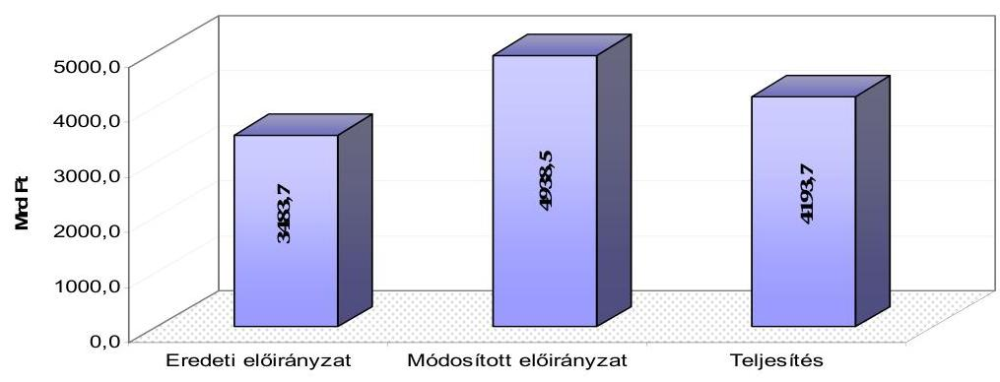

A 2010. évben teljesített kiadások intézményi és fejezeti kezelésű előirányzatok közötti megoszlása az alábbiak szerint alakult:

---

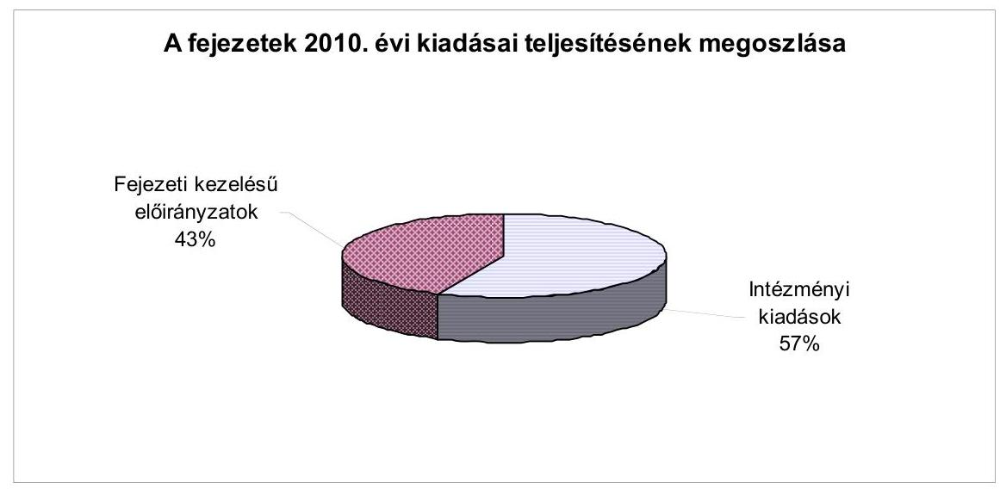

A fejezeteknél és a fejezeti jogosítványú költségvetési szerveknél a teljesített kiadások az eredeti kiadási előirányzathoz viszonyítva az alábbiak szerint alakultak:

- 100\% alatt volt az arány az OGY 1-4. cím, a KE és a KSH fejezeteknél, a KEHI és az OAH költségvetési szervnél;
- 100-110\% közötti volt az arány az ALB, az OBH, a BIR, az MKÜ, az NFM és a KüM fejezeteknél, a MEH és az MSZH költségvetési szervnél;
- 111-130\% közötti volt az arány a KIM, a HM, a BM, az UF, a NEFMI és az MTA fejezeteknél;
- kimagasló a teljesítés aránya a KT (139\%), a KTT (159\%) és a PSZÁF (147\%) fejezeti jogosítványú költségvetési szerveknél, a VM (144\%), az NGM (152\%) és a GVH (161\%) fejezeteknél. A teljesítés kimagasló arányait döntően az előző évi maradvány felhasználása és a bevételi túlteljesítés okozta.

A GVH fejezetnél eredeti bevételi előirányzatot nem terveztek, a túlteljesítés a befolyt eljárási dijból és eljárási bírságból származott.

A PSZÁF az előző évek maradványának 38,6\%-át (5000,0 M Ft) a központi költségvetésbe fizette be.

A teljesítések valamennyi fejezetnél és a fejezeti jogosítványú költségvetési szervnél a módosított előirányzaton belül maradtak, összességében a teljesítés a módosított kiadási előirányzat $84,9 \%$-a volt.

Az eredeti kiadási előirányzathoz képest az előirányzatok év közben kormányzati hatáskörben a céltartalék és a költségvetési általános tartalék terhére, irányító szervi és intézményi saját hatáskörben a tárgyévi többletbevétel, a korábbi évek kötelezettségvállalással terhelt maradványának igénybevétele, elői-rányzat-maradványok átcsoportosítása, illetve pénzeszközök átadása és átvétele jogcímen módosultak.

---

A kormányzati hatáskörú előirányzat-módosítások megfeleltek az Ámr. 55-57. §-ában előírtaknak.

A Kormány az Áht. 38. §-ának (1) bekezdésében biztosított jogkörében eljárva, a központi költségvetés általános tartalékából, az Ámr. 57. § (1) bekezdésének megfelelően, előterjesztések alapján - kormányhatározatokkal - a fejezetekhez történő előirányzat átcsoportosítást rendelt el.

A központi költségvetés általános tartaléka terhére kormányzati hatáskörben végrehajtott módosítás keretében a KT, a KE, az OBH, a BIR, az MKÜ, a KIM, a VM, a HM, a BM, az NGM, az NFM, a KüM, a NEFMI, valamint az MTA kapott többlet előirányzatot.

Az általános tartalékból az alábbi főbb célok kerültek finanszírozásra:

- a KE, az OBH, a BIR, az MKÜ és a KIM fejezetek új, illetve többlet feladatai;
- a KIM, a VM, a HM, a BM, az NGM és a NEFMI fejezetek árvízvédekezési és kárenyhítési költségei;
- a KIM, a BM és a KüM fejezetek kettős állampolgárság megszerzésével kapcsolatos kormányzati feladatai;
- a BM fejezetnél a múködési költségvetés többlettámogatása (Rendőrség, BV, OKF és a TEK);
- az NGM fejezetnél az APEH integrációja;
- az NFM fejezetnél az Educatio Nkft. és az MFB Zrt. tőkeemelése.

A Kormány a központi alrendszer céltartalékából (X. Miniszterelnökség fejezet, 20. cím, 2. alcím, 1. Különféle kifizetések jogcímcsoport) 4 jogcímen biztosított támogatást:

- A Kormány a 316/2009. (XII. 28.) Korm. rendeletével szabályozott módon, két ütemben - az 1035/2010. (II. 12.) és az 1120/2010. (V. 13.) Korm. határozatokkal - biztosított támogatást a költségvetési szerveknél foglalkoztatottak 2010. évi eseti kereset-kiegészítéséhez. A rendeletben meghatározták a havi kereset-kiegészítés mértékét, az arra jogosultak körét és a kereset-kiegészítés megállapításának és elszámolásának szabályait. Az igénylés alapján, a PSZÁF kivételével valamennyi intézmény kapott többlet előirányzatot, amelyből a fel nem használt támogatás visszarendezésre került.
- A prémiumévek programról és a különleges foglalkoztatási állományról szóló 2004. évi CXXII. törvény szerinti munkáltatói kifizetésekre igénylés alapján 13 (OGY, KIM, VM, HM, BM, NGM, NFM, KüM, UF, NEFMI, GVH, KSH, MTA) központi költségvetési fejezet kapott forrást.
- Az ösztöndíjas foglalkoztatási jogviszonyban lévő diplomás pályakezdő fiatalok munka-tapasztalat szerzésével kapcsolatos kiadások fedezetére 9 fejezet (KIM, VM, BM, NGM, NFM, KüM, UF, NEFMI, GVH) részére biztosítottak támogatást a 20/2005. (II. 11.) Korm. rendelet alapján.

---

- Az Európai Unió intézményeiben foglalkoztatott köztisztviselő és hivatásos állományú nemzeti szakértők támogatásának, és a nemzetközi szakértők foglalkoztatásának fedezetére 10 fejezet (OBH, KIM, VM, BM, NGM, NFM, KüM, UF, NEFMI, GVH) részére történtek átcsoportosítások a 146/2005. (VII. 27.) Korm. rendelet alapján.

A fejezetek közötti előirányzat-módosításokat az érintett fejezeteket irányító szervek vezetőinek megállapodása alapján hajtották végre, az Áht. 24. § (12) bekezdésében, valamint az Ámr. 55-59. §-aiban rögzített előírásoknak megfelelően. Azokban az esetekben, ahol utólagos elszámolási kötelezettséget írtak elő, az elszámolás minden esetben megtörtént.

A KIM, a VM, a HM, a BM, az NGM, az NFM és a NEFMI fejezeteknél a fejezetek közötti előirányzat-módosítások jelentős része a kormányzati struktúraváltással kapcsolatos feladat- és előirányzat átrendezésből adódott.

Az OGY, az OBH, a BIR, az MKÜ, a KIM, a ME, a VM, a HM, a BM, az NGM, az NFM, a KüM, a NEFMI, a GVH, a KSH és az MTA fejezetek esetében egyedi megállapodások alapján történtek az átcsoportosítások.

Az irányító szervi, valamint az intézményi hatáskörben végrehajtott előirány-zat-átcsoportosítások - a feltárt hibák kivételével - szabályosak és megfelelően dokumentáltak voltak. Az előirányzat-módosításokat a 46/2009. (XII. 30.) PM rendelet előírásai szerint jelentették be, a Kincstár által visszaigazolt bizonylatok rendelkezésre álltak.

Az ellenőrzés során, az alábbi területeken tártunk fel hibát, illetve szabálytalanságot:

- A PSZÁF és a KüM esetében az irányító szervi hatáskör helyett intézményi hatáskörben hajtották végre a fejezeten belüli és fejezetek közötti marad-vány-átcsoportosítást, amely a módosított előirányzat főösszegére nem volt hatással.
- A VM fejezetnél a szellemi tevékenységre irányuló megbízáshoz szükséges előirányzat növelést az Áht. 100/A. § (3) bekezdésében foglaltaktól eltérően nem a személyi juttatás előirányzat egyidejű csökkentésével valósították meg.
- A NEFMI esetében a Felsőoktatási információs rendszerek múködtetése fejezeti kezelésű előirányzatnál nem hajtották végre a szükséges előirányzat átcsoportosítást a múködési és a felhalmozási kiadások között.
- A PSZÁF-nél a szabályosan végrehajtott előirányzat-módosítás az analitikus nyilvántartásban nem megfelelő jogcímen került rögzítésre.
- Az MTA fejezeti kezelésű előirányzatainál az irányító szervi hatáskörben végrehajtott előirányzat-módosítások analitikus nyilvántartása - a fejezet tájékoztatása szerint programhiba miatt - nem egyezett meg a beszámolóban kimutatott összegekkel.

Az intézményi kiadási előirányzatok felhasználása során - a feltárt hibák kivételével - a számviteli alapelveket betartották, a pénzügyi teljesítések do-

---

kumentálása a jogszabályi követelményeknek és a belső szabályzatokban foglaltaknak megfelelően történt.

A személyi juttatások előirányzatainak felhasználása alapvetően szabályos volt. A rendszeres személyi juttatásoknál a besorolások, az alapilletmény és a pótlékok megállapítása megfelelt a jogszabályi előírásoknak, a megállapított illetmények dokumentumokkal alátámasztottak voltak.

A nem rendszeres személyi juttatások elszámolásánál a teljesítményhez kötött és céljutalomra történt kifizetések elszámolása nem minden esetben felelt meg a jogszabályi előírásoknak a BIR fejezet több intézményénél és a KIM fejezetnél. A GVH fejezetnél a bírságbevételek terhére kifizetett jutalom nem volt összhangban a Tpvt. 43/A. § meghatározott célokkal. A KT fejezeti jogosítványú költségvetési szervnél a külföldi kiküldetések napidíj elszámolása nem volt szabályos.

A külső személyi juttatások kifizetésénél a megbízásos jogviszony keretében történő foglalkoztatás esetében több fejezetnél és szervezetnél hibákat tárt fel az ellenőrzés.

A KIM, a HM, a BM és a NEFMI jogelődjénél a foglalkoztatás egyes esetekben ellentétes volt a Ktv. 1. § (9) bekezdésében foglaltakkal. A KT fejezeti jogosítványú költségvetési szervnél, és az MTA fejezetnél a megbízási szerződések több esetben munkaviszonyra utaló elemeket tartalmaztak.

A KIM fejezetnél a megbízási szerződések megkötésének gyakorlata helytelen volt, mivel az ellenőrzött szerződések több mint 40\%-ánál a feladatellátás hamarabb kezdődött, mint ahogy írásos megbízásra sor került volna.

A BIR fejezetnél és az MSZH intézménynél a megbízási szerződések megkötésénél formai és tartalmi hiányosságok voltak.

A személyi juttatások kiemelt előirányzaton a módosított előirányzatok túllépésére került sor a HM fejezetnél. ${ }^{50}$

A dologi és az egyéb folyó kiadások tételeinél több szabálytalanságot, illetve elszámolási hiányosságot is feltártunk.

Szabályszerűségi hiányosság, hogy a szerződéskötésre több esetben kötelezettség vállalás ellenjegyzése nélkül került sor a HM fejezetnél és a KT a költségvetési szervnél, illetve a teljesítésigazolás nem minden esetben volt ellenőrizhető az OBH, a VM, a HM, az NGM és a KüM fejezetnél.

Az OGY ÁBTL címnél szabálytalan - a Kbt. és az áfa tv. előírásaival ellentétes szerződésmódosítás következtében az intézménynek többletkiadása keletkezett.

[^0]
[^0]:    ${ }^{50}$ A megállapítással kapcsolatban a HM által tett észrevételt és az arra vonatkozó számvevőszéki választ a Függelék 151-152. oldalai tartalmazzák.

---

A felhalmozási kiadások előirányzatainak teljesítésénél a besorolások és a főkönyvi elszámolások - az alábbi kivételekkel - megfeleltek a vonatkozó számviteli előírásoknak.

A BIR és a KüM fejezeteknél a felhalmozási kiadások között számoltak el olyan kifizetéseket, amelyek dologi kiadásnak minősültek. A VM fejezet jogelődjénél a KvVM fejezetnél - vállalkozási szerződés alapján számla nélküli kifizetés történt.

Támogatás, támogatásértékú kiadás, végleges pénzeszköz átadás, egyéb támogatás és az ellátottak pénzbeli juttatásai előirányzatok kiadásainak az ellenőrzése során hibát, illetve szabálytalanságot nem állapítottunk meg.

A 2010. évben végrehajtott kormányzati struktúra változások jelentős feladatátrendezést indukáltak a fejezeti kezelésú előirányzatok vonatkozásában is. A legtöbb változást az új minisztériumok (KIM, VM, BM, NGM, NFM, NEFMI), illetve azok jogelődei között végrehajtott előirányzat átrendezések jelentették. A fejezeti kezelésű előirányzatok új feladatrendje igazodott a megalakuló minisztériumok felelősségi területeihez:

A KIM felelősségi területe a területi közigazgatás, kormányhivatalok; az igazságügy; a társadalmi felzárkózás; az egyházügy, civil kapcsolatok, nemzeti kisebbségek; a nemzetpolitika; valamint a kormányzati kommunikáció.

A VM felelősségi területe az agrárgazdaság; a vidékfejlesztés; az élelmiszerláncfelügyelet, agrárigazgatás, élelmiszer-feldolgozás; valamint a környezetvédelem, természetvédelem, vízügy.

A BM felelősségi területe az önkormányzatok; az állampolgárság, nemzetbiztonság, rendvédelem; a nemzetközi szerződéses kapcsolatok; valamint az építésügy, területrendezés.

Az NGM felelősségi területe a versenyképesség, területfejlesztés, innováció; a foglalkoztatáspolitika; az államháztartás, költségvetés; az adó- és pénzügyek; valamint a kül- és belgazdaság.

Az NFM felelősségi területe a fejlesztéspolitika; a vagyonpolitika; az infokommunikáció; a klíma- és energiaügy; a közlekedés; valamint a PPP-s beruházások.

A NEFMI felelősségi területe az egészségügy; a szociális ügyek, családügy, ifjúságpolitika; az oktatás; a kultúra; valamint a sport.

A fejezeti kezelésű előirányzatok felhasználásának szabályozottsága szempontjából kedvező volt, hogy a kormányzati struktúra átalakítást követően a KIM, a VM, a BM, az NGM, az NFM és a NEFMI fejezetek az átvett fejezeti kezelésű előirányzatokra vonatkozóan továbbra is hatályban tartották az átadók által az Áht. 24. § (9)-(10) bekezdései alapján - kidolgozott eljárási szabályokat.

A VM az átdolgozott fejezeti kezelésű előirányzat-felhasználási szabályzatát 2010 novemberében terjesztette a Kormány elé. A nemzetgazdasági miniszter a késői megküldésre való hivatkozással a tervezetet már nem írta alá, így a jogelőd (FVM

---

és KvVM) rendeletek maradtak hatályban, melyek gyakorlati alkalmazása során az új szervezeti rendet vették figyelembe.

Az NFM kizárólag az átvételekből eredően meghatározandó pénzügyi, számviteli eljárási szabályokra, továbbá a szakmai és pénzügyi kezelők kijelölésére vonatkozóan alkotott új szabályozást.

Központi beruházásokat a BIR, a HM, a BM, az NFM és a NEFMI fejezetek valósítottak meg.

A tárcák a szakmai fejezeti kezelésú előirányzatok felhasználását az előirányzatok jellegétől függően pályázati úton, egyedi döntések alapján, normatív finanszírozás módszerével, vagy az eljárási rendekben nevesített, meghatározott célokra (pl. tagdíjak) történő egyszeri kifizetéssel végezték. Az előirányzatok terhére nyújtott pályázatos, illetve egyedi döntésű támogatások folyósítását teljesítményarányosan, vagy utólagos elszámolás mellett támogatási előlegként hajtották végre. A támogatási előlegek egy összegben, illetve részletekben történő folyósítására is volt példa.

A előirányzatok meghatározott köre esetében a KIM, a VM, a HM, a BM, az NGM, az NFM, a KüM, a NEFMI és az MTA fejezetek alkalmaztak pályáztatást az előirányzatok felhasználása során, továbbá - az NGM és az MTA fejezetek kivételével - egyedi döntéssel is nyújtottak támogatásokat.

A VM fejezetnél általános probléma, hogy az egyedi döntésű támogatások esetében az elszámolható költségek körét nem pontosan határozták meg a támogató részéről, a teljesítést igazolók a benyújtott számlákat a támogatási összeg mértékéig befogadták.

A NEFMI esetében a Gyermek és ifjúsági célú pályázatok törvényi soron a nyertes pályázó kiválasztásánál megsértették a pályázati felhívásban és a támogatási szerződésben megfogalmazott előírásokat.

A fejezeti kezelésű előirányzatok (szakmai, pénzügyi) kezelésével, és/vagy lebonyolításával közremúködő szervezeteket is megbíztak a tárcák, egyrészt az irányításuk alá tartozó költségvetési intézményeket, másrészt külső közremúködőket. A külső közreműködők jellemzően más tárcához tartozó költségvetési intézmények, nonprofit, illetve gazdasági társaságok voltak.

A HM és az MTA fejezetek az irányításuk alá tartozó költségvetési intézményeiket bízták meg az egyes előirányzatok szakmai, és/vagy pénzügyi lebonyolításával, míg a KIM, és a NEFMI esetében csak külső közreműködő vett részt a feladatok ellátásában. A VM, a BM, az NGM, az NFM és az UF fejezetek saját költségvetési intézményeket, illetve külső közreműködőket egyaránt bevontak a fejezeti kezelésű előirányzatok meghatározott körének szakmai és/vagy pénzügyi lebonyolításába.

A közszféra és a magánszféra együttmúködésén (PPP) alapuló szerződéses konstrukcióban lebonyolított programok finanszírozását biztosító fejezeti kezelésű előirányzatokkal az NFM rendelkezett. Emellett a BM fejezetnél a PPP konstrukcióban megvalósított két büntetés-végrehajtási intézet kiadásait sajátosan már nem a fejezeti kezelésű előirányzatok, hanem a BV intézmény költségvetése tartalmazta.

---

A Kvtv. 9. számú melléklete alapján ún. „felülröl nyitott" előirányzatok az MKÜ, a KIM, a VM, a HM, a BM, az NGM, az NFM, az UF és a NEFMI fejezeteknél voltak. A teljesítés a KIM, a VM, a BM, az NGM, az UF és a NEFMI fejezeteknél - szabályosan - meghaladta a módosított előirányzatot, az MKÜ, a HM és az NFM fejezeteknél nem volt szükség az előirányzatok túllépésére.

A fejezetek a jogszabályi előírásoknak megfelelően szabályozták a fejezeti kezelésű előirányzatok elszámoltatási rendjeit, a felhasználás ellenőrzésénél, befogadásánál a fejezeti kezelésű előirányzatokra vonatkozó eljárásrendek alapján jártak el. A vizsgált tranzakciók esetén a szakmai kezelésű előirányzatok elszámoltatása a vonatkozó jogszabályi előírásoknak, a szerződésekben előírt feltételeknek megfelelt, azok megfelelő alapot szolgáltattak az előirányzatok cél szerinti felhasználásának megítélésében. A pályázati úton felhasznált előirányzatoknál a pályázati eljárások, a szerződéskötések és a támogatások felhasználásának elszámolási gyakorlata megfelelt a vonatkozó jogszabályok és a belső szabályok előírásainak.

A VM fejezetnél a szerződések beszámoltatási és elszámoltatási előírásai nem tartalmaztak egyértelmú utalást a kötelezett részére a dokumentumok benyújtására, hogy kinek, hová kell azokat megküldeni elfogadásra.

A HM fejezetnél egy előirányzat elszámolását nem találták, bár az beérkezett; az elszámoltató tudomásul vette, hogy a szerződésben az egyes feladatokra szánt keretösszegek és a tényleges kifizetések között az engedélyezettnél (20\%) nagyobb eltérés volt, illetve a támogatott nem a szerződésben meghatározott feladatok szerint bontva számolt el, továbbá nem elszámolható költségek elszámolását is tudomásul vették.

A NEFMI fejezetnél a pályázat kezeléséért felelős ESZA Nkft. az elszámolás megküldésére nem szólította fel a támogatottat, illetve az elszámolást a pályázati felhívásban megfogalmazottakkal ellentétesen fogadta el, az elszámolás értékelésénél megsértette a támogatási szerződés előírásait. A kifizetéseket alátámasztó bizonylatok az elszámolt összegre vonatkozóan nem a támogatási időszakra eső kifizetéseket is tartalmaztak.

A Kvtv. szerint a KE, a BIR, a KIM, a VM, a BM, az NGM, az NFM, a NEFMI és az MTA fejezetek rendelkeztek fejezeti tartalékkal. A tárcák - a NEFMI jogelődjének kivételével - a fejezeti általános tartalékból csak előre nem látható feladatokat finanszíroztak.

A NEFMI jogelődjénél, az OKM fejezetnél a fejezeti általános tartalék felhasználása nem az Előirányzat felhasználási ismertetőben támogatott célok érdekében történt.

# 5.5.3. A fejezetek bevételi előirányzatainak alakulása és teljesítése 

A központi költségvetési szervek és a fejezeti kezelésű előirányzatok saját bevétele (a pénzforgalom nélküli bevételek nélkül) a 2010. évben 1854,2 Mrd Ft-ra teljesült, ami az eredeti előirányzathoz viszonyítva 43,0\%-os növekedést mutat.

---

# A fejezetek 2010. évi bevételeinek alakulása 

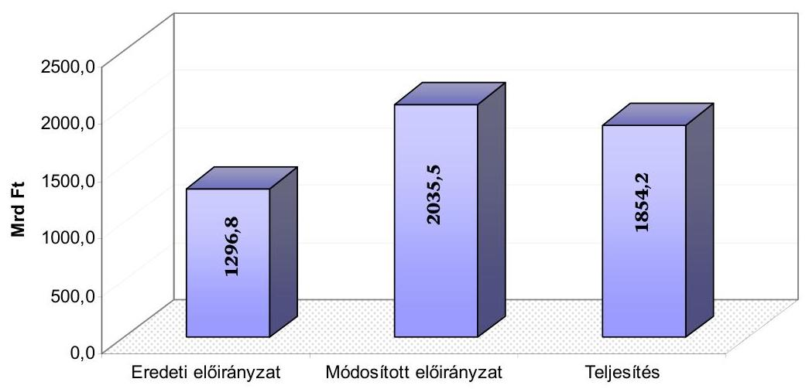

A pénzforgalom nélküli bevételek módosított előirányzata összesen 628,0 Mrd Ft volt, ami 540,6 Mrd Ft-ra teljesült.

A zárszámadás keretében ellenőrzött szervezetek közül a PSZÁF teljes egészében saját bevételből finanszírozta kiadásait. A MEH, a KBT és az OAH - pénzforgalom nélküli bevételek nélküli - bevételeinek több mint $95 \%$-a volt saját bevétel.

Nem tervezett saját bevételt a KTT, a KE, az ALB, az OBH, a GVH, valamint a vizsgált év során alakult ME. A teljesítés ezeknél a fejezeteknél, fejezeti jogosítványú költségvetési szervnél - a GVH-t kivéve ahol nem tervezhető és nem központosított bírság bevétel is realizálódott - minimális, eseti jellegű volt.

A Tpvt. 43/A. §-a határozza meg, hogy a befolyt eljárási díjból és eljárási bírságból a GVH tárgyévben mennyit használhat fel. A GVH 2010. évi hatósági jogkörhöz kapcsolódóan befolyt múködési bevétele elmaradt a Tptv.-ben - a felhasználhatóságra vonatkozóan - meghatározott mértéktől, így azt felhasználhatták.

Az ellenőrzés szabálytalanságot a támogatás értékű bevételek, a múködési bevételek, a felhalmozási bevételek, a múködési és a beruházási célú pénzeszköz átvételek és a kölcsönök esetében tárt fel. A feltárt hibák és hiányosságok nagyságrendje az intézményi beszámolók megbízhatóságát nem befolyásolta.

A többletbevétel előirányzatosításával kapcsolatos hiányosságot a BM fejezeti kezelésú előirányzatok, továbbá az NFM igazgatás és fejezeti kezelésú előirányzatok vonatkozásában tárt fel az ellenőrzés.

Az NGM-nél a támogatás értékű és a felhalmozási bevételek, a KüM-nél a múködési bevételek, a NEFMI-nél a múködési és a beruházási célú pénzeszköz átvételek, a felhalmozási bevételek, valamint a kölcsönök elszámolásánál állapított meg szabálytalanságot az ellenőrzés az érintett fejezetek igazgatási szervezeteinél.

---

A BM fejezet beszámolója és a fejezeti indokolásban szereplő pénzforgalom nélküli bevételek értéke között eltérés volt. A NEFMI fejezetnél az intézményi múködési bevételek bemutatása és szöveges értékelése a beszámolókban nem egységesen szerepelt.

A központi költségvetési szervek és a fejezeti kezelésű előirányzatok 2010. évi eredeti támogatási előirányzata 2186,9 Mrd Ft volt, ami év közben 4\%-kal (2275,0 Mrd Ft) emelkedett, és 2326,8 Mrd Ft-ra teljesült.

A fejezetek 2010. évi támogatásának alakulása
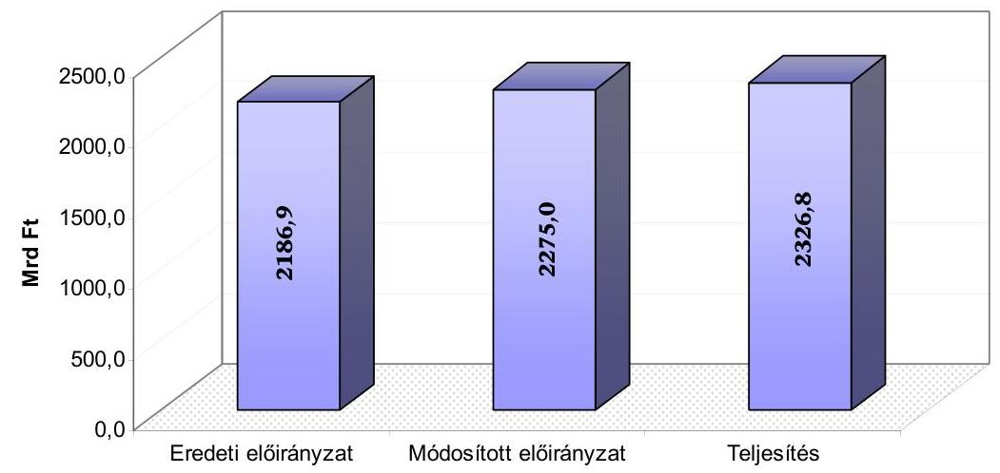

Az előirányzat a költségvetés általános és céltartalékának terhére, valamint az államháztartáson belüli átcsoportosításokkal növekedett, a zárolások hatására csökkent.

A Kvtv. felhatalmazása alapján a támogatási előirányzat teljesítése a KIM, a VM, a BM, az NGM, az UF és a NEFMI fejezeteknél haladta meg a módosított előirányzatot.

Az 1228/2010. (XI. 8.) Korm. határozat a NEFMI fejezet által kezelt 20/2/3 Közoktatási célú humánszolgáltatás és kiegészítő támogatás jogcímcsoport előirányzat túllépését (legfeljebb 8788,8 M Ft) meghatározta, amelyet a fejezet betartott.

A költségvetési szervek és a fejezeti kezelésű előirányzatok (NMHH nélkül) kiadásait, mint egy 50\%-ban finanszírozta költségvetési támogatás a 2010. évben.

---

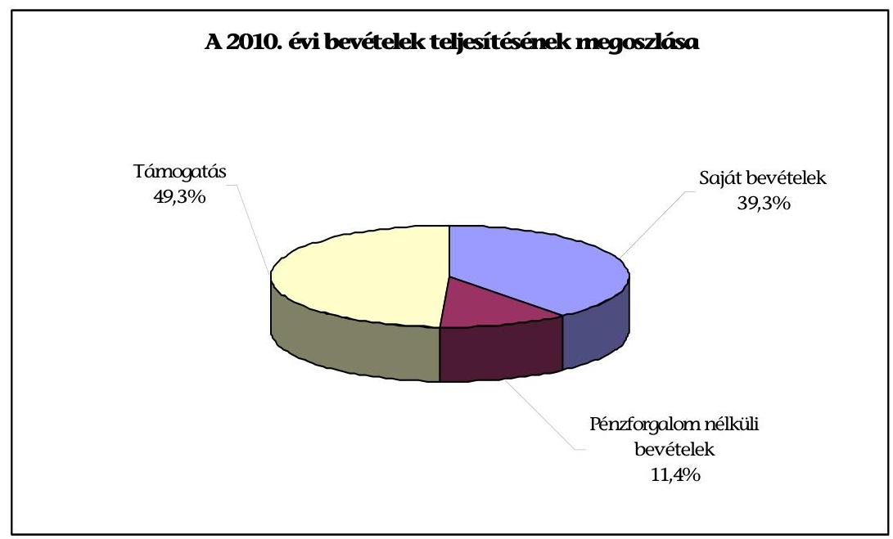

# 5.5.4. Elöirányzat-maradványok 

### 5.5.4.1. Az előző évi előirányzat-maradvány jóváhagyása és felhasználása

Az előző évi előirányzat-maradvány jóváhagyása a 2010. évben két ütemben történt.

Az első ütemben a PM a fejezetek 2009. évi maradványának felülvizsgálatát az Ámr. által előírt határidőt megelőzően, 2010. április 30-án elvégezte, és döntött a kötelezettségvállalással nem terhelt maradványok visszahagyásáról, illetve későbbi időpontban történő elvonásáról, átcsoportosításáról, valamint intézkedett az önrevízió alapján elvonásra felajánlott maradványok befizetéséről.

A Kormány (2010. február-május között) több határozatban rendelkezett a 2009. évi kötelezettségvállalással nem terhelt előirányzat-maradványok fejezeten belüli és fejezetek közötti átcsoportosításáról, amelyek a Helyi önkormányzatok támogatásai és átengedett személyi jövedelemadója, valamint az ME, az ÖM, az FVM, a HM, az IRM, az NFGM, a KvVM, a KHEM, az UF, az OKM, az EüM, a PM és az SZMM fejezeteket érintette.

A második ütemben az államháztartásért felelős miniszter a kötelezettségvállalással terhelt maradványok jóváhagyásáról (visszahagyásáról, illetve elvonásáról) az Ámr.-ben előírt határidőt követően - késedelmesen - 2010. december 16án rendelkezett.

A struktúraváltozásban érintett fejezetek 2009. évi maradványának alakulását befolyásolták a szerkezeti átalakulások miatti maradvány átrendezések. A maradványok - az államháztartásért felelős miniszter általi - jóváhagyása a jogelődök előirányzat maradványainak figyelembe vételével történt.

A 2010. év folyamán a 2009. évi előirányzat-maradványok felhasználására vonatkozóan több kormányhatározat rendelkezett.

---

A Kormány az 1132/2010. (VI. 18.) határozat 8. pontjában elrendelte, hogy a nemzetgazdasági miniszter az érintett tárcákkal együttmúködve 30,0 Mrd Ft-ot zároljon a fejezeti kezelésű előirányzatok, továbbá a központi és társadalombiztosítási költségvetési szervek 2010. június 30 -án meglévő előirányzatmaradványaiból. A fejezeti irányító szervek a zárolást teljesítették. A zárolt maradványok elvonásáról - a Kormány 1273/2010. (XII. 8.) határozatában előírtak alapján - az NGM a maradvány-jóváhagyás során intézkedett.

A Kormány jóváhagyta a 2009. évi előirányzat-maradványok fejezeten belüli - a VM, a HM és a KüM fejezeteknél - átcsoportosítását, és engedélyezte - a KIM, a VM és a NEFMI fejezetek kivételével - a 2010. június 30 -áig pénzügyileg nem teljesült előirányzat-maradványokhoz kapcsolódó feladatok további finanszírozását. A kormányhatározat a KIM, a VM és a NEFMI fejezeteknek azzal a megkötéssel engedélyezte $5,2 \mathrm{Mrd}$ Ft előirányzat-maradvány felhasználását, hogy annak ellentételezéseként a 2010. évi támogatási, illetve bevételi előirányzat terhére a Kincstár felé zárolást jelentenek be. A kormányhatározatban felhívták a fejezetet irányító szerv vezetőinek figyelmét arra, hogy az időközben meghiúsult kötelezettségvállalásokat a nemzetgazdasági miniszternek jelenteni kell.

A fejezetek 2009. évi előirányzat-maradványainak a 2010 decemberében történő jóváhagyása a hivatkozott kormányhatározatok - zárolás, meghiúsult kötelezettségvállalások átcsoportosítása, felhasználása - figyelembevételével történt.

A központi költségvetési szervek és a fejezeti kezelésű előirányzatok a 2010. évben 628 018,0 M Ft maradványt előirányzatosítottak, a teljesítés $540596,0 \mathrm{M} \mathrm{Ft}$ volt.

Az alkotmányos fejezeteknél, a fejezeti jogosítványú költségvetési címeknél, az igazgatási címeknél, valamint a fejezeti kezelésű előirányzatoknál a 2009. évi előirányzat-maradvány felhasználásával kapcsolatban az ellenőrzés szabálytalanságot nem tárt fel.

# 5.5.4.2. A tárgyévi előirányzat-maradvány alakulása 

Az ellenőrzött fejezeteknél a fejezetet irányító szervek a költségvetési szervek, fejezeti kezelésű előirányzatok tárgyévi előirányzat maradványainak felülvizsgálatát elvégezték, valamint a maradvány elszámolás dokumentumait határidőben benyújtották az NGM felé.

Az államháztartásért felelős miniszter a fejezetek tárgyévi előirányzatmaradványát az Ámr.-ben meghatározott május 15 -ei határidőre nem vizsgálta felül.

A központi költségvetési szervek és a fejezeti kezelésű előirányzatok a 2010. évben keletkezett előirányzat-maradványa 527 874,5 M Ft.

Az intézményi gazdálkodáshoz kapcsolódó és a fejezeti kezelésű előirányzatok tárgyévi maradványa az előző évekhez hasonló arányban (közel 40-60\%-ban) képződött. A fejezeteknél a tárgyévi előirányzat-maradvány lekötöttsége - az OGYH, a KT, a PSZÁF és a KE kivételével - összességében meghaladja a 80\%ot.

---

A tárgyévi előirányzat-maradvány alapvetően a 2011. évre áthúzódó pénzügyi teljesítésekből keletkezett. A fejezetek 2010. évi gazdálkodásának kiszámíthatóságát, ezáltal a tárgyévi előirányzat-maradvány képződésének nagyságát befolyásolták a Kormány 2009. évi előirányzat-maradvány kezeléséről szóló, illetve a kiadáscsökkentéssel kapcsolatos intézkedései. A Kormány által előírt intézkedéseket a tárcák végrehajtották.

Az 1132/2010. (VI. 18.) Korm. határozattal elrendelt zárolások feloldására benyújtott fejezeti kérelmek elbírálása és a kapcsolódó intézkedések az év utolsó hónapjaira estek.

Az 1273/2010. (XII. 8.) Korm. határozat rendelkezett a 2009. évi előirányzatmaradvány kezeléséről, amely a KIM, a VM és a NEFMI fejezetek előző évi ma-radvány-felhasználását a tárgyévi előirányzatok zárolásához kötötte.

Az 1268/2010. (XII. 3.) Korm. határozat szerint meghatározták, hogy a Kormány irányítása alá tartozó fejezetek 2010. december havi kiadási teljesítése összességében nem haladhatja meg a november hónapban teljesített összeget (368 067,7 M Ft).

Az ellenőrzött alkotmányos fejezeteknél, a fejezeti jogosítványú költségvetési címeknél, az igazgatási címeknél a 2010. évi előirányzat-maradvány megállapítása, elszámolása, valamint azok lekötöttségének dokumentálása - a KT címnél, a VM, a HM, az NGM, a NEFMI fejezetek és a GVH kivételével - a jogszabályi előírásoknak megfelelően történt.

A KT cím többlettámogatást kapott olyan többletfeladat elvégzésére, amely 2010. július 10-étől megszűnt. A Tanács a többlettámogatás terhére szabálytalanul elszámolt, és a célra felhasznált összegként szerepeltetett olyan személyi juttatást és járulékát, amely nem a többletfeladat ellátásával kapcsolatban merült fel. A feladatellátásra kapott összeg az Ámr. alapján - végleges feladatelmaradás miatt - a központi költségvetést illeti meg.

A VM igazgatásnál 817,0 M Ft maradvány analitikával alátámasztott, amely azonban nincs összhangban a kötelezettségvállalás analitikájával és az éven túli kötelezettségvállalás nyilvántartásával. A kötelezettségvállalás analitikája 577,6 M Ft-tal, az éven túli kötelezettségvállalás analitikája pedig 4742,0 M Ft-tal tartalmaz magasabb összeget a beszámoló azonos adattartalmú űrlap adatánál.

A HM igazgatásánál a kötelezettségvállalások dokumentálása nem teljes körűen felelt meg a jogszabályi előírásoknak.

Az NGM igazgatása a szabad maradványt - ügyviteli hiba miatt - magasabb, a kötelezettségvállalással terhelt maradványt alacsonyabb értéken mutatta ki. Az Ámr. 208. §-a alapján a költségvetési szervet meg nem illető maradványként a meghatározott célra kapott pótelőirányzatok kötelezettségvállalással nem terhelt maradványát nem mutatták ki sem a beszámolóban, sem a zárszámadás mellékletében.

A NEFMI igazgatása a 2010. évi maradványában helytelenül mutatta ki a többéves megvalósulással kiírt uniós pályázatok maradványát, továbbá kötelezettségvállalással terhelt maradvány dokumentuma tartalmazott egy könyvelői, be-számoló-készítési feladatokra vonatkozó vállalkozói szerződést, amely ellentétes az Ámr. 15. § (2) és (3) bekezdéseiben foglaltakkal.

---

A GVH fejezet előirányzat-maradvány összegére kihatással volt a szabálytalanul kifizetett jutalom és annak járulék vonzata.

A fejezeti kezelésű előirányzatok címeknél a 2010. évi előirányzat maradvány elszámolása és dokumentálása - az UF és az MTA fejezetek kivételével - szabályszerűen történt.

Az UF fejezet fejezeti kezelésű előirányzat sorai vizsgálatánál a főkönyvi kivonatokból és az analitikus nyilvántartásokból nem állapítható meg az éven belüli és az éven túli kötelezettség vállalások mértéke.

Az MTA fejezet fejezeti kezelésű előirányzat sorainál a lekötöttséget olyan szerződésekkel dokumentálták, amelyek alapján visszamenőleges - 2010. január 1jétől 2011. június 30 -áig - időszakra nyújtottak előfinanszírozást, ami a jogszabályi előírásoknak nem felel meg.

# 5.5.5. A fejezetek létszámhelyzete 

Az új kormányzati struktúra kialakítása a minisztériumok, az igazgatási és az igazgatás jellegű tevékenységet ellátó központi költségvetési szerveknél foglalkoztatottak létszámára is hatással volt.

A Miniszterelnökségen, a minisztériumokban, az igazgatási és az igazgatás jellegű tevékenységet ellátó központi költségvetési szerveknél foglalkoztatottak létszámáról szóló 1166/2010. (VIII. 4.) Korm. határozat - 2010. augusztus 4-ével hatályon kívül helyezte a 2057/2008. (V. 14.) Korm. határozatot.

Az 1166/2010. (VIII. 4.) Korm. határozat az újonnan létrejött Miniszterelnökség és a minisztériumok összlétszámát ( 5764 fő) nem változtatta meg. Az igazgatási és az igazgatás jellegű tevékenységet ellátó központi költségvetési szerveknél foglalkoztatottak létszámát - az E. Alap és az Ny. Alap létszámán kívül 53866 fơről 52598 főre (1268 fő) csökkentette.

A 2010. évben a jogszabályokban előírt feladatváltozások, a fejezetek közötti megállapodások alapján megvalósult létszám átadás-átvételek, valamint egyéb intézkedések következtében az 1166/2010. (VIII. 4.) Korm. határozat több alkalommal módosult, melyek hatására az engedélyezett létszám - a HM fejezeten, az E. Alapon és az Ny. Alapon kívül - 2010. december 31-éig 791 fővel növekedett.

A Korm. határozat - hatálybaléptetésekor - a HM fejezethez kapcsolódó igazgatási és igazgatás jellegű szervek vonatkozásában létszámot nem tartalmazott. A HM fejezet 6 szervezetének (199 fő) létszámát az év végén hatályos Korm. határozat tartalmazta.

Az előírt létszámkeret - a feladatváltozásból adódó fejezetek közötti nullszaldós létszám átadás-átvételeken kívül - többletfeladat, illetve átszervezés miatt meghatározóan a HM, a BM, az NFM és a KüM fejezeteknél növekedett.

A HM feladatrendszerének racionalizálásával a HM igazgatása új szervezeti struktúrában került kialakításra, mellyel kapcsolatban a HM igazgatás engedélyezett létszámkerete 50 fővel növekedett.

---

A BM fejezeten belül, a BÁH-nál az egyszerúsített honosítási eljárásra való felkészülés keretében 100 fős létszámfejlesztés valósult meg és új szervezeti egység jött létre.

Az NFM igazgatás kormányhatározatban meghatározott létszámkeretében 50 fős növekedést a KTIA kezelésével kapcsolatos feladatok Alap kezelőjétől tervezett átvétele okozott. (Az állomány és előirányzat átrendezése a 2010. évben a vonatkozó jogszabályi előírások ellentmondása miatt - nem történt meg.)

A KüM fejezeten belül a Külképviseletek igazgatása engedélyezett létszáma (a magyar állampolgárságról szóló törvény végrehajtásához kapcsolódóan) 70 fővel növekedett.

Az ellenőrzés megállapította, hogy az 1166/2010. (VIII. 4.) Korm. határozatban a minisztériumok részére engedélyezett létszámkeretet a minisztériumok igazgatásai betartották.

A Korm. határozatban engedélyezett létszámkeret és a minisztériumok igazgatása beszámolójában bemutatott létszámkeret közötti eltérés a HM, az NGM és a KüM fejezetnél adminisztratív okok miatt volt.

A fejezetek az engedélyezett létszámkeretet - az 1166/2010. (VIII. 4.) Korm. határozat létszámkeretét meghaladóan - jogszabályi alapon meghatározott feladatokhoz kapcsolódóan időszakosan megnövelhették. A tárcák a létszámtöbbletre vonatkozó előírásokat betartották, az ellenőrzés túllépést nem tapasztalt.

A 2011. évi EU elnökségi feladatok ellátásával összefüggő egyes kérdésekről szóló 2155/2008. (XI. 5.) Korm. határozat 8 minisztérium (a KIM, a VM, a HM, a BM, az NGM, az NFM, a KüM, a NEFMI) részére összesen 225 fő létszámot engedélyezett.

Az 1166/2010. (VIII. 4.) Korm. határozat a „Romák foglalkoztatása a közigazgatásban" program keretében a Miniszterelnökségen és a minisztériumokban foglalkoztatottak engedélyezett létszámkeretét 40 főben állapította meg.

# 5.6. A beszámolók pénzügyi (szabályszerúségi) ellenőrzésének tapasztalatai 

A Magyar Köztársaság 2010. évi költségvetése végrehajtásának vizsgálata keretében végzett pénzügyi (szabályszerúségi) ellenőrzés célja annak megállapítása volt, hogy az éves beszámolók az Szt. és a végrehajtására kiadott Áhsz. előírásai szerint készültek-e, és ennek megfelelően megbízható és valós képet adnak-e a költségvetési szerv vagyoni és pénzügyi helyzetéről. Az ellenőrzést az ÁSZ által kidolgozott módszertan alapján folytattuk le.

### 5.6.1. Az ún. alkotmányos fejezetek, fejezeti jogosítványú költségvetési címek, illetve egyintézményes fejezet beszámolói pénzügyi (szabályszerúségi) ellenőrzésének tapasztalatai

Az ellenőrzés során az ún. alkotmányos fejezetek (az OGY, a KE, az ALB, az OBH, a BIR és az MKÜ), a fejezeti jogosítvánnyal felruházott költségvetési

---

címek (a KT, a KTT, a PSZÁF, az MSZH, a KEHI, az OAH, a MEH), valamint az egyintézményes fejezet (GVH) költségvetési beszámolóit ellenőriztük.

A kormányzati átalakítás következtében az MSZH, a KEHI, az OAH és a MEH fejezeti besorolása és irányító szerve módosult. A KTT 2010. december 31-ével jogutód nélkül megszűnt.

Az ALB hatásköre módosult, a KEHI címből kivált az EUTAF. A KE fejezet a törvényi módosítások és a szervezet döntése alapján átalakult.

A fejezetek és a fejezeti jogosítványú címek rendelkeztek a jogszabályoknak megfelelő alapító okirattal, a szervezeti sajátosságokat figyelembevevő belső működési szabályzatokkal. Az ellenőrzöttek többségénél a szervezet szabályozottsága teljes körűen nem felelt meg az előírásoknak, a szabályzatok kiegészítése, pontosítása szükséges.

Az ALB és az OBH fejezet, valamint a KT és az MSZH címek SzMSz-e nem tartalmazta a jogszabályban előírt adatokat. Az ALB fejezet ügyrendjéről szóló törvényt a helyszíni ellenőrzés befejezéséig az Országgyűlés nem alkotta meg. A KT cím 2010. október 28 -ától hatályos SzMSz-e egymásnak ellentmondó előírásokat tartalmazott a belső ellenőr elhelyezésével és felügyeletével kapcsolatban, továbbá a Titkárság szervezeti felépítését tartalmazó melléklete nem volt összhangban a szabályzatban leírtakkal. A PSZÁF cím SzMSz-e nem tartalmazta a szabálytalanságok kezelésének eljárásrendjét. A MEH cím - NFM-mel egyeztetett - alapító okiratának aláírása és közzététele még nem történt meg.

A gazdálkodás szabályozottsága teljes körűen nem felelt meg az előírásoknak. Szabályzatok hiányoztak - az MKÜ fejezetnél és a KTT címnél -, illetve azok kiegészítése, pontosítása szükséges az OBH, a BIR fejezetnél és a KT, a KTT, a PSZÁF és az MSZH költségvetési címeknél.

Az ellenőrzött beszámolók adatait főkönyvi kivonat, analitikus nyilvántartások és leltárak támasztották alá. A mérlegsorok tartalma és értékelése összességében megfelelt az Szt. és az Áhsz. előírásainak, kivéve a következőket:

A BIR fejezetnél az adósok mérlegsor nem a valós értéket mutatja az értékvesztés elszámolásának megváltozott gyakorlata miatt. Az új számítógépes programban az analitikus nyilvántartások - az előző időszakok migrációiból adódóan - eltérést mutatnak a főkönyvi adatoktól. A valós értéket befolyásolták az új program múködéséből eredő nem számszerűsíthető hibák, valamint a behajthatatlan követelések nem egyértelmű elszámolási gyakorlata. Az MKÜ fejezet a kezelt vagyon forrását nem a kezelésbe vett eszközök tartós tőkéje, illetve tőkeváltozása sorokon szerepeltetette a mérlegben, hanem azt a saját tulajdonban lévő eszközök tartós tőkéje illetve tőkeváltozása sorokban. A PSZÁF címnél a befektetett pénzügyi eszközök mérlegsoron a dolgozók lakásépítési kölcsönéből az Áht. előírásával ellentétesen adott engedmény miatt alacsonyabb a befektetett eszközök, illetve a saját tőke mérleg szerinti értéke.

A kiadási és bevételi előirányzatok felhasználása - a következő esetektől eltekintve - szabályszerú volt. A módosított előirányzatok felhasználása során a kötelezettségvállalási jogkörök érvényesültek, a szerződéskötések, az utalványozások, a teljesítésigazolások és az érvényesítések szabályosan történtek.

---

Az OGY fejezet ÁBTL címe egy szerződés és annak módosítása során elkövetett szabálytalanságok következtében 6,5 M Ft többletkiadást teljesített. Az OBH fejezetnél sajtó és média tevékenységre kötött megbízási szerződéseknél kettő esetben a teljesítésigazolásokat nem tudták alátámasztani dokumentumokkal. További egy - tanulmányok készítésével kapcsolatos - megbízási szerződés esetében a teljesítésigazolás megalapozottsága analitikus nyilvántartás hiányában nem volt ellenőrizhető. A BIR fejezetnél az OIT Hivatalban az illetmény eltérítése a Bjt. szerint nem volt jogszerú. A GVH fejezetnél normatív jutalmat és járulékát jogcím nélkül, szabálytalanul fizették ki. A KT címnél a külföldi kiküldetések napidíját nem a jogszabály szerinti összegben állapították meg. A külső személyi juttatások ellenőrzött tételeinél több megbízási szerződés munkaviszonyra utaló elemeket tartalmazott.

A fejezeti kezelésú előirányzatokat a belső szabályzatnak megfelelően használták fel, az átvett előirányzatokról elkülönített analitikus nyilvántartást vezettek.

Az ellenőrzöttek az engedélyezett létszámkeretet összességében betartották, azonban a köztisztviselői foglalkoztatásra vonatkozóan a Kbt. előírásait a KT cím nem megfelelően alkalmazta.

A vagyoni, pénzügyi helyzetről megbízható, valós képet adott az OGY fejezet 1.-4. címe, a KE, az ALB, az OBH, a BIR fejezet 2. címe és az MKÜ fejezetek, valamint a KT, a PSZÁF, a KTT, az MSZH, a KEHI, az OAH és a MEH intézmények 2010. évi beszámolója.

Az ellenőrzés során feltárt - a beszámoló megbízhatóságát nem befolyásoló-hiányosságok miatt az elfogadó (hitelesítő) véleményünket figyelemfelhívó megjegyzéssel láttuk el az OBH és az MKÜ fejezeteknél, az OGY fejezeten belül az ÁBTL, továbbá a KT, a PSZÁF és a MEH címeknél.

A BIR fejezet 1. címe és a GVH fejezet 2010. évi beszámolója összességében megbízható, valós képet adott a vagyoni, pénzügyi helyzetről, kivéve a minősítésben a mérleggel és a pénzforgalommal kapcsolatban megfogalmazottakat.

# 5.6.2. Az igazgatási címek, alcímek beszámolói pénzügyi (szabályszerüségi) ellenőrzésének tapasztalatai 

Az ellenőrzés során az igazgatási címek, alcímek (a KIM igazgatása, az ME, a VM igazgatása, a HM igazgatása, a BM igazgatása, az NGM igazgatása, az NFM igazgatása, a KüM központi igazgatása, az NFÜ, a NEFMI igazgatása, a KSH intézmény és az MTA Titkársága) éves beszámolóit ellenőriztük.

A kormányzati struktúraváltással közvetlenül nem érintett igazgatási címek (HM, KSH, MTA) a gazdálkodásra vonatkozó belső szabályzatok aktualizálását 2010-ben elvégezték, azok összhangban voltak az Szt., az Áhsz. és az Ámr. vonatkozó előírásaival.

A 2010. évben szervezeti, illetve feladatváltozással érintett intézmények a múködésre és a gazdálkodásra vonatkozó szabályzatok esetében átmeneti megoldásként a jogelőd szervezetek szabályzatait tartották hatályban és az év máso-

---

dik felében eltérő időpontokban készítették el az új szabályzatokat, amelyek egy részének kiegészítése, pontosítása és aktualizálása szükséges.

A költségvetési beszámolót - a KIM, a BM és a NEFMI igazgatásai kivételével - a tárcák igazgatási szervei határidőben elkészítették és felülvizsgálatra a fejezetek irányító szerveinek megküldték.

A KIM igazgatása az irányító szerv jóváhagyása mellett a beszámoló elkészítésének határidő módosítását kérte a mérleg leltárral történő alátámasztása miatt. A módosított határidő ellenére a beszámoló könyvviteli mérlegének valódiságát leltárral teljes körűen nem tudta biztosítani, azt a beszámoló összeállítását követően lefolytatott utólagos leltárral igazolta.

A beszámolók adatait - az alábbiak kivételével - főkönyvi kivonatok, analitikus nyilvántartások és leltárak támasztották alá.

A HM igazgatása beszámolóját nem támasztotta alá az Áhsz. 50. § (1) bekezdésében előírt főkönyvi kivonat. A leltárral történő alátámasztás több mérlegsort saját tőke, tartalék - érintően nem volt megfelelő. ${ }^{51}$

A KSZF részére át nem adott eszközök nyilvántartása és a mérlegben történő kimutatása továbbra is problémát jelentett. Az át nem adott eszközöket az érintett szervezetek - az NGM igazgatása kivételével - saját eszközként tartották nyilván a beszámolóban. Az NGM igazgatása ezen eszközöket a 0 -ás számlaosztályban mutatta ki, amelyeket azonban leltárral nem támasztott alá.

A fejezeti igazgatások beszámolóinak ellenőrzése több mérlegsort érintően tárt fel mérlegvalódiságot érintő, illetve kisebb jelentőségű hibákat, hiányosságokat.

Az Immateriális javaknál hiányosság volt, hogy szoftver felhasználási jogokat vagyonértékű jog helyett a szellemi termékek közé sorolták (KüM központi igazgatása), az állományba vétel nem a tényleges bekerülési értéken történt (VM igazgatása).

A Tárgyi eszközöket érintően a többletként fellelt eszközök egyedi értékelésének, az értékcsökkenés elszámolásának elmaradása (NFÜ) és a mérlegbe tartozó tételek kimutatásának hiánya okozott eltérést (KüM központi igazgatása).

Az NGM igazgatásánál évek óta visszatérő probléma, hogy nem valósul meg a védelemszervezési, informatikai, hírközlési feladatok ellátását szolgáló eszközök átadása az azokat használó szervezetek részére. (Ezeknek az eszközöknek a szakmai felügyelete más szervezetek feladata, miközben értékkel az NGM igazgatása könyveiben és mérlegében szerepelnek.)

A Részesedéseknél adminisztrációs hiba okozott eltérést a mérlegsor összegében az NFM igazgatásánál.

[^0]
[^0]:    ${ }^{51}$ A megállapítással kapcsolatban a HM által tett észrevételt és az arra vonatkozó számvevőszéki választ a Függelék 147-148. oldalai tartalmazzák.

---

A Vevőkövetelések kimutatása az NGM igazgatásánál hiányos volt, valamint nem történt meg a vevők egyedi értékelése.

A Tartósan adott kölcsönöknél a kormányzati struktúraváltás miatt más fejezetektől áthelyezett dolgozók lakáskölcsön tartozása rendezésének (BM, NGM igazgatásai), valamint az értékvesztés elszámolásának elmaradása (NEFMI igazgatása) befolyásolta a mérlegsor értékét.

Az Egyéb követelések között a BM igazgatásánál kimutattak elévült követeléseket, valamint a mérlegsor néhány esetben nem tartalmazta a múködési célra nyújtott támogatáselőlegek összegét.

A Kötelezettségek mérlegsoron a tárgyévi és a tárgyévet követő évi szállítói kötelezettségek elszámolása között eltérés volt a NEFMI igazgatásánál.

A kiadási és bevételi előirányzatok felhasználása, a pénzügyi teljesítések dokumentálása - a következők kivételével - megfelelt a jogszabályi előírásoknak és a belső szabályzatokban foglaltaknak.

A Személyi juttatások elszámolásánál jellemzően a szervezet alapfeladatával öszszefüggésben kötött megbízási szerződésekkel kapcsolatban állapított meg hibát az ellenőrzés (HM, BM igazgatásai és az MTA Titkársága), valamint szabályszerűségi hiányosságok - utólagos szerződéskötés (KIM igazgatása), teljesítésigazolás nélküli kifizetés (VM igazgatása) - is felmerültek. A HM igazgatása túllépte a személyi juttatás kiemelt előirányzatát. ${ }^{52}$ Az ellenőrzés a normatív és a teljesítményhez kötött jutalomnál elszámolási eltérést, valamint pénzügyileg 2009. évben teljesített jutalom 2010. évre történő elszámolást is feltárt (KüM központi igazgatása). A struktúraváltás miatt speciális problémaként jelentkezett, hogy az átszervezéskor a munkavégzés a munkavállalók munkaviszonyának létrejötte előtt kezdődött el (KIM, NGM igazgatásai).

A munkaadói járulékok elszámolása szabályszerű volt.
A KIR és az eBEV rendszer közötti adat átvitelben az előző években tapasztalt problémák - a KIR rendszerből előállított havi finanszírozási összesítő, a bevallások és a teljesített fizetési kötelezettség adatai nem egyeznek meg, ezért a NAV adófolyószámlán jelentős túlfizetés, vagy hiány mutatkozik - továbbra sem kerültek megoldásra a központi illetményszámfejtést alkalmazó szervezeteknél. A beszámoló megbízhatósága érdekében az intézmények analitikus nyilvántartásokat vezetnek az eltérések korrigálása érdekében, amely jelentős többletmunkát okoz.

A dologi és az egyéb folyó kiadásoknál megállapított hiányosságokat - a tranzakciók dokumentálása nem teljes körű (VM igazgatása), a pontatlan és hiányos teljesítésigazolás (NGM igazgatása), az előzetes kötelezettségvállalás nélküli teljesítés (MTA Titkársága) - jellemzően a belső szabályzatokban foglaltaktól eltérő gyakorlat okozta. A külföldi kiküldetések ellenőrzésénél a felvett előlegekkel való elszámolás késedelmét (BM igazgatása) állapítottuk meg. A VM igazgatásánál a szellemi tevékenység végzésére rendelkezésre álló előirányzat szabálytalan növelését tapasztaltuk.

[^0]
[^0]:    ${ }^{52}$ A megállapítással kapcsolatban a HM által tett észrevételt és az arra vonatkozó számvevőszéki választ a Függelék 151-152. oldalai tartalmazzák.

---

A felhalmozási kiadások teljesítésénél a VM igazgatása egy beszerzés esetében több szabálytalanságot (szerződés belső szabályozástól eltérő megkötése, szabálytalan, számla nélkül történő előlegfizetés, nem a jogosult által történt teljesítésigazolás) tárt fel az ellenőrzés. A KüM központi igazgatásánál szabályszerűségi hiányosságokat (a gazdálkodási jogosítványok nem megfelelő időben történő használata) és hibás elszámolást (egyéves jogdíjak felhalmozási kiadásként való kimutatása) is feltártunk.

A Bevételek teljesítésénél a támogatások, a támogatásértékű bevételek kimutatásának teljes körűségével és összegével (NGM, NEFMI igazgatásai), az EU-tól közvetlenül kapott múködési és felhalmozási támogatások elszámolásával kapcsolatban (NEFMI igazgatása) állapított meg hiányosságot az ellenőrzés.

A fejezetek igazgatási címei a kiegészítő melléklet számszaki és szöveges részét elkészítették. A kiegészítő melléklettel kapcsolatban az ellenőrzés - a KIM, a VM, az NGM és a NEFMI igazgatásainál - különböző, a beszámoló megbízhatóságát nem befolyásoló hiányosságot állapított meg.

Az intézményi beszámolók a költségvetési szerv vagyoni, pénzügyi helyzetéről megbízható és valós képet adtak a KIM, az ME, a BM, az NGM, az NFM igazgatásai, a KSH intézmény és az MTA Titkársága esetében.

Az ellenőrzés során feltárt - a beszámoló megbízhatóságát nem befolyásoló - hiányosságok miatt az elfogadó (hitelesítő) véleményünket figyelemfelhívó megjegyzéssel láttuk el a KIM, BM, NGM, NFM igazgatásainak beszámolói esetében.

A HM igazgatása, a KüM központi igazgatása, az NFÜ és a NEFMI igazgatása 2010. évi beszámolója összességében megbízható, valós képet adott a költségvetési szerv vagyoni, pénzügyi helyzetéről, azonban a mérlegben illetve a pénzforgalmi jelentésben feltárt hibák befolyásolták a gazdálkodásról a költségvetési beszámoló alapján kialakított képet.

A korlátozás az immateriális javak, a tárgyi eszközök, a követelések, a tőkeváltozás és a kötelezettségek mérlegsorait érintette, továbbá a pénzforgalmi jelentést érintően a személyi juttatásokra és a kapcsolódó járulékokra, pénzeszköz átvételre, dologi kiadás helyett beruházási kiadás elszámolására vonatkozott.

# A VM igazgatása beszámolója a vagyoni és pénzügyi helyzetről nem adott megbízható és valós képet. A mérlegben, a pénzforgalmi jelentésben és a kiegészítő mellékletben feltárt hibák összességében meghaladják az ÁSZ módszertanban meghatározott 2\%-os mértéket. 

A beszámoló megbízhatóságának elutasítását a mérleg vonatkozásában az immateriális javak mérlegsor alátámasztásának, a számviteli alapelvek teljes körű érvényesülésének hiánya, valamint a kötelezettségvállalás kimutatásának hibái okozták.

---

# 5.6.3. A fejezeti kezelésú előirányzatok elszámolásai pénzügyi (szabályszerúségi) ellenőrzésének tapasztalatai 

Az ellenőrzés során a KIM, a VM, a HM, a BM, az NGM, az NFM, a KüM, az UF, a NEFMI, a KSH és az MTA fejezetek fejezeti kezelésű előirányzatok címei éves beszámolóit ellenőriztük.

Az UF fejezet fejezeti kezelésű előirányzatáról összeállított 2010. évi költségvetési beszámolóról szóló véleményünket a Jelentés 5.6.4. pontja tartalmazza.

A fejezeti kezelésű előirányzatok költségvetési mérlegét az Szt., az Áhsz. és a belső szabályozásban előírtak szerint készítették el.

Az egyes mérlegsorok - a HM fejezet tartalékok mérlegsora kivételével - teljes körű leltárral alátámasztottak voltak.

Az ellenőrzés a KIM, a HM és az NGM fejezeteknél nem tapasztalt mérlegvalódiságot érintő hiányosságot.

A KSH fejezet mérlege nem tartalmazott adatot, mivel a fejezeti kezelésű előirányzatokat előirányzat átadást követően a KSH intézmény kezeli.

A mérleg ellenőrzése során öt fejezet (VM, NFM, KüM, NEFMI, MTA) esetében a követelések, a VM és a KüM fejezetnél a rövidlejáratú kötelezettségek, valamint a BM, és az NFM fejezeteknél a függő elszámolások mérlegsorokat érintően tárt fel az ellenőrzés hiányosságot.

Megállapítottuk továbbá, hogy a VM és a NEFMI fejezetek a különféle egyéb követelések állományából a 0 -ás számlaosztályba kivezettek hitelt érdemlően nem bizonyítottnak tekintett tételeket (az adósok visszaigazolásának hiányában). A követelés kivezetés eljárásának helyességét sem jogszabály, sem a belső szabályzat nem támasztotta alá.

A mintavételen alapuló pénzforgalmi ellenőrzés megállapította, hogy a fejezeteknél a bizonylatok döntő mértékben - a következőkben kiemelt, több tárcát érintő szabálytalanságok kivételével - a tartalmi és a formai követelményeknek megfeleltek. A kötelezettségvállalást, ellenjegyzést és a szakmai teljesítés igazolását az arra jogosultak végezték. A pénzügyi elszámolások során az előírt dokumentációkat jellemzően mellékelték.

A pénzforgalmi jelentésben a beszámoló minősítését befolyásoló, illetve a figyelemfelhívást indokoló leggyakoribb megállapítások:

- a támogatási szerződésben meghatározott megvalósítási időszakon kívüli pénzügyi teljesítések elszámolása (KIM, NEFMI);
- az elszámolási határidő meghaladta a vizsgálat lezárásának dátumát, ezért a cél szerinti felhasználás nem volt ellenőrizhető (NGM);
- a szakmai kezelő szervezet által kiállított teljesítésigazolás nem felelt meg a vonatkozó jogszabályoknak, az elszámolás nem volt teljes körű (KIM);
- egy kedvezményezett a projektet nem valósította meg, a támogatási összeggel nem számolt el, visszafizetési kötelezettségének nem tett eleget (KIM);

---

- a szakmai kezelő szervezet - részben a struktúraváltozás következtében - nem tudta az ellenőrzés rendelkezésére bocsátani a megfelelően dokumentumokat, így a cél szerinti felhasználás nem volt ellenőrizhető, valamint a szakmai beszámoló és pénzügyi elszámolás belső szabályzatban foglalt határidőre történő értékelése elmaradt (NEFMI);
- céltól eltérő felhasználás (BM, NFM, NEFMI);
- összeghatár feletti szóbeli megrendelés, belső szabályzattal ellentétes előfinanszírozás, és a kiküldetési előleg határidőn túl történő elszámolása (KüM);
- a támogatott elszámolási kötelezettségének határidőn túli teljesítése (VM, NEFMI) voltak.

A fejezeti kezelésű előirányzatok a 2010. évi költségvetési beszámolóinak kiegészítő mellékletét a fejezetek elkészítették, a VM, az NFM az MTA fejezetek esetében azok a jogszabályi követelménynek nem teljes körűen feleltek meg.

Az MTA az OTKA tv.-ben szereplő éven túli kötelezettségvállalási korlátot 2011. évre vonatkozóan túllépte a Kutatási témapályázatok finanszírozásánál, az erre vonatkozó jogszabály módosítását kezdeményezte.

A fejezeti kezelésű előirányzatok 2010. évi gazdálkodása és a fejezeti kezelésű előirányzatok felhasználása összhangban volt a költségvetési gazdálkodásra vonatkozó szabályokkal.

A beszámolók a fejezeti kezelésú előirányzatok vagyoni, pénzügyi helyzetéről megbízható és valós képet adtak a KIM, a BM, az NGM, a KüM, a KSH és az MTA fejezeteknél, a beszámoló megbízhatóságát nem befolyásoló hiányosságok miatt azonban - a KSH fejezet kivételével - figyelemfelhívást is megfogalmaztunk.

A HM, az NFM ${ }^{53}$ és a NEFMI fejezetek 2010. évi fejezeti kezelésű előirányzatokról készített beszámolója összességében megbízható, valós képet adott a vagyoni, pénzügyi helyzetről, azonban a mérlegben, illetve a pénzforgalmi jelentésben feltárt hibák befolyásolták a gazdálkodásról a költségvetési beszámoló alapján kialakított képet.

A beszámolók minősítését befolyásolták a mérleghez kapcsolódóan a követelések és kötelezettségek értékelésével kapcsolatos hibák, a behajthatatlan követeléseknél a behajthatatlanság tényének nem előírásszerű megállapítása, a pénzforgalmi tételeknél az előirányzat cél szerinti felhasználása nem volt bizonyított dokumentáció hiányában, illetve a kedvezményezett elszámolása nem a szerződésben foglaltaknak megfelelően történt.

# A VM fejezeti kezelésű előirányzatainak beszámolója nem adott megbízható, valós képet a vagyoni és pénzügyi helyzetről. 

[^0]
[^0]:    ${ }^{53}$ A megállapítással kapcsolatban az NFM által tett észrevételt és az arra vonatkozó számvevőszéki választ a Függelék 198-199. oldalai tartalmazzák.

---

A 2010. december 31-i záró mérleg Egyéb követelések és Egyéb rövid lejáratú kötelezettségek mérlegsorainak leltáreltérése hatással van a Tőkeváltozás és ez által a Saját tőke nagyságának megváltozására.

A költségvetési fejezetek, igazgatási címek és fejezeti kezelésű előirányzatok beszámolói pénzügyi (szabályszerúségi) ellenőrzéseinek minősítéseit a 2. sz. melléklet tartalmazza.

# 5.6.4. Az Uniós Fejlesztések fejezet fejezeti kezelésű előirányzatai beszámolóinak megbízhatósága 

Az UF fejezet fejezeti kezelésű előirányzatainak felhasználásáról az NFÜ egy összesített beszámolót készít, amelyet azonban nem összesített főkönyvi kivonat, hanem operatív programonként/törvényi soronként készített rész-főkönyvi kivonatok támasztanak alá. A rész-főkönyvi kivonatokat az OP/törvényi sor szintjén elkészített rész-beszámolókhoz lehet hozzárendelni, ezért összesített főkönyvi kivonat hiányában a Mérleg ellenőrzését az egyes operatív progra-mok/törvényi sorok rész-beszámolóinak szintjén lehet elvégezni.

Az UF fejezet fejezeti kezelésű előirányzatainak 2010. évi felhasználásáról operatív programonként/törvényi soronként készült 31 részbeszámolóból tizenháromról elfogadó véleményt adtunk, amelyből nyolc rész-beszámolót figyelemfelhívó megjegyzéssel láttunk el, tizenegy részbeszámolóról korlátozott véleményt (KA környezetvédelmi projektek, KöZOP, TÁMOP, TIOP, KEOP, KDOP, ÉAOP, KMOP, ETE, EGT, Norvég Alap támogatásából megvalósuló projektek, HEFOP) bocsátottunk ki, hét részbeszámoló pedig elutasító (ÁROP, EKOP, NYDOP, DDOP, DAOP, ÉMOP, Svájci Alap támogatásából megvalósuló projektek) véleményt kapott.

A korlátozott véleményt, illetve az elutasító véleményt eredményező hibák értéke összesen 16 410,9 M Ft. A feltárt hibák aránya az UF fejezet fejezeti kezelésű előirányzatairól készített összesített beszámoló 875 892,3 M Ft-os kiadási főösszegének 1,87\%-a, amely alapján az UF fejezet fejezeti kezelésű előirányzatairól készített összesített beszámolóról korlátozott véleményt adtunk.

Az UF fejezet fejezeti kezelésű előirányzatokról összeállított 2010. évi beszámolóját a fejezeti kezelésű előirányzatok beszámolóinak pénzügyi (szabályszerúségi) ellenőrzése módszerével felülvizsgáltuk, és ennek keretében elegendő és megfelelő bizonyosságot szereztünk arról, hogy a beszámoló az Szt.-ben foglaltak és az Áhsz. előírásainak csak részben felel meg.

A feltárt hibák jelentős részét, $88,9 \%$-át a mérlegek ellenőrzése során tártuk fel. A feltárt hibák kihatással voltak a mérleg valódiságára, adattartalmának pontosságára, továbbá a következő évi pénzforgalmi elszámolásokra is hatást gyakorolnak. A mérlegek egyes sorainak valódiságára, tartalmi megfelelőségére vonatkozó összesen 14584,2 M Ft összegű hiba az UF fejezet fejezeti kezelésű előirányzatairól készített összesített beszámoló 530 193,5 M Ft-os mérlegfőösszegének 2,75\%-át teszi ki. A feltárt hibák a zárlati feladatoknál a munkafolyamatba épített ellenőrzések hiányosságai mellett, a számvitelt támogató informatikai (EMIR SA, EMIR-ÜMFT, IMIR, IMIR2, Forrás SQL) rendszerekkel

---

kapcsolatos belső kontrollok múködésének hiányosságaira, illetve az ÚMFT OPk esetében az EMIR követeléskezelési modulja elindításának csúszására vezethetők vissza.

A beszámoló készítéshez az analitikákat a számvitelt támogató informatikai rendszerekből történő lekérdezéssel az IH-k állították elő, és teljességi nyilatkozat kiadása mellett adták át az NFÜ FF részére. A beszámolók ellenőrzése alapján a számvitelt támogató informatikai rendszerekből kinyert analitikák és a főkönyv (beszámoló) adatai közötti eltérések mutatkoztak, amelyek teljes körű rendezésére, a követelések, a kötelezettségek és a kötelezettségvállalások esetében a beszámoló-készítésig nem került sor. Az IH-k által előállított analitikák szerinti követelések-, kötelezettségek és kötelezettségvállalások több esetben nem támasztják alá a főkönyvi kivonatban és/vagy a beszámolóban szereplő követelések, kötelezettségek, illetve kötelezettségvállalások összegeit.

A számvitelt támogató informatikai rendszerekből nyert analitikák, és a főkönyvi kivonatok, valamint a beszámolók adatainak egyezősége rendszerszerűen nem biztosított, az IH-k által a beszámolóhoz szolgáltatott teljességi nyilatkozatok csak formálisak, mivel az IH-k nem tudják biztosítani olyan analitikák rendelkezésre állását a követelés-, kötelezettség állományokról és a kötelezettségvállalásokról, amelyek teljes körűen tartalmazzák azokat a gazdasági eseményeket, amelyek 2010. december 31-ig megtörténtek, és befolyásolták az év végi záró állományt.

A vizsgált 31 rész-beszámolóból 24 rész-beszámoló esetében az Ámr. 75. § (1) bekezdésében előírt évenkénti kötelezettségvállalások nyilvántartásának hiánya miatt nem állapítható meg, hogy az analitikában, a főkönyvi kivonatban, illetve a beszámolóban nyilvántartott kötelezettségvállalási összegek közül melyik a valós, mivel a Főkönyvi kivonat 07. „Kötelezettségvállalások nyilvántartási" számla 2010. december 31-ei záró egyenlege, illetve a beszámoló 77-78. „Európai Uniós támogatással megvalósuló programokhoz kapcsolódó kötelezettségvállalások állományának alakulása" c. űrlapokon nyilvántartott kötelezettségvállalási összegek egymással nem egyeznek. A főkönyvi kivonat 07. „Kötelezettségvállalások nyilvántartási számla" 2010. december 31-ei egyenlegét nem támasztja alá analitika. Ezért a főkönyvi kivonat 07. „Kötelezettségvállalások nyilvántartási" számla 2010. december 31-ei záró egyenlege és a 77-78. „Európai Uniós támogatással megvalósuló programokhoz kapcsolódó kötelezettségvállalások állományának alakulása" c. űrlapokon szereplő összegek tekintetében csak azt tudtuk megállapítani, hogy azok meghaladják a beszámoló 42. „Előirányzat-maradvány alakulása" c. űrlapon szereplő tárgyévi előirányzat maradványok összegeit. A feltárt - fentiek alapján nem számszerúsíthető - hibák befolyásolják a gazdálkodásról kialakított képet, illetve a következő évi pénzforgalmi elszámolásokra is hatást gyakorolnak.

A tizenegy ÚMFT OP-ról, valamint a Svájci Alap támogatásából megvalósuló projektekről és az EGT, Norvég Alap támogatásból megvalósuló projektekről készített rész-beszámolók esetében a „Támogatási program előlegek" mérlegsorokat érintő probléma az egyes KSz-eknek nyújtott előlegek eltérő elszámolására és nyilvántartására vezethető vissza (egyes KSz-ek Együttmúködési Megállapodás alapján számlát nyújtanak be az IH-nak az elvégzett tevékenységről,

---

amelyet az NFÜ szállítói előlegként tart nyilván, míg más KSz-eknek az SLA szerződés alapján az IH támogatási program előleget fizet).

A támogatási program előlegek a beszámolókban az „Egyéb követelések" között nem teljes összegben szerepelnek, mivel az érintett KSz-ek részére az SLA finanszírozás keretében folyósított, szállítói előlegként kezelt összegeket a Számlarend szerint megbontva - nettó összegben a 39-es, a szállítói előlegre jutó áfa összegét a 72-es számlán - tartják nyilván. A nyilvántartás formailag megfelel az Áhsz. 22. § (9) bekezdésében foglaltaknak, a szállítónak teljesített kifizetés teljes összege a beszámolóban ugyan (a két részösszegben) megjelenik, azonban a mérlegekben a követelések föösszege nem a valós, 2010. december 31-én fennálló követelések összegeit mutatja. A KSz-ek részére az előlegek folyósítása támogatási keretből történt, tehát nem szállítói előlegként, hanem támogatási program előlegként kezelendő. Eltérésként a mérlegekben a „Költségvetési aktív függő, átfutó kiegyenlítő elszámolások" mérlegsoron lévő és az „Egyéb követelések" mérlegsorba beemelendő összegek különbözetét (az áfa összegét) számszerúsítettük (hiba összege).

A beszámolók, illetve a pénzforgalmi ellenőrzés során feltárt hiba két ÚMFT OP esetében az OP törvényi sor terhére finanszírozott kedvezményezetti önerő öszszege, amelyről megállapítottuk, hogy nem az előirányzat célja szerinti felhasználásra irányult.

Az ÚMFT OP-k/törvényi sorok mérlegének ellenőrzése során nyolc ÚMFT OP esetében (ÁROP, EKOP, TÁMOP, KEOP, NYDOP, ÉMOP, DDOP, DAOP) állapítottunk meg eltérést az „Egyéb rövidlejáratú kötelezettségek" záró állományánál. A nyolc ÚMFT OP-nál feltárt eltérés alapvetően járult hozzá a konkrét OP és az NFÜ beszámolójának minősített véleményének kiadásához. A valódiság számviteli alapelvének sérülését az okozta, hogy az OP-k 2010. december 31-ei leltáraiból és mérlegeiből hiányoznak azok a kedvezményezettek által benyújtott és még 2010-ben - mind a KSz, mind az IH-k által - megfelelő teljesítésként jóváhagyott elszámolások támogatási összegei („Egyéb rövidlejáratú kötelezettségek"), amelyeknek a pénzügyi rendezésére csak 2011 januárjában került sor. Az előbbiekben említett - a kedvezményezettek részére teljesítendő kifizetési kötelezettségek - nem jelentek meg az NFÜ beszámolójában, illetve nemzetgazdasági szinten az EU Bizottság felé benyújtott költségelszámolásokban.

Négy regionális OP esetében (DAOP, DDOP, ÉMOP, NYDOP) a kedvezményezettek által benyújtott - és a ROP IH által elfogadott - kifizetési kérelmekben 1,9 Mrd Ft összegben előleg elszámolások is történtek, amelyeknek az EU Bizottsággal való elszámolása azonban 2010-ben nem zárult le. Így 2010. december 31-én az előlegek elszámolásához kapcsolódó követelések nemzetgazdasági szinten nem jelentek meg, ami a folyamatban résztvevő szervezetek (NFÜ, IgH) együttműködésén alapuló rendezést igényel.

A feltárt hibák 11,1 \%-át - összesen 1826,7 M Ft összegben - a pénzforgalmi ellenőrzés során tártuk fel. A pénzforgalmi ellenőrzés keretében feltárt hibák a vonatkozó jogszabályok (a 2009-ben támogatási szerződés megkötése nélkül, kizárólag támogatói okiratra kiadott kötelezettségvállalás alapján 2010-ben teljesített kifizetések esetében az Áht., a régi és az új Ámr., a számlaösszesítő alapján benyújtott tételek esetében a 281/2006. (XII. 23.) Korm. rendelet) elő-

---

írásainak be nem tartására, egyes OP-k esetében az előirányzat nem cél szerinti felhasználására és a támogatási szerződés megkötéséhez kapcsolódó pénzügyi fedezet hiányára, illetve a kifizetés előtti ellenőrzések hiányosságaira vezethetőek vissza.

A beszámolókban, illetve a TÁMOP esetében a pénzforgalmi ellenőrzés során feltárt hibák szükségessé teszik a számvitelt támogató informatikai rendszerek teljes körű informatikai felülvizsgálatát, a beszámolókban szerepeltetett adatok valós jellegének és teljes körűségének, valamint a funkciók, hatáskörök szervezeten belüli és szervezetek közötti elválasztásának biztosítása érdekében.

Az NFÜ észrevételében kifogásolta a szállítói előlegek nyilvántartásával, a kedvezményezetti önerővel, a támogatói okirat alkalmazásával, illetve a számlaösszesítővel benyújtott kifizetési kérelmek esetében az ellenőrzések megfelelőségével kapcsolatos megállapításainkat és ajánlásainkat. Az NFÜ vonatkozó észrevételeit és az azokra adott válaszainkat a Jelentés B.1. A központi költségvetés fejezet 6. Az EU támogatások és az uniós tagsággal összefüggő hazai befizetések, valamint a Függelék XIX. Uniós Fejlesztések fejezet és Az EU támogatások és az uniós tagsággal összefüggő hazai befizetések címú pontjai tartalmazzák.

# 5.7. A beszámolók pénzügyi (szabályszerúségi) ellenőrzések során feltárt - újszerú, vagy ismétlődő - problémák 

A korábbi évek ellenőrzései során tett javaslataink hasznosulását vizsgálva tapasztalatainkat a „10. A korábbi ÁSZ ellenőrzések megállapításaival kapcsolatban tett intézkedések" pont is tartalmazza -megállapítottuk, hogy az ellenőrzött szervezetek intézkedési terveket készítettek a hiányosságok megszüntetésére. Az intézkedési tervekben foglaltak azonban több esetben nem, vagy nem teljes körűen valósultak meg. A 2010. évben is tapasztaltunk több éve ismétlődő, változatlanul fennálló, hiányosságokat.

A szervezeti szabályozottság területén a korábbi években feltárt hiányosságok mellett - az SzMSz, az ügyrend és a munkaköri leírások aktualizálásának elmaradása, a köztük lévő összhang hiánya - az ellenőrzött évben a kormányzati struktúraváltozáshoz kapcsolódóan a problémák megismétlődése mellett újabbak is mutatkoztak (új SzMSz-ek, ügyrendek és munkaköri leírások elkészítése és kiadása).

A 2010. évben keletkezett új, egyedi problémák föleg a kormányzati struktúraváltáshoz kapcsolódtak, amelyek - mivel döntő többségükben a struktúraváltozás megvalósítására rendelkezésre álló rövid időre vezethetők vissza - az új szerkezet kialakulásával 2011. évben várhatóan megoldódnak, ismétlődésük nem várható.

Egyes új szervezetekhez került munkavállalók jogviszonya, illetve az illetmény kifizetésre való jogosultsága több hónapon keresztül sem rendeződött, mivel a kinevezéshez szükséges okmányok nem álltak rendelkezésre. A kialakult helyzetet bérelőleg kifizetésével kezelték az alkalmazási engedéllyel foglalkoztatottak részére.

---

A struktúraváltáshoz kapcsolódó, a nem jogszabállyal rendezett kérdésekben - pl. az eszközátadások - az érintettek megállapodásokat kötöttek, amelyekben meghatározottak rendezése 2010. évben nem fejeződött be.

Ebben az évben is jellemző volt a szabályzatok hiánya, vagy azok aktualizálásának elmaradása, valamint az, hogy a szabályozás kialakítása során nem vették figyelembe a szervezeti sajátosságokat.

A gazdálkodással kapcsolatos belső szabályozási hiányosságok minden évben, szinte minden ellenőrzött szervezetet érintően előfordultak. Ennek egyik oka, hogy gazdálkodással kapcsolatos jogszabályok - Szt., Áht., Ámr., Áhsz. stb. változásai szinte minden évben szükségessé teszik egyes szabályzatok módosítását, amelyek kezelése nem mindig teljes körűen, és határidőben történik meg. Előfordult, hogy a belső szabályzatok között összhanghiányt állapítottunk meg, annak következtében, hogy a több szabályzatot érintő jogszabályi módosítások átvezetése nem következetesen történt meg.

A szabályozásban előforduló hiányosságokat növelte az évközben végrehajtott jelentős struktúra átalakítás. A kormányzati struktúraváltással érintett szervezetek az év második felében a jogelődök - esetenként egymástól eltérő - szabályzatait alkalmazták és csak az év végére készültek el a gazdálkodásra vonatkozó, az új szervezetre kialakított szabályzatok.

A jogszabálynak, illetve a szervezeti sajátosságoknak nem teljes körűen megfelelő belső szabályozás hatást gyakorolhat a beszámoló megbízhatóságára, különösen abban az esetben, amikor a különböző gazdálkodási jogkörrel rendelkező munkatársak nem rendelkeznek kellő gyakorlattal, helyismerettel.

A struktúraváltással érintett tárcáknál a 2010. évben fokozott kockázatot jelentő tényezők várhatóan következő években nem jelentkeznek, mivel a szabályozás a 2011. évben - már az év elejétől - megfelelő alapot nyújthat a gazdálkodás szabályszerű viteléhez, amennyiben a szervezetek kialakítják a sajátosságaiknak megfelelő belső kontroll rendszereket - ezen belül a FEUVE rendszert - és gondoskodnak annak folyamatos, megbízható múködéséről.

Megjegyezzük, hogy a megfelelő szabályozás mellett is előfordult szabálytalan teljesítés - az előző időszakok „rossz gyakorlatának" folytatása, vagy számítógépes program módosításának elmaradása miatt - amely a belső kontrollok múködésének hiányosságaira is visszavezethető

Az elmúlt évek ellenőrzései során visszatérő probléma volt az alapfeladatra megbízás keretében történő foglalkoztatás, amelyek területén azonban csökkenő tendencia figyelhető meg, mind az érintett szervezetek, mind a szerződések számában.

A határidők be nem tartása - pl. az előlegek elszámolásánál - ismétlődő hiányosság, amely szintén a belső kontrollok nem megfelelő működését jelzi.

A fejezeti kezelésű előirányzatok ellenőrzésénél általános probléma, hogy a jogszabály csak szempontokat határoz meg az előirányzatok felhaszná-

---

lásával és elszámoltatásával kapcsolatban. Ez teszi lehetővé, hogy a tárcák vezetői a jogszabályi követelményeknek megfelelő, de különböző mélységú, részletességú, és egymástól eltérő belső szabályozásokat határozzanak meg pl. az elszámoltatás alap-dokumentumaira, határidejére, a támogatás elszámolása helyszíni ellenőrzésének feltételeire vonatkozóan.

Tapasztalataink szerint eltérően szabályozzák a támogatásokkal való elszámolás dokumentációs követelményeit (összevont kimutatás, számlamásolat stb.), a támogatás felhasználásának helyszínen történő ellenőrzésének feltételeit (pl. nem vagy eltérő összeghatárhoz kötötten), a felhasználást követő elszámolás határidejét (esetenként 2-6 hónap) stb.

A Vtv. hatályba lépése óta probléma a hatályos vagyonkezelési szerződések hiánya, amely még a jelen ellenőrzésünk idején is jellemző volt.

A legtöbb szervezet még a KVI-vel kötött szerződéssel rendelkezik, és az azóta bekövetkezett vagyonváltozások átvezetése nem történt meg.

A minisztériumok esetében a nem szakmai feladatellátáshoz kapcsolódó, hanem a múködést szolgáló ingatlanok, eszközök teljes körú átadása a KSZF részére még a 2010. évben sem fejeződött be, továbbá nem egységes a minisztériumok által át nem adott eszközök nyilvántartása sem.

A KIR-ben előző években tapasztalat hibák - a KIR-ből előállított havi finanszírozási összesítő, a bevallások és a teljesített fizetési kötelezettség adatai nem egyeznek meg, ezért a NAV adófolyószámlán jelentős túlfizetés, vagy hiány mutatkozik - továbbra sem kerültek megoldásra.

Pozitív tapasztalatokat szereztünk az előző évi beszámoló megbízhatóságát befolyásoló hibákkal kapcsolatban. Megállapítható, hogy a minősített véleményt okozó hibákat (eszközök besorolása, követelések, kötelezettségek értékelése stb.) általában megszüntetik, kijavítják az ellenőrzöttek.

# 6. AZ EU TÁMOGATÁSOK ÉS AZ UNIÓs TAGSÁGGAL ÖSSZEFÜGGŐ HAZAI BEFIZETÉSEK 

2010. évre vonatkozóan az EU költségvetéséhez a tervezett hozzájárulások a Kvtv. XXII. fejezet (Pénzügyminisztérium) 29. címében (Hozzájárulás az EU költségvetéséhez) négy alcímen jelentek meg. A XXII/29/1 alcímen az áfa alapú hozzájárulás (tervezett előirányzat 31 156,3 M Ft), a XXII/29/2 alcímen a GNI alapú hozzájárulás (tervezett előirányzat 175 594,8 M Ft), míg a XXII/29/3 alcímen a Brit korrekció (tervezett előirányzat 12 432,8 M Ft) szerepeltek. A Hollandia és Svédország számára teljesítendő, bruttó GNI csökkentéssel összefüggő befizetési kötelezettség XXII/29/4 alcímen (tervezett előirányzat 1575,3 M Ft) jelentek meg.

Magyarország fizetési kötelezettségét a közösségi jogszabályoknak megfelelően, havonta történő átutalásokkal teljesíti. A befizetések összege azonban nem minden hónapban azonos. Ennek oka, hogy az EU költségvetési kiadásai sem lineárisan jelentkeznek, továbbá az évközi EU költségvetés módosítások - pl. az

---

előző évi többlet elosztása a tagállamok között - is hatással vannak az egyes hónapok fizetési tételeire.

Az átutalásokat az NGM EU KKF utalványozása alapján a számlavezető Kincstár teljesítette a Befizetés az EU-ba elnevezésű számláról. A havi gyakorisággal kiállított utalványok hozzájárulás fajtánként (áfa alapú hozzájárulás, GNI alapú hozzájárulás, Brit korrekció, Hollandia és Svédország számára teljesítendő bruttó GNI csökkentés) tartalmazzák az EU Bizottság bankszámlájára utalandó összegeket.
2010. év során a Magyarországra vonatkozó befizetési kötelmek mértéke több alkalommal módosult. A Mérlegjelentésben hivatkozás szerepel a módosításokra vonatkozóan, a befizetések mértékei dokumentáltak.

Az EU 2010. évi költségvetésének módosításai között szerepelt többek között a Lisszaboni szerződés hatályba lépésével az Európai Parlament létszámtervének 150 fős bővülésének hatása, a 2010-es saját forrás előrejelzés frissítésének, a korábbi évekre vonatkozóan a brit korrekció, valamint a Hollandia és Svédország számára teljesítendő bruttó GNI csökkentés felülvizsgálatának elszámolása és az Európai Külügyi Szolgálat költségvetésbe foglalása.
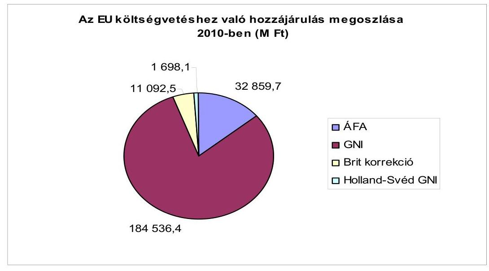

A 2007-2010. évek közötti időszakban Magyarország EU költségvetéshez való hozzájárulása évről-évre növekedést mutat. A növekedés okozója a GNI alapú hozzájárulás mértékének növekedése, amelynek alapja a tagállami GNI-re vetített egységkulccsal képzett összeg. A GNI növekedésével párhuzamosan nő a GNI alapú hozzájárulás mértéke is. A 2010. évben a növekedés másik okaként a Svédország és Hollandia számára teljesítendő bruttó GNI csökkentés, nevezhető meg. Az áfa alapú hozzájárulás, valamint a brit korrekció mértékének változása az azok meghatározására vonatkozó szabályokra vezethető vissza.

---

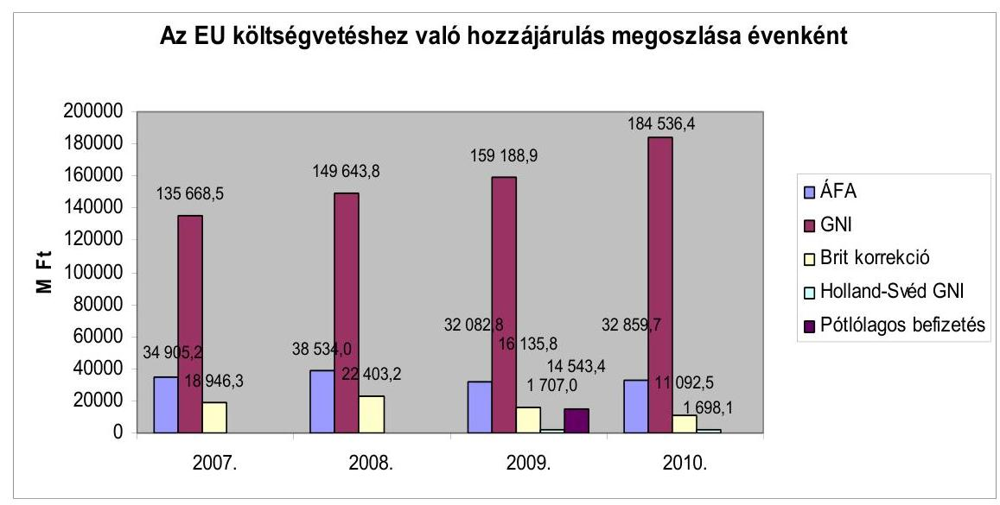

Cukorágazati hozzájárulás beszedési költség megtérítése címén 2010ben a központi költségvetést 162,5 M Ft bevétel illette meg, amely elmarad a tervezett 176,0 M Ft előirányzattól (a teljesítés mértéke 92,3\%). A különbség részben árfolyameltérésből származik, mivel a tervezés során alkalmazott 272,1 Ft/euró árfolyamhoz képest a termelési díjat végül $269,7 \mathrm{Ft} /$ euró árfolyamon kellett megfizetni. Módosította a beszedési költségtérítés mértékét az is, hogy a magyarországi cukorgyárakat a cukorilletékek tekintetében 2010-ben visszatérítés illette meg. A gyártóknak járó összesen $48,0 \mathrm{M}$ Ft összegű visszatérítést - az EU tradicionális saját forrásainak befizetéséhez hasonlóan - 75\%-25\% arányban uniós és központi költségvetési forrásból kellett teljesíteni. (Az előirányzatról ennek megfelelően 12,0 M Ft kifizetésére került sor.)

Vámbeszedési költség megtérítése címen 2010-ben a központi költségvetést a tervezett 7200,0 M Ft-tal szemben 8442,0 M Ft illette meg, így a növekmény mértéke 1242,0 M Ft volt (17,3\%).

Az előirányzat teljesítését alapvetően az növelte, hogy a 2010. évi harmadik országbeli forgalom a tervezett 4989,0 Mrd Ft helyett 5656,0 Mrd Ft mértékben realizálódott. Csökkentette ugyanakkor, hogy az átlag-vám mértéke a tervezett 0,62\% helyett csak 0,61\%-os mértékű volt. Az előbbiek következtében a bruttó vámbevétel a tervezett 30682,4 M Ft-tal szemben 34275,4 M Ft mértékben realizálódott. A volumennövekedés és az átlag-vám százalékos mértéke együttes növekedésének hatása - figyelemmel arra, hogy a tagállamok a beszedett öszszeg $25 \%$-át megtarthatják a beszedés költségeinek finanszírozására 898,3 M Ft volt.

Az Egyéb uniós bevételek címen belül az uniós támogatások utólagos megtérülése alcím (XLII/7/4) egyenlege negatív, mértéke 8734,4 M Ft.

Az alcím egyenlegét a Nemzeti Vidékfejlesztési Terv (7597,8 M Ft), az 5A (-21 467,5 M Ft), a KA (429,8 M Ft) és az Uniós támogatások utólagos megtérülése (4705,5 M Ft) jogcímcsoportok adatai képezték.

---

Az UF fejezet fejezeti kezelésú előirányzatok címe részére a 2010. évre a Kvtv. 696218,5 M Ft kiadási, 548224,7 M Ft bevételi előirányzatot és 147993,8 M Ft költségvetési támogatást hagyott jóvá. A beszámolási időszakban a kiadási előirányzat 1132000,5 M Ft-ra (162,6\%), a bevételi előirányzat (pénzforgalom nélküli bevételek nélkül) 846787,5 M Ft-ra (154,5\%), a támogatási előirányzat 146171,6 M Ft-ra ( $98,8 \%$ ) módosult. A pénzforgalom nélküli bevételek módosított előirányzata 139041,4 M Ft volt. A teljesítés a kiadásoknál 875892,3 M Ft (77,4\%), a bevételeknél (pénzforgalom nélküli bevételek nélkül) $711599,0 \mathrm{M}$ Ft (129,8\%), a támogatásoknál $166013,2 \mathrm{M}$ Ft (113,6\%) volt. A pénzforgalom nélküli bevételek 127672,2 M Ft-ra ( $91,8 \%$ ) teljesültek. A keletkezett maradvány 129392,1 M Ft.

Az UF fejezet 2010. évi kiadásainak 10,3\%-át a KA-ból finanszírozott projektek, 2,6\%-át az NFT I. OP-kre teljesített kifizetések jelentették, (amelyek a programzárás következtében jellemzően szabálytalanságból eredő, EU Bizottság részére teljesített visszafizetések voltak), továbbá 82,3\%-át az ÚMFT OP-kra teljesített kifizetések tették ki. Az ETE programok a kiadások között 1,1\%-ot képviseltek, az NFÜ kezelésében lévő szakmai fejezeti kezelésű előirányzatok kiadásainak részesedése 1,7\%-os volt. A kiadások 2,2\%-a volt technikai jellegű (az Uniós előirányzatok 2009. évi lekötetlen előirányzat-maradványának befizetése a központi költségvetésbe, illetve átvezetése fejezeten belül).

A 2004-2006-os kötelezettségvállalási időszakot lefedő öt NFT I. OP előirányzatai keretében 1995,0 M EUR SA-ból származó közösségi támogatás állt Magyarország rendelkezésére, amelyeket hazai költségvetési források egészítettek ki. Az EU Bizottság az NFT I. OP-k eredeti 2008. december 31-ei zárási határidejét meghosszabbította 2009. június 30 -áig, így még 2009. évben is teljesíthetőek voltak az NFT I.-hez kapcsolódó kifizetések, a projektek záró-kifizetései azonban még a 2010-es költségvetési évet is érintették.

Az ÚMFT időarányos teljesítése kapcsán elmondható, hogy az NFÜ által készített kimutatás szerint a rendelkezésre álló 5198905,1 M Ft-os keretből 3756 489,7 M Ft EU forrás 2010. december 31-ei állapot szerint lekötésre került. A teljesített kifizetés az EU forrást illetően a 2010. december 31-ei kötelezettségvállalási állományból 1181354,0 M Ft volt, ami a rendelkezésre álló keret $22,7 \%$-a, a lekötöttnek pedig a $31,4 \%$-a.

Magyarországon az agrár és vidékfejlesztési támogatások, valamint a támogatási kérelmek benyújtásáról, a kérelmek kezeléséről tengelyenként, azon belül intézkedésenként jogszabály rendelkezik.

Az agrár-, és vidékfejlesztési támogatások - a strukturális támogatásokhoz hasonlóan - a tagállamokban többszintű intézményrendszeren keresztül kerülnek kifizetésre.

A 2010. év folyamán változások történtek az európai uniós agrár-, és vidékfejlesztési támogatások irányítási és ellenőrzési rendszerében, személyi változások történtek a támogatásokat kezelő intézményrendszerben, beleértve az FVM-et, az FVM szervezetén belül múködő, az uniós agrártámogatások illetékes hatóságát, az ÚMVP, HOP irányító hatóságokat, illetve az EMGA, EMVA kifizető ügynökségi feladatokat ellátó MVH-t.

---

A 2010. évi kormányzati struktúraváltást követően a Magyar Köztársaság minisztériumainak felsorolásáról szóló 2010. évi XLII. törvény 1. § h) pontja alapján 2010. május 29-i hatállyal - az FVM és a KvVM fejezetek jogutódjaként - megalakult a VM fejezet.

A minisztérium felső vezetésében - a kormányzati struktúraváltáshoz kapcsolódóan - több személyi változás is történt, emellett a szervezeti változások érintették az agrár-, és vidékfejlesztési támogatások kifizetéséért felelős szervezeti egységeket.

Az MVH az EMVA-ból és EMGA-ból finanszírozott támogatások és egyéb intézkedések tekintetében kifizető ügynökségi, valamint egyéb - ennek keretén belül a HOP jogcímek végrehajtásával és fejlesztésével összefüggő feladatokat, az NFT I. keretébe tartozó AVOP esetében - delegált közremúködő szervi feladatokat lát el.

Az ellenőrzés során megállapítottuk, hogy az MVH esetében a 2010. évi szervezeti változások nem jelentettek kockázati tényezőt, mert a támogatásközvetítő MVH szervezeti felépítése az év folyamán nem változott - a személyi változásoktól eltekintve -, SzMSz-e 2010. január 1-től hatályos volt.

A Tanács 1290/2005/EK rendeletének értelmében a tagállamoknak EMGA/EMVA forrás felhasználás esetén biztosítaniuk kell az intézményrendszer és kifizetések folyamatos ellenőrzését. A rendeletben meghatározottak szerint az igazoló szerv (ISz) a tagállam által megbízott jogi személyiséggel rendelkező köz- vagy magánjogi jogalany, amely az akkreditált KÜ számláit igazolja, a valódiság, teljesség és pontosság szempontjából, az általa bevezetett irányítási és ellenőrzési rendszer figyelembevételével.

Az igazoló szerv megléte az EMVA/EMGA intézményrendszer kötelező eleme, az igazoló szervnek ellenőrzéseiről jelentést, véleményt és tanúsítványt kell kiállítania, illetve megküldenie az Európai Unió Bizottsága részére, amelyek igazolják, hogy az MVH teljesíti a Közösség által előírt akkreditációs kritériumokat, valamint az éves beszámoló adatai megbízhatóak, pontosak és teljesek. Az érintett pénzügyi év igazoló szervi vizsgálatára kiválasztott szerv az előírt ellenőrzések elvégzése után - az illetékes hatóságon keresztül - megküldi véleményét az EU Bizottság részére, amely alapján az EU Bizottság határozatban dönt az adott pénzügyi év EMVA és EMGA számláinak elszámolhatóságáról.

Az Igazoló Szerv 2010. pénzügyi évről kiadott tanúsítványában megállapította, megfelelő bizonyosságot szerzett arról, hogy az EU Bizottságnak küldendő EMGA, EMVA beszámolók megfelelők, teljes körűek és pontosak, valamint hogy a belső ellenőrzési eljárások kielégítően működtek.

A közös agrárpolitika finanszírozásáról szóló 1290/2005/EK tanácsi rendelet alapján a 2007-2013-as programozási periódusban az EMOGA helyébe két új alap, az EMGA, és az EMVA lépett.

Az EMGA az agrárpiaci támogatások/egyéb beavatkozások és a jövedelemtámogatások finanszírozására, míg az EMVA minden vidékfejlesztési kiadás társfinanszírozására szolgál, függetlenül annak típusától és földrajzi elhelyezkedésétől. Az EMGA végrehajtására vonatkozó szabályok nem változtak lényegesen az EMOGA Garancia Részleg szabályaihoz képest.

---

Az EMVA két különálló támogatási rendszert váltott fel, az EMOGA Garancia Részlegéből kiváltak a vidékfejlesztési támogatások, illetve megszűnt az AVOP strukturális alap jellege, és az összes mezőgazdasági célú vidékfejlesztési támogatás egy alapban, az EMVA-ban került összevonásra. 2007. január 1-jével megjelent az 1698/2005/EK tanácsi, ún. EMVA rendelet, amely a 2007-2013. közötti időszakban megteremtette a vidékfejlesztési támogatások rendszerének kereteit. A 2007-2013-as programozási periódusra vonatkozóan a rendelet meghatározza az EU vidékfejlesztési politikájának céljait, a vidékfejlesztési prioritásokat és intézkedéseket, illetve megállapítja a partnerségre, a programozásra, az értékelésre, a pénzgazdálkodásra, a monitoringra és az ellenőrzésre vonatkozó szabályokat.

A hazai költségvetés VM fejezetében nem jelenik meg egy adott évben az EU Bizottságtól átutalt valamennyi agrártámogatás. A VM fejezet költségvetése 2010-ben is a 2007-2013-as programozási periódus vidékfejlesztési (ÜMVP) és halászati (HOP) támogatásait, valamint a 2004-2006-os programozási periódus I. NVT-hez, illetve a csatlakozás előtti SAPARD támogatáshoz kapcsolódó kifizetéseket tartalmazza.

Az EMVA forrásból támogatási döntések alapján jutottak a kedvezményezettek az egyes intézkedésekkel kapcsolatos jogszabályban vagy pályázati felhívásban rögzített támogatási mértékek alapján, illetve az egyes jogcímekre elkülönített forrás figyelembevételével. Magyarországon az EMVA-ból finanszírozott támogatások az ÜMVP, HOP keretében kerülnek kifizetésre.

Az ÜMVP a 2007-2013. évek közötti időszakra vonatkozó Nemzeti Vidékfejlesztési Program, amelyet Magyarország az EMVA-ból nyújtott vidékfejlesztési támogatásokról szóló 1698/2005/EK Tanácsi Rendelet 15. cikk (1) bekezdése alapján a Kormány jóváhagyását követően hivatalosan benyújtott az EU Bizottság részére. Az ÜMVP-t az EU Mezőgazdasági és Vidékfejlesztési Bizottsága 2007. szeptember 19én hagyta jóvá. Az ÜMVP célja a mezőgazdasági és erdészeti ágazat versenyképességének javítása, a környezet és vidék fejlesztése, valamint a vidéki élet minősége és a vidéki gazdaság diverzifikálása. A programhoz Tengelyenként különböző mértékű EMVA támogatás kapcsolódik. Az ÜMVP végrehajtásának felelőse Magyarországon az ÜMVP Irányító Hatósága, az FVM/VM. Az ÜMVP lebonyolításában részt vesz az FVM/VM több főosztálya, az MVH, valamint az MgSzH.

A HOP előirányzat célja, hogy a lakosság fogyasztási szerkezetében növekedjék az egészséges haltermékek szerepe, amelyek a lehető legnagyobb részben - hagyományainkra és természeti adottságainkra is támaszkodva - hazai termelésből kell, hogy származzanak. A 2007-2013.közötti EU költségvetési időszakban a közös Halászati Politika megvalósítását az Európai Halászati Alap (EHA) segíti.

# Az EMGA-ból nyújtott, 100\%-ban közösségi forrásból finanszírozott támogatási összegek nincsenek tervezve a magyar költségvetésben, sajátosságaik miatt részben nehezen is tervezhetők (még bázis alapon is). Ezek a támogatások a zárszámadásban ún. „költségvetésen kívüli téte-lek"-ként jelennek meg. 

A támogatásokat a magyarországi Kifizető Ügynökség a Kincstár speciális KESZ-én keresztül előfinanszírozza, a kapcsolódó összegeket az EU Bizottság utólagosan - a támogatási igény EU Bizottság felé történt lejelentését, illetve annak EU Bizottság általi kézhezvételét követő 2 hónapon belül - megtéríti az államháztartás számára, így ezek a támogatások „költségvetési bevételt" ké-

---

peznek. Az EMGA-ból nyújtott támogatásokhoz tartoznak a közvetlen termelői támogatások (SAPS), az agrárpiaci támogatások (exporttámogatások, belpiaci támogatások, egyéb agrárpiaci támogatások, ezen belül az elkülönített cukortámogatás), illetve az intervenciós tételek.

Az EMGA forrásból az EU-ból érkező közvetlen kifizetések formájában lehetett támogatáshoz jutni, amely közvetlenül a termelő jövedelmét növelő támogatás, a termőterület, az állatlétszám vagy termékegység alapján.

Az intervenciós felvásárlás esetében, a Kifizető Ügynökség (a KESZ-en keresztül) megelőlegezi és kifizeti a termelők számára a felvásárolt termék értékét. Ezt az összeget az EU a költségek vonatkozásában utólag megtéríti, míg az értékesített termékek ellenértéke a vevőtől térül meg az államháztartás számára (a KESZen keresztül).

Az uniós előírások értelmében az adott évi jogalap alapján járó egységes területalapú támogatásokat tárgyév december 1-jétől a következő év június 30 -áig lehet kifizetni.

A hazai területalapú támogatási rendszer keretében az EU által finanszírozott SAPS támogatás mellett bizonyos ágazatok esetében kiegészítő nemzeti támogatás („top-up") adható. A területalapú támogatás rendszerében igényelhető kiegészítő nemzeti támogatás feltételeit és a szabályozással kapcsolatos kérdéseket az EMGA finanszírozott egységes területalapú támogatás (SAPS), valamint az ahhoz kapcsolódó kiegészítő nemzeti támogatások („top-up") 2010. évi igénybevételével kapcsolatos egyes kérdésekről szóló 22/2010. (III. 16.) FVM rendelet írta elő.

# 7. A BELSŐ KONTROLLOK KIÉPÍTÉSÉNEK ÉS MŰKÖDÉSÉNEK TAPASZTALATAI 

A 2010. évi zárszámadás ellenőrzése keretében az ÁSZ által ellenőrzött körben a pénzügyi (szabályszerúségi) módszerekhez kidolgozott munkalapok alapján minősítettük a belső kontrollrendszereket.

Az intézményi belső kontrollrendszerek kiépítettségéről és múködéséről - a költségvetési beszámoló megbízhatósága szempontjából fontosnak ítélt - öt területre vonatkozóan végeztünk előzetes kockázatértékelést, amelynek alapján az intézmények 85\%-ánál alacsony, 15\%-ánál pedig közepes kockázatot képviselt a belső kontrollrendszer múködése. Magas kockázatú kategóriába egyetlen intézmény sem került.

A kormányzati struktúraváltással összefüggésben a 2010. évi zárszámadás ellenőrzése során az intézmények közel negyedénél (26\%) nem végezték el a belső kontrollrendszerek előzetes kockázatfelmérését, ezek az intézmények a feltárási bizonyosság meghatározása szempontjából eleve magas kockázati kategóriába kerültek.

A munkalapok alapján elvégzett felmérés, és az eleve magas kockázati kategóriába sorolás eredményeképpen az intézmények 63\%-ánál alacsony, 11\%-ánál kö-

---

zepes, 26\%-ánál pedig magas kockázatot képviselt a kialakított belső kontrollrendszer.

Ellenőrzési módszertanunk szerint a belső kontrollok előzetes értékelését a részletes vizsgálati eljárások meghatározása előtt véletlenszerűen kiválasztott tételek alapján teszteljük. Abban az esetben, ha a tesztelés eredménye nem támasztja alá az előzetes kockázatértékelést, akkor azt módosítjuk.

Az előzetes értékeléshez képest a tesztek eredményei, az intézményi kör 15\%ánál emelték a kockázati minősítést. Valamennyi változtatás magasabb kockázati besorolást eredményezett. Két esetben az alacsony kategóriából közepes, egy esetben pedig magas kockázati kategóriába került az érintett intézmény. Az ellenőrzés az előzetes kockázatértékelés a tesztelés alapján alacsony kockázati kategóriába sorolta az intézmények 52\%-át, közepes kockázati kategóriába 18\%-át, magas kockázati kategóriába pedig 30\%-át.

# A belső kontroll területeinek értékelése: 

A tevékenységek szabályozottságát tekintve az előzetes kockázatfelmérés alapján az intézmények $80 \%$-a alacsony, $20 \%$-a közepes kategóriába került.

Egy kivételtől eltekintve valamennyi intézmény rendelkezett SzMSz-szel és aktualizált, hatályos alapító okirattal. Az SzMSz-ek tartalmazták a gazdasági szervezet feladatait, 10\%-ból azonban hiányzott a gazdasági szervezet felépítése. A gazdasági szervezeteknek csak 85\%-a rendelkezett olyan ügyrenddel, amely tartalmazta a szervezet feladatait, a vezetők és beosztottak feladat-, hatás- és jogkörét. Az intézmények ugyanilyen arányban rendelkeztek valamennyi dolgozóra vonatkozó hatályos munkaköri leírással. A közbeszerzések eljárásrendjét az intézmények $95 \%$-a megfelelően kidolgozta, a megfelelő közszolgálati szabályzat viszont hiányzott az intézmények 10\%-ánál. A Kincstárral történő egyeztetés szabályozása - ideértve a kincstári költségvetési beszámoló és az elemi beszámoló egyeztetésének rendjét is - valamennyi intézménynél megtörtént. Egy kivételével valamenynyi intézmény elvégezte a Kincstárral az egyeztetést. Ennek eredménye azonban az esetek több mint 55\%-ában nem mutatott egyezőséget.

A pénzügyi és számviteli rendszer szabályozottsága az előzetes kockázatfelmérés során az intézmények 90\%-ánál alacsony, míg 10\%-ánál közepes kategóriába került.

Az összes intézmény rendelkezett számviteli politikával, számlarenddel és számlatükörrel. Minden egyes számlarend tartalmazta a számlák számát, a főkönyvi számla és az analitikus nyilvántartás kapcsolatát, összefüggéseit, a gazdasági események könyvelési folyamatleírásait, a számlaösszefüggéseket, és elkülönítetten az előirányzati forgalmi és állományi számlákat, ideértve a főkönyvi kivonatokkal kapcsolatos teendőket. Egy-egy intézménynél fordult elő, hogy a számlarend nem tartalmazta az alkalmazásra kerülő számlák tartalmát, illetve a féléves zárlati feladatokat. Hiányzott az intézmények 5\%-ánál a megfelelő pénzkezelési szabályzat, az eszközök és források értékelése szabályzat, 10\%-ánál pedig a megfelelő eszközök és források leltározási szabályzata és az önköltségszámítás rendjére vonatkozó szabályzat. Valamennyi intézmény megfelelően kialakította a pénzügyi jogkörök gyakorlásának eljárásrendjét.

---

A gazdálkodási tevékenység informatikai támogatottsága előzetes kockázatfelmérése során az intézmények 90\%-a alacsony, 5-5\%-pedig közepes és magas kategóriába került.

Az intézmények főkönyvi könyvelését a beszámolási időszakban számítógépes programok támogatták. Az analitikus nyilvántartások (előirányzat-módosítás, kötelezettségvállalás, vevőállomány, szállítóállomány, eszköznyilvántartás, készletnyilvántartás, illetményszámfejtés) vezetését jellemzően támogatták a szoftverek. A támogatás mértéke - a készletnyilvántartás kivételével - meghaladta a 80\%-ot. Az analitikus nyilvántartások és a főkönyvi számlák közötti adatkapcsolatok automatizáltságának foka ennél a szintnél alacsonyabb ( $45 \%$ - $85 \%$ között mozgott, azzal, hogy csak az eszköz nyilvántartás automatizáltságának foka haladta meg a $80 \%$-ot). Ez azt jelenti, hogy az analitikus nyilvántartások jelentős része manuálisan került a főkönyvi nyilvántartási rendszerbe, ami növelte a kockázatokat. A mérleg és a főkönyv egyezőségét $90 \%$-ban, az előirányzatmaradvány kimutatását $95 \%$-ban, míg az előirányzat egyeztetését az intézmények $80 \%$-ánál támogatta számítógépes program. A pénzforgalmi kimutatások és az előirányzat maradvány kimutatását az intézmények $95 \%$-ánál támogatta számítógépes program. Kockázatot jelentett, hogy az intézmények 15\%-ánál nem támogatta a számítógépes rendszer azt, hogy csak engedélyezett tranzakció könyvelése történhessen meg. Az összes intézménynél megoldott a bizonylatok adatai törzsadatokkal való megfeleltetése, logikai ellenőrzése, visszamenőleges elérhetősége és - egy intézmény kivételével - a naplózás.

# Az informatikai környezet szabályozottsága és múködése az előzetes 

kockázatfelmérése során az intézmények 65\%-a alacsony, 15\%-a közepes és 20\%-a magas kockázati besorolást kapott.

IBSZ-szel az intézmények 10\%-a nem rendelkezett. Jelentős kockázathordozó, hogy a fejlesztési és az üzemeltetési feladatok formális szétválasztása az intézmények 15\%-ánál nem történt meg. Az intézmények több mint harmadánál (35\%) megengedett volt, hogy a fejlesztők az éles adatokhoz hozzáférjenek. 20\% az aránya azon intézményeknek, amelyek nem rendelkeztek teljes körű, naprakész nyilvántartással arra vonatkozóan, hogy mely dolgozó milyen hozzáférési jogosultsággal rendelkezik a szervezet hálózati és, operációs rendszereihez, pénzügyi számviteli szoftvereihez. Ugyanilyen arányban voltak olyan intézmények, amelyek nem rendelkeztek dokumentált eljárásrenddel a hozzáférési jogosultságok megállapítására, kiosztására, módosítására és visszavonására vonatkozóan. Tovább növeli a kockázatot, hogy az intézmények $60 \%$-a végezte el, illetve dokumentálta az informatikai eszközökön kezelt dokumentumtípusok és adatbázisok védelmi igényének meghatározását. Egy intézmény kivételével valamennyi felhasználó rendelkezett egyedi felhasználói névvel és jelszóval az általa kezelt szoftverhez. A jelszavak cseréjének kikényszerítése a pénzügyi számviteli szoftverek tekintetében $85 \%$-ban valósult meg, ami növelte a kockázatot annak teljeskörű megvalósításának elmaradása miatt. Ugyancsak kockázatnövelő tényező, hogy az intézmények 35\%-ánál nem valósult meg a hozzáférések naplózása, közel harmadánál (30\%) pedig az informatikai rendszer hardver és szoftver elemeire vonatkozó változások nem dokumentáltak. Az intézmények 20\%-a nem rendelkezett múködésfolytonossági tervvel és/vagy katasztrófa elhárítási tervvel, az intézmények fele tesztelte az elmúlt két esztendőben a múködés folytonossági tervét. A mentési eljárások szabályozása teljes körű volt. Az intézmények 15\%ánál azonban nem volt biztosított a mentéseket tartalmazó adathordozók környezeti ártalmaktól és az illetéktelen hozzáféréstől való védelme.

---

A FEUVE területén az előzetes kockázatfelmérés során az intézmények 85\%-a alacsony, a többi esetben pedig közepes (15\%), kategóriába került.

A pénzügyi jogkörök gyakorlására vonatkozóan valamennyi intézmény elkészítette szabályzatát. A szabályzatok részletesen tartalmazták a kötelezettségvállalás, az utalványozás, az ellenjegyzés, a szakmai teljesítésigazolás és az érvényesítés során követendő magatartásformákat. Az összeférhetetlenség elve a szabályzatokban nem sérült. A könyvelés és adatrögzítés területén a közgazdasági és funkcionális szempontból kontírozott majd rögzítendő tételek ellenőrzési folyamatát szabályozták. A döntés, a végrehajtás és a rögzítés tevékenységei szervezeti, illetve munkaköri szinten egymástól elhatároltak voltak. Kockázatot jelentett, hogy az intézmények 10\%-ánál az ellenőrzési nyomvonal kialakítása során nem történt meg a folyamatok azonosítása, a tevékenységcsoportok meghatározása, a folyamatgazdák azonosítása. További kockázatot jelentett, hogy az intézmények $35 \%$-ánál az ellenőrzési nyomvonalban teljes körűen nem voltak fellelhetők a kötelező tartalmi elemek. Kockázatkezelési eljárásrenddel csak az intézmények $90 \%$-a rendelkezett, valamennyi kötelező tartalmi elemet azonban az eljárásrendek 40\%-a tartalmazott. Szabálytalanság-kezelési eljárásrendet az intézmények közül 90\% tudott felmutatni, azzal, hogy csak $85 \%$ volt ezek közül a tartalmi és formai szempontból megfelelő.

A fejezeti kezelési előirányzatok esetében az intézményi belső kontrollrendszerek hat területet érintenek, az értékelt területek tartalmazták a Kincstár folyamatba épített ellenőrző funkcióját.

A kezelő szervezetek 70\%-ánál alacsony, 30\%-ánál közepes kockázatú volt a belső kontrollrendszer előzetes értékelésének eredménye. Az előzetes értékeléshez képest a tesztek eredményei két kezelő szervezet esetében emelték a kockázati minősítést. A kezelő szervezetek alacsony, illetve közepes kockázatú kategóriából magas kockázatú kategóriába kerültek. A tesztelés után a kezelő szervezetek 60\%-a alacsony, 20-20\%-a pedig közepes, illetve magas kockázati kategóriába került.

A tevékenység és a múködés szabályozottsága terén a fejezeti kezelésű előirányzatokat kezelő szervezetek közül 70\% alacsony, 20\% közepes, 10\% pedig magas kockázati besorolást kapott.

Valamennyi kezelő szervezet rendelkezett hatályos SzMSz-szel és ügyrenddel, a fejezeti kezelésű előirányzatok felhasználásával kapcsolatos eljárásrendet - egy kivétellel - valamennyi szervezet kidolgozta, azonban $80 \%$-uk nem tartotta be az előírt határidőt, így ez a késedelem a kockázatot növelte. A munkaköri leírások a kezelő szervezetek 90\%-ánál tartalmazták a vezetők és dolgozók feladat hatás és jogkörét.

A Kincstár munkafolyamatba épített ellenőrző funkciójának értékelése szerint a fejezeti kezelésű előirányzatokat kezelő szervezeteknél 80\%-a alacsony, 20\%-a közepes kockázatú volt.

A kincstári költségvetési jelentés alapján a szervezetek 2/3-ának volt intézkedési kötelezettsége a függő-, átfutó- és kiegyenlítő kiadások-bevételek eltérései következtében. Az eltérés okait feltárták és rendezték. A kincstári költségvetési beszámoló és az elemi beszámoló egyeztetését a tárgyévi zárszámadás adatai alapján elvégezték. A kincstári költségvetési beszámoló és az elemi beszámoló egyeztetésének eredménye a vizsgált szervezetek felénél eltérést mutatott. Az eltérések a

---

legnagyobb arányban az előirányzatok teljesítésénél fordultak elő, ezek indoklása - egy eset kivételével - megtörtént. Az érintett szervezetek elkészítették a feladatfinanszírozásba vont fejezeti kezelésű előirányzatok és a központi beruházások feladatismertetőit, a feladatfinanszírozás engedélyokiratait és a finanszírozás alapját képező okmányokat.

A számviteli rendszer szabályozottsága az összes szervezetnél alacsony kockázatú terület volt.

Két szervezet esetében nem szabályozták a fejezeti kezelésű előirányzatok terhére történt éven túli kötelezettségvállalás nyilvántartási rendjét. A szervezetek 10\%ánál nem állt rendelkezésre a fejezeti kezelésű előirányzatok szakmai sajátosságait is tartalmazó aktualizált számviteli politika. Valamennyi szervezet szabályzatai között fellelhető volt a fejezeti kezelésű előirányzatok sajátosságait is tartalmazó számlarend, számlatükör, pénzkezelési szabályzat, leltározási szabályzat és a bizonylati rend. Az átutalási megbízások kezelésével összefüggésben megoldották, hogy egy tétel ne kerüljön többször átutalásra, illetve az átutalási megbízás kedvezményezettje és a kapcsolódó bankszámla száma azonos legyen.

A számviteli tevékenység informatikai támogatottsága a fejezeti kezelésű előirányzatokat kezelő szervezetek 90\%-ánál alacsony és 10\%-ánál közepes kockázatú volt.

A számviteli tevékenységet támogatták az informatikai rendszerek. Kockázatot növelő tényező, hogy az analitikus nyilvántartások és a főkönyvi számlák közötti automatikus kapcsolat a szervezetek 60\%-ánál nem volt megoldott. A kezelő szervezetek 10\%-ánál nem volt megoldott, hogy csak engedélyezett tranzakció könyvelése történhessen meg, 20\%-ánál pedig nem történt meg a bizonylatok adatainak automatikus logikai ellenőrzése. Valamennyi kezelő szervezetnél megoldott volt a mérleg és a főkönyvi könyvelés, valamint a mérleg és a beszámoló egyéb kimutatásai egyezőségének az informatikai rendszer által történő támogatása.

Az informatikai környezet szabályozottsága és múködése a fejezeti kezelésű előirányzatokat kezelő szervezetek esetében 50\%-ban alacsony, 20\%-ban közepes, 30\%-ban pedig magas kockázati besorolást kapott.

IBSZ az intézmények rendelkezésére állt, a fejlesztési és az üzemeltetési feladatok formális szétválasztása mindenhol megtörtént. Jelentős kockázatnövelő, hogy az intézmények felénél megengedett volt, hogy a fejlesztők az éles adatokhoz hozzáférjenek. Harminc százalék az aránya azon intézményeknek, amelyek nem rendelkeztek teljes körű, naprakész nyilvántartással arra vonatkozóan, hogy mely dolgozó milyen hozzáférési jogosultsággal rendelkezik a szervezet hálózati rendszeréhez, operációs rendszereihez, pénzügyi számviteli szoftvereihez. További kockázat növelő, hogy a kezelő szervezetek fele nem rendelkezett dokumentált eljárásrenddel a hozzáférési jogosultságok megállapítására, kiosztására, módosítására és visszavonására vonatkozóan. Ugyanilyen arányt képviseltek azok a kezelő szervezetek, amelyek nem végezték el, illetve nem dokumentálták az informatikai eszközökön kezelt dokumentumtípusok és adatbázisok védelmi igényének meghatározását. A szervezetek mindegyikénél rendelkeztek a felhasználók egyedi felhasználói névvel és jelszóval az általuk kezelt szoftverekhez. A jelszavak cseréjének kikényszerítése a pénzügyi számviteli szoftvereknél azonban csak 70\%-ban valósult meg, ami növelte a kockázatot. Szintén kockázatnövelő, hogy az intézmények egyötödénél nem valósult meg a hozzáférések naplózása, 40\%-ánál pedig nem volt dokumentált az informatikai rendszer hardver és szoftver elemeire

---

vonatkozó változások. Az intézmények 20\%-a nem rendelkezett működés-folytonossági tervvel és/vagy katasztrófa elhárítási tervvel. A mentési eljárások szabályozása teljes körű volt. Az intézmények 10\%-ánál nem volt biztosított a mentéseket tartalmazó adathordozók környezeti ártalmaktól és az illetéktelen hozzáféréstől való védelme.

A belső kontrollrendszeren belül a FEUVE a fejezeti kezelésű előirányzatokat kezelő szervezetek területén 70\%-ban alacsony, 10\%-ban közepes, 20\%-ban pedig magas kockázati besorolást kapott.

A pénzügyi jogkörök gyakorlására vonatkozóan valamennyi intézmény elkészítette szabályzatát, amelyek tartalmazták a feladatok elvégzéséhez szükséges eljárásokat. A kontírozott és rögzítendő tételek ellenőrzési folyamatát szabályozták. A döntés, a végrehajtás és a rögzítés tevékenységei szervezeti és munkaköri szinten egymástól elhatároltak voltak. Kockázatot jelentett viszont, hogy az intézmények $40 \%$-a nem rendelkezett ellenőrzési nyomvonallal és kockázatkezelési eljárásrenddel, 30\%-a pedig szabálytalanság-kezelési eljárásrenddel.

A belső kontrollrendszerek - kialakításuk és múködésük hiányosságai miatt nem kezelték megfelelő hatékonysággal a beszámolók megbízhatóságát befolyásoló kockázatokat, így nem járultak hozzá kellő mértékben a szabálytalanságok előfordulásának megakadályozásához. A belső kontrollrendszerek múködésével összefüggésben az intézmények és a fejezeti kezelésű előirányzatok jelentős része minősített záradékot kapott.

# 8. LETÉTI SZÁMLÁK 

### 8.1. A központi letéti számla

A központi költségvetés tevékenységi körén kívül eső, nem állami feladatellátást finanszírozó pénzeszközkezelés letéti számlán történik [Áht. 12/A. § (4) bekezdés]. A központi költségvetés 2010-ben két központi letéti számlával rendelkezett, melyek kezelése a Kincstár feladatkörébe tartozik.

A zárszámadási törvényjavaslat általános indokolásának mellékletében a központi letéti számlák nyitó, éves forgalmi és záró adatai a Kincstár nyilvántartásával egyezően kerültek bemutatásra.

A 10032000-01501308 számú Központi letéti számlának 0,02 M Ft volt a 2010. évi nyitó egyenlege. Az év folyamán a számlára összesen 1,47 M Ft folyt be különböző jogcímeken. A számláról év közben 1,49 M Ft-ot továbbutaltak, így a számla év végi záró egyenlege 0 Ft volt.

A számla 0,02 M Ft-os nyitó egyenlege 1 megszűnt társadalmi szervezet vagyonának értékesítéséből származott. 2010-ben 7 megszűnt társadalmi szervezet vagyonának értékesítéséből további 1,23 M Ft folyt be a számlára, amelyről - az NGM rendelkezése alapján - a teljes összeget (1,25 M Ft), átutalták december 30án a közhasznú Magyar Kármentő Alap javára.

Egyéb jogcímen, összesen 0,24 M Ft utalása történt a számlára az év első négy hónapjában, amely összeget továbbutaltak a jogosult részére a 2010. év folya-

---

mán. Elszámolása a Központi letéti számlán jogszerű volt. A jogosultság megszűnése miatt a továbbiakban nem érkezett utalás ezen jogcímen a számlára.

A 10032000-01501315 számú Lakáscélú letéti számlának 2411,0 M Ft volt a 2010. évi nyitó egyenlege. Az év során a számla forgalma bevételi oldalon 2243,6 M Ft, kiadási oldalon 1762,1 M Ft volt. A számla év végi záró egyenlege 2892,5 M Ft.

A KVI lakáscélú elszámolásokhoz kapcsolódó - többek között a jelzálogjog felfüggesztésére vonatkozó - feladatait, annak megszűnése miatt, a 2008. évtől a Kincstár vette át.

Olyan lakás értékesítése esetén, amelyre szociálpolitikai támogatást nyújtott az állam, az újonnan épített, illetve vásárolt új ingatlan megvételéig ezen a számlán kell letétbe helyezni a támogatás összegét. A letétbe helyezett összeg visszafizetéséről, vagy végleges költségvetési bevételként történő elszámolásáról, valamint a jelzálogjog áthelyezéséről a jegyzők értesítése alapján az Állampénztári Irodák rendelkeznek.

A számla kezelése és analitikájának vezetése a jogszabályi előírásnak [12/2001. (I. 31.) Korm. rendelet], valamint a Kincstár vonatkozó belső szabályzatának (34/2008. sz. Elnöki Utasítás 2010. 08. 05-ig, 3/2010. sz. Elnöki Utasítás 2010. 08. 06-tól) megfelelően, szabályszerűen történt.

A Kincstárban a belső kontrollok megfelelően múködtek. A központi letéti számlák kezelése és analitikájának vezetése a pénzügyi-, számviteli előírásokkal, valamint a Kincstár vonatkozó belső szabályzataival összhangban történt.

# 8.2. Fejezeti letéti számlák 

A központi költségvetési szervek - külön jogszabályban meghatározott esetekben - a tevékenységi körükön kívül eső, nem az állami feladatellátást finanszírozó pénzeszközök átmenetileg vagy megbízás alapján lebonyolított forgalma letéti kezelésben történhet.

A letéti kezelésre vonatkozó szabályokat az Áht. 12/A. § (4) bekezdése, az Ámr. 179. §-a, valamint az Áhsz. 44. § (4) bekezdése tartalmazza.

A 2010. évben letéti számlával nem rendelkezett az ALB, a KE, az OBH, az OGY ÁBTL, az OGYH, a GVH, a KT, a KTT, az ME, a PSZÁF, a KEHI, a KüM, a KSH és az MTA. A 2010. évben letéti számlán nem bonyolított le forgalmat az MSZH.

A 2010. évben forgalmat is lebonyolító fejezeti letéti számlával az MKÜ, a KIM, a HM és a VM fejezet rendelkezett.

A 2010. évben fejezeti és intézményi letéti számlával is rendelkezett az NGM és a NEFMI fejezet.

Fejezeti letéti számlával nem, de intézményi letéti számlákkal rendelkezett a BIR, a BM és az NFM fejezet.

---

Az ellenőrzés megállapította, hogy a letéti számlák kezelése és nyilvántartása a 2010. évben megfelelt a vonatkozó előírásoknak.

# 9. KÖZPONTOSÍTOTT BEVÉTELEK 

Központosított bevételként számolták el a tárcák azokat a bevételeket, amelyek beszedéséért - törvény eltérő rendelkezése hiányában - a fejezetet irányító szerv vezetője tartozott felelősséggel, de a bevételek a hatályos jogszabályok alapján a központi költségvetést illették meg.

A központosított bevételeket - általános szabályként - az átfutó bevételek között kell elszámolni az Ámr. előírásai szerint. A 46/2009. (XII. 30.) PM rendelet 36. §-a szerint a költségvetési szervnek az általa beszedett központosított bevételt - eltérő jogszabályi rendelkezés hiányában - minden hónap 27 -éig a megfelelő nemzetgazdasági számlára kell átutalni.

A zárszámadási törvényjavaslat öt fejezetnél (KIM, VM, NGM, NFM, KüM) tartalmaz adatokat a központosított bevételek teljesítésével kapcsolatban.

A KIM fejezetnél a céginformációval és beszámoló közzététellel kapcsolatos bevételeket a központi költségvetés központosított bevételeként számolták el a 2006. évi V. tv. 18. § (9) bekezdése alapján. A központosított bevétel eredeti előirányzata $1500,0 \mathrm{M}$ Ft volt, mely $1470,5 \mathrm{M}$ Ft-ra teljesült, amelyből az áfa befizetési kötelezettség 289,1 M Ft volt, a fennmaradó 1181,4 M Ft a központi költségvetésbe befizetésre került. A bevételek tervezettől való eltérésének oka a központi költségvetés bevételi számlájára történő késedelmes befizetés volt.

A VM fejezetnél központosított bevételként az erdészeti bevételeket, a termőföld védelmével, hasznosításával kapcsolatos bevételeket, a halgazdálkodási bevételeket és a vadgazdálkodási bevételeket, a környezetvédelmi támogatások visszatérülése címen beszedett összegeket, a különböző bírságokat (légszennyezési bírság, veszélyes hulladék bírság, zaj- és rezgésvédelmi bírság, természetvédelmi bírságok, szennyvízbírság), a különböző termékdíjakat (gumiabroncs termékdíjak, csomagoló eszközök termékdíja, akkumulátorok termékdíja, kenőolajok termékdíja, reklámhordozó papírok termékdíja, elektromos és elektronikai berendezések termékdíja, hűtőberendezések termékdíja) és a vízkészlet járulék címen befizetett összegeket számolták el.

A VM fejezet központosított bevétel eredeti előirányzata $38424,0 \mathrm{M}$ Ft volt, mely 37 621,2 M Ft-ra teljesült. A 805,3 M Ft-os különbözet $2,1 \%$-os előirányzat elmaradást jelent.

A fejezet a Kincstár által kért adatszolgáltatási tematikát az intézményei számára továbbította, ennek alapján a negyedéves adatszolgáltatását a központosított bevételekről a Kincstár részére az előírt módon teljesítette.

Az NGM fejezetnél központosított bevételként a kárrendezési célelőirányzat, a szerencsejáték szervezésével kapcsolatos díj- és bírságbevételek, valamint a közúti bírságbevételek kerültek elszámolásra. A központosított bevétel eredeti előirányzata 5705,0 M Ft volt, mely 4346,0 M Ft-ra teljesült. A bevételek beszedését végző szervezetek (Kincstár, APEH) az adatszolgáltatási kötelezettségüknek eleget tettek.

Az NFM fejezetnél központosított bevételek a közúti bírságbevételek, a területfejlesztési kölcsönök visszatérülése, a gépjárműadó és túlsúlydíj voltak. A központo-

---

sított bevétel eredeti előirányzata 1420,0 M Ft volt, mely 691,9 M Ft-ra teljesült, ami $48,7 \%$-nak felelt meg.

A KüM fejezetnél központosított bevételt nem terveztek, teljesítés - konzuli és vízumdíj címén - 215,9 M Ft volt.

# 10. A KORÁBBI ÁSZ ELLENŐRZÉSEK MEGÁLLAPÍTÁSAIVAL KAPCSOLATBAN TETT INTÉZKEDÉSEK 

### 10.1. A központi költségvetés nemzetgazdasági számláin elszámolt közvetlen bevételek és kiadások utóellenőrzésével kapcsolatos megállapítások

A 2009. évi költségvetés végrehajtásáról szóló 2010. évi XCVIII. tv. 30. §-ának (2) bekezdése alapján előírt jelentéskészítési kötelezettségének a Kormány a 2010. évi zárszámadási törvényjavaslat általános indokolásának mellékletében a 2009-2010. évek költségvetési folyamatait érintő gazdálkodási problémákról szóló jelentésében tesz eleget. Az ellenőrzés megítélése szerint az indokolásban szereplő jelentés szűkszavúan tárgyalja a bevételek elszámolását, nem szól az egyes - előirányzat-módosítási kötelezettség nélkül túlteljesíthető - kiadások tervezettet meghaladó alakulásáról, az államháztartás helyzetét befolyásoló tervezési hibákat nem világítja meg teljes körűen. Az ÁSZ jelentés az Összegző és a Részletes megállapításokban egyaránt foglalkozik az általános és fejezeti indokolásokban foglaltakkal, minősíti azokat.

## A központi költségvetés nemzetgazdasági számláin elszámolt közvetlen bevételek és kiadások utóellenőrzése során az ellenőrzés a következőket tapasztalta:

Az ÁSZ a 2009. évi költségvetés végrehajtásának ellenőrzéséről szóló jelentésében a nemzeti fejlesztési miniszternek javasolta, hogy kezdeményezze az MNV Zrt. rábízott vagyonnal kapcsolatos beszámolási kötelezettségének a módosítását, hogy az a költségvetési beszámolási kötelezettséggel összhangba kerüljön, valamint hogy intézkedjen az állami vagyonnal kapcsolatos bevételek és kiadások előirányzatának megalapozottságáról, biztosítsa az előirányzat és a teljesítés összhangját.

A javaslatra a Kormány megalkotta a Magyar Állam nevében tulajdonosi jogokat gyakorló szervezetek rábízott állami vagyonnal kapcsolatos éves beszámoló készítési és könyvvezetési kötelezettségéről szóló 347/2010. (XII. 28.) Korm. rendeletet, amelynek a 2. §-a alapján az MNV Zrt. beszámolási kötelezettsége a költségvetési beszámolási kötelezettséggel összhangba került. Továbbá az MNV Zrt. az ÁSZ javaslatával kapcsolatban a következőkről tájékoztatta az ellenőrzést: „Az állami vagyonnal kapcsolatos bevételek és kiadások elöirányzatának megalapozottsága, valamint az elöirányzat és a teljesités összhangjának biztositása érdekében az MNV Zrt. a tervezési folyamatban a szoros együttmúködés keretében folyamatos egyeztetéseket folytat a Minisztériummal." A 2010. évi zárszámadás teljesítési adatainak egy része azonban továbbra sem volt összhangban az előirányzattal.

---

Az ÁSZ a 2009. évi költségvetés végrehajtásának ellenőrzéséről szóló jelentésében az MNV Zrt. vezérigazgatójának javasolta, hogy intézkedjen a gazdasági igazgatóság teljes körű információval, illetve adattal való ellátása érdekében, valamint gondoskodjon az MNV Zrt. rábízott vagyonának a jogelőd szervezetek által kezelt vagyonhoz képest hiánymentes és minél részletesebb leltárba vételéről, a vagyonelemek szakszerű értékeléséről, az MNV Zrt. vagyonmérlegének az előbbieken alapuló felvételéről, az MNV Zrt. jogutód szerinti múködésének a törvényességéről, illetve az MNV Zrt. rábízott vagyonnal kapcsolatos bevételei elszámolásának a jogszerűségéről. Javasolta az ÁSZ, hogy a vezérigazgató intézkedjen az állami vagyonnal kapcsolatos bevételek nyilvántartása és elszámolása az elkövetkezendő időszakban átláthatóan, ellenőrizhetően és teljes körű dokumentációval alátámasztottan történjen, valamint intézkedjen az MNV Zrt. és a vagyonkezelők közötti kapcsolat átláthatósága, szabályozottsága, továbbá a rábízott vagyonban bekövetkezett változások naprakész, a jogszabályi előírásoknak megfelelő dokumentálása érdekében.

Az MNV Zrt. vezérigazgatója a 2010. november 17-én kelt, MNV01/36434/14/2010. iktatószámú levelében a fenti javaslatokra tett intézkedésekről tájékoztatta az ÁSZ-t. Az MNV Zrt. új SzMSz-e 2010. október 14-én elfogadásra került. Az abban alkalmazott módosítások megalapozták a belső szabályzatok és utasítások felülvizsgálatát, amely 2010. december 31-éig befejeződött. Az MNV Zrt. a rendelkezésére álló adatok szerinti egyeztetést lefolytatta. A javaslatban megfogalmazott problémák megoldására az Igazgatóság jóváhagyta a 220/2010. (XI. 15.) IG sz. határozatot, amelynek az 1. pontjában az Igazgatóság elfogadta az „Intézkedési terv az RJGY által javításra visszaküldött 2009. évi rábízott vagyon beszámoló kapcsán észrevételezett problémák megoldására" című előterjesztést, és elrendelte az előterjesztés 1. számú mellékletét képező Ütemtervben foglaltak megvalósítását. Az Intézkedési terv elkészítésének határidejét az Igazgatóság 2011. június 30 -ában határozta meg. Ezen intézkedés megvalósítására készült ütemterv legkorábbi intézkedési dátuma 2010. november 30-a, ezért annak tárgyévi hatása nem volt értékelhető, továbbá az ütemterv 3. számú intézkedésének (a leltáradatok szolgáltatására vonatkozó szerződés megkötése és egyeztetési módszertan kidolgozása) határideje 2011. november 30., ami ellentmond az Intézkedési terv határidejének.

A Nfatv. 34. § (3) bekezdése az állami vagyon felleltározását meghatározóan a feladatátadás szempontjából közelíti meg. Az állami vagyon valós, teljes körű számbavételéről nem rendelkezik. Az állami vagyon valós, teljes körű számbavételének az érdekében előrelépés az elmúlt években nem történt. Az MNV Zrt. 2010-ben is - a 2009. évihez hasonlóan - úgy látta el a rábízott állami vagyonnal kapcsolatos feladatait, hogy nem rendelkezett a valós állami vagyont tételes leltárral alátámasztó, az állami részesedéseket aktualizált értéken tartalmazó szabályos, pontos és teljes körű nyilvántartással.

Az MNV Zrt. és a jogelődei közötti, a 2007-2008. évi vagyonátadásra és átvételre tett számvevőszéki megállapítások a 2010. évre is érvényesek. Az MNV Zrt. 2008-2010. közötti beszámolói változatlanul a jogelődök 2007. december 31-ei fordulónapra készített, teljes körűen nem alátámasztott nyilvántartásaira épülnek. Az MNV Zrt. 2009. és 2010. évi beszámolóira a könyvvizsgáló „véleménynyilvánítási" elutasító záradékokat fogalmazott meg. A 2010. évi közbenső mérlegre vonatkozó könyvvizsgálói jelentés tartalmazza, hogy a vagyonkezelők a vagyon-

---

kataszteri adatszolgáltatásukat bármikor módosíthatják, ezért a vagyonkataszter zárása nem történt meg. Az Szt. 159. §-ában foglaltak - amely szerint a nyilvántartási rendszernek a bekövetkezett változásokat a valóságnak megfelelően, folyamatosan, zárt rendszerben, áttekinthetően kell bemutatnia - a 2010. évben nem valósultak meg, amelyet a könyvvizsgáló megállapítása is alátámaszt. A nemzeti fejlesztési miniszter az MNV Zrt. 2010. évi közbenső mérlegét jóváhagyta.

A vezérigazgató írásbeli tájékoztatása alapján a rábízott vagyonnal kapcsolatos bevételek nyilvántartását és elszámolását az MNV Zrt. a jogszabályi előírások és a belső utasítások alapján végzi. A javaslatokra vonatkozóan külön intézkedést nem tart szükségesnek. A társaság informatikai rendszerének a kialakítása során kiemelt fontosságot tulajdonítanak az „ilyen jellegű automatizmusoknak". Az informatikai rendszer kialakításának a határidejére a tájékoztatás nem tartalmaz időpontot. A fentiekkel kapcsolatosan a számvevőszéki ellenőrzés szükségesnek tartja kiemelni, hogy a tájékoztatással ellentétben az Igazgatóság 238/2010. (XI. 25.) IG sz. határozat 4. pontjában rögzíti, hogy „...az MNV Zrt. által használt nyilvántartási rendszerek minősége és állapota nem felel meg a jelenlegi jogszabályok által elöirt követelményeknek...", továbbá, hogy „...előreláthatólag a hatályos jogszabályi előírásoknak mindenben megfelelő új, egységes vagyon-nyilvántartási rendszer teljes körü bevezetéséig a következő beszámolási időszakban is - különös tekintettel a 2010. és a 2011. évekre - csak korlátozott megfelelésre lesz alkalmas."

A vezérigazgató írásbeli tájékoztatása alapján a vagyonkezelői szerződések felülvizsgálatát és ellenőrzését a társaság megkezdi, és ennek keretében kívánják megoldani a vagyonkezelőkkel való kapcsolattartás és adatszolgáltatás kereteinek a javítását is. A tájékoztatás alapján a felülvizsgálatok 2011. első félévében kezdődnek meg, a felülvizsgálatok lezárulásának határidejét a tájékoztatás nem tartalmazza. A vagyonkezelői szerződések felülvizsgálata és ellenőrzése a helyszíni ellenőrzés lezárásáig nem történt meg.

A számvevőszéki ellenőrzés a korábbi években és a 2009. évi zárszámadás ellenőrzésekor is javasolta a kockázatot jelentő manuálisan végzendő feladatok elektronikus úton való kiváltását a VP-nél. Az NGM írásban jelezte, hogy az „AB" számla program fejlesztése elkészült, azonban a rendszert a NAV Folyó-számla-felügyeleti Főosztálya még nem vette át, tekintettel a 2010. évben elindított APEH-VP összevonásra és arra a tényre, hogy a korábbi VPSZP megszűnt. Feladatai több szervezeti szinten és szervhez kerültek szétosztásra. A VP-nél a XI. 64-69/2010. VPOP Intézkedési terv az „AB" számla program bevezetésére, a tesztelési és egyeztetési folyamatok befejezésére a 2011. 12. 31-ei határidőt jelölte meg.

A számvevőszéki ellenőrzés a 2009. évi zárszámadás vizsgálatakor javasolta a jövedéki bírság hátralék állomány összetételének felülvizsgálatát, illetve annak csökkentését elsősorban a múködő gazdálkodóknál. Az NGM írásbeli tájékoztatása alapján a felülvizsgálat megtörtént. A felhalmozott kintlévőségek indokolását az NGM a VP-től kapott írásbeli tájékoztatás alapján részletezi.

A számvevőszéki ellenőrzés megítélése alapján a kiadott iránymutatásokban, utasításokban megfogalmazott intézkedések eredményei nem tükröződnek a

---

folyószámlán a 2010. december 31-én kimutatott adatokban. A VP a XI. 6469/2010. VPOP Intézkedési tervében (az I-III. pontokban) a VPOP JIG felé a 2010. év végéig feladatokat határozott meg a kintlévőségek csökkentése, az elévült tartozások törlése, valamint a behajthatatlan tartozások egységes értelmezése érdekében.

Az ÁSZ a 2009. évi zárszámadás ellenőrzése során javaslatot fogalmazott meg a nemzetgazdasági miniszter részére, annak érdekében, hogy a Magyar Állammal szemben fennálló külföldi követelések elengedéséről szóló megállapodások pontosan rögzítsék a követelések elengedésének elszámolási feltételeit. Az NGM elkészítette intézkedési tervét, amelyben rögzítette, hogy a Magyar Állam külföldi követeléseinek elengedésével járó jövőbeni kormányközi megállapodások kidolgozása és hazai végrehajtása során az ÁSZ ajánlásait figyelembe veszik.

A Magyar Köztársaság 2009. évi költségvetése végrehajtásának ellenőrzéséről készült ÁSZ jelentés a nemzeti fejlesztési miniszter számára javasolta, hogy vizsgáltassa meg a GH Zrt. vesztesége kialakulásának tényezőit, körülményeit. Továbbá - szükség esetén - intézkedjen a kapcsolódó, tulajdonosi joggyakorlásról szóló határozatok módosításáról és arról, hogy a GH Zrt.-nél a garancia állomány emelkedése az összetétel javulásával, a beváltások összegének és állományhoz viszonyított arányának csökkenésével, valamint a beváltott garanciák megtérülési arányának növekedésével járjon együtt, továbbá legyen összhangban a kormány gazdaságpolitikájával.

A GH Zrt. vesztesége kialakulásának okát felmérték. A számvevőszéki ellenőrzés szükségesnek tartja kiemelni, hogy a Részvényesi Jogok Gyakorlójának 6/2008. (IV. 4.) és a 30/2009. (XII. 13.) számú határozataiban mindkét pénzügyminiszter arra is súlyt fektetett, hogy a garanciaállomány növelése mellett a társaságnak törekednie kell a költségtakarékos múködésre, a kezességbeváltás szintjének alacsonyan tartására és az állami kitettség minimalizálására.

A társaság a garanciaportfoliót áttekintette, a saját kockázatra vállalt kezességeket 2010-ben megszüntette. A társaság által tervezett további intézkedések (a 80\%-os mértékű kezesség vállalása (csak indokolt esetben), a múködési költségek csökkentése, a díjrendszer kockázatoknak megfelelő átalakítása, a viszontgaranciát nyújtó intézmények (EIB, Európai Beruházási Alap, JEREMIE program) bevonására való lehetőségek feltárása) pedig - jellegükből adódóan folyamatos feladatot jelentenek.

Az előzőekben leírtakkal kapcsolatosan a számvevőszéki ellenőrzés megítélése az, hogy ezen intézkedések hatása a 2011. évi költségvetés végrehajtásának ellenőrzése során ítélhető meg.

A 2009. évi zárszámadáshoz kapcsolódó 2010. évi ÁSZ vizsgálat során az általános, cél- és stabilitási tartalék előirányzatának képzésével és módosításával, az igénylések megalapozottságával, az átcsoportosított előirányzatok elszámolásával és visszatérítési kötelezettségével, a költségvetési előirányzatok módosításának nyilvántartási rendje éves aktualizálási időpontjával összefüggésben tett megállapítások, illetve javaslatok kapcsán intézkedés nem történt.

---

A 2009. évi zárszámadás ellenőrzése során több javaslatot fogalmaztunk meg a nemzeti fejlesztési miniszter részére. Javasoltuk, hogy a Nemzeti Lóverseny Kft. Dunakeszi-Alag ingatlanát érintő adásvételi ügylet során a Magyar Állam tulajdonába került ingatlanok hasznosításával kapcsolatos jogi helyzetet rendezzék, ami 2010. augusztus 31 -én a mindkét fél által aláírt vagyonkezelői szerződéssel megvalósult.
„A Dunakeszi-Alag 063, 2945, 2977, 2979, 3168, 2948, 2949, 2950, 2951, 2976 hrsz-ú ingatlanok tekintetében a Nemzeti Lóverseny Kft. részére használati dij megállapítása az érintett ingatlanok vagyonkezelésbe adásáig és ennek megfizetésére vonatkozó Megállapodás megkötése" tárgyában döntés született a 949/2010 (VIII. 31.) Vezérigazgatói határozatban foglaltak szerint, továbbá az Szt-35124 sz. megállapodás aláírásra került mindkét fél részéről 2010. augusztus 31-én.

Kezdeményeztük, hogy vizsgáltassa ki a VPOP elhelyezését szolgáló beruházást. Az MNV Zrt. Ellenőrzési Igazgatósága megindította a vizsgálatot (a vizsgálati jelentés tervezete elkészült). A jelentés jóváhagyása a helyszíni ellenőrzés lezárásáig nem történt meg.

Javasoltuk, hogy vizsgáltassa ki az ingatlankezelési, őrzési szolgáltatások biztosítására kiírt pályázat körülményeit, illetve a HM EI Zrt.-vel megkötött szerződést. A pályáztatás körülményeinek, illetve a HM EI Zrt.-vel megkötött szerződésnek a felülvizsgálata nem történt meg. A 2010. évben továbbra is a HM EI Zrt. végezte a személy és vagyonőri tevékenységet 970 Ft/óra áron.

Indítványoztuk, hogy intézkedjen a kárpótlási jegyek életjáradékra váltásáról szóló 1992. évi XXXI. tv. és az Áht. összhangjának megteremtéséről. Az MNV Zrt. 2011. 08. 03-ai észrevételében jelezte, hogy a „jogszabályi összhang megteremtése érdekében az MNV Zrt. lépéseket kezdeményezett, ugyanis az MNV Zrt. vezérigazgatója 198/2011. (VII. 04.) VIG. sz. határozatával felkérte a társasági portfólióért felelős főigazgatót, hogy a gazdasági főigazgatói szakterület és a Jogi Igazgatóság bevonásával vizsgálja meg a kárpótlási jegyek életjáradékra váltásáról szóló 1992. évi XXI. tv. módosításának szükségességét és amennyiben a szakterületek egyetértenek a törvénymódosítás szükségességével, úgy kezdje meg a törvénymódosítás előkészítési munkáit."

A K-600 hírrendszer fejlesztése keretében a 2007. évben beszerzett - 30,4 M Ft összegű - eszközök továbbra sem jelennek meg egyetlen szervezet mérlegében sem, annak ellenére, hogy az ÁSZ a 2007., 2008. és a 2009. évi zárszámadási ellenőrzése során is jelezte a rendezés szükségességét. Az NFGM jogutódja az NGM, az NFM és a KEKKH közötti vagyoneszköz átadás-átvételre a 2010. évben sem került sor. A kormányzati célú hálózatokról szóló 346/2010. (XII. 28.) Korm. rendelet 3. § (2) bekezdése alapján a jegyzőkönyvben említett Zrt. veszi át a 2011. évben a K-600/KTIR távközlési és hírrendszert és végzi a kormányzati célú hírközlési szolgáltató tevékenységet. Az ellenőrzés befejezésig az átadásátvétel nem történt meg. A MeH és a KEKKH között a fejezeten belüli feladatok és előirányzatok átcsoportosításáról kötött megállapodás 15. pontjában hivatkozott - az átadásra kerülő feladatokhoz tartozó eszközök átadás-átvételéről szóló - külön megállapodás a KSZF bevonásával nem készült el.

---

A 2010. évben sem valósult meg, hogy a lakástámogatások folyósításában érintett hitelintézetek teljes köre rendelkezzen olyan aláírt új szerződéssel, amely megfelel a 12/2001. (I. 31.) és a 134/2009. (VI. 23.) Korm. rendeletekben foglaltaknak. Az ÖM a 2010. évben kezdeményezte a szerződések módosítását. Az uniós szabályok miatt azonban - a hitelintézetek részére ki nem fizetett garancia miatt - a hitelintézetek a nemzetgazdasági miniszterhez fordultak, aki a 2011. évben úgy ítélte meg, hogy a 12/2001. (I. 31.) Korm. rendelet alapján az új szerződésben megfogalmazott garancia érvényesítésének eldöntéséhez az EU Bizottságához szükséges fordulni. Döntés azonban az ellenőrzés lezárásáig nem született. Megoldásként az NGM 2011. június 10-ei észrevételében jelezte, hogy két szerződés megkötését tervezik a 2011. évben. Az egyik tartalmazza a 12/2001. (I. 31.) Korm. rendeletben meghatározott feltételeket, a másik szerződés a 134/2009. (VI. 23.) Korm. rendeletben foglaltak szerinti szerződést.

A lakástámogatások külön szabályozása a Kincstár által kiadott 41/2010. számú utasításban megvalósult és a megelőlegezett lakásépítési kedvezmény viszszafizetésének elszámolása is megtörtént.

Az NGM OF intézkedett a hitelintézetek felé a kincstári adatszolgáltatás határidőre történő teljesítése érdekében.

Javasoltuk a nemzetgazdasági miniszter részére, hogy az APEH elnöke a támogatások gyakorított igénybevétele és az egyszeri támogatási előleg engedélyezésénél követendő eljárásról szóló 2/2005. (AEÉ 4.) APEH utasításban konkrétan határozza meg a rendszeres túligénylés fogalmát. A NAV elnöke a 2011. február 28-ától érvényes támogatások gyakorított igénybevétele és az egyszeri támogatási előleg engedélyezésénél a NAV adóztatási szervei által követendő eljárásról szóló 1017/2011. számú eljárási rend 10. pontjában meghatározta a rendszeres túligénylés fogalmát.

A VP informatikai biztonság felügyeleti ellenőrzésének rendszere a 2009. évi zárszámadási ellenőrzés megállapítása szerint kiegészítésre szorult. Az ÁSZ kifogásolta, hogy az ellenőrzések tervezési folyamatának nem képezi részét kockázatelemzés, így magas kockázatot jelent, ha az egyes, biztonságilag érzékeny területek vizsgálatára nem kerül sor. 2010-ben hatályba lépett a VP IBSZ-ének kiadásáról szóló 2068/2010.(VI. 18.) VPOP intézkedés, illetve az ennek módosításáról rendelkező 2152/2010. (XII. 8.) VPOP intézkedés, amely tartalmazza az ellenőrzési területek kiválasztásának alapjául szolgáló kockázatelemzési módszertant is.

A 2009. évi zárszámadási ellenőrzés megállapította, hogy az elektronikus úton benyújtott jövedéki adóbevallásokat a vámhatóság által múködtetett adóbevallás feldolgozó informatikai rendszer nem képes közvetlenül megjeleníteni, valamint kinyomtatni. A hiányosság a számvitelről szóló 2000. évi C. törvényben rögzített valódiság elve szempontjából aggályos, mivel az eredeti bizonylat megjelenítését a rendszer nem biztosítja. A 2010. évben intézkedés nem történt. A 2011. évben elvégzett 75. számú NATIR szerviz eredményeként az ügyfelek által elektronikus úton benyújtott adóbevallásokat a NATIR rendszer képes közvetlenül megjeleníteni, valamint kinyomtatni. A fejlesztés során mentési funkció került beépítésre az elektronikus iktatás folyamatába, így az ügyfélka-

---

pun érkezett bevallások az ügyintéző által letölthetőek, megjeleníthetőek, illetve kinyomtathatóak.

A számvevőszéki ellenőrzés a 2009. évi zárszámadás ellenőrzésekor jelezte, hogy a Kincstárnál a 2009. évben sem volt megoldott az informatikai terület függetlenített belső ellenőrzése megfelelő szakképzettségű munkatárs hiányában. A helyszíni ellenőrzés lezárásáig nem történt változás, az informatikai rendszerek belső ellenőrzése 2010-ben továbbra is megoldatlan volt.

A Kincstár 2009-ben nem rendelkezett informatikai biztonsági politikával, átfogó működésfolytonossági és katasztrófatervvel, minőségbiztosítási eljárásrenddel, aktualizált informatikai stratégiával, valamint olyan szabályzattal, amely egyértelmúen meghatározza a számítástechnikai eszközök és dokumentációk kezelését, nyilvántartását, a változáskezelés folyamatát és dokumentáltságát. A szabályozórendszer további hiányossága, hogy aktualizálása évek óta elmaradt. A helyszíni ellenőrzés időszakában az IBSZ és az Informatikai Biztonsági Politika elnöki jóváhagyása nem történt meg, hatálybalépése a Kincstár szóbeli tájékoztatása szerint a közeljövőben várható. A többi szabályzat tekintetében a helyszíni ellenőrzés időszakában nem történt változás.

Az ellenőrzés a 2009. évi zárszámadás ellenőrzésekor felhívta a figyelmet arra a kockázati tényezőre, hogy a mentett adatokból visszatöltési tesztet nem végeztek, e tekintetben a 2010. évben sem történt változás.

Felhívtuk a figyelmet továbbá arra, hogy a jogosultságkezelés, a hozzáférések, illetve a naplózások szabályozása és múködtetése a T200X rendszer esetében nem megfelelő. A helyszíni ellenőrzés lezárásáig nem történt változás.

Az ellenőrzés jelezte, hogy a K11 feldolgozó rendszer magas kockázatot hordoz, mivel közel 15 éves technológiára épül, továbbfejlesztése ezen a platformon nem megoldható. A rendszer üzemeltetése során egyáltalán nincsenek elhatárolva a feladat és felelősségi körök, ami szintén magas kockázatot jelent. 2011. január 1-jétől minden önkormányzati szerv az új Web-es felületen elérhető a KGR már elkészült moduljával, a KGR-K11 rendszerrel dolgozik, aminek fejlesztése folyamatos.

# 10.2. Az egyes fejezetek költségvetése végrehajtásának utóellenőrzésével kapcsolatban tett megállapítások 

### 10.2.1. A korábbi ÁSZ ellenőrzések megállapításaival kapcsolatban tett intézkedések

A zárszámadási törvényjavaslat az Általános indoklás mellékletei között információkat tartalmaz az ÁSZ által az egyes tárcák 2009. évi gazdálkodásával kapcsolatban feltárt főbb hiányosságok, s az ezek kijavítására eddig megtett főbb lépések tárgyában.

---

Ezekkel kapcsolatban a következő megállapításokat tettük:
A fejezetek belső ellenőrzési szervezetei által tett javaslatokra vonatkoznak az Iparművészeti Múzeum, az OSEI, a HM FLÜ, az MH LEK és a MH HEK intézményekkel kapcsolatos intézkedések. Így az ÁSZ-nak nem áll módjában ezek teljesülésének minősítése. A SZBEKK 2009. évi beszámolójának helyesbítése és letétbe helyezése kapcsán közzétett információk helytállóságáról nem győződtünk meg, tekintettel arra, hogy ennek az intézménynek a vizsgálatára a 2010. évi zárszámadás ellenőrzése keretében nem került sor.

A KT 2009. évi beszámolója kapcsán tett intézkedésekről szóló információk megegyeznek az ÁSZ által a 2010. évi zárszámadás során tett megállapításokkal azzal, hogy nem térnek ki arra a körülményre, hogy a KT a 2009. évi beszámolója ismételt közzétételi kötelezettségének az Áhsz. 45/A. § (7) bekezdése szerint nem tett eleget. Az utóellenőrzéssel kapcsolatos részletes megállapításainkat a Függelék tartalmazza.

Utóellenőrzés keretében került sor a 2009. évi zárszámadás ellenőrzéséről szóló ÁSZ jelentésben feltárt hiányosságok megszüntetésére tett ajánlások, valamint a vidékfejlesztési miniszter 2010 októberében kiadott Intézkedési Tervében szereplő intézkedései megvalósításának felülvizsgálatára.

A KvVM fejezetről szóló egyéb szabályszerűségi számvevői jelentés 3 javaslatot fogalmazott meg, melyből kettő valósult meg. Egy javaslat aktualitását vesztette a szabályozottságra vonatkozóan.

Az FVM Igazgatás ellenőrzéséről szóló számvevői jelentés javaslatait a VM vezetése teljes körűen figyelembe vette.

Az FVM központosított bevételeinek fejezeti eljárásrendjét az ÁSZ javaslatai ellenére 2010-ben sem szabályozták.

A fejezeti kezelésű előirányzatok cím esetében tapasztalataink szerint csak kisebb mértékben történtek 2010-ben olyan intézkedések, amelyek valóban előrelépést jelenthetnek a beszámoló készítés, illetve annak megbízhatósága tekintetében. Javaslatunk pozitív hatásaként értékelhető a VM-Kincstár között 2010 őszén aláírt Megbízási szerződésmódosítás, de továbbra is probléma, hogy az FVM-APEH közötti megállapodás példányával a VM nem rendelkezett, illetve a többi analitikus nyilvántartó hellyel kötött megállapodás felülvizsgálata is elmaradt.

Soron kívüli intézkedés szükséges a 2010. évi „Egyéb követelések" leltározásához kapcsolódóan. Történtek ugyan részintézkedések, azonban ezek nem voltak annyira eredményesek, hogy biztosították volna a 2010. december 31-ei valós leltári állomány pontos meghatározását.

Az MgSzH vezetésének elmaradt 2009. évi intézkedéséhez kapcsolódóan ismételten megállapítható, hogy a KESZ-ről megelőlegezett és az unió által megtérített támogatások MVH részére történő soron kívüli továbbutalása ismét „kicsúszott" a költségvetési évből.

---

Az „Egyes állatbetegségek ellenőrzése és felszámolásának támogatása" előirányzathoz kapcsolódó MgSzH-MVH-VM közötti uniós forráselszámolással öszszefüggő utóellenőrzés további hiányosságokat állapított meg a 2010 nyarán érkezett - 2006. évi - madárinfluenza miatti költségtérítés, költség és egyéb elszámolás tekintetében.

A vizsgált évben a számviteli szabályozási hiányosságokat is csak részben szüntették meg.

Az Intézkedési Terv időarányos teljesítésének nyomon követése során (2011 februárjában) az ÁSZ ellenőrzés felhívta a KGF vezetőjének a figyelmét a beszámoló ismételt közzétételi kötelezettségére (Áhsz. 45/A. § (7) bekezdés), aminek a teljesítése - a figyelem felhívás ellenére - elmaradt.

# 10.2.2. Az egyes fejezetek igazgatás címeinek, valamint a fejezeti kezelésú előirányzatok címeinek korábbi vizsgálatai kapcsán tett megállapítások utóellenőrzése 

A Magyar Köztársaság 2009. évi költségvetése végrehajtásának ellenőrzéséről szóló ÁSZ jelentés nem tartalmazott javaslatokat az OGY fejezet 1-4. címeinél és a KSH fejezetnél, valamint a KEHI fejezeti jogosítványú költségvetési szervnél. Az ME fejezet 2010. évben jött létre, így esetében nem volt utóellenőrzés.

Az utóellenőrzés során figyelembe vettük, hogy a szervezeti változások miatt a korábbi ÁSZ javaslatok egy része tárgytalanná, okafogyottá vált.

A 2009. évi zárszámadás ellenőrzésekor megfogalmazott javaslatainkra intézkedési tervet készítettek a KE, az ALB, az OBH, a BIR, az MKÜ, a VM, a HM, a BM, az NFM, a NEFMI, a GVH és az MTA költségvetési fejezeteknél, a KT, a PSZÁF, az MSZH, az OAH és a MEH fejezeti jogosítványú költségvetési szervek. Tapasztalataink szerint az intézkedési tervek elkészítése bár segítette, de nem garantálta a javaslatok megvalósulását.

Az újonnan létrejött fejezetek intézkedési tervei sem voltak teljes körűek a jogelőd fejezetektől átvett előirányzatokkal kapcsolatban tett javaslatok vonatkozásában. Ezzel szemben sikerrel valósítottak meg olyan javaslatokat, amelyekre nem készült intézkedési terv.

A javaslatok teljes körű (vagy közel teljes körű) végrehajtása a KE, a GVH és az MTA fejezeteknél történt meg.

Javaslataink megvalósítása a helyszíni ellenőrzés befejezésének időpontjában folyamatban volt az ALB fejezetnél.

Az ALB fejezetnél az előző évi ellenőrzés során az ÁSZ a Közszolgálati Szabályzat, valamint a Közszolgálati és Adatvédelmi Szabályzat hatályba léptetésére tett javaslat végrehajtásának határideje az ALB elnöke által kiadott Intézkedési terv alapján 2011. december 31.

A javaslatainkban megfogalmazott feladatokat csak részben teljesítették az OBH, a BIR, az MKÜ, a KIM, a VM, a HM, a BM, az NGM, az NFM, a KüM

---

és a NEFMI költségvetési fejezetek, a KT, a KTT, a PSZÁF, az MSZH az OAH és a MEH fejezeti jogosítványú költségvetési szervek.

Az utóellenőrzés fejezetenkénti részletes megállapításait a Függelék tartalmazza.

# 10.2.3. Az Uniós Fejlesztések fejezet korábbi vizsgálatai kapcsán tett megállapítások utóellenőrzése 

Az Uniós Fejlesztésekkel kapcsolatban a zárszámadási törvényjavaslat Általános indoklása szerint az NFÜ, az NGM és az ÁSZ közös munkájaként elkészült az államháztartásért felelős államtitkár által jóváhagyott, a központi költségvetésből megelőlegezett, az Európai Bizottság utólagos elszámolása alapján megtérített uniós bevételek elszámolásáról szóló Útmutató, melyet az NFÜ és az ÁSZ részére az NGM 2011. február 4-ei dátummal megküldött. Az NGM honlapján történő közzététele megtörtént, 2011. február 23-án. Ezzel az ÁSZ a javaslat megvalósítását teljesítettnek tekinti.

A 2010. évi zárszámadás ellenőrzése során az NFÜ cím, valamint a fejezeti kezelésű előirányzatok vonatkozásában a 2009. év és az azt megelőző évek 2010. év végéig nem teljesült ajánlásainak végrehajtását értékeltük. A következőkben azokat az ajánlásokat foglaljuk össze, melyek a 2010. év végéig sem realizálódtak. A nem teljesült korábbi ajánlások végrehajtására a Jelentésben ismételten felhívjuk a figyelmet.

A 2008. évi zárszámadási vizsgálat eredményeként az intézmény elnöke számára tett javaslatok közül még mindig aktuálisnak tekinthető az ún. Kapacitás Projekt forrásainak időarányos, a tényleges felhasználást tükröző, ütemes lehívása, amely évek óta az adott éven belül folyamatosan torlódik. Az intézményi források fejezeti forrásból történő ütemes, de legalább 30 napon belüli visszapótlásának megvalósítását nem sikerült elérni. Ez a probléma a következő 2009. évi zárszámadási vizsgálatnál is felmerült, ahol a visszapótlások a nagyobb összegek esetében (pl. bér és járulékai) két-három hónap, kisebb összegek esetében akár ennél hosszabb időszakot is igénybe vettek. A 2009. évben a visszapótlások nem határidőben történő megvalósításának indoka munkatorlódás volt, amelyet igyekeztek felszámolni.

A 2009. évi zárszámadási vizsgálat javaslatot tett az évente megnyitott Kapacitás Projektek meghatározott időn belüli lezárására, mert az intézményi és fejezeti források ideiglenes „keveredése" nemcsak a világosság számviteli alapelvet sértette, hanem az adott pillanatban rendelkezésre álló források összetételéről sem mutatott valós képet. A 2009. évi zárszámadási vizsgálathoz készített intézkedési tervben foglaltak szerint intézkedtek a 2007. évi és 2008. évi záró PEJ elkészítésére, valamint a 2009. évi Kapacitás Projekt lezárását kezdeményezték az FF-nél, de a lezárás 2010. év végéig nem történt meg.

Az intézmény és a fejezet közötti eszközátadások kapcsán a 2009. évi zárszámadási vizsgálat több anomáliát tárt fel, amelyek sértették a számviteli alapelveket, a valódiság, a bruttó elszámolás és a világosság elveit. Ilyen volt például, hogy az átadás-átvételeket nem rendszeresen ütemezték, az átadott eszköz pontos fellelhetőségét nem adták meg, a nyilvántartásba vett eszköz és az új nyilvántartási száma egyértelmúen nem volt megfeleltethető egymásnak.

---

A nemzeti fejlesztési miniszternek az uniós fejlesztések szakterületet érintően javasoltuk, hogy gondoskodjon arról, hogy az Áht. 49. § o) pontjában előírtaknak megfelelően a fejezeti kezelésű előirányzatok bevételeiről és kiadásairól, felhasználásáról, kezelési költségeiről, az előirányzat-maradványok jóváhagyásáról és következő évi felhasználásáról, az éven túli kötelezettségvállalásról, a visszterhesen nyújtható támogatások (kölcsönök) folyósításának és visszatérítésének, az előlegek folyósításának és elszámolásának, a behajthatatlan követelésekről való lemondásnak a rendjéről szóló szabályozás (rendelet) évente február 15-éig megjelentetésre kerüljön. A javaslat nem valósult meg, a vonatkozó rendelet 2010ben is késve jelent meg.

A nemzetgazdasági miniszternek az Uniós Fejlesztések szakterületet érintően javasoltuk, hogy intézkedjen a 2010. január 1-jétől hatályos Ámr. 78. § (4) c) pontjának hatályon kívül helyezéséről, amely szerint az európai uniós forrásokból nyújtott támogatások külön jogszabály szerinti lebonyolítási számláról történő kifizetését nem szükséges utalványozni. A javaslat nem valósult meg, a rendelet hivatkozott pontja továbbra is hatályos.

Az NGM megállapításainkra a tavalyi évhez hasonló tartalmú észrevételt tett, melyben kifejtette, hogy nem ért egyet a nemzetgazdasági miniszternek a témával kapcsolatban tett javaslatunkkal.

Javaslatunkat továbbra is fenntartjuk, mivel az EU-s támogatások nem az EFK számláról, hanem a lebonyolítási számláról hagyják el a költségvetést, az új Ámr. vonatkozó előírásai indokolatlanul fellazítják a pénzügyi fegyelmet a nagy forgalmat lebonyolító számlák kezelésénél.

A nemzetgazdasági miniszternek javasoltuk, hogy intézkedjen a beszámoló 77-78-as „Európai Uniós támogatással megvalósuló programokhoz kapcsolódó kötelezettségvállalások állományának alakulása" c. űrlapjai kitöltési utasítása felülvizsgálatáról, annak érdekében, hogy annak minden oszlopába egyértelműen leellenőrzött adatok kerüljenek, melyek mindegyike összhangban legyen a beszámoló más űrlapjaiban szereplő adatokkal. A javaslat ellenére a problémát érintően nem történt intézkedés, ami a 2010. évi beszámolók megbízhatóságára vonatkozó véleményünk kialakítását is befolyásolta.

A Kincstár elnökének javasoltuk, hogy vizsgáltassa felül a K11-es program múködését, hogy a beszámolókban ne maradhasson számszaki hiba. Az intézkedés nem történt meg, hibák a 2010. évi beszámolók összeállításánál is előfordultak a TÁMOP, EGT, Norvég FM esetében.

Az NFÜ elnökének tett ajánlásainknak a közremúködő szervezetek finanszírozási rendszerének felülvizsgálatára vonatkozó része megvalósult, a finanszírozás módjának egységesítésére a 2009-2010. évekre vonatkozóan tett javaslatunk azonban nem.

Az NFÜ Informatikai és Tájékoztatási Főosztályának tett ajánlásunk az EMIR moduljainak olyan irányú fejlesztésére vonatkozott, hogy biztosított legyen olyan analitikus nyilvántartás vezetése, amelyből - az Ámr. 134. § (13) bekezdésében foglaltaknak megfelelően - megállapítható az évenkénti kötelezettségvállalás összege, és ez tetszőleges időpontban lekérdezhető legyen. A feladat nem teljesült, mert az NFÜ-nél továbbra sem vezetnek olyan analitikus nyilvántartást, amelyből - az Ámr. 134. § (13) bekezdésében foglaltaknak megfelelően - megállapítható az évenkénti kötelezettségvállalás összege.

---

Az NFÜ Koordinációs Irányító Hatóságának javasoltuk, hogy gondoskodjon arról, hogy a kedvezményezettek által nyújtott, megfelelő biztosítékok álljanak rendelkezésre a projektek teljes életciklusában. A biztosítékok rendszere ma sem biztosít megfelelő fedezetet (pl. a 25 M Ft alatti támogatási összegű projekteknél, illetve, egyes típusú - pl. K+F - projekteknél sem kell biztosítékot adni, valamint a fenntartási idő alatt a biztosíték mértéke csökkenthető stb.).

Az NFÜ elnökének tett ajánlásainkból 2010-ben az alábbiak nem teljesültek a fejezeti kezelésű előirányzatok esetében:

- nem került sor az NFÜ fejezeti kezelésű előirányzatai Számviteli Politikájának módosítására annak érdekében, hogy a Kincstárral történt előirányzategyeztetések lezárulását követően csak önrevízió keretében lehessen előirány-zat-módosítást végrehajtani, annak érdekében, hogy a „JEREMIE-típusú pénzügyi eszközök" előirányzatból, illetve a TS előirányzatokból a KSz-ek részére az SLA-szerződések szerinti kifizetéseket is támogatási kifizetésként kezeljék;
- nem történt meg a számvitelt támogató informatikai rendszerekben az operatív programok követelés-, illetve kötelezettségállományának felülvizsgálata, továbbá a különálló informatikai rendszerek közötti kapcsolat megteremtése és a megfelelő belső kontrollok kialakítása;
- nem valósult meg a KSz feladatot ellátó szervezetek finanszírozásának, illetve a finanszírozás NFÜ általi nyilvántartásának egységesítése, a TS előirányzatokból a KSz-ek részére a feladatellátási szerződések alapján biztosított előlegek, illetve kifizetések - a szakmai előirányzatokhoz hasonlóan - egységesen támogatási előlegként, illetve kifizetésként történő kezelése, a finanszírozás átláthatóságának biztosítása érdekében, amely a 2010. évi beszámolók megbízhatóságára vonatkozó véleményünk kialakítását is befolyásolta;
- a belső ellenőrzés nem folytatta le a 2004-2006-os programozási időszak folyamatban lévő programjai zárásának vizsgálatát;
- nem történt meg a KA projektek zárása, illetve a nyomon követés során megállapított szabálytalanságokra vonatkozó olyan eljárásrend kidolgozása, amely biztosítja az ilyen szabálytalanságokból eredő követelések rendezésére megadott határidő és a projekt fenntartási időszakot lezáró határidő összhangját, továbbá a pénzügyi korrekciókból eredő követelések behajthatóságának, és az EU Bizottság által a projekt zárásakor esedékes végső kifizetések teljesítésének biztosítása érdekében, a vonatkozó hazai jogszabályok módosítása;
- nem valósult meg a FEUVE rendszer megfelelő működtetése, a kiépített ellenőrzési pontok, kontrollok gyakorlatban történő érvényesülése, illetve nem volt biztosított, hogy ezeket egyedi döntéssel ne lehessen felülbírálni.

Az utóellenőrzés részletes megállapításait a Jelentés Függeléke tartalmazza.

---

# B.2. AZ ELKÜLÖNÍTETT ÁLLAMI PÉNZALAPOK ÉS A TÁRSADALOMBIZTOSÍTÁS PÉNZÜGYI ALAPJAI 

## 1. ElKÜLÖNíTETT Állami PÉnZalapok És a TÁrsadALOMBizTOSÍTÁs PÉnZÜGYI AlAPJAI

Az ELKA és a TB. Alapok (együttesen: alapok) az alkotmányos alapjogok ${ }^{54}$ gyakorlását biztosítják. Az ellátáshoz való jog a társadalombiztosítás útján, a fog-lalkoztatás-politika eszközrendszerével és a szociális- és egészségügyi intézmények rendszerén keresztül valósul meg. Az alapok - míg korábban az államháztartás önálló, elkülönült alrendszerei voltak - 2010. január 1-jétől jogszabályi változás ${ }^{55}$ következtében az államháztartás központi alrendszerének részét képezik.

A fejezetek zárszámadásának pénzügyi szabályszerűségi ellenőrzéséhez viszonyítva az alapok területe speciális, mivel itt a kötelező könyvvizsgálati ellenőrzést jogszabály ${ }^{56}$ írja elő, ezért az ellenőrzésünknek nem volt célja a beszámolók megbízhatóságának értékelése. Az alapok beszámolójának és a mérlegének minősítésére - az Áht. módosítása ${ }^{57}$ következtében a 2009. évi zárszámadás ellenőrzése óta - az ÁSZ által kidolgozott módszertant ${ }^{58}$ kell alkalmazni.

A könyvvizsgálati ellenőrzést a kiadott módszertan alapján a könyvvizsgálók végzik, kivéve az alapok APEH által beszedett bevételek adatai megbízhatóságának a véleményezését, melyet a zárszámadás ellenőrzése keretében a számvevők minősítenek.

[^0]
[^0]:    ${ }^{54}$ A Magyar Köztársaság Alkotmánya 1949. évi XX. törvény 70/B., 70/D., illetve 70/E. § alapján.
    ${ }^{55}$ A takarékos állami gazdálkodásról és a költségvetési felelősségről szóló 2008. évi LXXV. törvény 22. § (1) bekezdése az Áht. 2. §-át úgy módosította, hogy az elkülönített állami pénzalapokat és a társadalombiztosítás pénzügyi alapjait 2010. január 1-jétől az államháztartás központi alrendszerébe emelte.
    ${ }^{56}$ Az ELKA esetében az Áht. 57. § (3) bekezdése, a TB. Alapok esetében az Áht. 86/A. § (2) bekezdése alapján.
    ${ }^{57}$ A Magyar Köztársaság 2009. évi költségvetését megalapozó egyes törvények módosításáról szóló 2008. évi LXXXII. törvény 2. § (11) és (22) bekezdései módosították az Áht. 57. § (3) bekezdését, valamint a 86/A. § (2) bekezdését. A módosítás értelmében 2010. január 1-jétől az alapok beszámolójának ellenőrzését az ÁSZ által kidolgozott módszertan szerint kell végrehajtani.
    ${ }^{58}$ Módszertan a Társadalombiztosítás Pénzügyi Alapjai és az Elkülönített Állami Pénzalapok pénzügyi szabályszerűségi ellenőrzéséhez (2009. november).

---

Az elkülönített állami pénzalapoknál a könyvvizsgálót az ÁSZ elnöke jelöli. Az alapok 2010. évi beszámolóinak minősítésére, a könyvvizsgálók megbízására a 2010. évben több esetben is jelentős késedelemmel került sor.

A könyvvizsgálóval a megbízási szerződést a 2010. évi beszámoló könyvvizsgálati ellenőrzésére az NKA-nál csak 2011. május 4-én, a KTIA esetében csak 2011. május 5-én kötötték meg, annak ellenére, hogy az Szt. ${ }^{59}$ szerint a könyvvizsgálót az előző évi beszámoló elfogadásakor kell megbízni. A késedelem azért nem volt indokolt, mert az NKA és a KTIA felett rendelkező miniszterek az ÁSZ elnökét a könyvvizsgáló jelölésére időben megkeresték és a javaslattétel a könyvvizsgálók személyére mindkét esetben, időben megtörtént.

Az alapok könyvvizsgálóinak véleménye szerint a 2010. évi beszámolók az alapok 2010. december 31-én fennálló vagyoni, pénzügyi helyzetéről - a KTIA beszámolóját kivéve - megbízható és valós képet mutatnak. A KTIA 2010. évi beszámolóját a könyvvizsgáló elutasító záradékkal látta el.

A könyvvizsgálati ellenőrzések során az ÁSZ módszertan alkalmazása - az MPA, a KNPA, illetve a KTIA beszámolójának minősítését kivéve - nem minden esetben érvényesült teljes körüen.

# 1.1. Az alapok APEH által beszedett bevételek adatai megbízhatóságának minősítése 

Az alapok bevételeinek jelentős részét ${ }^{60}$ - járulékok és hozzájárulások formájában - az adóhatóság szedi be és tartja nyilván. Az alapok adóhatóság útján érkező 2010. évi bevételi adatai megbízhatóságának minősítésére irányuló pénz-ügyi-szabályszerúségi ellenőrzés során ${ }^{61}$ elegendő és megfelelő bizonyosságot szereztünk arról, hogy az alapok APEH/NAV által beszedett bevételek adatai megbízható és valós képet mutatnak.

[^0]
[^0]:    ${ }^{59}$ A számvitelről szóló 2000. évi C. törvény (Szt.) 155. § (6) bekezdése szerint a könyvvizsgálót az előző üzleti év éves beszámolójának elfogadásakor kell megválasztani. A Magyar Köztársaság 2009. évi költségvetésének végrehajtásáról szóló 2010. évi XCVIII. törvényt 2010. október 28 -án hirdették ki.
    ${ }^{60}$ Az alapok bevételeinek az MPA-nál 86\%-át, az NKA-nál 97\%-át, a KTIA-nál 80\%-át, az Ny. Alapnál 76\%-át, illetve az E. Alap esetében 50\%-át az állami adóhatóság szedi be.
    ${ }^{61}$ Az alapok APEH/NAV által beszedett bevételek adatai megbízhatóságának ellenőrzéséhez az ÁSZ által kidolgozott módszertant (Módszertan a Társadalombiztosítás Pénzügyi Alapjai és az Elkülönített Állami Pénzalapok pénzügyi szabályszerűségi ellenőrzéséhez 2009. november) alkalmaztuk.

---

Az egyes alapok javára, az adóhatóság által beszedett összes bevételi adatot a 2010. évben a következő ábra mutatja:
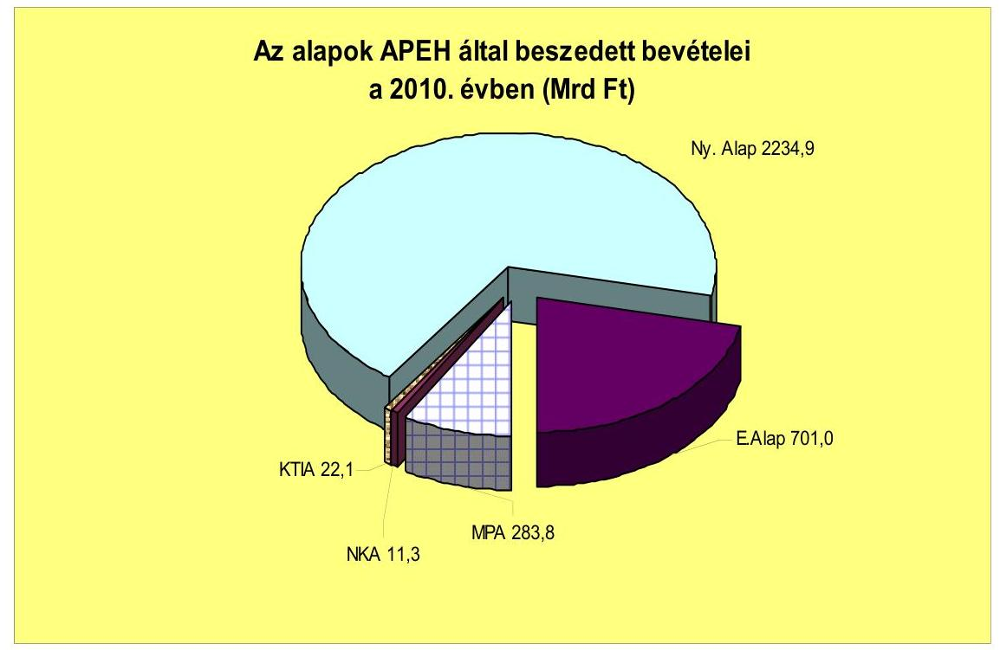

Az adóhatóság által beszedett bevételek adatai megbízhatóságáról a KTIA esetében elfogadó véleményt adtunk, az ugyancsak elfogadó vélemény mellett az MPA, az Ny. Alap, az E. Alap és az NKA esetében a véleményt figyelemfelhívó megjegyzéssel láttuk el (a véleményünket a Függelék tartalmazza).

Véleményünket az MPA, az Ny. Alap és az E. Alap esetében azért láttuk el figyelemfelhívó megjegyzéssel, mivel az osztott adónemek - amely bevételekre az alapok csak részben jogosultak - hátralék és túlfizetés állományai, valamint azok értékvesztése nem az alapok beszámolójában, hanem a Kincstár mérlegében jelent meg. Ezt a gyakorlatot a kincstári számlavezetés és finanszírozás, a feladatfinanszírozási körbe tartozó előirányzatok felhasználása, valamint egyes államháztartási adatszolgáltatások rendjéről szóló 46/2009. (XII. 30) PM rendelet $43 . \S \mathrm{b}, \mathrm{c}, \mathrm{d}$, és a $44 . \S$ (5) b, c, d pontjai nem ebben a formában határozzák meg, ezért a szabályozás felülvizsgálatát javasoltuk.

A késedelmi pótlék, bírság bevételekből az Ny. Alapot és az E. Alapot megillető arányok meghatározását rögzítő, a társadalombiztosítás pénzügyi alapjairól és azok 1993. évi költségvetéséről szóló 1992. évi LXXXIV. törvény 13. számú melléklete nem biztosítja ezen bevételek felosztási arányainak egyértelmú meghatározását, illetve aktualizálása az elmúlt időszakban nem történt meg. Ezért a vonatkozó szabályozás felülvizsgálatát, a számítási képlet pontosítását indokoltnak tartjuk.

---

# 1.2. Elkülönített állami pénzalapok 

Az ELKA - az MPA, az SZA, a KNPA, az NKA, a WMA, valamint a KTIA - 2010. évi bevételei összesen 407 728,3 M Ft-ban, kiadásai 347 896,4 M Ft-ban teljesültek. Az ELKA 2010. évi kiadásai a központi alrendszer kiadásainak mintegy $2 \%$-át képezték.

Az ELKA múködési feltételei biztosítottak, pénzügyi helyzetük a 2010. évben is kiegyensúlyozott volt, a gazdálkodásuk a tervezetthez képest - a WMA kivételével - nagyobb megtakarítást eredményezett, az összesített tárgyévi egyenlegük (59 831,9 M Ft) javította az államháztartás pénzügyi helyzetét.

Az ELKA pénzügyi helyzetének értékelése keretében vizsgáltuk az 1132/2010. (VI. 18.) Korm. határozatban meghatározottak betartását. A zárolással érintett NKA, illetve a KTIA eleget tett a kormányhatározat vonatkozó előírásainak.

A kormányhatározat 6. pontja az NKA 2,0 Mrd Ft-os zárolását rendelte el, ez a II. féléves pályázati tevékenység leállítását jelentette az NKA Bizottság 2010. június 24-ei döntésének megfelelően (26/2010. határozat). Az ötöslottó nyereményének halmozódása folytán keletkezett játékadó többletbevételek következtében azonban később a zárolás miatt elmaradt feladatok finanszírozására is lehetőség nyílt.

A KTIA részére a kormányhatározat 16,0 Mrd Ft-os egyenlegjavulást írt elő. Ennek betartása érdekében az NKTH 2010 júliusától leállította, illetve csökkentette a pályázati és egyéb kifizetéseket. A zárolás a KTIA törvényben meghatározott céljainak megvalósítását nehezítette („kiszámítható, biztos forrás"). A KTIA bevételeinek több mint fele a 2010. évben az innovációs járulékból származott, a költségvetési támogatás $80 \%$-os csökkentésével (a $16,0 \mathrm{Mrd}$ Ft még nem folyósított költségvetési támogatás zárolásával) a kifizetések alig haladták meg a járulékbevétel összegét.

### 1.2.1. Az ELKA bevételi és kiadási előirányzatai, pénzügyi egyensúlya

A költségvetési bevételi és kiadási előirányzatai alapján - az ELKA közül - meghatározó az MPA, kiadásai az összkiadásoknak mintegy 86\%-át jelentette (az MPA kiadása a 2010. évben 297 787,7 M Ft volt). Az MPA bevételei ( $329803,1 \mathrm{M}$ Ft) az összes bevétel mintegy $81 \%$-át képezték. Az ELKA közül az MPA likvidítási helyzete alakult úgy, hogy ugyan csak átmenetileg, de igénybe kellett vennie a KESZ hitelét. A Kvtv. az ELKA közül a KNPA-n kívül - melynek feladata a jövőbeni célra történő felhalmozás - az MPA számára írt elő pozitív egyenleget ( $18400,0 \mathrm{MFt}$ ). Az MPA évek óta befizetést teljesített a központi költségvetésbe, melynek a 2010. évben az összege 8000,0 M Ft, célja a Közcélú munkavégzés járuléka volt. Legutóbb a 2009. évi zárszámadás ellenőrzésekor

---

jelzett probléma ${ }^{62}$, hogy a központi költségvetésbe befizetett pénzösszegek cél szerinti felhasználásáról nem történik elszámolás a zárszámadás keretében.

A többi ELKA előirányzata a költségvetésben összegszerűen nem jelentős, de a törvényekben rögzített céljaiknak megfelelően sajátos, egyedi feladatokat látnak el:

- Az előirányzatait tekintve a költségvetésben összegszerűen nem jelentős pl. az ár- és belvízveszélyes területeken lakóingatlan tulajdonnal rendelkező természetes személyek számára egy öngondoskodáson alapuló, hosszú távú, előre kiszámítható, állam által garantált kártalanítási konstrukcióban való részvételre lehetőséget biztosító Alap, a WMA, amelynek a 2010. évi bevételi teljesítése 20,1 M Ft, a kiadási teljesítése $87,9 \mathrm{M}$ Ft volt.
- Az előirányzatai nagyságrendjét tekintve szintén nem jelentős a határon túli magyarok támogatását szolgáló SZA, amelynek a 2010. évi bevétele 2897,6 M Ft-ra, kiadása 2533,9 M Ft-ra teljesült.
- Egyedi feladatokat lát el a nemzeti és egyetemes értékek létrehozására, megőrzésére, valamint hazai és határon túli terjesztésének támogatására szolgáló elkülönített állami pénzalap, az NKA is, amelynek a 2010. évi bevételi teljesítése $11738,6 \mathrm{M}$ Ft, kiadása 8709,1 M Ft volt.
- Sajátos, egyedi feladatokat lát el a KNPA, amely a radioaktív hulladékok végleges, valamint a kiégett üzemanyag átmeneti és végleges elhelyezésére szolgáló tárolók üzemeltetését és létesítését, illetve a nukleáris létesítmények leszerelésének finanszírozását biztosította a 2010. évben $35646,0 \mathrm{M}$ Ft bevételi és 15003,6 M Ft kiadási teljesítés mellett.
- Egyedi, az ország versenyképességének, fenntartható fejlődésének erősítése érdekében jelentős feladatokat lát el a KTIA is, amelynek rendeltetése, hogy kiszámítható és biztos forrást jelentsen a magyar gazdaság technológiai innovációjának ösztönzésére és támogatásra, tegye lehetővé a gazdaságban és a társadalmi élet egyéb területein hasznosuló kutatás és fejlesztés elősegítését, a hazai és külföldi kutatás eredményének hasznosulását, az innovációs infrastruktúra és annak körébe tartozó szolgáltató tevékenység fejlesztését. A feladatellátásához a KTIA 2010. évi bevétele 27 622,9 M Ft-ban, kiadása 23 774,2 M Ft összegben teljesült.

# 1.2.2. A kormányzati struktúraváltozással összefüggő változások 

Az ELKA felügyeletében, tevékenységében, szervezeti rendszerében a 2010. évben a kormányzati struktúraváltozással összefüggésben - kivéve az MPA-t, az SZA-t és a KTIA-t - változás nem történt.

Az MPA felügyeletében a kormányzati struktúraváltozással összefüggésben - a 212/2010. (VII. 1.) Korm. rendelet 81. § (1) bekezdése értelmében - a miniszterek felelőssége megosztott. A nemzetgazdasági miniszter a foglalkoztatáspoliti-

[^0]
[^0]:    ${ }^{62}$ Jelentés a Magyar Köztársaság 2009. évi költségvetése végrehajtásának ellenőrzéséről (1016) a 271-272. oldalon.

---

káért való felelőssége körében a jogszabályok keretei között rendelkezik, a szakképzési alaprész tekintetében a nemzeti erőforrás miniszterrel együttműködik, továbbá a nemzeti erőforrás miniszter felelős a rehabilitációs alaprész felhasználásáért.

A kormányváltást megelőzően az MPA Rehabilitációs Alaprészének a felhasználásáért is az MPA felett rendelkező foglalkoztatáspolitikáért felelős miniszter volt a felelős, a Képzési Alaprész az Szht. 9. § (2) bekezdésében meghatározott keretek elkülönítése után fennmaradó keretének egy része a szociális és munkaügyi miniszter, más része az oktatásért felelős miniszter hatáskörébe tartozott.

Az SZA-t is jelentősen érintették a változások. Az SZA felügyeleti jogköre megváltozott, illetve az SZA az év végével megszűnt és helyette 2011. január 1-jével új alapkezelővel, új alap - a Bethlen Gábor Alap - jött létre ${ }^{63}$.

A kormányváltást megelőzően az SZA felügyelete a MeH társadalompolitika öszszehangolásáért felelős tárca nélküli miniszter feladata volt ${ }^{64}$. Az SZA-t a kisebb-ség- és nemzetpolitikáért felelős szakállamtitkár irányítása alatt működő SZA Iroda (Iroda) kezelte. A kormányváltást követően a kormányrendelet ${ }^{65}$ alapján a miniszterelnök általános helyettese a nemzetpolitikáért való felelőssége körében közreműködött az SZA működtetésében, ennek keretein belül részt vett az SZA döntéseinek meghozatalában, valamint irányította a SZA Irodát. Az SZA közvetlen felügyeletét a nemzetpolitikai helyettes államtitkár látta el ${ }^{66}$. A tárca nélküli miniszter a határon túli támogatási rendszer felülvizsgálatáért felelős miniszteri biztost ${ }^{67}$ nevezett ki 2010. szeptember 15. napjától 2010. december 31. napjáig terjedő időtartamra. A biztos ellenjegyezte az SZA vezetőjének döntéseit, illetve előkészítette az SZA átszervezésével, múködésének hatékonyabbá tételével kapcsolatos döntéseket, valamint ellenőrizte azok végrehajtását. Az Iroda jogi helyzete 2010. november 27 -étől megváltozott, az Iroda a nemzetpolitikáért felelős miniszter irányítása alatt álló központi hivatal ${ }^{68}$ lett.

# Az SZA létrehozását kezdeményező kormányhatározatban ${ }^{69}$ foglaltak a 2010. évben sem valósultak meg, így nem történt meg a határon tú- 

[^0]
[^0]:    ${ }^{63}$ Az SZA 2010. december 31-vel megszűnt, 2011. január 1-jétől a 2010. évi CLXXXII. törvény alapján a Bethlen Gábor Alap váltja fel.
    ${ }^{64}$ A társadalompolitika összehangolásáért felelős tárca nélküli miniszter feladat- és hatásköréről szóló 88/2009. (IV. 13.) Korm. rendelet.
    ${ }^{65}$ A 212/2010. (VII. 1.) Korm. rendelet 1. § (3) bekezdés f) és g) pontjai.
    ${ }^{66}$ A Közigazgatási és Igazságügyi Minisztérium Szervezeti és Működési Szabályzatáról szóló 17/2010. (VIII. 31.) KIM utasítás 98. § (2) bekezdés h) pont.
    ${ }^{67}$ A miniszteri biztos kinevezéséről szóló 1/2010. (X. 1.) TNM utasítás.
    ${ }^{68}$ Az egyes költségvetési szervek központi hivatallá történő átalakításáról szóló 1186/2010. (IX. 10.) Korm. határozat alapján megjelent 259/2010. (XI.16.) Korm. rendelet 5. § (2) bekezdése módosította a Szülőföld Alapról szóló 2005. évi II. törvény végrehajtására kiadott 355/2006. (XII. 27.) Korm. rendelet 12. §-ában foglaltakat.
    ${ }^{69}$ A határon túli magyarságot támogató pénzügyi forrás, a „Szülőföld Alap" létrehozásának kezdeményezéséről szóló 1127/2004. (XI. 24.) Korm. határozat 2.2. pontja előírta, hogy a Miniszterelnöki Hivatalt vezető miniszter vizsgálja meg a határon túli magyarok támogatására szolgáló előirányzatok Alapba történő átcsoportosításának lehetőségét és módját.

---

li magyarok támogatására szolgáló, hasonló célú források egy keretbe való öszszevonása. Javaslatot erre vonatkozóan azért nem fogalmaztunk meg, mert az újonnan létrejött Bethlen Gábor Alap céljai között a források összevonása szerepel.

A költségvetés több fejezete tartalmazott a 2010. évben is forrásokat a határon túli magyarok támogatására, pl. az SZA mellett az SZA felügyeletét ellátó minisztériumnál is fejezeti kezelésű előirányzatok formájában, de a KIM fejezeten kívül még több fejezet pl. az OGY, az NFM, a KüM, az MTA előirányzatai között is szerepelt a fenti célokra forrás.

A KTIA-t is jelentősen érintették a 2010. évben a kormányzati struktúraváltozással összefüggésben bekövetkezett változások. A 2010. július 1-jétől a 212/2010. (VII. 1.) Korm. rendelet 85. § m) pontja a KTIA feletti rendelkezési jogot, a nemzetgazdasági minisztertől a nemzeti fejlesztési miniszterhez telepítette. Az alapkezelő, a NKTH irányítása és felügyelete továbbra is az NGM feladatkörébe tartozott. Ezáltal a korábban „egy kézben" lévő Alap és alapkezelő feletti irányítási és rendelkezési jog szétvált. A KTIA feletti rendelkezési jogkör szabályozása a 2010. év második felétől ellentmondásos volt, mert törvényi szinten (Ktiatv. 10. § (1) bekezdés) a nemzetgazdasági miniszter, míg kormányrendeleti szinten (a 212/2010. (VII. 1.) Korm. rendelet 85 . § m) pontja) a nemzeti fejlesztési miniszter rendelkezési jogát rögzítette.

A Ktiatv. alapján a KTIA feletti rendelkezési jogot a kutatás-fejlesztésért és technológiai innovációért felelős miniszter gyakorolja, illetve felelős a forrás felhasználásáért. A Magyar Köztársaság minisztériumainak felsorolásáról szóló 2010. évi XLII. tv. 2. § (1) bekezdés ga) pontja rögzíti, hogy a nemzetgazdasági miniszter felel a kutatás-fejlesztésért és technológiai innovációért.

A 212/2010. (VII. 1.) Korm. rendelet 73. § q) pontja alapján szintén a nemzetgazdasági miniszter került megjelölésre a Kormány kutatás-fejlesztéséért és technológiai innovációért felelős tagjaként, aki az alapkezelőt is irányítja. Ugyanezen rendelet 85 . § m) pontja ugyanakkor a KTIA feletti rendelkezési jogot, valamint annak kezeléséért és szabályszerű felhasználásáért való felelősséget a nemzeti fejlesztési miniszterhez telepítette.

A Ktiatv. módosítása év végéig nem történt meg. A 2011. január 1-jétől hatályos módosítás (2010. évi CXLVII. törvény 185. § (3) bekezdés) már a kormányrendelettel is egyezően rögzíti a rendelkezési jog tényét, a Ktiatv. 10. § (1) bekezdése alapján az „Alap feletti rendelkezési jogot a miniszter" gyakorolja, aki a 212/2010. (VII. 1.) Korm. rendelet 85. § m) pontja alapján a nemzeti fejlesztési miniszter. Az ellenőrzést nehezítette a KTIA felügyeletében, szervezeti rendszerében bekövetkezett változás, mivel a KTIA átadása-átvétele a helyszíni ellenőrzés ideje alatt folyamatban volt.

Az ellenőrzést nehezítette, hogy az ellenőrzésre kiválasztott pályázatokhoz kapcsolódó programok dokumentumai - az adott pályázati kiíráshoz kapcsolódó döntési táblák, Bíráló Bizottsági ülésről emlékeztetők, döntésre előterjesztések, amelyek a programdossziékban külön tárolva találhatóak meg - az ellenőrzött részéről a helyszíni vizsgálat befejezéséig teljes körűen nem kerültek átadásra, azokat néhány nappal az ellenőrzés lezárása előtt kaptuk meg, így teljes körűen áttekinteni azokat már nem állt módunkban.

---

# 1.2.3. Az ELKA múködésének ellenőrzése a kiválasztott programokon keresztül 

Az ELKA múködésének ellenőrzését elemzéssel kiválasztott programokon keresztül végeztük. Az ellenőrzés keretében értékeltük a pályázati rendszer múködtetésének megfelelőségét az alapokról szóló törvényekben meghatározott feladataival, a felhasználás céljaival összefüggésben, ezen belül a pályázatok közzétételére, a támogatások odaítélésére kialakított eljárási rendet, a támogatások felhasználásának szabályszerűségét, az összeférhetetlenségre vonatkozó szabályok betartását vizsgáltuk.

Az ELKA közül az MPA 2010. évi ellenőrzése során a szakképzési hozzájárulások és a szakképzési egyéb bevételekből az ellenőrzése keretében a szakképzési hozzájárulás felhasználásának célszerűségét nem vizsgáltuk, mert „A szakképzési hozzájárulás felhasználása célszerűségének ellenőrzése" címmel az ÁSZ 2011. évi ellenőrzési terve alapján - önálló ellenőrzés van folyamatban.

A felhasználás és az elszámolás szabályszerűsége szempontjából csak az SZA részére, a jogszabályban előírt ${ }^{70}$ pénzeszközátadást értékeltük. Megállapítottuk, hogy az MPA és az SZA között az átadás és az elszámolás az előírásoknak, a támogatási szerződésnek megfelelően megtörtént.

A munkahelyteremtő, megőrző támogatásokra fordított pénzeszközöket hatékonysági és eredményességi szempontból nem minősítettük, mert az ÁSZ 2011. évi ellenőrzési terve alapján „A hazai és uniós forrásból finanszírozott, munkahelyteremtést és megőrzést elősegítő támogatások rendszerének értékelése" címmel külön ellenőrzés indult.

Az MPA Rehabilitációs Alaprészéből történt kifizetéseket a támogatások felhasználásának, elszámolásának szabályszerűsége szempontjából, a Képzési Alaprészből ${ }^{71}$ teljesített kifizetéseket a támogatások felhasználásának ellenőrzésére vonatkozóan működtetett ellenőrzési rendszer 2010. évi tevékenységének értékelése keretében vizsgáltuk.

Az ELKA a támogatásokat az alapokról szóló törvényekben meghatározott feladataikra, az ELKA céljaival összefüggésben használta fel.

A tételesen vizsgált pályázatok alapján megállapítottuk, hogy pl.: az NKA esetében a megítélt támogatások felhasználásának köre megfelelt az Nkatv. 1. §ában, illetve 7. § (1) bekezdésében rögzített támogatási céloknak, az alapkezelő megfelelően alkalmazta a pályázati tevékenységre vonatkozó jogszabályokat és szabályzatokat.

[^0]
[^0]:    ${ }^{70}$ A Szht. 9. § (2) bekezdése d) pontja és (7) bekezdése szerint az MPA szakképzési hozzájárulások és a szakképzési egyéb bevételek bevételi előirányzat 2\%-át kell átcsoportosítani a Szülőföld Alapba.
    ${ }^{71}$ Az MPA szakképzési hozzájárulások és szakképzési egyéb bevételei a forrása az MPA Képzési Alaprészének.

---

Az ELKA-ból a támogatásokat jellemzően nyílt pályázati úton nyújtották a támogatottak részére. A pályázati rendszer - a pályáztatásra, a bírálat menetére, a döntés-előkészítésre, a döntésre, a szerződéskötésre, a pénzügyi lebonyolításra, a szakmai, pénzügyi beszámoltatásra, az ellenőrzésre kiterjedően is - az eljárási rendekben - a KTIA-t kivéve - teljes körűen szabályozott volt.

A KTIA-nál megállapítottuk, hogy az NKTH a pályáztatás minden elemére kiterjedő (pályáztatás, bírálat, döntés előkészítés, döntés, szerződéskötés, pénzügyi lebonyolítás) egyetlen eljárásrendben való szabályozással nem rendelkezett 2010 júliusáig, ugyanakkor az egyes programokhoz, pályázatokhoz kapcsolódóan szabályozta a pályáztatás egyes elemeit.

A vizsgált időszakban biztosított volt az összeférhetetlenségi előírások betartása mind a pályázók, mind az ELKA testületei (Bizottságok, Kollégiumok, stb.), illetve az alapkezelők döntés-előkészítésben résztvevő munkatársai esetében is.

Az NKA esetében az összeférhetetlenség szabályait a 2010. december 24-ei hatállyal megváltoztatta az Nkatv. módosításáról szóló 2010. évi CLXVII. törvény, amely a közpénzekből nyújtott támogatások átláthatóságáról szóló 2007. évi CLXXXI. törvénnyel való összhang megteremtése érdekében hatályon kívül helyezte az Nkatv. 2/A. § (3)-(4) bekezdését. A módosító jogszabály ezzel „lazított" az NKA szigorú összeférhetetlenségi követelményein, eltörölve a döntéshozó testületek tagjainak és vezetőinek összeférhetetlenségét abban az esetben, ha tagként, tulajdonosként, vezető tisztségviselőként, felügyelőbizottsági tagként állnak kapcsolatban a pályázóval vagy a pályázattal összefüggésben vagyoni előnyük származhat ${ }^{72}$.

A pályázatok közzététele és a nyilvánosság tájékoztatása a jogszabályoknak és a belső szabályzatoknak megfelelően történt, a pályázati felhívásokról szóló közlemények a sajtóban megjelentek.

PI.: az NKA-nál és a KTIA-nál a pályázók a pályázataikat elektronikusan, illetve papír alapon is megküldhették, a beérkezett pályázatokat formai és tartalmi ellenőrzést követően késztették elő a döntésre, a pályázatok regisztrálásáról, a döntésről a pályázóknak értesítőt küldtek, a döntések eredményét a honlapon közzétették.

# 1.2.4. Az alapkezelők által múködtetett ellenőrzési rendszer 

Az alapkezelők által múködtetett ellenőrzési rendszer értékelésénél kiemelt figyelmet fordítottunk a támogatások felhasználása elszámolásának rendszerére, az alapkezelők által végzett ellenőrzések eredményeire. Az ELKA-ból nyújtott támogatások felhasználásának ellenőrzésére múködtetett ellenőrzési rendszer tevékenységének értékelése során megállapítottuk, hogy az alapkezelők a kifizetések ellenőrzésére a kontrollokat kiépítették, azok az ellátások, a támogatások, és az egyéb kifizetések ellenőrzését - az SZA-t és az MPA-t kivéve - teljes körűen lefedik.

[^0]
[^0]:    ${ }^{72}$ A jogszabályváltozás a 2010. évi pályázatokat nem érintette, de a következő évi vizsgálat során hatásának vizsgálata indokolt lehet.

---

A korábbi években és a jelen ellenőrzéskor is megállapítottuk, hogy a támogatások ellenőrzése az MPA-nál továbbra sem terjed ki az alaprészekre teljes körúen, ezért - a 2010. évi ellenőrzési tevékenység értékelése keretében - a támogatások ellenőrzésére múködtetett rendszert tovább vizsgáltuk.

Az MPA Képzési Alaprészéből nyújtott támogatások felhasználásának ellenőrzését az MPA Képzési Alaprésze felhasználásának területi egységénél az NSZFI Támogatási és Bevalláskezelési Igazgatóságán külön szervezeti egység végzi. A 2010. évi tevékenységének alapját - a jogszabályi előírások mellett - a miniszter által jóváhagyott éves ellenőrzési terv biztosítja. A 2010. évi beszámoló alapján az MPA Képzési Alaprészének ellenőrzésével összefüggésben szabálytalan felhasználás miatt 99171950,0 Ft-ot követeltek vissza, ebből 57934871,0 Ft az Oktatásért Közalapítvánnyal (Közalapítvány) kötött egyik támogatási szerződésből adódott, amelynek vizsgálatát az NSZFI főigazgatója soron kívül rendelte el. A 2010. évi tervben szereplő ellenőrzések jelentősen elhúzódtak a 1132/2009. (VIII. 7.) Korm. határozat rendelkezései miatt későbbre tolódott közbeszerzési eljárások miatt. A külső erővel végrehajtott ellenőrzések gyakorlatilag csak a 2011. évben kezdődhettek meg, és egy szerződés esetében a helyszíni ellenőrzés folyamatban van.

Az MPA Képzési Alaprészének ellenőrzése során a szakképzési és felnőttképzési támogatásokat, a szakképzési célú kifizetéseket a 2010. évet illetően az elszámolás szabályszerűsége szempontjából vizsgáltuk, mert az alaprésszel kapcsolatos tevékenységnek, a forrás felhasználásának értékelésére - egy hosszabb időtávban - az ÁSZ 2011. évi ellenőrzési terve alapján önálló ellenőrzés van folyamatban.

Az MPA Képzési Alaprészéből történt kifizetések közül az ellenőrzés - figyelembe véve az ÁSZ 2011. évi ellenőrzési tervében szereplő másik vizsgálatot ${ }^{73}$ is - a Közalapítvány részére átadott pénzeszközökre, a Közalapítvánnyal kötött támogatási szerződések közül az NSZFI TBI Elszámoltatási és Ellenőrzési Osztálya által, a 2010. évben a helyszínen is ellenőrzött támogatásokra, továbbá a Közalapítványnyal, mint a Nemzeti Tehetség Program (Program) ${ }^{74}$ bonyolítójával kötött támogatási szerződésekre, az átadott pénzeszközök felhasználására (összesen 4104,5 M Ft felhasználásának ellenőrzésére) terjedt ki. Áttekintettük a Közalapítvánnyal korábbi években kötött, de a 2010. évben az ellenőrzési terv szerint a helyszínen is ellenőrzött támogatási szerződéseket. Az ellenőrzés során a támogatási szerződések módosítását, a feladatteljesítési és elszámolási határidők teljesítését, illetve a tervezett feladatok megvalósítását vizsgáltuk. Megállapítottuk, hogy a támogatási szerződések módosítására több esetben is sor került, ezáltal az elszámolási határidők is jelentősen módosultak. Az először megkötött támogatási szerződésben az elszámolásra megadott határidőhöz viszonyítva az elszámolás akár 29,5 hónappal később is megtörténhetett. A vizsgált szerződésekkel kapcso-

[^0]
[^0]:    ${ }^{73}$ Az ÁSZ 2011. évi ellenőrzési terve alapján „A Kormány által létrehozott közalapítványok 2009-2010. évi feladatellátása és vagyongazdálkodása szabályszerűségének és eredményességének ellenőrzése" címmel, különös tekintettel arra, hogy a vizsgálat az Oktatásért Közalapítványra is kiterjed.
    ${ }^{74}$ A Nemzeti Tehetség Program finanszírozásáról szóló 152/2009. (VII. 23.) Korm. rendelet 1. § (1) bekezdés ab) pontja szerint a Nemzeti Tehetség Program megvalósítását szolgáló közvetlen forrás az MPA-nak az Szht. 9. § (2) bekezdés f) pontja szerinti, a képzési alaprész tárgyévi eredeti bevételi előirányzata három százalékának megfelelő öszszegű pénzügyi keret.

---

latban megállapítottuk, hogy valamennyi módosításra az oktatásért felelős miniszter döntése alapján került sor, tekintettel arra, hogy az NSZFI erre illetékességgel nem rendelkezik.

Az NSZFI által a Közalapítványnál végzett helyszíni ellenőrzésekkel kapcsolatban megállapítottuk, hogy a Közalapítvány a vonatkozó rendelkezés ${ }^{75}$ ellenére az NSZFI ellenőrzési célú megkeresésének több esetben nem tett eleget. Az NSZFI az ellenőrzés sorozatos akadályozása miatt eljárási bírságot is kiszabott ${ }^{76}$ a Közalapítvány ellen.

A Nemzeti Tehetség Programról szóló 78/2008. (VI. 13.) OGY határozatban előírtak végrehajtásának az ellenőrzése érdekében az OGY határozat 4. pontjában előírt kétévenkénti jelentést a Program helyzetéről, a fejlesztés feladatairól megkértük. A jelentést nem kaptuk meg, mert az még - a kapott tájékoztatás szerint nem készült el. A Program megvalósításához - utólagos elszámolási kötelezettséggel, vissza nem térítendő támogatásként - a Közalapítvány 1491,0 M Ft támogatást kapott. (A támogatási szerződés alapján a kifizetés megtörtént, de a felhasználás határideje 2012. október 30.) A 2009-2010. évre meghatározott feladatok megvalósítása a helyszíni ellenőrzés befejezéséig még nem zárult le ${ }^{77}$. A 2010. január 14. - 2010. december 31. közötti időszakra eső feladatok megvalósításáról a Közalapítvány által az NSZFI-hez benyújtott részbeszámoló alapján megállapítható, hogy a kormányhatározatban ${ }^{78}$ meghatározott cselekvési programhoz képest a Közalapítvány 9 alprogrammal kevesebbet kíván végrehajtani, és át kívánja ütemezni az alprogramokat ${ }^{79}$ a következő 2 éves, a 2011-2012. évi cselekvési programra.

Az eljárás nem fogadható el, mert a feladatokat és a határidőket rögzítő kormányhatározat módosítására sem a feladat, sem a határidők tekintetében nem került sor, illetve új kormányhatározat a 2011-2012. évi cselekvési tervre vonatkozóan nem jelent meg. A Közalapítvány a 2010. január 14-étől 2012. október 30 -áig tartó megvalósítási időszakra a támogatási szerződés szerint a támogatási összeg 5\%-át, 74550 000,0 Ft-ot működési költségek finanszírozására fordíthatott. A benyújtott részbeszámoló alapján a Közalapítvány a működési költségek $99 \%$-át, azaz 74543753,0 Ft-ot a megvalósítási időszak első harmadában már felhasználta. A működésre fordítható összeg nem a feladat végrehajtása ütemével arányosan került felhasználásra, így a működési költségek finanszírozásának a továbbiakban - a 2011. január 1-jétől 2012. október 30 -áig tartó feladatvégrehatási időszakban - nincs fedezete. A Kormány a 2011. május 18-án hozott

[^0]
[^0]:    ${ }^{75}$ A szakképzési hozzájárulásról és a képzési rendszer fejlesztésének támogatásáról szóló 2003. évi LXXXVI. törvény végrehajtására kiadott 13/2008. (VII. 22.) SZMM rendelet 36. § (2) bekezdés a) pontja értelmében az ellenőrzött köteles eleget tenni.
    ${ }^{76}$ Az NSZFI Elszámoltatási és Ellenőrzési Osztálya a támogatottal szemben - az ellenőrzés sorozatos akadályozása miatt - az Szht. 4/G. § (5) bekezdése szerint 50 000,0 Ft eljárási bírságot szabott ki.
    ${ }^{77}$ Annak ellenére nem zárult le, hogy a 1120/2009. (VII. 23.) Korm. határozat a Nemzeti Tehetség Program végrehajtásának 2009-2010. évi cselekvési programjáról a különböző pontoknál 2010. június 30., illetve december 31. határidőket tartalmaz.
    ${ }^{78}$ 1120/2009. (VII. 23.) Korm. határozat a Nemzeti Tehetség Program végrehajtásának 2009-2010. évi cselekvési programjáról.
    ${ }^{79}$ A határidő tervezett átütemezése a Korm. határozat III. pontjában 6 alprogramot, V. VI., VIII. pontjaiban 1-1 alprogramot érint.

---

határozatában ${ }^{80}$ - a közfeladat más szervezeti keretek között történő hatékonyabb ellátása érdekében, azonnali határidővel - a Közalapítvány megszüntetéséről döntött, ezért a Közalapítvány elszámoltatására tettünk javaslatot az MPA Képzési Alaprészéből kapott támogatásokat illetően.

Az MPA Rehabilitációs Alaprészéből nyújtott támogatások esetében az ellenőrzési kötelezettségek nem érvényesültek. Az MPA RA felhasználása tekintetében ellenőrzést az alapkezelői feladatokat ellátó SZMM, illetve a kormányzati struktúraváltozás után az NGM a 2010. évben nem végzett. A fejezetek (SZMM, NGM) ugyan rendelkeztek a miniszter által jóváhagyott éves ellenőrzési munkatervvel, de a 2010. évi ellenőrzési munkatervek nem tartalmaztak ellenőrzést az MPA RA-ra vonatkozóan. Az SZMM és az NGM Ellenőrzési Főosztálya a 2010. évben az MPA RA-ra vonatkozóan ellenőrzést nem végzett. Az NGM és később a NEFMI (az SZMM-től vette át a Rehabilitációs Alaprészt) feladatellátása - a létszám és a kapacitás szűkösségére hivatkozva - az általános pénzügyi és szakmai felügyeleten túl, a terület ellenőrzésére nem terjedt ki.

Az SZA-nál az SZA Iroda volt a felelős az ellenőrzési feladatok ellátásáért, ennek keretében a pénzügyi és teljesítmény, valamint a helyszíni ellenőrzések lebonyolításáért ${ }^{81}$, de a 2010. évben a jogszabályban előírt teljesítmény-ellenőrzésekre nem került sor. Az Iroda belső ellenőrzése nem terjedt ki az SZA-ból nyújtott támogatások ellenőrzésére.

Az NKA ellenőrzési tevékenysége részletesen szabályozott, az megfelelt az NKAra vonatkozó jogszabályoknak. A kiválasztott minták ellenőrzése során - két eset kivételével - nem tártunk fel lényeges hiányosságot. A megítélt támogatások felhasználásának köre megfelelt az Nkatv. 1. §-ában, illetve 7. § (1) bekezdésében rögzített támogatási céloknak. Az ellenőrzés által kifogásolt két támogatás esetében a pályázati dokumentáció nem tartalmazta az utolsó támogatási részlet (2,5 M Ft, illetve 3,5 M Ft) átutalásának bizonylatát, de azt az alapkezelő a helyszíni ellenőrzés során pótolta. A vizsgált iratanyagok közül nyolc támogatás szerepel az NKA Igazgatóság Belső Ellenőrzési Osztályának 2011. évi helyszíni ellenőrzési tervében. Megállapítottuk, hogy az alapkezelő megfelelően alkalmazta a pályázati tevékenységre vonatkozó jogszabályokat és szabályzatokat, az ellenőrzési kötelezettsége érvényesült.

A KTIA esetében a 2010. évben a belső ellenőrzés személyi feltételei nem voltak folyamatosan biztosítottak, az ellenőrzésekhez a szükséges többleterőforrás biztosítása a soron kívül elrendelt vizsgálatokhoz elmaradt. Külső erőforrás igénybevételére pénzügyi fedezet nem állt rendelkezésre, a belső, kellő szakértelemmel és gyakorlattal rendelkező személyi állomány nem volt átcsoportosítható. A munkaterv szerint elindított vizsgálatok többsége elmaradt, vagy áthúzódott a 2011. évre.

A WMA alapkezelőjének ellenőrzési tevékenysége a szerződések feltételeinek teljesítésére, a befizetések ellenőrzésére korlátozódik, mivel - ellentétben a többi elkülönített állami pénzalappal - a kedvezményezettek kiválasztása nem egyedi

[^0]
[^0]:    ${ }^{80}$ Az Oktatásért Közalapítvány megszűntetéséről szóló 1152/2011. (V. 18.) Korm. határozat 4. pontja szerint a Kormány a megszűnő Közalapítvány vagyonának számbavételére a WSA jelölte ki.
    ${ }^{81}$ A Szülőföld Alapról szóló 2005. évi II. törvény végrehajtásáról szóló 355/2006. (XII. 27.) Korm. rendelet 12. § (4) bekezdés h) pont és az Iroda Alapító okiratának 3.2. h) pontja szerint.

---

vagy pályázati úton történik, hanem jogszabályban meghatározott, múködésükben testületek nem vesznek részt. A WMA-val szerződöttekről személyre szóló, naprakész, analitikus nyilvántartást vezettek, a befizetéseket nem teljesítők szerződéseit (a WMA Eljárásrendje szerint), a 2010. évben 51 esetben szüntették meg.

Az ELKA múködésének/működtetésének ellenőrzése során a 2010. évi zárszámadást befolyásoló - az alapkezelőknél személyes felelősségre vonásra okot adó - szabálytalanságot nem állapítottunk meg.

# 1.2.5. Utóvizsgálat 

Az utóvizsgálat keretében megállapítottuk, hogy a korábbi években tett javaslataink csak részben hasznosultak.

Az MPA kiadásainak racionalizálására vonatkozóan a nemzetgazdasági miniszternek tett javaslatunk ${ }^{82}$ hasznosult, az MPA kiadásainak struktúrája egyszerűsödött, áttekinthetőbbé vált. Ezt már a 2011. évi költségvetési törvényjavaslat véleményezése során ${ }^{83}$ rögzítettük.

A KNPA-val összefüggésben a 2011. évi költségvetési törvényjavaslat véleményezése ${ }^{84}$ során a Kormánynak tett javaslatunk hasznosult. Az Országgyűlés elfogadta az Atv. módosítását ${ }^{85}$. A törvény - a javaslatunkkal összhangban - pontosítja a támogatások alanyait, de továbbra sem nélkülözi azt a jogszabályi kötelezettséget, hogy a Kormánynak rendeletben kell meghatároznia a nyújtható támogatások mértékének, felhasználásának, ellenőrzésének és elszámolásának részletes szabályait.

A KNPA 2011. évi költségvetésének véleményezése során javasoltuk a Kormánynak, hogy: „szabályozza rendeletben - az Atv. 67. § o) pontjában történő felhatalmazás alapján - a KNPA-ból a társadalmi ellenőrzési és információs társulásoknak nyújtott támogatások feltételeit". A 2011. évi Vélemény 175. oldalán szerepel, hogy: "a társadalmi ellenőrzési és információs társulások támogatása az elmúlt években közel állandó volt, a 2011-re tervezett előirányzat azonos az előző évivel (1026,7 M Ft). A támogatás elosztása a társulások között a kialakult gyakorlatot követi. A társadalmi ellenőrzési és információs társulások támogatását az Atv. 67. § o) pontja alapján a Kormánynak rendeletben kell rögzítenie, ez azonban az alapkezelő 2005 óta tartó törekvése ellenére a mai napig nem készült el. A jogszabály megalkotásához módosítani kell az Atv. 10. §-ának (4) bekezdését, ami évek óta húzódik. Az elkészítendő jogszabályban rögzíteni kell a támogatásban részesíthető társulások körét, azok múködésével kapcsolatos kérdéseket,

[^0]
[^0]:    ${ }^{82}$ Jelentés a Magyar Köztársaság 2009. évi költségvetése végrehajtásának ellenőrzéséről (1016) 51. oldal, 10. javaslat
    ${ }^{83}$ Vélemény a Magyar Köztársaság 2011. évi költségvetési javaslatáról (1025) 23. oldal utolsó bekezdés a lap alján.
    ${ }^{84}$ Vélemény a Magyar Köztársaság 2011. évi költségvetési javaslatáról (1025) 36. oldal 8. javaslat
    ${ }^{85}$ 2011. évi LXXXVII. törvény az atomenergiáról szóló 1996. évi CXVI. törvény, valamint a fegyveres biztonsági őrségről, a természetvédelmi és mezei őrszolgálatról szóló 1997. évi CLIX. törvény módosításáról

---

az Alap céljaival összhangban álló támogatható feladatokat, a támogatás módját, elszámolását, ellenőrzését és a támogatás visszavonásának lehetőségét."

A KTIA-val összefüggésben a 2011. évi költségvetési törvényjavaslat véleményezése ${ }^{86}$ során javasoltuk a Kormánynak, intézkedjen annak érdekében, hogy a KTIA és az alapkezelő egy felügyelet alá kerüljön. A javaslatunk hasznosult, a KTIA és az alapkezelő is 2011 januárjában a nemzeti fejlesztési miniszter rendelkezése, illetve irányítása alá került ${ }^{87}$.

A 2009. évi költségvetés végrehajtásának ellenőrzésekor a Kormánynak ${ }^{88}$ tett javaslatunk, hogy kezdeményezze - a hatályos törvényi szabályozás belső összhangjának megteremtése érdekében - az ELKA és a TB. Alapoknak könyvvizsgálatára, a beszámolók ellenőrzésére vonatkozó törvényi előírások felülvizsgálatát nem hasznosult. A Kormány a gazdálkodó szervezetek adminisztrációs terheinek csökkentése érdekében a kötelező könyvvizsgálat értékhatárát a kis- és középvállalkozásoknál a T/3414. számú az egyes gazdasági tárgyú törvények módosításáról szóló törvényjavaslatban módosítani tervezi. A benyújtott törvényjavaslat a Magyar Könyvvizsgálói Kamaráról, a könyvvizsgálói tevékenységről, valamint a könyvvizsgálói közfelügyeletről szóló 2007. évi LXXV. törvényt ugyan érinti, de a törvényjavaslat az alapok könyvvizsgálati ellenőrzésére vonatkozó szabályozás-módosítási javaslatot nem tartalmaz.

A 2009. évi költségvetés végrehajtásának ellenőrzésekor ${ }^{89}$ a nemzetgazdasági miniszternek tettünk javaslatot „Tegyen intézkedéseket, hogy a STARTkártyához kapcsolódó járulék kiegészitésnek az MPA általi megtérítése a törvényben meghatározott határidőben teljesíthető legyen, és szükség szerint intézkedjen annak jogi szabályozásáról". A javaslatunk nem hasznosult, de azt nem ismételjük meg, mert a szabályozás áttekintésére vonatkozóan a START-kártya felhasználásának, a járulékkedvezmény érvényesítésének, továbbá elszámolásának részletes szabályairól szóló 31/2005. (IX. 29.) PM rendelet módosításáról szóló 25/2011. (VII. 5.) NGM rendelet módosította az adatszolgáltatás tartalmát, ez az új adatszolgáltatás a gyakorlatot módosíthatja.

A 2010. évi ellenőrzés időszakában a START-kártya kedvezmény mértékét továbbra is a pályakezdő fiatalok, az ötven év feletti munkanélküliek, valamint a gyermek gondozását, illetve a családtag ápolását követően munkát keresők foglalkoztatásának elősegítéséről, továbbá az ösztöndíjas foglalkoztatásról szóló 2004. évi CXXIII. törvény határozta meg. A járulékkedvezmény kieső mértékét az

[^0]
[^0]:    ${ }^{86}$ Vélemény a Magyar Köztársaság 2011. évi költségvetési javaslatáról (1025) 36. oldal 9. javaslat
    ${ }^{87}$ A nemzeti fejlesztési miniszter az egyes miniszterek, valamint a Miniszterelnökséget vezető államtitkár feladat- és hatásköréről szóló 212/2010. (VII. 1.) Korm. rendelet 85. § m) pontja szerint rendelkezik a KTIA felett, az n) pont alapján irányítja az na) pontban szereplő NFÜ-t.
    ${ }^{88}$ Jelentés a Magyar Köztársaság 2009. évi költségvetése végrehajtásának ellenőrzéséről (1016) 50. oldal, 7. javaslat.
    ${ }^{89}$ Jelentés a Magyar Köztársaság 2009. évi költségvetése végrehajtásának ellenőrzéséről (1016) 51. oldal 15. javaslat második része.

---

MPA téríti meg az E. Alap és az Ny. Alap részére. Az átutalást a PM rendelet ${ }^{90}$ 5. § (4) bekezdése szabályozza, melyet az MPA a 2010. évben is - a ráháruló egyre nagyobb mennyiségű adminisztrációs kötelezettség és a kötelezettségvállalásellenjegyzés kialakult időszükséglete miatt - csak jelentős időbeli eltéréssel tudott teljesíteni. A 2010. évben például a januári kifizetés áprilisig, az APEH/NAV adatszolgáltatásának egyeztetése miatt 3 hónapot csúszott.

A 2009. évi költségvetés végrehajtásának ellenőrzése ${ }^{91}$ során az elkülönített állami pénzalapok ellenőrzési rendszerének felülvizsgálatára tett javaslatunk az SZA-nál, ahol javasoltuk a közigazgatási és igazságügyi miniszternek, hogy gondoskodjon az SZA-ból nyújtott támogatások felhasználásának ellenőrzéséről, nem hasznosult. Megállapítottuk, hogy az SZA ellenőrzésére nem került sor, a létrehozásától kezdve az SZA működését, az SZA-ból nyújtott támogatások felhasználására vonatkozó, a jogszabályokban előírt ellenőrzést az SZA felett rendelkező miniszter, a minisztérium és az alapkezelő ellenőrzési szervezeti egysége sem végzett ${ }^{92}$. A javaslatunkat nem ismételjük meg, mert az SZA megszűnt.

A helyszíni ellenőrzés megállapításainak hasznosítása mellett, az előbbiekben részletezettek alapján fogalmaztunk meg javaslatokat a Kormánynak, a nemzetgazdasági miniszternek, mint az államháztartásért felelős, illetve, mint az MPA felett rendelkező miniszternek.

Javaslatainkat megalapozó további megállapításokat a Függelék is tartalmaz.

# 1.3. Társadalombiztosítás pénzügyi alapjai 

A TB. Alapok (az Ny. Alap és az E. Alap, együtt: TB. Alapok) 2010. évi bevételei összesen 4299 558,7 M Ft-ban, és kiadásai 4394 944,9 M Ft-ban teljesültek. A TB. Alapok összevont hiánya ( $-95386,2 \mathrm{MFt}$ ) rontotta az államháztartás pénzügyi helyzetét. A TB. Alapok 2010. évi kiadásai a központi alrendszer kiadásainak mintegy $31 \%$-át képezték.

A költségvetési előirányzatait tekintve - a TB. Alapokon belül - a kiadásai alapján nagyobb súllyal az Ny. Alap a meghatározó, amely a két Alap összkiadásainak több mint 66\%-át jelentette, a 2010. évi kiadása 2918 253,7 M Ft volt. Az E. Alap kiadása - amely a TB. Alapok összkiadásainak mintegy $34 \%$-át képezte - 1476 691,2 M Ft-ot tett ki.

[^0]
[^0]:    ${ }^{90}$ A START-kártya felhasználásának, a járulékkedvezmény érvényesítésének, továbbá elszámolásának részletes szabályairól szóló 31/2005. (IX. 29.) PM rendelet.
    ${ }^{91}$ Jelentés a Magyar Köztársaság 2009. évi költségvetése végrehajtásának ellenőrzéséről (1016) 55. oldal, 39.a) javaslat. A 39.b) javaslatunk nem hasznosult, de annak további vizsgálata az SZA megszűnése miatt okafogyottá vált.
    ${ }^{92}$ A Közigazgatási és Igazságügyi Minisztérium Szervezeti és Müködési Szabályzatáról szóló 17/2010. (VIII. 31.) KIM utasítás 2. sz. függelék 1.1.0.2./2.a) pontja alapján.

---

# 1.3.1. A TB. Alapok bevételi és kiadási előirányzatai, pénzügyi egyensúlya 

A TB. Alapok pénzügyi egyensúlyát tekintve az Ny. Alap 2010. évi hiánya ( $-3687,2 \mathrm{M}$ Ft) a tervezettet meghaladta (az összkiadásainak 0,1\%-a), míg az E. Alap hiánya a tervezett deficitet ( $-69408,3 \mathrm{M}$ Ft) $22290,7 \mathrm{M}$ Ft-tal túllépte és -91 699,0 M Ft-ban (az összkiadásainak 6,2\%-a) teljesült. Az E. Alap 2010. évi deficitjét a költségvetési törvénnyel tervezett hiány, valamint a kiadások tervezettnél 2,2\%-kal, (31 187,9 M Ft-tal) magasabb teljesítése okozta.

A TB. Alapok 2010. évi ( $95386,2 \mathrm{MFt}$ ) hiánya 39,1\%-kal kevesebb, mint az a 2009. évben ( $156697,2 \mathrm{M}$ Ft) volt úgy, hogy mind a két alap hiánya csökkent az előző évhez viszonyítva. A hiány csökkenését a bevételeknek a kiadásoknál nagyobb mértékű emelkedése eredményezte.

A TB. Alapok bevételi főösszege az előirányzathoz képest a 2010. évben a két alap esetében eltérően alakult. Az Ny. Alap bevételi főösszege az előirányzatnál alacsonyabb összegben, az E. Alap esetében azt meghaladva teljesült.

A Ny. Alap 2010. évi bevétele a törvényi előirányzathoz (2 934 401,0 M Ft) viszonyítva $0,7 \%$-kal (19 834,5 M Ft-tal) elmaradt, míg az E. Alap bevételi oldala az előirányzathoz viszonyítva minimális mértékben, 0,6\%-kal túlteljesült (1 384 992,2 M Ft).

A bevételeken belül a járulék és hozzájárulás bevételek az előző évhez viszonyítva az Ny. Alapnál 5,3\%-kal emelkedtek, míg az E. Alapnál jelentősen, $24,6 \%$-kal csökkentek.

Az Ny. Alap esetében a járulékbevételek emelkedését ezen bevételi jogcím magánnyugdíjpénztári befizetések átirányításából eredő mintegy 62,0 Mrd Ft-os többlet bevétele okozta. Ugyanakkor költségvetési támogatása 62,0 Mrd Ft-os öszszeggel csökkent ${ }^{93}$, így lényegében a bevételi jogcímek közötti átrendeződéséről van szó. (Az Ny. Alap kiadásai hiányának és közvetlen költségvetési támogatásának alakulását a 2002-2010. években a 4. sz. melléklet mutatja.)

Az E. Alap esetében csökkent a munkáltatói egészségbiztosítási természetbeni járulékmérték ${ }^{94}$ és változott az eho ${ }^{95}$, amely jelentős bevételkiesést okozott. A munkáltató által fizetett egészségbiztosítási járulék bevétel a felére (50,7\%-ra) csökkent, az eho-ból származó bevétel 62,5\%-kal kevesebb, mint az előző évben. Az E. Alap elmaradt járulék és hozzájárulás bevételeit a központi költségvetés ellensú-

[^0]
[^0]:    ${ }^{93}$ A 2010. évi CII. törvény úgy módosította a Kvtv.-t, hogy a magánnyugdíjpénztár tagok esetében az Ny. Alapból kieső járulék pótlására a költségvetésből a november és december hónapokban nem került sor.
    ${ }^{94}$ A munkáltató által fizetendő természetbeni járulékmérték 2009. július 1-től 4,5\%-ról 1,5\%-ra mérsékelődött a minimálbér kétszeresének megfelelő járulékalapig. A 1,5\%-os mértéket 2010. január 1-jétől járulékalaptól függetlenül kellett alkalmazni és egészségbiztosítási és munkaerő-piaci járulékként teljesíteni.
    ${ }^{95}$ A tételes Eho fizetési kötelezettséget 2010. január 1-jétől már nem kell teljesíteni, az Eho százalékosan meghatározott adó jellegű fizetési kötelezettség lett (az Egészségügyi hozzájárulásról szóló 1998. évi LXVI. tv. 1. § (2) bekezdése alapján).

---

lyozta. A központi költségvetésből járulék címen átvett pénzeszköz bevétele jogszabályváltozás ${ }^{96}$ hatására jelentősen, 95,1\%-kal (298 130,0 M Ft-tal) emelkedett.

Az E. Alap bevételi oldala a 2009. évhez képest 9,1\%-kal emelkedett, a bevételi jogcímek 2009. és 2010. évi teljesítését a következő grafikon mutatja be:
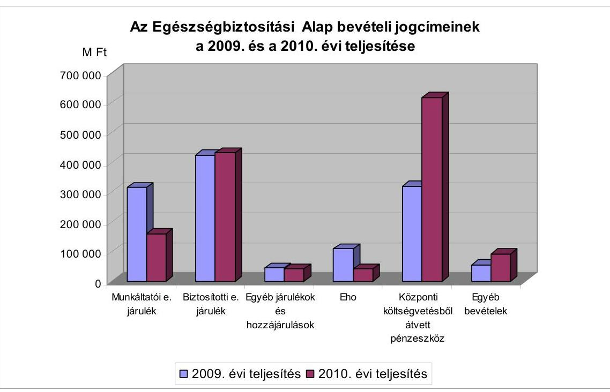

Az egészségügyi finanszírozásváltással kapcsolatos bevételi előirányzat (22 000,0 M Ft) azzal a céllal került az E. Alap költségvetésébe, hogy a gyógyí-tó-megelőző ellátások átmenetileg megnövekedett kiadásának részleges ellentételezése legyen. A bevétel nem teljesült, tekintettel arra, hogy a teljesítést lehetővé tévő jogszabály nem készült el.

A Kvtv. 91. § (1) bekezdés g) pontja alapján felhatalmazást kapott a Kormány, hogy rendeletben állapítsa meg az egészségügyi finanszírozás váltással kapcsolatos bevétel fizetésének részletes szabályait, de a szabályozás nem történt meg.

Az Ny. Alap kiadásainak döntő része (99,2\%) a nyugdíjbiztosítási ellátásokhoz kapcsolódott, összege 2894 870,8 M Ft, ebből 2887 822,3 M Ft a nyugellátások kiadása, a fennmaradó 7048,5 M Ft a postaköltség és egyéb kiadás volt. A nyugellátási kiadások teljesítése a tervezettől 0,5\%-kal maradt el, annak ellenére, hogy novemberben egyösszegű kifizetésként 12 hónapra 0,6\%os (16,8 Mrd Ft) kiegészítő nyugdíjemelés valósult meg. A kiadás elmaradás fő oka a prognosztizáltnál is erősebben csökkenő létszám volt. A nyugdíjbiztosítási ellátások kiadásai a megelőző évhez viszonyítva 1,9\%-kal növekedtek. Kiadásnövelő körülmény volt továbbá, hogy a 2009. évről a 2010. évre halasztva - a nyugellátások korrekciójáról szóló 2005. évi CLXXIII. törvény 4. §-a szerint a sajátjogú nyugdíjak korrekciós emelésének utolsó lépése is megvalósult.

[^0]
[^0]:    ${ }^{96}$ A Tbj. 26. § (5) bekezdésében a 2010. évtől a költségvetés által fizetett ún. fejkvóta összege az előző évi 4500 Ft/fő/hóról 9300 Ft/fő/hó összegre emelkedett.

---

A nyugellátások indexálásának megváltoztatása mérsékelte a kiadásokat. A Kvtv. 70. § (2) bekezdése alapján a 2010 januárjában esedékes nyugdíjemelés meghatározásánál a Tny. 62. § (1) bekezdés a) pontja szerinti 4,1\%-os mértékű nyugdíjemelést valósítottak meg. Így csak 110,1 Mrd Ft-tal növelte a kiadásokat az értékmegőrzést szolgáló emelés. A kiadásokat növelte még a méltányossági nyugdíjemelés tárgyévi és az előző évi - a pénzügyi és gazdasági válság enyhítése érdekében megemelt - méltányossági nyugdíjemelések áthúzódó hatása. A 13. havi nyugdíj ${ }^{97}$ a 2009. év I. félévében a saját jogú nyugdíjasoknak még járt, eltörlése a 2010. évben az előző évvel összehasonlítva 2,9\%-os kiadáscsökkentést eredményezett. A nyugdíjbiztosítási ellátások kiadásai a megelőző évhez viszonyítva $1,9 \%$-kal növekedtek.

Az E. Alap kiadási előirányzata 1445 503,3 M Ft volt, amit az évközi folyamatok és intézkedések hatására jelentősen megemeltek, így a módosított előirányzat 1495728,0 M Ft lett és 1476 691,2 M Ft-ra teljesült. A folyamatos finanszírozás - a szigorú előirányzat-gazdálkodás miatt - már az év elejétől kezdve csak folyamatos finanszírozási tervmódosítással, pótlólagos előirányzati keretnyitásokkal, majd átcsoportosításokkal, előirányzat-emeléssel volt biztosítható. Fejezeti hatáskörben tizenegy alkalommal, kormányhatáskörben négy alkalommal történt előirányzat-módosítás.

# 1.3.2. A kormányzati struktúraváltozással összefüggő változások 

A TB. Alapoknál a 2010. évben - a kormányzati struktúraváltással összefüggésben - megváltozott az Ny. Alap és az E. Alap irányításáért felelős miniszter, az alapkezelők első számú vezetőjének személye. Az alapkezelők (az ONYF és az OEP) jogállásában változás nem történt. A személyi változások a nyugdíjak és nyugdíjszerű ellátások 2010. évi kifizetését nem befolyásolták.

A kormányzati struktúraváltásig az Ny. Alap irányításáért a szociális és munkaügyi miniszter, az E. Alap irányításáért az egészségügyi miniszter - a pénzügyminiszterrel közösen - felelt. A Magyar Köztársaság minisztériumainak felsorolásáról szóló 2010. évi XLII. törvény 2. § (1) bekezdése szerint a nyugdíjpolitikával és az egészségüggyel kapcsolatos feladatokat a NEFMI látja el, az E. Alap, valamint az Ny. Alap irányítását a Kormány a nemzeti erőforrás miniszter útján - a nemzetgazdasági miniszter bevonásával - gyakorolja ${ }^{98}$. Az ONYF irányítását 2010. júliustól, és az OEP irányítását 2010. szeptembertől új főigazgató látja el.

A 2010. évben hatályba lépett jogszabályok - 2011. január 1-jétől - megváltoztatják a nyugdíjágazat és az egészségbiztosítás szervezeti rendszerét ${ }^{99}$. A regionális nyugdíjbiztosítási és egészségbiztosítási igazgatási szervek integrációjára ho-

[^0]
[^0]:    ${ }^{97}$ A Tny. módosításáról szóló 2009. évi XL. törvény 9. § (1) bekezdés a) pont ab) alpontjának megfelelően.
    ${ }^{98}$ A miniszter nyugdíjpolitikával és egészségüggyel kapcsolatos feladat- és hatáskörét a 212/2010. (VII. 1.) Korm. rendelet VII. fejezete tartalmazta.
    ${ }^{99}$ A területi államigazgatási szervezetrendszer átalakítását megalapozó intézkedésekről szóló 1191/2010. (IX. 14.) Korm. határozat alapján.

---

zott jogszabályok ${ }^{100}$ végrehajtásának előkészítését a 2010. év végén kellett végrehajtani. Az ONYF és az OEP, valamint regionális szerveik - a területi közigazgatási hivatalok - átszervezése következtében a 2011. január 1-jétől létrejöttek a fővárosi és a megyei kormányhivatalok, ezáltal megvalósult a funkcionális feladatok területi szintű integrációja. Az ONYF területi szakigazgatási szervei kormányhivatalokba integrálódtak. Az OEP esetében kettős jogutódlás történt, a biztosítottakat érintő szakigazgatási feladatokat a kormányhivatalok látják el, az egyéb szakigazgatási feladatokat az OEP végzi. A szervezeti integráció a nyugdíjak és nyugdíjszerű ellátások és a pénzbeli ellátások 2010. évi kifizetését nem befolyásolta.

# 1.3.3. A TB. Alapok ellenőrzése során tett megállapításaink 

A TB. Alapok ellenőrzése során a 2010. évi zárszámadást befolyásoló - az alapkezelőknél személyes felelősségre vonásra okot adó - szabálytalanságot nem állapítottunk meg.

Az Ny. Alap ellátásaiból részesülők létszámának csökkenése a 2010. évben 1,8\%-os, mintegy 50,2 Mrd Ft-os kiadáscsökkentő hatással járt. A társadalombiztosítási nyugellátásokban részesülők átlagos létszáma a 2010. évben 2 millió 692 ezer fő volt. A létszám 41 ezer fővel ( $1,5 \%$ ) volt kevesebb, mint az előző évi (2 millió 733 ezer fő). A legjelentősebb létszámcsökkenés az előrehozott öregségi nyugdíjaknál, a korhatár alatti rokkantsági nyugdíjaknál volt tapasztalható.

A korhatár feletti (korbetöltött) öregségi nyugdíjasok létszáma az elmúlt évtizedben folyamatosan csökkent, a 2010. évben azonban mintegy 1,4\%-os (20 200 fős) növekedés volt tapasztalható a 2009. évi 1 millió 433 ezer főhöz viszonyítva. Az elmúlt években megfigyelhető csökkenést elsősorban a nők kétévenként növekvő korhatára okozta. A 2010. évi növekedést az eredményezte, hogy a 2009., illetve a 2010. évben nem emelkedett a nőkre vonatkozó öregségi nyugdíjkorhatár.

Az előrehozott öregségi nyugdíjban részesülők létszámában - a 20002009. évek közötti tendenciától eltérően - a 2010. évben csökkenés volt tapasztalható. A létszámmérséklődésének oka a korhatáremelés (pl.: hogy az 1952ben született nők előrehozott nyugdíjhoz szükséges életkora 57 évről 59 évre emelkedett a 2009. évben).

A korkedvezményes nyugdíjasok száma a 2010. évben 0,3\%-kal emelkedett, átlagosan 62 ezer főt tett ki.

A rokkantsági nyugdíjasok száma a 2010. évben az előző évről a 766 ezer főhöz viszonyítva 4,0\%-kal ( 735 ezer főre) csökkent. Közöttük a korbetöltött rokkantsági nyugdíjasok száma az előző évi 363 ezer föről 3,9\%-kal ( 377 ezer före) növekedett, a korhatár alattiak száma a 2009. évi 403 ezer főről

[^0]
[^0]:    ${ }^{100}$ A fővárosi és megyei kormányhivatalokról, valamint a fővárosi és megyei kormányhivatalok kialakításával és a területi integrációval összefüggő törvénymódosításokról szóló 2010. évi CXXVI. törvény, a fővárosi és megyei kormányhivatalokról szóló 288/2010. (XII. 21.) Korm. rendelet.

---

358 ezer főre (11,1\%-kal) csökkent. A rokkantsági nyugdíjasok létszámának csökkenését egyrészt az ellátás megállapítási feltételeinek szigorítása, másrészt a jogosultsági feltételek ellenőrzése számának növekedése okozta.

A rehabilitációs járadékban részesülők létszáma - a 2008. évi bevezetést követően - gyorsan emelkedett. A 2008. évben éves átlagban 270 fő, a 2009. évben 6600 fő, a 2010. évben pedig közel 19500 fő kapta ezt az ellátást.

A 2010. évben a nyugdíjasok teljes körét érintően a januári nyugdíjemelés $4,1 \%$, a novemberi kiegészítés mértéke $0,6 \%$ volt. Az előző intézkedések, valamint a 13. havi nyugdíj megszűnése hatásaként a 2010. évben a nyugdíjak összege nominálisan 1,6\%-kal növekedett.

A nyugdíjak reálértéke - figyelembe véve a korrekciós és méltányossági emelések hatását is - 1,9\%-kal csökkent. A nyugdíjak reálértékét ${ }^{101}$ befolyásolta a 2010. évben a 13. havi nyugdíj - a 2009. év második felében történt - megszűntetése.

A 2009. évi és 2010. évi nyugdíjkiadás összehasonlításakor 2009. évben még szerepelt a 13. havi nyugdíj 6 havi arányos összege.

A nyugdíjak reálkeresetekhez ${ }^{102}$ viszonyított értéke a 2009. évhez képest a nyugdíjas állomány egészére kiterjedő intézkedéseket figyelembe véve 4,6\%kal csökkent, a nyugdíjakba beépülő növekedést eredményező egyéb intézkedéseket is együtt kalkulálva - alapvetően a 13. havi nyugdíj megszűnése miatt -$3,7 \%$-kal romlott.

Kivételes nyugdíjemelésre és méltányossági jogkörben a nyugdíjak megállapítására jogszabályban meghatározott körülmények ${ }^{103}$ esetében kerülhet sor. Az évközi intézkedések következményeként a kivételes nyugellátásemelésre 1009,0 M Ft, a kivételes nyugellátás megállapítására $210,0 \mathrm{M} \mathrm{Ft}$, az egyszeri segélyre $581,0 \mathrm{M}$ Ft volt felhasználható.

A kivételes nyugdíjemelést kérők száma a 2010. évben 119 ezer volt, 52,5 ezer esetben bírálták el a kérelmet kedvezően. Az egy főre jutó átlagos havi emelés 3200 Ft volt.

Az Ny. Alap ellátások folyósításával kapcsolatos egyéb kiadásai közül a bankköltség megemelkedett a külföldi bankszámlára utalt nyugellátások számának és összegének növekedése miatt.

A külföldre utalás egyre több nyugdíjfolyósítást fog érinteni a kétoldalú egyezmények számának, az érintett populáció nagyságának emelkedése miatt az Európai Unió tagállamaiban viszonylag akadálytalanul migráló munkaerő több

[^0]
[^0]:    ${ }^{101}$ A nyugdíjak vásárlóerejének adott évi változását az adott évben végrehajtott nyugdíjemelések, és a fogyasztói árnövekedés arányának alakulása határozza meg.
    ${ }^{102}$ A reálkereset 2010. évi változását a nettó átlagkereset növekedés indexének a fogyasztói árnövekedés indexéhez való viszonyítása adja meg.
    ${ }^{103}$ A méltányossági jogkörben alkalmazandó szabályokat a Tny. 66. §-a és a törvény végrehajtására kiadott 168/1997. (X. 6.) Korm. rendelet 72/8. §-a határozza meg.

---

országban szerzett nyugdíjjogosultságai következményeként. A kapcsolódó költségek ${ }^{104}$ lényegesen meghaladják a belföldi utalásokét ( $24 \mathrm{Ft} / \mathrm{db}$ ). A kedvezményes pénzátutalási rendszerbe a külföldi utalást folyósító szervezet eddig nem kapcsolódott be. A havi átutalások, postai pénzutalványok egy része ( $2,4 \%$ ) a nyugdíjminimum felénél kisebb összeg. A külföldre utalt ellátások többségben nem teljes nyugdíjak (pl.: a több országban szerzett jogok alapján járó nyugdíj magyar részösszege, fizetési letiltások esetén a bírói végrehajtások díjai (végrehajtások ügynöki díjai). A költségracionalizálást a jelenleg hatályos jogszabályi környezet nem segíti elő.

Az Ny. Alapot illetően megállapítottuk, hogy a magánnyugdijpénztári tagok a 2010. évben két ütemben ${ }^{105}$ léphettek vissza a társadalombiztosítási nyugdíjrendszerbe.

Az 1956-ban vagy korábban született, valamint a már nyugdíjas magánnyugdíjpénztári tagok kezdeményezhették ${ }^{106}$ a 2009. július 9 -étől december 31-éig tartó időszakban a pénztártagságuk megszűntetését és a társadalombiztosítási nyugdíjrendszerbe való visszalépésüket. A kérelem jogosságának megállapítására, ügyintézésre, eljárásra, pénztári elszámolásra 90 nap állt rendelkezésre. A 2010. évben a jogszabályi változások ${ }^{107}$ következtében erre valamennyi magánnyugdíjpénztári tag számára lehetőség nyílt. A pénztártagnak pénztári tagsági jogviszonya fenntartásának szándékáról a 2010. december 22-e és 2011. január 31-e közötti időszakban kellett nyilatkoznia. A RNYI-knél, a NYUFIG-nál, illetve az ONYF-nél 3118200 pénztártag közül 3,1\%, 97422 fő nyilatkozatát foglalták közokiratba. A pénztártagok tájékoztatása, valamint a közigazgatási feladatok többlet dologi ráfordításokat és szervezési feladatokat jelentettek, a túlmunka anyagi ellentételezésére nem volt lehetőség.

Az E. Alap a 2007. és a 2008. évben pozitív egyenleggel zárt. A 2007. évben keletkezett 27 407,5 M Ft és a 2008. évi 73,4 M Ft többlet vonatkozásában az adott évek költségvetése végrehajtásáról szóló törvények ${ }^{108}$ úgy rendelkeztek,

[^0]
[^0]:    ${ }^{104}$ SWIFT, STEP2 nemzetközi deviza-átutalási rendszerek, amelyekben a SWIFT átutalás költsége $2700 \mathrm{Ft} / \mathrm{db}$, a STEP2 rendszerben az átutalás díja $1110 \mathrm{Ft} / \mathrm{db}$.
    ${ }^{105}$ Visszalépést tett lehetővé egyrészt a közteherviselés rendszerének átalakítását célzó törvénymódosításokról szóló 2009. évi LXXVII. törvény, másrészt a Nyugdíjreform és Adósságcsökkentő Alapról, és a szabad nyugdíjpénztár-választás lebonyolításával öszszefüggő egyes törvénymódosításokról szóló 2010. évi CLIV. törvény.
    ${ }^{106}$ A magánnyugdíjpénztári rendszer 1997. évi bevezetésekor, az aktív korú biztosítottak dönthettek arról, hogy belépnek-e valamely magánnyugdíjpénztárba. Egyidejűleg megismerhették azt, hogy a magánnyugdíjpénztári nyugdíjrendszer bevezetését megalapozó előszámitások szerint átlagos kereset és folyamatos biztosítási jogviszony mellett 20 év pénztári megtakarítás biztosíthatja a megfelelő nyugdíjpótlást. Számukra a rövid pénztári felhalmozási időszak miatt, a teljes társadalombiztosítási nyugdíj szükséges egynegyedét nem éri el a pénztári járadék, a pénztártagság önkéntes választása nyugdíj kalkulátorok nyújtotta segítség ellenére - kedvezőtlen döntés volt.
    ${ }^{107}$ A Nyugdíjreform és Adósságcsökkentő Alapról, és a szabad nyugdíjpénztár-választás lebonyolításával összefüggő egyes törvénymódosításokról szóló 2010. évi CLIV. törvény intézkedései.
    ${ }^{108}$ A Magyar Köztársaság 2007. évi költségvetésének végrehatásáról szóló 2008. évi LXXVIII. törvény 17. § (1) bekezdés b) pontja és a Magyar Köztársaság 2008. évi költségvetésének végrehatásáról szóló 2009. évi CXXIX. törvény 16. § (2) bekezdése szerint.

---

hogy azokat tartalékként kell kezelni. E többletek felhasználásáról a 2010. évben született jogszabály, Kvtv. 88/A. §-a alapján a felhasználás célja a Gyógyi-tó-megelőző ellátás jogcímcsoportból finanszírozott egészségügyi szolgáltatók korábbi évekből felhalmozott adósságának rendezése volt.

A vonatkozó, 2010 decemberében kiadott kormányhatározat alapján ${ }^{109}$ a 27 480,9 M Ft-ot a kiadási oldalon a Gyógyító-megelőző ellátás jogcím-csoport Célelőirányzatok jogcímen adósságkonszolidáció támogatása néven illesztették a 2010. évi költségvetésbe, teljesítésére is ekkor került sor.

Az előző évi többletek felhasználása az E. Alap 2010. évi költségvetésében a kiadási oldalon egyértelműen növekedéshez vezetett, ami a hiány emelkedését eredményezte volna. Azonban a kiadásokat nem egyszerűen magasabb öszszegben teljesítették, hanem az előző években ennyi pénzeszközzel többet hagytak az E. Alapnál. Ezért a 27 480,9 M Ft többlet bevételi oldalon való megjelenítése is szükségszerű volt, költségvetési bevételként is el kellett számolni a kifizetett konszolidációs támogatásnak megfelelő összeget, amelyet az Áht. 86. § (11) bekezdése elő is írt. Ez a követelmény azonban - az E. Alap deficites költségvetése miatt érvényesülő hitelgazdálkodás következtében ${ }^{110}$ és a tartalékok kezelésére vonatkozó előírások hiányában - sajátosan érvényesült. A bevétel forrása nem az E. Alapnál meglévő pénzeszközökből állt rendelkezésre, biztosítása technikai lépéseket igényelt, amelyeket az OEP az NGM és a Kincstár megállapodásban rögzített. Az E. Alap költségvetésében az Áht. 86. § (11) bekezdése szerint (azaz a tárgyévi felhasználásnak megfelelően) teljesült a konszolidációs támogatás bevételi oldalon történő elszámolása.

Az E. Alap pénzbeli ellátásokra fordított 2010. évi kiadása (221 238,0 M Ft) az előirányzatnál 16418,7 M Ft-tal (6,9\%), az előző évi teljesítésnél 26 049,1 M Ft-tal (10,5\%) volt alacsonyabb. A pénzbeli ellátásokon belül a táppénz kiadása a jogszabályi változás ${ }^{111}$ hatására az előző évhez képest 26,5\%-kal (28 602,9 M Ft) csökkent, 79 421,2 M Ft volt. Ez az előirányzaton 17 113,9 M Ft (17,7\%) megtakarítást eredményezett.

Az összevont szakellátásra ${ }^{112}$ a 2010. évben 552 954,7 M Ft-ot fordítottak. A kiadás előző évi teljesítéséhez viszonyított 6,5\%-os (33 540,9 M Ft) növekedésének elsődleges oka az volt, hogy a járóbeteg-szakellátás, a CT, az MRI fi-

[^0]
[^0]:    ${ }^{109}$ A Gyógyító-megelőző ellátás jogcím-csoportból finanszírozott egészségügyi szolgáltatók korábbi évekből felhalmozott adósságának rendezésére fordítható konszolidációs támogatás kifizetéséhez szükséges előirányzat-módosításról, valamint az Összevont szakellátás jogcím Rendkívüli kiadások felhasználási céljának megváltoztatásáról szóló 1267/2010. (XII. 3.) Korm. határozat.
    ${ }^{110}$ Az ellátási kiadások folyamatos teljesítése érdekében a költségvetési törvény minden évben biztosítja az E. Alap számára a központi költségvetésből Kincstár útján nyújtott kamatmentes hitel igénybevételét.
    ${ }^{111}$ Ebtv. 48. § (8) bekezdése alapján.
    ${ }^{112}$ Az összevont szakellátás magába foglalja a járóbeteg-szakellátást, a CT, MRI finanszírozást, az aktív és a krónikus szakellátásokat, a speciális finanszírozású fekvőbetegellátást és az ún. extrafinanszírozást, továbbá a 2010. évben a rendkívüli kiadások is idetartoztak.

---

nanszírozás, az aktív és krónikus fekvőbeteg-szakellátás tekintetében az elszámolási periódust 3 hónapról 2 hónapra csökkentették ${ }^{113}$.

Az összevont szakellátási kassza alakulására a 2010. év folyamán több intézkedés volt hatással, amelyek közül egyesek olyan feladatokat jelentettek, amelyekhez hiányzott a forrás, vagy nem a szükséges mértékű forrást rendelték hozzá. Ezzel párhuzamosan a finanszírozási alapdíj és a finanszírozható TVK csökkent. A többletfeladatok végrehajtásához biztosított források, az alapdíj és TVK csökkentés a kassza betartását és a feladatok teljesítését lehetővé tette, ugyanakkor a szolgáltatók számára rendkívül alacsony finanszírozottsági szintet eredményezett. Ez az intézmények határidőn túli kötelezettségei, vagyis az adósságai növekedéséhez vezetett ${ }^{114}$. Év végén nem az összevont szakellátás jogcímről, hanem a szintén gyógyító-megelőző kiadáshoz tartozó célelőirányzatokról kifizetett (27 480,9 M Ft) adósságkonszolidációs támogatással enyhítették a szolgáltatók hiányát.

Az összevont szakellátás jogcímhez tartozó járóbeteg és fekvőbeteg ellátást végző szolgáltatók intézkedések alapján több alkalommal kaptak jelentős kiegészítő forrásokat a 2010. évben. A kiegészítő források elsősorban nem valódi ellátásbővülésre, hanem a szolgáltatóknál felhalmozott adósságok kifizetéséhez, ezen keresztül a rendszer további finanszírozásához voltak szükségesek. A kiegészítő források nem voltak elegendőek az adósságállomány megszüntetéséhez, legfeljebb az eladósodottság csökkenéséhez járultak hozzá, de a változatlan struktúrában az adósság újratermelődése megállíthatatlannak tűnik.

Az összevont szakellátás továbbra is súlyosan forráshiányos. A többi alapellátás és szakellátás nem jutott jelentős többletforráshoz, jogcímeiken a kiadás a 2009. évi szinten teljesült.

A forráshiány a 2010. évre megállapított teljesítmény-volumen korlátban (TVK) is megmutatkozott. Az országosan megállapított TVK-t, ami a szolgáltatók által elszámolható teljesítményt adja meg, csökkenteni kellett az összevont szakellátási előirányzat betartása érdekében. A 2009. év elején megállapított TVK kerethez képest a járóbeteg TVK összpontszám 13,4\%-kal, az aktív fekvőbeteg TVK összsúlyszám 5,3\%-kal csökkent. A zárt előirányzatok tartásának kötelezettsége miatt az egy teljesítményegységre jutó díjat is csökkenteni kellett, ennek mértéke 8,8\%os volt a járóbeteg ellátásban, 2,7\%-os az aktív fekvőbeteg szakellátásban.

Az E. Alap kiadásai között nem tervezték a költségvetési szerveknél foglalkoztatottak a 2010. évi eseti kereset-kiegészítéséről szóló 316/2009. (XII. 28.) Korm. rendeletben előírt eseti kereset-kiegészítés kifizetését. A szükséges összeget az összevont szakellátási kasszáról fejezeti hatáskörű módosítás keretében 11 200,0 M Ft átcsoportosításával teremtették elő, lényegében az ellátások ter-

[^0]
[^0]:    ${ }^{113}$ Az egészségügyi szolgáltatások Egészségbiztosítási Alapból történő finanszírozásának részletes szabályairól szóló 43/1999. (III. 3.) Korm. rendelet 28. § (4) bekezdés 2010. január 1-jétől hatályos módosítása szerint.
    ${ }^{114}$ A NEFMI a fekvőbeteg-ellátó intézmények határidőn túli kötelezettségeit a 2010. év második negyedévétől mérte fel, ennek eredménye a második negyedévre 36,5 Mrd Ft, a harmadik negyedévre 47,5 Mrd Ft, a negyedik negyedévre 34,6 Mrd Ft volt. A minisztérium legutóbbi közleménye alapján az adatsorok elemzése még folyamatban van.

---

hére. A kifizetés az így rendelkezésre álló keretből a célelőirányzatok jogcímről történt, összege 10649,7 M Ft volt. A kifizetés pontos és gyors lebonyolításához nem állt rendelkezésre megfelelő naprakész adatállomány. Az egészségügyi dolgozói állomány a KIR-ben nem a módosult államháztartási szakfeladatrendben szerepelt.

Az évközi bérintézkedésekkel kapcsolatos kiadás az E. Alapon belül első alkalommal a 2010. évben jelent meg. (Az évközi bérintézkedések forrását a korábbi években a Miniszterelnökség fejezet Általános tartaléka biztosította.) Megállapítottuk, hogy a kiadást fedezet biztosítása nélkül kellett az E. Alapból teljesíteni. A végrehajtáshoz szolgáltatott adatok pontatlansága miatt az Ámr. 2. § 23. pontja szerinti ún. bruttó finanszírozási körben a kiutalt összeg 15,2\%át (115,6 M Ft) visszavonták.

A gyógyszertámogatás jogcímcsoport eredeti előirányzata 345374,4 M Ft volt, ami tartalmazta a gyógyszertámogatás céltartalék teljes összegét, 30500,0 M Ft-ot. A céltartalékot a felhasználás érdekében teljes mértékben a gyógyszertámogatás kiadásai jogcímre csoportosították. További 11848,0 M Ft előirányzat-növelés történt az elszámolások kifizetése érdekében. Ezt teljes egészében a gyógyszergyártói és forgalmazói befizetések többletéből a Kvtv. 24. § (2) alapján biztosították, külső forrást az E. Alap nem kapott. A rendelkezésre álló 357222,4 M Ft-os módosított előirányzat nem volt elegendő a beérkező elszámolások teljesítéséhez. A gyógyszertámogatás jogcímcsoport teljesítése 357 205,9 M Ft volt, ami 4,1\%-os növekedést jelentett a 2009. évi kiadáshoz képest. 3098,4 M Ft kifizetése - fedezet hiányában - 2011. január 3-án történt.

A gyógyszertámogatási jogcímcsoporton belül a gyógyszertámogatás kiadásai jogcím eredeti előirányzata 2008 óta változatlan, de ez a 2010. évben már nem volt elég a kiadások teljesítéséhez. A jogcím eredeti előirányzathoz viszonyított többletét és - ahogy ez a többlet évről-évre növekszik - a növekedést is évek óta a gyógyszerforgalmazással kapcsolatos bevételekből finanszírozzák. A 2010. évben a növekedés nagyobb volt, mint amire az eredeti előirányzat és a gyártói befizetések fedezetet nyújtottak. A növekedést csak a gyógyszerforgalmazással kapcsolatos bevételek mértékéig, illetve többletéig finanszírozták.

Az előző évekhez viszonyítva az E. Alap gyógyszer bevétel-kiadás nettó pozíciója jelentősen romlott. Míg a korábbi években a bevételek egy részét kellett csak felhasználni a kiadások finanszírozásához és így a bevételek másik része (több Mrd Ft) a bevételi oldalon „maradva" javította az Alap általános egyenlegét, addig a 2010. évben a teljes gyógyszerfogalmazással kapcsolatos - eddigi legmagasabb összegű - bevétel kiadásokra csoportosítása sem volt elég a kiadások teljesítéséhez. A jogcímcsoport kiadásainak növekedése a kiemelt támogatású gyógyszerek fogyasztásának eredménye volt, ebben a kategóriában a támogatás 13 539,0 M Ft-tal volt magasabb az előző évhez képest. A fogyasztás növekedése mennyiségileg a DOT forgalomban ${ }^{115}$ is megmutatkozott, ami $6,8 \%$-kal emelkedett. Mivel a lakosság teherviselése a kiemelt támogatású körben értelemszerűen minimális, ezért az átlagos térítési díjakban nö-

[^0]
[^0]:    ${ }^{115}$ DOT: Days of Treatment: Terápiás napok száma, amire az adott gyógyszerkészítmény kiszerelése elegendő.

---

vekedés nem jelentkezett. A lakosságra háruló átlagos térítési díj nominálisan változatlan volt az itt vizsgált teljes támogatott gyógyszerkörre vonatkozóan.

Speciális beszerzésú gyógyszerekre a 2010. évben 9832,5 M Ft-ot költöttek, amely 2,0\%-kal magasabb kiadás az előző évhez viszonyítva. Az előirányzat kizárólag a veleszületett vérzékenységben szenvedők számára szükséges készítmények beszerzését szolgálja. Csak ennek a termékkörnek a növekedése a korábbi években sokkal dinamikusabb, a 2009. évben 9,4\%, a 2008. évben $44,8 \%$, a 2007. évben $13,7 \%$ volt.

A kiadások növekedésének visszafogása egyrészt a Felhasználó Centrumokban történő - fokozottabb ellenőrzést lehetővé tevő - gyógyszerkiadásnak, másrészt a hatékonyabb készletgazdálkodást és készletmonitorozást lehetővé tevő „Centrum Jelentő Program" bevezetésének volt köszönhető.

A gyógyászati segédeszközök jogcímcsoport eredeti előirányzata 45 400,3 M Ft volt. A gyógyászati segédeszközök előirányzata 1150,0 M Ft-tal ( $2,5 \%$ ) csökkent, ezt az összeget kormányhatáskörben a háziorvosi ügyeleti ellátás finanszírozására csoportosították át ${ }^{116}$. A csökkentett keret minimális öszszegben (az előirányzat mintegy 0,8\%-ában) nem nyújtott fedezetet a kiadások finanszírozásához. A teljesítés 44195,2 M Ft volt, amely 4,7\%-kal alatta maradt az előző évi kiadásnak. A kiadáscsökkenés/stabilizálás alapvetően a 2009. évben elkezdett és a 2010. évben is folytatott gyógyászati segédeszköz támogatási rendszer átalakításának volt köszönhető, de már 2010 júliusától olyan intézkedéseket vezettek be, melyek ellátási érdekből enyhítették a korábbi megszorításokat.

Mind a tizenegy eszközcsoportban történt módosítás, hatásukra októberiól a havi teljesítések megemelkedtek. Finanszírozáspolitikai döntések hiányában a gyógyászati segédeszközök támogatását érintő szigorító-enyhítő rendelkezések váltogatása még mindig a finanszírozási lehetőségek mentén történik.

Az IBR megszüntetéséről szóló törvény ${ }^{117}$ és az irányított betegellátási rendszer megszüntetésével, az elszámolásokkal, valamint az elszámolások ellenőrzésével kapcsolatos eljárási szabályokról szóló 348/2008. (XII. 31.) Korm. rendelet az ellátásszervezőket záró elszámolás készítésére, és annak az egészségbiztosító felé 2009. március 31. napjáig történő megküldésére kötelezte. A szervezők záró elszámolást nem készítettek. Az IBR lezárása nem rendezett, a jogkövető magatartás kikényszerítése, a záró elszámolások benyújtása nem biztosított, a szervezők évek óta nem tesznek eleget erre vonatkozó kötelezettségüknek.

Az egyes ellátásszervezők bírói útra terelték az ellátásszervezéssel kapcsolatos követeléseiket. A 2009. évben egy szervező, a 2010. évben két szervező tekintetében a bíróság megítélte az ellátásszervezői díjat, egy szervező egyezséget kötött az OEP-pel. Az ítéletek alapján a 2010. évben az OEP-nek 1939,0 M Ft fizetési köte-

[^0]
[^0]:    ${ }^{116}$ A kötelező egészségbiztosítás természetbeni alapellátásainak és a méltányossági gyógyszertámogatás 2010. év végi finanszírozásához szükséges lépésekről szóló 1293/2010. (XII.15.) Korm. határozat.
    ${ }^{117}$ Az IBR-t az egyes egészségügyi tárgyú törvények módosításáról szóló 2008. évi CVI. törvény 2009. január 1. napjától megszüntette.

---

lezettsége keletkezett, ebből 1328,8 M Ft ellátásszervezői díj, 601,9 M Ft kamat és $8,3 \mathrm{M}$ Ft perköltség volt.

Az egészségbiztosítás egyéb kiadásai legmagasabb előirányzata a GYEDben részesülők utáni nyugdíjbiztosítási járulék címen az Ny. Alapnak átadott pénzeszköz jogcím volt. A teljes 21605,0 M Ft-os előirányzat átadásra került. Az időarányos részleteket minden hónap 15 -éig ${ }^{118}$ az előírásoknak megfelelően, szabályosan utalták. A GYED-del kapcsolatos nyugdíjbiztosítási járulék a Kvtv. 29. § (2) alapján nem a ténylegesen kifizetett GYED kiadás, hanem az erre szolgáló előirányzat havi időarányos mértékének megfelelően teljesült.

Az E. Alap gyógyító-megelőző kiadásainál a háziorvosi ellátás múködését és pénzügyi feltételrendszerét hatékonysági és eredményességi szempontból nem vizsgáltuk, mert „A háziorvosi ellátás müködésének és pénzügyi feltételrendszerének ellenörzése" címmel - az ÁSZ 2011. évi ellenőrzési terve alapján - önálló teljesít-mény-ellenőrzés van folyamatban.

# 1.3.4. A TB. Alapok múködési költségvetése 

A TB. Alapok múködési költségvetése az alapvető múködési feltételeket biztosította. A társadalombiztosítási igazgatási szervek a folyamatos jogszabályi változásokból eredő, illetve az azokhoz kapcsolódó ügyviteli és számítástechnikai háttér biztosításához szükséges többletfeladatainak - változatlan engedélyezett létszámkeret mellett - folyamatos túlmunka mellett feleltek meg, miközben mindezek végrehajtásához - az előző évekhez képest - folyamatosan szűkülő pénzügyi keretek álltak rendelkezésre.

Az Ny. Alap költségvetésében a nyugdíjágazat 2010. évi múködési kiadásaira a Kvtv. 24 677,8 M Ft-ot, múködési bevételeire 1900,0 M Ft-ot irányzott elő. A múködési kiadások fedezetére - a nem tervezett feladatokra a Kvtv. 23. § (2) bekezdése ${ }^{119}$ szerint engedélyezett 390,7 M Ft előirányzat módosítás nélkül teljesíthető kerettel együtt - 26839,2 M Ft állt rendelkezésre. Az E. Alap múködési kiadásaira a bevétellel egyezö, 20 951,6 M Ft föösszeget hagytak jóvá.

Az Ny Alapnál a 2010. évi teljesített 23 382,2 M Ft-os múködési kiadás mind a bázishoz (2297,7 M Ft-tal), mind a módosított előirányzathoz (3066,3 M Ft-tal) viszonyítva jelentős elmaradást mutat. A kiadások csökkenése elsősorban a személyi juttatások, a kapcsolódó munkaadókat terhelő járulékok, illetve a dologi kiadások soron jelentkezett, és a központi költségvetés pozíciójának javítása érdekében hozott kiadáscsökkentő kormányintézkedések hatására vezethető vissza.

[^0]
[^0]:    ${ }^{118}$ A határidőt a kincstári számlavezetés és finanszírozás, a feladatfinanszírozási körbe tartozó előirányzatok felhasználása, valamint egyes államháztartási adatszolgáltatások rendjéről szóló 46/2009. (XII. 30.) PM rendelet 44. § (12) bekezdés írja elő.
    ${ }^{119}$ Az Ny. Alap felügyeletéért felelős miniszter engedélye alapján a nyugellátásban részesülő személyek évközi nyugellátás-emelése, valamint a nyugdíjak korrekciós célú emeléséről szóló 2005. évi CLXXIII. törvény szerinti emelés végrehajtásával összefüggő kiadások fedezetét jelenti.

---

Az E. Alapnál a beszámolási időszakban a módosított kiadási előirányzat 24633,4 M Ft volt. Előirányzat módosításra 3681,8 M Ft összegben került sor. Kormányhatáskörben az 1132/2010. (VI.18.) Korm. határozat alapján 319,0 M Ft-tal csökkentették az eredeti előirányzatot. Irányító szervi hatáskörben 778,7 M Ft-tal emelték meg az eredeti előirányzatot. Intézményi hatáskörben 3222,1 M Ft előirányzat módosítást hajtottak végre az előző évi pénzmaradvány terhére. A teljesített kiadás 20 938,7 M Ft, az év végi kiadási megtakarítás összege 3694,8 M Ft volt.

Az Ny. Alap felhalmozási kiadásokon belül az intézményi beruházások eredeti előirányzata 151,1 M Ft volt. A teljesített kiadás 663,4 M Ft-ot tett ki, ami a bázishoz viszonyítva 13,8\%-os csökkenést jelent. Az informatikai célú beruházás $627,8 \mathrm{M}$ Ft volt, az intézményi beruházások $94,6 \%$-át tette ki, ebből a vagyoni értékű jogvásárlás 221,6 M Ft-ot (ebből SAP verzióváltás 177,2 M Ft), a szellemi termékek értéke 219,6 M Ft-ot tett ki. A júniusi kormányintézkedés a beruházási kiadásokat is érintette. Beszerzési tilalmat rendeltek el bútorvásárlásra, informatikai eszközbeszerzésre, valamint személygépkocsi-beszerzésre, illetve az e tételek beszerzésére rendelkezésre álló előirányzatokat ( $0,3 \mathrm{M} \mathrm{Ft}$ ) zárolták, majd elvonták. Belső forrás átcsoportosítással 311,9 M Ft-összegű informatikai eszközök beszerzésére kaptak engedélyt.

Az E. Alapnál az intézményi felhalmozási kiadásokra fordítható eredeti előirányzat 504,3 M Ft, az előirányzat átcsoportosításokkal a módosított előirányzat 1978,5 M Ft, a teljesítés 1576,8 M Ft volt. A módosított előirányzathoz képest 402,1 M Ft megtakarítás mutatkozott. Az előirányzat-maradvány kötelezettségvállalással terhelt.

Az EKG szolgáltatások - az ágazaton belüli ingyenes kommunikációt lehetővé tévő - igénybevételére szolgáltatás keretében biztosított eszközök értéke a nyugdíjbiztosítási igazgatás eszközei között továbbra sem szerepel, mert nem került sor a Közigazgatási és Közszolgáltatások Elektronikus Központi Hivatal (KEKKH) részéről ezen eszközök ONYF részére történő átadására.

A 2009. évi zárszámadásról szóló jelentésünkben javasoltuk a közigazgatási és igazságügyi miniszternek ${ }^{120}$, hogy biztosítsa az EKG szolgáltatások igénybevételéhez szükséges eszközök átadását az ONYF-nek. A javaslatunk - a folyamatos egyeztetések ellenére - még nem hasznosult, döntés továbbra sem született az eszközök tulajdonjogának az átruházásáról. A KEKKH részére a tárolási nyilatkozat kiadását a fentiekre tekintettel az ONYF megtagadta, az Ny. Alap múködési beszámolójában az eszközök továbbra is a „0"-ás számlaosztályban szerepelnek.

Az E. Alap kezelője az EKG-hoz történő csatlakozás céljából az OEP által használt, illetve a KEKKH-nak a vagyonkezelésében lévő eszközök nyilvántartását ugyan tárolási nyilatkozattal rendezte, de a tulajdonjog rendezése nem történt meg.

Az Ny. Alap 2010. évi múködési előirányzat-maradványa 3469,7 M Ft, ami az előző évinek több mint háromszorosa (ebből a kormányhivatalokat

[^0]
[^0]:    ${ }^{120}$ Jelentés a Magyar Köztársaság 2009. évi költségvetése végrehajtásának ellenőrzéséről (1016) 55. oldal, 38. javaslat.

---

megillető kötelezettségvállalással terhelt maradvány $748,7 \mathrm{M}$ Ft) volt. A növekményt elsősorban a 2010. évi költségvetési egyenleg teljesítéséhez szükséges intézkedésekről szóló 1268/2010. (XII. 3.) Korm. határozat 1. pontjában előírtak eredményezték, amely a teljesíthető kiadás nagyságát december hónapban - a novemberivel megegyezően - 2189,7 M Ft-ban rögzítette.

Az Ny. Alap a 2009. évet 1066,4 M Ft-os előirányzat-maradvánnyal zárta, amelyet az NGM - az Ámr. 212. § (8) bekezdésében rögzített határidőt három hónappal túllépve - 2010. december 16-ával hagyott jóvá. Ebből a 2007. évet megelőzően keletkezett, az informatikai fejlesztéshez kapcsolódó ( $111,5 \mathrm{M}$ Ft) maradvány 2010. június 30 -áig fel nem használt része ${ }^{121}(80,1 \mathrm{M} \mathrm{Ft})$, illetve a kötelezettségvállalással nem terhelt maradvány ( $0,5 \mathrm{M}$ Ft) elvonásra került.

Az E. Alap 2010. évi múködési előirányzat-maradványa 3681,6 M Ft volt, amely 3694,8 M Ft kiadási megtakarításból, 28,2 M Ft bevételi lemaradásból és $15,0 \mathrm{M}$ Ft előző évi előirányzat-maradványból tevődik össze. A kötelezettségvállalással terhelt maradvány $2716,8 \mathrm{M}$ Ft volt, a szabad előirányzatmaradvány 964,8 M Ft. Az Ámr. 212. §-a alapján az E. Alap elkészítette a 2010. évi előirányzat-maradványról az elszámolást és a kötelezettséggel nem terhelt 964,8 M Ft előirányzat-maradvány eltérő célú (nem a jogcím szerinti) felhasználására tett javaslatot.

# 1.3.5. Az alapkezelők által múködtetett ellenőrzési rendszer 

Az alapkezelők által múködtetett ellenőrzési rendszer értékelésénél megállapítottuk, hogy a TB. Alapokból történt kifizetések ellenőrzését az alapkezelők szervezetén belül a 2010. évben - mind az Ny. Alap kezelőjénél, az ONYF-nél, mind az E. Alap kezelőjénél, az OEP-nél - több, elkülönült szervezeti egység végezte. A belső ellenőrzési rendszer kialakításakor az alapkezelők betartották a Ber. előírásait.

Az ONYF-nél a - a főigazgató közvetlen irányítása mellett, de az Ellenőrzési Főosztály adminisztratív bázisán múködő - belső ellenőrzési egység a munkáját a Főigazgató által jóváhagyott éves munkaterv alapján végezte. A feltárt hiányosság megszüntetésére intézkedési tervek nem készülnek, a főigazgató személyesen rendelkezik a hiányosságok megszüntetéséről, illetve az ellenőri javaslat végrehajtásáról. Az igazgatási szervek intézményi költségvetési beszámolói tekintetében megbízhatósági ellenőrzéseket nem végeztek ${ }^{122}$.

A belső ellenőrzés az ONYF-nél soron kívül ellenőrizte az 1132/2010. (VI. 18.) Korm. határozat végrehajtását. Megállapították, hogy a jutalom és más jutalmazási keretek zárolása - egy esettől eltekintve - megtörtént, a céljuttatás visszavonásáról intézkedtek. Megállapították továbbá, hogy az állományba nem tartozók juttatásai, valamint a szellemi tevékenységhez kapcsolódó előirányzatok első körben zárolásra kerültek, újabb szerződéseket nem kötöttek. A hatályos szerződéseket később ismét felülvizsgálták, ennek során a felbontott szerződésekből ke-

[^0]
[^0]:    ${ }^{121}$ A 1132/2010. (VI. 18.) Korm. határozat 8. pontja alapján a maradvány a 2010. év II. félévében már nem volt felhasználható.
    ${ }^{122}$ A PM 2009. évi állásfoglalása alapján a könyvvizsgálat mellett a költségvetési szerv vezetőjének döntése, hogy kíván-e lefolytatni megbízhatósági ellenőrzéseket.

---

letkezett megtakarítások zárolási bejelentése elmaradt. Ezt azzal indokolta az illetékes főosztályvezető, hogy a kormányhatározat és az NGM zárolás végrehajtására kiadott útmutatója is egyszeri, nem folyamatos feladatot írt elő. A 7,2 M Ftos különbözet Ny. Alapba történő visszafizetésére intézkedtek.

Az OEP, mint az E. Alap kezelését végző költségvetési szerv vezetője folyamatosan biztosította a belső ellenőrzési tevékenység múködését az Áht. 94. § (1) bekezdés e) pontja alapján. Az OEP-nél a belső ellenőrzés funkcionális függetlensége biztosított volt. Az ellenőri jelentésekben megfogalmazott megállapításokra, javaslatokra az ellenőrzött szakterületek minden esetben intézkedési tervet készítettek.

Az OEP Pénzbeli Ellátási és Ellenőrzési Főosztályának beszámolója szerint folyamatosan nő azon foglalkoztatók száma, amelyek „eltűnnek", a foglalkoztató a székhelyén már nem található meg, emiatt az iratok egyáltalán nem voltak fellelhetőek. Ezt a jelenséget a 2010. évben végzett ellenőrzések során a társadalombiztosítási kifizetőhelyet múködtető foglalkoztatóknál is tapasztalták. A munkáltatók a szabadság, betegszabadság kiadásakor a munkajogi szabályokat nem tartották be, nem volt munkaszerződés, vagy az hiányos, pontatlan volt, ezért ezekben az esetekben a Munkaügyi Felügyelőséget megkeresték.

Az OEP Elemzési, Orvosszakértői és Szakmai Ellenőrzési Főosztály megállapításai kapcsán több újraszabályozási folyamat indult el a 2010. évben.

# 1.3.6. Utóvizsgálat 

Az utóvizsgálat keretében megállapítottuk, hogy a TB Alapok esetében a javaslataink csak részben, azok közül az alapkezelők felé tett javaslataink többségében hasznosultak.

A 2009. évi zárszámadás ellenőrzésekor javasoltuk a Kormánynak ${ }^{123}$, hogy a következetes és egységes szabályozás kialakítása céljából vizsgálja felül az ELKA és az APEH számlái között a Kincstár által lebonyolított forgalmak jogszabályi hátterét, azon belül az alapok bevételei negatív egyenlegeinek rendezését. A javaslatunk nem hasznosult. A 2010. évben hatályos, a 46/2009. (XII. 30.) PM rendeletben a szabályozási környezet a 2009. évben alkalmazott szabályokhoz képest nem módosult. Változást csupán az jelentett, hogy míg korábban a szabályokat kormányrendeletben, addig 2010. január 1-jétől - a kormányrendelet helyett, helyesen - az államháztartásért felelős miniszter rendeletében határozták meg.

A 2009. évi zárszámadás ellenőrzésekor javaslatot tettünk a nemzeti erőforrás miniszternek ${ }^{124}$, hogy vizsgálja meg a Tny. 22/A. §-ában foglalt előírás módosításának lehetőségét annak érdekében, hogy a kereső tevékenységet folytató nyugdíjasok évente egyszer, egyszerű módon, a járulékalapot képező jövedelmükkel arányos nyugdíjemelésben részesüljenek. A javaslatunk hasz-

[^0]
[^0]:    ${ }^{123}$ Jelentés a Magyar Köztársaság 2009. évi költségvetése végrehajtásának ellenőrzéséről (1016) 50. oldal, 8. javaslat.
    ${ }^{124}$ Jelentés a Magyar Köztársaság 2009. évi költségvetése végrehajtásának ellenőrzéséről (1016) 55. oldal, 41. javaslat.

---

nosult, mert a Tny. 22/A. §-ának módosításával ${ }^{125}$ a kereső tevékenységet folytató nyugdíjasok nem csak 365 nap biztosítási időt követően, hanem a naptári évben elért nyugdíjjárulék-alapot képező kereset, jövedelem összege egy tizenketted részének 0,5\%-ával megegyező nyugellátásemelésben részesülnek.

A Függelékben ${ }^{126}$ javasoltuk, hogy az alapkezelő biztosítsa annak feltételeit, hogy a társadalombiztosítási kifizetőhelyek ellenőrzése az elévülési időn belül megtörténjen. A javaslatunk hasznosult.

Az ÁSZ a 2010 szeptemberében megjelent jelentésében ${ }^{127}$ javasoltuk a nemzeti erőforrás miniszternek, hogy vizsgáltassa felül és biztosítsa a tüdőtranszplantáció folyamatának átláthatóságát, szervezési és elszámolási szabályait, a szerződött tüdőkivételek számának követhetőségét, a kontingensen felüli tüdő kiszállítások hatósági engedélyezését. Az alapkezelőt érintően az átláthatóság és elszámolási szabályok érdekében a szükséges intézkedés megtörtént. A megállapodást az OEP a tüdőtranszplantációk finanszírozását illetően 2010. december 9-én megkötötte.

Az ÁSZ a 2010 márciusában megjelent jelentésében ${ }^{128}$ javasoltuk az egészségügyi miniszternek, hogy

- határozza meg az egynapos sebészet helyét az egészségügyi ellátórendszerben, különösen az ezt leíró mutatókat és azok célértékeit, annak érdekében, hogy széleskörűvé váljon az ellátás. A monitoring rendszer működtetése alapján pedig rendszeresen értékelje a mutatók alakulását. Az alapkezelő tájékoztatása szerint az aktív fekvőbeteg szakellátást nyújtó szolgáltatók - a 43/1999. (III. 3.) Korm. rendelet 27. § (3e) bekezdése alapján - az egynapos ellátás ösztönzésére a 2011. évre az egynaposként ellátható bázisteljesítményük 20\%-ának megfelelő mértékű növekményt kaptak;
- vizsgáltassa felül az egészségügyi szakellátás társadalombiztosítási finanszírozásának egyes kérdéseiről szóló 9/1993. (IV. 2.) NM rendelet 9. sz. mellékletében meghatározott egynapos sebészeti beavatkozások körét, és a felülvizsgálatnak megfelelően kezdeményezze annak módosítását, bővítését. A javaslat az alapkezelőnél hasznosult, annak végrehajtásában az alapkezelő közreműködőként vett részt, javaslatait az egynapos ellátások listájának bővítésére a NEFMI-be eljuttatta. Az egészségügyi szakellátás társadalombiztosítási finanszírozásának egyes kérdéseiről szóló 9/1993. (IV. 2.) NM rendelet, valamint az egynapos sebészeti és kúraszerűen végezhető ellátások szakmai feltételeiről szóló 16/2002. (XII. 12.) ESzCsM rendelet módosításáról szóló rendelet tervezet - a helyszíni ellenőrzés lezárásakor - tátcakörözésen

[^0]
[^0]:    ${ }^{125}$ Az egyes nyugdíjbiztosítási tárgyú és más kapcsolódó törvények módosításáról szóló 2010. évi CLXX. törvény 2. §-a.
    ${ }^{126}$ Függelék a Magyar Köztársaság 2009. évi költségvetése végrehajtásának helyszíni ellenőrzéséhez 358. oldal, lap alján javaslat az OEP Főigazgatójának.
    ${ }^{127}$ Jelentés a szervtranszplantáció, a donáció és az alternatív kezelések ellenőrzéséről (1020) 24. oldal, 8. javaslat.
    ${ }^{128}$ Jelentés az egynapos sebészeti ellátásra fordított pénzeszközök hasznosulásának ellenőrzéséről (1001), 21. oldal, 1., 3., 4. javaslat.

---

volt ${ }^{129}$. A tervezet tartalmazza az egynapos (sebészeti) ellátások listájának bővítését és felülvizsgálatát, valamint $\mathrm{HBCs}^{130}$ csoportjainak meghatározását is;

- határozzák meg az egynapos ellátásban nyújtott szolgáltatások tartalmi elemeit, finanszírozási protokollját, és rendszeresen ellenőrizzék ennek betartását. A javaslat az alapkezelőnél hasznosult, az egynapos ellátás ellenőrzése az OEP Ellenőrzési Főosztályának a 2011. évi ellenőrzési munkatervében szerepel.

A 2011. évi költségvetési javaslatról szóló véleményben ${ }^{131}$ javasoltuk a nemzeti erőforrás miniszternek, hogy határozza meg az egészségügyi ellátó rendszer koncepcióját, ezzel összefüggésben vizsgálja felül az egészségügyi intézményrendszert és alakítsa ki a hatékony forrásfelhasználás érdekében az egészségügyi finanszírozás stabil, kiszámítható és objektív rendszerét. A javaslat hasznosult, a Kormány a 2011 januárjában megjelent Új Széchenyi Tervben kifejezte, hogy az egészségügyre, nem mint a közpénzek mértéktelen fogyasztójára, hanem mint a gazdaság egyik húzóágazataként tekint. Az egészségügy átalakításának legfőbb irányait a 2011. május 11-én elkészült Semmelweis Terv (az egészségügy megmentéséről szóló szakmai koncepció) mutatja be.

[^0]
[^0]:    ${ }^{129}$ A helyszíni ellenőrzés lezárása után jelent meg a fent megjelölt rendeletek módosítására vonatkozó 36/2011. (VI. 27.) NEFMI rendelet.
    ${ }^{130} \mathrm{HBCs}=$ Homogén Betegség Csoport
    ${ }^{131}$ Vélemény a Magyar Köztársaság 2011. évi költségvetési javaslatáról (1025) 37. oldal, 1. javaslat.

---

# B.3. AZ ÁLLAMHÁZTARTÁS HELYI SZINTJE, A HELYI ÖNKORMÁNYZATOK 

## 1. A KvTv. MELLÉKLETEIBEN MEGHATÁROZOTT KÖZPONTI TÁMOGATÁSOK ELSZÁMOLÁSÁNAK SZABÁLYSZERÜSÉGE

A Kvtv. ötödik fejezete határozza meg az önkormányzati és a központi alrendszer kapcsolatrendszerét. A Kvtv. 43-47. §-ai felsorolják a helyi önkormányzatok, a települési és területi kisebbségi önkormányzatok központi alrendszerből származó forrásait.

| 2009. évi teljesítés | 2010. évi |  |  | 2010. évi teljesítés / 2010. évi módosított elöirányzat | 2010. évi teljesítés / 2009. évi teljesítés |
| :--: | :--: | :--: | :--: | :--: | :--: |
|  | Eredeti elöirányzat | Módosított | Teljesítés |  |  |
|  | M Ft-ban |  |  |  | \%-ban |
| 1308 451,9 | 1164 431,6 | 1202 552,3 | 1259 386,5 | 104,7 | 96,3 |

### 1.1. Az előirányzatok nyilvántartása

A Belügyminisztérium Szervezeti és Müködési Szabályzatának kiadásáról szóló 7/2010. (IX. 2.) BM utasítás alapján készült, az Önkormányzati Gazdasági Főosztály Ügyrendjének 4. A) pontjának I) bekezdése alapján a főosztály látja el a Helyi önkormányzatok támogatásai és átengedett személyi jövedelem adója fejezethez tartozó előirányzatok nyilvántartását. Ennek alapján a fejezetnél különálló fájlokban, naprakészen megtalálhatók az egyes költségvetési sorok eredeti és módosított előirányzatai, illetve azok teljesítési adatai.

### 1.1.1. Az eredeti előirányzatok jogcímenkénti megfelelősége a Kvtv.ben és a PM-ÖM együttes rendeletben

A helyi önkormányzatok normatív állami hozzájárulásának és támogatásának felhasználási kötöttséggel járó normatív állami támogatását, valamint a normatív részesedésű átengedett személyi jövedelemadójának jogcímeit és fajlagos összegeit a Kvtv. 43. § (1) és (2) bekezdése, valamint a 47. § (3) bekezdése értelmében az Országgyúlés a Kvtv. 3., 4. és 8. számú mellékletében foglaltak szerint állapította meg.

A helyi önkormányzatokat és a többcélú kistérségi társulásokat a 2010. évben egyes központi költségvetési kapcsolatokból megillető forrásokról szóló 6/2010. (I. 28.) PM-ÖM együttes rendelet megalkotásával a pénzügyminiszter

---

és az önkormányzati miniszter eleget tett a Kvtv. 43 § (3) bekezdésében foglaltaknak. Az Áht. 64. § (3) bekezdése, illetve az Áht. 71. § (1) bekezdésében előírt határidőt - 2010. január 30-át - a rendelet megalkotása során betartották.

A 6/2010. (I. 28.) PM-ÖM együttes rendelet alapján a helyi önkormányzatokat és többcélú kistérségi társulásokat a 2010. évben egyes központi költségvetési kapcsolatokból megillető források összege és a Kvtv. 1., 3., 4. és 8. számú mellékletében előirányzott összegek 113 381,6 M Ft-tal térnek el ${ }^{132}$ egymástól.

- a PM-ÖM együttes rendeletben a települési és a megyei önkormányzatok személyi jövedelemadója (Kvtv. 4. számú melléklet 1., 2. címek) jogcím összege 0,1 M Ft-tal kevesebb a Kvtv.-ben meghatározott előirányzatnál. A 0,1 M Ft-os eltérés kerekítésből adódik.
- a PM-ÖM együttes rendeletben az Egyes jövedelempótló ellátások és az önkormányzat által szervezett közcélú foglalkoztatás támogatása (Kvtv. 8. számú melléklet II/1. alcím) jogcím összege 113 381,5 M Ft-tal kevesebb a Kvtv.ben meghatározott előirányzatnál. Az Egyes jövedelempótló ellátások és az önkormányzat által szervezett közcélú foglalkoztatás támogatása igénylés nem mutatószám - alapján történik, emiatt nem szerepel összeg a PM-ÖM együttes rendeletben.

# 1.1.2. Az előirányzat módosítások szabályszerűsége 

Az előirányzat módosítások hatáskör szerinti alakulása a következő volt:

| Megnevezés | Támogatások,   hozzájárulások |
| :-- | :--: |
| Kormány hatáskörben | $14245,3$ |
| Fejezeti hatáskörben | 4435,7 |
| Maradvány-felhasználás előirányzatosítása | 19439,7 |
| Előirányzat-módosítás összesen | $\mathbf{3 8 1 2 0 , 7}$ |

Országgyűlési hatáskörben nem történt előirányzat módosítás.
Kormányhatáskörben összesen hat új költségvetési cím jött létre, amelynek forrása fejezeten kívüli. A IX. Helyi önkormányzatok támogatásai és átengedett személyi jövedelemadója fejezetben a következő átcsoportosítások történtek:

A Kormány az 1047/2010. (II. 26.) számú határozatában döntött a költségvetési fejezetek közötti előirányzat átcsoportosításról. A IX. Helyi önkormányzatok támogatásai és átengedett személyi jövedelemadója fejezet 13. Siklósi vár felújítása új jogcím javára 100,0 M Ft átcsoportosítást rendelt el a Kormány a XLIII. Az ál-

[^0]
[^0]:    ${ }^{132}$ Az összehasonlítás a 2009. XII. 11-én (közlönyállapot) megjelent Kvtv. 3., 4. és 8. számú mellékletei és a 2010. I. 28-án (közlönyállapot) megjelent PM-ÖM együttes rendelet 1., 2. és 3. számú melléklete alapján történt.

---

lami vagyonnal kapcsolatos bevételek és kiadások fejezet 2. Az állami vagyonnal kapcsolatos kiadások cím, 1. Felhalmozási jellegű kiadások alcím, 3. Ingatlan beruházások jogcímcsoport terhére.

A Kormány az 1053/2010. (III. 2.) és az 1097/2010. (IV. 21.) számú határozataiban döntött az UF fejezet 2009. évi kötelezettségvállalással nem terhelt maradványának átcsoportosításáról. A IX. Helyi önkormányzatok támogatásai és átengedett személyi jövedelemadója fejezet 16. Fővárosi közösségi közlekedés kiegészítő támogatása új jogcím javára 5000,0-5000,0 M Ft, összesen 10000,0 M Ft átcsoportosítását rendelte el az UF fejezet 2009. évi kötelezettségvállalással nem terhelt maradványának a terhére.

A Kormány az 1064/2010. (III. 16.) számú határozatában döntött a rendelkezésre állási támogatásra jogosult személyek foglalkoztatásának támogatásához szükséges költségvetési forrás átcsoportosításáról. A SZMM fejezet, 22. Alapok támogatása cím, 1. Munkaerő piaci Alap alcím javára 500,0 M Ft átcsoportosítását rendelte el, a Kvtv. 8. számú melléklet 8 . Normatív, kötött felhasználású cím, 2. Egyes szociális feladatok támogatása alcím terhére.

A Kormány az 1116/2010. (V. 11.) számú határozatában döntött a 2010. évi központi költségvetés általános és céltartalékának előirányzatából történő felhasználásról. A Kvtv. 5. számú mellékletében szereplő 7. Helyi szervezési intézkedésekhez kapcsolódó többletkiadások támogatása jogcím javára 900,0 M Ft átcsoportosítását rendelte el, az ME fejezet 20. Tartalékok cím, 2. Céltartalék alcím, 1. Különféle kifizetések jogcímcsoport terhére.

A Kormány az 1124/2010. (V. 13.) számú határozatában döntött a központi költségvetési fejezetek 2009. évi kötelezettségvállalással nem terhelt előirányzat maradványának átcsoportosításáról. A Helyi önkormányzatok támogatásai és átengedett személyi jövedelemadója fejezet 17. Üdülőhelyi feladatok kiegészítő támogatása új jogcím javára 999,9 M Ft átcsoportosítását rendelte el az SZMM fejezet 2009. évi kötelezettségvállalással nem terhelt maradványának terhére.

A Kormány az 1128/2010. (V. 25.) számú határozatában döntött a 2010. évi központi költségvetés általános tartalékának előirányzatából történő felhasználásról. A Helyi önkormányzatok támogatásai és átengedett személyi jövedelemadója fejezet 11. Vis maior tartalék cím javára 500,0 M Ft átcsoportosítását rendelte el a X. Miniszterelnökség fejezet 20. Tartalékok cím 1. Költségvetés általános tartaléka alcím terhére.

A Kormány az 1131/2010. (VI. 14.) számú határozatában döntött a 2010. évi központi költségvetés általános tartalékának előirányzatából történő felhasználásról. A IX. fejezet 11. Vis maior tartalék cím javára 700,0 M Ft átcsoportosítását rendelte el az ME fejezet 20. Tartalékok cím, 1. Költségvetés általános tartaléka alcím terhére.

A Kormány az 1153/2010. (VII. 16.) és a 1192/2010. (IX. 14.) számú határozataiban döntött a 2010. évi központi költségvetés általános tartalék előirányzatából történő felhasználásról. A IX. Helyi önkormányzatok támogatásai és átengedett személyi jövedelemadója fejezet 18. A 2010. május-júniusi rendkívüli időjárásban megsemmisült lakóingatlanok helyreállításának támogatása új jogcím javára 1585,0-1585,0 M Ft összesen 3170,0 M Ft átcsoportosítását rendelte el a KIM fejezet 19. Tartalékok cím, 1. Költségvetés általános tartaléka alcím terhére.

---

A Kormány az 1180/2010. (VIII. 31.) számú határozatában döntött a 2010. évi központi költségvetés céltartalékából a Helyi önkormányzatok támogatásai és átengedett személyi jövedelemadója fejezetbe történő előirányzat átcsoportosításról. A Kvtv. 5. számú mellékletében szereplő 7. Helyi szervezési intézkedésekhez kapcsolódó többletkiadások támogatása jogcím javára 3500,0 M Ft átcsoportosítását rendelte el, az ME fejezet 20. Tartalékok cím, 2. Céltartalék alcím, 1. Különféle kifizetések jogcímcsoport terhére.

A Kormány az 1258/2010. (XI. 25.) számú határozatában döntött az 1201/2010. (X. 5.) Korm. határozat végrehajtásához kapcsolódóan a 2010. évi központi költségvetés általános tartalék előirányzatából történő felhasználásról. A Helyi önkormányzatok támogatásai és átengedett személyi jövedelemadója fejezet 11. Vis maior tartalék cím javára 300,0 M Ft átcsoportosítását rendelte el a Kormány a KIM fejezet 19. Tartalékok cím 1. Költségvetés általános tartaléka alcím terhére.

A Kormány az 1260/2010. (XI. 30.) számú határozatában döntött a fővárosi közösségi közlekedés múködtetése érdekében szükséges intézkedésekről. A IX. Helyi önkormányzatok támogatásai és átengedett személyi jövedelemadója fejezet 19. Fővárosi közösségi közlekedés rendkívüli támogatása új jogcím javára 7500,0 M Ft átcsoportosítást rendelt el a KIM fejezet 19. Tartalékok cím, 1. Költségvetés általános tartaléka alcím terhére.

A Kormány az 1208/2009. (XII. 11.) számú határozatában döntött a 2010. évi közmunkaprogramok főbb pályázati elveiről. Az SZMM fejezet Képzéssel támogatott közprogramok cím javára 13 000,0 M Ft átcsoportosítását rendelte el, a Kvtv. 8. számú melléklet II. fejezetének 1. pontjában meghatározott Egyes jövedelempótló ellátások és az önkormányzat által szervezett közcélú foglalkoztatás jogcímcsoport terhére.

A Kormány az 1317/2010. (XII. 27.) számú határozatában döntött az általános tartalékból történő átcsoportosításról. A Helyi önkormányzatok támogatásai és átengedett személyi jövedelemadója fejezet 20. Várpalota és térsége támogatása új jogcím javára 75,4 M Ft átcsoportosítást rendelt el a KIM fejezet 19. Tartalékok cím, 1. Költségvetés általános tartaléka alcím terhére.

Fejezeti hatáskörben a Kvtv. 31. § (3) bekezdése alapján az önkormányzati miniszter/belügyminiszter a pénzügyminiszterrel/nemzetgazdasági miniszterrel és a támogatás jellege szerint illetékes miniszterrel egyetértésben átcsoportosításokat hajthat végre a IX. fejezeten belül. A Kvtv. 64. § (5) bekezdése alapján a IX. fejezettel összefüggő tervezési, előirányzat-módosítási, felhasználási, beszámolási, ellenőrzési jogokat és kötelezettségeket az önkormányzati miniszter/belügyminiszter gyakorolja.

Fejezeti hatáskörben összesen 4435,7 M Ft összegű előirányzat növekedés volt, a következő előirányzatokat érintően:

Fejezeti hatáskörben - a Kvtv. 31. § (3) bekezdése alapján - a Helyi szervezési intézkedésekhez kapcsolódó többletkiadások támogatása előirányzat javára 174,0 M Ft átcsoportosítás történt az 5. Központosított előirányzatok cím 19. Bérpolitikai intézkedések előirányzat terhére.

Fejezeti hatáskörben - a Kvtv. 31. § (3) bekezdése alapján - összesen 364,0 M Ft átcsoportosítás történt a Helyi szervezési intézkedésekhez kapcsolódó többletkiadások előirányzat javára a következők szerint: 5. Központosított előirányzatok

---

cím 15. Bölcsődék és közoktatási intézmények infrastrukturális fejlesztése, valamint közösségi buszok beszerzése előirányzat terhére $12,1 \mathrm{M}$ Ft, továbbá a 19. Bérpolitikai intézkedések támogatása előirányzatból $351,9 \mathrm{M}$ Ft.

Fejezeti hatáskörben - a Kvtv. 31. § (3) bekezdése alapján - összesen 346,3 M Ft átcsoportosítás történt a Helyi szervezési intézkedésekhez kapcsolódó többletkiadások támogatása előirányzat javára a következők szerint: 5. Központosított előirányzatok cím 1. Lakossági közműfejlesztés támogatása előirányzatból $324,7 \mathrm{M}$ Ft, továbbá a 16. Gyermekszegénység elleni program keretében nyári étkeztetés biztosítása előirányzat terhére $21,6 \mathrm{M}$ Ft.

Fejezeti hatáskörben - a Kvtv. 31. § (3) bekezdése alapján - 700,0 M Ft átcsoportosítás történt az 5. Központosított előirányzatok cím 17. Az Új Tudás-Műveltség Program keretében a pedagógusok anyagi ösztönzését szolgáló támogatások a) az integrációs rendszerben részt vevő intézményekben dolgozó pedagógusok anyagi támogatása előirányzat javára, az 5. Központosított előirányzatok cím 12. Esélyegyenlőséget, felzárkóztatást segítő támogatások a) Esélyegyenlőséget szolgáló intézkedések támogatása előirányzat terhére.

A Kvtv. 44. § (2) bekezdése, az Áht. 64. § (5) bekezdése és az Ámr. 62. § (1) bekezdésének megfelelően a 2. A megyei önkormányzatok személyi jövedelemadórészesedése címen $9,2 \mathrm{M}$ Ft előirányzat csökkenés, 3. A települési önkormányzatok jövedelemdifferenciálódásának mérséklése címen 3404,0 M Ft előirányzat növekedés, a 4. Normatív hozzájárulások címen 2137,3 M Ft előirányzat csökkenés, a 6. A helyi önkormányzatok működőképességének megőrzését szolgáló kiegészítő támogatások címen 1,3 M Ft előirányzat-növekedés, a 8. Normatív, kötött felhasználású támogatások címen 333,2 M Ft előirányzat növekedés, a 11. Vis maior tartalék címen 2843,7 M Ft előirányzat növekedés volt.

Fejezeti hatáskörben - a Kvtv. 31. § (3) bekezdése alapján - a Kvtv. 6. sz. melléklet 1. pontjában meghatározott, az Önhibájukon kívül hátrányos helyzetben lévő települési önkormányzatok támogatása előirányzatról 4500,0 M Ft átcsoportosítása történt a Kvtv. 6. sz. melléklet 3. pont A működésképtelen helyi önkormányzatok egyéb támogatása előirányzat javára.

A 4. Normatív hozzájárulások címen belül a 3. Körjegyzőség működése alcímen 5,5 M Ft előirányzat csökkenés, a 6. Lakossági települési folyékony hulladék ártalmatlanítása alcímen $0,7 \mathrm{M}$ Ft előirányzat növekedés, a 8. Üdülőhelyi feladatok alcímen $28,1 \mathrm{M}$ Ft előirányzat növekedés, a 11. Szociális és gyermekjóléti alapszolgáltatás feladatai alcímen 121,5 M Ft előirányzat csökkenés, a 12. Szociális és gyermekvédelmi bentlakásos és átmeneti intézményi ellátások alcímen 232,8 M Ft előirányzat csökkenés, a 13. Közoktatási hozzájárulások alcímen öszszesen 1806,3 M Ft előirányzat csökkenés történt.

A 8. Normatív, kötött felhasználású támogatások címen belül - az előirányzatok évközi módosításai miatt - a II/1. Pedagógiai szakszolgálat címen 45,9 M Ft előirányzat növekedés, a II/2. Szociális továbbképzés és szakvizsga támogatása alcímen 1,0 M Ft előirányzat csökkenés, a 3. Többcélú kistérségi társulások támogatása alcímen 288,3 M Ft előirányzat növekedés volt.

Az Áht. 101. § (12)-(13) bekezdései alapján a maradvány felhasználás előirányzatosításánál 3 előirányzatot érintő módosítás történt 19 439,7 M Ft öszszegben.

---

A IX. Helyi önkormányzatok támogatásai és átengedett személyi jövedelemadója fejezeten belül az 5. Központosított előirányzatok cím 21. Települési önkormányzati belterületi közutak felújításának, korszerűsítésének támogatása előirányzaton 6341,0 M Ft, a 14. A leghátrányosabb helyzetű kistérségek felzárkóztatásának támogatása címre 4618,5 M Ft, a 15. A helyi önkormányzatok fejlesztési feladatainak támogatása címre 8480,2 M Ft.

Az előirányzatok 2010. évi átcsoportosításai és módosításai megfeleltek a jogszabályi előírásoknak. A dokumentáció minden esetben tartalmazta az előirányzat módosításához szükséges adatlapot.

# 1.2. A helyi önkormányzatok jogcímenkénti támogatásai és hozzájárulásai 

### 1.2.1. A települési önkormányzatot megillető, a településre kimutatott személyi jövedelemadó

A Kvtv.-ben a jogcím 135 888,4 M Ft eredeti előirányzatot tartalmazott, amelylyel a módosított előirányzat és a teljesítés is megegyezett.

### 1.2.2. A megyei önkormányzatok személyi jövedelemadó részesedése

A Kvtv.-ben a jogcím 5633,4 M Ft eredeti előirányzatot, 5624,2 M Ft módosított előirányzatot tartalmazott. A teljesítés 5624,2 M Ft volt, ami az eredeti előirányzatnál $0,2 \%$-kal kevesebb, a módosított előirányzattal megegyezett.

A módosított előirányzat alakulását befolyásolta az önkormányzatok 2010. évi feladatmutatóit érintő lemondások és pótigénylések összege, ami -10,8 M Ft. A helyi önkormányzatok egymás közötti feladat átadásából származó előirányzat csökkenés $0,2 \mathrm{M} \mathrm{Ft}$, a feladat átvételből adódó előirányzat növekedés $1,8 \mathrm{M} \mathrm{Ft}$ volt.

Az előirányzat teljesítéséhez kapcsolódó módosítások a megyei önkormányzat által fenntartott intézményekben ellátottak után járó személyi jövedelemadó részesedést érintették.

### 1.2.3. A települési önkormányzatok jövedelem differenciálódásának mérséklése

A Kvtv. a jogcímen 96 504,2 M Ft eredeti előirányzatot tartalmazott, a módosított előirányzat 99 908,2 M Ft. A teljesítés 99 908,2 M Ft volt, ami az eredeti előirányzatnál 3,5\%-kal magasabb volt, a módosított előirányzattal megegyezett.

A települési önkormányzat jövedelem-differenciálódás mérséklését az Áht. 64/A. § (8) bekezdése alapján a következők módosították: a 2010. április 30ai lemondás $278,1 \mathrm{M}$ Ft, a július 31 -ei lemondás $3783,4 \mathrm{M}$ Ft és a július 31 -ei pótigénylés $7465,5 \mathrm{M} \mathrm{Ft}$.

---

# 1.2.4. Normatív hozzájárulások 

| 2009. évi teljesítés | 2010. évi |  |  | 2010. évi teljesítés / 2010. évi módosított elöirányzat | 2010. évi teljesítés / 2009. évi teljesítés |
| :--: | :--: | :--: | :--: | :--: | :--: |
|  | Eredeti | Módosított | Teljesítés |  |  |
|  | elöirányzat |  |  |  |  |
|  | M Ft-ban |  |  | \%-ban |  |
| 655 955,1 | 585007,4 | 582 870,1 | 582 870,1 | 100 | 88,9 |

A teljesítést a módosított előirányzathoz képest a következő tényezők befolyásolták: az önkormányzatok 2010. évi feladatmutatóit érintő lemondások és pótigénylések összege, ami -2091,5 M Ft volt.

A helyi önkormányzatok egymás közötti feladat átadásakor keletkezett előirányzat csökkenés 1088,5 M Ft , a feladat átvételkor az előirányzat növekedés 1099,2 M Ft , a nem helyi önkormányzat részére történt évközi feladat átadáskor az előirányzat csökkenés $66,8 \mathrm{M} \mathrm{Ft}$, a feladat átvételkor előirányzat növekedés $10,3 \mathrm{M}$ Ft volt.

A Kvtv. 4. §-a alapján az 1. számú mellékletben meghatározott kiadási és bevételi előirányzatok közül a 9. számú mellékletben megállapított esetekben a teljesülés külön szabályozott módosítás nélkül is eltérhet az előirányzattól.

A helyi önkormányzatok az Áht. 64. § (1) bekezdésében foglaltaknak megfelelően a feladatmutatók szerint járó normatív hozzájárulásokat valamennyi jogcímnél a Kincstár útján igényelték a központi költségvetésből. Az igénylés lebonyolítási rendjéről a pénzügyminiszter az önkormányzati miniszterrel együttműködve tájékoztatót adott ki.

A tájékoztatókat időben, a felmérés indítása előtt bocsátották ki, amelyek a szakmai segédleteket és a lebonyolítás ütemtervét tartalmazták. Külön készült tájékoztató az önkormányzatoknak/többcélú kistérségi társulásoknak és külön a kincstári Igazgatóságok számára.

A normatív állami támogatások és hozzájárulások ÖM/BM által kimutatott előirányzatai és teljesítési adatai megegyeztek a Kincstár által kimutatott adatokkal.

A számvevőszéki ellenőrzés megítélése szerint a normatív hozzájárulás szabályszerű igénybevételét és elszámolását nehezítette és a hibák elkövetésének kockázatát növelte - a korábbi évekhez hasonlóan -, hogy az igénybevételre vonatkozó szabályokat az Országgyűlés évről évre lényegesen módosította. Különösen vonatkozik ez a Szociális gyermekvédelmi alapszolgáltatásokra, a Szociális és gyermekvédelmi bentlakásos és átmeneti elhelyezésre, a Közoktatási alap-hozzájárulásra és a Közoktatási kiegészítő hozzájárulásra.

A normatív támogatások egyes előirányzatainak teljesítése a következő alcímeken megegyezett az eredeti előirányzattal: A Települési önkormányzatok üzemeltetési, igazgatási, sport- és kulturális feladatai alcímen $22845,9 \mathrm{M} \mathrm{Ft}$, a Körzeti igazgatás alcímen 7625,7 M Ft, a Megyei, fővárosi önkormányzatok

---

igazgatási, sport- és kulturális feladatai alcímen 5383,6 M Ft, a Lakott külterülettel kapcsolatos feladatok alcímen 799,2 M Ft, a társadalmi-gazdasági és infrastrukturális szempontból elmaradott, illetve súlyos foglalkoztatási gondokkal küzdő települési önkormányzatok feladatai alcímen 4923,5 M Ft, a Területi gyermekvédelmi szakszolgálat múködtetése alcímen 1211,7 M Ft, a Pénzbeli szociális juttatások alcímen 69 391,6 M Ft.

A Kvtv. a Körjegyzőség múködése alcímen 4099,2 M Ft eredeti előirányzatot, 4093,7 M Ft módosított előirányzat tartalmazott. A teljesítés 4093,7 M Ft volt, ami az eredeti előirányzattal közel azonos és a módosított előirányzattal megegyezett.

A Kvtv. a Lakossági települési folyékony hulladék ártalmatlanítása alcímen 129,9 M Ft eredeti előirányzatot és 130,6 M Ft módosított előirányzatot tartalmazott. A teljesítés $130,6 \mathrm{M}$ Ft volt, ami az eredeti előirányzattal közel azonos és a módosított előirányzattal megegyezett.

A Kvtv. az Üdülőhelyi feladatok alcímen 4993,3 M Ft eredeti előirányzatot, 5021,4 M Ft módosított előirányzat tartalmazott. A teljesítés 5021,4 M Ft volt, ami az eredeti előirányzattal közel azonos és a módosított előirányzattal megegyezett.

A Kvtv. a Szociális és gyermekjóléti alapszolgáltatás feladatai alcímen 37 745,6 M Ft eredeti előirányzatot és 37 624,1 M Ft módosított előirányzatot tartalmazott. A teljesítés $37624,1 \mathrm{M}$ Ft volt, ami az eredeti előirányzattal közel azonos és a módosított előirányzattal megegyezett.

A szociális alapszolgáltatások körében a 2010. évben a következő fontosabb változások történtek:

- a jelzőrendszeres házi segítségnyújtáshoz kapcsolódó normatív hozzájárulás kikerült a normatívák köréből, mivel a kötelező önkormányzati feladat megszűnt;
- ha év közben a házi segítségnyújtás ellátási szerződés keretében történő ellátás megszűnt, és a feladatot átvevő önkormányzatnak, többcélú kistérségi társulásnak emiatt pótigénye keletkezik, arra már a múködési engedély hatálybalépését követő hónap utolsó munkanapjáig - de legkésőbb július 31-éig pótlólagos igénylést nyújthattak be;
- a finanszírozással kapcsolatban lényeges változás, hogy megszűnt az ellátást igénybevevő jövedelme szerinti differenciált finanszírozás. Az NGM szóbeli tájékoztatása szerint egyszerúsödött a normatíva rendszer. A támogatások igénylése az önkormányzatok számára biztonságosabbá és tervezhetőbbé vált.

A Kvtv. a Szociális és gyermekvédelmi bentlakásos és átmeneti intézményi ellátások alcímen 52 273,6 M Ft eredeti előirányzatot és 52 040,8 M Ft módosított előirányzatot tartalmazott. A teljesítés 52 040,8 M Ft volt, ami az eredeti előirányzatnál 0,5\%-kal kevesebb és a módosított előirányzattal megegyezett.

A szakellátások körében nagyobb mozgásteret biztosított az önkormányzatoknak, hogy a szociális és gyermekvédelmi ellátások múködési feltételeit tartalma-

---

zó rendeletekben a szabályok a jelenleginél rugalmasabbak lettek, mivel mind a dologi feltételek, mind az alkalmazotti létszám normák egy része törlésre került, más része ajánlottá vált.

A Kvtv. a Közoktatási hozzájárulások alcímen 373 584,6 M Ft eredeti előirányzatot és 371 778,3 M Ft módosított előirányzatot tartalmazott. A teljesítés 371 778,3 M Ft volt, ami az eredeti előirányzatnál 0,5\%-kal kevesebb, és a módosított előirányzattal megegyezett.

A közoktatási célú normatívák (szakmai) igénylési feltételei a 2009. és a 2010. évről szóló költségvetési törvények együttes alkalmazásával érvényesülhettek. A fajlagos hozzájárulási összegek azonban a 2010. január 1-jével hatályba lépett feladatcsökkenéssel egyidejúleg változtak a 2009. évről szóló költségvetési törvény módosításával. Az NGM szóbeli tájékoztatása szerint a fajlagos hozzájárulási mértékek csökkentek, az igényjogosultság szakmai feltételei nem változtak és ez biztosította a közoktatási szolgáltatási (intézményi) rendszer stabilitását és teljesítését az aktuális tanévben.

# 1.2.5. A helyi önkormányzatok által felhasználható központosított előirányzatok 

A Kvtv. 44. § (1) bekezdésének a) pontjában az Országgyűlés felhasználási kötöttséggel járó állami támogatást állapított meg központosított előirányzatként a Kvtv. 5. számú mellékletében felsorolt, a helyi önkormányzatok, települési és területi kisebbségi önkormányzatok, valamint a többcélú kistérségi társulások által ellátandó feladatokra. A központosított előirányzat formájában biztosított támogatás az önkormányzatok sajátos feladataihoz járul hozzá, kiegészíti a normatív alapú támogatási rendszert.
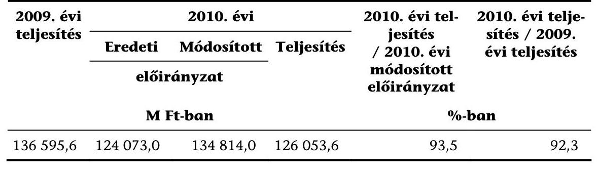

Az önkormányzatok részére a 2009. évről szóló költségvetési törvény 30 jogcímen 142 251,5 M Ft, a Kvtv. 20 jogcímen 124 073,0 M Ft összegben tartalmazott támogatási előirányzatot.

Az eredeti előirányzat 10 741,0 M Ft összegű növekedését két jogcím előirányzatának módosítása határozza meg. A Helyi szervezési intézkedésekhez kapcsolódó többletkiadások támogatása jogcím előirányzatának 4400,0 M Ft-tal történő módosítására Kormány hatáskörben került sor. A Települési önkormányzati szilárd burkolatú belterületi közutak burkolat felújításának támogatása (TEUT) jogcím esetében a 6341,0 M Ft összegű előirányzat módosításra az Áht. 101. § (13) bekezdésének megfelelően, az előző évi maradványból került sor.

---

Az előirányzat 2010. évi teljesülése az Önkormányzatok és jogi személyiségű társulásaik európai uniós fejlesztési pályázatai saját forrás kiegészítésének támogatása ( $40,9 \%$ ), az Óvodáztatási támogatás ( $64,7 \%$ ), a Lakossági víz- és csatornaszolgáltatás támogatása ( $74 \%$ ), illetve a Belterületi belvízrendezési célok támogatása ( $78,8 \%$ ) alulteljesülésével függ össze.

A központosított előirányzatok teljesülésében a Bérpolitikai intézkedések támogatása, amely a központosított előirányzatok éves felhasználásának 35,3\%-át adta (126 053,6 M Ft-ból 44470,7 M Ft), valamint a Helyi közösségi közlekedés támogatása, amelynek részaránya $28 \%$ ( $35293,3 \mathrm{M} \mathrm{Ft}$ ) a meghatározó.

A központosított előirányzatokon belül öt jogcím kivételével az éves teljesítés valamennyi (16) jogcímnél a módosított előirányzat alatt maradt.

A Kvtv. 5. számú melléklete tartalmazza részletezve a - helyi önkormányzatok által ellátandó egyes feladatok - felhasználási kötelezettséggel járó támogatásainak igénybevételi keretszabályait és összegeit. A melléklet jogcímenként megjelöli azokat a minisztériumokat és egyéb intézményeket, amelyeknek a támogatással összefüggésben rendeletalkotási kötelezettsége, illetve együttmúködési kötelezettsége van.

A rendeletalkotási kötelezettségnek valamennyi érintett minisztérium eleget tett, összesen 16 db miniszteri rendelet kihirdetésére került sor.

A Kvtv. alapján az ÖM-hez négy, a KvVM-hez egy, a KHEM-hez kettő, az SZMMhez egy, az OKM-hez nyolc jogcím szabályozási feladatai tartoztak.

A bérpolitikai intézkedések támogatása jogcím esetében az Országgyúlés felhatalmazta a Kormányt a felhasználás általános és sajátos szabályainak rendeleti úton történő megállapítására, amelynek a Kormány a 316/2009. (XII. 28.) Korm. rendelet megalkotásával eleget tett.

A rendeletalkotás Kvtv.-ben meghatározott határidejét 13 esetben nem tartották be az ágazati miniszterek. A rendeletek késedelmes megalkotása/kihirdetése miatt az érintett önkormányzatok számára a pályázatok elkészítésére, beadására rendelkezésre álló idő lerövidült.

A késedelem két esetben 1 hétnél kevesebb, nyolc esetben 2 hét és 1 hónap közötti volt, két esetben 2 hónap, egy esetben 3 hónap és egy esetben 3,5 hónapot meghaladó volt.

Az önkormányzatok - az Áht. 64/B. § (3) bekezdésében foglaltaknak megfelelően - támogatási igényeiket, pályázataikat a Kincstár Regionális Igazgatósága illetékes megyei szervezeti egységein (kincstári Igazgatóságok) keresztül jutatták el a támogatásokat elbíráló minisztériumokhoz.

A benyújtott igényléseket a kincstári Igazgatóságok szabályszerűségi szempontból megvizsgálták. A 2008. évtől a kincstári Igazgatóságok rendelkezésére áll a Kincstár Önkormányzati Főosztálya és az érintett minisztériumok által közösen kidolgozott egységes iránymutatás a központosított előirányzatokkal összefüggő pályázatok előzetes szabályszerűségi ellenőrzésének gyakorlatára vonatkozóan, ami alapján a kincstári Igazgatóságok egységes szempontok alapján végzik a felülvizsgálatot. Ennek ellenére előfordult (Helyi közösségi közlekedés támogatása,

---

Helyi szervezési intézkedésekhez kapcsolódó többletkiadások támogatása), hogy a minisztériumok - a szakmai ellenőrzés során - további hiánypótlást, pontosítást kértek az önkormányzatoktól.

A kincstári Igazgatóságok eleget tettek a szabályszerűségi felülvizsgálati feladataiknak.

Az Áht. 64/B. § (3) bekezdése alapján a kincstári Igazgatóságok - a támogatásról szóló jogszabály, illetve tájékoztató alapulvételével - a rendelkezésükre álló iratok, saját nyilvántartásuk, illetve helyszíni vizsgálat alapján szabályszerűségi szempontból megvizsgálták a támogatási igényeket, és szükség esetén, jogszabályban meghatározott rövid határidő kitűzésével hiánypótlásra, módosításra hívták fel az önkormányzatokat. Amennyiben az önkormányzatok a hiánypótlásra való felhívásnak nem tettek eleget, vagy nem megfelelően teljesítették azt, a kincstári Igazgatóságok a támogatási igényeket nem továbbították az elbírálásra jogosult szervnek és erről értesítették az önkormányzatokat.

A minisztériumoknál a pályázatok szakmai felülvizsgálatát az ágazati rendeletben meghatározott feltételek teljesítésére vonatkozóan, illetve a szakértők által kialakított bírálati szempontok alapján végezték el.

Az egyes jogcímek esetében az igen terjedelmes pályázatok (pl. a lakossági vízés csatornaszolgáltatás támogatása, a helyi szervezési intézkedésekhez kapcsolódó többletkiadások támogatása) felülvizsgálata, a döntés előkészítéssel kapcsolatos feladatok elvégzése a minisztériumok apparátusainak, a szabályszerűségi felülvizsgálat, a hiánypótoltatás a kincstári Igazgatóságoknak adott jelentős feladatot.

A központosított előirányzatokból az önkormányzatok egyrészt pályázat, másrészt igénylés alapján, valamint központilag rendelkezésre álló információk alapján részesültek.

# A központosított előirányzatok tizenegy jogcíménél pályázati úton ítélték oda a támogatást, ami 50,1\%-ot képviselt a központosított előirányzatok teljesített összegéből. 

A pályázati úton elnyerhető központosított előirányzatok jogcímeinek száma 2010-ben öttel csökkent a 2009. évi tizenhat jogcímhez képest, míg a folyósított támogatások részesedése ( $50,1 \%$ ) a teljesített kiadásokból 2,1\%-kal nőtt az előző évhez viszonyítva.

## A pályázat alapján folyósított támogatások ellenőrzési megállapításai a következők:

A Lakossági víz- és csatornaszolgáltatás támogatása előirányzat (4500,0 M Ft) az előző évivel megegyező volt. A támogatás igénybevételi, felhasználási szabályait az ágazati minisztérium - a Kvtv. előírásaihoz képest - három és fél hónap késedelemmel alkotta meg.

Az előirányzaton rendelkezésre álló 4500,0 M Ft-ból a KvVM 3500,0 M Ft felhasználását engedélyezte, mivel a vízkárelháritási védekezés finanszírozására 1000,0 M Ft összegű megtakarítást irányzott elő. Előirányzat-módosításra azonban sem Kormány, sem fejezeti hatáskörben nem került sor. Az ellenőrzésünk

---

# részére nem állt rendelkezésre olyan dokumentáció, ami alátámasztja és indokolja az 1000,0 M Ft „zárolását". Az előirányzat 1000,0 M Ft-tal történő csökkentésére jogszabályi felhatalmazás nélkül nem kerülhetett volna sor. 

Az NGM 2011. június 28 -ai észrevételében jelezte, hogy álláspontjuk szerint a „megoldás a közpénzek védelme és az államháztartási hiánycél megtartása érdekében történt."

A támogatás szabályozását tartalmazó ágazati rendelet előírta az önkormányzatok számára a támogatással való elszámolás határidejét a tényleges felhasználás alapján, meghatározta a támogatás-visszafizetés eseteit, a visszafizetendő öszszeg meghatározásának módját. A 2010. évi KvVM rendelet pontosan meghatározta az azonos vízbázishoz, illetve szennyvíztisztítóhoz tartozó települések támogatásának elszámolási szabályait, amely szerint a gesztor önkormányzat pályázata esetében a gesztornak települési önkormányzatonként kell a támogatással elszámolni. A pályázatok felülvizsgálata, a támogatások odaítélése és folyósítása megfelelt a 16/2010. (V. 13.) KvVM rendelet előírásainak.

A Kompok, révek fenntartásának, felújításának támogatása előirányzat (150,0 M Ft) az előző évivel megegyező volt. A támogatás igénybevételi, felhasználási szabályait az ágazati minisztérium - a Kvtv. előírásaihoz képest - három hónap késedelemmel alkotta meg. A támogatási célok között - a rendeletnek megfelelőn - első helyen szerepelt a vízi járművek biztonságos közlekedéséhez szükséges fejlesztések támogatása, ezt követte az átkelés működőképességét biztosító feltételek megteremtésének támogatása, az átkelésekhez vezető utak felújítása azonban továbbra sem volt támogatható. A támogatási szerződések megkötésére - az önkormányzatok pontatlan adatszolgáltatása miatt - késedelmesen került sor, így a támogatásban részesült önkormányzatok az ágazati rendeletben meghatározott határidőt követően kapták meg a támogatás összegét. A pályázatok felülvizsgálata, a támogatások odaítélése és folyósítása megfelelt a 43/2010. (V. 13.) KHEM rendelet előírásainak.

A Kiegészítő támogatás nemzetiségi nevelési, oktatási feladatokhoz előirányzatát (1050,0 Ft) a Kvtv. az előző évihez viszonyítva 50,0 M Ft-tal kevesebb összegben tartalmazta, a támogatott feladatok száma ugyanakkor nem változott. A támogatás igénybevételi, felhasználási szabályait az ágazati minisztérium a Kvtv.-ben előírt határidőhöz képest egy hónap késedelemmel tette közzé. A pályázatok felülvizsgálata, a támogatások odaítélése és folyósítása megfelelt a 15/2010. (III. 19.) OKM rendelet előírásainak.

A Könyvtári és közmúvelődési érdekeltségnövelő támogatás, múzeumok szakmai támogatása előirányzat ( 710,0 M Ft) az előző évivel megegyező volt. Mind a könyvtári, mind a közművelődési támogatás esetében a döntési javaslatok előkészítése, a támogatási összegek meghatározása a jogszabályi előírásoknak megfelelően történt. A döntéshozás során az oktatási és kulturális miniszter, illetve a nemzeti erőforrás miniszter jogköre behatárolt volt, mivel - az ágazati rendelet előírásainak megfelelően - a támogatás összege a helyi ráfordítások arányában került meghatározásra. Az önkormányzat csak abban az esetben nem részesült támogatásban, ha az általa benyújtott pályázat formailag nem felelt meg a 4/2004. (II. 20.) NKÖM rendelet előírásainak. A múzeumok szakmai támogatását szabályozó ágazati rendelet - a Kvtv.-ben előírt határidőhöz képest - közel egy hónap késedelemmel került kihirdetésre. Az ágazati rendelet - az ÁSZ előző években tett javaslatai alapján - már pontosan meghatározta a támogatás igénybevételéhez szükséges önerő mértékét. A támo-

---

gatási szerződések megkötésére késedelmesen került sor, így a támogatásban részesült önkormányzatok az ágazati rendeletben meghatározott határidőt követően - egy-másfél hónap késedelemmel - kapták meg a támogatás összegét. A Könyvtári és közművelődési érdekeltségnövelő és a múzeumok szakmai támogatásának esetében a pályázatok felülvizsgálata, a támogatások odaítélése és folyósítása megfelelt a 4/2004. (II. 20.) NKÖM rendelet és a 11/2010. (III. 11.) OKM rendelet előírásainak.

A Helyi szervezési intézkedésekhez kapcsolódó többletkiadások támogatása előirányzat (1900,0 M Ft) az előző évihez képest 3190,0 M Ft-tal (62,7\%-kal) kevesebbet tartalmazott. A támogatás igénybevételi, felhasználási szabályait az ágazati minisztérium a Kvtv.-ben előírt határidőben tette közzé. A központi költségvetés hozzájárulást biztosított a helyi önkormányzatoknak és a többcélú kistérségi társulásoknak - az általuk fenntartott közoktatási intézmények feladatellátásának racionálisabb megszervezése folytán felszabaduló közalkalmazotti létszám miatti, 2009. szeptember 30. napját követően hozott döntéseikhez kapcsolódó - a 2009. és 2010. évben esedékes jogszabályi kötelezettségeik teljesítéséhez.

A 2010. évben a támogatás igénybevételének feltételei változtak, igénylést - a korábbi évek pályázati feltételeitől eltérően - a 4/2010. (I. 26.) ÖM rendelet 2. § (2) bekezdése alapján csak a közoktatási intézményekben foglalkoztatottak jogviszonyának megszüntetésével kapcsolatosan lehetett benyújtani. Az igénylés keretében a - tényleges létszámcsökkentést megvalósító - munkaviszony megszüntetése miatt a jogszabályban előírt, kötelező mérték szerint megállapított és kifizetendő felmentési időre járó illetmény fele, a végkielégítés jogszabály szerinti teljes összege, valamint mindezek járulékai voltak támogathatók. Az öregségi nyugdíjban, a csökkentett összegű előrehozott öregségi nyugdíjban, a rokkantsági nyugdíjban, valamint a baleseti rokkantsági nyugdíjban részesülők esetében a felmentési időre járó illetmény fele, valamint ezen összeg járulékai voltak támogathatóak. A 2010. évi támogatási előirányzat nyújtott fedezetet a PéPtv. szerinti munkáltatói kifizetések támogatására is. Az igénylések felülvizsgálata, a támogatások odaítélése és folyósítása megfelelt a 4/2010. (I. 26.) ÖM rendelet előírásainak.

Az Önkormányzatok és jogi személyiségú társulásaik európai uniós fejlesztési pályázatai saját forrás kiegészítésének támogatása jogcímen biztosított előirányzat ( $10600,0 \mathrm{MFt}$ ) az előző évihez képest 6000,0 M Ft-tal ( $36 \%$-kal) kevesebbet tartalmazott. A támogatás igénybevételi, felhasználási szabályait az ágazati minisztérium - a Kvtv. előírásaihoz képest - közel két hét késedelemmel alkotta meg. A 2010. évben új EU Önerő Alap támogatási szerződés kizárólag azon beruházásokat érintően volt köthető, amelyek esetén az uniós forrásról szóló - legalább első körös - uniós támogatói döntés a 2009. évben megszületett, azonban az uniós támogatási szerződés megkötésére csak a 2010. évben került sor. A támogatás igénybevételének további feltétele volt, hogy a pályázat fejlesztési célú legyen és a pályázó vagyonának gyarapodását eredményezze, a fejlesztés ne kezdődjön meg, vagy ha a fejlesztés megvalósítása folyamatban van, annak múszaki-pénzügyi lezárására az EU Önerő Alap támogatási igény benyújtását követő 60 napon belül ne kerüljön sor. A támogatás folyósítása az uniós támogatások folyósításához igazodva, a közremüködő szervezetek igazolása alapján, teljesítményarányosan utólag történt. A pályázatok felülvizsgálata, a támogatások odaítélése és folyósítása megfelelt a 8/2010. (II. 26.) ÖM rendelet előírásainak.

---

A Helyi közösségi közlekedés támogatása előirányzat ( $35240,0 \mathrm{M}$ Ft) az előző évivel megegyező volt. A támogatás igénybevételi, felhasználási szabályait az ágazati minisztérium a Kvtv.-ben előírt határidőhöz képest két hét késedelemmel tette közzé. A 2010. évben az előző évhez képest nem változott a helyi közösségi közlekedés támogatás igénylésének szabályozása. Támogatásra az önkormányzatok az Európai Közösségek Tanácsának 1370/2007/EK rendelete alapján megállapított, a helyi közlekedési közszolgáltatás ellátása során felmerülő tárgyévet megelőző évi - veszteség erejéig pályázhattak. Ezen túlmenően a Kvtv. alapján a Fővárosi Önkormányzat 2010. évi támogatása nem lehetett kevesebb a 2009. évinél, de nem haladhatta meg a veszteség mértékét. (A Fővárosi Önkormányzat esetében a helyi közlekedési közszolgáltatás támogatása nem azonos feltételek szerint jár, mint a többi önkormányzat tekintetében.) A 2010. évben is az előző évhez hasonlóan - az önkormányzatok részére megítélt támogatás folyósítása nem egy összegben, hanem 2010. szeptember hónaptól havi részletekben történt, a megítélt támogatás és az év közben igénybe vett előleg figyelembe vételével. A pályázatok felülvizsgálata, a támogatások odaítélése és folyósítása megfelelt a 33/2010. (IV. 16.) KHEM-ÖM együttes rendelet előírásainak.

Az alapfokú múvészetoktatás támogatása jogcímen biztosított előirányzat ( $460,0 \mathrm{M}$ Ft) az előző évihez képest 400,0 M Ft-tal ( $46,5 \%$-kal) kevesebbet tartalmazott. A támogatás igénybevételi, felhasználási szabályait az ágazati minisztérium a Kvtv.-ben előírt határidőhöz képest három hét késedelemmel tette közzé. A 2010. évben az alapfokú művészetoktatási intézmények fenntartói a támogatást elsősorban a hátrányos helyzetű tanulók száma alapján igényelhették, tekintettel arra, hogy ezek a tanulók a Közokt. tv. 117. § (2) bekezdése alapján mentesülnek a térítési díjfizetési kötelezettség alól. A támogatás elsődlegesen ennek kompenzálására szolgált mind a minősített, mind a minősítéssel nem rendelkező, mind a Waldorf iskolák kerettanterve alapján nevelő és oktató iskolák fenntartói esetében. A pályázatok felülvizsgálata, a támogatások odaítélése és folyósítása megfelelt a 18/2010. (IV. 7.) OKM rendelet előírásainak.

A bölcsődék és közoktatási intézmények infrastrukturális fejlesztése, valamint közösségi buszok beszerzése előirányzat ( $4350,0 \mathrm{M}$ Ft) az előző évihez képest $250,0 \mathrm{M}$ Ft-tal ( $6 \%$-kal) többet tartalmazott. Az előirányzatból a bölcsődék és közoktatási intézmények infrastrukturális fejlesztéseire a települési önkormányzatok, az intézményi társulások és a többcélú kistérségi társulások, a közösségi buszok beszerzésére a többcélú kistérségi társulások igényelhettek támogatást. A támogatás igénybevételi, felhasználási szabályait az ágazati minisztérium - a Kvtv. előírásait betartva - határidőre alkotta meg. Az önkormányzati miniszter és a nyertes pályázók a támogatási szerződéseket az ágazati rendeletben előírt határidőre megkötötték. A pályázatok felülvizsgálata, a támogatások odaítélése és folyósítása megfelelt az 1/2010. (I. 19.) ÖM rendelet előírásainak.

A Belterületi belvízrendezési célok támogatása jogcím előirányzata (50,0 M Ft) az előző évihez viszonyítva 450,0 M Ft-tal ( $90 \%$-kal) kevesebbet tartalmazott. A Kvtv. alapján a 2011. évre 3000,0 M Ft-ig vállalható kötelezettség. A támogatás igénybevételi, felhasználási szabályait az ágazati minisztérium - a Kvtv. előírásait betartva - határidőre alkotta meg. Az önkormányzati miniszter és a nyertes pályázók a támogatási szerződéseket az ágazati rendeletben előírt határidőre megkötötték. A pályázatok felülvizsgálata, a támogatások odaítélése és folyósítása megfelelt az 5/2010. (I. 28.) ÖM rendelet előírásainak.

A Kvtv. a Települési önkormányzati belterületi közutak felújításának, korszerűsítésének támogatása jogcímen a Kvtv. eredeti előirányzatot nem

---

tartalmazott, a 6341,0 M Ft összegű előirányzat módosításra az Áht. 101. § (13) bekezdésének megfelelően, az előző évi maradványból került sor. Az előirányzat a 2009. évben megkötött támogatási szerződések 2010. évi ütemére nyújtott fedezetet. A pályázatok felülvizsgálata, a támogatások odaítélése és folyósítása megfelelt a 85/2009. (IV. 10.) Korm. rendelet előírásainak.

# A központosított előirányzatok kilenc jogcíménél az önkormányzatok részére igénylés alapján nyújtottak támogatást. Ezek az előirányzatok 49,8\%-kal részesedtek a központosított előirányzatok 2010. évi teljesítési összegéből. 

Az igénylés alapján juttatott központosított előirányzatok jogcímeinek száma eggyel csökkent a 2009. évi tíz jogcímhez képest, míg a folyósított támogatások részesedése $(49,8 \%)$ a teljesített kiadásokból $7,8 \%$-kal nőtt az előző évhez viszonyítva.

## Az igénylés alapján folyósított támogatások ellenőrzési megállapításai a következők:

A Lakossági közmúfejlesztés támogatása előirányzat (1350,0 M Ft) az előző évivel megegyező volt. A 2010. évben az előző évekhez képest nem történt változás a támogatás igénylésére vonatkozó szabályokban. A 2010. évi lakossági közműfejlesztés támogatása kétféle támogatásmértéken és - a közműfejlesztési hozzájárulás megállapítási időpontjától függően - háromféle feltételrendszeren alapult, melyet az önkormányzatoknak egyszerre kellett figyelembe venniük és alkalmazniuk a támogatási igénylések befogadásakor és a központi támogatás igénylésekor. A támogatás igénylése, folyósításának rendje megfelelt a 73/1999. (V. 21.) Korm. rendelet, a 110/2002. (V. 14.) Korm. rendelet és a 262/2004. (IX. 23.) Korm. rendelet előírásainak.

Az Özdi martinsalak felhasználása miatt kárt szenvedett lakóépületek tulajdonosainak kártalanítása előirányzat ( 300,0 M Ft) az előző évihez képest 100,0 M Ft-tal ( $25 \%$-kal) kevesebbet tartalmazott. Az OKF a támogatási igények jogszerűségét az ózdi martinsalak felhasználásával készült lakóépületek tulajdonosainak kárenyhítéséről szóló 40/2003. (III. 27.) Korm. rendelet előírásainak megfelelően felülvizsgálta. A támogatás igénylése, döntési mechanizmusa megfelelt a 40/2003. (III. 27.) Korm. rendelet előírásainak.

Az érettségi és szakmai vizsgák lebonyolításának támogatása előirányzata ( 780,0 M Ft) az előző évihez képest 790,0 M Ft-tal (50,3\%-kal) kevesebbet tartalmazott. A támogatás igénybevételi, felhasználási szabályait az ágazati minisztérium a Kvtv.-ben előírt határidőt követően, két hét késedelemmel tette közzé. A támogatás igénylése, döntési mechanizmusa megfelelt a 16/2010. (III. 30.) OKM rendeletben előírtaknak.

Az Esélyegyenlőséget, felzárkóztatást segítő támogatások előirányzata (5148,0 M Ft) az előző évihez képest 545,0 M Ft-tal (11,8\%-kal) többet tartalmazott. Az előirányzatból a képesség-kibontakoztató, integrációs felkészítés, óvodai fejlesztő program szervezésének támogatására, az integrációs rendszerben részt vevő intézményekben dolgozó pedagógusok anyagi támogatására, valamint a sajátos nevelési igényű tanulók tankönyvtámogatására, a felzárkóztató oktatás támogatására, a szakközépiskola tizenegy-tizenkettedik évfolyamán az iskolai gyakorlati oktatás támogatására, a Halmozottan Hátrányos Helyzetű Tanulók Arany János Kollégiumi-Szakiskolai és a Hátrányos Helyzetű Tanulók Arany János Kollégiumi program támogatására, a nem magyar állampolgár tanköteles

---

tanulók oktatásának támogatására, a tartós gyógykezelés alatti oktatás támogatására, az iskolapszichológusi-hálózat fejlesztésének támogatására, a pedagógiai szakszolgálatok szervezéséhez, továbbá a pedagógus szakvizsgához és továbbképzéshez igényelhettek az önkormányzatok támogatást. A támogatás igénybevételi, felhasználási szabályait az ágazati minisztérium a Kvtv.-ben előírt határidőt követően, két hét késedelemmel tette közzé. A támogatás igénylése, folyósításának rendje megfelelt az 5/2010. (I. 29.) OKM rendelet és a 17/2010. (III. 30.) OKM rendelet előírásainak.

A Közoktatási informatikai fejlesztési feladatok támogatása előirányzat (4000,0 M Ft) az előző évihez képest 2700,0 M Ft-tal (40,3\%) kevesebbet tartalmazott. Az előirányzat a szakmai és informatikai fejlesztésekre nyújtott fedezetet. A támogatás igénybevételi, felhasználási szabályait az ágazati minisztérium a Kvtv.-ben meghatározott határidőhöz képest két hónap késedelemmel tette közzé. A támogatás igénylése, folyósításának rendje megfelelt a 21/2010. (V. 13.) OKM rendelet előírásainak.

A Gyermekszegénység elleni program keretében nyári étkeztetés biztosítása előirányzat (2400,0 M Ft) az előző évivel megegyező volt. A támogatást azok a települési önkormányzatok igényelhették, amelyek vállalták, hogy 2010. június 16-tól 2010. augusztus 31-éig, legalább 44 munkanapig folyamatosan, napi egyszeri meleg-étkeztetést biztosítanak a szociálisan rászoruló gyermekek részére. A támogatás igénybevételi, felhasználási szabályait az ágazati minisztérium a Kvtv.-ben előírt határidőhöz képest 5 nap késedelemmel alkotta meg. A támogatás igénylése, folyósításának rendje megfelelt a 11/2010. (IV. 20.) SZMM rendelet előírásainak.

Az Új Tudás-Műveltség Program keretében a pedagógusok anyagi ösztönzését szolgáló támogatások jogcím előirányzata (5240,0 M Ft) az előző évihez képest 1975,0 M Ft-tal (27,4\%-kal) kevesebbet tartalmazott. A támogatásokat a helyi önkormányzatok az általuk fenntartott közoktatási intézményekben közalkalmazotti jogviszonyban foglalkoztatott pedagógusok differenciált anyagi ösztönzéséhez igényelhették. A támogatás igénybevételi, felhasználási szabályait az ágazati minisztérium a Kvtv.-ben előírt határidőt követően, két hét késedelemmel tette közzé. A támogatás igénylése, folyósításának rendje megfelelt az 5/2010. (I. 29.) OKM rendelet és a 13/2010. (III. 19.) OKM rendelet előírásainak.

Az Óvodáztatási támogatás jogcím előirányzata (760,0 M Ft) az előző évivel megegyező volt. Az óvodáztatási támogatás a rendszeres gyermekvédelmi kedvezményben részesülő gyermek szülőjének jár, akinek óvodáztatási támogatásra való jogosultságát a gyermekek védelméről és a gyámügyi igazgatásról szóló 1997. évi XXXI. törvény 20/C. §-a és a gyámhatóságokról, valamint a gyermekvédelmi és gyámügyi eljárásról szóló 149/1997. (IX. 10.) Korm. rendelet 68/F. §-a alapján megállapították. A támogatás igénylése, folyósításának rendje megfelelt az 1997. évi XXXI. törvény és a 149/1997. (IX. 10.) Korm. rendelet előírásainak.

A Bérpolitikai intézkedések támogatása jogcím előirányzata (45 000,0 M Ft) az előző évihez képest 19 022,5 M Ft-tal (73,2\%-kal) többet tartalmazott. A támogatási igény felmérését, a folyósítás és az elszámolás rendjét a költségvetési szerveknél foglalkoztatottak 2009. évi havi kereset-kiegészítéséről szóló 6/2009. (I. 20.) Korm. rendelet és a költségvetési szerveknél foglalkoztatottak 2010. évi eseti kereset-kiegészítéséről szóló 316/2009. (XII. 28.) Korm. rendelet szabályozta. A 2009. december havi kereset kiegészítési támogatás igénylése és folyósításának rendje megfelelt a 6/2009. (I. 20.) Korm. rendelet előírásainak.

---

A 2010. évi támogatás igénylése a 316/2009. (XII. 28.) Korm. rendelet előírásainak megfelelően történt, azonban a rendelet nem tartalmazta a bruttó körbe tartozó OEP finanszírozású költségvetési szervek egészségügyi feladat ellátásában részt vevő intézmények körét. Ebből adódóan ki kellett javítani a szakfeladatokra történő besorolást és rendezni kellett a támogatás elosztását.

A Kincstár 2011. június 22-ei észrevételében jelezte, hogy „a 316/2009. (XII. 28.) Korm. rendelet szabályozásának hiányossága következményeként a Kincstár csak a támogatás folyósítása után - aránytalan leterheléssel, időráfordítással - tudta helyesbíteni az egyes egészségügyi intézmények dolgozói esetén a megfelelő szakfeladatra történő besorolást."

A 2010. évi eseti kereset-kiegészítési támogatás fedezetbiztosításának megosztása a IX. Helyi önkormányzatok támogatásai és átengedett személyi jövedelemadója fejezet és az E. Alap között a 2010. év során - 2,8 M Ft-ot kivéve - utólag rendezésre került. A 2011. év során a 2,8 M Ft összeg rendezése folyamatban van.

A központosított előirányzatok egy jogcíménél - a határátkelőhelyek fenntartásának támogatása - pályázat és igénylés nélkül, a központilag rendelkezésre álló információk alapján biztosították a támogatást az önkormányzatok részére. Az előző évihez viszonyítva a pályázat és igénylés nélkül nyújtott támogatások jogcímeinek a száma négyről egyre változott, a teljesített összes kiadásból a folyósított támogatások aránya 10\%-ról 0,1\%-ra csökkent. A támogatás mértékének megállapítása és folyósítása - az ellenőrzött esetekben - a Kvtv. 5. számú melléklet 4. pontjában foglaltaknak megfelelően történt.

# 1.2.6. A helyi önkormányzatok múködőképességének megőrzését szolgáló kiegészítő támogatások 

| 2009. évi teljesítés | 2010. évi |  |  | 2010. évi teljesítés / 2010. évi módosított előirányzat | 2010. évi teljesítés / 2009. évi teljesítés |
| :--: | :--: | :--: | :--: | :--: | :--: |
|  | Eredeti | Módosított | Teljesítés |  |  |
|  | elöirányzat |  |  |  |  |
|  | M Ft-ban |  |  | \%-ban |  |
| 16 232,2 | 11650,0 | 11651,3 | 10741,7 | 92,2 | 66,2 |

Az Ötv. 87. § (1) bekezdése szerint működőképessége védelme érdekében kiegészítő állami támogatás illeti meg az önhibáján kívül hátrányos helyzetben lévő települési önkormányzatokat. A támogatás igénybevételi feltételeit a Kvtv. 6. számú melléklete tartalmazza. A címhez tartozó 3 előirányzat sajátosságainak megfelelően a nemzetgazdasági miniszter vagy a belügyminiszter dönt a támogatás odaítéléséről.

### 1.2.6.1. Önhibájukon kívül hátrányos helyzetben lévő települési önkormányzatok támogatása

A Kvtv. az ÖNHIKI eredeti előirányzataként 10 150,0 M Ft-ot tartalmaz. A módosított előirányzat 5651,3 M Ft. A 4498,7 M Ft összegű előirányzat csökkenés fejezeti hatáskörben - az ÖNHIKI-ről más előirányzat javára, illetve az

---

ÖNHIKI-re más előirányzat terhére - történő átcsoportosításból ered, amely megfelel a Kvtv. vonatkozó előírásainak.

Az ÖNHIKI teljesítése 4828,3 M Ft volt, ami az eredeti előirányzatnál (10 150,0 M Ft) 52,4\%-kal, a módosított előirányzatnál (5651,3 M Ft) 14,6\%kal, a 2009. évi teljesítésnél (9915,2 M Ft) 51,3\%-kal alacsonyabb.

A Kvtv. alapján ÖNHIKI támogatást a múködési forráshiányból és az önkormányzati kötelező feladatok alacsony szintű ellátási képességéből eredően az önhibájukon kívül hátrányos helyzetben levő települési önkormányzatok igényelhettek. E támogatást csak azok az önkormányzatok igényelhették, amelyek a normatívan képződő forrásokon túl a saját források maximális feltárása és a kiadások lehetséges csökkentésére tett intézkedések mellett sem képesek a kötelező önkormányzati feladatok ellátására.

A Kvtv. 2010. február 28-ai határidővel Módszertani útmutató elkészítését írta elő a pénzügyminiszter számára az önkormányzattól elvárható bevételek és az elismerhető kiadások számításához. A PM a jogszabályi határidőt betartva 2010. február 25-én - küldte meg az Útmutatót a kincstári Igazgatóságok részére.

Az Útmutató részletesen tartalmazta az igénylés összeállításának, benyújtásának feltételeit. Az önkormányzatok tárgyév április 26 -áig, illetve szeptember 30 -áig nyújthatták be az igénylést a kincstári Igazgatóságokon keresztül a PM/NGM-be. Az igényléshez szöveges indokolást és a Kvtv.-ben előírt dokumentumokat kellett csatolni. A második ütemben - főszabályként - az az önkormányzat igényelhetett támogatást, amelyik az első ütemben ezt nem tette meg.

A kincstári Igazgatóságok ellenőrzését követően az igénylések további felülvizsgálatát a PM/NGM végezte. Ennek keretében ellenőrizték az igénylések törvényi előírásoknak való megfelelését, a kizáró feltételek figyelembe vételét, illetve a csatolt mellékletek meglétét, az adatok valódiságát és egyezőségét.

A pénzügyminiszter/nemzetgazdasági miniszter a támogatásról a Kvtv.-ben előírt határidőt betartva - 2010. július 15 -én, illetve november 29 -én - hozta meg döntését. Ennek alapján a 2010. évben az első támogatási ütemben 572 önkormányzatból 467 önkormányzat kapott 4120,8 M Ft támogatást, a második ütemben 152 önkormányzatból 122 önkormányzat kapott 707,5 M Ft támogatást.

A második ütem 122 támogatott önkormányzata közül 95 az első ütemben is kapott támogatást, így a 2010. évben összesen 494 önkormányzat részesült támogatásban.

A Kvtv. értelmében az első alkalommal megállapított támogatás átutalására a nettó finanszírozás keretében - a közzététel hónapjáig időarányosan járó támogatásra szólóan, az előleggel korrigálva egy összegben, a további részre vonatkozóan havi ütemezésben kerül sor. A tárgyév szeptember 30 -áig benyújtott igénylés alapján megállapított kiegészítő támogatás átutalása a közzétételt követően, soron kívül történt. A Kvtv. 64. § (5) bekezdése értelmében a támogatás utalványozása az ÖM/BM feladata. A 2010. évben az ÖNHIKI támogatások

---

utalványozásának, utalásának gyakorlata megfelelt a jogszabályi előírásoknak.

A Kvtv. alapján az önkormányzatoknak lehetőségük volt a tárgyévi kiegészítő támogatás terhére 2010. február 5-éig, illetve március 5-éig finanszírozási előleget igénybe venni. Az igénybe vett előlegről az önkormányzatok 2010. május 31-éig mondhattak le írásban. A 2010. évben 313 önkormányzat nyújtott be összesen 3810,0 M Ft összegben előleg-igénylést. A 2010. évben - a lemondások figyelembevételével - 259 önkormányzat összesen 2783,3 M Ft összegben vett fel finanszírozási előleget.

Az önkormányzat által igényelt előleg összege nem haladhatta meg az önkormányzat részére 2009. évben folyósított kiegészítő támogatás összegének 70\%-át. Azon önkormányzatok esetében, amelyek a 2009. évben nem igényeltek kiegészítő támogatást, az előleg az önkormányzat költségvetési rendeletében meghatározott múködési célú hitel összegének legfeljebb 50\%-a lehetett.

Az előleg folyósításától a lemondás időpontjáig igénybe vett előleget a 2009. évi átlagos jegybanki alapkamat kétszeresével növelten, a nettó finanszírozás keretében kellett elszámolni. Mind az igénybevételi, mind a lemondási szándékot - az Igazgatóságokon keresztül - az ÖM/BM felé kellett jelezni.

Az előleg igénylésének és a lemondásnak a 2010. évi gyakorlata megfelelt a Kvtv. előírásainak.

A Kvtv. alapján az önkormányzatoknak lehetőségük volt - az Igazgatóságokon keresztül - részletfizetés iránti kérelmet benyújtani a Kincstár elnökének, azzal a feltétellel, hogy a részletfizetés legfeljebb a 2010. év végéig volt engedélyezhető. A Kincstár elnöke a részletfizetési kérelemről hozott döntéséről - a Kvtv.-ben előírtaknak megfelelően - értesítette a BM-et. 124 önkormányzat 1199,2 M Ft összegben kapott részletfizetési lehetőséget.

A nemzetgazdasági miniszter - a Kvtv.-ben előírt határidőt betartva - az előirányzat felhasználásról az Országgyűlés Önkormányzati és Területfejlesztési Bizottságát 2011. február 28-áig tájékoztatta.

# 1.2.6.2. Állami támogatás a tartósan fizetésképtelen helyzetbe került helyi önkormányzatok adósságrendezésére irányuló hitelfelvétel visszterhes kamattámogatására, az adósságrendezés alatt múködési célra igényelhető támogatásra, valamint a pénzügyi gondnok díjára 

A Kvtv. ezen költségvetési soron 100,0 M Ft eredeti előirányzatot tartalmaz. A 2010. évi teljesítés $13,4 \mathrm{M}$ Ft, amely az eredeti előirányzatnál 86,6\%-kal alacsonyabb, a 2009. évi teljesítésnek (amely 6,0 M Ft volt) több mint 2-szerese.

A Kvtv. értelmében - a helyi önkormányzatok adósságrendezési eljárásáról szóló 1996. évi XXV. törvény, valamint a törvény végrehajtásának egyes kérdéseiről szóló 95/1996. (VII. 4.) Korm. rendeletnek megfelelően - állami támogatás adható a tartósan fizetésképtelen helyzetbe került helyi önkormányzatok adósságrendezésére irányuló hitelfelvétel visszterhes kamattámogatására, az adósságrendezés alatt működési célra, valamint a pénzügyi gondnok díjára.

---

A tartósan fizetésképtelen helyzetbe került helyi önkormányzatok támogatására a 2010. évben öt igénybejelentés érkezett az ÖM/BM-be, amelynek felülvizsgálatát követően Biri Község Önkormányzata 1,4 M Ft, Kisnamény Község Önkormányzata 2,5 M Ft, Tiszavalk Község Önkormányzata 3,0 M Ft, Selyeb Község Önkormányzata 3,0 M Ft, valamint Magyardombegyház Község Önkormányzata 3,5 M Ft - négy esetben a pénzügyi gondnok díjára és egy esetben az adósságrendezési eljárás időtartama alatt forráshiányból eredő jelentős ellátóképesség-csökkenés ellensúlyozására szolgáló - támogatásban részesült.

A Szabolcs-Szatmár-Bereg Megyei Bíróság a Biri Község Önkormányzata ellen indított adósságrendezési eljárást 2009. december 9-én kelt végzésével, a Szabolcs-Szatmár-Bereg Megyei Bíróság Kisnamény Község Önkormányzata ellen indított adósságrendezési eljárást 2009. december 11-én kelt végzésével, a Borsod-AbaújZemplén Megyei Bíróság Tiszavalk Község Önkormányzata ellen indított adósságrendezési eljárást 2009. december 15-én kelt végzésével, valamint a Borsod-Abaúj-Zemplén Megyei Bíróság Selyeb Község Önkormányzata ellen indított adósságrendezési eljárást 2010. október 13-án kelt végzésével - a hitelezők és az adós között létrejött egyezségre figyelemmel - befejezettnek nyilvánította. Az adott bíróság az eljárást befejező végzéssel egyidejűleg a helyi önkormányzatok adósságrendezési eljárásáról szóló 1996. évi XXV. tv. 25. § (4) bekezdése értelmében a pénzügyi gondnokot felmentette tisztsége alól és megállapította a díját, amelynek mértékét az e törvény 33. § (1) bekezdése szerint a mindenkori éves költségvetési törvény határozza meg. A Kvtv. 6. sz. mellékletének 2.3. pontja alapján a 2010. évben a pénzügyi gondnok díjának összege - az áfa-val együtt legalább $0,8 \mathrm{M} \mathrm{Ft}$, legfeljebb $3,0 \mathrm{M} \mathrm{Ft}$ lehetett.

A Békés Megyei Bíróság 2010. szeptember 9-én hozott végzésével adósságrendezési eljárást indított Magyardombegyház Község Önkormányzata ellen. A Kvtv. 6. sz. mellékletének 2.2. pontja forrást biztosít azon önkormányzatok részére, amelyek ÖNHIKI támogatásban nem részesültek és az adósságrendezés megindítását követően, az adósságrendezési eljárás időtartama alatt a forráshiányból eredő jelentős ellátóképesség-csökkenés ellensúlyozására kívánják igénybe venni. Magyardombegyház Község Önkormányzata benyújtotta a támogatás iránti kérelmét az ÖNHIKI igénybevételéhez szükséges nyomtatványokon. A benyújtott űrlapok adatait a Kincstár Dél-Alföldi Regionális Igazgatósága felülvizsgálta és megtette összegszerű javaslatát. A belügyminiszter mindezek figyelembevételével Magyardombegyház Község Önkormányzata számára 3,6 M Ft támogatást hagyott jóvá 2010. december 21-én.

Az ÖM/BM a támogatás odaítélését illetően a vonatkozó jogszabályi előírásoknak megfelelően járt el.

A támogatásokat a helyi önkormányzatok adósságrendezési eljárásáról szóló 1996. évi XXV. törvény végrehajtásának egyes kérdéseiről szóló 95/1996. (VII. 4.) Korm. rendelet 9. § (2) bekezdése alapján az illetékes Igazgatóságoknál vezetendő elkülönített letéti számlákra utalták.

# 1.2.6.3. A müködésképtelen helyi önkormányzatok egyéb támogatása 

A Kvtv.-ben a müködésképtelen helyi önkormányzatok egyéb támogatásának eredeti előirányzata 1400,0 M Ft, módosított előirányzata 5900,0 M Ft volt. A 4500,0 M Ft előirányzat növekedés egy előirányzat átcsoportosításából ered. Az előirányzatokat a jogszabályi előírásoknak megfelelően módosították.

---

A 2010. évi teljesítés 5900,0 M Ft volt, ami az eredeti előirányzat (1400,0 M Ft) több mint 4-szerese, a módosított előirányzattal egyező volt, a 2009. évi teljesítéshez ( 6311,0 M Ft) képest 6,5\%-kal maradt el.

A támogatás azon települési önkormányzatok, továbbá a megyei önkormányzatok részére adható, amelyek múködőképessége az ÖNHIKI alapján igénybe vehető támogatások mellett nem biztosítható. A Kvtv. alapján a helyi önkormányzatoknak az önkormányzati miniszter/belügyminiszter visszatérítendő, vagy viszsza nem térítendő támogatást adhat, amelyet célhoz, feladathoz is köthet. A támogatás az ÖNHIKI-vel el nem ismert, az önkormányzatok kötelező feladataival összefüggő múködési kiadásokhoz igényelhető. Az igényelhető támogatás összege - a rendkívüli és előre nem tervezhető esetek kivételével - nem haladhatja meg az önkormányzat költségvetési rendeletében elfogadott múködési célú, éven belüli hitelek ÖNHIKI-vel csökkentett összegét.

Az önkormányzati miniszter számára a támogatás igényléséhez és felhasználásához Útmutató elkészítését írta elő a Kvtv. 2010. február 10-i határidővel, amely az előírt határidőn túl, 2010. február 12-én lépett hatályba.

A múködésképtelen helyi önkormányzatok egyéb támogatásával kapcsolatos döntés-előkészítési feladatokról szóló 3/2010. (II. 12.) ÖM utasítás tartalmazta az igénylés kötelező mellékleteként beküldendő adatlapokat, valamint kellő részletességgel tartalmazta a kitöltésükhöz szükséges információkat.

Az utasítás és az útmutató értelmében „támogatás ugyanazon helyi önkormányzat részére adott költségvetési éven belül csak egyszeri alkalommal javasolható, kivéve, ha különös méltánylást érdemlő körülmény áll fenn". A 2010. évben támogatott önkormányzatok között 506 az év során egynél többször kapott támogatást. Az 506 önkormányzatból 409 önkormányzat kétszer, 93 önkormányzat háromszor, 4 önkormányzat - Csernely, Felsőrajk, Géberjén, Tiszabura - négyszer is részesült ezen támogatásban.

A 2009. évben támogatott önkormányzatok között 577 volt, amely az év során egynél többször kapott támogatást. Az 577 önkormányzatból 454 önkormányzat kétszer (ebből jégkár miatt csak 4 önkormányzat), 118 önkormányzat háromszor (ebből jégkár miatt csak 15 önkormányzat), 5 önkormányzat négyszer kapott támogatást.

A támogatási kérelmek benyújtása év közben - a kincstári Igazgatóságokon keresztül - folyamatos volt. A kincstári Igazgatóságok a szabályszerűségi vizsgálatot követően továbbították az igényléseket az ÖM/BM felé. A kérelmek ÖM/BM-be való beérkezésének utolsó határideje 2010. november 27. volt a jóváhagyott támogatások tárgyévi felhasználhatósága érdekében.

Az utasítás értelmében a támogatás összegéről az önkormányzati miniszter/belügyminiszter - az előre nem látható, soron kívüli döntést igénylő esetek kivételével - három ütemben döntött.

A 2010. évben a Kvtv. 6. sz. mellékletének 3. pontjában meghatározott a múködésképtelen helyi önkormányzatok egyéb támogatása előirányzatból 1434 önkormányzat igényelt támogatást. Közülük 1334 részesült támogatásban, ami az igénylő önkormányzatok 93\%-a. Az igényelt támogatási összeg

---

összesen 58 659,0 M Ft volt, amelyből a felülvizsgálatot követően 5900,0 M Ftot hagyott jóvá az önkormányzati miniszter/belügyminiszter.

A 2010. évben 12 önkormányzat részesült visszafizetendő támogatásban összesen 179,6 M Ft összegben. A visszatérítendő támogatások befizetési határideje 2012. december 31.

A 2009. évben 77 önkormányzat részesült visszafizetendő támogatásban összesen 411,3 M Ft összegben. Közülük 3 önkormányzat még 2009-ben visszafizette a támogatást, 61 önkormányzatnak - a belügyminiszter engedélyével - elengedték a visszafizetendő támogatást ( 362,8 M Ft összegben). 11 önkormányzat határidőben, 2010. május 31-ig és 1 önkormányzat határidőn túl fizette vissza a támogatást. Tiszacsege önkormányzat 2,0 M Ft összegű visszatérítendő támogatását a helyszíni ellenőrzés lezárásáig nem rendezte. A BM észrevételében jelezte, hogy Tiszacsege Önkormányzat a 2011. évi ÖNHIKI támogatás I. ütemére benyújtott pályázatában kérte a korábban megítélt 6/3-as visszatérítendő támogatás elengedését.

A miniszteri döntést követően az ÖM/BM által készített önkormányzatonkénti utalványozási lista alapján a Kincstár folyósította a 2010. évi támogatási összegeket.

A belügyminiszter - a Kvtv.-ben előírt határidőt betartva - az előirányzat felhasználásról az Országgyúlés Önkormányzati és Területfejlesztési Bizottságát 2011. február 28-áig tájékoztatta.

A 2010. évi támogatások odaítélése és utalása vonatkozásában a támogatási kérelmek nyilvántartása, a döntések előkészítése és a támogatási összegek folyósítása a jogszabályi előírásoknak megfelelően történt.

# 1.2.7. A helyi önkormányzatok által fenntartott, illetve támogatott előadó-múvészeti szervezetek támogatása 

| 2009. évi teljesítés | 2010. évi |  |  | 2010. évi teljesítés / 2010. évi módosított előirányzat | 2010. évi teljesítés / 2009. évi teljesítés |
| :--: | :--: | :--: | :--: | :--: | :--: |
|  | Eredeti | Módosított | Teljesítés |  |  |
|  | elöirányzat |  |  |  |  |
|  | M Ft-ban |  |  | \%-ban |  |
| 13 870,1 | 11885,4 | 11885,4 | 11885,4 | 100 | 85,7 |

A Kvtv. 44. § (1) bekezdésének b) pontjában az Országgyúlés felhasználási kötöttséggel járó állami támogatást állapít meg az előadó-művészeti szervezetet fenntartó, illetve támogató helyi önkormányzatok részére a Kvtv. 7. számú mellékletében meghatározott feltételek szerint. A melléklet 5 fajta színházi támogatást és egy-egy fajta zenekari, illetve énekkari támogatást nevesít.

A 2010. évben megváltozott a színházak támogatási rendszere, igazodva az Emtv. által előírt, a 2010. évtől hatályba lépő finanszírozási konstrukcióhoz. Az előadó-művészeti szervezeteket az Emtv.-ben meghatározott feltételek szerint, kategóriákba kellett sorolni. A besorolásnál döntő szerepe volt az éves előadás szá-

---

moknak, az új bemutatók számának és a saját előadások arányának. Mindezek alapján a színházak I-V. kategóriába, a zenekarok és énekkarok I-II. kategóriába sorolhatók. A besorolás határozta meg az állami támogatás összegét.

Az I-II. kategóriába besorolt színházak, bábszínházak fenntartói ösztönző részhozzájárulása jogcímen 23 önkormányzat 42 színházának múködésére 4980,7 M Ft állt rendelkezésre.

Az I-II. kategóriába besorolt színházak, bábszínházak múvészeti ösztönző részhozzájárulása jogcímen 23 önkormányzat 42 színháza múködésére 4980,8 M Ft támogatást kaptak.

A III. kategóriába besorolt balett és táncegyüttesek költségvetési támogatása jogcímen 53,0 M Ft támogatásban részesült 2 megyei jogú város színháza.

A IV. kategóriába besorolt színházak, bábszínházak költségvetési támogatása jogcímen 365,0 M Ft-ban részesült 5 megyei és a fővárosi bábszínház.

Az V. kategóriába besorolt szabadtéri színházak, etnikai kisebbségi színházak pályázati támogatása jogcímen összesen 330,0 M Ft volt, amelyből a szabadtéri színházak esetében 11 önkormányzat $260,0 \mathrm{M}$ Ft, a nemzetiségi színházaknál 4 önkormányzat 70,0 M Ft támogatásban részesült.

A támogatásokat az ÖM utalványozása alapján a Kincstár a nettó finanszírozás keretében folyósította az érintett önkormányzatok részére.

# A 2010. évben megszűnt a központosított előirányzatok között eddig 

önálló jogcímen szereplő helyi önkormányzatok hivatásos zenekari és énekkari támogatása. A múködést szolgáló támogatás részben beépült az előadói-művészeti szervezetek támogatását tartalmazó 7. számú mellékletbe, részben az OKM fejezetben kapott önálló jogcímet. A szaktárca fejezetébe került át a független színházak és a kiemelt művészeti célok támogatása.

A Kvtv. ezen a jogcímen 1175,9 M Ft eredeti előirányzatot tartalmazott, amelylyel a teljesítés megegyezett.

A Kvtv. alapján a támogatás, valamint a pályázat igénylésének, döntési rendszerének, folyósításának és elszámolásának részletes szabályait az oktatási és kulturális miniszternek 2010. február 25-éig rendeletben kellett szabályoznia.

A rendeletalkotást az OKM Művészeti Főosztálya 2010 januárjában megkezdte, de a rendelet megjelenésére két hét késedelemmel került sor, amelyet az OKM-en belüli és a tárcaközi egyeztetések elhúzódása okozott.

A rendeletalkotási kötelezettségének az oktatási és kulturális miniszter késedelmesen tett eleget, az általa kiadott 14/2010. (III. 19.) OKM rendelet hatálybalépésének időpontja 2010. március 20. volt. A pályázatok elkészítésére rendelkezésre álló idő - a rendelet késedelmes megalkotása miatt - lerövidült. A rendelet az igénylések beadásának határidejéül 2010. március 24 -ét jelölte meg.

A hivatásos zenei előadó-művészeti szervezetek pályázataikat a helyi önkormányzatokhoz papír alapon és elektronikusan 2010. március 14-éig nyújtották be. A helyi önkormányzatok a beérkezett pályázatokat március 24 -éig küldték

---

meg a kincstári Igazgatóságok részére, és ezzel egyidejúleg elektronikus úton továbbították az OKM részére.

A benyújtott igénylések szabályszerűségi felülvizsgálatát - az Áht. 64/B. § (3) bekezdése alapján - a kincstári Igazgatóságok elvégezték és véleményükkel együtt 2010. április 1-jéig továbbították az OKM részére.

A támogatások odaítélése az Előadó-művészeti Iroda által megküldött 2009. évi regisztrációs adatok, továbbá a 2010. évi önkormányzati támogatások felhasználásával, a Kvtv. 7. számú mellékletében megjelölt szorzószámok alkalmazásával történt.

Az I. kategóriába besorolt zenekarok központi költségvetési támogatása jogcímen 12 önkormányzat 15 zenekara összesen 1070,1 M Ft támogatást kapott.

Az I. kategóriába besorolt énekkarok központi költségvetési támogatása jogcímen 3 megyei jogú város önkormányzatának az énekkara összesen 105,8 M Ft támogatásban részesült.

A 14/2010. (III. 19.) OKM rendelet alapján a minisztérium megküldte az ÖM részére az I. kategóriába sorolt zenekarok és énekkarok listáját. Ezzel egyidejúleg tájékoztatta az érintett önkormányzatokat és az előadó-művészeti szervezeteket.

A megítélt támogatás felét (587,95 M Ft) március hónapban, a másik felét (587,95 M Ft) július hónapban a BM utalványozása alapján utalta ki a Kincstár.

A támogatások igénylése és folyósítása megfelelt a Kvtv. 7. számú melléklet és az Emtv. előírásainak.

# 1.2.8. Normatív, kötött felhasználású támogatások 

| 2009. évi teljesítés | 2010. évi |  |  | 2010. évi teljesítés / 2010. évi módosított előirány-zat | 2010. évi teljesítés / 2009. évi teljesítés |
| :--: | :--: | :--: | :--: | :--: | :--: |
|  | Eredeti | Módosított | Teljesítés |  |  |
|  | elöirányzat |  |  |  |  |
|  | M Ft-ban |  |  | \%-ban |  |
| 216 627,6 | 181739,8 | 168 573,0 | 241 114,7 | 143 | 111,3 |

A Kvtv. 43. § (2) bekezdése szerint az Országgyűlés felhasználási kötöttséggel járó normatív állami támogatást állapít meg a helyi önkormányzatok és a többcélú kistérségi társulások részére a Kvtv. 8. számú mellékletében meghatározott feltételek szerint. A támogatás csak a mellékletben előre meghatározott támogatási célnak megfelelően használható fel. A címhez 4 alcím, azon belül 7 jogcímcsoport tartozik. A normatív, kötött felhasználású támogatások forrása költségvetési támogatás, illetve átengedett személyi jövedelemadó.

---

A teljesítést a módosított előirányzathoz viszonyítva a következő tényezők befolyásolták: az önkormányzatok 2010. évi feladatmutatóit érintő lemondások és pótigénylések összege, aminek egyenlege $333,3 \mathrm{M}$ Ft volt.

A nem helyi önkormányzat részére történt évközi feladat átadás miatti előirányzat csökkenés $0,1 \mathrm{M}$ Ft volt.

A kormányhatáskörben az 1208/2009. (XII. 11.) és az 1064/2010. (III. 16.) határozatokkal végrehajtott módosítások - Az egyes jövedelemptóló ellátások és az önkormányzat által szervezett közcélú foglalkoztatás támogatása - jogcímet érintették, amely alapján 13 500,0 M Ft előirányzat csökkenés történt.

A feladatmutatókhoz kötött normatív hozzájárulásokat és egyes, a 8. számú mellékletben szereplő normatív támogatásokat részletesen, önkormányzatonként, többcélú kistérségi társulásokként és jogcímenként a feladatmutatók és mutatószámok alapján a pénzügyminiszter és az önkormányzati miniszter a 6/2010. (I. 28.) PM-ÖM együttes rendeletben tette közzé.

A normatív, kötött felhasználású támogatások folyósítása a legtöbb jogcímnél igénylés alapján történt. Amennyiben az adott támogatás szerepelt a 6/2010. (I. 28.) PM-ÖM együttes rendeletben, úgy a normatív kötött támogatások folyósítása nem igénylés, hanem felmérés alapján - a lakosságszámhoz, illetve feladatmutatókhoz kötötten - történt. A támogatás mértékének megállapítása és folyósítása a 2010. évben a Kvtv. előírásainak megfelelően történt.

# 1.2.8.1. Kiegészítő támogatás egyes közoktatási feladatokhoz 

A Kvtv. ezen az alcímen 3470,1 M Ft eredeti előirányzatot és 3516,0 M Ft módosított előirányzatot tartalmazott. A teljesítés $3516,0 \mathrm{M}$ Ft volt, ami az eredeti előirányzatot $1,3 \%$-kal haladja meg és a módosított előirányzattal megegyezett.

Az előirányzat módosítások a feladatmutatókról történt lemondásokkal (43,5 M Ft), a pótigényekkel ( $89,4 \mathrm{M} \mathrm{Ft}$ ), továbbá a helyi önkormányzatok egymás közötti feladatátvételekor/átadásakor keletkezett változásokkal voltak összefüggésben.

### 1.2.8.2. Egyes szociális feladatok támogatása

A Kvtv. ezen az alcímen 113 741,4 M Ft eredeti előirányzatot tartalmazott, a módosított előirányzat $100240,4 \mathrm{M}$ Ft, a teljesítés $172782,1 \mathrm{M}$ Ft volt, ami az eredeti előirányzatot $51,9 \%$-kal és a módosított előirányzatot $72,4 \%$-kal haladta meg.

Az alcím támogatásaihoz tartoznak az egyes jövedelempótló ellátások és az önkormányzat által szervezett közcélú foglalkoztatás, valamint a szociális továbbképzés és szakvizsga. A támogatás a Kvtv. által meghatározott különféle szociális segélyek és azokhoz kapcsolódó kifizetések 75-100\%-ának önkormányzatok általi - differenciált mértékű - visszaigénylésére szolgált.

---

# 1.2.8.3. A többcélú kistérségi társulások támogatása 

A Kvtv. ezen a címen 29 459,2 M Ft eredeti előirányzatot tartalmazott, a módosított előirányzat $29747,5 \mathrm{M}$ Ft, ami az eredeti előirányzattal közel azonos, a teljesítéssel megegyezik.

A támogatási forma megoszlása a következő: általános feladatok támogatása 3697,1 M Ft, közoktatási feladatok támogatása $16070,8 \mathrm{M}$ Ft, szociális, gyermekgondozási és gyermekjóléti feladatok támogatása $7048,0 \mathrm{M} \mathrm{Ft}$, mozgókönyvtári és egyes közmúvelődési feladatok támogatása $1911,0 \mathrm{M}$ Ft, belső ellenőrzési feladatok támogatása 1020,6 M Ft.

A támogatások elszámolása a normatív állami hozzájárulásokkal azonos eljárás alapján és feladatonként történt. A Társulások döntési jogköre érvényesült az egyes feladatokra jutó támogatás más feladatokra történő felhasználása során.

### 1.2.8.4. A helyi önkormányzatok hivatásos tűzoltóságok támogatása

A Kvtv. ezen a címen 35 069,1 M Ft eredeti előirányzatot tartalmazott, amely megegyezik a módosított előirányzattal és a teljesítéssel.

### 1.2.9. Felhalmozási célú támogatások

### 1.2.9.1. Címzett és céltámogatások

| 2009. évi teljesítés | 2010. évi |  |  | 2010. évi teljesítés / 2010. évi módosított előirányzat | 2010. évi teljesítés / 2009. évi teljesítés |
| :--: | :--: | :--: | :--: | :--: | :--: |
|  | Eredeti | Módosított | Teljesítés |  |  |
|  | elöirányzat |  |  |  |  |
| M Ft-ban |  |  |  | \%-ban |  |
| 3778,2 | 950,0 | 950,0 | 657,3 | 69,2 | 17,4 |

A Cct. alapján az önkormányzatok címzett támogatást igényelhetnek a céltámogatási körben nem támogatható vízgazdálkodási, egészségügyi fekvő- és járóbeteg-szakellátási célú, szociális, közoktatási és kulturális önkormányzati térségi, vagy jogszabály által elfogadott országos, illetve törvényben meghatározott fővárosi, megyei szakmai fejlesztési programba foglalt önkormányzati feladatok ellátását szolgáló, kiemelt fontosságú, 250,0 M Ft feletti beruházási összköltségű önkormányzati beruházások, továbbá a szennyvízelvezetést és tisztítást szolgáló, 1,0 Mrd Ft feletti összköltségű beruházások megvalósítására.

A Magyar Köztársaság 2008. évi költségvetéséről szóló 2007. évi CLXIX. tv. 92. §a alapján 2010-ben az Országgyűlés nem nyújtott címzett támogatást új induló beruházásokhoz. Ennek oka, hogy Magyarország a 2007. és 2013. évek között az EU kohéziós politikája keretében 22,4 Mrd EUR, illetve az Európai Mezőgazdasági és Vidékfejlesztési Alapból további mintegy 3,0 Mrd EUR fejlesztési forrásra jogosult, így lehetőség nyílik többek között a korábban címzett támogatással megvalósuló beruházási célok uniós forrásokból történő finanszírozására is.

---

A Cct. 8. sz. melléklete az egészségügyet, a működő kórházakat és szakrendelők gépműszer beszerzéseit jelöli meg támogatható célként a 2010-2012. évekre. A céltámogatás nyújtása - az igények rangsorolását követően - a megvalósíthatósági tanulmány alapján meghatározott szakmai, műszaki és pénzügyi szempontból legkedvezőbb változat szerinti költség alapján történik. A Cct. 4. § (1) bekezdése értelmében céltámogatás $50,0 \mathrm{M} \mathrm{Ft}$, illetve az $50,0 \mathrm{M} \mathrm{Ft}$ alatti beruházási összköltségű önkormányzati beruházások megvalósításához igényelhető.

A 2010. évben 2 önkormányzat kapott összesen 61,1 M Ft céltámogatást beruházásra.

A Cct. 17. § (2) bekezdése alapján a beruházó önkormányzatnak finanszírozási szerződést kellett kötnie a Kincstárral. A Kincstár a központi támogatást a támogatási cél teljesítését igazoló, ki nem egyenlített számla alapján hívhatja le 2011. december 31-éig a támogatási arányok betartásával. A Kincstár a jogszabályoknak megfelelően az egyik támogatott önkormányzattal már megkötötte a finanszírozási szerződést, míg a másik önkormányzattal - az önkormányzat hibájából - eddig még nem jött létre a finanszírozási szerződés.

A címzett és céltámogatások finanszírozásának rendje megfelel a vonatkozó jogszabályi és kincstári belső utasítások előírásainak.

A megvalósítást követő ellenőrzésről a helyi önkormányzatok címzett és céltámogatása felhasználásának részletes szabályairól szóló 19/2005. (II. 11.) Korm. rendelet 14. § (9) bekezdése 2010. február 27-éig úgy rendelkezett, hogy az ÖM és - az ÖM koordinálásával - a szakminisztériumok a támogatás rendeltetésszerű felhasználását ellenőrizhetik, ez azonban nem jelentett ellenőrzési kötelezettséget.

A 2008. évi zárszámadási ellenőrzés során is jeleztük, hogy átgondolásra érdemes azon szervezetekhez rendelni az ellenőrzési lehetőséget, amelyek szakmai szervezetként javaslatot tesznek a támogatásra. Az ÁSZ javaslatot fogalmazott meg a nemzeti fejlesztési és gazdasági miniszter részére, hogy kezdeményezze a Regionális Egészségügyi Tanács és a Területi Víz-gazdálkodási Tanács Címzett és céltámogatások rendeltetésszerű felhasználásának ellenőrzésébe történő bevonását annak érdekében, hogy az ÖM és a szakminisztériumok mellett, szakmai szervezetek is elvégezzék a teljesítések igazolását. A javaslatot indokoltnak találták és módosították a 19/2005 (II. 11.) Korm. rendelet 14. §-ának (9) bekezdését, amely szerint „A szakminiszter, a Regionális Egészségügyi Tanács és a Területi Vízgazdálkodási Tanács, továbbá az Igazgatóságok az igénylés (megvalósíthatósági tanulmány, beruházási koncepció, igénybejelentés, illetve a kapcsolódó egyéb dokumentumok) és az elszámolás szabályszerűségét, valamint - az Igazgatóságok kivételével - a támogatás rendeltetésszerú felhasználását ellenőrzik. Az ellenőrzés eredményéről tájékoztatják az önkormányzatot, javaslatot tehetnek a hiányosságok megszüntetésére, kezdeményezhetik, hogy a képviselő-testület tárgyalja meg az ellenőrzés tapasztalatait." A módosítás 2010. február 27-étől lépett hatályba.

---

# 1.2.9.2. Vis maior tartalék 

| 2009. évi teljesítés | 2010. évi |  |  | 2010. évi teljesítés / 2010. évi módosított elöirányzat | 2010. évi teljesítés / 2009. évi teljesítés |
| :--: | :--: | :--: | :--: | :--: | :--: |
|  | Eredeti | Módosított | Teljesítés |  |  |
|  | elöirányzat |  |  |  |  |
|  | M Ft-ban |  |  | \%-ban |  |
| 682,6 | 1100,0 | 5443,7 | 4793,9 | 88,1 | 702,3 |

Az Országgyűlés a Kvtv. 44. § (1) bekezdésének d) pontjában felhasználási kötöttséggel járó állami támogatást állapított meg vis maior tartalék címen a helyi önkormányzatok részére. A támogatás célja az egyes természeti károkból adódó indokolt és szükséges védekezési kiadások megtérítése, valamint az önkormányzati tulajdonban lévő építményekben a vis maior események okozta károk helyreállítása.

A Kvtv. 91. § (1) bekezdésének d) pontjában kapott felhatalmazása alapján a Kormány a 8/2010. (I. 28.) rendeletében határozta meg a vis maior tartalék felhasználásának részletes szabályait.

A rendelet 3. § (4) bekezdése alapján az önkormányzatok és a többcélú kistérségi társulások az előre nem látható, váratlan esemény bekövetkezésétől, illetőleg védekezési kiadások esetén - a védekezés megkezdésétől számított 5 munkanapon belül bejelentést tesznek a vis maior eseményről a 8/2010. (I. 28.) Korm. rendelet 1. sz. melléklete szerinti adatlapon, illetve elektronikus úton.

A rendelet 1. §-ának (3) bekezdése szerint a benyújtott igények alapján a vis maior tartalék felhasználásáról a helyi önkormányzatokért felelős miniszter döntött.

A 2010. május-júniusi rendkívüli időjárás miatt a Kormány veszélyhelyzetet hirdetett. A rendkívüli időjárás különösen Borsod-Abaúj-Zemplén megye településeit érintette. Az ajkai térségben október 4-én bekövetkezett vörösiszap-katasztrófa miatt a Kormány ismét vészhelyzet kihirdetéséről döntött. Az önkormányzatoknál jelentős védekezési kiadások merültek fel (Kolontár, Devecser és Somlóvásárhely településeken). A vörösiszap-katasztrófához kapcsolódóan három önkormányzat részére 175,0 M Ft, majd a 2010. év során további 385,0 M Ft összegű előleg került folyósításra.

Az önkormányzatok támogatási kérelmeiket a kincstári Igazgatóságokhoz nyújtották be, amelyek megvizsgálták a kérelmeket.

Az Áht. 64/B. § (3) bekezdése értelmében a kincstári Igazgatóság - a támogatásról szóló jogszabály, illetve a tájékoztató alapulvételével - a rendelkezésre álló iratok, saját nyilvántartása alapján szabályszerűségi szempontból megvizsgálja a támogatási igényt, és szükség esetén, jogszabályban meghatározott rövid határidő kitűzésével hiánypótlásra hívta fel az önkormányzatot. Amennyiben az önkormányzat a hiánypótlásra való felhívásnak nem tett eleget, vagy nem megfelelően teljesítette azt, a Kincstár a támogatási igényt nem továbbította az elbírálásra jogosult szervnek és erről értesítette az önkormányzatot.

---

A 2010. évben a vis maior tartalék cím előirányzat terhére az ÖM/BM-hez 1852 igényt nyújtottak be (a BM 2011. május 26 -ai adatszolgáltatása alapján), amelyből 1584 önkormányzati kérelemre összesen 8774,4 M Ft támogatás került jóváhagyásra, amelyből a 2010. évben 4793,9 M Ft-ot folyósítottak.

A helyi önkormányzatok vis maior tartalék támogatására vonatkozó szabályozási rend a Kincstárnál és az ÖM-nél megfelel a vonatkozó jogszabályoknak és a belső utasítások előírásainak, a támogatás igénylése és folyósítása a jogszabályoknak megfelelően történt.

# 1.2.10. Budapest 4-es - Budapest Kelenföldi pályaudvar-Bosnyák tér közötti - metróvonal építésének támogatása 

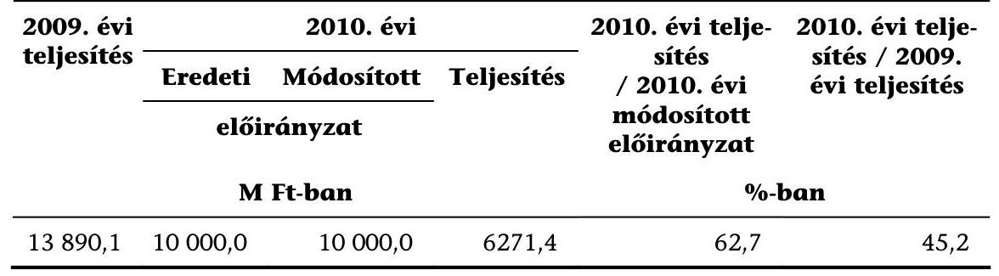

A Kvtv. 9. számú mellékletének 6. pontja szerint a budapesti 4-es - Budapest Kelenföldi pályaudvar-Bosnyák tér közötti - metróvonal megépítésének állami támogatásáról szóló 2005. évi LXVII. törvény szerinti építési feladatok finanszírozási szerződésben foglalt arányos támogatás folyósítása céljából túlléphető az előirányzat.

Az előirányzat alulteljesítésének oka, hogy a projekt megvalósítása nem a tervezett ütemterv szerint haladt. Az I. szakasz elkészülésének és átadásának határideje - az NGM által a Kormány részére 2011 februárjában készített jelentés alapján - 2013. második vagy harmadik negyedéve.

A metrótörvény 2. § (1) bekezdése az Állam által a Budapest Főváros Önkormányzata (Főváros) részére a budapesti 4-es metróvonal megépítéséhez nyújtott támogatás maximális összegét 2002. évi áron, áfa nélkül, összesen 208 869,6 M Ft-ban határozta meg. Az esetlegesen felmerülő többletköltségeket a Magyar Állam és a Budapest Főváros Önkormányzata között létrejött - a budapesti 4-es metróvonal Budapest Kelenföldi pályaudvar és Budapest Keleti pályaudvar közötti szakasza közös finanszírozásáról 2004. január 19-én megkötött, 2005. június 18-án módosított - szerződés (Finanszírozási Szerződés) szerint nem az Államnak, hanem a Fővárosnak kell finanszíroznia.

A Kormány 2008. július 2-ai ülésén döntött a 4-es metró projekt uniós finanszírozás iránti kérelmének Európai Bizottsághoz történő benyújtásáról. Az Európai Bizottság 2009. szeptember 2-án létrejött döntése alapján a metró projekt I. szakasza a Kohéziós Alapból 728,0 M EUR forráshoz jutott.

Az NGM által 2011 februárjában a Kormány részére készített jelentés alapján a beruházás folyó áron számított költsége 370 178,0 M Ft.

---

Az I. szakasz tervezett projektköltsége - a 2008. december 12-én megkötött Támogatási Szerződés ${ }^{133}$ szerinti - 353 766,0 M Ft-ról 370 178,0 M Ft-ra történő növekedésének okai a következők:

- 2009 májusában a Kohéziós Alapnak benyújtott kérelemben az elszámolható költség összege csökkentésre került, mivel az EU Bizottság 11 szerződést nem elszámolhatónak minősített. A nem elszámolhatónak minősített szerződések költségtúllépési kockázatának felmérése alapján további 6805,2 M Ft általános tartalék került megképzésre;
- A Kohéziós Alapnak 2009-ben benyújtott kérelem kidolgozásának időszakában javasolt tervezési árfolyam (248,0 HUF/EUR) a 2010. évi központi költségvetés tervezésekor 270,9 HUF/EUR-ra emelkedett. Ez utóbbi tervezési árfolyam került alkalmazásra a projektköltség felülvizsgálatakor;
- A projektköltségek felülvizsgálata során figyelembe vételre kerültek a szerződésmódosítások, a szerződések lezárásai, valamint a mérnökáron tervezett tételeknél a megkötött szerződések hatásai.

A budapesti 4-es - Budapest Kelenföldi pályaudvar-Bosnyák tér közötti - metróvonal megépítésének állami támogatásáról szóló 1059/2005. (VI. 4.) Korm. határozat értelmében a 4-es metró beruházója a Főváros 100\%-os tulajdonában lévő Budapesti Közlekedési Részvénytársaság. A határozat tartalmazza a projektköltségek arányosítását, azaz a Főváros vállalja, hogy a projektköltség 21,02197\%-át maga finanszírozza.

A metrótörvény 4. §-a alapján az Állam által vállalt támogatási kötelezettség folyóáras összegét, valamint az állami támogatás felhasználásának állami kontrolljára fordítandó összeget a 2006-2010. évekre vonatkozó éves költségvetési kiadásként elő kell irányozni a IX. Helyi önkormányzatok támogatása és átengedett személyi jövedelemadója (korábban: IX. Helyi önkormányzatok támogatása) fejezetben.

A 1059/2005. (VI. 4.) Korm. határozat 6. pontja értelmében a projekt teljes lebonyolítása a Magyar Államkincstáron keresztül történik, amit a Budapest 4-es metróvonal beruházás finanszírozásának eljárásrendjéről szóló 17/2007. sz. 2007. november 13-án hatályba lépett - Elnöki Utasítás szabályoz. Az uniós forrás megjelenése egy új eljárásrend kidolgozását tette szükségessé, amely figyelembe veszi a megváltozott finanszírozási feltételeket. 2010. december 31-én lépett hatályba az 54/2010. sz. a Budapest 4-es metróvonal beruházás finanszírozásának eljárásrendjéről szóló kincstári Elnöki Utasítás.

Az uniós források bevonásával 2008-ban a finanszírozás ketté vált. A 2004-ben szabályozott finanszírozás - az Állam és a Főváros által biztosított forrás - mellett megjelentek a Kohéziós Alap és az ahhoz kapcsolódó, a főváros által nyújtott for-

[^0]
[^0]:    ${ }^{133}$ Az Európai Unió Kohéziós Alapjából és az Operatív Program hazai központi költségvetési előirányzatából származó támogatásnak a budapesti 4. sz. metróvonal I. szakasz (Kelenföldi pályaudvar - Keleti pályaudvar) és kapcsolódó felszíni beruházásai megvalósításának finanszírozására való felhasználásáról Budapest Főváros Önkormányzata mint kedvezményezett, valamint a Nemzeti Fejlesztési Ügynökség mint támogató között 2008. december 12-én létrejött szerződés.

---

rás keretében finanszírozott beruházási elemek is. Az eredeti finanszírozás keretében csak az Unió által el nem ismert költségek finanszírozása valósulhatott meg. Mindezek alapján - a 4-es metró kivitelezésével és finanszírozásával összefüggésben - az eddigiektől eltérő módon szükséges eljárni a finanszírozási folyamatban.

Az ellenőrzésünk megállapította, hogy a BM-nek az utalvány elkészítésekor szakmai vagy pénzügyi (a IV. negyedév kivételével) szempontból a 2010. évben sem volt ellenőrzési lehetősége. A helyzetből adódóan a BM nem tett eleget a Kvtv. 64. § (5) bekezdésében meghatározott ellenőrzési kötelezettségének, amelyet a jogszabály a IX. Helyi önkormányzatok támogatásai és átengedett személyi jövedelemadója fejezet vonatkozásában számára előír. Továbbá - az előzőekben leírtakra tekintettel - a 2010. évben sem érvényesíthette utalványozási felelősségét, mivel - a korábbi évekkel egyezően - a finanszírozási folyamatra sem rálátása, sem befolyása nem volt. Az ÁSZ ezt a hiányosságot a 2006., a 2007., a 2008. és a 2009. évi zárszámadás ellenőrzése során is jelezte, változás azonban nem történt.

A 2010. IV. negyedévétől az utalvány kiállítása érdekében - a BM kérésére - a Kincstár Támogatásokat Kezelő Főosztálya (TKF) megküldte az utalványhoz tartozó számlamásolatokat, így a finanszírozás ellenőrzése pénzügyi szempontból megtörtént. (2010. III. negyedévig ez nem történt meg.)

A 2010. évben a Kincstár negyedévente küldött tájékoztatást a BM-nek az adott időszakban teljesített kifizetésekről. Mivel a tájékoztatás nem állt a BM rendelkezésére minden olyan napon, amikor pénzforgalmi tranzakció történt, az utalványok és a kifizetések naprakész egyeztetése nem történt meg.

Az ellenőrzésünk megítélése szerint a Budapest 4-es metróvonal beruházásának előirányzata kezelését és a teljesítés ellenőrzését azon fejezet kötelezettségei között kell megjeleníteni, amely fejezet a beruházás szakmai megvalósításáért felelős. Ez a fejezet azonban nem a BM, annak ellenére, hogy a metrótörvény 4. $\S$-a alapján az Állam által vállalt támogatást költségvetési kiadásként a IX. Helyi önkormányzatok támogatása és átengedett személyi jövedelemadója (korábban: IX. Helyi önkormányzatok támogatása) fejezetben kell előirányozni. A változtatásra a metrótörvény módosításával van lehetőség. Az ÁSZ ezt a 2006., a 2007., a 2008. és a 2009. évi zárszámadás ellenőrzése során is jelezte, azonban a törvény módosítása a 2010. évet érintő ellenőrzés lezárásáig sem történt meg.

A BM által készített utalványok a 2010. évben tartalmilag és formailag eleget tettek a 292/2009. (XII. 19.) Korm. rendelet 78. § (2) bekezdésében foglaltaknak, azonban - a korábbi évekhez hasonlóan - továbbra sem tartalmazták a kincstári ellenjegyző aláírását.

A Kincstár által vezetett 2010. évi nyilvántartás, amely alátámasztja az utalványon szereplő összeget, áttekinthető.

A kincstári kifizetések, illetve elszámolások analitikával való alátámasztottsága teljes körű. A Kincstár TKF Ügyrendje világosan és egyértelműen rögzíti az ellenőrzési nyomvonalat. Ezen költségvetési sorra vonatkozó kincstári belső ellenőrzésre a 2009. évben került sor.

---

A kincstári belső ellenőrzés javasolta, hogy a munkavégzés folyamatában az ellenőrzés dokumentálása, illetve az eljárásrend aktualizálása történjen meg. A Kincstár TKF vezetője elkészítette intézkedési tervét és megtette a szükséges intézkedéseket annak végrehajtása érdekében.

A Kincstár - a BKV Zrt.-vel kötött szerződés alapján - valamennyi szerződést, számlát, az ahhoz tartozó teljesítésigazolást, a forrásrészletezést minden lehívás kezdeményezésekor megkapott a beruházótól. A Kincstárban rendelkezésre álló dokumentációk alapján a Kincstár minden esetben ellenőrizte a beküldött dokumentumok szabályszerűségét, a forrásmegosztás arányát. Ezután kérte a BMtől a forrás biztosítását. A szerződésnek megfelelően a Kincstár a számlatulajdonost összevont és tételes számlakivonattal értesítette minden olyan napon, amikor a számlán pénzforgalmi tranzakció történt, illetve minden hónap 10-éig az előző hónap összevont kimutatásával. A 2010. évben a Kincstár valamennyi beérkezett lehívásnál - a beérkező szerződések, számlák ellenőrzése, illetve a számlatulajdonos tájékoztatása vonatkozásában - a szerződésben leírtak alapján járt el. A Kincstár által teljesített kifizetések szerződésekkel, számlákkal alátámasztottak.

Az 17/2007. sz. kincstári Elnöki Utasítás 4. pontjában foglalt előírásokkal összhangban az 500,0 M Ft feletti kifizetéseket minden esetben a Likviditási Bizottság engedélyezte.

A metrótörvény 2. § (2) bekezdése értelmében a kontrollpozíció gyakorlását segítő szakértői szolgáltatás igénybevételére az Állam az állami támogatásból évente legfeljebb 50,0 M Ft összeget használhat fel. Ebből a keretből - a korábbi évekhez hasonlóan - a 2010. évben sem történt felhasználás.

A metrótörvény 2. § (2) bekezdése értelmében a tárgyévben fel nem használt részt a tárgyévet követő két hónapon belül az Állam a Főváros számára a budapesti 4-es metróvonal megépítéséhez nyújtandó állami támogatásként igénybe vehetővé teszi.

Az NGM 2011. május 25 -én írásban történt tájékoztatása szerint a 4-es metró beruházás I. szakasza döntő részének finanszírozása uniós forrásból történik és az uniós intézményrendszer szigorú kontrolljai érvényesülnek. A Fővárosi Közgyűlés döntése értelmében a Főváros a projekt II. szakaszát egyelőre nem kívánja megvalósítani. Az ellenőrzés lezárásakor fennálló helyzetből adódóan az NGM álláspontja, hogy az állami szakértő beszerzése nem indokolt. Az NGM álláspontját elfogadhatónak tartjuk.

A budapesti 4-es - Budapest Kelenföldi pályaudvar-Bosnyák tér közötti - metróvonal megépítésének állami támogatásáról szóló 1059/2005. (VI. 4.) Korm. határozat 9. pontjában a Kormány megbízta a KEHI elnökét, hogy a beruházás megvalósítását ellenőrizze, és évente egy alkalommal jelentést tegyen a Kormány részére. A 10. pontban felhívta a pénzügyminisztert, a gazdasági és közlekedési minisztert, hogy félévente adjanak tájékoztatást a Kormány részére a budapesti 4-es metró-projekt előrehaladásáról. A 2010. évben a pénzügyminiszter/nemzetgazdasági miniszter eleget tett a jogszabályi előírásoknak és teljesítette jelentéstételi kötelezettségét. Az NGM 2011. május 26-án írásban történt tájékoztatása szerint a KEHI 2010-ben nem folytatott vizsgálatot a 4-es metró témában, amelyet a Kincstár és a BM is megerősített.

---

A KEHI 2011. 08. 05-ei észrevételében jelezte, hogy a 2010. évi ellenőrzési tervükben „a 4-es metróval kapcsolatos ellenőrzés nem szerepelt. ... az 1059/2005. (VI. 04.). Korm. határozatban a Kormányzati Ellenőrzési Hivatal részére előirt ellenőrzési kötelezettségét a Hivatal 2010. előtt rendszeresen teljesítette, azonban a Korm. határozatban megjelöltek szerinti ellenőrzés lefolytatására a továbbiakban nincs kormányzati elvárás, a KEHI már korábban kezdeményezte a Korm. határozat 9. pontjának hatályon kívül helyezését."

A GKM 2008. május 15 -én szétvált két jogutód intézményre: a KHEM-re, illetve az NFGM-re. A számvevőszéki ellenőrzés megállapítása szerint - amelyet már a 2008. és 2009. évi zárszámadás ellenőrzésekor is jelzett - a 1059/2005. (VI. 4.) Korm. határozat 10. pontjának pontosítására lett volna szükség, amely előírja, hogy mely jogutód intézmény felelős a metró beruházással kapcsolatos jelentéstételi kötelezettségért. A Magyar Köztársaság minisztériumainak felsorolásáról szóló 2010. évi XLII. tv. és az 1136/2010. (VI. 29.) Korm. határozat alapján az NFGM jogutód intézménye az NGM, míg a KHEM jogutód intézménye az NFM. A felelősség kérdése a helyszíni ellenőrzés lezárásáig továbbra sem tisztázott.

A Finanszírozási Szerződés 9.2. pontjában a Főváros kötelezettséget vállalt arra, hogy a BKV Zrt. a közbeszerzési eljárás előkészítésének megkezdése előtt írásban megküldi az Állam részére a tervezett beszerzés tárgyának meghatározását. A Főváros kötelezettséget vállalt arra is, hogy a BKV Zrt. a közbeszerzési eljárás eredményeként kötött szerződést megküldi az Állam részére. Az Állam és a Főváros közötti szerződésben foglaltaknak megfelelően a BKV Zrt. a 2010. évben tervezett beszerzések dokumentációját, illetve egy megkötött szerződésmódosítást megküldte az Állam részére, melyekkel kapcsolatban az Állam kifogást nem emelt.

A Finanszírozási Szerződés ezen módosítása a korábbinál nagyobb lehetőséget ad ugyan az állami kontroll érvényesülésére, de a jelenlegi szerződéses struktúra továbbra is a kontroll szűk körű szintjét teszi csak lehetővé. A módosított Finanszírozási Szerződés 9.3. pontja értelmében az Állam még mindig nem emelhet kifogást a 9.2. pont szerint megküldött szerződést illetően a beszerzés tárgyának meghatározásával kapcsolatos rendelkezésével szemben, ha az lényegében megegyezik a tervezett beszerzés tárgyával.

A Finanszírozási Szerződés szerint:
„amennyiben az Állam jogosulatlanul emel kifogást, az szerződésszegésnek minősül, és következményeiért felel. Ennek keretében különösen:

- a Főváros által az Állami Támogatás helyett a Projektköltségnek minősülő kifizetés teljesitésére folyósitott támogatást köteles a Főváros részére megfizetni, és az esedékességkor meg nem fizetett Állami Támogatás után a teljesitése időpontjáig terjedő időre a Polgári Törvénykönyvben meghatározott mértékü késedelmi kamatot köteles a Főváros részére megfizetni;
- a jogosulatlanul emelt kifogás miatt a BKV-nál és/vagy a Fővárosnál felmerült kárt - ideértve a Projektköltség késedelem miatt megnövekedett összegét is - köteles megtéríteni."

---

Megítélésünk szerint - a szerződés a módosítás ellenére - továbbra is olyan tág lehetőséget biztosít a tervezettől való eltérésre, ami alapján az Államnak nincs reális lehetősége kifogást emelni a beszerzéseket illetően. Ezt az ÁSZ már a 2006., a 2007. a 2008. és a 2009. évi zárszámadás ellenőrzése során is jelezte, változás azonban nem történt. A szerződések módosítására csak a Főváros egyetértésével van lehetőség.

A Budapest Főváros Önkormányzata és a BKV Zrt. között létrejött - a budapesti 4-es metróvonal Budapest Kelenföldi pályaudvar és Budapest Keleti pályaudvar közötti szakasza beruházói feladatainak ellátására 2004. január 19-én megkötött és 2005. augusztus 17-én módosított - szerződés értelmében a BKV köteles a beruházás során hozott beruházói döntések és a beruházás megvalósítása ellenőrzésére Független Ellenőrző Mérnököt megbízni. Budapest Főváros Önkormányzata és az Európai Beruházási Bank között 2005. július 18-án létrejött pénzügyi szerződés 6.09 pontja is előírja „egy független és nemzetközi gyakorlattal rendelkező mérnök" alkalmazását. A Független Ellenőrző Mérnök a BKV által - a Főváros egyetértésével - meghatározott feltételek szerint végezné feladatát, azonban a számvevőszéki ellenőrzés lezárásáig, a korábbi évekhez hasonlóan, továbbra sem alkalmazták a mérnököt. A Független Ellenőrző Mérnök feladatainak ellátása érdekében az Ajánlati felhívás 2011. február 1-jén jelent meg az Európai Unió Hivatalos Lapján (TED) és az eredményhirdetés várható időpontja 2011. június 10.

# 1.3. A IX. Helyi önkormányzatok támogatásai és átengedett személyi jövedelemadója fejezet Kormány és fejezeti hatáskörben létrehozott új címei 

### 1.3.1. Siklósi vár felújítása

A Kormány a költségvetési fejezetek közötti előirányzat átcsoportosításról szóló 1047/2010. (II. 26.) határozatában döntött az előirányzat Helyi önkormányzatok támogatásai és átengedett személyi jövedelemadója fejezeten belüli átcsoportosításáról. Ennek keretében a Kormány a Helyi önkormányzatok támogatásai és átengedett személyi jövedelemadója fejezetben létrehozta a 13. a Siklósi vár felújítása új jogcímet.

A határozat alapján a Helyi önkormányzatok támogatásai és átengedett személyi jövedelemadója fejezetbe a XLIII. Az állami vagyonnal kapcsolatos bevételek és kiadások fejezet 2. Az állami vagyonnal kapcsolatos kiadások cím, 1. Felhalmozási jellegú kiadások alcím, 3. Ingatlan beruházások jogcímcsoport terhére 100,0 M Ft került átcsoportosításra.

A határozat 3. pontja alapján az önkormányzati miniszter felhatalmazást kapott, hogy - az MNV Zrt. véleményének kikérésével - a támogatás felhasználásának és elszámolásának feltételeiről Siklós Város Önkormányzatával megállapodást kössön.

A szerződés alapfeltétele volt a projektjavaslat elkészítése, amely 2010. március hónapban aláírásra került. Az ÖM és Siklós Város Önkormányzata közötti támogatási szerződés megkötésére - a jogszabályi feltételek betartása mellett -

---

2010. április 12-én került sor. A szerződésben rögzítették, hogy annak hatályba lépését követően az ÖM átutalja a 100,0 M Ft-ot az önkormányzat bankszámlájára. Az utalás 2010. április 15-én megtörtént és erről az önkormányzatot is értesítették.

A támogatási szerződés 18. pontja szerint a Támogatott a támogatás felhasználásáról hat havonta köteles beszámolni. Az önkormányzat ezen kötelezettségének eddig eleget tett.

# 1.3.2. A leghátrányosabb helyzetú kistérségek felzárkóztatásának támogatása 

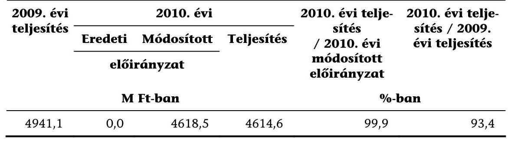

Az Áht. 101. §-ának (13) bekezdése szerint a leghátrányosabb helyzetű kistérségek felzárkóztatására előirányzott állami támogatásnak a tárgyévet megelőző évek döntéssel lekötött maradványaiból a tárgyévben igénybe vett összeggel a központi költségvetésben megtervezett tárgyévi ilyen célú előirányzatot meg kell növelni.

Tekintettel arra, hogy az említett támogatásra a Kvtv. IX. fejezete nem tartalmazott előirányzatot - összhangban az eredeti jogalkotói szándékkal - a maradványok utalására a IX. fejezeten belül, a 2009. évi előirányzattal megegyező elnevezésű új címsor megnyitásával kerülhetett sor. Az új, 14. A leghátrányosabb helyzetű kistérségek felzárkóztatásának támogatása címet az előző évek maradványából származó 4618,5 M Ft összeggel a jogszabályi előírásoknak megfelelően létrehozták.

A 2010. évben a 2009-ben jóváhagyott támogatások folyósítására került sor, az önkormányzatok új támogatást nem igényelhettek. A pénzügyi lebonyolítással (különösen az utalványozással, az előirányzat átadással, a nyilvántartással, a féléves és éves beszámolással) kapcsolatos feladatokat az ÖM/BM végezte.

A leghátrányosabb helyzetű kistérségek felzárkóztatási támogatásának Kincstár által alkalmazott finanszírozási rendje megfelel a vonatkozó jogszabályoknak és a kincstári belső utasítások előírásainak.

---

1.3.3. Helyi önkormányzatok fejlesztési feladatainak támogatása

| 2009. évi teljesítés | 2010. évi |  |  | 2010. évi teljesítés / 2010. évi módosított elöirányzat | 2010. évi teljesítés / 2009. évi teljesítés |
| :--: | :--: | :--: | :--: | :--: | :--: |
|  | Eredeti | Módosított | Teljesítés |  |  |
|  | elöirányzat |  |  |  |  |
|  | M Ft-ban |  |  | \%-ban |  |
| 7543,5 | - | 8480,2 | 8480,2 | 100,0 | 112,4 |

A Kvtv. ezen a címen előirányzatot nem tartalmazott. Az előirányzat fedezetét a Helyi önkormányzatok fejlesztési feladatainak támogatása címen keletkezett előző évi maradvány biztosította, amelyből a 2010. évben 8480,2 M Ft került folyósításra.

Az Áht. 101. §-ának (12) bekezdése szerint a helyi önkormányzatok fejlesztési feladataira és vis maior feladatokra előirányzott állami támogatásnak a tárgyévet megelőző évek döntéssel lekötött maradványaiból a tárgyévben igénybe vett öszszeggel a központi költségvetésben megtervezett tárgyévi ilyen célú előirányzatot meg kell növelni.

A támogatás nyújtásának általános feltételeit és a támogatás formáját az egyes 2009. évi decentralizált önkormányzati fejlesztési és területfejlesztési célú, valamint egyes 2009. évi központi előirányzatok felhasználásának részletes szabályairól szóló 85/2009. évi (IV. 10.) Korm. rendelet 5-6. §-ai tartalmazzák.

A 2010. évben nem készült új rendelet, így a 85/2009. évi (IV. 10.) Korm. rendelet előírásait alkalmazták.

A területi kiegyenlítést szolgáló önkormányzati fejlesztések támogatása (TEKI) eredeti előirányzatot nem tartalmazott, mivel az előirányzat fedezetét az előző évi maradvány biztosította. A módosított előirányzat 4070,9 M Ft, ami megegyezik a teljesítéssel.

Az önkormányzati fejlesztések támogatása területi kötöttség nélkül (HÖF CÉDE) eredeti előirányzatot nem tartalmazott, mivel az előirányzat fedezetét az előző évi maradvány biztosította. A módosított előirányzat 4409,3 M Ft, ami megegyezik a teljesítéssel.

A 85/2009. (IV. 10.) Korm. rendelet 17. § (2) bekezdése alapján a támogatásokat a Kincstár - az Ámr. 122-124. §-ában előírtak szerint - folyósította.

A helyi önkormányzatok fejlesztési feladatainak támogatására vonatkozó szabályozási rend a Kincstárnál és az ÖM-nél megfelel a vonatkozó jogszabályoknak és a belső utasítások előírásainak, a támogatás igénylése és folyósítása a jogszabályoknak megfelelően történt.

---

# 1.3.4. Fővárosi közösségi közlekedés kiegészítő támogatása 

A Kormány az UF fejezet 2009. évi kötelezettségvállalással nem terhelt maradványának átcsoportosításáról szóló 1053/2010. (III. 2.) és 1097/2010. (IV. 21.) határozataiban döntött a maradvány IX. Helyi önkormányzatok támogatásai és átengedett személyi jövedelemadója fejezetbe való átcsoportosításról. Ennek keretében a Kormány a IX. Helyi önkormányzatok támogatásai és átengedett személyi jövedelemadója fejezetben létrehozta a 16. a Fővárosi közösségi közlekedés kiegészítő támogatása címet.

A határozatok alapján a IX. Helyi önkormányzatok támogatásai és átengedett személyi jövedelemadója fejezetbe az UF fejezet 2009. évi kötelezettségvállalással nem terhelt maradványának terhére 5000,0-5000,0 M Ft, összesen 10 000,0 M Ft került átcsoportosításra.

A határozatok 2. pontjaiban a Kormány felhatalmazta az önkormányzati minisztert, hogy a támogatási összegeket soron kívül folyósítsa Budapest Főváros Önkormányzatának a BKV Zrt.-nél a közösségi közlekedési közszolgáltatás ellátásával kapcsolatban 2010-ben felmerülő, bevételekkel nem fedezett, indokolt költségei részbeni ellentételezésére. A Fővárosi Önkormányzat a támogatás pénzforgalmi számláján történő jóváírását követő 3 munkanapon belül köteles azt hiánytalanul a BKV Zrt. rendelkezésére bocsátani.

A Kincstár a támogatást a 1053/2010. (III. 2.) Korm. határozat alapján 2010. március 5 -én és a 1097/2010. (IV. 21.) Korm. határozat alapján 2010. április 29-én folyósította.

### 1.3.5. Üdülőhelyi feladatok kiegészítő támogatása

A Kormány a központi költségvetési fejezetek 2009. évi kötelezettségvállalással nem terhelt előirányzat maradványainak átcsoportosításáról szóló 1124/2010. (V. 13.) határozatában döntött a maradvány IX. Helyi önkormányzatok támogatásai és átengedett személyi jövedelemadója fejezetbe való átcsoportosításáról. Ennek keretében a Kormány a IX. Helyi önkormányzatok támogatásai és átengedett személyi jövedelemadója fejezetben létrehozta a 17. Üdülőhelyi feladatok kiegészítő támogatása címet.

A határozat 1. pontja alapján a IX. Helyi önkormányzatok támogatásai és átengedett személyi jövedelemadója fejezetbe a XXVI. Szociális és Munkaügyi Minisztérium fejezet 2009. évi kötelezettségvállalással nem terhelt maradványának terhére 999,9 M Ft került átcsoportosításra.

A Kvtv.-ben a 2010. évben az előző évekhez képest - az üdülő vendégek tartózkodási ideje alapján beszedett idegenforgalmi adó minden forintjához - nem 2,0 Ft, hanem 1,0 Ft a hozzájárulás. Egyes önkormányzatok esetében a kiesés a folyó kiadás akár 20\%-át is elérheti, hátrányosan befolyásolva az érintett önkormányzatok pénzügyi helyzetét.

A támogatásban részesülő önkormányzatokat és a támogatás összegét a 17/2010. (V. 13.) ÖM rendelet melléklete tartalmazza. A vissza nem térítendő támogatást az ÖM utalványozása alapján a Kincstár folyósította.

---

A támogatás mértéke az üdülőhelyi feladatok normatív hozzájárulási összegének 2009. októberi lemondás utáni módosított előirányzata és a 2010. évi eredeti előirányzata szerinti különbség 44,2\%-a.

A rendelet 2. § (2) bekezdése alapján a támogatás 30\%-át 2010. június 30 -áig, $35 \%$-át augusztus 31 -éig, $35 \%$-át október 31 -éig kellet folyósítani a Kincstárnak az önkormányzatok részére.

A rendelet 2. § (3) bekezdését betartva az önkormányzatok a támogatást elsősorban turisztikai feladatok ellátására fordították.

A 17/2010. (V. 13.) ÖM rendeletnek megfelelően a támogatás kiutalása határidőben megtörtént.

# 1.3.6. 2010. május-júniusi rendkívüli időjárásban megsemmisült lakóingatlanok helyreállításának támogatása 

A Kormány a 1148/2010. (VII. 8.) számú határozatban döntött a 2010. június hónapokban kihirdetett veszélyhelyzetek időszakában felmerült védekezési költségekről, a károk enyhítéséről.

A határozat 1. sz. melléklete tartalmazza az Állami szervek védekezési költségeit, a 2. sz. melléklet az önkormányzatok védekezési költségeit, a 3. sz. melléklet az összedőlt, vagy nem helyreállítható lakóingatlanok számát településenkénti bontásban, a 4. sz. melléklet a megsemmisült vagy helyreállíthatatlanná vált lakóingatlanok tulajdonosai kárenyhítésének feltételeit és rendszerét.

A támogatást a helyi önkormányzatok igényelhették a 2010. május-június hónapokban kihirdetett veszélyhelyzetek időszakában megsemmisült, vagy helyreállíthatatlanná vált lakóingatlanok tulajdonosai elemi lakhatási feltételeinek elősegítése céljából.

Az önkormányzatnak elsődlegesen fel kellett mérnie a településen eladásra kínált ingatlanok körét, majd az önkormányzat közvetlenül egyeztetett a károsultakkal az optimális megoldás kiválasztása érdekében. Az elsődleges feladat az elemi lakhatási feltételek biztosítása volt.

A határozat 6/b. pontja alapján a károsult 2010. október 31-éig számlával igazoltan elszámolt az önkormányzat felé a támogatás felhasználásáról. Az önkormányzatok 2010. november 30 -áig elszámoltak a támogatás felhasználásáról a kincstári Igazgatóságok felé.

A BM-ben több esetben szükség volt arra, hogy a kincstári Igazgatóságok hiánypótlást kérjenek az önkormányzatoktól. A hiánypótlás minden esetben megtörtént.

A 2010. évi központi költségvetés általános tartalékának előirányzatából történő felhasználásról szóló 1153/2010. (VII. 16.) és az 1192/2010. (XI. 14.) Korm. határozatok alapján a Kormány 1585,0 M-1585,0 M Ft, összesen 3170,0 M Ft átcsoportosításról döntött a IX. Helyi önkormányzatok támogatásai és átengedett személyi jövedelemadója fejezet, 18. a 2010. május-júniusi rendkívüli időjárásban megsemmisült lakóingatlanok helyreállításának támogatása címre a

---

X. Közigazgatási Igazságügyi Minisztérium fejezet 16. Tartalékok cím, 1. Költségvetés általános tartaléka alcím terhére.

A teljesítés (1807,5 M Ft) az előirányzat 57\%-a.
A lakossági kárenyhítéssel kapcsolatos támogatások összege összesen 1809,5 M Ft (2010. 12. 31-ei állapot). A pénzforgalmi adatokhoz képest az érintett jogcímek között 2,0 M Ft visszafizetés átvezetésre került, és így alakult ki a 1807,5 M Ft.

A BM 2010. június hónapban tájékoztatót adott ki az önkormányzatok részére, hogy segítséget nyújtson azoknak az önkormányzatoknak, amelyek területén a 2010. május-június hónapokban a Kormány veszélyhelyzetet hirdetett ki a rendkívül súlyos természeti csapások hatására.

A tájékoztatóban rögzítették a támogatás feltételeit, a helyi önkormányzatok finanszírozási feladatait, a kivitelezési feladatokat a károk felszámolására és az önkormányzatok ellenőrzési és elszámolási kötelezettségeit.

A jogcímen összesen 339 db lakóingatlan helyreállítására 1626,6 M Ft (előlegként az I. ütemben) és 180,9 M Ft (a II. ütemben), összesen 1807,5 M Ft került kiutalásra.

# 1.3.7. Fővárosi közösségi közlekedés rendkívüli támogatása 

A Kormány a fővárosi közösségi közlekedés működése érdekében szükséges intézkedésekről szóló 1260/2010. (XI. 30.) határozatában döntött a Helyi önkormányzatok támogatásai és átengedett személyi jövedelemadója fejezetbe való átcsoportosításról az általános tartalék terhére és létrehozta a 19. Fővárosi közösségi közlekedés rendkívüli támogatása címet.

A határozat alapján a Kormány a BKV zavartalan múködésének biztosítása céljából 7500,0 M Ft vissza nem térítendő támogatást nyújtott a Fővárosi Önkormányzat útján a BKV részére.

A határozat 1. pontja alapján a Helyi önkormányzatok támogatásai és átengedett személyi jövedelemadója fejezetbe a KIM fejezet 16. Tartalékok cím, 1. Költségvetés általános tartaléka alcím terhére 7500,0 M Ft került átcsoportosításra.

A határozat 2. pontja alapján a Kormány felhatalmazta a belügyminisztert, hogy a támogatást soron kívül folyósítsa Budapest Főváros Önkormányzatának, ennek megfelelően 2010. december 1-jén az utalás megtörtént.

### 1.3.8. Várpalota és térsége támogatása

A Kormány az általános tartalékból történő átcsoportosításról szóló 1317/2010. (XII. 27.) határozatában döntött a IX. Helyi önkormányzatok támogatásai és átengedett személyi jövedelemadója fejezetbe való átcsoportosításról, és létrehozta a 20. Várpalota és térsége támogatása címet.

---

A határozat alapján a IX. Helyi önkormányzatok támogatásai és átengedett személyi jövedelemadója fejezetbe a 16. Tartalékok cím, 1. Költségvetés általános tartaléka alcím terhére $75,4 \mathrm{M}$ Ft került átcsoportosításra.

A támogatás célja a várpalotai régió 7 érintett településének támogatása. A várpalotai térség 7 önkormányzata (Várpalota, Balatonalmádi, Berhida, Ösi, Öskü, Tés és Pétfürdő) az 1995. évben közműberuházásba kezdett. A beruházás megvalósításához az állam által felvett OECF hitel nyújtott fedezetet, melyet visszterhesen továbbkölcsönzött az önkormányzatok számára.

Az önkormányzatok törlesztése 2001-ben indult, és 2019-ben fejeződik be. Az önkormányzatok minden évben megkeresték az államot, hogy törlesztési terheiket csökkentse vagy engedje el. Az Országgyűlés a 2002. évtől kezdve minden évben elengedte az éves törlesztő részletek meghatározott részét. Az Országgyűlés a 2005. évben csak a novemberi, a 2006. évben csak a májusi, míg a 2007-2009. években a májusi és a novemberi törlesztő részletek 50\%-át egyaránt elengedte. Az elmúlt évek költségvetési törvényei egyértelmúen tartalmazták, hogy az elengedés mely hónapokra és mely összegekre vonatkozik, eltérő értelmezés ebből nem adódott.

A 2010. évre az Országgyúlés egy nehezen értelmezhető módosító javaslatot fogadott el. A törlesztések évente két alkalommal, május és november hónapban történtek. A törvény szövegében csak a májusi törlesztő részlet elengedése szerepelt, a novemberi törlesztő részlet elengedése nem. Mivel az előirányzat nem léphető túl, ezért a novemberben esedékes összeg felének elengedésére nem volt mód. Az elengedés helyett az önkormányzatoknak nyújtandó támogatásról döntöttek.

Az utalás a jogszabályban előírtaknak megfelelően 2010. december 28-án megtörtént.

# 2. A Helyi ÖNKORMÁNYZATOK ELŐZŐ ÉVI ELSZÁmolÁSA ÉS ELLENÖRZÉSE SORÁN MEGÁLLAPÍTOTT ELTÉRÉSEK RENDEZÉSÉNEK SZABÁLYSZERŰSÉGE 

A Kvtv. ezen alcímre vonatkozóan 9500,0 M Ft eredeti előirányzatot tartalmazott - a 2009. évi előirányzatnál 3000,0 M Ft-tal többet -, amely 11 627,1 M Ftra $(122,4 \%)$ teljesült.

Az alcímre 3 számlával összefüggésben érkezhettek befizetések: Önkormányzatok, költségvetési szervek vállalkozási befizetései, Nem önkormányzati szervezeteknek nyújtott támogatások elszámolása, Önkormányzatok előző évről származó befizetései.

Az önkormányzatok, illetve költségvetési szervek vállalkozási befizetései a vállalkozási tevékenységükből származó eredmény elszámolása során keletkezett befizetési kötelezettségekből - az Áht. 96. § (5) és (6) bekezdései alapján - származó bevétel, figyelemmel az alaptevékenység ellátásához felhasznált részre. Ezzel összefüggésben a 2010. évben az önkormányzatok $0,8 \mathrm{M}$ Ft befizetést teljesítettek.

---

A nem önkormányzati szervezeteknek nyújtott támogatások elszámolásával összefüggésben a 2010. évben befizetés nem történt.

A helyi önkormányzatok befizetései - az önkormányzatok előző évről származó befizetései számlára - a 2009. évi zárszámadási törvény végrehajtásával, a kincstári Igazgatóságok megállapításaival és a helyi önkormányzatok központi költségvetési kapcsolatokból származó forrásai igénybevétele és elszámolása szabályszerűségének felülvizsgálatával voltak összefüggésben.

A kincstári Igazgatóságok - az Áht. 2009. január 1-jei módosítása alapján - a felülvizsgálataik során figyelembe veszik az ÁSZ helyszíni ellenőrzéseinek megállapításait.

Az Országgyűlés a helyi önkormányzatok 2009. évi költségvetési kapcsolataiból származó visszafizetési kötelezettségeit a Magyar Köztársaság 2009. évi költségvetésének végrehajtásáról szóló 2010. évi XCVIII. törvény (zárszámadási törvény) 7. § (2)-(5) bekezdéseiben határozta meg. Ennek értelmében az önkormányzatoknak saját elszámolásuk szerint 10011,3 M Ft visszafizetési kötelezettségük keletkezett, ebből az összegből a 2010. évben 8834,4 M Ft teljesült. Az önkormányzatok a kincstári Igazgatóságok felülvizsgálatával összefüggésben 2791,9 M Ft-ot fizettek vissza a 2010. év során. Az összes befizetés a 2010. évben 11 626,3 M Ft-ot tett ki.

A zárszámadási törvény 7. § (1) bekezdése előírta az NGM és a BM számára a zárszámadási tv. hatályba lépését követő 30 napon belül együttes rendelet megalkotását a helyi önkormányzatok költségvetési kapcsolatokból adódó önkormányzatonként és jogcímenként részletezett elszámolását. A 11/2010. (XII. 22.) NGM-BM együttes rendelet megjelentetésére - a jogszabályban megjelölt határidőhöz képest több mint egy hónap késedelemmel 2010. december 22-én került sor.

A zárszámadási tv. 8. § (4) bekezdése értelmében az Ámr. 195. §. (1) bekezdésének a) pontja alapján - az éves beszámoló szerinti helyi önkormányzati visszafizetési kötelezettséghez kapcsolódó - késedelmi kamat-fizetési kötelezettség 2010. március 26. napjától keletkezett.

A zárszámadási tv. 8. § (5) bekezdése kimondja, hogy amennyiben ezen határidőt követő 90 napon belül a befizetések nem érkeznek meg a megjelölt kincstári számlákra, a Kincstár az Áht 64/A. §-ának (6) bekezdése alapján intézkedik a központi költségvetést megillető követelés érvényesítéséről.

A Kincstár 2010. október 14-én 360 önkormányzat ellen nyújtott be azonnali beszedési megbízást 867,6 M Ft (tőketartozás) összegben, ami a 2010. évben megtérült. Az igénybevételi kamattartozásra 143 önkormányzat esetében 77,6 M Ft összegű, a késedelmi kamatfizetési kötelezettségre pedig 574 önkormányzat vonatkozásában 112,4 M Ft összegű inkasszó került benyújtásra.

A saját elszámolásból eredő visszafizetési kötelezettséget - hat önkormányzat kivételével rendezték az önkormányzatok. A hat önkormányzat ellen adósságrendezési eljárás van folyamatban, így nem tudták a 2009. évi beszámolóból eredő fizetési kötelezettségüket teljesíteni.

---

A kincstári Igazgatóságok felülvizsgálata alapján - a 2009. évi normatív hozzájárulások és a normatív kötött felhasználású támogatások elszámolásából a helyi önkormányzatokat megillető pótlólagos támogatások jogcímén $8678,8 \mathrm{M} \mathrm{Ft}$, valamint a költségvetési szerveknél foglalkoztatottak eseti keresetkiegészítése elszámolásából - 46,1 M Ft pótlólagos támogatásra voltak jogosultak az önkormányzatok.

A Kincstár 2010. május 7-én 8724,9 M Ft-ot utalt az érintett önkormányzatok számlájára.

A 2010. évi kifizetéseket alátámasztó kincstári dokumentáció - az ellenőrzött körben - teljes körű volt. Az elszámolások, az önkormányzatok felé való kifizetések a jogszabályi előírásoknak megfelelően történtek.

# 3. A HELYI ÖNKORMÁNYZATOKNAK NYÚJTOTT TÁMOGATÁSOK FOLYÓSÍTÁSÁNAK MEGBÍZHATÓSÁGA 

A 2010. évi tranzakciókból kiválasztott tételeknél az elszámolások megbízhatóságának, a tranzakciók szabályszerűségének ellenőrzésére került sor. Az ellenőrzés kiterjedt a tételek összegének megfelelőségére, a BM és egyéb érintett szervek, illetve a Kincstár nyilvántartásainak egyezőségére. Emellett kiterjedt az ÖTM 305-40/23/2006., az ÖTM 305-40-48/2007., az ÖTM/40/1/2008., az ÖTM/40/23/2008., az ÖTM/40/49/2008., az ÖTM/40/56/2008., az ÖM40/3/2009. az ÖM-40/11/2009. és az ATM-40/1/2010. számú rendelkezéseiben megjelölt személyek ellenjegyzésének, utalványozásának vizsgálatára.

Az ellenőrzött tranzakciók között valamennyi - jelen vizsgálattal érintett - költségvetési sorra vonatkozóan szerepeltek tételek.

Az önkormányzatok támogatásainak odaítélésében részt vevő szervezeteknél kivéve a könyvtári és közművelődési érdekeltségnövelő támogatás, múzeumok szakmai támogatása és az esélyegyenlőséget, felzárkóztatást segítő támogatásokon belül az esélyegyenlőséget szolgáló intézkedések támogatása előirányzatokkal foglalkozó szervezeteket (NEFMI, Kincstár) - a belső ellenőrzés megfelelően működött. A Bérpolitikai intézkedések támogatása előirányzat vonatkozásában a 2010. évi támogatás igénylésének rendszere megfelelt a 316/2009. (XII. 28.) Korm. rendelet előírásainak, azonban a folyósításé nem, mivel a 316/2009. (XII. 28.) Korm. rendelet nem tartalmazta a bruttó körbe tartozó OEP finanszírozású költségvetési szervek egészségügyi feladat ellátásában részt vevő intézmények körét. Ebből adódóan ki kellett javítani a szakfeladatokra történő besorolást és rendezni kellett a támogatás elosztását.

A BM-nek az utalvány elkészítésekor szakmai vagy pénzügyi szempontból (a IV. negyedév kivételével) ellenőrzési lehetősége nem volt a metróprojekt tekintetében. A helyzetből adódóan a BM nem tett eleget a Kvtv. 64. § (5) bekezdésében meghatározott ellenőrzési kötelezettségének, amelyet a jogszabály a IX. Helyi önkormányzatok támogatásai és átengedett személyi jövedelemadója fejezet vonatkozásában számára előír. Továbbá - az előzőekben leírtakra tekintettel - nem érvényesíthette utalványozási felelősségét, mivel a finanszírozási folyamatra sem rálátása, sem befolyása nem volt.

---

Az ellenjegyzők, utalványozók személye, aláírása azonos az ÖTM 30540/23/2006., az ÖTM 305-40-48/2007., az ÖTM/40/1/2008., az ÖTM/40/23/2008., az ÖTM/40/49/2008., az ÖTM/40/56/2008., az ÖM-40/3/2009. az ÖM-40/11/2009. és az ATM-40/1/2010. számú rendelkezéseiben előírtakkal.

Az utalványokon szereplő összegek és a számvevőszéki vizsgálat által végzett ellenőrző számítások, illetve a támogatási döntésről készült jegyzőkönyvekben, az egyéb kiadások és bevételek dokumentációjában szereplő adatok megegyeznek.

A Kincstár felé küldött utalványok tételei és az azokon szereplő összegek megegyeznek a BM analitikus nyilvántartásában megjelenő tételekkel.

Az ellenőrzött tételek esetén a BM által küldött utalványban, illetve rendelkező levélben megjelölt terhelendő fejezet és címrendi besorolás megegyezik a Kincstár által a tételekhez rendelt nemzetgazdasági számlaszámmal és államháztartási azonosítóval.

A zárszámadási törvényjavaslat szöveges indokolása a IX. Helyi önkormányzatok támogatásai és átengedett személyi jövedelemadója fejezet kiadási előirányzatainak teljesítéséről pontos képet ad.

# 4. UtóELLENŐRZÉs 

Az ÁSZ már az előző évek zárszámadása során is jelezte, hogy az ágazati miniszterek a rendeletalkotás során nem tartották be a Kvtv.-ben előírt határidőket, és minden évben javaslatot fogalmazott meg a rendeletalkotási határidő betartására vonatkozóan. Az előző években megfogalmazott javaslatok a 2010. évi zárszámadás során csak részben hasznosultak.

A Kvtv. a IX. Helyi önkormányzatok támogatásai és átengedett személyi jövedelemadója fejezet vonatkozásában 18 rendelet megalkotását írta elő, azonban 15 esetben nem tartották be a határidőt az ágazati miniszterek. A rendeletek késedelmes kihirdetése miatt az önkormányzatoknak a pályázatok elkészítésére rendelkezésre álló idő lerövidült.

Az ÁSZ a 2010. évi zárszámadás során javasolta, hogy - a kormányhatáskörben létrehozott új címek közül - a folyósított támogatásoknál vizsgálja felül a szerződéskötés feltételeit. Az ÖM a szerződéskötés feltételeit felülvizsgálta, és a 2010. év során nem fordult elő, hogy szerződés megkötése nélkül folyósítottak támogatást az önkormányzatok részére.

A metrótörvény 2. § (2) bekezdése értelmében a kontrollpozíció gyakorlását segítő szakértői szolgáltatás igénybevételére az Állam az állami támogatásból évente legfeljebb 50,0 M Ft összeget használhat fel. Ebből a keretből - az előző évekhez hasonlóan - a 2010. évben sem történt felhasználás. Az ÁSZ 2009. évi zárszámadás helyszíni ellenőrzésének lezárásáig az Állami Szakértő beszerzésére irányuló pályázatot nem írták ki. Az ÁSZ javaslatot fogalmazott meg a nemzetgazdasági miniszter részére, hogy vizsgálja felül a metrótörvény 2. § (2) bekezdésében foglaltakat, tekintettel az uniós finanszírozás megnövekedett ará-

---

nyára, és azt követően intézkedjen annak betartása vagy módosítása érdekében.

Az NGM intézkedési tervében a következőket fogalmazta meg: „A 4-es metró beruházás I. szakaszának döntő része uniós forrásból van finanszírozva, így itt az uniós intézményrendszer szigorú kontroll-mechanizmusa érvényesül. A II. szakasz kapcsán a Fővárosi Közgyűlés döntése értelmében a Főváros a projekt II. szakaszát egyelőre nem kívánja megvalósítani. A jelenlegi helyzetet alapul véve az állami szakértő beszerzése nem indokolt (a szakértő beszerzése egyébként sem erősítené a kontrollt, mivel a jelenlegi Finanszírozási Szerződés értelmében az államnak csak nagyon szűk keretek között van kifogás-emelési lehetősége). Összegezve: a metrótörvény 2. § (2) bekezdésében foglalt kontrollpozíció nem kötelezettség, hanem opció. A törvényben lehetőségként biztosított kontrollpozíció kapcsán nincs mit „betartani" vagy „módosítani", mivel az I. szakasz döntően uniós forrásból épül, a II. szakasz megvalósítása pedig határozatlan időre fel lett függesztve." Az NGM álláspontját elfogadhatónak tartjuk.

A budapesti 4-es - Budapest Kelenföldi pályaudvar-Bosnyák tér közötti - metróvonal megépítésének állami támogatásáról szóló 1059/2005. (VI. 4.) Korm. határozat 10. pontjában a Kormány felhívta a gazdasági és közlekedési minisztert, hogy félévente adjon tájékoztatást a Kormány részére a budapesti 4-es metró-projekt előrehaladásáról. A 2008. és 2009. években a gazdasági és közlekedési miniszter a jogszabályi előírásokban foglalt jelentési, illetve tájékoztatási kötelezettségének nem tett eleget. A GKM 2008. május 15-én szétvált két jogutód intézményre: a KHEM-re, illetve az NFGM-re. A 2008. évi számvevőszéki ellenőrzés megállapítása szerint a 1059/2005. (VI. 4.) Korm. határozat 10. pontjának pontosítására van szükség, amely előírja, hogy mely jogutód intézmény felelős a jelentéstételi kötelezettségért. A 2009. évi számvevőszéki ellenőrzés során az ÁSZ javaslatot fogalmazott meg a nemzeti fejlesztési miniszter részére, hogy kezdeményezze a budapesti 4-es - Budapest Kelenföldi pályaudvarBosnyák tér közötti - metróvonal megépítésének állami támogatásáról szóló 1059/2005. (VI. 4.) Korm. határozat 10. pontjának módosítását a megváltozott kormányzati struktúra figyelembevételével. Az ÁSZ helyszíni ellenőrzésének lezárásig a 1059/2005. (VI. 4.) Korm. határozatot nem módosították. A felelősség kérdése a helyszíni ellenőrzés lezárásáig továbbra sem tisztázott.

2010 szeptemberében készült el a 4-es metró beruházási folyamatának ellenőrzéséről szóló ÁSZ jelentés, amely két javaslatot fogalmazott meg a Kormány részére:

- kezdeményezze a finanszírozási szerződés módosítását annak érdekében, hogy az állam műszaki-gazdasági és pénzügyi kontroll pozíciója erősödjön az állami támogatás hatékony felhasználása céljából;
- kezdeményezze a finanszírozási szerződés kiegészítését azzal, hogy a Fővárost az állami támogatás visszafizetésének kötelezettsége terheli, ha a BKV Zrt.-t privatizálja vagy az állami támogatással megvalósított beruházás bármely létesítményét a társaság elidegeníti, továbbá a szerződésben rögzítse a visszafizetés pénzügyi biztosítékait.

A nemzetgazdasági miniszter 2011 áprilisában levélben kereste meg a nemzeti fejlesztési minisztert, amelyben a 4-es metróprojekttel összefüggő feladatok át-

---

adását kezdeményezte. A nemzetgazdasági miniszter hivatkozott az ÁSZ elmúlt években tett megállapításaira, amely szerint az előirányzat kezelését és a teljesítés ellenőrzését azon fejezet kötelezettségei között kell megjeleníteni, amely fejezet a beruházás szakmai megvalósításáért felelős. A nemzetgazdasági miniszter álláspontja, hogy az NFM-nek - mint az infrastrukturális nagyberuházásokért is felelős minisztériumnak - szükséges folytatni a 4-es metró beruházással összefüggő feladatot, mert az NFM-ben áll rendelkezésre a projekt megvalósításához szükséges szaktudás és kompetencia. A nemzetgazdasági miniszter hivatkozott arra, hogy a beruházás jelentős részét magába foglaló uniós finanszírozásért felelős NFÚ az NFM fennhatósága alá tartozik, így a beruházás egy tárca felügyelete alatt valósulhatna meg, ami erősíthetné az átláthatóságot, a hatékony megvalósítást és a kontrollt. Az NGM levelében kérte, hogy a finanszírozási szerződésekben a Magyar Állam képviseletének módosítása során a szerződések teljes körű felülvizsgálata történjen meg a beruházással kapcsolatos állami kontrollpozíciók erősítése érdekében. A nemzetgazdasági miniszter által megfogalmazottakkal egyetértünk és támogatjuk a kezdeményezést.

Az NFM észrevételében jelezte, nem ért egyet azzal, hogy „a közlekedés-szakmai felügyelet miatt az NFM-nek kellene átvenni a 4-es szerződés kezelését. ... A tárca alapvetően egyetért a számvevőszék megállapításaival és javaslataival", továbbá támogatja, „hogy az állami feladatok egyetlen szerv kezében összpontosuljanak". Megítélésük szerint „a nemzeti fejlesztési miniszter irányítása alatt álló Nemzeti Fejlesztési Ügynökség (NFÜ) rendelkezik a szükséges szakmai és pénzügyi kompetenciával e feladatok ellátására." Az NFM észrevételében felsorolta a feladatellátás NFÜ-höz rendelésével kapcsolatos intézkedéseket is.

Az NGM 2011. augusztus 8-án kelt észrevételében jelezte, hogy a Nemzeti Fejlesztési Miniszter egyetért a 4-es metró beruházással kapcsolatos szakmai- és pénzügyi feladatok átadásával, és „az NFÜ kész a metróprojekttel kapcsolatos feladatok átvételére. ... A 2012. évi költségvetési törvényt már úgy készíti elő az NGM, hogy az NFÜ-nél (XIX. Uniós Fejlesztések fejezetben) jelenjen meg a 4-es metró beruházás teljes finanszírozása..."

Budapest, 2011. augusztus

Függelék: $\quad 1 \mathrm{db}$

---

.

---

MELLÉKLETEK

---

.

---

1. sz. melléklet

Nemzetgazdasági elszámolások pénzügyi (szabályszerúségi) ellenőrzéseinek minősítései

| FEJEZET/CÍM |  | MEGNEVEZÉS | MINŐSÍTÉS |
| :--: | :--: | :--: | :--: |
| IX. |  | Helyi önkormányzatok támogatásai és átengedett személyi jövedelemadója | Elfogadó |
| X. |  | Közigazgatási és Igazságügyi Minisztérium (KIM) |  |
|  | 19. | Tartalékok | Elfogadó |
|  | 20. | Volt egyházi ingatlanok tulajdoni helyzetének rendezése | Elfogadó |
|  | 21. | Települési és területi kisebbségi önkormányzatok támogatása | Elfogadó |
| XV. |  | Nemzetgazdasági Minisztérium (NGM) |  |
|  | 29. | Egyéb lakástámogatások | Korlátozott |
|  | 30. | Vállalkozások folyó támogatása | Elfogadó |
|  | 31. | Fogyasztói árkiegészítés | Elfogadó |
|  | 32. | Egyéb költségvetési kiadások | Elfogadó |
|  | 33. | Állam által vállalt kezesség és viszontgarancia érvényesítése | Elfogadó |
|  | 34. | Kormányzati rendkívüli kiadások | Elfogadó |
|  | 35. | Garancia és hozzájárulás a társadalombiztosítási ellátásokhoz | Elfogadó |
|  | 36. | Nemzetközi elszámolások kiadásai | Elfogadó |
| XVII. |  | Nemzeti Fejlesztési Minisztérium (NFM) |  |
|  | 17. | Vállalkozások folyó támogatása | Elfogadó |
|  | 20. | K-600 hírrendszer múködtetésére | Elfogadó |
| XX. |  | Nemzeti Eröforrás Minisztérium (NEFMI) |  |
|  | 21. | Családi támogatások | Elfogadó |
|  | 22. | Egyéb szociális ellátások és költségtérítések | Elfogadó |
| XLI. |  | A központi költségvetés kamatelszámolásai, tőkevisszatérülései, az adósság- és követelés-kezelés költségei |  |
|  |  | Adósságszolgálattal kapcsolatos bevételek | Elfogadó |
|  |  | Adósságszolgálattal kapcsolatos kiadások | Elfogadó |
| XLII. |  | A központi költségvetés fő bevételei |  |
|  |  | APEH illetékességébe tartozó bevételek | Elfogadó |
|  |  | VP illetékességébe tartozó bevételek | Elfogadó |
|  |  | Bányajáradék | Elfogadó |
|  |  | Egyéb költségvetési bevételek | Elfogadó |
| XLIII. |  | Az állami vagyonnal kapcsolatos bevételek és kiadások |  |
|  | 1. | Az állami vagyonnal kapcsolatos bevételek | Korlátozott |
|  | 2. | Az állami vagyonnal kapcsolatos kiadások | Korlátozott |

---

# A költségvetési fejezetek, igazgatási címek és fejezeti kezelésű előirányzatok beszámolói pénzügyi (szabályszerüségi) ellenőrzéseinek minősítései 

| FEJEZET/FEJEZETI JOGOSÍTVÁNYÚ KÖLTSÉGVETÉSI SZERV |  | Minősités |
| :--: | :--: | :--: |
| I. | Országgyülés (OGY) |  |
|  | OGY 1-4. címe | Elfogadó |
|  | Állambiztonsági Szolgálatok Történelmi Levéltára | Elfogadó   figyelemfelhívó megjegyzéssel |
|  | Közbeszerzések Tanácsa | Elfogadó   figyelemfelhívó megjegyzéssel |
|  | Költségvetési Tanács | Elfogadó |
|  | Pénzügyi Szervezetek Állami Felügyelete | Elfogadó   figyelemfelhívó megjegyzéssel |
| II. | Köztárasági Elnökség | Elfogadó |
| III. | Alkotmánybíróság | Elfogadó |
| IV. | Országgyúlési Biztosok Hivatala | Elfogadó   figyelemfelhívó megjegyzéssel |
| VI. | Bíróságok fejezet 1. címe | Korlátozott |
|  | Bíróságok fejezet 2. címe | Elfogadó |
| VIII. | Magyar Köztársaság Ügyészsége | Elfogadó   figyelemfelhívó megjegyzéssel |
| X. | Közigazgatási és Igazságügyi Minisztérium (KIM) |  |
|  | KIM Igazgatása | Elfogadó   figyelemfelhívó megjegyzéssel |
|  | Magyar Szabadalmi Hivatal | Elfogadó |
|  | KIM fejezeti kezelésú elöirányzatok | Elfogadó   figyelemfelhívó megjegyzéssel |
|  | Kormányzati Ellenőrzési Hivatal | Elfogadó |
| XI. | Miniszterelnökség | Elfogadó |
| XII. | Vidékfejlesztési Minisztérium (VM) |  |
|  | VM igazagtása | Elutasító |
|  | VM fejezeti kezelésú elöirányzatok | Elutasító |
| XIII. | Honvédelmi Minisztérium (HM) |  |
|  | HM Igagatása | Korlátozott |
|  | HM fejezeti kezelésú elöirányzatok | Korlátozott |
| XIV. | Belügyminisztérium (BM) |  |
|  | BM Igazgatása | Elfogadó   figyelemfelhívó megjegyzéssel |
|  | BM fejezeti kezelésú elöirányzatok | Elfogadó   figyelemfelhívó megjegyzéssel |
| XV. | Nemzetgazdasági Minisztérium (NGM) |  |
|  | NGM Igazgatás | Elfogadó   figyelemfelhívó megjegyzéssel |

---

|  |  | Elfogadó   figyelemfelhívó megjegyzéssel |
| :--: | :--: | :--: |
|  | NGM fejezeti kezelésú elöirányzatok |  |
| XVII. | Nemzeti Fejlesztési Minisztérium (NFM) |  |
|  | NFM Igazgatása | Elfogadó   figyelemfelhívó megjegyzéssel |
|  | Országos Atomenergia Hivatal | Elfogadó |
|  | Magyar Energia Hivatal | Elfogadó   figyelemfelhívó megjegyzéssel |
|  | NFM fejezeti kezelésú elöirányzatok | Korlátozott |
| XVIII. | Külügyminisztérium (KüM) |  |
|  | KüM Központi Igazgatása | Korlátozott |
|  | KüM fejezeti kezelésú elöirányzatok | Elfogadó   figyelemfelhívó megjegyzéssel |
| XIX. | Uniós fejlesztések |  |
|  | Nemzeti Fejlesztési Ügynökség | Korlátozott |
|  | Uniós fejlesztések fejezeti kezelésű előirányzatok | Korlátozott |
| XX. | Nemzeti Eröforrás Minisztérium (NEFMI) |  |
|  | NEFMI Igazgatása | Korlátozott |
|  | NEFMI fejezeti kezelésú elöirányzatok | Korlátozott |
| XXX. | Gazdasági Versenyhivatal | Korlátozott |
| XXXI. | Központi Statisztikai Hivatal (KSH) |  |
|  | KSH Igazgatása | Elfogadó |
|  | KSH fejezeti kezelésú elöirányzat | Elfogadó |
| XXXIII. | Magyar Tudományos Akadémia (MTA) |  |
|  | MTA Titkárság | Elfogadó |
|  | MTA fejezeti kezelésú elöirányzatok | Elfogadó   figyelemfelhívó megjegyzéssel |

---

# Az elkülönített állami pénzalapok és a társadalombiztosítás pénzügyi alapjainak minősítései 

| Fejezet/Megnevezés | Minősítés |
| :--: | :--: |
| Vélemény az alapok APEH által beszedett bevételi adatainak megbízhatóságáról |  |
| Vélemény a Munkaerőpiaci Alap, a Nyugdíjbiztosítási Alap és az Egészségbiztosítási Alap APEH által beszedett bevételi adatai megbízhatóságának pénzügyi szabályszerűségi ellenőrzéséről | Elfogadó   figyelemfelhívó megjegyzéssel |
| Vélemény a Nemzeti Kulturális Alap APEH által beszedett bevételi adatai megbízhatóságának pénzügyi szabályszerűségi ellenőrzéséről | Elfogadó   figyelemfelhívó megjegyzéssel |
| Vélemény a Kutatási és Technológiai Innovációs Alap APEH által beszedett bevételi adatai megbízhatóságának pénzügyi szabályszerűségi ellenőrzéséről | Elfogadó |
| Elkülönített Állami Pénzalapok könyvvizsgálóinak minősítése |  |
| LXIII. | Munkaerőpiaci Alap | Elfogadó |
| LXV. | Szülőföld Alap | Elfogadó |
| LXVI. | Központi Nukleáris Pénzügyi Alap | Elfogadó |
| LXVII. | Nemzeti Kulturális Alap | Elfogadó |
| LXVIII. | Wesselényi Miklós Ár- és Belvízvédelmi Kártalanítási Alap | Elfogadó |
| LXIX. | Kutatási és Technológiai Innovációs Alap | Elutasító |
| Társadalombiztosítás Pénzügyi Alapjai könyvvizsgálóinak minősítése |  |
| LXXI. | Nyugdíjbiztosítási Alap | Elfogadó |
| LXXII. | Egészségbiztosítási Alap | Elfogadó |

---

4. sz. melléklet

Az Ny. Alap kiadása, hiánya és közvetlen költségvetési támogatása 2002-2010. között

|   | Hiány | Ebből: Magánnyugdíj pénztári kötelező tagdíjbevételből meg nem térített összeg*** | Központi költségvetésben tervezett pénzátadás | Hiányelengedés és tervezett pénzátadás összesen -2.+4. | Nettó hiányelengedés és tervezett pénzátadás összesen -2.-3.+4. | Nyugdíjbiztosítási Alap kiadási főöszszege | $\begin{gathered} 5 . / 7 . \\ \% \end{gathered}$ | $\begin{gathered} 6 . / 7 . \\ \% \end{gathered}$  |
| --- | --- | --- | --- | --- | --- | --- | --- | --- |
|  1. | 2. | 3. | 4. | 5. | 6. | 7. | 8. | 9.  |
|  2002 | $-14,2$ | 21,6 | 185,2 | 199,4 | 177,8 | 1405,9 | 14,2 | 12,6  |
|  2003 | $-39,0$ | 27,0 | 115,9 | 154,9 | 127,9 | 1540,1 | 10,1 | 8,3  |
|  2004 | $-80,2$ | 41,2 | 144,3 | 224,5 | 183,3 | 1707,0 | 13,2 | 10,7  |
|  2005 | $-93,5$ | 29,8 | 187,3 | 280,8 | 251,0 | 1916,0 | 14,7 | 13,1  |
|  2006 | $-19,5$ | 33,0 | 321,0 | 340,5 | 307,5 | 2113,1 | 16,1 | 14,6  |
|  2007 | 0.2 | 1,8 | 138,5 | 138,5 | 136,7 | 2 354,0* | 5,9 | 5,8  |
|  2007 | 0.2 | 1,8 | 138,5 | 138,5 | 136,7 | 2 642,5** | 5,2 | 5,2  |
|  2008 | $-67,6$ | 23,1 | 143,4 | 211,1 | 188,0 | 2925,2 | 7,2 | 6,4  |
|  2009. | $-7,2$ | $-0,1$ | 217,5**** | 225,2 | 210,9 | 2866,8 | 7,9 | 7,9  |
|  2010. | $-3,7$ | n.a. | 197,9**** | 201,6 | 201,6 | 2918,3 | 6,9 | 6,9  |

*A korábbi évek adattartamával azonosan, korábban az E. Alap által fedezett rokkantnyugdíjjal kapcsolatos kiadások nélkül **A 2008. év adattartalmával azonosan a rokkantnyugdíjjal kapcsolatos kiadásokkal együtt ***A számításhoz szükséges adatokat az APEH szolgáltatta ****Beleértve a méltányossági kifizetésére biztosított többlet fedezetét

---

# IX. Helyi önkormányzatok támogatásai és átengedett személyi jövedelemadója fejezettel összefüggő 2010. évi rendeletalkotási kötelezettség teljesítéséről 

| 5. Központosított előirányzatok cím |  | Rendelet | határidő | teljesítés | késedelem |
| :--: | :--: | :--: | :--: | :--: | :--: |
| 2. | Lakossági víz- és csatornaszolgáltatás támogatása | 16/2010. (V. 13.) KvVM rendelet | 2010. január 31. | 2010. május 13. | 3,5 hónap |
| 3. | Kompok, révek fenntartásának, felújításának támogatása | 43/2010. (V. 13.) KHEM rendelet | 2010. február 15. | 2010. május 13. | 3 hónap |
| 5. | Kiegészítő támogatás nemzetiségi, nevelési oktatási feladatokhoz | 15/2010. (III. 19.) OKM rendelet | 2010. február 15. | 2010. március 19. | 1 hónap |
| 6. | Könyvtári ás közművelődési érdekeltségnövelő támogatás, múzeumok szakmai támogatása | 11/2010. (III. 11.) OKM rendelet | 2010. február 15. | 2010. március 11. | közel 1 hónap |
| 7. | Helyi szervezési intézkedésekhez kapcsolódó többletkiadások támogatása | 4/2010. (I. 26.) ÖM rendelet | 2010. február 15. | 2010. január 26. | - |
| 9. | Önkormányzatok és jogi személyiségű társulásaik európai uniós fejlesztési pályázatai saját forrás kiegészítésének támogatása | 8/2010. (II. 26.) ÖM rendelet | 2010. február 15. | 2010. február 26. | 11 nap |
| 10. | Helyi közösségi közlekedés támogatása | 33/2010. (IV. 16.) KHEM-ÖM együttes rendelet | 2010. március 31. | 2010. április 16. | két hét |
| 11. | Az érettségi és szakmai vizsgák lebonyolításának támogatása | 16/2010. (III. 30.) OKM rendelet | 2010. március 15. | 2010. március 30. | két hét |
| 12. | Esélyegyenlőséget, felzárkóztatást segítő támogatások |  |  |  |  |
| a) | Esélyegyenlőséget szolgáló intézkedések | 5/2010. (I. 29.) OKM rendelet* | 2010. január 15. | 2010. január 29. | két hét |
| b) | Egyes sajátos közoktatási feladatok támogatása | 17/2010. (III. 30.) OKM rendelet | 2010. március 15. | 2010. március 30. | két hét |

---

|  5. Központosított előirányzatok cím |  | Rendelet | határidő | teljesítés | késedelem  |
| --- | --- | --- | --- | --- | --- |
|  13. | Az alapfokú művészetoktatás támogatása | 18/2010. (IV. 7.) OKM rendelet | 2010. március 15. | 2010. április 7. | három hét  |
|  14. | Közoktatási informatikai feladatok támogatása | 21/2010. (V. 13.) OKM rendelet | 2010. március 15. | 2010. május 13. | két hónap  |
|  15. | A bölcsődék és közoktatási intézmények infrastrukturális fejlesztése, valamint közösségi buszok beszerzése | 1/2010. (I. 19.) ÖM rendelet | 2010. február 28. | 2010. január 19. | -  |
|  16. | Gyermekszegénység elleni program keretében szociális nyári étkeztetés biztosítása | 11/2010. (IV. 20.) SZMM rendelet | 2010. április 15. | 2010. április 20. | 5 nap  |
|  17. | Új Tudás Műveltség Program keretében a pedagógusok anyagi ösztönzését szolgáló támogatások |  |  |  |   |
|  a) | Az integrációs rendszerben részt vevő intézményekben dolgozó pedagógusok anyagi támogatása | 5/2010. (I. 29.) OKM rendelet* | 2010. január 15.. | 2010. január 29. | két hét  |
|  b) | A sajátos nevelési igényű gyermekekkel foglalkozó gyógypedagógusok támogatása | 13/2010. (III. 19.) OKM rendelet | 2010. március 15. | 2010. március 19. | 4 nap  |
|  c) | Az osztályfőnöki feladatot ellátók támogatása |  |  |  |   |
|  20. | Belterületi belvízrendezési célok támogatása | 5/2010. (I. 28.) ÖM rendelet | 2010. február 15. | 2010. január 28. | -  |

---

|  | 7. Helyi önkormányzatok által fenntartott, illetve támogatott elöadó-múvészeti szervezetek támogatása cím | Rendelet | határidő | teljesítés | késedelem |
| :--: | :--: | :--: | :--: | :--: | :--: |
| 2. a) és b) | Az I. kategóriába sorolt besorolt zenekarok és énekkarok központi költségvetési támogatása | 14/2010. (III. 19.) OKM rendelet | 2010. február 25. | 2010. március 19. | három hét |

*Az 5/2010. (I. 29.) OKM rendelet az Esélyegyenlőséget szolgáló intézkedések és Az integrációs rendszerben részt vevő intézményekben dolgozó pedagógusok anyagi támogatása előirányzatokhoz egyaránt kapcsolódik.

---

# RÖVIDÍTÉSEK JEGYZÉKE 

| ÁAK Rt. | Állami Autópályakezelő Részvénytársaság |
| :--: | :--: |
| ÁBTL | Állambiztonsági Szolgálatok Történeti Levéltára |
| Abtv | Az Alkotmánybíróságról szóló 1989. évi XXXII. törvény |
| AEÉ | Adó- és Ellenőrzési Értesítő |
| ÁEK | Állami Egészségügyi Központ |
| áfa | általános forgalmi adó |
| áfa tv. | Az általános forgalmi adóról szóló 2007. évi CXXVII. törvény |
| Áhsz. | Az államháztartás szervezeti beszámolási és könyvvezetési kötelezettségének sajátosságairól szóló 249/2000. (XII. 24.) Korm. rendelet |
| ÁHT | Államháztartási egyedi azonosító kód |
| Áht. | Az államháztartásról szóló 1992. évi XXXVIII. törvény |
| AirBridge Zrt. | AirBridge Magyarországi Vagyonkezelő Zrt. |
| ÁKK Zrt. | Államadósság Kezelő Központ Zártkörűen múködő részvénytársaság |
| ALB | Alkotmánybíróság |
| AMC | Agrármarketing Centrum |
| ÁMÖ | Általános Mezőgazdasági Összeírás |
| Ámr. | Az államháztartás múködési rendjéről szóló 292/2009. (XII. 19.) Korm. rendelet |
| ÁNTSZ | Állami Népegészségügyi és Tisztiorvosi Szolgálat |
| ÁPB | Ágazati Párbeszéd Bizottság |
| APEH | Adó- és Pénzügyi Ellenőrzési Hivatal |
| APEH KAIG | Adó- és Pénzügyi Ellenőrzési Hivatal Kiemelt Adózók Igazgatósága |
| APEH/NAV | Adó és Pénzügyi Ellenőrzési Hivatal/Nemzeti Adó- és Vámhivatal |
| ÁPV Zrt. | Állami Privatizációs Vagyonkezelő Zártkörűen múködő részvénytársaság |
| ÁROP | Államreform Operatív Program |
| Art. | Az adózás rendjéről szóló 2003. évi XCII. törvény |
| ÁSZ | Állami Számvevőszék |
| ÁT | Átmeneti Támogatás programjai |
| Atv. | 1996. évi CXVI. törvény az atomenergiáról |
| ÁVKBK | Állami vagyonnal kapcsolatos bevételek és kiadások fejezet |
| AVOP | Agrár- és Vidékfejlesztési Operatív Program |
| AVOP IH | Agrár- és Vidékfejlesztési Operatív Program Irányító Hatóság |
| BA Zrt. | Budapest Airport Zártkörűen Múködő Részvénytársaság |

---

| BÁH | Bevándorlási és Állampolgársági Hivatal |
| :--: | :--: |
| BB | Bíráló Bizottság |
| Be. tv. | A büntetőeljárásról szóló 1998. évi XIX. törvény |
| BEF | Belső Ellenőrzési Főosztály |
| BEGYKA | Betegjogi, Ellátottjogi és Gyermekjogi Közalapítvány |
| BEO | Belső Ellenőrzési Osztály (a Belügyminisztérium fejezetnél) |
| Ber. | A költségvetési szervek belső ellenőrzéséről szóló 193/2003. (XI. 26.) Korm. rendelet |
| BGA | Bethlen Gábor Alap |
| BIR | Bíróságok |
| Bit. | A biztosítókról és a biztosítási tevékenységről szóló 2003.   évi LX. törvény |
| Bjt. | A bírák jogállásáról és javadalmazásáról szóló 1997. évi LXVII. törvény |
| BKV Zrt. | Budapesti Közlekedési Vállalat Zártkörűen múködő részvénytársaság |
| BM | Belügyminisztérium |
| BMSK Zrt. | Beruházási, Műszaki Fejlesztési, Sportüzemeltetési és Közbeszerzési Zártkörűen Múködő Részvénytársaság |
| BNYM | Bank of New York Mellon |
| BRFK | Budapesti Rendőr-főkapitányság |
| Bszi. | A bíróságok szervezetéről, és igazgatásáról szóló 1997. évi LXVI. törvény |
| Bt. | Betéti társaság |
| BTT | Baromfi Termék Tanács |
| BV | Büntetés-végrehajtás |
| Cct. | A helyi önkormányzatok címzett és céltámogatási rendszeréről szóló 1992. évi LXXXIX. törvény |
| CEB | Európai Tanács Fejlesztési Bankja |
| CT | Computer Tomográf |
| CSÉSZ | Csapatok Érdekvédelmi Szervezete |
| DAOP | Dél-Alföldi Operatív Program |
| DARFÜ | Dél-Alföldi Regionális Fejlesztési Ügynökség |
| db | darab |
| DDOP | Dél-Dunántúli Operatív Program |
| DDRFÜ | Dél-Dunántúli Regionális Fejlesztési Ügynökség |
| DK | Diákhitel Központ Zrt. |
| DOS | Disc Operating System |
| DOT | Days of Treatment (Terápiás Napok Száma) |
| E Ft | Ezer forint |
| E. Alap | Egészségbiztosítási Alap |
| EÁF | Elektronikus Árverési Felület |
| ÉAOP | Észak-Alföldi Operatív Program |

---

| ÉARFÜ | Észak-Alföldi Regionális Fejlesztési Ügynökség |
| :--: | :--: |
| ÉB | Értékelő Bizottság |
| EBEV (eBEV) | Elektronikus bevallás |
| EBF | Egészségbiztosítási Felügyelet |
| EBRD | Európai Újjáépítési és Fejlesztési Bank |
| Ebtv. | A kötelező egészségbiztosítás ellátásáról szóló 1997. évi LXXXIII. törvény |
| ECOSTAT | Kormányzati Gazdaság- és Társadalom-stratégiai Kutató Intézet |
| EFK | Elöirányzat-Felhasználási Keretszámla |
| E-FO | Egységes Folyószámla Kezelő és Vezérlő Rendszer |
| EFT | Elöirányzat-finanszírozási terv |
| EGT | Európai Gazdasági Térség |
| EH | 2007-2013 programozási periódus Ellenőrzési Hatóság |
| EHA | Európai Halászati Alap (EU részekben) |
| eho | Egészségügyi hozzájárulás |
| Eho tv. | Az egészségügyi hozzájárulásról szóló 1998. évi LXVI. törvény |
| EIB | Európai Beruházási Bank |
| EK | Európai Közösség |
| EKG | Elektronikus Kormányzati Gerinchálózat |
| EKHO | Egységes Közteherviselési Hozzájárulás |
| EKKE | Európai Uniós Közbeszerzési Koordinációs és Szabályossági Egység |
| EKKP | Erzsébet téri Kulturális Központ és Park |
| EK NKft. | Energia Központ Energiahatékonysági, Környezetvédelmi és Energia Információs Ügynökség Nonprofit Korlátolt Felelősségú Társaság |
| EKOP | Elektronikus Közigazgatás Operatív Program |
| ELGI | Eötvös Lóránd Geofizikai Intézet |
| ELKA | Elkülönített állami pénzalapok |
| EMGA | Európai Mezőgazdasági Garancia Alap |
| ÉMI Nkft. | Építésügyi és Minőségellenőrző Innovációs Nonprofit Kft. |
| EMIR | Egységes Monitoring Információs Rendszer |
| EMK | ÚMFT Egységes Múködési Kézikönyve |
| EMOGA | Európai Mezőgazdasági Orientációs és Garancia Alap |
| ÉMOP | Észak-Magyarországi Operatív Program |
| ÉMRFÜ | Észak-Magyarországi Fejlesztési Ügynökség |
| Emtv. | Az előadó-múvészeti szervezetek támogatásáról és sajátos foglalkoztatási szabályairól szóló 2008. évi XCIX. törvény |
| EMVA | Európai Mezőgazdasági Vidékfejlesztési Alap |
| ENSZ | Egyesült Nemzetek Szervezete |
| EONIA | Euro Overnight Index Average (egy napos euró átlag index) |

---

| EQUAL | a 2000-2006-os költségvetési időszak egyik EU-s Közösségi Kezdeményezése |
| :--: | :--: |
| ERFA | Európai Regionális Fejlesztési Alap |
| ESKI | Egészségügyi Stratégiai Kutatóintézet |
| ESZA | Európai Szociális Alap |
| ESZA Kft. | ESZA Társadalmi Szolgáltató Nonprofit Kft. |
| ESZA NKft. | Európai Szociális Alap Nemzeti Programirányító Iroda Társadalmi Szolgáltató Nonprofit Kft. |
| ETE | Európai Területi Együttmúködés |
| EU | Európai Unió |
| EU Bíróság | Európai Bíróság |
| EU Bizottság | Európai Bizottság |
| EUR | Európa |
| EURES | Európai Foglalkoztatási Szolgálat |
| EURIBOR | Frankfurti EUR betéti kamatláb |
| EUTAF | Európai Támogatásokat Auditáló Főigazgatóság (2010. július 1-jétől Ellenőrzési Hatóság) |
| EüM | Egészségügyi Minisztérium |
| eva | egyszerúsített vállalkozói adó |
| EXIMBANK Zrt. | Magyar Export-Import Bank Zártkörúen múködő rész-vény-társaság |
| EXPO | Nemzetközi Szakmai Vásár |
| FAO | Food and Agriculture Organization - Egyesült Nemzetek Élelmezési és Mezőgazdasági Szervezete |
| FEFK | Feladatfinanszírozási Előirányzat Felhasználási Keretszámla |
| FEUVE | Folyamatba épített, előzetes, utólagos és vezetői ellenőrzés |
| FF | Nemzeti Fejlesztési Ügynökség Fejezeti Főosztálya |
| FH | Foglalkoztatási Hivatal |
| FKA | Munkaerőpiaci Alap Fejlesztési és Képzési Alaprésze |
| FKO | Fejezeti Költségvetési Osztály |
| Flt. | A foglalkoztatás elősegítéséről és a munkanélküliek ellátásáról szóló 1991. évi IV. törvény |
| Forrás SQL | Integrált ügyviteli rendszer |
| FSZEK | Fogyatékos Személyek Esélyegyenlőségért Közalapítvány |
| FSZH | Foglalkoztatási és Szociális Hivatal |
| FUF Kft. | Ferihegyi Utasterminál Fejlesztő Kft. |
| FVM | Földmúvelésügyi és Vidékfejlesztési Minisztérium |
| FVM AszK | FVM Agrár-szakképző Központ |
| GDP | Gross Domestic Product - Bruttó hazai termék |
| GEH | Gazdasági Elnökhelyettesség |
| Get. | A földgázellátásról szóló 2003. évi XLII. törvény |
| GF | Gazdasági Főosztály |

---

| GH Zrt. | Garantiqa Hitelgarancia Zártkörúen múködő részvénytársaság |
| :--: | :--: |
| GIIR | Gazdálkodási Integrált Informatikai Rendszer |
| GKM | Gazdasági és Közlekedési Minisztérium |
| GKM GI | Gazdasági és Közlekedési Minisztérium Gazdasági Igazgatósága |
| GNI | Gross National Income - Bruttó Nemzeti Jövedelem |
| GOP | Gazdaságfejlesztési Operatív Program |
| GOP IH | Gazdaságfejlesztés Operatív Program Irányító Hatóság |
| GSZT | Gazdasági és Szociális Tanács |
| GVH | Gazdasági Versenyhivatal |
| GVOP | Gazdasági Versenyképesség Operatív Program |
| GYED | Gyermekgondozási dij |
| Gyer. | A gyámhatóságokról, valamint a gyermekvédelmi és gyámügyi eljárásról szóló 149/1997. (IX. 10.) Korm. rendelet |
| GYES | Gyermekgondozási segély |
| GYET | Gyermeknevelési támogatás |
| GySEV Zrt. | Győr-Sopron-Ebenfurthi Vasút Zártkörúen múködő részvénytársaság |
| Gyvt. | A gyermekek védelméről és a gyámügyi igazgatásról szóló 1997. évi XXXI. törvény |
| HBCS | Homogén Betegség Csoport |
| HÉ | Hivatalos Értesítő |
| HEFOP | Humánerőforrás-fejlesztési Operatív Program |
| HEP IH | Humán Erőforrás Programok Irányító Hatósága |
| HM | Honvédelmi Minisztérium |
| HM EI Zrt. | HM Elektronikai Logisztikai és Vagyonkezelő Zrt. |
| HM FLÚ | HM Fejlesztési és Logisztikai Ügynökség |
| HM IÜ | HM Infrastrukturális Ügynökség |
| HM KEHH | HM Központi Ellenőrzési és Hatósági Hivatal |
| HM KPH | HM Közgazdasági és Pénzügyi Hivatal |
| HM KPÚ | HM Közgazdasági és Pénzügyi Ügynökség |
| HM KPÚ IAJI | HM KPÚ Illetmény-, Adó- és Járulékelszámoló Igazgatóság |
| HODOSZ | Honvédségi Dolgozók Szakszervezete |
| HOP | Halászati Operatív Program |
| HÖF CÉDE | Önkormányzati fejlesztések támogatása területi kötöttség nélkül |
| HÖT | Helyi önkormányzatok támogatásai és átengedett személyi jövedelemadója fejezet |
| Hpt. | A hitelintézetekről és a pénzügyi vállalkozásokról szóló 1996. évi CXII. törvény |
| hrsz. | helyrajzi szám |
| HUF, Ft | forint |

---

| IBR | Irányított Betegellátási Rendszer |
| :--: | :--: |
| IBSZ | Informatikai Biztonsági Szabályzat |
| IDA | Nemzetközi Fejlesztési Társulás |
| IEC | International Electrotechnical Commission |
| IGF | NFÜ Intézményi Gazdálkodási Főosztály |
| IgH | Igazoló Hatóság (EU részekben) |
| IH | Irányító Hatóság (EU részekben) |
| IH/KIM | Igazságügyi Hivatal a Közigazgatási és Igazságügyi Minisztérium fejezetnél |
| IH/KüM | Információs Hivatal a Külügyminisztérium fejezetnél |
| IHM | Informatikai és Hírközlési Minisztérium |
| IIER | Integrált Igazgatási és Ellenőrzési Rendszer |
| IM | Igazságügyi Minisztérium |
| IMF | Nemzetközi Valutaalap |
| IMIR, IMIR2 | INTERREG Monitoring és Információs Rendszer, a 2004-2006-os programozási periódus INTERREG, illetve a 2007-2013-as programozási periódus ETE programjaira |
| INTERACT 2007-2013. | Az ETE INTERACT programja a 2007-2013-as időszakban |
| INTERREG | Az EU belső határrégióinak fejlesztését célzó program (Interregionális Együttmüködés) |
| IPA | Instrument for Pre-Accession Assistance (Előcsatlakozási Támogatási Eszköz) |
| IRM | Igazságügyi és Rendészeti Minisztérium |
| IRM IH | IRM Igazságügyi Hivatal |
| ISO | International Organization for Standardization (egy nemzetközi szövetség, ami több mint 100 nemzet szabványosítási tagszervezeteit foglalja magába, és számos nemzetközi szabványt tart karban) |
| IT | Információs Társadalom |
| ITB | Informatikai Tárcaközi Bizottság |
| ITF | NFÜ Informatikai és Tájékoztatási Főosztály |
| Itv. | Az illetékekről szóló 1990. évi XCIII. törvény |
| JEREMIE | Joint European Resources for Micro to Medium Enterprises (EU forrásból finanszírozott támogatás, pénzügyi eszköz) |
| JPY | japán yen |
| KA | Kohéziós Alap |
| KÁT | Közigazgatási Államtitkár |
| Kbt. | A közbeszerzésekről szóló 2003. évi CXXIX. törvény |
| KDOP | Közép-Dunántúli Operatív Program |
| KE | Köztársasági Elnökség |
| KEF | Közbeszerzési és Ellátási Főigazgatóság |
| KEH | Köztársasági Elnöki Hivatal |
| KEHI | Kormányzati Ellenőrzési Hivatal |

---

| KEKKH | Közigazgatási és Elektronikus Közszolgáltatások Központi Hivatala |
| :--: | :--: |
| KEOP | Környezet és Energia Operatív Program |
| KEOP IH | Környezetvédelmi Programok Irányító Hatóság |
| KESZ | Kincstári Egységes Számla |
| Ket. | A közigazgatási hatósági eljárás és szolgáltatás általános szabályairól szóló 2004. évi CXL. törvény |
| KF | NFM Költségvetési Főosztály |
| KFF, NFÜ KFF | NFÜ Közbeszerzési Felügyeleti Főosztály |
| Kft. | Korlátolt felelősségú társaság |
| KfW | Kreditanstalt für Wiederaufbau (Úijáépítési és Hitelbank) |
| KGF | Költségvetési és Gazdálkodási Főosztály |
| KGR | Költségvetési Gazdálkodási Rendszer |
| KH | Kifizető Hatóság |
| KHEM | Közlekedési, Hírközlési és Energiaügyi Minisztérium |
| KHR | Közösségi Hozzájárulás Rendezés |
| Kht. | Közhasznú társaság |
| KIFÜ | Kormányzati Informatikai Fejlesztési Ügynökség |
| KIKSZ | Közlekedésfejlesztési Integrált Közremúködő Szervezet |
| KIKSZ Zrt. | KIKSZ Közlekedésfejlesztési Zártkörúen múködő részvénytársaság |
| KIM | Közigazgatási és Igazságügyi Minisztérium |
| Kincstár | Magyar Államkincstár |
| kincstári Igazgatóságok | Magyar Államkincstár Regionális Igazgatóságai |
| KIOP | Környezetvédelmi és Infrastruktúra Operatív Program |
| KIOP ZMCS | KIOP Záró Munkacsoport |
| KIR | Központosított Illetményszámfejtő Rendszer |
| KJIR | Központosított Jövedéki Informatikai Rendszer |
| Kjt. | A közalkalmazottak jogállásáról szóló 1992. évi XXXIII. törvény |
| KKK | Közlekedésfejlesztési Koordinációs Központ |
| Kkt. | A közúti közlekedésről szóló 1988. évi I. törvény |
| KKV | Kis- és középvállalkozások |
| KMF, NFÜ KMF | NFÜ Központi Monitoring Főosztály |
| KMOP | Közép-Magyarországi Operatív Program |
| KMRMK | Közép-magyarországi Regionális Munkaügyi Központ |
| KMRNYI | Közép-magyarországi Regionális Nyugdíjbiztosítási Igazgatóság |
| KNPA | Központi Nukleáris Pénzügyi Alap |
| KOR IH | Koordinációs Irányító Hatóság |
| Korm. | Kormány |
| Közalapítvány | Oktatásért Közalapítvány |
| KöZIG | Közigazgatási Reform Programok |

---

| KöZIG IH | Közigazgatási Reform Programok Irányító Hatóság |
| :--: | :--: |
| Közokt. Tv. | A közoktatásról szóló 1993. évi LXXIX. törvény |
| KöZOP | Közlekedés Operatív Program |
| KöZOP IH | Közlekedés Operatív Program Irányító Hatóság |
| KSH | Központi Statisztikai Hivatal |
| KSZ | Közremúködő Szervezet (EU részekben) |
| KSz | Közremúködő Szervezet |
| KSZF | Központi Szolgáltatási Főigazgatóság |
| Ksztv. | A központi államigazgatási szervekről, valamint a Kormány tagjai és az államtitkárok jogállásáról szóló 2010.   évi XLIII. törvény |
| KT | Közbeszerzések Tanácsa |
| Kt. | A költségvetési szervek jogállásáról és gazdálkodásáról szóló 2008. évi CV. törvény |
| KTIA | Kutatási és Technológiai Innovációs Alap |
| Ktiatv. | A Kutatási és Technológiai Innovációs Alapról szóló 2003. évi XC. törvény |
| KTIR | A K-600 Védelmi Igazgatás Távközlési Informatikai Rendszere |
| KTIT | Kutatási és Technológiai Innovációs Tanács |
| KTK | Kincstári Tranzakciós Kód |
| Ktv. | A köztisztviselők jogállásáról szóló 1992. évi XXIII. törvény |
| KüM | Külügyminisztérium |
| KVI | Kincstári Vagyoni Igazgatóság |
| Kvtv. | A Magyar Köztársaság 2010. évi költségvetéséről szóló 2009. évi CXXX. törvény |
| KvVM | Környezetvédelmi és Vízügyi Minisztérium |
| LEKI | Leghátrányosabb helyzetú kistérségek felzárkóztatásának támogatása |
| LIBOR | London Inter Bank Offered Relate (Londoni bankközi kamatláb) |
| M | millió |
| M Ft | Millió forint |
| M2M | marked-to-market |
| MACIKA | Magyarországi Cigányokért Közalapítvány |
| MÁFI | Magyar Állami Földtani Intézet |
| MAG Zrt. | Magyar Gazdaságfejlesztési Központ Támogatásközvetítő Zártkörúen múködő részvénytársaság |
| MALÉV | Magyar Légiközlekedési Részvénytársaság |
| MALÉV Zrt. | Magyar Légiközlekedési Zrt. |
| MAT | Munkaerőpiaci Alap Irányító Testülete |
| MÁV Zrt. | Magyar Államvasutak Zártkörúen múködő részvénytársaság |

---

| MAVA Kft. | MALÉV Vagyonkezelő Kft. |
| :--: | :--: |
| MB | Monitoring Bizottság |
| MBA | Magyar Bíróképző Akadémia |
| MBFH | Magyar Bányászati és Földtani Hivatal |
| ME | Miniszterelnökség |
| MeH | Miniszterelnöki Hivatal |
| MEH | Magyar Energia Hivatal |
| MEHIB Zrt. | Magyar Exporthitel Biztosító Zártkörűen müködő rész-vény-társaság |
| MeHVM | Miniszterelnöki Hivatalt Vezető Miniszter |
| metrótörvény | A budapesti 4-es - Budapest Kelenföldi pályaudvarBosnyák tér közötti - metróvonal megépítésének állami támogatásáról szóló 2005. évi LXVII. törvény |
| MFB Zrt. | Magyar Fejlesztési Bank Zártkörűen müködő részvénytársaság |
| MgSzH | Mezőgazdasági Szakigazgatási Hivatal |
| MH | Magyar Honvédség |
| MH HEK | MH Dr. Radó György Honvéd Egészségügyi Központ |
| MH LEK | MH Logisztikai Ellátó Központ |
| MHTT | Magyar Hadtudományi Társaság |
| MJKSZ | Magyar Juh- és Kecsketenyésztők Szövetsége |
| MKEH | Magyar Kereskedelmi Engedélyezési Hivatal |
| MKK | Müködési Kézikönyv |
| MKK Zrt. | Magyar Követeléskezelő Zártkörűen müködő részvénytársaság |
| MKM | Művelődési és Közoktatási Minisztérium |
| MKÜ | Magyar Köztársaság Ügyészsége |
| MMK | Magyar Mozgókép Közalapítvány |
| MNB | Magyar Nemzeti Bank |
| MNV Zrt. | Magyar Nemzeti Vagyonkezelő Zártkörűen müködő részvénytársaság |
| MOB | Magyar Olimpiai Bizottság |
| MOL Nyrt. | Magyar Olaj- és Gázipari Nyíltkörűen müködő részvénytársaság |
| MPA | Munkaerőpiaci Alap |
| MPA-FA | Munkaerőpiaci Alap Foglalkoztatási Alaprész |
| MPA KA | Munkaerőpiaci Alap Képzési Alaprész |
| MPA RA | Munkaerőpiaci Alap Rehabilitációs Alaprész |
| MPB | Magyar Paralimpiai Bizottság |
| Mpt. | A magánnyugdíjról és a magán-nyugdíjpénztárakról szóló 1997. évi LXXXII. törvény |
| Mrd | milliárd |
| Mrd Ft | milliárd forint |

---

| MRI | Magnetic Resonance Imaging (Mágneses Magrezonancia Képalkotás) |
| :--: | :--: |
| MSZH | Magyar Szabadalmi Hivatal |
| Mt. | A Munka Törvénykönyvéről szóló 1992. évi XXII. törvény |
| MTA | Magyar Tudományos Akadémia |
| MTA ALFA | MTA Akadémiai Létesítmények Fenntartása és Üzemeltetése intézmény |
| MTA tv. | A Magyar Tudományos Akadémiáról szóló 1994. évi XL. törvény |
| MV Zrt. | Magyar Vállalkozásfinanszírozási Zártkörűen múködő részvénytársaság |
| MVH | Mezőgazdasági és Vidékfejlesztési Hivatal |
| NAO Iroda | Nemzeti Programengedélyező Iroda |
| NATO | North Atlantic Treaty Organisation (Észak-atlanti Szerződés Szervezete) |
| NAV | Nemzeti Adó- és Vámhivatal |
| NBH | Nemzetbiztonsági Hivatal |
| NBSZ | Nemzetbiztonsági Szakszolgálat |
| NEFE | Nemzetközi Fejlesztési Együttmüködés |
| NEFMI | Nemzeti Erőforrás Minisztérium |
| NEP | Nemzetközi Együttmüködési Program (EU részekben) |
| NEP IH | Nemzetközi Együttmüködési Program Irányító Hatóság |
| NFA | Nemzeti Földalap |
| Nfatv. | A Nemzeti Földalapról szóló 2010. évi LXXXVII. törvény |
| NFGM | Nemzeti Fejlesztési és Gazdasági Minisztérium |
| NFI | Nemzetközi Fejlesztési Intézet |
| NFM | Nemzeti Fejlesztési Minisztérium |
| NFM TVI | Nemzeti Fejlesztési Minisztérium Támogatásokat Vizsgáló Iroda |
| NFT I. | I. Nemzeti Fejlesztési Terv a 2004-2006-os Európai Unió költségvetési periódusra készített |
| NFÜ | Nemzeti Fejlesztési Ügynökség (a Nemzeti Fejlesztési Hivatal jogutódja) |
| NGM | Nemzetgazdasági Minisztérium |
| NGM NAO Iroda | Nemzetgazdasági Minisztérium Nemzeti Programengedélyező Iroda |
| NHH | Nemzeti Hírközlési Hatóság |
| NIF Zrt. | Nemzeti Infrastruktúra Fejlesztő Zártkörűen múködő részvénytársaság |
| NIIFI | Nemzeti Információs Infrastruktúra Fejlesztési Intézet |
| NKA | Nemzeti Kulturális Alap |
| Nkatv. | Nemzeti Kulturális Alapról szóló 1993. évi XXIII. törvény |
| NKÖM | Nemzeti Kulturális Örökség Minisztériuma |
| NKTH | Nemzeti Kutatási és Technológiai Hivatal |

---

| NMHH | Nemzeti Média- és Hírközlési Hatóság |
| :--: | :--: |
| NRHT | Nemzeti Radioaktívhulladék-tároló |
| NSRK | 2007-2013-ra vonatkozó Nemzeti Stratégiai Referencia Keret, Új Magyarország Fejlesztési Terv |
| NSZFI | Nemzeti Szakképzési és Felnőttképzési Intézet |
| NSZSZ | Nemzeti Szabadidősport Szövetség |
| NUSI | Nemzeti Utánpótlás-nevelési és Sportszolgáltató Intézet |
| NVT | Nemzeti Vagyongazdálkodási Tanács |
| Ny. Alap | Nyugdíjbiztosítási Alap |
| NYDOP | Nyugat-Dunántúli Operatív Program |
| NYDRFÜ | Nyugat-dunántúli Regionális Fejlesztési Ügynökség |
| NYET | Nyugdíjbiztosítási Ellenőrző Testület |
| NYJI | Nyugdíjbiztosítási Jogorvoslati Igazgatóság |
| NYUFIG | Nyugdíjfolyósító Igazgatóság |
| OAH | Országos Atomenergia Hivatal |
| OBH | Országgyúlési Biztosok Hivatala |
| OECD | Organisation for Economic Co-operation and Development |
| OECF | Japan's Overseas Economic Cooperation Fund |
| OEP | Országos Egészségbiztosítási Pénztár |
| OÉT | Országos Érdekegyeztető Tanács |
| OFA | Országos Foglalkoztatási Közalapítvány |
| OFI | Oktatáskutató és Fejlesztő Intézet |
| OGY | Országgyúlés |
| OGY Hivatala | Országgyúlés Hivatala |
| OH | Oktatási Hivatal |
| OIT | Országos Igazságszolgáltatási Tanács |
| OKF | Országos Katasztrófavédelmi Főigazgatóság |
| OKM | Oktatási és Kulturális Minisztérium |
| OLAF | Office Européen de Lutte Anti-Fraude (Európai Csalásellenes Hivatal) |
| OM | Oktatási Minisztérium |
| OMMF | Országos Munkavédelmi és Munkaügyi Főfelügyelőség |
| ONAB | Algériai Országos Takarmányi Hivatal |
| ONYF | Országos Nyugdíjbiztosítási Főigazgatóság |
| OORI | Országos Orvosi Rehabilitációs Intézet |
| OP | Operatív Program |
| OPH | Országos Parancsnoki Hivatal |
| ORFK | Országos Rendőr-főkapitányság |
| ORFK GI | Országos Rendőr-főkapitányság Gazdasági Igazgatósága |
| OSEI | Országos Sportegészségügyi Intézet |
| OTKA | Országos Tudományos Kutatási Alapprogramok |

---

| OTKA tv. | Az Országos Tudományos Kutatási Alapprogramokról szóló 1997. évi CXXXVI. törvény |
| :--: | :--: |
| OTMR/KIMOR | Országos Támogatási Monitoring Rendszer/Kincstári Monitoring Rendszer |
| OTP Bank Nyrt. | Országos Takarékpénztár és Kereskedelmi Bank Nyílt részvénytársaság |
| ÖKO program | Távhővel ellátott lakóépületek hőfogyasztás szabályozási lehetőségének megteremtésére indított program |
| ÖM | Önkormányzati Minisztérium |
| ÖNHIKI | Önhibájukon kívül hátrányos helyzetben lévő települési önkormányzatok támogatása |
| Öpt. | Az Önkéntes Kölcsönös Biztosító Pénztárakról szóló 1993. évi XCVI. törvény |
| ÖTM | Önkormányzati és Területfejlesztési Minisztérium |
| Ötv. | A helyi önkormányzatokról szóló 1990. évi LXV. törvény |
| PEF | Pénzügyi Erőforrás-gazdálkodási Főosztály (a Belügyminisztériumban) |
| PEJ, ZPEJ | Projekt Előrehaladási Jelentés, Záró Projekt Előrehaladási Jelentés |
| PéPtv. | Prémiumévek programról és különleges foglalkoztatási állományról szóló 2004. évi CXXII. törvény |
| PFAF | Pénzügyi Felügyeleti és Akkreditációs Főosztály |
| PHF | Pénzügyi és Humánpolitikai Főosztály |
| pl. | például |
| PM | Pénzügyminisztérium |
| PM KTVO | Pénzügyminisztérium Költségvetési Tervezési és Végrehajtási Osztálya |
| PM NAO | Pénzügyminisztérium Nemzeti Programengedélyező Iroda |
| PM SZB | Pénzügyminisztérium Szakszervezeti Bizottsága |
| PMASZF | Pénzügyminisztérium Adó és Szakképzési Főosztály |
| PMISZK | Pénzügyminisztérium Informatikai Szolgáltató Központ |
| PMKPF | Pénzügyminisztérium Központi Fejezetek Főosztálya |
| PMTVI | Pénzügyminisztérium Támogatásokat Vizsgáló Iroda |
| PNSZ | Polgári Nemzetbiztonsági Szolgálatok |
| PNSZ IH | PNSZ Információs Hivatal |
| PPP | Public Private Partnership, (Közfeladatok megoldása a köz-szféra és a magántőke együttmúködésével) |
| Program | Nemzeti Tehetség Program |
| PROMEI | PROMEI Modernizációs és Euroatlanti Integrációs Projekt Iroda Nonprofit Korlátolt Felelősségű Társaság |
| PROMEI Kht. | PROMEI Modernizációs és Euroatlanti Integrációs Projekt Iroda Közhasznú Társaság |
| PRT | Provincial Reconstruction Team |
| PSZÁF | Pénzügyi Szervezetek Állami Felügyelete |

---

| Ptk. | A Polgári Törvénykönyvről szóló 1959. évi IV. törvény |
| :--: | :--: |
| REF | Regionális Egyeztető Fórum |
| REP | Regionális Egészség Pénztár |
| RET | Regionális Egészségügyi Tanács |
| régi Ámr. | Az államháztartás múködési rendjéről szóló 217/1998. (XII. 30.) Korm. rendelet |
| RFOP-k | regionális fejlesztés operatív programok gyüjtőfogalom és magába foglalja DAOP, DDOP, ÉAOP, ÉMOP, KDOP, KMOP, NYDOP operatív programokat |
| RFÜ | Regionális Fejlesztési Ügynökség(ek) |
| RHFT | Radioaktív Hulladék Feldolgozó és Tároló |
| RHK Kft. | Radioaktív Hulladékokat Kezelő Közhasznú Nonprofit Korlátolt Felelősségú Társaság |
| RJGY | Részvényesi jogok gyakorlója |
| RMK | Regionális munkaügyi központok |
| RMT | Regionális Munkaügyi Tanácsok |
| RNYI | Regionális Nyugdíjbiztosítási Igazgatóság |
| ROP | Regionális Fejlesztés Operatív Program |
| ROP IH | Regionális Operatív Program Irányító Hatóság |
| Rt. | Részvénytársaság |
| SA | strukturális alap(ok) |
| SAPARD | Support for Pre-Accession measures for Agriculture and Rural Development (Mezőgazdasági és Vidékfejlesztési Előcsatlakozási Intézkedések Támogatása) |
| SAPS | Single Area Payment Scheme (Egységes Területalapú Támogatás) |
| SLA szerződés | Service-Level Agreement (a KSZ-ekkel kötött feladatellátási szerződés) |
| START-kártya | A pályakezdő fiatalok, az ötven év feletti munkanélküliek, valamint a gyermek gondozását, illetve a családtag ápolását követően munkát keresők foglalkoztatásának elősegítéséről, továbbá az ösztöndíjas foglalkoztatásról szóló 2004. évi CXXIII. törvény alapján járulékkedvezményre jogosító kártya |
| STRAPI | Strukturális Alapok Programiroda |
| sz. | számú |
| SZA | Szülőföld Alap |
| Szatv. | A Szülőföld Alapról szóló 2005. évi II. törvény |
| SZBEKK | Szervezett Bűnözés Elleni Koordinációs Központ |
| Szht. | A szakképzési hozzájárulásról és a képzésfejlesztésének támogatásáról szóló 2003. évi LXXXVI. törvény |
| szja | személyi jövedelemadó |
| Szja tv. | A személyi jövedelemadóról szóló 1995. évi CXVII. törvény |
| SZMM | Szociális és Munkaügyi Minisztérium |

---

| SZMM rendelet | A szociális és munkaügyi miniszter irányítása alá tartozó fejezeti kezelésű előirányzatok felhasználásáról szóló 6/2010. (III. 12.) SZMM rendelet |
| :--: | :--: |
| SzMSz | Szervezeti és Múködési Szabályzat |
| SZMT | Szakmai Minősítő Testület |
| Szt. | A számvitelről szóló 2000. évi C. törvény |
| TÁMOP | Társadalmi Megújulás Operatív Program |
| TB | Társadalombiztosítás |
| TB. Alapok | Társadalombiztosítás pénzügyi alapjai |
| TBE | Magyar vállalkozások tőzsdei bevezetésének támogatása |
| Tbj. | A társadalombiztosítás ellátásaira és a magánnyugdíjra jogosultakról, valamint e szolgáltatások fedezetéről szóló 1997. évi LXXX. törvény |
| TÉR | A köztisztviselői teljesítményértékelés és jutalmazás szabályairól szó 301/2006. (XII. 23.) Korm. rendelet szerinti teljesítményértékelési rendszer |
| TEUT | Települési önkormányzati szilárd burkolatú belterületi közutak burkolat felújításának támogatása |
| TIOP | Társadalmi Infrastruktúra Operatív Program |
| TJKF | Kincstár Támogatásokat és Járadékokat Kezelő Főosztály |
| TkB | Tárcaközi Bizottság |
| Tny. | A társadalombiztosítási nyugellátásról szóló 1997. évi LXXXI. törvény |
| top-up | Nemzeti területalapú kiegészítő támogatás |
| Tpt. | A tőkepiacról szóló 2001. évi CXX. törvény |
| Tpvt. | A tisztességtelen piaci magatartás és a versenykorlátozás tilalmáról szóló 1996. évi LVII. törvény |
| Tv. | A Magyar Köztársaság Minisztériumainak felsorolásáról szóló 2010. évi XLII. törvény |
| tv. | törvény |
| TVK | Teljesítmény Volumen Korlát |
| UBEV | Új bevallás feldolgozás |
| ÚMFT | Új Magyarország Fejlesztési Terv |
| ÚMVP | Új Magyarország Vidékfejlesztési Program |
| USA | Amerikai Egyesült Államok |
| USD | amerikai dollár |
| ÚSzT | Új Széchenyi Terv |
| Útmutató | PM részletes módszertani útmutató |
| VÁTI | VÁTI Magyar Regionális Fejlesztési és Urbanisztikai Közhasznú társaság |
| VÁTI Nkft. | VÁTI Magyar Regionális Fejlesztési és Urbanisztikai Nonprofit Kft. |
| VEB | Vnyesekonombank |
| VHT | Vágóállat- és Hús Szakmaközi Szervezet és Terméktanács |

---

| VIES rendszer | áfa információs csererendszer |
| :--: | :--: |
| VM | Vidékfejlesztési Minisztérium |
| VOP | Végrehajtási Operatív Program |
| VP | Vám- és Pénzügyőrség |
| VPIF | VPOP Informatikai Főosztálya |
| VPIÜK | Vám- és Pénzügyőrség Informatikai Üzemeltetési Központ |
| VPOP | Vám- és Pénzügyőrség Országos Parancsnoksága |
| VPOP JIG | VPOP Jövedéki Igazgatósága |
| VPOP OPH | Vám- és Pénzügyőrség Országos Parancsnoksága Országos Parancsnok Hivatala |
| VPRK | Vám- és Pénzügyőrség Rendszerfejlesztő Központ |
| Vtv. | Az állami vagyonról szóló 2007. évi CVI. törvény |
| VU | Végrehajtási Utasítás |
| WMA | Wesselényi Miklós Ár- és Belvízvédelmi Kártalanítási Alap |
| WSA | Wekerle Sándor Alapkezelő |
| Zánkai NKft. | Zánkai Gyermek és Ifjúsági Centrum Oktatási és Üdülési Nonprofit Közhasznú Korlátolt Felelősségű Társaság |
| zárszámadási törvény | A Magyar Köztársaság 2009. évi költségvetésének végrehajtásáról szóló 2010. évi XCVIII. törvény |
| Zrt. | Zártkörúen múködő részvénytársaság |
| 2008. évi LXXV. tv. | a takarékos állami gazdálkodásról és a költségvetési felelősségről |
| 360/2004. (XII. 26.)   Korm. rendelet | a Nemzeti Fejlesztési Terv operatív programjai, az EQUAL Közösségi Kezdeményezés program és a Kohéziós Alap projektek támogatásainak fogadásához kapcsolódó pénzügyi lebonyolítási, számviteli és ellenőrzési rendszerek kialakításáról |
| 130/2006. (VI. 15.)   Korm. rendelet | a Nemzeti Fejlesztési Ügynökségről |
| 281/2006. (XII. 23.)   Korm. rendelet | a 2007-2013. programozási időszakban az Európai Regionális Fejlesztési Alapból, az Európai Szociális Alapból és a Kohéziós Alapból származó támogatások fogadásához kapcsolódó pénzügyi lebonyolítási és ellenőrzési rendszerek kialakításáról |
| 311/2006. (XII. 23.)   Korm. rendelet | a Magyar Államkincstárról |
| 160/2009. (VIII. 3.)   Korm. rendelet | a 2007-2013 programozási időszakban az Európai Regionális Fejlesztési Alap, valamint az Előcsatlakozási Támogatási Eszköz pénzügyi alapok egyes, a területi együttmúködéshez kapcsolódó programjainak végrehajtásáról |
| 210/2010. (VI. 30.)   Korm. rendelet | az Európai Támogatásokat Auditáló Főigazgatóságról szóló 210/2010. (VI. 30.) Korm. rendelet |
| 212/2010. (VII. 1.)   Korm. rendelet | az egyes miniszterek, valamint a Miniszterelnökséget vezető államtitkár feladat- és hatásköréről |

---

| 271/2010. (XII. 8.)   Korm. rendelet | a Magyar Államkincstárról szóló 311/2006. (XII. 23.) Korm. rendelet módosításáról és a Nemzetgazdasági Minisztérium Nemzeti Programengedélyező Iroda jogutódjának kijelöléséről |
| :--: | :--: |
| 4/2011. (I. 28.) Korm. rendelet | a 2007-2013 programozási időszakban az Európai Regionális Fejlesztési Alapból, az Európai Szociális Alapból és a Kohéziós Alapból származó támogatások felhasználásának rendjéről |
| 16/2006. (XII. 28.)   MEHVM-PM rendelet | a 2007-2013 időszakban az Európai Regionális Fejlesztési Alapból, az Európai Szociális Alapból és a Kohéziós Alapból származó támogatások felhasználásának általános eljárási szabályairól |
| 12/2010. (V. 25.)   MEHVM rendelet | a Magyar Köztársaság minisztériumainak felsorolásáról szóló 2010. évi XLII. törvény 6. §-ának végrehajtásáról |
| 46/2009. (XII. 30.) PM rendelet | a kincstári számlavezetés és finanszírozás, a feladatfinanszírozási körbe tartozó előirányzatok felhasználása, valamint egyes államháztartási adatszolgáltatások rendjéről |
| 13/2010. (IV. 13.)   NFGM rendelet | a XIX. Uniós fejlesztések fejezetbe tartozó fejezeti kezelésű előirányzatok 2010. évi felhasználásának rendjéről |
| 14/2004. (VIII. 13.)   TNM-GKM-FMM-FVMPM együttes rendelet | a strukturális alapok és a Kohéziós Alap felhasználásának általános eljárási szabályairól |
| 1003/2010. (I. 19.)   Korm. határozat | a döntési moratórium elrendeléséről |
| 1053/2010. (III. 2.)   Korm. határozat | az Uniós fejlesztések fejezet 2009. évi kötelezettségvállalással nem terhelt maradványának átcsoportosításáról |
| 1132/2010. (VI. 18.)   Korm. határozat | a 2010. évi költségvetéssel összefüggő egyes feladatokról |
| 1136/2010. (VI. 29.)   Korm. határozat | A Tv. 4. §-ának (2) bekezdéséből eredő egyes feladatok végrehajtásáról |
| 1163/2010. (VIII. 4.)   Korm. határozat | az Új Széchenyi Terv előkészítéséről és az ezzel összefüggő feladatokról |
| 1188/2010. (IX. 10.)   Korm. határozat | A Tv. 4. §-ának (2) bekezdéséből eredő feladatok és az egyes miniszterek, valamint a miniszterelnökséget vezető államtitkár feladat- és hatásköréről szóló 212/2010. (VII. 1.) Korm. rendeletben meghatározott feladatok összehangolásáról |
| 1251/2010. (XI. 19.)   Korm. határozat | Az ÚMFT egyes 2007-2008. és 2009-2010. évi akcióterveinek módosításáról és az akciótervekben nevesített egyes kiemelt projektek nevesítésének visszavonásáról |
| 1268/2010. (XII. 10.)   Korm. határozat | A 2010. évi költségvetési egyenleg teljesítéséhez szükséges intézkedésekről |
| 17/2009. (IX. 4.) NFGM utasítás | a Nemzeti Fejlesztési Ügynökség Szervezeti és Múködési Szabályzatának kiadásáról |
| 1605/2002/EK rendelet | az Európai Közösségek általános költségvetésére alkalmazandó költségvetési rendeletről |

---

| $2342 / 2002 /$ EK rendelet | az Európai Közösségek általános költségvetésére alkalmazandó költségvetési rendeletről szóló 1605/2002/EK, Euratom tanácsi rendelet végrehajtására vonatkozó részletes szabályok megállapításáról |
| :--: | :--: |