# ÁLLAMI   SZÁMVEVŐSZÉK 

## JELENTÉS

a 2009-2010-ben befejeződő autópálya beruházások és pénzügyi folyamatai ellenőrzéséről

---

# Államháztartás Központi Szintjét Ellenőrző Igazgatóság 2.3 Az Állam és az Állami Vagyon Működését Ellenőrző Főcsoport 

Iktatószám: V-2017-56/2010-2011
Témaszám: 1001
Vizsgálat-azonosító szám: V0528

## Az ellenőrzést felügyelte:

Dr. Becker Pál
főigazgató
Az ellenőrzés végrehajtásáért felelős:
Makkai Mária
főcsoportfőnök

## Az ellenőrzést vezette:

Makkai Mária
főcsoportfőnök

## Barta József

mb. osztályvezető, számvevő tanácsos

## Az ellenőrzést végezték:

## Barta József

mb. osztályvezető, számvevő tanácsos

Lucza Anikó
számvevő tanácsos
Nagy Ákos
számvevő

## Dr. Dicső Ildikó

számvevő

## Major Lászlóné

számvevő tanácsos
Bank Lajos
külső munkatárs

## Gaálné Izsó Éva

számvevő tanácsos, tanácsadó

## Massányi Tibor

számvevő tanácsos
Komáromy Attila
külső munkatárs

## A témához kapcsolódó eddig készített számvevőszéki jelentések:

## címe

Jelentés a koncesszióba adott állami tevékenységek vizsgálatáról
Jelentés az M3 autópálya beruházás pénzügyi folyamatának ellenőrzéséről
Jelentés az M7 autópálya felújítás pénzügyi folyamatának ellenőrzéséről
Jelentés a szekszárdi Duna-híd beruházás ellenőrzéséről 0428
Jelentés a Magyar Köztársaság 2004. évi költségvetése végrehajtásának ellenőrzéséről

## sorszáma

0114
0218
0342
0428
0540

---

Jelentés a Magyar Köztársaság 2005. évi költségvetése végrehajtásának ellenőrzéséről
Jelentés az autópálya beruházások finanszírozási megoldásainak 0645 összehasonlító ellenőrzéséről
Jelentés a 2006-ban befejeződő autópálya beruházások ellenőrzéséről
Jelentés a 2007-ben befejeződő autópálya beruházások ellenőrzéséről
Jelentés a 2008-ban befejeződő autópálya beruházások ellenőrzéséről
Jelentés a gyorsforgalmi úthálózattal kapcsolatban állami feladatot ellátó szervezetrendszer működésének ellenőrzéséről

---

# TARTALOMJEGYZÉK 

BEVEZETÉS ..... 9
I. ÖSSZEGZŐ MEGÁLLAPÍTÁSOK, KÖVETKEZTETÉSEK, JAVASLATOK ..... 13
II. RÉSZLETES MEGÁLLAPÍTÁSOK ..... 27

1. A gyorsforgalmi úthálózat fejlesztési programjai és jogszabályi környezete ..... 27
1.1. Jogszabályi környezet ..... 27
1.1.1. Az M6/M60 autópálya (Dunaújváros-Pécs) ..... 28
1.1.2. Az M31 autópálya (M0-M3 Gödöllői átkötés) ..... 29
1.1.3. Az M43 autópálya (Szeged-Makó) beruházás ..... 30
1.2. Megvalósítási célok ..... 30
1.2.1. Az M6/M60 autópálya ..... 31
1.2.2. Az M31 autópálya ..... 35
1.2.3. Az M43 autópálya ..... 36
1.3. A beruházások megvalósításának gazdaságossága ..... 37
1.3.1. Forgalmi becslések ..... 37
1.3.2. Költség-haszon elemzések és költség összehasonlítások ..... 38
1.4. Pénzügyi folyamatok, a finanszírozási stratégia alakulása ..... 42
2. A költség- és időcélok teljesülése a projektek előkészítési és fizikai megvalósítási fázisaiban ..... 44
2.1. Az M6/M60 autópálya ..... 44
2.1.1. Tervezési folyamatok és engedélyezési eljárások ..... 44
2.1.2. A munkaterületek átadásához szükséges előfeltételek biztosítása ..... 45
2.1.3. A koncessziós szerződéses feltételrendszer ..... 46
2.1.4. Rendelkezésre állási díjak ..... 49
2.1.5. Műszaki tartalomváltozások és azok idő- és költségkihatásai ..... 51
2.1.6. A Független Mérnök és a Műszaki Képviselő ..... 53
2.2. Az M31 autópálya ..... 54
2.2.1. Tervezési folyamatok és engedélyezési eljárások ..... 54
2.2.2. Munkaterületek átadásához szükséges előfeltételek biztosítása ..... 54
2.2.3. Szerződéses árak és feltételrendszer ..... 56
2.2.4. Költségirányítás és a befejezési határidők változásai ..... 58
2.2.5. A Mérnök szerződése ..... 60
2.3. Az M43 autópálya ..... 61
2.3.1. Tervezési folyamatok és engedélyezési eljárások ..... 61

---

2.3.2. A munkaterületek átadásához szükséges előfeltételek biztosítása ..... 63
2.3.3. A szerződéses árak és a feltételrendszer ..... 65
2.3.4. A költségirányítás és a befejezési határidők változásai ..... 68
2.3.5. A Mérnökök szerződései ..... 73
3. Minőségbiztosítás, műszaki átadás-átvétel, forgalomba-helyezés ..... 74
3.1. Az M6/M60 Dunaújváros-Pécs közötti szakaszai ..... 74
3.2. Az M31 autópálya szakaszon a követelmények teljesítésének értékelése ..... 80
3.3. Az M43 autópálya 3+000-10+550 km szelvények közötti szakaszon ..... 81
3.4. Minőségbiztosítási főbb kockázatok ..... 81
4. A pénzügyi források biztosítása a nem PPP rendszerű beruházásoknál ..... 82
4.1. Finanszírozási források összetétele és biztosítása ..... 82
4.2. Költségvetési kapcsolatok ..... 83
4.3. A NIF Zrt. üzleti tervezése, a finanszírozási igények meghatározása ..... 84
4.4. Az EU pénzügyi források felhasználásának szabályozása ..... 85
4.5. Késedelmi kamat ..... 86
4.6. ÁFA szabályozás ..... 88
5. A külső és belső ellenőrzések és azok javaslatainak hasznosulása ..... 89
MELLÉKLETEK
1/a. sz. Közigazgatási és Igazságügyi Minisztérium észrevétele
1/b. sz. Nemzeti Fejlesztési Minisztérium észrevétele
2. sz. Magyarország gyorsforgalmi úthálózatának hosszú távú 2034-ig szóló fejlesztési koncepciója
3. sz. A Szekszárd - Pécs közötti autópálya szakasz (III. fázis) nyomvonala (vízszintes és magassági vonalvezetése)
4. sz. M31 autópálya 2010. évi becsült forgalma az M0 útgyűrű forgalmi ráterhelési ábrája alapján
5. sz. A IV. folyosó magyarországi közúti szakasza
6. sz. M43 autópálya tervezett nyomvonala (KA Támogatási kérelem szerint 2008.)
7. sz. M6 autópálya nyomvonalak összehasonlítása
8. sz. Az alagutak kapui és terepviszonyok
9. sz. M43 I-III. szakaszok építésének előrehaladását kifejező pénzügyi ütemtervek
10. sz. M43 autópálya I. szakasz ( $3+000$ és $9+700 \mathrm{kmsz}$ ) építési munkái aktualizált ütemterv (2009. december).

---

11. sz. Hídgerendás hidak fajlagos építési költségei az M43 autópálya szakaszon (ÁSZ elemzés)
12. sz. A GKM szakállamtitkárának 2007. november 5-i levele
13. sz. Az M43 autópálya szakaszok szerződésmódosításai
14. sz. M43 autópálya Tisza híd látképe

---

.

---

# RÖVIDÍTÉSEK JEGYZÉKE 

| Aptv. | a Magyar Köztársaság gyorsforgalmi közúthálózatának   közérdekűségéről és fejlesztéséről szóló 2003. évi CXXVIII.   törvény |
| :-- | :-- |
| ÁAK Zrt. | Állami Autópálya Kezelő Zártkörűen működő Részvény-   társaság |
| ÁSZ | Állami Számvevőszék |
| EB | Európai Bizottság |
| EKHT | Előzetes Környezeti Hatástanulmány |
| GKM | Gazdasági és Közlekedési Minisztérium |
| GKM TIB | GKM Tulajdonosi és Intézmény-felügyeleti Bizottság |
| Kbt. | a közbeszerzésekről szóló 1995. évi XL., illetve a 2003. évi   CXXIX. törvény |
| KIKSZ | Közlekedésfejlesztési Integrált Közreműködő Szervezet |
| KHEM | Közlekedési, Hírközlési és Energiaügyi Minisztérium |
| KKF | Központi Közlekedési Felügyelet |
| KKK | Közlekedésfejlesztési Koordinációs Központ |
| Kmsz. | Kilométer-szelvény |
| KÖSZ | Kulturális Örökségvédelmi Szakszolgálat |
| MMT | Mintavételi és Minősítési Terv |
| ME | Műszaki Előírások |
| MSZF | Műszaki Szállítási Feltételek |
| NFM | Nemzeti Fejlesztési Minisztérium |
| NKH | Nemzeti Közlekedési Hatóság |
| NIF Zrt. | Nemzeti Infrastruktúra Fejlesztő Zrt. |
| PAD | Projekt Alapító Dokumentum |
| PPP | Public Private Partnership |
| PSC | Public Sector Comparator |
| Ptk. | a Polgári Törvénykönyvről szóló 1959. évi IV. törvény |
| RKHT | Részletes Környezeti Hatástanulmány |
| SZMSZ | Szervezeti és Működési Szabályzat |
| TU | Technológiai Utasítás |
| ÚMFT | Új Magyarország Fejlesztési Terv |
| ÜHK | üzemi hírközlő rendszer |
| UVATERV Zrt. | Út- és Vasúttervező Zártkörűen működő Részvénytársaság |
| VFM | Value for Money |

---

.

---

# ÉRTELMEZŐ SZÓTÁR 

átlagos napi forgalom (ÁNF, jármű/nap és E/nap)
egységjármű
előrehozott beruházás
forgalomba helyezés
kivitelezési tervdokumentáció
koncesszió
közbeszerzési eljárás
környezeti hatástanulmány
közműkiváltás

A közút meghatározott keresztmetszetén mindkét irányban áthaladó napi összes forgalom éves átlaga. (forrás: Útügyi Műszaki Előírás Közutak tervezése, ÚT 21.201:2008)
A forgalomtechnikai számításokban a különféle járművek egyébként egymástól eltérő jellemzőinek kiküszöbölésére szolgáló, az átlagos személygépkocsi jellemzőivel rendelkező elméleti jármű. (forrás: Útügyi Műszaki Előírás Közutak tervezése, ÚT 2-1.201:2008)
Az aktuális forgalomnagyság szempontjából későbbi időszakban indokolt beruházás (szakmailag elfogadott értelmezés szerint).
A Közlekedési Hatóság (Megyei Közlekedési Felügyelet, illetve Központi Közlekedési Felügyelet) határozatban engedélyezi az útszakasz forgalom általi igénybe vételét a 15/2000. (XI. 16.) KöViM rendeletben leírtak szerint.
Az összes építményrész térbeli elhelyezkedését, méretét, mennyiségét és minőségét, azok költségvetési kiírását tartalmazó dokumentáció, az építőipari kivitelezési tevékenységről, az építési naplóról és a kivitelezési dokumentáció tartalmáról szóló 290/2007. (X. 31.) Korm. rendelet szerint.
Az 1991. évi XVI. tv. által szabályozott konstrukció, amelynek keretében az állam vagy az önkormányzat a törvényben meghatározott tevékenységek gyakorlásának jogát visszterhes szerződésben, időlegesen úgy engedi át, hogy a jogosultnak részleges piaci monopóliumot biztosít.
Külterületen a jellemző keresztszelvényben a padka külső szélének vonala. Belterületen, kiemelt szegély esetén annak belső lapjától kifele mért $0,50 \mathrm{~m}$ távolságra van. (forrás: Útügyi Műszaki Előírás Közutak tervezése, ÚT 21.201:2008)

A közpénzek törvényes és ésszerú felhasználását szolgáló olyan eljárás, amelynek során megadott tárgyú és értékű beszerzéseket valósítanak meg a közbeszerzésekről szóló 2003. évi CXXIX. tv. előírásai szerint.

Az építési beruházás-előkészítés keretében a környezetvédelmi szempontok figyelembevételével, a beruházó által készíttetett tanulmány. Az Előzetes Környezeti Hatástanulmány a nyomvonal-változatokat tartalmazza és azokat vizsgálja. A Részletes Környezeti Hatástanulmányt a Környezetvédelmi Hatóság által kijelölt nyomvonalakra kell készíteni.
Közmű (víz, gáz, elektromos vezeték, telefon) áthelyezése másik nyomvonalra a vízszintes vagy magassági vonalvezetés megváltoztatásával.

---

| Mérnök | A beruházó társaság által az építési munkák felügyeletére kiválasztott és igénybe vett független szervezet. |
| :--: | :--: |
| mértékadó óraforgalom   (MOF, jármű/h vagy   E/h) | Az az óraforgalom, amely, vagy amelynél nagyobb forgalom az egész naptári év folyamán legfeljebb 50 órában fordul elő. (forrás: Útügyi Műszaki Előírás Közutak tervezése, ÚT 2-1.201:2008) |
| műszaki tartalomváltozás | Az építési beruházásnál a különböző tervezési szintek és megoldások, valamint a tényleges megvalósulás közötti eltérések, amelyek elmaradó munkát, pót- vagy többletmunkát eredményeznek. |
| organizáció   pótmunka | Az építési folyamat térbeli és időbeli szervezése.   A szerződés alapját képező dokumentációban nem szereplő, külön megrendelt munkatétel (munkatöbblet) a 290/2007. (X. 31.) Korm. rendelet szerint. |
| PPP konstrukció | A köz- és magánszféra együttműködése az állami és a magánszektor közötti fejlesztési, illetve szolgáltatási együttműködés a 2098/2003. (V. 29.) Korm. hat. szerint. |
| talajkonszolidáció | A töltés szintjének süllyedését eredményező, a töltések önsúlyából származó tömörödési folyamat, amely a súlylyedés megállásáig tart. |
| többletmunka | A tervekben szereplő, de a költségvetésből hiányzó munka a Ptk-ban foglaltak szerint. |
| vezetőkorlát | Az útburkolatról letérő, lesodródó gépjárművek, illetve a gyalogosok és kerékpárosok védelmére szolgáló úttartozék, amely egyben fokozott optikai vezetést is biztosít. (forrás: Útügyi Műszaki Előírás Közutak tervezése, ÚT 21.201:2008) |

---

# JELENTÉS 

## a 2009-2010-ben befejeződő autópálya beruházások és pénzügyi folyamatai ellenőrzéséről

## BEVEZETÉS

Magyarország a 2003-2015. évek közötti időszakra érvényes közlekedéspolitikával rendelkezik, amelyet a 2004. évi 19/2004. (III. 26.) OGY határozatban fogadtak el. A határozat rögzítette, hogy a páneurópai úthálózat magyarországi bővítése, az országhatártól országhatárig tartó gyorsforgalmi úthálózat fejlesztése egyike azon közlekedéspolitikai elemeknek, amelyek elsődlegesen megvalósítandóak.

Az országos közúthálózat, ezen belül a gyorsforgalmi utak fejlesztési feladatait 2003. évig kormányhatározatok rögzítették. 2004. január 1-jétől a gyorsforgalmi utak fejlesztését a Magyar Köztársaság gyorsforgalmi közúthálózatának közérdekűségéről és fejlesztéséről szóló, többször módosított 2003. évi CXXVIII. törvény (továbbiakban: Aptv.) szabályozza. Az Aptv. 2007. július 3-tól 2009. január 1-jéig hatályos szabályozása szerint a gyorsforgalmi utak építtetője - a magántőke bevonásával megvalósított utak kivételével - a Magyar Állam kizárólagos tulajdonában lévő, a gyorsforgalmi úthálózat fejlesztési és építtetői feladatainak ellátásáért felelős Nemzeti Infrastruktúra Fejlesztő Zrt. (továbbiakban: NIF Zrt.).

Az Aptv. 2007. június 30-ig középtávú gyorsforgalmi úthálózat fejlesztési tervet tartalmazott a 2003-2007. évekre, amelyben rögzítették a megépítendő szakaszokat és azok átadási idejét is. Az Aptv. szerint a 2004-2007. évekre tervezett, összesen 687 km szakaszból 2007. év végéig 412 km valósult meg (60%). A 2008-ban átadott összesen $76,2 \mathrm{~km}$ gyorsforgalmi úttal együtt a teljesítés 71,1% volt.

A 2009. és 2010. években összesen 206 km gyorsforgalmi út átadását tervezték (M31, M43 Szeged-Makó között három szakaszon, M6 Dunaújváros-Bóly között két szakaszban, M60 pécsi bekötés, M9 51. és 54. sz. főutak között, valamint az M0 déli szektor bővítése az 51 sz. főút és az M5 autópálya között). 2009. és 2011. április között $188,5 \mathrm{~km}$ hosszú szakaszt adtak át a forgalom részére. Az Aptv-ben 2003-2007. évekre
 megvalósítani tervezett 687 km-ből $616,3 \mathrm{~km}$ megépült, így a középtávon 2003-ban tervezett gyorsforgalmi úthálózat 89,7\%-a teljesült. Az M43 autópálya két szakaszának átadása a helyszíni ellenőrzés ideje alatt valósult meg. A középtávú terv végrehajtásából 2011. április végén

---

$62 \mathrm{~km}^{1}$ szakasz megépítése (M9, M6), valamint bővítése (M0 déli szektor) hiányzott.

Középtávú tervet ezt követően a közlekedésfejlesztési projektek indikatív listájáról szóló 1004/2007. (I. 30.) Korm. határozat rögzített úgy, hogy nem tartalmazta a listában felsorolt megépítendő szakaszok átadási határidejét. A határozat a kivitelezés 2007–2015 közötti várható kezdetét határozta meg.

Az Aptv. a gyorsforgalmi utak előkészítéséhez és építéséhez szükséges pénzeszközökről, finanszírozási forrásokról (központi költségvetés, EU támogatás, magántőke) átfogóan rendelkezett a 2007. évig. Az Aptv. 2007. júliusi módosítását követően már nem számszerűsítette az éves finanszírozási keretet.

A 2003–2004, valamint a 2007–2008. évek között a gyorsforgalmi úthálózat fejlesztéséhez nyújtott költségvetési támogatás éves összegei 87–205 Mrd Ft között változtak, a 2009–2010. években 8–13 Mrd Ft volt. A 2005. és 2006. években a Kormány kötvénykibocsátáson keresztül magántőke bevonását határozta el – amelyre felhatalmazást a Magyar Köztársaság 2005. évi költségvetéséről szóló 2004. évi CXXXV. törvény 13. § (3) bekezdés tartalmazott –, azonban ez nem valósult meg, ezért a NIF Zrt. a forrásbevonást hitelfelvétellel biztosította.

Magyarország EU-hoz való csatlakozásával lehetőség nyílt EU-támogatási források bevonására, amely célként jelent meg Magyarország 2003. évben elfogadott közlekedéspolitikájában is. A közlekedés fejlesztése, ezen belül a gyorsforgalmi úthálózat bővítése a Kormány által az 1103/2006. (X. 30.) határozattal elfogadott Új Magyarország Fejlesztési Terv (a továbbiakban: ÚMFT) egyik prioritását képezte. A Közlekedés Operatív Programra – 2004-es árakon számítva – 1721 Mrd Ft forrást hagyott jóvá a Kormány. Az M43 és az M31 autópálya érintett szakaszai megépítését az Európai Unió is támogatta. A gyorsforgalmi úthálózat fejlesztéséhez szükséges pénzeszközök összegét az ÚMFT-ben nem határozták meg.

Az Európai Tanács 2003. decemberben elfogadott Európai Növekedési Kezdeményezése a köz- és magánszféra közötti partnerség alkalmazásának ösztönzését tűzte ki egyik fő céljaként. Ehhez illeszkedett a Kormány 2098/2003. (V. 29.) Korm. határozata, amelyben szükségesnek tartotta a közfeladatok ellátásában az állami és a magánszektor közötti fejlesztési, illetve szolgáltatási együttműködés (PPP) alkalmazását, valamint elterjedését.

Az M6 Dunaújváros–Szekszárd, Szekszárd–Bóly szakaszok, valamint az M60 pécsi bekötés PPP konstrukciókban épültek. Ezen szakaszok koncesszióba adásáról a Kormány 2005. június 1-jén határozott. Az Országgyűlés 25/2007. (III. 20.) határozatában adott felhatalmazást az M6-os autópályává fejleszthető autóút Szekszárd–Bóly közötti szakaszának és az M60-as autópályává fejleszthető autóút Bóly–Pécs közötti szakaszának koncesszióba adására vonatkozó közbeszerzési eljárás megkezdéséhez. A koncessziós beruházások során a NIF Zrt. műszaki képviseletet látott el.

[^0]
[^0]:    ${ }^{1}$ M0 déli szektor: 30 km , M6 pécsi bekötés: 22 km , M9: 10 km

---

Magyarországon a 2000–2010. évek között több mint 700 km gyorsforgalmi út (autópálya, autóút) épült meg. Az Állami Számvevőszék (továbbiakban: ÁSZ) 2006 óta rendszeresen vizsgálta az átadott beruházásokat, teljesítményellenőrzési módszerrel 2008-ig 334 km hosszú gyorsforgalmi út előkészítési, kivitelezési folyamatainak hatékonyságát értékelte. Az ÁSZ stratégiai célkitűzéseihez illeszkedik a 2009–2010-ben átadott autópálya beruházások ellenőrzése.

Az ÁSZ 2001-ben a koncesszióba adott állami tevékenységeket, 2002-ben az M3 autópálya beruházást, 2003-ban az M7 autópálya felújítás pénzügyi folyamatait, 2004-ben a szekszárdi Duna-híd beruházást ellenőrizte. A 2004. évi költségvetés végrehajtásának ellenőrzése keretében az M5 autópálya szerződéseit, 2006-ban az autópálya beruházások finanszírozási megoldásait és a 2006-ban befejeződő autópálya beruházásokat, a következő évben a 2007-ben befejeződő autópálya beruházásokat, 2009-ben a gyorsforgalmi úthálózattal kapcsolatban állami feladatot ellátó szervezetrendszer működését értékelte.

A jelenlegi ellenőrzés 7 db, összesen $188,5 \mathrm{~km}$ hosszúságú gyorsforgalmi útszakaszra terjedt ki. Ezek közül négy szakasz (M31, M43, M6 Szekszárd–Bóly, M60, összesen $92,6 \mathrm{~km}$) átadási határideje az Aptv-ben 2007. év vége volt. Az M6 Dunaújváros–Szekszárd szakaszt az Aptv. tartalmazta autóútként előkészítendő feladatként. Az Aptv. 2007. évi LXVIII. tv. 11. § szerinti módosításával 2007. július 3-i hatállyal került a törvénybe az autópálya szakasz megvalósítandó feladatként. A 2007–2013 közötti időszakban megvalósítani tervezett közlekedésfejlesztési projektek indikatív listájáról szóló 1004/2007. (I. 30.) Korm. határozat a beruházás kivitelezésének várható kezdési időpontját 2008. évben határozta meg.

Az ellenőrzéssel érintett gyorsforgalmi útszakaszok a következők voltak:

- M31 Gödöllői átkötés ($12,4 \mathrm{~km}$);
- M43 autópálya 5. sz. főút – 47. sz. főút közötti szakasza ($6,7 \mathrm{~km}$);
- M43 autópálya 47. sz. főút – 4413 jelű út közötti szakasza a Tisza-híddal ($8,7 \mathrm{~km}$);
- M43 autópálya 4413. jelű út – 4415 jelű út közötti szakasza ($16,2 \mathrm{~km}$);
- M6 autópálya Dunaújváros–Szekszárd közötti szakasza ($65,1 \mathrm{~km}$);
- M6 autópálya Szekszárd–Bóly közötti szakasza ($49,2 \mathrm{~km}$);
- M60 autópálya Bóly–Pécs közötti szakasza ($30,2 \mathrm{~km}$).

A jelen ellenőrzés célja annak értékelése volt, hogy

- a beruházások a kitűzött célokkal, a jogszabályokkal és kormányhatározatokkal összhangban valósultak-e meg;
- a beruházásokra megkötött szerződéses megállapodások, koncessziós és egyéb szerződések segítették-e a határidő betartását, a minőségi követelmények teljesítését, a költségtakarékosságot;

---

- a PPP projektek keretében megvalósított beruházásoknál alátámasztott volt-e az autópályák üzemeltetéséhez kapcsolódó, az államot terhelő rendelkezésre állási díj kikötése és teljesítése, a finanszírozási konstrukció biztosította-e a beruházásokhoz szükséges források időbeni rendelkezésre állását;
- a beruházás pénzügyi forrásai biztosították-e a beruházás hatékony megvalósításának a feltételeit, hasznosultak-e a korábbi számvevőszéki ellenőrzések javaslatai.

Az ellenőrzés a Gazdasági és Közlekedési Minisztérium (továbbiakban: GKM), a Közlekedési, Hírközlési és Energiaügyi Minisztérium (továbbiakban: KHEM), a Nemzeti Fejlesztési Minisztérium (továbbiakban: NFM), valamint a NIF Zrt. autópálya beruházásokkal kapcsolatos tevékenységére irányult. ${ }^{2}$

A gyorsforgalmi útszakaszok megvalósítását a teljesítmény-ellenőrzés módszerével tekintettük át, teljesítménymutatók és kritériumok felhasználásával értékeltük. Megvizsgáltuk a beruházások tervezésének, építtető általi előkészítésének és megvalósításának műszaki-gazdasági folyamatait. Az ellenőrzés nem terjedt ki a beruházáshoz kapcsolódó közbeszerzési eljárások szabályszerűségének vizsgálatára. A vizsgálat során figyelembe vettük az ellenőrzés lezárásáig történt intézkedéseket is.

Az ÁSZ a PPP konstrukció keretében megvalósult beruházások szerződéseinek utóértékelésére nem tesz javaslatot, tekintettel annak folyamatban lévő kormányzati felülvizsgálatára.

Az ellenőrzés jogalapját az Állami Számvevőszékről szóló 1989. évi XXXVIII. törvény 2. § (1) bekezdésében foglaltak képezték. 2011. július 1-jétől az Állami Számvevőszékről szóló 2011. évi LXVI. törvény (továbbiakban: ÁSZ tv.) 5. § (1) és (3) bekezdésében foglaltak jelentették az ellenőrzés jogalapját.

A jelentést egyeztettük a közigazgatási és igazságügyi, valamint a nemzeti fejlesztési miniszterrel. Leveleik másolatait az 1/a-b. számú mellékletek tartalmazzák.

[^0]
[^0]:    ${ }^{2}$ A közlekedésért felelős minisztérium 2008. május 14-ig a GKM, 2010. május 29-ig a KHEM, azt követően az NFM.

---

# I. ÖSSZEGZŐ MEGÁLLAPÍTÁSOK, KÖVETKEZTETÉSEK, JAVASLATOK

A gyorsforgalmi úthálózat – az ellenőrzött autópálya szakaszok 2011. áprilisáig megvalósult forgalomba helyezésével – Magyarország gyorsforgalmi úthálózatának hosszú távú, 2034-ig szóló fejlesztési koncepciója (2. sz. melléklet) keretében 188,5 km-rel bővült, továbbfejlesztve a hazai kistérségek és az EU régiók közötti elérhetőséget.

Az M6/M60-as autópálya Dunaújváros–Szekszárd–Bóly–Pécs szakasza az M6 autópálya Érd–Dunaújváros szakasz folytatásaként épült meg. Az V. számú páneurópai folyosó az adriai kikötőket és a kelet-európai térségeket kapcsolja össze, és összeköttetést teremt Bosznia-Hercegovinával. Az M6/M60 autópálya megépülésével Szekszárd és Pécs megyeszékhelyek jutottak autópálya-kapcsolathoz, azonban a Szekszárd–Pécs közötti távolság a 6-os számú főúthoz viszonyítva az autópályán 19 km-rel hosszabb. Ez annak a következménye, hogy a Bosznia-Hercegovinával való nemzetközi összeköttetés érdekében az autópálya Szekszárdról először a Pécstől délebbre fekvő Bólyt éri el, és ezután az M60-as pécsi bekötő szakasz észak-nyugati irányba haladva teremt kapcsolatot Pécs városával. (3. sz. melléklet).

Az M31 autópálya javítja a térség közlekedési feltételeit, új hálózati elemként minden irányban terelést biztosít forgalmi problémák esetén (4. sz. melléklet).

Az M43 autópálya az M5 autópályától indul, Szegedet, Maroslelét és Makót északról elkerülve tart a romániai határállomás, Csanádpalota felé, a tranzitforgalom elvezetésével tehermentesíti a 43. sz. főutat. Az autópálya Szeged–Makó között megépült 31,6 km hosszú szakasza a már üzemelő 3 km-es szakaszához csatlakozva kapcsolatot teremt a IV. sz. TEN-T közlekedési folyosón keresztül Romániával (5, 6. sz. melléklet).

A gyorsforgalmi úthálózat fejlesztési koncepciója 2003. és 2008. évek között többször módosult, a megvalósítás célja és üteme függött a finanszírozási források rendelkezésre állásától. A műszaki-gazdasági előkészítési folyamatokat az összes autópálya szakaszon a késedelmes, hiányos teljesítés jellemezte. A műszaki-gazdasági előkészítés nem volt hatékony, nem hangolták össze a fejlesztés ütemével és dokumentáltsága nem felelt meg az átláthatósági követelményeknek. Az M6-os autópálya szakasznál a PPP konstrukció költségelőnye nem bizonyított a tradicionális, állami beruházással szemben. A tervezett és mért forgalom alapján ez a fejlesztés az előrehozott beruházás jellemzőit mutatta, arra figyelemmel, hogy a jelenlegi forgalombecslések szerint csak mintegy egy évtized múlva – alapvetően a kapcsolódó nemzetközi gyorsforgalmi úthálózatok (Horvátország és Bosznia-Hercegovina) kiépítésének ütemétől függően – várható az a forgalomnagyság, amely az autópályaként való megépítést indokolja. A beruházási folyamatok minden fázisában a költségbecslések pontatlansága elfogadhatatlan mértékű volt a költségtervezés és a finanszírozhatóság szempontjából.

---

Az M31 és M43 autópályák ellenőrzött szakaszaikon a tervezett határidők betartása érdekében hozott intézkedések, szankciók (kötbérek) előírása nem érte el a tervezett eredményt, azok hatását a szerződéses feltételek hiányosságai és az ütemtervek megbízhatatlansága korlátozták. Az időhiány miatt a műszaki átadás összes feltételeit nem teljesítették, ezáltal minőségi kockázatok is jellemezték az autópálya beruházásokat. A kivitelezés során a NIF Zrt. és a mérnök közötti munkamegosztás nem segítette elő a projektmenedzsment (idő-, költség- és minőségcélok) hatékony végrehajtását, amely hiányosságokat az ÁSZ az autópálya beruházásokkal kapcsolatos jelentéseiben 2007 óta hangsúlyozza.

A hálózatfejlesztés összes építési (kivitelezési) költsége a NIF Zrt. nyilvántartása szerint 407,2 Mrd Ft-ot tett ki, az autópálya szakaszok átlagos építési költsége 2,2 Mrd Ft/km. A maximális, 3,2 Mrd Ft/km érték annak a következménye, hogy az adott szakasz költségei tartalmazzák a Tisza-híd költségeit. A minimális, $1,3 \mathrm{Mrd} \mathrm{Ft} / \mathrm{km}$ érték egy síkvidéki és kevés számú hidat tartalmazó szakasznál adódik.

Az M43 és M31 autópálya beruházások fajlagos építési költségei (Mrd Ft)
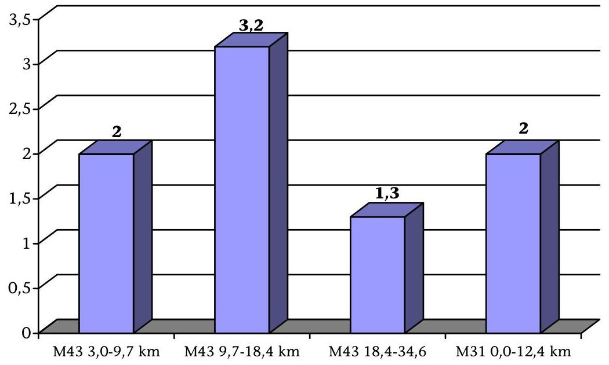

Az autópálya beruházások korábbi években tapasztalt fajlagos ráfordításai közel azonosak voltak, az M0 Keleti szektoron 1,9 és 2,8 Mrd Ft/km között, az M7/M70 szakaszokon 1,6 és 1,9 Mrd Ft/km között alakultak az elmúlt években.

Az ellenőrzött szakaszoknál az Aptv-ben és a kapcsolódó kormányhatározatokban megjelenő, a kiépítés ütemét, valamint útkategóriáját érintően változó fejlesztési politika (főút, autóút, autópálya) nem segítette a költség- és határidőcélok tartását. Az Aptv. a 2007. július 3-i módosításáig az M6 Dunaújváros–Szekszárd közötti szakasz megépítését nem tartalmazta, a többi ellenőrzött gyorsforgalmi útszakaszoknak a törvény szerinti befejezési határideje 2007. év vége volt. Az Aptv. az M43 Maroslele–Makó szakaszt 2x1 sávos autóútként hatá-

---

rozta meg. Ezen jogszabályi előírástól eltérő műszaki megoldás valósult meg a GKM infrastruktúra ügyekért felelős
 szakállamtitkára 2007. november 5-én kelt utasítása alapján - a Maroslele-Makó szakaszon a $2 \times 2$ sávos autópálya megépítésével.

A jelenlegi jogi szabályozás szerint az autópálya-projektek megvalósításához kapcsolódó, a közpénzek hatékony felhasználásához fűződő érdekek háttérbe szorulnak az autópálya építések elsőbbségét - azok közérdekűségének rögzítésével megvalósuló - védelmét biztosító törvényi szabályozás hiányában az önkormányzati hatósági, szabályozási döntések, valamint a régészeti feltárások során. A környezetvédelmi döntések során azok költségkihatásait nem számszerűsítették, nem értékelték. Az egyes állami beruházásokhoz, így az autópálya beruházásokhoz szükséges önkormányzati hozzájárulások és engedélyezések során anélkül érvényesültek önkormányzati érdekek (pl.: az M31 autópályán Gödöllő, Kerepes, Kistarcsa, Nagytarcsa, Mogyoród, az M43 autópályán Szeged, Makó és a 4519-es úti csomóponti lehajtó), hogy azok költségkihatásait számításba vették volna (pl.: csomópontok gyakorisága, kerékpárutak). A kulturális örökség védelméről szóló 2001. évi LXIV. törvény 22. § (3) bekezdés alapján a beruházó köteles volt a területileg illetékes megyei múzeummal szerződést kötni a megelőző régészeti feltárásra vonatkozóan. Ezáltal a múzeumok bevételi lehetőségként számoltak a közlekedési infrastruktúra-beruházásokkal, jogszabály nem kötelezte őket a beruházói szempontok részleges figyelembe vételére. Az ÁSZ autópálya ellenőrzésekkel kapcsolatos tapasztalatai időszerűvé tették - a fentiek kezelése érdekében - az autópálya beruházások közérdekűségének fokozottabb érvényesítését lehetővé tevő jogszabályi változások kormányzati szintű kezdeményezését.

Az autópálya szakaszok nyomvonal kijelölése meghatározó volt a projektek műszaki tartalma (hidak, alagutak, földmunka) és ennek függvényében az építési költségek vonatkozásában. A nyomvonal kijelölések szakaszonként eltérő színvonalon és eltérő időigénnyel valósultak meg.

Az M6/M60 autópályán - miközben a nyomvonal kijelölés 1981-től 2008-ig tartott - 2007-ben még kérdéses volt a Bátaszék és Véménd közötti szakaszon az alagutak megépítése. Először 2004. júniusban tartalmazták az engedélyezési tervek az alagutak megépítését, és ez a nyomvonal 2004-ben környezetvédelmi engedélyt kapott. A NIF Zrt. 3 évvel később közbeszerzési pályázatot írt ki az alagutas szakaszt helyettesítő műszaki megoldás kidolgozására (7, 8. sz. melléklet). Közel azonos (átlagosan 200-300 méteren belül) nyomvonalon készült el az UVATERV Zrt. tervváltozata, alagutak nélkül, mély bevágások és magas töltések, valamint völgyhidak tervezésével. Az UVATERV Zrt. által kidolgozott alagút nélküli tervet a környezetvédelmi szakhatóság 2007-ben elutasította. A NIF Zrt. az alagútépítési technológia választását alapvetően az elutasító határozatra építve, a környezetvédelmi szempontokkal, továbbá 7-8 millió $\mathrm{m}^{3}$ kitermelt föld elhelyezési többletköltségével indokolta. A környezetvédelmi szempontokon túl az alagút megépítése melletti érvek között 2007. évben már az időkorlát vált meghatározóvá, amelynek alárendelték a költségszempontokat. A költségeket összehasonlító szakértői dokumentum szerint az alagút nélküli változatnál figyelembe vették az 50 km -es átlagos szállítási távolság miatti földelhelyezési többletköltséget, valamint az ilyen hatósugarú térségben a jogszabályok szerinti kötelezettséget az úthelyreállításokra 10 milliárd Ft-ot meg-

---

haladó értékben. Ugyanakkor nem vették számításba az alagutak üzemeltetési költségeit, sebességi és forgalombiztonsági jellemzőkre gyakorolt csökkentő hatását. A bevágások és töltések építésére maradt idő a talajmechanikai szakvélemény alapján az előkészítés és döntések késedelme miatt az alagútépítés szükségszerűségét mutatta.

A nyomvonalváltozatok kidolgozása és összehasonlítása nem volt teljes körű. Nemzetgazdasági szintű hasznosítási megoldásokat (például hulladéklerakók rekultivációja révén) nem alkalmaztak. Az alagútépítés szükségessége nem volt teljes körűen bizonyított, kiemelten a nyomvonal változatok építéstechnológiát és költségeket figyelembe vevő keresése és a költség összehasonlítások vonatkozásában. A nyomvonal és azzal összefüggő építéstechnológiára vonatkozó döntések meghozatalakor, a gazdaságossági összehasonlításkor megalapozatlanul mutatták ki az alagútépítési technológia és a vonatkozó nyomvonal előnyösségét más korábbi időszakban lehetséges műszaki megoldásokkal szemben.

Az M31 autópálya nyomvonal kijelölési folyamata az EKHT elkészítésétől kezdődően a környezetvédelmi engedély kiadásáig 4 évet vett igénybe. Az engedélyezés folyamata során figyelembe vették az érintettek véleményét. Az M43 autópálya első nyomvonal változatainak 1993. évi kidolgozásától a forgalomba helyezésig 18 év telt el. A nemzetközi forgalom és az önkormányzatok igényeinek alapulvételével döntöttek a Szegedet és Makót északról elkerülő autópálya nyomvonalról.

Forgalmi becslések, modellezések és gazdasági elemzések az EU pályázatok részeként készültek. A becsült forgalmi adatok alapján alakították ki a műszaki jellemzőket (forgalmi sávok száma, útkategóriák, útpályaszerkezet) és a beruházások gazdaságossági megítélésében ezek az adatok voltak meghatározóak a projektek nettó jelenértékének számítása során. A tényleges forgalmi adatok alapján az M31 autópálya beruházás volt a leghatékonyabb, mivel 2010 augusztusától decemberéig mért forgalmi adatok az átadást követően 11845 és 14576 jármű/nap közötti értéket mutattak. Ilyen forgalmi érték az M6/M60 autópályán közelítőleg csak 2030-ra valószínűsíthető, így a szakasz előrehozott beruházásként valósult meg, ugyanis az M6 Dunaújváros-Szekszárd szakaszon 2010 decemberében irányonként 3400 és 3700 jármű/nap között alakult az átlagos napi forgalom. Az M43 autópálya forgalmi becslési adatai mutatták, hogy a Románia felé tervezett közlekedési folyosó kiépítésének felgyorsítása fő cél volt az EU régiók közti elérhetőség mielőbbi fejlesztése érdekében.

Az autópálya szakaszokra eltérő részletességgel és megbízhatósággal készültek gazdaságossági számítások, amelyek az M6/M60 autópálya esetében a finanszírozási konstrukció választásában nem játszottak szerepet. Az M6 autópálya esetében Kohéziós Alap és központi költségvetési forrás hiányában a koncessziós szerződéses megoldás kapott prioritást. A koncessziós szerződések közbeszerzési előkészítésére az Országgyűlés felhatalmazást adott. Az M6/M60 autópálya szakaszok megvalósításának gazdasági indokoltságát nem támasztották alá. Az elvégzett gazdaságossági számítások csak költségösszehasonlításra terjedtek ki, amelyeket a szerződéskötés előtt 0-2 hónappal végeztek el, az összehasonlítás alapjául szolgáló alapadatokat nem ellenőrizték. A költség-összehasonlítások a döntéshozatali folyamatban megfelelő időben nem álltak rendelkezésre. A felkért szakértő által végzett gazdaságossági

---

számítások azt mutatták, hogy az adott műszaki-gazdasági feltételrendszer alapján a beruházás PPP konstrukcióban való megvalósítása kedvezőbb a tradicionális, állami beruházáshoz képest. Az M6/M60 autópálya Szekszárd-Pécs szakaszán elvégzett költség-összehasonlítások alapadatainak előállítási és felhasználási módja kockázatot jelentett. Az elemzéseket végző tanácsadó a szakvéleményben rögzítette, hogy sem direkt, sem indirekt módon nem vállal szavatosságot, illetve felelősséget a dokumentumban foglaltak tartalmáért.

A PPP javára kimutatott 16,1-17,5 Mrd Ft-os tervezett költségelőny nem mutatta a választott konstrukció indokoltságát. A tradicionális és a PPP konstrukció összehasonlítása során azt feltételezték, hogy az Állam által irányított beruházások esetén mintegy 40 Mrd Ft-tal magasabb építési költséggel lehet megépíteni az egyes szakaszokat. A tényleges helyzet szerint a Szekszárd-Pécs szakaszon a PPP konstrukció a tradicionálissal szemben hátrányos volt a PPP konstrukció tervadatainak a nyertes ajánlatban szereplő költségadatokkal való összehasonlítása alapján. Az euró árfolyam változása érdemi mértékben hat a magyar költségvetésből kifizetett rendelkezésre állási díjra. Az árfolyamváltozás kockázata, illetve ennek teljes egészében a költségvetés általi viselése miatt fennáll annak a lehetősége, hogy a PPP beruházás választása a Magyar Állam számára hátrányos volt.

Az ellenőrzött autópálya beruházásoknál a 2007-2010. évek közötti időszakban a forrásösszetételt hosszú távú költségvetési kötelezettségvállalás (PPP beruházás) és az EU támogatás növekedése jellemezte. Nincs kormányzati döntés arról, hogy az EU támogatás terhére el nem számolható költségek fedezete milyen forrásból biztosítható a NIF Zrt. részére. Az EU által támogatott projektek áfa tartalmának finanszírozása kapcsán véleményeltérés van ebben a kérdésben az EU és a Magyar Állam között. Az EU támogatás a 2007. évi 2,8 Mrd Ft-ról (25\%) 2010-re 55,5 Mrd Ft-ra (81\%) változott. Az M31 és M43 autópálya szakaszok előkészítésére és kivitelezésére, valamint az M6/M60 autópálya szakaszok előkészítésére a 2007-2010. évek közötti időszakban 152,0 Mrd Ft beruházási ráfordítás szerepelt a NIF Zrt. elszámolásaiban. Ebből az M31 és M43 autópálya beruházások esetében a hazai forrás (költségvetés, hitel és NIF Zrt. saját tőke) 26 Mrd Ft (22\%), az EU támogatás 91,5 Mrd Ft (78\%) volt.

A projektek forrástervezését nem hangolták össze az évenkénti költségvetési tervezéssel, az uniós projektek több éves támogatási szerződéseivel és az uniós támogatások utófinanszírozási jellegével, amelynek kapcsán a vállalkozói számlák késedelmes kifizetése következett be. A számlák kifizetésének átfutási ideje meghosszabbodott a költségvetési és uniós források lehívásának államháztartási szabályai, időbeli ütemezése és az elszámolás szabályozásának összetettsége miatt. Ezen túlmenően a késedelmes kifizetésekhez a forráshiányok is hozzájárultak, továbbá a kifizetések eljárásmenetének szabályozása nem volt teljes körű, mivel az nem terjedt ki a belső teljesítésigazolások időkorlátainak meghatározására.

A kifizetett késedelmi kamatok összege 2005-2010 között 66,5 millió Ft és 1176,8 millió Ft között változott. A 2008. évi maximális érték (1176,8 millió Ft) összefüggésben volt a nagyobb összegű számla kibocsátásokkal és a nagyszámú területszerzéssel. A kifizetett kamatösszegek a továbbiakban növekedhetnek, mivel a vállalkozóknak öt éven belül lehetőségük van a késedelmikamat-

---

követelésük érvényesítésére. A főkönyvi könyveléshez nem tartozott projektszintű késedelmi kamat analitika, ezért a NIF Zrt. a késedelmi napokat és a kifizetett késedelmi kamatokat projektenként nem követte a késedelmesen kifizetett számlákhoz kapcsolódóan.

Az M6/M60 autópálya szakaszok ellenőrzése - az Állam érdekeinek érvényesítése szempontjából - kiterjedt a PPP konstrukció választásának és a koncessziós szerződéses feltételrendszernek az elemzésére és gyakorlati alkalmazásának értékelésére. Az M6/M60 autópálya megvalósítása során a koncessziós szerződések értelmében a kivitelezés irányítása a koncesszor kötelezettsége volt, a NIF Zrt. feladatai a műszaki-gazdasági előkészítésre, továbbá a műszaki képviselői feladatok ellátására terjedtek ki. A három autópálya-szakasz építési engedélyezési folyamata 2005 februárjától 2007 novemberéig tartott, az engedélyezési tervekhez - megbízások hiányában - nem készültek tervezői költségbecslések.

A munkaterületek átadásához szükséges előfeltételek (területszerzés, régészet, lőszermentesítés) nem voltak teljes körűen biztosítottak. A koncessziós szerződésre vonatkozó pályázatok kiírásának időpontjában a területszerzés nem fejeződött be. Az M6 Dunaújváros és Szekszárd közötti szakasz esetében az összes terület 60\%-a állt rendelkezésre, míg a másik két szakasz (Szekszárd-Bóly, illetve az M60 Bóly-Pécs közötti szakasz) esetében ez az arány 90\%-ot ért el. A területszerzési tevékenység késedelme miatt a koncesszor a felelősség alóli mentesítési kérelmeket (mentesítési eseményeket) és ezekhez kapcsolódóan költségigényt jelentett be, amelyet nem számszerűsített.

A régészeti tevékenység mintegy 80 helyszínen késleltette az építési munkákat, ezért a koncesszor mind a három szakaszon úgynevezett mentesítő eseményeket jelentett be, amelyek felülvizsgálata az ellenőrzés lezárásakor folyamatban volt.

A koncessziós szerződések a tervezett, ideiglenes teljesítés időpontját 2010. március 31-én rögzítették. Az autópályák üzemeltetési időszakában az Állam rendelkezésre állási díjat fizet, amely magában foglalja a koncesszorok mindenfajta költségét a szerződésben megállapított és rögzített kockázati keretek között.

A koncessziós szerződések értelmében az előre nem látható eseményekre hivatkozással a koncesszor bejelentett vis maior és mentesítési eseményeket, amelyek elbírálása, illetve elfogadása kihatott a rendelkezésre állási alapdíjból alkalmazott levonások mértékére. A szerződéses feltételek szerint nem volt megkülönböztetve, hogy a kivitelezési, ill. az üzemeltetési fázisban külön-külön milyen eseményeket fogadnak el vis maior eseményeknek. Továbbá nem voltak meghatározva a határértékek és a gyakoriság sem (például a rendkívüli mértékű vihar, szélvihar, hóvihar, havazás, ónos eső vagy jégeső, árvíz), ami alapján félreértelmezetten, elfogadhatatlan esetekben is vis maior eseményt jelentett be a koncesszor, amely a rendelkezésre állási díj meghatározásakor a levonások csökkentésére irányult.

A koncesszorok 61 alkalommal tettek javaslatot műszaki tartalomváltozásra, amelyből 40 esetben annak
 benyújtásakor már folyamatban volt a kivitelezés.

---

Ezáltal megszegték a koncessziós szerződések előírásait, mivel a munkák megkezdése után jelentették be a változtatásra vonatkozó igényüket.

Az M6 Dunaújváros-Szekszárd közötti szakasz esetében KHEM koncesszori mulasztás miatt 3 alkalommal intés kiadásával figyelmeztette a koncesszort a szerződésszegésre, mivel a koncesszor - utólagosan módosítást, ill. szabvány alóli felmentést kérve - előzetes jóváhagyás nélkül végezte a kivitelezést. Egy intéssel kapcsolatban még nem zárultak le az egyeztetések.

Az üzemeltetési időszakban fizetendő alap rendelkezésre állási díjak várható nominális összege az M6 Dunaújváros-Szekszárd közötti szakasz esetében 334,8 Mrd Ft, az M6 Szekszárd-Pécs közötti szakasz esetében 662,9 Mrd Ft 28 év alatt.

# A rendelkezésre állási díjak alakulása 2010-ben 

M Ft nettó értéken

|  | Pénzügyi mo-   dellben terve-   zett rendelke-   zésre állási díj | Alap rendelkezésre állási díj levonások nélkül | Levonások | Kifizetett rendelkezésre állási díj |
| :--: | :--: | :--: | :--: | :--: |
| M6 Dunaújvá-ros-Szekszárd (2010.07.16-2010.12.15.) | 4675 | 5062,1 | 529,3 | 4532,8 |
| M6 Szekszárd-Pécs   (2010.03.31-   2010.12.20.) | 14655 | 15944,5 | 537,6 | 15406,9 |

Az alap rendelkezésre állási díjak tényleges alakulása mindkét koncessziós szerződés esetén 8-9%-kal meghaladta a tervezett értékeket. A Dunaújváros-Szekszárd szakaszon havonta átlagosan 15,6 millió Ft/km/hó, a Szekszárd-Bóly szakaszon 22,3 millió Ft/km/hó volt az alap rendelkezésre állási dí értéke. A 40%-os eltérés a magasabb építési (völgyhidak, alagút) költségek eredménye.

A hiányos, előírásoktól eltérő teljesítés miatt a levonások aránya a Dunaújváros-Szekszárd szakaszon 10%, a Szekszárd-Pécs szakaszon 3% volt. Az NFM 2010. évi megbízása alapján folyamatban van a PPP keretében megvalósított közlekedési infrastruktúra projektek, különösen az M6 autópálya szakaszok koncessziós szerződéseinek jogi-szakmai átvilágítása.

Az M31 autópálya műszaki-gazdasági előkészítő fázisában a fejlesztési koncepció változását mutatta az, hogy az építési tervek készítésével kapcsolatban 2002 és 2007 között hét szerződésmódosítás történt. Az engedélyezési folyamatok során szakhatósági engedélyek nem álltak időben és teljes körűen rendelkezésre. A kivitelező részére átadott területek aránya 69,8%-ot ért el 2009. január végén, ezért a kivitelező sürgette a munkaterületek mielőbbi átadását, amelynek hiánya veszélyeztette a szerződéses megállapodás szerinti befejezési határidő betartását.

---

A beruházás műszaki előkészítésének, és az ajánlati dokumentációnak a hiányosságai, továbbá az előre nem látható okok miatt a projekt kivitelezés tevékenységei azok megkezdésekor nem rendelkeztek tartalékidővel. A tevékenységek tervezetthez képest későbbi végrehajtása mintegy 800 millió Ft többletköltséget eredményezett (ÁAK Zrt. üzemeltetői igények nélkül).

A költségbecslések módja és megbízhatósága nem volt elfogadható. A GKM részére a közbeszerzési eljárás megindítása tárgyában készült előterjesztésben (2008. február) a beszerzés nettó értékeként 16,1 Mrd Ft-ot becsült a NIF Zrt, amelynek alapján a GKM a kivitelezés finanszírozásának forrását biztosítottnak tartotta. Ez a becsült összeg 5,7 Mrd Ft-tal volt alacsonyabb a kivitelezővel kötött szerződéses árhoz (21,8 Mrd Ft), és 7,9 Mrd Ft-tal a tényleges költséghez (24,0 Mrd Ft) képest (alultervezés). A mérnökár nem volt megalapozott kalkuláció a kivitelezés előzetes, reális költségének meghatározásához.

Az autópálya kivitelezése során a költség- és időcélok nem teljesültek. A kivitelezés szerződéses ára nettó 21,8 Mrd Ft, amelyet fix átalánydíjként határoztak meg. A szerződésmódosítások következtében a beruházás tényleges építési költsége a szerződéses árat 10,21%-kal haladta meg. Ez a körülmény a kockázatok megosztását, az átalányáras elszámolási mód alkalmazását nem igazolta. A kivitelezésre tervezett 18 hónapos megvalósítási időtartam 7 hónappal meghosszabbodott. A forgalomba helyezési időpontot tekintve közel 4 hónapos határidő túllépés volt. A kivitelezés megkezdése előtt a NIF Zrt. nem az építéshez szükséges időtartammal számolt és nem kalkulált a beruházások szezonális jellegével. Nem mérte fel az előkészítési kockázatokat és azok hatását a beruházás határidő-, költség- és minőségi céljaira. A NIF Zrt. az ÁAK Zrt. közútkezelői követelményeit a kivitelezés időszakában szerezte be, ebből eredően 1,0 Mrd Ft értékű pótmunka keletkezett.

Az M31 autópálya megvalósítása során a Mérnök feladatainak díjazása nem volt teljesítményarányos, a határidő módosulások többlet díjfizetést eredményeztek a Mérnök részére.

Az M43 autópálya szakaszok műszaki-gazdasági előkészítése során a tervezett időben nem voltak biztosítottak, és nem jöttek létre teljes körűen a munkaterületek átadásának a feltételei. A tervezési folyamatok és az engedélyezési eljárások többször megismétlődtek a fejlesztési koncepciók változása (autóút, autópálya, Tisza-híd) miatt.

A kivitelezés során az M43 autópálya mindhárom szakaszán szerződésmódosítások váltak szükségessé előre nem látható okok (rendkívüli időjárás) és jogi szempontok (a kivitelező által érvényesített jogi oszthatatlanság elve ${ }^{3}$ ) miatt. Az M43 autópálya megvalósítása során a szerződéses árak az I-III. szakaszokon, együttesen - a kivitelezői szerződésmódosítások eredményeképpen 57 Mrd Ft-ról 62 Mrd Ft-ra emelkedtek, amely 9%-os arányú költségnövekedést mutatott. A kivitelezők által benyújtott változtatási kérelmek összes értéke a 2010. december 31-i állapot szerint 11,2 Mrd Ft-ot tett ki. Ebből a Mérnök által

[^0]
[^0]:    ${ }^{3}$ Ennek az volt a jogi kritériuma, hogy a szakaszra kötött szerződés mindaddig a Ptk. szerint oszthatatlan, amíg a szerződő felek ettől eltérően meg nem állapodnak.

---

elfogadásra javasolt összeg 6,9 Mrd Ft, a szerződésmódosítások keretében a NIF Zrt. által jóváhagyott pótmunkák összege 4,8 Mrd Ft volt. A helyszíni ellenőrzés lezárásakor elbírálás alatt lévő változtatási kérelmek előre nem látható költségkihatásaik miatt kockázatokat jelentenek.

A szerződéses határidők nem teljesültek, mivel a forgalomba helyezés az I. szakaszon 17 hónapos, a II. és III. szakaszon mintegy 8 hónapos késéssel valósult meg ( 9 . sz. melléklet) a területszerzési hiányosságok, illetve a folyamatosan változó fejlesztési célok miatt. Ebben szerepet játszott az is, hogy a tervezési és engedélyezési folyamatok - jelentőségüknek és hatásuknak megfelelő - ütemezése nem vált a projektmenedzsment részévé.

A határidőcsúszás tényleges szankcionálását a szerződéses feltételrendszer részben tette lehetővé, és azt csak az I. szakasz egy részénél alkalmazták. A teljes projekt értékére vetített napi 2%-os kötbér kikötése révén nem érték el a határidő tartását. A késedelmes forgalomba helyezést - a szerződésmódosítások szerint - a rendkívüli időjárás, az építési területen pontszerűen jelentkező, előre nem látható akadályozó tényezők eredményezték. A szerződésmódosításokban a kivitelezők időhosszabbítási ráfordításaik megtérítésére a jogosultságot fenntartották, és erre vonatkozó igényüket bejelentették. Ez finanszírozhatósági kockázatot jelent a még beárazatlan, elbírálatlan kivitelezői változtatási kérelmekkel együtt.

A költségirányítás érdekében végzett költségbecslések a beruházás különböző fázisaiban eltérő részletességgel és megbízhatósággal készültek. A három költségbecslő (a tervező, a Mérnök és a NIF Zrt.) által készített költségbecslések között 4%-91%-os eltérések voltak a három szakaszon. A tervezők és a Mérnökök költségszakértői tevékenysége nem volt elfogadható pontosságú, és a szerződéses feltételek erre vonatkozóan nem tartalmaztak előírást. Ez a körülmény vagy alulbecsült, vagy túlbecsült értékeket eredményezett az EU támogatási források tervezése és felhasználása, valamint az állami költségvetés által biztosított hazai források éves tervezése során. A pénzeszközök hatékony allokálhatósága, az irreálisan alacsony árak kiszűrése szempontjából is magas kockázatokat jelentett.

A munkamegosztás során a NIF Zrt. a projektmenedzsment feladatait alapvetően a Mérnökre delegálta a kivitelezési fázisban. A Mérnök részére történő kifizetésekkel kapcsolatban nem hangolták össze a szerződéses feltételeket az elvégzett és elvégzendő munkák arányával, továbbá a feladatok összetétele, díjazásának megoszlása nem volt átlátható. A Mérnökök saját minőségellenőrzési rendszere nem érvényesült, különösen az ütemtervek megfelelőségével kapcsolatban (10. sz. melléklet).

A minőségbiztosítás, minőségirányítás nem volt eredményes az M6/M60 Dunaújváros-Pécs autópálya szakaszon részben az időkorlátok miatt. A Dunaújváros-Szekszárd autópálya szakaszt a forgalombiztonság és az élettartam szempontjából az autópálya szakaszokat magas kockázatvállalásokkal, a koronaélen kívüli munkákat tekintve alacsony készültségi fokon adták át. Nem fejezték be a koronaélen kívüli építési munkákat, hiányosak voltak a minősítési és megvalósítási dokumentációk a forgalomba helyezés időpontjáig. A Du-

---

naújváros-Szekszárd autópálya szakaszon a szabályoktól eltérően egyidejűleg valósultak meg a műszaki átadási és forgalomba helyezési folyamatok.

Az építés során mindhárom szakaszon előfordultak jóváhagyott tervek, továbbá a Független Mérnök eltakarási és továbbépítési engedélye nélküli munkavégzések. A biztonsági követelményeket súlyosan sérti, hogy az M6 autópálya Dunaújváros-Szekszárd közötti szakaszán jóváhagyások (Mérnök, szakhatóság) nélkül - 52 darab hídon összesen mintegy 3440 méter hosszúságban - építették be a Tubosider gyártmányú közúti- és hídkorlátokat. A korlátok beépítését a Független Mérnök nem állította le.

A 2010. március 31-i forgalomba helyezések úgy valósultak meg, hogy a koronaélen kívüli, a beruházás szerves részét képező építési munkák (vízelvezetés, humuszolás, füvesítés, növénytelepítés stb.) csak részben készültek el. A Dunaújváros-Szekszárd szakaszon a készültség a koronaélen kívüli munkák esetében mintegy 60-65%-os volt, amely csak a koronaélen belüli ideiglenes forgalomba helyezést tette lehetővé. A Szekszárd-Pécs szakaszokon a hiba- és hiánylisták összesen mintegy 950 tételsort tartalmaztak a műszaki átadási-átvételi jegyzőkönyvek szerint. A Dunaújváros-Szekszárd autópálya szakaszon a koronaélen kívüli munkákat a műszaki átadás-átvételi eljárás után végezhették el a kivitelezők, amely az élettartam és a forgalombiztonsági követelmények teljes körű teljesítése szempontjából kockázatokat jelentett. A NIF Zrt. tájékoztatása szerint még 2011-ben is voltak olyan részek, ahol 2010 tavaszától állt a talpárokban a víz, ami teherbírás és élettartam csökkenést okozhat. Az útpálya burkolatalap építésénél műszakilag nem elfogadható részletességgel igazolták a feszültségmentesítési és utókezelési eljárások előírásoknak megfelelő elvégzését, továbbá nem a hatályos útügyi műszaki előírásoknak megfelelően épültek meg az útpálya aszfaltrétegek.

Az M6 autópálya II. fázis esetében 2010. március 31-én a műszaki átadás-átvételi eljárást lezárták annak ellenére, hogy annak összes feltétele nem volt biztosított. Az egyes építményrészek végleges minősítése nem fejeződött be, a hídkorlátok nem feleltek meg az autópálya biztonságos üzemelési feltételeinek. Mindezek ellenére a műszaki átadás-átvétel lezárásának napján az M6 Dunaújváros-Szekszárd közötti autópálya szakaszt koronaélen belül ideiglenesen forgalomba helyezték. Az M6 Dunaújváros-Szekszárd szakaszon a forgalomba helyezés eljárásmódja nem felelt meg a koncessziós szerződés előírásainak, mivel az Állam rendelkezésére nem állt 15 nap a műszaki átadás-átvételi eljárás eredményeinek értékelésére és a kifogásainak megtételére. Az NKH 2010. március 31-i ideiglenes forgalomba helyezési határozatában 2010. június 30-i határidővel előírta a beépített korlátok újraépítését. Ez nem valósult meg és az NKH újabb határidőt írt elő 2011. december 31-re a végleges forgalomba helyezés feltételeként. Ez a határozat ellentétes volt a vonatkozó rendelet előírásaival, ugyanis a forgalombiztonsági követelményeket már az ideiglenes forgalomba helyezéskor is maradéktalanul érvényesíteni kellett volna.

A forgalomba helyezés után az M6/M60 Szekszárd-Pécs autópálya szakaszokon összesen több mint 3600 hiba bejelentés történt 11 hónap alatt. Ezek közül mintegy 60%-os részarányt képviseltek a vízelvezetéssel, rézsűerózióval összefüggő hibák. A bejelentett hibák többségét a helyszíni ellenőrzés befejezéséig, 2011. márciusig nem javították ki.

---

Az M31 autópálya szakaszon a 2010. október 1. után bejelentett hibák közel kétharmada vízelvezetési, rézsű és padka hibákra vonatkozott. 2011. márciusig egyetlenegy hiba kijavítását igazoló dokumentum nem állt rendelkezésre.
 Az élettartam szempontjából további kockázatokat jelent az, hogy az autópálya beton pályaburkolatba beépített acélbetétek megfelelőségét igazoló dokumentumok nem készültek.

Az M43 autópálya 2010-ben átadott szakaszán olyan forgalomba helyezés után bejelentett hibák voltak (veszélyes rézsúcsúszás, nagy felületű rézsúkimosódás, haladósávban burkolatjel festéskopások), amelyek kijavítása nem történt meg, így közlekedésbiztonsági kockázatot jelent.

A NIF Zrt. belső ellenőrzése a jelen ÁSZ ellenőrzésben szereplő autópályaszakaszokat nem vizsgálta. Az ÁSZ a 2008-ban befejeződő autópálya beruházások ellenőrzéséről készült jelentését 2009 augusztusában tette közzé. A javaslatok végrehajtására intézkedési tervek készültek a KHEM és a NIF Zrt. részéről. Hasznosulásuk a 2010-2011-ben befejezett projekteknél még nem volt értékelhető. Az EU támogatással megvalósuló projekteknél a pályáztatási és az utóértékelési fázisban költség-haszonelemzéseket végeztek. Ugyanakkor az ÁSZ által javasolt eredményességi és hatékonysági mutatók (például a 11. sz. mellékletnek megfelelően) alkalmazása nem épült be a projektmenedzsment gyakorlatába.

Az Állami Számvevőszékről szóló 2011. évi LXVI. törvény 33. § (1) bekezdésében foglaltak értelmében a jelentésben foglalt megállapításokhoz kapcsolódó intézkedési tervet köteles az ellenőrzött szervezet vezetője összeállítani és azt a jelentés kézhezvételétől számított harminc napon belül az ÁSZ részére megküldeni. Amennyiben az intézkedési tervet határidőben nem küldi meg a szervezet, vagy az nem elfogadható, az ÁSZ elnöke a hivatkozott törvény 33. § (3) bekezdés a)-b) pontjaiban foglaltakat érvényesítheti.

Az ellenőrzés intézkedést igénylő megállapításai és javaslatai:

# a nemzeti fejlesztési miniszternek 

1. A jelenlegi jogi szabályozás szerint az autópálya-projektek megvalósításához kapcsolódó, a közpénzek hatékony felhasználásához fűződő érdekek háttérbe szorulnak az autópálya építések elsőbbségét - azok közérdekűségének rögzítésével megvalósuló megfelelő védelmét biztosító törvényi szabályozás hiányában az önkormányzati hatósági, szabályozási döntések, valamint a régészeti feltárások során. A környezetvédelmi döntések során azok költségkihatásait nem számszerúsítették, nem értékelték. Az autópálya beruházásokhoz szükséges önkormányzati hozzájárulások és engedélyezések során anélkül érvényesültek önkormányzati érdekek, hogy azok költségkihatásait számításba vették volna.

Javaslat:
Kezdeményezze a Magyar Köztársaság gyorsforgalmi közúthálózatának közérdekűségéről és fejlesztéséről szóló 2003. évi CXXVIII. törvény módosítását annak érdeké-

---

ben, hogy az autópálya beruházásokban érintettek részérdekei a közpénzek hatékony felhasználása szempontjából összehangoltak legyenek.
2. Az M31 és az M43 autópálya kivitelezése során a költség- és időcélok nem teljesültek. Ez a körülmény a kockázatok megosztását, az átalányáras elszámolási mód alkalmazását nem igazolta. A határidőcsúszás tényleges szankcionálását a szerződéses feltételrendszer részben tette lehetővé, és a teljes projekt értékére vetített napi 2\%-os kötbér kikötése révén nem érték el a határidő tartását. A kivitelezés során az M43 autópálya mindhárom szakaszán szerződésmódosítások váltak szükségessé előre nem látható okok (rendkívüli időjárás) és jogi szempontok (a kivitelező által érvényesített jogi oszthatatlanság elve) miatt. A szerződésmódosításokban a kivitelezők időhosszabbítási ráfordításaik megtérítésére a jogosultságot fenntartották, és erre vonatkozó igényüket bejelentették. Ez finanszírozhatósági kockázatot jelent a még beárazatlan, elbírálatlan kivitelezői változtatási kérelmekkel együtt.

Javaslat:
A tulajdonosi jogkör gyakorlójaként intézkedjen a NIF Zrt.-nél alkalmazott szerződéses feltételrendszer - műszaki, pénzügyi és jogi szempontú - felülvizsgálatáról, különös tekintettel a többletidő ráfordítások finanszírozására és a kötbérigény érvényesítésétől való eltekintés gyakorlatára.
3. Az M31 autópálya műszaki-gazdasági előkészítő fázisában a fejlesztési koncepció változását mutatta az, hogy az építési tervek készítésével kapcsolatban 2002 és 2007 között hét szerződésmódosítás történt. A kivitelezés megkezdése előtt a NIF Zrt. nem az építéshez szükséges időtartammal számolt és nem kalkulált a beruházások szezonális jellegével. Nem mérte fel az előkészítési kockázatokat és azok hatását a beruházás határidő-, költség- és minőségi céljaira.

Az M43 autópálya szakaszok műszaki-gazdasági előkészítése során a tervezett időben nem voltak biztosítottak, és nem jöttek létre teljes körűen a munkaterületek átadásának a feltételei. A tervezési folyamatok és az engedélyezési eljárások többször megismétlődtek a fejlesztési koncepciók változása (autóút, autópálya, Tisza-híd) miatt.

Javaslat:
A tulajdonosi jogkör gyakorlójaként rendelje el kockázatelemzések elvégzését a műszaki-gazdasági előkészítés összes folyamatára és azt, hogy ennek keretében a NIF Zrt. értékelje azok hatását a kivitelezésre.
4. A biztonsági követelményeket súlyosan sérti, hogy az M6 autópálya Dunaújváros-Szekszárd közötti szakaszán jóváhagyások (Mérnök, szakhatóság) nélkül - 52 darab hídon összesen mintegy 3440 méter hosszúságban - építették be a Tubosider gyártmányú közúti- és hídkorlátokat. A korlátok beépítését a Független Mérnök nem állította le. Az NKH 2010. március 31-i ideiglenes forgalomba helyezési határozatában 2010. június 30-i határidővel előírta a beépített korlátok újraépítését. Ez nem valósult meg és az NKH újabb határidőt írt elő 2011. december 31-re a végleges forgalomba helyezés feltételeként. Ez a határozat ellentétes volt a vonatkozó rendelet előírásaival, ugyanis a forgalombiztonsági követelményeket már az ideiglenes forgalomba helyezéskor is maradéktalanul érvényesíteni kellett volna.

---

Javaslat:
Intézkedjen az M6 autópálya Dunaújváros-Szekszárd közötti szakaszán a közúti- és hídkorlátokkal összefüggő közlekedésbiztonsági kockázatok megszüntetéséről, vizsgáltassa ki az autópálya forgalomba helyezése során a forgalombiztonsági szabályok megsértésének körülményeit és ez alapján - ha szükséges - intézkedjen a személyi felelősség megállapításáról.
5. A projektek forrástervezését nem hangolták össze az évenkénti költségvetési tervezéssel, az uniós projektek több éves támogatási szerződéseivel és az uniós támogatások utófinanszírozási jellegével, amelynek kapcsán a vállalkozói számlák késedelmes kifizetése következett be. A számlák kifizetésének átfutási ideje meghosszabbodott a költségvetési és uniós források lehívásának államháztartási szabályai, időbeli ütemezése és az elszámolás szabályozásának összetettsége miatt. Ezen túlmenően a késedelmes kifizetésekhez a forráshiányok is hozzájárultak, továbbá a kifizetések eljárásmenetének szabályozása nem volt teljes körű, mivel az nem terjedt ki a belső teljesítésigazolások időkorlátainak meghatározására.

Javaslat:
Kezdeményezze a kivitelezési és EU támogatási szerződések kifizetésekkel kapcsolatos feltételrendszereinek összehangolását az átfutási idő csökkentése érdekében.
6. Az Aptv. az M43 Maroslele-Makó szakaszt 2 × 1 sávos autóútként határozta meg. Ezen jogszabályi előírástól eltérő műszaki megoldás valósult meg - a GKM infrastruktúra ügyekért felelős szakállamtitkára 2007. november 5-én kelt utasítása alapján - a Maroslele-Makó szakaszon a 2 × 2 sávos autópálya megépítésével.

Javaslat:
Vizsgáltassa ki az M43 II. szakaszon (Maroslele-Makó között) a törvényben előírt 2 × 1 sávos autóút helyett a 2 × 2 sávos autópálya megépítésére vonatkozó döntések körülményeit és a vizsgálat alapján - ha szükséges - intézkedjen a személyi felelősség megállapításáról.
7. Az M31 és az M43 autópálya szakaszoknál a költségirányítás érdekében végzett költségbecslések a beruházások különböző fázisaiban eltérő részletességgel és megbízhatósággal készültek. A három költségbecslő (a tervező, a Mérnök és a NIF Zrt.) által készített költségbecslések között 4%-91%-os eltérések voltak. A tervezők és a Mérnökök költségszakértői tevékenysége nem volt elfogadható pontosságú, és a szerződéses feltételek erre vonatkozóan nem tartalmaztak előírást. Ez a körülmény vagy alulbecsült, vagy túlbecsült értékeket eredményezett az EU támogatási források tervezése és felhasználása, valamint az állami költségvetés által biztosított hazai források éves tervezése során. A pénzeszközök hatékony allokálhatósága, az irreálisan alacsony árak kiszűrése szempontjából is magas kockázatokat jelentett.

Javaslat:
A tulajdonosi jogkör gyakorlójaként intézkedjen az M31 és az M43 autópálya szakaszoknál a pontatlan költségbecslésekhez vezető, valamint a költségvetési tervezésben

---

és gazdálkodásban kockázatokat okozó tényezők feltárásáról. Követelje meg az építési beruházásoknál a tervezési folyamatokba beépülő, a beruházási folyamat minden fázisára kiterjedő költségszámítás készítését és annak felelős, hatékony végrehajtását.

---

# II. RÉSZLETES MEGÁLLAPÍTÁSOK 

## 1. A GYORSFORGALMI ÚTHÁLÓZAT FEJLESZTÉSI PROGRAMJAI ÉS JOGSZABÁLYI KÖRNYEZETE

### 1.1. Jogszabályi környezet

A gyorsforgalmi úthálózat fejlesztési ütemét 2003-ban az Országgyűlés törvényi szinten határozta meg a szakmai és tulajdonosi irányítást és felügyeletet gyakorló minisztérium által elfogadott, tervezett megvalósítási ütemmel összhangban. Az autópályák építési programjának a tervezett és tényleges megvalósítás közötti eltérései (késedelmek), a finanszírozási források (EU támogatások) rendelkezésre állásának mértéke, az EU bővítéssel és a nemzetközi hálózatfejlesztéssel kapcsolatos változások nem tették lehetővé a jogszabályi előírásoknak megfelelő megvalósítást.

A gyorsforgalmi úthálózat fejlesztésével kapcsolatos forgalomba helyezési időpontok nem voltak tarthatóak, mivel a fejlesztési program megvalósításának törvényi szinten történő előírását nem támasztották alá idő- és költségcél realitását igazoló hatás és kockázatelemzések, a gyorsforgalmi úthálózat fejlesztési program nem volt megalapozott és időtálló. A fejlesztési program változásától függően, amely az előkészítés helyzetének és a finanszírozási lehetőségeknek az alakulása szerint módosult, a gyorsforgalmi úthálózat fejlesztésével kapcsolatos törvényi előírások is változtak. Az előkészítés időigényét meghosszabbították a műszaki tartalomváltozások, az útkategória váltások (autóútról autópályára) miatt szükséges áttervezések. A fejlesztések véglegesítését késleltették a források (költségvetés, EU forrás, magántőke) rendelkezésre állásának bizonytalanságai és a nemzetközi gyorsforgalmi úthálózat fejlesztési prioritások változásai (a csatlakozó szomszédos országok fejlesztési programjai).

Ez a körülmény okozta azt, hogy az Aptv. mellékletének 2007. évi módosítása után a megvalósítás üteme már nem szerepel a törvény szövegében. Ebből eredően megnövekedtek a kockázatok az Országgyűlés hatáskörébe tartozó hosszú távú fizetési kötelezettségek vállalása, valamint a többéves költségvetéstervezés szempontjából.

A 2007. VII. 3-tól kezdődően az Aptv. 1. sz. mellékletének a szerkezete megváltozott, ezen időszaktól kezdve már csak a szakaszok nevét, az út típusát (kiépítését), a sávok számát és a szakaszok hosszát tartalmazza, de az átadás határidejét nem.

A nemzetgazdasági szempontból kiemelt jelentőségű beruházások gyorsításáról és egyszerűsítéséről szóló 2006. évi LIII. törvényben kapott felhatalmazás alapján az egyes útépítési beruházások megvalósításával összefüggő közigazgatási hatósági ügyek kiemelt jelentőségű üggyé nyilvánításáról a Kormány 2008 áprilisi-

---

ban döntött. ${ }^{4}$ A jogszabályi környezetben bekövetkezett pozitív változás a 2008-ban szerződött - a jelen vizsgálat tárgyát képező autópályák esetében - az előkészítés előrehaladottsága következtében már nem tudott érdemben segíteni a beruházási folyamatok hatékonyabbá tételében.

A jelenlegi jogi szabályozás szerint az autópálya-projektek megvalósításához kapcsolódó, a közpénzek hatékony felhasználásához fűződő érdekek háttérbe szorulnak az autópálya építések elsőbbségét - azok közérdekűségének rögzítésével megvalósuló - védelmét biztosító törvényi szabályozás hiányában az önkormányzati hatósági, szabályozási döntések, valamint a régészeti feltárások során. A környezetvédelmi döntések során azok költségkihatásait nem számszerúsítették, nem értékelték. Az egyes állami beruházásokhoz, így az autópálya beruházásokhoz szükséges önkormányzati hozzájárulások és engedélyezések során anélkül érvényesültek önkormányzati érdekek (pl.: az M31 autópályán Gödöllő, Kerepes, Kistarcsa, Nagytarcsa, Mogyoród, az M43 autópályán Szeged, Makó és a 4519-es úti csomóponti lehajtó), hogy azok költségkihatásait számításba vették volna (pl.: csomópontok gyakorisága, kerékpárutak). A kulturális örökség védelméről szóló 2001. évi LXIV. törvény, valamint a végrehajtására kiadott rendeleti szabályozások a régészeti értékek védelme érdekében a nagyberuházások részévé tette, a nagyberuházókra telepítette a megelőző feltárások költségeit. A kulturális örökség védelméről szóló 2001. évi LXIV. törvény 22. § (3) bekezdés alapján a beruházó köteles volt a területileg illetékes megyei múzeummal szerződést kötni a megelőző régészeti feltárásra vonatkozóan. Ezáltal a múzeumok bevételi lehetőségként számoltak a közlekedési infrastruktúra-beruházásokkal, jogszabály nem kötelezte őket a beruházói szempontok részleges figyelembe vételére. Az ÁSZ autópálya ellenőrzésekkel kapcsolatos tapasztalatai időszerűvé tették - a fentiek kezelése érdekében - az autópálya beruházások közérdekűségének fokozottabb érvényesítését lehetővé tevő jogszabályi változások kormányzati szintű kezdeményezését.

# 1.1.1. Az M6/M60 autópálya (Dunaújváros-Pécs) 

Az M6/M60 autópálya (Dunaújváros-Pécs) autópálya-szakaszokra vonatkozó határidőket 2001-től két kormányhatározat tartalmazta, egységesen 2015. évben
 megjelölve a megvalósítás tervezett időpontját.

A gyorsforgalmi úthálózat (autópályák, autóutak) 2015-ig terjedő fejlesztési programjáról, valamint az országos közúthálózat kiemelten fontos elemeinek a megvalósításáról szóló 2303/2001. (X. 19.) Korm. határozat, valamint az országos közúthálózat fejlesztésének, fenntartásának és üzemeltetésének hosszú- és középtávú feladatairól, valamint finanszírozásának egyes kérdéseiről szóló 2044/2003. (III. 14.) Korm. határozatban az M6/M60 autópálya (Dunaújváros-Pécs) szakaszának megvalósítási határidejét 2015. évben határozták meg.

Az Aptv. 1. sz. melléklete 2007. július 3-i módosításáig rögzítette az útszakaszok megépítésének határidejét, ami az M6/M60 gyorsforgalmi út Szekszárd-Bóly és a Pécsi bekötés (Bóly-Pécs) szakaszaira 2007. év vége volt. 2007. július 3-ig a Dunaújváros-Szekszárd közötti szakasz építését a törvény melléklete nem írta

[^0]
[^0]:    ${ }^{4} 77 / 2008$. (IV. 3.) Korm. rendelet

---

elő. A törvény a gyorsforgalmi út kiépítését autóútként tartalmazta a két szakasz esetében. Az Aptv. 2007. július 3-i módosítását követően a vizsgált mindhárom útszakasz (M6 Dunaújváros-Szekszárd között, M6 Szekszárd-Bóly között, M60 Bóly-Pécs között) megépítését $2 \times 2$ sávos autópályaként írta elő, a befejezésre határidőt nem tartalmazott.

A GKM eleget tett az államháztartásról szóló 1992. évi XXXVIII. törvény (továbbiakban: Áht.) 22. § (1) azon előírásának, amely szerint a Kormánynak az 50 Mrd Ft nettó jelenértéket elérő vagy azt meghaladó értékű, több éves fizetési kötelezettséggel járó szerződések megkötése előtt az Országgyűlés felhatalmazását kell kérnie. Az Áht. 22. § (2) bekezdése alapján az M6 autópálya Dunaújvá-ros-Szekszárd közötti szakaszának koncesszióba adására vonatkozó közbeszerzési eljárás megkezdéséhez az Országgyűlés a Kormány előterjesztése alapján (H/4013. sz. országgyúlési határozati javaslat) 96/2007. (X. 31.) OGY határozatban adta meg felhatalmazását. Az M6 autópályává fejleszthető autóút Szekszárd-Bóly közötti szakaszának és az M60 autópályává fejleszthető autóút Bóly-Pécs közötti szakaszának koncesszióba adására vonatkozó közbeszerzési eljárás megkezdéséhez az Országgyűlés a Kormány előterjesztése alapján (H/2283. sz. országgyúlési határozati javaslat) 25/2007. (III. 20.) OGY határozatában adott felhatalmazást, a közbeszerzési eljárás eredményének jóváhagyását a 97/2007. (X. 31.) OGY határozat rendelte el.

# 1.1.2. Az M31 autópálya (M0-M3 Gödöllői átkötés) 

A gyorsforgalmi úthálózat tizenöt éves fejlesztési programjának megvalósításáról szóló 2117/1999. (V. 26.) Korm. határozat tartalmazta, hogy az M0 útgyűrű M3 és M5 autópályák közötti szakaszán autópályává fejleszthető autóút kiépítése valósuljon meg.

A NIF Zrt. - a fenti kormányhatározat szerint - 2000 augusztusában elkészítette a „Gyorsforgalmi úthálózat fejlesztési programja" c. tanulmányát. Az autópályák és autópályává fejleszthető autóutak c. rész tartalmazta az M0 Keleti szektor tervezett megépítését. Megállapították, hogy az M0 autóút és az M3 autópálya közötti átkötés előkészítettségben a legrosszabbul álló szakasz. A javasolt döntések között szerepelt „Deklarálni kell, hogy az M0 megépítése az M0-M3 átkötés kiépítésével egy időben garantáltan megtörténik, amennyiben a XVI. Kerület hozzájárul az M0 belső nyomvonalváltozatának megvalósításához."

A 2303/2001. (X. 19.) Korm. határozat az M31 autópálya (M0-M3 Gödöllői átkötés) építésének a megkezdését a 2003. évre prognosztizálja. A forgalomba helyezés várható időpontja: az építés megkezdésétől számított két év. A 2044/2003. (III. 14.) Korm. határozat szerint 2003-2006. között kezdődjön meg az építés - egyebek mellett - az M0 keleti szektorában a 4 sz. főút és az M3 autópálya között, beleértve a gödöllői átkötést is. Az Aptv. az M0 Gödöllői átkötés (M31) autópályát 2007. év végéig átadásra kerülő szakaszok között rögzítette, mint $2 \times 2$ sávos, 12 km hosszúságú autópálya szakaszt. Az Aptv. 6. § (1) bekezdésében kapott felhatalmazás alapján a gazdasági és közlekedési miniszter a 129/2004. (XII. 8.) GKM rendeletben az M0 Gödöllői átkötés (M31) autópálya (M0-M3 közötti) nyomvonalának kijelöléséről rendelkezett.

---

# 1.1.3. Az M43 autópálya (Szeged-Makó) beruházás 

A gyorsforgalmi úthálózat (autópályák, autóutak) 2015-ig terjedő fejlesztési programjáról, valamint az országos közúthálózat kiemelten fontos elemeinek megvalósításáról szóló ${ }^{5}$ Korm. határozat az M43 Szeged-országhatár közötti szakasza autópályává fejleszthető gyorsforgalmi út építésének a megkezdését 2004. és 2008. közötti évekre írta elő. Az országos közúthálózat fejlesztésének, fenntartásának és üzemeltetésének hosszú és középtávú feladatairól, valamint finanszírozásának egyes kérdéseiről szóló Kormány határozat ${ }^{6}$ szerint 2003-2006. között kezdődjön meg az építés az M43 autópálya Szeged-Makó közötti szakaszán. Az Aptv. 1. sz. mellékletében 2007. július 3-áig az M43-as vizsgált szakaszai a 2007. év végéig átadásra kerülő szakaszok között voltak, az M43 Szeged-Maroslele elkerülő $2 \times 2$ sávos autópályaként, az M43 Maroslele-Makó elkerülő $2 \times 1$ sávos autóútként. A hatályos Aptv. szerint az M43 Maroslele-Makó $2 \times 1$ sávos autóútként szerepel, ugyanakkor a tényleges kiépítés $2 \times 2$ sávos autópályaként történt. A törvényi előírástól eltérő műszaki megoldás kiépítését jogszabályi szinten elrendelő döntés nem született. A GKM infrastruktúra ügyekért felelős szakállamtitkára 2007. november 5-én utasította a NIF Zrt.-t a Maroslele és Makó közti szakaszon - a $2 \times 2$ sávos autópálya megvalósítására vonatkozó döntés figyelembevételével - az előkészítés folytatására (12. sz. melléklet).

A 2007-2013 közötti időszakban megvalósítani tervezett közlekedésfejlesztési projektek indikatív listáján ${ }^{7}$ az M43-as három gyorsforgalmi szakasza kivitelezésének megkezdését 2007-re tervezték.

A beruházás kiemelt ügyként való kezelése a környezetvédelmi és építési engedély megléte miatt, az engedélyezési eljárások gyorsítását érdemben nem szolgálta. Az M43 vizsgált szakaszainál az Aptv.-ben és a kapcsolódó kormányhatározatokban megjelenő, az ütemében valamint útkategóriában is változó fejlesztési politika (autóút, autópálya) nem segítette a költség- és határidőcélok tartását.

### 1.2. Megvalósítási célok

A nyomvonalak véglegesítése szempontjából a környezetvédelmi hatóságok előírásai, engedélyezési határozatai voltak meghatározóak. A hatóságok döntései az Előzetes és Részletes Környezetvédelmi Hatástanulmányokon alapultak (továbbiakban: EKHT és RKHT), továbbá számításba vették a beruházásokkal érintettek véleményét. A környezetvédelmi döntések során nem álltak rendelkezésre olyan költséginformációk, amelyek lehetővé tették volna a környezetvédelmi és a gazdasági területeken elérhető társadalmi előnyök összehangolt számításba vételét.

[^0]
[^0]:    ${ }^{5}$ 2303/2001. (X. 19.) Korm. határozat
    ${ }^{6}$ 2044/2003. (III. 14.) Korm. határozat
    ${ }^{7}$ 1004/2007. (I. 30.) Korm. határozat

---

#### Abstract

Az egyes nyomvonalváltozatokhoz, csomópont kiépítésekhez tartozó építési költségek összehasonlítása nem történt meg. A környezetvédelmi ráfordításoknak a KSH előírások szerinti kimutatásai, amelyek a zajvédő falakra és a növényültetésre korlátozottak, nem fejezik ki a valós ráfordításokat, mivel azoknak nem részei a környezetvédelmi szempontból történt nyomvonal választási többletköltségek, vagy az ökológiai folyosók felett áthidaló műtárgyak meghosszabbodása miatti többletköltségek. Ebből a szempontból a társadalom, a döntéshozók tájékoztatása, illetve informáltsága is hiányos volt.

A gyorsforgalmi útkategóriák, illetve forgalmi sávok számának vonatkozásában fejlesztési koncepcióváltás jellemezte az M6/M60 és M43 vizsgált autópálya szakaszok előkészítését.

Az M6/M60 autópálya szakaszok esetében az elfogadott módosítás eredményeként 2X2 forgalmi sávval épült ki az autópálya. Az M6 Dunaújváros-Szekszárd szakasz, amely nem szerepelt 2007-ig az Aptv-ben, részévé vált a rövidtávú fejlesztési programnak. Az M43 autópálya vonatkozásában a Maroslele-Makó szakasz $2 \times 2$ forgalmi sávval épült meg, miközben a hatályos Aptv-ben ez a szakasza $2 \times 1$ sávos kiépítettséggel szerepelt. Az autóútról autópályává átminősítéseket az Aptv. 2007. évi módosítása során fogadta el az Országgyűlés.

Az útpályaszerkezetek terhelési kategóriájának változtatási igénye az M43-as autópálya mindhárom szakaszán a kivitelezőkkel kötött szerződést követően jelent meg. A változtatás során a burkolat terhelési osztálya módosult az új műszaki szabályozásnak megfelelően, amely az élettartam növekedésére irányult.

# 1.2.1. Az M6/M60 autópálya 

Az M6/M60-as Dunaújváros-Szekszárd-Bóly-Pécs szakasz az M6 autópálya Érd-Dunaújváros szakasz folytatásaként, a megépült dunaújvárosi M6-M8-as autópálya-autóúti csomópont után Fejér, Tolna és Baranya megye területén épült meg. Az M6/M60 autópálya megépülésével Szekszárd és Pécs megyeszékhelyek jutottak autópálya-kapcsolathoz, azonban a Szekszárd-Pécs közötti távolság autópályán a 6-os számú főúthoz képest 19 km-el hosszabb. Az autópálya Szekszárdról kiindulva, déli irányba haladva először eléri a Pécstől (GPS koordináták: $46^{\circ} 4^{\prime}, 18^{\circ} 14^{\prime}$ ) délebbre fekvő Bóly (GPS koordináták: $45^{\circ} 58^{\prime}, 18^{\circ} 31^{\prime}$ ) térségét, és ezután az M60-as pécsi bekötő szakasz észak-nyugati irányban haladva, enyhén visszakanyarodva éri el Pécset.

A nyomvonal kijelöléssel kapcsolatos szakmai tanulmányok és műszaki tervek készítésének időszaka 1981-tól, egy UVATERV által készített „Nyomvonal változatok vizsgálata" című dokumentummal kezdődött. A nyomvonal kijelölésének időszaka közel 30 évig, a 2008-ban megkötött kivitelezési szerződés megkötéséig tartott. A nyomvonal kijelölés folyamatára, a műszaki tartalom összetételére a környezetvédelmi szempontok és az érintettekkel folytatott egyeztetések eredményei meghatározóak voltak.

A Közép-dunántúli Környezetvédelmi Felügyelőség az 1999. évben készült tanulmányterv és EKHT alapján határozta meg a nyomvonalat 2002. május 2-i határozatában. Az M6 autópálya szakaszainak RKHT 2003. novemberben, illetve 2004. januárban készült el.

---

Az EKHT-ben és az RKHT-ben a tervezett nyomvonalon alagút nem, de több völgyhíd építése szerepelt.

Az RKHT szerint: „A Bátaszék észak csomópont az 56 sz. főúton létesül a 162 km szelvénynél. Délebbre a Lajvér-patak keresztezését követően a Bátaszék Kövesdi domb oldalában a Téglagyár épülete és a Bátaszék-Pécs vasútvonal közti keskeny sávban halad tovább a tervezett út. Ezen a szűk szakaszon létesül a Bátaszék Centrum csomópont is a 164+400 km szelvénynél. Továbbhalad dél felé a Szőlőhegy oldalában, majd erősen szabdalt felszínen, mély bevágásokban és magas töltéseken, hidakon vezet. Véméndet délkeletről, Palotabozsokot északnyugatról kerüli, és csomópontot alkot az 5606 j. úton a 173+500 km szelvény közelében. Szebényt és Szürt is délkeletről kerüli el. A terepi adottságok miatt ezen a szakaszon több völgyhíd építése is szükségessé válik."

Az RKHT készítése során megtörténtek az előírt előzetes egyeztetések, azonban az engedélyezési folyamatban újabb igények jelentek meg, amelyek további egyeztetéseket és a már benyújtott RKHT kiegészítését tették szükségessé. A változtatási igényeket és lehetőségeket 2004 februárjától 2004 júliusáig egyeztették, amelyek hatással voltak a nyomvonalra, csomópontok kiépítésére, az alagútépítési technológia választására. A korábbitól eltérő igényeket jeleztek a tervezők, Szekszárd város, Kulturális Örökségvédelmi Hivatal, további ok volt a Majsi-víztározó elkerülése. Ezen felmerült igényekre az engedélyezési tervezés során tekintettel voltak. A hatástanulmányokat az M6 Dunaújváros-Szekszárd szakaszon 10 lényeges módosítás (például: vízszintes vonalvezetés korrekciója, csomópont elmaradás, nyomvonal korrekció, magassági vonalvezetés korrekciója) figyelembevételével 2004 júliusában kiegészítették.
2004. júniusban jelentek meg az engedélyeztetési eljárásban először a Bátaszék és Véménd közötti alagutak. Az indokok között - a tervező UNITEF Rt. megrendelésére, az általa meghatározott műszaki specifikációk alapján - az ORKA Kft. által készített 2004. márciusi tanulmányából vett érvek szerepeltek.

Az ORKA Kft. tanulmány ${ }^{8}$ bevezetőjében rögzítik, hogy a $7 \mathrm{M} \mathrm{m}^{3}$ földfölösleg abban az esetben mutatkozik, ha a tanulmány megrendelője ragaszkodik a környezetvédelmi engedély megszerzéséhez benyújtott terv hossz-szelvényéhez.

Az ORKA Kft. tanulmány szerint „a megválasztott hossz-szelvénnyel a hegyvidéki jellegűnek tekinthető 164-172 km szakaszon a földfölösleg, a bevágási tömeg mintegy 20\%-kal, alagutak alkalmazásával akár 70\%-kal is csökkenthető".

Az RKHT kiegészítés szerint: „Ezeken a szakaszokon jelentős terület kisajátítással lehetett csak biztosítani a pálya építéséhez szükséges területet. Az igénybe vett terület szélessége
 elérheti a 150–170 m-t is. A bevágásokból kikerülő föld mennyisége jelentősen meghaladta a töltésépítéshez szükséges anyagmennyiséget. Kb. 8 millió m³ föld elhelyezéséről kellene gondoskodni bevágással történő építés esetén".

Az Országos Környezet- és Vízügyi Főfelügyelőség a NIF Zrt. számára az UNITEF'83 Rt. által készített részletes környezeti hatástanulmány, és annak kiegészítése alapján az M6 autópálya Szekszárd-országhatár közötti szakaszára

[^0]
[^0]:    ${ }^{8}$ Javaslat az M6 autópálya 167,1–193,0 km szakaszán az elvégzendő földmunka optimalizálására

---

környezetvédelmi engedélyt adott ki 2004. október 31-én. Az engedély tartalmazta, hogy 4 alagút épül a 167+735 és a 172+340 km szelvények között.

A NIF Zrt. – tulajdonosi döntés (GKM) alapján – közbeszerzési pályázatot írt ki az alagutas szakasz alternatív nyomvonalváltozatának kidolgozására. A pályázati nyertes UVATERV Zrt. 2007-ben alagút nélküli nyomvonal tervet készített, ami alapján az UVATERV Zrt. a NIF Zrt. nevében kérelmet nyújtott be a környezetvédelmi engedély módosítására. Az UVATERV Zrt. által kidolgozott nyomvonal változatot az Országos Környezetvédelmi, Természetvédelmi és Vízügyi Főfelügyelőség (OKTVF) 2007. október 31-i határozatával elutasította.

Az OKTVF a határozat indoklásában természetvédelmi szempontból az alábbiakat állapította meg: „A tervezett módosítás természetvédelmi szempontból is jelentős változásnak tekinthető, hiszen az új nyomvonalváltozat az eredeti nyomvonaltól helyenként jelentősen eltér, és az eredetileg tervezett műszaki megoldások (alagutak, völgyhidak) helyett tervezett új műszaki megoldások (átvágások, völgyfeltöltések) jelentősebb természetvédelmi kockázatot jelentenek."

A NIF Zrt. 2008. október 10-én a felfokozott közérdeklődés miatt „Alagút–Alagút nélkül" címmel sajtóanyagot készíttetett az UNITEF'83 Zrt-vel. Ennek keretében összehasonlították és nyilvánosságnak bemutatták a két engedélyezési tervszinten kidolgozott nyomvonalváltozatot, az UNITEF'83 Zrt. (alagutas) változatot és az UVATERV Zrt. (alagút nélküli) változatot. Ennek keretében – a két nyomvonal változat viszonylatában – a NIF Zrt. kiemelte az alagutas változat előnyeit az UVATERV-es változathoz képest ökológiai előnyök, kisebb földfelesleg, rövidebb építési idő, kivitelezési költségcsökkentés szempontok alapján. Ez az anyag az ÁSZ vizsgálat megállapítása szerint nem vizsgált meg minden lehetőséget és körülményt, ezért korlátozott feltételrendszer mellett, nem teljes körűen igazolta az alagútépítés műszaki megoldás választását.

Az M6 autópálya megvalósítása teljes életciklusát tekintve, az alagútépítés szükségességének bizonyítottsága nem volt teljes körű. Továbbá az alagutasvölgyhidas megoldás költségcsökkentést eredményező választására való hivatkozás nem volt teljes körűen alátámasztott.

Számításba kellett venni az ÁSZ értékelés során azt is, hogy időközben az ún. alagutas változat már egy ismételt és körülményesen leegyeztetett engedélyezési terv része volt. Ezáltal környezetvédelmi engedéllyel bíró műszaki megoldást jelentett a környezetvédelmi engedéllyel nem rendelkező alagút nélküli, UVATERV-es megoldással szemben. Ennek megismétlésének időszükséglete nem fért bele az M6 autópálya átadásáig rendelkezésre álló időkeretbe, amelyet Pécsnek mint az EU kulturális fővárosának autópályán történő elérhetőségét szolgáló célok determináltak.

- Két nyomvonal változat és alapvetően két építési technológia összehasonlítása történt, ami – a kivitelezési szerződés megkötése előtti fázisban – önmagában nem igazolta a társadalmi hasznosság (környezetvédelem és gazdaságosság) szempontjából azt, hogy az UNITEF Zrt. által tervezett nyomvonal optimális volt.

---

- A műszaki lehetőségeket feltáró és azok költségvonzatait számításba vevő szakértői anyagok ${ }^{9}$ (a megbízási specifikációktól függően) nem voltak teljes körűek és a költségszámítás szempontjából megfelelő pontosságúak. Ebből eredően nem teljes körűen bizonyított az, hogy az alagutas változat kevesebbe került az adófizetőknek.
- A műszaki-gazdasági előkészítési hiányosságok és késedelmes döntések miatti időhiány nem tette lehetővé az UVATERV-es – alagút nélküli változat – megvalósíthatóságát. Nem vették számításba a kivitelezésre maradt idő lerövidülésének költségkövetkezményeit a projekt előkészítése során. A közel 30 éves nyomvonal kijelölési időszak ellenére az időkorlát vált döntő tényezővé a műszaki-gazdasági előkészítés késedelme következtében. Az alagút nélküli változat érdemi számbavételéhez szükséges 10 méternél magasabb töltések töltéssüllyedésének (talajkonszolidációjának) kivárására, 2008-ra már nem maradt elég idő, ezért az adott helyzetben az időtényező determinálta a választást. Az alagútépítési technológia mellett szóló – a Pécsnek mint Európa fővárosának elérhetőségi szempontjai – a korábban elhalasztott döntések miatt az időcélnak a kényszerítő hatásai döntően befolyásolták.
- Az alternatívák összehasonlításában alapvető kérdésben – hogy a bevágásokból a feltételezett 4–8 Mm³ földmennyiséget elhelyezzék – nem sikerült nemzetgazdasági szinten koordinációt (bányák, hulladéklerakók rekultiválása, földelhelyezés közelebbi depóniákban stb.) kialakítani. Ennek következményeként a szakértői anyagokban szereplő átlagosan 50 km-es földszállítási távolság és a szállítási útvonalakon a burkolatok megerősítésének és helyreállításának – mintegy 10 Mrd Ft-os – szakértők által becsült többletköltsége gazdaságilag előnytelenné tették a földmunkát az alagutas változattal szemben. A GKM nem vállalta fel a kormányzati szintű összehangolást a projekt több minisztérium általi költségviselése érdekében és annak több milliárd forintos nagyságrendű megtakarításokat biztosító hatása ellenére. Az ORKA tanulmány azzal a leegyszerűsített feltételezéssel élt, hogy a távoli (átlagosan 50 km-re lévő) hulladéklerakókon, elhagyott bányákban lerakott föld kitermelésének és odaszállítási költségei az M6 autópálya építés költségeit, a bányajáradékkal együtt megnövelik.
- Nem elfogadható az ORKA Kft. azon megítélése, amely szerint az alagútépítés gazdaságosabb, 22 Mrd Ft-ot meghaladó költségmegtakarítással jár. Ugyanis az ORKA Kft. ugyanazon vízszintes és magassági vonalvezetésű nyomvonalat feltételezett más technológiával kivitelezett autópályák összehasonlítása során. Egyrészt nem lehetett közel azonos, és korlátozott vízszintes és magassági vonalvezetésű alternatívák alapján optimalizált műszaki megoldást találni. A tanulmány ugyanis az alagútépítésre tervezett nyomvonalra számította ki a másik műszaki megoldás költségigényét, azonban ez a nyomvonal nem bizonyítottan optimális az alagút nélküli változat szempontjából. Másfelől a költség összehasonlítások nem voltak megalapozottak a nettó jelenértéken alapuló számítások nélkül, az üzemeltetési költségek figyelembevétele hiányában, és nem voltak egységárelemzések.
- A NIF Zrt. javaslatára a koncessziós pályáztatás során még a kivitelezők „elvileg" választhattak technológiát. Az a körülmény, hogy a pályáztatás során az alagutas technológia bizonyult gazdaságilag kedvezőbbnek nem fogadható el annak bizonyításaként, hogy az alagutas megvalósítás volt az optimális.

[^0]
[^0]:    ${ }^{9}$ A 2007 novemberében készült „Tájékoztató geotechnikai szakvélemény az M6 autópálya alternatív nyomvonaláról" a 166+150–174+060 kmsz. közötti szakasz alagút nélküli (UVATERV Út-, Vasúttervező Zrt. által készített) változatára terjedt ki.

---

A műszaki és technológiai megoldási alternatívák már alapvetően korlátozottak voltak a jóváhagyott engedélyezési terv (vonalvezetés) és a rendelkezésre álló időkeretek függvényében. A szerződéskötés időszakában már adott volt a vonalvezetés és a rendelkezésre álló idő. Ilyen adottságok mellett a pótlólagos területszerzés, a konszolidáció gyorsítása és a rézsűállékonyság speciális biztosítása többletköltségeket okozott elsősorban a befejezési határidő tartása miatt.

# 1.2.2. Az M31 autópálya 

Az M31 autópálya javítja a térség közlekedési feltételeit, új hálózati elemként minden irányban terelést biztosít forgalmi problémák esetén.

A nyomvonal kijelölés során a kötöttségeket elsősorban a lakott területek, védett és védelemre tervezett területek, honvédségi létesítmények és védőtávolságaik jelentették. A nyomvonal kijelölés szempontjából feltételeket képeztek az önkormányzatok (Gödöllő, Kerepes, Kistarcsa, Nagytarcsa és Mogyoród) területfejlesztési tervei, illetve elképzelései is. A nyomvonal kijelölés főbb mérföldköveit jelentették az EKHT-k és RKHT-k és az azokkal kapcsolatos szakhatósági előírások, illetve határozatok.

Az EKHT 1999 márciusában „M0–M3 autópályák közötti összekötés Csömör Maglód – Gödöllő – Pécel települések által határolt területen" címmel készült el ${ }^{10}$. Az EKHT véleményezését és a részletes hatástanulmány előírásait a Közép-Duna Völgyi Környezetvédelmi Felügyelőség 2000. augusztus 21-én adta ki, a határozatban egy nyomvonal változatot javasolt továbbtervezésre.

A javasolt változat az M3 autópályához közeli szakasza és a csatlakozó csomópont a beépítések miatt nem volt megvalósítható, ebből eredően a Gödöllő város által korábban nem támogatott változatot kellett továbbfejleszteni. Ennek keretében a területfejlesztési igényeket figyelembe vevő két nyomvonalváltozatot dolgoztak ki. Ezek a változatok az autópálya szakasz elején megegyeztek a korábbi változatokkal, majd ezt követően módosított nyomvonalon haladtak az M3 autópálya felé.

Az M31 autópálya (M0–M3 Gödöllői átkötés) RKHT-ja 2002. év októberében készült és két nyomvonal-változatot tartalmazott. Az egyik változat 11,7 km, a másik változat 12,2 km hosszúságú volt. A Közép-Duna-völgyi Környezetvédelmi Felügyelőség 2003. október 30-án kelt határozatában az M31 autópálya M0 – M3 autópályák közötti szakaszán mindkét nyomvonal változatra környezetvédelmi engedélyt adott.

A nyomvonal kijelölés folyamata az EKHT elkészítésétől kezdődően a környezetvédelmi engedély kiadásáig 4 évet vett igénybe. Az engedélyezési folyamatban figyelembe vették az érintettek véleményét (pl. közmeghallgatás, egyeztetések a hatóságokkal).

[^0]
[^0]:    ${ }^{10}$ Az ÁAK Zrt. megbízásából az UNITEF-83 Rt. készítette.

---

# 1.2.3. Az M43 autópálya 

Az M43-as nyomvonala az M5 autópályától indul Szeged északi részén, Szegedet, Maroslelét és Makót északról elkerülve tart keleti irányba a romániai határállomás Csanádpalota felé. Az autópálya Szeged-Makó közötti 31,6 km hosszú szakasza az M43-as autópálya már üzemelő 3 km-es szakaszához csatlakozva épült ki, kapcsolatot teremtve a IV. sz. TEN-T közlekedési folyósón keresztül Romániával. Az M43-as autópálya tehermentesíti a 43. sz. főutat a tranzitforgalom elvezetésével.

Az első nyomvonal és útpálya keresztmetszetek változatainak 1993. évi kidolgozásától a Szeged-Makó szakasz 2011 áprilisában megvalósult forgalomba helyezésig 18 év telt el. A beruházás utolsó időszakára, a kivitelezésre 18–27 hónap maradt.

A projekt műszaki jellemzőit, összetételét tekintve a célrendszer 1993–2011 közötti időszakban pozitívan fejlődött a következők szerint:

- A kiépítendő útszakasz főút jellege autóútra, az útpálya keresztmetszete 2 × 1 forgalmi sávosról 2 × 2 sávosra változott;
- A beruházó által elrendelt értékelemzés feltárta a költségmegtakarítási lehetőségeket, továbbá az értéknövelést eredményező többlet ráfordításokat;
- A Szeged-Makó szakaszon egy teherbíróbb pályaszerkezetre változtatták meg az autópálya burkolatát.

Gazdasági elemzések segítették a döntéshozói folyamatokat a következők szerint:

- Az algyői olajmezőnek, a Tisza keresztezési pontjának mérlegelése történt meg a nyomvonal kiválasztásakor, tekintettel gazdaságossági és környezetvédelmi szempontokra;
- Tisza-híd műszaki megoldások több szempontú összehasonlítását végezték el, beleértve a gazdaságossági elemzéseket is;
- A nyomvonalelemektől függő hídépítések, földmunkák, MOL kutak megszüntetési költségeit megbecsülték, ezáltal a nyomvonalak kiválasztásának során a költségcélokra tekintettel voltak.

A tervezési dokumentumban foglaltak szerint a kiválasztott nyomvonal konfliktusmentes, a Tiszát a legkedvezőbb szögben keresztezi, hosszát tekintve előnyös, környezetvédelmi összehasonlításban jó kompromisszumot és költséghatékony megoldást jelent. Az önkormányzatok részéről nem merült fel a beruházás megvalósítását korlátozó igény. Az előnyöket és hátrányokat összehasonlító elemzések a nyomvonal meghatározásának a részét képezték. A nemzetközi forgalom alapulvételével döntöttek a Szegedet és Makót északról elkerülő autópálya nyomvonalról és közúthálózati kategóriájáról. Ebben a tervszakaszban az üzemeltetési költségek számításba vétele hiányzott.

Az UTIBER Kft. 1993-ban tanulmánytervet készített az M43 autópálya országhatár közötti szakaszára, amelynek keretében részletes környezetvédelmi hatásvizsgálat készült. Ennek alapján az M43 autópálya építéséhez az Alsó-Tisza Vidéki Környezetvédelmi Felügyelőség 1995. június 2-án kiadta a Környezetvédelmi Engedélyt. 1999. július 2-án a környezetvédelmi engedélyt módosították az M43 autópálya nyomvonalának megváltozása miatt, 2005.

---

december 31-i érvényességgel. 2004 augusztusában az Országos Környezet- és Vízügyi Főfelügyelőség határozatlan időre módosította a 2005-ben lejáró környezetvédelmi engedélyt. Az engedélyezési tervekhez környezetvédelmi tervet készítettek, a környezetvédelmi hatásvizsgálat alapján. A kiviteli tervhez külön környezetvédelmi munkarész készült.

# 1.3. A beruházások megvalósításának
 gazdaságossága

### 1.3.1. Forgalmi becslések

Forgalom-előrebecslések és modellezések a műszaki tervezéssel és a gazdasági elemzésekkel, EU pályázatok részeként készültek. A forgalmi becslések során meghatározták a várható forgalomnagyságokat különböző távlati (10, 20, 30 évvel előre) időpontokban és különböző feltételezések mellett (pl.: matricás, km arányos autópálya díjjal, vagy anélkül és változó hálózatfejlesztési környezetben). A várható forgalmi adatok alapján alakították ki a műszaki jellemzőket (forgalmi sávok száma, útkategóriák, útpályaszerkezet) és a beruházások megvalósításának gazdaságossági megítélésében (utazási idő megtakarítás miatt) ezek az adatok voltak a meghatározóak a bevételi oldalon. A forgalmi modellezés kiemelt szerepével ugyanakkor nem volt összhangban az, hogy a NIF Zrt. nem kezelt olyan forgalmi adatbázist, ami alkalmas lett volna arra, hogy az építési költségekhez kapcsoltan támogassa az eredményességi és hatékonysági összehasonlításokat. ${ }^{11}$

Az aktuálisan becsült átlagos napi forgalom adatok (jármű/nap) a vizsgált szakaszokon

| autópálya szakasz megnevezése | $\begin{gathered} \text { szakasz } \\ \text { hossza } \\ \text { (km) } \end{gathered}$ | évek ${ }^{12}$ |  |  |
| :--: | :--: | :--: | :--: | :--: |
|  |  | forgalom (jármű/nap) |  |  |
| M6 és M60 autópálya |  | 2010 | 2020 | 2030 |
| Dunaújváros-Szekszárd | 65,1 | 6409 | 7035 | 11267 |
| Szekszárd-Bóly | 49,2 | 2645 | 3666 | 5650 |
| Bóly-Pécs | 30,2 | 5022 | 3836 | 6129 |
| M43 autópálya |  | 2009 | 2019 | 2029 |
| 3+000-9+683 | 6,7 | 8400 | 19500 | 23600 |
| 9+685-18+400 | 8,7 | 9484 | 12561 | 14521 |

[^0]
[^0]:    ${ }^{11}$ A konzisztens (időtáv, hely, csomópontok, feltételek, megfelelő egységjármű/nap vagy jármű/nap) átlagos napi forgalom forgalmi adatok hiányában a vizsgált autópálya szakaszokon a forgalmi adatok összehasonlítása - a tanúsítvány formájában rendelkezésre bocsátott adatok hiányosságai miatt - csak részben és tendencia értékeléssel volt végrehajtható az ellenőrzés keretében is.
    ${ }^{12}$ A szürke szín jelzi azt az évet, amelyre vonatkozóan a forgalombecslés történt.

---

|  |  | $\mathbf{2 0 1 1}$ | $\mathbf{2 0 1 3}$ | $\mathbf{2 0 3 4}$ |
| :-- | :--: | :--: | :--: | :--: |
| $18+400-23+571$ | 5,2 | 9926 | 13826 | 24906 |
| $23+571-34+600$ | 11,0 | 7941 | 11711 | 18099 |
| M31 autópálya (E/nap) |  | $\mathbf{2 0 1 0}$ | $\mathbf{2 0 2 0}$ | $\mathbf{2 0 3 0}$ |
|  | 12,4 | 26000 | 43000 | 48000 |

Az M31 autópályán 2010 augusztusától decemberéig mért forgalmi adatok az átadást követően 11845 és 14576 jármű/nap szélső értékek között helyezkedtek el. Ez a forgalmi érték az M6, M60 autópályán csak 2030-ban valószínűsített, így az M6 autópálya megépítése előrehozott beruházásként valósult meg.

Az M6 Dunaújváros - Szekszárd szakaszon 2010 decemberében irányonként 3400 és 3700 jármű/nap között alakult az átlagos napi forgalom.

Az M43 forgalmi becslési adatai mutatták, hogy a projekt megvalósítása nélkül a városi szakaszok nem tudták kezelni a forgalmat. A 43. sz. főúton a forgalomnagyság 2010-ben meghaladta a szolgáltatási szint által meghatározott elviselhető forgalomnagyságot. A forgalmi adatok kifejezték azt is, hogy a Románia felé tervezett közlekedési folyosó kiépítésének felgyorsítása fő cél volt az EU régiók közti elérhetőség mielőbbi fejlesztése érdekében. ${ }^{13}$

# 1.3.2. Költség-haszonelemzések és költség-összehasonlítások 

## M6/M60 autópálya szakaszok PSC számítása

A megvalósíthatóság finanszírozási feltételei az EU támogatási források rendelkezésre állásának függvényében alakultak. A Kohéziós Alaptámogatási forrásokat más projekteknél hasznosították (pl.: vasúti közlekedésfejlesztés), központi költségvetési forrás hiányában a koncessziós szerződéses megoldást részesítettek előnyben.

Az Áptv-ben előírtak teljesítéséhez a szükséges pénzeszközök az EU támogatási forrásokból nem voltak biztosíthatók, mivel „a - már hatályon kívül helyezett 65/2005. (VII. 6.) OGY határozat alapján végzett felmérés során bebizonyosodott, hogy erre a célra európai uniós forrás nem áll rendelkezésre a szükséges mértékben. ${ }^{14}$ A felmérésről a minisztériumban nem álltak rendelkezésre dokumentumok, csak közvetett módon indokolták meg azt, hogy a Kohéziós Alap nem volt felhasználható erre a célra. Ez nem tette lehetővé a hivatkozott felmérés megfelelőségének és hasznosulásának ellenőrzését.

[^0]
[^0]:    ${ }^{13}$ Jelen ÁSZ vizsgálatnak, így a számvevői jelentésnek sem volt tárgya az M43 autópálya forgalomba helyezésével elérhető társadalmi hasznosság összevetése más közlekedéshálózati vagy egyéb fejlesztésekkel.
    ${ }^{14}$ A gazdasági és közlekedési miniszter által „az M6-os autópálya Dunaújváros - Szekszárd közötti szakaszának koncesszióba adására vonatkozó közbeszerzési eljárás megkezdésének jóváhagyásáról szóló határozattervezet Országgyúlés elé történő terjesztéséről" szóló, 2007 szeptemberében készült kormány-előterjesztésben.

---

A pénzügyi tanácsadóval kötött szerződés mindkét esetben rögzítette, hogy „a Közbeszerzési Eljárás alapján létrejövő koncessziós szerződés aláírásakor érvényben lévő, vonatkozó EUROSTAT állásfoglalás alapján a Közbeszerzési Eljárás az államháztartási mérlegen kívüli tétel legyen; azaz a „maastrichti kritériumoknak" megfelelően számított államháztartási hiányt, illetve államadósságot ne növeljék egy összegben a koncesszió teljes futamideje alatt felmerülő állami kötelezettségvállalások, illetve a koncesszor által felvett hitelek..." A koncessziós szerződések alapján létrejött pénzügyi kötelezettségek az állami kötelezettség-vállalásokat és implicit módon az államadósságot olyan módon növelték, hogy az nem jelent meg a „maastrichti kritériumoknak" megfelelően számított adatokban.

A Public Sector Comparator költségszámítások ${ }^{15}$ (továbbiakban: PSC) szerint a beruházás tradicionális megvalósítása és finanszírozása esetén számított költség (PSC) jelenértéke magasabb a koncessziós szerződés (PPP) keretében megvalósuló beruházásnál. A feltételrendszerben alkalmazott alapadatok számítása eltéréseket mutatott és a kockázatok kezelésének (tartalékalapok felvételének) módja különbözött az egyes összehasonlítási fázisokban. A PSC és a Value for Money ${ }^{16}$ (továbbiakban: VFM) számítások alakulását a következők részletezik.

A PSC számítások kiterjedtek az építés, üzemeltetés és fenntartás, nagykarbantartás és finanszírozási költségek meghatározására és a NIF Zrt., valamint a Közlekedésfejlesztési Koordinációs Központ (továbbiakban: KKK) által nyújtott információkon alapultak. A kalkulált építési költségek közötti 10-34%-ig terjedő különbségek a tradicionális (PSC értékkel jellemzett) és a PPP konstrukcióban megvalósuló beruházási alternatívák összehasonlítása során kockázatokat eredményeztek a VFM elemzések megalapozottságát, megbízhatóságát tekintve.

Az M6/M60-as autópálya Dunaújváros-Szekszárd közötti szakasza (továbbiakban: II. fázis ${ }^{17}$ ) folyóáras építési költségadatának összehasonlítása szerint a NIF Zrt. által becsült építési költség 7%-os tartalékkerettel 132,3 Mrd Ft-ot tett ki az általa feltételezett műszaki tartalom és egységárak alapján 2008 márciusában. 2008 júliusában az ING Bank a II. fázis építési költségét 146,2 Mrd Ft-ra becsülte. A Deutsche Bank által készített pénzügyi modell szerint a költség 111,6 Mrd Ft. A költségbecslések közötti maximális eltérés 34%.

# A III. fázis (M6/M60-as autópálya Szekszárd-Bóly-Pécs közötti szakasza) becsült építési költségeinek (négy becslés) szélső értékei 195,5 Mrd Ft és 

[^0]
[^0]:    ${ }^{15}$ A tradicionális állami beruházás feltételezett költségeit az ún. PSC érték fejezte ki beleértve az építés, üzemeltetés és fenntartás, nagykarbantartás és finanszírozási költségeket. A PSC érték fejezi ki azt, hogy mennyibe került volna az adott autópálya szakasz megépítése, megvalósítása és több éven keresztüli üzemeltetése tradicionális állami beruházás útján.
    ${ }^{16}$ A Value for Money elemzés célja, hogy a PPP keretében megvalósuló projekt költségét összehasonlítsa a tradicionális állami beruházásként való megvalósítás feltételezett költségeivel.
    ${ }^{17}$ A koncessziós szerződéseknél alkalmazott fázisok a következők: a II. fázis a Dunaújváros-Szekszárd szakasz, III. fázis pedig a Szekszárd-Pécs szakasz.

---

259,1 Mrd Ft, az eltérés 32%-os mértékű. Ezen adatok szolgáltak alapul a VFM elemzések elvégzéséhez. A tradicionális és a PPP konstrukció összehasonlítása során azt feltételezték, hogy az Állam által irányított beruházások esetén mintegy 40 Mrd Ft-tal magasabb építési költséggel lehet megépíteni az egyes szakaszokat.

A NIF Zrt. és a pénzügyi tanácsadók által becsült építési költségek különbsége a műszaki tartalom és a tartalékkeretek különböző értelmezését, az adott tervszinten kialakult költségbecslési eltéréseket mutatta. A III. fázisban az alagútépítéssel kapcsolatos költségeket a pénzügyi tanácsadó 15 Mrd Ft-tal megnövelte (miközben a NIF Zrt. külön független és nemzetközi szakértővel végzett költségbecslés alapján szolgáltatta az adatot), továbbá a pénzügyi tanácsadó számításba vette egy 9,3 Mrd Ft értékű üzemmérnökség megépítését is.

A feltételezett 40 Mrd Ft-os költségtöbbletet összevetve a PPP javára kimutatott 16,1-17,5 Mrd Ft-os költségelőnnyel teljes körűen nem igazolt a pénzügyi tanácsadó megállapítása, ami szerint „a projekt PPP struktúrában való létrehozása „value for money", azaz ár-érték aránya magasabb, mintha tradicionális állami beruházásként valósították volna meg".

A pénzügyi tanácsadó a VFM elemzések során az M6 Dunaújváros-Szekszárd közötti szakasz PSC költségét nettó jelenértéken 170,6 Mrd Ft-ra, a PPP költségét 153,1 Mrd Ft-ra számította ki. Az M6 Szekszárd-Pécs közötti szakasz esetén a PSC költség 287,0 Mrd Ft, míg a PPP költség 270,9 Mrd Ft nettó jelenértéken. A különbség a PPP javára a II. fázisban 17,5 Mrd Ft (11,4%), az M6 Szekszárd-Pécs közötti szakasznál 16,1 Mrd Ft (6,3%).

A PSC számítás kapcsán kockázati tényezőt jelentett az euró/forint árfolyam, továbbá az infláció alakulása. Az árfolyam és inflációs kockázatok kezelése szempontjából a pénzügyi tanácsadó mindkét fázisnál végzett valószínűség-eloszlás vizsgálatokat a PSC számítások keretében. Az elemzés célja annak feltárása volt, hogy van-e olyan eset, amikor a PPP beruházás drágábban valósul meg a tisztán állami beruházáshoz képest. Az érzékenységi vizsgálatok során az árfolyam és inflációs kockázatok jelenértékre gyakorolt hatását elemezték. A pénzügyi tanácsadó értékelése szerint egyik fázisnál sem volt olyan eset, amikor a PPP beruházás és üzemeltetés drágább lenne a tisztán állami beruházáshoz, üzemeltetéshez képest a teljes koncessziós időszakot tekintve.

Az M6 Szekszárd-Pécs szakasznál az érzékenységi vizsgálat során az árfolyam évi +/- 2%-os eltérését kalkulálták be, ennek tényleges alakulása ettől eltért. Az M6 Dunaújváros-Szekszárd közötti szakasznál 2008-ban a PSC számítás során és a pénzügyi modell szerint is 252 Ft/euró árfolyamon számoltak, amely ténylegesen 269,5-281,7 Ft/euró között alakult 2010-ben a rendelkezésre állási díjnak a kifizetéskori, illetve a levonásokhoz alkalmazott árfolyama szerint. A két év során az érzékenységi vizsgálatnál feltételezett 2 x 2%-os eltéréshez képest ténylegesen 8,0-11,8%-os eltérések alakultak ki. Az M6 Szekszárd-Pécs közötti szakasznál a számlázásnál alkalmazott árfolyamok 271,6-285,0 Ft/euró sávban ingadoztak, míg a pénzügyi modellben ez 257 Ft/euró volt, a tényleges eltérések 7,8-12,7%-os mértékűek.

A koncessziós szerződések előkészítésével kapcsolatos ütemezési célokat a GKM PPP Tárcaközi Bizottság meghatározta, amelyek nem teljesültek.

---

Az elsőként kiírt M6/M60 Szekszárd-Pécs szakasz közbeszerzését megelőzően 2007. februárban tartott GKM PPP Tárcaközi Bizottságának ülésén jegyzőkönyvben rögzítették, hogy „mind a Kbt, mind a VFM elv érvényesítése azt kívánná meg, hogy az állam részéről történő kötelezettségvállalás sajátosságai és annak mértéke (PSC érték) valóban
 a közbeszerzés megindítása előtt álljanak rendelkezésre (...) A PPP TB arra kérte a projekt előkészítőit, hogy az ütemezéseket oly módon állapítsák meg, hogy a közbeszerzés megindítására vonatkozó felhatalmazások beszerzése előtt érdemi információ álljon rendelkezésre a projekt tartalmáról és méretéről."

A PPP Tárcaközi Bizottság ülésén az előzetes számításokra megfogalmazott 2007. évi javaslatot a GKM teljes körűen nem teljesítette. Az egy évvel később lebonyolított M6 Dunaújváros-Szekszárd szakasz közbeszerzésénél a kiírást megelőzően nem álltak rendelkezésre az összehasonlító adatok, azok a szerződés aláírásának hónapjában (2008. július) készültek el. Az M6 Dunaújváros-Szekszárd szakaszra nem valósult meg időben az érdemi információk előállítása a PPP beruházás költségelőnyének igazolásához.

A VFM elemzések a koncessziós szerződések aláírását megelőző 0-2 hónapban álltak rendelkezésre a döntéshozatali folyamatokban. Az M6/M60 Szekszárd-Pécs szakasz esetében a Value for Money elemzéseket végző tanácsadó sem direkt, sem indirekt módon nem vállalt szavatosságot az általuk készített dokumentumban foglaltak tartalmáért ${ }^{18}$. Az elemzések megállapításai szerint a beruházások nettó jelenértékre vetített építési/üzemeltetési költségei PPP konstrukcióban megvalósítva - az ún. rendelkezésre állási díjfizetés mellett - gazdaságosabb megoldást jelentettek, mintha a megvalósítást és üzemeltetést a költségvetés közvetlenül finanszírozta volna.

A pénzügyi tanácsadóval kötött szerződések a PSC számítás módszertanáról, az elszámolható költségek köréről nem rögzítettek elvárásokat, követelményeket. A GKM által megkötött sikerdíjas szerződések alapján sikeres pénzügyi zárás - azaz a koncessziós szerződés megkötése - esetén sikerdíj illette meg a tanácsadókat. A sikerdíj (szerződésenként 150 millió Ft) aránya a teljes díjazáson belül 77%-ot ért el. A GKM nem vizsgálta felül a pénzügyi tanácsadó által számításba vett építési többletköltségek megalapozottságát és indokoltságát, ennek következtében a PSC értéket sem.

# Az M31 autópálya költség-haszon elemzése 

A Jacobs Consultancy 2004 júniusában készítette el az M0 budapesti körgyűrű keleti szelvénye - Gazdasági és pénzügyi értékelés című tanulmányát.

Az átlagos forgalmi és gazdasági növekedési feltételek esetén az elvégzett gazdasági elemzés még 12%-os diszkontláb mellett is kedvező haszon-költség arányt mutatott. Ennek fő oka az időmegtakarítás, kisebb mértékben pedig a „baleset-megtakarítás". A belső megtérülési ráta 16,1%, az arány 6%-os disz-

[^0]
[^0]:    ${ }^{18}$ Az ING Bank Zrt. az általa készített szakvélemény (M6 PPP autópálya projekt - III. fázis „Value for Money" számítás) „Fontos figyelmeztetés" című részében többek között a következőket rögzítette "(...) sem az ING sem az ING cégcsoportjának bármely tagja, vezető tisztségviselői, munkavállalói, (...) vagy tanácsadói sem direkt, sem indirekt módon nem vállalnak szavatosságot a jelen dokumentum tartalmáért (...)"

---

kontláb mellett 3,17; 12%-os diszkontláb mellett pedig 1,52. A 2011-es utóértékelés a beruházás gazdaságosságát megerősítette.

# Az M43 autópálya költség-haszon elemzésére 

A 2008-ban az EU részére készült támogatási kérelemben foglaltak tartalmazták az aktuális feltételrendszernek megfelelő gazdaságossági elemzéseket. A költség-haszon elemzések aktualizálása szükséges volt, mivel a projekt koncepció időközben módosult, alapvetően a finanszírozási megoldások és az autópálya szintű kiépítés vonatkozásában. A projekt nettó jelenértéke (NPV) ${ }^{19}$ 5204017 ezer euró, gazdasági belső megtérülési rátája (EIRR) ${ }^{20} 43,08\%$, a haszon-költség arány (BCR) ${ }^{21} 12,17$.

Az M43 megvalósítása a nyomvonala révén és szolgáltatási szintje miatt a nemzetközi és regionális forgalom számára rövidebb úthosszt, magasabb átlagsebességet, az eljutási időben megtakarítást, nagyobb közlekedésbiztonságot eredményez. A Dél-Alföldi régióban, az érintett kistérségekben élők szempontjából a társadalmi hasznosságot a gyakorlatban az jelenti, hogy az autópálya építés következtében mentesülnek az elviselhetetlen mértékű nehézforgalomtól és az EU régiókkal való kapcsolattartás, elérhetőség minősége javult.

### 1.4. Pénzügyi folyamatok, a finanszírozási stratégia alakulása

Az M6/M60 autópálya szakasz vonatkozásában készített pénzügyi modellek elsődleges célja volt a pénzügyi záráskori adatokon alapuló rendelkezésre állási díj meghatározása, valamint a koncesszor által bemutatni a projekt várható teljesítményét, pénzáramát, a projekt finanszírozhatóságát.

Az ajánlattevők által felkért pénzügyi tanácsadók által készített pénzügyi modellek a két fázis szerint bemutatták a projektek során alkalmazandó fizetési mechanizmust, amely a rendelkezésre állási díjfizetésen alapult.

A pályázati kiírás részvételi dokumentációja egy ún. kockázati mátrixot tartalmazott, amely egyértelműen meghatározta, hogy egyes kockázati események tekintetében a magán-, vagy a közszféra viseli-e a kockázatot. A kockázati mátrix kialakítására - a vele kötött szerződések alapján - a pénzügyi tanácsadó tett javaslatot. A pénzügyi modellben szereplő inputadatok a koncesszornak a várható költségekre vonatkozó előzetes feltételezésein, valamint az Állam által átadott makro adatokon alapultak. A GKM által előkészített koncessziós kiírás részvételi dokumentációja szerinti makro adatok (mint az

[^0]
[^0]:    ${ }^{19}$ Nettó jelenérték (ha az NPV pozitív, akkor a várható társadalmi, környezeti hasznok meghaladják a költségek jelenértékét)
    ${ }^{20}$ Gazdasági belső megtérülési ráta (ha az EIRR értéke nagyobb, mint a diszkontrátában alkalmazott hozamelvárás ( $5,5 \%$ ), akkor a projekt megvalósítása a társadalom szempontjából igazolható)
    ${ }^{21}$ Haszon-költség arány (ha a BCR nagyobb, mint 1, akkor a projekt megvalósítása a társadalom szempontjából igazolható)

---

infláció, árindexek, devizaárfolyam) feltételezett mértékétől való eltérés kockázatainak viselését teljes mértékben az Állam vállalta.

A pénzügyi modellek a GKM által kért formátumban tartalmazták az egyes fizetési évek (3-30. évek) esetében a kifizetendő alap rendelkezésre állási díjak éves rendelkezésre nem állások, végleges teljesítésigazolás kibocsátása előtti levonások nélküli mértékeit. Ezen értékek képezték alapját a havi rendelkezésre állási díjfizetésnek, melyeket korrigálnak a levonásokkal, a tényleges árfolyamokkal, inflációval.

A pénzügyi modellben figyelembe vett peremfeltételek az árfolyam esetében és a gyakorlatban másképp alakultak.

A koncesszióból hátralévő 27 éves időszak árfolyam-mozgásai jelenleg csak becsülhetőek. A rendelkezésre állási díj a koncessziós szerződés alapján, éves szinten az M6 Dunaújváros-Szekszárd szakasznál hozzávetőleg nettó 4044 millió euró, az M6 Szekszárd-Pécs szakasznál nettó 73-77 millió euró és ilyen összegben árfolyamfüggőséget jelent az Állam számára. A 2011. február 22-én érvényes hivatalos MNB középárfolyam ( $272,8 \mathrm{Ft} /$ euró) alapján, éves szinten a II. fázisnál hosszú távon tervezett átlagos $250 \mathrm{Ft} /$ euró és a Szekszárd-Pécs szakasz hosszú távon tervezett $255 \mathrm{Ft} /$ euró árfolyamhoz képest 2,2-2,4 Mrd Ft többletkiadást jelent évente reálértéken a két fázishoz együttesen. Az árfolyamhatások azonban a jövőre nézve nem tekinthetők véglegesnek.

A 2010-2011-ben érvényes, a pénzügyi modellben feltételezetthez képest 5-20%-kal magasabb árfolyam költségnövelő tényező. Továbbá növeli az Állam kifizetési kockázatát, mivel mindkét fázis esetében a rendelkezésre állási díjon belül az euróban kifizetett összeg mintegy 90%-os arányt képvisel. Ennek oka az, hogy a beruházók az építést 90%-ban olcsóbb, euróban felvett hitelből finanszírozták, amelynek árfolyamkockázatát viszont az Állam viseli.

Az euró árfolyam változása érdemben hat a magyar költségvetésből kifizetett rendelkezésre állási díjra. Az árfolyam változás kockázatok kezelése egyedi állami beruházások szintjén nem megoldott pl. havi kifizetésekre vonatkozó fedezeti ügyletekkel. Az árfolyam változás hatásainak teljes egészében a költségvetés általi viselése mellett fennáll annak a kockázata, hogy a PPP beruházás választása az Állam számára hátrányos volt.

Az M31 autópálya beruházás a Közlekedésfejlesztési Operatív Program (továbbiakban: KÖZOP) projektje. 2004-ben az M0 keleti szektor EU Kohéziós Alapból történő finanszírozására benyújtott Támogatási Kérelem jóváhagyásakor az M31 autópálya megépítését az Európai Bizottság (továbbiakban: EB) nem hagyta jóvá, forrást három szakaszra biztosított (4. sz.-31. sz. főút, 31. sz.-3. sz. főút, 3. sz. főút-M3 autópálya). Ez utóbbi szakaszoknál a kivitelezőkkel megkötött szerződések árai a tervezetthez viszonyítva alacsonyabb összegben alakultak. A keletkezett maradvány miatt 2006-ban a Nemzeti Fejlesztési Ügynökség (továbbiakban: NFÜ) módosítási kérelmet nyújtott be az EB-hez az M31 autópálya szakasz finanszírozása céljából, amelyet a 2006 decemberében kiadott határozatával az EB jóváhagyott. A teljes projekt befejezési határideje 2010. december 31-re módosult az utolsó szakasz befogadásával. A Kohéziós Alap támogatás teljes (M0 keleti szektor) összege 284,7 millió euró. Ebből az M31 autópálya szakasz finanszírozására 89,5 millió euró fordítható, amely

---

megegyezik az eredetileg tervezett és a leszerződött összeg közötti különbséggel. A támogatás kezdő időpontja 2006. április 3., végső időpontja 2010. december 31. volt. Az EB határozat a támogatható költségen belül a kivitelezési szerződések költségeit 64,1 millió euróban rögzítette tartalék nélkül.

Az M43 szakaszokra előirányzott 99 Mrd Ft beruházási forrás 22,9%-át (22,7 Mrd Ft) fejezeti forrás, 77,1%-át (76,4 Mrd Ft) uniós forrás képezte.

# 2. A KÖLTSÉG- ÉS IDŐCÉLOK TELJESÜLÉSE A PROJEKTEK ELŐKÉSZÍTÉSI ÉS FIZIKAI MEGVALÓSÍTÁSI FÁZISAIBAN 

Az M31 és M43 autópálya beruházások kivitelezési szerződéseit 2008. május 30-án és június 3-án (M43 szakaszok), illetve 2008. szeptember 22-én (M31) kötötték meg. A projektek kivitelezésére vállalt szerződéses határidőt (M31: 27 hónap, M43 I., II, III. szakaszok: 18, 27, 27 hónap) és a szerződéses összeget (M31 nettó 21,9 Mrd Ft; M43 szakaszai nettó 12,8 Mrd Ft, nettó 26,8 Mrd Ft, nettó 17,6 Mrd Ft) sem tudták tartani. Emiatt a szerződéseket a határidők és a szerződéses összeg miatt több alkalommal módosították. A projektek több hónapos (200-300 nap) késéssel valósultak meg, a szerződéses összeg módosítása meghaladta (M31), illetve meghaladhatja (M43 szakaszok) a vállalási ár 10%-át. 2010-ben az M31 és az M43 I. szakasza került átadásra, 2011 áprilisában az M43 autópálya szakaszokat ideiglenesen forgalomba helyezték.

### 2.1. Az M6/M60 autópálya

### 2.1.1. Tervezési folyamatok és engedélyezési eljárások

A tervezési feladatokat 3 tervezési szerződés keretében valósították meg összesen 10,8 Mrd Ft értékben 2003. augusztus és 2008. június közötti időszakban. Az eredeti szerződéses összeg a módosítások eredményeképpen 42%-kal emelkedett. A tervezési díjak és a határidők módosítását alapvetően a fejlesztési koncepció, azaz az útkategória változása (osztott pályás autóútról autópályára) okozta.

- A NIF Zrt. a Fővárosi Mérnöki Tervező Zrt-vel (FŐMTERV) kötött tervezési szerződést az M6 autópálya Dunaújváros-Szekszárd közötti szakaszának engedélyezési és kiviteli tervének elkészítésére 2003. augusztus 21-én. A tervezési tevékenységért járó vállalkozási díj 3172,5 millió Ft, a kiviteli tervek elkészítésének határideje 2004. november 30. volt. A szerződést 4 alkalommal módosították, mivel részben az áttervezéshez kapcsolódóan Dunaföldváron egyéb út tervezési feladataival, valamint Bölcskén pót-kisajátítási tervkészítési feladatokkal bővült a szerződés. A 2007. október 20-i 4. sz. módosítást követően a vállalkozási díj 3511,5 millió Ft-ra, a befejezési véghatáridő 2008. június 11-re módosult.
- Az M6 autópálya Szekszárd-Bóly közötti szakaszának engedélyezési és kiviteli tervét az UNITEF Rt. készítette az eredeti, 2003. augusztus 18-i szerződés szerint nettó 2170 millió Ft díjazás ellenében, 2005. február 28-i véghatáridővel. A szerződést 5 alkalommal módosították kiegészítő közbeszerzési eljárás lefolytatása után, ezáltal a vállalkozási díj 3949,5 millió Ft-ra változott, a kiviteli terv elkészítésének befejezési véghatárideje 2006. július 15-re változott.

---

- Az M6 autópálya pécsi bekötési szakasza engedélyezési és kiviteli tervét szintén az UNITEF Rt. készítette az eredeti, 2003. augusztus 26-i szerződés szerint nettó 2290 millió Ft díjazás ellenében, 2005. február 28-i véghatáridővel.
 Az elfogadott pótmunkáknak megfelelően a szerződés 4 alkalommal módosult, a megrendelő (NIF Zrt.) által elrendelt, illetve az üzemi műszaki előírások változása miatt szükségessé vált többlettervezési feladatok miatt a vállalkozói díj 3290,6 millió Ft-ra változott, a véghatáridő az engedélyeztetés és a vállalkozásba adás időbeli csúszása miatt 2008. június 30-ra módosult.

A három autópálya-szakasz építési engedélyezési folyamata 2005 februárjától 2007 novemberéig tartott, nem a tervezettnek megfelelően alakult. Az M6/60 autópálya szakaszok építési engedélyei (4 db végleges) 2006. március 7. és 2007. november 11. között álltak rendelkezésre. ${ }^{22}$

Az M6 autópálya Dunaújváros-Szekszárd közötti szakaszának építési engedélyét az NKH 2007. december 13-án adta meg. A Szekszárd-Bóly közötti szakasz építési engedélyét a KKF 2006. március 7-én és 23-án két határozatban (Szekszárd-Bátaszék és Bátaszék-Bóly szakaszokra) adta meg. A Bátaszék-Bóly szakaszra a kiadott építési engedély az autópálya szakaszt A, B, C, D jelű alagutak építésével hagyta jóvá. Az M6 autópálya pécsi bekötési szakaszának építési engedélyét a Központi Közlekedési Felügyelet (továbbiakban: KKF) 2006. március 2-án autópályává fejleszthető autóútra adta ki. A NIF Zrt. 2007. június 27-i kérelme és az UNITEF'83 Zrt. által készített eltérési engedélyezési tervdokumentáció alapján az NKH 2007. november 11-i határozatával adta ki az eredeti engedélytől való eltérési engedélyét $2 \times 2$ sávos főpályájú autópálya építésére.

Az M6 autópálya ellenőrzött három szakasza kapcsán az engedélyezési tervhez - megbízás hiányában - nem készült költségbecslés. A beruházások közbeszerzését, koncessziós pályáztatását megelőzően a NIF Zrt. készített közelítő költségbecslést, beárazta a tervezők által készített mennyiség-kimutatásokat. A GKM részére ennek alapján szolgáltatott építési költséget a pénzügyi tanácsadó a szerződéskötést megelőzően a PSC számítások során megnövelte. ${ }^{23}$

# 2.1.2. A munkaterületek átadásához szükséges előfeltételek biztosítása 

A munkaterületek átadásához szükséges előfeltételek nem voltak teljes körűen biztosítottak. A koncessziós szerződésre vonatkozó pályázatok kiírásának időpontjában a területszerzési folyamatok még nem zárultak le. Ez a körülmény a koncessziós szerződésekben foglalt megbízói kötelezettségek teljesítésének szempontjából kockázatokat jelentett.

A koncessziós pályázati kiírás feltételei között a területátadás eredeti határideje a Szekszárd-Bóly-Pécs szakasz esetében 2008. május 1., a Dunaújváros-Szekszárd szakasz esetében 2008. október 31. volt. A Dunaújváros és Szekszárd közötti szakasz esetében a területszerzés előrehaladása szerinti arány 60%-ot ért el, míg a

[^0]
[^0]:    ${ }^{22}$ A NIF Zrt. nyilatkozata szerint az eltérési engedély megszerzésével járó többlet időigény a 2007 novemberére tervezett munkaterület átadást nem hátráltatta, mivel többlet területigénnyel nem járt.
    ${ }^{23}$ Műszaki tartalomváltoztatást feltételezett és az alagútépítés költségét felülbírálta.

---

másik két szakasz (Szekszárd-Bóly, illetve a Bóly-Pécs közötti szakasz) esetében az arány 90%-os volt. A területszerzési tevékenység késedelme miatt a koncesszor úgynevezett mentesítő eseményeket és hozzájuk kapcsolódóan költségigényt jelentett be. A NIF Zrt. ezzel kapcsolatos álláspontja az volt, hogy mivel az érintett autópálya szakaszok forgalomba helyezése határidőben megtörtént, nem ismer el munkaterület átadásból fakadó késedelmek miatt kártérítési igényt.

A ténylegesen kifizetett területszerzési költség összege a három szakaszon, együttesen összesen 21,7 Mrd Ft volt. Ebből a területekért fizetett összeg 7,7 Mrd Ft (35,5%), a lebonyolítói költség 1,2 Mrd Ft (5,5%), az egyéb területszerzési költség 12,8 Mrd Ft (59,0%), amely magában foglalta a régészet költségeit is.

Az M6/M60-as autópálya szakasz nyomvonalán a régészeti tevékenységhez kapcsolódó ásatások 2007. november hónap végére fejeződtek be. A régészeti munkák elvégeztetése a NIF Zrt. feladata volt, erre kétoldalú megbízási szerződéseket kötött. Az építés közben előkerült és feltárandó régészeti területek mintegy 80 helyen késleltették az építési tevékenységet, ezért a koncesszor mind a három szakaszon úgynevezett mentesítő eseményeket jelentett be, amelyek felülvizsgálata az ellenőrzés lezárásakor folyamatban volt. A régészeti munkákra kötött 3 db szerződés Dunaújvárostól Pécsig terjedően eredetileg 5,1 Mrd Ft megbízási díjat tartalmazott, ez az összeg a szerződés-módosítások során 53%-kal, 7,8 Mrd Ft-ra nőtt. A díjak változása összefüggött a feltárandó területek növekedésével.

Az M6/M60 autópályák vizsgált szakaszainak lőszermentesítését a NIF Zrt. megbízásából a Presidente Oktatási, Kiképzési, Információs Szolgáltató Kft. végezte 2005-2006. években. A munkáért a NIF Zrt. kimutatása szerint 2005-ben kifizetett összeg 452,1 millió Ft + áfa, 2006-ban 724,5 millió Ft + áfa, összesen 1176,6 millió Ft + áfa volt. Az M6 autópálya 86 km szelvénye környezetében a kivitelezés közben négy alkalommal II. világháborús lőszerek (16 db) kerültek elő. Ebből következően a Tolna M6 Konzorcium tagja, az A. Porr AG. mint építési fővállalkozó 2009. szeptemberében kifogásolta az elvégzett lőszermentesítés minőségét. Az építési fővállalkozó álláspontja szerint a munkaterület nem volt 100%-osan lőszermentesített, ezért minden ebből adódó felelősség - a jövőben is - a lőszermentesítést végző és a megbízó céget terheli.

A koncessziós szerződések szerint a koncesszor kiviteli tervszintű terveket kapott az összes közműre vonatkozóan és ezek engedélyeztetése, a létesítési engedélyek megszerzése, szükség esetén a tervek esetleges átdolgozása, módosítása, új terv készítése a koncesszor feladata volt. A munkák elvégzése zökkenőmentesen megtörtént, a közműkiváltási munkák a kivitelezést nem hátráltatták.

# 2.1.3. A koncessziós szerződéses feltételrendszer 

Az autópálya szakaszok kapcsán hirdetmény közzétételével induló tárgyalásos közbeszerzési eljárást folytattak le. Az országgyűlési határozatok előterjesztései a koncesszió formájában való megvalósítás indokául az európai uniós források szűkösségét jelölték meg. A koncessziós szerződések előírásai szerint az autópálya szakaszok az ideiglenes használatbavételi engedély kibocsátásának napjától kezdődően az Állam kizárólagos tulajdonát képezik.

---

Az Állam átengedte a koncessziós jogok gyakorlását a koncesszorok részére, akik ennek ellenértékét évente térítik meg koncessziós díjként. A koncessziós időszak a szerződések hatályba lépése napján kezdődött és az attól számított 30 év lejártának vagy a szerződések megszűnésének napja közül a korábban bekövetkező időpontban ér véget. A koncesszor kizárólagos joga és kötelessége a szerződések szerint az autópálya tervezése, építése, üzemeltetése, karbantartása, valamint ezen tevékenységek finanszírozása. Amennyiben jogerős döntésben vagy határozatban elrendelik a koncesszor felszámolását, végelszámolását, vagy csődeljárás lefolytatását, úgy az a koncesszor mulasztásának minősül, amely alapján az Állam azonnali hatállyal felmondhatja a koncessziós szerződést. Az autópálya üzemeltetésének megkezdésétől a koncesszor a koncessziós szerződésekben meghatározott feltételek mellett havonta jogosulttá vált a rendelkezésre állási díjra. A szerződéses feltételek között előírták, hogy az üzemeltetési időszak lejártának napján az autópálya minden egyes szerkezeti eleme feleljen meg a visszavételi műszaki előírásokban foglalt követelményeknek, amelyek célja a biztonságos üzemeltetési feltételek garantálása.

Az M6 Szekszárd-Pécs közötti szakasz koncessziós szerződését 2007. november 21-én kötötte meg az Állam a Mecsek Autópálya Konzorciummal (konzorcium tagjai: Strabag AG, Colas S.A., Bouygues Travaux Publics S.A., John Laing Infrastructure Ltd. és az Intertoll-Europe Zrt.). Az M6 Dunaújváros-Szekszárd közötti szakasz koncessziós szerződését 2008. július 16-án írták alá az M6 Tolna Konzorciummal (konzorcium tagjai: Bilfinger Berger PI GmbH, Bilfinger Berger AG, EGIS Projects S.A. és Allgemeine Baugesellschaft - A. Porr AG).

A szerződéskötést követően a konzorcium a koncessziós társaságra (koncesszorra) ruházta a koncessziós szerződésből eredő jogokat és kötelezettségeket. A koncesszor által készített terveket a koncessziós szerződések előírásainak megfelelően az Állam nevében a KHEM véleményezte. A szerződések az Állam részére a pénzügyi és műszaki kontroll lehetőségét rögzítették a projektek megvalósítási és az üzemeltetési fázisában, valamint szankcionálási jogosítványokat határoztak meg.

Az Állam érdekeinek védelmében, a megvalósítási kockázatok csökkentése céljából koncesszori mulasztás esetében ún. intéseket ${ }^{24}$ bocsátott ki. A kiadott intések után a koncessziós társaság korrekciós intézkedéseket tett, ugyanakkor előfordult az is, hogy az intések ellenére az M6 Dunaújváros-Szekszárd közötti szakasz koncesszora jóváhagyás nélkül folytatta az építést. Ez a körülmény szerződésszegési helyzeteket idézett elő.

Mindkét szakasz koncessziós szerződésének előírásai szerint a koncesszor mulasztásának minősül - többek között - ha az építési időszak alatt 6 egymást követő hónapon belül 9 alkalommal a koncesszor intést kap. A koncesszor ezen mulaszt-

[^0]
[^0]:    ${ }^{24}$ A koncessziós szerződés szerint: Amennyiben az Építési Időszak alatt a Koncesszor megszegi a jelen Szerződés bármely rendelkezését, kivéve a 31.1 szakaszban (A Koncesszor Mulasztása) külön nevesített más Koncesszor Mulasztásait, akkor az Állam jogosult a Koncesszort írásban arról értesíteni („intés"), hogy az adott szerződésszegés a 31.1.7 Szakasz (A Koncesszor Mulasztása) vonatkozásában beszámitandó szerződésszegésnek minősül.

---

tása esetén az Állam írásbeli értesítés útján a szerződést azonnali hatállyal felmondhatja.

A NIF Zrt. az M6 Dunaújváros-Szekszárd közötti szakasz esetében 8 alkalommal indítványozta az intés kiadását a koncesszor részére a műszaki tartalomtól való eltérések, valamint minőségi hiányosságok okán 2008. december 1. és 2009. december 9. között. A GKM ezen a szakaszon 3 alkalommal (2009. július 31-én két alkalommal, majd 2009. december 22-én) figyelmeztette a koncesszort intés kiadásával a szerződésszegésre.

Az 1. és 2. intés műszaki-kivitelezési hiányosságokat, valamint egyes munkák esetében a független Mérnök és a közlekedési hatóság engedélyeinek hiányát kifogásolta, a 3. sz. intés a szerződésszegésre hívja fel a koncesszor figyelmét arra tekintettel, hogy a műszaki követelmények előírásaitól eltérő kivitelezést a koncessziós társaság az Állam hozzájárulása nélkül kezdte meg, illetve a műszaki követelmények előírásaitól eltérő építési munkákat az Állam hozzájárulása nélkül folytatta.

Az M6 Szekszárd-Pécs közötti szakasz koncesszorának az Állam két alkalommal adott intést (2008. június 13-án és 2008. szeptember 5-én). Az 1. sz. intés a közművek kivitelezéséhez szükséges tervek és egyéb dokumentáció hiánya miatt, a 2. sz. intés a halálos és súlyos balesetek miatt került kibocsátásra.

Az M6 Dunaújváros - Szekszárd szakasszal kapcsolatban az NFM államtitkára 2010. december 10-én írott levelében ismételten felhívta a koncesszor figyelmét arra, hogy az eltérő műszaki tartalomnak az Állam hozzájárulását megelőző megvalósítását az Állam nem tekinti szerződésszerű magatartásnak és ennek megfelelően a koncesszor által alkalmazott gyakorlatot szerződésszegésként értékeli.

A szerződések az ideiglenes teljesítés időpontját azonos módon rendezték. Az M6 Dunaújváros-Szekszárd közötti szakasz koncessziós szerződése a fogalom meghatározások között az ún. tervezett ideiglenes teljesítés időpontját 2010. március 31-én rögzítette. A koncessziós szerződések rendezik a hiánypótlási munkák és a végleges teljesítés feltételeit is, mint két további teljesítési szintet. Az M6 Szekszárd-Pécs közötti szakasz szerződése a teljesítésigazolás megszerzésének határidejeként 2011. március 31-ét jelölte meg. Az M6 Szekszárd-Pécs közötti szakasz koncessziós szerződése tartalmazta kötbérterhes határidőt az ideiglenes teljesítésigazolás megszerzésétől függően. Az M6 Dunaújváros-Szekszárd koncessziós szerződésében kötbér kikötése nem szerepelt.

A vis maior eseményekre vonatkozó értelmezések és a kapcsolatos szerződéses feltételek pontosítása hiányos volt. A koncessziós szerződéses feltételrendszer az üzemeltetés és a kivitelezés sajátos, alapvetően eltérő szempontjai szerint nem határozta meg a rendkívüli időjárási határértékeket. A koncesszor bejelentett igényei szerint ez a körülmény M6 Dunaújváros-Szekszárd közötti szakaszon azt eredményezte, hogy (koncessziós szerződésének 30.1.6. pontjára hivatkozottan) elfogadhatatlan esetekben is a rendkívüli mértékű eső, vihar, szélvihar, hóvihar, havazás, ónos eső vagy jégeső miatt vis maior eseményt jelentett be a
 koncesszor, amely a rendelkezésre állási díj meghatározásakor a levonások csökkentésére irányult. A Független Mérnök 2010. május 28-i állapotjelentése alapján az M6 Dunaújváros-Szekszárd közötti szakasz koncesszora nem hárí-

---

hatta át az időjárási körülményekkel összefüggő kockázatokat az Államra, mivel az, hogy a téli időszak az adott területen jellemzőnél csapadékosabb volt, nem számít rendkívüli eseménynek. Az M6 Szekszárd-Pécs szakaszon egy vis maior eseményt jelentett be a koncesszor, 2008. július 29-én az „A" alagút beomlása kapcsán, amelyet a későbbiekben visszavont.

Az M6 Dunaújváros-Szekszárd közötti szakaszon a koncesszor összesen 34 mentesítő eseményt ${ }^{25}$ jelentett be, amely közül időközben 6-ot összevontak más mentesítő eseményekkel, 16 mentesítő eseményt az Állam a független Mérnök véleménye alapján elutasított. A fennmaradó 12 esetben a független Mérnök által elismert mentesítő események nincsenek lezárva, ezért költségkihatásaikat tekintve kockázatot jelentenek.

Az M6 Szekszárd-Pécs közötti szakaszon a koncesszor által bejelentett 105 db mentesítő eseményből 104-et a minisztérium vagy a független Mérnök elutasított, illetve a koncesszor visszavont. A helyszíni ellenőrzés lezárásának időpontjában 1 db mentesítő eseményről folyt egyeztetés, amelynek oka az volt, hogy régészeti tevékenység 37 helyen (amelyet összevontan jelentettek be) akadályozta a kivitelezési munkálatok elvégzését.

Az NFM 2010. december 28-án megbízási szerződést kötött két ügyvédi irodával a PPP keretében megvalósított közlekedési infrastruktúra projektek, különösen az M6 autópálya érdi tető - Dunaújváros, valamint az M6 Dunaújváros-Szekszárd közötti szakasz és az M6 Szekszárd-Pécs közötti szakasz koncessziós szerződéseivel kapcsolatos jogi-szakmai átvilágítási tevékenységre.

# 2.1.4. Rendelkezésre állási díjak 

Az autópályák üzemeltetési időszakában (az ideiglenes teljesítésigazolás kibocsátását követően) az Állam ún. rendelkezésre állási díjat fizet, amely magában foglalja a koncesszorok mindenfajta költségét a szerződésben megállapított és rögzített kockázati keretek között. A rendelkezésre állási díj ún. fix és indexált forint és euró összetevőből áll, amelyek konkrét - adott havi kifizetési értékét befolyásolja az útpályák rendelkezésre állásának mértéke, a pályákon tapasztalható hiányosságok, az építőipari és fogyasztói árindex, az euró/forint árfolyam, a szakaszokon érvényesülő közlekedésbiztonság.

Az alaprendelkezésre állási díjak nominális összegeként 28 év alatt az M6 Dunaújváros-Szekszárd közötti szakasz esetében 334,8 Mrd Ft-ot, az M6 Szekszárd-Pécs közötti szakasz esetében 662,9 Mrd Ft-ot vettek számításba. Ez fajlagosan 5,1 Mrd Ft/km és 7,9 Mrd Ft/km nominális értéknek felelt meg.

[^0]
[^0]:    ${ }^{25}$ A mentesítő események a koncessziós szerződések szerint olyan események, amelyek miatt a kivitelező (saját felelősségi körén kívül álló okból) akadályoztatva van bizonyos munkák elvégzésére a kivitelezés során.

---

# A 2010-ben kifizetett rendelkezésre állási díjak 

Adatok millió Ft-ban nettó értéken

|  | Pénzügyi modellben   tervezett rendelke-  zésre állási díj | Alap rendelkezés-   re állási díj levo-   nások nélkül | Levonások | Kifizetett rendel-   kezésre állási díj |
| :-- | :--: | :--: | :--: | :--: |
| M6 Dunaújvá-   ros-Szekszárd ${ }^{26}$ | $4675^{27}$ | 5062,1 | 529,3 | 4532,8 |
| M6 Szekszárd-   Pécs | $14655^{28}$ | 15944,5 | 537,6 | 15406,9 |

Az alap rendelkezésre álló díjak tényleges alakulása mindkét koncessziós szerződés esetén meghaladta a tervezett értékeket 8-9\%-al. A Dunaújváros-Szekszárd szakaszon havonta átlagosan 15,6 millió Ft/km/hó, a Szekszárd-Bóly szakaszon 22,3 millió $\mathrm{Ft} / \mathrm{km} /$ hó volt az alap rendelkezésre állási díj értéke. A hiányos, előírásoktól eltérő teljesítés miatt a levonások aránya a Dunaújváros-Szekszárd szakaszon 10\%, a Szekszárd-Pécs szakaszon 3\% volt. A rendelkezésre állási díjak fizetése a szerződés szerint időben megtörtént.

A koncessziós szerződések rendelkeztek a tervezett szolgáltatási szinttől eltérő teljesülés szankcionálásáról, a fizetési fázis tényezőtől és a rendelkezésre nem állástól, a teljesítménypontozástól függő levonások útján.

Az M6 Dunaújváros-Szekszárd közötti szakasznál a rendelkezésre állási díjkifizetése során a hibás teljesítést az Állam szankcionálta.

Az M6 Dunaújváros-Szekszárd közötti szakasznál a fizetési fázis tényező ${ }^{29}$ mind az öt díjfizetéses hónapban 0,9 volt, amely révén $10 \%$-kal csökkent az alaprendelkezésre állási díj. Teljesítménypont ${ }^{30}$ miatt az augusztusi hónapban a KKK javasolta a júniusi és júliusi hibapontok (összesen 42) miatti a levonást. Erre a két hónapra a minisztérium összesen 26 hibapontot számított fel összesen 20,2 millió Ft összegben. Rendelkezésre nem állás miatt két hónapban volt levonás. Az NFM további 20 hibapontot számított fel el nem takarított hó, illetve ennek koncesszor általi jelentésének elmulasztása miatt.

A legnagyobb teljesítménypont-levonást a koncesszor által „vis maior"-ként elszámolni kívánt események jelentették, amelyek közül a legjelentősebb a 2010. május 31-i burkolatbeszakadás a 126 km szelvénynél. Ezen esemény vis maior eseményként való elbírálása a helyszíni vizsgálat végéig nem fejeződött be.

[^0]
[^0]:    ${ }^{26}$ Az M6 Dunaújváros-Szekszárd közötti szakasz esetében az első kifizetésre a 2010. augusztusi üzemeltetési hónap után került sor, a táblázatban 5 hónapos időtartamra vonatkozó kifizetés szerepel.
    ${ }^{27}$ 2010. július 16 - 2011. január 15. közötti időszakra tervezett kifizetés összegét arányosítottuk, azaz a tervadat 5/6-ával számoltunk.
    ${ }^{28}$ Kilenc havi összeg, a 2010. április 1-december 31. közötti időszakra vonatkozik.
    ${ }^{29}$ Az alap rendelkezésre állási díj szorzója, amely a szolgáltatás hiányosságaitól függően csökkenti annak értékét.
    ${ }^{30}$ Ennek alkalmazásával veszik figyelembe az üzemeltetés hiányosságait és ez alapján határozzák meg a levonások mértékét.

---

Az M6 Szekszárd-Pécs közötti szakasz esetében a tíz díjfizetéses hónapból három hónapban a fizetési fázistényező miatt csökkent a kifizetés, rendelkezésre nem állás miatt hat hónapban volt levonás. Az alagútbeli sebességkorlátozások - a keresztmetszeti tényezőkkel összefüggésben - korrekciós elszámolást (levonásokat) tettek indokolttá, amelyek eredménye a helyszíni ellenőrzés lezárásakor még nem volt ismert.

A tényleges kifizetést megelőzően a havi üzemeltetési jelentés megalapozottságát, a benne foglaltak alátámasztottságát a Magyar Állam képviseletében a KKK ellenőrizte, amelyről a NFM számára havi gyakorisággal jelentést készített. A KKK jelentése alapján a minisztérium értesítette a koncesszort a jelentés tartalmának elfogadásáról, a rendelkezésre állási díj kifizetéséről. 2010. április óta a koncesszorok által benyújtott havi jelentéseket a KKK és az NFM is a koncessziós szerződésnek megfelelően áttekintette, és a díjfizetés során az abban foglaltaknak megfelelően járt el. Az M6 Dunaújváros-Szekszárd közötti szakasznál a koncessziós társaság részére havi gyakorisággal fizetett rendelkezésre állási díj kifizetésének alapját a havi üzemeltetési jelentések képezték. Az NFM minisztérium a havi jelentések hiányosságai, tartalma miatt az összes jelentéssel (11 db) kapcsolatban kiegészítéseket és javításokat kért. Az M6 Szekszárd-Pécs közötti szakasznál a heti ellenőrzések, szemrevételezések alapján a KKK az üzemeltetési jelentésben foglaltakkal kapcsolatban észrevételt nem tett.

# 2.1.5. Műszaki tartalomváltozások és azok idő- és költségkihatásai 

A műszaki tartalomváltozás a.) koncesszor által javasolt, b.) illetékes hatóság által előírt, valamint c.) az Állam által kezdeményezett módosítás során keletkezhetett.

A koncesszor által javasolt módosítások ${ }^{31}$, illetve a kivitelezői követelések kezelését alapvetően meghatározta a megvalósítási határidő (mindkét autópálya-szakasz esetében 2010. március 31.) tartásának elsődlegessége. A kivitelező az Állam előzetes engedélye, hozzájárulása nélkül műszaki tartalomváltoztatásokat hajtott végre és a munkák megkezdése után jelentette be a változtatásra vonatkozó igényét, amivel megszegte a koncessziós szerződések előírásait.

Az Állam a Független Mérnök igazolását követően jogosult elfogadni vagy elutasítani a javasolt módosításokat. A koncessziós szerződés olyan rendelkezést tartalmaz, miszerint ha az Állam elfogadja a módosításokat, akkor a koncesszor a módosításokat saját költségén, saját kockázatra jogosult megvalósítani. Az M6 Dunaújváros-Szekszárd közötti szakasz esetében a szerződés a megtakarított költségek tekintetében jóhiszemű tárgyalások lefolytatását írta elő, amelyek révén a megtakarítások mértéke megosztható az Állammal. Ilyen előírást az M6 Szekszárd-Pécs közötti szakasz - korábban megkötött - szerződése nem tartalmazott.

Koncesszor által javasolt módosítások mind az M6 Dunaújváros-Szekszárd, mind az M6 Szekszárd-Pécs közötti szakaszon előfordultak a következők szerint.

[^0]
[^0]:    ${ }^{31}$ Olyan javító jellegű módosítások lehetnek, amelyek csökkentik az építési munkák kivitelezésének vagy az autópálya karbantartásának, üzemeltetésének költségeit, vagy javítják az Állam számára a befejezett építési munkák hatékonyságát, értékét, vagy bármilyen egyéb módon előnyösek az Állam számára.

---

Az M6 Dunaújváros-Szekszárd közötti szakasz esetében 31 darab beszámozott módosítási javaslatot nyújtott be a koncesszor. Az NFM 2011 januárjában kifejtette álláspontját 16 el nem fogadott koncesszor által javasolt módosítás esetében, amelyek közül 2 esetben fogadott el módosítási javaslatot (1040. számú híd hídfőinek módosítása és rézsűvédelem jutaháló terítésével). Általában az elfogadási feltételek között szerepelt az, hogy a koncessziós társaság a módosítások következtében nem támaszthatott költségnövekedési igényt. Az el nem fogadott módosításokkal kapcsolatban tovább folynak az egyeztetések.

10 módosítási javaslatot a NFM elutasított és egyúttal kérte a műszaki követelményeknek megfelelő megvalósítást.

Például a Tubosider korlátrendszer alkalmazása, Ckt-4 feszültségmentesítési eljárások elvégzése, B1412 számú műtárgy módosított űrszelvénye vonatkozásában.

Egyes esetekben a műszaki tartalomtól való eltérést a minisztérium hibás teljesítésként értékelte és hangsúlyozta, hogy az ebből eredő következményeket érvényesíti. A 31 db módosítási javaslatból 25 esetben a műszaki tartalomváltoztatást a koncesszor végrehajtotta annak előzetes engedélyeztetése nélkül, ami ellentétes volt a koncessziós szerződés előírásaival. A módosítási javaslatok, az elmaradó és többletmunkák költségegyenlegének a meghatározása a helyszíni ellenőrzés befejezéséig nem zárult le.

Az M6 Szekszárd-Pécs közötti szakaszon 29 db módosítási javaslatot nyújtott be a koncesszor, amelyekből a NIF Zrt. által készített kimutatás szerint 15 alkalommal a módosítási javaslat benyújtásakor már folyamatban volt a kivitelezés. A NIF Zrt. a helyszínen végzett ellenőrzések során nem minden koncesszor által javasolt módosítás esetében hívta fel a figyelmet a kivitelezési tervektől való eltérő megvalósításra. A NIF Zrt. által az illetékes minisztérium számára készített kísérőlevelek jellemzően a műszaki-minőségi hiányosságokat észrevételezték. A benyújtott 29 db módosítási javaslatból 5 db-ot nem fogadott el a minisztérium, például a hidak szigetelésének típusmódosítását, egyes hidaknál az alapozás megváltoztatását.

Az elfogadott módosítási javaslatok kiterjedtek például hídtámaszok számának változtatására, alkalmazott cementfajta módosítására, Bátaszéki Autópálya Mérnökség közműves vízellátására, valamint az „A" és „C" alagutak előtti energiaközpont növelésére.

Az illetékes hatóság által előírt módosításokat a szerződések rendelkezései alapján a koncesszor saját költségre köteles volt végrehajtani. Az M6 Dunaújváros-Szekszárd közötti szakaszon 2 db (vadvédő kerítés magasítása, új földút létesítése), az M6 Szekszárd-Pécs közötti szakaszon 5 db (tűzoltó és katasztrófavédelem, tűzoltóállomás, kerékpárút, vízjogi engedély, védett növény védelme) ilyen módosításra került sor. Költségkihatásuk az Állam számára nem volt. Az Állam által kezdeményezett módosításokat az érintett földterületek tulajdonosi kérései indokolták.

A vis maior és mentesítő eseményeknek, valamint a koncesszor által javasolt módosításoknak, az Állam és a hatóságok által benyújtott, megvalósított módosításoknak az autópálya-szakaszok megvalósítási határidejére halasztó hatásuk nem volt. A kitűzött átadási határidőre, 2010. március 31-ére mindkét vizsgált autópálya-szakaszt forgalomba helyezték.

# 2.1.6. A Független Mérnök és a Műszaki Képviselő 

A koncessziós szerződés szerint
 az ellenőrzés, ill. felügyelet két szinten valósult meg a Független Mérnök és a Műszaki Képviselő kijelölésével. A beruházás fizikai megvalósítási ciklusában a monitoring és műszaki ellenőrzési feladatok ellátását a Független Mérnökök végezték. A Független Mérnökkel a szerződést a koncesszor kötötte meg azt követően, hogy a minisztérium a Független Mérnökök személyét és a velük kötendő szerződés végső tervezetét jóváhagyta. A Független Mérnök feladatairól - a velük kötött szerződéseken túlmenően - a koncessziós szerződések rendelkeztek. A Független Mérnök nem hívta fel időben és minden esetben a figyelmet az eredetileg rögzített műszaki tartalomtól való eltérésekre a kivitelezés során, amely esetek szerződésszegésnek minősültek. A Független Mérnök jelentéseiben jellemzően technológiai és minőségi hiányosságokat észrevételezett.

A Független Mérnök az M6 Dunaújváros-Szekszárd közötti szakasz esetében a Transinvest Budapest Kft., a Metróber Kft. és az Utiber Kft. által alkotott konzorcium, az M6 Szekszárd-Pécs közötti szakasz esetében az OVE ARUP and Partners International Ltd. és az Eurout Mérnöki, Tanácsadó, Szervező és Kereskedelmi Kft. által alkotott konzorcium volt.

Az Állam „építési munkák ellenőri" ${ }^{32}$ szerepét a Műszaki Képviselő töltötte be. A Műszaki Képviselőnek kijelölt NIF Zrt. ellenőrzési feladatairól a NIF Zrt. 2009 júliusában kézikönyvet hagyott jóvá, amelyet az NFM egy évvel később fogadott el.

A NIF Zrt. mint Műszaki Képviselő a véletlenszerű helyszíni ellenőrzések során nem tárta fel az összes műszaki, illetve minőségi hiányosságot. Szükség esetén a Független Mérnöktől rendkívüli jelentést kért, illetve építést ellenőrző igazolást adott ki. A NIF Zrt. feladata volt a Független Mérnök tevékenységének ellenőrzése, azonban a szerződésszegésekre a Mérnök figyelmét nem hívta fel. ${ }^{33}$ A koncesszor által javasolt módosítások jellegéből következett, hogy a változtatásokat a helyszíni vizsgálat során nem minden esetben lehetett észlelni (pl. beton minőségek módosítása, hidak támaszközének kismértékű megváltoztatása). Ezekben az esetekben a műszaki képviselő az eltérések feltárásának a hiányában nem intézkedett az építést ellenőrző igazolásokban.

[^0]
[^0]:    ${ }^{32}$ Az Állam a koncessziós szerződésekben kijelölte Műszaki Képviselőnek a közreműködő NIF Zrt-t, amelynek feladata volt az Állam nevében eljárva a projekt építési munkáinak felügyelete és ellenőrzése.
    ${ }^{33}$ A NIF Zrt. tájékoztatása szerint a változtatásokat a helyszíni vizsgálat során nem feltétlenül lehetett észlelni.

---

# 2.2. Az M31 autópálya 

### 2.2.1. Tervezési folyamatok és engedélyezési eljárások

Tervezési Szerződés jött létre a NIF Zrt. és az UNITEF - CÉH Mérnökiroda Kkt. között 2002. március 27-én az M0 autópálya/autóút Keleti szektor 31. sz. főút elágazási csomópont közötti szakasz és az M0 - M3 közötti átkötés építési terveinek az elkészítésére. A szerződésben rögzítettek szerint a tervezőt 746 millió Ft + áfa díj illette meg. A tervező együttműködési kötelezettségét általánosságban fogalmazták meg, ami a megrendelő érdekérvényesítési lehetőségeit rontotta. A tervezési szerződést hét alkalommal módosították, amely során a tervezési feladat főút tervezéséről autópálya tervezési feladattá változott. A módosítások a tervezési munka tartalmát, a határidőket és díjait egyaránt érintették.

A 2007. április 3-án megkötött VII. sz. szerződésmódosítás szerint az M31 autópálya tervezési díja 944 millió Ft + áfa volt. A 31. sz. főút és az elválási csomópont közötti tervezési szakasz végelszámolása és az M31 autópálya tervezési szakasz tervezési díja együttesen 1391 millió Ft + áfa volt, amely a kiviteli szerződés 5,8%-a volt. A Mérnök észrevételei alapján javított terv szállításának a határideje 2007. július 15. volt.

A KKF a 2006. május 29-én kelt határozatában az M0 útgyűrű Keleti szektorában - az útgyűrű részeként megvalósuló - M31 autópálya 0+000-12+410 km sz. közötti szakaszára az építési engedélyt megadta. Az M31 autópálya tényleges megvalósításának a feltétele - többek között - a keresztező és a párhuzamos utaknak a megépítése volt. A Pest Megyei Közlekedési Felügyelet 2006. augusztus 21-én kelt határozatában engedélyezte az M31 autópálya szakaszt keresztező országos és helyi közutak, továbbá a párhuzamos helyi utak és magánutak építését, beleértve a 3. sz. főutat, a 3102 sz. összekötő utat, valamint 26 db helyi közutat. Ugyanakkor a szakhatósági engedélyek nem álltak teljes körűen rendelkezésre az építés időszakában, engedélyek kiadása 3-6 hónapos késedelemmel valósult meg.

A tervező a kivitelezés időszakában, időben nem gondoskodott arról, hogy a Barátság I. kőolajvezeték kiváltásához előzetes vizsgálati dokumentáció rendelkezésre álljon, ezért a kivitelezőnél késedelem mutatkozott. A környezeti hatásvizsgálati és az egységes környezethasználati engedélyezési eljárásról szóló 314/2005. (XII. 25.) Korm. rendelet a föfelügyelőség környezeti hatásvizsgálat köteles tevékenységek között sorolta fel a gáz-, kőolaj-, kőolajszállító vezetékeket, amelyeknél előzetes vizsgálati dokumentációt kell benyújtani a rendeletben foglalt tartalommal. A késedelem miatt nem módosult a befejezési határidő, és kivitelezői igényt nem ismertek el, mivel annak időintervallumát tartalmazta a DN800 gázvezeték kiváltásához szükséges többletidő.

### 2.2.2. Munkaterületek átadásához szükséges előfeltételek biztosítása

Az előkészítési fázisban a munkaterületek átadásának feltételei a NIF Zrt. részéről nem voltak teljes körűen biztosítva. A kiviteli szerződés megkötésének időpontjában a területszerzés nem érte el a tervezett készültségi fokot. A közműkiválásokhoz kapcsolódó szolgalmi jog ügyintézése a Vállalkozó, illetve megbízására eljáró ügyvédi iroda feladatává vált.

---

A kivitelezővel kötött szerződéses megállapodás szerint a NIF Zrt. szakaszosan adta át a munkaterületet a kivitelező részére, amely 2008. október 16-tól 2009. július 7-ig tartott. A projekt előkészítési fázisában részletes munkaterületátadási ütemterv, valamint prioritási lista nem készült, így az attól való esetleges eltérés nem volt vizsgálható.

A NIF Zrt. célul tűzte ki a területszerzés 90%-os arányának elérését a GKM TIB részére a közbeszerzési eljárás megindítása tárgyában készült előterjesztés (2008. február) szerint. Az ajánlatadás időszakában (2008. június) a NIF Zrt. vállalta, hogy a nyertes vállalkozó részére a szerződéskötés időpontjára (2008. szeptember 22.) az alap kisajátítási dokumentációban szereplő terület 90%-át biztosítja. Az átadott területek aránya 69,8% volt 2009. január végén. A kivitelező sürgette a munkaterületek mielőbbi átadását, amelynek hiánya veszélyeztette a szerződéses megállapodás szerinti befejezési határidő betartását.

A területek megszerzése céljából a NIF Zrt. és a Harsányi Ügyvédi Iroda 2003. október 20-án megbízási szerződést kötött. A szerződés kiterjedt az M31 autópálya (Gödöllői átkötés) M0 csomópont és az M3 autópálya közötti szakasz valamennyi területének megszerzésére.

A NIF Zrt. a területszerzés lebonyolítására szóló megbízási szerződést 2003 októberében kötötte, azonban a beruházás területszerzését 2005 decemberében forráshiány miatt leállította, a 2006. évi módosított üzleti terv (2006. szeptember) nem tartalmazott területszerzési kifizetést.

Az összes területszerzési költség 5882 millió Ft, amelyből 4145 millió Ft a területért fizetett összeg (70,5%), a lebonyolítói költség 141 millió Ft (2,4%), az egyéb területszerzési költség 1596 millió Ft (27,1%). A megszerzett terület 68,1%-a a megvásárolt terület. A területekért fizetett összes költség 74,5%-a vételár volt. A megvásárolt területekért fajlagosan többet kellett fizetni, mint a kisajátítottakért. Az összes területre vonatkoztatott fajlagos területszerzési költség 2794 Ft/m², amely a vásárolt területekre nézve 3055 Ft/m²-t, a kisajátított területekre vonatkoztatva pedig 2236 Ft/m²-t jelentett.

A munkaterület lőszszermentesítése a kiviteli szerződés szerint a kivitelező feladata volt. A megelőző régészeti feltárásra kötött szerződésben a Kulturális Örökségvédelmi Szakszolgálat (továbbiakban: KÖSZ) feladatai között szerepelt a tűzszerészeti felderítés és a tűzszerészeti átvizsgálás.

A közművezetékekkel kapcsolatos engedélyeztetési tevékenység az esetek jelentős részében nem a bázisütemtervnek megfelelően valósult meg.

Például a szénhidrogén vezetékeknél 5 esetben a tervezett befejezéshez képest 311 hónappal később adták ki az engedélyeket.

A NIF Zrt. szerződéses megállapodásban vállalt kötelezettsége volt a munkaterület teljes körű biztosítása a kivitelező részére, amelynél felelőssége az építés alatti pótlólagos területek megszerzésénél is fennállt. A NIF Zrt. a DN800 gázvezeték kiváltásához szükséges munkaterületet nem tudott biztosítani a kivitelező részére. A késedelem összesen 547 millió Ft építési többletköltséget eredményezett. Ebből a kivitelező projektirányítási költsége 354 millió Ft-ot tett ki. A projekt térbeni organizációjának változása miatt 193 millió Ft-tal emelkedtek meg az építési költségek. A területen további pótmunkaként merült fel

---

46 millió Ft összegben a vezetékkiváltás két ütemben való megvalósításának többletköltsége.

A régészeti munkák elvégzésére két szerződést kötöttek 2007. május 10-én 254 millió Ft értékben, valamint 2009. január 9-én 19 millió Ft nettó értékben. A régészeti munkákra kifizetett összeg: 188 millió Ft, ami a két szerződés együttes összegének 68,7%-a volt. Az első szerződés esetében a befejezés végső határideje 2007. október 31., a második szerződés esetében 2009. február 13. volt. A régészeti feltárás ténylegesen 2009. április 1-jén fejeződött be.

# 2.2.3. Szerződéses árak és feltételrendszer 

A NIF Zrt. az M31 autópálya szakasz kivitelezésére 2008. szeptember 22-én szerződéses megállapodást kötött a C-H M31 Konzorciummal, amelynek tagjai a COLAS-HUNGÁRIA Építőipari Kft. (mint konzorciumvezető) és a Hídépítő Zrt. voltak. A nagy szilárdságú betonburkolat beépítésére a kivitelező konzorcium 10% feletti alvállalkozója az Inzinierske Stavby a. s. volt. A kivitelezés szerződéses ára nettó 21790 millió Ft volt, amely tartalmazta a tervezési feladatokat, továbbá a közművek akadálymentesítése és létesítése teljes körű végrehajtásának költségét.

A szerződésmódosítások következtében a beruházás tényleges építési költsége a szerződéses árat 10,21%-kal haladta meg. A NIF Zrt. kimutatása szerint a végszámla teljesítésével a 24015,1 millió Ft-ra módosított nettó szerződéses ár összegének kifizetése megtörtént a kivitelező részére.

Az M31 autópálya építési költségadatai (nettó ár, határidő)

|  | Nettó ár (M Ft) | Határidő |
| :-- | :--: | :--: |
| Mérnökár (2007. 09.) | 38665,0 | - |
| Mérnökár (2008. 06.) | 32850,3 | - |
| Ajánlati ár | 21790,3 | 2010. 04. 01. |
| Szerződéses ár | 21790,3 | 2010. 04. 01. |
| 1. sz. szerződésmódosítás | 21790,3 | 2010. 06. 20. |
| 2. sz. szerződésmódosítás | 23053,1 | 2010. 10. 30. |
| 3. sz. szerződésmódosítás | 24015,1 | - |
| Eltérés az eredeti szerződéstől | 2224,8 | + 7 hónap |

A kivitelezői szerződésben alkalmazott átalánydíjas elszámolási mód nem volt összhangban a szerződésmódosításokat kiváltó műszaki tartalomváltozásokkal, a tervezés és a területszerzés készültségi fokával a következők szerint.

A kivitelezési szerződés 1. sz. módosításakor a befejezési határidő változott meg. A 2.-3. sz. szerződésmódosítások keretében a NIF Zrt. a változtatási kérelmek szerinti pótmunkákat, valamint a vállalkozói követelésekkel összefüggő költségeket ismerte el. A szerződésmódosítások keretében a NIF Zrt. által elfogadott vállalkozói követelések összege 2224,8 millió Ft. A beruházás műszaki tartal-

---

mát érintő pótmunkák összegének 83%-os arányát az ÁAK Zrt. által előírt változtatások 1283,7 millió Ft-os, a közművek 223,6 millió Ft-os, és a pótlólagos zajvédő fal megépítésének 349,7 millió Ft-os összegei tették ki. A kivitelezői változtatási utasításokat részben a beruházás műszaki előkészítettségének hiányosságai okozták.

A NIF Zrt. az ÁAK Zrt. közútkezelői követelményeit a kivitelezés időszakában szerezte be. A közbeszerzési eljárás
 megkezdése előtti - a részletes műszaki tartalomra vonatkozó - egyeztetés teljes körűségét a NIF Zrt. nem igazolta. Az ÁAK Zrt. úgy foglalt állást, hogy az M0 keleti szektorában megvalósult technológiai fejlesztéseket meg kell valósítani az autópálya szakaszon is. Ebből eredően pótmunkaként jelentkezett a korszerű és biztonságos működést biztosító kezelői igények végrehajtása.

A szerződés szerinti műszaki tartalom alapján a kivitelezőnek 7 cm magasságú szegélyhez tartozó korlátot kellett építenie. Az útügyi műszaki előírások, amelyeket a KKK állásfoglalása is megerősített, 25 cm szegélymagasságot írtak elő a biztonsági követelmények teljesítése érdekében. A műszaki tartalomváltozás (25 cm szegélymagasság) 115,1 millió Ft többletköltséget eredményezett.

Elmaradó munkaként jelentkezett az 1-1 egyszerű pihenőhely megépítésének 303,3 millió Ft-os költsége, amelyet az építési engedély, a kivitelezői ajánlat és a szerződés tartalmazott. Ehelyett komplex pihenőhelyek épülnek a KHEM döntése (2009. december) alapján más beruházás keretében.

A kiviteli tervezési folyamatok a kivitelezői szerződés megkötéséig nem fejeződtek be, a tervek véglegesítése a kivitelező feladatává vált.

A NIF Zrt. a 2002-től 2007-ig terjedő időszakot igénybe vevő, 7 tervezési szerződésmódosítással járó tervezési folyamatot követően áttervezéssel bízta meg a kivitelezőt arra hivatkozással, hogy a kivitelező saját technológiai felkészültségét és erőforrásait is figyelembe vevő kiviteli tervek készüljenek.

Az alkalmazott szerződésstratégiát ebből eredően a „tervezz és építs" szerződéstípus és az átalányáras elszámolási mód jellemezte. A szerződés stratégia választását az időcél meghatározóan befolyásolta, valamint az, hogy a műszaki-gazdasági előkészítés előrehaladása elmaradt a tervezettől. ${ }^{34}$

A szakértő ${ }^{35}$ ajánlati dokumentációról alkotott véleménye (2008. január) az volt, hogy a terv átdolgozás és kiegészítések nélkül olyan magas pótmunka és építési kockázatot hordoz, amely nem elfogadható. Ezért szükségesnek tartotta az ajánlati dokumentáció jelentős átdolgozását. Az egyeztetések és módosítások 2008. április közepéig tartottak. A Közlekedésfejlesztési Integrált Közreműködő Szervezet (továbbiakban: KIKSZ) hozzájárult a közbeszerzési eljárás megkezdéséhez azzal, hogy a NIF Zrt. a felelős az ajánlati dokumentáció tartalmáért. Az ajánlati dokumentáció hiányosságai az Állam finanszírozási kötele-

[^0]
[^0]:    ${ }^{34}$ Az alkalmazott megoldásokat és született döntéseket indokolta a Kohéziós Alap forrás maradékának felhasználása, amelynek korlátja a pénzügyi zárás 2010 végéig történő befejezése volt.
    ${ }^{35}$ Az ajánlati felhívás közbeszerzési szempontú bírálatát az NFÜ Európai Uniós Közbeszerzési Koordinációs és Szabályossági Egysége (továbbiakban: EKKE) végezte el.

---

zettségénél jelentettek kockázati tényezőt a Kohéziós Alapból biztosított pénzügyi forrást meghaladó költségnél.

A közbeszerzési eljárások lebonyolításának előfeltételei teljes körűen nem voltak biztosítottak, pl. a területszerzés késedelmet mutatott, engedélyek hiányoztak, a műszaki előírások és szabványok változását nem minden esetben vezették keresztül a terveken. A műszaki tartalom véglegesítése nem fejeződött be a közbeszerzési eljárások megkezdéséig. A NIF Zrt. 2008 júniusában a mennyiség kimutatásokat pontosította, és az ajánlati dokumentációt kiegészítette a közműves tételek szerkezeti mennyiségeivel.

A beruházás műszaki előkészítésének és az ajánlati dokumentáció hiányosságai miatt, továbbá az előre nem látható okok kockázatkezelése hiányában a projekt kivitelezési tevékenységei - azok megkezdésekor - nem rendelkeztek tartalék idővel, amely a későbbiekben mintegy 800 millió Ft többletköltséget eredményezett (ÁAK üzemeltetői igények nélkül).

A szerződéses megállapodásban a jótállási időszak 60 hónap volt, és további 72 hónap bankgaranciával biztosított szavatossági kötelezettséget vállalt a kivitelező. A jótállási bankgarancia a szerződéses ár 20%-a, a szavatossági bankgarancia a szerződéses ár 10%-a volt. Az általános válság következményeként az építőipart és a közvetlenül kapcsolódó ágazatokat sújtó recesszió kezelése érdekében szükséges intézkedésekről szóló 36/2009. (V. 12.) OGY határozat rendelkezésére hivatkozva az M31 autópálya kivitelezője kérte a NIF Zrt.-től a jótállási garancia 20%-ról 5%-ra, a szavatossági garancia 10%-ról 3%-ra való csökkentését, amely alapján a szerződéses ár 29,5 millió Ft-tal csökkent. A módosított garanciavállalási feltételeket a szerződéses megállapodás 3. sz. módosítása rendezte.

# 2.2.4. Költségirányítás és a befejezési határidők változásai 

A kivitelezés megkezdése előtt a NIF Zrt. nem az építéshez szükséges időtartammal számolt és nem kalkulált a beruházások szezonális jellegével. Nem mérte fel az előkészítési kockázatokat és azok hatását a beruházás határidő-, költség- és minőségi céljaira (nem hasznosult a közel egy évtizedes építtetői tapasztalat).

A tervezői szerződések és módosításaik költségbecslést nem tartalmaztak, ebből eredően a tervezési folyamatba nem épült be a költségirányítás. A közbeszerzési eljárás előtt készült mérnökár és a NIF Zrt. által becsült építési ár nem voltak körültekintően kidolgozottak. A költségvetések részletezettségi szintje miatt nem volt biztosított a kivitelezői ajánlati ár és az előzetesen becsült kivitelezői költségek összehasonlíthatósága.

A projekt különböző fázisaiban készült költségszámítások a tényleges építési költséghez képest 32%-os (7,9 Mrd Ft) alultervezést és 60%-os (14,7 Mrd Ft) túltervezést mutattak.

A Projekt Alapító Dokumentumban (a továbbiakban: PAD) a NIF Zrt. 2007 februárjában a beruházás becsült összes nettó költségét 21080,2 millió Ft-ban határozta meg az előkészítési költségekkel együtt. A GKM TIB részére, a közbe-

---

szerzési eljárás megindítása tárgyában készült előterjesztésben (2008. február) a kivitelezés nettó becsült értékeként 16 133,0 millió Ft-ot rögzített a NIF Zrt., amelynek alapján a GKM a kivitelezés finanszírozásának forrását biztosítottnak tartotta. Ez a becsült összeg 5657,3 millió Ft-tal alacsonyabb a kivitelezővel kötött szerződéses árhoz, és 7882,0 M Ft-tal a tényleges költséghez képest (alultervezés).

A NIF Zrt. tájékoztatása szerint a beruházás értékének meghatározása becslésen alapult, és a Kohéziós Alap támogatás maradvány összegének felelt meg. Figyelembe vették, hogy az előterjesztés készítését megelőző időszakban 1,3 Mrd Ft/km fajlagos áron szerződtek az autópálya kivitelezési munkákra, amely a hosszra vetítve 16133,0 millió Ft-ot tett ki.

A kiviteli tervek alapján a tervező előzetes, részletes költségbecslést nem végzett az építési költségekre. A mérnökár pontossága nem volt elégséges a kivitelezés előzetes reális költségének meghatározásához.

A Mérnök részéről 2007 szeptemberében kalkulált építmény nettó költség 38665,0 millió Ft volt, a 2008 júniusában kalkulált kivitelezési nettó költség 32850,3 millió Ft-ra mérséklődött, ami 11060,0 millió Ft-tal haladta meg a szerződéses árat.

A NIF Zrt. a változtatási utasítások, vállalkozói követelések mielőbbi elbírálását, a szerződésmódosítások végrehajtását kívánta elérni, az elhúzódás oka az volt, hogy a KIKSZ az 1. sz. szerződésmódosítást érintően szabálytalansági eljárást folytatott le.

A szerződéses megállapodás 3. sz. módosításában a kivitelező fenntartotta azt a jogát, hogy az általa benyújtott vállalkozói követelései és változtatási kérelmei szerinti, a NIF Zrt. által nem, vagy nem teljes egészében elfogadott igényeit - a Szerződéses Feltételek viták rendezésére vonatkozó - előírásai szerint érvényesítse. A kivitelező 2011. februárban, a NIF Zrt.-hez érkezett levelében a Mérnök által elutasított 480,2 millió Ft (3 tétel) összegre fenntartotta jogát az el nem ismert követelések peres úton történő érvényesítésére, a békés megegyezés érdekében egyeztetést javasolt, amelynek eredménye a helyszíni ellenőrzés lezárásakor nem volt ismert.

A kivitelező kiválasztási fázisban az időcél szempont volt, mivel az ajánlati ár 8-as súlyszámmal, a korábbi befejezési határidő 2-es súlyszámmal szerepelt az értékelés során. A nyertes kivitelező a tervezett időponthoz képest két hónappal rövidebb időtartam alatt vállalta a kivitelezést. A kivitelezésre vállalt rövidebb időtartam a határidő- és többletköltség kockázatokat növelte meg. A szerződés biztosítékai között a befejezési határidő túllépésére a késedelmi kötbér mértéke 2%/naptári nap, maximum a beruházás ellenértékének 30%-a volt.

A kivitelezésre tervezett 18 hónapos időtartam 2010. április 1-ről 2010. október 30-ra, azaz 7 hónappal növekedett meg, ami 39%-kal magasabb építési időigényt mutatott.

A Mérnök a többszörösen javított és kiegészített bázisütemtervet 2008 decemberében hagyta jóvá. A kivitelező havonta, az előrehaladást figyelembe véve aktualizálta az ütemtervet 2009. január-2010. július között, illetve 2010 októberében. A tervezett és a tényleges műszaki előrehaladások összehasonlí-

---

tása szerint a kivitelezés megkezdését követő első negyedév végétől kezdődően folyamatosan növekedett az elmaradás, amely az átadási határidő módosulását eredményezte (2010. április helyett június, majd október). A 2010. évi építési munkákat nehezítették a téli és a tavaszi kedvezőtlen időjárási viszonyok.

Az M31 autópálya szakasz műszaki átadás-átvételének lezárása 2010. július 15-én, az üzemi hírközlő rendszer (továbbiakban: ÜHK) átadás-átvétele és a próbaüzem lezárása 2010. augusztus 31-én volt. Az NKH az autópálya forgalomba helyezését feltételekhez kötötten 2010. július 26-tól engedélyezte. Az NKH Közép-magyarországi Regionális Igazgatósága az autópálya szakaszt keresztező országos és helyi közutak, magánutak és a Gödöllő, 2104 jelű összekötő út és Röges utca magassági korrekció forgalomba helyezését előírásokkal és kikötésekkel engedélyezte 2010. július 26-án. A Mérnök a beruházásra az átadás-átvételi és a hiánypótlási igazolásokat kiadta és 2010. november 16-án kiállította a befejezési igazolást. A beruházás teljes befejezése 2010. október végén volt a zajárnyékoló fal megépítésével.

A kivitelezés folyamán az előkészítési tevékenység késedelméből adódó, vagy egyéb előre nem látható okok miatt egyes munkarészek az eredetileg ütemezettől eltérően téli időszakra estek, emiatt NIF Zrt.-nek téliesítési többletköltséget kellett megtérítenie. A kivitelezési határidőt tovább növelte, hogy a környezeti hatások miatt pótlólagos zajárnyékoló fal megépítése vált szükségessé az M3 autópályán (631 m helyett 1345 m hosszon). Ezt a környezetvédelmi hatóság által elrendelt pót-légszennyezettség mérési adatok, a lakossági bejelentések alapozták meg.

A kivitelezés során az előre nem látható fizikai akadályok felmerülése esetén a határidő hosszabbításnál a kivitelező az igazolt költségeket elszámolhatta. Ennek tartalmát, számításának módját nem rögzítették ${ }^{36}$.

# 2.2.5. A Mérnök szerződése 

Az M31 autópálya út- és hídépítése tervezési és kivitelezési munkáinak mérnöki felügyeletére, a közbeszerzési eljárás előkészítésében és lefolytatásában való közreműködésre az OVIBER Kft-vel kötött megbízási szerződést a NIF Zrt. 2007. május 15-én. A megbízási dí nettó összege 179,0 millió Ft volt. (A szerződést a KIKSZ igazgatója ellenjegyezte.)

A Mérnökkel kötött megbízási szerződés a kivitelezés idő- és költségcéljai betartására általános rendelkezést rögzített, amely szerint a Mérnök „köteles minden, a szakcégtől elvárható intézkedést megtenni a beruházás határidőre történő, műszakilag kifogástalan és költségeiben leggazdaságosabb megvalósítása érdekében." A megbízási szerződés a kivitelezés határidőre és szerződéses áron történő megvalósítására ösztönző elemeket, illetve szankciókat nem tartalmazott.

A Mérnök feladatainak díjazása nem volt teljesítményarányos, különösen az előkészítés időszakában végzett munka minőségére, az ajánlati dokumentációk tartalmára tekintettel. A Mérnök előkészítő tevékenysége 2007 májustól 2008 szeptember végéig tartott. A megbízási szerződés létrejöttekor a kivitelezés 2009.

[^0]
[^0]:    ${ }^{36}$ Ennek a hiányosságnak a megszüntetése céljából a NIF Zrt. 2009-ben új szerződéses feltételeket vezetett be, amelyek hatása még nem volt ellenőrizhető.

---

júliusi befejezésével számoltak, amely egy évvel eltolódott. A megbízási szerződés ugyanakkor nem tartalmazott a Mérnök előkészítési tevékenységének díjazására vonatkozó feltételt arra az esetre, ha az előkészítés időtartama meghosszabbodik. A Mérnök megbízásának kezdete és időtartama ezáltal nem állt összhangban a kivitelezési szerződésben foglalt határidőkkel. A kivitelező és a Mérnök szerződései összehangolását a beruházás lezárását követően sem hajtotta végre a NIF Zrt. a KIKSZ jóváhagyásának hiányában.

A Mérnök megbízási díja kifizetésének ütemezése, a pénzügyi teljesítés 2007 októberében
 módosult, azonban azt szerződésmódosítás keretében nem rendezték. A mérnöki szerződés módosításához a KIKSZ, a NIF Zrt. és a Mérnök számítási módszert egyeztetett 2010 novemberében a Mérnök többletdíjazásának megállapításához.

Az átadott módosítás-tervezetben foglaltak szerint módosítani kívánták a garanciális időszakot 3 évről 5 évre emelve, annak többletköltsége megtérítésével. A nettó szerződéses összeg 23,3 millió Ft-tal emelkedne az előkészítési, és a kivitelezési időszak növekedése miatti többletdíjjal. Ez a módszer alapjaiban a NIF Zrt.-nél alkalmazott - a Mérnökök kérelmein alapuló - gyakorlatot követi, és nem a teljesítményarányos díjazást (elvégzett munka mennyisége és minősége). Emiatt a határidő módosulások automatikusan többlet díjfizetéssel járnak a Mérnökök részére.

Az előkészítési időszak elhúzódásával időarányosan nem mutatható ki a Mérnök által végzett többletfeladat, ezért az előkészítésre vonatkozó díjtöbblet megtérítésének módja kifogásolható.

A NIF Zrt. 2009-ben módosította a Mérnökkel kötött szerződés feltételeit, amelyeket az újonnan kötött szerződéseknél alkalmaz. A megbízási díj emelésével kapcsolatos új rendelkezés a módosítás eseteit rögzíti. E szerint három körülmény kivitelezés közbeni lényeges változása esetén (befejezési határidő más naptári évre tolódik, új munka, a megvalósítás időtartama meghosszabbodik) alkalmazható a díjemelés a szerződésben rögzített képletek alkalmazásával.

# 2.3. Az M43 autópálya 

### 2.3.1. Tervezési folyamatok és engedélyezési eljárások

A tervezési folyamatok és az engedélyezési eljárások többször megismétlődtek a fejlesztési koncepciók változása (autóút, autópálya, Tisza-híd) miatt. A folyamatok időigénye megnőtt, amely nem volt összhangban a beruházás eredetileg tervezett megvalósítási ütemével. Az engedélyezési folyamatok 2003. márciustól 2008. januárig tartottak, mintegy 5 évet vettek igénybe. A kivitelezőkkel kötött szerződések részévé vált a kiviteli tervek véglegesítése.

Az NIF Zrt. az M43-as autópálya három szakaszára vonatkozóan 2001-2003 között az UVATERV Rt. és az UTIBER Kft. által készített engedélyezési tervek alapján 2003. március 31-én kérte meg az engedélyt a KKF-től az M43-as autópályává fejleszthető autóút (Szeged 5. sz. főút-Makó) és kapcsolódó közlekedési létesítményeinek az építésére. A kérelem kiterjedt az építendő Tisza-hídra is.

---

Az engedélyezési tervek alapján a hatóság megállapította, hogy az autóút két csomópontja nem elégíti ki a vonatkozó útügyi műszaki előírásokban foglaltakat, ezért hiánypótlásra szólította fel a beruházót. A NIF Zrt. 2003 szeptemberében kérte az építési engedély érintett csomópontok nélküli kiadását.

A szakhatóságok által előírt hiánypótlások teljesítését és a 21 szakhatóság és több mint 30 egyéb érintett (közlekedési építmények kezelői, nyomvonalas létesítmények kezelői, szolgáltatói) jóváhagyását, hozzájáruló nyilatkozatát követően a KKF 2003. november 18-án kiadta a tárgyi szakasz építési engedélyét, a csomópontok engedélyezése nélkül. A kifogásolt csomópontokra 2004. június 17-én és 2005. július 12-én külön engedélyezési eljárás keretében adta ki az engedélyt a hatóság. A KKF 2006. szeptember 8-án az építési engedély érvényességi idejét 2008. november 18-áig meghosszabbította.

Az engedély szerint az autóút I. és a II. szakaszát $2 \times 2$ sávos kialakítással, a Tisza-hidat és a III. szakaszt 2x1 sávos kialakítással és $110 \mathrm{~km} / \mathrm{h}$ tervezési sebességgel, „E" nagyon nehéz forgalmi terhelési osztály „F" igénybevételi kategóriának megfelelő pályaszerkezettel kellett megépíteni.

Az NKH az építtető nevében eljáró UTIBER Közúti Beruházó Kft. által 2007. április 26-án benyújtott kérelme alapján, 2008. január 29-én az M43 Szeged-Makó közötti szakasz építési engedélyeitől való eltérést - autóút helyett autópálya építését - engedélyezte.

Az engedély alapján a tervezési sebesség a folyópálya I és III. szakaszán 130 $\mathrm{km} / \mathrm{h}$, a II. szakaszon $110 \mathrm{~km} / \mathrm{h}$, a csomóponti ágakon $60 / 40 \mathrm{~km} / \mathrm{h}$. A pályaszerkezetet a teljes tervezési szakaszon, egységesen a nehézgépjármű forgalom forgalmi terhelési osztályának megfelelően kellett kialakítani.

Az M43-as autópálya tárgyi szakaszainak kiviteli tervezési feladatait az engedélyezési tervek készítésekor (2001-2003) kikötött szerzői jog következményeként, hirdetmény közzététele nélküli eljárás keretében az UVATERV Rt. és az UTIBER Kft. végezte. A tervezési szerződéseket 2004 áprilisában kötötte a NIF Zrt. fix átalánydíj ellenében. A tervezési véghatáridő 2008 novemberére módosult. A kiviteli terv szintű ajánlati tervdokumentációk elkészítése mintegy 4,5 évet vett igénybe. A tervezői díj tartalmazta a szerzői jog, a szerzői felügyelet és az adminisztratív munkák ellenértékét is. A három szakasz összes tervezői díja (NIF Zrt. megbízásából) a szerződésmódosításokat követően 2249 millió Ft volt, a tervezési díj a kivitelezési szerződések nettó összegének (57,2 Mrd Ft) 3,9%-át tette ki.

A tervező feladatát képezte a tervezői költségbecslés készítése. A tervezők 2008 márciusában - 2008. I. negyedévi árszinten - az I. szakasz megvalósítását 20725 millió Ft-ra, a II. szakasz megvalósítását 42977 millió Ft-ra, a III. szakasz megvalósítását 33605 millió Ft-ra becsülték.

Az M43 autópálya szakaszok kiviteli tervezési folyamatai a következőképpen alakultak:

- Az I. szakaszra megkötött nettó 204,3 millió Ft összegű tervezői szerződés 7 alkalommal módosult. A kiviteli tervek szállítási határideje az M43 - 5. sz. főúti csomópont engedélyezési eljárásának elhúzódása miatt 2005. március 31-ről 2005. szeptember 30-ra módosult. A GKM által kiadott gyorsforgalmi úttervezési előírások racionalizálása tárgyú előírás alapján és Szeged Megyei Jogú Város által kért kerékpárút szélesítés miatt az eredeti tervezési feltételek módosítása vált szükségessé, amely a szerződéses árat 300,8 millió Ft-ra és a véghatáridőt 2008. november 30-ra változtatta.

- A II. és a III. szakasz, valamint az M43 autóutat és a 43. sz. főutat összekötő út (Makói lekötés) kiviteli terveit az UTIBER Kft. készítette nettó 1035 millió Ft összegben 2005. március 31-e véghatáridővel. A szerződés 6 alkalommal módosult, a kiviteli terv szállítási határideje 2008. április 30-ra, a tervezési díj többletfeladatok, valamint a szakhatósági hozzájárulások kiadásához többlet kiegészítő tervek készítése miatt 1552 millió Ft összegre emelkedett.

A Tisza-híd eredetileg $2 \times 1$ forgalmi sávos kialakítású kiviteli terveit az Aptv. 1. számú melléklete változtatásának megfelelően - az M43 autópályát Szeged és Maroslele között 2x2 forgalmi sávos kialakítással kellett kiépíteni - át kellett tervezni. Az NIF Zrt. a „M43 autópálya Tisza-híd látványterve" címmel tervpályázati felhívást tett közzé, melyet a Pont-TERV Zrt. pályaműve nyert el. A 2006. november 2-án a Tisza-híd tervezésére megkötött szerződés tervezői díja 396 millió Ft + áfa átalánydíj, az építési engedély megszerzésének határideje 2007. március 30. volt. A szerződés 3 alkalommal módosult, a módosítás határidőt és 15,7 millió Ft értékben többletfeladatokat is jelentett.

A határidő módosítást - 2008. március 14-re - az M43 autópálya Tisza-hidat is magába foglaló szakasza engedélyezési eljárásának elhúzódása, valamint a tervezési feladat kibővülése - a Tisza mederhíd aerodinamikai és fáradási vizsgálata - okozta. A tervezői szerződésben foglaltak szerint a NIF Zrt. kormányzati igény értelmében feszített ütemű kivitelezési határidőt írt elő a kivitelezőnek, amelynek rövidsége nem tette lehetővé a több hónapos aerodinamikai és fáradásvizsgálatok és kísérletek elvégzését, ezért ennek kiküszöbölésére a NIF Zrt. a tervezési szakasz feladatait 2008. március 27-én kibővítette a szükséges vizsgálatok soron kívüli elvégzésével 2008. szeptember 15-i határidővel.

# 2.3.2. A munkaterületek átadásához szükséges előfeltételek biztosítása 

Az építéshez szükséges területek megszerzése a NIF Zrt. üzleti tervében rögzített forráshiány, valamint a tervek elkészültének és záradékolásának elhúzódása miatt, a PAD-ban tervezett 2007. május helyett 2007 augusztusában kezdődött el.

A munkaterület átadása szakaszosan történt, a szerződésben rögzítettek szerint. Az I. szakaszon (5 szakaszban) 2008. július 16-án kezdődött és 2009. október 28-án fejeződött be. A II. szakaszon (13 szakaszban) 2008. július 23. és 2009. július 15. között. A III. szakaszon (10 szakaszban) 2008. július 16. és 2009. december 15. között történt a munkaterület átadása.
2007. november 15-én a NIF Zrt. az M43 vonatkozásában az időbeli ütemezés céljából prioritási listát készített a területszerzést végző Harsányi Ügyvédi Iroda részére, amelyben a Tisza-híd megépítéséhez szükséges Szeged II. Tápé és Algyő településre vonatkozó ingatlanok kisajátításának soron kívüli megkezdését írta elő.

Az M43 autópálya szakaszok alap-kisajátítási tervei 2007 márciusában, augusztusában és szeptemberében készültek el, a záradékolásukra az I. szakaszon 2007 májusában, a II. szakaszon 2007 augusztusában és szeptemberében, a III. szakaszon 2007 szeptemberében került sor. Az alap kisajátítás az I. szakaszon 2009 januárjára a II. és III. szakaszon 2009 júliusára történt meg 100%-ban, a területszerzési tevékenység tervezett - a pót kisajátítási eljárásokat is magába foglaló - 2008. szeptemberi befejezéséhez képest. A kivitelezést akadályozó területszerzési késedelmeket a rendezetlen tulajdonjogú, illetve jogilag osztatlan közös tulajdonban lévő ingatlanokkal kapcsolatos eljárások okozták.

Összesen $2558296 \mathrm{~m}^{2}$ (256 ha) külterület kisajátítására volt szükség, amely 1,26 Mrd Ft-ba került. A három szakaszt figyelembe véve átlagosan $494 \mathrm{Ft} / \mathrm{m}^{2}$ árat fizettek az építéshez szükséges területekért. A három szakaszhoz szükséges területek 87%-át kisajátítással szerezte meg a NIF Zrt. A kisajátítási eljárások átlagosan 4 hónapot vettek igénybe. Az ár adásvételnél $751 \mathrm{Ft} / \mathrm{m}^{2}$, kisajátításnál $441 \mathrm{Ft} / \mathrm{m}^{2}$ volt.

Közel 1,5 Mrd Ft-ot képviselnek az M43-hoz kapcsolódó egyéb területszerzési költségek, amelyek a földvédelmi járulékokat, újraerdősítési díjakat, ügyvédi díjakat, ingatlanforgalmi szakértő díjakat, igazságügyi szakértői díjakat, a tervezői szerződésben nem szereplő geodéziai feladatok díjait foglalják magukban.

A területszerzési hiányok és késedelem kihatott a régészeti és lőszer mentesítési tevékenységre is. A NIF Zrt. 2008. június 5-én - a kivitelezési szerződés megkötésével gyakorlatilag egy időben - kötötte meg 1556 millió Ft + áfa megbízási díjjal a megelőző régészeti feltárásra vonatkozó szerződést a KÖSZ-szel. A szerződés 2 alkalommal módosult, a módosítás - a feltárandó terület 40000 $\mathrm{m}^{2}$-rel történő növekedése miatt - a megbízási díjat (nettó 2232 millió Ft) és a határidőt (2009. szeptember 1.) érintette. A szerződés szerint a rövidített határidő - 2008. július 1-jétől 2009. április 30-ig - és a belvizes terepviszonyok miatt a feltárás díját 35%-kal magasabb összegben határozták meg ( $3900 \mathrm{Ft} / \mathrm{m}^{2}$ helyett $5265 \mathrm{Ft} / \mathrm{m}^{2}$ ). A nettó 1955 millió Ft összegű szerződést a NIF Zrt. igazgatósága 2008. június 24-én utólagosan hagyta jóvá. A régészeti feltárásokhoz szükséges területek NIF Zrt. általi átadására 2008. július 21. és 2008. augusztus 28. között került sor, amely alapján a régészeti feltárások 2008 decemberéig folytak.

Az M43-as autópálya közműkiváltásai kapcsán jelentős feladatot az algyői szénhidrogénmezőn keresztülvezető szakasz akadálymentesítése, közműkiváltása, - a 3 km-es szakaszon közel 200 vezeték keresztezte a pályát - jelentette. A közműkiváltásokat - a MOL kutak kivételével - nem a közműszolgáltatók végezték, hanem az autópálya kivitelezői a szerződéskötéstől a vizsgálat befejezéséig tartó időszakban. A területszerzési hiányosságok és késedelmes teljesítések, az új nyomvonalra kerülő közművek létesítési engedélyezésére is késleltető hatással voltak. A kivitelezők emiatt akadályoztatást jelentettek be.

A közműkiváltások a helyszíni ellenőrzés lezárásakor 97%-os készültségben voltak. A NIF Zrt. PAD szerint a kiváltásokat 2008 októberéig 4,5 hónap alatt tervezték befejezni, amely az előkészítés állapotára tekintettel nem volt megalapozott időtartam.

- Az I. szakaszon 2010. október 25-ével fejeződtek be
 a kiváltások. A DN1000 vízvezetéknél a módosított szolgalmi jogi bejegyzések átvezetését követően tudja a NIF Zrt. a közművek műszaki átadás-átvételi eljárását lezárni. A NIF

---

Zrt. 2011. február 22-én teljesítette az Alsó-Tisza-vidéki Környezetvédelmi, Természetvédelmi és Vízügyi Felügyelőség által kért, a szolgalmi jog bejegyzéséhez szükséges hiánypótlást.

- A II. szakaszon folyamatban volt a Kisszilléri 2. csatorna medrében elhelyezkedő 2 db bányászati vezeték kiváltása és a Pöröséri csatorna mederburkolásának a befejezése a bányászati vezetékek keresztezésében. A munkák tervezett befejezési határideje 2011 márciusa volt.
- Az M43-as autópálya III. szakaszán minden közműlétesítmény műszaki átadás-átvétele megtörtént, a kiváltások 2009 márciusában kezdődtek és 2010 decemberében fejeződtek be.

A közműszolgáltatók felé a megkereséseket a NIF Zrt. a közbeszerzések meghirdetése után - a MOL kutak kivételével - 2008. március 21-én és 25-én, késve küldte ki.

A kivitelezőkkel kötött szerződésekben még nem kezelték az új közműkiváltási konstrukciót, mivel nem volt ismert, hogy a közműszolgáltatók saját kivitelezésben kívánják-e megvalósítani a közműkiváltásokat.

Az M43-as autópálya három szakaszán a MOL kutak (5 db kút elbontása és 3 db új vízszintes kút létesítése) kiváltását végezte a közműszolgáltató, a többi közműkiváltást az autópálya kivitelezői végezték. A NIF Zrt. a MOL kutak kiváltásáért 3,1 Mrd Ft-ot fizetett a MOL Nyrt-nek.

Az ajánlati tervek és a mennyiség kimutatások hiányosságai - a közbeszerzési eljárás során a mennyiség kimutatásokat többször pontosították - valamint a közbeszerzési kockázatok (területszerzés, régészet) a beruházás nem megfelelő előkészítésére voltak visszavezethetők.

# 2.3.3. A szerződéses árak és a feltételrendszer 

A választott szerződésstratégia keretében a beruházó a részben hagyományos szerződéstípus, illetve megoldás mellett döntött, mivel külön kötött szerződéseket a tervezőkkel, kivitelezőkkel, mérnökökkel. Ugyanakkor a kiviteli tervek véglegesítésével kapcsolatos tervezési feladatok, és a Tisza-híd kiviteli terveinek elkészítése a vállalkozói (kivitelezési) szerződések részévé váltak. A választott elszámolási mód fix átalányáras volt. A NIF Zrt. az M43 autópálya 3+000$34+600$ kmsz. közötti szakaszát 3 szakaszra bontva, 3 generálkivitelezővel, 3 mérnökkel kötött szerződés alapján valósította meg. Az M43 három szakaszánál a kivitelezési szerződéseket az I. szakaszra 2008. június 3-án, a II. és III. szakaszra 2008. május 30-án kötötték meg.

Az M43 autópálya megvalósítása során a szerződéses árak az I-III. szakaszokon együttesen - a kivitelezői szerződésmódosítások eredményeképp 57 Mrd Ft-ról 62 Mrd Ft-ra emelkedtek, amely 9%-os arányú költségnövekedést mutatott, a még elbírálatlan kivitelezői követelések nélkül. A szerződéses megállapodás szerint előleg fizetésére a NIF Zrt. nem vállalt kötelezettséget.

A szerződéses árak növekedése alapvetően az új pályaszerkezetek értéknövelő és költségigényes megvalósítása miatt történt. Az ajánlatadást követően az autópálya teljes pályaszerkezetét mindhárom szakaszon megváltoztatta a beruházó a szerződéskötés hónapjában hatályossá vált úttervezési előírások változása miatt.

---

A beruházó úgy döntött, hogy mind a három szakasz a legmagasabb „R" forgalmi terhelési osztálynak feleljen meg.

A NIF Zrt. figyelembe vette a kezelők új igényeit, a részleges forgalomba helyezési kéréseket, a befejezési határidő tartása érdekében a konszolidáció gyorsítási műszaki megoldásokat fogadott el stb. Mindezek következtében jelentősen változott a műszaki tartalom. Ezek a pótmunkák összességében értéknövelő elemei voltak a beruházásnak, ugyanakkor az adott projekt esetében az átalányáras szerződéstípus alkalmazási módjának a problémáira is rávilágítottak.

Szerződésmódosítások mindhárom szakaszon voltak (13. sz. mellékletben foglaltak szerint), amelyek közbeszerzés nélküli megvalósítását a NIF Zrt. a felmerült kivitelezői feladatok előre nem láthatóságával indokolta. Az elfogadott szerződéses árak emelkedései, a beruházó által jóváhagyott változtatási kérelmek azt mutatták, hogy az eredeti idő- és költségcélok az M43 autópálya szakaszokon nem teljesültek, ill. nem voltak tarthatók.

A szerződésmódosításokkal kapcsolatos döntések megalapozottságát meghatározóan jogi „oszthatatlansági" ${ }^{37}$ szemponttal támasztották alá, például a Ptk.-ban foglaltakkal és a bírói gyakorlattal. Az eredeti és tipizált szerződéses feltételek kialakításakor - a klímaváltozás autópálya építésére gyakorolt hatásaival kapcsolatban - nem voltak elégségesek a tapasztalatok. A szerződéses feltételrendszer kialakításában nem szerepeltek kellő súllyal a műszaki szempontok (pl.: csomópontok közötti, illetve koronaélen belüli és kívüli szakaszolások) és rendkívüli időjárási helyzeteket kezelő statisztikai, technológiai és pénzügyi, továbbá ütemezési megoldások. ${ }^{38} \mathrm{Az}$ „oszthatatlanság" gyakorlatát nem vizsgálták felül, az időjárási viszonyok számításba vétele a reálisabb ütemtervek elkészítésénél nem valósult meg. A szerződő partnerek szempontjából mindezen okokból a felülvizsgálat időszerűvé vált, mivel mindkét fél érdekelt a megvalósítási kockázatok korrekt megosztásában.

Az I. szakasz szerződésmódosításai során a szerződéses feltételek megváltoztatását (a befejezési határidő meghosszabbítását) a kivitelező kezdeményezte, úgynevezett „oszthatatlanság elvére" hivatkozással. Ez azt jelentette, hogy a B6-os hídnál kialakult előre nem látható munkák időnövelő hatását két csomópont közötti szakaszra kiterjesztették. A NIF Zrt. jogi álláspontja szerint a kivitelezőnek az oszthatatlanság elvére alapozott jogi érvelése elfogadható volt. Ez a körülmény mutatta a szerződéses feltételrendszer hiányosságait ${ }^{39}$, ami lehetővé tette egy adott pótlólagos - helyszínrajzilag lokalizálható, pontszerű előfordulású - műszaki feladat miatt a határidő-módosításnak két csomópont közötti szakaszra vonatkozó kiterjeszthetőségét.

[^0]
[^0]:    ${ }^{37}$ Ennek az volt a jogi kritériuma, hogy a szakaszra kötött szerződés mindaddig a Ptk. szerint oszthatatlan, amíg a szerződő felek ettől eltérően meg nem állapodnak.
    ${ }^{38}$ A szerződéses feltételek rendelkeztek az „önállóan üzemeltethető rész" fogalmával, amely a szerződéskötést követően lehetővé tette az oszthatatlanság értelmezését az adott autópálya szakasz készültségi fokától függően.
    ${ }^{39}$ Például: térbeli és pénzügyi szakaszolás, illetve a hálótervben a mérföldkövek hiánya

---

Az 1. számú szerződés módosításkor a befejezési határidő meghosszabbításából eredő, a NIF Zrt. által érvényesíteni kívánt kötbér értéke mintegy fél milliárd forintot tett ki. A 1. szerződésmódosításnak az lett a következménye, hogy a határidő hosszabbítás miatt az ún. 2. bázis ütemterv szerinti tevékenységek a 2010. évi rendkívül csapadékos napokra tolódtak. A rendkívüli helyzet alapján a kivitelező további időhosszabbítási kérelmét a mérnök javaslatára a NIF Zrt. a 2. számú szerződésmódosításban utólagosan elfogadta. Így az eredetileg 18 hónapra leszerződött munka 28 hónap alatt (300 nappal később) valósult meg. A kivitelező az időhosszabbítással kapcsolatos költségeire vonatkozó igényét továbbra is fenntartotta, annak mértékében a szerződő partnerek között megegyezés nem jött létre, amely finanszírozási kockázatot jelent.

A II. szakasz befejezési határidejének módosítását eredményező 2. sz. módosítás, megvalósítás idejét közel 200 nappal meghosszabbította. A szerződésmódosítás megalapozottságának megítéléséhez a rendelkezésre álló adatok ${ }^{40}$ nem voltak elégségesek. A szerződésmódosításig a mérnök által jóváhagyott, felülvizsgált ütemtervek azt igazolták, hogy a kivitelező részéről a szerződéses befejezési határidő teljesíthető. Ugyanakkor a mérnök észrevételei és javaslatai az előrehaladással kapcsolatban az első hónaptól kezdődően rendre mutatták a kivitelezői lemaradásokat, még 2010 októberében is. Az ÁSZ által feltárt ezen ellentmondásnak a feloldására a NIF Zrt. az ütemezési eljárások felülvizsgálatát megkezdte.

A III. szakaszon a szerződéskötéstől számítva 27 hónapra tervezett forgalomba helyezési idő várhatóan a kötbérterhes határidőket tekintve 30 hónapra, a forgalomba helyezést tekintve ténylegesen 34 hónapra nő, közel 200 napot késik. (A befejezés 2010 decemberében volt.)

Az időhosszabbítások és a többletidő ráfordítások meghatározási módját a szerződéses feltételekben a szerződő felek egyértelműen nem határozták meg. A késedelmi napok és azok költségeinek meghatározási folyamatát - a vonatkozó szerződéses feltételek hiányában - becslési bizonytalanságok is jellemezték, a rendkívül esős napok számának és azokat követő talajkiszáradási napoknak a figyelembe vételét tekintve. Az éghajlatváltozásból eredő esős napok gyakoriságának, valószínűségének (1%) és az oszthatatlanság elvének együttes jogi érvényesítésével a kivitelező jogosultsága a szerződéses határidő módosítására jogilag - a NIF Zrt. belső jogi felülvizsgálata és a mérnök, projektvezető javaslata alapján - fennállt.

A szerződéses feltételek szabályozták az alvállalkozásba adást. A vállalkozó köteles volt az általa már leszámlázott és a NIF Zrt. által kifizetett teljesítés részét képező, szerződésszerű alvállalkozói (rész) teljesítés ellenértékét haladéktalanul, de legkésőbb a NIF Zrt. kifizetésétől számított 30 napon belül az alvállalkozójának kifizetni. A vállalkozó alvállalkozói szerződést a szerződésszerű (rész)teljesítés igazolásától számított legfeljebb 60 napos fizetési határidővel köthetett.

[^0]
[^0]:    ${ }^{40}$ Késedelmet okozó események a hálótervekben, tartalékidő elemzések, erőforrásadatok, konfliktuspontok, forgalomba helyezés szerinti szakaszolás, munkakezdési mérföldkövek az ütemtervekben hiányoztak.

---

A NIF Zrt. a Tisza M43 Konzorcium felé fennálló fizetési kötelezettségeinek 18 számla vonatkozásában késedelmesen tett eleget. A késedelmes kifizetésekre elsősorban a 2009. évben került sor. 10 számla esetében a késedelem megközelítette, illetve meghaladta a 30 napot. A késedelmesen kifizetett számlák értéke 7 esetben meghaladta az egy Mrd Ft-ot.

# 2.3.4. A költségirányítás és a befejezési határidők változásai 

A költségirányítás érdekében végzett költségbecslések a projekt különböző fázisaiban eltérő részletességgel és megbízhatósággal készültek. ${ }^{41}$ Az ajánlati dokumentáció készítése előtti időszakban végzett költségbecslések a nyomvonal kiválasztását (például MOL érintett kutak számától függően), a Tisza Híd szerkezeti rendszerének (betonból, vagy acélból, felsőpályás, vagy kábeltartós legyen, milyen nyilásközökkel stb.) és a funkció/költség arány javítását szolgálták.

A tervezők, a mérnökök és a NIF Zrt. közvetlenül a szerződéskötést megelőzően is készített költségbecsléseket. A költségbecslések alapjául a NIF Zrt.-nél alkalmazott azonos tételrend szolgált, közel azonos szerkezeti mennyiségi adatok alapján. Az ellenőrzés során végzett összehasonlítás ${ }^{42}$ eredménye az volt, hogy a három költségbecslő (a tervező, mérnök és a NIF Zrt.) által készített költségbecslések között 4%-91% közötti eltérések mutatkoztak a három szakaszon.

A tervezők a három szakasz vonatkozásában 40 Mrd Ft-tal többre becsülték meg a beruházás bekerülési összegét, mint ahogy az a szerződéses árak szerint alakult. A mérnökök közül az I. szakaszon készített költségbecslésnél alakult ki a legnagyobb eltérés, amely 29%-os volt, és ez a 3,7 Mrd Ft-ot tett ki. A NIF Zrt. által a III. szakaszra meghatározott előzetes költségadatok szerint 50%-kal került volna többe a beruházás a szerződéses árhoz viszonyítva. Ez a 9 Mrd Ft-os költségbecslési bizonytalanságot, ill. költségszámítási kockázatokat is kifejezett.

A tervezők és mérnökök költségszakértői, mérnökár képzési tevékenysége nem volt elfogadható pontosságú. A beruházási folyamatban (tervezés, értékelemzés, mérnökár-képzés) készült költségszámítások hiányoztak, illetve nem voltak megbízhatóak. Ez a körülmény az EU támogatási források felhasználása vetületében aránytalanul alacsony, vagy aránytalan költségbecsléseket eredményezett és az állami költségvetések éves tervezése, az irreális árak kiszűrése szempontjából is magas kockázatokat jelentett.

[^0]
[^0]:    ${ }^{41}$ A beruházás korai szakaszában végzett költségbecsléseknek és az értékelemzésnél használt költségadatok megbízhatóságának ellenőrzése nem volt tárgya jelen ellenőrzésnek.
    ${ }^{42}$ Az ajánlati dokumentáció, azaz a megbízói kivitelezési tervek alapján készített költségbecslések megbízhatósági ellenőrzését a tervező, a mérnök, a NIF Zrt. és a kivitelező építményenkénti és tételes egységárainak ABC elven alapuló összehasonlításával végeztük el.

---

A kivitelezők által benyújtott változtatási kérelmek (VN${ }^{43}$ alapján), amelyek az elbírálási szakaszban voltak, kockázatot jelentettek az előre nem látható költségkihatásaik miatt a finanszírozhatóság és a pénzügyi ütemezés szempontjából. A pótmunkák egy részét (az
 egyes szakaszok szerint változó mértékben) a szerződés módosítások keretében, a szerződéses ár növelésekor már figyelembe vették. Ennek következtében ez a szerződő partnerek által kölcsönösen elismert, továbbiakban nem vitatott pótmunkákat jelentett.

- Az I. szakaszon a változtatási kérelmek száma közel 33 volt. A kivitelező által beárazott kérelmek ennek 94%-át teszik ki, amelyek értéke eléri a 3,6 Mrd Ft-ot. Ebből a szerződésmódosítások keretében elfogadtak 571 millió Ft-ot, ezen túl a Mérnök által javasolt összeg 1,0 Mrd Ft. A folyamatban lévő kérelmek magas száma (82%) azt mutatta, hogy a finanszírozhatóság szempontjából - az autópálya szakasz átadását követően - fennmaradtak a magas kockázatok. A pótmunkáknál a pályaszerkezet változás és a B6 jelű híd pótmunkái voltak a meghatározóak.
- A II. szakaszon a szerződésmódosítások keretében elfogadott pótmunka értéke 1,3 Mrd Ft (5%) volt. A Mérnök által elfogadásra javasolt összeg 2,2 Mrd Ft-ot (8%) tette ki. A Vállalkozó által beterjesztett változtatási kérelmek összege közel 3 Mrd Ft (11%) volt. A kivitelező által be nem árazott változtatási kérelmek aránya 63% a benyújtott kérelmekhez viszonyítva. A folyamatban lévő változtatási kérelmek 48%-os aránya miatt a finanszírozhatósági kockázatot magasra értékeljük, függetlenül a megkötött átalányáras típusú szerződéstől és annak módosításaitól.
- A III. szakaszon a szerződésmódosítások az eredeti szerződéses összeg 17%-os növekedését eredményezték, amely átalányáras szerződés típus esetén magas értéket jelent és az előkészítési, tervezési munkák befejezésének hiányát mutatta. A szerződésmódosítások szerint elfogadott összes pótmunka 2,9 Mrd Ft (17%) volt. A Mérnökjóváhagyásra javasolt 3,7 Mrd Ft-ot (21%). A kivitelező által beterjesztett változtatási kérelmek 4,6 Mrd Ft-ot (26%) tettek ki. Ez a körülmény, azzal együtt, hogy a folyamatban lévő ügyek száma 67%-os arányú, további magas kockázati tényezőt jelent a projekt finanszírozhatósága szempontjából.

A teljesítmény mutatók képzése a NIF Zrt. projektmenedzsmentjének nem volt része. Az ÁSZ ellenőrzés során három kritérium szerint végeztük el a teljesítménymutatók meghatározását és összehasonlítását (jármű km-re és kilométerre, valamint csomópontok forgalmára vetített fajlagos építési költség alapján). A 31,6 km hosszúságú autópálya szakasz leszerződött építési költsége 62,1 Mrd Ft. Az M43 autópálya szakaszain átlagosan 2 Mrd Ft-ba került 1 km autópálya, hangsúlyozva azt, hogy ez magában foglalt egy Tisza-hidat, és az autópálya olajmezőn történő áthaladását.

Ebből a fópálya átlagosan 852 millió Ft/km-be került, hidak és csomópontok nélkül. A hidak és aluljárók 1 km-re eső átlagos építési költsége 621 millió Ft/km volt. A megépült csomópontoknak átlagosan 146 millió Ft/km költségkihatása volt. A közvetlen és statisztikai alapon meghatározott környezetvédelmi kiadások 2,3 Mrd Ft-ot tettek ki, átlagosan ez 73 millió Ft/km költséggel járt.

[^0]
[^0]:    ${ }^{43}$ A Változtatási naplók (VN) vezetése a három szakaszon nem volt egységes. Továbbá hiányzott a NIF Zrt. vonatkozó minőségbiztosítási tevékenysége és saját jóváhagyási döntéseinek nyilvántartása a VN-ben.

---

Az egy autópálya km-re eső építési költségek összehasonlítása megerősítette, hogy azok értéke szorosan függött az egy-egy szakasz műszaki összetételétől. A vizsgált autópálya szakaszok síkvidékiek voltak, ennek ellenére az 1 km-re eső költségeik 1,2 Mrd Ft és 3,2 Mrd Ft között alakultak, döntően a műszaki összetétel különbségre visszavezethetően. A műszaki összetétel különbségek hatását mutatják a következők: Az 1 km-re eső földmunkák esetében az I. szakaszon az átlaghoz képest kétszeres volt az elvégzendő mennyiség. A hidak építése vonatkozásában a közel 20 Mrd Ft értékben végzett hídépítési feladatokból 15 Mrd Ft esett a II. szakaszra a Tisza-híd (14. sz. melléklet) építéséből eredően. A négy irányadó költségelem összehasonlítása azt mutatta, hogy a 62 Mrd Ft-os építési munkából a földmű építés részesedése 8 Mrd Ft (13%), a pályaszerkezeteké 10 Mrd Ft (16%), a hidaké 19,6 Mrd Ft (32%) és a csomópontok építése összesen 4,6 Mrd Ft-ba (7%) került.

A 31,6 km hosszúságú teljes szakaszon a burkolt fópálya felületek (forgalmi, gyorsító és lassító, továbbá leállósávok) 680 000 m²-t tettek ki. A teljes fópálya (Tisza-hidas szakasz nélkül) átlagos építési költsége 39 E Ft/m²-volt. Az I. szakaszon 52 E Ft/m², a II. szakaszon 45 E Ft/m², a III. szakaszon 32 E Ft/m² áron épültek meg az autópálya szakaszok. Az M43-as szakaszon 13,7-14,6 E Ft/m² lett az 1 m² új pályaszerkezetnek az ára.

A hatékonysági mutatók számítása alapján (az összes építési költséget elosztva a 20 év alatt megtett Szeged-Makó közti jármű km-rel), átlagosan egy jármű utazási becsült költsége - az építési költségek vonatkozásában - 18 Ft/jármű km 2008. évi árszinten. Ez az arány az autópálya szakaszok építési költségétől és forgalmától függően 11 Ft/jármű km és 35 Ft/jármű km között szóródott a három szakaszon. (Jogosnak tűnhet az ősi időkben alkalmazott „hídpénzek szedése", mert pontosan a Tisza-hídon a folyón való átkelést biztosító szakaszon alakult ki a 35 Ft/jármű km érték.)

A M43 autópálya Szeged-Makó közti csomópontjainak hatékonysági rangsora ${ }^{44}$ a következő lett a csomópontok 20 év alatti forgalmának figyelembe vételével egy fel, vagy lehajtáshoz kapcsolható építési költségek értékelése alapján: 4415 j. út, 47 sz. főút, 4414 j. út, a 4413 j. út és a 4519-es út.

A 4519-es úti, 873 millió Ft építési költségű csomópont kiépítését a 20 évre becsült forgalmi adatok önmagukban nem indokolták, mivel egy járművel történő fel- vagy lehajtásra jutó építési költség elérheti a 170 Ft-ot.

A hidakkal kapcsolatos elemzések szerint az autópálya építéseknél jellemző volt az előre gyártott hídgerendás hidak építése. Az összes épített hídra kiterjedő elemzések alapján az a következtetés volt levonható, hogy átlagosan 250 ezer Ft/m² áron épültek a hídgerendás hidak, gyakorlatilag a fesztávtól függetlenül.

Az átlagtól való plusz-mínusz 50 ezer Ft/m²-es eltérések indokolttá tették az értékelemzési tevékenységnek a hídtípusokra történő kiterjesztését, az árajánlatok arra épülő felülvizsgálatát a jövőben.

[^0]
[^0]:    ${ }^{44}$ A csomópontok költséghatékonysági összehasonlítása során azok építési költségét és a tervezett, becsült átlagos napi forgalmi adatokat vettük alapul.

---

A gazdaságosság megítélésének legrészletesebb szintjén (az ajánlati költségvetések tétel hierarchiája szerint) elvégzett értékelések ${ }^{45}$ az azonos költségvetési tételekhez tartozó egységárak esetében a tartalékkeret mértékét (10%) meghaladó eltéréseket mutattak a kivitelezői árakban a három egymás melletti (15 km súlyponti távolságon belüli) autópálya szakaszon. Az eltérések okainak, az azokban figyelembevett kockázatok mértékének feltárására nem volt mód, tekintettel arra, hogy az alkalmazott egységárak az átalányáras szerződések esetén tájékoztató jellegűek és a főbb szerkezetekre kiterjedően egységárelemzések szolgáltatására a kivitelezők nem voltak kötelezettek.

Az ÁSZ korábbi autópálya ellenőrzései során jelezte a költségirányításnak és a teljesítménymutatók képzésének hiányosságait. A javaslatok kiterjedtek az ágazati szinten nem rendezett, az infrastrukturális beruházásokra jellemző költségszámítási, elemzési módszerek és pontosabb normarendszerek, áradatbázisok alkalmazására. Az ellenőrzések feltárták, hogy a szállítandó anyagok millió m³-es nagyságrendjétől függetlenül az országos útépítési átlagárakkal számoltak a költségbecslésekkor stb. ${ }^{46}$ Az ÁSZ korábbi javaslatok hasznosításával kapcsolatban gyakorlati tapasztalatok még nem voltak érzékelhetők. ${ }^{47}$

A kivitelezés során az időcélok nem teljesültek, mivel a folyamatosan változó fejlesztési célok (autóút, majd autópálya, Tisza-híd) miatt a megvalósítási időtartamok és a befejezési határidők módosultak. Ebből eredően újabb és újabb kritikus utak (előkészítés és kivitelezés tevékenységein) alakultak ki egy állandóan változó határidőcélhoz viszonyítva. A tervezési és engedélyezési folyamatoknak a jelentőségüknek, hatásuknak megfelelő és integrált ütemezése (hálótervi alapon és tartalékidő elemzésekkel) nem vált a projektmenedzsment részévé. A kivitelezők szerződéses kötelezettségeiket - a bázisütemtervek szolgáltatására vonatkozóan - 30 nap helyett 69-258 napig terjedő időszak alatt teljesítették. Ez a körülmény kockázatokat jelentett a megvalósítási idő tartásában, és az ahhoz szükséges kapacitások biztosítása szempontjából. A három szakasz építése előrehaladásának követését a mérnökjelentések csak részben biztosították, a késedelmek okainak elemzése az ellenőrzés befejezéséig nem valósult meg.

A bázisütemtervek 2008. augusztus 11-én (69 nap késéssel), a II. szakaszon 2009. február 12-én (258 nap késéssel) és a III. szakaszon 2008. október 1-jén (124 nap késéssel) lettek elfogadva. A kivitelezési munkálatok, az I. és a II. szakaszon - elfogadott bázisütemterv nélkül - 2008. július 16-án, illetve 2008. augusztus 12-án, a III. szakaszon december 8-án indultak. A hálótervek - az eredeti céljuktól eltérően - nem segítették feltárni előre az időcél tarthatóságát veszélyeztető eseményeket (előkészítési tevékenységeket is beleértve). A kooperációs értekezletek és a jelentések keretében nyújtott mérnöki szolgáltatások nem tudták kiváltani a hálótervek tartalékidejének követésére épülő, a beavatkozásokat aszerint súlyozó és a szükséges „előrelátási távolságot", továbbá a késedelmek okainak objektívabb megítélését biztosító projektmenedzsmentet.

A határidőcél tartása szempontjából meghatározó kötbérek alkalmazására csak az I. szakaszon került sor.

Az M43 autópálya átadott I. szakaszán kötbérigény merült fel, amelynek jogalapja a késedelmes teljesítés, a határidőn túli el nem készült munkarészek kötbér összege: 447,7 millió Ft + áfa. A kötbér összeg a vállalkozói végszámlából kerül levonásra. Az M43 autópálya II. szakaszán és az M43 autópálya III. szakaszán ez idáig nem merült fel kötbér.

A kivitelezőnek felróható okokból bekövetkező késedelmes teljesítések szankcionálására a NIF Zrt. a teljes projekt értékre vetített napi 2%-os kötbért határozott meg. Az ilyen szokatlan nagyságrendű kötbér azt mutatta, hogy a projekt határidőre történő befejezésében a beruházó maximálisan érdekelt volt. Ugyanakkor ebből a szempontból nem vette számításba azt, hogy már saját tevékenysége is késedelemben volt és a továbbiakban nem tudja érvényesíteni kötbérigényét.

Összegszerűen ez azt jelentette, hogy a három kivitelezőnek már 15 napot meghaladó késedelmes teljesítés esetén is maximálisan 18 Mrd Ft kötbért kellene fizetnie. A beruházó tájékoztatása szerint az ilyen mértékű kötbér kikötését mint beruházói szankcionálási eszközt a későbbiekben nem alkalmazták.

Az ÁSZ ellenőrzés keretében elvégzett elemzések tapasztalatai a következők:
A bázisütemtervek és a havonta aktualizált ütemtervek összehasonlító elemzése szerint a kivitelezések késéssel indultak a bázisütemtervhez képest. A késedelmek növekedtek a bázisütemtervekhez képest mindaddig, amíg szerződésmódosítás alapján határidő módosítás nem történt. Az időcélok tarthatóságát meghatározóan befolyásolta a rendkívüli időjárás.

A havonta aktualizált
 ütemtervek azt mutatták, hogy a határidő teljesíthető. A Mérnök ugyanakkor azok realitását a rendelkezésre álló erőforrások szempontjából nem ellenőrizte. A szerződésmódosításokat követő hónapban az új, reálisabb határidő szerint átütemezte a kivitelező a munkákat, amely kvázi újabb bázis ütemtervként csak egy ideig biztosította a reálisabb pénzügyi ütemezés végrehajthatóságát.

A pénzügyi ütemtervek alapján a szakaszok főpálya építése során 17-43%-ig terjedő késedelmes teljesítések alakultak ki az első évben:

- Az I. szakasz esetében a főpályára (7,6 Mrd Ft költségű) vonatkozó teljesítés elmaradás 2009 júliusáig 3,3 Mrd Ft-ra halmozódott fel, a B6 hídnál (1 Mrd Ft költségű) a teljesítési elmaradás a bázisütemtervhez képest meghaladta a fél Mrd Ft-ot. Összességében a csomópontokban és más hidaknál, létesítményeknél kialakult késedelmes teljesítések arányaikban növekvő tendenciát mutattak.

---

- A II. szakasz vonatkozásában az 5,8 Mrd Ft költségű főpálya építés 2009 júniusában 1 Mrd Ft-tal maradt el a tervezettől. A Tisza-híd építésének (13 Mrd Ft költségű) pénzügyi alakulása 1,5 Mrd Ft értékű betervezett munka el nem végzését mutatta 2009 júniusában.
- A III. szakasz főpálya (10 Mrd Ft értékű) építésének bázisütemtervéhez viszonyítottan a 2009. augusztusig felhalmozódott 2,5 Mrd Ft-os elmaradást év végéig sikerült pótolni. Ugyanakkor a főpályán kívüli építményeknél az elmaradások növekvő tendenciát mutattak 2009-ben.

A felmérési naplók (földmunka építés előrehaladását vizsgálva) és az EU indikátorok szerinti elemzések megerősítették a pénzügyi ütemtervek elemzésénél tapasztalt késedelmek kezdetektől fogva kialakult és folyamatos fennállását. A kapacitások, ill. erőforrások (földmunka-vezérgépek) az eredetileg (az első erőforrás-ütemtervekben) betervezett időben nem álltak rendelkezésre és az összes kapacitás kevesebb volt a tervezettnél. ${ }^{48}$

Az I. szakaszon részletesen - példa jelleggel és a kialakult időcél tartási magas kockázatok miatt - összehasonlítottuk az erőforrás ütemtervekben betervezett vezérgép (kotró és homlokrakodó) kapacitásokat és a ténylegesen, a kivitelezők által biztosított erőforrások mennyiségét.

A NIF Zrt-nél az utóbbi félévben a monitoring területen érdemi fejlesztések indultak be. Ugyanakkor nem valósult meg az „integrált hálóterv" alkalmazása a beruházó felelősségében végrehajtott (előkészítési és kivitelezési) feladatok részletesebb nyomon követéséhez.

# 2.3.5. A Mérnökök szerződései 

A Szeged - Makó közötti autópálya szakasz kivitelezése során a lebonyolítói mérnöki feladatok ellátására a NIF Zrt. - összhangban a kivitelezői szerződésekkel - három megbízási szerződést kötött. A mérnöki feladatok ellátására kötött szerződések összegének viszonyítása (a szerződésmódosításokat megelőzően) a kivitelezői szerződések összegéhez a következő aránytalanságokat mutatta:

| Szakasz | Kivitelezői szer-   ződések nettó   szerződéses ár   (millió Ft) | Mérnöki szerződé-   sek aránya a pro-   jektépítési költség   %-ában | Eltérés aránya az   egy Mrd Ft-ra veti-   tett bázishoz képest |
| :--: | :--: | :--: | :--: |
| $3+000-9+700$ | 12.828 | 0,44 | 1 |
| $9+700-18+400$ | 26.790 | 1,30 | 3 |
| $18+400-34+600$ | 17.570 | 0,41 | 1 |

[^0]
[^0]:    ${ }^{48}$ Az összehasonlítás csak közelítő, mivel konkrét kapacitás adatokat az építési napló nem tartalmazott a vezérgépek vonatkozásában.

---

A kialakult mérnöki ráfordítások közötti aránytalanságok alátámasztására (nagytömegű és nagy értékű munkák figyelembevételével) költségkalkulációs számításokat a szerződések, és mellékletei nem tartalmaztak.

A NIF Zrt. projektmenedzsment feladatait a kivitelezési fázisban gyakorlatilag teljes körűen - a szerződésekben foglaltak szerint - a Mérnökre delegálta, amely következett a beruházónál az M43 autópálya megvalósítás projektirányításánál a rendelkezésre álló kapacitások szűkösségéből (2 fő). A Mérnök feladatai közé tartozott a projekt megvalósítása során az építés előrehaladásának ellenőrzése, a kapcsolódó pénzfelhasználási előrejelzések nyomon követése annak érdekében, hogy a kivitelezés a szerződéssel összhangban, meghatározott határidőn és költségkereten belül, a pénzügyi ütemtervvel összhangban valósuljon meg. A Mérnök ellenőrzésre volt kötelezett annak megítélésében, hogy a kivitelező által rendelkezésre bocsátott erőforrások elegendőek-e ahhoz, hogy a kivitelező teljesíteni tudja a minőséggel, a határidővel és költséggel kapcsolatos kötelezettségeit.

A mérnöki feladatok végrehajtását a NIF Zrt. szabályozta. Ugyanakkor a mérnöki feladatok teljesítésével kapcsolatos technikai részleteinek kidolgozása hiányzott. A Mérnökök jelentéstételének gyakorlata alapvetően függött a kivitelezők jelentéstételi (tartalékidők, és aktualizált erőforrás-ütemtervek kezelése nélküli), ütemterveinek szakmai hiányosságaitól. A Mérnökök saját minőségellenőrzési rendszere - az ütemtervek megfelelőségével kapcsolatban - nem érvényesült. A hálótervek minőségét meghatározta az, hogy az elavult (a már teljesíthetetlen) szerződéses határidőkhöz történt a hálótevékenységek ütemezése azok technológiai és erőforrás biztosítási feltételeinek, kapcsolatainak műszaki és beruházói ellenőrzése nélkül.

# A NIF Zrt. gyakorlatában a Mérnököknek teljesített kifizetések nem 

voltak összhangban a kifejtett tevékenységükkel, amelyre a „típus szerződések feltételei" és a szerződésekben elfogadott fizetési ütemtervek szolgáltattak lehetőséget. Mivel a kivitelező késedelmesen teljesített, a Mérnök el nem végzett feladatainak ellenértékét mintegy előlegként előre megkapta. A változtatási követelések/kérelmek (VK) elutasítása kapcsán várhatóak a kivitelezőkkel további egyeztetések, a tervezési és kivitelezési munkákkal kapcsolatos perek, amelyekben a Mérnök köteles lesz közreműködni a szerződéses feltételeknek megfelelően. Erre vonatkozó kifizetésekkel kapcsolatban nem összehangoltak a szerződésben foglaltak az elvégzett és elvégzendő munkák arányával, valamint a feladatok összetétele, díjazásának megoszlása nem volt átlátható. 2010-2011-ben a Mérnökökkel kötött szerződések feltételrendszerének a tényleges munkavégzéshez igazítása, felülvizsgálata a NIF Zrt.-nél megkezdődött.

## 3. Minőségbiztosítás, Műszaki Átadás-Átvétel, Forgalombahelyezés

### 3.1. Az M6/M60 Dunaújváros-Pécs közötti szakaszai

A 2010. március 31-i forgalombahelyezési határidő követelmény teljesítése azt eredményezte, hogy a beruházás megvalósítása során nem teljesültek hiánytalanul - elsősorban a Dunaújváros-Szekszárd szakaszon - a minőségi követelmények és a kapcsolatos jogszabályi előírások betartása sérült.

A koncessziós szerződések előírásainak megsértése történt mindhárom autópálya szakaszon, mivel a koncesszorok a javasolt műszaki tartalommódosításokat túlnyomórészt csak akkor nyújtották be, amikor már a szerződéses követelményektől eltérő építési munkákat végeztek. A Dunaújváros - Szekszárd szakaszon a műszaki átadás-átvételi eljárás lezárása után történt meg az összes változtatási kérelem mintegy 50%-ának, illetve az elbíráláshoz szükséges hiánypótlásoknak a benyújtása az Állam részére.

Például a Tubosider korlátok változtatási kérelmét 2010. februárban nyújtották be, amikor az összes korlát mintegy harmadát a szükséges engedélyek és jóváhagyott dokumentumok hiányában megépítették. A végleges kérelem benyújtásának dátuma 2010. július 9.

A kivitelezési fázisban nem teljes körűen tartották be a Műszaki Követelmények előírásait. Előfordult, hogy a Független Mérnöknek az eltakarás és továbbépítési engedélye nélkül valósultak meg munkavégzések. Továbbá a Független Mérnök jelentések, minőségi kooperációs értekezletek, emlékeztetők és egyéb dokumentumok azt mutatták, hogy a jóváhagyott kiviteli tervek, technológiai utasítások (TU), mintavételi és minősítési tervek (MMT), megfelelőség igazolások stb. nem álltak a megfelelő időben rendelkezésre.

A koncessziós szerződés előírásainak megsértését a Dunaújváros-Szekszárd szakaszon mutatták a koncessziós szerződésnek, a Műszaki Követelményeknek, a kiviteli terveknek, a hatósági engedélynek nem megfelelő, a jóváhagyott TU, MMT, megfelelőség igazolások, az ütközési kísérletek - töréstesztek - eredményeinek hiányában elkezdett Tubosider gyártmányú (olasz) közúti és hídkorlát építési munkák.

A Szekszárd - Bóly szakaszon az „A" jelű alagút déli része 2008. július 24-én hajnalban beszakadt mintegy 100x50 m-es sávban, 5-10 m közötti mélységben. A Pécsi Bányakapitányság leállította az „A" jelű - a NKH pedig valamennyi alagútnál - az építési munkákat. Az „A" alagút déli részén 2008. augusztus 12-én a korábban károsodott szakasz folytatásaként további mintegy 80 m hosszúságú szakasz beomlott.

Az NKH 2008. október 10-i határozatában a korábban alkalmazott megoldásokhoz képest szigorúbb építési, kivitelezési és biztonsági követelmények teljesítését írta elő.

A Szekszárd-Pécs közötti szakaszokon összesen mintegy 350-400 esetben fordultak elő az előírásoknak nem megfelelő munkavégzések.

A Dunaújváros-Pécs szakaszokon az ellenőrzés tételes felülvizsgálata szerint az útpálya hidraulikus kötőanyagú alapréteg (CKt-4 réteg) építés dokumentumai teljes körűen nem bizonyították az előírások teljesítését.

A Dunaújváros-Pécs szakaszokon aszfalt pályaszerkezeti rétegek a koncessziós szerződésben előírtak alapján és az Építésügyi Műszaki Engedély szerint épültek. A koncessziós szerződés megkötését követően, 2008-ban hatályba lépő Út-

---

ügyi Műszaki Előírásokban foglaltak nem érvényesültek, alapvetően azok költségkihatásai miatt. Az M6 II. fázison 2008-ban kötött szerződés esetén az ÚME-ban leírt módon felmentést adott a minisztérium.

A megvalósult pályaszerkezeteken az előírt minőségvizsgálatok elvégzése több esetben nem volt igazolt (homogenitás, teherbírás, burkolati hézagtartalom). Az utat használók utazáskényelme, komfortérzete szempontjából fontos hosszirányú egyenetlenségmérés IRI index értéke a Dunaújváros-Szekszárd szakaszon több mint 40 helyen meghaladta a megengedett $1,2 \mathrm{~mm} / \mathrm{m}$ értéket a 100 m-enkénti értékelések alapján.

A Dunaújváros-Szekszárd közötti szakaszon az útpályaburkolat minőségi és élettartam kockázati tényezője volt, hogy 2009. november-2010. március között a befejezési határidő teljesítése érdekében az előírtnál alacsonyabb (+3°C,+8°C) hőmérsékletek esetében is történtek aszfaltréteg beépítések, ill. az építési napló szerint mértek -5,-2,-3°C napi hőmérsékleti adatokat is azok kivitelezésekor.

A Dunaújváros - Szekszárd közötti szakaszon 2010. március 31-én a műszaki átadás - átvételi eljárást lezárták annak ellenére, hogy az átadás és a forgalombahelyezés előírásoknak megfelelő összes feltétele nem volt biztosított. Az NKH határozatai 2010. március 31-én 15 órától a forgalombahelyezést engedélyezték a Dunaújváros-Szekszárd szakaszon ideiglenes (koronaélek közötti) jelleggel, a Szekszárd-Pécs szakaszokon végleges forgalombahelyezéssel. A vonatkozó hiba- és hiánymegállapító helyszíni szemle jegyzőkönyvekben és építési naplókban foglaltak ezt alátámasztották.

A Dunaújváros-Szekszárd szakaszon a minősítési dokumentáció teljes körű összeállításáig, illetve felülvizsgálatáig és kiértékeléséig az építtető (koncesszor) és
Független Mérnök minden minőségi hiányossággal kapcsolatos kérdés vonatkozásában jogfenntartással élt. A minősítési dokumentációkat folyamatosan és több részletben szolgáltatták, amelyeket a helyszíni ellenőrzés lezárásáig sem kapott meg teljes körűen a NIF Zrt. a 2011. június 6-i állapot szerint.

A Független Mérnök 2010. március 31-i véleménye alapján a kivitelezési nem megfelelőségek miatt a beépített hídkorlátok nem biztosították az autópálya biztonságos üzemelését és üzemeltetését. A hidakon nem a töréstesztek szerint beépített H2 és H3 jelű korlátok 52 hidat érintettek összesen 3440 m hosszúságban. A Független Mérnök nyilatkozata szerint a Tubosider gyártmányú acél szalagkorlátok a hatályos jogszabályoknak, vonatkozó szabványoknak és Műszaki Előírásoknak feltételekkel feleltek meg. A feltételek közül a legproblematikusabb az volt, hogy a H2 és H3 jelű hidakon elhelyezett korlátok leerősítése nem törésteszt szerinti, a nem töréstesztnek megfelelő kivitelezés kijavítása, újraépítése után teljesítik az előírásokat.

A 2010. március 31-i átadás-átvételi eljárást lezáró jegyzőkönyv azt a nem megalapozott kijelentést tartalmazta, hogy „az autópálya biztonságos üzemeléséhez és üzemeltetéséhez szükséges építési munkák befejeződtek". A koncesszor a jegyzőkönyvben ugyanakkor aláírásával elismerte, hogy a hidakon a korlátok nem a törésteszt szerinti geometriával épültek, ezáltal a közlekedésbiztonsági követelményeket nem teljesítették (a teljesítés igazolása nem történt meg).

---

A Dunaújváros - Szekszárd szakaszon a műszaki-átadás átvétel során alkalmazott eljárásmód ellentétes volt az építőipari kivitelezési tevékenységről, az építési naplóról és a kivitelezési dokumentáció tartalmáról szóló 290/2007. (X.31.) Korm. rendelet és az építőipari kivitelezési tevékenységről szóló 191/2009. (IX.15.) Korm. rendelet műszaki átadás-átvételi eljárás jegyzőkönyv aláírásával kapcsolatos előírásával. Nem az előírások szerint jártak el, mivel a jegyzőkönyvet a jegyzőkönyvek hitelesítésével megbízottak írták alá. A kormányrendeletek tartalmazzák azokat a követelményeket,
 amelyek jogvita esetében jelentősek lehetnek. Ezek között előírják, hogy a jegyzőkönyvnek tartalmaznia kell a résztvevők aláírását. A NIF Zrt. ennek a kötelezettségének nem tett eleget, mivel nem írta alá a jegyzőkönyveket annak ellenére, hogy a jelenléti ív szerint részt vett az eljárást lezáró megbeszéléseken.

A Független Mérnök - a műszaki átadás-átvételi jegyzőkönyvben rögzített megállapításaival ellentétesen - ${ }^{49}$ 2010. március 31-én olyan a tényeknek nem megfelelő dokumentumot adott ki az Ideiglenes Teljesítésigazolás kibocsátása érdekében, hogy a Dunaújváros-Szekszárd szakaszon „Az autópálya biztonságos üzemelése és üzemeltetése a közlekedési és biztonsági követelményekkel, valamint a Környezetvédelmi Előírásokkal összhangban teljes mértékben biztosított".

A NIF Zrt. 2010. januárban nyilatkozott arról, hogy a Tubosider korlátrendszert nem fogadja el, mivel az nem felelt meg az NKH határozatainak és a Műszaki Követelményeknek.

A forgalomba helyezés engedélyezése nem volt összhangban az előírásokkal, mivel megvalósulási tervek teljes körűen nem készültek el, nem volt elégséges a munkák készültségi foka, a forgalombiztonsági követelmények ${ }^{50}$ nem érvényesültek teljes körűen (nem megfelelő termék beépítés miatt), az eljárás szabályos végrehajtásához szükséges idő nem állt rendelkezésre, és hiányos volt az átadási dokumentáció.

A műszaki átadás-átvételi eljárás lezárásának napján történt forgalomba helyezés nem volt összhangban a koncessziós szerződés előírásával, mivel nem állt az Állam rendelkezésére 15 nap a műszaki átadás-átvételi eljárás eredményeinek értékelésére és a kifogásainak megtételére. A forgalomtechnikai szemlének a műszaki átadás-átvételi eljárás lezárása előtti megtartása nem felelt meg az utak építésének, forgalomba helyezésének, és megszüntetésének engedélyezéséről szóló 15/2000. (XI.16.) KöViM rendelet előírásainak, mivel a szemlét az eljárás lezárása után kell megtartani. A 2010. március 29-i forgalomtechnikai szemle mintegy 50 feladat elvégzésének szükségességét tartalmazta a forgalomba helyezés időpontjáig. A szalagkorlátok beszabályozásának hiánya egyúttal a forgalombiztonsági követelmények maradéktalan teljesítésének hiányát jelentette.

[^0]
[^0]:    ${ }^{49}$ A NIF Zrt. által 2011. május 30.-án megküldött Független Mérnök igazolása szerint.
    ${ }^{50}$ A KöViM rendelet szerint a hatóság ideiglenesen forgalomba helyezheti az építményt vagy annak egy részét „a forgalombiztonsági és környezetvédelmi követelmények maradéktalan érvényesülése esetén". Ez a követelmény a forgalombiztonság vonatkozásában nem teljesült.

---

A Dunaújváros-Szekszárd szakaszon - az NKH által kiadott - ideiglenes forgalomba helyezési engedély fennmaradási engedélyt biztosított a Tubosider korlátokkal épített hidakra ( 52 db ), miközben a korlátokkal kapcsolatos jóváhagyási folyamat nem zárult le. Korábban a Tubosider gyártmányú korlátok hídszegélyekre és pillérvédő szegélyekre vonatkozó kiviteli terveit az NKH nem hagyta jóvá, a kérelmeket elutasította, majd a másodfokú hatóság az elsőfokú határozatokat helybenhagyta.

#### Abstract

A fennmaradási engedély megadása úgy történt meg, hogy az ugyanazon a napon aláírt műszaki átadás-átvételi eljárást lezáró jegyzőkönyvek szerint a hidakon az előírásoknak nem megfelelően, nem a törésteszt szerinti geometriával épültek a H2 és H3 jelű korlátok, továbbá a korlátelemek többségénél a töréstesztek hiteles magyar fordítása nem állt rendelkezésre. Az NKH 2010. március 31-i határozatában 2010. június 30-i határidővel előírta a törésteszttől eltérően beépített korlátok újraépítését. Ez nem történt meg annak ellenére, hogy a Vállalkozó 2010. március 31-i levelében vállalta a kijavítást, vagy a kicserélést, vagy a kivitelezett megoldásokra a megfelelő dokumentáció szolgáltatását. A kivitelező nem bocsátotta a Független Mérnök rendelkezésére a dokumentációt. Olyan dokumentum nem vált ismertté, amely szankcionálja a koncesszor mulasztását. Az NKH 2010. december 22-i határozatában - amelyben az ideiglenes forgalomba helyezési engedély érvényességét 2011. december 31-ig meghosszabbította - előírta a H2 és H3 jelű Tubosider hídkorlátoknál új töréstesztek elvégzését a beépített geometriának megfelelően. Az indoklás szerint az eltérő beépítések miatt „a végleges forgalomba helyezéshez a közlekedési hatóság - a forgalombiztonsági követelmények teljes körű kielégítésének igazolására - szükségesnek tartja új törésteszt elvégzését a megvalósult állapot paramétereivel".

A forgalombiztonsági követelmények teljes körű kielégítésének igazolása nem történt meg. Az NKH a teljesítésre a 2011. december 31-i időpontot jelölte meg. A 2010. március 31. utáni ügymenet nem volt elfogadható. Az új határidő kijelölése ellentétes volt a KöViM rendelet előírásával, mivel ideiglenes forgalomba helyezéskor is maradéktalanul érvényesíteni kell a forgalombiztonsági követelményeket. A forgalombiztonsági kockázatok kiküszöbölése halaszthatatlanná vált, ezért az Állam képviselőjeként az NFM-nek határozott intézkedéseket szükséges tennie a koncessziós szerződés és a Műszaki Követelmények előírásait teljesítő, a forgalombiztonsági követelményeknek maradéktalanul megfelelő korlátrendszer mielőbbi megépítése érdekében.

A készültségi fokot tekintve a 2010. március 31-i forgalomba helyezések úgy történtek meg, hogy a mindhárom autópálya szakaszon a koronaélen kívüli építési munkák (vízépítés, vízelvezetés, humuszolás, füvesítés, növénytelepítés) csak részben készültek el, a műszaki átadás-átvételi jegyzőkönyvekhez nagyszámú hiba- és hiányt tartalmazó listákat csatoltak. A DunaújvárosSzekszárd szakaszon a koronaélen kívüli munkák készültsége mintegy 60-65\%os volt, ezen belül fontos vízépítési, vízelvezetési munkák nem készültek el, illetve a kivitelezés a jóváhagyott tervektől eltérően történt. Ez is mutatja, hogy a forgalomba helyezés időelőtti, erőltetett jellegű volt. A Szekszárd-Pécs szakaszokon a hiba- és hiánylisták összesen mintegy 950 tételsort tartalmaztak.

A Dunaújváros - Szekszárd közötti szakaszon a Független Mérnök 2010. szeptember 2-i levelében a hiánypótlások elvégzését igazolta. A NIF Zrt. 2010. szeptember 13-i levelében bemutatta, hogy a Független Mérnök igazolása nem megalapozott, ismertetve a hibákat, hiányosságokat és ellentmondásokat. Az

---

NFM 2010. szeptember 17-i részletes és alapos indoklást tartalmazó levelében értesítette a koncessziós társaságot és a Független Mérnököt, hogy álláspontja szerint a koncessziós társaság nem hajtotta végre a hiánypótlási munkák teljesítését. Ez a körülmény mutatta azt, hogy az építési munkák forgalomba helyezés utáni időszakra halasztása megvalósult és a műszaki átadás-átvételi eljárás lezárásának, továbbá a forgalomba helyezésnek a feltételei nem voltak teljes körűen biztosítottak.

A megépített zajárnyékoló falak (összesen 6 helyen) akusztikai megfelelősége egy kivételével nem volt igazolt, az előírt mérési dokumentumok nem váltak ismertté, hiányosak voltak a minősítési dokumentációk és a megvalósulási tervek.

A Független Mérnök indokolt esetekben nem állította le a munkákat, (például az előírásoknak nem megfelelő közúti és hídkorlát építéseket), miközben a Független Mérnöknek alapvető kötelezettsége, hogy intézkedésével biztosítsa a koncessziós szerződés és a Műszaki Követelmények előírásainak teljesítését.

A koncessziós szerződések szerint az Állam Műszaki Képviselője a NIF Zrt. volt, az építési munkák ellenőrzésénél konkrétan meghatározott jogkörrel rendelkezett. A Műszaki Képviselő a Tubosider korlátok építésével kapcsolatban a súlyos szerződésszegésre felhívta a koncessziós társaság és a minisztérium figyelmét.

Az autópálya üzemeltetési fázisában a Dunaújváros - Szekszárd szakaszon a 126,9 km szelvény környezetében 2010. május 30-án délután kb. 20 percen keresztül jelentős mennyiségű csapadék hullott, a víz a csőáteresznél feltorlódott, beömlött az autópálya burkolatára, elmosta a környező rézsút, alámosta mintegy 30 m hosszban a leállósávot, ami több helyen beszakadt. A Független Mérnök kifogásolta, hogy „az árokban nem tud elfolyni a csapadékvíz, mert az ott felgyülemlett szemét, hordalék és a rézsúkről lecsúszott humusz akadályozza a víz szabad áramlását veszélyeztetve az autópálya használók biztonságos közlekedését további esőzések esetén". Ez a tényhelyzet is mutatja, hogy hibás gyakorlatot jelentett az, amikor a koronaélen kívüli munkákat az autópálya biztonságos üzemeléséhez és üzemeltetéséhez nem szükséges munkáknak tekintették.

A forgalomba helyezés után a Szekszárd-Pécs szakaszokon összesen több mint 3600 hibabejelentés történt mintegy 11 hónap alatt. Ezek közül kb. 60\%-os részarányt képviseltek a vízelvezetéssel, rézsűerózióval összefüggő hibák. A 2010 októbere után bejelentett hibák többségét a helyszíni ellenőrzés időszakáig nem javították ki, egyéb esetekben - például az útburkolati hibáknál (sülylyedések, repedések) - többször előfordult, hogy a kijavítás csak 2-3 hónap múlva történt meg. A Dunaújváros-Szekszárd szakasznál a hibabejelentésekkel kapcsolatos intézkedések nyomon követését a NIF Zrt. nem biztosította és nem dokumentálta.

A koncessziós szerződések tartalmazták, hogy ha a független minőségellenőrző szervezet nem megfelelőséget, hiányosságot, minőségbeli csökkenést állapít meg, akkor a vizsgálatokkal kapcsolatban felmerült összes költséget a koncesszor viseli.

---

# 3.2. Az M31 autópálya szakaszon a követelmények teljesítésének értékelése 

Az autópálya műszaki átadás-átvételi eljárás lezárása több mint két hónappal az eljárás megkezdése után, 2010. július 15-én történt, a szerződés szerinti befejezési határidő 2010. április 1-je volt. A Megrendelő és a Mérnök minden felmerülő hiányossággal kapcsolatban jogfenntartással élt. A lezáró jegyzőkönyvhöz csatolt hiba- és hiánylisták több mint 750 darab, túlnyomó többségében az autópálya felületi burkolathibáját, keresztrepedését, hosszhézag melletti repedését, éltörését, illetve olaj és bitumen szennyezését jelentő tételt tartalmaztak. Olyan dokumentum az ellenőrzés részére nem állt rendelkezésre, ami a 2010. július 26-i forgalomba helyezéséig teljes körűen és tételes ellenőrzést lehetővé tevő módon igazolta volna a burkolati hibák kijavítását, a vonatkozó ÜME előírásainak teljesítését és a Mérnök elfogadó nyilatkozatát.

A minőségi követelmények szerződésszerű teljesítésének Mérnök általi szöveges értékelése - minősítése - nem állt rendelkezésre.

A Mérnök nem foglalt állást több fontos témakörben mint például: a minősítési dokumentációk megfelelősége, teljességi felülvizsgálata, minősítő méréseket végző laboratóriumok érvényes akkreditációja, megfelelőségi igazolással rendelkező építési termékek beépítése, előírásoknak nem megfelelő munkavégzések, tervtől eltérő megvalósítások, hatályos előírások alóli felmentések, építési napló szabályszerű vezetése, minőségcsökkentéssel, jótállási, szavatossági időnövelésével átvett építmények, rendkívüli események.

A beton pályaburkolatba beépített acélbetétek 3/2003. (I.25.) BM GKM - KvVM együttes rendelet szerinti megfelelőségét igazoló dokumentumok hiányában nem bizonyított az előírásoknak megfelelő acélbetétek beépítése, amely a pályaszerkezet időelőtti tönkremenetele szempontjából kockázatot jelent.

A megvalósult, hézagaiban vasalt útburkolat meghatározó szerkezeti elemei az acélbetétek. A teherátadó acélbetét lehetővé teszi a betontáblát terhelő függőleges vagy közel függőleges erő egy részének átadását a másik táblavégre, így a hézag felett átgördülő kerékterhelés viselésében mindkét betontábla részt vesz.

A független minőségellenőrzést végző szervezet nem megfelelőségi méréseket tartalmazó nyilvántartásai egymásnak ellentmondóak, a javítások elvégzésének dokumentálására alkalmatlanok voltak. A projektvezető nem kísérte figyelemmel a hibák kijavítását és azok folyamatos, szabályszerű nyilvántartását. Dokumentumnak nem tekinthető, hiányos nyilvántartás mellett megtörtént a műszaki átadás-átvétel eljárás lezárása. A NIF Zrt-től kapott tájékoztatás szerint a nyilvántartásokat kijavították, az összesített nyilvántartást 2011. márciusban a Mérnök képviselője aláírta.

A jótállási időszakban bejelentett összesen 200 darab hiba közel kétharmada vízépítési, vízelvezetési, rézsű és padka hibákra vonatkozott. Egyetlenegy hiba kijavítását igazoló dokumentum sem állt rendelkezésre 2011. március hónapban. Például a 2010. október 1. és november 2. közötti bejelentett hibák kijavítása elmaradt, beleértve a „Sürgős" minősítésűeket

---

is, amely további állagromlást jelentett. A NIF Zrt. nem követelte meg a megfelelő időben a hibakijavítások elvégzését és azok dokumentálását.

# 3.3. Az M43 autópálya 3+000-10+550 km szelvények közötti szakaszon ${ }^{51}$ 

A 3+000-10+550 km szelvények közötti szakasz építésénél a következő főbb minőségi hiányosságok és kockázatok jelentkeztek:

- A minősítési dokumentáció a hosszirányú felületi egyenetlenség mérés IRI index adatait a $7+300-10+550 \mathrm{~km}$ szelvények közötti szakasznál nem tartalmazta.
- A földmű védőréteg inhomogenitása miatti árengedmény összegszerűségének ( 100000 Ft ) számítási módját, megalapozottságát bemutató dokumentáció nem készült. Továbbá
 nem volt indokolás arra vonatkozóan, hogy a jótállási, szavatossági idő növelése miért nem történt meg.
- A beépített építési termékek megfelelőség igazolása a követelményeknek nem felelt meg.

Több olyan, a forgalomba helyezés után bejelentett hiba volt (veszélyes rézsúcsúszás, nagy felületű rézsű kimosódás, haladósávban burkolatjel festés lekopások), amelyek kijavítása késésben volt, tekintettel a közlekedésbiztonsági kockázatokra.

### 3.4. Minőségbiztosítási főbb kockázatok

A kivitelezőktől független minőségellenőrzések - kontroll vizsgálatok elvégzésére a NIF Zrt. által kötött vállalkozási szerződések előírása részben teljesült, mivel a záró értékelő jelentések elkészítése a műszaki átadás-átvételi eljárás lezárásáig nem történt meg. Nem szabályozták azt, hogy a jelentések tartalmazzák a nem megfelelőségű vizsgálati eredmények adatait, az egyes vizsgálati csoportoknál a nem megfelelőségek arányát, a javítások utáni ellenőrző mérések eredményeit, az előirányzathoz képest a vizsgálatok számának változását és okait, a szakértői vélemények, javaslatok ismertetését.

A beruházások megvalósítása során minőségi kockázatokat eredményezett az, hogy a Mérnök általi minősítések tartalmi és formai követelményei nem voltak meghatározottak.

A megvalósult autópálya szakaszokon az útburkolat alap feszültségmentesítését különböző megoldásokkal végezték és nem állt rendelkezésre a NIF Zrt.-nél olyan dokumentum, amely értékeli, elemzi az egyes eljárások előnyeit, hátrányait, a technológiai fegyelem betartásának fontosságát, a kivitelezés és az építési napló vezetés tapasztalatait. Ez a körülmény magas kockázatot jelent az

[^0]
[^0]:    ${ }^{51}$ A II. szakasz műszaki átadás-átvételi eljárása nem kezdődött meg, a III. szakaszé pedig nem fejeződött be a helyszíni ellenőrzés időszakában, ezért ezeken a szakaszokon az ellenőrzési program szerinti értékelések érdemben nem történhettek meg.

---

útburkolatok élettartama szempontjából. A NIF Zrt. országos szintű tapasztalatokkal rendelkezik az adott szakmai területen, annak hasznosítása indokolt a KKK felé történő jelzéssel annak érdekében, hogy a feszültségmentesítés kockázati tényezőinek egységes értékelése és kezelése megvalósuljon.

# 4. A PÉNZÜGYI FORRÁSOK BIZTOSÍTÁSA A NEM PPP RENDSZERŰ BERUHÁZÁSOKNÁL 

### 4.1. Finanszírozási források összetétele és biztosítása

A NIF Zrt. által biztosított adatok szerint az ellenőrzött szakaszokra - az előkészítéstől 2010. december 31-ig - összesen 152,0 Mrd Ft beruházási ráfordítást számoltak el. Az adatok tartalmazzák a NIF Zrt. által a 2003. évet megelőzően saját tőkéjéből (M31, M43) illetve a 2006. év előtt a NIF Zrt. és az ÁAK Zrt. által felvett (valamennyi szakaszt érintő) hitelekből finanszírozott beruházási ráfordításokat. Az ellenőrzött beruházások tényleges bekerülési értékének 60,2%-a, 91539 millió Ft EU forrás és hazai társfinanszírozás, 35,1%-a 53391 millió Ft költségvetési ${ }^{52}$ (fejezeti) forrás volt. A beruházások 4,7%-át hitelből, illetve saját tőkéből finanszírozta a NIF Zrt. Az M31 és M43 autópálya érintett szakaszainak megvalósítását az Európai Unió (KÖZOP) támogatta. Az M6 és M60 autópálya szakaszok műszaki képviseletének finanszírozását az Útpénztár fejezeti kezelésű előirányzat biztosította.

A 2007-2010. évi üzleti tervekben az ellenőrzött beruházások forrásaira összesen 151,0 Mrd Ft-ot terveztek.
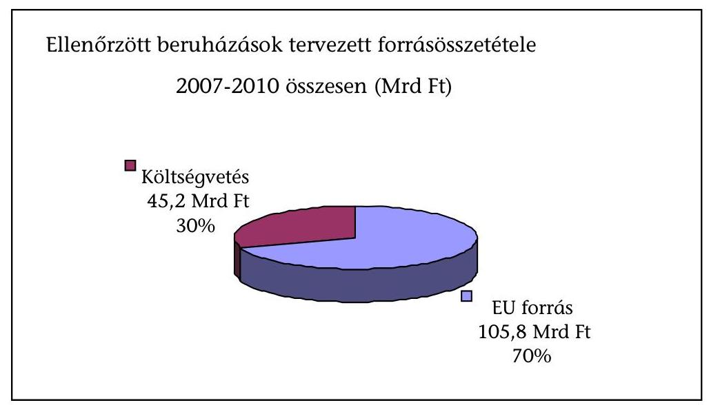

2007-ben a beruházások forrásait 75%-ban (6,8 Mrd Ft) a költségvetésből tervezték, az uniós források aránya 25% (2,3 Mrd Ft) volt. 2009-ben a tervezett

[^0]
[^0]:    ${ }^{52}$ A gyorsforgalmi előirányzat összege 3.083 millió Ft közműkiváltási összeget - MOL Nyrt. részére történő végleges pénzátadást tartalmaz, amit rendkívüli - a projekt érdekében felmerülő ráfordításként számolt el a NIF Zrt.

---

források a többszörösére nőttek, a forrásösszetétel arányai és nagyságrendje is az EU forrásokra tevődött át. A 2009. évi tervezett források 81%-a (55,8 Mrd Ft) uniós forrás, 19%-a (12,7 Mrd Ft) költségvetési forrás. Hazai forrásból tervezték az M6 és M60 előkészítési szakaszait (2007-2010. évek 12,5 Mrd Ft). Az M31 szakaszra tervezett 39,4 Mrd Ft forrás 25,3%-át (10 Mrd Ft) a költségvetésből, 74,7%-át (29,4 Mrd Ft) uniós forrásból irányozták elő.

A NIF Zrt. alapítói okirata szerint a társaság olyan építtetői feladatokat ellátó, alapvetően műszaki szakmai gazdálkodó szervezet, amelynek kötelezettségei között a források megszerzése nem szerepel. Az Aptv. is a NIF Zrt. szerepét úgy definiálja, hogy a Magyar Állam nevében megrendelői feladatokat lát el a fejlesztési projektek megvalósítása érdekében. A NIF Zrt. a Kormány döntései alapján a rendelkezésére bocsátott forrásokkal valósítja meg a projekteket.

Sajátos szabályrendszer vonatkozik az uniós támogatásokkal megvalósítani tervezett projektekre. A NIF Zrt-nek az uniós forrásokra pályáznia kell mint „kedvezményezett" és ebben a minőségben a NIF Zrt. bármely más kedvezményezettel azonos szabályok alá esik. Mindez közvetetten a NIF Zrt. finanszírozási kötelezettségét eredményezi.

A 2007-2013 programozási időszakban az Európai Regionális Fejlesztési Alapból, az Európai Szociális Alapból és a Kohéziós Alapból származó támogatások felhasználásának rendjét szabályozó - 281/2006. (XII. 23.) Korm. rendelet 21. § (1)-(5) bekezdései és az azt módosító 4/2011. (I. 28.) Korm. rendelet 61. § (1)-(5) bekezdése szerint a projekt költségnövekményét - jogszabály eltérő rendelkezése hiányában - a kedvezményezett finanszírozza. Az előbbi vonatkozik a projekt műszaki tartalmának a kedvezményezett által történő változtatására, a tervezettnél lassúbb megvalósulásra visszavezethető költségnövekményre is. A jogszabályok azt is kimondják, hogy a kedvezményezett által biztosított saját forrás aránya a projekt támogatásának növelése esetén sem csökkenhet, ugyanakkor a projekt támogatásának növeléséről a Kormány jogosult dönteni.

A NIF Zrt. Felügyelő Bizottságának (továbbiakban: FB) 16/2009. (V. 8.) határozata szerint a NIF Zrt. finanszírozása nincs megoldva, egyrészt az előírt határidőket jóval meghaladó kifizetések miatt, sem amiatt, hogy erre a forrást a tulajdonos nem biztosítja. Az FB megállapította, hogy a fennálló finanszírozási, működési rendszerből adódó késedelmi kamatok kifizetésére a fedezet nem biztosított és a jövőben ez az állapot nem tartható.

# 4.2. Költségvetési kapcsolatok 

A NIF Zrt. fejlesztési projektjeinek finanszírozási modelljét időben nem hangolták össze a költségvetési tervezés éves periódusával, az uniós projektek támogatásának több éves szerződéseivel és az uniós támogatások utófinanszírozási jellegével, beleértve az uniós támogatások sajátos felhasználási szabályait (pl.: szabálytalanság kezelés). Ezek az eltérések időben a folyamatokat úgy befolyásolták, hogy a vállalkozói számlák kifizetési késedelme következett be.

A feladatfinanszírozott előirányzatok vonatkozásában a számlák határidőre történő kifizetését a kifizetési folyamat összetettsége is akadályozta. A 2007-2009. évek tapasztalatai alapján a NIF Zrt. projektfejlesztési tevékenységének adott évi finanszírozása a vonatkozó gyorsforgalmi előirányzatok és Útpénztár

---

forrás terhére csak az adott év március-április hónapjától váltak elérhetővé a kincstári számlanyítási sajátosságok miatt a gyakorlatban.

A Kormány 2038/2008. (III. 29.) határozatában a GKM 2008. évi gyorsforgalmi úthálózat fejlesztése előirányzat 103,4 Mrd Ft összegének 61,9 Mrd Ft-tal való túllépését engedélyezte. A forráshiány áthidalására azért került sor, mert a terv lezárásakor még nem volt véglegesesen jóváhagyott KÖZOP projektlista. A többletforrás terhére 13 Mrd Ft előirányzatot biztosítottak az M43 szakasz finanszírozására a támogatási kérelem elbírálásáig. Az előirányzat az EU által nem finanszírozott MOL-os közműkiváltásokon túl építési és Mérnök költségeket is tartalmazott. A NIF Zrt. tájékoztatása szerint 2008-ban a közbeszerzés elhúzódása miatt a 13 Mrd Ft előirányzatból 2,95 Mrd Ft került felhasználásra.

A rendelkezésre bocsátott 2009-2010. évi keretek a megfogalmazott célok és elvárások maradéktalan teljesítésére - a NIF Zrt. szerződéses kötelezettségeit is szem előtt tartva - nem voltak elegendőek.

A Magyar Köztársaság 2009. évi költségvetéséről szóló 2008. évi CII. törvény a 2009. évi gyorsforgalmi előirányzat összegét 12995 millió Ft-ban, a 2010. évi költségvetésről szóló 2009. évi CXXX. törvény a 2010. évi gyorsforgalmi előirányzat összegét 8300 millió Ft-ban határozta meg. Ezen előirányzatoknak kellett volna fedezetet nyújtaniuk az EU-s forrásokból, a magántőke bevonásából megvalósítani tervezett, illetve a megkezdett beruházások előkészítésére, területszerzésére, az építés alatt álló gyorsforgalmi szakaszok finanszírozására, valamint olyan útszakaszok tervezésére, elkészítésére, amelyek nem szerepeltek az 1004/2007. (I. 30) Korm. határozatban, ugyanakkor a gyorsforgalmi úthálózat szerves részét képezték.

# 4.3. A NIF Zrt. üzleti tervezése, a finanszírozási igények meghatározása 

A NIF Zrt. 2007-2010. évi üzleti tervei szerint a fejlesztési projektek forrás szerkezete - beleértve a gyorsforgalmi úthálózatot - átalakult. A központi költségvetési finanszírozás mellett a hangsúly az Európai Unió társfinanszírozásával tervezett projektekre tevődött át. Ezekben az években az üzleti tervek tervezési kockázata magas volt, a fejlesztési projektek tervezett forrásösszetételének zavartalan finanszírozása nem volt garantálható.

Az ellenőrzött szakaszokhoz kapcsolódó forráshiányok alapvetően az EU által nem elismert, az Állam által nem finanszírozott területszerzési, közműkiváltási és pótmunkákkal kapcsolatban keletkeztek. A határidőket jóval meghaladó késedelmes kifizetések és finanszírozási problémák kezelésével a NIF Zrt. vezető és ellenőrző testülete az üzleti tervekben és a vezető testületek határozataiban is foglalkozott.

A NIF Zrt. FB 29/2009. (VI. 11.) határozatában megállapította, hogy a késedelmi kamatfizetésekből adódóan, továbbá az áfa törvény 2009. július 1-jén hatályba lépő módosítása következtében - a normál áfa kulcs 20%-ról 25%-ra változott - a NIF Zrt. finanszírozása nem volt megoldott.

A 2003-2009. években a NIF Zrt.-nél a ténylegesen elismert, évente kifizetett késedelmi kamat 2,75 millió Ft - 1176,8 millió Ft között alakult. A tényleges késedelmi kamatfizetési kötelezettség növekedését a növekvő mértékű EU forrás fel-

---

használásával indokolta a NIF Zrt. Ezen késedelmi kamatfizetési kötelezettség teljesítésére a NIF Zrt. forrásainak egyre jelentősebb hányadát fordította.

Az M43 szakaszoknál a fizikai előrehaladás késedelmeiből eredően a pénzügyi források iránti igények később jelentkeztek, ennek ellenére a 60 napos fizetési határidőt meghaladóan történtek a kifizetések. A késedelmes kifizetések az M43 szakaszoknál a kivitelezői számlák 70%-át érintették, a késedelmes napok száma egy esetben elérte a 66 napot. Az M31 szakasznál a kivitelezés megkezdését követő első negyedév végétől kezdődően a beruházás műszaki teljesítésénél a tervezetthez képest folyamatosan növekedett az elmaradás. A 2008 decemberében igénybevett előleg miatt 2009. májusig a tényleges kifizetések meghaladták a műszaki teljesítést.

Az FB a 2011. évi üzleti tervet megtárgyaló ülésen vezérigazgatói tájékoztatás történt arról, hogy jelentős a forráshiányos projektek száma, az újabb programok megvalósításához a források biztosítása szükséges, továbbá arról is, hogy kidolgozás alatt áll annak megoldása, hogy az adott projektre a menedzsment költségek, díjak elszámolhatóak legyenek. A NIF Zrt. szerint a költségek kimunkálása azért is lenne fontos, mivel ezek a költségek az uniós források terhére elszámolhatóak, így a NIF Zrt. működése nem terhelné a központi költségvetés Útpénztár előirányzatát.

Az üzleti tervekben rendelkezésre álló források mértékét összevetve a tervezett projekt ráfordításokkal, valamint az egyes költségvetési évek tervezésekor meghatározott előirányzati igényekkel, megállapítható, hogy a tervezett teljesítmények és a források tervezése feszített, magas kockázatú, esetenként forráshiányos volt. A tervezési kockázatok az egyes években állandósultak, illetve újak jelentkeztek, amelyek következtében a tervezett és a ténylegesen megvalósítható projektek összetétele, fedezete, tényleges ráfordításai jelentősen eltérhettek az adott évi üzleti tervben megadott adatoktól. A fejlesztések forrásainak tervezése 2006-ig halmozottan történt, a feladatokhoz a forrásokat nem rendelték hozzá. 2007-től a projekt szintű - műszaki tartalmon alapuló - forrástervezés került előtérbe. A fejlesztési projektek forrásigényét bruttó módon, a várható
 kifizetés alapján számították.

# 4.4. Az EU pénzügyi források felhasználásának szabályozása 

A költségvetési és uniós források lehívásának államháztartási, kincstári szabályai, időbeli ütemezése és az elszámolási szabályozás összetettsége, bonyolultsága, több szereplős voltával összefüggésben megnövekedett a számlák átfutási ideje. Az adott támogatásra benyújtott valamennyi számla kifizetése szünetelt, amennyiben csak egyetlen számla esetében is tapasztalható volt a kifizetés felfüggesztését alátámasztó ok, (bármilyen okirat, dokumentum hiánya vagy pontatlan kitöltése, tevékenység kód hibás megjelölése, szállító nevének pontatlan rögzítése). Ez a körülmény különösen a területszerzéssel összefüggő számlák esetében generált késedelmi kamatigényt.

A MÁK az előírásoknak megfelelően benyújtott okmányok alapján és a szükséges fedezet rendelkezésre állásakor a fizetési megbízást annak kezdeményezését követő 10 napon belül kiegyenlíti, amennyiben hiánypótlásra nem kerül sor. Évkezdéskor az államháztartási, kincstári szabályok (költségvetési törvény decemberi

---

elfogadása, szakmapolitikai egyeztetések lefolytatása) miatt az év elején csúszások előfordultak.

A NIF Zrt. javasolta a rendkívül időigényes projektenkénti számlaellenőrzés kiváltását jogszabályi és egyéb eljárásrendben biztosított garanciákkal. Az ellenőrzések időigényessége miatt 2008-ban - jellemzően az EU-s projekteknél - a területszerzéssel érintett ingatlanok esetében a számlák kifizetésének átlagos időszükséglete 216,2 nap, vállalkozói számlák esetében 75,5 nap volt az előírt 60 nap helyett.

A kivitelezői szerződések és a projektek finanszírozására megkötött támogatási szerződések szabályai mellett a benyújtott számlák eljárásmenetét meghatározták a NIF Zrt-nek a teljesítésigazolásra, a belső számla eljárásmenetére vonatkozó és a projektek útját követő szabályzatai. Ugyanakkor az eljárásmenet szabályozása nem volt teljes körű, mivel nem terjedt ki a belső teljesítésigazolások időkorlátainak meghatározására.

Az M43 szakasz(ok) támogatási szerződéseinek a pénzügyi elszámolásra vonatkozó szabályai szerint a kifizetés igénylését havonta egy alkalommal, a projekt státuszjelentéssel együtt, a jelentés tárgyát képező hónap utolsó naptári napjától számított 25. munkanapjáig kellett a közreműködő szervezethez (KIKSZ) benyújtani. A KIKSZ-nek az ellenőrzési feladatainak elvégzését követően - a támogatási szerződés szerint - 30 napja volt a hiánypótlást leszámítva a kifizetésre (kedvezményezetti finanszírozás esetén 60 nap). Hiánypótlásra a kifizetési kérelem beérkezésétől számított 15 napon belül legfeljebb 30 napos határidővel volt jogosult a kedvezményezettet felszólítani. Az M31 szakasz támogatási szerződésében a kifizetés igénylésének időpontjára és összegére vonatkozó korlátokat nem határoztak meg.

# 4.5. Késedelmi kamat 

A kifizetett késedelmi kamatok összege 2005-2010 között 66,5 millió Ft és 1176,8 millió Ft között alakult. A 2008. évi magas érték összefüggésben volt a nagyobb összegű számla kibocsátásokkal és a nagyszámú területszerzésekkel. A késedelmi kamat összege még növekedhet, mivel a vállalkozóknak 5 éven belül lehetőségük van a késedelmi kamatkövetelésük érvényesítésére. Ezt a kockázatot jelzi például az M31 autópálya esetében, hogy a vállalkozó késedelmi kamat igényt nem nyújtott be, miközben a kivitelezői számlák 80%-a késedelmes teljesítésű (a késedelmes napok száma maximum 129 nap) volt. Az M43 I. szakasz kivitelezői számláinak kifizetéséhez kapcsolódóan az érvényesíthető kamat összege 82,9 millió Ft, amely a számlák kifizetésétől kezdődően 5 évig érvényesíthető.

---

# NIF Zrt. által fizetett késedelmi kamatok (millió Ft) 2005-2010 

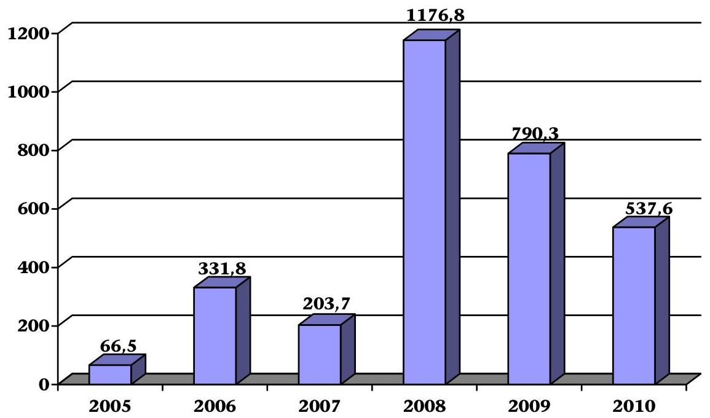

Az ellenőrzött beruházások 100 millió Ft-nál nagyobb értékű, összes kivitelezési szerződéseihez kapcsolódóan 230,4 millió Ft késedelmi kamatot fizettek ki ${ }^{53}$, amelyek kizárólag az M 43 II. és III. szakaszait érintették. Ezen szakaszokhoz kapcsolódóan a kivitelezők által igényelt késedelmi kamat összesen 244,6 millió Ft volt.

A késedelmi kamat finanszírozási kockázatai - annak ellenére, hogy a kifizetett késedelmi kamat 2010-ben csökkent, - nem oldódtak meg, azok a NIF Zrt. 2011. évi üzleti tervében is megjelentek. A szerződéseiben vállalt 60 (30) napos fizetési határidő nem teljesült. Az uniós finanszírozás előírásai szerint a benyújtott számlák kiegyenlítése nem a NIF Zrt-nél, hanem a közreműködő szervezetnél történt.

A késedelmek keletkezésének okai között több tényező együttes hatása játszott szerepet. A 2006-2010. években a projektfinanszírozásban szerkezeti változások következtek be, átalakult a NIF Zrt. forrásszerkezete az európai uniós források irányába a költségvetési-, hitel- és egyéb forrásokkal szemben. A hazai (kivitelezői) és a források lehívását biztosító támogatási szerződések közötti összhang nem volt biztosított. A NIF Zrt. állt a kivitelezőkkel kötelmi jogviszonyban, a szerződéses feltételek szerint a 60 napos fizetési határidő betartására kötelezett. Az elvégzett projekt-teljesítményekre benyújtott kivitelezői számlák alapján joggal várták azok kifizetését, mivel a késedelmes kifizetés a projekthez kapcsolódó vállalkozói lánc egészének likviditását jelentősen ron-

[^0]
[^0]:    ${ }^{53}$ 71,72,73 tevékenységi kódok alapján.

---

totta. Ugyanakkor a forrásösszetétel sajátos szabályai miatt - a kifizetést jellemzően a MÁK, illetve KIKSZ végzi - a NIF Zrt-nek csak korlátozott mértékben volt ráhatása a számlák kifizetésére.

A NIF Zrt. éves beszámolói, az eredmény kimutatások az elmúlt években egyre emelkedő - a 2008. évben 1 Mrd Ft-ot meghaladó - késedelmi kamatot mutattak ki, amely a NIF Zrt-nél likviditási és finanszírozási feszültségeket okozott. A késedelmi kamat a beruházások bekerülési értékébe nem számítható bele, projekttámogatásból nem finanszírozható, (mivel a számviteli szabályok szerint nem része a bekerülési értéknek) ezért azt a NIF Zrt. a működési támogatása terhére számolta el.

A NIF Zrt. indoklása szerint késedelmi kamat finanszírozása magas kockázati tényezőt jelentett, a fizetendő késedelmi kamatra a NIF Zrt-nek nem állt rendelkezésére forrása.

A 2000. évi C. törvény (továbbiakban: számviteli törvény) 47. §. előírásai szerint a késedelmi kamat a beruházás ráfordításai között nem számolható el, a projektforrások működési célú felhasználása nem lehetséges. A NIF Zrt-nek a késedelmi kamatfizetési kötelezettsége a 2006-2010. években állandósult, ezért azt a finanszírozási elvet követte, hogy a tervezéskor a pénzügyi műveletek egyéb bevételeként tervezett - a projektforrások átmeneti lekötéséből származó - kamatbevételt, a projektek késedelmi kamatbevételének fedezetére forgatja át, alkalmazva az elhatárolás számviteli elvét a tervezésnél, illetve a beszámolókban is.

Az ellenőrzött szakaszokkal kapcsolatban keletkezett késedelmi kamat összege nem volt megállapítható, mert a NIF Zrt. ennek összegét nem külön főkönyvi számlán, hanem a 863210 fizetendő késedelmi kamat, kötbér, bírság megnevezésű főkönyvi számlán mutatta ki. Ugyanakkor a főkönyvi számlán többek között közbeszerzési, parkolási, elszámolási és növényvédelmi bírságot is elszámoltak.

A főkönyvi könyveléshez nem tartozott projektszintű késedelmi kamat analitika. Ennek hiányában az ÁSZ ellenőrzés csak a kivitelezésre és annak időszakában felmerülő késedelmi kamatok vonatkozásában a 100 millió Ft-nál nagyobb kivitelezési szerződésekre irányult. A reprezentatív mintavétellel kiválasztott dokumentumok szerint az igényelt és kifizetett kamatok összege a késedelmes napok számának meghatározásában tért el.

# 4.6. ÁFA szabályozás 

Finanszírozási problémákat idéztek elő különösen az EU-s projekteknél az adózási jogszabályi változások, a fordított adózási körbe tartozó áfa mértéke, az áfa befizetés kötelezettsége és a számla kiegyenlítése.

A benyújtott számla finanszírozása a korábbi gyakorlat szerint úgy történt, hogy a nettó összeget a NIF Zrt. költségvetési támogatás formájában, míg az áfa összegét átmeneti finanszírozás formájában kapta meg, amelyet a visszaigénylés folyósítása után a NIF Zrt. visszafizetett a költségvetésnek. 2008. január 1-jét követően az áfa összegét nem csak átmenetileg kell biztosítani a NIF Zrt. részére, hanem a támogatás összegébe véglegesen beépítve, ez az érték is

---

beépül a beruházás bekerülési értékébe. A nettó összeget a kivitelező kapja meg, míg az áfát a NIF Zrt. fizetési kötelezettségként befizeti az APEH részére.

A fordított adózás ${ }^{54}$ miatt az EU által támogatott projektekhez kapcsolódó számlák fizetési határideje a számla kiállítását követő 60, (esetenként 90) nap, de a vonatkozó áfa fizetési kötelezettség korábban jelenik meg, azaz egyfajta áfa előrefinanszírozásra van szükség. 2009. évtől a MÁK biztosítja ezen összegeket.

A Magyar Köztársaság 2010. február 25-én keresetet nyújtott be az Európai Bíróságon a NIF Zrt. által kedvezményezettként megvalósított, részben uniós finanszírozású projektek áfa tartalmának elszámolhatóságával kapcsolatban, amelyben Magyarország, mint felperes az áfa elszámolhatósága mellett, az EB ellene érvelt.

# 5. A KÜLSŐ ÉS BELSŐ ELLENŐRZÉSEK ÉS AZOK JAVASLATAINAK HASZNOSULÁSA 

A NIF Zrt. belső ellenőrzése a jelen ÁSZ vizsgálatban szereplő autópályaszakaszokat nem ellenőrizte.

A Kormányzati Ellenőrzési Hivatal (KEHI) Környezetvédelmi és Közlekedési Projekteket Ellenőrző Igazgatósága 2008. július 30. - 2008. szeptember 2. között helyszíni ellenőrzést végzett. Az ellenőrzés tárgya a Nemzeti Fejlesztési Terv operatív programjai „2004/HU/16/C/PT/002 sz., M0 Budapest körgyűrű keleti szektor 4-es sz. főút és M3-as autópálya közötti szakasza" tárgyú Kohéziós Alap projekt 1386/2002/EK bizottsági rendelet 9. cikke szerinti mintavételes ellenőrzése volt. Az ellenőrzés típusa szabályszerűségi ellenőrzés volt, amely a 2006. november 1. - 2008. július 30. közötti időszakra terjedt ki.

A KEHI ellenőrzési jelentése részletesen megfogalmazta a Kbt., a pénzügyi előírások, a belső szabályzatok betartására vonatkozó javaslatait. Ezek alapján a NIF Zrt. - a KEHI által elfogadott - intézkedési tervet készített és hajtott végre.

Az Európai Támogatásokat Auditáló Főigazgatóság (EUTAF) Infrastrukturális Programokat Ellenőrző Igazgatósága 2010. augusztus 1. - 2010. augusztus 31. között helyszíni ellenőrzést végzett. Az ellenőrzés része volt a KÖZOP M43 gyorsforgalmi út Szeged-Makó közötti szakasz mintavételes ellenőrzése. Az ellenőrzés típusa szabályszerűségi ellenőrzés volt, amely a 2007. január 1. - 2009. december 31. közötti időszakra terjedt ki.

Az EUTAF ellenőrzési jelentésében a NIF Zrt. számára megfogalmazott javaslatokra az ellenőrzött szerv intézkedési tervet készített, amelyben a folyamatban lévő és a már végrehajtott intézkedéseit rögzítette.

[^0]
[^0]:    ${ }^{54}$ a NIF Zrt-nek a hazai és EU forrásokból finanszírozott projektek esetében áfa fizetési kötelezettsége keletkezett a tárgyhónapot követő hónap 20. napján, ezért az ezekhez kapcsolódó áfa összeget a költségvetésnek minden tárgyhónap 20-a előtt rendelkezésre kellett bocsátania a NIF Zrt. részére.

---

Az ÁSZ a 2008-ban befejeződő autópálya beruházások teljesítmény típusú ellenőrzéséről készült jelentését 2009 augusztusában tette közzé ${ }^{55}$. A javaslatok végrehajtására intézkedési tervek készültek a KHEM és a NIF Zrt. részéről.

Az ÁSZ ellenőrzés keretében az Aptv. módosítására tett javaslat - amely arra irányult, hogy törvény írja elő a gyorsforgalmi útfejlesztések megvalósítása előtt költséghaszon-elemzés készítését - nem realizálódott. Ugyanakkor az EU támogatással épített autópályáknál a költséghaszon-elemzések a pályázat és a záró dokumentumok kötelező részei, ezért az M31 és M43 autópályák esetében ezek az elemzések elkészültek.

A szakhatósági, önkormányzati, civil szervezeti igények központi, koordinált módon való kezelésének lehetőségére irányuló javaslat vonatkozásában érdemi előrelépés nem volt. A beruházások előkészítési fázisaiban továbbra sem határozták meg és nem vették számításba az igények többlet költség- és időkihatásait.

Az ÁSZ a közlekedési, hírközlési és energiaügyi miniszternek javasolta, hogy követelje meg a NIF Zrt-től az autópálya beruházások előkészítése során előzetes költségkalkuláció elkészítését. A KHEM intézkedési terve tartalmazza a javaslat végrehajtását az újonnan induló projekteknél. A NIF Zrt. a Projekt Szervezeti és Működési Kézikönyvben előírta az előzetes költségbecslés kötelező elvégzését. A vizsgált autópálya szakaszoknál az előzetes költségkalkulációk nem elfogadható pontossága a javaslat kiemelt kezelését továbbra is indokolja.

Az ÁSZ javasolta továbbá, hogy a minisztérium alakítsa ki az autópálya beruházások értékelési rendszerét hatékonysági, eredményességi és gazdaságossági mutatók alapján, alkalmaztassa azt
 a tervezési és vezetési folyamatokban és az ezek alapján meghozott intézkedések hasznosulását évente beszámoló keretében értékelje. Az intézkedési tervben a KHEM/GKM a javaslat végrehajtását a NIF Zrt. feladatkörébe utalta, az értékelési rendszer kidolgozása, a 2009-2010. évben befejezett beruházások értékelése és az értékelési rendszer alkalmazásának tapasztalatai évenkénti elemzése tekintetében.

A NIF Zrt. 2010-ben az építési projektek összehasonlító utóelemzésére készült anyaga a 2005-ben elvégzett elemzés alapján készült, és 2004. évi árszinten mutatta be a fajlagos km költségeket az átadott autópálya szakaszoknál. A 2004. évi árszint alkalmazása miatt az aktuális állapot bemutatása nem valósult meg és a vizsgált autópálya szakaszok az utóelemzésben nem szerepeltek.

A javaslat céljai teljes körűen nem valósultak meg, mivel eredményességi és hatékonysági mutatókat nem képeztek, ezáltal a költségirányítás a tervezési és vezetési folyamatokban nem volt mértékadó és az intézkedések hasznosulását a beszámolók keretében nem értékelték ${ }^{56}$.

[^0]
[^0]:    ${ }^{55}$ A közzétételt követő időszakban újonnan indult autópálya projektek ellenőrzése a jelen vizsgálatnak nem volt tárgya, ezért a javaslatok gyakorlati alkalmazásának minősítése a későbbiekben történhet meg.
    ${ }^{56}$ A NIF Zrt. tájékoztatás szerint az ellenőrzött beruházásoknál az eredményességi mutatók számítását a végszámla beérkezése után, a projekt pénzügyi zárása után készíti

---

A KHEM részére javasolta az ÁSZ, hogy intézkedjen a NIF Zrt.-nél annak érdekében, hogy a társaság közvetlenül ellenőrizze a kivitelezők és a mérnök szervezetek tevékenységét a beruházások lebonyolítása alatt. A minisztérium intézkedési tervében rögzítette, hogy a NIF Zrt. követelje meg a kivitelező és a mérnök szervezetek tevékenységének a beruházások lebonyolítása alatti közvetlen szúrópróbaszerű, a projektvezetők általi ellenőrzését. A NIF Zrt. a feladat szabályozását végrehajtotta, a projektvezetők feladata és felelőssége kiegészült a munkaterület kivitelezés alatti és a mérnök tevékenységének ellenőrzésével. Ugyanakkor a szabályozás gyakorlatban történő alkalmazása nem volt hatékony, mert nem teljes körűen teljesültek az idő-, költség- és minőségcélok.

Az ÁSZ javasolta a KHEM intézkedését arra vonatkozóan, hogy a NIF Zrt. az ügyvédi irodákkal - a területszerzési feladatok elvégzésére - megkötött szerződésekben írjon elő teljesítési határidőt, az ügyvédi késedelemre szankciót, valamint követelje meg a szerződés szerinti beszámolók teljesítését. A KHEM intézkedési tervében előírta az ügyvédi irodákkal kötött szerződések felülvizsgálatát, illetve a szerződéses feltételek teljesítési határidővel és a késedelmes teljesítéskor alkalmazandó szankciókkal való kiegészítését. Az újabb ügyvédi szerződésben a teljesítés részletes feltételeit és a késedelmi kötbért rögzítették, azonban a gyakorlati hasznosulás csak a jövőben lesz értékelhető, mivel az ellenőrzött autópálya szakaszok beruházásának előkészítése az intézkedés előtt megkezdődött.

Az ÁSZ azon javaslatát, hogy a NIF Zrt. szabályozza a szerződéses feltételekben rögzített előre nem látható fizikai akadályok esetén az igazolt költségeket (azok tartalmát, számítási módját stb.) és a határidő hosszabbítás során figyelembe vehető időszakot a NIF Zrt. végrehajtotta. 2009-ben új Szerződéses Feltételeket vezetett be, amelyben rögzíti a többletköltség elismerhető összegének kiszámítását a megvalósítási idő meghosszabbítása, illetve változtatás esetén.

Az intézkedések gyakorlati hasznosulása a 2008-ban leszerződött munkáknál még nem volt tapasztalható. Tekintettel arra, hogy az ÁSZ 2009. évi javaslatai, illetve a minisztérium és a NIF Zrt. intézkedésterveiben foglaltak részben teljesültek, azoknak napirenden tartása és belső ellenőrzése a minisztérium és a NIF Zrt. részéről indokolt.

Budapest, 2011. október 20.
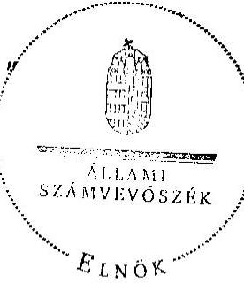

Domokos László
elnök

Melléklet: $\quad 14 \mathrm{db} \quad 19$ lap
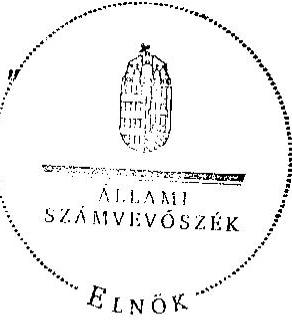

[^0]
[^0]:    el. Az M31 autópálya projekt záródokumentum elkészítés befejeződött. Az M43 autópálya szakaszoknál várhatóan 2011. második félévében hajtják végre az értékelést.

---

MELLÉKLET

---

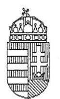

# KÖZIGAZGATÁSI ÉS IGAZSÁGÜGYI MINISZTÉRIUM 

DR. NAVRACSICS TIBOR
miniszter

Domokos László úr részére
Elnök

Állami Számvevőszék

## BUDAPEST

Tárgy: visszajelzés a 2009-2010-ben befejeződő autópálya beruházások és pénzügyi folyamatai ellenőrzéséről tárgyú jelentéshez

Tisztelt Elnök Úr!

Köszönettel megkaptam a 2009-2010-ben befejeződő autópálya beruházások és pénzügyi folyamatai ellenőrzéséről tárgyú jelentést.

Tájékoztatom, hogy a jelentéshez észrevételt nem teszek.

Budapest, 2011. augusztus 22.

Tisztelettel:
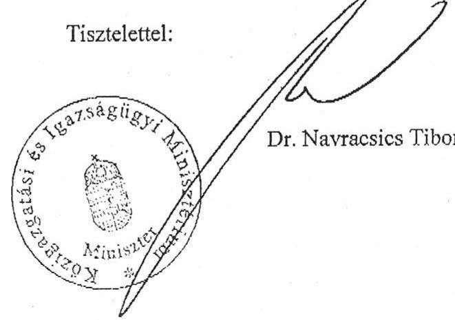

---

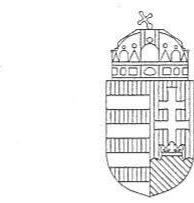

1/b sz. melléklet
a V-2017-56/2010-2011. sz. jelentéshez

KH:422/2011.

ÁLLAMI SZÁMVEVŐSZÉK

Érkezett: 2011. AUG. 31.

Iktatószám: ..................................................................................................................................................................................................................................................................................................................................................................................................................................................................................................................................................................................................................................................................................................................................................................................................................................................................................................................................................................................................................................................................................................................................................................................................................................................................................................................................................................................................................................................................................................................................................................................................................................................................................................................................................................................................................................................................................................................................................................................................................................................................................................................................................................................................................................................................................................................................................................................................................................................................................................................................................................................................................................................................................................................................................................................................................................................................................................................................................................................................................................................................................................................................................................................................................................................................................

---

2. sz. melléklet
a V-2017-56/2010-2011. sz. jelentéshez
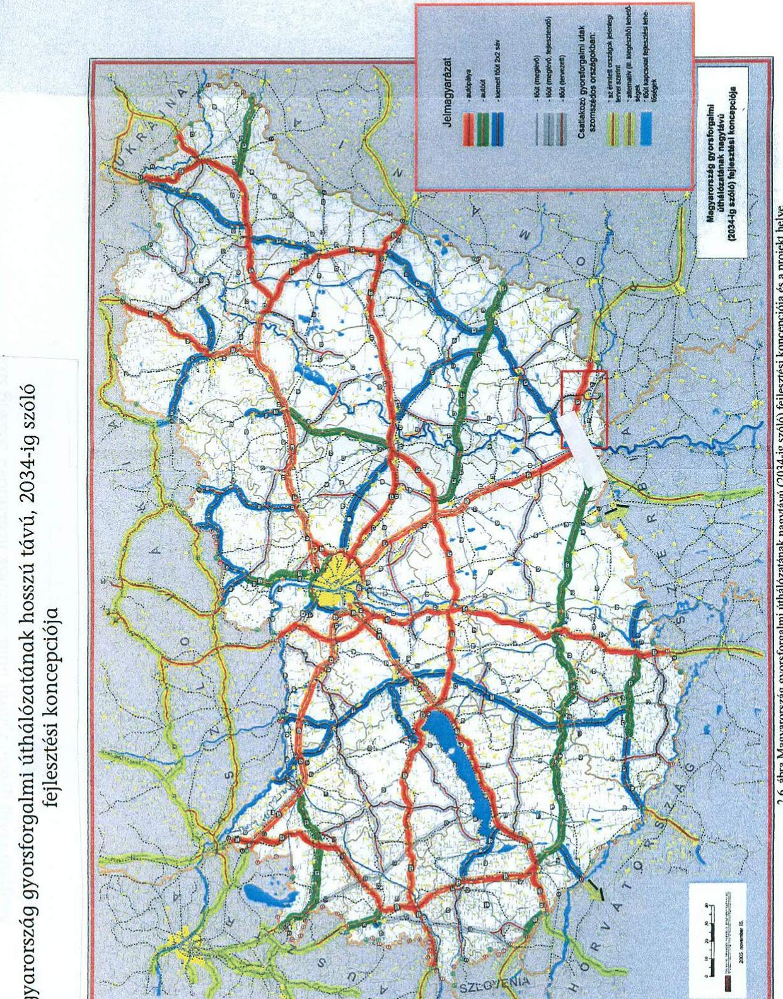

---

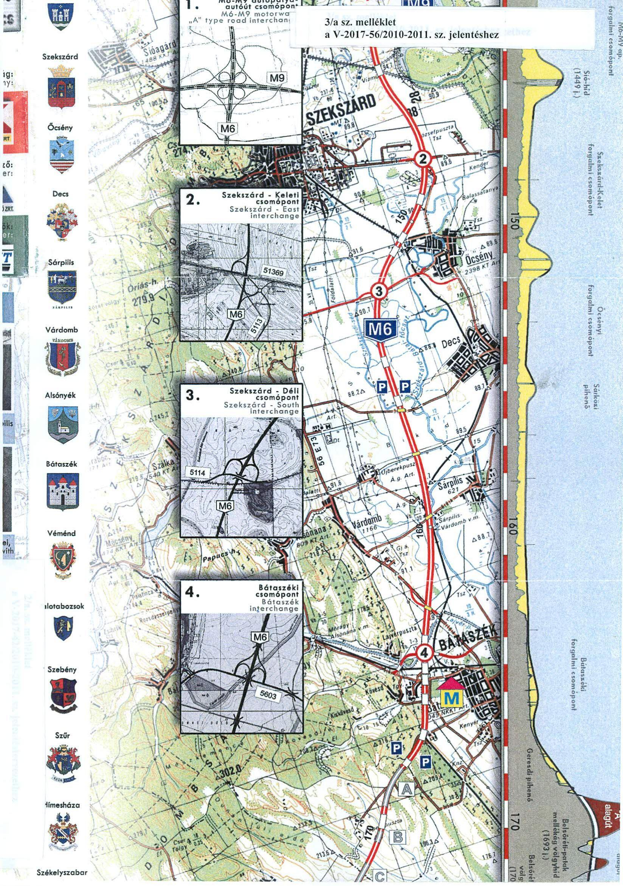

# 3/a sz. melléklet 

a V-2017-56/2010-2011. sz. jelentéshez

---

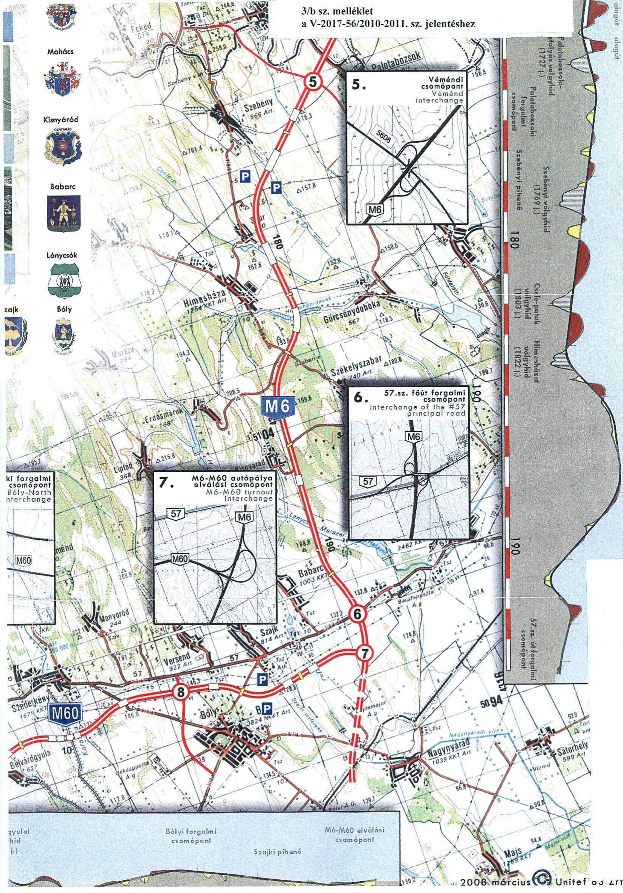

3/b sz. melléklet
a V-2017-56/2010-2011. sz. jelentéshez

---

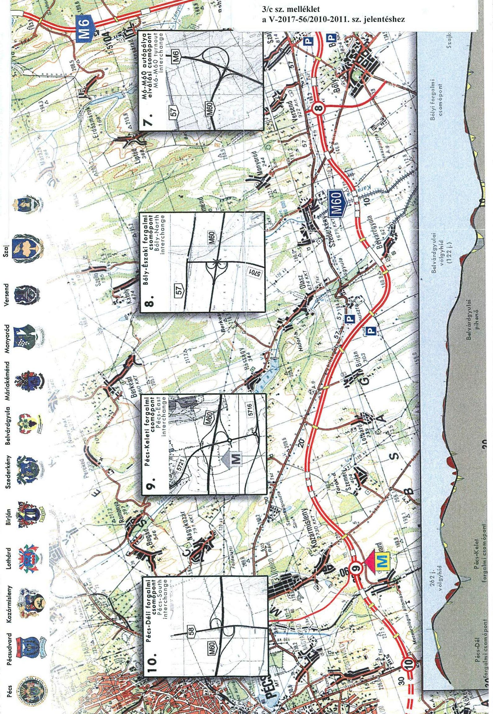

3/c sz. melléklet
a V-2017-56/2010-2011. sz. jelentéshez

---

4. sz. melléklet
a V-2017-56/2010-2011. sz. jelentéshez
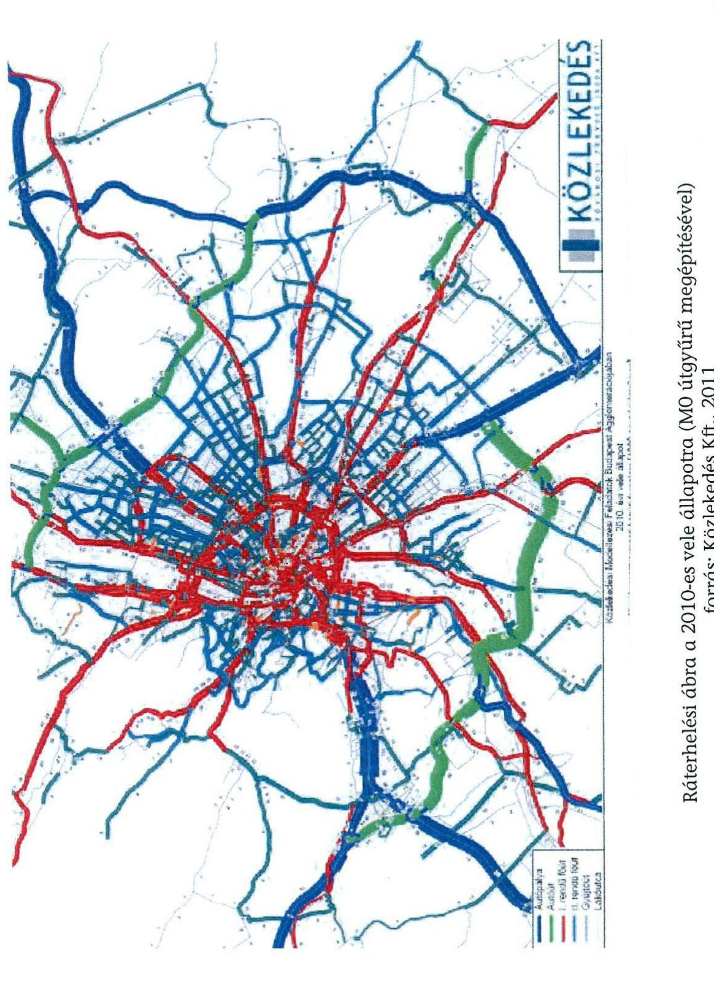

---

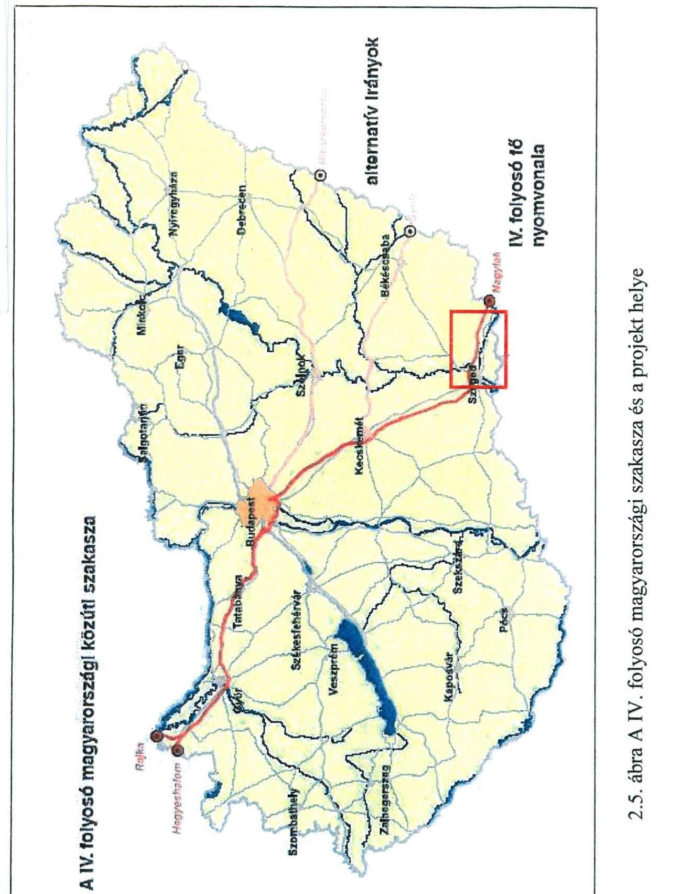
2.5. ábra A IV. folyosó magyarországi szakasza és a projekt helye

---

6. sz. melléklet
a V-2017-56/2010-2011. sz. jelentéshez
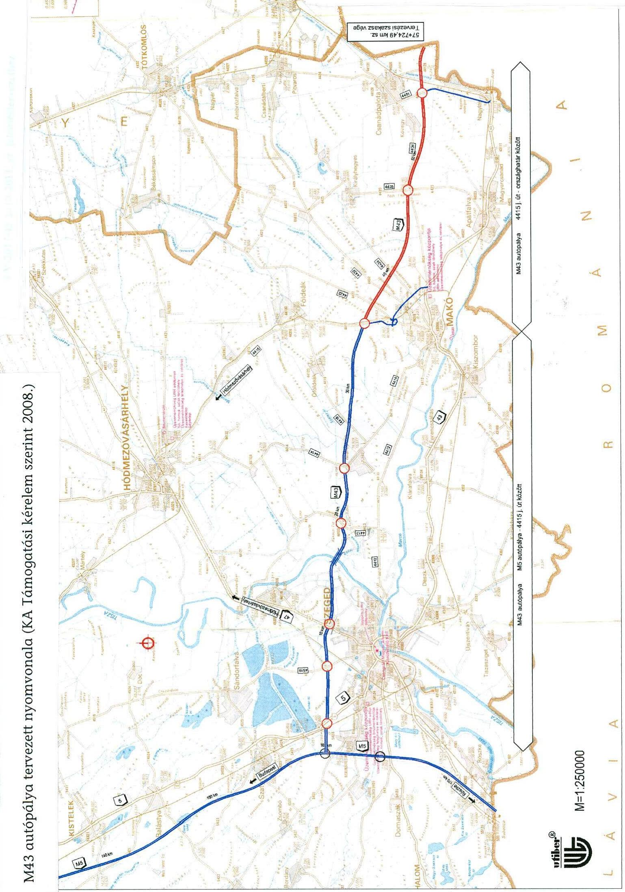

---

M6 autópálya nyomvonalak összehasonlítása
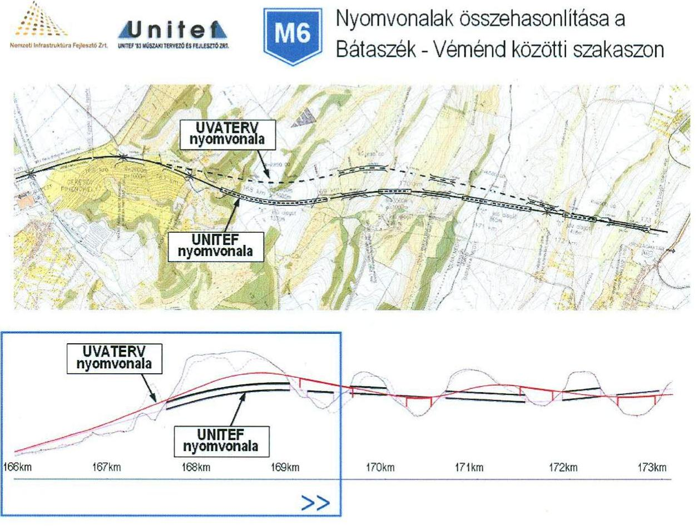

---

Az alagutak kapui és a terepviszonyok
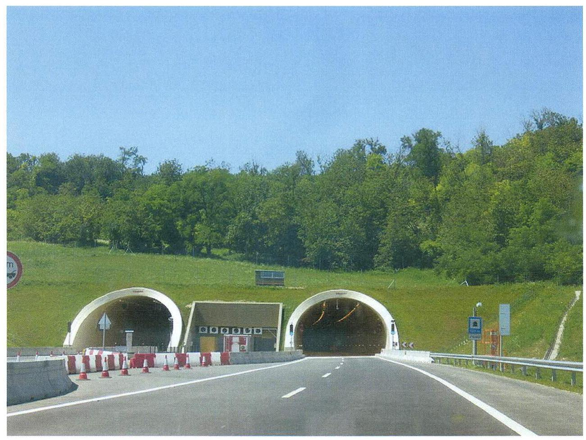

---

9/a sz. melléklet a V-2017-56/2010-2011. sz. jelentéshez

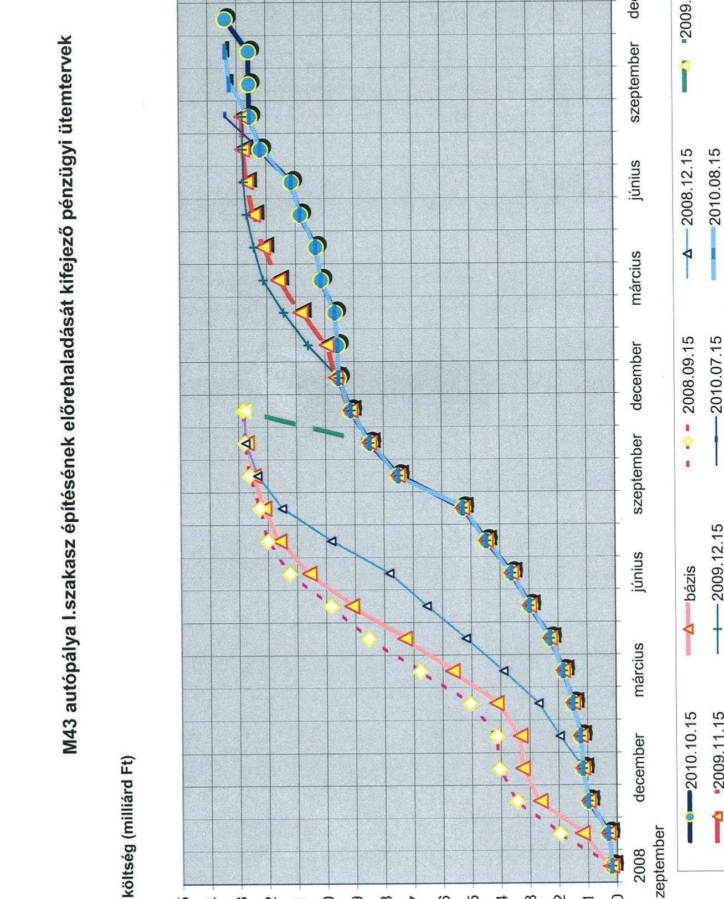

---

9/h sz. melléklet a V-2017-56/2010-2011. sz. jelentéshez

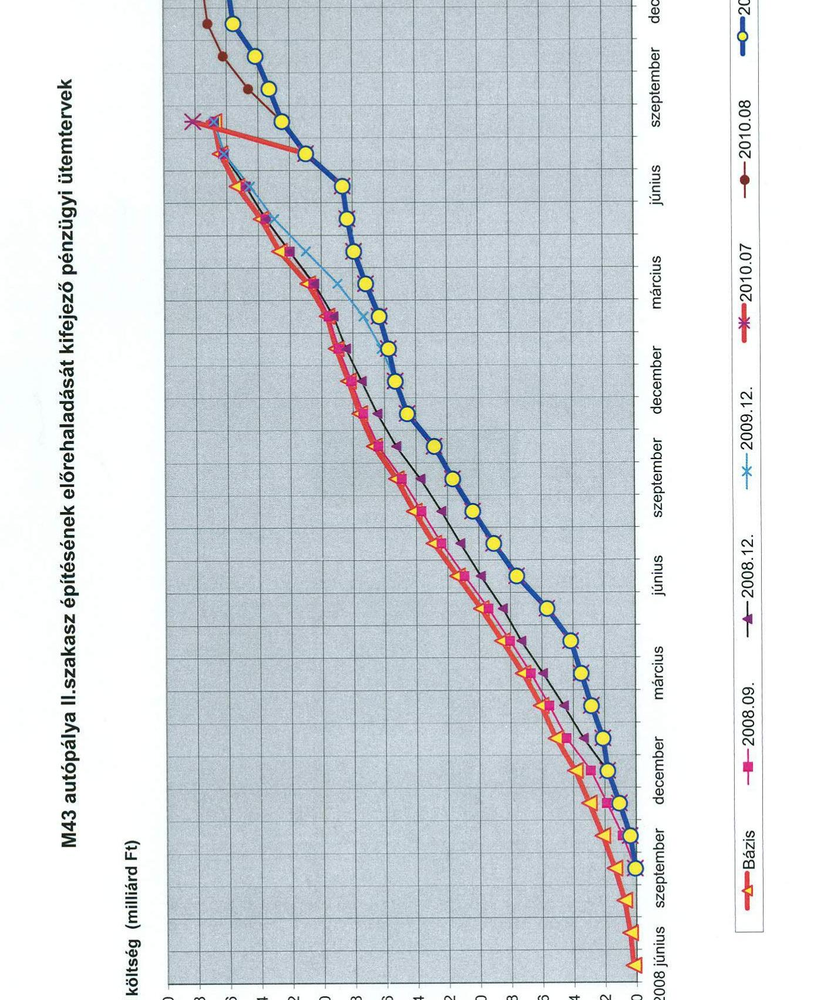

---

# M43 autópálya III.szakasz építésének előrehaladását kifejező pénzügyi ütemtervek 

Építési költség ( milliárd Ft)
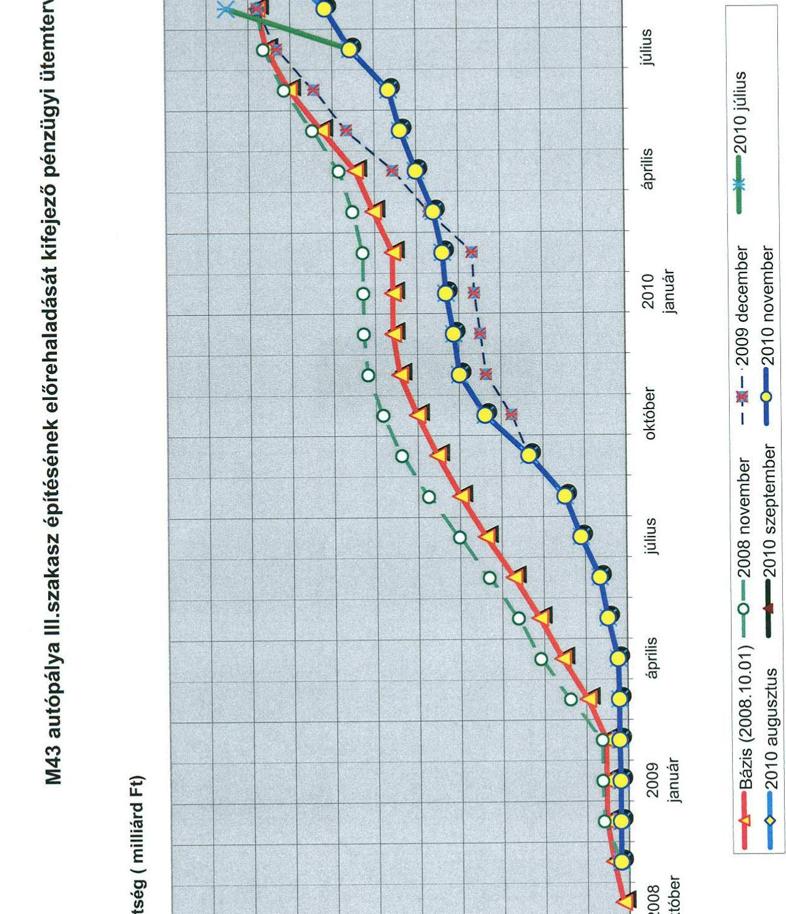

---

M43 autópálya 1. szakasz (3+000 és 9+700 kmsz) építési munkái

|  |   |   |   |   |   |   |   |   |   |   |   |
| --- | --- | --- | --- | --- | --- | --- | --- | --- | --- | --- | --- |
|  M43 Szeged - Makó Konzorcium |  |  |  |  |  |  |  |  |  |  |   |
|  101. sz. melléklet |  |  |  |  |  |  |  |  |  |  |   |
|  a V-2017-56/2010-2011. sz. jelentéshez |  |  |  |  |  |  |  |  |  |  |   |
|  102. sz. melléklet |  |  |  |  |  |  |  |  |  |  |   |
|  a V-2017-56/2010-2011. sz. jelentéshez |  |  |  |  |  |  |  |  |  |  |   |
|  103. sz. melléklet |  |  |  |  |  |  |  |  |  |  |   |
|  a V-2017-56/2010-2011. sz. jelentéshez |  |  |  |  |  |  |  |  |  |  |   |
|  104. sz. melléklet |  |  |  |  |  |  |  |  |  |  |   |
|  a V-2017-56/2010-2011. sz. jelentéshez |  |  |  |  |  |  |  |  |  |  |   |
|  105. sz. melléklet |  |  |  |  |  |  |  |  |  |  |   |
|  a V-2017-56/2010-2011. sz. jelentéshez |  |  |  |  |  |  |  |  |  |  |   |
|  106. sz. melléklet |  |  |  |  |  |  |  |  |  |  |   |
|  a V-2017-56/2010-2011. sz. 100000000000000000000000000000000000000000000000000000000000000000000000000000000000000000000000000000000000000000000000000000000000000000000000000000000000000000000000000000000000000000000000000000000

---

Hídgerendás hidak fajlagos építési költségei az M43 autópálya szakaszon
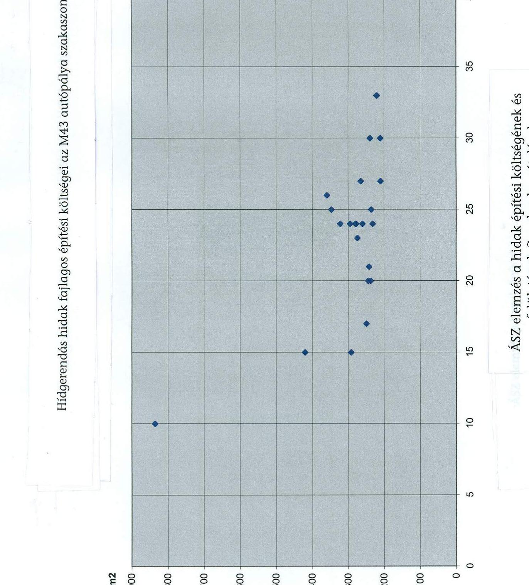

---

NA-43433/2007 2007.11.16.

GAZDASÁGI ÉS KÖZLEKEDÉSI MINISZTÉRIUM
INFRASTRUKTÚRA ÜGYEKÉRT FELELŐS SZAKÁLLAMTITKÁR

szám: GKM/213001 3 /2007. Hív. szám: Előadó: Telefon:

Tárgy: Az M43 gyorsforgalmi út kiépítése

Nemzeti Infrastruktúra Fejlesztő Zártkörűen Működő Részvénytársaság
Reményik Kálmán úr
elnök-vezérigazgató

BUDAPEST

Váci út 45.
1134

INFRASTRUKTÚRA ÜGYEKÉRT FELELŐS
2007. NOV. 16.

IKT.SZÁM:NA- 43433/2007

Tisztelt Elnök-Vezérigazgató Úr!

Az M43 gyorsforgalmi út Autópálya-törvényben és Közlekedési Operatív Programban
szereplő projektjeivel kapcsolatosan a következő döntések figyelembevételével
kérem az előkészítés folytatását.

Az M43 gyorsforgalmi út a Maroslele és Makó közötti szakaszán 2x2 sávos
autópálya, a Makó és országhatár közötti szakaszán 2x2 sávos autópálya
keresztmetszettel valósuljon meg. Az M43 gyorsforgalmi út teljes, Szeged és
országhatár közötti szakasza a KözOP első Akcióterv időkeretén belül épüljön meg
2007-2008. évi forráslekötéssel.

Ennek megfelelően a gyorsforgalmi úttal funkcionálisan és fizikailag párhuzamos
Makó főúti elkerülő út megvalósításának szükségessége nem alátámasztott, így
kérem az elkerülő út részprojektjének előkészítését felfüggeszteni és a projektből
törölni.

Budapest, 2007. október 5.

Üdvözlettel:
Felsmann Balázs

1055 Budapest, Honvéd u. 13-15. • telefon: +36 1 374 2994; +36 374-2790 • telefax: +36 1 374-2908
felsmann.balazs@gkm.gov.hu

---

# Az M43 autópálya szakaszok szerződésmódosításai 

Az M43 autópálya 3+000-9+700 kmsz. közötti szakasza kivitelezési szerződése az M43 Szeged-Makó Konzorciummal

| Szerződéses állapot | Aláírás időpontja | Szerződéses ár (nettó) Ft | Befejezési határidő | Főbb okai |
| :--: | :--: | :--: | :--: | :--: |
| Szerződéses megállapodás | 2008.06.03. | 12.827.999.841 | 2009.11.30. | (18 hónap a kivitelezés időtartama) |
| Szerződés módosítás | 2010.01.28. |  | szolgáltatás szakaszolva | B6 j. híd alatti terhelhetetlen térszín és annak területén található DN 1000 ivóvízvezeték kiváltása |
| Projekt „A" rész |  |  | $\begin{aligned} & 2009.11.30. \\ & \text { (kötbér } \\ & \text { számítással) } \end{aligned}$ | Műszaki   tartalomváltozással nem érintett létesítmények összessége |
| "A" rész ideiglenes forgalomba helyezési része |  |  | 2010.03.31. | Építmények meghatározásával |
| Projekt „B" rész" |  | Vállalkozó időhosszabbítási költségmegtéítésre jogosult | 2010.08.31. | Műszaki   tartalomváltozással érintett létesítmények összessége |
| 2. sz. módosítás | 2010.09.07. | 13.399.092.814 | 2010.08.31. | Új pályaszerkezet: 571 millió Ft |
| 3. sz. módosítás | 2010.12.06. | Változatlan | 2010.10.31. | Rendkívüli csapadékmennyiség 2010.április-június; hidrológiai esemény statisztikai valószínűsége 1%-nál kisebb) +61 nap |

Az M43 autópálya 9+700-18+400 km sz. közötti szakasz kivitelezési szerződése a Tisza 43 Konzorciummal

| Szerződéses állapot | Aláírás   időpontja | Szerződéses   Ár (nettó) Ft | Befejezési határidő | Főbb okai |
| :--: | :--: | :--: | :--: | :--: |
| Szerződéses megállapodás | 2008.05.30. | 26.790.000.000 | 2010.08.31. | (27 hónap a kivitelezés időtartama) |
| 1. sz.   módosítás | 2010.09.10. | 28.135.814.960 | 2010.08.31.   jogosultság fenntartása a határidő módosításra | Pörös-éri szénhidrogén vezeték kiváltása, töltéskonszolidáció gyorsítása, pályaszerkezet változtatás |
| 2. sz.   módosítás | 2010.12.01. | Kivitelezési munkák ütemére igény | 2011.03.16. | 2008.aug., 2010. jan., febr. árvíz, ápr., máj., jún. csapadék +121 nap (munkavégzésre alkalmas) |

---

Az M43 autópálya 18+400-34+600 km sz. közötti szakasz kivitelezési szerződése a Maroslele 43 Konzorciummal

| Szerződéses állapot | Aláírás   időpontja | Szerződéses   Ár (nettó) Ft | Befejezési határidő | Okai |
| :--: | :--: | :--: | :--: | :--: |
| Szerződéses megállapodás | 2008.05.30. | 17.570.056.744 | 2010.08.31. | (27 hónap a kivitelezés időtartama) |
| 1. sz.   módosítása | 2010.09.07. | 19.068.463.130 | 2010.08.31. | Új műszaki szabályozás miatt pályaszerkezet
 változtatás +1,5 Mrd Ft |
| 2. sz.   módosítás | 2010.12.03 | 20.532.817.189 | 2010.12.04.   műszaki átadás-átvétel kezdete | Időhosszabbítás esetében a rendkívüli csapadék: (2009. október-november és 2010. május-július) miatt +95 nap; szerződéses árban döntően a töltésalapozás miatt +1,46 Mrd Ft |

---

14. sz. melléklet
a V-2017-56/2010-2011. sz. jelentéshez
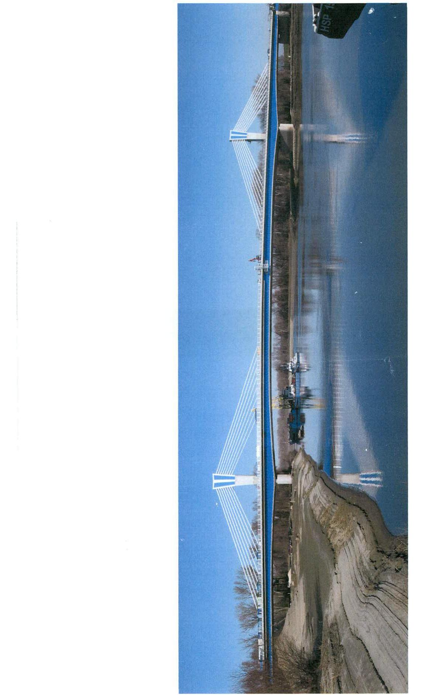
