# ÁLLAMI   SZÁMVEVŐSZÉK 

## JELENTÉS

a légszennyezés ellen és a klímapolitika terén tett intézkedések hatásának ellenőrzéséről

---

# 2. Államháztartás Központi Szintjét Ellenőrző Igazgatóság 

2.3. Átfogó Ellenőrzési Főcsoport

Iktatószám: V-2009-118/2010-2011.
Témaszám: 0989
Vizsgálat-azonosító szám: V0517.

## Az ellenőrzést felügyelte:

Dr. Becker Pál
főigazgató
Az ellenőrzés végrehajtásáért felelős:
Hegedúsné dr. Müllern Veronika
főcsoportfőnök
2011. május 1-jétől

Makkai Mária
számvevő igazgató
Az ellenőrzést vezette:
Papp Sándor
számvevő főtanácsos

## Az ellenőrzést végezték:

| Beck Miklós számvevő tanácsos | Csóry Györgyné   főtanácsadó | Dankó Géza irodavezető, főtanácsadó |
| :--: | :--: | :--: |
| Gregor Andrea számvevő gyakornok | Kéri Péter számvevő tanácsos | Kovácsy Tamás számvevő tanácsos |
| Radics-Ludvig Györgyi számvevő gyakornok | Dr. Sinka Zoltán számvevő tanácsos | Tóth Tamás számvevő tanácsos |
| Vitányi István számvevő tanácsos |  |  |

A témához kapcsolódó eddig készített számvevőszéki jelentések:
címe
sorszáma
A villamosenergia-ellátás rendszerének ellenőrzéséről 740
Az energiagazdálkodást érintő állami és önkormányzati 1009 intézkedések, kiemelten az energiaracionalizálást célzó támogatások hatásának ellenőrzéséről

---

# TARTALOMJEGYZÉK 

BEVEZETÉS ..... 11
I. ÖSSZEGZŐ MEGÁLLAPÍTÁSOK, KÖVETKEZTETÉSEK, JAVASLATOK ..... 16
II. RÉSZLETES MEGÁLLAPÍTÁSOK ..... 26

1. A nemzetközi egyezmények, irányelvek ..... 26
1.1. A légszennyezéshez kapcsolódó nemzetközi egyezmények, EU irányelvek és jogharmonizációjuk ..... 26
1.2. A klímavédelemhez kapcsolódó nemzetközi egyezmények, EU irányelvek, átültetésük a hazai gyakorlatba ..... 29
2. Hazai stratégiák, programok, prioritások és megalapozásuk ..... 32
2.1. A légszennyezés csökkentését célzó programok ..... 33
2.2. A klímaváltozás hatásainak kezelését célzó hazai stratégiák, programok ..... 34
2.3. A légszennyezés és a klímavédelem hazai indikátorai ..... 39
2.3.1. A Nemzeti Fejlesztési Terv indikátorai és teljesülésük ..... 41
2.3.2. Az Új Magyarország Fejlesztési Terv indikátorai és teljesülésük ..... 42
3. A levegőminőség és a levegőt károsító anyagok kibocsátásának alakulása ..... 44
4. A légszennyezés csökkentését és a klímavédelmet célzó hazai intézkedések ..... 48
4.1. A levegő- és klímavédelemmel kapcsolatos feladat- és hatáskörök jogi szabályozása és szervezeti háttere ..... 48
4.2. A helyszínen ellenőrzött önkormányzatok tevékenységével kapcsolatos tapasztalatok ..... 52
4.3. A környezettudatosság formálása, oktatás, nevelés ..... 55
4.4. A társadalommal való kapcsolat, tájékoztatás, lakossági panaszkezelés ..... 56
5. A klímavédelmi nemzetközi feladatok teljesítése ..... 57
5.1. Az üvegházhatású gázok kibocsátási nyilvántartása, leltára ..... 57
5.2. A Nemzeti Kiosztási Tervek és a Nemzeti Kiosztási Listák elkészítése ..... 60
5.3. Magyarország részvétele a nemzetközi kvótakereskedelemben ..... 65
5.4. A Zöld Beruházási Rendszer működése ..... 71
6. A levegő állapotának, jellemzőinek hatósági ellenőrzése, nyomon követése ..... 74
6.1. A hatósági feladatok, hatáskörök megoszlása ..... 74
6.2. A monitoring tevékenység ellátása, együttműködés más szervezetekkel, a szomszédos országok hatóságaival ..... 76

---

6.3. A levegő állapotát nyomon követő mérőhálózat, a mérőeszközök és az informatikai háttér korszerűsége ..... 79
6.4. A hatósági tevékenység szervezeti, személyi, tárgyi feltételei ..... 82
6.5. A környezetkárosítókkal szembeni fellépés eredményessége ..... 84
7. A légszennyezés csökkentését és a klímavédelmet célzó támogatások értékelése ..... 87
7.1. Az EU támogatások mechanizmusának szabályozottsága, múködése ..... 87
7.2. A támogatási programok célkitűzéseinek megvalósulása ..... 89
7.3. A Zöld Beruházási Rendszer pénzeszközeinek hasznosulása ..... 91
7.4. A helyszínen ellenőrzött projektek értékelése ..... 93
MELLÉKLETEK
1/a. számú a közigazgatási és igazságügyi miniszter észrevétele
1/b. számú a vidékfejlesztési miniszter észrevétele
1/c. számú a vidékfejlesztési miniszter észrevételére adott válasz
1/d. számú a nemzeti fejlesztési miniszter észrevétele
1/e. számú a nemzeti erőforrás miniszter észrevétele
1/f. számú A belügyminiszter észrevétele
2. számú A Nemzeti Fejlesztési Terv indikátorai és teljesülésük
3. számú Az Új Magyarország Fejlesztési Terv prioritásai és mutatói
4. számú Légszennyező anyagok kibocsátása (1990-)
5. számú Tanúsítvány. Részecske (PM) kibocsátás országos összes
6. számú Tanúsítvány. Részecske (PM) kibocsátás közlekedésből származó
7. számú A légszennyezés ellen és a klímapolitika terén tett intézkedések és hatásuk a helyszínen ellenőrzött önkormányzatoknál
8. számú A légszennyezéshez kapcsolódó hatósági intézkedések összesített táblázata
9. számú A Nemzeti Fejlesztési Terv forrásaiból megvalósuló támogatások
10. számú Az Új Magyarország Fejlesztési Terv forrásaiból megvalósuló támogatások
11. számú A helyszínen ellenőrzött a légszennyezést, illetve klímavédelmet célzó projektek ellenőrzésének tapasztalatai
12. számú A helyszínen ellenőrzött projektek főbb pénzügyi, kibocsátási mutatói

# FÜGGELÉKEK 

1. számú A nemzetközi emisszió kereskedelmi mechanizmusok, a kibocsátási egységek és az európai emisszió kereskedelmi rendszer bemutatása
2. számú A környezetvédelmi, természetvédelmi és vízügyi felügyelőségek véleményének összegzése az ellenőrzés kérdőívére adott válaszaik alapján

---

# RÖVIDÍTÉSEK JEGYZÉKE 

| AAU | Assigned Amount Unit (kibocsátható mennyiségi egység) |
| :--: | :--: |
| ÁNTSZ | Állami Népegészségügyi és Tisztiorvosi Szolgálat |
| BEÓO | Belső Ellenőrzési Önálló Osztály |
| CER | Certified Emission Reduction (igazolt kibocsátáscsökkentési egység) |
| $\mathrm{CO}_{2}$ | szén-dioxid |
| Éhvt. | az ENSZ Éghajlatváltozási Keretegyezménye és annak Kiotói Jegyzőkönyve végrehajtási keretrendszeréről szóló 2007. évi LX. törvény |
| Éhvt. vhr. | az ENSZ Éghajlatváltozási Keretegyezménye és annak Kiotói Jegyzőkönyve végrehajtási keretrendszeréről szóló 2007. évi LX. törvény végrehajtásának egyes szabályairól szóló 323/2007. (XII. 11.) Korm. rendelet |
| EK Nkft. | Energia Központ Nonprofit Kft. |
| EMIR | Egységes Monitoring Információs Rendszer |
| ENSZ | Egyesült Nemzetek Szervezete |
| ERFA | Európai Regionális Fejlesztési Alap |
| ESZA | Európai Szociális Alap |
| EU | Európai Unió |
| EüM | Egészségügyi Minisztérium |
| KA | Európai Kohéziós Alap |
| KEOP | Környezet és Energia Operatív Program |
| KHEM | Közlekedési, Hírközlési és Energiaügyi Minisztérium |
| KIOP | Környezetvédelem és Infrastruktúra Operatív Program |
| KMOP | Közép-Magyarországi Operatív Program |
| KöFI | Környezetvédelmi Fejlesztési Igazgatóság |
| KÖTHÁLÓ | Környezeti Tanácsadó Irodák Hálózata |
| KözOP | Közlekedés Operatív Program |
| KSZ | közremúködő szervezet |
| KTVF | Környezetvédelmi, Természetvédelmi és Vízügyi Felügyelőség |
| Kvt. | környezet védelmének általános szabályairól szóló 1995.   évi LIII. törvény |
| Kvt. vhr. | egyes tervek, illetve programok környezeti vizsgálatáról szóló 2/2005. (I. 11.) Korm. rendelet |
| KvVM | Környezetvédelmi és Vízügyi Minisztérium |
| KvVM FI | Környezetvédelmi és Vízügyi Minisztérium Fejlesztési Igazgatósága; |
| LAIR | Levegőtisztaság-védelmi Alap nyilvántartási és Információs Rendszer |
| MÁV Zrt. | Magyar Államvasutak Zártkörú Részvénytársaság |
| MNV Zrt. | Magyar Nemzeti Vagyonkezelő Zrt. |
| MTA | Magyar Tudományos Akadémia |

---

| NEFMI | Nemzeti Erőforrás Minisztérium |
| :-- | :-- |
| NEP | Nemzeti Energiatakarékossági Program |
| NÉP | Nemzeti Éghajlatvédelmi Program |
| NÉS | Nemzeti Éghajlatvédelmi Stratégia |
| NFM | Nemzeti Fejlesztési Minisztérium |
| NFT | Nemzeti Fejlesztési Terv |
| NFÜ | Nemzeti Fejlesztési Ügynökség |
| NKP II | II. Nemzeti Környezetvédelmi Program |
| NKP III | III. Nemzeti Környezetvédelmi Program |
| NKT | Nemzeti Kiosztási Terv |
| NO | Nitrogén-dioxid |
| OKTVF | Országos Környezetvédelmi, Természetvédelmi és Vízügyi |
|  | Felügyelőség |
| OLM | Országos Légszennyezettségi Mérőhálózat |
| OMSZ | Országos Meteorológiai Szolgálat |
| OP | Operatív Program |
| ÚMFT | Új Magyarország Fejlesztési Terv |
| ÚMVP | Új Magyarország Vidékfejlesztési Program |
| ÜHG | üvegházhatású gáz |
| Üht. | az üvegházhatású gázok kibocsátási egységeinek kereskedelméről szóló 2005. évi XV. törvény |
| Üht. vhr. | az üvegházhatású gázok kibocsátási egységeinek kereskedelméről szóló 2005. évi XV. törvény végrehajtásának egyes szabályairól szóló 213/2006. (X. 27.) Korm. rendelet |
| VM | Vidékfejlesztési Minisztérium |
| ZBR | Zöld Beruházási Rendszer |

---

# ÉRTELMEZŐ SZÓTÁR 

AAU
Audit Jelentés (Audit Report):

CER egység
emisszió

EU direktíva

Éves Jelentés (Annual Report):
fosszilis tüzelőanyag
immisszió
indikátor
kalibrálás
kalibrátor
kibocsátási egység
az államoknak a Jegyzőkönyvben lefektetett vállalásának megfelelő kibocsátható mennyiség egység, mely állami számlán kerül nyilvántartásra a nemzeti jegyzékben.
az Auditor készíti, az adott év végétől számított 120 napon kell bemutatni a Vevő részére és a Vevő 60 napon belül kommentálhatja, és további tájékoztatást kérhet.
akkor keletkezik, amikor - egy a kiotói szerződésben kibo-csátás-csökkentést nem vállaló országban - kibocsátáscsökkentő beruházás valósul meg
levegőterhelés, valamely anyag vagy energia levegőbe juttatása
(a levegő védelméről szóló (306/2010. (XII. 23.) Korm. rendelet)
az Európa Tanács vagy az Európai Bizottság által kiadott irányelv, amely általában valamennyi tagország számára előír bizonyos kötelezettséget, a teljesítés módját azonban a tagországok belső jogi szabályozására bízza
az Auditor jelentés alapján az Eladó készíti évente, az adott év végétől számított 120 napon kell bemutatni a Vevő részére. A Vevő 60 napon belül kommentálhatja, és további tájékoztatást kérhet
A nem megújuló energiaforrások körébe tartozó tüzelőanyag. Lebomlott növények és állatok maradványaiból keletkezett, pl. bányászott szén, kén és szénhidrogének kőolaj vagy földgáz tartozik ennek körébe.
légszennyezettség, a levegőben a levegőterhelés hatására kialakult légszennyező anyag koncentrációja, beleértve a légszennyező anyag adott időtartam alatt felületekre történt kiülepedését.
(a levegő védelméről szóló (306/2010. (XII. 23.) Korm. rendelet)
monitoring mérőszámok/mutatók, amelyek nyomon követik egy pályázat szakmaiságának, mérhető célértékeinek, a támogatás felhasználásának teljesülését
azon művelet, amellyel meghatározott feltételek mellett megállapítható az összefüggés egy mérőeszköz, illetve egy mértéknek vagy anyagmintának tulajdonított érték és a mérendő mennyiség etalonnal reprodukált megfelelő értéke között
kalibrálás végzésre alkalmas berendezés
az e törvény szerinti kötelezettségek teljesítésére felhasználható, egy tonna szén-dioxid-egyenérték meghatározott időn belül történő kibocsátását lehetővé tevő forgalomképes vagyoni értékű jog;
2005. évi XV. törvény az üvegházhatású gázok kibocsátási egységeinek kereskedelméről

---

kibocsátható mennyiség
klímaváltozás
klímavédelem
légszennyezés
légszennyezési bírság (szankciók)
légszennyezettség
légszennyezettségi monitoring rendszer
manuális mérőhálózat (RIV),
monitoring
az üvegházhatású gázok emberi tevékenységből származó, összesített kibocsátás mennyisége, szén-dioxid egyenértékben kifejezve egy meghatározott kötelezettségvállalási időszakra
2007. évi LX. törvény az ENSZ Éghajlatváltozási Keretegyezménye és annak Kiotói Jegyzőkönyve végrehajtási keretrendszeréről
a Föld klímájának, éghajlatának tartós és jelentős mértékủ megváltozása
a nemzetgazdaságokat átszövő energetikai, közlekedési infrastruktúra, illetve a termelési-termesztési rendszerek környezeti szempontú modernizálása
légszennyező anyag kibocsátási határértéket meghaladó mértékű levegőbe juttatása
(a levegő védelméről szóló (306/2010. (XII. 23.) Korm. rendelet)
„Az a természetes vagy jogi személy, illetőleg jogi személyiséggel nem rendelkező szervezet, aki vagy amely
a) a helyhez kötött légszennyező pontforrását,
b) a bejelentésre kötelezett helyhez kötött diffúz légszenynyező forrását
úgy üzemelteti, hogy a kibocsátási határértéket túllépi, vagy a levegővédelmi követelményeket nem teljesíti, légszennyezési bírságot köteles fizetni"
(21/2001. (II. 14.) Korm. rendelet a levegő védelmével kapcsolatos egyes szabályokról, 18. § (1))
a levegő légszennyezettségi határértéket meghaladó levegőterheltségi szintje
(a levegő védelméről szóló (306/2010. (XII. 23.) Korm. rendelet)
a levegőminőség változásának nyomon követésére az Országos Légszennyezettségi Mérőhálózat (OLM) szolgál (automata hálózat 28 településen 51 mérőállomással és 3 háttér állomással, valamint a manuális hálózat mérőpontjai 123 településen)
szakaszos (24 órás) mintavétellel múködik, a minták elemzését a környezetvédelmi felügyelőségek akkreditált vizsgáló laboratóriumaiban végzik, a vizsgálati eredmények a felügyelőségi alközpontokba, majd végül az Országos Légszennyezettségi Adatközpontba kerülnek.
Az egész országot lefedi a Regionális Immisszió Vizsgáló Hálózat (RIV), amelyben a mérések kiterjednek a kéndioxid, a nitrogén-dioxid és az ülepedő por koncentrációjának meghatározására. A vizsgálatok egységességét a központi koordináláson kívül 37 országos szabvány is biztosítja
a természetes vagy mesterséges környezet állapotának nyomon követése rendszeres megfigyelő- és mérőhálózat

---

Nemzeti Fenntartható Fejlődési Tanács

Nemzeti forgalmi jegyzék

Nemzeti Kibocsátási Leltár

Nemzeti Kiosztási Lista

Nemzeti Kiosztási Terv
alkalmazásával. A monitoring módszerei a környezet fizikai és kémiai állapotjellemzőit vagy közvetlenül mérik, vagy pedig biológiai objektumok (indikátorszervezetek) jelenlétének, illetve állapotának (állapotváltozásának) értékelés segítségével közvetve adnak lehetőséget következtetések levonására
a Tanács a fenntartható fejlődés kérdéskörében az Országgyúlés által létrehozott egyeztető, véleményező, javaslattevő testület.
A Tanács általános feladatköre, feladatai: a hazai fenntartható fejlődési alapelvek, célkitűzések, átfogó feladatok meghatározásának elősegítése, az ezzel összefüggő nemzetközi együttmúködés figyelembevétele, a fenntartható fejlődéssel foglalkozó stratégia rendszeres megújításának és végrehajtásának elősegítése, a vonatkozó tervezési és egyeztetési feladatok koordinálásának támogatása, a nyilvánosság és a társadalmi részvétel erősítése.
Az ENSZ Éghajlatváltozási Keretegyezménye és a Kiotói Jegyzőkönyve végrehajtási keretrendszeréről szóló 2007. évi LX. törvény: a kiotói egységek kiadásának, átruházásának, törlésének nyilvántartását, valamint az üvegházhatású gázok kibocsátási egységeinek kereskedelméről szóló 2005. évi XV. törvény 15. §-a szerinti forgalmi jegyzéket magába foglaló közhiteles és nyilvános jegyzék
az üvegházhatású gázok emberi tevékenységből származó hazai kibocsátásának, illetve a nyelők általi eltávolításának figyelemmel kísérését, adatok gyűjtését, nyilvántartását tartalmazó évenként készítendő leltár (az ENSZ Éghajlatváltozási Keretegyezménye és annak Kiotói Jegyzőkönyve végrehajtási keretrendszeréről szóló 2007. évi LX. törvény 4. §)
tételesen, éves bontásban meghatározza a térítésmentesen kiosztandó kibocsátási egységek mennyiségét minden olyan létesítmény számára, mely jogerős kibocsátási engedéllyel rendelkezik. (az üvegházhatású gázok kibocsátási egységeinek kereskedelméről szóló 2005. évi XV. törvény végrehajtásának egyes szabályairól szóló 213/2006. (X. 27.) Korm. rendelet 7. §)

Tartalmazza többek között:
a) a kereskedési időszak alatt létrehozott kibocsátási egységek teljes mennyiségét;
b) az egyes ágazatok részére kiosztható kibocsátási egységek teljes mennyiségét;
c) a térítés nélkül kiosztható kibocsátási egységek teljes mennyiségét;
d) a térítés nélkül kiosztásra nem kerülő kibocsátási egységek mennyiségét;
e) a Kiosztási Terv hatálya alá tartozó létesítmények előzetes listáját és üzemeltetőik részére kiosztani tervezett kibo-

---

nemzetközi kibocsátáskereskedelem

| $\mathrm{PM}_{10}$ | a szálói por azon frakciója, amelynek legalább 50\%-a átmegy a $\mathrm{PM}_{10}$ mintavételnek és mérésnek referenciamódszerére az MSZ EN 12341:2001 szabványban meghatározott $10 \mu \mathrm{~m}$ aerodinamikai átmérőjú szelektív szűrőn (a levegő védelméről szóló (306/2010. (XII. 23.) Korm. rendelet) |
| :--: | :--: |
| $\mathrm{PM}_{2,5}$ | a szálló por azon frakciója, amelynek legalább 50\%-a átmegy a $\mathrm{PM}_{2,5}$ mintavételnek és mérésnek referenciamódszerére az MSZ EN 14907:2006 szabványban meghatározott $2,5 \mu \mathrm{~m}$ aerodinamikai átmérőjú szelektív szűrőn (a levegő védelméről szóló (306/2010. (XII. 23.) Korm. rendelet) |
| széndioxid-egyenérték | egy tonna szén-dioxid vagy azzal megegyező globális éghajlat-módosító potenciálnak (GWP) megfelelő mennyiségű üvegházhatású gáz; |
|  | 2007. évi LX. törvény az ENSZ Éghajlatváltozási Keretegyezménye és annak Kiotói Jegyzőkönyve végrehajtási keretrendszeréről |
| szmoghelyzet | kedvezőtlen meteorológiai viszonyok között, több forrásból származó szennyezőanyag-kibocsátás következtében a légszennyezettség tartósan és nagy területen elérheti vagy meghaladhatja egy vagy több légszennyező anyag tájékoztatási, illetőleg riasztási küszöbértékét   (a levegő védelméről szóló (306/2010. (XII. 23.) Korm. rendelet) |
| szmogriadó | azokon a területeken (településeken), ahol a szmoghelyzet kialakulásával kell számolni és a légszennyezettség folyamatos mérésének feltételei adottak, a veszélyhelyzet elkerüléséhez és az esemény tartósságának csökkentéséhez azonnali beavatkozási - beleértve a tájékoztatást és riasztást - füstködriadó tervet (szmogriadó tervet) kell kidolgozni és végrehajtani.   A szmogriadót legalább két folyamatosan múködő automatikus monitorállomás adatai alapján lehet elrendelni. A szmogriadó ideiglenesen elrendelhető egy monitorállomás mérése alapján is, ha a településen csak egy mérőállomás múködik.   (a levegő védelméről szóló (306/2010. (XII. 23.) Korm. rendelet) |

---

ülepedő por
üvegházhatású gáz (ÜHG)
Zárójelentés (Final Report):
nagy szemcseméretű gyorsan kiülepedő légszennyező anyag. A port nagyságától függően sorolják ülepedő por (öt mikrométernél nagyobb) és szálló por (öt mikrométernél kisebb) kategóriába
szén-dioxid (CO2), metán (CH4), dinitrogén-oxid (N2O), fluorozott üvegházhatású gázok stb.
az Auditor készíti a zöldítési és a pénzügyi teljesítésről, a monitoring időszak végétől számított 120 napon kell bemutatni a Vevő részére. A Vevő 60 napon belül kommentálhatja, és további tájékoztatást kérhet

---

.

---

# JELENTÉS 

## a légszennyezés ellen és a klímapolitika terén tett intézkedések hatásának ellenőrzéséről

## BEVEZETÉS

A levegőbe kerülő károsító anyagok romboló hatása már korábban fokozottan felhívta a figyelmet elsősorban az energiaipar, valamint a közlekedés körében kifejtendő környezetkímélő intézkedésekre. A tudományos eredmények egyértelmúen alátámasztották, hogy az éghajlatváltozás komoly kockázatot jelent, és azonnali globális válaszintézkedéseket igényel. A légkör felmelegedését okozó üvegházhatás kialakulásáért a szén-dioxid $\left(\mathrm{CO}_{2}\right)$ a metán $\left(\mathrm{CH}_{4}\right)$ és a dinitrogén oxid $\left(\mathrm{N}_{2} \mathrm{O}\right)$ a felelős. A fosszilis tüzelőanyagok felhasználásának aránya - az energiatermelés, közlekedés körében - magas, a kibocsátott gázok mennyisége gyorsan növekszik, ami felgyülemlik az atmoszférában. A légszennyezés magas szintje ártalmas az emberi egészségre, ezek a kén-dioxid $\left(\mathrm{SO}_{2}\right)$ nitrogéndioxid $\left(\mathrm{NO}_{2}\right)$, a szénmonoxid (CO), valamint a döntően közlekedésből származó szálló por, amelynek kibocsátása a közlekedésfejlesztési intézkedések (közútfejlesztés, jármúkorszerűsítés, szigorúbb kibocsátási előírások) ellenére növekedett. Jelentős üvegházhatású gáz kibocsátási aránnyal rendelkezik a mezőgazdaság (20\%). Kiemelt feladatot jelent a por és a szén-dioxid megkötésében az erdők és a városi zöldterületek arányának növelése és a környezetkímélő technológiák fejlesztése és alkalmazása.

## $\mathrm{A} \mathrm{CO}_{2}$ koncentrációjának változása az elmúlt 50 évben ${ }^{1}$

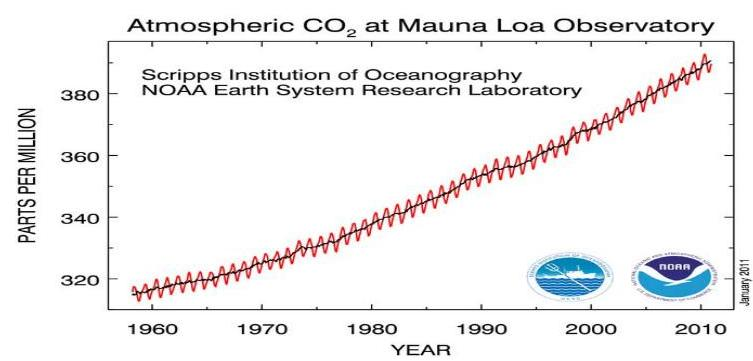

Egy nemzetközi tanulmány ${ }^{2}$ a klímaváltozást és annak lehetséges gazdasági hatásait vizsgálva megállapította, hogy nagyobb hatékonyságú az intézkedés,

[^0]
[^0]:    ${ }^{1}$ (Forrás a NOAA Earth System Research Laboratory honlapja (2011. január.))

---

ha a globális klímaváltozás mérséklésére irányul, mint később a káros hatások kezelésére, ugyanis a ma megtehető lépésekkel tízszeres későbbi költségek előzhetőek meg.

Mindezek ráirányították a döntéshozók, a szakemberek és a közvélemény figyelmét az intenzív klímapolitikára, az éghajlatváltozás hatásaira való felkészülés fontosságára, a kommunikációs tevékenység jelentőségére. Az éghajlatváltozáshoz kapcsolódó nemzetközi feladatok kritériumait és irányelveit az 1992-ben lefektetett ENSZ Éghajlatváltozási Keretegyezménye és annak 1997ben elfogadott és 2005-ben hatályba lépett Kiotói Jegyzőkönyve határozza meg. A világ mintegy 10 milliárd tonna széndioxid kibocsátásának 40\%-áért - a Kiotói egyezményt nem ratifikáló - USA és Kína felel.

Hazánk a Keretegyezményt 2002-ben írta alá. A Kiotói Jegyzőkönyv 2012-ben lejár, az új nemzetközi klímaszerződés előkészítése folyamatban van. Az üvegházhatást okozó gázok kibocsátási egységeinek európai kereskedelmi rendszerét 2005. január 1-jén vezették be. Az EU is kiemelten kezeli a klímaváltozást, ezt jelzi a 2000-ben elindított, valamint a 2005-ben második szakaszába ért Európai Éghajlatváltozási Program ${ }^{3}$. Ennek fő célkitűzése a Kiotói Jegyzőkönyv célkitűzései végrehajtásának biztosítása.

Magyarországon az 1990-es évek elején a légszennyezettségi mutatók alapján az ország területének 13,2\%-a szennyezett, illetve mérsékelten szennyezett ${ }^{4}$ volt, ami a lakosság csaknem felét érintette. Az ipari termelés visszaesése, illetve stagnálása kedvezően, a növekvő gépjármú forgalom ugyanakkor kedvezőtlenül befolyásolta a levegő tisztaságát és a klíma védelmét. Hazánkban, a bázisidőszakban (1985-87-ben) a klímaváltozást kiváltó üvegházhatású gázok kibocsátása - szén-dioxid-egyenértékben - évente 115 millió tonna volt.

Hazánk számára a felsorolt nemzetközi dokumentumok jelölik ki a legfőbb klímapolitikai alapfeladatokat. A Kiotói Jegyzőkönyv a 2008-2012-es évekre az üvegházhatást okozó gázok - az 1985-1987-es bázisidőszakhoz viszonyítva átlagban 6\%-os kibocsátás-csökkentését írta elő. Az ennél nagyobb arányú károsanyag-kibocsátás visszaszorítása esetén, a többlet tartalékolható, vagy más országnak, ún. kibocsátási egység ${ }^{5}$ kereskedelem keretében eladható. Az EU tagállamok 2008-ban az energia és klímacsomagban vállalták, hogy 2020-ig 20\%-kal csökkentik az üvegházhatású gázok kibocsátását.

[^0]
[^0]:    ${ }^{2}$ A Stern jelentés. Az Éghajlatváltozás Közgazdaságtana (2006). A Világbank volt vezető közgazdásza, az angol kormány pénzügyi tanácsadója által készített elemzés.
    ${ }^{3}$ European Climate Change Programme (ECCP)
    ${ }^{4}$ Megfelelő a levegőminőség, ha a koncentrációk határérték túllépéseinek a száma 0\%. Mérsékelten szennyezett a levegő, ha a 3 légszennyező paraméter koncentrációi közül legalább az egyik határérték túllépéseinek a száma nagyobb, mint $0 \%$, de kisebb vagy egyenlő $10 \%$. Végül szennyezett a levegő, ha a 3 légszennyező paraméter koncentrációi közül legalább az egyik határérték túllépéseinek a száma nagyobb, mint 10\%.
    ${ }^{5}$ Egy kibocsátási egység $=1$ tonna szén-dioxid, vagy azzal egyenértékű üvegházhatású gáz

---

A nemzetközi kötelezettségekhez kapcsolódó célkitűzések, intézkedések több, meghatározott időszakra szóló hazai szakmai stratégiába, illetve programba beépültek. Az 1999-ben kiadott Energiatakarékossági és energiahatékonyságnövelési Cselekvési Stratégia azzal számolt, hogy a 2010-ig meghatározott 75 PJ/év mértékű energia megtakarítás és a megújuló energiaforrások arányának növelése révén a kén-dioxid kibocsátás $50 \mathrm{kt} / \mathrm{év}$, a szén-dioxid kibocsátás 5 $\mathrm{Mt} /$ év mértékben mérséklődhet.

A levegő és klímavédelem irányítása állami feladat, fő felelőse 2010-ig a környezetvédelmi és vízügyi miniszter volt. A kormányzati struktúra 2010. évi változásakor a levegő védelme a vidékfejlesztési miniszter, a klímapolitika a nemzeti fejlesztési miniszter hatáskörébe került. Az intézkedések hatásának mérő, ellenőrző eszköze az EU által előírt - a légszennyező anyagok megfigyelését, állapotának nyomon követését biztosító - monitoring rendszerek múködése, valamint a hatékony hatósági tevékenység. A hatósági feladatokat a környezetvédelmi felügyelőségek, a lakosság vonatkozásában a települések jegyzői látták el.

Ellenőrzésünk a kiemelten kockázatos területekre, ezen belül az energiatermelő, valamint a közlekedési ágazatokra, illetve ezek okozta légszennyezésre, valamint az üvegházhatást okozó gázok kibocsátásának csökkentését célzó intézkedésekre koncentrált. Vizsgálatunk érintette az önkormányzatok ez irányú tevékenységét, valamint a társadalom lehetőségeit. Az ENSZ Keretegyezménye, illetve az EU irányelvek a tagállamok felé jogi, szervezeti, szakmai feladatokat jelöltek meg. Ezért az ellenőrzés részét képezte a nemzetközi kötelezettségek végrehajtását szolgáló jogi, szervezeti, és kiemelten a hatósági eszközrendszer kialakításának, a célokat megvalósító programok aktuális helyzetének, valamint a végrehajthatóságukat befolyásoló kockázatoknak a feltárása. Ellenőrzésünk teljesítmény szempontok alapján értékelte a témakörben felhasznált hazai és EU források hasznosulását.

# Az ellenőrzés célja annak értékelése volt, hogy: 

- az országos és ágazati stratégiák, programok megfelelő alapot jelentettek-e a légszennyezés csökkentését célzó nemzetközi egyezményekben és hazai rendelkezésekben foglalt előírások végrehajtására, tervezésüknél érvényesült-e a nemzetközi kötelezettségek, a hazai ágazati célok és a társadalmi érdekek összhangja, valamint a széleskörú, nyílt egyeztetésre való törekvés;
- a levegőt terhelő káros kibocsátások csökkentésére irányuló fejlesztéseket támogató hazai és EU források tervezésénél érvényesültek-e a hosszú távú nemzetközi, nemzeti és regionális prioritások, és a célkitúzésekkel való összhang szempontjai; a támogatott projektek hozzájárultak-e a nemzetközi kötelezettségekben és a hazai programokban kijelölt célkitúzések, mutatók eléréséhez;
- az üvegházhatást okozó gázok kibocsátásának csökkentését, nyomon követését célzó intézkedések megfeleltek-e a nemzetközi szerződésekben foglaltaknak, a kibocsátási egységek kereskedelemére vonatkozó szabályok kialakítása, a kibocsátási egységekkel, mint vagyoni értékű joggal való gazdálkodás biztosította-e a nemzetgazdasági érdekek érvényesülését;

---

- a kormányzati, önkormányzati intézkedések eredményeként kialakított - jogi, szervezeti, pénzügyi, hatósági és monitoring, valamint támogatási - eszközrendszer hatékonyan és eredményesen támogatta-e a légszennyezés, illetve az éghajlatváltozást okozó gázok kibocsátásának csökkentése kapcsán vállalt nemzetközi kötelezettségek, valamint a hazai légszennyezés elleni programokban rögzített célkitűzések végrehajtását.

Az ellenőrzés szempontjai a korábbi - a környezet- és természetvédelmet célzó intézkedések, valamint az uniós támogatások hasznosulása körében végzett ellenőrzések tapasztalataira, valamint a légszennyezés csökkentését célzó nemzetközi elvárásokra, irányelvekre épültek.

Az ellenőrzés a nemzetközi kötelezettségek hazai jogrendbe illesztését és célkitűzéseinek megvalósítását szolgáló programok időhorizontján belül, a 20042010 időszakra terjedt ki. Vizsgálatunk rendszerellenőrzés módszerével értékelte a levegő és a klíma védelmét célzó intézkedéseket, a hatósági tevékenységet, valamint a Keretegyezményben és a Kiotói Jegyzőkönyvben, továbbá a hazai programokban megjelölt célkitűzések, feladatok teljesítését. A vizsgálat során teljesítmény-ellenőrzési szempontok szerint értékeltük a levegő és a klíma védelmét célzó támogatási források felhasználását. Helyszíni ellenőrzés keretében 3 régióban végrehajtott, döntően a levegő védelmét célzó környezetvédelmi, energiagazdálkodási, közlekedési célú támogatásokkal megvalósított projekteket, illetve önkormányzatok levegővédelmet érintő intézkedéseit ellenőriztük.

Az ellenőrzés a környezetvédelemért felelős Vidékfejlesztési Minisztériumra, az energiastratégiáért és a klímapolitikáért, az energiahatékonyságért és az energiatakarékosságért, illetve a közlekedésért felelős Nemzeti Fejlesztési Minisztériumra, az egészségre ható tényezők határértékére vonatkozó jogszabályok kiadásáért felelős Nemzeti Erőforrás Minisztériumra, valamint az EU támogatásokat kezelő Nemzeti Fejlesztési Ügynökségnek a légszennyezés csökkentését célzó (környezetvédelmi, energia, illetve közlekedési ágazatot érintő) támogatásokkal kapcsolatos tevékenységére terjedt ki. A minél teljesebb körű értékelés érdekében adatokat, információkat kértünk be az Országos Meteorológiai Szolgálattól. Az ellenőrzés során figyelembe vettük a Jövő Nemzedékek Országgyúlési Biztosa által 2009-ben készített, a kvótaértékesítés bevételeinek felhasználásáról szóló állásfoglalását.

Az ellenőrzés során utóellenőrzésre nem került sor, mivel az ÁSZ ilyen irányú ellenőrzést még nem végzett. A témához szorosan kapcsolódó korábbi ellenőrzés, az energiagazdálkodást érintő állami és önkormányzati intézkedések, kiemelten az energiaracionalizálást célzó támogatások hatásának ellenőrzéséről szóló (1009 számú) jelentésben szereplő - pl. a stratégiákban foglalt célkitűzések, mutatók összehangolására, azonos időhorizontot átfogó meghatározására vonatkozó - javaslatok az eltelt idő rövidsége miatt nem hasznosulhattak.

Az ellenőrzés végrehajtására az Állami Számvevőszékről szóló 1989. évi XXXVIII. törvény 2.§ (3); (5) (6) és (9) bekezdései adták a jogszabályi alapot. 2011. július 1-től az ellenőrzés az Állami Számvevőszékről szóló 2011. évi LXVI. törvény 5.§. (2)-(3) bekezdései alapján folytatódott.

---

A jelentés-tervezetet észrevételezésre megküldtük a vidékfejlesztési, a nemzeti fejlesztési, a nemzeti erőforrás, a belügy, valamint a közigazgatási és igazságügyi miniszternek. A miniszterek - a vidékfejlesztési miniszter kivételével - nem tettek észrevételt. Az észrevételeket, valamint vidékfejlesztési miniszternek adott választ a jelentés $1 / a-1 / f$ számú mellékletei tartalmazzák.

---

# I. ÖSSZEGZŐ MEGÁLLAPÍTÁSOK, KÖVETKEZTETÉSEK, JAVASLATOK 

Hazánk a légszennyezés csökkentése, a klímavédelem körében vállalt nemzetközi kötelezettségeknek, irányelvekben meghatározott előírásoknak alapvetően megfelelt. A szakmai, jogi, szervezeti eszközrendszer igazodott a nemzetközi és a hazai elvárásokhoz. A kedvező gazdasági folyamatok és a fejlesztések eredményeként összességében a légszennyező anyagok kibocsátása - közlekedésből származó szálló por kivételével - nem növekedett, az üvegházhatású gázok (ÜHG) és ezen belül a szén-dioxid kibocsátása - szintén a közlekedés kivételével - csökkent. A légszennyezés csökkentését és a klímavédelmét célzó intézkedéseket összességében 487 Mrd Ft hazai és EU forrással támogatták. A hazánk rendelkezésére álló kibocsátási egységek értékesítéséből származó bevételeket ener-gia-megtakarítás elérését biztosító fejlesztésekre fordítják.

A nemzetközi kötelezettségekben vállalt egyes stratégiák, programok ugyanakkor késve vagy egyáltalán nem készültek el, nemzetközi jelentéstételi, nyilvántartás készítési határidők késve teljesültek. A programok számszerú indikátorokat csak részben jelöltek meg, ennek következtében végrehajtásuk hatása teljes körűen nem értékelhető. A végrehajtás eszközrendszerében, ezen belül a jogi szabályozás, a feladat- és hatáskörök meghatározása, a hatósági feladatok ellátása, feltételei, a szervezeti kialakítások és a támogatási mechanizmus kapcsán hiányosságokat állapítottunk meg. Nyolc légszennyezettségi zónában a kibocsátások a határértékeket rendszeresen túllépték, ebből három zónára vonatkozó mentességi kérelmet az EU nem fogadott el és eljárást indított.

A levegővédelem EU direktívák által determinált több ágazatot - környezetvédelem, közegészségügy, közlekedés, energiaügy, mezőgazdaság - érint. A jogi szabályozás ugyanakkor az egységes jogalkalmazás, valamint a feladat-, ha-tás- és felelősségi körök megosztása szempontjából nem volt egyértelmú és áttekinthető. A levegővédelemben érintett szereplők, egymáshoz való kapcsolódása, a koordinációs felelősség egyetlen jogszabályban sem jelent meg átfogóan, a szabályozás elsősorban a hatósági tevékenységre terjedt ki ${ }^{6}$. A kormányzati struktúra 2010. évi kiépítésénél a klímavédelemi feladatok először a nemzeti gazdasági miniszterhez, majd 2010. novembertől célszerűen az energiagazdálkodásért és a közlekedésért felelős miniszterhez kerültek.

A légszennyezés csökkentésének nemzetközi kötelezettségét hazánk számára a Genfi Egyezmény és a tagállamok számára feladatokat és légszennyezettségi határértékeket tartalmazó uniós irányelvek írták elő. 2008-ban megjelent a „Tisztább Levegőt Európának" EU irányelv (Levegőminőségi Irányelv), amely egységesítette a korábban légszennyezéssel kapcsolatban megjelent EU irányelveket, szigorította az előírásokat és az adatszolgáltatási kötelezettségeket. A

[^0]
[^0]:    ${ }^{6}$ A jogi szabályozással kapcsolatban pl. környezetvédelmi felügyelőségek, a Jövő Nemzedékek Országgyűlési Biztosa Irodája részéről is megfogalmazódtak az átláthatóság, az egyértelmú értelmezhetőség kapcsán jogbizonytalanságra utaló észrevételek.

---

klímavédelem terén Magyarország a Kiotói Jegyzőkönyvhöz való csatlakozással a 2008-2012. időszakra az ÜHG 6\%-os csökkentését vállalta, az EU irányelvek további kötelezettségeket rögzítettek. A 2008-ban megjelent EU Klíma és Energia csomagja 20\%-os ÜHG kibocsátás csökkentést irányzott elő 2020-as céldátummal.

A légszennyezést és a klímavédelemmel kapcsolatos EU irányelvek hazai jogszabályokhoz illesztése határidőre nem készült el. A légszennyezés tekintetében az irányelv hazai jogszabályba való átültetése az előírt 2010. június 11. helyett fél évvel később, a klímavédelem egyik, a 2010. január 1-jei határidő helyett 2011. februárban teljesült. Ennek következtében mindkét területen az EU hazánk ellen kötelezettségszegési eljárást indított ${ }^{7}$.

A légszennyezés csökkentését és a klíma védelmét biztosító nemzetközi kötelezettségek, célkitúzések a hazai érdekekkel összehangoltan a meglevő hazai stratégiákba és programokba beépültek. Elkészült a klímavédelem szempontjából legfontosabb szakmai dokumentum, a Nemzeti Éghajlatváltozási Stratégia (NÉS). A NÉS célkitűzéseinek megvalósítását szolgáló, a 2009-2010. időszakra szóló Nemzeti Éghajlatváltozási Programot (NÉP), a program második évében, vagyis késve fogadta el a Kormány. Elkészült a megújuló energiaforrások felhasználásának növelésére vonatkozó stratégia (20082020), de ezt 2011-ben egy kormányhatározat ${ }^{8}$ hatályon kívül helyezte. A határozatban egyúttal - megkésve ${ }^{9}$ - megjelent a 2010-2020 időszakra szóló Megújuló Energiahordozó Program (Nemzeti Cselekvési Terv), amely kimondta, hogy a stratégiát a terv felül- és átírja. Az éghajlatvédelmi keret-törvény ${ }^{10}$ tervezetét az OGY 2010-ben átdolgozásra visszaadta, azóta előrelépés nem történt.

A levegő szennyezettségével és a klímapolitikával kapcsolatos átfogó és specifikus célokat az 1997-ben indult és eddig három időszakra kidolgozott I., II., III. Nemzeti Környezetvédelmi Programok (NKP) tartalmazzák. A programok megvalósításának módját, prioritásait a végrehajtásukra kidolgozott, a 2004-2006 közötti időszakra vonatkozó Nemzeti Fejlesztési Terv és a 2007-2013 évekre szóló Új Magyarország Fejlesztési Terv rögzítette. A légszennyezés csökkentésére vonatkozó célkitűzéseket eltérő kezdéssel és időtartammal, különböző, pl. közlekedési, és energia ágazati stratégiák tartalmaznak, viszont ezeket

[^0]
[^0]:    ${ }^{7}$ Az egyes levegőminőségi határértékek átültetésére megszabott határidő be nem tartása miatt az EU által indított eljárást a levegő védelméről szóló 306/2010. (XII. 23.) Korm. rendelettel, valamint a 2011. január 14-én megjelent két miniszteri rendelet kiadásával teljesítette. A 2008/101/EK irányelv a 2003/87/EK irányelvnek az üvegházhatást okozó gázok kibocsátási egységei Közösségen belüli kereskedelmi rendszerének a légi közlekedésre történő kiterjesztése céljából történő módosításáról. Magyarország az előírást a légiközlekedési tevékenységből származó üvegházhatású gázok kibocsátásáról szóló 18/2011. (II. 28.) Korm. rendelettel teljesítette. A hazai jogrendbe ültetésről hazánk a Bizottságot tájékoztatta.
    ${ }^{8}$ A 1002/2011. (I. 14.) Korm. határozat Magyarország Megújuló Energia Hasznosítási Cselekvési Tervével összefüggő egyes feladatokról.
    ${ }^{9}$ Az EU által előírt határidő 2010. március 31. volt.
    ${ }^{10}$ Az éghajlatvédelmi kerettörvény előkészítéséről szóló 60/2009. (VI. 24.) OGY határozat szerinti benyújtási határidő 2010. február 28. volt.

---

komplexen összefogó légszennyezési stratégia nem készült el. A stratégiák, valamint a programok ${ }^{11}$ céljai és a végrehajtásukra kidolgozott fejlesztési tervekben foglaltak közötti összhang, továbbá az elért eredmények értékelését, az eltérő kezdési időpontok, valamint időtartamok korlátozzák.

A programok alapján hozott intézkedések hatásának értékeléséhez elengedhetetlen a konkrét indikátorok, célértékek meghatározása, célkitúzésekhez kapcsolása. Ezeket - alintézkedés szintre lebontva - a programok és a végrehajtásukra kidolgozott tervek (NFT, ÚMFT) hiányosan tartalmazták. Az épületek energiahatékonyságának növelését ${ }^{12}$ célzó támogatási rendszerek - a ZBR és az ÚMFT GOP ${ }^{13}$ kivételével - nem követelték meg a pályázóktól a vállalt kibocsátás csökkentés bemutatását, így ezek eredményessége sem összegezhető. Az indikátorok részleges hiánya következtében a levegő szennyezettségének és a kibocsátott káros anyagok mennyiségének csökkentését célzó intézkedések hatása teljes körüen nem értékelhető. Az NFT és az ÚMFT a célokat meghatározta, de csak Operatív programjainak (KIOP ${ }^{14}$, KEOP, KÖZOP) egyegy prioritása jelölt ki számszerúsített, mérhető kibocsátási célértékeket. Az NFT KIOP fizikai mutatókat (MW, km) rögzített nem hatás indikátorokat (t/év kibocsátás csökkenés). Az ÜHG kibocsátásának csökkentésére létrehozott Zöld Beruházási Rendszer (ZBR) - a források tervezésének bizonytalansága miatt négy alprogramjának egyike sem jelölt meg célállapot mutatót. A szén-dioxid megkötése szempontjából fontos erdőterület növelési célkitúzés három programba is beépült, de csak kettő jelölt meg számszerú indikátort ${ }^{15}$. Az Új Magyarország Vidékfejlesztési Program (ÚMVP) is tartalmaz a légszennyezés csökkentését és a klímavédelmet célzó intézkedéseket, de a metán kibocsátásának csökkentéséhez számszerúsített mutatót nem rendelt.

A levegő általános állapota a mérési adatok, jelentések alapján értékelhető. A levegő minőségét - a manuális mérőhálózat adatai alapján - a szélső értékek változása jellemezte. Nőtt a kiváló, illetve a jó levegő minőségű települések aránya 67\%-ról 74\%-ra, ugyanakkor nőtt, tehát romlott a szennyezett levegőjú települések aránya 7,5\%-ről 17\%-ra. Az NKP II beszámolója szerint 2007-re a szennyezett levegőjú területek aránya célkitúzés (5-8\%) teljesült (5\%). Nem teljesült viszont a légszennyezés által érintett lakosság aránya mutató, ami a célkitúzésben rögzített 20-25\% helyett 34\% lett.

A légszennyező anyagok kibocsátása körében az előzetes adatok alapján, a 2010. évre elérendő határértékek betartása teljesült. Az egyes káros anyag kibocsátásokon belül a szálló por szinten maradt, a többi összetevő (pl. kéndioxid, szén-dioxid) kedvezően alakult. Az EU által előírt, 2010-re teljesítendő

[^0]
[^0]:    ${ }^{11}$ Pl. a magyarországi megújuló energiaforrások felhasználásának növelését célzó stratégia (2008-2020), a Nemzeti Energiahatékonysági Cselekvési Terv (2008-2016), a Nemzeti Környezetvédelmi Programok II. (2003-2008); III (2009-2014).
    ${ }^{12}$ Az ÜHG kibocsátás 30\%-a a lakóépületek energiafelhasználásából származik.
    ${ }^{13}$ Új Magyarország Fejlesztési Terv, Gazdaságfejlesztési Operatív program.
    ${ }^{14}$ A Nemzeti Fejlesztési Terv, Környezetvédelem és Infrastruktúra Operatív programja.
    ${ }^{15}$ A Nemzeti Vidékfejlesztési Terv (NVT), az Új Magyarország Vidékfejlesztési Program (ÚMVP), és a Nemzeti Erdőprogram. Az utóbbi nem jelölt ki indikátort.

---

kén-dioxid szennyezettség évek óta az egészségügyi határérték alatt maradt, ezért a manuális mérőhálózatot csökkenteni lehetett. Az EU tagállamok 2020ig 20\%-os ÜHG kibocsátás csökkenést vállaltak. 2009-ig hazánkban az ÜHG kibocsátás $9 \%$-kal, a $\mathrm{CO}_{2}$ kibocsátás bruttó $17 \%$-kal (2010-re $22 \%$-kal) csökkent.

A kibocsátási adatokon belül a közúti közlekedés kibocsátási aránya meghatározó (85-90\%), ezért a nemzetközi kötelezettségek teljesítésének sarkalatos pontja. A közúti szállítások volumenének és részarányának növekedése következtében - az összes ÜHG kibocsátáson belül egyedül - a szállítási ágazat kibocsátási mutatója nőtt, mégpedig jelentősen (a 2005-2009 időszakban) $32 \%$-kal. A szmog kialakulásáért felelős, közlekedés okozta PM (szálló por) emisszió 2005 -óta $11 \%$-kal csökkent, ugyanakkor a 10 évvel korábbi adathoz képest $10 \%$-kal nőtt.

Az egyes javulást mutató eredmények ellenére Magyarország a 2010. január 1jétől bevezetett levegőminőségi előírásoknak nem teljes körűen tudott megfelelni, mivel egyes zónákban ${ }^{16}$ a légszennyezés a határértékeket túllépte. Ezért hazánk 2008-ban az EU Bizottságtól nyolc levegőminőségi zónában a $\mathrm{PM}_{10}$ (szálló por) értékekre vonatkozó napi határértékek, ezen belül öt zónában az éves határértékek alkalmazásának kötelezettsége alól átmeneti mentességet kért. Három (Budapest és környéke, a Sajó völgye, valamint a Szeged és Nyíregyháza) zónára vonatkozó kérelmet a Bizottság elutasította, arra hivatkozva, hogy a tervezett intézkedésekkel a napi határértékek betartása a mentességi időszak végére nem valósítható meg. Az eljárás még folyamatban van.

A Kiotói Jegyzőkönyvet aláíró államok számára kötelező az ÜHG kibocsátások nyilvántartási, adatszolgáltatási rendszerének kialakítása. Ennek megfelelve elkészült a Nemzeti Kibocsátási Leltár, de ennek éves jelentéseit az ENSZ felé a felelős OMSZ rendszerint megkésve, esetenként tartalmában hiányosan nyújtotta be. Az ENSZ ennek kapcsán 2010 végén ellenőrzést végzett, amelynek eredménye még nem ismert. Az EU által előírt nyilvántartás vezetési és az adatszolgáltatási kötelezettséget, hazánk a nemzeti kibocsátási egység-forgalmi jegyzék kialakításával teljesítette. Ugyanakkor az egyes kereskedési időszakok alatt kiosztható kibocsátási egységek mennyiségét és a kiosztás módszerét tartalmazó, a 2005-2007. közötti időszakra szóló Nemzeti Kiosztási Terv (NKT) elkészítése fél évet késett. ${ }^{17}$ Múködtetésének szabályozása is késve, 2006-ban történt meg. A 2008-2012. évekre szóló NKT II. 2008 elején készült el, annak ellenére, hogy tervezetét a tárgyidőszakot 18 hónappal megelőzően kellett volna közzétenni. A Nemzeti Kiosztási Lista (NKL) (2006. júniusi) benyújtása mintegy másfél évvel megkésett.

Az NKT II. a 2008-2012 közötti időszakra évente 30,7 millió tonna kibocsátási egység ${ }^{18}$ kiosztásával számolt ${ }^{19}$, ugyanakkor az EU Bizottság 2007-ben 26,9

[^0]
[^0]:    ${ }^{16}$ A 4/2002. (X. 7.) KvVM rendelet a légszennyezettségi agglomerációk és zónák kijelöléséről. A rendelet az ország területét egy agglomerációra (Budapest) 8 zónára és a 13 kijelölt várost tartalmazó zónára osztja.
    ${ }^{17}$ Ennek határideje a csatlakozás időpontja, 2004. május 1-je volt.
    ${ }^{18}$ Egy kibocsátási egység = 1 tonna szén-dioxid, vagy azzal egyenértékű üvegházhatású gáz

---

millió kibocsátási egységet hagyott jóvá. ${ }^{20}$ A magyar állam a döntés ellen keresetet nyújtott be, kifogásolva az EU Bizottság eljárását és számítási módszereit. Az Európai Unió Bírósága elutasította az EU Bizottság határozatát, ami ellen a Bizottság fellebbezést nyújtott be. A Magyarország által indított keresetet 2010ben felfüggesztették két másik országgal kapcsolatos döntés meghozataláig ${ }^{21}$.

A Kiotói Jegyzőkönyvet aláíró országok nemzetközi emisszió kereskedelmet folytathatnak. Hazánk a Kiotói a 6\%-os (kb. 7 millió tonna) ÚHG kibocsátás csökkenés vállalással szemben a 2008-2012 időszakra mintegy 120 millió tonna szén-dioxid értékesítésével számoltak, a tényleges kibocsátás évente mintegy 32-37 millió tonnával kevesebb volt. Hazánk a 2008-2010 időszakban négy szerződést kötött. A mintegy 12 millió egység ${ }^{22}$ eladásából 38 Mrd Ft bevétel származott, egy egység ára 9-13 euró között volt. Az értékesítést előkészítő döntés alapjait, szabályait jogszabály ${ }^{23}$ rögzíti. A szabályozás ellenére az értékesítéshez részletes javaslat nem készült, az előkészítés dokumentumai csak részben álltak rendelkezésre. Az értékesítés jóváhagyásának előterjesztési dokumentumai részletesen nem indokolják a tervezett ár megalapozottságát. A dokumentumok részleges, illetve teljes hiányában az értékesítés előkészítése nem volt megalapozott, illetve nem volt feltárható az alapos előkészítés és a minél magasabb ár elérésére való törekvés. ${ }^{24}$ Az elért árak nemzetközi öszszevetésére nincs mód, mert a kereskedő országok a szerződéseiket bizalmasan kezelik. Internetes honlapokon, illetve az ellenőrzés részére átadott dokumentumok alapján hazánk a nemzetközi átlagárak körül értékesített. A kibocsátási egységből származó első bevétel 2008-ban realizálódott, a kibocsátási egységek vagyonkezelőjének kijelölése azonban csak 2011-től történt meg.

Az egyik értékesítés - CER ${ }^{25}$ egységek eladása - Európán kívülre történt, az értékesítést követően három karbon-tőzsdén a kereskedést felfüggesztették, mert az eladott mennyiség kis hányada ismét megjelent az európai piacon, amit az EU előírások tiltanak, de kivédésére kellő biztosítékot nem tartalmaznak ${ }^{26}$. A CER

[^0]
[^0]:    ${ }^{19}$ A Nemzeti Kiosztási Terv II. tervezete szerint.
    ${ }^{20}$ A 2006. évi összes kibocsátás 25,7 millió tonna volt.
    ${ }^{21}$ Az EU Bizottság két másik országra vonatkozóan is hasonló határozatot hozott, ezek szintén keresetet nyújtottak be.
    ${ }^{22} 12$ millió tonna széndioxid egyenértékű üvegházhatású gáz
    ${ }^{23}$ Az ENSZ Éghajlatváltozási Keretegyezménye és annak Kiotói Jegyzőkönyve végrehajtási keretrendszeréről szóló 2007. évi LX. törvény végrehajtásának egyes szabályairól szóló 323/2007. (XII. 11.) Korm. rendelet.
    ${ }^{24}$ A pénzügyminiszter az értékesítés jóváhagyása mellett felhívta a figyelmet az egyetértés eljárásrendje kidolgozásának szükségességére.
    ${ }^{25}$ Certified Emission Reduction. Igazolt kibocsátás-csökkentési egység. Akkor keletkezik, amikor egy a Kiotói Jegyzőkönyv keretében kibocsátás-csökkentést nem vállaló országban kibocsátás-csökkentő beruházás valósul meg. Csak Európán kívülre értékesíthető.
    ${ }^{26}$ Az OKTVF észrevételében utalt a cégek általi kvótakereskedelem nyilvántartásának hiányosságára és jelezte egyes kereskedelmi ügyletek ellenőrzésének megkezdését.

---

értékesítés kapcsán az EU Bizottság megkereste Magyarországot, a tárgyalásokat követően további lépéseket nem tettek ${ }^{27}$.
Nemzetközi előírás, hogy a kibocsátási egységek értékesítésének bevételei kizárólag az ÜHG kibocsátás csökkentésére fordíthatóak. A felhasználási célokat az értékesítési szerződések rögzítették. Az egyik vevő ország kifogásolta a ZBR felhasználásának tervezett - pl. más beruházások kiváltása, illetve a magas, 60-70\%-os támogatási intenzitás - módszerét. Az első bevétel már 2008ban realizálódott, ennek ellenére a bevételek felhasználására kialakított Zöld Beruházási Rendszer (ZBR) beindítása elhúzódott. A ZBR jogi, szervezeti hátterének kialakítása a bevételeket követően másfél évvel később történt meg. A késleltetés valójában költségvetési előirányzat-megtartást ${ }^{28}$, vagyis „bújtatott" zárolást célzott, ugyanis a ZBR előirányzatot 2009-ben, dokumentáltan - pl. kormányhatározatokkal - bizonyíthatón nem zárolták. A ZBR keretében 20092010. folyamán négy támogatási alprogramot ${ }^{29}$ hirdettek meg. A jóváhagyott pályázatok száma 1819, a támogatásuk 17,17 Mrd Ft volt. Kifizetés csak a Panel I. alprogramra történt, 3,39 Mrd Ft összegben. A Panel II. pályázatok feldolgozása a meghirdetést követően közel 6 hónappal később kezdődött, mert a pályázatkezelői feladatokat két szervezet látta el.

A levegővédelem hatékony ellenőrzéséhez elengedhetetlen hatósági rendszer szervezete, mérési rendszere kiépült. A hatáskörök 2010-től változtak, a települési levegőtisztaság-védelmi ügyekben első fokon eljáró hatósági feladat ellátását - a korábbi települési szint helyett - kistérségi szintre emelték.

A környezetvédelmi hatósági tevékenységet ellátó környezetvédelmi, természetvédelmi és vízügyi felügyelőségek megfelelő működtetéséhez, a monitoring tevékenység ellátásához a pénzügyi feltételek nem voltak biztosítottak. A költségvetési támogatás 2010-re fokozatosan 58,0\%-ra csökkent, a hiányzó forrást a csökkenő és nehezen tervezhető saját bevételekből, pl. hatósági díjakból, igazgatási szolgáltatási díjakból kellett fedezni. Öt laboratórium megszűnt, és a kb. 350 fős mérőhálózati létszám kb. 200 fősre csökkent. A levegőszennyezés kapcsán beérkezett bejelentéseket a felügyelőségek tételesen kivizsgálták, és a szükséges esetekben hivatalból eljárást indítottak.

Monitoring hálózat múködtetése EU tagállami kötelezettség, elmaradása, nem megfelelő szintje kötelezettségszegési eljárást vonhat maga után. A méréseket végző Országos Légszennyezettségi Mérőhálózat ${ }^{30}$ (OLM) a berendezések és mérőállomások műszaki állapota, valamint a mért komponensszámok alap-

[^0]
[^0]:    ${ }^{27}$ A szerződésben a magyar eladó rögzítette, hogy a CER egységek az EU ETS-ben nem értékesíthetőek és nem használhatóak fel.
    ${ }^{28}$ A Magyar Köztársaság 2011. évi költségvetési javaslatáról szóló ÁSZ vélemény (1025) is megállapította, hogy „a Kormány a költségvetési egyensúly fenntartása érdekében a bevételek 2009. évi felhasználását nem engedélyezte."
    ${ }^{29}$ Klímabarát Otthon Panel Alprogram (Panel I. szakasz és Panel II. szakasz) - 2009, a Klímabarát Otthon Energiahatékonysági Alprogram - 2009, az Energiatakarékos Izzócsere Alprogram - 2010 és az Energiatakarékos Háztartási Gépcsere Alprogram - 2010.
    ${ }^{30}$ Az OLM szakmai irányításának feladatait az Országos Meteorológiai Szolgálat, illetve annak szervezeti egysége a Levegőtisztaság-védelmi Referencia központ (LRK) végzi.

---

ján a szigorodó EU és hazai előírásoknak csak minimális szinten felelt meg ${ }^{31}$. Az OLM fejlesztését 2005-ig, a központi költségvetésből esetenként a felügyelőségek saját bevételükből oldották meg. 2006-ban KIOP forrásból 201 M Ft értékű műszerbeszerzést hajtottak végre. 2008-ban elindult egy 1291,0 M Ft KEOP forrásból tervezett hardver-, szoftverfejlesztést célzó projekt, és 2009-ben a Svájci hozzájárulás finanszírozásában egy 5,75 millió CHF összegű laboratóriumi eszközök, mérőműszerek, mobil mérőállomások beszerzését célzó projekt, de ezek átszervezések miatt még nem valósultak meg. ${ }^{32}$ A fejlesztésektől a szolgáltatott adatok minőségének, valamint az adatrendelkezésre állás és a mérőhálózat általi lefedettség javulását várják.

A légszennyezettség csökkentésére vonatkozó hazai rendelkezések az önkormányzatok részére is feladatokat határoznak meg. Ezek közül legfontosabb a települési, illetve a megyei környezetvédelmi programok készítése, amelynek határidejét a rendelkezések nem jelölték ki. A helyszínen vizsgált 10 önkormányzat közül négy nem készített programot, ahol készült, azt egy esetben a képviselő-testület nem fogadta el. Az elkészült programokat négy esetben az illetékes szakhatóságokkal (felügyelőségek, ÁNTSZ) nem egyeztették. Az elfogadott programok nem minden esetben tartalmaztak a levegő védelmét biztosító prioritást. Ellenőrzésünk szerint a programok, illetve a levegővédelmi előírások hiánya nem befolyásolta a levegővédelmi intézkedéseket, mert e szempontok a helyi - az építésügyi, a településfejlesztési, a zöldhulladék-kezelési stb. - rendeletekbe döntően beépültek, viszont három esetben a kerti hulladék égetésének szabályait nem alkották meg. A felügyelőségek szerint a lakossággal szemben az önkormányzatok esetenként - például helyi rendelkezés hiányában - nem szankcionáltak. A helyszínen vizsgált önkormányzatok csak kirívó esetekben bírságoltak, inkább a megelőző ellenőrzés és a felszólítás gyakorlatát alkalmazták. Kiemelten kezelték a szén-dioxid megkötésében fontos fásítást. Szinte minden település iskolájában helyet kapott a környezettudatos nevelés, például környezetvédelmi szakképzés, környezetnevelés, erdei iskola formájában.

A levegő védelmét célzó intézkedésekbe a társadalom és a civil szervezetek széles körét is bevonták. A KvVM létrehozta a lakossági környezetvédelmi ügyintézéseket és tájékoztatást szolgáló ZÖLD PONT irodák hálózatát, emellett a zöld szervezetek is kialakították a Környezeti Tanácsadó Irodák Hálózatát (KÖTHÁLÓ). A KÖTHÁLÓ a lakosság, a civil szféra és a helyi önkormányzatok együttműködésének javítása érdekében 2010-ben létrehozta a Zöld Infólánc Portált. A Magyar Tudományos Akadémia és a KvVM együttmúködésében 2003 nyarán indult útjára a Változás-Hatás-Válaszadás (VAHAVA) projekt.

A vizsgált időszakban a légszennyezettség csökkentését, illetve a klímavédelmet célzó hazai stratégiák, programok megvalósulását hazai és elsősorban uniós forrásokra épülő támogatási rendszer finanszírozta. A jogi szabályozás

[^0]
[^0]:    ${ }^{31}$ Pl. a Dél-dunántúli felügyelőség (Pécs és környéke szennyezett régiónak minősül) a korábbi 5 automata mérőállomás helyett 3-t tud múködtetni. Egy immissziót mérő mobil monitoring állomás, felújítás hiányában 2008-tól két évig - KEOP forrásokból történt lecseréléséig - állt.
    ${ }^{32}$ A VM észrevétele szerint a környezetvédelmi tárca többszöri átszervezése, vezetőváltása miatt a projektek elhúzódtak, leghamarabb 2012-ben fejeződnek be.

---

megfelelt az EU előírásoknak. A támogatási források felhasználásának ütemét hátráltatta a belső eljárásoknak a jogszabályváltozásokból fakadó gyakori módosítása. Gyakori volt a határidők túllépése a közremúködő szervezeteknél időszakosan fellépő munkacsúcsok okozta létszámhiány, valamint a pályázók oldaláról a hiánypótlások magas aránya ${ }^{33}$ és határidőn túli teljesítése. A források lekötésének gyorsítása érdekében az ÚMFT tervezésénél figyelembe vették az előző programozási időszakban tapasztaltakat, a közreműködő szervezetek folyamatos szervezetfejlesztést hajtottak végre, a honlapon közzétették a pályázók által elkövetett leggyakoribb hibákat. A közreműködő szervezetekkel a teljesítményelv érvényesülésének szempontjait rögzítő feladat ellátási szerződéseket kötöttek. Az uniós források támogatási rendszerének informatikai háttere az Egységes Monitoring Információs Rendszer (EMIR) volt, egyes korábbi hiányosságai (pl. kötelezettségállomány adatainak pontatlansága), a folyamatos módosítások, fejlesztések eredményeként csökkentek. ${ }^{34}$

A Nemzeti Energiatakarékossági Program (NEP) megcélzott pályázói köre 14 kiírásnál a lakosság, 6 kiírásnál az önkormányzati és a költségvetési szervek, valamint a vállalkozások voltak. Hazai forrásból az igényelt összeg több mint felét, 7,9 Mrd Ft-ot ítélték meg. Az elért energia megtakarítás 1253950 $\mathrm{GJ} /$ év volt.

Az EU forrásokra támaszkodó NFT KIOP csak közvetve célozta a káros kibocsátások csökkenését ( 24 projekt, 67,15 Mrd Ft forrás), például a főúthálózat műszaki színvonalának javítása, vagy a környezetbarát közlekedési infrastruktúra fejlesztések révén. Ezek hatása nem, illetve csak hosszútávon mutatható ki. A projektek egyike a - közlekedésből eredő légszennyezés csökkentését célzó - Győr-Gönyű Országos Közforgalmú Kikötő intermodális központ közlekedési kapcsolat 7,8 Mrd Ft összegű fejlesztése volt, amely 2005-ben indult és 2008ban fejeződött be. A használatbavételi engedélyt 2010-ben kiadták, de a projekt nem múködött. Kiemelt elemének, a kikötő és a Budapest-Bécs vonalat öszszekötő vasútnak nem volt üzemeltetője és a vasúti pálya alatt fekvő ingatlanok vagyonkezelői jogát sem rendezték. Ezért fennállt a támogatás visszafizetésének kockázata. Helyszíni vizsgálatunkat követően az NFM a MÁV Zrt-t jelölte ki üzemeltetőnek és kezdeményezte az ingatlanok tulajdonjogának rendezését.

Az ÚMFT KEOP az energia felhasználáson (energia-felhasználás csökkenésén illetve a megújuló energiaforrás felhasználás növelésén) keresztül közvetve támogatja - 50, 5 Mrd Ft forrással - az ÜHG kibocsátás csökkenését, azonban ennek teljesüléséről adatok a projektek befejezése után állnak rendelkezésre. Az ÚMFT 358,52 Mrd Ft támogatású KözOP projektjeinek hatására a közlekedési szektor ÜHG kibocsátása $1 \mathrm{kt} \mathrm{CO}_{2}$ egyenérték/év mértékben csökkent.

Az ellenőrzésre kiválasztott 12 projekt kibocsátás-csökkentési vállalásai például szén-dioxid semlegesítő rendszer létrehozása, illetve a geotermikus energia hasznosítása - összhangban voltak az operatív programokban foglal-

[^0]
[^0]:    ${ }^{33}$ Pl. egy KEOP pályázatokból vett minta 17 pályázatának mindegyikénél hiánypótlásra volt szükség.
    ${ }^{34}$ Az ÁSZ európai uniós támogatások 2009. évi felhasználásának ellenőrzéséről készült jelentése.

---

takkal és egy - nem megfelelően előkészített - projekt kivételével teljesültek. Hét projekt túzött ki számszerúsített mutatót, az egyik 800 t/év ÜHG öt projekt $2392 \mathrm{t} / \mathrm{év} \mathrm{CO}_{2}$, egy projekt $30 \mathrm{t} / \mathrm{év} \mathrm{SO}_{2}$ kibocsátás csökkentést vállalt. Két projekt esetében a teljesítés a tervezettnél kedvezőbben alakult.

A helyszíni ellenőrzés megállapításainak hasznosítása mellett javasoljuk:

# a vidékfejlesztési miniszternek 

1. vizsgáltassa felül és pontosítsa, illetve egészítse ki a levegővédelem irányítási, felügyeleti, valamint a hatósági tevékenységet végzők feladat- és hatáskörének szabályozását, figyelembe véve a felügyelőségek és az önkormányzatok közötti hatáskörök megosztását;
2. gondoskodjon a nemzetközi elvárásokhoz igazodó hatékony hatósági feladatellátás kapacitás - létszám és eszköz - igény felméréséről és a rendelkezésre álló források függvényében ezek ütemes fejlesztéséről;
3. kezdeményezze a Kormánynál az önkormányzati törvény olyan módosítását, amely biztosítja a települési környezetvédelmi programok, illetve a helyi környezetvédelmi szabályok készítésére vonatkozó jogszabályi előírások érvényesülését, valamint az önkormányzatok környezetvédelmi feladatainak ellátásához pénzügyi támogatási rendszer kialakítását ${ }^{35}$;

## a nemzeti fejlesztési miniszternek

1. kezdeményezze a Kormánynál, hogy az Országgyűlés felé tegyen javaslatot az éghajlatvédelmi kerettörvény előkészítésének a Nemzeti Fenntartható Fejlődési Tanács megbízására vonatkozó korábbi döntésének felülvizsgálatára annak érdekében, hogy a jogosultságot telepítse a Kormányhoz. Az Országgyűlésnek a javaslatot elfogadó döntését követően aktualizálja a tervezetet és terjessze azt a kormány elé;
2. tegyen intézkedéseket - tekintettel a jövőben várható kvótaértékesítésekre - a Kiotói Jegyzőkönyv alapján létrejött nemzetközi emisszió-kereskedelem körében a széndioxid kibocsátási egységek értékesítéséhez kapcsolódó előkészítés dokumentált, nyomon követhető rendszerének kiépítésére;
3. indítson vizsgálatot a „Győr-Gönyű Országos Közforgalmú Kikötő intermodális központ közlekedési kapcsolatainak fejlesztése" projekt eredményeként megvalósult logisztikai központ működés megkezdésének elmaradására visszavezethető okok és a felelősség feltárására.
[^0]
[^0]:    ${ }^{35}$ A KIM államtitkára észrevételében jelezte, hogy a BM álláspontja szerint az önkormányzatok, illetve a polgármesterek nem rendelkeznek azokkal a személyi, tárgyi és anyagi feltételekkel, amelyek a füstköd-riadó tervvel kapcsolatban a jogszabályokban meghatározott feladatok teljes körű ellátását biztosítanák. Ez a környezet védelmének általános szabályairól szóló 1995. évi LIII. törvény módosítását igényli, a VM a BM felvetésével egyetértve 2011. I. félévében elkezdte a kérdés koncepcionális felülvizsgálatát.

---

# a vidékfejlesztési miniszternek és a nemzeti fejlesztési miniszternek 

1. intézkedjenek a légszennyezés csökkentését, valamint a klímavédelmet célzó stratégiák, programok, fejlesztési tervek előkészítése, megvalósítása során a hatások értékelését segítő indikátorok minél szélesebb körben történő kidolgozásáról, különösen a kibocsátási mutatók pályázók általi kimunkálását, és nyomon követésének előírását tegyék kötelezővé.

---

# II. RÉSZLETES MEGÁLLAPÍTÁSOK 

## 1. A NEMZETKÖZI EGYEZMÉNYEK, IRÁNYELVEK

### 1.1. A légszennyezéshez kapcsolódó nemzetközi egyezmények, EU irányelvek és jogharmonizációjuk

A légszennyezés csökkentésének hazánk számára is legalapvetőbb követelményét az 1979. november 13-án Genfben Magyarország által is aláirt a nagy távolságra jutó, országhatárokon átterjedő légszennyezés mérséklésére irányuló Egyezmény tartalmazza. Az Egyezmény volt az első, sokoldalú, a légköri környezet védelmére irányuló nemzetközi megállapodás.

Az Egyezmény konkrét emisszió csökkentési előírásokat nem tartalmazott, ezek az Egyezmény céljainak megvalósítását szolgáló jegyzőkönyvekben szerepelnek. Alapvető fontosságú a légszennyező anyagok nagy távolságra való eljutásának megfigyelésére és értékelésére kidolgozott európai együttmúködési program és az ennek keretében Európa területén kialakított mérőállomás rendszer.

A gyakorlatban egyes országok a kibocsátások növekedésének korlátozását határozták el (pl. Ausztrália), szinten tartást vállaltak (pl. Oroszország), illetve jelentősebb csökkentést irányoztak elő.

Az Európai Unió vonatkozó jogszabályaival való harmonizáció már a csatlakozás előtt megkezdődött. A levegőtisztaság-védelem alapvető előírásait a környezet védelmének általános szabályozásáról szóló 1995. évi LIII. törvény rögzítette. A levegőtisztaság-védelem jellemzőinek nyomon követésére az uniós előcsatlakozási időszakban (2001-2003-ban) a jogharmonizációs lépések során a szükséges kormányrendeleteket, miniszteri szintű rendeleteket megalkották.

A legfontosabbak a 21/2001. (II. 14.) Korm. rendelet a levegő védelmével kapcsolatos egyes szabályokról. A 14/2001. (V. 9.) KöM-EüM-FVM együttes rendelet a légszennyezettségi határértékekről, a helyhez kötött légszennyező pontforrások kibocsátási határértékeiről; a 17/2001. (VIII. 3.) KöM rendelet a légszennyezettség és a helyhez kötött légszennyező források kibocsátásának vizsgálatával, ellenőrzésével, értékelésével kapcsolatos szabályokról; és a 4/2002. (X. 7.) KvVM rendelet a légszennyezettségi agglomerációk és zónák kijelöléséről.

Az EU csatlakozás előtti jogharmonizációval kapcsolatban a csatlakozáskor már csak két derogációt kellett kérni. A nagy tüzelőberendezéseknek 2004. december 31-ig kellett megfelelniük az előírásoknak, a hulladékégetők 2005. június 5 -ig kaptak mentességet a vonatkozó irányelv betartása alól. Hazánk mind a két határidőt betartotta.

A légszennyezés csökkentésére 14 EU irányelv vonatkozott. Ezek közül a legfontosabb a 2008. május 20-án elfogadott, a környezeti levegő minőségéről és a Tisztább levegőt Európának elnevezésű programról szóló 2008/50/EK Európai Parlamenti és a Tanácsi irányelv. Megjelenésekor

---

egyesítette a korábbi keretirányelvet ${ }^{36}$ és három, az egyes szennyező összetevők határértékére vonatkozó irányelveket.

Az EU Levegőminőségi Irányelve a legnagyobb egészségügyi kockázattal járó légszennyező anyag, a kisméretü részecske ( $\mathrm{PM}_{10}$ és $\mathrm{PM}_{2,5}$ ) szennyezésre vezetett be a korábbinál szigorúbb előírásokat, mérési és adatszolgáltatási követelményeket. Az Irányelvben új követelményként jelent meg 2010-től a $2,5 \mu \mathrm{~m}$-nél kisebb átmérőjű részecskékre ( $\mathrm{PM}_{2,5}$ ) vonatkozó célérték, valamint a 2015-től kötelező éves határérték, továbbá a 20\%-os -2010-hez viszonyítva 2020. évre elérendő - expozíció-csökkentési cél. Ezek teljesítése érdekében új levegőminőségi terveket kellett kidolgozni, olyan régiókban, ahol a szennyezőanyagok koncentrációja a levegőminőségi célértéket, vagy határértéket, illetve az ideiglenes tűréshatárokat túllépi. Új szabályozás, hogy ki lehet jelölni azokat a zónákat vagy agglomerációkat, ahol a közutak téli homokszórása, sózása okozza a $\left(\mathrm{PM}_{10}\right)$ határérték túllépését. Az irányelvekben foglaltak beépültek a hazai szabályozásba.

Új rendeletek a 306/2010. (XII. 23.) Korm. rendelet a levegő védelmével kapcsolatos egyes szabályokról, a 4/2011. (I. 14.) VM rendelet a levegőterheltségi szint és kibocsátási határértékekről, valamint a 6/2011. (I.14.) VM rendelet a légszennyezés levegőterheltségi szint vizsgálatáról. A légszennyezettség mérését 11 immissziós mérési szabvány, a kibocsátott szennyező anyagok mérését, vizsgálatát a légszennyező pontforrások, helyhez kötött légszennyező források vonatkozásában 93 emissziós mérési szabvány írja elő.

A lakosságnak jelentős szerepe van a finom szálló por (PM) szennyezettség kialakulásában, mivel a kisméretű részecskék szennyezettségének elsődleges forrása a közlekedés, a lakossági fűtés, illetve egyéb lakossági égetési tevékenység.

A Bizottság által adott új határidőig a határérték betartása alól a tagállam mentesülhet országhatáron átterjedő szennyezés, vagy kedvezőtlen időjárás miatt. Az új irányelv bővítette az uniós adatszolgáltatási kötelezettséget, azon zónák és agglomerációk légszennyezettségéről minden évben jelentést kell adni, ahol egy vagy több szennyező anyag szintje magasabb, mint a célérték, vagy a kritikus szint, ugyanakkor egyszerűsítette az adatszolgáltatási kötelezettséget.

A Levegőminőségi Irányelvben foglalt egyes levegőminőségi előírásokat 2010. január 1-jétől, átültetését pedig 2010. június 11-ig kellett megvalósítani. A feltételnek Magyarország késve, illetve előreláthatólag nem teljes körüen tud/tudott csak megfelelni.

A Vidékfejlesztési Minisztérium tájékoztatása szerint: „A 2010-es érvényesitett levegőminőségi adatok még nem állnak rendelkezésre (2011. március 31-ig készül el a hivatalos értékelés), azonban az előzetes adatokból látható, hogy a határértéket néhány helyen 2010-ben túllépte a levegő szennyezettsége. A jogszabály lehetőséget ad mentességi kérelem benyújtására, amelyeket az érintett, területileg illetékes Felügyelőségek fognak elökésziteni".

[^0]
[^0]:    ${ }^{36}$ A környezeti levegő minőségének vizsgálatáról és ellenőrzéséről szóló, a Tanács 96/62/EK irányelve.

---

A VM az ÁSZ vizsgálat részére a következő kiegészítést tette: „Nem vezette be az 2008/50/EK irányelv a nitrogén-dioxidra új határértéket. A korábban hatályban lévő, a nitrogén-dioxidra vonatkozó 1. leányirányelv is tartalmazta a határértéket 2010. évi hatálybalépéssel, úgyhogy ez ismert követelmény volt, a magyar szabályozásban is szerepelt ez a határérték. Sajnálatosan a kisméretü részecskére ( $\mathrm{PM}_{10}$-re vonatkozó) határértékekhez hasonlóan bár kisebb mértékben a levegő szennyezettsége, egyes helyeken magasabb, mint ezek a határértékek".

A Levegőminőségi Irányelv hazai jogrendbe való átültetése a korábbiakat kiváltó új rendeletek megjelentetését indokolta, a jogszabályok módosításának lehetőségét kizárta a változások széles köre. A levegő védelmével kapcsolatos jogszabályokról szóló 2009. év végén elkészült előterjesztés tervezet kodifikációs folyamata - részben a Szakmapolitikai munkacsoport 2010. május 7-i döntése, részben az új kormányzati struktúrán belüli felelősségi rendszerek átalakulása miatt - indokolatlanul elhúzódott.

A jogszabály kodifikált változata 2011 áprilisára elkészült, de közigazgatási egyeztetése az átültetési határidő lejárta előtt nem kezdődött meg. Az új kormányzati struktúrában a VM környezetvédelemért felelős államtitkára 2010 júniusában jelezte a közigazgatási államtitkár felé - az irányelv június 11-én lejárt átültetési határidejére utalva - az intézkedés haladéktalan szükségességét.

A késés miatt az EU kötelezettségszegési eljárást indított a 2010. július 23-i dátummal érkezett felszólító levéllel. A 2010. november 24-én kelt „Indoklással ellátott vélemény" - 2010/0501. sz. jogsértést a Főtitkárság a környezeti levegő minőségéről és a Tisztább levegőt Európának elnevezésű programról szóló, az Európai Parlament és a Tanács 2008. május 21-i 2008/50/EK irányelve nemzeti jogba való átültetésével kapcsolatos értesítés hiányában címezte a Magyar Köztársaságnak, egyben felkérte a szükséges intézkedések két hónapon belüli meghozatalára.

A jogsértésről szóló „Felszólítás"-ban több irányelv - köztük a levegőminőségi irányelv - nemzeti jogba való átültetésére hívta fel a figyelmet az EU Bizottság. Egyben felkérte a Kormányt, hogy az Európai Unió múködéséről szóló szerződés 258. cikke értelmében két hónapon belül juttassa el észrevételeit.

Az EU által indított kötelezettségszegési eljárásra a jogalkotási folyamat felgyorsításával 2010. december 23-án elfogadott 306/2010. (XII. 23.) Korm. rendelet a levegő védelméről, valamint a 2011. január 14-én megjelent két miniszteri rendelet $^{37}$ jelentette az intézkedést.

Az emberi egészség, valamint az ökológiai rendszerek védelmét előtérbe helyező, az EU által 2005-ben kiadott levegőszennyezési Tematikus Stratégiája, amely kihangsúlyozza az emberi egészségre gyakorolt - különösen a finom por okozta - káros hatásokat, ezért felhívja a figyelmet a jelenlegi levegőminőségi jogszabályok korszerűsítésére, új levegőminőségi előírások ( $\mathrm{PM}_{2,5}$ ) bevezetésére, a nemzeti összkibocsátási határértékekről szóló direktíva felülvizsgálatára, valamint a kibocsátás szabályozás szigorítására, kiterjesztésére. Rámuta-

[^0]
[^0]:    ${ }^{37}$ A 4/2011. (I. 14.) VM rendelet a levegőterheltségi szint és kibocsátási határértékekről és a 6/2011. (I. 14.) VM rendelet a légszennyezés és levegőterheltségi szint vizsgálatáról.

---

tott, hogy a szabályozási szint nem elegendő az emberi egészség és az ökológiai rendszerek épségének hosszú távú megóvására.

A stratégia megvalósításában fontos szerep jut a levegőminőségi szempontok más szakpolitikákba való integrálásának, amely az energiapolitikát érintően a hatékonyság növelését, az energiatakarékosságot, a megújuló energiaforrások használatát; a közlekedéspolitika terén környezetkímélő közlekedési módok elterjesztését, a fenntartható városi közlekedési rendszerek megvalósítását; az agrárpolitika terén az állattartás, a mútrágya használat racionalizálását jelenti.

A Jövő Nemzedékek Országgyűlési Biztosának Irodája a 2004-2010. évek között hatályos levegővédelmi jogszabályokkal kapcsolatban - a beérkezett panaszok és a jogi adatbankos vizsgálatok tapasztalatai alapján - számos problémát jelzett, többek között a bűzzel járó tevékenység, a védelmi övezet szabályozására vonatkozóan, továbbá ráirányította a figyelmet a településrendezés és a kör-nyezet-egészségügy fontosságára. Vizsgálataik megállapították, hogy a levegővédelmi panaszok, problémák hátterében sok esetben nem kellően megalapozott településrendezési döntés állt. A környezet-egészségügy kiemelt jelentőségét hangsúlyozza, hogy a megbetegedések mintegy 15-30\%-a egyértelműen valamilyen környezeti ártalomra vezethető vissza. A NEFMI véleménye alapján a szálló por vonatkozásában további rosszabbodás várható a gáztüzeléssel szemben előtérbe kerülő vegyes tüzelés alkalmazásával.

A településrendezési problémák közül kiemelték a levegőterhelés növekedését eredményező infrastruktúra vagy létesítmény meglevő védendő terület közelébe való létesülését, vagy fordítva, a védendő funkció meglévő létesítmény, infrastruktúra közelébe való települését. A NEFMI álláspontja szerint a hatályos településrendezési és építési szabályozás (OTÉK ${ }^{38}$ ) nem tartalmazta az építmények tervezésére, létesítésére és múködtetésére vonatkozó közegészségügyi követelményeket.

Az ombudsmani állásfoglalást erősítette az Európai Környezetvédelmi Iroda 2009. évi brüsszeli konferenciáján megismert tanulmány is, amely szerint Magyarországon több kelet-európai országgal együtt a vizsgált 38 ország közül rossz a helyzet a szálló por és az ózonszennyezettség vonatkozásában.

# 1.2. A klímavédelemhez kapcsolódó nemzetközi egyezmények, EU irányelvek, átültetésük a hazai gyakorlatba 

A globális felmelegedés problémáját felismerő Meteorológiai Világszervezet $\left(\mathrm{WMO}^{39}\right)$ az Egyesült Nemzetek Környezeti Programjával (UNEP ${ }^{40}$ ) közösen az éghajlatváltozással kapcsolatos tudományos eredmények, kutatások folyamatos nyomon követése és értékelése érdekében 1988-ban létrehozta az Éghajlat-változási Kormányközi Testületet (IPCC). A testület a klíma lehetséges jövőbeli változásairól és kimeneteleiről készített összefoglaló jelentéseit 5-7 évente teszi közzé a kormányok és nemzetközi szervezetek számára.

[^0]
[^0]:    ${ }^{38}$ 253/1997. (XII. 20.) Korm. rendelet az országos településrendezési és építési követelményekről.
    ${ }^{39}$ World Meteorological Organization
    ${ }^{40}$ United Nations Environment Programme

---

A nemzetközi klímapolitikát meghatározó alapdokumentumok, amelyekhez Magyarország is csatlakozott, az Egyesült Nemzetek Szervezete (ENSZ) által New Yorkban, 1992. május 9-én elfogadott és Rio de Janeiróban, 1992. június 13-án aláírt ENSZ Éghajlatváltozási Keretegyezmény és az 1997-ben elfogadott Kiotói Jegyzökönyv. A Kiotói Jegyzökönyvben 38 fejlett és átalakuló gazdaságú ország vállalta, hogy 2012-ig nemzeti kibocsátásaikat összességében átlagosan 5,2 százalékkal csökkentik az 1990-es bázisévhez képest. A Kiotói Jegyzökönyv 2005. február 16-án lépett hatályba, amelyben az EU-15-ök már átlagos 8\%-os csökkentés mellett kötelezték el magukat. A Jegyzőkönyv első kötelezettségvállalási időszaka 2012. december 31-én lejár.

A gyakorlatban egyes országok (pl. Ausztrália), a kibocsátások növekedésének korlátozását határozták el, mások (pl. Oroszország), szinten tartást vállaltak. A Kiotói Jegyzőkönyv kötelezettségeit vállaló országok a világ üvegházhatású gázok kibocsátásának 1997-ben 40\%-át, 2011-ben megközelítőleg 27\%-át teszik ki.

A mexikói Cancunban 2010. év végén 194 részt vevő állam képviseletével megrendezett nemzetközi klímakonferencia eredménye egy új megállapodás-tervezet volt, mely részben a Kiotói Jegyzőkönyv folytatását, részben pedig egy új klímaegyezmény létrehozását célozta.

Az Oxfam nagy-britanniai központú nemzetközi segélyszervezet klímakatasztrófákról szóló jelentése szerint világszerte összesen 21 ezer ember életét követelték az éghajlathoz kapcsolódó időjárási katasztrófák 2010 januárja és szeptembere között, ami kétszerese a 2009-es adatoknak. A 2010-es időjárási katasztrófák sora egybecseng az IPCC 2007-es jelentésével, amely súlyos hőhullámokat, erdőtüzeket, áradásokat és a tengerszint emelkedését vetítette előre.

Magyarország a Kiotói Jegyzőkönyvhöz történt csatlakozásakor (1997-ben) 2012 -ig 6\%-os csökkentést vállalt. Ugyanakkor nem az 1990-es általános bázisévet, hanem 1985-1987-es évek átlagát tekintette alapul, ekkor az üvegházhatású gázok kibocsátása 115,4 millió tonna volt, de ez már 1990-re a nehézipar összeomlása miatt 98 millióra esett vissza, és 2005-re (a Kiotói Jegyzőkönyv hatálybalépésekor) 79 millió tonnára csökkent. A GKI Energiakutató Kft. számításai szerint az üvegházhatású gáz (CO2) kibocsátás Magyarországon 2012-ben 73,3 millió tonna várható, szemben a kiotói célkitűzéssel (6\%) ami 108,5 millió tonnára adódik. Vagyis a kiotói célokhoz képest prognosztizált csökkentés Magyarországon 2008-2012 között évente 32-37 millió tonna $\mathrm{CO}_{2}$ egység között várható.

A közösségi környezetpolitika keretét jelenleg az 1600/2002/EK határozattal létrehozott 2012-ig szóló hatodik közösségi környezetvédelmi cselekvési program adja, amely később tematikus programokkal, illetve szabályozási eszközökkel egészült ki. Az Akcióprogramhoz kapcsolódva számos közösségi terv (pl. Európai Éghajlatváltozási Program) tartalmaz további javaslatokat és konkrét feladatokat. Az éghajlatváltozást cselekvési prioritásként határozta meg, és előírta a közösségi szintü kibocsátási kereskedelmi rendszer 2005-ig történő létrehozását.

Az EU stratégiákkal, jogszabályokkal, iránymutatássokkal jelölte ki a tagállamok energiahatékonysági és az energiatakarékossági feladatait. A

---

2008 decemberében véglegesített uniós klíma- és energiacsomag megfogalmazta az ún. 3x20-as kötelezően végrehajtandó célokat. Az EU az 1990-es szinthez képest 2020-ra 20\%-os ÜHG kibocsátás-csökkentést, 20\%-os energiafelhasználás-csökkentést és a megújuló energiaforrásokból származó energia arányának 20\%-os növelését irányozta elő.

Az üvegházhatású gázokra vonatkozó főbb EU szabályozók: az üvegházhatást okozó gázok Közösségen belüli kibocsátásának nyomon követését szolgáló rendszerről és a Kiotói Jegyzőkönyv végrehajtásáról szóló 280/2004/EK határozata, valamint a 2007/589/EK határozat a 2003/87/EK európai parlamenti és tanácsi irányelv alapján az üvegházhatást okozó gázok kibocsátásának nyomon követésére és jelentésére vonatkozó iránymutatások létrehozásáról.

A klímavédelmet célzó EU irányelvek átvétele és hazai jogrendbe illesztését hazánk késve teljesítette. A 2003/87/EK irányelvnek az üvegházhatást okozó gázok kibocsátási egységei Közösségen belüli kereskedelmi rendszerének a légi közlekedésre történő kiterjesztése céljából történő módosításáról szóló 2008/101/EK irányelv átültetésének elmaradása miatt - határidő: 2010. január 1. volt - az Európai Unió 2010/0244. számú kötelezettségszegési eljárást indított. Az új 2008/50/EK irányelv hazai jogrendbe történő átültetésének határideje - 2010. június 11. volt, ami az időbeni szakmai előkészítés ellenére csak késve 2010 végén, illetve 2011 elején teljesült az új kor-mány-, illetve miniszteri rendeletek hatályba lépésével. A jogharmonizációról Magyarország az EU Bizottságot tájékoztatta.

A jogszabályi átültetés „az üvegházhatású gázok kibocsátási egységeinek kereskedelméről szóló 2005. évi XV. törvény „az egyes közlekedési tárgyú törvények módosításáról" szóló 2010. évi CLXXII. törvény elfogadásának keretében történő módosításával, valamint a légiközlekedési tevékenységből származó üvegházhatású gázok kibocsátásáról szóló 18/2011. (II. 28.) Korm. rendelettel teljesült.

Nem készült el az éghajlatvédelmi kerettörvény. Az Országgyúlés a Nemzeti Fenntartható Fejlődési Tanácsra bízta ${ }^{41}$ előkészítését, amely határidőre - 2010. február 28-ig - elkészült, de a tervezetet az OGY nem fogadta el, azt átdolgozásra visszaadta. Előrelépés az ügyben azóta nem történt, a késedelmet az ÁSZ 2010-ben jelezte ${ }^{42}$ és javasolta a törvény megalkotását. Az NFÜ is szükségesnek tartja a kerettörvény megalkotását, ugyanakkor felveti, hogy ehhez más stratégiák aktualizálása, illetve elkészítése szükséges.

Az NFÜ szerint szükséges a NÉS felülvizsgálata, a következő kétéves NÉP valamint a Nemzeti Alkalmazkodási Stratégia (NAS) elkészítése, illetve a közösségi követelmények alapján a Hazai Dekarbonációs Utiterv (HDU) elkészítése és OGY általi elfogadása.

[^0]
[^0]:    ${ }^{41}$ Az éghajlatvédelmi kerettörvény előkészítéséről szóló 60/2009. (VI. 24.) OGY határozat.
    ${ }^{42}$ Az energiagazdálkodást érintő állami és önkormányzati intézkedések, kiemelten az energiaracionalizálást célzó támogatások hatásának ellenőrzéséről (1009 sz.) szóló jelentés.

---

# 2. HAZAI STRATÉGIÁK, PROGRAMOK, PRIORITÁSOK ÉS MEGALAPOZÁSUK 

Magyarország a levegőminőség alakulása szempontjából kedvezőtlen helyzetben van. A Kárpát-medence levegője nehezen tisztul, ritkák a frontok, a szélsebesség alacsony, ún. hidegpárna alakul ki, amely lenyomja a szmogot a talaj közelébe. Mindezen tényezők indokolják, hogy hazánknak fokozottan figyelembe kell vennie a levegővédelmi kötelezettségeket, előirásokat.

A légszennyezés és az éghajlatváltozás átfogó célkitúzéseit stratégiák, ezek specifikus céljait, a megvalósítás módját és időarányos ütemezésüket, valamint előrehaladásuk mutatóit az 1997-ben indult és eddig három időszakra kidolgozott I., II., III. Nemzeti Környezetvédelmi Program (NKP) akcióprogramjai tartalmazzák. Az NKP megvalósulását több (közlekedési, mezőgazdasági, erdészeti) ágazati program segíti. A NKP II. és III. megvalósítását célzó konkrét intézkedéseket a 2004-2006 közötti időszakra a Nemzeti Fejlesztési Terv, valamint a 2007-2013. évekre az Új Magyarország Fejlesztési Terv részét képező környezetvédelmi illetve közlekedésfejlesztési prioritások, illetve a Regionális Operatív Programjaiban meghatározott részcélkitúzések rögzítik.

A hosszú távú hazai stratégiák, programok (NKP-k), valamint a végrehajtásuk feladatait és forrásait tartalmazó, uniós forrásokra épülő pénzügyi támogatási rendszerek (NFT, ÚMFT) kezdési időpontja, megvalósítási időtartama eltérő, ezért kidolgozásuk időben nem összehangoltan történt. Ennek következtében a bennük foglalt célkitúzések, mutatók összevetése, teljesítésük értékelése nem teljes körüen lehetséges. A környezetvédelemért felelős tárca észrevétele szerint „a stratégiák öszszehangolása jogszabályi keretek miatt nem lehetséges, az NKP mindig öt évre szól, ami behatárolja a tervezés idejét is az ÚMFT esetében pedig az EU Pénzügyi Perspektíva 7 éves időkerete a meghatározó. Mivel ezektől a keretektől eltérni nem lehet, az időbeli összehangolás nem lehetséges." Ellenőrzésünk szerint az NKP 5 évre szóló hatályát hazai jogszabály rögzíti, ami módosítható, illetve átfedés esetén köztes időarányos indikátor is kijelölhető.

Az NKP II. (2003-2008) időszaka részben lefedte az NFT (2004-2006) időszakát, valamint egy évvel átnyúlt az ÚMFT (2007-2013) időszakába. Az NKP III. (20092014) akkor kezdődött, amikor a célkitúzéseinek végrehajtását megalapozó feladatokat tartalmazó ÚMFT (2007-2013) végrehajtása már két éve folyamatban volt, viszont egy évvel később fejeződik be. A Nemzeti Éghajlatváltozási Stratégia (2008-2025) elkészítését az ENSZ Éghajlatváltozási Keretegyezménye és annak Kiotói Jegyzőkönyv végrehajtási keretrendszeréről szóló 2007. évi LX. törvény rendelte el, tehát az ÚMFT előkészítése és indítása ezt is megelőzte.

A KözOP célkitúzéseit 2008-ban módosítani kellett, mert hiányzott egy olyan, számszerú célokat tartalmazó stratégia, amely a program forrásaiból megvalósítandó projekteket megalapozta volna.

---

# 2.1. A légszennyezés csökkentését célzó programok 

Magyarországnak a légszennyezés csökkentésére vonatkozó stratégiája nincs, azonban a levegőminőség javítása érdekében szükséges célokat és intézkedéseket stratégiák, programok határozták meg. Ezek cselekvési időszaka eltérő időhorizontot fog át, amely megnehezíti az eredmények értékelését.

A légszennyezés csökkentésének célkitűzéseit a 2003-2015-ig szóló magyar közlekedéspolitika ${ }^{43}$, a 2008 -ig szóló magyar energiapolitika ${ }^{44}$, és a 2008-2020 közötti időszakra vonatkozó energiapolitika ${ }^{45}$ valamint az Egységes Közlekedésfejlesztési Stratégia (2007-2020), a 2000-2010-ig terjedő energiatakarékossági és energiaha-tékonyság-növelési stratégia ${ }^{46}$, a 2008-2020-ig terjedő magyarországi megújuló energiaforrások felhasználásának növelésére vonatkozó stratégia ${ }^{47}$ fektette le.

A részletes feladatokat, prioritásokat a második és harmadik Nemzeti Környezetvédelmi Program tartalmazta, a végrehajtás irányait, prioritásait, mutatóit a Nemzeti Fejlesztési Terv (2004-2006) Környezetvédelmi és Infrastruktúra Operatív Programja, az Új Magyarország Fejlesztési Terv ${ }^{48}$ (2007-2013) Közlekedés Operatív Programja, valamint a Környezet és Energia Operatív Programja, Magyarország Módosított Nemzeti Energiahatékonysági Cselekvési Terve ${ }^{49}$; valamint az Új Magyarország Vidékfejlesztési Program rögzítette.

A légszennyezés csökkentését célozta a beruházások, a nehéz fűtőolaj tüzelés megszűntetése és az üzemanyagok minőségi követelményeinek ${ }^{50}$ szigorítása. Fontos eszköz volt a felhasznált energiaforrások káros anyag tartalmának, illetve a kibocsátások mértékének szabályozása, szankcionálása. Ezt célozta a környezetterhelési díj, az energiaadó, a regisztrációs adó bevezetése, a jövedéki adó környezeti szempontú módosítása, illetve, a 2005. július 1-től gyártott motorbenzinek és dízel gázolajok kéntartalmának legfeljebb csak 0,001\%-os előírása. Ezt az Európai Unió irányelv csak 2009-től tette kötelezővé.

Az egyes ágazatok levegőtisztaság-védelmet közvetlenül, vagy közvetve érintő feladatai az uniós célok eléréséhez szükséges cselekvési tervekben is megjelentek. Így a Nemzeti Energiahatékonysági Cselekvési Tervben, Magyarország Megújuló Energiahasznosítási Cselekvési Tervében; továbbá a POP-al kapcsolatos Nemzeti Intézkedési Tervben. A Nemzeti Vidékfejlesztési Terv (NVT) két in-

[^0]
[^0]:    ${ }^{43}$ A 19/2004. OGY határozattal elfogadott
    ${ }^{44}$ A 21/1993. (IV. 9.) OGY határozattal elfogadott
    ${ }^{45}$ A 40/2008. (IV. 17.) OGY határozattal elfogadott
    ${ }^{46}$ A 1107/1999. (X. 8.) Korm. határozattal elfogadott
    ${ }^{47}$ A 2148/2008. (X. 31.) Korm. határozattal megjelent. Helyette Magyarország Megújuló Energia Hasznosítási Cselekvési Tervével összefüggő egyes feladatokról szóló 1002/2011. (I. 14.) Korm. határozat lépett hatályba.
    ${ }^{48}$ 1103/2006. (X. 30.) Korm. határozat az Új Magyarország Fejlesztési Terv elfogadásáról
    ${ }^{49}$ A 1076/2010. (III. 31.) Korm. határozattal elfogadott
    ${ }^{50}$ A motorhajtóanyagok minőségi követelményeiről szóló 20/2008 (VIII. 22.) KHEM rendelet.

---

tézkedése célozta a légszennyezés csökkentését az „Agrár-környezetgazdálkodás" illetve „az Európai Unió környezetvédelmi, állatjóléti és higiéniai követelményeinek való megfelelés." Az ÚMVP energiahatékony eljárások, technológiák bevezetésének támogatásával járult hozzá a légszennyezés csökkentéséhez, a mezőgazdasági üzemek korszerűsítése; „A mezőgazdaság és az erdészet fejlesztéséhez és korszerűsítéséhez kapcsolódó infrastruktúra" jogcímeken.

Az ÁSZ „A települési önkormányzatok tulajdonában lévő zöldterületek fejlesztésének és fenntartásának ellenőrzése (0934)" című jelentése az alábbi javaslatot tette a környezetvédelmi és vízügyi miniszternek: „3. Vizsgálja meg az NKP II. végrehajtásáról készülő jelentés tervezetében az egy városi lakosra jutó közhasználati zöldterület célkitúzésének a teljesitését, tisztázza a 2000. és a 2008. évi adatok tartalmát és mutassa be a kitüzött céltól való elmaradás okát". A szükséges adatok hiánya miatt nem történt meg az egy városi lakosra jutó közhasználati zöldterület célkitűzése teljesítésének megvizsgálása, a 2008. évi adatok tartalmának tisztázása, a kitűzött céltól való elmaradás okának bemutatása.

# 2.2. A klímaváltozás hatásainak kezelését célzó hazai stratégiák, programok 

A 2008-2020 közötti időszakra vonatkozó, energiapolitikáról szóló 40/2008 (IV. 17.) OGY határozat 5. pontja értelmében biztosítani kell az energiapolitika és a klímapolitika közötti összhangot. A határozat 6. pontja külön hangsúlyozza a közlekedési célú energiaigények, üvegházhatású gáz- és károsanyag-kibocsátások növekedési üteme visszafogásának szükségességét, valamint a megújuló forrásokból előállított üzemanyagok felhasználási arányának növekedési lehetőségeit. A közlekedés a hazai energia jellegű kibocsátók közül az egyetlen növekvő kibocsátást mutató szektor. A határozat célul tűzi ki a fajlagos energiafelhasználás csökkentését, az energiahatékonyság javítását és az energiahatékonyság növelését, kiemelve az épületkorszerűsítés, a közlekedés, valamint az energiaátalakítás területét.

Az Országgyúlés 2007-ben elfogadta az ENSZ Éghajlatváltozási Keretegyezménye és annak Kiotói Jegyzőkönyve végrehajtási keretrendszeréről szóló 2007. évi LX. törvényt - ún. Kiotói törvényt (Éhvt), mely többek között rendelkezik a stratégiai tervezésben fontos előrelépést jelentő, 2008-2025-ig szóló Nemzeti Éghajlat-változási Stratégia (NÉS) elkészítéséről.

Magyarország középtávú klímapolitikájának irányait az ENSZ Éghajlatváltozási Keretegyezménye és annak Kiotói Jegyzőkönyve végrehajtási keretrendszeréről szóló 2007. évi LX. törvény 3. § (1)-(2) bekezdése alapján elkészített és OGY által elfogadott, ${ }^{51}$ a 2008-2025 közötti időszakra vonatkozó Nemzeti Éghajlatváltozási Stratégia (NÉS) jelöli ki. A NÉS alapvetően a 2008-2025 közötti időszakra készült, de tartalmaz egy 2050-re vonatkozó kitekintést. Az Éhvt. szerinti felülvizsgálatot a NÉS elfogadását (2008) követő két év elteltével - tehát először 2010-ben -, majd azt követően ötévente kell meg-

[^0]
[^0]:    ${ }^{51}$ A 29/2008. (III. 20.) határozatával fogadta el az Országgyűlés.

---

tenni, ez nem történt meg, a helyszíni ellenőrzés ideje alatt előkészítési szakaszban volt.

A stratégia célkitűzéseinek megvalósítását szolgálja az Éhvt. által előírt kétéves időszakokra szóló Nemzeti Éghajlatváltozási Program (NÉP). Első, 2009-2010-es időszakra szóló szakaszának elfogadása egy éves késéssel, 2010-ben történt meg és nem az - Éhvt. 14. § (5) bekezdés által - előírt kormányrendelettel, hanem kormányhatározattal (1005/2010. (I. 21.)) fogadták el. A késedelem következtében nem teljesülhetett a NÉP végrehajtásának évenkénti beszámolási kötelezettségére vonatkozó előirás (Éhvt. 3. § (5) bekezdés) sem, azt az NFM 2011. második felére tervezi elkészíteni.

A Nemzeti Fejlesztési Minisztériumtól (NFM) kapott tájékoztatás szerint: a felülvizsgálat az Uniós magyar elnökség után, 2011. második felében kerül napirendre, és év végén pedig az Országgyúlés elé.

A környezet védelmének általános szabályairól szóló 1995. évi LIII. törvény (Kvt) és a végrehajtására megalkotott egyes tervek, illetve programok környezeti vizsgálatáról szóló 2/2005. (I. 11.) Korm. rendelet (Kvt vhr) előírja a programok stratégiai környezeti vizsgálatának (SKV) elkészítését. A vizsgálat célja, hogy a környezeti szakértők és az érintettek véleményének az előkészítés és tervezés folyamatába való integrálásának segítségével javítsa a tervezési dokumentumok minőségét, környezeti hatékonyságát. A jogszabályi kötelezettségnek a NÉS kialakítása során a szakmai, társadalmi, civil- és környezetvédelmi szervezetekkel történő egyeztetéssel eleget tettek. A NÉS prioritásként határozta meg a nemzetközi kötelezettségek maradéktalan teljesítését, az éghajlatváltozás hajtóerői elleni küzdelmet, az ÚHG kibocsátás csökkentését, valamint a klímaváltozáshoz való alkalmazkodást.

A 2007. évben lefolytatott stratégiai környezeti vizsgálatot a Környezetvédelmi és Vízügyi Minisztérium (KvVM) megbízásából az Ökológiai Intézet és a Fenntartható Fejlődésért Alapítvány irányította. A társadalmi részvétel szervezését az Alapítványhoz szerződéses formában kapcsolódó Magyar Természetvédők Szövetsége (MTVSZ) hajtotta végre.

Az egyeztetési folyamatról ütemezett terv készült, amelyet nemcsak a jogszabály által kötelezően előírt körben, hanem a széles nyilvánosság előtt is közzétettek. Az elkészült környezeti értékelés közzétételére 30 nap állt rendelkezésre. Sajtóközleményekben, levelekben, honlapon is nyilvánosságra hozták a felhívásokat, a véleményeket postai úton, illetve e-mail formájában is fogadták, ezen kívül konferenciákat és fórumokat szerveztek. Az érdeklődők személyesen is megtehették észrevételeiket a környezeti értékeléssel kapcsolatban ún. Partnerségi Fórum keretében.

A Magyar Tudományos Akadémia (MTA) és a Környezetvédelmi és Vízügyi Minisztérium (KvVM) együttműködésében 2003-ban indult a globális klímaváltozással, a hazai hatásokkal foglalkozó az ún. Változás-Hatás-Válaszadás projekt (VAHAVA).

A 2006-ban elkészült összefoglaló jelentés összegzése szerint hazánknak hozzá kell járulnia a globális felmelegedés további megfékezéséhez, el kell érni a szén-

---

dioxid kibocsátás jelentős csökkentését. Ehhez szükséges hosszabb távon az alternatív erőforrások fokozottabb bevonása az energia-ellátásba, valamint az energiatakarékossági és az energia-hatékonysági fejlesztések támogatása is.

Mindezek konkrét gazdasági haszonnal is járnak: a fajlagos energia-felhasználás csökkentése javítja a termelékenységet, fokozza az energia-ellátás biztonságát és csökkenti hazánk függését az energiaimporttól. A jelentés hangsúlyozza, hogy lényeges a döntéshozók, az önkormányzatok, a vállalkozók és a lakosság megfelelő felkészítése, hiteles tájékoztatása, megfelelő információkkal való ellátása.

A VAHAVA-projekt vezetői 2008-ban kezdeményezték egy országos információskoordinációs hálózat létrehozását az éghajlatváltozással, annak hazai hatásaival foglalkozó tudományos kutatásokkal, szakigazgatási tevékenységgel, továbbá a klímapolitikai döntések szakmai megalapozásával, az oktatással, neveléssel, tudatformálással foglalkozó személyek, szakmai intézmények és társadalmi szervezetek részére. A részvétel önkéntes, 243 szakember jelentkezett, és 115 szervezet jelezte részvételi szándékát. A hálózat segíti a hazai éghajlatváltozás témakörébe tartozó kutatási és innovációs rendezvényeket, valamint a honlapon „KLÍMA-21" Füzetek néven a globális klímaváltozással, a mitigációval (mérséklés) és adaptációval (alkalmazkodás) foglalkozó tanulmányokat közöl.

Nem valósult meg a közlekedésben a bioüzemanyagok felhasználásának részarányára 2010. december 31-i határidővel teljesítendő EU előírás. Az ellenőrzés során kapott tájékoztatás szerint: „A közlekedésben a bioüzemanyagok felhasználásának részaránya elmaradt az 5,75\%-tól (2003/30/EK irányelv). Megjegyezzük, hogy ezt a célszámot információnk szerint egyetlen tagállam sem érte el."

A magyarországi megújuló energiaforrások felhasználásának növelésére vonatkozó 2008-2020 közötti stratégiáról szóló 2148/2008. (X. 31.) Korm. határozatban feladatként kijelölt - a 2008. december 31-ére - előírt határidőre a Megújuló Energiahordozó Program (Nemzeti Cselekvési Terv) nem készült el. Ezzel Magyarország nem felelt meg az Európai Unió Tanácsa megújuló forrásokból előállított energia támogatásáról szóló irányelv javaslatának [2008/0016/COD] 4. cikkében foglalt, tervezett tagállami kötelezettségnek. ${ }^{52}$ Nem készült el a kormányhatározat 3. pontjában 2009. augusztus 31. határidőre előírt, a stratégiában kitűzött célok megvalósítása terén elért eredmények előírt értékelése sem. Elkészült ugyanakkor egy Cselekvési Terv, melyet 2010 végén (az ÁSZ vizsgálat idején) fogadta el a Kormány, és küldte ki az EU Bizottság részére. Ugyanakkor a részletes feladatokat és felelősöket kijelölő „Magyarország Megújuló Energia Hasznosítási Cselekvési Tervével összefüggő egyes feladatokról" szóló 1002/2011. (I. 14.) Korm. határozat hatályon kívül helyezte a 2148/2008. (X. 31.) Korm. határozatot, a 2008-ban kiadott megújuló stratégiáról viszont nem rendelkezett. Helyette a cselekvési terv mondja ki, hogy a stratégiát a cselekvési terv felülírja.

Magyarország Megújuló Energia Hasznosítási Cselekvési Terve 2010-2020 szerint „Az NCsT épít Magyarország megújuló energia stratégiájára, azonban tekintettel az időközben bekövetkezett jelentős változásokra, a globális gazdasági recesszióra, valamint a kormány által meghatározott, a gazdasági újjáépitést szolgáló új gazdaságfejlesztési prioritásokra, azt felül- és átírja."

[^0]
[^0]:    ${ }^{52}$ A kormányhatározat 2. pontjában foglaltak alapján.

---

Az NFM szerint „az NCsT 118. oldalának második bekezdése tartalmazza, hogy a korábbi - 2148/2008. (X.31.) Korm. hat. szerinti - megújuló stratégia az EU vonatkozó célkitüzések ismeretében (2009/28/EK irányelv), a megváltozott világgazdasági körülmények és különösen a nemzetgazdasági célkitüzések figyelembevételével az NCsT keretében kiigazításra került. Az NCsT elfogadásával egyidejüleg ezért hatályon kivül helyezésre került a 2148/2008. (X.31.) Korm. határozat. Az Európai Bizottsághoz benyújtott NCsT olyan integrált dokumentum, amely egyszerre tartalmazza a megújuló energiaforrások elterjesztésére vonatkozó stratégiát, célkitüzéseket (I-III. fejezetek), annak elérését szolgáló intézkedéseket, cselekvési tervet (IV. fejezet), valamint a makroszintü hatásvizsgálatot (V. fejezet)."

A Nemzeti Energiahatékonysági Cselekvési Tervet a Kormány a 2019/2008. (II. 23.) Korm. határozatával vette tudomásul. Ezt a Kormány már 2010-ben módosította a Magyarország Módosított Nemzeti Energiahatékonysági Cselekvési Tervét tartalmazó 1076/2010. (III. 31.) számú határozatával, amelyet az EU Bizottság részére megküldtek. Nem hajtották végre a kormányhatározat d.) pontjában foglaltakat, mely szerint az érintett minisztereknek meg kellett vizsgálnia a 2012 utáni aukcióskvóta-kiosztásból származó bevételekből az energiatakarékossági és a megújuló energia hasznosítási intézkedések támogatásának lehetőségét, valamint javaslatot kellett tenniük a bevételek allokálására 2010. augusztus 31-i határidővel.

Az 2010-ig terjedő energiatakarékossági és energiahatékonyságnövelési stratégiáról a Kormány az 1107/1999. (X. 8.) Korm. határozattal döntött. Az abban meghatározott 2010-ig terjedő intézkedések közül több, az energiatakarékossághoz kapcsolódó cél nem teljesült.

#### Abstract

Nem teljesült pl. a környezetvédelmi követelmények körében a gazdaság összenergia-igényének évi 3,5\%-kal való mérséklése, a részben államilag támogatott energia-megtakarítási tevékenység révén mintegy $75 \mathrm{Pl} /$ év hőértékű energiahordozó megtakarítása, illetve hazai megújuló energiahordozókkal történő kiváltása, a fogyasztó oldali energiatakarékosság 5 PJ/év energiahordozó megtakarítás elérése. A közlekedés korszerűsítése körében az energiatakarékos és környezetkímélő szállítási módok (vasút, vízi közlekedés), valamint a tömegközlekedés jármúállományának rekonstrukciójával, a közúti áruszállító gépjárművek korszerűsítésével történő energiatakarékosság támogatása kedvezményes hitel formájában a 4,5 PJ/év energiahordozó megtakarítás elérése érdekében. A „20000 napkollektoros tető 2010" program, ami legalább 20000 intézmény és lakóépület a hő- és melegvíz napkollektorokkal történő előállítását célozta.

A klímapolitikai feladatokat kiemelten kezelte a 132/2003. (XII. 11.) OGY határozattal elfogadott, a 2003-2008. közötti időszakra szóló Nemzeti Környezetvédelmi Program (NKP II.) „éghajlatváltozási", valamint a 96/2009. (XII. 9.) OGY határozattal elfogadott, a 2009-2014 közötti idöszakra szóló Nemzeti Környezetvédelmi Program (NKP III.) „éghajlatváltozás" tematikus akcióprogramja. Az NKP-khoz kapcsolódó környezetügyi témakörökben rövid, illetve középtávú programok, tervek kidolgozása történt (pl. Nemzeti Éghajlatváltozási Program). Az NKP III. kidolgozása, átfogó intézkedései és tematikus akcióprogramjai meghatározása a hatályos közösségi programok és környezetvédelmi szabályozás figyelembevételével történt.

Az NKP II éghajlatváltozási akcióprogramja célként jelölte meg többek között az energiagazdálkodási tevékenységekből eredő légköri kibocsátások csökkentésének

---

előmozdítását, a megújuló energiahordozók hasznosításával kapcsolatos technológiák fejlesztését és elterjesztését, valamint a közlekedési eredetű szennyező-anyag-kibocsátások mérséklését célzó alintézkedéseket.

Az NKP III. éghajlatváltozás akcióprogramja az energiagazdálkodás, a közlekedés, a mezőgazdaság, valamint az erdőgazdálkodás területén jelölt meg célkitűzéseket.

Az erdők területének növelése fontos tényező a szén-dioxid megkötése szempontjából. Erdőgazdálkodáshoz kapcsolt célkitűzéseket a NÉP is megjelölt a Nemzeti Erdőprogram, valamint a Nemzeti Erdőtelepítési Program megvalósulásának biztosításával, mint cél nevesítésével. A Nemzeti Erdöprogram, ${ }^{53}$ illetve a megvalósítási terve nem tartalmazott mérhető mutatókat, illetve indikátorokat a 2015. évi célállapotokat illetően. Megvalósításának kritikus éve 2006 volt, mert a költségvetési évben nem állt rendelkezésre megfelelő keret a végrehajtásra. Teljesült az NKP II erdősültség növeléséhez kapcsolódó célkitüzése.

Az NKP-II. a faállománnyal borított és erdő-felújítási kötelezettség alá tartozó terület arányának mutatója (erdősültség) 20,3\% lett, szemben a célkitúzés $20 \%$ célkitűzéssel.

A Nemzeti Erdőtelepítési Program forrásként az ÚMVP mezőgazdasági földterület első erdősítése (ÚMVP 221.) valamint a nem mezőgazdasági földterület első erdősítése (ÚMVP 223.) címet jelölte meg.

A klímaváltozás védelmét célozta Magyarország Nemzeti Vidékfejlesztési Terve (2004-2006), a mezőgazdasági területek erdősítése című intézkedése, amely monitoring indikátorának célértéke túlteljesült, a támogatott terület nagysága 30 ezer hektárral szemben 44 ezer hektárban valósult meg.

A VM Erdészeti, Halászati és Vadászati Főosztályának észrevétele szerint a Nemzeti Erdőtelepítési Program megvalósulásával Magyarország erdőterülete, a következő 35-50 évben várhatóan 686 ezer hektárral gyarapodik, ezzel az országos erdősültség 27,4\%-ra nő. (Ezen belül 2025-ig 270-360 ezer hektár növekedést terveznek.) A gyorsan növő fafajok telepítésének eredményeként a jelenlegi 14-15 tonna megkötött szén-dioxid mennyiség további 4-5 millió tonnával nőhet.

Az Új Magyarország Vidékfejlesztési Program (ÚMVP) (2007-2013) is tartalmaz programokat mind a levegőszennyezésre, mind a klímára vonatkozóan. A mezőgazdaság, a vadgazdálkodás és az erdőgazdálkodás által kibocsátott üvegházhatású gázok kibocsátása (2008-ban) 14360 ezer tonna $\mathrm{CO}_{2}$ egyenérték, ami az összes nemzetgazdasági kibocsátás $21 \%$-a. Az ÚMVP indikátorok meghatározása mellett - célul jelölte meg az erdőtelepítést, hatásként a klímaváltozás elleni küzdelemhez való hozzájárulást nevezte meg.

Magyarországon a mezőgazdasági tevékenység okozta levegőszennyezés megfelel az EU átlagnak, de az ágazat is hozzájárulhat intézkedésekkel az éghajlatváltozás enyhítéséhez, mert pl. a megújuló energiaforrások (biomassza) bővülése, a

[^0]
[^0]:    ${ }^{53}$ A 1110/2004. (X. 27.) számú kormányhatározattal meghirdetett.

---

mezőgazdasági földterületek erdősítése hozzájárul a szén-dioxid-kibocsátás $\left(\mathrm{CO}_{2}\right)$, illetve a savasodást okozó gázok közül a nitrát kibocsátás $\left(\mathrm{NO}_{3}\right)$ mérsékléséhez.

A program célkitűzései közül a nem megfelelő szerves trágya és hígtrágya tárolásból és alkalmazásból származó ammónia-, dinitrogén-oxid- és metánkibocsátások csökkentését célzó „a mezőgazdasági üzemek korszerüsítése" alintézkedés kibocsátás csökkenést, mint indikátort nem határozott meg.

Az erdősítés körében a 2.6. „mezőgazdasági földterület első erdősitése" alintézkedés számszerúsített célja az uniós közös indikátorok alapján az erdősített területek nagysága (ha) átlag $10.000 \mathrm{ha} / \mathrm{év}$, a fás szárú energia-ültetvény átlag 7.000 ha/év, a sikeresen erdőtelepítéssel érintett terület 70.000 ha, a fás szárú ültetvények összes területe 49.000 ha volt. A 2.8 „nem mezőgazdasági földterület első erdősítése" alintézkedés számszerúsített célja a sikeresen erdőtelepítéssel érintett terület 2.000 ha volt.

# 2.3. A légszennyezés és a klímavédelem hazai indikátorai 

A fosszilis tüzelőanyagok égetése - villamosenergia-termelés, közlekedés - során a légszennyező hatás kiemelten magas, mivel a kibocsátott gázok mennyisége gyorsan növekszik, nem nyelődik el, hanem felgyülemlik az atmoszférában. Ezek közül a szén-dioxid $\left(\mathrm{CO}_{2}\right)$ önmagában nem minősül légszennyező anyagnak, környezeti problémát az úgynevezett üvegházhatás (azaz a légkör felmelegedése) kialakulásával, erősítésével okoz.

A hazai környezetvédelmi ágazati politikák - ebbe a körbe tartozik az OGY határozatokkal elfogadott, 2008-ig szóló magyar energiapolitika, a 2008-2020 közötti időszakra vonatkozó energiapolitika, valamint a 2003-2015-ig szóló magyar közlekedéspolitika - kijelölik a légszennyezés csökkentését, illetve a klímavédelmet szolgáló célokat. Ezek teljesülését mérhetővé tevő indikátorok, mutatók a stratégiák, programok végrehajtását megvalósító fejlesztési tervekben jelentek meg.
E stratégiák, programok ugyanakkor nem tartalmaztak légszennyezés csökkentéshez kapcsolódó nevesített feladatot, de fő céljuk az ener-gia-megtakarítás révén közvetve hozzájárulnak a káros anyagok kibocsátásának csökkenéséhez.

A 2003-2015-ig szóló magyar közlekedéspolitika kijelölte a légszennyezés csökkentéséhez hozzájáruló célokat, de mérhető indikátorokat nem jelölt meg. Az Egységes Közlekedésfejlesztési Stratégia - a légszennyezéshez kapcsolódva „Az Egységes Közlekedésfejlesztési Stratégia célkitüzéseit megvalósitó ágazati stratégiák" című dokumentuma tartalmazott a nitrogén-dioxid $\left(\mathrm{N}_{2} \mathrm{O}\right)$ és a metán $\left(\mathrm{CH}_{4}\right)$ vonatkozásában - a 2007-2015 közötti időszakot érintően - célértékeket.

A közúti közlekedési igények és a szállítási volumenek növekedése különösen a nagyvárosokban és azok agglomerációiban - számos kedvezőtlen környezeti és egészségügyi hatással jár. A levegőminőség egyik legfontosabb tényezője a szállópor szennyezés $\left(\mathrm{PM}_{10}, \mathrm{PM}_{2.5}\right)$. (A VM észrevétele szerint „a szálló por elnevezés nem pontos, azonban a vonatkozó irányelvek 2004-óta ezt a kifejezést használják a kisméretü részecske pontosabb kifejezés helyett")

A szálló por a levegőben eloszlatott finomszemcsés ( $10 \mu \mathrm{~m}$ alatti részecske átmérőjű) szilárd vagy folyékony halmazállapotú anyagok gyűjtőneve. A szálló por

---

megnevezést az ülepedő portól való megkülönböztetésre használják. 1987 óta történik a $10 \mu \mathrm{~m}$-nél kisebb frakció meghatározása, 1997 óta a $2,5 \mu \mathrm{~m}$-nél kisebb frakcióé. Egészségügyi szempontból a 10 illetve a 2,5 mikronos határnak van jelentősége ( $\mathrm{PM}_{10}$ és a $\mathrm{PM}_{2,5}$ ). A $2,5 \mu \mathrm{~m}$-nél kisebbek már egyáltalán nem, vagy nehezen ürülnek ki a tüdőből. A szálló por közvetlenül befolyásolja (csökkenti) a látótávolságot, és nagyon komoly egészségkárosodást okoz a tartós belélegzése.

Az önkormányzatok kötelesek tájékoztatni a lakosságot, ha a szálló por értéke két egymást követő napon meghaladja a $75 \mu \mathrm{~g} / \mathrm{m}^{3}-\mathrm{t}$ (150\%), riasztási kötelezettség áll fenn, ha a szálló por értéke két egymást követő napon meghaladja a 100 $\mu \mathrm{g} / \mathrm{m}^{3}-\mathrm{t}(200 \%)$ és a meteorológiai előrejelzések szerint a következő napon sem várható javulás.

Az NKP-III-nak -az NKP-II-től eltérően - a légszennyezés csökkentését és a klímavédelmet érintő célkitűzései - az alábbi esetekben - nem tartalmaztak a programidőszak végére (2014-re) elérendő indikátor célértékeket, mutatószámokat, csak az előrehaladási mutatókat és azok tartalmát nevesítették, viszont 2010-re, illetve 2020-ra rögzített célértékeket. Nem írta elő éves ütemezési tervek és beszámolók készítésének kötelezettségét, így ezek nem készültek. Ezek hiánya miatt fennáll a program nyomon követésének kockázata.

Például az energiagazdálkodás körében nevesíti az energiahatékonyság évi 1-1\% javítását a 2008-2016 közötti időszakban, összhangban az EU vonatkozó irányelvével, valamint a hazai energiastratégiával. Szerepel továbbá az összenergia felhasználáson belül 2020-ra 14,9-15,9\%-os megújuló energiahordozó részarány elérése (186,3 PJ elérése a 2006. évi 55 PJ -hoz képest).

Az 5.4.2. „települések levegőminőségének javitása" alintézkedésen belül a szennyezettség csökkentése, illetve a jó minőség megőrzése - az ún. zónákba nem sorolttiszta levegőjű térségekben: a 2,5 mikrométernél kisebb átmérőjű szálló por részecskékre 20\%-os csökkenés 2010 és 2020 között ( $25 \mu \mathrm{~g} / \mathrm{m} 3$-ről $20 \mu \mathrm{~g} / \mathrm{m} 3 \mathrm{~N}-\mathrm{re}$ ). Nem számszerúsített a levegőminőségi értékek, az egyes szennyezőanyagok jogszabályban rögzített határértékekhez viszonyított mennyisége, a határérték túllépések száma.

Például az 5.2.1.1. „Részvétel az EU kibocsátás-csökkentési rendszerének fejlesztésében, végrehajtásában" alintézkedés jelölt meg - az EU által meghatározott - célértéket, ugyanakkor a hozzárendelt mutatók egyike sem volt számszerúsített. Az ÜHG mutató: EU-szinten 10\%-os kibocsátás-csökkentés elérése, Magyarország számára előírás, hogy a kibocsátások esetleges növekedése 2020-ra ne haladja meg a 10\%-os szintet, a 2005. bázisévhez képest. A mutatók közül - tartalma alapján - öt esetben lehetett volna mutatót rendelni pl. az évenkénti nettó és bruttó üvegházhatású gáz kibocsátás értékei, a szektorok részesedése a teljes hazai üvegházhatású gáz kibocsátásban, metán, dinitrogén-oxid, $\mathrm{CO}_{2}$ kibocsátás mértéke, egy főre vetített, ágazatonként stb. esetében.

A ZBR négy alprogramjához nem rendeltek célállapot mutatókat, így a támogatás hatása, eredményessége nem értékelhető. Összegezhető viszont az elért ÜHG kibocsátás csökkenés, mert a pályázók részére előírták ennek vállalását. Az NFM szerint indikátor kijelölése nehéz a források bizonytalansága miatt, mert a támogatási célok kijelölése megelőzi a források rendelkezésre állását.

---

Az NFM véleménye szerint a ZBR forrása nem hasonlítható a stabil operatív programokra bontható EU-s források tervezésével. A kiinduló stratégia is bizonytalanabb forrásokon alapul, mint az UMVP vagy UMFT. A különbség abban nyilvánul meg, hogy adott a felhasználási cél, amihez forrást kell biztosítani. Ez nem elsősorban támogatáspolitika, hanem klímapolitika, ahol a $\mathrm{CO}_{2}$ kibocsátás csökkenése a meghatározó, amelyhez egy eszköz a támogatásból megvalósuló beruházás/fejlesztés.

Az üvegházhatású gázok kibocsátásának 30\%-át a lakóépületek energiafelhasználása okozza, ezért a klímavédelem egyik fő eszköze az épületek energiahatékonyságának növelése. Az ezt célzó támogatási rendszerek ${ }^{54}$ ennek ellenére az energiahatékonyság növelésének hatását az üvegházhatású gázok kibocsátására nem követték nyomon, a pályázóktól - a ZBR és az ÚMFT GOP kivételével - erre vonatkozó mutatókat nem vártak el.

# 2.3.1. A Nemzeti Fejlesztési Terv indikátorai és teljesülésük 

A KIOP a levegő szennyezettségét, annak alakulását mérő indikátort nem tartalmazott, ezért a légszennyezés ellen és a klímapolitika terén tett intézkedésekkel összefüggésben megfogalmazott célkitüzések teljesülése, illetve a támogatott fejlesztések hatása és nyomon követése nem mérhetö. (az NFT indikátorait az 2. számú melléklet tartalmazza)

A környezetvédelem prioritás 1.7 „energiagazdálkodás környezetbarát fejlesztése" intézkedésének indikátorai között nem szerepelt a légszennyezést vagy az üvegházhatású gázok kibocsátását mérő indikátor annak ellenére, hogy az ágazat mindkettő alakulásában meghatározó szerepet játszik. A 2005. évben az ÚHG leltár szerint - a kibocsátások és elnyelések egyenlegeként számított teljes kibocsátás $78,4 \%$-a az energiaszektor számlájára volt írható.

A klímavédelemhez egy indikátor kapcsolódott, közvetlenül az „egységre jutó $\mathrm{CO}_{2}$ kibocsátás csökkenése az áruszállításban". Az indikátor csak a közlekedés prioritás két intézkedésénél - a 2.1 „főúthálózat múszaki színvonalának fejlesztése" és a 2.2 „környezetbarát közlekedési infrastruktúra fejlesztése" - jelent meg, annak ellenére, hogy a környezetvédelem prioritás is - értelemszerúen - kapcsolódott mind célkitűzéseiben, mind hatásában a klímapolitika terén tett intézkedésekhez. Az indikátor célértékét nem határozták meg.

A horizontális indikátor elért értékét számítással állapították meg. A számítás eredménye az volt, hogy az áruszállítási egységre jutó $\mathbf{C O}_{2}$ kibocsátás 9,4\%-kal csökkent. Ugyanakkor a KIOP Záró Végrehajtási Jelentése megjegyzi, hogy az adott mutató változását további - pl. a gépjármúvek korszerűsége - tényezők is befolyásolják, e hatások a beruházások befejezését követően 5-10 éves időtávon mutathatóak ki.

A csökkenés a vízi szállítás alacsonyabb fajlagos kibocsátásának köszönhető. A közúti fejlesztéseken belül az elkerülő utakon nőtt, a 11,5 tonnás tengelyterhelést

[^0]
[^0]:    ${ }^{54}$ Részletesen tárgyalja ezeket az Állami Számvevőszék 1009. sz. Jelentése „az energiagazdálkodást érintő állami és önkormányzati intézkedések, kiemelten az energiaracionalizálást célzó támogatások hatásának ellenőrzéséről" (2010. augusztus).

---

lehetővé tevő útrekonstrukciós munkákkal, valamint a kapacitásbővítő, sávbővítéses útfejlesztéssel érintett utakon csökkent a fajlagos kibocsátás.

A KIOP környezetvédelem prioritásán belül a „levegőszennyezés és zajterhelés mérése" intézkedés „levegőszennyezés mérése" komponense egy központi fejlesztést valósított meg: az Országos Légszennyezettség Mérőhálózatához (OLM) mérőmúszerek, berendezések beszerzését. A komponens output indikátora az újonnan felszerelt mérőegységek és berendezések száma volt.

# 2.3.2. Az Új Magyarország Fejlesztési Terv indikátorai és teljesülésük 

Az ÚMFT-ben a környezeti fenntarthatóság biztosítása horizontális célként minden prioritást érintő követelmény. Az ÚMFT környezet fenntartható állapota hangsúlyozza a klímaváltozással kapcsolatos teendők körét.

Az ÚMFT operatív programjaiba a levegő szennyezettségének csökkentését és a klímavédelmet célzó intézkedések, prioritások operatív program (OP) vagy akcióterv szintjén, indikátorokkal számszerúsített mutatókkal beépültek. A Környezet és Energia Operatív Program (KEOP), a Közlekedés Operatív Program (KözOP), és a regionális Operatív Programok (ROP) közül a Közép-magyarországi Operatív Program (KMOP) célkitűzései között jelent meg. A Gazdaságfejlesztés Operatív Program (GOP) vállalkozások technológiai korszerűsítése címen, valamint a Regionális Operatív Programok tartalmaznak közvetve pl. környezetbarát közlekedés címen célkitűzést.

Ezek hatása nem lesz teljes körűen értékelhető, mert mérhető, számszerűsített kibocsátási mutatókat nem minden alintézkedés tartalmaz, illetve a ROP közlekedésfejlesztés célú intézkedései (kerékpárút, elkerülő utak, közösségi közlekedés fejlesztése) hozzájárulnak a fő célkitúzéshez, de hatásuk értékeléséhez nem jelölnek ki mutatókat. (Az ÚMFT prioritásait és mutatóit a 3. számú melléklet tartalmazza.)

Az ÚMFT KEOP a légszennyezés csökkentése kapcsán nem jelöl ki célokat és indikátorokat, azonban a megújuló energiaforrás-felhasználás növelése, a hatékony energia-felhasználás és a fenntartható életmód és fogyasztás prioritások megvalósulása hozzájárulhat a légszennyezés csökkentéshez. A KEOP 3.6. „fenntartható életmód és fogyasztás" prioritási tengely támogat légszennyezés ellen és a klímapolitika terén tett intézkedéseket. Ezek célja a fenntartható életmód folytatásához szükséges környezettudatos szemléletmód, értékrend, igény és ismeretek kialakulásának elősegítése. Az indikátorok itt azt mérik, hogy a támogatott kampányok és minta projektek üzenetei hány alkalommal jutnak el a megszólított emberekhez.

A KEOP éves megvalósítási jelentései nem közöltek adatot az üvegházhatású gázok kibocsátása csökkenésének (vagy változásának) mértékéről, ezek csak a projektek befejezése után állnak majd rendelkezésre. A KEOP 4. „megújuló energiaforrás-felhasználás növelés" és az 5. „hatékony energiafelhasználás" prioritási tengelyek tartalmaznak klímavédelemhez kapcsolódó indikátorokat. A 2 prioritási tengelyre az operatív program „technikai segítségnyújtás" prioritási tengely nélkül számított összes forrásához viszonyítva sor-

---

rendben 5,2\% - 3,2\% jut. Ez az arány nem áll összhangban a klímavédelem tényleges, vagy akár az operatív programban deklarált jelentőségével.

A KEOP forrásainak 53,9\%-át az 1. „egészséges, tiszta települések" prioritási tengelyhez, további 29,2\%-át a 2. „vizeink jó kezelése" prioritási tengelyhez kapcsolódó fejlesztések kötik le, amelyek nagy részben uniós kötelezettség vállalások teljesítéséhez kötődnek.

A KözOP operatív program szintű (hatás)indikátora „a közlekedési szektor üvegházhatású gáz- emissziójának csökkentése (OP hatására)". Az indikátor célértéke 2015-re 10 kt $\mathrm{CO}_{2}$ e/év csökkentés. 2010-ben a KözOP OP indikátor csökkent $+1 \mathrm{kt} \mathrm{CO}_{2} /$ év értékre a számítás módszertanának változása, illetve egy projekt KözOP-ból történt kikerülése miatt. A 2009. évi indikátor $+6 \mathrm{kt} \mathrm{CO}_{2} /$ év volt, vagyis továbbra is a kibocsátás növekedését feltételezték, csak kisebbet a korábban tervezettnél.

Módszertani változást okozott, hogy a korábbi 2005-ös adatokra épülő számításokat követően ismertté váltak a 2007 és 2008. évi adatok.

A korábban megállapított indikátor utólagos csökkentését az M7 Balatonkeresztúr - Nagykanizsa autópálya szakasz KözOP finanszírozásból történt kiesése okozta.

A KözOP megvalósításáról szóló éves jelentések tartalmazzák az indikátor értékének alakulását. Eszerint 2008-ban az OP projektek hatásaként az üvegházhatású gázok kibocsátásának változása $+5 \mathrm{kt} \mathrm{CO}_{2} \mathrm{e} / \mathrm{év}$, mivel az egyetlen lezárult projekt, az M7-es közúti beruházás hatására az emisszió nőtt. A 2009. év végén az indikátor értéke $+\mathbf{6 k t} \mathbf{~ C O}_{2} \mathbf{e} /$ év volt.

A KözOP-on belül csak egy, az 5. „városi és elővárosi közlekedés fejlesztése" prioritás egy hatásindikátora, a „közlekedésből származó szálló por ( $\mathrm{PM}_{10}$ ) kibocsátás mértékének változása a prioritás hatására Budapesten" mér levegő szennyezettségére gyakorolt hatást (2015-re a kiinduló állapothoz viszonyított célérték 30 t/év csökkentés).

A célérték az egyes projekt-típusok számított kibocsátási hatásának egyenlege. A KözOP közúti projekteknek a járművek üzemanyag fogyasztásának becsült alakulása alapján számított kibocsátási hatása $+82 \mathrm{kt} \mathrm{CO}_{2} \mathrm{e} / \mathrm{év}$. A vasúti projektek közül csak egy vasútvonal villamosításának hatását számították, ami $-4,3 \mathrm{kt}$ $\mathrm{CO}_{2} \mathrm{e} /$ év. Végül a városi metró és villamos projektek becsült hatása -88 kt $\mathrm{CO}_{2} \mathrm{e} /$ év.

A KözOP 5. prioritásának egy hatásindikátora kapcsolódik közvetlenül a klímavédelemhez: az „üvegházhatású gáz $\left(\mathrm{CO}_{2}, \mathrm{~N}_{2} \mathrm{O}, \mathrm{CH}_{4}\right)$ kibocsátás mértékének változása a prioritás hatására". Az indikátor célértéke 2015-re -85 kt $\mathrm{CO}_{2} \mathrm{e} /$ év csökkenés. Az indikátor teljesülése még nem értékelhető.

Az ÚMFT más - kiemelten a regionális operatív - programjai is tartalmaznak közlekedési fejlesztéseket, azonban - annak ellenére, hogy néhány projekt mérete (és környezeti hatása) összevethető a KözOP keretében megvalósuló fejlesztésekével - sem a levegő szennyezettségével, sem a klímavédelemmel kapcsolatos indikátorokat nem határoz meg.

---

A Közép-Magyarországi Operatív Program (KMOP) 3. „a régió vonzerejének fejlesztése" prioritás a 3.3.3 „megújuló energia-hordozó felhasználás növelése" konstrukciója tartalmaz „üvegházhatású gázok kibocsátás csökkenése" indikátort. Célértéke 2015-re $1100 \mathrm{kt} / \mathrm{év}$.

# 3. A LEVEGŐMINŐSÉG ÉS A LEVEGŐT KÁROSÍTÓ ANYAGOK KIBOCSÁTÁSÁNAK ALAKULÁSA 

Magyarország légszennyezettség szempontjából közepesen szennyezett levegőjű ország. A levegő minőségét a manuális mérőhálózat adatai alapján a szélső értékek jelentős változása jellemezte. A mért (ez 2006-ban kb. 130; 2010-ben 91) települések körében a kiváló minősítés, illetve jó minősítés aránya némileg javult ( $67 \%$-ról $74 \%$-ra). Ugyanakkor nőtt, tehát romlott a szenynyezett levegőjű minősítés aránya ( $7,5 \%$-ról $17 \%$-ra). 2009-ben a települések 1-3\%-a erősen szennyezett minősítést kapott.

A légszennyező anyagok határértékekre „Az egyes légköri szennyezők nemzeti kibocsátási határértékeiről" szóló 2001/81/EK európai parlamenti és tanácsi irányelv írt elő feladatokat. A teljesítési határidő 2010. volt.

Az egyes légszennyező anyagok kibocsátási adatainak alakulása

|  | Összkibocsátás   1990-ben (kt/év) | Összkibocsátási   határérték 2010-   ben (kt/év) | A 2010-ig   elérendő csök-   kenés aránya | 2009. évi   kibocsátás   (kt/év) |
| :-- | --: | --: | --: | --: |
| Kén-dioxid | 1010 | 500 | $50 \%$ | 90,05 |
| Nitrogén oxidok | 238 | 198 | $17 \%$ | 166,5 |
| VOC | 205 | 137 | $33 \%$ | 115,1 |
| Ammónia | 124 | 90 | $27 \%$ | 67,9 |

Forrás: Vidékfejlesztési Minisztérium Környezetmegőrzési és Fejlesztési Főosztálya
Érvényes 2010-es adatok még nem állnak rendelkezésre, azonban az időarányos adatok alapján, a kijelölt 2010. évi összkibocsátási határértékek betartása teljesül. Az NKP-II. 2008 év végi határidővel tartalmazott a légszennyezés csökkentésére vonatkozó, mutatókkal is meghatározott célkitűzéseket. A végrehajtásáról szóló jelentés alapján a célállapotok részben teljesültek. A légszennyezés vonatkozásában teljesült a szennyezett levegőjű területek aránya az ország területéhez viszonyítva (célállapot $5-8 \%$, elért mutató 5\%), valamint az ammónia és a kén-dioxid kibocsátás, csak részben teljesült a légszennyezés által érintett lakosság aránya az ország népességéhez viszonyítva. A klímavédelmet érintő a Kiotói Jegyzőkönyvben szabályozott ún. kvótarendszer alapján hazánk által vállalt 6\%-os ÜHG kibocsátással szemben, 2007-re, mintegy $34 \%$-kal csökkent. (légszennyezési adatok alakulása a 4. számú mellékletben)

A II. Nemzeti Környezetvédelmi Program (NKP-II.) végrehajtásáról szóló jelentés adatai szerint a legjelentősebb üvegházhatást okozó gáz, a szén-dioxid a hazai kibocsátás nyilvántartására szolgáló leltárban (Nemzeti Kibocsátási Leltár) 2007-ben az összes kibocsátás 76\%-áért volt felelős. A 2005-2009 évek KSH adatok alapján az ÜHG kibocsátás (a háztartásokkal együtt) kt/évben számolva $89621 \mathrm{kt} /$ évről $80255 \mathrm{kt} /$ évre ( $9 \%$-kal), háztartások nélkül

---

70804 kt/évről 66727 kt/évre (6\%-kal) csökkent. Növekedett a közúti közlekedésből származó kibocsátás, ezen belül a szállítás, raktározás stb. ágazatban a 2005-ös 9569-ről 2009-re 12676 kt/évre ( $16 \%$-kal) nőtt ${ }^{55}$. A légszennyezési adatok alapján a 2005. évi $\mathrm{CO}_{2}$ kibocsátás - az erdők megkötő képessége nélkül, tehát bruttó módon számolva - 60940 kt/évről 2010-re 47370 kt/évre $(22 \%-$ kal) csökkent.

# Az ÜHG kibocsátás alakulása (1985-2008) a Nemzeti Leltár Jelentése szerint 

HUNGARY
National Inventory Report 1985-2008
E.SUMMARY
other product use and land use, land-use change and forestry (LULUCF) sectors show fluctuating behavior.
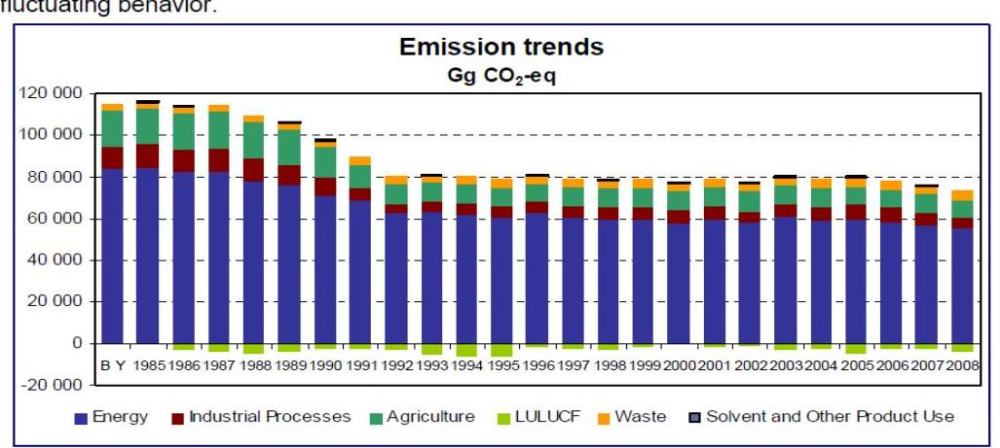

Figure ES. 1. Change in greenhouse gas emissions from base year (1985-2008) Note: $B Y=$ average of 1985-87 but 1995 for F -cases

A grafikon adatainak részletezése: az 1985-ben 115,4 millió tonna üvegházhatású gáz kibocsátás volt, ez 2005-re (a Kiotói Jegyzőkönyv hatálybalépésekor) már 76 millió tonnára csökkent. (a GKI Energiakutató Kft. számításai szerint 2012ben 73,3 millió tonna várható.)

## A közlekedési szektor ÜHG kibocsátása Magyarországon 1985-2009 között ezer tonnában

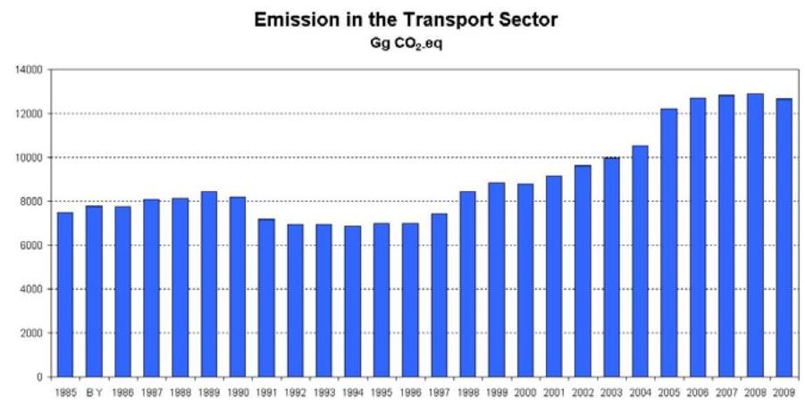

[^0]
[^0]:    ${ }^{55}$ KSH adatok alapján

---

# Az áruszállitás volumen-változása 

( KSH-tól származó 2007. évi adatok. Forrás: NKP-II. végrehajtásáról szóló jelentés)
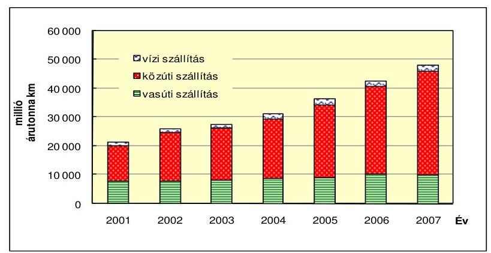

Az NKP-II. végrehajtásáról szóló jelentés a légszennyezéshez kapcsolódóan több esetben ugyanakkor nem tartalmazott 2008-as adatokat, így ezekben az esetekben a változások bemutatása nem terjedt ki az NKP-II. teljes (2003-2008) időtartamára. Ezért a beszámolót a teljes időtartam tekintetében (2003-2008) nem lehet teljes körűen értékelni. Az adathiány oka a VM észrevétele szerint: „a monitoring rendszerből származó adatok feldolgozottságának időigényessége" volt. Az NKP II. beszámolója alapján a szennyezett levegöjü területek aránya az ország területéhez viszonyítva célkitúzés (5-8\%) 5\%-ban teljesült, az alapállapot 2000-ben $11 \%$ volt, vagyis a szennyezett területek aránya csökkent. Nem teljesült a légszennyezés által érintett lakosság aránya az ország népességéhez viszonyítva, mert a mutató kismértékben csökkent ugyan, 2007-re 34\% lett, de a célkitúzés 20-25\% volt. (az alapállapot 2000-ben $40 \%$ volt).

Nem teljesültek: pl. a környezetvédelmi követelmények körében a gazdaság összenergia-igényének évi 3,5\%-kal való mérséklése, a részben államilag támogatott energia-megtakarítási tevékenység révén mintegy 75 PJ/év hőértékủ energiahordozó megtakarítása, illetve hazai megújuló energiahordozókkal történő kiváltása, a fogyasztó oldali energiatakarékosság 5 PJ/év energiahordozó megtakarítás elérése. A közlekedés korszerűsítése körében az energiatakarékos és környezetkímélő szállítási módok (vasút, vízi közlekedés), valamint a tömegközlekedés járműállományának rekonstrukciójával, a közúti áruszállító gépjárművek korszerűsítésével történő energiatakarékosság támogatása kedvezményes hitel formájában a 4,5 PJ/év energiahordozó megtakarítás elérése. A „20 000 napkollektoros tető 2010" program, ami legalább 20000 intézmény és lakóépület a hőés melegvíz napkollektorokkal történő előállítását célozta.

A szálló por összes kibocsátás mennyisége gyakorlatilag változatlan, ugyanakkor NKP-III. helyzetértékelése alapján a közlekedésből származó szállópor kibocsátás folyamatosan növekszik. „A PM terhelések vonatkozásában 2000-2005. között az ipari kibocsátások a töredékére estek, a fütési eredetü por kibocsátás lényegében nem változott, míg a közlekedési forrásból eredő PM emissziók kb. 30\%-kal növekedtek." A PM10 országos összes kibocsátása a 2000. évi $47,04 \mathrm{kt} /$ év-ről 2009-re $45,57 \mathrm{kt} /$ év-re csökkent, ezen belül azonban a közlekedésből származó ugyanezen két időpont között $14,12 \mathrm{kt} /$ év-ről $15,57 \mathrm{kt} /$ év-re nőtt. (adatsorok az 5. és 6 . számú mellékletekben)

---

Az NKP III. szerint az előző Program (NKP II.) során megvalósult intézkedések (pl. közúti járműállomány korszerűsítése, üzemanyag kéntartalmának csökkentése, közösségi közlekedés és a kombinált áruszállítás infrastrukturális fejlesztése, az elkerülő utak építése) eredményeként számos településen csökkent a fajlagos környezetterhelés, illetve szennyezőanyag-kibocsátás, de az állomány és a futásteljesítmény növekedése ezt az eredményt felülírja. A mobilizációs igények növekedéséből adódóan a közlekedés továbbra is meghatározó a környezetterhelés tekintetében (pl. a közlekedésből származó szén-dioxid kibocsátás növekszik).

A vasúti és vízi közlekedés (árutonna-kilométerben mért) áruszállítási teljesítménye 2003-ban $28,3 \%$ volt, ez a részesedés 2008-ra $22,5 \%$-ra csökkent. A közúti szállításon belül gyorsulva növekszik a hazai érdekeket kevésbé szolgáló - azonban a légszennyezettséget lényegesen növelő - tranzit szállítások aránya. Jövőbeni cél a közúti áruszállítás és a személygépkocsi forgalom növekedési ütemének lassítása, a 2015-ig prognosztizált gépjármú állomány-növekedés mellett, valamint a kombinált szállítás fejlesztése.

Hazánk 2008. november elején nyolc levegőminőségi zónában a $\mathrm{PM}_{10}$ értékekre vonatkozó napi határértékek, ezen belül öt zónában az éves határértékek alkalmazásának kötelezettsége alóli mentességet kérte az EU-tól. A Bizottság 3 zónára a mentességet 2009. július 2-i határozatában elutasította, arra hivatkozva, hogy a mentességi időszak végére a napi határértékek betartása a tervezett intézkedésekkel nem valósítható meg. Hazánk e három zónában, (Budapest és környéke, a Sajó völgye és a kiemelt városok zónából Szeged és Nyíregyháza), a megengedett határértékeket az előírtaknál többször túllépte, ezért az EU jogsértési eljárást indított. A Bizottság az indokolásával ellátott véleményét hazánk 2010 végén megválaszolta, az eljárás 2011 elején még nem zárult le.

Az EU hatályos irányelv ${ }^{56}$ szerint a szálló por $\left(\mathrm{PM}_{10}\right)$ koncentrációjára vonatkozó légszennyezettségi határértéke (egészségügyi határérték) a $40 \mu \mathrm{~g} / \mathrm{m}^{3}$ éves, illetve az $50 \mu \mathrm{~g} / \mathrm{m}^{3}$ napi, évente legfeljebb 35 -ször túlléphető határérték volt érvényben. Az új levegőminőségi irányelv ${ }^{57}$ 2011. júniusig adott lehetőséget a határértéket túllépő zónákban az átmeneti mentesség elnyerésére.

A légszennyezettségi agglomerációk és zónák kijelöléséről szóló 4/2002. (X. 7.) KvVM rendelet az ország területét egy agglomerációra (Budapest), 8 zónára és 13 un. kijelölt városok zónára osztotta.

[^0]
[^0]:    ${ }^{56}$ A környezeti levegőben lévő kén-dioxidra, nitrogén-dioxidra és nitrogén-oxidokra, valamint porra és ólomra vonatkozó határértékekről szóló 1999/30/EK európai parlamenti és tanácsi irányelv.
    ${ }^{57}$ A környezeti levegő minőségéről és a Tisztább levegőt Európának elnevezésű programról szóló 2008/50/EK irányelv.

---

# 4. A LÉGSZENNYEZÉS CSÖKKENTÉSÉT ÉS A KLÍMAVÉDELMET CÉLZÓ HAZAI INTÉZKEDÉSEK 

### 4.1. A levegő- és klímavédelemmel kapcsolatos feladat- és hatáskörök jogi szabályozása és szervezeti háttere

A levegő-védelem jogi szabályozása szerteágazó, sok ágazatot - környezetvédelem, közegészségügy, közlekedés, energiaügy, mezőgazdaság - érintő, EU direktívák által determinált.

A szerteágazó kormány- és miniszteri, illetve együttes miniszteri rendeletekből álló levegőminőség-védelmi szabályozás az egységes jogalkalmazás, valamint a feladat - hatás - és felelősségi körök megosztása szempontjából nem volt egyértelmúen áttekinthető. A levegővédelem valamennyi érintett szereplője, egymáshoz való kapcsolódása, a koordinációs felelősség egyetlen jogszabályban sem jelent meg átfogóan. A levegővédelem rendeleti szabályozása elsősorban a hatósági tevékenységre, az abban érintett szereplőkre (környezetvédelmi, természetvédelmi és vízügyi felügyelőségek, önkormányzati jegyzők, egészségügyi államigazgatási szervek, közlekedési hatóságok) vonatkozott, az irányítási - felügyeleti tevékenységet végzők körére nem terjedt ki.

A jogi szabályozással kapcsolatban a jogalkalmazók részéről több észrevétel, kritika fogalmazódott meg.

A környezetvédelmi felügyelőségek elsősorban a hatósági hatáskörök megosztásával, valamint a jogszabályi pontatlanságokkal kapcsolatban ${ }^{58}$ jeleztek problémákat, továbbá a jogszabály-véleményezés során hiányolták a jogalkalmazási tapasztalatokon alapuló előzetes egyeztetést és a visszacsatolást.

A Jövő Nemzedékek Országgyúlési Biztosa Irodájának a főpolgármester által Budapesten 2009. január 11-én elrendelt szmogriadó riasztási fokozattal kapcsolatos állásfoglalása rámutatott a jogi szabályozás gyenge pontjára, az átláthatóság, az egyértelmú értelmezhetőség hiányából eredő, a jogalkalmazókat és az állampolgárokat egyaránt érintő jogbizonytalanságra. Indokoltnak tartotta a szmogriadó végrehajthatósága érdekében a rendelkezésre álló jogszabályok hatékonyabb alkalmazhatósága feltételeinek megteremtését és javaslatokat fogalmazott meg az intézkedési és a jogalkotási kezdeményezések összehangolására.

A 2011. január 15-étől hatályos szabályozással kapcsolatban többek között a norma átláthatóság érvényesülését hiányolta a Jövő Nemzedékek Országgyúlési Biztosának Irodája.

Az 2011. január 15-étől hatályos új levegőminőség-védelmi szabályozás - a levegő védelméről szóló 306/2010. (XII. 23.) Korm. rendelet - az OLM múködésével kapcsolatos feladat- és hatásköröket részletesebben, egyértelműbben tartalmazza. Az Országos Meteorológiai Szolgálat (OMSZ) he-

[^0]
[^0]:    ${ }^{58}$ A kérdőíves formában feltett „Megfelelőnek tartják-e a múködés, a szakmai, illetve a hatósági tevékenység jogi hátterét" kérdésre adott válaszok alapján.

---

lyét, szerepét, az OLM-hez való kapcsolódását azonban a korábbihoz hasonlóan nem rendezi.

A levegő védelmével kapcsolatos egyes szabályokról szóló korábbi 21/2001. (II. 14.) Kormányrendelet mindössze azt írta elő, hogy a légszennyezettséget és a légszennyezettségi határértékek betartását - külön jogszabályban meghatározott módon - az OLM segítségével méréssel vagy egyéb eljárással rendszeresen vizsgálni és értékelni kell.

Az új szabályozás értelmében a levegőterheltségi szintet és a légszennyezettségi határérték betartását az OLM vizsgálja. Az OLM mérési rendszerének jóváhagyását, a vizsgálati módszerek elemzését a levegőminőség rendszeres értékelését a Levegőtisztaság-védelmi Referencia Központ látja el.

Az EU Levegőminőségi Irányelvének átültetésével kapcsolatos hónapokig tartó jogszabály egyeztetés során a többszáz észrevétel figyelembe vételére nem volt lehetőség.

Pl.: a szmogriadó szabályozása kapcsán a környezetvédelmi törvényben előírt, polgármestereket érintő kötelezettség törlésére vonatkozó, szakmailag elfogadhatatlan BM javaslat, valamint - a civil szervezetek által - az egyes határértékek szigorítására irányuló kezdeményezés.

A jövő nemzedékek országgyűlési biztosának a levegő védelméről szóló jogszabály tervezettel kapcsolatban a norma átláthatóságot hiányoló, valamint a fogalmi rendszerre vonatkozó, a későbbiekben módosítást igénylő észrevételei nem érvényesültek.

A NEFMI a levegőterheltségi szint határértékeiről szóló rendelkezések, valamint a levegőterheltségi szint és a helyhez kötött légszennyező források kibocsátásának vizsgálatával, ellenőrzésével, értékelésével kapcsolatos szabályozás nitrogénoxidokra vonatkozó előírásai közötti összhangot hiányolta.

A levegővédelmi feladatokat ellátó szervezeti keretekre vonatkozó széttagolt szabályozás miatt a szereplők feladat és hatásköre, egymáshoz való kapcsolódása, a koordináció nem volt egyértelmúen nyomon követhető. A levegővédelem összetett, több szakágazat integrált együttmúködését igénylő állami és önkormányzati feladat.

A levegőminőség védelmével kapcsolatos feladatok ellátásában négy minisztérium, elsősorban a KvVM/VM; továbbá az EüM/NEFMI, az FVM/VM, a KHEM/NFM; valamint azok intézményei; a környezetvédelmi felügyelőségek, az államigazgatási egészségügyi szervek, a közlekedési hatóságok, valamint a helyi önkormányzatok voltak érintettek.

A környezet védelmének általános szabályairól szóló 1995. évi törvény általánosságban tartalmazza a Kormány, a környezetvédelemért felelős miniszter, valamint az önkormányzatok irányítási, ágazati, helyi feladatait.

Az integrálási céloknak és az elérésüket biztosító együttműködési eszközöknek, szabályoknak a jogszabályi megfogalmazása, az érintett ágazatok levegővédelmi feladatainak koherens egymásra épülése jogrendünkből hiányzott. Az egyes ágazatok környezetvédelemmel, ezen belül is levegőtisz-taság-védelemmel összefüggő feladatait jogszabályok sokasága sza-

---

bályozta, az egyes ágazatok közötti „összekötés" azonban megoldatlan volt. Bármely terület feladat- és hatásköreinek változása inkoherencia létrejöttének kockázatát veti fel.

A Jövő Nemzedékek Országgyűlési Biztosának Irodája - a megelőzés elve alapján - a településrendezés és a levegővédelem integrációját kiemelt fontosságúnak ítélte. A területfejlesztéssel kapcsolatos hatályos szabályozás az adott település fenntartható fejlődésének biztosításában érintett szereplők jogait és kötelezettségeit nem határozta meg egyértelmúen. A területfejlesztésről és a területrendezésről szóló 1996. évi XXI. törvény a környezetvédelmi hatóságokat külön nem is nevesítette.

# Az egyes ágazatok levegővédelemmel kapcsolatos feladatainak jog- 

szabályi szintú összekapcsolását a szabályozás nem vitte végig következetesen. Az ágazatközi együttműködés, koordináció egységes, átfogó szabályozásának hiányában a különböző hatóságokat felügyelő kormányzati szervek (minisztériumok) közötti feladat- és hatáskörök nem voltak egyértelmúen tisztázottak.

A miniszterek (KvVM, EüM) feladat- és hatásköréről szóló rendeletek a környezeti hatások súlyát tekintve meghatározó jelentőségű közlekedésnek és a megelőzés szempontjából kiemelten fontos településfejlesztésnek a környezetvédelemhez/levegővédelemhez való kapcsolatára még csak nem is utaltak.

A környezetvédelmi miniszter feladat- és hatásköréről szóló 2010 júliusáig hatályos kormányrendeletben a gazdasági és közlekedési, valamint a pénzügyminiszteren kívül sem az egészségügyért, sem az agrár-ágazatért felelős minisztert nem nevesítette együttműködőként. Az egészségügyi miniszter feladatai között ugyanakkor megnevezte a környezetvédelmi és a földművelésügyi minisztert, mint az egészségre ható tényezők határértékeinek meghatározásában érintett szereplőt.

A 2010. júliusi kormányzati szerkezetváltozással együtt a levegő- és klímavédelemben érintett miniszterek feladat és hatáskörei is alapvetően megváltoztak ${ }^{59}$. A 2010 novemberétől módosuló szabályozás a klímavédelemmel kapcsolatos feladatokat célszerűen egy helyre, az energia és a közlekedésért felelős minisztériumhoz telepítette.

Az átmenetileg a nemzetgazdasági miniszter feladat és hatáskörében lévő energiastratégiai és a klímapolitikai feladatok a 1247/2010. (XI. 28.) Kormányhatározat értelmében, 65 fő kormánytisztviselővel együtt átkerültek az NFM-be.

A korábban önálló minisztériumként funkcionáló környezetvédelmi, természetvédelmi és vízügyi apparátus államtitkári irányítással a VM-be integrálódott.

Az integráció következtében - célszerűségi, hatékonysági szempontból előnyös megoldásként - a két minisztériumban (KvVM, FVM) korábban külön-külön önállóan működő funkcionális és egyéb szervezeti egységek (jogi, költségvetési, nemzetközi, stratégiai, ellenőrzési apparátus) egybeolvadtak. A minisztériumi szervezetben a környezetügyi témákkal a jogi- és igazgatási, a nemzeti kapcso-

[^0]
[^0]:    ${ }^{59}$ Az egyes miniszterek, valamint a Miniszterelnökséget vezető államtitkár feladat- és hatásköréről szóló212/2010. (VII. 1.) Korm. rendelet.

---

latokért felelős, a stratégiai, a költségvetési és gazdálkodási szakterületek önálló osztályai foglalkoznak.

A környezetvédelem más ágazatokkal közös, integrált minisztériumi irányítása nemzetközi kitekintés alapján sem példa nélkül álló. Az Európai Unió országai közül Ausztriában a hazai gyakorlathoz hasonlóan „Földügyi, Erdészeti, Környezetvédelmi és Vízügyi Minisztérium"; Franciaországban „Környezetvédelmi; Fejlesztési, Közlekedési és Lakásügyi Minisztérium" múködik; ugyanakkor Németországban önálló „Környezetvédelmi, Természetvédelmi és Nukleáris Biztonsági Minisztérium" látja el a környezet- és természetvédelmi feladatokat.

A levegővédelmi feladatokat 2010 előtt, a környezetügyért felelős minisztériumban főosztályi szervezeten belül működő önálló osztály látta el. A feladatok a mindenkor hatályos SZMSZ-ek alapján nem voltak nyomon követhetőek, mert azokat - a korábbi vizsgálatunk megállapításai ellenére ${ }^{60}$ - csak főosztályi szervezettel bezárólag részletezték.

A 17/2006. (MK 94.) KvVM utasítás szerinti SZMSZ a környezetgazdasági szakállamtitkár alá tartozó Környezetfejlesztési Főosztály feladatai között sorolta fel a levegőtisztaság-védelem átfogó stratégiai céljainak kidolgozását, az OLM múködésének irányítását, a levegőminőség-védelmi és a klímavédelmi nemzetközi egyezmények végrehajtásával kapcsolatos hazai feladatok elvégzését.

A 7/2009. (VI. 26.) KvVM utasítás szerinti SZMSZ a környezet- és klímapolitikai szakállamtitkár felügyelete alá „rendezte" a klímapolitikai feladatokat. A levegővédelmi szakapparátust is magában foglaló Környezetfejlesztési Főosztályt a környezetmegőrzési szakállamtitkár irányította.

A 8/2010 (IX. 30.) VM utasítás szerinti SZMSZ értelmében a levegővédelem, és a kapcsolódó feladatokat korábban ellátó apparátus, Környezetmegőrzési- és Fejlesztési Főosztály néven, a környezet- és természetvédelemért felelős helyettes államtitkár közvetlen irányításával integrálódott a Vidékfejlesztési Minisztérium szervezetébe. A korábbi két osztállyal szemben hármas tagozódású osztályszervezet - Környezetmegőrzési, Levegőminőség-védelmi és Zajellenőrzési, Szennyezésellenőrzési Osztály - látja el a levegővédelmi feladatokat.

A levegővédelem intézményrendszerén (minisztérium, felügyelőségek, OKTFV) belül az irányítási, felügyeleti hatáskörökre, a felügyelőségek felügyeletére vonatkozó jogszabályok a vizsgált időszak egészében nem voltak egyértelmúek és összehangoltak.

A hatályos SZMSZ-ek szerint az OKTVF-t a miniszter, a felügyelőségeket a KvVMen belül 2006-2009 évek között szakállamtitkár, 2009-2010 közepéig államtitkár felügyelte.

A környezetvédelmi és vízügyi miniszter által irányított államigazgatási szerveket felsoroló 347/2006. (XII. 23.) Korm. rendelet módosítása (2010. VII. 10.) szerint a felügyelőségek a környezetvédelmi államtitkár által felügyelt OKTVF „alárendeltségébe" kerültek. Az alárendeltség fogalmának tisztázatlanságából eredő ellentmondásos helyzetben a felügyelőségek szakmai felügyeletét az OKTVF gyakorolja, ugyanakkor költségvetésileg a VM-hez tartoznak.

[^0]
[^0]:    ${ }^{60}$ Jelentés a KvVM fejezet múködésének ellenőrzéséről 2006. június

---

A VM hatályos SZMSZ-ében - 8/2010. (IX. 30.) VM utasítás - a felügyelőségek konkrét feladatai meg sem jelennek. Az OKTVF, valamint az OMSZ felügyeletét viszont a miniszter által átruházott hatáskörben a környezetügyért felelős államtitkár a Környezetmegőrzési és Fejlesztési Főosztály közreműködése mellett gyakorolja.

A környezetvédelemért első helyi felelősséget viselő KvVM ellenőrzési szakapparátusa a vizsgált időszakban közvetlenül a levegővédelem témakörére vonatkozóan nem folytatott vizsgálatot, viszont az éves munkatervekben a felügyelőségek, az OKTVF, valamint az OMSZ ellenőrzése, utóellenőrzése rendszeresen szerepelt. A munkatervek az érintett intézményeknél általában kockázati tényezőként jelölték meg a felügyeleti ellenőrzés hiányát, a szervezeti változásokat.

# 4.2. A helyszínen ellenőrzött önkormányzatok tevékenységével kapcsolatos tapasztalatok 

A levegőszennyezők körében a legjelentősebb a szénmonoxid, a nitrogéndioxid, valamint az illékony szerves vegyületek vonatkozásában a közlekedés okozta szennyezés. A levegőbe kerülő károsító anyagok és azoknak az élhető környezetre, a lakosság egészségére gyakorolt romboló hatása fokozottan ráirányítja a figyelmet elsősorban az energiaipar, valamint a közlekedés körében kifejtendő környezetkímélő intézkedések fontosságára. Kiemelt feladat a por és szén-dioxid megkötésében az erdők és a városi zöldterületek arányának növelése, a környezetkímélő technológiák fejlesztése és alkalmazása. A nemzetközi kötelezettségek teljesítése mellett fontos feladat - a légszennyezés, illetve a klímaváltozással összefüggő felmelegedés okozta pollen mennyiség és kiporzás időbeni növekedés által okozott - a lakosság egészségére gyakorolt káros hatások visszaszorítása és figyelemmel kísérése (a helyszínen ellenőrzött önkormányzatok tevékenysége a 7. számú mellékletben).

A környezet védelmének általános szabályairól szóló Kvt. 46. § (1) bekezdése szerint a helyi önkormányzatoknak önálló települési környezetvédelmi programot kell kidolgozniuk, a (2) bekezdés értelmében a megyei önkormányzatoknak a települési önkormányzatokkal és az illetékes megyei területfejlesztési tanácsokkal egyeztetve megyei környezetvédelmi programot kell készíteniük, de ezek határidejét a jogszabály nem kötötte ki. A 48. § (1) bekezdése értelmében a települési önkormányzat képviselő-testülete, önkormányzati rendeletben - törvényben vagy kormányrendeletben meghatározott módon - illetékességi területére környezetvédelmi előírásokat határozhat meg.

A KIM államtitkárának véleménye szerint a „levegő védelméről szóló 306/2010. számú kormányrendelet kidolgozásakor az alábbiakban megfogalmazottak mellett fogadta el a kormány az előterjesztést. A Belügyminisztérium álláspontja szerint az önkormányzatok, illetve a polgármesterek nem rendelkeznek azokkal a személyi, tárgyi és anyagi feltételekkel, amelyek a füstköd-riadó tervvel kapcsolatban a jogszabályokban meghatározott feladatok teljes körű ellátását biztosítanák. Tekintettel arra, hogy a probléma a környezet védelmének általános szabályairól szóló 1995. évi LIII. törvény módosítását igényli, az év elején hatályba lépő előterjesztés keretében nem

---

volt kezelhető. A Vidékfejlesztési Minisztérium a Belügyminisztérium felvetésével egyetértve 2011. I. félévében elkezdte a kérdés koncepcionális felülvizsgálatát."

A helyszínen vizsgált 10 önkormányzatból 6 (Tokaj 2003, Tállya 2006, Szerencs 2005, Beremend 2003, Orfü 1999, Szentlőrinc 1999) a Környezetvédelmi Programját elkészítette, azt a képviselő-testület elfogadta. Az előírt szakhatósági (regionális felügyelőség, ÁNTSZ) egyeztetés, véleményeztetés két kivétellel (Orfü, Szentlőrinc) megtörtént. Egy önkormányzat (Sellye 2004) készített programot, de azt a képviselő testület nem fogadta el, és a regionális felügyelőséggel való véleményeztetése, illetve a megyei önkormányzattal való egyeztetése sem történt meg. Előfordult (Tállya), hogy a szakhatósági véleményt, kiegészítés kérést nem vették figyelembe.

A légszennyezés és a klímavédelem kapcsán az önkormányzatok feladatait a Kvt. jelöli ki, ebbe a körbe tartozik pl. a környezet védelmét szolgáló jogszabályok helyi végrehajtása, a hatáskörébe utalt hatósági feladatok ellátása, önálló települési környezetvédelmi programok kidolgozása, füst-köd-riadó terv készítése, valamint együttmúködés más hatóságokkal.

Orfű környezetvédelmi programjának kialakításánál figyelembe vették az országos (pl. NKP I-II.), megyei (pl. Baranya Megye Környezetvédelmi Program), és a helyi szintű programokat és koncepciókat (pl. Településrendezési Terv,) és beépítették az NKP I-II.-ben megfogalmazott öt stratégiai alapelvet (a fenntartható fejlődés, az elővigyázatosság, a megőrzés, a partneri viszony és a gazdaszemlélet).

A Szerencs helyi Program a jó levegőminőség fenntartását és további javítását jelölte meg fő célként, ezen belül hat - pl. az egyes szennyezők határérték alatt tartását, a közlekedési eredetű emissziók csökkentését, és levegőtisztaság-védelmi információs rendszer és mérőhálózat kialakítását, és az allergén pollenek csökkentését, mint - célkitűzést tartalmazott. A Program mellékletében a levegőminőséggel kapcsolatos SWOT analízis szerint rögzítette az erősségeket (kiépült földgázhálózat) és gyengeségeket (szilárd tüzelésen és hulladékégetésen alapuló kommunális fütés $40 \%$-os aránya) valamint a helyi lehetőségeket (fütés gázalapokra helyezése) és veszélyeket (hulladékok égetéséből származó légszennyezés).

A környezetvédelmi program elkészítésének finanszírozására Szerencs a KÖVICE 2004. évi „Zöld forrás" Pályázatán, Tállya a Környezetvédelmi és Vízügyi Célelóirányzatból (KÖVICE), a Pátria Program 4. 1 Kistelepülések környezetvédelmi programjának kidolgozása témában 2005-ben 1 M Ft vissza nem térítendő támogatást kapott.

Az elfogadott környezetvédelmi programok nem minden esetben tartalmaztak közvetlen, a levegő minőségének védelmét biztosító prioritást, feladatot (kivéve Tokaj, Orfü, illetve Szentlőrinc), annak ellenére, hogy a Kvt. 48/E. § (1) bek. ezt előírja. Ugyanakkor Tokajban a szakági előírások alapján és az uniós pályázatokhoz kapcsolódóan készültek különböző stratégiai pl. a 2005-2010 évekre vonatkozó helyi hulladékgazdálkodási terv és Tokaj Város Integrált Városfejlesztési Stratégiája (2008) környezetvédelmet érintő dokumentumok.

A programok kétévenkénti felülvizsgálata nem, illetve egy esetben csak formailag (Szerencs) történt meg, mert a program konkrét intézkedéseire nem

---

tért ki, Beremend programjának - megkésett - felülvizsgálata az ÁSZ helyszíni ellenőrzése idején volt folyamatban.

A Környezetvédelmi Programok, illetve a programok felülvizsgálatának hiánya a környezeti állapotokat érintő intézkedéseket nem befolyásolta kedvezőtlenül, mert valamennyi vizsgált önkormányzat, a környezetvédelmi, ezen belül a levegő minőségének védelmét biztosító szempontokat a helyi - pl. a köztisztasági, településtisztasági, építési, állattartási - rendeletekbe beépítette.

A parlagfüre, illetve egyéb allergén növényekre vonatkozó ellenőrzési kötelezettségét valamennyi vizsgált település jegyzője teljesítette. Elsősorban a helyi rendeletalkotásra és ezzel párhuzamosan a megelőzést szolgáló intézkedésekre (ellenőrzés, felszólítás) (pl. Tokaj évente 30 felszólítás) helyezték a hangsúlyt, de esetenként bírságok kiszabására (Tállya 3 esetben összesen 420 E Ft bírság, Tokaj 2 esetben 170 E Ft bírság) is sor került.

A vizsgált két régió egyetlen településén sem állt fenn füstködállapot (szmoghelyzet) kialakulásának a veszélye, ezért füstködniadó terv készítése nem volt indokolt.

A levegő tisztaságához nagymértékben hozzájárul a kerti hulladékok égetésének kezelése, a zöldterületek karbantartása és az erdőtelepítés. Szerencsen a kertes házban lakók ingatlanonként egy komposztládát igényelhettek, valamint a zöldhulladék leadható a helyi hulladékudvarban. Szentlőrincen, Sellyén "Zöldjáratokat" biztosított a település. Előfordult ugyanakkor, hogy az avar és kerti hulladék égetésére vonatkozó szabályokat nem alkották meg (Taktaharkány, Szerencs) sőt a zöldhulladék szervezett összegyűjtését sem tartották indokoltnak (Taktaharkány). Az ebből eredő levegőszennyezésre vonatkozóan nincsenek információk, lakossági panaszok nem ismertek.

Egyes településeken kiemelt szerepet kapott a fásítás. Pl. Tokajban közfoglalkoztatottak bevonásával erdősítés valósult meg az önkormányzat tulajdonában lévő 258 ha (ebből erdő 32 ha) földterületen. Orfún az Önkormányzat a tulajdonában lévő 40 hektárnyi zöldterület fenntartását vállalkozók bevonásával, valamint közhasznú foglalkoztatottakkal oldották meg. Szentlőrincen rendszeresek voltak a növénytelepítések. Bóly önkormányzata 2004-ben a KÖVICE „Zöld Forrás" pályázatán, a por- és zajterhelés csökkentésére 430 db öshonos fa telepítésére 3,3 M Ft támogatást nyert el.

Összességében megállapítható, hogy a helyszínen vizsgált önkormányzatoknak a légszennyezés, illetve az üvegházhatású gázok csökkentését célzó intézkedései, azok előkészítése, végrehajtása alapvetően megfelelőek voltak.

A települési környezetvédelmi programok kapcsán, a helyszíni ellenőrzés megállapításainak hasznosítása érdekében - ahol indokolt volt - javasoltuk a polgármestereknek, hogy a jogszabályi előírások maradéktalan betartása érdekében gondoskodjanak a település környezetvédelmi programjának a képviselő-testület általi megtárgyalásáról, illetve az érintett jegyzőknek, hogy gondoskodjanak a

---

helyi környezetvédelmi program képviselő-testület általi elfogadása előtt a megyei önkormányzat, illetve a Felügyelet előzetes véleményezésre benyújtásáról.

# 4.3. A környezettudatosság formálása, oktatás, nevelés 

Az NKP-III. összegezve a korábbi évek eredményeit, megerősíti, hogy jelentős erőfeszítések történtek a környezeti nevelés és oktatás hazai intézményrendszerének megteremtése érdekében, azonban az „egész életen át tartó" nevelés, szemléletformálás eszközei még kiforratlanok. Ezért a társadalom környezettudatosságának erősítése, a környezettudatos szemléletformálás érdekében elengedhetetlen a környezeti nevelés és oktatás hatékonyságának megerősítése, valamint a média és az oktatás együttműködése.

A KEOP 6. „fenntartható életmód és fogyasztás"prioritási tengely célja a fenntartható életmód folytatásához szükséges környezettudatos szemléletmód, értékrend, igény és ismeretek kialakulásának elősegítése. Az indikátorok itt azt mérik, hogy a támogatott kampányok és minta projektek üzenetei hány emberhez jutnak el. (További adatok a jelentés 6.3 pontjában)

A közoktatási törvény 2004. évi módosítása az iskolák számára kötelezővé tette környezeti nevelési és egészségnevelési program készítését.

Létrejöttek és működnek a környezettudatosságot támogató minősítési kritériumrendszerek (Zöld Óvoda, Ökoiskola, Erdei Óvoda és Erdei Iskola programok). Az érintett intézmények számára ennek támogatására készült el 2004-ben a „Segédlet az iskolák környezeti nevelési programjának elkészitéséhez" című kiadvány.

A vizsgált településeken a környezettudatos nevelés többféle módon is megvalósult. Pl. Tokajban a helyi Gimnázium és Szakközépiskolában 1996-tól folyik környezetvédelmi szakközépiskolai képzés, valamint 2000-től kétéves OKJ-s környezetvédelmi technikusi szakképzés. A képzés feltételeinek javítására az EGT és Norvég Finanszírozási Alap kiemelt célterületéhez 2007-ben pályázaton elért 150 M Ft támogatásból a képzést segítő hulladékanalitikai és környezettechnikai labor felszerelésére, ezen belül a levegő és füstgázok analíziséhez hordozható emissziós mérőkészülék beszerzésére került sor. Orfún az Önkormányzat által működtetett "erdei iskola", a helyi és a pécsi diákok környezettudatos nevelésében is részt vállalt. Sellyén a környezeti nevelés általános iskolai szinten hagyományos tanórák, illetve tanórán kívüli programok (tanulmányi kirándulások, túrák) keretében valósult meg.

A Szentlőrinc Kistérségi Oktatási Nevelési Központ (SZONEK) ${ }^{61}$ pedagógiai programjának 3.7. pontja külön nevesíti a környezeti nevelési program keretében oktatott környezetnevelést. Ez három módon valósult meg: a hagyományos tanórák keretében - tanórán -, nem hagyományos tanórán - erdei iskola keretében -, illetve tanórán kívüli programok segítségével.

[^0]
[^0]:    ${ }^{61}$ Az intézmény keretében egy bölcsőde, két óvoda, két általános Iskola és egy-egy alapfokú művészetoktatási intézmény és kollégium működik.

---

A SZONEK által folytatott környezetnevelés célja: " olyan emberek nevelése, akik a természetes és a társadalmi környezet szépségeire nyitottak, a természettel harmonikusan tudnak együtt élni, életvitelüket harmonikusan tudják vezetni".

# 4.4. A társadalommal való kapcsolat, tájékoztatás, lakossági panaszkezelés 

A környezeti ismeretek bővítése, a széleskörű tájékoztatás a lakosság szemléletés értékrend-formálásának alapja. A hosszú távú kibocsátás-csökkentési stratégia elkészítése során alapvető fontosságú az érintett társadalmi csoportok, a gazdasági érdekek képviselőinek bevonása, és minden érintett részéről fontos annak elfogadása és a kereteken belül történő gondolkodás, tervezés. Az Aarhusban, 1998. június 25 -én elfogadott Egyezmény (kihirdetve a 2001. évi LXXXI. törvénnyel) garantálja a nyilvánosság számára a jogot az információk hozzáférhetőségéhez, a döntéshozatalban való részvételhez és az igazságszolgáltatás igénybevételéhez a környezetvédelmi ügyekben.

Az információkhoz való hozzáférést, a széles nyilvánosság tájékoztatását segítik a rendszeresen megrendezett nemzetközi és hazai konferenciák, a civil szervezetek kampányai, a pályázatok, a tömegmédia (TV, rádió, plakátok, járműreklámok) és a helyi média (nyomtatott sajtó), valamint a közvélemény kutatások.

A 2011. év januárjában Szentendrén rendezték meg a III. Magyarországi Klímacsúcsot. A konferencia célja az volt, hogy felhívja a figyelmet az éghajlatváltozás káros hatásaira, a döntéshozók felelősségére, az állam és a civil szervezetek együttmúködésére, a hazai és külföldi szakemberek párbeszédének fontosságára. A klímakonferencia 6 pontból álló ajánlást fogalmazott meg:

- Legyen a kormánynak cselekvési dokumentuma, mely figyelembe veszi az EU felé vállalt kötelezettségeinket és a zöld gazdaság elvét.
- Jogszabályi intézkedések meghozatala: megújított energiastratégia, vízügyi stratégia, Klímatörvény, Nemzeti Fenntartható Fejlődési Stratégia kidolgozása.
- A megelőzés elvének érvényesítése, hiszen a megelőzés olcsóbb, mint a kárelháritás.
- A szakszolgálatok megerősítése, technikailag, minőségileg és létszámban is, a Klíma Klub támogatja a szakmai klaszterek létrehozását.
- Tudatformálás, egyéni szerepvállalás és öngondoskodás erősítése.
- A tudományos kutatás és innováció erősítése.

A Környezetvédelmi és Vízügyi Minisztérium szervezeti keretein belül 1997 júniusától működő Közönségszolgálati Iroda és a területi szerveknél kialakított ügyfélszolgálat feladatköre 2005 márciusát követően kibővült. A korábban már múködő irodákra épülve az ügyintézés gyorsítását, a lakosság tájékoztatásának szélesítését célozva megkezdődött az országos lefedettségű Zöld-Pont Irodák Hálózatának kiépítése. Évente kb. 20 ezer ügyfél kereste fel a központi ún. Zöld-Pont Szolgálatot és a Zöld-Pont Irodákat. Múködésük célja a környezetvédelmet, a természetvédelmet és a vízügyeket érintő szakmai ügyek intézése.

Az állami fenntartású tájékoztató, tanácsadó hálózatot egészíti ki a társadalmi szervezetek által létrehozott Környezeti Tanácsadó Irodák Háló-

---

zata (KÖTHÁLÓ), amely 1997 óta fúzi egybe a lakossági környezeti tanácsadást, a lakossági panaszok kivizsgálását vagy eljárásbeli segítségnyújtást kiemelten kezelő zöld szervezeteket. Az irodák megkereséseinek száma évente 40 ezer körülire tehető. A KÖTHÁLÓ felismerve, hogy a környezeti állapot javítása ügyében a lakosság, a civil szféra és a helyi önkormányzat együttmúködésére van szükség, 2010-ben létrehozta az Zöld Infólánc portált, hogy segitse a lakosság környezettudatosságának növelését, a környezeti információhoz jutást, közérdekú adatok elérését, illetve hasznos információkat közöl, melyek a hatósági eljárások során, lakossági panaszok kapcsán hasznosíthatóak.

A fenntartható fejlődés megvalósításához a civil szervezetek is hozzájárulnak elsősorban a környezettudatosság növelésében, a környezeti információkhoz hozzáférés segítése, tanulmányok és kiadványok készítése révén.

A Magyar Természetvédők Szövetsége (MTVSZ) 2007 öszén hirdette meg 12 tagszervezetükkel közösen a Klímaőrjárat pályázatot iskolák és diákcsoportok részére. A program célja volt, hogy növelje a diákok ismereteit az energiatakarékossággal és hatékonysággal kapcsolatban. A résztvevő tanulók 8-10 héten keresztül figyelték iskolájuk energiafelhasználásának jellemzőit, majd energiamegtakarító lépésekre tettek javaslatot pályázati formában. A szervezet 2008 öszén indította el a Klímatörvény kampányát budapesti és vidéki akciónapok keretében. Több mint tizenötezer lakos és félezer civil szervezet vett részt a rendezvényeken. Közös környezettudatossági felmérés keretében az MTVSZ, a Greenpeace, a WWF Magyarország és a Cognitive Piac- és Közvéleménykutató Kft. 8 fókuszmegyében 2008. és 2009. évek adatait összevető kutatás során mérte fel a lakosság klímaváltozással kapcsolatos ismereteit. A felmérés eredménye szerint a magyar lakosság tisztában van az éghajlatváltozás fogalmával és lényegével, de csak a rövidtávú és közvetlen hatásait ismeri, az igazi veszélyeket rejtő hosszú távú és közvetett hatásokat kevesen ismerik.

A Levegő Munkacsoport - csatlakozva a német környezet- és fogyasztóvédelmi szervezetekhez - 2010-ben meghirdette a „Korom nélkül az éghajlatért" című kampányt, hogy felhívja a politika és a társadalom figyelmét a korom éghajlatra gyakorolt hatására, megjelölje a szükséges politikai döntéseket és segítse megvalósításuk módját. Más szövetségekkel (pl. MTVSZ) összefogva 2005ben levélben szólította fel a főpolgármestert, hogy haladéktalanul tegyen lépéseket az egészségkárosító szennyezés (szálló por) csökkentése érdekében.

# 5. A KLÍMAVÉDELMI NEMZETKÖZI FELADATOK TELJESÍTÉSE 

### 5.1. Az üvegházhatású gázok kibocsátási nyilvántartása, leltára

A nemzetközi kötelezettségvállalásoknak ${ }^{62}$ megfelelően nyilvántartást - Nemzeti Nyilvántartási Rendszert - kell készíteni és múködtetni, ennek része a

[^0]
[^0]:    ${ }^{62}$ Az Európai Parlament és a Tanács az üvegházhatást okozó gázok Közösségen belüli kibocsátásának nyomon követését szolgáló rendszerről és a Kiotói Jegyzőkönyv végrehajtásáról szóló 280/2004/EK határozat 3. cikke.

---

Nemzeti Kibocsátási Leltár. A hazai szabályozásban az ENSZ Éghajlatváltozási Keretegyezménye és annak Kiotói Jegyzőkönyve végrehajtási keretrendszeréről szóló 2007. évi LX. törvény szabályozza az üvegházhatású gázok kibocsátásának nyilvántartási, adatszolgáltatási rendszerét.

Az Éhvt. 4. § (1) bek. szerint az üvegházhatású gázok emberi tevékenységből származó hazai kibocsátásának, illetve a nyelők általi eltávolításának figyelemmel kísérésére, adatok gyűjtésére, nyilvántartására évenként leltárt - Nemzeti Kibocsátási Leltárt (Leltár) - kell készíteni, az adatok feldolgozására, elemzésére, az előrejelzések készítésére.

Az éves Nemzeti Kibocsátási Leltár (NKL) az Országos Környezetvédelmi Információs Rendszer részeként múködik, összeállítója a KvVM megbízása alapján az Országos Meteorológiai szolgálat (OMSZ) ${ }^{63}$. A Kiotói Jegyzőkönyv előírja, hogy 2010-től a korábbiaknál részletesebb, ún. Erdészeti Leltárt kell benyújtani az ENSZ, illetve az EU Bizottság részére.

A nyilvántartási rendszer múködtetéséhez a szükséges adatokkal rendelkező állami szervek és az évi 100 tonna szén-dioxid-egyenértéket vagy azt meghaladó mennyiségű üvegházhatású gázt kibocsátó szervezetek kötelesek adatot szolgáltatni. A Leltárt a környezetvédelemért felelős miniszter készíti el az energiapolitikáért felelős miniszterrel, valamint az erdőgazdálkodásért felelős miniszterrel egyetértésben. A jelentések erdészeti részének összeállítása speciális szakmai feladat, ezért ennek előkészítője a Mezőgazdasági Szakigazgatási Hivatal Központ Erdészeti Igazgatóság és az Erdészeti Tudományos Intézet.

A Nemzeti Kibocsátási Leltár és az arról szóló jelentés készítését, a minisztériumi kapcsolattartást, jóváhagyását, eljárás rendjét belső utasításban a KvVM, illetve a VM nem szabályozta. Ezt jogszabály nem írta elő, de bevezetése a folyamatos késedelmek kizárása és jóváhagyás folyamatának tisztázása érdekében indokolt.

Az Éhvt. 9. § (6) bekezdése szerint a kibocsátható mennyiséget, illetve a kibocsátható mennyiségi egységek számát a miniszter közleményben tette közzé, ugyanakkor a kibocsátható mennyiségi egységek kincstári vagyonkörbe való kerüléséről nem áll rendelkezésre dokumentum. Az Éhvt. szerint nemzeti forgalmi jegyzékbe való bejegyzést követő 21 napon belül a miniszternek kell tájékoztatnia a kincstári vagyon kezeléséért felelős szervet.

Az energiapolitikáért felelős miniszter jóváhagyásával az OMSZ-nek a tényleges haladás értékelését elősegítő jelentést minden év január 15-ig, a Nemzeti Kibocsátási Leltárról szóló teljes jelentést pedig minden év március 15 -ig kell benyújtani az Európai Bizottság részére. ${ }^{64}$ A Nemzeti Kibocsátási Leltárt és a kapcsolódó leltárjelentést a környezetvédelemért felelős miniszter jóváhagyásával az OMSZ nyújtja be minden év április 15.

[^0]
[^0]:    ${ }^{63}$ Az üvegházhatású gázok kibocsátásával kapcsolatos adatszolgáltatásról szóló 345/2009. (XII. 30.) Korm. rendelet alapján
    ${ }^{64}$ Az üvegházhatású gázok kibocsátásával kapcsolatos adatszolgáltatásról szóló 345/2009. (XII. 30.) Korm. rendelet 3. § (4)bek.

---

napjáig az ENSZ Éghajlatváltozási Keretegyezmény Titkárságának. ${ }^{65}$ Magyarország jelentési kötelezettségének minden évben eleget tett.

A nemzeti jelentéstételre vonatkozó jogszabályokban előírt benyújtási határidőket csak részben tartották be. Az OMSZ tájékoztatása szerint az április 15-ei határidőt követően egy átmeneti 6 hetes időszak van a Leltár következmények nélkül benyújtására.

# A Nemzeti Kibocsátási Leltár és a kapcsolódó leltárjelentés évente április 15-i határidőre történő benyújtásának alakulása: 

| Részes fél (Party) | Benyújtás időpontja (Date of original submission) | Nemzeti Leltár   Jelentés   (National   Inventory   Report) | Nemzeti Leltár Jelentés Adatbázisa (Common Reporting Format) | Kiegészítő   Jelentés   (Supplementar y information under the Kyoto Protocol) |
| :--: | :--: | :--: | :--: | :--: |
| Magyarország   2004 |  | $\begin{aligned} & \text { NIR } \\ & 4 \text { June } 2004 \end{aligned}$ | $\begin{aligned} & \text { CRF } \\ & 9 \text { June } 2004 \end{aligned}$ | Csak 2009-től |
| Magyarország 2005 |  | $\begin{aligned} & \text { NIR } \\ & 22 \text { April } \\ & 2005 \end{aligned}$ | Reporter   26 April 2005 | Csak 2009-től |
| Magyarország 2006 | 19 April 2006 | $\begin{aligned} & \text { NIR } \\ & 3 \text { May } 2006 \end{aligned}$ | $\begin{aligned} & \text { CRF } \\ & 4 \text { September } \\ & 2006 \end{aligned}$ | Csak 2009-től |
| Magyarország 2007 | 20 April 2007 | $\begin{aligned} & \text { NIR } \\ & 7 \text { June } 2007 \end{aligned}$ | $\begin{aligned} & \text { CRF } \\ & 7 \text { June } 2007 \end{aligned}$ | Csak 2009-től |
| Magyarország 2008 | 14 April 2008 | $\begin{aligned} & \text { NIR } \\ & 14 \text { April } 2008 \end{aligned}$ | $\begin{aligned} & \text { CRF } \\ & 14 \text { April } 2008 \end{aligned}$ | Csak 2009-től |
| Magyarország 2009 | 15 April 2009 | $\begin{aligned} & \text { NIR } \\ & 16 \text { April } 2009 \\ & \text { Amendment to } \\ & \text { Annex } 9 \\ & 27 \text { May } 2009 \end{aligned}$ | $\begin{aligned} & \text { CRF } \\ & 15 \text { April } 2009 \end{aligned}$ | $\begin{aligned} & \text { SEF } \\ & 15 \text { April } 2009 \end{aligned}$ |
| Magyarország 2010 | 25 May 2010 | $\begin{aligned} & \text { NIR } \\ & 8 \text { November } \\ & 2010 \end{aligned}$ | $\begin{aligned} & \text { CRF } \\ & 8 \text { November } \\ & 2010 \end{aligned}$ | KPLULUCF   8 November   2010   SEF   15 April 2010 |
| Magyarország 2011 | 24 Márc 2011 | ? | ? | ? |

A táblázat forrása:
http://unfccc.int/national_reports/annex_i_ghg_inventories/national_inventories _submissions

Az ÁSZ az energiagazdálkodást érintő állami és önkormányzati intézkedések, kiemelten az energiaracionalizálást célzó támogatások hatásának ellenőrzésé-

[^0]
[^0]:    ${ }^{65}$ A Nemzeti Kibocsátási Leltárról szóló jelentés a környezetvédelemért felelős miniszter által vezetett minisztérium honlapján megtalálható.

---

ről (2010. augusztus; 1009 sz.) szóló jelentése szerint a leltár benyújtása megkésett, tartalmában hiányos volt. Az ÁSZ Jelentés óta az ENSZ megbízottak helyszíni ellenőrzést tartottak, de ennek eredményéről - az OMSZ tájékoztatása szerint - még nincs hivatalos dokumentum.

Az EU előírások ${ }^{66}$ szerint a Kiotói Jegyzőkönyvet aláíró felek számára kötelező egy nemzeti kibocsátási egység-forgalmi jegyzék kialakítása, ez az európai uniós jogszabályok figyelembevételével megtörtént. A nemzeti forgalmi jegyzék szabályozása a hazai rendelkezésekben megjelent.

A kibocsátási egység-forgalmi jegyzék kialakításának és vezetésének célja, hogy pontosan számon lehessen tartani a kibocsátás-csökkentési egységek, az igazolt kibocsátás-csökkentések, a kibocsátható mennyiségi egységek és az eltávolítási egységek kiadását, birtoklását, átadását, megszüntetését vagy visszavonását. A forgalmi jegyzék múködtetése a 2003/87/EK, 280/2004/EK, 2216/2004/EK európai uniós jogszabályokkal összhangban történt.

A forgalmi jegyzék működtetésére és fenntartására kijelölt szervezet az Országos Környezetvédelmi, Természetvédelmi és Vízügyi Főfelügyelőség (OKTVF). A jegyzékkezelő az éves kibocsátási egység mennyiség (EUA) esedékes éves mennyiségét minden év február 28-ig írja jóvá az üzemeltető számláján.

Az OKTVF elsőfokú hatáskörében ellátja a szén-dioxid kibocsátási engedélyekkel kapcsolatos feladatokat, a kibocsátási egység forgalmi jegyzék működtetésével és karbantartásával járó feladatokat, a külön jogszabály szerint a Főfelügyelőség hatáskörébe utalt hitelesítői nyilvántartási feladatokat (EU ETS és JI), ellenőrzi a kibocsátási engedélyekben meghatározott előírások teljesítését, az éves kibocsátási jelentéseket, és közreműködik a Nemzeti Kibocsátási Leltár készítésében.

# 5.2. A Nemzeti Kiosztási Tervek és a Nemzeti Kiosztási Listák elkészítése 

Az Európai Parlament és Tanács üvegházhatású gázok közösségi kibocsátási egység kereskedelmi rendszeréről szóló 2003/87/EK irányelve alapján minden tagállamnak Nemzeti Kiosztási Tervet (NKT) kell készítenie. A nemzeti NKT-nak meg kell határoznia, hogy az ETS-Irányelv hatálya alá tartozó létesítmények az adott időszakban mennyi üvegházhatású gáz (szén-dioxid) kibocsátási egységgel gazdálkodhatnak. Az NKT készítésekor az ETS-Irányelv 3. sz. mellékletében tartalmazott kritériumoknak megfelelően kötelesek eljárni a tagállamok.

Az üvegházhatású gázok kibocsátási egységeinek kereskedelméről szóló 2005. évi XV. törvény 6. § (2) bekezdése szerint az NKT különösen pl. a kereskedési időszak alatt létrehozott kibocsátási egységek teljes mennyiségét, az egyes ágazatok részére kiosztható kibocsátási egységek teljes mennyiségét, a térítés nélkül, illetve a té-

[^0]
[^0]:    ${ }^{66}$ Az üvegházhatást okozó gázok Közösségen belüli kibocsátásának nyomon követését szolgáló rendszerről és a Kiotói Jegyzőkönyv végrehajtásáról szóló 2004. február 11-i 280/2004/EK határozat (8) bekezdése szerint a Felek Konferenciáján elfogadott 19/CP.7. számú határozat melléklete A. szakaszának II. részével összhangban az UNFCCC I. mellékletében felsorolt.

---

rítés ellenében kiosztható kibocsátási egységek teljes mennyiségét, a létesítmények előzetes listáját és részükre kiosztani tervezett kibocsátási egységek mennyiségét, a tartalékként elkülönített kibocsátási egységek mennyiségét és a kiosztás alkalmazandó módszereit kell tartalmaznia.

A Kormány az üvegházhatású gázok kibocsátási egységeinek kereskedelméről szóló 2005. évi XV. törvény (Üht.) alapján szabályozta ${ }^{67}$ a 2005-2007 évekre vonatkozó Nemzeti Kiosztási Terv (NKT) feltételrendszerét, de megkésve, mert annak rendeletét csak 2006-ban adta ki, ${ }^{68}$ annak ellenére, hogy a nyilvános tervezetet már 2004 júniusában elkészítette. A tervezet társadalmi és szakmai egyeztetése megtörtént. Az NKT I. adatgyűjtés alapját, módszerét az egyes létesítmények üvegházhatású gázkibocsátásának engedélyezéséről, nyomon követéséről és jelentéséről szóló 272/2004. (IX. 29.) Korm. rendelet szabályozta.

Az NKT-nak az EU Bizottság részére történő benyújtás határideje Magyarország csatlakozási időpontja, 2004. május 1 volt, de ez fél éves késéssel történt meg. Ugyancsak határidőn túl (Üht. 6. § (6) bek.) hosszas (2004. október 2006. március) előkészítési folyamat eredményeként küldte meg a Kormány a Nemzeti Kiosztási Listát az Európai Bizottság számára, amelyet az - egyeztetéseket követően - jóváhagyott.

A 66/2006. (III. 27.) Korm. rendelet szerint az egyes létesítmények számára kiosztásra kerülő mennyiségek a Kormányrendelet alapján beadott, ellenőrzött, esetenként hitelesített és a létesítményekkel egyeztetett referenciaidőszaki adatok alapján kerültek meghatározásra. Az egyes létesítményekre jutó kibocsátási egységmennyiség (azaz a létesítménynek az ágazatra jutó összes kiosztható kibocsátási egységmennyiségből való részesedése) a létesítményeknek az adott ágazat számára megállapított bázisidőszak, ún. referenciakibocsátása, illetve egyéb referencia adata alapján került meghatározásra.

Az ETS-Irányelv megkövetelte a kibocsátási jelentések auditálását, az adatok, mérések, számítások hitelessége érdekében. Az üvegházhatású gázok kibocsátási nyilvántartását 2004-ben a Környezetgazdákodási Intézet vezette a KSH termelési adatainak alapján végzett számítások alapján. A hitelesítéseket az OKTVF által akkreditált hitelesítők végezték. A kibocsátási jelentéseket az Üht. 5/A. § (1) szerint a környezetvédelmi hatóság engedélyével rendelkező szervezet hitelesítheti.

Az NFM Klímapolitikai Főosztály kiegészítése szerint:" Az NKT I. előkészítésénél még nem álltak rendelkezésre bejegyzett hitelesítők és kibocsátási jelentések, amiket hitelesíteni lehetett volna."

[^0]
[^0]:    ${ }^{67}$ A 20. § (5) bekezdés a)-b) pontja alapján.
    ${ }^{68}$ Az üvegházhatású gázok kibocsátási egységeinek kereskedelmére vonatkozó Nemzeti Kiosztási Terv és Nemzeti Kiosztási Lista kihirdetéséről, valamint a kibocsátási egységek kiosztásának részletes szabályairól szóló 66/2006. (III. 27.) Korm. rendelettel. A rendelet a 2003/87/EK európai parlamenti és tanácsi irányelv, a 2004/101/EK európai parlamenti és tanácsi irányelv és a 2216/2004/EK bizottsági rendelet uniós jogi aktusoknak való megfelelést szolgálta.

---

Az ETS 2005-2007-es kereskedelmi periódusában 229 létesítmény évente átlagosan 31,66 millió kibocsátási egységet kapott. A NKT szerint 260-270 engedély kiadása volt tervezhető. Az engedélyek alapja egy kibocsátási nyomon követési terv (műszaki dokumentáció), amelyet a hatóság bírált el. A kezdeti nehézségek miatt a beadott kérelmek 90-95\%-át kellett visszaküldeni hiánypótlásra.

Az ingyenesen kiosztásra kerülő mennyiséget évente, egyenlő részekben adják át a létesítmények számára (kiosztás). A kiosztandó kibocsátási egységeket a Nemzeti Kiosztási Listát kihirdető kormányrendelet hatálybalépését követően, illetve minden további kereskedési év február 28 -áig osztják ki. (A 2005-2007 közötti időszakban a 66/2006. (III. 27.) Korm. rendelet, a 2008-2012 közötti a 96/2009. (IV. 24.) Korm. rendelet határozta meg.) Egy kibocsátási egység arra jogosítja fel birtokosát, hogy egy tonna szén-dioxidot bocsásson ki, amely jogosultság szabadon átruházható. Az előző évben kibocsátott mennyiségről készült kibocsátási jelentés és hitelesítésének határideje a tárgyévet követő év március 31. Ezt követően mindaddig zárolják az üzemeltetői számlát, amíg a kibocsátási jelentés be nem érkezik, és a kibocsátási adat rögzítésre és jóváhagyásra nem kerül a leggyékben, ekkor a visszaadáson kívül más tranzakciót nem lehet kezdeményezni. Az előző évben kibocsátott mennyiségnek megfelelő mennyiség EUA visszaadásának határideje a tárgy évet követő év április 30. Amennyiben a fenti határidőig nem kerül visszaadásra a megfelelő egység mennyiség, minden egyes vissza nem adott EUA után 100 euro/egység büntetést szabnak ki.

Az ÜHG engedélyt a hatóság a környezetvédelmi alapengedélyben foglaltakra adja ki. Az ÜHG engedély iránti kérelmét az üzemeltető adja be, az abban foglaltak valódisága a környezetvédelmi alapengedéllyel való összevetéssel biztosított. A kibocsátási és az üzemeltetők adatai nyomon követését, ellenőrzését az OKTVF végzi. A nyomon követés ellenőrzésének két módszere: az éves hitelesített jelentések ellenőrzése és a jelentés hitelesített, független harmadik fél általi igazolása.

Az NKT előkészítésének folyamatát az üvegházhatású gázok kibocsátásáról szóló kormányrendeletek (213/2006. (X. 27.), 143/2005. (VII. 27.)) szabályozták. A Kormány a 66/2006. (III. 27.) Korm. rendelettel elfogadta a 2005-2007-es időszakra vonatkozó első Nemzeti Kiosztási Tervet (NKT I). A 20082012 közötti időszakra szóló NKT II kihirdetéséről, valamint a kibocsátási egységek kiosztásának részletes szabályairól szóló 13/2008. (I. 30.) Korm. rendelet alapján elkészült az egyes létesítmények tervezett kiosztását tartalmazó Nemzeti Kiosztási Lista.

A Nemzeti Kiosztási Terv és a Nemzeti Kiosztási Lista első időszakra szóló elkészítése egy szakaszban történt, az NKT II. készítésekor a folyamat kettévált.

Az első évben a kibocsátási egység kiosztásának határideje 2005. február 28., az első éves teljesítési időszak vége 2005. december 31., majd a kvóta visszaadás elszámolás 2006. április 30 volt. A 272/2004. (IX. 29.) Korm. rendelet előírta, hogy 2004. december 31-ig ki kell adni az engedélyeket.

A határidők a kiosztás terén nem teljesültek, de a visszaadások, elszámolások határidőre megtörténtek. Az NFM szerint „A kiosztás határidejét befolyásolja az ügyféli magatartás is, így hiánypótlás, késedelmes illetékfizetés és más okok miatt is kellett határidőt hosszabbítani."

---

# A kibocsátási egységek kiosztására vonatkozó határidők és teljesítésük 

| Év | Kiosztás február 28-ig | Jelentéstétel március 31-ig | Visszaadás április 30-ig |
| :--: | :--: | :--: | :--: |
| 2005 | 2006 ápr. 11. | Néhány kivétellel és esetenként néhány napos csúszással minden üzemeltető időben teljesítette a hitelesített kibocsátási jelentések benyújtásának kötelezettségét |  |
| 2006 | 2006 ápr. 26. |  |  |
| 2007 | 2007 febr. 28. |  |  |
| 2008 | 2009 ápr. 27. |  |  |
| 2009 | 2009 ápr. 27. |  | Két létesítmény nem teljesítette maradéktalanul |
| 2010 | 2010 febr. 25. |  | Minden létesítmény maradéktalanul teljesítette |
| 2011 | 2011 febr. 28. |  | Két létesítmény nem teljesítette maradéktalanul. Az egyik csökkentett mennyiséget utalt vissza a másik nem rendelkezik egységgel. |

A Nemzeti Kiosztási Terv II (2008-2012) előkészítése szintén megkésett, mert a rendelkezés csak 2008 elején jelent meg. ${ }^{69}$ Az ETS-Irányelv 11. cikk (1) bekezdése értelmében a 2004. évet követő időszakokra vonatkozó terveket legalább 18 hónappal a tárgyidőszakot megelőzően kell közzétenni, és a Bizottságot és a többi tagállamot azokról értesíteni. A 2008-2012-es időszakra vonatkozó NKT II az Európai Bizottságnak történő megküldésének határideje 2006. június 30. volt, de ez fél éves késéssel, 2007. január 18-án történt meg, mert a hosszadalmas, 2005-től kezdődő és két lépésben lefolytatott ágazati konzultációk következtében az előkészítés elhúzódott. Az EU Bizottság határozata alapján (2007. április 16.) az NKT II tervezetét át kellett dolgozni, a módosított változatot elfogadó határozatot az EU Bizottság 2007. dec. 11-én küldte meg. ${ }^{70}$

A Nemzeti Kiosztási Terv II elvei tárgyában a KvVM 2005 végén konzultációkat tartott az ágazatok képviselőivel. A konzultáció két lépésben történt, a második konzultációra a jogszabályban foglalt határidőnél később került sor, az első konzultációs dokumentumra érkezett válaszok feldolgozásának elhúzódása miatt.

A megküldés késedelmének oka az volt, hogy az NKT II elkészítéséhez szükséges 2005. évi kibocsátási adatok csak 2006 júniusában álltak rendelkezésre, ${ }^{71}$ mert a létesítmények vagy nem adták be határidőben, vagy hibásan adták be, és hibásak voltak a kutatóintézetek előrejelzései is.

[^0]
[^0]:    ${ }^{69}$ A 2008-2012 közötti időszakra vonatkozó Nemzeti Kiosztási Terv kihirdetéséről, valamint a kibocsátási egységek kiosztásának részletes szabályairól szóló 13/2008. (I. 30.) Korm. rendelet.
    ${ }^{70}$ Ezt követően jelent meg a 2008-2012 közötti időszakra vonatkozó Nemzeti Kiosztási Terv. kihirdetéséről, valamint a kibocsátási egységek kiosztásának részletes szabályairól szóló 13/2008. (I. 30.) Korm. rendeletet.
    ${ }^{71}$ A „Második Nemzeti Kiosztási Terv elkészítésének menetrendje" című dokumentum (2008. december 8.) szerint.

---

A Kormány nem tartotta be a Nemzeti Kiosztási Lista Európai Bizottság számára jóváhagyás céljából történő megküldésének határidejét (2006. június 30.) ${ }^{72}$ sem. Az első változatot 2007 októberében, a végleges változatot 2008 novemberében küldték meg.

A rendelet tartalmazta a második (2008-2012) kereskedési időszak vonatkozó Nemzeti Kiosztási Tervet, továbbá a Kiosztási Terv hatálya alá tartozó létesítmények előzetes listáját, a Nemzeti Kiosztási Listát és az üzemeltetőik részére kiosztani tervezett kibocsátási egységek mennyiségét, az egyes ágazatok számára térítésmentesen kiosztható kibocsátási egységmennyiségeket, a tartalékokat, továbbá szabályozta a kibocsátási egységek térítésmentes kiosztásának módszerét az ágazatok meglévő létesítményei számára.

A NKT II tervezete szerint az Európai Unió emisszió kereskedelmi rendszerébe tartozó 228 magyarországi létesítmény 2008-2012-ig évente átlagosan 30,7 millió tonna szén-dioxid-kibocsátási egységhez juthat hozzá. Ugyanakkor az Európai Bizottság 2007. április 16-ai határozatában 26,9 millió tonnának megfelelő szén-dioxid-kibocsátási egység kiosztását hagyta jóvá. Az emissziókereskedelem hatálya alá tartozó létesítményektől 2007. április 1-ig beérkezett hitelesített kibocsátási jelentések alapján a 2006. évi összes kibocsátás 25,7 millió tonna szén-dioxid volt.

A Magyar Energia Hivatal szakvéleményét az üvegházhatású gázok kibocsátási egységeinek kereskedelméről szóló 2005. évi XV. törvény végrehajtásának egyes szabályairól szóló 213/2006. (X. 27.) Korm. rendelet (Üht. vhr.) 3. § bekezdései szerint kikérték és figyelembe vették többek között az új belépők tartalék kiosztásakor, az erőművi bázisadat számítási táblázatok véleményezésekor, az erőművek által bevallott termelési adatok ellenőrzésekor. Ezen kívül az NKT II elkészítése során szakvéleményeket, tanulmányokat is figyelembe vettek. A kibocsátási egységek kiosztásának tervezett elveit az Üht. vhr 4. § (1) szerint a kereskedési időszak kezdetét (2008-2012) megelőző második év január 1-jéig véleményezés céljából közzé kell tenni a minisztérium honlapján. Az NFM szerint késve, de megtörtént a közzététel, a link azonban nem elérhető, mert időközben a honlapról törölték.

A magyar állam 2007. június 26-án keresetet nyújtott be az Európai Bizottság döntésével szemben, mert a nemzeti kvóta mennyiségét alacsonyabb szinten - a tervezett összmennyiséghez képest - jelentősen, 10,8\%kal csökkentve állapította meg. (Az EU Bizottság Határozata ellen indított bírósági eljárás nem halasztó hatályú.) A Magyar Kormány keresetében kérte, hogy az Elsőfokú Bíróság semmisítse meg a bizottsági határozatot, valamint kötelezze a Bizottságot az eljárási költségek viselésére.

A kereset szerint „a 2003/87/EK irányelv nem biztosít hatáskört a Bizottság számára, hogy a tagállamok által elkészített kiosztási tervektől teljes mértékben függetlenül maga állapítsa meg a tagállamok által kiosztható kibocsátási egységek összmennyiségét. A Bizottság nyilvánvaló mérlegelési hibát vétett a nemzeti kiosztási tervben szereplő, kiosztható kibocsátási egységek összmennyiségének megítélése során, mert egyrészt figyelmen kívül hagyta a kiosztási tervben szereplő adatokat és számításokat, másrészt olyan téves

[^0]
[^0]:    ${ }^{72}$ A határideje az ETS-Irányelv és az Ühvt. vhr. szerint a kereskedési időszak kezdetét (2008-2012) megelőző második év június 30.

---

adatokat és számításokat alkalmazott, amelyek szükségképpen az összmennyiség hibás megállapításához vezettek. A Bizottság eljárása során megsértette a jóhiszemú együttmüködés alapelvét. A Bizottság nem tett eleget indokolási kötelezettségének, amennyiben egyrészről nem indokolta meg kellően, hogy miért hagyta figyelmen kívül a Magyar Kormány által benyújtott kiosztási tervet és az abban szereplő adatokat és számításokat, másrészről nem indokolta meg kellően az általa alkalmazott adatok és számítások megfelelőségét, harmadrészről nem indokolta meg, hogy miért nem vette figyelembe az eljárás során általa kért és a Magyar Kormány által nyújtott kiegészitő felvilágositást."

Többek között Lengyelország és Észtország is beperelte hasonló okokból a Bizottságot a nemzeti kvóták csökkentéséért. Az Európai Bíróság 2009. évi döntésében elmarasztalta az Unió végrehajtó szervét. Magyarország vonatkozásában a bírósági eljárást 2010. május 31 -én felfüggesztették a két országgal kapcsolatos döntés meghozataláig.

Az NFM tájékoztatása szerint a lengyel és észt ügyekben a Törvényszék hivatkozott arra, hogy a Bizottság túllépte az irányelvben megállapított hatásköre kereteit, illetve nem megfelelően indokolta meg a határozatokat. A Bizottság viszont 2009. december 4-én fellebbezést nyújtott be ezen ítéletek ellen, amelyben arra hivatkozott, hogy a Törvényszék helytelenül állapította meg a Bizottság hatáskörének korlátozott terjedelmét. A lengyel ügyben a felperes tagállam oldalán beavatkozók: Magyarország, Litvánia, Szlovákia, valamint Románia és Csehország, a Bizottság oldalán pedig az Egyesült Királyság.

# 5.3. Magyarország részvétele a nemzetközi kvótakereskedelemben 

Az ENSZ Kiotói Jegyzőkönyve (Jegyzökönyv) lehetővé teszi, hogy azok a kibocsátás-csökkentési vállalással rendelkező országok, amelyeknek többlet üvegházhatású gáz kibocsátási jogosítvány, kvóta áll rendelkezésére, ezt eladhatják hasonló vállalással rendelkező, de kvótahiánnyal küszködő országoknak. Magyarországon az 1985-87-es időszakban az üvegházhatású gázok kibocsátásának mértéke évente 115,4 millió tonna volt, ami - a GKI Energiakutató Kft. szerint - 2012-re várhatóan 73,3 millió tonnára csökken, szemben a kiotói -6\%-os, vagyis 108,5 millió tonna kibocsátás vállalással. Vagyis a prognosztizált többlet évente 32-37 millió tonna CO2 egységre adódott. Ez alapján a 2008-2012 időszakban mintegy 120-150 millió tonna szén-dioxid értékesítésének lehetőségével számoltak.

A Jegyzökönyv alapján létrejött nemzetközi emissziókereskedelemben (IET) a nemzetközi megállapodást ratifikált országok (államok) egészének kibocsátási mérlegéhez viszonyítva adhatnak és vehetnek kvótákat, a vállalatok az EU ETS rendszerében jelenhetnek meg kibocsátási egységeikkel. (az emisszió kereskedelmi rendszer bemutatása az 1. számú függelékben)

A kvótakereskedelmet az ENSZ Éghajlatváltozási Keretegyezményben Részes Felek Konferenciájának 1997. évi harmadik ülésszakán elfogadott Kiotói Jegyzőkönyv kihirdetéséről szóló 2007. évi IV. törvény (Jegyzökönyv) és az üvegházhatású gázok kibocsátási egységeinek kereskedelméről szóló 2005. évi XV. törvény (Üht.) és a 2007. évi LX. törvény az ENSZ Éghajlatváltozási Keretegyezménye és annak Kiotói Jegyzőkönyv végrehajtási keretrendszeréről (Éhvt.) szabályozza

---

A Jegyzőkönyv 17. §-a lehetővé tette az országok közti kvótakereskedelmet a 2008-2012 közötti öt évben. 2005. január 1-jétől az Európai Unió területén hatályba lépett az ÜHG kibocsátásának korlátozására vonatkozó emissziókereskedelmi rendszer (ETS) ${ }^{73}$.

A Kiotói Jegyzőkönyv kötelezettségeit vállaló országok a világ üvegházhatású gázok kibocsátásának 1997-ben 40\%-át, 2011-ben megközelítőleg 27\%-át teszik ki.

Magyarországon - akárcsak a régió több országában - az ipar szerkezetátalakuláson ment át, ezáltal hazánk szén-dioxid kibocsátása a Kiotói Jegyzőkönyvben vetítési alapnak tekintett időszakot követően csökkent, ezért jelentős menynyiségű értékesíthető kibocsátási kvóta felett rendelkezhetett. Az NFM szerint a világon elsőként Magyarország adott el szén-dioxid felesleget. Magyarország az eladási szerződésekben vállalta, hogy a befolyó pénzeket olyan beruházásokra költi, amelyek zöldítési célokat szolgálnak, és szén-dioxid kibocsátás-csökkenést eredményeznek a Zöld Beruházási Rendszer keretében.

A II. Nemzeti Környezetvédelmi Program (NKP-II.) végrehajtásáról szóló jelentés beszámolója alapján a Kiotói Jegyzőkönyvben szabályozott ún. kvótarendszer szerint hazánk a vállalt 6\%-kal szemben 2007-re már mintegy 34\%-kal csökkentette ÜHG kibocsátását az 1985-1987-es bázisidőszakhoz viszonyítva. A mintegy 30\%-os emisszió csökkenés oka nagyrészt a rendszerváltást követő termelés viszszaesés volt az ipar, a mezőgazdaság és az energetika területén.

A kiotói kibocsátási egységek feletti kereskedés joga a környezetvédelmi és vízügyi miniszter hatásköre volt ${ }^{74}$. A kiotói egységek értékesítésének feltételeit és az értékesítés szabályait az ENSZ Éghajlatváltozási Keretegyezménye és annak Kiotói Jegyzőkönyv végrehajtási keretrendszeréről szóló 2007. évi LX. törvény végrehajtásának egyes szabályairól szóló 323/2007. (XII. 11.) Korm. rendelet (Éhvt. vhr.) 20. § (1) bekezdése tartalmazza.

A rendelkezés meghatározza a kiotói egységek értékesítésével, illetve vételével kapcsolatos döntési javaslat alapjait, pl. a Nemzeti Kibocsátási Leltár, előrejelzések a nemzetközi kibocsátás-kereskedelem területén kialakuló piaci mechanizmusok és árviszonyok, a kibocsátás-csökkentés költséghatékony megvalósításának elvét.

Magyarországnak négy szerződés keretében értékesített mintegy 12 millió kibocsátási egység eladásból összesen 38 Mrd Ft bevétele származott. Az átlagár 9-13 euró között volt.

Magyarország által kötött szerződések főbb adatai

| Vevő | Tárgy | Eladási ár | Szerződéskö-   tés időpont-   ja | Monitorozási idő-   szak vége/ Záró   Jelentés |
| :--: | :--: | :--: | :--: | :--: |
| EU tagál-   lam | AAU értékesítés | $6,9 \mathrm{Mrd} \mathrm{Ft}$ | 2008 | 2012. december 31/   2013. január 1. |

[^0]
[^0]:    ${ }^{73}$ Az Európai Közösség károsanyag-kibocsátási jogok Európai Unión belüli kereskedelmének kereteit szabályozó rendelet (87/2003/EK) alapján.
    ${ }^{74}$ Az Éhvt 10. § (2) bek. és a Kiotói Jegyzőkönyvben szereplő nemzetközi kibocsátáskereskedelemmel kapcsolatos feladatokról szóló 2059/2007. (IV. 3.) Korm. határozat.

---

| EU tagállam | AAU értékesítés | 21,2 Mrd Ft | 2008 | 2012. december 31/   2013. január 1. |
| :-- | :-- | :-- | :-- | :-- |
| EU-n kívüli   állam | AAU értékesítés | 7,9 Mrd Ft | 2009 | 2013 vége, vagy a   vételár felhasználá-   sának éve |
| Magyar   kibocsátási   egység ke-   reskedő | CER értékesítés | 1,9 Mrd Ft | 2010 | 2012. december 31-   ig |

A táblázat adatai a Nemzeti Fejlesztési Minisztérium, Zöldgazdaság-fejlesztésért és klímapolitikáért felelős helyettes államtitkársággal egyeztetett formában kerültek a jelentésbe.

Az elért árak minősítésére nincs hiteles összehasonlítást szolgáló adat, mert a kvótakereskedelem egy teljesen új rendszer volt, és Magyarország 2008ban volt a legelső $\mathrm{AAU}^{75}$ kvótát eladó ország. Az eladások értékelésénél figyelembe kell venni, hogy a kvótakereskedésekben résztvevő államok értékesítéseik során az elért AAU egységeinek árait, és a szerződésekben rögzített kötelezettségvállalásaikat bizalmasan kezelik a tárgyalási pozíciók javítása, a magasabb árak elérése, ezáltal az előnyösebb szerződések megkötése érdekében. Szerződéseik tartalmát csak részlegesen hozzák nyilvánosságra, hogy a jövőbeni tárgyalási pozícióikat ne rontsák. Az EU ETS-ben lévő 2010. márciusi CER árak (11 € körül,) csak részben adnak iránymutatást a kialakított ár értékeléséhez, mivel ezek a CER egységek az EU ETS rendszerében nem adhatóak el.

Néhány nemzetközi kvótaszerződés föbb adatai

| Eladó | Vevő | Mennyiség   (a külföldi adatok becsült   értékek, AAU egység) | Ár (€)   (a külföldi adatok   becsült értékek) |
| :-- | :--: | :--: | :--: |
| Magyarország | EU tagállam | Kb. 2 millió | $12-14$ |
| Magyarország | EU tagállam | Kb. 6, 6 millió | $11-13$ |
| Magyarország | EU-n kívüli állam | Kb. 3 millió | $9-10$ |
| Magyarország | Kibocsátási egység   kereskedő | Kb. 700 ezer   (CER egység) | Kb. 9. |
| Szlovákia | Interblue Group   LLC. | 15 millió | 5 körül |
| Csehország | Japán | 40 millió | 10 körül |
| Csehország | Spanyolország | 5 millió | 10 körül |
| Ukrajna | Japán | 30 millió | 10 körül |
| Lettország | Japán | 1,5millió | 10 körül |
| Lettország | Spanyolország | 5 millió | 10 körül |

A Point Carbon (norvég székhelyű elemzőcég) és a GKI Kvótagazdálkodási Koppenhága után című tanulmány adatai alapján

A kiotói egységek értékesítéséhez a miniszter által kidolgozott javaslat és az államháztartásért felelős miniszter egyetértése szükséges. Az NFM tájékoztatása szerint a kiotói egységek értékesítéséről - ez négy szerződést jelent -

[^0]
[^0]:    ${ }^{75}$ Assigned Amount Unit (kibocsátható mennyiségi egység)

---

részletes javaslat nem készült. Csak részben álltak rendelkezésre az előkészítésre vonatkozó dokumentumok. Az értékesítés jóváhagyásának előterjesztési dokumentumai részletesen nem indokolják a tervezett ár megalapozottságát. Az államháztartásért felelős miniszter az egyetértését rögzítő dokumentumok egyikében felhívja a figyelmet a pénzügyminiszteri egyetértés megkérésével, illetve megadásával kapcsolatos eljárásrend kidolgozásának szükségességére. Dokumentumok hiányában a kvótaértékesítés nem felelt meg az Éhvt. által elöírt követelményeknek.

A rendelkezésre álló nemzetközi adatok alapján hazánk által értékesített kibocsátási egységek ára a nemzetközi átlagáraknak megfelelt. Ugyanakkor az előkészítési dokumentumok részleges, illetve teljes hiánya miatt az értékesítés nem volt kellően megalapozott, illetve nem tárható fel az alapos előkészítés és ezzel a minél magasabb ár elérésére való törekvés.

A 20. § (1) bek. szerint a döntést - többek között - a nemzetközi kibocsátáskereskedelem területén kialakuló piaci mechanizmusokra és árviszonyokra, és a kibocsátás-csökkentés költséghatékony megvalósításának elvére kell építeni, és az értékesítés a javaslat alapján, az államháztartásért felelős miniszter egyetértésével történhet meg.

A 21. § (3) bek. alapján a pénzügyi teljesítést követő 30 napon belül a miniszter tájékoztatja az államháztartásért felelős minisztert az értékesítés tényéről, az értékesített kiotói egységek mennyiségéről, a kiotói egység vételáráról.

A dokumentumok hiányában nem állapítható meg, hogy a kvótaértékesítés előkészítése során teljesítették-e és figyelembe vették-e az Éhvt 20. § (1) bekezdésében előírt feltételeket, követelményeket. Az ellenőrzés részére adott válaszok alapján nem volt megalapozott az értékesítés előkészítettsége, mert az illetékesek nem mutatták be a szélesebb információs bázist biztosító elemzéseket, elő́terjesztéseket, jóváhagyásokat és egyéb dokumentumokat.

Az NFM szerint az AUU egységek árának szempontjait a piaci viszonyok, tőzsdei árak, vevő személye, vásárolni kívánt mennyiség, tárgyalások sikeressége, jövőbeli vásárlásra vonatkozó ajánlat és más tényezők összegzésével alakították ki.

Az AUU egységek és az EUA, ERU, CER, RMU egységek árának 2005-2011 évi alakulása kapcsán adott válasz szerint „A Point Carbon internetes felületen a múltra vonatkozó adatok rendelkezésre állnak (EUA, CER), azonban csak jelszóval érhető el, mellyel nem rendelkezünk. AAU, ERU ára kétoldalú megállapodások keretében alakul ki, így erre vonatkozó becslésekre vonatkozóan nem található források."
Több tanulmányban, például a GKI Energiakutató kvótaértékesítés Koppenhága után 2010. címú tanulmányban, valamint a párizsi Bluenext tőzsde honlapján is számos információ van, köztük havi beszámolók, árfolyamok stb.
Tisztázatlan, hogy készült-e ilyen tájékoztató, javaslat, mert a Jövő Nemzedékek Országgyúlési Biztosának, a kiotói kvótaértékesítés bevételeinek felhasználása kapcsán készített állásfoglalásában több helyen is megemlít tájékoztatókat. Ugyanakkor a jelentés egy pontja szerint a PM államtitkár kér tájékoztatást a KvVM-től, ez arra utal, hogy nem küldtek beszámolót. Egy CER irattározáshoz kapcsolódó 2010. június 9.-ei e-mail szerint a CER értékesítésről szóló értékelés elérhető a minisztérium honlapján (ez 2011-ben nem volt megtalálható).

---

A kiotói egységek vagyonkezelője az Éhvt vhr. 3. §-a alapján a Magyar Nemzeti Vagyonkezelő Zrt. (MNV Zrt.). A rendelkezések ellenére a kiotói egységek vagyonkezelésére vonatkozó szerződés megkötése ${ }^{76}$ a 20072011. évek időszakában nem történt meg. A vagyonkezelésben közreműködő szervezet nem lett kijelölve. Az NFM véleménye szerint az Éhvt. csak lehetőségként szabályozza a közreműködő szervezet bevonását, tehát nem kötelező jelleggel.

Az Éhvt 9. § (2). bek.) szerint: „A vagyonkezelői jogot a miniszter az általa kijelölt központi költségvetési szerv útján is gyakorolhatja." Az NFM szerint „A Kormány átalakulása után az egységek vagyonkezelője a tárcák között sokáig (2010. december) tisztázatlan volt, mely a vagyonkezelői szerződés megkötését szintén lehetetlenné tette, miután a vonatkozó jogszabályok a vagyonkezelő tekintetében rendezetlenek voltak."

A vagyonkezelői szerződés hiányában nem tettek eleget az Éhvt. vhr. 4. és 5. §-aiban előírt állami vagyonból történő kikerülésről szóló tájékoztatási kötelezettségnek, és nem teljesült az NKL, továbbá az előrejelzések összegzésének évenkénti megküldése az MNV Zrt. részére. A vagyonkezelői jogot 2011. január 1-től az energiapolitikáért felelős miniszter kapta.

A szerződések végrehajtását monitoring bizottságok ellenőrzik, az Auditornak nemzetközi hírű, független könyvvizsgáló cégnek kell lennie. A bizottságok évente üléseztek, az Auditor kiválasztása 2011-ben folyamatban van. A kvótaértékesítéshez kapcsolódó Monitoring Közös Bizottság dokumentumai rendelkezésre álltak.

A szerződések hangsúlyozták, hogy a vételárat olyan projektekre, intézkedésekre, tevékenységekre irányozzák elő, amelyek a teljes monitorozási időszak alatt az üvegházhatású gázkibocsátás mérhető csökkentését, vagy korlátozását szolgálják. Ugyanakkor egy vevő EU tagállam, kétségeit jelezte az általa fizetett összegek felhasználásának szabályossága kapcsán.

A Jövő Nemzedékek Országgyűlési Biztosának jelentése szerint: „2009. március 16-17-én került sor a KvVM és a vevő klíma- és energiaügyi minisztérium képviselőinek találkozójára a ZBR-rel kapcsolatosan Budapesten. Az eseményről készült összefoglaló szerint a belga résztvevők többször jelezték annak fontosságát, hogy a ZBR ne más forrásból tervezett beruházásokat váltson ki (addicionalitás). Véleményük szerint mind a Nemzeti Energiatakarékossági Program, mind pedig a Panel Program követelményei más szempontok szerint épülnek fel, mint ahogy a ZBR-nek fel kell épülnie. Kiemelték továbbá, mint másik problémát, hogy a tervezett 60-70\%-os támogatási intenzitást magasnak tartják. Számukra az eredetileg tervezett 1/3-os támogatási arány sokkal elfogadhatóbb, annak érdekében, hogy a költséghatékonysági arány (támogatás/elért üvegházhatású gáz kibocsátás csökkentés) kedvezőbb legyen."

A Magyar Állam és egy kvótakereskedő között 2010-ben kötött szerződés alapján eladott, több mint 700 ezer CER (Certified Emission Reduction) kibocsá-tás-csökkentési egység értékesítéséből közel 2 Mrd Ft bevétel származott. A szerződés 2.3. pontjában a Vevőt tájékoztatták arról, hogy a CER

[^0]
[^0]:    ${ }^{76}$ Az állami vagyonnal való gazdálkodásról szóló 254/2007. (X. 4.) Korm. rendelet.

---

egységek az EU ETS-ben nem értékesíthetőek és nem használhatóak fel. A tranzakció után a kvóták egy kis része (erre nincs adat az NFM-től) felbukkantak az uniós piacokon is, ezért három karbontőzsdén a kereskedést felfüggesztették, majd az oslói és a müncheni tőzsdén néhány óra múlva, a párizsi tőzsdén pedig csak néhány nap elteltével indult újra a kereskedés. ${ }^{77}$

A hazai cégek általában kereskedőkön keresztül vásárolhatnak CER egységeket, melyekkel aztán részben elszámolhatnak a Magyar Állammal. Így kerülhet a Magyar Államhoz CER egység. Ha egy fejlett ország egy fejlődő országba visz beruházást, aminek részeként kibocsátás-csökkenés valósul meg a beruházó CER-t kap a kibocsátás-csökkentésért "cserébe". Az államok eldönthetik, hogy az ENSZ felé CER-ben vagy kiotói egységekben teljesítenek. A CER-kvótákat azonban csak az unión kívül lehet értékesíteni.

# A témában megjelent sajtóközlemények és internetes információk a következőket tartalmazták: 

A KVVM közleménye szerint a kvótákat egy kvótabróker cégnek adták el, s információik szerint a közvetítő cég az úgynevezett CER kvótákat Japánnak adta tovább. A szerződésben kikötötték, hogy ezek az uniós országokban már nem számolhatóak el a szennyezés ellentételezésére, és a szerződéshez kísérőlevelet is mellékeltek, amelyben erről tájékoztatják a vevőket.

A kvótakereskedő tájékoztatása alapján a kvótákat egy londoni kereskedőháznak adták tovább, azok pedig az EU egyik legnagyobb kereskedőházának, innen a kvóták egy EU-n kívüli államba kerültek.

Az eladással kapcsolatos nemzetközi vélemény szerint: bár jogilag megengedett az ETS-ben már elszámolt kiotói egységek újraeladása a kiotói rendszerben, ugyanakkor, ha a további értékesítések során valamelyik fél rosszhiszemúen nem informálja a vevőt a CER-ek állapotáról, a jóhiszemú vevők károsodnak, és az egész ETS hitele is veszélybe kerül ${ }^{78}$.

A CER kvótaértékesítés kapcsán az Európai Bizottság klímaügyi főigazgatósága megkereste a KvVM-et egyeztetés céljából. A főigazgató szerint nem jogi természetú okokból, de ellenzik az ilyen eladásokat, és megerősítette, hogy hatályos közösségi joggal összeegyeztethető az, ha egy tagállam EU-n kívülre irányuló másodlagos CER-eladásokat folytat. Az NFM tájékoztatása szerint az Európai Bizottság nem tett további hivatalos lépéseket. A CER kvótaértékesítés kapcsán vállalt AAU (Assigned Amount Unit) egység megszüntetése 2010 júniusában megtörtént.

Ebben az esetben a Magyar Államnak jelentős mennyiségú AAU-tartaléka volt, amely, még a rendszerváltás után felszámolt nehézipar megszűnt kibocsátásából maradt meg. Ezeket cserélte a könnyebben értékesíthető CER-ekre, amelyeket az EU-n kívül már értékesíthetett. A Magyar Állam vállalta, hogy az eladott meny-

[^0]
[^0]:    ${ }^{77}$ Az energiagazdálkodást érintő állami és önkormányzati intézkedések, kiemelten az energiaracionalizálást célzó támogatások hatásának ellenőrzéséről (2010. augusztus; 1009 sz.) ÁSZ jelentős röviden már bemutatta az értékesítés körülményeit, azóta a most bemutatott további információk álltak rendelkezésre.
    ${ }^{78}$ European Policy Director, International Emissions Trading Association: IETA, 170 feletti tagot számláló érdekképviseleti szerv a kvóta piacon.

---

nyiségű CER-ekkel egyenértékű AAU-t megsemmisít. A Keretegyezmény, a Jegyzőkönyv, az ETS- Irányelv, az Üht. nem tiltja ezt a műveletet.

Az OKTVF észrevétele szerint „a kereskedési rendszer egyik hiányossága, hogy a Főfelügyelőség által vezetett nyilvántartási rendszer, a Cégbírósági nyilvántartás, illetve a banki számlák vezetése közötti összhang, a kereskedéssel kapcsolatos intézkedések nem követhetőek nyomon. Elkülönül a kvótakereskedelem a pénzmozgástól, illetve a cégek életétől.

Az elmúlt időszakban a kvótakereskedelemmel összefüggésben az európai szinten jelentkezett biztonsági problémákat Magyarország részéről megoldottuk, akként, hogy talán a legbiztonságosabb rendszer került kialakításra. Áttekintve a Jegyzéket figyelemmel bizonyos mozgásokra soron kívüli ellenőrzést kezdtünk mind a kereskedelmi ügyletek, mind az ügyletet lebonyolító cégek, valamint a kereskedés alapján biztosító határozatok felülvizsgálata tekintetében."

# 5.4. A Zöld Beruházási Rendszer múködése 

A Zöld Beruházási Rendszer (ZBR) olyan célokat hivatott indítani és támogatni, amelyek kifejezetten a kibocsátás csökkentést segítik elő. A kvótaeladásokból befolyt pénzekből finanszírozzák a ZBR programjának pályázati kiírásait. A zöld beruházás rendszereket azért hozták létre, mert az AAU kereslettel rendelkező országok szívesebben vesznek olyan kibocsátható mennyiségi egységet, amely mögött bizonyítható kibocsátás csökkentés áll. Az eladó országoknak garantálniuk kell, hogy az AAU-k eladásából származó bevételeiket bizonyíthatóan új kibocsátás csökkentési tevékenységekre fordítják.

A szerződések előírják, hogy a kvótaértékesítésből elért összegek legfeljebb 5\%-a fordítható a ZBR múködési költségeire, pl. pénzeszköz felhasználás ellenőrzéséhez szükséges költségek fedezésére, a pályázatok megvalósítására. Ezen kívül előírják az Audit Jelentés, az Éves Jelentés és a Zárójelentés elkészítését is.

A 2009. évi felhasználásról Audit Jelentés és az Éves Jelentés elkészült és az NFM tájékoztatása szerint megküldték az államok részére. Mivel 2009-ben nem volt felhasználás, az Audit Jelentés csak a ZBR helyzetét mutatta csak be. A 2010. évi Audit Jelentést 2011. április végéig kell elkészíteni és megküldeni a Vevők részére, a helyszíni ellenőrzéskor az előkészítés folyamatban volt. A Zárójelentés elkészítése 2-3 év múlva lesz aktuális.

A Zöld Beruházási Rendszer (ZBR) ${ }^{79}$ elhúzódásának egyik oka a kvótaértékesítésből származó források kérdéses rendelkezésre állása volt 2009-ben. Egyes vezetői nyilatkozatok a ZBR előirányzatának terhére történő zárolásokról szóltak, ezt azonban a KvVM 2008, 2009. évi beszámolói nem tartalmazzák, illetve átcsoportosításokról, zárolásokról rendelkező kormányhatározatok sem rendelkeztek a ZBR kapcsán ilyen intézkedésekről. Valójában előirányzat megtartás, vagyis „bújtatott" zárolás történt. A KvVM államtitkára 2009.

[^0]
[^0]:    ${ }^{79}$ Green Investment Scheme (GIS)

---

április 17-én levélben kérte a Zöld Beruházási Rendszer fejezeti kezelésű előirányzaton szereplő 2008. évi 28 153,9 M Ft maradvány fejezetnél tartását.

Az NFM Klímapolitikai Főosztályának tájékoztatása szerint: „A zárolásra sor került 2009. év elején. Kommunikációs szinten mást mondott a minisztérium, mivel a Vevők felé vállalhatatlan volt az, hogy a kvótabevételek a magyar költségvetés egyensúlyi helyzetének javitására forditódjanak. Egy idő után nem szándékoztak véglegesen elvonni, mivel megértették, hogy visszafizetési kötelezettség és nemzetközi bonyodalmak követhetik ezt a lépést. Az éves beszámolókban nem jelezték külön a zárolást, de nem történt felhasználás. 2009 júliusában pedig már tudni lehetett, hogy a formális zárolás helyett egy másik elöirányzatot, a lakásfenntartást támogató céleloóirányzatot - az Önkormányzati Minisztérium fejezetébe tartozott akkor - fog érinteni a zárolás és az ott zárolt forrást kell majd ZBR forrással kiváltani."

Az ÁSZ által készült a Magyar Köztársaság 2011. évi költségvetési javaslatáról szóló véleménye (1025) szerint a kibocsátási egységekből származó bevételeket a Kormány a költségvetési egyensúly fenntartására használta, és dokumentumok hiányában az értékesítést nem tartotta megalapozottnak. A Magyar Köztársaság 2011. évi költségvetéséről szóló 2010. évi CLXIX. törvény rendelkezik a kibocsátási egységekből származó bevételek kezeléséről és egy meghatározott összeg nemzetközi felhasználásáról.

Az ÁSZ jelentés szerint: „A hazai kvótaértékesitési bevételek felhasználása több mint egy éves késedelemmel indult meg a KvVM fejezetnél, mivel a Kormány a költségvetési egyensúly fenntartása érdekében a bevételek 2009. évi felhasználását nem engedélyezte.

Az üvegházhatású gázok kibocsátási egységeinek 2011. évi értékesitéséből származó bevételeket is feltételez a 2011. évre készülö költségvetési törvényjavaslat, mivel annak 9. § (2) bekezdése elöirásai szerint a kibocsátási egységek értékesitéséből 2011. évre várható költségvetési bevételekből többek között 560,0 M Ft a fejlődő országok részére klimafinanszirozásra forditandó. Az értékesitési szándék ellenére számításokkal alátámasztott értékesitési, valamint az értékesitésböl származó bevételek felhasználását érintő részletes tervezési dokumentációt a tervezésért felelős helyettes államtitkárság az ellenőrzés részére nem adott át, így a szándék mögöttes tartalmáról sem a kvóta egységek értékesitésével, sem a befolyó bevétel felhasználásával kapcsolatban megalapozott vélemény nem formálható."

Az első kvóták 2008 augusztusában történt értékesítése ellenére, csak 2009 augusztusában írták ki az első ZBR pályázatot és 2010-ben történtek meg az első kifizetések. (részletesen a 7.3. számú pontban) A ZBR program elhúzódó indulását az váltotta ki, hogy a részletek szabályozása és a szereplők közötti együttműködések kidolgozása késve történt, annak ellenére, hogy a kvótaszerződésekben rögzített vállalások, kötelezettségek alapján már ismertek voltak az elvégzendő feladatok.

A JNO Jelentése szerint: „A KvVM államtitkára 2008. december 20-án kelt, a belga klima- és energiaügyi miniszternek írott levelében azt a tájékoztatást adta, hogy a ZBR támogatási rendszer 2009. március elejére fog felállni, és az első pályázati kiírás 2009. március közepén jelenik meg. A levél szerint a ZBR célterületét a lakossági és középület szektor komplex energiahatékonysági intézkedései alkotják majd."

Megkésett a ZBR pályázati mechanizmus szervezeti hátterének kialakítása is, a ZBR forrás első részletének beérkezése és az intézményrendszer teljes körű kialakítása között 1,5 év telt el. A rendszer szerkezete célszerút-

---

lenül sokszereplős volt, abban 4 lebonyolító szervezet vett részt. Az intézményrendszer a 212/2010. (VII.1.) Korm. rendelet 2010. december 4-i módosításával vált átláthatóbbá, mert a klímavédelmi és megújuló energia strate-gia-készítés, valamint az épületenergetikai programok múködtetése a nemzeti fejlesztési miniszter hatáskörébe, a támogatások kezelése pedig - a Panel Alprogram I. szakasz kivételével - az Energiaközpont Nkft kezelésébe került.

A ZBR feladatokat 2008-2010 között a KvVM Fejlesztési Igazgatóság, az Energia Központ Nonprofit Kft., az Építésügyi Minőségellenőrző Innovációs Nonprofit Kft. és a Magyar Gazdaságfejlesztési Központ látta el.

A ZBR múködésének főbb szabályait az ENSZ Kiotói Jegyzőkönyve, az Éhvt., a részletszabályokat az Éhvt vhr. az ENSZ Éghajlatváltozási Keretegyezményének Kiotói Jegyzőkönyvében szereplő nemzetközi kibocsátás kereskedelemmel kapcsolatos feladatokról szóló 2059/2007. (IV. 3.) Korm. Határozat és a környezetvédelmi és vízügyi miniszter a Zöld Beruházási Rendszer múködtetésének, felhasználási jogcímeinek, nyilvántartásának és ellenőrzésének részletes szabályairól szóló 10/2009. (VII. 17.) KvVM utasítás tartalmazza. Az utasítás a ZBR pályázatkezelési feladatok ellátására, döntés-előkészítési szervként a KöFI-t jelölte ki.

A KvVM 2009. július 28-án Együttmúködési megállapodást kötött az Önkormányzati Minisztériummal az ÖM pályázati kiírására beérkezett 1425 db pályázat további gondozására. Erre a feladatra a KvVM Fejlesztési Igazgatóság keretében múködő ZBR Pályázati Koordinációs Irodát jelölte ki.

A 212/2010. (VII.1.) Korm. rendelettel a ZBR fejezeti kezelésű előirányzat, a KvVM fejezettel együtt a jogutód Vidékfejlesztési Minisztériumhoz, a klímavédelmi és megújuló energia stratégia-készítés, az épületenergetikai programok múködtetése a Nemzetgazdasági Minisztériumhoz kerültek. A kvótabevételeket hasznosító rendszer múködtetésének és a ZBR pályázatok kezelésében közremúködő szervezeteknek a felügyelete részben a nemzetgazdasági miniszter, a vidékfejlesztési miniszter és a nemzeti fejlesztési miniszter között oszlott meg.

A ZBR-nek nem volt egységes nyilvántartási, ellenőrzési, számviteli, könyvviteli, adatszolgáltatási rendszere, a sokszereplős rendszer következtében a ZBR támogatások kezelését a résztvevő szervezetek saját eljárásrendjeik szerint végezték.

Nem teljesült az Éhvt. 10. § (5) bekezdése szerinti, a kibocsátási egységekből származó bevételek felhasználására vonatkozó az Országgyúlés felé fennálló évenkénti Kormányzati beszámolási kötelezettsége, mert - az NFM tájékoztatása szerint - 2008-2009-ben nem volt pénzfelhasználás. A 2010-es évről szóló beszámoló 2011 februárjában tervezeti stádiumban volt, de határidőt az Éhvt. nem határozott meg.

A késedelmek ellenére a vevők általi szerződéstől való elállás és a visszafizetési kötelezettség közvetlen veszélye még nem áll fenn, mert a vevőkkel kötött szerződések 2012 és 2013 végéig adnak lehetőséget a felhasználásra, és a felek közös megállapodása szerint meghosszabbíthatóak. Ugyanakkor (KvVM, NFM vélemény) egy esetleges késedelemnek hitelvesztés, tárgyalási pozíciók gyengülése, végső esetben szerződéstől való elállás és visszafizetés lehet a következménye.

---

# 6. A leVEGŐ ÁllapotÁNAK, JELLEMZŐINEK HATÓSÁGI ELLENŐRZÉSE, NYOMON KÖVETÉSE 

### 6.1. A hatósági feladatok, hatáskörök megoszlása

A levegő állapotának, minőségi jellemzői követésének jogi szabályozása több rendelet, számos szabvány, előírás miatt összetett módon megoldott. A vizsgált időszakban a környezethasználók emissziós szabályozását 1 kormányrendelet, és 12 miniszteri rendelet biztosította. Az EU-s irányelvek változását követte a szükséges rendeletek megalkotása, módosítása, kivétel a 2008/50/EK irányelvből eredő változások jogharmonizációjának féléves határidő-csúszása. A jogszabályi változások követték az uniós jelentéstételi, adatszolgáltatási kötelezettségek teljesítését, azoknak való megfelelést.

A végrehajtási feladatokat a levegő védelmével kapcsolatos egyes szabályokról szóló 21/2001. (II. 14.) Korm. rendelet alapvetően szabályozta, ugyanakkor több, - például a szmogriadó terv végrehajtásához kapcsolódó - hiányossága a hatósági munkát nehezítette.

A levegőtisztaság-védelmi engedély módosítására, visszavonására korlátozottan adott lehetőséget, egyes fogalom meghatározások pontatlanok (bűz), illetve hiányosak (füstgáz) voltak. Az országhatáron átterjedő légszennyezés esetében az azonnali beavatkozáshoz nem minden szennyező anyag esetében állt rendelkezésre információ, emellett a közvetlen kapcsolatban nem álló szomszédos hatóságokkal az értesítés nehézségekkel valósult meg. A szmogriadó terv előírásainak végrehajtása esetében a szálló por $\left(\mathrm{PM}_{10}\right)$ határérték túllépés esetén a lakosságot és intézményeket 5 órán belül tájékoztatni kellett, ugyanakkor ennek határértéke egy 24 órás átlagmutató, ezért a túllépést csak éjfél után lehetett regisztrálni. A rendelet alapján a szmoghelyzet kihirdetését (mind a tájékoztatási, mind a riasztási) az önkormányzatnak hajnali 5 óráig kellett megtenni, vagyis az értesítésnek ezt meg kellett előznie.

A levegővédelemmel kapcsolatos feladat- és hatáskörök egyértelmű szabályozásának hiányosságai a környezetvédelmi hatóságok irányítási- felügyeleti tevékenysége, a felügyelőségek és az önkormányzatok első fokú hatósági feladatainak ellátása, az érintett ágazatok közötti együttmúködés, koordináció kapcsán is megmutatkoztak.

A 2011. január 15-éig hatályos szabályozás a környezetvédelmi felügyelőségek és a települési önkormányzat jegyzője mellett közremúködőként az egészségügyi és a közlekedési hatóságokat is nevesítette.

A környezetvédelmi felügyelőség központi szerepet tölt be a levegőtisztaság-védelem intézményrendszerén belül, feladatai összetettek. Megállapítja többek között a helyhez kötött légszennyező források tekintetében a kibocsátási határértékeket, levegővédelmi követelményeket; ellenőrzi a helyhez kötött légszennyező pontforrások kibocsátásait, mérést, vizsgálatot végez; bírságot szab ki. Folyamatosan méri, gyűjti és elemzi a levegőterhelési és légszennyezési adatokat és továbbítja azokat a központi információs rendszerbe; intézkedési programokat készít; múködteti az országos emissziómérő hálózatot és az OLM-t.

---

Az egészségügyi hatóságok (ÁNTSZ-ek) 2011. január 1-jétől a fővárási és megyei kormányhivatalokba integrálódtak. ${ }^{80}$ A törvény végrehajtását biztosító 288/2010. (XII. 21.) Korm. rendelet értelmében a szervezet törzshivatalra és szakigazgatási szervekre (14) tagolódik, ez utóbbiakhoz tartoznak a népegészségügyi szakigazgatási szervek (korábban ÁNTSZ-ek).

A településí/kistérségi körzetközponti feladatot ellátó települési önkormányzat jegyzője elsősorban a háztartási és közintézményi levegő́tisztaságvédelmi hatósági, a (fő)polgármester a füstköd-riadó terv végrehajtásával kapcsolatos ügyekben jár(t) el.

A felügyelőségek szerint - az ÁSZ részére adott kérdőíves válaszok alapján az önkormányzatok általában nem éltek a lakossági kibocsátásokkal szembeni hatósági, ellenőrző és végrehajtó szerepükböl adódó lehetőségekkel, a szükséges rendeleteket nem minden esetben alkották meg, és kellően nem szankcionáltak.

A 2011. január 15-étől hatályos szabályozás értelmében a hatósági hatáskörök változtak, a felügyelőségek mellett a települési önkormányzat jegyzője ${ }^{81}$ helyett a kistérségi körzetközponti feladatot ellátó települési/kerületi jegyző ${ }^{82}$ tölti be az első fokú levegővédelmi hatóság szerepét. A rendelet szövegezése nem pontos, mert a törvény ${ }^{83}$ szerint a többcélú kistérségi társulások alakítására vonatkozó előírás nem kötelező erejú, a törvény csupán meghatározza az egyes kistérségek településeit és kijelöli - megalakulástól függetlenül - a kistérség székhelyét. A körzetközpont megjelölést a törvény nem használja. A helyes szövegezés az lenne, hogy a helyi elsőfokú környezetvédelmi hatósági feladatokat nem a „kistérségi körzetközponti feladatot ellátó település jegyzője", hanem a „kistérségi székhely településének jegyzője" látja el.

A felügyelőségek a levegőminőség-védelem többi szereplőjével jellemzően eseti jelleggel múködtek együtt. A társhatóságok közül - az önkormányzatokon kívül - elsősorban az ÁNTSZ-ek megyei kistérségi szerveivel, a katasztrófavédelmi igazgatósággal, a közlekedési, valamint az állategészségügyi hatóságokkal alakítottak ki együttműködést. A felügyelőségek - a légszennyezettség lakosságra gyakorolt káros hatásainak elemzésében való - rendeletileg előírt közremúködését az egészségügyi hatóságok általában nem igényelték. ${ }^{84}$ A felügyelőségek az önkormányzatokkal való együttmúködésre vonatkozóan követendő, jó gyakorlatról is beszámoltak. (A példák a 2. számú függelékben.)

A Nemzeti Erőforrás Minisztérium észrevétele szerint a felügyelőségek és az egészségügyi hatóságokra vonatkozó együttmúködés hiányát a további szakfeladatok

[^0]
[^0]:    ${ }^{80}$ A 2010. évi CXXVI. törvény „a fővárosi és megyei kormányhivatalokról, valamint kialakításával és a területi integrációval összefüggő törvénymódosításáról" alapján.
    ${ }^{81}$ A levegő védelmével kapcsolatos egyes szabályokról szóló 21/2001. (II. 14.) Korm. rendelet.
    ${ }^{82}$ A levegő védelméről szóló 306/2010. (XII. 23.) Korm. rendelet 36.§ (2) bek.
    ${ }^{83}$ A települési önkormányzatok többcélú kistérségi társulásáról szóló 2004. évi CVII. törvény.
    ${ }^{84}$ A felügyelőségek együttműködés témakörében feltett kérdésekre adott kérdőíves válaszai alapján.

---

tervezésénél figyelembe fogják venni. Megjegyzésük szerint a két hatóság közötti együttműködés minden szinten döntő fontosságú a levegőszennyezettséggel öszszefüggő egészségkárosodások csökkentése és megelőzése érdekében.

# 6.2. A monitoring tevékenység ellátása, együttmúködés más szervezetekkel, a szomszédos országok hatóságaival 

A monitoring rendszer és a működtető szervezetek hatásköre szabályozott, ugyanakkor a hatáskörök megoszlottak, ami például az intézkedési tervek készítésében való részvétel, rendkívüli légszennyezés, építkezés alatti porzás, bűzkeltés esetében történő intézkedést (részben önkormányzati hatáskör), hátráltatta.

Az Országos Légszennyezettségi Mérőhálózat (OLM) az ország egész területén működő Állami Környezetvédelmi Monitoring (ÁKM) hálózat részeként múködik. Egy település, illetve az ország területe vonatkozásában a lefedettséget az automata mérőhálózati mérőpontok, valamint - ahol az on-line monitor állomással a városrészek, települések és kistérségek levegőminősége nem ellenőrzött - a manuális mérőhálózati mérőpontok együttesen biztosítják. Az OLM fizikailag nemzetközi hálózathoz nem kapcsolódik, de az EU felé az adatszolgáltatási kötelezettségek ( 8 on-line mérőállomásáról ózon, 3 mérőállomásáról $\mathrm{PM}_{10}$ adatok) közvetlen megküldése rendszeresen megtörtént. Riasztás esetén a légszennyezettségi adatokat a felügyelőségek a szomszédos országok társhatóságainak átadták. Az OLM adatbázis adataihoz való hozzáférés megoldott. Egy állomás az EU monitoring hálózat része.

A vizsgált időszakban az OLM mérőhálózatában 55-56 db automatikus mérőállomás üzemelt, az eseti vizsgálatokat 4-5 mobil mérőállomás végezte el, valamint az OMSZ 3-4 mintavételi ponton háttérszennyezettségre vonatkozó vizsgálatokat végez. A manuális mérőhelyek üzemeltetésére közel 93-130 településen, mintegy 140-200 mérőpont kialakításával került sor, ahol legalább egy légszenynyező komponens folyamatos vizsgálata történt. (A manuális mérőpontok száma csökkent, mert az ülepedő por mérése, a mérési módszer elavultsága miatt megszűnt.)

Az OLM mérőhálózatot a 7 regionális felügyelőség múködteti, a mérési vizsgálatokat az akkreditált laboratóriumok végzik ${ }^{85}$. A konkrét feladatokat, előírásokat, szabályokat tartalmazó OLM Üzemeltetési ügyrend aktualizálása a vizsgált időszakban nem történt meg, illetve miniszteri utasításként nem jelent meg, ugyanakkor a felügyelőségek a szakmai feladataikat az ügyrend szerint látják el. A légszennyezettség állapotát a felügyelőségek, a légszennyezettség egészségügyi hatásait az ÁNTSZ értékelte.

A hivatkozott kormányrendelet szerint a környezetvédelmi felügyelőség működteti az illetékességi területén az országos emissziómérő hálózatot és az Országos Légszennyezettségi Mérőhálózatot, a helyi levegőtisztaság-védelmi információs rendszert, gondoskodik a légszennyezettségi adatok rendszeres értékeléséről és nyilvánosságra hozataláról, közreműködik a szmogriadó terv kidolgozásában, a

[^0]
[^0]:    ${ }^{85}$ A 21/2001. (II. 14.) Korm. rendelet a levegő védelmével kapcsolatos egyes szabályokról.

---

riadó kezdeményezésében és a terv végrehajtásában. A légszennyezettségi határértékeket, beleértve a légszennyező anyagok veszélyességi fokozatba történő besorolását, valamint a riasztási, tájékoztatási küszöbértékeket tudományos kutatások legújabb adatai és a méréstechnika területén elért eredmények figyelembevételével kell megállapítani és legalább háromévente felül kell vizsgálni. A légszennyezettséget és a légszennyezettségi határértékek betartását az Országos Légszennyezettségi Mérőhálózat segítségével méréssel vagy egyéb eljárással rendszeresen vizsgálni és értékelni kell.

A felügyelőségek rendszeresen értékelik illetékességi területük légszennyezettségi állapotát, erről és a határértékeket meghaladó esetekről, valamint azok okairól évente értékelő jelentést készítenek. A légszennyezettségnek a lakosság egészségi állapotára gyakorolt hatását a közegészségügyi hatóság értékeli, ehhez felhasználja az OLM adatait is.

Az OLM szakmai irányításának operatív feladatait és a minőségirányítási feladatokat 2009-től az Országos Meteorológiai Szolgálat (OMSZ) szervezeti egységeként működő Levegőtisztaság-védelmi Referencia Központ (LRK) végzi.

Az LRK a légszennyezettségi mérési módszerek egységesítését, a minőségbiztosítási feladatokat, szakmai továbbképzéseket és műszerbeszerzéseket koordinálja és egyes minőségellenőrzési feladatokat szervez. A levegőtisztaság-védelem területén ellátja a Nemzeti Referencia Laboratórium (NRL) feladatait, a témával foglalkozó intézmények összefogását, és a légszennyezettség területén a nemzeti adatszolgáltatás biztosítását. Az akkreditált kalibráló laboratórium elvégzi a levegőtisztaságvédelmi mérőeszközök kalibrálását, valamint az egységes adatszolgáltatás érdekében körméréssel biztosítja a mérőkészülékek és mérőkörök összehasonlítását. Az LRK ellátta az OLM adatközponti feladatait, a nemzetközi kötelezettségekhez az adatszolgáltatást biztosította, koordinálta az alközpontok adatszolgáltatását, az EU illetékes szervezeteivel való kapcsolattartást.

Az LRK készítette el minden év március végére a felügyelő minisztérium részére a levegő minőségének éves összesítő értékelését. A manuális Regionális Immissziós Vizsgáló (RIV) mérőhálózat adatai az OLM honlapon elérhetőek.

Az értékelés szöveges, táblázatos, térképes formában készült és tartalmazta a mérőállomások adatai alapján az éves átlagértékeket, a légszennyezettségi index szerinti értékelést, mérőállomások szennyezettségi kategóriákba való besorolását szennyező komponensenként, az adott mérőállomás összesített index szerinti besorolását, a nemzetközi adatszolgáltatásba bejelentett állomások kiemelését. Részletes táblázatok tartalmazták a légszennyező anyagok statisztikai (1 órás, és 24 órás átlagértékek alapján számított) mutatóit mérőállomások szerint, illetve a $90 \%$-os, $75 \%$-os, $50 \%$-os adatrendelkezésre állás különböző mértékét, valamint a tájékoztatási és riasztási küszöb átlépésekre vonatkozó statisztikákat, és a mérőállomásonként és komponensenkénti éves átlagok szerinti trendeket.

Az Országos Környezetegészségügyi Intézet (OKI) közreműködik a légszennyezettség (immisszió) egészségügyi határértékeinek szakmai megalapozásában és felülvizsgálatában, valamint napi rendszerességgel értékeli Budapest és tizenhét vidéki város levegőminőségét, erről az Intézet honlapján keresztül

---

tájékoztatja a lakosságot. Ellátja ${ }^{86}$ a levegőben lévő biológiai légszennyezők (növényi pollen, gombaspóra) koncentrációjának monitorozását, ehhez naponta 18 mérőállomás szolgáltat adatokat, ezekből - intézeti honlapon is közzétett - heti pollenjelentés készül.

# Határmenti együttmúködésre Szlovákiával és Ausztriával került sor. 

Szlovákiával a környezetvédelem és természetvédelem terén megkötött egyezmény ${ }^{87}$ alapján a felek a mérő- és megfigyelőrendszerekből származó részleges információkhoz történő hozzáférhetőséget biztosították. Az osztrák szervekkel a levegőtisztaság-védelmet célozva többszöri tapasztalatcserére, feladategyeztetésre került sor.

A szlovák féllel évenként, illetve kétévenként szervezett találkozókon kívül, megállapodás alapján hét határmenti szlovák település légszennyezettségi adatait az OLM honlapján elérhetővé tették. Az Észak-magyarországi Környezetvédelmi Felügyelőség a szlovák társhatósággal PHARE projekt ${ }^{88}$ keretében 2004 novemberében egy évig tartó, helyi szakmai együttmúködést alakított ki.

Az Észak-dunántúli Környezetvédelmi Felügyelőség az Interreg III. program keretében egy, 2004. áprilisban indult és fél évig tartó projekt keretében a határmenti osztrák szervekkel információkat cserélt a határmenti területek környezeti állapotáról. 2008-ban a Burgenlandi Tartományi Környezetvédelmi Hivatallal közös pályázat ${ }^{89}$ keretében elnyert 889,8 M Ft-ból, egy 3 éves programot, ezen belül közös mérési programot, és eszközök beszerzését valósít meg, ezen kívül megállapodtak közös adatbázis kialakításában.

2004-2007 között a levegőminőségi adatok közös internetes platformon, több nyelven történő megjelenítését biztosító TAQI (Transnational Air Quality Improvement) nemzetközi projektet valósítottak meg. A projektben Ausztria, Németország, Szlovákia, Olaszország, Csehország és Magyarország vett részt, hazánkat az OMSZ (LRK) képviselte. A találkozókon szakmai tapasztalatcserére, illetve nemzetközi körmérésekre került sor.

## A felügyelőségek az illetékességi területükön a szmoghelyzetben érintett önkormányzatokkal együttmúködtek.

Az együttmúködés a szmogriadótervről szóló rendelet alapján a szmogriadóterv rendelet véleményezésére, a levegőminőség javítását célzó intézkedési terv készítésében történt segítségnyújtásra, illetve a tájékoztatási és riasztási helyzetek kezeléséhez szükséges adatok, információk rögzítésére, illetve esetenként mobil mérőállomással történő légszennyezettségi mérésre (például $\mathrm{PM}_{10}$-re) terjedt ki. Több felügyelőség együttmúködési megállapodást kötött a megyei katasztrófavédelmi igazgatósággal, megyei rendőr-főkapitányságokkal, közlekedésügyi hatóságokkal, illetve polgárőrséggel, polgárvédelmi szövetségekkel, egyetemmel.

[^0]
[^0]:    ${ }^{86}$ Az 1991. évi XI. törvény az Állami Népegészségügyi és Tisztiorvosi Szolgálatról.
    ${ }^{87}$ Az 1999/17. Nemzetközi Szerződés a környezetvédelmi minisztertől.
    ${ }^{88}$ A „Helyi kezdeményezéseken alapuló környezet - és természetvédelem a szlovák-magyar határ mentén" „Magyar-szlovák határmenti szakértői együttmüködés kialakítása-bövítése a környezetvédelem szakterületein..." megnevezésű PHARE CBC projekt.
    ${ }^{89}$ Közös pályázat az „Ausztria-Magyarország Határon Átnyúló Együttmüködési Program 2007-2013" keretében.

---

# 6.3. A levegő állapotát nyomon követő mérőhálózat, a mérőeszközök és az informatikai háttér korszerűsége 

Az országos monitoring hálózat múködtetése EU tagállami kötelezettség, elmaradása kötelezettségszegési eljárást vonhat maga után. A környezet állapotának ismerete és az állapot változása (trend vizsgálatok) alapozzák meg többek között a szakpolitika stratégiáját, az immissziós és emissziós vizsgálatok pedig a hatósági feladatokhoz kapcsolódnak szorosan.

A környezetvédelmi felügyelőségek a létszám, eszköz, valamint forrás feltételek biztosítottságának hiányát az új feladatok - szigorodó levegőminőségi előírásokhoz kapcsolódó mérés, adatszolgáltatás - ellátása szempontjából kockázati tényezőként értékelték. ${ }^{90}$

A környezeti, települési levegő minőségéről, a szennyezőanyagok értékéről a 2001-ben létrehozott manuális és on-line automata mérőhálózatból álló OLM adatbázisa szolgáltat adatokat. ${ }^{91}$ Az OMSZ 3-4 mintavételi ponton végez háttérszennyezettségre vonatkozó vizsgálatokat, egy állomása az EU nemzetközi monitorig hálózatának része. A mérőhálózat működtetése, a levegőminőség értékelése és a lakossági tájékoztató rendszerek, az adatszolgáltatások működtetése a nemzetközi követelményekhez igazodott.

Az ország, illetve egy-egy település lefedettségét 55-56 db automata mérőhálózat mérőpontjai, valamint (ahol az on-line monitor állomással nem ellenőrzött területeken, 3-130 településen) a manuális mérőhálózat, mintegy 140-200 mérőponttal együtt biztosított.

A KvVM 2006. évi OLM felülvizsgálata ${ }^{92}$ feltárta, hogy a kialakított mérőállomás és a komponensszám az EU előírásokat csak részben elégítette ki, ezt követően a megfelelő mérőpontszám (komponensenként) kijelölésre került. A manuális mérőhálózatot - a RIV mérőhelyek számát - csökkenthették, mert a kén-dioxid szennyezettség folyamatos, az egészségügyi határérték alatt maradás következtében, a korábbi sűrűségű mérőpont, valamint az ülepedő pormérő hálózat fenntartása nem volt indokolt.

Az Észak-dunántúli KVTV területén, Vas, Zala megyékben on-line mérőállomás nincs, mert a manuális mérőpontok (RIV) a megfelelő lefedettséget biztosították. Pécsen a műszerek avultsága miatt növekedett a karbantartás forráshiánya, rongálás, továbbá a nemzetközi adatszolgáltatás követelményeinek való megfelelést biztosító áthelyezésből eredő állomás kiesése miatt az automatikus mérőállomások számát 3-mal csökkentették.

[^0]
[^0]:    ${ }^{90}$ Az ÁSZ kérdőívére adott válaszok alapján
    ${ }^{90}$.A levegővédelmi szabályozás gyakorlati kérdései témában 2010. október 4-én szervezett konferencia háttéranyaga alapján.
    ${ }^{91}$ 2011. január 15-ig a 21/2001. (II. 14.) Korm. rendelet a levegő védelmével kapcsolatos egyes szabályokról, 2011. január 15-től a 306/2010. (XII. 23.) Korm. rendelet a levegő védelmével kapcsolatos egyes szabályokról.
    ${ }^{92}$ Az Országos Légszennyezettségi Mérőhálózat mérési programjának és mérőhely elhelyezésének felülvizsgálata, Győr, 2006. október 31.

---

A felülvizsgálat alapján az automata mérőállomásoknál a nagyléptékú telepítési előírások szerint az 54 on-line mérőállomásból 12 állomás $(22,2 \%)$ a besorolásoknak nem felelt meg, 19 állomás ( $35,2 \%$ ) pedig a kisléptékú telepítési előírások szerint nem volt megfelelő. A megoldást jelentő, állomás áthelyezésére a szükséges források nem álltak rendelkezésre.

A vizsgált időszakban nem tudták az évenkénti legalább egyszeri ellenőrző kalibrálásokat végrehajtani az LRK humán kapacitásának csökkenése, valamint a mobil kalibrátor ellátás hiánya miatt, ezért csak a nemzetközi adatszolgáltatásba bejelentett állomások ellenőrző kalibrálására került sor.

A légszennyezettség mérésének EU által előírt színvonalú háttere nem biztosított, mert a műszerpark elavult, emiatt az előírt korszerü mérési módokat, módszereket csak részlegesen tudta biztosítani, több szennyező komponens esetében a $\mathbf{9 0 \%}$-os adatrendelkezésre állást csak részlegesen teljesítette. A 2006-ban lefolytatott felülvizsgálat szerint az automata mérőállomások körében a 10 évesnél idősebb (cserélendő) mérőműszerek száma túllépte, illetve megközelítette az 50\%-ot, ezért a $\mathbf{9 0 \%}$-os adatrendelkezésre állás csak részlegesen biztosított. A rendelkezésre állt források új eszközök vásárlását, felújítását, cseréjét nem biztosították. Egyes műszerek fejlesztése (pl. a Tiszántúli, a Nyugat-dunántúli KVTV) esetében csak a plusz bevételek terhére valósult meg.

A mérőhálózat adatainak összemérhetőségében bizonytalansági tényezőt jelent, hogy a mérőállomások megfelelőségének ellenőrzését biztosító hordozható kalibrátorok elégtelen száma miatt ellenőrző kalibrálásra néhány mérőállomás kivételével, csak a nemzetközi adatszolgáltatásba bejelentett állomásoknál került sor. A kalibrálási pont meghatározásához használatos ún. null-levegő rendszerek sem megfelelőek, elavultak, illetve nem szervizeltek. Nem történt meg a 90-es években telepített mérőkonténerek szerkezeti, tűzvédelmi-, érintés- és villámvédelmi felülvizsgálata, a szükséges javítások végrehajtása.

A felülvizsgálat szerint a 323 db automata mérőműszer $35 \%$-a ( 112 db ) tíz évnél idősebb (a 6-10 év közöttiek aránya csak 1\% ( 26 db ), $57 \%$-a öt éves, vagy annál fiatalabb). Az elavult, 10 évesnél idősebb műszerek aránya légszennyező komponensként eltérő, például a kén-dioxid esetében 55\%, a nitrogén-oxidoknál 44\%, a szénmonoxidnál $43 \%$, az ózonnál $46 \%$, ezek cserére, vagy felújításra szorulnak.

A 300 db manuális mérőműszer (a RIV mérőpontok 71\%-a) 10 évesnél idősebb (29\% 0-5 év közötti) volt. A tartalék analizátorok ( 27 db ) $70 \%$-a 10 évesnél idősebb volt. (6-10 év közötti 1 darab (4\%), míg 0-5 év közötti 26\% (7 db) állt rendelkezésre.) Az LRK 2009. évi értékelése szerint pl. a kén-dioxid szennyezettség vonatkozásában a $90 \%$-os adatrendelkezésre állást a 46 értékelt mérőállomás közül csak 36, szálló por esetében ( $\mathrm{PM}_{10}$ ) 53 közül csak 39 teljesítette.

Az OLM hálózaton belül nem használnak egységes mérőállomási, alközponti adatgyűjtő szoftvert, mert az informatikai adatátviteli hálózat nem egységes koncepció szerint épült fel. Nem volt megoldott az egységes informatikai karbantartás és az elavult, elöregedett informatikai eszközök (alközponti szerver, adatgyűjtő számítógépek) pótlása központi forrás hiányában részlegesen, esetenként (például Tiszántúli KVTV) saját plusz bevé-

---

tel terhére történtek meg. A fentiek következtében a rendszer üzemeltetése nem költséghatékony, a hibák elhárítása körülményes, a rendszer kevésbé üzembiztos az üzemeltetést végző cégek eltérő felkészültsége miatt.

Az OLM fejlesztését a Környezetvédelmi és Infrastruktúra Operatív Program (KIOP) forrásaiból, 2005-2006-ban támogatták 310,1 M Ft összegben, a tényleges kifizetés a közbeszerzési eljárás eredményeként 201,1 M Ft lett. A projekt keretében közbeszerzés útján légszennyezettség mérő műszereket, segédberendezéseket 6 felügyelőség kapott, ami összesen 20 települést érintett. A projekt eredményeként az elhasználódott mérőeszközök egy részének (becsült értéke 25\%) lecserélésével az OLM által szolgáltatott adatok minősége, az adatrendelkezésre állás - a mérhető szennyezőanyagok köre bővülése, a mintavételi helyek számának növelése révén - javult.

Az OLM on-line (automata) mérőhálózat fejlesztését a minisztérium 2008-ban indította el - az uniós és a hazai szabályozásból eredő szigorúbb követelmények, a pontosabb mérések, az adatok gyorsabb elérése, az adatbázisok egységesítése érdekében - a KEOP 6.3.0. - KMOP 3. 4. C keretében. Célja az OLM elavult informatikai rendszerének (hardver-, szoftver elemek, adatgyűjtő, adattovábbító elemek) fejlesztése, valamint mérő-, ellenőrző- és mintavevő készülékek beszerzése 1291,0 M Ft összegben. Az OLM manuális mérőhálózat és a laboratóriumi háttér fejlesztését a minisztérium a Svájci - Magyar Együttműködési Program keretében 2009-ben indította el. A projekt ${ }^{93}$ keretében 5.750,25 ezer svájci frank összegben laboratóriumi eszközöket, mintavevőket, mobil mérőállomásokat szereznek be, az on-line automata mérőállomással nem ellenőrzött városrészek, települések és kistérségek levegőminőségének mérésekkel történő ellenőrzésére. A svájci hatóságok a támogatásról szóló értesítést 2010 októberében megküldték. A VM észrevétele szerint a környezetvédelmi tárca többszöri átszervezése, vezetőváltása miatt a két utóbbi projekt végrehajtása elhúzódik, leghamarabb 2012-ben fejeződnek be.

Az Országos Környezetvédelmi Információs Rendszer (OKIR) biztosítja a környezet állapotának és használatának figyelemmel kísérését, igénybevételi és terhelési adatainak gyűjtését, feldolgozását, nyilvántartását. Az OKIR része, a Levegőtisztaság-védelmi Alap nyilvántartási és Információs Rendszer (LAIR) ${ }^{94}$ az előírtaknak megfelelően kialakított és működtetett rendszer, amely a hatósági tevékenységet alapvetően biztosítja, az adatgazdák a felügyelőségek.

A LAIR egymással szoros logikai és fizikai kapcsolatban lévő modulokból áll, így az alapbejelentések és változásjelentések adatait, a légszennyezések mértéke éves jelentések adatait, a légszennyezési határértékek megállapítását segítő, és a határérték túllépési bírság kivetésére szolgáló nyilvántartó modulok alkotják.

[^0]
[^0]:    ${ }^{93}$ Az „Országos Légszennyezettségi Mérőhálózat és laboratóriumi háttér továbbfejlesztése" projekt.
    ${ }^{94}$ A levegő védelmével kapcsolatos egyes szabályokról szóló 21/2001. (II. 14.) Korm. rendelet alapján.

---

A LAIR a kapcsolódó szakági nyilvántartási rendszerek közötti kapcsolatokat, illetve az azokban tárolt adatok befogadását, felhasználását részlegesen támogatta(ja) a hatósági ügyintézést támogató iratkezelő rendszerhez adatkapcsolata nincs, a hazai és nemzetközi - pl. a 96/61/EK irányelvet ${ }^{95}$ érintő engedélyköteles tevékenységekre vonatkozó adatszolgáltatási kötelezettség teljesítését részlegesen biztosítja. Ennek oka, hogy a ka-pacitás- és forráshiány miatt elmaradt fejlesztések nem voltak összhangban az EU-s jogszabályok változásából adódó újabb jelentéstételi, adatszolgáltatási kötelezettségek, a vonatkozó hazai jogszabályok változásai következtében a hatóságokra háruló feladatok növekedésével. Az EU felé kötelező adatszolgáltatások teljesítése - a szakmai feladatok rovására - csak további humán erőforrás ráfordításokkal volt biztosítható.

A LAIR rendszerbe a kibocsátók az adatszolgáltatást papír alapon küldik, ami rögzítésnél adat kockázatot jelentett. A program a keresést, a lekérdezést, az adatok kigyüjtését - például a környezethasználók neve - nem teljes körüen támogatta, a bírságok számításánál, esetenként tévesen számolt, ezért ezeket ellenőrizni kellett. A program a felügyelőségek megítélése szerint bonyolult, nem „felhasználóbarát", átláthatósága nehézkes, túlterheltsége miatt kezelése esetenként időigényes volt. 2007-től a napi operatív tevékenységet támogató fejlesztések révén a program már pontosabb nyilvántartást biztosított. A rendszer hiányosságainak megszüntetését célozva 2009-ben 200 M Ft ÚMFT KEOP (KEOP-2009.7.6.3.0.) forrásra nyújtottak be pályázatot. A projekt 2011-ben indul.

A LAIR fejlesztésekor az ÚMFT KEOP keretében megvalósuló pl. „az e-környezetvédelemhez kapcsolódó ügyintézést támogató iratkezelő rendszer országos szintű bevezetése" informatikai fejlesztési projekteket is figyelembe vették.

# 6.4. A hatósági tevékenység szervezeti, személyi, tárgyi feltételei 

A felügyelőségeknek jogszabályban meghatározott ${ }^{96}$ tevékenységét, annak személyi feltételeit az EU-s jogszabályok változásából eredő többletfeladatok, átszervezések és folyamatos létszámcsökkentés határozta meg. A feladatellátást a finanszírozás nem megfelelő mértéke (alulfinanszírozottsága) is nehezítette. (A felügyelőségek által az ÁSZ kérdőívre adott válaszok kivonata a 2. számú függelékben.)

A 2006. évben az államháztartás hatékony működését elősegítő szervezeti átalakítások során a hatósági szervezet létszáma közel 360 fővel csökkent. A

[^0]
[^0]:    ${ }^{95}$ Az Európai Tanács integrált szennyezés-megelőzésről és csökkentésről (IPPC Integrated Pollution Prevention and Control) szóló 96/61/EK irányelve. A környezetszennyezés integrált megelőzése és csökkentése céljából olyan intézkedéseket határoz meg, amelyeknek célja az ipari tevékenységekből származó szennyezőanyagok kibocsátásának megelőzése, vagy ahol az nem lehetséges, azok csökkentése.
    ${ }^{96}$ A környezetvédelmi, természetvédelmi, vízügyi hatósági és igazgatási feladatokat ellátó szervek kijelöléséről szóló 347/2006. (XII.23.) Korm. rendelet.

---

monitoring tevékenységek múködését korlátozta 5 laboratórium megszüntetése, és a korábbi kb. 350 fős mérőhálózati létszám kb. 200 fősre csökkentése. A megszűnt laboratóriumok feladatait a szomszédos felügyelőségek laboratóriumai vették át. A létszámhiány a felügyelőség intézkedését hátráltatta, mert a levegőszennyezettség ellenőrzése túlórával volt megoldható, és rendkívüli helyzetekben az eredmények késéssel érkeztek meg, valamint az ellenőrző mérésekre csak korlátozott számban volt lehetőség. A környezetterhelő telephelyek ellenőrzésére, a légszennyezőanyag kibocsátás változások, a levegőminőség változásának figyelése mellett a pontforrásokra vonatkozó kérelmek számának évenkénti közel 50\%-al történő növekedése, valamint az építési engedélyekhez szükséges szakhatósági állásfoglalások készítése és ezek ügyiratforgalma a felügyelőségek munkáját túlterhelte, ezeken belső átszervezésekkel segítettek.

A Közép-Duna-völgyi KVTV-nél 2009. augusztus közepétől, a belső átszervezést követően, a szakcsoport szakhatósági állásfoglalással kapcsolatos ügyeket már nem koordinált, illetve 2009. novembertől a panaszok kivizsgálását, a levegőtisz-taság-védelmi adatlapok feldolgozását másik osztályra szervezték át.

Az Észak-magyarországi KVTV 2007-től a Közép-Tisza-vidéki KVTV illetőségi területén is elvégzendő laboratóriumi feladatokat, illetve a mérő-, megfigyelő rendszer múködtetését más szakterületek munkatársainak bevonásával oldotta meg, a többletfeladatokra biztosított $8,0 \mathrm{M}$ Ft azonban a felmerült kiadásokat (utazás, szállítás, helyszíni mérések, minták laborvizsgálati költségei) nem fedezte. A RIV minták begyűjtését, a labor analízist, a zajmérést végző munkatársak bevonásával hajtották végre.

A Felső-Tisza-vidéki KVTV-nél az alacsony létszám miatt önálló levegőtisztaságvédelmi osztály felállítására 2003. óta nem került sor, a feladatokat kampányszeren átcsoportosított munkatársakkal oldotta meg.

Az LRK feladatok ellátását folyamatos létszámcsökkentés (19 főről 9 főre), továbbá a vizsgált időszakban különböző szervezetek (Környezetgazdasági Intézet, Országos Környezetvédelmi, Természetvédelmi és Vízügyi Főigazgatóság, VITUKI) alá történt besorolása nehezítette. Az LRK 2009. február 1től került az OMSZ szervezetébe. Feladatai uniós kötelezettségekkel bővültek, költségvetési támogatásban nem részesül, az OMSZ egészét érintő költségelvonások és zárolások a feladatok ellátását veszélyeztetik. ${ }^{97}$

A levegőminőségi ügyeleti rendszer (a levegő minőségének folyamatos figyelemmel kisérése) múködtetéséhez, a hivatali idốn kívül, - kormányrendelet ${ }^{98}$ alapján - ügyeleti szolgálat fenntartásához a személyi és pénzügyi feltételek nem voltak teljes körüen biztosítottak. A készenléti feladatok (ügyelet, túlóra) ellátásának megváltására kiadott szabadidő a napi feladatok ellátását veszélyezteti (a túlórák száma folyamatosan nőtt), a kifizetés forrása nem volt biztosított. Ezért a felügyelőségeket egyedileg - forrásszűke miatt elsősorban szabad idő „megváltással" - kompenzálták.

[^0]
[^0]:    ${ }^{97}$ Az OMSZ észrevétele alapján beépítve.
    ${ }^{98}$ A környezetkárosodás megelőzésének és elhárításának rendjéről szóló 90/2007. (IV. 26.) Korm. rendelet.

---

A köztisztviselői törvény szerint az ügyeletet 30 napon belül szabadnapban kell megváltani, ha ez nem biztosított, akkor pénzben kell kifizetni. A szabadnap (vagy pénzbeli megváltás) során a hétköznapi ügyeleti órákat 1-es szorzóval, a hétvégi órákat 2-es szorzóval kell számolni. A felügyelőségek az ügyeleti időt egyedi megállapodások keretében rendezték. Pl. a Közép-Duna-völgyi felügyelőség egy heti ügyeletért, ami a munkanap végétől másnap reggel 8 -ig, illetve pénteken 14 órától hétfő reggel 8 -ig tartott, 1,5 napot adott szabadnapként.

A felügyelőségek finanszírozása nem a feladatok költségigénye, hanem felülről vezérelt bázis szemlélettel történt. 2006-tól a múködés finanszírozása megváltozott, az addigi közel 100\%-os központi költségvetési támogatás 2006-tól folyamatosan (2006-ban 71,3\%-ra, 2007-ben 69,3\%-ra, 2009-ben $62,7 \%$-ra), 2010-ben 58,0\%-ra csökkent. A hiányzó forrást a hatóságok pl. az igazgatási szolgáltatási díjakból, a kiszabott bírságoknak a felügyelőségnél maradó hányadából, a laboratórium piaci múködtetéséből - származó bevételekből biztosították, amíg ezt „nem termelték ki", feladatot a többletbevételük terhére nem vállalhattak. A bevételi előirányzat 2010-ben már 42\%-ra növekedett, ami a felügyelőségek eltérő sajátosságai, adottságai miatt eltérő mértékű pénzügyi kockázatot jelentett. (A bevételek általában az év III.-IV. negyedévében realizálódtak.) Kockázatot jelentett a környezethasználókra kiszabott bírságok egy részének be nem fizetése is.

Az OLM múködtetésének finanszírozása a központi költségvetésből történik, évközi megszorítások, elvonások, zárolások, átcsoportosítások az elvárt színvonalú szakmai feladatellátást veszélyeztették és veszélyezteti. Például a Dél-dunántúli KVTV (Pécs város és környéke szennyezett régiónak minősül) a pénzügyi alulfinanszírozottság miatt a korábbi öt automata mérőállomás helyett hármat tud múködtetni. Egy mobil, immissziót mérő monitoring állomás (mérőbusz), felújítás hiányában 2008-tól két évig - KEOP projekt keretében történt lecseréléséig - állt.

A laboratóriumi hálózat múködési költségeinek finanszírozása 2009 végéig nem a felügyelőségi költségvetési kerettől elkülönítetten történt, vagyis a laboratóriumi tevékenység költsége, ami a monitoring feladatok egyik meghatározó része, az intézmények múködési költségvetésébe beágyazva jelent meg. Megoldást jelentett, hogy 2010. január 1-től szakfeladati rend szerinti költségelszámolást vezettek be.

# 6.5. A környezetkárosítókkal szembeni fellépés eredményessége 

A levegőszennyezés ellenőrzése hatósági alapfeladat, az előírt légszennyező anyagok kibocsátását, a kibocsátási határértékeket, a levegővédelmi követelmények betartását a kormányrendeletben ${ }^{99}$ foglaltak szerint ellenőrizték. A kibocsátási határértékeket miniszteri rendeletek ${ }^{100}$ rögzítik, a környezethasználó

[^0]
[^0]:    ${ }^{99}$ A 21/2001. (II. 14.) Korm. rendelet a levegő védelmével kapcsolatos egyes szabályokról.
    ${ }^{100}$ Pl. a 14/2001. (V. 9.) KöM-EüM-FVM együttes rendelet a légszennyezettségi határértékekről, a helyhez kötött légszennyező pontforrások kibocsátási határértékeiről.

---

számára az egyes mérőpontokra komponensenként a kibocsátási határértéket, a levegővédelmi követelményeket a felügyelőségek határozatban (engedélyben) írják elő. A szennyezőanyag kibocsátóval szemben a légszennyező forrás működésének korlátozását, felfüggesztését, betiltását, valamint légszennyezési és eseti légszennyezési bírságot lehetett szankcióként alkalmazni. (A bírságok, szankciók részletes adatai a 8. számú mellékletben találhatók.)

A környezethasználók kibocsátásokkal kapcsolatos feladatait, az engedélyek megszerzését, az ellenőrzést, a kibocsátási határértékek mértékét, a különböző, illetve a hivatkozott kormányrendelet határozta meg. Az önellenőrzést miniszteri rendeletben ${ }^{101}$ előírtak szerint az erre kötelezett kibocsátóknak kell elvégezni, a határértékek túllépése, vagy a levegővédelmi követelmények be nem tartása esetén intézkedési tervet kellett készíteniük, melyeket a felügyelőségek ellenőrzik.

A felügyelőségeknek a bírságot mérlegelési lehetőség nélkül, törvényi előírás szerint kötelezően ki kell szabnia, a bírságot a szennyezőnek a jogerőre emelkedést követően 30 napon belül kellett megfizetnie. A bírság összegét minden esetben kiszabták. Az 50000 Ft alatti bírság kivetésére a kormányrendelet 18. § (4) bekezdése alapján nem került sor.

A felügyelőségek évente a bírságokról, az azokkal kapcsolatos tevékenységekről beszámoltak, a szennyezők nyomon követésére, a kibocsátói jelentéseknek, a megfigyelő mérőpontból származó mintavételi eredményeknek a követésére idősorosan, szennyező komponensenként nyilvántartó rendszert alakítottak ki. A szúkös erőforrások (túlfeszített laboratóriumi, humán kapacitás, korlátozott időkeret) miatt a kontrol tevékenység keretében a kibocsátók által mért adatokat, információkat csak részben tudták ellenőrizni.

A felügyelőségek a levegőszennyezéssel kapcsolatban beérkezett panaszokat, bejelentéseket tételesen kivizsgálták, a bejelentésben foglaltak ellenőrzésére előzetes kiértesítés nélkül helyszíni szemlét tartottak, a dokumentumokat (adatszolgáltatásokat, emissziós mérési jegyzőkönyveket) megvizsgálták, illetve - indokolt esetben - levegőminőségi (immissziós), és kibocsátási (emissziós) mérést végeztek, vagy az üzemeltetőt mérés elvégzésére kötelezték. Az előírtaktól eltérő múködés esetén, a felügyelőség a törvény ${ }^{102}$ alapján hivatalból eljárást indított, és a jogszabályokban foglaltak betartására (intézkedési terv készítésére, annak végrehajtására) szólított fel, indokolt esetben utóellenőrzést végeztek.

A szennyezések bírságolásának, szankcionálásának száma változó volt, a bírságok összege csökkenő trendet mutatott. A visszaeső szenynyezők nyomon követésére adatok nem álltak rendelkezésre.

[^0]
[^0]:    ${ }^{101}$ A 17/2001. (VIII. 3.) KöM rendelet a légszennyezettség és a helyhez kötött légszenynyező források kibocsátásának vizsgálatával, ellenőrzésével, értékelésével kapcsolatos szabályokról. Hatályon kívül helyezte a levegőterheltségi szint és a helyhez kötött légszennyező források kibocsátásának vizsgálatával, ellenőrzésével, értékelésével kapcsolatos szabályokról szóló 6/2011. (I. 14.) VM rendelet
    ${ }^{102}$ A közigazgatási hatósági eljárás és szolgáltatás általános szabályairól szóló 2004. évi CXL. törvény.

---

A vizsgált időszakban szennyező tevékenységek korlátozására, évente 1-6 közötti esetben (2005-ben 16 alkalommal), felfüggesztésre átlagban évente max. 8 esetben, de 2008-ban 13, 2009-ben 11, 2010-ben 8 alkalommal került sor. A bírságok száma évente változott, a 2004. évi 314-ről 2006-ra 249-re csökkent, viszont 2007-ben 521, míg 2008-ban 388, 2009-ben 425, és 2010-ben 280 esetben került kivetésre. A kivetett bírságok összege, a 2006. év kivételével (1509,3 M Ft), évrőlévre csökkent a 2004. évi 1835,8 M Ft-ról a 2010. évi 156,9 M Ft-ra.

A felügyelőségek megítélése - eltérő helyzetükből eredően - a hatósági szankciók elégségességéről eltérő volt, általában elégségesnek, ugyanakkor egyes esetekben pl. pontforrás mérlegelés nélküli felfüggesztését túlzónak tartották.

Határérték-túllépés esetén a pontforrás múködését mérlegelés nélkül fel kellett függeszteni, illetve a pontforrást meg kellett szüntetni, az engedély nélkül üzemelő légszennyező forrás szankciója - a felügyelőségek által túlzónak tartott - napi 100.000 Ft összegű bírság volt, a szabályozás a kis teljesítményű kazánok engedélyezését is előírta, amit esetenként indokolatlannak tartottak.

A rendelkezésre álló szankciók lehetősége nem minden esetben volt elégséges. Például a kormányrendelet ${ }^{103}$ módosítása értelmében korlátozásra, felfüggesztésre, tiltásra irányuló kötelezettségre a rendeletben meghatározott moratóriumi idő eltelte után, 2008. év október 30 -át követően kerülhetett sor, előtte nem. Továbbá az átmeneti időszak végéig a bírságot nem kellett kiszabni, ha az nem érte el az 50.000 Ft -ot, illetve ha a határérték túllépés vagy a levegővédelmi követelmények megsértését előre nem látható ok, illetve elháríthatatlan külső ok idézte elő. A szabályozás 2008. október 30-a utáni időszakban a bírságolásra vonatkozóan a 10-szeres szorzó kivetését hatályon kívül helyezte. Az egységes környezethasználati engedély elöírásaitól eltérő tevékenység esetén az üzemeltetőkkel szemben nem levegővédelmi bírság, hanem 200-500 ezer Ft bírság ${ }^{104}$ kivetésére volt lehetőség. Nem volt múködés betiltására mód, pl. engedély nélküli tevékenységek, vagy a szankcióknak (bírság, kötelezés) eleget nem tevő engedélyes esetében, mert a jogszabály erre nem adott lehetőséget. Az engedélyesek több esetben az adatszolgáltatási kötelezettségüknek nem tettek eleget, ezért az adott pontforrás szennyezőanyag kibocsátása ismeretlen volt. Megszűnt az éves rendszeres bírság, mivel a légszennyező forrás a határérték feletti szennyezés esetén nem üzemeltethető.

A 21/2001. (II. 14.) Korm. rendelet 25. § (4) bekezdése szerint a légszennyező forrást, a kibocsátási határértéket meghaladó légszennyezési tevékenységet az átmeneti időszakig, 2007. október 30-ig meg kell szüntetni. Ez időt követően, ahol a kibocsátási határértékek nem teljesültek, ott az üzemeltetőnek a határérték feletti kibocsátást 2008. október végéig meg kellett szüntetni. Ha a kibocsátás 2008. október 30-a után is határérték felett volt, a tevékenységét fel kellett függeszteni.

A légszennyezés kezelésének hatásköre megoszlott, mert a lakossági kibocsátók esetében az ellenőrző és szankcionáló szerv az önkormányzat, ekkor a felügyelőség az ügyet a jogszabályokban foglaltaknak megfelelően az illetékes

[^0]
[^0]:    ${ }^{103}$ 21/2001. (II. 14.) Korm. rendelet a levegő védelmével kapcsolatos egyes szabályokról.
    ${ }^{104}$ A 314/2005. (XII. 25.) Korm. rendelet a környezeti hatásvizsgálati és az egységes környezethasználati engedélyezési eljárásról szóló rendelet 26 .§ (4) bek.

---

önkormányzatoknak tette át. Pl. a Közép-Tisza-vidéki felügyelőségnél ezek aránya az elmúlt két évben 20\%-al nőtt. A felügyelőségek szerint az önkormányzatok nem minden esetben szankcionáltak, mert az ehhez szükséges rendeletet nem alkották meg. Ez a felügyelőségek feladatait például szmog helyzet kezelése - esetében hátráltatta.

# 7. A LÉGSZENNYEZÉS CSÖKKENTÉSÉT ÉS A KLÍMAVÉDELMET CÉlZÓ TÁMOGATÁSOK ÉRTÉKELÉSE 

### 7.1. Az EU támogatások mechanizmusának szabályozottsága, múködése

Az uniós alapokból származó támogatások felhasználását koordináló intézményrendszer jogi szabályozása megfelelt az Európai Unió által támasztott elvárásoknak. A szabályozási rendszer egyszerúsítését, átláthatóságát szolgálta az intézményrendszer egységes Interaktív Működési Kézikönyvének 2007-ben történt bevezetése. A jogszabályok és egyéb szabályozási dokumentumok gyakori módosításainak követése a vizsgált időszak egészében jelentős erőforrásokat kötött le.

A támogatási források felhasználásának ütemét pályázói oldalról lassította, hogy magas volt a hiánypótlások aránya és a hiánypótlások határidőn túli teljesítésének aránya. Egy, a KIOP projektek ellenőrzési jelentése szerint gyakori volt a támogatási szerződések módosítása is.

KEOP pályázatok monitoringja által kiválasztott 17 pályázat mindegyikénél hiánypótlásra volt szükség. A KEOP projektek előrehaladási jelentéseinek hiánypótlását mindegyik felszólított kedvezményezett határidőn túl teljesítette.

Az előrehaladási jelentések teljesítése a KIOP pályázatainál is elhúzódott: a jelentések 70\%-ánál volt szükség hiánypótlásra, emiatt a beérkezés és a végső elfogadás között átlagosan 102 nap telt el (a hiánypótlással érintett jelentéseknél ez az időszak 124 nap volt). A KIOP pályázatok kifizetési kérelmeinél is általános a hiánypótlás, jellemzően 2-3-szor is. Rendszeres volt az ellenőrzött mintába bekerült KIOP támogatások kifizetési határidejének a pályázók miatt túllépése.

A hiánypótlások számának csökkentése, a pályázati folyamat felgyorsítása érdekében az NFÜ és a közremúködő szervezetek a honlapjukon tették közzé a leggyakoribb hibákat, amelyeket a pályázatok értékelésénél tapasztaltak (ilyen hibák például a nem a legfrissebb pályázati csomag változat használata, a nem teljes körűen összeállított pályázati dokumentációk, pályázati előírások helytelen értelmezése, határidők be nem tartása). A pályáztatás során a közremúködő szervezet is vétett formai hibát, mert egy pályázati anyag nem pénzmozgáshoz kötődő iratai nem voltak pecséttel ellátva.

A pályázatos támogatási konstrukciók pályázatkezelési, döntés-előkészítési tevékenységeinek határidőit jogszabályok, a Múködési Kézikönyv (Interaktív Múködési Kézikönyv), eljárásrendek írják elő. A szabályozási szintek közötti összhang biztosított. A határidőket időszakonként a közreműködő szervezeteknél (KSZ-ek) a létszám hiánya miatt gyakran túllépték.

---

Gyakori volt a határidők túllépése az időszakosan kialakuló munkacsúcsoknál, illetve az értékeléseknél, vagy a bíráló bizottságok felállításánál. Egy KSZ-nél 2009-ben a KEOP ellenőrzési mintában, ahol bíráló bizottság felállítására volt szükség a pályázat beérkezésétől a döntésről való értesítésig a - hiánypótlás időtartama nélkül - előírt 75 nap helyett átlagosan 154 nap telt el.

A vizsgált időszakban a támogatási intézményrendszer múködésével kapcsolatos egyik alapvető elvárás volt az elosztható fejlesztési források lekötésének gyorsítása. Egy, az NFÜ megbízása alapján készült értékelő tanulmány ${ }^{105}$ megállapítása szerint az ÚMFT időszakában az ismétlődés adta rutin, a tapasztalatok feldolgozása, az eljárásrendi javítások, újítások eredményeként folyamatosan javult a projekt kiválasztási folyamat hatékonysága.

Az ÚMFT tervezési időszakában figyelembe vették az előző programozási időszak tapasztalatait. A közreműködő, lebonyolító szervezetek folyamatos szervezetfejlesztéssel alkalmazkodtak a mindenkori feladatokhoz. A közreműködő szervezetekkel a teljesítményelv érvényesülését célozva az elvárt szolgáltatási szintet feladat ellátási szerződésekben rögzítették.

A pályázatok kezelésének folyamata a helyszíni ellenőrzés és a belső ellenőrzési jelentések megállapításai szerint is a jogszabályokkal összhangban szabályozott volt, és a szabályozásnak megfelelően zajlott. A közreműködő szervezetek a helyszíni ellenőrzések alkalmával szabálytalanságot nem tapasztaltak.

Az uniós alapokból származó támogatásokat felhasználó pályázati rendszerek informatikai támogatása az Európai Unió által nyújtott egyes pénzügyi támogatások felhasználásával megvalósuló, és egyes nemzetközi megállapodások alapján finanszírozott programok monitoring rendszerének kialakításáról és működéséről szóló 102/2006. (IV. 28.) Korm. rendeletben szabályozott Egységes Monitoring Információs Rendszer (EMIR) feladata.

Az ÁSZ az európai uniós támogatások 2009. évi felhasználásának ellenőrzéséről készült, 2010. novemberben közzétett Tájékoztatója szerint a 2009-ben lefolytatott „ellenőrzések megállapították, hogy az EMIR alapvetően jól töltötte be a nyilvántartással kapcsolatos szerepét, ugyanakkor több hiányossága is volt."

A kötelezettségek állományában kimutatta a projektekre még el nem számolt, „nyitott" összegeket, és nem volt megállapítható az adott évre fennálló kötelezettségvállalás összege sem. Egyes KSZ-ek eltérő módon és mértékben töltötték fel az EMIR nyilvántartásokat. ${ }^{106}$

A KvVM Fejlesztési Igazgatóság Belső Ellenőrzési Önálló Osztály (KvVM FI BEÖO) megállapítása szerint 2009-ben is gyakori hibaforrás volt, mezők kitöltésének kötelező, illetve nem kötelező jellege.

[^0]
[^0]:    ${ }^{105}$ Értékelő Jelentés - Az ÚMFT projekt kiválasztási eljárásainak értékelése; Ernst \& Young, 2010. augusztus 19.
    ${ }^{106}$ Az ÁSZ európai uniós támogatások 2009. évi felhasználásának ellenőrzéséről készült, 2010. novemberben közzétett Tájékoztatója szerint.

---

A KEOP 2009. évi megvalósításáról szóló jelentése szerint „sem a kötelezően megadott adatok, sem a vállalt intézkedések pontos adatai EMIR-ből történő lekérdezése jelenleg nem müködik".

Az EMIR-t a vizsgált időszakban folyamatosan módosították, fejlesztették, a felmerülő igényeknek megfelelően funkcióit bővítették. Az NFÜ észrevétele szerint az „elmúlt évek során a rendszerben észlelt adathiányosságok több alkalommal felmérésre kerültek, s a KSZ-ek a hiányzó adatokat központilag koordinált módon pótolták. 2010-ben az adatbeviteli folyamatok töltöttségéhez kötött automatizmusok és ellenőrzések köre bővitésre került, amely jelentősen hozzájárul az adatbeviteli hiányosságok csökkentéséhez."

# 7.2. A támogatási programok célkitűzéseinek megvalósulása 

A vizsgált időszakban a légszennyezettség csökkentésére, illetve a klímavédelmet célzó hazai stratégiák, programok megvalósulását hazai költségvetési források mellett jelentős mértékben uniós forrásokra épültek. Ezek összege - az alábbi részletezésben - mintegy 487 Mrd Ft-t tett ki.

A Nemzeti Energiatakarékossági Program (NEP) keretében energia megtakarítást eredményező beruházások támogatására 2004-2009-ben 20 hirdetmény jelent meg, összesen 33323 db pályázatot nyújtottak be 13,6 Mrd Ft - pályázatonként átlagosan 406,8 E Ft - támogatási igénnyel, a közel húszezer pályázatra jóváhagyott támogatás 7,9 Mrd Ft volt, az igényelt összeg 58,1\%-a. A kifizetett támogatás 5,5 Mrd Ft, ez a szerződött összeg 69,8\%-a. A várható energia megtakarítás mértékét a 2007. évi pályázatoktól kezdve az adatlapokon egy - a fűtés és/vagy használati melegvíz-ellátás korszerűsítése - kivételével nem kellett számszerúsíteni. Az energia megtakarítás helyett olyan műszaki paramétereket - pl. nyílászárók hőátbocsátási tényezője, hőszigetelő anyagok fajtája és mennyisége - kellett megadni, amelyekből annak értéke számítással meghatározható volt. A számított, illetve elért energia megtakarítás mértéke $1253950,1 \mathrm{GJ} /$ év volt.

A megcélzott pályázói kör 14 kiírásnál a lakosság volt, 6 kiírásra önkormányzati, költségvetési és egyéb intézmények, vállalkozások pályázhattak. A meghirdetett pályázati keretösszeg 2004-2009 között összesen 10,15 Mrd Ft volt, az igényelt támogatás ennek 133,5\%-a volt. A megkötött szerződések száma 19945 db volt, összesen 7,8 Mrd Ft támogatási összeggel. Az átlagos támogatási arány 25,6\%.

A NFT KIOP 2.1 fóúthálózat múszaki színvonalának fejlesztése intézkedés keretében 18 támogatási szerződést kötöttek 52,63 Mrd Ft összegben, amelynek $99,7 \%$-a, 52,45 Mrd Ft kifizetésre került. A 2.2 környezetbarát közlekedési infrastruktúra fejlesztése intézkedés keretében 6 projekt valósult meg, amelyekre a szerződött és kifizetett összeg 14,52 Mrd Ft. (Az NFT források felhasználása a 9. számú mellékletben található.)

A csökkenés a vízi szállítás alacsonyabb fajlagos kibocsátásának köszönhető. A közúti fejlesztéseken belül az elkerülő utakon nőtt, a 11,5 tonnás tengelyterhelést lehetővé tevő útrekonstrukciós munkákkal, valamint a kapacitásbővítő, sávbővítéses útfejlesztéssel érintett utakon csökkent a fajlagos kibocsátás.

---

A KIOP Záró Végrehajtási Jelentés az indikátorral kapcsolatban megjegyzi, hogy „az adott mutató változását nem csupán a program, hanem további tényezők is befolyásolják, mint például jelen esetben a gépjármúvek korszerüsége, a környezettudatosság növekedése stb. A program (és az egyéb külső tényezők) hatásai a beruházások befejezését követően 5-10 éves időtávon mutathatóak jól ki, ezért javasolt egy utólagos hatásvizsgálat elvégzése. Jelen időpontban ez a hatás csak előzetesen becsülhető."

A KIOP környezetvédelem prioritásán belül a „levegőszennyezés és zajterhelés mérése" intézkedés „levegőszennyezés mérése" komponense egy központi fejlesztést valósított meg: az Országos Légszennyezettség Mérőhálózatához (OLM) mérőműszerek, berendezések beszerzését. A komponens output indikátora az újonnan felszerelt mérőegységek és berendezések száma volt. A KIOP „levegőszenynyezés és zajterhelés mérése" indikátor tervezett célértéke 23 db műszer beszerzése volt, a KIOP záró végrehajtási jelentésében szereplő tényadat 46 db .

Az eltérés oka, hogy a tervezéskor nem, csak a szállítási szerződés megkötése előtt történt meg a beszerzendő berendezések és műszerek pontos és részletes felmérése. Pénzügyi ráfordítás a jelentés 5.4. pontjában

Az ÚMFT KEOP 4. „megújuló energiaforrás-felhasználás növelés" prioritási tengely pályázataira benyújtott 519 pályázatból 212-nek ítéltek meg 21,62 Mrd Ft támogatást. Közülük 169 rendelkezik támogatási szerződéssel, melyek összege 12,51 Mrd Ft. A kifizetett támogatás 3,78 Mrd Ft. Az 5. „hatékony energia-felhasználás" prioritási tengely pályázataira benyújtott 1108 pályázatból 446-nak ítéltek meg 28,87 Mrd Ft támogatást. Közülük 296 rendelkezik támogatási szerződéssel, melyek összege 14,88 Mrd Ft. A kifizetett támogatás 4,20 Mrd Ft. A KEOP éves megvalósítási jelentései nem közöltek adatot az üvegházhatású gázok kibocsátásának csökkenésének (vagy változásának) mértékéről, ezek a projektek befejezése után állnak rendelkezésre. (Az ÚMFT források felhasználásának számadatai a 10. számú mellékletben találhatók.)

Az ÚMFT KEOP 6. „fenntartható életmód és fogyasztás"prioritási tengely finanszírozása az operatív program „technikai segítségnyújtás" prioritási tengely nélkül számított összes forrásnak 1,6\%-át köti le. A 683 beérkezett pályázatból 344 rendelkezik támogatási szerződéssel. A szerződéssel lekötött összes támogatás 5,81 Mrd Ft, amelyből 3,44 Mrd Ft került kifizetésre.

A ÚMFT KözOP 5. prioritásának egy indikátora kapcsolódik közvetlenül a klímavédelemhez: az „üvegházhatású gáz $\left(\mathrm{CO}_{2}, \mathrm{~N}_{2} \mathrm{O}, \mathrm{CH}_{4}\right)$ kibocsátás mértékének változása a prioritás hatására". Az indikátor célértéke 85 kt $\mathrm{CO}_{2} \mathrm{e} / \mathrm{év}$ 2015-re, ezért az indikátor teljesülése még nem mérhető. 50 projektre 358,52 Mrd Ft támogatást hagytak jóvá. 12 projektre kötöttek támogatási szerződést 298,08 Mrd Ft összeggel. A kifizetett támogatás 108,83 Mrd Ft.

Az ÚMFT GOP 2 Mrd Ft, és a Közép-Magyarországi Operatív Program 840 M Ft keretösszeggel indított „Környezetközpontú technológia fejlesztés" címen pályázatot 2009-ben. A pályázatokhoz kapcsolódó indikátort a két program egyike nem tartalmazott, de a pályázóktól az energia megtakarítás, illetve kibocsátás csökkentés mértékére monitoring mutatókat kértek.

---

A kért mutatók a fajlagos energiafelhasználás csökkentése (GJ/termelés egysége) vagy üvegházhatású anyagok kibocsátásának csökkentése (t/év), illetve a légszennyező anyagok kibocsátásának csökkentése (t/év) voltak.

# 7.3. A Zöld Beruházási Rendszer pénzeszközeinek hasznosulása 

A kiotói egységek átruházásából származó bevételek felhasználását az ENSZ Éghajlatváltozási Keretegyezménye és annak Kiotói Jegyzőkönyve végrehajtási keretrendszeréről szóló 2007. évi LX. törvény szabályozza. A kibocsátható mennyiségi egységeknek az értékesítéséből származó ellenérték terhére múködtetett támogatási rendszer a Zöld Beruházási Rendszer (ZBR).

A 10. § (3) bekezdés szerint „az üvegházhatású gázok hazai kibocsátásának csökkentését célzó tevékenységek, intézkedések támogatására, nyelők általi eltávolításának növelésére, az éghajlatváltozás hatásaihoz való alkalmazkodásra kell fordítani külön jogszabály rendelkezéseinek megfelelően."

A ZBR források felhasználási mechanizmusát célszerútlen megoldások és késedelmek jellemezték, amelyek döntően hozzájárultak a támogatással megvalósítani tervezett fejlesztések megvalósításának elhúzódásához. A ZBR forrásának rendelkezésre állását követően 1 évvel jelent meg a támogatási rendszer szabályait tartalmazó rendelkezés. ${ }^{107}$ Ez elöírja a támogatási forrásoknak a jogszabályokban meghatározott célra történő felhasználását, a pályázatoknak a támogatási célra összpontosító elbírálását, és egyben előírja az indikátorok teljesülésének ellenőrzését.

Az energetikai értékelés keretében kell megállapítani a beruházás megvalósítása előtti állapot szerinti energetikai jellemzők szakmai megfelelőségét, a közgazdasági-környezetgazdasági értékelés keretében feladata, hogy a pályázat környezetvédelmi és kibocsátáscsökkentési (energiamegtakarítási) eredményét számszerűsítse, (szén-dioxid egyen)értékben kifejezze.

A műszaki vezetőnek vagy épületenergetikai szakértőnek kell nyilatkoznia a tervezetnek megfelelő megvalósulásról. Új építésű házaknál energetikai tanúsítványt kell benyújtani. A Pályázó a megvalósítás után öt évig évente egy alkalommal köteles energiaszámlák alapján monitoring adatok szolgáltatására.

A ZBR keretében 2009-2010. folyamán 4 alprogramot hirdettek meg:

- Klímabarát Otthon Panel Alprogram (Panel I. szakasz és Panel II. szakasz) 2009;
- Klímabarát Otthon Energiahatékonysági (EH) Alprogram - 2009;
- Energiatakarékos Izzócsere Alprogram - 2010;
- Energiatakarékos Háztartási Gépcsere Alprogram - 2010.

[^0]
[^0]:    ${ }^{107}$ A Zöld Beruházási Rendszer működtetésének, felhasználási jogcímeinek, nyilvántartásának és ellenőrzésének részletes szabályairól szóló 10/2009. (VII.17) KvVM utasítás.

---

A ZBR keretében indított pályázatok főbb adatai

|  | Mértékegység | Panel I. | Panel II. | EH |
| :-- | :--: | :--: | :--: | :--: |
| Befogadott pályázat | db | 950 | 670 | 1649 |
| Jóváhagyó döntéssel   érintett pályázat | db | 950 | 16 | 853 |
| Befogadott pályázatok-   ban igényelt támogatás | Mrd Ft | $14,60+0,65$ | 27,23 | 2,82 |
| Jóváhagyott összes tá-   mogatás | Mrd Ft | $14,60+0,65$ | 0,65 | 1,27 |
| Szerződött projektek   száma | db | 626 |  | 353 |
| Támogatások összege a   szerződésekben | Mrd Ft | 9,87 |  | 0,41 |
| Kifizetett támogatás | Mrd Ft | 3,39 |  |  |

Az Energiatakarékos Izzócsere Alprogram és az Energiatakarékos Háztartási Gépcsere Alprogram pályázatok kezelését az EK Nkft. 2010 elején vette át a Vidékfejlesztési Minisztériumtól. A 2011. április 1-én érvényes feldolgozás szerint az Energiatakarékos Izzócsere Alprogram keretében 233 pályázatot támogattak, 149 db támogatási szerződést kötöttek meg, a kifizetett előleg 0,23 Mrd Ft. Az Energiatakarékos Háztartási Gépcsere Alprogram keretében 195 pályázat kapott támogatást, 194 db támogatási szerződést kötöttek meg, a kifizetett előleg 0,89 Mrd Ft.

A helyszíni vizsgálat végéig (2011. február) benyújtott 4530 db ZBR pályázat számított szén-dioxid megtakarítása $125 \mathrm{kt} /$ év.

A Klímabarát Otthon Panel II. Alprogram 16 db nyertes pályázata által vállalt $\mathrm{CO}_{2}$ kibocsátás csökkentés $1,9 \mathrm{kt} /$ év, a Klímabarát Otthon Energiahatékonysági Alprogram 853 db pályázata által vállalt $\mathrm{CO}_{2}$ kibocsátás csökkentés $3 \mathrm{kt} /$ év volt.

A Klímabarát Otthon Panel Alprogram II. szakasz keretében benyújtott pályázatok feldolgozása a pályázati felhívás megjelenése után közel 6 hónapos késéssel kezdődött meg. Ennek oka, hogy a pályázatkezelői feladatot két külön szervezet: az ÉMI Építésügyi Minőségellenőrző Innovációs Nonprofit Kft. (ÉMI NKft.) és az Energia Központ Nonprofit Kft. látta el, és a pályázatok jóváhagyásához két miniszter döntésére volt szükség.

A 323/2007. (XII. 11.) Korm. rendeletet módosító 121/2009 (VI.11.) Korm. rendelet előírta, hogy az Önkormányzati és Területfejlesztési Miniszter által kiírt, iparosított technológiával épült lakóépületek energia-megtakarítást eredményező korszerűsítésének, felújításának támogatása (LFP-2008-LA-2 jelű) pályázat keretében a rendelet hatálybalépéséig benyújtott, de kötelezettségvállalással nem érintett pályázatokat a ZBR keretében benyújtott pályázatként kell elbírálni. Ez az intézkedés - azzal, hogy a lebonyolító szervezet, az ÉMI Nkft. részéről többlet tevékenységet tett szükségessé, mert a két pályázati rendszer eltérő feltételei miatt a pályázatok dokumentációjának utólagos kiegészítésére, valamint az elszámolható költségek 2 forrásból történő finanszírozására volt szükség.

Részben a támogatások kezelését végző intézményrendszer felállításának időbeni elhúzódása, részben a támogatások kezelésének egyes fázisaiban (pályázatok feldolgozásának említett megkezdése, pályázatok nyilvántartásba vétele,

---

támogatási döntés meghozatala, kifizetés) bekövetkezett késések miatt a jogszabályokban előírt döntési, kifizetési határidőket nem tartották be.

Egy 2009. évi ellenőrzési mintában azoknál a KEOP pályázatoknál, amelyeknél bíráló bizottság felállítására volt szükség, a pályázat beérkezésétől a döntésről való értesítésig a - hiánypótlás időtartama nélkül - előírt 75 nap helyett átlagosan 154 nap telt el.

A NEP pályázatok 2008-ban lefolytatott ellenőrzése alapján a mintában szereplő projektek közül a pénzügyi beszámoló 9 esetében érkezett be határidőre. 6-nál a határidő túllépés „kisebb", 50 nap alatti volt. 16 projektnél volt ennél is nagyobb mértékű a határidő túllépése, közülük 5-nél 300 nap körüli.

# 7.4. A helyszínen ellenőrzött projektek értékelése 

A helyszínen ellenőrzött 12 projektből 2 az NFT KIOP, 10 az ÚMFT KEOP forrásaiból valósult meg. A projektek a helyszíni ellenőrzés idején már befejeződtek, illetve befejezésük folyamatban volt. A vizsgált projektekben vállalt célok összhangban voltak az operatív programokban foglaltakkal. (A helyszínen ellenőrzött projekteket részletes bemutatását a 11. számú melléklet tartalmazza.)

A projektek beruházási összege 2688 M Ft, támogatási összegük 1255 M Ft volt. 7 projekt tűzött ki számszerúsített kibocsátási mutatót, ebből egy projekt $800 \mathrm{t} /$ év ÚHG, öt projekt $2392,19 \mathrm{t} /$ év $\mathrm{CO}_{2}$ egy projekt $30 \mathrm{t} /$ év $\mathrm{SO}_{2}$ kibocsátás csökkentést vállalt. Két támogatott projekt kampány rendezvényeket vállalt, ahol az indikátor az elérni tervezett személyek száma volt.

A harmadik feles finanszírozási konstrukcióban megvalósított projekteknél az energia megtakarítás révén elért költségcsökkenés és a beruházási költség aránya változó volt: az egyik esetben a fedezettség $91 \%$, a másiknál $49 \%$ volt.

Az indikátorok teljesítése még nem értékelhető azoknál a beruházásoknál, amelyeknél a támogatási szerződés a teljesítést 5 éves fenntartási időszakra írja elő. A többi projekt esetében a kedvezményezettek a vállalt eredménymutatókat teljesítették. A KIOP keretében megvalósult egyik projektnél 4 nyomon követési jelentés készült, ezek szerint a teljesítési adatok kedvezőbbek lettek a szerződésben rögzítetteknél, a tervezettnél nagyobb emissziós megtakarítás keletkezett. (A projektek főbb pénzügyi, kibocsátási mutatói a 12. számú mellékletben találhatók.)

Egy projekt, a pécsi „régi Vármegyeháza épületegyüttesének geotermikus hőellátása" meghiúsult, mert a tervezett műszaki paraméterek előzetes felmérése hibás volt, ezáltal a vállalt célkitűzések teljesíthetetlenek voltak, így támogatási szerződés kötésére sem került sor. Az NFÜ elnöke által elrendelt döntési moratórium következtében kellett elhalasztani egy projekt megvalósítását. Két projekt az eredeti idöponthoz képest féléves késéssel teljesült. Az egyik esetben a késést a kormányzati struktúra változását követő jogszabályváltozások, a másik esetben a projektnek az a sajátossága okozta, hogy azt tavaszi-nyári időjárási viszonyok mellett lehetett megvalósítani.

---

A légszennyezés csökkentését célozta a „Környezetbarát közlekedési infrastruktúra fejlesztése" intézkedés „Intermodális központok közlekedési kapcsolatainak fejlesztése" keretében az Észak-dunántúli Környezetvédelmi és Vízügyi Igazgatóság (ÉDUKÖVIZIG) pályázott a Győr-Gönyú Országos Közforgalmú Kikötő intermodális központ közlekedési kapcsolatainak fejlesztésére.

A beruházás keretében kiépült a kikötő vasúti összeköttetése a Budapest-Bécs vonallal. Megvalósult a vasút és az 1. sz. fóút szintbeli kereszteződésének kiváltása közúti felüljáróval, valamint egy 26,7 ha, gazdasági terminálként hasznosítandó terület kialakítása, közmúvesítése, kikötői belső úthálózat kiépítése.

A fejlesztés 8,03 Mrd Ft szerződött összegéből 7,875 Mrd Ft került kifizetésre. A projekt 2008-ban valósult meg, használatba vételi engedélyét 2010-ben adták ki, de üzemeltetése nem kezdődött meg, mert a megépült vasútnak nem volt üzemeltetője, annak ellenére, hogy egy GKM döntés eredetileg MÁV Zrt-t jelölte ki. ( A kijelölést a támogatási szerződés rögzítette.) A MÁV Zrt. mint üzemeltető kijelölése később megszűnt, oka ismeretlen, a változás csak a bemutatott iratokból következtethető ki. Más üzemeltető kiválasztásához szükséges közbeszerzési eljárást nem folytattak le, mert nem volt rendezett a vasúti pálya alatt fekvő ingatlanok vagyonkezelői joga. A projekt üzemeltetésének elmaradása miatt nem múködőnek, vagyis nem megtérülőnek minősült, így a támogatás szabálytalan felhasználása miatt fennállt a támogatást visszafizetésének kockázata.

Egy érintett ingatlan részlet termőföldnek minősül, amivel kapcsolatban nem tisztázott még, hogy a Nemzeti Földalap vagyoni körébe tartozik-e vagy sem. A KIOP programigazgató tájékoztatása szerint „a vasútüzemeltetési pályázat MNV Zrt. általi jóváhagyása tovább csúszhat a MÁV Zrt. - ÉDUKÖVIZIG közötti osztott vagyonkezelői szerződés kapcsán érintett, vélhetően a Nemzeti Földalapba tartozó ingatlan kérdéskörének rendezése miatt".

Helyszíni vizsgálatunkat követően az NFM - a miniszter 2011. március 11-i levele szerint - a MÁV Zrt-t jelölte ki üzemeltetőnek és kezdeményezte a MÁV Zrtnél az érintett földterületek tulajdonjogának rendezését.

Budapest, 2011. szeptember " 23 "

| Melléklet: | 12 db | 34 lap |
| :-- | --: | --: |
| Függelék: | 2 db | 4 lap |

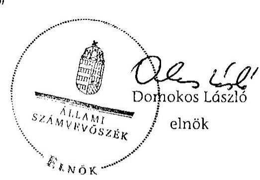

Domokos László
elnök

---

# Mellékletek 

1/a. számú a közigazgatási és igazságügyi miniszter észrevétele
1/b. számú a vidékfejlesztési miniszter észrevétele
1/c. számú a vidékfejlesztési miniszter észrevételére adott válasz
1/d. számú a nemzeti fejlesztési miniszter észrevétele
1/e. számú a nemzeti erőforrás miniszter észrevétele
1/f. számú A belügyminiszter észrevétele
2. számú A Nemzeti Fejlesztési Terv indikátorai és teljesülésük
3. számú Az Új Magyarország Fejlesztési Terv prioritásai és mutatói
4. számú Légszennyező anyagok kibocsátása (1990-)
5. számú Tanúsítvány. Részecske (PM) kibocsátás országos összes
6. számú Tanúsítvány. Részecske (PM) kibocsátás közlekedésből származó
7. számú A légszennyezés ellen és a klímapolitika terén tett intézkedések és hatásuk a helyszínen ellenőrzött önkormányzatoknál
8. számú A légszennyezéshez kapcsolódó hatósági intézkedések összesített táblázata
9. számú A Nemzeti Fejlesztési Terv forrásaiból megvalósuló támogatások
10. számú Az Új Magyarország Fejlesztési Terv forrásaiból megvalósuló támogatások
11. számú A helyszínen ellenőrzött a légszennyezést, illetve klímavédelmet célzó projektek ellenőrzésének tapasztalatai
12. számú A helyszínen ellenőrzött projektek főbb pénzügyi, kibocsátási mutatói

---

# KÖZIGAZGATÁSI ÉS IGAZSÁGÜGYI MINISZTÉRIUM MINISZTER 

Iktatószám: XXX-Sz/384/3/2011

Dr. Becker Pál
föigazgató

Állami Számvevőszék
Budapest

Tárgy: A légszennyezés ellen és a klimapolitika terén tett intézkedések hatásának ellenőrzéséről készített jelentés

Tisztelt Föigazgató Úr!

A légszennyezés ellen és a klimapolitika terén tett intézkedések hatásának ellenőrzéséről készített jelentéstervezethez további észrevételt nem kívánok tenni.

Budapest, 2011. szeptember., $\delta_{i}$,
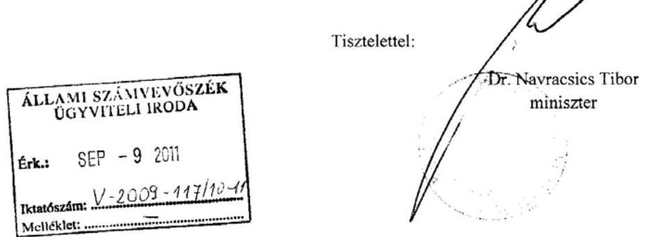

Közigazgatási és Igazságügyi Minisztérium 1055 Budapest, Kossuth tér 2-4.
tel.: +36 (1) 795-3036; fax: +36 (1) 795-0503

---

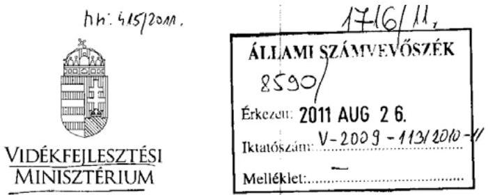

Ügyiratszám: KmfF-308/1/2011.
Ügyintéző: Bibók Zeszsanna
Telefon: 06-1-795-2441

## Domokos László úr   elnök részére

## Állami Számvevőszék

Budapest 4.
PE: 54.
1364

Tárgy: ÁSZ jelentés észrevételesés
Hiv.szám: V-2009-110/2010-2011.
Ügyintézőjük:
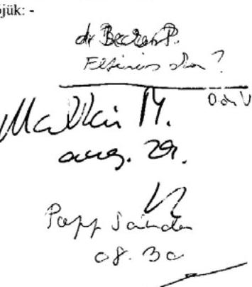

Közönettel megkaptam a légszennyezés ellen és a klímapolitika terén tett intézkedéséé hatásának ellenőrzéséről készített jelentését.

Szerelném jelezni, hogy a Dr. Illés Zoltán környezetügyért felelős államtitkár úrnak a 2011 júniusában egyeztetésre kiküldött anyag nem teljesen egyezik meg az elkészült jelentéssel.

A 22. oldalon a Vidékfejlesztési Miniszternek címzett 1. javaslat szerint ,, a vidékfejlesztési miniszter vizsgáltassa felül és pontositsa, illetve egészitve ki a levegö és klimavédelem irányitási, felügyeleti, valamint a hatósági tevékenységet végzök feladat és hatáskörének, valamint a felügyelöségek és az önkormányzatok közötti hatáskörök megosztásának szabályozását; '.
Tájékoztatom Elnök Urat, hogy a klimavédelem irányítása, jogi szabályainak kialakítása a Nemzeti Fejlesztési Minisztérium felelősségi körébe tartozik, a hatósági feladatokat az Országos Környezetvédelmi, Természetvédelmi és Vízügyi Főfelügyelőség, a nyilvántartási feladatokat pedig az Országos Meteorológiai Szolgálat látja el.
A végrehajthatóság érdekében az intézkedést a Kormány, vagy a nemzeti fejlesztési miniszternek szóló feladatok között javaslom szerepeltetni.

Az anyag tartalmát a fenti észrevételtől eltekintve elfogadom és az ellenőrzés alapján elrendelt intézkedéseimről a vonatkozó törvénynek megfelelően a későbbiekben tájékoztatom.

Budapest, 2011. augusztus „ 20
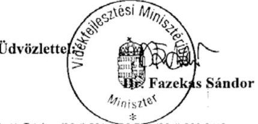

1066 Budapest, Kossuth Lajos tér 11. Telefon: (06 1) 3014100 Fax: (06 1) 3020413

---

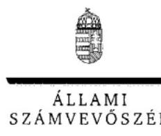

ELMök

V-2009-114/2010-2011.

Dr. Fazekas Sándor úr
miniszter
Vidékfejlesztési Minisztérium

Budapest

Tisztelt Miniszter Úr!

A légszennyezés ellen és a klimapolitika terén tett intézkedések hatásának ellenőrzéséről szóló jelentésre tett észrevételét köszönettel megkaptam, az abban foglaltak alapján a Miniszter úrnak címzett javaslat - a környezet- és természetvédelemért felelős helyettes államtitkársággal egyeztetve - a következőképpen módosult:

„Vizsgáltassa felül és pontosítsa, illetve egészítse ki a levegővédelem irányítási, felügyeleti, valamint a hatósági tevékenységet végzők feladat- és hatáskörének szabályozását, figyelembe véve a felügyelőségek és az önkormányzatok közötti hatáskörök megosztását;”

Egyebekben tájékoztatom, hogy a jelentés szövege a korábban Dr. Illés Zoltán környezetügyért felelős államtitkárnak küldött jelentéshez képest az időközben lefolytatott ÁSZ Elnöki Értekezleten elhangzott javaslatok alapján módosult.

Végezetül tájékoztatom Miniszter urat, hogy az ellenőrzésről készült jelentést - kialakult gyakorlatunk szerint - észrevételeivel és az azokra adott válaszommal együtt küldöm meg az Országgyűlés elnökének, a miniszterelnöknek és az Országgyűlés illetékes bizottságai elnökeinek.

Budapest, 2011. szeptember "A"".

Tisztelettel:

Domokos László

TISZE BUDAPEST, APAGZIN CSERÉ JANOS UTCA 10. 1364 Budapest 4. Pl. 54 telefon: 484 9101 fax: 484 9291

---

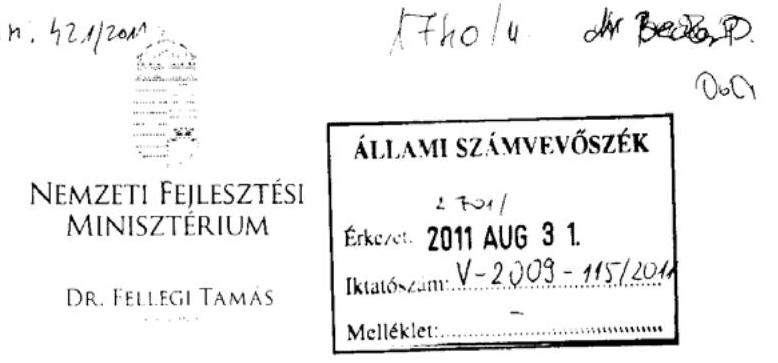

Domokos László
elnök
Állami Számvevőszék

Budapest

Tisztelt Elnök Úr!
Hiv szám: V-2009-110/2010-2011
Ikt szám: NFM/14304/5/2011
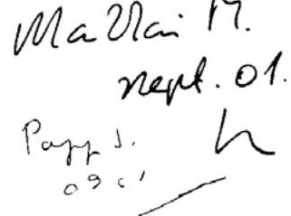

Köszönettel vettem „a légszennyezés ellen és klimapolitika terén tett intézkedések hatásának" tárgyában készített jelentésüket.

A jelentéssel kapcsolatban észrevételt nem teszek, egyben tájékoztatom, hogy a jelentésben megfogalmazott javaslatokra az Állami Számvevőszékről szóló 2011. évi LXVI. törvény III. fejezet 33. § (1) bekezdése alapján intézkedési tervet küldök.

Budapest, 2011. augusztus. . .
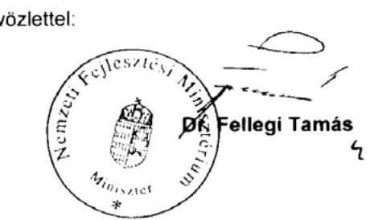

---

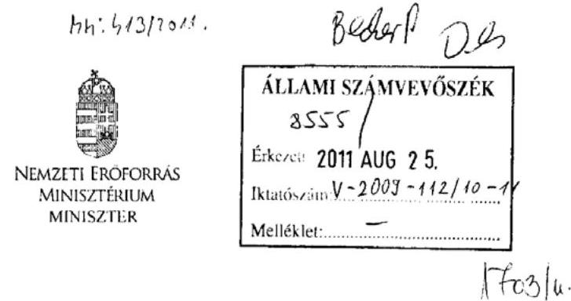

Iktatószám: 7512-13/2011-NÜF

Hiv. szám:V-2009-110/2010-2011.
Ügyintéző: Dr. Tomcsikné Kiss Marianna
(795-1083)
Melléklet: -

# Domokos László részére 

elnök

## Állami Számvevőszék

Budapest
Apáczai Csere János utca 10.
1052

Tárgy: Észrevétel a légszennyezettség ellen és a klimapolitika terén tett intézkedesek hatásának ellenôrzéséről jelentéshez

## Tisztelt Elnök Ür!

A légszennyezettség ellen és a klimapolitika terén tett intézkedések hatásának ellenőrzéséről készített jelentéstervezetben a Nemzeti Erőforrás Minisztérium előzetesen tett észrevételei átvezetésre kerültek, a most megküldött jelentéshez további észrevételt a Nemzeti Erőforrás Miniszterium nem tesz.

A Jelentés Kormány részére javasolt intézkedései 2. és 3. pontja vonatkozó részében foglaltak végrehajtására:

1) A Nemzeti Erőforrás Minisztérium feladatai körében felúivizsgálja es meghatározza a Vidékfejlesztési Minisztériummal egyutesen - az egészségre ható tényezők, így a légszennyező anyagok határértćkét.
2) A Közigazgatási és Igazságügyi Minisztériumon keresztül felhívja a Megyei Kormányhivatalok Népegészségügyi Szakigazgatási Hivatalainak vezetői (megyeí

---

tisztifőorvosok) figyelmét, hogy a szmogriadok idején feladat- és hatáskörük a légszennyezés egészségi hatásainak helyi kommunikálása, amelyet a megyei Környezetvédelmi, Természetvédelmi és Vízügyi Felügyelőség szakembereivel együttműködve szükséges végezniük.

Budapest, 2011. augusztus, 22. ...

---

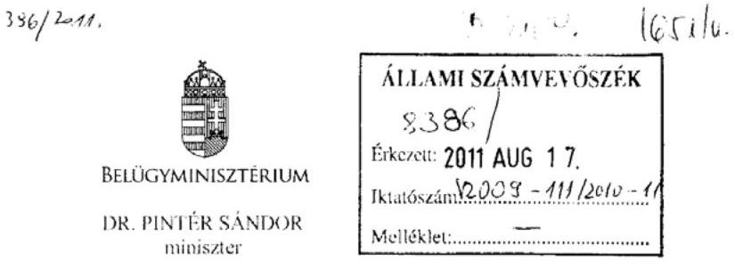

Iktatószóm: BM/7820/2011.
Tárgy: a légszennyezés ellen és a klímapolitika terén tett intézkedések hatásának ellenőrzéséről készült Jelentés észrevételezése

Domokos László elnök úr részére
Állami Számvevőszék
Budapest

Tisztelt Elnök Úr!
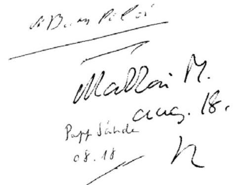

Köszönettel vettem az Állami Számvevőszék által elkészített „a légszennyezés ellen és a klímapolitika terén tett intézkedések hatásának ellenőrzéséről" szóló összesített anyagot.

Tekintve, hogy a Jelentés-tervezetre észrevételeinket 2011. júniusban megküldtük az Önök részére, így a végleges anyagra a Belügyminisztérium további észrevételt nem kíván tenni.

Budapest, 2011. augusztus „ef".
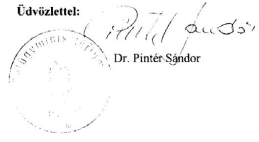

---

# A Nemzeti Fejlesztési Terv indikátorai és teljesülésük 

(Annak érdekében, hogy kimutatható legyen a légszennyezés csökkentését, illetve a klímaváltozás mérséklését célzó indikátorok (ezek vastagon szedettek) alacsony száma, a táblázatok valamennyi olyan célt, illetve prioritást bemutatnak, amelyhez indikátor volt rendelve.)

## KÖRNYEZETVÉDELEM ÉS INFRASTRUKTÚRA OPERATÍV PROGRAM

A KIOP programszintú indikátorainak teljesülése

| Szint | Típus | Mutató | Mérték-   egység | Célkitúzés | Adatforrás | Tényadat   2009.12.31. |
| :-- | :-- | :-- | :-- | :-- | :-- | :-- |
| Cél /   Prioritás |  | Meghatározás |  |  |  |  |
| 1. | Hatás | Háztartások talajba juttatott   szennyvízének csökkenése   programszinten | $\%$ | $5 \%$-os   csökkenés | Közremüködő   szervezet projekt   adatbázisa | $33 \%$-os   csökkenés |
| 2. | Hatás | Balesetek számának csökkenése | fő | $5 \%$-os   csökkenés | Adatfelvétel a   kedvezményezet-   tek körében | $15 \%$-os   csökkenés |

A KIOP horizontális indikátorainak teljesülése

| Típus | Mutató |  | Forrás | Kiin-   dulási   érték | Szám-   szerü-   sitett   cél | Tényadat   2009.12.31 |
| :--: | :--: | :--: | :--: | :--: | :--: | :--: |
|  | Meghatározás | Mértékegység |  |  |  |  |
| Hatás | Egységre jutó CO2 kibocsátás csökkenése az áruszállitásban | \% | $\begin{aligned} & \text { Közremú- } \\ & \text { kódó szer- } \\ & \text { vezet } \\ & \text { jekt adat- } \\ & \text { bázisa } \end{aligned}$ | 0 | 9,4 | 9,4 |
| Eredmény | Azon projektek részesedése az OP-ben, amelyeknek pozitív vagy semleges környezeti hatásuk van | \% | $\begin{aligned} & \text { Közremúködő } \\ & \text { szervezet } \\ & \text { projekt adat- } \\ & \text { bázisa } \end{aligned}$ | 0 | 100 | 100 |
| Eredmény | A nők számára újabban létesített vagy megőrzött állások | \% | $\begin{aligned} & \text { Közremúködő } \\ & \text { szervezet } \\ & \text { projekt adat- } \\ & \text { bázisa } \end{aligned}$ | 0 | $0-85$ | 20-85 |
| Output | Az EU követelményeknek megfelelő víz-és szennyvíz tisztító kapacitás növekedése az 50.000-nél kisebb lakosságszámú településeken | háztartások száma db | $\begin{aligned} & \text { Közremúködő } \\ & \text { szervezet pro- } \\ & \text { jekt adatbázisa } \end{aligned}$ | 0 | 35000 | 37685 |

1.6. Levegőszennyezés és zajterhelés mérése intézkedés szintű indikátor

| Indikátor típusa | Indikátor | Mértékegység | Forrás | Kiindulási érték | Számszerúsitett cél | Tényadat 2009.12.31 |
| :--: | :--: | :--: | :--: | :--: | :--: | :--: |
| Output |  | db | $\begin{aligned} & \text { Közremú- } \\ & \text { kódó szer- } \\ & \text { vezet } \\ & \text { jekt } \\ & \text { bázisa } \end{aligned}$ | 0 | 23 (levegö) | 46 |
|  | Újonnan felszerelt mérőegységek és berendezések száma | db |  |  |  |  |
|  |  | db | Környezetvédelmi Felügyelö. ségek |  | 4 (zaj) | 4 |
| Eredmény | Közvetve érintett háztartások száma   (egy háztartást átlagosan 3 fővel számolva) | db | $\begin{aligned} & \text { Közremúködő } \\ & \text { szervezet } \\ & \text { projekt adat- } \\ & \text { bázisa } \\ & \text { KSH érintett } \\ & \text { KÖFE } \end{aligned}$ | 0 | 1711467 | 1699311 |

---

11.7 Az energiagazdálkodás környezetbarát fejlesztése intézkedés szintű indikátor

| Indikátor   típusa | Indikátor | Mérték-   egység | Forrás | Kiin-   dulási   érték | Számsze-   rúsített   cél | Tényadat   2009.12.31 |
| :--: | :--: | :--: | :--: | :--: | :--: | :--: |
| Output | Beépített megújuló új   villamosenergia kapacitás | MW | Közremüködő   szervezet pro-   jekt adatbázisa | 0 | 25 | 22,309 |
| Eredmény | Új megújuló kapacitással   termelt villamosenergia éves   mennyisége | GW/év | Energia statisz-   tika |  | 50 | 49,643 |
| Eredmény | Energiahatékonysággal kivál-   tott éves energiahordozó   megtakarítás hőegyenértékben | GW/év | Közremüködő   szervezet projekt   adatbázisa | 0 | 1100000 | 1151161 |

2. KÖZLEKEDÉSI INFRASTRUKTÚRA FEJLESZTÉSE PRIORITÁS ÉS INDIKÁTORAI

| Indikátor típusa | Indikátor | Mérték-   egység | Forrás | Kiindulási érték | Számsze-   rúsített   cél | Tényadat 2009.12.31 |
| :--: | :--: | :--: | :--: | :--: | :--: | :--: |
| Output | Korszerúsített és újonnan épített utak hossza | km | Közremű-   ködő szer-   vezet projekt adatbázisa | 0 | 260 | 179 |
| Eredmény | Utazási idő csökkenése | \% | Adatfelvétel a kedvez-ményezet-   teknél | 0 | 10 | 17 |
| Hatás | Balesetek számának csökkenése | db |  | 0 | $-5$ | $-15$ |

2.1. A főúthálózat műszaki színvonalának fejlesztése intézkedés szintű indikátor

| Indikátor típusa | Indikátor | Mérték-   egység | Forrás | Kiindulási érték | Számsze-   rúsített   cél | Tényadat 2009.12.31 |
| :--: | :--: | :--: | :--: | :--: | :--: | :--: |
| Output | Új és felújított útszakaszok hossza | km | EMIR |  |  |  |
|  |  |  | ÁKMI, OKA adatbázis | 894 | 1060 | 1073,13 |
| Eredmény | Utazási idő csökkenése a magasabb rendű utakhoz történő kapcsolódási lehetőség | Eljutási idő $\%$-a | EMIR, adatgyűjtés, előrejelzések | 0 | 10 | 8,95 |

2.2. Környezetbarát közlekedési infrastruktúra fejlesztése intézkedés szintű indikátor

| Indikátor típusa | Indikátor | Mértékegység | Forrás | Kiindulási érték | Szám-   szerüsi   tett cél | Tényadat 2009.12.31 |
| :--: | :--: | :--: | :--: | :--: | :--: | :--: |
| Output | Környezetbarát közlekedési módokhoz kapcsolódó infrastruktúra hosszának növekedése | km | Közremüködő szervezet projekt adatbázisa | 0 | 12,4 | 28,3 |
| Eredmény | A közösségi közlekedés használati arányának növekedése | \% | Adatfelvétel a kedvezményezettnél   (MÁV) | 0 | 5 | 28 |
|  | A közútról vasútra, ill. vízi útra terelt tehergépjárművek száma | db   (személygépkocsi)   (személygépkocsi)   (mezőgazdasági   haszongépjármú)   tehergépjármú   egyenérték | Adatfelvétel a kedvezményezettnél | 0 | 17000 | (17 591)   (89)   (3 070) |

---

# Az Új Magyarország Fejlesztési Terv prioritásai és mutatói

## 4. MEGÚJULÓ ENERGIAFORRÁS-FELHASZNÁLÁS NÖVELÉSE

Prioritás szintű indikátor

|  Indikátor megnevezése | Indikátor
mérték-
egysége | Indikátor
típusa | Bázisérték | Célértékek |   |
| --- | --- | --- | --- | --- | --- |
|   |  |  |  | $\mathbf{2 0 1 2}$ | $\mathbf{2 0 1 5}$  |
|  Megújuló energiahordozó bázisú villamosenergia-termelés
növekedése | GWh/év | E | 0 | 872 | 1169  |
|  Megújuló energiahordozó felhasználás növekedése ${ }^{1}$ | PJ/év | E | 0 | 36,5 | 41,3  |
|  Üvegházhatású gázok kibocsátás csökkenése ${ }^{2}$ | kt/év | E | 0 | 2189 | 2476  |

${ }^{1}$ Villamos energia tüzelőhő-egyenértékével együtt ${ }^{2} \mathrm{Co}_{2}$ egyenértéken

## 4. MEGÚJULÓ ENERGIAFORRÁS-FELHASZNÁLÁS NÖVELÉSE PRIORITÁSHOZ TARTOZÓ TÁMOGATÁSI KONSTRUKCIÓK

4.1. Hő- és/vagy villamosenergia előállítás támogatása konstrukció szintű indikátor

|  Indikátor megnevezése | Indikátor mér-
tékegysége | Indikátor
típusa | Bázis-
érték | Célértékek |   |
| --- | --- | --- | --- | --- | --- |
|   |  |  |  | $\mathbf{2 0 1 2}$ | $\mathbf{2 0 1 5}$  |
|  Megújuló energiaforrás felhasználás ${ }^{3}$ | PJ/év | E | 0 | 2,1 | 3,2  |
|  Részarány a hazai energiafelhasználásban | $\%$ | E | 0 | 0,18 | 0,27  |
|  Üvegházhatású gázok kibocsátás csökkenése | kt/év | E | 0 | 126,1 | 191,6  |

[^0] [^0]: ${ }^{1}$ Villamos energia tüzelőhő-egyenértékével együtt

---

4.3. Megújuló energia alapú térségfejlesztés konstrukció szintű indikátor

|  Indikátor megnevezése | Indikátor mé-
tékegysége | Indikátor
típusa | Bázis-
érték | Célértékek |   |
| --- | --- | --- | --- | --- | --- |
|   |  |  |  | $\mathbf{2 0 1 2}$ | $\mathbf{2 0 1 5}$  |
|  Megújuló energiaforrás felhasználás ${ }^{4}$ | $\mathrm{PJ} /$ év | E | 0 | 2,3 | 3,5  |
|  Részarány a hazai energiafelhasználásban | $\%$ | E | 0 | 0,20 | 0,29  |
|  Üvegházhatású gázok kibocsátás csökkenése | $\mathrm{kt} / \mathrm{év}$ | E | 0 | 137,2 | 208,4  |

${ }^{4}$ Villamos energia tüzelőhő-egyenértékével együtt 4.4. Megújuló energia alapú villamosenergia-, kapcsolt hő és villamosenergia-, valamint biometán termelés konstrukció szintű indikátor

|  Indikátor megnevezése | Indikátor mértékegysége | Indikátor típusa | Bázisérték | Célértékek |   |
| --- | --- | --- | --- | --- | --- |
|   |  |  |  | $\mathbf{2 0 1 2}$ | $\mathbf{2 0 1 5}$  |
|  Megújuló energiaforrás felhasználás ${ }^{5}$ | $\mathrm{PJ} /$ év | E | 0 | 3,6 | 5,5  |
|  Részarány a hazai energiafelhasználásban | $\%$ | E | 0 | 0,31 | 0,46  |
|  Üvegházhatású gázok kibocsátás csökkenése | $\mathrm{kt} / \mathrm{év}$ | E | 0 | 216,1 | 328,4  |

${ }^{5}$ Villamos energia tüzelőhő-egyenértékével együtt 4.6. Nagy és közepes kapacitású bioetanol üzemek létesítésének támogatása konstrukció szintű indikátor

|  Indikátor megnevezése | Indikátor mértékegysége | Indikátor típusa | Bázisérték | Célértékek |   |
| --- | --- | --- | --- | --- | --- |
|   |  |  |  | $\mathbf{2 0 1 2}$ | $\mathbf{2 0 1 5}$  |
|  Megújuló energiaforrás felhasználás ${ }^{6}$ | $\mathrm{PJ} /$ év | E | 0 | 27,3 | 27,3  |
|  Részarány a hazai energiafelhasználásban | $\%$ | E | 0 | 2,37 | 2,37  |
|  Üvegházhatású gázok kibocsátás csökkenése | $\mathrm{kt} / \mathrm{év}$ | E | 0 | 1636 | 1636  |

${ }^{6}$ Villamos energia tüzelőhő-egyenértékével együtt

---

4.7. Geotermikus alapú hő-, illetve villamosenergia-termelő projektek előkészítési és projektfejlesztési tevékenységeinek támogatása konstrukció szintű indikátor

|  Indikátor megnevezése | Indikátor mérték-
egysége | Indikátor
típusa | Bázisér-
ték | Célértékek |   |
| --- | --- | --- | --- | --- | --- |
|   |  |  |  | $\mathbf{2 0 1 2}$ | $\mathbf{2 0 1 5}$  |
|  Megújuló energiaforrás felhasználás ${ }^{7}$ | $\mathrm{PJ} / \mathrm{év}$ | E | 0 | 3,5 | 3,5  |
|  Részarány a hazai energiafelhasználásban | $\%$ | E | 0 | 0,30 | 0,29  |
|  Üvegházhatású gázok kibocsátás csökkenése | $\mathrm{kt} / \mathrm{év}$ | E | 0 | 320 | 320  |

${ }^{7}$ Villamos energia tüzelőhő-egyenértékével együtt 4.8. Épületenergetikai fejlesztések megújuló erőforrások alkalmazásával kombinálva konstrukció szintű indikátor

|  Indikátor megnevezése | Indikátor
mértékegysé-
ge | Indikátor
típusa | Bázisér-
ték | Célértékek |   |
| --- | --- | --- | --- | --- | --- |
|   |  |  |  | $\mathbf{2 0 1 2}$ | $\mathbf{2 0 1 5}$  |
|  Energiahatékonyság növelés révén megtakarított energia évente | $\mathrm{PJ} / \mathrm{év}$ | E | 0 | 1,6 | 2,0  |
|  A megtakarítás aránya a hazai energiafelhasználásban | $\%$ | E | 0 | 0,1 | 0,1  |
|  Üvegházhatású gázok kibocsátás csökkenés | $\mathrm{kt} / \mathrm{év}$ | E | 0 | 94 | 118  |
|  Megújuló energiaforrás felhasználás ${ }^{8}$ | $[\mathrm{PJ} / \mathrm{év}]$ | E | 0 |  |   |

${ }^{8}$ Villamos energia tüzelőhő-egyenértékével együtt

# 5. HATÉKONY ENERGIAFELHASZNÁLÁS

Prioritás szintű indikátor

|  Indikátor megnevezése | Indikátor mér-
tékegysége | Indikátor
típusa | Bázisérték | Célértékek |   |
| --- | --- | --- | --- | --- | --- |
|   |  |  |  | $\mathbf{2 0 1 2}$ | $\mathbf{2 0 1 5}$  |
|  Energiahatékonyság révén évente megtakarított energia | $\mathrm{PJ} / \mathrm{év}$ | E | 0 | 7,7 | 11  |
|  Részarány a hazai felhasználás növekedése | $\%$ | E | 0 | 0,7 | 0,9  |
|  Üvegházhatású gáz-kibocsátás csökkenés ${ }^{9}$ | $\mathrm{kt} / \mathrm{év}$ | E | 0 | 454 | 660  |

${ }^{9} \mathrm{CO}_{2}$ egyenértékével

---

# 5. HATÉKONY ENERGIAFELHASZNÁLÁS PRIORITÁSHOZ TARTOZÓ TÁMOGATÁSI KONSTRUKCIÓK

5.2. Harmadik feles finanszírozás konstrukció szintű indikátor

|  Indikátor megnevezése | Indikátor
mértékegysége | Indikátor
típusa | Bázisér-
ték | Célérték |   |
| --- | --- | --- | --- | --- | --- |
|   |  |  |  | $\mathbf{2 0 1 2}$ | $\mathbf{2 0 1 5}$  |
|  Energiahatékonyság növelés révén megtakarított energia évente | $\mathrm{PJ} / \mathrm{év}$ | E | 0 | 2,6 | 4,2  |
|  A megtakarítás aránya a hazai Energiafelhasználásban | $\%$ | E | 0 | 0,2 | 0,4  |
|  Üvegházhatású gázkibocsátás csökkenés | $\mathrm{kt} / \mathrm{év}$ | E | 0 | 153 | 249  |

5.3 A) Épületenergetikai fejlesztések és közvilágítás korszerűsítése; B) Épületenergetikai fejlesztések megújuló energiaforráshasznosítással kombinálva a KM régióban; E) Épületenergetikai fejlesztések egyszerűsített eljárásban konstrukció szintű indikátor

|  Indikátor megnevezése | Indikátor
mértékegysége | Indikátor
típusa | Bázisér-
ték | Célérték |   |
| --- | --- | --- | --- | --- | --- |
|   |  |  |  | $\mathbf{2 0 1 2}$ | $\mathbf{2 0 1 5}$  |
|  Energiahatékonyság növelés révén megtakarított energia évente | $\mathrm{PJ} / \mathrm{év}$ | E | 0 | 1,6 | 2,0  |
|  A megtakarítás aránya a hazai energiafelhasználásban | $\%$ | E | 0 | 0,1 | 0,1  |
|  Üvegházhatású gázkibocsátás csökkenés | $\mathrm{kt} / \mathrm{év}$ | E | 0 | 94 | 118  |

5.4. Távhő-szektor energetikai korszerűsítése konstrukció szintű indikátor

|  Indikátor megnevezése | Indikátor
mértékegysége | Indikátor
típusa | Bázis-
érték | Célérték |   |
| --- | --- | --- | --- | --- | --- |
|   |  |  |  | $\mathbf{2 0 1 2}$ | $\mathbf{2 0 1 5}$  |
|  Energiahatékonyság növelés révén megtakarított energia évente | $\mathrm{PJ} / \mathrm{év}$ | E | 0 | 2,2 | 3,5  |
|  A megtakarítás aránya a hazai energiafelhasználásban | $\%$ | E | 0 | 0,2 | 0,3  |
|  Üvegházhatású gázkibocsátás csökkenés | $\mathrm{kt} / \mathrm{év}$ | E | 0 | 130 | 208  |

---

# 6. FENNTARTHATÓ ÉLETMÓD ÉS FOGYASZTÁS

Prioritás szintű indikátor

|  Indikátor megnevezése |  | Indikátor
mértékegysége | Indikátor
típusa | Bázisér-
ték | Célérték |   |
| --- | --- | --- | --- | --- | --- | --- |
|   |  |  |  |  | 2012 | 2015  |
|  A kampányok és minta projektek elérési
mutatója a tudatformáló tevékenység
típusa szerint* | Rövid idő/passzív részvétel | ezer fő | Nyomon
követési | 0 | 52500 | 70000  |
|   | Hosszú idő/passzív részvétel |  |  | 0 | 15000 | 20000  |
|   | Rövid idő/aktív részvétel |  |  | 0 | 90 | 120  |
|   | Rövid idő/passzív részvétel |  |  | 0 | 7,5 | 10  |

- A célértékek kumulatív összegek: egy ember annyiszor szerepel a statisztikában, ahány alkalommal találkozott a „Fenntartható életmód és fogyasztás" prioritási tengely keretében támogatott bármely kommunikációs tevékenységgel

## 7. PROJEKT ELŐKÉSZÍTÉS

Prioritás szintű indikátor

|  Indikátor megnevezése | Indikátor
mértékegysége | Indikátor típusa
(eredmény, out-
put, hatási.) | Bázisérték | Célérték |   |
| --- | --- | --- | --- | --- | --- |
|   |  |  |  | 2012 | 2015  |
|  Előkészített pályázatok száma | Db | Eredmény |  | 140 | 150  |
|  Előkészített pályázatok értéke | Mrd Ft | Eredmény |  | 800 | 1100  |

---

# Közlekedés Operatív Program 2007-2013. indikátorai

|  HORIZONTÁLIS INDIKÁTOROK |  |  |  |  |  |   |
| --- | --- | --- | --- | --- | --- | --- |
|  OP szintű indikátor | Indikátor
típusa | Indikátor | mértékegy-
ség | Bontás | Kiinduló érték
(2007) ** | célér-
ték
(2015)  |
|  A közlekedési szektor üvegházhatású gázemissziójának csökkentése (OP hatására) | hatás | Üvegházhatású gáz $\left(\mathrm{CO}*{2}, \mathrm{~N}*{2} \mathrm{O}, \mathrm{CH}*{3}\right)$ kibocsátás mértékének változása az OP hatására | $\mathrm{kt} \mathrm{CO}_{2} \mathrm{e} / \mathrm{év}$ |  | $\begin{gathered} 0 \ (13.032) \end{gathered}$ | $-10$  |

## 5. VÁROSI ÉS ELŐVÁROSI KÖZÖSSÉGI KÖZLEKEDÉS FEJLESZTÉSE

A prioritás szintű indikátor

|  Prioritás neve, száma | Indikátor megnevezése | Indikátor mértékegysége | Célértékek ${ }^{1}$ |  |   |
| --- | --- | --- | --- | --- | --- |
|   |  |  | Kiinduló érték (2007) | 2012 | 2015  |
|  Városi és elővárosi közösségi közlekedés fejlesztése | Üvegházhatású gáz $\left(\mathrm{CO}*{2}, \mathrm{~N}*{2} \mathrm{O}, \mathrm{CH}*{3}\right)$ kibocsátás mértékének változása a prioritás hatására | $\mathrm{kt} \mathrm{CO}_{2} \mathrm{e} / \mathrm{év}$ | $\begin{gathered} 0 \ (2.660) \end{gathered}$ |  | $-85$  |
|   | Közlekedésből származó szálló por (PM10) kibocsátás mértékének változása a prioritás hatására Budapesten | tonna / év | $\begin{gathered} 0 \ (1.000) \end{gathered}$ |  | $-30$  |

${ }^{1}$ Kumulált érték ${ }^{2}$ Zárójelben az egyes indikátorokhoz tartozó 2007-es értékek

---

# Légszennyező anyagok kibocsátása (1990-2009) ezer tonnában

|  Megnevezés | 1990 | 1995 | 2000 | 2001 | 2002 | 2003 | 2004 | 2005 | 2006 | 2007 | 2008 | 2009  |
| --- | --- | --- | --- | --- | --- | --- | --- | --- | --- | --- | --- | --- |
|  Kén-dioxid |  |  |  |  |  |  |  |  |  |  |  |   |
|  összesen | 1010 | 705 | 486 | 400 | 365 | 374 | 247 | 129 | 118 | 84 | 88 | 80  |
|  ebből: hőerőművekből | 423 | 436 | 383 | 288 | 247 | 226 | 126 | 20 | 10 | 10 | 10 | 10  |
|  Nitrogén-oxidok |  |  |  |  |  |  |  |  |  |  |  |   |
|  összesen | 238 | 190 | 186 | 186 | 186 | 186 | 181 | 204 | 208 | 190 | 183 | 167  |
|  ebből: közlekedésből | 116 | 101 | 110 | 113 | 116 | 114 | 112 | 135 | 142 | 123 | 117 | 105  |
|  Szilárdanyag |  |  |  |  |  |  |  |  |  |  |  |   |
|  összesen | 205 | 155 | 129 | 122 | 119 | 125 | 91 | 90 | 83 | 60 | 64 | 80  |
|  ebből: lakosságtól | 75 | 44 | 27 | 27 | 29 | 36 | 34 | 46 | 40 | 18 | 21 | 32  |
|  Szén-monoxid |  |  |  |  |  |  |  |  |  |  |  |   |
|  összesen | 997 | 761 | 633 | 576 | 563 | 565 | 542 | 587 | 569 | 507 | 512 | 309  |
|  ebből: közlekedésből | 568 | 449 | 436 | 424 | 414 | 407 | 398 | 420 | 423 | 423 | 422 | 221  |
|  Illékony (nem metán) szerves vegyületek |  |  |  |  |  |  |  |  |  |  |  |   |
|  összesen | 150 | 150 | 173 | 158 | 157 | 155 | 157 | 177 | 177 | 148 | 141 | 128  |
|  ebből: közlekedésből | 73 | 73 | 61 | 59 | 59 | 57 | 56 | 59 | 60 | 58 | 51 | 42  |
|  Metán |  |  |  |  |  |  |  |  |  |  |  |   |
|  összesen | 539 | 442 | 449 | 438 | 445 | 445 | 429 | 423 | 420 | 412 | 404 | 400  |
|  ebből: hulladékkezelésből | 147 | 158 | 167 | 167 | 172 | 170 | 171 | 171 | 169 | 167 | 165 | 165  |
|  Szén-dioxid (bruttó) |  |  |  |  |  |  |  |  |  |  |  |   |
|  összesen | 72496 | 61435 | 58542 | 60157 | 58488 | 61355 | 59798 | 60940 | 59650 | 57885 | 56223 | 50443  |
|  ebből: hőerőművekből | 22060 | 23736 | 23396 | 23346 | 21570 | 22545 | 20239 | 18558 | 19458 | 20317 | 19425 | 16212  |
|  Özonréteget károsító anyagok |  |  |  |  |  |  |  |  |  |  |  |   |
|  HCFC |  | 0,94 | 1,1 | 1,19 | 0,44 | 0,4 | 0,15 | 0,16 | 0,14 | 0,16 | 0,12 | 0,09  |

Forrás: KSH

---

# TANÚSÍTVÁNY 

## RÉSZECSKE (PM) KIBOCSÁTÁS

ORSZÁGOS ÖSSZES
2000-2009

| Év | TSP*   Kt/év | $\begin{gathered} \text { PM }_{10} \\ \text { Kt/év } \end{gathered}$ | $\begin{gathered} \text { PM }_{2,5} \\ \text { Kt/év } \end{gathered}$ |
| :--: | :--: | :--: | :--: |
| 2000 | 128,5 | 47,04 | 25,72 |
| 2001 | 121,92 | 48,28 | 25,68 |
| 2002 | 118,60 | 44,31 | 26,08 |
| 2003 | 124,64 | 47,90 | 27,20 |
| 2004 | 90,05 | 47,41 | 27,40 |
| 2005 | 89,59 | 51,57 | 30,97 |
| 2006 | 82,90 | 48,01 | 29,30 |
| 2007 | 60,48 | 35,65 | 21,38 |
| 2008 | 62,91 | 39,05 | 21,56 |
| 2009 | 76,09 | 45,57 | 26,76 |

TSP: Total Suspended Particulate (összes részecske); $\mathrm{PM}_{10}$ : 10 m-nél kisebb átmérőjű részecske; $\mathrm{PM}_{2,5}$ : 2,5 $\mu$ ranél kisebb átmérőjű részecske;

Budapest, 2011. március 4.

Kiállította: Bibók Zsuzsanna főóyh

Jóváhagyta: Dr. Nemes Csaba föosztályvezető
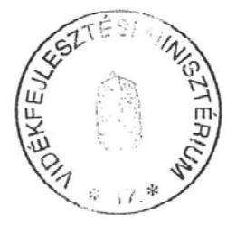

---

# TANÚSÍTVÁNY 

## RÉSZECSKE (PM) KIBOCSÁTÁS

## KÖZLEKEDÉSBŐL SZÁRMAZÓ

2000-2009

| Év | TSP*   Kt/év | $\begin{gathered} \mathrm{PM}_{10} \\ \mathrm{Kt} / \text { év } \end{gathered}$ | $\begin{gathered} \mathrm{PM}_{2,5} \\ \mathrm{Kt} / \text { év } \end{gathered}$ |
| :--: | :--: | :--: | :--: |
| 2000 | 20,02 | 14,12 | 8,21 |
| 2001 | 20,62 | 14,53 | 8,42 |
| 2002 | 21,18 | 14,93 | 8,58 |
| 2003 | 20,04 | 14,13 | 8,16 |
| 2004 | 21,32 | 15,03 | 8,63 |
| 2005 | 24,82 | 17,50 | 10,04 |
| 2006 | 24,98 | 17,62 | 10,06 |
| 2007 | 24,31 | 17,14 | 9,76 |
| 2008 | 27,29 | 16,74 | 9,52 |
| 2009 | 22,08 | 15,57 | 8,9 |

TSP: Total Suspended Particulate (összes részecske); $\mathrm{PM}_{10}$ : $10 \mu \mathrm{~m}$-nél kisebb átmérőjű részecske; $\mathrm{PM}_{2,5}: 2,5 \mu \mathrm{~m}$ nél kisebb átmérőjű részecske;

Budapest, 2011. március 4.

Kiállította: Bibók Zsuzsanna főovb

Jóváhagyta: Dr. Nemes Csaba főosztályvezető
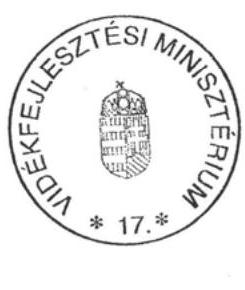

---

# A légszennyezés ellen és a klímapolitika terén tett intézkedések és hatásuk a helyszínen ellenőrzött önkormányzatoknál 

1. a légszennyezés ellen és a klímapolitika terén előírt önkormányzati és
kistérségi feladatok ..... 1
2. Tapasztalatok a helyszínen ellenőrzött önkormányzatoknál ..... 3
2.1. A Dél-dunántúli Környezetvédelmi Felügyelőség mérési tevékenysége ..... 3
2.2. Tokaj Város Önkormányzat ..... 4
2.3. Tállya Község Önkormányzat a légszennyezéssel kapcsolatos
önkormányzati intézkedései ..... 6
2.4. Taktaharkány Nagyközség Önkormányzat a légszennyezéssel
kapcsolatos önkormányzati intézkedései ..... 8
2.5. Szerencs Város Önkormányzat a légszennyezéssel kapcsolatos
önkormányzati intézkedései ..... 10
2.6. Bóly Város Önkormányzat ..... 11
2.7. Villány Város Önkormányzat ..... 11
2.8. Beremend Nagyközség Önkormányzata ..... 12
2.9. Orfú Község Önkormányzata ..... 15
2.10. Szentlőrinc Város Önkormányzata ..... 15
2.11. Sellye Város Önkormányzata ..... 18

## 1. A LÉGSZENNYEZÉS ELLEN ÉS A KLÍMAPOLITIKA TERÉN ELŐÍRT ÖNKORMÁNYZATI ÉS KISTÉRSÉGI FELADATOK

A Kvtv. 46. § (1) bekezdése alapján a környezet védelme érdekében a települési önkormányzatoknak a következő feladatokat kell ellátniuk:

- biztosítja a környezet védelmét szolgáló jogszabályok végrehajtását, ellátja a hatáskörébe utalt hatósági feladatokat;
- az NKP I-II.-ben foglalt célokkal, feladatokkal és a település rendezési tervével összhangban illetékességi területére önálló település rendezési tervével összhangban illetékességi területére önálló települési környezetvédelmi programot dolgoz ki, amelyet képviselőtestülete (közgyűlése) hagy jóvá;
- a környezetvédelmi feladatok megoldására önkormányzati rendeleteket alkot, illetőleg határozatokat hoz;
- együttmúködik a környezetvédelmi feladatot ellátó egyéb hatóságokkal, más önkormányzatokkal, társadalmi szervezetekkel;
- elemzi, értékeli a környezet állapotát illetékességi területén, és arról szükség szerint, de legalább évente egyszer tájékoztatja a lakosságot;

---

- a fejlesztési feladatok során érvényesíti a környezetvédelem követelményeit, elősegíti a környezeti állapot javítását.

A Kvt. 48. § (4) bekezdésének a) pontja szerint a települési önkormányzat Kép-viselő-testületének hatáskörébe tartozik a füstködriadó (továbbiakban: szmogriadó) terv elkészítése. A Korm. rendelet 15/B § (1) bekezdése szerint azokon a területeken (településeken), ahol a szmog helyzet kialakulásával kell számolni és a légszennyezettség folyamatos mérésének feltételei adottak, a veszélyhelyzet elkerüléséhez és az esemény tartósságának csökkentéséhez - beleértve a tájékoztatást és riasztást - szmogriadó tervet kell kidolgozni és végrehajtani.

A 15/B §. (2) bekezdése érdekében a szmogriadó terv készítésének feltételeit és tartalmi követelményeit a Korm. rendelet 5. számú melléklet tartalmazza. "A szmogriadó terv készítésének feltételei: A határérték feletti, rendkívüli intézkedést igénylő légszennyezettség kialakulásának lehetősége vagy bekövetkezése esetére szmogriadó tervet kell készíteni: a) minden 200 ezer főt elérő népességszámú városban; b) minden olyan településen, amelynek belterületén (belterületének egyes részein) valamely légszennyezőanyag koncentrációja ba) a hosszú időtartamú egészségügyi határértéket, vagy bb) a rövid időtartamú ( 60 perces, 24 órás) egészségügyi határértéket legalább két mérőponton az esetek 30\%-ában meghaladja; c) minden olyan településen, illetve térségben, ahol a riasztási küszöbértékek tartós túllépésének veszélye fennáll."

A levegő védelmével kapcsolatos részletes feladatokat a levegőtisztaság-védelmi hatósági feladatokat - ha jogszabály másképp nem rendelkezik - a többször módosított 21/2001. (II. 14.) Korm. rendelet 23. § (1) bekezdése szerint első fokon a környezetvédelmi felügyelőség, illetőleg a Korm. rendeletben meghatározott esetekben ${ }^{1}$ a település jegyzője látja el.

A levegő védelmével kapcsolatos egyes szabályokat a Korm. rendelet tartalmazza. A levegőterhelést okozó forrásokra, tevékenységekre, technológiákra, létesítményekre (a légszennyező forrásokra) az elérhető legjobb technika alapján, jogszabályban, illetőleg a környezetvédelmi hatóság egyedi eljárásnak keretében kibocsátási határértéket, levegővédelmi követelményeket kell megállapítani. A Korm. rendelet határoz az új légszennyező források telepítéséről, illetve a bizonyos tevékenységek esetén (2. számú melléklet szerint) szükséges védelmi övezet kialakításáról, továbbá a 7. § (5) bekezdésében alapján a légszennyzettségi zónák ${ }^{2}$ kialakításáról.

A légszennyezettségi határértékekről, a helyhez kötött légszennyező pontforrások kibocsátási határértékeiről szóló 14/2001. (V. 9.) KöM-EüM-FVM együttes miniszteri rendelet 4. § (1) bekezdésének rendelkezése szerint a 1.1. számú mellékletében szereplő légszennyező anyagokra - a (4) bekezdésében foglaltak kivételével - a légszennyezettség abban meghatározott egészségügyi határér-

[^0]
[^0]:    ${ }^{1}$ A 21/2001. (II. 14.) Korm. rendelet 23. § (3)-(4) bekezdései szerint.
    ${ }^{2}$ A légszennyezettség alapján kijelölt olyan területegységet jelent, amelyen belül a környezetvédelmi hatóság által meghatározott helyen, a szennyező anyag koncentrációja tartósan vagy időszakosan az együttes miniszteri rendelet 4. számú mellékletében meghatározott tartományok valamelyikébe esik.

---

tékeit kell alkalmazni. A légszennyezettségi zónák típusait az együttes rendelet 4. számú melléklete tartalmazza.

A kistérségek közösen ellátandó környezetvédelemmel kapcsolatos feladatokat tárulási megállapodásban rögzítették, ezek általában a következőek voltak:

- a kistérséghez tartozó települések Települési Környezetvédelmi Programját összehangolása;
- A kistérségre közös Környezetvédelmi Program készítése;
- Gondoskodás a Programban foglalt feladatok végrehajtásáról, a végrehajtás ellenőrzéséről;
- A Program végrehajtásának szükség szerinti, de legalább évenkénti felülvizsgálata;
- Közös hulladékgazdálkodási tervet készítése és végrehajtásának szervezése;
- Az állati hulladék közös gyűjtésének és ártalmatlanításának megszervezése;
- Gondoskodás közös állategészségügyi telep kialakításáról és fenntartásáról;
- Környezeti hatásvizsgálatok végzése, melynek célja a tervezett tevékenység összes környezeti hatásának a felmérése, értékelése;
- A környezetvédelemmel kapcsolatos pályázatokat készítése és benyújtása.
- A fenntartható fejlődés megtartása érdekében a kistérség adatbázist múködtetése.

# 2. A HELYSZÍNEN ELLENŐRZÖTT ÖNKORMÁNYZATOKNÁL SZERZETT TAPASZTALATOK 

### 2.1. A Dél-dunántúli Környezetvédelmi Felügyelőség mérési tevékenysége Pécs város és környékén

A Dél-dunántúli Környezetvédelmi Felügyelőség (DDKtvF) a 2003. évben a 21/2001. (II.14.) Kormányrendelet 7. § (7) bekezdésében foglaltak figyelembe vételével az érintett légszennyezők bevonásával elkészítette a Pécs és környéke zóna levegőminőség javító intézkedési programját. Az intézkedési program a KvVM által elfogadásra került. Az érintett légszennyezők által elkészített intézkedési programok végrehajtásra kerültek, illetve jelenleg is folyamatban vannak. Ennek keretében megvalósult: a Pannon Hőerőmű fejlesztése (szénbázisról földgázra és biomasszára történő átállással), a Pécs déli elkerülő út teljessé tételével (a nyugati szakasz megépítésével), a tömegközlekedés korszerűsítésével (a jármúállomány folyamatos cseréjével) és a porszennyezettség javításával (a közutak rendszeres portalanításával, tisztításával).

---

A DDKtvF az általa múködtetett RIV hálózat keretében szakaszos mintavevőkkel méri a légszennyező anyagok közül a nitrogén-dioxid 24 órás napi átlagkoncentrációit Baranya és Somogy megye egyes pontjain. A két megyében 2006. évben $19 \mathrm{db}\left(\mathrm{NO}_{2}, \mathrm{SO}_{2}\right.$, ülepedő pormérés), 2007. évben $11 \mathrm{db}\left(\mathrm{NO}_{2}\right.$, ülepedő pormérés), 2008. évben $9 \mathrm{db}\left(\mathrm{NO}_{2}\right.$ mérés) és 2009. évben $9 \mathrm{db}\left(\mathrm{NO}_{2}\right.$ mérés) RIV manuális mérőállomás múködött. A négy év alatt jelentősen csökkent a mérőállomások és a szennyező anyagok mérésének a száma. Ennek hatása a várost is érintette, mert a Szentlőrinc területén található mérőállomáson a 2009. évben már csak a $\mathrm{NO}_{2}$ mérést végeztek. Az ülepedő por mérését országosan a lakosság döntő részének gáztüzelésre való átállása miatt szüntették meg.

A szennyező anyagok napi eloszlásának figyelemmel kísérésére, vagy a szmogriadót megalapozó mérésekre szolgáló telemetrikus rendszer ${ }^{3}$ segítségével Pécsett 3 db és a Komlón $1 \mathrm{db}, 1992$ óta múködő automata monitorállomás folyamatosan méri és értékeli a kén-dioxidon és a nitrogén-dioxidon kívül a levegő nitrogén-monoxid, nitrogén-oxidok, szén-monoxid, szálló por és ózon tartalmát.

# 2.2. Tokaj Város Önkormányzat 

Tokaj-Hegyalja 2002-től az UNESCO Világörökség részét képezi, Magyarország nemzetközi hírnevű szőlőtermő helye. A város állandó lakosainak száma 4300 fő. A térség a Tokaj-Bodrogzugi Tájvédelmi Körzet része, ehhez tartozik a Tisza és a Bodrog összefolyásánál található lápos, mocsaras, holtágakkal tarkított vidék, amely jelentős vízimadár-élőhely. A Tokaji Borvidéket az Országos Területrendezési Terv az országos jelentőségú ökológiai hálózat részeként jelöli meg.

A város levegőtisztasági állapotát elsősorban a közlekedés, a téli időszakban a fütés, továbbá egyes időszakokban a biológiai eredetú légszennyező anyagok, elsősorban a parlagfü befolyásolják. A 38-as számú főközlekedési út és a Miskolc - Szerencs - Nyíregyháza vasúti fővonal is áthalad a városon. Komoly környezeti terhelést jelent nagy tengelyterhelésű tehergépkocsikkal történő szállítás. A közlekedésből és a fütésből eredő légszennyezésre mérési adatok nem állnak rendelkezésre, mert a város közigazgatási területén és a térségben az Észak-Magyarországi Környezetvédelmi, Természetvédelmi és Vízügyi Felügyelőség (ÉMKTVF) nem üzemeltet mérőállomást.

A 2003-2008 közötti időszakra vonatkozó Környezetvédelmi Programot 2002-ben fogadta el a képviselő-testület, az előírt szakhatósági egyeztetés, véleményeztetés - kiemelten az Észak-Magyarországi Környezetvédelmi, Természetvédelmi és Vízügyi Felügyelőséggel (ÉMI-KTVF) -, valamint az ÁNTSZ-el, megyei önkormányzattal megtörtént. A Környezetvédelmi Program végrehajtására külön cselekvési terv nem készült és legalább kétévenként felülvizsgálatára a 2004-2008 közötti időszakban nem került sor. A környezetvédelemmel összefüggő feladatok ellátása, a megvalósítás segítése, koordinálása, ellenőrzése a Polgármesteri Hivatalon belül -

[^0]
[^0]:    ${ }^{3}$ On-line monitoring rendszer

---

személyi feltételek hiányában - önálló munkaköri feladatként nem került meghatározásra. (A Városüzemeltetési és Műszaki Iroda egy dolgozója kapcsolt munkakörben lát el környezetvédelemmel összefüggő feladatokat.)

Az önkormányzat az Ötv. 16. § (1) és a kvt. 58. § (1) bekezdésében foglalt felhatalmazás alapján 14/2004. (VII. 7.) számú rendeletével környezetvédelmi alapot hozott létre. Az Alappal kapcsolatos bevételek, kiadások az éves költségvetésekben, zárszámadásokban nem kerültek bemutatásra, azokról nem készült tájékoztatás.

A környezetvédelemmel kapcsolatos stratégiai célokat és előírásokat a 2003ban elfogadott Településrendezési Terv környezetvédelmi, ezen belül a levegőtisztaságvédelmi előírásai is tartalmazták. Az avar és kerti hulladék nyílttéri égetésére vonatkozó helyi szabályokat a helyi környezet védelméről, a közterületek és ingatlanok rendjéről, a település tisztaságáról szóló önkormányzati rendelet tartalmazza.

A Környezetvédelmi Program a Tokaji hegyet borító lösztakaró miatt - különösen zöldterületek hiányában az erős szél hatására bekövetkező - a várost érő porszennyezést határozza meg a levegőminőséget érintő veszélyforrásként. Tokaj a közúti és vasúti Tisza-híd miatt forgalmas közlekedési és teherszállítási csomópont. A környéken található kőbányákból kitermelt követ nehézgépjármúveken - elkerülő út hiányában - a városon keresztül szállítják. A gépjármúforgalom levegőszennyező hatása növekvő. Románia és Bulgária 2007. évi uniós csatlakozását követően a balti államok és Lengyelország, valamint a kelet-balkáni országok közötti tranzitforgalom miatt a 38. számú főútvonal tokaji átkelési szakaszán a kamionforgalom tovább emelkedett, amely a levegőminőség romlásával járt együtt.

Jelenleg nincs elkerülő útvonal a jelzett tranzit forgalom lebonyolítására, ezért az önkormányzat által kért 5,5 tonnás súlykorlátozást a közútkezelő nem vezette be. A forgalom csillapítása, a gyors hajtás és a porszennyezés csökkentése érdekében a Nemzeti Infrastruktúra Fejlesztő ZRt-vel együttmúködve a város 11 pontján helyeztek el sebességcsökkentő elektronikus figyelmeztető táblákat.

A 38. számú fóút településeket elkerülő szakaszát, valamint az ezzel összefüggő új Tisza hidat a 2008. évi L. törvénnyel módosított Országos Területrendezési Terv melléklete tartalmazza. A Közlekedésfejlesztési Operatív Programban (KÖZOP), az országos nagyprojektek között azonban nem szerepel a hegyalját elkerülő, uniós forrásból finanszírozott főútvonal és új Tisza híd megépítése.

A helyi Környezetvédelmi Program célkitűzései között szerepelt levegő emissziós vizsgálatok elvégzése, kiértékelése. Az Észak-Magyarországi Környezetvédelmi, Természetvédelmi és Vízügyi Felügyelőség mobil mérőállomása 2010. május végén - június elején végzett immisszió mérést és forgalomszámlálást

---

Tokajban ${ }^{4}$, azonban a mérési időszak ( 8 hét egyenletesen elosztva az év során), és a mérési szituáció (úttól való távolság) nem elégítette ki a közlekedési állomásra vonatkozó valamennyi telepítési kritériumot, az adatokból csak az adott néhány nap vonatkozásában lehetett értékelést készíteni a levegőminőségre vonatkozóan. A felmérés megállapította ugyanakkor, hogy a város környezetterhelése a jármúforgalom hatására nő. Ennek megoldását az átmenő forgalom elkerülő út jelentené.

A városon áthaladó 38. számú főúton jelentős a személygépkocsi és a teherforgalom is. A nitrogén-oxidok koncentrációja a forgalom növekedésével arányosan növekedett. Az ózon koncentráció határérték napi 8 órás mozgó átlag maximuma $120 \mu \mathrm{~g} / \mathrm{m}^{3}$, a három mérési nap tekintetében a mért érték ennek $70 \%$-a volt. A kén-dioxid koncentrációja viszonylag alacsony volt (az órás határérték $250 \mu \mathrm{~g}-$ m 3 , a három mérési nap átlagértéke a határértéknek csupán $5 \%$-a volt).

A Környezetvédelmi Program előkészítéséhez adott véleményben az 1982. évi (mintegy 20 évvel korábbi) mérések - a kén-dioxid, nitrogén-dioxid, ülepedő por koncentráció - eredményei alapján a város levegőjét az ÁNTSZ tisztának minősítette. A program készítését megelőzően és követően nem történt átfogó mérés a levegőminőségére vonatkozóan. A Környezetvédelmi Programban - a helyzetértékelés szerint Tokaj városban a tartós légszennyezés nem alakul ki, ezért a szennyezőanyag kibocsátás ipari szennyezők hiányában közlekedési, lakossági eredetű - a légszennyezés elleni védelem önálló prioritásként nem szerepelt, célként a tiszta levegőjú állapot fenntartása került meghatározásra.

A helyi közlekedésszervezést érintő célkitűzés kerékpárút építés és a kerékpáros közlekedés előnyeinek népszerűsítése volt. A 17,8 Mrd Ft összegű beruházásra 14,2 Mrd Ft támogatást kaptak melyből $1800 \mathrm{~m}^{2}$ kerékpárút készült el.

# 2.3. Tállya Község Önkormányzat a légszennyezéssel kapcsolatos önkormányzati intézkedései 

Tállya a Szerencsi kistérségben, Miskolctól 45 km-re fekszik, állandó lakosainak száma 2100 fő körüli folyamatosan csökkenő. A község teljes közigazgatási területe - belterület kivételével - természeti területnek minősül, ahol különböző védettségi kategóriákba tartozó területek találhatóak. A külterület közel 40\%-át összefüggő zárt erdőség borítja. A személy- és a teherforgalomban nem kellően kihasznált a vasúti közlekedés, a közúti szállítás környezetterheléssel jár.

Tállya község közigazgatási területén az Országos Immissziómérő Hálózat nem üzemeltet mérőállomást. Ugyanakkor a lakóterületre fokozott veszélyt jelentő üzem nincs a község belterületén, ezért az ipari jellegú légszennyezőanyag-terhelés nem meghatározó. A bejelentés köteles pontforrás az aszfaltkeverő telep kazán kéménye, illetve diffúz forrás a kőbánya helyi üzeme.

[^0]
[^0]:    ${ }^{4}$ A Környezetterhelés Tokaj 2010. május 31-június 4. dokumentációja a jelentés Függeléke.

---

A kőbánya helyi üzeme 2004-2008 között légszennyezési bírság fizetésére volt kötelezett, ennek $30 \%-a-146$ ezer Ft - illette meg az önkormányzatot. Az üzem 2004-2010 között 1437 millió Ft értékű környezetvédelmi célú fejlesztést valósított meg, környezetvédelmi múködési engedélye 2019. évig érvényes.

A helyi Környezetvédelmi Program szerint a kedvező levegőminőségi állapot megőrzése és javítása érdekében törekedni kell a vezetékes gáztüzelés kiterjesztésére, a megvalósítás, illetve támogatás módjára azonban nem tesz javaslatot. A közlekedési eredetű légszennyezés oka a településen áthaladó forgalom növekedés, ami a közlekedési utak fejlesztését, korszerúsítését és a kerülőút kiépítését indokolná, azonban konkrét javaslatokat nem tartalmaz.

A porszennyezés csökkentése érdekében 2004-ben - SAPARD támogatásból - 162 millió Ft bekerülési értékben pormentes mezőgazdasági utak építésére, belterületi utak korszerúsítésére került sor.

A Környezetvédelmi Programot 2006-ban fogadta el a képviselőtestület. A program elkészítésének finanszírozására az Önkormányzat 1 millió Ft vissza nem térítendő támogatásban részesült 2005-ben a Környezetvédelmi és Vízügyi Célelóirányzatból (KÖVICE) környezetvédelmi, természetvédelmi, vízgazdálkodási célú programok, tevékenységek megvalósítására biztosított előirányzatból. A programot készítő vállalkozás véleményadás céljából megkereste az Észak-Magyarországi Környezetvédelmi, Természetvédelmi és Vízügyi Felügyelőséget (EMI-KTVF), amely az egyes környezeti elemekre és a program tartalmára vonatkozó követelményeket határozott meg.

A helyi Környezetvédelmi Program a levegőtisztaság-védelem területén 5 feladatot - a települési zöldfelületek növelése, kerékpárutak fejlesztése, vezetékes gáztüzelés kiterjesztése, parlagfű-mentesítési program készítését sorol fel - konkrét határidő, felelős, forrás és a megvalósítás nyomon követését lehetővé tevő számszerúsített célindikátorok és eredménymutatók nélkül. A megvalósítás pénzeszközeként a „Sikeres Magyarországért Önkormányzati Infrastruktúrafejlesztési Hitelprogramot" jelölte meg, ezt azonban nem vették igénybe. Helyi rendeletben az avar és kerti hulladék égetésére vonatkozó tevékenységet szabályozták.

2009-ben az Államreform Operatív Program (ÁROP) keretében elkészült Tállya Község Környezeti Fenntarthatósági Terve. Ebben megjelölt fenntarthatósági terv és célok között a levegőminőség javítását célozza a helyi közlekedésszervezésre, a zöldterület-gazdálkodásra vonatkozó elképzelések rögzítése.

A Környezetvédelmi Programban szereplő feladatokat, a környezeti szempontokat a településfejlesztés során figyelembe vették, azonban a megvalósítás pénzügyi forrásai csak az éves költségvetés és a pályázati lehetőségek függvényében voltak megteremthetőek. Az éves költségvetés a környezetvédelemmel összefüggő előirányzatokat nem nevesített.

A környezettudatos gondolkodás és nevelés fejlesztését szolgáló tájékoztatás, információk továbbítását internetes felület is segítheti, azonban az önkormányzat hivatalos honlapja nem tartalmaz információt, tájékozta-

---

# tót a környezetvédelemmel, a levegőtisztaság védelmével kapcsolatosan. 

A település gazdaságának fontos eleme az erdőgazdálkodás. A települést körülölelő összefüggő, zárt erdőség a külterület közel 40\%-át az É-i, ÉK-i területeken borítja. A település utcáinak közel 60\%-a rendelkezik utcai zöldsávval.

### 2.4. Taktaharkány Nagyközség Önkormányzat a légszennyezéssel kapcsolatos önkormányzati intézkedései

Taktaharkány nagyközség a Taktaköz egyik meghatározó, jellemzően mezőgazdasági tevékenységet folytató települése. Az Alföld északi peremén helyezkedik el a Taktaköz és Harangod kistájegységek találkozásánál, a Tiszától 8 km-re északnyugati irányban, a régi Zemplén vármegye volt szerencsi járásában, a Takta folyó mellett.

Miskolctól 30 km-re a Zempléni-hegység lábánál, olyan halmozottan hátrányos kistérségben fekszik, ahol alacsony arányú a foglalkoztatottság, magas a munkanélküliek és a roma lakosság aránya. Vasúton a Budapest-MiskolcSátoraljaújhely fővonalon, közúton a 3-as főútból elágazó 37-es útról közelíthető meg.

Önálló települési környezetvédelmi programot nem hagyott jóvá a képviselő-testület, azonban 2005-ben településfejlesztési koncepciót fogadott el, ebben a környezetvédelemmel kapcsolatos általános elvek mellett hangsúlyosan szerepel térségi szintű feladatként a szennyvízelvezetés és tisztítás megoldása, valamint a hulladéklerakók rekultivációja.

A 2004. évben elfogadott Településrendezési Terv környezetvédelemre vonatkozó előirásait, információit felhasználva a jegyző elkészítette Taktaharkány Nagyközség Önkormányzatának 2009-2014. évre szóló Környezetvédelmi Ütemtervét. Ennek előkészítése során a szakhatóságokat, a megyei önkormányzatot előzetes véleménynyilvánításra jóváhagyását - majd 2010. december 6-án történő kiegészítését, módosítását - megelőzően az ÉszakMagyarországi Környezetvédelmi, Természetvédelmi és Vízügyi Felügyelőséget (ÉMI-KTVF) véleményezésre nem kértek fel. A képviselő-testület az Ütemtervet elfogadta és utasította az önkormányzati szervek vezetőit az abban meghatározott feladatok végrehajtására, a környezetvédelmi referensi feladatokat ellátó jegyzöt a megvalósítás segítésére, koordinálására, ellenőrzésére. Beszámolási feladatokat azonban nem írt elő a képviselő-testület, az ütemterv monitoringja nem történt meg.

A jegyző 2010. november 30-án az új képviselő-testület számára előterjesztést készített a 2011-2014. évi Környezetvédelmi Ütemterv meghatározására. Az előterjesztés szerint komoly problémát jelent a korszerűtlen hulladéklerakók bezárására a környezetvédelmi hatóság által adott, már lejárt határidő. Megkezdődött a hulladéklerakók felszámolására, rekultiválására irányuló KEOP projekt, a szelektív hulladékgyűjtés további kiépítéséhez szükséges pályázathoz Új Hulladékgazdálkodási Terv készítése. A 2011-2014. évi Környezetvédelmi

---

Ütemtervben szereplő feladatok kiegészültek a Helyi Hulladékgazdálkodási Program átdolgozásával és a klímaváltozásra vonatkozó alkalmazkodási tervre vonatkozó feladatokkal, a levegőtisztaság védelmével kapcsolatos feladatokért felelősök között a helyi televízió szerepeltetésével.

A Környezetvédelmi Ütemtervben legfontosabbnak ítélt helyi környezetvédelmi problémákat és feladatokat a 2009-2014 közötti időszakban 16 téma köré csoportosították. Ezek között szerepelnek a környezettudatos gondolkodás és nevelés fejlesztése, a települési környezet tisztaságának, a csapa-dékvíz-elvezetés, a kommunális hulladékkezelés, ivóvízellátás biztosítása mellett a levegőtisztaság védelmét, a hatékonyabb energiagazdálkodást, a zöldterület-gazdálkodást és a helyi közlekedést érintő feladatok. Az ütemterv az elvégzendő feladat mellett a végrehajtásért felelőst, a határidőt és a forrásigényt is megjelölte.

A Környezetvédelmi Ütemterv levegőtisztaság védelmére vonatkozó céljai között szerepel az Európai Autómentes Nap rendezvennyeivel a gépjárművek által okozott nagyfokú szennyezőanyag-kibocsátásra történő figyelem felhívás, az alternatív közlekedési módok népszerűsítése, a Kerékpárral a Munkába kampányhoz csatlakozók számának lehetőség szerint növelése szerepel.

A Regionális Közigazgatási Hivatal által rendezett jegyzői értekezleteken tájékoztatást adtak az önkormányzatok parlagfú-mentesítési feladatairól, jogi hátteréről, a kapcsolódó hatósági intézkedésekről, a munkaügyi központon keresztül elérhető közhasznú munkaprogramokról, az elérhető pályázati forrásokról és a jegyzők rendelkezésére bocsátották a Tárcaközi Bizottság által készített „Útmutató a települési önkormányzatoknak a parlagfú pollenszennyezésének csökkentésére" szakmai tájékoztatót.

A Parlagfú-mentes Magyarországért Tárcaközi Bizottság területi szintű koordinációjának megerősítésére 2007. június 8 -án a régióban kilenc államigazgatási szerv részvételével magalakult az Észak-Magyarországi Parlagfú-mentesítési Regionális Koordinációs Bizottság, amelynek munkájában az ÁNTSZ, a munkaügyi központ, földhivatalok, mezőgazdasági szakigazgatási hivatalok vettek részt a közigazgatási hivatal koordinálásában. Feladatként - a népesség egészségvédelme érdekében - az allergiát okozó gyomnövények irtására és elterjedésének megelőzésére irányuló munkálatok elősegítését és hatékonyabbá tételét, a parlagfú elleni összehangolt védekezést jelölték meg a létrejött együttmúködési megállapodásban. A pollenterhelés az ÁNTSZ Aerobiológiai Hálózat monitorozó állomásai méréseiből ismert. Az általa megfigyelt helyzetről a megyei ÁNTSZ-ek, az allergológiai szakrendelők, és egyes kórházi osztályok kapnak részletes tájékoztatást. A lakosság a médiából és interneten szerezhet információt a pollenhelyzetről.

A környezeti elemek állapotára, a környezetvédelem javításának helyi feladataira vonatkozó helyzetértékelés szerint a településen jelentős ipari légszennyező nem múködik. A levegőminőséget az egyedi fütések, a közlekedés és egyéb ipar, mezőgazdasági tevékenységek emissziója határozza meg. A lakóházak fűtését részben földgáz és emellett jellemzően továbbra is szén, fa, illetve villanyáram felhasználásával biztosítják. A gázhálózat kiépítése megfelelő, azonban használata a háztartásokban nem teljes körű a magas energia árak miatt, így a téli fűtési szezonban a szén és fafűtésből

---

eredő légszennyezés is befolyásolja a levegő minőségét. A közlekedésből eredő légszennyezés nem meghatározó ${ }^{5}$. Helyi rendeletben a háztartási tevékenységgel okozott légszennyezésre vonatkozó egyes sajátos, valamint az avar és kerti hulladék égetésére vonatkozó tevékenységet nem szabályozták.

A megyei környezetvédelmi program ${ }^{6}$ jóváhagyását megelőzően elkészített, a megye egyes térségeinek környezetvédelmi helyzetére, a környezeti elemek állapotára vonatkozó állapotfelmérés szerint a kistérségre általánosan jellemző településekre nem lebontott - környezeti problémák a talajvizek szennyezettségével, az illegális hulladéklerakó helyekkel, a táj károsodásával, a szennyvízcsatornázottság hiányával, a parlagterületek felégetésével, a környezeti információk, a környezeti tudatosság hiányával függnek össze.

# 2.5. Szerencs Város Önkormányzat a légszennyezéssel kapcsolatos önkormányzati intézkedései 

Szerencs a közel 10 ezer lakosú város a kistérség központja.
A helyi Környezetvédelmi Programot a képviselő-testület 2005-ben fogadta el, a szakhatósági egyeztetésre, véleményeztetésre - kiemelten az Észak-Magyarországi Környezetvédelmi, Természetvédelmi és Vízügyi Felügyelőséggel (ÉMI-KTVF) és más hatóságokkal - sor került. A program tartalmazza Önkormányzat környezetvédelemmel ezen belül a kerti hulladék égetésével összefüggő szabályokat is.

A város közigazgatási területén és a térségben az Észak-Magyarországi Környezetvédelmi, Természetvédelmi és Vízügyi Felügyelőség (ÉMI-KTVF) fix telepítésű mérőállomása nem üzemel. A levegőminőség a 2005. évi mobil mérési adatok alapján kiváló minősítésű volt. Rendszeres immisszió mérés nem volt, de a térségben tartós légszennyeződés kialakulásának nincsenek meg a feltételei. Az ÉMI-KTVF 2005. évi adatszolgáltatása szerint a 36 légszennyező telephely közül csak egynek (a 2008-ban bezárt Cukorgyár) éves kibocsátása volt meghatározó.

A feladatok végrehajtására évenkénti jóváhagyással, költségek és felelősök meghatározásával akciótervek kidolgozását javasolja a helyi Program, amely nem készült, nem került elfogadásra, így a megvalósítás nyomon követésének, értékelésének feltételeit sem biztosították. A környezetvédelemmel összefüggő feladatokat a Polgármesteri Hivatal műszaki ügyintézők munkaköri leírásai tartalmazzák, de ezek általánosságban (pl. környezetvédelmi feladatok ellátása címen) fogalmaznak meg a feladatokat.

A lakossági környezeti tudat- és szemléletformálás lényeges eleme a lakosság hiteles tájékoztatása a környezet állapotáról, ugyanakkor a tájékoztatás

[^0]
[^0]:    ${ }^{5}$ A Településrendezési Terv levegő állapotával kapcsolatos értékelése.
    ${ }^{6}$ Miskolci Ökológiai Intézet által 1999-ben elkészített Borsod-Abaúj-Zemplén Megye Környezetvédelmi Program

---

módszereit meghatározó feladattervet nem dolgoztak ki, a település internetes honlapján helyi környezetvédelmi rendeletek, információk nem érhetőek el.

A település zöldfelülete gondozott a vizsgált években fásításra 2007-ben 42 millió Ft összköltségű EU-s támogatásból rekonstrukcióre, valamint 11,2 millió Ft költséggel 14 ezer $\mathrm{m}^{2}$ gyepesítésre faültetésre került sor. A közhasznú-közcélú foglalkoztatás keretében évente változó (50-120 fő) létszámot foglalkoztattak.

# 2.6. Bóly Város Önkormányzat 

Az Önkormányzat megsértve a Kvtv. előírásait, az illetékességi területére önálló települési környezetvédelmi programot nem dolgozott ki. Az elfogadott program hiánya a település környezeti állapotának alakításában nem éreztette kedvezőtlen hatását, a környezeti szempontokat, a környezeti elemek védelmét a településfejlesztés során figyelembe vették. Az Önkormányzat rendeletben szabályozta az avar és a kerti hulladékok nyílt téri égetését.

Jelentős a közúti forgalomból származós szennyezés, mert a település nem rendelkezik elkerülő úttal, ezért a városon keresztül haladnak a beremendi cementmú több tonnás szerelvényei. A településen található az ország harmadik legnagyobb cserépgyára, az alapanyagok be- és a késztermékek kiszállítása szintén jelentős légszennyező forrás. Az M6 és az M60 jelű gyorsforgalmi utak lehajtója is a település mellett van.

A RIV hálózat keretében a 2006. évben szakaszos méréseket végeztek. A legközelebbi mérőállomás Mohácson üzemel, ennek adatai alapján a légszennyezettségi index a 2006. és 2007. évben „jó", a 2008. évben „kiváló", majd a következő évben ismét „jó" minősítésű volt. A település a légszennyezettségi zónákba sorolása szerint a 10. zónába tartozik.

### 2.7. Villány Város Önkormányzat

Villány a Dél-Dunántúli Régió egyik legkisebb lélekszámú, ugyanakkor nemzetközileg az egyik legismertebb városa, a szőlőtermesztéssel művelt területek aránya a város közigazgatási területének 14,15\%-a.

Az Önkormányzat megsértve a Kvt. előírásait, az illetékességi területére önálló települési környezetvédelmi programot nem dolgozott ki. Az elfogadott program hiánya a település környezeti állapotának alakításában nem éreztette kedvezőtlen hatását, a környezeti szempontokat, a környezeti elemek védelmét a településfejlesztés során figyelembe vették. A lakossági fűtésből származó füstgázok okozta légszennyezés csökkent a településen, amióta a lakosság jelentős része átállt a földgáztüzelésre. Az Önkormányzat nem szabályozta a kerti hulladék égetéssel történő megsemmisítésének szabályait.

A Felügyelőség által múködtetett RIV hálózat keretében a 2006. évben szakaszosan mérték a nitrogén-dioxid, kén-dioxid és ülepedő por átlag koncentrációit a városhoz legközelebb eső mérőponton Beremenden. Ez utóbbit 2008-tól nem mérték. A 2006-ben az ülepedő por „megfelelő" minősítése miatt, az öszszesített légszennyezettségi index is megfelelő volt. A következő évben a mért két komponens „jó" minősítése miatt, az összesített index is jó volt. A 2008. és a

---

2010. évben a nitrogén-dioxid légszennyezettségi indexe „kiváló" minősítést kapott a mért adatok alapján. A település a légszennyezettségi zónákba sorolása szerint a 10. zónába tartozik.

A légszennyeződési indexet a legközelebb eső mérőponton, Beremend nagyközségre vonatkozó, a melléklet 2.7. pontjában található táblázat szemlélteti.

A településen komoly gondot okoz a közlekedési eredetű lég- és zajszennyezés. A településközi és a belterületi úthálózat szerkezete, az elkerülő lehetőségek hiánya miatt jelentős a településen átmenő közúti forgalom. Ugyanakkor a közel három kilométer hosszú villányi belterületi szakaszon áthaladó összekötő úton bonyolódik a Duna-Dráva Cement Kft. beremendi gyáregységének intenzív tehergépjármú forgalma. A naponta csaknem négyezer áthaladó jármú közül a nehézjármúvek részaránya megközelíti a 25 százalékot. A teherforgalom okozta negatív (zaj, por) környezeti hatások kiváltását célozza 2011-re tervezett, a Villány elkerülő út EU forrásokból történő megvalósítása, összege bruttó: 2576,1 millió Ft.

Baranya megyéből a többször módosított légszennyzettségi zóna rendelet 1. számú mellékletében Pécs és környéke zóna ${ }^{7}$ (összesen 10 településsel) szerepel, amelyeknek egyike sem határos Beremenddel. Ennek megfelelően a település zónacsoportba való besorolása a 10. zóna. A DDCM Kft. beremendi gyárának közelsége (légvonalban mintegy $8-10 \mathrm{~km}$ ), illetve a cementmú emissziója lehet hatással a település levegő minőségére.

Az Önkormányzat megalakulásától kezdve tagja a Társulásnak, amelynek társulási megállapodása a társult önkormányzatok a környezet védelmével, ezen belül a levegő tisztaságának védelmével kapcsolatban közös feladatokat nem határoztak meg.

# 2.8. Beremend Nagyközség Önkormányzata 

A Dráva-melléknek nevezett tájegységen elhelyezkedő nagyközség Képviselőtestülete 2003-ban fogadta el a település környezetvédelmi programját. A program felülvizsgálata és aktualizálása 2010 augusztusában kezdődött és az ÁSZ helyszíni vizsgálatának végéig nem fejeződött be. Az Önkormányzat a környezetvédelmi programot a szomszédos önkormányzatok részére nem küldte meg tájékoztatásul, valamint a Képviselő-testület a környezetvédelmi programban foglaltakat nem értékelte és a kétévenkénti felülvizsgálatát sem végezte el. A környezetvédelmi program megállapítja, hogy az ipari, mezőgazdasági, közlekedési és háztartási emissziók a levegő minőségére gyakorolt hatását három mérőhelyen mérték, a mérési adatok alapján az immissziós szintek tendenciájában csökkentek. A szállópor transzmissziójának számítása a cementmú szállítási útvonalát kísérő 27 m -es sávban ad határértéket meghaladó terhelést, amely így elérheti a kerteket és gazdasági épületeket. Ezért hangsúlyozottan fontosnak tartják a szállítási útvonal pormentesítését takarítással és

[^0]
[^0]:    ${ }^{7}$ Kén-dioxid F, nitrogén-dioxid C, szén-monoxid F, a talaj-közeli ózon O-1 besorolással

---

nedvesítéssel. A környezetvédelmi szabályokat a helyi rendeletek, ezen belül az építési, köztisztasági, állattartási rendeletek tartalmazzák.

A település zónacsoportba való besorolása a 10. zóna. A levegőszenynyező anyagok szerint: Kén-dioxid F, nitrogén-dioxid F, szén-monoxid F, a ta-laj-közeli ózon O-1 besorolással. A DDCM Kft. beremendi gyárának közelsége, illetve a cementmú emissziója lehet hatással a település levegő minőségére.

A Felügyelőség által múködtetett RIV hálózat keretében a 2006. évben szakaszosan mérték a nitrogén-dioxid, kén-dioxid és ülepedő por átlag koncentrációit a településen, a 2007. évtől a kén-dioxid, a 2008. és 2009. évtől az ülepedő por komponenst nem mérték. A 2006. évben az ülepedő por „megfelelő" minősítése miatt, az összesített légszennyezettségi index is megfelelő volt. A következő évben a mért két komponens „jó" minősítése miatt, az összesített index is jó volt. A 2008. és a 2010. évben a nitrogén-dioxid légszennyezettségi indexe „kiváló" minősítést kapott a mért adatok alapján. A település a légszennyezettségi zónákba sorolása szerint a 10. zónába tartozik.

A légszennyeződési index alakulása:

| Év | Légszennyezettségi index |  |  | Összesített   index |
| :--: | :--: | :--: | :--: | :--: |
|  | $\mathbf{N O}_{\mathbf{2}}$ | $\mathbf{S O}_{\mathbf{2}}$ | $\mathbf{U P}^{\mathbf{1}}$ |  |
| 2006. | kiváló (1) | kiváló (1) | megfelelő (3) | megfelelő (3) |
| 2007. | jó (2) | - | jó (2) | jó (2) |
| 2008. | kiváló (1) | - | - | kiváló (1) |
| 2009. | kiváló (1) | - | - | kiváló (1) |

${ }^{1} \mathrm{U} \mathrm{P}=$ ülepedő por $\left(\mathrm{PM}_{10}\right),,--$ " = nem mérték az adott komponenst.
Adatforrás: www.kvvm.hu/olm
Legnagyobb iparúzési adót fizető vállalata az 1972-től múködő a DunaDráva Cement Kft. Beremendi Gyára. A 220 főt foglalkoztató, évente egymillió tonna cementet termelő beremendi gyár meghatározó tényezője a hazai építőanyag piacnak. A gyártási folyamatokban korszerú, jól bevált környezetkímélő technológiákat alkalmaz, a jövő szempontjait is szem előtt tartó fejlődés fenntartása érdekében. Ennek megfelelve 2007-ben fejlesztés indult a gyár kemencevonalának teljes cseréjét célozva, aminek eredményeként várhatóan csökken a gyár szén-dioxid- és porkibocsátása kisebb lesz az üzem energia- és karbantartási igénye. A DDCM Kft. beremendi gyára teljes körű környezetvédelmi felülvizsgálata a 2005. évben megtörtént. A felülvizsgálat dokumentációja az Önkormányzatnál rendelkezésre állt.

A por a cementgyártás legjellemzőbb légszennyező anyaga. Csökkentésére, a kibocsátási helyeken, nagy teljesítményú porleválasztókat üzemeltetnek ${ }^{8}$.

[^0]
[^0]:    ${ }^{8}$ A cementgyár adatainak forrása a Duna-Dráva Cement Kft. 2009. évi Fenntarthatósági jelentése (www.duna-drava.hu)

---

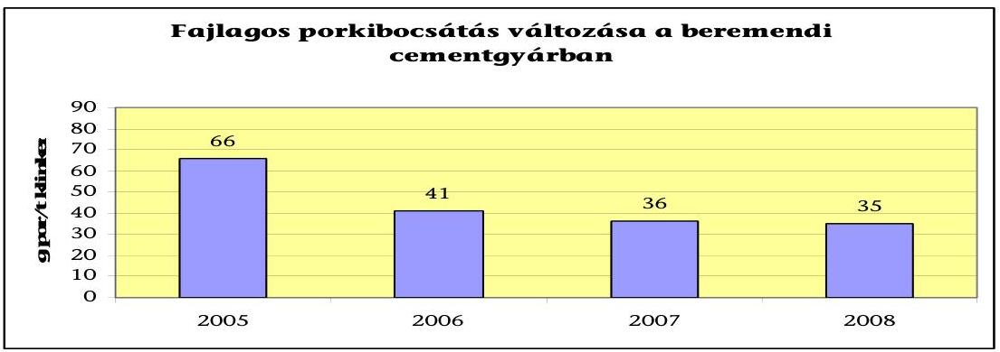

A magas hőmérsékletű égetés velejáró szennyező anyaga az $\mathrm{NO}_{\mathrm{x}}$. ( $\mathrm{NO}, \mathrm{NO}_{2}$ és $\mathrm{N}_{2} \mathrm{O}$ vegyületek). Keletkezett mennyisége a bevitt tüzelőanyagtól nagyrészt független, csökkentésére ammónia vizes oldatát használják.
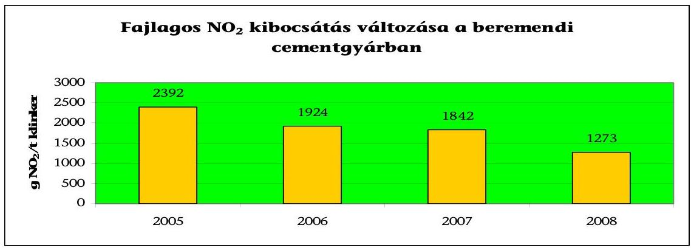

A jelentős légszennyező anyag a $\mathrm{CO}_{2}$. A szén-dioxid-kibocsátás a biomassza tüzelőanyagok arányának növelésével, valamint a cement klinkerhányadának csökkentésével fogható vissza. A létesítmények szén-dioxid kibocsátását ún. kibocsátási egységekkel kell fedezniük, amelyek az államtól származnak és szabadon adhatók-vehetők a kibocsátások teljes lefedése érdekében. A cementiparban az összkibocsátás mintegy kétharmada dekarbonizáció útján keletkező technológiai kibocsátás, amely korlátozott mértékben csökkenthető, mert az a nyersanyag (mészkő) égetésének természetes eredménye.

A 2003-ban elfogadott EU irányelv értelmében, 2005-től az ipari termelők egy meghatározott köre, így az építőanyag ipar is, csak engedély birtokában bocsáthat ki szén-dioxidot.
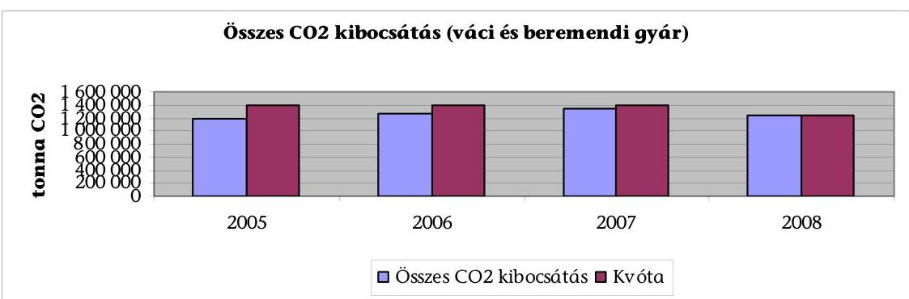

---

A DDCM Kft. kőbányájából a szállítás egy üzemi úton a település elkerülésével történik. A szállítás során, az előírt kibocsátási határérték betartása, illetve csökkentése érdekében a jármúparkot korszerüsítették, a szállítmány kiporzását és a menet közbeni porfelkavarást az út takarításával, illetve nedvesítéssel csökkentik.

# 2.9. Orfü Község Önkormányzata 

Orfü a kevesebb, mint nyolcszáz lelket számláló település a levegőterhelés szempontjából a legkedvezőbb zónába tartozik. A közlekedési eredetű légszenynyezés a járműforgalom nagyságából adódóan nem jelentős. A 2010-ben átadott $20,1 \mathrm{~km}$ Pécs-Orfü-Abaliget kerékpárút, révén a közlekedési eredetű légszennyezés csökkenhet. A településen telemetrikus rendszer segítségével múködő automata levegőminőséget mérő monitorállomás nem múködött.

A Képviselő-testület az Önkormányzat 2005. évben elkészült környezetvédelmi programját elfogadta. Ennek előkészítése során az Önkormányzat a szakhatóságokat, a megyei önkormányzatot előzetes véleménynyilvánításra, jóváhagyását megelőzően a Felügyelőséget véleményezésre nem kérték fel. Helyi rendeletben a háztartási tevékenységgel okozott légszennyezésre vonatkozó egyes sajátos, valamint az avar és kerti hulladék égetésére vonatkozó tevékenységet nem szabályozták.

Orfű területén környezeti levegőminőséget vizsgáló helyi műszer 2004-2010. évek alatt nem múködött, így a határértéket meghaladó mértékű légszennyezettség nem volt megállapítható, a településen az un. "Baranya közép" régió levegőminőségével volt jellemezhető. A RIV részeként Orfű településhez legközelebb Szentlőrincen, illetve Komlón található mérőállomás, ahol nitrogén-dioxid, kén-dioxid és ülepedő por légszennyező komponensek mérése történt.

A megyeszékhely közelsége és Komló város immissziós állapota hatással lehet Orfű levegő minőségére is, de a települést ölelő völgyek zártsága és a Pannon Hőerőmú és a Komlói Fütőerőmú emisszió javulása érdekében megvalósított fejlesztések következtében káros hatás a községben nem érezhető. Az emissziós állapotfelmérés alapján Orfű levegőminősége a kedvező domborzati és légáramlási viszonyai miatt jónak mondható, a levegőminőségét alapvetően a belterületi utak forgalmából, a lakossági fűtésből, kerti hulladék égetéséből és az egyéb tevékenységekből eredő légszennyező anyagok befolyásolják. A számított adatok alapján a kén-dioxid mutatója kedvezőnek tekinthető, a nitrogén-dioxid és az ülepedő por esetében elfogadható volt.

A helyszíni ellenőrzés megállapításainak hasznosítása mellett javasoltuk a jegyzőnek, hogy gondoskodjon, a város környezetvédelmi programjának a Kvtv. betartása érdekében a megyei önkormányzat, illetve a Felügyelet általi véleményezéséről.

### 2.10. Szentlőrinc Város Önkormányzata

Szentlőrinc lakosainak a száma 2010. évben 6962 fő volt. Közlekedésföldrajzi adottságai alapján közúti és vasúti csomópontként egyaránt jelentős szerepet tölt be.

---

A Képviselő-testület 1999-ben fogadta el a település környezetvédelmi programját. Az előkészítés során a szakhatóságokat, a megyei önkormányzatot előzetes véleménynyilvánításra, jóváhagyását megelőzően a Felügyelőséget véleményezésre nem kérték fel. A Képviselő-testület által elfogadott környezetvédelmi programban önálló prioritásként szerepel a légszennyezés elleni védelem. A helyi köztisztasági rendeletben szabályozták az avar és a kerti hulladékégetéssel kapcsolatos előírásokat.

A település egy több mint 1000 méter mélységben fekvő termálvízkincsen fekszik, amelynek a hasznosítása Európai Unió-s források segítségével 2010. év végén a távfűtőmú korszerűsítésével ${ }^{9}$ valósult meg. A geotermikus energia hasznosítása nagymértékben elősegíti a település levegőminőségének javítását. Egy 230 millió eurós beruházás eredményeként 2011. év elején kerül átadásra - a várostól légvonalban három km-re - a Királyegyházán megépült Európa legmodernebb cementgyára ${ }^{10}$.

A város távfűtő rendszerének 2010. évi átalakítása - a gázfűtés kiváltása geotermikus energiával - az energiafelhasználás racionalizálása mellett, jelentősen hozzájárul az üvegházhatású gázok kibocsátásának csökkentéséhez ${ }^{11}$. A vizsgált időszakban a településen helyi környezeti szennyezés csökkentést szolgáló helyi útfejlesztések történtek. A 2004-2010. évek alatt több mint 150 M Ft összegű fejlesztés megvalósulása következtében az összes belterületi út - továbbá a városhoz tartozó külterületen (Tarcsapusztán) lévő utak is - felújított burkolattal rendelkeznek, ezzel hozzájárulva a szilárd porterhelés tekintetében a levegőterhelés csökkentéséhez. A közlekedési eredetű légszenynyezés a településen átvezető 6-os út térségében meghatározó, illetve jelentős mértékű. A Királyegyházán létesülő cementgyár megközelítésére szolgáló Tarcsapuszta - Királyegyháza közötti földút vonatkozásában a környezetvédelmi hatóság intézkedése nyomán a cementgyár beruházója két km hosszú földutat 2010. évben közel 50000 ezer Ft összegből teljesen felújította, kiváltva a városon keresztül történő alapanyag szállítást.

Szentlőrincen a 2004-2010. évek alatt a manuális mérések alapján a határértéket meghaladó mértékű légszennyezettség nem fordult elő. Az állapotfelmérés alapján nincs jelentős emisszió, ezért a levegőminőség jónak mondható. A településen telemetrikus rendszer segítségével múködő automata levegőminőséget mérő monitorállomás nem volt. A levegő minőség mérésének ellenőrzésére a RIV részeként mérőállomás üzemel. A mérőállomás a nitrogén-dioxid, kén-dioxid és ülepedő por légszennyező komponensek mérését végezte el. A település levegőminőségét alapvetően a belterületi utak forgalmából, a lakossági fűtésből és a kerti hulladék égetéséből eredő légszeny-

[^0]
[^0]:    ${ }^{9}$ A gázfűtésre alapuló távfűtőmű 2010. december 20-án átállt a megújulónak számító geotermikus energián - 90 C-os termálvízen - alapuló fűtésre.
    ${ }^{10}$ A cementgyár a legmodernebb emissziós mérőműszerrel van ellátva, amely közvetlenül a kemence kürtőjére van csatlakoztatva és on-line adattovábbításra alkalmas a Felügyelet részére.
    ${ }^{11}$ A városban a manuális mérőműszerrel mért $\mathrm{NO}_{2}$ koncentráció a 2009. évre a 2005. évhez képest $26,2 \%$-kal javult.

---

nyező anyagok befolyásolják. A környezetvédelmi program végrehajtása érdekében a Képviselő-testület köztisztasági, helyi építési, állattartási és szilárd hulladék kezelési rendeleteket alkotott.

A négy év alatt jelentősen csökkent a mérőállomások és a szennyező anyagok mérésének a száma. Ennek hatása a várost is érintette, mert a Szentlőrinc területén található mérőállomáson a 2009. évben már csak a $\mathrm{NO}_{2}$ mérést végeztek. Az ülepedő por mérését a lakosság döntő részének gáztüzelésre való átállása miatt szüntették meg. A megyeszékhely közelsége hatással lehet Szentlőrinc levegő minőségére is, de az uralkodó szélviszonyok (észak nyugatról délkelet felé) és a Pannon Hőerőmű, illetve a PÉTÁV Kft. emisszió javulása érdekében megvalósított fejlesztések következtében ez a városban nem érezhető.

Az állapotfelmérés alapján megállapítást nyert, hogy a településen nagy ipari és mezőgazdasági vállalkozások hiánya következtében - nincs jelentős emisszió Szentlőrinc levegőminősége jónak mondható. A levegő minőségének mérésére az ellenőrzésére a RIV részeként mérőállomás ${ }^{12}$ üzemel. A Szentlőrincen található mérőállomás a nitrogén-dioxid, kén-dioxid és ülepedő por légszennyező komponensek mérését végezte el.

A távfűtés területén a 2004-től a pakura helyett a földgázt alkalmazták, 2010. év végétől pedig a geotermikus energiát, ennek következtében javult a kéndioxid, a szén-monoxid és az egyéb szennyezőanyagok emissziója. A nitrogénoxid és a szén-monoxid szennyezés döntően a helyi közlekedésből származott. A 2004-2010. években a városban a közlekedési eredetű légszennyezés mértékes szintén javult.

A település levegőjének 2006-2009. évi minősítése a manuális mérőhálózat adatai alapján:

| Év | Nitrogén-   dioxid | Kén-dioxid | Ülepedő por | Összesen |
| :-- | :-- | :-- | :-- | :-- |
| 2006 | Kiváló | Kiváló | Jó | Jó |
| 2007 | Kiváló | - | Jó | Jó |
| 2008 | Kiváló | - | - | Kiváló |
| 2009 | Kiváló | - | - | Kiváló |

A környezetvédelmi program végrehajtása érdekében a Képviselő-testület köztisztasági, helyi építési, állattartási és szilárd hulladék kezelési rendeleteket alkotott.

A településen nem jelöltek ki a légszennyezettség szempontjából ökológiailag sérülékeny területet. Az Önkormányzat a 2004-2010. évek során nem múködött együtt közegészségügyi hatósággal a légszennyezettség által a lakosságra gyakorolt káros hatások értékelésében.

Az Önkormányzatot érintően a vizsgált időszakban nem készítettek- levegőminőség javítását célzó intézkedési programot a Korm. rendelet 7. § (7) bekezdése szerint, mert kívül estek a Pécs és környéke zónán és ezért erre nem volt szükség.

[^0]
[^0]:    ${ }^{12}$ Szentlőrinc Munkácsi M. utca 1 szám alatt.

---

# 2.11. Sellye Város Önkormányzata 

Sellye közel 3050 fős település Baranya megyében. A levegő minősége a referencia adatok alapján jónak ítélhető, nagy ipari és mezőgazdasági vállalkozások nincsenek a településen.

A Képviselő-testület a környezetvédelmi programot határozat formájában nem fogadta el, illetve ennek előkészítése során az Önkormányzat a szakhatóságokat, a megyei önkormányzatot előzetes véleménynyilvánításra, jóváhagyását megelőzően a Felügyelőséget véleményezésre nem kérték fel. A 2004. évben elkészített környezetvédelmi programban önálló prioritásként szerepel a légszennyezés elleni védelem. A köztisztasági rendeletben szabályozták az avar és az egyéb kerti hulladék elégetésével kapcsolatos szabályokat.

Sellye területén környezeti levegőminőséget vizsgáló helyi műszer 2004-2010. évek alatt nem múködött, ezért határértéket meghaladó mértékű légszennyezettség előfordulása nem volt megállapítható, a levegőminősége a hozzá legközelebb fekvő és hasonló adottságú és lélekszámú település ( 20 km -re levő Szentlőrinc) a RIV részeként mért adatok alapján volt jellemezhető. (2009-ben már csak a $\mathrm{NO}_{2}$ mérést végeztek) A település levegőminőségét alapvetően a belterületi utak forgalmából, a kerti hulladék égetéséből eredő, valamint - az alacsony a vezetékes gázellátottság miatt - a fával történő lakossági fűtésből származó légszennyezés befolyásolja.

A közlekedési eredetű légszennyezés a településen átvezető út térségében meghatározó, de a jármúforgalom nagyságából adódóan nem jelentős mértékű. A levegőterhelés csökkentése szempontjából kedvező volt a szilárd burkolatú belterületi közutak burkolat felújítása - összességében 110 M Ft értékben (ebből $65,516 \mathrm{M}$ Ft volt a támogatás).
2004. évben az 52 település által a területfejlesztési célok megvalósítására létrehozott Társulás I. elkészítette az Ormánság környezetvédelmi programját, benne szerepelt a Sellye várost érintő program is.

---

A légszennyezéshez kapcsolódó hatósági intézkedések összesített táblázata

|   | Kötelező határozat |  |  | Bírság
(db) | Büntetőeljárás,
szabálysértés
kezdeményezése | Kivetett bírság |  | Befizetett bírság |   |
| --- | --- | --- | --- | --- | --- | --- | --- | --- | --- |
|   | Tevékenység
korlátozása | Tevékenység
felfüggesztése | Végleges bezárás |  |  | db | Ft | db | Ft  |
|  2004 | 4 | 0 | 0 | 314 | 2 | 377 | 1835805162 | 288 | 672694175  |
|  2005 | 16 | 5 | 0 | 271 | 3 | 328 | 1098886535 | 290 | 619142097  |
|  2006 | 3 | 3 | 0 | 249 | 7 | 319 | 1509310136 | 297 | 1711844003  |
|  2007 | 5 | 2 | 0 | 521 | 36 | 588 | 943419261 | 403 | 863908653  |
|  2008 | 1 | 13 | 0 | 388 | 11 | 457 | 770315055 | 326 | 700742992  |
|  2009 | 3 | 11 | 1 | 425 | 1 | 572 | 235281476 | 419 | 150793668  |
|  2010 | 6 | 8 | 0 | 280 | 8 | 329 | 156913561 | 175 | 77948687  |

Forrás: Országos Környezetvédelmi, Természetvédelmi és Vízügyi Főfelügyelőség (készült a regionális felügyelőségek adatainak összegzése alapján) Budapest, 2010.december 09.

---

# A Nemzeti Fejlesztési Terv forrásaiból megvalósuló támogatások 

## Környezetvédelmi és Infrastruktúra Operatív program

## A tervezett támogatási szerződések és tényleges kifizetések aránya

| 1.6. Levegőszennyezés és zajterhelés mérése intézkedések |  |  |  |
| :--: | :--: | :--: | :--: |
| Megkötött támogatási szerződések összege   Mrd Ft | Megkötött   támogatási   szerződések   db | Kifizetett   támogatási   összeg   Mrd Ft | A tervezett és tényleges kifizetés aránya $\%$ |
| 0,31 | 1 | 0,20 | 64,0 |

Az intézkedés céljai a következők voltak:
A települési levegőminőség és környezeti zajállapot folyamatos figyelemmel kísérése.
A szükséges intézkedések megalapozását biztosító mérőhálózat megteremtése.
A levegőszennyezés mérése komponensen belüli projekt eredménye, hogy olyan adatbázis került létrehozásra, amely lehetővé teszi a levegő-minőség alakulásának folyamatos megfigyelését, elemzését. Ezáltal épült ki Budapesten és Miskolcon a szmogriadó rendszer. (Közép-Duna-völgyi, Észak-dunántúli, Észak-magyarországi, és a Közép-dunántúli, Déldunántúli, Tiszántúli kiválasztott mérőállomásai.)

| 1.7. az energiagazdálkodás környezetbarát fejlesztése intézkedések |  |  |  |
| :--: | :--: | :--: | :--: |
| Megkötött támogatási szerződések összege   Mrd Ft | Megkötött   támogatási   szerződések   db | Kifizetett   támogatási   összeg   Mrd Ft | A tervezett és tényleges kifizetés aránya $\%$ |
| 6,02 | 44 | 6,02 | 100,0 |

Az intézkedés két komponensből tevődik össze

- „megújuló energiaforrások felhasználásának növelését" célzó
- energiahatékonyság növelését célzó fejlesztési komponensböl.

Az intézkedés fö célkitűzése az ésszerű energiafelhasználás és fogyasztás, az érintett terület gazdasági szereplőinek bevonásával, elősegítve a megújuló energiaforrások hasznosításának elfogadottságát, a megújuló energia arányának növelését a villamosenergia-termelésben, a hazai vállalások teljesítését.

| 2.1. A főúthálózat műszaki színvonalának emelése intézkedések |  |  |  |
| :--: | :--: | :--: | :--: |
| Megkötött támogatási szerződések összege Mrd Ft | Megkötött   támogatási   szerződések   db | Kifizetett   támogatási   összeg   Mrd Ft | A tervezett és tényleges kifizetés aránya $\%$ |
| 52,63 | 18 | 52,45 | 99,7 |

Az intézkedés 3 komponens mentén került megvalósításra, amelyek a következők:

- Útrehabilitációs program a 11,5 tonnás tengelyterhelés elérése érdekében:

A komponens célja az országos közúthálózat főhálózatának megerősítése, és alkalmassá tétele a 11,5 tonnás tengelyterhelésű járművek közlekedtetésére ${ }^{1,}$ településláncok megközelíthetőségének, közlekedésének javítása.

[^0]
[^0]:    ${ }^{1}$ Európai Tanács 96/53 EC rendeletének megfelelően

---

# - Elkerülő és tehermentesítő utak építése: 

A komponens célja az országos közúthálózat főhálózatának települési szakaszait elkerülő útszakaszok építése, településláncok együttműködésének javítása, a belterületi főforgalmi utak forgalmának csökkentése. Mindkét komponens vonatkozásában célként került rögzítésre az utazási idő csökkentése, utazáskényelem növelése, valamint a balesetek számának és súlyosságának csökkentése.

## - A föúthálózat kapacitásának növelése:

A komponens célja a közúti hálózat fejlesztése, amely eredményeképpen javul az elérhetőség és a közúti baleseti statisztika. Szintén célként került rögzítésre a tervezett kapacitásbővítő útberuházások által a leszakadással fenyegetett régiók és a fejlettebb térségek közötti kapcsolatok, valamint a térségi együttműködésben kiemelt szerepet játszó létesítmények elérhetőségének javítása.

| 2.2. Környezetbarát közlekedési infrastruktúra fejlesztése intézkedések |  |  |  |
| :--: | :--: | :--: | :--: |
| Megkötött támogatási szerződések összege Mrd Ft | Megkötött   támogatási   szerződések   db | Kifizetett   támogatási   összeg   Mrd Ft | A tervezett és tényleges kifizetés aránya $\%$ |
| 14,83 | 6 | 14,52 | 100,0 |

Az intézkedés 2 komponensben valósult meg az alábbi célkitűzések mentén:

## - Az elővárosi közösségi közlekedés fejlesztése

A komponens célja a vasút és közút a szintbeli kereszteződéseik megszüntetése, az érintett vasútvonalakon az ütemes közlekedést szolgáló műszaki feltételek megteremtése, vasútvonalak állomásai parkolási lehetőségeinek javítása, utasforgalmi és utastájékoztatási létesítmények kialakítása.

## - Intermodális központok közlekedési kapcsolatainak fejlesztése

A komponens célja a kombinált szállítás elősegítésével a közúti szállítások vasútra vagy vízi útra terelése, a vasúti és víziúti áruforgalom részarányának növelése, hazánk bekapcsolása a nemzetközi kombinált fuvarozási rendszerekbe, import-export növelése, az intermodalitás fokozásának köszönhetően a légszennyezési és zajterhelési szint csökkentése, a közlekedésbiztonság javítása.

---

# Az Új Magyarország Fejlesztési Terv forrásaiból megvalósuló támogatások 

## KÖZLEKEDÉS OPERATÍV PROGRAM

## 5. Városi és elővárosi közösségi közlekedés fejlesztése prioritásra vonatkozó adatok

| Beérkezett   projektek száma   db | Leszerződött   projektek   száma   db | Jóváhagyott   támogatás   összege   Mrd Ft | Leszerződött   támogatás   összege   Mrd Ft | A kifizetett   támogatás   összege   Mrd Ft |
| :--: | :--: | :--: | :--: | :--: |
| 50 | 12 | 358,52 | 298,08 | 108,83 |

| Leszerződött és   beérkezett projektek   aránya   $\%$ | A leszerződött és a   jóváhagyott   támogatás összegének   aránya   $\%$ | A kifizetett és a   leszerződött támogatási   összeg aránya   $\%$ |
| :--: | :--: | :--: |
| 24,0 | 83,1 | 36,5 |

A prioritás célja a közösségi közlekedés fejlesztése, hatékonyságának, szolgáltatási színvonalának emelése, előnyben részesedése az egyéni közlekedéssel szemben.

## KÖRNYEZET ÉS ENERGIA OPERATÍV PROGRAM

4. Megújuló és energiaforrás felhasználás növelése prioritásra vonatkozó adatok

| Beérkezett   projektek száma   db | Leszerződött   projektek   száma   db | Jóváhagyott   támogatás   összege   Mrd Ft | Leszerződött   támogatás   összege   Mrd Ft | A kifizetett   támogatás   összege   Mrd Ft |
| :--: | :--: | :--: | :--: | :--: |
| 519 | 169 | 21,62 | 12,51 | 3,78 |

| Leszerződött és   beérkezett projektek   aránya   $\%$ | A leszerződött és a   jóváhagyott   támogatás összegének   aránya   $\%$ | A kifizetett és a   leszerződött támogatási   összeg aránya   $\%$ |
| :--: | :--: | :--: |
| 32,6 | 57,9 | 30,2 |

A prioritás azokat az elsősorban önkormányzatok és önkormányzati tulajdonú gazdasági társaságok (pl. távhőszolgáltatók), valamint vállalkozások által megvalósítandó, hőés/vagy villamosenergia-termelésre, valamint bioetanol előállításra fókuszáló projekteket kívánja támogatni, amelyek eredményeként a megújuló energiaforrásokból termelt hő- és villamos energia részaránya a teljes hazai energiafogyasztáson belül növekszik, hozzájárulva a fosszilis energiahordozók felhasználásával járó CO2 kibocsátás mérsékléséhez. A támogatás mértékének megállapításánál figyelembe vesszük - többek között - az adott projekt jövedelemtermelő képességét, megtérülését, költséghatékonyságát, továbbá kiemelt szempont az adott energiaforrás fenntartható módon történő használatának igazolhatósága. A prioritás túlnyomórészt kis-közepes mérető projekteket támogat, az adott projekt megtérülési paramétereitől és a kedvezményezettől függően. 10-85\% közötti arányban.

---

# 4.1. Hő- és/vagy villamosenergia előállítás támogatási konstrukciókra vonatkozó adatok 

| Beérkezett   projektek száma   db | Leszerződött   projektek   száma   db | Jóváhagyott   támogatás   összege   Mrd Ft | Leszerződött   támogatás   összege   Mrd Ft | A kifizetett   támogatás   összege   Mrd Ft |
| :--: | :--: | :--: | :--: | :--: |
| 130 | 41 | 7,21 | 5,80 | 2,69 |

| Leszerződött és   beérkezett projektek   aránya   $\%$ | A leszerződött és a   jóváhagyott   támogatás összegének   aránya   $\%$ | A kifizetett és a   leszerződött támogatási   összeg aránya   $\%$ |
| :--: | :--: | :--: |
| 31,5 | 80,4 | 46,4 |

A támogatási konstrukció 2009. január 31-én megszűnt.
4.2. Helyi hő - és hütési energiaigény kielégítése támogatási konstrukciókra vonatkozó adatok

| Beérkezett   projektek száma   db | Leszerződött   projektek   száma   db | Jóváhagyott   támogatás   összege   Mrd Ft | Leszerződött   támogatás   összege   Mrd Ft | A kifizetett   támogatás   összege   Mrd Ft |
| :--: | :--: | :--: | :--: | :--: |
| 247 | 114 | 6,25 | 4,61 | 0,76 |

|  | A leszerződött és   Jóváhagyott támogatás   összegének aránya   $\%$ | A kifizetett és a   leszerződött támogatási   összeg aránya   $\%$ |
| :--: | :--: | :--: |
| 46,2 | 73,8 | 16,5 |

A támogatási konstrukció célja: Növelni a megújuló energiaforrások hőenergiatermelésben játszott szerepét, az összenergia felhasználásban az arányát. Ösztönözni a helyi energiaigényt helyi, megújuló energiaforrásokból kielégítő beruházások megvalósulását, elsősorban az önkormányzati és non-profit szektor intézményeiben, valamint a lakóközösségek, távfütési rendszerek megújuló energia alapon történő teljes vagy részleges energiaellátását. Vállalkozások esetén is a helyi energiaigény kielégítése az elsődleges cél.

### 4.4. Megújuló energia alapú villamosenergia-, kapcsolt hő és villamosenergia-, valamint biometán termelés támogatási konstrukciókra vonatkozó adatok

| Beérkezett   projektek száma   db | Leszerződött   projektek   száma   db | Jóváhagyott   támogatás   összege   Mrd Ft | Leszerződött   támogatás   összege   Mrd Ft | A kifizetett   támogatás   összege   Mrd Ft |
| :--: | :--: | :--: | :--: | :--: |
| 139 | 14 | 8,14 | 2,09 | 0,32 |

---

| Leszerződött és beérkezett   projektek aránya   $\%$ | A leszerződött és   jóváhagyott támogatás   összegének aránya   $\%$ | A kifizetett és a   leszerződött támogatási   összeg aránya   $\%$ |
| :--: | :--: | :--: |
| 10,1 | 25,7 | 15,3 |

Megújuló energiaforrás alapú villamosenergia, hő- és villamosenergia-előállítás, valamint földgázhálózatba tápláló biometán termelés támogatása. A megújuló erőforrások felhasználásának növelése az összenergia felhasználáson belül. A megújuló erőforrások felhasználásán belül a megújuló erőforrás bázisú villamos es hőenergia részaranyának növelése. Ezen keresztül az üvegházhatású gazok kibocsátásának csökkentese.

# 4.7. Geotermikus alapú hő-, illetve villamosenergia-termelő projektek előkészítési és projektfejlesztési tevékenységeinek támogatási konstrukcióira vonatkozó adatok 

| Beérkezett   projektek száma   db | Leszerződött   projektek   száma   db | Jóváhagyott   támogatás   összege   Mrd Ft | Leszerződött   támogatás   összege   Mrd Ft | A kifizetett   támogatás   összege   Mrd Ft |
| :--: | :--: | :--: | :--: | :--: |
| 3 | 0 |  |  | 0 |

A támogatási konstrukció célja: növelni a jelentős potenciállal bíró geotermális energia hő- es villamosenergia-termelésben játszott szerepét, továbbá az összenergiafelhasználáson belüli arányát. A támogatás révén a hosszú projekt-előkeszítési időszakot finanszírozni nem képes projektgazdák is segítséget kaphatnak projektjeikhez.

## 5. Hatékony energia felhasználás prioritásra vonatkozó adatok

| Beérkezett   projektek száma   db | Leszerződött   projektek   száma   db | Jóváhagyott   támogatás   összege   Mrd Ft | Leszerződött   támogatás   összege   Mrd Ft | A kifizetett   támogatás   összege   Mrd Ft |
| :--: | :--: | :--: | :--: | :--: |
| 1108 | 296 | 28,87 | 14,88 | 4,20 |

|  | A leszerződött és   áváhagyott támogatás   összegének aránya   $\%$ | A kifizetett és a   leszerződött támogatási   összeg aránya   $\%$ |  |
| :--: | :--: | :--: | :--: |
| $26,7 \%$ | $51,5 \%$ | $28,2 \%$ |  |

A prioritás célja: az épületek (különös tekintettel a központi és helyi költségvetési szervek épületeire és az egyéb középületekre, valamint a vállalkozások üzemi és irodaépületeire), továbbá a távhőszolgáltatók és - termelők energia-takarékosság növelésére, az energiahatékonyság javítására irányuló beruházásainak elősegítése, - részben pénzügyi konstrukciókkal történő - támogatása. A prioritás elsősorban kis-közepes méretű projekteket támogat, 10-70\% közötti arányban.

### 5.1. Hatékony energia-felhasználás támogatási konstrukcióira vonatkozó adatok

| Beérkezett   projektek száma   db | Leszerződött   projektek   száma   db | Jóváhagyott   támogatás   összege   Mrd Ft | Leszerződött   támogatás   összege   Mrd Ft | A kifizetett   támogatás   összege   Mrd Ft |
| :--: | :--: | :--: | :--: | :--: |
| 120 | 43 | 2,24 | 2,21 | 1,03 |

---

| Leszerződött és beérkezett   projektek aránya   $\%$ | A leszerződött és   jóváhagyott támogatás   összegének aránya   $\%$ | A kifizetett és a   leszerződött támogatási   összeg aránya   $\%$ |
| :--: | :--: | :--: |
| 35,8 | 98,7 | 46,6 |

Energetikai hatékonyság fokozása (2009. január 31-én MEGSZÜNT a KONSTRUKCIÓ)

# 5.2. Harmadik feles finanszírozás támogatási konstrukcióira vonatkozó adatok 

| Beérkezett projektek száma db | Leszerződött projektek száma db | Jóváhagyott támogatás összege Mrd Ft | Leszerződött támogatás összege Mrd Ft | A kifizetett támogatás összege Mrd Ft |
| :--: | :--: | :--: | :--: | :--: |
| 134 | 123 | 1,62 | 1,57 | 1,20 |

|  | A leszerződött és   jóváhagyott támogatás   összegének aránya   $\%$ | A kifizetett és a   leszerződött támogatási   összeg aránya   $\%$ |
| :--: | :--: | :--: |
| 91,79 | 96,9 | 76,4 |

A támogatási konstrukció célja: Költségvetési szervek, alapítványok és egyházak által fenntartott intézményi épületek harmadik feles finanszírozási konstrukcióban kivitelezett fűtés- és világításkorszerűsítésének támogatása. Az energiahatékonyság növelésével együtt megvalósított megújuló energiaforrások hasznosítását lehetővé tevő kombinált beruházások, illetve komplex (a támogatható tevékenységek között felsoroltak közül egy projekten belül több energiahatékonyság-növelési tevékenységet felölelő) beavatkozások elvégzése.

## 5.3. Épületenergetikai fejlesztések támogatási konstrukcióira vonatkozó adatok

| Beérkezett projektek száma db | Leszerződött projektek száma db | Jóváhagyott támogatás összege Mrd Ft | Leszerződött támogatás összege Mrd Ft | A kifizetett támogatás összege Mrd Ft |
| :--: | :--: | :--: | :--: | :--: |
| 831 | 117 | 22,97 | 9,68 | 1,87 |

|  | A leszerződött és   jóváhagyott támogatás   összegének aránya   $\%$ | A kifizetett és a   leszerződött támogatási   összeg aránya   $\%$ |
| :--: | :--: | :--: |
| 14,1 | 42,1 | 19,3 |

A támogatási konstrukció célja: Központi költségvetési szervek és intézményeik, helyi önkormányzatok, helyi kisebbségi önkormányzatok, a települési önkormányzatok többcélú kistérségi társulásai, az önkormányzatok felügyelete alá tartozó költségvetési szervek és azok intézményei, nonprofit szervezetek, társadalmi szervezetek, egyházi jogi személyek és azok intézményei, köz- és felsőoktatási intézmények, valamint KKV méretű vállalkozások üzemi és irodaépületei épületenergetikai energiatakarékossági célú projektjeinek támogatása. A legkisebb projektek számára automatikus eljárásrenddel, egyszerűsített feltételekkel teremtünk könnyen hozzáférhető forrást az épület felújításokhoz.

---

# 5.4. Távhő-szektor energetikai fejlesztése támogatási konstrukcióira vonatkozó adatok 

| Beérkezett   projektek száma   db | Leszerződött   projektek   száma   db | Jóváhagyott   támogatás   összege   Mrd Ft | Leszerződött   támogatás   összege   Mrd Ft | A kifizetett   támogatás   összege   Mrd Ft |
| :--: | :--: | :--: | :--: | :--: |
| 23 | 13 | 2,02 | 1,40 | 0,93 |

|  | A leszerződött és   jóváhagyott támogatás   összegének aránya   $\%$ | A kifizetett és a   leszerződött támogatási   összeg aránya   $\%$ |
| :--: | :--: | :--: |
| 56,5 | 69,3 | 66,4 |

A támogatás célja: A távhőtermelés és -szolgáltatás primeroldali infrastruktúrájának energetikai korszerűsítése.

## 6. Fenntartható életmód és fogyasztás prioritásra vonatkozó adatok

| Beérkezett   projektek száma   db | Leszerződött   projektek   száma   db | Jóváhagyott   támogatás   összege   Mrd Ft | Leszerződött   támogatás   összege   Mrd Ft | A kifizetett   támogatás   összege   Mrd Ft |
| :--: | :--: | :--: | :--: | :--: |
| 683 | 344 | 6,39 | 5,81 | 3,44 |

|  | A leszerződött és   jóváhagyott támogatás   összegének aránya   $\%$ | A kifizetett és a   leszerződött támogatási   összeg aránya   $\%$ |
| :--: | :--: | :--: |
| 50,4 | 90,9 | 59,2 |

A prioritás célja: a fenntartható (gazdasági, társadalmi, valamint természetes és épített környezetére érzékeny) életmód folytatásához szükséges környezettudatos szemléletmód, értékrend, igény, ismeretek megteremtődjenek elsősorban a lakossági fogyasztókban - azaz kialakuljon a piac keresleti oldalának környezettudatossága. Emellett a környezeti politikák, stratégiák, programok megalapozását, a környezetvédelmi hatósági tevékenység hatékonyságát, valamint az e-kormányzati fejlesztések hatékonyságához szükséges - az EU i2010 Programjában is kiemelten kezelt - tudás társadalmasítását (e-inclusion), s ezáltal a környezeti demokrácia erősítését is szolgáló e-környezetvédelmi fejlesztések (elektronikus környezeti szolgáltatások fejlesztései) is a prioritás tevékenységi körébe tartoznak.

### 7.4. Energetikai projektek előkészítésének támogatási konstrukcióira vonatkozó adatok

| Beérkezett   projektek száma   db | Leszerződött   projektek   száma   db | Jóváhagyott   támogatás   összege   Mrd Ft | Leszerződött   támogatás   összege   Mrd Ft | A kifizetett   támogatás   összege   Mrd Ft |
| :--: | :--: | :--: | :--: | :--: |
| 41 | 11 | 0,47 | 0,47 | 0,15 |

|  | A leszerződött és   jóváhagyott támogatás   összegének aránya   $\%$ | A kifizetett és a   leszerződött támogatási   összeg aránya   $\%$ |
| :--: | :--: | :--: |
| 26,8 | 100,0 | 31,9 |

---

A prioritás célja az OP eredményes és hatékony megvalósítása. A projekt előkészítés keret egyrészt az összetett kidolgozási igényű projektek tervezési és előkészítési munkáinak finanszírozását a szolgálja. Másrészt a megfelelő minőségű és mennyiségű pályázatok beérkezését segítő projektgenerálási és szakértői tevékenységek megvalósítását segíti elő.

# KÖZÉP MAGYARORSZÁGI OPERATÍV PROGRAM 

| Beérkezett   projektek száma   db | Leszerződött   projektek   száma   db | Jóváhagyott   támogatás   összege   Mrd Ft | Leszerződött   támogatás   összege   Mrd Ft | A kifizetett   támogatás   összege   Mrd Ft |
| :--: | :--: | :--: | :--: | :--: |
| 41 | 23 | 2,72 | 2,70 | 0,71 |

| Leszerződött és beérkezett   projektek aránya   $\%$ | A leszerződött és   jóváhagyott támogatás   összegének aránya   $\%$ | A kifizetett és a   leszerződött támogatási   összeg aránya   $\%$ |
| :--: | :--: | :--: |
| $56,1 \%$ | $99,3 \%$ | $26,3 \%$ |

## KMOP-3.3.3. A megújuló energiahordozó-felhasználás növelése

A konstrukció célja a hazai energiahordozó forrásszerkezet kedvező befolyásolása a hagyományos energiaforrásokon felül a megújuló energiaforrások irányában való előmozdulás elősegítésével a villamos energia és hőtermelés tekintetében.
A támogatási konstrukció elsősorban a gazdasági társaságok, a központi költségvetési, valamint a helyi önkormányzati szervek pályázati lehetőségeit segíti elő.

---

# A helyszínen ellenőrzött a légszennyezést, illetve klímavédelmet célzó projektek ellenőrzésének tapasztalatai 

1. Magyar Természetvédők Szövetsége KEOP-6.1.0/B-2008-0002 azonosító számú „Komplex kampány a klímatudatosság növelésére Magyarországon" projekt. ..... 1
2. Vasútegészségügyi Szolgáltató Nonprofit Kiemelten Közhasznú Kft KEOP- 5.1.0-2009-0002 azonosító számú „ A Vasútegészségügyi Kht. Miskolci Egészségügyi Központ Energiahatékonysági fejlesztése és korszerűsítése" projekt. ..... 2
3. Bóly Város Önkormányzat a légszennyezéssel kapcsolatos önkormányzati beruházása ..... 4
4. Somogy Megye Önkormányzatának fenntartásában lévő 5 db intézmény fűtéskorszerűsítése a „Szemünk Fénye Program" keretében ..... 5
5. a Fadd Nagyközség Önkormányzatának fenntartásában lévő 4 db intézmény fűtéskorszerűsítése a „Szemünk Fénye Program" keretében ..... 8
6. PÉTÁV 148 darab hőközpontjának primer oldali változó tömegáramúsítása projekt ..... 9
7. A Szentlőrinc város távfűtő rendszerének átalakítása ..... 11
8. Baranya Megyei Önkormányzat geotermikus fűtés beruházása ..... 12
9. Térinformatikai alapú, légszennyezettségi modellező rendszer tervezése és kifejlesztése Baranya és Somogy megyében és kiemelten Pécsett projekt ..... 14
10. Győr-Gönyű Országos Közforgalmú Kikötő intermodális központ közlekedési kapcsolatainak fejlesztésére ..... 16
10.1. „Önkéntes alapon működő széndioxid semlegesítő rendszer létrehozása a tatabányai kistérségben" projekt ..... 17
11. „Országos Légszennyezettségi Mérőhálózat mérőműszerek, berendezések beszerzése" projekt ..... 18
12. „Levegőt! Kampány az autóhasználat csökkentése és az alternatív közlekedési módok népszerűsítése mellett" projekt ..... 19

## 1. MaGyar TermészETVÉDŐK SzÖVETSÉGE KEOP-6.1.0/B-20080002 AZONOSÍTÓ SZÁMÚ „KOMPLEX KAMPÁNY A KLÍMATUDA TOSSÁG NÖVELÉSÉRE MaGYARORSZÁGON" PROJEKT.

A Magyar Természetvédők Szövetsége (MTSZ) a KEOP-6.1.0/B-2008-0002 „A fenntartható életmódot és az ehhez kapcsolódó viselkedésmintákat ösztönző kampányok (szemléletformálás, informálás, képzés)" programjának keretében pályázott. A pályázatot formai hiányosságok miatt a KvVM Fejlesztési igazga-

---

tósága 3. ebből 2 formai, 1 tartalmi hiánypótlásra szólította fel, tartalmi hiányosság volt, hogy nem minden célcsoportra vonatkozóan határozták meg a hatásosság mérés követelményeit.

A projekt elszámolható költsége 48742234 Ft , a támogatás 46305122 Ft volt. A projekt megvalósítására 2008. 11. 27-én Konzorciumi együttműködési megállapodás jött létre a Magyar Természetvédők Szövetsége, a Csalán Környezetés Természetvédő Egyesület, az E-misszió Természet- és Környezetvédelmi Egyesület között. A klíma törvényjavaslat népszerűsítő munka eredményeként 525 civil szervezet támogatta a kezdeményezést. A politikusi célcsoport elérésére személyes lobbitalálkozókat szerveztek. A tényleges közvetlen elérés 125 képviselővel történt személyes találkozás, ebből 88 képviselő vált támogatóvá. A kampány hatékonyság elemzése, a számszerűsített eredmények tervezett és tényleges értékeit tartalmazó összegzés a jegyzőkönyv mellékletét képezi. (E szerint valamennyi célcsoport körében teljesültek a tervezett eredménymutatók (indikátorok).

A projekt támogatott célja komplex klíma-, és energiatudatossági kommunikációs és társadalmi kampány, ennek számszerúsített eredményei a kampányban elért emberek számában került meghatározásra. A megvalósításban 8 vidéki civil környezetvédelmi szervezet is részt vett, a kampány fő célterülete ezen szervezetek szerinti megyék voltak. A projekt keretében tervezett volt egy médiakampány az érintett megyék helyi sajtójában, közvélemény kutatás a lakosság, illetve kérdőíves felmérés a képviselők körében az éghajlatvédelmi törvény támogatására.

A projekt a közbeszerzési törvény hatálya alá tartozott, ezért az MTSZ egyszerű közbeszerzési eljárást indított (hirdetmény közzétételével, illetve hirdetmény közzététele nélkül), a médiakampányhoz szükséges reklámtervezési (kreatív), kivitelezési és médiavásárlási feladatok elvégzésére, valamint hat regionális koordinátorral, a klímatörvénnyel kapcsolatos kampányhoz szükséges (potenciális) civil szövetségesek feltérképezésére, helyi lakossági tájékoztatásra.

A Közreműködő szervezet, záró ellenőrzése hiányosságot, szabálytalanságot nem állapított meg.

# 2. VASÚTEGÉSZSÉGÚGYI SZOLGÁltATÓ NONPROFIT KIEMELten KöZHASZNÚ KFT KEOP-5.1.0-2009-0002 AZONOSÍTÓ SZÁMÚ „ A VASÚTEGÉSZSÉGÚGYI KHT. MISKOLCI EGÉSZSÉGÚGYI KÖZPONT ENERGIAHATÉKONYSÁGI FEJLESZTÉSE ÉS KORSZERŰSÍTÉSE" PROJEKT. 

A Miskolci Egészségügyi Központ (rendelőintézet) 1965-ben épült, pince, földszint, +3 emelet magasságú lapos tetős épület.

A projekt a KEOP-2007-5.1.0 Energetikai hatékonyság fokozása elnevezésű program keretében benyújtott pályázat célja az épület-határoló szerkezeteinek felújítására - homlokzat hőszigetelésére és a külső nyílászáróinak cseréjére kidolgozott, energia megtakarítást célozta. A fejlesztést megelőzően a nyílászárók ún. kétszárnyú, korszerűtlen faszerkezetű ablakok, a főbejárati nyílászárók,

---

földszinti portálok acélszerkezetű (hőhidas) egy-, vagy kétrétegű üvegezésű ajtók, ablakok voltak.

Az Energia Központ Kht. (Közremúködő szervezet) a 2009. január 5-én benyújtott pályázat az energetikai számítások egyértelműsítésére, egyes projektelemek átnevezésére (pl. vakolási munkák helyett utólagos külső hőszigetelés munkái) hiánypótlására hívta fel a pályázót.

A pályázathoz a közremúködő szakértők által készített megvalósíthatósági tanulmány rögzítette a rekonstrukciót megelőzően, illetve a tervezett hőszigetelést, illetve ablakcserét, felújítást követően, valamint ezek üzemeltetési költségekre gyakorolt hatását. Eszerint a rekonstrukció eredményeként az épület hő vesztesége 114,86 KW-tal (41,5\%-kal), a földgázfogyasztás 34894 m3/ év (hőegyenértékben 1182 GJ/év) mennyiséggel, a fűtési költség 3086654 Ft-tal csökken. A tervezett környezeti terhelés (károsanyag kibocsátás) csökkenés éves szinten: szén-dioxid $\left(\mathrm{CO}_{2}\right)$ csökkenése $66,3 \mathrm{t} / \mathrm{év}$, nitrogén-oxidok $\left(\mathrm{NO}_{\mathrm{x}}\right)$ csökkenése $94,6 \mathrm{~kg} /$ év, kén-dioxid $\left(\mathrm{SO}_{2}\right)$ csökkenés $9,5 \mathrm{~kg} /$ év. A támogatási szerződésben a projekt számszerűsíthető eredményei között a szén-dioxid kibocsátás csökkenése (évi $66 \mathrm{t} /$ év), valamint az energiahatékonyság növelése révén megtakarított éves elsődleges energiahordozó mennyisége (1182 GJ/év).

Az eredménymutatók (indikátorok) tényleges (megvalósult) értékére - a 2010. októberi műszaki átadás miatt - még nem állnak rendelkezésre mért adatok.

A projekt tervezett nettó költsége 35113725 Ft , a vissza nem térítendő támogatás 11861416 Ft volt.

A Vasútegészségügyi Szolgáltató Kft. egyszerű, hirdetmény nélküli tárgyalásos közbeszerzési eljárást indított a kivitelezést két részére bontva, állványozás, vakolás, burkolás, valamint fa ( 194 db ) és fém ( 15 db üvegfal) nyílászárók beépítése a meglévők kibontásával.

Az egy érvénytelen ajánlat mellett 6 érvényes ajánlatban szereplő bruttó ajánlati árak közül a legalacsonyabb árú ajánlatot fogadta el 16,7 millió Ft, illetve 36,4 millió Ft, összesen 53,1 millió Ft vállalkozói díj mellett. Az eredeti szerződésben szereplő egyes munkák elhagyása, a kivitelezési határidők módosítása miatt szerződésmódosításra került sor. Az eredeti szerződése szerinti vállalkozói díj 15,7 millió, illetve 35,6 millió Ft-ra, összességében 51,3 millió Ft-ra csökkent.

A projektet annak megkezdése előtt, vagy a megvalósítás időszakában, valamint a megvalósítást követően (végellenőrzés keretében) nem ellenőrizte sem a közreműködő, sem más külső szervezet. A támogatás kifizetése még nem történt meg. Projekt előrehaladási, záró előrehaladási jelentést a támogatott szervezet nem nyújtott be.

A rendelőintézet fűtéskorszerűsítési munkálataira kiírt közbeszerzési eljárás alapján a szekunder oldal (radiátorcserék) megkötött vállalkozási szerződés szerinti munkák értéke bruttó 16,3 millió saját forrásból finanszírozott.

A támogatott szervezet kérdőívre adott válasza szerint az energiahatékonyság fejlesztését és korszerűsítését szolgáló projektet támogatás nélkül is meg tudta volna oldani.

---

# 3. BÓLY VÁROS ÖNKORMÁNYZAT A LÉGSZENNYEZÉSSEL KAPCSOLATOS ÖNKORMÁNYZATI BERUHÁZÁSA 

Az Önkormányzat geotermikus energia hasznosítási program megvalósítása során, a város belterületén termálkutat létesített. Az 594 - 622 méter között megnyitott termálkútból búvárszivattyú segítségével maximum $20 \mathrm{~m}^{3} / \mathrm{h}, 40^{\circ} \mathrm{C}$ termálvizet - megfelelő kezelést követően továbbítják a fogyasztókhoz. A program I. ütemében az általános iskola egy részét, a műemléki közösségi házat és a könyvtár épületét látták el geotermikus energiával úgy, hogy a létesítményekben padlófűtést alakítottak ki. A hasznosított termálvizet az iskola területén található tanmedencébe vezették, onnan a szennyvízhálózatba került.

A geotermikus energiára alapozott távfűtőrendszer kialakításának II. ütemére az Önkormányzat 2006-ban nyújtott be pályázatot a Környezetvédelem és Infrastruktúra Operatív Program keretében. A fejlesztés konkrét célja az önkormányzati és egyéb közintézmények fosszilis energia felhasználásának megszüntetése, a hőigények megújuló energiával történő ellátása, ezáltal a költségek számottevő csökkentése, a környezet állapotának számottevő javítása, a légköri emisszió csökkentése volt. A projekt eredményeként a távhőrendszer múködtetése során a légköri emisszió 1324,5 t/év $\mathrm{CO}_{2}$-vel, $1,5 \mathrm{t} /$ év $\mathrm{NO}_{\mathrm{x}}$-szel és $1,66 \mathrm{t} /$ év $\mathrm{SO}_{\mathrm{x}}$-szel csökkenthető.

A beruházás előtt 1408,7 t/év $\mathrm{CO}_{2}$ (10,7 t/év villamos energia felhasználás, 1223 t/év a földgáztüzelés, 175 t/év a termálvíz felhasználás), 1,62 t/év $\mathrm{NO}_{\mathrm{x}}(0,02 \mathrm{t} / \mathrm{év}$ a villamos energia felhasználás, $1,6 \mathrm{t} /$ év a földgáztüzelés) és $0,26 \mathrm{t} /$ év $\mathrm{SO}_{\mathrm{x}}$ a villamos energia felhasználás miatt került a levegőbe.

A fejlesztés után $125000 \mathrm{~m}^{3} /$ év termálvizet termelnek ki a kutakból, amely 9,8 $\mathrm{t} /$ év $\mathrm{CO}_{2}$ és $0,063 \mathrm{t} /$ év $\mathrm{CH}_{4}$ kibocsátást eredményez, ami $1,7 \mathrm{t} /$ év $\mathrm{CO}_{2}$ kibocsátással egyenértékű, azaz összesen $11,5 \mathrm{t} /$ év $\mathrm{CO}_{2}$ kibocsátással egyenértékú terhelés éri a környezetet. A távhőrendszer fogyasztóinál $685016 \mathrm{~m}^{3} /$ év földgáz energiahordozó takarítható meg, ennek révén a légköri emisszió csökkenés $1223 \mathrm{t} /$ év $\mathrm{CO}_{2}, 1,6 \mathrm{t} /$ év $\mathrm{NO}_{\mathrm{x}}$ és $0,2 \mathrm{t} /$ év $\mathrm{SO}_{\mathrm{x}}$. A távhőrendszer múködtetéséhez szükséges többlet villamos energia mennyisége $58800 \mathrm{~kW} / \mathrm{h} /$ év. Ennek hatására a légköri emisszió növekedés $61,9 \mathrm{t} /$ év $\mathrm{CO}_{2}, 0,14 \mathrm{t} /$ év $\mathrm{NO}_{\mathrm{x}}$ és $1,66 \mathrm{t} /$ év $\mathrm{SO}_{\mathrm{x}}$.

A projektekre 398,8 millió Ft összköltség mellett 239,3 millió Ft támogatást ${ }^{1}$ biztosítottak. A saját erő biztosítására az EU Önerő Alapjából 95,7 millió Ft-ot nyertek el. A támogatási szerződést három alkalommal a kivitelezési költségek (407,8 millió Ft-ra) növekedése és határidő változás miatt módosították.

A projekt végrehajtása során három közbeszerzési eljárást folytattak le. Vízjogi létesítésre nettó 12 millió Ft, geotermikus energiára alapozott távfűtő rendszer kialakítása termálkutak mélyítésére (nyílt közbeszerzési eljárás) nettó 118,8 millió Ft, valamint a távvezeték építésére (nyílt közbeszerzési eljárás) 247,6 millió Ft nettó szerződéses árért. Ezenkívül a geotermikus energiára alapozott távfűtő rendszer villamos energia ellátására (egyszerű hirdetmény közzé-

[^0]
[^0]:    ${ }^{1}$ A támogatás $45 \%$-a (179,5 millió Ft) Európai Uniós, 15\%-a (59,8 millió Ft) hazai társfinanszírozásból származott.

---

tétele nélküli tárgyalásos eljárás) nettó 24,6 millió Ft szerződéses árért. Két ajánlattevő jogorvoslati kérelemmel a Közbeszerzési Döntőbizottsághoz fordult, de határozathozatala előtt keresetüket visszavonták.

A projekt megvalósítása folyamán nyolc előrehaladási és egy zárójelentés készült.

A támogatási szerződésben meghatározott indikátorok alakulása: földgáz megtakarítás 23290 GJ/év; villamos energia többlet felhasználás 668 GJ/év; Légköri emisszió csökkenése: $\mathrm{CO}_{2} 1324,5 \mathrm{t} / \mathrm{év} ; \mathrm{NO}_{\mathrm{x}} 1,5 \mathrm{t} / \mathrm{év} ; \mathrm{SO}_{\mathrm{x}}-1,4 \mathrm{t} / \mathrm{év}$. Az indikátorok nem output, hanem eredmény jellegűek, így közvetlenül nem a megvalósítás befejeztével, hanem a fenntartási időszakban érvényesülnek. A projekt a pályázatban foglalt tartalommal valósult meg, így az eredmény indikátorok megvalósulása teljesítettként lett feltüntetve.

A projektet a megvalósítás folyamán, illetve befejezését követően $3-3$ alkalommal ellenőrizte külső szervezeta megállapítások alapján a projekt a pályázati dokumentáció és a benyújtott előrehaladási jelentések szerint valósult meg.

# Az indikátorok teljesülését az ellenőrök nem értékelték, mert a teljes fütési idény adatai még nem álltak rendelkezésre. 

A monitoring mutatók teljesülése:

| Mutató | Típus | Vállalt   célérték | Ténylegesen megvalósulr |  |  |
| :-- | :--: | :--: | :--: | :--: | :--: |
|  |  |  | 2009.09.14.   2010.05.31 | Összesen   (naturáli-   ában) | Összesen   (a   célérték   \%-ában) |
| Megújuló energiahordozó   felhasználás növekedése   (GJ/év) | termálvíz | 19098 | 14012 | 14012 | $73,37 \%$ |
| Üvegházhatású gázok   kibocsátás csökkenése (t/év) |  | 800 | 735,63 | 735,63 | $91,95 \%$ |

(Az adatok tört időszakra vonatkoznak. Az indikátorok mérése automatikus mérési rendszerrel történik, a CO 2 számítás a segédlet szerint.)

Az ÁSZ a „Nemzeti Fejlesztési terv végrehajtásának ellenőrzése" tárgyában végzett helyszíni vizsgálat során megállapította, hogy a projekt üzemeltetése az eredetileg tervezettek szerint törénik, így a fejlesztés fenntartható, az önkormányzati intézményeknél egyrészt energia megtakarítás, másrészt kiadás csökkenés realizálódik.

## 4. Somogy Megye Önkormányzatának fenntartásában lévó 5 db intézmény fütéskorszerüsítése a „Szemünk Fénye Program" KERETÉben

A Somogy Megye Önkormányzatának fenntartásába tartozó 45 db intézmény fűtéskorszerűsítése kerül összességében megvalósításra. A vizsgált projekt ezen

---

intézmények közül 5 db intézményre vonatkozik. A teljes beruházást az Önkormányzat kizárólag saját finanszírozással nem tudta volna megvalósítani, ezért az ún. „harmadik feles" megoldást vette igénybe.

Az intézményekre általában jellemző gyenge önrész-finanszírozási képesség és beruházási hajlandóság, ezért a pályázati konstrukció kedvezményezettje nem közvetlenül az intézmény, hanem az ESCO vállalkozás (a harmadik fél).

A végrehajtási mód lényege: az intézmény fenntartója közbeszerzési eljárás útján megrendeli intézményei fútési és/vagy elektromos, világítási rendszereinek korszerűsítését, és ha a korszerűsített rendszer üzemeltetésével is meg kívánja bízni a nyertes ajánlattevőt, az ajánlatkérésben az ajánlati ár részletezését (eszközök utáni fizetett lízingdíj; üzemeltetési díj) is kell kérni az ajánlattevőktől. Feltétel, hogy az éves üzemeltetési díj nem haladhatja meg teljes beruházási költség 3,5\%-át. Az ajánlatban fel kell tüntetni a beruházás eredményeként jelentkező energia-megtakarítást.

A korszerűsítést végrehajtó ESCO vállalkozás és a fenntartó között határozott idejű (5-15) éves bérleti jogviszony jön létre, melynek keretében a vállalkozás saját forrásból a fenntartó intézményeiben megvalósítja a korszerűsítést. A beépített eszközök az ESCO vállalkozás tulajdonát képezik. A bérleti jogviszony időtartama alatt, a fenntartó által fizetendő bérleti díj elsődleges forrása a korszerűsítés eredményeként megvalósuló energia költség csökkenés. A bérleti időszak végén a tulajdonos az eszközök sorsáról szabadon dönthet, azonban a fenntartó részére elővásárlási jogot köteles biztosítani. Ez viszont nem előnyös az Önkormányzat számára, mert a fizetendő bérleti díjon felüli plusz kiadást jelent.

A pályázati forrás bekapcsolása a rendszerbe: A közbeszerzési eljárás nyertes ajánlattevője, vagyis a kiválasztott ESCO vállalkozás pályázatot nyújt be a KEOP-2009-5.2.0/A "Harmadik feles finanszírozás" című pályázati kiírásra.

A "Caminus" Zrt. 2009-ben "Somogy Megye Önkormányzatának fenntartásában lévő 5 db intézmény² fütéskorszerüsítése a "Caminus" Zrt. beruházásaként a "Szemünk Fénye Program" keretében" címen (KEOP-5.2.0/A/09-2009-0018.) pályázatot nyújtott be a Környezet és Energia Operatív Program keretében az Energiagazdálkodás Környezetbarát Fejlesztése érdekében. A projekt összes költsége 191732 ezer Ft, az igényelt támogatás összege 47933 ezer Ft (a tervezett költségek $25 \%$-a) volt, a beruházáshoz biztosított saját forrás összege 143799 ezer Ft volt (ebből 28760 ezer Ft támogatást igénylő pénzbeli hozzájárulás és 115039 ezer Ft bankhitel, amelyet a kedvezményezett "Caminus" Zrt. vett fel). A "Caminus" Zrt. önkormányzatok és intézmények számára előnyös konstrukcióban belsőtéri világítási és fűtéskorszerűsítések elvégzésére jött létre.

A projekt elvárt eredménye az 5 630,0707 GJ/év megtakarított elsődleges energiahordozó, valamint $315,9 \mathbf{t / e ́ v}$ (szén-dioxid) kibocsátás csökkentése. A projektben szereplő intézményeknél az elmúlt években átlagosan felhasznált gázmennyiség $428530 \mathrm{~m}^{3}$ volt. A fűtéstechnikai korszerűsítés ered-

[^0]
[^0]:    2 "Szeretet" Szociális Otthon Berzence, Együtt - Egymásért Szociális és Gyermekotthon Barcs, Park Szociális Otthon Patalom, Somogy Megyei Gyermekvédelmi Központ Kaposvár, 1. sz. Gyermekvédelmi Intézmény Kaposvár

---

ményeként ez $262730,2743 \mathrm{~m}^{3}$-re csökkenhet, ami összesen $\mathbf{3 9 \%}$-os megtakarítás érhető el, azaz átlagosan évente $165619,7257 \mathrm{~m}^{3}$.

A fűtéskorszerűsítés bekerülési költsége nettó 191732 ezer Ft (bruttó 230079 ezer Ft) volt. A beruházás eredményeképpen elő álló tíz éves tervezett megtakarítás ${ }^{3} 248726$ ezer Ft. Ennek eredményeképpen az Önkormányzat számára a fütéskorszerúsítés évente 2492 ezer Ft-ba, illetve tíz évre összesen 24918 ezer Ft-ba kerül. A projekt teljes számított energiaköltség megtakarítása $\mathbf{9 0 , 9 \%}$-ban fedezte a futamidő alatt fizetendő összes bérleti díj összegét. (A bérlet tárgyát képező 10 év alatt zömében leíródott eszközökre az Önkormányzatnak csak az elővásárlási joga biztosított. Ennek következtében a fenti $90,9 \%$-os fedezettség a bérlet lezárulásával csökkenhet, ugyanakkor az emelkedő gázárak viszont javíthatják a fedezettséget.)

A kivitelező kiválasztására 2005-ben központosított közbeszerzési eljárás került lefolytatásra. A közbeszerzési eljárás ajánlatkérője a minisztérium volt, amelyet a Központi Szolgáltatási Főigazgatóság bonyolított le és keretszerződés aláírásával zárult le. A nyertes a "Caminus" Zrt. által vezetett konzorcium.

A pályázat szerint az energia megtakarítás 5631,0707 GJ/év energiahordo-zó-megtakarítás, a környezeti hatás $319,51 \mathrm{t} /$ év üvegházhatású gáz - széndioxid ekvivalens - kibocsátás csökkenés ( $315,9 \mathrm{CO}_{2} \times 1+450,49 \mathrm{NO}_{\mathrm{x}} \times 0,008$ $+45,05 \mathrm{SO}_{2} \times 0=319,51 \mathrm{t} / \mathrm{év})^{4}$.

A projekt alapvető környezetvédelmi célja a légszennyező anyagok keletkezésének csökkentése. Ezt oly módon éri el, hogy az elavult, 60-70\%-os hatásfokkal múködő kazánokat, új 108\%-os hatásfokkal múködő kondenzációs kazánokra cserélték ki, illetve egyéb hatásfokjavító fejlesztéseket valósítottak meg (radiátorok cseréje, termosztatikus radiátor szelepek felszerelése, hőcserélők cseréje), ez által pedig károsanyag-kibocsátás csökkenés következik be. Ennek mértéke a savas eső létrehozásában szerepet játszó kén-dioxid tekintetében mintegy $\mathbf{4 5 , 0 5} \mathbf{~ k g} / \mathbf{e ́ v}$, az üvegházhatású szén-dioxid esetén $315,9 \mathbf{t} /$ év és a nitrogén-oxidok esetében $\mathbf{4 5 0 , 4 9} \mathbf{~ k g} / \mathbf{e ́ v}$.

Előrehaladási Jelentés a megvalósítás rövidsége miatt nem készült. A Zárójelentés elszámolásokhoz kötődően egy hiánypótlást készítettek, amely a beépített eszközök további részletezésére - az egyéb eszközök 5 felé bontására - vonatkozott. Ellenőrzésre egy alkalommal került sor a Közreműködő szervezet részéről szabálytalanságokat nem tapasztaltak.

A projekt végrehajtása hatékony volt, mert a tervezett határidő előtt három hónappal korábban megvalósult.

A projektnél csak részben volt biztosított a monitoring (a folyamatkövető és a záró monitoring) feladat ellátása. A Közreműködő szervezet folyamatosan fi-

[^0]
[^0]:    ${ }^{3}$ A megtakarítás négy elemből tevődik össze: a gázfogyasztás csökkenéséből, alapdíjcsökkenésből (gázmérődíj csökkenésből), egy fő karbantartó létszámcsökkentésből és üzemeltetési díj különbözetből (a karbantartási költségek csökkenéséből).
    ${ }^{4}$ szén-dioxid ekvivalencia számítás

---

gyelemmel kísérte a projekt előrehaladását (a támogatási szerződésben vállalt részteljesítések nyomon követése, a program megvalósítás elveinek és garanciáinak elemzése által), de a program célkitűzéseinek és elért eredményeinek, jellemzőinek összehasonlító elemzésére a folyamatos üzemszerú múködés során kerül sor.

# 5. A FADD NAGYKÖZSÉG ÖNKORMÁNYZATÁNAK FENNTARTÁSÁBAN LÉVŐ 4 DB INTÉZMÉNY FÜTÉSKORSZERÜSÍTÉSE A „SZEMÜNK FÉNYE PROGRAM" KERETÉBEN 

A "Caminus" Zrt. 2009-ben augusztus 7-én pályázatot nyújtott be a Környezet és Energia Operatív Program keretében az Energiagazdálkodás Környezetbarát Fejlesztése érdekében. A benyújtott és elfogadott pályázat "Fadd Nagyközség Önkormányzatának fenntartásában lévő 4 db intézmény ${ }^{5}$ fütéskorszerüsítése a "Caminus" Zrt. beruházásaként a "Szemünk Fénye Program" keretében" címet viselte. (KEOP-5.2.0/A/09-2009-0008.) A projekt összes költsége 47917 ezer Ft, a projekt megvalósításához az igényelt támogatás összege 11979 ezer Ft, a beruházáshoz biztosított saját forrás összege 35938 ezer Ft volt (ebből 7188 ezer Ft támogatást igénylő pénzbeli hozzájárulás és 28750 ezer Ft bankhitel, amelyet a kedvezményezett "Caminus" Zrt. vette fel).

A 4 intézmény által az elmúlt években átlagosan felhasznált korrigált gázköbméter $80505 \mathrm{~m}^{3}$ volt. A fűtéstechnikai korszerűsítés eredményeként, a fűtési rendszer szabványkövetelmények szerinti működtetéséhez a fejlesztést 54620,352 korrigált gázköbméter elegendő lesz. Fenntartói szinten összesen $\mathbf{3 2 \%}$-os megtakarítás érhető el, azaz átlagosan évente $25884,648 \mathrm{~m}^{3}$ gáz takarítható meg. A projekt elvárt eredménye az 54,447 GJ/év megtakarított elsődleges energiahordozó, valamint 49,94 t/év (szén-dioxid) kibocsátás csökkentése. A projekt elindítása a tervezett időpontban történt - 2009. július 6-án -, a befejezése tíz nappal a tervezetthez képest megvalósult (2009. december 31-e helyett 2009. december 21-én).

A fűtéskorszerűsítés bekerülési költsége nettó 47917 ezer Ft (bruttó 57501 ezer Ft) volt. A beruházás eredményeképpen elő álló tíz éves tervezett megtakarítás 33650 ezer Ft. Az Önkormányzat által 10 év futamidő mellett fizetendő bérleti dí havonta bruttó 569904 Ft , melynek eredményeként az Önkormányzat számára a fütéskorszerűsítés évente 3473 ezer Ft-ba, illetve tíz évre összesen 34738 ezer Ft-ba kerül.

A projekt teljes energiaköltség megtakarítása csak 49,2\%-ban fedezte a futamidő alatt fizetendő bérleti díj összegét. Ennek oka, hogy a megtakarítás csak a gázfogyasztás csökkenéséből eredt. A bérleti szerződés megszűnésekor a bérlet tárgyát képező leíródott eszközökre vonatkozóan az Önkormányzatnak csak az elővásárlási joga biztosított. Ennek következtében a fenti 49,2\%-os fedezett-

[^0]
[^0]:    5 "Szeretet" Szociális Otthon Berzence, Együtt - Egymásért Szociális és Gyermekotthon Barcs, Park Szociális Otthon Patalom, Somogy Megyei Gyermekvédelmi Központ Kaposvár, 1. sz. Gyermekvédelmi Intézmény Kaposvár

---

ség tovább csökkenhet, ugyanakkor az emelkedő gázárak viszont javíthatják a fedezettséget.

A Program megvalósítása érdekében indított központosított közbeszerzési eljárás az előző projektnél hasonlóan került lefolytatásra, a nyertes a "Caminus" Zrt. által vezetett konzorcium lett.

A pályázat szerint a projekt energia megtakarításai 54,447 GJ/év energia-hordozó-megtakarítás, a környezeti hatása 49,94 t/év üvegházhatású gáz -szén-dioxid ekvivalens - kibocsátás csökkenés ( $49,37 \mathrm{CO}_{2} \times 1+70,41 \mathrm{NO}_{\mathrm{x}} \mathrm{x}$ $0,008+7,04 \mathrm{SO}_{2} \times 0=49,94 \mathrm{t} / \mathrm{év}$ ).

A projektnél csak részben volt biztosított a monitoring (a folyamatkövető és a záró monitoring) feladat ellátása. A Közremúködő szervezet folyamatosan figyelemmel kísérte a projekt előrehaladását (a támogatási szerződésben vállalt részteljesítések nyomon követése, a program megvalósítás elveinek és garanciáinak elemzése által), de a program célkitűzéseinek és elért eredményeinek, jellemzőinek összehasonlító elemzésére a folyamatos üzemszerú múködés során kerül sor.

# 6. PÉTÁV 148 DARAB HÖKÖZPONTJÁNAK PRIMER OLDALI VÁLTOZÓ TÖMEGÁRAMÚSÍTÁSA PROJEKT 

A PÉTÁV tulajdonosi hányada Pécs Megyei Jogú Város Önkormányzata 51 \%, a Pannonpower Zrt. $49 \%$. A cég alaptevékenysége távfűtés, meleg-víz szolgáltatás és egyéb szolgáltatások. A PÉTÁV jelenleg 31160 lakást lát el távfűtéssel, 502 szolgáltatói hőközponton keresztül (a fogyasztói tulajdonú (nem lakossági) hőközpontok száma 101 db ).

A PÉTÁV 2004-ben nyújtott be pályázatot a Környezetvédelem és Infrastruktúra Operatív Program (Környezetvédelmi prioritás) keretében az Energiagazdálkodás Környezetbarát Fejlesztése érdekében "Pécsi távfütő rendszer, hőközpontok primer oldali változó tömegáramúsitása" címen. (KIOP-1.7.0.-2004-05-0011/3.)

A projekt megvalósításához az igényelt támogatás összege 119755 ezer Ft, a beruházáshoz biztosított saját forrás összege 179633 ezer Ft volt.

A pécsi távhőellátó rendszer eredetileg állandó tömegáramú üzemvitelre épült, ami azt jelenti, hogy a hőteljesítmény szabályozás - a hőigényekhez és az időjáráshoz igazodva - úgynevezett minőségi szabályozással, vagyis a hőhordozó hőmérsékletének változtatásával történt, a keringtetett vízmennyiség változatlan volt. A korszerű megoldás a mennyiségi és minőségi szabályozás kombinált alkalmazása az úgynevezett változó tömegáramú ${ }^{6}$ üzemeltetés.

A támogatás mértéke a tervezett költségek 40\%-a volt.

[^0]
[^0]:    ${ }^{6}$ Az állandó térfogatáramoknál minőségi, azaz hőfokszabályozást valósítanak meg, míg a változó tömegáramoknál a minőségi szabályozás mellett a térfogatáram változtatásával is be lehet avatkozni.

---

A projekt alapvető célja az energiahatékonyság növelése és a légszenynyezö anyagok kibocsátásának kimutatható csökkentése volt.

A 190 MW csúcshőteljesítmény-igényű pécsi távhőszolgáltató rendszerben 2004. áprilisában - 539 hőközpont üzemelt, ezek közül 225 állandó-, 314 változó tömegáramú üzemmódban (akkor még a hőközpontok kétharmada állandó tömegárammal üzemelt). A 148 db legnagyobb teljesítményű hőközpontnak a változó tömegáramú üzemre való átalakításával, csak a 77 db legkisebb teljesítményű hőközpont maradt állandó tömegáramú. A 148 db hőközpontban a kor műszaki színvonalának megfelelő beavatkozó szerelvények és intelligens DDC szabályozás lett kiépítve. A hőközpontok egyéb főberendezései változatlanok maradtak.

A változó tömegáram előnye, hogy a keringetett víztömegáram csökken. A tömegáram csökkenés miatt csökken a szükséges erőműi szivattyúzási munka, ugyanakkor nő az egyidejűleg igénybe vehető rendszerkapacitás, A változó tömegáramú üzem alkalmazásával jelentős keringetési energiamegtakarítás érhető el, mert a keringtetett tömegáram csökkenése villamos energia megtakarítást eredményez. A távfűtési forró víz keringtetésénél megtakarított villamos-energia az erőműrendszerben értékesíthető.

A projekt megvalósítására ezen belül a fő szabályozó elemek ${ }^{7}$ beszerzésére, a közösségi értékhatárt meghaladó nyílt egyfordulós közbeszerzési eljárást hirdettek. Az eljárás kapcsán jogorvoslati eljárást nem kezdeményeztek.

A projekt vissza nem igényelhető általános forgalmi adóval számított összköltsége a tervezettnél 59438996 Ft-tal kevesebb lett a közbeszerzési eljárás eredményeként, összességében 239949402 Ft , a támogatási összeg 95977761 Ft lett, mert a beszerzésre kerülő anyagok vonatkozásában kedvezőbb ajánlatok érkeztek. A második szerződésmódosítás során az általános forgalmi adó elszámolhatósága miatt, a projekt vissza nem igényelhető általános forgalmi adóval számított összköltsége 214657220 Ft , a támogatási összeg 85862888 Ft lett.

A költségcsökkentés társadalmi hatásaként jelentkezik, hogy a távhőszolgáltatásban részesülő emberek nagy része, általában a lakosság kevésbé tehetős részét képviselik.

A pályázat szerint a projekt energia megtakarítása 1676 MWh/év, az erőműrendszerben (11,7 GJ/MWh fajlagos értékkel) kiváltott tüzelő hőfelhasználás 19612 GJ/év, a nyári 3318 GJ nyári többlet-hőveszteség 311 MWh/év többlet kapcsolt villamosenergia-értékesítéssel a Pannon hőerőműben 5994 GJ/év többlet tüzelő hő-felhasználással jár.

A projekt környezeti hatása, hogy forró vízkeringtetésre felhasznált villamos energia mennyiségének csökkenése, a felszabaduló villamos energia

[^0]
[^0]:    ${ }^{7}$ A városi távfűtő rendszer változó-tömegáramúvá alakításához a szelepek, folyamatirányítók, hőmérsékletérzékelők, határoló termosztátok és csőáruk beszerzése 148 db hőközpont átalakításához.

---

mennyiség értékesítése a Hőerőműben nem jár kibocsátás-változással, viszont az értékesített villamos energia nem jár többlettermeléssel. A projekt megvalósítása után az együttműködő villamosenergia-rendszer szintjén tüzelő hőmegtakarítás, ennek következtében, pedig károsanyag-kibocsátás csökkenés következik be. Ennek mértéke a savas eső létrehozásában szerepet játszó kén-dioxid tekintetében mintegy $30 \mathbf{t / e ́ v}$, az üvegházhatású szén-dioxid esetén, pedig $1542 \mathbf{t / e ́ v}$.

| Tervezett kibocsátás változás az erőmű rendszer szintjén |  |  |  |  |  |
| :-- | :--: | :--: | :--: | :--: | :--: |
| Megnevezés | Kén-dioxid | Szén-dioxid | Nitrogén-oxidok | Szilárd | Szén-monoxid |
|  | t/év | t/év | t/év | t/év | t/év |
| Többlet villamos energia   értékesítésből | $-44,9$ | -2119 | -4 | $-1,9$ | $-1,2$ |
| Nyári többlet tüzelőhő   felhasználásból | 14,3 | 577 | 1,5 | 0,4 | 0,8 |
| Többlet kibocsátás | $\mathbf{- 3 0 , 6}$ | $\mathbf{- 1 5 4 2}$ | $-2,5$ | $-1,5$ | $-0,4$ |

A pályázat melléklete tartalmazta a tervezett fejlesztés környezetre gyakorolt hatását, továbbá a környezetvédelmi előnyök és hátrányok bemutatását.

A projekt nyomon követési jelentései alapján a 148 hőközpont változó tömegáramúsításának teljesített energia és környezeti hatásait a 2. számú melléklet tartalmazza. Ezek szerint a 2006-2010. évek között készült négy nyomon követési jelentésben foglaltak alapján a támogatási szerződésben meghatározott indikátorok alakulására vonatkozó teljesítési adatok szerint a rögzített célértékeket a tényleges értékek - számításokkal alátámasztottan meghaladták (a tervezettnél nagyobb emissziós megtakarítás keletkezett).

A projektnél négy alkalommal megkezdés előtt, kivitelezés közben és kétszer teljesítést követően került sor ellenőrzésre, szabálytalanságokat nem tapasztaltak.

A projektnél biztosított volt a monitoring (a folyamatkövető és a záró monitoring egyaránt) feladat ellátása, mely keretében a Közreműködő szervezet folyamatosan figyelemmel kísérte a projekt előrehaladását (a támogatási szerződésben vállalt részteljesítések nyomon követése, a program megvalósítás elveinek és garanciáinak elemzése, a Kedvezményezett által megvalósított program célkitűzéseinek és elért eredményeinek, jellemzőinek összehasonlító elemzése által).

# 7. A SZENTLŐRINC VÁROS TÁVFÜTŐ RENDSZERÉNEK ÁTALAKÍTÁSA 

A távfűtő rendszer 2010. évi átalakítása - a gázfűtés kiváltása geotermikus energiával - az energiafelhasználás racionalizálása mellett, jelentősen hozzájárul az üvegházhatású gázok kibocsátásának csökkentéséhez.

A KEOP-4.2.0/B/09-2009-0026 "Gazdasági és társadalmi megújulás Szentlőrincen" projekt célja a geotermikus energia hasznosítása volt Szentlőrinc távfűtő rendszerében. A beruházás teljes összege elérte az 1,3 milliárd Ft-ot, amelyből a támogatás 441673 ezer Ft volt. A fejlesztés eredményeképpen vár-

---

ható számított átlagos éves üvegházhatású gáz, illetve káros anyag kibocsátás csökkenés ${ }^{8}$ a távfűtés projektnél:

Adatok: $\mathrm{CO}_{2}$ ekv t-ban

| Szennyező anyag | Kibocsátás csökkenés |  |  |
| :-- | --: | --: | --: |
|  | Földgáz kiváltása | Villamos energia   többlet fogyasztás | Összesen |
| $\mathrm{CO}_{2}$ | 1673,18 | $-83,7$ | 1589,48 |
| $\mathrm{NO}_{x}$ | $2237(17,9)$ | $-0,054(-0,432)$ | $2183(17,468)$ |
| $\mathrm{SO}_{2}$ | 0,239 | $-0,036$ | 0,203 |
| szilárd szennyező | - | $-0,0018$ | $-0,0018$ |
| $\mathbf{C O}_{2}$ ekvivalens | 1691,08 | $-84,13$ | $\mathbf{1 6 0 6 , 9 5}$ |

A projekt megvalósulásának eredményeként az üvegházhatású gázok kibocsátás csökkenésének várható éves átlaga $1606,95 \mathbf{t} \mathbf{C O}_{2}$ ekv/év. A beruházás várható időtartalma 45 év lesz.

# 8. BARANYA MEGYEI ÖNKORMÁNYZAT GEOTERMIKUS FÜTÉS BERUHÁzása 

A helyszíni ellenőrzés a KEOP-4.1.0-2009-0037. számú „A régi Vármegyeháza épületegyüttesének geotermikus hőellátása" elnevezésű projektre terjedt ki.

A BMÖ Közgyűlése 2008-ban tárgyalta azt az előterjesztést, amely szerint a Pécs, Papnövelde u. 5. szám alatti épület rekonstrukciója tervezési feladatait ellátó kft. megvizsgálja az ingatlanban a geotermikus energia hasznosításának lehetőségét. A tervezők olyan rendszert dolgoztak ki, amely révén „öko-múzeum" jöhet létre, vagyis a hűtési-fűtési rendszer geotermikus energiával biztosítható, a csapadékvíz gyűjtése és újrahasznosítása valósul meg, az építészeti, gépészeti megoldások a környezettudatosság, az épület energetikai adottságai alapján kerülnek kidolgozásra. A rekonstrukció - öko-múzeum változat esetén - bekerülési költsége bruttó 1046 millió Ft, amely 143,2 millió Ft többletforrás biztosítását igényli a BMÖ részéről.

A terület vízadó képességére vonatkozóan időközben történt egy felmérés, azaz egy kutatófürást mélyítettek. A pontos vízmennyiség mérésre technikailag nem volt lehetőség, a tapasztalatok alapján több száz liter volt a víztermelés. Ezekre a rétegekre korábban több nagy vízigényű vízellátó rendszert telepítettek (Zsolnay gyár, Bőrgyár). A fúrás részletes adatairól dokumentum nem állt rendelkezésre.

A BMÖ a 2009-ben pályázatot nyújtott be „A Régi Vármegyeháza épületegyüttesének geotermikus höellátása" címmel a KEOP-4.1.0. Hő- és/vagy villamosenergiaiőállítás támogatása megújuló energiaforrásból pályázati felhívásra.

[^0]
[^0]:    ${ }^{8} \mathrm{~A} \mathrm{NO}_{x}$ kibocsátás csökkenésénél zárójelben szerepelnek a $\mathrm{CO}_{2}$ ekvivalens értékek.

---

A projekt adatlap szerint, a fejlesztés eredményeként az energiafüggőség minimálisra, illetve a közvetett CO2 kibocsátás nagymértékben csökkenthető. A rendszer az épület hűtésén-fűtésén túl egyéb, kiállítási funkciót ellát majd: a múzeum látogatói interaktív módon megismerkedhetnek a működéséhez megújuló erőforrást felhasználó alternatív fűtési technológiával.

A villamos energia felhasználás a fejlesztés előtt 794976 kWh/év, a fejlesztés után 172820 kWh/év, a megtakarítás 622156 kWh/év (ami 78,3\%-kal kevesebb, mint a fejlesztés előtt). A megújuló geotermikus energia 2000 GJ/év, valamint hőszivattyúk révén 700 GJ/év. Az élettartam alatti $\mathrm{CO}_{2}$ kibocsátás csökkenés $10603 \mathrm{t}, \mathrm{CO}_{2}$ kibocsátás fajlagos költsége 15195 $\mathrm{Ft} / \mathrm{t}$, az éves $\mathrm{CO}_{2}$ kibocsátás csökkenés $353,4 \mathrm{t} /$ év ( $82,1 \%$ ), a beruházási költségre vetített éves $\mathrm{CO}_{2}$ kibocsátás csökkenés $2,2 \mathrm{t} / \mathrm{CO}_{2} /$ év/millió Ft.

Az Energia Központ Kht., mint közreműködő szervezet hiányosságokat tárt fel, a hiánypótlást teljesítették.

Módosítani kellett a projekt kezdési dátumát, nem vették figyelembe a szélenergia hasznosításával kapcsolatos megtakarításokat, nem jól számították a károsanyag emisszió változását, az indikátorok kiinduló értékét, a költség funkció táblázat de minimis értéket tartalmazott, nem jól számították a támogatási összegre vetített fajlagos mutatókat, a megvalósíthatósági tanulmány nem volt összhangban az „Útmutató a megvalósíthatósági tanulmány elkészítéséhez" című segédletben előírt tartalommal.

A projekt megvalósításának tervezett költsége 161,1 millió Ft, az igényelt támogatás összegét 80,6 millió Ft. Az Energia Központ Nonprofit Kft. döntése alapján a projekt 77,4 millió Ft csökkentett összegű támogatásban részesült, a projekt elszámolható költsége 154,8 millió Ft-ra módosult.

A BMÖ kérelmezte a szerződéskötésre rendelkezésre álló 60 napos határidő 45 nappal történő meghosszabbítását, mert a fúrási eredmények nem a tervezettnek megfelelő értéket mutatták, és a szakértői vizsgálat lezárásáig a támogatási szerződésben foglalt eredeti paraméterek megvalósítása nem volt vállalható.

A beruházás területén két furatot (F-1 és F-2 jelűt) mélyítettek. A fúrást végző szerint az F-1. és F-2. jelű esetében vízbeáramlás a fúrás során 15 - 20 méter között volt észlelhető, hozama nem volt több egyiknél sem 10 - 15 l/percnél, az utóbbinál a vízbeáramlást 16,0 méter alatt elnyelte a réteg.

Az előzetes mérnöki vélemény szerint, ha a kutakban nincs víz, illetve nem lesz geotermikus hőforrás, át kell tervezni a teljes hűtés-fűtésszellőző rendszert. Lényegesen magasabb üzemeltetési költségek várhatóak a teljes élettartam során.

A BMÖ Fejlesztési és Projekt csoportja a műszaki tartalom módosítását kérte, de az Energia Központ Nonprofit Kft. szerint a technológia módosítása esetén akkor van lehetőség az eredeti pályázat támogatására, amennyiben az érintett változás egyebekben megfelel a pályázatban vállaltaknak. A vállalt indikátorok 10\%-nál nagyobb mértékben nem csökkenhetnek, és az új technológiával megvalósított beruházásnak a pályázatban leírt technológia paramétereit teljesíteni kell. A BMÖ ezért a támogatási szerződés megkötésétől elállt.

A geotermikus kutakkal kapcsolatos mérnöki állásfoglalás szerint a kivitelező a vállalkozási szerződésben foglalt feladatát nem teljesítette, ezért számára a ku-

---

tak fúrásához kapcsolódó ajánlati ár erre vonatkozó része szerint nem jár. (A geotermikus kutaknak $500 \mathrm{l} /$ perc vízhozamot kellett volna biztosítani, ehelyett minimális vízhozam jelentkezett, az egyik kútnál 5-10 l/perc vízhozam mutatkozott.) A vállalkozási szerződésben a kútfúrás teljes ára 85,8 millió Ft, a kútfej, gépészet, bekötés 22,2 millió Ft összeggel szerepelt.

A FIDIC a számlázható költségekre összesen 23,4 millió Ft-ot tartott műszakilag indokoltnak, az előrehaladási jelentés módosított indikátor táblázatában az elvégzett munkákra 21,3 millió Ft-ot állítottak be. Ez a műszakilag elfogadhatónak tartott összeg 2,1 millió Ft-tal eltér, amelyet a BMÖ Hivatalánál nem tudtak indokolni.

A geotermikus kutak fúrását hatósági engedély alapján kezdték el, feltételezhető volt, hogy a Dél-Dunántúli Környezetvédelmi, Természetvédelmi és Vízügyi Felügyelőség is víznyerésre alkalmasnak ítélte a helyszínt.

# 9. TÉRINFORMATIKAI ALAPÚ, LÉGSZENNYEZETTSÉGI MODELLEZŐ RENDSZER TERVEZÉSE ÉS KIFEJLESZTÉSE BARANYA ÉS SOMOGY MEGYÉBEN ÉS KIEMELTEN PÉCSETT PROJEKT 

A légszennyezettség legjelentősebb forrása a közlekedés és az ipari eredetű szennyezés, ezért a helyi levegővédelmi követelmények szabályozására a Közgyűlés megalkotta a levegővédelmi rendeletet, amelynek célja a környezeti levegő minőségének tartós és hatékony megóvása, javítása, a légszennyezettségi határérték túllépések megakadályozása, az emberi egészség védelme. Az Önkormányzat 2005 és 2010 közötti időszakra szóló környezetvédelmi programja a levegőminőség javításával kapcsolatban meghatározta az elérni kívánt célokat és az ehhez szükséges feladatokat. A program a környezetbiztonsággal kapcsolatos része többek között az alábbi feladatokat írta elő a városnak a lakosságot és a környezetet veszélyeztető váratlan eseményekkel szembeni védekezőképességének növelése érdekében:

- a környezetbiztonság egységesített városi intézmény- és informatikai rendszerének kialakítása az országos hálózathoz illeszthető módon;
- környezeti monitoring rendszer: a város környezeti állapotának ismeretéhez nélkülözhetetlen állapotjellemzők meghatározásához szükséges adatok egységes rendszerben való előállítása és feldolgozása;
- a monitoring rendszer kialakításának elvei, mintavételi program (levegő, víz, zaj, természetvédelmi területek).

A helyszíni ellenőrzés a KEOP-6.3.0/2F-2009-0001. számú „Térinformatikai" alapú, légszennyezettségi modellező rendszer tervezése és kifejlesztése Baranya és Somogy megyében és kiemelten Pécsett" elnevezésű projektre terjedt ki.

[^0]
[^0]:    ${ }^{9}$ A térinformatika a térbeli, térképi numerikus adatok és a hozzá tartozó attribútum adatok egységes tárolási, kezelési, lekérdezési lehetőségét eredményezi a GIS segítségével. A GIS (Geographical Information System - Földrajzi Információs Rendszer) a térin-

---

Pécs légszennyezettségi helyzetének folyamatos mérését, monitoringját a DDKTVF látja el együttmúködve a régió önkormányzataival. A tevékenység elsősorban a szennyezettségi állapot mérésére koncentrált, a lakosság valós idejű tájékoztatása igen korlátozott módon valósult meg. A projekt megvalósítása keretében az Önkormányzat feladata a lakossági tájékoztatást, publikációt végző informatikai rendszer beszerzése, üzemeltetése, az adatok fogadását, feldolgozását, modellezést végző informatikai rendszer, az immissziómérő konténerek (fix telepítésű és mobil) mérőrendszerei felújításához mérőeszközök és egyéb segédberendezések beszerzése. A DDKTVF feladata az adatok fogadását, feldolgozását, modellezést végző informatika rendszer létrehozása, üzemeltetése, az immissziómérő konténerek (fix telepítésű és mobil) mérőrendszereinek felújítása, a pályázat keretében beszerzett mérőeszközök és egyéb segédberendezések üzemeltetése.

A projekt előterjesztése szerint országos összehasonlításban Pécs a levegőszennyezettséggel leginkább terhelt települések sorába tartozik. A projekt célja egy térinformatikai alapú, légszennyezettségi modellező rendszer tervezése és kifejlesztése Baranya és Somogy megyékben. A rendszernek lakossági eredetű ipari források közlekedési eredetű források (közút, vasút) emissziós adatait kell az AerMod modell számára megfelelő formátumba alakítani.

A projekt megvalósítási munkáinak bruttó összköltsége 230,2 millió Ft, a támogatás mértéke az elszámolható összköltség 100\%-a.

A projektmenedzseri szolgáltatás ellátására, illetve ehhez kapcsolódóan a pályázat elkészítésére, a kivitelező cég kiválasztására egyszerű beszerzési eljárást folytattak le, a nyertes 5 M Ft vállalási ár mellett bízták meg. A Közgyűlés 2010-ben bruttó 207,5 millió Ft ajánlati ár mellett választotta ki a kivitelezőt.

A projektet a megvalósulás folyamatában sem a pályáztató, sem más külső szervezet a helyszínen nem ellenőrizte. A végrehajtás során két előrehaladási jelentés készült, ezeket a Közreműködő szervezet elfogadta. A rendszertervezés részeként a Vállalkozó összegyűjtötte, rendszerezte az Önkormányzattal és a DDKTVF-fel készült interjúk alapján a rendszerrel szemben támasztott szakmai és informatikai igényeket. Megkezdték az E.ON adatok beszerzésére irányuló egyeztetéseket, azonban a kapcsolatfelvétel és a tárgyalások a szolgáltató bonyolult belső felépítése miatt körülményesen haladtak, ezért az adatok beszerzése nem valósult meg a tervezett időpontban.

Pécs város és a térség emissziós adatbázisának kialakításához szükséges volt Baranya és Somogy megye területére a lakossági gázfelhasználási adatok beszerzése. Baranya és Somogy megyében az E.ON Dél-dunántúli Gázhálózati Zrt., illetve az E.ON Közép- dunántúli Gázhálózati Zrt. a szolgáltató. A földgázellátásról szóló 2008. évi XL. törvény értelmében a földgázelosztó, jelen esetben az E.ON tartja nyilván az elosztóvezetékekről vételező felhasználási helyeket, valamint azok jellemző és előírt adatait. A modellező rendszer múködéséhez
formatika eszköze, amellyel a földrajzi helyhez köthető adatokat tartalmazó adatbázisból információk vezethetők le.

---

szükséges vizsgálati területek olyan földrajzi területeket foglalnak magukba, ahol földgáz elosztói engedéllyel a nevezett gázszolgáltatók rendelkeznek kizárólagosan.

A hardver- és szoftvereszközöket, a meteorológiai és térképi adatokat a vállalt határidőben (2010. május 14.) leszállították. Folytatódott az E.ON adatokra vonatkozó egyeztetés, melyet két eljárásban folytattak le. Az adatok beszerzésére irányuló szerződést az Önkormányzat, valamint az E.ON Dél-dunántúli Gázhálózati Zrt., illetve az E.ON Közép- dunántúli Gázhálózati Zrt. között 2010. augusztus 31 -én írták alá.

Az Önkormányzat a projekt megvalósítása során vállalta, hogy a projekt magas színvonalon történő megvalósítása érdekében a megvalósítás minőségbiztosításával egy szervezetet bíz meg. A meghívásos beszerzési eljárás során három szervezettől kértek ajánlatot, a szerződést a legkedvezőbb ajánlati árat tevő társasággal kötötték meg nettó 3,5 millió Ft összegben.

A projekt megvalósítása a támogatási szerződésben foglaltaknak megfelelően történik, és várhatóan 2011. február 28-ára, a szerződésben vállalt határidőre befejeződik.

# 10. Győr-Gönyú Országos Közforgalmú KiKötő intermodális KÖZPONT KÖZLEKEDÉSI KAPCSOLATAINAK FEJLESZTÉSÉRE 

A KIOP 2.2 „környezetbarát közlekedési infrastruktúra fejlesztése" intézkedés 2.2.2 „intermodális központok közlekedési kapcsolatainak fejlesztése" komponensének keretében az Észak-dunántúli Környezetvédelmi és Vízügyi Igazgatóság (ÉDUKÖVIZIG) pályázott a Győr-Gönyű Országos Közforgalmú Kikötő intermodális központ közlekedési kapcsolatainak fejlesztésére, továbbá a MAHART Szabadkikötő Zrt. nyújtott be 2 pályázatot a Csepeli Szabadkikötő fejlesztésére.

A komponens legnagyobb értékű projektjének, a Győr-Gönyű Országos Közforgalmú Kikötő beruházásnak az eredményeként kiépült a kikötő vasúti összeköttetése a Budapest-Bécs vonallal. Megvalósult a vasút és az 1. sz. főút szintbeli kereszteződésének kiváltása közúti felüljáróval, valamint egy 26,7 ha, gazdasági terminálként hasznosítandó terület kialakítása, közművesítése, kikötői belső úthálózat kiépítése.

A 8,03 Mrd Ft szerződött összegből 7,875 Mrd Ft kifizetésre került. A projekt múszaki tartalma megvalósult, ugyanakkor jelenleg nem múködik, mert a megépült vasútnak nincs üzemeltetője. A minisztériumi döntés alapján eredetileg kijelölt MÁV Zrt. nem lett üzemeltető, a más üzemeltető kiválasztásához szükséges közbeszerzési eljárás lefolytatásához - amely az MNV Zrt. hozzájárulásával történhet - azonban nem adott minden szükséges feltétel, mert nem történt meg a vasúti pálya alatt fekvő ingatlanok vagyonkezelői jogának rendezése.

Egy érintett ingatlan részlet termőföldnek minősül, amivel kapcsolatban nem tisztázott még, hogy a Nemzeti Földalap vagyoni körébe tartozik-e vagy sem.

---

A projekt lezárásához - a működőképességének biztosításához - ütemterv készült, melyet az NFÜ Közlekedési Programok Irányító Hatóságának vezetője 2010. szeptember 22-én elfogadott. Az ütemterv egyfelől a működtetéssel és az üzemeltetéssel, másfelől a KIOP indikátorok teljesítésével és a projekt keretében elkészült kikötői létesítmények hasznosításával kapcsolatban határozott meg feladatokat.

A működtetés és üzemeltetés körében a legkésőbbi határidő 2010. december 15. volt (KIOP Támogatási Szerződés módosítása az addig bekövetkezett változásoknak megfelelően). A KIOP indikátorok teljesítésével és a létesítmények hasznosításával kapcsolatban a legutolsó határidő 2011. február 28. volt (a KIOP indikátorok teljesítéséhez szükséges intézkedések megvalósításának ütemezett elindítása 2010. december 31-i határidőre elkészítendő koncepció alapján).

A 2011. február 24-i állapot szerint ${ }^{10}$ az ütemterv 10 feladata közül 2 teljesült (a projekt keretében megvalósult 1. sz. fóút korrekció és híd vagyonkezelői jogának átadásához elvégzendő feladatok, valamint az MNV Zrt. részére előírt adatszolgáltatás). A tájékoztató levél összefoglalóan megállapítja, hogy „a vasút üzemeltetési pályázat MNV Zrt. általi jóváhagyása tovább csúszhat a MÁV Zrt. - ÉDUKÖVIZIG közötti osztott vagyonkezelői szerződés kapcsán érintett, vélhetően a Nemzeti Földalapba tartozó ingatlan kérdéskörének rendezése miatt".

A projekt jelenlegi állapotában nem megtérülő, így a támogatás szabálytalan felhasználása miatt fennáll a kockázat, hogy a támogatást vissza kell fizetni.

# 10.1. „Önkéntes alapon múködő széndioxid semlegesítő rendszer létrehozása a tatabányai kistérségben" projekt 

Magyarországon 2007-től települési klímaprogramok indultak, azzal a célkitűzéssel, hogy hozzájáruljanak a légszennyezés csökkentéséhez, valamint a városi autonómia növekedéséhez. A programok célja a klímatudatosság népszerűsítése volt annak a ténynek a felismerése mellett, hogy a felsőbb kormányzati szinten tett intézkedések önmagukban semmit nem érnek, ha alsóbb, települési szinteken nincs változás. 2007-től Tatabánya Megyei Jogú Város is tagja lett a Klímabarát Települések Szövetségének.

A vizsgált projekt létrejöttének alapját a KEOP 6. „A fenntartható életmód és fogyasztás" prioritása szolgáltatta, amelynek 1. konstrukciója volt a „A fenntartható életmódot és az ehhez kapcsolódó viselkedésmintákat ösztönző kampányok (szemléletformálás, informálás képzés)". A nyertes projekt a KEOP-6.1.0/B-2008-0016. azonosító számú, Önkéntes alapon müködő széndioxid semlegesítő rendszer létrehozása a Tatabányai Kistérségben elnevezést kapta.

A helyszíni ellenőrzés keretében vizsgált, KEOP-6.1.0/B-2008-0016. azonosító számú projekt megvalósítását konzorciumi megállapodás keretében Tatabánya Megyei Jogú Város Önkormányzata, valamint az Első Magyar

[^0]
[^0]:    ${ }^{10}$ A KIOP programigazgató tájékoztatása az NFÜ KözOP IH részére az ütemtervben foglalt feladatok előrehaladásáról.

---

Karbonsemlegesítő Intézet Nonprofit Közhasznú Kft. vállalta. A projekt indításának tervezett időpontja 2009. július 1, a fizikai megvalósításé 2010. június 30. volt.

A projekt egyik célja egy szén-dioxid kalkulátor elkészítése volt, amely a Tatabánya Megyei Jogú Város Önkormányzata honlapján 2010 januárja óta működik. A kalkulátorral kiszámítható egy háztartás adott időszakbeli vagy egy gépkocsival tett utazás szén-dioxid kibocsátása, „széndioxid lábnyoma". A projekthez tartozott még egy tájékoztató kisfilm bemutatása a honlapon, figyelemfelhívó rádiós és televíziós kampányok és játékos vetélkedők szervezése és megtartása, valamint reklámok bemutatása, fali plakátok, szóróanyagok készítése. A projekt befejező szakaszában kapott helyet az előadások, rendezvények, a sajtótájékoztatók, valamint a záró rendezvény megtartása.

A projektben meghatározott részcélok lefedték az ÚMFT-ben és a KEOP-ban rögzítetteket. Az indikátorokkal mért vállalások a rövid aktív elérések esetében 93,7\%-ra, a rövid passzív elérések vonatkozásában 100\%-ra, a hosszú passzív eléréseknél 100\% fölött teljesültek.

Az igényelt, vissza nem térítendő támogatás összege bruttó $10,5 \mathrm{M} \mathrm{Ft}$, a teljes bruttó megvalósulási költség 11,056 M Ft volt. Előleg átutalására 3,7 M Ft öszszegben került sor. A támogatási összegek utalásai a kifizetési ütemterv alapján valósultak meg.

Hiánypótlás a projekt időtartama alatt 2 alkalommal történt. A Támogatási Szerződéshez benyújtott 2. és 3. sz. Kifizetési Kérelemmel kapcsolatosan a KvVM Fejlesztési Igazgatóság (KvVM FI), mint KSZ egyes tételek elszámolhatóságát kifogásolta. A hiánypótlást követően Kedvezményezett a hiányosságokat pótolta, a formai és tartalmi hibákat javította.

# 11. „ORSZÁGOS LÉGSZENNYEZETTSÉGI MÉRŐHÁLÓZAT MÉRŐMŰSZEREK, BERENDEZÉSEK BESZERZÉSE" PROJEKT 

A KEOP-6.3.0-KMOP-3.3.4./1F-2008-0036-os azonosító számú projekt a KEOP „Környezetvédelmi célú informatikai fejlesztések a közigazgatásban (ekörnyezetvédelem)" prioritásának keretében részesül támogatásban.

A projekt legfontosabb célja a levegő védelmével kapcsolatos egyes szabályokról szóló 21/2001. (II. 14.) Korm. rendelet 23. § (1) bekezdés l) és n) pontjában meghatározottak megvalósulásának elősegítése, 176 db új mérő és kalibrációs eszköz beszerzése, 31 db új mérőpont létesítése, valamint az informatikai rendszer továbbfejlesztése.

Az előkészítő munkák tervezett kezdete 2009. március 20-a, a pályázat benyújtásának tervezett ideje 2010. március hó volt. A projekt befejezését 2011. decemberre határozták meg. A pályázat kétfordulós, jelenleg is folyamatban van, az első, előkészítő szakasz lezárult.

A projekt tervezett összköltsége bruttó 1,1 Mrd Ft, amelyből a támogatási összeg 1,02 Mrd Ft. Az előkészítés összköltségeként bruttó 39,2 M Ft-ot irányoz-

---

tak elő, ebből bruttó $36,3 \mathrm{M}$ Ft az elszámolható támogatási összeg ( $92,6 \%$ ), a különbözet $2,9 \mathrm{M}$ Ft saját forrás, amely a teljes támogatási összeg 7,4\%-a.

Szerződésmódosítás az előkészítési szakaszban négy alkalommal történt. A projekt közbeszerzését központosított közbeszerzési eljárás keretében bonyolították le további, a KvVM által beadott projektekkel együtt.

A projekt előkészítő szakasza lezárult. A záró elszámolás költségeit a közreműködő szervezet elfogadta $36,3 \mathrm{M}$ Ft összegben, a támogatási összeg átutalása megtörtént. Támogatott a záró projektjelentést elkészítette, és azt a közreműködő szervezet részére megküldte.

A projekt második fordulójának pályázatbeadásához kapcsolódó Bíráló Bizottsági ülés megtartására még nem került sor.

# 12. „LEVEGŐT! KAMPÁNY AZ AUTÓHASZNÁLAT CSÖKKENTÉSE ÉS AZ ALTERNATÍV KÖZLEKEDÉSI MÓDOK NÉPSZERŰSÍTÉSE MELLETT" PROJEKT 

A Kék Planéta Alapítvány által benyújtott, KEOP-6.1.0/B/09-2010-0059. azonosító számú projekt célja a környezettudatosságának, felelősségérzetének növelése a gépjárművek káros anyag kibocsátásának csökkentése érdekében.

A projekt a benyújtott pályázati anyag szerint szemléletesen mutatná be egy személyautó gáz kibocsátását. A projekt része a kampánnyal érintett nagyvárosokban sajtótájékoztatók megtartása, kiadványok terjesztése.

A vállalásokat mérő indikátor értékek: az aktív rövid elérés 2011-ben 300, a passzív hosszú elérés 2883683 személy.

A projekt megvalósításának kezdetét a pályázatot benyújtó alapítvány 2010. augusztus 18 -ára, a befejezést 2010. december 31 -ére tervezte. Az időpontok az NFÜ elnökének a 27/2010. sz. utasításában közel féléves időszakra elrendelt moratórium miatt 2011. március 1-re, illetve 2011. november 30-ra módosultak. A moratórium feloldását követően az új határidők 2011-re történő kitűzését az indokolta, hogy a kampány részét képező autós prezentáció csak jó időjárási viszonyok mellett mutatható be.

A projekt összköltsége bruttó $16,3 \mathrm{M}$ Ft, a támogatás összege ennek 95,7\%a, $15,6 \mathrm{M}$ Ft. Előleg címén a helyszíni ellenőrzés befejezéséig 3,9 M Ft-ot fizettek ki.

Hiánypótlásra a kedvezményezettet egy esetben szólították fel. A hiánypótlás a pályázó gyakorlatlanságára vezethető vissza, formai hibát vétett. A határidők módosulása miatt a támogatási szerződés egy esetben módosult.

---

# A helyszínen ellenőrzött projektek főbb pénzügyi, kibocsátási mutatói

|  Projekt neve | Projekt száma | Projekt helyszíne | Beruházás összege (M Ft) | Támogatás összege (M Ft) | Indikátor | Indikátor vállalt értéke | Indikátor teljesített értéke  |
| --- | --- | --- | --- | --- | --- | --- | --- |
|  Komplex kampány a klímatudatosság növelésére Magyarországon | KEOP-6.1.0/B-20080002 | Budapest és több megye | 48,7 | 46,3 |  |  |   |
|  A Vasútegészségügyi Kht. Miskolci Egészségügyi Központ
Energiahatékonysági fejlesztése és korszerűsítése | KEOP-5.1.0-20090002 | Miskolc | 35,1 | 11,9 | $\begin{aligned} & \mathrm{CO}_{2} \quad \text { kibocsátás } \ & \text { csökkenése (t/év) } \end{aligned}$ | 66 | n.a.  |
|  Geotermikus energiára alapozott távfűtőrendszer kialakítása - II. ütem | KIOP-1.7.0F-05/1-2006-01-0009/3 | Bóly | 398,8 | 239,3 | Üvegházhatású gázok kibocsátás csökkenése (t/év) | 800 | 735,63  |
|  Somogy Megye Önkormányzatának fenntartásába tartozó 5 db intézmény fűtéskorszerűsítése | KEOP-5.2.0/A/09-2009-0018 | Somogy megye | 191,7 | 47,9 | $\begin{aligned} & \mathrm{CO}_{2} \quad \text { kibocsátás } \ & \text { csökkenése (t/év) } \end{aligned}$ | 315,9 |   |
|  Fadd Nagyközség Önkormányzatának fenntartásában lévő 4 db intézmény fűtéskorszerűsítése | KEOP-5.2.0/A/09-2009-0008 | Fadd | 47,9 | 12 | $\begin{aligned} & \mathrm{CO} 2 \quad \text { kibocsátás } \ & \text { csökkenése (t/év) } \end{aligned}$ | 49,94 |   |
|  Pécsi távfűtő rendszer, hőközpontok primer oldali változó tömegáramúsítása | KIOP-1.7.0.-2004-050011/3 | Pécsi távhőszolgáltató rendszer hőközpontjai | 214,7 | 85,9 | $\begin{aligned} & \text { SO2, valamint CO2 } \ & \text { kibocsátás csökkenése } \ & \text { (t/év) } \end{aligned}$ | 30 |   |
|  Gazdasági és társadalmi megújulás Szentlőrincen | KEOP-4.2.0/B/09-2009-0026 | Szentlőrinc | 1300 | 441,7 | $\begin{aligned} & \mathrm{CO} 2 \quad \text { egyenérték } \ & \text { kibocsátás csökkenése } \ & \text { (t/év) } \end{aligned}$ | 1606,95 |   |
|  (geotermikus energia hasznosítása a város távfűtő rendszerében) |  |  |  |  |  |  |   |
|  A régi Vármegyeháza épületegyüttesének geotermikus hőellátása | KEOP-4.1.0-20090037 | Pécs | 154,8 | 77,4 | $\begin{aligned} & \mathrm{CO} 2 \quad \text { kibocsátás } \ & \text { csökkenése (t/év) } \end{aligned}$ | 353,4 | (nem kötöttek támogatási szerződést)  |

---

|  Térinformatikai alapú,
légszennyezettségi modellező rendszer
tervezése és kifejlesztése Baranya és
Somogy megyében és kiemelten Pécsett | KEOP-6.3.0/2F-2009-
0001 | Baranya és
Somogy
megyében és
Pécsen | 230,2 | 230,2 |  |  |   |
| --- | --- | --- | --- | --- | --- | --- | --- |
|  Önkéntes alapon müködő széndioxid
semlegesítő rendszer létrehozása a
Tatabányai Kistérségben | KEOP-6.1.0/B-2008-
0016 | Tatabánya | 11,06 | 10,5 | A kommunikáció
révén elért személyek
száma (fő) | 3261895 | 3266005  |
|  Országos Légszennyezettségi
Mérőhálózat továbbfejlesztése | KEOP-6.3.0-KMOP-
3.3.4./1F-2008-0036 | Országos | 39,2 | 36,3 | (Projekt előkészítés) |  |   |
|  Levegőt! Kampány az autóhasználat
csökkentése és az alternatív közlekedési
módok népsterűsítése mellett | KEOP-6.1.0/B/09-
2010-0059 | Városok | 16,3 | 15,6 | Kampány
rendezvényekkel elért
személyek száma (fő) | 2883983 |   |
|  Összesen |  |  | 2688,46 | 1255 |  |  |   |

Budapest, 2011. szeptember

---

# Függelékek 

1. számú A nemzetközi emissziókereskedelmi mechanizmusok, a kibocsátási egységek és az európai emissziókereskedelmi rendszer bemutatása
2. számú A környezetvédelmi, természetvédelmi és vízügyi felügyelőségek véleményének összegzése az ellenőrzés kérdőívére adott válaszaik alapján

---

# A nemzetközi emissziókereskedelmi mechanizmusok, a kibocsátási egységek és az európai emissziókereskedelmi rendszer bemutatása 

A Kiotói Jegyzökönyv folytán létrejött nemzetközi emissziókereskedelem (IET) és az EU ETS között lényeges különbség, hogy míg az előbbi a nemzetközi megállapodást ratifikált országok (államok) egészének kibocsátási mérlegéhez viszonyítva adhatnak és vehetnek kvótákat, míg az EU ETS rendszerében lényegében a vállalatok jelennek meg kibocsátási egységeikkel.

A kiotói mechanizmusok két formában jelennek meg, az egyik az emisszió kereskedelem, a másik a projekt alapú mechanizmusok. Az országok számára lehetővé válik, hogy a kibocsátásukat úgy csökkenthetik, hogy egy fejlődő országban megvalósuló úgynevezett Tiszta Fejlesztési Mechanizmus (CDM) vagy Együttes Végrehajtás (II) programba való beruházással váltják ki saját szennyezésük egy részét.

A projekt alapú mechanizmusok esetén minimum két önkéntesen együttműködő ország szükséges. A projektek céljai a költséghatékony kibocsátás csökkentés, a környezetbarát technológiák elterjedése, a gazdaságélénkítés (15 ágazati besorolás), és a megfeleléshez felhasználható egységek (ERU, CER) keletkezése.

Az Éhvt. értelmében az együttes végrehajtás: olyan nemzetközi együttmúködéssel megvalósuló projekttevékenység, amelynek során az egyik részes fél (befektető ország) beruházása egy másik részes fél (fogadó ország) területén, a Keretegyezménynek, illetve a Jegyzőkönyv alapján hozott határozatoknak megfelelően jóváhagyott üvegházhatású gáz kibocsátásának csökkenését vagy nyelők általi eltávolításának növelését eredményezi; a tiszta fejlesztési mechanizmus: olyan nemzetközi együttmúködéssel megvalósuló projekttevékenység, amelynek során a részes fél (befektető ország) beruházása, egy, a Keretegyezmény I. mellékletében nem szereplő részes fél (fogadó ország) területén, a Keretegyezménynek, illetve a Jegyzőkönyv alapján hozott határozatoknak megfelelően jóváhagyott üvegházhatású gáz kibocsátásának csökkenését vagy nyelők általi eltávolításának növelését eredményezi.

Tiszta Fejlesztési Mechanizmus (CDM: Clean Development Mechanism): Kiotói protokoll 12. cikke szerint: „A tiszta fejlesztési mechanizmus célja, hogy segítse az I. mellékletben nem szereplő́ feleket a fenntartható fejlődés elérésében és az egyezmény végső célkitúzésének eléréséhez való hozzájárulásban, továbbá hogy segítse az I. mellékletben szereplő feleket a 3. cikk szerinti, mennyiségileg meghatározott kibocsátáskorlátozási és csökkentési kötelezettségvállalásaik teljesítésében". A CDM projekt jellemzői: addicionalitás, évenkénti független hitelesítés (az ENSZ által akkreditált hitelesítőkkel), nyilvánosság bevonása, a CER egységek keletkezése, amelyet a CDM forgalmi jegyzékben hoznak létre és írnak jóvá a befektetőnek. A felügyelete a CDM végrehajtó tanács által résztvevő országok, jóváhagyása szükséges.

---

Együttes végrehajtás (JI: Joint Implementation): a Kiotói Protokoll 6. cikke szerint „... az I. mellékletben szereplő bármely fél átadhat vagy átvehet egy másik ilyen féltől olyan projektekből származó kibocsátáscsökkentési egységet, amelyek célja bármely gazdasági ágazatban az üvegházhatást okozó gázok emberi eredetű forrásokból való kibocsátásának csökkentése vagy nyelők általi eltávolítása...". Az Együttes végrehajtás projektek jellemzői: ERU egységek keletkezése, amelyet a fogadó fél forgalmi jegyzékében keletkeztetnek és írnak jóvá a befektetőnek (JI útmutató: 9/CMP.1).

Az Éhvt. és az Üht. szerinti kiotói és EU egységek: a kibocsátható menynyiségi egység (AAU), a kibocsátás-csökkentési egység (ERU), az igazolt kibocsá-tás-csökkentési egység (CER) és az eltávolítási egység (RMU), az európai kibocsátási egység (EUA).

AAU (Assigned Amount Unit: kibocsátható mennyiségi egység): az államoknak a Jegyzökönyvben lefektetett vállalásának megfelelő kibocsátható mennyiség egység, mely állami számlán kerül nyilvántartásra a nemzeti jegyzékben. Az AAU mutatja meg a vállalt csökkentés pontos mértékét, illetve ebből állítják ki az EUA-kat és a Linking Irányelv, illetve „double counting guidelines" alapján ebből vonnak le a kiállítandó ERU-knak megfelelő AAU mennyiséget közvetett hatás esetén. Csak államok, vagy állami felhatalmazással kereskedhetnek vele jogi személyek, jelen álláspont szerint átvihető majd a következő kereskedési időszakra.

ERU (Emission Reduction Unit: a kibocsátás-csökkentési egység): a JI (Együttes Végrehajtás) eredményeképpen létrejövő egység, mely kötelezettség teljesítésére elszámolható 2008-tól kezdődően az ETS-en belül is a „double counting guidelines" szabályainak megfelelően. Amennyiben Magyarországon jön létre egy JI projekt, akkor vagy a magyar kibocsátó (üzemeltető) számlájáról kerül a keletkezetett ERU-knak megfelelő EUA menynyiség törlésre (közvetlen hatás) vagy az állami számláról kerül megfelelő mennyiségű AAU törlésre (közvetett hatás esetén). Csak államok, vagy állami felhatalmazással kereskedhetnek vele jogi személyek, a hatályos szabályok szerint átvihető a következő kereskedési időszakra.

CER (Certified Emission Reduction: igazolt kibocsátás-csökkentési egység): A CER olyan kibocsátás-csökkentési egység, amely akkor keletkezik, amikor valahol - egy a kiotói szerződésben kibocsátás-csökkentést nem vállaló országban - kibocsátás-csökkentő beruházás valósul meg. Például kevésbé szennyezővé alakítanak át egy hőerőművet. Ekkor a megvalósuló kibocsátáscsökkentéssel arányos mennyiségű CER keletkezik, amivel bizonyos keretek között kereskedni lehet. A CER-eket jellemzően olyan társaságok vehetik meg, amelyek nem tudják tartani a számukra előírt kibocsátási mennyiséget. A CDM vagyis Tiszta Fejlesztési Mechanizmusok eredményeképpen létrejövő egység, mely elszámolható az EU ETS rendszerben. Mivel itt nem az ETS hatálya alá tartozó országban kerül sor a beruházásra, nincsenek „double counting" szabályok. A CER-t nem ország, hanem a CDM Felügyelő Bizottság állítja ki, azt csak kötelezettség beszámítására lehet felhasználni az EU ETS rendszerben. Csak államok, vagy állami felhatalmazással

---

kereskedhetnek vele, átvihető majd a következő kereskedési időszakra. A CERnek kiotói vállalást tett országokra érvényes változata is, ez az ERU.

A CER-ek és az ERU-k árai általában alacsonyabbak, mint a többi egységek árai, de a cégek ilyenekkel legfeljebb többletkibocsátásuk 10\%-át válthatják meg.

RMU (Removal Units: eltávolítási egység): a nyelök által létrejött kibocsátás csökkentés alapján létrejött egység. Itt nincsen átfedés az EU ETS-el, teljes mértékben a Jegyzökönyv és a Határozatok vonatkoznak rá. Csak az első kereskedési időszakban létezik (2008-2012), nem vihetó tovább a következő kereskedési időszakra.

VERU (Voluntary/Verified Emissions Reduction Unit: önkéntes/ellenőrzött kibocsátás-csökkentési egység): a kibocsátás csökkentésre nem kötelezett, de mégis emellett döntő vállalatoknak vagy intézményeknek önkéntes csökkentést lehet vállalni, amit hitelesített kibo-csátás-csökkentési egységben számszerúsítenek. Pl. energiahatékonysági vagy megújuló energia-programok fejlődő államokban.

Az EU ETS rendszer egysége EUA (European Union Allowances, vagy EU emissions allowance): az európai kibocsátási kereskedelem egységei, melyek a Nemzeti Kiosztási Terv, ill. Lista alapján vannak meghatározva. Cégeknek utalható ki ingyenesen, ill. aukció alapján. Az EU-n belül szabadon lehet vele kereskedni, teljesen forgalomképes, magánszemélyek között is, állami felhatalmazás nélkül is. Az első kereskedési időszak alatt (itt: 2005-2008) nem vihető tovább, ugyanakkor a 2008-as időszak egységei már átvihetőek a következő idôszakra.

# Az Európai Emissziókereskedelmi Rendszer (EU ETS, European Union Emission Trading System; továbbiakban: EU ETS, vagy ETS) 

A klímaváltozás elleni küzdelemben az EU célja többek között, hogy sikerüljön teljesíteni a Kiotóban vállalt kötelezettséget, mely szerint 2012-re az EU-nak 8 \%-kal csökkentenie kell a szén-dioxid (CO2) kibocsátását. Az EU 15 létrehozta közös, a Jegyzökönyv alapján fennálló kötelezettségük teljesítésének érdekében az európai uniós kibocsátási egység kereskedelmi rendszerét, mely meghatározott ipari szektorokban az üvegházhatású gáz, a szén-dioxid csökkentésére irányul. Az első Európai Éghajlatváltozási Program keretében született meg a kibocsátás-kereskedelmi rendszer. Magyarországnak a 2004ben újonnan csatlakozó 10 tagországgal együtt az EU ETS-ben kötelezően részt kell-, kellett vennie, de a Jegyzőkönyvben tett vállalásokat a továbbiakban is külön kell teljesíteni.

A 2003/87/EK irányelv az üvegházhatást okozó gázok költséghatékony- és gazdaságilag eredményes módon történő csökkentésének előmozdítása érdekében létrehozta az üvegházhatást okozó gázok kibocsátási egységeinek a Közösségen belüli kereskedelmi rendszerét. Az üvegházhatást okozó gázok kibocsátásának főbb iparágai számára létrejött a szén-dioxid-kibocsátás

---

Európára kiterjedő piaca. Az irányelv értelmében létrejött közösségi rendszer 2005. január 1-től múködik. Az ETS éves célokat irányoz elö a széndioxid kibocsátására nézve valamennyi uniós tagország számára. A tagországok nemzeti kibocsátási egységeiket kiosztják a rendszer hatálya alá tartozó energiatermelők, építőipari termékek gyárai és egyéb vállalatok között.

A rendszer az üvegházhatást okozó gázok kibocsátási egységeinek konkrét iparágak számára történő kiosztásán alapul, mely az Európai Bizottság felügyelete alatt a Nemzeti Kiosztási Terveken (a továbbiakban: NKT) keresztül történik. Az EU ETS első időszaka a három évig tartó 2005-2007-es időszakot fedte le, míg a második időszak egybeesik a Kiotói Jegyzőkönyv első kötelezettségvállalási 2008-2012 közötti öt éves időszakával. A harmadik szakasz 2013-tól 2020-ig tart majd.

Fontos hangsúlyozni, hogy az EU ETS rendszerben a Magyar Állam szerepe többek között a szabályozási-, hatósági feladatokból, a rendszer üzemeltetéséből, a létesítmények kibocsátási egységeinek NKT szerinti elszámolásából áll. A Magyar Állam, mint fél, lényegében nem vesz részt ebben a kereskedési rendszerben.

Az EU Bizottság tervei szerint az állami szerepvállalás a 2013-tól kezdődő időszakban jelentősen lecsökken. Ezek a tervek folyamatosan változnak és jelenleg nincs végleges álláspont. Az EU ETS alapját a tagországok Nemzeti Kiosztási Tervei fektetik le, melyek országonként meghatározzák szektorok szerint a kibocsátásokat a kereskedési időszakra. A kibocsátók kötelezettsége többek között kibocsátásaikat nyomon követni, kibocsátásaikról hitelesített jelentéseket kell készíttetniük. A hitelesített jelentés alapján annyi kibocsátási egységet kell az államnak az adott kereskedési év végén visszaadniuk, amennyi a tényleges kibocsátásuk volt. A kibocsátók, ha többet bocsátottak ki, mint amennyit az NKT, illetve NKL alapján a kereskedési év elején kaptak, akkor a visszaadási kötelezettségük miatt kibocsátási egységeket vásárolnak.

Az EUA (EU emissions allowance): az európai kibocsátási kereskedelem egységei, melyek a Nemzeti Kiosztási Terv, illetve Nemzeti Kiosztási Lista alapján vannak meghatározva. Az egységek ingyenesen, illetve aukció alapján kerület kiutalásra a kibocsátóknak. Az EU-n belül szabadon lehet vele kereskedni, teljesen forgalomképes, magánszemélyek között is állami felhatalmazás nélkül is. Az első kereskedési időszak (2005-2007) az egységei nem vihetők tovább. A 2008-as időszak egységei továbbvihetőek a következő időszakra. Az EUA-k az Európai Unión belül teljesen forgalom képesek, az európai forgalmi jegyzéken keresztül szabadon adhatók-vehetők, mind jogi mind magánszemélyek között.

Az EU ETS rendszer ugyanolyan elvek alapján múködik, mint bármely egyéb piac. Az EU a rendszer elindításához ingyen kvótákhoz juttatott több mint tízezer európai kibocsátót. Az EU ETS alá tartozó létesítmények felelősek az EU CO2-kibocsátásának közel feléért és az összes üvegházhatású gáz kibocsátásának 40 százalékáért.

---

A kvóta egységeket az eddigi két kiosztási időszakban a tagállamok - az EU jóváhagyása után - a vonatkozó irányelvek és jogszabályok szerint osztották szét az érintett kibocsátó létesítményeknek. Az ingyen kapott kvóták aránya 2013-tól induló időszakban és a kibocsátási menynyiség a tervek szerint lecsökken, amit a tagállamok szennyezői közt felosztanak, ezzel kényszerítve a kibocsátókat a kibocsátás csökkentésre és az energiahatékonyságuk növelésére. A kvótakereskedelem célja, hogy azok a kibocsátók, amelyek kevesebb szén-dioxid légkörbe juttatásával állítják elő termékeiket, szolgáltatásaikat, fennmaradó kvótáikat olyan kibocsátóknak adhatják el, melyek nem tudnak a számukra kiosztott kvótamennyiségen belül maradni. A kvótakereskedelem egyik piaca a szén-dioxid-tőzsdék, melyek az értékpapírtőzsdékhez hasonlóan múködnek. Ezeken a tőzsdéken (pl. a párizsi székhelyű Bleunext, a norvég székhelyű Noordpool, a müncheni Greenmarket) kibocsátási egységek és széndioxidkibocsátás-csökkentési programok során létre jött kvótákkal (a korábban már bemutatott pl. EUA, CER) kereskednek.

A Point Carbon karbonpiaci elemzőcég (norvég székhelyű cég, www.pointcarbon.com) előrejelzése szerint „Az EU-n belüli kvótakereskedelemről elmondható, hogy a 2005. január és 2007. december közti első periódusban a Tizenötök körülbelül 700 millió euró értékben vásároltak mintegy 40 millió tonna CO2-kibocsátási egységet, főként a közép-kelet-európai országoktól. 2009-ben a tavalyi 25 helyett a cégek több mint 45 százaléka szorul kibocsátása ellensúlyozása miatt EUA (EU kibocsátási egység) vásárlására. Eközben az EUA-többlettel bírók aránya 25 százalék, és mindössze a piac szereplőinek 15 százaléka kapott éppen elegendő kvótamennyiséget, ez pedig a piac konszolidációját jelzi. Az EU legutóbbi, a témával foglalkozó jelentése szerint a 2008-ban globálisan 85 milliárd eurós forgalmat produkáló CO2-kereskedelem (melynek döntő többsége az EU-n belül keletkezett) nyomán a befektetők 4,4 milliárd eurót fektettek be a fejlődő államokban a rugalmassági mechanizmusok felhasználásával. Ez a szám a Világbank számításai szerint fölmehet 165 milliárd euróra is, amennyiben a csökkentések elérik a tudósok által javasolt kibocsátási célokat."
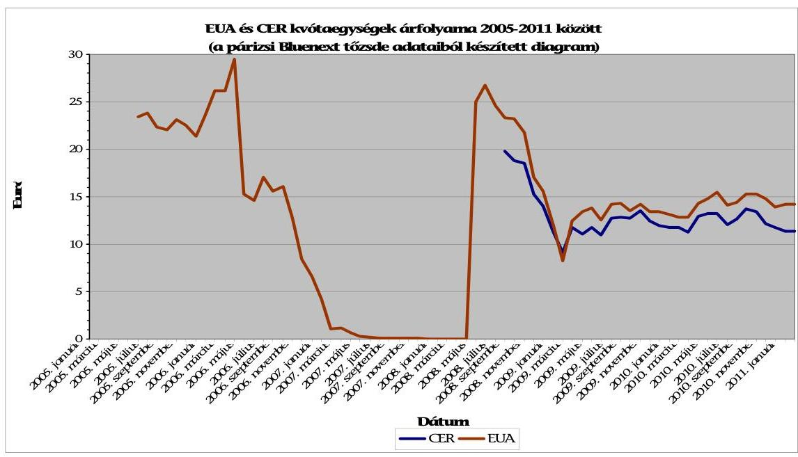

A grafikon jól mutatja az EUA árainak 2005-2011közötti időszakban történt jelentős változásait. Amíg az EUA árai a 2005-2006 közötti időszakban 23-28 €,

---

addig 2007 januárjára $10 €$ körül, majd 2007-2008 0,2-1 € között és 2008 év végére ismét $25 €$ körül alakultak. Ezek után újra jelentős csökkenés következett, 2009. január 15-én $14 €$-ra, február 2-án $11 €$-ra, február 4-én $9,9 €$-ra estek az árak. A 2008-2009-ben kialakult gazdasági válság éreztette hatását az EU széndioxid-piacán, mivel az egyre csökkenő ipari kereslet a széndioxidkibocsátási kvóták árát is csökkentette. Az EUA 2009. február 4-ei 9,99 €-os ára a második kereskedelmi időszak legalacsonyabb árfolyama volt. A kibocsátók a gazdasági körülményekre tekintettel a kibocsátási kvóták eladásával reagáltak. A 2009. év eleji árak 10-12 euróval kevesebbek voltak, mint amit 2008-ban az előrejelzések vártak. A 2010-2011 közötti időszakban viszonylag stabilizálódott 13-15 €-os árfolyamon.

Az EU ETS-ben kialakult árfolyamok bár nem az államok közötti kvóta kereskedelem árait tükrözik, de egyértelmúen megállapítható, hogy viszonyítási alapul szolgálnak az államok közötti kvótakereskedelem kibocsátási egységei árainak meghatározásakor.

---

# A környezetvédelmi, természetvédelmi és vízügyi felügyelőségek véleményének összegzése az ellenőrzés kérdőívére adott válaszaik alapján 

Az Alsó-Tisza vidéki KTVF felvetette, hogy a lakosságot zavaró búzpanaszok kivizsgálása során rendszeresen szembesültek azzal, hogy a települési önkormányzatok a településszerkezet kialakításánál, a rendezési terveknél nem vették kellő súllyal figyelembe egy-egy tevékenység búzhatását.

Az Észak-magyarországi KTVF jelezte többek között, hogy az önkormányzatok nem éltek a lakossági kibocsátásokkal szemben ellenőrző- és végrehajtó szerepükkel és az ebből adódó lehetőségekkel; nem minden önkormányzat alkotta meg a szükséges rendeleteket esetben, és nem szankcionáltak. A hatáskör megosztottság és az önkormányzatok ezzel kapcsolatos passzivitása hátráltatta a felügyelőséget az egyéb hatósági feladatok elvégzésében (pl.: szmog helyzet kezelése).

Az Észak-dunántúli KTVF a rendszer hatékonyságának, eredményességének javítására vonatkozó javaslatok között hangsúlyozta a levegős részterületekkel kapcsolatos felelősségi körök egyértelmű meghatározásának fontosságát. A védelmi övezettel, az engedélyek módosíthatóságával kapcsolatban is jeleztek jogalkotási problémát.

A Közép-dunántúli KTVF is felvetette, hogy az engedélyezési eljárások során nehézséget okozott a védelmi övezet kijelölésével kapcsolatos eljárási szabályozatlanság.

A Felső-Tisza-vidéki KTVF ugyancsak felvetette az engedélyek módosíthatóságának, visszavonásának a jogszabályban foglalt korlátozottságát. A bűzzel kapcsolatos szabályozást ugyancsak nem tartotta az intézkedések meghozatala szempontjából kielégítőnek.

A Közép Tisza-vidéki KTVF szintén a bűzzel és a védelmi övezettel kapcsolatos szabályozás hiányosságai között említette, a lakosságot zavaró búz mértékének definiálatlanságával, valamint a védelmi övezet kritériumainak való megfeleltetés műszaki követhetőségével kapcsolatos problémákat.

## A környezetvédelmi, természetvédelmi és vízügyi felügyelőségek szervezeti háttér és létszám kapcsán adott válaszai:

Az Alsó Tisza-vidéki KTVF álláspontja szerint „meghatározó a létszám (és a pénz)", ehhez igazították a feladatot, főként a levegőszennyezés mérését. A létszám megfelelő lenne, de a 2009. évben kialakított új irodaszerkezet miatt a hatékony és erőforrás-takarékos munkavégzés csorbát szenvedett.

---

A Tiszántúli KTVF szerint a levegőminőségi ügyeleti rendszer (a levegő minőségének folyamatos figyelemmel kísérése) múködtetéséhez a személyi és pénzügyi feltételek nem voltak biztosítottak.

Az Észak-magyarországi KTVF jelezte, hogy a mérési feladatokat csak a létszám átcsoportosításával tudták megoldani. az imissziós mérőhálózat üzemeltetés- és szmoghelyzet figyelés folyamatos feladata jelentősen csökkentette a munkaidőalapot, amely csak szabadnap kiadásával volt ellentételezhető. A szmogriadó helyzetet túlmunka elrendelésével oldották meg, „megváltás" nélkül.

A Közép- Duna-völgyi KTVF-nél a Levegőminőség-vizsgáló Csoport létszáma a napi feladatok végzéséhez szűkösen volt elegendő. Az analitikai vizsgálatoknál jelentkező kapacitáshiányt a vizsgálatok átütemezésével oldották meg.

A Nyugat-dunántúli KTVF-nél a létszám csökkenése miatt (a korábbi $8+1$ fős létszám $5+1$ főre változott) a szakmai, szakhatósági és az engedélyezési eljárások időben elhúzódtak.

A Dél-dunántúli KTVF szerint a forrás- és létszámhiány következtében több mérőállomáson, több időszakban előfordult, hogy az adatrendelkezésre állás elmaradt az elvárt $90 \%$-hoz képest.

# A környezetvédelmi, természetvédelmi és vízügyi felügyelőségek válaszaiból az önkormányzatokkal való együttmúködésre vonatkozó példák: 

A Dél-dunántúli KTVF két önkormányzattal (Pécs, Kaposvár) kötött együttműködési megállapodást. A felügyelőség javaslataival segítette az önkormányzatok levegővédelmi tárgyú helyi rendelet alkotását. A felügyelőség Pécs Város szmogriadó tervének elkészítéséhez és múködtetéséhez is szakmai segítséget nyújtott.

A Nyugat-dunántúli KTVF számos települési és megyei környezetvédelmi programot véleményezett.

A Felső-Tisza-vidéki KTVF részt vett többek között az Észak-alföldi régió Területfejlesztési Operatív Programja 2009-2010; az Észak-alföldi Operatív Program Regionális Akcióterve véleményezésében.

Az Észak-magyarországi KTVF részt vett Miskolc szmogriadó rendelete, Gyöngyös klímavédelmi programja testületi egyeztetésén.