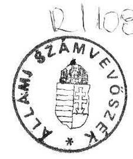
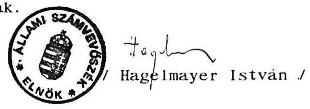
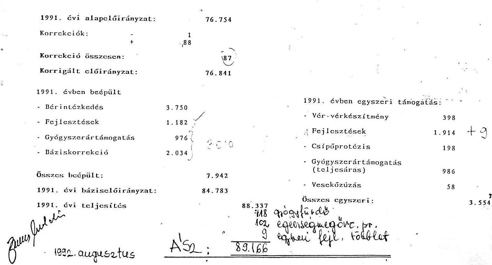

6406. szám

# Állami Számvevőszék

## JELENTÉS

a Társadalombiztosítási Alap 1991. évi zárszámadásának ellenőrzési tapasztalatairól

---

A vizsgálatot vezette: dr. Csépán Magdolna
tanácsos

A vizsgálatot végezték: Balla Józsefné
számvevő
dr. Fónyad Erzsébet
számvevő
Hajagos Józsefné
számvevő
Molnár Istvánné
tanácsos

---

# J E L E N T É S

a Társadalombiztosítási Alap 1991. évi zárszámadásának ellenőrzési tapasztalatairól

## B E V E Z E T É S

Az államháztartásról szóló 1992. évi XXXVIII. törvény 86. paragrafusa értelmében:
"(1) A társadalombiztosítás gazdálkodásának előirányzatait, a bevételek és kiadások összegét, rendeltetését, valamint a hiány fedezésének módját, illetve a többlet rendeltetését, a hitelfelvételeket a költségvetési törvénnyel egyidejűleg jóváhagyásra az Országgyűlés elé kell terjeszteni. A teljesítésről a zárszámadás keretében kell beszámolni.
(2) Az Országgyűlés a társadalombiztosítás költségvetéséről és végrehajtásáról törvényt alkot.
(3) Az Országgyűlés a társadalombiztosítás költségvetési, illetőleg zárszámadási törvényjavaslatát az Állami Számvevőszék véleményével, illetőleg jelentésével együtt tárgyalja meg."

---

Ez a törvényi kötelezettség új és felelősségteljes feladatot fogalmaz meg az Állami Számvevőszék részére, hiszen az ÁSZ-ról szóló - jelenleg hatályos - 1989. évi XXXVIII. törvény csak általánosságban tartalmazza a Társadalombiztosítási Alap kezelésének és felhasználásának ellenőrzési feladatát. Rendszeresen visszatérő, konkrét ellenőrzési feladatot nem rótt az ÁSZ-ra. Az eddigi vizsgálatok ezért az Alap gazdálkodása, pénzügyi helyzete, a társadalombiztosítás átalakításának folyamata szempontjából különösen fontos - a törvényhozás érdeklődésére is méltán számot tartó témák ellenőrzésére helyezték a súlyt.

Az államháztartási törvényből adódó ellenőrzési kötelezettségének az ÁSZ jelenleg csak kompromisszumok mellett tud eleget tenni, mivel a Társadalombiztosítási Alap zárszámadási törvényjavaslatát az ÁSZ július végén kapta meg. Ezért minden részletre kiterjedő véleményezésére nem vállalkozhatott.

A teljeskörűség igénye nélkül elkészült vélemény elsősorban azokra a vizsgálati tapasztalatokra épül, amelyekkel az Országgyűlés Szociális, Családvédelmi és Egészségügyi Bizottságának felkérésére végzett és a közelmúltban lezárult utóvizsgálat szolgált. Az 1991. október és 1992. május között lefolytatott ellenőrzés a Társadalombiztosítási Alap legfontosabb elszámolási kérdéseire, a működési költségek alakulására, az Alap pénzügyi biztonságának értékelésére, valamint a gyógyító-megelőző egészségügyi ellátás finanszírozására, ennek kapcsán a társadalombiztosítási reformfolyamatok áttekintésére terjedt ki. Az egyes témakörök vonatkozásában az 1991. évet az I-III. negyedéveire vonatkozóan vizsgáltuk az utóvizsgálat keretében. Az egész év értékeléséhez szükséges kiegészítő ellenőrzéseket július hónapban végeztük el.

---

A Társadalombiztosítási Alap kezelőjénél végzett számvevőszéki vizsgálatok hasznosulásának utóellenőrzéséről elkészített összefoglaló jelentést a zárszámadási vélemény háttéranyagának tekintjük, azt a képviselők rendelkezésére bocsátjuk. Az utóvizsgálat legfontosabb megállapításait, a kormányzat, illetve a Társadalombiztosítási Alap kezelője számára megfogalmazott számvevőszéki javaslatokat az 1. sz. melléklet ismerteti.

# M E G Á L L A P Í T Á S O K

a Társadalombiztosítási Alap 1991. évi
költségvetésének végrehajtásával kapcsolatban

A Társadalombiztosítási Alap 1991. évi költségvetését az 1991. évi III. törvény írta elő. A törvény a bevételek és kiadások főösszegeit megegyezően, "0"-szaldóval tartalmazta.
A költségvetési törvényt decemberben módosították (az 1991. évi LXXIV. törvénnyel), oly módon, hogy a "0"-szaldót 1.600 millió forint hiányra változtatták.

Ezzel a költségvetési tervezési gyakorlatban szokatlan megoldás született, mert a törvény nem rendelkezett a hiány rendezésének módjáról. Ez az időközben életbelépett államháztartási törvénnyel is ellentétes.

A hivatkozott III. törvény az Alap gazdálkodásának és pénzügyi műveleteinek szabályozására az Országos Társadalombiztosítási Főigazgatóságot (továbbiakban OTF) jogosította fel, újra szabályozta a pénzügyi tevékenység folytatásának kereteit, a tartalékok képzésének és felhasználásának kérdéseit.

---

Az 1991. évtől az ellátási kiadásoktól teljesen elkülönült az Alap kezelőjének működési költségvetése, azt a törvény külön hagyta jóvá.

# 1./ Az éves gazdálkodás bemutatása, a teljeskörűség kérdése

Az 1991. évi zárszámadási törvényjavaslat sem a Társadalombiztosítási Alap, sem a működési költségvetés tekintetében nem mutatja be teljeskörűen (az érvényes pénzügyi és számviteli előírásoknak megfelelően) az OTF bevételeit és kiadásait, amelyek a két szektor költségvetési beszámolójában egyébként szerepelnek.

Az eltérést (a felvett és visszafizetett hiteleket, az értékpapírok vásárlására fordított - és a visszaváltásból származó pénzeszközöket, a folyósított családi pótlékot és költségvetési térítését, az egyszeri nyugdíj kifizetést és megtérítését) a 2. sz. melléklet számszerűsíti.

A teljeskörűség hiányából, hibás könyvelés esetén, elszámolási problémák is származhatnak.
Ilyen megállapításokat tett az utóvizsgálat az 1990. év vonatkozásában. Hasonló hiba történt 1991-ben is.

Az értékpapír névérték alatti beváltásnál az árfolyamveszteséget a költségvetési beszámolóban kamatveszteségként számolták el. A helyesbítéshez a kamatbevételt a tényleges értéken kell bemutatni, s az árfolyamveszteség az értékpapír beváltásánál jelentkezik.

---

Ez a helyesbítés a zárszámadási törvényjavaslatban bevétel növekedésként jelentkezne, mivel az Alap bevételei között értékpapír értékesítésből származó bevétel nem szerepel.

A törvényjavaslat az Alap bevételének és kiadásának bemutatásánál a tartalékok pénzforgalmát csak annyiban tartalmazza, amennyiben a kamat és egyéb hozambevételt, illetve az 1991. évi III. törvény (3. paragrafus (8) és (9) bekezdés) szerinti tartalékba helyezést elszámolja.

Az 1990. év I-III. hóban folyósított családi pótlék megtérítéséként átvett 12 milliárd forintot, az 1991. évi III. törvény 9. paragrafusa szerinti tartalék felhasználást - egészségmegőrzési célok támogatására, valamint lakossági és szabadidő-sport tevékenységre - és a tartós befektetésekre fordított pénzeszközöket csak a törvényjavaslat tartalékok alakulását bemutató 6. sz. melléklete tartalmazza.

A családi pótlék megtérítésének közvetlen tartalékban való elszámolása nemcsak a teljeskörűség hiánya miatt nem fogadható el, hanem mert az államháztartási mérlegben - az ÁvÜ zárszámadásánál - kiadásként elszámolásra került, továbbá az 1990. évi költségvetés végrehajtásáról szóló 1991. évi XXXVI. törvényben a családi pótlék folyósítását a kiadások között szerepeltették.

Ez a megtérítés valóban a likviditási tartalékot növeli. Az 1990. évi zárszámadásnál ugyanis bevételi többlet képződött volna, ha az 1990. I-III. hóban folyósított családi pótlékot nem a társadalombiztosítás hitelezte meg.

---

Az ÁSZ álláspontja szerint a 12 milliárd forint megtérítését az Alap bevételeként és kiadásként (likviditási tartalékba helyezésként) is el kellett volna számolni.

A működési költségvetésnél a törvényjavaslat nem mutatja be a vállalkozási tevékenységből származó eredményt, az előző évi pénzmaradvány felhasználását. Az 1991. évben az előző évi pénzmaradvány bevonása, mely meghaladta az 50 millió forintot, lényegében az 1991. évi XXXVI. törvényben meghatározott 1.086 millió forint ügyviteli tartalék csökkentését jelentette, de mint 1991. évi kiadást számolták el.

A működési költségvetés végrehajtásához 1991. évben az ügyviteli tartalék felhasználását az 1991. évi LXXIV. törvény engedélyezte. Ezen törvény alapján a bevételi és kiadási előirányzatot az OTF saját hatáskörében módosíthatta, lehetőséget teremtve pénzmaradvány képzésére, melynek működési célra való felhasználását - eltekintve azon megkötéstől, hogy dologi kiadásból béralapot nem képezhet - szabadon meghatározhatja. (Ilyen intézkedésnek minősíthető az is, hogy a mérlegzárási időszakban - 1992. március - a tartalékból 40 millió forintot vontak be a működési költségvetésbe az előirányzat megemelésére.)

# 2. / Az adatok megbízhatósága

A zárszámadásban szereplő összegek egyezősége a társadalombiztosítás szolgáltatási és ügyviteli szektora költségvetési beszámolók adataival közvetlenül általában nem bizonyítható, de az összefüggések ismeretében az adatok "előállíthatók".

---

Szemléltetésül: - A járuléktartozások összege az év végén a törvényjavaslat szerint is 54,4 milliárd forint. A beszámolóban szereplő adat (adósok) ugyanakkor 49,1 milliárd forint, mivel az előbbi a tartozások bruttó, utóbbi pedig nettó - túlfizetésekkel csökkentett - állományát jelenti.

- A társadalombiztosítás 1991. évi járulékbevételeinek zárszámadás szerinti 407.355 millió forintos összegét csak a beszámolóban szereplő négy adat összegezésével lehet kontrollálni.

A Társadalombiztosítási Alap bevételei és kiadásai, a törvényi szabályozás szerint képzett tartalékok a zárszámadási törvényben és a költségvetés végrehajtásáról szóló beszámolóban - a teljeskörűség hiányától eltekintve - esetenként számszakilag is kifogásolhatók. Ez részben helytelen elszámolásból, részben az ÁSZ és az OTF értelmezésbeli különbségéből származik. Az ellenőrzés megítélése szerint szükséges helyesbítéseket a 3. sz. melléklet szemlélteti.

A zárszámadási törvényjavaslatban az Alap bevételi eltérése a kerekítés miatt elhanyagolható. A kiadási főösszeg a társadalombiztosítás kamat- és egyéb hozambevételeiből az elszámolt összegen felül további 1 millió forint tartalékba helyezése miatt növekszik, a befektetések hozamának helytelen meghatározásából adódóan. (Tartósan befektetett eszközök kamatbevételét rövidlejáratú bevételként könyvelték, holott ezt a befektetések hozama tartalékba kell helyezni.)

---

Az utóvizsgálat megállapítására az Alap tartalékaink helyesbítését - a 100 millió forintnak a likviditási tartalékból a befektetések hozama tartalékba helyezésén kívül - elvégezték a zárszámadási törvényjavaslatban. Ugyanakkor az értelmezésből adódó eltérés korrekcióját az ügyviteli tartaléknál nem végezték el. Az ügyviteli tartalék helyesbítése a likviditási tartalékot 7 millió forinttal csökkenti.

A zárszámadási törvényjavaslatban az Alap bemutatott kiadási többlete:

- nem vezethető le egyértelműen a költségvetés végrehajtásáról szóló beszámolóból,
- és a tartalékalapok pénzügyi fedezet hiányának egyezőségét az OTF nem tudta bemutatni, az eltérés 50 millió forint, vagyis a tartalékalap pénzügyi fedezet hiánya 22.045 millió forint.

A levezetést, illetve az egyezőség bemutatását az OTF költségvetési beszámolóját auditáló Arthur Andersen könyvvizsgáló cég sem vállalta fel.

A működési költségvetés bevételeként a zárszámadási törvényjavaslat - a beszámolótól eltérően - az igénybe nem vett 672 millió forint ügyviteli tartalékot is figyelembe vette. Az igénybevett tartalék ténylegesen 414 millió forint, amely összeg bevonásával a működési költségvetés bevétele 5.164 millió forint a zárszámadási törvényben szereplő 5.836 millió forint helyett. A működési költségvetés bevételének helyesbítése a megtakarítás nagyságát, az elkülönített tartalékot is módosítja. A módosítást a 4. sz. melléklet részletezi.

A törvényjavaslatban az Alap tartalékait részletező 6. sz. melléklet szerint likviditási tartalékot képez a hiány finanszírozásához felhasznált hányad is. A mellékletben egzakt módon nem mutatja be a pénzügyileg fedezetlen hányadot, csupán a törvényjavaslat egyes paragrafusaiban (hiányok megtérítése, a tartalék felosztása a két Alap között) ismerteti a tényleges likviditási tartalékot.
3. / A gyógyító-megelőző egészségügyi ellátásokra 1991-ben ténylegesen felhasznált összeg (3. paragrafus (5) bekezdés)

A zárszámadási törvényjavaslat szerint gyógyító-megelőző ellátásokra 89.152 millió forintot - a törvényben jóváhagyott előirányzatnál 17 millió forinttal többet - fordítottak, ami az ellátási kiadásoknak megközelítőleg egyötödét jelenti.
A szolgáltatási szektor költségvetési beszámolójában (egészségügyi feladatok társadalombiztosítás támogatása és gyógyászati szolgáltatás címén) szereplő összeg ezzel megegyezik.

Az Állami Számvevőszék 1992. júliusában végzett kiegészítő vizsgálata alatt az Országos Társadalombiztosítási Főigazgatóság Egészségügyi Finanszirozási Főosztályán az ellenőrzés kérésére - az előirányzatból levezetve - kigyűjtötték (5. sz. melléklet) a tényleges teljesítési adatokat, ami szerint a teljesítés összege 89.157 millió forint.

---

Az 5 millió forintos eltérés konkrét okát nem sikerült megállapítani, csak vélelmezhető, hogy az a főosztályok (analitikus, illetve szintetikus) nyilvántartásainak eltéréséből adódik. Ennek tisztázására a vizsgálat rövid ideje alatt nem volt mód.

A zárszámadásban fejlesztésként megjelenő (egyébként meglehetősen vegyes összetételű) kifizetéseket átvizsgálva további eltérést tapasztalt az ellenőrzés.

Az Egészségügyi Finanszirozási Főosztály kimutatása (6. sz. melléklet) "egyszeri" fejlesztési támogatásként 9 millió forinttal tartalmaz többet, mint amennyit a zárszámadásban figyelembe vettek. A különbözet az 1990. évi műszerbeszerzésekhez kapcsolódó - közvetlenül a szállítók részére kifizetett - árfolyamkülönbözet miatti többlettámogatás, illetve visszautalás. Az összegeket a főkönyvi nyilvántartás adatai is tartalmazzák.

Összességében, tehát az ellenőrzés a zárszámadási adathoz viszonyítva 14 millió forintos eltérést (többletkifizetést) állapított meg. Ez egyben a kiadási főösszeget, valamint a hiány összegét is módosíthatja.

A kiegészítő vizsgálat a zárszámadási összeg (a törvényjavaslat 4. sz. mellékletében részletezett) belső
 szerkezetének, az adattartalom valódiságának ellenőrzésére is kitért. Megállapította, hogy a költségvetési törvény szerkezetéhez igazodó adatok több tételnél nem a valóságnak megfelelően tükrözik a tényleges felhasználásokat.

---

Az ÁSZ 1991. évi egészségügy-finanszírozással kapcsolatos alapvizsgálata is jelezte, hogy (alapvetően a költségvetési tervezés "hagyományaiból" következően) az 1991-es előirányzat jelentős tartalékot tartalmaz, ami nem kötődik szorosan az intézmények jóváhagyott működési költségvetéséhez, ezért a társadalombiztosítás szabadon felhasználható tartalékát jelenti.

A benyújtott törvényjavaslat az egészségügy támogatására szolgáló összeg tartalékainak tényleges, jogcím szerinti felhasználásáról nem ad hű képet. Az ÁSZ megállapította, hogy a szabad rendelkezésű pénzeszközöket "egyszeri" támogatásokra, illetve - az év végén - "báziskorrekcióként" (valójában árellentételezésként) adták oda az egészségügyi intézményeknek. Az ÁSZ véleménye szerint a zárszámadási törvényben a tényleges felhasználásokat kell bemutatni (az ennek megfelelően átdolgozott törvényi számokat a jelentés 7. sz. melléklete tartalmazza).
4. / A hiány rendezése (4. paragrafus)

A paragrafus (1) bekezdés a.) pontjában meghatározott összeg csak egy elenyésző hányada a kiadási többletnek. A bemutatott foglalkoztatáspolitikai célú korhatár-engedményes nyugdíjazás és előnyugdíj bevétele 4.590 millió forint, kiadása 5.545 millió forint. A 955 millió forint kiadási többletből a Szolidaritási Alapnak 2.877 ezer forintot kell megtérítenie.

---

Az (1) bekezdés c.) pontjában szereplő 21.717 millió forint összegű likviditási tartalék felhasználását az ÁSZ a következők miatt nem tartja megfelelő megoldásnak:

- a likviditási tartalék képzése törvényben előírt mértékű és határidejű (a mindenkori kiadási főösszeg 6%-a és legkésőbb az 1992. évi mérlegzáráskor kell feltölteni);
- a likviditási tartalék átmeneti felhasználása csak látszatmegoldás;
- az Alappal szembeni 1991. december 31-i tartozásállomány valójában 54,4 milliárd forint, ami azóta is folyamatosan nő (a június 30-i adatok szerint az adósság bruttó összege már több, mint 70 milliárd forint).

Az utóvizsgálat során az ÁSZ részletesen elemezte a társadalombiztosítás kinnlévőségeinek alakulását, a kedvezőtlen tendenciákat. A kialakult helyzetet a törvényjavaslat indoklásában foglaltakkal lényegében hasonlóan ítéli meg.

A Társadalombiztosítási Alap védelmében hozott központi intézkedések késve, illetve részlegesen valósultak meg, érdemi hatásuk a helyszíni vizsgálat idején még nem mutatkozott. A gazdasági szféra külső hatásai egyébként is sokkal erőteljesebbek, amelyeket a társadalombiztosítás nem befolyásolhat.

---

- A javaslat szerint az igénybevett likviditási tartalék fokozatos visszapótlása a társadalombiztosítási tartozások megfizetésére befolyt összegből történne. Csupán 1992-re vonatkozóan ez azt jelenti, hogy a társadalombiztosításnak ilyen módon minimálisan 9-10 milliárd forint bevételhez kell jutnia. A társadalombiztosítás ingyenes vagyonjuttatásának, illetve a tartozás fejében történő vagyonátvételnek törvényes feltételei ugyan már léteznek, az ÁSZ azonban e területen elmozdulást eddig nem tapasztalt és meglehetősen bizonytalannak látszik, hogy az év hátralévő részében olyan ingatlanügyletekre kerül sor, amely a társadalombiztosítást jelentős bevételhez juttatja.

Amennyiben a javaslatot az Országgyűlés elfogadja a garanciális felelősség érvényesítése miatt az (5) bekezdésben meg kell határozni, hogy az állam (annak képviseletében mely szerv) - legalább - az 1991. év végi tulajdonosi hányada alapján biztosítsa a tartozások megtérítését. A privatizációval az állami tulajdonosi részarány az évek során ugyanis természetszerűen tovább csökken.
5. / Kiadások a befektetések hozama tartalék terhére (5. paragrafus)

A (2) bekezdésben az egészség megőrzését szolgáló célokra előirányzott 150 millió forint maradványának (69 millió forint) felhasználásáról szóló rendelkezés helye a költségvetési törvényben lett volna. A javaslat elfogadása esetén a tartalékok, biztosítási alapok közötti meg-

---

osztása előtt a befektetések hozama tartalékot a maradványok felhasználásával csökkenteni szükséges és ezt a törvényjavaslat 6. számú mellékletében is át kell vezetni, új 21. ponttal.

A befektetések hozama tartalék terhére felhasznált összegeket bemutató 5. sz. törvényi melléklet A. és B. része tartalmilag ellentmondásos, mivel az előbbi csak az általános és nem a konkrét támogatási célokat ismerteti, ráadásul nem az 1991. évi tényleges kifizetésekre vonatkozóan.
6. / A tartalékalapok biztosítási ágak közötti megosztása (6-8. paragrafusok)

A likviditási tartaléknak a hiány fedezeteként való felhasználása következtében a Társadalombiztosítási Alap 1991. év végén meglévő 29.951 millió forint összegű likviditási tartalékából a hiány rendezésére 21.717 millió forintot felhasználnak, a maradék 8.234 millió forint oszlik meg egyenlő arányban a két alap között.

Az Egészségbiztosítási Alap működőképességét a rájutó 4.117 millió forint összegű likviditási tartalék nem biztosítja, figyelemmel arra, hogy az egészségügyi intézmények működési támogatását és a gyógyszertámogatást havonta, előre kell folyósítani.

---

Az 1991. évi XCI. törvény 1992-től csak a Nyugdíjbiztosítási Alap vonatkozásában engedi meg az állami forgóalaphoz csatolt Nyugdíjmegállapítási-számla igénybevételét. Az Alap kezelője az alapok szétválasztásáig bármely ellátás érdekében megtehette ezt, így az egészségügy miatt is.

Amennyiben az Egészségbiztosítási Alap működőképességét a szabályozás valamilyen módon nem garantálja, az OTF a számla használatára kényszerül, immár a költségvetési törvényt megsértve. Ilyen helyzetet - előreláthatóan - nem szabad teremteni.

A 8. paragrafus (3) bekezdés szerinti szabályozás pénzügyileg nem megalapozott, elfogadását nem javasoljuk. A rövidlejáratú befektetésekből származó hozambevétel előirányzata az 1992. évi X. törvény 3. sz. melléklete szerint 410 millió forint. A törvényi rendelkezés szerint a rövidlejáratú befektetésekből származó hozambevételt a likviditási tartalék növelésére kell fordítani. A likviditási tartalék megosztási aránya a két Alap között 50-50 %. Ez azt jelenti, hogy a 410 millió forintból 205 millió forint illeti az Egészségbiztosítási Alapot. Az 1992. évi X. törvény 3. paragrafus (3) bekezdésében meghatározott kifizetések 280 millió forint. A 280 millió forint és 205 millió forint közötti különbség a korábbi években képzett, de egyébként is elégtelen likviditási tartalékot tovább csökkentené.

---

# 7. / Működési költségvetés (9. paragrafus) 

Az 1991. évi LXXIV. törvény 7. paragrafus (1) bekezdés szerint az ügyviteli tartalék a működési költségvetés kiadásaira bevonható, de az előirányzatot nem emelte meg sem a bevételi, sem a kiadási oldalon.

Az 1991. évi működési költségvetésről szóló beszámoló szerint a 701 millió forint, 672 millió forint ügyviteli tartalékból és 29 millió forint megtakarításból tevődik össze. Mind az 1991. évi III. törvény, mind az 1992. évi X. törvény úgy rendelkezik, hogy "mérlegzárást követően a működési költségvetésben megtakarított összeg" vihető át a következő évre, illetve használható fel. Ez jelen esetben a 29 millió forint.

Meg kell említeni, hogy az 1991. évi LXXIV. törvény 7. paragrafus (2) bekezdése előírja, hogy a felhasznált működési tartalékot 1992. évben vissza kell pótolni. Az 1992. évi működési költségvetést szabályozó 1992. évi X. törvény 9. sz. mellékletében a beruházási felhasználáson felüli tartalék visszapótlás már megtakarításként jelenik meg, ahelyett, hogy 286 millió forint lenne a tartalék visszapótlás és 10 millió forint a megtakarítás.

Az előbbi törvényi előírások alapján, valamint figyelembevéve azt a tényt, hogy az ügyviteli tartalék 1991. évi felhasználására készült előterjesztés indokai közül (a betegbiztosítási kártya bevezetésétől eltekintve) a célok teljesültek, javasoljuk az ügyviteli tartalék felhasználásának részletes indoklását elkészíteni.

---

Az ügyviteli tartalék 1991. évi felhasználását a 8. sz. melléklet ismerteti.

A 9. paragrafus (4) bekezdése szerint az állami költségvetés a családi pótlék folyósításával összefüggésben 1991-ben meg nem tértett 100 millió forintot 1992-ben téríti meg a működési költségvetés javára. Ennek tényleges megfizetéséről azonban az állami költségvetés 1991. évi végrehajtásáról szóló törvényjavaslat és az 1992. évi állami költségvetési törvény sem rendelkezik.

A társadalombiztosítás által folyósított, de ellátási körébe már nem tartozó, egyes juttatások folyósítási költségeinek megtérítésére a jogi szabályozás továbbra is ellentmondásos, a társadalombiztosítás és a Pénzügyminisztérium között nincs érvényes megállapodás.
8. / A társadalombiztosítással kapcsolatos állami garancia érvényesülésének megítélése

A Társadalombiztosítási Alap a költségvetéshez legszorosabban az állami garancia érvényesülésével kapcsolódik. A társadalombiztosításról szóló 1975. évi II. törvény 5. paragrafusa szerint: "A társadalombiztosítás kiadásainak fedezetére járulékot kell fizetni. A bevételeket meghaladó kiadásokat az állam fedezi."

Ezen általános érvényű állami garancia mellett, évről évre változnak a garancia szabályok, e tekintetben a törvényi előírások egymásnak ellentmondóak.

---

Függetlenül az 1975. évi II. törvényben foglalt általános érvényű garanciától, a kötelező társadalombiztosításból való állami feladatvállalás folyamatosan szűkül. Kezdetben (1989-ben és 1990-ben) a biztonságos működéshez a jogszabályok bizonyos mértékű bevételi többletet garantáltak, 1991-re a költségvetés "vállalta" az esetleges fedezethiány megtérítését, ami azonban a feltételek miatt már csak formális volt, 1992-re pedig csak a Nyugdíjbiztosítási Alap tekintetében érvényesül.

A hiány finanszírozására a likviditási tartalék felhasználása még 1991-re sem megnyugtató megoldás, annak visszapótlása is illuzórikusnak tűnik.

A társadalombiztosítás helyzetét az Állami Számvevőszék kritikusnak tartja, bevételei egyre kevésbé nyújtanak fedezetet az erősen determinált kiadásokra. Az elkövetkező években mindenképpen a hiány növekedésével kell számolni, amelynek kezelésére a társadalombiztosítás költségvetési törvényében kell intézkedni. Az ellátások színvonalának elviselhető keretek között tartása nem nélkülözheti a költségvetés feladatvállalását. Ennek hiányában szembe kell nézni az ellátások visszafogásának kényszerhelyzetével. A járulékok emelését nem tartjuk lehetséges megoldásnak.

Budapest, 1992. augusztus

Az 1-8. sz. mellékletek összesen 15 lapot tartalmaznak.

---

# MELLÉKLETEK 

a Társadalombiztosítási Alap 1991. évi zárszámadásának ellenőrzési tapasztalatairól
című jelentéshez
1992. augusztus

---

1. sz. melléklet
a V-20-3/1992. sz. jelentéshez

# ÖSSZEFOGLALÓ MEGÁLLAPÍTÁSOK ÉS KÖVETKEZTETÉSEK 

(A Társadalombiztosítási Alap kezelőjénél végzett számvevőszéki vizsgálatok hasznosulásának utóellenőrzéséről szóló jelentésből)

A Társadalombiztosítási Alap kezelőjénél folytatott 1990. és 1991. évi számvevőszéki alapvizsgálatok (amelyek az Alap bevételi többletének felhasználását, gazdálkodásának általános kérdéseit, működési kiadásait, a járuléktartozásokat és a gyógyító-megelőző egészségügyi ellátás társadalombiztosítási finanszírozását érintették) megállapításainak jelentős része az utóvizsgálat tapasztalatai szerint továbbra is fennáll.

A társadalombiztosítás átalakításának folyamatát áttekintve megállapítható, hogy az OTF illetve a Népjóléti Minisztérium óriási jogszabályalkotói munkát végzett. Első lépés e téren az önálló Társadalombiztosítási Alap 1989. évi létrehozása volt, amelyet 1990-ben a társadalombiztosítás és az állami költségvetés közötti feladat- és forráscsere követett, megteremtve az egészségügy biztosítási alapokra helyezésének szervezeti keretét. A társadalombiztosítási rendszer megújításának koncepciójáról és a rövid távú feladatokról szóló 60/1991. (X. 29.) OGY határozat megfogalmazta a társadalombiztosítással szembeni elengedhetetlen változtatások igényét, az alapvető döntéseknél szükséges társadalmi konszenzust, amelyet a létrehozandó önkormányzat hivatott elősegíteni és kitért az 1992-től megvalósítandó intézkedésekre is.

---

Az 1991. év végén megjelent a társadalombiztosítás önkormányzati igazgatásáról szóló törvény, majd 1992. márciusában a társadalombiztosításról szóló 1975. évi II. törvényt módosító törvény, továbbá a Társadalombiztosítási Alap 1992. évi költségvetéséről szóló, az alaptörvényt is módosító törvények. A törvények mellett időközben több kormányrendelet is született.

Az ÁSZ úgy ítéli meg, hogy a megjelent törvények a reformtörekvések kereteit, mozgásterét megteremtették, de mindeddig nem történt meg a tervezett ellátási rendszer szakmai, szervezeti, működési, finanszírozási kérdéseinek teljeskörű tisztázása, illetve mindez "menet közben alakul". A reformot megalapozó kutatás-fejlesztési tevékenység a különböző szervezeteknél összehangolatlanul folyik és annak jelentőségéhez képest esetleges.

Különösen az egészségügy reformja, az egészségbiztosítás területén lenne nélkülözhetetlen az egészségügyi rendszer egységes egészének, szervezetének, hierarchiájának, kapcsolódásának rendszer-szemléletű meghatározása és a fokozatos megvalósítás ehhez való igazítása. Ez nem korlátozható szerződéskötési, finanszírozási kérdésekre. A reform során az alapellátás prioritása ugyan (legalábbis a deklaráció szintjén) nyilvánvaló lett, de a szakellátást alkotó intézményrendszer belső és
 külső kapcsolatrendszere, egymás mellé- vagy fölérendeltsége nem tisztázódott.

A társadalombiztosítás jövőjét alapvetően befolyásolhatja az a vizsgálat során szerzett tapasztalat, hogy a Társadalombiztosítási Alap önálló gazdálkodási, pénzügyi funkciójának megteremtését a PM már nem tartja feladatának, a Népjóléti Minisztérium azt felvállalni még nem képes, az OTF energiáit pedig felemésztik a végrehajtás napi tennivalói.

---

Ez különösen 1993-tól okozhat problémát, hiszen a társadalombiztosításért való kormányzati felelősség nem hárítható a társadalombiztosítási önkormányzatokra. Mindeddig lényegében tisztázatlan a kormány feladatvállalása és felelőssége a társadalombiztosítás szakmai, pénzügyi, szervezeti és működési kérdéseiben.

Az államháztartásról szóló 1992. évi XXXVIII. törvény a kötelező társadalombiztosítás rendszerét az eddigiekhez hasonlóan az államháztartás részének tekinti. Ugyanakkor a társadalombiztosítást csak mint "kidolgozatlan alrendszert" tartalmazza, működését, gazdálkodását, vagyonát külön törvény szabályozási keretébe utalja, nem rendezi a központi költségvetéssel való kapcsolatát sem.

A Társadalombiztosítási Alap önállósulásának első évét a stabil pénzügyi helyzet jellemezte, a későbbiekben azonban negatív irányú változások következtek be. Az előirányzathoz képest elmaradtak a járulékbevételek, jelentősen emelkedett a tartozásállomány. A kedvezőtlen folyamatok megállítása érdekében 1991. év során hozott kormányzati intézkedések egy része a kitűzött határidőnél csak később valósult meg, illetőleg hatásuk a helyszíni vizsgálat idején még nem mutatkozott. Az intézkedések hatásánál egyébként sokkal jobban hatnak a gazdasági szféra külső hatásai, amelyeket a társadalombiztosítás nem képes befolyásolni. Halaszthatatlan követelmény ugyanakkor, hogy az OTF tegyen intézkedéseket a járulék- és folyószámla területen tapasztalt ügyviteli hiányosságok megszüntetésére.

Az alapvizsgálat megállapítása szerint a Társadalombiztosítási Alapról szóló 1988. évi XXI. törvény több kérdést nem, vagy nem egyértelműen szabályozott, ami nehézségeket okozott az Alap kezelőjének gazdálkodásában, belső szabályozásainak kialakításában. Különösen az Alap 1990. évi zárszámadási törvényével kapcsolatban merültek fel értelmezési problémák (a működési bevételek meghatározása, illetve a tartalékalapok képzése és felhasználása terén), főként amiatt, hogy az alaptörvény módosítására az 1991. évi költségvetési törvény jóváhagyásával együtt került sor, miközben az előző évi költségvetés végrehajtásáról szóló törvény időben csak ezt követően született meg.

Az 1990. évi zárszámadás felülvizsgálata során az ASZ megállapította, hogy annak keretében az OTF költségvetését nem mutatták be teljeskörűen. Az OTF ugyanis csak az Alap szempontjából végleges bevételekről és kiadásokról számolt be, a működési költségvetést is csak az ellátási kiadásokon keresztül számszerűsítette. Mindezek következménye, hogy az államháztartási mérleg sem tartalmazza a társadalombiztosítás egészére vonatkozó adatokat.

Az Alap kezelője továbbra sem rendelkezik pénzügyi ellenőrzési joggal az általa külső szerveknek nyújtott támogatások rendeltetésszerű felhasználása felett. A vizsgálat ezt elsősorban az egészségügyi intézmények vonatkozásában hiányolta, a reform folyamatában, az átmenet figyelemmel kíséréséhez ez elengedhetetlen.

Az egészségügyi ellátás társadalombiztosítási finanszírozásával kapcsolatos, az alapvizsgálatban feltárt, az intézmények és az OTF közötti elszámolási- számviteli probléma az 1992-től érvényes számviteli előírások érvénybe lépésével megoldódott. Az egészségügyi intézményeknek a működési költségek terhére nyújtott, 1991.

---

évi döntésen alapuló beruházási jellegű támogatással az ellenőrzés nem találkozott. Az ASZ 1991. évi vizsgálati megállapításai és javaslatai alapján elkészített OTF-intézkedési terv csak formálisan tett eleget a változtatás igényének.

Változatlanul problematikus a társadalombiztosítási forrásból finanszírozandó egészségügyi kiadások körének meghatározása. E tekintetben nincs összhang a társadalombiztosítási jogszabályok és a számviteli törvény között (működési kiadások értelmezése, tárgyi eszközök beszerzése, pótlása, amortizációja, beruházások).

Az összhang megteremtésén túl az ASZ megítélése szerint a teljes egészségügyi ágazat finanszírozását, forrásszükségletét egyértelműen meg kell határozni. El kell dönteni, hogy a teljesítményarányos, szektorsemleges, biztosítási alapú finanszírozáshoz elegendő-e az egészségügy működési kiadásaira eredetileg rendelt összeg, vagy újabb feladat- és forrás átcsoportosítást szükséges a társadalombiztosítás (most már Egészségbiztosítási Alap) és a költségvetés között végrehajtani. A társadalombiztosításra csak annyi teher hárítható, amit az Egészségbiztosítási Alap pénzügyi keretei - a Nyugdíjbiztosítási Alap érdekeinek sérelme nélkül - megengednek. Ha egyedül a társadalombiztosítás dönti el, hogy milyen jellegű kiadások megtérítését vállalja, a továbbiakban is számolni kell szubjektív döntésekkel, a pénz megszerzéséért folyó alku fennmaradásával.

Az egészségügy finanszírozási gyakorlata 1991-re érdemben nem változott, az intézmények a hagyományos költségvetési tervezési rendszernek megfelelően kapták meg alapelőirányzataikat. A fejlesztési igények elbírálása zömében továbbra is az OTF Egészség-

---

ügyi Finanszírozási Főosztálya hatáskörében maradt. Az év közben létrehozott NM-OTF közös bizottság döntéseiben a támogatás összegszerűségével nem foglalkozott.

Az egészségügyi intézmények 1992. évi tervezési- finanszírozási gyakorlata az utóvizsgálat során érdemben nem volt ellenőrizhető, hiszen a finanszírozás változásait meghatározó kormányrendelet csak a helyszíni vizsgálat lezárását követően jelent meg.

A társadalombiztosítás pénzügyi biztonsága szempontjából lényeges tényező az állami garancia érvényesülése. Az 1975. évi II. törvényben megfogalmazott általános állami garancia mellett évről évre változnak a szabályok, fokozatosan szűkül a kötelező társadalombiztosításból való állami feladatvállalás köre, mértéke. Az ellátások akadálytalan folyósítását az állami forgóalaphoz kapcsolt Nyugdíjmegelőlegezési számla (az egészségbiztosítási körbe tartozó juttatásoknál lényegében az 1992. évi költségvetési törvény megsértésével) ugyan biztosítja, de nem ad megoldást a deficítfinanszírozás módjára, a hiány rendezésére. A Társadalombiztosítási Alap 1991. évi hiánya mintegy 22 milliárd forint. A hiány kezeléséről törvények nem rendelkeznek. Ez egyúttal azt is jelenti, hogy a társadalombiztosítás likviditási tartaléka jelentős részben fedezetlen.

A központi költségvetés társadalombiztosítással szembeni konkrét megtérítési kötelezettségeit törvények írják elő. Komolyabb problémát egyedül a családi pótlék folyósítási költségeinek megtérítése jelentett. Az ellentmondó törvényi szabályozás miatt és a feltételekre vonatkozó megállapodás hiányában a költségvetés 100 millió forint átutalását visszatartotta.

---

A társadalombiztosítást 1994. végéig 300 milliárd forint ingyenes vagyonjuttatásban kell részesíteni. Ennek részletei még meglehetősen kidolgozatlanok, a vagyontömeg átadása és ütemezése bizonytalannak tűnik.

Az ASZ az utóvizsgálat idején összességében súlyosnak találta a társadalombiztosítás pénzügyi helyzetét, amely az ellátások biztonságát, az egészségügyben színvonalát és a társadalombiztosítás reformjának sikerét egyaránt veszélyezteti.

# J A V A S L A T O K 

Megerősítve és aktualizálva az alapvizsgálatok megállapításait, a következő javaslatokat tartjuk megfontolandónak.

A Kormány feladatkörét érintően
1./ Az egészségbiztosítással összefüggésben az egészségügyi rendszer egészének, szervezetének, a kötelező biztosítás rendszerének teljeskörű meghatározása után szabályozni szükséges:

- a kötelező egészségbiztosítás viszonyát a többi biztosításhoz;
- az államnak és szervezeteinek viszonyát a kötelező egészségbiztosításhoz, beleértve szervező, irányító, ellenőrző feladatait, a finanszírozást befolyásoló tevékenységét;
- a teljesítményfinanszírozási rendszer alapjául szolgáló normák megállapításának feltételrendszerét;
- a fejlesztési igények rangsorolásának, a támogatás odaítélésének szempontjait.

---

2./ Felül kell vizsgálni a teljes egészségügyi ágazat forrásszükségletét és ennek keretében meghatározni a teljesítményarányos, szektorsemleges, biztosítási alapú finanszírozáshoz szükséges és elegendő társadalombiztosítási forrást (a feladat- és forrásátcsoportosítás összegét a társadalombiztosítás és a költségvetés között). Meg kell teremteni továbbá a társadalombiztosítási jogszabályok és a számviteli törvény közötti összhangot.
3./ A társadalombiztosítás önkormányzati irányítása kezdetének időpontjáig rendezni kell a társadalombiztosításért való kormányzati felelősséget, az ágazati, szakmai és pénzügyi irányítással kapcsolatos feladat- és hatásköröket, továbbá az önkormányzati irányításhoz igazodó szervezeti- és működési kérdéseket.
4./ A kötelező társadalombiztosítással összefüggő állami garanciát a költségvetési és zárszámadási törvényekben úgy kell megfogalmazni, hogy az összhangban legyen a társadalombiztosításról szóló 1975. évi II. törvényben foglalt általános érvényű állami garanciával. Egyúttal e törvényekben - azonos tartalommal - kell rendelkezni a társadalombiztosítás hiánya rendezésének módjáról, a központi költségvetés megtérítési kötelezettségeiről (ide értve a különösen fontos állami tulajdonban lévő vállalatok tartozásainak rendezési módját is).
5./ Gondoskodni kell arról, hogy

- a társadalombiztosítás működését, az Alap(ok) és kezelőjének tevékenységét a zárszámadási törvény teljeskörűen mutassa be;

---

- az államháztartás információs- és mérlegrendszerébe is teljeskörűen épüljenek be a társadalombiztosítás adatai.

# Az OTF feladatkörét érintően 

1./ A szakmai ellenőrzés mellett továbbra is szükséges a pénzügyi ellenőrzés jogszabályi és belső szervezeti feltételeinek megteremtése.
2./ A központi költségvetés megtérítési kötelezettségi körébe tartozó, a társadalombiztosítás által folyósított ellátások és ezek folyósítási költségei megfizetésének részletes feltételeire, módjára a társadalombiztosítás és a Pénzügyminisztérium előre állapodjon meg.
3./ A folyószámla-nyilvántartás területén mutatkozó súlyos ügyviteli hiányosságok mielőbbi rendezése szükséges. A társadalombiztosítás igazgatási szerveinél a tevékenység teljeskörű áttekintése után meg kell határozni és biztosítani kell a szervezeti, személyi, tárgyi és technikai feltételeket.
4./ Számviteli szempontból is végre kell hajtani a Nyugdíjbiztosítási Alap és az Egészségbiztosítási Alap elkülönítését.

---

A Országos Társadalombiztosítási Főigazgatóság 1991. évi
zárszámadásának teljeskörű bemutatása
(szolgáltatási szektor)
millió forint

| Megnevezés | költségvetési beszámoló sz. | zárszámadási törvényjav.sz | eltérés |
| :--: | :--: | :--: | :--: |
| 1. Bevételek |  |  |  |
| Járulék bevételek | 407.355 | 407.355 | - |
| Tb tevékenység egyéb bevételei | 21.902 | 21.035 | -867 |
| Gyógyszertámogatás megtérítése |  | 867 |  |
| Tb bevétele | 429.257 | 429.257 | - |
| Hitelfelvétel | 176.037 | - | 176.037 |
| Átvétel a költségvetéstől | 85.934 | - | 85.934 |
| ebböl: - családi pótlék |  |  |  |
| $\quad$ folyósításra | 81.352 | - | 81.352 |
| - egyszeri nyugdíj |  |  |  |
| kifizetésre | 4.582 | - | 4.582 |
| Tb kamat és egyéb hozambevétel | 18.417 | 7.143 | 11.274 |
| Értékpapír beváltás |  | - | 11.274 |
| Befektetések hozama tartalékból pénzeszköz bevonás | 1.552 | - | 1.552 |
| Bevételek összesen | 711.197 | 436.400 | 274.797 |

1990. I-III. hóban folyósított családi pótlék részbeni költségvetési megtérítése - - 12.000

Eltérés a tényleges és a
zárszámadási törvényjavaslat
szerinti bevétel között

---

| Megnevezés | költségvetési   beszámoló sz. | zárszámadási   törvényjav. | eltérés   sz. |
| :-- | :--: | :--: | :--: |
| 2. Kiadások |  |  |  |
| Nyugdíjellátás | 262.894 | 262.894 | - |
| Gyógyszer és gyógyászati |  |  |  |
| segédeszköz támogatás | 39.403 | 39.403 | - |
| Gyógyászati szolgáltatás | 718 | 718 | - |
| Egyéb ellátások és segélyek | 55.407 | 55.407 | - |
| Egyéb kiadások | 819 | 819 | - |
| Tb juttatások: | 359.196 | 359.196 | - |
| Hitel visszafizetés | 166.582 | - | 166.582 |
| Átadott pénzeszközök | 186.319 | 99.199 | 87.120 |
| ebböl: |  |  |  |
| - családi pótlék folyósítás | 82.191 | - | 82.191 |
| - egyszeri nyugdíjkifizetés | 4.582 | - | 4.582 |
| - egészségügyfinanszírozás | 88.434 | 88.434 | - |
| - működési költségvetésnek | 4.293 | 4.293 | - |
| - egészségmegőrzés támogatás | 81 | - | 81 |
| - ifjúsági- és szabadidő-sport | 266 | - | 266 |
| - tartalékba helyezés | 6.472 | 6.472 | - |
| Értékpapír vásárlás |  |  |  |
| Befektetések hozama | 13.532 | - | 13.532 |
| tartalékból tartós befek- |  |  |  |
| tetések |  |

  |  |
| Kiadások összesen: | 725.629 | 458.395 | 267.234 |

---

Megtérített családi pótlék
likviditási tartalékba he-
lyezése

Eltérés a tényleges és a
zárszámadási törvényjavaslat
szerinti kiadás között
279.234

Az összes bevétel és kiadás
egyenlege
$-14.432$
$-21.995$
$+7.563$

Budapest, 1992. augusztus

---

3. sz. melléklet
a V-20-3/1992. sz. jelentéshez

Helyesbítés a Társadalombiztosítási Alap költségvetésének végrehajtásáról
millió forint

|  | zárszámadási törvényjav. | ÁSZ vizsg.   szer. további helyesbítés | ténylegesen |
| :--: | :--: | :--: | :--: |
| Bevétel összesen   Kiadás összesen   Ebből: a Tb kamat és   egyéb hozambevételé-   nek tartalékba helye-   zése | $\begin{aligned} & 436.400 \\ & 458.395 \end{aligned}$ | $\begin{aligned} & 12.000 \\ & 12.001 \end{aligned}$ | $\begin{aligned} & 448.400 \\ & 470.396 \end{aligned}$ |
| A Tb Alap egyenlege | 21.995 | 1 | 21.996 |
| Befektetések hozamának tartaléka | 2.294 | $+101$ | 2.395 |
| Likviditási tartalék | 29.951 | $-107$ | 29.844 |
| Ügyviteli tartalék | 701 | $\begin{array}{r} -29 \\ +7 \end{array}$ | 679 |

1992. augusztus

---

# Működési költségvetés végrehajtásának helyesbítése 

## millió forint

|  | zárszámadási   törvényjav. | 1991. évi LXXIV.tv.   által eng. tartalék   bevonás maradéka | ÁSZ vizsg.   szerint |
| :-- | :--: | :--: | :--: |
| Bevétel összesen   Kiadás összesen | 5.836   5.135 | 672 | 5.164   5.135 |
| Megtakarítás   Elkülönített ügyv.   tartalék | 701 |  | 29* |
| Egyenleg |  | 672 | 672 |

* A megtakarításból 11 millió forint a vállalkozási tevékenység eredménye.

1992. augusztus

---

# (millió forintban) 

1990. évi korrigált előirányzat: 58.203
1990. évben beépült:

- Egyszerhasználatos eszközök és ifjúságfogászat 66
- Bérpolitikai intézkedés 4.522
- Fejlesztések 603
- Árkompenzáció 1.877
- Minimálbér 18
- Üzemanyag árellentételezés 51
- Alkohológia 43

Összes beépült:
7.180

Összes lekötött
65.383

Összes teljesítés:
1990. évi szintrehozás

- Fejlesztések 353
- Bérpolitika 406
- Bérautomatizmus 401
- Árellentételezés 49
- Minimálbér 44

Összes szintrehozás:
1.253

Szintrehozott bázis előirányzat:
66.636

Automatizmusok

- Bérautomatizmus: 7.595
- Dologi automatizmus: 2.523

Automatizmusok összesen:
10.118
1991. évi alapelőirányzat:
76.754

Korrekciók:
1.88

Korrekció összesen:
187
Korrigált előirányzat:
76.841
1991. évben beépült

- Bérintézkedés 3.750
- Fejlesztések 1.182
- Gyógyszerártámogatás 976
- Báziskorrekció 2.034

Összes beépült:
7.942
1991. évi bázis előirányzat:
84.783
1991. évi teljesítés
1992. augusztus

1990. évben egyszeri támogatások:

- Vér-vérkészítmények 396
- Fejlesztések 580
- Cseppfolyós oxigén 27
- Alapítványok támogatása 3
- Üzemanyag árellentételezés 30
- Csípőprotézis 59
- Árkompenzáció válságkv. 451
- Műszer szakmai program 834

Összes egyszeri:
2.380

---

# 1992.05.28

1. sz. melléklet 2.sz. Melléklet

## 1991 évi egyszeri fejlesztések

### V-20-3/1992. sz. jelentéshez

|  MEGYE | INTE | SZÖVEGI | TEVERT | TEVBER | KIUTBRT | KIUTBER  |
| --- | --- | --- | --- | --- | --- | --- |
|  1 | Mohács, VKh.Ri | Ágyszámcsökkentés | 1550.0 | 0.0 | 1550.0 | 0.0  |
|  2 | Pécs, Baranya megyei Kórház | Gyermekszülött részleg hiány. felt. jav. | 141.4 | 0.0 | 141.4 | 0.0  |
|  3 | Pécs, Egy.Eü.Int. | Rheumatológia, fizikoterápia | 6208.6 | 3529.9 | 6208.6 | 3529.9  |
|  4 | Baja VKh.Ri. | Ágyszámcsökkentés | 9400.0 | 0.0 | 9400.0 | 0.0  |
|  5 | Bácsalmás, V.Ri. | Gazdasági, műszaki ellátás működ. többlet | 625.7 | 369.2 | 625.7 | 369.2  |
|  6 | Kalocsa VKh. Ri. | Ágyszámcsökkentés | 1000.0 | 0.0 | 1000.0 | 0.0  |
|  7 | Kecskemét Hollós J. Mkh. | ROLITRON számla | 11137.0 | 0.0 | 11137.0 | 0.0  |
|  8 | Kecskemét Hollós J. Mkh. | Klinikai bakteriológiai vizsg. dologi feltételei | 900.0 | 0.0 | 900.0 | 0.0  |
|  9 | Kecskemét Hollós J. Mkh. | Szül-nőgyógyászat betegfelv. nyilv. techn. | 2400.0 | 0.0 | 2400.0 | 0.0  |
|  10 | Kecskemét Hollós J. Mkh. | URH-lánc, Számítógépes angiokardiologiai ellátás | 7458.0 | 2651.3 | 7458.0 | 0.0  |
|  11 | Kecskemét Hollós J. Mkh. | Átvilágítás felmérés | 26000.0 | 0.0 | 26000.0 | 0.0  |
|  12 | Kecskemét Hollós J. Mkh. | Szülészet nőgyógyászat működési többlete | 4000.0 | 0.0 | 4000.0 | 0.0  |
|  13 | Kecskemét Hollós J. Mkh. | Ágyszámcsökkentés | 1250.0 | 0.0 | 1250.0 | 0.0  |
|  14 | Kiskunhalas Semmelweis VKh.Ri. | Ágyszámcsökkentés | 2650.0 | 0.0 | 2650.0 | 0.0  |
|  15 | ÁGASSESYHÁZA | Alapellátás működési többlete | 1827.0 | 889.0 | 1827.0 | 889.3  |
|  16 | Békéscsaba Réthy Pál VKh.Ri. | Művese ellátás | 0.0 | 0.0 | 0.0 | 0.0  |
|  17 | Békéscsaba Réthy Pál VKh.Ri. | Traumatológiai ellátás | 8000.0 | 0.0 | 8000.0 | 0.0  |
|  18 | Gyula Pándy Kálmán MKh.Ri. | Ágyszámcsökkentés | 1000.0 | 0.0 | 1000.0 | 0.0  |
|  19 | Drosháza V.Egy.Gy.-M. Int. | Ágyszámcsökkentés | 800.0 | 0.0 | 800.0 | 0.0  |
|  20 | ÁBAUJVAR | Alapellátás működési többlete | 540.0 | 281.0 | 540.0 | 281.0  |
|  21 | Izsófalva, K.barc. V.Alk.SzKh. | Ágyszámcsökkentés | 3000.0 | 0.0 | 3000.0 | 0.0  |
|  22 | Miskolc M.Vezető Kh. | DSA, CT működtetése | 0.0 | 0.0 | 0.0 | 0.0  |
|  23 | Miskolc M.Vezető Kh. | Idegsebészet ellátás | 19882.0 | 0.0 | 19882.0 | 0.0  |
|  24 | Miskolc M.Vezető Kh. | Újszülött szűrés | 429.0 | 300.0 | 429.0 | 300.0  |
|  25 | Miskolc M.Vezető Kh. | Művese ellátás műk. felt. bizt. | 0.0 | 0.0 | 0.0 | 0.0  |
|  26 | Miskolc M.Vezető Kh. | Központi centrum | 0.0 | 0.0 | 0.0 | 0.0  |
|  27 | Miskolc M.Vezető Kh. | Miskolc-Tapolca diétás szanatórium | 15174.0 | 2400.0 | 15174.0 | 2400.0  |
|  28 | Miskolc M.Vezető Kh. | Radiológia készletfeltöltés | 5000.0 | 0.0 | 5000.0 | 0.0  |
|  29 | Miskolc M.Vezető Kh. | Ágyszámcsökkentés | 3200.0 | 0.0 | 3200.0 | 0.0  |
|  30 | Deszk, M.Tüdőkh.-Gondozóint. | Műszerek működési többlete | 1107.2 | 508.8 | 1107.2 | 0.0  |
|  31 | Hódmezővásárhely, V.Kh.Ri. | Dg. több műk. feltételeinek kompl. | 18000.0 | 0.0 | 18000.0 | 0.0  |
|  32 | Hódmezővásárhely, V.Kh.Ri. | Ágyszámcsökkentés | 3650.0 | 0.0 | 3650.0 | 0.0  |
|  33 | Makó, Dr.Diósszilágyi S.V.Kh. | Intenzív osztály működése | 2600.0 | 0.0 | 2600.0 | 0.0  |
|  34 | Szeged, V.Kh.Ri. | Laparoscopos epesebészet működése | 720.0 | 0.0 | 720.0 | 0.0  |
|  35 | Szeged, V.Kh.Ri. | Művese ellátás | 0.0 | 0.0 | 0.0 | 0.0  |
|  36 | Szeged, V.Kh.Ri. | Bérszámfejtés | 2613.0 | 429.0 | 2613.0 | 0.0  |
|  37 | Szentes, V.Kh.Ri. | Alapellátányzat rendezés | 5562.7 | 3890.0 | 5562.7 | 3890.0  |
|  38 | ADONY | Alapellátás működési feltétel biztosítása | 955.0 | 0.0 | 955.0 | 0.0  |
|  39 | ADONY | Szűrés működési feltétel | 500.0 | 0.0 | 500.0 | 0.0  |
|  40 | KOSZÁRHEGY | Alapellátás működési többlete | 54.0 | 0.0 | 54.0 | 0.0  |
|  41 | Mór, V.Kh.Ri. | Fizikoterápia | 4622.0 | 0.0 | 4622.0 | 0.0  |
|  42 | SZABADBATTYÁN | Alapellátási feladat | -54.0 | 0.0 | -54.0 | 0.0  |
|  43 | Székesfehérvár, Szt.György Mkh | II. ütem működ. többlete | 5000.0 | 0.0 | 5000.0 | 0.0  |
|  44 | Székesfehérvár, Szt.György Mkh | Önálló bérszámfejtés működési feltétele | 2712.0 | 0.0 | 2712.0 | 34.4  |
|  45 | Székesfehérvár, Szt.György Mkh | Felelősségbiztosítás | 710.0 | 0.0 | 710.0 | 0.0  |
|  46 | Székesfehérvár, Szt.György Mkh | Járóbetegellátás informatikai működ. felt. | 1800.0 | 0.0 | 1800.0 | 0.0  |
|  47 | Székesfehérvár, Szt.György Mkh | Gyermekosztály forgóalapfeltöltés | 6000.0 | 0.0 | 6000.0 | 0.0  |
|  48 | Székesfehérvár, Szt.György Mkh | Cytológiai vizsgálat | 58.1 | 0.0 | 58.1 | 0.0  |
|  49 | Székesfehérvár, Szt.György Mkh | Járóbetegellátás működ. | 28000.0 | 0.0 | 28000.0 | 0.0  |
|  50 | Székesfehérvár, Szt.György Mkh | Csákvár szubintenzív osztály | 9000.0 | 0.0 | 9000.0 | 0.0  |
|  51 | Győr, M.Kh.Ri. | Gyógyúszás támogatása | 1039.5 | 0.0 | 1039.5 | 0.0  |
|  52 | Győr, M.Kh.Ri. | Művese ellátás | 25000.0 | 0.0 | 25000.0 | 0.0  |
|  53 | Győr, M.Kh.Ri. | CT működtetése | 10678.0 | 0.0 | 10678.0 | 0.0  |
|  54 | Győr, M.Kh.Ri. | CT működtetés zárolása | -830.5 | -580.8 | -830.5 | -580.8  |
|  55 | Győr, M.Kh.Ri. | CT működtetés zárolása | -10678.0 | 0.0 | -10678.0 | 0.0  |
|  56 | Győr, M.Kh.Ri. | Gyógyúszás támogatása | 100.0 | 0.0 | 100.0 | 0.0  |
|  57 | Győr, M.Kh.Ri. | Radiológia működ. többlet | 6000.0 | 4000.0 | 6000.0 | 0.0  |
|  58 | Győr, M.Kh.Ri. | Szövetbank | 4000.0 | 0.0 | 4000.0 | 0.0  |

---

| MEGYE | INTE | SZÖVEGI | TEVBRT | TEVBER | KIUTBRT | KIUTBER |
| :--: | :--: | :--: | :--: | :--: | :--: | :--: |
| 5. 14 | Nyíregyháza Jósa A. MKh. | Erdélyi Tibor szem. száll. vall. Dialysis GMK. | 497.2 | 0.0 | 497.2 | 0.0 |
| 15 | Tiszafüred, Egy. Eü.Int. | Ügyelet készenléti dijak átvétele | 0.0 | 0.0 | 0.0 | 767.2 |
| 1. 16 | Dombóvár, VKh.Ri. | CT működtetés | 4000.0 | 0.0 | 4000.0 | 0.0 |
| 2. 16 | Szekszárd, M.Kh.Ri. | Megye központ feladatok átvétele | 814.0 | 465.0 | 814.0 | 464.9 |
| 3. 16 | VARDOMB | Körzeti rendelő működ. | 214.0 | 0.0 | 214.0 | 0.0 |

 | 0.0 | 214.0 | 0.0 |
| 4. 17 | Hegyfalu, M. Tüdőgyógyintézet | Számítógépes rendszer | 767.1 | 210.0 | 767.1 | 210.1 |
| 5. 17 | Hegyfalu, M. Tüdőgyógyintézet | Ágyszámcsökkentés | 2500.0 | 0.0 | 2500.0 | 0.0 |
| 5. 17 | Szombathely, Markusovszky M.Kórház | Gyógyúszás támogatása | 197.0 | 0.0 | 197.0 | 0.0 |
| 6. 17 | Szombathely, Markusovszky M.Kórház | Cytodiagnosztikai laboratórium | 2550.0 | 0.0 | 2550.0 | 0.0 |
| 7. 17 | Szombathely, Markusovszky M.Kórház | Művese ellátás | 2500.0 | 0.0 | 2500.0 | 0.0 |
| 17 | Szombathely, V.Eü.GESZ | Gyermek-onkológiai és hematológiai ellátás támogatása | 0.0 | 0.0 | 0.0 | 0.0 |
| 5. 17 | Sárvár, V.Kórház | Cytológiai vizsgálatok | 67.3 | 0.0 | 67.3 | 0.0 |
| 2. 18 | Ajka, Magyar Ipari Kórház | Számítógépes rendszer fejlesztése (számla szerint) | 25785.7 | 0.0 | 25785.7 | 0.0 |
| 3. 18 | Farkasgyepű, M.Tüdőgyógyint. | Konyha és kazánház | 5000.0 | 0.0 | 5000.0 | 0.0 |
| 4. 18 | Várpalota, V.Kórház | Rekonstrukció működési többlet | 51500.0 | 0.0 | 51500.0 | 0.0 |
| 5. 18 | Várpalota, V.Kórház | Rekonstrukció működtetési ktg. | 5283.2 | 0.0 | 5283.2 | 0.0 |
| 7. 19 | Balatonalmádi, M.Kórház | CT működtetés | 5000.0 | 0.0 | 5000.0 | 0.0 |
| 5. 19 | Balatonalmádi, M.Kórház | Ágyszámcsökkentés | 1800.0 | 0.0 | 1800.0 | 0.0 |
| 2. 20 | Bajcsy-Zsilinszky Kórház, Budapest | Fogszabályozás támogatása | 40.0 | 0.0 | 40.0 | 0.0 |
| 2. 20 | Balassa J. Kórház, Budapest | IC PC Alapellátási kísérlet | 1000.0 | 0.0 | 1000.0 | 0.0 |
| 3. 20 | István Kórház, Budapest | Műtő működési feltételeinek biztosítása | 20000.0 | 0.0 | 20000.0 | 0.0 |
| 4. 20 | István Kórház, Budapest | Szülészet - nőgyógyászat rekonstrukciós többlet | 1500.0 | 0.0 | 1500.0 | 0.0 |
| 5. 20 | István Kórház, Budapest | Laparoszkópos eljárás | 30000.0 | 0.0 | 30000.0 | 0.0 |
| 6. 20 | István Kórház, Budapest | Fővárosi CT ellátás működési többlete | 100000.0 | 0.0 | 100000.0 | 0.0 |
| 5. 20 | István Kórház, Budapest | Sebészeti ellátás működési többlete | 15000.0 | 0.0 | 15000.0 | 0.0 |
| 5. 20 | István Kórház, Budapest | Ágyszámcsökkentés | 5700.0 | 0.0 | 5700.0 | 0.0 |
| 1. 20 | Jahn Ferenc Kórház, Budapest | Urológiai ellátás műk.többlete | 7000.0 | 0.0 | 7000.0 | 0.0 |
| 2. 20 | Jahn Ferenc Kórház, Budapest | Diagnosztika, agglomeráció | 19000.0 | 0.0 | 19000.0 | 0.0 |
| 5. 20 | Jahn Ferenc Kórház, Budapest | Ágyszámcsökkentés | 1450.0 | 0.0 | 1450.0 | 0.0 |
| 4. 20 | János Kórház, Budapest | Kardiológiai és urológiai ellátása | 30000.0 | 0.0 | 30000.0 | 0.0 |
| 1. 20 | Korányi Sándor Kórház, Budapest | Intenzív toxikológiai ellátás | 15357.0 | 0.0 | 15357.0 | 0.0 |
| 5. 20 | Korányi Sándor Kórház, Budapest | Lelki segítség telefonszolgálat | 6268.0 | 3628.0 | 6268.0 | 3628.0 |
| 2. 20 | László Kórház, Budapest | Lyme ambulancia forgóalap | 2568.0 | 0.0 | 2568.0 | 0.0 |
| 4. 20 | László Kórház, Budapest | Láz ambulancia forgóalap | 400.0 | 0.0 | 400.0 | 0.0 |
| 5. 20 | László Kórház, Budapest | Csontvelőtranszplantáció forgóalap feltöltés | 9500.0 | 0.0 | 9500.0 | 0.0 |
| 1. 20 | László Kórház, Budapest | Bakteriológiai labor | 1352.0 | 0.0 | 1352.0 | 0.0 |
| 3. 20 | László Kórház, Budapest | Virológiai labor | 1586.0 | 0.0 | 1586.0 | 0.0 |
| 2. 20 | László Kórház, Budapest | AIDS forgóalap | 8094.0 | 0.0 | 8094.0 | 0.0 |
| 5. 20 | László Kórház, Budapest | Csontvelőtranszplantáció műk. | 152.0 | 0.0 | 152.0 | 0.0 |
| 2. 20 | László Kórház, Budapest | Automata luminométer | 301.0 | 0.0 | 301.0 | 0.0 |
| 1. 20 | László Kórház, Budapest | Elisa fotométer | 229.0 | 0.0 | 229.0 | 0.0 |
| 5. 20 | László Kórház, Budapest | Ágyszámcsökkentés (353) | 17650.0 | 0.0 | 17650.0 | 0.0 |
| 2. 20 | Madarász utcai Gyermek Kórház, Budapest | Mentálhigiénés ellátás tám. | 150.0 | 0.0 | 150.0 | 0.0 |
| 5. 20 | Margit Kórház, Budapest | REN-DEPO betegszállítás | 378.4 | 0.0 | 378.4 | 0.0 |
| 5. 20 | Margit Kórház, Budapest | Ágyszámcsökkentés | 1600.0 | 0.0 | 1600.0 | 0.0 |
| 5. 20 | Margit Kórház, Budapest | Betegszállítás | 337.7 | 0.0 | 337.7 | 0.0 |
| 2. 20 | Róbert Károly Krt.-i Kórház, Bp. | In-vitro fertilitás | 1500.0 | 495.0 | 1500.0 | 495.0 |
| 5. 20 | Tétényi úti Kórház, Budapest | ROLLTRON számla kiegyenlítése | 10212.0 | 0.0 | 10212.0 | 0.0 |
| 3. 20 | Üllői úti Weil Emil Kórház, Budapest | Mosoda II.műszak | 700.0 | 0.0 | 700.0 | 0.0 |
| 5. 20 | Üllői úti Weil Emil Kórház, Budapest | Műtői működés feltétele | 15000.0 | 0.0 | 15000.0 | 0.0 |
| 2. 21 | Balatonfüred Állami Kórház | Izotóp vizsgálatok | 2214.0 | 0.0 | 2214.0 | 0.0 |
| 1. 21 | Balatonfüred Állami Kórház | Lábasház működési többlet | 5788.0 | 3399.0 | 5788.0 | 3399.0 |
| 3. 21 | Balatonfüred Állami Kórház | Kardiológiai ambulancia | 271.7 | 190.0 | 271.7 | 190.0 |
| 1. 21 | DOTE | Immunológiai | 3720.0 | 936.0 | 3720.0 | 936.0 |
| 2. 21 | DOTE | Immun készletbeszerzés | 2000.0 | 0.0 | 2000.0 | 0.0 |
| 2. 21 | DOTE | Traumatológiai ellátás műk.többlet | 2000.0 | 0.0 | 2000.0 | 0.0 |
| 4. 21 | Kardiológiai Intézet | Pacemaker beültetés feltétele | 21058.9 | 0.0 | 21058.9 | 0.0 |
| 2. 21 | Korányi TBC és Pulmonológiai Intézet | Ágyszámcsökkentés | 5200.0 | 0.0 | 5200.0 | 0.0 |

---

| MEGYE | INTÉZMÉNY | SZÖVEG | TERVBRT | TERVBER | KIUTBRT | KIUTBER |
| :--: | :--: | :--: | :--: | :--: | :--: | :--: |
| 3. 07 | Győr, M.Kórház | UH, angio működési többlet | 16000.0 | 0.0 | 16000.0 | 0.0 |
| 5. 07 | Győr, M.Kórház | Ágyszámcsökkentés | 3200.0 | 0.0 | 3200.0 | 0.0 |
| 5. 07 | Sopron, V.Kórház | Traumatológiai osztály forgóalapfeltöltés | 12000.0 | 0.0 | 12000.0 | 0.0 |
| 5. 07 | Sopron, V.Kórház | Urológiai osztály forgóalapfeltöltés | 8000.0 | 0.0 | 8000.0 | 0.0 |
| 5. 07 | Sopron, V.Kórház | Radiológia és kardiológia | 9000.0 | 0.0 | 9000.0 | 0.0 |
| 5. 08 | Berettyóújfalu, Dr. Holló S. V.Kórház | Szülészet, nőgyógyászat | 13103.7 | 1359.9 | 13103.7 | 1359.9 |
| 4. 08 | BARANO | Községi fogorvosi szolgálat | 125.5 | 33.0 | 125.5 | 20.6 |
| 5. 08 | Debrecen, Kenézy Gy. M.Kórház | Vérellátó állomás működési többlete | 9287.3 | 900.0 | 9287.3 | 900.0 |
| 5. 08 | Debrecen, Kenézy Gy. M.Kórház | CT karbantartás | 1200.0 | 0.0 | 1200.0 | 0.0 |
| 5. 09 | Eger, Markhot F. M.Kórház | Művese ellátás | 18600.0 | 0.0 | 18600.0 | 0.0 |
| 6. 09 | Eger, Markhot F. M.Kórház | Orvosi felelősségbiztosítás | 1711.0 | 0.0 | 1711.0 | 0.0 |
| 6. 09 | Eger, Markhot F. M.Kórház | Radiológia működési többlet | 477.6 | 288.0 | 477.6 | 0.0 |
| 5. 09 | Eger, Markhot F. M.Kórház | Ágyszámcsökkentés | 7950.0 | 0.0 | 7950.0 | 0.0 |
| 5. 10 | Bábolna Eü.Központ | Egészségszűrő program | 8000.0 | 0.0 | 8000.0 | 0.0 |
| 8. 10 | Esztergom, Vaszary K. V.Egy.Kórház | Sebészeti ellátás működési többlete | 8000.0 | 0.0 | 8000.0 | 0.0 |
| 5. 10 | Esztergom, Vaszary K. V.Egy.Kórház | Ágyszámcsökkentés | 2700.0 | 0.0 | 2700.0 | 0.0 |
| 5. 10 | Kisbér, V.Kórház | Cytológia | 374.5 | 0.0 | 374.5 | 0.0 |
| 5. 10 | Komárom, Egységes Gyógyító-Megelőző Intézet | Cytológia | 1026.6 | 0.0 | 1026.6 | 0.0 |
| 5. 10 | Komárom, Egységes Gyógyító-Megelőző Intézet | Ágyszámcsökkentés | 1250.0 | 0.0 | 1250.0 | 0.0 |
| 7. 10 | Tata V.Kórház | Laboratórium, mentők működési felt. biztosítása | 2000.0 | 0.0 | 2000.0 | 0.0 |
| 12. 10 | Tata V.Kórház | Alkohologia | $-500.0$ | 0.0 | $-500.0$ | 0.0 |
| 4. 11 | Berkenye | Körzeti eü. szolg. | 151.0 | 0.0 | 151.0 | 0.0 |
| 11 | Balassagyarmat V.Kórház | újszülött szűrés | 300.0 | 150.0 | 300.0 | 150.0 |
| 5. 11 | Balassagyarmat V.Kórház | Ágyszámcsökkentés | 3300.0 | 0.0 | 3300.0 | 0.0 |
| 11 | Salgótarján, Madzsar J.M.Kórház | Gerincferdülés szűrés | 357.7 | 187.0 | 357.7 | 186.7 |
| 11 | Salgótarján, Madzsar J.M.Kórház | Vezető ápolónő és védőnő bére | 1165.9 | 815.8 | 1165.9 | 815.9 |
| 11 | Salgótarján, Madzsar J.M.Kórház | Művese ellátás | 15000.0 | 0.0 | 15000.0 | 0.0 |
| 6. 11 | Salgótarján, Madzsar J.M.Kórház | DSA működtetés | 11720.0 | 0.0 | 11720.0 | 0.0 |
| 12 | Donakeszi, Egységes Eü.Intézet | Sürgősségi ellátás feltételeinek biztosítása | 5000.0 | 0.0 | 5000.0 | 0.0 |
| 12 | PÓMAZ | Alapellátás működése | 4000.0 | 0.0 | 4000.0 | 0.0 |
| 5. 12 | PÓMAZ | Alapellátás működése | 2000.0 | 0.0 | 2000.0 | 0.0 |
| 4. 12 | Semmelweis Kórház, Bp. Pest megye | ROLITRON számla | 34725.0 | 0.0 | 34725.0 | 0.0 |
| 12 | Semmelweis Kórház, Bp. Pest megye | Szemlencse implantátum | 18600.0 | 6696.0 | 18600.0 | 0.0 |
| 5. 12 | Semmelweis Kórház, Bp. Pest megye

 megye | Akut műveseellátás | 144.0 | 0.0 | 144.0 | 0.0 |
| 5. 12 | Százhalombatta,Egy.Eü.Int. | Cytológiai vizsgálatok | 144.0 | 0.0 | 144.0 | 0.0 |
| 12 | Törökbálint, Pest m.Tüdőgy.Int | Diagnosztika áük. többlet | 1282.0 | 926.0 | 1282.0 | 926.0 |
| 5. 12 | Törökbálint, Pest m.Tüdőgy.Int | Agyszáacsökkentés | 600.0 | 0.0 | 600.0 | 0.0 |
| 6. 12 | Vác, Jávorszky 0. V.Kh. | Cseppfolyós oxigén, bérszámfejtés | 10000.0 | 0.0 | 10000.0 | 0.0 |
| 7. 12 | Vác, Jávorszky 0. V.Kh. | CT üzemeltetése | 17000.0 | 0.0 | 17000.0 | 0.0 |
| 12 | Vác, Jávorszky 0. V.Kh. | Villamos energia felh.racionalizálás | 1283.0 | 0.0 | 1283.0 | 0.0 |
| 8. 12 | Erd, Szakorv.Ri. | 17 munkahelyes Ri. üzemeltetési feltételeinek bizt. | 1076.5 | 752.8 | 1076.5 | 752.8 |
| 13 | FONYOD | Bérint átcsop.mod | 0.0 | 0.0 | 0.0 | 133.2 |
| 13 | Kaposvár MKh. | CT üzemeltetés | 20022.0 | 0.0 | 20022.0 | 0.0 |
| 13 | Kaposvár MKh. | Művese ellátás | 10000.0 | 0.0 | 10000.0 | 0.0 |
| 13 | MEZŐCSOKONYA | Alapellátás áük.többlete | 180.0 | 0.0 | 180.0 | 0.0 |
| 13 | Marcali VKh. | Bérint átcsop.mod. | 0.0 | 0.0 | 0.0 | $-133.2$ |
| 13 | Mosdós, Megyei Tüdőgyógyint. | Cseppfolyós oxigén | 1000.0 | 0.0 | 1000.0 | 0.0 |
| 5. 13 | Mosdós, Megyei Tüdőgyógyint. | Agyszáacsökkentés | 1000.0 | 0.0 | 1000.0 | 0.0 |
| 8. 13 | Siófok VKh. | Központi gázellátás telepítése | 12453.0 | 0.0 | 12453.0 | 0.0 |
| 3. 13 | Siófok VKh. | 12 ágyas intenzív osztály | 7141.0 | 798.0 | 7141.0 | 798.0 |
| 5. 14 | Fehérgyarmat VKh. | Házi István Szem.száll.kisip.szla.kiegyenlítése | 456.0 | 0.0 | 456.0 | 0.0 |
| 5. 14 | Kisvárda VKh. | Agyszáacsökkentés | 5000.0 | 0.0 | 5000.0 | 0.0 |
| 8. 14 | Mátészalka II Rákóczi F. Kh. | Konyhaüzem | 10000.0 | 0.0 | 10000.0 | 10.0 |
| 5. 14 | Nyíregyháza Jósa A. Mkh. | Szűcs Bálint Szem.száll.kisip.szla.kiegyenlítése | 3110.2 | 0.0 | 3110.2 | 0.0 |
| 5. 14 | Nyíregyháza Jósa A. Mkh. | Szigeti J. Szem.száll.kisip.szla.kiegyenlítése | 2694.6 | 0.0 | 2694.6 | 0.0 |
| 5. 14 | Nyíregyháza Jósa A. Mkh. | Erdélyi Tibor Szem.száll.kisip.szla.kiegyenlítése | 1747.8 | 0.0 | 1747.8 | 0.0 |
| 5. 14 | Nyíregyháza Jósa A. Mkh. | Szűcs Bálint szem. száll. váll. Mátészalka | 417.0 | 0.0 | 417.0 | 0.0 |
| 5. 14 | Nyíregyháza Jósa A. Mkh. | Szigeti János szem. száll. váll. AMBULANCIA BT. | 435.3 | 0.0 | 435.3 | 0.0 |

---

| MEGYE | INTE | SZÖVEGI | TEVBRT | TEVBER | KIUTBRT | KIUTBER |
| :--: | :--: | :--: | :--: | :--: | :--: | :--: |
| A. 21 | OIEI | CT működtetése | 44275.8 | 0.0 | 44275.8 | 0.0 |
| 5. 21 | OIEI | Agyszáacsökkentés | 10300.0 | 0.0 | 10300.0 | 0.0 |
| 2. 21 | OIEI | CT működtetés | 5200.0 | 0.0 | 5200.0 | 0.0 |
| 3. 21 | OIEI | EEG működtetési feltétel | 6800.0 | 0.0 | 6800.0 | 0.0 |
| 3. 21 | OIEI | Dg.működési többlet | 10900.0 | 0.0 | 10900.0 | 0.0 |
| 5. 21 | OITI | Intenzív osztály forgoalapfeltöltés | 12500.0 | 0.0 | 12500.0 | 0.0 |
| 5. 21 | OITI | Műtőblokk műk.többi. | 426.7 | 298.4 | 426.7 | 298.4 |
| 1. 21 | OMSZ | Légi mentőszállítás | 6750.0 | 0.0 | 6750.0 | 0.0 |
| 3. 21 | OMSZ | üzemanyag áreltérítése | 37565.5 | 0.0 | 37565.5 | 0.0 |
| (3) 21 | OMSZ | Kötelező felelősségbiztosítás | 4188.5 | 0.0 | 4188.5 | 0.0 |
| 5. 21 | ONKI | Székletvizsgáló kazetták | 5000.0 | 0.0 | 5000.0 | 5000.0 |
| 3. 21 | ONKI | Lineáris gyorsító | 281.0 | 0.0 | 281.0 | 0.0 |
| 2. 21 | ONKI | DSA működés | 3149.0 | 0.0 | 3149.0 | 0.0 |
| 5. 21 | ORFI | Gyógyúszás | 300.0 | 0.0 | 300.0 | 0.0 |
| 2. 21 | OTE | Nyelőcsősebészet | 25000.0 | 0.0 | 25000.0 | 0.0 |
| 3. 21 | OTE | Műtői műk.többlet | 15000.0 | 0.0 | 15000.0 | 0.0 |
| 5. 21 | OTRI | Vagyonértékelés | 929.0 | 440.0 | 929.0 | 440.0 |
| 2. 21 | OTRI | Traumatológia műk. | 13372.0 | 0.0 | 13372.0 | 0.0 |
| (c) 21 | OTRI | Intenzív ellátás működési feltételei | 5434.0 | 3800.0 | 5434.0 | 3800.0 |
| (2) 21 | OTRI | Traumatológiai ügyelet | 4000.0 | 2800.0 | 4000.0 | 2800.0 |
| 5. 21 | POMAZ, Munkaterápiás Int. | Működési többlet | 4800.0 | 0.0 | 4800.0 | 0.0 |
| 5. 21 | POTE | Művese ellátás | 10000.0 | 0.0 | 10000.0 | 0.0 |
| 3. 21 | POTE | Orthopaediai ellátás feltételeinek biztosítása | 5000.0 | 0.0 | 5000.0 | 0.0 |
| - 21 | REHAB | Tanühely működési feltételei | 0.0 | 0.0 | 0.0 | 0.0 |
| 2. 21 | SOTE | Számítógépes rendszer | 5000.0 | 0.0 | 5000.0 | 0.0 |
| 3. 21 | SOTE | VSP gerinc implantátum | 50000.0 | 0.0 | 50000.0 | 0.0 |
| (c) 21 | SOTE | PIC szállítás | 2000.0 | 0.0 | 2000.0 | 0.0 |
| 2. 21 | SOTE | Cytológiai vizsg.II.Pathológia | 2650.0 | 0.0 | 2650.0 | 0.0 |
| 2. 21 | SOTE | Egyszerhaszn.eszközök II.sz.Gyermek kl. | 3000.0 | 0.0 | 3000.0 | 0.0 |
| 5. 21 | SOTE | Szakambulancia I.sz.Sebészeti kl. | 5000.0 | 0.0 | 5000.0 | 0.0 |
| 3. 21 | SOTE | Neursi.KI. DSA | 5840.0 | 0.0 | 5840.0 | 0.0 |
| (c) 21 | SZOTE | Idegsebészeti ellátás | 20000.0 | 0.0 | 20000.0 | 0.0 |
| 5. 21 | SZOTE | Ügyelet készenléti díj | 14969.0 | 10468.0 | 14969.0 | 10468.0 |
| 2. 21 | SZOTE | Szemészeti klinika működési többlete | 3000.0 | 0.0 | 3000.0 | 0.0 |
| 5. 21 | Sopron, Áll.Szanatórium. | Agyszáacsökkentés | 1000.0 | 0.0 | 1000.0 | 0.0 |
| (c) 22 | KOHM | MR, CT vizsgálatok és vesekőzúzás műk.kiadásai | 30000.0 | 0.0 | 30000.0 | 0.0 |
| 2. 22 | KOHM | Gerincsebészet | 2000.0 | 0.0 | 2000.0 | 0.0 |
| 5. 23 | BM | Báziskorrekció | 150000.0 | 0.0 | 150000.0 | 0.0 |
| 5. 24 | HM | Báziskorrekció | 250000.0 | 0.0 | 250000.0 | 0.0 |
| 3. 26 | AKARAT Diáksport Egyesület | Gyógyúszás támogatása | 3000.0 | 0.0 | 3000.0 | 0.0 |
| 5. 26 | Autizmus Kutató Csop. és Al. | Autisták támogatása | 2230.0 | 0.0 | 2230.0 | 0.0 |
| 5. 26 | ELTE Bölcs.Tud.Kar | Gyógyúszás | 1860.0 | 0.0 | 1860.0 | 0.0 |
| 6. 26 | Magyar Szívalapítvány orsz.hálóz. | M.Szívalapítvány | 54000.0 | 0.0 | 54000.0 | 0.0 |
| 5. 26 | Nephrocentrum | Műveseállomás működése | 7500.0 | 0.0 | 7500.0 | 0.0 |
| (6) 26 | PANNON Agr.Tud.Egy. | CT szolgáltatás számlájának kiegyenlítése | 2980.0 | 0.0 | 2980.0 | 0.0 |
| 5. 26 | Rákellenes Lézer alapítvány | Rákellenes Lézer Alapítvány | 1000.0 | 0.0 | 1000.0 | 0.0 |
| 5. 26 | Világ Világossága Alapítvány | Világ Világossága Alapítvány | 1174.0 | 821.0 | 1174.0 | 547.6 |
| (c) 27 | Multiaed Kft | Visszautalás | 0.0 | 0.0 | $-163.5$ | 0.0 |
| (c) 27 | PROBITRS alapítvány | PIC szállítás | 0.0 | 0.0 | 390.8 | 0.0 |
| (c) 27 | SOLIMED Kft. | Orthopédia műk. | 0.0 | 0.0 | 3547.4 | 0.0 |
| (c) 27 | SZÁMIT kisszövetkezet | Traumatológia műk. | 0.0 | 0.0 | 5156.9 | 0.0 |
| (c) 27 | UNIVILL Kft | Traumatológia műk. | 0.0 | 0.0 | 379.1 | 0.0 |
| TEVBRT |  | Összeg : | 1913631.60 |  |  |  |
| TEVBER |  | Összeg : | 59524.30 |  |  |  |
| KIUTBRT |  | Összeg : | 1922742.30 |  |  |  |
| KIUTBER |  | Összeg : | 50467.10 |  |  |  |

összes rekord: 226

---

| Megnevezés | Előirányzati adatok 1. | Teljesítési adatok 2. | Ellenőrzés adatai |
|----------------|-------------------------------|-----------------------------|----------------|
| 1990. évi báziselőirányzat | 67.700 | 67.694 | 65.383 |

## I. SZINTREHOZÁSOK

| 1. 1990-ben belépett fejlesztések | 1.025 | 353 | 403 |
| 2. 1990. I. 1. bérpolitikai intézkedések (1 hó) | 411 | 406 | 406 |
| 3. 1990. évi 16 % bérautomatizmus | 400 | 401 | 401 |
| 4. Árellentételezés | 213 | 49 | 49 |
| 5. Minimálbér | 465 | 44 | 44 |
| 6. Gyógyászati szolgáltatás | 690 | 718 | 718 |
| ebből: gyógyfürdő szolg. anyatej | 620 | 666 | 666 |
| 7. Egyéb szerkezeti változás | 206 | 198 | 198 |
| Alapelőirányzat korrekció |  |  | 37 |
| 1990. évi szintrehozott bázis | 71.110 | 69.863 | 67.639 |

## II. AUTOMATIZMUSOK

| 1. Bérautomatizmus (20 %) | 7.980 | 7.595 | 7.595 |
| 2. Dologi automatizmus (10 %) | 2.000 | 2.523 | 2.523 |
| 3. Részleges árellentételezés | 985 | 976 | 976 |
| AZ AUTOMATIZMUSOK ÖSSZESÉBEN: | 10.965 | 11.094 | 11.094 |

---

| Megnevezés | Előirányzati adatok | Teljesítési adatok | Ellenőrzés adatai

 |
| --- | --- | --- | --- |
|  III. KÖZPONTI BÉRPOLITIKAI |  |  |   |
|  INTÉZKEDÉSEK | 3.760 | 3.750 | 3.750  |
|  IV. 1991. ÉVI FEJLESZTÉSI TÖBBLETEK |  |  |   |
|  1. Hálózatbővítés | 400 | 391 | 391  |
|  2. Feladatbővítés | 700 | 1.000 | 1.000  |
|  3. Rekonstrukciók működési többlete | 1.000 | 589 | 589  |
|  Egyéb finanszírozás |  |  | 137  |
|  A FEJLESZTÉSI TÖBBLETEK ÖSSZESEN: | 2.300 | 2.297 | 2.434  |
|  1991. évre áthúzódó beruházás kifizetés |  |  | 9  |
|   |  |  | 2.443  |
|  V. AZ 1991. ÉVI ELŐIRÁNYZATBÓL FELSZABADULÓ KERETEK FELHASZNÁLÁSA |  |  |   |
|  1. Egészségmegőrzési program |  | 102 | 102  |
|  2. Vér-, vérkészítmény |  | 398 | 398  |
|  3. Vállalkozás, alapítvány, ágyszámcsökkentés, stb. |  | 662 | 262  |
|  Báziskorrekció - árellentételezés |  |  | 2.434*  |
|  Veseközúzás |  | 1.162 | 58  |
|  ÖSSZESEN: |  | 2.324 | 3.254  |

---

VI. GYÓGYSZERTÁMOGATÁS TÖBBLETE ..... 1.000 ..... 986 ..... 986
1991. évi módosított előirányzat ..... 89.135 ..... 89.152 ..... 89.166

* Tartalmazza a HM-BM-nek kifizetett 400 millió forintot

---

Ügyviteli tartalékalap felhasználása 1991-ben

Jutalmazás Igazgatóságok részére
/ ebből OTF gazdálkodó 293,9 e Ft/
Szenzor Számítóközpont Kft /TB kártya/
Nyugdíjfolyósító Igazgatóság/dologi kiadásokra/
Társadalombiztosítási Fejlesztési Iroda /Bp-i Igazgatóság /népességnyilvántartás adatbázis átvételének költségeire/
Nyugdíjfolyósító Igazgatóság /postaköltség/
Mikrojo Kft/számítástechnikai eszközök vásárlása
Fraternité Rt /tanulmányok elkészítésére/
PX Humán Kft/A referencia árak bevezetésének hatása a német betegpénztárak terheire c. tanulmány

Magyar Gyógyszerész Kamara /tanulmány/

OTF gazdálkodónak átcsoportosítva/előirányzat módosításával/

Igazgatóságok előző évi pénzmaradvány felhasználása /4671 számla/
OTF gazdálkodó előző évi pénzmaradvány felhasználása /4671 számla/ Ebből:

Utazási Magazin támogatása 5 M Ft
Lakosság Erdő, Töm. tám. 2 M Ft
Esély Szerkesztőség tám. 0,1 M Ft
Magyar Jogászegylet tám. 0,1 M Ft
Összesen
82-es rovat
Eltérés
Mérleg

Pt
74.308.200
63.000.000
53.944.400
3.500.000

104.600.000
16.000.000
4.000.000

900.000
500.000
323.252.600
40.000.000
363.252.600
29.936.340
21.069.000

414.257.940
414.284.822
26.882
414.285 M Ft

---

|  Megnevezés | Előirányzati adatok 1. | Teljesítési adatok 2. | Ellenőrzés adatai  |
| --- | --- | --- | --- |
|  1990. évi báziselőirányzat | 67.700 | 67.694 | 65.383  |
|  I. SZINTREHOZÁSOK |  |  |   |
|  1. 1990-ben belépett fej- |  |  |   |
|  lesztések | 1.025 | 353 | 403  |
|  2. 1990. I. 1. bérpolitikai |  |  |   |
|  intézkedések (1 hó) | 411 | 406 | 406  |
|  3. 1990. évi 16 % bérautoma- |  |  |   |
|  tizmus | 400 | 401 | 401  |
|  4. Árellentételezés | 213 | 49 | 49  |
|  5. Minimálbér | 465 | 44 | 44  |
|  6. Gyógyászati szolgáltatás | 690 | 718 | 718  |
|  ebből: gyógyfürdő szolg. | 620 | 666 | 666  |
|  anyatej | 70 | 52 | 52  |
|  7. Egyéb szerkezeti változás | 206 | 198 | 198  |
|  Alapelőirányzat korrekció |  |  | 37  |
|  1990. évi szintrehozott bázis | 71.110 | 69.863 | 67.639  |
|  II. AUTOMATIZMUSOK |  |  |   |
|  1. Bérautomatizmus (20 %) | 7.980 | 7.595 | 7.595  |
|  2. Dologi automatizmus (10 %) | 2.000 | 2.523 | 2.523  |
|  3. Részleges árellentételezés | 985 | 976 | 976  |
|  AZ AUTOMATIZMUSOK ÖSSZESEN: | 10.965 | 11.094 | 11.094  |

