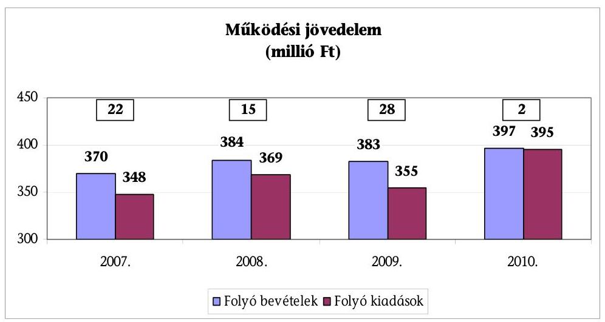
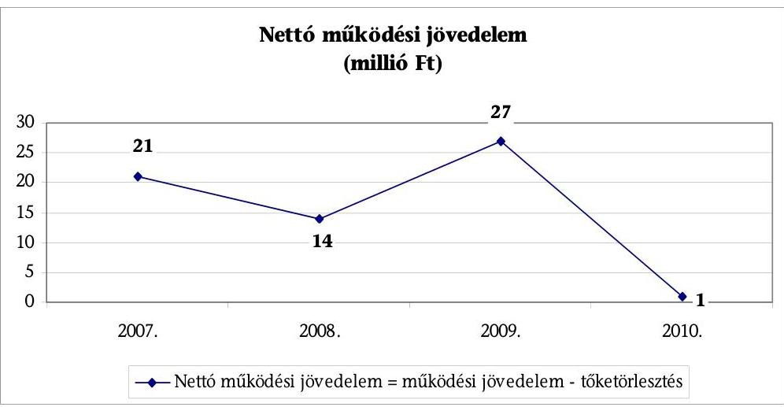
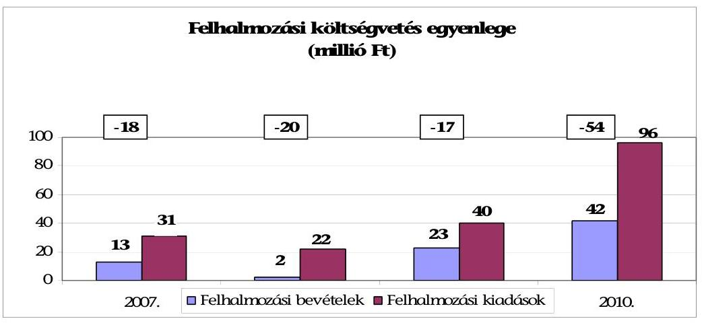
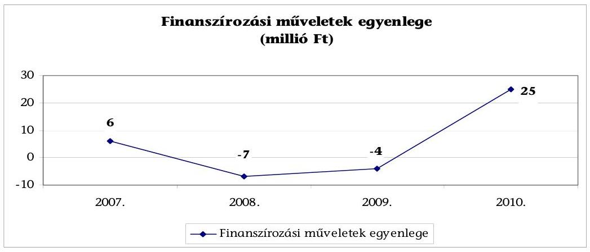
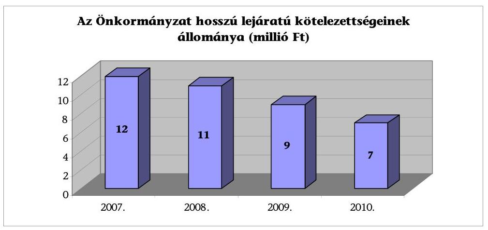
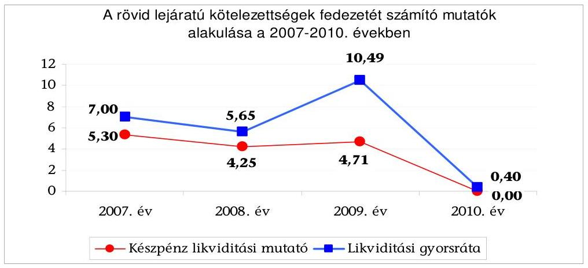
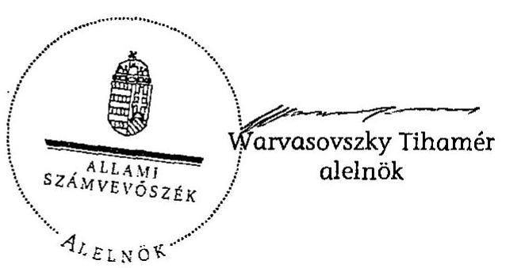

# JELENTÉS 

Gyöngyöspata Község Önkormányzata gazdálkodási rendszerének 2011. évi ellenőrzéséről (43/1)

---

# Számvevői Iroda 

Iktatószám: V-3055-16/2011.
Témaszám: 1015
Vizsgálat-azonosító szám: V0560004

## Az ellenőrzést felügyelte:

Dr. Elek János
főigazgató
Az ellenőrzés végrehajtásáért felelős:
Dr. Varga Sándor
számvevő igazgatóhelyettes
Az ellenőrzést vezette:
Csecserits Imréné
számvevő főtanácsos
Az ellenőrzést végezte:
Veres Jánosné
számvevő tanácsos, csoportvezető
Batkiné Vas Anna
számvevő tanácsos

---

# TARTALOMJEGYZÉK 

BEVEZETÉS ..... 7
I. ÖSSZEGZŐ MEGÁLLAPÍTÁSOK, KÖVETKEZTETÉSEK, JAVASLATOK ..... 10
II. RÉSZLETES MEGÁLLAPÍTÁSOK ..... 21

1. Az Önkormányzat adósságkezelési tevékenységének eredményessége a pénzügyi egyensúly fenntartásában, az adósságot keletkeztető kötelezettségvállalások pénzügyi kockázatainak hatása a gazdálkodás stabilitására, a közfeladat-ellátásra ..... 21
2. A vagyoni helyzet alakulása, valamint a vagyongazdálkodás folyamataiban a kontrollok működése ..... 29
2.1. Az Önkormányzat vagyoni helyzetének 2007-2010 közötti alakulása ..... 29
2.2. A vagyongazdálkodás belső kontrolljainak működése ..... 33
MELLÉKLETEK
3. számú Az Önkormányzat gazdálkodását meghatározó adatok, mutatószámok (1 oldal)
4. számú Az Önkormányzat bevételeinek és kiadásainak teljesítése (1 oldal)

---

.

---

# RÖVIDÍTÉSEK JEGYZÉKE 

## Törvények

Áht.
ÁSZ tv. 1
ÁSZ tv. 2
Kbt.
Ktv.
Ötv.

## Rendeletek

Ámr. 1
Ámr. 2
Áhsz.
2007. évi költségvetési rendelet
2008. évi költségvetési rendelet
2009. évi költségvetési rendelet
2010. évi költségvetési rendelet
2011. évi költségvetési rendelet
SzMSz

## Szórövidítések

áfa
ÁSZ
Belső Kontroll Kézikönyv

ELMIB Zrt.
FEUVE
gazdálkodási szabályzat
hivatali SzMSz
az államháztartásról szóló 1992. évi XXXVIII. törvény az Állami Számvevőszékről szóló 1989. évi XXXVIII. törvény
az Állami Számvevőszékről szóló 2011. évi LXVI. törvény a közbeszerzésekről szóló 2003. évi CXXIX. törvény a köztisztviselők jogállásáról szóló 1992. évi XXIII. törvény a helyi önkormányzatokról szóló 1990. évi LXV. törvény
az államháztartás működési rendjéről szóló 217/1998. (XII. 30.) Korm. rendelet
az államháztartás működési rendjéről szóló 292/2009. (XII. 19.) Korm. rendelet
az államháztartás szervezetei beszámolási és könyvvezetési kötelezettségének sajátosságairól szóló 249/2000. (XII. 24.) Korm. rendelet
az Önkormányzat 2/2007. (II. 12.) számú rendelete a 2007. évi költségvetésről
az Önkormányzat 1/2008. (II. 18.) számú rendelete a 2008. évi költségvetésről
az Önkormányzat 4/2009. (II. 23.) számú rendelete a 2009. évi költségvetésről
az Önkormányzat 2/2010. (II. 15.) számú rendelete a 2010. évi költségvetésről
az Önkormányzat 5/2011. (III. 7.) számú rendelete a 2011. évi költségvetésről
az Önkormányzat 5/2007. (III. 26.) számú rendelete az Önkormányzat Szervezeti és Működési Szabályzatáról
általános forgalmi adó
Állami Számvevőszék
az államháztartásért felelős miniszter által a 2010. évben közzétett, a belső kontrollrendszer működtetésére vonatkozó módszertani útmutató
ELMIB Első Magyar Infrastruktúra Befektetési Zrt.
folyamatba épített, előzetes, utólagos és vezetői ellenőrzés A polgármester munkakörében eljáró alpolgármester (polgármester ${ }_{2}$ ) által kiadott, Gyöngyöspata Községi Önkormányzat Kötelezettségvállalás, utalványozás ellenjegyzés, érvényesítés rendjének szabályzata, hatályos 2010. május 1-jétől
2007. január 2-án kelt, a polgármester és a jegyző által kiadott Gyöngyöspata Község Önkormányzata Polgármesteri Hivatalának Szervezeti Működési Szabályzata

---

| jegyző | Gyöngyöspata Község Önkormányzatának 2011. március 7-től betegállományban lévő jegyzője |
| :--: | :--: |
| mb. jegyző | Gyöngyöspata Község Önkormányzatának 2011. április 18-tól megbízott jegyzője |
| Képviselő-testület | Gyöngyöspata Község Önkormányzatának Képviselőtestülete |
| KÖZVIL Rt. | KÖZVIL Első Magyar Közvilágítási Rt. |
| OEP | Országos Egészségbiztosítási Pénztár |
| Önkormányzat | Gyöngyöspata Község Önkormányzata |
| Pénzügyi bizottság | Gyöngyöspata Község Önkormányzatának Pénzügyi Bizottsága |
| polgármester $_{1}$ | Gyöngyöspata Község Önkormányzatának polgármestere 2006. október 3-tól 2010. április 30-ig (Molnár József) |
| polgármester $_{2}$ | Gyöngyöspata Község Önkormányzatánál 2010. április 30-tól 2010. október 2-ig a polgármester munkakörében eljáró alpolgármester (Paziczky László) |
| polgármester $_{3}$ | Gyöngyöspata Község Önkormányzatának polgármestere 2010. október 3-tól 2011. április 18-ig (Tábi László) |
| polgármester $_{4}$ | Gyöngyöspata Község Önkormányzatánál 2011. április 19-től 2011. július 17-ig a polgármester munkakörében eljáró alpolgármester (Matalik Ferencné) |
| Polgármesteri hivatal | Gyöngyöspata Község Önkormányzatának Polgármesteri Hivatala |
| szja | személyi jövedelemadó |
| Kistérségi társulás | Gyöngyös Körzete Kistérség Többcélú Kistérségi Társulás |
| VÍZMŰ Zrt. | Heves Megyei VÍZMŰ Zrt. |

---

# ÉRTELMEZŐ SZÓTÁR 

árfolyamkockázat
eredményesség
garancia és kezességvállalás
kamatkockázat

A külföldi devizában lévő pénzügyi eszközök tulajdonosainak abból fakadó kockázata, hogy az árfolyam elmozdulásával az általuk tartott eszköz hazai fizetőeszközben kifejezett értéke megváltozik. (ezen ellenőrzéshez kialakított értelmezés)
A kitűzött célok megvalósításának mértékeként vagy egy tevékenység kimenete szándékolt és tényleges hatása közötti kapcsolat. Ebben a meghatározásában - kiterjesztve a teljesítmény-ellenőrzés értelmezési tartományára - a hatás az operatív, a specifikus vagy átfogó szinten keletkezett „végterméket" jelenti, amely lehet output, eredmény és hatás egyaránt. (ÁSZ Teljesítmény-ellenőrzési módszertan 16 oldal)
A garanciavállalás az önkormányzat kötelezettségvállalása arra vonatkozóan, hogy a szerződésben meghatározott feltételek beálltakor a garancia kedvezményezettje számára, határozott összegig, határozott időpontig, felszólításra azonnal fizet. Ez a kötelezettség az önkormányzat számára azzal a bizonytalansággal jár, hogy nem tudja, hogy ezt a kötelezettség-vállalását igénybe veszik-e vagy nem, és ha igen, mikor. A kezesség járulékos kötelezettségvállalás, amely lehet egyszerű vagy készfizető, és mindig feltételezi a főkötelezettet. Az egyszerű kezességvállalás esetén a kezes mindaddig megtagadhatja a teljesítést, míg mindazoktól behajtható, akik őt megelőzően vállaltak kötelezettséget. A készfizető kezest nem illeti meg a sortartás kifogása. A fentiek következtében mind a garancia-, mind a kezességvállalás esetében az önkormányzatnak a futamidő teljes időtartama alatt azzal kell számolnia, hogy ha a főkötelezett elmulasztja teljesíteni a fizetést, a vállalt kötelezettséget vele szemben érvényesítik az adott időpontban fennálló összeg erejéig. Előbbiek ismerete szükséges a felelős döntéshozatalhoz, valamint a kezességvállalást megelőzően indokolt, hogy a főkötelezett gazdasági társaság az önkormányzat rendelkezésére bocsássa a garancia- és kezességvállalás alapját képező kötelezettségéről kötött szerződést (pl. hitel, kölcsönszerződés), amelyből nemcsak annak főösszege állapítható meg, hanem a tőke-és járulékai, valamint a törlesztés futamideje, illetve határideje is. (ezen ellenőrzéshez kialakított értelmezés)
Az a kockázat, hogy a forint-, vagy a devizahitel futamideje alatt emelkedik a kamat és így a hitel törlesztésére fordítandó összeg. (ezen ellenőrzéshez kialakított értelmezés)

---

költségvetési bevétel

PPP (public private partnership)

Az Áht. 69. § (1) bekezdés a) és c) pontjaiban foglaltak figyelembevételével meghatározott összeg, amelynek számítása során a tárgyévi költségvetési bevételeket növeli - a költségvetési hiány belső finanszírozására szolgáló előző évek pénzmaradványából, vállalkozási maradványából igénybe vett összeg. (Az Áht. alapján ezen ellenőrzéshez kialakított értelmezés.)
Az állami és a magánszféra együttműködésének egyik formája, amelynek keretében a közcél a magánszféra jelentős mértékű közreműködésével valósul meg. Az állam (önkormányzat) a közszolgáltatások létrehozását a tradicionálisnál komplexebb módon bízza a magánszférára. Az együttműködés keretében megvalósuló közszolgáltatás hosszú távra szól. A magán partner felelőssége az infrastruktúra tervezésére, megépítésére, működtetésére és legalább részben a projekt finanszírozására terjed ki. Az állam (önkormányzat) és/vagy a szolgáltatások igénybe vevője szolgáltatási díjat fizet. A közszférabeli szerződő fél feladata a projekt definiálása, a szolgáltatás elvárt minőségének, mennyiségének és az igénybevétel idejének meghatározása, valamint az árazási politika kialakítása, az ellenőrzési, monitoring feladatok ellátása. (Államháztartási fogalomtár)

---

# JELENTÉS 

## Gyöngyöspata Község Önkormányzata gazdálkodási rendszerének 2011. évi ellenőrzéséről

## BEVEZETÉS

Az Állami Számvevőszék 2011. évben életbe lépett stratégiája szerint „az önkormányzatok ellenőrzése során azok pénzügyi-gazdasági helyzetét értékeli, kockázatait feltárja, valamint az ellenőrzések helyszíneit objektív mutatószámrendszer alapján választja ki". E célkitűzéseknek megfelelően összeállított ellenőrzési program alapján végzi a helyi önkormányzatok gazdálkodási rendszerének ellenőrzését.

## Az ellenőrzés célja az Önkormányzatnál annak értékelése volt, hogy:

- biztosított-e a pénzügyi egyensúly, a fizetőképesség, a gazdálkodás stabilitása, ezeket segítette-e az adósság kezelése;
- a vagyoni helyzet a külső és belső tényezők hatására miként változott, a belső kontrollok megfelelően biztosították-e a vagyongazdálkodás szabályosságát, eredményességét.

Az ellenőrzés típusa: teljesítmény-ellenőrzés, továbbá az ellenőrzés meghatározott területein szabályszerűségi ellenőrzés.

Az ellenőrzött időszak: a pénzügyi, vagyoni helyzettel kapcsolatos elemzéseket, értékeléseket alapvetően a 2007-2010. évekre vonatkozóan végeztük, valamint lehetőség szerint kitérünk a helyszíni ellenőrzést megelőző utolsó negyedév végéig terjedő időszakra is. A vagyongazdálkodás belső kontrolljai működésének tesztelése a 2010. évre, valamint a helyszíni ellenőrzést megelőző utolsó negyedév végéig terjedő időszakra vonatkozik.

Az ellenőrzés jogszabályi alapját az Állami Számvevőszékről szóló 1989. évi XXXVIII. törvény 2. § (3), (5), (6) és (9) bekezdései, a helyi önkormányzatokról szóló 1990. évi LXV. törvény 92. § (1) bekezdése, az államháztartásról szóló 1992. évi XXXVIII. törvény 104. § (3), és a 120/A. § (1) bekezdése előírásai képezték.

Gyöngyöspata község állandó lakosainak száma 2011. január 1-jén 2724 fő volt. A 2010. évi önkormányzati képviselő és polgármester választást követően az Önkormányzat héttagú Képviselő-testületének munkáját öt állandó bizottság segítette. A 2006. évi októberi önkormányzati képviselő és polgármester választáson a polgármesteri tisztséget elnyert polgármester; 2010. április 30-án elhalálozott, ettől az időponttól 2010. október 2-ig a polgármester munkakörében az alpolgármester (polgármester ${ }_{2}$ ) járt el. A 2010. október 3-ai önkormányzati képviselő és polgármester választáson megválasztott polgármester ${ }_{3}$

---

2011. április 18-án lemondott. A polgármester feladatait 2011. április 19-től a 2011. július 17-i polgármesteri választásig az alpolgármester (polgármester ${ }_{4}$ ) látta el. A jegyző 1989. január 1-jétől tölti be tisztségét, azonban 2011. március 7-től - jelenleg is - betegállományban van, helyettesítéséről a Képviselő-testület 2011. április 18-tól megbízott jegyző útján gondoskodik.

Az Önkormányzat pénzügyi egyensúlyi helyzetének rövid bemutatásán túlmenően a pénzügyi egyensúly fenntartását, a pénzügyi kockázatok kezelését és annak hatását (a pénzügyi egyensúlyt fenntartását veszélyeztető külső és belső pénzügyi kockázatok csökkentésére tett döntések, intézkedések eredményességét) minősítettük. Lényegességi szempontok figyelembevételével értékeltük a döntés-előkészítés, a megtett intézkedések eredményességét és azt, hogy a pénzügyi egyensúly fenntartását mely kockázatok és milyen mértékben veszélyeztették. Az ellenőrzés részletes szempontjai szerinti elvégzéséhez az egységes értelmezés alapját az ellenőrzési program mellékletét képező teljesítményellenőrzési kérdésfa és a kapcsolódóan meghatározott kritériumok, valamint a fogalmak egységes tartalmát meghatározó értelmezési szótár biztosította.

A vagyongazdálkodás ellenőrzése kiterjedt a vagyon értékének, összetételének, 2007-2010. évek között a vagyonváltozást előidéző okok elemzésére. A vagyongazdálkodás belső kontrolljai azonosításának és működésének ellenőrzése keretében a vagyonértékesítés és a vagyonhasznosítás, valamint a finanszírozási célú pénzügyi műveletek folyamatait értékeltük ${ }^{1}$. Felmértük a belső kontrollokban rejlő kockázatot, minősítettük a kontrollok működését és meghatároztuk, hogy a vagyongazdálkodás folyamatában mely kontrollok nem biztosították a működésbeli hibák megelőzését, feltárását, kijavítását, ezáltal veszélyeztették az eredményes, megfelelő működést.

A vagyongazdálkodási folyamatokban alkalmazott belső kontrollok azonosításának és működésének vizsgálatát többlépcsős megfelelőségi tesztek útján végeztük. A vizsgált területek könyvviteli tételei alapján (meghatározott tételszám felett egyszerű véletlen minta alapján) történt a vagyongazdálkodás belső kontrolljai működésének a megítélése. Az ellenőrzés során alkalmazott módszer - többlépcsős megfelelőségi teszt - lényege, hogy a kiválasztott minta ellenőrzését csak addig végeztük, amíg elegendő és megfelelő bizonyítékot nem

[^0]
[^0]:    ${ }^{1}$ A vagyongazdálkodás területén a szabályozottságban rejlő kockázatot alacsonynak minősítettük, ha a szabályozottság megfelelő védelmet nyújtott a vagyongazdálkodással összefüggő hibák bekövetkezése ellen. Közepesnek minősítettük a vagyongazdálkodás szabályozottságában rejlő kockázatot, amennyiben a szabályozottság a lehetséges vagyongazdálkodási hibák többsége ellen védelmet nyújtott. Magasnak értékeltük a vagyongazdálkodás szabályozottságában rejlő kockázatot, ha a szabályok - kialakításuk hiányában, vagy hiányos kialakításuk miatt - nem nyújtottak elegendő védelmet a lehetséges vagyongazdálkodási hibákkal szemben.

---

szereztünk a vizsgált folyamatok kulcskontrolljai működésének megfelelő vagy nem megfelelő voltáról².

Az Önkormányzat gazdálkodási rendszerének ÁSZ általi ellenőrzésére még
 nem került sor.

A helyszíni ellenőrzés során kitöltött - az ellenőrzést végző számvevő és a Polgármesteri hivatal felelős köztisztviselője által aláírt - ellenőrzési munkalapokat, azok kitöltési útmutatóit, továbbá a megfelelőségi tesztek dokumentumait a polgármester munkakörében eljáró alpolgármester (polgármester ${ }_{4}$ ) részére a számvevői jelentéssel egyidejűleg átadtuk.

[^0]
[^0]:    ${ }^{2}$ A vagyongazdálkodás területén azonosított kontrollok működését kiválónak értékeltük abban az esetben, ha azok működése megfelelt a hibák megelőzésére és kijavítására meghatározott szabályozásnak és a legmagasabb szintű elvárásoknak. Jónak minősítettük a vagyongazdálkodás területén azonosított kontrollok működését, ha a megállapított kisebb (tolerálható mértékű) hiányosságok nem veszélyeztették a vagyongazdálkodás ellenőrzött területei hibáinak megelőzését és kijavítását. Amennyiben a kontrollok működésében túl sok hiányosság fordult elő ahhoz, hogy a kontrollok biztosítsák a vagyongazdálkodási hibák megelőzését, feltárását, kijavítását és ezáltal veszélyeztették az eredményes, megfelelő vagyongazdálkodást, a kontrollok működése gyenge minősítést kapott.

---

# I. ÖSSZEGZŐ MEGÁLLAPÍTÁSOK, KÖVETKEZTETÉSEK, JAVASLATOK 

Az Önkormányzat feladatainak végrehajtása érdekében a Polgármesteri hivatal mellett a 2007. évben négy, 2010-ben három költségvetési szervet működtetett, utóbbiak részben önállóak, illetve önállóan működők voltak. Az Önkormányzat 2007-2010 között az Ötv. alapján kötelezően ellátandó feladatai közül az óvodai nevelést, az általános iskolai oktatást és az idősek nappali ellátását, valamint a közművelődési és könyvtári feladatokat az általa fenntartott intézményekkel, a szociális- és gyermekvédelmi feladatokat, valamint a belső ellenőrzést a Kistérségi társulással, az egészségügyi alapellátást vállalkozókkal kötött megállapodás útján biztosította. Az egészséges ivóvíz ellátási-, a településtisztasági feladatokat megrendelés alapján gazdasági társaságok végzik. Az Önkormányzat által 2007-2011. év I. negyedéve között ellátott feladatok szervezeti formája változott, 2008. január 1-jétől az Építéshatósági Igazgatási Kistérségi társulás megszűnt, a feladatokat Gyöngyös Város Önkormányzata vette át. 2008. január 1-jétől a gyermekvédelmi feladatokat a megállapodás módosításával a Kistérségi társulás látja el és ettől az időponttól az Önkormányzat csatlakozott a Családi Napközi Intézményfenntartó Társuláshoz, majd 2008. december 31-i hatállyal az Idősek Klubja megszüntetéséről döntött.

Az Önkormányzat önként vállalt feladatai keretében támogatást nyújtott non-profit szervezetek és más helyi közösségek részére. Az önként vállalt feladatok részesedése 2010-ben az összes költségvetési kiadás 4,3%-a (21 millió Ft) volt. Az Önkormányzat nem rendelkezik gazdasági társasággal. A Polgármesteri hivatalban dolgozó köztisztviselők száma 2007. január 1-jén 11 fő, 2011. január 1-jén 8 fő, a költségvetési szerveknél foglalkoztatott közalkalmazottak száma 2007. január 1-jén 54 fő, 2011. január 1-jén 51 fő volt.

A vizsgált időszakban az Önkormányzat pénzügyi helyzetét - az elemzéséhez alkalmazott CLF módszer szerint - a következők jellemzik. A folyó költségvetések egyenlege (a működési jövedelem) és a tőketörlesztést is tartalmazó, nettó működési jövedelem a 2007-2010 közötti időszakban pozitív volt. A felhalmozási költségvetések minden évben negatív egyenleggel zárultak. Ez a 2007-2009. években nem járt pénzügyi kockázattal, mert a pozitív nettó működési jövedelemmel, valamint a rendelkezésre álló maradvánnyal biztosítani tudták a pénzügyi egyensúlyt. A felhalmozási költségvetés 2010. évi negatív összegét sem a nettó működési jövedelem, sem a rendelkezésre álló maradvány nem tudta ellensúlyozni.

Az Önkormányzat a 2011-2016. évek közötti (pénzintézeti és egyéb) hosszú lejáratú kötelezettsége 27,8 millió Ft, amelyből a pénzintézeti kötelezettség 2011-2013-ban összesen 6,3 millió Ft, 2014-ben 2,8 millió Ft. Egyéb hosszú lejáratú kötelezettség a 2011-2013. években 10,2 millió Ft, 2014-2016 között 8,5 millió Ft.

---

Az Önkormányzat költségvetési bevétele a 2007. évi 403 millió Ft-ról 2010-re 462 millió Ft-ra, 14,6%-kal (59 millió Ft-tal) emelkedett. Az összes költségvetési bevétel 16,9%-át (78 millió Ft) a saját bevétel, 15,6%-át (72 millió Ft) a helyi adóbevétel biztosította 2010-ben. A helyi adóbevétel összes költségvetési bevételen belüli aránya a 2007. évihez viszonyítva 0,8 százalékponttal csökkent, a 6,0 millió Ft-os növekedése ellenére.

Az összes költségvetési kiadásból a felhalmozási célú kiadás részaránya 2007-hez viszonyítva 2010-re 11,3 százalékponttal (64,6 millió Ft-tal) nőtt, 2010-ben 20,0%, 97,5 millió Ft volt. A 2011. évben 439 millió Ft költségvetési bevételt és 437 millió Ft költségvetési kiadást terveztek. A 2007-2010. évi költségvetésekben szereplő eredeti előirányzatok és a teljesítési adatok alapján a költségvetési bevételeket minden évben alul-, a kiadásokat pedig túltervezték. Az évente tervezett költségvetési hiányt rövid lejáratú hitelből tervezték finanszírozni. Az Önkormányzat gazdálkodását meghatározó adatokat, mutatószámokat az 1-2. számú melléklet tartalmazza.

Az Önkormányzat 2007-2011. év I. negyedéve között nem rendelkezett likviditási és eladósodási problémákat kezelő stratégiával, pénzügyi egyensúlyát biztosító rövid vagy hosszú távú célrendszert nem fogalmaztak meg. A Képviselő-testület a 2007-2011. év I. negyedéve közötti időszakban nem kapott tájékoztatást a hosszú- és rövid lejáratú, adósságot keletkeztető kötelezettségvállalásokból adódó tőke- és kamatfizetési kötelezettségek teljesítési feltételeiről. Az Önkormányzat a 2007-2011. évi költségvetési rendeleteiben nem mutatta be ezen kötelezettségek forrásait és a 2007-2010. évi költségvetési rendeletek nem tartalmazták a részvényvásárlással kapcsolatos fizetési kötelezettségeket. Az államháztartáson kívülre céljelleggel juttatott támogatások odaítélését megelőzően nem vizsgálták az Önkormányzat rendelkezésre álló pénzügyi forrásokat, a költségvetési rendeletekben, azok előterjesztéseiben nem rögzítették ezen előirányzatok, előirányzat-módosítások tervezett költségvetési hiány alakulására gyakorolt hatását.

A Képviselő-testület a hosszú lejáratú, változó kamatozású beruházási hitel kamatemelésekor nem hozott intézkedést az önkormányzati terhek kedvezőtlen alakulásának csökkentésére. A kötelezettségek állománya 2007-hez képest 2010-re 36,0 millió Ft-tal, 54,0 millió Ft-ra nőtt, a forrásokon belüli aránya 2,2 százalékponttal emelkedett.

Az Önkormányzat 2010 májusától folyószámlahitelt vett igénybe, amelynek év végi 39,2 millió Ft-os állománya 2011. év I. negyedéve végére 11,3 millió Ft-ra csökkent. A 2010-ben 213, a 2011. év I. negyedévében 88 napon igénybe vett folyószámlahitel átlagos napi állománya 2010-ben 25,4 millió Ft, 2011. év I. negyedévében 30,1 millió Ft volt. Az Önkormányzat a 2011. év I. negyedéve végén 519 ezer Ft - 30-60 nap közötti - lejárt szállítóállománnyal rendelkezett.

A beruházási hitel visszafizetésével összefüggő hosszú lejáratú adósságot keletkeztető kötelezettségvállalás 2010. évet követő években esedékes törlesztő részletei 2011-ben 1,7 millió Ft, ezt követően a futamidő végéig összesen 7,4 millió Ft. Az évenkénti törlesztési kötelezettség a 2010. évi teljesített saját bevételeknek 2,2-3,5%-a. A részvényvásárlással kapcsolatosan 2011-2016 között teljesítendő 18,7 millió Ft-os kötelezettség évenkénti fizetendő összege a sa-

---

ját bevétel további 4,3-4,8%-át köti le. Ezen fizetési kötelezettségek nehezítik, de várhatóan nem veszélyeztetik az Önkormányzat fizetőképességét.

Az Önkormányzat 2010. december 31-én a könyvviteli mérleg szerint 1637 millió Ft értékű vagyonnal rendelkezett, amely a 2007. év végi 1648 millió Ft állományhoz viszonyítva 0,7%-kal (11 millió Ft-tal) csökkent. Ezen belül a befektetett pénzügyi eszközök állománya közel négyszeresére (10 millió Ft-tal) emelkedve 12 millió Ft-ra nőtt az ELMIB Zrt-ben szerzett részesedés miatt. A hosszú és rövid lejáratú kötelezettségek állománya 2007-2010 között 36 millió Ft-tal, 200%-kal 54 millió Ft-ra nőtt, a hosszú lejáratú kötelezettségek 38,2%-os (5 millió Ft) csökkenése és a rövid lejáratú kötelezettségek közel nyolcszorosára történt emelkedésének együttes hatására. A rövid lejáratú kötelezettségek 2007-2010 közötti emelkedését az áruszállításból és szolgáltatásból származó kötelezettségek mintegy négyszeresére történő emelkedése és a 2010. év végén vissza nem fizetett folyószámlahitel állomány (39 millió Ft) együttesen okozta. A Képviselő-testület 2007-2010 között hosszú lejáratú adósságot keletkeztető kötelezettségvállalásról nem döntött.

A Képviselő-testület a vizsgált időszakban az önkormányzati kötelező közfeladatok ellátását szolgáló fejlesztési feladatokról - egészségház, út, vízelvezető rendszer, faluközpont, művelődési ház, temetőkerítés felújítása, Polgármesteri hivatal fűtéskorszerűsítése, óvodai, iskolai, számítástechnikai, valamint üzemviteli és konyhai eszközök beszerzése - döntött. A 2007-2010 között 146 millió Ft értékben elvégzett felújítások és beruházások értéke 79,3%-ban ellensúlyozta az ebben az időszakban elszámolt 184 millió Ft értékcsökkenés összegét.

A 2007-2010 között elkezdett és befejezett fejlesztések forrását 65 millió Ft (44,5%) európai uniós, 17 millió Ft (11,6%) hazai támogatás biztosította, a további szükséges fedezetet, 64 millió Ft-ot (43,8%) saját bevétel és a 2010-ben igénybevett folyószámlahitel finanszírozta. A folyószámlahitel felhalmozási célú felhasználása jelzi, hogy az Önkormányzat erőn felül vállalt kötelezettséget, amelynek a 2010. év végi negatív tartalék kialakulásában is szerepe volt. A 2011-ben induló, 108 millió Ft bekerülési költségű, 97 millió Ft európai uniós támogatással megvalósuló óvodabővítés 11 millió Ft saját forrásigényének teljesítése várhatóan hozzájárul a pénzügyi egyensúly további romlásához.

A vagyongazdálkodási folyamatok szabályozottságának hiányosságai magas kockázatot jelentettek a feladatok megfelelő végrehajtásában. Az Önkormányzatnál a 2006-2010. évekre vonatkozóan elkészített gazdasági programról a Képviselő-testület az Ötv-ben előírtak ellenére határozattal nem döntött. A 2010-ben megválasztott új Képviselő-testület - az Ötv-ben foglaltakat megsértve - a választási ciklusra vonatkozó új gazdasági programot az alakuló ülését követő hat hónapon belül és azt követően sem fogadta el.

A jegyző a vagyongazdálkodási folyamatok ellenőrzési feladatai között az Ámr. ${ }_{2}$-ben előírtak ellenére nem kezdeményezte, hogy a hivatali SzMSz tartalmazza a vagyongazdálkodási feladatokhoz is kapcsolódó munkakörök feladat- és hatásköreit, azok gyakorlásának módját, a helyettesítés rendjét, az ezekhez kapcsolódó felelősségi szabályokat, a szervezeti ábrát és a Polgármesteri hivatalhoz rendelt más költségvetési szervek felsorolását. A jegyző az eszközök és források leltározási és leltárkészítési szabályzatában az Áhsz-ben foglalt előírások ellenére nem írta elő - az immateriális javak és követelések kivételével - az eszközök évenkénti, mennyiségi felvétellel történő leltározását. A Polgármesteri hivatal nem rendelkezett adatvédelmi és adatbiztonsági szabályzattal, valamint a céljelleggel nyújtott támogatások közzétételi eljárás rendjének szabályozásával. A Polgármesteri hivatalban nem határozták meg a vagyongazdálkodási feladatok ellátásához szükséges humán erőforrás mennyiségi és minőségi, valamint szakmai szükségletét, a jegyző nem határozta meg az etikus magatartással kapcsolatos elvárásokat.

A jegyző az Ámr. ${ }_{2}$ előírásait figyelmen kívül hagyva a kockázatkezelés rendjének keretében nem mérte fel a vagyongazdálkodási folyamatok külső és belső kockázatait, nem határozta meg a kockázatok kezelésére szolgáló kontrolleljárásokat, a kockázatkezelési szabályzatban nem határozta meg a kockázatazonosítás és értékelés módját, a csalás, korrupció kockázatának minősítését, a vagyongazdálkodás főfolyamatára a feltárt kockázatokkal kapcsolatos válaszlépéseket, nem dolgozta ki a vagyongazdálkodási folyamatok kockázati tényezőinek csökkentése érdekében hozott intézkedések nyomon követésének módszerét. A jegyző nem kezdeményezte, hogy a Kistérségi társulásnál az éves ellenőrzési tervben tervezzék a vagyongazdálkodáshoz kapcsolódó magas kockázatúnak értékelt területek ellenőrzését.

A kontrolltevékenységek meghatározása keretében a jegyző nem kezdeményezte a vagyon forgalomképességének megváltoztatási módjára vonatkozó előírások meghatározását. Nem rögzítette a vagyongazdálkodási feladatokat ellátók munkaköri leírásában a vagyongazdálkodással kapcsolatos jogokat, hatásköröket, a kapcsolattartás módját, nem írta elő az átruházott hatáskörrel rendelkezők beszámolási kötelezettségét. A Polgármesteri hivatalban a jegyző indokoltsága ellenére - nem írta elő a vagyonértékesítéssel és hasznosítással kapcsolatos döntés-előkészítés folyamatában a költség-haszon elemzés készítésének kötelezettségét, az értékhatár alatti vagyonértékesítésre és hasznosításra vonatkozóan a versenyeztetési kötelezettséget, a hasznosításra szánt vagyon értékének megállapítása céljából értékbecslés készítésének kötelezettségét, a végrehajtás szakaszában az Önkormányzat tulajdonosi jogainak, érdekeinek védelmét szolgáló garanciális elemek szerződésben, egyéb dokumentumban való rögzítésének kötelezettségét. A finanszírozási célú pénzügyi
 műveletekkel összefüggésben a jegyző nem írta elő a pénzügyi kockázatok felmérését, a hitelfelvételről szóló döntés-előkészítés folyamatában a futamidő egyes éveit terhelő kötelezettség költségvetési egyensúlyra gyakorolt hatása vizsgálatát.

A jegyző a kontrolltevékenységek meghatározása során nem alakította ki a vagyongazdálkodási folyamatok dokumentálásának rendjét, ezen belül a befejezett építési beruházáshoz, felújításhoz kapcsolódóan a műszaki átadás-átvételi dokumentum tartalmi és formai követelményeit, a vagyongazdálkodási folyamatok rögzítésére használt informatikai programok adatai használatára vonatkozó követelményeket, nem jelölte ki a bevételeket megalapozó döntésekben meghatározott feltételek szerződésben történő érvényesítésének ellenőrzéséért felelős személyeket. A jegyző az Ámr. ${ }_{2}$-ben előírtak ellenére nem jelölte ki a vásárolt közszolgáltatásokkal, az ingatlanok felújításával, a nonprofit szervezeteknek, egyházaknak és egyéb vállalkozásoknak nyújtott céljellegű működési és felhalmozási célú támogatásokkal kapcsolatos kiadások szakmai teljesítésigazolására jogosult személyeket, nem határozta meg a szakmai teljesítésigazo-

---

lás módját, eljárási rendjét, és célszerűsége ellenére nem írta elő a saját bevételek esetében a szakmai teljesítés igazolásának kötelezettségét.

Az információt, kommunikációt, monitoringot érintően - szükségessége ellenére - a jegyző nem kezdeményezte a vagyongazdálkodás külső és belső információi kezelése rendjének, a vagyongazdálkodással összefüggő közérdekű adatok és a vagyongazdálkodással kapcsolatos iratok kezelése rendjének, valamint a szabálytalanságok kezelésére vonatkozó eljárásrendben a vagyongazdálkodási folyamatokra vonatkozóan a szabálytalanságok észlelésével kapcsolatos feladatoknak, továbbá a vagyongazdálkodási folyamatokra vonatkozó nyomon követési módszereknek a meghatározását. A jegyző nem írta elő a Polgármesteri hivatalban az indikátorok (tevékenységekre meghatározott mutatók) megvalósulásának és az eltéréseknek a vizsgálatát, valamint a belső kontrollrendszer működésének évenkénti felülvizsgálatát.

A Polgármesteri hivatalban 2010-ben a vagyongazdálkodási folyamatokban a kontrollok működése gyenge volt, mert a jegyző nem gondoskodott az Áhsz-ben előírtak ellenére az ingatlanvagyon évenkénti leltározásáról. A Pénzügyi bizottság a vagyonváltozás alakulásának figyelemmel kíséréséről nem számolt be a Képviselő-testületnek. A Polgármesteri hivatalnál a szabályozás hiánya miatt a finanszírozási célú pénzügyi műveletek végzése során a döntés-előkészítés folyamatában nem mérték fel pénzügyi kockázatokat, nem végezték el a hosszú lejáratú hitelek teljes futamidejére a kötelezettségvállalás költségvetési egyensúlyra gyakorolt hatásának vizsgálatát, a Pénzügyi bizottság az SzMSz előírása ellenére nem terjesztett be a hitelfelvétel indokainak és gazdasági megalapozottságának vizsgálatáról szóló véleményt a hitelfelvételhez kapcsolódó képviselő-testületi döntéshez.

A vagyongazdálkodási tevékenységgel kapcsolatos közzétételi kötelezettséget a jegyző az Áht-ban előírtakat megsértve nem teljesítette, a vagyongazdálkodási tevékenységek folyamataiban használt számítástechnikai programok adatai tekintetében nem volt biztosított az adatok hozzáférése. Vezetői ellenőrzés keretében nem számoltatták be a vagyongazdálkodási feladatokat végzőket a vagyonértékesítés, vagyonhasznosítás folyamatairól, annak eredményéről, az ellenőrzési nyomvonalban előírtak ellenére a vagyongazdálkodási folyamatokra kijelölt ellenőrzési pontokon nem végeztek ellenőrzéseket és az előírás hiánya miatt a vagyongazdálkodási feladatokkal megbízott dolgozók nem számoltak be az elvégzett feladatokról.

A Polgármesteri hivatalban 2010-ben az önkormányzati ingatlanok, helyiségek bérbeadásából származó bevételek elszámolása, valamint a vásárolt közszolgáltatások, ingatlan felújítások, továbbá céljellegű működési és felhalmozási célú támogatások kifizetése során a belső kontrollok működése gyenge volt, mert az ingatlanok felújításával, a céljellegű működési és felhalmozási célú támogatásokkal kapcsolatos kötelezettségvállalás ellenjegyzésére jogosult jegyző az Ámr. ${ }_{2}$-ben előírt ellenőrzési feladatait nem végezte el, nem ellenőrizte a kötelezettségvállalás tárgyával összefüggő kiadási előirányzat rendelkezésre állását, a fedezet meglétét, és nem vizsgálta, hogy a kötelezettségvállalás sérti-e a gazdálkodásra vonatkozó szabályokat.

---

Az utalványok ellenjegyzője, a jegyző az Ámr. ${ }_{2}$-ben előírt ellenőrzési kötelezettségét nem végezte el, mert az önkormányzati ingatlanok, helyiségek bérbeadásával kapcsolatos bevételek esetében és az ingatlanok felújításával, a vásárolt közszolgáltatásokkal, a céljellegű működési és felhalmozási célú támogatásokkal kapcsolatos kifizetéseket megelőzően nem kifogásolta, hogy nem történt meg a szakmai teljesítés igazolása. Az Ámr. ${ }_{2}$-ben előírtak ellenére írásban nem tájékoztatta a kötelezettségvállalásra jogosultat - a polgármestert - arról, hogy kötelezettségvállalás a Bodicsi út, Iskola út gyaloghíd, Alsó, Felső temető vízelvezető-, valamint az egészségház felújítás, és a Vízmű Zrt-nek nyújtott támogatások esetében nem felelt meg a gazdálkodásra vonatkozó szabályoknak. Azt a polgármester ${ }_{1+2,3}$ az Áht-ban előírtakat figyelmen kívül hagyásával, ellenjegyzés nélkül tették meg, illetve a támogatások esetében a 2010. évi költségvetési rendeletben előírtak ellenére nem kötöttek szerződést. Az utalványok ellenjegyzője, a jegyző nem kifogásolta, hogy az utalványrendeleten nem tüntették fel a kötelezettségvállalás nyilvántartási számát.

A Polgármesteri hivatalban a gazdálkodási feladatok, hatáskörök szabályozásáért az Ötv. alapján a Polgármesteri hivatalt vezető jegyző a felelős. Az Áhtban foglaltak alapján a belső kontrollrendszer részét képező folyamatba épített előzetes, utólagos és vezetői ellenőrzési rendszer létrehozásáért, működtetéséért és fejlesztéséért a költségvetési szerv vezetője a felelős. Felelősség terheli a jegyzőt a szakmai teljesítésigazolás, mint belső kontroll kialakításának és hatékony működtetésének elmulasztásáért, mivel az Ámr. ${ }_{2}$-ben foglaltak ellenére nem határozta meg belső szabályzatban a szakmai teljesítésigazolás gyakorlásának módját, eljárási és dokumentációs szabályait. Nem jelölte ki írásban a szakmai teljesítésigazolókat, továbbá az Áht. előírásait figyelmen kívül hagyva nem intézkedett a céljelleggel nyújtott támogatások adatainak közzétételére és a támogatások rendeltetésszerű felhasználásának, valamint a számadások ellenőrzésére.

Felelősség terheli a polgármester ${ }_{2}$-t és a polgármester ${ }_{3}$-t, mert a Kbt-nek a közbeszerzés becsült értékének számítására vonatkozó előírásait az egészségház 2010. évi felújításához kapcsolódóan nem tartották be, mivel a közbeszerzési eljárásban rögzített, becsült értéket meghaladó kifizetések (összesen 2501,4 ezer Ft) teljesítését engedélyezték. Az Áht. írásbeli kötelezettségvállalásra vonatkozó előírásait is figyelmen kívül hagyva az egészségház felújítása során a közbeszerzés nyertes pályázójának írásbeli kötelezettségvállalás nélkül, a kiviteli szerződésben meghatározott vállalkozási díjat 1577,6 ezer Ft-tal meghaladó kifizetésekre adtak engedélyt. Az ÁSZ a Kbt. előírásának megsértése miatt a Közbeszerzési Döntőbizottságnál jogorvoslati eljárás megindítását kezdeményezte. A Közbeszerzési Döntőbizottság a jogsértést megállapította.

A polgármester ${ }_{2}$ - az Áht-ban foglaltakat megsértve - ellenjegyzés nélkül vállalt kötelezettséget az egy fő részére nyújtott 200 ezer Ft lakásépítési támogatás kifizetését megalapozó szerződésben, valamint a belterületi felszíni esővízelvezető árkok tisztításához, átereszek építéséhez kapcsolódó 482 ezer Ft, továbbá a belterületi felszíni vízelvezetési munkák 1595 ezer Ft összegű szerződéseiben.

A polgármester ${ }_{3}$ - az Áht-ban foglaltakat megsértve - ellenjegyzés nélkül vállalt kötelezettséget a 2010. december 21-én kelt haszonbérleti szerződés-

---

módosításban 63 ezer Ft esetében, valamint a 2010. december 27-én kelt, 34 ezer Ft/hó összegre vonatkozó helyiség bérbeadási szerződésben.

Az Önkormányzat által a 2010. évben nyújtott, összesen 17,9 millió Ft céljellegű támogatás kifizetésére - a 2010. évi költségvetési rendeletben foglalt előírásokat figyelmen kívül hagyva - a támogatás kedvezményezetteivel a polgármester ${ }_{2}$ és a polgármester ${ }_{3}$ szerződést nem kötöttek, az Áht-ban előírtakat megsértve a támogatás célját, a számadási kötelezettséget a támogatottak részére nem írták elő, melyért felelősség terheli a polgármester ${ }_{2}$-t és a polgármester ${ }_{3}$-t az Ötv-ben foglaltak alapján, mivel nem biztosították a gazdálkodás szabályszerűségét. Az ÁSZ a polgármester ${ }_{2}$ és a polgármester ${ }_{3}$ felelősségének érvényesítését, megállapítását nem kezdeményezte, mivel a polgármester ${ }_{2}$ polgármesteri megbízatása 2010. október 2-án, a polgármester ${ }_{3}$-é 2011. április 18-án megszűnt.

A helyszíni ellenőrzés megállapításainak hasznosítása mellett javasoljuk:

# a Polgármesternek 

a jogszabályi előírások betartása érdekében

1. gondoskodjon az Önkormányzat gazdasági programjának előkészítéséről, valamint szorgalmazza, hogy Ötv. 91. § (1), (6) és (7) bekezdéseiben foglaltak betartása érdekében azt a Képviselő-testület fogadja el;
2. intézkedjen az Ötv. 90. § (1) bekezdése alapján az önkormányzati vagyongazdálkodási feladatok esetében a szabályszerű gazdálkodás érdekében, hogy
a) az Áht. 100/C. § (3) bekezdésében foglaltaknak megfelelően tárgyévi fizetési kötelezettséget csak az arra jogosult ellenjegyzése után, és a pénzügyi teljesítést megelőzően, írásban vállaljon;
b) a Kbt. 35-39. §-ában foglalt, a becsült érték meghatározására vonatkozó előírásokat betartsák;
3. tegyen javaslatot a Képviselő-testületnek, hogy az Áht. 88. § (2) bekezdésében foglaltak szerint a jelentés 15. oldal (2), valamint a 42. oldal (4)-(5) bekezdéseiben rögzített jogszabálysértések tekintetében a köztisztviselők jogállásáról szóló 1992. évi XXIII. törvény 51. § (1) bekezdése alapján indítsa meg a jegyző elleni fegyelmi eljárást;
4. intézkedjen annak érdekében, hogy a céljelleggel nyújtott támogatásokhoz kapcsolódóan - az Áht. 13/A. § (1) bekezdésében foglaltak alapján - határozzák meg a támogatás célját;
5. ismertesse meg a Képviselő-testülettel a jelentést az ÁSZ tv. ${ }_{2}$ 32. § (6) bekezdésében foglaltaknak megfelelően;
6. készítsen a jelentésben foglalt megállapításokhoz kapcsolódó intézkedési tervet az ÁSZ tv. ${ }_{2}$ 33. § (1) bekezdésében foglaltak alapján, és azt a jelentés kézhezvételét követő 30 napon belül küldje meg az ÁSZ részére;

---

a munka színvonalának javítása érdekében
7. kezdeményezze, hogy a Képviselő-testület írja elő a vagyonértékesítéssel és hasznosítással kapcsolatos döntés-előkészítési folyamatban a költség-haszon elemzés készítésének kötelezettségét, az értékhatár alatti vagyonértékesítésre és hasznosításra vonatkozóan a versenyeztetési kötelezettséget, a hasznosításra szánt vagyon piaci értéke megállapítása céljából értékbecslés készítésének kötelezettségét;
8. gondoskodjon arról, hogy a gazdálkodás hatékonyságának elősegítése érdekében a hitelfelvételhez kapcsolódó képviselő-testületi döntéshez a Pénzügyi bizottság terjessze be a hitelfelvétel indokainak és gazdasági megalapozottságának vizsgálatáról szóló véleményét;

# a Jegyzönek 

a jogszabályi előírások betartása érdekében

1. kezdeményezze a hivatali SzMSz kiegészítését, hogy az tartalmazza az Ámr. 2 20. § (1) bekezdés és a (2) bekezdés e) pontja előírása alapján a vagyongazdálkodási feladatot ellátó szervezeti egység feladatait, (2) bekezdés h) pontjában előírtaknak megfelelően valamennyi munkakörhöz tartozó feladat- és hatáskört, a hatáskörök gyakorlásának módját, a helyettesítés rendjét, az ezekhez kapcsolódó felelősségi szabályokat, az i) pontja alapján a költségvetési szerv szervezeti ábráját, valamint a k) pontja alapján a Polgármesteri hivatalhoz rendelt más költségvetési szervek felsorolását;
2. a pénzügyi, irányítási és ellenőrzési rendszer keretében szabályozza - az Ötv. 92. § (4) bekezdésében foglaltak alapján - a vagyongazdálkodás belső kontrolljait az Önkormányzat rendelkezésére álló források szabályszerű, szabályozott, gazdaságos, hatékony és eredményes felhasználása érdekében:
a) az eszközök és források leltározási és leltárkészítési szabályzatában írja elő az Áhsz. 37. § (1) és (3) bekezdésében előírtak alapján az eszközök - kivéve az immateriális javakat, követeléseket - évenkénti, mennyiségi felvétellel történő leltározási kötelezettségét, valamint határozza meg az Áhsz. 37. § (4) bekezdésében előírtak alapján az üzemeltetésre, vagyonkezelésre, koncesszióba átadott eszközök leltározásának módját, továbbá biztosítsa a leltározási és leltárkészítési szabályzatban foglaltak végrehajtását;
b) gondoskodjon arról, hogy a Polgármesteri hivatalban az ellenőrzési nyomvonalban a vagyongazdálkodási folyamatokra kijelölt ellenőrzési pontokon az ellenőrzést elvégezzék;
c) határozza meg az Ámr. 2 157. § (1) bekezdése alapján a vagyongazdálkodási folyamatok külső és belső kockázatait, a kockázatok kezelésére szolgáló kontrolleljárásokat, a kockázatazonosítás és értékelés módját, a csalás, korrupció kockázatának minősítését, a vagyongazdálkodás főfolyamatára a feltárt kockázatokkal kapcsolatos válaszlépéseket;
3. biztosítsa a vagyongazdálkodás átláthatóságának elősegítése érdekében

---

a) az Áht. 15/A. § (2) bekezdésében, valamint a 15/B. § (1) bekezdésében előírt vagyongazdálkodással kapcsolatos adatok közzétételét;
b) intézkedjen annak érdekében, hogy a céljelleggel nyújtott támogatásokhoz kapcsolódóan - az Áht. 13/A. § (2) bekezdésében foglaltaknak megfelelően - elvégezzék a rendeltetésszerű
 felhasználás és a számadás ellenőrzését;
4. jelölje ki a Polgármesteri hivatalban az Ámr. ${ }_{2}$ 76. § (5) bekezdése alapján a szakmai teljesítésigazolást végző személyeket a vásárolt közszolgáltatásokkal, az ingatlanok felújításával, a nonprofit szervezeteknek, egyházaknak és egyéb vállalkozásoknak nyújtott céljellegű támogatásokkal kapcsolatos kiadások esetében, határozza meg a szakmai teljesítésigazolás elvégzésének módját, eljárási rendjét, és gondoskodjon arról, hogy az Ámr. ${ }_{2}$ 76. §-ában előírt ellenőrzési kötelezettségének a szakmai teljesítésigazoló eleget tegyen;
5. végezze el az utalványok ellenjegyzésekor az Ámr. ${ }_{2}$ 79. §-ában előírt ellenőrzési feladatokat, továbbá az Áht. 100/C. § (3) bekezdésében előírtak betartása érdekében az ellenjegyzés nélkül történt kötelezettségvállalás, illetve az írásbeli kötelezettségvállalás elmaradása esetén tegyen eleget az Ámr. ${ }_{2}$ 74. § (5) bekezdésében előírt, kötelezettséget vállaló részére adandó írásbeli tájékoztatási kötelezettségének;
6. gondoskodjon a szükséges eljárásrend meghatározásával arról, hogy a kötelezettségvállalást követően annak nyilvántartásba vételét az előírt adattartalommal elvégezzék az Ámr. ${ }_{2}$ 75. § (1) bekezdésében előírtak alapján, és az Ámr. ${ }_{2}$ 78. § (2) bekezdésének g) pontjában foglaltaknak megfelelően a nyilvántartási számot az utalványrendeleten tüntessék fel;
7. fejlessze és működtesse az Áht. 121/A. § (4) bekezdésében foglaltak alapján a Polgármesteri hivatal belső kontrollrendszerének részét képező a folyamatba épített előzetes, utólagos és vezetői ellenőrzést;
a munka színvonalának javítása érdekében
8. kezdeményezze, hogy a Képviselő-testület a pénzügyi egyensúly biztosítása érdekében hozzon intézkedéseket;
9. készítse el az Önkormányzat likviditásának és eladósodásának kezelését szolgáló stratégiát, melyben mutassák be a rövid és hosszú lejáratú kötelezettségvállalásokkal kapcsolatos kockázatokat, a kockázatok kezelésére vonatkozó eljárásokat, a pénzügyi egyensúly biztosítása, a fizetőképesség megőrzése érdekében elérni kívánt célokat, az azoktól várható előnyöket;
10. évente adjon tájékoztatást a Képviselő-testület számára a hosszú lejáratú, adósságot keletkeztető kötelezettségvállalásokból adódó tőke- és kamatfizetési kötelezettségek teljesítési feltételeiről, valamint az évenkénti költségvetési rendelettervezetben mutassa be ezen kötelezettségek forrásait;
11. kezdeményezze a Képviselő-testületnél az államháztartáson kívülre, céljelleggel juttatott támogatások odaítélését megelőzően az Önkormányzat rendelkezésére álló pénzügyi források vizsgálatát, mutassa be a költségvetési rendelettervezetekben, vagy azok előterjesztéseiben a támogatásokkal összefüggő előirányzatok, előirányzat-módosítások tervezett pénzügyi hiány alakulására gyakorolt hatását;

---

12. gondoskodjon arról, hogy a vagyonértékesítésre és hasznosításra vonatkozóan előírásra kerüljön az Önkormányzat tulajdonosi jogainak, érdekeinek védelmét szolgáló garanciális elemek szerződésben, egyéb dokumentumban való rögzítésének kötelezettsége;
13. a vagyongazdálkodás belső kontrolljai meghatározása, kiépítése és működtetése érdekében az Ámr. ${ }_{2}$ 156. §-a és a Belső Kontroll Kézikönyv 1. pontja alapján:
a) a Polgármesteri hivatalban készüljön adatvédelmi és adatbiztonsági szabályzat, valamint határozza meg a céljelleggel nyújtott támogatások közzétételi eljárásának a rendjét;
b) határozza meg a vagyongazdálkodási feladatok ellátásához szükséges humán erőforrás mennyiségi és minőségi, valamint szakmai szükségletét, és írjon elő a köztisztviselők számára a vagyongazdálkodási feladatok ellátásához etikus magatartással kapcsolatos elvárásokat;
c) dolgozza ki a vagyongazdálkodási folyamatok kockázati tényezőinek csökkentése érdekében hozott intézkedések nyomon követésének módszerét;
d) kezdeményezze a Kistérségi társulásnál, hogy az éves ellenőrzési tervben a vagyongazdálkodáshoz kapcsolódó magas kockázatúnak értékelt területek ellenőrzése szerepeljen;
e) kezdeményezze, hogy az ingatlanok forgalomképességének megváltoztatási módja meghatározásra kerüljön;
f) egészítse ki a vagyongazdálkodás területén dolgozó köztisztviselők munkaköri leírásait, hogy azok tartalmazzák a vagyongazdálkodással kapcsolatos jogokat, kötelezettségeket, feladatokat, hatásköröket, felelősséget és az átruházott hatáskörrel rendelkezők beszámolási kötelezettségét, és vezetői ellenőrzés keretében számoltassa be őket a feladatellátásról;
g) szabályozza, illetve írja elő a finanszírozási célú pénzügyi műveletekkel összefüggésben a pénzügyi kockázatok felmérésének kötelezettségét, a hitelfelvételről szóló döntés-előkészítés folyamatában a futamidő egyes éveit terhelő kötelezettség költségvetési egyensúlyra gyakorolt hatása vizsgálatának kötelezettségét, vezetői ellenőrzés keretében számoltassa be az érintetteket a finanszírozási célú pénzügyi műveletek végrehajtásának folyamatáról, annak eredményéről;
h) határozza meg a vagyongazdálkodási folyamatok dokumentálásának rendjét, ezen belül a befejezett építési beruházáshoz, felújításhoz kapcsolódóan a műszaki átadás-átvételi dokumentum tartalmi és formai követelményeit, és biztosítsa azok betartását, valamint írja elő a vagyongazdálkodási folyamatok rögzítésére használt informatikai programok adatai használatára vonatkozó követelményeket és a rögzített adatok tekintetében biztosítsa az adatok hozzáférését, biztonságos tárolását;
i) határozza meg annak ellenőrzési kötelezettségét, hogy a vagyongazdálkodással kapcsolatban kötött szerződés tartalmazza-e a döntési hatáskörrel rendelkező által meghatározott feltételeket (ellenérték, fizetési feltételek, nem teljesítés esetén szankció), a szerződésben az arra hatáskörrel rendelkező személy vállalt-e kötele-

---

zettséget; és jelölje ki a bevételeket megalapozó döntésekben meghatározott feltételek szerződésben történő rögzítésének az ellenőrzéséért felelős személyeket;
j) írja elő a szakmai teljesítés igazolásának kötelezettségét az Önkormányzat vagyongazdálkodásában meghatározó saját bevételek esetében, élve az Ámr. ${ }_{2}$ 76. § (2) bekezdésében biztosított lehetőséggel;
k) határozza meg a vagyongazdálkodás külső és belső információi kezelésének rendjét, a vagyongazdálkodással összefüggő közérdekű, közzé teendő adatok kezelésének és közzétételének rendjét;
l) szabályozza a vagyongazdálkodással kapcsolatos iratok kezelésének rendjét;
m) határozza meg a vagyongazdálkodási folyamatokban a szabálytalanságok észlelésével kapcsolatos feladatokat, a vagyongazdálkodási folyamatokra vonatkozó nyomon követési módszereket;
n) írja elő az indikátorok (tevékenységekre meghatározott mutatók) megvalósulásának és az eltéréseknek a vizsgálatát, valamint a belső kontrollrendszer működésének évenkénti felülvizsgálatát;
o) kezdeményezze, hogy a Pénzügyi bizottság számoljon be a Képviselő-testületnek a vagyonváltozás alakulásáról.

---

# II. RÉSZLETES MEGÁLLAPÍTÁSOK 

## 1. Az ÖNKORMÁNYZAT ADÓSSÁGKEZELÉSI TEVÉKENYSÉGÉNEK EREDMÉNYESSÉGE A PÉNZÜGYI EGYENSÚLY FENNTARTÁSÁBAN, AZ ADÓSSÁGOT KELETKEZTETŐ KÖTELEZETTSÉGVÁLLALÁSOK PÉNZÜGYI KOCKÁZATAINAK HATÁSA A GAZDÁLKODÁS STABILITÁSÁRA, A KÖZFELADAT-ELLÁTÁSRA

A hagyományos költségvetési szerkezet helyett az Önkormányzat pénzügyi helyzetét a CLF módszerrel mutatjuk be, amelyben jobban elkülönülnek a vagyonnal kapcsolatos bevételek és kiadások a feladatokkal kapcsolatos, közvetlen működtetési bevételektől és kiadásoktól. A módszer következetesen elkülöníti a folyó és a felhalmozási költségvetés bevételeit és kiadásait, azok költségvetési egyenlegeit. (A saját folyó bevételek, valamint a saját felhalmozási bevételek nem tartalmazzák az előző évi pénzmaradványok felhasználásából származó pénzforgalom nélküli bevételeket ${ }^{3}$.)

A folyó költségvetés egyenlege, a működési jövedelem megmutatja, hogy az Önkormányzat éves, folyó bevétele fedezetet biztosít-e a kötelező és önként vállalt feladatellátáshoz kapcsolódó, éves, folyó kiadásaira. A működési jövedelem negatív értéke pénzügyileg fenntarthatatlan helyzetet jelez. A mutató pozitív értéke megtakarítást mutat, amely forrásul szolgálhat az Önkormányzat fennálló kötelezettségei megfizetéséhez, valamint fejlesztéseihez.

A felhalmozási költségvetés pozitív értéke felhalmozási többletet mutat, amely a jövőbeni fejlesztések forrását biztosíthatja. Amennyiben a folyó költségvetési hiány finanszírozása a felhalmozási többletből történik, ez szűkebb értelemben vagyonfelélésnek tekinthető. Amennyiben a felhalmozási költségvetés megtakarítása fejlesztési célú hitelek, kötvények adósságszolgálatát finanszírozza, az - változatlan vagyontömeg mellett - a korábban megelőlegezett tőkebevételek valós realizációjának tekinthető.

A módszer a pénzügyi kapacitás fogalmát helyezi a középpontba. Az adós hitelfelvételi képessége, hosszú távú fizetőképessége vagy bonitása a pénzügyi kapacitással, ezen belül is a nettó működési jövedelemmel jellemezhető. A nettó működési jövedelem negatív értéke az egyes költségvetési években jelentkező adósságszolgálat túlzott mértékére utal ${ }^{4}$. A nettó működési jövedelem negatív értékének felhalmozási többletből, vagy további hitelből történő finanszírozása pénzügyileg nem fenntartható gazdálkodást vetít előre. A pozitív értéket mutató nettó működési jövedelem fejlesztési kiadások fedezetét biztosíthatja, il-

[^0]
[^0]:    ${ }^{3}$ A költségvetési években kialakuló hiány finanszírozása az előző években képzett tartalékok felhasználásával is történhet.
    ${ }^{4}$ kivéve, ha annak finanszírozására a korábbi években képzett tartalékok fedezetet nyújtanak

---

letve a folyamatosan, évenként képződő pozitív nettó működési jövedelemből meghatározható a jövőben vállalható, teljesíthető éves adósságszolgálat, ily módon az a hitelösszeg, amely - a többi tényezőt, feltételt adottnak tekintve - visszafizetési kockázat nélkül felvehető.

# CLF módszer szerinti önkormányzati összesen adatok ${ }^{5}$ 

|  |  | Adatok ezer Ft-ban |  |  |
| :--: | :--: | :--: | :--: | :--: |
| Megnevezés | 2007. | 2008. | 2009. | 2010. |
| Folyó bevételek | 370049 | 384312 | 382733 | 396914 |
| Folyó kiadások | 347675 | 369221 | 354849 | 394750 |
| Működési jövedelem | 22374 | 15091 | 27884 | 2164 |
| Nettó működési jövedelem = működési jövedelem - tőketörlesztés | 21252 | 13855 | 26613 | 654 |
| Felhalmozási bevételek | 13347 | 1829 | 23147 | 41915 |
| Felhalmozási kiadások | 30983 | 22117 | 40053 | 95807 |
| Felhalmozási költségvetés egyenlege | $-17636$ | $-20288$ | $-16906$ | $-53892$ |
| Finanszírozási műveletek nélküli (GFS) pozíció | 4738 | $-5197$ | 10978 | $-51728$ |
| Finanszírozási műveletek egyenlege | 5739 | $-6498$ | $-4228$ | 24596 |
| Tárgyévi pénzügyi pozíció változás | 10477 | $-11695$ | 6750 | $-27132$ |
| Egyéb tájékoztató adatok |  |  |  |  |
| Összes kötelezettség év végi állománya | 18014 | 15565 | 14930 | 54226 |
| ebből: rövid lejáratú | 6057 | 4801 | 5763 | 46842 |
| Összes szállítói kötelezettség év végi állománya | 1009 | 689 | 2174 | 4978 |
| ebből: lejárt | 0 | 0 | 168 | 2537 |
| Pénz- és tőkepiaci kötelezettség (adósság) év végi állománya | 13145 | 11909 | 10638 | 48337 |
| ebből: rövid lejáratú | 1188 | 1145 | 1471 | 40953 |
| Folyószámlahitel napi átlagos állománya | 0 | 0 | 0 | 25 |
| Egyéb finanszírozásba vonható összes eszköz év végi állománya | 32115 | 20420 | 27170 | 38 |
| ebből: pénzeszközök (idegen pénzeszközök nélkül) | 32115 | 20420 | 27170 | 38 |

[^0]
[^0]:    ${ }^{5}$ A CLF módszer alapján a számításokat az Önkormányzat összevont, nettósított, a MÁK központi információs rendszere részére leadott éves költségvetési beszámolójának 80-as űrlapjában szerepeltetett adatok alapján végeztük.

---

A vizsgált időszak minden évében az Önkormányzat folyó költségvetési egyenlege (működési jövedelme) pozitív volt, de annak összege 2010-ben jelentősen csökkent. A működési jövedelem 2009-ben volt a legkedvezőbb, amikor a folyóbevételek 27,9 millió Ft-tal, 7,9%-kal haladták meg a folyó kiadásokat.

A tőketörlesztés hatását is tükröző nettó működési jövedelem is minden évben pozitív volt.

A felhalmozási költségvetés egyenlege a vizsgált időszak minden évében negatív volt. A 2007. évi 18 millió Ft hiány 2010-re a háromszorosára, 54,0 millió Ft-ra nőtt.

---

A finanszírozási műveletek egyenlege - amely magában foglalja a hitelfelvételeket és -törlesztéseket, valamint az egyéb finanszírozási (függő, átfutó, kiegyenlítő) bevételeket és kiadásokat - 2007-ben és 2010-ben pozitív, míg 2008-2009-ben - kis mértékben, de - negatív volt. A 2010. évi 25,0 millió Ft-os pozitív egyenleget a 32,9 millió Ft-os folyószámlahitel igénybevétele és év végi visszafizetésének elmaradása eredményezte.

Az Önkormányzat pénzügyi egyensúlya 2007-2009 között biztosított volt, a felhalmozási költségvetésben, illetve a finanszírozási műveleteknél 2008-ban és 2009-ben jelentkező hiányra a működési költségvetésben képződött többlet és a rendelkezésre álló maradvány együttesen fedezetet nyújtott. A pénzügyi egyensúly 2010-ben azonban nem állt fenn, a felhalmozási költségvetés negatív egyenlegére a nettó működési jövedelem és a finanszírozási műveletek együttes egyenlege nem
 biztosított fedezetet.

A Képviselő-testület 2007-ben és 2008-ban két kiadás-megtakarítási döntést hozott, amelyek - a vizsgált időszakban - összesen 18,2 millió Ft megtakarítást eredményeztek.

A Képviselő-testület a 19/2007. (II. 12.) számú határozatban a polgármesteri hivatali álláshelyek 2007. október 1-jétől egy fővel történő csökkentéséről döntött - a közalkalmazott „Prémium évek" programban való részvételével -, amellyel a 2007. év III. negyedéve és a 2011. év I. negyedéve között összesen 12,2 millió Ft személyi juttatást és járulékait takarítottak meg.

---

Az - Önkormányzat gesztori tevékenységével, négy község közigazgatási területén működtetett - Építéshatósági Igazgatási Társulás megszüntetéséről a Képviselő-testület az 1/2008. (I. 16.) számú határozatában döntött, amellyel a 2009. év és a 2011. év I. negyedéve közötti időszakban 6,0 millió Ft kiadás megtakarítást értek el.

Az Önkormányzat saját bevételeit növelő intézkedések az intézményi térítési- és bérleti díjak inflációs hatást ellensúlyozó, évenkénti emelésére terjedtek ki, további bevételnövelő intézkedésről a Képviselő-testület nem döntött.

A helyi adóbevételek esetében a kintlévőségek csökkentése érdekében - a Képviselő-testület a 61/2010. (XI. 15.) számú határozatában - felhívta a jegyzőt az adótartozással rendelkezők szankcionálására, amelynek hatására az adó- és pótlékhátralék összege 2010. április-december között 20,6 millió Ft-tal csökkent.

Az Önkormányzat a helyi önkormányzatok működőképességének megőrzését szolgáló kiegészítő támogatást 2007-2010 között nem vett igénybe, a 2011-ben benyújtott, 5,1 millió Ft-os támogatási igényre 2011. július 1-jén 4,5 millió Ft támogatásban részesült.

Az Önkormányzat gazdasági társaságok, civil szervezetek részére nem nyújtott kölcsönt, nem vett részt PPP konstrukcióban megvalósuló beruházásban, nem tett garancia- és kezességvállalást, forgatási célú értékpapírral nem rendelkezett.

A Képviselő-testület a 2007-2011. év I. negyedéve között nem döntött hosszú lejáratú, adósságot keletkeztető kötelezettségvállalásról, a vizsgált időszakra is áthúzódó, hosszú lejáratú kötelezettségeket a 2007. évet megelőzően vállalt:

- 2003 márciusában - a Képviselő-testület utólagos tájékoztatása mellett, annak 42/2003. (IV. 28.) számú határozata alapján - egy 4,2 millió Ft értékű fogászati kezelőegységet vettek lízingbe ötéves futamidejű, euróalapú ügylet keretében. A lízingszerződés megkötésekor érvényes árfolyamon számított, a futamidő végéig kifizetendő lízingdíj 5,1 millió Ft volt;
- 2005 januárjában - a Képviselő-testület 90/2004. (XII. 25.) számú döntése alapján - 16,0 millió Ft összegű, 10 éves futamidejű, változó kamatozású ${ }^{6}$, beruházási hitelt vettek fel a számlavezető pénzintézettől egy épületrész megvásárlásához;
- a 2006. évben a Képviselő-testület - a 35/2005. (IV. 25.) számú határozatában a település közvilágításának korszerűsítésével összefüggő finanszírozási konstrukció keretében - részvényvásárlásról döntött. A 2006 júniusában és szeptemberében aláírt részvény-átruházási szerződésekben az Önkormányzat kötelezettséget vállalt összesen 16,4 millió Ft - 1642 db , egyenként 10 ezer Ft - névértékű ELMIB Zrt. részvény megvásárlására, valamint

[^0]
[^0]:    ${ }^{6}$ A pénzintézet a kölcsönszerződés megkötésekor érvényben volt 14\%-os kamatlábat 2008. november 21-étől 17\%-ra emelte.

---

azok 30,7 millió Ft vételárának 2006. december és 2016. november között, havi részletekben történő megfizetésére.

A hosszú lejáratú adósságot keletkeztető kötelezettségvállalások 2010. évet követő években esedékes, évenkénti törlesztő részletei a 2010. évi 77,6 millió Ft-os teljesített saját bevételeknek 2,2-3,5\%-át, a könyvviteli mérlegekben nem szereplő, részvényvásárlással összefüggő törlesztési kötelezettségek pedig az 1,4-4,8\%-át kötik le.

A hosszú lejáratú, beruházási hitellel összefüggő kötelezettségvállalás alapján a 2011-2014 között fennálló, összesen 9,1 millió Ft adósságtörlesztési kötelezettség összege 2011-ben 1,7 millió Ft, 2012-ben 2,0 millió Ft, 2013-ban 2,6 millió Ft, 2014-ben 2,8 millió Ft.

A részvényvásárlással kapcsolatos, összesen 18,7 millió Ft kötelezettség 2011-ben 3,3 millió Ft, 2012-ben 3,4 millió Ft, 2013-ban 3,5 millió Ft, 2014-ben 3,7 millió Ft, 2015-ben 3,7 millió Ft, 2016-ban 1,1 millió Ft fizetési terhet jelent, amely 2011-2015 között a 2010. évi saját bevétel 4,3-4,8\%-át, 2016-ban 1,4\%-át teszi ki.

A Képviselő-testület a 2007-2011. év I. negyedéve közötti időszakban nem kapott tájékoztatást arról, hogy a hosszú lejáratú, adósságot keletkeztető kötelezettségvállalásokból adódó tőke- és kamatfizetési kötelezettségeket milyen feltételek mellett tudják teljesíteni.

A 2007-2011. évi költségvetési rendeletek nem tartalmazták a visszafizetés forrásait, a 2007-2010. évi költségvetési rendeletekben nem mutatták be a részvényvásárlásra vonatkozó fizetési kötelezettséget az Áht. 118. § (1) bekezdése 2. b) pontjában, valamint az Ámr., 36. § (1) bekezdése h) pontjában előírtak ellenére, azonban a 2011. évi költségvetési rendelet már tartalmazza a 2011-2016 közötti - tervévtől a futamidő végéig tartó - törlesztő részleteket éves bontásban.

Az államháztartáson kívülre nyújtott támogatások odaítélését megelőzően nem vizsgálták az Önkormányzat rendelkezésére álló pénzügyi forrásokat, a költségvetési rendeletekben és azok előterjesztéseiben nem rögzítették ezen előirányzatok, előirányzat-módosítások tervezett költségvetési hiány alakulására gyakorolt hatását.

---

A Képviselő-testület a hosszú lejáratú, változó kamatozású beruházási hitel 2008. évi 14\%-ról 17\%-ra történő kamatemelése alkalmával nem hozott intézkedést az önkormányzati terhek kedvezőtlen alakulásának csökkentésére.

A hosszú- és rövid lejáratú kötelezettségek 2007. év végi 18,0 millió Ft-os állománya a 2010. év végére 54,2 millió Ft-ra, a forrásokon belüli részaránya 1,1\%-ról 3,3\%-ra növekedett. A kötelezettségek növekedésében döntő jelentősége az igénybevett folyószámlahitel év végi visszafizetése elmaradásának volt. A hosszú lejáratú, felhalmozási célú kötelezettségek állománya a 2007. év végi 12,0 millió Ft-ról a 2010. év végére 7,4 millió Ft-ra, összes forráson ${ }^{7}$ belüli aránya a 2007. év végi 0,7\%-ról a 2010. év végére 0,5\%-ra csökkent.

A működési jövedelem 2007-2009-ben fedezetet nyújtott a 2005-ben felvett hosszú lejáratú beruházási hitel törlesztő részleteinek, valamint a részvényvásárlással összefüggő fizetési kötelezettségeknek a teljesítésére, 2010-ben azonban nem biztosította a teljes adósságszolgálat fedezetét. Emiatt 2010 májusától - a megnyitott, 40,0 millió Ft-os folyószámla hitelkeret terhére - hitelt vettek igénybe, amelynek a 2010. év végi állománya 39,2 millió Ft, a 2011. év I. negyedév végi állománya 11,3 millió Ft volt. Az Önkormányzat folyószámlahitelt 2010-ben 213, 2011. év I. negyedévében 88 napon vett igénybe, az átlagos napi állomány 2010-ben 25,4 millió Ft, 2011. év I. negyedévben 30,1 millió Ft volt.

Az év végi szállítói állomány a 2008. évi, előző évhez viszonyított csökkenést követően, 2009-ben 2174 millió Ft, 2010-ben 4978 millió Ft, amelyből a lejárt szállítói állomány 2009-ben 0,2 millió Ft, 2010-ben 2,5 millió Ft volt. Az Önkormányzat a 2011. év I. negyedéve végén 0,5 millió Ft - 30-60 nap közötti lejárt szállítóállományt tartott nyilván.

A fizetőképesség megteremtésére éven túl elérni kívánt célokat, illetve a vállalható kockázatokat nem határozták meg. Az Önkormányzat a 2007-2011. év I. negyedéve között nem rendelkezett likviditási és eladósodási problémákat kezelő stratégiával. A pénzügyi egyensúlyt biztosító, rövid vagy hosszú távú célrendszert nem fogalmaztak meg. A Képviselő-testület által elfogadott gazdasági programmal az Önkormányzat - az Ötv. 91. § (1) bekezdésben foglalt előírást megsértve - nem rendelkezett.

Az Önkormányzat a költségvetési rendeletben 2007-ben 32,0 millió Ft, 2008-ban 40,0 millió Ft, 2009-ben 39,5 millió Ft, 2010-ben 37,0 millió Ft és 2011-ben 39,2 millió Ft hiányt tervezett, amelyet minden évben működési célú hitel felvételével kívánt ellensúlyozni. A költségvetési bevételek módosított előirányzatának túl-, illetve a költségvetési kiadási előirányzatok alulteljesítése következtében a 2007-2009. években hitel igénybevételére nem került sor. Az Önkormányzat a 2010. május 27-én kötött, 40,0 millió Ft-os folyószámla hitelkeret

[^0]
[^0]:    ${ }^{7}$ A 2007. évi könyvviteli mérleg szerinti források összege 1647,8 millió Ft, a hosszú lejáratú kötelezettségek összege - amely egyben a hosszú lejáratú, felhalmozási célú kötelezettségeket is jelenti - 12,0 millió Ft volt, míg a 2010. évi könyvviteli mérlegben szereplő 1636,9 millió Ft-os forrásokon belül 7,4 millió Ft volt a hosszú lejáratú kötelezettségek értéke.

---

szerződés aláírásától folyamatosan vett igénybe - változó összegű - folyószámlahitelt.

Az Önkormányzat fizetőképességének alakulását a következő ábra szemlélteti:

A készpénz likviditási mutató ${ }^{8}$ a 2007. évi értékéhez képest - amikor az Önkormányzat pénzeszközei mintegy ötszörösen haladták meg a rövid lejáratú kötelezettségeit - 2010-re nullára csökkent, 2010-ben a pénzeszközök év végi - 0,04 millió Ft-os - állománya nem biztosította a 46,8 millió Ft-os rövid lejáratú kötelezettségek fedezetét. A rövid lejáratú kötelezettségek a 2010-ben igénybevett és év végén vissza nem fizetett folyószámlahitel miatt növekedtek meg az előző év végi állományhoz képest 39,2 millió Ft-tal.

A 2007-2009. években a pénzeszközök év végi állománya - amely 2007-ben 32,1 millió Ft, 2008-ban 20,4 millió Ft és 2009-ben 27,2 millió Ft volt - többszörösen meghaladta a rövid lejáratú kötelezettségek év végi - 2007-ben 6,1 millió Ft-os, 2008-ban 4,8 millió Ft-os és 2009-ben 5,8 millió Ft-os - állományát.

A likviditási gyorsráta ${ }^{9}$ értéke - hasonlóan a készpénz likviditási mutatóéhoz - 2007-2009 között növekedett, a 2010. év végére a 2007. év végihez viszonyítva jelentősen csökkent, és a pénzeszközök követelésekkel együttes összege a rövid lejáratú kötelezettségek mindössze 40,0\%-ára biztosított fedezetet.

A pénzeszközök és a követelések állománya 2007-2009 között fedezetet nyújtott a rövid lejáratú kötelezettségekre, azonban 2010-ben a 0,09 millió Ft-os pénzeszközök és 18,6 millió Ft-os követelések együttes összege sem biztosította a 46,8 millió Ft-os rövid lejáratú kötelezettségállomány kiegyenlítéséhez szükséges fedezetet.

[^0]
[^0]:    ${ }^{8}$ A készpénz likviditási mutató kifejezi, hogy a pénzeszközök év végi állománya milyen arányban nyújt fedezetet a rövid lejáratú fizetési kötelezettségekre.
    ${ }^{9}$ A likviditási gyorsráta mutatja, hogy a rövid lejáratú fizetési kötelezettségek kiegyenlítéséhez a pénzeszközökön túl bevonható követelések, forgatási célú értékpapírok milyen arányban nyújtanak fedezetet.

---

A likviditási mutatók 2010. évi jelentős csökkenése jelzi, hogy az Önkormányzat pénzügyi helyzete - a vizsgált időszak utolsó évében - a fizetőképesség szempontjából kedvezőtlenül alakult.

A hosszú lejáratú adósságot keletkeztető kötelezettségvállalások 2010. évet követő években esedékes, évenkénti törlesztő részletei a 2010. évi 77,6 millió Ft-os, teljesített saját bevételeknek mindössze 2,2-3,5\%-át, a könyvviteli mérlegekben nem szereplő, részvényvásárlással összefüggő törlesztési kötelezettségek pedig az 1,4-4,8\%-át kötik le, amely nehezíti, de nem veszélyezteti az Önkormányzat fizetőképességét.

# 2. A VAGYONI HELYZET ALAKULÁSA, VALAMINT A VAGYONGAZDÁLKODÁS FOLYAMATAIBAN A KONTROLLOK MŰKÖDÉSE 

### 2.1. Az Önkormányzat vagyoni helyzetének 2007-2010 közötti alakulása

Az Önkormányzat könyvviteli mérleg szerinti vagyona a 2007. év végi 1648 millió Ft-ról a 2010. év végére 1637 millió Ft-ra, 11 millió Ft-tal, (0,7\%-kal) csökkent.

Adatok millió Ft-ban

| AZ ÖNKORMÁNYZAT VAGYONA |  |  |  |  |
| :-- | --: | --: | --: | --: |
| Eszközök | 2007. | 2008. | 2009. | 2010. |
| Immateriális javak és tárgyi eszközök | $\mathbf{1224}$ | $\mathbf{1205}$ | $\mathbf{1205}$ | $\mathbf{1263}$ |
| Befektetett pénzügyi eszközök | $\mathbf{3}$ | $\mathbf{7}$ | $\mathbf{10}$ | $\mathbf{12}$ |
| Üzemeltetésre átadott eszközök | $\mathbf{375}$ | $\mathbf{360}$ | $\mathbf{345}$ | $\mathbf{331}$ |
| Befektetett eszközök összesen |

 $\mathbf{1 6 0 2}$ | $\mathbf{1 5 7 2}$ | $\mathbf{1 5 6 0}$ | $\mathbf{1 6 0 6}$ |
| Forgóeszközök | 46 | 36 | 72 | 31 |
| ESZKÖZÖK ÖSSZESEN | $\mathbf{1 6 4 8}$ | $\mathbf{1 6 0 8}$ | $\mathbf{1 6 3 2}$ | $\mathbf{1 6 3 7}$ |
| KÖTELEZETTSÉGEK | $\mathbf{3 0}$ | $\mathbf{2 9}$ | $\mathbf{2 7}$ | $\mathbf{5 4}$ |
| SAJÁT VAGYON | $\mathbf{1 6 1 8}$ | $\mathbf{1 5 7 9}$ | $\mathbf{1 6 0 5}$ | $\mathbf{1 5 8 3}$ |

A könyvviteli mérleg szerinti vagyon csökkenését elsősorban a 2007-2010 között üzemeltetésre átadott eszközök után elszámolt értékcsökkenés okozta.

Az üzemeltetésre átadott eszközök állománya 2010-ben a könyvviteli mérleg szerinti vagyon 20,6%-át képviselte, amely után 2007-2010 között 59 millió Ft értékcsökkenést számoltak el. Az üzemeltetésre átadott eszközök könyvviteli mérleg szerinti állománya 374,9 millió Ft-ról 330,7 millió Ft-ra, 44,2 millió Ft-tal (11,8%-kal) csökkent.

Az Önkormányzat tulajdonát képező szennyvízcsatorna-hálózat üzemeltetését megállapodás alapján a VÍZMŰ Zrt. végzi, amelynek fejlesztéséhez 2007-2010 között 2,4 millió Ft+áfa/év fejlesztési hozzájárulást biztosítottak. Az évente megkötött megállapodásban nem rendelkeztek a VÍZMŰ Zrt. által megvalósított fejlesztések elszámolási kötelezettségéről, így annak értéke az Önkormányzat vagyonában nem szerepel, amely a vagyontárgy értékének csökkenését némileg ellensúlyozta volna.

A kötelezettségek számviteli nyilvántartás szerinti értékének növekedését okozta 2007-2010 között az Önkormányzat által 2010-ben igénybevett, és év végén vissza nem fizetett folyószámlahitel 39,2 millió Ft-os állománya, valamint az áruszállításból, szolgáltatásnyújtásból származó kötelezettségek 2007. évhez viszonyított négymillió Ft-os emelkedése.

Az Önkormányzat könyvviteli mérlege 2007-2010 között nem tartalmazta a 2006-2016. évekre vállalt, két, részvényvásárlásra vonatkozó, összesen 30,7 millió Ft összegű hosszú lejáratú kötelezettségvállalás összegét, amelyet a Képviselő-testület 35/2005. (IV. 25.) számú határozata alapján a polgármester 2006. június 8-án (28 millió Ft), illetve 2006. szeptember 25-én (2,7 millió Ft) vállalt. Ehhez kapcsolódóan a KÖZVIL Rt-vel két szerződést kötöttek a közvilágítási rendszer korszerűsítésére (2006. június 8-án, amely 15 millió Ft értékű, 2006. szeptember 25-én 1,4 millió Ft), amelyet a kivitelező finanszírozott.

A döntés az Önkormányzat vagyonának alakulására nem volt előnyös, mert az elvégzett 16,4 millió Ft értékű beruházás (korszerűsítés) az Önkormányzatnak ezáltal 30,7 millió Ft-jába kerül. A KÖZVIL Rt. által elvégzett beruházás fejében megvásárolt részvények a tőzsdén nem bejegyzett értékpapírok, értékesítési lehetőségük bizonytalan. A korszerűsítéssel elért megtakarításra vonatkozó számítás sem a szerződéskötéskor, sem az azóta eltelt időszakban nem készült.

Az Önkormányzat által 2005-ben, 10 éves futamidőre, forintban felvett 16 millió Ft hosszú lejáratú, fejlesztési célú hitel kamatának változása nem volt hatással az Önkormányzat vagyonára. A 2010. június 2-től igénybevett folyószámlahitel kamata többletkiadást jelentett.

Az Önkormányzat a 2007-2011. évi költségvetési rendeletekben tervezett ingatlan értékesítést, amely alapján 2007-ben 2,1 millió Ft, 2008-ban 0,9 millió Ft bevételt ért el. Az ingatlan értékesítéseken kívül egyéb vagyonhasznosításból származó bevétele 2007-ben 3,6 millió Ft, 2008-ban 3,5 millió Ft, 2009-ben 3,7 millió Ft, 2010-ben 3,6 millió Ft, termőföld, önkormányzati ingatlanok és a szennyvízcsatorna-hálózat bérbeadásából volt az Önkormányzatnak. Az ingatlanok értékesítését, hasznosítását megelőzően a Képviselő-testület az értékesítési, illetve hasznosítási bevétel felhasználási célját nem határozta meg. Az Önkormányzat ingatlanok és helyiségek bérbeadásából származó bevétele az adott év költségvetési kiadásának a fedezetét szolgálta, a vagyont közvetlenül nem növelte.

Az Önkormányzat a feladatellátás más módjáról, azaz a kötelező vagy önként vállalt feladatok más önkormányzat, egyház, civil szervezet, vállalkozás útján történő ellátásáról nem döntött a 2007. év és a 2011. év I. negyedéve között.

[^0]
[^0]:    ${ }^{10}$ A szerződés alapján 2007-2010. években megvásárolt részvények értékét a befektetett eszközök között nyilvántartásba vették.

---

A Képviselő-testület a vizsgált időszakban fejlesztési - egészségház-, út-, vízelvezető rendszer-, faluközpont-, művelődési ház-, temetőkerítés felújítása, Polgármesteri hivatal fűtéskorszerűsítése, óvodai-, iskolai-, számítástechnikai-, valamint üzemviteli és konyhai eszközök beszerzése - feladatokról döntött, amelyek az önkormányzati kötelező közfeladatok ellátását szolgálták, illetve az elhasználódás szempontjából szükségesek voltak. A 2007-2010 között 146 millió Ft értékben elvégzett felújítások és beruházások értéke 79,3%-ban ellensúlyozta az ebben az időszakban elszámolt 184 millió Ft értékcsökkenés összegét. A 2007-2010 között elkezdett és befejezett fejlesztések forrását 65 millió Ft (44,5%) európai uniós, 17 millió Ft (11,6%) hazai forrás biztosította, a további szükséges fedezetet, 64 millió Ft-ot (43,9%) saját bevétel és a 2010-ben igénybevett folyószámlahitel finanszírozta, amely jelzi az Önkormányzat erőn felül vállalt kötelezettségeinek mértékét.

Az Önkormányzat a fejlesztésekkel létrehozott tárgyi eszközök fenntartásának várható költségeit nem számszerúsítette, a fejlesztések díjbevétel növekedést nem eredményeznek. A Képviselő-testület a megvalósult fejlesztések eredményességét a nyújtott közszolgáltatások színvonala, célszerűsége szempontjából nem értékelte.

# Az egészségház bővítés, átalakítás és akadálymentesítés ÉMOP- 

4.1.1/A-2008-0084. azonosító jelű pályázaton elnyert 66 millió Ft európai uniós támogatás felhasználásával indult, amely 2010-ben 1,1 millió Ft-tal csökkent.

A projekthez kapcsolódó közbeszerzési eljárás hiányosságai miatt a közreműködő szervezet - VÁTI Kft. - szabálytalansági eljárást folytatott le, és a megítélt támogatás összegét 1,1 millió Ft-tal csökkentette a nyertes ajánlattevővel kötött kivitelezési szerződés - két héttel az aláírást követő - szabálytalan módosítása miatt (a kivitelező csökkentette a vállalkozási díj összegét, változatlan műszaki tartalom mellett, növelte a benyújtható részszámlák számát, meghosszabbította négy hónappal a kivitelezési munkák befejezésének határidejét, lényegesen korlátozta a kivitelező által az ajánlattételkor vállalt jótállási idő hosszát).

A Polgármesteri hivatalban a kivitelező által benyújtott részszámlák mellett, az Áht. 100/C. § (3) bekezdésében foglaltakat megsértve, írásbeli kötelezettségvállalás nélkül - a polgármester utalványozása alapján, összesen 1577,5 ezer Ft-ot fizettek ki a kivitelezőnek az egészségház felújításához kapcsolódó toldalék szerkezeti megerősítése, illetve csempézési munka elvégzésére. A projekthez kapcsolódóan további, egyéb vállalkozások részére kifizetésekre is sor került összesen 923,8 ezer Ft összegű (burkoló anyagok: laminált padló, burkolólap és burkolási munkadíj, fogorvosi szék áthelyezés, festékanyagok kerítésfestéshez, szalagfüggöny, konyhabútor) beszerzés értékéből a polgármester utalványozása alapján további 800,7 ezer Ft-ot, a polgármester utalványozása alapján még 123 ezer Ft-ot fizettek ki. Ezzel az Önkormányzatnál megsértették a Kbt. 35-40. § becsült érték számítására vonatkozó előírását, amely miatt az ÁSZ a Közbeszerzési Döntőbizottságnál jogorvoslati eljárás megindítását kezdeményezte. A Közbeszerzési Döntőbizottság a jogsértést a D.435/6/2011. számú határozatában megállapította.

[^0]
[^0]:    ${ }^{11}$ VÁTI Magyar Regionális Fejlesztési és Urbanisztikai Nonprofit Kft.

---

Felelősség terheli a polgármestert, mert a Kbt. 35-40. §-aiban a közbeszerzés becsült értékének számítására vonatkozó előírásokat megsértve, az egészségház 2010. évi felújításához kapcsolódóan a közbeszerzési eljárásban rögzített becsült értéket meghaladóan összesen 800,7 ezer Ft kifizetését engedélyezte.

Felelősség terheli a polgármestert, mert a Kbt. 35-40. §-aiban a közbeszerzés becsült értékének számítására vonatkozó előírásokat megsértve, az egészségház 2010. évi felújításához kapcsolódóan a közbeszerzési eljárásban rögzített, becsült értéket meghaladóan összesen 1770,6 ezer Ft kifizetését engedélyezte, valamint az Áht. 100/C. § (3) bekezdésében foglalt írásbeli kötelezettségvállalásra vonatkozó előírásokat megsértve a közbeszerzési eljárás nyertes pályázójának írásbeli kötelezettségvállalás nélkül, a kiviteli szerződésben meghatározott vállalkozási díjat 1577,5 ezer Ft-tal meghaladó kifizetés teljesítését utalványozta.

Az Önkormányzatnál a tárgyi eszközök elhasználódottságát jelző mutató értéke 2007-ben 84,0%, 2010-ben 77,0% volt. Az Önkormányzat felújításra az elszámolt értékcsökkenésnek 2007-ben 34,8%-át, 2008-ban 9,9%-át, 2009-ben 68,6%-át, 2010-ben 175,7%-át fordította.

| Elszámolt értékcsökkenés és a felújításra fordított kiadás   (millió Ft-ban) |  |  |  |  |
| :-- | :--: | :--: | :--: | :--: |
| Megnevezés | 2007. év | 2008. év | 2009. év | 2010. év |
| Elszámolt értékcsökkenés | $\mathbf{45,1}$ | $\mathbf{45,4}$ | $\mathbf{46,5}$ | $\mathbf{46,6}$ |
| Felújításra fordított kiadás | $\mathbf{15,7}$ | $\mathbf{4,5}$ | $\mathbf{31,9}$ | $\mathbf{81,9}$ |

A felhalmozási célú 2010. évi kiadások 84,0%-át, 81,9 millió Ft-ot felújításra fordították.

A felújítási munkák között a legnagyobb volument az egészségház bővítésének, átalakításának, akadálymentesítésének folytatása jelentette, amelyre 73,7 millió Ft-ot használtak fel, emellett több, kisebb forrásigényű feladatot hajtottak végre, összesen 8,2 millió Ft értékben. A 2011. évi tervezett, 148,1 millió Ft-os felhalmozási célú költségvetési kiadásból 135,5 millió Ft a felújítások előirányzata, mely 109,6 millió Ft-tal az óvodabővítésre, 25 millió Ft-tal a faluközpont felújítására, 0,9 millió Ft-tal az egészségház felújítási munkáinak végelszámolására nyújt fedezetet.

Az Önkormányzat 2007-ben és 2008-ban közfeladatai ellátása szervezeti formájának változtatásáról döntött. 2008. január 1-jétől a gyermekjóléti feladatokat az Önkormányzat a Kistérségi társulás keretein belül látja el, és csatlakozott a Kistérségi társuláson belül létrehozott - 2008. január 1-jétől

[^0]
[^0]:    ${ }^{12}$ elhasználódási mutató: tárgyi eszközök nettó értéke/ tárgyi eszközök bruttó értéke
    ${ }^{13}$ A Polgármesteri hivatal fűtéskorszerűsítése (2,4 millió Ft), a faluközpont közparkjának fejlesztése (1,5 millió Ft), utak vízelvezető-rendszerének felújítása (2,4 millió Ft), közösségi szolgáltató tér kialakításának előkészítése (1,9 millió Ft) történt meg 2010-ben.

---

megalakított - Családi Napközi Intézményfenntartó Kistérségi társuláshoz. 2008. január 31-től kiléptek a gyöngyöspatai székhellyel működő, Építéshatósági Igazgatási Társulásból, melynek feladatait Gyöngyös Város Önkormányzata vette át. Az Idősek klubját 2008. december 31-től - az igények hiánya miatt - szüntették meg. A feladatellátás szervezeti formájának változása vagyonváltozást nem okozott.

Az Önkormányzat 2007. év végén 22,8 millió Ft, 2008. év végén 16,4 millió Ft, 2009. év végén 26,1 millió Ft, 2010. év végén -27,2 millió Ft összegű tartalékkal (előző évek pénzmaradványával) rendelkezett, amelynek felhasználási célját az évenkénti költségvetésekben meghatározta.

Az Önkormányzat vagyongazdálkodási döntései összességében kedvező hatással voltak a vagyoni helyzetére, azonban 2010-ben a negatív tartalék a pénzügyi egyensúly hiányát mutatja. A 2011-ben induló, 107,6 millió Ft bekerülési költségű, 96,8 millió Ft elnyert európai uniós támogatással megvalósuló óvodabővítés - 10,8 millió Ft - saját forrásigénye várhatóan hozzájárul a pénzügyi egyensúly további romlásához.

# 2.2. A vagyongazdálkodás belső kontrolljainak működése 

A vagyongazdálkodási folyamatok szabályozásának hiányosságai magas kockázatot jelentettek a feladatok szabályszerű végrehajtásában, mivel a jegyző nem határozta meg a vagyongazdálkodási folyamatok ellenőrzési feladatait.

## A kontrollkörnyezetet érintően:

- az Önkormányzatnál a 2006-2010. évekre vonatkozóan elkészített gazdasági programról a Képviselő-testület - az Ötv. 91. § (6) bekezdésében előírtakat megsértve - határozattal nem döntött. A 2010-ben megválasztott új Képviselő-testület - a választási ciklusra vonatkozó új gazdasági programot, az Ötv. 91. § (7) bekezdésében foglaltakat megsértve, az alakuló ülését követő hat hónapon belül nem fogadott el;
- a hivatali SzMSz az Ámr. 20. § (2)
 bekezdés h) pontban foglaltak ellenére nem tartalmazta a Polgármesteri hivatalban valamennyi munkakörhöz tartozó feladat- és hatásköröket, a hatáskörök gyakorlásának módját, a helyettesítés rendjét, az ezekhez kapcsolódó felelősségi szabályokat, az i) pontban foglaltak ellenére a szervezeti ábrát és a k) pontban előírtak ellenére a Polgármesteri hivatalhoz rendelt más költségvetési szervek felsorolását;

[^0]
[^0]:    ${ }^{14}$ a 48/2007.(X. 29.) számú képviselő-testületi határozat
    ${ }^{15}$ az 1/2008. (01. 16.) számú képviselő-testületi határozat
    ${ }^{16}$ a Képviselő-testület 73/2008. (XII. 15.) számú határozata
    ${ }^{17}$ Az Ámr. ${ }_{2}$ 156. § (1) bekezdése szerint a költségvetési szerv vezetője köteles olyan kontrollkörnyezetet kialakítani, amelyben világos a szervezeti struktúra, egyértelműek a felelősségi viszonyok és feladatok, meghatározottak az etikai elvárások a szervezet minden szintjén és átlátható a humán erőforrás-kezelés.

---

- a személyes adatok védelméről és a közérdekű adatok nyilvánosságáról szóló 1992. évi LXIII. tv. 31/A. § (2) bekezdés d) pontjában előírtak ellenére a Polgármesteri hivatal nem rendelkezett adatvédelmi és adatbiztonsági szabályzattal;
- a jegyző nem szabályozta a céljelleggel nyújtott támogatások eljárási és közzétételi rendjét;

Az Önkormányzat 2010. évi költségvetési rendelete 17. § (1) és (2) bekezdései előírták, hogy a céljelleggel nyújtott „támogatásban részesülőkkel az Önkormányzat a támogatásról szóló döntés elfogadásától számított 30 napon belül, de még a folyósítást megelőzően köteles szerződést kötni (100 ezer Ft feletti támogatás esetén)", továbbá, hogy „az Áht. 13/A. § (2) bekezdése alapján a támogatásban részesülő szervezetek kötelesek a támogatásról a jóváhagyó önkormányzati testület számára legkésőbb 2010. január 31-ig elszámolást benyújtani.".

- a hivatali SzMSz az Ámr. 2 20. § (7) bekezdésében foglaltak ellenére nem tartalmazta a vagyongazdálkodási feladatot ellátó szervezeti egység feladatait;
- a vagyongazdálkodás területén dolgozó köztisztviselők munkaköri leírásai nem tartalmazták a vagyongazdálkodással kapcsolatos jogokat, kötelezettségeket, feladatokat, hatás- és felelősségi köröket;
- a Polgármesteri hivatalban nem határozták meg az etikus magatartással kapcsolatos elvárásokat;

# A kockázatkezelés rendje keretében ${ }^{18}$ : 

- a jegyző az Ámr. 2 157. § (1) bekezdésében és a Belső Kontroll Kézikönyv 2. pontjában előírtak ellenére nem határozta meg a külső és belső kockázatokat ${ }^{19}$, a kockázatazonosítás és értékelés módját, a csalás, korrupció kockázatának minősítését, a vagyongazdálkodás főfolyamatára a kockázatokkal kapcsolatos válaszlépéseket;
- a jegyző nem dolgozta ki a vagyongazdálkodási folyamatok kockázati tényezőinek csökkentése érdekében hozott intézkedések nyomon követésének módszerét;
- a jegyző nem kezdeményezte az éves ellenőrzési terv előkészítésekor a vagyongazdálkodáshoz kapcsolódó, magas kockázatúnak értékelt területek Kistérségi társulás által történő ellenőrzését;

## A kontrolltevékenységek meghatározása során:

[^0]
[^0]:    ${ }^{18}$ A költségvetési szerv vezetője köteles az Ámr. 2 157. § (1) bekezdése és a Belső Kontroll Kézikönyv 2. pontja szerint a kockázati tényezők figyelembe vételével kockázatelemzést végezni és kockázatkezelési rendszert működtetni.
    ${ }^{19}$ Külső kockázatok, amelyek hosszabb távon, és esetleg időközönként módosuló formában és tartalommal hatnak, és függetlenek a költségvetési szerv működésétől. A belső működési kockázatok a Polgármesteri hivatal működésének, tevékenységének rövidtávon ható velejárói, amelyek kiküszöbölése vagy mérséklése a vezetéssel szemben támasztott követelmény.

---

- a jegyző nem kezdeményezte a forgalomképesség megváltoztatásának módjára vonatkozó előírások meghatározását;
- a jegyző az átruházott hatáskör esetére nem kezdeményezte beszámolási kötelezettség előírását;
- a jegyző az eszközök és források leltározási és leltárkészítési szabályzatában az Áhsz. 37 § (1), (3) és (7) bekezdéseiben foglaltak ellenére nem írta elő az eszközök - kivéve az immateriális javakat és követeléseket - évenkénti, mennyiségi felvétellel történő leltározási kötelezettségét, valamint az Áhsz. 37. § (4) bekezdésében előírtak ellenére nem határozta meg az üzemeltetésre átadott eszközök leltározási módját;
- a vagyonértékesítéssel és hasznosítással kapcsolatban a jegyző nem kezdeményezte a döntés-előkészítés folyamatában a költség-haszon elemzés készítési kötelezettség előírását, az értékhatár alatti vagyonértékesítésre és hasznosításra vonatkozóan a versenyeztetési, a hasznosításra szánt vagyon értékének megállapítása céljából értékbecslés készítési kötelezettséget, a végrehajtás szakaszában az Önkormányzat tulajdonosi jogainak, érdekeinek védelmét szolgáló garanciális elemek szerződésben, egyéb dokumentumban való rögzítési szabályainak meghatározását;
- a jegyző a finanszírozási célú pénzügyi műveletekkel összefüggésben nem szabályozta, illetve nem írta elő a pénzügyi kockázatok felmérésének kötelezettségét, a hitelfelvételről szóló döntés-előkészítés folyamatában a futamidő egyes éveit terhelő kötelezettség költségvetési egyensúlyra gyakorolt hatásvizsgálatának kötelezettségét;
- a jegyző nem határozta meg a vagyongazdálkodási folyamatok dokumentálásának rendjét, ezen belül a befejezett építési beruházáshoz, felújításhoz kapcsolódóan a műszaki átadás-átvételi dokumentum tartalmi és formai követelményeit, a vagyongazdálkodási folyamatok rögzítésére használt informatikai programok adatai használatára vonatkozó követelményeket;
- a jegyző nem rögzítette a vagyongazdálkodási feladatokat is ellátók munkaköri leírásaiban a vagyongazdálkodáshoz kapcsolódó jogokat, hatásköröket, a kapcsolattartás módját, a beszámolási kötelezettséget;
- a jegyző az Ámr. ${ }_{2}$ 155. § (1) bekezdésében foglalt előírásokat figyelmen kívül hagyva a belső kontrollrendszer keretében nem határozta meg a bevételeket megalapozó döntések szerződésben történő felülvizsgálatának feladatai között annak ellenőrzési kötelezettségét, hogy a szerződés tartalmazza-e a döntési hatáskörrel rendelkező által meghatározott feltételeket (ellenérték, fizetési feltételek, nem teljesítés esetén szankció); a szerződésben az arra hatáskörrel rendelkező vállalt-e kötelezettséget; az ingatlanértékesítés esetében nem jelölte ki a bevételeket megalapozó döntésekben meghatározott feltételek szerződésben történő rögzítésének ellenőrzéséért felelős személyeket;
- a jegyző az Ámr. ${ }_{2}$ 20. § (3) bekezdés a) pontjában előírtak ellenére belső szabályzatban nem határozta meg a szakmai teljesítésigazolás módját, eljárási

---

és dokumentációs szabályait, az Ámr. ${ }_{2}$ 77. § (4) bekezdésében ${ }^{20}$ előírtak ellenére írásban nem jelölte ki a szakmai teljesítés igazolására jogosult személyeket, továbbá célszerűsége ellenére a szakmai teljesítésigazolás kötelezettségét nem írta elő a bevételek esetében;

# Az információt, kommunikációt, monitoringot érintően: 

- a Polgármesteri hivatalban nem határozták meg a vagyongazdálkodás külső és belső információi kezelésének, valamint a vagyongazdálkodással összefüggő közérdekű (közzé teendő) adatok kezelésének rendjét;
- nem hozták létre a vagyongazdálkodási folyamatokkal összefüggő információk megbízhatóságához szükséges vezetői információs rendszert;
- a jegyző nem szabályozta a vagyongazdálkodással kapcsolatos iratok kezelésének rendjét;
- a szabálytalanságok kezelésére vonatkozó eljárásrendben nem határozták meg a vagyongazdálkodási folyamatokban a szabálytalanságok észlelésével kapcsolatos feladatokat;
- nem alakították ki a monitoring stratégiát;
- nem határozták meg a vagyongazdálkodási folyamatokra vonatkozó nyomon követési módszereket;
- nem írták elő az indikátorok (tevékenységekre meghatározott mutatók) megvalósulásának és az eltéréseknek a vizsgálatát, valamint a belső kontrollrendszer évenkénti felülvizsgálatát.

A Polgármesteri hivatalban a 2010. évben a vagyongazdálkodási folyamatokban a kontrollok működése gyenge volt, mivel:

## a kockázatkezelési rendszer működését érintően:

- nem értékelték a vagyongazdálkodás folyamatában a külső és belső kockázatokat,
- a kockázatok felmérésébe nem vonták be az adott terület szakembereit (folyamatgazdáit),
- nem követték nyomon a vagyongazdálkodás kockázati tényezőinek csökkentése érdekében hozott intézkedéseket, és a vagyongazdálkodási feladatok főfolyamataiban nem azonosították be a kockázatokat, ezért nem végezték el azok évenkénti felülvizsgálatát;

A vagyongazdálkodási folyamatban a belső kontrolltevékenységek (eljárások) működése során:

- a döntési hatáskör gyakorlója átruházott hatáskör esetében nem számolt be az átruházott hatáskörben hozott döntéseiről;

[^0]
[^0]:    ${ }^{20}$ 2010. augusztus 15-től 76. § (5) bekezdés

---

- nem végezték el az Áhsz. 37. § (1) és (3) bekezdéseiben előírtak ellenére az ingatlanvagyon évenkénti leltározását;
- a Pénzügyi bizottság a vagyonváltozás alakulásának figyelemmel kíséréséről nem számolt be a Képviselő-testületnek;
- a finanszírozási célú pénzügyi művelet végzése során a döntés-előkészítés folyamatában nem mérték fel a pénzügyi kockázatokat (kamatkockázat, visszafizetési kockázat), nem végezték el a futamidőt terhelő kötelezettségvállalás költségvetési egyensúlyra gyakorolt hatásának vizsgálatát, a Pénzügyi bizottság az SzMSz-ben foglaltak ellenére, nem terjesztette be a hitelfelvétel indokainak és gazdasági megalapozottságának vizsgálatáról szóló véleményét a hitelfelvételhez kapcsolódó képviselő-testületi döntéshez;
- szabályozás hiánya miatt nem előírt követelmények szerint történt a vagyongazdálkodási tevékenységek folyamatának dokumentálása;
- a vagyongazdálkodási tevékenység adatszolgáltatási és a jelentéstételi kötelezettséget (KSH felé) a Polgármesteri hivatalban nem az előírt követelményeknek megfelelően teljesítették;
- vezetői ellenőrzés keretében nem számoltatták be a vagyongazdálkodási feladatokat végzőket a vagyonértékesítés, vagyonhasznosítás folyamatairól, annak eredményéről, a finanszírozási célú pénzügyi műveletek végrehajtásának folyamatáról és a végrehajtás eredményéről;
- az ellenőrzési nyomvonalban előírtak ellenére a vagyongazdálkodási folyamatokra kijelölt ellenőrzési pontokon nem végeztek dokumentált ellenőrzéseket, és a vagyongazdálkodási feladatok ellátásával megbízott dolgozók nem számoltak be az elvégzett feladatokról;

Az információ, kommunikáció területét érintően az Áht. 15/A. § (2), valamint a 15/B. § (1) bekezdéseiben előírtakat megsértve a közzétételi kötelezettséget a jegyző nem teljesítette, nem tettek közzé a vagyongazdálkodással összefüggő közérdekű adatokat.

A Polgármesteri hivatal 2010. évi elemi költségvetésében ingatlanok, tartós részesedések értékesítéséből származó költségvetési bevételi előirányzat nem, önkormányzati lakások értékesítéséből 10 millió Ft eredeti és módosított előirányzat szerepelt, amely nem teljesült. Az Önkormányzat tartós hitelviszonyt megtestesítő értékpapírral nem rendelkezett.

Önkormányzati ingatlanok, helyiségek bérbeadásából származó költségvetési bevételként a 2010. évi elemi költségvetésben 1,8 millió Ft-ot terveztek, amely összeget nem módosítottak, és az előirányzatot túlteljesítve 2,5 millió Ft bevétel teljesült ${ }^{21}$. Az eredeti előirányzat 2,5%-os, a módosított előirányzat 2,3%-os, a teljesítés 3,2%-os részarányt képviselt a Polgármesteri hiva-

[^0]
[^0]:    ${ }^{21}$ A megfelelőségi teszt elvégzése során tételesen ellenőrzött bérbeadási bevételek az önkormányzati tulajdonú ingatlanokban működő gyógyszertár, valamint a gyermek-orvosi- és a fogorvosi rendelő, továbbá növénytermesztésre bérbe adott szántóföld bérleti díjából és közterület bérbeadásából (helypénz) származtak.

---

tal összes saját bevételén (2010. évben eredeti előirányzat 73,6 millió Ft, módosított előirányzat 79,1 millió Ft, a teljesítés 77,6 millió Ft) belül. A 2011. évi elemi költségvetésben ingatlan bérbeadásból származó költségvetési bevételt 2,9 millió Ft eredeti előirányzatot terveztek, ami 3,7%-a a 77 millió Ft eredeti előirányzatként tervezett saját bevételeknek.

A Polgármesteri hivatalban a 2010. évben az önkormányzati ingatlan, helyiség bérbeadása gazdasági eseményei között elszámolt bevételek teljesítése során nem merült fel kontrollként a bevételeket megalapozó szerződések ellenőrzése, mert a 2010. évben csak olyan bevételek voltak, amelyekhez nem kötöttek írásban szerződést, vagy amelyekhez a szerződést a 2010. évet megelőző években kötötték ${ }^{22}$. Az ingatlan, helyiség bérbeadása gazdasági eseményei között elszámolt bevételek teljesítése során a belső kontroll - az utalvány ellenjegyzés - működése gyenge volt, mert a jegyző a fogorvosi rendelő bérleti díj, a földbérleti díj, a gyermekorvosi rendelő és a gyógyszertár bérleti díj, valamint a közterület-használati díj bevételek beszedésénél nem végezte el az Ámr. ${ }_{2}$ 79. §-ában előírt ellenőrzési feladatokat, nem győződött meg az érvényesítés megtörténtéről, továbbá nem ellenőrizte, hogy a Képviselő-testület által meghatározott bérleti díjakon, illetve a szerződésben meghatározott bérleti díjakon alapult-e a bevétel, és ezen ellenőrzési feladatokkal mást sem bízott meg.

A Polgármesteri hivatal a 2010. évi elemi költségvetésében vásárolt közszolgáltatással kapcsolatos kiadások fedezetére 8,6 millió Ft eredeti előirányzatot tervezett, amely összeget év közben 12,1 millió Ft-ra módosítottak, a teljesítés 11,3 millió Ft volt. Az eredeti előirányzat 11,3%-os,
 a módosított előirányzat 11,8%-os, a teljesítés 12,1%-os részarányt képviselt a Polgármesteri hivatal dologi (eredeti előirányzat 76,5 millió Ft, módosított előirányzat 103,1 millió Ft, a teljesítés 93,2 millió Ft) kiadásaiból. A Polgármesteri hivatal 2011. évi elemi költségvetésében a vásárolt közszolgáltatások kiadásainak fedezetére 7,4 millió Ft eredeti előirányzatot terveztek, amely a dologi kiadások 8,2%-át képezte. Az előirányzat felhasználása során a szerződésben meghatározott munka $^{23}$ összhangban volt az Önkormányzat által ellátott feladatokkal.

A vásárolt közszolgáltatási kiadások 2010. évi kifizetése során a belső kontrollok - kötelezettségvállalás ellenjegyzése, szakmai teljesítésigazolás és az utalvány ellenjegyzés - működése gyenge volt, mert:

- a szemétszállítási díj kifizetéshez kapcsolódó 2009. november 3-án kelt kötelezettségvállalás - az Ámr. ${ }_{1}$ 134. § (8) bekezdésben $^{24}$ foglalt előírások ellenére - a jegyző ellenjegyzése nélkül történt;

[^0]
[^0]:    $^{22}$ Nem kapcsolódott írásos szerződés a mozgó árusnak árusítás céljára történő terület bérbeadásához. Nem 2010-ben, hanem 1996-ban kötöttek szerződést a gyógyszertár, 2002-ben földterület, 2007-ben a gyermekorvosi, és 2007-ben a fogorvosi rendelő céljára történő helyiségek bérbeadásáról.
    $^{23}$ A megfelelőségi teszt elvégzése során tételesen ellenőrzött vásárolt közszolgáltatásként elszámolt kiadások a következők voltak: szemétszállítási-, kommunális hulladék-szállítási-, konténeres szemétszállítási-, hirdetési-, mobil wc szállítási-, postai feladási-, pályázati tanácsadói díj.
    $^{24}$ 2010. augusztus 15-től Ámr. ${ }_{2}$ 74. § (1) bekezdés

---

- a szakmai teljesítésigazolás szabályozásának hiánya miatt a szemétszállítási-, a mobil wc leszállítási-, a kommunális hulladékszállítási-, valamint a postai feladási- és a konténeres szemétszállítási díjak kifizetését megelőzően nem történt meg a kiadások jogosságának, összegszerűségének és a szerződésben foglalt feladatok teljesítésének az ellenőrzése;
- az utalványok ellenjegyzője, a jegyző a szemétszállítási-, a mobil wc szállítási-, a kommunális hulladékszállítási-, a postai feladási-, konténeres szemétszállítási díjak kifizetését megelőzően az utalványrendeleten feltüntetett aláírása ellenére az ellenőrzést nem végezte el. Az Ámr. 79. § (2) bekezdésében foglaltak ellenére nem kifogásolta, hogy nem történt meg a szakmai teljesítésigazolás, és a kötelezettségvállalás az Áht. 100/C. § (3) bekezdésében előírtakat megsértve ellenjegyzés nélkül történt, valamint az Ámr. 74. § (5) bekezdésében előírtak ellenére írásban nem tájékoztatta a kötelezettségvállalót arról, hogy kötelezettségvállalása nem felel meg a gazdálkodásra vonatkozó szabályoknak, mivel azt ellenjegyzés nélkül tette meg. A hirdetési- és a fénymásoló bérleti díj, valamint a szemétszállítási és postaköltség kifizetéseket megelőzően 2010. január 1-től augusztus 15-éig elvégzett utalványok ellenjegyzését a jegyző jogosultság hiányában végezte el, mert a feladat elvégzéséhez az Ámr. ${ }_{2}$ 19. § (1) bekezdésében $^{25}$ előírt képesítéssel nem rendelkezett.

A Polgármesteri hivatal a 2010. évi elemi költségvetésében ingatlanok felújításával kapcsolatos kiadások fedezetére 84,4 millió Ft eredeti előirányzatot tervezett, amely összeget év közben 82,4 millió Ft-ra módosítottak. A 2010. évi teljesítés 81,9 millió Ft volt. Az eredeti előirányzat 74,1%-os, a módosított előirányzat 83,6%-os, a teljesítés 84,0%-os részarányt képviselt a Polgármesteri hivatal felhalmozási kiadásaiból (az eredeti előirányzat 112,5 millió Ft, a módosított előirányzat 98,6 millió Ft, a teljesítés 97,5 millió Ft volt). A 2011. évi elemi költségvetésben ingatlanok felújítására 108,4 millió Ft eredeti előirányzatot terveztek, ami a felhalmozási kiadások (141,8 millió Ft) 76,4%-a. A 2010. évi előirányzat felhasználása során elszámolt kiadások $^{26}$ összhangban voltak az Önkormányzat által ellátott feladatokkal.

A Polgármesteri hivatalban a 2010. évben ingatlanok felújítása gazdasági eseményként elszámolt kiadás teljesítése során a belső kontrollok - a kötelezettségvállalás ellenjegyzés, a szakmai teljesítésigazolás és az utalvány ellenjegyzés - működése gyenge volt, mert:

- a kötelezettségvállalás ellenjegyzés nélkül történt a temetőkerítés építéshez kapcsolódó szállítási, a Bodicsi út-, Iskola út gyaloghíd-, Alsó és Felső temető vízelvezető-, valamint az egészségház felújítása esetében. A kötelezettségvállalást megelőzően nem ellenőrizték a kiadási előirányzat rendelkezésre állását, a fedezet meglétét és nem vizsgálták, hogy a kötelezettségvállalás sérti-e a gazdálkodásra vonatkozó szabályokat;

[^0]
[^0]:    $^{25}$ Az utalvány ellenjegyzésre vonatkozó, jegyzőt érintő képesítési előírásokat az Ámr. ${ }_{2}$ 19. § (3) bekezdése módosította 2010. augusztus 15-étől, amely szerint a helyi önkormányzat nevében vállalt kötelezettségek ellenjegyzése esetén a jegyzőre nem kell alkalmazni az Ámr. ${ }_{2}$ 19. § (1) bekezdésben foglalt, képesítésre vonatkozó előírásokat.
    $^{26}$ A megfelelőségi teszt elvégzése során tételesen ellenőrzött, ingatlanok felújítására teljesített kifizetések utak és temetők felújításához kapcsolódó fuvarköltség, vízelvezető rendszerek felújítása, temetőkerítés építés, egészségház felújítás voltak.

---

- a szakmai teljesítés igazolására jogosult személy kijelölése hiányában a temetőkerítés építéshez kapcsolódó szállítási, a Bodicsi út-, Iskola út gyaloghíd-, Alsó és Felső temető vízelvezető-, valamint az egészségház felújításhoz kapcsolódó anyagvásárlások kifizetését megelőzően nem történt meg a kifizetés jogosságának, összegszerűségének és a szerződésszerű teljesítésnek az ellenőrzése. A szakmai teljesítésigazolás módja szabályozásának hiányában a számlákon található „A kifizetést engedélyezem" és a polgármester ${ }_{1}$ aláírását tartalmazó, de az igazolás dátumát, a teljesítés tényére történő utalás megjelölését magában nem foglaló rájegyzés - a szabályozási hiányosság következtében - önmagában nem jelentette a szakmai teljesítésigazolás elvégzését;
- az utalványok ellenjegyzője - a jegyző - a Bodicsi út, Iskola út gyaloghíd, Alsó, Felső temető vízelvezető-, valamint az egészségház felújítás kifizetését megelőzően nem észrevételezte, hogy a szakmai teljesítésigazolás nem történt meg, valamint a kötelezettségvállalás az Áht. 100/C. § (3) bekezdésében előírtakat megsértve ellenjegyzés nélkül történt, valamint az Ámr. ${ }_{2}$ 74. § (5) bekezdésében előírtak ellenére írásban nem tájékoztatta a kötelezettségvállalót arról, hogy kötelezettségvállalása nem felel meg a gazdálkodásra vonatkozó szabályoknak, mivel azt ellenjegyzés nélkül tette meg.

Az egészségház felújításának 2010. január 15-én kelt, (polgármester ${ }_{1}$ által aláírt), I. számú szerződésmódosítást, valamint az Alsó temető kerítésépítés és Gyöngyöspata belterület felszíni esővíz-elvezető árkok tisztítása, átereszek építése (Bodicsi út, Szűcsi úti nagyhíd, Vári út, Iskola út, felsőtemető, faluközpont) során jelentkező szállítási munkák végzésére 2010. május 13-án kelt - polgármester ${ }_{2}$ által aláírt -, továbbá a Gyöngyöspata belterület felszín vízelvezetési munkái (Alsó, Felső temető, Bodicsi és Iskola út), 2010. augusztus 6-án kelt szerződésben a polgármester ${ }_{2}$ a kötelezettségvállalást az Áht. 100/C. § (3) bekezdésében előírtakat megsértve előzetes ellenjegyzés nélkül végezte.

A Polgármesteri hivatal a 2010. évi elemi költségvetésében nonprofit szervezeteknek, egyéb vállalkozásoknak nyújtott céljellegű működési és felhalmozási célú támogatás kifizetéseinek fedezetére 22,5 millió Ft eredeti előirányzatot tervezett, amely összeget a költségvetési beszámoló adata szerint 22,6 millió Ft-ra módosítottak, a 2010. évi teljesítés 21,2 millió Ft volt. Az eredeti előirányzat 29,5%-os, a módosított előirányzat 22,0%-os, a teljesítés 22,7%-os részarányt képviselt a dologi kiadásokon belül. A Polgármesteri hivatal összes működési kiadásaihoz viszonyítva ez az arány az eredeti előirányzatnál 7,4%, a módosított előirányzatnál 5,5%, a teljesítésnél 5,4% volt. A 2011. évi elemi költségvetésben 8,5 millió Ft eredeti előirányzatot terveztek, amely a dologi kiadások 9,4%-a, az összes működési kiadás 2,9%-a.

Az Önkormányzat által 2010-ben a nonprofit szervezeteknek, egyéb vállalkozásoknak céljelleggel nyújtott támogatások célját - egy fő lakásépítés támogatása és a VÍZMŰ Zrt-nek nyújtott fejlesztési célú támogatás kivételével - az Áht. 13/A. § (1) bekezdésében foglaltakat megsértve, nem határozták meg. A támogatásban részesülőkkel a polgármester ${ }_{1,2,3}$ az Önkormányzat 2010. évi költségvetési rendeletének 17. § (1) bekezdésében foglalt előírás ellenére szerződést - a fenti két eset kivételével - nem kötött, valamint a 2010. évi költségvetési rendelet 17. § (2) bekezdésében foglaltak ellenére, és az Áht. 13/A. § (2) bekezdésében előírtakat megsértve számadási kötelezettséget nem írta elő. A jegyző a támogatás felhasználásának és a számadásnak az ellenőrzéséről nem gondoskodott, visszafizetési kötelezettséget nem írt elő, továbbá az Áht. 94. § (1) bekezdés f) pontjában előírtak ellenére az Áht. 15/A. § (1) bekezdésében foglaltakat megsértve a támogatások adatait nem tette közzé.

Az Önkormányzat 2007-2010 között a civil és nonprofit szervezeteknek, egyháznak, egyéb vállalkozásnak összesen 66,9 millió Ft céljellegű támogatást nyújtott, amelynek 67,4%-át, 45,1 millió Ft-ot az Együtt Gyöngyöspatáért Baráti Körnek, 11,7 millió Ft-ot (17,5%) a VÍZMŰ Zrt-nek fizetett ki a támogatási cél meghatározása, valamint szerződéskötés $^{27}$, számadási kötelezettség előírása és a felhasználás ellenőrzése nélkül.

A Polgármesteri hivatalban a 2010. évben a nonprofit szervezeteknek, egyéb vállalkozásoknak nyújtott céljellegű működési és felhalmozási célú támogatások gazdasági eseményeiként elszámolt kiadások teljesítése során a belső kontrollok - a kötelezettségvállalás és az utalvány ellenjegyzése, valamint a szakmai teljesítésigazolás - működése gyenge volt, mert:

- a kötelezettségvállalás ellenjegyzés nélkül történt egy fő lakásépítési támogatása és a VÍZMŰ Zrt. fejlesztési támogatása esetében. A kötelezettségvállalást megelőzően az Ámr. ${ }_{2}$ 74. § (3) bekezdésében előírtak ellenére nem ellenőrizték, hogy a kötelezettségvállalás tárgyával összefüggő kiadási előirányzat és a kifizetés időpontjában a fedezet rendelkezésre áll-e, nem vizsgálták, hogy a kötelezettségvállalás sérti-e a gazdálkodásra vonatkozó szabályokat. A lakásépítési és a VÍZMŰ Zrt. 2010. évi támogatását megalapozó, 2010. május 13-án, illetve 2010. március 1-jén kötött megállapodásokban a polgármester ${ }_{1}$, illetve a polgármester ${ }_{2}$ a kötelezettségvállalást az Áht. 100/C. § (3) bekezdésében előírtakat megsértve előzetes ellenjegyzés nélkül végezte;
- a szakmai teljesítés igazolására jogosult személy kijelölése hiányában a sportkör, a VÍZMŰ Zrt., az Együtt Gyöngyöspatáért Baráti Kör támogatásának kifizetését megelőzően nem történt meg a kifizetés jogosságának, összegszerűségének az ellenőrzése;
- az utalványok ellenjegyzésére jogosult jegyző a sportkör, a VÍZMŰ Zrt. és az Együtt Gyöngyöspatáért Baráti Kör támogatásának kifizetését megelőzően nem észrevételezte, hogy a szakmai teljesítésigazolás nem történt meg. Nem vizsgálta az előirányzat és a fedezet meglétét, az Áht. 100/C. § (3) bekezdésében foglalt előírásokat és az Önkormányzat 2010. évi költségvetési rendelete 17. § (1) bekezdésében foglaltakat megsértve nem kifogásolta, hogy a kifizetés kötelezettségvállalás, illetve annak ellenjegyzése nélkül történt. Az Együtt Gyöngyöspatáért Baráti Kör és a sportkör 2010. március 18-án, a Prevenció 95 Bt. 2010. február 15-én, valamint a Polgárőrség részére 2010. április 12-én történt támogatás kifizetéseket megelőzően az Ámr. ${ }_{2}$ 79. § (2) bekezdésében előírtak ellenére az ellenjegyzést a jegyző jogosultság hiányában

[^0]
[^0]:    $^{27}$ A VÍZMŰ Zrt-vel minden évben kötöttek szerződést.

---

végezte el, mert a feladat elvégzéséhez az Ámr. ${ }_{2}$ 19. § (1) bekezdésében $^{28}$ előírt képesítéssel nem rendelkezett.

A Polgármesteri hivatalban az Ámr. ${ }_{2}$ 75. § (1) bekezdésében foglaltak ellenére a kötelezettségvállalásokról nyilvántartást nem vezettek, amelynek hiányában a kifizetésekhez kapcsolódó utalványrendeleteken az Ámr. ${ }_{2}$ 78. § (2) bekezdés g) pontjában előírtak ellenére a kötelezettségvállalás nyilvántartási számát nem tüntették fel.

A Polgármesteri hivatalban az Ámr. ${ }_{2}$ 72. § (13) bekezdésében foglalt lehetőséggel élve a gazdasági eseményenként 100 ezer Ft-ot el nem érő kifizetések
 teljesítéséhez előzetes írásbeli kötelezettségvállalást nem írtak elő, amelynek rendjét a gazdálkodási szabályzatban - az előírásoknak megfelelő tartalmú nyilvántartás vezetésével határozta meg a jegyző, amelyet azonban nem vezettek.

A Polgármesteri hivatalban a gazdálkodási feladatok, hatáskörök szabályozásáért az Ötv. 36. § (2) bekezdése alapján a Polgármesteri hivatalt vezető jegyző a felelős, továbbá az Áht. 121. § (1) bekezdésében ${ }^{29}$ foglaltak alapján a folyamatba épített előzetes és utólagos vezetői ellenőrzés létrehozásáért, működtetéséért és fejlesztéséért, valamint az Ötv. 92. § (4) bekezdése és az Áht. 88. § (1) bekezdés e) pontja ${ }^{30}$ alapján a belső kontrollrendszer megszervezéséért és hatékony működtetéséért a költségvetési szerv vezetője a felelős.

Felelősség terheli a jegyzőt a szakmai teljesítésigazolás, mint belső kontroll kialakításának és hatékony működtetésének elmulasztásáért, mivel az Ámr. ${ }_{2}$ 20. § (3) bekezdés a) pontban és az Ámr. ${ }_{2}$ 76. § (3) bekezdésében ${ }^{31}$ foglaltak ellenére nem határozta meg belső szabályzatban a szakmai teljesítésigazolás gyakorlásának módját, eljárási és dokumentációs szabályait. Az Ámr. ${ }_{2}$ 76. § (5) bekezdésében előírtak ellenére nem jelölte ki írásban a szakmai teljesítésigazolókat. Az Áht. 13/A. § (2) bekezdésében foglaltakat megsértve a támogatások rendeltetésszerű felhasználására és a számadások ellenőrzésére, továbbá az Áht. 94. § (1) bekezdés f) pontjában foglaltakat megsértve a céljelleggel nyújtott támogatások adatainak Áht. 15/A. § (1) bekezdés szerinti közzétételére nem intézkedett.

A polgármester ${ }_{2}$ - az Áht. 100/C. § (3) bekezdésében foglaltakat megsértve - ellenjegyzés nélkül vállalt kötelezettséget az egy fő részére nyújtott 200 ezer Ft lakásépítési támogatás kifizetését megalapozó szerződésben, valamint a 2010. május 13-án kelt, az Alsó temető kerítésépítéshez és Gyöngyöspata belterületi felszíni esővíz-elvezető árkok tisztításához, átereszek építéséhez kapcsolódó 482 ezer Ft, továbbá a 2010. augusztus 6-án kelt, Gyöngyöspata belterületi felszíni vízelvezetési munkáinak 1595 ezer Ft összegű szerződéseiben.

[^0]
[^0]:    ${ }^{28}$ Az utalvány ellenjegyzésre vonatkozó, jegyzőt érintő képesítési előírások 2010. augusztus 15-étől módosultak. A módosítás szerint a helyi önkormányzat nevében vállalt kötelezettségek ellenjegyzése esetén a jegyzőre nem kell alkalmazni az Ámr. ${ }_{2}$ 19. § (1) bekezdésben foglalt képesítési előírásokat.
    ${ }^{29}$ 2011. január 1-jétől az Áht. 121. § (2) bekezdés
    ${ }^{30}$ 2010. augusztus 15-től az Áht. 94. § (1) bekezdés e) pontja
    ${ }^{31}$ 2010. augusztus 15-től az Ámr. ${ }_{2}$ 76. § (5) bekezdés

---

A polgármester ${ }_{2}$ - az Áht. 100/C. § (3) bekezdésében foglaltakat megsértve - ellenjegyzés nélkül vállalt kötelezettséget a 2010. december 21-én kelt haszonbérleti szerződés-módosításban (63 ezer Ft), valamint a 2010. december 27-én kelt 34 ezer Ft/hó összegű helyiségbérleti díj esetében a helyiség bérbeadási szerződésekben.

A polgármester ${ }_{2}$ és a polgármester ${ }_{3}$ az Önkormányzat által a 2010. évben nyújtott összesen 17,9 millió Ft céljelleggel nyújtott támogatások kifizetéseihez kapcsolódóan - a 2010. évi költségvetési rendelet 17. §-ában foglalt előírásokat figyelmen kívül hagyva - a támogatások kedvezményezetteivel szerződést nem kötöttek. Az Áht. 13/A. § (1) bekezdésében előírtakat megsértve nem írták elő a támogatás célját, valamint a számadási kötelezettséget a támogatottak részére, melyért felelősség terheli a polgármester ${ }_{2}$-t és a polgármester ${ }_{3}$-t az Ötv. 90. § (1) bekezdésében foglaltak alapján, mivel nem biztosították a gazdálkodás szabályszerűségét. Az ÁSZ a polgármester ${ }_{2}$ és a polgármester ${ }_{3}$ felelősségének érvényesítését, megállapítását nem kezdeményezte, mivel a polgármester ${ }_{2}$ polgármesteri megbízatása 2010. október 2-án, a polgármester ${ }_{3}$-é 2011. április 18-án megszűnt.

Budapest, 2011. október 18.

Melléklet: $\quad 2 \mathrm{db} \quad 2$ lap

---

# Az Önkormányzat gazdálkodását meghatározó adatok, mutatószámok

|  Ssz. | Megnevezés | 2007. év | 2010. év  |
| --- | --- | --- | --- |
|  1. | A település állandó lakosainak száma (fő) 2007. és 2011. január 1-jén | 2785 | 2724  |
|  2. | A Képviselő-testület tagjainak a száma (fő) (december 31-én) | 10 | 7  |
|  3. | A Képviselő-testület munkáját segítő állandó bizottságok száma (december 31-én) | 4 | 5  |
|  4. | Az összes vagyon értéke a december 31-i könyvviteli mérleg szerint (millió Ft) | 1648 | 1637  |
|  5. | A hosszú és rövid lejáratú kötelezettség december 31-én (millió Ft) | 18 | 54  |
|  6. | Az összes teljesített költségvetési bevétel** (millió Ft) | 403 | 462  |
|  7. | Ebből: saját bevétel (millió Ft), melyből | 71 | 78  |
|  8. | helyi adó és illetékbevétel, valamint az SZJA-n kívüli átengedett bevételek* (millió Ft) | 66 | 72  |
|  9. | Az egy állandó lakosra jutó költségvetési bevétel (Ft) | 144704 | 169604  |
|  10. | Az egy állandó lakosra jutó saját bevétel (Ft) | 25494 | 28634  |
|  11. | Az egy állandó lakosra jutó helyi adóbevétel (Ft) | 23698 | 26432  |
|  12. | Saját bevétel/Felhalmozási célú költségvetési kiadásokkal csökkentett összes költségvetési bevétel aránya (\%) | 19,2 | 21,4  |
|  13. | Helyi adó bevétel*/Felhalmozási célú költségvetési kiadásokkal csökkentett összes költségvetési bevétel aránya (\%) | 17,8 | 19,8  |
|  14. | Az összes teljesített költségvetési kiadás (millió Ft) | 379 | 491  |
|  15. | Ebből: felhalmozási célú költségvetési kiadás (millió Ft) | 33 | 98  |
|  16. | A költségvetési kiadásból a felhalmozási célú költségvetési kiadás aránya (\%) | 8,7 | 20,0  |
|  17. | Az egy lakosra jutó teljesített működési célú költségvetési kiadás (Ft) | 124237 | 144273  |
|  18. | Az egy lakosra jutó teljesített felhalmozási célú költségvetési kiadás (Ft) | 11849 | 35977  |
|  19. | A költségvetési szervek száma december 31-én | 5 | 4  |
|  20. | Ebből: önállóan működő és gazdálkodó | 1 | 1  |
|  21. | A Polgármesteri hivatalban foglalkoztatott köztisztviselők száma (fő) (december 31-én) | 11 | 8  |
|  22. | Az Önkormányzat által foglalkoztatott közalkalmazottak száma (fő) (december 31-én) | 54 | 51  |

[^0] [^0]: * helyi adó és illetékbevétel, valamint az SZJA-n kívüli átengedett bevételek ** a költségvetési bevétel az előző évek pénzmaradványának, vállalkozási maradványának igénybevételét is tartalmazza.

---

# Az Önkormányzat bevételeinek és kiadásainak teljesítése 

| Sor-   szám | Megnevezés | 2007. | 2008. | 2009. | 2010. |
| :--: | :--: | :--: | :--: | :--: | :--: |
|  |  | évi teljesítés (ezer Ft) |  |  |  |
|  | 1 | 2 | 3 | 4 | 5 |
| 1. | Intézményi működési bevételek | 16024 | 17894 | 21615 | 37496 |
| 2. | Helyi adók | 37809 | 36700 | 28910 | 28949 |
| 3. | Átengedett adók | 167444 | 110801 | 111647 | 125312 |
| 4. | Önkormányzat költségvetési támogatása működési célra | 120654 | 194915 | 201844 | 185330 |
| 5. | Támogatásértékű működési bevételek | 20150 | 16150 | 11991 | 12025 |
| 6. | Egyéb működési célú bevételek | 4648 | 4942 | 3826 | 4902 |
| 7. | Tárgyévi működési célú költségvetési bevételek összesen | 366729 | 381402 | 379833 | 394014 |
| 8. | Működési célú előző évi pénzmaradvány igénybevétele | 19532 | 19636 | 12007 | 3322 |
| 9. | Működési célú költségvetési bevétel | 386261 | 401038 | 391840 | 397336 |
| 10. | Támogatásértékű felhalmozási bevételek | 11106 | 1270 | 23100 | 41774 |
| 11. | Tárgyi eszközök, immateriális javak és önkormányzati lakások, helyiségek értékesítése | 2100 | 550 | 18 | 0 |
| 12. | Egyéb felhalmozási célú bevételek | 3461 | 2919 | 2929 | 3041 |
| 13. | Tárgyévi felhalmozási célú költségvetési bevételek összesen | 16667 | 4739 | 26047 | 44815 |
| 14. | Felhalmozási célú előző évi pénzmaradvány igénybevétele | 0 | 4465 | 4467 | 19792 |
| 15. | Felhalmozási célú költségvetési bevétel | 16667 | 9204 | 30514 | 64607 |
| 16. | TÁRGYÉVI KÖLTSÉGVETÉSI BEVÉTELEK ÖSSZESEN | 402928 | 410242 | 422354 | 461943 |
| 17. | Személyi juttatások | 163612 | 162245 | 172153 | 173598 |
| 18. | Munkadókat terhelő járulékok | 52588 | 52116 | 47684 | 42237 |
| 19. | Dologi kiadások áfával | 60344 | 74167 | 71172 | 93202 |
| 20. | Társadalom-, szociálpolitikai és egyéb juttatás, támogatás | 49935 | 57524 | 48267 | 56206 |
| 21. | Működési pénzeszközátadás államháztartáson | 15384 | 16840 | 9501 | 17537 |
| 22. | Egyéb működési célú kiadások | 3922 | 4536 | 4114 | 10247 |
| 23. | Tárgyévi működési célú költségvetési kiadások | 345785 | 367428 | 352891 | 393027 |
| 24. | Felújítás áfával | 15729 | 4549 | 31909 | 81923 |
| 25. | Beruházások áfával | 1276 | 3403 | 655 | 7113 |
| 26. | Támogatás értékű felhalmozási kiadás és pénzeszköz-átadás államháztartáson kívülre | 10953 | 11253 | 4461 | 3621 |
| 27. | Kamatkiadások felhalmozási célú része | 1890 | 1793 | 1958 | 1723 |
| 28. | Pénzügyi befektetések kiadásaiból részesedések vásárlása | 3025 | 2912 | 3028 | 3150 |
| 29. | Tárgyévi felhalmozási célú költségvetési kiadások | 32873 | 23910 | 42011 | 97530 |
| 30. | TÁRGYÉVI KÖLTSÉGVETÉSI KIADÁSOK ÖSSZESEN | 378658 | 391338 | 394902 | 490557 |
| 31. | Tárgyévi költségvetési bevételek és költségvetési kiadások különbözeteként a költségvetési hiány/többlet | 24270 | 18904 | 27452 | -28614 |

