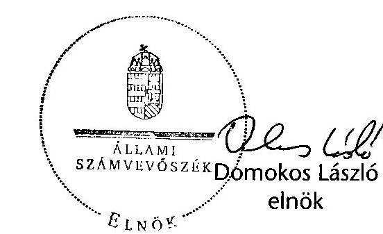
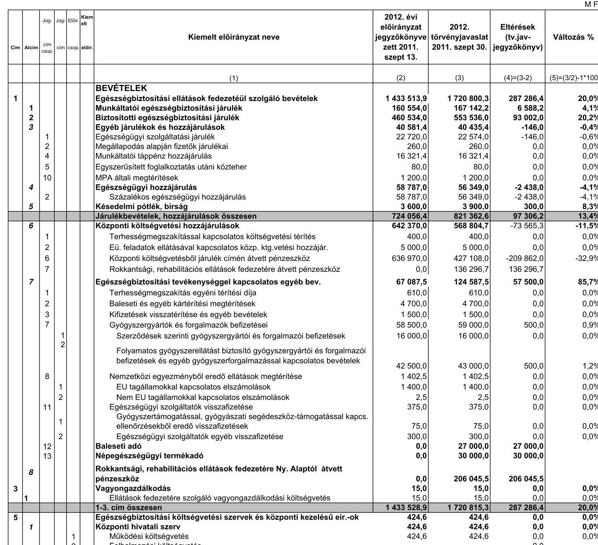

# ÁLLAMI   SZÁMVEVŐSZÉK 

## VÉLEMÉNY

Magyarország 2012. évi költségvetési javaslatáról

---

# ÁLLAMI SZÁMVEVŐSZÉK 

Vizsgálat-azonosító szám: V0540-01
Témaszám: 1037

## Az ellenőrzést felügyelte:

## Dr. Becker Pál

költségvetési, felügyeleti főigazgató

## Az ellenőrzést vezették:

Hámoriné Maróti Györgyi Számvevő
igazgatóhelyettes
Lődiné Cser Zsuzsanna számvevő
főtanácsos osztályvezető
Szabóné Farkas Katalin számvevő
főtanácsos osztályvezető

Borbély Zsuzsanna számvevő
főtanácsos osztályvezető
Morvay András számvevő
főtanácsos osztályvezető
Szarka Péterné számvevő
igazgatóhelyettes

Horváth József számvevő
főtanácsos osztályvezető
Pongrácz Éva számvevő
főtanácsos osztályvezető
Tolnai Lászlóné számvevő
főtanácsos osztályvezető

## Az ellenőrzést végezték:

Baki István számvevő tanácsos
Béres László számvevő
Czmarkó Frigyes számvevő
Deli Gáborné számvevő tanácsos
Dormán István számvevő
Farkas László számvevő tanácsos
Ferencz Katalin számvevő tanácsos
Gere Orsolya számvevő gyakornok
Göller Géza számvevő tanácsos
Gyeraj Péter számvevő
Huberné Kuncsik Zsuzsanna számvevő tanácsos

Balázs Melinda számvevő tanácsos
Bertalan Rudolf Gyula számvevő
Csomsztek Ramóna számvevő gyakornok
Dombovári Nóra számvevő tanácsos
Erdélyi Zoltán számvevő gyakornok
Fehér Katalin Ildikó számvevő
Fodor Edit számvevő
Gergely Tilda számvevő
Gróf Gábor számvevő gyakornok
Hajdu Károlyné számvevő tanácsos
Huszár Anna számvevő

Bene István számvevő
Burenzsargal Narantuja számvevő tanácsos
Dancsóné Kuron Ildikó számvevő tanácsos
Dr. Domján Eszter számvevő tanácsos
Éva Katalin számvevő tanácsos
Fekete Győr László számvevő
Gáspár Eszter számvevő gyakornok
Görgényi Gábor számvevő tanácsos
Gyarmati István számvevő tanácsos
Horcsin Attila számvevő tanácsos
Huszár József számvevő tanácsos

---

| Huszárné Borbás Melinda számvevő | Igar Tamás számvevő | Jagicza Istvánné számvevő tanácsos |
| :--: | :--: | :--: |
| Dr. Jakab Kornél számvevő tanácsos | Jenei Zoltán Béláné számvevő | Jeszenkovits Tamás számvevő tanácsos |
| Karsai Lászlóné számvevő tanácsos | Kékesiné Győrffy Zita számvevő | Kerek István számvevő |
| Keresztes Tamás számvevő | Kincses Erzsébet Eszter számvevő | Kiss Ferenc Károlyné számvevő |
| Korsósné Vigh Andrea számvevő tanácsos | Kováts Tibor Balázs számvevő | Kresztyankó Zsuzsanna számvevő gyakornok |
| Dr. Lengyel Attila számvevő tanácsos | Marozsán Katalin számvevő | Dr. Mészáros Leila számvevő |
| Molnár Bálint számvevő | Némethné Nagy Mária számvevő | Niklai Heléna számvevő tanácsos |
| Peisch Annamária számvevő | Pető Krisztina számvevő tanácsos | Polyák Ferenc számvevő tanácsos |
| Dr. Remport Katalin számvevő tanácsos | Sali Sándorné számvevő | Sápi Henriett számvevő |
| Séra Andrásné számvevő tanácsos | Dr. Somorjai Zsoltné számvevő tanácsos | Szabó Erzsébet számvevő tanácsos |
| Szilágyi Zsuzsanna számvevő tanácsos | Dr. Szima Mária számvevő tanácsos | Szöllősiné Hrabóczki Etelka számvevő tanácsos |
| Teski Norbert számvevő gyakornok | Tóth Marianna számvevő | Vacsora Erika számvevő tanácsos |
| Varga Ágnes Klára számvevő | Varga József számvevő tanácsos | Varsányiné Dudás Eleonóra számvevő |
| Vas Lajos számvevő tanácsos | Dr. Vass Gábor számvevő tanácsos | Vasváriné Molnár Judit számvevő |
| Velkei András számvevő | Villányi Antal számvevő tanácsos | Dr. Vincze Ibolya számvevő |
| Vlasits Ágnes számvevő | Weltherné Szolnoki Dóra számvevő | Zakar László számvevő tanácsos |
| Zaroba Szilvia számvevő tanácsos | Zentner Róbert számvevő gyakornok |  |
| Gerencsérné Szabó Erika külső munkatárs | Krémó Márkné külső munkatárs | Molnár Imre külső munkatárs |
| Rumpler Erzsébet külső munkatárs | Szilágyi Gyöngyi külső munkatárs |  |

---

.

---

# TARTALOMJEGYZÉK 

BEVEZETÉS ..... 5
I. ÖSSZEGZŐ MEGÁLLAPÍTÁSOK, KÖVETKEZTETÉSEK ..... 8
II. RÉSZLETES MEGÁLLAPÍTÁSOK ..... 23
A) A KÖLTSÉGVETÉSI DOKUMENTUM TÖRVÉNYESSÉGI ÉS SZÁMSZAKI ELLENŐRZÉSE ..... 25

1. A dokumentum ellenőrzésének feltételrendszere ..... 27
2. Az államháztartásról szóló törvény (Áht.) előírásainak érvényesülése a törvényjavaslatban ..... 28
3. A takarékos állami gazdálkodásról és a költségvetési felelősségről szóló törvénnyel (Kftv.) kapcsolatos előírások teljesítése ..... 31
4. A 2012. évi költségvetési javaslat fő irányainak összhangja a Széll Kálmán tervre épülő Konvergencia Programmal ..... 32
B) HELYSZÍNI ELLENŐRZÉS ..... 35
B.1. AZ ÁLLAMHÁZTARTÁS KÖZPONTI ALRENDSZERE ..... 37
5. A tervezőmunka és az ellenőrzés feltételrendszere ..... 37
6. A központi költségvetés közvetlen bevételi előirányzatai ..... 37
2.1.1. Társasági adó ..... 38
2.1.2. Hitelintézeti járadék ..... 40
2.1.3. Pénzügyi szervezetek különadója ..... 40
2.1.4. Cégautó adó ..... 41
2.1.5. Egyszerűsített vállalkozói adó ..... 41
2.1.6. Bányajáradék ..... 42
2.1.7. Játékadó ..... 42
2.1.8. Ökoadók ..... 43
2.1.8.1. Energiaadó ..... 43
2.1.8.2. Környezetterhelési díj ..... 43
2.1.9. Egyéb befizetések ..... 43
2.1.10. Energiaellátók jövedelemadója ..... 44
2.1.11. Rehabilitációs hozzájárulás ..... 44
2.1.12. Az egyes ágazatokat terhelő különadók ..... 44
2.2. Fogyasztáshoz kapcsolt adók ..... 45

---

2.2.1. Általános forgalmi adó ..... 45
2.2.2. Jövedéki adó ..... 46
2.2.3. Regisztrációs adó ..... 46
2.3. A lakosság költségvetési befizetései ..... 46
2.3.1. Személyi jövedelemadó ..... 46
2.3.2. Egyéb lakossági adók ..... 47
2.3.3. Lakossági illetékek ..... 47
2.3.4. Magánszemélyek jogviszony megszűnéséhez kapcsolódó egyes jövedelmeinek különadója ..... 48
2.4. Egyéb költségvetési bevételek ..... 48
2.5. Uniós elszámolások ..... 49
2.6. Tőke követelések visszatérülése ..... 49
3. A központi költségvetés közvetlen kiadási előirányzatai ..... 50
3.1. Adósságszolgálattal kapcsolatos bevételek és kiadások ..... 54
3.2. Állami kezességvállalás és kezesség érvényesítés ..... 58
3.3. Állami vagyonnal kapcsolatos bevételek és kiadások ..... 60
3.4. Az államháztartás központi alrendszerének tartalékai ..... 67
3.5. A kormányzati szektor egyéb elszámolásai ..... 69
4. A fejezetek költségvetési tervező munkájának ellenőrzése ..... 70
4.1. A tervezést megalapozó dokumentumok ..... 70
4.2. A fejezetek irányítását ellátó szervezetek tervezési, szervezési és intézmény-felülvizsgálati feladatai ..... 72
4.2.1. A fejezetek költségvetési javaslatainak megalapozottsága ..... 73
4.2.2. A kiadási előirányzatok alakulása ..... 74
4.2.2.1. A létszám, a személyi juttatások és a munkaadókat terhelő járulékok tervezésének tapasztalatai ..... 74
4.2.2.2. A dologi kiadások tervezésének tapasztalatai ..... 76
4.2.2.3. Az intézményi felhalmozási (beruházási és felújítási) előirányzatok tervezése ..... 77
4.2.2.4. A kölcsönök előirányzatának tervezése ..... 78
4.2.3. A bevételi előirányzatok tervezése ..... 78
4.2.4. A fejezeti kezelésű előirányzatok tervezésének tapasztalatai ..... 80
4.2.5. Központi beruházások ..... 83
5. A központi költségvetés központosított bevételei ..... 84
6. Az OGY részére benyújtott költségvetési törvényjavaslat és a helyszíni ellenőrzés adatai közötti eltérések ..... 84
7. Az európai uniós tagsággal összefüggő előirányzatok tervezése ..... 88
7.1. Uniós Fejlesztések fejezet fejezeti kezelésű előirányzatainak tervezése ..... 88
7.2. A VM fejezet uniós előirányzatainak tervezése ..... 92
7.3. Egyéb fejezetek uniós előirányzatainak tervezése ..... 94
7.4. Az Európai Unióval való elszámolások ..... 94

---

8. Az elkülönített állami pénzalapok és a társadalombiztosítás pénzügyi alapjai költségvetésének tervezése ..... 95
8.1. Elkülönített állami pénzalapok ..... 96
8.1.1. Munkaerőpiaci Alap ..... 96
8.1.2. Bethlen Gábor Alap ..... 98
8.1.3. Központi Nukleáris Pénzügyi Alap ..... 98
8.1.4. Nemzeti Kulturális Alap ..... 99
8.1.5. Wesselényi Miklós Ár- és Belvízvédelmi Kártalanítási Alap ..... 100
8.1.6. Kutatási és Technológiai Innovációs Alap ..... 101
8.2. A társadalombiztosítás pénzügyi alapjai ..... 102
8.2.1. Nyugdíjbiztosítási Alap ..... 103
8.2.2. Egészségbiztosítási Alap ..... 106
B.2. AZ ÁLLAMHÁZTARTÁS ÖNKORMÁNYZATI ALRENDSZERE ..... 110
9. A költségvetési törvényjavaslatban az önkormányzati alrendszerrel kapcsolatos szabályozás ..... 110
1.1. Az önkormányzati forrásszabályozás jogi megalapozottsága ..... 110
1.2. A helyi önkormányzatok forrásszabályozása ..... 110
10. A költségvetés IX. - helyi önkormányzatok támogatásai és helyben maradó személyi jövedelemadója - fejezetből származó források ..... 113
2.1. Működési célú hozzájárulások és támogatások ..... 114
2.1.1. A „globális" hozzájárulások és támogatások tervezése ..... 114
2.1.2. A közoktatási célú hozzájárulások és támogatások tervezése ..... 116
2.1.3. A szociális célú hozzájárulások és támogatások tervezése ..... 118
2.1.4. A kulturális célú hozzájárulások, támogatások tervezése ..... 122
2.1.5. Az önkormányzatok tűzvédelmi feladatai támogatása tervezése ..... 122
2.2. A fejlesztési célú támogatások tervezése ..... 123
11. Saját folyó és átengedett bevételek ..... 124
MELLÉKLETEK ..... 127
12. számú Az elkülönített állami pénzalapok és a társadalombiztosítás pénzügyi ..... 129 alapjának költségvetési adatai a 2012. évi költségvetési törvényjavaslat véleményezéséhez
13. számú Eltérések a Nyugdíjbiztosítási Alap 2012. évi költségvetési törvényjavaslata ..... 131 és a helyszíni ellenőrzéskor a jegyzőkönyvben rögzített adatok között
14. számú Eltérések az Egészségbiztosítási Alap 2012. évi költségvetési törvényjavaslata ..... 132 és a helyszíni ellenőrzéskor a jegyzőkönyvben rögzített adatok között
15. számú Az ellenőrzött szervezetek 2012. évi támogatási keretszámainak változása ..... 134
RÖVIDÍTÉSEK JEGYZÉKE ..... 135

---

.

---

# BEVEZETÉS 

Az Állami Számvevőszék az Alkotmány 32/C. §-ának (1) bekezdése, valamint az ÁSZ-ról szóló 2011. évi LXVI. törvény 5. §-ának (1) bekezdése alapján véleményezi az állami költségvetési javaslat megalapozottságát és a bevételi előirányzatok teljesíthetőségét.

A törvényi felhatalmazással összhangban a számvevőszéki Vélemény - a korábbi évekhez hasonlóan - közvetlenül nem foglalhat állást a kormányzati tár-sadalom- és gazdaságpolitikai elhatározásokkal, elgondolásokkal kapcsolatban, valamint a költségvetés gazdaságélénkítő, illetve egyes területeken végrehajtandó korlátozó intézkedések jellegére, azok arányaira vonatkozóan.

A számvevőszéki Vélemény az előző évhez hasonlóan - figyelemmel a takarékos állami gazdálkodásról és a költségvetési felelősségről szóló 2008. évi LXXV. törvényben foglaltakra - nem tér ki a makro adatok értékelésére. Az államháztartásról szóló 1992. évi XXXVIII. törvény (Áht.) 29. §-ának (1) bekezdése szerint a költségvetési törvényjavaslatot az Országgyűlés a számvevőszéki Véleménnyel és a Költségvetési Tanács véleményével együtt tárgyalja meg.

Az ellenőrzés célja annak értékelése volt többek között, hogy

- a 2012. évi költségvetési törvényjavaslat kimunkálása során érvényesültek-e a vonatkozó törvényi, egyéb jogszabályi, az állami irányítás egyéb jogi eszközeiben megfogalmazott előírások, illetve az előirányzatok kialakítására kiadott tervezési Tájékoztatóban ${ }^{1}$ foglaltak;
- a törvényjavaslat megalapozottságát a tervezésnél alkalmazott módszerek, valamint az állami feladatrendszer megfelelően biztosítják-e;
- a 2012. évre kialakított költségvetés kiemelten vette-e számításba az EU-tagság pénzügyi-gazdasági hatásait, részletesen és megalapozottan számszerúsítették-e az EU-tól származó forrásokat és a társfinanszírozási követelményeket, valamint az EU költségvetésébe történő befizetési kötelezettséget;
- a szakmai jogszabályok változásából adódó követelmények, kihatások tük-röződnek-e az önkormányzati forrásszabályozás egyes elemeiben, különösen a IX. Helyi önkormányzatok támogatásai és helyben maradó személyi jövedelemadója technikai fejezetben előirányzott hozzájárulások, támogatások összegében.

[^0]
[^0]:    ${ }^{1}$ A Nemzetgazdasági Minisztérium által kiadott Tájékoztató a 2012. évi költségvetési törvényjavaslat összeállításához szükséges feltételekről és az érvényesítendő követelményekről, 2011. július

---

Véleményünket a 2011. szeptember 30-án rendelkezésre bocsátott T/4365. költségvetési törvényjavaslat alapján - a 2011. augusztus 29-étől szeptember 12-éig tartó, a költségvetési előirányzatok tervezését végző szerveknél lefolytatott helyszíni ellenőrzés során szerzett tapasztalatok felhasználásával - alakítottuk ki. Az adóbevételek megítélésénél figyelembe vettük a Költségvetési Tanácsnak 2011. szeptember 21-én átadott fejezeti indokolásban foglaltakat is. Az ellenőrzések tapasztalatait az ellenőrzöttekkel közös jegyzőkönyvben rögzítettük.

A benyújtott költségvetési javaslatban megjelenő - a helyszíni ellenőrzés lezárása után történt - változások esetében azok tartalmát, okait, megalapozottságát ellenőrizni nem volt módunk, ezért a Vélemény külön fejezetében foglaltuk össze a költségvetési törvényjavaslat és a helyszíni ellenőrzés adatai közötti eltéréseket.

A helyszíni ellenőrzésről készült jegyzőkönyvek felvételekor a Tájékoztatóban megfogalmazott kiemelt jelentőségű területek dokumentális értékelése történt meg.

Helyszíni ellenőrzést az alkotmányos fejezeteknél, a Magyar Köztársaság minisztériumainak felsorolásáról szóló 2010. évi XLII. törvényben nevesített minisztériumoknál, az Uniós Fejlesztések, a Gazdasági Versenyhivatal, a Központi Statisztikai Hivatal, a Magyar Tudományos Akadémia, az ún. technikai fejezetek felett felügyeletet gyakorló fejezeteknél, a nemzetgazdasági elszámolások előirányzatai kimunkálásában közreműködő szervezeteknél, valamint az elkülönített állami pénzalapoknál, a társadalombiztosítás pénzügyi alapjainál, illetve az alapkezelőknél, az alap felett felügyeletet gyakorló fejezeteknél végeztünk.

Az ÁSZ Véleménye a Nemzeti Média és Hírközlési Hatóság 2012. évi költségvetésére nem terjed ki tekintettel arra, hogy erről az Országgyűlés külön törvényt alkot. (A költségvetési törvényjavaslat az NMHH-t az államháztartáson kívüli szervezetek között sorolja fel.) Véleményünk nem tartalmazza a Magyar Művészeti Akadémia költségvetése tervezetének ellenőrzését, mert a szervezet még nem állt fel.
 Az Állami Számvevőszék tervezését szintén nem ellenőriztük.

A helyi önkormányzati fejezet véleményezéséhez a szeptember 30-án átadott költségvetési törvényjavaslat adattartalmát az NGM szeptember 27-én bocsátotta rendelkezésünkre.

A véleményalkotáskor még nem volt ismert a 2012. évi költségvetési törvényjavaslat IX. Helyi önkormányzatok támogatása és helyben maradó személyi jövedelemadó fejezetét alapvetően érintő, a közfeladat ellátását szabályozó új sarkalatos törvények tervezete, továbbá a szakmai (ágazati) törvények módosítása, ezért ezek és az előirányzatok összhangja nem volt megítélhető. A költségvetési törvényjavaslat fejezeti indokolása – a korábbi évekhez hasonlóan – még nem készült el, ezért annak tartalma az ÁSZ vélemény elkészítése során nem volt hasznosítható.

A 2012. évi költségvetést megalapozó egyes törvények módosítását tartalmazó törvényjavaslatok – hasonlóan az előző évhez – a költségvetés készítésével párhuzamosan készültek, illetve zajlott parlamenti vitájuk, valamint az egyezteté-

---

sek során hatástanulmányok és modellszámítások hiányában kellett a Véleményt elkészíteni.

A közigazgatási egyeztetés során a határidőben érkezett, figyelembe vett észrevételeket a Vélemény szövegén átvezettük, az el nem fogadott észrevételeket indokaink feltüntetésével – a Véleményben megjelenítjük. A határidőn túl érkezett észrevételek figyelembevételére nem volt lehetőség.

---

# I. ÖSSZEGZŐ MEGÁLLAPÍTÁSOK, KÖVETKEZTETÉSEK 

## A költségvetési dokumentum

A költségvetési törvénytervezetről hozandó döntés megalapozottságát és a döntéshozók hiteles tájékoztatását a törvényjavaslat indokolása és annak mellékletei hivatottak elősegíteni. A költségvetési törvényjavaslat összeállításakor különös hangsúlyt kell kapnia a korábbi évek döntései és a tervévre vonatkozó döntések által meghatározott kötelezettségek költségvetésekre gyakorolt hatása bemutatásának.

A költségvetési törvényjavaslat(ok)ban – az Áht. előírásai ellenére – nem jelennek meg összefoglalva a többéves elkötelezettségek (a köz- és magánszféra együttműködésén alapuló projektek, a hosszú távú kötelezettségvállalások állományának a fejezetek és a várható kifizetések éve szerinti bontása, a többéves elkötelezettséggel járó kiadási tételek későbbi évekre vonatkozó hatásai, a központi beruházások hároméves programja) hatásai.

A költségvetési törvényjavaslat dokumentumának összeállítására vonatkozó hatályos szabályozási környezet évek óta alig változott, a tartalomra és a szerkezetre vonatkozó követelményrendszert teljes körűen megfogalmazó jogszabály, vagy elfogadott standard nem létezik.

A költségvetési törvényjavaslat tartalmának és formai követelményeinek teljes körű meghatározása lehetőséget adna annak áttekintésére, hogy melyek azok az információk, amelyek a költségvetési törvényjavaslat országgyűlési vitáját a szükséges és elégséges mértékben segítik.

## A tervezés és az ellenőrzés feltételrendszere

A költségvetési tervezés eljárási szabályait, a tervezési folyamat munkaszakaszait az Áht. és Ámr. szabályozzák.

Az Áht. 50. §-ában foglaltak szerint az államháztartásért felelős miniszter április 15-éig elkészíti és a Kormány elé terjeszti a költségvetési irányelveket. Ezen jogszabályi kötelezettségének az államháztartásért felelős miniszter határidőre eleget tett, a Kormány a költségvetési irányelveket elfogadta. Az Ámr. 26. §-a szerint az államháztartásért felelős miniszter Tájékoztatót (tervezési körirat) ad ki a költségvetési irányelvek és a Kormány határozata alapján a költségvetési tervezéssel összefüggő feladatokról, követelményekről, illetve a felhasznált dokumentumokról. A Tájékoztató a jogszabálynak megfelelően, az Ámr. 26. § a) d) pontjaiban foglaltak szerint készült el.

Az Áht. 51. § (2) bekezdésében foglaltak szerint az államháztartásért felelős miniszter augusztus 31-éig terjeszti a Kormány elé a költségvetési törvényjavaslat tervezetét, amely az Áht.-ben meghatározott határidőre elkészült, azonban

---

a benyújtott Előterjesztés sem szerkezetileg, sem tartalmilag nem felel meg a költségvetési törvényjavaslat tervezetének.

Az éves költségvetési törvények tartalmi és formai követelményeit meghatározó egységes szabályrendszer hiánya nem biztosítja, hogy az Országgyűlés egy átlátható, az évek közötti összehasonlítást és a következő évekre történő kitekintés megbízhatóságát is garantáló törvényjavaslatról tárgyaljon.

Az államháztartásról szóló törvény előírásainak kiegészítése helyett célszerű egy átfogó, az állam teljes gazdálkodásának szabályaira is kiterjedő – az ÁSZ által már korábban is kezdeményezett – közpénzügyi törvény keretei között szabályozni a költségvetési törvény követelményrendszerét.

# A központi költségvetés hiánya, és közvetlen bevételi, kiadási előirányzatai 

A 2012. évi költségvetésről szóló törvényjavaslat megalapozottságáról teljes körűen nem lehetett véleményt mondani, egyrészt a 2012. évi bevételi előirányzat-tervezetek jelentős részét alátámasztó dokumentumok, illetve háttérszámítások hiánya, másrészt a jegyzőkönyvben rögzített és a költségvetési törvényjavaslatban megjelenő adatok eltérései – amelynek okait csak részben, hátterét egyáltalán nem ismeri az ÁSZ – miatt.

A Széll Kálmán Terv hét pontból álló intézkedési csomagja a 2012. évre 550,0 Mrd Ft-os megtakarítást tervezett. Alátámasztottság hiányában 388,0 Mrd Ft megtakarításról még részben sem tudtunk véleményt mondani.

A takarékos állami gazdálkodásról és a költségvetési felelősségről szóló 2008. évi LXXV. törvény (Kftv.) és a 2012. évi költségvetési törvényjavaslat összhangjáról nem tudtunk véleményt mondani, mivel a jegyzőkönyv lezárásának 2011. szeptember 12-ei időpontjáig a szükséges adatok, háttérszámítások nem álltak rendelkezésre. A Kftv. 3. és 4. §-aiban előírt, a költségvetési törvényben meghatározandó követelményekről, mutatókról a törvényjavaslat normaszövege – a 2011. évi költségvetési törvényjavaslattal ellentétben – nem rendelkezik. A törvényjavaslat indokolásában ezen előírásokkal kapcsolatosan információ, tájékoztatás nem szerepel. A Kormány a Kftv. előírásait nem teljesítette.

Az Áht. 36. § (1) bekezdése szerint a Kormány által benyújtott költségvetési törvényjavaslatot a költségvetési előirányzatok megalapozását szolgáló, a költségvetési hatásvizsgálatok lényeges megállapításait és eredményeit tartalmazó – a Kftv. 6. § (4) bekezdésében előírt – hatásvizsgálattal együtt kell előterjeszteni. Az ÁSZ dokumentáció és információ hiányában a hatásvizsgálat meglétéről és annak tartalmáról nem tudott véleményt mondani.

Az Áht. 36/B. § (1) bekezdésében foglalt rendelkezés szerint a Kormány a költségvetési törvényjavaslat benyújtásakor köteles az Országgyűlést tájékoztatni arról, hogy a javaslat elfogadása esetén – összhangban a középtávú tervekkel legalább három évre vonatkozóan – milyen részletes kötelezettségvállalási korlátozásokat kíván érvényre juttatni a tárgyév során. A törvényjavaslatban ez a tájékoztató kimutatás nem szerepel, az általános indokolásban erre vonatkozóan utalás nem található. A törvényjavaslat 10. számú melléklete csak az uniós forrásra vonatkozóan tartalmaz 2013-ig részletes kötelezettségvállalási keret-előirányzatokat.

A költségvetési törvényjavaslat a központi kormányzat hiányaként 576,5 Mrd Ft-ot tartalmaz, amelyhez kapcsolódó finanszírozási terv – a korábbi évekhez hasonlóan – nem állt az ellenőrzés rendelkezésére. A törvényjavaslatban a központi költségvetés hiánya 507,3 Mrd Ft, a társadalombiztosítási alapoké 34,4 Mrd Ft, míg az elkülönített állami pénzalapok hiánya 34,8 Mrd Ft. A költségvetési törvényjavaslat elfogadását követően az ÁKK Zrt. minden költségvetési évben új finanszírozási tervet készít. Ezáltal az ellenőrzés során rendelkezésre álló finanszírozási terv előzetes tervnek minősül.

A központi költségvetés hiányának, illetve a Kincstári Egységes Számla folyamatos likviditásának biztosítására, valamint a megelőlegezésekre vonatkozó, a jegyzőkönyv felvételének időpontjában rendelkezésre álló 2012. évi finanszírozási elképzelések számszakilag kimunkáltak, alátámasztottak. A tervezett pénzpiaci műveletekből előirányzott források és azok időbeli ütemezése az adósságkezelési stratégiával összhangban állnak. A 2012. évi finanszírozási terv teljesülési kockázatát csökkenti az 50,0 Mrd Ft összegű kamatkockázati tartalék.

Az MNB a „Magyarország 2012. évi költségvetéséről szóló törvény tervezetének értékelése” című anyagában a várható veszteségére 95,0 Mrd Ft megtérítési kötelezettséget jelez, amely a 2012. évi központi költségvetést terheli. Ezen kiadás azonban a költségvetési törvényjavaslatban nem jelenik meg és ez a központi költségvetés hiányánál kockázati tényezőt jelent, amely pótlólagos forrás megteremtését indokolja.

A 2012. évi költségvetési törvényjavaslatban a központi költségvetés bruttó adóssága a GDP arányában 66,4%, amely 1,9%-kal kevesebb a 2011. év végére várható 68,3%-os mértéknél, ugyanakkor a bruttó adósság összegszerűen nem csökken, a 2011. évi várható 19 085,1 Mrd Ft-ról 19 328,3 Mrd Ft-ra nő.

A központi költségvetés közvetlen bevételei a központi költségvetés bevételi főösszegének 73,4%-át teszik ki. A jegyzőkönyvek lezárásakor, 2011. szeptember 12-én a közvetlen bevételek 96,5%-ára, 6440,6 Mrd Ft-ra vonatkozóan sem az előirányzat-tervezetek, sem az azokhoz kapcsolódó dokumentumok és háttérszámítások nem álltak az ÁSZ rendelkezésére. A közvetlen bevételek közül a bányajáradék, az egyéb költségvetési bevételek, a kamatbevételek és az állami vagyonnal kapcsolatos bevételek megalapozottságáról tudtunk az átadott dokumentumok alapján véleményt mondani.

A véleményezésünk során megalapozottnak minősítettük az előirányzatot, ha azt dokumentumokkal, részletes számításokkal alátámasztották.

A 2011. szeptember 30-i költségvetési törvényjavaslatban és a Költségvetési Tanács részére átadott normaszövegben, fejezeti indokolásban szereplő adóbevételi előirányzatok (pl. személyi jövedelemadó, társasági adó) eltérnek. A kapcsolódó tanúsítványok, háttérszámítások, hatástanulmányok, dokumentumok

---

nem álltak az ÁSZ rendelkezésére, így az adóbevételek megalapozottsága nem volt megítélhető.

Annak ellenére, hogy az adóbevételek nem voltak részletes számításokkal alátámasztva, az ÁSZ a rendelkezésére álló információk (előző évek tendenciái, a 2011. évi időarányos teljesítési adatok, a várható teljesítési adatok, korábbi évek ellenőrzési tapasztalatai, NAV adatszolgáltatásai) alapján becsléseket végzett arra vonatkozóan, hogy a 2012. évben várhatóan milyen összegű adóbevételek folynak be. Ez alapján mondott véleményt az adóbevételek teljesíthetőségéről, a teljesíthetőség kockázatáról.

Az adóbevételek 27%-ának, 1764,2 Mrd Ft-nak – cégautó-adó 46,0 Mrd Ft, szja 1550,7 Mrd Ft, lakossági illetékek 102,5 Mrd Ft, rehabilitációs hozzájárulás 65,0 Mrd Ft – a teljesíthetőségét nem lehetett megítélni. Az adóbevételek 63,3%-át, 4135,1 Mrd Ft-ot, beleértve a pénzügyi szervezetek különadóját (187,0 Mrd Ft), az egyes ágazatokat érintő különadókat (155,0 Mrd Ft), az áfa bevételt (2697,7 Mrd Ft), a jövedéki adót (898,1 Mrd Ft) teljesíthetőnek minősítettük. (A 2011. évi költségvetés véleményezésekor az adóbevételek 33,5%-ról nem lehetett véleményt mondani, 45,7%-ot minősítettünk teljesíthetőnek.) Magas kockázatot 6,8%-uk, 447,1 Mrd Ft (társasági adó 356,2 Mrd Ft, játékadó 82,4 Mrd Ft, környezetterhelési díj 8,5 Mrd Ft), közepes kockázatot 2,9%-uk, 187,2 Mrd Ft (hitelintézeti járadék 8,1 Mrd Ft, eva 179,1 Mrd Ft) esetében jeleztünk. (A 2011. évi költségvetés véleményezésekor az adóbevételek 6,2%-nál jeleztünk magas és 14,6%-nál közepes kockázatot.)

A makrogazdasági mutatók tervezettnél kedvezőtlenebb alakulása esetén a 2012. évben több adóbevételi előirányzat (különösen az áfa) teljesíthetősége kockázatot hordoz magában.

Az állami vagyonnal (37 080,2 M Ft) és a Nemzeti Földalappal kapcsolatos (11 950,0 M Ft) 2012. évi tervezett bevételeket a jegyzőkönyvben szereplő adatok alapján megalapozottnak és teljesíthetőnek ítéltük. (A 2011. évi költségvetés véleményezésénél az állami vagyonnal kapcsolatos bevételek 14,1%-át magas kockázatúnak, 21,9%-át nem megalapozottnak értékeltük, a Nemzeti Földalappal kapcsolatos bevételek megalapozottsága nem volt megítélhető.) A költségvetési törvényjavaslatban bevételként (Vagyonfejezet és NFA) 50 423,8 M Ft szerepel, amely 1393,6 M Ft-tal tér el a szeptember 12-én rögzített, jegyzőkönyven szereplő összegtől. Az eltérést az állami vagyonnal kapcsolatos bevételeknél bekövetkező 6,4 M Ft-os csökkenés, illetve az NFA bevételeinek 1400,0 M Ft-os növekedése eredményezte. Az NFA bevétel növekedése a termőföld értékesítés háromszorosára növelésével függ össze. A módosítás okairól az ÁSZ nem rendelkezik információval.

Az ÁSZ a közvetlen kiadások 2012. évi tervezett előirányzatainak megalapozottságát a 2011. szeptember 12-én lezárt jegyzőkönyvekben szereplő tervezetek alapján véleményezte. A közvetlen kiadások esetében a jegyzőkönyv felvételekor – dokumentumok hiányában – összességében 13%-ukról nem tudtunk véleményt mondani. Így a XVII. NFM fejezet Vállalkozások folyó támogatása előirányzat-tervezete 99,3%-áról, a X. KIM fejezet Céltartalékok előirányzat-tervezete 94,2%-áról, a X. KIM fejezet Volt egyházi ingatlanok tulajdoni helyzetének rendezése címről és a Céltartalékok cím Munkáltatók adórendszer átala-

---

kítása miatti kompenzációja alcímről, a XI. Miniszterelnökség fejezet Rendkívüli kormányzati intézkedések címről és Országvédelmi Alap címről, a XLII. A költségvetés közvetlen bevételei
 és kiadásai fejezet Garancia és hozzájárulás a társadalombiztosítási ellátásokhoz, Fogyasztói árkiegészítés és Vállalkozások folyó támogatása címekről. A költségvetési törvényjavaslatban az e címeken megjelenő előirányzatok összege 1067,7 Mrd Ft.

Az állami vagyonnal kapcsolatos kiadások ( $87513,0 \mathrm{M}$ Ft) 43,3\%-a a jegyzőkönyv lezárásakor nem volt megalapozott, illetve megítélhető. (A 2011. évi költségvetés véleményezésekor az állami vagyonnal kapcsolatos kiadások 47,3\%-a nem volt megalapozott.) A költségvetési törvényjavaslatban az állami vagyonnal kapcsolatos kiadások összege 93060,5 M Ft. A növekedés a Felhalmozási jellegű kiadásoknál ( $2800,0 \mathrm{MFt}$ ), a Hasznosítással kapcsolatos folyó kiadásoknál ( $1050,0 \mathrm{MFt}$ ), a Magyar Államot korábbi értékesítésekhez kapcsolódóan terhelő kiadásoknál ( $1247,5 \mathrm{MFt}$ ) és a Fejezeti tartaléknál ( $450,0 \mathrm{MFt}$ ) következett be. A kiadási tételek növekedését alátámasztó dokumentumok nem álltak az ÁSZ rendelkezésére.

A Nemzeti Földalappal kapcsolatos 2012. évi kiadási előirányzat 17 275,0 M Ft összege megalapozott.

Tartalék képzésére 403,6 Mrd Ft összegben került sor, amelyből a Rendkívüli kormányzati intézkedésekre szolgáló tartalék 100,0 Mrd Ft-os és az Országvédelmi Alap 150,0 Mrd Ft-os összege csökkentheti a módosítási kötelezettség nélkül túlteljesíthető kiadásoknál felmerülő, illetve az egyéb esetleges kockázatokat (pl. adóbevételek elmaradása), amennyiben részben, vagy egészben nem kerül felhasználásra. Az Országvédelmi Alap egy új tartalékfajta a központi költségvetésben, amelynek szabályozását, az előirányzat képzésének módját és mértékét, felhasználás módját és feltételeit sem a 2012. évi költségvetés-tervezet, sem az Áht. tervezett módosítása nem tartalmazza. Az ÁSZ a szabályozást szükségesnek tartja. A tartalékok közül a jegyzőkönyv lezárásának időpontjában kizárólag a céltartalékok 69,0 Mrd Ft-os összege volt ismert, amelyből 94,2\% megalapozottságát a háttérszámítások hiánya miatt nem tudtuk megítélni. A költségvetési törvényjavaslatban a céltartalék előirányzata 153,6 Mrd Ft, amely a jegyzőkönyvben foglaltakhoz képest 84,6 Mrd Ft-os növekedést mutat, amelyet a Munkáltatók adórendszer átalakítása miatti kompenzációja alcímen tervezett 84,6 Mrd Ft okoz.

A zárolások, az évközi korrekciók elkerülése érdekében az ÁSZ szükségesnek tartja a megfelelő források biztosítását a megállapított kockázatok kezelésére.

---

# A költségvetési szervek és a fejezeti kezelésű előirányzatok 

Az Országgyűléshez benyújtott törvényjavaslat és a helyszíni ellenőrzéskor felvett jegyzőkönyvek számadatait áttekintetve megállapítottuk, hogy azok eltérnek egymástól. A törvényjavaslatban megváltozott számadatok eltérésének dokumentáltságára, megalapozottságára vonatkozóan az ÁSZ nem rendelkezik információkkal, ezért annak hatásait nem lehetett megítélni. (A támogatási keretszámok változását a 4. számú melléklet tartalmazza.)

A költségvetési fejezetek az NGM Tájékoztató alapján kezdték meg a 2012. évi költségvetésük összeállítását.

A 2012. évi tervező munkát - a korábbi évekhez hasonlóan - az jellemezte, hogy az előirányzatok kimunkálásakor még nem volt hatályos minden, a költségvetési előirányzatokat befolyásoló jogszabály.

Az NGM által kiadott fejezeti támogatási keretszámok megállapítása - a feladatok ellátásához szükséges források meghatározása helyett - a 2011. évi eredeti támogatási előirányzatból kiindulva a szerkezeti változások és szintre hozások változásával (pl. a 2011. évben végrehajtott zárolások, egyszeri feladatok kivétele miatti bázis csökkentése) valamint a többletekkel korrigálva történt. A Kormány irányítása, illetve felügyelete alá nem tartozó fejezetek/szervezetek esetében a bázisba olyan szerkezeti változásokat (tartalékok elvonása) is beépített az NGM a Tájékoztató alapján, amelyekben a döntés még nem született meg.

Tekintettel arra, hogy a Tájékoztató nem tartalmazott egyértelmű iránymutatást a létszám, a személyi juttatás és a felhalmozási (intézményi és központi) előirányzatok tervezéséhez, a fejezeteket irányító szervek sem tudták az Ámr. 27. §-a szerinti részletes előírások kidolgozásával segíteni a fejezetek/intézmények tervező munkáját. Ennek következtében nem volt egységes a fejezetek költségvetési javaslatának kidolgozása, amely végső soron lehetőséget adott az NGM nem normatív jellegű döntéseire a fejezeti költségvetési javaslatok tárgyalásakor, a törvényjavaslat véglegesítésénél.

Az irányító szervek a Tájékoztató előírásainak megfelelően az irányításuk alá tartozó intézmények adatszolgáltatásait felülvizsgálták, összeállították az igazgatási címek és fejezeti kezelésű előirányzatok költségvetési javaslatait, amelyet összesítés után megküldtek az NGM részére.

A tervjavaslat összeállítása során a fejezetek egy része a kiadott támogatási keretszám visszatervezése mellett támogatási többletigényt nyújtott be, egyes fejezetek pedig - az NGM által még el nem fogadott - többletigényekkel növelt előirányzati összeggel adták be költségvetési javaslatukat.

A fejezetek a tervezési folyamat során a dologi kiadásokon belül a számlás foglalkoztatás előirányzatát kivéve betartották a Tájékoztatóban foglalt előírásokat, követelményeket.

---

A létszámok tervezésénél a fejezetek nem egységesen mutatták ki a változásokat az előirányzatok levezetésében, mivel a feladatok fejezeten belüli és fejezetek közötti átrendezése, és az erről szóló megállapodások megkötése 2011. szeptember 12-ig teljes körűen nem történt meg.

A személyi juttatások és a munkaadókat terhelő járulékok tervezésekor a tárcák változatlan illetményalappal/alapilletménnyel állították össze az előirányzatokat. A tárcák figyelembe vették a nem rendszeres személyi juttatások növelésének tilalmát és a külső személyi juttatások minimális szintre csökkentésének követelményét. A nem rendszeres és külső személyi juttatások előirányzatának egyes fejezeteknél (OGY, MKÜ) bekövetkező növekedését jogszabályváltozások [az országgyűlési képviselők javadalmazásáról szóló 1990. évi LVI. tv. 5. § (1) bekezdés, az Úsztv. 50. § (3) bekezdés] indokolták, valamint a fejezeti kezelésű előirányzatok tervezésének megváltozott előírásai, melyek szerint a kiadásokat ott kell tervezni, ahol azok felmerülnek.

Az intézményi dologi kiadások előirányzatait az előző évhez viszonyítva növelte a fejezeti kezelésű előirányzatok tervezési rendjének változása, egyes előirányzatok átcsoportosítása. A tárcák a szellemi tevékenység végzésére vonatkozó előirányzatukat felülvizsgálták, azonban - három tárca (KT, MKÜ, OAH) kivételétől eltekintve - továbbra is terveztek kifizetést, annak ellenére, hogy ez - a Tájékoztató előírása szerint - csak különösen indokolt esetben engedélyezett. A 2012. évben is a dologi kiadások területén szinte minden fejezet többletigényt jelzett a rendelkezésére álló keretekhez viszonyítva.

Az intézményi felhalmozási kiadásokat a fejezetek a rendelkezésre álló források alapján tervezték. Az előirányzatok állagmegóvást, a biztonságos üzemeltetés feltételeinek megteremtését, illetve az informatikai és telekommunikációs hálózat fejlesztését szolgálják.

A fejezeti kezelésű előirányzatok az adott ágazat kiemelt programjainak lebonyolítását szolgálják, elsősorban államháztartáson kívüli kifizetések formájában. A tervezés megváltozott szabályainak megfelelően a kiadásokat államháztartáson belül a felmerülés helyén kell megtervezni, így a fejezeti kezelésű előirányzatok terhére év közben előirányzat-módosítást nem lehet a 2012. évtől végrehajtani. A fejezeti kezelésű előirányzatok számának jelentős csökkenése több tényező - a homogén feladatok kialakítása, intézményi kiadásként történő tervezés - együttes hatására következett be.

Az érintett tárcák azoknál az előirányzatoknál, amelyek teljesítése módosítás nélkül eltérhet az eredeti előirányzattól, a 2011. évi eredeti előirányzattal azonos összeget terveztek. Az NFÜ esetében azon előirányzatok köre, amelyek teljesülése módosítás nélkül eltérhet az előirányzattól a 2012. évi EGT, Norvég Alap 2009-2014., illetve a Budapest 4-es metróvonal építésének támogatása előirányzatokkal bővült.

A törvényjavaslat a 9. sz. mellékletben (összesen 92 cím/alcím) felsorolja azokat az előirányzatokat, amelyek teljesülése módosítás nélkül eltérhet az előirányzattól. Ezek az előirányzatok - amelyek összesen 8177,6 Mrd Ft kiadási előirányzatot jelentenek - már eleve bizonyos kockázatot hordoznak arra vonatkozóan, hogy az eredeti kiadási előirányzatot meghaladó teljesítésük veszélyeztetheti a törvényjavaslat által kitűzött hiánycél betartását.

Központi beruházást az érintett fejezetek a Tájékoztatóban meghatározott szempontok szerint terveztek.

A bevételekre az NGM keretszámot nem határozott meg, de a Tájékoztató előírta, hogy a 2011. évi várható teljesítéshez viszonyított alacsonyabb bevétel tervezésénél rendelkezni kell az államháztartásért felelős miniszter engedélyével és az eltérést (növekedést/csökkenést) indokolni kell. A Vélemény kialakítása során megállapítottuk, hogy ezt az előírást - a VM kivételével - a tárcák betartották, azonban - az NGM-től a KSH és a PSZAF kivételével - a helyszíni ellenőrzés lezárásáig (2011. szeptember 12-ig) írásos választ nem kaptak.

A bírság bevételeket a tárcák - a tervezésre vonatkozó előírásoknak megfelelően - a 2012. évben teljes körűen központosított bevételként tervezték meg. A bevételeket kiváltó többlettámogatást az NGM által kiadott keretszám nem, hanem csak a törvényjavaslat tartalmazza.

A törvényjavaslatban a központosított bevételek közül a bírság bevételek, a termékdíjak és egyéb központosított bevételek nem az érintett fejezeteknél vonal alatt, hanem az XLII. fejezet bevételei között szerepelnek. Ezzel a prezentációs móddal javult a törvényjavaslat átláthatósága.

A törvényjavaslat - a Tájékoztató előírásától eltérően - négy fejezet (KIM, VM, NGM, NFM) esetében fejezeti általános tartalékot tartalmaz, összesen 930,4 M Ft összegben, továbbá címrendi változások történtek az OGY, az OBH, a KIM, a VM, a HM, a BM az UF és az MTA fejezeteknél.

# Az európai uniós elszámolások 

A 2012. évi költségvetési törvényjavaslatban foglaltak szerint a költségvetésben megjelenő EU támogatások központi költségvetési forrásrésze $249138,2 \mathrm{M} \mathrm{Ft}^{2}$, amely kiegészül 1567 500,9 M Ft EU forrással. Az EU költségvetéshez 2012. évre tervezett hozzájárulás összege 264 336,6 M Ft.

Az uniós tagság alapján a központi költségvetést megillető bevételek közül a cukorágazati hozzájárulás beszedési költségeinek megtérítése alcímen 173,6 M Ft, a vámbeszedési költség megtérítése alcímen 8644,0 M Ft a 2012. évre tervezett bevétel. A XLII. fejezet 7. cím „Uniós támogatások utólagos megtérülése" alcím 3. Strukturális Alapok és 4. Kohéziós Alap jogcímcsoporton összesen 39 813,2 M Ft-ot terveztek.

Az UF fejezet részére az NGM által a 2012. évre meghatározott 193 121,9 M Ft-os költségvetési támogatási keretből az intézményi költségvetést 1614,2 M Ft illeti meg, a fennmaradó 191 507,7 M Ft a fejezeti kezelésű előirányzatok között oszlik meg. A törvényjavaslat szerinti összeg fejezeti szinten 5723,9 M Ft-os eltérést mutat a tervezési folyamat indulásakor az NGM által javasolt támogatási előirányzat (198 845,8 M Ft-os) összegéhez képest. A változás oka, hogy a Tájékoztató előírásaitól eltérően az UF fejezetnél megtervezett „Önkormányzatok és társulásaik európai uniós fejlesztési pályázatai saját forrás kiegészítésének támogatása" előirányzat a törvényjavaslatban átkerült a helyi önkormányzatok által felhasználható központosított előirányzatok közé.

Véleményünk szerint az UF fejezet fejezeti kezelésű előirányzataira 2012-re összeségében rendelkezésre álló keretösszeg csak abban az esetben biztosítja a feladatok ellátását, amennyiben igénybe veszik a törvényjavaslat szerinti lehetőséget, hogy az előirányzatok teljesítése módosítás nélkül eltérhet az előirányzattól, illetve amennyiben biztosított az előirányzatok közötti átjárhatóság. Kockázatot jelent az EKOP 3-as prioritás esetleges forrásvesztése; a „Közreműködő Szervezetek támogatása" előirányzaton az ETE/IPA/ENPI nemzeti kontroll tevékenység ellátásával kapcsolatos, a „Társadalmi megújulás Operatív ProgramMPA" előirányzatnál és a TÁMOP-4.2.1/B/KMR konstrukciónál, illetve a Budapest 4-es metró építésének támogatása előirányzatnál fennálló problémák. További kockázatot hordoz, hogy a Tájékoztató és a költségvetési törvényjavaslat nem vette figyelembe azokra a KA projektekre várható kifizetéseket, amelyek esetében a Magyarország által az EU Bizottság részére korábban benyújtott, elbírálás alatt lévő hosszabbítási kérelem az EU Bizottságtól 2012. évben jóváhagyást kaphat. Az NFÜ az uniós előirányzatok tervezésénél figyelembe vette a forrásvesztés elkerülése érdekében az n+2, n+3 szabályt, azonban az NGM által előirányzott támogatási keret és annak további csökkentése a 2007-2013-as programozási periódus végéhez közeledve növekvő kockázatot jelent az uniós támogatások EU Bizottságtól történő lehívásánál.

A bevételek fejezeti szintű
 tervezésénél az NFÜ belső tervezési tájékoztatójának számítási táblázata automatikusan 85-15%-os bevételi-támogatási aránnyal számolt, és nem vette figyelembe a központi költségvetési szervek elszámolható önerejének összegét, a GOP/KMOP Jeremie típusú pénzügyi eszközök esetében a visszafolyó pénzeszközöket, a szabálytalanság miatt, vagy az Akciótervből kikerülés miatt el nem számolható kiadásokat, amelyek Kormány döntés alapján az UF fejezetet terhelik, növelve a bevételi és csökkentve a támogatási arányt. A felsorolt kockázatokat mérsékelheti, hogy az ETE programok esetében a tervszám tartalékforrásokat tartalmaz, mivel a költségvetési törvényjavaslat a közösségi forrás 100%-os megelőlegezésével számol, amely 2012-ben az NGM és az NFM döntése alapján 15%-ra csökken.

A VM fejezet esetében eltérés mutatkozik a költségvetési törvényjavaslatban szereplő és a fejezet által tervezett tervszámok között az EMGA terhére nyújtott közvetlen agrár- és termelői támogatásokhoz kapcsolódó, hazai támogatáskiegészítés tekintetében 1281,7 M Ft összegben, amellyel az ÚMVP előirányzatait megemelték.

A kiegészítő nemzeti támogatásra („top up"), a „Folyó kiadások és jövedelemtámogatások" előirányzaton belül a VM az 1084/2011. (IV. 12.) Korm. határozat szerint maximálisan tervezhető 38000,0 M Ft-ot tervezett, a költségvetési törvényjavaslat az előirányzatra 26 700,0 M Ft-ot tartalmaz. A „top-up" támogatásokra évről-évre kevesebb összeg tervezhető az uniós szabályozás szerint, melynek a 2012-es költségvetési törvényjavaslatban az NGM eleget tett.

---

A 2010. év végéig az uniós ellenőrzések által megállapított szankciók következményeként 2012-ben és az azt követő években visszafizetendő összeg várhatóan eléri a 15,0-20,0 Mrd Ft-ot. Ezek nagy része a SAPARD előcsatlakozási támogatáshoz, valamint a 2004-2006-os uniós programozási időszakhoz kapcsolódik. Az Unió felé fennálló követelések 2012-ben jelentkező részének az „Árfolyamkockázat és egyéb, EU által nem térített kiadások" előirányzatról történő rendezésére, a költségvetési törvényjavaslat 1300,0 M Ft-os kiadási és támogatási összeget irányzott elő, szemben a VM által tervezett 10 910,1 M Ft-tal. Az Áht. 13/C. § előírásai szerint a VM-nek az ellenőrzések során feltárt szabálytalanságok okán fennálló fizetési kötelezettségeket saját költségvetéséből kell kigazdálkodnia. Amennyiben 2012-ben az ellenőrzésekhez kapcsolódó szankciók miatt esedékessé váló kötelezettségek, valamint a keletkező árfolyamveszteség együttes összege meghaladja az 1300,0 M Ft támogatási előirányzat és az esetlegesen realizálódó árfolyamnyereség együttes összegét, úgy a különbözet a központi költségvetést terheli.

# Az elkülönített állami pénzalapok és a társadalombiztosítás pénzügyi alapjai (alapok) 

Az alapok előirányzatait a költségvetési törvényjavaslat és az alapkezelőktől a helyszíni ellenőrzés alatt átvett iratanyagok alapján véleményeztük. A törvényjavaslatban szereplő előirányzatok az alapkezelőknél jegyzőkönyvben rögzített tervszámoktól több esetben eltérnek, ezért a törvényjavaslatban szereplő és a helyszínen rögzített előirányzatokat hasonlítottuk össze, az eltéréseket számszerűsítettük. Az eredményt „Az elkülönített állami pénzalapok és a társadalombiztosítás pénzügyi alapjainak költségvetési adatai a 2012. évi költségvetési törvényjavaslat véleményezéséhez" című táblázatban (1. számú melléklet) foglaltuk össze. A társadalombiztosítás pénzügyi alapjai előirányzatainak változását az előirányzatok kibontásával részletesen a 2. és 3. számú mellékletek mutatják be.

A törvényjavaslat az alapok többéves elkötelezettséggel járó kiadási tételeiről tájékoztatást nem tartalmaz, ezért nem felel meg az Áht. 36. § (1) bekezdés b) pontjában foglaltaknak. Nem tartalmazza továbbá a 36/B. § (1) bekezdésében előírt részletes kötelezettségvállalási korlátozásokat sem, a normaszöveg 15. §-ában a KTIA esetében előírt tárgyévre vonatkozó korlátozást kivéve.

A törvényjavaslat benyújtásakor - az Áht. 86. § (8) bekezdése szerint - az Országgyűlésnek tájékoztatásul be kell mutatni az Ny. Alap bevételeire és kiadásaira vonatkozóan öt évre, a demográfiai folyamatokra és azok hatásaira vonatkozóan ötven évre szóló előrejelzést. A törvényjavaslatban ez a bemutatás nem szerepel.

Az államháztartás mérlegeinek a költségvetés előterjesztésekor - az Áht. 115. §-a szerint - a tervezett év és az előző év várható, valamint az azt megelőző év tényadatait kell tartalmaznia. A Tájékoztató erre vonatkozó kötelezettséget nem írt elő, azokat a költségvetési törvényjavaslat sem tartalmazza. Hiánya az évek közötti összehasonlíthatóságot akadályozza.

---

# Az elkülönített állami pénzalapok (ELKA) 

Az alapokon belül a 2012. évben - az eddigi ismereteink alapján - továbbra is hat elkülönített állami pénzalap (ELKA) működik majd. Ide tartozik a Munkaerőpiaci Alap (MPA), a Bethlen Gábor Alap (BGA), a Központi Nukleáris Pénzügyi Alap (KNPA), a Nemzeti Kulturális Alap (NKA), a Wesselényi Miklós Ár- és Belvízvédelmi Kártalanítási Alap (WMA), valamint a Kutatási és Technológiai Innovációs Alap (KTIA).

Az előirányzatokat összesítve az ELKA 2012. évi bevételi főösszege 416 152,4 M Ft - amelyből 79 559,2 M Ft támogatás -, kiadási főösszege 416 152,4 M Ft, 44 761,1 M Ft „betétállomány változás" mellett. Az ELKA költségvetési támogatása (79 559,2 M Ft) nélkül az ELKA összesített záróegyenlege (-34798,1 MFt).

A helyszíni ellenőrzéskor rögzítettekhez viszonyítva a költségvetési törvényjavaslatban két ELKA kiadási, illetve bevételi főösszege nem változott (KNPA, WMA), két ELKA főösszege nőtt (az MPA 50 000,0 M Ft-tal, az NKA 951,8 M Ft-tal), illetve két ELKA kiadási és bevételi főösszege csökkent (a BGA 1457,2 M Ft-tal, a KTIA 15 908,4 M Ft-tal).

Az MPA-nál az előirányzatok között - a helyszínen rögzített állapothoz viszonyítva - címrendi változás történt. A költségvetési törvényjavaslat 14. § (3) bekezdése szerint egy új, „Startmunka-program" előirányzat jött létre. A közfoglalkoztatási programokhoz az MPA összesen 132 182,5 M Ft-ban nyújt fedezetet, amelyhez 50000,0 M Ft-ot költségvetési támogatásból, 82 182,5 M Ft-ot saját forrásból kell biztosítania. A Startmunka-program célja, eszközrendszere, szabályozási háttere nem ismert, ezért az előirányzat teljesíthetőségét minősíteni nem lehet.

Az NKA-nál az ötös lottó szerencsejáték játékadójának 90%-ából származó bevétel emelkedése miatt a bevételi főösszeg 951,8 M Ft-tal nőtt (10 116,0 M Ft-ra módosult), a kiadási főösszeg 151,8 M Ft-tal emelkedett (7714,5 M Ft lett). Ebből adódóan a betétállomány változás összege is 800,0 M Ft-tal változott és a korábbi 1601,5 M Ft-ról 2401,5 M Ft-ra nőtt.

A BGA-nál az egyéb támogatások összege a helyszíni ellenőrzéskor rögzített 13 030,0 M Ft-hoz viszonyítva 1457,2 M Ft-tal 11 572,8 M Ft-ra csökkent, ennek megfelelően a kiadási oldalon az egyes feladatok forrás megoszlásában lesznek változások.

A KTIA-nál a költségvetési támogatás a tervezett 23 146,5 M Ft-hoz viszonyítva 16 108,4 M Ft-tal (69,6%-kal) csökkent, ezért az alapkezelő új pályázatokra forrást, valamint a 2012. évi kötelezettségeire (determinációk) sem tud teljes körűen fedezetet biztosítani. A KTIA költségvetési támogatásának nagymértékű csökkentésével nem valósul meg a Ktiatv.-ben rögzített „garanciális szabály", amely szerint a befizetett innovációs járuléknak megfelelő összegben az állam hozzájárul a KTIA forrásaihoz, majd pályázat útján visszajuttatja azt a gazdaság szereplőinek.

---

# A társadalombiztosítás pénzügyi alapjai (TB. Alapok) 

A költségvetési törvényjavaslat továbbra is két TB. Alapot - a Nyugdíjbiztosítási Alap (Ny. Alap) és az Egészségbiztosítási Alap (E. Alap) - nevesít és mindkét TB. Alap esetében jelentős változásokat tartalmaz. Az Ny. Alap 2012. évi költségvetése tartalmilag is lényegesen eltér a helyszíni ellenőrzéskor rögzítetthez és a korábbi évekhez viszonyítva. Az eltéréseket a 2. és 3. számú mellékletek előirányzatonként mutatják be.

A TB. Alapok 2012. évi bevételi főösszege 4518 147,5 M Ft, amelyből támogatás 18024,2 M Ft, a kiadási főösszege 4552567,7 M Ft, 34 420,2 M Ft tervezett hiány mellett. A költségvetési törvényjavaslat szerint az Ny. Alapnál hiányt továbbra sem terveztek, viszont az E. Alap tervezett hiánya 34 420,2 M Ft.

Az Ny. Alapnál a 2012. évi kiadási és bevételi főösszeg (2 796 907,6 M Ft) a jegyzőkönyvben rögzítettnél 11,5%-kal, 363 507,4 M Ft-tal alacsonyabb.

Az Ny. Alap költségvetésében az öregségi nyugdíj előirányzata (2 125 800,0 M Ft) magában foglalja a korhatár fölötti jogosultak öregségi és rokkantsági nyugellátását is.

Az Ny. Alap az öregségi nyugdíjkorhatárt még be nem töltött (korhatár alatti) korúaknak folyósított sajátjogú ellátásokat - az előrehozott nyugellátásokat, szolgálati nyugdíjakat, korkedvezményes nyugdíjakat - a 2012. január 1-jétől nem finanszírozza, azok a NEFMI fejezet 21. címén újonnan létrejövő Nemzeti Szociálpolitikai Alap kiadásai között jelennek meg. Az új Alap (amely magában foglalja a családi támogatások, a korhatár alatti ellátások, jövedelempótló és jövedelemkiegészítő szociális támogatások, valamint a különböző jogcímeken adott térítések jogcímeit) kiadási előirányzata 863 399,7 M Ft, bevételi előirányzata 17714,0 M Ft, amely kizárólag az Ny. Alap bevételeiből tervezett pénzeszközátadásból származik. Az új Alapot illetően a kormányzati döntések részletei még nem ismertek.

Az Ny. Alap költségvetési javaslatában a rokkantsági és baleseti rokkantsági nyugellátás, illetve a rehabilitációs járadék előirányzat is megszűnt. A korhatár alatti rokkantsági és baleseti rokkantsági nyugellátások, továbbá a rehabilitációs járadék finanszírozása a továbbiakban az E. Alapból történik. A megfelelő fedezetet (206 045,5 M Ft-ot) az Ny. Alap a járulékbevételeiből adja át az E. Alapnak.

Új előirányzat az Ny. Alap költségvetésében a „szolgálatfüggő nyugellátás" (60 698,4 M Ft), amely előirányzat - az alapkezelő tájékoztatása szerint - a 40 év meghatározott tartalmú szolgálati idővel rendelkező nők kedvezményes nyugdíjba vonulásának forrását fedezi.

Az E. Alap költségvetési javaslatában legjelentősebb változás, hogy míg a tervezés korábbi fázisában még 17 704,4 M Ft-os többlettel terveztek, a törvényjavaslatban már hiány, -34 420,2 M Ft szerepel. Az egyenlegromlás ahhoz kapcsolódik, hogy az időközben lecsökkentett központi költségvetési támogatás kieső részét más bevételek csak részlegesen pótolják. Az E. Alapot érintően visszatérő probléma, hogy a bevételek nem fedezik a kiadásokat. A bevételeket, illetve a kiadások csökkentését megalapozó ágazati (szakmai) törvények Ország-

---

gyűlés elé terjesztésére olyan időpontban kerül sor, hogy azok költségvetési hatása nem értékelhető a véleményezés időszakában, illetve vannak olyan intézkedések, amelyek hatásai számszerűsítéséhez nincs, vagy nem megfelelő az adatszolgáltatás.

Az E. Alap bevételi főösszege ugyan jelentősen (287 286,4 M Ft-tal) emelkedett, 1721239,9 M Ft lett, de az emelkedés abból származik, hogy a rokkantsághoz kapcsolódó ellátások fedezete (342342,2 M Ft) megjelent a költségvetési javaslatban. Ezzel párhuzamosan a kiadási főösszeg is növekedett, amit teljes egészében a rokkantsági ellátások (284352,2 M Ft) és az egészségkárosodási járadékok (57 990,0 M Ft) E. Alapból történő folyósítása okoz. A törvényjavaslatban 1755 660,1 M Ft-tal tervezett kiadási oldal teljesítése a Széll Kálmán terv keretében végrehajtandó gyógyszerpolitikai intézkedések eredményességétől függ.

# Az önkormányzati alrendszer 

A helyi önkormányzatok - beleértve a helyi kisebbségi önkormányzatokat, valamint a többcélú kistérségi társulásokat is - 2012-ben 3202,6 Mrd Ft GFS rendszerű bevételből gazdálkodhatnak.

Ebből a központi költségvetés által a IX. Helyi önkormányzatok támogatásai és helyben maradó személyi jövedelemadója fejezetben biztosított forrás 1140,6 Mrd Ft, amely a 2011. évi korrigált bázis irányszám (1132,7 Mrd Ft) 100,7%-a.

Tartalmát tekintve - a korrigált bázishoz viszonyított - 7,9 Mrd Ft központi forrásnövekedés a következő ellentétes előjelű tételek egyenlege.

Forráscsökkentő tételek összesen 45,3 Mrd Ft összegben: a Széll Kálmán Terv alapján készített Magyarország 2011-2015. évre szóló Konvergencia programjában „kötelező önkormányzati feladatok méretgazdaságos átszervezése" címen tervezett 15,0 Mrd Ft, valamint a helyi önkormányzatok
 által folyósított szociális támogatások átalakításával összefüggő 30,3 Mrd Ft kiadáscsökkentés.

Forrásnövelő tételek összesen 53,2 Mrd Ft összegben: a megyei önkormányzatok eddigi szabályok alapján kalkulált illetékbevétele 22,0 Mrd Ft (eddig önkormányzati saját folyó bevétel), továbbá az önkormányzatok és társulásaik európai uniós fejlesztési pályázati saját forrás kiegészítésének 2,1 Mrd Ft, valamint a helyi önkormányzatok által folyósított szociális támogatások átalakításával összefüggő 29,1 Mrd Ft támogatási növekménye.

A megyei önkormányzatok szja, támogatás és illetékbevételei torzító hatását kiszűrve a IX. fejezet 14,1 Mrd Ft (1,3%) forráscsökkenést mutat.

A „kötelező önkormányzati feladatok méretgazdaságos átszervezése" címen előírt kiadáscsökkentés miatti támogatásmegszűnések, a támogatás, illetve a tartalék mérséklése indoklással alátámasztottak. A szociális ellátórendszer változásához kapcsolódó előirányzat-módosulások, kiemelten a pénzbeli szociális ellátások vonatkozásában számításokkal is megalapozottak.

---

A 2012. évi törvényjavaslat az önkormányzati forrásszabályozás alapvető elemeinek változatlansága mellett a megyei önkormányzatok forrásszabályozása tekintetében tartalmaz változást. A megyei önkormányzatok intézményei 2012. január 1-jétől – várhatóan – állami fenntartásba kerülnek, ezért a költségvetési támogatás igénybevétele feltételeit meghatározó mellékletek szövegéből a megyei önkormányzatok kikerültek, egyidejűleg az egyes jogcímekhez kapcsolódó előirányzat csökkent a megyei feladatok várható átcsoportosítása miatt. E változásokkal összhangban az önkormányzati támogatásokat összefoglaló 1. sz. melléklet IX. fejezetben külön előirányzaton jelent meg – összegyűjtve a normatív és egyéb előirányzatokból – a megyéket megillető rész. Az előirányzat kiegészült továbbá az ide kapcsolódó illetékbevétellel is.

A forrásszabályozásban – egyszerűsítési szempontból – a normatív szja-t jövőre állami támogatás váltja fel, ahogy az a gyakorlatban jelenleg is funkcionál. Ennek megfelelően 2012-től „szja-ágon” már csak a lakhelyen maradó szja – a 2010. évben a településekre bevallott szja 8%-a – illeti meg a települési önkormányzatokat. E forrás – az adótörvény változása és a 2010. évben még érezhető válság hatására – a megelőző évhez képest 13,3 Mrd Ft-os csökkenést mutat, melyet a települési önkormányzatok üzemeltetési, igazgatási, sport- és kulturális feladatai normatív állami hozzájárulás azonos összegű megemelésével ellensúlyoz a törvényjavaslat.

A IX. Helyi önkormányzatok támogatásai és helyben maradó személyi jövedelemadója fejezetből biztosított források ágazati megoszlása főként a megyei feladatok miatti előirányzat-átcsoportosítások következtében módosult, az egyéb belső átcsoportosítások mértéke nem jelentős.

Az előző évek tapasztalatai szerint számos önkormányzat nem tett eleget a gyermekétkeztetéshez és a tankönyvellátáshoz kapcsolódó szociális kedvezményekre vonatkozó törvényi kötelezettségének. A költségvetési törvényjavaslat immár a pénzügyi szabályozás eszközeivel is elősegíti e kötelezettségek betartását azzal, hogy az étkeztetéshez és a tankönyvellátáshoz kapcsolódó – eddig felhasználási kötöttség nélküli (3. sz. melléklet) – normatívákat jövőre a kötött támogatások (8. sz. melléklet) közé sorolja. A javaslat szerint szintén a kötött normatívák közé kerül a közoktatási informatikai feladatok támogatása, garanciát teremtve így e fontos területhez kapcsolódó kötelezettségek teljesítésére.

Az ÁSZ vélemény készítésekor még nem volt ismert a 2012. évi költségvetési törvényjavaslat IX. Helyi önkormányzatok támogatása és helyben maradó személyi jövedelemadó fejezetét alapvetően érintő, a közfeladat-ellátást szabályozó új sarkalatos törvények tervezete, továbbá a szakmai (ágazati) törvények módosítása, ezért ezek és az előirányzatok összhangja nem volt megítélhető. A költségvetési törvényjavaslat fejezeti indokolása – a korábbi évekhez hasonlóan – még nem készült el, ezért annak tartalma az ÁSZ vélemény elkészítése során nem volt hasznosítható.

---

.

---

II. RÉSZLETES MEGÁLLAPÍTÁSOK

---

.

---

A) A KÖLTSÉGVETÉSI DOKUMENTUM TÖRVÉNYESSÉGI ÉS SZÁMSZAKI ELLENŐRZÉSE

---

.

---

# 1. A DOKUMENTUM ELLENŐRZÉSÉNEK FELTÉTELRENDSZERE 

Az Alkotmány 32/C. § (1) bekezdése értelmében az ÁSZ feladatkörében ellenőrzi az államháztartás gazdálkodását, ennek keretében az állami költségvetési javaslat megalapozottságát. Ezzel összhangban a számvevőszéki törvény 5. § (1) szerint az Állami Számvevőszék ellenőrzi az államháztartás gazdálkodását, ennek keretében a központi költségvetési javaslat megalapozottságát, a bevételi előirányzatok teljesíthetőségét.

Az Áht. 52. § (1) bekezdése előírja, hogy a Kormány a költségvetési törvény utolsó költségvetési évében szeptember 30-áig benyújtja az Országgyűlésnek a következő egy vagy többéves költségvetési törvényjavaslatát, és ehhez tájékoztatási céllal az államháztartás helyzetét bemutató összefoglaló táblázatokat, mérlegeket mellékel. A fejezeti részletező táblázatokat és ezek szöveges indokolásait október 15-ig kell az Országgyűlésnek benyújtani.

Az Áht. 29. § (1) bekezdése szerint a költségvetési törvényjavaslatot az Országgyűlés az Állami Számvevőszék és a Költségvetési Tanács véleményével együtt tárgyalja meg.

Az Áht. 36. § (1) bekezdése előírja, hogy a Kormány a költségvetési törvényjavaslat benyújtásakor előterjeszti azokat a törvényjavaslatokat is, amelyek a javasolt előirányzatok megalapozásához szükségesek.

Évek óta ismétlődő kockázatot jelent a megalapozó törvény(ek) költségvetési törvényjavaslattal történő párhuzamos országgyűlési benyújtása: egyrészt a költségvetési előirányzatok megalapozottsága tekintetében, mivel azok a törvényalkotás folyamatában még változhatnak, másrészt véleményünk kialakításában, mert az nem a hatályos törvényi környezetből származtatott számításokra épül.

További kockázati tényező lehet, amennyiben később, a költségvetési év során – például a nagy elosztó-, ellátórendszerek tekintetében – olyan rendszerszintű változtatásokra kerül sor, amelyek hatása nem szervesült a költségvetési előirányzatok tervezése, megalapozása során.

Az Áht. 114. § (1) bekezdése előírja, hogy az államháztartás információs rendszerét úgy kell kialakítani, hogy segítse az államháztartási pénzügyi folyamatok megtervezését, a költségvetési előirányzatok kialakítását. Ezen információs rendszer önmagában azonban nem helyettesíti a felelős és gondos költségvetési tervezőmunkát. Ennek hiányában olyan, pontosan fel sem mérhető kockázatokat hordozhatnak az előirányzatok, amelyek csak év közbeni költségvetési korrekciókkal kezelhetők. A tervezési folyamat rendes körülmények közötti lefolytatása esetében az ilyen kockázati elemekkel terhelt tervezés nem megengedhető.

A költségvetési javaslatból hiányoznak azok a tudatos irányítást nélkülöző, önműködő költségvetési elemek (automatizmusok) és gondosan kimunkált becslésen alapuló, összegszerűen jól átgondolt mértékű tartalékok (pufferek), amelyek beépítése a költségvetési biztonság irányában hatott volna. A törvényjavaslat 28. § (11) bekezdésében az Országgyűlés felhatalmazza a Kormányt,

---

hogy a költségvetési és gazdasági folyamatok függvényében döntsön az Országvédelmi Alap előirányzatának felhasználásáról. E felhatalmazást azonban nem köti előre kimunkált és célszerűen meghatározott kritériumrendszer teljesüléséhez.

A költségvetési tervezési előírások a hibák elkerülését nem ösztönzik, hiszen ezek a szabályok nem tartalmaznak olyan kényszerítő mechanizmusokat, amelyek tervezési hibák elkövetése esetén korrekciós intézkedéseket, illetve szankciókat helyeznének kilátásba.

A költségvetési javaslat nem jelöli meg azokat a területeket, amelyeken év közben várhatóan átalakítási folyamatok kezdődnek. Ezen átalakítandó területekre olyan keretszámok kimunkálása lett volna célszerű, amelyek a változtatásokat követően is tarthatóak, a területet célzó (szak)törvényi változások csak azok belső elosztását, részletezését módosítják.

# 2. AZ ÁLLAMHÁZTARTÁSRÓL SZÓLÓ TÖRVÉNY (ÁHT.) ELŐÍRÁSAINAK ÉRVÉNYESÜLÉSE A TÖRVÉNYJAVASLATBAN 

Az Áht. számos előírást tartalmaz a költségvetési törvényjavaslat normaszövegének tartalmára, valamint a törvényjavaslat részeként az Országgyűlés elé terjesztendő mérlegekre, kimutatásokra vonatkozóan.

Az Áht. 12/B. § (2) bekezdése alapján a költségvetési törvényben a hosszú távú kötelezettségvállalásokra az adott évre értékhatárt (kifizetési keretet) kell megállapítani. A törvényjavaslat normaszövegének 69. §-a rendelkezik e kifizetési keretről.

Az Áht. 12/C. § (7) bekezdése szerint a költségvetési törvényjavaslat benyújtásakor a Kormány tájékoztatni köteles az Országgyűlést a hosszú távú kötelezettségvállalások állományáról a fejezetek és a várható kifizetések éve szerinti bontásban. Az Országgyűlés tájékoztatásának szükségességét az indokolja, hogy a jövőt érintő kötelezettségek nyilvántartásának hiányában nem hozható felelős döntés a további kötelezettségek vállalásáról. A törvényjavaslatban ismételten nem szerepel összegző tájékoztatás a hosszú távú kötelezettségvállalások állományáról.

Az Áht. 23. §-a szerint a szakmai programokkal összhangban álló központi beruházások hároméves programját évente ki kell dolgozni, és a költségvetési törvényjavaslattal egyidejűleg – annak részeként – kell előterjeszteni. A központi beruházásokat a fejezeti kezelésű előirányzatok között „Beruházás” alcímen az 1000 M Ft felettieket tételesen, az ezt meg nem haladókat összevontan – kell bemutatni. Az 50 Mrd Ft összköltségű, vagy azt meghaladó beruházásokhoz a költségvetési törvényjavaslatban az Országgyűlés előzetes felhatalmazását kell kérni. A törvényjavaslatban beruházások az 1. sz. mellékletben jelennek meg az egyes fejezetek előirányzatai között. Az általános indokolás a beruházások összköltségeit, hároméves programját nem tartalmazza, ezért a törvény teljesülésének megítélése e vonatkozásban nem lehetséges. A törvényjavaslat normaszövegében, mellékleteiben, általános indokolásában nem szerepel új beruházásra vonatkozó országgyűlési felhatalmazás kérése, így vélhető-

---

tően új beruházás nem tervezett. Az általános indokolásban célszerű lenne erre szövegesen kitérni.

Az Áht. 25. § (1) bekezdése szerint a központi költségvetésben rendkívüli kormányzati intézkedésekre szolgáló tartalékot kell képezni az előre nem valószínűsíthető, nem tervezhető kiadásokra, strukturális átalakításokra, és az előirányzott, de elháríthatatlan ok miatt elmaradó bevételek pótlására. Az Áht. 26. § (1) bekezdése szabályozza a megképzett tartalék mértékét, mely előírásnak a törvényi mellékletekben jelzett összeg megfelel.

Az Áht. 33/A. § (2) bekezdése, és a 33/B. § (1) bekezdése szerint a költségvetési törvényben meghatározandó, az állami kezességvállalásokhoz, garanciákhoz kapcsolódó állományi keretösszegeket a törvényjavaslat normaszövege az állami kezességgel, garanciavállalással foglalkozó Hatodik fejezetében előírja. Az egyedi viszontgarancia állományának felső határára nem tartalmaz előírást a törvényjavaslat.

Az Áht. 33/A. § (1) bekezdése szerinti, az Áht. 33/D. §-nak megfelelő állami kötelezettségvállalások alapján várható fizetési kötelezettségek fedezetére meghatározandó előirányzatokat a törvényjavaslat a XLII. A költségvetés közvetlen bevételei és kiadásai fejezet 33. Állam által vállalt kezesség és viszontgarancia érvényesítése címén, összesen 41087,5 M Ft összegben irányozza elő. Az általános indokolás röviden összefoglalja az állam által vállalt kezességek várható érvényesítését.

Az Áht. 36. § (1) bekezdés b) pontja szerint a Kormány a költségvetési törvényjavaslat benyújtásakor tájékoztatást ad a többéves elkötelezettséggel járó kiadási tételek későbbi évekre vonatkozó hatásairól. A 2012. évi törvényjavaslat az előző évekhez hasonlóan nem ad tájékoztatást a többéves elkötelezettséggel járó kiadási tételek jövőbeni hatásairól.

Az Áht. 36. § (1) bekezdés c) pontja szerint a Kormány teljes körűen bemutatja a költségvetési évet követő 3 év várható előirányzatait, amelyeket a költségvetési év folyamatai és áthúzódó hatásai, a tervezett feladatellátási és szervezeti változások, valamint a gazdasági előrejelzések szerint állapítottak meg. Ezek az előirányzatok a törvényjavaslatban az előző évekhez hasonlóan nem szerepelnek.

Az Áht. 36. § (1) bekezdés d) és e) pontjai szerint a törvényjavaslatnak be kell mutatnia a költségvetési törvény legfontosabb társadalmi és gazdasági hatásait és értékelni kell a költségvetési évet megelőző időszak gazdasági, költségvetési folyamatait. Az általános indokolás röviden összefoglalja a kormányzat gazdaságpolitikáját, az államháztartási gazdálkodás célját és kereteit, az adó és járulékpolitikai célkitűzéseket. Az általános indokolás szűkszavúan utal a költségvetési évet megelőző időszak költségvetési, gazdasági folyamataira.

Az Áht. 36/B. § (1) bekezdése előírja, hogy a Kormány a költségvetési törvényjavaslat benyújtásakor köteles az Országgyűlést tájékoztatni arról, hogy a javaslat elfogadása esetén – összhangban a középtávú tervekkel – legalább három évre vonatkozóan milyen részletes kötelezettségvállalási korlátozá-

---

sokat kíván érvényre juttatni a tárgyév során. Ilyen tájékoztató kimutatás a törvényjavaslatban az előző évekhez hasonlóan nem szerepel, a 10. sz. törvényi mellékletben csak uniós forrásokra vonatkozó kötelezettségvállalási keretelőirányzatok szerepelnek.

Az Áht. 53/B. §-a előírja, hogy a költségvetési törvényben meg kell jelölni a rendelkezések hatályvesztésének időpontját. A törvényjavaslat 77. §-ában megjelöli a törvény hatályvesztésének időpontját.

Az Áht. 86. § (8) bekezdése szerint a Nyugdíjbiztosítási
 Alap költségvetéséről szóló törvényjavaslat benyújtásakor az Országgyűlésnek tájékoztatásul be kell mutatni a Nyugdíjbiztosítási Alap bevételeire és kiadásaira vonatkozóan öt évre, a demográfiai folyamatokra és azok hatásaira vonatkozóan ötven évre szóló előrejelzést. A törvényjavaslat fő kötetében nem szerepel ilyen bemutatás. Az elmúlt évek gyakorlatában ezen előírás teljesítése a fejezeti indokoló kötetekben történt meg.

Az Áht. 114. § (3) bekezdése szerint az alrendszerek költségvetésének tervezése során a bevételeket, a kiadásokat és a finanszírozási műveleteket adminisztratív, valamint funkcionális és közgazdasági osztályozási rendszerben kell nyilvántartani, bemutatni. A törvényjavaslat funkcionális és közgazdasági osztályozásban nem jeleníti meg az adatokat.

Az Áht. 115. §-a szerint az államháztartás mérlegeinek a költségvetés előterjesztésekor a vonatkozó év és az előző év várható, valamint az azt megelőző év tényadatait kell tartalmaznia. A törvényjavaslat 2. sz. mellékletében (a központi alrendszer mérlege) az előírt három adatsor közül csak a 2012. évi előirányzat szerepel. A 2011. évi várható adatok nem jelennek meg a törvényjavaslatban. A 2010. évi főösszegek és egyenlegek tényadatai az általános indokolás „Az államháztartás főbb jellemzői" című táblázatban szerepelnek.

Az Áht. 116. § szerint az államháztartás bevételeit és kiadásait (költségvetési mérleg) alrendszerenként és összevontan, továbbá közgazdasági és funkcionális tagolásban kell bemutatni. A törvényjavaslat 2. sz. mérleg mellékletében csak a központi alrendszer tervezett kiadásait és bevételeit szerepelteti. A törvényjavaslat közgazdasági és funkcionális tagolásban nem tartalmazza a költségvetési mérlegeket. Be kell mutatni továbbá, a központi költségvetés adóbevételeiben érvényesülő közvetett támogatásokat (pl. adóelengedéseket, adókedvezményeket) tartalmazó kimutatást adónemenként. A törvényjavaslatban - a korábbi évekhez hasonlóan - továbbra sem szerepel a közvetett támogatásokat tartalmazó összefoglaló kimutatás.

Az Áht. 117. §-a és 118/A. §-a az elkülönített állami pénzalapok és a társadalombiztosítás pénzügyi alapjai költségvetésekor előterjesztendő mérlegekről és kimutatásokról rendelkezik. Az alapok bevételeinek és kiadásainak közgazdasági és funkcionális tagolású kimutatásait a törvényjavaslat nem tartalmazza.

---

# 3. A takarékos állami gazdálkodásról és a költségvetési felelősségről szóló törvénnyel (Kftv.) kapcsolatos előírások teljesítése 

A Kftv. és a 2012. évi költségvetési törvényjavaslat összhangjáról az ÁSZ-nak nem volt módja véleményt mondani, mivel a jegyzőkönyv lezárásának 2011. szeptember 12-ei időpontjáig a szükséges adatok, háttérszámítások nem álltak rendelkezésre.

A Kftv. a költségvetési törvény kötelező tartalmi elemévé tette a belső tételek egyenlegének tárgyévet követő évre vonatkozó követelményének, az elsődleges egyenlegcél tárgyévet követő második évre vonatkozó értékének és az államháztartás központi alrendszere elsődleges kiadásainak tárgyévet követő évről a tárgyévet követő második évre való növelése maximális mértékének meghatározását.

A Kftv. 3. és 4. §-aiban előírt, a költségvetési törvényben meghatározandó követelményekről, mutatókról a törvényjavaslat - a 2010. és a 2011. évi költségvetési törvényjavaslattal ellentétben - normaszövege nem rendelkezik. A törvényjavaslat indokolásában ezen előírásokkal kapcsolatosan információ, tájékoztatás nem szerepel.

Az ellenőrzés megállapítja, hogy a Kormány a Kftv. előírásait nem teljesítette, mert a költségvetési törvényben nem határozta meg a 2013. évre vonatkozó belső tételek egyenlegének követelményét [Kftv. 3. § (1) bekezdés], a 2014. évre vonatkozó elsődleges egyenlegcélt [Kftv. 3. § (2) bekezdés], továbbá hogy a 2014. évben a központi alrendszer elsődleges kiadásainak korrigált főösszege a 2013. évi korrigált főösszeghez viszonyítva reálértéken milyen mértékben változhat [Kftv. 4. § (1) bekezdés].

A 2011. évi költségvetési törvény 4. § (1) bekezdése alapján 2012-ben a belső tételek hiánya legfeljebb 5 356 090,0 M Ft forint lehet. A 2012. évi költségvetési törvényjavaslat melléklete - a 2010. és a 2011. évi költségvetési törvényjavaslattal ellentétben - nem tartalmazza a külső tételek felsorolását. Az ellenőrzésnek a belső tételek hiányára vonatkozóan - a külső tételek ismerete nélkül - nem lehetett véleményt mondania.

A 2010. évi költségvetési törvény 5. § (2) bekezdésében 2012-re meghatározott elsődleges egyenlegcél a GDP 1,6%-a. Mivel a törvény nem nominális összegben, hanem a GDP %-ában határozta meg az elsődleges egyenlegcélt, az összehasonlítás a 2012. évi törvényjavaslat adataival nehézkes. A törvény nem nevesítette, hogy pontosan melyik év GDP-jét kell alapul venni.

A 2012. évi költségvetési törvényjavaslat indokolásának „Az államháztartás főbb jellemzői" című melléklete alapján az államháztartás központi alrendszerének elsődleges egyenlege 479,1 Mrd Ft. A törvényjavaslat tervezéséhez használt 2012-re becsült GDP 29 111,0 Mrd Ft, amelynek a 479,1 Mrd Ft az 1,6%-a. Így a törvényjavaslatban szereplő elsődleges egyenleg megfelel a 2010. évi költségvetési törvényben meghatározott követelménynek.

A 2010. évi költségvetési törvény 5. § (3) bekezdésében foglaltak alapján 2012. évben az államháztartás központi alrendszere elsődleges kiadásainak korrigált

---

főösszege a 2011. évi korrigált főösszeghez viszonyítva reálértéken legfeljebb a GDP-növekedés felével emelkedhet. A törvényjavaslat ezen feltétel teljesülésének bemutatására nem tér ki.

# 4. A 2012. évi költségvetési javaslat fő irányainak összhangja a Széll Kálmán Tervre épülő Konvergencia Programmal 

A Széll Kálmán Terv hét pontból álló intézkedési csomagjának 2012. évre tervezett 550,0 Mrd Ft-os megtakarítása hatástanulmányokkal és számításokkal való alátámasztottsága hiányában teljes körűen nem megítélhető. A Széll Kálmán Terv költségvetési hatásairól, valamint a Konvergencia Program által felsorolt intézkedésekről az ÁSZ tanúsítványok kitöltését kérte az NGM-től, amelyek az ellenőrzés lezárásáig nem álltak rendelkezésre. Az ellenőrzés a Széll Kálmán Terv egyes pontjaira vonatkozóan a helyszíni ellenőrzés során, valamint a költségvetési törvényjavaslatból kapott információkat.

A felsőoktatási terület átszervezése következtében a NEFMI fejezet támogatása 12,0 Mrd Ft-tal csökkent, amely összhangban van a Széll Kálmán tervben foglaltakkal. Az elvonás az intézményi kört 10,5 Mrd Ft, a fejezeti kezelésű előirányzatokat 1,5 Mrd Ft összegben érintette.

A Semmelweis Tervben meghatározott egészségügyi struktúra átalakítással járó feladatokról, a kiemelt feladatok végrehajtásához szükséges intézkedésekről az 1208/2011. (VI. 28.) Kormányhatározat rendelkezik, mely 13 pontban fogalmaz meg feladatokat. Ezek végrehajtása a fejezet tájékoztatása szerint folyamatban van.

A Széll Kálmán Terv adósság és nyugdíj pontja szerint a KIM, a BM, a HM, és a NEFMI együtt 2011. július 1-jéig kidolgozza az új közszolgálati életpálya modellt, amely a megadott határidőig nem történt meg.

A Legfőbb Ügyészség elkészítette javaslatát a hatáskörébe tartozó alkalmazottak életpálya feltételeiről, amelynek a 2012. évre vonatkozó támogatási többletigénye 4,6 Mrd Ft. Az NGM álláspontja szerint az életpályamodell bevezetése nem időszerű.

A Széll Kálmán Terv a közösségi közlekedéssel összefüggésben a 2012. évre összesen 45,0 Mrd Ft megtakarítást tartalmaz az NFM tevékenységével összefüggésben az államháztartás szintjén.

A megtakarítások a Nemzeti Közlekedési Holding megalakulásával, a MÁV konszolidációjával, az utazási kedvezmények felülvizsgálatával és a menetrendi összehangolásával kapcsolatos intézkedésekből adódnak.

A fogyasztói árkiegészítés a 2011. évi előirányzathoz (109,0 Mrd Ft) képest a 2012. évben 16,0 Mrd Ft-tal csökken, azonban a Vállalkozások folyó támogatása címen a közlekedési társaságoknak a 2011. évi 208,2 Mrd Ft-tal szemben a 2012. évben 229,8 Mrd Ft-ot terveznek kifizetni. A feladatok végrehajtása következtében keletkező megtakarítás nagyságáról folyó egyeztetések az ellenőrzés lezárásáig nem fejeződtek be.

---

A Széll Kálmán Terv állami és önkormányzati finanszírozás pontjában az önkormányzatok méretgazdaságos átszervezése, hitelfelvétel korlátozása címen 15,0 Mrd Ft megtakarítást tervezett elérni. Ezt a költségvetési törvényjavaslat és az NGM-től kapott információk alátámasztják.

A Széll Kálmán Terv bevételek pontjában megjelent 90,0 Mrd Ft-os költségvetési hatás, mivel a pénzügyi szervezetek különadója teljes összegben fennmarad, reális. A társasági adó általános csökkentését a Széll Kálmán tervvel összhangban a 2012. évre nem tervezték.

A Széll Kálmán Terv kiemelten foglalkozik a munkaképes lakosság foglalkoztatásának növelésével. Ennek egyik módja a közmunkaprogramok beindítása, melynek forrását az MPA-nál tervezték meg.

A vízügyi létesítmények karbantartására tervezett létszám foglalkoztatását veszélyezteti, hogy a munkák kiviteli tervei a 2011. július 1-jei határidőre nem készültek el.

Az Új Széchenyi Terv 2.3.1. pontja alapján a zöldfoglalkoztatás alapprogramban felsorolt területek mindegyike jelentős foglalkoztatásnövelő potenciállal rendelkezik. Ezáltal a foglalkoztatás bővítését a közmunkaprogramok elterjesztésével is fokozni lehet.

A program megvalósítására 132,2 Mrd Ft áll rendelkezésre. Ez 68,2 Mrd Ft-tal több a 2011. évi összegnél. A forrásból a 2012. évben 300 ezer fő foglalkoztatását kívánják megvalósítani a 2011. évi 230-250 ezer fővel szemben.

A Széll Kálmán Terv alapján készített Magyarország Nemzeti Reform Program intézkedései a VM fejezetnél részben az Egyéb uniós előirányzatokat (Iskolatej Program, Iskolagyümölcs Program), részben a Nemzeti támogatások előirányzatát (Tanyafejlesztési Program) érintették. A költségvetési törvényjavaslat szerint a 2012-es évre, - figyelemmel az 1234/2007/EK tanácsi, valamint a 657/2008/EK bizottsági rendeletekre - az „Igyál tejet program" 1200,0 M Ft-os, az „Iskolagyümölcs Program" előirányzaton, - tekintettel az 58/2010. (V. 7.) FVM rendeletre - 511,0 M Ft-os támogatást terveztek.

A Tájékoztató és a költségvetési törvényjavaslat az UF fejezet tekintetében a tervezés során nem vette figyelembe az ÚSzT-t, így a Terv előkészítéséről és az ezzel összefüggő feladatokról szóló 1163/2010. (VIII. 4.) Korm. határozat 5. pontjában foglaltak nem érvényesültek.

Az ÚSzT-hez kapcsolódó feladatok a VM fejezet esetében az uniós előirányzatok 2012-2015. évi tervezését nem érintették.

---

.

---

B) HELYSZÍNI ELLENŐRZÉS

---

.

---

# B.1. AZ ÁLLAMHÁZTARTÁS KÖZPONTI ALRENDSZERE 

## 1. A TERVEZŐMUNKA ÉS AZ ELLENŐRZÉS FELTÉTELRENDSZERE

Az Állami Számvevőszék az Alkotmány és az ÁSZ törvény alapján véleményezi az állami költségvetési törvényjavaslat megalapozottságát, a bevételi előirányzatok teljesíthetőségét.

A költségvetési tervezés eljárási szabályait, a tervezési folyamat munkaszakaszait, feladatait az Áht. és az Ámr. szabályozzák.

Az Áht. 50. §-ában foglaltak szerint az államháztartásért felelős miniszter április 15-éig elkészíti és a Kormány elé terjeszti a költségvetési irányelveket. Ezen jogszabályi kötelezettségének az államháztartásért felelős miniszter határidőre eleget tett, a Kormány a költségvetési irányelveket elfogadta.

Az Ámr. 26. §-a szerint az államháztartásért felelős miniszter Tájékoztatót ad ki a költségvetési irányelvek és a Kormány határozata alapján a költségvetési tervezéssel összefüggő feladatokról, követelményekről, illetve a felhasznált dokumentumokról. A Tájékoztató a jogszabálynak megfelelően, az Ámr. 27. § (1) bekezdés a)-d) pontjaiban foglaltak szerint készült el.

A 2012. évi tervezési folyamat ellenőrzésének tapasztalatai alapján megállapítható, hogy a Tájékoztatóban jellemzően a bázisalapú tervezési gyakorlat szerinti előírások jelennek meg.

Az Áht. 51. § (2) bekezdésében foglaltak szerint az államháztartásért felelős miniszter augusztus 31-ig terjeszti a Kormány elé a költségvetési törvényjavaslat tervezetét, amely az Áht.-ben meghatározott határidőre elkészült, de a benyújtott Előterjesztés sem szerkezetileg, sem tartalmilag nem tekinthető a költségvetési törvényjavaslat tervezetének.

## 2. A KÖZPONTI KÖLTSÉGVETÉS KÖZVETLEN BEVÉTELI ELŐIRÁNYZATAI

Az ÁSZ által az NGM részére - 2011. szeptember 1-jén - kitöltésre átadott tanúsítványok, a szöveges (általános és részletes) indokolások, valamint a kapcsolódó számítások és dokumentumok megküldési határideje 2011. szeptember 6-a volt. A kért dokumentumok a jegyzőkönyv felvételének időpontjáig nem álltak rendelkezésre, így azok hiányában a bevételek és kiadások vonatkozásában az ellenőrzésnek nem lehetett véleményt adnia.

A véleményezésünk során megalapozottnak minősítettük az előirányzatot, ha azt dokumentumokkal, részletes számításokkal alátámasztották.

Az adóbevételekre a Költségvetési Tanács részére átadott fejezeti indokolás 2011. szeptember 21-én állt az ÁSZ rendelkezésére. A tervezet nem tartam-

---

mazott elegendő információt a 2012. évi adóbevételek tervezésének indokolásáról, így nem tudtunk az adóbevételek megalapozottságáról véleményt alkotni a
 bányajáradék és az egyéb vegyes bevételek kivételével, amelyeknek alátámasztó dokumentumai 2011. szeptember 12-éig, a jegyzőkönyv lezárásának időpontjáig rendelkezésre álltak.

Annak ellenére, hogy az adóbevételek nem voltak részletes számításokkal alátámasztva, az ÁSZ a rendelkezésére álló információk (előző évek tendenciái, a 2011. évi időarányos teljesítési adatok, a várható teljesítési adatok, korábbi évek ellenőrzési tapasztalatai, NAV adatszolgáltatásai) alapján becsléseket végzett arra vonatkozóan, hogy a 2012. évben várhatóan milyen összegű adóbevételek folynak be. Ez alapján véleményt mondott az adóbevételek teljesíthetőségéről, a teljesíthetőség kockázatáról.

Az MNB a „Magyarország 2012. évi költségvetéséről szóló törvény tervezetének értékelése" című anyagában a várható veszteségére 95,0 Mrd Ft megtérítési kötelezettséget jelez, amely a 2012. évi központi költségvetést terheli. Ezen kiadás azonban a költségvetési törvényjavaslatban nem jelenik meg és ez a központi költségvetés hiányánál kockázati tényezőt jelent, amely pótlólagos forrás megteremtését indokolja.

Az Országgyűlés 2011. július 22-ei ülésnapján fogadta el a népegészségügyi termékadóról szóló 2011. évi CIII. törvényt, ami 2011. szeptember 1-jén lépett hatályba. A törvény 11. §-a rögzíti, hogy az „adóból származó bevétel a központi költségvetés bevételét képezi". A költségvetési törvényjavaslatban a népegészségügyi termékadó 30000,0 M Ft előirányzat tervezete nem a XLII. A költségvetés közvetlen bevételei és kiadásai fejezetben jelenik meg, hanem az LXXII. Egészségbiztosítási Alap fejezet 1. Egészségbiztosítási ellátások fedezetéül szolgáló bevételek cím 9. alcímén, ami nem felel meg a 2011. évi CIII. törvény előírásának.

Az NGM részéről a Költségvetési Tanács rendelkezésére bocsátott fejezeti indokolás szerint „a központi költségvetés népegészségügyi termékadóból 2012. évre tervezett bevétele pénzforgalomban 18 milliárd forintra, vagyis a GDP mintegy 0,06%-ra tehető". A költségvetési törvényjavaslatban szereplő bevétel 12,0 Mrd Ft-tal (66,7%-kal) haladja meg a Költségvetési Tanács részére megküldött tervezett bevételt, melynek részleteire az indokolás nem tér ki.

# 2.1.1. Társasági adó 

| 2010. évi teljesítés |  | 2011. évi módosított   előirányzat |  | 2011. évi várható |  | 2012. évi   tervezet |
| :--: | :--: | :--: | :--: | :--: | :--: | :--: |
| M Ft | $2012 / 2010$   $\%$ | M Ft | $2012 / 2011$   $\%$ | M Ft | $2012 / 2011$   $\%$ | M Ft |
| $323369,9$ | 110,2 | 288020,9 | 123,7 | 265000,0 | 134,4 | 356200,0 |

Az ÁSZ a 2011. évi előirányzat-tervezet teljesíthetőségét magas kockázatúnak ítélte meg. Ezt támasztja alá, hogy a 2011. évi módosított előirányzat az eredeti előirányzat (372,0 Mrd Ft) 77,4%-át teszi ki. A NAV által szeptemberben a nemzetgazdasági miniszternek adott kiemelt adónemeknek 2011. augusztusi és

---

első nyolc havi pénzforgalmáról, valamint az azokat befolyásoló fő tényezőkről szóló tájékoztatása (miniszteri levél) szerint a költségvetési törvényben meghatározott módosított előirányzat várhatóan teljesül, az éves bevételt azonban nagymértékben a december havi feltöltési kötelezettséghez kapcsolódóan befolyt összeg befolyásolja. Az NGM által a Költségvetési Tanács rendelkezésére bocsátott fejezeti indokolásban feltüntetett 2011. évi várható bevétel 265,0 Mrd Ft, ami 23,0 Mrd Ft-tal elmarad a 2011. évi módosított előirányzattól, az elmaradás okaira a fejezeti indokolás nem tér ki.

A 2011. I-VIII. havi tényadatok szerint a társasági adóból 137,9 Mrd Ft folyt be a költségvetésbe, ami az éves módosított előirányzat 47,9%-a és az éves várható bevétel 52%-a.

Nem ismertek a 2012. évi előirányzat tervezet megalapozottságát alátámasztó részletes számítások. Az általános és a Költségvetési Tanács részére átadott fejezeti indokolás csak részben tér ki arra, hogy mivel magyarázható az előirányzat-tervezet 2011. évi várható teljesítéshez viszonyított 34,4%-os növekedése. A Költségvetési Tanács részére átadott fejezeti indokolásban szereplő jogszabályváltozás számszerúsített hatása, amely szerint a reprezentáció és üzleti ajándék, mint adóalap növelő tétel kikerül a társasági adó hatálya alól az NGM becslése szerint 1,0 Mrd Ft bevételcsökkenést von maga után. A 2012. évtől - az adóbevételek kiszámíthatóbbá tételének érdekében - az elhatárolt veszteség az adóalap 50%-áig lesz felhasználható, amely intézkedés a Költségvetési Tanács részére átadott fejezeti indokolás szerint 31 Mrd Ft-os bevételi többletet okoz a társasági adóban. A NAV által rendelkezésre bocsátott társasági adóbevallások összesített adatai („Gyorsjelentés" kötetek) alapján a 2009. évben 367,9 Mrd Ft-tal, míg a 2010. évben 543,2 Mrd Ft-tal csökkentették az adózók az adózás előtti eredményüket a korábbi évek elhatárolt veszteségének elszámolásával. A 10%-os adókulcsot figyelembe véve az adóhatás 2009-ben 36,8 Mrd Ft, 2010-ben 54,3 Mrd Ft volt. Az 50%-os korlátot figyelembe véve az ellenőrzés megítélése szerint az intézkedés költségvetési hatása túlbecsült.

A Költségvetési Tanács részére átadott fejezeti indokolásban szereplő (333,9 Mrd Ft-os) 2012. évre tervezett bevételhez képest a benyújtott költségvetési törvényjavaslat 22,3 Mrd Ft-tal (6,7%-kal) magasabb bevétellel számol, melyre az általános indokolás nem tartalmaz olyan információt, ami a bevételi összeg megemelését alátámasztaná. A 2011. év július 1-jétől új adókedvezményt (látvány-csapatsportok támogatásának adókedvezménye) vehetnek igénybe a vállalkozások, ennek a 2012. évi hatását a törvényjavaslat nem tartalmazza. 2011. július 11-től létre lehet hozni úgynevezett szabályozott ingatlanbefektetési társaságokat (REIT - Real Estate Investment Trust), amelyek mentesek a társasági adófizetés alól, a törvényjavaslat nem tartalmaz arra vonatkozó információt, hogy ezt figyelembe vették-e a 2012. évi tervezés során.

Az ellenőrzés számára rendelkezésre álló információk alapján a 2012. évi előirányzat teljesíthetősége magas kockázatú.

---

# 2.1.2. Hitelintézeti járadék 

| 2010. évi teljesítés |  | 2011. évi módosított   előirányzat |  | 2011. évi várható |  | 2012. évi   tervezet |
| :--: | :--: | :--: | :--: | :--: | :--: | :--: |
| M Ft | $2012 / 2010$   $\%$ | M Ft | $2012 / 2011$   $\%$ | M Ft | $2012 / 2011$   $\%$ | M Ft |
| 10034,3 | 80,7 | 10800,0 | 75 | 8300 | 97,6 | 8100,0 |

A 2011. évi költségvetési törvényjavaslat véleményezése során a 2011. évi előirányzat-tervezet teljesíthetőségét - a lakástámogatások csökkenésére és a 2010. évi várható teljesítésre tekintettel - magas kockázatúnak ítéltük. A 2011. évi I-VIII. havi teljesítési adatok (4,5 Mrd Ft) alapján a 2011. évi előirányzat várhatóan nem teljesül, amely az ÁSZ véleményét alátámasztja. Az NGM által rendelkezésünkre bocsátott fejezeti indokolás szerint a 2011. évi várható bevétel 8,3 Mrd Ft. A 2012. évi tervszám azzal számol, hogy a hitelintézetek állami támogatással összefüggő kamatjövedelme 2,4%-kal csökken. A hitelintézeti járadék alapját meghatározó egyéb lakástámogatások kiadási összege a törvényjavaslat szerint 5%-kal csökken, amely az ellenőrzés megítélése szerint nincs összhangban az NGM által prognosztizált 2,4%-os csökkenéssel. Ez az adóbevétel teljesíthetőségénél kockázatot jelent.

Az előző évek trendjét, a teljesítési adatokat és a lakástámogatások közel 5%-os csökkenését figyelembe véve a 2012. évi előirányzat teljesíthetősége közepes kockázatú.

### 2.1.3. Pénzügyi szervezetek különadója

| 2010. évi teljesítés |  | 2011. évi módosított   előirányzat |  | 2011. évi várható |  | 2012. évi   tervezet |
| :--: | :--: | :--: | :--: | :--: | :--: | :--: |
| M Ft | $2012 / 2010$   $\%$ | M Ft | $2012 / 2011$   $\%$ | M Ft | $2012 / 2011$   $\%$ | M Ft |
| 182 307,7 | 102,6 | 187000,0 | 100 | n.a. | - | 187 000,0 |

Az időarányos teljesítési adatokat figyelembe véve a 2011. évi módosított előirányzat várhatóan teljesül.

A Kincstár adatai alapján a 2011. I-VIII. havi tényadatok szerint a pénzügyi szervezetek különadójából 97,9 Mrd Ft folyt be a költségvetésbe, ami az éves módosított előirányzat 52,4%-a, és az időarányos teljesítésnek megfelelő. A különadót a kötelezettek negyedévenként, négy egyenlő részletben kötelesek megfizetni.

A Költségvetési Tanács részére átadott fejezeti indokolás a pénzügyi szervezetek különadójáról szóló törvényben foglalt 2011. évre vonatkozó szabályozással számol. A 2011. évre vonatkozó szabályozás figyelembevételével a 2012. évi előirányzat teljesíthető.

---

# 2.1.4. Cégautó adó 

| 2010. évi teljesítés |  | 2011. évi módosított   előirányzat |  | 2011. évi várható |  | 2012. évi   tervezet |
| :--: | :--: | :--: | :--: | :--: | :--: | :--: |
| M Ft | $2012 / 2010$   $\%$ | M Ft | $2012 / 2011$   $\%$ | M Ft | $2012 / 2011$   $\%$ | M Ft |
| 25872,4 | 177,8 | 28100,0 | 163,7 | 26000,0 | 176,9 | 46000,0 |

A Kincstár adatai alapján a 2011. évi előirányzatnak megfelelő bevétel várhatóan realizálódik.

A 2011. I-VIII. havi tényadatok szerint a cégautó adóból 18,3 Mrd Ft folyt be a költségvetésbe, ami az éves módosított előirányzat 65,2%-a.

Az általános indokolás szerint a cégautó adó köteles gépkocsik adóztatása a jármű korának és a motor teljesítményének függvényében történik 2012-től. Miután sem az általános indokolás, sem a fejezeti indokolás nem tér ki az adónemet érintő jogszabályi változások részleteire, valamint nincs alátámasztva a 2011. évi várható teljesítést 76,9%-kal meghaladó bevételtöbblet, a 2012. évi előirányzat teljesíthetősége nem megítélhető.

### 2.1.5. Egyszerűsített vállalkozói adó

| 2010. évi teljesítés |  | 2011. évi módosított   előirányzat |  | 2011. évi várható |  | 2012. évi   tervezet |
| :--: | :--: | :--: | :--: | :--: | :--: | :--: |
| M Ft | $2012 / 2010$   $\%$ | M Ft | $2012 / 2011$   $\%$ | M Ft | $2012 / 2011$   $\%$ | M Ft |
| 181879,5 | 98,5 | 180100,0 | 99,4 | 172000,0 | 104,1 | 179 100,0 |

A 2011. I-VIII. havi adatok szerint az egyszerűsített vállalkozói adóból 84,7 Mrd Ft folyt be a költségvetésbe, ami 4,6 Mrd Ft-tal kevesebb, mint 2010. első nyolc hónapjában. A NAV tájékoztatása szerint - az ellenőrzés véleményével egyezően - az adónem bevétele várhatóan a költségvetési törvényben meghatározott módosított előirányzattól némileg elmaradva teljesülhet. A Költségvetési Tanács részére átadott fejezeti indokolás szerinti 2011. évi várható teljesítés 8,1 Mrd Ft-tal (4,5%-kal) elmaradhat a 2011. évi módosított előirányzattól (melynek okaira nem térnek ki), valamint nem tartalmazza a 2012. évi (bevallási adatok alapján) számított eva (185,7 Mrd Ft) és a 2012. évi előirányzat tervezet 8,3 Mrd Ft-os eltérésének okait.

A Költségvetési Tanács részére átadott fejezeti indokolásban szereplő (177,4 Mrd Ft-os) 2012. évre tervezett bevételhez képest a benyújtott költségvetési törvényjavaslat 1,7 Mrd Ft-tal (1%-kal) magasabb bevétellel számol. Azonban az általános indokolás nem tartalmaz többlet információt, ami a bevételi összeg megemelését alátámasztaná, különös tekintettel arra, hogy
 a 2010. és 2011. évekre vonatkozóan rendelkezésre álló információk alapján az eva alap csökkenő trendet mutat.

A 2012. évi előirányzat teljesíthetősége közepes kockázatú.

---

# 2.1.6. Bányajáradék 

| 2010. évi teljesítés |  | 2011. évi módosított   előirányzat |  | 2011. évi várható |  | 2012. évi   tervezet |
| :--: | :--: | :--: | :--: | :--: | :--: | :--: |
| M Ft | $2012 / 2010$   $\%$ | M Ft | $2012 / 2011$   $\%$ | M Ft | $2012 / 2011$   $\%$ | M Ft |
| 108 878,1 | 85,4 | 88000,0 | 105,7 | 102000,0 | 91,2 | 93000,0 |

A 2012. évi előirányzat a 2011. szeptember 9-én rendelkezésre bocsátott részanyag, valamint számítások alapján megalapozott és teljesíthető.

### 2.1.7. Játékadó

| 2010. évi teljesítés |  | 2011. évi módosított   előirányzat |  | 2011. évi várható |  | 2012. évi   tervezet |
| :--: | :--: | :--: | :--: | :--: | :--: | :--: |
| M Ft | $2012 / 2010$   $\%$ | M Ft | $2012 / 2011$   $\%$ | M Ft | $2012 / 2011$   $\%$ | M Ft |
| 53 398,3 | 154,3 | 51294,2 | 160,6 | 50000,0 | 164,8 | 82400,0 |

A 2011. I-VIII. havi adatok szerint 33,3 Mrd Ft folyt be a költségvetésbe, ami 2,4 Mrd Ft-tal kevesebb a 2010. év augusztus végéig befolyt játékadóbevételnél, azaz az előző év azonos időszakának 93,3%-a.

A 2011. szeptemberi, az államháztartás stabilitását elősegítő egyes adótörvények módosításáról szóló T/4049. számú törvényjavaslat szerint az Szjtv. módosítása tartalmazza a pénznyerő automatákat terhelő játékhelyenként fizetendő tételes adó emelkedését, valamint, hogy az átlagot jelentősen meghaladó nettó játékbevételű automaták után a meghatározott összeghatár (tárgynegyedévi 900,0 E Ft) feletti rész 20%-a kerül beszedésre negyedévenként.

A 2008-ban kezdődött világgazdasági válság a pénznyerő automaták piacán tapasztalt korábbi lassú recessziót felgyorsította. A 2010. év során az elszámolásra kötelezett és elszámolt pénznyerő automata játékhelyek száma 2745 dbbal csökkent, ami a játékadó-bevételek összegében a 2009. évihez képest 12%-os csökkenést okozott. A 2011. évi játékadó-bevételek tervezésénél további 5%-os csökkenéssel számoltak.

Az általános indokolás az előzőekben említett törvénymódosítási javaslaton túl tartalmazza az Szjtv. kiterjesztését az online szerencsejátékokra is a 2012. évtől, azonban erre vonatkozóan részletes számítások nem álltak az ellenőrzés rendelkezésére.

## A 2012. évi előirányzat teljesíthetősége magas kockázatú.

---

# 2.1.8. Ökoadók 

### 2.1.8.1. Energiaadó

| 2010. évi teljesítés |  | 2011. évi módosított   előirányzat |  | 2011. évi várható |  | 2012. évi   tervezet |
| :--: | :--: | :--: | :--: | :--: | :--: | :--: |
| M Ft | $2012 / 2010$   $\%$ | M Ft | $2012 / 2011$   $\%$ | M Ft | $2012 / 2011$   $\%$ | M Ft |
| 16887,2 | 106,0 | 17000,0 | 105,3 | 17600,0 | 101,7 | 17900,0 |

A 2011. I-VIII. havi adatok szerint 12,7 Mrd Ft folyt be a költségvetésbe, ami 0,6 Mrd Ft-tal több a 2010. év augusztus végéig befolyt bevételnél, azaz az előző év azonos időszakának 105%-a. Az ellenőrzés megítélése szerint a 2011. évi előirányzat teljesíthető.

A 2012. évi előirányzat - a 2011. évi időarányos és a várható teljesítést figyelembe véve - teljesíthető.

### 2.1.8.2. Környezetterhelési díj

| 2010. évi teljesítés |  | 2011. évi módosított   előirányzat |  | 2011. évi várható |  | 2012. évi   tervezet |
| :--: | :--: | :--: | :--: | :--: | :--: | :--: |
| M Ft | $2012 / 2010$   $\%$ | M Ft | $2012 / 2011$   $\%$ | M Ft | $2012 / 2011$   $\%$ | M Ft |
| 6573,7 | 129,3 | 9500,0 | 89,5 | n.a. | - | 8500,0 |

A 2011. I-VIII. havi adatok szerint 3,7 Mrd Ft folyt be a költségvetésbe, ami az időarányos teljesítéstől 2,6 Mrd Ft-tal marad el. Az ellenőrzés megítélése szerint a 2011. év időarányos teljesítési adatait figyelembe véve a 2011. évi előirányzat nem teljesíthető.

## A 2012. évi előirányzat teljesíthetősége magas kockázatú.

### 2.1.9. Egyéb befizetések

| 2010. évi teljesítés |  | 2011. évi módosított   előirányzat |  | 2011. évi várható |  | 2012. évi   tervezet |
| :--: | :--: | :--: | :--: | :--: | :--: | :--: |
| M Ft | $2012 / 2010$   $\%$ | M Ft | $2012 / 2011$   $\%$ | M Ft | $2012 / 2011$   $\%$ | M Ft |
| 36250,1 | 91 | 32000,0 | 103,1 | n.a. | - | 33000,0 |

A 2011. évi költségvetési törvényjavaslat véleményezése során a 2011. évi előirányzat-tervezetet teljesíthetőnek ítéltük. A 2011. évi előirányzat a 2011. I-VIII. havi teljesítési adatot ( 18,1 Mrd Ft ) és a korábbi évek tapasztalatai alapján a II. félévben befolyó magasabb összeget figyelembe véve várhatóan teljesül.

---

A 2012. évi előirányzat tervezése során kockázati tényezőként jelentkezik, hogy a fizetési könnyítési és méltányossági kérelmek elbírálása során a kötelezettségek érdemben módosulhatnak, ami előre nem prognosztizálható. Ezen kockázat ellenére - figyelemmel a 2011. évi teljesítési adatokra és az előző évek tendenciáira - a 2012. évi előirányzat teljesíthető.

# 2.1.10. Energiaellátók jövedelemadója 

| 2010. évi teljesítés |  | 2011. évi módosított   előirányzat |  | 2011. évi várható |  | 2012. évi   tervezet |
| :--: | :--: | :--: | :--: | :--: | :--: | :--: |
| M Ft | $2012 / 2010$   $\%$ | M Ft | $2012 / 2011$   $\%$ | M Ft | $2012 / 2011$   $\%$ | M Ft |
| 16987,0 | 82,4 | 20000,0 | 70 | 17000,0 | 82,4 | 14000,0 |

Az energiaellátók jövedelemadójánál év közben nincs előlegfizetési kötelezettség, ezért az éves adóbevétel lényegében decemberben realizálódik.

A 2012. évi előirányzat a 2011. évi módosított előirányzattól 6,0 Mrd Ft-tal, 30%-kal elmarad, amelynek oka az ellenőrzés számára nem ismert. Az általános és fejezeti indokolás az energiaellátók jövedelemadójára vonatkozó információt nem tartalmaz. A 2012. évi előirányzat - az előző évek teljesítési adatai alapján - teljesíthető.

### 2.1.11. Rehabilitációs hozzájárulás

A rehabilitációs hozzájárulás a 2011. évtől az MPA bevételei közül átkerült a központi költségvetés bevételei közé. A 2010. évi teljesítés 54,2 Mrd Ft volt. A 2011. évi időarányos teljesítés és várható teljesítés nem áll az ellenőrzés rendelkezésére. A 2012. évi előirányzat teljesíthetősége emiatt nem megítélhető.

Az NGM a 2011. október 5-ei észrevételében a következőket jelezte: „Főosztályunkhoz nem érkezett megkeresés a Rehabilitációs hozzájárulással kapcsolatban. Mivel közvetlen adatszolgáltatást mi sem kapunk az adóhivataltól, a „G:" meghajtón lévő adatok alapján azt a tájékoztatást tudjuk adni, hogy az I-IX. havi teljesítés 50 milliárd forint volt, ami az előirányzat 77 százaléka, tehát várhatóan teljesülni fog idén ez az adónem."

### 2.1.12. Az egyes ágazatokat terhelő különadók

| 2010. évi teljesítés |  | 2011. évi módosított   előirányzat |  | 2011. évi várható |  | 2012. évi   tervezet |
| :--: | :--: | :--: | :--: | :--: | :--: | :--: |
| M Ft | $2012 / 2010$   $\%$ | M Ft | $2012 / 2011$   $\%$ | M Ft | $2012 / 2011$   $\%$ | M Ft |
| 151693,4 | 102,2 | 161000,0 | 96,3 | 161000,0 | 96,3 | 155000,0 |

A Kincstár adatai alapján a 2011. évi előirányzatnak megfelelő bevétel várhatóan realizálódik.

---

A 2011. I-VIII. havi tényadatok szerint az egyes ágazatokat terhelő különadóból 83,4 Mrd Ft folyt be a költségvetésbe, ami az éves módosított előirányzat és várható teljesítés 51,8%-a. Az adóelőleget két részletben, az adóév hetedik hónapjában, illetve tizedik hónapjában kell megfizetni.

Az általános és a fejezeti indokolás nem tartalmaz a különadó előirányzattervezetét alátámasztó információt. A 2012. évi előirányzat változatlan jogszabályi környezet mellett - miután 3,7%-kal elmarad a 2011. évi várható teljesítéstől - teljesíthető.

# 2.2. Fogyasztáshoz kapcsolt adók 

### 2.2.1. Általános forgalmi adó

| 2010. évi teljesítés |  | 2011. évi módosított   előirányzat |  | 2011. évi várható |  | 2012. évi   tervezet |
| :--: | :--: | :--: | :--: | :--: | :--: | :--: |
| M Ft | $2012 / 2010$   $\%$ | M Ft | $2012 / 2011$   $\%$ | M Ft | $2012 / 2011$   $\%$ | M Ft |
| 2313582,1 | 116,6 | 2488964,1 | 108,4 | 2177700,0 | 123,9 | 2697700,0 |

Az általános forgalmi adóból a 2011. év I-VIII. hónapokban 1595,9 Mrd Ft nettó bevétel képződött, amely 63,4 Mrd Ft-tal elmarad az időarányos teljesítéshez képest.

A NAV tájékoztatása szerint az általános forgalmi adó bevallások összesített adatai, valamint a rendelkezésünkre álló egyedi adózói és pénzforgalmi információk alapján az adónem 2011. évi bevétele várhatóan jelentős mértékben elmarad az előirányzattól.

A 2011. évi várható teljesítés előirányzathoz viszonyított elmaradását elsősorban az EU bíróság ítélete alapján várhatóan visszatérítendő 255,0 Mrd Ft okozza. Ezen intézkedés figyelembevétele nélkül a várható teljesítés a Költségvetési Tanács részére átadott fejezeti indokolás szerint 2432,7 Mrd Ft lenne.

Az általános indokolás szerint az általános 25%-os áfa-kulcs 27%-ra emelkedik (ami a Költségvetési Tanács részére átadott fejezeti indokolás szerint 150,0 Mrd Ft becsült költségvetési többletbevételt eredményezhet), valamint jogharmonizációs célú módosításokra kerül sor, melyek elsősorban a hozzáadottérték-adóról szóló 2006/112/EK tanácsi irányelv 2011. január 1-jei hatállyal történő módosításának átültetése és az egyéb közösségi joggal kapcsolatos kérdések kezelése.

A bruttó állóeszköz felhalmozás növekedése, az infláció valamint az áfa-kulcs emelése pozitív hatást gyakorolnak az áfa-bevétel alakulására.

A megítélésünk szerint a 2012. évi előirányzat teljesíthető.

---

2.2.2. Jövedéki adó

| 2010. évi teljesítés |  | 2011. évi módosított   előirányzat |  | 2011. évi várható |  | 2012. évi   tervezet |
| :--: | :--: | :--: | :--: | :--: | :--: | :--: |
| M Ft | $2012 / 2010$   $\%$ | M Ft | $2012 / 2011$   $\%$ | M Ft | $2012 / 2011$   $\%$ | M Ft |
| 856524,0 | 104,9 | 881132,9 | 101,9 | 866500,0 | 103,6 | 898100,0 |

A költségvetési törvényjavaslat általános
 indokolása szerint a 2012. évben két lépésben tervez a Kormány a dohánytermékekre további jövedéki adóemelést (2012. májusától a cigaretta minimumadója 7%-kal, a fogyasztási dohány minimumadója 10,6%-kal, novemberétől pedig a cigaretta minimumadója 4%-kal, a fogyasztási dohány minimumadója 7,4%-kal növekszik).

# A jövedéki adóbevétel 2012. évi előirányzata teljesíthető. 

### 2.2.3. Regisztrációs adó

| 2010. évi teljesítés |  | 2011. évi módosított   előirányzat |  | 2011. évi várható |  | 2012. évi   tervezet |
| :--: | :--: | :--: | :--: | :--: | :--: | :--: |
| M Ft | $2012 / 2010$   $\%$ | M Ft | $2012 / 2011$   $\%$ | M Ft | $2012 / 2011$   $\%$ | M Ft |
| 30038,5 | 129,8 | 32300,0 | 120,7 | 34200,0 | 114 | 39000,0 |

A 2011. évi költségvetési törvényjavaslat véleményezése során a 2011. évi előirányzat-tervezetet teljesíthetőnek ítéltük. A 2011. évi előirányzat a 2011. I-VIII. havi teljesítési adatot ( $22,9 \mathrm{Mrd}$ Ft) és a gépjármű kereskedelem változatlan növekedési tendenciáját feltételezve várhatóan túlteljesül, amelyet a fejezeti indokolásban szereplő várható teljesítési adat is alátámaszt.

A gépjármű eladások és a gépjármű import növekedési ütemének változatlansága mellett a 2012. évi előirányzat teljesíthető.

### 2.3. A lakosság költségvetési befizetései

### 2.3.1. Személyi jövedelemadó

| 2010. évi teljesítés |  | 2011. évi módosított   előirányzat |  | 2011. évi várható |  | 2012. évi   tervezet |
| :--: | :--: | :--: | :--: | :--: | :--: | :--: |
| M Ft | $2012 / 2010$   $\%$ | M Ft | $2012 / 2011$   $\%$ | M Ft | $2012 / 2011$   $\%$ | M Ft |
| 1767865,0 | 87,7 | 1362977,0 | 113,8 | 1391800,0 | 111,4 | 1550700,0 |

A 2011. évi költségvetési törvényjavaslat véleményezése során a 2011. évi előirányzat-tervezet teljesíthetőségét részletes számítások hiányában nem tudtuk megítélni. A 2011. évi előirányzat a 2011. I-VIII. havi teljesítési adatot ( $908,9 \mathrm{Mrd}$ Ft) figyelembe véve várhatóan teljesül, amelyet alátámaszt a Költ-

---

ségvetési Tanács részére átadott fejezeti indokolásban feltüntetett várható teljesítés.

Az általános indokolás szerint 2012. január 1-jétől befejeződik az arányos, egykulcsos adórendszer kialakítása, valamint megszűnik a reprezentáció és az üzleti ajándék adómentessége is. A Költségvetési Tanács részére átadott fejezeti indokolásban az NGM által a reprezentáció és az üzleti ajándék adómentességének megszüntetése miatt becsült költségvetési hatás 15,0 Mrd Ft.

Az általános indokolás nem tartalmazza részletesen a személyi jövedelemadózásban a 2012. évre tervezett adóváltozásokat és azok költségvetési hatásait. Ezen információk hiányában a 2012. évi előirányzat teljesíthetősége nem megítélhető.

# 2.3.2. Egyéb lakossági adók 

| 2010. évi teljesítés |  | 2011. évi módosított   előirányzat |  | 2011. évi várható |  | 2012. évi   tervezet |
| :--: | :--: | :--: | :--: | :--: | :--: | :--: |
| M Ft | $2012 / 2010$   $\%$ | M Ft | $2012 / 2011$   $\%$ | M Ft | $2012 / 2011$   $\%$ | M Ft |
| 3020,7 | 5 | 300,0 | 50 | n.a. | - | 150,0 |

A 2011. évi költségvetési törvényjavaslat véleményezése során a 2011. évi előirányzatot teljesíthetőnek minősítettük. A 2011. I-VIII. havi teljesítési adatot (107,6 M Ft) figyelembe véve a 2011. évi előirányzat várhatóan teljesül.

A 2011. évi teljesítési adatok alapján a 2012. évi előirányzat teljesíthető.

### 2.3.3. Lakossági illetékek

| 2010. évi teljesítés |  | 2011. évi módosított   előirányzat |  | 2011. évi várható |  | 2012. évi   tervezet |
| :--: | :--: | :--: | :--: | :--: | :--: | :--: |
| M Ft | $2012 / 2010$   $\%$ | M Ft | $2012 / 2011$   $\%$ | M Ft | $2012 / 2011$   $\%$ | M Ft |
| 83517,9 | 122,8 | 81896,1 | 125,2 | 74000,0 | 138,5 | 102500,0 |

A 2011. évi előirányzat megalapozottságát nem tudtuk megítélni. A 2011. évi előirányzat a 2011. I-VIII. havi teljesítési adatot (49,6 Mrd Ft) figyelembe véve várhatóan alulteljesül, amelyet alátámaszt a Költségvetési Tanács részére átadott fejezeti indokolásban feltüntetett várható teljesítés.

A gépjárművek vagyonszerzését terhelő illetéket újraszabályozzák, aminek az NGM által (a Költségvetési Tanács részére átadott fejezeti indokolás szerinti) becsült költségvetési hatása 6,5 Mrd Ft. A költségvetés 2010. évi gépjármű vagyonszerzési illetékből származó bevétele 14,3 Mrd Ft volt. Az állami adóhatóság által beszedett illetékből a központi költségvetést és az önkormányzatokat a 2012. évben megillető bevétel a korábbi évek gyakorlatától eltérően kerül megosztásra: a megyei önkormányzatoknak átengedett illetékbevételt központi forrás váltja fel. Ennek összegét és alátámasztottságát azonban az indokolás nem

---

tartalmazza. A Költségvetési Tanács részére átadott fejezeti indokolásban feltüntetett 2012. évi előirányzat-tervezet 22,0 Mrd Ft-tal (27,3%-kal) magasabb az általános indokolásban feltüntetett bevételi előirányzat-tervezetnél, melyre az általános indokolás nem ad magyarázatot.

A rendelkezésre álló dokumentumok alapján a 2012. évi előirányzat nem megítélhető.
2.3.4. Magánszemélyek jogviszony megszünéséhez kapcsolódó egyes jövedelmeinek különadója

| 2010. évi teljesítés |  | 2011. évi módosított   előirányzat |  | 2011. évi várható |  | 2012. évi   tervezet |
| :--: | :--: | :--: | :--: | :--: | :--: | :--: |
| M Ft | $2012 / 2010$   $\%$ | M Ft | $2012 / 2011$   $\%$ | M Ft | $2012 / 2011$   $\%$ | M Ft |
| 11,3 | 1769,9 | 1000,0 | 20 | n.a. | - | 200,0 |

A 2011. évi költségvetési törvényjavaslat véleményezése során a 2011. évi előirányzat teljesíthetőségét részletes számítási anyagok hiányában nem tudtuk megítélni. A 2011. I-VIII. hónapjában 2954,6 M Ft bevétel folyt be a különadóból, amely a módosított előirányzat közel 3-szorosa.

A 2011. évi teljesítési adatok alapján - figyelembe véve a 2011. évről áthúzódó bevételeket - a 2012. évi előirányzat teljesíthető.
2.4. Egyéb költségvetési bevételek

| 2010. évi teljesítés |  | 2011. évi módosított   előirányzat |  | 2011. évi várható |  | 2012. évi   tervezet |
| :--: | :--: | :--: | :--: | :--: | :--: | :--: |
| M Ft | $2012 / 2010$   $\%$ | M Ft | $2012 / 2011$   $\%$ | M Ft | $2012 / 2011$   $\%$ | M Ft |
| 22762,6 | 74,5 | 6006,0 | 282,3 | 12111,0 | 140 | 16956,0 |

Az Egyéb vegyes jogcímcsoport 2012. évi tervezett bevétele összesen 4956,0 M Ft, amelyből 800,0 M Ft az Önkormányzatok kamattérítései, 1000,0 M Ft az Előző évi költségvetési kiadásokból visszatérülés, 50,0 M Ft a Felszámolásokból származó bevétel, 105,0 M Ft a Kezességvállalási díj visszatérülés, 1,0 M Ft a Szanálásokból származó bevétel és 3000,0 M Ft a Vegyes bevételek.

A jogcímcsoport tartalmát és összetételét jogszabály, vagy egyéb jogi eszköz nem határozza meg. A jogcímcsoportban az NGM írásbeli tájékoztatása alapján azok a bevételek kerülnek elszámolásra, amelyek a költségvetési törvényben nevesített bevételi sorokhoz jogcím szerint nem kapcsolhatók, de a költségvetést közvetlenül megillető végleges bevételek, amelyekből a teljesítések után már visszatérítések nem történnek. A jogcímcsoport bevételei, a bevételek jellege, sajátosságai miatt (büntető kamatok, bírságok, állami lakástámogatások

---

bizonytalan összegű visszafizetései, új jogcímeken teljesülő évi egyszeri és nagy összegű befizetések stb.) előre pontosan nem tervezhetők.

A 2012. évi költségvetési törvényjavaslat szerint az egyéb vegyes bevételek jogcímcsoport előirányzata 16 956,0 Mrd Ft. A jegyzőkönyvben szereplő összeghez képest történő növekedés pontos oka az ellenőrzés számára nem ismert.

A 2012. évi előirányzat - az előző évek teljesítési adatai alapján - teljesíthető.

# 2.5. Uniós elszámolások 

Vámbeszedési költség megtérítése

| 2010. évi teljesítés |  | 2011. évi módosított   előirányzat |  | 2011. évi várható |  | 2012. évi   tervezet |
| :--: | :--: | :--: | :--: | :--: | :--: | :--: |
| M Ft | $2012 / 2010$   $\%$ | M Ft | $2012 / 2011$   $\%$ | M Ft | $2012 / 2011$   $\%$ | M Ft |
| 8442,3 | 102,4 | 8857,0 | 97,6 | n.a. | n.a. | 8644,0 |

A 2011. évi költségvetési törvényjavaslat véleményezése során a 2011. évi előirányzatot teljesíthetőnek minősítettük.

Az előirányzat-tervezet dokumentumok hiányában nem alátámasztott.
Az előző évek tendenciái alapján a 2012. évi előirányzat teljesíthető.

### 2.6. Tőke követelések visszatérülése

A Tőke követelések visszatérülése címhez tartozó általános és részletes indokolás tervezete kellő részletezettséggel mutatja be és pontos képet ad a tervezett előirányzatról.

| 2010. évi teljesítés |  | 2011. évi előirányzat |  | 2011. évi várható |  | 2012. évi   tervezet |
| :--: | :--: | :--: | :--: | :--: | :--: | :--: |
| M Ft | $2012 / 2010$   $\%$ | M Ft | $2012 / 2011$   $\%$ | M Ft | $2012 / 2011$   $\%$ | M Ft |
| 1318,1 | 47,9 | 652,7 | 96,7 | 625,6 | 100,9 | 631,4 |

A tervezhető kormányhitel követelések jelentős részét az elmúlt években visszafizették. Három adós ország (Kuba, Nigéria, Szudán) adósság-rendezési szándéka nem ismert, továbbá Észak-Koreával mindössze egy közös jegyzőkönyv erejéig sikerült megállapodni. Ezért a 2012. évre költségvetési bevételeket az ezen országokkal szemben fennálló követelések megtérülésére nem terveztek.

A tőkekövetelések visszatérülése cím 2012. évi előirányzata megalapozott, teljesíthető. A tervezés alapját a szerződések által előírt törlesztési tervek nyújtották, az előirányzat számításokkal megfelelően alátámasztott.

---

# 3. A KÖZPONTI KÖLTSÉGVETÉS KÖZVETLEN KIADÁSI ELŐIRÁNYZATAI 

Az ÁSZ a közvetlen kiadások megalapozottságát a helyszíni ellenőrzés lezárásaként, 2011. szeptember 9-én és 12-én felvett jegyzőkönyvekben szereplő előirányzat-tervezetek alapján véleményezte. A jegyzőkönyvek alapján a XVII. NFM fejezet Vállalkozások folyó támogatása előirányzat-tervezete 99,3%-ának, valamint a X. KIM fejezet Céltartalékok előirányzat-tervezete 94,2%-ának (65,0 Mrd Ft) megalapozottsága nem volt megítélhető. A jegyzőkönyvek lezárásakor a X. KIM fejezet Volt egyházi ingatlanok tulajdoni helyzetének rendezése, és a Céltartalék cím Munkáltatók adórendszer átalakítása miatti kompenzációja alcím, a XI. Miniszterelnökség fejezet Rendkívüli kormányzati intézkedések cím és Országvédelmi Alap cím, valamint a XLII. A költségvetés közvetlen bevételei és kiadásai fejezet Garancia és hozzájárulás a társadalombiztosítási ellátásokhoz, Fogyasztói árkiegészítés és Vállalkozások folyó támogatása címek vonatkozásában az ellenőrzésnek - a 2012. évi előirányzat-tervezetek és alátámasztó dokumentumok hiányában - nem állt módjában véleményt nyilvánítani. A 2011. szeptember 30-án rendelkezésünkre bocsátott
 költségvetési törvényjavaslatban az e címeken megjelenő előirányzat-tervezetek összege 1067,7 Mrd Ft. A jegyzőkönyv felvételekor 13%-ukról nem tudtunk véleményt mondani.

A költségvetési törvényjavaslatban néhány, a jegyzőkönyv lezárásakor megalapozottnak minősített előirányzat-tervezet összege csökkent vagy nőtt a jegyzőkönyvben rögzítetthez képest. Az NFM fejezetben megjelenő Vállalkozások folyó támogatása előirányzat-tervezetének összege 6,9 Mrd Ft-tal csökkent, a Lakástámogatásoké 1,5 Mrd Ft-tal, a Nemzetközi elszámolások kiadásai 3,0 M Ft-tal, a Kormányzati rendkívüli kiadásoké 24,7 M Ft-tal nőtt a jegyzőkönyvben szereplő összeghez képest. A költségvetési törvényjavaslatban a Családi támogatások, Egyéb szociális ellátások és költségtérítések címek egy jogcímen a Nemzeti Szociálpolitikai Alap címen jelennek meg. A módosítások okait az ellenőrzés nem ismeri, kivéve a nemzetközi elszámolások kiadásait, ahol az árfolyam megváltoztatása okozta az eltérést, a lakástámogatásokat, ahol egy új speciális jogcímcsoport jelent meg, továbbá a Családi támogatások, Egyéb szociális ellátások és költségtérítések címek helyett egy új jogcím, a Nemzeti Szociálpolitikai Alap cím jött létre.

A X. KIM fejezet 25. Volt egyházi ingatlanok tulajdoni helyzetének rendezése cím esetében - a jegyzőkönyv lezárásának időpontjáig - az NGM a 2012. évre előirányzatot nem tervezett. A Magyar Köztársaság 2010. évi költségvetése végrehajtásának ellenőrzéséről szóló ÁSZ jelentésben jeleztük, hogy a címnél a számvevőszéki ellenőrzés számításai szerint $4285,9 \mathrm{M} \mathrm{Ft}^{3}$ - az 1013/2006. (II. 8.) és az 1040/2006. (IV. 10.) Korm. határozatokban megállapított kárpótlási kötelezettség ellenére - nem került kifizetésre a 2010. évben. Mindez hátrányosan befolyásolhatja mind a 2011. évi előirányzat teljesítését, mind a volt egyházi ingatlanok tulajdoni helyzetének rendezéséről szóló 1991. évi XXXII. törvény betartását, azaz az egyházi kárpótlás 2011. december 31-ei

[^0]
[^0]:    ${ }^{3}$ Az 1013/2006. (II. 8.) Korm. határozat alapján 82,5 M Ft + 35,6 M Ft valorizáció és az 1040/2006. (IV. 10.) Korm. határozat alapján 2913,7 M Ft + 1254,1 M Ft valorizáció.

---

befejezését. Az ellenőrzés véleménye szerint az előzőek alapján a kárpótlási kötelezettség áthúzódhat a 2012. évre.

A költségvetési törvényjavaslat 8290,0 M Ft előirányzatot tartalmaz, amelynek megalapozottságát az ellenőrzés dokumentumok és számítások hiányában nem tudja megítélni.

A X. KIM fejezet 26. Települési és területi kisebbségi önkormányzatok támogatása címen 1520,0 M Ft összegű előirányzat - a rendelkezésre álló dokumentumok alapján - megalapozott.

Vállalkozások folyó támogatása

| 2010. évi teljesítés |  | 2011. évi módosított   előirányzat |  | 2011. évi várható |  | 2012. évi   tervezet |
| :--: | :--: | :--: | :--: | :--: | :--: | :--: |
| M Ft | $2012 / 2010$   $\%$ | M Ft | $2012 / 2011$   $\%$ | M Ft | $2012 / 2011$   $\%$ | M Ft |
| 198782,5 | 119,6 | 209153,0 | 113,7 | 209153,0 | 113,7 | 237724,3 |

A XVII. NFM fejezet címrendjében a 21. Vállalkozások folyó támogatása cím 1. Egyedi támogatások, ellentételezések alcíme a Bányabezárás és a helyközi személyszállítási közszolgáltatások és a vasúti pályahálózat működtetésének költségtérítése jogcímcsoportokat tartalmazza.

A Bányabezárás jogcímcsoport 2012. évi előirányzata a rendelkezésre álló dokumentációk alapján számításokkal alátámasztott, megalapozott.

A költségvetési törvényjavaslatban 2012. évi előirányzatként 230 814,0 M Ft szerepel. A vasúti pályahálózat működtetésének költségtérítése önálló jogcímcsoportként jelenik meg.

A Bányabezárás jogcímcsoport előirányzata a törvényjavaslatban a jegyzőkönyvben foglaltakhoz képest 774,3 M Ft-tal, A helyközi személyszállítási közszolgáltatások költségtérítése és A vasúti pályahálózat működtetésének költségtérítése jogcímcsoportoké összesen 6136,0 M Ft-tal csökkent. A csökkenés oka az ellenőrzés számára nem ismert.

A helyközi személyszállítási közszolgáltatások és a vasúti pályahálózat működtetésének költségtérítése jogcímcsoport - a jegyzőkönyv felvételének időpontjában ismert - 2012. évi előirányzatának megalapozottságát az ellenőrzésnek nem áll módjában megítélni, mivel a 2012. évi előirányzat-tervezet pontosítására a helyszíni ellenőrzés lezárása után, a Baross Gábor Programmal kapcsolatos kormányzati döntést követően kerül sor.

A XVII. NFM fejezet 24. K-600 hírrendszer működtetésére címen tervezett összeg 2012-ben 55,0 M Ft.

Az NGM által 2011. szeptember 7-én az ÁSZ rendelkezésére bocsátott feljegyzés alapján a 2012. évben is a Védelmi felkészítés előirányzatai jogcímcsoport A Honvédelmi Tanács és a Kormány speciális működési feltételeinek biztosítása előirányzatból - a 2011. évi eljárással megegyezően - terveznek 205,0 M Ft-ot átcsoportosítani a K-600 hírrendszer működtetésre szolgáló előirányzatra.

---

Az ellenőrzés nem ismeri annak okát, hogy miért nem kerül a teljes összeg megtervezésre a K-600 hírrendszer működtetésére szolgáló címen, ami az átláthatóságot szolgálná. A K-600 hírrendszer működtetésére szolgáló előirányzat korábbi években tervezett 400,0 M Ft-os előirányzatát figyelembe véve, a 2012. évre előirányzott - a 2011. évi előirányzattal egyező - 55,0 M Ft összeg alultervezett. Ezt támasztja alá az NGM feljegyzése is.

A XVII. NFM fejezet 25. Peres ügyek címen szereplő 800,0 M Ft előirányzata a rendelkezésre álló dokumentumok alapján megalapozott.

Családi támogatások, Egyéb szociális ellátások és költségtérítések

| 2010. évi teljesítés |  | 2011. évi módosított   előirányzat |  | 2011. évi várható |  | 2012. évi   tervezet |
| :--: | :--: | :--: | :--: | :--: | :--: | :--: |
| M Ft | $2012 / 2010$   $\%$ | M Ft | $2012 / 2011$   $\%$ | M Ft | $2012 / 2011$   $\%$ | M Ft |
| 631942,4 | 96,1 | 628289,0 | 96,7 | 625289,0 | 97,2 | 607633,0 |

A XX. NEFMI fejezet 21. Családi támogatások és 22. Egyéb szociális ellátások és költségtérítések címek 2012. évi előirányzat tervezete a rendelkezésre álló dokumentumok és a háttérszámítások alapján megalapozott. Az előirányzat-tervezetek kialakítása során figyelembe vették a tervezett jogszabályi változásokat.

A költségvetési törvényjavaslat a Családi támogatások és Egyéb szociális ellátások címek helyett egy címet, a Nemzeti Szociálpolitikai Alap címet tartalmazza. A címen belül új alcímeken és jogcímcsoportokon jelennek meg a családi támogatások, a korhatár alatti nyugdíjellátások, továbbá az egyes szociális ellátások és költségtérítések.

A NEFMI fejezet Nemzeti Szociálpolitikai Alap cím előirányzata 863 399,7 M Ft, a törvényjavaslat általános indokolása szerint a Nemzeti Szociálpolitikai Alapba a 2011. évi szabályozás szerinti szociális ellátások egy meghatározott köre, valamint a korai nyugdíjak azon csoportja kerül besorolásra, amelyek a nyugdíjrendszer „profiltisztítása során" az NY. Alapból kikerülnek.

A bekövetkezett előirányzat-tervezet változásokat alátámasztó háttérszámítások nem álltak rendelkezésre.

# Lakástámogatások 

| 2010. évi teljesítés |  | 2011. évi módosított   előirányzat |  | 2011. évi várható |  | 2012. évi   tervezet |
| :--: | :--: | :--: | :--: | :--: | :--: | :--: |
| M Ft | $2012 / 2010$   $\%$ | M Ft | $2012 / 2011$   $\%$ | M Ft | $2012 / 2011$   $\%$ | M Ft |
| 147 402,8 | 80,5 | 126000,0 | 94,1 | 126000,0 | 94,1 | 118600,0 |

A XLII. A költségvetés közvetlen bevételei és kiadásai fejezet 29. Lakástámogatások cím 2012. évre tervezett előirányzata a rendelkezésre álló dokumentációk és háttérszámítások alapján megalapozott.

---

A költségvetési törvényjavaslatban az előirányzat 120 100,0 M Ft. Az 1500,0 M Ft összegű növekedés egy új speciális jogcímcsoport (a speciális jogcímcsoportok a törvényjavaslatban a korábbi évekhez hasonlóan nem szerepelnek) megjelenésével függ össze.

A speciális jogcímcsoport kialakítására a devizahitelesek helyzetének megerősítéséről szóló 1191/2011. (VI. 14.) Korm. határozat alapján kerül sor, amelynek 2. c) pontja forrás biztosítását írja elő a jelzáloghitelük fizetésében 90 napon túli késedelemben álló, lakóingatlanukat eladó és helyette kisebb értékűt vásárló adósok lakásvásárlási hiteleihez nyújtott kamattámogatásokra. Az intézkedés éves költségvetési kihatása - a határozatban foglaltak szerint - nem haladhatja meg az 1,5 Mrd Ft-ot. Kormányrendelet megalkotására ezzel kapcsolatban még nem került sor.

A költségvetési törvényjavaslatban a XLII. A költségvetés közvetlen bevételei és kiadásai fejezet 30. Vállalkozások folyó támogatása cím, Normatív támogatások alcímének az Eximbank Zrt. kamatkiegyenlítése jogcímcsoportja előirányzata 6500,0 M Ft, ami megegyezik az Eximbank Zrt. - 2011. szeptember 7-én az ÁSZ rendelkezésére bocsátott - előirányzat-javaslatával. A rendelkezésre álló dokumentációk, alátámasztó számítások alapján az előirányzat megalapozott. A címhez tartozó egyéb vállalati támogatások alcímen a törvényjavaslatban összesen 230,0 M Ft szerepel, melynek a megalapozottsága dokumentumok hiányában nem volt megítélhető.

Egyéb költségvetési kiadások

| 2010. évi teljesítés |  | 2011. évi módosított   előirányzat |  | 2011. évi várható |  | 2012. évi   tervezet |
| :--: | :--: | :--: | :--: | :--: | :--: | :--: |
| M Ft | $2012 / 2010$   $\%$ | M Ft | $2012 / 2011$   $\%$ | M Ft | $2012 / 2011$   $\%$ | M Ft |
| 27878,1 | 52,9 | 15403,5 | 95,7 | 15158,0 | 97,3 | 14744,5 |

A XLII. A költségvetés közvetlen bevételei és kiadásai fejezet 32. Egyéb költségvetési kiadások 2012. évre tervezett előirányzatai a rendelkezésre álló dokumentumok és háttérszámítások alapján megalapozottak.

Az Egyéb költségvetési kiadások cím Magán- és egyéb jogi személyek kártérítése jogcímcsoport előirányzatát a 2012. évben két fejezet - az NFM 25. Peres ügyek címe és A költségvetés közvetlen bevételei és kiadásai fejezet 32/1/6. Magán és egyéb jogi személyek kártérítése jogcímcsoportja - tartalmazza.

Kormányzati rendkívüli kiadások

| 2010. évi teljesítés |  | 2011. évi módosított   előirányzat |  | 2011. évi várható |  | 2012. évi   tervezet |
| :--: | :--: | :--: | :--: | :--: | :--: | :--: |
| M Ft | $2012 / 2010$   $\%$ | M Ft | $2012 / 2011$   $\%$ | M Ft | $2012 / 2011$   $\%$ | M Ft |
| 9086,2 | 46,1 | 16379,4 | 25,6 | 16144,1 | 26 | 4192,0 |

A XLII. A költségvetés közvetlen bevételei és kiadásai fejezet 34. Kormányzati rendkívüli kiadások cím, Pénzbeli kárpótlás alcím jogcímcsoportja-

---

inak előirányzat-tervezetei a rendelkezésre álló dokumentációk és háttérszámítások alapján megalapozottak.

A költségvetési törvényjavaslatban az előirányzat 4216,7 M Ft-ra növekedett, melynek oka, hogy a makrogazdasági mutatók közül a fogyasztói árindex 3,3%-os növekedésével számoltak és a törvényjavaslatban a fogyasztói árindex 4,2%.

Nemzetközi elszámolások kiadásai

| 2010. évi teljesítés |  | 2011. évi módosított   előirányzat |  | 2011. évi várható |  | 2012. évi   tervezet |
| :--: | :--: | :--: | :--: | :--: | :--: | :--: |
| M Ft | $2012 / 2010$   $\%$ | M Ft | $2012 / 2011$   $\%$ | M Ft | $2012 / 2011$   $\%$ | M Ft |
| 2575,6 | 87,6 | 1288,3 | 175,0 | 993,7 | 226,9 | 2255,1 |

A XLII. A költségvetés közvetlen
 bevételei és kiadásai fejezet 36. Nemzetközi elszámolások kiadásai cím jogcímcsoportjainak előirányzatai a rendelkezésre álló dokumentációk és háttérszámítások alapján megalapozottak.

Az ellenőrzés véleménye szerint a Hozzájárulás a Nyugat-balkáni Beruházási Kerethez (WBIF) és a Hozzájárulás az EU Szomszédsági Beruházási Eszközhöz (NIF) jogcímcsoportok felhasználása bizonytalan. A Hozzájárulás az EBRD által kezelt WBIF jogcímcsoportnál a 2007. évi kötelezettségvállalást teljesítette Magyarország, újat pedig még nem vállalt. A NIF jogcímcsoport felhasználása - a pénzügyi hozzájárulásról kötött megállapodás hiányában - a 2009. év óta húzódik.

A költségvetési törvényjavaslat 2258,1 M Ft összeget tartalmaz, az eltérést a tervezett árfolyam megváltoztatása okozza (268,5 Ft/EUR a 267,5 Ft/EUR helyett, illetve 188,0 Ft/USD a 187,5 Ft/USD helyett).

Követeléskezelés költségei

| 2010. évi teljesítés |  | 2011. évi előirányzat |  | 2011. évi várható |  | 2012. évi   tervezet |
| :--: | :--: | :--: | :--: | :--: | :--: | :--: |
| M Ft | $2012 / 2010$   $\%$ | M Ft | $2012 / 2011$   $\%$ | M Ft | $2012 / 2011$   $\%$ | M Ft |
| 0,1 | 1700 | 1,7 | 100 | 1,7 | 100 | 1,7 |

A XLII. A költségvetés közvetlen bevételei és kiadásai fejezet 41. Követeléskezelés költségei cím 2012. évi előirányzata megalapozott, az előirányzat számításokkal megfelelően alátámasztott.

# 3.1. Adósságszolgálattal kapcsolatos bevételek és kiadások 

A központi költségvetés kamatelszámolásai, tőkevisszatérülései, az adósság- és követeléskezelés költségei fejezet elnevezése a 2012. évtől Adósságszolgálattal kapcsolatos bevételek és kiadások elnevezésre változik.

---

A dokumentumok alapján megállapítható, hogy a forint- és devizaadóssághoz kapcsolódó előirányzatok tartalmazzák a 2012. évre tervezett folyó kiadásokat és bevételeket. Az előirányzatok megalapozottak és részszámításokkal alátámasztottak. A devizaadóssághoz kapcsolódó előirányzatok tervezésénél az NGM által megadott éves átlagos 267,5 HUF/EUR árfolyamot használták.

A központi költségvetés hiányának, illetve a Kincstári Egységes Számla folyamatos likviditásának biztosítására, valamint a megelőlegezésekre vonatkozó 2012. évi finanszírozási elképzelések számszakilag kimunkáltak, alátámasztottak. A tervezett pénzpiaci műveletekből előirányzott források és azok időbeli ütemezése az adósságkezelési stratégiával összhangban állnak.

Az ÁKK Zrt. által elkészített 2012. évi finanszírozási tervben - az NGM által megküldött prognózisnak, illetve az alapkamat-pályára vonatkozó előrejelzésnek megfelelően - a központi költségvetés tervezett hiánya, a nettó kamatkiadásokkal együtt 580,4 Mrd Ft, a társadalombiztosítási alapok hiánya 13,9 Mrd Ft, az elkülönített állami pénzalapok többlete 20,0 Mrd Ft.

A központi kormányzat hiánya 574,3 Mrd Ft. A finanszírozási terv nem tartalmaz privatizációs bevételt és nem számol az MNB veszteségének kompenzálására szolgáló kiegyenlítési tartalékának feltöltésével, viszont a közvetlen Európai Uniós kifizetések egyenlege 61,0 Mrd Ft-tal csökkenti a teljes nettó finanszírozási igényt. A 2011. évinél alacsonyabb kormányzati hiány, az Európai Uniós kifizetések pozitív egyenlege és az egyszeri egyenlegrontó tételek hiánya lényegesen csökkenti a teljes nettó finanszírozási igényt. Ennek következtében 2011-hez képest 1152,2 Mrd Ft-tal csökken a nettó finanszírozási igény 2012-ben.

A költségvetési törvényjavaslat a központi kormányzat hiányaként 576,5 Mrd Ft-ot tartalmaz, melyhez kapcsolódó finanszírozási terv nem áll az ellenőrzés rendelkezésére. A törvényjavaslatban a központi költségvetés hiánya 507,3 Mrd Ft, a társadalombiztosítási alapoké 34,4 Mrd Ft, míg az elkülönített állami pénzalapok hiánya 34,8 Mrd Ft. A költségvetési törvényjavaslat elfogadását követően az ÁKK Zrt. minden költségvetési évben új finanszírozási tervet készít. Ezáltal az ellenőrzés során rendelkezésre álló finanszírozási terv előzetes tervnek minősül.

A költségvetési törvényjavaslatban az adósságszolgálattal kapcsolatos kiadások 63,7 Mrd Ft-tal magasabbak az ÁSZ által felvett jegyzőkönyvben szereplőnél. A növekedés a kamatkockázati tartalék 50,0 Mrd Ft-os összegéből és az adósság- és követeléskezelés egyéb kiadásainak 13,7 Mrd Ft-os összegéből adódik.

A 2012. évi finanszírozási tervben a pénzforgalmi bruttó kamatkiadás 1065,0 Mrd Ft, amelyet az előirányzott adósságállomány és kamatprognózis határoz meg. A finanszírozási tervben - az NGM által megküldött feltételek figyelembe vételével - az ÁKK Zrt. által 2011. augusztus elején felülvizsgált kamatpálya szerepel.

A 2012. évi változó befektetői megtakarítási szerkezet, a külföldiek forint és deviza vásárlási hajlandóságának kedvezőtlen alakulása, valamint az állampapír-piaci hozamszint nem a prognózisnak meg-

---

# felelő alakulása egyaránt kockázati tényezőként jelentkezhet a 2012. évi finanszírozási terv teljesülésénél. 

## XLI. Adósságszolgálattal kapcsolatos bevételek és kiadások

| Pénzforgalmi kamatkiadás |  |  |  |  |  |  |
| :--: | :--: | :--: | :--: | :--: | :--: | :--: |
| 2010. évi teljesítés |  | 2011. évi módosított előirányzat |  | 2011. évi várható |  | 2012. évi   tervezet |
| M Ft | $\begin{gathered} 2012 / 2010 \\ \% \end{gathered}$ | M Ft | $\begin{gathered} 2012 / 2011 \\ \% \end{gathered}$ | M Ft | $\begin{gathered} 2012 / 2011 \\ \% \end{gathered}$ | M Ft |
| 1136 361,7* | 93,7 | 1067245,7 | 99,8 | 1076991,6 | 98,9 | 1064 983,8 |
| 1005 886,6** | 99,9 | 1008363,1 | 99,7 | 978353,5 | 102,8 | 1005652,8 |

*: bruttó kamatkiadás
**: nettó kamatkiadás
A GDP %-ában kimutatott bruttó kamatkiadás (3,6%) 2012-ben 0,2%-ponttal alacsonyabb a 2011. évi várható aránynál (3,8%). A nettó kamatkiadások 2011-ben várhatóan a GDP 3,4%-át, 2012-ben szintén 3,4%-át teszik ki. A nominálisan emelkedő államadósság és a lejáró nemzetközi hitelcsomag piaci refinanszírozása növeli a nettó kamatkiadás előirányzott összegét.

A költségvetési törvényjavaslat a 2011. évre a jegyzőkönyvben rögzítettnél 1,5%-kal, a 2012. évre szintén 1,5%-kal alacsonyabb összegű GDP-t tartalmaz. A csökkenés következtében a bruttó kamatkiadás GDP-hez viszonyított aránya 2011-ben (3,9%) és 2012-ben (3,7%) is 0,1%-kal lesz magasabb. A GDP összegének változása következtében a nettó kamatkiadás GDP-hez viszonyított aránya 2011-ben várhatóan 0,1%-kal magasabb (3,5%), míg a 2012. évben szintén 0,1%-kal magasabb (3,5%).

Devizában és forintban fennálló adósság kamatkiadásai

| 2010. évi teljesítés |  | 2011. évi módosított   előirányzat |  | 2011. évi várható |  | 2012. évi   tervezet |
| :--: | :--: | :--: | :--: | :--: | :--: | :--: |
| M Ft | $2012 / 2010$   $\%$ | M Ft | $2012 / 2011$   $\%$ | M Ft | $2012 / 2011$   $\%$ | M Ft |
| 282 207,2* | 113,4 | 313640,0 | 102,0 | 319904,9 | 100,0 | 319938,6 |
| 854 154,5** | 87,2 | 753605,7 | 98,9 | 757086,6 | 98,4 | 745045,2 |

*: devizában fennálló adósság kamatkiadása
**: forintban fennálló adósság kamatkiadása

A devizában fennálló adósság kamatelszámolásai a 2012. évben alig növekednek a 2011. évhez viszonyítva. A költségvetés forintban fennálló adóssága után a 2012. évre 1,6%-kal kevesebb kamatkiadást terveztek a 2011. évi várható kamatkiadás összegéhez képest. A kamatkiadás tervezett csökkenését a forinthitelek kamatainak 1259,5 M Ft-os és a kincstárjegyek kamatainak 2743,8 M Ft-os növekedése, valamint az államkötvényekkel kapcsolatos kamatok 16044,7 M Ft-os csökkenése határozza meg.

---

# Az adóssággal kapcsolatos pénzforgalmi kamatbevételek 

| 2010. évi teljesítés |  | 2011. évi módosított   előirányzat |  | 2011. évi várható |  | 2012. évi   tervezet |
| :--: | :--: | :--: | :--: | :--: | :--: | :--: |
| M Ft | $2012 / 2010$   $\%$ | M Ft | $2012 / 2011$   $\%$ | M Ft | $2012 / 2011$   $\%$ | M Ft |
| 130475,1 | 45,5 | 58882,6 | 100,8 | 98638,1 | 60,2 | 59331,0 |

A 2011. évinél alacsonyabb bevétel a forintban fennálló kamatbevételek 22 225,5 M Ft-os és a devizában fennálló kamatbevételek 17 081,6 M Ft-os csökkenésének következménye.

## A központi költségvetés bruttó adóssága

| 2010. év végi állomány |  | 2011. év végi tervezett állomány |  | 2011. év végi várható állomány |  | 2012. év végi tervezett állomány |
| :--: | :--: | :--: | :--: | :--: | :--: | :--: |
| M Ft | $\begin{gathered} 2012 / 2010 \\ \% \end{gathered}$ | M Ft | $\begin{gathered} 2012 / 2011 \\ \% \end{gathered}$ | M Ft | $\begin{gathered} 2012 / 2011 \\ \% \end{gathered}$ | M Ft |
| 20041 019,1 | 96,4 | 20854 268,2 | 92,7 | 19085 087,6 | 101,3 | 19328 313,3 |

A központi költségvetés bruttó adóssága a 2012. évben a GDP arányában 65,4%, amely kevesebb, mint a 2011. év végére várható 67,3%. Az államadósság összege a 2011. évi várható állományhoz képest 2012-ben 243,2 M Ft-tal nő.

A GDP összegének változása következtében a központi költségvetés GDP arányos bruttó adóssága változik, a 2011. és 2012. évben egyaránt 1%-kal magasabb (2011-ben 68,3%, 2012-ben 66,4%) a jegyzőkönyvben rögzítettnél.

## Nyugdíjreform és Adósságcsökkentő Alap

A Nyugdíjreform és Adósságcsökkentő Alapról, és a szabad nyugdíjpénztárválasztás lebonyolításával összefüggő egyes törvénymódosításokról (kihirdetve 2010. XII. 21.) szóló 2010. évi CLIV. törvény rendelkezik a Nyugdíjreform és Adósságcsökkentő Alap (Alap) létrehozásáról, meghatározza annak jogállását, vagyonát, szervezetét, szabályozza működését és gazdálkodását. A törvény végrehajtásáról a 297/2010. (XII. 23.) Korm. rendelet rendelkezik, az Alap működésére és gazdálkodására, valamint a visszalépők portfóliójára vonatkozó szabályokat a 87/2011. (V. 31.) Korm. rendelet tartalmazza. Az Alap legfőbb döntéshozó szerve az Alap Irányító Testülete, a Testület ülésein tanácskozási joggal részt vehet az ÁKK Zrt. vezetője vagy az általa kijelölt személy. A Testület működésével kapcsolatos titkársági teendőket, illetve az Alap portfóliójába tartozó vagyon kezelését az ÁKK Zrt. látja el.

Az ÁKK Zrt. a törvényi kötelezettségének eleget téve megnyitotta az Alap számára a pénzforgalmi számlákat és az értékpapír számlát, amelyekre a magánnyugdíjpénztárak a törvényileg előírt határidőig (2011. június 12-éig) átutalták a társadalombiztosítási nyugdíjrendszerbe visszalépő tagok vagyonelemeit.

---

A magán-nyugdíjpénztárak által az Alap részére átadott vagyonelemek összetétele és értéke*:

| Megnevezés | Nyitóállomány**   (Mrd Ft) |
| :-- | --: |
| Forinteszközök | 2433,8 |
| Devizaeszközök | 511,8 |
| Eszközök összesen | $\mathbf{2 9 4 5 , 7}$ |

* Előzetes, nem auditált adatok
** 2011.05.31-ei fordulónapon számított értékek alapján
Forrás: ÁKK Zrt.
Az Alap az értékpapír számláról június hónapban 1342,7 Mrd Ft, július hónapban 9,7 Mrd Ft, azaz összesen 1352,4 Mrd Ft értékben adott át állampapírt térítésmentesen az ÁKK Zrt. részére. Az átvett állampapírok bevonásra kerültek, ami összességében (a törvényjavaslatban szereplő GDP adatok alapján) 4,8%-kal csökkentette a GDP arányos államadósságot. A csökkentés meghaladta a Konvergencia Programban a 2011. évre előirányzott 4,7%-os mértéket.

# 3.2. Állami kezességvállalás és kezesség érvényesítés 

A Magyarország 2012. évi költségvetése normaszöveg javaslatának hatodik fejezete tartalmazza az állami
 kezesség- és garanciavállalás, viszontgaranciavállalás és kezesi helytállás szabályozását, egyes esetekben az Áht. vonatkozó rendelkezéseire való hivatkozással.

A törvényjavaslat az egyes kezesség típusokhoz tartozó keretösszeget megalapozottan állapítja meg, a teljes keret kihasználása azonban az ellenőrzés megítélése szerint nem valószínű.

A Magyar Köztársaság 2011. évi költségvetéséről szóló 2010. évi CLXIX. törvény 2011. június 18-ától hatályos módosítása a korábbi 70%-ról 85%-ra emelte a GH Zrt. vonatkozásában az állami viszontgarancia mértékét. Megítélésünk szerint a magasabb viszontgarancia mérték többletkiadást okoz a költségvetésben és elsősorban nem a kis- és középvállalkozások részére történő hitelnyújtást segíti elő, hanem a GH Zrt. kritikus tőkehelyzetét hivatott javítani.

A Magyar Köztársaság 2011. évi költségvetéséről szóló 2010. évi CLXIX. törvény 2011. július 30-ától hatályos módosítása az AVHA vonatkozásában is a korábbi 70%-ról 85%-ra emelte az állami viszontgarancia mértékét. A viszontgarancia mértékének növelését a GH Zrt.-re vonatkozó szabályokkal való összhang megteremtése indokolta.

A GH Zrt. a 2011. szeptember 27-én kelt véleményünkre adott észrevételében a következőket jelezte:
„A portfolió minősége a válság következtében nem csak a bankok, hanem a garanciaintézmény esetében is erősen romlik, amely folyamatok 2010. évben 6,7 milliárd Ft veszteség kialakulását idézték elő. A saját tőke utóbbi években tapasztalható csökkenése így valóban kifeszítette Társaságunk tőkehelyzetét, amely folyamatok középtávon valóban veszélyeztették kezességvállalási képességünk fenntartását.

---

Társaságunk végrehajtotta a gazdálkodást stabilizáló, saját hatáskörben meghozható intézkedéseket, azonban a megnövekedett portfolió olyan nagyságrendű hatást gyakorol az eredményességre, amelynek ellensúlyozására ezen intézkedések értelemszerűen nem elégségesek. Ebben a helyzetben - a külső körülmények változatlansága esetén - a tőkehelyzet további romlásának megakadályozására a díjemelés vagy az aktivitásunk korlátozása mutatkozott, ami azonban a gazdaságpolitikai célkitűzésekkel került volna ellentmondásba.

Annak érdekében, hogy a Garantiqa Hitelgarancia Zrt. pénzügyi helyzete ne korlátozza a KKV-k finanszírozási forrásokhoz történő hozzáférését született meg az a kormányzati intézkedés, amely a Garantiqa Hitelgarancia Zrt. új készfizető kezességvállalásai mögött álló költségvetési viszontgarancia mértékét 70-ről 85%-ra emelte.

Az intézkedés célja tehát végső soron az volt, hogy a kis- és középvállalkozások hitelhez jutása továbbra is biztosított legyen és a hitelgarancia, mint gazdaságpolitikai eszköz továbbra is hatékony szerepet töltsön be a gazdasági válság hatásainak enyhítésében.

A jogszabály módosításának célját a Magyar Köztársaság 2011. évi költségvetéséről szóló 2010. évi CLXIX. törvény indoklása is tartalmazta az alábbiak szerint:
„A módosító javaslat előrelépést tesz lehetővé a foglalkoztatás növelésének területén a kis- és közepes vállalkozások helyzetének javításán keresztül. A kezességvállalás formájában nyújtott állami támogatás a vállalkozásfejlesztés egyik leggazdaságosabb és leghatékonyabb eszköze, amely kulcsszerepet játszhat a KKV-finanszírozás korábbi intenzitásának visszaállításában, és növekedésében is. A Garantiqa Hitelgarancia Zrt. az állami KKV támogatási eszközrendszer fontos szereplőjeként, aktív gazdaságpolitikai szerepet teljesít. A módosítások által lehetővé válik, hogy a társaság növelje éves új kezességvállalását és garanciaportfolióját, amely érdemben fogja segíteni a hazai KKV-k válságtűrő képességének javulását, finanszírozásának fenntartását. A kezességvállalással ezen kívül jelentős összegű hiteltömeg mozdítható meg, amelyből nagy mértékű adóbevétel is származik majd.""

A GH Zrt. által leírtakkal a következők miatt nem értünk egyet:
A GH Zrt. sem vitatja véleményében azt, hogy a tőkehelyzetének rendezése indokolta a viszontgarancia mértékének 85%-ra történő emelését. Álláspontunk szerint a viszontgarancia mértékének megemelése közvetlen módon nem a kis- és középvállalkozások részére történő hitelnyújtást segíti elő. A hitelnyújtás nagyságrendjét a kezességállomány összege határozza meg és nem az, hogy a beváltások után az államot milyen mértékű viszontgarancia terheli. A GH Zrt. kezességállományának felső határa azonban nem változik és 2012. évben - megegyezően a 2011. évivel - 550 Mrd Ft lesz. A keretkihasználás sem változik az NGM számításai szerint, a kezességállomány várható összege 2011. év végén is 378 Mrd Ft lesz (2010. év végén is 378 Mrd Ft volt). A számadatok is egyértelműen mutatják, hogy a viszontgarancia mértékének emelése nincs hatással a GH Zrt. hitelállományára.

Más kérdés, hogy a veszteségek további halmozódása miatt - a viszontgarancia változatlan mértéke mellett - az államnak fel kellett volna tőkésítenie a GH Zrt.-t, a működőképesség fenntartása érdekében. Ezt váltotta ki a viszontgarancia mértékének megemelése.

---

# Kezesség beváltás 

| 2010. évi teljesítés |  | 2011. évi módosított   előirányzat |  | 2011. évi várható |  | 2012. évi   tervezet |
| :--: | :--: | :--: | :--: | :--: | :--: | :--: |
| M Ft | 2012 / 2010   % | M Ft | 2012 / 2011   % | M Ft | 2012 / 2011   % | M Ft |
| 33539,7 | 104 | 35355,0 | 98,7 | 38039,8 | 91,7 | 34887,5 |

Az állam által vállalt kezesség és viszontgarancia érvényesítésének 2011. évi várható teljesítése 7,6%-kal haladja meg a 2011. évi előirányzatot. Ennek oka, hogy a kormány által vállalt egyedi kezességnél egy előre nem tervezhető beváltás történt 7,1 Mrd Ft összegben. A Kormány által vállalt egyedi kezességnél 2011. évre előirányzatot nem terveztek.

Az egyes jogcímekre vonatkozó 2012. évi előirányzatokat az NGM - az érintettekkel folytatott egyeztetést követően - az előző évek tendenciái, valamint a garantőr szervezetek, illetve a Kincstár és a NAV előzetes számításain alapuló prognózisok figyelembevételével megalapozottan állapította meg.

A költségvetési törvényjavaslatban az állam által vállalt kezesség és viszontgarancia érvényesítése cím tervezett előirányzatának az összege 6200,0 M Ft-tal nőtt, amelynek okát az ellenőrzés nem ismeri. A „fészekrakó" programhoz kapcsolódó kezességbeváltások esetében egyetértünk az előirányzat-tervezet 1950,0 M Ft-os megemelésével, tekintettel arra, hogy megítélésünk szerint a kezességbeváltásokat megelőző hitelintézeti intézkedések és a beváltások átfutási ideje miatt a kormány otthonvédelmi intézkedéseinek hatása csak 2012. II. félévében jelentkezik.

## Kezesség-visszatérülés

| 2010. évi teljesítés |  | 2011. évi módosított   előirányzat |  | 2011. évi várható |  | 2012. évi   tervezet |
| :--: | :--: | :--: | :--: | :--: | :--: | :--: |
| M Ft | 2012 / 2010   % | M Ft | 2012 / 2011   % | M Ft | 2012 / 2011   % | M Ft |
| 1690,0 | 139,8 | 2057,8 | 114,8 | 4300,0 | 55 | 2363,0 |

Az egyéb költségvetési bevételek részét képező kezesség-megtérülések előirányzata 2363,0 M Ft, amely - a 2011. évi várható teljesítés, illetőleg a garantőr szervezetek és a NAV által prognosztizált adatok alapján - teljesíthető.

### 3.3. Állami vagyonnal kapcsolatos bevételek és kiadások

A 2011. évtől a XLIV. a Nemzeti Földalappal (NFA) kapcsolatos bevételek és kiadások új fejezetként szerepelnek a költségvetésben a VM kezelésében. Ennek megfelelően a 2011. évtől az állami vagyonnal kapcsolatos egyes bevételek és kiadások XLIII. fejezete az NFA bevételeket és kiadásokat már nem tartalmazza. Emiatt a 2012. évi tervadatokkal a 2010. évi teljesítési adatok nem összehasonlíthatók.

A Vtv.-ben rögzített, az MNV Zrt. által ellátott vagyonkezelési feladatok, valamint a Magyar Fejlesztési Bankról szóló 2001. évi XX. törvény (MFB tv.) szerinti vagyonkezelés egységes, az NFM irányítása és felelőssége mellett működik. A Vagyonfejezetben megjelenő bevételek és kiadások megtervezése az NFM feladata. A tervezéshez szükséges adatokat az MNV Zrt.-nek és az MFB Zrt.-nek kellett biztosítani.

A 2011. augusztus 23-ai államtitkári szintű egyeztetés alapján a kiadások összeségében 60 000,0 M Ft-tal haladhatják meg a bevételeket. Az NFM közigazgatási államtitkára levélben jelezte az NGM felé a keretszám betartása esetén fennálló kockázatokat. ${ }^{4}$

Az MNV Zrt. és az MFB Zrt. tervezési feladatai résznél a Tájékoztató előírja, hogy az állami tulajdonú gazdasági társaságok által ellátott közfeladatok finanszírozását nem társasági támogatás vagy tőkejuttatás formájában kell megvalósítani, hanem az egyes ágazatok kiadásai között kell megtervezni. A tervezés részeként gondoskodni szükséges az indokolatlanul társasági formában működtetett közfeladatot ellátó szervezetek működési formájának megváltoztatásáról. Az NFM vagyongazdálkodásért felelős helyettes államtitkára megkereste levélben a NEFMI és a VM közigazgatási államtitkárait a Tájékoztatóban foglaltak végrehajtása céljából, a nonprofit társaságok ágazati finanszírozásának tervezése miatt. A megkeresés azonban eredménytelenül zárult, így az NFM a Tájékoztatóban foglaltakkal szemben, ezen társaságok támogatását és tőkeemelését továbbra is az elmúlt évek gyakorlatának megfelelően tervezte meg a Vagyonfejezet kiadásai között.

Az NFM az állami vagyonnal kapcsolatos bevételeket és kiadásokat - a nonprofit társaságok ágazati finanszírozásának kivételével - a Tájékoztatóban foglaltak alapján tervezte meg és határidőben megküldte az NGM részére.

Az állami vagyonnal kapcsolatos 2012. évre tervezett bevétel az ÁSZ ellenőrzés által szeptember 12-én a Szerencsejáték koncessziós díjbevétel tervezésére vonatkozóan az NGM-ben, az Infrastruktúra koncessziós díjbevételeken belül a frekvenciagazdálkodásból származó díjbevétel tervezést illetően az NMHH-nál, valamint a Vagyon fejezet 1. címének a fennmaradó bevételi jogcímeire az NFM-ben felvett jegyzőkönyvek alapján 37 080,2 M Ft.

A költségvetési törvényjavaslatban az állami vagyonnal kapcsolatos bevételek összege 37 073,8 M Ft. Az állami vagyonnal kapcsolatos bevételeknél 6,4 M Ft-os csökkenés következett be, amely a hasznosítási bevételeknél jelentkezett. A csökkenés oka az ellenőrzés előtt nem ismert.

Az NGM a 2011. október 5-ei észrevételében a következőket jelezte: „Az ellenőrzés által jelzett eltérés oka az óvatos tervezés. Az autópályákhoz kapcsolódó koncessziós díjak tervezésénél az említett mértékű (a tervezési adatokban euróban denominált) össze-

[^0]
[^0]:    ${ }^{4}$ Az első levél NFM/13396/2011. 08. 05., a második levél NFM/13396/2011. 08. 25.

---

get bizonytalannak ítélte a tervezésért felelős NFM, és a jelzett nagyfokú bizonytalanság miatt nem szerepeltetjük a bevételek között."

# Értékesítési bevételek 

| 2010. évi teljesítés |  | 2011. évi módosított   előirányzat |  | 2011. évi várható |  | 2012. évi   tervezet |
| :--: | :--: | :--: | :--: | :--: | :--: | :--: |
| M Ft | 2012 / 2010   % | M Ft | 2012 / 2011   % | M Ft | 2012 / 2011   % | M Ft |
| 9998,3 | 18,9 | 4028,0 | 46,9 | 1589,7 | 118,9 | 1890,0 |

Az értékesítési bevételek tervezése a piaci lehetőségeket figyelembe vevő óvatos, és reális tervezés, a bevétel megalapozott, teljesíthető.

Hasznosítási bevételek

| 2010. évi teljesítés |  | 2011. évi módosított   előirányzat |  | 2011. évi várható |  | 2012. évi   tervezet |
| :--: | :--: | :--: | :--: | :--: | :--: | :--: |
| M Ft | 2012 / 2010   % | M Ft | 2012 / 2011   % | M Ft | 2012 / 2011   % | M Ft |
| 42670,6 | 81,4 | 63517,2 | 54,7 | 31335,9 | 110,9 | 34740,2 |

A 2012. évre tervezett
 hasznosítási bevételek megalapozottak, a tervezett bevétel teljesíthetősége a gazdasági környezet előre nem látható és pontosan nem számítható esetleges kedvezőtlen változásai miatt kockázatos.

## Egyéb bevételek

| 2010. évi teljesítés |  | 2011. évi módosított   előirányzat |  | 2011. évi várható |  | 2012. évi   tervezet |
| :--: | :--: | :--: | :--: | :--: | :--: | :--: |
| M Ft | $2012 / 2010$   $\%$ | M Ft | $2012 / 2011$   $\%$ | M Ft | $2012 / 2011$   $\%$ | M Ft |
| 13003,7 | 3,5 | 1175,2 | 38,3 | 548,0 | 82,1 | 450,0 |

Az egyéb bevételek 2012. évi összege - a rendelkezésre álló dokumentumok alapján - megalapozott, teljesíthető.

Az állami vagyonnal kapcsolatos bevételek 2012. évi tervezete megalapozott, teljesíthető.

Az NFA-val 2012. évre tervezett összbevétel adatai, a bevételt alátámasztó számítások és a szöveges indokolás teljes körűen 2011. szeptember 6-ára, a tervezés még tartó folyamata miatt nem álltak az ÁSZ ellenőrzés rendelkezésére, ezért az ellenőrzésnek nem állt módjában a tervezett adatok alátámasztottságát és megalapozottságát megítélni. A VM-ben 2011. szeptember 12-én felvett jegyzőkönyv tartalmazza, hogy a VM a tervezés adatait 2011. szeptember 14-ig teljes körűen az ellenőrzés rendelkezésére bocsátja, ami a bevételekre vonatkozóan határidőre megtörtént. A tervezet alapján az NFA-val kapcsolatos 2012. évi tervezett összbevétel $11950,0 \mathrm{M} \mathrm{Ft}$.

---

A költségvetési törvényjavaslatban - a VM felülvizsgált javaslatának megfelelően - bevételként 13 350,0 M Ft szerepel. Az 1400,0 M Ft-os növekedés az értékesítési bevételeknél jelentkezik. A növekedés abból adódik, hogy a VM a 2012. évre 800,0 ha, míg a törvényjavaslat 2666,0 ha termőföld értékesítéssel számol. A több mint háromszoros növekedést alátámasztó dokumentáció nem állt az ÁSZ rendelkezésére. Megítélésünk szerint a megnövelt bevétel teljesíthetősége kockázatos.

# Értékesítési bevételek 

| 2010. évi teljesítés |  | 2011. évi módosított   előirányzat |  | 2011. évi várható |  | 2012. évi   tervezet |
| :--: | :--: | :--: | :--: | :--: | :--: | :--: |
| M Ft | $2012 / 2010$   $\%$ | M Ft | $2012 / 2011$   $\%$ | M Ft | $2012 / 2011$   $\%$ | M Ft |
| - | - | 3350,0 | 19,4 | 1675,0 | 38,8 | 650,0 |

A jegyzőkönyvben szereplő tervezett 650,0 M Ft összegű értékesítési bevétel megalapozott.

Hasznosítási bevételek

| 2010. évi teljesítés |  | 2011. évi módosított   előirányzat |  | 2011. évi várható |  | 2012. évi   tervezet |
| :--: | :--: | :--: | :--: | :--: | :--: | :--: |
| M Ft | $2012 / 2010$   $\%$ | M Ft | $2012 / 2011$   $\%$ | M Ft | $2012 / 2011$   $\%$ | M Ft |
| - | - | 5500,0 | 191,8 | 6500,0 | 162,3 | 10550,0 |

A tervezett hasznosítási bevétel megalapozott, teljesíthető.
Egyéb bevételek

| 2010. évi teljesítés |  | 2011. évi módosított   előirányzat |  | 2011. évi várható |  | 2012. évi   tervezet |
| :--: | :--: | :--: | :--: | :--: | :--: | :--: |
| M Ft | $2012 / 2010$   $\%$ | M Ft | $2012 / 2011$   $\%$ | M Ft | $2012 / 2011$   $\%$ | M Ft |
| - | - | - | - | 70,0 | 1071,4 | 750,0 |

Az egyéb bevétel szerződéseken alapul, megalapozott, teljesíthető.
A Nemzeti Földalappal kapcsolatos 2012. évi bevétel tervezése tényadatokon és számításokon alapul, a tervezett 11 950,0 M Ft bevétel megalapozott, teljesíthető.

Az állami vagyonnal kapcsolatos 2012. évre tervezett kiadásokat 87 513,0 M Ft-ban határozta meg az NFM. A véglegesen elfogadott keretszámokat alátámasztó általános és fejezeti indokolás nem állt az ellenőrzés rendelkezésére.

Az NFM jegyzőkönyvre tett észrevétele szerint a Vagyonfejezet általános és fejezeti indokolását a Kormány által elfogadott keretszám alapján aktualizálják.

---

A költségvetési törvényjavaslatban - az NFM módosított javaslatának megfelelően - az állami vagyonnal kapcsolatos kiadások összege 93 060,5 M Ft. A növekedés a Felhalmozási jellegű kiadásoknál (2800,0 M Ft), a Hasznosítással kapcsolatos folyó kiadásoknál (1050,0 M Ft), a Magyar Államot korábbi értékesítésekhez kapcsolódóan terhelő kiadásoknál (1247,5 M Ft) és a Fejezeti tartaléknál (450,0 M Ft) következett be. A növekedés okait az ellenőrzés nem ismeri.

# Felhalmozási jellegű kiadások 

| 2010. évi teljesítés |  | 2011. évi módosított   előirányzat |  | 2011. évi várható |  | 2012. évi   tervezet |
| :--: | :--: | :--: | :--: | :--: | :--: | :--: |
| M Ft | $2012 / 2010$   $\%$ | M Ft | $2012 / 2011$   $\%$ | M Ft | $2012 / 2011$   $\%$ | M Ft |
| 28479,8 | 81,5 | 544097,8 | 4,3 | 542838,8 | 4,3 | 23219,5 |

A Pesti Vigadó épületének rekonstrukciója és az Európai uniós pályázatokhoz önrész biztosítása új előirányzat. A felhalmozási jellegű kiadások alcímen belül az állami tulajdoni részesedések növekedését eredményező kiadások jogcímcsoporton belül a MOL Nyrt. által kibocsátott részvények megvásárlása jogcím külön kiemelendő, a 2011. évi előirányzatból 498 576,0 M Ft-ot és a 2011. évi várhatóból 498 312,8 M Ft-ot tesz ki, melyet a táblázatban szereplő adatok összehasonlításánál fontos külön kezelni.

A 2012. évre tervezett felhalmozási jellegű kiadásokból az ingatlan vásárlás és beruházások 7100,0 M Ft, az egyéb eszköz vásárlás 50,0 M Ft, az állami tulajdoni részesedések növekedését eredményező kiadások 13 469,5 M Ft, a volt szovjet ingatlanok környezeti kármentesítése 600,0 M Ft és a Pesti Vigadó épületének rekonstrukciója 1500,0 M Ft, továbbá az Európai uniós pályázatokhoz önrész biztosítása 500,0 M Ft.

Az ingatlan-beruházások, ingatlanvásárlásoknál a tervezési javaslat figyelembe veszi az évek óta felgyülemlett, megoldandó beruházási igények legsürgősebbnek minősített elemeit, de csak 50,0 M Ft keretig nyújt fedezetet a központi költségvetési szervek elhelyezésével összefüggő kifizetésekre, annak ellenére, hogy a tervezett összeg 165,1%-kal haladja meg a 2011. évi várhatót és mintegy 18-szorosa a 2010. évi teljesítésnek.

Az ingatlan vásárlások és beruházások 2009. évi teljesítése 5400,0 M Ft, az előirányzott 11600,0 M Ft helyett, a 2010. évben a tervezett 5880,0 M Ft helyett egy rendkívül alacsony, 414,1 M Ft-os szinten valósult meg, a 2011-es várható kiadás 4300,0 M Ft.

Az állami tulajdoni részesedések növekedését eredményező kiadások előirányzata számol többek között a 2011. évben megalakult Nemzeti Eszközkezelő Zrt. 3000,0 M Ft-os és a Nemzeti Infrastruktúra Fejlesztő Zrt. szintén 3000,0 M Ft-os részesedés vásárlásával. A tervezési javaslat nem tartalmaz előirányzatot a MALÉV Zrt. további tőkeemelésére, annak ellenére, hogy a 2011. évben a MALÉV Zrt.-t érintő készpénzes tőkeemelések várható értéke 15,6 Mrd Ft. Kockázatot jelent az előirányzat mértéke a hiány betartása szempontjából a MALÉV Zrt. tőkehelyzetének, nyereségtermelő-képességének és likviditási helyzetének jövőbeni alakulása miatt.

---

A Kormány 2011. augusztus 3-ai ülésén a lejárt deviza-, illetve forintalapú hitelek miatt potenciálisan árverezésre kerülő ingatlanok tulajdonosainak korlát nélküli megmentése mellett döntött. Ehhez a Kormány a 1245/2011. (VII.18.) határozatában 2 milliárd forintot biztosított.

Az NFM jegyzőkönyvre tett észrevétele szerint a devizahitelesek megsegítésére vonatkozó intézkedések csak egyik eleme az Eszközkezelő Zrt. létrehozása, a további működéséhez szükséges forrás nagysága jelenleg még nem ismert.

A felhalmozási jellegű kiadások jegyzőkönyvben szereplő előirányzata - az ingatlan-beruházások, vásárlások és az állami tulajdoni részesedések növekedését eredményező kiadási jogcímek kivételével - a rendelkezésre álló dokumentációk és háttérszámítások alapján megalapozott.

Hasznosítással kapcsolatos folyó kiadások

| 2010. évi teljesítés |  | 2011. évi módosított   előirányzat |  | 2011. évi várható |  | 2012. évi   tervezet |
| :--: | :--: | :--: | :--: | :--: | :--: | :--: |
| M Ft | $2012 / 2010$   $\%$ | M Ft | $2012 / 2011$   $\%$ | M Ft | $2012 / 2011$   $\%$ | M Ft |
| 7873,4 | 196,6 | 13845,0 | 111,8 | 14204,3 | 109 | 15476,0 |

A 2012. évre tervezett hasznosítással kapcsolatos folyó kiadásokból az ingatlanok fenntartása 5050,0 M Ft (ebből üzemeltetésre, fenntartásra, karbantartásra és javításra 3500,0 M Ft, az ingatlanok őrzésére 1550,0 M Ft jut), egyéb vagyonkezelésre 2200,0 M Ft és az állami tulajdonú társaságok támogatása 8226,0 M Ft (ebből az MNV Zrt. tulajdonosi joggyakorlásával kapcsolatos kifizetés 6776,0 M Ft, az MFB Zrt. tulajdonosi joggyakorlásával kapcsolatos kifizetés $1450,0 \mathrm{M} \mathrm{Ft}$ ).

Az ingatlanok fenntartásával járó kiadások 2010. évi teljesítése 2717,7 M Ft, a 2011. évi várható 3425,0 M Ft. Az előirányzat 5050,0 M Ft, ami 47,4%-kal haladja meg a 2011. évre várható összeget és 85,8%-kal haladja meg a 2010. évi teljesítést. A rendelkezésre álló dokumentációkból az ellenőrzés nem tudta megállapítani, hogy mi indokolja ennél a jogcímcsoportnál a kiadások nagymértékű növekedését.

Az egyéb vagyonkezelési kiadások tervezett értéke 2200,0 M Ft, amelyből 600,0 M Ft a Metallochemiával 2004-ben kötött (az M6-os autópálya építésével összefüggő) ingatlan adásvételi szerződés térítési kötelezettségéhez kapcsolódik.

Az állami tulajdonú társaságok támogatása a 2010. évben 3170,4 M Ft (a 2012. évi előirányzat ennek az összegnek több mint 2,5-szerese), a 2011. évi várható teljesítés 9019,3 M Ft (a 2012. évi előirányzat 8,8%-kal marad alatta).

A hasznosítással kapcsolatos kiadások 2012. évre tervezett jegyzőkönyvben szereplő előirányzata - az ingatlanok fenntartásával járó kiadások kivételével, ahol az előirányzat számításokkal nem volt alátámasztva - a rendelkezésre álló dokumentációk és háttérszámítások alapján megalapozottak.

---

Az NFM jegyzőkönyvre tett észrevétele szerint „az ingatlanok fenntartásának kiadásaira vonatkozó részletes dokumentáció a tervezés jelenlegi fázisában nem áll rendelkezésre. A Részvényesi Joggyakorló a 2012. évi vagyonkezelési, illetve üzleti tervének jóváhagyása során fog dönteni a konkrét felhasználás részleteiről."

# A Magyar Államot korábbi értékesítésekhez kapcsolódóan terhelő kiadások 

| 2010. évi teljesítés |  | 2011. évi módosított előirányzat |  | 2011. évi várható |  | 2012. évi   tervezet |
| :--: | :--: | :--: | :--: | :--: | :--: | :--: |
| M Ft | $2012 / 2010$   $\%$ | M Ft | $2012 / 2011$   $\%$ | M Ft | $2012 / 2011$   $\%$ | M Ft |
| 11923,0 | 166,2 | 27200,5 | 72,9 | 28620,4 | 69,2 | 19817,5 |

A Magyar Államot korábbi értékesítésekhez kapcsolódóan terhelő kiadások jegyzőkönyvben
 szereplő előirányzata a rendelkezésre álló dokumentációk és háttérszámítások alapján megalapozott.

Vagyongazdálkodás egyéb kiadásai

| 2010. évi teljesítés |  | 2011. évi módosított   előirányzat |  | 2011. évi várható |  | 2012. évi   tervezet |
| :--: | :--: | :--: | :--: | :--: | :--: | :--: |
| M Ft | $2012 / 2010$   $\%$ | M Ft | $2012 / 2011$   $\%$ | M Ft | $2012 / 2011$   $\%$ | M Ft |
| 20693,0 | 117,2 | 24606,0 | 98,6 | 23331,7 | 103,9 | 24250,0 |

Az előirányzatból az átcserélhető kötvény kamatfizetése a rendelkezésre álló dokumentációk és háttérszámítások alapján megalapozott. Az előirányzat árfolyamváltozásból adódó esetleges túlteljesülése a hiány betartásánál kockázati tényezőként jelentkezhet.

A vagyongazdálkodás egyéb kiadásainak - a tulajdonosi joggyakorló szervezetek működésének támogatása és az állami ingatlanvagyon felmérése (Országleltár) kivételével - jegyzőkönyvben szereplő tervezett összegei megalapozottak. A szervezetek működésének támogatására és az állami ingatlanvagyon felmérésére előirányzott kiadások megalapozottsága az ellenőrzés rendelkezésére bocsátott dokumentumok alapján nem megítélhető.

Az NFM jegyzőkönyvre tett észrevétele szerint a vagyonkezelő szervek működési támogatására és az Országleltár megvalósítására szolgáló forrásra vonatkozó részletes dokumentáció a tervezés jelenlegi fázisában nem áll rendelkezésre. A Részvényesi Joggyakorló a 2012. évi vagyonkezelési, illetve üzleti tervének jóváhagyása során fog dönteni a konkrét felhasználás részleteiről.

## A fejezeti tartalék jegyzőkönyvben szereplő tervezett összege dokumentumokkal alátámasztott, megalapozott.

Az áfa elszámolás kiadása tervezett előirányzatának megalapozottsága az ellenőrzés rendelkezésére bocsátott dokumentumok alapján nem megítélhető.

---

A Nemzeti Földalapról szóló törvény szerint az NFA-ba tartozó vagyon felett a tulajdonosi jogokat a vidékfejlesztési miniszter gyakorolja a Nemzeti Földalapkezelő Szervezet útján. A Nemzeti Földalappal kapcsolatos bevételeket és kiadásokat tartalmazó XLIV. fejezet előirányzatának megtervezése a vonatkozó szabályok (pl. Áht. 109/B. és 109/C. §) és a tervezési Tájékoztatóban foglaltak figyelembevételével készült el.

Az NFA-val kapcsolatos 2012. évi tervezett kiadási előirányzat az ÁSZ által felvett jegyzőkönyv alapján számításokkal nem volt alátámasztott, emiatt a kiadási előirányzatok teljesíthetősége a jegyzőkönyvben foglaltak szerint nem volt megítélhető.

A VM jegyzőkönyvre tett észrevétele szerint a számvevőszéki ellenőrzése során a tervezés folyamatban volt, a végleges tervszámok még nem álltak a VM fejezet rendelkezésére. A VM az NGM-mel folytatott egyeztetés alapján több alkalommal is módosítani kényszerült az NFA-val kapcsolatos tervszámokat. A jegyzőkönyv tartalmazta, hogy az NFA-val kapcsolatos kiadások megalapozottságát alátámasztó számítást, dokumentumokat, azok indokolását a VM az ÁSZ rendelkezésére bocsátja 2011. szeptember 14-ig, ami nem történt meg.

A VM 2011. szeptember 16-án megküldte az ÁSZ részére a tervezést alátámasztó dokumentációkat. A megküldött dokumentációk és háttérszámítások alapján az előirányzat 17 275,0 M Ft összege megalapozott.

# 3.4. Az államháztartás központi alrendszerének tartalékai 

A központi költségvetés tartalék előirányzatai megalapozottságának megítéléséhez a kért adatok és dokumentumok az NGM részéről a jegyzőkönyv felvételének időpontjáig, 2011. szeptember 12-éig teljes körűen nem álltak rendelkezésre. Azok hiányában a központi költségvetés tartalék előirányzatai (kivéve céltartalékok egy része) megalapozottságát az ellenőrzésnek nem állt módjában minősíteni.

A rendelkezésre álló információk szerint - a céltartalék kivételével - más tartalék képzésére a jegyzőkönyv felvételének időpontjáig nem került sor.

A jegyzőkönyv lezárásának időpontjában a 2012. évre tervezett céltartalék előirányzat 69000,0 M Ft, amelyből dokumentumok hiányában a költségvetési szerveknél foglalkoztatottak 2012. évi kompenzációjának finanszírozására tervezett 65 000,0 M Ft-os előirányzat megalapozottságát nem lehetett megállapítani.

A Kormány részére készített jogszabály-módosítási javaslattal összhangban nem került a 2012. évre előirányzat tervezésre az Európai Unió intézményeiben nemzeti szakértőként foglalkoztatott köztisztviselők költségeinek céltartalékból történő finanszírozására.

Normaszöveg javaslat és annak mellékletei hiányában a 2012. évre tervezett céltartalék előirányzatok fejezeti és címrendi besorolása, a céltartalékok átcsoportosítására feljogosítottak köre a jegyzőkönyv felvételének időpontjában nem volt ismert. A céltartalék előirányzat felhasználásának módja és feltételei a hatályban lévő és újonnan kiadásra kerülő, kapcsolódó jogszabályokban kerülnek meghatározásra.

A 2011. szeptember 30-án rendelkezésünkre bocsátott költségvetési törvényjavaslat szerint a céltartalékok a X. KIM fejezet 24. Céltartalékok címe alá kerültek besorolásra. A költségvetési törvényjavaslat 9. számú mellékletének 1. pontja értelmében a 24. Céltartalékok cím előirányzatának teljesülése módosítás nélkül is eltérhet az előirányzattól.

A költségvetési törvényjavaslatban a céltartalék előirányzata 153600,0 M Ft, amely a jegyzőkönyvben foglaltakhoz képest 84600,0 M Ft-os növekedést jelent. A növekedést a Munkáltatók adórendszer átalakítása miatti kompenzációja alcímen tervezett 84600,0 M Ft okozza. Az alcímen tervezett összeg háttérszámításai nem álltak az ellenőrzés rendelkezésére, így annak megalapozottságát az ellenőrzés nem tudta minősíteni. A jegyzőkönyvben foglaltakhoz képest a céltartalékok közszférában foglalkoztatottak 2012. évi bérkompenzációjának finanszírozására tervezett alcímének előirányzata 1000,0 M Ft-tal csökkent, a különféle kifizetések alcím előirányzata 1000,0 M Ft-tal nőtt. A módosítások okai az ellenőrzés előtt nem ismertek.

A céltartalék összegén felül 100000,0 M Ft összegű rendkívüli kormányzati intézkedésekre szolgáló tartalék és 150000,0 M Ft összegben Országvédelmi Alap, mint tartalék került megképzésre. Így a központi alrendszer mérlegében a kiadási oldalon a központi költségvetés Tartalékok sorának 2012. évi tervezett előirányzata összesen 403 600,0 M Ft.

A 2012. évi költségvetési törvényjavaslatban a XI. Miniszterelnökség fejezet 3. címe alatt került megtervezésre a Rendkívüli kormányzati intézkedések 100 000,0 M Ft-os előirányzata a központi költségvetés tartalékaként, az Áht. 26. § (1) bekezdésében előírt mértékkel (a központi költségvetés kiadási főösszegének 0,5%-a és 2%-a között) összhangban.

Az általános indokolás szerint a Rendkívüli kormányzati intézkedések tartalékelőirányzata - az Országvédelmi Alappal kiegészülve - biztosítja a 2,5%-os hiánycél biztonságos tartását. Az ÁSZ véleménye szerint ez abban az esetben reális elvárás, ha a Rendkívüli kormányzati intézkedések tartalék-előirányzata, mely a 2011. évtől a központi költségvetés általános tartaléka helyett került betervezésre, csak az Áht. 25. § (1) bekezdésében foglalt előírásokkal összhangban kerül felhasználásra.

Az általános indokolás II. A. része 1.5. Egyéb bevételek pontjában tévesen került hivatkozásra az Áht. 26. § (4) bekezdésének szövege, mivel annak a vonatkozó hatályos változatában nem általános tartalék, hanem kormányzati rendkívüli tartalék szerepel az elszámolási és visszatérítési kötelezettséggel összefüggésben.

A 2012. évi költségvetési törvényjavaslatban a XI. Miniszterelnökség fejezet 4. címe alatt szereplő Országvédelmi Alap egy új tartalékfajta a központi költségvetésben. Az általános indokolás 2.8.3. pontja alatt ismertetésre került ezen tartalékfajta képzésének célja, azonban a képzés módját és mértékét, a felhasználás módját és feltételeit sem a 2012. évi költségvetési törvényjavaslat, sem az Áht. jelenleg ismert, tervezett módosítása nem tartalmazza. Nem ismertek a 150 000,0 M Ft-os előirányzat tervezésének háttérszámításai sem.

# 3.5. A kormányzati szektor egyéb elszámolásai 

A Kormány - az Áht. 124. § (2) bekezdésében kapott felhatalmazás alapján az Ámr. 1. sz. mellékletében határozza meg a kormányzati szektor fogalmába tartozó azon államháztartáson kívüli szervezetek körét, amelyeknek az Ámr. 239. §-a értelmében - többek között - az Európai Unió által előírt ESA '95 szabványnak való megfelelés érdekében éves és évközi adatszolgáltatást kell teljesíteniük. Ezen melléklet II. 1. a), b), e), f), g) és h) pontjában tételesen, nevesítve felsorolásra kerülnek azok a szervezetek, amelyekre vonatkozóan az adatszolgáltatást teljesíteni kell, míg a 3. pontban foglaltak értelmében az 1. c) és d) pontban foglalt szervezetekre vonatkozóan adatszolgáltatást akkor kell teljesíteni, „ha a költségvetési vagy zárszámadási tervezési körirat az adatszolgáltatást kifejezetten előírja".

Az Ámr. hivatkozott mellékletének 1. pontjában nevesítetten adatszolgáltatásra kötelezettek közül 6 társaság, illetve szervezet (Magyar Fejlesztési Bank Zrt., Magyar Exporthitel Biztosító Zrt., Magyar Export-Import Bank Zrt., Diákhitel Központ Zrt., Nyírségi Vízgazdálkodási Társulat, Egyetemes Elektronikus Hírközlési Támogatási Kassza) nem szerepel az NGM által 2011 júliusában kiadott Tájékoztató VIII. A kormányzati szektor elszámolásai fejezetében felsorolt 22 társaság között, amelyek bevonásra kerültek a költségvetési adatszolgáltatásba, társaságonként részletesen meghatározott adatszolgáltatási kötelezettséggel. Egy társaság pedig (MÁV Zrt.) az NGM által kiadott Tájékoztatóban szerepel, míg az Ámr. 1. pontjában nem.

Az NGM a helyszíni vizsgálat időszakában az Ámr. 1. sz. mellékletében és a Tájékoztató VIII. pontja alatt felsorolt, adatszolgáltatásra kötelezett szervezetek közötti eltérést a következőkkel indokolta:
„A Magyar Fejlesztési Bank Zrt., a Magyar Exporthitel Biztosító Zrt., a Magyar Export-Import Bank Zrt., a Diákhitel Központ Zrt., az Egyetemes Elektronikus Hírközlési Támogatási Kassza a hatályos módszertan alapján nem részei a statisztikai kormányzati szektornak, ezért nem indokolt a költségvetési tervezéshez kapcsolódó adatszolgáltatásuk (az éves beszámoló megküldésének kötelezettsége viszont fennáll).

A MÁV Zrt. azért szerepel a költségvetési tervezésbe bevont, adatszolgáltatásra kötelezett szervezetek között, mert az EUROSTAT előírta, hogy a MÁV szervezeti átalakulását követően e társaságot is folyamatosan monitorozni kell.

A 2010. évi zárszámadáshoz az MNV Zrt. által megküldött, a rábízott vagyonba tartozó társaságok között a Nyírségi Vízgazdálkodási Társulat 0% tulajdoni hányaddal szerepel, de sem az értékesítésekben, sem az önkormányzatoknak való átadásban nem szerepel, az MNV Zrt.-től tisztázó választ várunk."

Véleményünk szerint az Ámr. 1. sz. mellékletének 1. pontjában meghatározott kritériumoknak a 2012. évi költségvetés tervezésének időszakában megfelelő, nevesítetten felsorolt szervezeteket a jogszabályi előírásra tekintettel az adatszolgáltatási kötelezettségbe soron kívül be kell vonni a teljes körűség érdekében. Amelyek pedig nem szerepelnek az 1. sz. mellékletben, miközben megfelelnek az ott meghatározott kritériumoknak, azokkal a társaságokkal, illetve szervezetekkel az Ámr. 1. sz. melléklete I. 1. számú pontjának vonatkozó részét ki kell egészíteni mind a költségvetés tervezési, mind a zárszámadás készítési időszakban.

Az EU statisztikai módszertana (ESA '95) szerinti hiány és adósságállomány alakulásának bemutatásával tesz eleget Magyarország az Európai Unióhoz való csatlakozáskor aláírt csatlakozási szerződésben foglalt kötelezettségének. Ezt azonban akkor tudja teljes körűen bemutatni, ha valamennyi adatszolgáltatásra kötelezett határidőre hiánytalanul eleget tesz az adatszolgáltatási kötelezettségének az előírt adattartalommal.

A Tájékoztató szerint a beszámolókat 2011. szeptember 30-ig kell elektronikus úton eljuttatni az NGM részére. A határidőt az NGM a Tájékoztató kiadását követően módosította az egyes társaságok felé írt levelében oly módon, hogy a 2011. évi várható adatok és a 2012. évi tervezési adatok tekintetében 2011. augusztus 31-ei határidőt írt elő az NGM-be történő megküldésre.

# 4. A FEJEZETEK KÖLTSÉGVETÉSI TERVEZŐ MUNKÁJÁNAK ELLENŐRZÉSE 

### 4.1. A tervezést megalapozó dokumentumok

## A Tájékoztató

A 2012. évi költségvetési irányelvek prioritásként határozták meg a Kormány 2011 januárjában „a talpraállás, megújulás és felemelkedés fejlesztéspolitikája" című Új Széchenyi Tervében és a 2011 áprilisában a Széll Kálmán Terv alapján készített Konvergencia Programban megfogalmazottakat.

A Konvergencia Programban a Kormány a 2012. évre 3%-os GDP növekedéssel és 2,5%-os államháztartási hiánnyal számolt. A hiánycél elérése érdekében a Kormány a Széll Kálmán Tervben a 2012. évre 550,0 Mrd Ft megtakarítás elérését írta elő.

A 2012. évi költségvetési törvényjavaslat összeállításához szükséges feltételekről és az érvényesítendő követelményekről szóló Tájékoztatót az NGM 2011. július 25-én adta ki.

Az NGM által a 2012. évi tervezéshez kiadott Tájékoztató - az európai uniós támogatások kivételével - az előző évivel
 azonos szerkezetben készült. A Tájékoztató meghatározta a fejezetek keretszámai kialakításának főbb elveit, a tervezés módszerét, valamint a fejezeti kezelésű előirányzatok évközi módosítására és pénzfelhasználására vonatkozó szabályrendszert.

A Tájékoztató bázis alapú tervezési módszertan helyett az állami feladatok ellátásához szükséges források meghatározását írta elő. A gyakorlatban ennek ellenére alapvetően a hagyományos bázis szemléletű tervezés érvényesült.

Új tervezési elvként jelent meg a bírságbevételek központosított bevételként történő tervezése. A bevételeket kiváltó többlettámogatást a kieső forrással összhangban tervezték ellentételezni, azonban az NGM által meghatározott támogatási keretszámok ezt a forrást nem tartalmazták.

---

A Tájékoztató szerint a fejezeti kezelésű előirányzatokra vonatkozó átcsoportosítási, kifizetési szabályok módosulnak. A 2012. évben nem lesz lehetőség a fejezeti kezelésű előirányzatok fejezeten belüli intézmények javára, vagy az államháztartáson belül történő átadására. A fejezeti kezelésű előirányzatokból kiadást ott kell tervezni, ahol az felmerül. Az intézkedés célja a Kormány szándékai szerint az átláthatóság növelése.

A Tájékoztató előírásai nem adtak egyértelmű iránymutatást a létszám és személyi juttatás előirányzatának tervezéséhez, a minimálbéren foglalkoztatottak központi bérkiegészítésének figyelembevételére, valamint nem teljes körűen határozták meg az adatszolgáltatás rendszerét.

A tárcák létszámkeretét a kormánydöntésekkel módosított 2011. évi előirányzatban szereplő engedélyezett létszámból kiindulva kellett meghatározni. A tárcák nem teljes körűen vették figyelembe a kormánydöntések évközi módosítását, ezért a bázis létszámot nem azonos elvek szerint állapították meg.

Az NGM a Tájékoztató mellékleteiben a tárcáktól nem kérte be a 2011. évi várható teljesítési adatokat, az intézményi beruházásokhoz kapcsolódó - a központi beruházásokkal azonos szerkezetű - táblázatot, amelyből a folyamatban lévő és az újonnan indítandó beruházások megállapíthatók lennének.
„A 2011. évi tájékoztató adatok" és „a Költségvetési javaslat a 2012. évre" című táblázatok kiemelt előirányzatonként, de azon belül eltérő részletezettséggel tartalmazták az adatokat, így azok összehasonlíthatósága nem volt biztosított.

A fejezetek irányító szervei a Tájékoztató nem egyértelmű iránymutatása hiányában nem voltak abban a helyzetben, hogy az Ámr. 27. §-a szerinti részletes előírások kidolgozásával segítsék a fejezetek/intézmények tervező munkáját. Ennek következtében nem volt egységes a fejezetek költségvetési javaslatának kidolgozása, amely tartalmi egyenetlenségeket eredményezett és végső soron az NGM nem normatív jellegű döntéseihez vezetett a fejezeti költségvetési javaslatok tárgyalásakor a törvényjavaslatok véglegesítésénél.

A Tájékoztatóban megfogalmazottak végrehajtását nehezítette, hogy nem álltak rendelkezésre az előirányzatok megalapozásához szükséges törvényjavaslatok, a többéves kötelezettséggel járó kiadások további évekre vonatkozó hatásai, valamint a költségvetési évet követő három év várható előirányzatai.

A Tájékoztatóban meghatározott ütemtervet az NGM nem tartotta be, a fejezetek nem kapták meg a 2011. augusztus 29-ei határidőre a 2013-2015. évekre kitekintő keretszámokat. A Kormány a törvényjavaslatot az ütemezett szeptember 1-jei határidő helyett szeptember 15-én bocsátotta a Költségvetési Tanács rendelkezésére. Az ÁSZ szeptember 30-án kapta meg a törvényjavaslatot.

# A 2012. évi javasolt támogatások 

Az NGM által kiadott keretszámok a 2011. évtől eltérően - amikor a keretszámokat részletesen előírták - csak fejezeti szinten tartalmazták a támogatások összegét, valamint a kialakítására ható tényezők számszerűsített adatait.

---

A fejezetek képviselői a 2012. évi tervezési munkát megalapozó keretszámokat 2011. július 26-án vehették át az NGM-ben. Az ellenőrzés részére bemutatott iratok hitelesítő aláírást és dátumot nem tartalmaztak.

Az NGM a 2012. évre a fejezetek részére kiadott keretszámokat - a feladatok ellátásához szükséges források meghatározása helyett - a 2011. évi eredeti támogatási előirányzatból kiindulva adta meg. Ebből következően nem érvényesült két fejezetnél a tervezőmunkában a Tájékoztatóban előírt követelményrendszer. Ezen fejezetek esetében a 2011. évi eredeti előirányzat eltért a Kvtv. adataitól.

A NEFMI fejezetnél az NGM által meghatározott 2011. évi eredeti támogatási előirányzat már nem tartalmazta a 2011. évközi változások miatt a KIM részére átadott intézmény eredeti támogatási előirányzatát, így a fejezetek eredeti előirányzata nem egyezett meg a 2010. évi CLXIX. tv.-ben elfogadott támogatási előirányzattal.

A támogatási keretszám levezetése egységesen tartalmazta a 2011. évi zárolások (Kvtv.-t módosító 2011. évi CXIV. tv.) bázis előirányzatba építését. A Kormány irányítása, illetve felügyelete alá nem tartozó fejezetek/szervezetek esetében - a költségvetési törvényjavaslat kidolgozásának idején - a 2011. évi XXXII. tv. 3. §-a szerinti fejezeti tartalék felhasználására vonatkozó döntés még nem született meg, azonban az NGM az érintett fejezeteknél a fejezeti tartalék összegének elvonását szerkezeti változásként a bázisba már beépítette.

Az OGY, a KE, az AB, az OBH, a BIR, az MKÜ, a GVH és az MTA fejezeteknél meghatározott összegű fejezeti tartalék képzését rendelték el. A törvényi előírás (2011. évi XXXII. tv. 3. §) szerint a tartalék felhasználásáról az Országgyúlés 2011. november 20-áig határozatban dönt.

Az NGM által kiadott keretszámok a minisztériumok igazgatási címein a 2011. évi 5%-os létszámleépítéshez kapcsolódó előirányzat-csökkentést tartalmazták. Az NGM a 2012. évi támogatási keretszám kialakításánál az előző évben hozott intézkedések közül a háttérintézményekre vonatkozó létszámcsökkentés hatását a személyi juttatások előirányzatának vonatkozásában nem érvényesítette.

A keretszám szerkezeti változásként tartalmazta a fejezetek közötti „nullszaldós" átrendezéseket és az egyszeri feladatokkal összefüggő csökkentéseket.

Az NGM a 2011. évi alap előirányzat kialakítása után egyes fejezeteknél meghatározott célra - uniós támogatás változása, kormányprogramok megvalósítása (sport), nemzetközi tagdíjak, egyéb törvényi kötelezettségek (képviselőcsoportok működési kiadásai) - támogatási többletet hagyott jóvá.

# 4.2. A fejezetek irányítását ellátó szervezetek tervezési, szervezési és intézmény-felülvizsgálati feladatai 

A fejezetek irányító szervei az intézmények, illetve a fejezeti kezelésű előirányzatok kezelői részére meghatározták a 2012. évi költségvetési tervezéshez kapcsolódó, kötelezően érvényesítendő tervezési követelményeket.

---

Az irányító szervek az irányításuk alá tartozó intézmények adatszolgáltatásait - a VM kivételével - felülvizsgálták és összeállították a saját hatáskörükbe tartozó (intézményi és fejezeti kezelésű előirányzatok) költségvetési javaslatokat, amelyet a Tájékoztató előírásainak megfelelő összesítés után megküldtek az NGM részére.

A VM fejezetnél az intézmények által elkészített „Intézményi űrlap a 2012. évi költségvetés tervezésének alátámasztásához" (KKF 3. sz.) táblákat az irányító szerv nem vizsgálta felül, hivatkozva az adatok ideiglenes jellegére.

A NEFMI fejezet a tárcához tartozó intézmények költségvetési javaslataihoz kapcsolódó (KKF 3. sz.) tábláit nem az előírt határidőre állította össze, mivel azok csak a Tájékoztatóban előírt fejezeti átrendezések alapján kialakult intézményi támogatási keretszámok figyelembevételével készülhettek el.

A fejezetek többsége a szerkezeti változások között „nullszaldós" átadásátvételeket vett figyelembe, de ezek egy része nem volt dokumentált (jogszabályi háttér, két- vagy többoldalú megállapodás). Ezek hiányában a tervezés megalapozottsága és teljes körűsége nem volt ellenőrizhető a KIM, a HM, a NEFMI és az MTA fejezeteknél.

Az MTA fejezet 2011. szeptember 28-ai észrevételében jelezte: „A számvevői ellenőrzéskor még nem volt ismeretünk arról, hogy más fejezettől történő támogatásátrendezést kell végrehajtani, ezért a jelentésünk nem tartalmazta, hogy a tervezés nem lenne dokumentált. A vizsgálat lezárulta után a NEFMI jelezte felénk a „nullszaldós" átrendezést, azonban a kétoldalú megállapodás megkötését nem indította el, mely az ő feladatuk lett volna, hiszen a NEFMI az átadó. Fejezetünk először nem is tette bele az átvett 0,5 millió Ft tagdijtámogatást a tervezésbe éppen ez okból, de az NGM jelezte, hogy eltérés van az általa ismert számtól, ezért ők emelték meg a támogatási keretszámunkat. A 2011. szeptember 26-án leadott, javított költségvetési javaslat már tartalmazza a 0,5 millió Ft átvételét."

A fejezetek kezdeményezték az előirányzatok teljesíthetőségével összefüggő jogszabályi háttér megteremtését, a gazdálkodásukkal kapcsolatos egyes jogszabályok módosítását.

Jogszabály-módosításokat, pontosításokat az OGY, a BIR, az MKÜ, az ME, a VM, a HM, a BM, az NFM, a NEFMI és a KSH fejezetek, valamint a KT, az SZTNH és a MEH fejezeti jogosítványú költségvetési szervek kezdeményeztek. A javaslatok elfogadásáról a helyszíni ellenőrzés időszakában az előterjesztők információval nem rendelkeztek.

A fejezetek a címrend módosítására elsősorban a fejezeti kezelésű előirányzatok eltérő tervezéséből adódóan tettek javaslatot, amelynek eredményeképpen a 2011. évi címrendhez viszonyítva jelentős előirányzat összevonásokat és egyszerűsítéseket hajtottak végre.

# 4.2.1. A fejezetek költségvetési javaslatainak megalapozottsága 

Az Országgyűléshez benyújtott törvényjavaslat és a helyszíni ellenőrzéskor felvett jegyzőkönyvek számadatait áttekintetve megállapítottuk, hogy azok eltérnek egymástól. A törvényjavaslatban megváltozott számadatok eltérésének dokumentáltságára, megalapozottságára vonatkozóan az ÁSZ nem rendelkezik

---

információkkal, ezért annak hatásait nem lehetett megítélni. (A támogatási keretszámok változását a 4. számú melléklet tartalmazza.)

A fejezetek AB, KüM, KSH, MTA az NGM által javasolt támogatás figyelembevételével dolgozta ki a költségvetési javaslatait.

A javasolt támogatás visszatervezése mellett a fejezetek egy része támogatási többletigényt is jelzett az NGM felé. A többletigények egy részét a bírságbevételek tervezésének változásával, a többletfeladatok finanszírozásával indokolták.

A bírságbevételek költségvetési támogatással történő ellentételezését az NGM által meghatározott keretszám nem tartalmazta (KT, BIR, MKÜ, KIM, VM, BM, NAV, NFM, NEFMI, GVH).

Többletfeladatok és a tartozásállományok rendezése miatt támogatási többletigényt a KE, a BIR, az MKÜ, a KEHI, a VM, a HM, a BM, az NFM, a KSH és az MTA fejezetek jeleztek.

A NEFMI fejezet az NGM által javasolt támogatás figyelembevételével dolgozta ki a költségvetési javaslatát és az NGM-mel folytatott ágazati egyeztetések keretében jelezte a többletigényekre vonatkozó javaslatát.

Egyes fejezetek (pl. OBH, KIM, BM, NGM, NAV) a még el nem fogadott, a többletigényekkel növelt előirányzati összeggel nyújtotta be a 2012. évi költségvetési javaslatát.

# 4.2.2. A kiadási előirányzatok alakulása 

### 4.2.2.1. A létszám, a személyi juttatások és a munkaadókat terhelő járulékok tervezésének tapasztalatai

A fejezetek az 1166/2010. (VIII. 4.) Korm. határozat előírását figyelembe véve tervezték a Kormány irányítása vagy felügyelete alatt álló központi költségvetési szervek összlétszámát.

A tárcák - a VM fejezet kivételével - a jogszabályban meghatározott létszámon felül tervezték az EU-s forrásból finanszírozott határozott idejű szerződéssel foglalkoztatottakat, nem terveztek létszámot személyi juttatás fedezete nélkül, a létszámot az évközi fejlesztésekkel és azok szintre hozásával emelték.

A VM fejezetnél azért nem tervezték meg a TS létszámot, mert a 2012. évre vonatkozóan változó létszámigény miatt azokat számszerűsíteni nem lehetett.

A szervezeti intézkedések következtében, illetve egyéb okok miatt bekövetkező létszámcsökkentéssel számolt a KE, a BIR, az NFM és a KSH fejezet.

A fejezeti létszámok tervezését nehezítette, hogy az NGM által megadott adatszolgáltatási határidőre a feladatok fejezeten belüli és fejezetek közötti átrendezése - megállapodások megkötése - teljes körűen nem történt meg. Ennek következtében a fejezetek nem egységesen mutatták ki az előirányzatok levezetésében a változásokat.

---

A HM szerkezeti változásként 234 fővel csökkentette létszámát a ZMNE tervezett - a KIM részére történő - átadása miatt (ugyanakkor nem számolt a Katonai Ügyészségek - MKÜ fejezet részére történő - átadásának hatásával). A BM 2012. évre tervezett létszáma tartalmazza a KIM-hez átadásra kerülő RTF 193 fős létszámát. A KIM a Nemzeti Közszolgálati Egyetem létrehozásával kapcsolatban 514 fővel emelte létszámát.

A fejezetek a rendszeres személyi juttatás előirányzatát a Tájékoztatóban foglaltaknak - változatlan illetményalappal/alapilletménnyel és közalkalmazotti illetménytáblával - megfelelően tervezték. A fejezetek az igazgatási címek tekintetében végrehajtották az 5%-os létszámcsökkentéshez kapcsolódó személyi juttatások előirányzatának mérséklését.

A fejezeteknél
 a rendszeres személyi juttatások javasolt előirányzata - a BIR kivételével - fedezetet nyújt a törvény szerinti kifizetésekre, a VM fejezetnél a helyszíni ellenőrzés végéig nem véglegesítették az előirányzatot.

A BIR fejezetnél a kötelező előresorolások fedezetére nem biztosítottak forrást.
A Tájékoztató szerint a nem rendszeres személyi juttatásokat a 2011. évi eredeti előirányzattal azonos, vagy alacsonyabb szinten kellett tervezni. A fejezetek ezt az előírást általában betartották, de két esetben - BM, MTA - erről nem tudtunk meggyőződni, mivel erre vonatkozóan a 2012. évre az NGM által kért adatszolgáltatás nem tartalmazott adatot, és a fejezetek sem készítettek részletes kimutatást.

Egyes fejezeteknél a nem rendszeres személyi juttatások növekedtek.
Az MKÜ fejezetnél a - nyugdíj korhatár betöltésével kapcsolatos - jogszabály módosítás miatt kifizetendő jubileumi jutalom és háromhavi átlagilletményének megfelelő összeg növeli a nem rendszeres személyi juttatások előirányzatát. (A BIR fejezetre ugyanúgy vonatkozik a fenti törvény, de az NGM a tervezés jelenlegi szakaszában a benyújtott támogatási többletekről nem döntött.)

A külső személyi juttatások tervezésénél a fejezetek felülvizsgálták a megbízási szerződéseket és törekedtek azok minimális szintre történő csökkentésére. A külső személyi juttatások tervezett előirányzatát befolyásolta a Tájékoztató fejezeti kezelésű előirányzatok intézményi címekre történő átrendezésére vonatkozó tervezési előírás.

Az OGY Hivatalánál a külső személyi juttatások növekedésének oka, hogy az országgyűlési képviselők javadalmazásáról szóló 1990. évi LVI. törvény 5. § (1) bekezdése alapján a képviselőcsoportok működési kerete emelkedett, valamint többletként jelentkezik a Társadalmi Kapcsolatok Hivatala feladatai ellátásához szükséges forrás.

A NEFMI igazgatásánál a külső személyi juttatások közül a munkavégzésre irányuló egyéb jogviszony keretében fizetendő megbízási díjat a 2011. évi eredeti előirányzattal szemben magasabb összegben tervezték, a fejezeti kezelésű előirányzatok terhére történő átrendezések miatt.

A KSH-nál a fejezeti kezelésű előirányzatokról az intézményi címhez csoportosították át a Népszámlálás és a Nemzetközi tagdíjak fejezeti kezelésű előirányzatokat.

---

A fejezetek a tervezés során a munkaadókat terhelő járulékok meghatározásánál a vonatkozó jogszabályokban foglaltaknak megfelelően jártak el.

# 4.2.2.2. A dologi kiadások tervezésének tapasztalatai 

A tárcák intézkedtek a kiadások felülvizsgálatáról, a feladatok rangsorolásáról, ezek hatását az előirányzat kialakításánál figyelembe vették.

A fejezeteknél (pl. BIR, KIM, BM, NFM, KüM, NEFMI) befolyásolta a dologi kiadások előirányzatának alakulását a fejezeti kezelésű előirányzatok intézményi költségvetésbe történő átcsoportosítása.

A dologi kiadásokat érintően többletigény merült fel több fejezetnél.
Az OGY fejezetnél az országgyűlési képviselők javadalmazásáról szóló 1990. évi LVI. törvény módosítása miatt növekedtek az előirányzatok. A BIR fejezet saját bevételi többletből tervezte növelni a dologi kiadások előirányzatát. Az MKÜ fejezetnél az új épületek működési kiadásaira, valamint a korrupció elleni küzdelemhez kapcsolódó elhelyezési és eszközbeszerzésekre terveztek többlet kiadást. A BM-nél a BV és a Rendőrség címek fennálló folyamatos tartozás állományának rendezésére igényeltek többletforrást, az OKF-nél az önkormányzati tűzoltóság átvétele okozza a többlet igényt. Az OAH a KNPA alapkezelői feladatai bővülése miatt tervezett dologi többletkiadást. Az NFÜ dologi kiadásaira a 2012. évi költségvetési javaslatban 1400,0 M Ft-ot terveztek, amely a 2011. évi eredeti előirányzathoz képest 27%-os növekedésnek felel meg, ami egyrészt a tervezett létszámnövekedéshez, másrészt az újonnan kialakított szervezeti egységekhez kapcsolódik.

A szellemi tevékenység végzésére (számlás foglalkoztatás) a Tájékoztató előírása szerint csak különösen indokolt esetben volt tervezhető előirányzat. A tárcák az előírásoknak megfelelően felülvizsgálták ilyen jellegű kifizetéseiket, azonban néhány kivételtől - KT, MKÜ, OAH - eltekintve a 2012. évre is terveztek kifizetést. A VM és az MTA fejezeteknél a helyszíni ellenőrzés lezárásakor az előirányzatot még nem számszerűsítették.

Az MTA fejezet 2011. szeptember 28-ai észrevételében jelezte: „A tervezési körirat szerint megadott tervezési módszer, valamint a rendelkezésre álló idő nem tette lehetővé, hogy az irányításunk alá tartozó összes (58) intézmény keretszámait felülvizsgáljuk a kiemelt előirányzatokon belüli részelőirányzati mélységben. Ezt a feladatot az elemi költségvetés tervezésénél lehet végrehajtani."

Az ÁSZ a megállapítás fenntartását a következőkkel indokolja: a Véleményben a helyszíni ellenőrzés idején tapasztalt - jegyzőkönyvben (II/1.2. A személyi juttatás és a munkaadókat terhelő járulékok tervezése pont hatodik és a II/1.3. pont A dologi kiadások tervezése harmadik bekezdései) szereplő - tényt rögzítettük.

Az OAH a nemzetközi tagságból eredő fizetési kötelezettségét önálló soron tervezte meg, azonban az NFM az intézmény költségvetési javaslatának felülvizsgálata során ezt az előirányzati sort törölte és az összeget átcsoportosította a vásárolt közszolgáltatások előirányzatára.

---

Az OAH a 2011. szeptember 28-ai észrevételében jelezte: „A költségvetés tervezésének szeptemberi második ütemében már az Országos Atomenergia Hivatal költségvetésében került megtervezésre a Hivatal nemzetközi tagságból eredő fizetési kötelezettsége."

Az ÁSZ a megállapítás fenntartását a következőkkel indokolja: A Véleménytervezetben a helyszíni ellenőrzés idején - észrevétele szerint ez a tervezés első üteme volt - tapasztalt tényt rögzítettük, az észrevételében hivatkozott második tervezési szakaszban pedig már nem végeztünk helyszíni ellenőrzést.

Az NFM a 2011. szeptember 30-ai észrevételében jelezte: „A Kormány részére benyújtásra kerülő törvényjavaslatban a nemzetközi tagságból eredő fizetési kötelezettség az OAH költségvetésében, a „Nemzetközi tagsági díjak" soron került megtervezésre, ezért kérjük a megállapítás pontosítását.

Az első körös tervezésnél a jelentésben megfogalmazott megállapításra azért került sor, mert a Tervezési körirat előírta, hogy a Magyar Állam nemzetközi szervezetekben való tagságával kapcsolatos tagdíj, hozzájárulás összegét fejezeti kezelésű előirányzaton kell megtervezni. Fenti elv NGM-mel történő egyeztetéséig az intézményi költségvetésben nem került megjelenítésre a tagdíjfizetési kötelezettség összege, mely az egyeztetések lezárásával - NGM egyetértésével - az OAH költségvetésében, a számviteli szabályoknak megfelelően a nemzetközi tagdíjak között került megtervezésre."

Az ÁSZ a megállapítás fenntartását a következőkkel indokolja: a Véleménytervezetben a helyszíni ellenőrzés idején - észrevétele szerint ez a tervezés első köre volt - tapasztalt tényt rögzítettük, a második tervezési szakaszban pedig már nem végeztünk helyszíni ellenőrzést.

# 4.2.2.3. Az intézményi felhalmozási (beruházási és felújítási) előirányzatok tervezése 

A fejezetek a tervezés során érvényesítették a takarékossági és rangsorolási szempontokat. A 2012. évre tervezett felhalmozási előirányzatok az intézmények szakmai feladatellátásához kapcsolódtak.

A tárcák új beruházások indítását nem tervezték. A folyamatban lévő beruházások alapvetően állagmegóvást, a biztonságos üzemeltetés feltételeinek megteremtését, illetve informatikai és telekommunikációs hálózatok fejlesztését tartalmazzák.

A VM intézményeinél a keretvisszaosztás ideiglenes jellege és az alátámasztó dokumentumok hiánya miatt az intézményi felhalmozási kiadások 2012-re javasolt nagysága nem volt értékelhető. A HM folytatja korábban megkezdett beruházási programjait. Az NFM a fejlesztési koncepciójának megfelelően kiemelt beruházási programok megvalósításáról döntött. A NEFMI fejezetnél a helyszíni ellenőrzés lezárásakor a beruházásokra vonatkozóan még nem állt rendelkezésre végleges információ. Három tárca (ME, KIM, NGM) informatikai eszközbeszerzést, valamint szoftverfejlesztéssel kapcsolatos kiadásokat tervezett.

Két fejezetnél (BM, NAV) a 2012. évre megfogalmazott igények nagyságrendekkel magasabbak a tervezhető előirányzatnál.

A BM a Rendőrség tekintetében mintegy 10,1 Mrd Ft többletigényt fogalmazott meg, amely többek között a bűnügyi technikai szolgálat korszerűsítését, fegyverváltást, informatikai fejlesztéseket foglal magában.

---

A NAV kimutatása szerint a 2012. évi felhalmozási előirányzat igény összege 53,5 Mrd Ft. A 2012. évre felhalmozási kiadásokra tervezett 1,7 Mrd Ft a legsürgetőbb és elengedhetetlen feladatok megvalósítására nyújt fedezetet.

Az NFÜ intézményi beruházásra az előző évihez mérten közel kétszeres összeget tervezett a megnövelt létszámhoz kapcsolódó szükséges beszerzések miatt. A beruházást az előző évi szinten tervezett támogatási összegen kívül fejezeti kezelésű előirányzat (VOP) is finanszírozza.

A KSH felhalmozási kiadásokra takarékossági, prioritási szempontok érvényesítése alapján 2012. évre 122,9 M Ft-ot, 79%-kal kevesebbet tervezett a 2011. évi 596,3 M Ft eredeti előirányzatnál. A tervezett beruházások alapvetően a KSH szakmai feladatainak ellátását biztosító informatikai fejlesztésekkel kapcsolatosak.

Felújítási kiadásokat a fejezetek az új tervezési szempontok alapján az érintett intézmények előirányzatai között tervezték. Nem tervezett felújítási előirányzatot a GVH, a PSZÁF és az OAH.

A NAV irányító szervének döntése alapján a felújítási kiadásokat nem az érintett intézmények előirányzatai között tervezték meg, hanem a NAV igazgatása.

# 4.2.2.4. A kölcsönök előirányzatának tervezése 

A Tájékoztató a kölcsönök előirányzatára vonatkozóan nem határozott meg tervezési szempontokat. A fejezetek irányítása alá tartozó intézmények vezetői az általános tervezési szempontok figyelembe vételével állították össze a 2012. évi javaslataikat. Az érintett fejezetek a kölcsönök előirányzatát a várható igények és a tapasztalati adatok figyelembevételével, az előző évi előirányzat szintjén tervezték.

Nem terveztek kölcsönt az OGY, a KT, a BIR, a VM és a NAV fejezeteknél, valamint az SZTNH, a KEHI és az OAH fejezeti jogosítványú költségvetési szerveknél.

### 4.2.3. A bevételi előirányzatok tervezése

A 2012. évi költségvetési javaslat összeállításánál a bevételek tervezett összegére a fejezeteknek saját hatáskörükben kellett javaslatot tenni a 2011. évi bevételi előirányzatok és a várható teljesítések alakulásának figyelembevételével.

A várható éves bevételnél kevesebbet tervezni csak az államháztartásért felelős miniszter egyetértésével lehetett, a bevételi adatoktól való eltérést mindkét irányban indokolni kellett.

A KE, az AB, az OBH és a GVH fejezetek nem terveztek bevételi előirányzatot, mert működési kiadásainak forrása teljes egészében költségvetési támogatás.

Az előző évi várható bevételek szintjén tervezte bevételeit a BM (az OKF és a Rendőrség kivételével) és a NAV fejezet, valamint a MEH fejezeti jogosítványú költségvetési szerv.

---

A 2011. évi várható bevételnél magasabb bevételi előirányzatot tervezett az ME, a NEFMI és az UF fejezet, valamint az SZTNH és az OAH fejezeti jogosítványú költségvetési szerv. Az érintett tárcák és intézmények az előző évi várható teljesítéstől való eltérést indokolták.

A várható bevételeknél alacsonyabb bevételi előirányzatot tervezett az OGY, a KT, a PSZÁF, a VM, az NGM, az NFM, a KüM, a KSH és az MTA. Az érintettek az eltérést - a VM kivételével - az NGM-nek jelezték, de a helyszíni ellenőrzés lezárásáig a PSZÁF és a KSH kivételével írásos választ nem kaptak.

Az MTA fejezet 2011. szeptember 28-ai észrevételében jelezte: „Az alacsonyabb várható bevételt az államháztartásért felelős miniszter felé jeleztük, azonban az NGM részéről a mai napig válasz nem érkezett."

Az ÁSZ a megállapítás fenntartását a következőkkel indokolja: a Véleményben a helyszíni ellenőrzés idején tapasztalt - jegyzőkönyvben (II./2. A bevételi előirányzatok tervezése pont harmadik bekezdés) szereplő - tényt rögzítettük.

A VM észrevételében jelezte: „a bevételek csökkenését a központosított bírság bevételek támogatással történő kiváltása okozta, melyen kívül a bevételi előirányzatok jelentős mértékben nem csökkentek. A támogatással kiváltott bírság bevételek nagyságrendje, valamint összetétele többször egyeztetésre került az NGM-mel, valamint az ÁSZ munkatársai részére bemutatásra került a KKF 2. számú melléklet, mely bírságbevételek alakulását mutatta be."

Az ÁSZ a megállapítás fenntartását azzal indokolja, hogy a Véleményben a helyszíni ellenőrzés idején tapasztalt - jegyzőkönyvben szereplő - tényt rögzítettük.

A díjazás ellenében nyújtott szolgáltatások, továbbá a térítési díjak bevételeinek tervezése - a BM és az NGM kivételével - a költségek figyelembevételével történt.

A BM-nél a bevételek tervezése a bázis szintjén történt, amelyet azonban számításokkal nem támasztottak alá.

Az NGM bevételeinek tervezéséről nem állt rendelkezésre olyan mélységű számítás, amelyből megállapítható lett
 volna, hogy a tervezés a költségek figyelembe vételével történt.

Az Áht. 2012. január 1-jétől hatályos 100/E. § (3) bekezdése szerint a hatóság által kiszabott és beszedett bírság működési kiadásra nem használható fel. A Tájékoztató előírása szerint a bírságbevételek teljes körűen központosításra kerülnek az egységes kezelés és szabályozás megvalósítása érdekében.

A bírságbevételekkel rendelkező KT, BIR, MKÜ, HM, BM, NAV és NFM fejezetek azokat a 2011. évi várható bevétel összege alapján tervezték meg. A kieső bírságbevételeket kiváltó többlettámogatás mértékét a Tájékoztató előírásának megfelelően, a kieső forrással összhangban állapították meg.

A NEFMI fejezet a 2011. évi várható bírságbevételnél kevesebb támogatást igényelt, mert a GYEMSZI intézmény a kieső bevétel ellentételezését saját forrásból tervezi fedezni.

---

A PSZÁF a Tájékoztató előírásától eltérően az intézményi bevételek között tervezte meg a bírságbevételeket.

A PSZÁF az intézményi költségvetésében tervezte meg a bírság bevételeit, a PSZÁF elnöke és az államháztartásért felelős államtitkár között 2011. július 26-án 10 órakor lefolytatott egyeztetésnek megfelelően. Ennek ellenére érvényesül az Áht. 2012. január 1-jétől hatályos 100/E. § (3) bekezdésének előírása, mivel a kiszabott bírságokból származó bevételeit kizárólag a Psztv. 31. § (2) bekezdésében meghatározott feladatokra használhatja fel.

# 4.2.4. A fejezeti kezelésű előirányzatok tervezésének tapasztalatai 

## A fejezeti kezelésű előirányzatokkal szemben támasztott követelmények változása

A Tájékoztató a fejezeti kezelésű előirányzatok tervezésére a korábbi évek gyakorlatától lényegesen eltérő előírásokat tartalmazott, amely az előirányzatok körének új rangsorolását, új prioritások kialakítását tette szükségessé. A tárgyévi címrend kialakításánál a fejezetgazda a statútumokban meghatározott, a fejezet kiadásainak finanszírozását szolgáló alcímeket/jogcímeket tervezhet az Áht. 19-20. §-ai szerint, homogén feladatok, feladatcsoportok előirányzataira.

A fejezeti kezelésű előirányzatok az adott ágazat kiemelt programjainak lebonyolítását szolgálják, elsősorban államháztartáson kívüli kifizetések formájában.

A fejezeti általános tartalék tervezésének lehetőségét megszüntették.
A 2012. évben változnak az előirányzat-módosítási szabályok, megszűnik az a lehetőség, hogy évközben a fejezetet irányító szerv saját hatáskörben csoportosíthatja át az irányítása alá tartozó költségvetési szerv előirányzatait a fejezeti kezelésű előirányzatok javára, illetve megszűnik az a szabály, hogy a költségvetési szerv fejezeti kezelésű előirányzatról (lebonyolítási célú előirányzat) jut forráshoz.

Előírták továbbá, hogy a tételes, jogcímre kapott támogatási többletet más jogcímre csak az államháztartásért felelős miniszter jóváhagyásával lehet átcsoportosítani. A párhuzamos feladatellátás elkerülésére a fejezeti kezelésű előirányzatok között nem szerepelhet olyan új, induló feladat és program tisztán hazai forrásból, amelyet az EU költségvetése is támogat.

## A fejezeti kezelésű előirányzatok tervezésének tapasztalatai

A fejezetek irányító szervei a Tájékoztatónak megfelelően készítették el az előirányzatok tartalmi és számszaki levezetéseit, figyelembe vették a jogszabályi előírásokat. A fejezeti kezelésű előirányzatokat a közgazdasági osztályozási rend (rovatrend) szerint, címenként, alcímenként, jogcímcsoportonként, az előírások figyelembe vételével tervezték. Az előirányzatok jogcímein belül elkülönítették a működési, a felhalmozási és a kölcsönök előirányzat csoportokat.

A 2012. évre tervezett fejezeti kezelésű előirányzatok esetében jellemző volt, hogy az előirányzatok között szerepeltethető tételek körét lecsökkentették, az

---

előirányzatokat összességében a 2011. évi nagyságrendtől elmaradó összegben tervezték, mivel a Tájékoztató változó előírásainak megfelelően számos, a korábbi években fejezeti kezelésű előirányzatok között szereplő tételt az intézményi költségvetésekben kellett megtervezni. A fejezeti kezelésű előirányzatok csökkenésében szerepet játszottak még a megszűnt feladatok miatt kieső tételek és egyes esetekben a 2011. évi zárolási kötelezettségek bázisba építése is.

A tervező munka során a tárcák többsége áttekintette a korábban megkezdett, áthúzódó feladatok hatásait, prioritást biztosított a működő és nem befolyásolható folyamatoknak.

A KIM az ellenőrzés részére nem adott át olyan dokumentumot, mely igazolta volna a korábban megkezdett, áthúzódó feladatok hatásainak vizsgálatát, a működő és nem befolyásolható folyamatok prioritásának biztosítását. Az NGM a korábban megkezdett, áthúzódó feladatnak azokat az előirányzatokat tekintette, amelyeket több éves szerződés, jogszabályi előírások miatti kifizetési kötelezettség terhel. Az NFM három fő prioritást határozott meg, figyelembe véve a determinációt jelentő jogszabályi hátteret, a kötelezettségvállalásokat és a nemzetközi egyezményeket.

A KIM fejezet 2011. október 4-én kelt észrevételében jelezte: „A KIM saját önálló stratégiai tervező területtel rendelkezik, amely minden ágazati stratégia esetében rendelkezik a megfelelő dokumentumokkal. A dokumentumokat készséggel az Állami Számvevőszék rendelkezésére bocsátjuk. Tekintettel arra, hogy a fentiek szerint kért dokumentum formája, tartalma a tervezés adott szakaszában nem volt egyértelmű, illetve a prioritásokat a különböző stratégiai dokumentumok, intézkedési tervek tartalmazzák,... ${ }^{5}$

Az ÁSZ a megállapítás fenntartását a következőkkel indokolja: a Véleményben a helyszíni ellenőrzés idején tapasztalt - jegyzőkönyvben (I. A fejezeti kezelésű előirányzatok tervezése 6. bekezdés) szereplő - tényt rögzítettük.

A tárcák figyelembe vették a Tájékoztató 2012. évi előirányzat-átadások korlátozására vonatkozó előírásait és ennek megfelelően az államháztartáson belüli kiadásokat a teljesítés helyén, az államháztartáson kívüli kiadásokat pedig fejezeti kezelésű előirányzatként tervezték.

Az NFM az Útpénztár fejezeti kezelésű előirányzat esetében a Magyar Közút Nonprofit Zrt.-vel és az Állami Autópálya Kezelő Zrt.-vel, az Infokommunikációs szolgáltatások, konszolidáció fejezeti kezelésű előirányzattal kapcsolatban pedig a Kopint-Datorg Infokommunikációs Zrt.-vel kötött ún. SLA típusú ${ }^{5}$ - szerződések kiadásait továbbra is a fejezeti kezelésű előirányzatok között tervezheti a támogatási típusú szerződésekhez hasonlóan, az NGM-mel történt államtitkári egyeztetések alapján.

Az érintett tárcák azon előirányzatok tervezésénél, amelyek teljesülése módosítás nélkül eltérhet az előirányzattól, a 2011. évi eredeti előirányzattal azonos összeget terveztek.

[^0]
[^0]:    ${ }^{5}$ Az SLA az angol Service Level Agreement kifejezés rövidítése, ami magyarul szolgáltatási szint szerződést jelent. Az SLA-ban kerülnek meghatározásra a feladatellátás kritikus és mérhető pontjai, amelyek a teljesítmény mérés alapjául szolgálnak.

---

A törvényjavaslat a 9. sz. mellékletben (összesen 92 cím/alcím) felsorolja azokat az előirányzatokat, amelyek teljesülése módosítás nélkül eltérhet az előirányzattól. Ezek az előirányzatok - amelyek összesen 8177,6 Mrd Ft kiadási előirányzatot jelentenek - már eleve bizonyos kockázatot hordoznak arra vonatkozóan, hogy az eredeti kiadási előirányzatot meghaladó teljesítésük veszélyeztetheti a törvényjavaslat által kitűzött hiánycél betartását.

Az NFÜ esetében azon előirányzatok köre, amelyek teljesülése módosítás nélkül eltérhet az előirányzattól az előző évhez képest bővült az EGT, Norvég Alap 2009-2014., illetve a Budapest 4-es metróvonal építésének támogatása előirányzatokkal. Utóbbi előirányzat 2012. évre tervezett támogatási összege az előző évi 27 680,0 M Ft-os támogatási összeg 15%-a, 4000,0 M Ft. Az NGM és a BM által eredetileg tervezett 7000,0 M Ft-os támogatási összeg 43%-át, 3000,0 M Ft-ot (melyet is figyelembe véve az előirányzatra tervezett összeg az előző évi támogatás 25%-a) az NFÜ az NGM jóváhagyásával átcsoportosította az európai uniós programokhoz kapcsolódó tartalékba.

A 2012. évre a fejezeti kezelésű előirányzatok között beruházást helyettesítő szolgáltatás-vásárlások díjának biztosítását szolgáló előirányzatokat (PPP beruházás) az NFM kivételével a tárcák nem terveztek.

Az NFM a Tájékoztató előírásaitól eltérően nem egy, hanem két előirányzaton (Autópálya rendelkezésre állási díj, Oktatási, kulturális és sport PPP programok) tervezett PPP-vel kapcsolatos kiadást. Az Autópálya rendelkezésre állási díj egyben ún. felülről nyitott előirányzat is, így annak más előirányzatokkal történő összevonása nem lehetséges. Az Oktatási, kulturális és sport PPP programok előirányzatot hat korábbi előirányzat összevonásával tervezték meg.

Az érintett fejezetek a támogatásokat, adományokat, segélyeket, felajánlásokat és más ellenérték nélküli kifizetések teljesítését a fejezeti kezelésű előirányzatok között tervezték meg. Nem terveztek a fejezeti kezelésű előirányzatok között olyan új előirányzatot, amelyet az EU is támogat.

A tárcák betartották a fejezeti általános tartalék tervezésének tilalmát. A költségvetési törvényjavaslat azonban négy tárcánál (KIM, VM, NGM, NFM) tartalmaz általános tartalékot, melynek okát az ellenőrzés nem ismeri.

A VM észrevételében jelezte, hogy a „fejezet esetében a fejezeti általános tartalékot az NGM államháztartási államtitkára által 2011. szeptember 12-én kiadott új támogatási keretszámának részletes számítási segédlete tartalmazta."

Az ÁSZ megállapítását fenntartja, mert a fejezeti általános tartalék képzésének okát jelenleg sem ismeri.

Az UF fejezet az esetleges visszafizetésekre, nem várt kiadásokra a támogatási összeg 1%-ának megfelelő összegű 1842,0 M Ft európai uniós programokhoz kapcsolódó céltartalékot tervezett, amely az NGM-mel történt egyeztetés alapján a Budapest 4-es metró építésének támogatása előirányzat támogatási részének átcsoportosításával 4842,0 M Ft-ra emelkedett.

A NEFMI fejezeti általános tartalékot nem tervezett, de a fejezeti kezelésű előirányzatok között tervezte a Miniszteri tartalék és egyéb felügyeleti feladatok támogatása előirányzatot, amelynek egy része nyújt forrást a Magyar Állam-

---

kincstár által a 2012. évben várhatóan felszámítandó díjak, jutalékok fedezetére.

A tárcák a nemzetközi fejlesztési együttműködési tevékenységgel (NEFE) kapcsolatban eleget tettek a KüM felé adatszolgáltatási kötelezettségüknek. A KüM a kimutatást - a fejezetek adatszolgáltatása alapján - a Tájékoztató előírásainak megfelelően készítette el.

Az érintett fejezetek a fejezeti kezelésű előirányzatok között csak a Magyar Államot terhelő kártérítési, kártalanítási kiadásokat és nemzetközi tagdijakat tervezték meg.

A tárcák nem terveztek a fejezeti kezelésű előirányzatok között olyan kiadásokat, amely a Tájékoztató alapján csak intézményi kiadásként tervezhető.

A NEFMI felújítást az államháztartáson kívüli szervezetek részére tervezett az Egyházi felsőoktatási intézmények felújítási, fejlesztési programja fejezeti kezelésű előirányzat néven.

Az NGM a 2011. október 5-ei észrevételében jelezte: „E megállapítás a szeptember 30-án benyújtott tervezetre nem érvényes, a NEFMI fejezet ilyen célú előirányzatot nem tartalmaz."

A megállapítást fenntartjuk, mert a Vélemény-tervezetben a 2011. szeptember 12-én lezárult helyszíni ellenőrzés idején tapasztalt tényt rögzítettük.

A fejezetek betartották a Tájékoztató azon előírását, hogy a tételes, jogcímre kapott támogatási többletet más jogcímre csak az államháztartásért felelős miniszter jóváhagyásával lehet átcsoportosítani.

A tárcák a Tájékoztató azon előírását, hogy a fejezeti kezelésű előirányzatok kiadásait önálló soron csak akkor lehet megjeleníteni, ha a tervezett kiadási előirányzat meghaladja a 100,0 M Ft-ot, különböző okok miatt nem teljes körűen tudták betartani (hasonló célú más előirányzat hiányában összevonni nem lehetett, a hasonló tartalom ellenére más az előirányzat felett rendelkező személy stb.).

# 4.2.5. Központi beruházások 

Központi beruházást az érintett fejezetek a Tájékoztatóban meghatározottak szerint terveztek a támogatási előirányzat terhére.

Fegyveres és rendvédelmi szervek lakástámogatási előirányzatot a HM és a BM fejezeteknél terveztek a központi beruházások között.

A NAV igazgatása és a KüM fejezetnél az Információs Hivatal - az Ámr. 2. § 18.b) előírásának megfelelően - a felhalmozási költségvetésében tervezte meg a lakástámogatást.

---

# 5. A KÖZPONTI KÖLTSÉGVÉTELŰ KÖZPONTOSÍTOTT BEVÉTELEI 

Az érintett fejezeteknél - KIM, VM, NGM, NAV, NFM - a központosított bevételek tartalmi és számszaki levezetése összhangban volt a vonatkozó hatályos jogszabályokkal.

A bevételek tervezését - az NGM fejezet kivételével - számítások, tapasztalati adatok támasztották alá. A teljesíthetőséget a 2010. évi tényadatok és a 2011. évi várható teljesítések megalapozzák.

Az NGM fejezetnél mindkét bevételi jogcím előirányzatát - a tételek jellegéből adódóan - nem számítások alapján, hanem becsléssel állapították meg.

A VM és az NFM fejezeteknél csökkent (az intézményi bírságbevételek nélküli) a központosított bevételek száma.

A VM fejezetnél a Légszennyezettségi bírságot a 306/2010. (XII. 23.) Korm. rendelet; a Szennyvíz bírságokat a 368/2004. (XII. 26.) Korm. rendelet; a Hűtőközeg termékdíját a 2009. évi CXI. törvény
 helyezte hatályon kívül.

Az NFM fejezet a Területfejlesztési kölcsönök visszatérülése és a Gépjárműadó (belföldi, külföldi) és túlsúly sorokon a 2012. évre nem tervezett előirányzatot, mert 2011-ig fokozatosan kifutnak azok a szerződések, amelyek visszatérítendőként megítélt támogatásokat tartalmaztak.

Az érintett fejezetek a bírságbevételeket központosított bevételként tervezték meg.

## 6. AZ OGY RÉSZÉRE BENYÚJTOTT KÖLTSÉGVETÉSI TÖRVÉNYJAVASLAT ÉS A HELYSZÍNI ELLENŐRZÉS ADATAI KÖZÖTTI ELTÉRÉSEK

Az ÁSZ a fejezeteknél a helyszíni ellenőrzést 2011. szeptember 12-én lezárta, a megállapításait az ellenőrzötteknél felvett jegyzőkönyvben rögzítette.

A jegyzőkönyvekben és költségvetési törvényjavaslatban foglaltakat áttekintettük, tapasztalatainkat a következőkben foglaljuk össze:

Az AB fejezet támogatási előirányzata a költségvetési törvényjavaslatban megegyezik az NGM által 2012. évre javasolt előirányzattal.

Az NGM által a 2012. évi javasolt (eredeti) támogatási előirányzathoz viszonyítva a költségvetési törvényjavaslat magasabb összeget tartalmaz az OGY 14. cím, a KE, az OBH, a BIR, az MKÜ, az ME, a VM, a BM, az NGM, a NAV, a GVH és az MTA fejezeteknél, valamint a KT és az OAH fejezeti jogosítványú költségvetési intézményeknél.

Az OBH fejezet részére az NGM által a 2012. évi javasolt támogatási előirányzat tartalmazta az OBH Alapvető Jogok Biztosának Hivatala és a Nemzeti Adatvédelmi és Információszabadság Hivatal keretszámát. A NAIH az OGY részére benyújtott törvényjavaslatban az OGY fejezet 21. címe.

---

A 2012. évi javasolt (eredeti) támogatási előirányzathoz viszonyítva a költségvetési törvényjavaslat alacsonyabb támogatási előirányzatot tartalmaz a KIM, a HM, az NFM, a KüM, az UF, a NEFMI és a KSH fejezeteknél, valamint a KEHI-nél. (Az adatokat a 4. sz. melléklet tartalmazza.)

A törvényjavaslat támogatási előirányzat változása mind az intézményi kört, mind a fejezeti kezelésű előirányzatokat érintette.

Az NFM-nél alapvető változást okozott az Útpénztár fejezeti kezelésű előirányzat teljes beépítése a KKK intézmény előirányzatai közé. Az NGM részére benyújtott javaslat az Útpénztárt a fejezeti előirányzatok címben tartalmazta 74,6 Mrd Ft kiadási, 49,0 Mrd Ft bevételi és 25,6 Mrd Ft támogatási előirányzattal. Ezt egészítette ki a tervezési tájékoztatónak megfelelően a KKK költségvetésébe átcsoportosított 4,9 Mrd Ft költségvetési támogatás, amellyel együtt az Útpénztárból finanszírozható feladatok ellátására összesen 30,5 Mrd Ft költségvetési támogatás állt rendelkezésre. Az ÁSZ részére átadott törvényjavaslat szerint a KKK 93,0 Mrd Ft kiadását teljes mértékben bevételből kell megvalósítani. A 30,5 Mrd Ft támogatási előirányzat bevétellel való kiváltása egyértelműen kockázatot hordozhat.

Az Országos közúthálózat és gyorsforgalmi úthálózat fejlesztés előirányzat esetében a támogatási és kiadási előirányzat a korábbi 8,0 Mrd Ft-ról 4,0 Mrd Ft-ra csökkent.

Az NFM október 6-ai észrevételében jelezte, hogy „A 30,5 Mrd Ft költségvetési támogatás bevétellel történő kiváltása érdekében az NFM konkrét szakmai megoldási javaslatot készít."

Az ÁSZ a megállapítás részbeni fenntartását azzal indokolja, hogy a jelzett konkrét szakmai megoldási javaslatokat és az azokról szóló hatástanulmányokat nem látta.

A törvényjavaslat a saját bevételből gazdálkodó költségvetési szervek közül az SZTNH befizetési kötelezettségét 214,0 M Ft-tal, a MEH befizetési kötelezettségét 230,0 M Ft-tal megemelte, az OAH részére pedig 333,8 M Ft befizetési kötelezettséget írt elő.

Az OBH, a BIR, az MKÜ, a KIM, a VM, a HM, a NAV, az NFM, a NEFMI, a KSH fejezetek kért támogatási többletigényét a törvényjavaslat nem, vagy nem teljes körűen vette figyelembe.

Az OBH fejezeten belül az AJBH részére javasolt előirányzat az alapelőirányzaton felül 252,6 M Ft támogatási többletigényt tartalmazott. A többletigényből az NGM 30,0 M Ft-ot fogadott el. A NAIH esetében a többletigény 75,9 M Ft volt, amelyből az NGM 40,0 M Ft-ot hagyott jóvá.

A BIR fejezet mintegy 33,0 Mrd Ft többletigényt jelzett az NGM felé a működés feltételeinek biztosítására, az életveszélyes épületek kiváltására, eljárási kötelmek teljesítésére, informatikai működésre, életpálya modell finanszírozására stb.

Az MKÜ fejezet kidolgozta az ügyészi életpálya modell bevezetéséhez szükséges 4,6 Mrd Ft igényét, amelyre többlettámogatást nem kapott.

A KIM fejezet támogatási többletigénye 73,3 Mrd Ft-tal haladta meg a törvényjavaslatban figyelembe vett összeget, ebből 56,2 Mrd Ft az intézményeket, 17,1 Mrd Ft a fejezeti kezelésű előirányzatokat érintette.

---

A VM fejezet többlettámogatási javaslata a felülvizsgált szakmai igények után közel 27,0 Mrd Ft volt, melyből 5,0 Mrd Ft az intézményi szektort, 22,0 Mrd Ft a fejezeti kezelésű előirányzatok szektorát érintette.

A HM fejezet jelezte az elhelyezési szolgáltatás megvásárlásával és az őrzésvédelmi kiadásokkal kapcsolatos forráshiányát (26,2 Mrd Ft) - és elkezdte a hiány csökkentésére vonatkozó koncepció kidolgozását -, továbbá a Honvédkórház Állami Egészségügyi Központ várható 2011. évi tartozásállományának rendezésére vonatkozó konszolidációs igényét.

A NAV a 2011. évi támogatási igények fenntartása mellett kérte a 2012. évi támogatás összegének megemelését 16,6 Mrd Ft-tal, amelyből az NGM 10,4 Mrd Ft-ot hagyott jóvá.

Az NFM a fejezeti kezelésű előirányzatokon összességében 52,4 Mrd Ft többletigényt jelzett a feladatelmaradások elkerülése érdekében.

A NEFMI fejezet többlettámogatási javaslata 75,7 Mrd Ft volt, melyből 42,9 Mrd Ft az intézményi kört, 32,8 Mrd Ft a fejezeti kezelésű előirányzatokat érintette.

A KSH 300,2 M Ft többlettámogatási igényéből a dologi kiadásoknál keletkező hiány 210,0 M Ft, a 2006. évi XLVIII. törvényben előírt 2012. évi gyümölcsös ültetvények összeírása miatt 90,2 M Ft volt.

A törvényjavaslat - az NGM Tájékoztató előírásától eltérően - fejezeti általános tartalékot tartalmaz a KIM, a VM, az NGM és az NFM fejezeteknél összesen 930,4 M Ft összegben.

A törvényjavaslat címrendi változásokat tartalmaz az OGY, az OBH, a KIM, az ME, a VM, a HM, a BM az UF és az MTA fejezeteknél a helyszíni ellenőrzéskor tervezetthez képest. A fejezeteknél megszűnt, illetve létrejött címek előirányzatainak összevonására, átcsoportosítására vonatkozó fejezeti indoklások nem állnak rendelkezésre, azok megalapozottsága nem ítélhető meg.

Az OGY 1-4. címnél a fejezeti kezelésű előirányzatok között új törvényi sor szerepel.

Az OGY fejezeten belül megszűnt a 21. címen a Nemzeti Média- és Hírközlési hatóság, a 21. címen a Nemzeti Adatvédelmi és Információszabadság Hatóság szerepel, amely a IV. fejezet Országgyúlési Biztosok Hivatala fejezettől került át.

A KIM fejezetben megszűnt a 4. cím: Nemzeti Közigazgatási Intézet, a 6. cím: Igazságügyi Szakértői és Kutató Intézetek, a 10. cím: ECOSTAT Kormányzati Hatásvizsgálati Központ, valamint a 11. cím: Közpolitikai Kutatások Intézete. Új címrendi besorolásra került a 9. cím: Kutatóintézetek előirányzatai.

Az ME fejezet a 2. Fejezeti kezelésű előirányzatok címmel egészült ki.
A VM fejezetnél új címekkel bővült az intézményi szektor, a „VM Vidékfejlesztési, Képzési és Szaktanácsadási Intézettel", valamint az „Agrárgazdasági Kutató Intézettel". Az új intézmények a 6-os és a 8-as címből váltak ki. A 6-os és a 13-as cím elnevezése változott, a 16-os (Környezetvédelmi és vízügyi igazgatóságok) cím megszűnt. A „Vízügyi és Környezetvédelmi Központi Igazgatóság", valamint a „Környezetvédelmi és Vízügyi igazgatóságok" cím részben átadásra került a BM részére.

---

A VM intézményi sorain maradó előirányzatok egy új intézmény (13-as cím Nemzeti Környezetvédelmi Intézet) alatt kerültek összesítésre.

Megállapítottuk, hogy öt fejezeti kezelésű előirányzati sor („Vízkárelhárítási művek fejlesztési és állagmegóvási feladatai"; „Vízkárelhárítási művek fenntartása"; „Vízkörnyezeti és természeti katasztrófa kárelhárítása"; „Vízügyi feladatok támogatása"; „Vízitársulatok kezelésében és üzemeltetésében lévő vízilétesítmények fenntartása") kikerült a VM fejezetből. A VM észrevételében jelezte, hogy ezek átadásra kerültek a BM fejezethez.

Megállapítottuk, hogy az Országos Hulladékgazdálkodási Ügynökség (OHÜ) működésével kapcsolatban újabb fejezeti kezelésű előirányzatot tartalmaz a költségvetési törvényjavaslat az Országos Hulladékgazdálkodási Ügynökség működési támogatása sort. A VM észrevételében jelezte, hogy egy korábbi előirányzat a „Hulladék-gazdálkodási feladatok ellátása" sor előirányzatát is az OHÜ fogja kezelni 2012. évben. Ugyancsak új környezetvédelmi előirányzat a törvényjavaslatban a „Kisméretű szálló por (PM10) koncentrációjának csökkentésével kapcsolatos kiadások" feladat.

A HM fejezetnél a 6. cím Honvédkórház Állami Egészségügyi Központ elnevezése MH Honvédkórházra változott.

A BM fejezet intézményi köréből a 6. cím BM Rendészeti és Kutató Központ és a 11. cím Rendőrtiszti Főiskola kikerült. A Rendőrtiszti Főiskola beolvadt a KIM fejezet 17. cím Nemzeti Közszolgálati Egyetem címbe.

Az MTA fejezetnél az intézményi körben új alcímként (4/4) jelent meg az Új akadémiai kutatócsoportok létrehozása az egyetemeken.

A költségvetési törvényjavaslat a fejezeti kezelésű előirányzatok vonatkozásában - az érintett fejezetnél -nem tartalmaz kiemelt előirányzati bontást.

A törvényjavaslatban a központosított bevételek közül a bírságbevételek, a termékdíjak és egyéb központosított bevételek nem az érintett fejezeteknél vonal alatt, hanem az XLII. fejezet bevételei között szerepelnek. Ezzel a prezentációs móddal javult a törvényjavaslat átláthatósága.

A Széll Kálmán Tervre épülő Magyarország Nemzeti Reform Program intézkedései érintik a „Tanyafejlesztési Program" előirányzatot, melyre a 2011. évi költségvetési törvény 845,0 M Ft-ot határozott meg. 2011. augusztus 10-én a VM a fejlesztés országos beindításához 4,0 Mrd Ft többletforrás-igényt jelzett az NGM felé, azonban a 2012. évi költségvetési törvényjavaslat a jogcímre 1,5 Mrd Ft támogatást tartalmaz.

A központosított bevételek a költségvetési törvényjavaslatban a fejezetektől átkerültek a XLII. fejezetbe.

A VM esetében a tételek száma és összege is változott a 2011. augusztus 10-ei állapothoz képest. A 2012. évi költségvetési törvényjavaslat 24 jogcímcsoporttal tartalmaz többet az irányító szerv által az NGM-nek 2011. augusztus 10-én benyújtott fejezeti javaslatnál. A növekedést az intézményi bírságbevételek 2012-től központosított bevételként történő tervezése indokolja. A költségvetési törvényjavaslat szerint a miniszter hatáskörébe tartozó központosított bevételek fő

---

összege 83 141,4 M Ft, amely 119%-kal magasabb az NGM részére 2011. augusztus 10-én megküldött összegnél.

A törvényjavaslatban szereplő számadatok dokumentáltságára, megalapozottságára vonatkozóan az ÁSZ nem rendelkezik információkkal, ezért az előirányzatok megváltozásának hatásait nem lehetett megítélni.

# 7. AZ EURÓPAI UNIÓs TAGSÁGGAL ÖSSZEFÜGGŐ ELŐIRÁNYZATOK TERVEZÉSE 

### 7.1. Uniós Fejlesztések fejezet fejezeti kezelésű előirányzatainak tervezése

A 2012. évi támogatási keretszámok kialakításához az NGM Tájékoztató a 2011. évi eredeti előirányzatot, a 1072/2010. (III. 24.) Korm. határozat viszont a T/10554. számú törvényjavaslat $^{6}$ fejezeti köteteiben meghatározott összesített támogatási irányszámot határozta meg kiindulási alapként. Az NGM által az UF fejezet részére javasolt fejezeti támogatási előirányzat 198 845,8 M Ft, amely 48 568,6 M Ft-tal meghaladta a 1072/2010. (III. 24.) Korm. határozatban a fejezet részére 2012-re meghatározott kiindulási alapot. Az NFÜ az NGM által megadott költségvetési támogatási keretszámot osztotta vissza az intézményi (1842,1 M Ft) és a fejezeti kezelésű előirányzatokra (197 003,7 M Ft).

A költségvetési törvényjavaslat 193 121,9 M Ft költségvetési támogatási keret feladatokra történő felosztását tartalmazza (ebből az intézményi költségvetést 1614,2 M Ft illeti meg, a fennmaradó 191 507,7 M Ft a fejezeti kezelésű előirányzatok között oszlik meg). A törvényjavaslat szerinti összeg fejezeti szinten 5723,9 M Ft-tal alacsonyabb a tervezési folyamat indulásakor az NGM által javasolt támogatási előirányzat (198 845,8 M Ft-os) összegénél. A csökkenés oka elsődlegesen, hogy a Tájékoztató előírásaitól eltérően az UF fejezetnél megtervezett „Önkormányzatok és társulásaik európai uniós fejlesztési pályázatai saját forrás kiegészítésének támogatása" előirányzat 4750,0 M Ft-os összege a törvényjavaslatban átkerült a helyi önkormányzatok által felhasználható központosított
 előirányzatok közé.

Megállapítottuk, hogy az UF fejezet fejezeti kezelésű előirányzataira 2012-re összességében rendelkezésre álló keretösszeg csak abban az esetben biztosítja a feladatok ellátását, amennyiben igénybe veszik a törvényjavaslat szerinti lehetőséget, hogy az uniós előirányzatok teljesítése módosítás nélkül eltérhet az eredeti előirányzattól, illetve amennyiben biztosított az előirányzatok közötti átjárhatóság. Az NFÜ az uniós előirányzatok tervezésénél figyelembe vette a forrásvesztés elkerülése érdekében az n+2, n+3 szabályt, azonban az NGM által előirányzott támogatási keret és annak további csökkentése a 2007-2013-as programozási periódus végéhez közeledve növekvő kockázatot hordoz, tekintettel arra, hogy a kötelezettségvállalásokat követő második, illetve harmadik év végéig az EU Bizottság automatikusan visszavonja az operatív programra vonatkozó költségvetési kötelezettségvállalás azon részét, amelyet nem használtak fel az előfinanszírozás vagy az időközi kifizetések teljesítésére, illetve amelyre nem nyújtottak be kifizetési kérelmet.

[^0]
[^0]:    ${ }^{6}$ A Magyar Köztársaság 2010. évi költségvetéséről szóló T/10554. számú törvényjavaslat.

---

# Véleményünk szerint a következő feszültség-pontok kockázatot jelenthetnek: 

- a projektek megvalósításának csúszása következtében 2012-ben az EKOP 3. prioritásánál forrásvesztés alakulhat ki, ami az IH számítása szerint 2000,0 M Ft összegig terjedhet;
- a „Közreműködő Szervezetek támogatása" előirányzatra a NEP IH által tervezett ETE/IPA/ENPI nemzeti kontroll tevékenység ellátásával kapcsolatos költség 10-15%-kal magasabb az FF által elfogadottnál, ami a NEP IH véleménye szerint nehézséget okozhat a KSz finanszírozásában;
- a „TÁMOP-MPA" előirányzat esetében a tervezésnél az FF 6967,0 M Ft támogatási előirányzatot állított be, amely 1410,0 M Ft-tal elmarad a HEP IH által tervezett 8377,0 M Ft-os forrásigénytől;
- a TÁMOP-4.2.1/B/KMR konstrukcióra az NFÜ négy felsőoktatási intézmény részére önerő-támogatás biztosításához 2012. január 31-éig 5400,0 M Ft kiadást tervezett, amelyre eddig nem történt meg a kifizetés a KTIA-ból; a konstrukcióhoz a HEP IH 2012. évre sem számolhatott a KTIA-ból származó bevétellel a TÁMOP 4. prioritás bevételei között, mivel az NKTH-val kötött erre vonatkozó szerződés megszűnt, így az 5400,0 M Ft-os összeg fedezetére a költségvetésből forrást kell biztosítani.

A nemzeti fejlesztési miniszter és az NFÜ szabályozást alakított ki, mely a felsőoktatás hiányzó önrésze miatti problémát kezelni kívánta, azonban az időközben megszűnt önerő-támogatási szerződés pénzügyi kockázatokat von maga után, melyet már a 2010. évi zárszámadás ellenőrzése során jeleztünk.

Az NFÜ észrevételében jelezte, hogy a TÁMOP 8. prioritásban kellett megtervezni az NKTH önerő-támogatását. Az észrevételben hivatkozott TÁMOP 8. bevételi sor a költségvetési törvényjavaslat 1. sz. mellékletében nem szerepel, nem is szerepelhet, mivel a törvényjavaslat összevontan tartalmazza a TÁMOP előirányzatokat.

A Tájékoztatóban új elemként jelent meg az ÚMFT esetében a központi költségvetési szerv kedvezményezettek részére az NFÜ által biztosított önerő-támogatás, amelynek tervezésére vonatkozóan azonban a Tájékoztató nem tartalmazott részletes előírásokat. A 2010. évi zárszámadás ellenőrzése során megállapítottuk, hogy az UF fejezeten belül a hazai forrásból finanszírozott önerő-támogatás megjelenítése nem volt átlátható. Az átláthatóság a 2012. évi tervezésnél továbbra sem biztosított, tekintettel arra, hogy az NFÜ az ÚMFT önerő-támogatásokat nem önálló soron tervezte meg, a kiadási keretszámon belül az önerő-támogatás mértékét számszerűsíteni nem tudták.

Az NFÜ észrevételében jelezte, hogy a központi költségvetési szervek elszámolható önerejét azért nem számszerűsítették, „mert be lett építve a támogatási intenzitásba, mivel ezen szervezeteknél 100%-os a támogatási intenzitás."

---

A bevételek fejezeti szintű tervezésénél az NFÜ belső tervezési tájékoztatójának számítási táblázata automatikusan 85-15%-os bevételi-támogatási aránnyal számolt, és nem vette figyelembe a központi költségvetési szervek elszámolható önerejének összegét, a GOP/KMOP Jeremie típusú pénzügyi eszközök esetében a visszafolyó pénzeszközöket, a szabálytalanság miatt, vagy Akciótervből kikerülés miatt el nem számolható kiadásokat, amelyek Kormány döntés alapján az UF fejezetet terhelik, amelyek növelik a bevételi és csökkentik a támogatási arányt. Emiatt pontatlan tervszámok keletkeztek mind a hazai költségvetési támogatás, mind a bevételek vonatkozásában.

Az NFÜ és az NGM észrevételében jelezte, hogy az NFÜ belső tervezési tájékoztatója és a kapcsolódó számítási táblázat véleményük szerint részletesen tartalmazza azokat a tényezőket, amelyeket figyelembe kell venni az ÜMFT előirányzatok tervezésénél a végleges EU-hazai bevételi-támogatási arány kialakításánál.

Véleményünk szerint az NFÜ belső tervezési tájékoztatója bár felsorol néhány, az arányt módosító tényezőt, azonban a tervszámok kialakítását szolgáló, a belső tervezési tájékoztató részét képező számítási táblázat nem megfelelő, mivel nem vette figyelembe a fent felsorolt módosító tényezőket. Éppen ezért szükségesnek tartjuk a tervezési tábla beépített automatizmusának megszüntetését.

A Területi Együttműködési Programok esetében - összhangban a Tájékoztató előírásaival - megtervezték az uniós forrásokat biztosító támogatást, az ETE többlet hazai forrásigényét, illetve figyelembe vették a kedvezményezett részére kifizetendő előleg költségvetési hatásait. Az új kötelezettségvállalásokra vonatkozóan azonban 2012-től változik a közösségi forrásrész hazai költségvetésből történő megelőlegezésének módja, mivel az eddigi tapasztalatok alapján, a költségvetés „tehermentesítése", illetve a projektek likviditásának biztosítása céljából az IH - az NGM-mel és az NFM-mel történt egyeztetés alapján - a korábbi 100%-os megelőlegezés helyett az uniós forrásrész 15%-át tervezi megelőlegezni a kedvezményezettek részére. A tervezés során még nem volt ismert a végleges döntés a megelőlegezett közösségi forrás mértékének 15%-ra történő csökkentéséről, ezért az IH még a közösségi forrásrész 100%-os megelőlegezésével számolt. Véleményünk szerint a tervszám olyan tartalékforrásokat tartalmaz, amelyek esetlegesen mérsékelhetik az előbbiekben felsorolt feszültség-pontok kockázatait.

Az EGT, Norvég Finanszírozási Mechanizmus és a Svájci Alap támogatásból történő finanszírozás megtervezésekor az NFÜ eleget tett a Tájékoztatóban foglaltaknak. Az EGT, Norvég Alap 2009-2014. előirányzaton 2012. évre a programkészítés, illetve az intézményrendszer felállításának költségeivel, minimális TS kifizetésekkel, illetve a projektek esetében az előleg-kifizetésekkel kalkuláltak. Az EGT, Norvég FM 2004-2009 program esetében az IH a programzárás következtében a donor államok általi utófinanszírozás figyelembevételével 2012-re jelentősebb bevételt tervezett, amely az UF fejezeten belül az „Állami költségvetési kedvezményezettek sajáterő támogatása" sorra átcsoportosításra került.

A KA (KEOP) IH a KSz-ekkel együttműködve tervezte meg a KA projektek előirányzatait, a kifizetések várható alakulását projektenként mérték fel, figyelembe véve az egyes projektek zárásának előrelátható időpontját. A KA előirányzatok várható költségtúllépésére vonatkozó adatszolgáltatást elkészítették. A KA környezetvédelmi projektek 2,56 M EUR összegű várható költségtúllépésének 80%-a a költségvetésből finanszírozandó, amely kiegészül a közlekedési projektek tekintetében várható 1000,0 M Ft-os költségtúllépéssel. A többletköltségek központi finanszírozására vonatkozó jogszabály, illetve Korm. határozat általi jóváhagyás a helyszíni ellenőrzés lezárásakor nem állt rendelkezésre. A KA záró-kifizetés összegéről az IH elkészítette az előírt adatszolgáltatást.

Az NFÜ a szakmai fejezeti kezelésű előirányzatok között az „Állami kedvezményezettek saját erő támogatása" soron tervezte meg az ún. jövedelemtermelő projektek esetén a megtérülő részre jutó központi költségvetési kiadásokat. A Budapest 4-es metróvonal támogatása hazai forrásrészére vonatkozó tervszámokat az NGM és a BM adta meg az NFÜ részére, azonban a későbbiekben a tervezett támogatási összeg 43%-át, 3000,0 M Ft-ot - az NGM-mel történt egyeztetés alapján - az NFÜ átcsoportosította az európai uniós programokhoz kapcsolódó tartalékba.

Az esetleges visszafizetésekre, nem várt kiadásokra - az NFÜ belső tervezési tájékoztatója alapján - a támogatási előirányzat 1%-ának megfelelő összegű 1842,0 M Ft-os európai uniós programokhoz kapcsolódó tartalékot képeztek, amely a Budapest 4-es metróvonal támogatási részének átcsoportosításával 4842,0 M Ft-ra emelkedett. Az FF-től a helyszíni ellenőrzés során kapott tájékoztatás szerint a tartalékra tervezett összeg tartalmazza a 2011. évi kormánydöntés alapján Akciótervekből törölt ÚMFT, vagy egyéb, nem a kedvezményezett hibájából uniós finanszírozásból kikerülő projekteknél várható, a hazai költségvetést terhelő kiadásokat is. A 2011-ben Akciótervekből törölt ÚMFT projektekkel kapcsolatos összegeket a tartalékon belül nem számszerűsítették, mivel az ezekkel kapcsolatos kötelezettségek pontos összege az NFÜ számára nem ismert. Az Akciótervekből törölt ÚMFT projektekre vonatkozó nyilvántartás vezetésével kapcsolatos hiányosságokat a 2010. évi zárszámadás ellenőrzése során megállapítottuk. Az európai uniós programokhoz kapcsolódó tartalék felhasználásának jogcímeit az NFÜ a tervezés során nem nevesítette, és ezeket az előirányzatok felhasználásáról szóló 38/2011. (VII. 20.) NFM rendelet is csak részlegesen határozza meg.

Az UF fejezet a helyszíni ellenőrzés lezárásáig az NGM-től nem kapott támogatási keretszámot a 2013-2015. évekre vonatkozóan. Szöveges indoklás a helyszíni ellenőrzés lezárásáig nem készült. A fejezet normaszöveg javaslatot készített.

A helyszíni ellenőrzés lezárásakor rendelkezésre álló tervszámokhoz képest a költségvetési törvényjavaslatban módosultak a szakmai fejezeti kezelésű előirányzatok, valamint az ÚMFT ÁROP, TÁMOP, ÉAOP, és KDOP előirányzatok támogatási összegei. A módosítások okait nem ismerjük.

A Budapest 4-es metróvonal építésének támogatása előirányzat esetében - tekintettel arra, hogy az európai uniós programokhoz kapcsolódó tartalékot az előre nem látható kiadások fedezetére különítették el, és a felhasználás jogcímei nincsenek nevesítve - nem biztosított, hogy a tervezett összegből a tartalékba átcsoportosított rész ténylegesen az előirányzat forrásait fogja növelni.

---

Az NGM észrevételében jelezte, hogy nem ért egyet a Budapest 4-es metró építésének támogatása előirányzattal kapcsolatban tett fenti megállapításunkkal, tekintettel arra, hogy a törvényjavaslatban foglaltak szerint az előirányzat teljesítése módosítás nélkül eltérhet az eredeti előirányzattól. Megállapításunkat továbbra is fenntartjuk, mivel az NGM és az NFÜ által eredetileg közösen megtervezett előirányzatra a törvényjavaslat 3000,0 M Ft-tal alacsonyabb támogatási összeget tartalmaz, amely véleményünk szerint kockázatot jelent.

A Tájékoztató nem vette figyelembe, így a költségvetési törvényjavaslat nem tartalmazza azokra a KA projektekre várható kifizetéseket, amelyek esetében az EU Bizottsághoz benyújtott hosszabbítási kérelem még jóváhagyást kaphat.

Az NGM észrevételében kifogásolta fenti megállapításunkat, véleménye szerint mindazokra a projektekre terveztek kiadást és támogatást, amelyek rendelkeznek az EU Bizottság hosszabbításra vonatkozó jóváhagyásával. Megállapításunk azonban arra irányult, hogy a Tájékoztató, és ez alapján a költségvetési törvényjavaslat azoknál a projekteknél, ahol csak ezután várható az EU Bizottság jóváhagyása, nem számolt a várható kiadásokkal, illetve támogatásokkal.

További bizonytalansági tényező, hogy a 2011. évi költségvetési egyensúlyt megtartó intézkedésekről szóló 1316/2011. (IX. 19.) Korm. határozat 1. pontja szerint az UF fejezet maradványtartási kötelezettsége 136707,0 M Ft, a zárolás az UF fejezet előirányzataira 172,4 M Ft. Ezek hatásait (a kifizetések esetleges csúszása, illetve a maradvány szerkezete) az NFÜ a tervezés során még nem ismerte, ezért nem is vehette figyelembe.

# 7.2. A VM fejezet uniós előirányzatainak tervezése 

A VM részére az NGM 2012. évre 186 281,2 M Ft-os támogatási keretet határozott meg, melynek levezetésében 7503,2 M Ft többlettámogatással kiemelten vette figyelembe az uniós előirányzatok forrásbiztosítását.

A 2012. évi költségvetési törvényjavaslat alapján a fejezet a „Vidékfejlesztési és halászati programok"-ra (ÜMVP és HOP) 58 604,6 M Ft támogatási előirányzatot tervezett. A fejezetben biztosított volt az uniós előirányzatokhoz kapcsolódó hazai költségvetési támogatások prioritásként történő kezelése, ezen törvényi sorok nem képezték alapját az elvonásoknak.

Az EMGA terhére nyújtott közvetlen agrár és termelői támogatásokhoz kapcsolódóan hazai támogatás-kiegészítésként az „Uniós programok kiegészítő támogatása" előirányzaton 10 680,3 M Ft-ot tervezett a VM, ugyanakkor a költségvetési törvényjavaslat az előirányzatra 9398,6 M Ft-ot tartalmaz. Az eltérést
 jelentő 1281,7 M Ft-tal az ÜMVP előirányzatait megemelték.

A „Folyó kiadások és jövedelem-támogatások" soron, az egységes területalapú támogatáshoz kapcsolódó kiegészítő nemzeti („top-up") támogatást a VM összhangban az 1084/2011. (IV. 12.) Korm. határozatban foglaltakkal, mely a maximálisan tervezhető összeget tartalmazza - 38000,0 M Ft kiadással és támogatással tervezte meg. A költségvetési törvényjavaslatban - a Tájékoztató módszertani előírásaival összhangban - továbbra is a „Folyó kiadások és jövedelem-támogatások" törvényi soron belül jelennek meg a „top-up" kiadások és támogatások, melyet a költségvetés véleményezése és a zárszámadás ellenőrzése során több éve kifogásolunk. A „top-up" kifizetések átláthatóságát kizárólag az biztosítaná, amennyiben azok a költségvetésben nem a „Folyó kiadások és jövedelem-támogatások" között, hanem önálló törvényi soron jelennének meg.

A költségvetési törvényjavaslat indokolásának melléklete a „top-up" kiadásokra 26700 M Ft tartalmaz, mely 29,7%-kal kevesebb, mint az 1084/2011. (IV. 12.) Korm. határozatban meghatározott maximális összeg. Az eltérés megalapozottsága a tervezés időszakában nem volt megítélhető, annak oka a törvényjavaslat részletes indokolásában sem szerepelt. A területalapú támogatás (SAPS uniós rész) 2013-ig évente növekszik, a hazai kiegészítő támogatás („top-up") egyidejű csökkenése mellett. A „top-up" támogatásokra évről-évre kevesebb összeg tervezhető az uniós szabályozás szerint, melynek a 2012-es költségvetési törvényjavaslattal az NGM eleget tett.

Az uniós programokhoz kapcsolódó „Árfolyamkockázat és az egyéb, unió által nem térített kiadások" fedezetére szolgáló előirányzati javaslat kialakításánál a VM több alkalommal felhívta az NGM figyelmét a 2011-es kiadások forráshiányára és a várható jövőbeni kiadások (agrártámogatások árfolyamvesztesége, intervenciós felvásárlásokhoz kapcsolódó kamat- és egyéb kiadások, EU bizottsági ellenőrzések miatt a tagállamot terhelő szankciók, stb.) tervezési nehézségeire. A korábbi uniós ellenőrzések által megállapított szankciók következményeként fizetendő összeg 2011-2012-re és az azt követő évekre 15,0-20,0 Mrd Ftra becsülhető. Ezzel összefüggésben a VM összesen 16274,1 M Ft (ezen belül a 2006-2007. évi területalapú kizárásra 1465,39 M Ft, a SAPARD előcsatlakozási támogatás 2010-ben leírásra került uniós részére 1500,0 M Ft, a 2005-2006-os kölcsönös megfeleltetésre összesen 2581,4 M Ft, intervenciós veszteségre 5364,0 M Ft, valamint a 2007-2013-as programozási periódus egyes EMVA intézkedéseihez kapcsolódó pénzügyi kizárásra 5363,3 M Ft) követelés-rendezéssel számolt.

Kockázatot hordoz magában az Unió felé fennálló követelések 2012-ben jelentkező részének az „Árfolyamkockázat és az egyéb, unió által nem térített kiadások" előirányzatról történő rendezése, figyelembe véve az előirányzat VM által tervezett és a költségvetési törvényjavaslat által változatlanul hagyott 1300,0 M Ft-os kiadási és támogatási összegét.

Az Áht. 13/C. § előírásai szerint a VM-nek az ellenőrzések során feltárt szabálytalanságok okán fennálló fizetési kötelezettségeket saját költségvetéséből kell kigazdálkodnia. Amennyiben 2012-ben az ellenőrzésekhez kapcsolódó szankciók miatt esedékessé váló kötelezettségek, valamint a keletkező árfolyamveszteség együttes összege meghaladja az 1300,0 M Ft támogatási előirányzat és az esetlegesen realizálódó árfolyamnyereség együttes összegét, úgy a különbözetet a központi költségvetést terheli.

A korábbi évek zárszámadásainak ellenőrzése és a 2011. évi költségvetés véleményezése során felhívtuk a figyelmet árfolyamnyereség keletkezése esetén céltartalék képzésének szükségességére, ami az esetlegesen későbbiekben jelentkező forráshiány feloldását jelenthetné.

Az ÚMVP és a HOP előirányzatokat - a Tájékoztató II. B) 4. pont előírásával összhangban - a VM tengelyenkénti bontásban tervezte meg. Az előirányzatok kialakításánál figyelembe vették az NVT keretében történt kötelezettségvállalások forrásigényét, továbbá azt, hogy a támogatási keretek évközben módosítás nélkül eltérhetnek az eredeti előirányzattól. Az ÚMVP-re tervezett 56 422,9 M Ft-os támogatási előirányzat a költségvetési törvényjavaslatban 1281,7 M Ft-tal megnövelték. Az „Egyéb uniós támogatásokat kiegészítő támogatások" előirányzatot 1281,7 M Ft-tal csökkentették. A költségvetési törvényjavaslatban a VM által a HOP-ra tervezett 900,0 M Ft-os támogatási előirányzat nem módosult, a HOP tengelyein belül történtek kisebb átcsoportosítások.

# 7.3. Egyéb fejezetek uniós előirányzatainak tervezése 

A BIR, KSH, MKÜ költségvetési fejezetek az UF fejezeten keresztül részesülnek uniós forrásból. A fejezetek - mivel a támogatások felhasználása hazai társfinanszírozást nem igényelt - kiadást, illetve bevételt nem terveztek.

A BM, KSH, NAV, NEFMI, és NFM fejezetek megtervezték az EU Bizottságtól közvetlenül kapott támogatások előirányzatait.

A KIM annak a rögzítését kérte a helyszíni ellenőrzési jegyzőkönyvben, hogy a tisztán uniós támogatásból (bevételből) megvalósuló feladatokat a végleges támogatási keretszám rögzítését követően tervezi meg.

A Külügyminisztérium a Tájékoztatóban rögzített szempontok szerint tervezte meg az „EU utazási költségtérítések" fejezeti kezelésű előirányzatra az uniós és kapcsolódó központi költségvetési forrásokat.

### 7.4. Az Európai Unióval való elszámolások

A 2012. évi költségvetési törvényjavaslatban foglaltak szerint a költségvetésben megjelenő EU támogatások központi költségvetési forrásrésze 249 138,2 M Ft $^{7}$, amely a tervek szerint kiegészül 1567 500,9 M Ft EU forrással (ebből az uniós támogatások utólagos megtérülésére 2012-re tervezett összeg (Strukturális Alapok és Kohéziós Alap összesen) 39 813,2 M Ft). A költségvetésben megjelenő EU támogatások (Strukturális, Vidékfejlesztési és halászati, illetve Egyéb európai uniós támogatások) összege 1527 687,7 M Ft. Az EU költségvetéshez 2012. évre tervezett hozzájárulás összege 264 336,6 M Ft.

Az EMGA-ból finanszírozandó központi költségvetésen kívüli agrárpiaci és a közvetlen termelői támogatásokra az MVH számításai alapján a VM 339 475,8 M Ft összegű irányszámot adott az NGM részére. A költségvetési törvényjavaslat 326 464,9 M Ft költségvetésen kívüli uniós agrártámogatással számol, amely az MVH számításaihoz viszonyítva 13 010,9 M Ft összegű csökkenést jelent.

A törvényjavaslat XLII. „A költségvetés közvetlen bevételei és kiadásai" c. fejezet 37. „Hozzájárulás az EU költségvetéséhez" cím 1-4. alcímében az EU költségvetéséhez való hozzájárulás tervezett mértéke 2012. évre vonatkozóan összesen

[^0]
[^0]:    ${ }^{7}$ Tartalmazza az ELKA-tól átvett pénzeszközöket is.

264 336,6 M Ft, amelynek teljesítése módosítás nélkül eltérhet az eredeti előirányzattól.

A tervezett összeg magában foglalja az áfa-alapú hozzájárulás 37 133,6 M Ft-os, a GNI alapú hozzájárulás 211 261,2 M Ft-os, valamint a brit korrekció 14 041,7 M Ft-os finanszírozási költségeit. A tervezett 264 336,6 M Ft-os összeg tartalmazza ezen felül a Hollandia és Svédország számára teljesítendő bruttó GNI csökkenéssel összefüggő 1900,1 M Ft összegű befizetési kötelezettséget.

Az EK saját forrásainak rendszeréről szóló 2007/436/EK, Euratom tanácsi határozat szerint a vámbevételeket, valamint a cukorgyárak által fizetendő ún. cukorágazati hozzájárulást (tradicionális saját forrásokat) a tagállamoknak kell beszedniük, azonban a beszedés költségeinek fedezésére a bevételek 25%-a a nemzeti költségvetést illeti meg. Az így befolyó összegek a törvényjavaslat XLII. fejezet 7. „Egyéb uniós bevételek" címében jelennek meg. A cukorágazati hozzájárulás beszedési költségeinek megtérítése alcímen a magyar költségvetést megillető 25%-os bevételi előirányzatát a VM - az MVH bevonásával - 173,0 M Ft összegben tervezte meg. Az előirányzat a törvényjavaslat normaszövegének általános indokolása alapján 173,6 M Ft-ra növekedett, míg a vámbeszedési költség megtérítése alcímen 8644,0 M Ft a 2012. évre tervezett bevétel összege.

Az EU Bizottság által a program zárását követően megtérítendő, EU által finanszírozott programok, illetve projektek közösségi forrásrészének utolsó részletével kapcsolatos bevételek a XLII. fejezetben 7. „Egyéb uniós bevételek" cím 4. „Uniós támogatások utólagos megtérülése" alcímében jelennek meg. Az „Uniós támogatások utólagos megtérülése" alcímen a törvényjavaslatban összesen 39 813,2 M Ft-ot (ezen belül a Strukturális Alapok jogcímcsoporton 15 869,7 M Ft-ot, a Kohéziós Alap jogcímcsoporton 23 943,5 M Ft-ot) terveztek.

# 8. AZ ELKÜLÖNÍTETT ÁLLAMI PÉNZALAPOK ÉS A TÁRSADALOMBIZTOSÍTÁS PÉNZÜGYI ALAPJAI KÖLTSÉGVETÉSÉNEK TERVEZÉSE 

Az alapok előirányzatainak a 2012. évi költségvetési törvényjavaslatáról a véleményünket az alapkezelőktől előzetesen, elektronikus úton bekért és a 2011. szeptember 5-étől 12-éig tartó helyszíni ellenőrzés ideje alatt átvett iratanyagok alapján alakítottuk ki. A megállapításainkat közös jegyzőkönyvben rögzítettük, amelyben lehetőséget biztosítottunk az alapkezelőknek - véleményeltérések esetén - az észrevételeik megjelenítésére. Az észrevételeket a Vélemény összeállítása során elbíráltuk, azok alapján a megállapítások pontosítása megtörtént, a véleményeltéréseket a kapcsolódó megállapításoknál feltüntettük.

A költségvetési törvényjavaslatban szereplő számadatok, az alapok kiadási és bevételi főösszegei - két ELKA-t (KNPA, WMA) kivéve - jelentősen - az Ny. Alap esetében tartalmilag is - módosultak, de azok dokumentáltságára, megalapozottságára vonatkozóan nem rendelkezünk információkkal, ezért azok változásának hatásait - azok belső tartalma, az átcsoportosítások alátámasztottsága ismeretének hiányában - nem lehet megítélni. A tervezés megalapozottságáról az alapkezelők által a rendelkezésünkre bocsátott dokumentumokra támaszkodva lehetett véleményt alkotni.

A törvényjavaslat 1. sz. melléklete szerint három ELKA költségvetése tartalmaz „betétállomány változást", összesen 44 761,1 M Ft (MPA 25 262,9 M Ft, KNPA 17 096,7 M Ft, NKA 2401,5 M Ft) összegben.

Az ELKA sajátossága, hogy tárgyévi egyenlegük (maradványuk) halmozódik évről évre és pozitív egyenlegük javítja az államháztartás tárgyévi egyensúlyát. Az államháztartás számára kiadási terhet abban az évben jelentenek majd és olyan mértékben, amelyik évben a kiadás esedékessé válik.

A törvényjavaslatban az ELKA-k költségvetésében technikai változás, hogy a költségvetési támogatás számszerűen új oszlopban jelent meg. Az új értelmezés, elszámolási technika azonban az évek közötti összemérhetőséget nem segíti elő.

A korábbi évek költségvetésében az elkülönített állami pénzalapoknál a költségvetési támogatás nem külön oszlopban szerepelt, az csak az intézményi és fejezeti kezelésű előirányzatok esetében volt értelmezhető. A költségvetési törvényjavaslat a 2012. évre már az ELKA-k esetében is elkülöníti a bevételi és kiadási főösszegből a támogatásokat, melyek korábban csak az ELKA-k költségvetési előirányzatai között szerepeltek és így a kimutatott egyenlegük megfelelt a bevételek és a kiadások különbözetének.

Az alapok kiadási és a bevételi főösszegeinek alakulását, az eltéréseket a helyszínen rögzített és a költségvetési törvényjavaslatban szereplő főösszegek között szövegesen alaponként jelenítjük meg, az 1. számú mellékletben számszerűsítve mutatjuk be. A TB. Alapoknál történt jelentős változásokat a 2. és 3. számú mellékletben az eltérések bemutatásával tovább részletezzük.

# 8.1. Elkülönített állami pénzalapok 

### 8.1.1. Munkaerőpiaci Alap

Az MPA működésével összefüggő rendelkezéseket a foglalkoztatás elősegítéséről és a munkanélküliek ellátásáról szóló 1991. évi IV. törvény (Flt.), valamint a szakképzési hozzájárulásról és a képzés fejlesztésének támogatásáról szóló 2003. évi LXXXVI. törvény (Szht.) tartalmazza.

A „Magyar Munka Terv"-ben megfogalmazottak szerint a versenyképesség javításához hozzájáruló, a gazdaságpolitika szerves részét képező foglalkoztatáspolitikai eszközök finanszírozására az MPA átalakításával létrejöhet a Nemzeti Foglalkoztatási Alap. A létrehozásához a jogszabályok - többek között az Flt. - módosítása szükséges. A Nemzeti Foglalkoztatási Alap létrehozásáról szóló jogszabálytervezetet, az MPA aktív eszközei és a szakképzési rendszer átalakítását tartalmazó dokumentumot, az Flt. módosítására vonatkozó jogszabálytervezetet az átadott iratok nem tartalmazták.

Az MPA 2012. évi költségvetésének tervezetét az NGM Munkaerő-piaci Alap Főosztálya a Tájékoztatóban meghatározott előírásokat figyelembe véve a megjelölt határidőre összeállította és azt az NGM Államháztartásért felelős államtitkárságára megküldte.

Az államháztartási egyensúly megőrzéséhez szükséges intézkedésekről szóló 1025/2011. (II. 11.) Korm. határozat 11. pontja szerint az MPA egyenlegének a költségvetési törvényben jóváhagyotthoz viszonyítva 16,0 Mrd Ft-tal kell javulnia. A Magyar Köztársaság 2011. évi költségvetéséről szóló 2010. évi CLXIX. törvény módosításáról szóló 2011. évi CXIV. törvény szerint az MPA 2011. évi tervezett egyenlege
 25,3 Mrd Ft-ra változott.

Az MPA 2012. évi költségvetésének tervezetét a Konvergencia Programban és a Széll Kálmán Tervben megfogalmazott célkitűzésekre – az álláskeresési segély megszűntetése, az álláskeresési járadék feltételrendszerének szigorítása, az aktív és szakképzési munkaerőpiaci eszközök egy részének kiváltása hasonló célú EU-s forrásokkal – figyelemmel határozták meg. Az MPA 2012. évi tervezését alapvetően befolyásolta az államháztartási hiánycél és az elérni kívánt kiadási megtakarítás.

A Széll Kálmán Terv szerint az álláskeresési támogatások rendszere átalakult, az álláskeresési járadék ideje lerövidült, maximális összege is csökkent, az álláskeresési segély két típusa megszűnt. Az álláskeresési rendszer 2011. szeptember 1-jétől történő változásait jogszabályban már rögzítették.

Az MPA-nak az Flt. 39/D. §-ában előírt likviditási tartaléka a 2012. évben – a tervezett kiadási főösszeget tekintve – 17,6 Mrd Ft, a tervezett egyenlege 25,3 Mrd Ft.

A Társadalmi Megújulás Operatív Program MPA-ból történő társfinanszírozására 6967,0 M Ft-ot terveztek. A költségvetési törvényjavaslatban az MPA pénzeszköz átadása az Uniós fejlesztések fejezet részére azonos összeggel (6967,0 M Ft) szerepel.

A kormányzati feladatok átalakításáról szóló 1192/2011. (VI. 14.) Korm. határozatban foglaltaknak megfelelően az MPA 2012. évi költségvetésének tervezete már nem tartalmazza a 2011. évben a közfoglalkoztatás kiadásaira biztosított előirányzatot, illetve az annak megfelelő költségvetési támogatást. A közfoglalkoztatási rendszer finanszírozását az aktív és szakképzési kiadások csökkentésével és a passzív kiadások visszafogásával tervezték. A munkahelyteremtés és megőrzés hazai forrásai, a munkanélküliség megelőzését célzó aktív eszközök hagyományos kiadásai visszaszorultak, azonban az MPA költségvetése ezen eszközök helyettesítésére nem tartalmaz kiadásokat.

Az MPA által ellátandó feladatok módosítására – az alapkezelő nyilatkozata szerint – a költségvetést megalapozó törvényben tesznek javaslatot. Az átadott tervezési dokumentáció jogszabálytervezeteket nem tartalmazott.

Az egészségbiztosítási- és munkaerő-piaci járulék MPA-t megillető hányadát az alapkezelő saját adatbázisán tervezte, amely a tapasztalati adatokon alapult. A bevételek közül az egészségbiztosítási és munkaerő-piaci járulék tervszámait, a kiadások közül a Járulékkedvezmény megtérítés, az Álláskeresési támogatások előirányzatait tartjuk megalapozottnak, mert azokat a tapasztalati adatok alátámasztják.

Az előirányzatok között címrendi változás történt, az „Átadás közfoglalkoztatásra” helyett „Startmunka-program” új címként jelent meg az MPA előirányzatai között, a közfoglalkoztatási programokhoz az MPA 132 182,5 M Ft-ban nyújt fedezetet, amelyhez 50000,0 M Ft költségvetési támogatást kap. A szabályozási háttér nem ismert.

---

A törvényjavaslat nem tartalmazza, hogy mit jelentenek a 2011. évben elkezdett közfoglalkoztatási programok kötelezettségvállalásainak 2012. évre áthúzódó kiadásai. Továbbá nem ismertek a Startmunka-program céljai, eszközrendszere, forrásigénye, finanszírozása, ezért a kiadási előirányzat teljesíthetőségét minősíteni nem lehet.

# 8.1.2. Bethlen Gábor Alap 

A BGA-t a Bethlen Gábor Alapról szóló 2010. évi CLXXXII. törvénnyel hozták létre, amelynek célja a határon túli magyarságnak a szülőföldjén való egyéni és közösségi boldogulása, anyagi és szellemi gyarapodása, nyelvének és kultúrájának megőrzése és továbbfejlesztése, az anyaországgal való és egymás közötti sokoldalú kapcsolatának fenntartása és erősítése érdekében támogatások nyújtása.

A BGA működését szabályozó 367/2010. (XII. 30.) Korm. rendelet 30. § (4) bekezdésében foglaltaknak megfelelően a Bethlen Gábor Alapkezelő Nonprofit Zrt. (alapkezelő) végezte el a BGA költségvetésének tervezését.

Az alapkezelő a 2012. évi költségvetési javaslat összeállítása során figyelembe vette a KIM fejezet határon túli magyarok támogatására szolgáló fejezeti kezelésű előirányzatai 2012. évi előzetes költségvetési keretszámát ( $9543,8 \mathrm{M}$ Ft-ot). A 2012. évi bevételi előirányzatainak tervezésénél az MPA bevételi előirányzatából – az Szht. 9. § (2) bekezdés d) pontja és (7) bekezdése szerint a szakképzési hozzájárulás és a szakképzési egyéb bevétel 2%-ával – a BGA-t megillető összeggel (1040,0 M Ft) és 13030,0 M Ft költségvetési támogatással (eseti támogatás) számolt. Így a BGA 2012. évi költségvetési javaslata 14070,0 M Ft-ra alakult.

A BGA a 2012. évi költségvetését a Tájékoztatóban meghatározott formában és határidőben – összesen 3486,2 M Ft többletforrás igénynyel – nyújtotta be az NGM-nek. Az alapkezelő a jelentkező új feladatok alapján kezdeményezte a hivatkozott törvénynek a költségvetési és a költségvetést megalapozó törvényjavaslatban való módosítását. Módosítási javaslatként szerepel a szomszédos államokban élő magyarokról szóló 2001. évi LXII. törvény alapján járó oktatás-nevelési támogatás, a szórványoktatás, a csángó magyarok támogatását szolgáló előirányzat olyan előirányzatként való kezelése, amelynek teljesítése módosítás nélkül eltérhet az eredeti előirányzattól.

A költségvetési törvényjavaslatban a BGA-nál az egyéb támogatások összege a helyszínen rögzített 13030,0 M Ft-hoz viszonyítva 1457,2 M Ft-tal 11 572,8 M Ft-ra csökkent, ennek megfelelően a kiadási oldalon az egyes feladatok forrásmegosztásában lesznek változások, de azok nem ismertek.

### 8.1.3. Központi Nukleáris Pénzügyi Alap

A KNPA-ról az atomenergiáról szóló 1996. évi CXVI. törvény (Atv.) rendelkezik. A KNPA a radioaktív hulladékok végleges elhelyezésére, valamint a kiégett üzemanyag átmeneti és végleges elhelyezésére szolgáló tárolók létesítését és üzemeltetését, illetve a nukleáris létesítmények leszerelésének finanszírozását biztosítja. A KNPA-val az Atv. 8. § (1) és (5) bekezdése alapján az atomenergia

---

felügyeletét ellátó szerv, az OAH (alapkezelő) felügyeletét ellátó miniszter rendelkezik, aki jelenleg a nemzeti fejlesztési miniszter.

A kormányzati struktúrában történt változtatás kapcsán a KNPA Szakbizottságot szabályozó 14/2005. (VII. 25.) IM rendelet módosítása vált szükségessé a 2011. évben. A KNPA szakbizottsági tagok közé a rendelet módosítását követően, 2011. június 1-jétől az államháztartásért felelős miniszter is delegál képviselőt.

A KNPA-t illetően az Atv. a 2011. évben két területen módosult. A KNPA szempontjából egyik legfontosabb jogszabály – a társadalmi ellenőrzési és információs társulásoknak nyújtható támogatások mértékének, felhasználásának, elszámolásának szabályozásáról szóló kormányrendelet, amelyre az Atv. 67. § (o) pontja felhatalmazza a Kormányt – viszont nem készült el. (A kormányrendelet tervezete az alapkezelő tájékoztatása szerint elkészült, de a közigazgatási egyeztetésre még nem került sor.)

A KNPA költségvetési javaslatát az alapkezelő a Tájékoztatóban előírt formában és tartalommal elkészítette és megküldte az NGM-nek. A Tájékoztató előírása szerint az alapkezelő a KNPA 2012. évi költségvetésének kiadási oldalát 17096,7 M Ft többlettel határozta meg. A további évekre vonatkozóan is az előző évhez hasonló nagyságrendű egyenleggel alakította ki az alapkezelő (2013. évre 15390,7 M Ft, 2014. évre 14184,0 M Ft, 2015. évre 12632,0 M Ft) a KNPA költségvetését. A bevételi és kiadási oldalt tekintve az egyenleg 2012. évi teljesíthetősége nem kockázatos.

A bevételek 99,9%-át meghatározó két előirányzat a Paksi Atomerőmű Zrt. befizetése (19 329,4 M Ft) és a költségvetési támogatás (10 933,0 M Ft). Az Atomerőmű által teljesített befizetést a mindenkori költségvetési törvény írja elő és ez idáig minden évben 100%-ban teljesült. A költségvetési támogatás 2012. évi összegét a Magyar Államkincstár érintett főosztályával egyeztetve reálisan alakította ki az alapkezelő és az Atv. 64. § (3) bekezdése alapján 2012. év január 31-éig az teljesülni fog.

A KNPA 2012. évre tervezett 13 173,3 M Ft-os kiadási főösszege 21,3%-kal kisebb, mint a Kvtv.-ben a 2011. évre meghatározott (16 728,5 M Ft). A kiadáson belül felhalmozási célra 7644,3 M Ft-ot, működési célra 5529,0 M Ft-ot terveztek.

A KNPA működési kiadásai közül a társadalmi ellenőrzési és információs társulások támogatása a 2011. évben 1026,7 M Ft volt. A 2012. évi támogatási összege 1065,0 M Ft.

A KNPA kezelésével kapcsolatos alapkezelői kiadások finanszírozásához szükséges forrás összegét jogszabály nem rögzíti. Az alapkezelő működési költségként 206,4 M Ft-ot tervezett, meghatározásához költségbecslés készült, amely alapján annak összege megalapozott. A költségvetési törvényjavaslatban a KNPA főösszegei a helyszínen rögzítetthez viszonyítva nem módosultak.

# 8.1.4. Nemzeti Kulturális Alap 

Az NKA a Nemzeti Kulturális Alapról szóló 1993. évi XXIII. törvény (Nkatv.) szerint a nemzeti és az egyetemes értékek létrehozásának, megőrzésének, valamint hazai és határon túli terjesztésének támogatása érdekében létrehozott elkülönített állami pénzalap. Az NKA feletti rendelkezési jogot a nemzeti erő-

---

forrás miniszter, a Kormány kultúráért felelős tagja látta el. Az NKA-t az NKA Igazgatósága kezeli. Az NKA feladataiban, az alapkezelő szervezeti struktúrájában, irányításában, kapcsolatrendszerében a 2011. évben olyan változás nem következett be, amely hatással lett volna a 2012. évi tervezési folyamatokra.

Az NKA 2012. évi költségvetése tervezetét az Nkatv. végrehajtásáról szóló 9/2006. (V. 9.) NKÓM rendelet 6. § h) pontjában foglaltaknak megfelelően határozták meg, a tervezési dokumentumokat az alapkezelő határidőben megküldte a NGM részére.

Az Nkatv. 4. § (1) bekezdése az NKA bevételi forrásait nevesíti. A bevételi források közül csak két címen (az ötös lottó szerencsejáték játékadójának 90%-a és az egyéb bevételek címen) terveztek bevételeket. Az ötös lottó szerencsejáték játékadójának 90%-a 2012. évi előirányzata 9048,2 M Ft, a 2013-2015. években az irányszámok összege mindegyik évben 9335,8 M Ft. Az egyéb bevételek 2012. évi előirányzata és a 2013-2015. évek irányszáma is 116,0 M Ft. Az NKA összes bevételi előirányzata 2012. évben 9164,2 M Ft.

A 2012. évi kiadásokat az Nkatv.-ben meghatározott kiadási jogcímeken tervezték meg. Az egyes jogcímeken belüli prioritásokat a szakmai kollégiumok határozzák meg az előirányzat összegének ismeretében, az általuk készített középtávú stratégia alapján.

A költségvetési törvényjavaslatban az NKA bevételi főösszege – a helyszínen rögzítetthez viszonyítva – módosult, mert az ötös lottó szerencsejáték játékadójának 90%-ából származó bevétele 951,8 M Ft-tal emelkedett. Az eltérés okára vonatkozóan részletes számítások nem álltak rendelkezésre, ezért annak megalapozottságáról nem lehetett meggyőződni.

# 8.1.5. Wesselényi Miklós Ár- és Belvízvédelmi Kártalanítási Alap 

A 2003. évi LVIII. törvénnyel (WMA tv.) létrehozott Wesselényi Miklós Ár- és Belvízvédelmi Kártalanítási Alap (WMA) az ár- és belvízkárok megtérítésében való önkéntes részvételre ösztönöz. A WMA-ba azok a természetes személyek teljesíthetnek szerződés alapján befizetést, akik a Magyar Köztársaság területén a veszélyeztetett területeken lakóingatlannal rendelkeznek, és ez által jogosulttá válnak ár- és belvízkár események utáni kártalanításra. A WMA működésével összefüggő szabályokról szóló 33/2003. (XII. 9.) PM rendelet 7. § (1) bekezdése szerint a WMA felhasználását – a törvény és a rendelet előírásainak megfelelően – a pénzügyminiszter és az alapkezelő külön megállapodása szabályozza.

A költségvetési bevételek és kiadások 2012-2013. évi tervezett összegéről, valamint a Kormány irányítási és felügyeleti jogkörébe tartozó költségvetési fejezetek 2012-2014. évekre vonatkozó kötelezettségvállalás korlátairól szóló 129/2011. (VII. 18.) Korm. rendelet 1. számú melléklete tartalmazza a bevételi és kiadási irányszámokat, amelynek összege a 2012. évre 21,0 M Ft és a 2013. évre 22,8 M Ft.

---

Az alapkezelő a WMA 2012. évi költségvetése tervezetét a kiadott keretszámok alapján és az évközben készített beszámolók, elemzések felhasználásával készítette el, amelyben a bevételek és kiadások egyező végösszege 20,3 M Ft. A tervezet a 2013-2015. évek irányszámait 2013. évben 22,1 M Ft, 2014. évben 22,5 M Ft, illetve 2015. évben 22,9 M Ft összegben tartalmazza.

A 2012. évi bevételi és kiadási előirányzatokat az alapkezelő a Tájékoztatóban előírt szempontok alapján határozta meg, az előírt előzetes szöveges indoklást elkészítette. A számítással megalapozott rendszeres befizetések összege 5,0 M Ft. A költségvetési támogatás $15,3 \mathrm{M}$ Ft, az összes költségvetési bevétel 20,3
 M Ft.

Az alapkezelő feladataiban, szervezeti struktúrájában, irányításában, kapcsolatrendszerében változás nem történt. Véleményünk szerint a 2011. évi I-VII. havi időarányos teljesítési adatok alapján a WMA működése biztosított. A költségvetési törvényjavaslatban a WMA főösszegei a helyszínen rögzítetthez viszonyítva nem módosultak.

# 8.1.6. Kutatási és Technológiai Innovációs Alap 

A Kutatási és Technológiai Innovációs Alapról szóló 2003. évi XC. törvény (Ktiatv.) szerint a KTIA rendeltetése, hogy kiszámítható és biztos forrást biztosítson a magyar gazdaság technológiai innovációjának ösztönzésére és támogatására, tegye lehetővé a gazdaságban és a társadalmi élet egyéb területein hasznosuló kutatás és fejlesztés erősítését, a hazai és külföldi kutatási eredmények hasznosítását, az innovációs infrastruktúra és annak körébe tartozó szolgáltató tevékenységek fejlesztését.

A KTIA feletti rendelkezési jog 2011. január 1-jével a fejlesztéspolitikáért felelős miniszterhez került. A KTIA pénzeszközeinek kezelésével és felhasználásával, valamint ellenőrzésével összefüggő feladatokat a Nemzeti Fejlesztési Ügynökség (NFÜ) látja el. A KTIA kezelésének és gazdálkodásának szabályairól szóló 14/2011. (III. 4.) NFM utasítás 3. § (1) bekezdése szerint a KTIA költségvetési javaslatának tervezetét - Tájékoztatóban foglaltak és a fejlesztéspolitikáért felelős miniszter előírásai figyelembevételével - az NFÜ készíti el.

Az alapkezelő a tervezéshez jogcímekre lebontott keretszámot nem kapott, a Tájékoztatóban előírt szempontokat figyelembe vette.

A KTIA felhasználását jelentős mértékben meghatározzák a korábbi évek pályázataiból származó tárgyévi, illetve a már 2012. évre lekötött kötelezettségvállalások. A 2011. évi költségvetési törvény módosításának egyenlegjavulási hatását 9000,0 M Ft báziscsökkentést - a 2012. évi tervezéskor figyelembe vették. A nemzetközi együttműködés fenntartása miatt szükséges tagdíjak fedezetére többletigényt terveztek, így a báziscsökkentés ellenére a 2012. évi tervezett bevételi előirányzat 46 582,0 M Ft-ban került meghatározásra. A 2011. augusztus 16-ai módosítás 46 146,5 M Ft-ra csökkentette a bevételi és a kiadási előirányzatokat. A Tájékoztatóban előírt egyenlegtartási kötelezettségnek megfelelően a KTIA a kiadásokat a bevételek erejéig tervezte.

Az előirányzatok meghatározása az NGM iránymutatásai alapján történt. A Tájékoztatóban előírt előzetes szöveges indoklást az alapkezelő elkészítette, az előirányzatokat bevételi és kiadási jogcímenként alátámasztotta. Az NFÜ a Tá-

---

jékoztatóban előírt adatszolgáltatást teljesítette, a normaszöveg tervezetet az NGM részére megküldte.

Az NGM-NFM-NFÜ közötti egyeztetések alapján a KTIA előirányzatai többször módosultak, forrásai a 2012. évben jelentősen csökkennek.

A források szűkítése a 2012. évben is kockázatot jelent a Ktiatv. 1. §-ában meghatározott célok és a KTIA rendeltetésének -, hogy kiszámítható biztos forrást jelentsen a magyar gazdaság technológiai innovációjának ösztönzésére és támogatására - érvényesülését illetően.

Az alapkezelő a tervezés folyamán jelezte, hogy a költségvetési támogatás csökkentése esetén szükséges a Ktiatv. 7. §-ának a módosítása. (A központi költségvetési támogatás éves mértéke nem lehet kevesebb, mint a járulék megfizetésére kötelezetteknek a tárgyévet két évvel megelőző évre elszámolt befizetéseinek összege.) Az NFÜ azt is jelezte, hogy amennyiben az egyeztetések alapján a KTIA-tól a felsorolt feladatok és azok forrásai más fejezetekhez kerülnek, további jogszabályi módosítások szükségesek.

A költségvetési törvényjavaslatban a KTIA főösszegei a helyszínen rögzítetthez viszonyítva módosultak. A KTIA bevételei között a költségvetési támogatás jogcím 16 108,4 M Ft-tal, a tervezetthez képest 69,6%-kal csökkent. Az alapkezelő - az előirányzatainak jelentős csökkenése miatt - új pályázatokra forrást, valamint a 2012. évi kötelezettségeire (determinációk) fedezetet nem tud teljes körűen biztosítani.

A KTIA költségvetési támogatásának nagymértékű csökkentésével nem valósul meg a Ktiatv.-ben rögzített „garanciális szabály", amely szerint a befizetett innovációs járuléknak megfelelő összegben az állam hozzájárul a KTIA forrásaihoz, majd pályázat útján juttatja vissza a gazdaság szereplőinek. A kiadásoknál a hazai innováció támogatása jogcímen 35,1%-os, a nemzetközi együttműködésben megvalósuló innováció támogatása jogcímen 23,7%-os csökkentés történt.

# 8.2. A társadalombiztosítás pénzügyi alapjai 

A TB. Alapok kezelői a Tájékoztató előírásainak megfelelően a 2011. évivel azonos, változatlan szerkezetben, a Széll Kálmán Terv célkitűzéseinek hatását figyelembe véve tervezték meg az előirányzatokat. A helyszínen rögzített előirányzatokhoz viszonyítva a költségvetési törvényjavaslatban mind az Ny. Alap, mind az E. Alap előirányzatai módosultak. A költségvetési törvényjavaslat mindkét TB. Alap esetében jelentős változásokat tartalmaz, az Ny. Alap 2012. évi költségvetése tartalmilag is lényegesen eltér a helyszínen rögzítetthez és a korábbi évekhez viszonyítva.

A vonatkozó kormányzati döntések részletei még nem ismertek. Az eltérések dokumentáltságára, megalapozottságára vonatkozóan nem rendelkezünk információkkal, ezért az előirányzatok változásának hatásait - azok belső tartalma, az átcsoportosítások alátámasztottsága ismeretének hiányában - nem lehet megítélni. A tervezés megalapozottságáról csak a helyszínen rögzített adatok alapján, az alapkezelők által a rendelkezésünkre bocsátott dokumentumokra támaszkodva lehetett véleményt mondani. Az alapok kiadási és a be-

---

vételi főösszegeinek alakulását az 1. számú melléklet, az eltéréseket a helyszínen rögzített és a költségvetési törvényjavaslatban szereplő címek között a 2. és 3. számú mellékletek mutatják be.

# 8.2.1. Nyugdíjbiztosítási Alap 

Az Ny. Alap - a társadalombiztosítási nyugellátásról szóló 1997. évi LXXXI. törvény (Tny.) szerint - az öregség, megrokkanás, megrokkanással járó baleset esetén a biztosított részére, elhalálozása esetén a hozzátartozója részére egységes elvek alapján nyugellátást biztosít. (Összhangban az Európai közösséget létrehozó szerződéssel, különösen annak 42. és 308. cikkére, valamint a szociális biztonsági rendszerek koordinálásáról szóló az Európai Parlament és a Tanács 2004. április 29-ei 883/2004/EK rendeletével.)

Az Ny. Alapot a Kormány felügyeli, kezelője az ONYF, amely felett az irányítási jogot a Kormány a nyugdíjpolitikáért felelős miniszter útján látja el. Az ONYF, az Ny. Alap kezelője (alapkezelő) a vonatkozó jogszabályok figyelembevételével készíti el a Ny. Alap költségvetési javaslatának tervezetét, számszaki és szöveges indoklását.

Az alapkezelő az Ny. Alap 2012. évi költségvetése tervezésére vonatkozó előírásokat és kötelezettségeket teljesítette. Az előírt dokumentumokat elkészítette és a Tájékoztatóban megadott határidőre az NGM-nek megküldte.

Az Ny. Alap költségvetési irányszámainak meghatározásakor a tervezés prioritása volt, hogy a kiadások mérséklése járuljon hozzá az államadósság csökkentéséhez. Az Ny. Alap 2012. évi tervezett egyenlege - az Áht. 86. § (10) bekezdésének megfelelően - „0" szaldós.

Az alapkezelő a tervezéskor a 2012. évre is a nyugdíjak reálértékének megőrzésével számolt és a 2011. évi várható nyugdíjkiadásokat az 1%-os novemberi kiegészítő emelés figyelembevételével határozta meg. (Az alapkezelő észrevétele szerint a benyújtott költségvetési törvényjavaslat 0,5%-os 2011. novemberi nyugellátásemeléssel számolt, de ez a törvényjavaslatból nem állapítható meg ${ }^{8}$.)

Az alapkezelő a 2012. évi nyugdíjkiadásokat illetően azoknak a tervezett intézkedéseknek a megtakarító hatásával is számolt, amelyek egyeztetése az NGM-mel szakértői szinten még folyamatban volt.

Az Ny. Alap NGM által közölt kiadási keretszáma 3160 415,0 M Ft volt, ebből a nyugellátások tervezett 3141 530,0 M Ft-os összege a kiadási főösszeg 99,4%-a. Az Ny. Alap pénzügyi egyensúlyának megteremtéséhez 356 465,8 M Ft központi költségvetési pénzeszközátadás szükséges változatlan nyugdíjstruktúra mellett.

Az Ny. Alap kiadási főösszegét alapjaiban a nyugellátási kiadások összege határozza meg. Az alapkezelő számításai szerint - a helyszínen rögzített adatok alapján - a 2011. évi nyugdíjkiadásoknál (a novemberi kiegészítő emeléssel együtt)

[^0]
[^0]:    ${ }^{8}$ A költségvetési törvényjavaslat benyújtását követően megjelent a nyugellátások és a baleseti járadék 2011. novemberi kiegészítéséről szóló 198/2011. (X. 5.) Korm. rendelet, amely az évközi emelés jogszabályi alapját megteremti.

---

az előirányzathoz viszonyítva 3,3 Mrd Ft kiadáscsökkenés várható. A pozitív egyenleg döntően a nyugdíjas létszám tervezettnél gyorsabb ütemű csökkenésének eredménye.

Évközi feladatátvételt és előirányzat-módosítást eredményezett a rendvédelmi szervek nyugdíjmegállapító szerveinek integrálása a rendvédelmi szervek nyugdíjmegállapító tevékenységéhez kapcsolódó előirányzat-átcsoportosításról szóló 1117/2011. (IV. 28.) Korm. határozat alapján, amellyel az alapkezelő számolt.

Az alapkezelő a 2012. évi kiadások és a bevételek tervezése során az előirányzatokat a Tájékoztató alapján határozta meg. Az Ny. Alap 2012. évi tervezett egyensúlyi helyzetének megalapozottságáról a költségvetési tervezés adott szakaszában még nem lehet végleges megállapításokat tenni.

A kiadási oldal megalapozottságához a Széll Kálmán Tervben szereplő célkitűzések megvalósításához szükséges jogszabály módosítások még hiányoztak. Hiányoztak továbbá a nyugdíjrendszer strukturális átalakítását meghatározó döntések és normák is.

A működési kiadásokra a megadott sarokszámok alapján tervezett 11 732,0 M Ft, a jogszabályokban rögzített és növekvő feladatok fedezetét csak a feladatok folyamatos rangsorolásával biztosítja. A működési költségek ilyen mértékű csökkentése növekvő feladatellátási kötelezettség mellett jelentős működési kockázatot hordoz.

A helyszíni ellenőrzéskor rögzített adatok szerint a Széll Kálmán Tervben szereplő célkitűzések kapcsán előkészített lépések együttes kiadáscsökkentő hatása - amelyet az alapkezelő figyelembe vett - 43,3 Mrd Ft. A 2012. évi költségvetési tervezet ezzel számolt, de az intézkedések jogszabályi megalapozása még a véleményadáskor sem ismert.

Az előrehozott öregségi nyugdíjaknál tervezhető kiadáscsökkenés 8,0 Mrd Ft. Új előrehozott nyugdíj a 2012. évtől várhatóan már nem lesz megállapítható csak speciális esetekben. (Az 1952-ben és 1953-ban született nők, illetve azok számára, akik a jogot erre már 2012. előtt megszerezték). Ez az intézkedés az új megállapítások 2012. évi átlagos számát 5,6 E fővel csökkenti.

A szolgálati nyugdíjak szigorítása következtében a várható kiadáscsökkenés 8,0 Mrd Ft, ha 2012-től új szolgálati nyugdíjat nem lehet megállapítani. A létszámcsökkenés 3,8 E fős éves átlagban.

A korhatár alatti III. csoportos rokkantsági ellátottakat érintő szigorítások, egyrészt a rehabilitálható rokkantokkal kapcsolatos változások, másrészt az új rokkantsági nyugdíjak megállapításának szigorítása, a jogosulatlan igénybevételek megszüntetése éves átlagban 28,4 E fős létszámcsökkenést eredményez, amely az alapkezelő becslése szerint 25,9 Mrd Ft kiadáscsökkenést, illetve megtakarítást eredményez.

Az alapkezelő számítása szerint további 1,4 Mrd Ft-ra becsülhető, hogy az intézkedések hatására kevesebb nyugdíjas nyugellátását kell évente rendszeresen emelni.

Az Ny. Alap benyújtott 2012. évi költségvetési javaslata tartalmilag is lényegesen eltér a helyszíni ellenőrzéskor rögzítetthez és a korábbi évekhez viszonyítva.

---

(A Széll Kálmán Tervben szereplő nyugdíjrendszert érintő intézkedések - a feladatátcsoportosítások miatt - az Ny. Alapban már nem jelennek meg.)

A költségvetési törvényjavaslatban az Ny. Alap 2012. évi kiadási és bevételi főösszege (2 796 907,6 M Ft) a helyszínen rögzítettnél 11,5%-kal, 363 507,4 M Ft-tal alacsonyabb.

Az Ny. Alap bevételi előirányzatai a törvényjavaslatban a helyszínen rögzített előirányzatokhoz viszonyítva a következőkben részletezettek szerint módosultak:

A NAV által beszedett járulékbevétel (2643 662,1 M Ft) összességében 48 429,9 M Ft-tal, 1,8%-kal csökkent, ezen belül a járulék-bevétel összetétele változott: a munkáltatói nyugdíj-hozzájárulás és járulék előirányzata 16 437,2 M Ft-tal, 0,9%-kal nőtt.

A biztosított által fizetett nyugdíjjárulék (729 300,0 M Ft) kisebb, mint a helyszínen rögzített összeg (794 167,1 M Ft). Az eltérés 64 867,1 M Ft (-8,2%), de a csökkenés oka nem ismert.

Az egyéb járulékok és hozzájárulások bevételi előirányzatai (59 699,0 M Ft) összességében 2816,0 M Ft-tal, 4,5%-kal csökkentek. Az alcímen belül mind a hat jogcímcsoport változott, a legnagyobb csökkenés (80%-os) a magánnyugdíjpénztárak átutalásai előirányzati soron történt, a tervezett bevétel 2500,0 M Ft-ról 500,0 M Ft-ra változott.

A központi költségvetési hozzájárulások (68 153,5 M Ft-os) összege 313 393,5 M Ft-tal, 82,1%-kal csökkent. A magánnyugdíj-pénztári tagdíjfizetés miatti járulék-kiesés pótlására adott költségvetési támogatással (48 000,0 M Ft)
 az eredeti tervezet nem számolt.

Az Ny. Alap kiadási főösszegének (2 796 907,6 M Ft) 91,3%-át (2 554 958,4 M Ft-ot) az Ny. Alapból továbbra is finanszírozott nyugellátások összege teszi ki. A kiadás nagyságát meghatározza az értékmegőrző emelés alakulása. A törvényjavaslat indoklásának melléklete szerint a 2012. évi januári nyugdíjemelés - a helyszíni jegyzőkönyvben rögzített 3,5% helyett - 4,2% lesz. A Széll Kálmán Tervnek megfelelően a 2012. évi fogyasztói áremelkedéssel egyező az emelés. Az Ny. Alap a korhatár előtti ellátásokat 2012. január 1-jétől nem finanszírozza.

A költségvetési javaslatban az öregségi nyugdíj előirányzata (2 125 800,0 M Ft) magában foglalja a korhatár fölötti jogosultak öregségi és rokkantsági nyugellátását is. Az öregségi nyugdíjkorhatárt még be nem töltött korúaknak folyósított sajátjogú ellátások - az előrehozott nyugellátások, szolgálati nyugdíjak, korkedvezményes nyugdíjak - a 2012. évtől nem szerepelnek az Ny. Alap kiadásai között, azokat a NEFMI fejezet 21. címén újonnan létrejövő Nemzeti Szociálpolitikai Alap finanszírozza. Ehhez az Ny. Alap a bevételeiből pénzeszközátadást tervezett 17 714,0 M Ft összegben.

A rokkantsági nyugellátás és a rehabilitációs járadék előirányzat az Ny. Alapban megszűnik. A korhatár alatti rokkantsági, és baleseti rokkantsági nyugellátások mindhárom csoportja, továbbá a rehabilitációs járadék finanszírozása

---

a továbbiakban az E. Alapból történik. A megfelelő fedezetet (206 045,5 M Ft) az Ny. Alap járulékbevételeiből adja át az E. Alapnak.

Új előirányzat a „szolgálatfüggő nyugellátás” 60 698,4 M Ft-os összeggel, amely előirányzat - az alapkezelő tájékoztatása szerint - a nők részére legalább 40 év jogosultsági idő alapján járó nyugdíjat jelöli.

A nyugdíjbiztosítás egyéb kiadásai, valamint a vagyongazdálkodás ráfordításai nem változtak.

Az alapkezelő működtetésére fordítható kiadásokat (11 036,7 M Ft) 5,9%-kal, 695,3 M Ft-tal tovább csökkentették, ami a személyi juttatások és járulékok előirányzati sorokon jelentkezik.

A költségvetési törvényjavaslatban az Ny. Alap jelentős „profiltisztításon” megy keresztül, a változásokra vonatkozó konkrét kormányzati döntések részletei nem ismertek, ezért azok megalapozottságáról meggyőződni nem lehet.

Az Áht. 86. § (8) bekezdése szerint törvényjavaslat benyújtásakor az Országgyűlésnek tájékoztatásul be kell mutatni az Ny. Alap bevételeire és kiadásaira vonatkozóan öt évre, a demográfiai folyamatokra és azok hatásaira vonatkozóan ötven évre szóló előrejelzést. A törvényjavaslatban ez a bemutatás nem szerepel.

Az NGM-től kapott tájékoztatás szerint: „Az ún. „50 éves modell” legutolsó változata szinkronban van a legfrissebb makrogazdasági prognózissal és a magánnyugdíjpénztári rendszert érintő változásokat is figyelembe veszi. Tekintettel arra, hogy az Ny. Alap profiltisztítására vonatkozó kormányzati döntések csak a közeljövőben várhatók, ezért a modell végleges változata csak október közepére, a fejezeti kötet leadási határidejére készül el.”

# 8.2.2. Egészségbiztosítási Alap 

A társadalombiztosítás pénzügyi alapjainak és a társadalombiztosítás szerveinek állami felügyeletéről szóló - többször módosított - 1998. évi XXXIX. törvény 1. §-a alapján az E. Alap felügyelete, továbbá az egészségbiztosítási szerv irányítása állami feladat.

Az E. Alap felügyeletét a Kormány az egészségbiztosításért felelős miniszter útján látja el. Az E. Alap kezelését és az igazgatási szervek irányítását az Országos Egészségbiztosítási Pénztár (OEP, alapkezelő) végzi. Az OEP-et az Országgyűlés felhatalmazása alapján a Kormány hozta létre, jogállását az egészségbiztosítási szervekről szóló 319/2010. (XII. 27.) Korm. rendelet szabályozza.

Az alapkezelő az előirányzatokat a Tájékoztató és az Ámr. előírásai szerint tervezte meg. Az alapkezelő és az NGM között az Ámr. 34. § (4)-(5) bekezdése szerinti egyeztetések eredményeként az E. Alap kiadási főösszege kb. 14 Mrd Ft-tal magasabb (1 416 249,1 M Ft) az NGM keretszámánál. Az alapkezelő a tervezési táblákat megalapozó számításaival a NEFMI és az NGM részére megküldte. Ebben szerepeltette a 2012. évi költségvetést megalapozó törvénymódosítási javaslatát.

---

A Konvergencia Program és a Széll Kálmán Terv ${ }^{9}$ az E. Alap kiadásait érintően két területen határoz meg kiadáscsökkentési célt. A táppénz-rendszer átalakításával összefüggő megtakarítási célkitűzéseket a 2012. évi tervezett előirányzaton a 2011. évi eredeti előirányzathoz viszonyítva érvényesítették.

Az E. Alap költségvetésében a gyógyszertámogatási kiadások előirányzatán a megtakarításokat megalapozó intézkedések jogszabályi szinten nem jelentek meg.

A gyógyszerforgalmazással kapcsolatos bevételek előirányzatán a Széll Kálmán Terv által célként kitűzött 16 Mrd Ft helyett - a 2011. évi eredeti előirányzathoz viszonyítva - 15 Mrd Ft többletbevételt terveztek.

A többletbevételt megalapozó jogszabály - a biztonságos és gazdaságos gyógy-szer- és gyógyászati segédeszköz-ellátás, valamint a gyógyszerforgalmazás általános szabályairól szóló 2006. évi XCVIII. törvény 36. § (1) és (4) bekezdései - már 2011. július 1-jén hatályba lépett, amelynek hatása a 2011. évi teljesítésben is jelentkezik.

Az E. Alap 2012. évre tervezett bevételi főösszege - a helyszínen rögzített adatok szerint - 1 433 953,5 M Ft volt, amely a 4,4%-os bruttó keresettömeg emelkedés, a változatlan járulékmérték és központi költségvetési támogatás mellett reális. A kiadási oldalon a pénzbeli ellátások előirányzata elégséges és tartható, a gyógyító-megelőző ellátások kiadása a szolgáltatóknál felhalmozódó adósságok miatt elégségesnek nem ítélhető, de a zárt kasszás finanszírozás miatt tartható. A gyógyszertámogatás előirányzatainak teljesítése kockázatos, a többi kiadási előirányzatának teljesíthetősége kockázatot nem hordoz.

Az alapkezelő a 2012. évben nem hiánnyal, hanem 18 Mrd Ft-os többlettel tervezett.

Az E. Alap 2011. évi egyensúlya a 2011. I-VII. havi teljesítés és a 2011. évi várható teljesítés becslése alapján tervezettnél várhatóan jelentősen kedvezőbben alakul, mert a hiány az előirányzott 87 623,2 M Ft-nál alacsonyabb lesz. A kiadások 2011. évi várható teljesítése ( $1456338,7 \mathrm{MFt}$ ) - a nagy jogcímcsoportok kiadásait elemezve - összességében alátámasztott.

Az E. Alapnál az alapkezelő szervezetében a 2011. évben változások történtek. A területi államigazgatási szervezetrendszer átalakítása érintette a volt Regionális Egészségbiztosítási Pénztárakat (REP). A megalakult kormányhivatalok működési feltételeinek biztosításához szükséges költségvetési előirányzatok véglegesen átcsoportosításra kerültek az integrációban érintett intézmények működési költségvetéséből a KIM fejezetbe. A 2012. évi költségvetési tervezetben a működési költségvetést az NGM-mel folytatott szakértői egyeztetést követően alakították ki. Az E. Alap 2012. évi működési költségvetés levezetése a Tájékoztató követelményeinek figyelembevételével készült.

A költségvetési törvényjavaslatban az E. Alap költségvetésében 11 bevételi és 21 kiadási előirányzat változott a helyszínen rögzített állapothoz viszonyítva. A legfontosabb változások a következők:

[^0]
[^0]:    ${ }^{9}$ Magyarország Konvergencia Programja 2011-2015. a Széll Kálmán Terv alapján

---

A bevételi főösszeg 287 286,4 M Ft-tal emelkedett, 1 721 239,9 M Ft lett. Az emelkedés abból származik, hogy a rokkantsághoz kapcsolódó ellátások megjelentek az E. Alap költségvetésében, ezért fedezetüket - egyrészt az Ny. Alapból 206 045,5 M Ft-ot, másrészt a központi költségvetésből 136 296,7 M Ft-ot (bevételként) a tervezett kiadással egyező összegben - megkapja az E. Alap. Az intézkedés indoka és részletei nem ismertek, mert a megalapozó jogszabályok nem jelentek meg.

Az E. Alap ellátásai között a 2006. évi költségvetésben szerepelt utoljára a korhatár alatti III. csoportos rokkantsági, baleseti rokkantsági és hozzátartozói nyugellátás. Ezeket az ellátási kiadásokat a 2007. évtől az Ny. Alap kiadásai közé csoportosította át a Tbj., de a fedezetéül szolgáló járulékbevételek még az E. Alap költségvetésébe folytak be. A járulékmódosítás a 2008. évben történt meg, amikortól a munkaadók által fizetett egészségbiztosítási járulék mértéke 8%-ról 5%-ra, a biztosítotti egészségbiztosítási járulék mértéke pedig 7%-ról 6%-ra csökkent, ezzel párhuzamosan a munkaadók által fizetett nyugdíjbiztosítási járulék 21%-ról 24%-ra, a biztosítotti nyugdíjbiztosítási járulék mértéke 8,5%-ról 9,5%-ra emelkedett.

A korhatár alatti III. csoportos rokkantsági, baleseti rokkantsági és hozzátartozói nyugellátásban részesülők adatbázisának kezelését és folyósítását az ONYF Nyugdíjfolyósító Igazgatósága végezte azokban az években is, amikor ezeket az ellátásokat az E. Alap költségvetése tartalmazta. A kiadásokat az E. Alap finanszírozta, az elszámolási gyakorlatot a két TB. Alap főigazgatója által megkötött megállapodás rögzítette.

Jelentős bevételcsökkenést eredményez, hogy az E. Alap eddig meghatározó bevételi forrása, a központi költségvetési támogatás 209 862,0 M Ft-tal csökken. A kieső bevétel pótlására részben a járulékemelésből és szélesítésből származó, részben a két új adónemből (baleseti adóból és népegészségügyi termékadóból) származó bevételek szolgálnak. A biztosítotti egészségbiztosítási- és munkaerőpiaci járulék 1%-os emelése, valamint a járulékszélesítés hatására a járulékbevételek, hozzájárulások összesen 97 306,2 M Ft-tal növekednek, azonban az ezt megalapozó jogszabálytervezetek nem ismertek.

Jelenleg az E. Alap „egészségbiztosítási- és munkaerőpiaci járulékból” részesül. A Tbj. 53/A. § (1) bekezdése alapján az E. Alapot az egészségbiztosítási- és munkaerőpiaci járulékból 76,19% illeti meg, míg az MPA-t 23,81%. Az 1%-os járulékmérték emelkedés - annak érdekében, hogy csak az E. Alap részesüljön belőle - az arányok megváltoztatását igényli.

A baleseti adó 27 000,0 M Ft-tal, a népegészségügyi termékadó 30 000,0 M Ft-tal jelent meg az E. Alap bevételi előirányzatai között. A baleseti adó esetében nem ismert a bevételt megalapozó jogszabály, a népegészségügyi termékadóról szóló 2011. évi CIII. törvény szeptember 1-jével lépett hatályba, ezért - tényadatok hiányában - a 2012-re tervezett bevétel összegét nem lehet megítélni.

A folyamatos gyógyszerellátást biztosító gyógyszergyártói és forgalmazói befizetések és egyéb gyógyszerforgalmazással kapcsolatos bevételi jogcím a helyszíni jegyzőkönyvben rögzítetthez képest minimálisan, 1,2%-kal (500,0 M Ft-tal) emelkedett.

---

A kiadási főösszeg 339 411,0 M Ft-tal növekedett, amit teljes egészében a rokkantsági ellátások (284 352,2 M Ft) és az egészségkárosodási járadékok (57 990,0) E. Alapból történő folyósítása okoz.

Az alapkezelő az észrevételében jelezte, hogy a rokkantsági rehabilitációs ellátások túlteljesíthető előirányzat, míg a fedezetül szolgáló bevételek időarányosan előirányzati szinten fognak teljesülni.

Ezen túlmenően más szerkezeti változás a kiadási oldalon nem történt, a kiadási főösszegre hatással lévő számszaki változások pedig kismértékűek.

A gyógyító-megelőző ellátások kiadásán belül az összevont szakellátás előirányzatát 15 000,0 M Ft-tal (2,5%-kal) emelték meg, felhasználási célja nem ismert.

A természetbeni ellátások céltartalékára 10 000,0 M Ft-tal kevesebbet, 5 000,0 M Ft-ot terveztek, ami a törvényjavaslat 22. § (2) bekezdése alapján „a költségvetési folyamatok figyelembevételével” csoportosítható át az ott megjelölt zárt előirányzatokra.

A lehetséges csökkentéseket 11 kiadási előirányzatnál érvényesítették, amelynek hatása az összkiadásra 7 931,2 M Ft.

Az alapkezelő az észrevételében jelezte, hogy az időközben bejelentett kormányzati intézkedések (pl. az áfa kulcs emelése, minimálbéremelés, adóváltozások hatásának kompenzálása a bérek esetében) hatására nem emelték meg az érintett ellátási kiadások előirányzatait, azok a korábbi tervezettekkel egyező összegűek maradtak. Az alapkezelő szerint különösen fontos lenne a hatások átvezetése a pénzbeli ellátások előirányzatain, a gyógyító-megelőző ellátások kiadásán, a gyógyászati segédeszközök támogatásának kiadásán, valamint az OEP működési költségvetését érintően.

Az 1 755 660,1 M Ft-tal tervezett kiadási oldal teljesítése a gyógyszerpolitikai intézkedések eredményességétől függ. A működési kiadások évről-évre csökkennek, a költségvetés a napi szintentartást biztosítja.

A törvényjavaslatban hiány (-34 420,2 M Ft) szerepel, a tervezés korábbi fázisában még (17 704,4 M Ft-os) többlettel terveztek. Az egyenlegromlás ahhoz kapcsolódik, hogy az időközben lecsökkentett központi költségvetési támogatás kieső részét más bevételek csak részlegesen pótolják.

Az E. Alapot érintően visszatérő probléma, hogy a bevételek nem fedezik a kiadásokat. A bevételeket, illetve a kiadások
 csökkentését megalapozó ágazati (szakmai) törvények Országgyűlés elé terjesztése olyan időpontban történik, amikor azok költségvetési hatása nem értékelhető a véleményezés időszakában, illetve vannak olyan intézkedések, amelyek hatásai számszerűsítéséhez nincs vagy nem megfelelő az adatszolgáltatás.

Az E. Alap 2012. évi költségvetési javaslatának megalapozottságát, azok teljesíthetőségét - tekintettel arra, hogy abban olyan új feladatok is szerepelnek, amelyeknek a jogszabályi háttere a költségvetési törvényjavaslat benyújtásakor nem ismert - nem tudtuk véleményezni.

---

# B.2. AZ ÁLLAMHÁZTARTÁS ÖNKORMÁNYZATI ALRENDSZERE 

## 1. A KÖLTSÉGVETÉSI TÖRVÉNYJAVASLATBAN AZ ÖNKORMÁNYZATI ALRENDSZERREL KAPCSOLATOS SZABÁLYOZÁS

### 1.1. Az önkormányzati forrásszabályozás jogi megalapozottsága

A helyi önkormányzatok 2012. évi gazdálkodására vonatkozó kormányzati elképzelések a számvevőszéki Vélemény kialakításához 2011. szeptember 30-án váltak részben megismerhetővé. A Magyarország 2012. évi költségvetéséről szóló törvényjavaslat (a törvény normaszövege és az önkormányzatok támogatásait szabályozó mellékletei) a törvény normaszövegének általános és részletes indoklásával együtt átadásra került. A fejezeti indokolás (ezen belül a IX. Helyi önkormányzatok támogatásai és helyben maradó személyi jövedelemadója fejezeté) még nem készült el, ezért annak tartalma az ÁSZ Vélemény elkészítése során nem volt hasznosítható.

A Kormány a költségvetést érintő ágazati (szakmai) törvényeket nem terjesztette az Országgyűlés elé olyan időpontban, hogy azoknak a tervezőmunkában való hasznosítása megvalósulhasson, a tervezés értékelése során a hatások figyelembevétele véleményezhető legyen.

A költségvetési törvényjavaslat egyes előirányzatait megalapozó törvények (adótörvények, szakmai, ágazati szabályozások) jelenleg folyó, a költségvetési tervezőmunkával egyidejű kidolgozása a költségvetési javaslat szerinti szabályozási elgondolásokat és a normatív hozzájárulásokat, támogatásokat tartalmazó 3-8. sz. mellékletben szereplő előirányzatok, valamint a szakmai (ágazati) törvények közötti összhang értékelését akadályozta. Az átalakuló közigazgatás szabályait rögzítő jogszabálytervezet a véleményalkotás során nem állt rendelkezésre, ennek hiányában az átalakításra vonatkozó elképzelések és az előirányzatok közötti összhang sem volt megítélhető.

A Széll Kálmán Terv 5. pontja tartalmazza az állam oktatásban történő nagyobb szerepvállalását, a 9. pontja a bürokrácia csökkentését, de ezek konkrét jogi szabályozása még nem került elfogadásra. A Terv szerint a közoktatás és a felsőoktatás új szabályait 2011 szeptemberéig kellett volna elfogadni.

### 1.2. A helyi önkormányzatok forrásszabályozása

A 2012. évi törvényjavaslat az önkormányzati forrásszabályozás alapvető elemeinek változatlansága mellett a megyei önkormányzatok forrásszabályozása tekintetében tartalmaz változást. A megyei önkormányzatok intézményei 2012. január 1-jétől - várhatóan - állami fenntartásba kerülnek. A költségvetési törvényjavaslat 3-8. számú mellékleteiben valamennyi norma-

---

tív hozzájárulást, támogatást érintő változás az, hogy a megyei önkormányzatok kikerültek az igényjogosulti körből. A mellékletekben a helyi önkormányzat megnevezés helyett a települési önkormányzat szerepel, egyidejűleg az egyes jogcímekhez kapcsolódó előirányzat csökkent a megyei feladatok várható átcsoportosítása miatt. A normaszöveg, az önkormányzati mellékletek, valamint az önkormányzati támogatásokat összefoglaló 1. számú melléklet IX. fejezete összhangba került abból a szempontból, hogy az utóbbiban már külön előirányzaton jelenik meg összegyűjtve a normatív és egyéb előirányzatokból a megyéket megillető rész. Az előirányzat kiegészült továbbá az ide kapcsolódó illetékbevételekkel is.

Az önkormányzati forrásszabályozás jelenlegi rendszerének jelentős - feladatfinanszírozáshoz kapcsolódó - átalakítása az NGM tájékoztatása szerint 2013. évtől várható.

Az önkormányzati alrendszer 2012. évi költségvetési mérleg tervezete ${ }^{10}$ szerint a helyi önkormányzatok a 2012. évben $3202595,7 \mathrm{M}$ Ft - hitel, és értékpapír műveletek nélkül számított (GFS rendszerű) - bevételből gazdálkodhatnak, amely nominálértéken az előző évi előirányzatnál 2,2\%-kal, a 2011. évi várható GFS bevételeknél 0,9\%-kal magasabb. E bevételek 40,5\%-a saját folyó bevétel, átengedett gépjárműadó, felhalmozási és tőke jellegű bevétel, valamint 59,5\%-a állami hozzájárulás, támogatás, személyi jövedelemadó, támogatásértékű működési bevétel, uniós támogatás és ahhoz kapcsolódó, valamint egyéb támogatásértékű felhalmozási bevétel.

[^0]
[^0]:    ${ }^{10}$ Az NGM Önkormányzati Költségvetési Rendszerek Főosztály által a Vélemény elkészítéséhez 2011. szeptember 26-án átadott „Tanúsítvány a helyi önkormányzatok 2012. évi költségvetési mérlegéről."

---

# Az önkormányzatok központi költségvetésből származó forrásai és a GFS rendszerű bevételein belüli részaránya 

| Bevételek megnevezése | $\begin{gathered} 2011 . \text { évi } \\ \text { irányszám } \\ \text { M Ft } \\ (\%) \end{gathered}$ | 2011. évi   várható teljesítés   M Ft   (\%) | 2012. évi   irányszám   M Ft   (\%) | 2012. évi   ei/   2011. évi   ei.   $\%$ | 2012. évi   ei./   2011. évi   várható   teljesítés   $\%$ |
| :--: | :--: | :--: | :--: | :--: | :--: |
| Az önkormányzatok GFS rendszerű bevételei összesen | 3132 957,1 | 3173 127,2 | 3202 595,7 | 102,2 | 100,9 |
| Ebből:   A) Az önkormányzatok központi költségvetésből származó forrásai ( $1+2+3$ ) együtt | $\begin{gathered} 1840807,1 \\ (58,8) \end{gathered}$ | $\begin{gathered} 1906727,2 \\ (60,1) \end{gathered}$ | $\begin{gathered} 1905095,7 \\ (59,5) \end{gathered}$ | 103,5 | 99,9 |
| 1) IX. Helyi önkormányzatok támogatásai és helyben maradó személyi jövedelemadója fejezetből | $\begin{gathered} 1148657,1 \\ (36,7) \end{gathered}$ | $\begin{gathered} 1188927,2 \\ (37,5) \end{gathered}$ | $\begin{gathered} 1140555,7 \\ (35,6) \end{gathered}$ | 99,3 | 95,9 |
| 2) Támogatásértékű működési bevételek és költségvetési kiegészítések | $\begin{gathered} 459300,0 \\ (14,7) \end{gathered}$ | $\begin{gathered} 449600,0 \\ (14,2) \end{gathered}$ | $\begin{gathered} 490040,0 \\ (15,3) \end{gathered}$ | 106,7 | 109,0 |
| 3) EU-tól átvett felhalmozási célú pénzeszközök és kapcsolódó, egyéb támogatásértékű felhalmozási bevételek | $\begin{gathered} 232850,0 \\ (7,4) \end{gathered}$ | $\begin{gathered} 268200,0 \\ (8,5) \end{gathered}$ | $\begin{gathered} 274500,0 \\ (8,6) \end{gathered}$ | 117,9 | 102,3 |
| B) Az önkormányzatok saját és átengedett bevételei | $\begin{gathered} 1292150,0 \\ (41,2) \end{gathered}$ | $\begin{gathered} 1266400,0 \\ (39,9) \end{gathered}$ | $\begin{gathered} 1297500,0 \\ (40,5) \end{gathered}$ | 100,4 | 102,5 |

Bár a helyi önkormányzatok támogatásai és a helyben maradó személyi jövedelemadó bevételei 2012. évi irányszáma 0,7%-kal csökken a 2011. évi előirányzathoz képest, és e forrás GFS bevételeken belüli részaránya is 1,1 százalékponttal mérséklődik, e bevételkiesést ellensúlyozza a működési és felhalmozási célú támogatásértékű bevételek és EU-tól átvett pénzeszközök tervezett növekménye. Így az önkormányzatok 2012. évi központi költségvetésből származó forrásai együttesen 3,5%-kal a 2011. évi előirányzatot meghaladják.

---

# 2. A KÖLTSÉGVETÉS IX. - HELYI ÖNKORMÁNYZATOK TÁMOGATÁSAI ÉS HELYBEN MARADÓ SZEMÉLYI JÖVEDELEMADÓJA - FEJEZETBŐL SZÁRMAZÓ FORRÁSOK 

| Megnevezés | 2011. évi   irányszám   M Ft | 2012. évi   bázis   M Ft | 2012. évi   irányszám   M Ft | Változás a bázis-   hoz |  |
| :-- | :--: | :--: | :--: | :--: | :--: |
| IX fejezetből   összes központi   forrás | 1148657,1 | 1132665,7 | 1140555,7 | 100,7 | 7890,0 |

A helyi önkormányzatok - beleértve a helyi kisebbségi önkormányzatokat, valamint a többcélú kistérségi társulásokat is - gazdálkodásához a központi költségvetés 2012. évben - a IX. Helyi önkormányzatok támogatásai és helyben maradó személyi jövedelemadó fejezetében - 1140 555,7 M Ft-ot biztosít, amely a korrigált bázis irányszám 100,7%-a.

Az összehasonlítható szerkezet érdekében a 2011. évi irányszámot korrigálni kellett a feladatváltozások miatti, fejezetek közötti átcsoportosítások hatásával. Ezen túlmenően további korrekciót igényelt a 2011. évi hatások átvezetése. A báziskorrekciók együttesen 1,4%-kal (15 991,4 M Ft-tal) csökkentették az előző évi irányszámot.

Tartalmát tekintve - a korrigált bázishoz viszonyított - 7 890,0 M Ft központi forrásnövekedés a következő ellentétes előjelű tételek egyenlege.

Forráscsökkentő tételek összesen 45 300,0 M Ft összegben: a Széll Kálmán Terv alapján készített Magyarország 2011-2015. évre szóló Konvergencia programjában „kötelező önkormányzati feladatok méretgazdaságos átszervezése" címen tervezett 15 000,0 M Ft, valamint a helyi önkormányzatok által folyósított szociális támogatások átalakításával összefüggő 30 300,0 M Ft kiadáscsökkentés.

Forrásnövelő tételek összesen 53 190,0 M Ft összegben: a megyei önkormányzatok eddigi szabályok alapján kalkulált illetékbevétele 22 000,0 M Ft (eddig önkormányzati saját folyó bevétel), továbbá az önkormányzatok és társulásaik európai uniós fejlesztési pályázati saját forrás kiegészítésének 2050,0 M Ft, valamint a helyi önkormányzatok által folyósított szociális támogatások átalakításával összefüggő 29 140,0 M Ft támogatási növekménye.

A törvényjavaslat IX. fejezet előirányzata magában foglalja a megyei önkormányzatok által biztosított közszolgáltatások 99 677,8 M Ft előirányzatát, mely más fejezetbe kerül átcsoportosításra. Amennyiben a 2012. évi előirányzatot 99 677,8 M Ft-tal, a 2012. évi bázist (a 22 000,0 M Ft illetékbevételt figyelmen kívül hagyva, mivel az - mint önkormányzati saját bevétel - nem volt része a bázisnak) 77 677,8 M Ft-tal csökkentjük, a korrigált bázis így 1 054 987,9 M Ft, a 2012. évi előirányzat 1 040 877,9 M Ft, az így számított - a IX. fejezetet érintő forráscsökkenés $14110,0 \mathrm{M}$ Ft, aránya $1,3 \%$.

---

Az Európai Tanács ETS No 121 számon elfogadott Európai Szerződését az Országgyűlés 8639. számú határozatával elfogadta és 1997. március 28-án megalkotta a Helyi Önkormányzatok Európai Chartájáról szóló 1985. október 15-én, Strasbourgban kelt egyezmény kihirdetéséről szóló az 1997. évi XV. törvényt, így az a magyar belső joganyag részévé vált. A Charta „a helyi önkormányzatok pénzügyi forrásairól szóló 9. cikke 1. pontjában rögzíti, hogy „a helyi önkormányzatok a nemzeti gazdaságpolitika keretein belül megfelelő saját pénzügyi forrásokra jogosultak, amelyekkel hatáskörük keretein belül szabadon rendelkeznek", 3. pontjában pedig, hogy „a helyi önkormányzatok pénzügyi forrásainak legalább egy részét olyan helyi adók és dijbevételek teszik ki, amelyek mértékének meghatározására - jogszabályi keretek között - e szerveknek van hatáskörük". A költségvetésben tervezett bevételek átcsoportosításával a megyei önkormányzatok bevételek nélkül maradnak, és megfelelő saját bevételi bázis nélkül egy intézmény a Charta szerint nem tekinthető önkormányzatnak. A törvényesség tehát megköveteli, hogy a megyei önkormányzatok finanszírozásában az idézett 9. pont szerinti követelmények érvényesüljenek

# 2.1. Működési célú hozzájárulások és támogatások 

### 2.1.1. A „globális" hozzájárulások és támogatások tervezése

| Megnevezés | 2011. évi   irány-   szám   M Ft | 2012. évi   bázis   M Ft | 2012. évi   irány-   szám   M Ft | Változás a bázis-   hoz |  |
| :-- | :--: | :--: | :--: | :--: | :--: |
|  |  |  |  | $\%$ | Összeg   M Ft |
| Helyben maradó szja | 126426,2 | 126426,2 | 113117,4 | 89,5 | $-13308,8$ |
| Normatív támogatá-   sok és hozzájárulások | 165094,0 | 166794,0 | 265565,0 | 159,2 | 98771,0 |
| Központosított   előirányzat | 45225,0 | 49125,0 | 47875,0 | 97,5 | $-1250,0$ |
| Önkorm. fejezeti   tartalék   +ÖNHIKI+Kamattám. | 36237,7 | 36237,7 | 24893,7 | 68,7 | $-11344$ |
| Kistérségi feladatellá-   tás ösztönzése | 4747,1 | 4747,1 | 4035,7 | 85,0 | $-711,4$ |
| „Globális" támogatá-   sok összesen: | $\mathbf{3 7 7 7 3 0 , 0}$ | $\mathbf{3 8 3 3}$

 3 0 , 0}$ | $\mathbf{4 5 5 4 8 6 , 8}$ | $\mathbf{1 1 8 , 8}$ | $\mathbf{7 2 1 5 6 , 8}$ |

A globális támogatásnál - a 2011. évi évközi hatások átvezetése miatt - végrehajtott báziskorrekciók 5 600,0 M Ft-tal (1,5\%-kal) növelték az előirányzatot az alábbiak szerint:

- a normatív hozzájárulások előirányzata (3. sz. melléklet 8. jogcím) 1 700,0 M Ft-tal emelkedett a tartózkodási idő alapján beszedett idegenforgalmi adóhoz nyújtott központi támogatás 2011. évre várható idegenforgalmi adó alapján prognosztizált 2012. évi többletigény alapján;

---

- a központosított előirányzatok (5. sz. melléklet) összesen 3900,0 M Ft-tal emelkedtek, egyrészt a helyi szervezési intézkedések támogatásának (7. jogcím) többletigénye ( $2500,0 \mathrm{M} \mathrm{Ft}$ ), másrészt a 2011. évről áthúzódó egyhavi bérkompenzáció (új 19. jogcím) miatt ( $1400,0 \mathrm{M Ft}$ ).

A 2012. évi irányszám kialakításánál végrehajtott változtatások:

- a forrásszabályozásban - egyszerüsítési szempontból - a normatív szja-t jövőre állami támogatás váltja fel, ahogy az a gyakorlatban jelenleg is funkcionál. Ennek megfelelően 2012-től „szja-ágon" már csak a lakhelyen maradó szja - a 2010. évben a településekre bevallott szja 8\%-a illeti meg a települési önkormányzatokat. E forrás - az adótörvény változása és a 2010. évben még érezhető válság hatására - a megelőző évhez képest 10,5\%-os csökkenést mutat;
- a költségvetési törvényjavaslat 3. számú mellékletében szabályozott normatív támogatások és hozzájárulások 59,2\%-os ( $98771,0 \mathrm{M}$ Ft-os) emelkedését az okozza, hogy az előirányzatot megemelték a megyei önkormányzatok feladatellátást érintő, később átcsoportosításra kerülő $93354,9 \mathrm{M}$ Ft-os összeggel, amely magában foglalja az eddigi szabályok alapján $22000,0 \mathrm{M}$ Ft-ra kalkulált potenciális illetékbevételt is. Az összeg a költségvetési törvényjavaslat parlamenti vitája során átcsoportosításra kerül a költségvetés megfelelő központi fejezeteibe, tekintettel arra, hogy - az általános indoklás szerint - a megyei intézmények állami fenntartásba kerülnek 2012. január 1-jétől. A 2011. évi idegenforgalmi adó alakulásának legfrissebb tendenciája alapján az üdülőhelyi feladatok 2011. évi előirányzathoz számított 1700,0 M Ft-os növekedéséből 953,2 M Ft-ot az önkormányzati fejezeti tartalékra csoportosították át. A globális támogatások növekedéséből fennmaradó 6369,3 M Ft az szja-ból átvezetett megyei előirányzat csökkentéséből ( $17,3 \mathrm{M} \mathrm{Ft}$ ), valamint a jogcímeken előző években megjelent előirányzatokból a megyei feladatokra történő átcsoportosításból és belső átcsoportosításokból adódik. Szintén belső átcsoportosítás eredménye a 8. számú mellékletben szabályozott kistérségi társulások támogatásának 15\%-os ( $711,4 \mathrm{M}$ Ft) csökkentése;
- a központosított előirányzatok 1250 M Ft-os ( $2,5 \%$-os) csökkenését a helyi szervezési intézkedésekhez kapcsolódó többletkiadásokból ( $1100,0 \mathrm{M} \mathrm{Ft}$ ) és a 2011. évről áthúzódó egy havi bérkompenzációból ( $150,0 \mathrm{M} \mathrm{Ft}$ ) megyei feladatokra történt átcsoportosítás indokolja;
- a „kötelező önkormányzati feladatok méretgazdaságos átszervezése" címen elrendelt kiadáscsökkentés miatt az önhibájukon kívül hátrányos helyzetben lévő önkormányzatok támogatása $8000,0 \mathrm{M}$ Ft-tal, az önkormányzati fejezeti tartalék 3344,0 M Ft-tal mérséklődik. (6. sz. melléklet - Helyi önkormányzatok kiegészítő támogatása - 1. és 2. jogcímek).

---

# 2.1.2. A közoktatási célú hozzájárulások és támogatások tervezése 

| Megnevezés | 2011. évi   irány-   szám   M Ft | 2012. évi   bázis   M Ft | 2012. évi   irány-   szám   M Ft | Változás a bázis-   hoz |  |
| :-- | :--: | :--: | :--: | :--: | :--: |
|  |  |  |  | $\%$ | Összeg   M Ft |
| Normatív hozzájárulá-   sok és támogatások | 377064,3 | 372619,1 | 337509,1 | 90,6 | $-35110,0$ |
| Központosított   előirányzat | 10073,0 | 10073,0 | 11207,0 | 111,3 | 1134,0 |
| Kistérségi feladatellá-   tás ösztönzése | 17096,6 | 17096,6 | 18916,4 | 110,6 | 1819,8 |
| Közoktatási célú   hozzájárulások és   támogatások összesen: | 404233,9 | 399788,7 | 367632,5 | 92,0 | $-32156,2$ |

A közoktatási támogatásoknál végrehajtott báziskorrekció alapján a fejezetek közötti átcsoportosítás miatt csökken a 2011. évi irányszám 4445,2 M Ft-tal, ebből 150,2 M Ft a Karcagi Szentannai Sámuel Gimnázium, Szakközépiskola és Kollégium VM felügyelet alá kerülése (átadás VM fejezetbe), és további 4295,0 M Ft a nem állami fenntartóknak átadott közoktatási intézmények miatt (átadás a NEFMI fejezetbe).

A 2012. évi költségvetési törvényjavaslatban szereplő közoktatási célú hozzájárulások és támogatások előirányzata a korrigált bázis előirányzathoz képest 32 156,2 M Ft-tal (8,0\%-kal) csökken. A változások tartalma:

- a megyei intézmények állami fenntartásba kerülése miatti („globális támogatásokhoz" történő) átcsoportosítás 32 234,1 M Ft-tal csökkenti az előirányzatot;
- a „kötelező önkormányzati feladatok méretgazdaságos átszervezése" címen elrendelt kiadáscsökkentés miatt a pedagógus továbbképzés központi költségvetési támogatás előirányzat 700,0 M Ft-tal mérséklődik;
- a központosított előirányzatok (5. sz. melléklet) 11. „Esélyegyenlőséget, felzárkóztatást segítő támogatások" jogcímcsoporton belül a közoktatási célú - „Esélyegyenlőséget szolgáló intézkedések" és „Az integrációs rendszerben résztvevő intézményekben dolgozó pedagógusok anyagi támogatása" - előirányzatok terhére 293 M Ft átcsoportosításra került a szociális célú „Biztos Kezdet Gyermekházak támogatása" nevű új előirányzatra;
- a többcélú kistérségi társulások támogatása (8. sz. melléklet III.) jogcímcsoporton belül az egyes ágazatok közötti („globális" és kulturális területről) átcsoportosítás 1070,9 M Ft előirányzat növekedést eredményez, mellyel a társult formában működtetett iskolák fenntartásának ösztönzése fokozódik.

A közoktatási célú hozzájárulások és támogatások igénybevételi és elszámolási szabályai alapvetően nem módosulnak. A 2013. évtől a kormányzati tervek szerint feladatfinanszírozási rendszer kerül bevezetésre, ezért a törvényjavaslat a 2012/2013. tanévet érintően csak a 2012. költségvetési évben lévő, időarányos négy hónapra határozza meg a feltételrendszert, a 2013. költségvetési évet

---

érintő nyolc hónapra - a korábbi évek tanévi szabályozását megszüntetve, a fenti kormányzati célkitűzéssel összhangban - azt nem rögzíti.

A közoktatási célú normatív hozzájárulásoknál (3. számú melléklet 15-16. jogcím) a fajlagos összegek változatlanok, az igénybevételi és elszámolási feltételek kiegészültek a Közokt. tv. 27. § (4) bekezdése szerint szervezett előrehozott szakképzés keretében tanulókra vonatkozó szabályokkal.

A költségvetési törvényjavaslat, hogy az önkormányzatok eleget tegyenek a gyermekétkeztetéshez és a tankönyvellátáshoz kapcsolódó szociális kedvezményekre vonatkozó törvényi kötelezettségnek a pénzügyi szabályozás eszközeivel is elősegíti e kötelezettségek betartását azzal, hogy az étkeztetéshez és a tankönyvellátáshoz kapcsolódó - eddig felhasználási kötöttség nélküli (3. sz. melléklet) - normatívákat jövőre a kötött támogatások (8. sz. melléklet) közé sorolja. A javaslat szerint szintén a kötött normatívák közé kerül a közoktatási informatikai feladatok támogatása, garanciát teremtve e fontos területhez kapcsolódó kötelezettségek teljesítésére. E miatt a 3. számú mellékletből együttesen 37 008,1 M Ft előirányzat átcsoportosítás történt a 8. számú mellékletbe (az előirányzati keretek és a fajlagos összegek változatlansága mellett).

A közoktatási célú normatív támogatások (8. sz. melléklet I. „Kiegészítő támogatás egyes közoktatási feladatokhoz") fajlagos összegei - a pedagógus továbbképzés támogatása kivételével, amely 66,7\%-kal csökkent - nem változtak. Az előirányzati keretek csökkenése a megyei önkormányzati feladatok átcsoportosításából fakad.

A közoktatási célú központosított előirányzatok (5. sz. melléklet 5. és 11. jogcímek) együttesen 1134,0 M Ft-tal emelkedtek: az Arany János Programok pályázati úton elnyerhető támogatása (a 3. számú melléklet közoktatási jogcímei keretében normatív módon igénybe vehető keret terhére) emelkedett, a többi előirányzat jellemzően a megyei önkormányzati feladatok átcsoportosítása miatt csökkent az igénybevételi feltételek változatlansága mellett.

---

# 2.1.3. A szociális célú hozzájárulások és támogatások tervezése 

| Megnevezés | 2011. évi   irányszám   M Ft | 2012.   évi bázis   M Ft | 2012. évi   irányszám   M Ft | Változás   a bázishoz |  |
| :-- | :--: | :--: | :--: | :--: | :--: |
|  |  |  |  | $\%$ | Összeg   M Ft |
| Normatív hozzájárulá-   sok és támogatások | 242116,4 | 290533,7 | 259321,0 | 89,3 | $-31212,7$ |
| Központosított   előirányzat | 2400,0 | 2400,0 | 2693,0 | 112,2 | 293,0 |
| Kistérségi feladatellátás   ösztönzése | 7243,3 | 7243,3 | 7250,6 | 100,1 | 7,3 |
| Szociális célú hozzá-   járulások és támogatások összesen: | $\mathbf{2 5 1 7 5 9 , 7}$ | $\mathbf{3 0 0 1 7 7 , 0}$ | $\mathbf{2 6 9 2 6 4 , 6}$ | $\mathbf{8 9 , 7}$ | $\mathbf{- 3 0 9 1 2 , 4}$ |

A szociális ellátásokat érintő központi költségvetésből származó hozzájárulások, támogatások 2011. évi előirányzata a végrehajtott báziskorrekciók eredményeként 48 417,3 M Ft-tal (19,2\%-kal) nőtt, részben (24 817,3 M Ft összegben) a fejezetek közötti átcsoportosítás, részben (23 600,0 M Ft összegben) a 2011. évi évközi hatások átvezetése miatt.
2011. év szeptemberétől a korábbi gázár- és távhőtámogatás beépült az önkormányzati lakásfenntartási támogatásba. Az új, kedvezőbb feltételekkel, több jogcímen igényelhető támogatásban részesülők száma emelkedik, emiatt a NEFMI fejezetből az önkormányzati kiadásokhoz (8. sz. melléklet II/1. Egyes jövedelempótló támogatások kiegészítése jogcím) évközben átcsoportosuló többlet 26 500,0 M Ft.

Az önkormányzati ellátások átalakításának egyik lépéseként 2012. január 1-jétől már nem lesz kötelező feladat az utcai szociális munka, megszűnik a hozzá kapcsolódó normatív finanszírozás, az eddig önkormányzati források (2011-ben 59,1 M Ft volt a tervezett támogatás összege) átkerülnek a szaktárca fejezetébe. A NEFMI a jövőben pályázat útján nyújt támogatást a szolgálatok működéséhez.

Az egyházi és nem állami fenntartóknak átadott szociális intézmények támogatásának a NEFMI fejezetébe történő átcsoportosítása következtében 1623,6 M Ft-tal csökken az előirányzat.

A foglalkoztatást helyettesítő támogatás (FHT), a rendszeres szociális segély és egyéb ellátások 2011. évi létszámbővülése miatti többlettámogatás báziskorrekcióként történő számszerűsített hatásaként 23600 M Ft-tal nő az előirányzat.

A 2012. évi költségvetési javaslatban szereplő szociális támogatások előirányzata a 2012. évi bázisadatokhoz viszonyítva összességében 10,3\%-kal, 30 912,4 M Ft-tal csökken. A támogatási jogcímeken belül a normatív támogatások és hozzájárulások előirányzata 31212,7 M Ft-tal mérséklődik, míg a kistérségi feladatellátás ösztönzésére 7,3 M Ft-tal magasabb előirányzatot terveznek. A szociális célokat szolgáló központosított előirányzat

---

jogcímei bővülnek, ezért az előirányzat az előző évhez viszonyítva 293 M Ft-tal nő.

A 2012. évi irányszámok szociális ágazatot érintő kimunkálásánál 1160,0 M Ft az önkormányzatok által folyósított szociális támogatások átalakításához kapcsolódó előirányzat-csökkenés (29 140,0 M Ft támogatás növekmény és $30300,0 \mathrm{M}$ Ft támogatás mérséklődés egyenlege), 540,0 M Ft az önkormányzati szervezetfejlesztés miatti kiadáscsökkenés. További 29 212,4 M Ft előirányzat-csökkenés (1211,0 M Ft támogatás növekmény és $30423,4 \mathrm{M}$ Ft támogatás mérséklődés egyenlege) jelentkezik belső átcsoportosításokból adódóan.

Az előirányzat változások az alábbi szociális ellátási területeket érintik:
A „Pénzbeli szociális juttatások" (3. számú melléklet), valamint „Egyes jövedelempótló támogatások kiegészítése" (8. számú melléklet) 2012. évi előirányzatainak változása (a 2012. évi báziselőirányzathoz viszonyítva 1160,0 M Ft-os csökkenés) egyrészt a közfoglalkoztatás
 kibővülése, a foglalkoztatást helyettesítő támogatásra jogosultak, valamint a rendszeres szociális segélyezettek, egyéb szociális ellátásokban részesülők létszámbővülése miatti többlettámogatás hatása. Másrészt a költségvetési támogatások csökkenése kifejezi azt a kormányzati szándékot is, hogy a szakmai és pénzügyi szabályozás jobban ösztönözzön a munkavállalásra, az aktív korúak ellátásának csökkentett támogatási összegei az egyéneket erőteljesebben motiválják a munkaerő-piacra való visszatérésben, a segélyezésben erősödjön a normativitás.

A szociális normatívák összege e két jogcímnél összesen 48 940,0 M Ft-tal nő az alábbiak szerint:

- Az ellátotti létszámbővülés miatt 79 240,0 M Ft növekedés történik, ebből a kibővült közfoglalkoztatáshoz szükséges önkormányzati önerő többlettámogatása 500,0 M Ft, a foglalkoztatást helyettesítő támogatásban részesülők számának a szabályozás változásából adódó várható létszámnövekménye (az álláskeresési járadékból és segélyből kiesők is itt jelennek meg igénylőként) miatti többlettámogatás 41 130,0 M Ft-ot tesz ki. A 2011. évi adatok alapján nőtt a rendszeres szociális segélyben, egyéb ellátásban részesülők száma, emiatt az éves szintű előirányzathoz viszonyítva 7770,0 M Ft többletigény jelentkezik. Ennek a létszámnövekménynek többlettámogatásánál a rendszeres szociális segélyt érintő szabályozások változásai miatt (összege maximált, jogosultsági feltételei szigorodnak) a 2012. évi költségvetésben mérsékeltebb növekedéssel (3340,0 M Ft) számoltak. Az előirányzatok további növekedését a fentebb már említett lakásfenntartási támogatás 26 500,0 M Ft-os bővülése okozza.
- A helyi önkormányzatok által folyósított szociális támogatások átalakításához kapcsolódó előirányzatcsökkenés 30 300,0 M Ft. Ebből a segélyek korlátozása következtében csökkenő rendszeres szociális segélyek miatti támogatásmérséklés 1900,0 M Ft-ot, az egyes önkormányzati méltányossági segélyek megszüntetéséből (lakásfenntartási támogatás), támogatásának mérsékléséből (ápolási díj, rendkívüli gyermekvédelmi támogatás) adódó kiadáscsökkenés 10 000,0 M Ft-ot tesz ki. A jelenlegi szabályozás szerint a foglalkoztatást helyettesítő támogatás összege azonos az öregségi nyugdíjminimum összegével (28 500 Ft/fő/hó), a tervezett jogszabály-módosítással ennek összegét az öregségi nyugdíjminimum 80%-ára mérséklik, melynek hatásaként 18 400,0 M Ft támogatáscsökkenést terveznek.

---

„A szociális és gyermekjóléti alapszolgáltatás és szociális intézményi feladatok, valamint a területi gyermekvédelmi szakszolgálat normatív támogatása" (3. sz. melléklet 9., 11-14. jogcímei) a költségvetési javaslat szerint 60 964,6 M Ft, amely a korrigált bázis előirányzatnál 29 981,8 M Ft-tal alacsonyabb. Ennek oka egyrészt az önkormányzati szervezetfejlesztés címen előírt kiadáscsökkenés, másrészt a megyei önkormányzatok intézményeinek állami fenntartásba kerülése miatti ágazatok közötti támogatás átcsoportosítás (29 741,8 M Ft). A jogcímcsoporton belül az igénylési, elszámolási feltételek, fajlagos összegek érdemben - az alábbi kivételekkel - nem változnak:

- az emelt színvonalú bentlakásos ellátás (3. sz. melléklet 12. c) jogcím) költségeihez a költségvetési támogatás mintegy 60%-kal csökken (2011-ben a normatíva 309 350 Ft/fő volt, 2012-ben ennek tervezett összege 127 130 Ft/fő), így annak összege az általános ellátási normatíva (635 650 Ft/fő) 20%-ával lesz megegyező. A fajlagos összeg csökkentésének hatása 240,0 M Ft kiadáscsökkenés;
- a 2012. évi költségvetésben a 3. számú melléklet 12. jogcímkódon belül a fokozott ápolást, gondozást igénylő látás-, mozgás-, értelmi és halmozottan fogyatékos személyek ápoló-gondozó célú lakóotthonainak támogatása az átlagosnál (710 650 Ft/fő) magasabb, 808 450 Ft/fő lesz. Ugyanakkor ezen ellátottak rehabilitációs célú lakóotthonainak támogatása nem fogja elérni az átlagos mértéket, 610 650 Ft/fő a tervezet szerint. A változást szakmai tapasztalatokkal indokolta a szaktárca, számszerúsített hatását nem mutatták be.
„A szociális továbbképzés és szakvizsga támogatási előirányzata" (8. számú melléklet II./2. jogcím) 314,2 M Ft-tal csökken, ebből 14,2 M Ft a megyei fenntartású intézmények miatti feladatátadás, 300,0 M Ft a „kötelező önkormányzati feladatok méretgazdaságos átszervezése" címen előírt kiadáscsökkenés hatásaként jelentkezik. A szociális intézményekben dolgozók továbbképzésének támogatása 2012-től megszűnik, a központi költségvetés csak a korábban már megkezdett továbbképzések befejezéséhez, valamint a későbbiekben a szakvizsga megszerzésének költségeihez nyújt támogatást.
„Az ingyenes és kedvezményes intézményi étkeztetés támogatási előirányzata" (8. számú melléklet II./3. jogcím) 2012-től önálló jogcímen, kötött felhasználású támogatásként szerepel. A tervezett előirányzat 243,3 M Ft, mely a korábbi évekhez azonos ellátotti kör (bölcsődés valamint fogyatékos személyek nappali intézményében elhelyezett gyermekek) és igénylési feltételek mellett, de csak célzottan használható fel.

A központosított előirányzatok támogatási jogcímei bővülnek (5. számú melléklet 11. e) pontja, 12. jogcím). A „gyermekszegénység elleni program keretében nyári étkeztetés biztosítása" címen nyújtott támogatási keret nem változik (2400,0 M Ft), a „Biztos Kezdet Gyermekházak támogatása" címen a TÁMOP, illetve a Norvég Alap támogatásával létrehozott Gyermekházak fenntartásához járulnak hozzá. A többcélú kistérségi társulások által igényelhető feladatmutatóhoz kötött szociális támogatások (8. számú melléklet III. 2.3.-2.6. jogcímei) szabályrendszerében, a normatívák összegében nem terveztek változást. A támogatási előirányzat a javaslat szerint összességében 7,3 M Ft-tal nő a 2011. évi irányszámhoz viszonyítva (amely 7250,0 M Ft volt), a kistérségi feladatellátás ösztönzésére fordítandó támogatás emelkedésének oka a rendelkezésre álló dokumentumokból nem állapítható meg.

---

A 2012. évi költségvetési javaslat szociális ellátásokat érintő támogatási előirányzatait csak részben alapozzák meg a közfoglalkoztatásról és a közfoglalkoztatáshoz kapcsolódó, valamint egyéb törvények módosításáról szóló 2011. évi CVI. törvénynek, valamint az egyes szociális és gyermekvédelmi tárgyú kormányrendeletek módosításáról szóló 140/2011. (VII. 21.) Korm. rendelet a szociális, gyermekjóléti és gyermekvédelmi területet érintő rendelkezései (a közfoglalkoztatás részletes szabályai, az álláskeresési járadék folyósítási idejének csökkentése, a rendszeres szociális segély összegének csökkentése, illetve maximumának meghatározása, az utcai szociális munka állami finanszírozási körbe vonása). A szociális támogatások tervezett előirányzatát megalapozó további intézkedésekkel kapcsolatos (méltányossági segélyek megszüntetése, az FHT csökkentése) jogszabálytervezet még nem állt rendelkezésre.

A „pénzbeli szociális juttatások" önkormányzatokat megillető keretösszegének elosztási módja a korábbi évekhez viszonyítva célzottabbá, hatékonyabbá, egyszerűbbé válik. Egyrészt változik a számítások alapját képező fajlagos összeg (a minimum és maximum összegek határai szélesednek), másrészt a hozzájárulás megállapításánál nagyobb súllyal (80%) szerepel az önkormányzat által ténylegesen fizetett normatív segélyekhez biztosított önrész, valamint 20%-os arányban figyelembevételre kerül a lakosságszám is.

A lassuló gazdasági növekedés, a 2012. évi költségvetési javaslatot megalapozó törvényi változások következtében véleményünk szerint a tervezettnél jobban nő a szociálisan támogatásra szoruló egyének, családok száma. A szociális támogatások, ezen belül kiemelten a pénzbeli szociális juttatások és az ehhez kapcsolódó jövedelempótló támogatások összegének tervezett közel 30,0 Mrd Ft-os csökkentése kockázatos, az önkormányzatok részére biztosított 2012. évi költségvetési előirányzat nem nyújt fedezetet a felmerülő igények kielégítésére. A foglalkoztatást helyettesítő támogatás 20%-os csökkentése a munkára ösztönző hatása mellett (a jelenlegi öregségi nyugdíjminimum alapján ennek tervezett összege 22 800 Ft/hó) a közfoglalkoztatásból átmenetileg, vagy véglegesen kiszoruló, támogatásban részesülők megélhetését nehezíti. Egyes szociális és gyermekvédelmi támogatások (ápolási díj, nevelőszülői díj) költségvetési törvénytervezetben meghatározott összegei a javaslat szerint 2012-ben nem emelkednek, a tervezett 4,2%-os infláció hatásaként ezek vásárlóértéke csökken.

A 2012. évi költségvetési törvényjavaslatban a közfoglalkoztatás szervezéséhez és lebonyolításához biztosított támogatások összege, szerkezete, többcsatornás finanszírozási rendszere nem átlátható. Ezek a támogatások az önkormányzati fejezet előirányzatai között elkülönülten nem szerepelnek (az ehhez biztosított önrész támogatása beépül a pénzbeli szociális ellátások keretösszegeibe), a feladatellátás szervezését, koordinálást végző BM fejezetében az ehhez kapcsolódó költségek (személyi, dologi) nevesítetten nem jelennek meg. A közfoglalkoztatásra szánt pénzeszközök az MPA kiadásai között „startmunka programok" elnevezéssel szerepelnek.

---

# 2.1.4. A kulturális célú hozzájárulások, támogatások tervezése 

| Megnevezés | 2011. évi   irány-   szám   M Ft | 2012. évi   bázis   M Ft | 2012. évi   irány-   szám   M Ft | Változás a bázis-   hoz |  |
| :-- | :--: | :--: | :--: | :--: | :--: |
|  |  |  |  | $\%$ | Összeg   M Ft |
| Központosított   előirányzat | 810,0 | 810,0 | 620,0 | 76,5 | -190,0 |
| Színházi támogatás | 11885,4 | 11885,4 | 10649,5 | 89,6 | -1235,9 |
| Kistérségi feladatellá-   tás ösztönzése | 1961,8 | 1961,8 | 1602,3 | 81,7 | -359,5 |
| Kulturális célú hoz-   zájárulások és tá-   mogatások össze-   sen: | $\mathbf{14657,2}$ | $\mathbf{14657,2}$ | $\mathbf{12871,8}$ | $\mathbf{87,8}$ | $\mathbf{-1785,4}$ |

A kulturális célú hozzájárulások, támogatások elosztási szabályai nem változtak a 2011. bázis évhez viszonyítva. A központosított előirányzatok (5. számú melléklet) között szereplő könyvtári közművelődési támogatás, muzeális intézmények szakmai támogatása előirányzatából 190,0 M Ft-ot csoportosítottak át a megyei fenntartású intézmények feladatátadása miatt. A költségvetési törvényjavaslat 7. számú mellékletében a települési önkormányzatok által fenntartott, illetve támogatott előadó-művészeti szervezetek támogatása 10,4%-kal csökkent, mert a korábban a megyei önkormányzatok fenntartásában lévő elő-adó-művészeti szervezet átkerül a kormányhivatal fenntartásába, az őket megillető támogatás pedig a KIM fejezetbe. A kistérségi feladatellátás ösztönzése (8. sz. melléklet III. jogcímcsoport) keretében a közoktatási feladatok javára csökkent a kulturális feladatok prioritása, a 359,5 M Ft-os előirányzat-csökkenés oka a két ágazat közötti átcsoportosítás.
2.1.5. Az önkormányzatok tűzvédelmi feladatai támogatása tervezése

| Megnevezés | 2011. évi   irányszám   M Ft | 2012. évi   bázis   M Ft | 2012. évi   irány-   szám   M Ft | Változás a bázishoz |  |
| :-- | :--: | :--: | :--: | :--: | :--: |
|  |  |  |  | $\%$ | Összeg   M Ft |
| Tűzvédelmi   célú norma-   tív támoga-   tások | 35133,5 | 0,0 | 0,0 | - | - |

A katasztrófavédelmi és ezen belül a tűzvédelmi feladatok országosan egységes szakmai és gazdálkodási irányítása érdekében 2012. évtől a jelenlegi hivatásos önkormányzati tűzoltóságok feladatellátása közvetlenül az Országos Katasztrófavédelmi Főigazgatóság hatáskörébe kerül. Ennek megfelelően a jövő évtől a tűzvédelmi feladatok támogatására szolgáló előirányzatokat a BM fejezetbe csoportosították át.

---

# 2.2. A fejlesztési célú támogatások tervezése 

| Megnevezés | 2011. évi   irány-   szám   M Ft | 2012. évi   bázis   M Ft | 2012. évi   irány-   szám   M Ft | Változás a bázis-   hoz |  |
| :-- | :--: | :--: | :--: | :--: | :--: |
|  |  |  |  | $\%$ | Összeg   M Ft |
| Címzett- és céltámoga-   tások | 350,0 | 350,0 | 350,0 | 100,0 | 0,0 |
| Központosított   előirányzat | 29112,8 | 26362,8 | 26950,0 | 102,2 | 587,2 |
| Vis maior támogatás | 8000,0 | 8000,0 | 8000,0 | 100,0 | 0,0 |
| Budapest 4-es metró-   vonal első szakasza   építésének támogatása |

 27680,0 | 0,0 | 0,0 | - | - |
| Fejlesztési célú tá-   mogatások együtt | $\mathbf{6 5 1 4 2 , 8}$ | $\mathbf{3 4 7 1 2 , 8}$ | $\mathbf{3 5 3 0 0 , 0}$ | $\mathbf{1 0 1 , 7}$ | $\mathbf{5 8 7 , 2}$ |

A 2012. évi törvényjavaslatban a címzett- és céltámogatások előirányzatát az előző évivel megegyező összeggel tervezték, amelyből 200,0 M Ft a 2012. évi új induló beruházásokra, a fennmaradó összeg pedig a folyamatban lévő beruházásokra biztosít fedezetet.

A fejlesztési célú támogatások előirányzata a végrehajtott báziskorrekciók eredményeképpen 30 430,0 M Ft-tal (46,7\%-kal) csökkentek a 2011. évi irányszámhoz képest az alábbiak következtében:

- az azonos feladathoz kapcsolódó támogatások egy helyre koncentrálása, valamint az átláthatóság érdekében 2012. évtől a budapesti 4-es - Budapest Kelenföldi pályaudvar Bosnyák tér közötti - metróvonal megépítésének támogatását teljes egészében az Uniós fejlesztések fejezet tartalmazza. A IX. fejezetből ide kerül átcsoportosításra a hazai forrásból megvalósuló projektrész támogatása is;
- a központosított előirányzat (5. sz. melléklet) összesen 2 750,0 M Ft-tal csökken a 2011. évi hatások átvezetése keretében a „Belterületi belvízrendezési célokra nyújtott támogatás" megszűnése miatt.

A 2012. évi költségvetési törvényjavaslatban szereplő, fejlesztési célú hozzájárulások és támogatások - ezen belül a központosított támogatások (5. sz. melléklet) - előirányzata a korrigált báziselőirányzathoz képest 587,2 M Ft-tal nő, mely kétirányú változás egyenlege. Az „Önkormányzatok és társulásaik európai uniós fejlesztési pályázatai saját forrás kiegészítésének támogatása" keret 2050,0 M Ft-tal emelkedik, ugyanakkor a „Helyi önkormányzatok fejlesztési célú kiegészítő támogatás" megszűnik (a „kötelező önkormányzati feladatok méretgazdaságos átszervezése" címen elrendelt megtakarítás keretében), amely miatt 1462,8 M Ft-tal csökken az előirányzat.

---

A fejlesztési célú központosított támogatások előirányzat változással nem járó módosulása, hogy az 5. sz. melléklet „Önkormányzati feladatellátást szolgáló fejlesztések" jogcímen belül új támogatási cél jelenik meg: a települési önkormányzat közbiztonságának növelését szolgáló fejlesztések támogatása.

# 3. SAJÁT FOLYÓ ÉS ÁTENGEDETT BEVÉTELEK 

Az önkormányzati források tervezésénél a saját bevételek részeként az intézményi bevételek 4,2\%-os emelkedésével számol a tervezet, ami az önkormányzatok díjmegállapításánál a bekövetkezett áremelkedéseknek megfelelő díjemeléssel biztosítható.

Az egyes ellátási formákról szóló törvények (a gyermekek védelméről és a gyámügyi igazgatásról szóló 1997. évi XXXI. törvény, a szociális igazgatásról és a szociális ellátásokról szóló 1993. évi III. törvény), valamint a személyes gondoskodást nyújtó szociális ellátások térítési díjairól szóló 29/1993. (II. 17.) Korm. rendelet, továbbá a személyes gondoskodást nyújtó gyermekjóléti alapellátások és gyermekvédelmi szakellátások térítési díjáról és az igénylésükhöz felhasználható bizonyítékokról szóló 133/1997. (VII. 29.) Korm. rendelet tartalmazza, hogy ellátási formánként az ellátáshoz kapcsolódó kiadások és az állami támogatás figyelembevételével kell meghatározni az intézményi térítési díjat, ami alapján a tervezett növekedés megalapozottnak minősíthető.

A kamatbevételek tervezésekor figyelembe vették az önkormányzati szabad források csökkenését, a bázishoz képest 35\%-os bevételcsökkenéssel számol a tervezet.

Az általános forgalmi adóból származó bevételeknél tervezett emelkedés az adókulcs tervezett változása ellenére mérsékelt kockázatot jelent.

A véleményezés idején az adótörvény módosítása még nem történt meg, a kormányzat bejelentette az adókulcs emelésére vonatkozó szándékát, de annak mértéke nem indokolja az előirányzatnak a 2011. évi előirányzathoz viszonyított 23,9\%-os emelését.

Az illetékbevételek alakulására a változó illetékfizetési kötelezettség mellett jelentős hatást gyakorol, hogy a megyei önkormányzatok az illetékbevételből 2012-től nem részesülnek, mert feladataik egy részét az állam veszi át, ezért 22 000,0 M Ft a IX. fejezet 10. címén került tervezésre. Ezen a címen szereplő előirányzat a feladat ellátásának átszervezésekor más fejezetbe (fejezetekbe) kerül átcsoportosításra. Az illetéktörvényben a gépjárműveket terhelő visszterhes vagyonszerzési illeték mértékének módosítása a tervek szerint 6500,0 M Ft többletbevételt eredményez a központi költségvetésben, amelyből az önkormányzatok a törvénytervezetben még nem meghatározott arányban részesülnek.

A 2012-től az illeték mértékét a jelenlegi hengerűrtartalom helyett a jármű korának és hajtómotorjának teljesítménye alapján kell meghatározni.
A helyi adókból származó önkormányzati bevételek tervezett előirányzata a 2010. évi tényadatot és a 2011. évi várható adatot is meghaladja. Az előirányzatot megalapozó számításokat a helyszíni ellenőrzés során nem biztosították, a helyi adókról szóló 1990. évi C. törvény módosítására nem került sor, ezért a

---

4,2\%-os növekedés elérése csak az önkormányzatok adóztatási tevékenységének változásával teljesíthető.

A gazdasági növekedés tervezett mértéke nem eredményez ilyen mértékű adóalap növekedést. A tervezett növekedés elérését az önkormányzatok hatékonyabb adóztatási tevékenysége, helyi adók szélesebb körben történő bevezetése, mentességek, kedvezmények felülvizsgálata, módosítása esetén lehetséges.

Az iparűzési adóbevételek miatt kialakult jövedelemdifferenciálódás mérséklésére az előző évi előirányzattal azonos összeget (93 839,4 M Ft) tartalmaz a költségvetési törvényjavaslat tervezete. A felhasználás szabályait a törvénytervezet 4. számú melléklete tartalmazza.

A településenkénti értékhatár kivételével a szabályozás elemei megegyeznek a 2011. évi szabályokkal, beleértve, az adóerő-képesség meghatározásánál használt szorzószámot (1,4\%).

Az egyéb sajátos bevételek, bírságok előirányzatait az előző évivel azonos összegben tervezték meg.

A bevétel változatlanul teljes összegben az önkormányzatot illeti, ha a környezetvédelmi bírságot a települési önkormányzat jegyzője vetette ki. A véleményalkotás idején nem tartalmazta a tervezet a szakhatóságok által kiszabott bírságokból, illetve szabálysértési bírságból, valamint a közigazgatási bírságból való részesedés arányát.

Az egyéb átengedett adók (gépjárműadó, termőföld bérbeadásából származó személyi jövedelemadó) előirányzatait az előző évivel azonos összegben tervezték meg.
Budapest, 2011. október 11.

Melléklet: $\quad 4 \mathrm{db} \quad 6$ lap

---

.

---

MELLÉKLETEK

---

.

---

Az elkülönített állami pénzalapok és a társadalombiztosítás pénzügyi alapjainak költségvetési adatai a 2012. évi költségvetési törvényjavaslat véleményezéséhez

|  Alapok megnevezése | 2010. év | 2011. év |  |  |  | 2012. év |  |  |   |
| --- | --- | --- | --- | --- | --- | --- | --- | --- | --- |
|   | teljesítés | törvényi előirányzat | módosított
tövényi
előirányzat* | I-VII. havi teljesítés (Kincstár adatai függő nélkül) | várható teljesítés*** | 129/2011. (VII.18.) Korm.rendelet szerinti tervezet | 2011. szept.12./13.-án jegyzőkönyvőben rögzített | 2011. szept. 30. i ktg.-i tv. jav. szerinti előirányzat | Eltérés (tv.jav. jegyzőkönyv)  |
|  elkülönített állami pénzalapok (ELKA) |  |  |  |  |  |  |  |  |   |
|  1 | Munkaerőpiaci Alap |  |  |  |  |  |  |  |   |
|   | bevétel | 329 803,1 | 337 238,1 | 337 238,1 | 202 687,1 | 336 688,1 | 287 853,9 | 282 895,2 | 332 895,2  |
|   | kiadás | 297 787,7 | 337 238,1 | 311 975,2 | 157 832,8 | 303 193,9 | 282 853,9 | 257 632,3 | 307 632,3  |
|   | egyenleg*** | 32 015,4 | 0,0 | 25 262,9 | 44 854,3 | 33 494,2 | 5 000,0 | 25 262,9 | 25 262,9  |
|  2 | Bethlen Gábor Alap / Szülőföld Alap (2010.12.31.-ig) |  |  |  |  |  |  |  |   |
|   | bevétel | 2 897,6 | 1 375,4 | 1 375,4 | 9 733,3 | 10 730,9 | 1 059,9 | 14 070,0 | 12 612,8  |
|   | kiadás | 2 533,9 | 1 375,4 | 1 375,4 | 1 532,9 | 10 730,9 | 1 059,9 | 14 070,0 | 12 612,8  |
|   | egyenleg | 363,7 | 0,0 | 0,0 | 8 200,4 | 0,0 | 0,0 | 0,0 | 0,0  |
|  3 | Központi Nukleáris Pénzügyi Alap |  |  |  |  |  |  |  |   |
|   | bevétel | 35 646,0 | 31 329,9 | 31 329,9 | 22 575,1 |  | 29 480,9 | 30 270,0 | 30 270,0  |
|   | kiadás | 15 003,6 | 16 728,5 | 16 728,5 | 9 286,8 |  | 14 483,6 | 13 173,3 | 13 173,3  |
|   | egyenleg*** | 20 642,4 | 14 601,4 | 14 601,4 | 13 288,3 | 0,0 | 14 997,3 | 17 096,7 | 17 096,7  |
|  4 | Nemzeti Kulturális Alap |  |  |  |  |  |  |  |   |
|   | bevétel | 11 738,6 | 8 807,8 | 8 807,8 | 6 674,5 | 10 193,0 | 9 164,2 | 9 164,2 | 10 116,0  |
|   | kiadás | 8 709,1 | 8 807,8 | 7 206,3 | 5 089,1 | 8 591,5 | 9 164,2 | 7 562,7 | 7 714,5  |
|   | egyenleg*** | 3 029,5 | 0,0 | 1 601,5 | 1 585,4 | 1 601,5 | 0,0 | 1 601,5 | 2 401,5  |
|  5 | Wesselényi Miklós Ár- és Belvizzvédelmi Kártalanítási Alap |  |  |  |  |  |  |  |   |
|   | bevétel | 20,1 | 19,4 | 19,4 | 12,9 | 19,1 | 21,0 | 20,3 | 20,3  |
|   | kiadás | 87,9 | 19,4 | 19,4 | 5,8 | 18,4 | 21,0 | 20,3 | 20,3  |
|   | egyenleg | $-67,8$ | 0,0 | 0,0 | 7,1 | 0,7 | 0,0 | 0,0 | 0,0  |
|  6 | Kutatási és Technológiai Innovációs Alap |  |  |  |  |  |  |  |   |
|   | bevétel | 27 622,9 | 45 977,9 | 36 977,9 | 32 095,3 | 40 679,0 | 45 642,7 | 46 146,5 | 30 238,1  |
|   | kiadás | 23 774,2 | 45 977,9 | 36 977,9 | 11 699,6 | 39 446,7 | 45 642,7 | 46 146,5 | 30 238,1  |
|   | egyenleg | 3 848,7 | 0,0 | 0,0 | 20 395,7 | 1 232,3 | 0,0 | 0,0 | 0,0  |
|  elkülönített állami pénzalapok összesen: |  |  |  |  |  |  |  |  |

   |
|  bevétel |  | 407 728,3 | 424 748,5 | 415 748,5 | 273 778,2 | 398 310,1 | 373 222,6 | 382 566,2 | 416 152,4  |
|  kiadás |  | 347 896,4 | 410 147,1 | 374 282,7 | 185 447,0 | 361 981,4 | 353 225,3 | 338 605,1 | 371 391,3  |
|  egyenleg |  | 59 831,9 | 14 601,4 | 41 465,8 | 88 331,2 | 36 328,7 | 19 997,3 | 43 961,1 | 44 761,1  |
|  társadalombiztosítás pénzügyi alapjai (TB. Alapok) |  |  |  |  |  |  |  |  |   |

---

|  Alapok megnevezése |  | 2010. év |  | 2011. év |  |  | 2012. év |  |   |
| --- | --- | --- | --- | --- | --- | --- | --- | --- | --- |
|   |  | teljesítés | törvényi előirányzat | módosított törvényi előirányzat* | I-VII. havi teljesítés (Kincstár adatai függő nélkül) | várható teljesítés*** | 129/2011. (VII.18.) Korm.rendelet szerinti tervezet | 2011. szept. 12./13.-án jegyzőkönyvhén rögzített | 2011. szept. 30. ktg.-i tv. jav. szerinti előirányzat  |
|  1 | Nyugdíjbiztosítási Alap |  |  |  |  |  |  |  |   |
|   | bevétel | 2 914 566,5 | 3 074 646,1 | 3 073 558,2 | 1 566 750,0 | 3 109 324,1 | 3 110 724,5 | 3 160 415,0 | 2 796 907,6  |
|   | kiadás | 2 918 253,7 | 3 074 646,1 | 3 073 558,2 | 1 763 059,9 | 3 072 061,9 | 3 110 724,5 | 3 160 415,0 | 2 796 907,6  |
|   | egyenleg | -3 687,2 | 0,0 | 0,0 | -196 309,9 | 37 262,2 | 0,0 | 0,0 | 0,0  |
|  2 | Egészségbiztosítási Alap |  |  |  |  |  |  |  |   |
|   | bevétel | 1 384 992,2 | 1 370 936,7 | 1 370 936,7 | 821 147,6 | 1 405 942,7 | 1 371 126,4 | 1 433 953,5 | 1 721 239,9  |
|   | kiadás | 1 476 691,2 | 1 459 613,9 | 1 458 559,9 | 837 263,5 | 1 456 338,7 | 1 385 037,0 | 1 416 249,1 | 1 755 660,1  |
|   | egyenleg | -91 699,0 | -88 677,2 | -87 623,2 | -16 115,9 | -50 396,0 | -13 910,6 | 17 704,4 | -34 420,2  |
|  társadalombiztosítás pénzügyi alapjai összesen: |  |  |  |  |  |  |  |  |   |
|  bevétel |  | 4 299 558,7 | 4 445 582,8 | 4 444 494,9 | 2 387 897,6 | 4 515 266,8 | 4 481 850,9 | 4 594 368,5 | 4 518 147,5  |
|  kiadás |  | 4 394 944,9 | 4 534 260,0 | 4 532 118,1 | 2 600 323,4 | 4 528 400,6 | 4 495 761,5 | 4 576 664,1 | 4 552 567,7  |
|  egyenleg |  | -95 386,2 | -88 677,2 | -87 623,2 | -212 425,8 | -13 133,8 | -13 910,6 | 17 704,4 | -34 420,2  |
|  alapok (ELKA+TB. Alapok) mindösszesen: |  |  |  |  |  |  |  |  |   |
|  bevétel |  | 4 707 287,0 | 4 870 331,3 | 4 860 243,4 | 2 661 675,8 | 4 913 576,9 | 4 855 073,5 | 4 976 934,7 | 4 934 299,9  |
|  kiadás |  | 4 742 841,3 | 4 944 407,1 | 4 906 400,8 | 2 785 770,4 | 4 890 382,0 | 4 848 986,8 | 4 915 269,2 | 4 923 959,0  |
|  egyenleg |  | -35 554,3 | -74 075,8 | -46 157,4 | -124 094,6 | 23 194,9 | 6 086,7 | 61 665,5 | 10 340,9  |

*amennyiben volt előirányzat módosítás (Mód. 2010. évi CLXIX. törvény, hatályos 2011. VII. 30.-tól) ** KNPA nem készített prognózist, a TB alapok a várható teljesítés meghatározásánál az alapkezelők nem tudták még figyelembe venni a 2011. évi költségvetési egyensúlyt megtartó intézkedésről szóló 1316/2011 (IX.19.) Kormányhatározatot. Az intézkedés az Ny. Alapnál 2710,0 MFI, az E. Alapnál 3331,6 M FI kötelező maradványtartást rendelt el. ***A 2011. évi költségvetési törvényben, illetve a 2012. évi költségvetési törvény javaslatban "Betétállomány változás" címen, külön soron szerepel. ****Az ELKA-nál a bevétel összege tartalmazza a támogatás összegét is. *****a költségvetési kiadási főösszeg 33,9 %-a

---

# Eltérések a Nyugdíjbiztosítási Alap 2012. évi költségvetési törvényjavaslata és a helyszíni ellenőrzéskor a jegyzőkönyvben rögzített adatok között

|  Típus | Alap | Alap szaki |  |  |  |  |  |  |  |  |  |  |  |  |  |  |  |  |  |  |  |  |  |  |  |  |  |  |  |  |  |  |  |  |  |  |  |  |  |  |  |  |  |  |  |  |  |  |  |  |  |  |  |  |  |  |  |  |  |  |  |  |  |  |  |  |  |  |  |  |  |  |  |  |  |  |  |  |  |  |  |  |  |  |  |  |  |  |  |  |  |  |  |  |  |  |  |  |  | 

---

# Eltérések az Egészségbiztosítási Alap 2012. évi költségvetési törvényjavaslata és a helyszíni ellenőrzéskor a jegyzőkönyvben rögzített adatok között 

---

# Eltérések az Egészségbiztosítási Alap 2012. évi költségvetési törvényjavaslata és a helyszíni ellenőrzéskor a jegyzőkönyvben rögzített adatok között

|  |   |   |   |   |   |   |   |   |
| --- | --- | --- | --- | --- | --- | --- | --- | --- |
|   |  |  |  |  |  |  |  | M Ft  |
|   |  |  |  |  |  |  | 2012. évi előirányzat jegyzőkönyv | 2012. évi előirányzat  |
|   |  |  |  |  |  |  | 2011. szept 30. | 2011. szept 30.  |
|   |  |  |  |  |  |  |  | (1)  |
|   |  |  |  |  |  |  | (2) | (3)  |
|   |  |  |  |  |  |  |  | (4)=(3-2)  |
|   |  |  |  |  | KIADÁSOK |  |  |  |   |
|  2 |  |  |  |  | Egészségbiztosítási ellátások kiadásai |  |  |  |   |
|   | 2 |  |  |  | Egészségbiztosítás pénzbeli ellátásai |  | 213 182,3 | 555 524,5  |
|   |  | 1 |  |  | Terhességi-gyermekágyi segély |  | 37 607,0 | 37 607,0  |
|   |  | 2 |  |  | Táppénz |  | 73 017,3 | 73 007,3  |
|   |  | 1 |  |  | Táppénz |  | 61 033,7 | 61 023,7  |
|   |  | 2 |  |  | Gyermekápolási táppénz |  | 4 114,6 | 4 114,6  |
|   |  | 3 |  |  | Baleseti táppénz |  | 7 869,0 | 7 869,0  |
|   |  | 3 |  |  | Belegséggel kapcsolatos segélyek |  | 1 830,0 | 1 830,0  |
|   |  | 1 |  |  | Külföldi gyógykezelés |  | 1 380,0 | 1 380,0  |
|   |  | 4 |  |  | Egyszeri segély |  | 450,0 | 450,0  |
|   |  | 4 |  |  | Kártérítési járadék |  | 916,0 | 916,0  |
|   |  | 5 |  |  | Baleseti járadék |  | 8 372,0 | 8 372,0  |
|   |  | 6 |  |  | Gyermekgondozási díj |  | 91 440,0 | 91 450,0  |
|   |  | 7 |  |  | Rokkantsági, rehabilitációs ellátások |  | 0,0 | 342 342,2  |
|   |  | 1 |  |

  | Rokkantsági ellátások |  | 0,0 | 284 352,2  |
|   |  | 2 |  |  | Egészségkárosodási járadékok |  | 0,0 | 57 990,0  |
|   | 3 |  |  |  | Természetbeni ellátások |  | 1 163 752,5 | 1 164 655,5  |
|   |  | 1 |  |  | Gyógyító-megelőző ellátás |  | 809 906,4 | 824 906,4  |
|   |  | 1 |  |  | Háziorvosi, háziorvosi ügyeleti ellátás |  | 81 115,9 | 81 115,9  |
|   |  | 2 |  |  | Védőnői szolg., anya-gyermek-és ifjúságvédelem |  | 17 966,2 | 17 966,2  |
|   |  | 3 |  |  | Fogászati ellátás |  | 22 264,4 | 22 264,4  |
|   |  | 5 |  |  | Belegszállítás és orvosi rendelvényű halottszállítás |  | 6 046,9 | 6 046,9  |
|   |  | 8 |  |  | Művesekezelés |  | 23 171,1 | 23 171,1  |
|   |  | 9 |  |  | Otthoni szakápolás |  | 4 097,6 | 4 097,6  |
|   |  | 11 |  |  | Működési költségelőleg |  | 1 000,0 | 1 000,0  |
|   |  | 13 |  |  | Célelőirányzatok |  | 5 400,0 | 5 400,0  |
|   |  | 16 |  |  | Mentés |  | 25 270,7 | 25 270,7  |
|   |  | 17 |  |  | Laboratóriumi ellátás |  | 20 893,0 | 20 893,0  |
|   |  | 18 |  |  | Összevonás szakellátás |  | 602 680,6 | 617 680,6  |
|   |  | 2 |  |  | Gyógyfürdő- és egyéb gyógyászati ellátás támogatása |  | 4 200,0 | 4 200,0  |
|   |  | 3 |  |  | Anyatej-ellátás |  | 250,0 | 200,0  |
|   |  | 4 |  |  | Gyógyszertámogatás |  | 276 000,0 | 276 000,0  |
|   |  | 1 |  |  | Gyógyszertámogatás kiadásai |  | 241 000,0 | 219 000,0  |
|   |  | 2 |  |  | Speciális beszerzésű gyógyszerkiadás |  | 10 200,0 | 10 000,0  |
|   |  | 4 |  |  | Gyógyszertámogatás céltartalék |  | 20 800,0 | 43 000,0  |
|   |  | 5 |  |  | Méltányossági gyógyszertámogatási kiadása |  | 3 000,0 | 3 000,0  |
|   |  | 6 |  |  | Gyógyszertárak juttatása |  | 1 000,0 | 1 000,0  |
|   |  | 5 |  |  | Gyógyászati segédeszköz-támogatás |  | 47 000,0 | 43 313,0  |
|   |  | 1 |  |  | Kötszertámogatás |  | 5 000,0 | 4 800,0  |
|   |  | 2 |  |  | Gyógyászati segédeszköz-kölcsönzés támogatása |  | 150,0 | 300,0  |
|   |  | 3 |  |  | Egyéb gyógyászati segédeszköz támogatás |  | 41 850,0 | 38 213,0  |
|   |  | 6 |  |  | Utazási költségtérítés |  | 5 000,0 | 4 800,0  |
|   |  | 7 |  |  | Nemzetközi egyezményből eredő és külföldön történő ellátások kiad. |  | 6 336,1 | 6 236,1  |
|   |  | 1 |  |  | EU tagállamokkal kapcsolatos elszámolások |  | 5 950,0 | 5 850,0  |
|   |  | 2 |  |  | Nem EU tagállamokkal kapcsolatos elszámolások |  | 186,1 | 186,1  |
|   |  | 3 |  |  | Külföldi sürgősségi gyógykezelés |  | 200,0 | 200,0  |
|   |  | 8 |  |  | Természetbeni ellátások céltartaléka |  | 15 000,0 | 5 000,0  |
|   | 4 |  |  |  | Egészségbiztosítás egyéb kiadásai |  | 28 448,0 | 26 193,0  |
|   |  | 4 |  |  | Egyéb ellátáshoz kapcsolódó kiadások |  | 28 448,0 | 26 193,0  |
|   |  | 1 |  |  | Kifizetőhelyeket megillető költségtérítés |  | 1 200,0 | 1 200,0  |
|   |  | 2 |  |  | Postaköltség |  | 1 300,0 | 1 145,0  |
|   |  | 3 |  |  | Egyéb kiadások |  | 3 200,0 | 1 500,0  |
|   |  | 4 |  |  | Orvosspecifikus vények |  | 300,0 | 300,0  |
|   |  | 5 |  |  | Gyógyszergyártók ellentételezése, elszámolási különbözet |  | 500,0 | 100,0  |
|   |  | 6 |  |  | GyED-ben részesülők utáni nyugdíjbiztosítási járulék címen az Ny. Alapnak átadott pénzeszköz |  | 21 948,0 | 21 948,0  |
|   |  | 3 |  |  | Vagyongazdálkodás |  | 15,0 | 15,0  |
|   |  |  |  |  |  |  | 15,0 | 15,0  |
|   |  |  |  |  |  |  | 15,0 | 0,0  |
|   |  |  |  |  | 1 - 3 CÍM ÖSSZESÉN |  | 1 405 297,8 | 1 746 388,5  |
|  5 |  |  |  |  | Egészségbiztosítási költségvetési szervek és központi kezelésű elr.-ok |  | 10 851,3 | 9 272,1  |
|   |  | 1 |  |  | Központi hivatali szerv |  | 10 851,3 | 9 272,1  |
|   |  | 1 |  |  | Működési költségvetés |  | 10 851,3 | 9 272,1  |
|   |  |  |  |  | Személyi juttatások |  | 6 145,7 | 5 091,7  |
|   |  |  |  |  | Munkaadókat terhelő járulékok |  | 1 573,3 | 1 288,8  |
|   |  |  |  |  | Dologi kiadások |  | 2 957,3 | 2 716,6  |
|   |  |  |  |  | Egyéb működési célú támogatások, kiadások |  | 175,0 | 175,0  |
|   |  |  |  |  | Felhalmozási költségvetés |  | 0,0 | 0,0  |
|   |  |  |  |  | Intézményi beruházási kiadások |  |  | 0,0  |
|   |  |  |  |  | BEVÉTELI FŐÖSSZEG |  | 1 433 953,5 | 1 721 239,9  |
|   |  |  |  |  | KIADÁSI FŐÖSSZEG |  | 1 416 249,1 | 1 755 660,1  |
|   |  |  |  |  | A FŐÖSSZEGEK EGYENLEGE |  | 17 704,4 | -34 420,2  |

---

# Az ellenőrzött szervezetek 2012. évi támogatási keretszámainak változása

|  Fejezetek/Intézmények | Az NGM által 2011.07.25-én kiadott támogatási keretszám | Az NGM által az Országgyűlésnek 2011.09.30-án benyújtott | Eltérés |  | Eltérés
(\%) |   |
| --- | --- | --- | --- | --- | --- | --- |
|   |  |  | Csökkenés | Növekedés | Csökkenés | Növekedés  |
|  I. Országgyűlés 1-4. cím | 17092,4 | 20612,4 |  | 3520,0 |  | 20,6  |
|  Közbeszerzések Tanácsa | 137,4 | 420,7 |  | 283,3 |  | 206,2  |
|  Pénzügyi Szervezetek Állami Felügyelete | 0,0 | 0,0 |  |  |  |   |
|  II. Köztársasági Elnökség | 1252,9 | 1262,9 |  | 10,0 |  | 0,8  |
|  III. Alkotmánybíróság | 1650,4 | 1650,4 |  |  |  |   |
|  IV. Országgyűlési Biztosok Hivatala | 1533,3 | 1603,3 |  | 70,0 |  | 4,6  |
|  ebből: Alapvető Jogok Biztosának Hivatala |  | 1200,9 |  |  |  |   |
|  Nemzeti Adatvédelmi és Információszabadság Hatóság * |  | 402,4 |  |  |  |   |
|  VI. Bíróságok 1. cím | 65063,2 | 68936,6 |  | 3873,4 |  | 6,0  |
|  VIII. Magyar Köztársaság Ügyészsége | 30400,4 | 32403,9 |  | 2003,5 |  | 6,6  |
|  X. Közigazgatási és Igazságügyi Minisztérium 1-20. cím | 176332,5 | 162118,7 | 14213,8 |  |  |  |

 |  | 8,1 |   |
|  ebből: Szellemi Tulajdon Nemzeti Hivatala | 0,0 | 0,0 |  |  |  |   |
|  Kormányzati Ellenőrzési Hivatal | 964,8 | 932,6 | 32,2 |  | 3,3 |   |
|  XI. Miniszterelnökség 1-2. cím | 2829,4 | 3884,0 |  | 1054,6 |  | 37,3  |
|  XII. Vidékfejlesztési Minisztérium | 186281,2 | 188952,9 |  | 2671,7 |  | 1,4  |
|  XIII. Honvédelmi Minisztérium | 229006,2 | 213565,1 | 15441,1 |  | 6,7 |   |
|  XIV. Belügyminisztérium | 342875,0 | 374298,5 |  | 31423,5 |  | 9,2  |
|  XV. Nemzetgazdasági Minisztérium | 47898,0 | 50569,3 |  | 2671,3 |  | 5,6  |
|  XVI. Nemzeti Adó- és Vámhivatal | 119320,5 | 129672,5 |  | 10352,0 |  | 8,7  |
|  XVII. Nemzeti Fejlesztési Minisztérium 1-20. cím | 227579,5 | 197722,1 | 29857,4 |  | 13,1 |   |
|  ebből: Országos Atomenergia Hivatal | 0,3 | 17,2 |  | 16,9 |  | 5633,3  |
|  Magyar Energia Hivatal | 0,0 | 0,0 |  |  |  |   |
|  XVIII. Külügyminisztérium | 61024,6 | 59378,0 | 1646,6 |  | 2,7 |   |
|  XIX. Uniós Fejlesztések | 198845,8 | 193121,9 | 5723,9 |  | 2,9 |   |
|  XX. Nemzeti Erőforrás Minisztérium 1-20. cím | 495926,2 | 480414,7 | 15511,5 |  | 3,1 |   |
|  XXX. Gazdasági Versenyhivatal | 1212,0 | 2363,0 |  | 1151,0 |  | 95,0  |
|  XXXI. Központi Statisztikai Hivatal | 12383,4 | 12067,3 | 316,1 |  | 2,6 |   |
|  XXXIII. Magyar Tudományos Akadémia | 35776,5 | 43477,0 |  | 7700,5 |  | 21,5  |
|  Összesen: | 2255385,6 | 2239427,8 | 15957,8 |  | 0,7 |   |

- A 2011. szeptember 30-án az Országgyűlésnek benyújtott törvényjavaslatban az I. Országgyűlés fejezet 21. cím

---

# RÖVIDÍTÉSEK JEGYZÉKE 

| AB | Alkotmánybíróság |
| :--: | :--: |
| áfa | általános forgalmi adó |
| Áht. | Az államháztartásról szóló 1992. évi XXXVIII. törvény |
| AJBH | Alapvető Jogok Biztosának Hivatala |
| ÁKK Zrt. | Államadósság Kezelő Központ Zrt. |
| Alap | Nyugdíjreform és Adósságcsökkentő Alap |
| Ámr. | Az államháztartás működési rendjéről szóló 292/2009. (XII. 19.) Korm. rendelet |
| ÁROP | Államreform Operatív Program |
| ÁSZ | Állami Számvevőszék |
| Atv. | Az atomenergiáról szóló 1996. évi CXVI. törvény |
| AVHA | Agrár-vállalkozási Hitelgarancia Alapítvány |
| BGA | Bethlen Gábor Alap |
| BIR | Bíróságok |
| BM | Belügyminisztérium |
| BV | Büntetés-végrehajtás |
| E fö | ezer fő |
| E Ft | ezer forint |
| E. Alap | Egészségbiztosítási Alap |
| ÉAOP | Észak-Alföldi Operatív Program |
| EBRD | Európai Újjáépítési és Fejlesztési Bank |
| ECOSTAT | Kormányzati Hatásvizsgálati Központ |
| EGT | Európai Gazdasági Térség |
| EK | Európai Közösség |
| EKOP | Elektronikus Közigazgatás Operatív Program |
| ELKA | Elkülönített állami pénzalapok |
| EMGA | Európai Mezőgazdasági Garancia Alap |
| ENPI | European Neighbourhood and Partnership Instrument Európai Szomszédsági és Partnerségi Eszköz |
| ESA '95 | A nemzeti és regionális számlák európai rendszere - statisztikai módszertan |
| ETE | Európai Területi Együttműködés |
| EU | Európai Unió |
| EUR | Euró |
| Euratom | Európai Atomenergia Közösség |
| EUROSTAT | Statistical Office of the European Communities - Európai Közösségek Statisztikai Hivatala |
| eva | egyszerűsített vállalkozói adó |
| Eximbank Zrt. | Magyar Export-Import Bank Zrt. |
| FF | Fejezeti Főosztály |
| FHT | foglalkoztatást helyettesítő támogatás |

---

| Flt. | A foglalkoztatás elősegítéséről és a munkanélküliek ellátásáról szóló 1991. évi IV. törvény |
| :--: | :--: |
| FVM | Földművelésügyi és Vidékfejlesztési Minisztérium |
| GDP | Gross Domestic Product - Bruttó hazai termék |
| GFS | Government Financial Statistics - kormányzati pénzügyi statisztika |
| GH Zrt. | Garantiqa Hitelgarancia Zrt. |
| GNI | Gross National Income - Bruttó Nemzeti Jövedelem |
| GVH | Gazdasági Versenyhivatal |
| GYEMSZI | Gyógyszerészeti és Egészségügyi Minőség- és Szervezetfejlesztési Intézet |
| ha | hektár |
| hat. | határozat |
| HEP IH | Humán Erőforrás Programok Irányító Hatósága |
| HM | Honvédelmi Minisztérium |
| HOP | Halászati Operatív Program |
| HUF, Ft | forint |
| IH | Irányító Hatóság |
| IM | Igazságügyi Minisztérium |
| IPA | Előcsatlakozási Támogatási Eszköz |
| KA | Kohéziós Alap |
| Kamattám. | kamattámogatás |
| KDOP | Közép-Dunántúli Operatív Program |
| KE | Köztársasági Elnökség |
| KEHI | Kormányzati Ellenőrzési Hivatal |
| KEOP | Környezetvédelmi Programok |
| Kftv. | A takarékos állami gazdálkodásról és a költségvetési felelősségről szóló 2008. évi LXXV. törvény |
| KIM | Közigazgatási és Igazságügyi Minisztérium |
| Kincstár | Magyar Államkincstár |
| KKK | Közlekedésfejlesztési Koordinációs Központ |
| KMR | Központi Monitoring Rendszer |
| KNPA | Központi Nukleáris Pénzügyi Alap |
| Korm. | Kormány |
| Közokt. tv. | A közoktatásról szóló 1993. évi LXXIX. törvény |
| KSH | Központi Statisztikai Hivatal |
| KSz | Közreműködő Szervezet |
| KT | Közbeszerzések Tanácsa |
| KTIA | Kutatási és Technológiai Innovációs Alap |
| Ktiatv. | A Kutatási és Technológiai Innovációs Alapról szóló 2003. évi XC. törvény |
| KüM | Külügyminisztérium |
| Kvtv. | A Magyar Köztársaság 2011. évi költségvetéséről szóló 2010. évi CLXIX. törvény |
| M | millió |

---

| M Ft | Millió forint |
| :--: | :--: |
| MALÉV Zrt. | Magyar Légiközlekedési Zrt. |
| MÁV Zrt. | Magyar Államvasutak Zrt. |
| ME | Miniszterelnökség |
| MEH | Magyar Energia Hivatal |
| MFB Zrt. | Magyar Fejlesztési Bank Zrt. |
| MH | Magyar Honvédség |
| MKÜ | Magyar Köztársaság Ügyészsége |
| MNB | Magyar Nemzeti Bank |
| MNV Zrt. | Magyar Nemzeti Vagyonkezelő Zrt. |
| MOL Nyrt. | Magyar Olaj- és Gázipari Nyíltkörűen működő részvénytársaság |
| MPA | Munkaerőpiaci Alap |
| Mrd | milliárd |
| Mrd Ft | milliárd forint |
| MTA | Magyar Tudományos Akadémia |
| MVH | Mezőgazdasági és Vidékfejlesztési Hivatal |
| NAIH | Nemzeti Adatvédelmi és Információszabadság Hatóság |
| NAV | Nemzeti Adó- és Vámhivatal |
| NEFE | Nemzetközi Fejlesztési Együttműködés |
| NEFMI | Nemzeti Erőforrás Minisztérium |
| NEP IH | Nemzetközi Együttműködési Program Irányító Hatóság |
| NFA | Nemzeti Földalap |
| NFM | Nemzeti Fejlesztési Minisztérium |
| NFÜ | Nemzeti Fejlesztési Ügynökség |
| NGM | Nemzetgazdasági Minisztérium |
| NIF | EU Szomszédsági Beruházási Eszköz |
| NKA | Nemzeti Kulturális Alap |
| Nkatv. | Nemzeti Kulturális Alapról szóló 1993. évi XXIII. törvény |
| NKÖM | Nemzeti Kulturális Örökség Minisztériuma |
| NKTH | Nemzeti Kutatási és Technológiai Hivatal |
| NMHH | Nemzeti Média és Hírközlési Hatóság |
| Norvég FM | Norvég Finanszírozási Mechanizmus |
| NVT | Nemzeti Vidékfejlesztési Terv |
| Ny. Alap | Nyugdíjbiztosítási Alap |
| OAH | Országos Atomenergia Hivatal |
| OBH | Országgyűlési Biztosok Hivatala |
| OEP | Országos Egészségbiztosítási Pénztár |
| OGY | Országgyűlés |
| OKF | Országos Katasztrófavédelmi Főigazgatóság |
| ONYF | Országos Nyugdíjbiztosítási Főigazgatóság |
| ÖNHIKI | Önhibájukon kívül hátrányos helyzetben lévő települési önkormányzatok támogatása |

---

| PPP | Közfeladatok megoldása a közszféra és magántőke együttműködésével (Public Private Partnership) |
| :--: | :--: |
| PM | Pénzügyminisztérium |
| PSZÁF | Pénzügyi Szervezetek Állami Felügyelete |
| Psztv. | A Pénzügyi Szervezetek Állami Felügyeletéről szóló 2010. évi CLVIII. törvény |
| REIT | Real Estate Investment Trust - szabályozott ingatlanbefektetési társaság |
| REP | Regionális Egészségbiztosítási Pénztár |
| RHK Kft. | Radioaktív Hulladékokat Kezelő Közhasznú Nonprofit Kft. |
| RTF | Rendőrtiszti Főiskola |
| SLA | Service Level Agreement (szolgáltatási szint szerződés) |
| sz. | számú |
| Szht. | A szakképzési hozzájárulásról és a képzés fejlesztésének támogatásáról szóló 2003. évi LXXXVI. törvény |
| szja | személyi jövedelemadó |
| Szjtv. | A szerencsejáték szervezéséről szóló 1991. évi XXXIV. törvény |
| SZTNH | Szellemi Tulajdon Nemzeti Hivatala |
| Tájékoztató | NGM tájékoztató a 2012. évi költségvetési törvényjavaslat összeállításához szükséges feltételekről és az érvényesítendő követelményekről |
| TÁMOP | Társadalmi Megújulás Operatív Program |
| TB. Alapok | A társadalombiztosítás pénzügyi alapjai |
| Tbj. | A társadalombiztosítás ellátásaira és a magánnyugdíjra jogosultakról, valamint e szolgáltatások fedezetéről szóló 1997. évi LXXX. törvény |
| Tny. | A társadalombiztosítási nyugellátásról szóló 1997. évi LXXXI. törvény |
| top-up | nemzeti területalapú kiegészítő támogatás |
| TS | Technikai Segélynyújtás |
| tv. | törvény |
| UF | Uniós Fejlesztések |
| ÚMFT | Új Magyarország Fejlesztési Terv |
| ÚMVP | Új Magyarország Vidékfejlesztési Program |
| USD | amerikai dollár |
| ÚSzT | Új Széchenyi Terv |
| Üsztv. | Az ügyészségi szolgálati viszonyról és az ügyészségi adatkezelésről szóló 1994. évi LXXX. törvény |
| Vagyonfejezet | XLIII. Az állami vagyonnal kapcsolatos bevételek és kiadások fejezet |
| VM | Vidékfejlesztési Minisztérium |
| Vtv. | Az állami vagyonról szóló 2007. évi CVI. törvény |
| WBIF | Nyugat-balkáni Beruházási Keret |
| WMA | Wesselényi Miklós Ár- és Belvízvédelmi Kártalanítási Alap |

---

| WMA tv. | Wesselényi Miklós Ár- és Belvízvédelmi Kártalanítási |
| :-- | :-- |
|  | Alapról szóló 2003. évi LVIII. törvény |
| ZMNE | Zrínyi Miklós Nemzetvédelmi Egyetem |
| Zrt. | Zártkörűen működő részvénytársaság |

