# ÁLLAMI   SZÁMVEVŐSZÉK 

## JELENTÉS

a Magyar Nemzeti Bank 2010. évi múködésének ellenőrzéséről

---

# Állami Számvevőszék 

Iktatószám: V-2018-056/2011.
Témaszám: 1002
Vizsgálat-azonosító szám: V0531

## Az ellenőrzést felügyelte:

Dr. Elek János
föigazgató
Az ellenőrzés végrehajtásáért felelős:
Horváth Balázs
felügyeleti vezető
Az ellenőrzést vezette:
Tóthné Nagy Éva
számvevő főtanácsos
Az ellenőrzést végezték:

| Dr. Nagy Tamásné | Oláh Róbert | Osztoics Danica |
| :-- | :-- | :-- |
| számvevő | számvevő | számvevő |
| Verő Tünde | Vörös Katalin |  |
| számvevő | számvevő tanácsos |  |

A témához kapcsolódó eddig készített számvevőszéki jelentések:
címe
sorszáma
A Magyar Nemzeti Bank múködésének ellenőrzése ..... 0238
A Magyar Nemzeti Bank belső (banküzemi) múködésének ellenőr- ..... 0328
zése
A Magyar Nemzeti Banknál alkalmazott teljesítményértékelési ..... 0438
rendszer múködésének ellenőrzése
A Magyar Nemzeti Bank 2002. évi múködésének ellenőrzése ..... 0340
A Magyar Nemzeti Bank 2003. évi múködésének ellenőrzése ..... 0447
A Magyar Nemzeti Bank 2004. évi múködésének ellenőrzése ..... 0531
A Magyar Nemzeti Bank 2005. évi múködésének ellenőrzése ..... 0622
A Magyar Nemzeti Bank 2006. évi múködésének ellenőrzése ..... 0716
A Magyar Nemzeti Bank 2007. évi múködésének ellenőrzése ..... 0810
A Magyar Nemzeti Bank 2008. évi múködésének ellenőrzése ..... 0916
A Magyar Nemzeti Bank 2009. évi múködésének ellenőrzése ..... 1007

---

# TARTALOMJEGYZÉK 

BEVEZETÉS ..... 5
I. ÖSSZEGZŐ MEGÁLLAPÍTÁSOK, KÖVETKEZTETÉSEK, JAVASLATOK ..... 9
II. RÉSZLETES MEGÁLLAPÍTÁSOK ..... 20

1. Az MNB irányítási, döntéshozatali és ellenőrzési rendszereinek múködése ..... 20
1.1. Irányítási és döntéshozatali rendszer ..... 20
1.2. A felügyelő bizottság tevékenysége ..... 21
1.3. A belső ellenőrzési szervezet múködése ..... 22
2. A bérpolitikai intézkedések, a javadalmazási rendszer átalakításának, valamint az MNB törvény módosításának hatása a Bank munkavállalóinak keresetére ..... 23
2.1. A keresetek alakulása ..... 23
2.2. A 2010. évi bérpolitikai intézkedések ..... 25
2.3. A Bank javadalmazási rendszerének átalakítása ..... 26
3. A múködési költségek tervének megalapozottsága, az elszámolások szabályszerűsége, a hatékonyságjavító célkitúzések teljesítése ..... 28
3.1. Az emberi erőforrással és a személyi jellegű ráfordításokkal való gazdálkodás átláthatósága, az intézményi stratégia és a takarékossági célkitúzések megvalósítása ..... 30
3.1.1. Az emberi erőforrás tervezés és a létszámmal való gazdálkodás ..... 30
3.1.2. A személyi jellegű ráfordítások tervezése, az elszámolások szabályszerűsége ..... 34
3.2. Az információtechnológiai rendszerek múködtetési költségeinek alakulása, a takarékossági célkitúzések megvalósítása, a beszerzések, az elszámolások szabályszerűsége ..... 39
3.2.1. Az informatikai költségterv megalapozottsága, az informatikai rendszerek múködtetési költségeinek alakulása ..... 39
3.2.2. Az informatikai költségekre vonatkozó megtakarítási előírások teljesülése ..... 40
3.3. Az üzemeltetési és az egyéb költségek alakulása, a beszerzések és az elszámolások szabályszerűsége ..... 42
4. A beruházási kiadások tervének megalapozottsága, a beszerzések és az elszámolások szabályszerűsége, az intézményi célkitúzések megvalósítása ..... 45
4.1. A beruházási kiadások tervezése és megvalósítása ..... 45
4.1.1. Az információ-technológiai beruházások ..... 46
4.1.2. Az egyéb beruházások ..... 50

---

4.2. Az adattárház rendszer fejlesztése ..... 53
4.2.1. Az adattárház projekt előzményei ..... 53
4.2.2. Az adattárház rendszer fejlesztések megalapozottsága ..... 54
4.2.3. A fejlesztési feladatok végrehajtása ..... 55
4.2.4. Az adattárház fejlesztésekbe bevont vállalkozások ..... 56
4.2.5. A projekt kontrollok alkalmazása a fejlesztések során ..... 57
5. Az MNB befektetett eszközei ..... 60
5.1. Az immateriális javak, a tárgyi eszközök, valamint a beruházások állományának változása ..... 60
5.2. Az MNB gazdasági társaságai és tulajdonosi részesedései ..... 61
6. Az MNB elszámolásai a központi költségvetéssel ..... 64
7. A közérdekű adatok megismerhetősége, a múködés átláthatóbbá tételére vonatkozó jogszabályi előírások betartása ..... 65
8. Az ÁSZ 2010-ben közzétett jelentésében megfogalmazott javaslatok hasznosulása ..... 66
MELLÉKLETEK
1/a. számú A nemzetgazdasági miniszter válaszlevele
1/b. számú Az MNB elnökének észrevétele
1/c. számú Az ÁSZ elnökének az MNB elnök észrevételére adott válasza
2/a. számú A Magyar Nemzeti Bank mint részvénytársaság szervezeti felépítése 2010. február 10.
2/b. számú A Magyar Nemzeti Bank mint részvénytársaság szervezeti felépítése 2010. április 1.
3. számú Az átlagkeresetek alakulása a 2009-2010. években
4. számú A Bank személyi jellegú ráfordításainak 2010. évi terve
5. számú A Bank további bérfejlesztési intézkedésének hatása a tervezett személyi jellegú ráfordításokra
6. számú Az MNB 2010. évben elszámolt személyi jellegú ráfordításainak alakulása
7. számú Az MNB 2010. évi tervezett és elszámolt beruházási kiadásainak stratégiai célok szerinti alakulása
8. számú Tanúsítványok

---

# RÖVIDÍTÉSEK JEGYZÉKE 

| AKK | Adattárház Kompetencia Központ |
| :--: | :--: |
| ÁSZ | Állami Számvevőszék |
| BB | Beszerzési Bizottság |
| BKB | Beruházási és Költséggazdálkodási Bizottság |
| BEL | Belső ellenőrzés szervezeti egység |
| Beszerzés becsült értéke | Közbeszerzés értéke, Kbt. 35. § (1) bekezdés |
| BÉT Zrt. | Budapesti Értéktőzsde Zrt. |
| DWDM | Dense Wavelength Division Multiplexing, speciális, nagy távolságot áthidaló lézer fénysugárral múködő adatátviteli eszköz |
| EEF | Emberi erőforrások, szervezés és tervezés |
| Eitv. | 2005. évi XC. törvény az elektronikus információszabadságról |
| EKB | Európai Központi Bank |
| Felsővezetők, felső vezetés | Magyar Nemzeti Bank elnöke, alelnökei és a Monetáris Tanács további tagjai |
| FB | Felügyelő bizottság |
| GIRO Zrt. | GIRO Elszámolásforgalmi Zrt. |
| HAJÓ projekt | A 2008 augusztusában elindított hatékonyságjavító program |
| ISZ | Informatikai szolgáltatások szervezeti egység |
| IT | Információ-technológia |
| KBER | Központi Bankok Európai Rendszere |
| Kbt. | 2003. évi CXXIX. törvény a közbeszerzésekről |
| KELER Zrt. | Központi Elszámolóház és Értéktár Zrt. |
| KELER KSZF Kft. | KELER Központi Szerződő Fél Kft. |
| KESZ | Kincstári egységes számla |
| MNB, Bank | Magyar Nemzeti Bank |
| MNB tv. | 2001. évi LVIII. törvény a Magyar Nemzeti Bankról |
| MT | Monetáris Tanács |
| MT további tagjai | MT tagjai, kivéve az MNB elnökét és alelnökeit |
| Munka tv. | 1992. évi XXII. törvény a Munka Törvénykönyvéről |
| PAD | Projekt Alap Dokumentum |
| Pénzügyi tervezésről szóló utasítás | A Magyar Nemzeti Bank pénzügyi tervezéséről és az évközi gazdálkodás szabályairól szóló szervezeti egység vezetői utasítás |
| Pénzverő Zrt., társaság | Magyar Pénzverő Zrt. |
| PFE | Pénzforgalom és értékpapírelszámolás |
| PIB | HAJÓ Projekt Irányító Bizottság |
| PKK | Projektirányítási Kézikönyv |
| SAP konzultáció | Az SAP rendszer használatával, továbbfejlesztésével összefüggő tanácsadás, felhasználói igényeken alapuló, a teljes rendszerre vonatkozó támogatás. |

---

| SWIFT | Society for Worldwide Interbank Financial   Telecommunication, Pénzügyi üzenetek biztonságos to-   vábbítására szakosodott nemzetközi társaság; Nemzetközi   fizetések átutalási rendszere |
| :-- | :-- |
| SZMSZ | Szervezeti és Múködési Szabályzat |
| Tanácsadó | A HAJÓ projektben közremúködő tanácsadó cég |
| TMD | Teljes Munkaidős Dolgozó |
| VB | Vezetői Bizottság |
| VBK | Választható béren kívüli juttatások |

---

# JELENTÉS 

## a Magyar Nemzeti Bank 2010. évi múködésének ellenőrzéséről

## BEVEZETÉS

Az Állami Számvevőszék (továbbiakban: ÁSZ) 2002 óta évente ellenőrzi a Magyar Nemzeti Bank (továbbiakban: MNB, Bank) gazdálkodását és a Magyar Nemzeti Bankról szóló 2001. évi LVIII. törvényben (továbbiakban: MNB tv.) foglaltak alapján folytatott, az alapvető feladatok körébe nem tartozó tevékenységét. E körben az ÁSZ törvényi felhatalmazása alapján 2010-ben is azt ellenőrizte, hogy az MNB a jogszabályoknak, kiemelten az MNB tv. előírásainak, alapító okiratának és a részvényesi ${ }^{1}$ határozatoknak megfelelően múködött-e.

Az MNB múködésének és gazdálkodásának folyamatos tulajdonosi ellenőrzését a felügyelő bizottság (továbbiakban: FB) látja el. Az MNB tv. előírása alapján az FB tagjainak megbízatása az Országgyúlés megbízatásának időtartamára szól, ezért az FB tagok mandátuma az új országgyúlés 2010. május 14-ei alakuló ülésével megszűnt. Az FB folyamatos múködése érdekében az MNB tv. úgy rendelkezik, hogy a testület múködése mindaddig tart, amíg az új Országgyúlés az új FB tagokat megválasztja. 2010. november 16-án az Országgyúlés megválasztotta az új FB tagjait és a testület december 2-án kezdte meg múködését. Az éves beszámoló valódiságát - az Európai Központi Bank (továbbiakban: EKB) alapokmányában foglaltakkal összhangban - független könyvvizsgáló ellenőrzi. Az MNB alapító okirata tartalmazza a könyvvizsgáló feladatait.

Az MNB tv. 2010-ben hatályba lépett főbb módosításai a következők voltak. 2010. január 1-jétől kiegészült az MNB alapvető feladata a pénzügyi közvetítő rendszer stabilitásának biztosítására irányuló további előírásokkal, amelyek a pénzügyi válság miatt váltak szükségessé, továbbá kibővült az MNB elnök jogosultsága a pénzügyi közvetítőrendszer stabilitására irányuló törvényalkotás kezdeményezésével.

A 2010. március 5-ei módosítást a Nemzetközi Valutaalap alapokmányáról szóló Egyezmény változása indokolta. Az MNB tv. értelmében a Nemzetközi Valutaalappal kapcsolatos valamennyi pénzügyi múveletet az MNB látja el a Magyar Köztársaság nevében. E feladatokat az MNB Szervezeti és Múködési Szabályzata (továbbiakban: SZMSZ) tartalmazta.

[^0]
[^0]:    ${ }^{1}$ A Magyar Államot, mint részvényest az államháztartásért felelős miniszter (továbbiakban: a pénzügyminiszter, 2010. május 25 -étől a nemzetgazdasági miniszter) képviseli.

---

2010. augusztus 21-ei hatállyal módosult az MNB elnökének MNB tv.-ben szabályozott díjazása, amely szerint az elnök MNB-től származó havi keresete a KSH által hivatalosan közzétett, a tárgyévet megelőző évre vonatkozó nemzetgazdasági havi átlagos bruttó kereset tízszerese lehet. A változtatás érintette az alelnökök és a további Monetáris Tanács (továbbiakban: MT) tagok keresetét, valamint a FB tagok tiszteletdíját is, mivel azokat az MNB tv. az elnök keresetéhez köti.
2011. január 1-jétől a Pénzügyi Szervezetek Állami Felügyeletéről szóló jogszabályváltozással összhangban az MNB tv. is szabályozta a két szervezet közötti kölcsönös információ átadást, egymás tájékoztatását. Az MNB legfőbb döntéshozó szerve, az MT tagjai kinevezésének, illetve felmentésének szabálya (az elnök és alelnökök kivételével) 2011. február 25-étől úgy változott, hogy személyükre a köztársasági elnök helyett az Országgyúlés Gazdasági és Informatikai Bizottsága tesz javaslatot. Ezzel egy időben az FB elnöke és tagjai tiszteletdíját a törvény fix összegben határozta meg.

Az MNB a 2008-2013 közötti időszakra elfogadott középtávú intézményi stratégiájának kiemelt céljai között jelölte meg a múködés és a költséghatékonyság további javítását, a teljesítmény-orientált vállalati kultúra megerősítését. Ennek megvalósítására a Bank 2008-ban külső tanácsadó cég (továbbiakban: Tanácsadó) bevonásával átvilágítást végzett, amely az MNB minden szervezeti egységére, az általuk végzett valamennyi tevékenységre, folyamatra és azok költségeire kiterjedt. A Bank a tanácsadó részére 2008-ban 336 M Ft megbízási díjat fizetett ki. A hatékonyságjavító program (továbbiakban: HAJÓ projekt) megvalósítását a Bank a 2009-2011. évekre tervezte, amelynek keretében a 2009-2010. években összesen 87-90 fő leépítéséről döntött. Az ÁSZ az MNB 2009. évi múködésének ellenőrzése alapján 17 fővel javasolta mérsékelni a létszámcsökkentési célkitűzést. Az MNB záró létszáma 2010 végén 589 fő volt, a 2008. évihez mérten 52 fővel kevesebb, amelyből 30 fő munkaviszonyának megszűnése nem a projekt megvalósításának eredménye. Az MNB a HAJÓ projekt megvalósításával a 2008-2011 években banki szinten 1,7 Mrd Ft „hosszú távon fenntartható megtakarítást" vár el, amit az MNB elnöke 2010 júniusában 1,5 Mrd Ft-ra mérsékelt. Ezen belül a személyi jellegű ráfordítások megtakarításait az MNB elnöke 0,9 Mrd Ft-ra módosította.

Az MNB munkavállalóinak havi bruttó átlagkeresete a pénzügyi gazdasági válság ideje alatt is minden évben, az elmúlt két évben összesen 4,7\%-kal nőtt. A nemzetgazdaságban alkalmazásban állók havi bruttó átlagkeresete szintén minden évben növekedett, a 2008. évihez mérten 2010-re összesen 1,9\%-kal. A költségvetési intézményekben alkalmazásban álló - felsőfokú végzettségű, speciális szaktudást igénylő munkakört betöltő - köztisztviselők havi bruttó átlagkeresete ezzel szemben mindkét évben csökkent, 2008-ról 2010-re 13,6\%-kal. A Bank munkavállalóinak havi bruttó átlagkeresete a nemzetgazdaságban alkalmazásban állókét 2008-ban 3,1-szeresen, 2009-2010-ben 3,2-szeresen haladta meg. A költségvetési intézményekben alkalmazásban álló köztisztviselők havi bruttó átlagkereseténél pedig 2008-ban 2-szer, 2009-ben 2,3-szer, 2010ben 2,4-szer volt magasabb. (Az MNB munkavállalói, a nemzetgazdaságban alkalmazásban állók és a költségvetési intézményekben alkalmazásban álló köztisztviselők havi bruttó átlagkeresetének alakulását az 1. számú diagram szemlélteti.)

---

1. számú diagram

# Az MNB munkavállalói, a nemzetgazdaságban alkalmazásban állók és a költségvetési intézményekben alkalmazásban álló köztisztviselők havi bruttó átlagkeresetének alakulása 

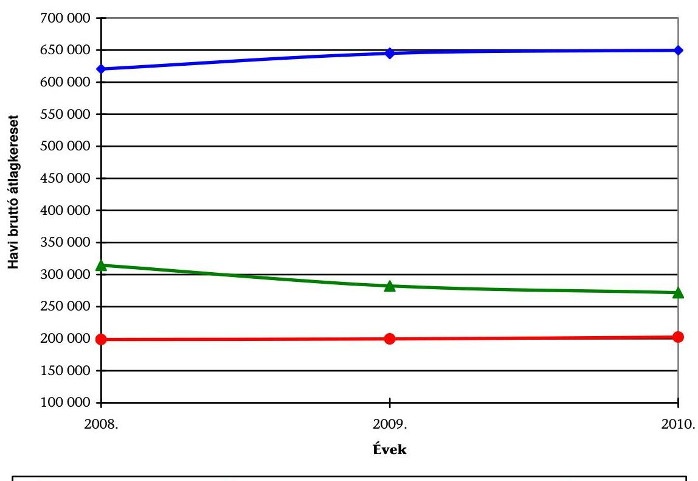

Az MNB 2010-ben 12,8 Mrd Ft múködési költséget számolt el, amelyből 7,0 Mrd Ft-ot a személyi jellegű ráfordítások tettek ki. Az MNB 2010. évi mérleg szerinti eredménye 41,6 Mrd Ft veszteség volt, amelyre az eredménytartalék fedezetet biztosított. Az államadósság finanszírozása érdekében bevont devizaforrások az MNB kötvényállományát növelték. A forint- és a devizahozamok közötti kamatkülönbözet negatív hatást gyakorol az MNB eredményére a következő években. A Bank honlapján nyilvánosságra hozott 2011 szeptemberi a előrejelzése szerint az MNB gazdálkodása a következő években veszteséges lesz, 2011-ben 126 Mrd Ft, 2012-ben pedig 199 Mrd Ft veszteség várható. A veszteség eredménytartalékot meghaladó részét az MNB tv. előírása alapján a beszámoló elfogadását követően a költségvetésnek meg kell térítenie, amely az előrejelzés figyelembevételével várhatóan 2012-ben 93 Mrd Ft, 2013-ban pedig 199 Mrd Ft lesz, ami az államadósságot és a költségvetési hiányt is növeli.

Az ÁSZ a 2002 óta elvégzett vizsgálatok keretében ellenőrizte az MNB banküzemi múködését és gazdálkodását, a múködési költségek és a beruházási kiadások alakulását, a kontrolling feladatokat támogató informatikai, a katasztrófatűrő adattároló és a teljesítményértékelő rendszerek megvalósítását, az analitikus számlavezető rendszer bevezetését, a Konferencia-központ kialakítá-

---

sát, a Logisztikai Központ beruházás, valamint a működésfejlesztési programok megvalósítását.

A 2010. évi múködésre kiterjedő ellenőrzés célja annak értékelése volt, hogy az MNB:

- működése megfelelt-e a törvényi előírásoknak, a részvényesi határozatoknak, a belső szabályzatoknak, irányítási, döntéshozatali és ellenőrzési rendszere szabályozottan és szabályszerűen működött-e;
- gazdálkodása átlátható és takarékos volt-e, érvényesült-e a szabályszerűség követelménye; létszám- és bérgazdálkodása, valamint beruházási tevékenysége összhangban volt-e intézményi célkitűzéseivel, betartotta-e a közbeszerzési törvény előírásait;
- központi költségvetési kapcsolataival összefüggő elszámolásai szabályozottak és szabályszerűek voltak-e;
- hasznosította-e az előző évi ÁSZ ellenőrzés megállapításait, és tett-e intézkedéseket a javaslatok megvalósítására.

Az ellenőrzés végrehajtására 2011. június 30 -áig az Állami Számvevőszékről szóló 1989. évi XXXVIII. tv. 3. §-ában, ezt követően az Állami Számvevőszékről szóló 2011. évi LXVI. tv. 5. § (10) bekezdésében foglaltak biztosítottak jogszabályi alapot. A törvényi szabályozás értelmében az ÁSZ nem vizsgálta a Bank MNB tv. 4. §-ában meghatározott alapvető feladatait, így például a monetáris politikát és az azzal összefüggő tevékenységeket, a bankjegy- és érmekibocsátást, a devizatartalék kezelésével és az árfolyampolitika végrehajtásával kapcsolatos devizamúveleteket, valamint azok banki eredményre gyakorolt hatását. Nem ellenőrizte továbbá a Bank többségi tulajdonában lévő gazdasági társaságainak (pl. Magyar Pénzverő Zrt., Pénzjegynyomda Zrt.) múködését sem.

A vizsgálat a 2010. évi gazdálkodásra, illetve - indokolt esetben - az adott gazdasági esemény keletkezésétől számított időszakra irányult, és - szükség szerint - a helyszíni ellenőrzés befejezéséig figyelemmel kísérte a pénzügyigazdasági folyamatokat.

Az ÁSZ az ellenőrzési kézikönyve és egyéb szakmai dokumentumai, ezen belül az MNB működésének ellenőrzéséhez összeállított, az ÁSZ honlapján közzétett segédlet iránymutatásai alapján végezte az ellenőrzést. A Bank múködését és gazdálkodását az ellenőrzési szempontokhoz kidolgozott kérdések, kritériumok és adatforrások szerint értékelte.

A jelentést megküldtük a nemzetgazdasági miniszternek és az MNB elnökének. A nemzetgazdasági miniszter nem tett észrevételt, válaszlevelét az 1/a. számú melléklet tartalmazza. Az MNB elnökének észrevételét az 1/b. számú melléklet, az ÁSZ elnökének az MNB elnöke észrevételére adott válaszát 1/c. számú melléklet tartalmazza.

---

# I. ÖSSZEGZŐ MEGÁLLAPÍTÁSOK, KÖVETKEZTETÉSEK, JAVASLATOK 

Az ÁSZ 2002-től ellenőrzi az MNB múködését és gazdálkodását. Az elmúlt tíz évben a központi költségvetésnek térítési kötelezettsége nem származott az MNB vesztesége miatt, a keletkezett veszteségre az eredménytartalék fedezetet biztosított. A Bank 2010. évi mérleg szerinti eredménye 41,6 Mrd Ft veszteség volt, amelyre a központi költségvetésnek az MNB tv. előírása alapján nem keletkezett térítési kötelezettsége. Amennyiben 2011-ben az MNB vesztesége meghaladja a 33,4 Mrd Ft-os eredménytartalékot a 2012. év lesz az első, amikor a központi költségvetésnek térítési kötelezettsége keletkezik. A Bank 2011. szeptemberi előrejelzése szerint 2012-ben 93 Mrd Ft, 2013-ban pedig 199 Mrd Ft a költségvetés várható térítési kötelezettsége ${ }^{2}$. Az uniós irányelvekkel és az Európai Központi Bank ajánlásával összhangban a magyar törvényi szabályozásnak megfelelően sem az ÁSZ, sem az FB nem ellenőrizheti az MNB monetáris tevékenységét és annak eredményre gyakorolt hatását. Az MNB alapvető feladataival kapcsolatos legfőbb döntéshozó szerv a monetáris tanács. Azonban vannak olyan, a monetáris politika végrehajtásával és eszköztárának alkalmazásával összefüggő döntések, amelyek nem az MT, hanem az MNB elnöke hatáskörében születnek meg (számlavezetési körében betét elfogadása, saját értékpapírok kibocsátása).

Az MNB irányítási és döntéshozatali belső szabályozási rendszere megfelelt az MNB tv.-ben rögzített előírásoknak és a Bank alapító okiratában foglaltaknak. A részvényesi jogokat gyakorló pénzügyminiszter részvényesi határozattal módosította az MNB alapító okiratát, amely alapján az MNB elnöke az FB-vel való előzetes egyeztetést követően tesz javaslatot a könyvvizsgáló személyére, jóváhagyta az FB módosításokkal egységes szerkezetbe foglalt ügyrendjét, elfogadta az MNB 2009. üzleti évről szóló auditált éves beszámolóját. Az MNB döntési és irányító tevékenységének szabályozását tartalmazó SZMSZ-t 2010-ben nyolc alkalommal, függelékeit pedig négy alkalommal módosította a Bank. A módosítások a szakmai bizottságok elnevezésének, ügyrendjének, a közbeszerzéssel kapcsolatos jogi tevékenység ellátásának változásához, valamint feladatátcsoportosításokhoz kapcsolódtak. Az MNB szervezeti felépítése 2010-ben nem változott. Az irányítás és döntéshozatal az MNB elnökének egyszemélyi döntési hatáskörére és felelősségére épült, akinek munkáját a konzultatív testületként múködő vezetői bizottság (továbbiakban: VB) támogatta. A Bank a VB ülések hanganyagát rögzíti, ezért 2010 márciusától csak lényegi öszszefoglalót tartalmazó, rövidített jegyzőkönyvek készülnek. Az MNB elnökének létszámmal összefüggő döntései közül többet (pl. a 2010. évi létszámtervet, a Bankműveletek szervezeti egység létszámváltozását) nem a döntésnek megfelel-

[^0]
[^0]:    ${ }^{2}$ Az MNB márciusban, júniusban és szeptemberben tett közzé előrejelzést a tárgyévi és a 2012. évi várható veszteségéről, és a 2012. évet érintő költségvetési térítési kötelezettség mértékéről, amely a márciusban közzétett 79 Mrd Ft-ról 94 Mrd Ft-ra nőtt, majd 93 Mrd Ft-ra csökkent. Az előrejelzések szerint a költségvetés várható térítési kötelezettsége 2013-ban rendre 113 Mrd Ft, 187 Mrd Ft, 199 Mrd Ft.

---

lően hajtott végre a Bank, mivel az MNB elnökének jegyzőkönyvbe foglalt határozatai nem tartalmazták egyértelműen a konkrét feladatot.

A felügyelő bizottság az MNB folyamatos tulajdonosi ellenőrzésével összefüggő feladatát a hatályos jogszabályok, az MNB alapító okiratában foglaltak, valamint ügyrendje előírásai szerint végezte. Az MNB tv. alapján az FB irányította az MNB belső ellenőrzési szervezetét a hatáskörébe tartozó feladatok tekintetében, amely nem terjed ki az MNB tv.-ben meghatározott alapvető feladatokra. Az Országgyúlés által megválasztott új FB 2010. december 2-ától kezdte tevékenységét, addig a korábbi testület látta el az ellenőrző feladatokat. Sem a megszűnő és a hivatalba lépő új FB, sem az FB titkárságok vezetői között feladat és dokumentum átadás-átvételre nem került sor, ez azonban a feladatellátás folyamatosságát nem akadályozta. Ezt a kérdéskört az FB korábbi, illetve hatályos ügyrendje nem szabályozta. A régi és az új FB feladatát az elfogadott munkaterve alapján végezte. A testület ülésein rendszeresen megtárgyalta az irányítása alá tartozó belső ellenőrzési szervezet jelentéseit és a Bank gazdálkodásának időszerű kérdéseit. Megvitatta és elfogadta az MNB éves beszámolóját, értékelte a pénzügyi tervét, a gazdálkodásról szóló negyedéves beszámolókat, valamint áttekintette az MNB tulajdonosi érdekeltségébe tartozó vállalkozások gazdálkodását. Kiemelten foglalkozott az MNB bérgazdálkodásával, a Pénzjegynyomdával kapcsolatos közép- és hosszú távú tulajdonosi stratégiájával, a kommunikációs beszerzésekkel, valamint az arculatváltással. Az FB tagjai eleget tettek az MNB tv.-ben foglalt beszámolási kötelezettségüknek, benyújtották közös beszámolójukat a 2009. júniustól 2010. júniusig tartó tevékenységükről az Országgyűlésnek.

A belső ellenőrzés (továbbiakban: BEL) az FB hatáskörébe nem tartozó feladatok tekintetében az MNB elnökének irányítása alatt végezte tevékenységét. Hatáskörét és eljárási rendjét a hatályos elnöki utasítás az MNB tv. előírásaival összhangban szabályozta, munkatervét - egy ellenőrzést kivéve - 2010 végéig teljesítette. 2010-ben 43 jelentéssel záruló vizsgálatot hajtott végre, amelyből 10 utóvizsgálat volt. Az ellenőrzések eredményeként 62 megállapítást és 52 ajánlást tett. Az intézkedések közül három magas kockázatú hiányosság megszüntetésére irányult, amelyekből kettő informatikai, egy bankbiztonsági területet érintett.

Az MNB munkavállalóinak havi átlagkeresete az előző évhez viszonyítva minden évben nőtt, 2010-ben már több mint háromszorosan haladta meg a nemzetgazdaságban foglalkoztatottakét. Ugyanakkor a közszférában foglalkoztatott (a banki alkalmazottakhoz hasonlóan felsőfokú végzettséget és több területen speciális szaktudást igénylő) köztisztviselők havi átlagkeresete 2008ról 2009-re 10,3\%-kal, 2009-ről 2010-re pedig további 3,7\%-kal csökkent.

Az MNB munkavállalóinak havi átlagkeresete 2010-ben 644852 Ft-ról 649724 Ft-ra, 0,8\%-kal nőtt. Az MNB tv. felsővezetők keresetét korlátozó előírása, valamint két fő MT tag mandátumának pótlás nélküli megszűnése 25,9\%kal mérsékelte a Bank átlagkereset-növelő intézkedései hatását. Az átlagkereset növekedését mérsékelte továbbá, hogy az előző évben a HAJÓ projekt megvalósításával, valamint a munkaviszony megszűnésekkel összefüggésben elszámolt összegek 2010-ben csökkentek.

---

A Bank elnöke az MNB tv. előírása szerinti kereset-csökkentést a törvényben szabályozottak körére alkalmazta, ami a törvény előírásának megfelelt. Az MNB ügyvezető igazgatójának és 14 szervezeti egység vezetőjének a keresete, valamint egy fő osztályvezető keresete már 2010-ben meghaladta a Bank elnökének MNB tv.-ben szabályozott 2011. évi jövedelmét is. A Bank elnökének jövedelmét meghaladó többlet kereset (munkáltatói terhek és egyéb juttatások nélkül is) 177,7 M Ft bérköltség elszámolását jelenti. A Bank munkavállalói közül egy vezető keresete - a 2011. évi keresetfejlesztés nélkül is - több mint háromszorosa, egy másiknak pedig több mint kétszerese az elnök 2011. évi keresetének. Hasonló aránytalanságok mutathatók ki az alelnökök és az irányításuk alatt álló szervezeti egység vezetők keresete között is. Ellentmondásosnak ítélhető helyzet állt elő azzal, hogy a felső vezetés törvényben korlátozott keresetéhez viszonyítva a középvezetők személyi alapbére és keresete aránytalanul magassá vált, ami nem tükrözi a Bankon belül az MNB vezetői hierarchiájában elfoglalt felelősségi viszonyokat. Nem támogatja továbbá a kormányzati bérpolitikát és a Kormány takarékossági intézkedéseinek megvalósulását sem.

A Bank elnöke 2010-re 3,5\% általános, az előléptetésekhez kapcsolódóan további 1,2\%-os bérfejlesztést hagyott jóvá. Az MNB 2010. évi 4,7\%-os bérfejlesztése 1\%-ponttal meghaladta a béremelést tervező kereskedelmi bankoknál tervezett átlagos mértéket ${ }^{3}, 0,8 \%$-ponttal lépte túl az Országos Érdekegyeztető Tanács ajánlását, valamint ugyanennyivel az infláció várható mértékét. A 2010. évi bérfejlesztés mértékéről hozott döntéssel a Bank a stratégiájában meghatározott bérpolitikai célkitűzést is túllépte. A Bank számítása alapján a 4,7\%-os bérfejlesztés $242,1 \mathrm{M}$ Ft-tal növelte a személyi jellegú ráfordításokat.

A Bank 2010-ben átalakította a munkavállalók „kompenzációs rendszerét". Az előző években „általános költségtérítés" címen fizetett juttatást megszüntette, helyette a választható béren kívüli juttatásokat (továbbiakban: VBK) egységesen 100 E Ft-tal, 620 E Ft-ra emelte, továbbá a B06 besorolási szinttől differenciáltan 127,2 - 285,6 E Ft-ot a személyi alapbérbe építette be. Az átalakítás a Bank munkavállalóinak 19,7\%-ánál 1 E Ft és 142 E Ft/év közötti nettó jövedelemnövekedést, 80,3\%-ánál pedig nettó jövedelemcsökkenést eredményezett. A legnagyobb mértékű nettó jövedelemcsökkenés ( 120 E Ft/év és 150 E Ft/év között) az alacsony besorolási szintű, nettó 2 M Ft körüli éves bérelemekkel rendelkező munkavállalóknál következett be. Az átalakítással - figyelembe véve a 2009. évi adó-és járulékváltozást - a Bank a HAJÓ projektben a személyi jellegű ráfordítások 241,9 M Ft-os csökkentését tűzte ki célul. A 2010. évi járulékváltozás további 150,0 M Ft költségcsökkenést tett lehetővé. Összességében a Bank a HAJÓ projekt célkitűzésének megvalósításával, valamint az adóterhek csökkenésével a személyi jellegű ráfordításait 391,9 M Ft-tal mérsékelhette volna, ezzel szemben a „kompenzációs rendszer" átalakításának változtatása miatt

[^0]
[^0]:    ${ }^{3}$ A Bank az általa meghatározott referencia piac szerinti bérfejlesztéseket az MNB bérszínvonalának versenyképessége megtartásával indokolta, amely szerint „a tehetséges, bankban tudást és tapasztalatot felhalmozott szakértők magasabb jövedelemért ne vándoroljanak el." Ennek ellentmond a Bank a „szisztematikus csere" megvalósítására vonatkozó megállapításra tett észrevétele, miszerint „A munkaerő-piacon érvényes kínálat-keresleti viszonyok már több éve lehetővé teszik a Bank számára a kívánt minőségú munkaerő a távozó munkatárs javadalmazásánál alacsonyabb szinten történő felvételét."

---

csak 309,5 M Ft költségcsökkenést ért el. A 82,4 M Ft többletköltséget a Bank a társadalombiztosítási járulék mértékének csökkenéséből fedezte, ami nem volt összhangban a törvényalkotó munkáltatói terhek csökkentésével ${ }^{4}$ összefüggő céljaival (pl. "az alacsonyabb jövedelmüek nettó jövedelmének növelése").

A Bank 2010. évi gazdálkodása során a közbeszerzésekről szóló törvény (továbbiakban: Kbt.), valamint a belső szabályzatok előírásait nem minden esetben tartotta be.

A múködési költségek módosított tervének 2010. január 12-én jóváhagyott főösszege 13 499,8 M Ft volt. 2010-ben 12 783,0 M Ft működési költséget számolt el a Bank, amely a 2009. évinél 944,5 M Ft-tal, a tervezettnél 716,8 M Fttal volt kevesebb. A múködési költségek több mint felét a személyi jellegü ráfordítások tették ki, amelyre 2010-ben 7007,0 M Ft-ot fordított a Bank, 653,7 M Ft-tal kevesebbet az előző évinél. A Bank 2010-ben már tervezte azokat a tevékenységeket, intézkedéseket (pl. újévköszöntő, tavaszköszöntő, emlékülés), amelyeket 2009-ben a pénzügyi-gazdasági válságra tekintettel elhagyott vagy elhalasztott. A Bank hatékonyságjavító intézkedéseitől független költségcsökkentési lehetőség 634,0 M Ft volt, amelynél 166,9 M Ft-tal kevesebbet tervezett. A költségcsökkentési lehetőséget mintegy 165,8 M Ft-tal 799,8 M Ft-ra növelte az MNB tv. elnök keresetét korlátozó 2010 szeptembertől hatályos módosítása, valamint a korengedményes nyugdíjazás elszámolásából eredő nem tervezett költségcsökkenés. Mindezek alapján a Bank a megtakarítási lehetőségeihez képest 2010-ben 146,1 M Ft-tal alacsonyabb költségcsökkenést ért el. Az előzőekből következően a Bank hatékonyságjavító intézkedéseinek költségcsökkentő hatása nem mutatható ki. A Bank létszámmal és személyi jellegű ráfordításokkal való gazdálkodása nem felelt meg az MNB takarékossági célkitűzéseinek.

A Bank 2009 júniusától főállás melletti további munkaviszony keretében egy fő kommunikációs tanácsadót alkalmaz havi bruttó 1,8 M Ft-ért, ugyanakkor 2009-ben 20 fős, 2010-ben 24 fős kommunikációs szakterületet is múködtetett ${ }^{5}$. A munkavállaló munkavégzéséről, valós teljesítményéről a Bank értékelhető szakmai dokumentumokat nem adott át, a szóban végzett feladatellátást az ÁSZ utólag ellenőrizni nem tudta ${ }^{6}$. Ezért a munkaszerződésben előírt írásos és szóbeli feladatok teljesítéséről az ellenőrzés nem tudott meggyőződni. A Bank

[^0]
[^0]:    ${ }^{4}$ A 2010. évi adó- és járulékváltozások: társadalombiztosítási (2009. év elején 29\%, 2010. év elején $27 \%$-ra) és munkaadói járulék (2009. év elején 3,0\%, 2010. év elején 0,0\%) 32\%-ról 27\%-ra mérséklődött. A tételesen meghatározott egészségügyi hozzájárulás (2009. év elején 1950 Ft/hó/fő) 2010-től megszűnt, a százalékos egészségügyi hozzájárulás $11 \%$-ról $27 \%$-ra, a rehabilitációs hozzájárulás $177600 \mathrm{Ft} /$ évről $964500 \mathrm{Ft} /$ évre nőtt.
    ${ }^{5}$ A Bank 2008-ban reklámügynökségi tevékenységre, kommunikációs stratégiai tanácsadásra megkötött megbízási szerződései szabályszerűségének értékelésére a 2010. évi múködésre irányuló ellenőrzés nem tért ki. Az MNB arculat- és logóváltásával kapcsolatos szerződéseivel összefüggésben nyomozó hatósági eljárás indult, ezért az ÁSZ azokra megállapítást nem tett.
    ${ }^{6}$ A Bank észrevétele szerint a szóban teljesített feladatellátás utólag, nyilatkozatokon kívül más módon nem igazolható.

---

elnöke az ÁSZ által megküldött teljességi nyilatkozatot nem írta alá, annak tartalmát a „rendelkezésemre álló" korlátozó kitétellel módosította. A nyilatkozat ezáltal nem tekinthető az adott ügyben keletkezett összes dokumentumra vonatkozó teljességi nyilatkozatnak. A Bank által átadott dokumentumok a valós teljesítmény megítélésére nem alkalmasak, azok (pl. telefonhívásokról és email forgalomról szóló kimutatások, valamint a kommunikációs értekezletekre kiküldött meghívók kimutatása) nem igazolják sem az értekezleteken való részvételt, sem a munkaszerződésben foglalt feladatok elvégzését.

A Bank 2010. évi Teljes Munkaidős Dolgozóban ${ }^{7}$ (továbbiakban: TMD) számított záró létszámterve 578,25 fő volt, az előző évinél 9,68 fővel alacsonyabb. A terv 22,50 fő kilépésével és 12,50 fő létszámfelvétellel számolt. Ezzel szemben 2010-ben összesen 62,46 fő munkaviszonya szűnt meg és 46,74 fővel létesített a Bank munkaviszonyt. A jogi állomány változása 9 fővel növelte, a munkarendváltozás pedig 0,11 fővel csökkentette a Bank 2010. évi záró létszámát. A 2010. évi munkaerőmozgás hatására a Bank záró létszáma 6,83 fővel, 581,10 főre csökkent.

A Bank a 2010. évi záró létszámterve kialakításánál nem megfelelően vette figyelembe a HAJÓ projekt célkitűzéseit, az MNB elnökének 2009. évi létszámnövelő intézkedéseit, a Bank HAJÓ projekten kívüli hatékonyságjavító intézkedéseinek hatását, valamint az MT további tagjainak 2009. évi kétfős csökkenését. Ezért a Bank a 2010. évi létszámtervében a HAJÓ projekt létszámcsökkentési célkitúzéséhez mérten TMD-ben számítva 19,50-22,00 fővel magasabb záró létszámot tervezett. A Bank a 2010. évi létszámtervében is számolt a 2008. szeptember 1-jén be nem töltött pozíciókkal, továbbá a HAJÓ projekt célkitűzéseit megalapozatlanul csökkentette 12,50 fővel ${ }^{8}$. Ezáltal a projektben kitűzött céljainak megvalósítását az elért eredményeknél kedvezőbben mutatta be. A HAJÓ projekt célkitúzés megfelelő korrekciójával, valamint a létszámot befolyásoló további intézkedések (pl. 4 fő munkaviszonya megszüntetésének 2011-re halasztása) hatásával számolva a Bank a 2010. év végéig a HAJÓ projektben előirányzott minimális célkitúzéshez mérten 13,00 fővel, a maximálishoz viszonyítva 16,00 fővel kevesebb munkaerőt épített le.

A Bank a HAJÓ projekt eredményét az MNB-ben megvalósult létszámcsökkenéstől függetlenül mutatta be, beszámolójában a projektben meghatározott létszámcsökkentést, 4 fő kivételével, megvalósítottnak tekintette. Az MNB záró

[^0]
[^0]:    ${ }^{7}$ A Bank 2010-től belső használatra a 8 óránál rövidebb munkarendben foglalkoztatott munkavállalóit a munkaidővel azonos arányban veszi létszámba (pl. a 4 órás munkarendben foglalkoztatott munkavállalót 0,5 főként veszi számításba).
    ${ }^{8}$ Az ÁSZ 2010-ben közzétett, a Magyar Nemzeti Bank 2009. évi múködése ellenőrzéséről készített jelentésének megállapítása szerint: „Az ellenőrzött dokumentumok szerint, mivel a projekt a banki feladatok ellátásának munkaerőigényéből indult ki és abból vezette le a létszámszükségletet, illetve a létszám felesleget, arra hivatkozással, hogy a HAJÓ projekt a betöltetlen státuszokat figyelmen kívül hagyta, a 2009. évi létszámtervben létszámot növelni nem volt indokolt. A tervezett létszámot ezen a jogcímen csak új, előre nem látható feladat felmerülése esetén növelhette volna a Bank. ... A Bank ezzel szemben módosított létszámtervében 590,5 fő záró létszámot tervezett, amely - elfogadva az új feladatok ellátásához szükséges 4 fő létszámnövekedést - 12,5 fővel meghaladta a Hajó projekt Irányító Bizottság (továbbiakban: PIB) döntésnek megfelelőt."

---

létszáma (a KSH adatszolgáltatás szerint) 2009-ben 48 fővel, 2010-ben 4 fővel, a két év alatt 52 fővel csökkent. A létszámcsökkenésből 2009-ben 25 fő, 2010ben 5 fő, összesen 30 fő munkaviszonyának megszűnése nem volt összefüggésben a HAJÓ projekt megvalósításával. Mindezek alapján a projekt létszámcsökkentési célkitúzéséből ( 73,25 fő) 2010. év végéig 22 fő olyan létszámcsökkenés valósult meg, amely valós költségcsökkenést eredményezett.

A Bank 2010-ben elszámolt információ-technológiai (továbbiakban: IT) múködési költsége 1219,0 M Ft volt, ami 155,1 M Ft-tal alacsonyabb a tervezettnél. A terv a HAJÓ projekt célkitúzéseként $265,4 \mathrm{M}$ Ft megtakarítási elvárást tartalmazott, amelyet a szállítói szerződések felülvizsgálatával kívánt elérni ${ }^{9}$ a Bank. Az informatikai költségek csökkentése érdekében az ISZ a 2008-2010 közötti időszakban a szállítók számára kizárólagos jogokat (pl. továbbfejlesztésre, karbantartásra) biztosító szerződések számát és így az ebből eredő kockázatokat mérsékelte. A Bank a szállítóknak kizárólagos jogokat biztosító szerződéseket részben technológiai jellemzők, részben a korábbi szerződési előírások miatt teljes körűen megszüntetni nem tudta. A terv összegében tartalmazta ugyan az elvárt megtakarítást, azonban az egyes költségsorok a HAJÓ projekt célkitűzésétől lényegesen elmaradó költségcsökkentést irányoztak elő, amelyeket az egyéb, nem a projekt eredményének tekinthető magasabb megtakarítások ellensúlyoztak. (Pl. az adattárház támogatási költségeknél kimutatott $49,9 \mathrm{M} \mathrm{Ft}$ megtakarításból $27,4 \mathrm{M}$ Ft nem tekinthető a projekt eredményének.) A megfelelő megalapozottság hiányában $24,7 \mathrm{M}$ Ft megtakarítás már a HAJÓ projekt célkitűzésekor sem volt teljesíthető. Az üzemeltetési költségekre 1550,4 M Ft-ot számolt el a Bank, amelynek több mint a fele az ingatlanok és eszközök állagmegóvásához kapcsolódott. Az egyéb költségek elszámolt öszszege 956,5 M Ft volt, amelynek közel felét a jogi és a kommunikációs költségek tették ki.

A Bank a 2010. évi tevékenységét bemutató „Éves jelentés" elnöki összefoglalójában téves információt közöl, mivel a múködési költségek előző évihez mért több mint 900 M Ft-os csökkenését a 2008-ban indított hatékonyságjavító projekt eredményeként mutatja be. A Bank elnöki összefoglalóban szereplő állítása nem felel meg az éves jelentés további fejezeteiben (az üzleti jelentés „MNB gazdálkodását" és a kiegészítő melléklet „banküzemi bevételek és ráfordítások alakulását") ismertetett költségcsökkenést eredményező tényezőknek. A Bank éves jelentésében nem számszerűsíti a költségcsökkentő tényezőket. Mindezek

[^0]
[^0]:    ${ }^{9}$ Az ÁSZ a Magyar Nemzeti Bank 2009. évi múködésének ellenőrzéséről 1007. számon közzétett jelentésében is megállapította, hogy a Bank szerződések felülvizsgálatával elérhető költségcsökkentéseket a HAJÓ projekt nélkül is megvalósíthatta volna: „2009. évi múködtetési költségeiről készült szöveges indokolás szerint a terv a „normál" tervezési folyamat részeként számolt a szállitói szerzödések felülvizsgálatával elérhető költségcsökkentésekkel és nem tartalmazta a HAJÓ projekttel összefüggő költségmegtakarításokat. A Bank középtávú stratégiai céljai között kiemelten szerepel az eredményesség és hatékonyság fejlesztése, e mellett a 2008-2011. évekre vonatkozó középtávú informatikai stratégia is tartalmazza a gazdaságos, költségtakarékos gazdálkodásra vonatkozó célkitüzést. A szerződések rendszeres felülvizsgálata, a költségek optimalizálása a tanácsadói átvilágitás és javaslatok nélkül is alapvető elvárás és gyakorlat volt az MNB-ben, amit a Bank beszerzési eljárásaira kialakított belsö szabályzata is elöirt."

---

alapján a Bank éves jelentésében nem hitelesen mutatja be a hatékonyságjavító intézkedéseivel elért megtakarítások működési költségekre gyakorolt hatását.

A 2010. évi beruházási kiadások jóváhagyott terve 1917,3 M Ft volt, amelynek közel $90 \%$-a a Bank kiemelt stratégiai céljaihoz kapcsolódott. Beruházásokra 1839,1 M Ft-ot számolt el a Bank, amelyből 1313,5 M Ft-ot az IT beruházások tettek ki. A 2010-re előre hozott beruházási kiadás $166,1 \mathrm{M}$ Ft volt, amelyet az adatátvitelt biztosító informatikai berendezés javíthatatlan meghibásodása okozott. A Bank szolgáltatóval megkötött, 2011. március végéig érvényes szerződése szerint meghibásodás esetén a szolgáltató a csereeszközöket díjmentesen köteles biztosítani. A szerződésben foglaltakkal ellentétesen a Bank bérleti díj címén több mint 10 M Ft-ot fizetett ki a szolgáltatónak a csereeszközökért.

Az IT beruházások 2010. évi tervén belül az év közben jóváhagyott tervtúllépés 87,7 M Ft, a következő évekre áthúzódó beruházások összege 109,0 M Ft volt. A tervezetthez viszonyított megtakarítások 204,3 M Ft-os összegéből legnagyobb tétel a központi adattároló és mentőeszköz beszerzésen keletkezett. Az 515,0 M Ft-ban jóváhagyott beruházáshoz kapcsolódó karbantartás vállalkozói díja a többfordulós ártárgyalás során - a tételes árjegyzékkel alátámasztott 315,5 M Ft-os vállalkozói díjhoz képest - az ágazatban szokásos árszint töredékére, annak 1/37-ed részére csökkent. A Bank a beszerzési eljárás során nem kérte az indokolatlanul alacsony ár alátámasztását. Ezzel az MNB nem tett eleget Kbt. ajánlatok elbírálására vonatkozó előírásának, amely indokláskérést ír elő arra az esetre, ha az ajánlati ár alapján kalkulálható költségek nem érik el az ágazatban szokásos árszintet. A Bank tájékoztatása szerint a bíráló bizottság nem tudta megítélni az árak alátámasztottságát, így azt sem, hogy a nyertes ajánlat kirívóan alacsony, vagy éppen ellenkezőleg a drágább ajánlatok voltak kirívóan magasak. Ebben az esetben viszont önmagában az érvényes ajánlatok közötti nagyságrendi eltérések indokolták volna az ajánlati ár indoklására vonatkozó kérést, akár az összes ajánlattevőtől. A nem tervezett, év közben jóváhagyott tételekből 73,0 M Ft-ot az adattárház stratégia megvalósításához kapcsolódó beruházások tettek ki, amelyből a 2010. évi kiadás $28,8 \mathrm{M}$ Ft volt. Az egyéb beruházások elszámolt összege 525,6 M Ft volt, amelyből 180,3 M Ft-ot az MNB központi épületének átalakítására fordított a Bank, ezzel lehetővé vált a Hold utca 7. szám alatti épület használatának megszüntetése.

Az MNB elnökének 2009. márciusi döntése értelmében minden szervezeti egység vezető jogosult lett MNB tulajdonú személygépkocsi használatára. Az MNB elnöke 21 db gépkocsi 2010-2012 közötti beszerzésére 158,2 M Ft-ot (126,6 M Ft + áfa) hagyott jóvá, amelyre a Bank a részvételi felhívást az elnök döntésétől eltérő feltételekkel írta ki, 22 db (+ 50\%) gépkocsi beszerzését hirdette meg. A beszerzés becsült értéke (továbbiakban: becsült érték) - az elnök által jóváhagyott összegtől eltérően - 76,8 M Ft volt. A becsült érték megállapítása nem a Kbt. előírásainak megfelelően történt, mivel a Bank a hirdetményben nem a legmagasabb összegű teljes ellenszolgáltatás értékét jelenítette meg. A Bank a gépjármú menedzsment szolgáltatásra kötött határozott időtartamú szerződését - a szerződés hatályának meghosszabbításával - közbeszerzési eljárás lefolytatása nélkül módosította, ami a Kbt. előírása alapján nem volt jogszerú, mivel a szerződés lejárata a Bank által ismert, előre látható körülmény volt. A módosított szerződés tévesen hivatkozott egy másik közbeszerzési eljárásra, ennek következtében a szerződés 2009. december 31-én lejárt. A folyamatba épí-

---

tett, előzetes, utólagos és vezetői ellenőrzések formálisan, az előírt tartalmi ellenőrzések mellőzésével működtek, mivel sem a szerződéstervezet előkészítésekor, sem az aláírásokkal igazolt vezetői ellenőrzések során nem derült ki a tévedés. A Bank a szerződés módosítását a honlapján nem tette közzé ${ }^{10}$, ezzel a Kbt.-ben előírt nyilvánosságra hozatal követelményét nem tartotta be.

A szakmai feladatok ellátásához szükséges elemzéseket támogató adattárház kialakítása 2003-tól az MNB kiemelt céljai között szerepelt, amelyre a Bank a 2003-2008 közötti időszakban 471,1 M Ft beruházási kiadást számolt el. A rendszer múködtetésére fordított költségekkel és az infrastrukturális beruházásokkal együtt a 2003-2008 közötti időszak teljes ráfordítása 947,6 M Ft volt, amit a 2009-2010. évek kiadásai 1064,8 M Ft-ra növeltek. 2008-ra az adattárház a Bank által korábban megfogalmazott célkitűzéseket nem érte el, a fejlesztésre fordított kiadások csak korlátozottan hasznosultak. Az összehangolt fejlesztési koncepció hiányában kialakult összetett - az üzleti logikával nem egyező - adatstruktúrák és a hiányos dokumentáltság miatt a rendszert csak egy szűk elemzői kör használta. A rendszer széleskörű használatát korlátozta az is, hogy nem alakították ki az adatok megbízhatóságát biztosító kontrollrendszert.

2009-ben az MNB elnöke kérte az adattárház jövőbeli felhasználási és múködési koncepciójának kidolgozását, amelyre alapozva 2010 januárjában jóváhagyta az MNB adattárház stratégiát és döntött a projekt 2010. év végéig történő meghosszabbításáról. Az elfogadott stratégia elsősorban a működés stabilizálására és az eredményes használat feltételeinek megteremtésére irányult, ugyanakkor már az elfogadása időpontjában sem vette számba a teljesség igényével az egyes szakterületek elemzési feladatait, az adattárház szerepét a feladatok támogatásában, nem tartalmazott információt arról, hogy a fejlesztések során mely szakterületi igényeket, milyen sorrendben, milyen határidővel tervezi megvalósítani a Bank. Az adattárház rendszer középtávú, eredményes múködésének feltétele az adatvagyon és a szakterületek igényeinek teljes körű felmérésén alapuló stratégia kidolgozása, amely mind az adattárház, mind az elemzéseket támogató egyéb rendszerek jövőbeli szerepét meghatározza. A rendszer elfogadottságát javítaná, a fejlesztésekre fordított erőforrások eredményesebb hasznosulását elősegítené a felhasználók intenzív oktatása, a rendszer használatának és a felhasználók elégedettségének folyamatos mérése.

Az adattárház fejlesztések során igénybe vett, külső szállítóval megkötött keretszerződés nem biztosította a Bank számára, hogy érvényesítse a fejlesztést végrehajtó alvállalkozóval szemben a fejlesztés kockázatait csökkentő elvárásait. A tételesen ellenőrzött adattárház fejlesztések esetében ("Pénzforgalmi jelentések adatpiac kialakítása", "Adattárház betöltések átalakítása a rendeletváltozások miatt") az informatikai projektek támogatására kialakított módszertani előírásokat nem alkalmazta teljes körűen a Bank. Hiányosság volt mindkét fejlesztés esetében, hogy a lebonyolítás szabályait nem kellő részletességgel, egyes folyamatok tekintetében ellentmondásosan határozták meg (pl. nem rögzítették egyértelműen az eredmény termékek véleményezésének határidőit, elfogadá-

[^0]
[^0]:    ${ }^{10}$ A Bank az ÁSZ észrevétele hatására utólag, 2011. május 25 -én intézkedett a szerződés módosításának közzétételéről.

---

sának folyamatát), nem rögzítették a projekt termékekre vonatkozó minőségi kritériumokat. A lebonyolítás szabályainak hiányos vagy ellentmondásos meghatározása kockázatot jelent a projekt sikeres lebonyolítására, mivel nehezíti, vagy lehetetlenné teszi a feladatok utólagos számonkérését és a felelősségek meghatározását. A vizsgált projektek során nem valósult meg a projekt termékek és folyamatok érdemi, projektvezetéstől független minőségbiztosítása, a projektirányítási kézikönyvben (továbbiakban: PKK) előírtak teljesülésének ellenőrzése.

Az egyik fejlesztés esetében a szerződésben vállalt határidő előtt egy hónappal kiállította a Bank a teljesítésigazolást annak ellenére, hogy a vállalkozó a szerződésben előírt feladatait nem teljesítette. A teljesítésigazolás szerint a vállalkozó az MNB-nek felróható okokból nem tudott maradéktalanul teljesíteni, aminek ellentmond, hogy a szerződésben rögzített teljesítési határidőig még egy hónap hátra volt. A teljesítésigazolás kiállítása és a vállalkozói díj 80\%-ának kifizetése nem volt megalapozott. A vállalkozó a fennmaradó feladatokat a szerződésben vállalt határidőhöz képest egy hetes késéssel teljesítette.

Az MNB befektetett eszközeivel a jogszabályok előírásainak megfelelően gazdálkodott, amelyek nettó záró állománya 2010 végén 34,5 Mrd Ft volt. A befektetett eszközökből 18,3 Mrd Ft-ot a tulajdonosi részesedések tettek ki. Az MNB-nek továbbra is hat belföldi és három külföldi székhelyű társaságban van részesedése, amelyek a Bank MNB tv.-ben rögzített alapvető feladatainak ellátásához kapcsolódnak. A külföldi befektetések könyv szerinti állománya 0,9 Mrd Ft-tal nőtt a devizában nyilvántartott állományok év végi átértékelése miatt. A társaságok gazdálkodása után a Bank 2010-ben 4,7 Mrd Ft osztalékot számolt el, amelyből 2,7 Mrd Ft a belföldi társaságoktól folyt be. Az MNB elnöke 2009 novemberében döntött a GIRO Elszámolásforgalmi Zrt.-ben (továbbiakban: GIRO Zrt.) lévő kisebbségi tulajdonrészének értékesítéséről, a 2010. évi majd a 2011. évi ismételt pályáztatás sikertelen volt. A befektetett eszközökön belül az immateriális javak, a tárgyi eszközök és a beruházások együttes nettó állománya év végén 16,2 Mrd Ft volt. Az állományt 2010-ben összesen 3,3 Mrd Ft összegű beruházás növelte. A selejtezések, az eladások, a térítés nélküli átadások és az egyéb csökkenések pedig 3,6 Mrd Ft-tal csökkentették. Az állományváltozások döntően az „A" épületben kialakított új munkahelyekkel, valamint a Magyar Államkincstárnak 2010-ben átadott Hold utcai ingatlanból való kiköltözéssel függtek össze.

Az MNB elszámolásai a központi költségvetéssel szabályozottak és szabályszerűek voltak. A forint árfolyam kiegyenlítési tartaléka 2010. december 31-én 415,9 Mrd Ft-ot tett ki, amelyet a Bank az MNB tv.-nek megfelelően saját tőkeként mutatott ki. A deviza értékpapírok kiegyenlítési tartalékának 2010. december végi egyenlege - a papírok piaci értékének változása miatt - mínusz 29,1 Mrd Ft volt, amelyet az MNB tv. alapján a központi költségvetés 2011. március 31-éig megtérített. Az MNB a Magyar Államkincstár és az Államadósság Kezelő Központ pénzforgalmi számláin a kamatokkal és a díjakkal kapcsolatos elszámolásokat a számlaszerződésekben foglaltaknak megfelelően, szabályszerűen végezte.

Az ÁSZ 2010-ben közzétett jelentésében az MNB elnöke számára megfogalmazott javaslatokat a Bank nem megfelelően hajtotta végre, a HAJÓ

---

projekt 2010. évi eredményeit is a 2009. évben alkalmazott értékelési módszere szerint mutatta be. A HAJÓ projekt eredményeit a Bank egyéb intézkedéseinek eredményétől függetlenül értékelte, nem vette figyelembe az elszámolt éves személyi jellegű ráfordítások alakulását, illetve az azokat befolyásoló tényezők költségekre gyakorolt hatását. A projekt önálló (a Bank egyéb intézkedéseinek költségekre gyakorolt hatásától független) értékelése közgazdaságilag nem megalapozott. ${ }^{11}$ Az ellenőrzött dokumentumok szerint a Bank 2010-ben is alkalmazta a „szisztematikus cserének" megfelelő eljárást, ami nem felel meg a Munka Törvénykönyve (továbbiakban: Munka tv.) előírásának.

Az Állami Számvevőszékről szóló 2011. évi LXVI. törvény 33. § (1) bekezdésében foglaltak értelmében a jelentésben foglalt megállapításokhoz kapcsolódó intézkedési tervet köteles az ellenőrzött szervezet vezetője összeállítani és azt a jelentés kézhezvételétől számított harminc napon belül az ÁSZ részére megküldeni. Amennyiben az intézkedési tervet határidőben nem küldi meg a szervezet, vagy az nem elfogadható, az ÁSZ elnöke a hivatkozott törvény 33. § (3) bekezdés a)-b) pontjaiban foglaltakat érvényesítheti.

# A helyszíni ellenőrzés intézkedést igénylő megállapításai és javaslatai: 

## a nemzetgazdasági miniszternek

1. A Bank 2011. szeptemberi előrejelzése szerint 2012-ben 93 Mrd Ft, 2013-ban pedig 199 Mrd Ft a költségvetés várható térítési kötelezettsége. Az uniós irányelvekkel és az Európai Központi Bank ajánlásával összhangban a magyar törvényi szabályozásnak megfelelően sem az ÁSZ, sem az FB nem ellenőrizheti az MNB monetáris tevékenységét és annak eredményre gyakorolt hatását. Az MNB alapvető feladataival kapcsolatos legfőbb döntéshozó szerv az MT. Azonban vannak olyan a monetáris politika végrehajtásával és eszköztárának alkalmazásával összefüggő döntések, amelyek nem az MT, hanem az MNB elnöke hatáskörében születnek meg.

Javaslat
Vizsgálja felül, hogy az MNB tv. a Bank veszteségét befolyásoló tényezők szabályozottsága tekintetében teljes körű és egyértelmű előírásokat tartalmaz-e, szükség esetén kezdeményezzen törvénymódosítást a testületi döntési jogkörök átruházhatóságának korlátozására, valamint a hatáskörgyakorlás kontrolljára.

## az MNB elnökének

1. Az adattárház stratégia 2010. évi elfogadását nem előzte meg a felhasználói szakterületek igényeinek és elemzési feladatainak teljes körű felmérése és az igények összehangolása. Nem határozta meg a Bank a fejlesztési feladatok sorrendjét, határidejét. Nem határozta meg továbbá az adattárház szerepét a banki feladatok támogatásában.
[^0]
[^0]:    ${ }^{11}$ A Bank álláspontja az, hogy az ÁSZ 2010-ben közzétett jelentésében a Bank elnöke számára megfogalmazott javaslatokat megfelelően hajtotta végre.

---

Javaslat
Újítsa meg az adattárház stratégiát annak érdekében, hogy a stratégia rögzítse az adattárház Bank feladatellátásában betöltött jövőbeni szerepét, az elemzéseket támogató, valamint az adatvagyont kezelő többi informatikai rendszereivel való kapcsolatát és feladatmegosztását.
2. Az adattárház projekt lebonyolítása során a Bank nem készítette el a teljes adattárház rendszer belső struktúráit és folyamatait összefoglaló rendszertervet. A Bank nem határozta meg teljes körűen a megvalósítás folyamatát lefedő feladatokat, azok felelőseit és határidőit. A feladatterv és az ütemezés kidolgozatlansága nem tette lehetővé a felelősségek egyértelmű meghatározását.

Javaslat
Írja elő a projektek független és dokumentált minőségbiztosítását a megvalósítási kockázatok csökkentése érdekében.
3. A Bank egy esetben a teljesítést megelőzően állított ki teljesítésigazolást, amely alapján a pénzügyi rendezés is megtörtént. Egy szerződés tartalmi hibáját a szerződéskötés folyamatában résztvevők nem tárták fel, ezért a Bank 2010-ben hatályos szerződés nélkül vett igénybe szolgáltatást.

Javaslat
Vizsgálja felül a belső szabályozását és biztosítsa a folyamatba épített, előzetes, utólagos és vezetői ellenőrzés eredményes müködését a szerződéskötéseknél, a beszerzési eljárások lebonyolításánál, valamint a teljesítmények igazolásánál.
4. A Bank a beruházások megvalósításához kapcsolódóan két esetben, szolgáltatás igénybevételéhez kapcsolódóan egy esetben sértette meg a Kbt. előírásait.

Javaslat
Biztosítsa a Kbt. előírásainak maradéktalan betartását.
5. A Bank a HAJÓ projekt célkitűzéseit és eredményeit a Bank év végi záró létszámának és működési költségeinek alakulásától függetlenül, önállóan, csak annak létszám-, illetve költségcsökkentő hatását bemutatva értékelte. Nem vette figyelembe a célkitűzések megvalósításával összefüggésben felmerült többletköltségeket, valamint a Bank egyéb intézkedéseivel összefüggő költségnövekedéseket, amelyek mérséklik a megtakarítások banki szintű összköltségre gyakorolt hatását.

Javaslat
Rendelje el, hogy a Bank a HAJÓ projekt lezárását követőn a projekt megvalósításával elért költségcsökkentéseket a banki szintű költségek alakulásának figyelembevételével mutassa ki. Biztosítsa továbbá, hogy a HAJÓ projekt eredményeinek értékelése tartalmazza a megvalósítás miatt felmerült többletköltségeket (végkielégítés, bónusz kifizetések, stb.) is.

---

# II. RÉSZLETES MEGÁLLAPÍTÁSOK 

## 1. Az MNB IRÁNYÍTÁSI, DÖNTÉSHOZATALI ÉS ELLENŐRZÉSI RENDSZEREINEK MŰKÖDÉSE

### 1.1. Irányítási és döntéshozatali rendszer

A részvényesi jogokat gyakorló államháztartásért felelős miniszter 2010-ben négy részvényesi határozatot hozott. 2010. február 1-jei hatállyal módosította az MNB alapító okiratát, amely alapján az MNB elnöke a FB-vel való előzetes egyeztetést követően tesz javaslatot a könyvvizsgáló személyére. 2010. február 26 -ai hatállyal jóváhagyta az FB módosításokkal egységes szerkezetbe foglalt ügyrendjét. 2010. április 28 -ai határozatában elfogadta az MNB 2009. üzleti évről szóló auditált éves beszámolóját $65,5 \mathrm{Mrd} \mathrm{Ft}$ nyereséggel. 2010. december 2-ai és 2011. február 17-ei hatállyal módosította az FB ügyrendjét.

Az MNB szervezeti felépítése 2010-ben nem változott, a Statisztika szervezeti egység azonban két új osztállyal bővült, az Adattárház kompetencia központtal (továbbiakban: AKK) és a Minőségbiztosítási és koordinációs osztállyal. (Az MNB szervezeti felépítését a $2 / a$. és $2 / b$. számú melléklet mutatja be.)

Az MNB döntési és irányító tevékenységének szabályozását tartalmazó SZMSZ-t 2010-ben nyolc alkalommal, függelékeit pedig négy alkalommal módosította a Bank. A módosítások a szakmai bizottságok elnevezésének, ügyrendjének, a közbeszerzéssel kapcsolatos jogi tevékenység ellátásának változásához ${ }^{12}$, valamint a feladatátcsoportosításokhoz kapcsolódtak.

Az MNB múködésének irányításáért felelős elnököt a döntéshozatalban a VB, mint konzultatív testület támogatja. A VB múködési szabályzatát 2010-ben két alkalommal módosították. 2010. március 10-ei hatállyal egyebek mellett módosultak az ülések levezetésének és a jegyzőkönyv vezetésének szabályai. A VB ülésekről rövidített, csak lényegi összefoglalót tartalmazó jegyzőkönyvek készülnek, mivel a VB üléseken elhangzott hozzászólások hanganyagát rögzítik és a jegyzőkönyvvel együtt irattárazzák. A változtatásokkal a VB ülésekkel öszszefüggő adminisztrációs munka egyszerűsödött. Az MNB elnökének létszámmal összefüggő döntései közül többet (pl. a 2010. évi létszámtervet, a Bankműveletek szervezeti egység létszámváltozását) nem a döntésnek megfelelően hajtott végre az Emberi erőforrások, szervezés és tervezés (továbbiakban: EEF) szak-

[^0]
[^0]:    ${ }^{12}$ Az SZMSZ módosítását az indokolta, hogy a közbeszerzésekkel kapcsolatos jogi tevékenység két szervezeti egység hatáskörét is érintette, és a feladatkörök nem különültek el egyértelműen. A módosítás szerint a Jogi szolgáltatások szervezeti egység feladatköre valamennyi jogi feladat ellátására kiterjed, kivéve a közbeszerzési eljárások vitelének közbeszerzési jogi megfeleléséről való gondoskodást, ami a Központi beszerzés feladatkörébe tartozik.

---

terület, mivel az MNB elnökének jegyzőkönyvbe foglalt határozatai nem tartalmazzák egyértelműen a konkrét feladatot. A pontatlanul fogalmazott jegyzőkönyvek és határozatok úgy a végrehajtás, mint az ellenőrzés hatékonyságát rontják.

Az ellenőrzés rendelkezésére bocsátott kimutatás szerint a végrehajtás eltért a Bank elnökének határozatától a Bankműveletek szakterület esetében, mivel a nyilvántartás feladat átcsoportosításával összefüggő 1 fő többlet létszám engedélyt mutat, a határozatban pedig csak a Pénzforgalom és értékpapír (továbbiakban: PFE) szakterület létszámcsökkentése szerepel. Szintén eltérést mutat a nyilvántartás és az MNB elnöki határozat, mivel a Készpénzlogisztika szakterület részére az MNB elnöke 2010. augusztus 31 -én 2 fő felvételét hagyta jóvá, amit a Bank 2010. évi nyilvántartása nem tartalmazott. (A Bank indokolása szerint a létszámnövekedést a 2011. évi létszámterv tartalmazza, mivel a létszámfelvétel is 2011-ben történt.) Sem az előterjesztés, sem a határozat nem tartalmazta egyértelműen, hogy a létszámbővítés 2011-től hajtható végre. Az EEF szakterület a Bank elnökének december 1-jei határozatát, amely szerint a Kommunikáció szakterület 2010. évi tervezett záró létszámát 0,5 fővel csökkentse sem a Beruházási és Költséggazdálkodási Bizottság (továbbiakban: BKB), sem a VB részére bemutatott pénzügyi tervben nem szerepeltette, ezzel a tervet nem az elnök döntésének megfelelően állította össze.
2010. szeptember 22-étől a VB negyedévente megállapított, féléves gördülő munkaterv alapján dolgozott, az ellenőrzött időszakban a működési szabály alapján végezte munkáját. Ülésein a munkatervének megfelelően tárgyalta a Bank múködésével és gazdálkodásával összefüggő témaköröket.

# 1.2. A felügyelő bizottság tevékenysége 

Az FB az MNB folyamatos tulajdonosi ellenőrző szerve. Az MNB tv. alapján az FB irányítja az MNB belső ellenőrzési szervezetét a hatáskörébe tartozó feladatok tekintetében, amely nem terjed ki az MNB tv.-ben meghatározott alapvető feladatokra, így a monetáris politika meghatározására és megvalósítására.

Az FB a munkáját a törvényi előírásoknak megfelelően a mindenkor hatályos ügyrendje szerint végezte. A vizsgált időszakban a jogszabályváltozásokkal összhangban két alkalommal módosították az FB ügyrendjét. 2010. február 11én a könyvvizsgáló megválasztásával kapcsolatban, az alapító okirattal összhangban végezték a módosítást. A 2010. december 2-ai módosítást az indokolta, hogy az FB titkárság létszáma három fő lett a korábbi két fő helyett, továbbá egyszerűsödtek a telekommunikációs ülések lebonyolításának szabályai. A módosításokat a pénzügyminiszter, illetve a nemzetgazdasági miniszter részvényesi határozattal jóváhagyta.

Sem a megszűnő és a hivatalba lépő új FB, sem az FB titkárságok vezetői között feladat átadás-átvételre nem került sor. Az FB korábbi, illetve hatályos ügyrendje sem szabályozza ezt a kérdéskört, ami azonban a testületek feladatellátásában fennakadást nem okozott.

A régi és az új FB feladatát az elfogadott munkaterve alapján végezte, ami a 2009. szeptembertől 2010. június végéig terjedő időszakra vonatkozott. A

---

2010. szeptembertől 2011. június végéig terjedő időszakra egy munkatervi ajánlás készült, amit az FB 2010. október 14-én kiegészített ${ }^{13}$. Az új FB 2010. december 2-ai ülésén fogadta el a 2011. első félévi munkatervét. A testület ülésein rendszeresen foglalkozott az irányítása alá tartozó BEL tevékenységével és az MNB gazdálkodásának időszerű kérdéseivel. Megtárgyalta és elfogadta az MNB éves beszámolóját, pénzügyi tervét, a gazdálkodásról szóló negyedéves beszámolókat, valamint áttekintette az MNB tulajdonosi érdekeltségébe tartozó vállalkozások gazdálkodását. Foglalkozott az MNB beruházási tervével, áttekintette a Logisztikai Központ üzemeltetésével kapcsolatos tapasztalatokat, és megállapította, hogy a beruházási folyamat tervszerűsége javult, ugyanakkor megerősítette a beruházási tervezés további javítására tett korábbi ajánlását. Kiemelten foglalkozott az MNB bérgazdálkodásával, a kommunikációs beszerzéseivel, valamint az arculatváltással. Vizsgálta továbbá a Bank Pénzjegynyomdával kapcsolatos közép- és hosszú távú tulajdonosi stratégiáját.

Mind a korábbi, mind az új FB tagjai eleget tettek az MNB tv. 58/A. §-ban meghatározott vagyonnyilatkozat-tételi kötelezettségüknek, a dokumentumok az Országgyúlés honlapján megtalálhatóak.

Az FB tagjai eleget tettek az MNB tv. 52/D. §-ában foglalt beszámolási kötelezettségüknek ${ }^{14}$ és az MNB FB ügyrendje 2. § (8) pontjának megfelelően benyújtották közös beszámolójukat a 2009. júniustól 2010. júniusig tartó tevékenységükről az Országgyűlésnek.

# 1.3. A belső ellenőrzési szervezet múködése 

A BEL tevékenyégét, hatáskörét és eljárási rendjét a hatályos 2009-6. számú a függetlenített belső ellenőrzésről szóló elnöki utasítás az MNB tv. ${ }^{15}$ rendelkezéseivel összhangban szabályozta. A BEL az FB, illetve - az FB hatáskörébe nem tartozó feladatok tekintetében - az MNB elnökének irányítása alá tartozik.

A BEL 2010. évi munkatervét a VB 2009. november 24-ei ülésén, az FB 2009. december 9-ei ülésén tárgyalta meg és fogadta el. Az éves munkaterv összeállításánál a BEL a belső szabályzatnak megfelelően a nagyobb kockázatú területek vizsgálatára helyezte a hangsúlyt, figyelembe véve az FB és az MNB vezetésének igényeit, az előző évek ellenőrzési tapasztalatait. A tervezés során figyelembe vette továbbá a Központi Bankok Európai Rendszere (továbbiakban: KBER) által az informatikai auditra tett javaslatot, valamint az MNB könyvvizsgálója részéről megfogalmazott ajánlást is. A BEL a rendelkezésére álló szűk ellenőri kapacitásra hivatkozva javaslatot tett munkatervének év közbeni mó-

[^0]
[^0]:    ${ }^{13}$ A munkatervi ajánlás a 2010. évre kiegészült két napirendi ponttal: „A pénzügyi tervezés korszerűsítésének helyzete, figyelembe véve az FB ajánlásait"; „Tájékoztatás egyes informatikai projekteket (Adattárház, SAP, MonDoc) érintő kérdésekről"
    ${ }^{14}$ Az MNB tv. előirása szerint az FB tagnak tájékoztatási kötelezettsége van az őt megválasztó Országgyúlés, illetve az őt megbízó nemzetgazdasági miniszter felé. A tájékoztatás formáját jogszabály nem írja elő. Az FB ügyrendje szerint a tagok beszámolási kötelezettségüknek együttesen tesznek eleget.
    ${ }^{15}$ Az MNB elnökének a BEL-re vonatkozó hatásköréről az MNB tv. 50. § (1) bekezdésének b) pontja, az FB hatásköréről az MNB tv. 52/A. § (2)-(3) bekezdései rendelkeznek.

---

dosítására, amit az MNB elnöke és az FB jóváhagyott. A módosítás során az eredeti terv egy vizsgálattal csökkent, amit 2011-re ütemeztek át.

A vizsgált időszakban a BEL a hatályos belső szabályok és előírások szerint alakította ki és hajtotta végre munkatervét. Ellenőrizte megállapításai hasznosulását és az intézkedési tervek végrehajtását. A vizsgált időszakban a BEL 43 jelentéssel záruló vizsgálatot hajtott végre, ebből 22 pénzügyi és sztenderd emissziós vizsgálat, 7 informatikai vizsgálat, 4 közös (pénzügyi és informatikai) vizsgálat és 10 utóvizsgálat volt. Az MNB alaptevékenységével kapcsolatos és az FB hatáskörébe tartozó vizsgálatok száma közel azonos számú volt. A BEL a hatályos 2009-6. elnöki utasításban foglaltak szerint - az ellenőrzési munkaterv megvalósulásáról az FB-t ülésenként, a VB-t negyedévente, míg az MT-t félévente tájékoztatta, módosított éves tervét teljesítette.

A BEL 2010-ben összesen 62 megállapítást és 52 ajánlást tett. Az intézkedések közül 3 magas kockázatú hiányosság megszüntetésére irányult, amelyek közül kettő informatikai, egy bankbiztonsági területet érintett. 2010 végén 54 nyitott, megoldatlan intézkedés volt, ami az év végén befejezett vizsgálatokkal függött össze. A BEL által megfogalmazott megállapításokat és ajánlásokat a vizsgált területek elfogadták. A 2010-ben végzett 10 utóvizsgálatból 8 pénzügyi és 2 informatikai vizsgálat volt, amelyek keretében 18 korábbi megállapításra és 10 ajánlásra tett intézkedést ellenőrzött. Az utóvizsgálatok eredményeként a BEL megállapította, hogy a felelősök az intézkedéseket határidőre és megfelelő módon hajtották végre, egy esetben új megállapításra került sor ${ }^{16}$.

Az FB elvárásának és az ÁSZ ajánlásának megfelelően 2010-ben a BEL az éves kapacitásának $90 \%$-át fordította belső ellenőri vizsgálatra és auditra, ami meghaladja a KBER Belső Ellenőri Bizottsága által javasolt 80\%-os részarányt és magasabb az előző év, hasonló időszaki adatánál is (87\%). A további kapacitásokat a tervezés alapját képező tevékenységek és munkafolyamatok kockázatainak felmérése, a szervezeti egységek részére végzett belső utasítások véleményezése, valamint a továbbképzéseken való részvétel töltötte ki.

# 2. A BÉrPOLITIKAI INTÉZKEDÉSEK, A JAVADALMAZÁSI RENDSZER ÁTALAKÍTÁSÁNAK, VALAMINT AZ MNB TÖRVÉNY MÓDOSÍTÁSÁNAK HATÁSA A BANK MUNKAVÁLLALÓINAK KERESETÉRE 

### 2.1. A keresetek alakulása

A Bank munkavállalóinak előző évhez mért átlagkeresete 0,8\%-kal, havi 644852 Ft-ról 649724 Ft-ra nőtt. A Bank átlagkeresetet növelő intézkedéseinek hatását $25,9 \%$-kal mérsékelte, hogy az MNB tv. módosítása, valamint két fő MT tag mandátumának pótlás nélküli megszűnése miatt a személyi alapbérre

[^0]
[^0]:    ${ }^{16}$ Az új megállapítás oka az volt, hogy a BEL egy korábbi vizsgálata során tett javaslatot a szakterület nem hajtott végre. (Az üzletmenet-folytonossági tervezést támogató (START) rendszer katasztrófa-helyreállítási tervét nem készítette el.) A BEL ismételten előírta a katasztrófa-helyreállítási akcióterv kidolgozását és az üzletmenetfolytonossági tervezést támogató informatikai rendszerben történő elhelyezését.

---

és bónuszra elszámolt kifizetések az előző évihez viszonyítva 98940400 Ft-tal csökkentek. Mérsékelték továbbá az előző évihez viszonyított költségeket, hogy a munkaviszony megszűnésekkel összefüggő szabadságmegváltásra, a fizetett ünnepekre, a vezetői megbízási díjakra, valamint a HAJÓ projekt feladatellátásában résztvevő banki munkavállalók jutalmazására együttesen a 2009. évinél 61,9 M Ft-tal kevesebbet fordítottak. Az elszámolt költségek csökkenésének együttes összege 160,8 M Ft volt, ami 271017 Ft/fővel mérsékelte a Bank munkavállalóinak átlagkeresetét. (Az átlagkeresetek alakulását a 2009-2010. években a 3. számú melléklet mutatja be.)

A Bank felső vezetésének átlagkeresete 624552 Ft/hóval, 15,4\%-kal csökkent az MNB tv. módosításának hatására. Az ügyvezető igazgató és a szervezeti egység vezetők átlagkeresetének 3,3\%-os csökkenése a HAJÓ projektben végzett többlet feladatok elismerését szolgáló 2009. évi bónusz kifizetések elmaradásának következménye. (2008-ban a Tanácsadó mellett a szervezeti egység vezetők is részt vettek a banki folyamatok áttekintésében és a hatékonyságjavító intézkedések kidolgozásában.) A beosztott dolgozók átlagkeresete 16040 Ft/hó összeggel, 3,4\%-kal emelkedett. Az átlagkereset növekedést az előző évhez mérten megnövekedett túlmunka díjazása, valamint az Informatikai szolgáltatások szervezeti egység (továbbiakban: ISZ) ügyeleti idejének elszámolása okozta. A felmerült túlmunka és ügyelet 11062783 Ft többlet kifizetést okozott, ami a beosztott munkavállalók átlagkeresetét 19675 Ft/hó összeggel növelte. (A többletfeladatokra elszámolt összegek nélkül a beosztott dolgozók keresete 0,7\%-kal csökkent volna.)

A Bank elnöke az MNB tv. előírása szerinti kereset-csökkentést a törvényben szabályozottak körére alkalmazta, ami megfelelt a törvény rendelkezésének. Az MNB ügyvezető igazgatójának és 14 szervezeti egység vezetőjének jövedelme, valamint egy fő osztályvezető keresete már 2010-ben meghaladta a Bank elnökének MNB tv.-ben szabályozott 2011. évi keresetét is. Egy szervezeti egység vezetőé pedig közel 160 E Ft-tal maradt el az elnökétől. A Bank elnökének várható jövedelmét meghaladó keresetek (munkáltatói terhek és egyéb juttatások nélkül is) 177,7 M Ft bérköltség elszámolását jelentik. A Bank munkavállalói közül van olyan vezető, akinek a keresete 2011-ben - keresetfejlesztés nélkül is - több mint háromszorosa, egy másiknak pedig több mint kétszerese az elnökének. Hasonló aránytalanságok mutathatók ki az alelnökök és az irányításuk alatt álló szervezeti egységek vezetőinek keresete között is.

A Bank átlagos állományi létszámából a felsővezetők, az ügyvezető és a szervezeti egységvezetők (21,8 fő) együttes részaránya 2009-ben és 2010-ben közel 5,0\%, az éves kereset tömegből való részesedésük több mint 20\% volt. A Bank vezetőinek átlagkeresete 2009-ben 5,7-szerese volt a beosztott dolgozókénak, ami az MNB tv. változása hatására 2010-re 4,9-szeresre csökkent. Az MNB-ben a felső vezetés törvényben korlátozott keresetéhez viszonyítva a további vezetők személyi alapbére és keresete aránytalanul magas, nem tükrözi a Bankon belül a munkakörökhöz kapcsolódó felelősségi viszonyokat, a beosztás rangját, az MNB vezetői hierarchiájában elfoglalt helyet. Nem támogatja továbbá az MNB tv. vonatkozó előírásának betartásán túl a kormányzati bérpolitikát és a Kormány takarékossági intézkedéseinek megvalósulását sem.

---

2009-ben a Bank munkavállalóinak havi átlagkeresete a KSH által közzétett nemzetgazdaságban alkalmazásban állók havi átlagkeresetének (199 $837 \mathrm{Ft} /$ hó) 3,2-szerese volt, 2010-ben (202 $576 \mathrm{Ft} /$ hó) a Bank átlagkereset előnye változatlan maradt.

A Bank munkavállalóinak havi átlagkeresete mindkét évben meghaladta a KSH által közzétett, a költségvetési intézményekben foglalkoztatott köztisztviselők havi bruttó átlagkeresetét, 2009-ben 2,3-szorosa, 2010-ben pedig 2,4-szerese volt. Az MNB munkavállalóinak havi átlagkeresete az előző évhez viszonyítva minden évben nőtt, míg a közszférában foglalkoztatott (a banki alkalmazottakhoz hasonlóan felsőfokú végzettséget és több területen speciális szaktudást igénylő) köztisztviselők havi átlagkeresete 2008-ról 2009-re 10,3\%-kal, 2009-ről 2010-re pedig további 3,7\%-kal, 2008 évihez mérten összesen 13,6\%-kal csökkent.

Az EEF a VB 2010. december 21-ei ülésére terjesztette elő a Bank 2011. évi bérfejlesztési politikájára vonatkozó javaslatát, amelynek keretében tájékoztatást adott a 2011. évi adó- és járulékváltozások nettó keresetekre gyakorolt hatásáról. A tájékoztatás szerint a 2011. évi adó- és járulékváltozás a munkavállalók közel $25 \%$-át ( 140 föt) érintette negatívan annak ellenére, hogy a banki dolgozók havi átlagkeresete több mint háromszorosan meghaladja a nemzetgazdaságban foglalkoztatottakét.

# 2.2. A 2010. évi bérpolitikai intézkedések 

Az EEF szakterület a VB 2009. december 15-ei ülésén az MNB 2010. évi bérfejlesztésének mértékére és a bérfejlesztési keret összegére, a 2010. évi bérsávok emelésére és az egyéni bérfejlesztési mértékek meghatározásának módjára tett javaslatot. A Bank 2010-től eltért a bérfejlesztési döntések meghozatalánál alkalmazott korábbi évek gyakorlatától, az addig alkalmazott alapbérsáv középértékeket 3,7\%-kal megemelte. Az előterjesztésben a 2009. évi adatok és a megemelt viszonyítási alapok figyelembevételével az EEF szakterület bemutatta az MNB trend ${ }^{17}$ és a kereskedelmi banki ágazat referencia szintje közötti eltérést. A bemutatott adatok alapján megállapítható, hogy csak három besorolási szint (B01, B02 és V05) esetében maradt el ( $-4,15-8,33 \%$-ponttal) a Bank trendje a banki ágazat referencia szintjétől. A további 15 besorolási szintnél a Bank adatai a 2009. évi viszonyítási alaphoz mérten 0,90 - 16,63\%-ponttal meghaladták a referencia bérszinteket. Hét besorolási szinten az érték 10,00\%-pont feletti. A Bank trendjei összességében 2010-ben is meghaladták a kereskedelmi bankok bérszintjeit. A Bank az általa meghatározott referencia piac szerinti bérfejlesztéseket az MNB bérszínvonalának versenyképessége megtartásával indokolta, amely szerint „a tehetséges, bankban tudást és tapasztalatot felhalmozott szakértők magasabb jövedelemért ne vándoroljanak el." Ennek ellentmond a Bank a „szisztematikus csere" megvalósítására vonatkozó megállapításra tett észrevétele, miszerint „A munkaerő-piacon érvényes kínálat-keresleti viszonyok már több éve lehetővé teszik a Bank számára a kívánt minőségű munkaerő a távozó munkatár javadalmazásánál alacsonyabb szinten történő felvételét."

[^0]
[^0]:    ${ }^{17}$ Az összjövedelemben meghatározott bérsáv közepe.

---

Az MNB a 2010. évi bérfejlesztés mértékének meghatározásához nem a teljes kereskedelmi banki kör, hanem csak a bérfejlesztést tervező kereskedelmi bankok bérfejlesztési előirányzatából számított átlagot tekintette viszonyítási alapnak. A 2010-re bérfejlesztést tervező bankok átlagosan 3,7\%-os mértékű emelést irányoztak elő. Az MNB, mint 100\%-os állami tulajdonban lévő szervezet, éves költségeinek, kiadásainak finanszírozását közvetetten a költségvetés biztosítja, ennek ellenére referencia piacként jellemzően külföldi magántulajdonban lévő kereskedelmi bankok által megvalósított bérfejlesztések adatait tekinti referencia piacnak.

Az EEF szakterület úgy a kompenzációs rendszer átalakításáról, mint a bérpolitikai intézkedésekről szóló előterjesztésekben nem teljes körűen mutatta be az MNB munkavállalóinak juttatásait, a legmagasabb, V07 besorolású alkalmazott mindkét előterjesztésből kimaradt.

A Bank eredeti (2009. december 15-ei) tervében 2,0\%-os bérfejlesztéssel számolt, az EEF szakterület az ugyanazon a napon tárgyalt 2010. évi bérfejlesztésre vonatkozó előterjesztésében 3,0\%-os mértéket javasolt. Az MNB elnöke a 2010. évi általános bérfejlesztés mértékét az előterjesztésben szereplő 3,0\%-ról 3,5\%-ra növelte, az egyéni (előléptetéshez kapcsolódó) bérfejlesztés mértékét 1,2\%-ban hagyta jóvá, amelynek hatására a 2010-re előirányzott bérfejlesztés összességében 4,7\% lett. Az MNB elnökének döntésével a Bank 1,0\%-ponttal magasabb bérfejlesztést hajtott végre, mint a bérfejlesztést tervező kereskedelmi bankok 2010-re előirányzott átlagos béremelése és $0,8 \%$-kal magasabbat, mint az OÉT ajánlása, illetve a várható átlagos infláció mértéke. Az MNB 2010. évi bérfejlesztése a közszféra munkavállalóinak bérfejlesztését 4,7\%-kal haladta meg. Az államháztartási hiánnyal összefüggő takarékossági intézkedések miatt a közszféra dolgozói több éve bérfejlesztésben nem részesültek, az MNB a válság időszakában és jelenleg is minden évben hajtott végre bérfejlesztést. A Bank elnöke az MNB 2010. évi bérfejlesztésről szóló döntésénél figyelmen kívül hagyta az egész gazdaságot érintő takarékossági intézkedéseket. A 2010. évi bérfejlesztésre vonatkozó döntéssel a Bank a stratégiájában kitűzött bérpolitikai célkitűzését is meghaladta.

Az MNB 2010. évi bérfejlesztésének megtárgyalásáról készült jegyzőkönyv is rögzítette, hogy „az MNB a saját maga által kitüzött célt is túllépte.". „A válság hatására a bankrendszer is visszafogta a béremelést, így az MNB és a bankrendszer közötti rés megmaradt." „...megközelítőleg 5\%-kal van a Bank a stratégiájában kitüzött célja fölött. A természetbeni juttatások körében az MNB és a kereskedelmi bankok között még nagyobb a különbség, az MNB több juttatást ad, mint a bankrendszer, valamint a jutalmak sem kevesebbek a bankrendszerben fizetettnél. ...ha az MNB a kitüzött stratégiai céljait tartani kívánja, akkor még a 3\%-os béremelés is soknak tünik".

# 2.3. A Bank javadalmazási rendszerének átalakítása 

A Bank kompenzációs rendszerének a HAJÓ projekt célkitűzéstől eltérő átalakítását a VB elnöke 2010. január 1-jei hatállyal hagyta jóvá, amelyet az adójogszabályok 2010. évi változásával indokolt.

A projektben meghozott döntés szerint a Bank a munkavállalóknak előző években általános költségtérítés jogcímen (2008-ban nettó értéke 140-360 E Ft/fő/év volt.) fizetett összegeket - besorolási szintenként eltérő mértékben - a VBK-ba csoportosította volna át. 2009-ben a munkavállalók egységesen évi 520 E Ft VBK jut-

---

tatásban részesültek, amelynek évenkénti összege 2010-től besorolási szinttől függően 620 E Ft-ra, 700 E Ft-ra, illetve 800 E Ft-ra nőtt volna. A HAJÓ projekt dokumentuma szerint a célul kitűzött módosítással, a Bank személyi jellegű ráfordításai 273 M Ft-tal csökkentek volna. A HAJÓ projekt dokumentuma szerint „a bérjellegú elemek súlya az MNB-ben piaci átlag feletti, a béren kívüli juttatási elemek súlya az MNB-ben elmarad a piaci szinttől (habár önmagában a VBK elem jelentősen a piaci szint felett van". Az ellenőrzött dokumentumok szerint a Bank bérszínvonala meghaladja a referencia piacként választott kereskedelmi bankokét, továbbá megközelítőleg 5\%-kal az MNB stratégiájában meghatározott célkitűzést is.

A Bank a munkavállalók VBK juttatásának 2010. évi összegét egységesen évi 620 E Ft-ban határozta meg. A tervezett differenciálást a különbözetek alapbérbe történő beépítésével valósította meg, ami a B06-B08 besorolási szinteken évi 80,0 E Ft-os VBK juttatás helyett 127,2 E Ft, a B09-B12 és a V01-V06 besorolási szinteken évi 180,0 E Ft-os VBK juttatás helyett 285,6 E Ft alapbéremelést jelentett. A kompenzációs rendszer átalakítása a Bank munkavállalóinak 19,7\%ánál 1 E Ft és 142,2 E Ft/év közötti nettó jövedelemnövekedést, a munkavállalók 80,3\%-ánál pedig nettó jövedelemcsökkenést eredményezett. A legnagyobb mértékű nettó jövedelem csökkenés (120,7 E Ft/év és 150,9 E Ft/év között) az alacsony besorolási szintű, nettó $2,0 \mathrm{M}$ Ft körüli bérelemekkel rendelkező munkavállalóknál következett be. A Bank a stratégiájában és a HAJÓ projektben a belső jövedelemarányok erőteljesebb differenciálását tűzte ki célul. A megtett intézkedések a célkitűzés megvalósítását szolgálták, amelyek hatására az ügyvezető igazgatót követő legmagasabb besorolási szintű (V06) munkavállalók átlagos éves nettó bérelemei több mint kilencszerese lett a legalacsonyabb (B01) besorolású munkavállalók átlagos éves nettó bérelemeinek. A Bank számítása szerint - a 2010. évi adójogszabályok figyelembevételével - a személyi jellegű ráfordításokat az általános költségtérítés egy részének alapbéresítése a kalkulált alapbéreket és járulék vonzatát 95,8 M Ft-tal, a bónusz kifizetéseket járulékaival 16,3 M Ft-tal, a nyugdíjpénztári hozzájárulást járulékaival együtt 3,6 M Ft-tal emelte, ami összességében 115,7 M Ft növekedést jelentett.

A HAJÓ projekt dokumentuma szerint az általános költségtérítés és a VBK rendszer átalakításának hatására a 2009. évi adójogszabályok figyelembevételével a személyi jellegű ráfordítások 255,0 M Ft-tal csökkentek volna, a megtakarítási lehetőséget az adóterhek csökkentése 13,1 M Ft-tal mérsékelte. A munkáltatói terhek mérséklése ezen felül 150,0 M Ft költségcsökkenést tett lehetővé. Összességében az eredeti célkitűzések változatlanul hagyása mellett és a 2010. évi adó- és járulék szabályok figyelembevételével az előző évi személyi jellegű ráfordításokat a Bank 391,9 M Ft-tal csökkenthette volna. Ezzel szemben a Bank előterjesztésében a személyi jellegű ráfordításoknál 309,5 M Ft költségcsökkenést mutatott ki, ami 82,4 M Ft-tal maradt el a megvalósítható megtakarítástól a kompenzációs rendszer HAJÓ projektben javasolttól eltérő megvalósítása miatt. A Bank a HAJÓ projekt kompenzációs rendszer átalakításával öszszefüggő megtakarítást 231,7 M Ft összegben teljesítettnek mutatta be, ezzel szemben 10,2 M Ft-tal kisebb összegű megtakarítást valósított meg a HAJÓ projekt jóváhagyott dokumentuma szerint. A többletköltségek (a Bank számítása szerint 72,2 M Ft) fedezeteként a Bank a társadalombiztosítási járulék mértékének változásából eredő költségcsökkenést jelölte meg, ami nem volt összhangban a törvényalkotó adóváltoztatásokkal összefüggő, a Bank előterjesztésében is bemutatott céljaival, mely szerint:

---

„A 2010. évi adóváltozások mögötti törvényalkotói szándék többes célt szolgált:

- A munkavállalói terhek differenciálásával egyrészt fokozni kívánja a magasabb jövedelemmel rendelkezők befizetéseit, miközben az alacsonyabb jövedelmúek nettó jövedelmének növelésére törekszik;
- A természetbeni juttatások adózásának szigoritásával növelni kívánja az adóbevételeket;
- A munkáltatói oldalon a terhek csökkentésével a foglalkoztatás szintjének növelését szeretné elősegíteni."

A törvényalkotó szándékának megvalósulását a Bank intézkedésével nem támogatta, mivel az MNB munkavállalói közül pont az alacsonyabb jövedelmű munkavállalók jövedelmét csökkentette. A munkáltatói oldal terheinek mérsékléséből eredő költségcsökkenés ( $150,0 \mathrm{MFt}$ ) több mint kétharmadát ( $115,7 \mathrm{M} F \mathrm{Ft}$ ) az általános költségtérítés egy részének személyi alapbérbe építésére fordította. Az általános költségtérítés egy részének VBK-ba történő beépítésével a Bank javadalmazási rendszere rugalmasabb lett, ugyanakkor azzal, hogy az általános költségtérítés további részét a személyi alapbérbe építette be, a későbbi költségcsökkentés lehetőségét korlátozta. A személyi alapbér a munkavállaló legstabilabb jövedelme, annak csökkentésére csak nagyon indokolt esetekben van módja a munkáltatónak, nem úgy, mint az egyéb (pl. természetbeli, pénzbeli) juttatások esetében. Hátrányt jelent továbbá, hogy a személyi alapbérhez kötődő bérelemek (pl. pótlékok, bónusz, nyugdíjpénztári hozzájárulás), valamint az ezt követő bérfejlesztések évről évre automatikusan tovább növelik a munkáltató költségeit.

# 3. A MÜKÖDÉSI KÖLTSÉGEK TERVÉNEK MEGALAPOZOTTSÁGA, AZ ELSZÁMOLÁSOK SZABÁLYSZERŰSÉGE, A HATÉKONYSÁGJAVÍTÓ CÉLKITŰZÉSEK TELJESÍTÉSE 

A múködési költségek tervét az MNB elnöke 2009. december 15-én a kommunikációs költségek és a bérfejlesztési javaslat miatti - újabb előterjesztés készítése melletti - módosítással hagyta jóvá. A múködési költségek módosított tervének 2010. január 12-én jóváhagyott föösszege 13 499,8 M Ft volt, amelyből 199,5 M Ft-ot a tartalék, 132,3 M Ft-ot pedig az átvezetések összege tett ki. A 2010. évi múködési költségeket a Bank a 2009. évben elszámoltnál 227,7 M Fttal ( $1,7 \%$-kal) alacsonyabban irányozta elő, amelynek több mint felét - 53,3\%át (7193,6 M Ft) - a személyi jellegű ráfordítások tették ki. A 2010. évi tervben az üzemeltetési, az IT, és az egyéb költségek tervezett összege több mint 5\%-kal haladta meg a 2009. évben elszámolt költségeket. (Az MNB múködési költségeinek alakulását az 1. számú tanúsítvány mutatja be.)

A múködési költségek tervezésének és elszámolásának főbb szabályait ${ }^{18}$ a Gazdálkodási Kézikönyv, a Számviteli Kézikönyv, valamint az MNB pénzügyi ter-

[^0]
[^0]:    ${ }^{18}$ A 2010. évi pénzügyi tervezés időszakában hatályos 2009-13. elnöki utasítás az egyes belső múködési kérdésekről.

---

vezéséről és az évközi gazdálkodás szabályairól szóló utasítás tartalmazta ${ }^{19}$. A Magyar Nemzeti Bank pénzügyi tervezéséről és az évközi gazdálkodás szabályairól szóló szervezeti egység vezetői utasítás (továbbiakban: pénzügyi tervezésről szóló utasítás) 2009. októberi és novemberi módosítását a múködési költségek tekintetében a jelentés-struktúra módosulása, új költségnem kategóriával való kiegészítése (kommunikációval kapcsolatos vendéglátás) indokolta. A Gazdálkodási Kézikönyv előírásai a jogszabályokban foglalt normákkal összhangban vannak, a Kbt. szabályainak megfelelően tartalmazzák a beszerzésekre vonatkozó eljárási rendet is. A gazdálkodás rendjét és a gazdasági események elszámolását szabályozó belső utasítások a jogszabályokkal összhangban rögzítették a banki elszámolások sajátosságait.

A Bank 2010-ben 12 783,0 M Ft múködési költséget számolt el, amely a 2009. évben elszámolt költségeknél (13 727,5 M Ft) 6,9\%-kal, a tervezettnél 5,3\%-kal (716,8 M Ft-tal) volt kevesebb. A Bank az elszámolt költségek közül - fő költségnem csoport szinten - az egyéb költségeknél lépte túl (5\%-al) a tervezett összeget, a további költségek esetében a tervezett szinten belül maradt. Az elszámolt költségek 54,8\%-a (7007,0 M Ft) személyi jellegű ráfordítás volt. Tartalék felhasználására nem került sor. Az elszámolt múködési költségek alakulásáról az EEF a BKB elnökét - a pénzügyi tervezésre vonatkozó belső szabályozásnak megfelelően - havonta tájékoztatta, beszámolóját negyedévente szöveges értékeléssel kiegészítette és azt a VB elnökének, valamint az FB-nek is megküldte.

A Bank a 2010. évi tevékenységét bemutató „Éves jelentés" elnöki összefoglalójában téves információt közöl, mivel a múködési költségek előző évihez mért több mint 900 M Ft-os csökkenését a 2008-ban indított hatékonyságjavító projekt eredményeként mutatja be. A Bank elnöki összefoglalóban szereplő állítása nem felel meg az éves jelentés további fejezeteiben (az üzleti jelentés „MNB gazdálkodását" és a kiegészítő melléklet „banküzemi bevételek és ráfordítások alakulását") ismertetett költségcsökkenést eredményező tényezőknek. A Bank éves jelentésében továbbá nem számszerúsíti a költségcsökkentő tényezőket. Mindezek alapján a Bank éves jelentésében nem hitelesen mutatja be a hatékonyságjavító intézkedéseivel elért megtakarítások múködési költségekre gyakorolt hatását.

A banküzem 2010. évi nettó vesztesége 12 764,9 M Ft volt, 652,1 M Ft-tal alacsonyabb az előző évinél. A banküzem múködési költségeinek és ráfordításainak elszámolt összege 12 954,5 M Ft-ot tett ki, az előző évben elszámolthoz viszonyítva 14,5\%-kal csökkent. A banküzemi ráfordítások év végi egyenlege 171,5 M Ft volt, amelynek jelentős részét ( $75,7 \%$-át) a kiszámlázott szolgáltatások tették ki. Az eszközök és készletek miatti ráfordítás 34,6 M Ft, az eredményt terhelő adók összege 4,9 M Ft, az egyéb ráfordítás 2,2 M Ft volt. A banküzemi bevételek elszámolt összege 189,6 M Ft volt, amely az előző évinél 89,1\%-kal volt kevesebb. Az előző évihez viszonyított árbevétel csökkenést az indokolta, hogy a forgalomból kivont 1 és 2 Ft-os érméket a Bank 2009-ben értékesítette.

[^0]
[^0]:    ${ }^{19}$ A 2010. évi pénzügyi tervezéskor 2009. október 14-étől hatályos 2009-532. számú és a 2009. november 27-étől hatályos 2009-535. számú szervezeti egység vezetői utasítás a Magyar Nemzeti Bank pénzügyi tervezéséről és az évközi gazdálkodás szabályairól.

---

A banküzemi bevételekből meghatározó (70,6\%) volt a kiszámlázott szolgáltatások bevétele. A további bevételek az exportértékesítéshez ( $2,5 \mathrm{M}$ Ft), az esz-köz- és készletértékesítéshez ( $8,0 \mathrm{M}$ Ft), a közvetített szolgáltatásokhoz ( $32,4 \mathrm{M} \mathrm{Ft}$ ), valamint az egyéb bevételekhez ( $12,8 \mathrm{M} \mathrm{Ft}$ ) kapcsolódtak. A banküzemi bevételek és ráfordítások alakulását a 2 . számú tanúsítvány tartalmazza.

# 3.1. Az emberi erőforrással és a személyi jellegú ráfordításokkal való gazdálkodás átláthatósága, az intézményi stratégia és a takarékossági célkitúzések megvalósítása 

### 3.1.1. Az emberi erőforrás tervezés és a létszámmal való gazdálkodás

A személyi jellegű ráfordítások alakulását alapvetően az alkalmazott munkavállalók létszáma határozza meg. 2010-től a Bank belső használatra megváltoztatta létszámadatainak számbavételét (létszámterv, beszámolók), bevezette a „Teljes munkaidős dolgozó" számbavételi módszert ${ }^{20}$. A változtatást a Bank azzal indokolta, hogy a 2008-ban indított HAJÓ projektben meghatározott létszámcsökkentésre vonatkozó adatok kialakítása e számbavételi módszerrel történt. A változtatás további indokai között szerepelt a részmunkaidőben foglalkoztatottak számának növekedése (2009-ről 2010-re KSH számítási módszer szerint 5,00 fővel nőtt, ami TMD számítási módszer szerint 2,18 főnek felelt $\left.\mathrm{meg}^{21}\right)$.

A Banknak a KSH részére, az útmutatóban előírt adattartalommal munkaügyi statisztikai adatszolgáltatási kötelezettsége van, ezért annak teljesítéséhez az előző évek gyakorlatának megfelelő nyilvántartásait is vezetnie kell. Az EEF Kontrolling szakterület 2010-től a létszámadatokat kétféle szempont szerint veszi számba és tartja nyilván, ami többlet humánerőforrás kapacitást igényel.

Az MNB 2010. évi záró létszámtervét az MNB elnöke 578,25 főben hagyta jóvá, amelyből 2 fő a gyes-programban részvevő munkavállaló volt. A Bank 2010ben 12,5 fő létszámfelvétellel számolt, amelyből új feladatok ellátására 5 főt tervezett. A Bank tervben szereplő indokolása szerint 1 fő felvétele a pótlás kategóriába tartozik, az ellenőrzés álláspontja szerint ezért az új feladatok ellátásához 4 fő felvétele sorolható. A létszámterv 22,5 fő kilépésével számolt. A jóváhagyott HAJÓ projekt dokumentum szerint 2010-ben 21-24 fő létszámcsök-

[^0]
[^0]:    ${ }^{20}$ KSH szerinti TMD: minden statisztikai állományban lévő munkavállalót (a részmunkaidőben foglalkoztatottat is) 1 főnek kell tekinteni.
    Bank számítása szerinti TMD: a részmunkaidőben foglalkoztatottakat, a napi 8 óránál kevesebb munkaidőben foglalkoztatott munkavállalót, a munkaszerződésben rögzített munkaidő és a teljes munkaidő hányadosaként (teljes munkaidősre redukálva) veszi számba (pl. napi 6 órás munkarendben foglalkoztatott munkavállaló a Bank létszámában 0,75 főt jelent).
    ${ }^{21}$ A jelentésben szereplő létszámadatok - a Bank számbavételi módszerének változása miatt - részben eltérnek a Bank 2009. évi múködésének ellenőrzéséről szóló ÁSZ jelentésben, valamint az MNB éves beszámolóiban és a honlapján bemutatottaktól.

---

kentést kell végrehajtani, a Bank létszámtervében ezen a jogcímen 14 fő létszámleépítés szerepelt.

A HAJÓ projekt 2010. évi minimum létszámcsökkentési célkitúzéséhez (21 fő) viszonyított eltérést a Bank azzal indokolta, hogy 7 fő leépítését már 2009-ben megvalósította. Ezzel együtt sem valósult meg azonban a HAJÓ projektben 2009re célul kitűzött létszámcsökkentés. A Bank záró létszáma 2009-ben 48 fővel csökkent, amelyből 25 fő munkaviszonyának megszűnése ${ }^{22}$ nem függött össze a HAJÓ projekt megvalósításával, így a 2009. évi létszámcsökkenésből 23 fő tekinthető a HAJÓ projekt eredményének.

A Bank a 2010. évi záró létszámterv kialakításánál nem megfelelően vette figyelembe a HAJÓ projekt célkitűzéseit, az MNB elnökének 2009-ben meghozott létszámnövelő döntéseit, a Bank további hatékonyságjavító intézkedéseinek létszámcsökkentő hatását, valamint az MT tagjai létszámcsökkenését. A Bank 2010. évi létszámtervébe a HAJÓ projekt létszámcsökkentési célkitűzésével elérendő záró létszámhoz képest a 19,5 - 22,5 fővel magasabb záró létszámot tervezett, mivel a Bank a 2010. évi létszámtervét a 2009. évi várható adatokból, valamint a HAJÓ projekt 2010. évi elvárásaiból vezette le. A Bank létszámtervének kialakítása során, valamint a HAJÓ projekt keretében tervezett létszámcsökkentés meghatározásakor a 2010. évi létszámtervében továbbra is számolt a 2008. szeptember 1-jén be nem töltött pozíciókkal, amelyek figyelembevétele nem volt indokolt.

A HAJÓ projektben végzett felmérés eredményeként a Tanácsadó a Bank egyes szakterületein létszámcsökkentést, a többi szakterületen pedig változatlan szintű humánerőforrás kapacitást javasolt. Létszámbővítésre egy szakterület esetében sem tett javaslatot, ezért a tervezésnél a betöltetlen pozíciók figyelembevétele nem volt indokolt.

A HAJÓ projekt célkitűzéseit a Bank nem csak az előző évek hatékonyságjavító intézkedéseivel összefüggő (17 fő) létszámcsökkenésekkel ${ }^{23}$ módosította, hanem a 2009. évre tervezett többlet létszámra vonatkozó ÁSZ megállapításban szereplő 12,5 fővel is. Az ÁSZ a tervezett többlet létszámot kifogásolta ${ }^{24}$, nem pedig

[^0]
[^0]:    ${ }^{22}$ A HAJÓ projektben is indokolatlanul figyelembe vett Logisztikai központ üzembehelyezésével összefüggő létszámcsökkenés 17 fő (Készpénzlogisztika 2 fő, Bankbiztonság 15 fő); a HAJÓ projektben figyelmen kívül hagyott egyedi intézkedések hatására további 8 fő (Logisztikai központ Projekt 3 fő, a Logisztikai központ beruházás befejeződésével; Műszaki szolgáltatások szakterület 3 fő, az egy üzemeltetős rendszer megvalósításával; MT 2 fő, a tagok mandátuma lejárt, az MNB törvény 2007. évi változása miatt a tagok száma csökkent, így újabb tagok kinevezésére nem került sor).
    ${ }^{23}$ Idézet az ÁSZ 2010. évben közzétett jelentéséből: „A tervegyeztetésekről készített emlékeztetők és az egyéb banki dokumentumok azt tanúsítják, hogy 17 fő létszám-megtakarítást (15 fő Bankbiztonság szervezeti egység, 2 fő Készpénzlogisztika) nem volt indokolt a HAJÓ projekt célkitüzéseként figyelembe venni."
    ${ }^{24}$ Idézet az ÁSZ 2010. évben közzétett jelentéséből: „Az ellenőrzött dokumentumok szerint, mivel a projekt a banki feladatok ellátásának munkaerőigényéből indult ki és abból vezette le a létszámszükségletet, illetve a létszám felesleget, arra hivatkozással, hogy a HAJÓ projekt a betöltetlen státuszokat figyelmen kívül hagyta, a 2009. évi létszámtervben létszámot növelni nem volt indokolt. A tervezett létszámot ezen a jogcímen csak új, előre nem látható feladat felmerülése esetén növelhette volna a Bank. ... A Bank ezzel szemben módosított létszámtervében

---

a HAJÓ projekt szerinti létszámcsökkentési célkitűzéseket. A Bank a HAJÓ projekt célkitűzéseit megalapozatlanul csökkentette 12,5 fővel, ezáltal a projektben kitűzött céljainak megvalósítását kedvezőbben mutatta be.

A Bank beszámolójában a HAJÓ projekt célkitűzéseit, eredményeit pontatlanul, a beszámoló egyes fejezeteiben eltérő adattartalommal mutatja be, amely adatok a Bank létszámtervétől is eltérnek.

A beszámoló 5.1. pontjában a HAJÓ projekt megvalósítását bemutató adatok 2 fővel eltérnek az 1.1. pontban bemutatott adatoktól, valamint a Bank 2010. évi létszámtervének adataitól is. Eltér továbbá a beszámoló 5.1. és 1.1. pontjában 1 fővel a HAJÓ projekt keretében 2010-ben megvalósított létszámcsökkentés, valamint a 2011. évre halasztott létszámleépítés adata. A beszámoló további téves információt tartalmaz azzal, hogy a Logisztikai Központ Projekt szervezet megszűnése miatti 3 fő munkaviszonyának megszűnését a Bank a HAJÓ projekt 20082009. években elért eredményeként veszi számba.

A HAJÓ projekt megvalósított létszámcsökkentési célkitűzéseinek bemutatását figyelembe véve a Bank év végi záró létszámának alakulását is - tovább torzította, hogy a Bank számolt az MNB elnöke által nem engedélyezett munkaerő felvételekkel, valamint nem vonta le a Bank egyéb hatékonyságjavító intézkedéseivel összefüggő, illetve a Bank intézkedéseitől független létszámcsökkenéseket (pl. az MT további tagjai közül 2 fő munkaviszonyának az MNB tv. előírásának megfelelő megszűnését).

A HAJÓ projekt célkitúzés ÁSZ javaslatának megfelelő korrekciójával ${ }^{25}$, valamint az egyéb intézkedések hatásával számolva a Bank 2010. évi záró létszáma a minimális célkitúzéshez 17,0 fővel, a maximális célkitúzéshez viszonyítva 20,0 fővel volt magasabb. Tekintettel arra, hogy a Bank 4 fő létszámleépítését 2011-re halasztotta 2010. év végéig 13,0 - 16,0 fővel kevesebb munkaerőt épített le, mint amennyit a HAJÓ projektben előirányzott.

A Bank TMD-ben számított záró létszáma 2010. év végén 581,10 fő, a tervezettnél 2,85 fővel magasabb, a 2009. évihez mérten pedig 6,83 fővel alacsonyabb volt. (A KSH előírás szerint számított 2010. évi záró létszám 589,00 fő a tervezetthez képest 5,00 fővel nőtt, a 2009. évihez képest pedig 4,00 fővel csökkent.)

A HAJÓ projekt megvalósítását a Bank 2010-ben is önállóan, a létszám alakulásától függetlenül értékelte, figyelmen kívül hagyta a Bank év végi záró létszámát. Beszámolójában a projekt megvalósításához tervezett 14,00 fő létszámcsökkentésből 10,00 fő munkaviszonyának megszüntetését mutatta be. Ezzel szemben az előző évhez mért létszámcsökkenés még TMD-ben is csak 6,83

[^0]
[^0]:    590,5 fő záró létszámot tervezett, amely - elfogadva az új feladatok ellátásához szükséges 4 fő létszámnövekedést - 12,5 fővel meghaladta a PIB döntésnek megfelelőt."
    ${ }^{25}$ Az ÁSZ az MNB 2009. évi múködésének ellenőrzéséről 1007 számon közzétett jelentésében javasolta az MNB elnökének, hogy „Vizsgálja felül a HAJÓ projekt célkitüzéseit, és csökkentse azokat a Bank egyéb hatékonyságjavító intézkedéseivel összefüggő megtakarításokkal....".

---

fő volt, amelyet 4,83 főre csökkentett az MT két tagja munkaviszonyának megszűnése, ami semmiképp sem tekinthető a projekt eredményének.

A Bank által bemutatott HAJÓ projekt célkitűzéseivel és azok megvalósításával összefüggő „személyiköltség-megtakarítási előirányzatok és megvalósításuk" - mivel azokat a Bank az általuk bemutatott létszámcsökkenésekből számította - szintén magukban hordozzák a létszám alakulásának bemutatásánál ismertetett hibákat. Fentiek alapján a Bank „személyiköltség-megtakarítás" számítása nem megfelelő létszámadatokon alapul, ezért annak értékelése nem alkalmas megfelelő következtetések kialakítására, így az ellenőrzés annak további elemzésétől eltekintett.

2010-ben a Bankkal munkaviszonyban állók közül munkáltatói kezdeményezésre 32,00 fő, munkavállalói kezdeményezésre 25,46 fő, egyéb okból (pl. határozott idejű munkaszerződés lejárta) 5,00 fő, összesen 62,46 fő munkaviszonya szűnt meg. Ebben az évben a Bank 46,74 fővel létesített munkaviszonyt. A munkaviszony megszüntetések és létesítések hatására a Bank záró létszáma 15,72 fővel csökkent. A jogi állományban lévők (pl. GYES, 30 napot meghaladó betegállomány, stb.) számának előző évhez mért 9,00 fős növekedése a záró létszámcsökkenést 6,72 főre mérsékelte. A munkarendváltozás pedig 0,11 fővel csökkentette a záró létszámot, összességében a Bank záró létszáma a 2009. év végihez mérten 6,83 fővel csökkent.

A Bank 2009. június 15 -étől egy fő kommunikációs tanácsadót alkalmaz heti 40 órás, főállás melletti további munkaviszony keretében. A Bank a HAJÓ projekt célkitűzéseinek értékeléséhez 2009-től visszamenőleg az egy fő figyelembevételét kérte, amelyet az ellenőrzés kérésére a következők szerint dokumentált. A 2009. június 19-én kötött munkaszerződés szerint a tanácsadót kommunikációs feladatok ellátása céljából alkalmazza az MNB elnöke, ugyanakkor, amikor a Bankban 2009-ben 20,54 fős, 2010-ben 24,27 fős kommunikációs szakterületet működtetett. Az MNB elnöke a határozott, egy éves időtartamra kötött munkaszerződést 2010. június 1-jétől határozatlan idejűre módosította. A szerződés szerint a munkavállalónak a szerződésben rögzített feladatait szóban és írásban kell teljesítenie, így írott formában kell teljesíteni a stratégiai tervezéssel, nyilvánosság tervezéssel, a média tervezés- és felkészítéssel, az esemény tervezéssel és felkészítéssel, az üzenetek tervezésével, a médiaértékeléssel, valamint a kommunikációs csapat részére nyújtott támogatással összefüggő feladatokat. A munkavállaló írásban teljesített feladatellátásáról, valós teljesítményéről a Bank dokumentumot nem adott át, ezért a munkaszerződésben előírt feladatok teljesítéséről az ellenőrzés nem tudott meggyőződni. Az EEF szakterület igazgatója ezzel összefüggésben akként nyilatkozott, hogy „...a kommunikációs tanácsadó és az MNB elnök közötti kapcsolattartás a jegybanki alapvető feladatok ellátásának körébe tartozik." Az állítást nem támasztják alá a tanácsadó munkaszerződésben rögzített feladatai (pl. stratégiai tervezés, üzenetek tervezése, médiaértékelés), továbbá a sajtó nyilvánossága számára készülő anyagok nem lehetnek olyan, az alapvető feladatok körébe tartozók, amelyek kívül esnének az ÁSZ ellenőrzési hatáskörén. A kommunikációs igazgató és a vezető kommunikációs szakértő 2011. június 8 -án kelt közös feljegyzése szerint a kommunikációs tanácsadó „...rendszeresen véleményezi a Kommunikáció szakterület kulcsanyagait (pl. Kommunikációs stratégia, nem jegybankszakmai tartalmú sajtóközlemények, nem jegybankszakmai kérdésekre adandó válaszok újságirók számára, stb.)", a fel-

---

adatok elvégzését azonban a nyilatkozatban nevesített dokumentumokkal nem támasztotta alá.

A Bank a számvevői jelentésre tett észrevételt követően (2011. július 6-án) a tanácsadó kommunikációs megbeszélésen való jelenlétéről átadott egy kimutatást, amely a 2010. szeptember 1-je és 2011. március 2-a közötti időszakban 57 megbeszélésen való részvételt mutat be. Az utólag átadott nyilvántartás valóságtartalmát nem támasztja alá, hogy az 57-ből 23 esetben a Bankban töltött időtartam eltér az MNB beléptető rendszerében dokumentált időtartamoktól. A tanácsadó a jelzett 23 esetből 11-szer nem járt az MNB épületében, 12 alkalommal pedig a beléptető rendszer szerint regisztrált időtartam rövidebb volt, mint a kommunikációs megbeszélés kimutatásban igazolt időtartama. A tanácsadó kommunikációs megbeszélésen való jelenlétéről szóló dokumentumról 2011. július 28-án a Bank elnöke úgy nyilatkozott, hogy a kimutatás az MNBben tartott kommunikációs megbeszélésekre való meghívások adatait tartalmazza.

A munkavállaló munkavégzéséről, valós teljesítményéről a Bank értékelhető szakmai dokumentumokat nem adott át, a szóbeli feladatellátást az ÁSZ utólag ellenőrizni nem tudta. A szóban teljesített feladatellátás utólag, nyilatkozatokon kívül más módon a Bank írásban tett észrevétele szerint sem igazolható. Ezért a munkaszerződésben előírt írásos és szóbeli feladatok teljesítéséről az ellenőrzés nem tudott meggyőződni. A Bank elnöke az ÁSZ által megküldött teljességi nyilatkozatot nem írta alá, annak tartalmát a „rendelkezésemre álló" korlátozó kitétellel módosította. A nyilatkozat ezáltal nem tekinthető az adott ügyben keletkezett összes dokumentumra vonatkozó teljességi nyilatkozatnak. A Bank által átadott dokumentumok a valós teljesítmény megítélésére nem alkalmasak, azok (pl. telefonhívásokról és e-mail forgalomról szóló kimutatások, valamint a kommunikációs értekezletekre kiküldött meghívók kimutatása) nem támasztják alá sem az értekezleteken való részvételt, sem a munkaszerződésben foglalt feladatok elvégzését.

A Bank úgy számfejtett a munkavállalója részére heti 40 órás főállás melletti további munkaviszony keretében a minimálbér több mint 20 -szorosát meghaladó havi juttatást, hogy az elvégzett valós teljesítményt a tanácsadó által készített szakmai dokumentumok nem támasztották alá.

A munkaszerződés 4. pontja azt a kitételt is tartalmazza, hogy „Munkavállaló köteles a munkabérére és egyéb a munkaviszonyával összefüggő juttatások körére és mértékére vonatkozó minden adatot titokként megőrizni.", azonban egy közpénzből gazdálkodó szervezetnél ez a kikötés ellentmond a transzparencia követelményének.

# 3.1.2. A személyi jellegú ráfordítások tervezése, az elszámolások szabályszerűsége 

A személyi jellegű ráfordítások 2010. évi tervének főösszegét a Bank elnöke 7116,3 M Ft-ban határozta meg, amely az előző évben elszámoltnál 544,4 M Ft-tal volt alacsonyabb. (A Bank személyi jellegű ráfordításainak 2010. évi tervét a 4. számú melléklet mutatja be)

---

A Bank személyi jellegű ráfordításainak alakulását - kivéve a belső kommunikációs, a reprezentációs költségeket és a kiküldetésekhez kapcsolódó napidíakat - alapvetően a 2010. évre tervezett átlagos állományi létszám, valamint a tervezett bérpolitikai intézkedések határozták meg. Növelte a személyi jellegű ráfordítások 2010. évi tervét, hogy a Bank terve már tartalmazta azokat a tevékenységeket, intézkedéseket, amiket 2009-ben a pénzügyi gazdasági válságra tekintettel elhagyott vagy elhalasztott (pl. belső rendezvények megtartása, kiadványok megjelentetése). A munkáltatói járulék terhek mérséklődése 215,2 M Ft költség csökkenést okozott.

A Bank 2010. évi személyi jellegű ráfordítások terve a 2009. évi várhatóhoz mérten 562,6 M Ft költség csökkenést tartalmazott. Az ellenőrzött dokumentumok alapján a személyi jellegű ráfordításokat az előző évhez mérten 650,2 M Ft összegben csökkentették olyan, a Bank hatékonyságjavító intézkedéseivel össze nem függő tényezők, amelyek a bázis évben egyszeri kifizetésként ${ }^{26}$ jelentkeztek, valamint a munkáltatói terhek jogszabályokban előírt mérsékléséből származtak. A természetbeni juttatások után fizetendő személyi jövedelemadó fizetési kötelezettség pedig 41,1 M Ft-tal növelte a Bank költségeit. A költségnövelő és csökkentő tényezők együttes hatása 609,1 M Ft volt, amelynél a Bank 46,5 M Ft-tal kevesebb költségcsökkenést tervezett. A személyi jellegű ráfordítások terve a munkáltató rendes felmondásával összefüggésben közel 70 M Ft tartalékot tartalmazott, ami nem felelt meg a Bank jóváhagyott 2010. évi létszámtervének, valamint a belső szabályzatában rögzített előírásnak ${ }^{27}$. A Bank 2010. évi tervezett személyi jellegű ráfordításait a következő főbb tényezők határozták meg:

A tervezett „állományba tartozók bérköltségén" belül a bérköltségek 51,5 M Ft-tal - fajlagosan az átlagbér 3,7\%-kal - emelkedtek. A bónusz kifizetésekre tervezett összeg 12,4 M Ft-tal, a foglalkoztatottak bérpótléka 1,0 M Ft-tal nőtt.

Az egyéb bérköltségek terve 169,1 M Ft-tal alacsonyabb az előző évi várható kifizetésnél. Jelentősebb költségcsökkenést okozott, hogy a munkáltató kezdeményezésével megszűnő munkaviszonyokkal összefüggő tervezett felmentési illetmények a 2009. évi várhatóhoz (213,7 M Ft ${ }^{28}$ ) képest 153,4 M Ft-tal csökkentek. A Bank az előző évhez képest 38 fővel kevesebb munkáltató által kezdeményezett rendes felmondással történő munkaviszony megszüntetéssel számolt, ami azonban még így is meghaladta a Bank létszámtervében szereplő összes munkaviszony megszűnést (22,5 fő), ezen belül a HAJÓ projektben előirányzott 14 fő munkaviszonyának megszüntetését. Ezzel az eljárással a Bank tervében közel

[^0]
[^0]:    ${ }^{26}$ Például a HAJÓ projekt létszámcsökkentésével összefüggő 2009-ben rendkívüli mértékű kifizetések elmaradása, a MT két külső tagja mandátumának lejárta, a bankszolgálati jutalomra jogosultak számának csökkenése.
    ${ }^{27}$ Az MNB pénzügyi tervezéséről és az évközi gazdálkodás szabályairól szóló szervezeti egység vezetői utasítás 15 pontja szerint: „A pénzügyi tervnek a tervévben megvalósítani tervezett feladatokat kell tükröznie a kapcsolódó pénzügyi előirányzaton keresztül..." „Pénzügyileg nem alátámasztott, illetve túltervezett tételek a pénzügyi tervben nem szerepeltethetőek."
    ${ }^{28}$ A 2009. évi várható költségből a munkaviszony munkáltatói felmondása helyett közös megegyezéssel történő megszüntetése miatt 50,9 M Ft-ot végkielégítés helyett átlagkereset térítés címén a felmondási illetmények között számolt el a Bank.

---

30,0 M Ft többletköltséget tervezett, továbbá nem felelt meg a belső szabályzatában rögzített előírásnak, miszerint „A nem megfelelően definiálható tartalmú, bizonytalan bekövetkezési valószínúségü, „keretösszeg" jellegü tételek a pénzügyi tervben nem szerepeltethetők."

Az alapjuttatások és jóléti költségek tervét a 2009. évi várható összeghez mérten 259,2 M Ft-tal csökkentette, hogy az előző években adóköteles általános költségtérítés fizetését a Bank ezen a jogcímen megszüntette, azt a VBK-ba és az alapbérbe építette be. A belső kommunikációs rendezvények és SZJA költségek tervezett összegét a Bank a bázis évihez képest 21,6 M Ft-tal, több mint kétszeresére növelte. Az előirányzat növelését a Bank azzal indokolta, hogy 2009-ben a pénzügyi gazdasági válságra való tekintettel több rendezvény (Újévköszöntő, Tavaszköszöntő, Emlékülés) elmaradt vagy olcsóbban rendezte meg, valamint 2010-től új belső kommunikációs rendezvényeket is terveztek.

Az egyéb nem rendszeres kifizetések között a végkielégítések tervezett összege 53,9 M Ft, ami 33,2 M Ft-tal magasabb az előző évi várhatónál. A Bank végkielégítés fizetést 37 fő részére tervezett, annak ellenére, hogy 2009. december 1-jén jóváhagyott, 2010. évi létszámtervében összesen 22,5 fő kilépését tervezte, míg a HAJÓ projektben 2010. évre előirányzott létszámcsökkentés 14 fő volt. Ezzel a Bank közel 25,0 M Ft olyan költséget állított be a tervbe, ami a vonatkozó belső szabályzatának előírásával ellentétes.

A reprezentációra tervezett 68,5 M Ft több mint 80\%-kal haladta meg a 2009. évi várható felhasználást. Ebből a kommunikációval és konferenciákkal kapcsolatos üzleti vendéglátásra 17,0 M Ft-tal tervezett többet, amit a rendezvények számának emelésével indokolt.

A munkáltatói járulékok ${ }^{29}$ 2010. évtől hatályos változásai, valamint a járulékalapot képező költségek csökkenése a tervezett járulékokat az előző évi várhatóhoz mérten 314,6 M Ft-tal csökkentette.

A múködési költségek 2010. évi módosított tervében a bérfejlesztés 2,00\%-ról 3,5\%-ra emelése a személyi jellegű ráfordításokat 77,4 M Ft-tal növelte, aminek hatására a központi tartalék a Bank belső szabályzatának megfelelően 1,2 M Ft-tal nőtt. (A Bank további bérfejlesztési intézkedésének hatását a tervezett személyi jellegű ráfordításokra az 5. számú melléklet szemlélteti.)

A Bank számítása szerint a tervezett személyi jellegű ráfordításokat 1,0\% bérfejlesztés 51,5 M Ft-tal, a 2010. évre tervezett 4,7\%-os bérfejlesztés 242,1 M Ft-tal növelte. A Bank a bérfejlesztés mértékének 1,5\%-os növelésével a 2010. évi személyi jellegű ráfordítások tervében előirányzott költségcsökkenést 562,6 M Ft-ról 485,3 M Ft-ra mérsékelte. A Bank hatékonyságjavító intézkedéseitől független, költségnövelő és csökkentő tényezők együttes hatásához (609,1 M Ft) mérten 123,8 M Ft-tal kevesebb költségcsökkenést tervezett.

[^0]
[^0]:    ${ }^{29}$ A 2010. évi járulékváltozások: társadalombiztosítási (2009. év elején 29\%, 2010. év elején 27\%-ra) és munkaadói járulék (2009. év elején 3,0\%, 2010. év elején 0,0\%) 32\%ról $27 \%$-ra mérséklődött. A tételesen meghatározott egészségügyi hozzájárulás (2009. év elején 1950 Ft/hó/fő) 2010-től megszűnt, a százalékos egészségügyi hozzájárulás $11 \%$-ról $27 \%$-ra, a rehabilitációs hozzájárulás 177600 Ft/évről 964500 Ft/évre nőtt.

---

A személyi jellegú ráfordítások 7007,0 M Ft-os összege a 2009. évben elszámoltnál 653,7 M Ft-tal, a 2010. évi módosított tervnél 186,6 M Ft-tal volt kevesebb. Az MNB törvény módosítása a Bank számítása szerint a kereseteket 120,5 M Ft-tal, a munkáltatói nyugdijpénztári hozzájárulást $0,2 \mathrm{M}$ Ft-tal, a munkáltatói terheket pedig $34,6 \mathrm{M}$ Ft-tal, a személyi jellegú ráfordításokat öszszesen 155,3 M Ft-tal csökkentette. Az éves munkaerőmozgás és egyéb változások költségcsökkentő hatása 31,3 M Ft volt. (Az MNB 2010. évben elszámolt személyi jellegű ráfordításainak alakulását a 6. számú melléklet szemlélteti.)

Az állományba tartozók bérköltsége a tervezetthez viszonyítva 74,5 M Ft-tal csökkent, amit a foglalkoztatottak elszámolt alapbérének csökkenése okozott. Költségcsökkenést a felsővezetők keresetének 2010. szeptembertől való mérséklése ( $43,3 \mathrm{M} \mathrm{Ft}$ ), az MT további tagjai kereset-összetételének átalakítása ( $31,1 \mathrm{M} \mathrm{Ft}$ ) eredményezett, ami együttesen ( $74,4 \mathrm{M} \mathrm{Ft}$ ), szinte kiteszi a költségnem-csoport költségcsökkenését. További költségcsökkenés mutatkozott egyebek mellett a felsővezetői fix és teljesítmény bónusz ( $96,8 \mathrm{M} \mathrm{Ft}$ ) kifizetéseknél, amit az egyéb költségnemeknél mutatkozó többlet kifizetések ellentételeztek. (A 96,8 M Ft-ból 55,6 M Ft-ot tett ki, hogy az MNB törvény módosításának hatására a felsővezetők részére a Bank kevesebb bónuszt számolt el.) A felsővezetői bónusz kifizetés csökkenését $11,9 \mathrm{M}$ Ft-ra mérsékelte a további vezetők részére tervet meghaladóan fizetett $71,8 \mathrm{M}$ Ft és az egyéb címeken elszámolt többlet bónusz kifizetések ( $13,1 \mathrm{M} \mathrm{Ft}$ ) összege.

A Bank az ÁSZ megállapítására hivatkozással alakította át az MT további tagjai keresetének szerkezetét, ami azonban nem felelt meg az ÁSZ 2010 júniusában közzétett a Magyar Nemzeti Bank 2009. évi múködésének ellenőrzéséről szóló jelentésében tett megállapításának: „A bónusz juttatása azonban formális, mivel nem kötődik teljesitmény-kritériumokhoz, továbbá annak elszámolása a személyi alapbérrel azonos módon történik, így a Bank elnöke és alelnökei keresetének megbontása személyi alapbérre és bónuszra nem indokolt."

Az egyéb bérköltségek tervét a Bank 35,3 M Ft-tal lépte túl. A terven felüli kifizetést két tényező együttes hatása alakította. Egyrészt az egyéb munkavállalók bérköltsége 22,2 M Ft-tal alacsonyabb volt a tervezett összegnél. (A Bank 2010. évi tervéhez mérten $24,2 \mathrm{M}$ Ft költségcsökkenést eredményezett az FB tagok tiszteletdijának MNB tv. módosítása miatti csökkentése, valamint az FB tagok létszámának csökkenése. A 2,0 M Ft eltérést a költségnemhez tartozó egyéb kisebb tételek egyenlege tette ki.) Másrészt a Bank a foglalkoztatottak rendes felmondásával összefüggő tervezett költségeket 57,6 M Ft-tal túllépte. A Bank gyakorlata az volt, hogy a munkavállalók munkaviszonyát - a tervezettől eltérően - közös megegyezéssel szüntette meg a munkáltató rendes felmondása helyett, a költségeket azonban a munkáltató általi rendes felmondás Kollektív Szerződés szerinti juttatásaival tervezte. A Bank tervezettől eltérő gyakorlata „az egyéb nem rendszeres kifizetések költségsoron" 48,4 M Ft költségcsökkenést mutat. A munkáltató rendes felmondással összefüggő költségei összességében a tervezetthez képest $9,2 \mathrm{M}$ Ft-tal nőttek. A Bank létszámtervében 22,5 fő létszámcsökkenéssel számolt, ezzel szemben 42 fő munkaviszonyának megszüntetésével összefüggő költséget tervezett, amelyből - az ellenőrzött dokumentum szerint - 20 főt nem várt létszámleépítésre tervezett. A Bank 2010-ben 32 fő (10 fővel kevesebb) munkavállaló munkaviszonyának megszüntetését kezdeményezte, ennek ellenére 9,2 M Ft-tal magasabb költség merült fel. A Bank átlagos állományi létszáma 2010-ben TMD-ben számítva 15,7 fővel, a KSH mód-

---

szertana szerint számítottan pedig 13,5 fővel csökkent. A 32 fő munkáltatói kezdeményezésű munkaviszony megszüntetés a létszámtervben előirányzott összes létszámcsökkenést több mint $40 \%$-kal, a megvalósult összes létszámcsökkenést pedig több mint $100 \%$-kal haladta meg. (2010-ben a Bank munkavállalójának kezdeményezésére 25,5 fő munkaviszonya szűnt meg.)

Az egyéb nem rendszeres kifizetések elszámolt költsége 68,9 M Ft-tal volt alacsonyabb a tervezettnél, amelyből $48,4 \mathrm{M}$ Ft-ot a végkielégítések helyett a felmondási illetmények között számolt el a Bank, mivel a munkáltató rendes felmondása helyett a munkaviszonyt közös megegyezéssel szüntette meg.

A járulékok költségnem-csoportban elszámolt költségek a tervezettől 65,0 M Fttal maradtak el.

A Bank a módosított 2010. évi személyi jellegű ráfordítások tervét közel tervszinten valósította meg. A tervhez mért 186,6 M Ft költségcsökkenésből a Bank hatékonyságjavító intézkedéseitől független volt közel 155,6 M Ft, amit az MNB törvény 53. §-ának módosítása eredményezett. Szintén nem a Bank hatékonyságjavító intézkedéseihez kapcsolódott a korengedményes nyugdíjazás miatti kifizetések 7,7 M Ft-os tervhez mért csökkenése, mivel a nyugdíjazások 2010-re tervezett fizetési kötelezettségének a Bank már 2009 decemberében eleget tett. 2010-ben ezen a költségsoron terven felül 11,5 M Ft többletköltséget számolt el.

A Bank a 2009. évben elszámolt személyi jellegű ráfordításokhoz (7660,7 M Ft) mérten a 2010. évi módosított tervében 467,1 M Ft-tal csökkentette költségelőirányzatát. Az ellenőrzött dokumentumok alapján a bázis évben egyszeri (rendkívüli) kifizetésként felmerült, valamint a munkáltatói terhek jogszabályban előírt mérsékléséből származó, a Bank hatékonyságjavító intézkedéseitől független költségcsökkentési lehetőség közel 680,0 M Ft volt, amit a 2010-től bevezetett természetbeni juttatások után fizetendő SZJA (25\%) közel 46,0 M Ft-tal, 634,0 M Ft-ra csökkentett. A Bank a személyi jellegű ráfordításokra 166,9 M Fttal kevesebb költségcsökkenést tervezett. A költségcsökkentési lehetőséget mintegy 165,8 M Ft-tal 799,8 M Ft-ra növelte az MNB tv. elnök keresetét korlátozó 2010 szeptembertől hatályos módosítása, valamint a korengedményes nyugdíjazás elszámolásából eredő nem tervezett költségcsökkenés. Mindezek alapján a Bank a megtakarítási lehetőségeihez képest 2010-ben 146,1 M Ft-tal alacsonyabb költségcsökkenést ért el. Az előzőekből következően a Bank hatékonyságjavító intézkedéseinek költségcsökkentő hatása nem mutatható ki. A Bank létszámmal és személyi jellegű ráfordításokkal való gazdálkodása nem felelt meg az MNB takarékossági célkitűzéseinek.

A Bank stratégiájában a hitelesség fejlesztésének keretében a példaértékű közintézményi múködés tudatosítását tűzte ki célul. A célkitúzés teljesítésének egyik mutatójaként „ÁSZ általi értékeléseket és az ÁSZ általi megállapítások elemzése, negatív megjegyzések minimalizálását" jelölte meg. A Bank szervezeti egységei közül csak a Számviteli szakterület építette be a 2010. évi célkitűzései közé a Bank középtávú intézményi stratégiájának megfelelően az ÁSZ megállapításainak elkerülését célzó intézkedést. Az ÁSZ az előző évek jelentéseiben több szakterület (pl. EEF, ISZ) tevékenységével összefüggően is tett megállapítást, ennek ellenére az érintett szakterületek éves célkitűzései nem tartalmazták a stratégiában megfogalmazott célkitűzést.

---

# 3.2. Az információtechnológiai rendszerek múködtetési költségeinek alakulása, a takarékossági célkitüzések megvalósítása, a beszerzések, az elszámolások szabályszerűsége 

### 3.2.1. Az informatikai költségterv megalapozottsága, az informatikai rendszerek múködtetési költségeinek alakulása

Az ISZ a 2010. évi pénzügyi tervét a tervezési utasításban meghatározottak szerint állította össze. Az informatikai költségek 2010. évi tervezési irányelvekben meghatározott keretszáma 1378,6 M Ft volt, amelyet az ISZ betartott, az elfogadott költségtervben 1374,2 M Ft szerepelt. Az ISZ elkészítette a pénzügyi tervének részletes indoklását, amelyben tételesen bemutatta a HAJÓ projekt megtakarítási előírásainak teljesülését illetve teljesíthetőségét is. Az informatikai költségterv a tervezési utasításnak megfelelően ismertette az egyes költségsorok tervezésének módszerét.

A 2010. évi informatikai költségterv több mint 83\%-át tették ki a Bank korábbi döntésein alapuló költségek, mivel azok az előző években megkötött, a tervezett időszakra is érvényes szerződéseken alapultak. A költségterv 5\% alatti része kapcsolódott üzleti esettanulmányokkal megalapozott beruházásokhoz és kevesebb, mint 1\%-át alapozta meg előzetes ajánlatkéréssel a Bank. Közel 11\%-ot tettek ki a szakértői becslésen alapuló költségek. A tervszámok teljesíthetősége szempontjából kockázatot hordozott, hogy az informatikai költségek mintegy 40\%-a külföldi devizában (EUR vagy USD) merült fel.

A 2010. évi informatikai költségek elszámolt összege a tervtől 11,3\%-kal (155,1 M Ft-tal) elmaradva 1219,0 M Ft volt.

A hardver- és telekommunikációs eszközök elszámolt összege 19,4\%-kal (31,3 M Ft-tal) volt alacsonyabb a tervezettnél, amelyhez 30,7 M Ft-tal járult hozzá, hogy a központi adattároló beszerzéséhez kapcsolódó karbantartási díjaknál a beszerzési eljárás során a tervezettnél kedvezőbb díjakat sikerült elérni. A tervhez képest $34,4 \%$-os ( $39,8 \mathrm{M}$ Ft-os) elmaradás volt az adatátviteli díjaknál, ezen belül az adatátviteli költségek mintegy $34,1 \mathrm{M}$ Ft-os csökkenését eredményezte, hogy az EKB - technológiai váltás következtében - csökkentette az adatátviteli szolgáltatásainak díját. A díjcsökkentésről az EKB a tervezési időszak lezárását követően tájékoztatta az MNB-t. A szoftverek üzemeltetéséhez kapcsolódóan igénybe vett számítástechnikai szolgáltatások költségei a tervhez képest 5,7\%-kal ( 42 M Ft-tal) alacsonyabbak voltak. A tanácsadói díjak tervtől való elmaradása $55,4 \%(50,8 \mathrm{M} F \mathrm{Ft})$ volt, amit a tanácsadói keretszerződésekből a tervezettnél alacsonyabb mértékű lehívások okoztak. Ebből pl. a stratégiai témákkal kapcsolatos tanácsadásra tervezett kiadások ( $30,0 \mathrm{M} \mathrm{Ft}$ ) csaknem teljes összegét ( $29,9 \mathrm{M} \mathrm{Ft}$ ) megtakarította a Bank, mivel a feladatokat belső erőforrásokkal oldották meg. Egyebek mellett további 15,4 M Ft megtakarítást eredményezett, hogy az SAP konzultációt a szakterületek a tervezettnél kisebb mértékben vették igénybe.

Tervtúllépés ( $8,8 \mathrm{M} \mathrm{Ft}$ ) csak a hírszolgálati díjak elszámolt költségeinél volt, amelynek mértéke $3,3 \%$-ot tett ki.

---

# 3.2.2. Az informatikai költségekre vonatkozó megtakarítási előírások teljesülése 

A HAJÓ projekt az ISZ szállítói költségeire vonatkozóan 22 témában határozott meg megtakarítási előírásokat 2010-re. E megtakarítási célok közül 13 témában mutatott ki az ISZ az előírtnál magasabb összegű, 6 témában alacsonyabb megtakarítást, 3 célkitűzésnél az ISZ nem ért el megtakarítást. A 2008. évi tényköltségekhez viszonyítva 281,8 M Ft-ban meghatározott megtakarítás 264,3 M Ft-ra csökkentését a VB 2009. májusi ülésén az MNB elnöke jóváhagyta. Összességében a Bank a HAJÓ projekthez kapcsolódóan a tervezett megtakarítást 45,7 M Ft-tal meghaladó, 310,0 M Ft megtakarítást mutatott ki.

#### Abstract

Az ÁSZ a Magyar Nemzeti Bank 2009. évi múködésének ellenőrzéséről 1007. számon közzétett jelentésében is megállapította, hogy a Bank szerződések felülvizsgálatával elérhető költségcsökkentéseket a HAJÓ projekt nélkül is megvalósíthatta volna: „ 2009. évi múködtetési költségeiről készült szöveges indokolás szerint a terv a „normál" tervezési folyamat részeként számolt a szállitói szerződések felülvizsgálatával elérhető költségcsökkentésekkel és nem tartalmazta a HAJÓ projekttel összefüggő költségmegtakarításokat. A Bank középtávú stratégiai céljai között kiemelten szerepel az eredményesség és hatékonyság fejlesztése, e mellett a 2008-2011. évekre vonatkozó középtávú informatikai stratégia is tartalmazza a gazdaságos, költségtakarékos gazdálkodásra vonatkozó célkitüzést. A szerződések rendszeres felülvizsgálata, a költségek optimalizálása a tanácsadói átvilágitás és javaslatok nélkül is alapvető elvárás és gyakorlat volt az MNB-ben, amit a Bank beszerzési eljárásaira kialakított belső szabályzata is elöirt."

A VB 2009. május 5-ei ülésén az MNB elnöke 30 M Ft többletköltséget hagyott jóvá az adattárház fejlesztésére. A döntés alapján a teljes HAJÓ projekt megtakarítási előirányzat ezzel az összeggel csökkent. A tervezéskor rendelkezésre álló információk alapján a 2010. évi megtakarítási előirányzatot 17,5 M Ft csökkentette, mivel annak felhasználása 2010-re húzódott át.

A költségterv egyes költségsorok (intézkedések) tekintetében a HAJÓ projektben előírtaktól lényegesen elmaradó költségcsökkentéseket irányzott elő, amelyet ellensúlyoztak az előírásnál magasabb megtakarítási tervszámok. Összességében az ISZ 2010. évi költségtervében a HAJÓ projekt elvárt eredményeként 265,4 M Ft megtakarítás szerepelt.

Az adatátviteli költségekre vonatkozó 2010. évi (15,8 M Ft összegű) megtakarítási előírás - annak nem kellő megalapozottsága miatt - már terv szinten sem volt teljesíthető. A HAJÓ projekt által előírt intézkedés olyan hálózati eszközök lecserélését igényelte volna, amelyek 2010-ben még nem értek az életciklusuk végére. A Bank dokumentuma szerint az előírások teljesítését egy 2011-re ütemezett, 150 M Ft forrásigényű eszközcsere beruházás előrehozása biztosította volna, amelynek előrehozása 2010-re informatikai szempontból nem volt indokolt. A megtakarítás előírt összege abból a szempontból sem volt megalapozott, hogy a bázisként meghatározott költség csak 10,5 hónap előfizetési díjat tartalmazott, ezért a 2008. évi költség 42\%-os csökkentésére vonatkozó előírás az érpárok számának csökkentése esetén sem volt reális.

A költségtervben szereplő 265,4 M Ft összegű HAJÓ projektben előírt megtakarítással szemben a teljes informatikai költségkeret 2010-ben csak 101 M Ft-tal volt alacsonyabb a 2008-ban elszámoltnál. Az előirányzottól 164,4 M Ft-tal

---

elmaradó megtakarítás a Bank indokolása szerint árváltozásból és az árfolyamváltozásból származott. Az ellenőrzött dokumentumok szerint a 2008. és 2009. évi tervezési árfolyamok közötti különbség közel 55 M Ft-tal mérsékelte a megtakarítási célkitűzést.

Nem volt kellően megalapozott a HAJÓ projekt az Inforex támogatási szerződés esetében előírt 8,9 M Ft megtakarítás, mivel a szállító - szerződésben meghatározott - szerzői és felhasználói jogai miatt a potenciális szállítók versenyeztetésére nem volt mód, továbbá a szerződésben előírt szolgáltatások körét vagy azok szintjét sem lehetett csökkenteni. A szerződésben rögzített feltételek esetében a szállítói díjak csökkentése reálisan nem volt elvárható. A felhasználói jogokat - a fent részletezett módon - a szállítóhoz rendelő szerződéses konstrukció kizárólagos jogot biztosított a szállító számára a rendszer támogatására és továbbfejlesztésére, ami a versenyt kizáró hatása miatt az MNB-t kiszolgáltatott helyzetbe hozta.

Az ellenőrzött dokumentumok alapján a szállító kizárólagos jogai, valamint a rendszerrel szembeni magasabb rendelkezésre állási elvárások (szigorúbb hibajavítási határidők) következtében a HAJÓ projekt költségcsökkentési előírásai várhatóan az elkövetkező években sem fognak teljesülni. A BKB szeptember 30ai ülésére benyújtott ISZ előterjesztés szerint a szállítóval 2010-ben megkötött támogatási, fejlesztési szerződés alapján az Inforex rendszer 2010. évi támogatási költsége a HAJÓ projekt által előírt 79,8 M Ft helyett várhatóan 96 M Ft lesz.

Az Inforex rendszer 2010. évi elszámolt támogatási költsége 97 M Ft volt. A költségsoron a HAJÓ projekt által előírt 8,9 M Ft megtakarítás helyett 8,3 M Ft költségnövekedés volt, ami HAJÓ projekt célkitúzéséhez mérten 17,2 M Ft többletköltséget eredményezett.

A Bank a költségnövekedést azzal indokolta, hogy a magasabb rendelkezésre állást igényelt a szolgáltatótól, ami a HAJÓ projekt megtakarítási célkitűzéseinek megfogalmazásakor még nem volt ismert, ez azonban a költségcsökkentési célkitúzés nem kellő megalapozottságára tett megállapítást nem érinti.

A HAJÓ projektben célul kitűzött megtakarítási előirányzatból megfelelő megalapozottság hiányában $24,7 \mathrm{M}$ Ft (adatátviteli költségeknél $15,8 \mathrm{M}$ Ft és az inforex támogatási szerződések esetében $8,9 \mathrm{M} \mathrm{Ft}$ ) már a célkitűzéskor sem volt megvalósítható.

Az informatikai költségek csökkentése érdekében az ISZ a 2008-2010 közötti időszakban a szállítók számára kizárólagos jogokat (pl. továbbfejlesztésre, karbantartásra) biztosító szerződések számát és így az ebből eredő kockázatokat mérsékelte. A Bank a szállítóknak kizárólagos jogokat biztosító szerződéseket részben technológiai jellemzők, részben a korábbi szerződési előírások miatt teljes körűen megszüntetni nem tudta.

Az „Openview" rendszerfelügyeleti költségek esetében a HAJÓ projekt alacsonyabb támogatási szintre történő átállásra tett javaslatot, az ezzel összefüggésben előírt megtakarítás 26,1 M Ft volt. Az ISZ a rendszerfelügyeleti feladatok ellátására 2010. január 1-jétől a HAJÓ projekt előírás teljesítése mellett - a HAJÓ projekt javaslaton túlmutató, annál alacsonyabb költségű megoldást - nyílt

---

forráskódú, ingyenes szoftverre való áttérést választott, amelyre alacsonyabb éves költséggel tudott támogatási szerződést kötni. Az intézkedéssel 52,3 M Ft megtakarítást ért el a Bank, amit a HAJÓ projekt eredményeként mutatott ki.

A HAJÓ projekt megtakarítások kimutatását torzítja, hogy egyes költségsorok esetében a HAJÓ projekt eredményeként kimutatott megtakarítás nem a projekt által előírt intézkedésből származott. E költségek esetében a HAJÓ projekt keretében előírt intézkedés már nem hajtható végre. Ezért a HAJÓ projekt eredményeinek bemutatásakor a megtakarítási előírás csökkentése (elhagyása), nem pedig a projekthez nem tartozó költségmegtakarítások HAJÓ projekt eredményeként történő bemutatása biztosít reális képet.

Az adattárházhoz támogatási költségek tekintetében az ISZ a HAJÓ projekt 22,5 M Ft-os megtakarítási előírásánál magasabb, 49,9 M Ft megtakarítást mutatott ki. A bázis időszakra figyelembe vett költség és a vele szembeállított 2010-es költségek a feladatellátás módjának (üzleti modelljének) megváltozása miatt nem összehasonlíthatóak, így a kimutatott költségcsökkentés sem reális.

Az internet-intranet portálok tartalom adminisztrációjára vonatkozóan a HAJÓ projekt egy fő részmunkaidőben történő alkalmazását írta elő a korábban külső szállítók által végzett feladat ellátására. A HAJÓ projekt előírásban szereplő számítás szerint a megtakarítás az alacsonyabb vállalkozói díjak és a belső munkaerőköltség növekmény (a projekt előzetes becslése szerint egy fő részmunkaidőben történő alkalmazása esetén $4,6 \mathrm{M} \mathrm{Ft} /$ év) különbségeként adódik. Az előírások teljesüléséről készített kimutatás a tartalomfejlesztési feladatok ellátására felvett munkatárs költségét már nem tartalmazta ${ }^{30}$, így az intézkedés költségekre gyakorolt hatásáról nem mutatott reális képet.

# 3.3. Az üzemeltetési és az egyéb költségek alakulása, a beszerzések és az elszámolások szabályszerűsége 

Az MNB az üzemeltetési és egyéb költségeket a pénzügyi terv (működési költségeinek) részeként irányozta elő. A működési költségterv módosítása az üzemeltetési költségeket nem érintette, az egyéb költségeken belül a kommunikációs költségek 319,4 M Ft-os tervszáma 25,9 M Ft-tal csökkent a kommunikációval kapcsolatos hirdetési költségek mérséklése miatt.

Az üzemeltetési költségek 2010. évre tervezett 1699,4 M Ft összege 4,6\%-kal magasabb a 2009. évben elszámoltnál. A tervszámok kialakításnál a Bank célja az előző években létrehozott üzembiztos működést szolgáló színvonal megőrzése volt. A tervezéskor a Bank megtakarításként vette figyelembe, hogy az „E" épület használatát 2010. első félévétől megszünteti. A 2010. évi tervezett költségek növekedését befolyásolta pl. az ingatlanok állagmegóvása miatti felújítás költsége, a Logisztikai Központ vagyonvédelmi rendszerének karbantartási és javítási szerződéséhez kapcsolódó garanciális időszak lejárta. Az üzemeltetési költségeken belül 64,7\% az ingatlanokhoz, 15,2\% a készpénzlogisztikai gépekhez, berendezésekhez, 6,3\% az egyéb tervezett üzemeltetési költségekhez kap-

[^0]
[^0]:    ${ }^{30}$ A Bank az ÁSZ megállapítás hatására a feladatellátáshoz felvett munkavállaló költségeivel a megtakarítás összegét csökkentette.

---

csolódott. Az üzemeltetési költségek között tervezett további költségek (pl. járművek, telefon, posta, pénzszállítás, nyomtatvány, vagyonbiztosítás, tanácsadói díjak) részaránya $13,8 \%$ volt.

Egyéb költségekre a Bank 911,0 M Ft-ot tervezett, amely a 2009-ben elszámoltat (808,5 M Ft) 12,7\%-kal haladta meg. Az egyéb költségek 32,2\%-át (293,5 M Ft) tette ki a kommunikációs költségek előirányzata, amely a 2009. évi elszámoltnál 26,0\%-al volt magasabb. A tervezett egyéb kiküldetési költségek 147,8 M Ft összege az egyéb költségek 16,2\%-át képezte. Az oktatásra előirányzott költség a költségcsoporton belül 12,9\%-ot, 117,3 M Ft-ot tett ki. Az egyéb költségek között tervezte a Bank a GIRO Zrt.-ben meglevő társasági részesedése eladásához bevont tanácsadói szolgáltatást, 50,0 M Ft becsült díjjal, elnöki döntés alapján. Az egyéb költségek tervében szerepeltek továbbá pl. hatósági díjak, tagsági díjak, jogi költségek, közgazdasági tanácsadás, adatvásárlás.

A Bank a Kbt. ${ }^{31}$ előírása szerint elkészítette a 2010. évi közbeszerzési tervét, amelyet a BKB 2010. február 17-én tartott ülésére előterjesztett. Az előterjesztés tartalmazta a 2009. évben megkezdett, áthúzódó eljárásokat is. A közbeszerzési tervet a Bank az internetes honlapján közzétette.

A 2010. évben a Bank 1550,4 M Ft üzemeltetési költséget számolt el, amely a tervezett összegtől 8,8\%-kal, a 2009. évben elszámolt üzemeltetési költségektől 4,6\%-kal volt alacsonyabb. Az alacsonyabb összegű üzemeltetési költségek elérésére kedvezően hatott pl. a Hold utcai épület használatának 2010. évközi - megszüntetése, a központi épületek őrzés-védelmére kedvezőbb díjjal kötött szolgáltatói szerződés. Az elszámolt üzemeltetési költségek 66,3\%-át az ingatlanok és az eszközök állagmegóvását célzó felújítások tették ki.

A Bank az üzemeltetési költségek 2010. évi csökkentésére a HAJÓ projekt keretében az „A" épület egy szolgáltatós épületüzemeltetésének kialakításából eredő megtakarításra 50,0 M Ft-os célkitűzést fogalmazott meg. A 2010. évi múködési költségtervben 37,5 M Ft-os időarányos megtakarítási előirányzatot vett figyelembe, mivel az új szolgáltatás igénybevételét 2010. április 1-jétől tervezte.

A szerződés megkötésére (amely 19 korábbi szerződés kiváltását tette lehetővé) időben később, 2010. november 30-án került sor. Az új szerződési feltételekből eredő megtakarítást a Bank 2010-ben nem mutatott ki.

A Bank 2010-ben a szerződésből eredően 19,6 M Ft-ot számolt el. A számla szerinti szolgáltatások elvégzését a Bank Gazdálkodási Kézikönyvének megfelelő teljesítés igazolások támasztották alá, a kifizetések utalványozása az előirásoknak megfelelően történt. A vállalkozói szolgáltatás elvégzésének garanciális feltételeit a szerződés magában foglalta.

A 2010. évben elszámolt egyéb költségek 956,5 M Ft-os összege a 2009-ben elszámoltat 148,0 M Ft-tal, az előirányzatot 45,5 M Ft-tal haladta meg. Az egyéb költségek közel felét a kommunikációs és a jogi költségek tették ki. A tervezettől legnagyobb mértékben (160,2 M Ft) a jogi költségek tértek el, amelyek

[^0]
[^0]:    ${ }^{31}$ Kbt. 5. § (1). bekezdése

---

döntően - a tervezés időszakában nem ismert - a „Holocaust-perrel"32 összefüggésben igénybevett jogi szolgáltatásokhoz kapcsolódtak. A Központi beszerzés a nem tervezett 2010. évi beszerzési eljárásokról készített tájékoztatójában ismertette a jogi képviselet ( $125,0 \mathrm{M} \mathrm{Ft})$ és a jogi tanácsadás ( $62,5 \mathrm{M} \mathrm{Ft}$ ) összegét. A tervezett költségek túllépéséről a költséggazda - a pénzügyi tervezésről szóló utasításnak megfelelően - tájékoztatta a VB-t. A terv túllépését az MNB elnöke 2010 júliusában engedélyezte.

A BKB 2010. június 24 -ei jegyzőkönyve szerint az MNB-t a perben képviselő ügyvédi irodát az egyesült államokbeli ügyvédi irodák közül „egy különleges közbeszerzési" eljárással választották ki a Központi beszerzés támogatásával. Az eljárás és a bíróságon való képviselet várható költségét az ügyvédi iroda 125,0 M Ft-ra becsülte.

A perrel összefüggésben a Bank egy magyar ügyvédi irodával 2010 áprilisában megbízási szerződést kötött a jogi szolgáltatások nyújtására. A megbízás éves várható költsége $62,5 \mathrm{M}$ Ft volt. A megbízási szerződés megkötésének időpontjában hatályos Kbt. 243. §-a értelmében a jogi szolgáltatásokra nem kellett alkalmazni az egyszerű közbeszerzési eljárást sem, amennyiben a szolgáltatás értéke nem éri el a közösségi értékhatárt. A Bank a beszerzési eljárása során a Kbt.-nek megfelelően járt el, a vizsgált időszakig elszámolt mindösszesen 27,3 M Ft költség a vonatkozó értékhatáron belül volt.

A Bank 2010 decemberében - a Holocaust pernek a Magyar Állam államközi és diplomáciai kapcsolataival való összefüggéseire, valamint a lehetséges államháztartási következményére tekintettel - kezdeményezte a Nemzeti Fejlesztési Minisztériummal való együttmúködési megállapodás megkötését, amely alapján a Bank a perképviselet jogát a Magyar Államra ruházza át. A Bank 2011 márciusában arról tájékoztatta az FB-t, hogy az Nemzeti Fejlesztési Minisztérium átveszi a pert és egységesen képviseli a Magyar Államot. Erre tekintettel az MNB képviseletében eljáró amerikai ügyvédi irodával létrejött szerződést a Bank a megállapodásban foglalt határidőben megszüntette. (A Bank a jogi képviselet ellátására és támogatására a 2011. évre 484,0 M Ft-ot tervezett.)

A számviteli nyilvántartások alapján a Bank a jogi képviseletre összesen 205,2 M Ft-ot számolt el. Ebből a magyar ügyvédi irodának 2010-ben 26,0 M Ftot, 2011-ben 7,2 M Ft-ot számolt el. Az amerikai ügyvédi iroda tevékenységével összefüggésben 2010-ben 104,8 M Ft, 2011. április 29 -éig további $67,1 \mathrm{M}$ Ft elszámolása történt meg. A szerződés felmondásáig terjedő időszakra további költségek (pl. 2011. május havi költségek és óradí) merültek fel, amelyek elszámolására a szerződésben foglalt rendelkezéseknek megfelelően a teljesítés hónapját követően került sor. A csatolt dokumentumok alapján a teljesítést a jogi szolgáltatások vezetője ellenőrizte és igazolta. A kifizetés és a költségek elszámolása szabályszerű volt.

[^0]
[^0]:    ${ }^{32}$ Az Amerikai Egyesült Államok Illinois Államának Észak Kerületi elsőfokú bírósága előtt 2010 márciusában indult peres eljárás, amelyben felperes a Holocaust áldozatai, alperese többek közt az MNB (további négy hitelintézettel együtt).

---

# 4. A beruházási kiadások tervének megalappoztıSÁGA, a beSZERZÉSEK ÉS AZ ELSZÁMOLÁSOK SZABÁLYSZERÚSÉGE, AZ INTÉZMÉNYI CÉLKITŰZÉSEK MEGVALÓSÍTÁSA 

### 4.1. A beruházási kiadások tervezése és megvalósítása

A beruházási kiadások 2010-2012. évekre előirányzott tervét az MNB elnöke a 121/2009. számú határozatával fogadta el. A teljes (három éves) jóváhagyott előirányzat 4905,1 M Ft volt, amelyből 2010. évre 1917,3 M Ft-ot prognosztizáltak. A 2010-re kialakított beruházási terv az MNB kiemelt stratégiai céljaihoz közvetlenül kapcsolódó beruházási kiadásokra 1672,8 M Ft-ot, a kiemelt stratégiai célokhoz közvetlenül nem kapcsolódó beruházási kiadásokra pedig 244,5 M Ft-ot tartalmazott. A beruházási terv közel 90\%-a a Bank kiemelt stratégiai céljaihoz kapcsolódott. A beruházási tervből legnagyobb hányadot a szakterületek informatikai támogatottságának fejlesztése és az eredményesség és hatékonyság fejlesztése célokhoz rendelt beruházások tették ki. (Az MNB 2010. évi tervezett és elszámolt beruházási kiadásainak stratégiai célok szerinti alakulását a 7. számú melléklet mutatja be.)

A beruházási kiadások előirányzatának összegét az IT kiadások (1293,1 M Ft), valamint az egyéb beruházásokon ( 624,2 M Ft ) belül a múködési szolgáltatások 454,5 M Ft-os beruházási előirányzata határozta meg. A 2010-re tervezett beruházások tervszámait a költséggazdák üzleti esettanulmányokkal alapozták meg, a beruházások pénzügyi tervbe történő bekerüléséről - értékhatártól függően - a BKB vagy az MNB elnöke döntött.

A beruházási kiadások 2010-ben elszámolt összege a 2009. évi kiadásokkal megegyezően 1839,1 M Ft volt, a terv 95,9\%-ban teljesült.

A 2009. évre tervezett, 2010. évre áthúzódó beruházási kiadások értéke 46 M Ft volt, e kiadási tételeken belül legnagyobb ( 30 M Ft-ot meghaladó) részt az informatikai beruházások képviselték. A 2011-re tervezett, 2010. évre előrehozott beruházások ( 183 M Ft ) értéke 3 beruházásból tevődött össze, a DWDM ${ }^{33}$ eszközök cseréje 165 M Ft-ot, amelyből 15 M Ft tervtúllépés volt. Az ISZ gépterem meglévő hűtőegységének cseréje 17 M Ft-ot, a Gironet rendszerrel kapcsolatos beruházás 1,0 M Ft-ot tett ki.

A 2011. évre áthúzódó beruházások az elszámolt beruházási kiadások 224 M Ft-os csökkenését eredményezték, az áthúzódó kiadások közel felét ( 109 M Ft-ot) az informatikai beruházások tették ki.

A beruházási előirányzat túllépések a tervhez képest 62 M Ft-os kiadási többletet okoztak, a nem tervezett, évközben jóváhagyott beruházásokból származó kiadások értéke 131 M Ft volt. A beruházási tervhez képest 59 M Ft-os kiadáscsökkenést eredményeztek a 2010-re tervezett, nem megvalósított beruházások.

[^0]
[^0]:    ${ }^{33}$ Dense Wavelength Division Multiplexing, speciális, nagy távolságot áthidaló lézer fénysugárral múködő adatátviteli eszköz.

---

Az ellenőrzött dokumentumok alapján a beruházási feladatok tervezettnél alacsonyabb áron történő megvalósításával összesen 217 M Ft megtakarítás keletkezett. A megtakarítás $70 \%$-ot meghaladó része elektronikus árlejtést alkalmazó beszerzési eljárások eredményeként valósult meg.

# 4.1.1. Az információ-technológiai beruházások 

Az informatikai beruházási tervet az MNB elnöke az éves pénzügyi terv keretében 1293,1 M Ft összegben hagyta jóvá. Az ISZ 2010. évi tervében meghatározott beruházási feladatok összhangban voltak a 2008-2011. évekre elfogadott Informatikai Stratégiában meghatározott fejlesztési irányokkal. Az ISZ a Bank belső szabályzatában meghatározott értékhatárokat meghaladó beruházások indokoltságát és tervszámait üzleti esettanulmányokkal alátámasztotta. A 2010. évi informatikai beruházási terv közel kétharmadát ( $65 \%$-át) 4 beruházás tette ki, a többi beruházás terven belüli aránya egyenként 5\% alatt maradt. A beruházási terv mintegy $37,3 \%$-át ( $482,5 \mathrm{M}$ Ft) egy beruházás, a redundáns központi adattároló és mentőeszköz beszerzés képviselte.

A 2010. évi informatikai beruházási kiadás (1313,5 M Ft) az elfogadott beruházási tervnél mintegy 1,6\%-kal (20,4 M Ft-tal) volt magasabb, mivel a tervtúllépések (pl. terven felüli tételek, előrehozott beruházások) és a tervtől való elmaradások (pl. megtakarítás, beruházások áthúzódása, elhalasztása) összege közel azonos volt.

A 2010. évre előrehozott beruházásokra fordított kiadás 166,1 M Ft volt. E beruházási kiadások túlnyomó részét ( $165,1 \mathrm{M}$ Ft-ot) az adatátviteli eszközök beszerzése tette ki, amit az eszközök - a tervezés időszakában még nem ismert javíthatatlan meghibásodása tett indokolttá. A beruházás előrehozásához kapcsolódóan év közben benyújtott komplex üzleti esettanulmányt a szabályzatokban meghatározott vezetői fórumok (BKB, VB) elfogadták, a beruházásra jóváhagyott keret 155,2 M Ft volt. A 2010-ben elszámolt kiadás a jóváhagyott keretet 9,9 M Ft-tal ( $6,4 \%$-kal) meghaladta, az eltérés a tervezési és bekerülési árfolyamok különbségéből adódott.

A nem tervezett, évközben jóváhagyott tételek összesen 113,5 M Ft-ot tettek ki. E tételek közel $64 \%$-át képviselte az adattárház stratégia megvalósítására év közben jóváhagyott 73 M Ft beruházási előirányzat. Az adattárház fejlesztésekhez kapcsolódó beruházás az éves beruházási tervben nem szerepelt, mivel a tervkészítés időszakában a beruházást megalapozó adattárház fejlesztési stratégia kidolgozás alatt állt. A stratégia elfogadásával egyidejűleg az MNB elnöke a 2010. évi adattárház fejlesztésekre vonatkozó beruházási keretet is jóváhagyta, amelynek beruházási tervszámait a legmagasabb vezetői szinten, de üzleti esettanulmány benyújtása nélkül fogadta el a Bank. A 2009-re tervezett, de 2010-re áthúzódó beruházási kiadások 30,4 M Ft összegét terven felüli tételként számolták el, mivel e beruházások befejezésének 2010-re való áthúzódása a terv jóváhagyását követően jutott a Bank tudomására.

A 2010. évi informatikai beruházások tekintetében a jóváhagyott tervtúllépés összege 87,7 M Ft volt, amelyeket az MNB elnöke év közben jóváhagyott. A következő évekre áthúzódó beruházások összértéke mintegy 109 M Ft , míg az elmaradó IT beruházások 2010. évi értéke 49 M Ft-ot tett ki.

---

A 2010. évi megtakarítások (204,3 M Ft) a teljes beruházási terv 15,8\%-át tették ki. A legnagyobb megtakarítás ( $76,2 \mathrm{M} \mathrm{Ft}$ ) a „Redundáns adattároló és mentőeszköz beszerzés" előirányzatnál keletkezett, a kétfordulós beszerzési eljárás során kialakult árverseny eredményeként. Az „Enterprise" szerződés megkötése során a tervezettnél 22,7 M Ft-tal alacsonyabb árat sikerült elérni.

Az adatátviteli berendezések (az MNB telephelyeit - a Szabadság téri és a Tartalék központi géptermeit - összekötő, nagy sebességű, nagy távolságot áthidaló berendezések (DWDM)) 2009-ben meghibásodtak és 2010 januárjában teljesen működésképtelenné váltak. A Bank 2011. március 31-éig érvényes támogatási szerződéssel rendelkezett a meghibásodott termékekre, azonban a meghibásodott eszközök javítását vagy cseréjét - az eszközök elavultsága miatt - a támogatást nyújtó vállalkozó nem tudta megoldani. Ezért azok helyett 2010 januárjától korszerűbb csereeszközöket biztosított. A Bank a szolgáltatóval 2010. július 29-én, visszamenőleges hatállyal bérleti szerződést kötött a csereeszközökre vonatkozóan. A szerződés szerint a Bank az eszközök bérleti díjaként a 2010. április 1-jétől 2010. szeptember 30 -áig tartó időszakban bruttó 0,6 M Ft, azt követően 2010. december 31-éig bruttó 2,1 M Ft havi bérleti díjat fizetett. A bérleti szerződés megkötésére annak ellenére sor került, hogy a szolgáltatóval 2009 márciusában megkötött, 2011. március 31-éig érvényes támogatási szerződés arról rendelkezett, hogy a meghibásodások esetén a szolgáltató cserealkatrészeket illetve csereeszközöket köteles biztosítani, amelyek költsége a szolgáltatót terheli.

A Bank - jogi szakvéleménnyel alátámasztott - álláspontja szerint a szállító a kárenyhítési kötelezettségének eleget tett az eszközök 2010 januárjától történő díjmentes biztosításával. A bérleti díj fizetésének jogalapját pedig az teremtette meg, hogy a régi eszközöknél magasabb műszaki színvonalú eszközök biztosítása többletszolgáltatást hordozott magában, így a szolgáltató e többletszolgáltatás erejéig díjazásra tarthatott igényt.

Az ellenőrzés álláspontja szerint a bérleti díjfizetés nem volt indokolt, tekintettel arra, hogy a fenti eszközök biztosításával nyújtott többletszolgáltatást a szolgáltató nem a Bank igénye alapján nyújtotta, hanem azért, mert a szerződéses kötelezettségét csak a korszerübb csereeszközökkel tudta teljesíteni. Különösen igaz ez az utolsó 3 hónapra meghatározott, a kedvezményes dí háromszorosát meghaladó bérleti díjra, amely a többletszolgáltatással nem arányos.

A Bank tájékoztatása szerint a magasabb múszaki színvonalú, nagyobb kapacitású eszközök biztosításából eredő többletszolgáltatást a „költözés projekt" során igénybe vette. További többletszolgáltatásnak tekinthető, hogy a szállító további két eszközt biztosított a saját telephelyén dedikált hidegtartalékként. Ezek tényleges használatára a projekt során nem került sor.

Az eszközök meghibásodását követően az ISZ üzleti esettanulmányt terjesztett be a 2010. május 4-ei VB ülésre az adatátviteli berendezések cseréjére az eredetileg 2011-re tervezett beruházás előrehozása céljából, amelyet az MNB elnöke jóváhagyott. Az esettanulmány mind formai, mind tartalmi szempontból megfelelt a Bank belső előírásainak ${ }^{34}$.

[^0]
[^0]:    ${ }^{34}$ Üzleti esettanulmányok készítésének módszertana az MNB-ben.

---

Az eszközök beszerzésére a Bank nyílt közbeszerzési eljárást folytatott le. A nyertes pályázat összege 9,9 M Ft-tal meghaladta a beruházási előirányzatot, a túllépést a BKB elnöke jóváhagyta. A beszerzési eljárás az MNB elnöke által jóváhagyott határidőhöz képest közel 3 hónapos késéssel fejeződött be, ami az új eszközök üzembe helyezésének 2 hónapos csúszását eredményezte ${ }^{33}$. A csúszás következményeként a Bank a csereeszközöket a tervezettnél 2 hónappal tovább bérelte, a 2010. október hónaptól a megemelt bruttó 2 M Ft havidíjért.

A Bank a 2009-ben megkötött támogatási szerződéssel nem valósította meg azt a célját, hogy a támogatott eszközök esetleges meghibásodása az MNB-nek többlet kiadást ne okozzon. Ezzel szemben az eszközök meghibásodása a szerződésben foglaltaktól eltérően 2010-ben összességében 10 M Ft-ot meghaladó, nem tervezett kiadást okozott a Banknak.

A Redundáns központi adattároló és mentőeszköz beszerzés előkészítése keretében az ISZ összetett esettanulmányt terjesztett be a 2009. május 19-ei VB ülésre. Az üzleti esettanulmány a döntéshozó számára részletesen indokolta a beruházás végrehajtásának szükségességét, a beruházás célját és az általánosan elvárt eredményeket. Ismertette továbbá a beruházás megvalósításának lehetőségeit, két változatban annak pénzügyi feltételeit. A dokumentum azonban nem tartalmazta többek között a Bankban korábban múködő, alacsonyabb forrásigényű megoldás részletes kidolgozását, mely szerint telephelyenként különböző (a tartalék központban kisebb) kapacitású eszköz kerüljön beszerzésre. Ennek hiányában sem a javasolt, drágább megoldás többletköltségeit, sem annak - a különböző kapacitású eszközökhöz viszonyított - üzleti előnyeit nem mutatta be az esettanulmányban az IT szakterület. A tanulmánnyal az IT nem biztosított lehetőséget a döntéshozó számára e két lehetőség közötti mérlegelésre.

Az informatikai stratégia „célszerű változtatási irány"-ként a szimmetrikus tartalékközpont kialakítását jelöli meg, azonban a stratégia nem tartalmazza a szimmetrikus központ kialakításának üzleti előnyeit és többletköltségét. Így e változat kidolgozásának - az IT stratégiára való hivatkozással történő - elhagyása nem volt indokolt, mivel a stratégiában szereplő beruházási irány meghatározását sem alapozta meg a megvalósítási lehetőségeket bemutató összehasonlító, döntést megalapozó értékelés.

A javasolt megoldáshoz kapcsolódó költségek és megtakarítások részletes bemutatását az esettanulmány tartalmazta. A beruházást a javasolt 515,0 M Ft összegben az MNB elnöke 2009 májusában jóváhagyta. Az MNB 2009 augusztusában hirdetmény közzétételével induló tárgyalásos közbeszerzési eljárást indított a Redundáns központi adattároló és mentőeszköz beszerzés és karbantartásra.

A Bank az eljárás megindítására tett részvételi felhívást mind az Európai Unió Hivatalos lapjában, mind a Közbeszerzési Értesítőben közzétette. Az eljárás rész-

[^0]
[^0]:    ${ }^{33}$ Az MNB tájékoztatása szerint a csúszást a Bankon kívül álló körülmények is befolyásolták, mivel a hálózati eszközökre vonatkozó központosított beszerzési eljárást a Központi Szolgáltatási Főigazgatóság eredménytelennek nyilvánította. A Bank ezt követően indított nyílt eljárást az eszközök beszerzésére.

---

vételi szakaszában 6 pályázó nyújtott be részvételi jelentkezést, ezek közül 5 pályázó jelentkezése volt érvényes, amelyeket az MNB 2009. október 14-én ajánlattételre hívott meg. A benyújtott ajánlatok értékelését követően az MNB különkülön tárgyalásokat tartott a műszaki jellegű kérdések tisztázására, majd azok figyelembevételével összeállított módosított felhívást és követelményrendszert 2009. december 8-án küldte meg az ajánlattevők részére. A Beszerzési Bizottság (továbbiakban: BB) értékelése szerint a benyújtott módosított ajánlatok mindegyike tartalmazott olyan elemeket, amelyek nem feleltek meg a követelményspecifikációnak és ezek tisztázása felvilágosító kérdések kiküldésével nem volt lehetséges, ezért a BB újabb, módosított műszaki tartalmú felhívást küldött meg a résztvevőknek.

A módosított műszaki tartalmú felhívásra benyújtott ajánlatok alapján az MNB 42 fordulós ártárgyalást tartott, melynek során az ajánlati árak jelentősen, egyes díjtételek esetén az eredeti árak töredékére csökkentek. A BB - az ajánlati árakat megvizsgálva - nem találta az ajánlattevők által benyújtott vállalásokat kirívóan, illetve irreálisan alacsonynak, és ezzel kapcsolatban nem kérte az árak alátámasztására az ajánlattevőt. Az ellenőrzés álláspontja szerint az MNB az eljárás során nem tett eleget a Kbt. ajánlatok elbírálására vonatkozó előírásának ${ }^{36}$, amely indokláskérést ír elő arra az esetre, ha az ajánlati ár alapján kalkulálható költségek nem érik el az ágazatban általában szokásos árszintet.

Az ártárgyaláson legelőnyösebb árat adó vállalkozó az ártárgyalás megkezdése előtt beadott, szolgáltatások szintjére lebontott ajánlatában a rendszertámogatásra 315,5 M Ft vállalkozói díjat határozott meg, amelyet tételes árjegyzékkel támasztott alá. Az ajánlattevők az ártárgyalás megkezdése előtti ajánlatukban a rendszertámogatási tevékenységére meghatározott támogatási díjra vonatkozóan 315,5 M Ft és 893,4 M Ft közötti ajánlatot adtak be. A győztes ajánlattevő az ártárgyalások során a kiírásban meghatározott rendszertámogatásra vonatkozó ajánlati árat 8,5 M Ft-ra csökkentette. A kiírásban meghatározott támogatási feladatok szokásos árszintjének és a nyertes ajánlati árnak a nagyságrendi különbségét támasztja alá az is, hogy a beruházást megalapozó - piacfelmérésen alapuló - üzleti esettanulmány is 300 M Ft feletti összeget határozott meg az eszközök támogatására.

Az ajánlott vállalkozói díj és az ágazatban szokásos árszinttől való elmaradás még jelentősebb a 2011. április 1-jétől 2017. március 31-éig tartó teljes rendszertámogatási tevékenység esetében. E szolgáltatásra a kezdeti ajánlatok 270800 M Ft között mozogtak, a nyertes pályázó végső ajánlatában ugyanakkor 4,0 M Ft szerepelt. Az egy évre lebontva $0,67 \mathrm{M}$ Ft összegű támogatási díj tartalmazza többek között az átadott eszközök gyári terméktámogatását (pl. szoftverfrissítések), 7x24 órás helpdesk szolgáltatást és évi 15 konzultációs napot.

A Bank álláspontja szerint a kirívóan alacsony ár megállapítását nehezítette, hogy további két ajánlattevő is a kiinduló ár töredékére tett ajánlatot az ártárgyalás során, továbbá a Kbt. - a beszerzési eljárás idején - még nem nyújtott számszerűsíthető támpontot a kirívóan alacsony ár megállapításához. Ugyanakkor a Kbt. indokláskérésre vonatkozó előírását az MNB-nek alkalmaznia kellett volna, mivel a nyertes ajánlati ár mind a kiinduló ajánlatoknál, mind a

[^0]
[^0]:    ${ }^{36}$ Kbt. 86. § (2) bekezdése

---

Bank piacfelmérése alapján becsült díjaknál nagyságrenddel alacsonyabb (a kiinduló ár $1 / 37$-ed része) volt.

A beszerzési eljárás dokumentációja alapján az ajánlati felhívásban a Bank is hangsúlyt helyezett az árak alátámasztottságára. A módosított ajánlattételi dokumentáció szerint „4. Az ajánlatkérő felhívja a figyelmet arra, hogy amennyiben az ajánlatokban kirívóan alacsony ellenszolgáltatást észlel, illetve a birálati részszempontok szerinti bármely ajánlati tartalmi elem lehetetlennek, túlzottan magasnak, alacsonynak vagy kirívóan aránytalannak tünik, úgy az ajánlatkérő a Kbt. 86-87. §-ai szerint eljárva indokolást kér az érintett ajánlattevőtől."

A Bank tájékoztatása szerint a bíráló bizottság nem tudta megítélni az árak alátámasztottságát, így azt sem, hogy a nyertes ajánlat kirívóan alacsony, vagy éppen ellenkezőleg a drágább ajánlatok voltak kirívóan magasak. Ebben az esetben viszont önmagában az érvényes ajánlatok közötti nagyságrendi eltérések indokolták volna az ajánlati ár indoklására vonatkozó kérést, akár az összes ajánlattevőtől.

Az ellenőrzés megállapítását támasztja alá az is, hogy az eredményhirdetést követően az egyik ajánlattevő jogorvoslati eljárás iránti kérelmet nyújtott be a Közbeszerzési Döntőbizottsághoz, amelyben kirívóan alacsony ár alkalmazása miatt az eljárás felfüggesztését és a kirívóan alacsony árat ajánlók kizárását kérte. A beadványt részletes költségkalkuláció támasztotta alá, amely szerint a termékek gyári támogatási díja is többszöröse volt a nyertes ajánlattevők által ajánlott díjaknak. A beadványt az ajánlattevő később, indokolás nélkül visszavonta.

A szállítóval megkötött szerződés a tervezett beruházási és karbantartási költségkeretnél lényegesen alacsonyabb kiadásokkal tette lehetővé a beruházáshoz kapcsolódó célkitűzések teljesülését. Az eszközök támogatására és karbantartására vonatkozó szerződés hosszú távú fenntarthatósága szempontjából a Bank számára kockázatot jelent, hogy amennyiben az első évet követően a szállító költségei lényegesen meghaladják a szolgáltatási díjat, úgy a szállító a szerződést rendes felmondással, 90 napos határidővel felmondhatja.

# 4.1.2. Az egyéb beruházások 

A 2010. évben elszámolt egyéb beruházási kiadások 525,6 M Ft összege 15,8\%kal az előirányzaton ( 624,3 M Ft) belül maradt. A bankbiztonsági beruházások 9,1\%-kal meghaladták a tervezettet, a Készpénzlogisztika, Kommunikáció és a Működési szolgáltatások elszámolt beruházási kiadásai elmaradtak az előirányzattól. Legnagyobb mértékű elmaradás (50,6\%) a kommunikációs területet érintő beruházásoknál volt.

2010-ben lezárultak a Bank központi épületének nagy beruházásai, a Számítástechnikai gépterem kialakítása és az „A" épület volt emissziós területen munkahelyek kialakítása (a két beruházás több évet érintő kiadása 954,5 M Ft volt, amelyből a Bank 2010. évben 180,3 M Ft-ot számolt el). A beruházások lehetővé tették a Hold utca 7. szám alatti épület használatának megszüntetését.

---

Az MNB elnöke 2009. március 10-én döntött a gépkocsi juttatási gyakorlat megváltoztatásáról, amely szerint minden szervezeti egység vezető jogosult lett személygépkocsi használatára. A gépjárművek 2010-2012. közötti beszerzési ütemtervét 158,2 M Ft összegben hagyta jóvá, amelynek 2010. évi előirányzata a beruházási terv szerint 49,5 M Ft ( 7 db szervezeti egység vezetői gépjármú beszerzése) volt. A gépjárművek beszerzése a Kbt. (Második rész IV. fejezet) szerinti nyílt közbeszerzési eljárás lefolytatásával történt, amelynek eredményeként a Bank három évre (2009-2012) kötött szerződést a szállítóval.

A beszerzési eljárásban a Bank az ajánlati/részvételi felhívást nem az MNB elnöke határozatának megfelelően írta ki. 2009. július 21-én a Bank elnöke 2010-re 21 db gépjármú beszerzésére $158,2 \mathrm{M} \mathrm{Ft}$ ( $126,6 \mathrm{M} \mathrm{Ft}+\mathrm{áfa}$ ) beruházási előirányzatot hagyott jóvá. A Bank azonban az ajánlati felhívásában - az elnöki határozattal szemben - „22 db (+50\%)" gépkocsi beszerzését hirdette meg. A beszerzés becsült értéke ${ }^{37}$ - az MNB elnök által jóváhagyott összegtől eltérően - 76,8 M Ft volt. A becsült érték megállapítása nem a Kbt. előírásainak megfelelően történt.

Az eredményes közbeszerzési eljárás során egyetlen pályázó tett ajánlatot, akivel a Bank szerződést kötött. A Kbt. ${ }^{38}$ alapján lehetősége lett volna a Banknak az eljárást eredménytelenné nyilvánítani és az ajánlattevőket versenyeztetni. Az MNB tájékoztatása szerint a Banknak nem állt érdekében az eljárást eredménytelenné nyilvánítani, mivel az egyetlen pályázó által adott ajánlati ár - a piaci árakhoz viszonyítva - jelentős árengedményt biztosított. A pályázati kiírásokban megjelölt és a szerződésbe foglalt feltételek összhangját az ajánlati dokumentáció és a szerződések alátámasztották. A szerződések tartalmazták a gépjárművek minőségi és határidőben történő átadásának garanciális biztosítékait (pl. jótállás, szavatosság).

A beruházás elszámolt kiadásai terven belül, 49,5 M Ft-ot tettek ki. A beruházási kiadások elszámolását a Bank a Számviteli és a Gazdálkodási Kézikönyvében rögzített előírások szerint végezte el, amelyet a szerződő felek által aláírt teljesítésigazolások, a szabályszerű utalványozás és elszámolás dokumentumai támasztottak alá.

A Bank gépjármú menedzsment szolgáltatásra 2008. január 25-én kötött határozott időtartamú szerződése 2009. december 31-éig szólt. A Bank a szerződés hatályának egy évvel történő meghosszabbítása érdekében 2009. december 30-

[^0]
[^0]:    ${ }^{37}$ A közbeszerzés megkezdésekor (2009. október 30-án) hatályos Kbt. 35. § (1) bekezdése alapján a „A közbeszerzés értékén a közbeszerzés megkezdésekor annak tárgyáért általában kért, illetőleg kínált - általános forgalmi adó nélkül számított, ... - legmagasabb összegű teljes ellenszolgáltatást kell érteni (a továbbiakban: becsült érték)." Az árubeszerzés becsült értéke a Kbt. 36. § (1) bekezdése szerint olyan szerződés esetében, amelynek tárgya dolog használatára, illetőleg hasznosítására vonatkozó jognak a megszerzése: „a)... az egy évnél hosszabb időre kötött szerződés esetén pedig a szerződés időtartama alatti ellenszolgáltatás, beleértve a becsült maradványértéket is". A Kbt. 39/A. § (1) bekezdése szerint „A keret megállapodás becsült értéke a megállapodás alapján az adott időszakban kötendő szerződések becsült legmagasabb összértéke."
    ${ }^{38}$ Kbt. 92/A. § (1) bekezdése

---

án - közbeszerzési eljárás nélkül - a szerződést módosította. A Kbt. ${ }^{39}$ alapján a szerződés módosítására csak akkor kerülhet sor, ha a szerződéskötést követően - a szerződéskötéskor előre nem látható ok következtében - beállott körülmény miatt a szerződés valamelyik fél lényeges jogos érdekét sérti. A szerződés lejárata a Bank által ismert, és előre látható körülmény volt, amelyre megfelelő időben lefolytatott beszerzési eljárással lehetett volna intézkedni, így a szerződés módosítása nem volt jogszerú. A Bank álláspontja szerint a közbeszerzési eljárás lefolytatása nélküli szerződés módosítás a Kbt. előírását nem sérti, mivel „A felek a jelen szerződést határozott időre, a Megrendelő tulajdonában és a birtokában lévő gépjármúpark menedzsment szolgáltatás tárgyában folyamatban lévő közbeszerzési eljárás nyertesével megkötendő azonos tárgyú szerződés hatálybalépésének napjáig terjedő időtartamra kötik...". Az ellenőrzés nem fogadja el a Bank érvelését, mivel az idézetben hivatkozott közbeszerzési eljárás a szerződés módosításának 2009. december 30-ai időpontjában nem volt folyamatban, annak kezdési időpontja 2010. szeptember 14-e volt. (A Kbt. 35. §-a alapján az eljárás megkezdését a hirdetmény feladásának időpontjától kell számítani, amelyre - a Beszerzési Bizottság alakuló ülésének jegyzőkönyve szerint - 2010. szeptember 14-én került sor.)

A Bank a gépjármú menedzsment szolgáltatás meghosszabbítására kötött szerződése hatályát a gépjármúpark menedzsment szolgáltatás tárgyában folyamatban lévő közbeszerzési eljárás nyertesével megkötendő azonos tárgyú szerződés hatálybalépésének napjáig terjedő időtartamra" kötötte. A szerződésmódosításban azonban a Bank a szerződés lejáratát hibásan a gépjármúvek és tartozékai beszerzésre megkötendő szerződés hatályba lépésének napjáig rögzítette. A Bank a gépjármúvek és tartozékai beszerzésre 2009. december 31-én megkötötte a szerződést, ennek következtében a gépjármúpark menedzsment szolgáltatásra kötött módosított szerződés hatálya ugyanezen a napon lejárt. A Bank 2010-ben 14 ,5 M Ft-ot fizetett ki gépjármúpark menedzsment szolgáltatásra közbeszerzési eljárás és hatályos szerződés nélkül, ezzel megsértette a Gazdálkodási Kézikönyv előírását, amely szerint kötelezettséget vállalni csak írásban lehet.

A folyamatba épített, előzetes, utólagos és vezetői ellenőrzések csak formálisan, az előírt tartalmi ellenőrzések mellőzésével múködtek, mivel sem a szerződéstervezet előkészítésekor, sem a későbbiekben - több aláírást követően - nem derült ki, hogy a szerződésben tévesen egy másik, abban az időszakban folyó beszerzési eljárásra történő hivatkozás szerepelt. A teljesítésigazolás, utalványozás, szolgáltatás ellenértékének kifizetése annak ellenére megtörtént, hogy a szolgáltatás teljesítése érvényes szerződés nélkül valósult meg.

A Bank a szerződés módosításával kapcsolatban a Kbt.-ben előírt nyilvánosságra hozatali feltételeket ${ }^{40}$ részben tartotta be, mivel a szerződés módosítását a honlapján nem tette közzé. A Központi beszerzés az ellenőrzés észrevételét követően utólag - 2011. május 25 -én - intézkedett a szerződés módosításának közzétételéről.

[^0]
[^0]:    ${ }^{39}$ Kbt. 303. §-a
    ${ }^{40}$ Kbt. 17/C. § (1) bekezdés e) pontja

---

# 4.2. Az adattárház rendszer fejlesztése 

### 4.2.1. Az adattárház projekt előzményei

A szakmai feladatellátáshoz szükséges elemzéseket támogató adattárház kialakítása 2003-tól az MNB kiemelt céljai között szerepelt. A Bank kimutatása szerint a 2003-2008. időszakban 471,1 M Ft beruházási kiadást számoltak el az adattárház fejlesztésére. A rendszer múködtetésére fordított költségekkel és az infrastrukturális beruházásokkal kibővítve az adattárház fejlesztéssel kapcsolatos 2003-2008. időszaki teljes kiadás 947,6 M Ft volt, amit a 2009-2010. évek kiadásai 117,2 M Ft-tal, 1064,8 M Ft-ra növeltek.

A fejlesztések eredményes végrehajtását akadályozó koncepcionális hiányosság volt, hogy a fejlesztés során nem történt meg az elemzői területek üzleti folyamatainak és igényeinek teljes körű felmérése, konszolidálása majd „felülröllefelé" történő újraszervezése. E helyett a fejlesztés a szakterületi munkafolyamatok során előállított termékek (pl. Excel táblák) közvetlen leképezésére, rendszerbe történő beemelésére fókuszált. A fejlesztések során nem fordítottak kellő figyelmet továbbá a rendszer múködésének és használatának dokumentálására, illetve a dokumentáció számon kérésére.

Az ellenőrzött dokumentumok alapján az összehangolt fejlesztési koncepció hiányában kialakult összetett - az üzleti logikával nem egyező - adatstruktúrák és a hiányos dokumentáltság következtében a rendszerben tárolt adatok jelentése és használhatósága a felhasználók többsége számára nem volt érthető. A rendszer széles körű használatát korlátozta az is, hogy nem alakították ki az adattárház adatainak megbízhatóságát biztosító kontroll rendszert (pl. automatizált ellenőrzési eljárások, a betöltött adatok ellenőrzésére vonatkozó felelősségek meghatározása). Egyes adatpiacok (pl. értékpapír) a felhasználók számára átláthatatlanok, kezelhetetlenek voltak, ezért azok a rendszeres feladatellátásba nem épültek be. A használhatóságot csökkentették továbbá a tervezési hiányosságok következtében fellépő teljesítmény problémák (lassú betöltés és hosszú válaszidők). A rendszer napi használatát korlátozta, hogy nem alakították ki az adattárház felhasználók támogatásának szervezeti kereteit és szabályozási feltételeit (pl. felhasználói problémák és igények gyűjtése, felhasználók rendszeres oktatása).

Az adattárház fejlesztésekre 2007. előtt megkötött szerződések a szállító számára kizárólagos jogokat biztosítottak a rendszer továbbfejlesztésére, ennek hatásaként a fejlesztések során a szállító kiválasztása versenyeztetés nélkül történt. A Bank szempontjából előnytelen, versenyt korlátozó szerződéses kikötések a költséghatékonyság ellen hatottak.

A fenti hiányosságok miatt a rendszert a 2008. évet megelőző időszakban csak egy szűk elemzői kör használta ${ }^{41}$. A korlátozott használat következményeként 2008-ra az adattárház az MNB által korábban megfogalmazott célkitűzéseket nem érte el, a fejlesztésre fordított kiadások csak korlátozottan hasznosultak.

[^0]
[^0]:    ${ }^{41}$ Az ISZ elemzése szerint az adattárház rendszert mintegy tíz elemző használta rendszeresen.

---

# 4.2.2. Az adattárház rendszer fejlesztések megalapozottsága 

A 2009. évi beruházási tervhez kapcsolódóan a további beruházások jóváhagyását megelőzően az MNB elnöke kérte az adattárház rendszer múködésének és fejlesztésének áttekintését.

Az ISZ a 2009. április 21-ei vezetői értekezletre nyújtotta be „Az adattárház jövőbeli felhasználási és múködési koncepciója" című dokumentumot. A szakterületek bevonásával kidolgozott koncepció részletesen bemutatja a 2003-ban megfogalmazott célkitűzések részleges teljesülésének hátterét, az adattárház rendszer használatával kapcsolatos problémákat (pl. alacsony szintű használat, felhasználók leválása) és azok okait (pl. egységes koncepció hiánya, elégtelen felhasználói támogatás). A koncepció az adattárház rendszer lehetséges jövőbeli szerepének elemzése keretében bemutatta a rendszer megszüntetésének vagy a további fejlesztések leállításának lehetőségét is. A dokumentum az adattárház jövőbeli kialakítása céljából projekt elindítására tett javaslatot. Javasolta továbbá önálló szervezeti egység létrehozását a működtetési, támogatási feladatok ellátására, valamint a 2009. évi fejlesztési és múködtetési feladatok finanszírozására 22 M Ft beruházási és 30 M Ft költség előirányzat jóváhagyását.
„Az adattárház jövőbeli felhasználási és működési koncepciója" című dokumentumban előterjesztett beruházási döntés megalapozása nem felelt meg a Bank belső szabályzatának, ugyanis az a 200 M Ft-ra becsült beruházás jóváhagyásához komplex üzleti esettanulmány készítését írta elő. A koncepció a komplex üzleti esettanulmánnyal szemben támasztott követelményeknek nem felelt meg, mivel az csak a fejlesztés első évének beruházás igényét mutatta be, nem tartalmazta a teljes beruházás várható kiadásainak, üzleti hasznainak, valamint a fejlesztés kockázatainak részletes bemutatását, nem elemezte továbbá a fejlesztési lehetőségeket sem.

A dokumentum az adattárház rendszer jövőjével kapcsolatban 3 lehetőséget elemzett: továbbfejlesztés, fejlesztések elmaradása és a rendszer megszüntetése. Az optimális megoldás kiválasztását nem támogatta, hogy a továbbfejlesztés lehetséges irányait nem hasonlította össze a várható üzleti előnyök, költségek és kockázatok szempontjából (pl. más elemző eszközök bevezetése, az adatfeldolgozó rendszer és az adattárház összevonásának lehetősége).

Az MNB elnöke 2009 májusában jóváhagyta az előterjesztésben szereplő beruházási és költség előirányzatokat. A 2009. június 16 -ától múködő projekt szervezet elkészítette és a 2010. január 12-ei VB ülésre beterjesztette az MNB adattárház stratégiát. A stratégia a felhasználói igények felmérése alapján, az értékelemzés módszerét felhasználva határozta meg a rendszerrel kapcsolatos célokat, a célok eléréséhez szükséges rövid és középtávú fejlesztési feladatokat. A stratégia szakterületenként csoportosítva sorolta fel az egyes szakterületek által megfogalmazott igényeket, ugyanakkor már az elfogadása időpontjában sem vette számba a teljesség igényével az egyes szakterületek elemzési feladatait, az adattárház szerepét a feladatok támogatásában, nem tartalmazott információt arról, hogy a fejlesztések során mely szakterületi igényeket, milyen sorrendben, milyen határidővel tervezi megvalósítani a Bank. A stratégia rövid távú célként a rendszer múködésének stabilizálását, a technológiai problémák megoldását és a felhasználói igények gyorsabb és hatékonyabb kielégítését határozta meg.

---

E célkitűzések elérése érdekében a feladattervben meghatározott fő feladatok az adatpiacok átszervezése, átláthatóbbá tétele és kibővítése, az üzemeltetési és felhasználó dokumentációk elkészítése, valamint az adattárház feladatok ellátására kompetencia központ létrehozása voltak. A stratégia meghatározta a rövidtávú fejlesztési feladatok végrehajtásának áttekintő ütemtervét, valamint becsült költség- és erőforrás igényét.

Az MNB elnöke a stratégiát elfogadva döntött az adattárház projekt meghoszszabbításáról 2010. január 31-éig, és egyben 73 M Ft beruházási előirányzatot hagyott jóvá a 2010-es fejlesztési feladatok megvalósítására. A Bank a döntést nem alapozta meg üzleti esettanulmánnyal, ennek hiányában a stratégia alapján meghozott elnöki határozat megalapozása nem felelt meg a belső szabályzat előírásának. A döntéshez nem álltak rendelkezésre az üzleti esettanulmány részeként kötelezően előírt információk (a fejlesztés számszerűsíthető és nem számszerúsíthető üzleti hasznai, a hasznos élettartam során felmerülő költségek, valamint a beruházás nettó jelenértéke és kockázatai).

Az adattárház stratégiához kapcsolódóan év közben jóváhagyott 73 M Ft beruházási előirányzatból 2010-ben 28,8 M Ft kifizetés történt, valamint 19,5 M Ft megtakarítást ért el a Bank. 1,5 M Ft értékű beruházás elmaradt, a következő évekre áthúzódó összeg 23,2 M Ft volt.

Az adattárház stratégia megalapozására tett intézkedéseket összefoglalva megállapítható, hogy az ISZ és az adattárház projekt a szakterületek bevonásával azonosította az adattárház rendszer széles körű használatát akadályozó tényezőket és kidolgozta azok megszüntetésének feladattervét. Az elfogadott stratégia így elsősorban a múködés stabilizálására és az eredményes használat feltételeinek megteremtésére irányult, nem tartalmazta ugyanakkor az adattárház feladatellátásban betöltendő szerepének stratégiai szintű meghatározását, a szakterületi igények kielégítésének módját és határidejét, valamint a technológiai fejlesztési lehetőségek összehasonlító elemzését.

# 4.2.3. A fejlesztési feladatok végrehajtása 

Az adattárház stratégiában megfogalmazottaknak megfelelően a 2010. évi intézkedések és fejlesztési feladatok a stabil múködés és a használhatóság feltételeinek megteremtésére irányultak.

A Bank 2010-ben létrehozta az AKK-t a rendszer múködtetése, a felhasználókkal történő kapcsolattartás, valamint a fejlesztési feladatok előkészítése és a végrehajtás támogatása céljából. Az AKK - a rendszer stabil múködési feltételeinek megteremtése keretében - elvégezte a napi üzemeltetés szempontjából kockázatot jelentő tényezők feltárását, amelyek megszüntetése a helyszíni ellenőrzés befejezésekor folyamatban volt.

A rendszer múködtetése és továbbfejlesztése szempontjából kockázatot jelentő dokumentációs hiányosságok megszüntetésére a Bank - külső vállalkozó bevonásával - elkészítette az adatbetöltési folyamatok részletes dokumentációját, majd az AKK 2011 januárjában kidolgozta az adatpiacok leírását tartalmazó felhasználói kézikönyvet. Az előzőeken túl továbbra is fennálló dokumentációs hiányosság maradt, hogy a Bank nem rendelkezik a teljes adattárház rendszer

---

belső struktúráit és folyamatait összefoglaló rendszertervvel vagy rendszerleírással.

A használhatóság javítása érdekében megvalósult az elemzői adatpiac kialakítása. A szakterületi elvárások érvényesülését az AKK és az érintett szakterületek részvétele biztosította. Az adattárház által támogatott területek bővítése keretében 2011 januárjában befejeződött a PFE munkáját támogató két adatkör adattárház rendszerbe történő beemelése. A fejlesztések feltételeinek javulását eredményezte a 2011 januárjára kialakított tesztrendszer.

A rendszer elfogadottságát, a fejlesztésekre fordított erőforrások eredményesebb hasznosulását nem támogatta a felhasználók rendszeres oktatása, a rendszer használatának és a felhasználók elégedettségének folyamatos mérése. Az adattárház rendszer középtávú, eredményes működésének feltétele az adatvagyon és a szakterületek igényeinek teljes körű felmérésén alapuló stratégia kidolgozása, amely mind az adattárház, mind az elemzéseket támogató egyéb rendszerek jövőbeli szerepét meghatározza.

# 4.2.4. Az adattárház fejlesztésekbe bevont vállalkozások 

A 2003-2007 közötti időszakban a rendszer kialakításában részt vevő külső vállalkozó kizárólagos jogokkal rendelkezett a rendszer továbbfejlesztésére vonatkozóan, ami - a versenyt kizáró hatása miatt - nem tette lehetővé a fejlesztési feladatok költséghatékony végrehajtását. A Bank - e problémát felismerve - a 2007. szeptember 30-án megkötött fejlesztési szerződésben a fejlesztéshez fúződő jogokat már úgy alakította ki, hogy lehetővé vált a külső szállítók versenyeztetése a későbbi fejlesztési feladatok tekintetében.

A 2009-ben elfogadott adattárház stratégiának megfelelően a 2008-2010. évi fejlesztési feladatokat a Bank külső vállalkozó bevonásával hajtotta végre, az AKK feladata a fejlesztések előkészítése és támogatása volt. A külső vállalkozó igénybevételére a Bank két modellt alkalmazott: az általános fejlesztési feladatokra kötött keretszerződésekből történő lehívást, illetve az adott feladatra kötött egyedi szerződéseket.

A keretszerződések esetében a közbeszerzési eljárás keretében kiválasztott szerződő partner egyedi megrendelések alapján nyújtott szoftverfejlesztési támogatást a szerződésben meghatározott napidíért. A keretszerződésből történő lehívás lehetővé tette, hogy az egyes fejlesztési feladatokra ne kelljen külön beszerzési eljárásokat lefolytatni, és a fejlesztési feladatok költségeinek megtervezése is egyszerúbbé vált (a napidíjak ismerete miatt). A keretszerződés alkalmazásának korlátja volt, hogy - verseny hiányában - nem biztosította az adott fejlesztési feladat legalacsonyabb költséggel történő megvalósítását, mivel a fejlesztés kapacitásigényét a vállalkozó határozta meg.

A Bank a keretszerződésben történő lehívások esetén részletesen vizsgálta a vállalási árat és - esetenként 2-3 körös - egyeztetések során a szállítóval közösen alakította ki az általa is „reálisnak" tartott árakat. A pénzforgalmi jelentések adatpiac kialakítása során például az eredetileg 13,6 M Ft-os szállítói ajánlatot 11,4 M Ft-ra csökkentette.

---

A 2010. évi adattárház fejlesztések egy részét általános szoftverfejlesztési feladatokra kötött keretszerződés alapján rendelte meg a Bank. A keretszerződés lehetővé tette a vállalkozó számára, hogy a teljesítésbe az ajánlatában nem nevesített alvállalkozókat is bevonjon. E szerződéses konstrukció nem biztosította a Bank számára, hogy a fejlesztésben olyan alvállalkozó vegyen részt, amely rendelkezik a szükséges referenciákkal és szakértelemmel.

A 2008. évet követően megkötött, konkrét adattárház fejlesztési és dokumentálási feladatokra vonatkozó szerződések esetében a szállító kiválasztása a szállítók versenyeztetésével, egyszerű közbeszerzési eljárással vagy egyéb beszerzési eljárás keretében valósult meg.

# 4.2.5. A projekt kontrollok alkalmazása a fejlesztések során 

Az MNB kialakította az informatikai projektek támogatásának módszertani és szervezeti kereteit. Az informatikai projektek módszertani támogatására az ISZ projektirányítási kézikönyvet dolgozott ki, és meghatározta a rendszerfejlesztésekre vonatkozó követelményeket. E dokumentumok kivonatolt változatai a szoftverfejlesztési szerződések mellékletét képezték, biztosítva a követelmények szállítók általi elfogadását. Az informatikai projektek szervezeti oldalról történő támogatására az ISZ létrehozta a Projektvezetők csoportját. A projektfolyamatok támogatására és az egységes dokumentáltság biztosítására az ISZ Projektirodát múködtetett.

A részletes vizsgálatra kiválasztott fejlesztések - „PFE adatpiac kialakítása" és az „Adattárház betöltések átalakítása a rendeletváltozások miatt" - során a módszertani előírásokat nem alkalmazták teljes körűen. Mindkét fejlesztés esetében problémaként jelentkezett, hogy a lebonyolítás szabályait nem egyértelműen vagy nem kellő részletességgel tartalmazták a dokumentumok (pl. véleményezési határidők, a résztvevők feladatai és felelőssége), továbbá nem rögzítették az előállítandó projekt termékekre vonatkozó kötelező tartalmi előírásokat. A lebonyolítás szabályainak hiányos vagy ellentmondásos meghatározása megnehezíti, vagy lehetetlenné teszi a feladatok utólagos számon kérését és a felelősségek meghatározását, ezért kockázatot jelent a projekt sikeres lebonyolítására nézve.

A módszertani előírások nem teljes körű betartásához hozzájárult, hogy a fejlesztések során nem valósult meg a termékek és a folyamatok érdemi, projektvezetéstől független minőségbiztosítása, a PKK-ban előírtak teljesülésének ellenőrzése.

Mindkét fejlesztés megvalósítása az előzetes tervekhez képest csúszott, amelyben szerepet játszott, hogy a teszteléshez és az éles üzemhez szükséges alapadatok biztosítása mindkét esetben több időt vett igénybe a tervezettnél.

A Pénzforgalmi jelentések adatpiac kialakítása fejlesztés célja a Pénzforgalmi terület adatpiacának kiépítése, illetve a kapcsolódó adatbetöltési folyamatok kialakítása volt. A projekt lebonyolításának és dokumentálásának szabályait, a projekt belső folyamatait, a résztvevők feladatait és felelősségét több dokumentum is rögzítette, pl. a szállítói szerződések mellékleteként elfogadott követelményspecifikáció, a szerződés mellékletét képező PKK, a Projekt

---

Alap Dokumentum (továbbiakban: PAD), valamint a projektterv. E dokumentumok a projekt végrehajtásának, dokumentálásának szabályait és folyamatait hiányosan - egyes folyamatok tekintetében - ellentmondásosan határozták meg. A dokumentumok nem rögzítették egyértelműen a projekt eredménytermékek véleményezésének, elfogadásának feltételeit és folyamatát, a problémaés változáskezelés folyamatát, továbbá nem volt tisztázott a minőségbiztosítás szerepe és részvétele a projekt termékek elfogadási folyamatában.

A projektek lebonyolításának általános keretszabályait rögzítő PKK előírja, hogy a projektirányítási szerepeket az adott fejlesztés szabályait meghatározó PAD-ban nevesíteni kell. A PAD-ban a PKK-ban meghatározott két kulcsszereplő a Megrendelő és a Megbízó nincs nevesítve, ennek következtében például nincs meghatározva, hogy ki felelős a projekt megvalósításáért (PKK szerint a Megbízó feladata), ki dönt a projekt termékekhez kapcsolódó átvételi kérdésekben (PKK szerint a Megrendelő feladata). A projekt termékek véleményezéséhez és elfogadásához kapcsolódó feladatok és felelősségek tekintetében az egyes dokumentumok között ellentmondás volt, továbbá a véleményezési határidők nem voltak egyértelműen rögzítve. Nem tisztázható például az időbeni csúszásokhoz kapcsolódó felelősség sem.

A projekt során nem valósult meg a projekt termékek és folyamatok érdemi, projektvezetéstől független minőségbiztosítása. A PAD meghatározta a minőségbiztosítási csoportot, azonban részletes feladatait, a termékekre vonatkozó minőségi követelményeket és azok minőségellenőrzésének eljárásrendjét a dokumentum nem rögzítette. A minőségi követelmények dokumentált ellenőrzése a gyakorlatban nem valósult meg.

A projektvezetés a projekt előrehaladását, a feladatok végrehajtását és a lebonyolítás során meghozott döntéseket dokumentálta. A vállalkozó az előírt feladatait elvégezte, azonban a rendszer tesztelése a tervezetthez képest 2 hetes késéssel fejeződött be. A projekt dokumentumai alapján a csúszás oka az volt, hogy a vállalkozó által leszállított rendszerterv, valamint az informatikai rendszer nem felelt meg a Bank elvárásainak, ezért azok elfogadása elhúzódott. A vállalkozó felelősségének megállapítását nem tette lehetővé, hogy a rendszerterv elkészítése - mint szállítói feladat - nem szerepelt a Bank által készített követelményspecifikációban. A rendszer adatokkal való feltöltése és üzembehelyezése a tervezetthez képest 4 hónapot meghaladó késéssel, 2010 februárjában valósult meg. A csúszás elsődleges oka a projekt dokumentumai szerint az volt, hogy az alapadatok forrásrendszerekből történő kinyerése és az adathibák javítása elhúzódott.

# Az „Adattárház betöltések átalakítása a rendeletváltozások miatt" 

elindított projekt feladata az adattárház egyes adatgyűjtéseinek (összesen 30 db ) módosítása és két új adatgyűjtés kialakítás volt a jogszabályi környezet 2010-es megváltozása miatt. A projekt elindításakor nem történt meg a célok eléréséhez szükséges feladatok teljes körű meghatározása és lebontása, valamint a végrehajtáshoz kapcsolódó felelősségek elhatárolása. A projektterv nem tartalmazta a feladatok részletes lebontását és azok belső összefüggéseit.

A dokumentum nem határozta meg a termékek értékelésének és elfogadásának folyamatát és határidőit, valamint a változáskezelési folyamatot. A projektterv kidolgozatlanságát és átgondolatlanságát alátámasztó példaként említhető, hogy a projektterv szerint a tervezési és felmérési szakasz összesen egy napig tart

---

(a vállalkozó ajánlatában ezek a feladatok az erőforrások 20\%-át igénylik). Az irreális ütemezésre további példa, hogy a tervben a tesztadatok megadása megelőzte mind a tesztelési stratégia elkészítését, mind az egyik tesztelendő adatgyűjtés tervezését.

A projekt megvalósítása a tervezetthez képest több hetet csúszott, aminek elsődleges okai voltak az új adatgyűjtések tervezésének és egyeztetésének elhúzódása, továbbá a tesztadatok Bank részéről történő átadásának késése. A felelősségek egyértelmú meghatározását lehetetlenné tette a feladatterv és ütemezés kidolgozatlansága (pl. rendszerterv elkészítése és egyeztetése, mint feladat).

A projekt képviselője az eredetileg tervezett teljesítési határidő előtt egy hónappal, 2009. december 31-ei dátummal teljesítésigazolást állított ki a vállalkozói díj $80 \%$-áról, annak ellenére, hogy a vállalkozó a szerződésben vállalt feladatait az adott határidőig nem teljesítette.

A szállítóval megkötött szerződés a módosítások végrehajtására nettó $9,55 \mathrm{M} \mathrm{Ft}$ fix összegű vállalkozói díjat határozott meg. A szerződésben rögzített fizetési ütemezés szerint e vállalkozói díj $80 \%$-át „a megvalósított informatikai rendszer éles környezetbe történő üzembe helyezésének Megrendelő általi igazolását követően", a maradék 20\%-ot az eredményes éles üzem lejártát követően kell fizetni. A szerződés mellékletét képező követelményspecifikáció a feladat elvégzésére a napi jelentések tekintetében 2009. december 31-ei, a többi jelentésre 2010. január 31-ei határidőt kötött ki. A vállalkozó a teljesítésigazolásban rögzített határidőig a feladatként meghatározott 32 adatgyűjtésből csak 10-et készített el, és azok sem kerültek át az éles rendszerbe, továbbá a számára előírt dokumentációs feladatokat sem végezte el teljes körűen a teljesítésigazolás időpontjáig.

A teljesítésigazolás szerint a vállalkozó a maradék feladataival az MNB-nek felróható okból nem végzett, ennek azonban ellentmond, hogy mind a szerződés melléklete (követelményspecifikáció), mind a PAD szerint a vállalkozó teljesítésének tervezett határideje 2010. január 31. volt. A projektdokumentáció szerint a 2009. december 31-ei teljesítés nem a Banknak felróható okból hiúsult meg, mivel a befejezési határidő a projektütemezésben is 2010. január 31. volt.

A fentiek következtében a teljesítés igazolása nem volt megalapozott ${ }^{42}$, mivel nem volt összhangban a szerződésben rögzített teljesítési határidővel.

A vállalkozó a teljesítésigazolásban a fennmaradó feladatai elvégzésére 2010. január 31-ei határidővel kötelezettséget vállalt. A feladatokat végül e vállaláshoz képest is késve, 2010. februárban teljesítette. A teljesítés pontos időpontját a felek formálisan nem dokumentálták. A kialakított adatgyűjtések 3 hónapos éles üzeme 2010. február 8-án indult, a sikeres éles üzemről szóló teljesítésigazolást a Bank 2010. május 10-ei dátummal állította ki.

[^0]
[^0]:    ${ }^{42}$ Az MNB álláspontja szerint „a teljesítés igazolás kiadása sem egyéb, sem pénzügyi kockázattal nem járt a Bank számára, mivel a Bank a teljes összeg 20\%-át visszatartotta."

---

# 5. Az MNB befeKtETETT ESzkÖzeI 

A befektetett eszközök nettó állománya 2010 végén $34526,3 \mathrm{M}$ Ft volt, amely 1,5\%-kal 505,3 M Ft-tal magasabb az év elejei nyitó értéknél. A nettó záró állományon belül 18 303,9 M Ft a tulajdonosi részesedések állománya (53,0\%), míg az immateriális javak, a tárgyi eszközök és a beruházások együttes értéke 16 222,4 M Ft volt.

### 5.1. Az immateriális javak, a tárgyi eszközök, valamint a beruházások állományának változása

Az MNB 2010. január 1-jei eszközcsoportonkénti kimutatása szerint az immateriális javak bruttó nyitó állománya 7962,4 M Ft volt. Az eszközcsoport évközi növekedése a szoftverek üzembe helyezése, aktiválása miatt 581,3 M Fttal, valamint licence vásárlás miatt 145,7 M Ft-tal emelkedett. Megsemmisítés és selejtezés miatti csökkenés $959,0 \mathrm{M}$ Ft, döntően régi számítástechnikai licencek (707,4 M Ft), további 6,4 M Ft csökkenés jelentkezett előző évi aktiváláshoz kapcsolódó helyesbítés miatt. Az eszközcsoport bruttó záró állománya így 7724,0 M Ft lett. Az immateriális javak 2010. évi nettó záró állománya 1392,4 M Ft volt, a tárgyévi értékcsökkenés 818,9 M Ft-ot tett ki, amelyet az állományból történő kivezetés 819,6 M Ft-tal csökkentett.

A tárgyi eszközök bruttó értéke az év elején 23 412,6 M Ft volt, amely év végére 23 479,1 M Ft-ra nőtt. Az eszközcsoportban aktivált beruházások 1339,2 M Ft növekedést, a térítés nélküli átadások 849,4 M Ft csökkenést eredményeztek. Egyéb csökkenés selejtezés, eladás miatt összesen 423,3 M Ft volt. A tárgyi eszközök 2010. évi elszámolt értékcsökkenése 1362,0 M Ft tett ki, amelyet az évközi állományból történő kivezetés 1247,4 M Ft-tal csökkentett. A nettó záró állomány 14622,9 M Ft volt.

A tárgyi eszközökön belül az ingatlanok és berendezések eszközcsoport elszámolásai alapvetően az „A" épületben kialakított új munkahelyekkel függtek össze a Hold utcai ingatlanban megszűnő informatikai és pénztári tevékenység miatt. (A Hold utcai ingatlan átadása a Magyar Államkincstár részére a 2010 januárjában megtörtént, az MNB az ingatlanból folyamatosan költözött ki 2010 közepéig.) Az ingatlanokhoz kapcsolódó értéknövelő felújítások összege 2010-ben 349,9 M Ft volt. A Hold utcai épületben levő, pénzszállításkor használt zsilipek térítés nélküli átadása a Magyar Államkincstár részére 36,9 M Ft bruttó állomány csökkenést okozott. Az ingatlanokra elszámolt értékcsökkenés 381,6 M Ft, a térítés nélküli átadások miatti év közbeni csökkenés 36,9 M Ft volt.

Az MNB az ingatlan és helyiséggazdálkodással kapcsolatos stratégiájával összhangban az MNB elnöke a 60/2010. számú határozatában hozzájárult ahhoz, hogy a Soroksári úti ingatlan kihasználatlan területeit a Magyar Államkincstár hasznosítsa. Üzleti esettanulmánnyal alátámasztott előterjesztés alapján 2010 augusztusában az MNB elnöke úgy döntött, hogy 2010 végéig megkezdi a Soroksári úti raktárbázisban levő irattár kiköltöztetését a Logisztikai Központba. A Soroksári úti ingatlant a Bank és 2011. december 31-éig térítés nélkül átadja a Magyar Állam részére a Magyar Nemzeti Vagyonkezelő Zrt. kötelezettség vállalása esetén. A döntés összhangban van az MNB 2008-2012 évekre ki-

---

alakított ingatlan stratégiájával, amely alapján 2012-re az MNB tulajdonában csak két ingatlan, a Szabadság téri „A" épület és a Logisztikai központ marad.

A berendezések állománya 983,1 M Ft-os évközi beszerzéséből meghatározó volt - összesen $84,0 \%$ - a számítástechnikai és bankbiztonsági berendezésekre elszámolt $758,8 \mathrm{M}$ Ft és az irodai berendezésekre elszámolt $67,2 \mathrm{M}$ Ft. A berendezések 1232,7 M Ft-os évközi csökkenéséből 65,9\% ( $812,5 \mathrm{M}$ Ft) volt a térítés nélküli átadások ${ }^{43}$ elszámolása. Az MNB a berendezések állományából 227,2 M Ft értékben raktári selejtezést számolt el, valamint 183,8 M Ft értékben értékesített bankbiztonsági berendezéseket a Kincstárnak az épületátadással kapcsolatosan.

A beruházások állománya 2010. elején 282,6 M Ft volt, amely a beszerzések (növelő) és az év közbeni üzembehelyezések, térítés nélküli átadások (csökkentő) eredményeként 75,5 M Ft-tal 207,1 M Ft-ra csökkent. A beruházások elsősorban az „A" épületben kialakított új - döntően informatikához kapcsolódó munkahelyekkel függtek össze. Az elszámolások a Bank belső szabályzatainak megfelelőek voltak. (Az eszközmozgás alakulását a 3. számú tanúsítvány tartalmazza.)

# 5.2. Az MNB gazdasági társaságai és tulajdonosi részesedései 

Az MNB tulajdonosi részesedésekkel kapcsolatos befektetéseinek száma 2010ben nem változott, 3 külföldi és 6 belföldi társaságban volt részesedése, amelyek 2010. december 31-ei könyv szerinti állománya 18303,9 M Ft volt, 866,6 M Ft-tal több az előző évinél a külföldi befektetések állományváltozása miatt. (A befektetéseket és a befektetésekből származó osztalékok alakulását a 4. számú tanúsítvány tartalmazza.)

A külföldi befektetések - EKB, BIS, ${ }^{44}$ SWIFT ${ }^{45}$ - könyv szerinti állománya 2010. december 31-én 7785,6 M Ft volt, amelyet 865,5 M Ft-tal növelt a devizában nyilvántartott állományok év végi átértékelése, további $1,1 \mathrm{M}$ Ft növekedést pedig az EKB tőkeemelése következményeként elrendelt pótbefizetés okozott. Az MNB az EKB-ban 3863,01 EUR (1,1 M Ft) pótbefizetést teljesített 2010. december 29-ei értéknappal. Az ellenőrzött dokumentumok és főkönyvi feladások alapján az elszámolás deviza középárfolyamon a Bank belső szabályainak megfelelően történt.

A társaságok 2009. évi gazdálkodása után az MNB 2010-ben 4693,8 M Ft osztalékot kapott, amelyből a belföldi befektetések osztaléka 2726,5 M Ft volt. A külföldi befektetések közül csak a BIS fizetett 1967,3 M Ft osztalékot, az előző évinél ( 671,1 M Ft) 1296,2 M Ft-tal többet, amely a részvény osztalékon felüli „részvénybónusz" kifizetésből származott. A társaságoktól kapott osztalékok el-

[^0]
[^0]:    ${ }^{43}$ a Kincstárnak számítástechnikai berendezések, a Máltai Szeretetszolgálatnak bútorok és egyéb berendezések
    ${ }^{44}$ Bank for International Settlements - Nemzetközi Fizetések Bankja
    ${ }^{45}$ Society for Worldwide Interbank Financial Telekommunication - Pénzügyi üzenetek biztonságos továbbítására szakosodott nemzetközi társaság

---

számolása az ellenőrzött dokumentumok alapján az MNB számviteli szabályainak megfelelő volt.

Az MNB 100\%-os tulajdonában álló Pénzjegynyomda Zrt. 2010. évi üzleti tervét a VB 2010 januárjában tárgyalta, amely a 2010-2014. évekre kidolgozott és évente aktualizált stratégia részeként figyelembe vette egyebek mellett a külső gazdasági környezet romlását, az erősödő árversenyt, valamint a belföldi és export árak csökkenését is. A társaság 2010. évi célkitűzése volt, hogy megtartsa, valamint megerősítse jelenlegi pozícióját a szakmai piacon és lehetőség szerint alkalmazkodjon a vevői igények változásához. A 2010. évi üzleti terv 8257,0 M Ft árbevétellel számolt, amely 8,3\%-kal magasabb az előző évinél. A tervezett 727,9 M Ft adózás utáni eredmény után 700,0 M Ft osztalékfizetést prognosztizáltak.

Az MNB elnöke a VB 2010. márciusi ülésén határozott a Pénzjegynyomda Zrt.ből „likviditáscsökkentés" címén kivonható összegről, amely a 2009. évi eredményen felül a teljes eredménytartalék elvonását jelentette. A tulajdonos MNB a társaság 2009. évi eredménye alapján - az eredménytartalékot is igénybe véve - 1687,6 M Ft osztalék kifizetéséről döntött.

A Pénzjegynyomda Zrt. 2009. és 2010. évi éves beszámolójából az értékesítés nettó árbevétele 2009-ben 7641,7 M Ft volt, amely 2010-ben 7751,8 M Ft-ra nőtt, adózás előtti eredménye pedig a 2009. évi 1514,3 M Ft-ról 2010-ben 1089,4 M Ftra csökkent. Mérleg szerinti eredménye mindkét évben 0 Ft volt. A társaság 2010. évi gazdálkodása után jóváhagyott osztalék 896,6 M Ft volt.

Az MNB FB 2010. december 4-ei ülésén határozott a Pénzjegynyomda Zrt. gazdálkodásának 2008-2010. éveket átfogó vizsgálatáról, amely egyebek mellett a tulajdonosi stratégiákra és döntésekre is kiterjedt. A vizsgálat megállapította, hogy a társaság az ellenőrzött időszakban eredményesen gazdálkodott, de az elmúlt években a biztonsági termékek gyártása terén (zárjegy, okmányok, kártyák) versenyhátrányban volt az Állami Nyomdával szemben.

A Pénzjegynyomda Zrt. 100\%-os tulajdonában levő Diósgyőri Papírgyár Zrt. a 2009-2013. évekre rendelkezik jóváhagyott középtávú stratégiával, amelynek fő célkitűzése a bankjegy alappapír gyártás kiváltására való felkészülés az euro bevezetésének időpontjáig. A 2010-re elkészített üzleti terv alapvető feladatként jelölte meg a hazai bankjegy alappapír a megfelelő mennyiségben és minőségben történő biztosítását, az eredményes és takarékos gazdálkodást, a társaság piaci pozícióinak erősítését. A Diósgyőri Papírgyár Zrt. adózott eredménye 2010-ben 190,1 M Ft volt, amely a 2009. évinél (363,7 M Ft) 173,6 M Ft-tal kevesebb.

A Magyar Pénzverő Zrt. (továbbiakban: Pénzverő Zrt., társaság) 2010. évi üzleti tervét az MNB elnöke 2010 januárjában fogadta el, amely összhangban volt a Bank 2010. évi készpénz stratégiai célkitűzésével. A Pénzverő Zrt. üzleti tervében megfogalmazott fő követelmény, hogy a tulajdonos MNB által megrendelt forgalmi pénzérméket a megfelelő ütemezésben, mennyiségben és minőségben előállítsa. A társaság feladata továbbá, hogy fejlessze kereskedelmi tevékenységét, kialakítsa az un. e-kereskedelmét, továbbá szakmailag támogassa a pénzérmék automaták általi elfogadását.

---

A Pénzverő Zrt. 2010. évi üzleti tervében 3040,0 M Ft árbevétellel, 229,6 M Ft mérleg szerinti eredménnyel számolt. 38,4 M Ft beruházást tervezett, amelyből 32,7 M Ft a pénzérmék gyártásához (gépek üzemképességének és üzembiztonságának fenntartása, elhasználódott gépek cseréje), 5,7 M Ft pedig informatikai beruházásokhoz kapcsolódott. A társaság 2010-re osztalékfizetést nem prognosztizált.

Az MNB elnöke 2011 márciusában elfogadta és jóváhagyta a Pénzverő Zrt. 2010. évi éves beszámolóját, amely szerint az árbevétel 3556,3 M Ft (a tervezettnél 17,0\%-kal több, az előző évinél 132,7 M Ft-tal kevesebb), az adózott eredmény 414,6 M Ft volt, amelynek teljes összegét osztalékként elvonta.

A Központi Elszámolóház és Értéktár Zrt.-ben (továbbiakban: KELER Zrt.) az MNB 53,3\%-os részesedéssel rendelkezik, amelynek könyv szerinti értéke 2010 végén 642,7 M Ft volt. Az MNB VB 2010 áprilisában megtárgyalta a KELER Zrt.-ben levő tulajdonrészhez kapcsolódó stratégiáját, amely az értékpa-pír-piaci infrastruktúra biztonságos és hatékony múködtetésére és a társaságban felhalmozott mintegy 13-17 Mrd Ft vagyon megőrzésére irányult. Az MNB a társaság többségi tulajdonosaként egyrészt támogatja a KELER Zrt. azon terveit, hogy az értéktári és az elszámolóházi tevékenysége a szétválás felé haladjon, másrészt nem támogatja a 2009. évi eredmény utáni osztalékfizetést mindaddig, amíg a tulajdonostárssal a tőzsdeintegrációval összefüggő kérdésekben megegyezésre nem jutnak. A KELER Zrt. adózás utáni eredménye 2010ben 1983,0 M Ft volt, 15,4\%-kal magasabb az előző évinél.

A KELER Központi Szerződő Fél Kft.-ben (továbbiakban: KELER KSZF Kft.) az MNB 13,6\%-os részesedése van, 2010 végén nyilvántartott könyv szerinti értéke 6,8 M Ft volt. (A KELER KSZF Kft. feladata, hogy garantálja az értéktőzsdén megkötött ügyletek teljesítését, múködteti a klíringtagsági és a kockázatkezelési rendszereket és gondoskodik az alternatív termékek - gáz valamint áram ${ }^{46}$ tőzsdei kereskedelmének elszámolásáról is.) A társaság tulajdonosai sem a 2009. évi 197,7 M Ft adózott nyereséget, sem a 2010. évi 174,3 M Ft adózás utáni eredményt nem vonták el, azzal a saját tőke állományát növelték, amely a 2010. évi eredmény elszámolást követően 422,6 M Ft lett.

A Budapesti Értéktőzsde Zrt.-ben (továbbiakban: BÉT Zrt.) az MNB 6,95\%os részesedéssel rendelkezik, amelynek a 2010. év végén nyilvántartott értéke 321,1 M Ft volt. Az MNB a BÉT Zrt. 2009. évi gazdálkodása után 95,9 M Ft osztalékot kapott, a 2010. évi adózott eredmény 1320,6 M Ft volt.

Az MNB elnöke a GIRO Elszámolásforgalmi Zrt.-ben levő kisebbségi tulajdonrészének (7,3\%) 2010. december 31-éig történő értékesítéséről 2009 novemberében döntött. A határozat szerint a Bank 2010. március 31-éig a tulajdoni hányadra értékbecslést készíttetett külső tanácsadó bevonásával. Az elvégzett értékelés szerint a GIRO Zrt. 7,292\%-os tulajdonrészének becsült értéke 2010. június 1-jén 1381,0 M Ft és 1526,0 M Ft között volt.

[^0]
[^0]:    ${ }^{46}$ Napi Földgáz és Kapacitás kereskedelmi piac 2010. július 1-jétől, magyar áramtőzsde kereskedés és elszámolás 2010. július 20-ától múködik.

---

A tulajdonrész értékesítésére az MNB pályázati felhívást juttatott el a magyarországi bankok és egyéb hitelintézetek vezetőinek. Az ajánlattételi határidő lejártáig egy ajánlat érkezett 455,0 M Ft összegben, amely megközelítőleg harmada (32,9\%) az értékbecslés szerinti alacsonyabb értékhatárnak. Az MNB elnöke a 2010. decemberi határozatában a pályázatot eredménytelennek nyilvánította és úgy döntött, hogy újabb pályázati eljárást kell lefolytatni, amelynek ajánlattételi határideje 2011. április 13. volt. A megismételt pályáztatás ismét sikertelen volt.

# 6. AZ MNB ELSZÁmolÁSAI A KÖZPONTI KÖLTSÉGVETÉSSEL 

Az MNB 2010. évi mérleg szerinti eredménye 41,6 Mrd Ft veszteség volt, amelyre az eredménytartalék fedezetet biztosított, ezért a központi költségvetésnek az MNB tv. 65. § (3) bekezdése alapján nem keletkezett térítési kötelezettsége. (Az MNB elszámolásait a központi költségvetéssel az 5. számú tanúsítvány tartalmazza.)

A külföldi pénznemben fennálló követelések és kötelezettségek (nyitott deviza pozíció) naponta végzett átértékeléséből származó nem realizált árfolyamkülönbözetet a forint árfolyam kiegyenlítési tartalékába számolja el a Bank. A forint árfolyam kiegyenlítési tartaléka a devizatételek piaci és átlagos bekerülési árfolyamon számított értékének különbözetéből képződik. A forintárfolyam kiegyenlítési tartaléka 2010. december 31-én 415 937,2 M Ft volt, amely az előző évinél 185 145,0 M Ft-tal több. A változást a forint piaci és átlagos bekerülési árfolyama közötti eltérés növekedése és az átértékelésre kerülő devizaállomány (nettó devizapozíció) változása együttesen eredményezte. A forint árfolyam kiegyenlítési tartalékának 2010. december 31-ei pozitív egyenlegét a Bank az MNB tv. 17. § (3) bekezdésnek megfelelően a saját tőke részeként mutatta ki.

A deviza értékpapírok kiegyenlítési tartalékának 2010. december végi egyenlege mínusz 29 141,7 M Ft, a papírok piaci értékváltozása következményeként, amelyet a Bank a költségvetéssel szembeni követelései között tartott nyilván. A központi költségvetésnek a kiegyenlítési tartalék év végi negatív egyenlege miatt az MNB tv. 17. § (4) bekezdése szerint térítési kötelezettsége keletkezett, amelyet az elszámolás bizonylatai szerint határidőre - 2011. március 31-éig - teljesített.

A forint és devizaszámlák vezetésével, a pénzforgalmi megbízások kezelésével és a SWIFT ${ }^{47}$ rendszer használatával kapcsolatos ügyviteli folyamatokról szóló (2009-541. számú) szervezeti egység vezetői utasítást a vizsgált időszakban három alkalommal módosították, amelyek egyebek mellett a pénzforgalmi szolgáltatás változását, a devizaforgalommal kapcsolatos átutalási megbízások átadási rendjét, valamint az önálló fedezetkezelés kialakítása miatt az MNB-nél megváltozott munkafolyamatokat érintették.

A Kincstári egységes számla (a továbbiakban: KESZ) forintállománya után a Bank által fizetendő kamat előirányzata a Magyar Köztársaság 2010. évi költ-

[^0]
[^0]:    ${ }^{47}$ Nemzetközi fizetések átutalási rendszere

---

ségvetéséről szóló 2009. évi CXXX. törvény XLI. a központi költségvetés kamatelszámolásai, tőke visszatérülései, az adósság- és követeléskezelés költségei fejezet 2.4. kincstári egységes számla forintbetét kamatelszámolásai alcímén 34574,9 M Ft. Az MNB elszámolása szerint 23 295,9 M Ft-ot fizetett, a tervezettnél 11279,0 M Ft-tal kevesebbet az előirányzottnál alacsonyabb évközi számlaállomány miatt.

A vizsgált időszakban a Kincstár devizaállománya után fizetett kamat 2322,2 M Ft volt, amely az előző évinek ( 9905,2 M Ft) 23,4\%-a, a 2009. évinél alacsonyabb átlagos számlaállományok és kamatok miatt. Az Államadósság Kezelő Központ forintszámlájának állománya után az MNB 2010-ben 23,3 M Ft, a devizaállomány után pedig $1,4 \mathrm{M}$ Ft kamatot fizetett, amely az előző évinél 11,3 M Ft-tal, illetve 81,8 M Ft-tal volt kevesebb az alacsonyabb számlaállományok miatt.

Az MNB a Magyar Államkincstár és az Államadósság Kezelő Központ pénzforgalmi számláin a kamatokkal és a díjakkal kapcsolatos elszámolásait a számlaszerződésekben foglaltaknak megfelelően végezte. A pénzfogalmi számlák egyenlege után a mindenkori jegybanki alapkamatnak megfelelő mértéket számolta el, a devizaszámlák egyenlege után pedig az MNB Hirdetményében meghatározott kondíciókat alkalmazta.

# 7. A KÖZÉrDEKŰ ADATOK MEGISMERHETŐSÉGE, A MŰKÖDÉS ÁTLÁTHATÓBBÁ TÉTELÉRE VONATKOZÓ JOGSZABÁLYI ELŐÍRÁSOK BETARTÁSA 

A Bank az elektronikus információszabadságáról szóló törvény ${ }^{48}$ (továbbiakban: Eitv.) és a közérdekú adatok nyilvánosságáról szóló törvény ${ }^{49}$ előírásainak a honlapon nyilvánosságra hozott információk közül három témakör tekintetében nem felelt meg.

A Bank „A múködés törvényessége, ellenőrzések" közzététele során az MNB múködésének ellenőrzéséről készült ÁSZ jelentéseket nem mutatta be honlapján. E helyett az ÁSZ honlapjára, az ÁSZ tevékenységét bemutató éves jelentésekhez irányította át az olvasót. A Bank az ellenőrzés által feltárt hiányosságot 2011. június 24-én kijavította, ettől az időponttól az MNB honlapján a Bank múködésének ellenőrzéséről szóló ÁSZ jelentések elérhetőek. Az MNB szervezeti struktúráját bemutató információ hiányos, mivel az MT és az FB múködéséről nem ad tájékoztatást, az csak a Bank munkaszervezetét mutatja be. A Bank a részvénytársasági felépítését bemutató szervezeti ábrát 2011. augusztus 28-án honlapján közzétette. A Bank a nem alapfeladatok ellátására (támogatásokra) fordított öt millió forintot meghaladó 2010. évi kifizetéseket nem hozta nyilvánosságra, csak a 2008. és 2009. évben kifizetett összegeket tette közzé. A Bank az ellenőrzés által feltárt hiányosságot megszüntette, 2011. június 24 -étől a 2010. évi és a 2011. első negyedévi adatokat honlapján közzétette.

[^0]
[^0]:    ${ }^{48}$ 2005. évi XC. törvény az elektronikus információszabadságról
    ${ }^{49}$ 1992. évi LXIII. törvény a személyes adatok védelméről és a közérdekú adatok nyilvánosságáról

---

A Bank internetes honlapján a közzétett adatok biztosítják az Eitv. azon célját, hogy azok bárki számára, személyazonosítás nélkül, korlátozástól mentesen elérhetők, kinyomtathatók és részleteiben is kimásolhatók, díjmentesen hozzáférhetők.

A köztulajdonban álló gazdasági társaságok takarékosabb múködéséről szóló törvény ${ }^{50}$ előírásának megfelelően a Bank közzétette a vezető tisztségviselők (felső vezetés) és az FB tagok nevét, tisztségét, munkaviszonya, megbízási jogviszonya alapján nyújtott pénzbeli juttatásokat, a felmondási időre, a végkielégítésre és a munkaviszony megszűnését követő volt munkáltató jogos gazdasági érdekeit nem sértő magatartásért járó juttatásra vonatkozó információkat. Közzétette továbbá a másokkal együttesen cégjegyzésre vagy a bankszámla feletti rendelkezésre jogosult munkavállalók előzőekben ismertetett adatait (kivéve a munkavállaló megnevezését, ami a törvényi rendelkezésnek megfelel). A mintába vett munkavállalók nyilvánosságra hozott adatai a Bank nyilvántartásaival megegyeztek. Az előző időszakban közzétett adatok a Bank internetes honlapján az archív adatok között fellelhetők.

# 8. AZ ÁSZ 2010-BEN KÖZZÉTETT JELENTÉSÉBEN MEGFOGALMAZOTT JAVASLATOK HASZNOSULÁSA 

Az ÁSZ a V-2013032/2009-2010. számú, a Magyar Nemzeti Bank 2009. évi múködésének ellenőrzéséről szóló jelentésében javasolta az MNB elnökének, hogy:
„Vizsgálja felül a HAJÓ projekt célkitúzéseit, és csökkentse azokat a Bank egyéb hatékonyságjavító intézkedéseivel összefüggő megtakarításokkal, az értékelés alapjául szolgáló beszámolóban csak azokat a HAJÓ kezdeményezésekből származó eredményeket mutassa ki, amelyek egyéb hatékonyságjavító intézkedésektől mentesek, kizárólag a HAJÓ projekthez kapcsolódnak." Javasolta továbbá, hogy „Biztosítsa a HAJÓ projekt céltúzéseinek és eredményeinek a Bank pénzügyi tervezési és beszámolási rendszerén alapuló rendszeres értékelését."

A Bank a HAJÓ projekt célkitűzéseit nem az ÁSZ javaslatának megfelelően korrigálta, ugyanis nem csak a Bank egyéb hatékonyságjavító intézkedéseivel öszszefüggő létszámmal csökkentette a célkitűzést, hanem a Bank 2009. évi létszámtervére tett megállapításban szereplő 12,5 fővel is. A 12,5 fővel való korrekció nem volt indokolt, mivel az a HAJÓ projekt felmérésének eredménye szerinti létszámcsökkentési célkitúzés volt.

Az MNB ugyanúgy, mint 2009-ben, 2010-ben is a HAJÓ projekt célkitűzések eredményeit a Bank egyéb intézkedéseinek eredményétől függetlenül értékelte, nem vette figyelembe az elszámolt éves személyi jellegú ráfordítások alakulását, illetve az azokat befolyásoló tényezők költségekre gyakorolt hatását. A Bank a HAJÓ projekt eredményeit beszámolóiban, önálló fejezetben mutatta be. Éves személyi jellegú ráfordítások adataiból sem a tervben sem a beszámolóban nem emelte ki a projekt célkitűzéseit, illetve eredményeit. A Bank annak

[^0]
[^0]:    ${ }^{50}$ 2009. évi CXXII. törvény a köztulajdonban álló gazdasági társaságok takarékosabb múködéséről

---

ellenére nem az ÁSZ javaslatának megfelelően készítette el kimutatásait, hogy az FB 2010. szeptember 9-ei ülésén erre felhívta a Bank figyelmét.
„...továbbra is megmaradt a külön beszámoló a HAJÓ-projektről, mivel külön fejezetként szerepel az anyagban. Úgy értettem az ÁSZ felvetését, és magam is azt tartanám célszerúnek, ha ez az anyag szervesebb része lenne."

A Bank beszámolójában a HAJÓ projekt 2010. évi eredményeként 507,3 M Ft költség megtakarítást mutatott be, ami a megvalósult költség csökkenés 77,6\%át tette volna ki. A Bank elszámolása szerint egyéb költségcsökkentő tényezők eredményeként 146,4 M Ft mutatható ki. A Bank 2010-ben elszámolt személyi jellegű ráfordításai 653,7 M Ft-tal maradtak alatta a 2009. évinek, amelyből az MNB törvény módosításának hatása közel 183,5 M Ft-ot, a munkáltatói terhek csökkentése közel 248,6 M Ft-ot tett ki a Bank hatékonyságjavító intézkedéseitől függetlenül. Az előző évek egyszeri többlet kifizetéseinek 367,8 M Ft költségcsökkentő hatása tovább mérsékelte az MNB hatékonyságjavító intézkedéseinek eredményét.

A Bank elnöke határozatának megfelelően a Belső ellenőrzési szakterület az ÁSZ javaslataira tett intézkedések végrehajtását utóvizsgálat keretében ellenőrizte. Az utóvizsgálati jelentésben ismertette az MNB elnöke által elrendelt és a megtörtént intézkedéseket és azt állapította meg, hogy a feladatellátással kapcsolatosan további intézkedésre nincs szükség.

Az ÁSZ megállapítást tett a Tanácsadó „szisztematikus cserével" összefüggő javaslatára, miszerint a Bank a piaci célszintet meghaladó javadalmazású munkavállalóit alacsonyabb jövedelemkategóriába tartozó munkavállalókkal váltja fel, illetve a létszámleépítéseknél figyelembe veszi ezt a szempontot is. A Tanácsadó javaslata nem felelt meg a Munka tv.-ben rögzített előírásoknak. A Bank a HAJÓ projekt célkitűzéseit arra hivatkozva csökkentette 13,0 M Ft-tal, hogy további szisztematikus cserét nem fog megvalósítani. Az ellenőrzött dokumentumok szerint a kilépő munkavállalók közül 38 főt pótolt a Bank. A kilépettek helyébe felvett munkavállalók közül 14 főnek volt alacsonyabb a megállapított személyi alapbére, mint a kilépetteké, ebből 5 fő munkaviszonyának megszüntetését a munkáltató kezdeményezte. Ez esetekben a Bank 2010-ben is alkalmazta a „szisztematikus cserének" megfelelő eljárást. A megállapított személyi alapbérek különbsége közel 3,6 M Ft/hó összeget tett ki, amely 2011-től 42,8 M Ft-tal csökkenti a foglalkoztatottak alapbérként elszámolt költségét. A szisztematikus cserével összefüggő megtakarítás 2011-ben havonta $1,7 \mathrm{MFt}$, éves szinten $20,7 \mathrm{M}$ Ft-ot tesz ki. További költségcsökkenést eredményez az ezzel együtt járó bónusz kifizetések és a munkáltatói járulékok összegének mérséklődése is.

Budapest, 2011. november 22

Melléklet: $\quad 8 \mathrm{db} \quad 96$ lap
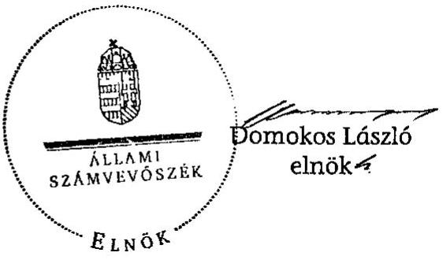

---

# MELLÉKLETEK 

A V-2018-056/2011. SZÁMÚ JELENTÉSHEZ

---

# ÉSZREVÉTEL

---

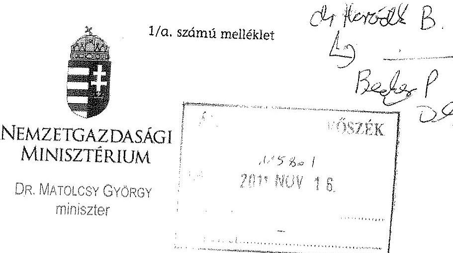
iktatószám: NGM/10240/4/2011
hivatkozási szám: V-2018-048/2011.
ügyintéző: Dudás Zoltán (795-1775)

# Domokos László úr 

Elnök

Állami Számvevőszék

## Budapest

Tárgy: Vélemény az MNB 2010. évi múködésének ellenőrzéséről szóló ÁSZ jelentéshez

## Tisztelt Elnök Úr!

A Jelentés átfogóan és mélyrehatóan elemzi a Magyar Nemzeti Bank müködésének és gazdálkodásának az ÁSZ ellenőrzési hatáskörébe tartozó területeit. Külön köszönöm, hogy a Dr. Kármán András államtitkár úr Dr. Elek János főigazgató úrnak írt levelében a Jelentés korábbi változatához tett észrevételei figyelembevételre kerültek.
Az I. fejezetben („Összegző megállapítások, következtetések, javaslatok") a nemzetgazdasági miniszternek címzett megállapítással, illetve javaslattal egyetértek, a kérdéskört a 2012. január 1-jén hatályba lépő új Magyar Nemzeti Bankról szóló törvény az ÁSZ javaslatának megfelelően fogja szabályozni.

Budapest, 2011. november, 3. "
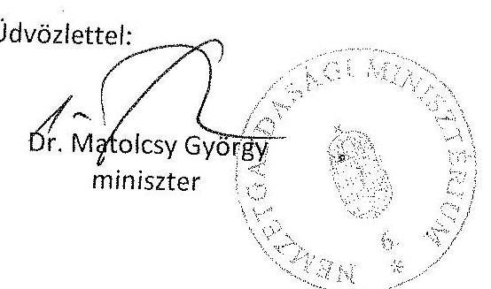

---

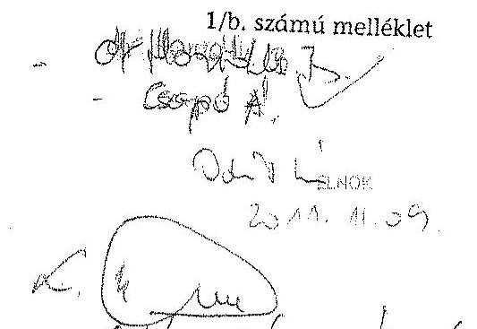
Iktatószám: MNB/022750/2011.
$2011 / 11 / 10$.

Domokos László elnök
Állami Számvevőszék

# Budapest 

Apáczai Csere János utca 10.
1052
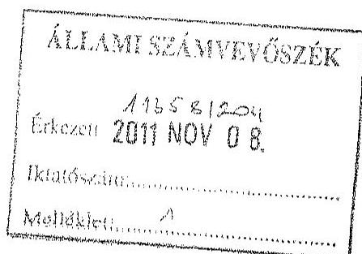

Tisztelt Elnök Úr!
Mellékelten küldöm az MNB észrevételeit a V-2018-048/2011. számú jelentés-
tervezetre.

Budapest, 2011. november 08.

Melléklet: 1 db
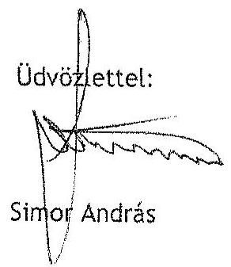

---

# Észrevételek 

## az Állami Számvevőszék V-2018-048/2011. iktatószámú, a Magyar Nemzeti Bank 2010. évi müködésének ellenőrzéséről szóló számvevőszéki jelentés tervezetéhez

Félreérthető és hibás következtetésekhez vezethet, hogy az Állami Számvevőszék a Magyar Nemzeti Bank 2010. évi müködésének vizsgálatakor 2011-re, vagyis egy még le sem zárt évre tesz, egyébként azóta már el is avult megállapításokat.

A Magyar Nemzeti Bank várható eredményéről negyedévente készít eredményprognózist, amit a Nemzetgazdasági Minisztériumnak rendre megküld, illetve honlapján minden érdeklődő számára elérhetővé tesz, így az ÁSZ megállapítása az érintettek számára nem hordoz új információt. Ráadásul, az MNB eredményét meghatározó egyes tényezők gyors változása miatt (forint árfolyam), november elejére a korábbi előrejelzés már idejét múlta, így az ÁSZ jelentésében jelzett 2011. évre vonatkozó negatív eredmény mértéke mára megalapozatlanná és félrevezetővé vált.

Hangsúlyozzuk továbbá, hogy az MNB eredményének alakulását döntően a piaci kamatok, a forint-euró árfolyam alakulása, valamint a devizatartalékok nagysága és azok forrása határozzák meg, amelyek közül egyes tényezőkre a jegybank ugyan képes hatást gyakorolni, de vonatkozó döntéseit - más jegybankokhoz hasonlóan - nem a pénzügyi eredmény, hanem a jegybanktörvényben foglalt céljainak megvalósítása határozza meg. Az MNB természetesen képes lenne a jegybanktörvény vonatkozó paragrafusainak módosítása esetén nyereségorientált gazdálkodást folytatni, de annak ára az Európai Unió alapszerződésében is meghatározott elsődleges cél, az árstabilitási cél feladása, esetenként kétszámjegyű infláció lehetne, amit a jegybank nyilvánvalóan nem tudna támogatni.

Önellentmondásokkal terhes és valótlan állításokat tartalmaznak az Állami Számvevőszék bérezési gyakorlatra vonatkozó megállapításai

Az MNB nem fogadja el az ÁSZ jelentésében szereplő, a bérpolitikára vonatkozó megállapításokat. Az ÁSZ elmúlt években többször is - 2004-ben kiemelten - vizsgálta az MNB bérezési gyakorlatát, munkavállalóinak átlagkeresetét, és egyetlen alkalommal sem kifogásolta azt a tényt, hogy az MNB a pénzügyi szektort tekinti referencia piacnak. Ezt a gyakorlatot a 2010. évi ÁSZ vizsgálat sem vitatja, ugyanakkor az MNB dolgozóinak átlagkeresetét nem a pénzügyi szféra, hanem a közszféra kereseteivel hasonlítja össze. Így azonban az összehasonlítás torz eredményekhez vezet, amelyekből helytálló következtetések nem vonhatóak le. Amennyiben, ennek ellenére az összehasonlítás alapjául mégis a közszféra kereseteit vennénk, úgy is csak olyan intézményi körből lenne célszerű viszonyítási adatokat választani, amely intézmények tevékenysége az MNB-vel összehasonlítható. Ebbe a körbe tartozhatna például a Pénzügyi Szervezetek Állami Felügyelete, ahol viszont - a nyilvános adatokból történő számítások szerint - az ÁSZ megállapításával éppen ellentétesen, a dolgozók átlagkeresete az elmúlt években rendre meghaladta az MNB dolgozóinak átlagkeresetét.

Nem igaz az ÁSZ azon állítása sem, hogy az MNB elszakadt volna a kereskedelmi bankok bérezésétől, ellenkezőleg: egy, a jegybank számára végzett, nemrégen befejeződött kutatás szerint a jegybanki dolgozók teljes javadalmazása 3\%-kal marad el a viszonyítási alapul választott kereskedelmi banki dolgozók jövedelmétől, a vezetői szinteken pedig a jövedelmek pontosan a megcélzott bérpiaci pozíció szintjének felelnek meg.

Valóban ellentmondásos helyzet állt elő az MNB bérstruktúrájában azáltal, hogy az elnöki, alelnöki fizetéseket törvényben korlátozták, ezt az ellentmondást azonban maga a jogalkotó idézte elő. Ezzel

---

együtt az elnök és alelnökök, illetve másrészröl a középvezetők béreinek egymáshoz való arányosítása korábban sem volt célja az MNB bérpolitikájának, a két vezetői szint javadalmazását ugyanis mindenkor eltérő szabályok alakították. Míg az elnök, alelnökök esetében a hatályos Jegybanktörvény, a többi vezető esetében a kereskedelmi banki ágazat összehasonlító bérel alakították a feltételeket. Így a hivatkozott törvény életbe lépése után sem volt szükséges változtatni a bérpolitikán. Továbbra is a majdnem 10 éve fennálló, és az ÁSZ által a korábbiakban sohasem kifogásolt, a kereskedelmi bankok piaci gyakorlatához illezzkedő bérpolitika megvalósítását folytatta az MNB. A vezetői bérezés tekintetében a kereskedelmi banki bérpiacon - a bérpiaci felmérések és a Bank belső besorolási rendszerének konzisztens és következetes alkalmazásával - jellemző javadalmazási feltételek alakítják az MNB vezetőinek bérezését, melynek szintje teljes mértékben összehasonlítható a különböző kereskedelmi bankoknál azonos felelősségi és hatáskört ellátó vezetők javadalmazásával. Az elvégzett összehasonlítás nem mutat szignifikáns eltérést, azaz az MNB vezetőinek személyi alapbére és keresete a munkakörökhöz kapcsolódó felelősségi viszonyokat, illetve a Bank munkaszervezeti hierarchiájába elfoglalt helyét, fontosságát megfelelően tükrözi.

Az MNB személyi költségei két év alatt (a 2008. évi tényadatokhoz képest a 2010. évi tényadatok) több mint 17\%-kal csökkentek. Ezzel egyidejűleg a költségvetési szféra ezen a területen csak 5,7\%ot takarított meg. A kormányzati célokkal összhangban a jegybank bértömegének mérséklésére és nem az átlagkeresetek egyedi - és éppen ezért kevésbé hatékony - csökkentésére törekszik.

A Bank általános bérfejlesztési politikája mindenkor figyelembe veszi a kereskedelmi banki bérpiac alakulása mellett a következő évi várható infláció mértékét és az OET által a versenyszféra számára ajánlott bérfejlesztési mértéket, tehát a 2010. évi bérfejlesztési politikáját az MNB megalapozott, piaci információk alapján határozta meg. A Hay Group 2009. decemberi felmérése szerint a referenciapiac azon résztvevői, akik 2009-ben - az MNB döntésével megegyezően - nem hajtottak végre bérfejlesztést, 2010. évben átlagosan 4,8\%-os bérfejlesztést terveztek. Ez 0,1\%-kal nagyobb mértékű az MNB által jóváhagyott általános bérfejlesztés (3,5\%) és az előléptetésekhez kapcsolódó bérfejlesztés (1,2\%) együttes összegéhez, azaz 4,7\%-hoz viszonyítva.

Az MNB álláspontja szerint a bérezési politika hatékonysága, a felelős gazdálkodás eredményessége a személyi jellegű ráfordítások összességének csökkenésében mérhető és nem az átlagkeresetek alakulásában. Az állami szféra azon részében is, ahol nem központilag határozzák meg a béreket, hasonlóan a jegybank politikájához, a kormányzat a bértömeg csökkentésére ösztönzi az intézményeket, nem pedig az egyedi (átlag) bérek csökkentésére. Az MNB 2010-ben az előző évhez képest a bértömeget (az állományba tartozók bérköltsége, a választható béren kívüli juttatások, továbbá az alapjuttatások és jóléti költségek együttesen) tekintve jelentős, azaz 145,7 millió forint ( $2,7 \%$-os) megtakarítást ért el, ez összhangban van a kormányzati törekvésekkel. A személyi jellegű költségekkel való takarékosságot mi sem bizonyítja jobban, mint az, hogy a 2008. és 2010. közötti időszakban több mint 1,5 milliárd forinttal, 8,473 milliárdról 7,007 milliárd forintra csökkentek a Bank személyi jellegű költségei, melyhez csak részben ( 432 millió forinttal) járult hozzá a felsővezetői bérezés törvényl korlátozásából és a TB járulékok törvényl csökkentéséből eredő megtakarítások.

Összehasonlításként érdemesnek tartjuk megjegyezni azt is, hogy 2008. és 2010. között a költségvetési szféra egészében a személyi költségek az MNB-nél megvalósított 17,3\%-os költségcsökkentésnél lényegesen kisebb mértékben, mindössze 5,7\%-kal mérséklődtek.

Az Állami Számvevőszék olyan tervezési gyakorlatot helytelenít, amelyet a megelőző 9 évben nem kifogásolt.

Az ÁSZ jelentésében szereplő, a személyi jellegű ráfordítások esetében tartalék tervezésére vonatkozó megállapítást - ami megkérdőjelezi a jóváhagyott létszámtervnek és a belső szabályoknak való megfelelést - az MNB nem fogadja el.

---

A vezetők a létszámtervezés során nevesített létszámcsökkentési terven felül minden évben kezdeményeztek évközben hatékonyságjavításból, vagy a munkavállalói teljesítmény elmaradásból eredő munkaviszony megszüntetéseket. Az így tervezett 2010. évi, 20 fő leépítéséhez kapcsolódó felmondási, végklelégítési költség az előző évi tapasztalatokon, szakértői becslésen alapul, melyet a belső szabályzat is megemlít, mint lehetséges tervezési módszert. A 2010. évi költségtervben szereplő nem nevesített felmondásokra szerepeltetett felmondási, végklelégítési költségek megalapozottságát az is bizonyítja, hogy 2010-ben a tervezett 20 fős felmondásból 18 fő felmondása megvalósult és a tervezett költségeket (a nem nevesített felmondások költségtervét) 11 M Ft-tal a Bank meg is haladta.

Megjegyezni kívánjuk, hogy a Bank az elmúlt 9 évben minden évben szerepeltetett a költségtervében a tervezés időszakában előre nem nevesített munkáltatói kezdeményezésű felmondások (20 fő), végklelégítések fedezetére kifizetéseket, ezt a gyakorlatot korábban az ÁSZ egyetlen évben sem kifogásolta.

Az Állami Számvevőszék egyetlen egy jegybanki munkavállaló tevékenységének ellenőrzésével olyan mélységig foglalkozik, amely messze túlmutat ellenőrzési hatáskörén.

Az Állami Számvevőszék a Magyar Nemzeti Bank gazdálkodását és az MNB tv-ben foglaltak alapján folytatott, az alapvető feladatok körébe nem tartozó tevékenységét ellenőrzi, azon belül is azt, hogy az MNB a jogszabályoknak (kiemelten az MNB tv. előírásainak), az alapító okiratának és a részvényesi határozatoknak megfelelően működik-e. Az MNB álláspontja szerint az Állami Számvevőszék vizsgálatának nem része az, hogy az egyes munkavállalók napi munkavégzését, a munkaköri feladatok teljesítését, mennyiségét, minőségét stb. vizsgálja, amelyek ellenőrzése a munkáltatói jogkör gyakorlóját megillető jogosultságok körébe tartozik.

A vizsgálat fókuszába került kommunikációs tanácsadó munkavégzésével, munkaköri feladatainak teljesítésével olyan mélységig foglalkozik az Állami Számvevőszék, amely túlmutat ellenőrzési hatáskörén. Az Állami Számvevőszék a munkavállaló felett az őt közvetlenül irányító, a munkáltatói jogkört és a felügyelet jogát gyakorló személy jogkörébe tartozó megállapításokat tesz.

Azt, hogy egy munkavállaló a munkaköri feladatait teljesíti-e, különös tekintettel a szóban teljesített és utóbb, nyilatkozatokon kívül más módon nem igazolható - feladatokra, hogy teljesítménye megfelelő volt-e, kizárólag az tudja megítélni, aki a munkavállaló tekintetében utasítási joggal rendelkezik, és aki a munkavállaló a munkavégzése irányításáról gondoskodik. A munkáltató a munkáltatói jogkör gyakorlóján keresztül látja el munkával a munkavállalót, következésképpen ő az, aki annak teljesítését ellenőrizni és számon kérni tudja, mely jogosultságának (másfelől kötelezettségének) a munkáltatói jogkör gyakorlója eleget is tett.

Bár a jelentéstervezetnek a fenti vizsgálat körében megfogalmazott megállapításai a módosítások ellenére sem fogadhatók el az MNB számára, azt örömmel nyugtázzuk, hogy a Bank $591^{1}$ munkavállalója közül 590 munkavégzésével, teljesítményével szemben az Állami Számvevőszéknek nincsen kifogása.

Az MNB önként, minden külső ráhatás nélkül racionalizálja működési költségeit, melynek hatására pusztán 2009-2010-ben 2,1 milliárd forinttal csökkentek a jegybank müködési kiadásai.

Az MNB 13 középtávú intézményi céljainak egyike a müködési- és a költséghatékonyság javítása, a teljesítményorientált szervezeti kultúra megerősítése. Ez azonban nem kiemelt, a többi jegybanki cél elé helyezett magasabb rangú stratégiai cél, hanem a többivel egyenértékủ fontosságú. Ez magyarázza azt, hogy bár más stratégiai célok megvalósítása a müködésben esetenként többletköltségeket generált, az MNB müködési költségei egyenlegükben mégis jelentős csökkenő tendenciát mutatnak. Értelmetlen

[^0]
[^0]:    ${ }^{1}$ 2010. évi átlaglétszám

---

elvárás lett volna, ha bizonyos stratégiai fontosságú célt csupán költség szempontokra hivatkozva nem valósított volna meg a Bank, hiszen közgazdasági szempontból nem lehet minden célt kizárólag a költségek csökkentésének célja „alá rendelni". Ezért értelmezhetetlen az ÁSZ azon megállapítása, miszerint az MNB a költségmegtakarítási lehetőségeihez képest alacsonyabb megtakarítást ért el, ugyanakkor az ÁSZ jelentés a realizált, számszerüen kimutatható megtakarítást nem tartja kiemelésre méltónak.

A müködési költségekkel való ésszerü gazdálkodás, a költségtakarékosság minden évben, így 2010-ben is fontos szempont volt a pénzügyi tervezés folyamatában, melynek megfelelően költségmegtakarítási célkitűzéseket az éves terv számszerüsítette. Az éves gazdálkodás során a felső vezetés ezen felül is folyamatosan ösztönzött a takarékosságra, így az MNB a 2010. év során az éves tervben kitüzött költségcsökkentési célokat is jelentősen meghaladó megtakarítást ért el. A tervteljesítés mértéke (a központi tartalék nélkül) $96,1 \%$ volt. Összegszerűen a megtakarítások tehát 517 millió forinttal meghaladták a célkitűzéseket, ezen felül a 199,5 millió forint összegű központi tartalék sem került felhasználásra. A müködési költségek - egyébként több év óta tartó, s 2010-ben is érvényesülő csökkenése, a müködési költségek és a beruházások 2010. évi tervteljesítése, valamint a HAJÓ projekt megtakarítási elvárásainak teljesítése mind az ÁSZ vonatkozó megállapításának ellenkezőjét igazolják.
A HAJÓ projekt az MNB által önként, minden külső ráhatás nélkül, a középtávú intézményi stratégiában rögzített értékek gyakorlati megvalósítása érdekében vállalt müködési költségracionalizálási kezdeményezés volt, mely az állami szférában egyedülállónak mondható.

Az MNB az Állami Számvevőszék rendelkezésére bocsátotta a 2008-2010. évi müködési költségeinek alakulását bemutató táblázatot, amelyben egyértelműen látszik, hogy a 2010. évi müködési költségek 2,1 Mrd Ft-tal alacsonyabbak a 2008. évben felmerülteknél, melyből a személyi jellegű ráfordítások megtakarítása 1,5 Mrd Ft-ot tesz ki.

A fentiekre tekintettel továbbra is megalapozatlannak tartjuk azt a megállapítást, hogy a Bank 2010. évi gazdálkodása, ezen belül a létszám- és személyi jellegű ráfordításokkal való gazdálkodása nem felelt meg az MNB takarékossági célkitűzéseinek.

# Az ÁSZ által javasolt visszamérési módszertan közgazdaságilag megalapozatlan 

Az MNB nem fogadja el az ÁSZ azon megállapítását, hogy a jegybank által alkalmazott projektvisszamérési módszertan - ami a projekt megvalósulását önállóan értékelte - közgazdaságilag nem megalapozott. Az MNB a HAJÓ projekt visszamérése során teljes mértékben követte a projekt tanácsadóinak útmutatását, és a tanácsadó projekt-visszamérési módszertanát alkalmazta, ami a nemzetközi gyakorlatnak is megfelel.
Az MNB a Vezetői bizottság részére készülő beszámolókban a HAJÓ projekt eredményeinek értékelése során az adott évhez kapcsolódóan minden esetben bemutatta a létszámleépítéshez kapcsolódó végkielégítéseket. A létszámleépítéshez kapcsolódó végkielégítések ugyanis kizárólag az adott év megtakarítását csökkentik, ugyanakkor a hosszú távú megtakarítás számszerüsítésekor a létszámcsökkentéshez kapcsolódóan már nem jelentkezik többletköltség.
Az ÁSZ jelentése a projekt eredményeinek értékelésekor a projekten kivül! egyes eseményeket eltérő módon, egyoldalúan és elfogultan kezeli. Ezt támasztja alá az, hogy az ÁSZ a HAJÓ projekttől függetlenül bekövetkező költségnövekedések esetén azok összegével a projekt által elérhető megtakarításokat csökkenteni javasolja. Ugyanakkor, a projekttől független, önálló vezetői kezdeményezésre történő költségcsökkenések esetében, azokat az eredmények értékelésekor nem veszi figyelembe. Álláspontunk szerint ez a módszer az, ami nem tekinthető közgazdaságilag megalapozottnak.
Mindezeket figyelembe véve nem értünk egyet az MNB elnöke számára tett 5. számú, intézkedést igénylő megállapítással és javaslattal, ami a HAJÓ projekt eredményei kimutatásának, értékelésének módjára

---

vonatkozik, annál is inkább, hiszen ezek éppen az ÁSZ elmúlt évben tett javaslatai alapján 2010-ben kerültek módosításra.

# Az ÁSZ lényegében saját korábbi észrevételének megvalósítását kritizálja 

Visszautasítjuk az ÁSZ azon kijelentését, hogy az MNB a HAJÓ projekt eredményelt kedvezőbb színben tüntette fel a valóságosnál. A Bank ugyanis éppen az ÁSZ észrevételei alapján módosította 2010-ben a be nem töltött pozíciókra hivatkozással a HAJÓ általi létszámcsökkentési lehetőségeket, mivel az ÁSZ észrevétele szerint a HAJÓ projekt létszámleépítési javaslata túlzó volt. A HAJÓ létszámcsökkentési elvárásainak 12,5 fővel történő mérséklését az ÁSZ azon megállapítása indokolta, mely vitatta a betöltetlen pozíciókra történő felvételek szükségességét arra hivatkozással, hogy a tanácsadó létszámnövekedéssel nem, csak létszámcsökkenéssel számolt. A Bank felső vezetése ugyanakkor szükségesnek ítélte e pozíciók betöltését, ezért inkább a létszámcsökkentési célkitűzéselt mérsékelte, sem mint a szükséges munkaerő felvételek megvalósulását tiltotta volna.

Az Állami Számvevőszék olyan részletezettséget vár el az Éves jelentés elnök! összefoglalójától, amely más szervezetek hasonló dokumentumaival összehasonlítva is müfajidegen.

Az MNB 2010. évi tevékenységét bemutató „Éves jelentés" elnöki összefoglalója - ami a korábbiaknál lényegesen rövidebb - önmagában nem, csak a jelentés terjedelmú részletes beszámolóval együtt mutatja be azt a teljes képet, amit a Bank a künillág felé hitelesen közvetíteni kíván saját tevékenységéről, eredményeiről. Az elnöki összefoglalóból kiragadhatóak ugyan mondatok, de e rövid megállapítások mögött nyilvánvalóan részletes tartalmi kifejtéseket tartalmaz az „Éves jelentés" további része, ez általában igaz más gazdálkodó szervezetek hasonló dokumentumainak felépítésére is. Mindezek alapján visszautasítjuk az ÁSZ azon megállapításait, melyek szerint az „Éves jelentés" elnöki összefoglalója téves információt közöl, továbbá a Bank éves jelentésében nem hitelesen mutatja be a hatékonyságjavító intézkedéseivel elért megtakarítások müködési költségekre gyakorolt hatását.

Az MNB a pénzforgalmi rendszer adatforgalmának biztosúgát tartja elsősorban szem előtt a vonatkozó szerződések megkötésekor.

A kifogásolt bérleti szerződés tárgyát képező DWDM eszközök a Bank hálózati infrastruktúrájának kritikus elemei, amelyen többek közt az MNB alapfeladatai körébe tartozó pénzforgalmi rendszer adatforgalma is zajlik. A bérlet előtti, a Bank tulajdonában lévő és többször meghibásodott régi berendezések magas üzemeltetési kockázatot jelentettek. A kockázatok részletes elemzése után döntött a Bank a bérleti szerződés megkötése mellett. A hivatkozott szolgáltatói szerződés fenntartása elhúzódó jogi vitát eredményezett volna, amelynek időszaka alatt a kritikus berendezések müködése nem lett volna biztosított. A szerződés megkötésével ezeket a kockázatokat kezeltük. Megjegyezzük továbbá, hogy a bérleti szerződés többletszolgáltatásokat is nyújtott az MNB számára, amelyeket a sikeresen végrehajtott számítógépterem költözési projekt során tudott hasznosítani.

Az MNB-t a 2009-2010-ben bonyolított összesen 137 közbeszerzési eljárása során egyszer sem marasztalták el a közbeszerzési jogszabályok megsértése miatt.

Az MNB 2009-ben és 2010-ben 137 db közbeszerzési eljárást bonyolított le összesen nettó 9,8 milliárd forint értékben. Ebből 11 db került ellenőrzésre a vizsgálat során. A fent jelzett 2 év alatt mindösszesen 1 db - az ajánlattevő által később visszavont - jogorvoslati eljárás indult az MNB ellen, miközben a jogorvoslati eljárások országos aránya ebben az időszakban meghaladta a közbeszerzési eljárások 10\%-át. A fenti tények azt mutatják, hogy az MNB a közszférában példaértékű közbeszerzési gyakorlatot folytat.

---

Ezt a tényt fedi el és torzítja az ÁSZ javaslatának általános és kiterjesztő megfogalmazása, mely szerint az MNB „Biztosítsa a Kbt. előírásainak maradéktalan betartását." Ezt a felszólítást a fent ismertetett tények nem alapozzák meg.

Nem a Közbeszerzési Döntőbizottság, hanem az ÁSZ kifogásolta a Bank eljárását egy-egy pontban egy IT beruházás és a személygépkocsi beszerzés során. A két vitatott közbeszerzési eljárás során az érintettektől előzetes vitarendezési igény nem érkezett, a Közbeszerzési Döntőbizottság MNB-t elmarasztaló határozatot nem hozott. Két elszigetelt egyedi eset alapján az általánosítást megalapozatlannak tartjuk. Az ÁSZ egy olyan hiba alapján tesz általánosító javaslatot, amelyből kifolyólag az MNB-nek semmilyen vesztesége nem származott, sőt, mint ahogy azt a részletes jelentés 39. és 47. oldalán kiemeli, komoly megtakarítás keletkezett a beszerzési eljárás során.

A folyamatba épített kontrollokra vonatkozó javaslatot megalapozó esemény a normál munkamenettől eltérő, extrém körülmények között történt. Véleményünk szerint a létező folyamatba épített kontrollok a kockázatokkal arányban állnak, ezért azok számának növelését nem tartjuk hatékony megoldásnak. Az MNB az elmúlt években folyamatosan törekedett arra, hogy az év végén lejáró szerződéseinek számát csökkentse. Ezzel kívánja elérni, hogy az év végi munkacsúcsok megszűnjenek és a hibázás kockázata tovább csökkenjen.

A jegybank felülvizsgálta a 2003-ban elindított és koncepcionálisan elhibázott adattárház stratégiát, amelynek hatására a valódi szakmai igényeket kielégítő és jelentősen kisebb kiadással járó megoldás született.

A 2003-2008 közötti időszakban a Bank összesen 947,6 M Ft-ot költött az adattárház fejlesztésekre és müködtetésre, amelynek eredményeképpen egy korlátozottan használható alkalmazás született, magas szállítói függőség mellett. Ezt felismerve a Bank a további időszakra vonatkozó fejlesztések felfüggesztése mellett döntött. A 2009-2010-es években sor került az adattárház stratégia felülvizsgálatára. Az elfogadott új stratégia szerint az adattárház csak olyan feltételekkel kerülhetett továbbfejlesztésre, amelyeket a szállítói kitettség megszüntetésén túl az érintett szakmai területek és a Bank döntéshozó szervei jóváhagytak. Ezen intézkedések hatására az adattárház fejlesztéssel kapcsolatos beruházási és üzemeletetési kiadások jelentős mértékben lecsökkentek. A stratégia végrehajtása mentén a 2010-es évben már több szakmai terület által is használható és használatba is vett, szakmai igényekre alapuló megoldások születtek.

A Magyar Nemzeti Bank mindenkor nyitott arra, hogy az Állami Számvevőszék ellenőrző tevékenysége során feltárt, szakmailag megalapozott észrevételeit megfontolja, azokat a müködés részévé tegye. A Magyar Nemzeti Bank működési kiválóságának javítása érdekében erre az elmúlt években számtalan példa volt. A jegybank értetlenül áll ugyanakkor a fenti, az ÁSZ-tól korábban megszokott magas színvonalú szakmai munkát számos elemében nélkülöző, tényekkel alá nem támasztott és megalapozatlan megállapításokkal szemben.

Budapest, 2011. november 8.

A jelentésre tett részletes észrevételeinket a Melléklet tartalmazza.

---

Melléklet az „Észrevételek az Állami Számvevőszék V-2018-048/2011. Iktatószámú, a Magyar Nemzeti Bank 2010. évi müködésének ellenőrzéséről szóló számvevőszék! jelentés tervezetéhez" c. anyaghoz

# A jelentés HAJÓ projekttel kapcsolatos megállapításaira vonatkozó általános észrevétei

A HAJÓ projekt az MNB által önként, minden külső ráhatás nélkül, a középtávú intézményi stratégiában rögzített értékek gyakorlati megvalósítása érdekében vállalt müködési költségracionalizálási kezdeményezés volt, mely az állami szférában egyedülállónak mondható. Az ÁSZ jelentése azonban rendre kisebbíteni igyekszik a projekt eredményeit. Idén a korábbi jelentésében már megfogalmazott megállapításokat (betöltetlen pozíciók, szisztematikus cserék, HAJÓ és pénzügyi tervezés beszámolóinak összehangolása) ismétli meg, és vitatja az MNB által az ÁSZ megállapítások hatására a gazdálkodásába beépített változások, megtett intézkedések ÁSZ megállapítások szerinti helyességét. Így például visszatér annak vitatása, hogy a HAJÓ projekt a bank müködéséhez szükséges létszámkapacitás tervére tett indítványt, vagy a lehetséges létszámfeiesleget azonosította. Az MNB továbbra is kitart a korábban kifejtett azon álláspontja mellett, hogy a projekt célja hatékonyságjavító ötletek generálása, az ötletekhez kapcsolódó létszám-, és müködési költségmegtakarítási lehetőségek beazonosítása volt, nem pedig a 2009. és 2010. évi létszám tervezése, hiszen a projekt egyetlen végterméke sem tartalmaz a bank létszámtervére vonatkozó számításokat.

A HAJÓ projekt célja volt - a hatékonyságjavító ötletek generálása, az ötletekhez kapcsolódó létszám- és költségmegtakarítási lehetőségek beazonosítása mellett - a költséggazdálkodás egészére kiterjedő szemléletváltás is, ami hosszú távon a takarékos és költséghatékony megoldások előtérbe helyezését, a költségek csökkentését eredményezi.

A projekt céljainak teljesülését a müködési költségek 2008-2011. közötti alakulásával szemléltetjük:

|  Megnevezés | Adatok M. Ft-ban |  |  |  |   |
| --- | --- | --- | --- | --- | --- |
|   | 2008. tény | 2009. tény | 2010. tény | 2011. várható | Eltérés
2011-2008  |
|  1. Személyi jellegű ráfordítások | 8473,6 | 7776,1 | 7007,0 | 6906,9 | $-1566,7$  |
|  2. IT költségek | 1475,7 | 1307,8 | 1219,0 | 1174,0 | $-301,6$  |
|  3. Üzemeltetési költségek | 1736,2 | 1625,0 | 1550,4 | 1397,1 | $-339,1$  |
|  4. Értékcsökkenési leírás | 2469,1 | 2478,9 | 2180,4 | 1804,1 | $-664,9$  |
|  5. Egyéb költségek | 827,1 | 693,2 | 956,5 | 871,2 | 44,1  |
|  6. Átvezetések | $-70,8$ | $-145,7$ | $-130,2$ | $-127,7$ | $-56,9$  |
|  7. Müködési költségek összesen | 14910,8 | 13735,3 | 12783,0 | 12035,7 | $-2885,1$  |

|  Csökkenés értékcsökkenési leírás nélkül | $-2220,2$  |
| --- | --- |
|  MNB tv. módosításának hatása | 184  |
|  Munkáltatói terhek csökkenése | 248  |
|  Nettó megtakarítás | $-1786,2$  |

A fenti táblázathoz a következő megjegyzéseket tesszük:

- a 2011. évi várható érték az I-III. negyedévi tényadatok alapján prognosztizált, a vonatkozó VB tájékoztatóban szereplő adat;
- a költségcsökkenést egyrészt korrigáltuk (mérsékeltük) az értékcsökkenési leírás változásával, mivel annak alakulása nagyrészt független a HAJÓ projekt kezdeményezéseltől;
- ugyancsak korrekcióként vettük figyelembe az ÁSZ jelentés 67. oldal 3. bekezdésében szereplő adatokat (törvénymódosítás hatása, munkáltatói terhek csökkentése), melyek forrását - ahogy azt a részletezésben jeleztük - nem ismerjük.

---

A fenti korrekciós tényezőket figyelembe véve is az MNB müködési költségei terén 2008-tól a 2011. év végéig várhatóan közel 1,8 Mrd forint megtakarítást ér el. Ez a HAJÓ projekt konkrét kezdeményezéseinek teljesülése mellett ugyancsak részben a HAJÓ projektnek köszönhető, a költséghatékonyságot előtérbe helyező, tartósan érvényesülő szemléletváltás eredménye.

# 6. oldal, 3. bekezdés, 13. oldal, 4. bekezdés 

Az ÁSZ megállapítása szakmailag nem követhető, mert a létszám-felvételek és -csökkenések egyenlegéből adódó záró létszámok különbségeiből (-52 fő) von le a HAJÓ projekt teljesülésére vonatkozó megállapítást.

Megtévesztő lehet, hogy az ÁSZ megállapításában a létszám alakulását bemutató adatok nem teljes körűen kerülnek megjelenítésre. A bevezetés fejezetben csupán a HAJÓ projekt eredetileg előírt létszámcsökkentési elvárását szerepelteti, annak ellenére, hogy az ÁSZ 2009. évre vonatkozó megállapításában a létszámcsökkentési cél mérséklésére vonatkozó észrevételt tett. Ugyanakkor a megvalósult létszámcsökkentésre vonatkozó adat is csak részinformációt tartalmaz. A létszámváltozásra vonatkozó teljes körű adatokat az alábbi táblázat tartalmazza:

Az MNB munkaerőmozgásának alakulása
(2009-2010)

| 2008. évi záró létszám: | 641 |
| :-- | --: |
| 2009. évi létszámnövekedés | 94 |
| 2009. évi létszámcsökkenés | -142 |
| ebből HAJÓ: | $-50,75$ |
| 2009. évi zárólétszám | 593 |
| 2010. évi létszámnövekedés | 81 |
| 2010. évi létszámcsökkenés | -85 |
| - ebből HAJÓ | -9 |
| 2010. évi zárólétszám | 589 |

Az ÁSZ észrevételei alapján korrigált létszám-megtakarítási cél (minimum 86,25 fő-17 fő) 69,25 fő volt, amelyből a Bank 2008-ban 4,5 fő, 2009-ben 50,75 fő, 2010-ben 9 fő leépítését valósította meg. Az összesített adat így64,25 fő.

További észrevétel: a HAJÓ projekt az MNB eredeti elvárása szerint banki szinten nem a 2008-2011. évekre, hanem a 2008-2013. évek egésze vonatkozásában eredményezett volna 1,7 Mrd Ft „hosszú távon fenntartható megtakarítást" (bár annak nagy része 2011 végéig teljesül), ezt kérjük javítani. Az említett elvárást az MNB elnöke 2010 júniusában valóban 1,5 Mrd Ft-ra mérsékelte, de ezt éppen az ÁSZ által az MNB 2009. évi müködésének ellenőrzése kapcsán megfogalmazott javaslatok figyelembevételével tette meg, ezzel kérjük a jelentés ezen részét kiegészíteni.

## 6. oldal, 4. bekezdés

Félrevezető következtetésekre vezethet az MNB munkavállalói átlagkeresetének, illetve változásának a nemzetgazdaságban alkalmazásban állók, illetve a köztisztviselők átlagkereseti értékelhez viszonyítása.

A nemzetgazdasági adatok a gazdaság összes foglalkoztatottjának adatait foglalják magába, átlagolják a különböző kereseti színvonalat biztosító iparágak, különböző szakképzettségű vagy szakképzetséggel nem rendelkező munkavállalóinak kereseti adatait. Ez kevéssé vethető össze az MNB-vel, ahol a munkavállalóinak legnagyobb része felsőfokú végzettséggel rendelkező, magasan képzett szakember.

---

A közszféra keresetelvel való összehasonlítás sem indokolt, miután - a jegybankban megfigyelhető munkaerő-áramlási tendenciák alapján - az MNB szakemberei elsősorban a kereskedelmi bankokból érkeznek a jegybankba, illetve a távozó kollégák szintén ebben a szektorban helyezkednek el. Az MNB . az európai unlös jegybakok többségéhez hasonlóan- a magyarországi kereskedelmi banki szektor legjobb szakembereíért folytat munkaerő-placi versenyt, így a munkavállalók keresetének alakításában is ezen munkaerő-placi szegmens tendenciáit kell követnie. Mindezen indokok alapján az MNB 2001. óta a kereskedelmi bankok bérplaci információlhoz viszonyítja bérezési politikáját.

Amennyiben mégis a közszféra kereseti viszonyaival való összehasonlítást alkalmazzuk, akkor célszerú lenne olyan intézményekhez hasonlítani, amelyek az MNB-hez valamilyen szempontból hasonlíthatóak. Ennek a meghatározásnak leginkább a Pénzügyi Szervezetek Állami Felügyelete felel meg. A PSZÁF dolgozóinak átlagkeresete pedig az elmúlt években rendre meghaladta az MNB dolgozóinak átlagkeresetét.

Az MNB az utóbbi két évben jelentős létszámleépítéssel társuló hatékonyságnövelési intézkedéseket valósított meg, ami többletfeladatokat hárított a meglévő szakemberállományra. Bérfejlesztési politikájában az MNB ezen többletfeladatok eredményes ellátását kívánta munkatársai felé elismerni.

A bérezési politika hatékonysága, a felelős gazdálkodás eredményessége a személyi jellegű költségek alakulásának csökkenésében mérhető, amely egyrészt a dolgozói létszám alakulásában, másrészt a létszám változásával szerves egységben meghatározott a bérfejlesztési mértékek inflációhoz viszonyított, hosszabb távon érvényesülő tendenciálban érhető tetten.

Az MNB személyi jellegű kiadásai 2009. és 2010. években közel 1 Mrd Ft-tal csökkentek, az általános bérfejlesztés mértéke pedig 2006-tól tekintve az infláció mértékénél alacsonyabb volt.

|  időszak | Bérfejlesztés mértéke MNB |  | Referencia piac átlagos bérfejlesztése | infláció | Reálbér alakulása |   |
| --- | --- | --- | --- | --- | --- | --- |
|   | általános | előléptetéshez kapcsolódó |  |  | MNB | Referencia piac  |
|  2006 | $3,50 \%$ |  | $5,50 \%$ | $3,90 \%$ | $-0,40 \%$ | $1,60 \%$  |
|  2007 | $6,50 \%$ |  | $6,50 \%$ | $8 \%$ | $-1,50 \%$ | $-1,50 \%$  |
|  2008 | $5,00 \%$ | $1,50 \%$ | $6,50 \%$ | $6,10 \%$ | $0,40 \%$ | $0,40 \%$  |
|  2009 | $0 \%$ | $1,50 \%$ | $2,20 \%$ | $4,20 \%$ | $-2,70 \%$ | $-2,00 \%$  |
|  2010 | $3,50 \%$ | $1,20 \%$ | $4,40 \%$ | $4,90 \%$ | $-0,20 \%$ | $-0,50 \%$  |
|  Láncindex | $19,79 \%$ | $4,26 \%$ | $27,67 \%$ | $30,14 \%$ | $-6,09 \%$ | $-2,46 \%$  |

# 9. oldal, 2. bekezdés

A VB Előterjesztés 5. oldalán olvasható „A feladatátadás és az ebből fakadó emberi erőforrás (HR) változások végrehajtása"-ra vonatkozó javaslat, mely tartalmazza, hogy a BMK azért nem tart igényt a tevékenység bővülésből fakadó létszámbővülésre, mert a létszámterve tartalmaz egy új pozíciót, melyet a szervezeti egység nem tölt be.

Részlet „Az MNB pénzforgalmi szolgáltatásaival kapcsolatos Bankmóveletek és a Pénzforgalom és értékpapír-elszámolás szervezeti egységek közötti munkamegosztás módosítása" c. VB Előterjesztésből (2010.02.09-I VB ülés): „A PFE becslése szerint az átadásra kerülő feladatok hozzávetőlegesen 0,78 TMD-nek megfelelő éves munkaldő-ráfordítást igényelnek. A feladatátadás nyomán az MNB müködése azáltal lesz hatékonyabb, hogy egyrészt a fenti ügyekben a jelenlegi intenzív és többkörös PFE-BMK egyeztetések jelentős részét feleslegessé teszi, másrészt a PFE felvigyázói tevékenység keretében a rá háruló fenti feladatokhoz kötődő koncepcionális feladatokat hatékonyabban el tudja látni. A hatékonysággavulás mértéke abban ragadható meg, hogy a 0,78 TMD-nek megfelelő feladat átadás után egy 1 TMD-nek megfelelő teljes

---

munkaidős státuszt a PFE le tud adni az elemzői munka minőségének veszélyeztetése nélkül. Ez a PFE 2010. évre jóváhagyott létszámtervének megfelelő módosítását, (2010. június 1-i hatállyal) 1 teljes munkaidős fővel való csökkentését jelenti.

Ugyanakkor a BMK 2010. évre vonatkozó létszámterve tartalmaz egy új pozíciót. A BMK az új státusz betöltését belső és külső pályázat kiírásával tervezi. Az újonnan kialakításra kerülő munkakör tartalmazza a III. pontban felsorolt feladatokat, amelyek mellett új felelősségek is megjelennek: az euró bevezetésével kapcsolatos bankműveleti fejlesztések koordinálása, a technikai implementáció feltételeinek kidolgozása (projektvezetés) valamint a tevékenység alapú, folyamatköltség számítási módszertan bevezetéséhez kapcsolódó bankműveleti feladatok ellátása."

Az MNB munkatársa az Előterjesztésben foglaltakat megértve kimutatásában a fentieket úgy szemléltette, hogy a tervezett létszámbővülés megvalósulásából 1 fős létszám megtakarítás, míg az új feladatokból következően 1 fős létszámbővülés valósult meg. Mivel a két létszámhatás egymást kiegyenlíti, ezért a bank ugyanazt az eredményt közvetítette, mint ami az Előterjesztésben szerepel csupán más szemszögből, vagyis létszámbővülést a BMK területen nem eredményezett a PFE-től való feladatátvétel.

# 9. oldal 2. bekezdésének utolsó mondata, valamint a 20. oldal első bekezdés utolsó mondata 

A számvevőszéki jelentés tervezete a Vezetől Bizottság keretein belül 2010. évben hozott 119 határozatból három, létszámmal összefüggő határozat végrehajtása kapcsán emelt - az MNB által vitatott - kifogást, melyből az MNB jegyzőkönyvezési gyakorlatára nézve azt az általánosító következtetést vonja le az ÁSZ, hogy a jegyzőkönyvek és a határozatok pontatlanok, illetve nem tartalmazzák egyértelműen a konkrét feladatokat.

Természetszerűleg előfordul nagy terjedelmű, sok feladatot tartalmazó előterjesztéseknél (pl. stratégia, üzleti tervek jóváhagyása), hogy a határozat az adott feladatoknak az előterjesztés szerinti elfogadását jelzi, hiszen felesleges lenne azokat mind a jegyzőkönyvben ismételten felsorolni, illetve ez a megoldás a jegyzőkönyvek terjedelmének igen jelentős megnövekedését eredményezné. (Például a VB munkatervének jóváhagyásáról szóló határozat nem tartalmazza részletesen az adott munkatervi időszak üléseinek időpontját és a megtárgyalandó napirendeket, pusztán azt rögzíti, hogy az elnök a munkatervet olyan formában hagyta jóvá, ahogyan az a VB elé beterjesztésre kerül.)

A Vezetől Bizottság üléseiről készült jegyzőkönyvek - a rövidített jegyzőkönyvekre való áttérés óta is teljes körűen tartalmazzák a felelősként megjelölt szervezeti egységek által elvégzendő feladatokat és a végrehajtásuk határidejét.

A fentiek alapján a VB jegyzőkönyvek pontatlanságára vonatkozó megállapításokat kérjük törölni.

## 10. oldal 3. bekezdés és 12. oldal 1. bekezdés

Nem tudjuk elfogadni, hogy néhány - vitatott - megállapítás miatt ezt az összefoglalást adja az ÁSZ a HAJÓ projekt ISZ-re vonatkozó részéről. Szövegjavaslat:
„A Bank 2010. évi informatikai gazdálkodása az MNB kimutatás szerint összességében megfelel az MNB takarékossági célkitűzéseinek, a kitűzött eredményeket - ugyan néhány ponton a tervtől eltérő módon de - túlteljesítették. Az informatikai költségekkel és beruházási kiadásokkal való gazdálkodásban a számvevők néhány ponton a költségek elszámolását vitatják, ezért a számvevők véleménye szerint a hatékonyságjavító intézkedések költségcsökkentő hatása kisebb az MNB által kimutatottnál."

---

# 10. oldal, 4. bekezdés 

A kormányzati bérpolitika az állami szféra azon részében, ahol nem központilag határozzák meg a béreket, a bértömeg csökkentésére ösztönzi az intézményeket, nem pedig az egyedi (átlag) bérek csökkentésére. Az MNB 2010-ben az előző évhez képest a bértömeget (az állományba tartozók bérköltsége, a választható béren kivüli juttatások, továbbá az alapjuttatások és jóléti költségek együttesen) tekintve jelentős, azaz 145,7 millió forint ( $2,7 \%$-os) megtakarítást ért el, ez összhangban van a kormányzati törékvésekkel.

Ezen túlmenően a közszférából az MNB-hez leginkább hasonlítható PSZÁF és a Bank személyi juttatásokra vonatkozó adatait - a rendelkezésünkre álló információk alapján - az alábbi táblázatban hasonlítottuk össze. Látható, hogy a 2008-2010. közötti időszak minden évében az egy főre jutó személyi juttatások, illetve költségek összege a PSZÁF esetében magasabb volt, mint az MNB-ben.

| Megnevezés | PSZÁF* |  |  | MNB |  |  |
| :--: | :--: | :--: | :--: | :--: | :--: | :--: |
|  | 2008 | 2009 | 2010 | 2008 | 2009 | 2010 |
| Személyi juttatások (millió Ft) | 4935,3 | 4606,2 | 4882,6 | 6155,9 | 5888,3 | 5564,1 |
| Személyi juttatások járulékai (millió Ft) | 1520,0 | 1343,8 | 1279,5 | 1911,7 | 1772,5 | 1442,8 |
| Létszám (fó) | 451,0 | 442,0 | 490,0 | 663,9 | 604,9 | 591,4 |
| Egy före juttó személyi juttatások (millió Ft) | 10,9 | 10,4 | 10,0 | 9,3 | 9,7 | 9,4 |
| Egy före jutó személyi költség (személyi juttatások és járulékalk) (millió Ft) | 14,3 | 13,5 | 12,6 | 12,2 | 12,7 | 11,8 |

* Forrás: Éves jelentés

## 11. oldal, 1. bekezdés és 24. oldal, 3-4. bekezdés

Észrevétel módosítási javaslat:
Az egyes gazdasági és pénzügyi tárgyú törvények megalkotásáról, illetve módosításáról szóló 2010. évi XC törvény kifejezetten és egyértelműen meghatározza, hogy a keresetkorlátozás az MNB-t érintően csak a Bank elnöke vonatkozásában érvényesül azzal, hogy az e rendelkezésben megállapított korlát az MNB tv. rendelkezései értelmében közvetve az MNB alelnökeit, Monetáris Tanácsának és Felügyelő Bizottságának tagjait is érintette, miután e személyek díjazását az MNB tv. az elnök keresetének egy bizonyos hányadában állapítja meg. Ezen törvény a közszféra vonatkozásában alkalmazni rendelt jövedelemkorlátja az MNB fentiekben nem említett munkavállalóira nem terjed ki, rájuk a Munka törvénykönyve vonatkozik.

Az MNB elnöke, alelnökei és a banki vezetők javadalmazási feltételeit korábban is eltérő szabályok alakították. Míg az elnök, alelnökök esetében a mindenkor hatályos Jegybanktörvény, a többi vezető esetében pedig a kereskedelmi banki ágazat összehasonlító bérel alakították a feltételeket, a kétféle bérezés között semmiféle kapcsolat nem állt fenn, és arányossági kérdés sem merült fel. Így a hivatkozott törvény betartása mellett a bank bérpolitikájában nem kezdeményezett változást, továbbra is a majdnem 10 éve fennálló és az ÁSZ által a korábbiakban sohasem kifogásolt, a kereskedelmi bankok piaci gyakorlatához illeszkedő bérpolitika megvalósítását folytatta. A vezetői bérezés tekintetében is a kereskedelmi banki bérpiacon - a bérpiaci felmérések és a Bank belső besorolási rendszerének konzisztens és következetes alkalmazásával - jellemző javadalmazási feltételek alakítják az MNB vezetőinek bérezését, melynek szintje teljes mértékben összehasonlítható a különböző kereskedelmi bankoknál azonos felelősségi és hatáskört ellátó vezetők javadalmazásával. Az elvégzett összehasonlítás nem mutat szignifikáns eltérést, azaz az MNB vezetőinek személyi alapbére és keresete a munkakörökhöz kapcsolódó felelősségi viszonyokat, illetve a Bank munkaszervezeti hierarchiájába elfoglalt helyét, fontosságát megfelelően tükrözi.

---

A takarékossági intézkedések tekintetében újra hangsúlyozni kívánjuk, hogy a személyi jellegű költségek és a müködési költségek folyamatos csökkentésével, a tevékenységek és az erőforrások folyamatos racionaltzálásával a Bank maximálisan támogatja a kormányzat takarékossági intézkedéseit, míg a jegybank magas színvonalú feladatellátása érdekében abban érdekelt, hogy a legjobb szakembereket a leghatékonyabb módon foglalkoztassa, munkájukat elismerje és a munkaerőplaci versenyben vonzó és a legjobb szakembereket megtartani képes munkáltatóként lépjen fel.

# 11. oldal, 2. bekezdés

Észrevétel, módosítási javaslat: A bank a 2010. évi bérfejlesztési politikáját megalapozott placi információk alapján határozta meg. 2009-ben a kereskedelmi banki piacon a bankok $50,0 \%$-a hajtott végre béremelést és ugyanezen bankok $55,5 \%$-a tervezett egyértelműen bérfejlesztést 2010-re (a 4. mellékletben található 2009. évi Hay tanulmány 8. oldal). A Hay Group 2009. decemberi felmérése szerint a referencia piac azon résztvevői, akik 2009-ben - az MNB döntésével megegyezően - nem hajtottak végre bérfejlesztést, 2010. évben átlagosan $4,8 \%$-os bérfejlesztést terveztek, ami 0,1 százalékponttal nagyobb mértékű az MNB által jóváhagyott általános bérfejlesztés ( $3,5 \%$ ) és az előléptetésekhez kapcsolódó bérfejlesztés ( $1,2 \%$ ) együttes összegéhez, azaz 4,7\%-hoz viszonyítva.

Tekintettel a fent megfogalmazott érvekre kérjük a hivatkozott szövegrész átfogalmazását.

## 12. oldal, 3. bekezdés és 38. oldal, 5. bekezdés

A számverő a megállapítása meghozatalakor számos, a költségtervre ható tényezőt nem vett figyelembe. A költségtervre ható tényezők általunk számszerűsített hatását az alábbi táblázat mutatja be.

Megállapítható, hogy a 2010. évi költségek a 2009. évi tény költségekhez képest hatékonyságjavító intézkedésekkel összefüggésben -245,62 M Ft költségmegtakarítást tartalmaznak.

|  Tényezők | $\begin{gathered} 2010 . \text { tény } \ 2009 . \text { tény } \ \text { közöttl eltérés } \end{gathered}$ | $\begin{gathered} 2009 . \text { tény } \ 2008 . \text { tény } \ \text { közötti eltérés } \end{gathered}$ | $\begin{gathered} 2010 . \text { tény } \ 2008 . \text { tény } \ \text { közöttl eltérés } \end{gathered}$  |
| --- | --- | --- | --- |
|  Járulék és munkáltatói SZJA változás | $-207,6$ |  | 207,6  |
|  MT tagok létszámának csökkenése | $-84,7$ | $-106,2$ | 190,9  |
|  kevesebb munkáltatói felmondás | $-211,3$ | 111,6 | 99,7  |
|  bankszolgálati jutalom kisebb munkavállalói körr érintett | $-6,0$ |  | 6,0  |
|  Elnök, Aleinök, MT és FB tagok fizetéslimit | $-155,6$ |  | 155,6  |
|  Elnök, Aleinök keresetváltozása | 15,4 | 25,9 | 41,3  |
|   | $-649,8$ | 31,3 | $-618,5$  |
|  létszácsökkentés | $-85,9$ | $-455,4$ | 541,3  |
|  komenzációs átalakítás | $-159,7$ |  | 159,7  |
|   | $-895,4$ | $-424,1$ | 1319,5  |
|  bérfejlesztés, előléptetés | 243,5 | 83,0 | 326,5  |
|   | $-651,9$ | $-341,1$ | $-993,0$  |
|  egyéb hatások | $-1,9$ | $-65,3$ | 67,2  |
|  Költségeltérés összesen | $-653,8$ | $-406,4$ | 060,2  |

---

A fenti táblázatból egyértelműen kimutathatók a bank intézkedéseitől független megtakarítást okozó tényezők hatása, a bank intézkedéseinek költségeket csökkentő (iétszámcsökkentés, kompenzáció átalakítás), illetve azt növelő (bérfejlesztés, előléptetés) hatások együttes eredője.

A számvevői jelentés megállapítása szerint a „Bank hatékonyságjavító intézkedéseinek költségcsökkentő hatása nem mutatható ki." A hatékonyságjavító projekt 2009-2010. években megvalósult hatását, szintén a fenti táblázat mutatja be. Tekintettel arra, hogy a létszámcsökkenések döntő része 2009-ben valósult meg, így a HAJÓ projekt hatására a személyi költségek is 2009-ben csökkentek nagyobb mértékben.

A fentieknek megfelelően kérjük az idézett megállapítások esetében a költségtervre ható valamennyi tényező figyelembevételére, a megállapítás ennek megfelelő módosítására.

# 12. oldal, 3. bekezdés 

„A Bank hatékonyságjavító intézkedéseitől független költségcsökkentési lehetőség 634,0 M Ft volt (...) megállapítás kapcsán észrevételezzük, hogy a 634 M Ft-os összeg 67. oldalon részletezett összetevőinek (törvénymódosítás hatása: 183,5 M Ft, munkáltatói terhek csökkenése: 248,6 M Ft, előző évek egyszeri többletkifizetései: $367,8 \mathrm{M} \mathrm{Ft}$ ) tartalma, forrása - így a megállapítás alapja - a jelentés alapján nem egyértelmű, nem világos. Az sem érthető, hogy az előző jelentéstervezethez képest az „előző évek egyszeri többletkifizetéseinek" összege miért változott 202,0 M Ft-ról 367,8 M Ft-ra. Megjegyezzük, hogy ezáltal az ÁSZ által feltételezett költségcsökkentési lehetőség ( $634,0 \mathrm{M} \mathrm{Ft}$ ) sem állja meg a helyét, miután az összetevők együttes összege 799,9 M Ft. ismételten hangsúlyozzuk, hogy az említett adatok tartalma, forrása nem érthető, nem világos, nem egyértelmű.

## 12. oldal 4. bekezdés

A jelentéstervezet azon megállapítása, mely szerint a kommunikációs tanácsadó „munkavégzéséről, valós teljesítményről a Bank értékelhető szakmai dokumentumokat nem adott át, a szóban végzett feladatellátást az ÁSZ utólag ellenőrizni nem tudta", az alábbi okok miatt továbbra sem fogadható el számunkra.

Az idézett megállapítás - amely a 34. oldal 3. bekezdésében is megjelenik - ellentétes a 33. oldal negyedik bekezdésének ötödik mondatában szereplővel, mely szerint az ÁSZ kizárólag az írásban teljesített feladat ellátását vizsgálta, a szóbeli feladatokat nem. A jelentéstervezet figyelmen kívül hagyja, hogy -amint az a munkavállaló munkaszerződéséből is nyilvánvalóan kitűnik- a munkavállaló a munkafeladatait nem csupán írásban teljesítheti. Ezért bármennyi dokumentumot adna is át a Bank a Számvevőszéknek, utóbbi semmiképpen sem kerülne olyan helyzetbe, hogy megítélhesse a munkavállaló teljesítményét, hiszen a munkaszerződésben foglalt feladatok teljesítése nem írásban készített dokumentumok elkészítésé jelenti. Ugyanakkor a Bank az ÁSZ részére átadta a munkavállalóval közvetlen munkakapcsolatban lévő munkatársak és a munkáltatói jogkör gyakorlójának írásbeli nyilatkozatait a munkavállaló munkavégzéséről, valamint a belépési lista, telefonhívások listája is megfelelően igazolják azt a tényt, hogy a munkavállaló rendszeresen munkát végzett.

A jelentésben hivatkozott teljességi nyilatkozatot az MNB elnöke a munkavégzés tényével kapcsolatban tette és rajta kívül még másik két szervezeti egység vezetője is teljességi nyilatkozatot adott.

Amint azt az összefoglalóban is kiemeltük: az Állami Számvevőszék a Magyar Nemzeti Bank gazdálkodását és az MNB tv-ben foglaltak alapján folytatott, az alapvető feladatok körébe nem tartozó tevékenységét ellenőrzi, azon belül is azt, hogy az MNB a jogszabályoknak (kiemelten az MNB tv. előírásainak), az alapító okiratának és a részvényesi határozatoknak megfelelően működik-e, melynek álláspontunk szerint nem része az, hogy az egyes munkavállalók napi munkavégzését, a munkaköri feladatok teljesítését, mennyiségét, minőségét, stb. vizsgálja, mely a munkáltatói jogkör gyakorlóját megillető jogosultságok körébe tartozik.

---

A vizsgálat fókuszába került kommunikációs tanácsadó munkavégzésével- mely munkavégzés tényét az MNB igazolta -, munkaköri feladatainak teljesítésével olyan mélységig foglalkozik a Számvevőszék, amely túlmegy a fenti hatáskörön, az már a munkavállaló felett az őt közvetlenül irányító, a munkáltatói jogkört és a felügyelet jogát is gyakorló személy jogkörébe tartozik.

Az SZMSZ 1.5. pontjában megfogalmazott definíció szerint „a munkáltatói jogkör a Munka Törvénykönyvéről szóló 1992. évi XXII. törvény (Mt.) szerinti munkaviszony létesítésére, megszüntetésére, a munkaviszonnyal összefüggő intézkedések megtételére irányuló jogosultság", a felügyeleti jogkör pedig „a külső és belső szabályok betartásának, operatív döntések végrehajtásának, a munkaköri feladatok teljesítésének ellenőrzésére, a beszámoltatásra és az értékelésre vonatkozó jog".

A munkáltatói jogkör része az utasítási jog, mivel az Mt. 104.5. értelmében a munkavállaló a munkát a munkáltató utasítása szerint köteles ellátni.

Azt, hogy egy munkavállaló a munkaköri feladatait teljesíti-e, kizárólag az tudja megítélni, aki a munkavállaló tekintetében utasítási joggal rendelkezik, és aki a munkavállaló számára a munkavégzéshez szükséges tájékoztatásról és irányításról gondoskodik. A munkáltató a munkáltatói jogkör gyakorlóján keresztül látja el munkával a munkavállalót, következésképpen ő az, aki annak teljesítését ellenőrizni és számon kérni tudja, hiszen a munkáltatót a munkavégzés tekintetében megillető széleskörű utasítási jog a munkavállaló számára végrehajtandó kötelezettségként jelenik meg. Ezek teljesítését, azaz a munkáltatói utasításoknak a munkaköri feladatok ellátása során való maradéktalan figyelembe vételét az tudja mérlegelni, aki az utasításokat adta. Annak megítélése tehát, hogy egy munkavállaló a munkaszerződésében meghatározott feladatait elvégezte-e vagy sem, teljesítménye megfelelő volt-e, különös tekintettel a szóban teljesített - és utóbb, nyilatkozatokon kívül más módon nem igazolható feladatokra, kizárólag a munkáltatói jogkör gyakorlója képes és jogosult, mely jogosultságának (másfelől kötelezettségének) a munkáltatói jogkör gyakorlója eleget is tett.

A jelentéstervezetben az adott munkavállaló munkavégzésével kapcsolatos megállapítások egyoldalúak, megalapozatlanok, okszerütlenek és egyben iratellenesek is.

Egyoldalú, mert a munkavégzés tényét igazoló adatokat nem veszi figyelembe.
Megalapozatlan, mert bár lehetősége lett volna a számvevőnek, sem a munkáltatói jogkör gyakorlóját, sem a munkavállalóval közvetlen munkakapcsolatban lévő szervezeti egységet, sem az adott munkavállalót nem nyilatkoztatta a munkavégzéssel kapcsolatban.

Okszerütlen, mert a belépési adatokból, telefon híváslistákból, meghívókról szóló kimutatásból semmilyen következtetést nem vont le a szóbeli munkavégzéssel kapcsolatban.

Iratellenes, mert a munkaszerződés rendelkezését, felek által szándékolt tartalmát figyelmen kívül hagyja (szabad munkaidő beosztás és szóbeli munkavégzési feladatok figyelmen kívül hagyása; kizárólag írásbeli feladatok hangsúlyozása) annak ellenére, hogy a rendelkezésre álló adatok - a munkáltató nyilatkozata - alapján a munkavállaló feladatait döntően szóban látja el.

Figyelemmel a fentiekre, valamint arra, hogy a munkavállaló foglalkoztatását, munkavégzésének tényét az MNB a vizsgálat során igazolta, kérjük ezen megállapítás törlését.

# 13. oldal 2. bekezdés 

A Bank a létszámtervében nem a munkaerő-forgalmi intézkedéseket, hanem a bank létszámára hatással lévő létszámbóvüléseket és létszámcsökkentéseket érintő vezető́i intézkedéseket mutatja be. Ezért a létszámtervben szereplő létszámbóvülések száma nem vethető össze a ténylegesen megvalósult felvételekkel, ugyanígy a bank létszámát csökkentő intézkedések és a megvalósult kilépések sem vethetőek össze számszerűen.

A fentieknek megfelelően kérjük a bekezdés módosítását.

---

# 14. oldal 2. bekezdés 

Az összefoglalás nem mutatja be az elért eredményeket (még azokat sem, amelyeket maga az ÁSZ vizsgálat is elfogadhatónak, a HAJÓ projektnek tulajdonít), így ez a bekezdés sommásan negatív színben tünteti fel az ISZ HAJÓ projekttel kapcsolatos tevékenységeit, pedig annak eredményeit a részletes dokumentum is elismeri (pl. megvalósult intézkedések, szállítói függőség csökkentése).

Azokban az esetekben, ahol a tervben a kitűzött céltól „lényegesen" elmaradó költségcsökkenések jelentkeztek, ott objektív, piaci, technológiai okokat lehet megjelölni:

- SAP licenc karbantartás: (cél: 7,8 M Ft, terv: 0 M Ft) egyoldalú szállítói kitettség jellemzi a szerződést. A SAP cég nem volt hajlandó lehetővé tenni a licencszám csökkentést, ezért nem terveztünk megtakarítást.
- Invitel hálózat (cél: 15,8 M Ft, terv: -7,6 M Ft, a 2008-as törtévi bázishoz viszonyítva a 2010. teljes évi tervköltséget): mivel a DWDM eszközök cseréje nem volt szükséges 2009-ben, ezért az adatátviteli vonalak felezése nem történt meg. Így megtakarítást nem tudtunk tervezni.
- Veritas licencek: (cél: 14,2 M Ft, terv: 6,8 M Ft) egyoldalú szállítói kitettség jellemzi a szerződést, a javasolt megtakarítást nem volt tartható.
Nem értünk egyet azzal a megállapítással, hogy a fenti megtakarítás csökkenéseket nem a projekt eredményének tekinthető megtakarításokkal ellensúlyoztuk. A HAJÓ akciók jól körülhatárolható halmazt alkotnak, nem vontunk be ebbe a körbe egyéb megtakarításokat.
- Adattárház támogatás: a számvevő által felhozott müködési modell változás költségnövelő hatásából 2,8 M Ft-ot tartunk elfogadhatónak (lásd részletesen a 40. oldal 1. bekezdésre adott válazzunkat). Az ARK által felvett, támogatási munkát is végző kolléga bérjellegủ költségeinek figyelembevételével a Bank által kimutatott 49,9 M Ft megtakarítás 47,1 M Ft-ra változik.
- Rendszerfelügyeleti szoftver kiváltása: a számvevő által kifogásolt költségcsökkenés (39. oldal utolsó 2 bekezdése), ami a szoftver cseréjéből és a támogatási szint csökkenéséből származik, teljes egészében a HAJÓ projekt részét képezi. Ennek indoklását már többször megadtuk a számvevőnek.

Fentiek alapján kérjük, hogy a szöveg teljes körűen és pontosan fogalmazza meg a HAJÓ projekt IT részének összefoglalását. Szövegjavasiat: „Azokban az esetekben, ahol objektív piaci, technológiai okokból nem volt tartható az eredeti célkitúzés, ott a költséggazda mindent megtett, hogy egyéb, a HAJÓ akciók körébe tartózó intézkedéseken a megtakarítás csökkenést ellensúlyozza. Ezt a feladatot sikeresen oldotta meg, tervszinten 100,4\% volt az összesített célhoz mért megtakarítás, míg tényszinten ez az arány $117,3 \%$-ot tett ki.

## 15. oldal 2. bekezdés

A bank - a müködési kockázatok jelentős csökkentése érdekében - valóban eltért a szerződéstől. Ahogyan azt a 4.1.1 fejezethez füzött megjegyzéseinkben részletesen elmagyaráztuk, éppen a módosított szerződés tette lehetővé, hogy az eszközök szaporodó meghibásodása ellenére a Bank kritikus rendszereinek müködési kockázata ne növekedjen, illetve a módosított szerződés biztositotta többletszolgáltatások az 'A' épületbe való költözés projektet támogatták. Ez utóbbi projekt a projektmenedzsment szakmában is példaértékűnek bizonyult, melyet a magyar projektmenedzsment szövetségek közös döntése alapján a projektvezető kollégánknak ítélt 'Év projektvezetője' díjjal ismert el.

---

# Szövegjavaslat: 

„A módosított szerződés lehetővé tette, hogy a DWDM eszközök szaporodó meghibásodása ellenére a bank kritikus rendszereinek müködési kockázata ne növekedjen, illetve a módosítás biztosította többletszolgáltatások az 'A' épületbe való költözés projektet támogatták."

## 15. oldal 2. bekezdés

Nem értünk egyet azzal a megállapítással, hogy „... az MNB az eljárás során nem tett eleget a Kbt. ajánlatok elbírálására vonatkozó előírásainak...". Kérjük a megállapítást törölni.

Indok: A beszerzési eljárás időpontjában hatályos Kbt. az ajánlatkérő mérlegelésére és döntésére bízta, hogy mely árelemeket tekint kirívóan alacsonynak. Mivel a végső ár egy 42 fordulós ártárgyalás során, a tárgyalás résztvevői számára transzparens módon több ajánlattevő folyamatos árversenyében alakult ki, ezért a Beszerzési Bizottság azzal a feltételezéssel élt, hogy a kialakult végső ár tükrözi az aktuális piaci viszonyokat.

Az eljárást lezáró döntés miatt az MNB-nek semmilyen vesztesége nem származott, sőt, mint ahogy azt a részletes jelentés a 39. és 47. oldalon kiemeli, komoly megtakarítása keletkezett.

## 15. oldal 3. bekezdés

Nem értünk egyet az alábbi megállapítással: „A becsült érték megállapítása nem a Kbt. előírásainak megfelelően történt".

Álláspontunk szerint a becsült érték meghatározása a Kbt. előírásainak megfelelően történt, ezt támasztja alá a választott eljárás típusa, az alkalmazott - a beszerzés értékével összhangban álló alkalmassági feltételek, valamint az eljárás végén a becsült értékhez viszonyított elért megtakarítás is. A Közbeszerzések Tanácsa hirdetményfeladó rendszerében hibásan rögzített becsült érték - ami sehol sem kerül publikálásra - az ajánlattevők részére semmilyen hátrányt nem jelentett.

## 15. oldal 3. bekezdés

Nem értünk egyet azzal a megállapítással, hogy a gépjármúmenedzsment szolgáltatásra kötött szerződés módosítása nem volt jogszerű.

Indok: A Bank 2009-ben beszerzési eljárást indított „Gépjármú beszerzés" tárgyában. A gépjármúmenedzsment pályázat előkészítésekor a Bank nem tudta előre, hogy a gépjármú beszerzések pályázat eredményeként a jövőben milyen gépjármúveket fog üzemeltetni és ezért nem tudta meghatározni, hogy a jövőben milyen autóparkra kér ajánlatot a gépjárművek üzemeltetésére. Amint nyilvánvalóvá vált, hogy a gépjármú beszerzésre kiírt pályázat eredményes lehet, azonnal elindult a közbeszerzési eljárás. A gépjármúmenedzsment szerződés módosításáról szóló hirdetmény ellenőrzése során a Közbeszerzések Tanácsa jogi lektora a módosítás törvényességével kapcsolatban kifogást nem emelt.

Mivel a gépjármúmenedzsment szerződés módosításakor csupán elírás történt, a felek közös szándéka egyértelműen a menedzsmentszerződés ismételt megkötéséig hosszabbította meg a szerződést. Ebből következően hibás az az állítás, hogy a nevezett szolgáltatásra az MNB 2009. december 31 után ne rendelkezett volna hatályos szerződéssel.

---

# 16. oldal, 1. bekezdés 

Az „a Kbt.-ben előírt nyilvánosságra hozatalkövetelményét nem tartotta be" szövegrész félrevezető és csak részben igaz. Az MNB a Kbt.-ben előírt határidőben feladta a szerződés módosításáról szóló hírdetményt, míg az MNB honlapján való közzététel valóban elmaradt, de később pótoltuk.

## 16. oldal, 2. bekezdés

A 2003-2008 közötti időszakban a Bank összesen 947,6 M Ft-ot költött az adattárház fejlesztésekre és müködtetésre, amelynek eredményeképpen egy korlátozottan használható alkalmazás született, magas szállítói függőség mellett. Ezt felismerve a Bank a további időszakra vonatkozó fejlesztések felfüggesztése mellett döntött. A 2009-2010-es években sor került az adattárház stratégia felülvizsgálatára. Az elfogadott új stratégia szerint az adattárház csak olyan feltételekkel kerülhetett továbbfejlesztésre, amelyek az érintett szakmai területek és a Bank döntéshozó szervei által jóváhagyásra kerültek, illetve a szállítói kitettség megszűnik. Ezen intézkedések hatására az adattárház fejlesztéssel kapcsolatos beruházási és üzemeletetési kiadások jelentős mértékben lecsökkentek. A stratégia végrehajtása mentén a 2010-es évben a több szakmai terület által használt, szakmai igényekre alapuló megoldások születtek.

## 16. oldal, 3. bekezdés

Továbbra sem értünk egyet azzal a megállapítással, hogy az adattárház stratégiának szakterületekre lebontottan kellett volna tartalmaznia a feladatok elvégzésének vállalt határidejét. Fenntartjuk azt az álláspontunkat (amit az MNB többi szolgáltató szakterületének - pl. IT, Emberi erőforrások, Müködési szolgáltatások, stb. - stratégiái, ill. a legjobb nemzetközi gyakorlatok - pl. Gartner elemző cég ajánlása! is alátámasztanak), hogy ez nem része egy stratégiának. Az igények kielégítésének határidejét nem a stratégiában, hanem az éves tervek végrehajtása során állapítjuk meg.

## 16. oldal, 4. bekezdés

Továbbra is az a véleményünk, hogy ha minden projekt végrehajtásának minden mozzanatát szabályoznánk, azzal aránytalanul nagy szabályozási- és ellenőrzési feladatok elvégzése árán csökkentenénk a megvalósítás kockázatait, ami azonban a bank céljainak ütemezett teljesítését veszélyeztetné, illetve a célokat csak a rendelkezésre állónál aránytalanul több emberi erőforrással tudnánk elérni. A Bankban 2006 óta érvényben van a felhatalmazáson alapuló munkavégzés, ami az adott feladatot elvégző kolléga belátására bízza, hogy - a bank egyébként szigorú szabályainak betartásával hogyan végzi el a feladatot. Ezért döntött úgy az ISZ vezetése, hogy a projektvezetési módszertan csak irányelvként kerül bevezetésre. Ezzel véleményünk szerint hatékonyabban - és esetenként olcsóbban biztosítható a feladatok végrehajtása, tisztább az egyéni felelősségek elhatárolása. Példaként említjük, hogy van olyan projektünk, ahol a téma fontossága és/vagy a szállító általunk ismert képességei indokolttá teszik a számvevő által hiányolt kontrollok (Minőségbiztosítási Csoport, véleményezési idők és véleményezési körök száma) alkalmazását, amellyel élünk is.

## 17. oldal, 5. bekezdés

Álláspontunk szerint az MHB az ÁSZ 2010-ben közzétett jelentésében a Bank elnöke számára megfogalmazott javaslatokat megfelelően hajtotta végre, ezzel kapcsolatos véleményünket továbbra is fenntartjuk.

Az MNB 2009. évi müködésének ellenőrzéséről szóló ÁSZ jelentés 2. javaslata szerint a Bank elnöke „biztosítsa a HAJÓ projekt célkitűzéseinek és eredményeinek a Bank pénzügyi tervezési és beszámoltatási rendszerén alapuló rendszeres értékelését." Kifogásként merült fel többek között, hogy a

---

Bank nem teljes körűen mutatta be a HAJÓ projekt időarányos eredményelt és azok működési költségekre gyakorolt hatását.

A Vezetől bizottság részére a gazdálkodásról negyedévente készülő tájékoztató alapvetően az ütemezett terv és az aktuális tényadatok eltéréseinek indokait mutatja be, félévtől pedig ez kiegészül az éves terv és az éves várható érték eltéréseinek okaival. Ebből adódóan a HAJÓ projekt eredményeinek részletes és teljes körű értékelését ezen elfogadott és áttekinthető metodika szerint nem lehetett bemutatni, de amely esetekben a terv-tény (várható érték) eltérések összefüggtek a HAJÓ projekt célkitűzéseivel, azt a tájékoztató általános részének adott fejezete tartalmazta.

Annak érdekében, hogy a HAJÓ projekt célkitűzéseinek és eredményeinek rendszeres értékelése a Bank pénzügyi tervezési és beszámoltatási rendszerén alapuljon, továbbá átfogó és transzparens képet mutasson be, ezt külön fejezetben tettük meg, s a módosított megtakarítási elvárások tényleges, illetve várható, évenkénti teljesülését - külön is részletezve a 2010. év adatait - a müködési költségek tervezési és visszamérési struktúrája szerint mutattuk be, igazodva ezzel az ÁSZ javaslatához.

Ennek érdekében előzetesen minden egyes kezdeményezéshez kapcsolódó megtakarítási elvárás esetében meghatároztuk, hogy az konkrétan mely költségnem(ek)nél (esetleg ráfordításoknál) jelentkezik. Ez biztosította azt, hogy a Bank pénzügyi tervezési és beszámoltatási rendszere szerint legyenek összegezhetőek és bemutathatóak az elvárt és a tényleges megtakarítások.

A müködési költségek és a beruházási kiadások negyedévenkénti alakulását bemutató tájékoztatóhoz külön táblázat készült a HAJÓ projekt kezdeményezéseinek részletes adatairól: a több mint 200 tételből álló melléklet egyenként mutatta be a kezdeményezésekhez kapcsolódó valamennyi adatot és információt. [Költségnem, szervezeti egység, megtakarítások: eredeti HAJÓ elvárás (2008-2013), módosított HAJÓ elvárás (2008-2013), 2008. és 2009. évi tény, 2010. évi módosított elvárás, költségtervben számszerűsített megtakarítás, tényleges megtakarítás, indexek, 2008-2010. évi tényleges megtakarítások összesen, a hátralévő időszakra (2011-2013) vonatkozó elvárások és azok várható értéke, az intézkedés miatt felmerült többletköltségek, indoklás.]

Mindezek alapján kérjük a hivatkozott megállapítás törlését, illetve - amennyiben erre nem kerül sor észrevételeink kivonatának a jelentés e részében történő külön ismertetését.

# 19. oldal, 3. javaslat 

A folyamatba épített kontrollokra vonatkozó javaslatot megalapozó esemény a normál munkamenettől eltérő, extrém körülmények között történt. Véleményünk szerint a létező folyamatba épített kontrollok a kockázatokkal arányban állnak, ezért azok számának növelését nem tartjuk hatékony megoldásnak. Az MNB az elmúlt években folyamatosan törekedett arra, hogy az év végén lejáró szerződéseinek számát csökkentse. Ezzel kívánja elérni, hogy az év végi munkacsúcsok megszűnjenek és a hibázás kockázata tovább csökkenjen.

## 19. oldal, 4. javaslat

Az MNB 2009-ben és 2010-ben 137 db közbeszerzési eljárást bonyolított le összesen nettó 9,8 milliárd forint értékben. Ebből 11 db került ellenőrzésre a vizsgálat során. A fent jelzett 2 év alatt mindösszesen 1 db - az ajánlattevő által később visszavont - jogorvoslati eljárás indult az MNB ellen, miközben a jogorvoslati eljárások országos aránya ebben az időszakban meghaladta a közbeszerzési eljárások 10\%-át. A fenti tények azt mutatják, hogy az MNB a közszférában példaértékű közbeszerzési gyakorlatot folytat. Ezt a tényt fedi el és torzítja az ÁSZ javaslatának általános és kiterjesztő megfogalmazása, mely szerint az MNB „Biztosítsa a Kbt. előírásainak maradéktalan betartását." Ezt a felszólítást a fent ismertetett tények nem alapozzák meg.

---

Nem a Közbeszerzési Döntőbizottság, hanem az ÁSZ kifogásolta a Bank eljárását egy-egy pontban egy IT beruházás és a személygépkocsi beszerzés során. A két vitatott közbeszerzési eljárás során az érintettektől előzetes vitarendezési igény nem érkezett, Közbeszerzési Döntőbizottság MNB-t elmarasztaló határozatot nem hozott. Két elszigetelt egyedi eset alapján az általánosítást megalapozatlannak tartjuk. Az ÁSZ egy olyan hiba alapján tesz általánosító javaslatot, amelyből kifolyólag az MNB-nek semmilyen vesztesége nem származott, sőt, mint ahogy azt a részletes jelentés 39. és 47. oldalán kiemeli, komoly megtakarítás keletkezett a beszerzési eljárás során.

# 21. oldal, 2. bekezdés (apró betűs rész) 

a) A Készpénziogisztika létszámemelkedésével kapcsolatos 78/2010. (08. 31.) számú határozat a feladat végrehajtására 2011. december 31-I határidőt állapított meg, tehát a feladatot eddig az időpontig kellett az érintetteknek végrehajtaniuk. A 2011-es létszámfelvétel tehát véleményünk szerint az e tárgyban hozott határozatnak megfelelő volt.

A fentiek alapján a megállapítást kérjük törölni.
b) 14/2009. (12. 01.) számú, az MNB 2010. évi létszámtervével kapcsolatos határozat során a jegyzőkönyv tanúsága szerint az Elnök nem támogatta a Kommunikációnak (az előterjesztésben javasolt) plusz 0,5 fős létszámemelkedését, ezért a döntés eredményeképpen a szervezeti egység létszáma nem változott. Ennek következtében az EEF-nek létszámcsökkentésre vonatkozó végrehajtási feladata - a jelentésben állítottakkal szemben - nem keletkezett.

A fentiek alapján a megállapítást kérjük törölni.

## 26. oldal, 1. bekezdés, 26. oldal 3. bekezdés

Észrevétel, módosítási javaslat:
A Hay Group 2009. decemberben készített, az MNB számára december 21-én megküldött, a banki ágazat bérfejlesztési terveire vonatkozó aktualizált felmérése szerint - melyet észrevételeink 4. melléklete tartalmaz - egyértelműen megállapítja, hogy azok a kereskedelmi bankok, amelyek 2009. évben nem hajtottak végre általános béremelést (a bankok 87,5\%-a) a 2010. évben átlagosan 4,8\%-kal tervezték a banki munkatársak fizetését emelni. Erre a felmérésre hivatkozott a Bank 2010. évi bérpolitikájára vonatkozó javaslata megfogalmazásakor az EEF és ezt a Bank vezetése figyelembe vette döntése meghozatalakor. A számvevői jelentés a kereskedelmi bankok körében végzett felmérés korábbi változatából emelte ki a $3,7 \%$-os, átlagos béremelést, ami a döntés meghozatalakor már nem volt érvényes, tekintettel arra, hogy a Hay Group a felmérést megismételte, aktualizálta.

A fentiekre tekintettel kérjük törölni azt a megállapítást, hogy a Bank 1,0 százalékponttal magasabb bérfejlesztést hajtott végre, mint a bérfejlesztést tervező kereskedelmi bankok 2010-re előirányzott átlagos béremelése.

Az MNB referencia piacként az elmúlt 10 évben a kereskedelmi banki szektort tekintette. Ennek megalapozottsága egyrészt abból fakad, hogy az MNB az európai jegybanki gyakorlatot kívánja követni, ahol - a 2005. évben végzett, majd 2011. évben újra megismételt benchmark felmérés szerint - a jegybankok többsége jellemzően a kereskedelmi banki ágazatot tekinti referencia piacnak. Másrészt az MNB munkaerő áramlásának (be- és kilépések) jellemző irányultsága is maximálisan alátámasztja a kereskedelmi banki szektor, mint célpiac megalapozottságát, miután hosszabb távon érvényesülő tendencia mutatkozik meg abban, hogy a szükséges szakmai felkészültséggel és tapasztalattal rendelkező szakemberek elsősorban a kereskedelmi bankokból érkeznek az MNB-be, a távozó kollégák pedig szintén ezen a piacon helyezkednek él.

A Bank belső szervezeti működése és kultúrája (szakmai kiválóságra törekvése, teljesítményorientáció, hatékonyság) a kereskedelmi bankok működési elveihez, jellemzőihez áll közel. A kereskedelmi

---

bankokból érkező szakemberek könnyen beilleszkednek, az itt megszerzett tapasztalatok alkalmassá teszi őket arra, hogy pályafutásukat az MNB-t követően a versenyszférában folytassák.

A kereskedelmi bankok munkaerőplacán verseny folyik a tehetségekért, melyben az MNB akkor tud helytállni, ha versenyképes (kereskedelmi bankok által ajánlott jövedelmekhez illeszkedő) jövedelemajánlatot tesz a magasan kvalifikált, felvenni kívánt jelölteknek. Miután az MNB-ben, az intézményi célok elérése érdekében magas felkészültségű és elkötelezett munkatársakra van szükség, ezért a kívánt szakemberek hosszú távú megtartása érdekében nemcsak a banki referenclaplacon versenyképes bérajánlatokat kell tenni, de később a referenclaplac szerinti bérfejlesztéseket is szükséges megvalósítani annak érdekében, hogy versenyképes maradjon az MNB bérszínvonala, és a tehetséges, a bankban tudást és tapasztalatot felhalmozott szakértők magasabb jövedelemért ne vándoroljanak el. Amennyiben a Bank a referenclaplac alacsonyabb szintjét célozná, vagy nem a kereskedelmi banki piacot tekintené referenclaplacnak, nem tudná vonzani a megfelelő felkészültségű szakembereket, tehetségeket, ami a jegybank szakmai munkájának minőségére is hatással lenne.

Emellett azt is hangsúlyozzuk, hogy a külföldi magántulajdonban lévő kereskedelmi bankok által megvalósított bérfejlesztések - főleg a válság kitörése óta - abszolút nem rugaszkodhatnak el a magyarországi bérplacoktól, hiszen a külföldi tulajdonosok profit elvárásai maximálisan költséghatékony működésre ösztönzik a hazai kereskedelmi bankokat is. Ezt a költséghatékonyságot a kereskedelmi bankok - az üzleti logika alapján - sokkal inkább a létszám és a működés racionalizálásával, a munkahatékonyság fokozásával, mintsem a bérszínvonal általános csökkentésével érik el.

# 26. oldal, 1. bekezdés 

Észrevétel, módosítási javaslat:
A HAY Group által megfogalmazott szakmai álláspont szerint a referencia piac javadalmazásra vonatkozó információi értékelésekor nem csak az alapbérre és teljesítménytől függő javadalmazásra vonatkozó információkat kell figyelembe venni, hanem a juttatásokra vonatkozókat is, mivel a teljes javadalmazás szintjén szükséges a megcélzott javadalmazási szintet elérni. A tanácsadók álláspontja szerint amennyiben a vállalat ténylegesen kifizetett bérel, juttatásai a megcélzott bérplaci szint +/-10 \%-os sávjában mozognak, úgy a vállalat bérezési gyakorlata a célt elérte. Évenként pontosan a megcélzott placi bérszintet elérni már csak azért sem lehetséges, mert a plac sok tényezőtől függően folyamatos változásban van, legfőképp most a pénzügyi válság éveiben. Ezt támasztja alá az alábbi táblázat is, mely bemutatja, hogy az MNB által kialakított bértrend alakulását.

|  |   |   |   |   |   |   |   |   |   |   |   |   |   |   |   |   |   |
| --- | --- | --- | --- | --- | --- | --- | --- | --- | --- | --- | --- | --- | --- | --- | --- | --- | --- |
|  HAY GROUP (BÉREZÉSÉ) |  |  |  |  |  |  |  |  |  |  |  |  |  |  |  |  |   |
|   |  |  |  |  |  |  |  |  |  |  |  |  |  |  |  |  | 2010  |
|   |  |  |  |  |  |  |  |  |  |  |  |  |  |  |  |  | 2011  |
|   |  |  |  |  |  |  |  |  |  |  |  |  |  |  |  |  | 2012  |
|  10 | 81 | 1000 | 1730 | 120,20 | 1883 | 19356 | 14,60 | 19710 | 1799 | 96,96 | 19790 | 19570 | 108896 | 21290 | 19490 | 216,270 |   |
|  12 | 81 | 1480 | 1211 | 113,25 | 1540 | 14362 | 102,40 | 16103 | 1519 | 106,11 | 16420 | 14629 | 112200 | 16170 | 14280 | 160,000 |   |
|  13 | 81 | 1110 | 1098 | 111,80 | 1227 | 10777 | 92,40 | 13124 | 1119 | 120,21 | 12270 | 11223 | 109390 | 11630 | 11260 | 105,250 |   |
|  14 | 81 | 821 | 735 | 111,10 | 830 | 7307 | 100,70 | 9479 | 888 | 113,13 | 8895 | 8220 | 115200 | 8220 | 8140 | 102,000 |   |
|  15 | 81 | 699 | 591 | 110,20 | 831 | 5716 | 89,30 | 9479 | 610 | 109,39 | 6670 | 6320 | 105010 | 6720 | 6497 | 96,000 |   |
|  16 | 81 | 581 | 454 | 110,30 | 591 | 4384 | 110,20 | 5229 | 459 | 111,26 | 5220 | 4980 | 106870 | 5170 | 4891 | 110,700 |   |
|  17 | 81 | 540 | 422 | 109,20 | 491 | 3617 | 109,20 | 4340 | 382 | 108,87 | 4340 | 3960 | 107290 | 4120 | 3360 | 96,000 |   |
|  18 | 81 | 510 | 382 | 109,20 | 382 | 3011 | 107,80 | 3472 | 308 | 110,31 | 3170 | 3190 | 111700 | 3230 | 3104 | 96,900 |   |
|  19 | 81 | 370 | 289 | 109,10 | 289 | 2619 | 107,20 | 2222 | 229 | 108,49 | 2607 | 2821 | 107640 | 2920 | 2802 | 105,250 |   |
|  20 | 81 | 320 | 231 | 107,20 | 211 | 2191 | 105,10 | 2364 | 240 | 102,49 | 2240 | 2290 | 102370 | 2470 | 2401 | 102,900 |   |
|  21 | 81 | 300 | 204 | 99,60 | 204 | 2112 | 97,40 | 2142 | 221 | 98,97 | 2140 | 2272 | 96820 | 2302 | 2220 | 101,250 |   |
|  22 | 81 | 300 | 204 | 99,60 | 204 | 2112 | 97,40 | 2142 | 221 | 98,97 | 2140 | 2272 | 96820 | 2302 | 2220 | 101,250 |   |
|  23 | 81 | 300 | 204 | 99,60 | 204 | 2112 | 97,40 | 2142 | 221 | 98,97 | 2140 | 2272 | 96820 | 2302 | 2220 | 101,250 |   |
|  24 | 81 | 300 | 204 | 99,60 | 204 | 2112 | 97,40 | 2142 | 221 | 98,97 | 2140 | 2272 | 96820 | 2302 | 2220 | 101,250 |   |
|  25 | 81 | 300 | 204 | 99,60 | 204 | 2112 | 97,40 | 2142 | 221 | 98,97 | 2140 | 2272 | 96820 | 2302 | 2220 | 101,250 |   |
|  26 | 81 | 300 | 204 | 99,60 | 204 | 2112 | 97,40 | 2142 | 221 | 98,97 | 2140 | 2272 | 96820 | 2302 | 2220 | 101,250 |   |
|  27 | 81 | 300 | 204 | 99,60 | 204 | 2112 | 97,40 | 2142 | 221 | 98,97 | 2140 | 2272 | 96820 | 2302 | 2220 | 101,250 |   |
|  28 | 81 | 300 | 204 | 99,60 | 204 | 2112 | 97,40 | 2142 | 221 | 98,97 | 2140 | 2272 | 96820 | 2302 | 2220 | 101,250 |   |
|  29 | 81 | 300 | 204 | 99,60 | 204 | 2112 | 97,40 | 2142 | 221 | 98,97 | 2140 | 2272 | 96820 | 2302 | 2220 | 101,250 |   |
|  30 | 81 | 300 | 204 | 99,60 | 204 | 2112 | 97,40 | 2142 | 221 | 98,97 | 2140 | 2272 | 96820 | 2302 | 2220 | 101,250 |   |
|  31 | 81 | 300 | 204 | 99,60 | 204 | 2112 | 97,40 | 2142 | 221 | 98,97 | 2140 | 2272 | 96820 | 2302 | 2220 | 101,250 |   |
|  32 | 81 | 300 | 204 | 99,60 | 204 | 2112 | 97,40 | 2142 | 221 | 98,97 | 2140 | 2272 | 96820 | 2302 | 2220 | 101,250 |   |
|  33 | 81 | 300 | 204 | 99,60 | 204 | 2112 | 97,40 | 2142 | 221 | 98,97 | 2140 | 2272 | 96820 | 2302 | 2220 | 101,250 |   |
|  34 | 81 | 300 | 204 | 99,60 | 204 | 2112 | 97,40 | 2142 | 221 | 98,97 | 2140 | 2272 | 96820 | 2302 | 2220 | 101,250 |   |
|  35 | 81 | 300 | 204 | 99,60 | 204 | 2112 | 97,40 | 2142 | 221 | 98,97 | 2140 | 2272 | 96820 | 2302 | 2220 | 101,250 |   |
|  36 | 81 | 300 | 204 | 99,60 | 204 | 2112 | 97,40 | 2142 | 221 | 98,97 | 2140 | 2272 | 96820 | 2302 | 2220 | 101,250 |   |
|  37 | 81 | 300 | 204 | 99,60 | 204 | 2112 | 97,40 | 2142 | 221 | 98,97 | 2140 | 2272 | 96820 | 2302 | 2220 | 101,250 |   |
|  38 | 81 | 300 | 204 | 99,60 | 204 | 2112 | 97,40 | 2142 | 221 | 98,97 | 2140 | 2272 | 96820 | 2302 | 2220 | 101,250 |   |
|  39 | 81 | 300 | 204 | 99,60 | 204 | 2112 | 97,40 | 2142 | 221 | 98,97 | 2140 | 2272 | 96820 | 2302 | 2220 | 101,250 |   |
|  40 | 81 | 300 | 204 | 99,60 | 204 | 2112 | 97,40 | 2142 | 221 | 98,97 | 2140 | 2272 | 96820 | 2302 | 2220 | 101,250 |   |
|  41 | 81 | 300 | 204 | 99,60 | 204 | 2112 | 97,40 | 2142 | 221 | 98,97 | 2140 | 2272 | 96820 | 2302 | 2220 | 101,250 |   |
|  42 | 81 | 300 | 204 | 99,60 | 204 | 2112 | 97,40 | 2142 | 221 | 98,97 | 2140 | 2272 | 96820 | 2302 | 2220 | 101,250 |   |
|  43 | 81 | 300 | 204 | 99,60 | 204 | 2112 | 97,40 | 2142 | 221 | 98,97 | 2140 | 2272 | 96820 | 2302 | 2220 | 101,250 |   |
|  44 | 81 | 300 | 204 | 99,60 | 204 | 2112 | 97,40 | 2142 | 221 | 98,97 | 2140 | 2272 | 96820 | 2302 | 2220 | 101,250 |   |
|  45 | 81 | 300 | 204 | 99,60 | 204 | 2112 | 97,40 | 2142 | 221 | 98,97 | 2140 | 2272 | 96820 | 2302 | 2220 | 101,250 |   |
|  46 | 81 | 300 | 204 | 99,60 | 204 | 2112 | 97,40 | 2142 | 221 | 98,97 | 2140 | 2272 | 96820 | 2302 | 2220 | 101,250 |   |
|  47 | 81 | 300 | 204 | 99,60 | 204 | 2112 | 97,40 | 2142 | 221 | 98,97 | 2140 | 2272 | 96820 | 2302 | 2220 | 101,250 |   |
|  48 | 81 | 300 | 204 | 99,60 | 204 | 2112 | 97,40 | 2142 | 221 | 98,97 | 2140 | 2272 | 96820 | 2302 | 2220 | 101,250 |   |
|  49 | 81 | 300 | 204 | 99,60 | 204 | 2112 | 97,40 | 2142 | 221 | 98,97 | 2140 | 2272 | 96820 | 2302 | 2220 | 101,250 |   |
|  50 | 81 | 300 | 204 | 99,60 | 204 | 2112 | 97,40 | 2142 | 221 | 98,97 | 2140 | 2272 | 96820 | 2302 | 2220 | 101,250 |   |
|  51 | 81 | 300 | 204 | 99,60 | 204 | 2112 | 97,40 | 2142 | 221 | 98,97 | 2140 | 2272 | 96820 | 2302 | 2220 | 101,250 |   |
|  52 | 81 | 300 | 204 | 99,60 | 204 | 2112 | 97,40 | 2142 | 221 | 98,97 | 2140 | 2272 | 96820 | 2302 | 2220 | 101,250 |   |
|  53 | 81 | 300 | 204 | 99,60 | 204 | 2112 | 97,40 | 2142 | 221 | 98,97 | 2140 | 2272 | 96820 | 2302 | 2220 | 101,250 |   |
|  54 | 81 | 300 | 204 | 99,60 | 204 | 2112 | 97,40 | 2142 | 221 | 98,97 | 2140 | 2272 | 96820 | 2302 | 2220 | 101,250 |   |
|  55 | 81 | 300 | 204 | 99,60 | 204 | 2112 | 97,40 | 2142 | 221 | 98,97 | 2140 | 2272 | 96820 | 2302 | 2220 | 101,250 |   |
|  56 | 81 | 300 | 204 | 99,60 | 204 | 2112 | 97,40 | 2142 | 221 | 98,97 | 2140 | 2272 | 96820 | 2302 | 2220 | 101,250 |   |
|  57 | 81 | 300 | 204 | 99,60 | 204 | 2112 | 97,40 | 2142 | 221 | 98,97 | 2140 | 2272 | 96820 | 2302 | 2220 | 101,250 |   |
|  58 | 81 | 300 | 204 | 99,60 | 204 | 2112 | 97,40 | 2142 | 221 | 98,97 | 2140 | 2272 | 96820 | 2302 | 2220 | 101,250 |   |
|  59 | 81 | 300 | 204 | 99,60 | 204 | 2112 | 97,40 | 2142 | 221 | 98,97 | 2140 | 2272 | 96820 | 2302 | 2220 | 101,250 |   |
|  60 | 81 | 300 | 204 | 99,60 | 204 | 2112 | 97,40 | 2142 | 221 | 98,97 | 2140 | 2272 | 96820 | 2302 | 2220 | 101,250 |   |
|  61 | 81 | 300 | 204 | 99,60 | 204 | 2112 | 97,40 | 2142 | 221 | 98,97 | 2140 | 2272 | 96820 | 2302 | 2220 | 101,250 |   |
|  62 | 81 | 300 | 204 | 99,60 | 204 | 2112 | 97,40 | 2142 | 221 | 98,97 | 2140 | 2272 | 96820 | 2302 | 2220 | 101,250 |   |
|  63 | 81 | 300 | 204 | 99,60 | 204 | 2112 | 97,40 | 2142 | 221 | 98,97 | 2140 | 2272 | 96820 | 2302 | 2220 | 101,250 |   |
|  64 | 81 | 300 | 204 | 99,60 | 204 | 2112 | 97,40 | 2142 | 221 | 98,97 | 2140 | 2272 | 96820 | 2302 | 2220 | 101,250 |   |
|  65 | 81 | 300 | 204 | 99,60 | 204 | 2112 | 97,40 | 2142 | 221 | 98,97 | 2140 | 2272 | 96820 | 2302 | 2220 | 101,250 |   |
|  66 | 81 | 300 | 204 | 99,60 | 204 | 2112 | 97,40 | 2142 | 221 | 98,97 | 2140 | 2272 | 96820 | 2302 | 2220 | 101,250 |   |
|  67 | 81 | 300 | 204 | 99,60 | 204 | 2112 | 97,40 | 2142 | 221 | 98,97 | 2140 | 2272 | 96820 | 2302 | 2220 | 101,250 |   |
|  68 | 81 | 300 | 204 | 99,60 | 204 | 2112 | 97,40 | 2142 | 221 | 98,97 | 2140 | 2272 | 96820 | 2302 | 2220 | 101,250 |   |
|  69 | 81 | 300 | 204 | 99,60 | 204 | 2112 | 97,40 | 2142 | 221 | 98,97 | 2140 | 2272 | 96820 | 2302 | 2220 | 101,250 |   |
|  70 | 81 | 300 | 204 | 99,60 | 204 | 2112 | 97,40 | 2142 | 221 | 98,97 | 2140 | 2272 | 96820 | 2302 | 2220 | 101,250 |   |
|  71 | 81 | 300 | 204 | 99,60 | 204 | 2112 | 97,40 | 2142 | 221 | 98,97 | 2140 | 2272 | 96820 | 2302 | 2220 | 101,250 |   |
|  72 | 81 | 300 | 204 | 99,60 | 204 | 2112 | 97,40 | 2142 | 221 | 98,97 | 2140 | 2272 | 96820 | 2302 | 2220 | 101,250 |   |
|  73 | 81 | 300 | 204 | 99,60 | 204 | 2112 | 97,40 | 2142 | 221 | 98,97 | 2140 | 2272 | 96820 | 2302 | 2220 | 101,250 |   |
|  74 | 81 | 300 | 204 | 99,60 | 204 | 2112 | 97,40 | 2142 | 221 | 98,97 | 2140 | 2272 | 96820 | 2302 | 2220 | 101,250 |   |
|  75 | 81 | 300 | 204 | 99,60 | 204 | 2112 | 97,40 | 2142 | 221 | 98,97 | 2140 | 2272 | 96820 | 2302 | 2220 | 101,250 |   |
|  76 | 81 | 300 | 204 | 99,60 | 204 | 2112 | 97,40 | 2142 | 221 | 98,97 | 2140 | 2272 | 96820 | 2302 | 2220 | 101,250 |   |
|  77 | 81 | 300 | 204 | 99,60 | 204 | 2112 | 97,40 | 2142 | 221 | 98,97 | 2140 | 221 | 98,97 | 2140 | 2272 | 96820 | 2302  |
|  78 | 81 | 300 | 204 | 99,60 | 204 | 2112 | 97,40 | 2142 | 221 | 98,97 | 2140 | 221 | 98,97 | 2140 | 2272 | 96820 | 2302  |
|  79 | 81 | 300 | 204 | 99,60 | 204 | 2112 | 97,40 | 2142 | 221 | 98,97 | 2140 | 221 | 98,97 | 2140 | 2272 | 96820 | 2302  |
|  80 | 81 | 300 | 204 | 99,60 | 204 | 2112 | 97,40 | 2142 | 221 | 98,97 | 2140 | 221 | 98,97 | 2140 | 2272 | 96820 | 2302  |
|  81 | 81 | 300 | 204 | 99,60 | 204 | 2112 | 97,40 | 2142 | 221 | 98,97 | 2140 | 221 | 98,97 | 2140 | 2272 | 96820 | 2302  |
|  82 | 81 | 300 | 204 | 99,60 | 204 | 2112 | 97,40 | 2142 | 221 | 98,97 | 2140 | 221 | 98,97 | 2140 | 2272 | 96820 | 2302  |
|  83 | 81 | 300 | 204 | 99,60 | 204 | 2112 | 97,40 | 2142 | 221 | 98,97 | 2140 | 221 | 98,97 | 2140 | 2272 | 96820 | 2302  |
|  84 | 81 | 300 | 204 | 99,60 | 204 | 2112 | 97,40 | 2142 | 221 | 98,97 | 2140 | 221 | 98,97 | 2140 | 2272 | 96820 | 2302  |
|  85 | 81 | 300 | 204 | 99,60 | 204 | 2112 | 97,40 | 2142 | 221 | 98,97 | 2140 | 221 | 98,97 | 2140 | 2272 | 96820  |
|  86 | 81 | 300 | 204 | 99,60 | 204 | 2112 | 97,40 | 2142 | 221 | 98,97 | 2140 | 221 | 98,97 | 2140 | 2272 | 96820  |
|  87 | 81 | 300 | 204 | 99,60 | 204 | 2112 | 97,40 | 2142 | 221 | 98,97 | 2140 | 221 | 98,97 | 2140 | 2272 | 96820 | 2302  |
|  88 | 81 | 300 | 204 | 99,60 | 204 | 2112 | 97,40 | 2142 | 221 | 98,97 | 2140 | 221 | 98,97 | 2140 | 221 | 98,97 | 2140  |
|  89 | 81 | 300 | 204 | 99,60 | 204 | 2112 | 97,40 | 2142 | 221 | 98,97 | 2140 | 221 | 98,97 | 2140 | 221 | 98,97 | 2140  |
|  90 | 81 | 300 | 204 | 99,60 | 204 | 2112 | 97,40 | 2142 | 221 | 98,97 | 2140 | 221 | 98,97 | 2140 | 221 | 98,97 | 2140  |
|  91 | 81 | 300 | 204 | 99,60 | 204 | 2112 | 97,40 | 2142 | 221 | 98,97 | 2140 | 221 | 98,97 | 2140 | 221 | 98,97 | 2140  |
|  92 | 81 | 300 | 204 | 99,60 | 204 | 2112 | 97,40 | 2142 | 221 | 98,97 | 2140 | 221 | 98,97 | 2140 | 221 | 98,97 | 2140  |
|  93 | 81 | 300 | 204 | 99,60 | 204 | 2112 | 98,97 | 2140 | 221 | 98,97 | 2140 | 221 | 98,97 | 2140 | 221 | 98,97 | 2140  |
|  94 | 81 | 300 | 204 | 99,60 | 204 | 2112 | 98,97 | 2140 | 221 | 98,97 | 2140 | 221 | 98,97 | 2140 | 221 | 98,97 | 2140  |

---

A bérpolitikai célkitűzések értékelését inkább hosszabb távú trendek alakulását figyelembe véve lehetséges elvégezni. Az MNB bérpolitikai céljaihoz való közeledést vizsgálva, megállapítható hogy folyamatosan csökkenő célt követve konvergál a bank a megcélzott piaci bérszínthez.

2001-2006: A 2001. évi bérszerkezet egyszerűsítést követően (13., és 14. havi jutalom, évközi jutalom beépítése) a Bank vezetése a munkaerő szakmai minőségének jövőbeni biztosítása érdekében az MNB bérpiaci helyzetét az 5 legjobban fizető bank Medián bérszintjével megegyező bérpiaci pozícióban határozta meg, mely szint a Q3 (felső kvartilis) és a D9 (felső decilis) között helyezkedett el. Ebben az időszakban a Bank vezetése egy szervezetfejlesztési programot indított el, melynek keretében a bank munkatársainak 30\%-a kicserélődött, a munkatársak létszáma 1320 fơről 739 före csökkent, a felsőfokú iskolai végzettséggel rendelkezők aránya 10\%-kal emelkedett. A megfelelő szakértől gárda kialakításához szükséges volt a legjobban fizető bankok bérszínvonalához történő pozícitonálás.

2006-2007: A szervezetfejlesztési stratégia megvalósítását követően az MNB személyi állományának megtartása vált hangsúlyossá, mely cél megvalósítását a bérszínvonal általánosan alacsonyabb szintje, a teljes banki ágazat Q3 szintje mellett is biztosítani lehetett.

2008-tól: Miután a toborzás-kiválasztási tapasztalatok azt mutatták, hogy az alacsonyabb besorolási szintekre alacsonyabb jövedelem mellett is van mód a kívánt felkészültségű munkatársak felvételére, a költséghatékonyság növelése érdekében 2007-ben újra módosítottuk a referencia bérpiacot: a B1-B5 besorolási szinteken (273 fö - 2007. 12.31én) a kereskedelmi banki piac medián és felső kvartilis értékel közötti 66 \%-os szintre, (66\%-os szint = Medián + (Q3-Medián)*0,66).

Azokon a besorolási szinteken, ahol a magas szakmai tapasztalattal rendelkező szakértők, fiatal tehetségek megszerzése érdekében kiélezett munkaerő-piaci verseny van, ott az MNB folytatja a korábbi stratégiáját: a B6-B12 és V1-V6 (405 fő - 2010. 12.31-én ) szinteken a referencia piac felső kvartilise marad a viszonyítási alap

A bérpolitikai stratégia változtatására irányuló célok csak hosszabb távon realizálhatók. A 2006-ban megfogalmazott stratégiaváltást (bérpiaci pozíció módosítása a teljes banki ágazat Q3 szintjére) is csak évek alatt lehetett elérni anélkül, hogy a jövedelemszint hirtelen és nagyobb mértékű csökkenése ne okozzon drasztikus hatásokat a munkatársak elkötelezettségében, motivációs szintjében, így az MNB-ben a bérpolitikában elhatározott változási célokat alapvetően az inflációtól elmaradó, sőt a kereskedelmi bankok bérfejlesztési mértékénél alacsonyabb szintü bérfejlesztés megvalósítása támogatta.

A fenti folyamat eredményeképpen az MNB bérpiaci pozíciója egyértelműen módosult.
Tekintettel a fent megfogalmazott érvekre kérjük a hivatkozott szövegrész átfogalmazását.

# 26. oldal, 2. bekezdés 

Észrevétel, módosítási javaslat:
A V07-es besorolási szint bérszínvonalának és bónuszmértékének tekintetében a Bank elnöke minden esetben egyedi döntést hoz, miután a V07-es besorolási szintre vonatkozóan a Hay tanulmány sem biztosít reprezentatív adatokat.

## 26. oldal, 3. bekezdés

Észrevétel, módosítási javaslat:
Az MNB személyi költségei a 2009-2010 években összesen 13\%-kal csökkentek. Ez a tény világosan bizonyítja, hogy az MNB nem hagyta figyelmen kívül az egész országot érintő takarékossági

---

intézkedéseket. A megtakarítások általunk befolyásolható részeit nem az egyedi bérek befagyasztásával vagy csökkentésével, hanem létszámcsökkentéssel és a kompenzációs rendszer béren kívüli tételeinek átalakításával értük el. Nem igaz azonban, hogy elszakadtunk volna a kereskedelmi bankok bérezésétől, ellenkezőleg, egy, a jegybank számára végzett, nemrégen befejeződött kutatás szerint a jegybanki dolgozók teljes javadalmazása 3\%-kal marad el a viszonyítási alapul választott kereskedelmi banki dolgozók jövedelmétől, a vezetői szinteken pedig a jövedelmek pontosan a megcélzott bérpiaci pozíció szintjének felelnek meg.

Összehasonlításként talán érdemes megjegyezni, hogy 2008 és 2010 között a költségvetési szféra egészében a személyi költségek az MNB-nél megvalósított költségcsökkentésnél jelentősen kisebb mértékben, mindössze 5,7\%-kal csökkentek. Az egyébként rendkívül ambiciózus Széll Kálmán-terv a következő két évre az állami szféra egészére a személyi költségek szinten tartását tűzi ki. Miután az MNB tapasztalattal rendelkező szakemberel jellemzően az üzleti szférából, kereskedelmi bankokból érkeznek, illetve oda távoznak, a közszféra bérfejlesztési tendenciái nem befolyásolják az MNB munkaerő piaci helyzetét, míg a személyi és müködési költségek folyamatos racionalizálásával, megtakarítások eszközlésével az MNB is követi a közszféra takarékossági törekvéseit.

Az MNB elkötelezett a hatékony működés és a költségek folyamatos racionalizálása mellett, mely erőfeszítéseinek eredményességét nem a banki jövedelmek átlagos alakulása, hanem a létszámcsökkentésről illetve a juttatásokra fordított költségek csökkentéséről született korábbi döntések és a müködési költségek folyamatos csökkenése igazolja. A Bank ezen erőfeszítései a kormány költségcsökkentő törekvéseivel (a közszféra bértömegének 15\%-os csökkentése, a hatékony foglalkoztatás ösztönzései összhangban vannak. A Bank a bérpolitikájában a kereskedelmi banki szféra bérfejlesztési tendenciához igazodik és nem a közszférára vonatkozó bérezési gyakorlatot követi, az OÉT bérfejlesztésre vonatkozó megállapodásai közvetítik számára a kormány szándékait, melynek betartására mindig kiemelt figyelmet fordított. Fontos hangsúlyozni, hogy az átlagbérek alakulása azért sem jó indikátora a hatékony gazdálkodásnak, mert az átlagbérek csökkenése mellett is nöhetnek a személyi költségek, amennyiben ugyan alacsonyabb bérszintű, de nagyobb létszámú munkavállalót foglalkoztat egy szervezet.

Az MNB bérfejlesztési gyakorlatában elkülönül az általános, a bank egészére érvényes általános bérfejlesztési politika és a munkatársak megtartását, elkötelezettségének, motivációjának fenntartását célzó előléptetési politika megvalósulását támogató bérfejlesztési politika.

A bank általános bérfejlesztési politikája mindenkor figyelembe veszi a kereskedelmi banki bérpiac alakulása mellett a következő évi várható infláció mértékét és az OÉT által a versenyszféra számára ajánlott bérfejlesztési mértéket, mely utóbbi a gazdaságpolitikai célkitűzések érvényesítését hivatott biztosítani a Bank a bérpolitikájában.

Az általános bérfejlesztési politika célja a jövedelmek reálértékének megőrzése, mely célok az utóbbi időben maradéktalanul nem érvényesültek. Az előléptetésekhez kapcsolódó bérfejlesztési keret a vezetői javaslatok tükrében elsősorban a kereskedelmi banki bérpiaci előrejelzések adott munkatársi körre meghatározott bérezési gyakorlatát tekintjük irányadónak, hiszen az előléptetési politika célja olyan egyéni reálbér növekedés biztosítása, amely garantálja a tehetséges és kiemelkedően teljesítő, ill. nagy szakmai tudással bíró kollégák, kulcsemberek megtartását, a bank eredményeihez való személyes hozzájárulásának méltányos anyagil illetve erkölcsi elismerését.

A 2010. évben az MNB által végrehajtott 3,5\%-os általános bérfejlesztés nem haladta meg az OÉT által megfogalmazott bérfejlesztési ajánlásokat (3,9\%) és az infláció várható mértékétől is elmaradt.

Mindezeken túl az éves bérfejlesztés hatása a 2010. évben önmagában nem is vizsgálható, hiszen az MNB Javadalmazási struktúrájának átalakítása, a költségtérítés beépítése a VBK-ba ugyancsak jelentős hatást gyakorolt a munkavállalók keresztére, miután a Bank munkatársainak döntő többsége átlagosan közel 5\% jövedelemcsökkenést szenvedett el.

Tekintettel a fent megfogalmazott érvekre kérjük a hivatkozott szövegrész átfogalmazását.

---

ÁSZ megállapítás: „Az MNB Elnöke a 2010. évi általános bérfejlesztés mértékét az előterjesztésben szerepelő 3,0-ról 3,5\%-ra növelte..."

Az ÁSZ által tett megállapítás a Vezetől Bizottság ülésének jegyzőkönyv alapján született, a VB ülésen készült hangfelvétel rávilágít a döntés mögötti megfontolásokra, érvekre is.

A VB tagjai kizárólag a Szakszervezet javaslatára vitatták meg a 2010. évi általános bérfejlesztési mérték 3,0\%-ról 3,5\%-ra történő emelését. A Szakszervezet az alábbi indokokra hivatkozva javasolta a 2010. évi általános bérfejlesztés $0,5 \%$-kal magasabb mértékben történő megállapítását.

- A Szakszervezet az előléptetéshez kapcsolódó bérfejlesztést - miután az nem a teljes munkavállalói kört érinti - nem tekintette a bérfejlesztés részének. Tekintettel arra, hogy az OÉT a reálbér szinten tartását kezdeményezte, a 3\%-os eredetileg javasolt általános bérfejlesztés a várható fogyasztói árindex ( $3, \%$ ) emelkedését viszont jelentősen alulmúlja.
- A költségtérítés 2010. évi tervezett megszüntetése (ennek részben a VBK-ba, részben az alapbérbe történő beépítése) és a cafeteria juttatások adómértékének megemelkedése miatt a nettó bérek nominálisan is csökkennek.
- A kereskedelmi bankok egy része a cafetériát hátrányosan érintő adószabály-változás hatását kompenzálni tervezi azáltal, hogy vagy növeli a cafetéria keretet vagy a munkáltatói járulékokat a kereten kívül fizeti meg.

Bár az MNB Elnöke a Szakszervezet fenti érvelését nem fogadta el, de a VB tagok érvélését, mely egyrészt a HAJÓ projekt 2009. évi munkavállalókat érintő kedvezőtlen munkáltatói intézkedések (létszámcsökkentés, általános bérfejlesztés elmaradása, költségtérítés megszüntetése) hatásainak részbeni mérséklését hangsúlyozták, másrészt pedig a szervezet 2009. évi kiemelkedő teljesítményének elismerését szorgalmazták, megfontolta. Így bár az előterjesztésben foglalt bérezési politika folytatását tartotta továbbra is fontosnak (a megcélzott piaci pozícióhoz való közelítés), de - kivételes jelleggel - a munkatársak elkötelezettségének megerősítése érdekében 2010-ben 0,5\%-kal magasabb mértékű bérfejlesztést hagyott jóvá.

# 27. oldal, 2. bekezdés 

Észrevétel, módosítási javaslat:
Az ÁSZ a költségtérítés megszüntetésével összefüggő költséghatásokat részlegesen mutatja be, mely az olvasó számára megtévesztő. Bár az alapbér, bónusz és nyugdíjpénztári hozzájárulások összességében 115,7 M Ft-tal emelkednek, ugyanakkor a VBK és költségtérítés (járulékkal együtt) összegében -275,2 M Ft-os költségcsökkenés jelentkezik. A fenti két hatást együttesen bemutatva a kompenzációs átalakítás hatására az MNB közel 160 M Ft-os megtakarítást realizál, nem pedig az ÁSZ által bemutatott 115,7 M Ftos költségnövekedést.

## 27. oldal, 3. bekezdés

A kompenzációs rendszer átalakítása során az MNB nem a törvényalkotó szándékát kívánta elérni, hiszen annak a 2010. évben bevezetett jogszabályok maximálisan érvényt szereztek, sokkal inkább kívánta ezen változások mentén újragondolni a rendszer átalakításának eredeti céljait: az MNB jövedelmek bérpiaci színthez történő közelítését, a bérek alacsonyabb és magasabb besorolási szintek ( 806 felett) közötti nagyobb mértékű differenciálását. Hiszen az MNB kulcsmunkatársai, tehetséges, jól teljesítő szakemberei megtartásához fontos, hogy a Bank képes legyen versenyképes javadalmazást is biztosítani számukra, míg az alacsonyabb besorolási szinteken az MNB javadalmazása - a HAJÓ projekt megállapításai alapján - a megcélzott bérpiaci pozíció magasabb szintű volt, ami indokolta ezen besorolási szinteken a teljes javadalmazás mértékének csökkentését. Miután az MNB a bérpiaci pozícióhoz való közelítés során soha

---

nem kezdeményezte az alapbérek módosítását, ez alkalommal is mérsékelt illetve differenciált jövedelemnövekedés eszközével kívánta megvalósítani a megcélzott bérplaci szinthez való közelítést.

A HAJÓ projekt keretében, a HAY szakértői közreműködése során megállapítást nyert, hogy az MNB javadalmazási struktúrája eltér a kereskedelmi banki gyakorlattól: az alapbér és bónusz tekintetében felette van a kereskedelmi banki piac célzott pozíciójának (Q3, illetve 66\%), ugyanakkor a juttatások teljes összege jóval elmarad a kereskedelmi banki juttatási gyakorlattól. Ez az elmaradás akkor is érzékelhető, ha az MNB cafetéria keretösszege magasabb a piaci átlagnál. Ebből eredően a tanácsadók megállapították a HAJÓ projekt során, hogy a Bank teljes javadalmazási szintje a bérplaci szintnek megfelelő mértékű. A HAJÓ projekt óta az MNB teljes javadalmazási struktúrája 2010-ig fennmaradt, miután a Bank - az alapbér és bónusz összegében meghatározott - az MNB trendet (bérsáv középértékeket) 2009-ben a bérfejlesztés elmaradása okán egyáltalán nem, 2010. évben pedig csupán az általános bérfejlesztés mértékével növelte.

A költségtérítés VBK-ba történő beépítését az MNB - a fentiekben részletezett, a bérplacitól eltérő javadalmazási struktúrája is indokolta, a VBK keret növelésével csökkent a bérjellegű kifizetések, nőtt a juttatások mértéke így közelítve a kereskedelmi bankok javadalmazási gyakorlatához.

Ezen túlmenően a költségtérítés megszüntetésével, nagyobb részének a VBK-ba történő beépítésével nőtt az MNB javadalmazási rendjének rugalmassága is, hiszen egy fix bérelemmel (költségtérítés) szemben, a VBK keret mértéke az MNB elnökének döntése útján rugalmasan alakítható, befagyasztható, vagy akár megszüntethető. Természetesen a jövőbeni ilyen irányú vezetői döntés megalapozottságára is a kereskedelmi banki bérplac tendenciái szolgáltathatnak csak alapot.

# 29. oldal 3. bekezdés: 

Az MNB 2010. évi tevékenységét bemutató „Éves jelentés" elnöki összefoglalója - ami a korábbiaknál lényegesen rövidebb - önmagában nem, csak a jelentős terjedelmű részletes beszámolóval együtt mutatja be azt a teljes képet, amit a Bank a külvilág felé hitelesen közvetíteni kíván saját tevékenységéről, eredményeiről. Az elnök! összefoglalóból kiragadhatóak ugyan mondatok, de e rövid megállapítások mögött nyilvánvalóan részletes tartalmi kifejtéseket tartalmaz az „Éves jelentés" további része, ez általában igaz más gazdálkodó szervezetek hasonló dokumentumainak felépítésére is. Mindezek alapján visszautasítjuk az ÁSZ azon megállapításait, melyek szerint az „Éves jelentés" elnök! összefoglalója téves információt közöl, továbbá a Bank éves jelentésében nem hitelesen mutatja be a hatékonyságjavító intézkedéseivel elért megtakarítások működési költségekre gyakorolt hatását.

## 13. oldal, 3. bekezdés és 31. oldal, 4. (utolsó) bekezdés

Észrevétel, módosítási javaslat:
A HAJÓ projekt az általa meghatározott kezdeményezésekből 2009. évre 67 fős létszámcsökkentési lehetőséget határozott meg. Az ÁSZ 2009. évre vonatkozó megállapításának hatására az MNB 29,5 fővel csökkentette a HAJÓ projekt 2009. évre vonatkozó létszámcsökkentési elvárását, melynek következtében 2009-ben a HAJÓ projekt módosított létszámcsökkentési elvárása 37,5 före csökkent.

Részlet az ÁSZ 2009. évi megállapításaiból (10. oldal 1. bekezdés):
„A HAJÓ projekt a létszám megtakarítás célértékének kialakításakor 17 fő olyan létszámot is figyelembe vett, amely a korábbi hatékonyságjavító intézkedésekkel, a Logisztikai Központ üzembe helyezésével függött össze. A Bank 2009. évi tervezett záró létszáma nincs összhangba a HAJÓ projekt által meghatározott létszám-megtakarítási elvárás ( 67 fő) és a HAJÓ projekt által figyelembe vett induló létszám alapulvételével levezetett 578 fős záró létszámmal, azt 12,5 fővel meghaladja. A 12,5 fő többlet létszámigény arra utal, hogy a HAJÓ projekt létszámleépítési javaslata túlzó volt. Az ellenőrzött dokumentumok alapján összességében 29,5 fő létszám és annak személyi költségekre gyakorolt 0,3 Mrd

---

Ft hatása csökkenti a HAJÓ projekttel összefüggő hosszú távú megtakarítást, amit azonban a bank a projekt 2009. évi értékelésekor nem vett figyelembe."

Az MNB létszáma 2009-ben 48 fővel csökkent, mely véleményünk szerint tartalmazta a korábban bemutatott módosított HAJÓ elvárásban szereplő 37,5 fős HAJÓ kezdeményezésű létszámcsökkenést, ugyanis a számvevő a létszámra ható egyéb indokolt, Elnök által engedélyezett létszámbővüléseket a számításánál nem vette figyelembe.

2009-ben az Elnök év közben 15 fős átmeneti vagy tartós létszámbővülést engedélyezett az alábbi szervezeti egységek részére:

- Bankbiztonság + 6 fő a Logisztikai Központ biztonsági szintjének áttekintésével összefüggésben,
- Monetáris stratégia és közgazdasági elemzések + 2 fő a modellezési tevékenység bővítéséhez kapcsolódóan,
- Kommunikáció +2 fő telefonközpont-kezelői tevékenység MNB-n belüli megvalósítása,
- kommunikációs tanácsadó + 1 fő,
- Központi beszerzés + 2 fő,
- átmeneti létszámbővülésként +2 fő (JOG, PFE - 2010. évi létszámterv előterjesztésben szerepelnek).

A fentieken túlmenően új pozíciók, jogi állományból történő visszatérés és korábban megüresedett pozíció betöltésére a 2009. évi létszámterv 21 fős létszámbővülést szerepeltetett, melyből 6 olyan tervezett valósult meg, melyet az ÁSZ általi módosítási javaslat nem tartalmazott.

2009-ben a tervezett létszámcsökkentésből 70,25 fő valósult meg, nem tervezetten további 7 fő HAJÓ kezdeményezésű. ${ }^{1}$

|  2008. évi zárólétszám | 641  |
| --- | --- |
|  2009. évi zárólétszám | 593  |
|   | -48  |
|  ÁSZ módosító javaslatában nem szereplő tervezett |   |
|  2009. évi létszámbővülés | 19  |
|  nem HAJO-s létszámcsökkenés | -25  |
|  HAJO-s létszámcsökkenés | -45,25  |
|  2010-re ütemezett HAJO-s létszámcsökkentés | -7  |
|  Engedélyezett tartós és átmeneti létszámbővülés | 15  |
|  jogi állományi létszám változása | -7  |
|   | -50,25  |

Tehát a megvalósult tervezett 70,25 fős létszámcsökkenésből, amennyiben 25 főt nem tekintünk HAJÓ projekt általi kezdeményezésnek, akkor is 45,25 fős létszámcsökkentést a HAJÓ projektnek kell tulajdonítani, ezen túlmenően, ahogy azt a számvevő is említette a megállapításai között, 7 fő 2010. évre ütemezett HAJÓ által kezdeményezett létszámcsökkentés 2009-ben megvalósult.

[^0] [^0]: ${ }^{1}$ Forrás: Tájékoztató az MNB 2009. évi müködési költségeinek és beruházási kiadásainak, valamint tervezett ráfordításainak alakulása c. VB előterjesztés (2010.02.21. -1 VB ülés)

---

# 31. oldal, 3. bekezdés 

A Bank az ÁSZ észrevételének hatására 2010-ben módosította a HAJÓ általi létszámcsökkentési lehetőségeket éppen a be nem töltött pozíciókra hivatkozással, mivel az ÁSZ észrevétele szerint a HAJÓ projekt létszám-leépítési javaslata túlzó volt. A HAJÓ létszámcsökkentési elvárásainak 12,5 fővel történő mérséklése az ÁSZ megállapításokra vonatkozó megállapítás indokolta, mely vitatta a betöltetlen pozíciókra történő felvételek szükségességét arra hivatkozással, hogy a tanácsadó létszámnövekedéssel nem, csak létszámcsökkenéssel számolt. A Bank felsővezetése ugyanakkor szükségesnek ítélte ezen pozíciók betöltését, így inkább létszámcsökkentési célkitűzéseit mérsékelte, sem mint a szükséges munkaerő felvételek megvalósulását tiltotta volna.

A fentieket figyelembe véve kérjük az idézett megállapítás törlését.

## 13. oldal, 3. bekezdés, 31. oldal, 5. bekezdés; 66. oldal, 5. bekezdés

Észrevétel, módosítási javaslat:
Az MNB az ÁSZ 2009. évre vonatkozó megállapításának hatására csökkentette összességében 29,5 fővel a HAJÓ projekt 2009. évre vonatkozó létszámcsökkentési elvárását, a HAJÓ projektnek tulajdonítható személyi költségmegtakarításokat pedig szintén az ÁSZ észrevételének hatására csökkentette összességében 287 M Ft-tal. (létszámváltozásra vonatkozó megállapítással összefüggésben 274 M Ft-tal, a szisztematikus cserére vonatkozó megállapítás hatására 13 M Ft-tal) Az ÁSZ a 2010-ben közzétett jelentésében szereplő észrevételében összevontan szerepelteti a most kifogásolt 12,5 fös csökkentést az általa megfelelőnek tartott 17 fös HAJÓ projekt cél csökkenéssel. Ugyanígy fogalmaz a személyi költségek esetében is. A 12,5 fő többlet létszámigény megjelenése miatt az ÁSZ úgy értékelte, hogy a HAJÓ célkitüzés túlzó volt, mert kevesebb emberi erőforrás mellett is müködőképesnek vélte az MNB-t. Az MNB ugyanakkor a vezetői döntéseiben jóváhagyta a 12,5 fös növekedést, és az ÁSZ megállapítására reagálva a bank csökkentette a HAJÓ projekt létszám leépítési elvárásait. A megállapításokban szereplő adatok összevonása az MNB számára egyértelműen azt jelentette, hogy a HAJÓ projekt létszámcsökkentési célkitűzéseit 29,5 fővel, ezzel összefüggésben a létszámcsökkenéssel együtt járó személyi költségek megtakarítási elvárásait 274 M Ft-tal csökkentse.

Részlet az ÁSZ 2009. évi megállapításalból (10. oldal 1. bekezdés):
„A HAJÓ projekt a létszám megtakarítás célértékének kialakításakor 17 fő olyan létszámot is figyelembe vett, amely a korábbi hatékonyságjavító intézkedésekkel, a logisztikai Központ üzembe helyezésével függött össze. A Bank 2009. évi tervezett záró létszáma nincs összhangba a HAJÓ projekt által meghatározott létszám-megtakarítási elvárás ( 67 fő) és a HAJÓ projekt által figyelembe vett Induló létszám alapulvételével levezetett 578 fös záró létszámmal, azt 12,5 fővel meghaladja. A 12,5 fő többlet létszámigény arra utal, hogy a HAJÓ projekt létszám leépítési javaslata túlzó volt. Az ellenőrzött dokumentumok alapján összességében 29,5 fő létszám és annak személyi költségekre gyakorolt 0,3 Mrd Ft hatása csökkenti a HAJÓ projekttel összefüggő hosszú távú megtakarítást, amit azonban a bank a projekt 2009. évi értékelésekor nem vett figyelembe."
„Abból kiindulva, hogy a Bank feladatainak ellátásához szükséges a tervezett - PIB döntését 12,5 fővel meghaladó - záró létszám, a HAJÓ projektben meghatározott létszámleépítés túlzottnak minősül, a szükséges többlet létszám és annak személyi költségekre gyakorolt hatása a projekt megtakarítási célkitűzéseit - a projekt eredményének pontos visszamérése érdekében - 105,4 M Ft-tal csökkenti. A HAJÓ projekt eredményelt tovább mérsékelte a Logisztikai Központ üzembe helyezésével (BBT 15 fő, KPL 2 fő) összefüggő 17 fő létszámcsökkentés és annak személyi költségekre gyakorolt hatása, ami 168,6 M Ft-ot tett ki. Ezek a tervezett költségmegtakarítások ( 274 M Ft) nem tekinthetők a HAJÓ projekt eredményének."

---

„A Tanácsadó „szisztematikus cserére" vonatkozó javaslata volt „a jelentősen túlfizetett egyének cseréje alacsonyabb kompenzációjú emberekre". A piaci célszintet meghaladó besorolási szint azonban nem felelt meg a Munka tv. 89. § (3) bekezdésében foglaltaknak."

# 32. oldal, 7. bekezdés 

A 2009. évhez viszonyított létszám alakulását a HAJÓ projekt létszámcsökkentésén túlmenően a tervezett és a számvevő által a 25. oldal 3. bekezdésében szereplő, elnök által évközben engedélyezett létszámbővülések, valamint az egyéb tervezett és terven felüli létszámcsökkenések is befolyásolják. Számításunkat mellékeljük.

| 2009. évl zárólétszám | 587,03 |
| :--: | :--: |
| 2010. évl zárólétszám | 581,1 |
|  | $-6,83$ |
| 2010. évl megvalósult tervezett létszámbővülés | 9,9 |
| 2010-ben megvalósult tervezett nem HAJÓ-s létszámc | $-7$ |
| 2010. évl tervezett HAJÓ-s létszámcsökkenés | 10,5 |
| Engedélyezett tartós és átmeneti létszámbővülés | 11,5 |
| nem tervezett létszámcsökkenés | $-7,5$ |
| Jogi állományi létszám változása | $-4$ |
|  | $-7,1$ |

A fentiek alapján a számvevő által tett megállapítás részinformációkat tartalmaz a létszám alakulásának bemutatásáról, mely az olvasót félrevezetheti.

## 33. oldal utolsó bekezdés

„A munkavállaló írásban teljesített feladatellátásáról, valós teljesítményéről a Bank dokumentumot nem adott át, ezért a munkaszerződésben előírt feladatok teljesítéséről az ellenőrzés nem tudott meggyőződni."

A jelentéstervezetben rögzített, az eredetihez képest ugyan már módosított megállapítás kizárólag a munkavállaló írásbeli feladatának ellátásáról tesz említést, figyelmen kívül hagyva a munkavállaló szóbeli feladatait. A Bank korábbi észrevételében is felhívta a Számvevőszék figyelmét arra, hogy a munkavállaló munkaszerződésében megjelölt feladatok felsorolása nem jelenti azt, hogy a munkavállalónak a munkaseerződésében megjelölt valamennyi feladatát mindig egyszerre kell ellátnia, hanem kizárólag csak azt jelenti, hogy ezen feladatok közül a munkáltató döntése és igénye szerinti feladatot kell ellátnia a munkavállalónak. A jelentéstervezet figyelmen kívül hagyta a munkavállaló munkavégzésével kapcsolatban átadott nyilatkozatokat, amelyek alapján az adott munkavállaló a munkaszerződésében foglalt kötelezettségeinek általában szóban tesz eleget. A Bank a munkavállaló munkavégzésének tényét igazoló okiratokat az ÁSZ részére átadta.

Ezekre figyelemmel kérjük ezen megállapítás törlését.

## 34. oldal 3. bekezdés

A jelentéstervezet ezen megállapítása ellentétes a 33. oldal negyedik bekezdésének ötödik mondatában szereplővel, mely kizárólag az írásban teljesített feladat ellátásával kapcsolatban tett megállapítást. A jelentéstervezet figyelmen kívül hagyja, hogy a Bank a számvevő részére átadta a munkavállalóval közvetlen munkakapcsolatban lévő munkatársak írásbeli nyilatkozatait a munkavállaló munkavégzéséről, és a szintén átadott belépési lista, telefonhívások listája is megfelelően igazolják azt, hogy a munkavállaló munkát végzett.

Ezekre figyelemmel kérjük ezen megállapítás törlését.

---

# 34. oldal 5. bekezdés 

„A munkaszerződés 4. pontja azt a kitételt is tartalmazza, hogy „Munkavállaló köteles a munkabérére és egyéb a munkaviszonyával összefüggő juttatások körére és mértékére vonatkozó minden adatot titokként megőrizni.", azonban egy közpénzből gazdálkodó szervezetnél ez a kikötés ellentmond a transzparencia követelményének."

A munkaszerződésnek a jelentéstervezetben megjelölt rendelkezése nem a munkáltató, hanem kizárólag a munkavállaló számára ír elő titoktartási kötelezettséget - így az nem mond ellent a transzparencia követelményének.

Erre figyelemmel kérjük ezen megállapítás törlését.
35. oldal, 2. bekezdés, 35. oldal, 4. bekezdés, 36. oldal, 3. bekezdés, 37. oldal 4. bekezdés

A vezetők a létszámtervezés során nevesített létszámcsökkentési terven felül minden évben kezdeményeztek évközben hatékonyságjavításból, vagy a munkavállalói teljesítmény elmaradásból eredő munkaviszony megszüntetéseket, melyek a felhalmozódott tapasztalatok szerint nem bizonytalan bekövetkezésű valószínűséggel bírnak. Az így tervezett 2010. évi, 20 fő leépítéséhez kapcsolódó felmondási, végklelégítési költsége az előző évi tapasztalatokon, szakértői becslésen alapul, melyet a belső szabályzat is megemlít, mint lehetséges tervezési módszert. A 2010. évi költségtervben szereplő nem nevesített felmondásokra szerepeltetett felmondási, végklelégítési költségek megalapozottságát az is bizonyítja, hogy 2010-ben a tervezett 20 fős felmondásból 18 fő felmondása megvalósult és a tervezett költségeket (a nem nevesített felmondások költségtervét) 11 M Ft-tal a Bank meg is haladta.
Megjegyezni kívánjuk, hogy a Bank az elmúlt 9 évben minden évben szerepeltetett a költségtervében a tervezés időszakában előre nem nevesített munkáltatói kezdeményezésű felmondások (20 fő), végklelégítések fedezetére kifizetéseket, ezt a gyakorlatot korábban az ÁSZ egy évben sem kifogásolta.

## 36. oldal, 7. bekezdés

A számvevő a megállapítása meghozatalakor számos, a költségtervre ható tényezőt nem vett figyelembe. A költségtervre ható tényezők általunk számszerúsített hatását az alábbi táblázat mutatja be.
Megállapítható, hogy a 2010. évi költségterv a 2009. évi várható költségekhez képest hatékonyságjavító intézkedésekkel összefüggésben -265,2 M Ft költségmegtakarítást tartalmaz.

---

| tényezők | 2010.költségterv   (2009.12.15.) - 2009.   várható közötti   eltérés | 2010.módosított   költségterv   (2009.12.15.) -   2009. várható   közötti eltérés |
| :--: | :--: | :--: |
| Járulék és munkáltatói SZJA változás | $-205,9$ | $-205,9$ |
| MT tagok létszámának csökkenése | $-84,7$ | $-84,7$ |
| kevesebb munkáltatói felmondás | $-229,3$ | $-229,3$ |
| bankszolgálati jutalom kisebb munkavállalói   kört érintett | $-7,1$ | $-7,1$ |
| Elnök, Aleinök keresetváltozása | 24,7 | 24,7 |
|  | $-502,3$ | $-502,3$ |
| létszámcsökkentés | $-104,2$ | $-104,2$ |
| kompenzációs átalakítás | $-161,0$ | $-161,0$ |
|  | $-767,5$ | $-767,5$ |
| bérfejlesztés, elöléptetés | 168,3 | 245,7 |
|  | $-599,2$ | $-521,8$ |
| egyéb hatások | 36,5 | 36,5 |
| Költségeltérés összesen | $-562,7$ | $-485,3$ |

A fenti táblázatból egyértelmüen kimutathatók a bank intézkedéseitől független megtakarítást okozó tényezők hatása, a bank intézkedéseinek költségeket csökkentő (létszámcsökkentés, kompenzáció átalakítás), illetve azt növelö (bérfejlesztés, elöléptetés) hatások együttes eredöje.

A fentieknek megfelelően kérjük az idézett megállapítások esetében a költségtervre ható valamennyi tényező figyelembevételére, a megállapítás ennek megfelelő módosítására.

# 37. oldal, 3. bekezdés 

Az ÁSZ 2010. évben közzétett jelentésének 47. oldal 1 bekezdésében szerepel az alábbi megállapítás.
„... Mindezek felvetik a felső vezetői bónusz és a Nyugdijpénztári hozzájárulás egyértelmü és összehangolt rendezésének igényét."

Ahogy az az ÁSZ a 2009. év! vizsgálatában részletesen leírásra került, az Elnök, Alelnökök bérszerkezete, azaz a javadalmazásuk alapbérre és fix bónuszra történő bontása a korábbi Elnök javadalmazási szerkezetéből következett, mely összhangban volt a Jegybanktörvény idevonatkozó szabályozásával. A Monetáris Tanács külső tagjainak bérszerkezetét igazította az Elnök, Alelnök bérszerkezetéhez, és a Nyugdijpénztári hozzájárulás kifizetést visszamenőlegesen rendezte. Az ÁSZ megállapítása, mely a fix bónuszjuttatás formális, teljesítmény kritériumokhoz nem kötődő kifizetésének gyakorlatát kérdőjelezte meg és így felvetette a rendezés igényét. Az MNB a Jegybanktörvényben foglaltak betartása mellett döntött, nem érezte felhatalmazva magát a bérszerkezet egyszerüsitésére, a rendezés tekintetében megvárta a Törvényalkotó új szabályozását.

Az MNB a MT tagok keresetszerkezetének átalakítását két lépésben valósította meg. 2010.05.01-jétől az elnök, alelnökök keresetszerkezetével megegyezöen a korábbi alapbérét alapbérre és fix bónuszra változtatva, a Nyugdijpénztári hozzájárulást pedig az alapbérre vetítve visszamenőlegesen megtérítette az MT tagok részére.

A Jegybanktörvény módosítás a helyzetet 2010.09.01-től rendezte, azaz egyértelmüen szabályozta az Elnök, Alelnök, MT tagok esetében a javadalmazás elemeit és annak mértékét.

---

# 38. oldal, 6. bekezdés 

Az ÁSZ által az előző évek jelentéselben tett megállapításokkal kapcsolatos feladatok elvégzését az érintett munkatársak éves célkitűzései tartalmazták.

## 40. oldal 3.2.2 fejezet 1. bekezdése, 19. oldal javaslatok 2. pontja

Korábban jeleztük, hogy hiányzik a fejezetből a teljes képet tartalmazó HAJÓ áttekintés. Azt kértük, hogy legyen röviden bemutatva a HAJÓ projekt 2010. évet érintő szállítói része: mennyi akció volt (22 db), ebből mennyi teljesült, mekkora volt a teljes megtakarítási előirányzat, ebből mennyi teljesült. Erre vonatkozóan részletes táblázatot adtunk át a számvevőnek. Hasznos lenne néhány \%-os érték bemutatása: akciók teljesülése, tervösszeg teljesülése. Ezek nélkül a 2 nem teljesült előirányzat kiemelése (inforex, invitel) a 19 másik előirányzat mellett, ami részben, vagy egészben teljesült egyoldalú és hiányos képet mutat az olvasó számára.

Konkrét szövegjavaslattal is éltünk, ami nem került bele az anyagba:
„A HAJÓ projekt 2010.évre 264 M Ft megtakarítást irányzott elő az ISZ szállítói költségeinek tekintetében, a 2008. évhez viszonyítva. Ez összesen 22 db megtakarítási témát érintett. A 22 témából 3 esetben nem sikerült a megtakarítási akciót végrehajtani, elsősorban jogi és piaci tényezők, egyoldalú szállítói kitettség miatt (inforex, SAP, invitel témákkal kapcsolatos akciók esetében). 19 esetben megtakarítást sikerült elérni. A célok teljesülését és arányait a következő táblázat mutatja:

| HAJÓ akciók | Akció db | Célérték,   bruttó M Ft | Tényérték,   bruttó M Ft | Tény/cél \% |
| :-- | :-- | :-- | :-- | :-- |
| Megtakarítás   túlteljesítve | 13 | 163 | 266 | $163 \%$ |
| Megtakarítás   alulteljesítve | 6 | 69 | 49 | $71 \%$ |
| Megtakarítás   nem   sikerült | 3 | 32 | -5 | $-14 \%$ |
| Összesen | 22 | 264 | 310 | $117 \%$ |

A fenti adatok alapján az ISZ HAJÓ projekt 2010. éve sikeresnek minősíthető. Az ISZ törekedett arra, hogy a megtakarítás elmaradásokat egyéb sorokon kellőképpen ellensúlyozza."

Az átküldött számvevőszéki jelentés továbbra is a hiányosságokra koncentrál, az elért eredményeket elaprózva, elrejtve mutatja be.

Javasoljuk teljes képet tartalmazó HAJÓ áttekintést a fejezet elején - a célokat és a tényeket egymás mellett - szerepeltetni. Ez megfelelne a dokumentum többi része struktúrájának is: először összefoglalja a tényeket, utána következnek a részletes magyarázatok.

## 40. oldal 5. bekezdés - adatátviteli díjak

A számvevő a megtakarítás számításának módszerét vitatja, tört évekről beszélgetünk, az erre vonatkozó megjegyzéseinket elfogadták. Nem javasoljuk, hogy a 2008. évi törtidőszaki költség és az abból elméletileg számítható 2010. évi alacsonyabb célköltség miatt megalapozatlannak minősítsük az előírást, ez egy számszaki-technikai probléma volt. A javaslat lényege az volt, hogy az érpárok felezésével felezni

---

kell a havi díjat. Feltételezve, hogy 2010. évben az előírt 9 hónapos időtartamra ez megtörtént volna, akkor jogosan lehetett volna a $9 \times 1750$ e Ft $=15750$ e Ft megtakarítást feltüntetni. Ezért a kapcsolódó bekezdést javasoljuk törölni. A számvevő észrevételét elfogadjuk abban a vonatkozásban, hogy indokolt volt-e 2010-re valamilyen megtakarítást tervezni, tekintve hogy a DWDM beszerzést eredetileg 2011-re terveztük, azonban megjegyezzük, hogy a HAJÓ tanácsadó az anyag készítésekor azt feltételezte, hogy a beruházás 2009-ben fog megtörténni.

# 40. oldal, utolsó bekezdés 

A HAJÓ projekt később! évekre vonatkozó előrejelzésében szerepel, hogy a feladatváltozásokból eredő és az inflációs hatás érvényesíthető a tervben. 2008-ról 2010-re több mint 100 M Ft inflációs hatást tartalmaz a terv (tervezéskor használt inflációs ráta 4,1\%).

## 41. oldal 2. bekezdés - Inforex függőség feloldása

Korábban már elmondtuk, hogy a HAJÓ javaslatok 2008. év végi megfogalmazásakor még nem volt és nem is lehetett ismert, hogy a HP kizárólagossága 2010. év végén is fenn fog állni. A számvevőnek átadott 2007.06.15-i keltezésű HP - FX megállapodás a jogosultság kérdését 3 éves hatállyal rendezte. Az Inforex támogatási szerződés lejárata: 2010.10.03, tehát a jogosultság vége megelőzte az új szerződés kezdetét.

Az sem lehetett továbbá ismert, hogy milyen rendelkezésre állási előírások lesznek érvényben 2010. évet követően. A HAJÓ arra tett javaslatot, hogy próbáljunk meg kitörni a szállítói függőségből, amit sok esetben teljesíteni tudtunk, amit egyébként a számvevő is elismert. Ilyen függőség csökkentés volt pl. az adattárház támogatásával, ill. a felügyeleti rendszerrel kapcsolatos kizárólagosságok megszüntetése.

Szövegjavaslat:
Kérjük az alábbi bekezdést az Inforex-szel foglalkozó bekezdések elé helyezni:
„Az informatikai költségek csökkentése irányába tett pozitív folyamatként értékelhető, hogy az ISZ a 2008-2010. időszakban a szállítók számára kizárólagos jogokat (pl. továbbfejlesztésre, karbantartásra) biztosító szerződések számát és így az ebből eredő kockázatokat csökkentette. A Bank a szállítóknak kizárólagos jogokat biztosító szerződéseket részben technológiai jellemzők, részben a korábbi szerződési eljárások miatt teljes körűen megszüntetni nem tudta."
„Ugyanakkor a szállító kizárólagos jogai, valamint a rendszerrel szembeni magasabb rendelkezésre állási elvárások (szigorúbb hibajavítási határidők) következtében a HAJÓ projekt Inforex-re vonatkozó költségcsökkentési előírásai várhatóan az elkövetkező években sem fognak teljesülni.

Az Inforex rendszer 2010. évi elszámolt támogatási költsége 97 M Ft lett, így a költségsoron a HAJÓ projekt által előírt 8,9 M Ft megtakarítás helyett 8,3 M Ft költségnövekedés volt, ami a HAJÓ projekt célkitűzött költségmegtakarítását 17.2 M Ft-tal csökkentette. Ennek oka elsődlegesen a rendszer üzemeltetésének kockázatát csökkentő magasabb rendelkezésre állási elvárások voltak."

## 41. oldal 6. bekezdése - Megalapozottság vagy nem?

A korábbi érveink szerint kérjük a mondatot módosítani:
„A HAJÓ projekt idején nem ismert okok miatt nem teljesülő megtakarítások összesen 24.7 M Ft-ot tettek ki.

---

# 41. oldal utolsó bekezdése - HAJÓ vagy nem HAJÓ? 

Korábban jeleztük, hogy nem fogadjuk el azt a HP Openview-ra vonatkozó megállapítást, hogy a HAJÓ szakmai javaslatok tülteljesítése miatt az ebből fakadó megtakarításokat nem lehet figyelembe venni. A HP Openview támogatási szintjének csökkentése helyett a teljes HP Openview alkalmazást megszüntettük, helyette a jelentősen olcsóbb, nyílt forráskódú Nagios rendszert vezettük be. Ez az intézkedés közvetlenül a HAJÓ projekthez kapcsolódott, és megfelelá a HAJÓ projekt költségcsökkentő előírásainak és irányának, továbbá pontosan ez szerepelt a tanácsadó anyagában („ISZ to decide whether to replace HP/Openview with an alternative system").

Szövegjavaslat:
Már korábban kértük az 'Összességében az ISZ a HAJÓ projekthez kapcsolódóan...' kezdetű mondatot a HAJÓ projektről szóló beszámoló elejére helyezni. Az ezután következő mondatokat 'A HAJÓ projekt megtakarításának kimutatását torzítja...' pedig kérjük törölni.

## 42. oldal, 2. bekezdés

A HAJÓ kezdeményezés visszamérése során csak az előírt célkitüzés teljesülését vizsgáltuk, az egyéb hatás HAJÓ-n kívüli, az adattárház stratégiához kapcsolódik.

## 42. oldal 3. bekezdés - Adattárház költségek

Az adattárház stratégia elfogadásával valóban megváltozott az üzleti modell, ezért valóban nehéz a 2010-es költségek 2008-as bázisévvel való összehasonlítása.

Az AKK-ba felvett két fő közül az egyik munkaköre 'Adattárház konzulens', így munkaköri leírása szerint sem végez olyan munkát, amit korábban a külső támogató partner végzett (munkaköri leírását csatoljuk). A másik felvett kolléga esetében elfogadható lenne a Számvevő érvelése (mivel ő 'Adatgazda', tehát elvileg végezhet olyan tevékenységet, amit korábban a külső támogató partner végzett), így az 5 2010ben kifizetett 5 havi munkabéréhez kapcsolódó terhek (lásd a csatolt Excel-file-t) figyelembevételével a kimutatott megtakarítás 2010. évben 2,8 M Ft-tal csökken. A fentiek alapján - még a számvevő logikája szerint is - 47,1 M Ft költségcsökkenés reálisnak tekinthető. Szövegjavaslat:
„Az AKK által felvett, támogatási munkát is végző kolléga bér-jellegű költségeinek figyelembevételével a Bank által kimutatott 49,9 M Ft megtakarítás helyett az ÁSZ 47,1 M Ft-ot tart elfogadhatónak."

1. melléklet: Adattárházi konzulens munkaköri leírás
2. melléklet: Adatgazda munkaköri leírás
3. melléklet: Adatgazdal költségek 2010.
4. oldal 4. bekezdés - internet / intranet támogatás

Elfogadjuk a számvevők megállapítását és ennek megfelelően - az EEF által megadott adatok szerint módosítjuk a kimutatott megtakarítás összegét. Szövegjavaslat:
„A 2010. évre vonatkozó megtakarítás korrekcióját elfogadjuk. Ezzel a 2010. évi, internet tartalomadminisztrációhoz kapcsolódó megtakarítás összege 19,2 M Ft-ról 14,6 M Ft-ra csökken. 2011. évtől a webmesteri személyi költségekkel csökkentjük a kapcsolódó HAJÓ megtakarítást.

## 47. oldal 2-4. bekezdés - DWDM díjfizetés

Fenntartjuk a díjfizetés megalapozottságára vonatkozó megállapításunkat. További magyarázatként hozzáfüzzük, hogy ha a bank ragaszkodott volna ahhoz, hogy a szolgáltató a szerződéses kötelezettségét

---

az eredeti szinten és helyszínen teljesítse, akkor egyrészt hosszadalmas, állandó leállásokkal járó, az üzemvitelt kockáztató hibafeltárási, hibajavítási, jogi érvényesítésre váró tevékenységek hosszú sorába kényszerült volna, másrészt az 'A' épületbe költözés projekt feszített ütemtervének megvalósulási kockázatát növelte volna. Megjegyezzük, hogy a DWDM eszközök a bank hálózati infrastruktúrájának kritikus elemei, azon például az MNB alapfeladatai körébe tartozó kiegyenlítő rendszerek adatforgalma is zajlik. SzövegJavaslat:
„A többletszolgáltatásokkal való határozott idejű bővítés megtörtént, amelyet a szolgáltató a bank igénye alapján nyújtott. Az utolsó 3 hónapra vonatkozó díj a piaci árakat tükrözte, a megelőző időszakra vonatkozó díjak tekinthetők a piaci árnál jelentősen alacsonyabbnak."

# 48. oldal 3-4. bekezdés -hiányzó alternatívák 

A Magyar Nemzeti Bank vezetése által elfogadott középtávú informatikai stratégiája 2008-2011. c. dokumentum, illetve az ahhoz kapcsolódó, a beruházások tartalmát és időzítését rögzítő stratégialebontás dokumentum 2011. évi megvalósításra tartalmazta a „Géptermek együttműködésének változása" fejlesztést (a 2008-2011. évi stratégia 9.2. sz. fejezete). Bár a beruházás indítása csak a 2011. évben történik, stratégiai szintű előkészítésére, elvi jóváhagyására már 2008-2010. időszakban sor került.

Az adatközpontok együttműködésének magasabb szintre emelése feltételezte és feltételezi a géptermek teljes felcserélhetőségét. Ennek megfelelően a 2009. évben indított és 7 éves hasznos élettartamra tervezett adattároló beszerzésekor nem került olyan javaslat a döntéshozó elé, amely egy stratégiai szinten jóváhagyott követő beruházás megvalósítását megakadályozta volna. Az együttműködő géptermek tervezett kialakítása csak olyan módon lehetséges, ahol bármely eszköz képes az MNB teljes adatvagyonának hosszabb időn át történő önálló kiszolgálására. Ennek érdekében a feltételeknek még megfelelő legkisebb kapacitású, de műszaki szinten azonos (felcserélhető) eszköz került beszerzésre. A korábbi elrendezés csak az akkori (2002-2008 évek közötti időszak) elvárásoknak felelt meg és csak az adatvagyon egy részének redundáns tárolását volt képes megvalósítani, a tartalék telephely teljes értékű használata nem volt lehetséges, így a megváltozott környezetben ilyen konfigurációra való javaslattétel nem lett volna megalapozott.

Kérjük a megállapítást törölni.

## 49. oldal 1. bekezdés

Kérjük törölni az alábbi kezdetű mondatot: „A beszerzési eljárás döntéshozatali folyamata - a 2009. december 18-án kelt döntési jegyzőkönyv alapján - nem felelt meg ...".

Indok: A Gazdálkodási kézikönyv hivatkozott pontja a közbeszerzési értékhatárt el nem érő „egyéb beszerzési eljárás"-okra vonatkozik. A Gazdálkodási kézikönyv ilyen típusú indoklási kötelezettséget közbeszerzési értékhatárt meghaladó eljárásokra nem ír elő.

## 49. oldal 2. bekezdése

Nem értünk egyet azzal a megállapítással, hogy „... az MNB az eljárás során nem tett eleget a Kbt. ajánlatok elbírálására vonatkozó előírásainak...".

Korábban ezt írtuk:
Mivel az eljárás megindítása idején hatályos Kbt. - ahogy azt az ÁSZ jelentés is megállapította - nem nyújtott számszerűsíthető támpontot a kirívóan alacsony ár megállapításához, a BB kizárólag a Kbt. kógens előírásait vehette alapul:
„ha az ajánlati ár alapján kalkulálható bérköltség nem éri el az adott ágazatban általában szokásos béreket vagy azokat kirívóan meghaladja..."

---

„ha a szerződés teljesítése kapcsán felmerülő eszköz- és anyagköltségek (beszerzési értékek) nem érik el az ágazatban általában szokásos árszintet vagy azokat kirívóan meghaladják..."

A Kbt. 8. - 10. 5-a tartalmazta, hogy az ajánlatkérő honnan, milyen forrásból szerezheti meg azokat a releváns információkat, amelyek segítségére vannak az ágazatban megállapított munkabérről és az ahhoz kapcsolódó közterhekről:
(8) A (2) bekezdés szerinti általában szokásos bérekről, eszköz- és anyagárakról a közbeszerzés tárgya szerinti szakmai szervezetek folyamatosan tájékoztatják a Közbeszerzések Tanácsát.
(9) Az adott ágazatért felelős miniszter a (6) bekezdés szerinti külön jogszabályok, illetve kollektív szerződések vagy a miniszter által az ágazatra, alágazatra kiterjesztett szerződések köréről, továbbá az azokban megállapított munkabérről és az ahhoz kapcsolódó közterhekről folyamatosan tájékoztatja a Közbeszerzések Tanácsát.
(10) A Közbeszerzések Tanácsa a (8) és (9) bekezdés szerinti információkat a honlapján teszi közzé.

A fenti forrás (Közbeszerzések Tanácsa) a jogszabályi rendelkezés ellenére sem tartalmazott semmilyen erre vonatkozó információt.

Az ágazatot is nagy mértékben sújtó világgazdasági válság jelentős mértékben átalakította a piacvezető cégek bér- és költségpolitikáját a hosszú távú fennmaradás érdekében. E tekintetben - habár ez számszerűségében üzleti titoknak minősül - elterjedt megoldás, hogy a létszám leépítés helyett jelentős bércsökkentéseket alkalmaznak. Ennek tükrében a két legalacsonyabb megajánlott támogatási összegből (4 millió nettó HUF) a BB nem tartotta elképzelhetetlennek és irreálisnak, hogy a $7 \times 24$ órás helpdesk szolgáltatást, terméktámogatást, és az évi 15 konzultációs napot is fedezni lehessen.

Kiváltképpen mert helpdesk szolgáltatást a meghatározó piacvezető cégek egyébként is fenntartanak tehát plusz költséget nem feltétlen jelent, illetve a számítástechnikai piacon a terméktámogatás sok esetben a megvásárolt eszköz mellé ellenszoigáltatás nélkül jár.
86. 5
(1) Ha az ajánlat kirívóan alacsonynak vagy magasnak értékelt ellenszolgáltatást tartalmaz, az ajánlatkérő az általa lényegesnek tartott ajánlati elemekre vonatkozó adatokat, valamint indokolást köteles írásban kérni. Az ajánlatkérőnek erről a kérésről a többi ajánlattevőt egyidejűleg, írásban értesítenie kell.

A beszerzési eljárás időpontjában hatályos Kbt. az ajánlatkérő mérlegelésére és döntésére bízta, hogy mely árelemeket tekint kirívóan alacsonynak. A Beszerzési Bizottság (BB) az árak ismeretében vizsgálta, hogy az ajánlattevők jelentősen széthúzott árajánlatai vajon kirívóan alacsony, vagy magasnak értékelt ellenszolgáltatást tartalmaznak, és így a Kbt. rendelkezései melyikre alkalmazhatóak. Nem segített e tekintetben az sem, hogy az MNB által tervezett összeg a magasabb árszinthez állt közelebb, hisz a Kbt. rendelkezései szerint a piacfelmérés során megadott legmagasabb összeget kell figyelembe venni a tervezett költség megállapításához. Ehhez képest az első körös (egyes ajánlattevők esetében 1 milliárd HUF körüli) vállalási ár oly mértékben csökkentésre került minden ajánlattevő részéről, hogy nem szolgált semmilyen hasznos kiindulási alapként a reális árszint megállapításához. Mivel a végső ár egy 42 fordulós ártárgyalás során, a tárgyalás résztvevői számára transzparens módon több ajánlattevő folyamatos árversenyében alakult ki, ezért a BB azzal a feltételezéssel élt, hogy a kialakult végső ár tükrözi az aktuális piaci viszonyokat. A fentiek miatt a BB nem tudta sem kirívóan alacsonynak, sem kirívóan magasnak értékeini a támogatásra megajánlott végső árakat.

Az eljárást lezáró döntés miatt az MNB-nek semmilyen vesztesége nem származott, sőt, mint ahogy azt a részletes jelentés a 39. és 47. oldalon kiemeli, komoly megtakarítása keletkezett.

---

# 50. oldal 3. bekezdés 

A jelentés korábban a gazdálkodási ügyintéző terhére felrótt tartalmi ellenőrzési hiányosságot a teljes adminisztrációs folyamatban résztvevő MNB alkalmazottakra kiterjesztette.

Elfogadhatónak tartanánk azt a megállapítást, mely szerint a szerződés előkészítésekor megfelelő ellenőrzéssel és gondossággal megelőzhető lett volna a téves KBE azonosítóra történő hivatkozás.

Konkrét előírás vagy szabályhivatkozás nélkül azonban nem elfogadható az az általánosító megfogalmazás, mely szerint a szerződéssel összefüggésben „formálisan, az előírt tartalmi ellenőrzések mellőzésével" müködött a Bank.

Ezért fenntartjuk a korábbi álláspontunkat, mely szerint a szerződéskötést követően egyetlen, az adminisztrációs folyamatban (szerződés rögzítése a SAP-ban, megrendelés létrehozása a szerződésre hivatkozva, számla rögzítése a megrendelésre hivatkozva, utalványozás) résztvevő számára sem írja elő a Gazdálkodási kézikönyv vagy bármely más szabályzat a közbeszerzési azonosító ellenőrzését, beazonosítását a MonDoc rendszerben iktatott szerződésben. Ezt egyébként a jogosultsági rendszer sem teszi lehetővé számukra.

## 51. oldal 2. bekezdés

Nem értünk egyet az alábbi megállapítással: „A becsült érték megállapítása nem a Kbt. előírásainak megfelelően történt".

MNB válasz: Az ajánlati felhívásban tévesen - adminisztrációs hibából kifolyólag - 22 db gépjármú beszerzése jelent meg. A Bank minden előterjesztésében és belső levelezésében 21 db gépjármú beszerzésével számolt. A 2010-es évben az előterjesztésben szereplő 7 db gépjármú beszerzése valósult meg. A Bankot semmilyen kár nem érte a felhívásban tévesen megjelent mennyiség meghatározástól. A beszerzési folyamattámogató rendszerben (BWF) a becsült beszerzési érték az eljárás indulásakor azonban csak a 2010-es és a 2011-es évre vonatkozóan tartalmazott adatokat. (A jelentésben rögzített 76,88 M Ft nettó összeget jelent, ami megegyezik a VB előterjesztésben szereplő 2010 és 2011-re vonatkozó bruttó 96,1 M Ft-os összeggel.) A 2012. évre vonatkozóan is tartalmaz adatokat a tervező rendszer, azonban ez technikai korlátok miatt nem látszik a BWF alkalmazás áttekintő képernyőjén. A Bank hirdetményeiben egyébként nem publikálta a becsült értéket, csak a Közbeszerzések Tanácsa hirdetmény feladó rendszerében rögzítette azt. Az alkalmassági feltételek összhangban álltak mind a helyes, mind a tévesen rögzített becsült értékkel, valamint a helyes összeg rögzítése esetén is ugyanezt az eljárás típust kellett volna a Banknak indítania, ezáltal a Bankot és az ajánlattevőket semmilyen hátrány nem érte.

Tervezett intézkedések: A beszerzési folyamat 2010 végén megkezdett átalakítása (előkészítő és lebonyolítási szakasz megkülönböztetése) épp az ilyen adminisztratív hibák felderítését és korrekcióját teszi lehetővé. A beruházásokhoz kapcsolódó közbeszerzési eljárások alapdokumentumalként a jövőben az elkészítési szakaszban összegyűjtésre kerülnek a vonatkozó üzleti esettanulmányok és VB döntések dokumentumai is.

## 52. oldal 1. bekezdés

Nem értünk egyet azzal a megállapítással, hogy a szerződés módosítása nem volt jogszerű.
Indok: A Bank 2009-ben beszerzési eljárást indított „Gépjármú beszerzés" tárgyában. A gépjármú management pályázat előkészítésekor a Bank nem tudta előre, hogy a gépjármú beszerzések pályázat eredményeként a jövőben milyen gépjárműveket fog üzemeltetni és ezért nem tudta meghatározni, hogy a jövőben milyen autóparkra kér ajánlatot a gépjárművek üzemeltetésére. A szerződés módosításáról

---

szóló hirdetmény ellenőrzése során a Közbeszerzések Tanácsa jogi lektora a módosítás törvényességével kapcsolatban kifogást nem emelt.

# 52. oldal 2. bekezdés 

Mivel a gépjárműmenedzsment szerződés módosításakor csupán elírás történt, a felek közös szándéka egyértelműen a menedzsmentszerződés ismételt megkötéséig hosszabbította meg a szerződést. Ebből következően hibás az az állítás, hogy a nevezett szolgáltatásra az MNB 2009. december 31 után ne rendelkezett volna hatályos szerződéssel.

Nem életszerű ugyanis, hogy egy 2009. december 31-én lejáró szerződést a felek közösen 2009. december 30-án másnapig (az eredeti lejárat idejéig) hosszabbítanának meg.

## 52. oldal 3. bekezdés

A megállapítást, illetve a 19. oldalon található 3. számú javaslatot megalapozó események a normál munkamenettől eltérő, extrém körülmények között történtek és a vizsgált esetszám figyelembevételével is csekély számúak. A létező folyamatba épített kontrollok számának növelését nem tartjuk hatékony megoldásnak. Az MNB az elmúlt években folyamatosan törekedett arra, hogy az év végén lejáró szerződéseinek számát csökkentse. Ezzel kívánja elérni, hogy az év végi munkacsúcsok megszűnjenek és a hibázás kockázata tovább csökkenjen.

## 54. oldal 5. bekezdés - hiányos stratégia

Továbbra sem értünk egyet azzal a megállapítással, hogy az adattárház stratégiának szakterületekre lebontottan kellett volna tartalmaznia a feladatok elvégzésének vállalt határidejét. Fenntartjuk azt az álláspontunkat (amit az MNB többi szolgáltató szakterületének - pl. IT, Emberi erőforrások, Müködési szolgáltatások, stb. - stratégiái, ill. a legjobb nemzetközi gyakorlatok - pl. Gartner elemző cég ajánlása is alátámasztanak), hogy ez nem része egy stratégiának. Az igények kielégítésének határidejét nem a stratégiában, hanem az éves tervek végrehajtása során állapítjuk meg.

A stratégia terjedelméről ld. a VB számára készített stratégia I. Összefoglaló fejezetéből a 4. oldal tetején található bekezdést: „Az MNB adattárháza ennek ellenére a hardvereket és a szoftvereket illetően korszerű, ezért ezeket nem indokolt lecserélni. Ugyanakkor a stratégia azonosít cserére vagy javításra szoruló komponenseket, és kiváltásukra javaslatot tesz."

## 55. oldal 4.2.3 fejezet 3. bekezdése - dokumentálás

A kifogásolt hiányzó dokumentáció pótlása az adattárház stratégia megvalósításának egyik első lépése volt, az elkészült terméket a számvevőnek átadtuk ('Adattárház üzemeltetési dokumentáció' néven). Megjegyezzük, hogy az adattárház jelenlegi fejlesztője a dokumentációt ma is üzemszerűen használja az új fejlesztések megtervezésekor, a dokumentáció minden változtatáskor frissül.

Kérjük a teljes adattárházra vonatkozó rendszerterv hiányára vonatkozó megállapítást törölni.

## 56. oldal 4.2.4 fejezet 3. bekezdése - szállítói kitettség

Az ÁSZ továbbra is úgy mond véleményt a keretszerződésekről, hogy az adatokkal nem alátámasztható, ezért továbbra sem értünk egyet a megállapításával. Véleményünk szerint minden beszerzés során a kialakult ár nagyrészt fedezi a szállító költségeit, kockázatait és hasznát, ugyanakkor mind az egyedi versenyeztetés során, mind pedig a keretszerződéses lehívás során megadott ár tartalmaz bizonyos mértékű kockázatot, hiszen a szállító sohasem lehet biztos benne, hogy pontosan megértette-e a feladatot. Semmilyen érvvel nincs alátámasztva az a vélemény, hogy a versenyeztetés során megadott ár

---

minden esetben alacsonyabb, mint a keretszerződésben elért. A számvevő érvelése nem veszi továbbá figyelembe egy-egy beszerzés belső (Bank oldali) és külső (pályázók oldali) költségét, amely keretszerződés használata esetén értelemszerűen jóval kisebb.

Kérjük a megállapítást törölni.

# 57. oldal 4.2.5 fejezet 1-2. bekezdése - Szabályozottság 

Továbbra is az a véleményünk, hogy ha minden projekt végrehajtásának minden mozzanatát szabályoznánk, azzal nagy valószínűséggel a megvalósítás kockázatait csökkentenénk - aránytalanul nagy szabályozási- és ellenőrzési feladatok elvégzése árán, ami a bank céljainak ütemezett teljesítését veszélyeztetné, illetve a célokat csak aránytalanul több erőforrással tudnánk elérni. A Bankban 2006 óta érvényben van a felhatalmazáson alapuló munkavégzés, ami az adott feladatot elvégző kolléga belátására bízza, hogy - a bank 'kemény' szabályainak betartásával - hogyan végzi el a feladatot. Ezért döntött úgy az ISZ vezetése, hogy a projektvezetési módszertan csak irányelvként került bevezetésre. Ezzel véleményünk szerint hatékonyabban - és esetenként olcsóbban - biztosítható a feladatok végrehajtása, tisztább az egyéni felelősségek elhatárolása. Példaként említjük, hogy van olyan projektünk, ahol a téma fontossága és/vagy a szállító általunk ismert képességei indokolttá teszik a számvevő által hiányolt kontrollok (véleményezési időn és véleményezési körök száma) alkalmazását, amellyel élünk is (pl. korábban a SAP reorg projekt, jelenleg a MANYI projekt).

Kérjük, a megállapítást a fentiek szerinti - ti, hogy ez nem egyértelműen hiba, hanem egy dilemma lehetséges megoldása - átfogalmazását.

## 62. oldal negyedik bekezdés utolsó mondata

A térített és az előirányzott kamat különbözete a szövegben számszakilag nem helyes, 1279,0 M Ft szerepel. A különbözet helyesen 11279,0 M Ft.

## 65. oldal utolsó bekezdésének negyedik mondata

A közérdekű adatok megismerhetősége, a müködés átláthatóbbá tételére vonatkozó jogszabályi előírások betartása címú fejezetben, a Monetáris Tanácsot és a Magyar Nemzeti Bank Felügyelő Bizottságát is feltüntető szervezeti ábrát hiányoló megállapítással kapcsolatban változatlanul fenntartjuk, hogy a megállapítást a vonatkozó jogszabályok nem támasztják alá. A Bank a szervezeti struktúra tekintetében az őt terhelő közzétételi kötelezettségnek az elektronikus információszabadságról szóló 2005. évi XC. törvényben és végrehajtási rendeleteiben foglaltak szerint eleget tett.

Az elektronikus információszabadságról szóló 2005. évi XC. törvény a szervezeti felépítést tekintve a következő adatokat rendeli közzétenni: „a közfeladatot ellátó szerv szervezeti felépítése szervezeti egységek megjelölésével, az egyes szervezeti egységek feladata!". A törvény maga határozza meg a szervezeti felépítés tekintetében elvárt adattartalmat, ami a szervezeti egységek feltüntetése. Ezt támasztja alá a közzétételi listák szerinti adatok közzétételének szerkezetére és a közzétételi egységekre vonatkozó előírásokat tartalmazó, a közzétételi listákon szereplő adatok közzétételéhez szükséges közzétételi mintákról szóló 18/2005. (XII.27.) IHM rendelet is, amely szerint a szervezeti struktúra közzétételi egységben „a szervezeti struktúra ábrája (a szervezeti egységek és vezetők megnevezésével)" jelenítendő meg. A Bank szervezeti struktúráját a közzétett szervezeti ábra ennek megfelelően, a vonatkozó jogszabályokkal összhangban mutatja be.

Természetesen nem ellentétes a jogszabályi rendelkezésekkel az sem, ha a közzétételre kötelezettek a honlapjukon közzétett szervezeti ábrán a társasági szerveiket vagy akár a könyvvizsgálójukat, esetleg más, jogszabályban elő nem írt többlettartalmat is feltüntetnek, de ezt sem az Eltv., sem a végrehajtási szabályai nem követelik meg.

---

Bár a jelentéstervezet megállapításával nem értünk egyet, a jogszabályokkal összhangban lévő szervezeti ábra mellett - amint azt a jelentéstervezet is rögzíti - közzétettünk egy, a Bank részvénytársasági felépítését bemutató szervezeti ábrát is, amely a munkaszervezeten, azaz a Bank szervezeti egységein túl, a Bank szerveit (Monetáris Tanács és Felügyelő Bizottság) is tartalmazza.

A fentiekre figyelemmel a jelentéstervezet kifogásolt megállapítását kérjük törölni, és a 7. cím alatti első bekezdésben a „három témakör tekintetében nem felelt meg" szövegrészt a következőre módosítani: „két adat tekintetében nem felelt meg".

# 66. oldal, 8. fejezet, általában 

Az MNB 2009. évi müködésének ellenőrzéséről szóló ÁSZ jelentés 1. javaslata szerint a Bank elnöke „vizsgálja felül a HAJÓ projekt célkitüzéseit, és csökkentse azokat a Bank egyéb hatékonyságjavító intézkedéseivel összefüggő megtakarításokkal, az értékelés alapjául szolgáló beszámolókban csak azokat a HAJÓ kezdeményezésekből származó eredményeket mutassa ki, amely egyéb hatékonyságjavító intézkedésektől mentesek, kizárólag a HAJÓ projekthez kapcsolódnak."

A Bank a javaslatot már a 2010. I. félévi gazdálkodásról szóló jelentés összeállításánál figyelembe vette: a célkitüzéseket felülvizsgálta és kivette a HAJÓ projekt eredeti kezdeményezései közül azokat a célkitüzéseket, amelyek az MNB egyéb hatékonyságjavító intézkedéseivel függnek össze. Azokat a továbbiakban sem az elvárt megtakarítások, sem a tényleges teljesítések között nem szerepeltette. A célkitüzéseket felülvizsgálatával és az egyéb hatékonyságjavító intézkedésekkel összefüggő megtakarításokkal a HAJÓ elvárásokat 1.484 M Ft-ra csökkente.

Az ÁSZ a célkitűzések tekintetében végrehajtott korrekciók közül egy esetben fogalmaz meg kritikát, amely 12,5 fő létszámcélkitűzésből való kivételét kifogásolja. Az ÁSZ itt megjelenő konkrét elvárása ugyanakkor az eredeti javaslatból nem volt kiolvasható, éppen ellenkezőleg, véleményünk szerint az általunk végrehajtott módosítást támasztotta alá. (Lásd az erről szóló részletes indoklást.)

Az MNB 2009. évi müködésének ellenőrzéséről szóló ÁSZ jelentés 2. javaslata szerint a Bank elnöke „biztosítsa a HAJÓ projekt célkitűzéseinek és eredményeinek a Bank pénzügyi tervezési és beszámoltatási rendszerén alapuló rendszeres értékelését." Kifogásként merült fel többek között, hogy a Bank nem teljes körűen mutatta be a HAJÓ projekt időarányos eredményelt és azok müködési költségekre gyakorolt hatását.

A Vezetől bizottság részére a gazdálkodásról negyedévente készülő tájékoztató alapvetően az ütemezett terv és az aktuális tényadatok eltéréseinek indokait mutatja be, félértől pedig ez kiegészül az éves terv és az éves várható érték eltéréseinek okaival. Ebből adódóan a HAJÓ projekt eredményeinek részletes és teljes körű értékelését ezen elfogadott és áttekinthető metodika szerint nem lehetett bemutatni, de amely esetekben a terv-tény (várható érték) eltérések összefüggtek a HAJÓ projekt célkitűzéseivel, azt a tájékoztató általános részének adott fejezete tartalmazta.

Annak érdekében, hogy a HAJÓ projekt eredményeinek visszaméréséről átfogó és transzparens képet mutassunk be, ezt külön fejezetben tettük meg, s a módosított megtakarítási elvárások tényleges, illetve várható, évenkénti teljesülését - külön is részletezve a 2010. év adatait - a müködési költségek tervezési és visszamérési struktúrája szerint mutattuk be, igazodva ezzel az ÁSZ javaslatához.

Ennek érdekében előzetesen minden egyes kezdeményezéshez kapcsolódó megtakarítási elvárás esetében meghatároztuk, hogy az konkrétan mely kölségnem(ek)nél (esetleg ráfordításoknál) jelentkezik. Ez biztosította azt, hogy a költségtervezési és jelentési struktúra szerint legyenek összegezhetőek és bemutathatóak az elvárt és a tényleges megtakarítások.

A müködési költségek és a beruházási kiadások negyedévenkénti alakulását bemutató tájékoztatóhoz külön táblázat készült a HAJÓ projekt kezdeményezéseinek részletes adatairól: a több mint 200 tételből álló melléklet egyenként mutatta be a kezdeményezésekhez kapcsolódó valamennyi adatot és információt. [Költségnem, szervezeti egység, megtakarítások: eredeti HAJÓ elvárás (2008-2013),

---

módosított HAJÓ elvárás (2008-2013), 2008. és 2009. évi tény, 2010. évi módosított elvárás, költségtervben számszerúsített megtakarítás, tényleges megtakarítás, indexek, 2008-2010. évi tényleges megtakarítások összesen, a hátralévő időszakra (2011-2013) vonatkozó elvárások és azok várható értéke, az intézkedés miatt felmerült többletköltségek, indoklás.]

Az ÁSZ 2010-ben közzétett jelentésében megfogalmazott javaslatok hasznosulásáról szóló fejezetet a 16. oldal, 3. bekezdése kapcsán tett észrevételünket figyelembe véve kérjük módosítani, miután a HAJÓ projekt értékelését az MNB már 2010-ben is az ÁSZ korábbi, illetve a mostani javaslatában (az I. fejezet 8. pontban) megfogalmazottak szerint hajtotta végre.

# 67. oldal, 3. bekezdés 

A HAJÓ projekt 2010. évi eredményeként a személyi jellegű ráfordításoknál kimutatott 507 M Ft megtakarítás részletezését a VB 2011. március 8-i ülésére benyújtott, „az MNB működési költségeinek, beruházási kiadásainak és tervezett ráfordításainak 2010. évi alakulása, továbbá a HAJÓ projekt eredményeinek visszamérése" tárgyú tájékoztató, illetve annak III. számú melléklete tartalmazta. Az említett megtakarítás fő összetevői: létszám-megtakarítás: 302 M Ft, kompenzációs átalakítás: 160 M Ft, szisztematikus csere miatt: 45 M Ft .

A hivatkozott bekezdés ezt követően áttér a 2009. és a 2010. évi tényleges személyi jellegű ráfordítások különbözetének - és annak összetevőinek - vizsgálatára, „összemosva" az éves költségcsökkenést a HAJÓ projekt hatásának számszerúsítésével, ami nyilvánvalóan helytelen, miután figyelmen kívül hagyja többek között a projekt hosszú távú (a korábbi évek intézkedéseiből adódó) hatásait és a költségnövelő tényezőket is. A HAJÓ projektnek köszönhető megtakarítások nem vezethetőek le csak az adott évi költségcsökkenésből, azok egy része a korábbi években megvalósult kezdeményezések áthúzódó hatását mutatja. Megjegyezzük továbbá, hogy az éves költségek eltéréseinél említett összegek tartalma, forrása (pl.: törvénymódosítás hatása: 184 M Ft, munkáltatói terhek csökkenése: 248 M Ft, előző évek egyszeri többletkifizetései: 202 M Ft) a jelentés alapján nem egyértelmű, nem világos.

A 2009. és a 2010. évi tényleges személyi jellegű ráfordítások közötti eltérés (653,8 M Ft) összetevőit korábbi észrevételeinkben már bemutattuk. Ezen adatok magukban foglalják a HAJÓ projekt eredményeként kimutatott 507 M Ft összegű megtakarítást is, az alábbiak szerint:

- „létszámcsökkentés" (-85,9 M Ft) és „kompenzációs átalakítás" (-159,7 M Ft) együttesen -245,6 M Ft;
- „kevesebb munkáltatói felmondás", vagyis az előző évhez képest 2010-ben alacsonyabb felmondási, végklelégítési költség felmerülése: -211,3 M Ft; (Ahogy azt a HAJÓ projekt eredményeinek visszaméréséről is szóló VB tájékoztatókban folyamatosan jeleztük, a megtakarítások és a többletköltségek számszerúsítésekor a Tanácsadó által használt módszertant alkalmaztuk, az adatok összehasonlíthatósága érdekében. Ennek lényege, hogy a felmentési időt nem többletköltségként, hanem az adott év megtakarításának csökkentésével veszi figyelembe. A módszernek kizárólag az adott év megtakarítására van hatása, a hosszú távú megtakarítást nem befolyásolja.)
- a fennmaradó megtakarítás összege mintegy 50 M Ft , ami a korábbi évek intézkedéseinek hatásából, a 2010. évi többletfeladatok (-létszám) költségnövelő tényezőjéből és a szisztematikus cserék miatti megtakarításból ered. E megtakarítások értéke a szóban forgó táblázat több tételénél (pl.: létszámcsökkentésnél) került érvényesítésre.

Az előzőek figyelembevételével kérjük a hivatkozott bekezdés törlését, vagy módosítását.

## 67. oldal, 5. bekezdés

Észrevétel, módosítási javaslat:

---

Az ÁSZ 2009. évi MNB vizsgálatáról szóló jelentésében kifogást emelt a személyi jelegủ költségek szisztematikus cserével történő csökkentésére vonatkozóan. Ennek hatására a Bank a szisztematikus cseréből eredően 2010. évre tervezett eredeti megtakarítási céljait a projekt céljai közül törölte, az abból szármató megtakarítási lehetőségekkel nem számolt a jövőt illetően.

Így elállt a Bank azon szándékától, hogy a bank tudatosan váljon meg a piaci jövedelemnél lényegesebb magasabb jövedelemmel rendelkező munkavállalóitól, helyüket lényegesen alacsonyabb bérezésű munkavállalókkal pótolja.

Ugyanakkor a fluktuációból eredő pótlásokat több esetben a távozó kolléga bérénél alacsonyabb javadalmazású munkatársak felvételével valósította meg. 2010-ben a pótlások az önkéntes távozások miatt megüresedett pozíciók betöltése miatt váltak többségében szükségessé, nem pedig munkáltató felmondás előzte meg az új munkatársak felvételével kapcsolatos eljárást. Ezt bizonyítja az is, hogy minőségi cserére vonatkozó munkáltatói felmondás átadására 2010-ben nem került sor.

A Bank éves emberi erőforrás gazdálkodásáról szóló, az ÁSZ számára is ismert beszámolóiban több évre visszatekintőleg bemutatja azt a tendenciát, hogy a kilépők bére rendre magasabb, mint az új belépőké. A munkaerő-placon érvényes kínálat - keresleti viszonyok már több éve lehetővé teszik a Bank számára a kívánt minőségű munkaerő a távozó munkatárs javadalmazásánál alacsonyabb szinten történő felvételét. Ez a tendencia folytatódott 2010-ben is, így nem helytálló a számvevő azon megállapítása, hogy az MNB a szisztematikus cserére vonatkozó eljárást tudatosan alkalmazta 2010-ben is.

Megerősítve a fentiekben írottakat, a jelentéstervezetben foglaltak alapján az MNB elnökének a helyszíni ellenőrzés megállapításainak hasznosítása mellett tett javaslatokhoz az alábbi észrevételeket fúzzük:

1. Nem értjük, hogy mi az ÁSZ javaslata, hiszen a kért intézkedés már megtörtént: a 2010 elején elfogadott adattárház stratégiánk az adatvagyon és a szakterületek értékelemzéssel történő felmérésén alapult, megvalósítása 2011-ben már a második évének vége felé jár, amelynek következtében az adattárházat a Bank szakterületeinek egyre nagyobb része használja, a korábban meglévő egyoldalú szállítói kitettségünk megszűnt. Ezt a számvevőnek átadott dokumentumokkal is alátámasztottuk. A stratégia készítésének idején ismert igények alapján határoztuk meg az adattárház helyét, azokat az igényekre nyilván nem tudtunk a stratégiába beépíteni, amelyek akkor még nem voltak ismertek. Az azóta felmerült igényeket, az új szakterületek bevonását pedig folyamatosan kezeljük - azonban ezek miatt a stratégia módosítása már nem szükséges.
2. Az ÁSZ által kért intézkedés már megvalósult: a projektek független és dokumentált minőségbiztosításának szükségessége a jelenlegi projektirányítási kézikönyvünkben is szerepel kiemelt projektek esetében. Véleményünk szerint minden projektre előírni a minőségbiztosítást csak a felesleges bürokráciát növeli a hatékonyság kárára. A formális minőségbiztosítást a Bankban 2006 óta jelen lévő felhatalmazáson alapuló munkavégzés szerint a kisebb projektekben az érintetteknek a projekt kezdetekor - a projekt kockázatainak és lehetőségeinek elemzése alapján - meghozott döntése alapján végezzük.

Az intézkedési javaslatból azt elfogadjuk, hogy a minőségbiztosítási csoportra vonatkozó, kockázatés lehetőség-elemzésen alapuló döntés dokumentálásának szükségességét a projekt végrehajtási módszertanban elő fogjuk írni.
3. A javaslatot megalapozó események a normál munkamenettől eltérő, extrém körülmények között történtek és a vizsgált esetszám figyelembevételével is csekély számúak. A létező folyamatba épített kontrollok számának növelését nem tartjuk hatékony megoldásnak, ezért a javaslatot kérjük

---

töröini. Az MNB az elmúlt években folyamatosan törekedett arra, hogy az év végén lejáró szerződéseinek számát csökkentse. Ezzel kívánja elérni, hogy az év vég! munkacsúcsok megszűnjenek és a hibázás kockázata tovább csökkenjen.
4. A javaslatot nem tudjuk értelmezni, ugyanis az MNB 2009-ben és 2010-ben 137 db közbeszerzési eljárást bonyolított le összesen nettó 9,8 milliárd forint értékben, melyböl 11 db került ellenőrzésre a vizsgálat során. Ez alatt a 2 év alatt mindösszesen 1 db - ajánlattevő által később visszavont jogorvoslati eljárás indult az MNB ellen, miközben a jogorvoslati eljárások országos aránya ebben az időszakban meghaladta a 10\%-ot. Két elszigetelt - MNB által vitatott - egyedi eset alapján az általánosítást megalapozatlannak tartjuk és kérjük a javaslatot törölni.
5. A HAJÓ projektnek az MNB beszámoltatási rendszerén alapuló értékelésének kialakítása részben az ÁSZ elmúlt évi jelentésében megfogalmazott módszertanának is a következménye. E javaslatok nem minden esetben voltak kellően egyértelműek, ezért előfordulhatott, hogy azok nem mindig az „elvárt" szemlélettel, módszerrel valósultak meg. A 2010. évi jelentéstervezetben foglaltak alapján feltételezhető: az ÁSZ elvárása az, hogy a Bank a HAJÓ projekt eredményelt az éves tényadatok összehasonlításával, a felmerült költségek változáselemzésével mutassa be („mi lett volna, ha nincs HAJÓ projekt"). Ez a javaslat korábban nem került specifikálásra, s ennek megvalósításából adódhatnak módszertani problémák. Ezek közül a kivitelezhetőség mellett a legfontosabb, hogy a negyedéves beszámolók alapját a főkönyvi kimutatásokból nyert adatok szolgáltatják, a HAJÓ projekthez kötődő változások pedig nem képeznek önálló tételeket a könyvelésben. Nem lenne szakszerű a számviteli törvény szerint kimutatott adatokat egy projekthez kötődő háttér-kalkulációk számaival vegyíteni, adott esetben az további félreértéseket okozna. Mindezek miatt álláspontunk szerint a rendszeres, negyedéves beszámolókban a klasszikus kontrolling jelentésnek és a projektkontrolling jelentésnek külön kell válnia egymástól. A kontrolling jelentés egyébként az eltérések bemutatásánál a HAJÓ projekthez köthető változásokat tárgyalja, indokait bemutatja. A HAJÓ projekt eredményeinek a Bank tervezési és beszámoltatási rendszerén alapuló átlátható és ellenőrizhető értékelése egy rendkívül részletes mellékletben történik meg.
Az előzőeket, továbbá a 2010. évi ÁSZ-javaslatok kapcsán korábban tett észrevételünket figyelembe véve a HAJÓ projekt értékelésével kapcsolatos javaslatot kérjük törölni, miután azt az MNB már 2010-ben is az ÁSZ korábbi, illetve részben a mostani javaslatában (az 5. pontban) megfogalmazottak szerint hajtotta végre.

Budapest, 2011. november 08.

---

# MUNKAKÖRI LEIRÁS 

Név:

## Dolgozói surszám:

Munkakör neve: Adattátház konmiens

## A MUNKAKÖRI LEIRÁS

Szervezeti egység neve: Statisztika, Adattátház kompetencia központ
Felettes munkaakör: Adattátház kompetencia központ vezetője
Bensztotti munkaakörfüc -

## A MUNKAKÖRI LEIRÁS

Az adattátházban tárolt adatok hozzáférhetővé téteímek biztosítása a jegybenki alaptaladatokat ellátó szervezeti egységek számára, illetve lekérelczéseci és adatfelóolgozásai az ezen adatokat felhasználó területek munkálának támogatása. Az adattátház üzemeltetése, annak koordinációja, az adattátház fejlesztésében való közremüködés, valamint az adattátház felhasználótvai, külső/belső fejlesztéskézé való kapcsolattartás. Az ISTAT informatikai és üzleti modelljének, valamint a Statisztika informatikai roztapátának kialakításában való részvétel.

## TÉRÜLETÉSE

A munkakör betöltője esetmiként több külső/belső közremüködő munkáját koordináija.

## A Statisztikai elemzésé, illetve a tárosztályok adattátházzai kapcsolatos felhasználó igényének kezelése.

- A felhasználókkal való kapcsolattartás, a szolgáltatási szerződések kidolgozásában való közremüködés, illetve teljesülésük nyomon követése.
- A felhasználók adattátházzai kapcsolatos egyéb információ igényének kiztégittest, igény esetén felhasználói-alttatás végzése.
- Elemzök, szakértők munkálának szakmai támogatása.

Az adattátház üzemeltetési, adatfelóolgozási folyamatainak kidolgozása:

- A szabályozó utasítások, a minőségbiztosítási szabályok kialakításában való közremüködés, nyomon követése és naprakészen tartása, implementálása eattemként ellenőrzése.
- A folyamatok implementálása, müködtezése, ellenőrzése, és figyelemmel kiidézése.
- Az előírásoktól eltérő müködés esetén gyors reagálás a felhasználói érdekek és az üzemeltetési biztonság figyelembe vételével.
- Az adattátházon belüli adatfelóolgozások folyamatának tervezésében való közremüködés, implementálása, tesztelése.
Az adatpincok tervezése és a változások követése, illetve a változások tesztelésének és dokumentálásának koordinálása, az univerzumok karbantartása.
- Az új adatokhoz tartozó adatpincok tervezésében és kivitelezésében való részvétel, ezek tesztelése, bevesztése, és dokumentálása.
- A meglevő adatpincok optimalizálása, szükség szerinti újrattervezése, implementálása, tesztelése és dokumentálása.
- Az univerzumok karbantartásában való részvétel, közgazdasági fogalmak beépítése az adattátházba.
- Belső fejlesztők munkálának koordinálása.

Az adattátház üzembiztonsága, azaz a külső kazóver és szoftverbibál átvételével a belső müködés zavartalan müködése, az ezzel kapcsolatos jelzett hibák száma, illetve a javításokhoz szükséges időtartam hossza.

A rendszersz és a váltostatások dokumentáltsága, a minőségbiztosítási kiztésümok betartása.

Vezetői visszajelzéséé
A dokumentáltság és változásokra való
reagálás gyorsságga.
Felhasonálói és vezetői elégedettség.

---

| A külső fejlesztőköri való együtmüködés, fejlesztési gyrojeknákban való részvétei: | A dokumentumok jó minőségben és hiánytalan megléte, a fejlesztések üzemszerú működése. |
|------------------------------------------------|------------------------------------------------------------------------------------------------------------------------------------------------------------------------------------------------------------------------------------------------------------------------------------------------------------------------------------------------------------------------------------------------------------------------------------------------------------------------------------------------------------------------------------------------------------------------------------------------------------------------------------------------------------------------------------------------------------------------------------------------------------------------------------------------------------------------------------------------------------------------------------------------------------------------------------------------------------------------------------------------------------------------------------------------------------------------------------------------------------------------------------------------------------------------------------------------------------------------------------------------------------------------------------------------------------------------------------------------------------------------------------------------------------------------------------------------------------------------------------------------------------------------------------------------------------------------------------------------------------------------------------------------------------------------------------------------------------------------------------------------------------------------------------------------------------------------------------------------------------------------------------------------------------------------------------------------------------------------------------------------------------------------------------------------------------------------------------------------------------------------------------------------------------------------------------------------------------------------------------------------------------------------------------------------------------------------------------------------------------------------------------------------------------------------------------------------------------------------------------------------------------------------------------------------------------------------------------------------------------------------------------------------------------------------------------------------------------------------------------------------------------------------------------------------------------------------------------------------------------------------------------------------------------------------------------------------------------------------------------------------------------------------------------------------------------------------------------------------------------------------------------------------------------------------------------------------------------------------------------------------------------------------------------------------------------------------------------------------------------------------------------------------------------------------------------------------------------------------------------------------------------------------------------------------------------------------------------------------------------------------------------------------------------------------------------------------------------------------------------------------------------------------------------------------------------------------------------------------------------------------------------------------------------------------------------------------------------------------------------------------------------------------------------------------------------------------------------------------------------------------------------------------------------------------------------------------

---

# MUNKAKÖRI LEIRÁS 

Név:

## Dolgocó: sorszám:

Munkakör neve: Adatgazda

## A MUNKAKÖR SZÁRY

Szervezeti egység neve: Statisztika, Adattácház kompetencia központ
Felemes munkakör: Adattácház kompetencia központ vezetője
Beustorti munikaköröle -

Az adattáchízban tárolt adatok hozzáféchetơvé tételének biztosítása a jegybenki újgétadattakat ellátó szervezeti egységek számára, illetve iekéntezései és adatfeldolgozásai az ezen adatokat felhasználó területek munkájának támogatása. Az adattácház üzemeltetése, annak koordinációja, az adatácház fejlesztésében való közremúködés, valamint az adatácház felhasználóóval, külső/belső felhezzékkel való kapcsolattartás. Az IITAT informatikai és üzleti modelljének, valamint a Statisztika informatikai stratégiátának kialakításában való részvétel Belső felheztéseit elvégezés.
Bilanszió

A Statisztikai elemecök, illetve e tárosztályok adatáitházatal kapcsolatos felhasználó igényelvel kapcsolatos belső felhezzének megvalósitása.

- A felhasználói igények alapján készült tervek megvalósitása, a változások tesztelésének elö́tezzítése
- Közremúködés a tervezés során

Az adatácház üzemeltetési, adatfeldolgozási folyamatainak kidolgozása:

- A szabályozó utasítások, a minőségbiztosítási szabályok kialakítása, nyomon követése és napsakéazon tartása, implementálása és figyelemmel kiétezés, eszembént ellenőrzése.
- A folyamatok implementálása, ellenőrzése, és figyelemmel kiééése.
- Az elő́tásoktól eltérő múködés esetén gyors reagálás a felhasználói érdekek és az üzemeltetési biztonság figyelembe vételével.
- Az adatácházon belüli adatfeldolgozások folyamatának tervezése, implementálása, tesztelése, illetve nagyobb változások esetén ezek koordinálása.
Az adatpiacok kitépitése, karbantartás és a változások követése, illetve e tesztelések elö́tezzítése, és azok során talál hibák javitása.
- Az új adatpiacok kitépitése.
- A meglevő adatpiacok optimalizálása, szükség szerinti újratervezése, implementálása.
- Az univerzumok karbantartásában való részvétel, közgazdasági fogalmak beépítése az adatáichééba.
- A külső felhezzékkel való kapcsolattartás.

A felhasználók elégedettsége.
A felhasználók részéze az adatok időben és jó minőségben rendelkezésre álljanak.

Az adatácház üzembiztonsága, azaz a külső hardver és szoftverhibák kivételével a belső múködés zavartalan múködése, az ezzel kapcsolatos jelzett hibák száma, illetve a javitásokhoz szükséges időtartam hossza.

A rendezezek és a változtatások dokumentáltsága, a minőségbiztosítási kritériumok betartása.

Vezetői visszajelzések.
A dokumentáltság és változásokra való reagálás gyorsasága.
Felhasználói és vezetői elégedettség.

---

# 2. melléklet 

Kéremellédés az ISTAT informatikai és ítaleti modellifének, valamint a Statisztika informatikai stratégiájának kialakitásában:

- A stratégia adattátház vonatkozárú kérdéseivel kapcsolatos álláspont kialakítás és sonak képviselete.
- Az ISTAT informatikai és ítaleti modelljének kialakításában való részvétel, az adattátház álláspontjének és érdekének képviselete, a kapcsolódó fóladatok elvégzésé

## 3. BÁSZAPÁTÁTATÁTÁTÉGYEZETELEZETELE

Felsöfokú informatikai végzettség.
Legalábó 4 év szakmai tapasztalat. Oracle termékcsalád ismerete, programozási gyakorlat.
Legalábó 2 év adattátház üzemeltetési és karbantartási tapasztalat. Oracle termézzsalád ismerete, programozási gyakorlat, adattátház rendszergatéai tapasztalat.
Középfokú szakmai angol nyelvismeret.
Képesség az analitikus és konceptuális, rendszeralkotó gondolkodásra. Irányítás és ellenőrzés, világos és meggyőző korartunkárú, kezdeményezőkészség, eredményonentáltság. Az új problémák gyors és szakszent megoldásán való nyitottság. Készség szintjéa kialakult probléma-érzézenység, nyitottság, információkeresés.

## Kompetenciseivárásnic

Információfeldolgozás
Elezetés
Integrálás
Innováció
Pontosság, precizitás

Problémamegoldás
Tamogatás biztosítási
Cünk elérése
Együtemékődés
Bekolyásolás

Budapest, 2010. ...
munkáltató

Átvettem:
munkavállaló

---

3. melléklet

|  Adatgazda |  |   |
| --- | --- | --- |
|  Szakértél munkakörcsalád B7 |  | 2010.08-12. kró  |
|  alapbér |  | 1750000  |
|  bónusz |  | 180000  |
|  HYP | 3,80% | 66500  |
|  Cafeteris |  | 258333  |
|  Munkáltatói járulékok |  |   |
|  alapbér (28,5%) | 28,50% | 498750  |
|  bónusz (28,5%) | 28,50% | 51300  |
|  HYP (25%) | 25,00% | 16625  |
|  Teljes költség |  | 2010.08-12. kró  |

---

# Hay Group banki ágezati upriate felmeres 2009 

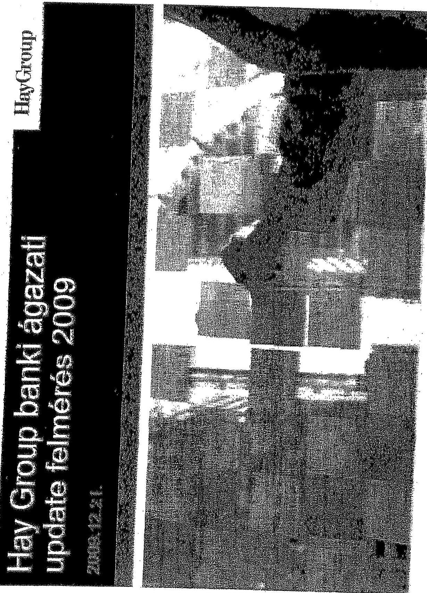

---

Jelen prezentációs anyag a Hay Group Menedzsment Tanácsadók Kft. tulajdona. Az anyag bárminemú felhasználása vagy másolása csak a Hay Group Menedzsment Tanácsadók Kft. engedélyével történhet.

# Hay Group Menedzsment Tanácsadók Kft. 

1122 Budapest, Maros u. 12.
Tel: 06-1-393-0000
Fax: 06-1-393-0001
E-mail: survey-hu@haygroup.com
www.haygroup.com/hu
www.haygrouppaynet.com

---

# Bérváltoztatást végrehajtó bankok aránya

## Bérváltoztatást végrehajtó bankok aránya 2009-ben

|  Bérumelést
nem hajtott
végre
50,0% | Bérumelést
neem tervez
25,0%  |
| --- | --- |
|   | Bérumelést
végrehajtott
50,0%  |

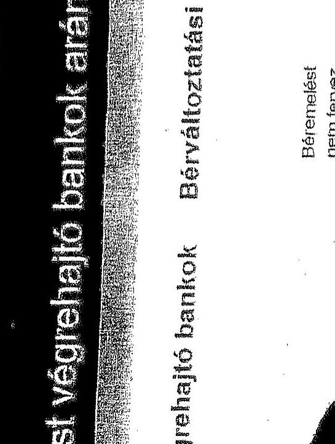

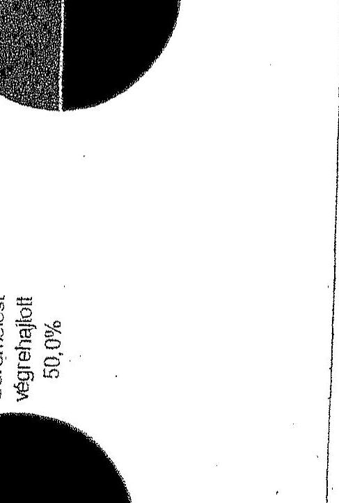

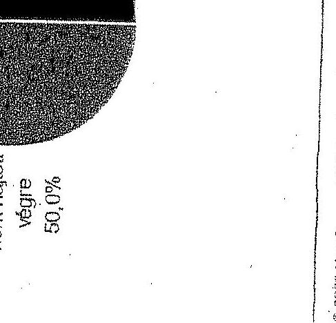

---

# Tervezett béremelések 2016

|  Tervezett béremelések | 2016  |
| --- | --- |
|  5,0% |   |
|  4,5% |   |
|  4,0% |   |
|  3,5% |   |
|  3,0% |   |
|  2,5% |   |
|  2,0% |   |
|  1,5% |   |
|  1,0% |   |
|  0,5% |   |
|  0,0% |   |
|  Felsővezetők | Köszépvezetők  |
|  |   |
|  Szakértők | Adminsztrátív / Fizikai alkalmazottak  |
|  |   |
|  |   |
|  |   |
|  |   |
|  |   |
|  |   |
|  |   |
|  |   |
|  |   |
|  |   |
|  |   |
|  |   |
|  |   |
|  |   |
|  |   |
|  |   |
|  |   |
|  |   |
|  |   |
|  |   |
|  |   |
|  |   |
|  |   |
|  |   |
|  |   |
|  |   |
|  |   |
|  |   |
|  |   |
|  |   |
|  |   |
|  |   |
|  |   |
|  |   |
|  |   |
|  |   |
|  |   |
|  |   |
|  |   |
|  |   |

---

# Tervezett keremelések 2010 – akik értelenek

|  Tervezett keremelés | 2009 Hát Gozó | 2010 Hát Gozó  |
| --- | --- | --- |
|  5,0% | 4,4% | 4,9%  |
|  4,5% |  |   |
|  4,0% |  |   |
|  3,5% |  |   |
|  3,0% |  |   |
|  2,5% |  |   |
|  2,0% |  |   |
|  1,5% |  |   |
|  1,0% |  |   |
|  0,5% |  |   |
|  0,0% |  |   |
|  **Minden csoport** |  |   |

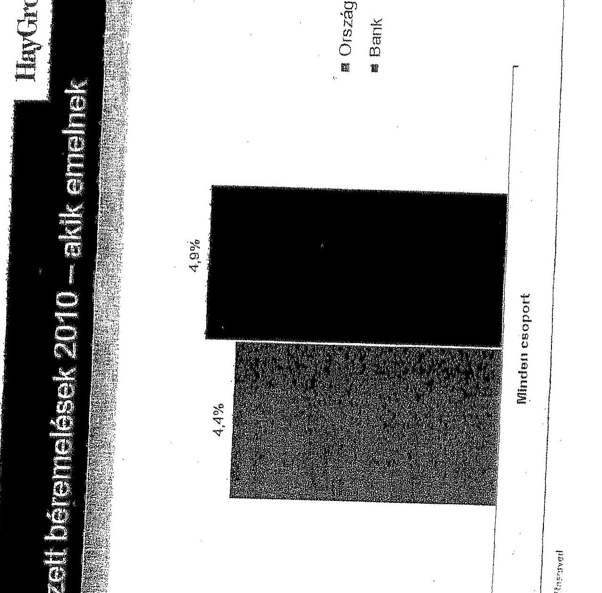

© 2009 Hát Gozó. 18. Highly Pictured

---

# A 2009-ben bért nem emelő bankok tervez 2010-re 

## Béremelést tervező bankok aránya

Béremelést
nem tervez
$12,5 \%$
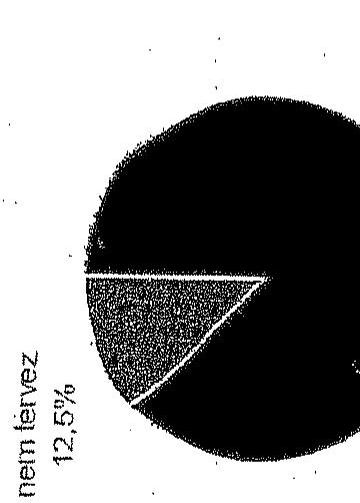

Béremelést
tervez
$87,5 \%$
A 2009-ben bért nem emelô bankok átlagosan 4,8\%-kal akarják emelni a fizetéseket.

---

# Változó bér áttekintése - 2010

|   | Nővel  |
| --- | --- |
|  Csökkenti | 0.0%  |
|  Nem változtat | 80.0%  |

© 2009 Hay Group. All Rights Reserved

---

# Cafeteria adóvaliozasok hatása 

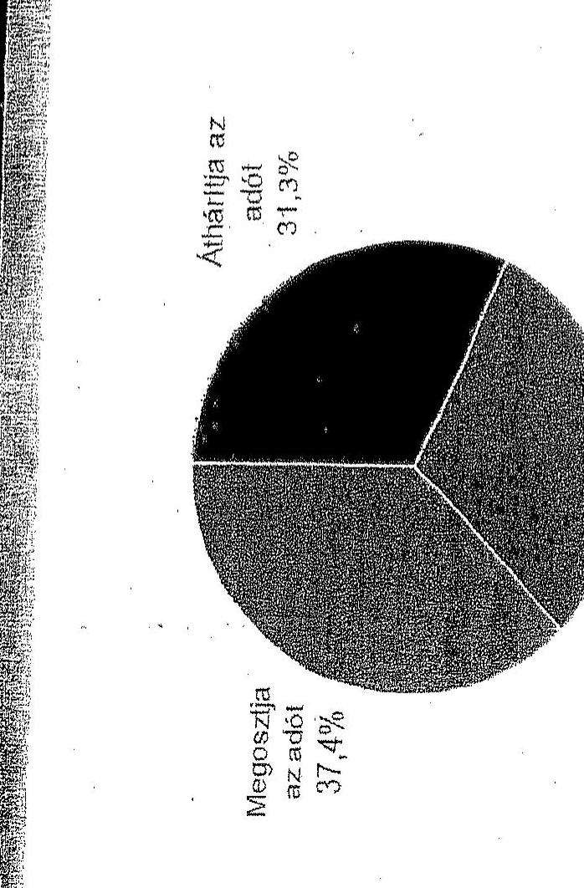

---

# A 2010-ben leépítést tervező bankok aránya

## Bérváltoztatási tervek 2010-re

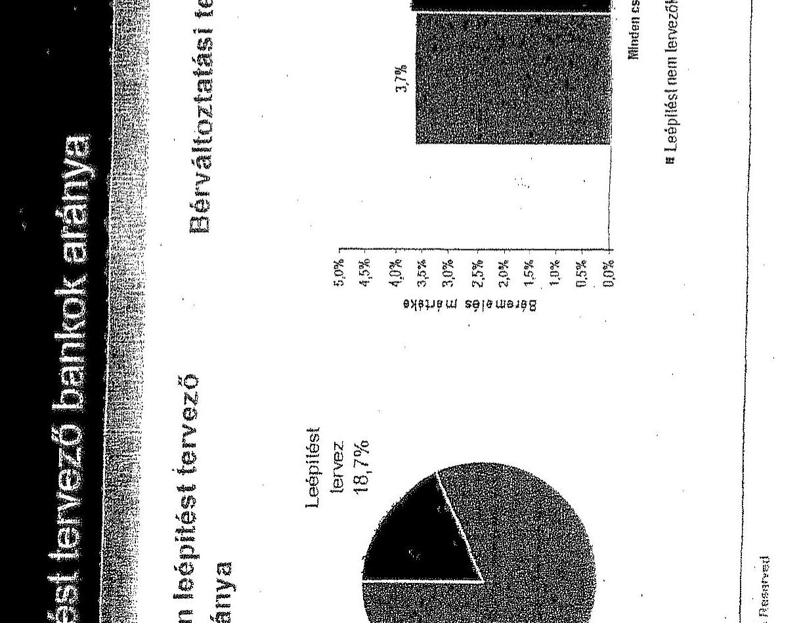

|  Leépítést tervez | Bérvaltoztatási tervek  |
| --- | --- |
|  18.7% | 4.5%  |
|  4.0% | 3.7%  |
|  3.0% | 3.0%  |
|  2.5% | 2.5%  |
|  1.5% | 1.5%  |
|  1.0% | 0.5%  |
|  0.5% | 0.0%  |
|  0.0% | 0.0%  |

**HuyGroup**

**Hozien csoport**

- Leépítést nem tervezők
- Leépítést tervezők

© 2009 Huy Group. All Rights Reserved

---

# HaYGroup 

## Köszönlük a kardő̉v kitölésseli

---

# Dr. Simor András úr 

elnök
Magyar Nemzeti Bank

## Budapest

## Tisztelt Elnök Úr!

A Magyar Nemzeti Bank 2010. évi müködésének ellenőrzéséről összeállított jelentéstervezetünkre - MNB/022750/2011. iktatószámon - megküldött észrevételeit köszönettel vettem, amelyre a következő válaszokat adom.

A Bank észrevételében félrevezetőnek minősítette az ÁSZ jelentésben ismertetett várható eredményadatokat annak ellenére, hogy honlapján még 2011 novemberében, az észrevétele megküldését követően is változatlanul ezek az adatok szerepeltek. A Bank észrevétele alapján tehát nem valósak az MNB honlapon szereplő várható eredmény adatok, azok tudatosan „félreérthető és hibás következtetésekhez vezető" információkat ismertetnek az olvasókkal. Az ÁSZ a hatályos törvényi előírásoknak megfelelően ebben az évben sem vizsgálta és megállapítást sem tett az MNB monetáris tevékenységének banki eredményre gyakorolt hatására. Az ÁSZ 2002 óta minden évben ismertette közzétett jelentéseiben az MNB honlapján nyilvánosságra hozott legfrissebb eredményprognózist, ettől a gyakorlattól az MNB 2010. évi müködésének ellenőrzéséről szóló jelentésében sem tért el. A Bank az ezt megelőző években egyetlen alkalommal sem kifogásolta ezt a gyakorlatot. Nem is kifogásolhatta, mivel az MNB várható eredmény adatai nem minősített adatok, maga a Bank hozza nyilvánosságra azokat a közvélemény tájékoztatására.

A Bank az ÁSZ jelentésben bemutatott kereset-adatokra nem tett észrevételt, ugyanakkor kifogásolta az MNB-ben kialakult keresetek bemutatásához alkalmazott mutatók megfelelőségét, amelyekkel összefüggően szubjektív véleményt fogalmazott meg. Az ÁSZ a Bank munkavállalói keresetének alakulását minden jelentésében bemutatta, 2009-től azt is, hogy az MNB munkavállalói bruttó átlagkeresete és annak a pénzügyi-gazdasági válság éveiben való változása hogyan viszonyult a nemzetgazdaságban kialakult átlagkeresetekhez,

---

illetve azok változásához. Az MNB véleményével ellentétben az ÁSZ álláspontja az, hogy a közvetetten közpénzből gazdálkodó MNB munkavállalóinak bruttó átlagkeresetét indokolt a Magyarországon kialakult keresetekhez viszonyítva bemutatni, különös tekintettel arra, hogy az MNB tv. 2010. szeptember 1-jétől az elnök keresetét is a nemzetgazdasági havi átlagos bruttó keresethez viszonyítva határozza meg. Megjegyezzük, hogy míg a Bank munkavállalóinak keresete nominál értéken minden évben nőtt, csak az infláció mértékétől maradt el, addig a szintén felsőfokú végzettséggel és speciális szaktudással rendelkező köztisztviselők bruttó átlagkeresete nominálisan is csökkent.

Az MNB észrevételében az ÁSZ azon megállapításainak valóságtartalmát kifogásolja, amelyek a Bank saját 2010. évi bérfejlesztéssel összefüggő előterjesztésében és az annak megtárgyalásáról készített jegyzőkönyvben szerepelnek. Ezt támasztják alá a Bank elnökének jegyzőkönyvben rögzített kijelentései: „...az MNB a saját maga által kitüzött célt is túllépte. $A$ válság hatására a bankrendszer is visszafogta a béremelést, igy az MNB és a bankrendszer közötti rés megmaradt. ...megközelítőleg 5\%-kal van a Bank a stratégiájában kitüzött célja fölött. A természetbeni juttatások körében az MNB és a kereskedelmi bankok között még nagyobb a különbség, az MNB több juttatást ad, mint a bankrendszer, valamint a jutalmak sem kevesebbek a bankrendszerben fizetettnél." Megjegyezzük továbbá, hogy a Bank az észrevételében hivatkozott ,, egy, a jegybank számára végzett, nemrégen befejeződött kutatás"-ról szóló dokumentuma 2011 májusában, több mint egy évvel a 2010. évi bérfejlesztésről 2009 decemberében meghozott döntést követően készült, így a dokumentum a 2009 év végén meghozott döntést nem alapozza meg. Mindezek alapján a megállapítást fenntartjuk.

Az MNB elnöke és a középvezetői keresetek között kialakult aránytalanság tényét a Bank maga is elismeri, azonban észrevétele szerint a kialakult helyzetet „,maga a jogalkotó idézte elö". A Bank nem vette figyelembe, hogy a jogalkotó annak érdekében, hogy a jövedelmek teljesítményarányosabbá és igazságosabbá váljanak az egyes pénzügyi szervezeteknél és a közszférában jövedelem korlátot vezetett be. A jogalkotó intézkedése egységesen vonatkozott az állami költségvetési pénzből gazdálkodó intézményekre, az autonómiával rendelkezőkre is (pl. MNB, PSZÁF) miután többségében közpénzt használnak fel. Az ismertetett tények alapján az ÁSZ továbbra is fenntartja azt a megállapítást, hogy ,,...a felső vezetés törvényben korlátozott keresetéhez viszonyítva a középvezetők személyi alapbére és keresete aránytalanul magassá vált, ami nem tükrözi a Bankon belül az MNB vezetői hierarchiájában elfoglalt felelősségi viszonyokat. Nem támogatja továbbá a kormányzati bérpolitikát és a Kormány takarékossági intézkedéseinek megvalósulását sem".

A Bank a 2010. évi bérfejlesztés mértékének meghatározásához a számára legkedvezőbb referencia piaci mutatókat vette figyelembe, mivel nem az összes kereskedelmi bank, hanem csak a bérfejlesztést tervező kereskedelmi bankok átlagos bérfejlesztési mértékét vette alapul. A Bank a végrehajtott bérfejlesztésének indokoltságát észrevételében nem tényszerű adatokkal támasztotta alá, mivel észrevételével ellentétben 2009-ben 1,5\%-os mértékủ bérfejlesztést hajtott végre, az átlag keresetek pedig $4,6 \%$-kal emelkedtek. Ennek következtében megalapozatlanul hasonlítja bérfejlesztését a 2009-ben bérfejlesztést nem végző kereskedelmi bankok 2010-re tervezett bérfejlesztési mértékéhez ( $4,8 \%$ ). Az MNB a két év alatt $6,3 \%$-os bérfejlesztést hajtott végre, ami $1,5 \%$-kal meghaladta a referenciaként választott bankokét.

---

A Bank észrevételében 2010. évi megtakarításként 145,7 M Ft-ot mutatott be az állományba tartozók bérköltsége, választható béren kívüli juttatások, alapjuttatások és jólléti költségek együttes összegénél. Nem mutatta be azonban, hogy ezeken a jogcímeken elszámolt költségek csökkenéséhez közel 290 M Ft-tal járult hozzá többek között az MNB törvény rendelkezése alapján 2 fő monetáris tanácstag mandátumának megszủnése, a felsővezetői bérezés 2010 szeptemberétől hatályos korlátozása, a HAJÓ projekt megvalósításával összefüggő 2009. évi egyszeri bónusz kifizetés együttes összege. Tehát a Bank a 290 M Ft összegủ megtakarítási lehetőségéhez mérten 144,3 M Ft-tal kevesebbet ért el, ami nem igazolja a Bank azon állítását, hogy „megtakarítása ... összhangban van a Kormányzati törekvésekkel". A Bank az általa meghatározott referencia piac szerinti bérfejlesztéseket az MNB bérszínvonalának versenyképessége megtartásával indokolta, amely szerint „a tehetséges, bankban tudást és tapasztalatot felhalmozott szakértők magasabb jövedelemért ne vándoroljanak el." Ennek az érvelésnek ellentmond a Bank „szisztematikus csere" megvalósítására vonatkozó megállapításra tett észrevétele, miszerint „A munkaerő-piacon érvényes kínálat-keresleti viszonyok már több éve lehetővé teszik a Bank számára a kívánt minőségü munkaerő a távozó munkatárs javadalmazásánál alacsonyabb szinten történő felvételét." A két egymásnak ellentmondó banki álláspont azt igazolja, hogy a Bank az ÁSZ megállapítások cáfolásához igazította „érveit, véleményét".

A Bank munkaviszony megszüntetésekkel összefüggő tervezési gyakorlata nem fogadható el. A Bank észrevétele is azt támasztja alá, hogy a 2010. évi személyi jellegủ ráfordítások között tervezett végkielégítések, felmondási illetmények összege nem a létszámtervre épült, továbbá sem a tervben szereplő létszám, sem a tervezett összeg nem volt megalapozott. A Bank észrevétele szerint is a létszámtervben előirányzott leépítéshez a szükségesnél magasabb (nem nevesített felmondásokra is) költséget tervezett. A Bank tervezési gyakorlatát azzal indokolja, illetve a terv megfelelőségét azzal támasztja alá, hogy a létszámtervvel meg nem alapozott költségtervét 11 M Ft-tal túllépte. Az ÁSZ álláspontja szerint a költségterv túllépése nem alapozza meg a költségtervet. Mindezek alapján az észrevételezett megállapításokat változatlanul fenntartjuk.
A Bank észrevételében félrevezető módon azt állítja, hogy az ÁSZ ellenőrzés „túlmutat ellenőrzési hatáskörén" azzal, hogy egyes kifizetések megalapozottságát ellenőrizte. Az ÁSZ ellenőrzési jogkörében eljárva köteles a közpénzzel való felelős gazdálkodás jogszerűségét vizsgálni, amelybe beletartozik az is, hogy a közpénzek kifizetése mögött valós teljesítmények állnak-e. Az ÁSZ a kommunikációs tanácsadó részére elszámolt kifizetések megalapozottságát ellenőrizte, e feladatkörében nem vette át a Bank elnökének munkáltatói jogkörébe tartozó jogosultságokat, mint ahogy azt a Bank észrevételében állítja. A kommunikációs tanácsadó munkavégzésével összefüggésben a Bank egyetlen dokumentumot sem adott át az ellenőrzés részére, annak ellenére, hogy munkaszerződése írásbeli feladatokat is előírt számára. A Bank elnöke az ÁSZ által megküldött teljességi nyilatkozatot nem írta alá, annak tartalmát korlátozó kitétellel módosította. A módosított nyilatkozatban nevesített dokumentumok a feladatok elvégzését, a valós teljesítményt továbbra sem támasztották alá.
Megjegyezzük továbbá, hogy az ÁSZ ellenőrzés a kommunikációs tanácsadó munkavégzésével összefüggő kifizetések megalapozottságának ellenőrzésén túlmenően további müködési költség elszámolások megalapozottságát is vizsgálta.

---

A Bank észrevételében kiemeli, hogy müködési költségeinek racionalizálását önként, minden külső ráhatás nélkül vállalta. Ez azonban nem eredményezheti azt, hogy annak megvalósitását, a müködési költségekre gyakorolt hatását ne korrekt módon mutassa be. Ezt támasztja alá az is, hogy a HAJÓ projekttel összefüggésben a Bank a külső tanácsadónak 336 M Ft-ot fizetett ki, a kidolgozásában részvevő banki munkavállalókkal, valamint a megvalósítással összefüggően is (felmondási illetmények, végkielégitések, stb.) többletkiadásai voltak. A Bank észrevételében annak ellenére kifogásolja az ÁSZ által javasolt értékelési módszert, hogy azt a 2009. évi ellenőrzést követő szakmai egyeztetésen már elfogadta, ugyanakkor azt 2010-ben sem megfelelően alkalmazta. Az ÁSZ változatlan álláspontja, hogy az egész banki müködés részeként megvalósított HAJÓ projekt megtakarítási célkitüzéseinek eredményeit nem lehet a müködéssel összefüggő összes elszámolt költségtől függetlenül értékelni, mivel valós képet az elért megtakarításokról a Bank elszámolt költségeinek előző évekhez mért változása mutat. Az MNB a HAJÓ projekt célkitüzéseit és eredményeit 2010-ben is a Bank éves összlétszámának és müködési költségeinek alakulásától függetlenül, önállóan, csak annak létszám-, illetve költségcsökkentő hatását bemutatva értékelte. Nem vette figyelembe a célkitüzések megvalósitásával összefüggésben felmerült többlet költségeket, valamint a Bank egyéb intézkedéseivel összefüggő költségnövekedéseket, amelyek mérséklik a megtakarítások banki szintü összköltségre gyakorolt hatását. A Bank észrevételében és számos beszámolójában az előző évhez mért költségcsökkenéseket teljes összegében a HAJÓ projekt eredményeként mutatja be, nem korrigálva azt pl. a jogszabályváltozásokból eredő költségcsökkenésekkel.

A Bank annak ellenére, hogy elfogadta az előző évi ÁSZ jelentésben tett javaslatot, nem annak megfelelően értékelte a HAJÓ projekt célkitüzéseinek megvalósítását és az elért eredményeket, amire a Felügyelő Bizottság a Bank figyelmét már 2010 szeptemberében felhívta. Az ÁSZ utóellenőrzés keretében vizsgálta a Bank 2009. évi müködésének ellenőrzéséről szóló jelentésében tett javaslatok hasznosulását, és megállapította, hogy a Bank a többszöri szakmai egyeztetés ellenére sem megfelelően értelmezte, illetve hajtotta végre azokat. A 2010-ben közzétett ÁSZ jelentés 24. oldal 5. bekezdésének megállapításaiból egyértelműen következik, hogy a HAJÓ projektben szereplő, PIB döntésnek megfelelő létszámcsökkentést - mivel a projekt a banki feladatok ellátásának munkaerő igényéből kiindulva vezette le a létszámszükségletet, illetve a létszámfelesleget - a Bank 2009. évi létszámtervében szereplő 12,5 fő többletlétszámmal nem kell lecsökkenteni. Ugyanakkor a HAJÓ projekt megvalósitásának értékelésekor a 12,5 fő többlet létszámot és annak költségeit a HAJÓ projekt megtakarításaként kimutatni nem indokolt, mivel azt a Bank létszámfelvétellel ellentételezte.

A Bank észrevételétől eltérően az ÁSZ az MNB éves jelentésében szereplő információ valótlan tartalmát kifogásolta. A Bank ugyanis az elnöki összefoglalóban a 2010. évi müködési költségek 900 M Ft összegủ csökkenését a HAJÓ projekt eredményeként mutatta be. Az ÁSZ megállapította, hogy 2010-ben a személyi jellegű ráfordításoknál a Banknak a HAJÓ projekttől független 799,8 M Ft költségcsökkentési lehetősége volt (pl. MNB tv. előírásai, munkáltatói terheket csökkentő jogszabályváltozás), ezzel szemben a Bank előző évhez mérten személyi jellegű ráfordításai 653,7 M Ft-tal csökkentek. Az előzőekből következően a Bank hatékonyságjavító intézkedéseinek költségcsökkentő hatása a személyi jellegủ ráfordításoknál nem mutatható ki. Mindezek alapján a Bank éves beszámolójának vezetői összefoglalójában valótlanul mutat be 900 M Ft költségcsökkenést a HAJÓ projekt eredményének.

---

A Bank 2011. március 31-éig érvényes támogatási szerződéssel rendelkezett a nagy távolságot áthidaló berendezésekre (DWDM). A meghibásodott eszközök javítását vagy cseréjét - az eszközök elavultsága miatt - a támogatást nyújtó vállalkozó nem tudta megoldani. Ezért azok helyett 2010 januárjától korszerübb csereeszközöket biztosított, amelyek költsége a szerződés szerint a szolgáltatót terhelte. A Bank annak ellenére, hogy a szolgáltatóval 2011. március 31éig érvényes szerződéssel rendelkezett, a csere eszközökre bérleti szerződést kötött a szolgáltatóval, amellyel összefüggően 10 M Ft -ot meghaladó bérleti díjat fizetett. Az ÁSZ változatlan álláspontja, hogy a bérleti díjfizetés nem volt indokolt, tekintettel arra, hogy a fenti eszközök biztosításával nyújtott többletszolgáltatást a szolgáltató nem a Bank igénye alapján nyújtotta, hanem azért, mert a szerződéses kötelezettségét csak a korszerübb csereeszközökkel tudta teljesíteni. Különösen igaz ez az utolsó 3 hónapra meghatározott, a kedvezményes díj háromszorosát meghaladó bérleti díjra, amely a többletszolgáltatással nem volt arányos. A Bank észrevételében új információt nem közölt, ezért az ÁSZ megállapítását nem módosítja.

A Bank működési költségei és beruházási kiadásai elszámolásának ellenőrzött tételeihez kapcsolódóan feltárt Kbt. sértések tényét a Bank észrevételében nem cáfolja. A Bank által hivatkozott „a normál munkamenettől eltérő, extrém körülmények" nem mentesítik a Bankot a jogszabályok betartása alól.

A Bank észrevételében az ÁSZ adattárházzal összefüggésben tett megállapításait nem kifogásolta. Az ÁSZ megállapította, hogy az adattárház stratégia 2010. évi elfogadását nem előzte meg a felhasználói szakterületek igényeinek és elemzési feladatainak teljes körű felmérése és az igények összehangolása. Nem határozta meg a Bank a fejlesztési feladatok sorrendjét, határidejét. Nem határozta meg továbbá az adattárház szerepét a banki feladatok támogatásában. Az adattárház projekt lebonyolítása során a Bank nem készítette el a teljes adattárház rendszer belső struktúráit és folyamatait összefoglaló rendszertervet. Nem határozta meg teljes körűen a megvalósítás folyamatát lefedő feladatokat, azok felelőseit és határidőit. A feladatterv és az ütemezés kidolgozatlansága nem tette lehetővé a feladatok utólagos számonkérését, a felelősségek egyértelmű meghatározását.
Az ÁSZ jelentésében tett megállapításokat a Bank dokumentumaira alapozva tette, azokat az MNB által átadott dokumentumok alátámasztják. Az MNB észrevételei számszakilag és tényszerűen nem módosítják az ÁSZ jelentésében megfogalmazott megállapításait.
A részletes észrevételeire a csatolt mellékletben adom meg a válaszokat.
Kérem válaszom szíves tudomásulvételét.
Budapest, 2011. november " ".
Tisztelettel:
Domokos László
Melléklet: 1 db

---

# Melléklet 

az ÁSZ elnökének a Magyar Nemzeti Bank MNB/022750/2011. iktatószámú, a Magyar Nemzeti Bank 2010. évi működésének ellenőrzéséről készített számvevőszéki jelentés-tervezetre tett észrevételekre adott válaszához

Az MNB az előző egyeztetéskor adott észrevételein több esetben annak ellenére nem változtatott, hogy az ÁSZ az észrevételt megfontolva a jelentéstervezet szövegét több helyen módosította.

Az ÁSZ változatlan álláspontja, hogy az egész banki működés részeként megvalósított HAJÓ projekt megtakarítási célkitüzéseinek eredményeit nem lehet a működéssel összefüggő összes elszámolt költségtől függetlenül értékelni, mivel valós képet az elért megtakarításokról a Bank elszámolt költségeinek előző évekhez mért változása mutat. A Bank és az ÁSZ képviselői 2010. május 18 -án szakmai egyeztetést tartottak az MNB 2009. évi működésének ellenőrzéséről készített jelentéstervezetben tett megállapításokról. A szakmai egyeztetés fő témája a HAJÓ projekt megtakarítási célkitüzéseinek és elért eredményeinek értékelése, az értékelésnél alkalmazott számítási módszerek egyeztetése volt. Az alapvető nézetkülönbség az volt, hogy az MNB a HAJÓ projekt célkitüzéseit és eredményeit a Bank éves összlétszámának és működési költségeinek alakulásától függetlenül, önállóan, csak annak létszám-, illetve költségcsökkentő hatást bemutatva értékelte. Nem vette figyelembe a célkitüzések megvalósításával összefüggésben felmerült többlet költségeket, valamint a Bank egyéb intézkedéseivel öszszefüggő költségnövekedéseket, amelyek mérséklik a megtakarítások banki szintű összköltségre gyakorolt hatását. Az egyeztetést követően vitás kérdés a Bank és az ÁSZ képviselői között nem maradt fenn, amit a Bank 2010. május 25 -én kelt levele is igazol, mely szerint a jelentéstervezethez a szakmai egyeztetést követően észrevételt nem tesz. Az ÁSZ a 2010. évi működés ellenőrzésekor is ugyanazt a számbavételi módszert alkalmazta, amit a Bank 2010 májusában elfogadott. Ennek ellenére a Bank az MNB 2010. évi működéséről szóló jelentéstervezetre adott észrevételei nem tükrözik az előző évi szakmai egyeztetésen elfogadott álláspontot.
6. oldal 3. bekezdés, 13. oldal 4. bekezdés, 32. oldal 7. bekezdés: Nem értük egyet a Bank azon észrevételével, hogy az ÁSZ megállapítása szakmailag nem követhető, mivel a számítási módszert a Bank az előző évben folytatott szakmai egyeztetésen elfogadta. Az ÁSZ változatlan álláspontja szerint a HAJÓ projekt megvalósításának kezdetétől a Bank záró létszámában bekövetkezett csökkenésnél több létszámcsökkentést a HAJÓ projekt eredményeként figyelembe venni közgazdaságilag nem indokolt. Továbbra sem indokolt a HAJÓ projekt eredményeként kezelni a Bank egyéb hatékonyságjavító intézkedéseiből eredő, illetve a Bank intézkedéseitől független létszámcsökkenéseket. Nem fogadjuk el a Bank észrevételét, amely szerint „megtévesztő lehet, hogy a jelentés-tervezetben a létszám alakulását bemutató adatok nem teljes körűek." A Bank észrevételében megküldött táblázat 2009-ben és 2010-ben is a HAJÓ projekt eredményeként magasabb létszámcsökkentést ( 59,75 fö) mutat be, mint a Bankban a két év alatt ténylegesen megvalósult létszámcsökkenés ( 52 fö). A tényleges létszámcsökkenésből egyértelműen kimutatható 30 fő olyan létszámcsökkenés (pl. 4 fő, a Monetáris tanács tagjai mandátumának lejárta, 20 fő a Logisztikai központ beruházás megvalósításával összefüggő létszámcsökkenés miatt), amely nem a HAJÓ projekt eredményeként valósult meg. Ebből az következik, hogy a HAJÓ projekt megvalósításának kezdetétől 2010 végéig bekövetkezett zárólétszám csökkenésnél is kevesebb létszámcsökkenés ( $52-30=22$ fö)

---

tulajdonítható a HAJÓ projekt eredményének, ugyanis a Bank személyi jellegű ráfordításait csak a valós létszámcsökkenés mérsékli. Mindezekre figyelemmel a Bank HAJÓ projekt eredményeit bemutató értékelése nem megalapozott, mivel magasabb létszámcsökkentést mutat be a ténylegesen megvalósultnál.

A Bank észrevételben szereplő táblázata a HAJÓ projekt keretében megvalósított létszámcsökkentéseket pontatlanul mutatja be, amely a Bank számvevői jelentésre tett észrevételéhez mellékelt kimutatásában szereplő adatoktól, valamint az előző évi ÁSZ jelentésben szereplő, Bank által már elfogadott adatoktól is eltér.

A Bank a jelentéstervezet 32. oldal 7. bekezdéséhez tett észrevételében tévesen hivatkozott a 25. oldal 3. bekezdésre, mivel az nem az észrevételben jelzett témakörhöz kapcsolódik.

A Bank további észrevétele alapján a jelentés-tervezet 6. oldal 3. bekezdésében a következő kiegészítést tettük: „Az ÁSZ az MNB 2009. évi működésének ellenőrzése alapján 17 fővel javasolta mérsékelni a létszámcsökkentési célkitűzést." „Az MNB a HAJÓ projekt megvalósításával a 2008-2011 években banki szinten 1,7 Mrd Ft „hosszú távon fenntartható megtakarítást" vár el, amit az MNB elnöke 2010 júniusában 1,5 Mrd Ft-ra mérsékelt." A Bank észrevételében a HAJÓ projekt megvalósításának időszakát 2008-2013. években jelöli meg, amely eltér a HAJÓ projekt dokumentumaitól, továbbá az előző évi ÁSZ jelentésben szereplő 20092011 évi időszaktól, amelyre a Bank 2010-ben nem tett észrevételt. Az ÁSZ rendelkezésére bocsátott HAJÓ projekt előrehaladásáról szóló szakterületi riportok azt tanúsítják, hogy a projekt megvalósítás időszaka 2009-2010. volt. Az átadott projekt dokumentumok szerint a költségmegtakarítások áthúzódó hatása miatt, a projekt lezárása 2011. A Bank a projekt eredeti 2010. decemberi befejezésének 2013-ra történő módosítását azzal indokolta, hogy 4 kezdeményezés megvalósítása 2012-2013. évben várható, amelytől előre láthatóan 20 M Ft megtakarítást vár. Az ÁSZ álláspontja szerint a jelzett 4 tétel megvalósításának későbbi időpontra halasztása nem indokolja a projekt lezárásának, elért eredményei értékelésének két évvel történő meghosszabbítását, mivel a 20 M Ft megtakarítás a projekt megvalósításával kitűzött 1,7 Mrd Ft hosszú távon fenntartható megtakarításnak mindössze 1,2\%-a.
6. oldal 4. bekezdés, 10. oldal 4. bekezdés, 11. oldal 1. bekezdés, 24. oldal 3-4. bekezdés: A Bank észrevételében foglaltak a jelentés-tervezetben szereplő információkat nem módosítják, mivel azok tényszerűen mutatják be, hogy az MNB munkavállalói bruttó átlagkeresete és annak a pénzügyi-gazdasági válság éveiben való változása hogyan viszonyult a nemzetgazdaságban kialakult átlagkeresetekhez, illetve azok változásához. Az MNB véleményével ellentétben az ÁSZ álláspontja szerint az nem lenne elfogadható, ha a Magyar Nemzeti Bank munkavállalóinak bruttó átlagkeresetét nem hasonlítanánk össze a Magyarországon kialakult kereseti viszonyokkal, különös tekintettel arra, hogy az MNB tv. 2010. szeptember 1-jétől az elnök keresetét is a nemzetgazdasági havi átlagos bruttó keresethez viszonyítva határozza meg. Megjegyezzük, hogy míg a Bank munkavállalóinak keresete nominál értéken minden évben nőtt, csak az infláció mértékétől maradt el, addig a szintén felsőfokú végzettséggel és speciális szaktudással rendelkező köztisztviselők bruttó átlagkeresete nominálisan is csökkent. Fenntartjuk továbbá azt is, hogy ellentmondásosnak ítélhető helyzet állt elő a Bankban azzal, hogy a felső vezetés törvényben korlátozott keresetéhez viszonyítva a középvezetők személyi alapbére és keresete aránytalanul magassá vált, ami nem tükrözi a Bankon belül az MNB vezetői hierarchiájában elfoglalt felelősségi viszonyokat. Nem támogatja továbbá a kormányzati bérpolitikát és a Kormány takarékossági intézkedéseinek megvalósulását sem. A Bank által megszorító megfogalmazásként értelmezett „csak" szót az összegző és a részletes megállapítások fejezetben szereplő mondatból töröltük.

---

9. oldal 2. bekezdés, valamint a 21. oldal 1. bekezdés, 21. oldal 2. bekezdés: Az észrevétel a megállapítást nem módosítja. Az MNB észrevétele szerint a BMK a feladat átvételéhez többlet munkaerőt nem igényelt, mivel azt a 2010. évi létszámtervben szereplő tervezett létszámnövekedés terhére biztosítja. Ennek ellenére a Bank kimutatása az MNB elnöke által nem engedélyezett és a BMK által sem igényelt plusz 1 főt terven felül további év közbeni létszámnövelő tényezőként mutatta be. Ezzel összességében a feladatellátásához szükségesnél egy fővel nagyobb humánerőforrás-kapacitás igényt mutatott be a Bank, ami nem felelt meg az MNB elnök döntésének. A megállapítást és a javaslatot fenntartjuk, mivel azokat alátámasztja, hogy a pontatlanul, illetve hiányosan megfogalmazott határozatok miatt:

- a Bank 2010. évi létszámtervéről szóló 2009. december 1-jén hozott elnöki határozatot az EEF nem érvényesítette a 2010. évi pénzügyi tervben,
- a BMK létszámváltozására vonatkozó 2010. február 9-ei elnöki határozatot az EEF kimutatásában nem a döntésnek megfelelően szerepeltette,
- a KPL létszámbővítésével összefüggő 2010. augusztus 31-ei elnöki döntés nem pontosan határozta meg a létszámfelvétel időpontját (2010-ben vagy 2011-ben hajtható-e végre), csak a feladatok megvalósításának végső határidejét rögzítette.

Megjegyezni kívánjuk, hogy a 19. oldal első bekezdéshez az a) pontban írt észrevétel szerint a Bank félreértelmezte a megállapítást, mivel az nem a létszámfelvétel 2011. évi megvalósításának jogosságát vitatta, hanem arra mutatott rá, hogy a határozat nem konkrétan tartalmazta, hogy a létszámfelvétel már 2010-ben vagy csak 2011-ben hajtható-e végre. A b) pontban szereplő észrevétel szerint a Bank ugyancsak félreértelmezte a megállapítást, mivel az észrevétel az EEF létszámcsökkentésre vonatkozó végrehajtási feladatára vonatkozott, míg a megállapítás arra mutatott rá, hogy az elnök létszámtervvel összefüggő döntését az EEF nem hajtotta végre, azt a pénzügyi tervben nem érvényesítette. Mindezek alapján a megállapítást fenntartjuk.
10. oldal 3. bekezdés, 12. oldal 1. bekezdés: Az észrevételezett megállapításokat a jelentéstervezet már nem tartalmazza. Ennek ellenére a Bank a jelentéstervezet korábbi változatához megküldött észrevételét változatlanul megismételte. A megállapítást módosítottuk, azonban a működési költségek több mint $50 \%$-át kitevő személyi jellegű ráfordításokra vonatkozóan fenntartottuk, az informatikai költségekre és beruházási kiadásokra vonatkozó részt az észrevételezett mondatból töröltük. „A Bank létszámmal és személyi jellegü ráfordításokkal való gazdálkodása nem felelt meg az MNB takarékossági célkitüzéseinek." A megállapítást a 12. oldal 1. bekezdése tartalmazza.) Változatlanul fenntartjuk, hogy a Bank 2010-ben a jogszabályok változásából, valamint az előző év rendkívüli kifizetéseinek elmaradásából eredő megtakarítási lehetőségeinél alacsonyabb összegủ költségcsökkentést valósított meg. A Bank hatékonyságjavító intézkedéseitől független (munkáltatói terhek jogszabálynak megfelelő csökkenése, az elnök, alelnökök és a további MT tagok MNB tv.-ben előírt keresetcsökkentése, stb.) költségcsökkenési lehetőség a terv elfogadásakor 634,0 M Ft volt, ezzel szemben a 2010. évi személyi jellegű ráfordítások tervében a Bank 166,8 M Ft-tal kevesebbet költségcsökkenést tervezett. A költségcsökkentési lehetőséget mintegy 165,8 M Ft-tal 799,8 M Ft-ra növelte az MNB tv. elnök keresetét korlátozó 2010 szeptembertől hatályos módosítása, valamint a korengedményes nyugdíjazás elszámolásából eredő nem tervezett költségcsökkenés. Mindezek alapján a Bank a megtakarítási lehetőségeihez képest 2010-ben 146,1 M Ft-tal alacsonyabb költségcsökkenést ért el. Az előzőekből következően a Bank hatékonyságjavító intézkedéseinek költségcsökkentő hatása nem mutatható ki. (Tájékoztatásul az ÁSZ számításait bemutató táblázatot mellékeljük. 1. számú melléklet)

---

11. oldal 2. bekezdés: 26. oldal 1. bekezdés, 26. oldal 3. bekezdés: A Bank észrevételei a megállapításokat nem módosítják. A Bank észrevételében ahhoz a kereskedelmi banki csoporthoz hasonlítja 2010-ben végrehajtott bérfejlesztését, amely 2009-ben nem hajtott végre bérfejlesztést. Az MNB 2009-ben 1,5\%-os bérfejlesztést hajtott végre. A Bank belső használatra megkülönbözteti az általános, valamint az előléptetésekhez kapcsolódó bérfejlesztést, ami bérgazdálkodás megítélése szempontjából összeadandó, mivel a Bank személyi alapbérrel összefüggő költségeit emeli. Megjegyezzük továbbá, hogy a Bankban kialakult bérszínvonal indokoltságára az MNB-ben végrehajtott bérfejlesztésre, valamint a szisztematikus cserére vonatkozó megállapításainkra tett észrevételeiben a Bank egymásnak ellentmondó álláspontot képviselt. A Bank az ÁSZ megállapítások cáfolásához igazította „érveit, véleményét". Ezt támasztja alá például a Bank jelentéstervezet 26. oldal 1. bekezdéséhez, valamint a 67. oldal 5. bekezdéséhez tett észrevétele. A Bank az általa meghatározott referencia piac szerinti bérfejlesztéseket az MNB bérszínvonalának versenyképessége megtartásával indokolta, amely szerint „a tehetséges, bankban tudást és tapasztalatot felhalmozott szakértők magasabb jövedelemért ne vándoroljanak el." Ennek ellentmond a Bank a „szisztematikus csere" megvalósítására vonatkozó megállapításra tett észrevétele, miszerint „A munkaerő-piacon érvényes ki-nálat-keresleti viszonyok már több éve lehetővé teszik a Bank számára a kivánt minőségü munkaerő a távozó munkatárs javadalmazásánál alacsonyabb szinten történő felvételét." Az észrevételezett megállapításokat fenntartjuk.
12. oldal 3. bekezdés, 36. oldal 7. bekezdés, 38. oldal 5. bekezdés, 67. oldal 3. bekezdés: A Bank észrevétele szerint nem vette figyelembe az ÁSZ szeptemberben megküldött válaszlevelében foglalt magyarázatokat és a számításokat alátámasztó mellékelt táblázatot, ezért azt ismételten csatoljuk. A táblázat adataiból egyértelműen kitűnik, hogy a Bank észrevételében hiányolt előző évek egyszeri többletkifizetéseinek 202 M Ft-os összegét „az MNB tv. elnök keresetét korlátozó 2010 szeptembertől hatályos módosítása, valamint a korengedményes nyugdíjazás elszámolásából eredő nem tervezett költségcsökkenés" együttes összege ( 165,8 M Ft) növelte 367,8 M Ft-ra. A Bank észrevételében szereplő táblázatok adatai is az ÁSZ a megállapítását támasztják alá. Pl. a 11. oldal 3. bekezdéséhez adott táblázatában a Bank hatékonyságjavító intézkedéseiből eredően 245,6 M Ft megtakarítást mutat be, amellyel szemben csak a bérfejlesztéssel összefüggésben 243,5 M Ft-ot számolt el. A Bank észrevételében azt állítja, hogy a számvevő „megállapítása meghozatalakor számos, a költségtervre ható tényezőt nem vett figyelembe". Az MNB állításával ellentétben a Bank által bemutatott, a Bank intézkedéseitől független megtakarítást eredményező tényezők nem teljes körűek, a Bank ugyanis nem vette figyelembe a 2009-hez képest jelentős mértékben csökkenő munkaviszony megszüntetéseket, holott a 2009. évi kiugróan magas munkaviszony megszüntetés nem tekinthető bázisnak. A Bank 2010. évi hatékonyságjavító intézkedéseitől független költségcsökkenésként nem vette figyelembe továbbá azokat a 2009-ben egyszeri többletköltségként felmerülő tételeket, amelyek sem a 2010. évi terv összeállításánál, sem az elszámolt költségek értékelésénél nem tekinthetők bázisnak, így pl.:

- a szabadságmegváltásra elszámolt költségek 2009. évihez mért csökkenését,
- a korengedményes nyugdíjazással összefüggő költségek csökkenését,
- a HAJÓ projektben résztvevő munkavállalóknak 2009-ben kifizetett bónuszok (jutalmak) 2010-ben már fel nem merülő költségcsökkentő hatását,
- a HAJÓ projekt létszámleépítéssel összefüggő tanácsadások, segélyek előző évhez mért csökkenését,
- a munkaügyi perekkel összefüggően 2009-ben elszámolt költségek 2010. évihez mért csökkenését,
- az APEH-nak utólag, 2009-ben megfizetett 2010-ben már fel nem merülő SZJA miatti ráfordítás csökkenést.

---

Fentiek alapján a megállapítást a következők szerint tartjuk fenn: „A Bank hatékonyságjavító intézkedéseitől független költségcsökkentési lehetőség 634,0 M Ft volt, amelynél 166,9 M Fttal kevesebbet tervezett. A költségcsökkentési lehetőséget mintegy 165,8 M Ft-tal 799,8 M Ftra növelte az MNB tv. elnök keresetét korlátozó 2010 szeptembertől hatályos módosítása, valamint a korengedményes nyugdíjazás elszámolásából eredő nem tervezett költségcsökkenés. Mindezek alapján a Bank a megtakarítási lehetőségeihez képest 2010-ben 146,1 M Ft-tal alacsonyabb költségcsökkenést ért el. Az előzőekből következően a Bank hatékonyságjavító intézkedéseinek költségcsökkentő hatása nem mutatható ki. A Bank létszámmal és személyi jellegü ráfordításokkal való gazdálkodása nem felelt meg az MNB takarékossági célkitüzéseinek." (A Bank hatékonyságjavító intézkedéseitől független 2009. évihez mért költségcsökkentési lehetőségeit tartalmazó kimutatást az észrevételre adott válaszokhoz mellékeljük. 1. számú melléklet.)
12. oldal 4. bekezdés, 33. oldal 4. bekezdés, 34. oldal 3-5. bekezdés: A Bank észrevételei az ÁSZ megállapításait nem módosítják Továbbra is fenntartjuk, hogy a munkavállaló munkavégzéséről, valós teljesítményéről a Bank értékelhető szakmai dokumentumot nem adott át, a szóban végzett feladatellátást az ÁSZ utólag ellenőrizni nem tudta. Ezért a munkaszerződésben előírt írásos és szóbeli feladatok teljesítéséről az ellenőrzés nem tudott meggyőződni, a Bank pedig az írásos feladatok elvégzését egyetlen, a tanácsadó által készített szakmai dokumentummal sem támasztotta alá. A Bank dokumentumok helyett olyan nyilatkozatokkal próbálta igazolni a munkavégzés tényét, amelyekben a nyilatkozó saját maga minősíti úgy az átadott iratokat (telefonhívások jegyzéke, kommunikációs megbeszélésekre szóló meghívók, stb.), hogy azok „megfelelően igazolják a munkavégzés tényét". A nyilatkozat ezáltal olyan minősítést tartalmaz, amelynek megállapítása a helyszíni ellenőrzést végző jogosultsága. A Bank elnöke ugyanakkor az ÁSZ által megküldött teljességi nyilatkozatot nem írta alá. A Bank a tanácsadóval megkötött munkaszerződésben a munkavállaló MNB-től kapott juttatásaira a titoktartási kötelezettséget maga írta elő. Amennyiben a Bank betartja a közpénzből gazdálkodó szervezetekre előírt transzparencia követelményt, úgy a kommunikációs tanácsadó munkaszerződésében a javadalmazására vonatkozó titoktartási kötelezettség előírása értelmezhetetlen.
13. oldal 2. bekezdés: Az összegző fejezetből Bank által hiányolt információkat a jelentéstervezet 33. oldal 3. bekezdése részletesen ismerteti. A jelentéstervezet összegző fejezetében szereplő információ megalapozottan mutatta be a Bank záró létszámának változását, mivel azt a 2010. évi „munkaerőmozgás hatására" (a munkaerőmozgás terminológiája a jogi állomány változást is magában foglalja) kifejezéssel ismertette. A félreértések elkerülése érdekében azonban az összegző fejezetet a létszámváltozás részletes adataival kiegészítettük.
14. oldal 2. bekezdés, 40. oldal 1. bekezdés, 42. oldal 2. bekezdés, 19. oldal 2. pont: A Bank a jelentéstervezet korábbi változatához adott észrevételét megismételte, annak ellenére, hogy az észrevételezett szövegrészek egy része módosult. Mindezek figyelembevételével a novemberben megküldött észrevételekre a következő válaszokat adjuk. A Bank észrevételében hiányolt, a HAJÓ projekt előírásainak Bank által kimutatott teljesítéséről szóló ismertetőt a számvevőszéki jelentéstervezet 3.2.2. pontjának első bekezdése tartalmazta. A korábbi jelentéstervezet 39. oldal 8. bekezdésének első mondatát pedig a 38. oldal első bekezdéshez csatoltuk, amelyet a jelentés 40 . oldal 1. bekezdése tartalmaz. Az észrevételben jelzett 19. oldal 2. pont nem a jelzett témakörhöz kapcsolódik.

Az észrevételt megfontolva az összegző fejezetet kiegészítettük a részletes megállapítások 39. oldal 5. bekezdésében szerepeltetett következő megállapítással (amelyet a jelentés 41. oldal 7. bekezdése tartalmaz): „Az informatikai költségek csökkentése érdekében az ISZ a 2008-2010

---

közötti időszakban a szállítók számára kizárólagos jogokat (pl. továbbfejlesztésre, karbantartásra) biztosító szerződések számát és így az ebből eredő kockázatokat mérsékelte. A Bank a szállítóknak kizárólagos jogokat biztosító szerződéseket részben technológiai jellemzők, részben a korábbi szerződési előírások miatt teljes körűen megszüntetni nem tudta."

Figyelembe véve az ÁSZ előző évi jelentésében az informatikai szerződések felülvizsgálatára tett megállapítást a jelentéstervezet észrevételezett bekezdését a következőkkel egészítettük ki:

Az ÁSZ a Magyar Nemzeti Bank 2009. évi működésének ellenőrzéséről 1007. számon közzétett jelentésében is megállapította, hogy a Bank a szerződések felülvizsgálatával elérhető költségcsökkentéseket a HAJÓ projekt nélkül is megvalósíthatta volna: „2009. évi müködtetési költségeiről készült szöveges indokolás szerint a terv a „normál" tervezési folyamat részeként számolt a szállítói szerződések felülvizsgálatával elérhető költségcsökkentésekkel és nem tartalmazta a HAJÓ projekttel összefüggő költségmegtakaritásokat. A Bank középtávú stratégiai céljai között kiemelten szerepel az eredményesség és hatékonyság fejlesztése, e mellett a 2008-2011. évekre vonatkozó középtávú informatikai stratégia is tartalmazza a gazdaságos, költségtakarékos gazdálkodásra vonatkozó célkitüzést. A szerződések rendszeres felülvizsgálata, a költségek optimalizálása a tanácsadói átvilágitás és javaslatok nélkül is alapvető elvárás és gyakorlat volt az MNB-ben, amit a Bank beszerzési eljárásaira kialakított belső szabályzata is elöirt."

A Bank e pontban tett további észrevételeire adott válaszainkat a 41. oldal 2. bekezdésre, 41. oldal 6. bekezdésre,42. oldal 2. bekezdésre, 42. oldal 3-4. bekezdésekre írottakban ismertetjük.

Megjegyezzük továbbá, hogy az észrevételt alátámasztó táblázatban az összes megtakarítás célértéke hibásan 264,0 M Ft-ot tartalmaz, mivel a Bank beszámolójában 265,4 M Ft szerepel.
15. oldal 2. bekezdés, 47. oldal 2-4. bekezdés: A megállapítást az ellenőrzött dokumentumok alátámasztották, ezért azt a Bank észrevételével nem módosítottuk. Megjegyezzük, hogy a Bank észrevételében maga is elismeri, hogy eltért a szerződéstől. A Bank - átadott dokumentumokban szereplő - álláspontját a jelentéstervezet észrevételezett 47. oldal 2. és 4. bekezdése már tartalmazta. Megjegyezzük továbbá, hogy a Bank eljárása nem felelt meg a takarékos gazdálkodásnak.
15. oldal 2. bekezdés, 49. oldal 2. bekezdés: A Bank észrevételében maga is elismeri, hogy a Beszerzési bizottság nem tudta sem kirívóan alacsonynak, sem kirívóan magasnak értékelni a támogatásra 42 fordulós ártárgyalás eredményeként létrejött ajánlati árat, a 8,5 M Ft-ot. A Bank érvelését a következő indokok alapján nem fogadjuk el:

- A Bank a beszerzési eljárás dokumentációja szerint maga is hangsúlyt helyezett az árak ajánlattevő általi megfelelő alátámasztottságára. A módosított ajánlattételi dokumentáció szerint „4. Az ajánlatkérő felhívja a figyelmet arra, hogy amennyiben az ajánlatokban kirívóan alacsony ellenszolgáltatást észlel, illetve a birálati részszempontok szerinti bármely ajánlati tartalmi elem lehetetlennek, túlzottan magasnak, alacsonynak vagy kirívóan aránytalannak tünik, úgy az ajánlatkérő a Kbt. 86-87. §-ai szerint eljárva indokolást kér az érintett ajánlattevőtől."
- A Bank piaci felmérése szerint az igénybe venni tervezett szolgáltatás legmagasabb vállalási ára 1 Mrd Ft volt. Az ajánlattevők az ártárgyalás megkezdése előtti ajánla-

---

tukban a rendszertámogatási tevékenységére meghatározott támogatási díjra vonatkozóan 315,5 M Ft és 893,4 M Ft közötti ajánlatot adtak be. Az ártárgyaláson legelőnyösebb árat adó vállalkozó az ártárgyalás megkezdése előtt beadott, szolgáltatások szintjére lebontott ajánlatában a rendszertámogatásra 315,5 M Ft vállalkozói díjat határozott meg, amelyet tételes árjegyzékkel támasztott alá. Míg a legmagasabb vállalási árnak egy harmada a tételes árjegyzékkel alátámasztott ár, addig a tételes árjegyzékkel alátámasztott 315,5 M Ft-os árnak a 8,5 M Ft-os ajánlati ár mindössze 1/37-ed része. Az előzőek alapján nem fogadjuk el a Bank érvelését, mely szerint a Beszerzési bizottság nem tudta megítélni a vállalási ár kirívóan alacsony voltát.

Az ÁSZ fenntartja azt a megállapítását, hogy a kiírásban meghatározott támogatási feladatok szokásos árszintjének és a nyertes ajánlati árnak a nagyságrendi különbsége megalapozta, hogy a Banknak a Kbt. indokoláskérésre vonatkozó előírását alkalmazza. Az érvényes ajánlatok közötti nagyságrendi eltérések önmagukban indokolták volna, hogy a Bank az ajánlati árak alátámasztását kérje akár az összes ajánlattevőtől. Ennek következtében fenntartjuk azt a megállapítást is, hogy a Bank a beszerzési eljárás során nem tett eleget a Kbt. ajánlatok elbírálására vonatkozó előírásának.
15. oldal 3. bekezdés: A Bank észrevételére az ÁSZ álláspontját az 51. oldal 2. bekezdésre, az 52. oldal 1. bekezdésre adott válaszok tartalmazzák.
16. oldal 1. bekezdés: A Bank észrevételében olyan megállapítás hiányol, ami a megküldött jelentéstervezetben a 16. oldal 10. lábjegyzetében szerepel.
16. oldal 2. bekezdés, 16. oldal 3. bekezdés: az észrevételre adott válaszunkat 54. oldal 5. bekezdéshez tett észrevételekre adott válaszunk tartalmazza.
16. oldal 4. bekezdés, 57. oldal 3-4. bekezdés: A Bank által hivatkozott irányelv (Projektirányítási Kézikönyv) kivonata a szerződés mellékletét képezi, így annak betartása a szerződés részeként kötelező, az ÁSZ álláspontja szerint így az nem tekinthető mindössze ajánlásnak. Az ÁSZ megállapításával természetesen nem azt kívánta elérni, hogy minden projekt minden egyes mozzanatát szabályzatban rögzítse a Bank, hanem azt, hogy az eredményes végrehajtást és a nyomon követhetőséget biztosító szabályokat (feladatok, felelősségek, határidők, stb.) minden fél számára világosan és ellentmondásmentesen határozza meg és azok betartását ellenőrizze. Az észrevételben ismertetett „felhatalmazáson alapuló munkavégzés" a szerződéses kötelezettségek betartásánál nem célszerű alkalmazni. Mindkét ellenőrzött projekt csúszást szenvedett. Az ÁSZ egyebek mellett arra hívta fel a Bank figyelmét, hogy a megállapításokban szereplő hiányosságok miatt a Bank nem tudta a csúszásokhoz kapcsolódó felelősségeket meghatározni. Az ÁSZ megállapítások nem támasztják alá a Bank érvelését, amely szerint „ez nem egyértelműen hiba, hanem egy dilemma", ezért a megállapítást változatlanul fenntartjuk.
13. oldal 3. bekezdés, 17. oldal 5. bekezdés, 31. oldal 3-5. bekezdések, 66. oldal 8. fejezet általában, ezen belül 66. oldal 5. bekezdés, 67. oldal 3. bekezdés, 67. oldal 5. bekezdés: A Bank észrevételéből kitűnik, hogy a 2010-ben e témakörben folytatott többszöri egyeztetés ellenére ismételten a 2010. évi szakmai egyeztetéseken már elfogadottal ellentétes álláspontot képvisel. Az észrevételben hivatkozott értékelési módszer azt mutatja be, hogy a Bank kezdeményezésenként, önállóan értékeli a projekt eredményeit. Nem veszi figyelembe a megtakarítási célkitüzés teljesítésének többletköltségét, ami a HAJÓ projekt eredményét mérsékli, vagy akár ellentételezi. Nem veszi figyelembe továbbá a Bank egyéb intézkedéseinek az öszszes működési költségre gyakorolt hatását. (A Bank pl. az informatikai költségeknél eseten-

---

ként az egyéb, HAJÓ célkitűzésektől független költségmegtakarító intézkedéseit is a HAJÓ projekt eredményeként mutatta be, ami indokolatlanul torzítja az intézkedések valós költségcsökkentő hatását.) Az ÁSZ továbbra is fenntartja a 2010 májusában Bank által is elfogadott álláspontját, hogy a HAJÓ projekt megtakarítási célkitűzéseinek eredményeit nem lehet a működéssel összefüggő összes elszámolt költségtől függetlenül értékelni, mivel a megtakarításokról valós képet a Bank elszámolt költségeinek előző évekhez mért változása mutat. Megjegyezzük továbbá, hogy a Bank észrevételében hivatkozott beszámolóiban a HAJÓ projekt megvalósításával összefüggő adatok egymástól eltérnek, ezáltal a HAJÓ projekt megbízható értékelése nem biztosított. (Pl. a HAJÓ projekt megvalósításával összefüggő beszámoló általános részében szereplő adatok és a HAJÓ projekt eredményeinek önálló bemutatását tartalmazó fejezetében szereplő adatok eltérnek.)

Az MNB annak ellenére nem az ÁSZ javaslatának megfelelően értékelte a HAJÓ projekt célkitűzéseit és eredményeit, hogy erre a figyelmét az FB már 2010. szeptember 9-én felhívta.

Az ÁSZ előző évi jelentésében a következő javaslatot tettük az MNB elnökének: „Vizsgálja felül a HAJÓ projekt célkitüzéseit, és csökkentse azokat a Bank egyéb hatékonyságjavító intézkedéseivel összefüggő megtakarításokkal, az értékelés alapjául szolgáló beszámolóban csak azokat a HAJÓ kezdeményezésekből származó eredményeket mutassa ki, amelyek egyéb hatékonyságjavító intézkedésektől mentesek, kizárólag a HAJÓ projekthez kapcsolódnak."

A Bank az MNB 2009. évi működésének ellenőrzéséről közzétett számvevőszéki jelentésben tett megállapításokat a többszöri szakmai egyeztetés ellenére nem megfelelően értelmezte, illetve hajtotta végre. A jelentés 10. oldal 1. bekezdésében egyértelműen szerepel az a megállapítás, amely szerint „A HAJÓ projekt a létszám-megtakarítás célértékének kialakításakor 17 fő olyan létszámot is figyelembe vett, amely a korábbi hatékonyságjavító intézkedésekkel, a Logisztikai Központ üzembehelyezésével függött össze.", ami azt jelenti, hogy a HAJÓ projekt célkitűzését ezzel az indokolatlanul figyelembe vett 17 fővel és annak költségekre gyakorolt hatásával csökkenteni kell. Ugyanezt a 17 föt és annak költségekre gyakorolt hatását a HAJÓ projekt eredményeinek bemutatásánál (visszamérésnél) sem indokolt figyelembe venni.

A 2010-ben közzétett ÁSZ jelentés 24. oldal 5. bekezdésének megállapításaiból egyértelműen következik, hogy a HAJÓ projektben szereplő, PIB döntésnek megfelelő létszámcsökkentést - mivel a projekt a banki feladatok ellátásának munkaerő igényéből kiindulva vezette le a létszámszükségletet, illetve a létszámfelesleget - a Bank 2009. évi létszámtervében szereplő 12,5 fő többletlétszámmal nem kell lecsökkenteni. Ugyanakkor a HAJÓ projekt megvalósításának értékelésekor a 12,5 fő többlet létszámot és annak költségeit a HAJÓ projekt megtakarításaként kimutatni nem indokolt, mivel azt a Bank létszámfelvétellel ellentételezte.

Az ÁSZ jelentése abban az összefüggésben szerepelteti összevontan a $17+12,5=29,5$ fő létszámleépítést, hogy azt a HAJÓ projekt 2009. évi eredményének bemutatásánál figyelmen kívül kell hagyni. Az ezzel összefüggő megállapítást a hivatkozott ÁSZ jelentés 10. oldal első bekezdésének utolsó mondata a következők szerint tartalmazza: „Az ellenőrzött dokumentumok alapján összességében 29,5 fő létszám és annak személyi költségekre gyakorolt $0,3 \mathrm{Mrd}$ Ft hatása csökkenti a HAJÓ projekttel összefüggő hosszú távú megtakarítást, amit azonban a Bank a projekt 2009. évi eredményeinek értékelésekor nem vett figyelembe.,, A Bank észrevételében ismertetett újabb indokolása a fentiek alapján szintén nem fogadható el, mivel a HAJÓ projekt felméréséhez mérten létszámbővítést csak a többlet feladatok indokolnak.

---

A Bank észrevételében arra hivatkozott, hogy az ÁSZ a Bank elnöke által engedélyezett létszámbővüléseket nem vette figyelembe, aminek ellentmond, hogy a Bank kimutatása szerint az elnök által jóváhagyott létszámbővítési lehetőség 2010. év végéig 21,35 fő, ezzel szemben az ÁSZ által kimutatott, banki nyilvántartásokkal alátámasztott létszámbővítési lehetőség 22,1 fő volt, amit alátámaszt a Bank számvevői jelentésre tett észrevételében szereplő, ÁSZ által kiegészített mellékelt kimutatás. (2. számú melléklet) Az MNB munkatársaival folytatott többszöri egyeztetés és az átadott dokumentumok alapján a megállapításokat fenntartjuk. Megjegyezzük, hogy a Bank észrevételében figyelmen kívül hagyta az ÁSZ 2010 júniusában közzétett jelentésében a HAJÓ projekt megvalósítására tett megállapításait, amely már akkor sem fogadta el a Bank beszámolójában szereplő 69,3 fő, illetve a projekt beszámolóban szereplő 73,5 fő létszám-megtakarítást.

Az észrevétel alapján a szisztematikus cserére vonatkozó megállapítást fenntartottuk és a következők szerint egészítettük ki: „A kilépettek helyébe felvett munkavállalók közül 14 főnek volt alacsonyabb a megállapított személyi alapbére, mint a kilépetteké, ebből 5 fó munkaviszonyának megszüntetését a munkáltató kezdeményezte. Ez esetekben a Bank 2010-ben is alkalmazta a „szisztematikus cserének" megfelelő eljárást. A megállapított személyi alapbérek különbsége közel 3,6 M Ft/hó összeget tett ki, amely 2011-től 42,8 M Ft-tal csökkenti a foglalkoztatottak alapbérként elszámolt költségét. A szisztematikus cserével összefüggő megtakaritás 2011-ben havonta 1,7 M Ft, éves szinten 20,7 M Ft-ot tesz ki."
26. oldal 2. bekezdés: A Bank dokumentumai a megállapítást alátámasztják, ezért azt az észrevétel nem módosítja.
27. oldal 2-3. bekezdés: Az észrevételezett bekezdés az általános költségtérítésből a személyi alapbér emelésére fordított összegek Bank bér-, illetve személyi jellegű ráfordításaira gyakorolt hatását mutatja be. Az általános költségtérítés megszüntetésének és a VBK rendszer HAJÓ projekt célkitűzéseitől eltérő átalakításának a Bank személyi jellegű ráfordításaira gyakorolt hatását és az azzal összefüggő ÁSZ megállapításokat a 27. oldal 3. bekezdése tartalmazza.

A Bank észrevételében ismerteti a kompenzációs rendszer átalakításának célját, amit a jelentéstervezet 27. oldal 2. bekezdése tartalmaz és azzal összefüggésben a bank céljának teljesítését rögzíti.
29. oldal 3. bekezdés: A Bank észrevételétől eltérően az ÁSZ az MNB éves jelentésében szereplő információ valótlan tartalmát kifogásolta. A Bank ugyanis az elnöki összefoglalóban a 2010. évi működési költségek 900 M Ft összegű csökkenését a HAJÓ projekt eredményeként mutatta be. Az ÁSZ megállapította, hogy 2010-ben a működési költségek részét képező személyi jellegű ráfordításoknál a Banknak a HAJÓ projekttől független költségcsökkentési lehetősége (pl. MNB tv. előírásai, munkáltatói terheket csökkentő jogszabályváltozás miatt) 799,8 M Ft volt, ezzel szemben a Bank előző évhez mért személyi jellegű ráfordításai csak 653,7 M Ft-tal csökkentek. Az előzőekből következően a Bank hatékonyságjavító intézkedéseinek költségcsökkentő hatása a személyi jellegű ráfordításoknál nem mutatható ki. Mindezek alapján a Bank éves beszámolójának vezetői összefoglalójában valótlanul mutatta be a 900 M Ft költségcsökkenés teljes összegét a HAJÓ projekt eredményének.
35. oldal 2. bekezdés, 35. oldal 4. bekezdés, 36. oldal 3. bekezdés, 37. oldal 4. bekezdés: A Bank munkaviszony megszüntetésekkel összefüggő tervezési gyakorlata nem fogadható el. A Bank észrevétele is azt támasztja alá, hogy a 2010. évi személyi jellegű ráfordítások között tervezett végkielégítések, felmondási illetmények összege nem a létszámtervre épült, továbbá sem a tervben szereplő létszám, sem a tervezett összeg nem volt megalapozott. A Bank észre-

---

vétele szerint is a létszámtervben előirányzott leépítéshez a szükségesnél magasabb (nem nevesített felmondásokra is) költséget tervezett. A Bank tervezési gyakorlatát azzal indokolja, illetve a terv megfelelőségét azzal támasztja alá, hogy a létszámtervvel meg nem alapozott költségtervét 11 M Ft-tal túllépte. Az ÁSZ álláspontja szerint a költségterv túllépése nem alapozza meg a költségtervet. Mindezek alapján az észrevételezett megállapításokat változatlanul fenntartjuk.
37. oldal 3. bekezdés: A Bank észrevétele a megállapítást nem módosítja. Az MNB 2010-ben az MT további tagjai keresetét alapbérre és bónuszra bontotta. A bónusz kereset elemről az elnök, alelnökök keresete vonatkozásában az ÁSZ - az MNB 2009. évi müködésének ellenőrzéséről szóló jelentésében - megállapította, hogy annak juttatása formális, teljesítménykritériumhoz nem kötődik, éppen ezért az MT tagok keresetének megbontása személyi alapbérre és bónuszra nem volt indokolt. A Bank észrevételében megfogalmazott indokolását nem fogadjuk el, mivel az MNB tv. 53. § (1) bekezdése 2010. augusztus 20-ig, majd az azt követő módosítása is az MNB elnökének keresetére tartalmaz szabályozást. Az MNB elnöke keresetének belső szerkezetére az MNB tv. nem tartalmazott és nem tartalmaz jelenleg sem előírást. Ezért nem értelmezhető az MNB észrevétele, amely szerint „Az MNB a Jegybanktörvényben foglaltak betartása mellett döntött, nem érezte felhatalmazva magát a bérszerkezet egyszerűsítésére, a rendezés tekintetében megvárta a Törvényalkotó új szabályozását." Ugyancsak nem értelmezhető az észrevételnek az a mondatrésze, hogy ,,a Jegybanktörvény módosítás a helyzetet 2010. 09. 01-től rendezte, azaz egyértelműen szabályozta az Elnök, alelnők, MT további tagjai esetében a javadalmazás elemeit..." Változás az elnök keresete megállapításának módját érintette, de a kereset szerkezetéről, a javadalmazás elemeiről az MNB törvény továbbra sem rendelkezik. A Bank észrevételével ellentétben az MNB törvényben az alelnökök és az MT tagok keresetének szabályozása 2010. 09. 01-től nem változott, azt továbbra is az elnök keresetéhez köti (Megjegyezzük, hogy az elnök keresetéhez viszonyított aránya sem változott). Az évszám javítására tett észrevételt a jelentés-tervezetben átvezettük.
38. oldal 6. bekezdés: Az ÁSZ a szervezeti egység szintű célkitűzésekre tett megállapítást, amit a Bank észrevételében nem kifogásolt. Az észrevétel a munkavállalók éves célkitűzéseinek tartalmáról szól, amit a Bank dokumentumokkal nem támasztott alá. Az előzőek alapján a megállapítást fenntartjuk.
40. oldal 5. bekezdés: Az észrevétel szerint a Bank félreértelmezte a megállapítást. A megállapítás a HAJÓ projektben szereplő célkitüzés nem kellő megalapozottságára vonatkozik, mivel sem a költségcsökkentés időzítése, sem annak összege nem volt a kitüzés szerint végrehajtható. Előzőek miatt a megállapítást fenntartjuk.
40. oldal 6. bekezdés: Az észrevétel a jelentéstervezet megállapítását nem módosítja, mivel a Bank észrevételében számításokkal, valamint az ellenőrzés rendelkezésére bocsátott dokumentumokkal nem támasztotta alá.
41. oldal 2. bekezdés: A Bank érvelése, hogy a célkitűzéskor még nem tudta, hogy a vállalkozó kizárólagossága 2010. év végén is fenn fog állni nem fogadható el, mivel az észrevételben is hivatkozott az ellenőrzés részére átadott szerződés 2010. október 3 -áig volt hatályban. Megjegyezzük továbbá, hogy a HAJÓ projekt célkitüzésének meghatározásakor nem volt reális feltételezés, hogy a vállalkozó lemond a szerzett jogairól és ezzel együtt még olcsóbban is vállalja az új szerződésben a feladat ellátását. Az észrevétel javasolja továbbá a megállapítások sorrendjének átszerkesztését. A jelentéstervezet szerkezetét nem módosítjuk, mivel az az ÁSZ logikai sorrendjének megfelelő.

---

41. oldal 6. bekezdés: Az észrevétel a megállapítást nem módosítja, mivel a 41. oldal 7. bekezdésben ismertetett tények a megállapítást megalapozzák.
42. oldal 8. bekezdés, 42. oldal 2. bekezdés: Az észrevétel egy olyan megállapítást kifogásol (,,a HAJÓ szakmai javaslatok túlteljesítése miatt az ebből fakadó megtakarításokat nem lehet figyelembe venni"), ami a jelentésben nem szerepel. A további észrevétel alapján a hivatkozott bekezdés utolsó mondatát a félreértés elkerülése érdekében a következők szerint módosítottuk: „Az intézkedéssel 52,3 MFt megtakarítást ért el a Bank, amit a HAJÓ projekt eredményeként mutatott ki."
43. oldal 2. bekezdés, 3. bekezdés: Az észrevételben foglaltak érdemben nem módosítják a megállapítást, ezért azt fenntartjuk. Megjegyezzük továbbá, hogy a HAJÓ projektben szereplő akciók megvalósítását önmagában értékelni félrevezető és egyoldalú. A Bank szövegjavaslatával a jelentés-tervezetet nem módosítjuk. A Bank információjával a jelentés-tervezetet a következő lábjegyzettel egészítettük ki: „A Bank az ÁSZ megállapítás hatására a feladatellátáshoz felvett munkavállaló költségeivel a megtakaritás összegét csökkentette."
44. oldal 3-4. bekezdés: A Bank infrastrukturális beruházással kapcsolatos észrevétele a számvevői jelentésben szereplő majd a számvevői jelentésre küldött észrevétel alapján törölt szövegrészre tett észrevételt. Ezek a megállapítások a számvevőszéki jelentés-tervezetben már nem szerepeltek, így a Bank észrevétele a számvevőszéki jelentéstervezet megállapításait nem érintette. Amivel lehetővé tette volna a megfelelő szintű felső vezetői döntéshozatalt.

A Bank észrevétele nem megalapozott, mivel az ÁSZ az hiányolja, hogy a döntést sem a stratégiában sem a Bank szabályzatában előírt esettanulmánnyal nem alapozta meg. Az informatikai stratégia kialakítása során nem készültek üzleti esettanulmányok (nem is elvárás), így az abban „célszerű változtatási irány"-ként meghatározott szimmetrikus működés többlet költségeit és üzleti hasznait sem mutatja be a stratégia. Így önmagában a stratégiára való hivatkozással elhagyni egy megvalósítási lehetőség (nem szimmetrikus elrendezés) kidolgozását azt jelenti, hogy ebben a kérdésben az informatikai terület maga hozott döntést, anélkül, hogy annak előnyeit, többlet költségeit dokumentált módon elemezte és a felső vezetés felé bemutatta volna, ami lehetővé tette volna a megfelelő szintű vezetői döntés meghozatalát.

Az ÁSZ álláspontja szerint a beruházási kiadás tervezett összege (több mint 500 M Ft ) különösen indokolta volna a reális megvalósítási lehetőségek összehasonlító elemzését, abból a célból, hogy a Bank vezetése a döntés meghozatalakor minden lényeges információnak a birtokában legyen. A stratégia a beruházás megvalósítására csak „célszerű megvalósítási irányként határozta meg a szimmetrikus tartalékközpont kialakítását. A fentiek figyelembevételével a megállapítás törlésére vonatkozó javaslatot nem fogadjuk el.
49. oldal 1. bekezdés: A jelentéstervezet az észrevételben kifogásolt megállapítást már nem tartalmazta, mivel azt a korábbi jelentéstervezetre tett észrevétel alapján töröltjük.
50. oldal 3. bekezdés: a Bank tévesen a jelentéstervezet előző változatára hivatkozott, az észrevételezett szövegrész a jelentéstervezet 52. oldal 3. bekezdésében található. Ezért az ÁSZ álláspontját az 52. oldal 3-4. bekezdésre adott válasz tartalmazza.
51. oldal 2. bekezdés: A Bank észrevételében is elismeri, hogy az ajánlati/részvételi felhívásban a beszerezni tervezett gépjárművek számát, hirdetményében pedig a beszerzés becsült értékét hibásan, az elnök határozatától eltérően szerepeltette. A Bank azzal érvel, hogy sem a Bankot, sem az ajánlattevőket kár, hátrány nem érte. Megjegyezzük, hogy a jelentéstervezet

---

ilyen tartalmú megállapítást nem tett. Az MNB érvelése azonban a Kbt. becsült érték meghatározására vonatkozó előírásának megsértésére tett ÁSZ megállapítást nem módosítja.
52. oldal 1. bekezdés: A Bank észrevétele a jelentés tervezetben szereplő megállapítást nem módosítja. A Kbt.303. §-a alapján a szerződés módosítására csak akkor kerülhet sor, ha a szerződéskötést követően - a szerződéskötéskor előre nem látható ok következtében - beállott körülmény miatt a szerződés valamelyik fél lényeges jogos érdekét sérti. A szerződés lejárata a Bank által ismert, és előre látható körülmény volt, amelyre megfelelő időben lefolytatott beszerzési eljárással lehetett volna intézkedni, így a szerződés módosítása nem volt jogszerű. A Bank észrevétele továbbá azért sem fogadható el, mert az téves információt tartalmaz a gépjárművek és tartozékaik beszerzése tárgyában indított közbeszerzési eljárás megkezdésének időpontjára. A Bank észrevételében a beszerzési bizottság tagjai összeférhetetlenségi nyilatkozattételének 2009. december 2-ai időpontját jelöli meg, holott a Kbt. 35. §-a alapján a közbeszerzési eljárás megkezdését a hirdetmény feladásának időpontjától kell számítani, ami ebben az esetben 2010. szeptember 14-e volt.
52. oldal 2-3. bekezdés (a Bank tévesen az előző jelentéstervezet 50. oldal 3. bekezdésére is hivatkozott): A szerződés hatálya a hibás hivatkozás miatt 2009. december 31-én lejárt, így fenntartjuk azt a megállapítást, hogy a Bank 2010-ben érvényes szerződés nélkül vette igénybe a szolgáltatást és fizette ki annak ellenértékét.

A gépjármümenedzsment szerződés módosításánál a Bank - észrevételével ellentétben nemcsak a szerződés KBE azonosítóját, hanem a szerződés tárgyának megnevezését is hibásan tüntette fel, amiből megfelelő kontrollok esetén a hibát még a szerződés aláírása előtt javítani kellett volna. A Bank érvelését nem fogadjuk el, a megállapítást a Bank dokumentumai megalapozzák, ezért azt fenntartjuk. Az ismertetett indokaink alapján a folyamatba épített és a vezetői kontrollok hiányos működésére tett megállapítást is fenntartjuk.
54. oldal 5. bekezdés: Az ÁSZ nem vitatta az adattárház stratégia meglétét, annak hiányosságaira tett megállapítást. A hiányosságok megszüntetésére tett javaslatot a pénzügyi források hatékony felhasználásán és az adattárház beruházási kiadásának magas összegén túl az is indokolja, hogy a fejlesztések arra a technológiára történjenek, amelyek hosszú távon szolgálják az adattárház rendszer alapját. Biztosítsa a minél nagyobb felhasználói kör összehangolt igényeinek kielégítését, továbbá a tervezett feladatmegosztást és az együttműködést az adattárház rendszer és az elemzéseket támogató, valamint az adatvagyont kezelő többi informatikai rendszer között.

Az ÁSZ fenntartja azt az álláspontját, hogy az adattárház stratégia már az elfogadása időpontjában sem vette számba a teljesség igényével az egyes szakterületek elemzési feladatait, az adattárház szerepét a feladatok támogatásában, nem adott információt arról, hogy a fejlesztések során mely szakterületi igényeket, milyen sorrendben, milyen határidővel tervezik megvalósítani. Javaslatunkat támasztja alá az is, hogy a meglévő adattárház stratégia 2012-re már csak távlati célokat, elképzeléseket fogalmaz meg, konkrét fejlesztési feladatokat nem tartalmaz. A 2012. évi új távlatokat ismertető fejezet 2. pontja is azt tartalmazza, „ezek az adatok nem feltétlen fedik le az MNB teljes statisztikai adatvagyonát, akár a gyűjtött, akár a törzsadatok szintjén." Mindezek alapján fenntartjuk, hogy a meglévő adattárház stratégia megújítása, az ÁSZ által hiányolt témakörök stratégiában való meghatározása indokolt.

Megjegyezzük továbbá, hogy az ÁSZ javaslatát és az azt megalapozó megállapításait alátámasztja a VB 2010. január 12-ei ülés jegyzőkönyve, amely szerint az adattárházért felelős szakterület vezetője úgy nyilatkozott, hogy ,,..ez az anyag egy jó fejlesztési terv, amely

---

ugyan stratégiailag nincs alátámasztva.". Az ügyvezető igazgató részéről pedig az hangzott el, hogy „...az előterjesztés nem tartalmazza azokat a tényeket, amelyek bemutatják, hogy milyen minőségü lesz a felhasználó számára az adattárház, valamint a müködési költségeket és a beruházási igényeket sem részletezi."

A 15. oldal 1. bekezdésben és az 52. oldal 4. bekezdésben a következő módosítást hajtottuk végre: „Az elfogadott stratégia elsősorban a működés stabilizálására és az eredményes használat feltételeinek megteremtésére irányult, ugyanakkor már az elfogadása időpontjában sem vette számba a teljesség igényével az egyes szakterületek elemzési feladatait, az adattárház szerepét a feladatok támogatásában, nem tartalmazott információt arról, hogy a fejlesztések során mely szakterületi igényeket, milyen sorrendben, milyen határidővel tervezi megvalósítani a Bank."
55. oldal 4.2.3 fejezet 3. bekezdés: A megállapítást fenntartjuk, mivel azt az ellenőrzött dokumentumok alátámasztják. A Bank a számvevői jelentésre tett észrevételében a dokumentáció hiányosságára tett megállapítást elfogadta. Megjegyezzük, hogy a számvevőszéki jelenttervezetre tett észrevételében a Bank nem az ellenőrzés által hiányolt dokumentumra hivatkozik (rendszerterv), hanem egy olyanra, amelynek meglétét a jelentéstervezet észrevételezett bekezdése tartalmazott (adatbetöltési folyamatok részletes dokumentációja).
56. oldal 4.2.4 fejezet 3. bekezdés: Az ÁSZ fenntartja azt az álláspontját, hogy a verseny kizárása azzal a kockázattal jár, hogy az adott szolgáltatást nem a piacon elérhető legalacsonyabb áron veszi igénybe a Bank. A Bank a korábbi jelentéstervezet észrevételezésekor is elismerte a keretszerződések lehívásakor fennálló, „számvevő által leírt kockázat létezik", így az az észrevételben hiányolt számszaki alátámasztás nélkül is fennáll.
65. oldal 1. bekezdés (korábbi jelentéstervezet 62. oldal negyedik bekezdés): Az észrevételezett hiányosságot a jelentéstervezet már nem tartalmazta, mivel a számszaki pontosítást már a korábban tett észrevétel alapján elvégeztük.

A Bank javaslatokhoz tett észrevételei összefoglalóan megismétlik az egyes megállapításokra az összegző és részletes megállapítások fejezetben már ismertetett véleményét. Az ÁSZ válaszait az összegző és részletes megállapítások fejezetek észrevételezett megállapításaihoz megadta, ezért azokat a javaslatoknál nem ismételi meg.

Budapest, 2011. november „18.,
Melléklet: 2 db

---

1. számú melléklet

Az MNB hatékonyságjavító intézkedéseitől független 2009. évhez mért 2010. évi személyi jellegű ráfordításcsökkenések

Adatok: M Fi.hus

|  Megnevezés | A tervezés során figyelembe vett 2009. várható költségek és 2010.12.15. elfogadott tervezésnek közötti eltérések | A tervezés során figyelembe vett 2009. várható költségek és 2011.01.05. elfogadott módosított tervezésnek közötti eltérések | 2009-ben elszámolt költségek és a módosított terv közötti eltérések | MNB tv. 2010. szeptember 1-től hatályos módosítása | Korengedményes nyugdíjazás elszámolásából eredő nem tervezett költségcsökkenés | Nem tervezett költségcsök- kenési lehetőség és kóri növekedése | Összes költségcsök- kenési lehetőség 2010-ben | Bank intézkedéseitől független törvényi változásokból eredő költségcsökkenés  |
| --- | --- | --- | --- | --- | --- | --- | --- |
|   | Jelentés tervezet 33. oldal 3. bekezdéséhez | Jelentés tervezet 34. oldal 7. bekezdéséhez | Jelentéstervezet 11. oldal 3. bekezdés, 36. oldal 5. bekezdéséhez | Kerekítés | Jelentéstervezet 11. oldal 3. bekezdés, 36. oldal 1. bekezdés, 64. oldal 1. bekezdés |  | Jelentéstervezet 64. oldal 7. bekezdés  |
|  MNB tv. változás hatása (felülvezetők, MT további tegyei és FE) adó és járulék terhek nélkül (sz FEF 2011.03.08-ai VB előterjesztés, működési költségek 2010. évi alakulása) |  |  |  |  | -123,3 |  |   |
|  Moneteori Tannics 2 külső tagjainak munkátuma lejárt | -74,5 |  | -74,5 |  |  |  | -123,3  |
|  Szabadságmegvülttá | -26,1 |  | -26,1 |  |  |  |   |
|  Vajsztó megbízások | -2,9 |  | -2,7 |  |  |  |   |
|  Munkuügyi projek | -16,1 |  | -13,8 |  |  |  |   |
|  Felmendést (Jelmények | -153,4 |  | -149,1 |  |  |  |   |
|  Felm muzti V88. kif csökk. | -8,1 |  | -7,9 |  |  |  |   |
|  Felm kif csök muzti járulék csökk | -41,7 |  | -40,5 |  |  |  |   |
|  APQT csöklagoson megf. 52JA | -13,2 |  | -13,2 |  |  |  |   |
|  HAJO Msz.le minőszadások segélyek | -13,8 |  | -13,8 |  |  |  |   |
|  HAJO muzti bénusz kif járulási | -39,0 |  | -39,0 |  |  |  |   |
|  Saját gépplemű hozon. fiz ktg.tér | -8,6 |  | -7,2 |  |  |  |   |
|  Bozkozolg jut. | -7,1 |  | -6,0 |  |  |  |   |
|  Koreng.nyugd. | -27,5 |  | -36,0 |  | -10,2 |  |   |
|  |   |   |   |   |   |   |   |
|  Munkáltatói jár fiz változás | -215,3 |  | -248,6 |  | -32,5 |  |   |
|   | -650,2 |  | -681,0 | -680,0 | -155,6 | 10,2 | -165,8  |
|  Kerekítés |  |  |  |  |  |  |   |
|  Többlet ktg. Természetbeni jutt. 52JA | 41,1 |  | 46,0 | 46,0 |  |  | 46,0  |
|  2010. évi terv a mun. Nyugdpt. Hj után |  |  |  |  |  |  |   |
|  Költség megbízásához lehetőség | 609,1 |  | 425,0 | 434,0 |  |  | 799,8  |
|  2010-es Bank által tervezeti és géért költségcsök | 562,6 | 485,3 | 467,1 | 467,1 |  |  | 653,7  |
|  Elérés | -46,5 | -123,8 | -167,9 | -166,9 | 0 | 0 | 146,1  |

A Bank 2010. évi tervébenszereplő tartalék

|  Felmentési illetneleg költségesen | 30,0  |
| --- | --- |
|  Végkérlégítés költségesen | 25,0  |
|  Szeg. és végk. járulékai | 15,7  |
|  Összesen | 70,7  |
|  Összesen kerekítve: | 70,0  |

---

2. számú melléklet

A HAJÓ projekt célkitűzéseinek meg valósítása az MNB és az ÁSZ értékelése alapján

|  Megnevezés |  | MNB | ÁSZ  |
| --- | --- | --- | --- |
|  Az MNB 2008.09.01-et záró létszáma (TMD-ben) |  | 642,25 | 642,25  |
|  [A HAJÓ projektben vizsgált létszám |  |  | 630,00  |
|   | 2009 | -67,75 | -66,75  |
|   | 2010. minimum | -19,5 | -20,50  |
|  Tervezett HAJÓ megtakarítási célkitűzés | 2010 maximum | -22,5 | -23,50  |
|   | Összesen minimum | -87,25 | -87,25  |
|   | Összesen maximum | -90,25 | -90,25  |
|  Az ÁSZ észrevételeinek létszámmódosító hatása |  | 29,5 | 17,00  |
|   | 2009 | -38,25 | -49,75  |
|   | 2010. minimum | -19,5 | -20,50  |
|  Módosított HAJÓ megtakarítási célkitűzés | 2010 maximum | -22,5 | -23,50  |
|   | Összesen minimum | -37,75 | -70,25  |
|   | Összesen maximum | -60,75 | 73,25  |
|  2008.09.01-ből kiinduló HAJÓ által javasolt (PIB által jóváhagyott) 2010. évi záró létszám (célkitűzés) | minimum | 584,5 | 572,00  |
|   | maximum | 581,5 | 569,00  |
|  Elnök által (többlet feladat miatt) engedélyezett 2009 2010. évi létszámbővülések |  | 21,35 | 22,10  |
|  BBT |  | 6 | 6,00  |
|  YTA |  | 4 | 4,00  |
|  BMK |  | 2 | 1,00  |
|  MSK |  | 2 | 1,00  |
|  PST |  | 2 | 2,00  |
|  KOM |  | 3,35 | 3,35  |
|  18 titkárság = komarcsankcsadó |  | 2 | 2,00  |
|  KET | 2009-ben |  | 3,00  |
|  BEL | 2009-ben |  | 0,75  |
|  ISZ | 2009-ben |  | 1,00  |
|  PTE | 2010. feladatátcsoportosítás** |  | -1,00  |
|  HAJÓ projekten kívüli létszámcsökkenések |  | -20 | -30,00  |
|  Logisztikai Központ BBT |  | -15 | -15,00  |
|  Logisztikai Központ KPL |  | -2 | -2,00  |
|  Logisztikai Központ LKP* |  |  | -3,00  |
|  BBT hatékonyságjavítás |  | -1 | -1,00  |
|  MSZ hatékonyságjavítás | 2009-ben |  | -3,00  |
|  MT tagok (mandátumának megszűnése) | 2009-ben is 2 főe megszűné | -2 | -4,00  |
|  GYES palicy |  |  | -2,00  |
|  2008.09.01-ből kiinduló HAJÓ által javasolt (PIB által jóváhagyott) 2009-2010. évi engedélyezett létszámbővülésekkel, csökkentésekkel módosított 2010. évi záró létszám | minimum | 585,85 | 564,10  |
|   | maximum | 582,85 | 561,10  |
|  2010.12.31. záró létszám (TMD-ben) |  | 581,10 | 581,10  |
|  Eltérés | HAJÓ minimumhoz | -4,75 | 17,00  |
|   | HAJÓ maximumhoz | -1,75 | 20,00  |
|  [A Bank 4 fő leépítését 2011-re halasztotta |  | -4 | -4,00  |
|  Eltérés (4 fő 2011-ben történő leépítésével) | HAJÓ minimumhoz | -8,75 | 13,00  |
|   | HAJÓ maximumhoz | -5,75 | 16,00  |

-2009-ben a szervezet feladota a beruházás útadásával megszűnt **A létszám csökkentés mellé többlet létszámot a Bank einséke nem hagyott jövő, úgy azzal nem egyenlőddött ki az összese létszámra gyakorolt hatás, mint más feladatátcsoportosítások esetén

2. számú melléklet

---

2/a. számú melléklet

A Magyar Nemzeti Bank mint részvénytársaság szervezeti felépítése
2010. február 10.

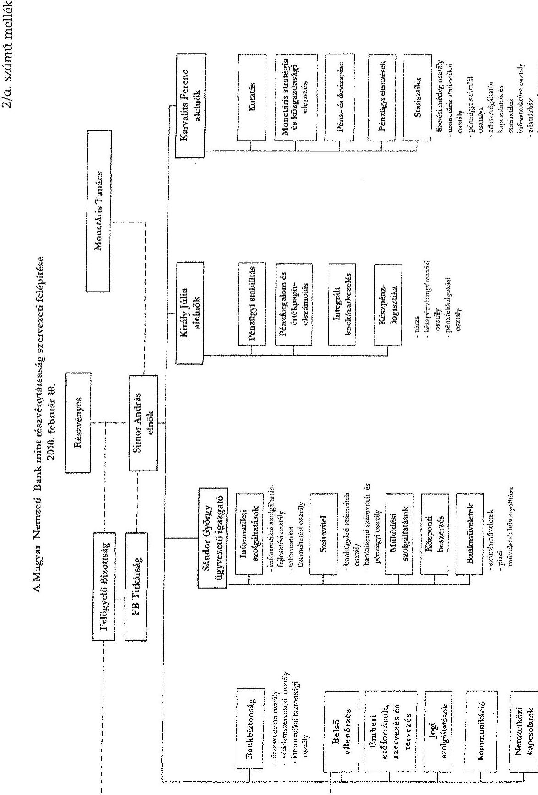

---

2/b. számú melléklet

A Magyar Nemzeti Bank mint részvénytársaság szervezeti felépítése
2010. április 1.

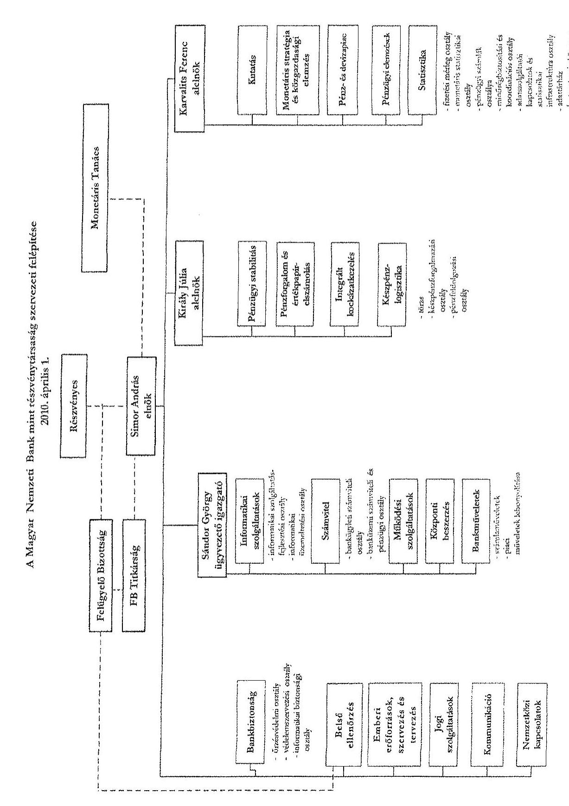

---

# Az átlagkeresetek alakulása a 2009-2010. években

|  Megnevezés | Átlagos állományi létszám (fő) (KSH) |  | Átlagkeresetek |  | Eltérés 2010.-2009. | Index (\%) 2010./2009.  |
| --- | --- | --- | --- | --- | --- | --- |
|   | 2009. | 2010. | 2009. | 2010. |  |   |
|  Elnök, alelnökök, Monetáris Tanács külső tagjai | 9,26 | 7,34 | 4068 247* | 3443695 | $-624552$ | 84,6  |
|  Ügyvezető igazgató, szervezeti egységvezetők | 19,85 | 21,8 | 2526129 | 2443089 | $-83040$ | 96,7  |
|  Vezetők összesen | 29,11 | 29,14 | 3016682 | 2695129 | $-321553$ | 89,3  |
|  Beosztott dolgozók | 575,79 | 562,27 | 528433 | 544473 | 16040 | 103,4  |
|  Bank összesen | 604,9 | 591,41 | 644852 | 649724 | 4872 | 100,8  |

*A Monetáris Tanács külső tagjai 2009. évi keresetének szerkezetét a 2010. évi kereset szerkezetnek megfelelően módosította az ellenőrzés annak érdekében, hogy az átlagos személyi alapbér változás csak az MNB törvény módosításának eredményét mutassa.

---

# A Bank személyi jellegű ráfordításainak 2010. évi terve 

|  |  |  |  | Adatok: M Ft-ban |
| :--: | :--: | :--: | :--: | :--: |
| Megnevezés | 2009. év várható | 2010. év   terv | Változás a várható értékekhez | Index (\%)   (terv/várható) |
| Állományba tartozók bérköltsége | 4446,1 | 4511,0 | 64,9 | 101,5 |
| Egyéb bérköltség | 359,1 | 190,0 | $-169,1$ | 52,9 |
| Személyi jellegű egyéb kifizetések | 1067,9 | 924,1 | $-143,8$ | 86,5 |
|  | Választható béren kívüli juttatások | 303,0 | 348,5 | 45,5 | 115,0 |
|  | Alapjuttatások és jóléti költségek | 567,7 | 347,1 | $-220,6$ | 61,1 |
|  | Egyéb nem rendszeres kifizetések | 127,7 | 126,5 | $-1,2$ | 99,1 |
|  | Reprezentáció | 37,9 | 68,5 | 30,6 | 180,7 |
|  | Kiküldetéshez kapcsolódó napidíjak, költségek megtérítése | 31,6 | 33,5 | 1,9 | 106,0 |
| Járulékok |  | 1805,8 | 1491,2 | $-314,6$ | 82,6 |
| Személyi jellegü ráfordítások összesen |  | 7678,9 | 7116,3 | $-562,6$ | 92,7 |

---

# A Bank további bérfejlesztési intézkedésének hatása a tervezett személyi jellegű ráfordításokra 

Adatok: M Ft-ban

| Megnevezés |  | 2010. december 15-én jóváhagyott 2010. évi személyi jellegü ráfordítások | 2011. január 5én módosított személyi jellegü ráfordítások | A személyi jellegü ráfordítások növekedése a bérfejlesztés mértékének megemelése hatására |
| :--: | :--: | :--: | :--: | :--: |
| Allományba tartozók bérköltsége |  | 4511,0 | 4567,0 | 56,0 |
|  | Foglalkoztatottak alapbére | 3695,2 | 3743,2 | 48,0 |
|  | Foglalkoztatottak bónusz költsége | 772,7 | 780,3 | 7,6 |
|  | Foglalkoztatottak bérpótléka | 43,1 | 43,5 | 0,4 |
| Egyéb bérköltségek |  | 190,0 | 190,9 | 0,9 |
| Alapjuttatások és jóléti költségek |  | 347,1 | 349,6 | 2,5 |
| Egyéb nem rendszeres   kifizetések |  | 126,5 | 127,8 | 1,3 |
| Járulékok |  | 1491,2 | 1507,8 | 16,6 |
| Személyi jellegű ráfordítások a bemutatott változtatások hatására összesen |  | 7 116,3 | 7 193,6 | 77,3 |
| A bérfejlesztés változás hatása a központi tartalékra |  |  |  | 1,2 |

---

6. számú melléklet

# Az MNB 2010. évben elszámolt személyi jellegű ráfordításainak alakulása

|  Adatok: M Ft-ban |  |  |  |  |  |  |   |
| --- | --- | --- | --- | --- | --- | --- | --- |
|  Megnevezés | 2009-ben
elszámolt | 2010. évi
módosított
terv | 2010-ben
elszámolt | Eltérés |  | Index (\%) |   |
|   |  |  |  | 2009.
évhez | Tervhez | 2009.
évhez | Tervhez  |
|  Állományba tartozók bérköltsége | 4470,6 | 4567,0 | 4492,5 | 21,9 | $-74,5$ | 100,5 | 98,4  |
|  Egyéb bérköltség | 357,2 | 190,9 | 226,2 | $-131,0$ | 35,3 | 63,3 | 118,5  |
|  Személyi jellegű egyéb kifizetések | 1060,5 | 927,9 | 845,5 | $-215,0$ | $-82,4$ | 79,7 | 91,1  |
|  VBK | 303,4 | 348,5 | 353,1 | 49,7 | 4,6 | 116,4 | 101,3  |
|  Alapjuttatások és jóléti költségek | 565,2 | 349,6 | 348,1 | $-217,1$ | $-1,5$ | 61,6 | 99,6  |
|  Egyéb nem rendszeres kifizetések | 134,2 | 127,8 | 58,9 | $-75,3$ | $-68,9$ | 43,9 | 46,1  |
|  Reprezentáció | 26,3 | 68,5 | 52,7 | 26,4 | $-15,8$ | 200,4 | 76,9  |
|  Kiküldetéshez kapcsolódó napidíjak, költségek megítéítése | 31,4 | 33,5 | 32,7 | 1,3 | $-0,8$ | 104,1 | 97,6  |
|  Járulékok | 1772,4 | 1507,8 | 1442,8 | $-329,6$ | $-65,0$ | 81,4 | 95,7  |
|  Személyi jellegű ráfordítások összesen | 7660,7 | 7193,6 | 7007,0 | $-653,7$ | $-186,6$ | 91,5 | 97,4  |

---

# Az MNB 2010. évi tervezett és elszámolt beruházási kiadásainak stratégiai célok szerinti alakulása 

Adatok: M Ft-ban

| Megnevezés | Jóváhagyott aktualizált elöirányzat | Ebböl:   korábbi   évek   kiadásai | Ebböl:   2010. éves elöirányzat | 2010.   éves   tény   kiadás | Eltérés 2010. tény elöirányzat | Elmaradás /   túllépés az elörejelzéshez képest   $\%$ |
| :--: | :--: | :--: | :--: | :--: | :--: | :--: |
|  | (1.) | (2.) | (3.) | (4.) | 5. | 6. |
|  |  |  |  |  | (4.-3.) | (5./3.) |
| 1. A Bank kiemelt stratégiai céljaihoz közvetlenül kapcsolható beruházások | 3944,0 | 832,6 | 1672,8 | 1606,4 | $-66,4$ | $-4,0$ |
| 1.1. A monetáris döntéstámogató rendszer hatékonyságának fejlesztése | 72,7 | 0,0 | 30,1 | 98,0 | 67,9 | 225,6 |
| 1.2. A pénzügyi stabilitási funkció egyre magasabb szintű ellátása | 8,6 | 0,0 | 0,0 | 0,0 | 0,0 | 0,0 |
| 1.3. A fizetési és értékpapírelszámolási rendszerek keretének fejlesztése | 96,0 | 0,0 | 38,0 | 19,7 | $-18,3$ | $-48,2$ |
| 1.4. Felkészülés az euro bevezetésére | 1,5 | 0,0 | 0,0 | 0,0 | 0,0 | 0,0 |
| 1.5. A hitelesség fejlesztése | 125,9 | 17,6 | 65,4 | 83,6 | 18,2 | 27,8 |
| 1.6. Eredményesség és hatékonyság fejlesztése | 1976,4 | 807,1 | 464,4 | 523,3 | 58,9 | 12,7 |
| 1.7. Együttmüködés fejlesztése | 12,6 | 0,0 | 12,6 | 12,6 | 0,0 | 0,0 |
| 1.8. A szakterületek informatikai támogatottságának fejlesztése | 1572,3 | 7,9 | 984,3 | 846,4 | $-137,9$ | $-14,0$ |
| 1.9. A kontrolling fejlesztése, a folyamatok mérhetőségének megteremtése, a hatékonyság, a minőség és az átláthatóság javítása | 20,0 | 0,0 | 20,0 | 22,8 | 2,8 | 14,0 |
| 1.10. Törekvés a müködési kiválóságra, legalább egy jegybanki funkciónak az európai élvonalba történő emelése | 58,0 | 0,0 | 58,0 | 0,0 | $-58,0$ | $-100,0$ |

---

| 2. A Bank kiemelt stratégiai céljaihoz közvetlenül nem kapcsolódó, mindennapi múködéshez szükséges beruházások | 961,1 | 1,8 | 244,5 | 232,7 | $-11,8$ | $-4,8$ |
| :--: | :--: | :--: | :--: | :--: | :--: | :--: |
| 2.1. Biztonságtechnikai környezet | 207,4 | 0,0 | 38,6 | 42,1 | 3,5 | 9,1 |
| 2.2. Múködéshez szükséges egyéb informatikai beruházások | 0,0 | 0,0 | 0,0 | 0,0 | 0,0 | 0,0 |
| 2.3. Ingatlanok állagmegőrzése | 424,5 | 1,8 | 93,7 | 37,6 | $-56,1$ | $-59,9$ |
| 2.4. Készpénz-logisztikai stratégiával kapcsolatos beruházások | 16,0 | 0,0 | 11,0 | 0,9 | $-10,1$ | $-91,8$ |
| 2.5. Egyéb tárgyi eszközök beszerzése | 313,2 | 0,0 | 101,2 | 152,1 | 50,9 | 50,3 |
| Beruházások összesen | 4905,1 | 834,4 | 1917,3 | 1839,1 | $-78,2$ | $-4,1$ |

---

# TANÚSÍTVÁNYOK   (1-5.)

---

.

---

# Tanúsítványok jegyzéke 

| Sorsz.: | Megnevezés |
| :--: | :-- |
| 1. sz. | Az MNB múködési költségeinek alakulása |
| 2. sz. | A banküzemi bevételek és ráfordítások alakulása |
| 3. sz. | Az eszközmozgás alakulása |
| 4. sz. | A befektetések és a befektetésekből származó osztalékok alakulása |
| 5. sz. | Az MNB elszámolásai a központi költségvetéssel |

---

# Az MNB működési költségeinek alakulása

Adatok: E Ft-ban

|  Megnevezés | 2009. évi tény | 2010. évi tény | 2010. évi módosított tény | 2010. éves tény | Index (2010. tény / 2009. tény) | Index (2010. tény / 2010. tény)  |
| --- | --- | --- | --- | --- | --- | --- |
|  1. Személyi jellegű ráfordítások |  |  |  |  |  |   |
|  Alományos tartozók bérköltsége | 4 470 568,4 | 4 510 936,9 | 4 566 967,7 | 4 492 388,8 | 100,5% | 98,4%  |
|  Egyéb bérköltség | 257 212,1 | 189 998,1 | 190 860,1 | 226 214,5 | 63,3% | 118,5%  |
|  Személyi jellegű egyéb kifizetések | 1 060 493,4 | 924 129,6 | 927 873,6 | 845 537,3 | 79,7% | 91,1%  |
|  Választható béren kívüli juttatások | 303 383,5 | 348 478,3 | 348 478,3 | 353 141,5 | 116,4% | 101,3%  |
|  Alapjuttatások és jólati költségek | 565 194,0 | 347 151,6 | 349 563,4 | 348 041,1 | 61,6% | 99,6%  |
|  Egyéb nem rendszeres kifizetés | 134 203,3 | 126 481,5 | 127 813,7 | 58 889,7 | 43,9% | 46,1%  |
|  Képrezentáció | 26 349,2 | 68 464,0 | 68 464,0 | 52 738,0 | 200,1% | 77,0%  |
|  Kiküldetéshez kapcsolódó napdíjok, költségek megtér | 31 363,3 | 33 554,1 | 33 554,1 | 32 726,9 | 104,3% | 97,5%  |
|  Járszéltős | 1 772 450,8 | 1 491 194,4 | 1 507 853,0 | 1 442 827,0 | 81,4% | 95,7%  |
|  1. Személyi jellegű ráfordítások összesen | 7 660 724,8 | 7 116 258,9 | 7 193 554,3 | 7 006 967,7 | 91,5% | 97,4%  |
|  2. IT költségek |  |  |  |  |  |   |
|  Hardver- és telekommunikációs eszközök | 158 173,2 | 160 652,0 | 160 652,0 | 129 406,6 | 81,8% | 80,6%  |
|  Szoftverés | 690 586,4 | 740 107,0 | 740 107,0 | 698 039,9 | 101,1% | 94,3%  |
|  Adatátviteli díjak | 116 765,3 | 115 560,0 | 115 560,0 | 75 790,9 | 64,9% | 65,6%  |
|  Hírszolgálati díjak | 280 096,6 | 265 988,0 | 265 988,0 | 274 768,8 | 98,1% | 103,3%  |
|  Tanácsadói díjak | 54 390,9 | 91 844,0 | 91 844,0 | 41 000,9 | 75,4% | 44,6%  |
|  2. IT költségek összesen | 1 300 013,4 | 1 374 151,0 | 1 374 151,0 | 1 219 007,3 | 93,8% | 88,7%  |
|  3. Üzemeltetési költségek |  |  |  |  |  |   |
|  Ingatlan költségek | 1 076 725,6 | 1 099 117,6 | 1 099 117,6 | 1 028 040,7 | 95,5% | 93,5%  |
|  Készpénzlogisztikai gépek, berendezések | 254 542,3 | 258 246,2 | 258 246,2 | 243 124,9 | 95,5% | 94,1%  |
|  Egyéb gépek, tárgyi eszközök | 52 099,4 | 58 009,1 | 58 009,1 | 50 869,0 | 97,6% | 87,7%  |
|  Járművek | 41 891,1 | 54 384,9 | 54 384,9 | 49 991,4 | 119,3% | 91,9%  |
|  Telefon, posta | 64 199,7 | 68 022,6 | 68 022,6 | 54 516,0 | 84,9% | 80,1%  |
|  Pénzszállítás | 8 090,1 | 10 551,1 | 10 551,1 | 4 874,7 | 60,3% | 46,2%  |
|  Nyomtatványok, irodaszerek és admin. anyagok | 16 048,0 | 16 800,0 | 16 800,0 | 18 047,7 | 112,5% | 107,4%  |
|  Vagyonbiztosítás | 6 222,2 | 5 476,9 | 5 476,9 | 5 048,1 | 81,1% | 92,2%  |
|  Tanácsadói díjak | 22 405,4 | 21 554,0 | 21 554,0 | 10 069,0 | 44,9% | 46,7%  |
|  Egyéb költségek | 82 822,2 | 107 254,3 | 107 254,3 | 85 788,6 | 103,6% | 80,0%  |
|  3. Üzemeltetési költségek összesen | 1 625 047,1 | 1 699 416,8 | 1 699 416,8 | 1 550 370,0 | 95,4% | 91,2%  |
|  4. Értékcsökkenés |  |  |  |  |  |   |
|  Tárgyi eszközök | 1 429 730,7 | 1 370 834,8 | 1 370 834,8 | 1 361 539,2 | 95,2% | 99,3%  |
|  Immateriális javak | 1 049 198,8 | 883 682,2 | 883 682,2 | 818 861,6 | 59,0% | 92,7%  |
|  4. Értékcsökkenés összesen | 2 478 929,5 | 2 254 517,0 | 2 254 517,0 | 2 180 400,9 | 88,0% | 96,7%  |
|  5. Egyéb költségek |  |  |  |  |  |   |
|  Hatóság díjak | 335,7 | 50,0 | 50,0 | 161,8 | 48,2% | 323,7%  |
|  Tagsági díjak | 41 484,4 | 45 336,1 | 45 336,1 | 46 553,5 | 112,2% | 102,7%  |
|  Jogi költségek | 55 764,6 | 65 686,0 | 65 686,0 | 225 907,8 | 405,1% | 343,9%  |
|  Audit | 34 681,2 | 34 615,0 | 34 615,0 | 36 311,3 | 104,7% | 104,9%  |
|  Közgazdasági tanácsadás, adatvásárlás | 53 197,7 | 44 143,0 | 44 143,0 | 43 346,8 | 81,5% | 98,2%  |
|  Kommunikáció | 332 886,6 | 319 397,1 | 293 458,6 | 235 730,9 | 101,2% | 80,3%  |
|  Újság, szakkönyv | 48 429,2 | 55 000,0 | 55 000,0 | 51 974,8 | 107,3% | 94,5%  |
|  Konferenciák | 18 479,2 | 15 400,0 | 15 400,0 | 13 271,4 | 71,8% | 86,2%  |
|  Egyéb kiküldetési költségek | 132 198,5 | 147 816,0 | 147 816,0 | 126 140,9 | 95,4% | 85,3%  |
|  Oktatás | 133 588,3 | 117 257,5 | 117 257,5 | 127 807,6 | 95,7% | 109,0%  |
|  Embert erőforrásokkal kapcsolatos egyéb költségek | 50 891,3 | 38 037,1 | 38 037,1 | 41 587,2 | 81,7% | 109,3%  |
|  Egyéb vegyes költségek | 6 572,1 | 54 162,9 | 54 162,9 | 7 712,6 | 117,4% | 14,2%  |
|  5. Egyéb költségek összesen | 808 508,8 | 936 900,6 | 910 962,1 | 956 506,6 | 118,3% | 105,0%  |
|  6. Átvezetések összesen | -145 728,6 | -132 281,7 | -132 281,7 | -130 215,8 | 89,4% | 98,4%  |
|  7. Költségek összesen | 13 727 493,9 | 13 248 962,7 | 13 300 319,6 | 12 783 036,5 | 93,1% | 96,1%  |
|  8. Tartalék |  | 198 734,4 | 199 504,8 |  |  |   |
|  9. Költségek fölisszego | 13 727 493,9 | 13 447 697,1 | 13 499 824,4 | 12 783 036,5 | 93,1% | 94,7%  |

A Yenti adatok az első számviteli nyilvántartásaival megegyeznek.

Budapest, 2011. április

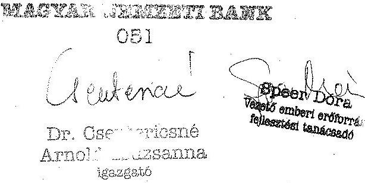

---

# A banküzemi bevételek és ráfordítások alakulása

Adatok: E Ft-ban

|  Megnevezés | 2009. évi tény | 2010. évi tény | Index % 2010/2009  |
| --- | --- | --- | --- |
|  Exportértékesítés árbevétele | 2 079 | 2 511 | 121%  |
|  Befektetés értékesítésének árfolyamnyeresége | 0 | 0 |   |
|  Eszköz- és készletértékesítés bevétele | 1 246 402 | 8 009 | 1%  |
|  Közvetített szolgáltatás bevétele | 30 064 | 32 399 | 108%  |
|  Kiszámlázott szolgáltatások bevétele | 148 544 | 133 910 | 90%  |
|  Egyéb bevételek | 309 796 | 12 772 | 4%  |
|  Rendkívüli bevételek | 1 476 | 0 | 0%  |
|  **Banküzem bevételei összesen** | 1 738 361 | 189 601 | 11%  |
|  Anyagjellegű ráfordítások | 3 841 113 | 3 834 789 | 100%  |
|  Személyi jellegű ráfordítások | 7 660 724 | 7 009 049 | 91%  |
|  Értékcsökkenési leírás | 2 482 276 | 2 180 401 | 88%  |
|  Eszközök aktivált értéke | 0 | 0 |   |
|  Egyéb tevékenység önköltségének átvezetése | -256 620 | -241 202 | 94%  |
|  **Banküzem működési költségei összesen** | 13 727 493 | 12 783 037 | 93%  |
|  Befektetés értékesítésének árfolyamvesztesége | 0 | 0 |   |
|  Eszközök és készletek miatti ráfordítások | 1 273 257 | 34 625 | 3%  |
|  Kiszámlázott szolgáltatások ráfordításai | 145 729 | 129 769 | 89%  |
|  Eredményt terhelő adók | 8 922 | 4 865 | 55%  |
|  Térítés nélkül átadott eszközök | 0 | 0 |   |
|  Egyéb ráfordítások | 0 | 2 236 |   |
|  **Banküzem működési ráfordításai összesen** | 1 427 908 | 171 495 | 12%  |
|  **Banküzem működési költségei és ráfordításai mindösszesen** | 15 155 401 | 12 954 532 | 85%  |

A fenti adatok az MNB számviteli nyilvántartásaival megegyeznek.

Budapest, 2011. április 21.

*Magyab Nemzeti Bank*

*005*

*Kása Orsolya*

*Bankügyleti számviteli vezetőjre*

---

Az eszközmorgás alakulása

Adatok: E Fbban

|  |   |   |   |   |   |   |   |   |   |   |   |   |   |   |   |   |   |   |   |   |   |   |   |   |   |   |   |   |   |   |   |   |   |   |   |   |   |   |   |   |   |   |   |   |   |   |   |   |   |   |   |   |   |   |   |   |   |   |   |   |   |   |   |   |   |   |   |   |   |   |   |   |   |   |   |   |   |   |   |   |   |   |   |   |   |   |   |   |   |   |   |   |   |   |   |   |   |   |   |   |  

---

### 4. számú tanúsítvány

### A befektetések és a befektetésekből származó osztalékok alakulása

|  Sorszám | Megnevezés | Tulajdonosi hányad (%) | Könyv szerinti érték | Kapott osztalék *  |
| --- | --- | --- | --- | --- |
|   |  | 2009.12.31. | 2010.12.31. | 2009.12.31.  |
|  1 | Belföldi befektetések: |  |  |   |
|  2 | Budapesti Értéktőzsde | 6,94939 | 6,94939 | 321 104  |
|  3 | GÍRO Elszámolásforgalmi Zrt | 7,2917 | 7,2917 | 45 710  |
|  4 | KELER Zrt | 53,3 | 53,3 | 642 667  |
|  5 | KELER KSZF KFT | 13,6 | 13,6 | 6 800  |
|  6 | Magyar Pénzverő Zrt | 100 | 100 | 575 000  |
|  7 | Pénzjegynyomda Zrt | 100 | 100 | 8 927 000  |
|  8 | Belföldi befektetések összesen: |  |  | 10 518 281  |
|  9 | Külföldi befektetések: |  |  |   |
|  10 | BIS BASEL | Ft-ban |  | 5 403 446  |
|   |  | ezer XDR-ben: | 1,33 | 1,33  |
|  11 | Európai Központi Bank | Ft-ban | 0,1 | 0,1  |
|   |  | ezer EUR-ban |  | 1 513 284  |
|  12 | SWIFT | Ft-ban |  | 2 335  |
|   |  | ezer EUR-ban | 0,02 | 0,02  |
|  13 | Külföldi befektetések összesen forintban: |  |  | 6 919 065  |
|   | Befektetések mindösszesen: |  |  | 17 437 346  |

- Az előző évi eredmény után a tárgyévben elszámolt osztalék

* A befektetés pénznemében

A fenti adatok az MNB számviteli nyilvántartásaival megegyeznek.

Budapest, 2011. április 18.

Kálma Gábor Számviteli vezetője

006

Kísa Orsolya Banktágrási számviteli vezető

---

# Az MNB elszámolásai a központi költségvetéssel

|  Megnevezés | 2009.12.31. | 2010.12.31. | Adatok: E Ft-ban  |
| --- | --- | --- | --- |
|  Osztalékfizetés* (a részvényes döntése alapján) | 0 | N/A | Változás  |
|  Az MNB mérleg szerinti eredményéhez fűződő elszámolás** |  |  |   |
|  Mérleg szerinti eredmény (amennyiben veszteség) | 0 | -41 577 182 | -41 577 182  |
|  Eredménytartalék igénybevétele veszteség fedezetére | 0 | 41 577 182 | 41 577 182  |
|  Központi költségvetés térítési kötelezettsége | 0 | 0 | 0  |
|  kiegyenlítési tartalékok |  |  |   |
|  Forintárfolyam kiegyenlítési tartaléka | 230 792 216 | 415 937 199 | 185 144 983  |
|  Központi költségvetés térítési kötelezettsége (negatív kiegyenlítési tartalék esetén)*** | 0 | 0 | 0  |
|  Deviza-értékpapírok kiegyenlítési tartaléka | 21 514 891 | -29 141 663 | -50 656 554  |
|  Központi költségvetés térítési kötelezettsége (negatív kiegyenlítési tartalék esetén)*** | 0 | 29 141 663 | 29 141 663  |
|  Kincstári egységes számlához kapcsolódó kamatfizetések |  |  |   |
|  Forintállomány után fizetett kamatok | 36 373 485 | 23 295 926 | -13 077 559  |
|  Devizaállomány után fizetett kamatok | 9 905 168 | 2 322 174 | -7 582 994  |
|  Államadósság Kezelő Központ Zrt. számlájához kapcsolódó kamatfizetések |  |  |   |
|  Forintállomány után fizetett kamatok | 34 598 | 23 259 | -11 339  |
|  Devizaállomány után fizetett kamatok | 83 163 | 1 404 | -81 759  |

*A Magyar Nemzeti Bankról szóló 2001. évi LVIII. törvény 65. § (1)

*A Magyar Nemzeti Bankról szóló 2001. évi LVIII. törvény 65. § (3)

**A Magyar Nemzeti Bankról szóló 2001. évi LVIII. törvény 17. § (4-5)

A fenti adatok az MNB számviteli nyilvántartásaival megegyeznek.

Budapest, 2011. április 21.

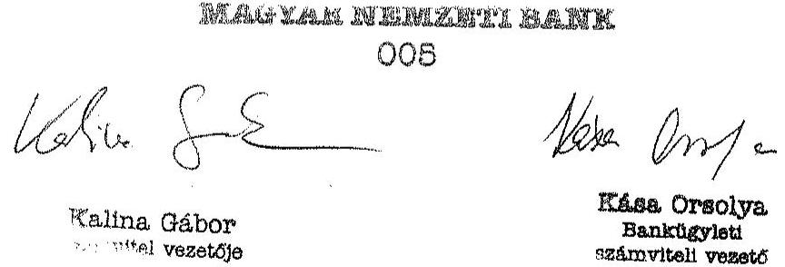