# TÁJÉKOZTATÓ 

az európai uniós támogatások 2010. évi felhasználásának ellenőrzéséről
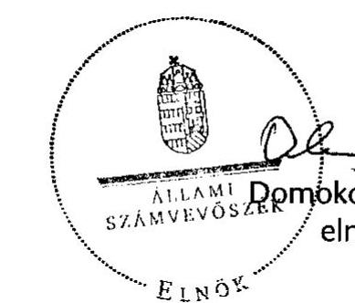

---

# Erőforrás-Gazdálkodási Főigazgató   Számvevői Iroda 

Iktatószám: VE-004-043/2011

## A Tájékoztató elkészítését felügyelte:

Dr. Zöldréti Attila
számvevő igazgatóhelyettes
A Tájékoztató összeállítását vezette:
Bartolák Márta
számvevő főtanácsos
A Tájékoztató összeállításában részt vettek:

| Laczkovich Rita | Terbe Mónika | Trubiánszki Hajnalka |
| :-- | :-- | :-- |
| számvevő tanácsos | számvevő tanácsos | számvevő gyakornok |

---

# TARTALOMJEGYZÉK 

BEVEZETÉS ..... 3
AZ UNIÓS FORRÁSOK FELHASZNÁLÁSÁNAK ÉRTÉKELÉSE NÉHÁNY INDIKÁTOR MENTÉN ..... 5
ÖSSZEGZŐ ÉRTÉKELÉS, KÖVETKEZTETÉSEK ..... 9

1. Uniós kitekintés a 2009-es adatok tükrében ..... 9
2. Magyarország és az EU pénzügyi kapcsolatai 2004-2010 között ..... 12
3. Az uniós támogatások hazai feltételrendszere ..... 15
4. Az Európai Uniós források felhasználásával kapcsolatos, a 2010-es évre vonatkozó ellenőrzések és jelentések legfontosabb megállapításai, következtetései ..... 22

## MELLÉKLETEK

1. sz. Rövidítésjegyzék
2. sz. Magyarország és az Európai Unió közötti költségvetési kapcsolatok 2004-2010
3/A. sz. A Magyar Köztársaság 2010. évi költségvetésének végrehajtásáról szóló törvényjavaslatban megjelenő EU-támogatások és a hozzájuk kapcsolódó hazai finanszírozás összege
3/B. sz. A költségvetésen kívüli finanszírozással lebonyolított EU-támogatások
3. sz. A strukturális és agrártámogatások hazai irányítási és ellenőrzési rendszere
4. sz. A Tájékoztató alapjául szolgáló, 2010. évre vonatkozó ellenőrzések, jelentések és beszámolók

---

.

---

# BEVEZETÉS 

A Tájékoztató - összhangban az európai uniós országok számvevőszékeinek elnökeiből álló Kapcsolattartó Bizottság ${ }^{1}$ törekvéseivel, valamint az Állami Számvevőszék (ÁSZ) 2004. évi tevékenységéről szóló jelentés elfogadásáról szóló 43/2005. (V. 26.) OGY határozat 4. pontjában előírtakkal - bemutatja Magyarország európai uniós pénzügyi kapcsolatait és a támogatásokkal kapcsolatos ellenőrzések 2010-es tapasztalatait. Az OGY határozat előírja, hogy az Állami Számvevőszék a teljes uniós pénzfelhasználás gyakorlatáról adjon átfogó képet, ennek keretében az uniós forrásokkal összefüggő pénzmozgások ellenőrzését végző hazai szervezetek munkáját szakmai szempontból tekintse át és mutassa be az ellenőrzések tapasztalatait.

A 2010. évről szóló Tájékoztató immár a hatodik a sorban, amely időintervallum megfelelő alapul szolgál a trendek bemutatására. A Tájékoztató eredeti célkitűzésének megfelelően az ÁSZ elnöke döntött arról, hogy a Tájékoztatóban erősíteni kell az uniós pénzeszközök felhasználásával kapcsolatos tendenciák bemutatását, ennek érdekében olyan indikátorokat alakítottunk ki és használunk, amelyek nyomon követik az európai uniós támogatások felhasználásának változásait. Jelen Tájékoztatóban néhány kiemelt - számszerűsített és nem számszerűsíthető - indikátor mentén és azok értékelése útján mutatjuk be az elmúlt évek főbb tendenciáit.

A Tájékoztató időhorizontját tekintve továbbra is követtük azt az alapelvet, hogy az egyes témakörök bemutatása során a 2010. évhez kapcsolódó információkat és adatokat, illetve ellenőrzési megállapításokat helyezzük a középpontba. A Tájékoztató legfőbb céljának teljesítése - az átfogó és objektív kép kialakításának biztosítása - érdekében kitekintünk a 2011. évi aktuális eseményekre.

A tagállami beszámolók és adatszolgáltatások feldolgozásán alapuló éves jelentéseket az Európai Bizottság a tárgyévet követő második év elején teszi közzé, ennek következtében a nemzetközi összehasonlító adatok jelen Tájékoztatónk elkészítésének időpontjában 2009. évre vonatkozóan álltak rendelkezésre. A Tájékoztató elemzi Magyarország támogatás-felhasználását (abszorpciós képességét), nettó pozícióját, valamint bemutatjuk a legfontosabb uniós szintű fejleményeket.

A Tájékoztató bemutatja a különböző szervezetek feladat- és hatáskörét, az ellenőrzések során betöltött szerepét. Az intézményrendszer szereplői jelen Tájékoztatóban egységesen a tárgyidőszakban, azaz a 2010-ben érvényes struktú-

[^0]
[^0]:    ${ }^{1}$ A Kapcsolattartó Bizottság több határozatában megerősítette, hogy az EU tagállamok parlamentjeinek saját, illetve a tagállamok közös érdekében áll az EU Alapok ellenőrzésének fejlesztése. Ennek egyik lényeges eleme, hogy a független nemzeti számvevőszékek készítsenek jelentést az EU pénzeszközök tárgyévi tagállami felhasználásáról és a gazdálkodás fejlesztéséről. Ez közvetve és közvetlenül is hozzájárulhat az EU költségvetés hatékonyabb, átláthatóbb felhasználásához.

---

rában és megnevezésekkel jelennek meg. Az átláthatóság érdekében bemutatjuk Magyarországnak az EU költségvetésébe történő befizetéseit, továbbá a Magyar Köztársaság központi költségvetésében megjelenő és a költségvetésen kívüli tételként szereplő támogatások felhasználását. A szabálytalanság kérdéskörét a Tájékoztató kiemelten kezeli. A teljes körűség érdekében a Tájékoztatóban az uniós tagsághoz közvetetten kapcsolódó alapokról (EGT/Norvég Finanszírozási Mechanizmusok, Svájci-magyar Együttműködési Program) is beszámolunk.

A Tájékoztató összeállításához mind a belső, mind a külső, valamint a hazai és az uniós ellenőrzési intézményrendszer tapasztalatait felhasználtuk. Bár ezek közül néhány ellenőrzés (pl. ÁSZ) eredményei nyilvánosak, de az átfogó kép kialakítása érdekében szükségesnek tartottuk ezek ismertetését is. Az Európai Bizottság, az Ellenőrzési Hatóság/Zárónyilatkozat Kiadásáért Felelős Szerv és a belső ellenőrzési egységek ellenőrzési eredményei szintetizáltan jelennek meg a Tájékoztatóban, mivel jelentéseik nem nyilvánosak ${ }^{2}$.

A 2010. év nagy kihívása volt Magyarország számára, hogy a romló gazdasági helyzetben a 2007-2013-as EU költségvetési periódus forrásainak lehívását nagyságrendileg megnövelje. 2010-ben sikeresen megtörtént a Nemzeti Fejlesztési Terv pénzügyi zárása, amely összességében a források szinte teljes lekötését eredményezte. A zárás folyamata azonban felhívta a figyelmet arra, hogy az intézményrendszer szereplőinek összehangoltabb működésére van szükség, illetve a jövőben nagyobb hangsúlyt kell helyezni a források hatékony és eredményes felhasználására, valamint a szabálytalanság- és követeléskezelési folyamatokra.

Együttműködésükért, segítőkészségükért ezúton mondunk köszönetet a Nemzetgazdasági Minisztérium, a Magyar Államkincstár, az Európai Támogatásokat Auditáló Főigazgatóság, a Nemzeti Fejlesztési Ügynökség, a Vidékfejlesztési Minisztérium, a Mezőgazdasági és Vidékfejlesztési Hivatal, valamint a Nemzeti Adó- és Vámhivatal vezetőinek és munkatársainak.

[^0]
[^0]:    ${ }^{2}$ A Tájékoztató alapjául szolgáló jelentések és beszámolók listáját az 5. sz. melléklet tartalmazza.

---

# AZ UNIÓS FORRÁSOK FELHASZNÁLÁSÁNAK ÉRTÉKELÉSE NÉHÁNY INDIKÁTOR MENTÉN 

A Tájékoztató célja, hogy átfogó képet adjon az európai uniós források felhasználásáról, az ellenőrzését végző hazai szervezetek munkájáról, az ellenőrzések tapasztalatairól. A több éve azonos tartalommal és szerkezetben készülő elemzés lehetőséget ad a tendenciák és trendek bemutatására, amelyeket jól tükröz a főbb tématerületekre fókuszáló alábbi hat indikátor.

## 1. Abszorpció nemzetközi összehasonlításban

1.1. Strukturális Alapok
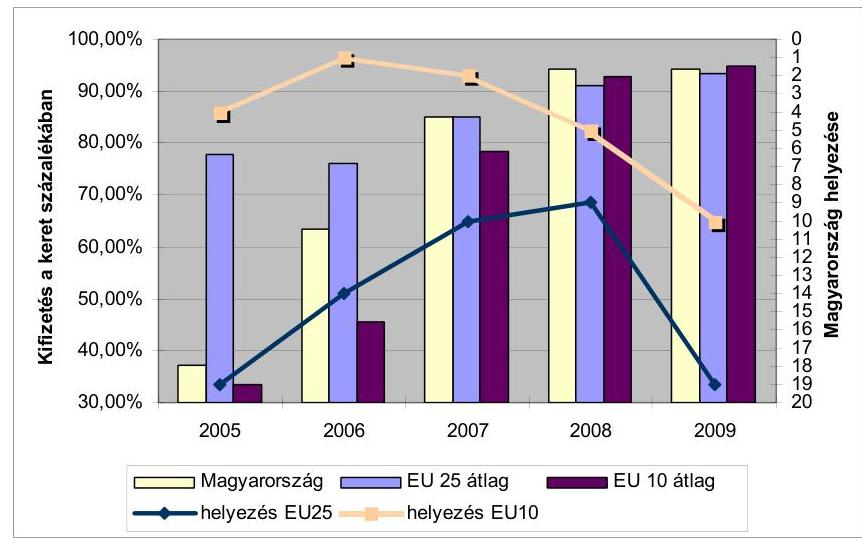

Forrás: Európai Bizottság
1.2. Kohéziós Alap
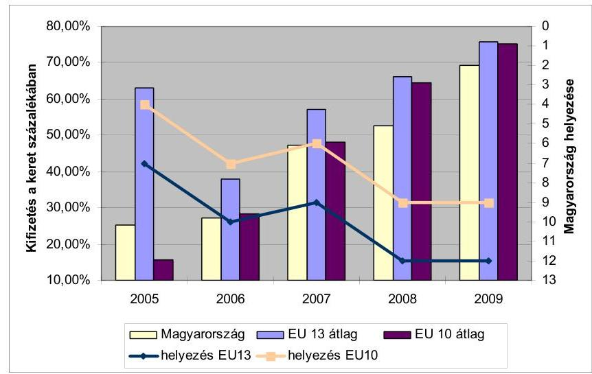

Forrás: Európai Bizottság

A strukturális alapok kifizetéseinek tekintetében hazánk a 2006-2007 kiemelkedő arányának kivételével a középmezőnyben teljesített. 2009 végére 94,12%-os kifizetési aránnyal az EU25 között a 18. helyen zárta az időszakot - alig elmaradva a 95%-os maximális szinttől.

A Kohéziós Alap kifizetéseit tekintve a csatlakozástól számítva hazánk a többi tagállamhoz viszonyítva egyre romló tendenciát mutatott. 2008-2009-ben Magyarország az alsó harmadban helyezkedett el, csupán Lengyelországot és a 2007-ben csatlakozott két tagállamot előzte meg.

---

# 2. Éves összegző jelentések értékelése 

Magyarország évről évre eleget tesz az éves összegző jelentésre vonatkozó bizottsági követelményeknek.

| Értékelési szempont | $\mathbf{2 0 0 8}$ | $\mathbf{2 0 0 9}$ | $\mathbf{2 0 1 0}$ |
| :-- | :--: | :--: | :--: |
| Éves összegző jelentés beadva a Bizottság számára | $\checkmark$ | $\checkmark$ | $\checkmark$ |
| Elkészítés a Bizottság által megadott sablon alapján | $\checkmark$ | $\checkmark$ | $\checkmark$ |
| Átfogó elemzés önkéntes alapon | $\checkmark$ | $\checkmark$ | $\checkmark$ |
| Megbízhatósági nyilatkozat önkéntes alapon | $\checkmark$ | $\checkmark$ | $\checkmark$ |
| Megfelelés a minimum követelményeknek | $\checkmark$ | $\checkmark$ | $\checkmark$ |
| EU Bizottság általi elfogadás | $\checkmark$ | $\checkmark$ | $\checkmark$ |

## 3. Magyarország és az EU közötti költségvetési kapcsolatok

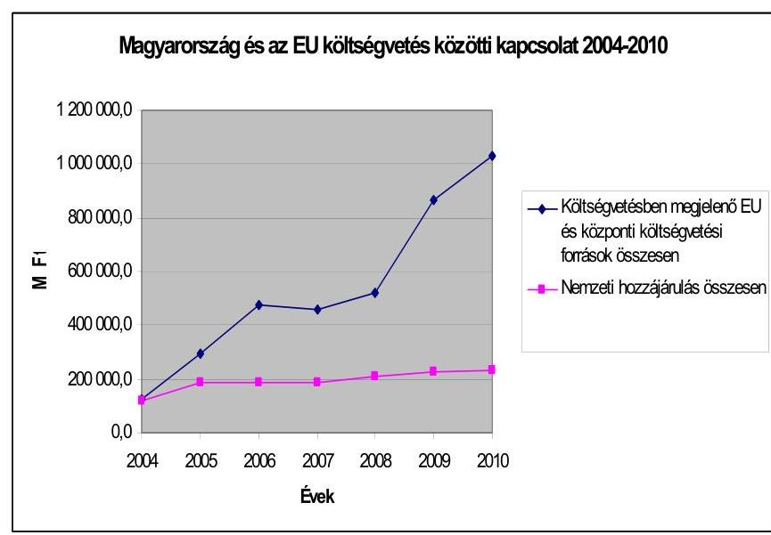

A Magyar Köztársaság költségvetésében megjelenő uniós támogatások (EU + hazai forrás), illetve visszatérítés fokozatos növekedést mutattak a 2004-2010 között, 2007-ben kismértékű visszaeséssel, 2009-2010-ben nagymértékű kiugrással. A költségvetésben megjelenő EU kiadások 2004. évi közel 127 Mrd Ft-ja 2010-ben elérte az 1032 Mrd Ft-ot. A nemzeti hozzájárulás is évről évre nőtt a GNI növekedésével párhuzamosan, illetve svéd és holland GNI hozzájárulás bevezetése következtében.

---

# 4. Nettó pozíció 

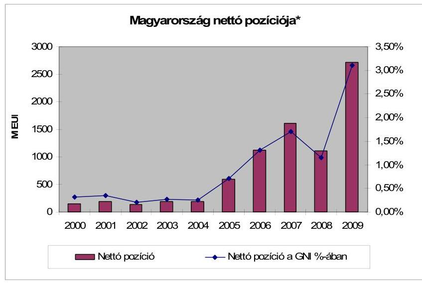

* a befizetési kötelezettség, valamint a támogatások és a működési költség korrigált különbözete

Forrás: Európai Bizottság

Magyarország az előcsatlakozási időszaktól kezdve mindig pozitív pénzügyi egyenleget könyvelhetett el az uniós büdzsével szemben. 2007-ben az egyenleg 1605,92 M euró volt, amely a GNI 1,7%-a. A 2008-as visszaesést követően 2009-re a nettó pozíció elérte a 2719,4 M eurót, ami a GNI 3,1%-a.

## 5. A támogatások feltételrendszerének értékelése: közepes

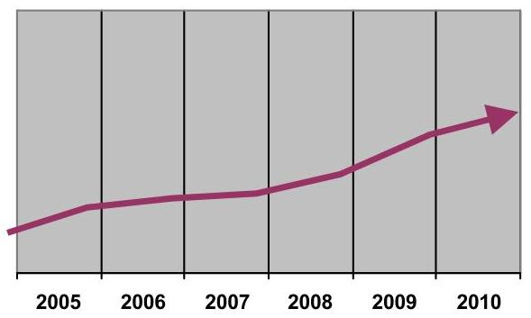

A feltételrendszer kialakítása és működtetése alapvetően az uniós előírásoknak megfelelően történt.
Az intézményrendszerben széleskörű változások történtek beleértve a vezetői, illetve személyi állományt.
2010-2011-ben jelentős előrelépések történtek a közbeszerzés szabályosságának ellenőrzési rendszerében, a támogatás-felhasználás szabályozása, illetve az informatikai rendszer terén.
Az ellenőrzési rendszer bizonyos további területeken fejlesztendő. A különböző ellenőrzési szintek között nem elég hatékony a koordináció.
Az EMIR folyamatos fejlesztése megvalósult, de ennek ellenére több hiányosság állt fent.
A megtett intézkedések - közbeszerzés, illetve a KSZ-ek finanszírozásának felülvizsgálata - a feltételrendszer javuló tendenciáját jelzik.

---

# 6. Szabálytalanság-kezelés értékelése: közepes 

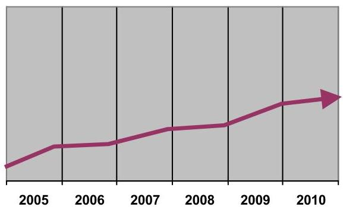

Eltérő gyakorlat alakult ki a szabálytalansági ügyek kezelésével kapcsolatosan.
A szabálytalansági eljárások lefolytatásának időtartama továbbra is az előírtnál tovább tart.
A szabálytalanságkezelés kritikus területe a jelentéstételi rendszer.
Előrelépés a Bizottság által kifejlesztett internet alapú jelentéstételi rendszer bevezetése.
Az NFÜ felülvizsgálta a szabálytalanságkezelési rendszert.
A szabálytalanságkezelés rendje a hiányosságok, illetve előremutató kezdeményezések arányában bekövetkezett pozitív elmozdulás alapján a korábbi évek közepes szintjénél kis mértékben jobbnak minősíthető.

---

# ÖSSZEGZŐ ÉRTÉKELÉS, KÖVETKEZTETÉSEK 

## 1. UNIÓS KITEKINTÉS A 2009-ES ADATOK TÜKRÉBEN

A hazai forrás-felhasználási adatok értékelése érdekében megvizsgáltuk, hogy hazánk milyen pozíciót foglal el az uniós tagállamok között a pénzügyi eredményesség tekintetében, azaz Magyarország a többi tagállamhoz viszonyítva a 2000-2006 időszak tekintetében a strukturális és kohéziós támogatásokból mennyit kötött le, illetve mennyi volt a tényleges kifizetés 2009. év vonatkozásában. A nemzetközi összehasonlítás alapja az Európai Bizottság 2009. évben közzétett éves jelentései ${ }^{3}$.

A strukturális alapok vonatkozásában az Európai Regionális Fejlesztési Alap 2000-2006-os időszaka tekintetében 2009 végéig 121200 M eurót folyósítottak a tagállamok részére, amely a teljes keret 93,5%-át tette ki ${ }^{4}$. Az Európai Szociális Alap kifizetései 2009 végére elérték a teljes keret 93%-át, a teljes időszak alatt összesen 63,8 Mrd eurót folyósítottak a tagállamoknak. Az Európai Mezőgazdasági Orientációs és Garancia Alap Orientációs Részleg keretében 468,2 M eurót fizettek ki 2009-ben a tagállamok részére, amely 1,5 Mrd euróval kevesebb, mint a 2008-ban kifizetett összeg. A csökkenés oka, hogy 2008 végéig már kifizetésre került a teljes időszak kifizetési keretének 91,9%-a, és a programok nagy része elérte a maximális 95%-os kifizetési rátát.

Magyarország a Strukturális Alapokból a következőképpen részesült: 62,1% ERFA, 22% ESZA, 15,7% EMOGA OR, 0,2% HOPE. A Bizottságnak a gazdasági, társadalmi és területi kohézióról szóló ötödik jelentése szerint az előzetes eredmények azt indikálják, hogy hazánk GDP-je közel 1%-kal lett magasabb, mint EU támogatások nélkül lett volna.

Hazánk az összesen 1995,72 M euró keretet 100%-ban lekötötte szerződésekkel, és a kifizetések elérték a 94,12%-ot 2009. december 31-ig. Az egyes tagállamok kifizetései 84,41% (Dánia) és 96,05% (Ausztria) között mozognak, Magyarország a középmezőnyben található (1. ábra). A 25 tagállam mindösszesen a 211 875,16 M euró 93,49%-át használta fel, tehát hazánk az átlag felett teljesített. Az elmúlt évek trendjét az 5. oldalon szereplő 1.1. sz. indikátor jelzi.

[^0]
[^0]: 
 ${ }^{3}$ Az Európai Bizottság által készített uniós szintű összefoglalók, beszámolók adatai – a tagállami beszámolók és adatszolgáltatások benyújtási határidejére tekintettel – 2009. évre vonatkoznak.
    ${ }^{4}$ A Tanács 1260/1999/EK rendelet a strukturális alapokra vonatkozó általános rendelkezések megállapításáról 32. cikke szerint a kifizetés nem haladhatja meg a programok Bizottság általi végső lezárásának jóváhagyásáig a 95%-ot.

---

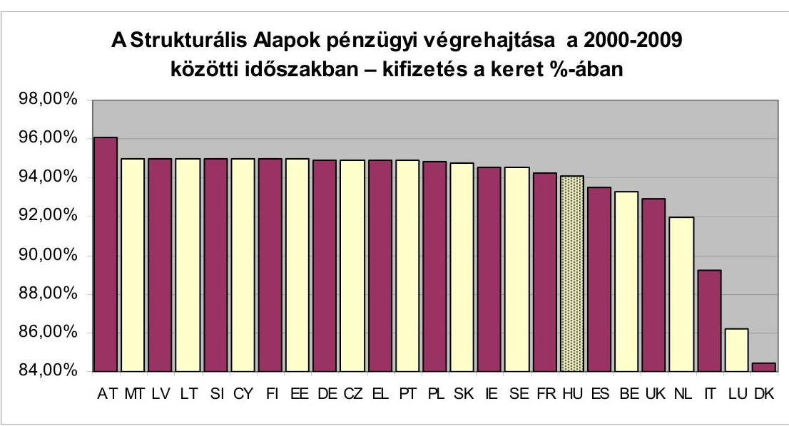

Forrás: Európai Bizottság 2009. Éves Jelentése a Strukturális Alapok végrehajtásáról
A Kohéziós Alap vonatkozásában 2009-re megvalósult a két programozási időszakban támogatott projektek előirányzatának 100%-os felhasználása. A teljes időszakra vetítve az öt legjobban (79,5–81,5% között) teljesítő tagállam közül négy 2004-ben csatlakozott az unióhoz. Hazánk 69,4%-kal a tavalyi évhez hasonlóan az alsó harmadban helyezkedett el, csupán Lengyelországot és a 2007-ben csatlakozott két tagállamot előzte meg (2. ábra). Az elmúlt évek trendjét az 5. oldalon szereplő 1.2. sz. indikátor jelzi.

A lezárandó projektek száma a 2008-as 976-ról 2009 végére 893-ra csökkent. Magyarország az összes 47 projektből 36-ot még nem zárt le 2009 végén.

A Kohéziós Alap 2009. évi végrehajtásáról szóló bizottsági jelentés megállapítja, hogy 2009 végén összesen 11 tagállam ${ }^{5}$ esetében folyt ún. túlzott deficit eljárás, amely eredményezheti a Kohéziós Alapból való kifizetések felfüggesztését. Az Európai Tanács 2009-ben a korábbi túlzott deficit megszüntetésére tett ajánlásaira vonatkozóan Magyarország esetében úgy határozott, hogy hatékony intézkedéseket vezetett be a Tanács ajánlásainak végrehajtására, és új ajánlásokat tettek további intézkedések végrehajtására.

A Bizottság hat tagállam ${ }^{6}$ irányítási és ellenőrzési rendszerének működéséről nem minősített véleményt, illetve kilenc tagállamnak – köztük Magyarországnak – a rendszer lényeges elemeire mérsékelt hatással bíró jelentős hiányosságok miatt minősített véleményt bocsátott ki.

[^0]
[^0]:    ${ }^{5}$ Görögország, Spanyolország, Portugália, Cseh Köztársaság, Magyarország, Lettország, Litvánia, Málta, Lengyelország, Szlovákia és Szlovénia
    ${ }^{6}$ Ciprus, Észtország, Görögország, Málta, Portugália, Szlovénia

---

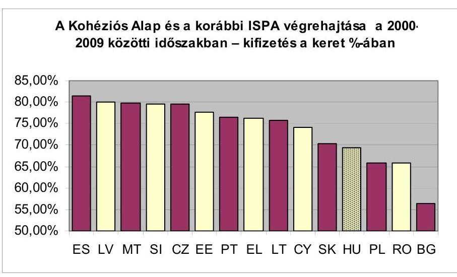

Forrás: Európai Bizottság 2009. Éves Jelentése a Kohéziós Alap végrehajtásáról
A nettó pozíciót tekintve nemzetközi összehasonlításban a 2009. évi kiemelkedő eredménnyel az EU10 országok között Litvánia (5,61%) és Észtország (4,27%) után a 3. helyet értük el. A legnagyobb nettó befizetőnek továbbra is Németország számít, amely hozzávetőlegesen 8,1 Mrd euróval többet fizetett be az uniós kasszába, mint amennyit kivett onnan. Ebben a sorban a második helyet Franciaország (4,7 Mrd euró), a harmadikat pedig Olaszország (4 Mrd euró) foglalja el. Ugyanakkor, ha a nettó pozíciót a tagállamok gazdasági erejéhez viszonyítjuk megállapítható, hogy a GNI %-ában Ausztria járul hozzá a legnagyobb mértékben az uniós büdzséhez 1,5%-os negatív nettó pozíciójával. Németország ebben a vonatkozásban hátrébb szorul, mivel nettó pozíciója „csak” a GNI 0,26%-át teszi ki, amíg Belgium 0,49%, Dánia 0,42%, Luxemburg 0,39% többletbefizetést teljesít a nemzeti GNI %-ában (3. ábra).
3. ábra
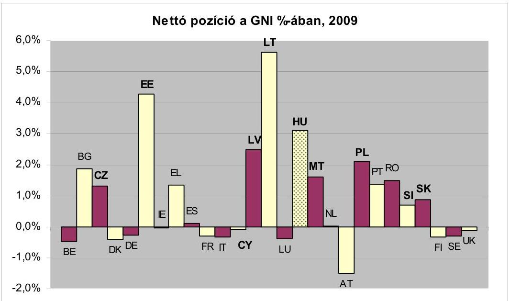

Forrás: Európai Bizottság

---

Az Uniós általános költségvetési rendeletben foglalt előírások alapján a tagállamok – közöttük hazánk is – 2007 óta Éves összegző jelentésben („Annual Summary”) nyilatkoznak az Európai Bizottság részére az uniós bevételek és kiadások szabály- és jogszerűségéről a nemzeti Ellenőrzési Hatóságok az irányítási és ellenőrzési rendszer vizsgálata és a mintavételes ellenőrzések eredményeképpen.

A Bizottság Regionális Főigazgatósága, illetve Foglalkoztatási Főigazgatósága éves végrehajtási jelentéseiben megállapította, hogy a 27 országból 26 jelentése megfelelt a Bizottság által meghatározott minimális követelményeknek. Egy esetben (Spanyolország) volt szükség kiegészítő adatok bekérésére a 2000–2006-os időszakra vonatkozó alapvető információk hiánya miatt. Önkéntes alapon 16 ország átfogó elemzést készített és 11 jelentése tartalmazott átfogó nyilatkozatot a kiadások megbízhatóságáról a Bizottsági előírásoknak megfelelően. Az elmúlt három évben a Magyarországra vonatkozó minősítést a 6. oldalon szereplő 2. sz. indikátor jelzi.

Magyarország a 2010-es éves összegző jelentésében átfogó elemzést készített, illetve átfogó nyilatkozatot adott ki. A jelentést kibocsátó EUTAF véleménye, hogy a 2010. december 31-én a 2000–2006 és a 2007–2013 közötti időszakra megállapított strukturális intézkedések irányítási és ellenőrzési rendszerei megfeleltek a rájuk vonatkozó szabályozási követelményeknek és hatékonyan működtek. Így elfogadható biztosítékot jelentenek arra vonatkozóan, hogy a Bizottság számára igazolt költségnyilatkozatok helyesek, és ennek következtében elfogadható biztosítékot jelentenek, hogy az ezek alapjául szolgáló ügyletek jogszerűek és szabályosak.

Magyarország 2010-ben elkészítette az EU 2020 stratégia tagállami szintű végrehajtásának dokumentumát, a Nemzeti Intézkedési Tervet, majd ennek alapján 2011. április 15-én nyújtotta be a Nemzeti Reformprogramot a Bizottságnak. Ebben a növekedést elősegítő strukturális reformok mellett megerősítették az Intézkedési Tervben megfogalmazott számszerű vállalásokat, melyekkel az EU 2020 célkitűzéseihez kíván az ország hozzájárulni és bemutatták a legfontosabb kormányzati intézkedéseket. A Bizottság 2011. június 7-én tette közzé a nemzeti tervek értékelését, melyben országspecifikus ajánlásokat fogalmaztak meg. Hazánkra vonatkozó ajánlások kiterjednek a költségvetési deficit és az államadósság csökkentésére, a munkaerő-piaci részvétel növelésére, a Nemzeti Foglalkoztatási Szolgálat kapacitásának növelésére és az adminisztratív terhek csökkentése révén az üzleti környezet javítására.

# 2. MAGYARORSZÁG ÉS AZ EU PÉNZÜGYI KAPCSOLATAI 2004–2010 KÖZÖTT 

A Magyar Köztársaság költségvetése végrehajtása során elszámolt és a költségvetésen kívüli EU transzfereket vizsgálva (2. sz. melléklet) megállapítható, hogy az EU költségvetéséhez való hozzájárulásunk a 2004. évi 133 Mrd Ft összeget követően 2005–2008 között közel azonos szinten alakult, majd 2009-ben és 2010-ben jelentősen megemelkedett. A nemzeti hozzájárulás és a tradicionális saját források belső szerkezete és a befizetési jogcímek arányai kisebb mértékben változtak a 2005–2007 között. 2008-tól a nemzeti hozzájárulás növekvő, amíg a tradicionális saját forrás csökkenő tendenciát mutatott.

---

2010-ben a nemzeti hozzájárulás növekvő tendenciája továbbra is fennállt, és a tradicionális saját források összege is jelentősen a korábbi évek szintje fölé emelkedett (4. ábra).
4. ábra
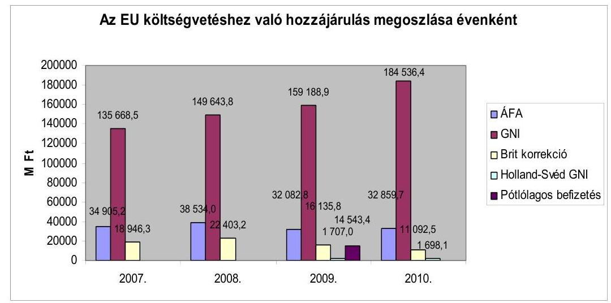

Forrás: ÁSZ zárszámadási jelentése
Magyarország hozzájárulása az EU költségvetéséhez a nemzeti hozzájárulásokon keresztül évről évre növekedést mutatott, amelynek fő oka, hogy a bruttó nemzeti jövedelem növekedésével párhuzamosan nőtt a GNI alapú hozzájárulás mértéke is (ennek alapja a tagállami GNI-re vetített egységkulccsal képzett összeg). 2009. évben a befizetési kötelezettségünk a Svédország és Hollandia számára teljesítendő GNI hozzájárulási kötelezettség életbe lépése, valamint az ehhez kapcsolódó egyszeri pótbefizetés miatt is növekedett. 2010-ben a vámok emelték meg jelentősen a tradicionális saját források, a GNI alapú hozzájárulás pedig a nemzeti hozzájárulásunk összegét. A Svédország és Hollandia számára teljesítendő bruttó GNI, illetve a Brit korrekció mértéke az előző évinél alacsonyabb mértékű volt.

A Magyar Köztársaság költségvetésében megjelenő uniós kapcsolatokhoz tartozó támogatások (EU + hazai forrás), illetve visszatérítés fokozatos növekedést mutattak a 2004–2010 közötti időszakban, 2007-ben kismértékű visszaeséssel, 2009–2010-ben nagymértékű kiugrással. A költségvetésben megjelenő uniós programokhoz kapcsolódó kiadások (EU + hazai támogatás) 2004. évi közel 127 Mrd Ft-ja 2010-ben elérte az 1032 Mrd Ft-ot (az uniós támogatások utólagos elszámolását is beleértve). Az elmúlt évek trendjét a 6. oldalon szereplő 3. sz. indikátor jelzi.

Magyarország nettó pozícióját ${ }^{7}$ tekintve megállapítható, hogy az előcsatlakozási időszaktól kezdve mindig pozitív pénzügyi egyenleget könyvelhetett el az uniós büdzsével szemben. A növekvő tendencia egyrészt annak köszönhető, hogy 2007-ben már párhuzamosan két programozási időszak programjai futot-

[^0]
[^0]:    ${ }^{7}$ Az adott pénzügyi év kiadásainak és bevételeinek egyenlege a Bizottság által meghatározott korrekciós tételekkel korrigálva

---

tak, illetve az ország abszorpciós képessége is fokozódott. 2007-ben az egyenleg 1605,92 M euró volt, amely a GNI 1,7%-a. A 2008-as visszaesést követően 2009-re a nettó pozíció elérte a 2719,4 M eurót, ami a GNI 3,1%-a. Az elmúlt évek trendjét a 7. oldalon szereplő 4. sz. indikátor jelzi.

A támogatások összegének alakulása a programok életciklusához igazodott. A 2004–2006-os programozási időszak programjai (NFT és NVT, valamint PHARE / Átmeneti Támogatás) a 2006–2007-es felhasználási csúcsot követően 2008–2009-ben fokozatosan kifutottak. Az új programozási időszakhoz kapcsolódó ÚMFT és ÚMVP a 2007–2008. évi lassú beindulást követően 2009-ben kimagasló felhasználási adatokat mutatott. 2010-ben az ÚMFT felhasználása az előző évi több mint 1,5-szorosára nőtt, az ÚMVP-é azonban kis mértékben csökkent.

A Kohéziós Alap forrásainak felhasználása összhangban volt a nemzetközi összehasonlításban bemutatott kedvezőtlen képpel, miszerint a projektek nagyon mérsékelt ütemben haladtak előre: 2009-ben 15%-kal nőtt a kifizetések aránya az előző évhez képest (ez az arány a többi KA kedvezményezett tagállam esetében 13–23% között mozgott), amíg 2010-ben jelentősen, 28%-kal esett vissza.

A költségvetésen kívüli agrárpiaci támogatások évenként változó képet mutattak, tendenciájában „hullámzó” mértékű támogatásról van szó. A 2005. évi kimagasló, közel 300 Mrd Ft összegű támogatás 2006-os visszaesése után 2009-ig emelkedett, majd 2010-ben az előző évi közel felére esett vissza. A támogatások összegét az intervenció finanszírozási szükséglete nagymértékben befolyásolta. A közvetlen támogatások esetében az elszámolási szabályok a kifizetések tárgyévi és az azt követő évi elszámolását is lehetővé teszik. Nagyrészt erre vezethető vissza az évek közötti eltérő mértékű felhasználás, amely azonban 2006 óta emelkedő tendenciát mutat. Az elmúlt évek trendjét a 7. oldalon szereplő 4. sz. indikátor jelzi.

Az uniós és a hazai jogszabályokkal összhangban az Európai Uniót 2010-ben összesen 230,2 Mrd Ft illette meg Magyarországtól, míg az EU támogatások és a hozzájuk kapcsolódó hazai társfinanszírozás 1032 Mrd Ft összegben jelent meg (ÜMFT: 70,11%, ÚMVP: 16,06%, Kohéziós Alap: 8,65%, NFT: 2,18%, egyéb EU-s támogatások: 1,89%, egyéb strukturális támogatások: 0,91%, Halászati Operatív Program: 0,14%, NVT: 0,05%, SAPARD: 0,01%, Átmeneti Támogatás programjai: 0,01%). A részletes adatokat az 2. sz., illetve 3/A. sz. melléklet tartalmazza.

A költségvetésen kívüli támogatások összege 2010-ben 297 Mrd Ft-ot tett ki (SAPS: 247,4 Mrd Ft, agrárpiaci támogatások: 49,7 Mrd Ft), amelyet a Kifizető Ügynökség a KESZ-ről megelőlegezett, és az EU utólag téríti meg az államháztartás számára (3/B. melléklet). Az EU által közvetlenül térített SAPS támogatást a hazai forrásból finanszírozott kiegészítő nemzeti támogatás (top-up) 24,1 Mrd Ft-tal egészítette ki.

Egyéb uniós bevételek címen belül 2010-ben az uniós támogatások utólagos megtérítéseként az előirányzat egyenlege -8,7 Mrd Ft lett.

---

# 3. AZ UNIÓS TÁMOGATÁSOK HAZAI FELTÉTELRENDSZERE 

Az EU-ból érkező források fogadásához, illetve lebonyolításához szükséges intézményrendszert Magyarország az EU előírásainak megfelelően, a hazai jogszabályokat figyelembe véve alakította ki. Az intézményrendszer főbb szereplőinek bemutatását a 4. sz. melléklet tartalmazza.

A 2010. évi kormányzati struktúraváltást követően széles körű változások történtek a strukturális támogatások irányítási és ellenőrzési rendszerében, beleértve az NFÜ, az irányító hatóságok és közreműködő szervezetek, az Ellenőrzési Hatóság és az Igazoló Hatóság vezetését, illetve a személyi állományát.

A Kormány 2010. július 1-től az Európai Támogatásokat Auditáló Főigazgatóságot (EUTAF) jelölte ki a Kormányzati Ellenőrzési Hivatal (KEHI) jogutódjaként az Európai Regionális Fejlesztési Alapból, az Európai Szociális Alapból és a Kohéziós Alapból származó, valamint egyéb európai uniós és nemzetközi támogatások tekintetében az ellenőrzési, illetve ellenőrzési hatósági feladatok ellátására.

Az egyes szervezeteknél tapasztalható magas fluktuáció és létszámhiány továbbra jelentős kockázatnövelő
 tényezőt jelentett a programok/projektek lebonyolítása tekintetében

Az EKKE/KFF-nél 89,7%-os, az Energia Központ Nonprofit Kft.-nél 88,6%-os volt a fluktuáció, szinte a teljes állomány lecserélődött. A KIKSZ Zrt. nem kielégítő létszámhelyzete az ÁSZ véleménye szerint akadályozta a KÖZOP KSZ-feladatok zökkenőmentes ellátását. Ugyanez volt igaz a többi közvetlenül vagy közvetve a nemzeti fejlesztési miniszter felügyelete alá tartozó KSZ tekintetében is. Az esetleges létszámnövelés lehetőségét korlátozta a nemzeti fejlesztési miniszter bérgazdálkodásra vonatkozó irányelve.

Az EU Bizottság véleménye szerint nem valósult meg a végrehajtási és ellenőrzési feladatok funkcionális szétválasztása, és emiatt összeférhetetlenség állt fenn a KIKSZ Zrt. és a NIF Zrt. között ${ }^{8}$.

Az IH-k, KSZ-ek 2010-ben is párhuzamosan látták el a két programozási időszak támogatási programjainak kezelését. A 2004-2006-os programozási periódus támogatásaival kapcsolatos feladatok jellemzően a programok, projektek zárásához, a szabálytalanság-, adósság-, és követeléskezeléshez kapcsolódtak.

A közreműködő szervezetek teljesítményalapú és költséghatékony finanszírozásának egységesítése érdekében az NFÜ és a közreműködő szervezetek közötti együttműködési megállapodások, az ún. SLA-k (Service Level Agreement, SLA) rendszerét 2007-től bevezették, ennek ellenére a KSZ-ek finanszírozási rendszere még 2010-ben sem volt egységes. Fennállt a veszélye annak, hogy a kialakult laza teljesítménykövetelmények miatt a felhasználható keretet idő előtt kimerítik. Az ÁSZ javaslatára 2009 végére megtörtént az SLA szerződések díjazási gyakorlatának felülvizsgálata, a javaslatok végrehajtására azonban 2010-ben

[^0]
[^0]:    ${ }^{8}$ A probléma feloldása érdekében szervezeti átalakítás volt folyamatban a Tájékoztató lezárásakor, amelynek következtében az intézményi összeférhetetlenség 2012.01.01-vel megszűnik.

---

nem került sor. 2011 júniusára a felülvizsgálat eredményei figyelembe vételével új SLA megállapodások kidolgozására és megkötésre került a KSZ-ekkel.

A támogatások pénzügyi ellenőrzéséért elsődlegesen a tagállamok vállalnak felelősséget az Európai Bizottságnak az Európai Közösségek főköltségvetése végrehajtásáért való felelőssége sérelme nélkül. A feladatok ellátásához kapcsolódóan a tagállamoknak az ellenőrzések három szintjét kell ellátniuk (folyamatba épített ellenőrzés; rendszer- és mintavételes ellenőrzések; záró költségnyilatkozatok ellenőrzése).

Az irányítási és ellenőrzési funkciók fejlesztendő területeire vonatkozó megállapítások a korábbi évekhez hasonlóan a 2010-ben lefolytatott ellenőrzések során is megfogalmazódtak, amely arra utal, hogy az irányítási és ellenőrzési rendszer további erősítése szükséges, különösen az IH-k és KSZ-ek esetében.

A 2007-2013-as időszakra vonatkozóan az Ellenőrzési Hatóság csak három nemzetközi együttműködési program ${ }^{9}$ vonatkozásában adott ki fenntartások nélküli véleményt, az ÚMFT OP-k tekintetében minden esetben fenntartásokat tartalmazó ellenőrzési vélemény került kiadásra. A Halászati Operatív Program tekintetében az ellenőrző szerv fenntartás nélküli véleményt adott ki.

Az NFÜ Belső Ellenőrzési Főosztálya a zárszámadás megállapításai szerint az EU források felhasználásának ellenőrzéséhez kevés erőforrással rendelkezett, különös tekintettel arra, hogy feladatai egyéb, pl. nyilvántartási, adatszolgáltatási, kockázatkezelési stb. feladatokra is kiterjedtek. A feladatok mennyiségét és a belső ellenőrzéssel foglalkozó munkatársak létszámát figyelembe véve az ÁSZ továbbra is fenntartotta a korábbi megállapítását, hogy a BEF a rendelkezésre álló saját kapacitással még 2011-ben is csak a számára kijelölt ellenőrzési terület kis részét tudja lefedni. A kapacitás gondok enyhítésére, illetve a speciális (pl. műszaki-technikai, közbeszerzési és pénzügyi tartalmú) feladatai ellátására BEF szakértőket, alvállalkozókat és külső erőforrásokat vett igénybe. A külső ellenőrzések koordinálása viszont szintén kapacitásokat kötött le a BEF-nél.

Az ÁSZ az IH-k és KSZ-ek által végzett első szintű ellenőrzéseket néhány kivételtől eltekintve alapvetően megfelelőnek találta, hiányosságokat a kifizetések előtti helyszíni ellenőrzések területén a szabályozás és az ellenőrzések lebonyolítása tekintetében tárt fel.

A NAO Iroda mint kifizető/igazoló hatóság a 2010-ben lefolytatott 13 tényfeltáró látogatás során kisebb, elsősorban adminisztratív hiányosságokat tárt fel, amelyek nem befolyásolták a költségek elszámolhatóságát.

A Kincstár által végzett ellenőrzések gyakran állapítottak meg az EMIR feltöltöttségével kapcsolatos hiányosságokat, késedelmes bejegyzéseket. A szabálytalanságok kezelésére vonatkozóan is tettek megállapításokat a határidők betartása és a szabálytalansági döntések dokumentáltsága miatt.

[^0]
[^0]:    ${ }^{9}$ Magyarország-Románia ETE Program, Magyarország-Szlovákia ETE Program, Délkelet-európai Transznacionális Együttműködési Program.

---

A Magyarországon lefolytatott uniós auditok megállapításai, ajánlásai nyomán ${ }^{10}$ az NFÜ megállapodott az EU Bizottsággal a közbeszerzések ellenőrzési rendszerének átalakításáról, a folyamatba épített ellenőrzések erősítéséről, és a szükséges intézkedéseket tartalmazó közbeszerzési Akcióterv kidolgozásáról. A folyamat eredményeképpen a közbeszerzés-ellenőrzési rendszer két lépcsőben módosult, s az új rendszer megjelent a 4/2011. (I. 28.) Korm. rendeletben is.

Az EU forrásból támogatott közbeszerzési eljárások tekintetében a folyamatba épített ellenőrzésekkel kapcsolatos feladatokat 2010. november 27-től az NFÜ EKKE ${ }^{11}$ bázisán létrehozott Közbeszerzési Felügyeleti Főosztály (KFF) látta el. A minőség-ellenőrzési, szabályosság-ellenőrzési, valamint a közbeszerzési szerződések módosításának ellenőrzésével kapcsolatos feladatok az új rendszerben megmaradtak, azonban a KFF jelentéseiben foglaltakat a kedvezményezett köteles figyelembe venni. A közbeszerzési eljárás csak abban az esetben indítható meg, illetve az eljárás eredménye abban az esetben hirdethető ki, amennyiben azt a KFF jóváhagyta. A vállalkozási szerződések KSZ általi ellenjegyzésének feltétele, hogy a szerződést a KFF közbeszerzési jogi szempontból jóváhagyja.

Az új eljárásrendet a 2010. december 8-át követően megkezdett közbeszerzési eljárásokra kell alkalmazni. Az ezt megelőzően megkezdett projektekkel kapcsolatban az ÁSZ véleménye szerint el kell végezni a közbeszerzések időbeni, még a program/projekt zárását megelőző felülvizsgálatát az esetleges pénzügyi korrekciók elkerülése érdekében. Ellenkező esetben a közbeszerzési szabálytalanságok továbbra is magas kockázatot jelentenek a hazai költségvetési forrásokra.

Az EU-s támogatások ellenőrzési rendszerével kapcsolatban az ellenőrzések párhuzamossága és átfedése, az ellenőrzöttek túlzott leterhelése továbbra is fennálló probléma. Figyelembe kell azonban venni, hogy az ellenőrzési szerveknek különböző hierarchiában, különböző ellenőrzési célokkal, egymástól funkcionálisan függetlenül kell, hogy végezzék a munkájukat.

A Magyar Köztársaság 2010. évi költségvetése végrehajtásának ellenőrzése során az ÁSZ minősítette az Uniós Fejlesztések fejezetnél a fejezeti kezelésű előirányzatok megbízhatóságát és a számviteli törvényben, valamint az államháztartás szervezetei beszámolási és könyvvezetési kötelezettségeinek sajátosságairól szóló 249/2000. (XII. 24.) Korm. rendeletben foglaltaknak való megfelelését. Az NFÜ a „XIX. Uniós Fejlesztések fejezet" fejezeti kezelésű előirányzatok 2010. évi felhasználásáról operatív programonként/fejezeti kezelésű előirányzatonként rész-beszámolót készített, amelyek összegzésének eredménye a fejezeti kezelésű előirányzatok összesített beszámolója. A zárszámadási vizsgálat a részbeszámolók mindegyikéről külön alkotott véleményt.

Az NFÜ által készített összesen 31 rész-beszámolóból tizenhárom elfogadó véleményt kapott, ebből nyolc rész-beszámolót (GOP, VOP, INTERACT 2007-2013,

[^0]
[^0]:    ${ }^{10}$ Az EU Bizottság több esetben is megállapította, hogy Magyarországon az uniós támogatásokhoz kapcsolódó közbeszerzéseket nem a vonatkozó irányelvnek megfelelően bonyolították le. Túl gyakran alkalmazták a hirdetmény nélküli tárgyalásos és a meghívásos eljárást a nyílt eljárás helyett, korlátozva a vállalkozások hozzáférését a közpénzből finanszírozott szerződésekhez.
    ${ }^{11}$ Európai Uniós Közbeszerzési Koordinációs és Szabályossági Egység

---

EFK, FEFK ${ }^{12}$, AVOP, GVOP, KIOP) figyelemfelhívó megjegyzéssel látott el az ÁSZ, Tizenegy rész-beszámoló (KA környezetvédelmi projektek, KÖZOP, TÁMOP, TIOP, KEOP, KDOP, ÉAOP, KMOP, ETE, EGT, Norvég Alap támogatásából megvalósuló projektek, HEFOP) korlátozott véleményt, hét rész-beszámoló (ÁROP, EKOP, NYDOP, DDOP, DAOP, ÉMOP, Svájci Alap) pedig elutasító véleményt kapott, mivel az ÁSZ szerint ez utóbbiak a vagyoni, pénzügyi helyzetről nem adnak megbízható valós képet.

A feltárt hibák értéke összesen 16,4 Mrd Ft, a hibák aránya az Uniós Fejlesztések fejezet fejezeti kezelésű előirányzatairól készített összesített beszámoló kiadási főösszegének 1,87%-a, amely alapján az összesített beszámolóról korlátozott véleményt adott az ÁSZ. A hibák jelentős részének (88,9%) feltárására a mérlegek ellenőrzése során került sor. A hibák kihatással voltak a mérleg valódiságára, valamint a következő évi pénzforgalmi elszámolásokra is hatást gyakorolnak.

A 2010. évi ellenőrzések az egyes támogatási programokat kezelő nyilvántartási és monitoring rendszer vonatkozásában a korábbi évekhez hasonlóan több hiányosságot tártak fel.

Az Egységes Monitoring Információs Rendszerre (EMIR) vonatkozó ellenőrzések megállapították, hogy a rendszer alapvetően jól töltötte be a nyilvántartással kapcsolatos szerepét, ugyanakkor az időközi fejlesztések ellenére több hiányosság állt fenn. Az adattartalom megbízhatóságát csökkentette, hogy az egyes KSZ-ek eltérő módon és mértékben töltötték fel a nyilvántartásokat. Több ellenőrzés is felhívta a figyelmet a rendszer nem teljes körű feltöltöttségére, illetve a naprakészség hiányára.

Az működésének stabilitása és hatékonysága érdekében az NFÜ több lépésben bővítette és átalakította az EMIR struktúráját, számos létező funkció bővítése, ésszerűsítése történt meg. Az Interreg Monitoring és Információs Rendszer (IMIR) 2007-2013 éles működése 2009-2010 folyamán kezdődött meg az éles üzemi adatokkal való feltöltést követően minden program tekintetében. Az első kör tapasztalatai alapján kerül bevezetésre a rendszer által kínált teljes funkcionalitás.

A Kincstári Monitoring Rendszer üzemeltetéséért felelős Kincstár tájékoztatása szerint - egyezően az NFÜ közlésével - az adatcsere technikai feltételei adottak voltak, azonban a rendszeres adatküldés nem történt meg az EMIR oldaláról, illetve az adatküldés nem volt teljes körű még 2010-ben sem.

Az agrártámogatások kezelését, nyilvántartását és a vonatkozó kifizetéseket biztosító Integrált Igazgatási és Ellenőrzési Rendszer (IIER) a megfelelő informatikai támogatottságot biztosította az eljárásrendek végrehajtását elősegítő szoftverek fejlesztésének kisebb időbeli csúszása és a feltárt hiányosságok ellenére is.

A rendszer üzemeltetésének felfüggesztése időszakában (a fejlesztő-üzemeltető általi szolgáltatás szüneteltetése alatt) egyedi forgalomgenerálással végzett kifizetések jogszabályi megfelelőségének vizsgálata során az MVH BEF javaslatot tett a

[^0]
[^0]:    ${ }^{12}$ Feladatfinanszírozási EFK

---

végzések mielőbbi meghozatalára, a kettős kifizetések felderítésére, illetve egyes, helytelenül felvitt adatok korrigálására. A jogorvoslati ügyek IIER-ben való teljes körű dokumentálása érdekében javasolták, hogy a bírósági kereset nyomán megszülető bírósági döntések is az MVH-ba való beérkezést követően azonnali iktatásra, továbbá szkennelésre kerüljenek.

Az ISZ megállapította, hogy az IIER éles adatbázisához négy fejlesztő is hozzáfér írási, módosítási és törlési jogosultsággal, ami szerepkör-összeférhetetlenséget okoz. (A kapott információk alapján erre azért van szükség, mert a fejlesztők alkalmanként sürgősségi hibajavítást végeznek az éles IIER rendszerben.)

Az IIER fejlesztésére vonatkozó szerződéses jogviszonyrendszer tekintetében az MVH BEF kifogásolta, hogy az MVH nem dolgozott ki és nem követett egy olyan, az érdekei érvényesítésének fokozására irányuló stratégiát, amely csökkentette volna a külső felektől való függést, lehetőséget nyújtott volna alternatívák választására, vagy kedvezőbb tárgyalási pozíciókhoz, csökkentett költségekhez vezetett volna a szerződéskötések során.

Az uniós támogatások hazai feltételrendszerének (intézményrendszer, ellenőrzési rendszer) trendjét a 7. oldalon szereplő 5. sz. indikátor jelzi.

A szabálytalanságkezelés egyik kritikus területe a jelentéstételi rendszer, mivel a jelentések több esetben pontatlanok, hiányosak voltak, illetve késedelmesen kerültek megküldésre. Az ÁSZ zárszámadási vizsgálata a beszámolási rendszert megbízhatatlannak és megalapozott megállapítások levonására alkalmatlannak tartotta.

Nem volt megállapítható, hogy egy érintett szervezet szabálytalanság hiánya vagy mulasztás miatt nem küldött jelentést. A jelentési rendszer egyes szintjein lévő szervezetek számára nem írtak elő ellenőrzési kötelezettséget, és e szervezetek nem is gyakoroltak ilyen funkciót. Nem volt egységes a gyakorlat a szabálytalanságok jelentésének formáját tekintve.

A tagállami tájékoztatási kötelezettség egységes teljesítése, valamint a szabálytalansági jelentések minőségének javítása érdekében 2010-ben az OLAF KI a Kohéziós Politikát érintően jelentési mintát, valamint részletes kitöltési útmutatót bocsátott a hazai szervezetek rendelkezésére, emellett szakmai rendezvényeket szervezett a jelentéstételben résztvevő
 intézmények munkatársai számára.

Évek óta húzódó probléma - nemzeti és uniós szinten - a szabálytalanság pontos definíciójának hiánya, aminek következtében eltérő gyakorlat alakult ki, hogy mely ügyeket kell szabálytalansági eljárás keretében kezelni, s ez alapján mely ügyekről kell jelentést készíteni. A jelentésekben feltüntetett darabszám és az érintett összegek emiatt önmagukban nem jellemzik a szabálytalanságkezelési rendszer megfelelőségét.

Az Európai Bizottság által előírt elektronikus adatszolgáltatás teljesítése és a fenti hiányosságok megszüntetése érdekében az OLAF 2010-ben bevezetett egy új jelentéstételi rendszert. Az IMS ${ }^{13}$ a tagállam és Bizottság közötti, illetve a tagállamon belüli szervezetek közötti kommunikációra is kiterjed.

[^0]
[^0]:    ${ }^{13}$ „Irregularity Management System", szabálytalanság-kezelési rendszer.

---

#### Abstract

Az internet alapú IMS egyszerűsíti, felgyorsítja a jelentés folyamatát, valamint hozzájárul a szabálytalansági adatok minőségének javításához. A nyilvántartott információk lekérdezése több szempont alapján lehetséges, lehetővé téve a hatékony nyomon-követést, a jelentések adattartalmának gyorsabb és mélyebb elemzését. A rendszer teljes körű hazai bevezetését hátráltatta a strukturális támogatások esetében, hogy az adatok két rendszerben (EMIR és IMS) való rögzítésének elkerülése érdekében az informatikai kapcsolat kialakítása csak a modulok véglegesítését követően várható.

A szabálytalanságokról, szabálytalanság miatti követelésekről készített értékelések és elemzések alapján a NFÜ a hazai szabályozás átfogó felülvizsgálatáról döntött. A felülvizsgálat eredményeként módosultak a szabálytalanságkezelésre vonatkozó rendelkezések, illetve az Egységes Működési Kézikönyv vonatkozó fejezete. Számos egyéb területen is előrelépést történt, pl. a jogorvoslat lehetősége, a szabálytalanság megjelenésének kezdete, egyéb eljárási pontosítások, „egyszerűsített eljárás" bevezetése, az elkövetés szándékossága kérdésének kötelező vizsgálata, illetve a megújított jelentéstételi rész.

A szabálytalanság-kezelés legkritikusabb pontjának az ÁSZ a zárszámadási ellenőrzés során a szabálytalansági eljárások lefolytatásának és lezárásának időtartamát tartotta. A hazai jogforrásokban meghatározott 45 naptári napos határidőt a gyakorlatban ritkán tartották be. A KSZ-ek által lefolytatott ügyekben 54 nap, az NFÜ által lefolytatott eljárásoknál 76 nap volt az átlagos eljárási időtartam.

Az intézményrendszer a problémát érzékelve 2010 év végén megkezdte a szabálytalansági rendszer komplex felülvizsgálatát. Ennek eredményeképpen a 4/2011. (I.28.) Korm. rendeletben módosításra került a szabálytalanságok kivizsgálására vonatkozó eljárási határidő, egyértelműen meghatározva az eljárás kezdetének és befejezésének dátumát, az eljárási határidők felfüggesztésének a lehetőségét.

A 2004-2006 programozási periódus vonatkozásában az intézményrendszer 2010-ben 83 szabálytalanságot továbbított az OLAF Iroda részére, melynek részét képezték az OLAF Jelentések adattisztítása eredményeképpen a nyilvántartási rendszerben szerepeltetni kívánt, korábbi időszakban már lejelentett OLAF Jelentések is. A szabálytalansági esetek többsége a GVOP-ban és a HEFOP-ban fordult elő.

Az ÚMFT esetében még viszonylag kis számban tártak fel szabálytalanságot: 2009-ben 25, 2010-ben 36 új esetet jelentettek az OLAF KI részére, a TÁMOPpal kapcsolatosan fordult elő a legtöbb szabálytalanság, azon belül a képzésekhez kapcsolódóan. Az agrártámogatások tekintetében 2010-ben az EMGA-t 114, a SAPARD-ot 16 eset érintette.

Az NFÜ adatai alapján a szabálytalanságok észlelése legtöbb esetben az első szintű ellenőrzések során, általában a dokumentumok/számlák ellenőrzése, a helyszíni ellenőrzés során történt. Az eljárások túlnyomó részét a KSZ-ek folytatták le, kisebb részét az IH-k. Az eljárások 82%-ánál szabálytalansági vizsgálat is lefolytatásra került, a vizsgált esetek 48,7%-ánál szabálytalanságot, 21 esetben (0,58%) pedig csalás gyanúját állapították meg. Fontos megjegyezni, hogy az EMIR-ben szereplő adatok korábban említett hiányosságai miatt az elemzés nem ad megbízható képet a szabálytalanságok helyzetéről.

---

A szabálytalanságkezelés rendjét a bemutatott hiányosságok, illetve előremutató kezdeményezések arányában bekövetkezett pozitív elmozdulás alapján a korábbi évek közepes szintjénél kis mértékben jobbnak minősíthető (6. sz. indikátor, 8. oldal).

Az EMIR ÚMFT követeléskezelési modul hiánya miatt a követeléskezelési feladatokat ellátó KSZ-ek szükségmegoldásokra kényszerültek (pl. Excel-alapú nyilvántartásokat vezettek). Ennek következtében a nyilvántartott adatok nem voltak teljes körűek, illetve azokhoz az IH automatikusan nem fért hozzá. ${ }^{14}$

A követelések állománya 2010-ben is jelentősen emelkedett. A növekvő összegek felhívják a figyelmet a követeléskezelési tevékenység fontosságára, mivel a jelentős összegek kihatással lehetnek az OP keretek kihasználására is. A kintlévőségek beszedése az idő előrehaladásával egyre nehezebbé válik, nő a behajthatatlanság veszélye. Az EMIR adatai szerint a követelések megtérülése közel 55%-os.

A követeléseket biztosító inkasszók eredményessége változó, gyakran kétséges volt. A további biztosítékadás alóli mentesítés befolyásolta követelésállomány szintjét ${ }^{15}$. A követelések száma és összege függött az OP projektjeinek támogatási összegeitől, a kedvezményezettek számától és típusától. Ettől függött leginkább az is, hogy a biztosítékok milyen mértékben tudták biztosítani a követelések megtérülését. Ennek aránya jellemzően 70-80%-os volt. Az állami kedvezményezettek által megvalósított projektek meghiúsulása, szabálytalansága esetén a nem behajtható követelések a költségvetést terhelik.

A nem behajtandó, de visszakövetelendő összegeknél ÁSZ több esetben is feltárta, hogy - legtöbbször az EMIR követeléskezelési moduljának hiányára hivatkozva - nem követelték meg a pénz azonnali visszautalását, hanem akár hónapokig is a támogatottnál vagy a lebonyolítási számlán hagyták, finanszírozva ezzel a támogatottat, és ugyanilyen mértékben rontva ezzel a költségvetés helyzetét. A késlekedés veszélyeztetheti az OP-k keretének teljes felhasználását.

A követeléskezelés szabályozását az ÁSZ részletesnek és alaposnak tartotta, a gyakorlati megvalósítást a KSZ-ek általában megfelelően megszervezték. A feladatok elvégzésében azonban alapvető követelmény a gyorsaság, mert minél későbbi a szükséges intézkedés, annál nagyobb az eredménytelenség veszélye ${ }^{16}$. A peres ügyek, a csődök és felszámolások esetében a követelés behajtásának gyakorlatilag nincs esélye. A KSZ-ek hatékonyabb felügyeletét és ellenőrzését az IH-k részéről különösen akadályozza az EMIR követeléskezelési moduljának hiánya, ami évek óta nem készült el ${ }^{17}$.

[^0]
[^0]:    ${ }^{14}$ A visszavont és visszaszerzett követelések nyomon követéséhez és kezeléséhez szükséges funkciók használatba vétele 2011. nov. 1-én megtörtént.
    ${ }^{15}$ A biztosítékadás alól mentesítést kapnak a 25 M Ft érték alatti, a nem beruházási célú, és a kutatás-fejlesztésre irányuló támogatások, valamint a költségvetési szervek.
    ${ }^{16}$ Az NFÜ a folyamatokba számos megelőző kontrollt (kompenzálás, biztosítékok, levonás) épített be a fentiek kivédésére 24/2011. (V.6.) NFM utasítás (EMK) XV. fejezet).
    ${ }^{17}$ Az NFÜ tájékoztatása alapján a fejlesztés előkészítése 2010-ben megtörtént, a funkcionalitás bevezetése 2011 őszére várható.

---

Az agrár-, és vidékfejlesztési támogatások esetében a támogatottak részére biztosított volt a díjmentes fellebbezés lehetősége, és az időben elhúzódó, alapvetően kompenzációs megoldású követeléskezelés lehetővé tette, hogy a kedvezményezettek esetenként évekig - gyakorlatilag kamatmentesen - használják a jogtalanul felvett támogatást. Szabályozás hiányában az MVH nem számított fel késedelmi kamatot követelései után, így átmenetileg ezeket a költségeket is a hazai költségvetésnek kellett finanszíroznia.

# 4. Az Európai Uniós források felhasználásával kapcsolatos, a 2010-es évre vonatkozó ellenőrzések és jelentések legfontosabb megállapításai, következtetései 

A Nemzeti Fejlesztési Terv 19410 db hatályos szerződésére 678,12 Mrd Ft támogatást fizettek ki. A szerződések 66,1%-át kis- és középvállalkozásokkal kötötték, melyek a támogatások negyedét kapták. A támogatások legnagyobb része (58,1%-a) az állami-önkormányzati, non-profit szervezetekhez áramlott.

Az NFT végrehajtása pénzügyi, abszorpciós szempontból eredményesnek értékelhető, a pénzügyi keret 99,1%-át használták fel (az abszorpció alakulását az 5. ábra szemlélteti). A forrásveszteség minimalizálása azonban hazai többletkiadással járt. A fel nem használt keret mintegy 6 Mrd Ft-ot tett ki. A kedvező teljesítés érdekében ún. tartalék projekteket támogattak, így az elszámolt költségek összege 5-7%-kal, mintegy 26,5 Mrd Ft-tal meghaladta az eredeti keretet.

## 5. ábra

Az NFT operatív programok abszorpciójának alakulása
keret = 100%
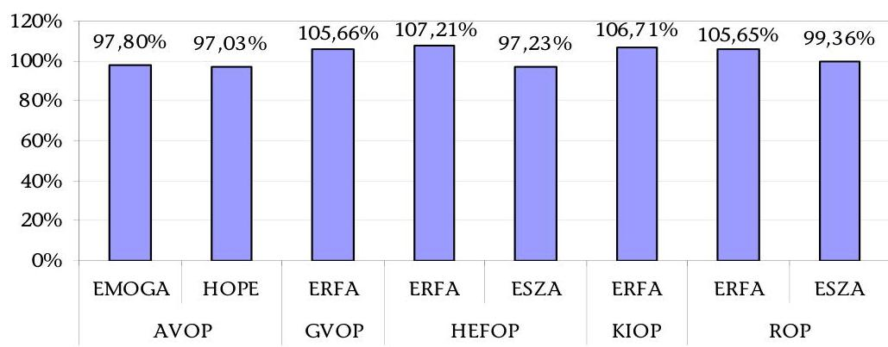

Forrás: az operatív programok záró költségnyilatkozatai
Az NFT abszorpciós teljesülésének értékelése mellett nagyobb hangsúlyt kell az eredményességi célok teljesülésének értékelésére és a következtetések hasznosítására helyezni. A programok eredményességének értékelésére a teljes zárási folyamatok EU Bizottság általi lezárását követően lesz lehetőség.

Az NFT hatására összesen 34 és fél ezer új munkahelyet teremtettek, illetve tartottak meg, az emberi erőforrás minőségi fejlesztése keretében mintegy 330 ezer

---

fő képzése valósult meg. A támogatásoknak köszönhetően 113 ezer lakos csatlakozott szennyvíztisztító rendszerhez, 723 km-t tett ki az új, a korszerűsített és a felújított utak hossza. Az NFT végrehajtása azonban nem javított a régiók közötti gazdasági-szociális különbségek helyzetén, így az ország régióinak kiegyensúlyozott fejlesztése továbbra is kiemelt cél maradt. A ROP forrásainak 78%-a a négy kevésbé fejlett régióba áramlott, de hatása a szerény mértékű támogatások és a sokféle cél miatt csak egy-egy szűk földrajzi területen volt érezhető, ahol a pályázati igény és a támogatás koncentrálódott.

A gazdasági válság miatt és az abszorpció növelése érdekében Magyarország kérelmet nyújtott be a Bizottsághoz, amelyben a GVOP, a KIOP, a HEFOP, az AVOP és az EQUAL Közösségi Kezdeményezéssel kapcsolatos kiadások támogathatóságára megállapított határidő 2009. június 30-ig történő meghosszabbítását kérte. A Bizottság határozatában az elszámolhatósági időszak meghosszabbítását engedélyezte, így a ROP kivételével a programzáró dokumentumok és a zárónyilatkozat leadásának határideje 2010. szeptember 30-ra módosult ${ }^{18}$.

A zárónyilatkozatok kiadását megelőző rendszervizsgálatok általában a hibák mérsékelt előfordulását állapították meg. Az AVOP-HOPE, ROP, HEFOP és EQUAL esetében nem tártak fel jelentős hiányosságokat, a követelések egészét, vagy túlnyomó hányadát a zárásig behajtották. Így a Zárónyilatkozat Kiadásáért Felelős Szerv korlátozásmentes zárónyilatkozatot adott ki. A GVOP, KIOP és AVOP-EMOGA esetben a nagyszámú folyamatban lévő szabálytalansági ügy, illetve nagyszámú projekt esetében a szabálytalanul felhasznált támogatás behajtásának hiánya miatt korlátozott zárónyilatkozatot került kiadásra.

Valamennyi operatív program esetében maradtak folyamatban lévő (pl. szabálytalansági eljárások) és egyéb függő ügyek (pl. befejezetlen projektek), amelyekkel kapcsolatosan a Bizottság tisztázó kérdéseket tett fel a tagállamnak.

A Tájékoztató lezárásáig a ROP ERFA és a HEFOP ESZA, ERFA záró költségnyilatkozatát fogadta el az Európai Bizottság, amelyek tekintetében megállapította, hogy a vonatkozó uniós rendelet előírásainak és a zárási útmutatónak megfeleltek, és ennek alapján az abban foglalt összegeket a ROP ERFA és a HEFOP ERFA esetében átutalták hazánk részére. A KIOP esetében pedig a Bizottság elfogadta a záró végrehajtási jelentést.

A 2000-2006-os programozási periódus programjai zárásával kapcsolatos kockázat, hogy az EU Bizottság által végzett ellenőrzési folyamat lezárásakor fennálló és be nem hajtható követeléseket a hazai költségvetés terhére kell elszámolni.

A Kohéziós Alapból a 2000-2006-os időszakban hazánk rendelkezésére álló 1500 M euró összegű közösségi támogatás felhasználására 2010. december 31-ig volt lehetőség. A projektek zárási határideje az EU Bizottsághoz fordulva, kellő indoklás mellett meghosszabbítható volt.

[^0]
[^0]:    ${ }^{18}$ A ROP esetében a kiadások támogathatóságára vonatkozó határidő 2008. december 31-e maradt, így a zárónyilatkozatot 2010. március 30-ig kellett benyújtani a bizottság részére.

---

A kifizetési határidőt egy közlekedési projekteknél 2012. június 30-ig meghosszabbították. Hét környezetvédelmi projektnél az IH kérte a projekt befejezési határidejének meghosszabbítását, amelyből eddig az EU Bizottság öt kérelmet fogadott el, a többi kérelem elbírálása még folyamatban van.

A Kohéziós Alapból finanszírozott 43 projekt közül eddig a benyújtott hét záró pénzügyi beszámolóból a
 Bizottság háromát fogadott el. Nyolc projekt zárása 2011-2012-re húzódik át. A többi 28 projekt esetében a fizikai zárás megtörtént, de a záró pénzügyi beszámoló elkészítése nem készült el az előírt határidőre többek között a le nem zárt szabálytalansági ügyek, a hiányzó zárójelentések miatt. Ez az ÁSZ véleménye szerint kockázatot jelent, mert jelentős késedelem esetén az EU Bizottság megtagadhatja az EU által finanszírozott összeg még visszatartott 20%-ának kifizetését.

A közlekedési projekteknél gyakorlatilag minden projektnél elérték a 80%-os kifizetést: az EU-s kifizetések 81%-ot értek el 2010. december 31-éig. A környezetvédelmi projekteknél ez a hányad csupán 48%: a lemaradás akár a keret teljes kifizetését is veszélyeztetheti. Egy közlekedési és két környezetvédelmi projektnél a beszámolót az EU Bizottság már elfogadta, és a visszatartott 20%-os EU-s finanszírozási hányadot átutalta Magyarországnak.

Az ÁSZ 2010. évi zárszámadási ellenőrzése megállapította, hogy a KöFI-nél időben elkészült a fenntartási időszak eljárási rendjéről szóló szabályozás, a KIKSZ-nél a 2010. év végén ez még csak folyamatban volt. A lezárt projektektől az eltelt időszak rövidsége miatt a fenntartási jelentés még nem érkezett meg. Az IH és a KSZ-ek ismeretei szerint nincs olyan projekt, ahol kétséges az elkészült beruházás fenntartása.

A Zárónyilatkozat Kiadásáért Felelős Szerv 2010. év során két zárónyilatkozat kiadását megelőző ellenőrzést folytatott le a közlekedési szektorban. Mindkét esetben korlátozott tartalmú zárónyilatkozat kiadására került sor.

A további projektek zárása 2011-ben folyamatosan zajlik, azonban akadályozó tényezőt jelentett az intézményrendszer túlterheltsége az egyidejű zárások miatt, és így a Tájékoztató lezárásáig egy projekt esetében sem készült el a záró beszámoló, illetve zárónyilatkozat.

Az INTERREG IIIA programjai keretében a magyar oldalon összesen 388 határ menti és 65 transznacionális/interregionális projekt megvalósítására került sor. A kerettúlvállalásnak köszönhetően az eredeti keret 106%-ára történt szerződéskötés.

2010-ben a Zárónyilatkozat Kiadásáért Felelős Szerv a hibák mérsékelt előfordulását állapította meg; ezeket a lebonyolításban résztvevő szervezetek megfelelően kezelték. A hiányosságok a rendszer szabályszerű, átlátható működése, továbbá az ellenőrizhetőség szempontjából alacsony kockázatúnak minősültek.

A zárást megelőző rendszerellenőrzések vizsgálata és értékelése alapján mind a négy INTERREG IIIA program vonatkozásában korlátozás nélküli (al)zárónyilatkozat kiadására került sor.

---

Az Átmeneti Támogatás program keretében a 2004-2006 közötti időszakra az EU által Magyarország számára megítélt teljes támogatás értéke 37,07 M eurót tett ki, amelyhez a nemzeti társfinanszírozás közel 11,19 M euróval járult hozzá (ez nem tartalmazta az áfa összegét). A projektek szakmai és pénzügyi végrehajtása 2010-ben lezárult, a leszerződött összeg 94,3%-a került kifizetésre.

A végrehajtó ügynökségként közreműködő Központi Pénzügyi és Szerződéskötő Egység feladatainak átszervezését követően az EUTAF tájékoztatása alapján az NFÜ és a VÁTI Nonprofit Kft. között az iratok átadás-átvétele 2011. során folyamatban volt, amely nagy mértékben akadályozta az ellenőrzések lefolytatását, melyek így még folyamatban vannak.

Az EGT és Norvég Finanszírozási Mechanizmusok programban három pályázati forduló során benyújtott 2342 pályázat közül 99 részesült kedvező elbírálásban, a felhasználható keretösszeg 99,21%-át sikerült pályázatokkal lekötni. 85 projekt szakmailag lezárult határidőre; az időközi jelentésekhez kapcsolódó hátralévő kifizetések határideje 2011. október 31. A végleges jelentéseknek a donor országok általi elfogadásának határideje 2012. április 30.

A Nemzeti Kapcsolattartó felmondott 8 projektet, további 6 projekt szigorú feltételek mellett a donor államok jóváhagyásával hosszabbítást kapott 2012. április 30-i megvalósítási határidővel.

A helyszíni monitoring látogatások pozitív tapasztalata volt, hogy a pályázati alapok nagyon sikeresen működtek, különösen regionális szinten, lehetővé téve az alacsony összegű, ugyanakkor kisebb közösségek számára hasznos és látványos kisprojektek megvalósítását. A megvalósítás kritikus szakaszát a közbeszerzések előkészítése és lebonyolítása jelentette; továbbá a nem tőkeerős projektgazdák számára nehezen volt megoldható a projekt előfinanszírozása. A projektmenedzsment minősége rendszerint kulcsfontosságú tényezőnek bizonyult a projektvégrehajtásban.

Az NFÜ Belső Ellenőrzési Főosztály VÁTI Nonprofit Kft.-nél végzett vizsgálata elszámolhatósági és dokumentációs problémákat állapított meg. A Kifizető Hatóság Belső Ellenőrzési Egységének vizsgálata megállapította, hogy a KH összességében az előírásoknak megfelelően végezte feladatait, azonban hiányosságokat tárt fel az elszámolási árfolyam rögzítésével és a támogatások visszafizetéséhez fűződő pufferösszegek számításával kapcsolatban.
2007. január 1-jével megkezdődött Magyarország számára a második programozási időszak, amely 2013-ig közel 7000 Mrd Ft-nyi (24,9 Mrd euró) fejlesztési forrás (hazai társfinanszírozást is beleértve) szétosztását jelentheti az Új Magyarország Fejlesztési Terv (ÚMFT), illetve annak 15 operatív programja keretében.

Az ÚMFT pénzügyi végrehajtása a 2007-2013-ra rendelkezésre álló keretösszeg tükrében jelentősen elmarad az időarányostól. Az NFÜ által készített értékelés alapján a teljes keretösszegből 2010. december 31-ig a hétéves keret 54%-át ítélték meg a kedvezményezetteknek, a keret 48%-át szerződték le, és 17%-át fizették ki (1. táblázat). A nagy keretösszeggel rendelkező programok a megítélt

---

és leszerződött támogatások terén nagyobb arányt értek el, közülük is a KÖZOP emelkedik ki 67%-os leszerződött támogatási összegével.

1. táblázat

ÚMFT előrehaladása, eljárásrendek szerint bontva 2007-2010

|  | ÚMFT   keret |  | Megítélt   támogatás |  | Leszerződött   támogatás |  | Kifizetett   támogatás |  |
| :--: | :--: | :--: | :--: | :--: | :--: | :--: | :--: | :--: |
|  | M euró | Mrd Ft | Mrd Ft | $\%$ | Mrd Ft | $\%$ | Mrd Ft | $\%$ |
| Kiemelt   projektek |  |  | 1779,42 | 22% | 1615,02 | 20% | 573,07 | 7% |
| Pályázatos   konstrukci-   ök |  |  | 2176,17 | 27% | 1927,32 | 23% | 671,58 | 8% |
| Pénzügyi   eszközök* |  |  | 230,3 | 3% | 205,33 | 3% | 63,57 | 1% |
| Technikai   segitség-   nyújtás |  |  | 209,65 | 3% | 194,56 | 2% | 97,28 | 1% |
| ÚMFT | 29319 | 8209 | 4395,54 | 54% | 3942,23 | 48% | 1405,50 | 17% |

Forrás: NFÜ jelentés az Európai Unió fejlesztési támogatásainak felhasználásáról.

* a forráskezelő szervezet részére kifizetett összegeket tartalmazza
Árfolyam:280 Ft/euró.
A Kormány által jóváhagyott KÖZOP és KEOP nagyprojektek száma 28-ra nőtt, melyek közül az NFÜ 26 db projektet továbbított a Bizottságnak, melyből az Európai Bizottság 2010 végéig 21-et támogatott. A jóváhagyott nagyprojektek leszerződött támogatása meghaladja a teljes ÚMFT szerződésállomány 25%-át, amíg a kifizetett támogatás megközelíti a teljes kifizetés-állomány 20%-át.

Az akciótervek értékelése során megállapítást nyert, hogy az akciótervek elkészítésének mechanizmusából hiányzott az Operatív Programhoz történő visszacsatolás. Az akcióterv részben tudta betölteni azon szakmai célját, hogy koncentráltabbá váljon a források felhasználása, azonban a 2009-2010-es időszakban egyes OP-kban a konstrukciók látszólagos koncentrálódása mögött azok további komponensekre történő alábontása állt. 2010-től az új Kormány által megreformált ÚMFT az Új Széchenyi Terv nevet viseli. 2011-13 között közel 2000 Mrd Ft uniós forrás áll Magyarország rendelkezésére.

Az ÁSZ zárszámadási jelentése megállapította, hogy a támogatási folyamatok egyes fázisainak határidőit az IH-k és a KSZ-ek nem tartották be maradéktalanul, így a támogatások kifizetése és felhasználása késedelmet szenvedhet. A pályázatok benyújtása és a támogatási döntés meghozatala között előírt 75 napos határidőt az ellenőrzött projektek csaknem felénél túllépték. Az ellenőrzött tételek esetében a támogatási döntés és a szerződéskötés között eltelt idő (35194 nap) indokolatlanul hosszú volt.

Az ÚMFT 2009. december 31-i állapotát feldolgozó félidős értékelése szerint a múltbéli kifizetési ütemezést és a szerződéskötés 2009-2010-es felgyorsulását figyelembe véve a kifizetések jelentős része 2012-re fog esni. A kifizetések ilyen mértékű „összetorlódása” kockázatokat rejt magában, azaz kritikus fontosságú lehet az adott évbeli lehívások idején érvényes árfolyam nagysága.

A félidős értékelés kiemeli, hogy a legnagyobb hiányosságot az eredményesség területén tapasztalták, és az eredmények és hatások mérhetősége további fejlesztésre szorul. Javasolták az egyes konstrukciók feltételrendszerének újragondolását, célcsoportok megfelelő feltérképezését, a területi kohézió erősítését, illetve a megfelelő szintű abszorpció biztosítása érdekében a nagy összegű projektek megvalósítási kockázatának felülvizsgálatát. Szorgalmazták továbbá a kedvezményezettek adminisztratív terheinek csökkentésével párhuzamosan az ellenőrzési tevékenység fokozását és más elemzésekhez hasonlóan a szakstratégiákat kialakító tárcák, az NFÜ és az operatív szintet képviselő közreműködő szervezetek szorosabb együttműködését.

Az Ellenőrzési Hatóság az alábbi általános problémákat állapította meg:

- Az IH-k által a KSZ-ekhez és/vagy Forráskezelő Szervezetekhez delegált feladatok minőségellenőrzésének hiányosságai, nem egyértelmű szabályozása. A technikai segítségnyújtás projekteknél a KSZ-ek beszámoltatásánál tártak fel hibákat.
- Magas kockázatú, rendszerjellegű hiányosság a közbeszerzési eljárások végrehajtása, ellenőrzése és a jogszabályi környezet EU harmonizációja területén. A 16/2006. (XII. 28.) MeHVM-PM együttes rendelet nem fogalmaz egyértelműen abban a tekintetben, hogy a KSZ-eknek kell-e vizsgálnia előzetesen az 1 Mrd Ft feletti támogatások esetén a kétfordulós projektek első fordulójában benyújtott közbeszerzési dokumentumokat.
- Az elszámolható költségek kapcsán feltárt szabálytalansági gyanúk az első szintű ellenőrzési rendszer hiányosságainak és az elszámolható költségek körének nem megfelelő definiálására vezethetők vissza.
- A határidők betartásának erősítése szükséges különösen a pályázati döntés, szerződéskötés, kifizetési folyamatok és a szabálytalansági jelentések megküldése esetében.

Az egyes operatív programokra vonatkozóan a fentieken túlmenően az alábbi főbb problémák merültek fel:

A Közlekedés Operatív Program esetében egy magas - az intézményrendszeri funkcionális függetlenséget érintő - és több közepes kockázati szintű - főleg az elszámolhatósági útmutatók összhangjával kapcsolatos - rendszerhibát tárt fel az EUTAF. Az Európai Bizottság a korábbi rendszervizsgálat megállapításai és a budapesti 4-es metró projekt közbeszerzési szabálytalanságai miatt megszakította a KÖZOP átutalás igénylés kifizetési határidejét. A lefolyatott vizsgálatot követően az átutalás megtörtént.

A Környezet és Energia Operatív Program rendszervizsgálata magas kockázatú hiányosságnak minősítette, hogy az Egységes Működési Kézikönyv és a KSZ-ek ellenőrzési listája nem tartalmazott kérdést a közbeszerzésekre vonatkozóan, emiatt az utólagos projekt előrehaladási jelentéshez kapcsolódó ellenőrzésből

---

nyert információk nem kapcsolódnak a kifizetésekhez. A 1067/2005. (VI. 30.) Korm. határozat alapján indított előkészítési projektek közbeszerzési eljárásait az EH, az Bizottság és az Európai Számvevőszék is kockázatosnak ítélte, amelynek következtében az IH megkezdte az ún. 1067-es projektek közbeszerzési eljárásainak felülvizsgálatát.

A Társadalmi Infrastruktúra és Társadalmi Megújulás Operatív Program esetében a helyszíni ellenőrzések módszertana a kedvezményezettek által benyújtható számlaösszesítők használatát nem minősíti kockázati tényezőnek, ezáltal sokszor előfordul, hogy viszonylag jelentős összegű elszámolt költségek is ellenőrzés nélkül maradnak. Az Európai Bizottság TÁMOP-ra vonatkozó 2010-es ellenőrzése megállapította, hogy az IH és a KSZ ellenőrzési nyomvonalának hiányosságai miatt nem lehetett megállapítani, hogy egyes támogatottak milyen mértékben részesültek különböző forrásokból kapott támogatásokból, ami a támogatások szabálytalan halmozódásához is vezethet. Az ellenőrzés megállapításaival kapcsolatos tagállami észrevételek megküldésre kerültek az Bizottság részére.

Az Államreform Operatív Program és Elektronikus Közigazgatás Operatív Program esetében a projektellenőrzések magas kockázatú hibákat tártak fel és szabálytalansági gyanút állapítottak meg a közbeszerzési
 eljárások típusának nem kellően megalapozott megválasztása, illetve a közbeszerzési eljárás mellőzése, a tárgyalásos eljárás indokolatlan gyorsítása miatt. A feltárt hibák meghaladták a lényegességi szintet. Emiatt az ÁROP-EKOP irányítási rendszert a „részben működik, lényeges javításokra van szükség" kategóriába sorolták.

A Közép-magyarországi Operatív Program rendszerellenőrzése az OP egészére vonatkozóan magas kockázatúnak minősítette az IH a KSZ-ekre/forráskezelő szervezetre irányuló monitoring tevékenységének hiányosságait. Az Ellenőrzési Hatóság a rendszert érintő szabálytalansági gyanút fogalmazott meg bizonyos KSZ feladatok jogszabályi követelményeknek ellentmondó, a közbeszerzési törvény előírásait sértő kiszervezése miatt, azonban a lefolytatott eljárás nem alapozta meg a szabálytalansági gyanút. Összességében az első szintű ellenőrzés megerősítésére tettek javaslatot a szabályszerű működés érdekében. A JEREMIE program ${ }^{19}$ esetében - a GOP-hoz hasonlóan - itt is problémák merültek fel a „de minimis" szabály betartását illetően.

Az EU Bizottság KMOP-n keresztül áttekintette, hogy az EH az uniós szabályozásnak megfelelően végzi-e munkáját, és az éves ellenőrzési jelentések és vélemények megalapozottak-e. Az IH-nál, KSZ-eknél és az IgH-nál lefolytatott vizsgálat szerint az EH megfelelően végezte el az irányítási és ellenőrzési rendszerek ellenőrzését a KMOP-nál, azonban néhány hiányosságra felhívta a figyelmet. Kifogásolták, hogy a KSZ-ek nem alakították ki a programzárást követő fenntartási monitoringra vonatkozó eljárásrendet, a helyszíni ellenőrzéseket általában csak a végső kifizetési kérelem benyújtását követően végezték el.

A Konvergencia célkitűzés alá eső Regionális Operatív Programok 2010. évi végrehajtási jelentései általános problémaként hozták fel az önkormányzatok drasztikusan tovább csökkenő forráshiányát. Emiatt több esetben elállásokra

[^0]
[^0]:    ${ }^{19}$ KMOP 1.3. prioritás

---

került sor a projektek különböző fázisaiban. A saját forrás hiánya vagy késedelmes rendelkezésre állása a támogatási szerződések megkötésének elhúzódását és ezáltal az egész program előrehaladását is veszélyezteti. Ezt támasztotta alá az ÁSZ vizsgálat is, amely szerint a beérkezett pályázatok csak mintegy egyharmadához tartozik megkötött támogatási szerződés. Az EH 2009. évi rendszervizsgálata megállapította, hogy az IH-k KSZ-ek felett gyakorolt felügyeleti funkciójának erősítése különösen fontos a ROP IH esetében, amely a KMOP KSZ-eivel együtt 13 KSZ és egy forráskezelő szervezet felügyeleti funkcióit látja el. A projektellenőrzések több esetben eredményeztek szabálytalansági gyanút a közbeszerzési eljárások megválasztását illetően.

A regionális politika Európai Területi Együttműködés célkitűzésébe tartozó határon átnyúló, illetve transznacionális programok sajátosságaiból fakadóan a programok megvalósítása 2010-ben eltérő ütemben zajlott. Egyes programok esetében újabb pályázati felhívások jelentek meg, a benyújtott projektek értékelését követően támogatási döntések születtek, és megkötötték a támogatási szerződéseket. A korábban támogatást kapott projektek megvalósítása megkezdődött, és néhány esetben a projektek kifizetései is megindultak.

Az Ellenőrzési Hatóság mind a négy ERFA-ból finanszírozott határon átnyúló program esetében korlátozás nélküli véleményt adott ki. A NAO Iroda belső ellenőrzési vizsgálata alapján az Igazoló Hatóság ETE Programmal kapcsolatos folyamatai a Működési Kézikönyvnek és a vonatkozó uniós és hazai jogszabályok előírásainak megfelelően működtek. Hiányosságként az IMIR 2007-2013 szabálytalansági moduljának hiányára mutatott rá a jelentés.

A Magyarország-Szlovákia-Románia-Ukrajna Európai Szomszédsági és Partnerségi Eszköz Határon Átnyúló Együttműködési Program esetében az NFÜ BEF az IMIR 2007-2013 program fejlesztésével és az eszközbeszerzésekkel kapcsolatos hiányosságokat emelte ki. Az Európai Bizottság helyszíni látogatása során az ENPI irányítási és ellenőrzési rendszereit alapvetően megfelelőnek találta, azonban számos területen további fejlesztéseket tartott szükségesnek a hatékonyság fokozása érdekében. A Bizottság javaslatokat fogalmazott meg az eredményszemléletű számvitel alkalmazására, az IMIR fejlesztésére, a közbeszerzésnél alkalmazott származási szabályokra, az ellenőrzési listák kiegészítésére és használatára, a banki tranzakciók aláírására, valamint a négy szem elvének és az operációs és pénzügyi feladatok szétválasztásának megfelelő alkalmazására vonatkozóan.

Az Ellenőrzési Hatóság a Magyarország-Románia Határon Átnyúló Együttműködési Program, a Magyarország-Szlovákia Határon Átnyúló Együttműködési Program, a Közép-Európa Transznacionális Együttműködési Program és a Magyarország-Horvátország IPA Határon Átnyúló Együttműködési Programok tekintetében nem minősített véleményt adott. A Magyarország-Horvátország IPA Határon Átnyúló Együttműködési Programról 2009. július 1. és 2010. június 30-i időszakra vonatkozóan nem tudott véleményt adni, mivel a program irányítási és ellenőrzési rendszereivel kapcsolatos, 2010. június 30-án benyújtott megfelelőségi értékelést az EU Bizottság 2010. augusztus 6-án hagyta jóvá, illetve a 2009. évben költségelszámolás az EU Bizottság felé nem történt, így a vizsgált időszakban rendszerellenőrzést, és mintavétel alapú ellenőrzést nem végeztek.

---

A „Szolidaritás és migrációs áramlások igazgatása" általános program rendszerellenőrzést az Ellenőrzési Hatóság az EIA-ra, EMA-ra és EVA-ra vonatkozóan összevontan, a KHA vonatkozásában külön végezte el. A 2007. évi programra vonatkozó 2009. évi rendszervizsgálatok megállapították, hogy a pályáztatási, támogatás odaítélési és szerződéskötési feladatokat szabályozó, jóváhagyott eljárásrend hiányában a jogszabályi előírásoknak megfelelő eljárás alkalmazása nem volt teljes körűen biztosított. A 2008. évi programra vonatkozó 2010. évi rendszerellenőrzések alapján az EH az irányításban és ellenőrzésben részt vevő szervek feladatainak meghatározását, megosztását, funkcionális elkülönítését, a döntési és felelősségi szintek meghatározását az egyes szerveken belül összességében megfelelőnek találta.

Az informatikai rendszerellenőrzés alapján az informatikai rendszer megfelelően támogatja az érintett folyamatokat, a rendszerrel kapcsolatos szerepkörök és feladatok kellően körülhatároltak, a nyilvántartások kellően feltöltöttek és naprakészek. Hiányosságok merültek fel azonban a szabályozások kidolgozása, a dokumentálás, a teszt, illetve az oktatási környezet elérhetősége, az üzemeltetés, valamint az adatvédelmi és titoktartási szabályozás területén.

A projektellenőrzések elsősorban a szabályozás területén tártak fel rendszerjellegű hiányosságokat. Több esetben került sor olyan rendszerjellegű, általában a szabályozást érintő hiányosság feltárására, amely valamennyi projekt esetében jelentkezett. Az EIA esetében a 2007. évi allokációra vonatkozó vizsgálat szabálytalansági gyanút tárt fel a közbeszerzés területén a technikai segítségnyújtást illetően, 2008-ra vonatkozóan pedig eseti hiba megállapítására került sor. Egy EMA-projektnél az alapból nem finanszírozható költségek elszámolására került sor (2007. évi allokáció). A KHA esetében két projektnél (2007., illetve 2008. évi allokáció) tárt fel közbeszerzéssel, illetve nem megalapozott támogatás-kifizetéssel kapcsolatos szabálytalansági gyanút az ellenőrzés; a lefolytatott eljárások eredményeképpen pénzügyi korrekció megállapítására került sor.

A KHA esetében a 2010-ben vizsgált projektek keretében elszámolt költségek csak részben elismerhetőek, így a pénzügyi és fizikai megvalósítás bizonyos esetekben nem volt szabályszerű.

A projektellenőrzések során feltárt eseti hiányosságok többek között az informatikai nyilvántartás, a helyszíni ellenőrzés, a kiadási pénztárbizonylatok, könyvelési határidő betartása, személyügyi adminisztráció területét érintették.

A rendszer- és projektellenőrzésekre alapozva az Ellenőrzési Hatóság valamennyi alapra vonatkozóan mindkét vizsgált év tekintetében nem minősített vélemény kiadását tartotta indokoltnak.

A Svájci-Magyar Együttműködési Program prioritásainak végrehajtása eltérő ütemben haladt, 2010-ben jellemzően pályáztatási tevékenységek folytak, néhány esetben az értékelés és projektkiválasztás is megtörtént. A prioritások zöménél azonban az értékelés, szerződéskötés áthúzódott 2011-re, és a projektek végrehajtása három prioritás esetében megkezdődhetett.

Az EUTAF és az NFÜ BEF ellenőrzései magas kockázatú rendszerhibát találtak a technikai segítségnyújtás vonatkozásában az elszámolhatóság, a nyilvántartások megbízhatósága és a dokumentáltság terén. A rendszerhibákat a mintavételes ellenőrzések is megerősítették.

Összességében az EUTAF megállapította, hogy a támogatások kezelésére felállított nemzeti intézmények esetében a feladatellátáshoz szükséges intézményi és szabályozási követelményeket csekély hiányosságokkal együtt betartják, a Program megvalósítása a célkitűzéseknek megfelelően biztosított. A belső eljárásrendek és működési kézikönyvek összhangban vannak a vonatkozó jogszabályokkal.

A Svájci Hozzájárulás terhére pénzügyi kötelezettségvállalást a Svájci Parlamentnek a támogatást biztosító 2007. június 14-i döntését követő 5 éven belül lehet tenni úgy, hogy az utolsó projekt javaslatokat a 2012. június 13-i kötelezettségvállalási határidő előtt két hónappal, tehát 2012. április 13-ig lehet benyújtani.

Az agrár- és a vidékfejlesztési támogatásokra 2010. évben az előzetes adatok alapján összesen 533,5 Mrd Ft került felhasználásra, amely összeg 79,8%-a uniós forrás. Ez az összeg közel háromszorosa az uniós csatlakozás előtti év támogatási összegének, és közel 100 Mrd Ft-tal kevesebb a 2009. évi kifizetésnél.

2010-ben az Európai Bizottság által a közvetlen támogatásokra jóváhagyott uniós forrású keret meghaladta a 831,57 M eurót (229,3 Mrd Ft), amelyet a hazai forrásból nyújtott nemzeti kiegészítő támogatás (24 Mrd Ft) egészített ki.

A KAP-reform részeként 2010 után többletforrások kerültek az ÚMVP-re átcsoportosításra. Az Európai Tanács az Európai Gazdaságélénkítő Csomag keretében Magyarország számára 48,3 M euró támogatást ítélt meg, amelyet hazánk a teljes mértékben a tejágazat szerkezetátalakítására fordít.

Az ÚMVP intézkedésein keresztül közel 5 Mrd eurónyi ${ }^{20}$ (1300 Mrd Ft) támogatás hívható le, jórészt az agrárium versenyképességét javító, illetve a természeti és a vidéki épített környezet értékeinek megőrzését célzó beruházásokra. 2010-ben az ÚMVP keretében meghirdetett támogatási jogcímekre vonatkozóan közel 600,83 M euró ${ }^{21}$ (EU + hazai) támogatási összeg került kifizetésre (konvergencia és nem konvergencia célkitűzés alá eső régiók együttesen), amelynek a 24,49%-a az NVT keretében vállalt kötelezettségek ÚMVP-re áthúzódó kifizetésének teljesítését szolgálta.

Bizottsági kifizetésre előlegek formájában, illetve kiadásigazoló nyilatkozat alapján kerülhetett sor. A 2007-2010. években az EU által átutalt előleg és támogatás összege meghaladta az 1,369 Mrd eurót. Az „n+2" szabályból fakadó kötelezettség teljesítése várhatóan nem jelent problémát, mivel 2010. év végéig a pénzügyi teljesítés 123,55% volt.

[^0]
[^0]:    ${ }^{20}$ a 2007-2013 évekre vonatkozó EMVA keret 3,8 Mrd euró; amely a hazai társfinanszírozási résszel együtt 5,26 Mrd euró.
    ${ }^{21}$ 277,95 Ft/euró alkalmazott árfolyamon számítva 167 Mrd Ft.

---

A feladatellátás és humánerőforrás között - az NFÜ-höz hasonlóan - az összhang nem volt biztosított. A zárszámadás során feltárt problémák alapján az ellenőrzés kedvezőtlenül értékelte a minisztérium vezetésének az ellenőrzési kérdésekhez való hozzáállását, ezért a munkafolyamatok újraszervezését, a függetlenített belső ellenőrzés megerősítését, a feladat és erőforrás összhangjának megteremtését, valamint a hiányosságokat feltáró megállapítások hasznosítását - az előző évekhez hasonlóan ismételten - javasolta.

Az uniós agrártámogatások és a hazai társfinanszírozás végrehajtásának forrásszükséglete és annak KESZ-ről történt megelőlegezése összhangjára vonatkozóan az ÁSZ zárszámadási vizsgálata megállapította, hogy az ellenőrzés befejezéséig nem állt rendelkezésre olyan szabályozás, amely az előirányzattal gazdálkodó szervezeti egységnél, az agrártámogatásokat kezelő MVH-nál átmenetileg szabad pénzeszközök kezelési szabályait, illetve annak intézményi hasznosítási módját legalább keretjelleggel meghatározza.

Az agrár- és vidékfejlesztési támogatások esetében a külső ellenőrzést végző Igazoló Szerv (ISZ) mind az EMGA, mind az EMVA tekintetében fenntartás nélküli véleményt adott ki és megállapította, hogy a Bizottsághoz benyújtandó EMGA és EMVA 2010. pénzügyi évre vonatkozó beszámolók minden lényeges vonatkozásban megbízhatóak, teljes és pontos képet adnak az EMGA és az EMVA terhére felszámított nettó összkiadás tekintetében.

Az ISZ megállapította, hogy a helyszíni ellenőrzések rendszere és működtetése a Kifizető Ügynökségnél hatékony és szabályszerű volt. Az ISZ - az ÁSZ zárszámadási jelentésével összhangban - az MVH BEF feladatellátását érintően megállapította, hogy feladatait a rá vonatkozó jogszabályok és elnöki utasítások követésével látta el.

Az ISZ egy nagy jelentőségű, pénzügyi korlátok konformitásával kapcsolatos hibát tárt fel: a SAPS jogcím 2009-re meghatározott pénzügyi keretét jelentős mértékben (3,8 M euró összegben) átlépte az MVH, amelynek oka a
 visszaosztási ráta kalkulációjához volt visszavezethető. Az ISZ továbbra is fenntartotta a keretfigyelés témakörhöz tartozó korábbi ajánlásait a keretfigyelési IIER-modul fejlesztésére, illetve az MVH-nál folyamatban lévő peres ügyek listájának összeállítására vonatkozóan.

Az ISZ közepes jelentőségű hiányosságként állapította meg továbbá, hogy a SAPS jogcím végrehajtási kézikönyve hiányos volt az előleg-fizetés feltételeinek meghatározása tekintetében, továbbá nem említette a részfizetések követelményeit (így nem lehetetett megbizonyosodni arról, hogy az MVH csak akkor teljesít részkifizetéseket, amennyiben minden szükséges ellenőrzés lezárult).

Az ISZ megállapította, hogy a könyvvizsgálat vonatkozásában a helyi akciócsoportok műveleteinek rendszeres ellenőrzése az EMVA IH részéről nem volt biztosított, ezért nem teljesült teljes mértékben azon uniós előírásnak való megfelelés, amely szerint az IH fokozott felügyeletet gyakorol a helyi akciócsoportok felett.

Az EMVA-ból finanszírozott közvetlen és nem közvetlen jellegű támogatásokra az Igazoló Szerv az ellenőrzési tevékenységek közül a kifizetések engedélyezése,

---

adminisztratív ellenőrzések, valamint a hatáskör-átruházás tekintetében közepes jelentőségű megállapításokat tett.

Az VM ÚMVP „Önálló, építéssel nem járó gépek, technológiai berendezések beszerzéséhez", „Növénytermesztési létesítmények korszerűsítéséhez" és „Mezőgazdasági termékek értéknöveléséhez nyújtandó támogatás" jogcímekkel kapcsolatos támogatási és kifizetési kérelmekre vonatkozó vizsgálata megállapította, hogy hiányosságok az engedélyezési dokumentumok, valamint a tervezés és kivitelezés kapcsán fordultak elő.

Az Európai Bizottság 2010-ben összesen hat ellenőrző látogatást tett Magyarországon. A cukoripari szerkezetátalakítás megfelelőségi ellenőrzése alapján a magyar hatóságok nem tettek eleget a követelményeknek, ugyanis a teljes leszerelésre járó támogatás igénybevétele ellenére a volt cukorgyári telepeken több épület (főleg siló) fennmaradt. A szerkezetátalakítási rendeletek eltérő értelmezése miatt kezdeményezett bilateriális tárgyalást követően Magyarország a Bizottság számára kiegészítő információkat küldött. A Tájékoztató készítésekor a vizsgálat még nem zárult le.

Az EMGA/EMVA kölcsönös megfeleltetés ellenőrzése keretében a Bizottság megállapította, hogy a magyar hatóságok nem tettek eleget a vonatkozó rendeletek követelményeinek és emiatt korrekciós intézkedéseket javasolt. Ajánlást tett továbbá az ellenőrzési rendszer általános felépítésére, a szankciókról szóló ellenőrzési statisztikákra, az ellenőrzési minta kiválasztására, a helyes mezőgazdasági környezeti állapotra vonatkozó előírások betartására, a helyszíni ellenőrzések lefolytatásának szigorítására, az ellenőrzési jelentésekkel kapcsolatos teendőkre, valamint a levonások és kizárások alkalmazására. A Tájékoztató készítésekor a vizsgálat még nem zárult le.

Az Egységes területalapú támogatások és a területalapú vidékfejlesztési támogatások 2008-2009-es időszakra vonatkozó megfelelőségi vizsgálat ajánlást tett a Mezőgazdasági Parcella Azonosító és a Földrajzi Információs Rendszerekben a referenciaparcellák aktualizálására (pl. belvíz miatt) és a repülőterek támogatható területekből való kizárására, az igénybejelentő rendszer értékelésére, valamint a helyszíni ellenőrzések eredményeinek naprakésszé tételére.

A termelői csoportokra és termelői szervezetekre vonatkozó ellenőrzés kapcsán a Bizottság kifogásolta az előzetes elismerések odaítélése során alkalmazott gyakorlatot. Az MVH által 2010-ig elvégzett ellenőrzések nem terjedtek ki az érintett termelői szervezetek éves közgyűléseiről készített jegyzőkönyvek ellenőrzésére. Az Európai Bizottság és a magyar hatóságok közötti kétoldalú egyeztetést követően a magyar hatóságok megküldték a Bizottság által kért kiegészítő információkat. A Tájékoztató készítésekor a vizsgálat nem zárult le.

Az ÚMVP II. tengelyhez tartozó agrár-környezetgazdálkodás és kedvezőtlen adottságú területek, intézkedéssel összefüggő irányítási, ellenőrzési és szankcionálási rendszer vizsgálata során a Bizottság többek között az agrárkörnyezetvédelmi kötelezettségvállalások alapkövetelményeinek tiszteletben tartására, ellenőrzésére, illetve megsértéséhez kapcsolódó szankciókra vonatkozóan tett megállapítást. A Bizottság és a magyar hatóságok között 2011 júniusában kétoldalú egyeztetésre került sor, a szankciókra vonatkozó egyeztetési pontok azonban továbbra is fennállnak, amelyre a Bizottság kiegészítő infor-

---

mációkat kért. A választervezet összeállítása a Tájékoztató készítésekor folyamatban volt.

A Bizottság a 2009-es EMVA mezőgazdasági üzemek korszerűsítése és Termelői Csoportok elismerése tárgyában végzett vizsgálatát követően jelentős mértékű, 20 millió euró összegű kizárást helyezett kilátásba. Az MVH megítélése szerint a mezőgazdasági üzemek korszerűsítése jogcím kezelése során a pénzügyi kockázat lényegesen kisebb volt, mint amit a Bizottság feltételez. A további egyeztetések keretében pótlólagos adatszolgáltatásra került sor, valamint a hatóságok egy független szakértő általi vizsgálatot folytattak le. A Tájékoztató készítésekor a vizsgálat nem zárult le.

Az EMOGA Garancia Részleg számlaelszámolása tárgyában végzett, a borágazat, és különösen a szőlőültetvények termelésből való kivonására, valamint a szőlőültetvények szerkezetátalakítására és átállására, továbbá a melléktermékek lepárlására irányuló vizsgálata során felmerült észrevételek alapján nem nyújtott be pénzügyi korrekcióra javaslatot.

Az ECA a mezőgazdasági üzemek korszerűsítése intézkedéssel kapcsolatban (ÜMVP 121. intézkedése) 2010-ben lefolytatott teljesítményellenőrzésének legfőbb megállapításai a vidékfejlesztési programok támogatásának célzatosságára, a beruházási intézkedés megvalósításának tagállami módszereire, valamint az egyes jóváhagyott beruházásoknak az ÜMVP-ben megfogalmazott igényeinek kielégítésére, illetve bizonyítékok (jelentések, tanulmányok, értékelések az intézkedés hatásairól) gyűjtésére vonatkoztak. A magyar hatóságok észrevételeit - amely szerint nem lehetséges a már meglévő beruházási eszközök egyszerű cseréje (pótló beruházások) - az ECA-nak továbbították, az ECA válasza a Tájékoztató készítéséig nem érkezett meg.

Az ECA az egységes területalapú támogatásokkal (SAPS) kapcsolatos helyszíni ellenőrzése során feltárt egy vélelmezett számszerűsíthető hibát és egy vélelmezett ismert hibát: a nemzeti keretösszeg 2009-es túllépését és egy rosszul lemért területre kifizetett támogatási összeg miatti túligénylést. A magyar hatóság megindokolta az előírt pénzügyi kerettől való eltérés okát, valamint részletes tájékoztatást adott a végső kedvezményezettektől a túlfizetések visszatérítésére alkalmazott eljárásokról és annak a támogatási összegekre való hatásairól.

Az ellenőrzési rendszer harmadik szintjén található Különleges Szolgálat a 2009/2010-es ellenőrzési időszakra 73 gazdálkodót választott ki, valamennyi ellenőrzési tervben szereplő ellenőrzés lezárult. A 2010/2011-es EMGA ellenőrzési tervben 102 terv szerinti, illetve további 6 terven felüli utólagos ellenőrzés szerepelt. 2011. június 30-ig 101 utólagos ellenőrzés fejeződött be, a fennmaradó 7 utólagos ellenőrzés - folyamatban lévő belföldi és külföldi keresztellenőrzések miatt - felfüggesztés alatt állt. Külföldi megkeresés alapján a Különleges Szolgálat 2010-ben két vizsgálatot folytatott le, a vizsgálat eredményéről a megkereső tagállamot tájékoztatta. A Különleges Szolgálat 2010-ben öt esetben élt megkereséssel külföldi különleges szolgálatok felé, a megkeresésekre minden esetben érkezett válasz.

A SAPARD Igazoló Szervi ellenőrzése 2010-ben a projektek működtetési időszakát érintő, valamint a fennálló követelések kezelésére vonatkozó SAPARD ügynökségi feladatok vizsgálatára irányult. A vizsgálat külön szempontként ki-

---

terjedt a projektek pénzügyi zárására, a szabálytalanságkezeléssel kapcsolatos eljárásrendek és érintett projektek vizsgálatára. Az akkreditációs kritériumok tekintetében a szervezet és erőforrások, illetve írásos eljárások esetében kis jelentőségű megállapításokat és ajánlásokat tettek, a hatáskörök elválasztását és a belső ellenőrzést megfelelőnek találták.

A korábbi évekhez hasonlóan az Igazoló Szerv rámutatott, hogy a humán erőforrás kapacitás továbbra sem volt elégséges minden kirendeltség esetében a monitoring feladatok ellátásához. A dokumentum-alapú monitoring tevékenységek ellátásában elmaradásokat tapasztaltak több kirendeltség esetében az éves jelentések ellenőrzésében és értékelésében.

A projektek pénzügyi zárása kapcsán az ISZ megállapította, hogy a Működési Kézikönyv megfelelően tartalmazta a kapcsolódó feladatokat, így a zálogjog, a felhatalmazó levelek, illetve egyéb biztosítékok törlésére vonatkozó eljárásrendet, továbbá a kirendeltségeknél ellenőrzött projekt mappákban található dokumentációt megfelelőnek találták.

A szabálytalanságkezelésre vonatkozó eljárásrendi vizsgálat során az ISZ megállapította, hogy az eljárásrendek az MVH visszalépésére, szabálytalanság miatt történő elállásra elegendő mozgásteret biztosítottak, az MVH számára nem adtak lehetőséget elállás jogtalan kezdeményezésére. A Kirendeltségeknél az ügyek nyomon követhetőek voltak, a szabálytalanságkezelési eljárás dokumentumai elérhetőek voltak a projekt mappákban. A követelések nyilvántartásának teljességét, pontosságát, illetve kezelését az Igazoló Szerv megfelelőnek ítélte.

---

.

---

# MELLÉKLETEK 

1. sz. Rövidítésjegyzék
2. sz. Magyarország és az Európai Unió közötti költségvetési kapcsolatok 2004-2010
3/A. sz. A Magyar Köztársaság 2010. évi költségvetésének végrehajtásáról szóló törvényjavaslatban megjelenő EU-támogatások és a hozzájuk kapcsolódó hazai finanszírozás összege
3/B. sz. A költségvetésen kívüli finanszírozással lebonyolított EU-támogatások
3. sz. A strukturális és agrártámogatások hazai irányítási és ellenőrzési rendszere
4. sz. A Tájékoztató alapjául szolgáló, 2010. évre vonatkozó ellenőrzések, jelentések és beszámolók

---

.

---

# RÖVIDÍTÉSEK JEGYZÉKE 

| ÁROP | Államreform Operatív Program |
| :--: | :--: |
| ÁSZ | Állami Számvevőszék |
| AT-HU | Ausztria-Magyarország Határon Átnyúló Együttműködési Program 2007-2013 |
| AVOP | Agrár- és Vidékfejlesztési Operatív Program |
| BEF | Belső Ellenőrzési Főosztály |
| DAOP | Dél-alföldi Operatív Program |
| DAS | Déclaration d'Assurance   Megbízhatósági Nyilatkozat |
| DDOP | Dél-dunántúli Operatív Program |
| ÉAOP | Észak-alföldi Operatív Program |
| ECA | Európai Számvevőszék   European Court of Auditors |
| EGT | Európai Gazdasági Térség |
| EH | Ellenőrzési Hatóság |
| EHA | Európai Halászati Alap |
| EIA | Európai Integrációs Alap |
| EKKE | Európai Uniós Közbeszerzési Koordinációs és Szabályossági Egység |
| EKOP | Elektronikus Közigazgatás Operatív Program |
| EMA | Európai Menekültügyi Alap |
| EMGA | Európai Mezőgazdasági Garancia Alap |
| EMIR | Egységes Monitoring Információs Rendszer |
| EMOGA (OR) | Európai Mezőgazdasági Orientációs és Garancia Alap (Orientációs Részlege) |
| ÉMOP | Észak-magyarországi Operatív Program |
| EMVA | Európai Mezőgazdasági Vidékfejlesztési Alap |
| ENPI | European Neighbourhood and Partnership Instrument Európai Szomszédsági és Partnerségi Eszköz |
| ERFA | Európai Regionális Fejlesztési Alap |
| ESZA | Európai Szociális Alap |
| ETE | Európai Területi Együttműködés |
| EU | Európai Unió |
| EU10 | Az EU-hoz 2004. május 1-jén csatlakozott 10 tagállam |
| EU15 | Az EU tagállamai 2004. május 1-jét megelőzően |
| EU25 | Az EU tagállamai a 2004. május 1-jén csatlakozott 10 tagállammal együtt |
| EU27 | Az EU 27 tagállama 2007. január 1-jétől |
| EUTAF | Európai Támogatásokat Auditáló Főigazgatóság |
| EVA | Európai Visszatérési Alap |
| FEUVE | folyamatba épített előzetes, és utólagos vezetői ellenőrzés |
| FVM | Földművelésügyi és Vidékfejlesztési Minisztérium |

---

| GDP | Gross Domestic Product (Bruttó Hazai Termék) |
| :--: | :--: |
| GNI | Gross National Income (Bruttó Nemzeti Jövedelem) |
| GOP | Gazdaságfejlesztési Operatív Program |
| GVOP | Gazdasági Versenyképesség Operatív Program |
| HEFOP | Humánerőforrás-fejlesztési Operatív Program |
| HOP | Halászati Operatív Program |
| HOPE | Halászati Orientációs Pénzügyi Eszköz |
| HU-RO | Magyarország-Románia Határon Átnyúló   Együttműködési Program 2007-2013 |
| HU-SK | Magyarország-Szlovákia Határon Átnyúló   Együttműködési Program 2007-2013 |
| IgH | Igazoló Hatóság |
| IH | Irányító Hatóság |
| IIER | Integrált Igazgatási és Ellenőrzési Rendszer |
| IMIR | INTERREG Monitoring és Információs Rendszer |
| IMS | Irregularity Management System   Internetalapú szabálytalanságjelentési rendszer |
| INTERACT | INTERREG Animation Cooperation and Transfer INTERREG ösztönzés, együttműködés és átadás |
| IPA | Instrument for Pre-Accession Assistance Előcsatlakozási Támogatási Eszköz |
| ISPA | Instrument for Structural Policies for Pre-Accession (Strukturális Politikák Csatlakozás Előtti Eszköze) |
| ISZ | Igazoló Szerv |
| JEREMIE | Joint European Resources for Micro to Medium Enterprises (Közös európai források a kis- és középvállalkozásoknak) |
| KA | Kohéziós Alap |
| KAP | Közös Agrárpolitika |
| KDOP | Közép-dunántúli Operatív Program |
| KEHI | Kormányzati Ellenőrzési Hivatal |
| KEOP | Környezet és Energia Operatív Program |
| KESZ | Kincstári Egységes

 Számla |
| KFF | Közbeszerzési Felügyeleti Főosztály |
| KH | Kifizető Hatóság |
| KHA | Külső Határok Alap |
| KIKSZ | Közlekedésfejlesztési Integrált Közreműködő Szervezet |
| Kincstár | Magyar Államkincstár |
| KIOP | Környezetvédelmi és Infrastruktúra Operatív Program |
| KMOP | Közép-magyarországi Operatív Program |
| KÖFI | Környezetvédelmi Fejlesztési Igazgatóság (volt KvVM FI) |
| KÖZOP | Közlekedés Operatív Program |
| KSZ | Közreműködő Szervezet |
| KvVM FI | Környezetvédelmi és Vízügyi Minisztérium Fejlesztési Igazgatósága |

---

| LEADER | Liaison Entre Actions pour le Developpement de l'Economie Rurale   (Akciók a vidék gazdaságfejlesztéséért) |
| :--: | :--: |
| MVH | Mezőgazdasági- és Vidékfejlesztési Hivatal |
| NAO Iroda | Nemzeti Programengedélyező Iroda (National Authorising Office) |
| NAV | Nemzeti Adó- és Vámhivatal |
| NFT | Nemzeti Fejlesztési Terv |
| NFÜ | Nemzeti Fejlesztési Ügynökség |
| NGM | Nemzetgazdasági Minisztérium |
| NVT | Nemzeti Vidékfejlesztési Terv |
| NYDOP | Nyugat-dunántúli Operatív Program |
| OLAF | Office Européen de Lutte Anti-Fraude (Európai Csalásellenes Hivatal) |
| OLAF KI | OLAF Koordinációs Iroda |
| OP | Operatív Program |
| PM | Pénzügyminisztérium |
| ROP | Regionális Fejlesztés Operatív Program |
| SAPARD | Special Accession Programme for Agriculture and Rural Development (Különleges Előcsatlakozási Program a Mezőgazdaság és Vidékfejlesztés támogatására) |
| SAPS | Single Area Payment Scheme (Egyszerűsített Területalapú Támogatás; közvetlen termelői támogatás) |
| SI-HU | Szlovénia-Magyarország Határon Átnyúló Együttműködési Program 2007-2013 |
| SLA | Service Level Agreement   Szolgáltatási szint megállapodás |
| TÁMOP | Társadalmi Megújulás Operatív Program |
| TIOP | Társadalmi Infrastruktúra Operatív Program |
| ÚMFT | Új Magyarország Fejlesztési Terv |
| ÚMVP | Új Magyarország Vidékfejlesztési Program |
| VM | Vidékfejlesztési Minisztérium |
| VOP | Végrehajtás Operatív Program |
| Zárszámadás | 1117. sz. jelentés a Magyar Köztársaság 2010. évi költségvetése végrehajtásának ellenőrzéséről |

---

.

---

# Magyarország és az Európai Unió közötti költségvetési kapcsolatok 2004-2010

|  Az uniós költségvetésbe történt befizetések | 2004 | 2005 | 2006 | 2007 | 2008 | 2009 | 2010  |
| --- | --- | --- | --- | --- | --- | --- | --- |
|  Vámok | 13461,0 | 26571,9 | 26913,8 | 27980,9 | 26689,4 | 24883,2 | 34275,4  |
|  Cukorilletékek/termelési díjak |  | 1546,6 | 600,0 | -59,4 | 1637,4 | 471,1 | 162,5  |
|  Tradicionális saját források összesen | 13461,0 | 28118,5 | 27513,8 | 27921,5 | 28326,8 | 25354,3 | 34437,9  |
|  Áfa alapú hozzájárulás | 19111,5 | 26820,8 | 30456,5 | 34905,2 | 38534,0 | 32082,8 | 32859,7  |
|  GNI alapú hozzájárulás | 88320,3 | 141970,7 | 139025,9 | 135668,5 | 149643,8 | 159188,9 | 184536,4  |
|  Brit korrekció | 12289,6 | 17478,6 | 16129,5 | 18946,3 | 22403,2 | 16135,8 | 11092,5  |
|  Holland-svéd GNI (2009-től) |  |  |  |  |  | 1707,0 | 1698,1  |
|  (Egyszeri) Pótlólagos befizetés |  |  |  |  |  | 14543,4 |   |
|  Nemzeti hozzájárulás összesen | 119721,4 | 186270,1 | 185611,9 | 189520,0 | 210581,0 | 223657,8 | 230186,7  |
|  Egyéb |  | 374,4 |  |  |  |  |   |

---

|  A Költségvetésben megjelenő kiadási jogcímek (EU +hazai támogatás) | 2004 | 2005 | 2006 | 2007 | 2008 | 2009 | 2010  |
| --- | --- | --- | --- | --- | --- | --- | --- |
|  Nemzeti Fejlesztési Terv | 5608,3 | 121834,2 | 233115,2 | 209521,4 | 116753,8 | 32037,1 | 22765,0  |
|  ÚMFT |  |  |  | 10003,1 | 124957,5 | 468807,9 | 729080,1  |
|  Egyéb strukturális tám. | 1,8 | 968,7 | 7953,8 | 11642,3 | 8251,2 | 2625,0 | 9566,9  |
|  Kohéziós Alap/ISPA | 19625,1 | 44410,6 | 100188,0 | 94682,6 | 107444,4 | 123478,8 | 89925,9  |
|  Schengen Alap | 0,0 | 3248,9 | 9678,6 | 35580,3 | 591,1 |  |   |
|  Nemzeti Vidékfejlesztési Terv | 0,0 | 49681,8 | 65938,4 | 66835,7 | 9911,8 | 810,7 | 483,5  |
|  ÚMVP |  |  |  | 18704,2 | 84803,0 | 184496,6 | 167019,1  |
|  SAPARD | 14949,5 | 29712,0 | 9196,3 | 1398,3 | - | 183,8 | 43,5  |
|  Halászati Operatív Program |  |  |  |  |  | 52,7 | 1467,0  |
|  PHARE/Átmeneti támogatás | 43841,6 | 32801,5 | 39937,6 | 5203,5 | 4386,8 | 1464,3 | 626,1  |
|  Egyéb európai uniós tám. | - | 2027,3 | 4484,1 | 5440,1 | 11896,8 | 15290,2 | 19760,3  |
|  Kiadások összesen | 84026,3 | 284685,0 | 470492,0 | 459011,5 | 468996,4 | 829247,1 | 1040737,4  |
|  Uniós támogatások utólagos megtérülése* | 42813,4 | 8457,7 | 7773,9 | - | 51102,6 | 28670,5 | -8734,4  |
|  Költségvetésben megjelenő EU és központi költségvetési források összesen | 126839,7 | 293142,7 | 478265,9 | 459011,5 | 520099,0 | 866069,2 | 1032003,0  |

- (utolsó 5, 20%-ok Európai Bizottság általi megtérítése, illetve a hazaiként indult, majd uniós finanszírozásba vont projektek esetében az uniós bevételek utólagos elszámolása)

---

|  Közvetlenül KESZ-en át
finanszírozott költségve-
tésen kívüli tételek | 2004 | 2005 | 2006 | 2007 | 2008 | 2009 | 2010  |
| --- | --- | --- | --- | --- | --- | --- | --- |
|  Agrárpiaci támogatások* | 855,0 | 159133,3 | 19826,5 | 47653,2 | 47623,7 | 91421,0 | 49748,7  |
|  Közvetlen területalapú ta-
mogatások | 77647,0 | 148022,9 | 93405,7 | 119992,1 | 156173,0 | 228712,1 | 247412,0  |
|  Összesen | 78502,0 | 307156,2 | 113232,2 | 167645,3 | 203796,7 | 320133,1 | 297160,7  |

- agrárpiaci és intervenciós támogatások

Forrás: ÁSZ adott évi Költségvetés végrehajtásáról szóló jelentései

---

.

---

# A Magyar Köztársaság 2010. évi költségvetésének végrehajtásáról szóló törvényjavaslatban megjelenő EU-támogatások és a hozzá kapcsolódó hazai társfinanszírozás összege 

|  |  | millió Ft |  |
| :--: | :--: | :--: | :--: |
| A központi költségvetésben megjelenő, az EU-tól érkezett összegek, illetve az ezekhez kapcsolódó hazai források | Kiadás   EU forrásból | Kiadás központi költségvetési forrásból | Kiadás összesen |
| NFT | 0,0 | 22765,0 | 22765,0 |
| KA | 19020,7 | 70905,2 | 89925,9 |
| ÚMFT | 669375,2 | 59704,9 | 729080,1 |
| Egyéb strukturális támogatások | 1769,7 | 7797,2 | 9566,9 |
| NVT | 0,0 | 483,5 | 483,5 |
| ÚMVP | 112692,1 | 54327,0 | 167019,1 |
| HOP | 1098,4 | 368,6 | 1467,0 |
| SAPARD | 0,0 | 43,5 | 43,5 |
| Átmeneti támogatás programjai | 215,7 | 410,4 | 626,1 |
| Egyéb európai uniós támogatások | 9806,5 | 9953,8 | 19760,3 |
| Visszatérítés (beleértve az uniós támogatások utólagos megtérülését) | -8734,4 | 0,0 | -8734,4 |
| Támogatások összesen* | 805243,9 | 226759,1 | 1032003,0 |

---

# A költségvetésen kívüli finanszírozással lebonyolított EUtámogatások 

| Közvetlenül KESZ-en át finanszírozott költségvetésen   kívüli tételek | Összes KESZ   finanszírozás   (M Ft) |
| :-- | --: |
| Közvetlen termelői támogatások (SAPS) | 247412,0 |
| Agrárpiaci támogatások | 46051,0 |
| Exporttámogatások | 480,9 |
| Belpiaci támogatások | 19143,6 |
| Egyéb agrárpiaci támogatások | 26913,9 |
| Ebből elkülönített cukortámogatás | 11064,4 |
| Intervenció | 3247,7 |
| Intervencióhoz kapcsolódó raktározási szállítási költségtérítés | 2950,1 |
| Intervencióhoz kapcsolódó finanszírozási költségtérítés | 297,6 |
| Költségvetésen kívüli tételek összesen | 297160,7 |

---

# A strukturális és agrártámogatások hazai irányítási és ellenőrzési rendszere 

## A strukturális támogatások hazai irányítási és ellenőrzési rendszere

A strukturális jellegű források fogadásához, illetve felhasználásának lebonyolításához szükséges hatékony intézményrendszer kialakítása érdekében a Kormány 2006. július 1-jével a korábbi Nemzeti Fejlesztési Hivatal általános jogutódjaként létrehozta a Nemzeti Fejlesztési Ügynökséget (NFÜ), amelynek keretében látták el feladataikat a 2004-2006-os és a 2007-2013-as programozási időszakok (NFT, ÚMFT) Operatív Programjainak irányító hatóságai. Az NFÜ felügyeletét az új kormányzati struktúrában a Nemzeti Fejlesztési Minisztérium látja el.

Az NFÜ továbbá ellátta az EQUAL, INTERREG közösségi kezdeményezés programokkal, a Kohéziós Alappal, illetve az IPA, az ENPI pénzügyi alapokkal és egyes ETE programokkal kapcsolatos irányító hatósági feladatokat. Felelőssége kiterjedt a PHARE-ral, a Schengen Alappal, az Átmeneti Támogatással, a Norvég/EGT Finanszírozási Mechanizmussal, illetve a Svájci-Magyar Együttműködési Programmal kapcsolatos előkészítési, szervezési és koordinációs feladatokra is.

Az irányító hatóságok feladataik egy részét közreműködő szervezetekre (KSZ) delegálták a felelősségük megtartása mellett. Az ÚMFT végrehajtására 15 közreműködő szervezet került kijelölésre.

Az OP-k pénzügyi zárását követően az IH-k és a KSZ-ek feladatai még nem zárultak le, mert a projektek fizikai zárása után is nyomon kell követni azok fenntartását, helyszíni ellenőrzéseket kell végezni, vizsgálni kell a fenntartás szabályosságát és kezelni kell a követeléseket.

A NAO Iroda, mint Kifizető/Igazoló Hatóság a kiadások megfelelő igazolása érdekében a pénzügyi lebonyolítás tekintetében a teljes rendszer ellenőrzésére volt jogosult. A szabálytalansági jelentések készítése és Európai Bizottság részére történő megküldése során összekötő, kontroll szerepet látott el a végrehajtó szervezet és az OLAF Iroda között. A Kifizető/Igazoló Hatóság továbbá tényfeltáró látogatásokat és tényfeltáró vizsgálatokat végzett annak érdekében, hogy megalapozottan tanúsítsa a költségnyilatkozatban szereplő kiadásokat hitelesítő szervezetek (IH, KSZ) irányítási és ellenőrzési rendszerének hatékony működését, a jogszabályi előírásokkal való összhangját. ${ }^{22}$

Az EGT/Norvég Finanszírozási Mechanizmussal, valamint más támogatási eszközökkel összefüggésben a NAO Iroda ellátta a vonatkozó nemzetközi szerződésekből adódó, a pénzügyi lebonyolítással, számviteli nyilvántartással, költségigazolási és ellenőrzési tevékenységgel összefüggő feladatokat. Továbbá ellátta az Európai Unió által támasztott követelményeknek megfelelő és a PM/NGM feladat-

[^0]
[^0]:

    ${ }^{22}$ 2011. január 1-jétől jogszabályi kijelölés alapján a NAO Iroda feladatait a Magyar Államkincstár keretei között folytatja tevékenységét.

---

körébe rendelt pénzügyi lebonyolítási, számviteli és intézményfejlesztési feladatokat az előcsatlakozási eszközök és az Átmeneti Támogatás tekintetében.

Az Állami Számvevőszék - mint az Országgyűlés pénzügyi-gazdasági ellenőrző szerve, illetve az állam legfőbb pénzügyi ellenőrző szerve - külső ellenőrként jogosult az államháztartás teljes körét érintő vizsgálatokra, valamint az EU-ból érkező támogatások felhasználását, illetve az Uniót megillető befizetéseket ellenőrizve hatékonyan részt vesz az Unió pénzügyi érdekeinek védelmében.

A 2010 decemberében megújult középtávú ÁSZ-stratégia célja, hogy az ÁSZ szilárd szakmai alapon álló, értékteremtő ellenőrzéseivel előmozdítsa a közpénzügyek átláthatóságát, és ezzel hozzájáruljon a „jó kormányzáshoz”. Ennek érdekében a szabályszerűségi követelmények érvényesítése mellett az ÁSZ előtérbe helyezi a közpénzekből finanszírozott programok és projektek teljesítmény-ellenőrzését. Új stratégiája kiemeli az integritás alapú, átlátható és elszámoltatható közpénzfelhasználás megteremtését is.

Az új stratégia szerint a költségvetés véleményezése új hangsúlyokat kap. Továbbá a megbízható pénzügyi menedzsment érvényesítése érdekében az uniós és egyéb nemzetközi források és kötelezettségek vizsgálatában az ÁSZ erősíteni kívánja tanácsadói szerepét, kiemelt figyelmet fordítva az EU Bizottság és az Európai Számvevőszék hazánkat érintő ellenőrzéseivel kapcsolatos együttműködésre.

A kormányzati struktúraváltást követően 2010. július 1-től az Európai Támogatásokat Auditáló Főigazgatóság (EUTAF) látta el a Kormányzati Ellenőrzési Hivatal (KEHI) jogutódjaként az ERFA-ból, az ESZA-ból és a Kohéziós Alapból származó, valamint egyéb európai uniós és nemzetközi támogatások tekintetében az ellenőrzési hatósági, illetve egyéb ellenőrzési feladatokat. Hazánkban az Európai Bizottság által előírt éves összegző jelentés (Annual Summary) összeállítását is a KEHI/EUTAF végezte. Az EUTAF szervezetileg elkülönült és tevékenységében független az irányító és az igazoló hatóságoktól, valamint valamennyi közreműködő szervezettől; felügyeletét az államháztartásért felelős miniszter látta el.

A támogatási programok végrehajtását szabályozó hazai jogszabályokban előírt belső ellenőrzési funkciót az érintett szervezetek funkcionálisan független belső ellenőrzési részlegei látták el. Az uniós támogatások ellenőrzési rendszerében a belső ellenőrzés is több szinten történik.

Az NFÜ Belső Ellenőrzési Főosztálya felelős az Ügynökség szervezeti egységeinek (így az IH-k) belső ellenőrzéséért, a nemzetközi támogatások felhasználásával kapcsolatosan a kedvezményezetteknél és a támogatások lebonyolításában részt vevő szervezeteknél való ellenőrzésért, valamint az NFÜ-nél végzett külső ellenőrzések nyilvántartásáért, koordinálásáért és meghatározott esetekben a szabálytalansági bizottságok munkájában való részvételért.

A folyamatba épített ellenőrzések legfontosabb részét a közreműködő szervezetek, illetve a közbeszerzés tekintetében az Európai Uniós Közbeszerzési Koordinációs és Szabályossági Egység végezte.

---

A Magyar Államkincstár az NFÜ-vel kötött Együttműködési Megállapodás alapján utólagosan ellenőrzi a kedvezményezettek által benyújtott pályázatok és elszámolások KSZ-ek által történő feldolgozását és a tranzakciók EMIR-ben történő rögzítésének szabályosságát. A Kincstár ellenőrzi továbbá a KSZ-ek által készített kifizetési előrejelzéseket, amennyiben erre az NFÜ-től felkérést kap. A tényfeltáró vizsgálatok mellett a Kincstár az NFÜ által meghatározott KSZ-ekkel közösen, illetve az NFÜ által meghatározott projekteknél önállóan is első szintű helyszíni ellenőrzéseket végez.

Az operatív programok folyamatos nyomon követése a Monitoring Bizottságok működtetése útján történt. Az ÜMFT monitoring bizottságok jellemzően évente két alkalommal megtárgyalták a programok előrehaladását, az OP-k esetleges módosítását, az ellenőrzések tapasztalatait, az akcióprogramokat. A projekt szintű monitoringgal kapcsolatos feladatokat a közreműködő szervezetek végezték, ennek keretében kezelték a projekt előrehaladási és fenntartási jelentéseket. A projektszintű pénzügyi monitoring eszközeként az EMIR többek között a programok/projektek adatainak gyűjtésére, rendszerezésére és szolgáltatására szolgált. A támogatások kezelésében résztvevő intézmények az EMIR-t használták végrehajtási, kifizetési, ellenőrzési és monitoring feladataik, illetve a kapcsolódó tájékoztatási kötelezettségeik ellátása során.

# Az uniós agrártámogatások irányítási és ellenőrzési rendszere 

Az agrártámogatások tekintetében illetékes és irányító hatóság 2010-ben a kormányváltás előtt a földművelésügyi és vidékfejlesztési miniszter volt, a kormányátalakítás óta (2010. május 29-től) a vidékfejlesztési miniszter; az EMVA-val, EMGA-val kapcsolatos kifizető ügynökségi és EHA-val kapcsolatos közreműködő szervezeti feladatokat a Mezőgazdasági és Vidékfejlesztési Hivatal (MVH) látta el.

Az MVH a (földművelésügyi és) vidékfejlesztési miniszter irányítása alatt álló, önálló jogi személyiséggel rendelkező, önállóan gazdálkodó, az előirányzatai felett teljes jogkörrel rendelkező központi költségvetési szerv. Az engedélyezés funkció egyes elemeit az MVH más szervek bevonásával, együttműködésével látta el vagy a feladat kihelyezése útján gondoskodott ellátásukról.

Az agrártámogatások első ellenőrzési szintjét a tagállami Kifizető Ügynökség (MVH) intézményrendszerének megfelelőségi vizsgálata jelentette. Az Illetékes Hatóság féléves és időközi igazoló szervi vizsgálatok keretében folyamatosan nyomon követte az akkreditációs feltételek teljesülését, a korábbi évek jelentéseiben megfogalmazott megállapítások teljesülését.

Az ellenőrzések második szintjét a kifizető ügynökség, valamint az Illetékes Hatóság ellenőrzési funkciói jelentették.

Harmadik szinten a Vám- és Pénzügyőrség (VP) hajtotta végre az EMGA-ból történt kifizetésekhez kapcsolódó export-visszatérítéses kiviteli eljárásokhoz kapcsolódóan a folyamatba épített (fizikai-, megfelelőségi-, kicserélési ellenőrzéseket) és az EMGA-ból finanszírozott kifizetésekhez kapcsolódó utólagos ellenőrzéseket. Ezen felül a Központi Ellenőrzési Parancsnokságon felállított Különleges Szolgálat felügyelte a 485/2008/EK tanácsi rendeletben szabályozott utólagos vállalatellenőrzések végrehajtását. 2010. december 31-ig a Különleges Szolgálat a VP Központi Ellenőrzési Parancsnokság önálló osztályaként működött, az EMGA-ból finanszírozott kifizetésekhez kapcsolódó utólagos ellenőrzéseket a regionális ellenőrzési központok végezték.

A vámhatóság végezte az 1276/2008/EK rendelet által szabályozott, visszatérítésre jogosult mezőgazdasági termékek kiviteli eljárásához kapcsolódó folyamatba épített fizikai és kicserélési ellenőrzéseket.

Az új kormányzati struktúrában a Nemzeti Adó- és Vámhivatal Központi Hivatalában a Stratégiai Elnökhelyettes irányítása alatt álló Kockázatkezelési és Kockázatelemzési Főosztály önálló osztályaként folytatta tevékenységét a Különleges Szolgálat.

2011-től megszűntek a regionális ellenőrzési központok, feladataikat a megyei (fővárosi) vám- és pénzügyőri igazgatóságok, illetve a Kiemelt Adózók Vám- és Pénzügyőri Igazgatósága látják el. Az EMGA utólagos ellenőrzések végrehajtása a megyei (fővárosi) vám- és pénzügyőri igazgatóságok és a Kiemelt Adózók Vám- és Pénzügyőri Igazgatósága hatáskörébe került.

A negyedik ellenőrzési szintet az éves pénzügyi elszámolások, azok bizottsági ellenőrzései jelentették. Az Európai Bizottság többéves megfelelőségi vizsgálata a Kifizető Ügynökség éves beszámolóját az Igazoló Szerv igazolásával együttesen értékelte.

A 2010. EMGA, EMVA pénzügyi év tekintetében az EMGA és EMVA pénzügyi alapok igazoló szervi tevékenységét a VM-mel kötött szerződés alapján a KPMG Hungária Kft. és a KPMG Tanácsadó Kft. konzorciuma látta el, illetve külön megbízás keretében további ellenőrzéseket végzett, amelynek eredményét beépítették az igazoló szervi jelentésbe. Az Igazoló Szerv elvégezte a Kifizető Ügynökség 2010. EMGA/EMVA pénzügyi évre vonatkozó éves beszámolójának vizsgálatát, valamint ellenőrizte a Kifizető Ügynökség által működtetett belső ellenőrzési rendszereket.

Az MVH Belső Ellenőrzési Főosztály ellenőrizte az EMGA, EMVA és EHA uniós pénzügyi forrásainak felhasználásait, az AVOP és SAPARD programok kijelölt monitoring feladatait, valamint a nemzeti támogatások, továbbá a hivatal működését befolyásoló gazdasági és pénzügyi folyamatokat.

A SAPARD program zárását követően az MVH feladata a működtetés alatti monitoring és az ehhez kapcsolódó ex-post ellenőrzések lebonyolítása (amely magában foglalja egyrészt a projektek megvalósításának és működtetésének nyomon követését, másrészt a program monitoring feladatok ellátását). Az MVH jelentési kötelezettségei azonban a SAPARD Program zárásával megszűntek az EU Bizottság, az Irányító Hatóság és a SAPARD Monitoring Bizottság felé.

A SAPARD Igazoló Szerv 2007-2011. évi nyomon követési és zárás utáni feladatait 2010-ben az EMGA igazoló szerve, a KPMG látta el.

---

# Szabálytalanságok kezelése 

A megosztott igazgatással kezelt programok esetében a tagállam felelős többek között az uniós forrásokkal kapcsolatos szabálytalanságok és egyéb visszaélések kivizsgálásáért és kezeléséért, valamint a szükséges korrekciós intézkedések megtételéért. Eltérő szabályok érvényesültek a strukturális és kohéziós támogatásokat a polgári jogi jogviszonyban kezelő NFÜ-nél és az agrártámogatásokat közigazgatási jogviszonyban kezelő MVH-nál.

A kohéziós támogatások tekintetében a szabálytalanságok kezelése az IH-k felelősségi körébe tartozik. A nyilvántartás vezetése az EMIR-ben történik. Az IH a szabálytalansági eljárások indításáról, a megtett intézkedésekről és azok eredményeiről jelentést küld a Kifizető/Igazoló Hatóság részére, amelyet az továbbít az OLAF Koordinációs Iroda (OLAF KI) részére. Az agrártámogatásokat kezelő MVH eljárása a közigazgatási hatósági eljárás szabályain alapult, a szabálytalanságkezelés beépült az ügykezelés folyamatába. A szabálytalanságokról nem vezettek elkülönített nyilvántartást. Az MVH szabálytalanságnak csak azokat az eseteket tekintette, amelyekben szabálytalanság miatt jogerős, végrehajtható, támogatást visszakövetelő határozat született. Az MVH az IIER-ből jelentette a szabálytalanságokról az OLAF KI részére.

Az uniós támogatások vonatkozásában kezelt szabálytalanságok alapján készített szabálytalansági jelentéseket az OLAF Koordinációs Iroda tartja nyilván, valamint elemzi és továbbítja az OLAF felé. Főszabályként 2006-tól azon szabálytalansági esetekről kell információt szolgáltatni az OLAF részére, ahol a szabálytalansággal érintett összeg uniós része eléri a 10000 eurót ${ }^{23}$.

Az OLAF Koordinációs Iroda az OLAF és az uniós forrásokat kezelő hazai intézményrendszer közötti összekötő pontként működött, amelynek keretében egyik fő alapfeladataként koordinálta és elősegítette az OLAF és a hazai szervezetek közötti információcserét a Közösség pénzügyi érdekeit sértő tevékenységekkel kapcsolatban. A hazai szabályozás adta lehetőségek függvényében eltérő minőségben és módon vett részt, illetve koordinálta az EU pénzügyi érdekeinek védelméhez kapcsolódó jogi, adminisztratív és operatív kötelezettségek hazai végrehajtását. A Koordinációs Iroda többek között közreműködött a hazai szabálytalanságkezelési rendszer fejlesztésében, a szakmai eszmecsere elősegítésében, együttműködött az OLAF-fal az általa végzett vizsgálatok tekintetében, beleértve a Magyarországon lefolytatott helyszíni ellenőrzéseket.

[^0]
[^0]:    ${ }^{23}$ Nem kell továbbá jelentést tenni a kedvezményezett csődje miatti, a kedvezményezett által önként bejelentett és a kifizetés előtt feltárt tételekről.

---

# A 2004-2006-os programozási periódus strukturális támogatásait kezelő főbb intézmények 

| Támogatási program / alap | Irányító hatóság | Kifizető hatóság | Közreműködő szervezet | Ellenőrzést végző szervezet |
| :--: | :--: | :--: | :--: | :--: |
| NFT | NFÜ | NAO Iroda ${ }^{24}$ | Jogszabályban meghatározott | KEHI/EUTAF |
| Kohéziós Alap | NFÜ | NAO Iroda | KvVM FI (2010. november 1-től KöFI), KIKSZ Közlekedésfejlesztési Zrt. | KEHI/EUTAF |
| INTERREG (IIIA) ${ }^{25}$ | NFÜ | NAO Iroda,   VÁTI   Nonprofit Kft. | VÁTI Nonprofit Kft. (közös technikai titkárság is) | KEHI/EUTAF |
| EQUAL | NFÜ | NAO Iroda | ESZA Kht. | KEHI/EUTAF |
| Átmeneti támogatás (Phare) | Nemzeti Segélykoordinátor: NFÜ | NAO Iroda | VÁTI Nonprofit Kft. | KEHI/EUTAF |

A 2007-2013-as programozási periódus kohéziós támogatásait kezelő főbb intézmények

| Támogatási program /   alap | Irányító   hatóság | Igazoló   hatóság | Közreműködő   szervezet | Ellenőrzési   hatóság |
| :-- | :-- | :-- | :-- | :-- |
| ÚMFT | NFÜ | NAO Iroda | Jogszabályban   meghatározott | KEHI/EUTAF |
| ETE $^{26}$ | NFÜ | NAO Iroda | Közös Technikai   Titkárság:VÁTI   Nonprofit Kft. | KEHI/EUTAF |
| IPA | NFÜ | NAO Iroda | VÁTI Nonprofit Kft. | KEHI/EUTAF |
| ENPI | NFÜ | NAO Iroda | VÁTI Nonprofit Kft. | KEHI/EUTAF |
| Délkelet-Európai Transznacionális Együttműködési   Program 2007-2013 | NFÜ | NAO Iroda |  | KEHI/EUTAF |

 | Közös Technikai   Titkárság: VÁTI   Nonprofit Kft. | KEHI/EUTAF |
| Közép-Európa Transznacionális   Együttműködési | a feladatokért a külföldi partner felelős a nemzeti feladatokat ellátó magyar intézmények közreműködésével |  |  |  |

[^0]
[^0]:    ${ }^{24}$ 2011. január 1-jétől jogszabályi kijelölés alapján a NAO Iroda feladatait a Magyar Államkincstár keretei között folytatja tevékenységét.
    ${ }^{25}$ Az AT-HU és SLO-HU-CRO programok esetében a feladatokért a külföldi partner felelős a nemzeti feladatokat ellátó magyar intézmények közreműködésével
    ${ }^{26}$ Az AT-HU és SI-HU programok esetében a feladatokért a külföldi partner felelős a nemzeti feladatokat ellátó magyar intézmények közreműködésével.

---

| Támogatási program /   alap | Irányító   hatóság | Igazoló   hatóság | Közreműködő   szervezet | Ellenőrzési   hatóság |
| :-- | :-- | :-- | :-- | :-- |
| Program 2007-2013 |  |  |  |  |
| SZMÁ (EIA, EMA, EVA,   KHA) | Felelős hatóság, illetve   Hitelesítő hatóság: Igazságügyi és Rendészeti Mi-   nisztérium, az új kor-  mányzati struktúrában a   Belügyminisztérium |  | KEHI/EUTAF |  |

Egyéb nemzetközi együttműködési támogatásokat kezelő főbb intézmények

| Támogatási   program / alap | Végrehajtásért   felelős szervezet | Kifizető   hatóság | Közreműködő   szervezet | Ellenőrzést   végző szervezet |
| :-- | :-- | :-- | :-- | :-- |
| Norvég/EGT | Nemzeti Kapcsolat-   tartó: NFÜ | NAO Iroda | VÁTI Nonprofit Kft. | KEHI/EUTAF |
| Svájci-magyar   Együttműködési   Program | Nemzeti Koordiná-   ciós Egység: NFÜ | NAO Iroda | VÁTI Nonprofit Kft.,   Magyar Vállalkozás-   finanszírozási   Zrt. | KEHI/EUTAF |

Agrártámogatásokat kezelő főbb intézmények

| Támogatási   program / alap | Irányító   hatóság | Illetékes   hatóság | Kifizető ügy-   nökség | Igazoló szerv | Egyéb in-   tézmények |
| :-- | :-- | :-- | :-- | :-- | :-- |
| ÚMVP (EMGA) | FVM/VM | FVM/VM | MVH | KPMG |  |
| EMVA | FVM/VM | FVM/VM | MVH | KPMG | MÁK |
| NVT | FVM/VM | FVM/VM | MVH | KPMG |  |
| AVOP | FVM/VM | FVM/VM | KSZ | KEHI/EUTAF | NFÜ |
| SAPARD | FVM/VM | FVM/VM | MVH | KPMG |  |

---

.

---

# A Tájékoztató alapjául szolgáló, 2010. évre vonatkozó ellenőrzések, jelentések és beszámolók 

Az ÁSZ által lefolytatott ellenőrzések

## Ellenőrzés címe

Jelentés az EU támogatások felhasználása során alkalmazott szabálytalanság-, adósság- és követeléskezelési folyamatok ellenőrzéséről

Jelentés a Nemzeti Fejlesztési Terv végrehajtásának ellenőrzéséről 1110
Jelentés a Magyar Köztársaság 2010. évi költségvetése végrehajtásának ellenőrzéséről

## Az Ellenőrzési Hatóság által összeállított jelentések

## Ellenőrzés címe

Összefoglaló ellenőrzési jelentés - Svájci-magyar Együttműködési Program 2008. május 22. - 2010. december 31. közötti időszaka

Zárónyilatkozat és beszámoló - Kohéziós Alap -
2000/HU/16/P/PT/001- Budapest-Cegléd-Szolnok-Lőkösháza vasútvonal átépítése (I. ütem: Vecsés-Szolnok vonalszakasz)

Zárónyilatkozat és beszámoló - Kohéziós Alap -
2001/HU/16/P/PT/007 Budapest-Cegléd-Szolnok-Lőkösháza vasútvonal rehabilitációja (II. ütem: a Budapest-Vecsés és a Szolnok-Lőkösháza vonalszakasz I. fázis: a Szolnok-Mezőtúr és a Békéscsaba-Lőkösháza vonalszakasz)

Magyarország-Szlovákia-Ukrajna Szomszédsági Program (CCI szám: 2004CB160PC002): Záró beszámoló magyar része az 1260/1999/EK rendelet 38. cikk 1 bekezdés f) pontja és a 438/2001/EK Rendelet 15. cikk f) pontja szerint
Magyarország-Szlovákia-Ukrajna Szomszédsági Program (CCI szám: 2004CB160PC002): Zárónyilatkozat

Éves összegző jelentés a strukturális intézkedésekről és az Európai Halászati Alapról - 2010. év

Éves ellenőrzési jelentés az 1083/2006/EK Tanácsi rendelet 62. cikk (1) bekezdés d) pontja alapján az Államreform Operatív Program és Elektronikus Közigazgatás Operatív Program 2009. július 1. - 2010. június 30. közötti időszakáról

Éves vélemény - Államreform Operatív Program és Elektronikus Közigazgatás Operatív Program

---

Éves ellenőrzési jelentés az 1083/2006/EK tanácsi rendelet 62. cikk (1) 35-445/39/2010 bekezdés d) pontja alapján a Gazdaságfejlesztés Operatív Program 2009. július 1. - 2010. június 30. közötti időszakáról

Éves vélemény - Gazdaságfejlesztés Operatív Program
Éves ellenőrzési jelentés az 1083/2006/EK tanácsi rendelet 62. cikk (1) 35-445/48/2010. bekezdés d) pontja alapján a Környezet és Energia Operatív Program 2009. július 1. - 2010. június 30. közötti időszakáról

Éves vélemény a Környezet és Energia Operatív Program tekintetében
Éves ellenőrzési jelentés az 1083/2006/EK tanácsi rendelet 62. cikk (1) 35-445/50/2010 bekezdés d) pontja alapján a Közép-Magyarország Operatív Program 2009. július 1. - 2010. június 30. közötti időszakáról

Éves vélemény a Közép-Magyarország Operatív Program tekintetében
Éves ellenőrzési jelentés az 1083/2006/EK tanácsi rendelet 62. cikk (1) 35-445/49/2010 bekezdés d) pontja alapján a Konvergencia célkitűzés alá tartozó regionális operatív programok 2009. július 1. - 2010. június 30. közötti időszakáról

Éves vélemény a Konvergencia célkitűzés alá tartozó regionális operatív programok tekintetében

Éves ellenőrzési jelentés az 1083/2006/EK tanácsi rendelet 62. cikk (1) 35-445/38/2010 bekezdés d) pontja alapján a Közlekedés Operatív Program 2009. július 1. - 2010. június 30. közötti időszakáról

Éves vélemény a Közlekedés Operatív Program tekintetében
Éves ellenőrzési jelentés az 1083/2006/EK tanácsi rendelet 62. cikk (1) 35-445/51/2010 bekezdés d) pontja alapján a Társadalmi Megújulás Operatív Program és a Társadalmi Infrastruktúra Operatív Program 2009. július 1. - 2010. június 30. közötti időszakáról

Éves vélemény a Társadalmi Megújulás Operatív Program és a Társadalmi Infrastruktúra Operatív Program tekintetében

Éves ellenőrzési jelentés az 1083/2006/EK tanácsi rendelet 62. cikk (1) 35-445/53/2010 bekezdés d) pontja alapján a Végrehajtás Operatív Program 2009. július 1. - 2010. június 30. közötti időszakáról
Éves vélemény a Végrehajtás Operatív Program tekintetében
Éves ellenőrzési jelentés a 718/2007 EK tanácsi rendelet 29. cikk (2) 35-445/21/2010. bekezdés d) pontja és a 105. cikk (1) bekezdés c) pontja, i) alpontja alapján a Magyarország-Horvátország Határon Átnyúló Együttműködési Program 2009. július 1. - 2010. június 30. közötti időszakáról

Éves ellenőrzési jelentés az 1083/2006 EK tanácsi rendelet 62. cikk (1) 35-445/43/2010. bekezdés d) pontja, i) alpontja és az 1828/2006 EK tanácsi rendelet 18. cikk (2) bekezdés és a VI. melléklet alapján a Magyarország-Románia Határon Átnyúló Együttműködési Program 2009. július 1. - 2010. június 30. közötti időszakáról

---

Éves ellenőrzési jelentés az 1083/2006 EK tanácsi rendelet 62. cikk (1) 35-445/44/2010. bekezdés d) pontja, i) alpontja és az 1828/2006 EK tanácsi rendelet 18. cikk (2) bekezdés és a VI. melléklet alapján a Magyarország-Szlovákia Határon Átnyúló Együttműködési Program 2009. július 1. - 2010. június 30. közötti időszakáról

Éves ellenőrzési jelentés az 1083/2006 EK tanácsi rendelet 62. cikk (1) 35-445/42/2010. bekezdés d) pontja, i) alpontja és az 1828/2006 EK tanácsi rendelet 18. cikk (2) bekezdés és a VI. melléklet alapján a Délkelet-Európai Transznacionális Együttműködési Program 2009. július 1. - 2010. június 30. közötti időszakáról

Éves vizsgálati jelentés a 2007/435/EK Határozat 38. cikk (1) bekezdés 35-209/43/2010. b) pontja alapján, valamint az irányítási és ellenőrzési rendszer működéséről szóló vélemény - Európai Integrációs Alap, 2007. évi program

Éves vizsgálati jelentés a 2007/435/EK Határozat 38. cikk (1) bekezdés 35-81/26/2011. b) pontja alapján, valamint az irányítási és ellenőrzési rendszer működéséről szóló vélemény - Európai Integrációs Alap, 2008. évi program

Éves vizsgálati jelentés a 2007/435/EK Határozat 38. cikk (1) bekezdés 13-5/128/2009. b) pontja alapján, valamint az irányítási és ellenőrzési rendszer működéséről szóló vélemény - Európai Menekültügyi Alap, 2007. évi program

Éves vizsgálati jelentés a 2007/435/EK Határozat 38. cikk (1) bekezdés 35-81/27/2011. b) pontja alapján, valamint az irányítási és ellenőrzési rendszer működéséről szóló vélemény - Európai Menekültügyi Alap, 2008. évi program

Éves vizsgálati jelentés a 2007/435/EK Határozat 38. cikk (1) bekezdés 35-81/38/2011. b) pontja alapján, valamint az irányítási és ellenőrzési rendszer működéséről szóló vélemény - Európai Visszatérési Alap, 2008. évi program

Éves vizsgálati jelentés a 2007/574/EK Határozat 32. cikk (3) bekezdés 35-209/70/2010. a) és 42. cikk (1) bekezdés c) pontja alapján, valamint az irányítási és ellenőrzési rendszer működéséről szóló vélemény-Külső Határok Alap, 2007. évi program

Éves vizsgálati jelentés a 2007/574/EK Határozat 32. cikk (3) bekezdés 35-81/71/2011. a) és 42. cikk (1) bekezdés c) pontja alapján, valamint az irányítási és ellenőrzési rendszer működéséről szóló vélemény-Külső Határok Alap, 2008. évi program

# A Kifizető/Igazoló Hatóság jelentései és beszámolói 

Ellenőrzés címe
Hivatkozási szám

NGM Nemzeti Programengedélyező Iroda Éves ellenőrzési jelentés 2010. (2011. március 15.)

---

# A Nemzeti Fejlesztési Ügynökség jelentései és beszámolói 

## Jelentés/Beszámoló címe

Éves ellenőrzési jelentés a 2010. évben végzett tevékenységekről Nemzeti Fejlesztési Ügynökség Belső Ellenőrzési Főosztály - (2011. május)

Összefoglaló a 2010-ben végrehajtott EMIR fejlesztésekről
Jelentés a Környezet és Energia Operatív Program 2010. évi megvalósításáról (Határnap: 2010. december 31.)

Jelentés a Közlekedés és Energia Operatív Program 2010. évi megvalósításáról (Határnap: 2010. december 31.)

Jelentés a Társadalmi Megújulás Operatív Program 2010. évi megvalósításáról (Határnap: 2010. december 31.)

Jelentés a Társadalmi Infrastruktúra Operatív Program 2010. évi megvalósításáról (Határnap: 2010. december 31.)

Jelentés a Gazdaságfejlesztési Operatív Program 2010. évi megvalósításáról (Határnap: 2010. december 31.)

Jelentés az Elektronikus Közigazgatás Operatív Program 2010. évi megvalósításáról (Határnap: 2010. december 31.)

Jelentés az Államreform Operatív Program 2010. évi megvalósításáról (Határnap: 2010. december 31.)

Jelentés a Közép-magyarországi Operatív Program 2010. évi megvalósításáról (Határnap: 2010. december 31.)

Jelentés a Nyugat-dunántúli Operatív Program 2010. évi megvalósításáról (Határnap: 2010. december 31.)

Jelentés az Észak-magyarországi Operatív Program 2010. évi megvalósításáról (Határnap: 2010. december 31.)

Jelentés a Dél-dunántúli Operatív Program 2010. évi megvalósításáról (Határnap: 2010. december 31.)

Jelentés a Dél-alföldi Operatív Program 2010. évi megvalósításáról (Határnap: 2010. december 31.)

Jelentés a Észak-alföldi Operatív Program 2010. évi megvalósításáról (Határnap: 2010. december 31.)

Jelentés a Végrehajtás Operatív Program 2010. évi megvalósításáról (Határnap: 2010. december 31.)

---

# Az Európai Bizottság vizsgálatai és jelentései 

## Ellenőrzés címe

ÁROP rendszerellenőrzése
Az Ellenőrzési Hatóság munkájának felülvizsgálata a 2007-2013-as periódus rendszereinek megbízható működése érdekében (KMOP)

A határon átnyúló programok Közös Irányító Hatóságának helyszíni ellenőrzése - Magyarország - Szlovákia - Románia - Ukrajna

Agrár-környezetgazdálkodással (agrár-környezetgazdálkodás, kedvezőtlen adottságú területek, ÚMVP 214. sz. intézkedés) kapcsolatos, 2009-2010-re vonatkozó megfelelőségi vizsgálat

Cukoripari szerkezetátalakítás tárgyában végzett megfelelőségi ellenőrzés

Kölcsönös megfeleltetés megfelelőségi ellenőrzése
EMOGA Garanciarészlegének számlaelszámolása keretében végzett ellenőrzés a borágazat, a szőlőültetvények termelésből való kivonására, valamint a nemzeti keretből finanszírozott, a szőlőültetvények szerkezetátalakítására és átállására, továbbá a melléktermékek lepárlására

Területalapú támogatások (SAPS) megfelelőségi vizsgálata
Termelői csoportokra és termelői szervezetekre vonatkozó intézkedések (gyümölcs- és zöldségágazat működési programok és elismerési tervek ellenőrzése

A Bizottság jelentése: a Kohéziós Alapról szóló éves beszámoló (2009)

A Bizottság jelentése a Tanácsnak és az Európai Parlamentnek: Az Európai Unió pénzügyi érdekeinek védelme - Csalás elleni küzdelem - Éves jelentés 2009

Befektetés Európa jövőjébe: Ötödik jelentés a gazdasági, társadalmi és területi kohézióról 2010. november
21. éves jelentés a Strukturális Alapok végrehajtásáról (2009)

A Bizottság jelentése a Tanácsnak és az Európai Parlamentnek: Az Európai Unió pénzügyi érdekeinek védelme - Csalás elleni küzdelem - Éves jelentés

 2009

## Hivatkozási szám

2010/HU/REGIO/J2/883/1

911781-07/12/2010

RD2/2010/11/HULA 11LT

EX/2010/002/HU/LA 11 MS
XC/2010/010/HU
VT/VI/2010/066/HU

AA/2010/10
FV/2010/010/HU

---

# Az Európai Számvevőszék vizsgálatai 

## Ellenőrzés címe

A 2010-es megbízhatósági nyilatkozat keretében az Európai Szociális Alap kiadásaira vonatkozó ellenőrzés (TÁMOP)

Az ERFA által támogatott, a magyarországi kis- és középvállalkozások számára kialakított pénzügyi konstrukciók hatékonyságának és eredményességének ellenőrzése (GOP)

Az agrár-környezetvédelmi intézkedésekkel (ÜMVP 214. sz. intézkedés) kapcsolatos ellenőrzés (2009. nov. 16-24.)

A 2009-es pénzügyi évre vonatkozó megbízhatósági nyilatkozattal kapcsolatos ellenőrzés (DAS 2009): Az EMGA 2009-es kiadásainak pénzügyi ellenőrzése

A 2010-es pénzügyi évre vonatkozó megbízhatósági nyilatkozattal kapcsolatos ellenőrzés (DAS 2010): Az EMGA 2010-es kiadásainak pénzügyi ellenőrzése (SAPS)

A "mezőgazdasági üzemek korszerűsítése" intézkedés (a 2007-2013-as Vidékfejlesztési Program 121. intézkedése) teljesítményellenőrzése; a Tanács 2005. szeptember 20-i 1698/2005/EK rendelete 26. cikkének alapján

## Hivatkozási szám

PF-4071

PF-4084

PF-3786

PF-3711

PF-4325

PF-3989 (8901)

## Agrártámogatásokkal kapcsolatos tagállami jelentések

Jelentés az EMGA és EMVA 2009/2010. évi végrehajtása tekintetében végzett igazoló szervi ellenőrzésről (2011. február 17.)

Jelentés a SAPARD 2010. évi végrehajtása tekintetében végzett igazoló szervi ellenőrzésről (2011. április 29.)

NAV Különleges Szolgálat éves jelentése
Mezőgazdasági és Vidékfejlesztési Hivatal Belső Ellenőrzési Főosztály éves jelentése a 2010. évről

Jelentés Az Új Magyarország Vidékfejlesztési Program végrehajtásának 2010. évi előrehaladásáról (2011. június 29.)

---

# Értékelések 

Az Operatív Programok félidei értékeléseinek szintézise

Ex-post evaluation of Cohesion Policy programmes (2000-2006) cofinanced by the ERDF (Objective 1&2) Synthesis Report

Értékelési Évkönyv 2011
Final Report for the ex-post evaluation of the European Social Fund (2000 - 2006)

KPMG Tanácsadó Kft. EU és kormányzati csoport

EU Bizottság: Regionális Politikai Főigazgatóság

NFÜ
EU Bizottság: Foglalkoztatás, szociális ügyek és társadalmi összetartozás Főigazgatóság

Ernst&Young Tanácsadó Kft.

## Egyéb beszámolók

A Magyar Államkincstár éves beszámolója a 281/2006. (XII.23.) Korm. rendelet 7/A.§-ban és a 360/2004. (XII. 26.) Korm. rendelet 52. §-ában rögzített feladatok ellátásáról

OLAF Koordinációs Iroda - Összefoglaló az Adópolitikáért felelős miniszter részére (2011. május 31.)
