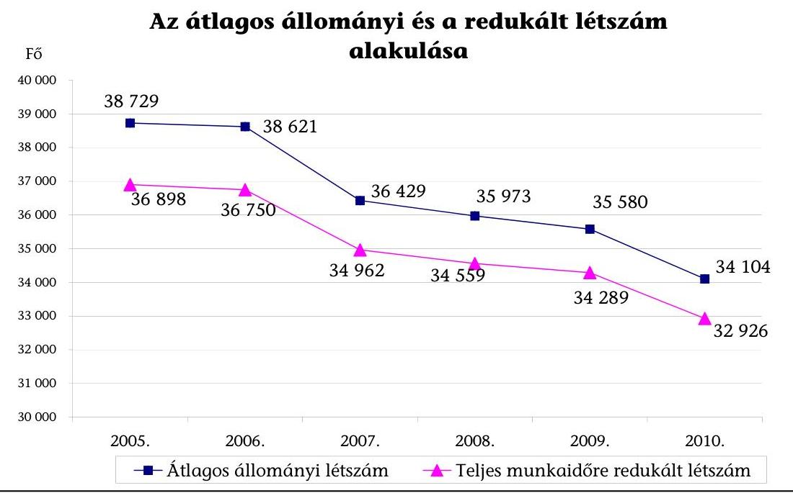
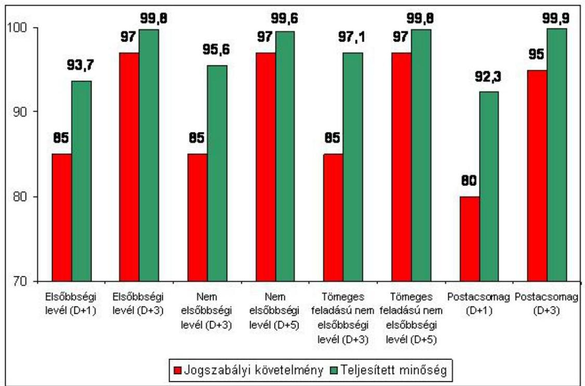
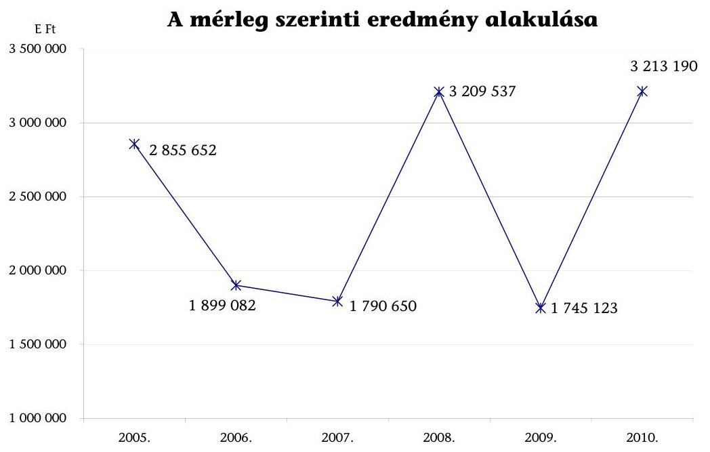
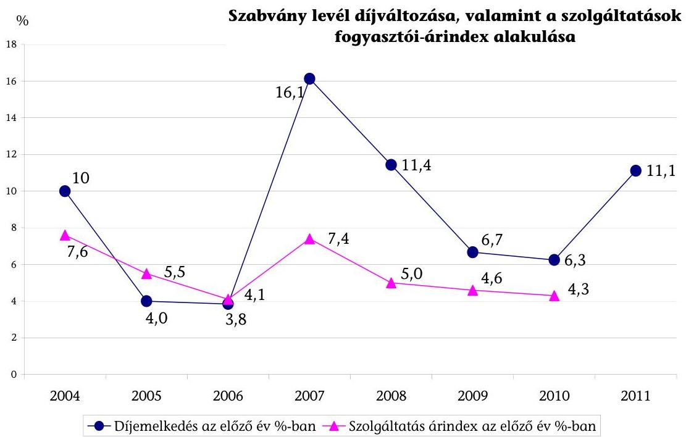
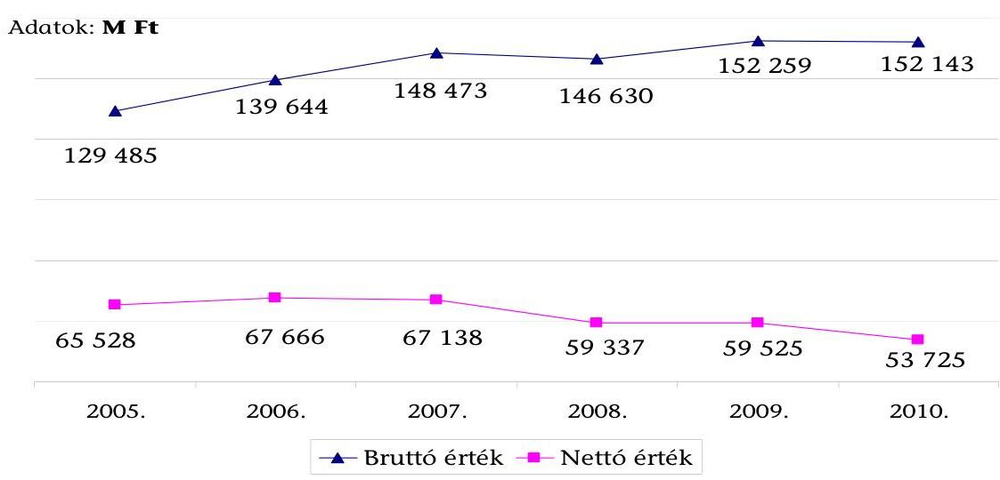
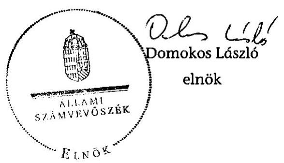
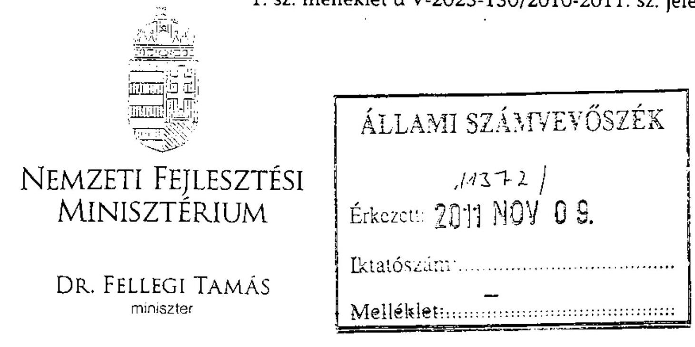
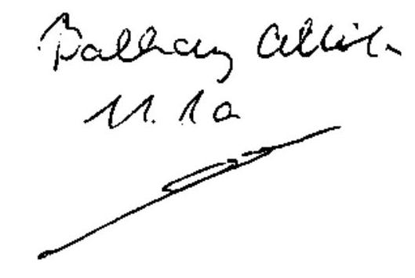

# ÁLLAMI   SZÁMVEVŐSZÉK 

## JELENTÉS

a Magyar Posta Zrt. gazdálkodásának ellenőrzéséről

---

# Állami Számvevőszék 

Iktatószám: V-2023-130/2010-2011.
Témaszám: 1008
Vizsgálat-azonosító szám: V-0537

## Az ellenőrzést felügyelte:

Dr. Becker Pál
költségvetési, felügyeleti főigazgató
Az ellenőrzés végrehajtásáért felelős:
Makkai Mária
felügyeleti vezető
Az ellenőrzést vezette:
Balkay Attila
számvevő tanácsos
A számvevői jelentések feldolgozásában és a jelentés összeállításában közremúködött:

Dr. Hubai Anikó
számvevő asszisztens
Dr. Pataki Magdolna
számvevő tanácsos

## Az ellenőrzést végezték:

## Balkay Attila

számvevő tanácsos
Dr. Király László
számvevő tanácsos
Tóth Bálint
számvevő tanácsos

## Dr. Jártas Ágnes

számvevő tanácsos
Tóth Bálint
számvevő tanácsos

## Dr. Jártas Ágnes

számvevő tanácsos
Dr. Pataki Magdolna
számvevő tanácsos
Vásárhelyi Zoltán
számvevő tanácsos

## A témához kapcsolódó eddig készített számvevőszéki jelentések:

| címe | sorszáma |
| :-- | :-- |
| Jelentés a Magyar Posta Rt. 1997-1998. évi múködésének ellenőrze-   séről | 0014 |
| Jelentés a Magyar Posta Rt. gazdálkodásának ellenőrzéséről | 0429 |
| Jelentés a tartósan veszteségesen múködő állami tulajdonú gazda-   sági társaságok gazdálkodásának ellenőrzéséről | 0611 |
| Jelentés a közbeszerzési rendszer múködésének ellenőrzéséről   2008. évi tevékeny-   ségének ellenőrzéséről | 0831 |

Jelentéseink az Országgyűlés számítógépes hálózatán és az Interneten a www.asz.hu címen is olvashatóak.

---

# TARTALOMJEGYZÉK 

BEVEZETÉS ..... 7
I. ÖSSZEGZŐ MEGÁLLAPÍTÁSOK, KÖVETKEZTETÉSEK, JAVASLATOK ..... 10
II. RÉSZLETES MEGÁLLAPÍTÁSOK ..... 20

1. A postapiac szakmai irányítása és a tulajdonosi joggyakorlás ..... 20
1.1. Az uniós és a hazai szabályozás ..... 20
1.2. A postapiac szakmai irányítása és hatósági felügyelete ..... 22
1.3. A tulajdonosi joggyakorlás ..... 25
2. A Magyar Posta Zrt. múködési jellemzői ..... 28
2.1. A stratégia készítése, stratégiai célok ..... 28
2.2. A szervezeti és múködési rend ..... 30
2.3. Közfeladat ellátás és minőség ..... 31
2.3.1. A közfeladatok ellátása, szolgáltatási színvonala ..... 31
2.3.2. A Postapartner Program alakulása ..... 33
2.4. A gazdálkodás körülményei ..... 35
2.4.1. Üzleti tervezés ..... 37
2.4.2. Az elkülönített nyilvántartás kialakítása ..... 39
2.4.3. A hatósági ár megállapításának előkészítése ..... 40
2.4.4. A társaság likviditása ..... 43
2.4.5. A Posta saját alapítású leányvállalatai ..... 45
3. A beruházási rendszer ..... 48
3.1. Szabályozási környezet ..... 48
3.2. Beruházások tervezése ..... 49
3.3. Az éves beruházási tervek megvalósulása ..... 50
3.4. Gazdaságossági utóellenőrzés ..... 53
3.5. Az eszközpark állapotának általános jellemzői ..... 54
4. Ellenőrzési rendszer és vagyonvédelem ..... 55
4.1. Felügyeleti és hatósági ellenőrzés ..... 55
4.2. Tulajdonosi ellenőrzés ..... 59
4.3. Belső ellenőrzés ..... 61
4.4. A biztonsági és vagyonvédelmi rendszer ..... 63

---

# MELLÉKLETEK 

1. A nemzeti fejlesztési miniszter észrevétele
2. Az Állami Számvevőszék és a Magyar Posta Zrt. közötti véleményeltérés
3. A Magyar Posta Zrt. 2005-2010 éveket jellemző egyes gazdálkodási adatai

## FÜGGELÉKEK

1. Az ingatlangazdálkodás, a jóléti ingatlanok értékesítésének, valamint a Posta Oktatási Központ áthelyezésének körülményei
2. A raktár-centralizáció megvalósítása
3. A POS terminál beruházás megvalósítása
4. Az Országos Logisztikai Központ fejlesztésére és működési hatékonyságának növelésére tett intézkedések végrehajtása
5. Az Integrált Postai Hálózat informatikai rendszer karbantartására, illetve a gépjármú bérlet és flottakezelésre kötött szerződések körülményei

---

# RÖVIDÍTÉSEK JEGYZÉKE 

| ÁSZ | Állami Számvevőszék |
| :-- | :-- |
| BB | Beruházási Bizottság |
| BEK | Beszerzési és Ellátási Központ |
| CAPEX | Capital expenditure: (tőke) beruházás költsége |
| EB | Európai Bizottság |
| EISZK | Elhelyezési és Ingatlan Szolgáltató Központ |
| EMS | Express Mail Service: gyorsposta |
| FB | Felügyelő Bizottság |
| GKM | Gazdasági és Közlekedési Minisztérium |
| Gt. | a gazdasági társaságokról szóló 2006. évi IV. törvény |
| IPH | Integrált Postahálózat |
| Kbt. | a közbeszerzésről szóló 2003. évi CXXIX. törvény |
| KHEM | Közlekedési, Hírközlési és Energiaügyi Minisztérium |
| KSH | Központi Statisztikai Hivatal |
| KSZF | Központi Szolgáltatási Főigazgatóság |
| Magyar Posta | Magyar Posta Zrt. |
| MeH | Miniszterelnöki Hivatal |
| MGT | Műszaki Gazdasági Tanulmányterv |
| MKK | Megkülönböztetett kezelésű könyvelt küldemény |
| MNB | Magyar Nemzeti Bank |
| MNV Zrt. | Magyar Nemzeti Vagyonkezelő Zrt. |
| MPL | Magyar Posta Logisztikai Üzletág |
| NEK | Nem elsőbbségi küldemények |
| NFM | Nemzeti Fejlesztési Minisztérium |
| NHH | Nemzeti Hírközlési Hatóság |
| NMHH | Nemzeti Média- és Hírközlési Hatóság |
| NVT | Nemzeti Vagyongazdálkodási Tanács |
| OLH | Országos Logisztikai Hálózat |
| OLK | Országos Logisztikai Központ |
| PEK | Posta Elszámoló Központ |
| POK | Posta Oktatási Központ |
| POS terminál | Point Of Sale: bankkártyás fizetést lehetővé tevő készülék |
| Posta | Magyar Posta Zrt. |
| PP | Postapartner Program |
| PRI | elsőbbségi küldemények |
| PSZÁF | Pénzügyi Szervezetek Állami Felügyelete |
| Ptv. | a postáról szóló 2003. évi CI. törvény |
| RJGY | Részvényesi Jogok Gyakorlója (pénzügyminiszter, 2010. II. |
| Sztv. | félévtől nemzeti fejlesztési miniszter) |
| Vig. | a számvitelről szóló 2000. évi C. törvény |
| Vtv., Vagyontörvény | vezérigazgató |
| az állami vagyonról szóló 2007. évi CVI. törvény |  |

---

.

---

# ÉRTELMEZŐ SZÓTÁR 

Cash-pool

Egyetemes postai szolgáltatás:

Egyetemes postai szolgáltató:
Engedélyes postai szolgáltató:
Felügyelő Bizottság:

Fenntartott postai szolgáltatás:

Integrált posta:

Egy vállalatcsoport bankszámláinak összevont kezelése annak érdekében, hogy optimalizálják a cégek pénzügyi pozícióját, jobb betétesi pozíciót érjenek el vagy belső finanszírozással csökkentsék a külső hitelállományt.
A postai szolgáltatások olyan közérdekű szolgáltatásnak minősülő meghatározott köre, amely földrajzi elhelyezkedéstől függetlenül, meghatározott minőségben és megfizethető ár ellenében minden igénybe vevő számára elérhető (a kettő kilogrammot meg nem haladó tömegű belföldi és nemzetközi levélküldeményekkel, címzett reklámküldeményekkel és nyomtatványokkal kapcsolatos postai szolgáltatás, a húsz kilogrammot meg nem haladó tömegű belföldi és nemzetközi postacsomagokkal kapcsolatos postai szolgáltatás, a vakok írását tartalmazó, hét kilogrammot meg nem haladó tömegú belföldi és nemzetközi küldeményekkel kapcsolatos postai szolgáltatás).
A Postatörvényben erre kijelölt postai szolgáltató, a Magyar Posta Zrt.
Az egyetemes postai szolgáltatás körébe tartozó szolgáltatást engedély alapján ellátó postai szolgáltató.
A gazdasági társaság ügyvezetésének ellenőrzése céljából létrehozott testület (lásd 2006. évi IV. törvény 33. § (1) bekezdés).
Olyan postai szolgáltatások, melyeket kizárólag a jogszabályban kijelölt egyetemes szolgáltató nyújthat. A Ptv. 7. § alapján a legfeljebb ötven gramm tömegú belföldi, illetve nemzetközi levélküldeményekkel és címzett reklámküldeményekkel kapcsolatos szolgáltatás, amennyiben a szolgáltatás díja alacsonyabb, mint az egyetemes szolgáltatási kör leggyorsabb szolgáltatási kategóriájának első súlyfokozatába tartozó levélküldemény díjának a két és félszerese; eltérő törvényi és kormányrendeletet kivéve a hivatalos iratokkal kapcsolatos postai szolgáltatás; a postai szimbólumok és a bérmentesítési-lenyomat kizárólagos használata; postai értékcikk kibocsátása, forgalomba hozatala, forgalomból való kivonása.
Olyan postai szolgáltatás, amely a postai küldeménynek a feladó által is nyomon követhető kezelése és - a címzett ellenkező rendelkezése hiányában - személyes kézbesítése mellett kiegészül az igénybevevő választása esetén és választása szerint a következő postai különszolgáltatások legalább egyikével: a küldemények a feladó által megjelölt helyen történő felvétele; garantált kézbesítési idejű szolgáltatás; a címzett megváltoztatása esetén a küldemény új címre történő kézbesítése; a kézbesítés igazolása; személyre szabott szolgáltatás. A szolgáltató biztosítja a küldemény vámkezelését, továbbá azt, hogy tevékenysége

---

Konszolidált beszámoló:

Közszolgáltatás:

Nemzeti Vagyongazdálkodási Tanács:

Pilot projekt:

POS (Point of sale) terminál:

Tartósan állami tulajdonban tartandó társaságok:

Treasury
alatt az mindvégig a felügyelete alatt marad, és a küldeménnyel kapcsolatos információk és a kézbesítés igazolása bármikor visszakereshető.
A részvénytársaság és a tulajdoni köréhez tartozó gazdasági társaságok, amely felett az uralkodó tag a számviteli törvény alapján meghatározó befolyással rendelkezik (ellenőrzött társaság) összegzett, halmozásmentes adatait tartalmazó számviteli beszámoló (lásd: a gazdasági társaságokról szóló 2006. évi IV. törvény 55. § (1) bekezdés; a számvitelről szóló 2000. évi C. törvény 118. § (1) bekezdés).
1998. évi XXVI. törvény a fogyatékos személyek jogairól és esélyegyenlőségük biztosításáról
4. § f) közszolgáltatás:
fe) minden olyan hatósági engedély vagy hatósági kötelezettség alapján végzett nyilvános szolgáltató tevékenység, amely település vagy településrész közellátását szolgálja, használata nem korlátozott, illetve nem korlátozható.
A Tanács az állami vagyon feletti tulajdonosi jogok, valamint az MNV Zrt. múködésével kapcsolatos, a 2007. évi CVI. törvény 6. §-ban meghatározott jogok gyakorlására létrehozott testület, amelyet a 2010.évi LII. törvény szüntetett meg. A Tanács hét tagból álló testület volt, amelynek tagjait a miniszterelnök javaslatára a köztársasági elnök nevezett ki hatéves időszakra.
A pilóta projekt (pilot project) a kutatás, tervezés előkészítésére szolgáló, rövidebb intervallumú, kísérleti projekt, amely segíti az alaphipotézisek felállítását, kutatási, illetve fejlesztési irányok meghatározását, hosszabb távú projektek, stratégiák, szabályozások stb. kidolgozását.
EFTPOS mozaikszó jelentése Electronic Funds Transfer at Point Of Sale. Gyakori nevén POS terminál, mely használatával a bankkártyás vásárlások, fizetések bonyolíthatók.
Azon társaság, melyeknél az állam tulajdoni részesedése csak kivételesen indokolt esetben lehet kevesebb 50\%-nál. A tartós állami tulajdonba tartandó társaságok között az állami tulajdonban lévő országos jelentőségű közszolgáltató gazdasági társaságok, a nemzetgazdaság szempontjából stratégiai jelentőségű társaságok, honvédelmi-, rendvédelmi célokat szolgáló gazdasági társaságok, bizonyos állami monopóliumokat hasznosító társaságok vannak besorolva.
Gazdasági társaságoknál a Treasury szervezet likviditástervezéssel, -menedzseléssel, kockázatkezeléssel, finanszírozással foglalkozik. Jelentése kincstár.

---

# JELENTÉS   a Magyar Posta Zrt. gazdálkodásának ellenőrzéséről 

## BEVEZETÉS

A postai tevékenységek ellátását, a postai szolgáltatások végzésének feltételeit, az ezzel kapcsolatos jogokat és kötelezettségeket az Európai Unió vonatkozó jogszabályaival ${ }^{1}$ harmonizáló, a postáról szóló 2003. évi CI. törvény (Ptv.) határozza meg. A törvény kiemelt célja az egyetemes postai szolgáltatások elérhetőségének biztosítása oly módon, hogy a postai piacon garantálja a szolgáltatók közötti esélyegyenlőséget, a verseny lehetőségét, elősegítve a postai szolgáltatások választékának és minőségének javulását. Az egyetemes szolgáltatás olyan, meghatározott körű közérdekű szolgáltatásnak minősül, amely földrajzi elhelyezkedéstől függetlenül - azonos feltételek mellett - és megfizethető ár ellenében minden igénybevevő számára elérhető. A Ptv. Magyarországon egyetemes postai szolgáltatóként a Magyar Posta Részvénytársaságot² (a továbbiakban: Magyar Posta, Posta) jelölte ki.

A postai szolgáltatások ellátásáról és minőségi követelményeiről kormányrendelet ${ }^{3}$ rendelkezik, a szerteágazó tevékenység egyéb szabályait kormányrendeletek, illetve különböző miniszteri rendeletek határozzák meg. Az egyetemes postai szolgáltatás forgalmi adó mentességét - a tevékenység közérdekű jellegére tekintettel - törvény írja elő. ${ }^{4}$

A kijelölt egyetemes szolgáltató az egyetemes körbe tartozó szolgáltatásokat nem kizárólag saját belátása és üzleti érdekei alapján, hanem jogszabályi kötelezés következtében nyújtja, ezért a Posta a postai piacról még gazdaságtalan, veszteséges múködés esetében sem vonulhat ki. E kötelezettség bizonyos fokú kompenzációjaként a Ptv. 7. § (1) és (3) bekezdése egyes szolgáltatások ${ }^{5}$ nyújtását kizárólag a kijelölt postai szolgáltató részére tartja fenn.

[^0]
[^0]:    ${ }^{1}$ Az Európai Parlament és a Tanács - többször módosított - 1997. december 15-i 97/67/EK irányelve a közösségi postai szolgáltatások belső piacának fejlesztésére és a szolgáltatás minőségének javítására vonatkozó közös szabályokról.
    ${ }^{2}$ 2006. január 2-től zártkörűen működő részvénytársaság.
    ${ }^{3}$ A postai szolgáltatások ellátásáról és minőségi követelményeiről szóló 79/2004. (IV. 19.) Korm. rendelet.
    ${ }^{4}$ 2007. évi CXXVII. törvény az általános forgalmi adóról 85. § (1) a).
    ${ }^{5}$ Például meghatározott súlyú belföldi, illetve nemzetközi reklámküldemények, hivatalos iratokkal kapcsolatos postai szolgáltatás.

---

A Posta - egyetemes szolgáltatására is tekintettel a nemzetgazdaság működőképessége szempontjából stratégiai jelentőségű társaság - szolgáltatásai ellátásának színvonala a lakosság széles körének komfortérzetét jelentősen befolyásolja. A Posta az ország minden településén jelen van, 2010-ben az átlagos statisztikai állományi létszáma - valamennyi foglalkoztatási státuszt figyelembe véve - 34104 állományi fő volt (teljes munkaidőre átszámítva 32926 főt jelentett).

Az Állami Számvevőszék (ÁSZ) a Magyar Posta működését utoljára 2004-ben ${ }^{6}$ ellenőrizte, melynek során a társaság gazdálkodását értékelte. Emellett két témában - a postai kerékpár beszerzéssel, ${ }^{7}$ valamint a székházprojekttel kapcsolatban ${ }^{8}$ - érintették számvevőszéki ellenőrzések a Postát. A vagyongazdálkodás területén az ellenőrzések által feltárt hiányosságok, valamint a jogszabályi környezet változásai indokolták úgy a vagyon megőrzésével, illetve hasznosításával kapcsolatos tevékenységek, mint a tulajdonosi joggyakorlás eredményességének, továbbá a közérdekű (közszolgáltatói) feladatellátás feltételrendszerének újabb értékelését. Mindemellett időszerű volt vizsgálni, hogy az EU-nak a postai szolgáltatás minőségjavítására, illetve a piac liberalizációjára vonatkozó irányelvei mennyiben érvényesültek.

Az ellenőrzés célja annak értékelése volt, hogy:

- a tulajdonosi jogok gyakorlója és a menedzsment törvényesen és célszerűen múködtette-e a Magyar Postát; a külső és belső szabályozás összhangban volt-e a társaság feladataival, mennyiben segítette azok hatékony és eredményes ellátását; a tulajdonos, a szakmai irányítás és az ellenőrzés támogatta-e a közszolgáltatói feladatok teljesítését, a postai szolgáltatások színvonalának javítását;
- a Magyar Posta a kezelésében lévő vagyonnal a jogszabályoknak megfelelően, célszerűen és eredményesen, valamint a tulajdonos elvárásai szerint gazdálkodott-e; a társaság ügyvezetésének és menedzsmentjének döntései elősegítették-e a rendelkezésre álló vagyon hatékony hasznosítását, gyarapodását, megőrzését; a beruházások és beszerzések megalapozottságát és célszerűségét biztosító kontrollrendszert alakítottak-e ki; a beruházások és beszerzések összhangban voltak-e a stratégiai és üzleti célkitűzésekkel;
- a postapiac liberalizációjának és szabályozási környezetének előkészítése kiszámítható feltételrendszert teremtett-e a Magyar Posta felkészüléséhez, a társaság menedzsmentje célszerű és eredményes intézkedéseket hozott-e a postapiaci liberalizáció versenyképességet és eredményességet befolyásoló hatásainak kezelésére; a postai szolgáltatások korszerűsítését, fejlesztését az EU vonatkozó irányelveivel összhangban és a szolgáltatási színvonal javítása érdekében végezték-e;

[^0]
[^0]:    ${ }^{6}$ Jelentés a Magyar Posta Rt. gazdálkodásának ellenőrzéséről. 2004. június [0429]
    ${ }^{7}$ Jelentés a közbeszerzési rendszer működésének ellenőrzéséről. 2008. szeptember [0831]
    ${ }^{8}$ Jelentés a Magyar Nemzeti Vagyonkezelő Zrt. 2008. évi tevékenységének ellenőrzéséről. 2009. augusztus [0929]

---

- a tulajdonosi és a belső ellenőrzés elősegítette-e a gazdálkodás szabályosságát, hatékonyságának növelését; hasznosították-e a társaság tevékenysége, gazdálkodása ellenőrzéséről készült korábbi ÁSZ jelentések megállapításait, javaslatait, ajánlásait.

Az ellenőrzés a 2008-2010. évekre terjedt ki, egyes vizsgálati területeken kitekintve a korábbi, illetve a folyamatban lévő intézkedésekre. Az ellenőrzésnek nem volt célja a részvénytársaság múködésének teljes körű átvilágítása. A Posta gazdálkodásának ellenőrzése a különböző szintű állami és társasági irányító és felügyelő szervezetek által kialakított irányítási és kontrollrendszerekre irányult (a Magyar Posta tulajdonosi joggyakorlója, a Magyar Nemzeti Vagyonkezelő Zrt., a Posta menedzsmentje, illetve - a postaügyi felelősséggel összefüggésben - a Nemzeti Fejlesztési Minisztérium (NFM) és jogelődjei által meghozott, illetve az ellenőrzés alatt folyamatban lévő intézkedésekre). Kiemelten kezeltük a postai szolgáltatás EU konform korszerűsítését, a beruházások és beszerzések kontrolljait, a vagyongazdálkodás területét, továbbá áttekintettük a Posta vagyon megőrzésével és hasznosításával kapcsolatos tevékenységével öszszefüggő tulajdonosi joggyakorlást.

A Posta vezérigazgatójának 2010 novemberében az ÁSZ-hoz benyújtott négy témában (a jóléti ingatlanok értékesítése, a raktározási helyzet megoldása, a POS terminálok beszerzésének körülményei, a 2004-2008 közötti informatikai beruházások indokoltsága) tett közérdekű bejelentése alapján - az ellenőrzés előkészítése alatt bekért információk értékelését, mérlegelését követően - megvizsgáltuk a jóléti ingatlanok eladásának és a raktározás kialakításának körülményeit, döntési hátterét, valamint a POS terminálok beszerzését, telepítését. A 2004-2010 közötti időszak informatikai beszerzéseinek indokoltságára, szakmai megalapozottságára vonatkozó negyedik témát a Magyar Nemzeti Vagyonkezelő Zrt. vizsgálja tulajdonosi ellenőrzés keretében. Mindezek mellett megvizsgáltuk a Posta Oktatási Központ áthelyezésének körülményeit, az Országos Logisztikai Központ fejlesztésére és hatékonyságának növelésére tett intézkedéseket, továbbá aktualitásukra tekintettel az Integrált Postai Hálózat informatikai rendszer karbantartására, illetve a gépjármú bérlet és flottakezelésre kötött szerződések körülményeit. A vagyongazdálkodással összefüggő egyes témákra vonatkozó részletes megállapításokat a függelékek tartalmazzák.

Az ellenőrzés jogalapját az Állami Számvevőszékről szóló - 2011. június 30-ig hatályos - 1989. évi XXXVIII. törvény 2. § (6) bekezdése képezte. Az Állami Számvevőszékről szóló - 2011. július 1-jétől hatályos - 2011. évi LXVI. törvény rendelkezéseit az egyeztetési eljárás során alkalmaztuk.

---

# I. ÖSSZEGZŐ MEGÁLLAPÍTÁSOK, KÖVETKEZTETÉSEK, JAVASLATOK 

A postapiac európai verseny előtti megnyitása az ország kötelezettsége, piacvezető szerepére tekintettel e folyamat leginkább érintett szereplője a Magyar Posta Zrt. (Posta). A Posta gazdálkodása, stratégiai törekvései 2007 óta az európai uniós követelményeknek megfelelő postapiaci liberalizáció sikeres megvalósítására irányultak. A tulajdonosi joggyakorló a Posta stratégiáinak és üzleti terveinek jóváhagyásával támogatta a felkészülést, ugyanakkor a költségvetés bevételi szempontjai miatt jelentős összegű osztalékot vont el a társaságtól, amely az üzleti tervek szerint a fejlesztések forrásául is szolgált volna. Az állam, mint tulajdonos részéről nem kapta meg a Posta a társasági szinten kialakított céljainak egyértelmű támogatását. A kormányzati szereplők felé a szűkülő, illetve megszűnő feladatainak új funkciókkal történő kiváltása érdekében tett lépéseihez nem kapott érdemi segítséget. A kormányzati postapiaci stratégia még nem készült el. A Posta tevékenysége nem választható el a jövőképét, múködését és gazdálkodását meghatározó elképzelésektől és a hazai szabályozási környezettől, amelyek megalkotása a közeljövőben a szakmai és a tulajdonosi irányítás, valamint a társaság feladata.

A hatályos uniós szabályozás szerint 2013. január 1-jétől a magyar postai piac is megnyílik az európai szolgáltatók előtt, ami a Posta működésére nézve jelentős gazdasági és esetleges társadalmi kockázatokat hordoz magában. Fennáll annak a lehetősége, hogy az állami tulajdonú, stratégiai jelentőségű, az egyetemes szolgáltatásokra törvényi úton kijelölt és a fenntartott szolgáltatások révén még védett Posta a potenciális versenytársak belépésével részleges piacvesztést szenved el, ami kiemelkedő foglalkoztatási lehetőségeinek csökkenéséhez nyithat utat. A Posta bevételeinek mintegy fele piaci tevékenységéből származott, ezért a verseny kihívásaival, a piac változásaival folyamatosan szembesült. Alaptevékenységében a levélvolumen, a készpénzátutalási megbízások (sárga csekk) tranzakció-száma és összértéke folyamatosan csökkent. Ebben közrejátszott, hogy kiépültek a hagyományos levelezési, fizetési formákat kiváltó elektronikus szolgáltató rendszerek a kormányzati (e-közigazgatás), a kereskedelmi (e-kereskedelem) és a pénzforgalmi (e-banking) szférában. A kedvezőtlen piaci tendenciák és a gazdasági válság a Posta gazdálkodására negatív hatást gyakoroltak. A Posta számára a legnagyobb kihívás - már most, a piacnyitást megelőzően is - stabil gazdálkodásának fenntartása, versenyképességének, meglévő piaci pozícióinak és bevételeinek megtartása, a piacvesztés minimalizálása.

A Posta késésben van a piacnyitásra történő felkészülésben. Ebben alapvető szerepet játszott, hogy sem a vagyongazdálkodás, sem a postapiac múködésének szabályozása területén nem alkották meg azokat a koncepciókat, amelyekhez a társaság igazodhatott volna, megalapozottan építhette volna üzleti elképzeléseit. Ezek hiányában a Posta társasági stratégiájában vázolta fel a tervezett jövőképet, amelyet a piaci környezet az üzleti eredmények és a válság hatásai miatt évente felülvizsgált és felülírt. A tulajdonos által jóváhagyott 2012-2014 évekre összeállított üzleti terv az alaptevékenységből származó ár-

---

bevételek visszaesése, a növekvő hiteligény és közel azonos szintű ráfordítás mellett veszteséget valószínűsít, ennek realizálódása azonban a most formálódó piacmodelltől ${ }^{9}$, továbbá a Posta abban betöltött szerepének meghatározásától is függ.

A Ptv. szerint a nemzeti postapolitika és az ágazati fejlesztési koncepciók megalkotása a Kormány feladatát képezi. A postapiac szereplői számára 2007 óta hiányzik a kiszámítható igazodási pontokat jelentő koncepció, ami a jelentősebb kockázatok elkerülésének elengedhetetlen feltétele. A felelős minisztériumok törekvései a postapiaci stratégia és a kapcsolódó szabályrendszer kialakítására csak egyes területeken hoztak eredményeket (magyarországi helyzetelemzés, sajátosságok meghatározása stb.). 2011 áprilisa óta a Nemzeti Fejlesztési Minisztérium (NFM) gondozásában készül a postapiaci liberalizáció kereteinek meghatározása.

A postai tevékenység hazai jogi szabályozása követi az uniós előírásokat, az Európai Bizottság azonban úgy ítélte meg, hogy az egyetemes szolgáltatók piacra lépésének magyar szabályai túlterjeszkednek az engedélyezési eljárások EU által jóváhagyott céljain, ebből adódóan versenykorlátozó hatásuk van. A magyar féllel szemben az ún. kötelezettségszegési eljárás még nem ért véget. Az NFM a probléma kezelését nem zárta le, azt - az átmeneti és rövid távra szóló jogszabály módosítások helyett a liberalizált piaci szabályok 2011. év második felétől folyamatban lévő kialakítása során tervezi rendezni.

A tulajdonosi joggyakorlóo ${ }^{10}$ irányítása, döntései alapvetően az üzleti tervek és beszámolók, stratégiák elfogadásán, személyi és javadalmazási ügyek döntésein kívül az 5 Mrd Ft feletti beruházásokat érintették. A tulajdonosi joggyakorló a társaság pénzügyi-gazdasági helyzetéről, folyamatairól a Posta igazgatósága és Felügyelő Bizottsága ülésein tájékozódott, illetve szükség szerint külön beszámolást kért (pl. az irodaházak értékesítéséből származó bevétel liberalizációs célú felhasználásáról). Az állam elvárásaiban 2011-ig jellemzően a költségvetés rövid távú pénzforgalmi szemlélete dominált. A Posta osztalék befizetésére volt kötelezett, annak ellenére, hogy ezen forrás - a társaság elképzelései szerint - középtávú fejlesztéseit, versenyképességének stabilitását szolgálhatta volna. A Posta 2008-2010 között összesen 12,28 Mrd Ft osztalékot fizetett be a költségvetésbe, az MNV Zrt. csak a 2010. üzleti évre vonatkozóan nem vont el osztalékot.

A Posta állami vagyonban betöltött stratégiai szerepe nem tisztázott. A 2007-ben elfogadott vagyontörvény fő célkitűzése az állami vagyon piaci alapon történő működtetése, a vagyon célhoz kötöttsége, a közfeladat-ellátás szabályozása ehhez képest kisebb jelentőséggel bírt. A törvényben deklarált általános célokat (vagyonérték-megőrzés, vagyongyarapodás) a kormányzati célokkal összehangolt részletes vagyonhasznosítási stratégia vagy irányelv nem

[^0]
[^0]:    ${ }^{9}$ A postai múködés uniós szabályozása direktívákkal történik, melyek kereteket határoznak meg a tagállami szabályozás - többek között az egyetemes szolgáltatások és finanszírozásuk modelljének - megalkotásához.
    ${ }^{10}$ Az ellenőrzött időszakban a Nemzeti Vagyongazdálkodási Tanács, majd a nemzeti fejlesztési miniszter gyakorolta az állam tulajdonosi jogait.

---

bontotta le, ezért azokból nem volt levezethető a Postával kapcsolatos állami szándék.

A tulajdonosi joggyakorláshoz az MNV Zrt. az állami tulajdonú társaságok gazdálkodásának kontrolling rendszerében - amelynek működéséről belső szabályzat nem rendelkezett - a tulajdonos értékelése szerint is jelentős súlyúnak számító Postáról csak az eredményre vonatkozó, minimális információkkal rendelkezett. Előrejelző, illetve riasztó rendszere a társaságok gazdálkodásának csak negatív tendenciáira terjedt ki, így a 2008-2010 között nyereséges Posta nem került be e rendszerbe.

A Posta működésével összefüggő kormányzati kooperációban jelentkező korábbi hiányosságokra - amelyek hátrányosan érintették a Posta jövőképének, társadalmi szerepvállalásának érvényesítését (pl. a Posta sikertelen törekvése az elektronikus kézbesítési rendszerben való funkcióvállalásra 2009ben) - megoldást jelenthet, hogy 2010 közepétől egy tárca hatáskörébe tartozik a tulajdonosi joggyakorlás, a postai szolgáltatások szabályozása, valamint a nemzeti fejlesztések összehangolása. A feladatok egy tárcához való tartozása lehetővé teszi, hogy a postai szolgáltatásokhoz kapcsolódó tulajdonosi és postaszakmai érdekek együtt jelenjenek meg az állam Postára vonatkozó vagyoni stratégiai elképzeléseiben.

A Posta középtávú céljait - kormányzati stratégiai elképzelések hiánya mellett - a társasági szintű érdekek alapján határozták meg. Ezek között szerepelt a liberalizációra való sikeres felkészülés, a nyereséges működés fenntartása, a postai szolgáltatások minőségének javítása, valamint piaci pozíciójának megőrzése. 2008-2010 között a tulajdonos által is jóváhagyott stratégiáinak évenkénti felülvizsgálatára és módosítására kényszerült a postapiac, a makrogazdasági környezet (pl. gazdasági válság), valamint üzleti eredményei változása miatt.

A Posta gazdálkodása 2007-2010 között alapvetően stabil volt, az üzleti éveket pozitív üzemi és adózott mérleg szerinti eredménnyel zárta (3. sz. melléklet). Árbevételei általában magasabb szinten realizálódtak a tervezettnél, de 2009től csökkenő tendenciát mutattak. (2009-ben az előző évinél közel 0,8 Mrd Fttal kevesebb értékesítési árbevételt, 193,7 Mrd Ft-ot, míg 2010-ben 191,2 Mrd Ftot ért el.) A 2010 végén elfogadott Stratégiai Keretrendszer a nyereséges gazdálkodás helyett már 2012-től, de különösen a piac 2013-as megnyitásától veszteséges gazdálkodást (piacvesztést, bevétel csökkenést stb.) valószínűsít.

A Posta 2010 végén készített Stratégiai Keretrendszere - amelyet a társaság menedzsmentje a megújulás programjaként értelmez - a Posta szerepében a jelenlegieknél bővebb társadalmi (pl. a foglalkoztatási szint megtartása, „Nemzet Postája") és közszolgáltatói feladatok teljesítésével számol. A társasági szinten megfogalmazott jövőkép megvalósulása azonban attól is függ, hogy a korábbiaktól eltérően - az állam a tervek tulajdonosi jóváhagyásán túl mennyiben támogatja a Posta törekvéseit (szakmai és vagyoni támogatás a szabályozási rendszeren keresztül, feleslegessé vált funkciók újakkal való helyettesíthetősége, fejlesztési kedvezmények stb.).

---

A Posta gazdálkodása stratégiai és éves üzleti terveken alapult, amelyekhez azonban a hiányzó tulajdonosi és postapiaci szakmai koncepciók (a tervezési keretszámok meghatározásán túl) nem adtak kellő igazodási pontokat. A hagyományos postai szolgáltatásokat háttérbe szorító elektronikus információközlés rohamos térnyerése, a már nyitott piacokon megjelenő versenytársak, továbbá a gazdasági válság folyamatos újításokra, korszerűsítésre, költségei csökkentésére késztette a Postát, amelyek eredményessége (a realizált nyereség) 2011-et követően - számításaik szerint - megszűnik.

A Posta általános gazdálkodási feltételrendszere - elsősorban a piaci körülmények, továbbá a pénzforgalmi szabályok változásai és a hatósági áralkalmazás - több esetben korlátozta a stratégiai koncepciókon nyugvó üzleti elképzelései megvalósítását. A gazdasági válság hatására a szolgáltatások igénybevétele visszaesett. Az üzemanyag árnövekedései, illetve az árfolyamváltozások folyamatos ráfordítás-növekedést okoztak. Az ügyfélpénzek kezelésének új szabályai ${ }^{11}$ likviditását csökkentették, hiteligényét növelték. Az egyetemes postai szolgáltatás forgalmi adó mentessége - a csak arányosított mértékű viszszaigénylés miatt - szintén ráfordítás-növelő tényezőként jelent meg. 2010-ben a Posta az általa javasolt 5,8\% helyett csak - makrogazdasági szempontból indokoltan - a tervezett infláció szerinti áremelést érvényesíthette, amely 1033 M Ft bevételi elmaradást okozott. Üzleti tervének véglegesítését a 2007., 2009. és 2010. években hátráltatta, hogy a közölt árjavaslatokat az illetékes szakminisztérium a törvényi előíráshoz és az üzleti tervezés információszükségletéhez képest késedelmesen határozta meg.

Nem hozta meg a várt eredményt a 2007-ben indított Postapartner Program, amelyet a postai hálózat modernizációjaként, költségcsökkentési szándékkal vezettek be az alacsony üzleti potenciált és relatív magas költséget termelő egyes szolgáltató helyek vállalkozásba adásával. A pályázókat időszakosan számos előny segítette (pl. kedvezményes kamatozású hitel, állami bér- és járuléktámogatás), azonban ezek a támogatások a vállalkozók (vállalkozói láncok) hatékonyságjavító motivációit csökkentették. A két évre szóló munkaerőpiaci támogatások megszűnte után a szolgáltatóhelyek sorozatos visszaadására került sor. (2011 júniusáig 530 szerződésből közel 160 szolgáltatóhely szerződését mondták fel.) Ennek következtében a Programtól 2010-re várt 3,9 Mrd Ft üzleti eredmény alig 16\%-a realizálódott.

A Posta múködteti gazdálkodási rendszerében azokat az elkülönített nyilvántartásokat, amelyeket a jogszabályok előírnak az egyetemes, ezen belül a fenntartott szolgáltatásokból származó bevételek kimutatására. Az egyetemes szolgáltatásokból a bevételek mintegy fele származik. A Posta számvitele és kontrolling rendszere a jogszabályi követelményekhez (egyetemes szolgáltatási díjak nyilvántartása, átláthatósága, költségalapúsága) igazodott, ami alapvetően megteremtette a feltételeket az egyes postai szolgáltatások költségeinek meghatározásához. Az elkülönítés jelentősége abban áll, hogy a fenntartott szolgáltatás bevételei az egyetemes postai szolgáltatások többletkiadásait kell

[^0]
[^0]:    ${ }^{11}$ A hitelintézetekről és a pénzügyi vállalkozásokról szóló 1996. évi CXII. törvény pénzforgalmi intézményekkel és pénzforgalmi szolgáltatással összefüggő módosításáról szóló 2009. évi LXXXVI. törvény.

---

fedezzék, azokat nem lehet az egyetemes szolgáltatáson kívüli szolgáltatások finanszírozására fordítani, amit a Posta betartott.

A Posta szervezeti és irányítási rendje folyamatosan változott. A 2010-ben elindított újabb változások a liberalizációra koncentráló ésszerűsítést célozták, a már megvalósított módosítások vezetői szintcsökkenést és áttekinthetőbb döntéshozatali rendszert eredményeztek. A Posta 2010 végén elfogadott Keret Stratégiájában számottevő létszámleépítéssel nem számol, a munkahelyek megtartását célozza meg.

A piaci verseny fokozódása mellett a Biztonsági Főigazgatóság éves jelentései visszatérően fogalmaztak meg humánpolitikai kockázatot a konkurenciához távozó munkavállalókkal összefüggésben, amellyel kapcsolatban konkrét intézkedések nem születtek.

A postai leányvállalatok döntő többsége alapvetően a Posta részére végzett az alaptevékenységgel összefüggő szolgáltatásokat. Árbevételük, üzleti eredményük összességében pozitív volt, az anyavállalat vagyoni és pénzügyi helyzetét kismértékben, de kedvezően befolyásolták. A leányvállalatok piaci kitettségének növekedését a Posta a tevékenységi kör diverzifikálásával (postai kereskedelmi áruk kínálatának növelése, gépjármúflotta kezelés, pénzszállítás, gépjármú vizsgáztatás stb.) tervezi megoldani, ennek részletes stratégiáját még nem fogadták el. A leányvállalatok üzleti tervezéséhez a Posta összehangolt és gördülő tervezést alkalmaz.

A Posta beruházási rendszere a törvényi alapokon és belső múködési szabályokon nyugvó beszerzési mechanizmusra, továbbá a piaci viszonyok követésének követelményére támaszkodott. A beruházások éves összetételét, azok összértékét a tulajdonos jóváhagyta. A tervezési gyakorlat azonban a tervezett forrásallokációk helyességét, a beruházási tervek megalapozottságát és időtállóságát nem biztosította teljes körűen. Az instabil üzleti és stratégiai környezet, valamint egyes, nem kellően előkészített beruházások bizonytalansági tényezőit a menedzsment-változások és az azokat követő koncepcióváltások tovább bővítették. Mindezek következményeként a 2008-2010. közötti időszakban együttesen jelentkezett a rendszeres év közbeni beruházási program-módosítás (pl. 2009-ben kilencszer), a maradványképződés (pl. 2010-ben közel 60\%) és a beruházások évek közötti átütemezése. A 2008-2010. közötti időszakban a tervezett beruházások realizálása (2008-ban 8 Mrd, 2009-ben 10,8 Mrd, 2010-ben 4,1 Mrd Ft) jelentősen elmaradt a tervektől (2008-ban 10 Mrd, 2009-ben 14,2 Mrd, 2010-ben 10 Mrd Ft).

A beruházási folyamatok szoros összefüggésben álltak az eszközgazdálkodás megújító törekvéseivel. Ezeket elsősorban az indokolta, hogy a szükséges pótló és fejlesztő beruházások ellenére is 2011-ben a postai tárgyi eszközök közel egyharmada ( 55 Mrd Ft értékben) teljesen amortizálódott, már nullára leírt értéken van nyilvántartva. A versenyképesség javítása a technikai fejlődéssel, versenytársakkal való lépéstartást, az eszközpark folyamatos megújítási képességét teszi szükségessé, amire az üzleti tervekben középtávon, évente 10 Mrd Ft körüli beruházási forrást terveztek.

---

Az ingatlangazdálkodás stratégiai, részletes vagyongazdálkodási és raktárgazdálkodási tervek nélkül zajlott. Az ingatlanértékesítés kontrolljai a szabályozás ${ }^{12}$, a döntés-előkészítés, a dokumentálás, a belső és a folyamatba épített ellenőrzés hiányosságai miatt nem volt képes teljes körűen biztosítani a Posta gazdasági érdekeinek érvényesítését. Az ingatlan-nyilvántartás megbízhatóságát az ingatlanvagyon 2005 óta évente elvégzett értékbecslése mellett a vagyonértékelés - többek között a vizsgált ingatlanértékesítések esetében tapasztalt - hiányosságai (becslési eltérések, nem igazolt becslési módszerek stb.) korlátozták.

A hiányosságok és azok következményei a jóléti ingatlanok egyes értékesítési eljárásaiban is megjelentek. Az értékesített ingatlanok eladási ára négy esetben összesen 34 M Ft-tal alacsonyabb volt az értékesítéskor becsült piaci összehasonlítás alapján megállapított forgalmi értékeknél. A szerződések előkészítői, a döntési mechanizmus és kontrollrendszer szereplői nem gondoskodtak az értékkülönbségek megalapozott és dokumentált kezeléséről. A vagyonkezelő kellő gondosságának hiánya egyes esetekben a becslési értékkülönbözetek indoklásától való eltekintésben, a vevő vásárlási feltételeinek könnyítésében, illetve indokolatlanul gyorsított eljárásban nyilvánult meg. Egyes értékesítéseket anyagi hátrány (a szántódi ingatlan és a Siófoki Gyermeküdülő esetében összesen 35,6 M Ft-tal volt alacsonyabb a vételár a becsült piaci forgalmi értékhez, illetve a gyermeküdülő eladását indokoló előterjesztésben szereplő vagyonértékhez képest), vagy szabálytalan szerződéskötés (pl. eltérés a nyertes és a tényleges vevő személyében), illetve előnytelen bérlet jellemzett (Posta Oktatási Központ esetében 2009-ben 72 M Ft többletköltség). Mindezek mellett a Posta kiemelkedő hasznot eredményező értékesítést (Szegedi Sporttelep esetén közel 100 M Ft-os hasznot) is realizált. (1. Függelék)

A raktárkapacitások optimalizálásával összefüggő intézkedések kihasználatlan raktári kapacitáshoz vezettek, a raktár-centralizáció megvalósításában nem jutott érvényre a gazdaságosság szempontja. A raktár-centralizációt előkészítő, a legelőnyösebb alternatívát megalapozó eljárásokban ellenőrzésünk több területen (előterjesztések, döntések megalapozottsága) az értékelést gátló dokumentálási hiányosságokat talált. (2. Függelék)

A többek között bankkártyás fizetést is lehetővé tevő 5665 darab ún. POS terminál beszerzése és telepítése tárgyban - nettó 1,2 Mrd Ft-ot meghaladó értékben - megkötött szerződés teljesítése mintegy két évet késett. A szerződés teljesítése során az ügymenetet és a döntéshozatalt a dokumentálás hiánya jellemezte. Mindezek a késedelmes teljesítés okainak és felelőseinek teljes körű megállapítását, valamint a Posta kimutatott kárainak és az érvényesített kötbér öszszege helyességének és megalapozottságának megítélését az ellenőrzés számára nem tették lehetővé. (3. Függelék)

Az Országos Logisztikai Központ (OLK) beruházásai a működési hatékonyság javítását szolgálták. A 2005 végén zárult projekt keretében telepített technikai berendezések műszaki állapota az évtized végén már további fejlesztéseket indokolt. Azonban többek között a finanszírozhatóság bizonytalanságai

[^0]
[^0]:    ${ }^{12}$ A vonatkozó vezérigazgatói utasítás 2010. január 1-jével lépett hatályba.

---

következtében folyamatosan változó koncepciók és elképzelések miatt a logisztikai hálózat fejlesztését célzó beruházás megkezdése halasztódott. 2011 tavaszán született az utolsó döntés az OLK továbbfejlesztésére, annak végrehajtása a helyszíni ellenőrzés lezárásakor még nem kezdődött meg, ami növeli a használt berendezések működési kockázatát. (4. Függelék)

2010 közepétől a gépjármú bérlet és a flottakezelés megújítása vált szükségessé, melyet a Posta százszázalékos tulajdonában lévő Postaautó Duna Zrt. új leányvállalata (a Posta unokacége) közremúködésével oldottak meg. A Posta hitelkonstrukcióban, saját forrásaival finanszírozta az év végén bejegyzett Postaflotta Kft.-t, amely közbeszerzési eljárás nélküli jármúbeszerzést, majd azok bérbeadását hajtotta végre a Posta számára, összességében közel 1 Mrd Ft értékben. A konstrukció megvalósítását a Kbt. lehetővé tette. Az unokacéggel kötött szerződésben és annak mellékletében szereplő bérbe adott jármú mennyisége 2 db-bal eltért egymástól, így kevesebb jármú átadást dokumentálták, annak ellenére, hogy a szerződéskötést megelőzően több mint 3 héttel korábban az autók átadás-átvétele megtörtént. (5. Függelék)

A postai tevékenységet kiszolgáló Integrált Postai Hálózat (IPH) informatikai rendszerét kifejlesztő vállalkozó olyan egyedülálló megoldást alkalmazott, amely a postahelyi technológiát lefedve számos egyedi sajátossággal rendelkezett. Az 1999 elején indult projekt eredeti fővállalkozója tíz év után az egyik 2011. május végéig egy offshore cég többségi tulajdonában levő - alvállalkozójának adta át a szerződés teljesítésével összefüggő feladatokat, aki kizárólagosan rendelkezett a megfelelő technikai ismeretekkel és képességekkel. Ennek következménye volt, hogy 2010-ben és 2011-ben az informatikai rendszer szoftver támogatására és továbbfejlesztésére a Posta - két hirdetmény nélküli tárgyalásos közbeszerzési ajánlattételi felhívás keretében - ezt a vállalkozást kérte fel. Az a tény, hogy a szerződésbe vont vállalkozó offshore érdekeltségben volt, semmilyen jogi aggályt nem vetett fel, mivel ezt rendelkezések nem tiltották. Erre ad a jövőben megoldást a közbeszerzésekről szóló 2011. évi CVIII. törvény, amely 56. § (1) kb) pontja szerint az adóelkerülést célzó offshore vállalkozások nem vehetnek részt a közbeszerzési eljárásokban sem ajánlattevői, sem alvállalkozói vagy kapacitást biztosító szervezetként. (5. Függelék)

A postapiac múködésének szabályosságát a Ptv. alapján meghatározott hatóság felügyelte. A hatóság ellenőrzései során a Posta múködésével kapcsolatban általános, rendszerszintű szakmai problémákat nem tárt fel. Az éves beszámolók adatai szerint az előírt minőségű egyetemes szolgáltatás biztosítására vonatkozó közfeladat-ellátási kötelezettség teljesítési szintje évről évre javult és meghaladta az EU által követelt és a jogszabályokban meghatározott minőségi mutatókat. Az éves ún. szolgáltatásminőségi beszámolókat a hatósági felügyelet elfogadta, azokkal kapcsolatban az esetleges elmaradásokra (pl. levélszekrények hozzáférhetősége) felhívta a szolgáltató figyelmét. A minőségirányítási rendszer múködtetése és kontrollja folyamatos volt. 2011 januárjától a minőségbiztosítás és a minőség ellenőrzése vezérigazgatói utasításban rögzített kiemelt vezetői feladat.

A Pénzügyi Szervezetek Állami Felügyeletének (PSZÁF) felügyeleti hatásköre 2009. november 1-jétől terjedt ki a Postára, mint pénzforgalmi szolgáltatóra. A PSZÁF a Posta pénzforgalmi múködését átfogóan érintő múködési prob-

---

lémákra hívta fel a figyelmet, elsősorban a feladatok szabályos ellátásának feltételéül szolgáló informatikai biztonság területén. A jogszabályban előírt időre (2009. november 1.) a Posta nem tudta teljesíteni a pénzforgalmi szolgáltatóra előírt követelményeket. A PSZÁF a hiányosságok megszüntetésére határidők meghatározásával, intézkedési tervben rögzített feladatok végrehajtására kötelezte a Postát. A jogszabályi megfelelés teljesítésének felügyelt folyamata mellett 2011 márciusában felelt meg a Posta a pénzforgalmi szolgáltatóra előírt követelményeknek (ekkor vette nyilvántartásba a PSZÁF).

A tulajdonosi ellenőrzés hozzájárult a Posta szabályos múködésének elősegítéséhez, a szabálytalanságok feltárásához. A 2004-2010 közötti informatikai beszerzéseinek indokoltságát, szakmai megalapozottságát, jog- és szabályszerűségének mintavételes vizsgálatát az MNV Zrt. külső szakértő igénybevételével 2011-ben megkezdte. A vizsgálat még folyamatban van, csak úgy, mint a Posta székházával kapcsolatos ingatlanértékesítések és az ingatlan bérlésének vizsgálata, melynek véglegesítése még nem zárult le (az ügyben büntetőeljárás van folyamatban, melyre tekintettel az ÁSZ nem folytatott vizsgálatot). Az MNV Zrt. Felügyelő Bizottsága 2010 végétől kiemelt figyelemmel kíséri a liberalizációs felkészülést érintő gazdálkodási döntések megvalósítását.

A Posta hatékony és szabályos múködésének támogatására hivatott belső ellenőrzés több kockázati tényező mellett végezte feladatát. 2007-ben 30\%-os ellenőri kapacitáscsökkenés következett be a létszámleépítés következtében, 2008-tól pedig a belső ellenőrzésnek a jogi területhez sorolása a független értékelés lehetőségét korlátozta. 2009-ben külső szervezet átvilágítása erősítette meg a függetlenség szükségességét és arra is rámutatott, hogy a belső ellenőrzés nem felelt meg teljes körűen a Belső Ellenőrzés Szakmai Gyakorlata Nemzetközi Standardjainak (pl. IT auditori szaktudás, kontroll-kockázat szempontú vizsgálatok hiánya). A külső szervezet véleményét jelenlegi ellenőrzésünk tapasztalatai is alátámasztották, ugyanakkor a Posta belső ellenőrzésének szervezeti elhelyezkedése már megfelelő, biztosítja az ellenőrzés függetlenségét.

Az Állami Számvevőszékről szóló 2011. évi LXVI. törvény 33. § (1) bekezdésében foglaltak értelmében a jelentésben foglalt megállapításokhoz kapcsolódó intézkedési tervet köteles az ellenőrzött szervezet vezetője összeállítani és azt a jelentés kézhezvételétől számított harminc napon belül az ÁSZ részére megküldeni. Amennyiben az intézkedési tervet határidőben nem küldi meg a szervezet, vagy az nem elfogadható, az ÁSZ elnöke a hivatkozott törvény 33. § (3) bekezdés a)-b) pontjaiban foglaltakat érvényesítheti.

Az ellenőrzés intézkedést igénylő megállapításai és javaslatai:

# a nemzeti fejlesztési miniszternek: 

1. A 2013. január 1-jei teljes postapiaci liberalizáció előtt még nem áll rendelkezésre postapiaci stratégia és annak érvényesítését biztosító, a versenykorlátozást kizáró szabályozási rendszer, ami hátráltatja az érintett szereplők hatékony felkészülését a szabad versenyre.

---

Javaslat:
Intézkedjen az európai uniós irányelveket figyelembe vevő postapiaci stratégia és a kapcsolódó jogi szabályozás mielőbbi előkészítéséről annak érdekében, hogy a piaci szereplők - köztük a Magyar Posta Zrt. - elegendő idővel rendelkezzenek a szabályozási környezethez való igazodáshoz.
2. A Magyar Posta Zrt. állami vagyonban betöltött stratégiai szerepe nem tisztázott és a vagyon hasznosításának tulajdonosi koncepciója nem összehangolt a postapiacon ellátandó közszolgáltatói szerepével, így a társasági szinten meghatározott stratégiai jövőképe nem megalapozott.

Javaslat:
Intézkedjen a vagyonhasznosítási és a postapiaci stratégia összehangolásáról, a Magyar Posta Zrt. stratégiai jövőképének meghatározásáról, liberalizációs felkészülésének nyomon követéséről és mindezek alapján a Magyar Posta Zrt. középtávú üzleti terveinek, eredményeinek és beruházásainak felülvizsgáltatásáról.

# a Magyar Nemzeti Vagyonkezelő Zrt. vezérigazgatójának: 

A Magyar Nemzeti Vagyonkezelő Zrt. kontrolling rendszere nem rendelkezik elegendő és hasznosítható információval a Magyar Posta Zrt. gazdálkodási kockázatainak előrejelzéséhez, ami nem teszi lehetővé a kedvezőtlen gazdasági folyamatok észlelését és az azok elkerülését célzó, időben történő tulajdonosi beavatkozást.

Javaslat:
Intézkedjen az állami tulajdonú társaságokra vonatkozó kontrolling és előrejelző rendszerének információ forrásai bővítéséről annak érdekében, hogy a Magyar Posta Zrt. gazdálkodási kockázatait a megfelelő időben lehessen feltárni.

## a Magyar Posta Zrt. vezérigazgatójának:

1. A piaci verseny éleződése ellenére a Magyar Posta Zrt.-től a konkurenciához távozó munkavállalókkal kapcsolatos humánpolitikai kockázatok kezelésére évek óta nem születtek konkrét intézkedések.

Javaslat:
Vizsgálja meg a konkurenciához távozó munkavállalókkal kapcsolatos humánpolitikai kockázatok kezelésének lehetőségét, és ez alapján intézkedjen azok mérsékléséről.
2. A Magyar Posta Zrt. ingatlan- és raktárgazdálkodása stratégiai, illetve részletes vagyongazdálkodási tervek nélkül történt, ami a kontrollrendszer hiányosságaihoz vezetett.

Javaslat:
Dolgoztassa ki az ingatlan- és raktárgazdálkodás stratégiáját az ingatlanértékesítési, illetve raktárbérleti veszteségek elkerülése érdekében.

---

3. A Posta Oktatási Központ új irodaházba költözése 72 M Ft többletköltséget eredményezett, melynek felelősségi viszonyait a Posta belső ellenőrzése nem vizsgálta.

Javaslat:
Intézkedjen a Posta Oktatási Központ új irodaházba költözésének körülményei kapcsán kimutatott 72 M Ft többletköltséggel összefüggésben a felelősség megállapítására, a szükséges eljárások lefolytatására.
4. A postai raktárak időszakos és eseti kapacitás-kihasználtságáról nem készült megbízható kimutatás és elemzés, amelyek hiánya döntési kockázatot okozott és kihasználatlan raktári kapacitásokhoz vezetett.

Javaslat:
Intézkedjen a raktárgazdálkodás időszakos és eseti kapacitás-kihasználtságának kimutatásáról és értékeléséről a raktárkapacitások optimalizálása érdekében.
5. A POS terminálok beruházása során a vállalkozóval szemben a Magyar Posta Zrt. nem megalapozott összegben érvényesítette kötbér és kárigényét. A körülmények kivizsgálását csak részlegesen, a felelősség megállapítását egyáltalán nem végezték el.

Javaslat:
Intézkedjen a POS terminálok beszerzésére és telepítésére vonatkozó szerződés végrehajtásának felülvizsgálatáról, a felmerülő kötbér és kárigények, illetve felelősségek teljes körű kivizsgálásáról, a kötbér megállapítása után - indokolt esetben - annak jogi úton történő érvényesítéséről.

---

# II. RÉSZLETES MEGÁLLAPÍTÁSOK 

## 1. A POSTAPIAC SZAKMAI IRÁNYÍTÁSA ÉS A TULAJDONOSI JOGGYAKORLÁS

### 1.1. Az uniós és a hazai szabályozás

Az Európai Közösség postai ágazatra vonatkozó szabályozása a jogharmonizáció elvét követve postai irányelvekkel történik. A közösségi postaügyi politika egyik fő célkitűzése a postai piacnak a verseny előtti fokozatos, ellenőrzött megnyitása az egyetemes szolgáltatás nyújtásának garanciája mellett.

A tagállamok postaszolgálataira vonatkozó jogharmonizáció alapjait a 97/67/EK irányelv ${ }^{13}$ rakta le. Az első irányelv létrehozta a postai ágazat közösségi szintű szabályozási keretrendszerét, így többek között rendelkezik az egyetemes szolgáltatás garantálásáról és ennek érdekében a tagállamok által az egyetemes szolgáltatójuk számára fenntartható szolgáltatásokról - amelyek körét fokozatosan és progresszív módon csökkenteni kell -, és megszabja a piacnak a verseny előtti további megnyitására vonatkozó ütemtervet annak érdekében, hogy a postai szolgáltatások terén létrejöjjön a belső piac.

Az 1997-ben általános jelleggel körülírt fokozatos és ellenőrzött piacnyitást a második irányelv ${ }^{14}$ konkrét, határidőkhöz és objektíven megállapított mutatókhoz kötötte, és 2009. január 1-jét irányozta elő a postai szolgáltatások teljes megnyitására. Az irányelv - szándéka szerint - a postai piacoknak a verseny előtti, fokozatos megnyitására az egyetemes szolgáltatók számára időt biztosított ahhoz, hogy megvalósítsák a piaci feltételek közötti hosszú távú életképességük biztosításához szükséges korszerűsítési és szerkezetátalakítási intézkedéseket, a tagállamok számára pedig lehetővé tette, hogy szabályozási rendszerüket átalakítsák.

Az Európai Gazdasági és Szociális Bizottság ${ }^{15}$ (EGSZB), valamint a Régiók Bizottsága véleményének ${ }^{16}$ hatására a második irányelv módosult. Az EGSZB véleményében rámutatott, hogy a posta piacának teljes megnyitása bizonytalanságokkal és kockázatokkal jár, így a 2009. január 1-jei céldátum irreálisnak tűnt, mert az Unióhoz 2004-ben vagy később csatlakozott tagállamok szolgál-

[^0]
[^0]:    ${ }^{13}$ 97/67/EK irányelv a közösségi postai szolgáltatások belső piacának fejlesztésére és a szolgáltatás minőségének javítására vonatkozó közös szabályokról
    ${ }^{14}$ A 97/67/EK irányelvnek a közösségi postai szolgáltatások verseny számára való további megnyitása tekintetében történő módosításáról szóló 2002. június 10-i 2002/39/EK irányelv
    ${ }^{15}$ Európai Gazdasági és Szociális Bizottság vélemény - Tárgy: „Javaslat európai parlamenti és tanácsi irányelvre a 97/67/EK irányelvnek a közösségi postai szolgáltatások belső piacának teljes megvalósítása tekintetében történő módosításáról" COM (2006) 594 final
    ${ }^{16}$ A Régiók Bizottsága (2007/C 197/07) Véleménye. Közösségi postai szolgáltatások. Brüsszel, 2007. június 6.

---

tatói nem rendelkeztek elegendő idővel az új feltételekhez való alkalmazkodáshoz. Ehhez illeszkedve 2008-ban Magyarország is bejelentette az Európai Bizottságnak (EB) derogációs igényét, kérve a teljes piacnyitás elhalasztásának lehetőségét. Ennek hatására a 2008-ban elfogadott harmadik irányelv ${ }^{17}$ a postai belső piac teljes körű megvalósítására vonatkozó határidőt 2010. december 31-re, illetve egyes országok - köztük Magyarország - vonatkozásában 2012. december 31-re módosította.

Az irányelvekhez igazodva a postáról szóló 2003. évi CI. törvény (Ptv.) kiemelt célja az egyetemes postai szolgáltatás, mint közérdekű szolgáltatás elérhetőségének biztosítása.

Egyéb jogszabály ${ }^{18}$ határozza meg az egyetemes szolgáltatás árát, a küldemények gyüjtését, átfutási idejét, kézbesítését és a szolgáltatás minőségét, továbbá, hogy mely küldemények milyen tömeghatárig adhatóak fel.

A Ptv. 50. §-a jelöli ki és egyben kötelezi a Postát, mint kijelölt egyetemes szolgáltatót e szolgáltatások ellátására. A Posta az egyetemes körbe tartozó szolgáltatásokat nem kizárólag üzleti érdekei alapján nyújtja, hanem jogszabályi kötelezés alapján, ezért a Posta e tevékenységek nyújtásából még gazdaságtalan, veszteséges múködés esetében sem vonulhat ki.

A fenntartott szolgáltatás nem a verseny korlátozása érdekében, hanem a teljes egyetemes postai szolgáltatási körnek az egész ország alapvetően szüneteltethetőség nélkül történő ellátásához szükséges gazdasági, pénzügyi feltételek folyamatos biztosítása érdekében került kialakításra. Az állami szolgáltatási kötelezettségre tekintettel a Ptv. egyes szolgáltatások ${ }^{19}$ nyújtását fenntartja a kijelölt postai szolgáltató részére, melyeket az kizárólagosan nyújthat. E szolgáltatások árait hatóság határozza meg, amely a szolgáltató számára tartalmazhat nyereséget, a liberalizációig az egyetemes szolgáltatás többletterheit finanszírozhatja.

A Ptv. az egyetemes szolgáltatások körében kezelt küldemények tömeghatára, illetve a szolgáltatásra vonatkozó dijhatár tekintetében határozta meg a fenntartott szolgáltatást, ami a piacnyitáskor komoly árverseny elé állíthatja a Postát. A fenntartott szolgáltatási körbe tartozó szolgáltatások tömeghatárait és dijkorlátait az EU irányelvei ${ }^{20}$ fokozatosan csökkentették.

[^0]
[^0]:    ${ }^{17}$ A 97/67/EK irányelvnek a közösségi postai szolgáltatások verseny számára való további megnyitása tekintetében történő módosításáról szóló 2008. február 20-i 2008/6/EK irányelv
    ${ }^{18}$ A postai szolgáltatások ellátásáról és minőségi követelményeiről szóló 79/2004. (IV. 19.) Korm. rendelet, a 68/2004. (IV. 15.) Korm. rendelet a postai szolgáltatók piacra lépésének feltételeiről.
    ${ }^{19}$ Meghatározott súlyú belföldi, illetve nemzetközi reklámküldemények, hivatalos iratokkal kapcsolatos postai szolgáltatás.
    ${ }^{20}$ Az Európai Parlament és a Tanács 1997. december 15-i 97/67/EK irányelve a közösségi postai szolgáltatások belső piacának fejlesztésére és a szolgáltatás minőségének javítására vonatkozó közös szabályokról. 7. cikk (1) bek.; az Európai Parlament és a Tanács 2002. június 10-i 2002/39/EK Irányelve a 97/67/EK irányelvnek a közösségi postai

---

A magyar szabályozás - a közösségi irányelvek keretei között - a „fokozatos piacnyitás látszata mellett"21 megőrizte a Posta monopóliumát az egyetemes területen. Jelenleg egyetemes szolgáltatást kizárólag a Posta nyújt.

A Ptv. lehetővé teszi szolgáltatók belépését az egyetemes szolgáltatások piacára. Az egyetemes körbe tartozó - a törvényben meghatározott - egyéb szolgáltatást nyújtani kívánó, egyedi engedély alapján piacra lépő gazdasági társaság (engedélyes) nem köteles a törvényben meghatározott szolgáltatási kör egészét nyújtani, hanem annak egyes elemeire és az általuk kiválasztott közigazgatási területre szólóan is kaphatnak az egyetemes szolgáltatás nyújtására jogosító engedélyt.

Az Európai Bizottság (EB) az ún. kötelezettségszegési eljárásban (infringement eljárás) úgy ítélte meg, hogy a Ptv., továbbá a 68/2004. (IV. 15.) Korm. rendelet és a 79/2004. (IV. 19.) Korm. rendelet rendelkezései túlterjeszkednek az engedélyezési eljárások postai irányelv által jóváhagyott céljain. Álláspontjuk szerint objektív szempontból nem indokolt egyetemes szolgáltatási követelményeket támasztani egynél több postai szolgáltatóval szemben. Az EB azt kifogásolta, hogy az egyetemes postai szolgáltatásokat ellátó, illetve ellátni kívánó társaságokra rótt kötelezettségek aránytalanok és indokolatlanok, ezért a magyar szabályozást ellentétesnek találta az uniós irányelvekkel (2009/2147. számú jogsértés). A magyar féllel szemben az eljárás felfüggesztésére nem került sor és az EB nem szabott határidőt a kérdés megoldására.

A szabályozásért felelős minisztérium (NFM) álláspontja alapján a szabályozó rendszer pontosítását a harmadik irányelv implementációja keretében (2012. december 31-ig) célszerű elvégezni. Ezt az álláspontot támasztja alá a 2011. évi postapiaci kormányzati stratégia kialakításához az NFM által megfogalmazott követelményrendszer is.

# 1.2. A postapiac szakmai irányítása és hatósági felügyelete 

A Ptv. meghatározza a postai ágazat irányításának állami feladatait és az azt ellátó intézményeket is. Állami feladatnak minősíti - többek között - a nemzeti postapolitika kialakítását és a végrehajtásához szükséges feltételek megteremtését, a postai piac szabályozását, a postai ágazat intézményrendszerének hatékony múködtetését, ideértve a hatósági tevékenységet is.

A kormányzati feladatváltozás miatt a postai ágazat irányítása 2006-2010 között egymást követően három minisztérium feladatkörébe tartozott. A kormányzati feladat- és intézményrendszer 2010. évi átalakítását követően a jelenlegi szabályozási rend 2011 februárjára, az NFM végleges Szervezeti és Múködési Szabályzatában ${ }^{22}$ (SZMSZ) alakult ki.
szolgáltatások verseny számára való további megnyitása tekintetében történő módosításáról. 1. cikk 1. pont.
${ }^{21}$ Roland Berger Strategy Consultants: Kormányzati postastratégiát megalapozó hatástanulmány 2007. V. 29.
${ }^{22}$ 9/2011. (II. 15.) NFM utasítás

---

2006. június 9-től a Gazdasági és Közlekedési Minisztérium (GKM), 2008. május 15-étől a Közlekedési, Hírközlési és Energiaügyi Minisztérium (KHEM) lett a postai ágazat irányításának és szakmai felügyeletének felelőse.

2010-ben az új Kormány a postapiaci feladatokat a nemzeti fejlesztési miniszter feladat- és hatáskörébe helyezte. A szakterület közvetlen felelőse az infokommunikációért felelős államtitkár szakmai irányítása alá tartozó hírközlésért és audiovizuális médiáért felelős helyettes államtitkár. A konkrét feladatokat az Elektronikus Hírközlés, Posta és Információs Társadalom-fejlesztési Főosztály keretében a 3 fővel működő Postaszabályozási Osztály látja el.

2007-ben a GKM gondozásában szakértői hatástanulmány ${ }^{23}$ készült a kormányzati postastratégia megalapozásához, amely a liberalizációs céldátummal kapcsolatos magyar álláspont megalapozásán túl a magyar postapiac liberalizált körülmények közötti múködési modelljének megalkotásához tervezte lefektetni az alapokat. A tanulmány alapvető célja az volt, hogy pótolja az EB által el nem készített, Magyarországra vonatkozó ország specifikus elemezést. A tanulmányban javasoltaktól eltérően a posta stratégia nem készült el.

A tanulmány kiemelte, hogy „a piac megnyitása ne terhelje meg a költségvetést az egyetemes szolgáltatás finanszirozásával, és a kiszámítható környezetben a postapiaci szereplők is meg tudják tervezni jövőbeli infrastrukturális beruházásakkat. A nem megfelelő felkészülés az MP Zrt. gyors piacvesztése miatt jelentős terhet jelenthet a magyar költségvetésre, esetlegesen múködési kockázatokat is jelenthet".

A 2009-ben a KHEM a jogszabály-alkotási munka ${ }^{24}$ mellett főként a postapiaci liberalizációra fókuszált. Ennek keretében felülvizsgálták a postai szabályozói rendszert, az egyetemes szolgáltatás finanszírozási mechanizmusának és az alkalmazandó piaci modellnek a kidolgozását 2010-re tervezték. Célkitúzéseiket azonban nem sikerült teljesíteni.
$2008^{25}$ februárjában ismertté vált, hogy a piacnyitás dátuma 2012. december 31-ig kitolódott. A postastratégia előkészítése csak 2011-ben került ismét napirendre. Az NFM pályázatot írt ki a kormányzati postapiaci stratégia megalkotásához kapcsolódó elemzések elvégzésére. A szerződés szerint a szakértői feladatba - mivel az a stratégia megalapozásra és nem kidolgozására irányult - nem tartozott bele az egyetemes szolgáltatások finanszírozási szükségletének konkrét meghatározása, amely a liberalizált piacon az egyetemes szolgáltatá-

[^0]
[^0]:    ${ }^{23}$ Roland Berger Strategy Consultants: Kormányzati postastratégiát megalapozó hatástanulmány. 2007. május 29.
    ${ }^{24}$ 46/2009. (IX. 22.) KHEM rendelet a közigazgatási hatósági eljárás és szolgáltatás általános szabályairól szóló 2004. évi CXL. törvény módosításáról szóló 2008. évi CXI. törvény hatálybalépésével, valamint a belső piaci szolgáltatásokról szóló 2006/123/EK irányelv átültetésével összefüggésben egyes postaügyi és energetikai tárgyú miniszteri rendeletek módosításáról; 47/2009. (IX. 24.) KHEM rendelet az egyetemes és engedélyes postai szolgáltatók számviteli nyilvántartásai elkülönített vezetésének, valamint a költségek számításának részletes szabályairól szóló 17/2004. (IV. 28.) IHM rendelet módosításáról.
    ${ }^{25}$ Az Európai Parlament és a Tanács 2008/6/EK Irányelve a 97/67/EK irányelvnek a közösségi postai szolgáltatások belső piacának teljes megvalósítása tekintetében történő módosításáról, (2008. február 20.)

---

sok ellátásának sarkalatos kérdése. Ennek megoldására az NFM az egyetemes szolgáltatás jövőbeni esetleges finanszírozási többletterheit kezelő modell kidolgozása során szorosan együttműködik a Nemzeti Média- és Hírközlési Hatósággal, valamint a különböző forgatókönyvek megalapozását szolgáló adatok beszerzéséhez fokozottan támaszkodik a postapiaci szereplőkre, különösen az egyetemes postai szolgáltatóra.

A közbeszerzési eljárást követően kötött szerződés szerint a szakértő cég feladata a postapiaci liberalizáció sikeres megvalósításához szükséges tartalmi támogatás, a piaci modellezés, a szabályozási környezet kialakításához szükséges stratégia elkészítését megalapozó szcenárióelemzési feladatok elvégzése volt, amelynek határideje (2011. május 31.) a helyszíni ellenőrzés lezárását követte.

A Kormány hatáskörébe tartozik a nemzeti postapolitika, a postai tevékenységek és a szolgáltatások alapvető elveinek és feltételeinek kialakítása. A szakmai irányító szervek törekvései mellett - az EU piaci liberalizációja hazai kötelezettségének felmerülése óta - nincs deklarált kormányzati szintű postapiaci stratégia. A teljes piacnyitást követő kormányzati célokat, az alkalmazandó piacmodellt, az egyetemes szolgáltatások finanszírozásának módját, azok körét a kormányzati postastratégia hivatott meghatározni. A postapiaci stratégia elkészültének tervezett időpontja nem ismert, ugyanakkor a harmadik postai irányelv átültetéséből következő kodifikációs feladatokat legkésőbb 2012 végéig el kell végezni. Ezt az támasztja alá, hogy a vonatkozó jogszabályok hatályba léptetéséhez, illetve az azokhoz való alkalmazkodáshoz megfelelő időt kell biztosítani a piaci szereplők és a Posta számára, továbbá a 2013. évi állami költségvetési tervezéshez szükséges információkkal is rendelkezni kell megfelelő időben (pl. a Posta nyeresége vagy vesztesége, az egyetemes szolgáltatások finanszírozása tekintetében).

A posta ágazat állami feladatai közé tartozik a hatósági intézményrendszer működtetése is. A hatósági feladatokat a hírközlési hatóság, 2010. augusztus óta a Nemzeti Média- és Hírközlési Hatóság (NMHH) látja el.

A hatóság alapfeladata az elektronikus hírközlési, postai és informatikai szolgáltatások ellenőrzésével a piacai zavartalan, eredményes múködésének és fejlődésének elősegítése. A hatóság vizsgálja a piaci szereplők tevékenységét és a piacok alakulását, a piaci folyamatokat, a tulajdonosi struktúrát.

A hatósági irányítási rend megfelelt a postai irányelvekben megfogalmazott előírásoknak. A jogelőd Nemzeti és Hírközlési Hatóság (NHH) a Kormány alá tartozott, az NMHH az Országgyúlésnek alárendelt autonóm szervezet, amely még inkább elkülönül a kormányzati, valamint a postai tevékenységet végző szervektől. Az NHH a hatályos szabályok szerint ellátta a postai hatósági felügyeletet.

Lefolytatta a postai szolgáltatók piacra lépésével kapcsolatos engedélyezési és bejelentési eljárásokat, nyilvántartásba vette a jogszabály által meghatározott adatokat. Többek között az éves piacfelügyeleti terv, valamint egyedi bejelentések alapján vizsgálta a postai szolgáltatókat és szolgáltatásokat. Tájékoztatást adott az egyetemes postai szolgáltatásról és egyéb postai közérdekú adatokról, tanulmányok, valamint piacelemzési és piacfelügyeleti tapasztalatok alapján javaslatot készített a szabályozásra, elemezte a postai szektor helyzetét, fejlődési tendenciáját és ezekről évente beszámolót készített a Kormány részére. A postai

---

piacfelügyeleti tevékenység keretében évente öt-hét országos vizsgálatot indítottak, ezen belül közel kétszáz hatósági ellenőrzésre kerül sor. A 2004-2008. közötti időszakban évente átlagosan száz igénybe vevői panaszt vizsgáltak ki.

# 1.3. A tulajdonosi joggyakorlás 

A Posta, mint 100\%-ban állami tulajdonú társaság feletti tulajdonosi irányítás az állami vagyonról szóló 2007. évi CVI. törvény ${ }^{26}$ (Vtv.) hatálybalépésével, illetve módosításával változott. A Vtv. kimondta, hogy az államot, mint tulajdonost a Nemzeti Vagyongazdálkodási Tanács (NVT), illetve az irányítása alatt álló vagyonkezelő szervezet Magyar Nemzeti Vagyonkezelő Zrt. (MNV Zrt.) személyesíti meg. A Vtv. 2010-es módosítása ${ }^{27}$ - többek között - megváltoztatta a tulajdonosi joggyakorlás intézményrendszerét. Megszüntette az NVT-t és az Ellenőrző Bizottságot, helyette létrehozta az MNV Zrt. Igazgatóságát és Felügyelő Bizottságát. Az új struktúrában az állami vagyon feletti tulajdonosi jogok és kötelezettségek összességét az NVT helyett az állami vagyon felügyeletéért felelős miniszter (a nemzeti fejlesztési miniszter) gyakorolja az MNV Zrt. útján.

Az ÁSZ az MNV Zrt. tevékenységének évenkénti ellenőrzése ${ }^{28}$ során többször megállapította, hogy az állami vagyonra vonatkozó döntések vagyonhasznosítási stratégia hiányában, esetenként nem megalapozottan és nem minden esetben tulajdonosi szemléletben születtek, a döntési folyamatokat a koncepció és az átláthatóság hiánya jellemezte. Az időközben - 2009 végén elfogadott, 2010-től hatályos - Középtávú Vagyonhasznosítási Stratégia a Vtv. előírásait általános elvekkel és elvárásokkal kiegészítve az állami tulajdonú társaságok vagyonkezelésére vagy az állami vagyonban betöltött stratégiai szerepére továbbra sem fogalmazott meg konkrét célokat. A Vtv.-ben előírt új Nemzeti Vagyongazdálkodási Irányelvek és az Éves Nemzeti Vagyongazdálkodási Program kidolgozása ezidáig nem történt meg (az NFM tájékoztatása szerint kidolgozása folyamatban van).

A tulajdonosi joggyakorlás, illetve a vagyonkezelés alapvetően a Gt. ${ }^{29}$, a Vtv. és a Posta Alapító Okirata alapján hatáskörébe tartozó jogkörök gyakorlását jelentette. Az NVT (2010. júniustól az MNV Igazgatóság) jóváhagyta a Posta üzleti terveit és beszámolóit, a társaság stratégiáját, döntött a személyi és javadalmazási ügyekben (vezérigazgató és helyettese, igazgatósági és felügyelő bi-

[^0]
[^0]:    ${ }^{26}$ A 2007. évi CVI. törvény egyes előírásai 2007. szeptember 25-től, egyes rendelkezései 2008. január 1-jétől hatályosak.
    ${ }^{27}$ Az állami vagyonnal való felelős gazdálkodás érdekében szükséges törvények módosításáról, valamint egyes törvényi rendelkezések megállapításáról szóló 2010. évi LII. törvény.
    ${ }^{28} 0929$ Jelentés a Magyar Nemzeti Vagyonkezelő Zrt. 2008. évi tevékenységének ellenőrzéséről, 1013 Jelentés a Magyar Nemzeti Vagyonkezelő Zrt. 2009. évi tevékenységének ellenőrzéséről.
    ${ }^{29}$ A gazdasági társaságokról szóló 2006. évi IV. törvény.

---

zottsági tagság). Többször módosította a Posta Alapító Okiratát a jogszabályi megfelelés ${ }^{30}$ és a változások átvezetése érdekében.

A Postára vonatkozóan 2008-ban 10, 2009-ben 9, 2010-ben 9 alapítói határozatot adtak ki. Az MNV Zrt. eljárásrendjének megfelelően dokumentáltan ellátta döntés-előkészítési feladatait, érvényesítette azokat az előírásokat, amelyeket az NVT/Igazgatóság a többségi állami tulajdonban lévő társaságokra előírt (pl. javadalmazási szabályzat egységesítése, vezető testületek létszámának és javadalmazásának csökkentése, nagy értékű ingatlanok értékesítésének leállítása stb.).

A tulajdonosnak az 5 Mrd Ft feletti beruházásokra van döntési hatásköre, három alapító határozat vonatkozott valamely beruházásra. 2008-ban az infokommunikációs beruházások és a Postapartner Program kiterjesztése, 2009ben az automatizált küldemény-feldolgozási rendszer továbbfejlesztése (2011-ben koncepcióváltás miatt az automatizált küldemény-feldolgozási rendszer ügyében új alapítói határozat kiadására került sor). A tulajdonos külön beszámolót kért az irodaházak értékesítéséből származó bevétel felhasználásáról, mivel ennek felhasználását liberalizációs célú beruházások megvalósításához kötötte (az automatizált feldolgozási rendszer és az értékesítési helyek korszerűsítésére a posták nyitott pultossá alakításával).

A tulajdonos a Posta pénzügyi-gazdasági helyzetéről, folyamatairól a Posta igazgatósági és felügyelő bizottsági ülésein tájékozódott képviselője részvételével. Az MNV Zrt. társasági portfólióért felelős igazgatója a Posta Igazgatóságának tagja volt. A tulajdonos a Posta egyéb beruházásairól az éves üzleti tervek, a beszámolók alapján informálódott (pl. 2011-ben a Stratégiai Fejlesztési Akcióterv végrehajtásáról kért félévenkénti tájékoztatást).

Az MNV Zrt. a többségi állami tulajdonú társaságok múködésének nyomon követése céljából kontrolling rendszert múködtet, ugyanakkor nem rendelkezik erre vonatkozó belső szabályzattal. Az MNV vezetősége számára a főbb gazdasági eseményekről havi rendszerességgel szolgáltatott információban az MNV Zrt. által jelentős súlyúként meghatározott Postáról csak minimális (eredményterv) információ jelent meg. A kontrolling korai előrejelző és riasztó rendszere a gazdálkodás információinak negatív eltérését figyeli, amelybe a Posta 2008-2010 között nyereséges gazdálkodása miatt nem került be.

Az MNV Zrt. a rábízott vagyon éves vagyongazdálkodási tervének fő paraméterei a költségvetés készítésekor érvényes kormányzati szándékokat, elgondolásokat és a makroökonómiai környezetet tükrözik. Többségi állami tulajdonú társaságai részére ez alapján fogalmazza meg évenkénti tulajdonosi elvárásait (Tervezési Irányelvek), és előírja, hogy üzleti terveik az abban foglalt céloknak és elvárásoknak feleljenek meg.

2008-2010 között a Posta a legnagyobb osztalékfizetési potenciállal rendelkező, többségi állami tulajdonú társaságok közé tartozott, összesen 12,28 Mrd Ft osztalékot fizetett be a költségvetésbe.

[^0]
[^0]:    ${ }^{30}$ A köztulajdonban álló gazdasági társaságok takarékosabb múködéséről szóló 2009. CXXII. törvény.

---

Az állami költségvetés rövidtávú pénzforgalmi szemléletére figyelemmel a Posta 2009-ben összesen 7,5 Mrd Ft-ot fizetett be 2008. évi osztalékként, illetve 2009. évi osztalékelőlegként. A 2009. évi beszámoló megküldésével egyidejúleg a Posta vezérigazgatója felhívta a tulajdonos figyelmét ${ }^{31}$ az osztalékelvonással kapcsolatban a társaság pénzügyi egyensúlyi helyzete felborulásának veszélyére, amire a tulajdonos közel 1 Mrd Ft-tal kevesebb igénnyel reagált. (Az MNV Zrt. tájékoztatása szerint ezt döntően a Szerencsejáték Zrt. tervezettnél nagyobb osztalék elvonása tette lehetővé.)

A vezérigazgató álláspontja szerint a túlzó osztalékelvonás pénzügyileg nehéz helyzetbe hozza a társaságot, visszafogja a beruházásokat és hátráltatja a 2013-as célok elérését. A Posta FB megítélése szerint az elmúlt években történt több milliárd forint osztalék elvonása olyan beruházási forráshiányt eredményezett, amely jelentősen szűkítette a liberalizációra való felkészüléshez, a piaci versenyképesség növeléséhez szükséges fejlesztés körét.

|  | A Posta osztalékának alakulása |  |
| :--: | :--: | :--: |
| Osztalék befizetésének éve | MNV osztalékterve alapján | Alapító határozattal jóváhagyott osztalék |
| 2008 | 3 Mrd Ft | 3 Mrd Ft |
| 2009 | 4 Mrd Ft | 4,5 Mrd Ft |
|  |  | 4,78 Mrd Ft |
| 2010 | 4,38 Mrd Ft | (1,78 Mrd befizetése 2010. június 30-ig, 3 Mrd befizetése 2009. december 23-ig) |
| 2011 | 0 Ft | - |

Az MNV Zrt. 2011. évi osztalék-bevételi terve a 2010. évi gazdálkodás tekintetében nem számolt osztalék befizetéssel a társaság részéről, alapítói határozattal nem vont el osztalékot. (A Posta középtávra összeállított eredmény kimutatása alapján 2011. lesz az utolsó nyereséges év, a társaság 2012-től veszteséges múködést prognosztizált.)

A vizsgált években a tulajdonosi joggyakorlás és a postai szakmai irányítás egymástól élesen elkülönülő, nem összekapcsolódó tevékenység volt.

Az MNV Zrt. igazgatója 2009-ben támogatásért fordult ${ }^{32}$ az infokommunikációért felelős kormánybiztoshoz annak érdekében, hogy a Posta érdekeit érvényesítse az elektronikus kormányzati szolgáltatási programokba való bekapcsolódási lehetőségek miatt.

2011-ben az NFM által indított postapiaci stratégia megalapozásához készült projektindító dokumentum szerint az MNV Zrt. nem vesz részt az ágazati stratégia előkészítésében. (Az NFM tájékoztatása szerint bevonása társadalmi egyeztetés keretében fog történni.)

[^0]
[^0]:    ${ }^{31} 616911 / 2010$. sz. levél.
    ${ }^{32}$ MNV01/39 906/2/2009. sz. levél.

---

2010-től egy minisztérium, az NFM felelősségi körébe tartozik a postapiac szakmai irányítása és annak ágazati szintű szabályozása, valamint a Postával öszszefüggő tulajdonosi joggyakorlás, illetve az állami vagyongazdálkodás kérdései. Az átalakított irányítási struktúra múködésének hatékonysága - az eltelt idő rövidségére tekintettel és egy társaság vizsgálata alapján - még nem megítélhető.

# 2. A MaGyar Posta ZRT, mÜködési JElLEMZŐi 

### 2.1. A stratégia készítése, stratégiai célok

Sem a vagyongazdálkodás, sem a postapiac múködésért felelős szervezetek nem alkották meg azokat a stratégiákat, koncepciókat, amihez a társaság igazodhatott volna. Ezek hiányában a Posta társasági stratégiái vázolták fel a tervezett jövőképet.

A 2008-2010 közötti időszakra a Posta több társasági stratégiát készített, illetve folyamatosan felülvizsgálta, aktualizálta azokat a postapiac, a makrogazdasági környezet, valamint üzleti eredményeinek változásai miatt. A stratégiák deklarált célja a 2003. óta nyereséges múködés fenntartása, a Posta piaci helyzetének megőrzése, illetve részesedésének növelése, a múködés racionalizálása, továbbá a liberalizációra való sikeres felkészülés volt.

A tulajdonos által jóváhagyott 2008-2012. időszakra vonatkozó stratégiája stabil pénzügyi helyzetű társaságot feltételezett, amelynek üzleti bevételei az inflációt meghaladó mértékben növekednek. Minden területen (pénzforgalom, logisztika, levél, nemzetközi üzletág) folyamatos bevétel-növekedéssel számolt, továbbá azzal a - kormányzati, tulajdonosi döntéssel nem megalapozott - feltételezéssel élt, hogy a stratégiai időtáv alatt a társaság nem fizet osztalékot, a képződött nyereségét, további forrásaival együtt beruházásokra fordítja, 20082012 között összesen 65,2 Mrd Ft összegben.

A 2009 végén felülvizsgált stratégia az előzőhöz képest visszafogottabb ütemű, de folyamatos bevétel növekedést vázolt fel 2012-ig, a piaci és szabályozási kockázatok figyelembe vételével kétféle (egy „alap" és egy „pesszimista") változat elkészítésével. A stratégia továbbra is azzal a feltételezéssel élt, hogy a liberalizáció előtti két évben (2011-2012) nem történik osztalék elvonás, illetve a teljes nyereség a stratégiai időtávban (2009-2012) a fejlesztések forrásaként rendelkezésre áll. A tulajdonos a stratégiákat elfogadta, ugyanakkor (a költségvetési szempontok miatt) osztalék elvonásokkal hátráltatta a társaság felkészülését.

2009-től olyan gazdasági és jogszabályi változások történtek, amelyek a Postát negatívan érintették, üzleti elképzelései és a korábbi optimista stratégiájának felülvizsgálatára kényszerítették. Az év folyamán hatályba lépett jogszabályi változások ${ }^{33}$ és a hagyományos postai termékek körében bekövetkező forga-

[^0]
[^0]:    ${ }^{33}$ Pl. a hivatalos iratok elektronikus kézbesítéséről és az elektronikus tértivevényről szóló 2009. évi LII. törvény, a hitelintézetekről és a pénzügyi vállalkozásokról szóló 1996. évi CXII. törvény pénzforgalmi intézményekkel és pénzforgalmi szolgáltatással össze-

---

lomcsökkenés, az elektronikus kommunikáció, az internetes felületeken igénybe vehető pénzügyi szolgáltatások térnyerése, a piaci versenytársak tevékenysége és egyaránt szűkítették a Posta lehetőségeit. Gazdálkodására hatást gyakorolt az, hogy 2009. november 1-jétől a Posta a 2009. évi LXXXVI. törvény alapján pénzforgalmi szolgáltató lett. A törvény ügyfélpénzek elkülönítésével kapcsolatos előírásai miatt a likviditáskezelés korábbi módja megszűnt, az ennek következtében a megnövekedett hiteligényt, illetve az eladósodás fokozódását a menedzsment jelezte a tulajdonosnak, aki azonban osztalékigényét változatlanul fenntartotta.

Az MNB és a vállalati számla elkülönült, az MNB számla pozitív napi egyenlege nem használható fel a vállalati számla átmeneti finanszírozására, ami a hitelfelvétel irányába hatott, a likviditási pozíciót jelentősen rontotta.

Az elektronikus kézbesítéssel kapcsolatos új jogszabály 2009-ben a Posta számára negatív hatásokat vetített előre, amelyről a vezérigazgató valamennyi, az elektronikus közszolgáltatások szabályozásában vagy a Posta múködésében illetékes minisztert (pl. pénzügyminiszter, közlekedési, hírközlési és energiaügyi miniszter) tájékoztatott, kérve a kormányzati szereplőktől az állami közfeladatok teljesítésébe történő bevonását (pl. a Kézbesítői Szolgáltatás üzemeltetésébe). A pénzügyminiszter, aki akkor az állami vagyon felügyeletét is ellátta, kijelentette, ${ }^{34}$ hogy „a hagyományos postai szolgáltatások új megoldásokkal való kiváltását célzó szabályozási feltételváltozáshoz a Társaságnak is alkalmazkodnia kell". A Posta által a kormányzati szereplők felé a szűkülő, illetve megszűnő feladatainak új funkciókkal történő kiváltása érdekében tett lépésekhez nem kapott érdemi támogatást. Az NVT elnöke a pénzügyminiszternek, az MNV Zrt. vezérigazgatója az igazságügy miniszternek és az infokommunikációért felelős kormánybiztosnak ajánlotta fel a közreműködését az egyes kormányzati programok és a Posta működőképességének fennmaradásához fűződő nemzetgazdasági érdekek illesztését megcélzó kormányzati postastratégia mielőbbi kidolgozása érdekében, de érdemi választ egyikük sem kapott.

2010 végén a Posta új vezetése elkészítette „A Magyar Posta stratégiai keretrendszere, a megújulás programja - a Posta helye és szerepe a nemzet életében, a fejlődés útjának kijelölése a változás és az összefogás jegyében" elnevezésű dokumentumot. Ebben a liberalizációig terjedő időszakra elképzelt stratégiai és fejlesztési irányokat foglalja össze, a 2011. április 20-án elfogadott Stratégiai Fejlesztési Akcióterv az erre épülő részletes programokat tartalmazza. A stratégiai keretrendszerben vázolt jövőkép megvalósulása elválaszthatatlan annak tisztázásától, hogy az állam mit vár el a Postától, felruházza-e valamilyen társadalmi szereppel, bevonja-e meglévő hálózata és potenciálja alapján a kormányzati feladatok végrehajtásába.

A Posta rövid- és középtávon határozott meg jövőképet, amelyben - amellett, hogy szolgáltatásai fejlesztésével jobbá és hosszabb távon olcsóbbá kívánja tenni a postai közszolgáltatást, számol az informatikai eszközök alkalmazásával,
függő módosításáról; a hitelintézetekről és a pénzügyi vállalkozásokról szóló 1996. évi CXII. törvény pénzforgalmi intézményekkel és pénzforgalmi szolgáltatással összefüggő módosításáról szóló 2009. évi LXXXVI. törvény.
${ }^{34}$ PM 11412/2009. számú levél, 2009. augusztus 12.

---

használatával és elterjesztésével - az EU régióban vezető szerepet is vizionál. Mindemellett célként határozza meg a munkahelyteremtést, „feladva azt az elvet, hogy a hatékonyság kizárólag a munkahelyek csökkentésével oldható meg". A megújuló Posta törekszik az állami vagyon megőrzésére, és a hazai megítélésben nem csupán egy vállalat, hanem a „Nemzet Postája" szerepet szeretné elérni.

# 2.2. A szervezeti és múködési rend 

A Posta 2004-ben a funkcionális területi felépítésből áttért a szolgáltatások alapján kialakított üzletágakhoz, majd ezt követték 2008-ban az ügyfél alapon kialakított üzletágak egyrészt a lakosság, másrészt az üzleti ügyfelek számára.

A Posta SZMSZ-e 2008. január 1-jétől 2009. szeptember 1-jéig 12 vezérigazgatói utasítás révén módosult, ami 31 középvezetői szintű szervezetét, szervét, ezeken keresztül pedig több tucat osztály, csoport és iroda tevékenységét érintette. Továbbá szervezeti változást okozott a Posta pénzforgalmi szolgáltatóvá válása, ${ }^{35}$ ami a pénzügyi üzletág feladatainak meghatározását igényelte.

A Posta szervezeti rendje még nem kiforrott, a 2010-11. évek során elindított változások a liberalizációra koncentráló ésszerűsítést célozták. A 2010. évi kormányváltást követő új vezetés kinevezését követő változások fő céljai a szervezeti hatékonyság és a liberalizációra való felkészülés szervezeti alapjainak megteremtése voltak.

Több szervezetracionalizálási intézkedés történt, társaságirányítási, szolgáltatói, valamint végrehajtási szintek jöttek létre, melyekkel a vezetői szintek csökkentek, a szervezet áttekinthetőbbé vált. Az üzletágakhoz és főigazgatóságokhoz tartozó szabályozási szintek (főigazgatói rendelkezés, üzletágvezetői intézkedés) megszüntek, jelenleg csak a vezérigazgatói utasítás és a vezérigazgató-helyettesi rendelkezés minősülnek szabályozásnak, amely áttekinthetőbb döntési mechanizmust eredményezett. 2010 végén a „magasabb szintü értékesitési lehetőség,, piac közelibb helyzet, a magasabb árbevétel elérése, valamint az értékesítés-orientált szemlélet megteremtése érdekében 2011. január 1-jétől a korábbi 3 helyett 5 területi igazgatóságot hoztak létre.

A 2010. július 1-jén kiadott SZMSZ nem követte a szervezeti változásokat, az Igazgatóság 2011. április 6-án fogadta el a Magyar Posta új SZMSZ Alapkötetét (32/2011. (04. 06.) sz. hat.) valamint két héttel később a részletes feladatokat meghatározó SZMSZ Függeléket (38/2011. (04. 20.) sz. hat.).

A Posta szervezeti változásai során a hatékonyságjavítás eszközének és eredményének tekintette a létszám folyamatos csökkentését, amit a 2010-2011-es üzleti elképzelések, továbbá a Stratégiai Keretrendszer átértékelt. A 2006-tól 2011-ig a Posta állományi létszáma (teljes és részmunkaidőben foglalkoztatottak együtt) közel 12\%-kal csökkent.

A Posta versenyképességének javításához szükséges hatékonyságjavítást és az új technológiák bevezetését háttérbe szorítják a nemzetgazdasági szintű foglalkozáspolitikai érdekek, melyek esetleges figyelmen kívül hagyása - a hatékony-

[^0]
[^0]:    ${ }^{35}$ A pénzforgalmi szolgáltatás nyújtásáról szóló 2009. évi LXXXV. törvény 2. § 22. pont

---

sághoz kötődő létszámleépítés szükségszerűségével - a foglalkozás nélkül maradó dolgozók társadalmi költségeit növelik. A 2010 végén elfogadott stratégiai keretrendszer „feladva azt az elvet, hogy a hatékonyság a munkahelyek csökkentésével oldható meg" célként határozza meg a munkahelyek megtartását.

Átlagos állományi létszám: valamennyi, bármilyen időkeretben foglalkoztatott létszám Redukált létszám: az állományi létszám 8 órás munkaidőre számított létszáma

# 2.3. Közfeladat ellátás és minőség 

### 2.3.1. A közfeladatok ellátása, szolgáltatási színvonala

A Ptv. és a 79/2004. (IV. 19.) Korm. rendelet közfeladatként követelményszinteket fogalmaz meg az ellátási kötelezettségekre. Egyes postai szolgáltatásokra vonatkozóan előírja a szolgáltatásminőség mérések elvégzését és azok eredményeiről az adatszolgáltatást. A Posta a felügyeleti hatóság (NHH, NMHH) felé ${ }^{36}$ a minőségi követelmények teljesítéséről évente ún. szolgáltatásminőségi beszámolókat készített. A postai szolgáltatásminőséget a célértékekkel ellátott minőségi mutatószámrendszerbe sorolt mutatók jellemzik. ${ }^{37}$

[^0]
[^0]:    ${ }^{36}$ 12/2004. (IV. 22.) IHM rendelet a postai piac szereplőinek a hírközlési hatóság részére történő adatszolgáltatási kötelezettségéről és az adatkezelés szabályairól; 13/2004. (IV. 24.) IHM rendelet a hírközlési hatóság postai szolgáltatással és a postai közvetítői tevékenységgel kapcsolatos piacfelügyeleti, minőségfelügyeleti és ellenőrzési tevékenységéről.
    ${ }^{37}$ 142/2006. Vig. Utasítás a Magyar Posta Zrt. egységes minőségmérési és mutatószámrendszerének múködtetéséről és az egyes szervezeti egységek adatszolgáltatási feladatairól.

---

A Postánál a minőségi követelmények elvi dokumentuma a vezérigazgató által kiadott a „Minőségpolitikai Nyilatkozat" (2008. augusztus). A minöségbiztosítás rendszerét vezérigazgatói utasítások határozzák meg, amelyek kiterjednek a posta egészére, a minőségmérés pedig független a szolgáltatást ellátó szervezeti egységektől. A minőségirányítási rendszer múködtetése és kontrollja folyamatos, alkalmas a szolgáltatások vitelének EU normák és minőségi követelmények szerinti ellenőrzésére és biztosítására. Kiemelten kezelték az üzletileg fontos és az elvárástól elmaradó mutatók alakulását, melyet a felső vezetés havonta nyomon követett. 2011. január 1-jétől a minőségbiztosítás és a minőség ellenőrzése kiemelt vezetői feladat. ${ }^{38}$

2007-ben elnyerte az „Egyetemes Postaegyesület Arany fokozatú Minőségi Tanúsitványa a nemzetközi forgalomban nyújtott kiváló teljesitményért", 2009-ben a vállalati átalakulásért járó „World Mail Awards" díjat. A Posta egyetemes szolgáltatásainak minőségi teljesítési szintje évről évre javult, egyúttal meghaladták az EU által követelt, jogszabályban meghatározott minőségi mutatókat (pl. átfutási idők).

# 2010. évi átfutási időeredmények 

$\mathrm{D}+1$ : a küldemény feladási napját követő 1. munkanap; $\mathrm{D}+3$ : a küldemény feladási napját követő 3. munkanap; D+5: a küldemény feladási napját követő 5. munkanap

A postai szolgáltatások hibás teljesítéseivel összefüggésben (pl. postai küldemények, árufuvarozási körbe tartozó csomagküldemények) a Postának kártérítési kötelezettsége keletkezett, amelyet az ügyfelek megalapozott igénye, vagy jogerős bírósági ítélet alapján fizetett ki.

[^0]
[^0]:    ${ }^{38}$ 2/2011. Vig. utasítás az Irányítási szintű ellenőrzési szabályzat közzétételéről

---

| A Posta által kifizetett kártérítések évenkénti alakulása |  |  |  |  |  |  |  |  |
| :-- | :--: | :--: | :--: | :--: | :--: | :--: | :--: | :--: |
|  | 2007.   $(\mathrm{db})$ | 2007.   $(\mathrm{E} \mathrm{Ft})$ | 2008.   $(\mathrm{db})$ | 2008.   $(\mathrm{E} \mathrm{Ft})$ | 2009.   $(\mathrm{db})$ | 2009.   $(\mathrm{E} \mathrm{Ft})$ | 2010.   $(\mathrm{db})$ | 2010.   $(\mathrm{E} \mathrm{Ft})$ |
| Belföld | 6749 | 52486 | 5997 | 60028 | 5847 | 52351 | 6420 | 53835 |
| Külföld | 1139 | 14780 | 1246 | 13830 | 1476 | 15458 | 1791 | 20207 |

# 2.3.2. A Postapartner Program alakulása 

A postai modernizációs program sarkalatos pontja volt a hálózatátalakítás ütemezett megvalósítása, amelynek egyik lépése a vállalkozók fokozatos bevonása a Postapartner Programba (PP). A Posta azzal a céllal indította el 2007-ben a PP-t, hogy a hálózati struktúra költséghatékonyabbá, ezáltal gazdaságosabbá váljon, és gazdasági eredményt realizálódjon a teljes körű szolgáltatás fenntartása, az országos lefedettség biztosítása mellett (múködési költségei csökkenjenek, a fix költségek változó költséggé alakulhassanak). A PP megvalósítása során a Posta számára alacsony üzleti potenciált és relatív magas költséget termelő szolgáltató hely vállalkozásba adására került sor.

Közbeszerzési pályázaton több száz postát hirdettek meg üzemeltetésre vállalkozóknak és önkormányzatoknak. 2007 őszén elindított Programot lezáró ötödik ütem után 2007 és 2009 között összességében több mint kétszeresére bővült a postapartneri hálózat. A PP a lakosságnak azt az előnyt jelenti, hogy a Posta a településen marad, a nyitva tartása a helyi igényekhez igazodik, eközben a szolgáltatási kör, tarifa változatlan marad és a Posta felelősséget vállal a postai szolgáltatások ellátásáért. A vállalkozók előnyei a stabilitás, a versenyképes szolgáltatás és a pályázati forrás- és hitelfelvételi lehetőségek növekedése. Az önkormányzatok is profitálhattak a PP-ből a számukra is elérhető támogatások lehetősége révén, egyúttal a helyi vállalkozói kör megerősödésével adóbevételeik növekedhetnek.

A pályázókat több előny segítette a vállalkozás beindításában. Ilyenek voltak pl. a Magyar Fejlesztési Bank Zrt. kedvezményes kamatozású hitellehetősége vállalkozások és az önkormányzatok számára a vállalkozás megalapításához és a szükséges infrastrukturális fejlesztések megvalósításához (a Pályamódosító, az Önkormányzati Infrastruktúrafejlesztési és a Vállalkozásfejlesztési Hitelprogramok keretében). A programban érintett postai munkaerő további sorsának rendezését előnyös foglalkoztatáspolitikai megoldások segítették többek között állami támogatásként a postai dolgozót foglalkoztató postapartner egy éven keresztül bér- és járuléktámogatást igényelhet 100\%-ban, maximum a minimálbér kétszeresének összegéig.

A PP rövid távú hatásaként 529 szolgáltató helyen összesen évi 1,05 Mrd Ft megtakarítást prognosztizált a Posta az akkori tarifaszerkezet és mérték változatlanul hagyása mellett. A program indításakor ${ }^{39} 100 \%$-os sikerességi arány mellett, a teljes program befejezését követő években (2011-2012) mintegy 2,5-3 Mrd Ft-os társasági szintű pozitív eredményhatással kalkuláltak. Ugyanakkor a

[^0]
[^0]:    ${ }^{39}$ A nemzetközi tapasztalatok azt mutatták, hogy a partneri konstrukciónak van létjogosultsága.

---

belső ellenőrzés 2009 decemberében rámutatott, hogy az egyes ütemek megvalósulási ideje és azok sikeressége az adatok tükrében optimistán került tervezésre. Az addig meghirdetett 1167 szolgáltatóhelyből 2010 nyaráig 530 szolgáltatóhely ( $45,4 \%$ ) esetében kötöttek szerződést. A 2010-re várt 3,9 Mrd Ft üzleti eredmény 644 M Ft (16,5\%) lett.

A PP program összességében számottevő gazdasági eredményt nem hozott az állam szempontjából, tekintetbe véve a közbeszerzési, a létszámleépítéshez, valamint a PP-t szolgáló informatikai fejlesztéshez kapcsolódó költségeket, valamint a kifizetett állami támogatásokat. A PP túlzóan optimista megítélése egy rövid időszak rendszerösszefüggéseket nélkülöző helyzetértékelésen alapult. Ahogy a Posta későbbi előterjesztése ${ }^{40}$ megállapította, a PP annyiban nem volt kellően előrelátó, hogy a közbeszerzés, illetve a hozzá kapcsolódó állami bér- és járuléktámogatások miatt nem, illetve csak részben érte el a kívánt vállalkozói kört, így részben „vállalkozói láncok" alakultak ki, melyek számára az elsődleges cél az állami támogatás „lefölözése" volt. Azok a partnerek, akik az állami támogatást igénybe vették, nem voltak motiváltak a költségracionalizálásban, esetükben a működési költségek nem csökkentek, érdemi hatékonyságjavítás nem történt. A támogatások lejártával, a hatékonyságjavítás és a racionalizálás elmaradása miatt lecsökkent a postai vállalkozás eredményessége, és megnőtt a visszaadás kockázata. Az előterjesztés szerint 113 postapartneri szolgáltatóhely visszavételére kerül sor 2011. március-augusztus időszakban.

A Posta számításai szerint 100 visszaadott postahely éves szinten 260 M Ft többletráfordítást igényelne a dolgozók személyi juttatásai és a postának helyet adó ingatlanok üzemeltetési költségei miatt. Ezen túl a posták újranyitása pótlólagos beruházási szükségletet is igényelne.

A Posta véleménye szerint ${ }^{41}$ a PP sikertelensége elsősorban a szabályozási feltételekre vezethető vissza (közbeszerzés, munkaerőpiaci-támogatás). „A partner kiválasztásra kötelezően alkalmazandó közbeszerzési eljárás nem teszi lehetővé olyan pályázati feltételek kiirását, amelyekkel kizárhatók lennének a vállalkozói láncok bekerülése a partneri hálózatba. Ezáltal lényegében kiszolgáltatottá válik a Posta a nagypartnereknek, amely az állam, mint tulajdonos számára is kedvezőtlen hatású. Ugyanakkor az állami támogatási rendszer igénybevételéhez sem kötődött olyan feltétel, amely a munkaerő legalább középtávú foglalkoztatását írta volna elő, ezáltal mind a posta - mint állami feladat ellátás -, mind a foglalkoztatás területén legalább átmenetileg stabil(abb) helyzetet teremthetett volna. Egyébként erre a megoldásra jó példát is találhatunk a magyar jogrendben, pl. a fejlesztési adókedvezmény". ${ }^{42}$

A Posta a kistelepülési postahálózat megőrzéséhez kormányzati támogatásban bizakodik egyrészt a postai szolgáltatóhelyek vállalkozásba adásának a Kbt. hatálya alóli kivételével, másrészt kormányzati feladat- és forrásallokálást a kistelepülési közösségi szolgáltató tér kialakításához a postahelyeken, amit a

[^0]
[^0]:    ${ }^{40}$ 2011. 02. 21. Igazgatói előterjesztés
    ${ }^{41}$ MP Zrt. észrevétele
    ${ }^{42}$ L.: 206/2006. (X. 16.) Korm. rendelet a fejlesztési adókedvezményről

---

„Digitális Megújulás cselekvési terv 2010-2014"43 program megvalósításában való részvétel jelenthet. A Digitális cselekvési terv két vonatkozásban (intelligens közösségi hálózat erősítése, hibrid küldeménytovábbítási rendszer) is a Posta fejlődését elősegítő akcióprogramot nevesít. A programok megvalósítási és finanszírozási kérdései még tisztázatlanok.

Az Akcióterv egyik fő célja, hogy a közösségi terek elérhetősége, nyitva tartása bővüljön. A posták, mint közösségi terek jó talajt jelentenek a koncepció megvalósításához, a technológiai fejlődésnek való megfeleltetéssel.

A Posta tájékoztatása szerint 2011 júniusában „Szándéknyilatkozat" aláírására került sor a Vidékfejlesztési Minisztériummal az Integrált Közösségi és Szolgáltató Tér kialakítására elindult programban való szoros együttmúködésről.

# 2.4. A gazdálkodás körülményei 

A Posta 2003 óta nyereségesen gazdálkodó, a vizsgált időszakban az egyik legnagyobb osztalék-fizetési potenciállal rendelkező állami tulajdonú társaság volt. Az általa fizetett osztalék, adó és járulékok miatt a költségvetés egyik jelentős befizetője. 2005 óta nem részesült állami forrásjuttatásban sem tőkeemelés, sem támogatás, sem tulajdonosi kölcsön formájában. Az egyetemes szolgáltatások biztosításának állami kötelezettségéhez az államnak jelenleg nem kell közvetlenül költségvetési forrásokat biztosítania, mivel a fenntartott szolgáltatások nyereségéből az finanszírozható.

A Posta számára a legnagyobb kihívás - már most, a piacnyitást megelőzően is - stabil gazdálkodásának fenntartása, versenyképességének növelése, meglévő piaci pozícióinak és bevételeinek megtartása, a piacvesztés minimalizálása.

A Posta bevételeinek mintegy fele piaci tevékenységéből származik, ezért a verseny kihívásaival, a piac változásaival folyamatosan szembesül. A liberalizációval az egész európai levélpiac versenypiaci körülmények közé kerül, amely együtt járhat a monopolhelyzetből adódó piaci részesedés csökkenésével. A levélvolumen csökkenése mellett, és az elektronikus kommunikáció és szolgáltatások terjedése miatt folyamatosan csökken az igény a hagyományos postai szolgáltatásokra, az ügyfelek az olcsóbb szolgáltatásokat keresik, költségeik csökkentésére törekednek. A kedvezőtlen piaci tendenciák és a 2008-ban kezdődött, elhúzódó gazdasági válság a Posta gazdálkodására középtávon is negatív hatást gyakorolnak.

A Posta 2008-2010 közötti stratégiai célkitűzéseit és a bevételek szolgáltatásonkénti alakulását összevetve látható, hogy a 2008-ban kezdődött gazdasági válság hatására bekövetkezett recesszió a tervezettnél alacsonyabb bevételeket eredményezett és nyilvánvalóvá tette, hogy a stratégiában kitűzött növekedés nem valósul meg. A bevételek 2008-hoz képest 2009-ben 711 M Ft-tal, 2010ben további 133 M Ft-tal csökkentek. A válság valamennyi fő tevékenységi kört érintette, de hatása területenként eltérő volt. A bevételek szolgáltatásonkénti megoszlása alapvetően nem változott.

[^0]
[^0]:    ${ }^{43}$ Digitális Megújulás Cselekvési Terv 2010-2014. Az infokommunikációs ágazat cselekvési terve a társadalom és a gazdaság megújulásáért. 2010. december 23. NFM

---

2008-2010 között a levélpostai, logisztikai és hírlapterjesztési tevékenységekből a bevételek 56-58\%-a származott. A bevétel csökkenés alapvetően a közönséges levélküldemények és a hírlapterjesztés forgalma visszaesésére, illetve a logisztikai bevételek ( $7,9 \mathrm{Mrd}, 7,5 \mathrm{Mrd}, 7,6 \mathrm{Mrd} \mathrm{Ft}$ ) csökkenésére vezethető vissza. A pénzforgalmi tevékenység (ide értve a banki és befektetési szolgáltatásokat és a biztosítás közvetítést is) a Posta bevételeinek 32\%-át tette ki és 55 Mrd Ft körül alakult. A bevételek 6-7\%-át a nemzetközi szolgáltatások, $4 \%$-át a kereskedelmi és egyéb tevékenységek tették ki.

A bevételi adatok nem igazolták vissza annak a 2008-2012 közötti időszakra kitűzött stratégiáinak megvalósulását, amely a három kulcsterület (levél, pénzforgalom, logisztika) fejlődését és felfutását célozta meg. A Posta piacvesztést szenvedett el a levél és a csomagpiacon, versenyképessége folyamatosan csökkent. A pénzpiaci szolgáltatások területén és a nem hagyományosan posta által végzett piaci területen nem vezetett be korszerű, elektronikus szolgáltatásokat, illetve nem történtek átfogó technikai fejlesztések annak ellenére, hogy a továbblépés lehetőségét korábban ebben látta.

| A bevétel alakulása (M Ft) |  |  |  |
| :-- | --: | --: | --: |
| Szolgáltatások | $\mathbf{2 0 0 8}$ | $\mathbf{2 0 0 9}$ | $\mathbf{2 0 1 0}$ |
| Levél-hírlap-logisztika | 100054 | 97647 | 98408 |
| Pénzforgalom-bank-biztosítás | 55254 | 54818 | 54984 |
| Kereskedelem-egyéb | 6685 | 7540 | 6460 |
| Nemzetközi szolgáltatások | 10759 | 12038 | 12058 |
| Bevétel összesen | $\mathbf{1 7 2 7 5 2}$ | $\mathbf{1 7 2 0 4 3}$ | $\mathbf{1 7 1 9 1 0}$ |

A liberalizált piaci múködésre való felkészülés érdekében a Posta termékfejlesztést, technológiai és hálózati korszerűsítést, valamint szervezeti-működési hatékonyságnövelést tervezett, és ezt beruházási terveiben is megjelenítette. A beruházások elmaradását minden stratégiai dokumentum a jövőbeli versenyképességet negatívan befolyásoló tényezőnek tekintette, amely a Posta üzleti eredményeinek romlásához vezet.

Beruházásokra a jóváhagyott üzleti terveiben 2008-2010-ben összesen 34204 M Ft-ot tervezett, amelyből 22954 M Ft-ot, a tervezett összeg kétharmadát használta fel, a beruházások egy része elmaradt, illetve megvalósítása késett.

| A beruházások alakulása (M Ft) |  |  |  |
| :-- | --: | --: | --: |
|  | 2008 | 2009 | 2010 |
| Jóváhagyott beruházási terv | 10000 | 14204 | 10000 |
| Beruházások teljesítése | 7970 | 10878 | 4106 |

2010-ben a tervezett beruházások kevesebb, mint a fele valósult meg. A Posta 2011. évi tervében ezt úgy értékelte, hogy „a beruházási képesség romlásának következtében a Társaság stratégiailag fontos szintereken késedelmet szenved, amely a jövőbeli lehetőségek megvalósítását hátráltatja mind technológia, mind pénzügyi szempontból".

---

A Posta 2011. év üzleti terveivel együtt 2011-2013-ra gördülő beruházási tervet állított össze. A három éves beruházási terv a korábbi évekről megkezdett/elmaradt, de szükséges beruházásokat pótolni tervezi, ezen kívül stratégiai és egyéb fejlesztési célú beruházásokat tervez. Ennek azonban korlátia egyrészt a szükséges források biztosítása, másrészt a beruházások megvalósulása esetén annak a társaság eredményére gyakorolt hatása. A beruházások 2011-re a tulajdonos által is jóváhagyott összege 13 Mrd Ft. A három éves gördülő beruházási tervben 2011-2013. között összesen 55 Mrd Ft-nyi beruházási keretösszeg szerepel.

A 2011. évi üzleti terv csökkenő pénzügyi eredményt valószínűsít az alaptevékenységből származó bevételek csökkenése, a megnövekedő hiteligények miatt csökkenő pénzügyi eredmény és a beruházások miatt.

A három évre kitekintő terv szerint 2012-től a Posta működése évente növekvő mértékben veszteséges lesz, amely feltehetőleg a tulajdonos állam közbeavatkozását fogja igényelni. Az államnak, mint tulajdonosnak alapvető érdeke lenne, hogy olyan piacnyitás történjék 2013-ban, amely gazdaságilag nem lehetetleníti el a társaságot. Az üzleti tervekben valószínűsített veszteséges gazdálkodás, illetve az egyetemes szolgáltatási kötelezettség azonban végső soron azt eredményezi, hogy a társaság múködéséhez szükséges - bevételből nem biztosított - forrást az állam, mint tulajdonos a költségvetés terhére lesz kénytelen finanszírozni. A középtávú terv alapján 2012-re -2,2 Mrd Ft, a piacnyitást követően jelentősen megugró 2013-ra -15,2 Mrd Ft, 2014-re -19 Mrd Ft mérleg szerinti veszteséget prognosztizált a Posta.

# 2.4.1. Üzleti tervezés 

A Posta gazdálkodását alapvetően meghatározza, hogy a postai piacról, mint egyetemes szolgáltató még gazdaságtalan, veszteséges múködés esetében sem vonulhat ki. Az egyetemes szolgáltatót terhelő kötelezettség bizonyos fokú kompenzációjaként a Ptv. egyes szolgáltatások ${ }^{44}$ nyújtását fenntartja a kijelölt postai szolgáltató részére. A fenntartott szolgáltatási kör árai - bár hatósági árkörbe tartoznak - tartalmazhatnak reális nyereséget. A fenntartott szolgáltatási körbe tartozó szolgáltatások tömeghatárait és díjkorlátait az EU irányelvei fokozatosan ${ }^{45}$ csökkentették, ami a teljes postai liberalizáció esetén komoly árverseny elé állítja a Postát. A gazdálkodást befolyásoló sajátosság az egyetemes postai szolgáltatás forgalmi adómentessége, amelyet - a tevékenység közérdekű jellegére tekintettel - törvény ${ }^{46}$ határoz meg. A Posta forgalmi adómentes, egyetemes szolgáltatói tevékenységéhez beszerzett eszközök, szolgáltatások, beruházások értéke után felszámított áfa összegét csak arányosított mértékben igényelheti vissza, emiatt az adott postai szolgáltatást magasabb összegű ráfordítás terheli.

[^0]
[^0]:    ${ }^{44}$ Meghatározott súlyú belföldi, illetve nemzetközi reklámküldemények, hivatalos iratokkal kapcsolatos postai szolgáltatás stb.
    ${ }^{45}$ A 97/67/EK irányelv 7. cikk 1. pont, valamint a 2002/39/EK irányelv 1. cikk 1. pont.
    ${ }^{46}$ Az általános forgalmi adóról szóló 2007. évi CXXVII. törvény 85. § (1) a) bekezdés.

---

A Posta éves üzleti tervének tervezési mechanizmusa részletesen szabályozott. A beépített kontrollok, továbbá a Posta menedzsment, valamint a tulajdonosi jóváhagyás folyamata alapvetően hozzájárult, biztosította a tulajdonos által megfogalmazott követelmények megjelenítését. A menedzsment irányításával készített, az irányító, felügyeleti ellenőrző szervezetek által véleményezett, a tulajdonos által elfogadott éves üzletei terv felépítése hozzájárult ahhoz, hogy a jóváhagyott stratégiai célkitúzések figyelembe vétele, a végrehajtásához szükséges keretek kialakítása biztosított legyen.

2010-ig az üzleti terv önálló fejezetét képezte a terv aktuális stratégiai célkitűzésekhez történő illeszkedésének bemutatása és indoklása. Az éves üzleti tervek azonban nem stabil stratégia terven alapultak, hanem követték az időközben bekövetkezett változásokat. Az adott évi üzletei terv illeszkedését részletező fejezet a stratégiai célként a postai piac liberalizációjára történő felkészülés jegyében határozta meg a fő üzleti elképzeléseket. A stratégiához való illeszkedés bemutatása a 2011. évi üzleti tervben szemléletbeli változáson ment keresztül.

A terv részleteiben bemutatja a tervévi gazdálkodás céljait és feladatait, továbbá a gazdálkodás sarokszámait (értékesítés árbevétele, anyagjellegű, személyi jellegű ráfordítások, üzleti eredmény, adózás előtti eredmény stb.). A jóváhagyott stratégiához való illeszkedés bemutatását a Posta 2012-2014 évekre vonatkozó tervének bemutatása váltotta fel, amelyet a 2011. évi üzleti terv alapulvételével állítottak össze. A 2012-2014. évi terv a stratégiai tervvel összhangban készült a 2011. évi üzleti terv elveinek továbbvitelével.

A Posta az üzleti tervekben 2009-ig kalkulált évente árbevétel növekedésével, 2010-2011-ben az árbevétel csökkenő volumenét prognosztizálta. Ez a kedvezőtlen kilátás a 2012-2014. évekre kitekintő tervek alapján nem megfordítható. Az értékesítés nettó árbevétele a 2011. évre tervezett 174 Mrd Ft-ról 2014-re 157 Mrd Ft-ra csökken. A kitekintő́ tervek a ráfordítások közel azonos szinten tartása mellett az egyre gyorsabb ütemű árbevétel csökkenéssel összefüggésben veszteséget termelő gazdálkodás képét vetítik előre.

---

Az éves értékesítési nettó árbevétel terv 2007-ben 183 Mrd Ft, 2008-ban 193,5 Mrd Ft, 2009-ben 180,3 Mrd Ft, 2010-ben 176,1 Mrd Ft, 2011-ben 174,5 Mrd Ft összeget tartalmazott. A korábbi években az értékesítési árbevétele - 2007. kivételével - évente meghaladta a tervezetet (2008-ban 194,6 Mrd Ft, 2009-ben 193,8 Mrd Ft, 2010-ben 191,2 Mrd Ft).

A gazdasági válság árbevételt csökkentő hatása a logisztikai és a levél termékkört érintette leginkább. A Posta piacelemzései rámutattak, hogy a legnagyobb ügyfelei racionalizálták, mérsékelték levélküldeményeik mennyiségét, amely hosszabb távra az árbevétel kedvezőtlen irányú alakulását valószínűsítették.

A társasági szintű kontrolling feladatokat ellátó szervezet rendszeresen értékeli a gazdálkodás adatait. Az elemzések részletesen bemutatják a menedzsmentnek, időnként a tulajdonosi jog gyakorlójának az adott időszak gazdasági eredményeit, az üzleti terv időarányos teljesítését vagy az attól való elmaradást és azok okait.

# 2.4.2. Az elkülönített nyilvántartás kialakítása 

Az egyetemes postai szolgáltató tevékenység és a hozzá kapcsolódó szolgáltatás után fizetendő díj emelését kezdeményező kérelem benyújtási, továbbá a hatósági ár meghatározásához szükséges adatszolgáltatás rendjét a postai ágazat irányítását mindenkor ellátó miniszter által karbantartott szabályozás ${ }^{47}$ írja elő. Ez az európai uniós szabályozást követve fogalmazza meg a hatósági árak meghatározásához szükséges költségek kimutatását, az alkalmazott díjak objektív, átlátható kimutatásával kapcsolatos követelményeket.

A Ptv., valamint a 17/2004. (IV. 28.) IHM rendelet meghatározza, hogy az egyetemes és az engedélyes postai szolgáltató számviteli rendszerében elkülönítve köteles nyilvántartani a postai üzletágára és egyéb üzletágaira vonatkozó számviteli információkat. A szakmai jogszabályok nem fogalmaztak meg további követelményeket a számviteli rendszerrel, az elkülönített nyilvántartással kapcsolatban, nem rögzítették a számviteli rendszer fogalmát és tartalmát sem. Ezt részben áthidalja a számviteli törvény alapján készített számviteli politika, amely néhány általános szabályt tartalmaz a (SAP) kontrolling modulban végzett tevékenységgel kapcsolatban, de nem tér ki valamennyi vetületére.

Pl. nem tér ki arra, hogy a különböző fenntartott és nem fenntartott postai szolgáltatások tényleges költségeinek átláthatóságát a Posta szabályozása, illetve az alkalmazott SAP integrált informatikai rendszer miként biztosítja.

Az átláthatóság követelménye azt a célt szolgálja, hogy a fenntartott ágazatból a nem fenntartott ágazatba irányuló kereszt-támogatásra ne kerüljön sor, mivel azzal befolyásolhatóak a nem fenntartott szolgáltatás verseny körülményei.

[^0]
[^0]:    ${ }^{47}$ Az egyetemes és engedélyes postai szolgáltatók számviteli nyilvántartásai elkülönített vezetésének, valamint a költségek számításának részletes szabályairól szóló 17/2004. (IV. 28.) IHM rendelet 17. - 19. § előírása.

---

A számvitelről szóló 2000. évi C. törvény (Sztv.) mindössze a számviteli bizottság feladatai között említi, hogy a bizottság figyelemmel kíséri a számviteli rendszer gyakorlati megvalósulását (172. § c) pont). A Posta könyvviteli, számviteli tevékenységét az Sztv. alapján a számviteli politika és az annak alapján készítendő további szabályzatok határozzák meg. A számviteli feladatok megvalósítására alkalmazott informatikai rendszer felépítését, az integrált vállalatirányítási rendszeren belül használt modulokat és alkalmazási területeiket az Sztv.-ben meghatározott kötelezettség alapján a számviteli politika határozza meg. Az Sztv. követelményekhez igazított főkönyvi könyvelés és a kapcsolódó további modulok (rendszerek) alapvetően biztosítják a feltételeket az egyes postai szolgáltatások költségeinek meghatározásához.

A Posta számviteli és pénzügyi elszámolásait az SAP integrált informatikai rendszerben „egyvállalatos" múködési modell alkalmazásával vezeti. A rendszerben a központi szerepet a főkönyvi könyvelési modul tölti be, amely magában foglalja a követelések (vevők, adott előlegek, munkavállalók stb.) és a kötelezettségek (szállítók, kapott előlegek stb.) analitikus nyilvántartását.

A kontrolling modul a vezetői információs rendszer és más, jogszabályban, illetve nemzetközi (EU) direktívákban előírt beszámolási kötelezettség teljesítésének egyik alapvető eszköze.

Az érvényes számviteli politika és annak keretei között készített belső szabályzatok (pl. számlarend, eszközök és a források leltárkészítési és leltározási szabályzat, eszközök és a források értékelési szabályzata, pénzkezelési szabályzat) a számlakeret, -tükör alkalmazásával a Posta költségnemek szerinti könyvelését biztosítja. A számviteli politikát - a vonatkozó belső szabályokat betartva az Igazgatóság fogadta el és a vezérigazgató utasítással adta ki. Az integrált vállalatirányítási rendszer egymással szoros, zárt kapcsolatban lévő modulokból áll. A SAP-ban önálló modulként múködő főkönyvi és a kontrolling könyvelés szabályait - néhány általános előírás kivételével - eltérő szintű belső rendelkezések határozzák meg.

A számviteli politika rendelkezik az értékesített szolgáltatások önköltségének elszámolásáról, amely a vezetői információs rendszer keretében központilag, zárt módon történik. A kontrolling modulban az egyetemes szolgáltatás részét képező és azon kívüli szolgáltatások és termékek egyértelmű megkülönböztetése érdekében a költségek elkülönített nyilvántartását megvalósítják, eleget téve a miniszteri rendeletben meghatározottaknak.

# 2.4.3. A hatósági ár megállapításának előkészítése 

A fenntartott postai szolgáltatások hatósági árainak meghatározása a Ptv. szerinti feladat, ennek eljárását az ártörvény ${ }^{48}$ határozza meg. A Ptv. elsősorban azt veszi figyelembe, hogy a postai egyetemes szolgáltatásoknak minden állampolgár számára hozzáférhetőnek és elérhető árszínvonalúnak kell lenniük. Ezt a célt a hatósági árszabályozás biztosítja a legjobban, mivel ezen a területen nem érvényesülhet a piac árszabályozó hatása. A postai szolgáltató tevékenység és a hozzá kapcsolódó szolgáltatás után fizetendő díj emelését kezde-

[^0]
[^0]:    ${ }^{48}$ Az árak megállapításáról szóló 1990. évi LXXXVII. törvény.

---

ményező kérelem benyújtás rendjét, a hatósági ár meghatározásához szükséges adatszolgáltatás rendjét a postai ágazat irányítását ellátó minisztérium által karbantartott szabályozás ${ }^{49}$ írja elő. A miniszteri rendelet az uniós szabályozást képezi le, amely az egyetemes postai szolgáltatók részére meghatározta a hatósági árak meghatározásához szükséges költségek kimutatását, az alkalmazott díjak objektív, átlátható kimutatásával kapcsolatos követelményeket. A Posta a hatósági árakat évenként felülvizsgálta és az érintett szervezetek egyetértésével és jóváhagyásával az árat módosították, emelték.

A következő időszakra vonatkozó hatósági árak javaslatának összeállításnál a vonatkozó uniós irányelveket ${ }^{50}$ figyelembe vették. A Posta az éves üzleti tervvel párhuzamosan készítette és terjesztette fel az árhatósági funkciót betöltő minisztérium felé a következő időszakra vonatkozó javaslatot. A tervezési metodikából és gyakorlatból adódott, hogy a hatósági áremelés alátámasztása nem a tulajdonos által elfogadott üzleti terven, hanem a tervezés különböző fázisában lévő tervezeten alapult (az üzleti tervet az elfogadott hatósági ár alapján véglegesítették).

Pl. a 2011. évre vonatkozó javaslat tartalmazza „a Magyar Posta még nem rendelkezik tulajdonos által elfogadott üzleti tervvel, ezért költség- és fedezetszámításaik az Igazgatóság elé terjesztendő javaslaton alapulnak".

[^0]
[^0]:    ${ }^{49}$ Az egyetemes és engedélyes postai szolgáltatók számviteli nyilvántartásai elkülönített vezetésének, valamint a költségek számításának részletes szabályairól szóló 17/2004. (IV. 28.) IHM rendelet 17 - 19. § előírása.
    ${ }^{50}$ 67/1997 EK irányelv, 39/2002 EK irányelv

---

Az új hatósági árak ${ }^{51}$ (tarifa rendszer) bevezetésének és alkalmazásának kockázatát csökkentette, hogy a hatósági ár megállapításához szükséges kérelmet/javaslatot - az eljárási folyamatra figyelemmel - a Posta az előző év harmadik negyedév végén, legkésőbb november hónap elején ${ }^{52}$ az illetékes szervezet részére megküldte. Az ellenőrzés részére átadott dokumentációk szerint egyes években (pl. 2007, 2009, 2010.) nem teljesült az árak megállapításáról szóló törvény azon előírása, mely a hatósági ár megállapítóját kötelezi, hogy a kérelem, illetve az általa kért adatok kézhezvételétől számított harminc napon belül köteles az ármegállapítást közzétenni.

A hatósági ár megállapítására, emelésére a 2007-2011 években kérelem/javaslat legkorábbi időpontban 2006. szeptember 25-én, a legkésőbbi időpont 2010-ben volt, amikor november 8-án, majd a kiegészítést november 22-én nyújtotta be a Posta az illetékes szervezet részére. A következő évi hatósági árat meghatározó miniszteri rendelet 2006-ban december 15-én, 2007-ben december 19-én, 2008ban november 20-án, 2009-ben december 20-án, 2010-ben december 30-án jelent meg.

A vizsgált években a Posta által javasolt, számításokkal alátámasztott emelési javaslat mértékét egy év (2010) kivételével az érintett szervezet elfogadta, a hatósági árat - a felhatalmazással rendelkező miniszter - jogszabályban, a tervidőszakot megelőzően kihirdette. 2010-ben három hatósági áras termékkörnél az árat a javasoltnál alacsonyabb összegben hagyta jóvá a hatóság. Az tervezettől elmaradó hatósági ár miatt a hatósági áras levél jogcímeken megtervezett bevételnél mintegy 1,03 Mrd Ft bevételi elmaradás keletkezett.

A tulajdonos által a tervezéshez megadott 4,1\% inflációs értéktől eltérve a Posta 2010-re 5,8\% áremelést javasolt a hatósági áras termékek tekintetében. Az ár megállapításáért felelős miniszter három termék kör (közönséges levél 50 grammig, elsőbbségi levél 30 grammig, hivatalos irat) tekintetében a javaslatban szereplő értéktől alacsonyabb arányban 5,8\% helyett csak a tervezett inflációval $(4,1 \%)$ azonos emelést hagyott jóvá.

A Posta bevételeinek mintegy 50\%-át képezi a hatósági áras szolgáltatásokból származó bevétel. Az árbevétel változás, csökkenés kockázatát hordozta magában az üzleti terv készítése és a hatósági ármegállapítás párhuzamosan zajló folyamata. A Posta árbevételét a piaci folyamatok mellett a gazdasági válság is kedvezőtlenül befolyásolta. A közönséges levélküldemények mintegy 94\%-a a fenntartott termékkörbe tartozik, amelyhez kapcsolódó ár, illetve volumenváltozás a bevétel tervezésének megalapozottságát, illetve teljesítését befolyásolja. A gazdasági válság 2009 első félévében érzékeltette negatív hatását, a küldeményforgalmi bevétel mintegy 3 Mrd Ft-tal csökkent. A termékcsoporton belül az ún. közönséges levél bevétel $10 \%$-kal (2,5 Mrd Ft) csökkent. A válság befolyásolta a következő évek tervezését, mivel az általános levelek tekintetében a tervekben volumen csökkenéssel számoltak.

[^0]
[^0]:    ${ }^{51}$ Az árak megállapításáról szóló 1990. évi LXXXVII. törvény.
    ${ }^{52}$ A kérelem benyújtásának időpontjára vonatkozó követelményt jogszabály nem határozza meg.

---

Az üzleti terv és a hatósági ár megállapításának párhuzamos folyamataira figyelemmel az adott évi üzleti terv (tervezete) rendre tartalmazta a javasolt ártól alacsonyabb szinten jóváhagyott, hatósági árból adódó kockázatot. A tulajdonos által elfogadott 2010. évi üzleti terv „Kockázatokat értékelő fejezet", hatósági árak változása cím alatt jelezte a döntéshozók felé, hogy a javasolt hatósági ár inflációt meghaladó emelés elutasítása, valamint alacsonyabb szintű elfogadás üzleti terve gyakorolt hatását.

# 2.4.4. A társaság likviditása 

A Postánál a rövid- és hosszú távú finanszírozhatóság és fizetőképesség fenntartása érdekében 2000-től treasury szervezet működik. Feladatai között kiemelkedik a vállalati bankszámlák és a postai rendszerben lévő készpénz egyenlegeinek menedzselése, a keletkező többletek minél magasabb hozamon történő kihelyezése, illetve a vállalat múködéséhez szükséges kedvező feltételű hitelek igénybevétele. Menedzseli a Posta számlapénz, illetve készpénzoldali likviditását, kezeli a pénzügyi és a likviditási kockázatokat.

A postai rendszerbe bekerülő ügyfélpénzek (a posták által az ügyfelektől vagy másik pénzforgalmi szolgáltatótól fizetési múvelet érdekében átvett pénz) kezelésére a pénzforgalmi szolgáltatókra vonatkozó előírások változtak, amelyet a Postának, mint pénzforgalmi szolgáltatónak alkalmazni kell. A hitelintézetekről és a pénzügyi vállalkozásokról szóló 1996. évi CXII. törvény (Hpt.) 87/L. § alapján, ha az átvett pénzeszközt az átvételt követő 2. munkanap végéig a Posta, a fizetési művelet végrehajtásaként nem utalja át egy másik pénzforgalmi szolgáltatóhoz, vagy nem fizeti k a kedvezményezettnek, a Postának elkülönített számlára kell elhelyeznie. Az ügyfélpénzek elkülönítését a Posta Elszámoló Központ által készített ügyfélpénz tervek alapján teljesítette a Posta központi szervezete. A pénzforgalmi szolgáltatók éves beszámolási és könyvvezetési kötelezettségének sajátosságaira vonatkozó előírásokat a 327/2009. (XII. 29.) Korm. rendelet tartalmazza. Az adatszolgáltatás tartalmára, illetve a hivatkozott kormányrendelet előírásai végrehajtására vonatkozóan a Posta és a PSZÁF egyeztetett, amelyek alapján a kormányrendeletben meghatározott, az éves beszámoló kiegészítő mellékletének tartalmával kapcsolatos követelményeket először a 2011. évi éves beszámolóban kell teljesíteni a Postának.

Az ügyfélpénz tervezésénél a nyitó állomány ${ }^{53}$ meghatározásához a 2009. október 31-i főkönyvi zárás adatait vették figyelembe. A napi ügyfélpénz összegét jogszabályoknak megfelelően tervezték/tervezik, amelyhez a korábbi év azonos időszakának forgalmi adatait veszik alapul, ezt korrigálják a forgalmat jelentősen befolyásoló tényezőkkel (ünnepnap, nyugdíj kifizetési napok változása stb.). A Postának az ügyfélpénz elkülönítésből származó kötelezettsége 2010. december 31-én 16 320,6 M Ft, amelyet teljesített.

A vállalat pénzügyi gazdálkodásában is éreztette hatását a pénzszolgáltatói tevékenyéggel kapcsolatos jogszabályok hatályba lépése, mivel az ügyfélpénzek kezelésére vonatkozó jogszabályi változás befolyásolta a Posta likviditását. Megszűnt annak a lehetősége, hogy a vállalati számla - esetleges - negatív

[^0]
[^0]:    ${ }^{53}$ Beszámoló a Magyar Posta Zrt. 2010. I. negyedévi gazdálkodásáról (26. oldal)

---

egyenlegét az MNB számla pozitív egyenlegéből finanszírozzák, amely a gazdálkodási év elején jellemző.

A Posta napi átlagos likviditási egyenlege 2010. I. negyedévében jelentősen elmaradt a tervezett és a korábbi év azonos időszakától (nagyságrendileg mintegy 4,6, illetve 5,7 Mrd Ft összeggel), amely a vállalati és az MNB-nél vezetett számlát érintette. Az MNB számla egyenlegének romlásában a nyugdíjfedezet beutalásának, illetve a nyugdíjkifizetés rendszerének változása miatti tartalékképzés (14 nap helyett 12 napos kifizetés), a pénz konténeres kiszállításának finanszírozási igénye, illetve a készpénzben fizetett nyugdíj, alacsonyabb ügyfélforgalom (13. havi nyugdíj elmaradása) játszott szerepet.

Az ügyfélpénz kezelés változása is érintette a gazdálkodást, mivel a folyamatos finanszírozás biztosítása miatt növekedett a hitelfelvétel, ezzel összefüggésben a kamatkiadás. A Posta 2010. év eleji értékelése szerint további likviditásszűkítő hatású volt az MNB által bevezetett konténeres pénzkiszállítás, amely napi szinten mintegy 1 Mrd Ft-tal csökkentette az egyenlegét. A vállalati számla likviditása 2010 első negyedévben szükségessé tette a hitelfelvételt, amihez hozzájárult, hogy az osztalékelőleget ( 3 Mrd Ft ) be kellett fizetni a tulajdonos részére.

Az ellenőrzött években a külső finanszírozásra a Posta négy különböző típusú forrást rendelt, amelyből mindig a legkedvezőbb feltételt biztosító forrást vették igénybe. A források közé tartozott az éven belüli (folyószámla hitelkeretek, treasury line megállapodások) hitelfelvételek, az éven túli lejáratú hitelek, továbbá a társasághoz tartozó leányvállatok bankszámláin meglévő pénzeszközeinek az igénybevétele, az ún. cash-pool-ba ${ }^{54}$ történő bevonása. A cash-poolba bevont pénzeszközök biztosítottak - szükség esetén - forrást a leányvállalatok részére, amelyért az igénybevevő - az elszámolási rend szerint - kamatot fizetett. A kamat kedvezőbb volt, mint amit a banknak kellett volna a hitel felvétel esetén fizetni, illetve a magasabb összeg kedvezőbb feltételek mellett volt kihelyezhető.

Éves szinten 2008-ban 6102 Mrd Ft-ot, 2009-ben 7658 Mrd Ft-ot helyezett ki a Posta, amely után 1,575, illetve 1,848 Mrd Ft kamat bevételt ért el. A múködéshez igénybe vett hitelek után mindössze $249,7 \mathrm{M} \mathrm{Ft}$, illetve $64,7 \mathrm{M}$ Ft kamatfizetési kötelezettség keletkezett.

A 2009 őszén elfogadott 2010. évi likviditási terv szerint a hitelfelvételhez kapcsolódó hitelkamat éves összege meghaladta a 150 M Ft-ot, ami a hitelszerződések tekintetében közbeszerzési eljárás lefolytatását ${ }^{55}$ tette szükségessé. Annak ellenére, hogy a közbeszerzési kötelezettség ismert volt, a közbeszerzési eljárás felhívása csak 2010-ben került közzétételre, ennek következtében a szerződés megkötése a második félévre tolódott.

A közbeszerzés 2010. januárban indult, amely a 10 Mrd Ft összegű folyószámlahitelre vonatkozott. A kétszakaszos, uniós nyílt közbeszerzési eljárást követően

[^0]
[^0]:    ${ }^{54}$ A leányvállalatok számlapénzét 2007. óta közvetlenül a Posta kezeli.
    ${ }^{55}$ A hatályos szabályozás alapján az üzleti évben az 50 M Ft-ot meghaladó kamatfizetés esetén különös, egyszerú, a 106 M Ft-ot meghaladó kamatfizetés esetén közösségi közbeszerzési eljárást kell lefolytatni.

---

két bankkal, októberben kötöttek - bankonként két-két összegre 3, illetve 4, továbbá 2, és 1 Mrd Ft - szerződést a folyószámla hitelre.

Ezen túlmenően a közbeszerzési eljárásba - a korábban a Posta által alkalmazott, a hitelpiacon elérhető legrugalmasabb és legolcsóbb hiteltermék - a treasury line ${ }^{56}$ nem volt beilleszthető a termékre vonatkozó árképzés miatt. (A Posta a jelzett hitel termék közbeszerzési törvény hatálya alóli mentesítését kezdeményezte a szakmai felügyeleti szervnél.)

A likviditás rövidtávú biztosítása érdekében 2010. áprilisban 26,25 M EUR értékben zártkörú kötvény kibocsátására került sor, annak lejáratkor a Posta teljesítette a tőke és kamatfizetési kötelezettségeit. A postai csoporthoz tartozó gazdálkodó szervezetek gazdálkodása és a pénzügyi helyzete - az eseti ingadozás ellenére - kiegyensúlyozott és stabil maradt, teljesítették a tulajdonos által kitűzött eredménycélokat is.

A treasury területének múködését befolyásolta, hogy az ügyfélpénzek korábbi látra szóló elhelyezésével szemben, 2010. február 16-tól a Posta döntött az ügyfélpénzek betéti lekötéséről. Az ügyfélpénzek tervezési módszertanát a PSZÁF-el egyeztetetten alakították ki. A Posta a hatályba lépett törvényi szabályozásoknak eleget téve az ügyfélpénzek összegét napi rendszerességgel állapította/állapítja meg. Az elkülönítési kötelezettség teljesítését, a készpénzmaradványok tervezett összegének - posta rendszerben maradó rész - levonását követően az elkülönített ügyfélszámlára utalja.

A törvény hatályba lépése évében (2009. november-december hónap) a napi ügyfélpénz-állományt átlagosan $60 \%$-ban fedezte a készpénzmaradvány. A készpénz maradvány által fedezett arány legalacsonyabb értéke $48 \%$, míg a legmagasabb arány $91 \%$ között változott.

# 2.4.5. A Posta saját alapítású leányvállalatai 

A 2010. december 31-i állapot szerint a Posta 100\%-os tulajdonát képezte a Postaautó Duna Zrt., a JNT Security Kft., a Posta Kézbesítő Kft. és a Posta Pénztárszolgáltató Kft.. A leányvállalatok alapvetően a Posta részére végeznek az alaptevékenységével összefüggő szolgáltatásokat (a Posta Pénztárszolgáltató Kft. kivételével, amely a Postás Pénztárak részére végez adminisztrációs, illetve informatikai szolgáltatásokat, melyek azonban nem tartoznak a Posta tulajdonába). A vállalatcsoporton belül a Posta meghatározó szerepet játszik, a konszolidálásba bevont leányvállalatok nagyságrendje a Postához képest alacsony, az éves beszámoló adatai alapján 2010-ben árbevételük 5,2\%-os, üzleti eredményük 2,8\%-os, a mérleg főösszegük 5,8\%-os a Postához viszonyítva. A konszolidált mérlegben és eredmény kimutatásban a leányvállalatok a vállalatcsoport nyereségét, vagyoni és pénzügyi helyzetét lényegesen nem befolyásolták.

2008-ban az anyavállalat mérlegfőösszege csökkenése miatt az összevont mérleg főösszeg közel 4 Mrd Ft-tal csökkent. A vállalatcsoport üzemi (üzleti) eredménye a

[^0]
[^0]:    ${ }^{56}$ A banknál lévő érvényes szabad hitellimit terhére kölcsön kérhető rugalmas feltétekkel, rövid határidőre. A tőkét és a kamatot a lejáratkor egy összegben kell visszafizetni.

---

2007. évi 5,9 Mrd Ft-ról 8,3 Mrd Ft-ra, adózott eredménye 5,2 Mrd Ft-ról 7,8 Mrd Ft-ra nőtt.

2009-ben is csökkent az anyavállalat mérlegfőösszege, a 2008. évi 7,8 Mrd Ft adózott eredmény 2009-re 7,1 Mrd Ft-ra módosult. A leányvállalatok adózott eredménye 2008-ban a Posta adózott eredményének 3,7\%-át, 2009-ben 7,8\%-át tette ki.

A Posta társasági részesedésekben lévő befektetéseinek könyv szerinti záró értéke 2008-ban 4,3 Mrd Ft, 2010. december 31-én 4,8 Mrd Ft volt. A vállalkozások könyv szerinti értéke 3,1 Mrd Ft, 1,7 Mrd Ft a Posta Biztosítókban fennálló részesedése, amelyekben a Posta 33,1\%-ban tulajdonos.

A Posta minősített többségű befolyása alatt álló társaságainál a Gt. által felsorolt (éves beszámoló jóváhagyása, tisztségviselők megválasztása stb.) és a társasági szerződésekben tulajdonosi hatáskörben tartott (pl. üzleti terv, stratégiai nagyságrendű beruházások, hosszú távú hitelszerződések) ügyekben a döntéshozatal a Posta Igazgatósága, illetve a vezérigazgató hatáskörébe tartozik (az Igazgatóság 75/2008. sz. határozatában megfogalmazott feltételek fennállása esetén). A leányvállalatok múködésével kapcsolatos döntésekről - minden esetben előterjesztések alapján - a döntéshozó tulajdonosi határozatot ad ki.

A Posta leányvállalatainak tulajdonosi felügyeletét a társaságok felügyelő bizottságai mellett a Postai Érdekeltségek Osztályán keresztül gyakorolja. Ezen kívül a Posta FB-a évente tárgyalta a postai érdekeltségek éves gazdálkodásáról szóló beszámolókat és a leányvállalatok éves üzleti terveiről szóló előterjesztéseket, amelyeket elfogadott. A Posta belső ellenőrzése 2010-ben vizsgálta a Posta, mint tulajdonos által a postai érdekeltségek múködésével kapcsolatban hozott határozatok végrehajtását (16/2010. sz. jelentés), hiányosságot nem állapított meg.

A tulajdonosi kontrollt támogatta, hogy a Posta leányvállalatai 2007-től a postai cash-pool keretében kötelesek kezelni szabad pénzeszközeiket.

A Posta az új stratégia végrehajtása során kiemelt szerepet szán a leányvállalatoknak, és ennek megfelelő elvárásokat támasztott velük szemben. A Posta és a leányvállalatai üzleti terveiket összehangolják. A 2011. évi tervezéstől bevezették a gördülő tervezést, amely a leányvállalatok számára is kötelező volt.

A Posta Kézbesítő Kft. (PoKéz) 2006. október 1-jén kezdte meg tevékenységét. Budapesten hírlapokat kézbesít, címezetlen kiadványokat országosan terjeszt és alvállalkozók bevonásával (önálló üzletszerzési tevékenységet nem végez). Külső üzletszerzési lehetőséggel nem rendelkezik, árbevétele 100\%-ban a tulajdonostól származik, amely a Posta által meghatározott kézbesítési díjak és a Posta által kézbesítésre átadott volumenek által determinált.

Az alapítás és az azt követő három évben (2006-2009) nyereséges gazdálkodást követően 186 M Ft eredmény ér el, amelyet teljes egészében a postai cash-pool rendszerben kötötték le további bevételek és eredmény elérése érdekében. A 2011re tervezett árbevétel 841 M Ft , adózás előtti eredménye 8 M Ft , ami 1 M Ft -tal alacsonyabb a 2010. évi ténynél.

---

A kézbesítésre átadott volumenek mind a hírlapok, mind a reklámkiadványok esetében csökkenő tendenciát mutatnak. A PoKéz jövőképe a Posta-csoport szintű kézbesítési stratégiai kialakítása után határozható meg. A Posta még nem döntött arról, hogy a korábbi elképzelésekhez hasonlóan az új modellnek a budapesti vállalkozói kézbesítés szerves részét képezi-e, illetve ezzel összefüggésben jut-e szerep a PoKéz-nek.

A PoKéz 2006. évi létrehozásakor a stratégiai célként meghatározott „nagyvárosi kézbesitési modell" nem váltotta be a Posta üzleti elképzeléseit, ezért e modell felülvizsgálata van napirenden. A Posta célja, hogy visszaszerezze az elmúlt években elveszített ügyfeleit.

A Posta Pénztárszolgáltató Kft.-t (PPSZ) a Posta 2007 januárjában alapította a Postás Pénztárak (Postás Egészségpénztár, Postás Magánnyugdíjpénztár és Postás Kiegészítő Nyugdíjpénztár) adminisztrációs feladatainak ellátására. A tulajdonosi elvárás - az egységes Posta Pénztárcsoport szolgáltatói teendőinek ellátása - csak részben valósult meg, a nyugdíjpénztárak csatlakozása meghiúsult. A jövőképét alapvetően meghatározza a tulajdonosnak a Pénztárcsoporttal kapcsolatos szándéka.

A Pénztárszolgáltató 2010-ben veszteséges volt, erre tekintettel a tulajdonostól az év folyamán 15 M Ft tőkepótlást kapott. 2011. évi üzleti terve 3 M Ft veszteséggel került elfogadásra. Az üzleti tervről szóló előterjesztés rögzítette, hogy a 2010. évi tőkeemelés fedezetet nyújt erre a veszteségre, ezért 2011-ben nem lesz szükség további tőkepótlásra.

A Postaautó Duna Zrt. fő tevékenysége a Posta és leányvállalatai járművekkel kapcsolatos feladatok ellátása (gépjármújavitás és karbantartás, kereskedelem, gépjármúvizsgálatok, felújítás, flottakezelés stb.) Árbevételének mintegy 53\%-a a 2010. évben a Posta-csoporttól származott.

A Postaautó Duna Zrt. gazdálkodására 2010-ben a válság elhúzódó hatása, illetve az autók műszaki vizsgáztatásában bekövetkezett jogszabályi változás gyakorolt negatív hatást. A vezetés úgy ítélte meg, hogy a Posta személygépkocsi flottájának kezelésére a Társaság megfelelő és fejleszthető alapokkal rendelkezik. Az egyablakos gépjármú múszaki és környezetvédelmi vizsgarendszer lehetőségeire építve műszaki vizsga jogosultságot szerzett az arra alkalmas telephelyeken.
2010. évi nettó árbevétele 3,8 Mrd Ft (2009-ben 4,15 Mrd Ft) adózott eredménye 54,9 M Ft (2009-ben 69,6 M Ft), 2008-ban a kumulált ${ }^{57}$ árbevétel 4,5 Mrd Ft, adózás előtti eredménye 101 M Ft volt. Az egyablakos vizsgarendszer bevezetése külső piacvesztéssel és a bevételek csökkenésével járt (nettó árbevétele 726 M Ft-tal kevesebb lett a tervezetnél). 2011-re tervezett nettó árbevétele 4 Mrd Ft , adózás előtti eredménye 61 M Ft , a postai bevételek az összes árbevétel $45 \%$-át teszik ki.

A társaság 2010 végén alapította a Postaflotta Kft-t. Fő tevékenysége a Pos-ta-csoporton belül, hogy flottabérleti és flottakezelési szolgáltatást nyújt a Pos-

[^0]
[^0]:    ${ }^{57}$ A Postaautó Duna Zrt. mai formájában 2008 októberében jött létre a Postaautó Tisza Zrt. és a Postaautó Duna Zrt. egyesülésével. A kumulált adatok szerepeltetése lehetővé teszi az eredmény adatok összemérését a 2008. üzleti év és az azt követő időszak között.

---

ta, a Posta Paletta Zrt., és a JNT Kft számára. A flottakezelésbe adott gépjárművek szervizelését a Postaautó Duna Zrt. látja el.

A JNT Security Kft. pénzfeldolgozási, őrzés-védelmi és pénzszállítási szolgáltatásokat végez, megrendeléseinek döntő hányadban - közel 90\%-ban - a Posta részére. A Társaság az erősen koncentrált készpénz-logisztikai piacon múködik, ahol 2010-ben mintegy 20\%-os piaci részesedéssel rendelkezett. Stratégiai céljuk, hogy a Posta igényeihez rugalmasan alkalmazkodjon, ugyanakkor középtávon a postai bevételek mellett növelni kívánja a külső megrendelés állományát. A társaság 2011-ben 2 éves határozott időre szóló szerződést kötött a Postával pénzfeldolgozási szolgáltatás nyújtására.

2010-es nettó árbevételének (5,3 Mrd Ft) 89\%-a, 4,7 Mrd Ft a Postától származott. Adózott eredménye a ráfordítások emelkedése miatt mindössze $58,5 \mathrm{M}$ Ft volt (2009-ben 392,6 M Ft). A 2011. évi üzleti terv az előző évi eredményességi szint javításával ( 113 M Ft adózás előtti és 91 M Ft adózott eredmény) számol, amely az új, nem postai ügyfelek megrendelésből származó bevételekkel függ össze, mivel postai megrendelések csökkennek.

A Posta Igazgatósága 2011 áprilisában döntött új leányvállalat, a Posta Paletta Zrt. alapításáról 250 M Ft befektetésével. Az új társaság alapításával a Posta a kedvezményes adózású vásárlási utalványok kibocsátási és forgalmazási piacára lép be. A piacra lépést a Posta a számottevő tőkelekötést nem igénylő tevékenység magas tőkearányos működési profit tartalmával és a szolgáltatás jellegéből fakadó magas likvid pénzeszköz állomány révén realizálható pénzügyi eredménnyel indokolta.

A potenciális célpiacnak a közszférát tekinti (állami intézmények, államigazgatási szervek, önkormányzatok, oktatási intézmények, állami vállalatok, egészségügyi intézmények). Egyéb piaci szegmensek tekintetében a Társaság elsősorban a postai ügyfélként is megjelenő kis- és középvállalkozásokat tervezi elérni.

# 3. A beruházási Rendszer 

### 3.1. Szabályozási környezet

A beszerzési, beruházási tevékenység részletesen szabályozott. A rendszeresen karbantartott, megújított Beszerzési Szabályzat definiálja a beszerzési politikát. A szabályozás megfelelő keretet biztosított a postai hálózat, az irányító és a szakmai szervezetek múködtetéséhez szükséges, nagy volumenű - szervezett és időben ütemezett - beszerzések és beruházások végrehajtásához.

A jogszabályi és szervezeti változáshoz igazodva, a vizsgált időszakban a Szabályzat többször módosult. A nagyobb terjedelmű módosítást új utasításban tette közzé, az évente kiadott vezérigazgatói utasítások biztosították a szabályozás megújítását.

Az eszközbeszerzési stratégia tartalmi követelményeit és kidolgozásának módszertanát a Beruházási Szabályzat tartalmazza. Az eszközgazda olyan dokumentációt készített, amely a felelősségébe tartozó összes eszközre vonatko-

---

zóan egyetlen, összevont gazdaságossági számítást tartalmazott. ${ }^{58}$ A fejlesztő beruházások tervezésénél elvárás a bevételek növekedése, vagy a ráfordítások csökkenése. Olyan beruházás esetén, amely új termékek, szolgáltatások bevezetésére, a meglévők kapacitásának bővítésére, a ráfordítások csökkentésére, hatékonyság javítására irányultak, koncepció tervet készítettek.

Az igénylő szervezetnek a beruházási ötletre koncepciótervet kellett készítenie vagy készíttetnie. A koncepcióterv - nem projektterv mélységű terv - célja az üzleti döntések megalapozása.

Az ÁSZ 2004. évi jelentésében ${ }^{59}$ javasolta a Beruházási Szabályzat és az SZMSZ teljes összehangolását, amelyre 2008 és 2010 a Posta változó hatékonyságú erőfeszítéseket tett. Ennek oka döntően a postai szervezet - ezzel az SZMSZ gyakori, évente többszöri változása, amellyel sem a Beszerzési, sem a Beruházási Szabályzatok aktualizálása nem tudott lépést tartani.

Az szervezeti egységek és a beruházási feladatok leginkább átfogó szabályozását a beruházási tevékenység szabályozásáról szóló 152/2009. Vig. utasítás valósította meg. A beruházást folyamatábrával támogatott, folyamatleíráson alapuló szabályozással határozta meg, melyekhez kötelezően használandó dokumentum és nyomtatvány mintákat mellékelt, a folyamatleírást kézikönyvben foglalt információk egészítették ki. A folyamatleírás valamennyi beruházási mozzanatot meghatározott szervezeti egység feladat- és felelősségi körébe utalt.

Az ÁSZ jelentés további javaslata - a közbeszerzésekről szóló 2003. évi CXXIX. törvény (Kbt.) eljárásrendjének történő megfelelésről - elindította a szabályozás megújítását. A Posta közbeszerzési eljárásrendjét alapvetően a Beszerzési Szabályzat határozza meg, amely követi a Kbt. felépítését, szabályait. A belső szabályozás a Kbt. definícióit alkalmazza, amelyeket - a Posta tevékenyégéhez, múködéséhez igazodva - új definíciókkal egészít ki. Ilyen új definícióként szerepel a piackutatás. E tekintetben a szabályzat kiegészítést igényel, mivel nem fogalmaz meg szakmai elvárásokat, pl. mikor van szükség piackutatásra, továbbá nem határozza meg a felelőst.

# 3.2. Beruházások tervezése 

Beruházás tervezési irányelvek kiadására 2008 évet megelőzően nem került sor, de a beruházások tervezésével kapcsolatos egyes feladatok végrehajtásának módját és felelőseit az adott évben hatályos beruházási szabályzatok részletesen tartalmazták. További szabályokat (tervezési feladatokat, határidőket) határozott meg a kontrolling szervezet által évente, az üzleti terv készítésére vonatkozóan kiadott dokumentum. A szabályozásokban előírt eljárási rend, a döntéshozatali folyamat támogatta a beruházások tervezését.

2005-2006 években a beruházási tervek összeállításával összefüggő tervezési feladatokat szabályozó 116/2004. számú Vig. utasítás többek között meghatározta a javaslattétel, a döntés előkészítés rendjét. A tervezésért felelős egységek évente

[^0]
[^0]:    ${ }^{58}$ Az eszközök beszerzési stratégiáját az eszközgazda szervezeteknek kellett elkészíteniük (minden eszköznek egy kiemelt eszközgazdája van).
    ${ }^{59}$ Jelentés a Magyar Posta Rt. gazdálkodásának ellenőrzéséről [0429]

---

javaslatot tettek a területükön a következő 3 évre javasolt beruházásokra, éves bontásban. A 2007. évi beruházási terv összeállítása a 120/2006. számú Vig. utasítás alapján történt.

2004-2007 között a beruházási tervek a felsővezetők - CAPEX ${ }^{60}$ Menedzsment Tanács (CMT) tagjai - által hozott, jegyzőkönyvben rögzített döntések sorozataként alakult ki. A felelősök javaslatából a CMT a tulajdonosi jogok gyakorlója által meghatározott beruházási sarokszámnak megfelelően prioritási sorrendet állított/állít össze, amely alapján vezérigazgatói értekezlet hagyja jóvá a hároméves beruházási témajegyzéket.

A 2008-2010. évek két lépcsős tervezési folyamata (első lépcsőben eszközpótlási stratégiák és koncepciótervek, második lépcsőben Egyszerűsített Műszaki Gazdasági Tanulmánytervek (EMGT) és Műszaki Gazdasági Tanulmánytervek (MGT) alapján történő) három éves gördülő tervezésre támaszkodik. A jóváhagyott MGT-k összességéből alakult ki a Posta következő évi operatív terve, melyet az előző év zárása után véglegesítettek.

# 3.3. Az éves beruházási tervek megvalósulása 

A 2008-2010. évekre a tulajdonos által az üzleti terv részeként jóváhagyott éves beruházási tervek nem voltak éves szinten betarthatóak. A kétszintű tervezési folyamatban a Posta felső vezetése által több körben elbírált (zsűrizett), a tulajdonosi elvárásokhoz és a stratégiához illesztett beruházási tervet és témajegyzéket a jóváhagyást követően évente több alkalommal módosították mind értékben, mind összetételben. A tervmódosítások a tervezett források felhasználására törekedve, a gazdasági környezet változásaira (pl. gazdasági válság, versenytársak belépése, liberalizációs készülődés stb.) is figyelemmel határozták meg az üzleti évben végrehajtandó beruházásokat.

A tulajdonos a 2008. évi üzleti terv részeként a beruházási tervet 10000 M Ft értékben hagyta jóvá. A CMT az elfogadást követően rövid időn belül - január 28án majd 2008. május 7 -én módosította 10650 M Ft értékre. A vezérigazgató decemberben döntött több 2009-re tervezett beruházás 2008-ban történő megvalósításról ${ }^{61}$, illetve engedélyezett több terven felüli beszerzést ${ }^{62}$ is.

A 2009. évi beruházási tervet 13084 M Ft értékben 2009. január 21-én hagyta jóvá a tulajdonos, majd 2009. április 1-jén - a módosított 2009. évi üzleti terv részeként - 14204 M Ft-ra növelte. A beruházási tervet 2009.áprílisa és novembere között kilenc alkalommal módosították.
2010. évi eredeti 13 Mrd Ft-os beruházási terv-előirányzatot, az üzleti tervezés során 10 Mrd Ft-ra csökkentették, melyet a tulajdonos jóváhagyott. A CMT 2010. április 16-án a tervet 9491 M Ft értékben véglegesítette, majd 2010. június 11-én

[^0]
[^0]:    ${ }^{60}$ CAPEX: Capital expenditure, (tőke) beruházási költség
    ${ }^{61}$ Pl. mentések konszolidációja, mentőegységek cseréje 214,5 M Ft, az IPH storage környezet cseréjére 218 M Ft , a menedzsment szoftverek és szerverek migrációjára 68,5 M Ft került engedélyezésre, 2008. december 17-én utólag lett engedélyezve az SQL, file share, proxy szolgáltatások központosítására 190 M Ft .
    ${ }^{62} 100$ db VIP notebook beszerzésre 54 M Ft, 600 db IPH munkaállomásra 150 M Ft , bútorbeszerzésre 110 M Ft került engedélyezésre.

---

az árvíz-és viharkárok miatt, valamint augusztus 18-án több új téma (pl. posták klimatizálása, POK irodák használatba vétele, Pénztárgép adómemória) felvétele miatt módosította a tervet. (A CMT nem engedélyezte a pénzforgalmi szolgáltatói tevékenységhez szükséges beruházások felvételét.)

| Beruházástípus | 2008 |  | 2009 |  | 2010 |  |
| :--: | :--: | :--: | :--: | :--: | :--: | :--: |
|  | Terv   (M Ft) | Tény   (M Ft) | Terv   (M Ft) | Tény   (M Ft) | Terv   (M Ft) | Tény   (M Ft) |
| Ingatlan | 2086 | 2394 | 3613 | 3563 | 3697 | 1396 |
| Informatika | 3647 | 3657 | 4498 | 4127 | 3200 | 1815 |
| Szállítás | 117 | 138 | 1225 | 1225 | 143 | 63 |
| Feldolgozás | 384 | 267 | 166 | 163 | 1352 | 270 |
| Hálózat | 1540 | 596 | 797 | 794 | 313 | 155 |
| Biztonság | 355 | 295 | 599 | 579 | 523 | 237 |
| Egyéb Eszköz | 1871 | 622 | 3307 | 427 | 771 | 170 |
| Összesen | 10000 | 7970 | 14204 | 10878 | 10000 | 4106 |

Az évközi átcsoportosítások mellett több beruházás típusnál évek közötti átütemezések tették lehetővé a módosított terv teljesítését, esetenként azok túlteljesítését (pl. 2008-ban ingatlan, szállítás). A liberalizációs felkészülésre való hivatkozással eldöntött eseti beavatkozások, módosítások ugyanakkor az adott évi teljesítés arányát összességében nem javították, az ellenőrzött években jelentős értékben (2,03 - 5,89 Mrd Ft) nem valósult meg az adott évben a tervezet összegű beruházás.

A 10000 M Ft értékben jóváhagyott 2008. évi beruházási terv tényteljesítése 7970 M Ft volt, ami 2030 M Ft - több mint 20\%-os - lemaradást mutat. Az elmaradás elsősorban a hálózat ( 944 M Ft ), és a feldolgozás ( 117 M Ft ) beruházások elmaradásából adódik. Az ingatlan beruházások túlteljesítése a - folyamatosan bővülő - tartalék terhére történő beruházásokból (pl. Debreceni postás údülő póthunkák 32 M Ft ) vált lehetővé. Az informatika 100\%-os teljesítése az előre hozott és terven felüli beruházásokkal együtt ( 626 M Ft ) volt lehetséges.

A 2009. évi beruházási terv teljesítése 10878 M Ft volt, ami 3326 M Ft - több mint $23 \%$-os - elmaradást mutat. Az elmaradás elsősorban az Informatika ( 371 M Ft), és az Ingatlan ( 49 M Ft ) beruházások elmaradásából adódik. További elmaradás Üzleti ügyfél kapcsolatfejlesztési rendszer koncepció 249 M Ft , Desktop beszerzés 222 M Ft, E-termékek fejlesztése 147 M Ft, Hírlap Előfizetési Rendszer szoftver modulok stabilizálása 78 M Ft . Ingatlan beruházás elmaradása a tartalék terhére a folyamatosan történő beruházások - az MNV-s határozattal - tervbe való felvételével került kompenzálásra, így az elmaradás alacsonyabb lett ( 49 M Ft ). Nagyobb tervtől való elmaradás a Zalaegerszeg 1. sz. posta beruházásnál volt (ingatlan részt érintően) 218 M Ft. Az Informatika a 2010-ről előre hozott IPH eszközpótlás ( 205 M Ft ), és az egyéb rendkívüli beszerzésekkel (pl. ISZK eszközpótlásában szereplő szerverek beszerzése 367 M Ft ) teljesült $92 \%$-ra. Az év közben a tervbe bekerülő informatikai beruházások értéke meghaladta az 1,5 Mrd Ft-ot. Az informatikai beruházásoknál a legnagyobb „megtakarítás"a Kártyaközpont korszerűsítése esetében volt 395 M Ft összegben.

---

A 2010-re jóváhagyott 10000 M Ft értékű beruházásból a teljesítés mindössze 4106 M Ft, a tervhez képest 5894 M Ft - több mint 58\%-os - az elmaradás. Az Ingatlan beruházás esetében az elmaradás 2686 M Ft, melynek oka a közbeszerzési értékhatárt meghaladó építések több hónapos csúszása. Az év közbeni új témák tervbe való felvételével 385 M Ft terven felüli teljesítés történt (Árvíz és viharkárok helyreállítása 130 M Ft, Budaörs 1. posta 101 M Ft, Bp. Üllői út 114-116 irodaház felújítása 27 M Ft stb.). Az informatika terület elmaradása 1385 M Ft. Az év közbeni új témák tervbe történő felvétele 689 M Ft terven felüli teljesítéssel járt. Az elmaradás további oka eredménytelen pilot miatt koncepcióváltás, átütemezés. Az év közben történt koncepció változás miatt a feldolgozást érintő beruházásnál az elmaradás 1082 M Ft . Az ingatlan beruházások nem, vagy nem a tervezett ütemezésben való teljesülése a biztonsági területen 286 M Ft elmaradást vont magával. Hálózati eszközöknél a banki eszközök beszerzésének meghiúsulása 158 M Ft-os elmaradást okozott. A Csomagkézbesítési rendszer fejlesztésének a beruházás tervből történő „kiesése" (a szakmai terület szakmai tanulmány alapján az előterjesztését visszavonta) a Szállítás esetében 80 M Ft elmaradást eredményezett. Az Egyéb eszközök kategória 601 M Ft-os elmaradása részben abból adódik, hogy az MGT-vel nem rendelkező témák tervszámát itt rögzítették 461 M Ft értékben, illetve az elmaradó ingatlan beruházásokhoz kapcsolódó eszközbeszerzések nem realizálódhattak.

A beruházási beszámolók megfogalmazták a tervektől való eltérés egyes okait. A tervkészítés rendjéből fakadóan „a tervkészités időpontjában még nem állt rendelkezésre minden MGT, így nem volt teljes körú az SAP-ban rögzíthető terv analitika", ami magában hordozta a tárgyévi megvalósítás kockázatát. A tervezési gyakorlat azzal járt, hogy a beruházási tervben - az „Egyéb eszköz" soron megjelenített beruházás, amelynek az MGT-je tárgyév februárjáig nem lett jóváhagyva, tárgyévben általában nem valósult meg. A 2010-ben a korábbi éveket nem jellemző indokok miatt módosult a terv (pl. Kbt. évközi módosítása, menedzsmentváltás, beszerzési moratórium), és szükségessé tették több beruházás 2011-re történő átütemezését.

A beruházási „alapterv" összeállításakor MGT-vel nem rendelkező beruházásokat december havi teljesítéssel, az egyéb beruházási kategóriában rögzítették. A 2008. évi tervben „egyéb kategóriában" rögzítetett 1505 M Ft beruházásból 1435 M Ft még nem rendelkezett MGT-vel. A 2009. évi tervben „, berögzíthető beruházási terv kevesebb volt, mint az elfogadott 13084 M Ft, illetve a késöbb módositott 14204 M Ft" keretösszeg. Az eltérést okozó, 2853 M Ft az MGT-vel nem rendelkező témák keretét decemberre az Egyéb eszköz kategóriában ( 3307 M Ft) rögzítették.

A 2010. évi teljesítésben lévő elmaradás részben az MGT-k hiányára vezethető vissza, amely hiányában a beruházások összegét, a korábbi évekkel azonosan „decemberre az Egyéb eszköz kategóriában" rögzítették. A Kbt. évközi módosítása, a fedezetkezelő intézményének bevezetése, több mint 4 hónap csúszást okozott az összes közbeszerzési értékhatárt meghaladó építési beruházás indításánál. Az alacsony teljesítéshez hozzájárult az is, hogy „a menedzsment váltás miatt nem születtek meg időben a szükséges döntések, beszerzési moratórium volt hatályban az év első felében, bérleti szerződések megkötése elhúzódott, illetve meghiúsult, koncepcióváltozások merültek fel több beruházás esetén is". Az elmaradás elsősorban az Ingatlan (2301 M Ft), az Informatika ( 1385 M Ft), és a Feldolgozás ( 1082 M Ft) beruházásainak elmaradásából adódott.

---

# 3.4. Gazdaságossági utóellenőrzés 

A 2004-ben lezárt ÁSZ ellenőrzés javaslatára alapozva - alapítói határozatok alapján - kidolgozták a beruházások gazdaságossági utóvizsgálatának ${ }^{63}$ módszertanát, amelyet a Beruházási Szabályzat önálló fejezete tartalmazott. A 2006-ban megújított BSZ, az időközben elvégzett utóvizsgálat tapasztalatait felhasználva pontosította a módszertant, továbbá meghatározta a közremúködő szervezeteket és a résztvevők felelősségét. ${ }^{64}$

Az SAP integrált vállalatirányítási rendszer adatai (működési költségek, ráfordítások, bevételek stb.) alapján a jármú, illetve az ingatlan beruházások gaz-daságossági-, jövedelmezőségi utóvizsgálat teljes körű végrehajtását támogatja. A többi beruházás (eszköz, informatika stb.) tekintetében a gazdaságossági utóvizsgálatokat az SAP területi, illetve a tevékenységi területeket követő adatai korlátozottan teszik lehetővé. E területen a teljes körú utóvizsgálat megvalósítása a vállalatirányítási rendszer olyan nagyságrendű fejlesztését tenné szükségessé, amelyet a Posta, a költség-haszon elv alapján nem tartott célszerűnek, az ez irányú fejlesztést elvetette.

A szervezeti változások során megszüntetett szervezetek esetében az utóvizsgálatokhoz szükséges záródokumentumok nem, vagy nem minden beruházás esetén állnak rendelkezésre. A hiányzó vagy hiányos záródokumentumok nehezítik, illetve ellehetetlenítik a gazdaságossági utóvizsgálat elvégzését. A hiányosság megszüntetését célozta a 2007-ben bevezetett beruházások záró dokumentáció szabványa. A szabvány bevezetése nem jelentett végleges megoldást, mivel a szervezeti egységek a kötelező tartalmi elemeket eltérően értelmezték, és rögzítették, amely nehezítette az utóvizsgálatok elvégzését. A 2008. évi beruházások utóvizsgálati tapasztalatai alapján 2009-től központosítva történik a záró dokumentációk elkészítése és ellenőrzése. ${ }^{65} \mathrm{Az}$ éves utóvizsgálati jelentésekben, első ízben 2011-ben - a 2008-ban aktivált beruházások utóvizsgálata során - válnak majd bemutathatóvá a záró dokumentációk.

A fenti hiányosságon túlmenően a beruházás lezárását követően késéssel (3-6 hónap) készültek el a záró dokumentumok, amelyek rendkívül heterogén tartalmuk miatt az utóvizsgálatra csak korlátozottan használhatók. 2010-ben az utóvizsgálatba bevont 10 beruházás záró dokumentuma közül 3 csak a tényadatokat rögzítette (tervezett, felhasznált forrás, aktiválás stb.), a további 7 különböző minőségű és mennyiségű információt tartalmazott.

A gazdaságossági utóvizsgálatot - a 2008-2010. években - rendszeresen végezték. Az utóvizsgálatok a 2005-2007. években az üzembe helyezett, aktivált be-

[^0]
[^0]:    ${ }^{63}$ A gazdasági utóvizsgálat elsősorban a legalább egy éve aktivált beruházás gazdaságossági prognózisaiban ígért hozam teljesítésének elemzésére terjed ki.
    ${ }^{64}$ Legutóbb a 152/2009. Vig. utasítás a beruházási tevékenység szabályozásáról
    ${ }^{65}$ Vezérigazgatói utasításra a záró dokumentációk elvárásoknak megfelelő elkészítése és elfogadása a beruházási projektek projektzáró értekezleteinek feladata és felelőssége. A záró dokumentációk megfelelő időben és tartalommal történő elkészültét az Infrastruktúra Főigazgatóság évente kétszer ellenőrzi. Az ellenőrzés eredményéről a Posta Igazgatóságát tájékoztatja.

---

ruházások mintegy 35-67\%-kát, döntően a postai sajátosságot reprezentáló beruházásokat (postai ingatlan, jármú, postai informatika stb.) érintették. Egy beruházás kivételével (Budapesti Levélcentrum) a vizsgálatok azt állapították meg, hogy a beruházások a Posta üzletpolitikai elképzelések tekintetében teljesítették az elvárásokat. A vizsgált beruházásoknál - a jelentések szerint - teljesítették a jövedelmezőség és a hatékonyság javítását célzó pénzügyi terveket (pl. a Tolna posta múködési eredménye meghaladta a prognosztizált értéket). 2008-2010 között az utóvizsgálat alá vont beruházások legtöbbjénél a kezdeményező szervezetek - jellemzően a múködési költségek (karbantartás, üzemeltetés stb.) alulbecslésével - jelentős többlethozamot prognosztizáltak.

2009-ben a beruházás-tervezési folyamat korszerűsítésére olyan tőke allokációs modellt (beruházási döntés-előkészítési módszertant, Beruházási Portfolió Menedzsment Rendszert) hoztak létre, amely megfelelő eszköztárat adhat a nettó jelenértéket maximáló, és a növekedési pálya szempontjából kielégítő jövedelmezőséget és fenntartható versenyképességet biztosító optimális beruházási portfolió összeállításához. Egyidejúleg lehetővé teszi az egy adott évben felmerülő 200-250 projekt aggregált pénzügyi és számviteli hatásainak bemutatását és elemzését. Az új beruházás-tervezési rendszer bevezetése ${ }^{66}$ módszertant ad a beruházás-tervezés megalapozottságának további javítására, a tervadatok megalapozottságának növelésére, a tervezési és a megvalósítási kockázatok csökkentésére.

Az elmúlt öt évben végzett gazdaságossági utóvizsgálati tevékenység folyományaként is végrehajtott tervezési-, döntés előkészítési-, lezárási folyamatok rendre javultak ugyan, de a tervadatok (beruházási forrásigény és múködési hatások) megalapozottságát a 2010. évi gazdaságossági utóvizsgálat továbbra is vitathatónak tartotta.

# 3.5. Az eszközpark állapotának általános jellemzői 

A Posta üzletmenete folytonosságának, piaci helytállásának, hosszú távú eredményességének feltétele, hogy a múködés során a felhasznált készleteit visszapótolja, eszközei értékcsökkenését az amortizációs cikluson belül helyreállítsa, ami a közelgő piacnyitásra figyelemmel jelentős kihívást jelent számára.

A 2011. évi beruházás tervezési irányelvekhez készített kimutatás szerint a Posta 146 Mrd Ft bruttó értékú eszközállomány mintegy 37,6\%-a, 55 Mrd Ft értékű eszköz nullára leírt. Az eszközök elhasználódása növekedését csökkentette, de tendenciáját alapvetően nem változtatta meg a 2006-2010 évek között 48 Mrd Ft értékben végrehajtott fejlesztő beruházás, eszközpótló beszerzés, mivel ezen időszakban az értékcsökkenési leírás összege elérte az 52 Mrd Ft-ot. A jelzett időszakban végrehajtott beruházások, beszerzések a szinten tartást sem tudták biztosítani.

A nullára leírt állomány 2011 végére további 20 Mrd Ft-tal nő, ezzel az eszközállomány több mint fele eléri vagy meghaladja az eszközre jellemző hasznos

[^0]
[^0]:    ${ }^{66}$ A 2010. évi beruházási tervet az új rendszer segítségével hasonlította össze a Posta (a rendszer éles üzemú tesztelése már 2009-ben megtörtént).

---

élettartamot. Ezen a helyzeten kívánnak javítani a 2011-2013. évekre tervezett beruházások, eszközbeszerzések. A három éves időszakra tervezett ( 13 Mrd Ft, 13 Mrd Ft és 14,5 Mrd Ft értékű) beruházások, eszközbeszerzések jelentős mértékben (évenként mintegy $30 \%$-kal) meghaladják az értékcsökkenés összegét, ami, ha teljesül, akkor a Posta a jelenleginél javuló összetételú/életkorú eszközállománnyal várhatja a piacnyitásból adódó versenyhelyzetet.

# A tárgyi eszközök és immateriális javak összértékének változása 

A nagy volumenú, a jelentős értékú beszerzések, a beruházások korrupciós kockázatának csökkentéséhez hozzájárult a Beszerzési Szabályzatban meghatározott eljárási rend, illetve annak betartása. A szabályozás részletesen rögzíti a döntési szinteket, meghatározva az ún. védett munkakörökben ${ }^{67}$ dolgozóknál alkalmazható preventív módszerek alkalmazását, amelyek hozzájárulnak a korrupciós jellegú cselekmények visszaszorításához, megelőzéséhez (pl. a kerékpár beszerzés kapcsán 2008-ban végrehajtott biztonsági vizsgálat). A kockázat feltérképezéséhez, csökkentéséhez hozzájárult a belső ellenőrzés által több alkalommal, főleg 2010-ben végzett ellenőrzés, amely a beszerzési folyamatot, illetve konkrét eszközbeszerzést vizsgált (pl. „Egyes informatikai eszközbeszerzések szabályszerűségének, megalapozottságának vizsgálata", „Egyes kiemelt informatikai licensz-beszerzésekhez kapcsolódó szerződések átvilágitása, Kézbesitő táskák beszerzésének vizsgálata").

## 4. ELLENŐRZÉSI RENDSZER ÉS VAGYONVÉDELEM

### 4.1. Felügyeleti és hatósági ellenőrzés

Az NHH-hoz eljuttatott, hatósági úton továbbított panaszbejelentések, illetve a Posta által vagy ellene a különböző hatóságoknál ${ }^{68}$ 2007-2010 között,

[^0]
[^0]:    ${ }^{67}$ 44/2004. Vig. utasítás 2. melléklete
    ${ }^{68}$ Nemzeti Hírközlési Hatóság, Gazdasági Versenyhivatal, Fogyasztóvédelmi Hatóság

---

évente mintegy 110 esetben kezdeményeztek felügyeleti eljárást. A panaszok hátterében jellemzően egyedi okok voltak. A hatósági és felügyeleti intézkedések a Posta múködésével kapcsolatban általános, vagy átfogó - rendszerszintű szakmai vagy finanszírozási - problémákat nem fogalmaztak meg.

Az esetek száma 95 és 133 között változott, a legtöbb eset 2008-ban volt, a legkevesebb 2007-ben. Az ellenőrzések jellemzően egy vagy több panasszal, illetve ellenőrzéssel érintett (pl. egyetemes vagy nem egyetemes szolgáltatással kapcsolatos hatósági ellenőrzések) postahivatal, postapartner működésével, továbbá egyes ügyfelek (jellemzően személyek) szolgáltatás-igénybevételével kapcsolatban állapítottak meg hiányosságot vagy szabálytalanságot, melyek megszüntetésére a Posta figyelmét felhívták. A Posta az ügyfélszolgálatain jelzett kifogásokat folyamatosan regisztrálja és orvoslásukat ellenőrzi. Az NHH éves beszámolói a Posta panaszkezelési eljárását megfelelőnek tartották.

A 2007-2010 közötti időszakban 14 hatóság ${ }^{69}$ határozatai alapján a Posta öszszesen 512 M Ft értékben fizetett ki bírságot, melynek több mint 91\%-a (468 M Ft) a Gazdasági Versenyhivatal által 2007-ben, versenykorlátozó megállapodás megkötése miatt kiszabott versenyfelügyeleti bírság volt.

A Pénzügyi Szervezetek Állami Felügyeletének hatásköre 2009. november 1-jétől kiterjed a Postára is annak pénzforgalmi szolgáltatóvá válása okán. ${ }^{70}$ A pénzforgalmi szolgáltatói minőség azt jelenti, hogy a Posta e tevékenységét a jogszabályban rögzített feltételek között végezheti, a végrehajtást, a jogszabályi megfelelést a PSZÁF ellenőrzi. A jogszabályi megfelelőség vizsgálata során a PSZÁF megállapításai a Posta múködését átfogóan érintő múködési problémákra hívták fel a figyelmet (JÉ-I/I-406/2009. sz. határozat). A PSZÁF határozat alapján hozott intézkedések hátterében lévő hiányosságokról a jelen ellenőrzés is megállapította, hogy a hiányzó feltételek miatt a feladatok biztonságos ellátásának feltételei a jogszabályi előírások változása előtt sem álltak fenn. Különösen igaz ez az informatikai biztonság területére, melynek tapasztalt hiányosságai rámutatnak az informatikai biztonság átfogó felügyeletének hiányára.

A 2009. július 22-én elfogadott törvény által előírt, a pénzforgalmi szolgáltatói tevékenység végzéséhez szükséges feltételeket rövid idő alatt, november 1-jére kellett kialakítani. Ez a Posta részéről szervezeti, szervezési és technikai feltételek megteremtését is igényelte. A Posta a törvények előkészítésének fázisában megkezdte a pénzforgalmi szolgáltatóval szemben támasztott követelmények teljesítését, de a belső szabályozás elhúzódása, a Posta felkészültségének hiánya és a forráshiány miatt a jogszabályok hatályba lépésének időpontjára ${ }^{71}$

[^0]
[^0]:    ${ }^{69}$ pl. APEH, VPOP, NHF, önkormányzati adóhatóság
    ${ }^{70}$ A pénzforgalmi szolgáltatás nyújtásáról szóló 2009. évi LXXXV. törvény; a hitelintézetekről és a pénzügyi vállalkozásokról szóló 1996. évi CXII. törvény pénzforgalmi intézményekkel és pénzforgalmi szolgáltatással összefüggő módosításáról szóló 2009. évi LXXXVI. törvény.
    ${ }^{71}$ A 2009. évi LXXXV. törvény, a hitelintézetekről és a pénzügyi vállalkozásokról szóló 1996. évi CXII. törvény pénzforgalmi intézményekkel és pénzforgalmi szolgáltatással összefüggő módosításáról szóló 2009. évi LXXXVI. törvény és a pénzforgalom lebonyolításáról szóló 18/2009. (VIII. 6.) MNB rendelet 2009. november 1-jén lépett hatályba.

---

nem teljes körűen felelt meg a feltételeknek. A késői intézkedés következménye, hogy a Posta a pénzforgalmi szolgáltatói feladatát csak korlátokkal tudta teljesíteni.

Késleltette a felkészülést az is, hogy a törvény alapján a végrehajtási szabályokat meghatározó 18/2009 (VIII. 6.) MNB rendelet nem a törvénnyel egy időben, hanem több mint két héttel később jelent meg. Az ügyfélpénzek védelme, a fizetési megbízás tárgynapi befogadás feltételeinek biztosítása, az ügyfelek előzetes, utólagos tájékoztatása, a fizetési megbízás fedezetének biztosítása, a fizetési megbízás érvényesítési feltételeinek biztosítása (dátumbélyegzés), az informatika rendszer védelme és az adatbiztonság kérdései, valamint az irányítási rendszer (belső ellenőrzés, átlátható szervezet) területén volt elmaradás.

A törvény hatálybalépéséig kialakították az ügyfelek tájékoztatásának, szerződéskötésének és a szerződésmódosításának közös szabályait, továbbá az egyszeri fizetési megbízásnak minősülő belföldi postautalvány szolgáltatás esetében külön Általános Szerződési Feltételeket, az ügyfélpénzek elkülönített kezelésére több banknál elkülönített kamatozó számlát nyitottak.

A Posta - a törvény hatálybalépését követően - 2009. november 9-én küldte meg a PSZÁF részére a megvalósított, valamint a törvényi megfelelés érdekében meghatározott további tervezett feladatokat. Ennek alapján a PSZÁF Felügyeleti Tanácsa határozatában ${ }^{72}$ megállapította, hogy a Posta nem teljes körűen felel meg a pénzforgalomról szóló jogszabályi rendelkezéseknek, ezért elrendelte a jogsértő állapot megszüntetését (a fizetési megbízások átvétele tekintetében 2010. április 30-ig, az informatikai rendszer védelme tekintetében 2010. december 31-ig). Felelősöket is tartalmazó intézkedési terv összeállítását, valamint az előre haladásról belső ellenőri jelentés készítését és megküldését írta elő.

Az intézkedési terv végrehajtását a belső ellenőrzés havonta ellenőrizte, az erről szóló jelentéseket a Posta FB általi elfogadást követően megküldte a PSZÁF Felügyeleti Tanácsa részére.

A fedezetbiztosítás rendszerének ÁSZF-ben történő közzététele, és a bankokkal kötött pénzforgalmi szolgáltatások nyújtására vonatkozó szerződések módosítása - a bankok eltérő eljárási határidejéből adódóan - későbbi időpontban teljesülhetett. Az ÁSZF hatályba lépése, vezérigazgató jóváhagyásával 2010. június 1-jére módosult, amellyel a pénzforgalmi szolgáltatásokat illetően a fedezetbiztosítás a Bankoknál alapvetően biztosított lett.

A Bankszövetség 2010. március 26-i tájékoztatása szerint néhány kereskedelmi bank - a Posta előzetes értesítése ellenére - a 2010. április 1-jétől bevezetendő ÁSZF változásra a rájuk vonatkozó 60 nappal korábbi meghirdetési kötelezettség miatt nem tudott felkészülni. Az egyik kiemelt partnerbank nem fogadta el a külön megállapodásban rögzítendő szolgáltatások fedezetbiztosításának és elszámolás rendjének módosítását, így vele a fedezetbiztosításra vonatkozó szerződést 2010. szeptember 14-én írták alá.

[^0]
[^0]:    ${ }^{72}$ JÉ-I/I-406/2009. számú határozat

---

A Posta fizetési termékeinek feldolgozásában és elszámolásában részt vevő informatikai rendszerei nem feleltek meg a törvény, ${ }^{73}$ a végrehajtására kiadott 18/2009. (VIII. 6.) MNB rendelet előírásainak, valamint a vonatkozó PSZÁF ajánlásoknak (elsősorban 10/2001. számúnak). Az informatika rendszer védelme és az adatbiztonság tárgykörben - mint a legjelentősebb erőforrást igénylő területre - külön intézkedési terv készült. A Posta jelezte a PSZÁF-nak, ${ }^{74}$ hogy az informatikai rendszerek védelme tekintetében előírt 2010. december 31-ei véghatáridő - pénzintézetekkel való összehasonlító elemzések, illetve a Posta Elszámoló Központ informatikai auditját végző külső szakértő cég szerint - nem vagy csak részben teljesíthető. Emiatt a vezérigazgató kérte a PSZÁF határozatban előírt véghatáridő 2011. december 31-ig történő meghosszabbítását.

Az informatikai rendszer (15 informatikai rendszer, infrastruktúra elemek, adatkapcsolatok IT biztonsági) megfelelése tekintetében 2009. október - december között, külső szakértő bevonásával a Posta előzetes felkészülési audítot hajtott végre. Az auditjelentés rögzítette azokat az informatika biztonsági területeket, amelyeknél a megfelelőség nem volt biztosított. A Posta ennek alapján az informatikai rendszer védelmi rendszerei teljes kiépítésének időszükségletét 2-3 évben határozta meg a közbeszerzési kötelezettség időigénye, és a beruházás volumene miatt.

A PSZÁF szakemberei és a Posta vezetői 2010. február 25-én megbeszélés folytatottak. Az emlékeztető rögzíti a PSZÁF álláspontját „a bemutatott intézkedési terv 11 fázisán végighaladva megállapítható, hogy a törvényi megfelelés hamarabb elérhető, alacsonyabb, de elégséges szinten". A PSZÁF újabb határozata, ${ }^{75}$ az informatikai rendszer védelem kiépítése határidejének 2011. december 31-re történő módosítását elutasította, a jogszabályi megfelelés valamennyi területen történő mielőbbi elérését sürgette.

A határozat szerint „a Hpt. 13/C. §-ában elöirt rendelkezések olyan szükséges és elégséges elöírásokat tartalmaznak, amelyek teljesitéséhez a Zrt. által tervezett színvonalú informatikai fejlesztés nem szükséges". A Felügyelet megítélése szerint továbbá elengedhetetlen, hogy a Zrt. mint a pénzpiaci szektorban - tevékenységénél fogva - kiemelten fontos szerepet betöltő pénzforgalmi szolgáltató intézmény a szükséges legrövidebb időtartam alatt megfeleljen a vonatkozó jogszabályokban foglalt elöírásoknak, így az informatikai rendszer védelmével kapcsolatos rendelkezéseknek is".

A kérelem elutasítását követően a szakterületek áttekintették az intézkedési tervet és kidolgozták a 2010. december 31-ig megvalósítható „minimum megfelelési verziót", amelyet a Posta megküldött a PSZÁF Felügyeleti Tanácsa részére. Az intézkedési tervre hivatalos választ nem kapott, a személyes egyeztetés során a PSZÁF szakértői felhívták a figyelmet néhány prioritással kezelendő, hasznos

[^0]
[^0]:    ${ }^{73}$ A hitelintézetekről és a pénzügyi vállalkozásokról szóló 1996. évi CXII. törvény 13/C. § (1) bekezdése előírja, hogy a pénzügyi intézménynek ki kell alakítania a pénzügyi, kiegészítő pénzügyi szolgáltatási tevékenységének ellátásához használt informatikai rendszer biztonságával kapcsolatos szabályozási rendszerét, és gondoskodnia kell az informatikai rendszer kockázatokkal arányos védelméről.
    ${ }^{74}$ 604610/2010. számú levél
    ${ }^{75}$ JÉ-I-33/2010. (03. 30.) számú határozat

---

összefüggésre és kérték az áprilisi intézkedési terv további részletezését. Erre figyelemmel a Posta 2010 júliusában új, kibővített intézkedési tervet készített.
2010. márciusban az informatikai intézkedési terv időarányos teljesülésről szóló jelentés több területen határidőcsúszást mutatott be, és kockázatosnak tartotta az intézkedési tervben megfogalmazott, PSZÁF határozatában előírt informatikai rendszer védelmében meghatározott feladat 2010. december 31-ig történő végrehajtását.

A PSZÁF igények szerinti informatikai projekt - a projektvezető személyének kiválasztása terén jelentkező probléma miatt - nem alakult meg. A projektbe bevonható munkatársak üzemeltetési, múködtetési feladatokat láttak el, a napi feladatokból való kivonásuk a normál üzletmenetet kockáztatta. Az említett irányadó szabályozási rendszer - explicit elvárások hiányában - sosem adott teljes eligazítást, így a projekt elkészítéséhez a szakemberek nem rendelkeztek elegendő gyakorlattal.

Az IT Megfelelési Projekt megalakulásának (2010. április 1.) késedelme miatt addig csak a kizárólag szervezeti keretek között megvalósított feladatok teljesültek. A projektvezető személyének kiválasztása - többszöri eredménytelen kísérlet után - 2010. május elején történt meg. A finanszírozási és egyéb kérdések tisztázását követően adták ki a projektindításáról rendelkező 44/2010. Vig. utasítást, amely a projekt véghatáridejét 2011. június 30. dátummal rögzítette.

A projekt megalakulásakor 2010-2011 évekre 1857,3 M Ft ráfordítást tervezett a Posta, amely a jóváhagyás során 1039 M Ft-ra csökkent.

A Felügyelet 2011. március 11-i határozatában ${ }^{76}$ a „jogszabályi követelményeknek történő megfelelést szükséges és elégséges szinten, elfogadható mértékben megvalósítottnak" minősítette a Posta pénzforgalmi szolgáltatói tevékenységét, és a Posta Elszámoló Központot működtető intézményt pénzforgalmi szolgáltatóként nyilvántartásba vette. A kötelezettségek teljesítéséről PSZÁF-et továbbra is tájékoztatni kell, ezen túlmenően a felügyelet további intézkedéseket nem kért.

# 4.2. Tulajdonosi ellenőrzés 

Az állami vagyonnal való gazdálkodás ellenőrzését az MNV Ellenőrző Bizottsága (MNV EB) végezte, e feladatköréből adódóan az állam, mint tulajdonos legfőbb ellenőrző testületeként. A rábízott vagyont a tulajdonosi ellenőrzést ellátó Belső Ellenőrzési Iroda (2010. január 1-jétől Tulajdonosi és Vezetői Ellenőrzési Igazgatóság) is ellenőrizte. A két ellenőrzési szervezet eltérő jogi felhatalmazássál, feladatrendszerrel és működési feltételek között működött. 2009. évi tevékenységét alapvetően a vezérigazgató által meghatározott belső ellenőrzési feladatok ellátása határozta meg.

A Vtv. ellenőrzési rendszerre vonatkozó egyes rendelkezései 2010. június 16-ig voltak hatályban. A törvény módosítása az Ellenőrző Bizottságot megszüntette, és 5 tagú Felügyelő Bizottságot alakított ki. A párhuzamos ellenőrzések megszüntetése és az ellenőrzési módszerek egységesítése érdekében - az MNV Zrt.

[^0]
[^0]:    ${ }^{76}$ EN-I-159/2011. számú határozat

---

SZMSZ-ének 2010. október 14-i hatálybalépésével - összevonták a vezérigazgató irányítása alá tartozó, valamint a Felügyelő Bizottság felügyelete alatt múködő ellenőrzési szervezeteket.

Az új, függetlenített belső ellenőrzési szervezet, az Ellenőrzési Igazgatóság, 14 fővel múködik és ellátja egyrészt az FB ellenőrzési tevékenységének támogatását, másrészt a vezérigazgató irányítása alapján a rábízott vagyonnal kapcsolatos tulajdonosi ellenőrzési feladatokat, továbbá az MNV Zrt. vezetői ellenőrzése körébe tartozó feladatokat.

Az MNV EB az ÁSZ jelentésére ${ }^{77}$ tekintettel foglalkozott a Posta székházügyével (a jelentés azt javasolta a pénzügyminiszternek, hogy vizsgáltassa ki a Posta székházával kapcsolatos döntését, kezdeményezze a szerződések felülvizsgálatát). A részvényesi jogok gyakorlója (RJGY) felkérte az NVT-t és az MNV EB-t vizsgálat lefolytatására.
„Az MP Zrt. fővárosi irányító apparátusának jelenlegi elhelyezését szolgáló irodaház bérlése körülményeinek és szabályszerüségének vizsgálata" címú véglegesített ellenőrzési jelentést az EB 2010. március 30-i ülésén fogadta el, és megküldte az RJGYnek és az ÁSZ-nak. A jelentés nem tárt fel lényeges szabálytalanságot, a döntés előkészítését, a döntési jog delegálását és a szerződés megkötését jogszerűnek találta, ugyanakkor megállapította, hogy a tulajdonos által kiadott Alapítói Határozat pontatlan megfogalmazása bizonytalanságot okozott a végrehajtás és az értékelés tekintetében.

A következő évi ÁSZ ellenőrzés ${ }^{78}$ ismét felvetette a Posta székházügyét (a kiemelt gazdasági társaságok előnytelen székházprojektjei esetében megállapítható-e a döntéshozók felelőssége). Az ÁSZ javaslatára az RJGY felkérte az MNV Felügyelő Bizottságát az ellenőrzés lefolyatására, amelyet az FB elrendelt „Az MP Zrt. székházával kapcsolatos ingatlanértékesitések és az ingatlan bérlés vizsgálatát, figyelemmel a jogi, közgazdasági megalapozottság és az esetleges személyi felelősség kérdésére", címmel, mivel az e tárgyban készített MNV EB jelentés alapját képező információk és dokumentumok nem voltak teljes körűek. Az FB az Ellenőrzési Igazgatóság jelentését elfogadta (FB 13/2011. (II. 23.) sz. határozat).

Az RJGY által felvetett kérdésekben úgy döntött, hogy a székházprojektre vonatkozó javaslat nem tartalmazott elegendő, illetve megfelelő információt a megalapozott döntés meghozatalához, illetve hogy nem a leggazdaságosabb konstrukció került kiválasztásra és megvalósításra. A személyi felelősség kérdésében nem foglalt állást tekintettel a folyamatban lévő büntetőeljárásra. A jelentés véglegesítése és az FB általi jóváhagyása még nem történt meg.

A Posta 2004-2010. közötti informatikai beszerzései indokoltságának, szakmai megalapozottságának, jog- és szabályszerűségének mintavételes vizsgálatát az MNV Zrt. a tulajdonosi ellenőrzések keretében, külső szakértő igénybe vételével ellenőrzi 2011-ben. A közbeszerzéssel kiválasztott szakértővel a szerződést megkötötték, a vizsgálat folyamatban van.

[^0]
[^0]:    ${ }^{77}$ Jelentés a Magyar Nemzeti Vagyonkezelő Zrt. 2008. évi tevékenységének ellenőrzéséről [0929]
    ${ }^{78}$ Jelentés a Magyar Nemzeti Vagyonkezelő Zrt. 2009. évi tevékenységének ellenőrzéséről [1013]

---

Tulajdonosi ellenőrzés elrendelésére - a Posta vonatkozásában - az elszámoltatási kormánybiztos kezdeményezésére a kézbesítés kiszervezése, a Postakocsi Utazási Iroda kiszervezése, postás táskák beszerzése, kerékpár beszerzés ügyében, valamint a társaság ingatlangazdálkodásával kapcsolatban (jóléti ingatlanok értékesítése, valamint a Posta székházzal kapcsolatos valamennyi jogügylet kapcsán) került sor. Az első négy témában az MNV Zrt. utasítására a Posta vezérigazgatója rendelt el vizsgálatot, amelyet a társaság Belső Ellenőrzési Osztálya folytatott le. A vizsgálati jelentéseket az MNV Zrt. által szabott határidőre megküldte, amelyeket az MNV Zrt. továbbított a kormánybiztos felé. A jelentések, továbbá Posta belső ellenőrzési terület éves beszámolója alapján tulajdonosi intézkedés nem történt.

Az NFM által készített az állami vagyon 2009. évi kezeléséről szóló kormányelőterjesztés szerint a Tanács döntéseit és azok előkészítését minősíti az, hogy egyes, az MNV Zrt.-hez tartozó ügyekben ügyészségi eljárások kezdődtek, illetve hogy az elszámoltatási és korrupcióellenes kormányzati feladatok összehangolásáért felelős kormánybiztos vizsgálatot kezdeményezett, többek között a Posta ingatlan ügyei tárgyában.

Az MNV Zrt. Ellenőrzési Igazgatóságán kívül a Posta Felügyelő Bizottsága (FB) is ellát tulajdonosi ellenőrzési feladatokat, melyet a Posta Alapító Okirata és az FB Ügyrendje határoz meg. A tulajdonosi joggyakorló (NVT) 2008-2010 között több alapítói határozatában hozott az FB-vel kapcsolatos döntéseket (személyi és javadalmazási kérdések). A tulajdonosi jogok gyakorlója az FB létszámában és személyi összetételében 2008-2010 között több módosítást hajtott végre, a létszáma a korábbi 11 fơről 6 fơre csökkent. Az FB értékelése szerint a létszám csökkenése és a változások nem befolyásolták érdemben a múködést, a tagok a feladatokat egymás között szakmai kompetenciáik szerint osztották fel.

Az FB értékelése szerint a testület és a menedzsment együttműködése korrekt. A Posta vezérigazgatója, menedzsmentje, és a vizsgált szakterületek felügyeletét ellátó tagjai, mint előterjesztők, rendszeresen részt vettek az FB ülésein és tájékoztatták az FB tagjait az adott napirendi ponttal és a korábbi határozatok teljesítésével kapcsolatos intézkedéseikről. Az FB elnöke állandó meghívott résztvevője az Igazgatóság üléseinek. Az Igazgatóság döntéseit az FB vélemény figyelembe vételével hozta meg.

Az FB a Gt.-ben és az Alapító Okiratban előírt feladatainak teljesítése mellett rendszeresen vizsgálta és értékelte az egyes üzleti területek tevékenységét. Az üzleti és gazdálkodási tevékenység vizsgálatán kívül, az FB az Igazgatósággal együtt kiemelten kezelte többek között a társasági stratégiákat, a Postapartner Program teljesülését, az összevont irodaházi elhelyezés kapcsán felszabadult ingatlanok értékesítésével kapcsolatos kérdéseket, a liberalizációs célú és a munkahelyteremtő beruházások megvalósítását.

# 4.3. Belső ellenőrzés 

Az ellenőrzési kockázatot növelte a 2007. évi szervezeti átalakítás, amely 30\%kal csökkentette a létszámot, az ellenőrzési kapacitást. További kockázatot jelentett, hogy az SzMSz 2008. január 1-jétől a Belső Ellenőrzési Osztályt a Jogi és Belső Ellenőrzési Igazgatósághoz sorolta. A szervezeti és ellenőrzési független

---

lenség korlátozásának kedvezőtlen hatását a vezérigazgató által soron kívül elrendelt kerékpár beszerzés (Kerékpár tender I.) ellenőrzése mutatta meg. Az ellenőrzés során a belső ellenőrzés és a jogi szakterület között véleményeltérés alakult ki. A jogi szakterület által átdolgozott, kizárólagosan jogi szempontú értékelést tartalmazó jelentést a Felügyelő Bizottság elfogadta, de a negatív sajtóvisszhang és az időközben felmerült újabb információk alapján a Vezérigazgató ismételt ellenőrzést rendelt el. Az újabb jelentés ${ }^{79}$ alapján büntetőeljárást kezdeményeztek és polgári peres eljárásokat indítottak.

A Felügyelő Bizottság a 2008. évi ellenőrzési terv I. félévi végrehajtásának tapasztalatai alapján kezdeményezte ${ }^{80}$ a Belső Ellenőrzési Osztály vezérigazgató közvetlen irányítása alá sorolását, amely a második félév elején megvalósult. A belső ellenőrzési területet 2009-ben külső szervezet világította át, értékelésében a függetlenség szükségességét megerősítette és arra is rámutatott, hogy a belső ellenőrzés még nem felelt meg teljes körűen a Belső Ellenőrzés Szakmai Gyakorlata Nemzetközi Standardjainak (többek között az információtechnológiai auditori szakértelem és kontroll-kockázat szempontú vizsgálatok hiánya, minőségbiztosítási és fejlesztési program, belső ellenőrzési tevékenység irányítása a vezetői követelmények hiánya és az eredmények kommunikálása tekintetében).

A külső szervezet által megfogalmazott részleges megfelelés, a szakértelem és kellő szakmai gondosság, a minőségbiztosítás hiányát jelen ellenőrzésünk tapasztalatai is alátámasztották. A raktár-centralizáció megvalósításáról 2010 augusztusában készült belső ellenőri jelentés a szerződés előkészítésével és megalapozottságával kapcsolatban mindössze az eseményeket írta le, érdemi megállapítást nem tett. A korábbi és a centralizációt követő raktárhelyzet összehasonlítását csak az alapterület vonatkozásában értékelte, a tényleges raktárkapacitás adatok összehasonlítást nem mutatta be (2. sz. függelék). A teljeskörűség hiánya volt érzékelhető a POS terminál beszerzések ellenőrzésénél, amelyet a belső ellenőrzés 2009. év elején zárt le. A jelentés a beruházás MGT-inek előkészítésére és megalapozottságára koncentrált, emellett a szerződés teljesítése és a projekt múködésével kapcsolatban az egyes lényeges történések rögzítésén túl, azokkal kapcsolatban értékelést nem tartalmazott. A jelentés a szerződéses jogviszony előkészítésének és teljesítésének problémáit csak részben érintette, annak lényeges kockázataival, problémáival és szabálytalanságaival kapcsolatban érdemi megállapítást nem tett (3. sz. függelék).

2009-ben - a külső átvilágítás hatására - átdolgozták a Belső Ellenőrzési Kézikönyvet, illetve folyamat alapú témaválasztást, kockázatelemzést alkalmaztak a 2010. évi ellenőrzési terv készítésekor. A belső ellenőrzés tevékenysége az elrendelt, soron kívüli vizsgálatoktól eltekintve, alulról felfelé építkező javaslatok alapján készített éves terven alapult. A kapacitások adta lehetőségek, a témák kockázatelemzése alapján zsúrizett tervjavaslatot a Felügyelő Bizottság véleményezte, javaslatával kiegészítette. A korábbi évektől eltért a 2010. évi ellenőrzési terv végrehajtása, mivel azt az új menedzsment jelentősen módosította, 16 terv szerinti ellenőrzés mellett 18 soron kívüli célvizsgálatot is elrendelt.

[^0]
[^0]:    ${ }^{79}$ Kerékpár beszerzés 2007 - 2009. Belső ellenőrzési jelentés
    ${ }^{80} 21 / 2008$ (05. 29.) számú FB határozat

---

Az ellenőrzési szervezet a 2008-2010 években 62 terv szerinti és 25 terven felüli, soron kívüli témavizsgálatot végzett. Az ellenőrzések alapján büntetőeljárást egy esetben, míg munkajogi felelősségre vonást három esetben kezdeményeztek.

A Felügyelő Bizottság ellátta a Posta alapszabálya szerinti belső ellenőrzésével kapcsolatos feladatait (az Belső Ellenőrzési Osztály éves munkatervének véleményezése, beszámolók az éves munkatervben szereplő és egyéb elvégzett feladatokról, valamint a lezárt ellenőrzések megállapításairól, tájékoztató a belső ellenőrzés minőségértékeléséről).

A Posta 2011. évi szervezeti módosítása a belső ellenőrzési, valamint a Technológiai és Minőségellenőrzési Központ központi szervezetet egy egységbe integrálva bővítette a technológiai és a gazdasági ellenőrzés kereteit. Az új ellenőrzési szervezet, az Ellenőrzési és Minőségbiztosítási Főosztály a vezérigazgató közvetlen irányítása alá tartozik, biztosítva a szervezet függetlenségét, a rendelkezésre álló kapacitások gazdasági, technológiai, minőségbiztosítási ellenőrzésekre történő központosított felhasználását.

# 4.4. A biztonsági és vagyonvédelmi rendszer 

Az EU-s csatlakozás, az egyetemes postai szolgáltatásra vonatkozó szabályozás, a 2013-ra várható liberalizáció és az abból adódó versenyhelyzet adja meg azt a biztonságot befolyásoló környezetet, amelyben a Postának múködnie kell a postai szolgáltatás és a bővülő pénzügyi és a kapcsolódó informatikai területeken. Az egyetemes postai szolgáltatás biztonsági veszélyeztetettségének megelőzésére, csökkentésére, elhárítására és a következmények felszámolásához megfelelő hátteret a Posta biztonságpolitikája, szabályozási és szervezeti rendszere, valamint a rendszeres gyakorlás ad. Mindezek együttesen járultak hozzá, hogy a 2010-ben bekövetkezett katasztrófa események (Észak-magyarországi árvíz, Ajka-Devecser vörös iszap katasztrófa) helyszínein az egyetemes postai szolgáltatás folytonossága biztosított volt.

A biztonságpolitika kiterjed a munkavállalókra, a szerződéses kapcsolatban álló partnerekre, továbbá tárgyi hatálya mindazon tevékenységre, folyamatra, eljárásra, eszközre, termékre és döntésre, amelyek a biztonságos múködést közvetlenül vagy közvetetten érintik, illetve befolyásolják.

A Ptv.-ben, az aktuális Biztonsági Szabályzatban és más postai szabályozókban (pl. a védelmi tevékenység szabályairól, illetve az informatikai rendszerek biztonságáról szóló utasítás) előírt, a biztonsággal kapcsolatos feladatokat a vezérigazgató közvetlen alárendeltségébe tartozó szervezeti egység látta el. A Biztonsági Főigazgatóság feladatai közé tartozik a veszélyhelyzet kezelés (katasztrófa védelem). Tűzvédelmi ellenőrzést és veszélyhelyzet felkészítési gyakorlatot évente mintegy 150 postahivatalnál végeztek.

A Posta biztonsági helyzetéről szóló éves jelentések visszatérően fogalmazzák meg azt a humánpolitikai kockázatot, amit a konkurenciánál elhelyezkedő munkavállalók távozása jelent. A Posta vezetése és a Felügyelő Bizottság is tárgyalta a jelentéseket, amelyek részletezték a biztonsági helyzetet és a liberalizáció várható hatásait, a konkurenciafigyelést, a pénzmosás elleni szabályok betartását és a humánpolitikai kockázatokat, de a jelzett humánpolitikai kockázat csökkentésére vonatkozó konkrét intézkedés nem történt a Postánál (pl.

---

munkaszerződések feltételeinek szigorítása). A kockázatok bemutatása és az éves tevékenység értékelése alapján a szakterület a biztonsági színvonalat összességében megfelelőnek értékelte.

A biztonsági intézkedések ellenére évente történt jogsértés a Postánál. A külső (betörés, rablás, kézbesítők elleni támadás) és a belső (postai dolgozók) elkövetőkhöz ${ }^{81}$ kötődő cselekmények (jogsértések) száma és értéke 2007-2010 között növekvő tendenciájú (2007-ben 24 eset 4,23 M Ft, 2008-ben 37 eset 8,18 M Ft, 2009-ben 52 eset 22,47 M Ft, 2010-ben 48 eset 125,9 M Ft összegű) károkozással járt. Az esetszám és a kárérték kedvezőtlen tendenciája ellenére a nemzetközi összehasonlításban a Posta biztonsági helyzete azonos szinten van ${ }^{82}$ a szomszédos országokkal (Szlovénia, Szlovákia, Horvátország) és Dániával.

A biztonsági terület 2006-2010 időszakban az értékcsökkenés összegét elérő, illetve azt meghaladó eszközpótló és fejlesztő beruházást hajtott végre. A biztonsági terület által használt eszköz állomány használhatósági szintje kedvezőtlen, annak ellenére, hogy a biztonsági színvonal fenntartására az éves beruházási tervnek (8-12 Mrd Ft) mintegy 3-7\%-át költötte a Posta. A mechanikai és elektronikus védelmi eszközök, tűzjelző és felügyeleti rendszerek, valamint a kézbesítő védelem eszközei elöregedtek, súlyozott átlag életkora túl van a tervezett hasznos, 7 éves élettartamon, eléri vagy meghaladja a 8 évet. A több mint 6 Mrd Ft bruttó értékű eszközállományból 2010-ben már több mint (41\%-a) 2,5 Mrd Ft értékű a 0-ra leírt. A nullára leírt eszközök aránya - változatlan beruházási és értékcsökkenési adatok mellett - tovább növekszik, 2013-ig megközelíti a 2/3-ot.

Budapest, 2011. november" 28 "

| Melléklet: | 3 db | 3 lap |
| :-- | :-- | :-- |
| Függelék: | 5 db | 31 lap |

[^0]
[^0]:    ${ }^{81}$ A belső elkövetések esetszámban a kézbesítői sikkasztásokhoz, értékben a postavezetőkhöz kapcsolódnak.
    ${ }^{82}$ Az Európai Postabizottsági Hálózat tagországai közötti információ csere lehetővé teszi a Posta biztonsági színvonalának nemzetközi összehasonlítását.

---

# Mellékletek

---

# Mellékletek jegyzéke 

1. sz. melléklet A nemzeti fejlesztési miniszter észrevétele
2. sz. melléklet Az Állami Számvevőszék és a Magyar Posta Zrt. közötti véleményeltérés
3. sz. melléklet A Magyar Posta Zrt. 2005-2010 éveket jellemző egyes gazdálkodási adatai

---

Domokos László elnök

Állami Számvevőszék

## Budapest

Apáczai Csere János u. 10. 1052

Iktatószám: NFM/179914/2011.
Előadó: Simonné Hábencius Gizella
Tel.: 79-56858
Hiv. sz:V-2023-115/201-2011.

Tisztelt Elnök Úr

Köszönettel vettem kézhez a Magyar Posta Zrt. gazdálkodásának ellenőrzéséről készített ÁSZ jelentést, amellyel kapcsolatban észrevételt nem teszek.

Budapest, 2011. október „ 28 ."

---

# Az Állami Számvevőszék és a Magyar Posta Zrt. közötti véleményeltérés 

## ÁSZ megállapítás

„Az ingatlan-nyilvántartás megbízhatóságát az ingatlanvagyon 2005 óta évente elvégzett értékbecslése mellett a vagyonértékelés - többek között a vizsgált ingatlanértékesítések esetében tapasztalt - hiányosságai (becslési eltérések, nem igazolt becslési módszerek stb.) korlátozták.

A hiányosságok és következményeik a jóléti ingatlanok egyes értékesítési eljárásaiban is megjelentek. Az értékesített ingatlanok eladási ára négy esetben összesen 34 M Fttal alacsonyabb volt az értékesítéskor becsült piaci összehasonlítás alapján megállapított forgalmi értékeknél. A szerződések előkészítői, a döntési mechanizmus és kontrollrendszer szereplői nem gondoskodtak az értékkülönbségek megalapozott és dokumentált kezeléséről. A vagyonkezelő kellő gondosságának hiánya egyes esetekben a becslési értékkülönbözetek indoklásától való eltekintésben, ... nyilvánult meg."

## A Magyar Posta Zrt. véleménye

„... a jelentés az egyes ingatlanok értékesítésének elemzésénél az eladási árat a könyv szerinti értékkel, a becsült vagyonértékkel, valamint a „becsült piaci érték"-kel veti össze.

Az értékelés módszertana az európai értékbecslői gyakorlatnak a TEGOVA irányelveinek, az Európai Értékelési Szabványnak felel meg. Az értékelés során az ingatlanok három módszerrel (piaci összehasonlító, költségalapú, hozamszámítási alapú módszer) kerül meghatározásra, majd a három módszerrel meghatározott érték alapul vételével kerül a végleges érték meghatározásra.

A végső érték meghatározása során alkalmazott súlyok: hozamalapú értéknél 10$20 \%$, költségalapú értéknél 10-20\%, piaci összehasonlító értéknél 80-90\%.

A piaci-forgalmi érték tehát az értékelési módszer egyik eleme, amely részét képezi a végleges ingatlanérték kialakításának. A módszer alapját képező elemek összességéből 1 részadat kiragadása nem ad valós összehasonlítási alapot..."

A Posta véleményét az 1. függelék 3. pontjában megjelenítettük.

## A véleményeltérés indoklása

A végső érték meghatározásának hivatkozott súlyozási arányai a vizsgálat alá vont ingatlanok esetében egyetlen alkalommal sem jelentek meg, sőt még megközelítő arányokra sem volt példa. Ezzel szemben volt olyan eset, amikor a piaci összehasonlító adatok alapján számított piaci forgalmi érték figyelembe vételére mindössze 5\%-ban került sor. Megjegyzendő, hogy a piaci összehasonlítást azonos, illetve hasonló ingatlanok adatai (tényleges eladási, vagy kínálati árai) alapján, esetleges korrekciós tényező figyelembe vételével kell meghatározni. Tekintve, hogy az ellenőrzés alá vont jóléti ingatlanok jelentős része normál összehasonlításra alkalmas volt (pl. hasonló méretű balatoni ingatlanok), a végső eredmény kialakításakor alkalmazott súlyozást és az alkalmazás indokoltságát be kellett volna mutatni. Így az adatok között indokoltnak tartottuk ezen „részadatok" föltüntetését, felhasználását is.

---

A Magyar Posta Zrt. 2005-2010 éveket jellemző egyes gazdálkodási adatai (e Ft)

|  Megnevezés | 2005. | 2006. | 2007. | 2008. | 2009. | 2010. | 2009/2005 | 2010/2005  |
| --- | --- | --- | --- | --- | --- | --- | --- | --- |
|  Eszközök összesen | 145166568 | 147711115 | 139228228 | 134714418 | 129088241 | 125731470 | 88,9\% | 87\%  |
|  ebből: |  |  |  |  |  |  |  |   |
|  Befektetett eszközök | 104760078 | 104909739 | 102066447 | 94975804 | 90146923 | 84205444 | 86,1\% | 80\%  |
|  Forgó eszközök | 39245009 | 41909837 | 35786319 | 37704656 | 37190732 | 40097639 | 94,8\% | 102\%  |
|  Pénzeszközök | 13350937 | 10380080 | 15761876 | 14388224 | 17432769 | 15225972 | 130,6\% | 114\%  |
|  Saját tőke | 70897308 | 70862496 | 70185114 | 73811529 | 70423225 | 73094503 | 99,3\% | 103\%  |
|  Kötelezettségek | 67718124 | 68996388 | 60394118 | 50690167 | 48051666 | 39513387 | 71,0\% | 58\%  |
|  ebből: |  |  |  |  |  |  |  |   |
|  Rövidlejáratú kötelezettség | 64830869 | 68701943 | 60220189 | 50434584 | 47857445 | 39260291 | 73,8\% | 61\%  |
|  Értékesítési árbevétel | 164373410 | 174522424 | 181682982 | 194560748 | 193761677 | 191164981 | 117,9\% | 116\%  |
|  Aktivált teljesítmények | 296556 | 201222 | 167397 | 195336 | 247537 | 144268 | 83,5\% | 49\%  |
|  Egyéb bevételek | 1715894 | 2166818 | 1675902 | 9075378 | 3116395 | 1990315 | 181,6\% | 116\%  |
|  Anyagjellegű ráfordítás | 55197615 | 56919301 | 59771573 | 65038279 | 65835575 | 63673486 | 119,3\% | 115\%  |
|  Személyi jellegű ráfordítás | 88246418 | 94147972 | 98300993 | 106910588 | 106340819 | 105678760 | 120,5\% | 120\%  |
|  Értékcsökkenési lírás | 10147790 | 10704371 | 11301148 | 11201923 | 9451422 | 9374343 | 93,1\% | 92\%  |
|  Egyéb ráfordítás | 5998712 | 9141481 | 8765203 | 12816858 | 9813065 | 10829710 | 163,6\% | 181\%  |
|  Adózás előtti eredmény | 6409292 | 5335884 | 5660501 | 8887808 | 7317169 | 4309795 | 114,2\% | 67\%  |
|  Adózott eredmény | 5855652 | 4899082 | 4790650 | 7709537 | 6525123 | 3213190 | 111,4\% | 55\%  |
|  Jóváhagyott osztalék | 3000000 | 3000000 | 3000000 | 4500000 | 4780000 | 0 | 159,3\% | 0\%  |
|  Mérleg szerinti eredmény | 2855652 | 1899082 | 1790650 | 3209537 | 1745123 | 3213190 | 61,1\% | 113\%  |
|  Átlagos állományi létszám (fő) | 38729 | 38621 | 36429 | 35973 | 35580 | 34104 | 91,9\% | 88\%  |
|  Teljes munkaidőre redukált létszám (fő) | 36898 | 36750 | 34962 | 34559 | 34289 | 32926 | 92,9\% | 89\%  |

---

# Függelékek

---

# Függelékek jegyzéke 

1. Az ingatlangazdálkodás, a jóléti ingatlanok értékesítésének, valamint a Posta Oktatási Központ áthelyezésének körülményei
2. A raktár-centralizáció megvalósítása
3. A POS terminál beruházás megvalósítása
4. Az Országos Logisztikai Központ fejlesztésére és működési hatékonyságának növelésére tett intézkedések végrehajtása
5. Az Integrált Postai Hálózat informatikai rendszer karbantartására, illetve a gépjármú bérlet és flottakezelésre kötött szerződések körülményei

---

# 1. FÜGGELÉK 

## AZ INGATLANGAZDÁLKODÁS, A JÓLÉTI INGATLANOK ÉRTÉKESÍTÉSÉNEK, VALAMINT A POSTA OKTATÁSI KÖZPONT ÁTHELYEZÉSÉNEK KÖRÜLMÉNYEI

## 1. Az ingatlanok nyilvántartása, az ingatlangaZdálkodás TERVSZERŰSÉGE, AZ INGATLANÉRTÉKESÍTÉS KONTROLLRENDSZERE

A Posta ingatlanainak nyilvántartását és az azokkal való gazdálkodást az ún. sFM informatikai rendszer segítségével végzi. Az sFM rendszer csak naturáliákat kezel, az érték adatokat az SAP rendszer biztosítja. Az sFM és SAP, valamint más postai rendszerek között az integrációt interfész (ún. MW-TAT) alkalmazásával oldották meg. A rendszer - az SAP rendszer adataival kiegészülve - alkalmas megalapozott ingatlangazdálkodás megvalósítására.

A Posta, hogy a beszámolási kötelezettségének ${ }^{1}$ megfeleljen, 2005. július 28-án az EU Hivatalos Lapjában ajánlati felhívást tett közzé a tulajdonában lévő 1997 db ingatlan piaci értékbecslésére. A nyertes vállalkozással 2005. október 11-én kötött határozatlan idejű megbízási szerződés szerint a vállalkozás elvégzi a Magyarország területén lévő Posta ingatlanok értékbecslését, majd azt követően évenként - először 2007-ben a 2006. évi éves beszámolóhoz - az ingatlanok értékének aktualizálását. A 2006. december 31. fordulónapi aktualizáló értékbecsléseknél a vállalkozó nem minden esetben teljesítette a szerződésben foglaltakat. Előfordult, hogy a vagyonértékelés során vállalkozó kifejezetten a szerződés tartalmával ellentétes véleményt fogalmazott meg.

A vállalkozás első alkalommal valamennyi ingatlanról helyszíni megtekintés és a Posta által rendelkezésére bocsátott dokumentumok alapján részletes értékbecslési jelentést köteles készíteni. A vállalkozás az ingatlanpiaci értékbecslésekről, illetve az értékaktualizálásokról minden év december 15-ig részjelentéseket, valamint a következő év január 15-ig összefoglaló jelentést készít. Az egyes ingatlanoknál a december 31-i könyv szerinti értéktől való +/- 10\%-nál nagyobb eltérés esetén rövid szöveges indoklást ad a változás okairól.

A 2006. évi vagyonértékelési dokumentumokat a Posta területi felosztása szerint rendezték. A pécsi és a soproni területhez tartozó ingatlan értékelési adatlap szöveges értékelést is tartalmaz, a központi régióban csak ritkán (pl. BUVI156, BUVI754, BUVI213, BUVI764). A miskolci, a debreceni és a szegedi ingatlanoknál annak ellenére nincs indoklás, hogy a könyv szerinti értéktől jelentős eltérések voltak (pl. DEBRECEN86 862\%, DEBRECEN173 360\%, SZEGED120 157\%, SZEGED164 198\%). A központi régióban is vélemény nélkül maradt pl. a BUVI194 1346\%-os és a BUVI453 247\%-os eltérése. Indoklás nélkül maradt az első va-

[^0]
[^0]:    ${ }^{1}$ 2000. évi C. törvény a számvitelről 26. § (9), 39. § (1) bekezdések, a 46. § és 53. §.

---

gyonértékeléskor az értékesítésre kijelölt ingatlanok esetében pl. a Dunakeszi Rév utcai ingatlan vagyonértékének 2949\%-os, a Szeged Fonógyár utcai ingatlan 112\%-os, a Siófok Aradi u. 5. sz. alatti ingatlan 147\%-os, a Római parti üdülő $338 \%$-os eltérése a könyvi értéktől.

A 2006. évi vagyonértékelési összefoglaló (15. o.) rögzíti, hogy "Bizonyos estekben, ahol a Megbizó gazdasági és számviteli megfontolását, valamint stratégiai - azaz hoszszú távra a Posta tulajdonában maradó - ingatlanjaira vonatkozó információit velünk ismertette, az értékelésnél a könyvszerinti nyilvántartási értéket, mint forgalmi értéket fogadtuk el, feltételezve, hogy az esetleges értékesités esetén a szakmai befektető a tényleges postai funkciók ellátására szolgáló arculati, ügyfélforgalmi, postatechnológiai, biztonságtechnikai, informatikai ráfordításokat teljes egészében elismeri".

A vállalkozó teljesítésbeli hiányosságai miatt a független és objektív vagyonértékelés nem volt biztosított, emiatt a pontos ingatlanvagyon-nyilvántartás technikailag adott feltételei ellenére a Posta ingatlan számviteli nyilvántartása összességében nem vált megbízhatóbbá a korábbiakhoz képest. Az előző vagyonértékhez képest történt változások - a korábbiaktól eltérően - nem jelentek meg az értékelő lapokon. A vizsgálat alá vont, értékesített 9 db jóléti ingatlan a megbízási szerződés előtti 551,5 M Ft vagyonértékéhez képest az értékesítéskori vagyonérték 391,4 M Ft, amely 160 M Ft-tal volt kevesebb, a mintegy 30\%-os eltérés indoklását a Posta nem kérte.

A Posta a vizsgált időszakban nem rendelkezett ingatlan stratégiával, vagyon-gazdálkodási-, valamint raktár-gazdálkodási tervvel sem, az ingatlangazdálkodás nem volt tervszerű. Az ingatlanértékesítés kontrollrendszerét hiányosan és késedelmesen alakították ki, a vonatkozó szabályzat ${ }^{2}$ csak 2010. január 1-jei hatállyal lett kiadva. Azt megelőzően a mindenkori SZMSZ rögzítette - általánosságban - a szerződéskötési értékhatárokat. Az ingatlan értékesítéseket 2010-ig a belső ellenőrzés nem ellenőrizte.

# 2. A JÓLÉTI INGATLANOK ÉRTÉKESÍTÉSE 

A Posta jóléti intézményei hazánk ismert idegenforgalmi helyein, ugyanakkor területileg igen tagoltan helyezkednek el, kihasználtságukat a szezonalitás jellemzi. A jóléti szolgáltatásokról 2004. évben végzett belső ügyfél-elégedettségi felmérés 668 db válasza alapján - az 1-5-ig terjedő skálán - az elégedettségi mutató 3,59 volt.

A Munka Törvénykönyvéről szóló 1992. évi XXII. törvény 65. § (1) bekezdés alapján a jóléti ingatlanok tekintetében együttdöntési jogot kell gyakorolni. Ennek eleget téve a Posta Jóléti Szolgáltató Iroda (JSZI) 2005 márciusában javaslatot terjesztett elő a Központi Üzemi Tanács (KÜT) részére 174 db jóléti intézmény/ingatlan racionalizálására. Az ingatlanoknál vizsgálták az elhelyezkedés, a piaci érték, a kapacitás kihasználtság mellett a múködőképesség fenntartásának forrásigényét, a költség-haszon elv érvényesülését. Az előterjesztés mellékleteiben szereplő adatok esetenként hiányosak voltak (pl. a III. ütem-

[^0]
[^0]:    ${ }^{2}$ 193/2009. Vig. utasítás

---

ben ${ }^{3}$ értékesítésre javasolt Siófok, Aradi u. 4. sz. alatti ingatlan több adatát nem tüntette fel, és indoklást sem tartalmazott az értékesítés szükségességéről). Más esetben - pl. a II. ütemben értékesítendő Sikonda üdülő, illetve Szántód üdülőtábor - a kihasználtsági kritérium (30\%), a javasolt 2005. évi üzemeltetési időszak és az értékesítésre vonatkozó javaslat ellentmondásos. A III. ütemben értékesítésre javasolt ingatlanok indoklása nem minden esetben támasztotta alá az eladást, pl. Siófok-Sóstói üdülő. Az előterjesztést az ingatlan gazdálkodásért felelős szakterülettel nem egyeztették.

Az előterjesztésben a JSZI javaslatokat tett a KÜT részére az üdültetés jövőbeli megvalósításáról az ingatlanértékesítés ütemezéséről, az értékesíteni kívánt ingatlanokról. Az anyagban hangsúlyos érvként szerepelt az ingatlanok erkölcsi, műszaki elhasználódása, a dolgozói szokások és elvárások megváltozása, a jóléti intézmény üzemeltetés jogi alapjainak ${ }^{4}$ módosulása, továbbá az üdültetés adómentességének feltételei és az üdülési csekk is.

Mivel a KÜT egyetértett az előterjesztésben felsorolt és az állásfoglalásban is rögzített ingatlanok értékesítésével, annak ütemezésével, az értékesítésből származó bevétel javasolt felhasználásával (pl. a Balatonalmádi, Debrecen üdülők, Siófok Gyermeküdülő stb. felújításával, korszerűsítésével), a Beruházási és Ingatlan Igazgatóság (BII) 2005 őszén nyílt pályázati felhívások közzétételével elkezdte a jóléti ingatlanok értékesítését. Az ingatlanokat több ütemben, országos napilapokban illetve esetenként gazdasági lapokban eladásra meghirdették. A pályázati anyagokat minden esetben bizottság jelenlétében - jogtanácsosi hitelesítéssel - bontották fel. A pályázatok elbírálását és az esetleges hiánypótlásra történő felszólítást szintén a bizottság végezte. 2006. július végéig 4 pályázat és egy pályázaton kívüli tárgyalás eredményeképp 10 önálló jóléti ingatlant adott el a Posta, összesen nettó 317,5 M Ft értékben.

2006 szeptemberében a JSZI a jóléti ingatlanok értékesítéséből realizált bevétel felhasználására terjesztett elő javaslatot a KÜT részére. Ebben a siófoki gyermeküdülő (az Aradi u. 5. és a Szent László u. 181. sz. ingatlanok együtt) értékesítését javasolta a felújítása helyett, a fenntartás 200 M Ft-ot meghaladó irreális forrásigényére tekintettel. (A költségek meghatározására vonatkozó dokumentum nem volt.) Az ingatlan együttes 130,8 M Ft becsült vagyoni értékét figyelembe véve az értékesítésből származó bevétel üdülési csekk formában történő biztosításával javasolták a gyerekek üdültetését öt évre megoldani. A KÜT figyelemmel a szegedi sporttelep piaci környezetének megváltozására (Szegedi Városi Sportcsarnok üzembe helyezése, Postás Sporttelep árbevételének felére csökkenése) egyetértett a Szegedi Postás Sporttelep és egyúttal a Siófoki Gyermek Üdülő értékesítésével. 2007-ben további 2 önálló jóléti ingatlant értékesített a Posta összesen nettó 192112 E Ft értékben.

[^0]
[^0]:    ${ }^{3}$ I. ütemben a használaton kívüli ingatlant 2005. évben, II. ütemben - 2005. évi előkészítéssel - üdültetésre nem javasolt önálló ingatlanokat, III. ütemben az önálló ingatlanban lévő kis kapacitású, nem megfelelő műszaki állapotú ingatlanok.
    ${ }^{4}$ 173/2003. (X. 28.) Korm. rendelet a nem üzleti célú közösségi, szabadidős-szálláshely szolgáltatásról, 35/1996. (XII. 29.) BM rendelet az Országos Tűzvédelmi Szabályzat kiadásáról.

---

Az értékesítésre nem volt belső szabályozás, a követendő eljárást szokásjog alakította, ami a folyamat utólagos ellenőrizhetőség feltételeit nem biztosította.

Pl. a BII igazgató ${ }^{5}$ elnézést kért a Humán Erőforrás vezérigazgató-helyettestől egy pályázattal kapcsolatos utólagos tájékoztatásért és ígéretet tett arra, hogy az eredményre vonatkozó javaslatukról időben fogják tájékoztatni.

A pályázatok értékelését és az eredményre vonatkozó javaslatot az Ingatlanstruktúra osztályvezető (aki egyben a bizottság elnöke is volt) a Beruházási és Ingatlan igazgató elé terjesztette, aki arról esetenként saját hatáskörben döntött (pl. Siófok, Aradi u. 4.), általában azonban az igazgató döntést kezdeményezett a Humán Erőforrás vezérigazgató-helyettesnél, aki a KÜT egyetértését is megkérte. A KÜT elnökét az együttdöntés érdekében több esetben (pl. Dunakeszi üdülő) közvetlenül is tájékoztatták az eljárásokkal kapcsolatos javaslatokról. A döntést követően - pályáztatás esetén - szintén bizottság jelenlétében, jogtanácsos hitelesítette az eredményt, majd a szerződéskötésekre vonatkozó SZMSZ-ben rögzített eljárásrendnek megfelelően az adásvételi szerződés - jogtanácsos által hitelesített megkötésére, illetve a teljes vételár kiegyenlítése után került sor a birtokba adásra.

# Az értékesített önálló jóléti ingatlanok főbb adatai 

| Sorszám | Ingatlan címe | Nettó eladási ár (E Ft-ban) | Adásvételi szerződés dátuma |
| :--: | :--: | :--: | :--: |
| 1. | Tass, Dunasor 141. | 2000 | 2005. 11. 18. |
| 2. | Pócsmegyer, Surány, Megyeri fasor 3. | 3300 | 2005. 11. 18. |
| 3. | Siófok (Balatonszabadi), Aradi u. 4. | 7200 | 2005. 12. 08. |
| 4. | Gyöngyös-Sástó, Farkas u. 8. | 1500 | 2006. 01. 27. |
| 5. | Baja, Petőfi sziget 16. | 3000 | 2006. 01. 04. |
| 6. | Siófok, Enyingi u. 45. | 6480 | 2006. 02.13. |
| 7. | Dunakeszi, Rév u. 26. és Üdülő sor 1. | 43500 | 2006. 04. 05. |
| 8. | Balatonfenyves, Petőfi S. u. 200. | 12510 | 2006. 07. 14. |
| 9. | Zamárdi (Szántód), Telep u. 4. | 28000 | 2006. 07. 17. |
| 10. | Budapest, III. Kossuth L. üdülőpart 1-3. | 210000 | 2006. 07. 25. |
| 11. | Siófok (Balatonszabadi), Aradi u. 5. | 21111 | 2007. 05. 02. |
| 12. | Szeged, Dorozsmai u. 18. | 171001 | 2007. 05. 22. |
|  | Értékesítés nettó árbevétele: | 509602 E Ft |  |

## 3. Az ÉrTÉKESÍTÉSI ELJÁRÁs FŐBB TAPASZTALATAI

A Siófok, Aradi u. 4. szám alatti ingatlan értékesítését eredetileg a III. ütemben tervezték, azonban a gyermeküdülővel egy költséghelyen szereplő vendég-

[^0]
[^0]:    ${ }^{5} 218784 / 2006$. Ikt. számú levél

---

ház eladását az elsők között kezdeményezték. Az első pályázat (2005. október 17-i) eredményes volt. Az ingatlant a könyv szerinti értéknél több mint 2,5 M Ft-tal, a 2005. 11. hóban becsült 6 M Ft-os vagyonértéknél 1,2 M Ft-tal többért, viszont a becsült ( $7,8 \mathrm{MFt}$ ) piaci forgalmi ${ }^{6}$ érték alatt, 7,2 M Ft-ért értékesítették. Az ingatlan 2005. év elejei, más értékbecslő által becsült piaci vagyonértéke $8,9 \mathrm{MFt}$ volt. A vagyonértékben az új értékbecslés szerint 10 hónap alatt jelentős, $33 \%$-os, 3 M Ft csökkenés következett be.

A Posta szakterületének vagyonértékelésekre vonatkozó észrevétele szerint: „A vagyonértékelés módszertana az európai értékbecslői gyakorlatnak a TEGOVA irányelveinek, az Európai Értékelési Szabványnak felel meg. Az értékelés során az ingatlanok értéke három módszerrel (piaci összehasonlító, költség alapú, hozamszámítási alapú módszer) kerül meghatározásra, majd a három módszerrel meghatározott érték alapul vételével kerül a végleges érték meghatározásra. A végső érték meghatározása során alkalmazott súlyok: hozamalapú értéknél 10-20\%, költségalapú értéknél 10-20\%, piaci öszszehasonlító értéknél 80-90\%. A piaci-forgalmi érték tehát az értékelési módszer egyik eleme, amely részét képezi a végleges ingatlanérték kialakításának. A módszer alapját képező elemek összességéből egy részadat kiragadása nem ad valós összehasonlítási alapot, hiszen a részadatok meghatározott módszer szerinti összesitése adja a végleges ingatlanértéket, minden más közbenső érték kizárólag a módszer részét képező alap adatként értelmezhető és nem olyan, önállóan megálló értékként, amelyhez az eladási ár viszonyitható lenne."

Ugyanakkor a végső érték meghatározásának a szakterület által hivatkozott súlyozási arányai a vizsgálat alá vont ingatlanok esetében egyetlen alkalommal sem jelentek meg, sőt még megközelítő arányokra sem volt példa. Ezzel szemben volt olyan eset (Siófok, Szent László u. 181.), amikor a piaci összehasonlító adatok alapján számított piaci forgalmi érték figyelembe vételére mindössze 5\%-ban került sor. Megjegyezni kívánjuk, hogy a piaci összehasonlítást azonos, illetve hasonló ingatlanok adatai (tényleges eladási, vagy kínálati árai) alapján, esetleges korrekciós tényező figyelembe vételével kell meghatározni. Tekintve, hogy az ellenőrzés alá vont jóléti ingatlanok jelentős része normál összehasonlításra alkalmas volt (pl. hasonló méretű balatoni ingatlanok), a végső eredmény kialakításakor alkalmazott súlyozást és az alkalmazás indokoltságát be kellett volna mutatni. Így az adatok között indokoltnak tartottuk ezen „részadatok" föltüntetését is.

Az adásvételi szerződésben - a hirdetéssel megegyezően - az épület területeként az ingatlan értékelési lap $62 \mathrm{~m}^{2}$-ével szemben $60 \mathrm{~m}^{2}$-t tüntettek fel és vevőként az Értékesítési Tájékoztató (Pályázati feltételek) 14. pontjában foglaltaktól eltérően a pályázón kívül más személyt (vélhetően a feleség) is feltüntettek.
„Az ingatlanra vonatkozó adásvételi szerzödést kiiró mint eladó a pályázat nyertesével (vagy a 13. pont szerint a 2. helyezettel) mint vevővel köti meg, az eredményhirdetést (liciteljárás megtartása esetén annak időpontját) követő 30 naptári napon belül."

Az évek óta használaton kívüli Gyöngyös-Sástó, Farkas u. 8. szám alatti ingatlant az első hirdetésre érkezett pályázati ajánlatok alapján 1,5 M Ft-ért értékesítették, ami jelentősen meghaladta a 131,4 E Ft-os könyv szerinti és a 2005. 11. hóban becsült 906,3 E Ft-os piaci forgalmi értéket. Az árbevétel 24\%-

[^0]
[^0]:    ${ }^{6}$ Az ellenőrzéssel érintett jóléti ingatlanok jelentős része alkalmas volt a normál piaci összehasonlításra, ezért az értékadatok között ezen adatok is szerepelnek.

---

kal meghaladta az ingatlan újonnan becsült (1137,9 E Ft) vagyonértékét is. Megjegyzendő, hogy a vagyonérték 11 hónap alatt a korábbi vagyonértékelő szerinti értékhez képest közel 20\%-kal, mintegy 273 E Ft-tal csökkent. Az adásvételi szerződésben vevőként az Értékesítési Tájékoztató (Pályázati feltételek) 14. pontjában foglaltaktól eltérően a pályázón kívül más személyt (vélhetően a pályázó fia) is feltüntettek.

A kis telken lévő Siófok, Enyingi u. 45. szám alatti, tetőtér beépítésű ingatlanra az első pályázatra két ajánlat érkezett. A magasabb vételárat elfogadva a Posta az 1,9 M Ft-os könyvi értéket jelentősen, a 6,3 M Ft-os vagyonértéket kismértékben meghaladó és a piaci forgalmi értéket ( $6,6 \mathrm{M} \mathrm{Ft}$ ) megközelítő 6,5 M Ft árbevételt realizált. Az adásvételi szerződésben vevőként az Értékesítési Tájékoztató 14. pontjában foglaltaktól eltérően a pályázótól eltérő két másik személyt (vélhetően a pályázó gyermekei) tüntettek fel.

A Dunakeszi, Rév u. 26. szám alatti ingatlan első értékesítési hirdetésére nem volt érdeklődő. A második hirdetésre két pályázatot nyújtottak be, közel azonos értékben ( $42,0 \mathrm{M}$, illetve $42,5 \mathrm{M}$ Ft). A magasabb vételár érdekében az eredeti pályázat érvénytelenné nyilvánítása után (erre az értékesítési tájékoztató 13. pontja lehetőséget adott) a két érdeklődő részvételével, közjegyző jelenlétében meghívásos liciteljárást tartottak. Az ingatlant 43,5 M Ft-ért értékesítették, ami nagymértékben meghaladta az 1,2 M Ft-os könyvi nyilvántartási értéket és jelentősen több volt az év elején meghatározott $32,6 \mathrm{M}$ Ft-os piaci forgalmi, valamint a $37,8 \mathrm{M}$ Ft-os vagyonértéknél. Ugyanakkor figyelemre méltó, hogy az ingatlan 2005. évi, más értékbecslő által becsült piaci forgalmi értéke meghaladta a $60,8 \mathrm{M}$ Ft-ot, és a vagyon értéket is jelentősen többre, 60 M Ft-ra értékelték az eladáskor figyelembe vett értékhez képest. A csökkenés az első esetben $46,4 \%$-os, a második esetben pedig $37,0 \%$-os.

A Balatonfenyves, Petőfi S. u. 200. alatti ingatlan esetében az első pályázatot érdeklődő hiányában, a második pályázatot felhívásra érkezett alacsony vételi ajánlatok miatt minősítette a Posta eredménytelennek. A harmadik felhívásra az egyik pályázó a piaci forgalmi értéket és a vagyonértéket is mintegy $22 \%$-kal meghaladó ajánlatot nyújtott be. A Posta ezzel 12,5 M Ft-os bevételt ért el.

A Szántód, Telep u. 4. ingatlan esetében az első két sikertelen pályázat után - mivel nem volt jelentkező - a harmadik pályázati felhívásra egy ajánlatot nyújtottak be. Az ingatlant a könyvi érték fölött közel 6 M Ft-tal, azonban a piaci forgalmi érték alatt 22 M Ft-tal (44\%) és a vagyonérték alatt 5 M Ft-tal (15\%), 28 M Ft-ért adták el. Az ingatlan eladást megelőző, 2005. évi, más értékbecslő által becsült forgalmi értéke $84,9 \mathrm{M} F \mathrm{~F}$, a vagyon értéke $80,3 \mathrm{M} \mathrm{Ft}$ volt. A csökkenés az első esetben $41 \%$-os, a második esetben pedig $59 \%$-os, azaz közel egy év alatt az ingatlan becsült értéke kevesebb, mint a felére csökkent. A kihasználtságra vonatkozó adatok és egyéb információk nem indokolták az erőltetett eladást. A Postát az eladáskor becsült vagyonértékhez viszonyítva 5 M Ft hátrány érte.

A Budapest III. Kossuth L. üdülőpart 1-3. ingatlan értékesítésére vonatkozó első, 2005. év végi pályázati felhívásra 4 ajánlatot nyújtottak be, amelyek közül a legmagasabb vételi árat 200,2 M Ft-ban jelölte meg az egyik ajánlatte-

---

vő. Tekintve, hogy az ingatlan frissen becsült vagyonértéke meghaladta a 333 M Ft-ot, a pályázatot a Posta eredménytelennek nyilvánította. A következő ajánlati felhívásra (2006. február 28.) már csak az előző alkalommal legtöbbet ígérő cég jelentkezett és a korábbi ajánlatát megemelve 225 M Ft-ot ígért az ingatlanért cserébe. Ez alkalommal is eredménytelennek nyilvánították az eljárást.
2006. április 10-én a BII a vagyonértékelés tárgyában korábban kötött megbízási szerződés 4. pontjában foglaltak alapján a tavaszi árvíz miatt kérte ${ }^{7}$ az ingatlan új vagyonértékének a megbecsülését. A vagyonértékelő ${ }^{8}$ 2006. április 26-án az ingatlan vagyonértékét az általa 4-5 hónappal korábban készített értékeléshez képest 126,6 M Ft-tal alacsonyabban, 207 M Ft-ban határozta meg. A dokumentáció 8 pontban sorolta fel az értékbecslést korlátozó feltételeket, amelyek egyrészt nem korlátozó feltételek, másrészt nem indokolhatják a végső eredmény $38 \%$-os eltérését a korábbiakhoz képest. Az ingatlan ártéri területre épült, ennek megfelelően alakították ki a főépület alsó szintjét. Az előzőeknél magasabb vízszintet eredményező 2006. évi tavaszi árvíz valóban komoly károkat okozhatott, azonban a néhány hónappal korábbi állapothoz képest a $38 \%$-os értékvesztést tényekkel, információkkal nem támasztották alá.

Pl.: „Megbizásunk során a Megbízó által szolgáltatott tervdokumentációból származó alapterület adatokkal számoltunk, amelyeket helyszíni ellenőrzés után hitelesnek fogadtunk el." A 6. pontban a következő szerepel: „A korábbi értékelés eredményének csökkenését a 2006-os rekord árvíz kártétele és a jövő időszakra előre jelzett ismétlődő árvízkárok miatt megváltozott befektetői klíma változása indokolja."

A 2005. év végén készült vagyonértékelésnél figyelembe vett piaci összehasonlító árak átlag fajlagos értéke $139,8 \mathrm{E} \mathrm{Ft} / \mathrm{m}^{2}$ volt, a 2006. március-április havi összehasonlító áraké pedig $10,4 \%$-kal kisebb, $125,2 \mathrm{E} \mathrm{Ft} / \mathrm{m}^{2}$.

Az igen jelentős értékcsökkenést döntően a két vagyonértékelésben megjelenő hasznos alapterület eltérése okozta, mivel az értékbecslő annak mértékét a Posta a közölt adataihoz képest, amelyeket korábban maga is elfogadott - saját szempontjai alapján - átértékelte. A 2005. év végi és a korábbi vagyonértékeléseknél figyelembe vett, illetve a megbízásban is feltüntetett nettó épület alapterület $2453 \mathrm{~m}^{2}$, míg a 2006. április 26-i értékbecsléskor $2065 \mathrm{~m}^{2}$ volt (dokumentáció 19. oldal). A különbség $388 \mathrm{~m}^{2}$, ami a második értékelés alapján 38892344 Ft vagyonértéket képviselt (az értékbecslő $100238 \mathrm{Ft} / \mathrm{m}^{2}$ átlagárral számolt). A dokumentációban (18. oldal) értéknövelő tényezőként tüntették fel a kiváló dunai panorámát. Ez a korrekciós táblázatban nem jelent meg, holott ebből a szempontból az összehasonlításhoz figyelembe vett ingatlanok nem tekinthetőek azonosnak a Duna parton elhelyezkedő postás üdülővel. Az értékbecslést a Posta elfogadta és alapként vette figyelembe a későbbi értékesítés során. A jelentős értékcsökkenés okáról a Posta nem kért indoklást, sőt az ér-

[^0]
[^0]:    ${ }^{7}$ (Ikt. sz: 212570/2006.)
    ${ }^{8}$ Az értékbecslő az értékbecslést a termőföldnek nem minősülő ingatlanok hitelbiztosítéki értékének meghatározására vonatkozó módszertani elvekről szóló 25/1997. (VIII. 1.) PM rendeletnek, és az azt módosító 26/2005. (VIII. 11.) PM rendeletnek megfelelő tartalmi összetétellel és módszerekkel (piaci összehasonlító és hozamszámításon alapuló módszer) készítette el.

---

tékbecslésben megjelenő területcsökkenés ellenére a következő pályázati felhívásban az eredeti alapterület adatok jelentek meg.
2006. júniusban ismét nyílt pályázat keretében kívánták az ingatlant értékesíteni, azonban ez az eljárás is eredménytelenül végződött, tekintve, hogy a korábbi pályázatokon legmagasabb vételárat kínáló cég most már csak 80 M Ftos ajánlatot tett. 2006. július 21-én egy cég - alapításának napján - pályázaton kívül írásban vételi ajánlatot tett az ingatlanra, mely szerint 210 M Ft-ért megvenné azt, egyúttal elfogadja a korábban közzétett feltételeket. A levélben közölték, hogy ajánlatuk elfogadása esetén cégük egyik magyarországi leányvállalatát jelölik meg az ingatlan megvásárlására. A vételár kiegyenlítésével kapcsolatban rögzítették, hogy az adásvételi szerződés aláírásának napján 21 M Ft összeg foglalót, a fennmaradó részt a KÜT hozzájárulását követő 30 napon belül egy összegben fizetik meg.

Az ajánlatot szokatlan körülmények kísérték:

- Az ajánlat írásba foglalását megelőzően nyilvánvalóan volt egy szóbeli egyeztetés, mivel az Értékesítési Tájékoztatókban nem szerepelt a KÜT vétójoga. Ezt a tényt levélben ${ }^{9}$ a BII igazgató is megerősítette.
- Az ajánlati levél formailag és tartalmilag is ellentétes volt a törvényi ${ }^{10}$ előírásokkal, tekintve, hogy az ajánlaton sehol nem tüntették fel az előtársaság esetén kötelező „b. a." („bejegyzés alatt") jelölést, sőt azt a látszatot keltették, mintha a cégnek már lenne leányvállalata.
- A cégek azonosításához, korábban megkövetelt dokumentumokat (pl. 30 napnál nem régebbi cégkivonat, aláírási címpéldány) a Posta nem kérte.
- 2006. július 25-én a BII igazgató tárgyalást kezdeményezett a korábban már három alkalommal is ajánlattevő cég képviselőjével. Közölte, hogy tárgyalásban vannak más céggel, és felszólította, tegyen ajánlatot, különben a másik ajánlatot fogják elfogadni. Az érintett ezt nehezményezte és kifogásolta az eljárást, majd 120 M Ft-os ajánlatot tett, amelyet a BII igazgatója kevésnek tartott. Ezt követően a cég képviselője még aznap emlékeztetőt írt a tárgyalásról, egyúttal kérte, hogy tartsanak tárgyalást és ő tehesse meg utolsónak az ajánlatát, kérte továbbá, hogy mindazok akik az eljáráson részt kívánnak venni, tegyék le a 20 M Ft ajánlati biztosítékot.

Az említett tárgyalást megelőzően, szintén 2006. július 25-én, a BII igazgató levélben tájékoztatta a Humán Erőforrás vezérigazgató-helyettest a pályázaton kívüli ${ }^{11}$ ajánlatról, amelyet mellékelt is. Egyúttal ismertette, hogy az általuk rendelkezésre bocsátott pályázati dokumentáció feltételeit az ajánlattevő teljeskörűen elfogadja, valamint tudomásul veszi, hogy a szerződés hatályba lépéséhez a KÜT hozzájárulása szükséges. Egyúttal javasolta, hogy amenynyiben a korábbi pályázó nem tesz kedvezőbb ajánlatot, úgy az aktuális va-

[^0]
[^0]:    ${ }^{9}$ Ikt. sz.: 225295/2006.
    ${ }^{10}$ 2006. évi IV. törvény a gazdasági társaságokról 15. § (2) és a 16. § (1) f) pontok
    ${ }^{11}$ Ikt. sz.: 225295/2006.

---

gyonértéket meghaladó ajánlatot fogadják el és az általa megjelölendő vevő részére értékesítsék az ingatlant. Még szintén 2006. július 25 -én a BII igazgató levélben értesítette a pályázaton kívüli ajánlattevő céget, hogy elfogadják a vételi ajánlatot és az adásvételi szerződés aláírására július 26 -án kerülhet sor, egyúttal mellékelten megküldte a szerződéstervezetet. Kérte a foglaló összegének átutalását is, mert az összeg átutalását igazoló banki terhelési bizonylatnak a szerződés mellékletét kell képeznie. A foglaló összegének átutalás indításáról szóló igazolást az ajánlattevő bankja még aznap kiállította.

A szerződést a Posta általános vezérigazgató-helyettese 2006. július 25 -én írta alá. A szerződésben a korábbi adásvételi szerződésekhez képest két lényeges, eltérő körülményt rögzítettek. Egyrészt a szerződés érvényes létrejöttéhez szükséges a KÜT jóváhagyása, másrészt a fizetési határidő ${ }^{12}$ a jóváhagyástól számítva, a szokásos 30 napról 45 napra kitolódott. A KÜT elnök jóváhagyását július 27-én küldte el a Humán Erőforrás vezérigazgató-helyettesnek. A humán terület „engedélye" július 28-i keltezésú. Az egy nap alatt indokolatlanul gyorsan végrehajtott értékesítés nem szolgálta a Posta érdekeit.

Az ingatlan vevőjét a cégbíróság 2006. szeptember 4-én jegyezte be a cégnyilvántartásba, amely másnap egy offshore cég tulajdonába került. A fizetési határidő lejárta (2006. szeptember 11.) után a Posta levélben szólította fel a vevőt fizetési kötelezettségének a teljesítésére, egyúttal felhívták a figyelmét a szerződés 4.4 pontjára, miszerint ha a felszólító levél kézhezvételét követő 30 napon belül sem kerül sor a vételárhátralék megfizetésére, akkor a Posta jogosult a szerződéstől azonnali hatállyal elállni. 2006. október 3-án a cég egy Magyarországon bejegyzett, külföldi állampolgárságú tagokból álló vállalkozás tulajdonába került.

A Siófok, Aradi u. 5. (gyermeküdülő) ingatlan első pályázati felhívásra két jelentkező volt és az év elejei ( 22 M Ft ) vagyonérték alatt - 21,1 M Ft-ért azonnal eladták az ingatlant a magasabb vételárat kínáló ajánlattevőnek. A becsült piaci forgalmi értékhez ( $32,7 \mathrm{MFt}$ ) képest jelentősen kevesebb, azonban a könyvi értéknél ( $8,4 \mathrm{MFt}$ ) nagyobb bevételt realizált a Posta. Ugyanakkor a JSZI előterjesztés szerinti 34,7 M Ft-os vagyonértékhez képest közel 13,6 M Ft-tal olcsóbban adták el az ingatlant.

Az eladással kapcsolatban a KÜT elnöke 4 nappal korábban ${ }^{13}$ fejezte ki egyetértését, mint ahogy ahhoz a KÜT április 2-án hozzájárult. Az elnök az állásfoglalásról április 4-én értesítette a Humán Erőforrás vezérigazgató-helyettest. A Beruházási és Ingatlan igazgató részére a humán területtől az engedély április 6-án érkezett meg (Ikt. sz.: 314153/2007). A pályázat eredményhirdetése 2007. március 30-án volt, a szerződés aláírására közel egy hónappal később, május 2-án került sor. Az értékesítési folyamat elején, továbbá az eredményhirdetéskor nem tartották be a szabályokat és a korábbi gyakorlatot.

A KÜT elnöke a KÜT állásfoglalását megelőzően a KÜT egyetértéséről biztosította a Beruházási és Ingatlan igazgatót.

[^0]
[^0]:    ${ }^{12}$ A vételár kiegyenlítésére 2006. október 9-én, az ingatlan birtokbaadására október 18án került sor.
    ${ }^{13}$ Ikt. sz.: 313171/2007., március 29.

---

Az Eszköz és Ingatlangazdálkodási Szolgáltató Központ (EISZK) igazgatója a Humán Erőforrás vezérigazgató-helyettes engedélye, illetve a pályázattal kapcsolatos javaslattal történő egyetértése hiányában, március 30-án meghatalmazást adott a pályázatot lebonyolító Nyugat-magyarországi Ingatlan és Gondnokolási csoportvezetőnek az eredmény kihirdetésére.

Az eredményhirdetést követően indokolatlanul elhúzódott a nyertessel megkötendő szerződés aláírása. Az értékesítés nem szolgálta teljes mértékben a Posta érdekeit. A KÜT-nek benyújtott előterjesztésben megjelölt vagyonérték a mintegy 3 hónappal később készített vagyonértékeléshez képest mintegy 13,5 M Fttal magasabb összeget tartalmazott. A $21,1 \mathrm{M}$ Ft árbevételt eredményező értékesítéssel a Postát közel 13,5 M Ft anyagi hátrány érte. Másrészt az azonnali értékesítéssel még az alacsonyabb vagyonértékhez képest is közel 0,9 M Ft-tal kevesebb bevételt eredményezett.

A gyermeküdültetés fedezetét a 2006. szeptember 21-i előterjesztés szerint a gyermeküdülők mintegy 130 M Ft-os eladási ára képezte volna. A KÜT ezt elfogadta, azonban ez az elképzelés már ennek az első gyermek-üdültetést szolgáló ingatlannak az eladásakor sem volt tartható. A helyzetet tovább rontotta az, hogy a másik ingatlan (Siófok, Szent László u. 181.) eladására nem került sor. Ezek következtében a Posta a gyereküdültetést csak többletforrások felhasználásával tudta/tudja megoldani.

A Siófok, Szent László u. 181. szám alatti gyermeküdülő ingatlanra 2007 és 2010 márciusai között 4 alkalommal hirdettek nyilvános pályázatot. Bár több érdeklődő átvette a pályázati dokumentációt, csak $2 \mathrm{db}-35$, ill. $36,1 \mathrm{M}$ Ft-os vételi árat tartalmazó ajánlat érkezett. A három év alatt 5 db pályázaton kívüli vételi ajánlat is volt, amelyeket az elvárttól alacsonyabb ajánlati összegük miatt elutasítottak. Az értékesítés eredménytelen volt.

Az értékesítési eljárás időszakában készült aktualizáló, illetve soron kívüli értékbecslések egymástól igen eltérő és tendenciájukban is változó - 98,2 M Ft, 84,9 M Ft, 53,0 M Ft, 35,3 M Ft, 52,1 M Ft és 55,9 M Ft - értékeket tartalmaztak. Ennek alapján azok megalapozottsága vitatható. A külön megrendelésre készült értékelésekor az ingatlan hasznos területét $122 \mathrm{~m}^{2}$-el lecsökkentve vették figyelembe az eredetihez képest (pl. teraszoknál a terület 30\%-át, a földszinti fedett teraszoknál a terület $40 \%$-át vették csak figyelembe). Az értékesítési eljárás során voltak olyan időpontok, amikor az egy évvel korábbi érték 49,5 M Ftos, a közel félévvel korábbi érték 17,7 M Ft-os csökkenése eredményeképpen a vagyonértékek alacsonyabbak voltak az ajánlati árnál.
2009. június 22-én a KÜT elnöke kérte, hogy döntéselőkészítő anyagként kapja meg a 2007. évi 84 M Ft-os vagyonérték csökkenésének írásbeli indoklását, valamint az ingatlan fenntartásával jelentkező költségeket és a 2008. júniusi egyedi értékbecslést. A kérés teljesítését igazoló dokumentum nem volt megtalálható. 2009. június 25-én a KÜT az összes körülményt mérlegelve nem fogadta el a vételi ajánlatot. 2010. március 10-én a KÜT a megalapozott döntéshez független szakértő igénybevételével új értékbecslő eljárást kezdeményezett, egyúttal az értékesítési eljárás felfüggesztése mellett nem támogatta az ingatlan értékesítését. Az ingatlan jelenleg is a Posta tulajdonában van.

---

Szeged, Dorozsmai út 18. (Sporttelep) ingatlan pályázati felhívásra 13 db ajánlatot nyújtottak be, melyekből 6 érvénytelen volt. Az ingatlant mind a 30 M Ft-os könyvi-, mind a 67,9 M Ft-os vagyon-, mind a 71,3 M Ft-os becsült piaci forgalmi értéket jelentősen meghaladó 171 M Ft áron adta el a Posta.

# 4. Posta Oktatási KöZpont 

A Posta Oktatási Központ (POK) új, korszerű létesítménybe történő átköltöztetésének és a munkásszállás szolgáltatás 2008. április 1-jétől történő megszüntetésének döntés-előkészítő anyaga 2007. december 10-én került a Posta Igazgatósága elé. A Budapest, Üllői út 114-116. sz. alatti ingatlannal kapcsolatban választási lehetőséget mutattak be, miszerint az ingatlant alkotó, mindhárom épület értékesítésre kerülne, azonban a 100. sz. postát visszabérlik, illetőleg a csak a POK és a Postás szálló kerül eladásra. Az anyag szerint a más bérleményben történő elhelyezésnél szükséges informatikai rendszer kiépítésének 138 M Ft-os beruházási forrásigénye miatt a POK elhelyezését a Népfürdő utcai, kialakítás alatt álló központi postai irodaházban célszerű megoldani.

A döntés megalapozása során a fajlagos bérleti és üzemeltetési költség meghatározása az új irodaház díjtételeinek alapulvételével történt (17,53 Euro/m²/hó). Az Igazgatóság határozata rögzítette „A Magyar Posta Zrt. Igazgatósága egyetért a Posta Oktatási Központnak a Népfürdő utcai új központi irodaházban történő elhelyezésével és felhatalmazza a Vezérigazgatót arra, hogy az ehhez szükséges bérleti szerződést megkösse. A bérleti szerződés alapján fizetendő bérleti és üzemeltetési díjak, továbbá a Magyar Posta Zrt. mint bérlő által térítendő egyéb díjak (ide nem értve azonban a közvetlenül mért postai közüzemi fogyasztási díjait) - 10 évre 2007. évi árszinten számítva maximum nettó 1500000 E Ft elkötelezettséget jelenthetnek a Magyar Posta Zrt. részére".

A Posta belső ellenőrzése 2010 augusztusában áttekintette az POK elhelyezéséhez kapcsolódó ingatlangazdálkodási intézkedéseket. Megvizsgálták a POK új elhelyezésére, a munkásszálló megszüntetésre és az Üllői úti ingatlan értékesítésére hozott döntések végrehajtását és a döntések gazdasági kihatásait. Az ellenőrzés megállapította, hogy a Posta és a Globál Immo Ingatlanbefektetési Kft. (Bérbeadó) között 2008. március 10-én létrejött bérleti szerződés feltételei több ponton eltérnek az igazgatósági határozatot megalapozó előterjesztésben megfogalmazottakhoz képest.

Az igényként megfogalmazott $2700 \mathrm{~m}^{2}$-hez viszonyítva $694 \mathrm{~m}^{2}$-rel kevesebb terület bérbevételére került sor. A havi bérleti díj 31224 Euro-ban, az üzemeltetési költség $2608360 \mathrm{Ft} /$ hó összegben került meghatározásra, mely átszámítva 20,08 Euro/m²/hó mértéknek felel meg.

A 10 év bérleti időszak alatt felmerülő bérleti és üzemeltetési díj az igazgatósági határozatban rögzített - 2007. évi árszinten számolt - nettó 1500000 E Ft alatt marad ( 1280410 E Ft), azonban ez a tervezettnél lényegesen alacsonyabb mértékű terület bérbevétel következménye.

A pénzügyi szakterület irodaház bérletével kapcsolatos állásfoglalásával ellentétben a POK szerződésben a közüzemi díjak elszámolására vonatkozó kitétel szerint a víz, csatorna, gázfogyasztás az üzemeltetési átalányban kerül megfizetésre, és csak az áram esetében kell a ténylegesen mért fogyasztás alapján fizetni.

---

A Postás Hotel megszüntetésének hatásaként a belső ellenőrzés a 2009. évben 85 M Ft eredményjavulást, a POK új irodaházba költözése révén 157 M Ft eredményromlást mutatott ki, amely együttesen a 2009. évben 72 M Ft többletköltséget okozott a társaságnak.

Az Üllői úti ingatlan-együttes postai tulajdoni hányadának értékesítésére 2007. és 2010. között több kísérlet történt. 2007 decemberében az Igazgatóság határozatában ${ }^{14}$ egyetértett az Üllői úti ingatlanrész nyilvános pályázat útján történő értékesítésével, a Budapest 100. sz. posta épületének postai tulajdonban való megtartása mellett. Az értékesítés feltétele volt, hogy a legmagasabb öszszegű érvényes ajánlat a könyv szerinti értéket - 1123,7 M Ft-ot - elérje. Az értékesítési tájékoztatót 4 cég vásárolta meg, de a március 13-i határidőre ajánlatot egyikük se nyújtott be, a pályázat eredménytelenül zárult. Az újabb, 2008. júniusi ${ }^{15}$ határozatában az Igazgatóság a posta épületének 2 évre történő visszabérlése mellett egyetértett az ingatlan postai tulajdoni hányadának nyilvános pályáztatás útján történő értékesítésével. Egyúttal felhatalmazta a vezérigazgatót az értékesítési szerződés aláírására annak feltételével, hogy a megfelelő legmagasabb összegű ajánlat az aktuális vagyonértéket elérje. A nyilvános pályáztatási eljárásban nem érkezett vételi ajánlat, így a második eljárás is eredménytelenül zárult.

Az Igazgatóság 2009 januárjában, határozatában ${ }^{16}$ egyetértett az épületegyüttes postai tulajdoni hányadának meghívásos pályázat útján történő értékesítésével, a posta épületének két évre történő visszabérlése mellett. Egy érvénytelen ajánlat érkezett, ami 240 M Ft-os vételi ajánlatot tartalmazott, mely az 1123,7 M Ft-os könyvi érték alatt volt. A pályázat eredménytelenül zárult.

A 2009. április 20-i igazgatósági ülésre készített előterjesztés szerint a meghívásos értékesítési eljáráson kívül egy Kft. nyújtott be vételi szándéknyilatkozatot 810 M Ft+áfa értékben. Az ajánlattevő feltételül szabta a Posta épületének 5 évre történő visszabérlését 15800 Euro/hó+áfa bérleti díjért. Megjegyzendő, hogy a visszabérlés $250 \mathrm{Ft} /$ Európaárfolyamon számolva összesen 237 M Ft+áfa kiadást jelentett volna 5 évre összesen. Az Igazgatóság áprilisi határozatában ${ }^{17}$ elfogadta a tájékoztatást, és kérte a menedzsmentet, hogy a témában az új ajánlat, az új vagyonérték és a posta épületének 10 éves visszabérlési feltételeit figyelembe véve készítsen gazdaságossági számítással alátámasztott előterjesztést.

A kiegészítő tájékoztatás részletes gazdaságossági elemzést tartalmazott. Az ingatlan értékének megállapítására két vagyonértékelő cég értékbecslésének eredményét is ismertették, amely 1047, ill. 986 M Ft volt. Pénzügyi elemzésben mutatták be az értékesítés eredményre gyakorolt hatását, melynek végkövetkeztetése szerint a 2009. évi értékesítés eredményhatása -83 M Ft, amely 37,8 M Ft-tal kedvezőbb, mintha az ingatlan értékesítésére 2010-ben kerülne sor. A

[^0]
[^0]:    ${ }^{14} 116 / 2007$. (12. 10.) számú határozat
    ${ }^{15} 115 / 2008$. (06. 30.) számú határozat
    ${ }^{16} 7 / 2009$. (01. 19.) számú határozat
    ${ }^{17} 47 / 2009$. (04. 20.) számú határozat

---

pénzügyi elemzés nem áttekinthető, egyes adatait (pl. havi karbantartási költségek, árfolyam, kamatszint) dokumentumokkal, hivatkozásokkal nem támasztották alá, a megalapozott döntés meghozatalához nem volt alkalmas ${ }^{18}$.

A kiegészítő tájékoztatást az Igazgatóság elfogadta és határozott (52/2009 (04. 30.) számú határozat) az Üllői úti ingatlan együttes postai tulajdoni hányadának értékesítéséről az ajánlattevő Kft. által ajánlott 900 M Ft+áfa vételáron, a postai épület 10 évre történő visszabérlése mellett. Az ingatlan-együttes könyvszerinti értéke ebben az időben 1055 M Ft volt. Ezt figyelembe véve, továbbá az előterjesztés alapján megállapítható, hogy az Igazgatóság döntése amennyiben az adásvétel létrejön - közel 83 M Ft veszteséget (adózott eredmény csökkenést) okozott volna Postának.

A pályázó 900 M Ft-os vételi ajánlatot tartalmazó szándéknyilatkozatában jelezte, hogy a Kft. érdekkörében alapított magyar korlátolt felelősségű társaság lesz a szerződő fél. Ennek megfelelően készültek el a szerződéstervezetek, amely szerint a vevő 90 M Ft foglalót köteles átutalni a szerződés aláírásáig. A cégalapítási okiratok (cégkivonat, aláírási címpéldány) bemutatása és a foglaló átutalása elhúzódott, ezért az EISZK vezetője június 24-én e-mailt küldött a vevő képviselőjének, felszólítva a foglaló átutalására és a hiányzó dokumentumok pótlására a szerződés mielőbbi aláírása végett. Egyúttal tájékoztatta, hogy amennyiben a szerződés aláírására június 30-ig nem kerül sor, a Postának nem érdeke a bizonytalan helyzet fenntartása. A vevő képviselője viszontválaszában a hiányzó dokumentumokat megküldte (cég alapítás ideje június 15.), tájékoztatása szerint a bankszámla nyitását követően, napokon belül lehetőség lesz az ügy lezárására. A vevő aláírási címpéldány helyett ügyvéd által ellenjegyzett aláírási mintát bocsátott a Posta rendelkezésére, amit az nem kifogásolt.

A cégnyilvánosságról, a bírósági cégeljárásról és a végelszámolásról szóló 2006. évi V. törvény 9. § (3) bekezdés szerint az ügyvéd az aláírás-mintát kizárólag cégbejegyzési (változásbejegyzési) eljárás során jegyezheti ellen abban az esetben, amennyiben a cég létesítő okiratát vagy a létesítő okirata módosítását is ő készíti (szerkeszti) és jegyzi ellen, és az aláírás-minta a cégbejegyzési (változásbejegyzési) kérelem mellékletét képezi.

Az adásvételi és a bérleti szerződéseket a vevő 2009. július 16-án aláírta egyidejűleg átadta a foglaló átutalását igazoló átutalási megbízás másolatát. A Posta

[^0]
[^0]:    ${ }^{18}$ A Posta szakterületének észrevétele szerint: „Az adott időpontban a POK már a Dunavirág utcába költözött. A kérdés az volt, hogy mikor érdemes eladni 2009 vagy 2010-ben. Az ingatlan értékesítést koordináló szakterület vezetőjétől kapott tájékoztatás alapján a Forsz Kft. nem előrejelzést adott a 2010. évi értékesítési értékre, hanem az ingatlanpiacon kialakult válság várató lefutását prognosztizálva azt mondta, ha Magyar Posta 12 hónapon belül akarja értékesíteni az ingatlant, akkor - a piaci válság alapján - elfogadható a korábban megállapított vagyonértékhez képest $10 \%$-kal kisebb vételár ( un. felszámolási érték), 3-6 hónapon belül 20 \%-kal kisebb vételár. Erre készült pénzügyi elemzés bemutatta a Forsz Kft. által elfogadhatónak tartott két eladási ár jelenértékének az eredményre gyakorolt várható hatását. Az elemzést ezzel a megjegyzéssel küldtük tovább: »A szakértők álltál készített ingatlanpiaci előrejelzés alapján a 2010 évi értékesítés nagyobb veszteséget okozhat, mint a 2009 évi, ez a 2009 évi értékesítés mellett szól. «A kamatlábakat félévre becsültük a piaci várakozás alapján (a tény 8,8\%, a becslés 8,5\% volt /a válság lassú lecsengésére számítottunk). Az árfolyamra az akkor érvényes mértéket tettük be ( 300 Ft ). A karbantartási dijakat a szakterület adta meg."

---

javára 90 M Ft-os összegről 2009. július 16-án kiállított banki átutalási nyomtatványon sem pénzforgalmi jelzőszám, sem aláírás, sem a befogadásról szóló hitelesítés nem szerepel. A Posta július 23-án, miután a foglaló összege a bankszámlájára nem érkezett meg, az értékesítési eljárást megszüntette.

A Posta 2009 őszétől az előnytelen feltételek fenntartása mellett felgyorsította az értékesítési folyamatot. 2009 szeptember közepén az Igazgatóság 76/2009. (09. 14.) számú határozatában egyetértett az ingatlan nyílt pályázat útján történő értékesítésével, a posta épületének és a hozzátartozó udvarterület 10 évre történő visszabérlése mellett. Az eljárás előkészítése alatt 2 db közvetlen ajánlat (900, illetve 1000 M Ft ) érkezett, ezért 2009. október 1-jén az Igazgatóság 84/2009. (10. 01.) sz. határozatával módosította a korábbi 76/2009. számú határozatát és a menedzsmentet október 30-i határidővel felhatalmazta a közvetlen tárgyalások lefolytatására. A tárgyalások nem vezettek eredményre, 2009. november 23-i ülésén az Igazgatóság felhatalmazta ${ }^{19}$ a menedzsmentet a tárgyalások 2009. december 31-ig történő lefolytatására, de az értékesítési tárgyalások sikertelenek maradtak.

Az Igazgatóság 2010 januári határozatában ${ }^{20}$ a postai épület 10 évre szóló visszabérlése mellett felhatalmazta a vezérigazgatót meghívásos eljárás lebonyolítására és a szerződés aláírására, azzal, hogy az eljárást akkor engedi eredményesnek nyilvánítani, ha a legmagasabb, érvényes ajánlati ár a 900 M Ft+áfa összeget eléri. Ebben az időben a könyvszerinti és a vagyonérték is 1 Mrd Ft volt. 2010 március végén az Igazgatóság 15/2010. (03. 29.) számú határozatában felhatalmazást adott az ingatlan tulajdoni hányadának (POK, Szálló) a pályázókkal való közvetlen tárgyalást is lehetővé tevő nyílt eljárás útján történő értékesítésének előkészítésére, a posta épületének - tulajdoni hányad szerinti földterülettel - postai tulajdonban tartása mellett. Az Igazgatósági döntés óta az értékesítéssel kapcsolatban pályázat kiírása nem történt.

Ellentmondásos volt az ingatlan valós forgalmi (vagyon) érték megállapítása érdekében tett intézkedések eredménye. Az elhúzódó értékesítés miatt három gazdasági társaság készített értékbecslést az Üllői úti ingatlan-együttesre, amelyet 2009 áprilisában 1047 M Ft, illetve 986 M Ft, illetve 2010. március végén 2580 M Ft-ra értékeltek. Tekintettel arra, hogy a harmadik érték jelentősen eltért a korábbiaktól, a Posta megkereste a Budapesti Kereskedelmi és Iparkamarát (BKIK) a korábbi három értékbecslés szakmai kontrolljára és új, szakmailag megalapozott értékbecslés elkészítésére. A BKIK szerint mindhárom értékbecslést jó szakmai felkészültséggel rendelkező értékbecslő készítette az ismert módszerek segítségével. Az értékek nagy eltérése szakmai megközelítésekre vezethető vissza. Jelentős szakmai hibát nem vétettek az értékbecslők. Irányított szándék a végső piaci érték megállapításához nem volt feltételezhető. Két értékbecslés végső piaci értéke közel azonos nagyságú.

A 2010. június 8-án készült BKIK kontroll értékbecslés eredménye 1631 M Ft lett. Előzőek alapján vitatható az értékbecslések megalapozottsága. Elfogadva, hogy szakmai hibák nem történtek, csak a megközelítésekre vezethető visz-

[^0]
[^0]:    ${ }^{19}$ 113/2009. (11. 23.) számú határozat
    ${ }^{20} 15 / 2010$. (01. 18) számú határozat

---

sza a meghatározott vagyonértékek igen jelentős, mintegy két és félszeres eltérése, akkor gazdasági és számviteli szempontból nagy kockázatot jelent az, hogy egy cég kivel értékelteti föl az ingatlanait. A bizonytalanságot fokozta a BKIK Ingatlan Szakmai Osztály értékbecslésének az eredménye, amely újabb értéket határozott meg.

A Posta belső ellenőrzése megállapította, hogy a 2008. évi kiköltöztetést követően az eszközök egy részét más jóléti létesítménybe szállították el, illetve selejtezés és értékesítés is megvalósult az eltelt időszakban. Ugyanakkor szükségesnek tartotta a jelenleg használaton kívül lévő épületrészekben meglévőként nyilvántartott eszközök soron kívüli leltározását. Emellett javasolta, hogy az irodaházi és POK bérleti szerződések alapján fizetendő közüzemi díjak kezelését, számlázását és elszámolását elkülönítetten, a megfelelő szerződésszámra hivatkozva végezzék. Szükségesnek tartotta, hogy a POK bérlemény földszinti helyiségei valós áramköltségének kimutatása érdekében intézkedés történjék az irodaházi fogyasztástól történő elkülönítés és az elkülönített számlázás érdekében. Javasolta továbbá, hogy a közüzemi díjak éves elszámolása alkalmával az utalványozó gondoskodjon az elszámoló számla tételes felülvizsgálatáról, a közös területekre jutó, átalány alapjául szolgáló számlák, egyéb iratok tételes ellenőrzéséről, amelyeket a bérbeadó köteles a Posta rendelkezésére bocsátani.

A hiányosságok rendezése érdekében az EISZK elvégezte a leltározást. A kiértékeléskor 355 db eszköz hiányát állapították meg, amelyek jelentős része 10 évesnél idősebb. További egyeztetés van folyamatban az eltérések tisztázása érdekében. A szolgáltató központ levélben kereste meg a Bérbeadót és közölte a számlázással kapcsolatos elvárásokat, egyúttal egyeztetést kezdeményezett a közmúköltségek emelkedése és az irreálisan magas vízszámla okának, az épületegyüttes gazdaságos energiagazdálkodásának megvitatására. Az egyeztető megbeszélésen Bérbeadó elfogadta a számlázásra vonatkozó igényeket.

---

# 2. FÜGGELÉK   A RAKTÁR-CENTRALIZÁCIÓ MEGVALÓSÍTÁSA 

## 1. A RAKTÁR-CENTRALIZÁCIÓ ELŐKÉSZÍTÉSE

A Logisztikai Üzletágnak a Posta Sped szolgáltatás, ${ }^{1}$ valamint a Komplex logisztikai szolgáltatás ${ }^{2}$ helyzetéről és lehetséges továbbfejlesztéséről szóló, 2007. április 19-én készített előterjesztésében vetődött fel a raktár-centralizációra vonatkozó igény. Az előterjesztés szerint a Posta Sped küldemények megfelelő színvonalú kezeléséhez a Gubacsi úti raktár már nem volt elégséges, emellett a Komplex logisztikai szolgáltatások támogatására használt budaörsi logisztikai raktár, valamint a Posta Beszerzési Központ (BEK) által használt raktárak pedig kihasználatlanok voltak. Az üzletág a tevékenységek közös telephelyen történő ellátásában látta az optimális megoldást.

A korábbi raktárak alapterülete és bérleti díjai

| Raktár | Funkció | Terület $\left(\mathrm{m}^{2}\right)$ | Bérleti díj   (Euro/m²/hó) |
| :-- | :-- | --: | --: |
| Budaörs   (Komplex Logisztika) | Raktár | 8550 |  |
|  | Iroda | 100 |  |
| BEK | Raktár | 3300 |  |
|  | Iroda | 60 |  |
| Gubacsi út   (Posta Sped) | Iroda | 145 | 12,98 |
|  | Raktár | 948 | 7,39 |
|  | Raktár | 267 | 6,30 |
|  | Raktár | 250 | 5,83 |

A Posta Sped és a Komplex szolgáltatásaihoz a Posta által bérelt két raktár öszszes alapterülete $13315 \mathrm{~m}^{2}$ volt, amelyen felül még további, összesen $305 \mathrm{~m}^{2}$ irodát béreltek. A felvetett raktár-optimalizálási igénnyel egyetértettek az infrastruktúráért felelős terület vezetői is, ennek következtében 2007 májusában a Raktár Információs Portálon piackutatást végeztettek a budapesti és Budapest környéki külső raktárkapacitások felmérésére.
Az ingatlanok bérbe vételének és bérbe adásának folyamatát a Posta nem szabályozta, így a piackutatási, a pályáztatási tevékenységről, annak dokumentálásáról, valamint a kiértékelés és a kiválasztás elveinek követelményeiről eljárásrend nem rendelkezett. A szabályozási hiányosságokat csak a helyszíni ellenőrzés alatt kiadott a Magyar Posta Zrt. ingatlan bérbevételi és bérbeadási tevékenységének szabályozásáról szóló 37/2011. Vig. utasítással pótolták.

[^0]
[^0]:    ${ }^{1}$ Árufuvarozási szolgáltatás háztól-házig.
    ${ }^{2}$ Teljeskörű logisztikai szolgáltatás, amely a termékek beszállításától kezdve azok kiadásáig, vagy kézbesítéséig magában foglalhatja a tárolási, komissiózási, csomagolási, és egyéb értéknövelt szolgáltatásokat is.

---

A raktár-centralizációt előkészítő, a legelőnyösebb szerződési feltételeket megalapozó eljárásokban az előterjesztések, valamint a döntések tekintetében az ellenőrzés több területen az utólagos ellenőrzést gátló hiányosságot talált, emellett a raktár-centralizáció megvalósításában nem érvényesült a gazdaságosság szempontja.
A Posta nem rendelkezik minden területet átfogó raktárstratégiával. Nem vezetnek társasági szintű kimutatást a Posta által igénybe vett raktárakról, azok kihasználtságáról, amely a szakterületek felelősségi és hatáskörén túl is bemutatná, így összehasonlíthatóvá tenné a raktárgazdálkodást. Ennek következtében a raktárgazdálkodással kapcsolatos döntéseket egyedi, szakterületenként, ágazatonként különböző mélységű és részletességű információk alapján kell meghozni. Tekintettel a Posta szervezeti tagoltságára - amely a folyamatok, az igények és az erőforrások átláthatóságát korlátozza -, a társasági szintű raktárstratégia, valamint a monitoring és a folyamatba épített ellenőrzési rendszerekben a raktárkapacitások kimutatásainak hiánya a döntéshozatalban kockázatot okoz.
A piackutatást követően az ingatlan szakterület elkészítette a 2008 április végi igazgatósági a társaság raktárkapacitásainak optimalizálásáról és racionalizálásáról szóló előterjesztést, melyben a Fóton található East-Gate Business Parkot (EGBP) tartotta legmegfelelőbb megoldásnak, „a raktárigény elhelyezési lehetőségeinek felkutatása során mind elhelyezkedését, mind a szolgáltatási portfólióját, valamint a bérleti feltételeket tekintve". Az előterjesztés, mely egyébként a raktár 10 éves bérletét támogatta, a lehetséges egyéb raktárak részletes bemutatását és összehasonlítását nélkülözte. A tárgyban hozott igazgatósági határozat (71/2008. (04. 21.) Ig. hat.) az volt, hogy a budaörsi logisztikai raktár, valamint a Gubacsi úti raktár az M3-M0 utak által határolt területen centralizáltan kerüljön elhelyezésre. A terület kiválasztásának (leszűkítésének) alátámasztásához sem az előterjesztés, sem az igazgatósági ülés jegyzőkönyve nem tartalmazott teljes körű és megalapozott indoklást.
Mivel a raktárbérleti szerződés megkötéséhez az Igazgatóság felhatalmazását kellett kérni, ezért az Infrastruktúra Főigazgatóság a 2008. szeptember 15-i igazgatósági ülésre újabb előterjesztést készített, melyben az új centralizált raktár elhelyezését ismét az EGBP-ben javasolta. Az ülésen az Igazgatóság az elő́terjesztés kiegészítését kérte, mivel a jegyzőkönyv tanúsága szerint több tag hiányolta a helyszín kiválasztásának megalapozottságát és a javasolt helyszín bérleti díjait más lehetséges raktárhelyekhez képest magasnak tartották. Az Igazgatóság elnöke kérte az anyag lényegi pontokra kiterjedő (kapacitás, piacbővülés, szállítási költség) kiegészítését és a 2008. október 6-i ülésen az anyag újratárgyalását.

Az észak-keleti pozícionálás gazdasági, illetve logisztikai előnyeivel kapcsolatban az alábbi szóbeli indoklást rögzítették a jegyzőkönyvben: „a posta küldeményforgalmi áramlása igen jelentős ezen a részen és közlekedési szempontból is kedvezőbb a fekvése. A dél-nyugati raktárak beteltek, valamint a bérleti struktúrához párosul a munkaerő struktúra is. A raktárfunkció első üteméről van szó, melyhez a későbbiekben hozzá illesztenénk egy csomagkézbesítési funkciót is, és az észak pesti résznek is ezt a raktárbázist szánják telephelyül." Az előterjesztés a döntés megalapozására vonatkozóan további információt nem tartalmazott.
Arra a kérdésre, hogy az egyéb lehetséges raktárbázisok miért kerültek elvetésre, az ülésen csak szóban történt válasz a felsorolt raktárak kondícióinak ismerteté-

---

sével, melyet az emlékeztető nem tartalmaz. A jegyzőkönyvben rögzítették, hogy a többi raktár nem alkalmas bérlemény a Posta számára. A döntés megalapozottság utólagos ellenőrzéséhez, megítéléséhez sem az előterjesztés, sem az ülés jegyzőkönyve nem tartalmaz információkat.
Az Igazgatóság - a tervezett októberi ülést megelőzően - szeptember 22-én ülésen kívül, írásbeli szavazással határozatot hozott, melyben felhatalmazta a vezérigazgatót arra, hogy a Bérbeadóval a bérleti szerződést 5 éves határozott időtartamra - a polcrendszernek a Bérbeadó által történő biztosításával - megkösse. Az ülés jegyzőkönyve szerint a határozatot az Igazgatóság a 2008. szeptember 15-i ülésén tárgyalt „A Magyar Posta Zrt. új, centralizált raktárának elhelyezése az East-Gate Business Parkban" című előterjesztés „kiegészítése" alapján távszavazással hozta meg, ugyanakkor a kiegészítés a korábbi ülésen felmerült kérdésekre nem adott teljes körű, megalapozott magyarázatot.

# 2. A RAKTÁr-CENTRALIZÁció MEGALAPOZOTTSÁGA 

Az előterjesztések a megjelölt földrajzi területen és azon kívül bérbe vehető raktárak összehasonlítását nem a megalapozott döntéshozatalhoz elvárható részletességgel tárgyalták. A szeptemberi 15-i előterjesztés mellékletében bérbe vehetőként felsorolt raktárak, valamint a javasolt raktár árainak teljes körű összehasonlításához szükséges kiegészítő információkat (pl. a raktárak tárolási lehetőségei, polcrendszerek bérleti lehetőségeinek összehasonlítása, elhelyezési és rakodási feltételek összehasonlítás) sem az előterjesztések, sem a kiegészítés nem tartalmazták. A javasolt raktár és a kijelölt területen belül lévő Eltis Ipari Park és az Európa Center Üzleti és Logisztikai Park érdemi összehasonlítását a kiegészítés tárgyalta ugyan, de az utóbbiak alkalmatlanságát az előterjesztés annak ellenére nem tartalmazta kellő részletezettséggel, hogy alacsonyabb bérleti díjaik ezt egyébként indokolták volna. (Eltis: 1,5-5 Euro/m²; Európa Center: 5 Euro/m², iroda: 8,5 Euro/m².) A szeptember 15-i előterjesztés 1. sz. mellékletében felsorolt 15 raktárbázis közül egyébként 10 helyszín az elfogadottnál alacsonyabb bérleti díjakkal szerepelt. Az előterjesztések csak az EGBP szolgáltatási portfolióját mutatták be, ugyanakkor annak értékeléséhez, összehasonlításához a többi raktárról nem tartalmaztak információkat.

A szeptember 15-i előterjesztés az összehasonlításra vonatkozóan a döntés megalapozására csak annyit jegyzett meg, hogy míg a bérbe vehető, mellékletben felsorolt ingatlanok díjai „a raktárterületek standard kialakítása és felszereltsége esetére vonatkoznak, addig az EGBP ajánlatában szereplő díjak a bérleménynek a speciális postai igények szerinti kialakítását és az általunk igényelt raktári polcrendszer kiépitését is tartalmazzák".

A szeptember 22-i kiegészítés szerint az Eltis Ipari Park - mely a Szentmihályi út és az M3-as autópálya kereszteződéstől nem messze található - „egy korábbi gyártelepböl került kialakításra, a létesítményben közel 100 éves épületek bérelhetők. Bár a bérleti dij itt a legalacsonyabb a vizsgált létesítmények között, de a bérlemények múszaki állapota erősen leromlott, ami korszerú raktárbázis kialakítását nem teszi lehetővé. További probléma, hogy nem áll rendelkezésre 13.000 m² alapterületü, raktározásra megfelelő épület". Arra vonatkozóan, hogy egyáltalán rendelkezésre áll-e több épületben a kívánt alapterület, illetve a több épületben történő elhelyezés körülményeiről, lehetőségeiről az előterjesztés információt nem tartalmazott.
Az Európa Center Üzleti és Logisztikai Park, mely a Váci út végén, az új Megyeri híd mellett található. „Mind tömegközlekedéssel, mind az M0-ás felől, jól megközelíthető, ugyanakkor az M3-as autópályától messze van. Egy-két éve kialakított épületekkel

---

rendelkezik, az épületek múszaki állapota megfelelő. Ugyanakkor a szükséges 13.000 $\mathrm{m}^{2}$ összterületü bérleményt egy épületben nem tudják biztosítani, hanem elszórtan elhelyezkedő épületekben bérelhetnénk. A bérleti dij raktár esetén 5 Euro/m² + Áfa, irodánál 9,5 Euro/m² + Áfa ${ }^{3}$, az üzemeltetési dij az igénybevett szolgáltatásoktól függ. Az üzemeltetésnek része a karbantartás, illetve a közös területek, külső területek rendben tartása, örszolgálat, illetve igény szerint a takarítás is megoldható." A létesítmény az alábbiak miatt nem tartották megfelelőnek: „Az M3 autópályától messzebb van, közlekedési szempontból nem ideális. A raktárterület elhelyezése egy épületen belül nem lehetséges, emiatt nem biztosítható a szükséges raktár-technológia. A bérleti dij magasabb mind a raktár, mind az iroda tekintetében, mint az East-Gate Business Parkban." A több épületben történő elhelyezés körülményeiről, lehetőségeiről e raktárról sem tartalmazott információt az előterjesztés. Emellett az sem teljesen megalapozott, hogy a bérleti díj drágább volt, mivel a raktárterületre az $5 \mathrm{Euro} / \mathrm{m}^{2}$-es ár alacsonyabb, mint a szerződésben szereplő 5,35 Euro/m²+áfa, az irodáknál pedig a kiegészítésben szereplő ár indoklás nélkül eltért a szeptember 15-i előterjesztés mellékletében szereplő 8,5 Euro/m²-től. Az irodákra a szerződést 8,92 Euro/m²+áfa bérleti dijjal kötötték meg.

# A döntést megalapozó előterjesztésben szereplő raktárkapacitások 

|  | Nehézállvány   (raklap db) | Kézopolc   $\left(\mathrm{m}^{2}\right)$ |
| :-- | :--: | :--: |
| Korábbi konstrukció |  |  |
| Budaörs log. raktár | 5178 | 500 |
| Budaörs BEK | 360 | 270 |
| Gubacsi út | 24 | 10 |
| Összesen | $\mathbf{5 5 6 2}$ | $\mathbf{7 8 0}$ |
| Javasolt konstrukció |  |  |
| Komplex log. rakt. | 8000 | 500 |
| Posta Sped | 24 | 10 |
| BEK | 360 | 270 |
| Összesen | $\mathbf{8 3 8 4}$ | $\mathbf{7 8 0}$ |

A raktár-centralizációval az összes bérelt terület $13315 \mathrm{~m}^{2}$-ről $13709 \mathrm{~m}^{2}$-re nőtt. A Komplex logisztikai szolgáltatásnál tekintetében az előterjesztés a korábbi $8550 \mathrm{~m}^{2}$ alapterületű raktár kihasználatlanságával indokolta a raktárcentralizációt (a Logisztikai üzletág 2007. év végi elemzése szerint a budaörsi raktár kihasználtsága csak 50\%-os volt). Ugyanakkor a döntés előkészítés megalapozatlanságát bizonyítja, hogy a fentiek ellenére a szeptember 22-i előterjesztésben az East Gate Business Parkra vonatkozó javasolt kapacitásmegoszlásban 8000 db raklap kapacitás szerepelt a szolgáltatáshoz, ami jelentős túlméretezés a korábbi budaörsi 5178 db raklap tárhely $50 \%$-os kihasz-

[^0]
[^0]:    ${ }^{3}$ A szeptember 15-i előterjesztés táblázatában csak 8,5 Euro/m2 + áfa szerepelt

---

nálatlan kapacitását figyelembe véve. Az ajánlott konstrukcióban az egy raklapra eső éves nettó bérleti költség 2680 Ft-tal, 30919 Ft/év/db-ra csökkent.
Az előterjesztés készítői az új raktárcsarnokban kialakított 9,5 m belmagasságú magas-raktár technológia lehetőségeit a raktárbérleti szerződés keretein belül a II-V. sz. hajókba telepített új nehézállványok bérlésével akarták kihasználni, míg az I. és a VI. hajóban a Posta meglévő polcrendszereit kívánták használni. A szeptemberi előterjesztés pénzügyi értékelésében a nehézállványok beszerzésével kapcsolatban 67,2 M Ft beruházási forrásigényt mutattak ki. Az előterjesztésben az EGBP raktárterületének bérleti díja az állványrendszer nélkül 4,72 Euro/hó/m² volt. A bérleti szerződést a polcrendszernek a Bérbeadó által történő biztosításával 5,35 Euro/m²/hó áron kötötték meg. A két konstrukció közötti bérleti díjeltérés az öt éves bérleti időre ( 240 Ft-os Euro árfolyam mellett) számolva meghaladja a 111 M Ft-ot, tehát az állványrendszer bérlése a beszerzés tervezett árának közel kétszerese. Az előterjesztés előkészítése, elfogadása, a szerződéssel kapcsolatos döntés meghozatala során ezt a különbséget nem értékelték. Az előterjesztés ennek megalapozására a következőket tartalmazta: „A bérbeadó által kiépített polcrendszerrel történő bérlés esetén a bérleti díj magasabb, mint polcrendszer nélkül, de ebben az esetben a polcrendszer létesítése postai beruházási ráfordítást nem igényel és rövidebb idő alatt elkészül, mivel a bérbeadónak nem kell közbeszerzési eljárást lefolytatnia a beszerzésre".

A 2008. szeptemberi 15-i előterjesztés Pénzügyi értékelés fejezetében az East-Gate raktárbázisban történő elhelyezésre vonatkozó különböző ajánlati változatokat hasonlították össze. A két alapkonstrukció közül - minden egyes szerződéses konstrukció esetében - a polcrendszerrel történő bérlés pénzügyi eredményét (nettó jelenérték) tekintették kedvezőbbnek. Az előterjesztés szerint a polcrendszer Posta által történő beszerzésének időigénye miatt elszenvedett üzleti veszteség magasabb, mint a polcrendszerrel történő bérleti konstrukció bérleti díja miatti többletkiadás. Ugyanakkor az előterjesztés szerint az 5 éves szerződés esetén a polccal történő bérlés üzleti eredményének nettó jelenértéke $326,9 \mathrm{M} \mathrm{Ft}$, ami 161,1 M Ft-tal haladja meg a polc nélküli bérleti konstrukció kimutatott 165,8 M Ft-os jelenértékét. Ha ehhez figyelembe vesszük a nehéz állványok Posta által történő beruházási ráfordításának 67,2 M Ft-os prognosztizált összegét, a fennmaradó 93,9 M Ft összeg az elmaradt haszon abban az esetben, ha a Posta az állványok bérlése nélküli konstrukciót választja. Ennek megalapozására a közbeszerzési eljárás elhúzódásán kívül az előterjesztések más indokot nem hoznak fel. A Komplex logisztika 2007. évi 140 M Ft árbevételét alapul véve az előterjesztés burkoltan 8 hónapot meghaladó bevételkiesést feltételezett az állványok beszerzésével összefüggésben. Az eszközbeszerzésekre vonatkozó átlagos átfutási idők ellenőrzés részére készített kimutatása alapján a nehéz állványok beszerzésével - a közbeszerzési eljárásának az előkészítésének 2008. október eleji elkezdésével - legkésőbb 2009. júniustól már bevétellel lehetett volna számolni. A BEK tájékoztatása szerint az eszközbeszerzésekre vonatkozó átlagos átfutási idők kimutatását ellenőrzésünkön kívül más a BEK-től eddig nem kérte.
A felhatalmazás alapján az 5 éves bérleti szerződést a vezérigazgató 2008. október 3-án írta alá az East Gate Business Park Kft.-vel. A közbeszerzésekről szóló 2003. évi CXXIX. törvény 174. § a) pontja alapján jogszerűen nem folytattak le közbeszerzési eljárást. A felek a szerződéses bérleti díjait évente, az évfordulótól kezdődően a fogyasztói árindex alapján, annak mértékével kiigazítják, azonban kikötötték, hogy a bérleti díj nem csökkenhet. Emellett a raktárakban az informatikai- és biztonságtechnikai rendszerek telepítése postai beruházás keretében történik, melyekhez a bérbeadó csupán a védőcsövezést készítette el. A

---

helyiségek bútorozása szintén bérlői feladat, ezt részben meglévő eszközök felhasználásával, részben új beszerzéssel kívánták megoldani.

A szerződés bérleti díjai

| Raktár terület $\left(12305 \mathrm{~m}^{2}\right):$ | $5,35 \mathrm{EURO} / \mathrm{m}^{2} / \mathrm{hó}$ |
| :-- | :--: |
| Iroda és szociális helyiségek $\left(1404 \mathrm{~m}^{2}\right):$ | $8,92 \mathrm{EURO} / \mathrm{m}^{2} / \mathrm{hó}$ |
| Szolgáltatási díj átalány:   (éves elszámolása a tényköltségek alapján) | $0,85 \mathrm{EURO} / \mathrm{m}^{2} / \mathrm{hó}$ |

A döntést megalapozó előterjesztések nem teljes körűen és csak nagy vonalakban ismertették a gazdasági kockázatokat és szempontokat. A szolgáltatások tervezett jövedelemének túlnyomó része a Posta Sped tevékenységéből származott, a komplex logisztikai szolgáltatásokra tervezett bevételeket egy várható ügyfél kivételétől eltekintve nem tartalmazta a kockázatfelmérés. A tárgyalási szakaszban lévő üzlet megszerzése esetén várható többlet jövedelem éves nagyságát az előterjesztés éves szinten 100 millió Ft-ra prognosztizálta, melyet a Posta utólagos tájékoztatása szerint a korábbi évek tendenciájára alapoztak. A szolgáltatások előterjesztésben bemutatott eredményesség hatásait az egy várható új ügyféltől eltekintve - konkrét és megalapozott üzleti stratégiai elképzelések, cselekvési programok (pl. forgalomnövelés, ügyfélkör növelése) nem támasztották alá. A kockázati tényezők elemzése alapján az előterjesztés szerint a tevékenységek jövőbeni bevételeinek nagysága a következő három év folyamán várhatóan igen kis szórással, kedvezően alakul és csak hosszabb távon rejt magában kockázatokat. A tervezett hatások kedvező bevételre vonatkozó prognosztizációja azonban nem bizonyult időtállónak.

# 3. A RAKTÁr MÜKÖDTETÉSE ÉS KIHASZNÁLTSÁGA 

A centralizált raktár múködéséből származó bevételek a tervezettekhez képest kedvezőtlenebbül alakultak. A tervekben folyamatos 10\% körül emelkedő árbevétellel számoltak, amely nem valósult meg, emellett az Euro árfolyama jelentősen meghaladta a tervekben prognosztizált $240 \mathrm{Ft} /$ Euro árfolyamot. Az előterjesztésekben szereplő tervezett Komplex logisztikai ügyfélszerzés nem valósult meg. A meglévő ügyfelek a tervezettnél alacsonyabb szinten vették igénybe a szolgáltatásokat, így a bevételek jelentős elmaradást mutatnak a tervezett értékekhez képest. A raktározási költségek - az Euro magasabb árfolyamából adódóan -meghaladják a tervezett értéket, ami mellett a szervezeti költségek nem változtak.

A Posta utólagos tájékoztatása szerint tárgyalásokat folytatott a Quelle, a Readers, az AVON és egyéb nagy cégek vezetőivel. A komplex logisztika tervezésénél ezen tárgyalások pozitív kimenetelében bíztak - főleg a Readers vonatkozásában - de a 2008-2009-es években még nem hozta Magyarországra a küldemény előállítást a cég. A Quelle pedig a 2009. évben kivonult a magyar piacról.
A raktár múködésével kapcsolatosan az átköltözés üzleti és gazdasági értékelése 2009 októberében készült el. Ekkor a bevételek jelentős elmaradást mutattak, a szervezeti költségek változatlansága mellett a raktározási költségek meghaladták a tervezett értékeket. A raktár-kihasználtság javítása érdekében 2010. évben a belső ellenőrzés vizsgálatának megállapításai alapján a

---

centralizált raktár szabad kapacitását részben feltöltötték a Posta Elszámoló Központ (PEK) megőrzendő bizonylataival. A PEK 2010-ig egy csepeli bérleményben tárolta a 4 évnél régebbi készpénzátutalási megbízások tőszelvényeit. A bérlemény felmondásra került és az ott tárolt 1342 raklapot átszállították az East-Gate bázisra. A polchely foglaltság változatlanul alacsony kihasználtsága mellett az intézkedés nagymértékben javította a raktár tárhely kihasználtságát de a bizonylatok tárolásával szemben támasztott igények elmaradnak a raktár szolgáltatási színvonalától. A kihasználatlan raktárterület mellett az EGBP-ben bérelt összesen $430,7 \mathrm{~m}^{2}$ irodakapacitásból $73,5 \mathrm{~m}^{2}$ kihasználatlan.

# A szolgáltatások évenkénti bevétele, eredménye és raktárköltsége $(\mathrm{Ft})$ 

|  | 2007 | 2008 | 2009 | 2010 |
| :--: | :--: | :--: | :--: | :--: |
| Posta Sped |  |  |  |  |
| Bevétel | 1056631056 | 1190725653 | 1066303759 | 1112227658 |
| Raktárköltség | 45290235 | 48941888 | 136889838 | n. a. |
| Eredmény | -270090125 | -368313197 | -338147150 | n. a. |
| Komplex logisztika |  |  |  |  |
| Bevétel | 142068724 | 170884828 | 110400533 | 141151507 |
| Raktárköltség | 177230570 | 199055860 | 170281403 | n. a. |
| Eredmény | -144936372 | -168377007 | -199135761 | n. a. |

Az Üzleti terület 2010 decemberében megvizsgálta az EGBP-ben végzett tevékenységek jövedelmezőségét, költségviselő képességét. A vizsgálat szerint a Komplex logisztikai szolgáltatás 2010. 1-9. havi bevételei nem fedezték a tevékenységgel kapcsolatban felmerült közvetlen költségeket sem, a fedezethiány ebben a tekintetben $-74,8 \mathrm{MFt}$ volt. A szolgáltatáshoz használt ingatlan költségeit magasnak ítélték, részarányuk a felmerült közvetlen költségek között 58\% volt. Kockázati tényezőként jelölték meg, hogy bizonyos ügyfelek részére csak a "kiegészítő jellegü" (nem feltétlenül rentábilis) tevékenységet végeznek, ám ezek felmondásával veszélybe kerülhet az ügyféltől realizált más postai bevétel. A Posta Sped tevékenység közvetlen költségek melletti eredménye 92 M Ft , amely azonban már nem nyújt elegendő fedezetet a szolgáltatáshoz kapcsolódó közvetett szervezeti költségekre, mivel az ezekkel figyelembe vett eredmény -190 M Ft volt.

A küldeménysérülések és elvesztések darabszámában (2008: 476 db; 2010: 110 db) és értékében (2008: 18,7 M Ft; 2010: 3,06 M Ft) bekövetkezett kedvező változások a szolgáltatások múködési körülményeinek javulását támasztják alá.
A témában 2010 augusztusában belső ellenőri jelentés készült, amely a szerződés előkészítésével és megalapozottságával kapcsolatban megállapítást nem tett, azzal kapcsolatban az események leírásán túl nem terjeszkedett. A korábbi és a centralizációt követő raktárhelyzet összehasonlítása csak az alapterületet értékelte a tényleges raktárkapacitás adatok összehasonlítását nem mutatta be.

---

# A centralizált (EGBP) raktárkapacitás kihasználtsága 

(Posta Sped és Komplex raktárterületek)

| Hónap | Tárhely-foglaltság (raklap) |  |  |  | Polchely-foglaltság |  |  |  |
| :--: | :--: | :--: | :--: | :--: | :--: | :--: | :--: | :--: |
|  | Összes | Foglalt | Üres | \% | Összes | Foglalt | Üres | \% |
| 2009. I. | Költözés |  |  |  |  |  |  |  |
| II. | 4630 | 1467 | 3163 | 31,68\% | 1200 | 395 | 805 | 32,92\% |
| III. | 4630 | 1716 | 2914 | 37,06\% | 1200 | 458 | 742 | 38,17\% |
| IV. | 4630 | 2338 | 2292 | 50,50\% | 1200 | 466 | 734 | 38,83\% |
| V. | 4630 | 2018 | 2612 | 43,59\% | 1200 | 443 | 757 | 36,92\% |
| VI. | 4630 | 1890 | 2740 | 40,82\% | 1200 | 424 | 776 | 35,33\% |
| VII. | 4630 | 2010 | 2620 | 43,41\% | 1200 | 425 | 775 | 35,42\% |
| VIII. | 4630 | 2034 | 2596 | 43,93\% | 1200 | 423 | 777 | 35,25\% |
| IX. | 4630 | 2101 | 2529 | 45,38\% | 1200 | 402 | 798 | 33,50\% |
| X. | 4630 | 2320 | 2310 | 50,11\% | 1200 | 395 | 805 | 32,92\% |
| XI. | 4630 | 2339 | 2291 | 50,52\% | 1200 | 373 | 827 | 31,08\% |
| XII. | 4630 | 2299 | 2331 | 49,65\% | 1200 | 278 | 922 | 23,17\% |
| 2010. I. | 4630 | 2366 | 2264 | 51,10\% | 1200 | 224 | 976 | 18,67\% |
| II. | 4630 | 2308 | 2322 | 49,85\% | 1200 | 306 | 894 | 25,50\% |
| III. | 4630 | 2197 | 2433 | 47,45\% | 1200 | 301 | 899 | 25,08\% |
| IV. | 4630 | 2226 | 2404 | 48,08\% | 1200 | 78 | 1122 | 6,50\% |
| V. | 4630 | 2151 | 2479 | 46,46\% | 1200 | 333 | 867 | 27,75\% |
| VI. | 4630 | 2230 | 2400 | 48,16\% | 1200 | 351 | 849 | 29,25\% |
| 1342 raklap megőrzendő PEK bizonylat átszállításának megkezdése |  |  |  |  |  |  |  |  |
| VII. | 4630 | 2958 | 1672 | 63,89\% | 1200 | 352 | 848 | 29,33\% |
| VIII. | 4630 | 3515 | 1115 | 75,92\% | 1200 | 355 | 845 | 29,58\% |
| IX. | 4630 | 3973 | 657 | 85,81\% | 1200 | 355 | 845 | 29,58\% |
| X. | 4630 | 3919 | 711 | 84,64\% | 1200 | 368 | 832 | 30,67\% |
| XI. | 4630 | 3890 | 740 | 84,02\% | 1200 | 368 | 832 | 30,67\% |
| XII. | 4630 | 4323 | 307 | 93,37\% | 1200 | 356 | 844 | 29,67\% |
| 2011. I. | 4630 | 4247 | 581 | 91,73\% | 1200 | 356 | 844 | 29,67\% |
| II. | 4630 | 3477 | 1614 | 75,10\% | 1200 | 384 | 816 | 32,00\% |
| III. | 4630 | 3586 | 1403 | 77,45\% | 1200 | 422 | 778 | 35,17\% |

---

# 3. FÜGGELÉK 

## A POS TERMINÁL BERUHÁZÁS MEGVALÓSÍTÁSA

## 1. A beruházÁs elóKészítÉse

A 2005. évi beruházási terv mintegy 4 Mrd Ft összegű forrásmaradványának év végi felhasználásáról stratégiai döntés született, amelynek részét képezte a $\mathrm{POS}^{1}$ terminálok beszerzése is. A beruházás tárgya volt 5665 db POS terminál, valamint a múködtetésükhöz szükséges szerver beszerzése, telepítése és üzembe helyezése.

A 2005. szeptemberi, első Műszaki Gazdasági Tanulmánytervben (MGT), 1187,5 M Ft értékben tervezték a beruházást. A nem megfelelő gondossággal és alapossággal előkészített MGT-ben a beruházás tárgyát, annak alátámasztottságát, a végrehajtás kockázatait nem értékelték, a megvalósítás tervezett szoros ütemezése, és a beruházás gazdasági adatainak alátámasztottsága nem volt megfelelő. A BB a beruházást jóváhagyásra javasolta és a bekerülési értéket nettó 950 M Ft-ban rögzítette.

Októberben újabb MGT készült. Az új tervezet a végrehajtás kockázatait, a nem megalapozott és nem teljeskörű - egyébként a korábbi MGT-nek ellentmondó - üzemeltetéssel összefüggő költségkalkulációit nem érintette. Az új MGT a korábbitól eltérő összegekkel szerepeltette a beruházás elmaradásának költség-kalkulációit, ugyanakkor ezek számítását nem támasztotta alá.

Az új, az Igazgatóság által 2005. november 7-én jóváhagyott MGT-ben a beruházás értéke bruttó 1250 M Ft volt, az összesen 62,5 M Ft-os emelkedést az előterjesztésben nem indokolták. A terv szerint 4298 db terminált, valamint a múködéshez szükséges szervert 950 M Ft-os összértéken 2005. évi bekerüléssel ${ }^{2}$, további 1367 db terminált 2006. évi bekerülési időponttal terveztek. Az összes eszköz tekintetében 2006. április 30-i együttes aktiválást írtak elő. A terminálok MGT-ben alkalmazott bruttó 219550 Ft-os darabárát dokumentum nem támasztotta alá, továbbá a konkrét darabárak mellett sem határozták meg pontosan a leszállítandó termékek típusát. A beruházáshoz kapcsolódó szerződést 5 éves garanciával, kiemelt rendelkezésre állással kívánták megkötni, a beszerzés realizálása után a költségtervekben 5 évig (az új eszközök tervezett élettartamára) nem terveztek pótló beruházást.

[^0]
[^0]:    ${ }^{1}$ POS terminálokkal bankkártyás vásárlások, fizetések bonyolíthatók.
    ${ }^{2}$ A BB 2005. október 13-i ülésén meghatározott 950 M Ft bekerülési plafon formális betartása érdekében döntöttek így.

---

A vállalkozási szerződés, valamint a Központi Szolgáltatási Főigazgatóság (KSzF) keret-megállapodásához való csatlakozás előkészítésének ellenőrzéséhez, értékeléséhez, a beruházás megvalósításához, továbbá a szerződés megkötéséhez szükséges lényeges döntésekről, egyeztetésekről (szállító és termék kiválasztása, a termékek árainak megállapítása, tárgyalások stb.) nem készítettek dokumentumokat. A Beszerzési Szabályzat a beszerzési folyamathoz kapcsolódó anyagok archiválási elvárásait nem tartalmazta. Az igénylő szakterület nem készítette el a beszerzést kezdeményező nyilatkozatot, emellett nem készült dokumentum arról sem, hogy a beszerezni kívánt termékek az előkészítés során megjelölt keret-megállapodások tárgyát képzik.
2005. december 19-én a KSZF és a Trendex Holding Rt. a már meglévő (az MGT-ben is szereplő) mellett új keret-megállapodást kötött „A nagyteljesítményü számítógép- (RISC) és tárolórendszerekkel kapcsolatos szolgáltatások teljesítése" tárgyában. A keret-megállapodáshoz a Posta 2005. december 21-én csatlakozott.

# 2. A VÁllalKOZÓI SZERZŐDÉs TARTALMA 

A Vállalkozási szerződést a Posta vezérigazgatója 2005. december 23-án írta alá a Trendex Holding Rt.-vel (a továbbiakban jogutódjaival együtt: Vállalkozó). A szerződés bruttó összértéke 1 549,42 M Ft volt, meghaladva az Igazgatóság által jóváhagyott 1 250,00 M Ft-os keretet. Mivel a szerződés aláírásának előkészítését nem dokumentálták megfelelően, a termékek és szolgáltatások egységárainak megállapítása utólag nem átlátható, az árlista sem a KSZF, sem az MGT adataival nem hasonlítható össze. Az eszközök ${ }^{3}$ és fizetési feltételek, valamint a garancia és az emelt szintű rendelkezésre állás 3 éves időtartama ${ }^{4}$ szintén eltért az MGT-ben meghatározottaktól.

A szerződés aláírásakor - részben az előkészítés rövidsége miatt - a Posta a vállalkozó nyilatkozatán túl nem tudott meggyőződni arról, hogy a vállalkozó a szerződésben leírt széleskörű projekt feladatait, illetve az eszközök telepítésével, rendszerbe integrálásával, paraméterezésével, a múködési környezetének kialakításával összefüggő feladatait (összegezve: mint szolgáltatásokat) a szerződésben megjelölt rövid határidők mellett el tudja-e végezni.

Az eszközszállításra és a múködtetésükhöz szükséges szolgáltatásokra vonatkozó teljesítési határidők elváltak egymástól (az eszközszállítás határideje 2006. január 21., a szolgáltatásé 2006. április 30. volt), tehát az 5665 db POS terminál birtokbavételével egyidejúleg nem volt biztosított azok használatba vétele és üzemeltethetősége. A Vállalkozó teljesítésének előfeltétele a Meg-

[^0]
[^0]:    ${ }^{3}$ Az MGT-ben 6,5 M Ft értéken szereplő szerver nem foglalták bele a szerződésbe. Ezt a hibát a szerver átvételét követően a felek 2006 márciusban észlelték és április 7-én jelezték egymás felé. A Vállalkozó képviselője kijelentette, hogy „a szerver természetesen az MP Zrt. tulajdonába fog kerülni".
    ${ }^{4}$ Az előterjesztők a szerződést 5 éves garanciával, kiemelt rendelkezésre állással kívánták megkötni, a beszerzés realizálása után a költségtervekben 5 évig (az új eszközök tervezett élettartamára) nem terveztek pótló beruházást.

---

rendelő, valamint szponzorbankjainak határidős teljesítésétől is függött. ${ }^{5}$ A felmondás és a meghiúsulás feltételeit nem rögzítették teljes körűen, ennek ellenére a szerződést a jogi szakterület (a társaságfinanszírozási, az informatikai és a beruházási szakterületek mellett) ellenjegyezte.

# 3. A SZERZŐDÉS TELJESÍTÉSE 

A Vállalkozó az eszközszállítással kapcsolatos kötelezettségét határidőn belül teljesítette, részére a Posta 2006. februárig 1080,7 M Ft-ot átutalt (ebből 2005ben összesen 5311 terminált adott át a vállalkozó 1015,7 M Ft értékben).

A terminálok telepítése, a szerződéses szolgáltatások végrehajtása érdekében a Vállalkozó és a Posta közös projektet ${ }^{6}$ alapítottak, a Projekt Irányító Bizottságot (PIB) a Posta képviselője vezette. A múködés során a projekt Múködési Szabályzatában leírt dokumentálás követelményeit nem tartották be, ezért a projektdokumentumok a döntések utólagos ellenőrzésére, a körülmények megállapítására, a felelősségek egyértelmű azonosítására nem alkalmasak.

A projekt és a szerződés végrehajtásának felelősségi szintjei elváltak egymástól. A szerződéssel összefüggő lényeges cselekmények (pl. szerződésmódosítás, vagy kötbér kérdése) a menedzsment szintjén maradtak, míg a Postának a projektben résztvevő képviselői a szervezéssel és a teljesítéssel kapcsolatos részjogkörökkel rendelkezhettek, de csak a szerződéses feltételeken belül, emellett a beruházási keret felhasználása és a teljesítések igazolása külön hatáskörbe tartozott. A szerződés végrehajtása során a Posta és a projekt irányítói közötti kapcsolattartásban hiányosan dokumentálták a jogokkal és kötelezettségekkel összefüggő lényeges döntéseket. A szerződés teljesítésével összefüggő döntés előkészítés, valamint a folyamatos problémakezelés során az irányítás és a tájékoztatás a Posta vezetői és projekt képviselői között jellemzően szóban történt (pl. tájékoztatások, vezetői elvárások kinyilvánítása).

A projekt előrehaladásáról szóló, több hónapot felölelő jelentéseket nem írták alá, a projektértekezletekről pedig 2006. január 30. és szeptember 20. között, majd 2007 októberét követően egyáltalán nem lelhető fel dokumentum, és a PIB sem az előírt 3 hetes gyakorisággal ülésezett.

A PIB értekezletein nem törekedtek a nehézségek és a felelősségek teljes körű feltárására, a körülmények pontos rögzítésére, így az emlékeztetők a folyamatok teljeskörű áttekintésére, az esetleges felelősségek megállapítására alkalmatlanok.

A terminálok telepítése és üzembe helyezése (szállítási szolgáltatás) 2006. januártól április végéig folyamatos feladatként volt ütemezve. Ugyanakkor a Vállalkozó feladatát képező terminál szoftver fejlesztésével összefüggés-

[^0]
[^0]:    ${ }^{5}$ Amennyiben a szponzorbankok, valamint a Megrendelő által szolgáltatandó információ és feltételrendszer 2006. január 15-én a Vállalkozó rendelkezésére áll, ugyanezen határidőre a szolgáltatások teljesítésére kijelölt helyszínek címlistáját Megrendelő átadja a Vállalkozó részére.
    ${ }^{6}$ A projekt terjedelme a vállalkozói szerződés tartalmán kívül további 505 db terminál működési feltételeinek kialakítását, üzembe helyezését is tartalmazta.

---

ben jelentős nehézségek merültek fel, melyek megoldása elhúzódott, a részhatáridőknél felmerült késéseket a projekt keretein belül nem tudták kezelni.

A Vállalkozó 2006. május 12-i levelében késedelmét elismerte, azt egyrészt a januárban részére átadott követelményrendszer megváltozásával, másrészt a terminálokat gyártó nem megfelelő támogatásával magyarázta. Ugyanakkor a 2006. márciusi projektjelentés szerint a szükséges információ és feltételrendszer határidőn belül a Vállalkozó rendelkezésére állt.

Az ellenőrzés részére átadott dokumentumok szerint a Posta a követelményjegyzéket készre jelentette, a Vállalkozó 2006. január 16-án átvette, azonban annak teljes körű átadás-átvétele nem történt meg. Fellelhető volt a követelményjegyzék egy későbbi (V. 21.) változata is, amelyet egy 2006. május 25-i e-mailben a Megrendelő megküldött a Vállalkozó projektvezetőjének, közölve, hogy a Vállalkozó által kért, valamint a szakmai egyeztetések során felvetődött pontosításokat átvezették. A levél szerint: „ennek az anyagnak az alapján továbbra is várnánk a rendszertervet, amely az Ingenico specifikumokat tartalmazza és a melynek elfogadott változata alapján kell müködnie az Ingenico terminálok és letöltő rendszer vonatkozásában a programoknak".

A projekt első, 2006. február 21-ei keltezésű felső szintű operatív dokumentumában a Megrendelő, valamint a Vállalkozó projektvezetője együtt kérte a véghatáridő 2006. április 30-ról május 26-ra történő módosítását a PIB-től, mivel „a projektütemtervben meghatározott feladatok szállitói késedelmek miatt határidőre nem teljesültek". A 2006. március 23-ai PIB ülésen a Vállalkozó képviselője „elmondta, hogy a telepítés teljes mennyiségének kritikus mennyiségét (2/3-át) el tudják végezni 2006. április végéig".

A 2006. április 7-i PIB ülés emlékeztetője szerint a PIB elnöke „tájékoztatta a résztvevőket, hogy dr. Szabó Pál vezérigazgató úr levelet küldött a Szállítónak, melyben kérte, hogy a Fővállalkozó 8 naptári napon belül adjon választ a probléma, illetve a háttérszerződés helyzetéről. Ez a határidő 2006. április 13-án éjfélkor jár le. Amennyiben a határidőig válasz nem érkezik, életbe lép az elállási klauzula, mely szerint amennyiben nem rendeződik az ügy április 13-ig a posta eláll a szerződéstől."

Az április 14-i PIB ülés a késedelem szerződéses, illetve kötbérrel összefüggő következményeit nem tárgyalta. A május 10-i PIB ülésen megállapították, hogy „a Szállító késében van. Kérte, hogy a Szállító készítsen hivatalos ... levelet és küldje meg 2006. 05. 12-éig a Magyar Posta Zrt. részére arról, hogy a késést hogyan kívánja kezelni. Ennek fényében a Posta 2006. 05. 19-éig meghozza döntését a szerződés további kezelésére vonatkozóan, és a végeredményről tájékoztatja ugyanezen időpontig a Szállítót."

A Vállalkozó a telepítési és üzembe helyezési szolgáltatásokat a szerződésben meghatározott 2006. április 30-i határidőre nem tudta teljesíteni.

A határidő felülvizsgálatát a felek nem rögzítették, további konkrét határidőt nem állapítottak meg. A Posta Versenyfelügyeleti Osztályának állásfoglalása kitért arra, hogy póthatáridőt lehet meghatározni a szerződésszerű teljesítés érdekében és felhívta a figyelmet, hogy a Posta a Vállalkozó „nem szerződésszerü teljesitése esetén, kártérítési igényét érvényesítheti. Javasoljuk emellett a késedelmi kötbér érvényesitését... döntést kell hozni arról, hogy vagy póthatáridőt határozunk-e meg a teljesitésre, vagy elállunk a szerződéstől, vagy felmondjuk a szerződést". A szerződést alapul véve a kötbér alapja 372790 E Ft, április 30-át követően érvényesíthető késedelmi kötbér napi mértéke az összeg 1\%-a (a szerződés június 9-i módosításáig 39 nap telt el).

---

Az átadott projektdokumentációban nem szerepelt a szerződéstől való elállási jog, illetve a késedelmi kötbér érvényesítésének szándéka, illetve az elmaradás mögött álló döntések megalapozása. A kötbér érvényesítését nem kezdeményezték, póthatáridőt nem tűztek ki. Ugyanakkor az 5665 db POS terminál átvételét követően a beruházási keret kétharmadát 2006. február 9-ig úgy utalták át, hogy a telepítési és üzembe helyezési szolgáltatások teljesítése elmaradt. Ezzel a Posta egyértelműen hátrányos helyzetbe került, mivel csupán az eszközök birtokába jutott, de rendeltetésszerűen nem tudta őket használni.

# 4. A szerzőDÉs MódosítÁsa 

A Vállalkozó 2006. május 12-én levélben tárgyalást kezdeményezett „a már leszállított hardver eszközök kiváltásának lehetőségeiről, új szállító egyébként magasabb színvonalú termékeire", a szerződésben vállalt egyéb kötelezettségei (szoftverfejlesztés, telepítés, hibaelhárítás, karbantartás stb.) teljesítése mellett, „az eredeti szerződésben rögzített pénzügyi feltételek keretein belül". Ezt követően a korábbi hiányos gyártói támogatás megoldásaként a Vállalkozó és a gyártó képviselője együttműködési szerződést írt alá, amelyről 2006. május 31-én értesítették a Megrendelőt.

A felek 2006. június 9-én módosították a szerződést, amellyel a szerződés tárgya és ellenértéke nem változott, de a teljesítési határidő átütemezésével új telepítési határidőket (a telepítési listában meghatározott munkahelyek tekintetében 2006. szeptember 30-át, a telepítési listában nem szereplő munkahelyekre pedig 2007. december 31-ét, mint véghatáridőt ${ }^{7}$ ) határoztak meg. A módosítás az eredeti teljesítési határidő elmaradása miatti jogi helyzetet nem rendezte a felek között, a Megrendelő késedelmi kötbér igényt továbbra sem jelzett.

Továbbra is fennálltak a teljesítési kockázatok, mivel a szerződéshez hasonlóan a módosítás sem rögzítette a felmondás és meghiúsulás pontos feltételeit. A korábbi teljesítési problémákat figyelmen kívül hagyva ugyancsak nem nyújtott megnyugtató biztosítékot a telepítési határidő vonatkozásában. Mivel a határidőt a felek, harmadik fél előteljesítésétől tették függővé, a szerződés korábbi előírásait ${ }^{8}$ megváltoztatva a telepítési szolgáltatás új határideje 2006. szeptember 30. volt, „amennyiben a Szponzorbankok szoftverre vonatkozó elfogadó nyilatkozata 2006. július 21-én a Vállalkozó rendelkezésére áll, ellenkező esetben a teljesítési határidőt a Felek a késedelem időszakával meghosszabbítják".

Az elfogadó nyilatkozat (szertifikáció) banki kiállítása egyébként a Vállalkozó teljesítésétől függött, és annak feltételei már 2006 januárja óta nem teljesültek. A szerződésmódosítás nem szabályozta, hogy a Megrendelő milyen feltételek mellett jogosult hibásnak, késedelmesnek, vagy nem teljesítettnek minősíteni a Vállalkozó POS szoftver fejlesztésével összefüggő munkáját.

[^0]
[^0]:    ${ }^{7}$ A 2006. szeptemberben készített MGT módosításban a folyamatban lévő postafelújításokkal indokolták a véghatáridő eltolását.
    ${ }^{8}$ A 2005. decemberi szerződés eredetileg a szponzorbankok, valamint a Megrendelő által szolgáltatandó információ és feltételrendszer rendelkezésre bocsátását írta elő.

---

A szerződésben - emelt szintű rendelkezésre állással - meghatározott garancia 36 hónapos időszakát a szerződésmódosítással lényegesen, a Megrendelő részére hátrányosan módosították. A „garancia kezdetének időpontja a telepítés kezdőnapja" lett, mellyel a telepítés elhúzódása esetén a később telepített eszközök garanciális ideje lerövidül. Az ebből eredő kockázat később valódi hátrányt okozott a Postának, mivel a telepítés már 2006-ban megkezdődött és csak 2008 júliusában fejeződött be. A Posta tájékoztatása szerint a garancia a telepítési napon, azaz 2006. december 1-jén indult és 2009. december 1-jén lejárt. Garancia hiányában a POS terminálok 2010. évi javítási költsége összesen nettó 202,3 M Ft volt (a Posta kimutatása magában foglalja a szerződés keretébe nem tartozó terminálok költségeit is).

A szerződésmódosításból kimaradt a 6,5 M Ft értéken szereplő szerver, amelyet azonban a POS szerződés keretében 2006. június 22-én leszállítottak és jelenleg is múködik a Posta telephelyén.

A szerződésmódosítás 2007. december 31-i előírt telepítési véghatárideje nem volt összhangban a KSZF keret-megállapodás általános szerződési feltételeivel, amelyek előírták, hogy a teljesítés időpontja a keret-megállapodás időbeli hatályának lejárati időpontját legfeljebb 30 nappal haladhatja meg, ami ebben az esetben 2006. december 20. volt.

A módosítással a különböző teljesítésekhez újabb fizetési ütemeket határoztak meg a teljes szolgáltatási dí értékének (nettó $372,8 \mathrm{M}$ Ft) különböző megoszlásaiban (1. ütem: $30 \%$, 2. ütem: $65 \%$ és 3 . ütem: $5 \%$ ).

Az első fizetési ütem feltétele meghatározott projektdokumentumok, az integrációs rendszerterv elkészítése mellett „a POS szoftver paraméterezésével a postai kártyás termékek kezelésére történő alkalmasság kialakítása és az ahhoz kapcsolódó feladatok ellátása" volt. A második fizetési ütem feltétele valamennyi, a telepítési ütemtervben szereplő POS terminál teljes körű végponti üzembe helyezése, üzemeltetésre átadása, dokumentálása volt, a Konfigurációs Elemlistában szereplő valamennyi termék átadás-átvételét követően. A harmadik fizetési ütem feltételét a 2007. december 31-ig a telepítési listában nem szereplő munkahelyekre telepítendő terminálok telepítési feladatainak ellátása képezte.

A beruházáshoz módosított MGT-t csak 2006 szeptemberében készítettek és hagytak jóvá. A beruházás forrásigénye a szerződésben foglaltakon túl további eszközöket és szolgáltatásokat (pl. 120 db PIN-kód bevitelt lehetővé tevő pinpad, valamint 4,8 M Ft értékben banki szakértői díj) is tartalmazott.

# 5. A MÓDOSÍTOTT SZERZŐDÉS TELJESÍTÉSE 

A teljesítés során a Vállalkozó ismét késedelembe esett, és a 2006. szeptember 30-i határidőt nem tudta tartani, de a szerződésmódosítás értelmében a POS szoftver banki elfogadásáig a teljesítési határidő automatikusan és folyamatosan meghosszabbodott. A késés miatt a szerződést a továbbiakban nem módosították, annak ellenére, hogy ez a Posta jogi területe részéről is felmerült. A Megrendelő képviselői a projekt keretén belül próbálkoztak a szerződéses részhatáridők elmaradásának kezelésével.

---

A szerződésmódosítás mellékletét képező nagyvonalú ütemterv szerint 2006. augusztus 10-én kezdődött volna meg az eszközök telepítése. Az augusztusi Projektjelentés szerint a szállító késedelme miatt a projekt befejezésének határideje már nem volt belátható. A jogi terület véleménye szerint az ütemterv módosítása kizárólag szerződésmódosítás keretében történhet meg, ami azonban elmaradt, ezért a PIB új, tartható ütemezés elkészítését kérte a Vállalkozótól. Az októberi projektjelentés szerint a projekt ütemezése nem volt tartható. A PIB még a telepítés december 4-i befejezését kérte, de az október 27-i PIB ülésen a Vállalkozó már a teljesítés 2007-re tolódását valószínűsítette.

Az ellenőrzés részére a banki szertifikáció igazolásáról a végső szoftververzióra vonatkozó, az OTP Bank és Erste Bank által 2008. márciusban kiadott hivatalos dokumentumokat tudtak átadni (a POS szoftver 1.50 verziójával összefüggésben), ugyanakkor egyes projektdokumentumok 2007. májusi és augusztusi szertifikációra is hivatkoznak. A 2007. március 9-i PIB ülésen a kötbér megállapítással a Megrendelő képviselője szerint: „a posta elfogadja a szállító álláspontját, hogy a banki szertifikációt hivatalosan január 3-án kapták meg", bár nem egyértelmú, hogy melyik verzióra vonatkozóan hangzott el a kijelentés, emellett azt más projektdokumentum nem támasztotta alá. Egy jóváhagyásra nem került, aláíratlan „projektzáró dokumentum" 2006. november 9-ét és 2006. december 21-ét is megjelölte banki szertifikációk dátumaként.

A szerződés teljesítése során a projekt szereplői számára - a projektdokumentumok alapján - a legnagyobb problémát annak megítélése jelentette, hogy a POS szoftver fejlesztését mikor tekinthetik a felek teljesítettnek és elfogadhatónak. A szerződésben a fizetési ütemek meghatározásából következő logika szerint ez fel sem merülhetett volna, hiszen csak a postai múködésre alkalmas szoftver kialakítást követően következhetett volna az eszközök telepítése és üzemeltetése.

A Vállalkozó már 2006 októberében megkezdhette a terminálok telepítését. A 2007. március 9-i PIB emlékeztető szerint „a telepítés megkezdését a posta annak ellenére vállalta, hogy nem volt végleges banki szertifikáció". A döntéssel kapcsolatban indoklást csak ez a dokumentum tartalmazott, mely szerint a telepítés elindítása annak érdekében történt, hogy a felek több tapasztalatot szerezzenek, és ne húzódjon el a telepítés. Ugyanakkor a Vállalkozó 2007 márciusáig több mint négyezer terminált telepített. A terminálok múködésében szoftver problémák álltak fenn, egyes múködési környezetekben (pl. Integrált Postahivatalok) pedig a terminál szoftver ekkor még csak tesztelés alatt volt. A szoftver fejlesztés tárgyában a projekt során az átadás-átvételi eljárásokat nem dokumentálták megfelelően, a teljesítések nem egyértelműek, így utólagos ellenőrzéssel nem ítélhetők meg.

A Posta informatikai igazgatójának a POS telepítéshez kapcsolódó I. fizetési ütem teljesítés igazolása tárgyában, 2006. december 15-én a Vállalkozónak írt levele szerint több feladat teljesítése (pl. integrációs rendszerterv, a postai kártyás termékek kezelésére történő alkalmasság kialakítása a POS szoftver paraméterezésével, letöltő rendszer dokumentumai, rendszerterv, hibaelhárítási dokumentum) nem volt elfogadható.
A Megrendelő egy 2006. december 29-én kiállított beruházási teljesítésigazolás alapján 2007. március 7-én a szerződés első fizetési ütemének megfelelő 134,2 M Ft-ot átutalt a Vállalkozónak.

---

A teljesítésigazolás formailag is hibás volt, mivel a dátumból hiányzott az évszám, a mellékletek számát, címét, terjedelmét nem határozta meg, így nem tudható, hogy milyen dokumentumok igazolták az első fázis szerződésszerű teljesítését. A szerződésben az első fizetési ütem feltétele a meghatározott projektdokumentumok és az integrációs rendszerterv elkészítése mellett „a POS szoftver paraméterezésével a postai kártyás termékek kezelésére történő alkalmasság kialakítása és az ahhoz kapcsolódó feladatok ellátása" volt.

A Vállalkozó a meghatározott projektdokumentumokat és az integrációs rendszertervet 2007. március 7-ig elkészítette (a teljeskörű termék átadás-átvétel 2006. december 29-én történt). A POS szoftver megfelelő paraméterezésének szerződésszerű teljesítését dokumentációs fegyelem hiánya miatt az ellenőrzés utólagosan nem tudta megítélni.

A projekt során összesen 26 különböző POS szoftververzió került készre-jelentésre vagy átadásra, de a 2006. december 6-i és december 22-i termék átadás-átvételét igazoló projektdokumentumok a teljesítésigazolás szempontjából releváns 1.43 és 1.44_01 verziók tekintetében még hibajavításokat írt elő. A két nyomtatott aláírt dokumentum a termékek teljes körű átadás-átvételét is igazolta, de ebben a vonatkozásban az aláírók szignója nélkül, tollal mindkettőt módosították. Ezek után csak 2007. augusztus 3-án írtak alá a projektképeiselők teljes körű átadásátvételt igazoló dokumentumot az 1.45_05 verzióval kapcsolatban.

A teljes funkcionalitású letöltő rendszert a Vállalkozó 2008. április 15-én készre jelentette, átadta felhasználói tesztelésre, a termék átvétele 2008. április 23-án, a sikeres tesztet követően történt meg. Ugyanakkor a letöltő rendszer már a 2006. évi telepítésektől kezdve használatban volt.

A két szponzorbank közül az egyik 2007. január 22-én igazolta a Posta részére, hogy az 1.44 szoftververziót tesztelte, hibát nem talált. Ugyanakkor a másik bank az 1.45_05 verzióra 2007. július 10-én elutasító, valamint az 1.46 verzióra 2007. szeptember 17-én elfogadó nyilatkozatot tett. Mindkét bank elfogadó nyilatkozata - egy 2007. október 4-i e-mail másolat alapján - az 1.46 verzióra október 3-án állt rendelkezésre. ${ }^{9}$ A projektdokumentáció szerint az alkalmazás rendszertervet a Vállalkozó csak 2007. augusztus 31-én jelentette készre, azt teljes körűen a Megrendelő 2007. december 10-én vette át.

A Posta általános vezérigazgató-helyettese 2007. március 7-én tájékoztatta a megrendelőt, hogy az 1. fizetési ütemnek megfelelő díjat átutalták, de kijelentette, hogy a kifizetés „nem jelenti azt, hogy a 2006. július 21-i teljesitési határidő ${ }^{10}$ elmulasztásáért a Magyar Posta Zrt. a vállalkozási szerződés alapján őt megillető kötbér, valamint kártérítési igényéről lemondana. Egyúttal jelzem, hogy igényünket a későbbiben kívánjuk Önökkel szemben érvényesiteni".

[^0]
[^0]:    ${ }^{9}$ Az aláírás nélküli projektzáró dokumentum szerint a szoftververziók átadásai: v1.45_05: 2007.06.18.; v1.46: 2007.08.22.; v1.50: 2008.02.20., banki szertifikációi: v1.45: 2007.08.03.; v1.46: 2007.10.04.; v1.50: 2008.03.18.
    ${ }^{10}$ A dátumot az ellenőrzés részére dokumentummal nem tudták alátámasztani, valószínűleg elírás történt, mivel ez a szerződésben a szponzorbankok szoftverre vonatkozó elfogadó nyilatkozatának határideje volt.

---

# 6. A MaGyar Posta KÁrtÉrítési IGÉNYÉNEK ÉRVÉNyesítÉse 

A kötbérezés kérdése először az első fizetési ütem átutalását két nappal követően, a PIB 2007. március 9-i ülésén vetődött fel, ahol a tárgyban megállapodás is született. Az ülésen a banki szertifikáció kérdése is napirenden volt, melynek rendezését az 1.45 verziószámú szoftver tekintetében is csak áprilisra valószínűsítették. ${ }^{11}$ Emellett a POS szoftver rendszertervének, valamint a letöltő rendszernek az elkészítése még folyamatban volt, a terminálok működésében pedig problémák mutatkoztak. Az emlékeztető szerint a Vállalkozó egyes hibákkal kapcsolatban arra hivatkozott, hogy nem megfelelő feltételrendszert kapott a Megrendelőől, amit a Megrendelő vitatott.

A felek által 2007. május 4-én megkötött kötbér egyezség egyrészt az utólagos ellenőrzés számára követhetetlenül határozta meg a kötbérterhes időszak kezdőnapját, másrészt át nem láthatóan és a szerződéssel összeegyeztethetetlenül határozta meg a második fizetési ütemre alkalmazandó kötbérszámítás alapját és mértékét.

A kötbérezés kezdőnapjának alátámasztásához nem volt megfelelő dokumentum, kiszámításának logikája sem a szerződésből, sem a projektdokumentumokból nem volt egyértelmúen követhető. A kötbérezhetőség megállapítását több olyan körülmény is befolyásolta, melyek a projekt szereplők szubjektív megítélésén alapultak ${ }^{12}$.

A döntés körülményeinek utólagos megítéléséhez szükséges információkat a felek a projektdokumentumokban kellően nem részletezve és hiányosan rögzítették. A 2007. március 9-i PIB értekezleten a telepítés kezdetét - az emlékeztető alapján nem azonosítható módon - január 6-hoz, egy korábbi, bankok által elfogadott, de valószínűleg teljes mértékben nem használható szoftver átadásához kötötték. Ennek alapján a telepítés határidejét április végében határozták meg. A telepítés kezdő és végnapjának meghatározásának megalapozottságáról a projektdokumentumok és emlékeztetők alapján nem lehet meggyőződni. A megkötött egyezségben a kötbérterhes időszak kezdőnapja - indoklás nélkül - április 13. lett.

A kötbér alapjának számításakor a fejlesztési és telepítési szolgáltatások nettó 372,8 M Ft-os összértékéből levonták a már átutalt első fizetési ütem szerződés szerinti értékét (nettó 111,8 M Ft-ot), majd a kötbér alapját „jövőben szolgáltatandó emeltszintú rendelkezésre állás, hibajavítás" címén tovább csökkentették közel 136 M Ft-tal. Ennek megalapozottságát sem a szerződés (melyben ilyen tétel nem szerepelt), sem a projektdokumentumok nem támasztották alá. A felsorolt körülmények miatt a kötbér számítás alapja alig több, mint 121 M

[^0]
[^0]:    ${ }^{11}$ Ezzel gyakorlatilag a teljesítési határidő meghatározásának feltételei sem álltak még fenn.
    ${ }^{12}$ Ilyenek például a 2006. július 21-i határidő elmaradásának következményei, a projektdokumentumokban nem rögzített, csak hivatkozott 2007. januári események, az éles és a tesztkörnyezet közötti különbségekből fakadó problémák, az integrációs és a részletes rendszerterv különválasztásának problémaköre, kamatadó kezeléséhez kapcsolódó elvárások.

---

Ft lett. A kötbér a terminálok telepítéséhez, nem pedig teljes körű szerződésszerű működésük biztosításához volt kötve. Az egyezség szerint annak megkötésekor még 575 db terminál nem került telepítésre. A kötbért az egyezség szerint a Megrendelő a második ütem kifizetésekor érvényesíti. A felek megállapodtak arról is, hogy a 2007. január 6 -áig terjedő időszakra vonatkozóan a Posta részéről felmerülő 10,85 M Ft kötbérkövetelést - aminek megfelelőségéről projektdokumentum hiányában nem lehet meggyőződni - kiegyenlítettnek tekintik, figyelemmel arra, hogy „a Vállalkozó a Megrendelő kérésére 700 POS telepítési helyszínre ismételten kiszállt és ott a szerződéses teljesítéshez szükséges feladatokat elvégezte, külön anyagi szolgáltatás nélkül". Annak megítéléséhez, hogy a szerződésszerű teljesítéshez szükséges ismételt kiszállás mögött a Megrendelőnek, vagy a Vállalkozónak felróható okok álltak sem az egyezség, sem az átadott projektdokumentumok nem adnak támpontot.

A 2007. június 6-i PIB emlékeztető szerint a felek között a régóta, és statisztikailag nagy arányban jelentkező H81-es terminálhiba (kommunikáció megszakadás) jelentősége és megoldása kapcsán nézetkülönbség alakult ki, mely miatt a felek az emlékeztetőt nem írták alá. Az ülésen a hibával kapcsolatban a PIB elnöke a következőket mondta: „A Posta elég komoly veszteségeket, károkat szenved el naponta, a hihetetlen hibamennyiség miatt, ami a mai napig fennáll, amelyről nem a megrendelő tehet. ... A Posta már nem tud további károkat elviselni. ... A Postának kell lenyelni, azokat az elvesztett ügyfeleket, akiket nem tud visszacsábítani a POS-ok hibás múködése miatt". Az ülésen a Vállalkozó egy korábbi megállapodásra hivatkozva arra kérte a Megrendelőt, hogy ne vegye figyelembe a H81-es hibát a második fázis teljesítéséhez, mivel azt majd a garancia keretei között később oldja meg. Ezt a PIB elnöke visszautasította és hozzátette, hogy „a H81-es hibát minél elöbb ki kell javítani, de félreértés ne legyen, a korábbi szponzori kijelentéssel ellentétben a H81-es hibával a Posta nem veszi át az alkalmazást, mert a Szállitót az tudja kényszeríteni a jó teljesítésre, ameddig a jogi aktus (átvétel) nem történik meg. Eleve a Posta jól múködő eszközre, jól múködő rendszerre szerződött le...., de úgy gondolja, hogy a jelenlegi H81-es elöfordulás messze meghaladja a garanciális feltételrendszert, garanciaként ezt ma nem lehet kezelni". A Posta projektvezetője szerint: „... nem lehet elvitatni, hogy az eredeti szerzödés szerinti megvalósítás több mint egy évet csúszik, ennek következtében a Posta közvetlen kára, amit a régi terminálok fenntartása apropóján mindenképpen számszerüsiteni lehet, megközelíti a 100 millió forintot. Ezen túlmenően még számszerüsíthető kára a Postának, hogy volt egy vállalása az OTP felé, miszerint a kamatadó szoftver verzió még a tavalyi évben kikerül valamennyi terminálra. Ez nem történt meg. Az ebből fakadó terheit addig, ameddig a terminálok nem tudják kezelni a kamatadót, a Postának viselnie kell". Mindezek mellett, az emlékeztető szerint, a letöltő rendszert csak a terminálok telepítését követően alakítják ki (ami egyébként a szerződésmódosítás és annak mellékletét képező ütemterv szerint az első fizetési ütem teljesítésének feltétele volt), és „ezt követően kerülhet sor csak a szoftververziók egységesitésére, ami ma nem definiált időtartam".

A Posta Értékesítési Ágazati Igazgatóságának 2011. júliusi vonatkozó észrevétele szerint: „A beruházás megvalósításának elhúzódása ill. a rendszer hibás müködése miatt jelentős késéssel tudtuk csak bevezetni az elektronikus mobilfeltöltés szolgáltatásunkat. A szolgáltatás bevezetését követően jelentkező folyamatos rendszerhibák területünkön is nagymértékü bevételkiesést és ügyfélvesztést okoztak."

---

A PIB 2007. szeptember 6-án tartott ülésén próbálták egyeztetni a POS alkalmazások múködésében még mindig fennálló problémákat. 2007. november végén és decemberben karácsonyi idényforgalomban olyan mértékben megnőtt a hibák száma, hogy a Posta POS rendszerében kritikus üzemeltetési helyzet idézett elő, és a HelpDesk nem volt képes kezelni azokat.
2008. januárjától a PIB múködésével kapcsolatban irat már nem fellelhető, így a felek kapcsolattartása és a megtett intézkedések csak nagyon korlátozottan (a termék átadás-átvételek tekintetében) követhetőek nyomon.

A berendezések telepítésének elhúzódása mellett a projektet a Posta 2008 szeptemberében lezárta. A szerződés III. ütemébe tartozó terminálok telepítése már nem volt a projekt része. Az alá nem írt projektzáró dokumentum szerint a POS-alkalmazás szerződésbe foglalt követelményeknek megfelelő változata (V1.50), mely tartalmazta az egyik bank által utólag kért biztonsági elem (dupla kulcsbevitel) lehetőségét is, 2008. február 20-án került átadásra a Megrendelő részére. Az alkalmazás tesztelése lezárult, a bankok a szertifikációt megadták rá, és az alkalmazás terítése 2008. április 17. és május 20. között lezajlott.

A Vállalkozó szakértői team-et állított fel a H81-es hiba okának meghatározására és megállapította, hogy a kommunikáció megszakadását okozó hibák jelentős részét a POS terminál egyik firmware verziója okozza, tehát azt nem a Posta hálózati és üzemeltetési környezetének adottságai okozták. A projektzáró dokumentum szerint a projektbe vont két szerződés keretében leszállított összesen 6170 db POS terminálból 2007. december 20-ig 5449 db került telepítésre. A fennmaradó terminálokból a TRENDEX szerződés III. ütemében telepítendő terminálszám 617 db volt, az egyéb ok miatt nem telepíthető terminálok száma pedig 104 db .
2008. augusztus 19-én a posta vezérigazgató-helyettese kötbérigényt jelentett be a Vállalkozó felé a felek 2007. május 4-i egyezségére hivatkozva késedelemmel és hibás teljesítéssel összefüggésben összesen 556464916 Ft összegben. A még ki nem fizetett 242313000 Ft vállalkozói díj visszatartása mellett 338636313 Ft megfizetésére szólította fel a Vállalkozót. A kötbér tekintetében egyébként a számítás nem volt összhangban a korábbi egyezségben meghatározott kezdőnappal és terminálszámmal. Álláspontja szerint a POS múködtető szoftver nélkül a terminál nem üzemel, ebből következik, hogy a szerződésszegés következményei az egész szerződésre nézve beállnak. Ezzel összefüggésben a szerződésben kikötött kötbér alap figyelembevételével is kimutatta a hibás teljesítési kötbért (4 132967680 Ft ), de tekintettel a felek eddigi üzleti együttmúködésére, a szerződés teljesítéséhez fúződő érdekükre és a szolgáltatás értékére, a Posta úgy döntött, hogy „ezúton a teljes egységárból, a hibás teljesitést eredményező POS-t müködtető szoftver egységárának (20 600 Ft, a napi kötbér összege 206 Ft) ${ }^{13}$ alapulvételével, kivánjuk a szoftverhiba miatti hibás teljesitési kötbért Társaságukkal szemben érvényesiteni". E számítási mód alapján a levél szerint a hibás teljesítési kötbér összege 2008. július 31-éig 556464916 Ft.

[^0]
[^0]:    ${ }^{13}$ Ezeket az adatokat a szerződés, illetve dokumentum nem támasztja alá.

---

A Vállalkozó 2008. szeptember 5-i válaszlevelében elismerte a késedelmi kötbér felvetésének jogosságát, mértékét azonban a terminálok száma, valamint a késedelem ideje vonatkozásában vitatta, abból csak a hibaelhárításra vonatkozó 518097 Ft -ot ismerte el. A hibás teljesítést elutasította, mivel álláspontja szerint „a szoftvert 2006 decemberében a Posta mennyiségben és minőségben átvette, illetve ami ennél fontosabb, ezen időponttól üzemszerüen használja".

Az infrastruktúra főigazgató 2008. szeptember 24-én javaslatot tett a vezérigazgató részére, melyben a késedelmi kötbért 13,9 M Ft-ban határozta meg. A hibás teljesítéssel kapcsolatban a korábbi állásponton változtatott, mivel megítélése „szerint a hibás teljesités már a terminálok leszállitásakor megvalósult. A firmware a POS terminál belső, múködtető szoftvere, a terminál szerves része. A terminálok jelentős részét ( 4500 db ) a szállitó hibás firmware szoftverrel szállitotta, ez az MP számára akkor vált ténnyé, amikor a gyártó a Magyar Posta felé 2007. decemberben jelezte. ... a firmware hiba megszüntetésére tett intézkedés sorozat ... 2008. márciusig tartott. Azt a Vállalkozó elismerte, hogy a kommunikációs hibák (H80 H82) jelentős része a firmware hibára vezethető vissza. Az MP kötelezettsége annak bizonyítása, hogy a firmware hibáról a Vállalkozónak tudnia kellett, illetve, hogy amikor tudomására jutott, nem tette meg azonnal a szükséges intézkedéseket a hiba megszüntetésére. Nem áll rendelkezésünkre olyan dokumentum, amely igazolná, hogy a Vállalkozó számára 2007 decembere előtt ismert volt a hiba, viszont dokumentálható, hogy 2008. január hónaptól aktívan együttmüködött annak megszüntetésében".

A hibás teljesítéshez kapcsolódó eredményhatásokat az előterjesztés szerint öszszességében 201,6 M Ft-ban mutattak ki a Posta szervezetei, melyeket a főigazgató megítélése szerint nem támasztott alá olyan dokumentáltság, amely alapján az üzleti költségek, bevételkiesések eredményhatása érvényesíthető a Vállalkozó felé, így a javaslat szerint a számszerúsíthető és dokumentálható költségnövekedés összesen 44,5 M Ft volt.

A fejlesztett szoftver hibájával, elhúzódó hibaelhárításával kapcsolatban a főigazgató a következőket állapította meg: „A szoftver átvétele 2006. december hónapban megtörtént, ezt megelőzően, december 1-én megkezdődött a termináloknak a fejlesztett szoftverrel történő telepítése. December végéig, már több mint 1000 db Ingenico terminál üzemelt. A terminálokon futó szoftver funkcionálisan teljes volt az átvételkor, valamennyi MP által elvárt funkció megvalósitásra került. Megítélésem szerint a fejlesztett szoftver tekintetében hibás teljesitésről nem beszélhetünk... Megítélésem szerint a fejlesztett alkalmazás tárgyalt hibája a szoftver átvételét követően garanciális hibának minősül, amelynek megszüntetése a Vállalkozó garanciális kötelezettsége volt. Sajnos a szerződés a szoftverhibák javitásával kapcsolatban nem tartalmaz elvárt határidőket, így késedelem nem állapítható meg." Ugyanakkor a szoftver 2006. decemberi átvételét az ellenőrzés részére dokumentum nem támasztotta alá. A garanciális kötelezettség felvetése pedig nincs összhangban a 2007. június 6-i PIB ülésen a Posta e témában elhangzott a jelentésben már idézett álláspontjával.

A javaslat szerint „2008. februárban vált megalapozottá az a feltételezés, hogy a Vállalkozó a terminálok hibáinak elhárítása során az MP által kifizetett 3 éves emelt szintü support teljesitésére az MP által tárolás céljára átadott terminálokat használta fel. A tárolásra átadott terminálok és a letöltő rendszer adatainak összevetésével megállapítottuk, hogy 390 terminál került az MP engedélye nélkül használatba vétel-

---

re." Ezzel kapcsolatban a használati díj javasolt mértéke „a terminál értékének $10 \%-a$, azaz $39 \mathrm{M} \mathrm{Ft}^{\prime \prime}$ volt, melynek számítása nem volt pontos, mivel a szerződés szerint egy terminál nettó egységára 153000 Ft volt, ami 390 db terminál esetében 59, 67 M Ft .

A javaslat a késedelmi kötbér ( $13,9 \mathrm{M} F \mathrm{Ft}$ ), valamint a számszerűsíthető és dokumentálható költségnövekedések ( $44,5 \mathrm{M} \mathrm{Ft}$ ) összegét 58,4 M Ft -ot javasolta a Vállalkozóval folytatandó tárgyalásokon. Ehhez a használati díjat ( 39 M Ft ) hozzáadva 97,4 M Ft-ban határozta meg a tárgyalás javasolt kiinduló öszszegét. A Posta vezérigazgatója - a javaslatra kézzel írva - a javaslatnak megfelelően kérte a tárgyalások lefolytatását.

A Vállalkozó a II. fizetési ütemhez kapcsolódó feladatokról 2008. december 3án számlát állított ki, mellyel szemben a Posta 70 M Ft kötbért érvényesített és a Vállalkozó részére 2008. december 20-án 220776033 Ft-ot átutalt. A 70 M Ft kötbér érvényesítését megalapozó, a felek által aláírt megállapodást, vagy dokumentumot a Posta az ellenőrzés részére nem tudott bemutatni.

A szerződések előkészítésével, teljesítésével, módosításával, a kötbér számításával, érvényesítésével, valamint a projekt és a menedzsment szintű döntések értékelését az ellenőrzés során megnehezítette és ellehetetlenítette, hogy a legtöbb irányításban és döntésben érintett vezető munkaviszonya időközben megszűnt a Magyar Postánál.

A 2009. augusztus 10-ig hatályos szerződésmódosításban 18639505 Ft nettó értékkel meghatározott harmadik fizetési ütem keretében a Vállalkozó 2009. július 8. és augusztus 31. között 260 db terminált telepített, mellyel kapcsolatban 7887100 Ft-ról nyújtott be számlát, amit részére 2009. november 5-én kifizettek.

# A szerződéssel összefüggésben a Vállalkozó részére kifizetett szolgáltatások 

| Megnevezés | Átutalás   ideje | Átutalt összeg   (Ft) |
| :--: | :--: | :--: |
| Terminálok   átadása | 2006.01 .27 . | 804971250 |
|  | 2006.01 .27 . | 160458750 |
|  | 2006.02 .09 . | 50298750 |
|  | 2006.02 .09 . | 64994400 |
| I. fizetési ütem | 2007.03 .07 . | 134204436 |
| II. fizetési ütem | 2008.12 .20 . | 220776033 |
| Szakértői rendelkezésre   állás | 2008.10 .02 . | 1398874 |
| III. fizetési ütem | 2009.11 .05 . | 7887100 |
| Összesen: |  | 1444989593 |

---

A telepítés elhúzódása mellett a Postának továbbra is múködtetnie kellett régi termináljait, melyekkel kapcsolatban 2006-2008 között összesen 164729548 Ft javítási költsége keletkezett.

A POS terminálok cseréjével jelentősen, közel ötszörösre (494\%-kal) emelkedett a POS hibabejelentések száma. A bejelentések számának emelkedése miatt a HelpDesk területén belső átszervezések és létszámnövelés vált szükségessé, amely ennek ellenére sem volt képes lekezelni a hívásokat, amely a postákon az ügyfélkiszolgálásban is jelentős fennakadást és ügyfél elégedetlenséget okozott. A terminálhibák azonosításával kapcsolatban a Posta összesen bruttó 16,8 M Ft szakértői és tanácsadói díjat fizetett ki a BCSS Számítástechnikai Kft. részére.

2009 márciusában az új terminálok működéséről a belső ellenőrzés megállapította, hogy a valamennyi hibára kiterjedően számolt hibaarány - bár csökkenő tendenciát mutat - magasabb volt, mint a rekonstrukciót megelőző időszakban, de tekintettel arra, hogy a terminálokon több funkció futott (elektronikus mobilfeltöltés, e-tranzakciók, banki szolgáltatási termékkör) az üzleti terület már elfogadhatónak tartotta az értéket ( $1,72 \%$ )).

A beruházás megvalósítását a Posta belső ellenőrzése 2008. év végén ellenőrizte. A jelentés a beruházás MGT-inek előkészítésére és megalapozottságára koncentrált részletesen, emellett a szerződés teljesítése és a projekt múködésével kapcsolatban az egyes lényeges történések rögzítésén túl nem terjeszkedett, azokkal kapcsolatban értékelést nem tartalmazott. A jelentés a szerződéses jogviszony előkészítésének és teljesítésének problémáit csak részben érintette, annak lényeges kockázataival, problémáival (pl. kötbér megállapítása és érvényesítése) és szabálytalanságaival kapcsolatban érdemi megállapítást nem tett. Mindezek mellett a jelentés lényeges problémákat tárt fel és megállapításokat tett a terminálok átvételével, raktári nyilvántartásával és múködési tapasztalataival (különösen a hibaarány tekintetében) kapcsolatban.

A jelentés szerint összességében több terminált vásárolt a Posta, mint amit a működő berendezések (2005. évben 5300 db POS terminál üzemelt) cseréje indokolt volna. A projekt során összesen beszerzett - a tervezettnél 505-tel több 6170 db terminálból 2009 elején a III. ütemben telepítendő terminálok felhasználását még nem határozták meg (azok telepítését még ekkor is csak a felmerülő igények függvényében tervezték). A többlet darabszámot a beruházás előkészítés során a hálózat fejlesztésével indokolták. Mindemellett időközben (2008-ban) bezárásra került több mint 100 postahely, így az ezekre a helyekre tervezett terminálok is többletként jelentkeztek.

A belső ellenőrzés lényeges eltéréseket tapasztalt a projektzárás dokumentumában szereplő adatok (postai raktárban 42 db , vállalkozónál javítási ciklusban 255 db ), valamint az informatikai terület által - közel azonos időszakban készült - szolgáltatott adatok között. A jelentés az aktivált, a raktáron lévő és a telepítésre váró ellentmondásos terminál darabszámok feloldása érdekében 2009. november 30-i határidővel előírta a különböző időpontokban és forrásokból beszerzett POS terminálok állományának teljes körű felmérését. Az i5300-as POS terminálok leltár egyeztetése, kiértékelése módosított határidők

---

mellett 2010. május 6 -áig történt csak meg. A Posta 2011. május 5-i tájékoztatása szerint összesen 6307 db POS terminál közül 5956 db volt üzemben, továbbá 23 db teszt terminál volt használatban. A központi informatikai raktárban összesen 110 db terminál volt. Az informatikai szakterületen 196 db terminált tároltak, emellett javításon 22 db volt.

A beruházás módosított MGT-jében megfogalmazott célkitűzések teljes körű utóvizsgálata még nem volt megvalósítható, ennek elvégzéséről a Posta még nem intézkedett. Az MGT módosítása az új eszközparkhoz kapcsolódóan már új szolgáltatások bevezetését is tervezte, amelyhez kapcsolódóan plusz bevételelvárások is megjelentek. A bevételek teljesülése elmaradt a várttól, de ennek mértékét több tényező miatt nem lehet pontosan meghatározni.

A bevételek elmaradása több okra vezethető vissza. Egyrészt a forgalom lényegesen elmaradt a tervezett szinttől, másrészt az eredetileg tervezett jutalék-mértékek nem realizálódtak, továbbá egyes termékek megvalósítása elmaradt a fejlesztések elhúzódása miatt. Az MGT-ben kizárólag az új szolgáltatások (új Brand-es kártya tranzakciók, új e-tranzakciók, stb.) bevezetéséből várható bevételeket tervezték, míg a Posta kimutatásaiban a már régebben bevezetett szolgáltatások adatai is szerepelnek (a Posta tájékoztatása szerint ezek megbontásához nem állnak rendelkezésre megfelelő információk). Az üzembe helyezés a módosított MGT-ben tervezett négy hónap helyett több mint egy évvel elhúzódott, ez alatt a szolgáltatások ellátása vegyesen történt a régi és új eszközökkel, melyek bevételei nem különíthetők el. A terminálok üzembe-helyezését követően pedig két új terméket is bevezettek.

---

# 4. FÜGGELÉK 

## AZ ORSZÁGOS LOGISZTIKAI KÖZPONT FEJLESZTÉSÉRE ÉS MŰKÖDÉSI HATÉKONYSÁGÁNAK NÖVELÉSÉRE TETT INTÉZKEDÉSEK VÉGREHAJTÁSA

## 1. Az OrszÁgos Logisztikai Központ És az OrszÁgos Logisztikai Hálózat beruházása

Az Országos Logisztikai Központ és az Országos Logisztikai Hálózat (OLK OLH) projekt a Posta egyik legnagyobb beruházása volt, összességében 14,85 Mrd Ft költségvetéssel.

A postai logisztikai rendszer megújításának alapgondolata szerint az új logisztikai rendszer bázisát egy korszerú technológiával rendelkező budapesti feldolgozó központ alkotja. Erre alapozva valósítható meg az optimalizált és korszerűsített feldolgozási és szállítási rendszer.

A beruházás stratégiai céljai voltak: az egyetemes postai szolgáltatói szerepkör hatékony, biztonságos ellátása; a piaci pozíció erősítése, versenyképesség javítása, a minőség javítása; hatékonyságnövelés; a kiemelt ügyfelek kulturált kiszolgálása, igényeikre való gyors reagálás; az európai uniós normáknak való megfelelés; egyes posta folyamatokra minőség biztosítási tanúsítvány megszerzése.

A logisztikai rendszer megújításától a Posta azt várta, hogy az OLK-OLH a korábbiakhoz képest termelékenyebben, egyúttal egyszerűbben, jól tervezhetően és rugalmasabban múködik. Elvárták továbbá, hogy megfelel a törvényi és a közeljövő minőségi elvárásainak, egyúttal lehetővé teszi értéknövelt, új termékek bevezetését. Feltételezték, hogy az OLK-hoz kapcsolódó, új logisztikai rendszer kiépülésével megszűnik a mozgóposta szállítási rendszer és új, optimalizált, egységrakományos közúti szállítási rendszer vezethető be. A vidéki feldolgozópontok technológiája korszerűsödik és az Integrált Posta Hivatal (IPH) projekthez csatlakozva kiterjeszti annak hatókörét, egyúttal megteremtődik a tételes posta küldemények nyomkövetésének információs alapja, továbbá megvalósul Budapesten a levélküldemények kézbesítőjárás mélységű feldolgozása és az informatikával támogatott budapesti tömeges felvétel.

Az OLK fejlesztés megindítására 2002 elején került sor. Az OLK/OLH beruházás társasági projekt keretében valósult meg. Az OLK budaörsi központjának üzembe helyezésére 2004. március 1-jén került sor, azonban az OLH építési munkálatai, valamint a szállító eszközök ( 60 db kéttengelyes 18 t össztömegú jármú) üzembe állítása csak a 2004. év végéig fejeződtek be. A teljes hálózat múködése - az Integrált Rovatoló Rendszer, a hálózat biztonsági rendszereinek telepítése, valamint az OLK hiánypótlási munkáinak befejezését követően - lényegében 2005 végére valósult meg. A projekt zárása 2005. december 12-én történt meg.

A Belső Ellenőrzés 2006-ban a projekt megvalósulásával, szabályszerűségével és lezárásával kapcsolatban vizsgálatot folytatott. A vizsgálat során jelentős

---

hiányosságot, mulasztást nem tárt fel, csupán a projektzárás tényének közzétételében és az aktiválásokban tapasztalt némi elmaradást. Megállapította, hogy az OLK/OLH projekt keretében megvalósult beruházással a Posta nagy lépést tett fő stratégiai célkitűzéseinek elérése felé.

A 2008. évi gazdasági utóvizsgálat kifejezetten a beruházás által elért gaz-dasági-pénzügyi hatásokat vizsgálta. A vizsgálat az akkor rendelkezésre álló adatok alapján az OLK-OLH beruházás aktiválást követő eredményes múködését prognosztizálta a későbbiekre. A bevételek növekedési üteme jelentősen meghaladta a rendszer üzemeltetésével összefüggő költségek növekedésének ütemét.

A bevételek és költségek alakulása (ezer Ft)

|  | $\mathbf{2 0 0 4}$ | $\mathbf{2 0 0 5}$ | $\mathbf{2 0 0 6}$ | $\mathbf{2 0 0 7}$ | $\mathbf{2 0 0 8}$ |
| :-- | --: | --: | --: | --: | --: |
| Összes költség: | 4856764 | 5109942 | 4821343 | 5420086 | 3530364 |
| relatív ktg.   vált. |  | $105 \%$ | $94 \%$ | $112 \%$ | $65 \%$ |
| abszolút ktg.   vált. |  | $105 \%$ | $99 \%$ | $112 \%$ | $73 \%$ |
| Összes bevétel: | 17578152 | 21043776 | 27358472 | 31524592 | 23649443 |
| relatív bev.   vált. |  | $120 \%$ | $130 \%$ | $115 \%$ | $75 \%$ |
| abszolút bev.   vált. |  | $120 \%$ | $156 \%$ | $179 \%$ | $135 \%$ |

Mindemellett az utóvizsgálat megállapította, hogy az OLK/OLH üzembehelyezését követő években kimutatott bevétel növekedést részben a forgalom volumennövekedése okozta. ${ }^{1}$

# 2. Az OLK hatékonyság Javítása 

A rendszer 2005-ben már a maximális teljesítményhez közel üzemelt. Ennek következtében 2005. év végére szükségessé vált a technológiai és irányítási folyamatok korszerüsítése, az informatikai rendszerek felülvizsgálata, valamint a meglévő rendszerek fejlesztése és hatékonyságuk javítása. Az ezt célzó „OLK hatékonyság növelése" elnevezésű, 880,6 M Ft bekerülési értékű beruházás eredményeként az elsődleges címolvasó továbbhangolásával a napi átlagosan kódolt 400000 db küldemény 20\%-os csökkenése, az alkalmazott szoftver átalakításával pedig az OLK-ba visszakerülő, „tévirányított" küldemények darabszámának csökkenése valósult meg. Az elkészült beruházás üzembe helyezésére 2006. július 31-én került sor. Ezen túlmenően a Postánál 2006-ban jelentkezett az igény a kiemelt városokban és az ún. 2-es gócban a

[^0]
[^0]:    ${ }^{1}$ A bevételekhez jelentősen hozzájáruló levélforgalom volumenváltozása 2006-ról 2007-re 16\%-os növekedést mutatott. A belföldi csomag darabszám 2006-ról 2007-re történő minimális visszaesését 2008-ban jelentős növekedés követte.

---

kézbesítőjárásra való feldolgozásra. Az OLK-ban a gépi kapacitás és a 2004-ben telepített feldolgozási szoftver csak a Budapestre szóló kisalakú levélküldemények kézbesítőjárásra való feldolgozására volt alkalmas. Az igénnyel kapcsolatosan - 605,7 M Ft-os értékű beruházás keretében - az ún. IRV-FSM gép bővítésére került sor. Az OLK hatékonyság javításával összefüggő beruházások hasznosulását két alkalommal is vizsgálta a Posta.

2008-ban a belső ellenőrzés vonatkozó jelentésében kiemelte, hogy a fejlesztéstől elvárt, elsősorban műszaki jellegű, naturáliákkal jellemezhető eredmények megvalósultak, sőt esetenként túl is teljesültek, ugyanakkor a feldolgozási folyamatot jellemző múszaki paraméterek terén elért javulást nem sikerült a kívánt mértékű létszám-megtakarítássá konvertálni.

A beruházás 2008. évben kimutatott jellemzői: a videokódolásra ${ }^{2}$ érkező küldemények száma az üzembe helyezést követően a tervezett 20\%-os csökkentéssel szemben $21,9 \%$-kal csökkent, később, a tértivevények gépi feldolgozásának bevezetését követően azonban már csak 7,27\%-os csökkenés mutatható ki ${ }^{3}$; az átfutási idő minimum a tervezett $95 \%$-ot meghaladva 2007. évben $98,6 \%$ volt; a tévirányítás $0,5 \%$-ról $0,35 \%$-ra tervezett csökkentése is túlteljesült; 2007. évben a megcélzott érték alatt, $0,20 \%$ körül alakult; a feldolgozói létszámot érintően tervezett 40 fő bérelt és 80 fő saját dolgozó megtakarítás helyett - 2006. I. félév és 2007. I. félév adatát összehasonlítva - kevesebb, 37,6 fő bérelt és 55,4 fő saját lét-szám-megtakarítás jelentkezett, ami elmaradt a tervezettől.

Az „OLK hatékonyságjavítás" 2009. évi gazdaságossági utóvizsgálata kifejezetten a Műszaki Gazdaságossági Tanulmány (továbbiakban: MGT) gazdaságossági prognózisaiban ígért hozamok, megtérülések elemzésére, a beruházás jövedelemtermelő képességének és a pénzügyi tervezés megalapozottságának vizsgálatára terjedt ki. Az MGT a beruházás bekerülési értékét 865,8 M Ft-ban határozta meg. Az MGT gazdaságossági számítása a beruházás összegén felül, a beruházás évében egyszeri 32,5 M Ft-os szakértői díj felhasználásával számolt, más múködési jellegű költséget nem prognosztizált. A gazdaságossági számítás a létszámcsökkentés hatását 40 fő bérelt munkaerő esetén 92,8 E Ft/fő, míg 80 fő saját alkalmazott esetén 132 E Ft/fő havi munkabér megtakarítással prognosztizálta.

A beruházás költsége az árfolyamváltozások miatt ${ }^{4}$ magasabb lett a tervezettnél. A fejlesztés végül 880,6 M Ft összegben valósult meg, ezáltal a tényleges értékcsökkenés is magasabb lett, mint a tervezett. A beruházás megtérülését elsődlegesen befolyásoló feldolgozói létszám csökkenés a vizsgált időszakban összességében meghaladta az MGT-ben tervezett mértéket.

[^0]
[^0]:    ${ }^{2}$ Videokódolás: a levélfeldolgozó berendezések által automatikusan elolvasni nem tudott címzésekről készült képek alapján a címzés megfejtése emberi közremúködéssel.
    ${ }^{3}$ A tértivevény lapok kézbesítéskor gyakran nem megfelelően kerülnek leválasztásra a küldeményről, a perforált rész és a ragasztó csík is sok esetben a tértivevény lapon marad. Ezek eltávolítása rendkívül munka és időigényes. A ragasztócsík a gépi feldolgozáskor sorozatos gépleállást okozott.
    ${ }^{4}$ Az MGT az első részteljesítés időpontjára $253,1 \mathrm{Ft} / €$, a második részteljesítés időpontjára $254,59 \mathrm{Ft} / €$ árfolyammal számolt, a kifizetéskori árfolyam $263,61 \mathrm{Ft} / €$, illetve $271,95 \mathrm{Ft} / €$ volt.

---

# Az OLK átlagos állományi létszáma 

| OLK átlagos állományi létszám | Saját fizikai | Bérelt | Összesen |
| :-- | :--: | :--: | :--: |
| 2006. 01. - 2006. 06. átlag | 735,6 | 280,3 | 1015,9 |
| 2008. 01.- 2008. 06.átlag | 714,9 | 172,2 | 887,0 |
| Eltérés | $\mathbf{- 2 0 , 7}$ | $\mathbf{- 1 0 8 , 2}$ | $\mathbf{- 1 2 8 , 9}$ |

A 2006. évi állományi létszámhoz képest a beruházással tervezett saját létszám megtakarítás mindössze $25 \%$-ban teljesült, ugyanakkor a bérelt létszámállomány csökkenés közel háromszorosa a tervezettnek.

Tervezett és tény munkaerő költségek (Ft)

| Átl. havi bérköltség/fő |  | 2006 | 2007 | 2008 |
| :-- | :--: | --: | --: | --: |
| Saját | Terv | 137280 | 142428 | 147413 |
|  | Tény | 142082 | 149687 | 163269 |
| Bérelt | Terv | 96470 | 100088 | 103591 |
|  | Tény | 160364 | 194375 | 210041 |

A tervtől magasabb létszám megtakarítással, a tervezettől magasabb 1 főre jutó költség mellett a beruházás hozamai a tervezettől kedvezőbben alakultak. A tény béradatokat alapul véve, 2008-ban a tervezett 80, ill. 40 fős létszámcsökkenés együttes hatására 157,5 M Ft bérköltség jelentkezett volna havonta, azonban a tényleges létszámalakulás miatt ez csak 152,9 M Ft-ot tett ki. A beruházás pénzügyi eredményességét tovább javította az MGT-ben nem számszerúsített e-tértivevény értékesítéséből évente származó bevétel, pl. 2007. évben mintegy 13 M Ft .

A projekt gazdaságosságán túlmenően az MGT-ben megfogalmazott, nem számszerúsített, ugyanakkor közvetetten költséghatékonyabb múködést is jelentő sikerkritériumok nagy része teljesült.

A feldolgozási tevékenység javulására megfogalmazott, videokódolásra érkező küldemények számának 20\%-os csökkentését részben az OLK feldolgozási területének szélesítésével összefüggésben (a kézbesítő járásszintű feldolgozást a fővároson kívül már 92 településre végzik) valamint az eredetileg nem tervezett tértivevény lapok elektronikus feldolgozásának nehézségei miatt nem sikerült elérni. Az átfutási idők ${ }^{5}$ tartásának minimum $95 \%$-os szintjét már 2006-ban sikerült teljesíteni. 2008-ban elsőbbségi küldeményeknél (PRI) 99,78\%-os, nem elsőbbségi küldeményeknél (NEK) 99,47\%-os értéket sikerült elérni.

A tévirányítások arányával kapcsolatban megfogalmazott 0,35\%-os arányszámot jelentősen sikerült javítani, 2008. év végén a küldemények esetén $0,16 \%$ volt

[^0]
[^0]:    ${ }^{5}$ Átfutási idő: elsőbbségi küldemények esetén $\mathrm{D}+1$ munkanapon belüli kézbesítési arány, a nem elsőbbségi küldemények esetén $\mathrm{D}+3$ munkanapon belüli kézbesítési arány

---

az arány, az ún. egységképzők esetén pedig 0,01\%-ra sikerült csökkenteni a tévirányítások arányát.

# 3. AZ AUTOMATIZÁLT KÜLDEMÉNY FELDOLGOZÁS TOVÁBBFEJLESZTÉSE 

Az OLK 2004. évi üzembe helyezését követően a postai automatizálás technológiai fejlődése további gépesítési lehetőségek vizsgálatát vetette fel a költségek csökkentése érdekében. A beruházás előkészítése 2005-ben - egy teljes országos hálózat átalakítására irányuló Hálózat Átalakítási Program keretében - kezdődött. A beruházás célja többek között a versenyképesség megtartása a költségek csökkentésével, a minőségi mutatók javításával, és külső megrendelések teljesítésére alkalmas kapacitások (sorbarendezési képesség stb.), a feldolgozható irányok számának növelése a hálózati hozzáférés biztosításával. A kitűzött célok megvalósítása a bevétel csökkenés megakadályozását, a piaci pozíció megtartását szolgálják.

### 3.1. OLK+2 (a budaörsi telephely mellett további két feldolgozó központ)

2008. május 19-én a Posta. Igazgatósága 88/2008. (05.19.) sz. határozatában elfogadta az automatizált küldemény feldolgozás továbbfejlesztéséről szóló előterjesztést és felhatalmazta a vezérigazgatót a közbeszerzési eljárás elindításához szükséges feladatok elvégzésre. Az előterjesztés szerint az OLK terhelése közel van kapacitásának felső határához, további gépesítés nem helyezhető el a feladatok ellátása mellett, ugyanakkor a minőség további javítása (NEK esetében D+2) nem oldható meg az OLK adottságaival. A probléma megoldása érdekében SWOT elemzést végeztek. Ennek eredményeként azt a következtetést vonták le, hogy a megoldást az ún. OLK+2 jelenti, mivel a többi változat (OLK, OLK+1 ${ }^{6}$, OLK+3 ${ }^{7}$ ) megvalósítása több hátránnyal és veszéllyel járna, míg ennek a beruházásnak csak előnyei lennének, legalábbis az elemzést összefoglaló tábla szerint. Megjegyzendő, hogy azok a veszélyek, amelyek többek között az OLK+1, ill. OLK+3 változat megvalósítását jellemezték, nevezetesen piacvesztés esetén kihasználatlan kapacitások keletkeznek, az OLK+2 változatnál nem jelentek meg. Az előterjesztés a beruházás két helyszínének Szolnokot (új ingatlanban) és Székesfehérvárt (meglévő ingatlanban) jelölte meg. A koncepció terv 5,5 Mrd Ft-os bekerülési összeget prognosztizált, a 2008 decemberében készült MGT viszont 8,9 Mrd Ft-ot.

### 3.2. OLK+1 (a budaörsi telephely mellett további 1 feldolgozó központ)

2009 februárjában - a beruházási bekerülési értékek és a megtérüléssel kapcsolatos előrejelzések miatt - koncepcióváltásra került sor. A február 16-i igazgatósági ülésre készített előterjesztésben foglaltak szerint az ekkor javasolt

[^0]
[^0]:    ${ }^{6}$ Az OLK mellett további 1 feldolgozó központ
    ${ }^{7}$ Az OLK mellett további 3 feldolgozó központ

---

OLK+1 megvalósítása mellett többek között a kisebb sztrájkveszély, a természeti csapás, vagy emberi tevékenység során előállt vészhelyzet esetén a két központ egymás helyettesíthetőségének (backup) lehetősége, ill. a működő OLK átépítés realitásának hiánya voltak a fő érvek. A koncepció 6,2 Mrd Ft bekerülési öszszeggel kalkulált. A koncepcióváltozást az Igazgatóság 13/2009. (02.16.) sz. határozatában elfogadta. A megvalósítás érdekében készült MGT (OLK+1 v3.0) a beruházás költségeit összesen 6,4 Mrd Ft-ban határozta meg. A tanulmánytervet az Igazgatóság 56/2009.(05.18) sz. határozatában a Tulajdonos részére történő felterjesztésre elfogadta. Az MNV Zrt. Alapítói Határozattal hozzájárult az OLK+1 beruházás megvalósításához, 6,72 Mrd Ft összeghatárig.

A beruházáshoz szükséges ingatlan biztosítása érdekében az EISZK piackutatást végzett. Ennek eredményeképpen két telek került kiválasztásra, végül a Posta a Gödöllői Önkormányzat tulajdonában álló külterületi telket az új, második telephely megépítése céljából 2009. július 14-én 180 M Ft+áfa értéken megvásárolta. (Megjegyzendő, hogy ez az összeg kevesebb, mint a fele volt a másik, hasonló paraméterekkel rendelkező szadai telek vételárának.) Az adásvételi szerződés aláírását követően megindult az új létesítmény és a hozzá kapcsolódó út tervezése, engedélyeztetése.

# 3.3. OLK+1T (a budaörsi telephely mellett további 1 feldolgozó központ és az OLK gépeinek cseréje) 

A 2010. évi menedzsment váltást követően, 2010. szeptember 1-jén stratégiai vizsgálat készült az „Automatizált küldemény-feldolgozás továbbfejlesztése" MGT beruházási költségének csökkentési lehetőségére vonatkozóan. A célokat a megvalósítástól függően két csoportra osztották. Az OLK+1, OLK+1T és OLK+0T ${ }^{8}$ estében új küldeménystruktúra kialakítása az elsőbbségi (PRI) és megkülönböztetett kezelésű könyvelt küldemény (MKK) kategóriák összevont kezelésével. Emellett az átfutási idők javítása (PRI: D+1 95\%, NEK D+2 95\%), $4,2 \mathrm{M} \mathrm{db} /$ nap feldolgozási kapacitás megteremtése, gépi kisalakú nem elsőbbségi küldemény (NEK) feldolgozási irányok növelése 6200 -ról 10000 -re, manuális küldemény feldolgozás irányítószám, irányítószám-csoport mélységben és gépi sorbarendezés megvalósítása $1,3 \mathrm{M} \mathrm{db} /$ nap kapacitással. Az OLK+1H ${ }^{9}$ és OLK+ $0^{10}$ esetében marad a küldeménystruktúra, átfutási idők csak a PRI-nél javulnak, $4,2 \mathrm{M} \mathrm{db} /$ nap feldolgozási kapacitás megteremtése, gépi kisalakú NEK feldolgozási irányok növelése 6200 -ról 10000 -re, elmarad a sorbarendezés (OLK+1H), csökkentett sorbarendezési kapacitás (OLK+0) és Backup funkció elmarad (OLK+0).

Összehasonlítva az egyes alternatívák jellemzőit (élőmunka megtakarítás, beszerzendő új feldolgozógépek száma, építészeti igények stb.) a beruházás teljes bekerülési értékét és várható átadási időpontját az alábbi táblázatnak megfelelően prognosztizálták. A vizsgálati anyag a bekerülési értéket tekintve javasol-

[^0]
[^0]:    ${ }^{8}$ az OLK (budaörsi telephely) fejlesztése a jelenlegi gépek cseréjével
    ${ }^{9}$ OLK+1 rendszer a sorbarendezés elhagyásával
    ${ }^{10}$ az OLK (Budaörs), mint egyedüli központ fejlesztése

---

ta, hogy az OLK+1T verziót a jelenlegi gépek cseréjével együtt valósítsák meg, mert ez nem jelent átépítési kockázatot, a stratégiai célok teljesülnek, megvalósul a sorbarendezés, mint értékesíthető kapacitás, a hálózati hozzáférés biztosított és hosszútávon ez a változat alacsonyabb költségekkel jár. Második helyen az OLK+1 változat megvalósítását javasolták, mert az OLK+0, illetve az OLK+OT verziókban az átépítés kiemelt technológiai kockázatot jelent.

# A prognosztizált beruházási teljes érték és az átadás várható időpontjai 

| OLK+1   Budaörs   mellett to-   vábbi 1 fel-   dolgozó köz-   pont | OLK+1H   Budaörs mellett további 1 feldolgozó központ a sorbarendezés elhagyásával | OLK+0   A budaörsi telephely, mint egyedüli központ fejlesztése | OLK+OT   A budaörsi telephely, mint egyedüli központ fejlesztése a jelenlegi gépek cseréjével | OLK+1T   A budaörsi telephely mellett 1 új feldolgozó központ, az OLK jelenlegi gépeinek cseréjével |
| :--: | :--: | :--: | :--: | :--: |
| 7400 M Ft | 7164 M Ft | 4917 M Ft | 6031 M Ft | 8224 M Ft |
| 2012. júl. | 2012. júl. | 2012. okt. | 2013. febr. | 2013. febr. |

A Projekt Irányító Bizottság (PIB) 2010. szeptember 9-én határozatot hozott, melyben elfogadta az OLK+1T verziót azzal, hogy az igazgatóság felé az kerüljön előterjesztésre. Az üzleti vezérigazgató-helyettes, mint a PIB szponzora az elfogadott változattal kapcsolatban felhívta a figyelmet „a költséghatékonyabb megoldás megvalósítására".

### 3.4. OLK+OT - a budaörsi telephely fejlesztése a jelenlegi gépek cseréjével

A PIB a korábbi határozata ellenére az OLK+1T változat helyett - az üzleti vezérigazgató-helyettes közlésére hivatkozva - 2010. október 14-i új határozatában az OLK+OT verziót fogadta el és ezt a változatott terjesztették elő az Igazgatóság részére. A szeptemberi stratégiai vizsgálathoz képest az igazgatóság részére készített új előterjesztésben szereplő OLK+OT változat csökkentett stratégiai célokat fogalmazott meg, ugyanis a megvalósítás során a PRI és MKK küldemények nem kerülnek összevonásra, marad a jelenlegi feldolgozás és továbbítási szerinti küldeménystruktúra, a PRI, MKK és NEK küldemény kategóriák. Az átfutási célok is megváltoztak, az MKK és NEK esetében nem terveztek minőségi javulást. A beruházás eredményeként homogén géppark kerül telepítésre egy szoftver rendszerrel, egységes karbantartási rendszerrel. A feldolgozó gépek és a szoftver nyílt interfészekkel kerülnek beszerzésre, amely lehetővé teszi, hogy a további beszerzéseknél bármely gyártótól vásárolhassanak gépet vagy szoftvert. Az előterjesztés a beruházási költséget 6 Mrd Ft-ban prognosztizálja.

A Posta Igazgatósága a 2010. október 26-i ülésén hozott határozatában, illetőleg a Posta Felügyelő Bizottsága a 2010. december 20-i ülésén hozott határozatában elfogadta az előterjesztést és felkérte a vezérigazgatót, illetve az Igazga-

---

tóságot a beruházás MGT-jének elkészítésére. Egyúttal engedélyezték, hogy a Beszerzési Szabályzat előírásaitól eltérően még az MGT elkészítése és elfogadása előtt a közbeszerzési eljárás előkészítését megkezdjék.

A határozatokban felkérték a vezérigazgatót a vasúti szállítási mód igénybevételi lehetőségeinek a vizsgálatára. Az ezzel kapcsolatosan 2011. február 23-án készült előterjesztést - miszerint a gerincvonali közúti szállítás vasúti kiváltása a jelenlegi küldemény struktúra mellett a teljes logisztikai folyamat átalakítását igényli és hatásaiban olyan jelentős üzleti kockázatot jelent, amely messze meghaladja a tervezett úthasználati dí fizetése által okozott költségeket - az Igazgatóság és a Felügyelő Bizottság 2011. márciusban, 18/2011.(03.02), ill. 12/2011.(03.28) számú határozataival elfogadta.

A Műszaki Gazdasági Tanulmánytervet a Posta Igazgatósága 2011. február 2-i ülésén hozott 8/2011. (02.02) számú határozatában, a Felügyelő Bizottság pedig 2011. február 21-én a 6/2011. (02.21) számú határozatában elfogadta. Az MNV Zrt. Igazgatósága 2011. március 7-én Alapítói Határozatban 5,922 Mrd Ft bekerülési értékkel, $+5 \%$ tartalékkeret biztosításával jóváhagyta a beruházást, egyúttal a megvalósításra és az ahhoz szükséges valamennyi intézkedés meghozatalára felhatalmazta a Magyar Posta Zrt.-t. A Posta vezérigazgatója 2011. április 11-én az MNV Zrt. elnökéhez írt levélében kezdeményezte az Alapítói Határozat 1. és 2. pontjának módosítását, mivel a felhatalmazás csak az Igazgatóságnak, ill. a vezérigazgatónak adható, továbbá nem tisztázott, hogy a felhatalmazás a Társaságot ténylegesen feljogosítja-e a beruházás megvalósítása érdekében szükséges döntések meghozatalára és kötelezettségvállaló dokumentumok aláírására is. A döntésnek megfelelően a korábbi nagy ívű (pl. OLK+3, OLK+2) elképzeléseket követő koncepció váltások után az egy múködő feldolgozó központban végrehajtott fejlesztés kockázatait felvállaló, azonban alacsonyabb költség kihatású, mégis a megvalósítással az eredeti célokat jól közelítő beruházás valósulhat meg.

Miután a fejlesztés a meglévő budaörsi telepen valósul meg, a gödöllői ingatlan feleslegessé vált. Az ingatlan értékesítése céljából a Posta tárgyalásokat folytatott Gödöllő Város Önkormányzatával, melynek polgármestere - kiemelve, hogy az ingatlan alacsony árában 2009-ben annak következtében egyeztek meg, hogy a Posta 500-700 munkavállalót foglalkoztató logisztikai központ létrehozását vállalta -, közölte, hogy így az Önkormányzat azt az eredeti áron vásárolná vissza. Az Ellátási és Gazdálkodási Ágazati Igazgatóság ezzel kapcsolatban a vezérigazgatót arról tájékoztatta, hogy nevezett postai vállalások írásos dokumentumait a postán belül nem lelték fel. Megjegyzendő, hogy az ellenőrzés részére átadott dokumentumok (Gödöllő Város Önkormányzata 22/2009. (VII.14.) sz. határozata és az adásvételi szerződés) egyértelműsítik az eladás, ill. a vétel célját. Tekintettel arra, hogy a telekkel kapcsolatosan 46,7 M Ft-ban költségek merültek fel, valamint az ingatlan könyv szerinti értéke is 202,5 M Ft, az eredeti áron történő értékesítést a Társaság nem tartotta érdekeivel egyezőnek, ezért a vezérigazgató 2011. február 11-én kérte az MNV Zrt. tulajdonosi jóváhagyását az ingatlan nyílt pályázat útján történő értékesítéséhez. Az ingatlan a helyszíni ellenőrzés végén a Posta tulajdonában volt.

---

# 5. FÜGGELÉK 

## AZ INTEGRÁLT POSTAI HÁLÓZAT INFORMATIKAI RENDSZER KARBANTARTÁSÁRA, ILLETVE A GÉPJÁRMŰ BÉRLET ÉS FLOTTAKEZELÉSRE KÖTÖTT SZERZÖDÉSEK KÖRÜLMÉNYEI

## 1. Az Integrált Postai Hálózat informatikai rendszer karbantARTÁSÁRA KÖTÖTT SZERZŐDÉS

### 1.1. Előzmények

A Posta 1999. február 9-én, közbeszerzési eljárást követően - határozatlan idejű - az Unisys ${ }^{1}$ Kft.-vel fővállalkozási szerződést kötött az Integrált Posta Hálózat (IPH) ${ }^{2}$ rendszer megvalósítására és a kapcsolódó szolgáltatásnyújtásra. Az Unisys Kft. az IPH alkalmazást az amerikai Escher cég Riposte program technológiájának adaptálásával fejlesztette ki, amely program képezi az IPH alkalmazás alapszoftverét. Az Adaptált IPH szoftver a Posta részére készült, specialitása (postai folyamatok támogatása) miatt más számára közvetlenül nem alkalmazható.

A programot az Escher cég speciális postai környezetben használt alkalmazások létrehozásához fejlesztettek ki, amelyet többször módosított, hogy megfeleljen a Posta elvárásainak. Az Adaptált IPH rendszer és alrendszerei a Posta ún. „alap termelési" rendszerei.

Az Adaptált IPH rendszer és alrendszerei fejlesztését az Unisys Kft. végezte, mely egyedüliként rendelkezett a rendszer támogatásához szükséges ismeretekkel és a továbbá a nélkülözhetetlen rendszerkomponensekkel (az IPH és az Integrált Rovatolási Rendszer teljes körű támogatását végezte, míg a Közreműködői Rendszer esetében a támogatás nem volt teljes körű).

Az IPH rendszer jelentőségét támasztja alá, hogy 2011 elején mintegy 794 postai üzemetetésű - jellemzően nagy forgalmú - postahelyen közel 6000 munkaállomáson, illetve mintegy 530 közreműködő által üzemeltetetve működik. Az IPH-t és annak az Integrált Rovatolási alrendszerét a Posta 18 feldolgozó központja és az Országos Logisztikai Központja használja. Az IPH Közreműködői Rendszere, biztosítja a postahelyi tevékenység ellátásának infrastruktúráját.

[^0]
[^0]:    ${ }^{1}$ Unisys Informatikai Rendszerek Magyarország Kereskedelmi és Szolgáltató Kft.
    ${ }^{2}$ Az IPH alkalmazás a postai szolgáltatások és a Posta által végzett postai pénzforgalmi szolgáltatások ellátáshoz szükséges, a postahivatalokban alkalmazott rendszer.

---

2009. október 20-án az Unisys Kft. és a JET-SOL ${ }^{3}$ Kft. közös nyilatkozatban tájékoztatták a Postát, hogy „az Unisys Kft. azon munkavállalói, akik a Keretszerződés teljesitésében szoftverfejlesztőként müködtek közre, idöközben a JET-SOL Kft. alkalmazásába kerültek. Az Adaptált szoftver és alrendszereinek támogatására ezért a szakképzett személyzettel jelenleg rendelkező JET-SOL Kft. képes".

A fejlesztést és támogatást nyújtó vállalkozások közös nyilatkozata rögzítette, hogy a közöttük létrejött megállapodás alapján az IPH rendszer vagyoni jogai a továbbiakban kizárólag a JET-SOL Kft.-t illetik, az Unisys Kft. a Posta Zrt.-vel kötött Keretszerződés teljesítését meghaladó további fejlesztési igényére vonatkozóan felhasználási jogot a JET-SOL Kft. biztosíthat a Posta Zrt.-nek. A közös nyilatkozat tartalmazta továbbá, hogy a Posta IPH rendszerei tekintetében a támogatási szolgáltatások biztosítását a továbbiakban a JET-SOL Kft. tudja ellátni.

Az IPH-hoz támogatást nyújtó JET-SOL Kft.-nél a közös nyilatkozatot megelőzően tulajdonosváltozás történt. A vállalkozás minősített többségű szavazati jogú tulajdonosává a Cipruson bejegyzett WEST SRAND Holding Limited vált.

A WEST SRAND Holding Limited (WEST SRAND) székhelye az 3030 Limassol (Cyprus), Chrysanthou Mylona 3, hazánkban offshore ${ }^{4}$ cégnek minősül. A jelzett vállalkozás - a cégbírósági bejegyzés szerint - 2008. január 14-től vált a JET-SOL tulajdonosává. 2010. év április hónapban a tulajdonosi háttér módosult. A WEST SRAND a minősített többségű befolyást biztosító tulajdoni hányada mellett tulajdonossá vált a „HO-ME 2000" Ingatlanforgalmazási Kft. is.

2011 májusában a JET-SOL Kft. tulajdonosi háttere újra megváltozott, a korábbi tulajdonosok helyébe három, Magyarországon bejegyzett Kft. lépett.

# 1.2. Közbeszerzési eljárás lefolytatása 

Az IPH továbbfejlesztésére a Posta számára széles körű versenyeztetésre nem nyílt lehetőség, mint azt a Nemzeti Fejlesztési Minisztérium hírközlésért és audiovizuális médiáért felelős helyettes államtitkárnak írt dokumentum ${ }^{5}$ kifejti. A Posta „alaptermelési rendszerét" nem tudja egyik pillanatról a másikra leváltani, valamint a szállítónak kizárólagos jogai vannak a rendszerek támogatásával kapcsolatosan. Ez az „örökség" sajnos egy korlátot, függőséget jelent az adott szállítótól".

Az informatikai fejlesztési és üzemeltetési, valamint a karbantartási és hibajavítási tevékenység megrendelésekben történő szétválasztását a Posta 2009-ben elindított folyamattal megkezdte. Az Unisys Kft.-vel a korábbi szerződés szoftvertámogatási részét - a kialakult helyzetre figyelemmel - a Posta felmondta és a „Magyar Posta Zrt. Integrált Posta Hálózat rendszerének és hozzá kapcsolódó alrendszereinek szoftvertámogatása" címmel hirdetmény közzététele nélküli közbeszerzési eljárást indított, és a Kbt. 225. § (1) bek. b) pontja alapján egyedül a JET-SOL Kft.-t kérte fel ajánlattételre. A választott közbeszerzési eljá-

[^0]
[^0]:    ${ }^{3}$ JET-SOL Számítástechnika Szolgáltató Kereskedelmi és Beruházási Kft.
    ${ }^{4}$ Offshore cég: azon vállalatokat sorolják ebbe a kategóriába, melyek a cégbejegyzés országában nem folytatnak tevékenységet.
    ${ }^{5}$ A Magyar Posta Zrt. vezérigazgató 2011. márciusi e-mailben írt levele

---

rás hátterében az ált, hogy a szerződést a kizárólagos jogok védelme miatt csak egy meghatározott szervezet volt képes teljesíteni.

Teljessiteni az ajánlattételre felkért JET-SOL Kft. volt képes (mintegy tízéves egyedülálló tapasztalattal rendelkező munkatársai által), aki a Posta részére fejlesztett és alkalmazott szoftvertámogatási szolgáltatások vagyoni értékű jogaival kizárólagosan rendelkezett. Ezt rögzíti a JET-SOL Kft. - a Posta kérésére - 2010. október 25-i, iktató és azonosító szám nélküli kizárólagossági nyilatkozata, amelyben kijelenti, hogy „az IPH (adaptált szoftver) rendszer és alrendszerei fejlesztése, illetve az adaptált szoftver és alrendszerei támogatása tekintetében kizárólagossággal rendelkezik, így ezeket a szolgáltatásokat a Magyar Posta Zrt. egyéb természetes, vagy jogi személyektől beszerezni nem tudja". Az ajánlattevő JET-SOL Kft. a szolgáltatás teljesítéséhez a közbeszerzési érték 10\%-át meg nem haladó mértékben további két vállalkozást vont be alvállalkozóként.

A Posta közbeszerzési tevékenységének belső szabályozása az ajánlattételre felkért, tárgyalásra meghívott ajánlattevő tulajdonosi hátterének vizsgálatát jogszabályi (Kbt., Gt. stb.) előírás hiányában - követelményként nem fogalmazta meg, így a 2009. és a majd a 2011. évben indított újabb közbeszerzés keretében a Posta Zrt. nem vizsgálta a JET-SOL Kft. tulajdonosi hátterét.

Az IPH rendszer és alrendszerei 2009. évi fejlesztési, illetve 2011. évben a támogatási/karbantartási szolgáltatás igénybevételére indított, hirdetmény közzététele nélküli meghívásos közbeszerzési pályázat az ajánlatot tevő JET-SOL Kft-től a pályázat részeként kötelezően - hiteles - cégkivonat beadását követelte meg. A cégkivonat adataiból - figyelemmel a jogszabályi előírásokra - alapvetően a gazdálkodó képviseletével, múködésével kapcsolatos adatok vizsgálatát végezték el.

Az „Integrált Posta Hálózat rendszerének és a hozzá kapcsolódó alrendszereinek szoftvertámogatása" hirdetmény nélküli, tárgyalásos közbeszerzési ajánlattételi felhívás közbeszerzési értesítőben történő közzétételét megelőzően a Közbeszerzési Döntőbizottság (Döntőbizottság) - korábbi, hasonló tárgyúnak ${ }^{6}$ vélt meghívásos közbeszerzési eljárásra figyelemmel - hiánypótlásra ${ }^{7}$ szólította fel a Postát.

A Döntőbizottság részletes indoklást kért a 2009. december 28-án kötött és a 2011-ben indított, átalánydíjas szolgáltatások közbeszerzési eljárás tekintetében, arra vonatkozóan, hogy a „szerződés tárgya és a müszaki tartalom vonatkozásában nincs átfedés, nincs egyetlen közös elem sem". Igazolást kért továbbá, hogy a 2011ben indított közbeszerzés esetében valós beszerzési igény áll-e fenn, „különös tekintettel arra, hogy a 2009. évi keretszerződés múszaki tartalmát képezi a szoftverek hibajavitása, új verzió készítése, installálása, hiba dokumentálása stb.".

A Döntőbizottságnak megküldött hiánypótlás ${ }^{8}$ részletesen elemezte az ugyanazon IPH rendszerhez kapcsolódó két közbeszerzés (a fejlesztés, illetve a támogatás/üzemeltetés) közötti különbséget. A hiánypótlást a Döntőbizottság elfogadta, a közbeszerzési pályázat a közbeszerzési értesítőben megjelent.

[^0]
[^0]:    ${ }^{6}$ Az Integrált Postai Hálózat adaptált szoftverének továbbfejlesztésére kiírt közbeszerzés
    ${ }^{7}$ Felhívás hiánypótlásra (Ikt.sz.: DT.79/2/2011.).
    ${ }^{8}$ Közbeszerzési Döntőbizottság elnökének címzett átirat (Iktatószám: BI-227/2011.)

---

A 2009. évben lefolytatott hirdetmény közzététele nélküli tárgyalásos közbeszerzési eljárást követően, 2009. december 28-án, az érintett felek 3 éves idejű szoftverfejlesztési szerződést ${ }^{9}$ kötöttek, mely alapján az IPH Adaptált szoftverének továbbfejlesztését a JET-SOL Kft. végezi.

A 2011-ben indított eljárás az IPH alaprendszer, továbbá a kapcsolódó alrendszerek Integrált Rovatolási Rendszer (IRR), Közreműködői Rendszer (KMR), Egyszerűsített Utánvételi Rendszer (EUV), Központi Díjszámító, Árazó Rendszer (KÖD), Csomagkézbesítő Rendszer (CSKR) informatikai támogatására/üzemeltetésére vonatkozik, amelyet ugyancsak egyedül a JET-SOL Kft. képes elvégezni.

A szerződéskötés érdekében a menedzsment a „Magyar Posta Integrált Posta Hálózat rendszerének és hozzá kapcsolódó alrendszereinek szoftver támogatása" előterjesztését a Posta Igazgatósága elfogadta, „az IPH központi rendszerének támogatását biztosító szerződés 3 évre történő megkötését maximum 1,8 Mrd Ft értékben" engedélyezte. A szerződés aláírására az Igazgatóság a vezérigazgatót bízta meg. Az előterjesztés nem fogalmazta meg egyértelműen azt, hogy mit kell érteni „az IPH központi rendszerének támogatása" megfogalmazás alatt, amelyre a közbeszerzési eljárás kiírható, a szerződés megköthető. A Posta szakmai területe az Igazgatóság határozatát úgy értelmezte, hogy mivel az IPH Adaptált, központi szoftver, a hozzá kapcsolódó alrendszerek szoftvereit is tartalmaznia kell a közbeszerzési kiírásnak és a szolgáltatásra vonatkozó szerződésnek. A közbeszerzési eljárás, majd a szerződés az IPH-ra és valamennyi alrendszerére vonatkozott, bár Posta, illetve Igazgatósági szinten erre döntés nem született.

Az előterjesztés rögzítette, hogy „az IPH Integrált Postahivatali rendszert az Unisys KFT fejlesztette ki és vezette be, amelyhez a bevezetést követően további szervesen kapcsolódó alrendszerek kerültek kifejlesztésre". Az előterjesztés a pillanatnyi állapot cím alatt rögzítette, hogy "a jövőben az IPH, IRR, EUV, KMR, CSKR (csomagkézbesitő rendszer új), KDR (központi díjszámító rendszer új) rendszerek is bekerülnek, azaz minden IPH alrendszernek megoldásra kerül a szoftver támogatása".

Ugyanezt tartalmazta a JET-SOL Kft. Postának küldött kizárólagossági ${ }^{10}$ nyilatkozata: „Az IPH (adaptált szoftver) rendszer, továbbá valamennyi, csak és kizárólag az IPH részeként müködő, illetve így kialakításra kerülő alrendszer: IRR Integrált Rovatolási Rendszer), EUV (Egyszerüsített Utánvételi Rendszer) (központi és címiratkitöltő), KMR (Közremüködői Rendszer) (postahelyi és menedzsment), KÖD (központi díjszámító, Árazó rendszer), CsKR (csomagkézbesítési Alrendszer), fejlesztése, illetve az adaptált szoftver és alrendszeri támogatása tekintetében kizárólagossággal rendelkezik".

A közbeszerzési eljárásban érintett szervezetek között az eljárás indításában a határozat szövege okozott bizonytalanságot. A határozat értelmezése belső egyeztetést tett szükségessé, mivel egyes szervezetek úgy vélték, hogy a határozat a vezérigazgató részére az engedélyt a szerződés aláírására adta meg, ugyanakkor nem rendelkezett, nem adott felhatalmazást a közbeszerzési pályázat kiírására, lefolytatására vonatkozóan. A határozat értelmezéséről a közbeszerzésben érintett szervezetek az Igazgatóságot nem kérdezték meg. A bizonytalanságot a vezérigazgató állásfoglalása oldotta fel. A szakterület és a

[^0]
[^0]:    ${ }^{9}$ 1-28315/2009. számú szerződés.
    ${ }^{10}$ JeT-SOL Kft. - iktatószám nélküli - nyilatkozata, 2011. 01.14.

---

közbeszerzésben érintettek részére küldött e-mailje ${ }^{11}$ rögzítette, „én is úgy értelmezem, hogy ennek az ügynek az aláírására adott felhatalmazás a folyamat lezárására, így annak végrehajtására is felhatalmazást ad. Az IG ülésen ennek szellemében tárgyaltuk meg az ügyet."

Az „IPH szoftver és alrendszereinek SW support ${ }^{12}$ támogatására szerződéskötés" előterjesztés több alternatívát tartalmazó javaslatból az Igazgatóság a 3 éves időtartamú szerződéskötés és a megemelt rendelkezésre állást tartalmazó javaslatot fogadta el. A Kbt.-ben előírtak szerint kiválasztott ajánlattevővel, 2011-ben lefolytatott tárgyalás ${ }^{13}$ egyik leglényegesebb elemét jelentette az ajánlati összeg közel $3 \%$-os $(56,88 \mathrm{M} \mathrm{Ft})$ csökkentése.

Az előterjesztés, valamint az Igazgatóság határozata a közbeszerzés indítására, a szerződéskötésre fókuszált, a közbeszerzés értékét (nettó, áfa nélkül) a Kbt. előírásai ${ }^{14}$ szerint állapította meg. A Posta belső előírásra nem kitekintő előterjesztés határozati javaslata, továbbá az Igazgatóság határozata nem tartalmazta a belső sajátosságot jelentő (postai megfogalmazás szerint „korrigált ${ }^{15}$ nettó") összeget, emiatt a jóváhagyott összeg nem biztosít fedezetet a szerződésben rögzített szolgáltatás értékének és a kötelezően felszámított áfa összegéből a jogszabály ${ }^{16}$ alapján a vissza nem igényelhető összegre. A szerződés alapján, az 3-éves időszakban kifizetendő és a jóváhagyott összeg között több mint 300 M Ft különbség, „hiány" adódik, amelyre a határozat nem biztosított fedezetet.

Az Igazgatóság az előterjesztéssel azonosan a 3 éves futamidőre, figyelemmel a szerződésre fordítható összegre, azt nettó 1, 8 Mrd Ft-ban maximálta. A Posta belső szabályozása a beruházás, beszerzés stb. összegének meghatározásánál előírja az áfa kezelését, a le nem vonható rész figyelembe vételét a beruházás „korrigált nettó" összegének meghatározásánál, melyet az előterjesztés nem jelzett a döntéshozó felé. A korábbi években a vissza nem igényelhető áfa aránya 78-82\% között mozgott (2010-ben 79\%, áfa kulcs esetén) a megkötött szerződés után felszámítandó áfa összege 438 M Ft , amelyből - arányosítás alapján - a vissza nem igényelhető rész $80 \%$-os aránnyal számolva 350,4 M Ft-ra adódik. A számítás alapján az Igazgatóság által maximált 1,8 Mrd Ft nem nyújt fedezetet valamennyi felmerülő kiadásra. A szolgáltató számlája ${ }^{17}$ alapján 2011-ben - a helyszíni ellenőrzés lezárásáig - kifizetett 60837500 Ft összegből az áfa tartalom 12167500 Ft , amelyből az arányosítás miatt mindössze 2433500 Ft volt vissza igényelhető. A szolgáltatásként elszámolt költség összege több mint 58 M Ft.
${ }^{11}$ 2011. január 31-én küldött e-mail
${ }^{12} \mathrm{Az}$ informatikai ügyvitel folyamatos támogatása az ún. support, mely lehet pl. helyszíni hibaelhárítás kritikus hiba esetén, részletes hibajelentés, telefonos támogatástörténet gyűjtése, távdiagnosztika Interneten, vagy direkt - Terminal Serveren keresztül történő - bejelentkezés, valós és magas szintű értéknövelő szolgáltatás nyújtása.
${ }^{13}$ A közbeszerzési eljárásban az ajánlatkérő az általa - a Kbt.-ben előírtak szerint - kiválasztott ajánlattevővel tárgyal a szerződés feltételeiről, ezen belül az árról.
${ }^{14}$ Kbt. 35. §, továbbá a 36-40. § előírásai
${ }^{15}$ Az arányosítás miatt le nem vonható áfával növelt beruházási, beszerzési érték.
${ }^{16}$ Általános forgalmi adóról szóló 2007. évi CXXVII. törvény 123. §, továbbá az 5. számú melléklet előírásai.
${ }^{17}$ Számla szám: 20110048

---

Az „Integrált Hálózat és alrendszereinek szoftver támogatása" közbeszerzési eljárás ajánlati felhívás, valamint a szolgáltatási szerződés 1. számú melléklet, „II. KÖZBESZERZÉS MÜSZAKI KÖVETELMÉNYEK"-ben a „Müszaki dokumentáció szoftver támogatási szolgáltatás igénybevételhez" cím II. nem állt összhangban a szolgáltatás megvásárlásával. A műszaki követelmények rész olyan használati jog nyújtását, vásárlását fogalmazta meg, amely az ajánlati felhívás, illetve a szerződés tárgyában nincs feltüntetve. A Posta az elvárások között a SOFIA program használati jogának biztosítását fogalmazta meg, amely közvetlenül nem tekinthető a szolgáltatási szerződés tárgy szerinti támogatott postai informatikai rendszerek részének. A Posta nem szolgáltatást vásárol, hanem a SOFIA szoftver használati jogát szerzi meg. Az ajánlati felhívás és a szerződés is rögzíti „a SOFIA programot ${ }^{18}$ a Megrendelö használati joggal kapja meg Vállalkozótól, mely lehetővé teszi megfelelően előkészített telepítő csomagok, vagy egyéb állományok letöltését, futtatását az IPH és IRR rendszer klienseire".

A SOFIA program használati jogának biztosítására a szerződés kitér, de a használati jog költségét nem határozza meg. Így nem teljesíthető a számvitelről szóló 2000. évi C. törvény 25. § (6) és a 47. § (1) bekezdése szerinti feltétel, mely szerint a használati jog értékét nem szolgáltatási költségek, hanem önállóan az immateriális javak közé tartozó vagyoni értékű jogként kell kimutatni, értékét a számviteli törvény előírása szerint kell meghatározni. A szerződés alapján a SOFIA szoftver esetében a vagyoni jog megszerzését, mint gazdasági eseményt a számviteli terület kezelni ${ }^{19}$ nem tudta. A szolgáltatási szerződés keretei közé illeszkedik ugyanakkor a SOFIA programmal kapcsolatban megfogalmazott további követelmény, mely szerint a „Megrendelő igényt tart a SOFIA program felülvizsgálatára, mely évente legfeljebb két alkalommal, konzultációval egybekötött, a programra vonatkozóan, módosítási igény érvényesíthetőségének lehetőségét jelenti."

Az alaptevékenységi postai folyamatokat támogató informatikai rendszerekkel és szerződéssel kapcsolatosan az Informatikai Stratégiáról szóló tájékoztató ${ }^{20}$ a függőséget csökkentő, kedvező irányú elmozdulást fogalmaz meg, mivel előírja: „meg kell kezdeni a tervezést és az infrastruktúra előkészitését a rendszerek kiváltásával kapcsolatosan". A stratégia-tervezet főbb célkitűzése a „szállítóktól való függés minimalizálása, az egyoldalú függőség felszámolása, a Posta Zrt. müködéséhez szükséges továbblépési lehetőségek megteremtése". A stratégia előremutató megfogalmazása mellett figyelembe kell venni, amit a belső dokumentumok részletesen rögzítenek, hogy a Postánál alkalmazott rendszer kiváltását megvalósító „új termelési rendszer megtervezése legalább 1 éves időszak, s ezt követően a rendszer moduláris újrafejlesztése/kiváltása legalább 1-2 éves időszak". Ezt a megoldást

[^0]
[^0]:    ${ }^{18}$ A Posta szerint „A SOFIA az IPH rendszer alapját biztosító Riposte üzenetkezelés alapú szerviz és szolgáltatási programját (szomszédosság kezelés) használja fel a müködése során. A SOFIA önmagában nem müködő alkalmazás, csak a Riposte-tal együtt képes a verzióváltások gyors és infrastrukturális szempontból költséghatékony megvalósítására".
    ${ }^{19}$ A számvevői észrevételre küldött észrevételében a Posta jelezte, hogy a „szerződés alapján a szoftver bekerülési értéke, hasznos élettartama nem állapítható meg, ezért az immateriális javak közötti kimutatása nem megvalósítható".
    ${ }^{20}$ A Posta 4 évre szóló (2011-2015) Informatikai Stratégiáról szóló tájékozatót az Igazgatóság május 18-i ülésén tárgyalta, erre vonatkozó határozatot nem hozott.

---

támogatja - a Kbt. előírásaival összhangban - a hat hónapos felmondási idő kikötését tartalmazó 3 éves futamidővel megkötött szerződés, amely 6 hónapos (szerződés szerint 180 napos) felmondási idő letelte után - legkorábban 2011. november hónapban - lehetővé teszi a szerződés felmondását.

A 2011 februárjában kötött szolgáltatási szerződés szervesen illeszkedik a strate-gia-tervezethez. A szerződésben foglaltak teljesítésére a szerződés garanciális szabályt tartalmaz, teljesítési biztosíték nyújtását határozza meg a szolgáltató részére. A biztosítandó teljesítési biztosíték összegét - bankgarancia formájában - a havi általány dí mintegy másfélszeresében határozza meg, amelynek a szerződés megszűnését követő hatvanadik napig (2014. április 30.) kell rendelkezésre állnia.

# 2. A Posta GÉPJÁRMÚ BÉrlet És FlotTAKEZELÉs SZOLGÁltATÁsRA 2011-BEN KÖTÖTT SZERZŐDÉS KÖRÜLMÉNYEI 

### 2.1. Előzmény

Közbeszerzési eljárást követően a Posta 2005 januárjában bérleti és flottakezelés szerződést kötött a Porsche Lízing és Szolgáltató Kft.-vel (Porsche Kft.). A négy évre kötött szerződést a felek - közbeszerzési eljárás nélkül - 2009ben, 200 db gépjárműre meghosszabbították, a szerződés lejáratának dátuma 2010. december 31-re módosult. A szerződés év végi lejáratára ellenére a Postánál 2010-ben végrehajtott vezetőváltást megelőzően működő menedzsment nem készítette elő a további időszakra a gépjárművek bérletére, flottakezelésére vonatkozó közbeszerzési eljárást annak ellenére, hogy a Kormány által 2010. január hónapban meghirdetett, majd februárban módosított közbeszerzési moratórium lehetővé tette volna a közbeszerzés előkészítését.

A módosított döntési moratórium elrendeléséről szóló 1003/2010. (I. 19.) Korm. határozatban ${ }^{21}$ a Kormány felhívta a tagjait, hogy gondoskodjanak többek között arról, hogy a részvényesi joggyakorlásuk alá eső gazdasági társaságok a módosító határozat hatálybalépését követően ${ }^{22}$ - az uniós forrásból megvalósuló, támogatási szerződéssel rendelkező projektek kivételével - csak olyan közbeszerzési eljárást indító hirdetményt tegyenek közzé, amelynek eredményeként az eljárást lezáró ajánlatkérői döntés 2010. június 30 -át követően hozható meg.

### 2.2. A bérleti és flottaszerződés előkészítése, kötése

A menedzsmentváltást követően, 2010 augusztusában előtérbe került a Posta személyautó flottájának megújítása. A beszerzés keretében a személyes használatra szánt gépjárművek (melyeket a vezetők használnak a napi munkavégzéshez), továbbá az ún. ügyintézői személyautók, valamint a kisebb számú teherautó beszerzését úgy tekintették, hogy azok mindegyike a postai szolgálta-

[^0]
[^0]:    ${ }^{21}$ A határozatot a 1050/2010. (II. 26.) Korm. határozat módosította.
    ${ }^{22}$ A határozat 2010. március 1-jén lépett hatályba

---

tással függ össze. A szerződés lejártáig rendelkezésre álló idő rövidségére ${ }^{23}$ hivatkozással nem a közbeszerzéssel történő beszerzés állt a fókuszban. A gépjármú bérlet és flottakezelés (együtt flottamenedzselés) szolgáltatás megvásárlásánál kiemelt szempont volt a szerződés teljesítésével kapcsolatos kockázatok csökkentése, továbbá a szolgáltatás Posta csoporton belüli ellátása, amelyre a Posta leányvállalatait alkalmasnak tekintették. A szolgáltatáshoz szükséges járművek beszerzése, bérlete estén a Kbt. lehetőséget ad arra, hogy a szolgáltatás beszerzést közbeszerzési eljárás nélkül a Posta 100\%-os tulajdonában lévő gazdálkodó szervezet biztosítsa a Posta részére.

A beszerzésben a járművek bérletének és a kezelésének megszervezésére a Posta 100\%-os tulajdonában lévő JNT Kft. alkalmasságát az adta, hogy bevétele több mint $80 \%$-ban a Postától származik, amely miatt alkalmazható a Kbt. 173. § (1) bek. a) pontjában meghatározott kivétel, az ún. házon belüli ${ }^{24}$ beszerzés. Ez a szabály alkalmazható, ha az ajánlatkérő - jelen esetben a Posta - olyan szervezettel köt szerződést, amely felett közvetlenül vagy közvetve meghatározó befolyást képes gyakorolni stb., és a jelezett szervezet előző háromévi átlagos forgalmának legalább nyolcvan százaléka a tulajdonosi joggal rendelkező gazdálkodóval folytatott gazdasági tevékenységből származik.

A flottamenedzsment szolgáltatás Posta csoporton belüli tartásának előnyeként vették figyelembe a Postaautó Duna Zrt. (Duna Zrt.) tapasztalatát járművek javításában, flotta menedzselésében, továbbá a szolgáltatás eredményének csoporton belüli maradását, a rugalmasabb szerződés lehetőségét, nem utolsósorban a leánycégek kapacitás kihasználtságának növekedését. A menedzsment tájékoztatta az Igazgatóságot elképzeléseiről, amely a tárgykör fontosságára tekintettel határozatban ${ }^{25}$ kötelezte a menedzsmentet a jövőbeni személykocsi állomány biztosítására vonatkozó javaslat kidolgozására, amelyben annak bemutatását is kérte, hogy a flotta-menedzsment szolgáltatás a Postacsoporthoz tartozó leányvállatok közremúködésével is megvalósítható.

Az előkészítésben résztvevő szakmai szervezetek kérésére adott jogi állásfoglalás megváltoztatta a bevonásra kerülő szervezetekkel kapcsolatos elképzelést. Az álláspont szerint az újonnan alapított társaság esetében „elegendő, ha az üzleti terv valószínúsíti, hogy a forgalomra vonatkozó jogszabályi elvárás teljesül (a forgalom 80\%-ka a Kbt. 173. § (1) a) pontja szerinti viszonyban álló szervezettől származik). A Kbt. nem tartalmaz arról rendelkezést, hogy mennyi időre előre kell elkészíteni az üzleti tervet. Azonban, mivel a kivétel az „előző három év"-et említi, ezért az ezévi (2010.) cégalapítást feltételezve ez a 2010. 2011, 2012-es éveket jelenti." Az álláspont kifejtette továbbá, hogy a „flottamenedzsment szolgáltatás magába fog-

[^0]
[^0]:    ${ }^{23}$ Az igazgatóság részére készített előterjesztés a közbeszerzési (nyílt vagy hirdetménynyel induló tárgyalásos) eljárás lefolytatásának idejét 6 hónapra prognosztizálta, amelyhez a teljesítésre további 4-5 hónap vett figyelembe.
    ${ }^{24}$ In-house beszerzés: az ajánlatkérő és a 100\%-os tulajdonában lévő gazdálkodó szervezet feladat ellátására, közbeszerzési eljárás mellőzésével, közvetlenül köt szerződést egymással, ha a gazdálkodó szervezet a szerződéskötést követő éves nettó árbevételének legalább a Kbt. V. fejezete alá tartozók esetében 80\% (általános esetben 90\%) egyedül a tag ajánlatkérővel kötendő szerződések teljesítéséből származik.
    ${ }^{25}$ Posta Igazgatóság 104/2010. (08. 25.) számú határozata

---

lalja a bérletet, mint a közbeszerzés meghatározó értékú tárgyát és a karbantartást, mint kapcsolódó szolgáltatást, a flottamenedzsment szolgáltatás és a jármújavítás nem minősül hasonló beszerzésnek, így nem kell alkalmazni az összeszámítást 80\%os bevételi arány megállapítása során".

A Kbt. 173. § (1) bekezdése alapján a Posta által választott megoldást (leány, unoka vállalat bevonása) a törvény hivatkozott előirása (összevont éves beszámoló készítési kötelezettség, közvetlen, illetve közvetett meghatározó befolyás gyakorlása) lehetővé tette. A 173. § (2) bekezdése rögzítette, hogy amennyiben a szerződést kötő szervezet létrehozásának vagy tevékenységének megkezdése időpontja miatt nem áll rendelkezésre az előző három évre vonatkozó forgalmi adat, elegendő, ha ez utóbbi szervezet valószínúsíti a jelzett bekezdés szerinti fogalmi adatokat.

Az Igazgatóság részére készített, a jogi terület álláspontját figyelembevevő előterjesztés két alternatívát mutatott be, melyek mindegyike számolt a Duna Zrt. szolgáltatásba történő közvetett bevonásával. Egyik esetben a Posta 100\%os tulajdonában lévő JNT Kft.-vel, a másik esetben a flottamenedzsment (bérbeadás, flottakezelés) szolgáltatást egy újonnan alapítandó társasággal tervezték megoldani, azzal a kikötéssel, hogy a Posta személyautó flottájának megújítását vették figyelembe, külső megrendeléssel nem számoltak. Az előterjesztés alapján az Igazgatóság nem döntött a személyautó flotta megújításáról, további feladatokat határozott meg a menedzsment számára (ajánlatbekérés új autók vásárlására, jogi megvalósításra vonatkozó tételek további pontosítása stb.).

Az első változat szerint a Duna Zrt. vásárolja meg a gépjármúvet és flottamenedzsment szerződést köt a JNT Kft.-vel, aki szolgáltatásközvetítési szerződés keretében bocsátja a Posta rendelkezésére a gépjárműveket. A tervezett megoldásból látszik, hogy a JNT Kft. tényleges flottamenedzselést nem végez, szerepe mindöszsze a szolgáltatásközvetítésre szorítkozik (a javításokat a Duna Zrt. végzi). A második alternatíva a flottamenedzselései feladatokra új szervezet alapítását javasolta, amelynél a Kbt. 173. § (1) a) bekezdés előírásai alkalmazhatók a jövőre vonatkozó üzleti tervek megvalósításával. Ez esetben a menedzselt járművek javí-tását-karbantartását az új társaság a Duna Zrt.-től vásárolja meg közvetlenül, mivel az e megoldással nem válik a Kbt. alanyává.

Az újabb előterjesztés alapján az Igazgatóság jóváhagyta a Posta és a Duna Zrt. alapítandó leányvállalata között 4 évre szóló flottabérleti és flotta kezelési szerződés megkötését 180 db személygépjárműre, amelynek - havi díjjal teljes időszakra számított - értéke 1,1 Mrd Ft. Egy másik határozatban az Igazgatóság - mivel a cégalapítás még nem kezdődött el - hozzájárult, hogy a későbbi alapító, a Duna Zrt., az előterjesztésben részletezettek (felsővezetői gépkocsi, vezetői I, vezetői II, ügyintézői kisautó, felsővezetői kisbusz) szerint 188 db járművet 771,6 M Ft-ért, és további 27 db -ot opcionálisan megrendeljen. A beszerzéshez a Duna Zrt. nem rendelkezett forrással, amelyet úgy hidaltak át, hogy az Igazgatóság engedélyezte a leányvállalat hitelkeretének megemelését a vállalatcsoportnál múködő cash-poolon belül. A vállalatcsoporton belül múködő cash-pool legnagyobb részét a Posta rendelkezésére álló források adják, így gyakorlatilag a Posta - kamatfizetési kötelezettség mellett - meghitelezte a leány, illetve a Duna Zrt. által alapítandó leány (a Posta szempontjából unoka) vállalata beszerzését.

---

A Duna Zrt. cash-pool hitelfelvételi kerete 400 M Ft-ról 1276 M Ft-ra módosult, azaz a vállalat lehetőséget kapott a teljes gépjármú mennyiség ( 215 db ) beszerzésére elegendő hitel felvételére a vállalatcsoportnál rendelkezésre álló forrásból.

A jármúvek beszerzése és a cégalapítás folyamata elvált egymástól. Az Igazgatóság a gépjárművek beszerzéséhez megadta az engedélyt, azonban az új társaság alapítására intézkedés nem történt. A beszerzési engedély kiadását követően, több mint egy hónappal később, ülésen kívül hoztak határozatot ${ }^{26}$ a cégalapításról, amelyben rögzítették, hogy a „Duna Zrt. alapítandó lányvállalata alatt a Postaflotta Szolgáltató Korlátolt Felelősségü Társaságot" kell érteni.

Az Igazgatóság módosítás nélkül elfogadta, hogy a Duna Zrt. leányvállalatát Postaflotta Kft. néven, 30 M Ft alaptőkével hozzák létre, illetve jóváhagyta az ügyvezető, valamint a felügyelő bizottság elnökére és tagjaira tett javaslatot is.

A leány (unoka) bevonásával végzett, a Kbt. által biztosított közbeszerzési eljárás nélküli beszerzésnél a Posta szempontja volt, hogy a legkedvezőbb beszerzést (ár, visszavásárlási ár stb.) biztosító szállítót versenyeztetéssel válaszszák ki. A Posta követelményeinek megfelelve a Duna Zrt. versenyeztetési eljárás keretében választotta ki a gépjárművek szállítóit. A meghívásban rögzített szabályok alapján 12 ajánlattevőtől kapott ajánlatok értékelésében az ár mellett a visszavásárlási ár, a garanciális feltételek is kiemelt szempontot jelentett a szállító, dokumentált kiválasztásában.

A gépjármúbeszerzés végrehajtását lassította a postai ágazati felügyeletet ellátó miniszter kérése a postai gépjárművek beszerzésére kiírt pályázat felfüggesztésére. ${ }^{27}$ A miniszter ezzel egy időben a vezérigazgató hatáskörébe utalta a használt járműpark további alkalmazási lehetőségének vizsgálatát, valamint az üzletmenet, egyben a kapcsolódó közfeladat ellátás folyamatosságának a biztosítását. Indoklásként fogalmazódott meg, hogy a Postának a személygépjárművekre vonatkozó beszerzési igényeit összhangba kell hoznia a kormány takarékossági intézkedéseivel. A miniszteri átirat nem adott további eligazítást a felfüggesztés időtartamára, illetve a beszerzéstől való tényleges elállásra vonatkozóan. A levél nem fejtette ki miként, milyen tartalommal kell értelmezni a személyi használatra szánt gépjárművek kategóriát. A Posta vezérigazgatója a miniszternek küldött előterjesztésében a személyi használatú gépjármú beszerzést úgy értelmezte, hogy az olyan, összességében 61 db személyi használatra tervezett gépkocsira vonatkozik, amelyet a munkaszerződésben rögzítettek szerinti jogosult vezetők használnak. A levélre a Posta nem kapott visszajelzést. Ennek nyomán a miniszteri kérés Posta szerinti értelmezésnek megfelelően 61 db személyi használatúnak minősített gépjármú folyamatban lévő eljárását felfüggesztették. Ugyanakkor a személyi használat értelmezése a Postánál részben módosult. (A gépjármú beszerzést a korábban, október 14-én engedélyező Igazgatósági határozat előterjesztése három - felsővezetői, vezetői I., és vezetői II. - vezetői kategóriába sorolva összesen 95 db gépkocsi beszerzés engedélyezést javasolta személyi, vezetői használatra.)

[^0]
[^0]:    ${ }^{26}$ 162/2010. (12. 06.) és a 163/2010. (12. 06.) számú Igazgatósági határozatok
    ${ }^{27}$ A Nemzeti Fejlesztési Miniszter 2011. november 11-ei (szám nélküli) átirata.

---

A felfüggesztés alig egy hónapig tartott. A 2010. december 23-i ülésen kívül hozott Igazgatósági határozat a korábban engedélyezett beszerzési mennyiséget 61 db-bal csökkentette. Ugyanakkor a 2010-ben megrendelhető 125 db és a 2011. évi ütemezéssel megrendelhető 2 db mennyiség mellett a határozat felhatalmazást adott a Postaflotta Kft. ${ }^{28}$ részére, opcionálisan 88 db személygépjármú megrendelésére. A felhatalmazás annyiban tért el a korábbitól, hogy az abban opcionálisan megrendelhető 27 db - a miniszter felé felfüggesztettként jelentett 61 db-os mennyiséggel - 88 db-ra növekedett.

Az előterjesztés szerint a Posta a tulajdonos elvárásai szerint a beszerzendő menynyiséget 61 db-bal csökkentette. A Posta szállítóval folytatott tárgyalásai sikeresek voltak, sem kötbér, sem biztatási kártérítés címén nem keletkezett többletköltsége, illetve a csökkentett mennyiség ellenére az eredetileg megajánlott árkedvezmény megmaradt. Az előterjesztés további részében kiemeli, hogy „társaságnak kell biztosítania összeget a javaslatban elfogadott 88 db-os opciós jármú beszerzésére is (392,818 millió Ft) így a megállapított hitelkeret összesen 879,564 millió Ft. A fenti forrásnak az alábbi ütemezésben kell rendelkezésre állnia: 127 db jármú ára 486,746 millió Ft 2011. január 20-án, 61 db opciós jármú ára 279,246 millió Ft 2011. július 20-án, 27 db opcionális jármú 113,572 millió Ft az igények felmerülésekor".

A Postaflotta Kft. által lebonyolított beszerzés tekintetében az előterjesztés más helyen is a 188 db gépjármú beszerzésével számol, amikor megfogalmazza, hogy „A Társaság tervezett árbevétele a futamidő teljes hossza alatt összesen 965 millió Ft". Más helyen az előterjesztés úgy fogalmaz, hogy „A tervezett nettó beruházási érték (27 db-os opciós lehívás nélkül) 661 millió Ft". A Postaflotta Kft. a Posta részére 180 db gépjármúvet ad bérbe és kezeli a flottát. A 61 db opciós lehívás időpontjáig a Porsche Lizing Kft. által biztosított jármúveket adja bérbe, amellyel kapcsolatos bevételeket és kiadásokat beépítettek a Postaflotta Kft. 2011. évi tervébe.

A közfeladatok folyamatos ellátása érdekében a postai tevékenységhez szükséges mennyiség biztosítását a felfüggesztés miatt a későbbi időben történő új gépkocsi bérléséig, a korábbi szerződés alapján bérelt járművek tovább bérlését tervezték, a Postaflotta Kft. bevonásával. Ezzel együtt megállapítható, hogy értékeket tekintve a Posta részére a gépkocsik bérlésével kapcsolatos kiadás a Pos-ta-csoporthoz tartozó gazdálkodó igénybevétele mellett kedvezőbb. Ezt fogalmazta meg a miniszternek írt felterjesztésében a vezérigazgató, mely szerint a „kialakított flottakezelési konstrukció körültekintő volt, a beszerzési konstrukció teljes mértékben megfelel a jogszabályi előirásoknak, a Magyar Posta számára gazdaságilag sokkal előnyösebb, mint a jelenlegi megoldás".

A 2005-ben kötött szerződés alapján a Posta által bérbevett, külső szerv által kezelt 180 db járműre vetítve 985 M Ft szolgáltatási díjat fizetett a flottakezelőnek. A 2010-ben kötött bérleti és flottakezelési szerződés a következő négy év alatt, az ismert adatok felhasználásával mintegy 893 M Ft szolgáltatási díj kifizetésre kerül sor. A Posta-csoporthoz tartozó vállalkozás flottabérlet és a flottakezelési szolgáltatás igénybevételével összefüggésben négy év alatt mintegy 92 M Ft megtakarítás érhető el, emellett a számított 28 M Ft adózás előtti, illetve az adózás utáni eredmény a Posta-csoporton belül használható fel.

[^0]
[^0]:    ${ }^{28}$ Egyszerűsített eljárás keretében a cégbíróság a Posta Flotta Kft.-t, 2010. XII. 14-én bejegyezte.

---

A Postaflotta Kft.-vel kötött flottabérleti és flottakezelési szerződés igazgatósági előterjesztése részletesen bemutatja, számításokkal elemzi, összehasonlítja a 61 db gépkocsi lehívásáig, a meglévő bérelt járművek tovább bérlése kapcsán felmerülő kiadásokat. Az Igazgatóság részére készített előterjesztés 45 db tovább bérlésben érintett különböző kategóriájú (felső vezetői ágazatvezetői, középvezetői) jármű Porsche Lízing Kft.-től történő bérlését jelezte, miszerint a kiadás összegeként egy hónapra vetítve 6,1 millió Ft kiadást jelent. A jelzett mennyiség a Postaflotta Kft. által megajánlott árakon 4,7 millió Ft kiadás jelent havonta. A különbség 6 hónapra számítva mintegy 8,3 millió Ft.

A Postaflotta Kft.-vel kötött flottabérleti és flottakezelési szerződés 5. számú mellékletében feltüntetett jármú átadás-átvétele, használatba adása a Posta részére már a bérleti szerződés megkötése előtt megtörtént. A szerződésben 124 db gépjárműre határozták meg a bérleti díjat, ugyanakkor a szerződés melléklete szerint 122 db gépjármú került átadásra. A számvevői jelentésre küldött észrevételében a Posta jelezte, hogy a 2 db jármú átadása is megtörtént 2010-ben. Ennek ellenére még sincs feltüntetve a több mint egy hónappal később, 2011. január 31-én aláírt szerződés mellékleteiben, illetve a szerződés, amely a teljes mennyiség átvételét rögzíti, nem tartalmaz utalást a külön átvételről.

A Posta, mint bérlő és a Postaflotta Kft., mint bérbeadó között 2011. január 31-én kötött bérleti és flottakezelési szerződés 1.1. pontjában rögzítette, hogy a szerződésben meghatározott feltételek szerint összesen 124 db - meghatározott gyártmányú és típusú, az 1. számú mellékletben részletezett felszereltségű, teljesítményű - gépkocsikból álló flottát a Bérlő használatába adja. A szerződés 5. számú mellékletében az 1.1. pontban meghatározott mennyiségű gépjármú mennyiségtől eltérő számú ( 122 db ) gépjármú átadásának ütemezése, átadása szerepel. Az eltérés a Fiat gyártmányú Scudo 1,6 Multijet Combinato 90 LE típusú diesel üzemű 9 személyes kisbusznál adódik. A szerződés 1.3. pontja alapján megállapítható, hogy az adott gyártmányú 24 db gépjármúből a szerződés aláírását megelőzően - 2010. 12. 29-én - 22 db átadását rendezték. Ezzel kapcsolatban tett észrevételében a Posta kifejtette, hogy a „2 db jármüre a beszállító pontos dátumot nem tudott megadni, ez ezért nem került be az 5. számú mellékletbe. A fennmaradó 2 jármüböl 1 db december 29-én, míg 1 db december 30-án átadásra került, amelyről át-adás-átvételi jegyzőkönyv készült", de arról nem nyilatkozott, hogy azokat miért nem vették figyelembe a több mint egy hónappal később kötött szerződésben.

Ülésen kívül hozott, 181/2010. (12. 23.) számú határozatában a Posta Igazgatóság jóváhagyta a Posta és a Postaflotta Kft. között 48 hónap határozott időtartamra szóló flottabérleti és flottakezelési szerződés megkötését. A határozat nem rendelkezett az egyes jármú típusok mennyiségéről, illetve a szerződés értékéről. A határozat mindössze annyit rögzít, hogy a díjtétel bérleti része a cash-pool hitelkamat változásának függvényében változhat. Ugyancsak nem tért ki a határozat arra, hogy az előterjesztést elfogadja.

Az Igazgatóság 182/2010. (12. 23.) számú határozata hagyta jóvá a Postaflotta Kft. a Posta és a JNT Kft. között 48 hónap határozott időtartamra szóló flottabérleti és flottakezelési szerződés teljesítéséhez szükséges járművek megvásárlását (2010-ben 125 db 472,053 M Ft, 2011-ben 2 db 14,693 M Ft). A határozatból, illetve a hozzákapcsolódó előterjesztésből nem állapítható meg a járművek gazdálkodó szervezetek (Posta, JNT Kft.) közötti megosztása, a járművek típusa, a mennyiség, illetve az egyes szervezeteket terhelő összeg. Az megállapítható, hogy a Postaflotta Kft. és a Posta által - 2011. január 31-én - kötött bérleti és

---

flottakezelési szerződés 124 db jármú bérbeadására, bérbevételére vonatkozik. A szerződésben a típus és a darabszám rögzített, a teljes időszakra (48 hónap) vonatkozó összeg a jelzett adatok alapján számítható.

A Posta Porsche Lízing Kft.-vel 2005-ben megkötött, majd meghosszabbított bérleti és flottakezelési szerződése 2010. december 31-én lejárt. A bérlet és a flottakezelésre vonatkozó előterjesztések az Igazgatóság részére részletesen bemutatták a Posta által bérelt autók további használatára vonatkozó elképzelést. Mivel a bérlet (albérlet) értéke, amely mintegy 70 M Ft , nem követelte meg az alapítói döntést, nem tette szükségessé Igazgatósági határozat kiadását, illetve a Postaflotta Kft. és a Porsche Lízing Kft. között, határozott időre, három hónapra - havonta, kilenc hónapig - meghosszabbítható albérleti és flottakezelési szerződés alapján a járművek Posta albérletbe vételéhez való hozzájárulás megadását.

A Postaflotta Kft. és a Posta által kötött, 2011. január 16-i, illetve 21-ei aláírású albérleti és flottakezelési szerződés 1.1. pontja rögzíti, hogy a „Postaflotta Kft, mint albérletbe adó és Porsche Kft., mint Bérbeadó 2010. december 31-én szerződést kötött személygépjármúvek bérletére". A jelzett szerződés alapján a Postaflotta Kft. 52 db járművet, albérletbe ad a Posta részére. A bérleti és flottaszerződés és kapcsolódó szerződésekről hozott Igazgatósági határozatokhoz (180-184/2010. (12. 23.) kapcsolódó 2010. december 22-én készített előterjesztés még csak 45 db (felső vezetői, ágazat vezetői, középvezetői) jármú tovább-bérléséről adott tájékoztatást. Az előterjesztésben jelezett mennyiségtől eltérő, a szerződés szerinti 52 db jármú albérletbevételről való döntés, az albérlet értékéből adódóan a Posta menedzsment hatáskörébe tartozott.

Budapest, 2011. november