# ÁLLAMI   SZÁMVEVŐSZÉK 

## JELENTÉS

a háziorvosi ellátás működésének és pénzügyi feltételrendszerének ellenőrzéséről

---

# Költségvetési, Felügyeleti Főigazgatóság 

Iktatószám: V-2011-122/2010-2011.
Témaszám: 993
Vizsgálat-azonosító szám: V-0523-1

## Az ellenőrzést felügyelte:

Dr. Becker Pál
főigazgató
Az ellenőrzés végrehajtásáért felelős:
Dr. Zöldréti Attila
mb. felügyeleti vezető

## Az ellenőrzést vezette:

Winter Zsuzsa
számvevő főtanácsos
Az ellenőrzést végezték:

| Balogné Dakó Eszter | Böröcz Imre | Bravics Judit Barbara |
| :-- | :-- | :-- |
| számvevő tanácsos | irodavezető főtanácsadó | számvevő gyakornok |
| Dankó Géza | Federics Adrienn | Humli Tamásné |
| irodavezető főtanácsadó | számvevő tanácsos | számvevő tanácsos |
| Kriston-Vizi János | Dr. Németh Eszter | Szabó Tamás |
| számvevő tanácsos | számvevő | számvevő tanácsos |
| Szudi Ferencné | Dr. Szűcs Zoltán | Zachár Péterné |
| számvevő | számvevő tanácsos | számvevő tanácsos |
| Dr. Vokó Zoltán |  |  |
| külső szakértő |  |  |

---

# TARTALOMJEGYZÉK 

BEVEZETÉS ..... 13
I. ÖSSZEGZŐ MEGÁLLAPÍTÁSOK, KÖVETKEZTETÉSEK, JAVASLATOK ..... 17
II. RÉSZLETES MEGÁLLAPÍTÁSOK ..... 23

1. A háziorvosi ellátás területi szervezete és a legjelentősebb krónikus megbetegedések területi előfordulása, a szükséglet és az ellátás kapcsolatának értékelése ..... 23
1.1. A kistelepülések humántőke vesztesége az országos átlaghoz viszonyított többlethalálozás miatt ..... 23
1.2. A minőségi indikátorok bevezetése a minőségi munkavégzés érdekében ..... 30
2. A háziorvosi ellátás feltételrendszerének korszerűsítésére irányuló intézkedések ..... 32
2.1. A háziorvosi ellátásra vonatkozó koncepciók ..... 32
2.2. A feltételrendszer javítását célzó intézkedések ..... 33
2.3. A működtetési jog ..... 36
2.4. A területi ellátási kötelezettség nélküli szolgáltatók ..... 38
2.5. A minimum feltételek korszerűsítésére tett ágazatirányítói törekvés ..... 39
2.6. A praxisok működtetéséhez szükséges humánerőforrás alakulása ..... 39
2.7. A betöltetlen praxisok területi megoszlása, aránya, hatása az ellátásra ..... 41
2.8. Az orvosi tevékenységre vonatkozó munkaidőkorlát betartása, a háziorvos valamennyi tevékenységéből adódó leterheltség alakulása ..... 42
2.9. A háziorvosi feladatellátás szakmai ellenőrzése (ÁNTSZ és OEP) ..... 43
2.10. A háziorvosok adatszolgáltatási kötelezettségének, valamint annak egyszerűsítésére tett intézkedések értékelése ..... 44
3. Az önkormányzatok szerepe a háziorvosi ellátás megszervezésében ..... 46
3.1. Az ellátás megszervezésére irányuló önkormányzati intézkedések ..... 46
3.2. A háziorvosokkal kötött feladatellátási szerződések és azok végrehajtása ..... 47
3.3. A háziorvosi ellátás önkormányzati támogatása ..... 49
3.4. Az uniós források hozzájárulása a háziorvosi ellátás feltételeinek javításához, a pályázattal nyert támogatások felhasználása és azok ellátásra gyakorolt hatása ..... 52
4. A háziorvosi ellátás finanszírozása ..... 53
4.1. Háziorvosi kassza előirányzatának tervezése az E. Alapban ..... 53

---

4.2. A finanszírozás és a feladatellátás ..... 55
4.3. Méretgazdaságosság kezelése a finanszírozásban ..... 58
4.4. A finanszírozás szerepe a háziorvosi ellátáshoz való (területi) hozzáférés különbségeinek csökkentésében ..... 59
4.5. A finanszírozás ösztönző hatása a befejezett ellátásra ..... 60
4.6. A háziorvosi teljesítmények, valamint kifizetések finanszírozói ellenőrzése ..... 63
MELLÉKLETEK

1. sz. Észrevétel
2. sz. Háziorvosi kérdőív feldolgozása 1007 válaszadó alapján
3. sz. A keringési, daganatos, krónikus megbetegedések, valamint a szívinfarktus okozta halálozás
4. sz. Indikátor feldolgozása 2009 szeptemberétől
5. sz. Táblák jegyzéke
6. sz. Tanúsítványok jegyzéke

---

# RÖVIDÍTÉSEK JEGYZÉKE 

| AB | Alkotmánybíróság |
| :-- | :-- |
| ÁKSZEI | Államháztartás Központi Szintjét Ellenőrző Igazgatóság |
| ÁNTSZ | Állami Népegészségügyi és Tisztiorvosi Szolgálat |
| ÁSZ | Állami Számvevőszék |
| E. Alap | Egészségbiztosítási Alap |
| ESzCsM | Egészségügyi Szociális és Családügyi Minisztérium |
| EU | Európai Unió |
| EüM | Egészségügyi Minisztérium |
| HHL | Háziorvosi Hatásköri Lista |
| KMREP | Közép-magyarországi Regionális Egészségbiztosítási Pénztár |
| KSH | Központi Statisztikai Hivatal |
| MEES | Magyar Egészségügyi Ellátási Standardok |
| MIHA | Minőségi és Hatékony Gyógyszerrendelés Ösztönző Rendszer |
| NEFMI | Nemzeti Erőforrás Minisztérium |
| NFÜ | Nemzeti Fejlesztési Ügynökség |
| OALI | Országos Alapellátási Intézet |
| OECD | Organisation for Economic Cooperation and Development (Gaz- |
|  | dasági Együttműködés és Fejlesztés Szervezete) |
| OEP | Országos Egészségbiztosítási Pénztár |
| OGY | Országgyűlés |
| OLEF | Országos Lakossági Egészségfelmérés |
| OSAP | Országos Statisztikai Adatgyűjtési Program |
| OSZMK | Országos Szakfelügyeleti Módszertani Központ |
| OTH | Országos Tisztifőorvosi Hivatal |
| ÖTEI | Önkormányzati és Területi Ellenőrzési Igazgatóság |
| Ötv. | Önkormányzati Törvény |
| TEK | Területi Ellátási Kötelezettség |
| TEK NÉLKÜLI | Területi Ellátási Kötelezettség Nélküli |

---

.

---

# ÉRTELMEZŐ SZÓTÁR 

Aktív fekvőbeteg-ellátás

Alapellátás

ATC (Anatomical
Therapeutical
Classification) csoport

Beteg

Biztosított

Definitív ellátás

Egészségügyi ellátás

Egészségügyi hatóság

A fekvőbeteg-ellátó intézményben történő gyógyító, megelőző, rehabilitáló tevékenység, amelyben az ápolási idő előre tervezhető, többnyire rövid időtartamú. Az ellátásban az orvos-szakmai tevékenység a meghatározó, az ellátás célja az egészségi állapot mielőbbi helyreállítása. A besorolásban nem játszik szerepet, hogy az ellátás akut vagy krónikus betegség miatt következik-e be.
A beteg lakóhelyén, illetve annak közelében biztosítani kell, hogy választása alapján igénybe vehető, hosszú távú, személyes kapcsolaton alapuló, nemétől, korától és betegsége természetétől függetlenül folyamatos egészségügyi ellátásban részesüljön. [Az egészségügyről szóló 1997. évi CLIV. törvény 88. § (1) bek.]

A gyógyszerek anatómiai, terápiás, illetve kémiai hatás szerinti osztályozása. [A biztonságos és gazdaságos gyógyszer- és gyógyászati segédeszköz-ellátás, valamint a gyógyszerforgalmazás általános szabályairól szóló 2006. évi XCVIII. törvény 3. § m)]
Az egészségügyi ellátást igénybe vevő vagy abban részesülő személy. [Az egészségügyről szóló 1997. évi CLIV. törvény 3. § a) pont]
Az egészségbiztosítás egészségügyi szolgáltatásainak tekintetében a 1997. évi LXXX törvény (Tbj.) 5. §-a szerinti biztosított, valamint a Tbj. 13. §-a és 16. §-ának (1) bekezdése szerint egészségügyi szolgáltatásra jogosult személy
A definitív ellátás alatt "befejezett ellátást" értünk, olyan gyógykezelési folyamatot, amely a beteg gyógyulásával és nem tovább utalásával - zárul. [A lap eredeti címe: http://fogalomtar.eski.hu/index.php/
Definit%C3%ADv_ell%C3%A1t%C3%A1s, Kategória: Általános fogalom]
Az egészségi állapot beavatkozás szerinti változása, ami az élettartam meghosszabbodását, és/vagy az életminőség javulását okozza.
Az egészségügyi szolgáltatás során az egészségügyi dolgozó tudomására jutó, a beteg kezelésével kapcsolatos egészségügyi és személyazonosító adatokat tartalmazó feljegyzés, nyilvántartás vagy bármilyen más módon rögzített adat, függetlenül annak hordozójától vagy formájától. [Az egészségügyről szóló 1997. évi CLIV. törvény 3. § p) pont]
A beteg adott egészségi állapotához kapcsolódó egészségügyi tevékenységek összessége. [Az egészségügyről szóló 1997. évi CLIV. törvény 3. § c) pont]

A Kormány által kijelölt szerv illetékes szerve. [Az egészségügyről szóló 1997. évi CLIV. törvény 3. § h) pont, hatálytalan: 2009. I. 1-jétől]

---

Egészségügyi intézmény Az egészségügyi szolgáltatók közül a rendelőintézeti járóbeteg-szakellátást vagy fekvőbeteg-szakellátást nyújtó szolgáltatók (a továbbiakban együtt: gyógyintézet), továbbá, az állami mentőszolgálat, az állami vérellátó szolgálat, valamint az egészségügyi államigazgatási szerv intézetei, amennyiben egészségügyi szolgáltatást is nyújtanak. [Az egészségügyről szóló 1997. évi CLIV. törvény 3. § g) pont]

Egészségügyi közszolgáltatásért felelős szerv

Egészségügyi szakterület

Egészségügyi szolgáltatás

Az egészségügyi szolgáltatás

Az egészségügyi államigazgatási szerv által kiadott működési engedély birtokában végezhető egészségügyi tevékenységek összessége, amely az egyén egészségének megőrzése, továbbá a megbetegedések megelőzése, korai felismerése, megállapítása, gyógykezelése, életveszély elhárítása, a megbetegedés következtében kialakult állapot javítása vagy a további állapotromlás megelőzése céljából a beteg vizsgálatára és kezelésére, gondozására, ápolására, egészségügyi rehabilitációjára, a fájdalom és a szenvedés csökkentésére, továbbá a fentiek érdekében a beteg vizsgálati anyagainak feldolgozására irányul, ideértve a gyógyszerekkel, a gyógyászati segédeszközökkel, a gyógyászati ellátásokkal kapcsolatos külön jogszabály szerinti tevékenységet, valamint a mentést és a betegszállítást, a szülészeti ellátást, az emberi reprodukcióra irányuló különleges eljárásokat, a művi meddővétételt, az emberen végzett orvostudományi kutatásokat, továbbá a halottvizsgálattal, a halottakkal kapcsolatos orvosi eljárásokkal, - ideértve az ehhez kapcsolódó - a halottak szállításával összefüggő tevékenységeket is. [Az egészségügyről szóló 1997. évi CLIV. törvény 3. § e) pont]
Egészségügyi szolgáltató A tulajdoni formától és fenntartótól függetlenül minden, egészségügyi szolgáltatás nyújtására és az egészségügyi államigazgatási szerv által kiadott működési engedély alapján jogosult egyéni egészségügyi vállalkozó, jogi személy vagy jogi személyiség nélküli szervezet. [Az egészségügyről szóló 1997. évi CLIV. törvény 3. § f) pont]
Fejkvóta Az egészségügyi forrásallokációban használatos fejkvóta a finanszírozó által az ellátásszervezőnek juttatott fix ösz-

---

Fekvőbeteg-szakellátás

Fenntartó

Finanszírozási év

Finanszírozási szerződés

Fixdíj

Háziorvosi körzet

Homogén
betegségcsoportok
szeg, amit az ellátásra jogosult személyek után, meghatározott szolgáltatási csomagért, meghatározott időszakra fizetnek. A fejkvóta gyakorlatilag minden ellátásra jogosult személy után egy adott összeggel számol, amely az ellátásszervezőnek kifizetésre kerül.
[http://www.eski.hu/new3/politika/zip_doc_2006/elmeleti _alapok.pdf]
A betegnek a lakóhelye közelében, fekvőbeteggyógyintézeti keretek között végzett egészségügyi ellátása. Ennek igénybevétele a beteg folyamatos ellátását végző orvos, a kezelőorvos vagy az arra feljogosított más személy beutalása, valamint a beteg jelentkezése alapján történik. [Az egészségügyről szóló 1997. évi CLIV. törvény 91. § (1) bek.]

Költségvetési szerv egészségügyi szolgáltató esetén az alapító okiratban felügyeleti szervként megjelölt állami szerv, helyi önkormányzat vagy önkormányzati társulás; egyházi jogi személy vagy jogi személyiséggel nem rendelkező egyházi egészségügyi szolgáltató esetén az alapító okiratban fenntartóként megjelölt egyházi jogi személy; alapítványi, közalapítványi egészségügyi szolgáltató esetén az alapítvány, közalapítvány; más szervezet egészségügyi szolgáltató egységeként működő gyógyintézet esetén a tulajdonosi jogokat gyakorló szervezet. [Az egészségügyi szolgáltatás gyakorlásának általános feltételeiről, valamint a működési engedélyezési eljárásról szóló 96/2003. (VII. 15.) Korm. rendelet 2. § (1) bek. g) pont]

Az adott évet megelőző év október 1-je, és az adott évet követő év szeptember 30-a között nyújtott teljesítmények alapján történő finanszírozás, mert a teljesítmények finanszírozása 3 hónapos csúszással történik (adott évben teljesített finanszírozás).
Az egészségügyi szolgáltatásra a finanszírozó és a szolgáltató között létrejött szerződés. [Az egészségügyi szolgáltatások Egészségbiztosítási Alapból történő finanszírozásának részletes szabályairól szóló 43/1999. (III. 3.) Korm. rendelet 2. § i) pont]
Jogszabályban meghatározott összegű havi díjazás. [Az egészségügyi szolgáltatások Egészségbiztosítási Alapból történő finanszírozásának részletes szabályairól szóló 43/1999. (III. 3.) Korm. rendelet 2. § f) pont]
A területi ellátási kötelezettség alapján a feladattal érintett települési önkormányzat (a továbbiakban: önkormányzat) által az Ötv. 2. § (2) bekezdése szerint rendeletben - a külön jogszabály rendelkezései figyelembevételével - meghatározott település(ek), illetve településrész(ek), [18/2000. (II. 25.) Korm. rendelet 2. § (1) bek. a) pont]
A fekvőbeteg-ellátás finanszírozásában használt betegség osztályozási rendszer. Közel azonos gyógyítási költségigé-

---

| (HBCS) | nyú betegségek orvosi szempontból is elfogadható csoportjai. |
| :--: | :--: |
| Járóbeteg-szakellátás | A beteg folyamatos ellátását, gondozását végző orvos beutalása vagy a beteg jelentkezése alapján, szakorvos által végzett egyszeri, illetve alkalomszerű egészségügyi ellátás, továbbá fekvőbeteg-ellátást nem igénylő krónikus betegség esetén a folyamatos szakorvosi gondozás. [Az egészségügyről szóló 1997. évi CLIV. törvény 89. § (1) bek.] |
| Járóbeteg-szakellátás kapacitása | A járóbeteg-szakellátást nyújtó helyeken (rendelésen) lekötött heti szakrendelési óraszám (heti szakorvosi és nem szakorvosi órák száma). |
| Kezelőorvos | A beteg adott betegségével, illetve egészségi állapotával kapcsolatos vizsgálati és terápiás tervet meghatározó, továbbá ezek keretében beavatkozásokat végző orvos, illetve orvosok, akik a beteg gyógykezeléséért felelősséggel tartoznak. [Az egészségügyről szóló 1997. évi CLIV. törvény 3. § b) pont] |
| Költséghatékonyabb megoldás | Az ellátási színvonal csökkenése nélkül alacsonyabb költséggel nyújtott egészségügyi szolgáltatás.   Az egészségügyi ellátás, amelyet a költségek emelkedése nélkül a korábban alkalmazott megoldáshoz képest korszerűbb technikával vagy ellátásszervezéssel olyan módon nyújtanak, hogy az a biztosított számára kisebb fizikai és/vagy pszichés megterheléssel jár, a gyógyulási idő lerövidül, illetve a szövődmények kockázata csökken.   Az az egészségügyi ellátás, amely kismértékű költségemelkedéssel a korábban alkalmazott megoldáshoz képest jelentős egészségnyereséget eredményez. |
| Minimumfeltételek | Azon követelmények összessége, amelyek az egészségügyi szolgáltatás teljesítése során a betegek, az ellátást nyújtó személyzet és a környezet biztonsága szempontjából elengedhetetlenek. |
| Minőségügyi rendszer | Az egészségügyi szolgáltatások minőségét és minőségfejlesztését az egészségügyi szolgáltató minőségbiztosítási, minőségfejlesztési és ellenőrzési rendszere (a továbbiakban: belső minőségügyi rendszer), valamint a szakmai felügyeletet gyakorló szervezet minőségbiztosítási, minőségfejlesztési és ellenőrzési rendszere, továbbá a megfelelőség-tanúsítás (a továbbiakban: külső minőségi rendszer) biztosítja. [Az egészségügyről szóló 1997. évi CLIV. törvény 120. §] |
| Működtetési jog | Az egészségügyi államigazgatási szerv által az a) pont szerinti orvos részére adott önálló orvosi tevékenység nyújtására jogosító engedélyben foglalt, személyhez kapcsolódó vagyoni értékű jog, amely jogszabályban meghatározott feltételek fennállása esetén elidegeníthető és folytatható. [2000. évi II. törvény 1. § (1) bek. c) pont, 2. § (3) bek.] |
| Orvos | A külön jogszabály szerint vezetett alap- és működési |

---

Prevalencia

RET (Regionális
Egészségügy Tanács)
Standardizált halálozási hányados
nyilvántartásban szereplő orvosi, fogorvosi szakképesítéssel rendelkező személy.
Egy adott időpontban egy adott betegségben (pl. cukorbetegség) szenvedők aránya, illetve azok aránya, akik az időpontot megelőzően a megbetegedést (pl. szívinfarktus) már elszenvedték.
A RET az egészségügyi régióban a regionális egészségpolitika kialakításában közreműködő szervezet. [Az egészségügyről szóló 1997. évi CLIV. törvény 149/A. § (1) bek.]
Ez a mutatószám egy adott lakosságcsoportra vonatkozóan hasonlítja össze a halálozások tényleges számát a várt halálozással. Az adott lakosságcsoportban várt (elvárt) halálozást az összehasonlítás alapjául választott népesség halálozásból számolják ki. Például a Magyarország megyéire vonatkozó standardizált halálozási hányadosok kiszámításakor az országos halálozási adat felhasználásával számolják az egyes megyék várt halálozását. Ha ez a mutató adott lakosságcsoportban nagyobb, mint 100, akkor ott magasabb a halandóság, rosszabb a helyzet, mint az alapul választott népességben.
http://fogalomtar.eski.hu/index.php/Standardiz%C3%A1lt_hal%C3%A1loz%C3%A1si_h%C3%A1nyados
Meghatározott betegségcsoportban és ellátási szinten egy betegség vagy állapot - az elérhető tudományos bizonyítékokkal alátámasztott preventív, diagnosztikai, terápiás, ápolási, gondozási és rehabilitációs - ellátási folyamatával kapcsolatos konkrét tevékenységek rendszerezett listája, ami az egészségügyi szolgáltatások szakmai ellenőrzésének és finanszírozásának alapját képezi. Célja az ellátás biztonságosságának és egyenletes színvonalának biztosítása.
http://fogalomtar.eski.hu/index.php/Szakmai_protokoll
Szolgáltatás auditálás Az egészségügyi szolgáltatás szakmai ellenőrzésen alapuló kiértékelése, mely lehet belső vagy külső audit.
Szűrővizsgálat
Olyan vizsgálat, amelynek célja a betegség tüneteit nem mutató (tünetmentes) személy esetleges betegségének vagy kórmegelőző állapotának - ideértve a betegségre hajlamosító kockázati tényezőket is - korai felismerése. [Az egészségügyről szóló 1997. évi CLIV. törvény 3. § ka) pont]
TAJ szám
Az egészségügyi, a szociális és a társadalombiztosítási és a magánnyugdíj rendszerrel kapcsolatos nyilvántartások azonosító kódja a Társadalombiztosítási Azonosító Jel. [A személyazonosító jel helyébe lépő azonosítási módokról és az azonosító kódok használatáról szóló 1996. évi XX. törvény 6. § (2) bek.]
Tartósan betöltetlen
Az a területi ellátási kötelezettséggel működő háziorvosi
háziorvosi körzet
körzet, amelyben az ellátási kötelezettségnek hat hónapot meghaladóan csak helyettesítéssel tudnak eleget tenni,

---

Teljesítménydíj

Területi ellátási kötelezettség

Területi ellátási kötelezettség nélküli praxis

Vizsgálat
kivéve, ha ennek az az oka, hogy a körzetet ellátó háziorvos munkavégzésében akadályoztatva van. [18/2000. (II. 25.) Korm. rendelet 2. § (1) bek. b) pontjai]

Az alapdíj és a teljesítmény szorzata. [Az egészségügyi szolgáltatások Egészségbiztosítási Alapból történő finanszírozásának részletes szabályairól szóló 43/1999. (III. 3.) Korm. rendelet 2. § h) pont]
A külön jogszabály szerint az önkormányzat kötelező feladatát képező egészségügyi alapellátás körébe tartozó (háziorvosi, házi gyermekorvosi, területi védőnői, fogászati ellátás) egészségügyi szolgáltatásoknak az a része, amelyet az önkormányzat, illetve saját intézménye vagy más szolgáltató útján biztosít. [Az egészségügyi szolgáltatások Egészségbiztosítási Alapból történő finanszírozásának részletes szabályairól szóló 43/1999. (III. 3.) Korm. rendelet 2. § c) pont]
A betegek választása alapján jön létre (legalább 200 biztosítottnak minősülő személy írásos nyilatkozata, hogy őt kívánja háziorvosának alkalmazni), de miután nincs ellátási kötelezettsége, senkit nem köteles fogadni, az egészségbiztosítással szerződésben áll, a betegek számára térítésmentesen (illetve az általános igénybevételi szabályoknak megfelelően) vehető igénybe, ellátási kötelezettség hiányában csak fejkvóta alapú bevételben részesül. [A lap eredeti címe: http://fogalomtar.eski.hu/index.php/Az_ell%C3%A1t%C3%B3rendszerrel_kapcsolatos_fogalmak, Kategória: Ellátórendszer]
Az a tevékenység, amelynek célja a beteg egészségi állapotának felmérése, egészségének megőrzése, a betegségek, illetve kockázatuk felderítése, a konkrét betegség(ek) meghatározása, prognózisuk, változásuk megállapítása, a gyógykezelés eredményességének, valamint a halál bekövetkeztének és a halál okának megállapítása. [Az egészségügyről szóló 1997. évi CLIV. törvény 3. § k) pont]

# Felhasznált irodalom: 

- http://www.who.int/choice/costs/CER_thresholds/en/index.html
- Wright J, Williams R, Wilkinson JR. Development and importance of health needs assessment. BMJ 1998;316:1310-1313.
- Stevens A, Gillam S. Needs assessment: from theory to practice. BMJ 1998;316:1448-1452.
- Gibson A, Asthana S, Brigham P, Moon G, Dicker J. Geographies of need and the new NHS: methodological issues in the definition and measurement of the health needs of local populations. Health Place 2002;8:47-60

---

- Shortt NK, Moore A, Coombes M, Wymer C. Defining regions for locality health care planning: a multidimensional approach. Soc Sci Med 2005;60:2715-2727
- Bradley S, David McKelvey S. General practitioners with a special interest in public health; at last a way to deliver public health in primary care. J Epidemiol Community Health 2005;59:920-923

---

.

---

# JELENTÉS 

## a háziorvosi ellátás működésének és pénzügyi feltételrendszerének ellenőrzéséről

## BEVEZETÉS

#### Abstract

„Nemcsak a gazdasági tényezők súlya jelentős egy ország lakosságának egészségi állapotát meghatározó tényezők sorában, de a lakosság egészségi állapota is jelentős befolyással van egy adott ország gazdasági teljesítményére: a humán erőforrás versenyképessége - a lakosság iskolázottsági szintje mellett - egészségi állapotának függvénye." ${ }^{1}$ Bloom ${ }^{2}$ és munkatársainak 2001. évi 104 országra kiterjedő elemzése feltárta, hogy a várható élettartam 1 évvel való meghosszabbítása a GDP 4%-os növekedését eredményezi.

Magyarországon a születéskor várható átlagos élettartam mutató 73,3 év, amely lényegesen elmarad 30 OECD ország átlagától, ami 79,1 év. Magyarország ebben a rangsorban a 29. helyen áll. A 65 éves életkorban még várható élettartam nőknél 17,3 év, férfiaknál 13,4 év, ebben csak Szlovákiát és Törökországot előzzük meg. ${ }^{3}$

A lakosság egészségi állapotának javítására a fent említett tanulmány és az Egészségügyi Világszervezet ${ }^{4}$ több beavatkozási lehetőséget is javasol. Ugyan a lakosság egészségi állapotának javítása nem kizárólag és nem is elsősorban az egészségügyi ellátórendszer feladata, egyetértés van abban, hogy az egészségügyi ellátórendszerben és különösen az egészségügyi alapellátásban paradigmaváltás szükséges, eszerint a fő hangsúlynak - az egészség helyreállítása mellett - a betegségmegelőzésen, egészségfejlesztésen, életmód-tanácsadáson és a krónikus betegségek gondozásán kell lennie. A hazai egészségügyi reformok mindegyike - a programhirdetések időszakában - az alapellátás (a háziorvoslás) megerősítését szükségesnek tartotta.

Magyarországon az egészségügyi alapellátás - ezen belül a háziorvosi, házi gyermekorvosi ellátás - megszervezéséért a helyi önkormányzatokról szóló tör-

[^0]
[^0]:    ${ }^{1}$ Ádány Róza: A magyar lakosság egészségi állapota, különös tekintettel az ezredforduló utáni időszakra. Népegészségügy 86. évfolyam 2. szám 2008.
    ${ }^{2}$ Bloom.E., Canning D., Sevilla J.: The effect of health on ecomonic growth: theory and evidence. Cambridge 2001.
    ${ }^{3}$ A „potential years of life lost (PYLL)" rangsorban a 28-ból a 27. helyen vagyunk, Mexikót megelőzve, a health-adjusted life expectancy at birth (HALE) rangsorban 29. helyen vagyunk, Törökországgal megosztva ezt a helyet. Health Care Systems: Efficiency and Policy Settings, OECD 2010.
    ${ }^{4}$ WHO Primary Health Care, Now More Than Ever 2008.

---

vény ${ }^{5}$ értelmében a települési önkormányzatok (fővárosban a kerületi önkormányzatok) felelősek. Az egészségügyről szóló törvény alapján ${ }^{6}$ a települési önkormányzat az egészségügyi alapellátás körében gondoskodik a háziorvosi ellátásról. Az önkormányzatok képviselő-testülete megállapítja és kialakítja az egészségügyi alapellátások körzeteit - mely többnyire követi a földrajzi struktúrát -, és több településre is kiterjedő ellátás esetén a körzet székhelyét. A területi ellátási elvet a beteg oldaláról a szabad orvosválasztás elve módosítja.

A háziorvosi szolgálatot a települési önkormányzat, önkormányzati társulás, alapítvány és egészségügyi vállalkozás is működtetheti.

Országosan, mintegy 6700-6800 háziorvos és házi gyermekorvos működik, amely minimálisan kevesebb a fejlett országokat tömörítő OECD 1000 lakosra jutó háziorvosok arányának átlagához képest, ugyanakkor a szomszédos ausztriainak a fele.

1.  sz. ábra
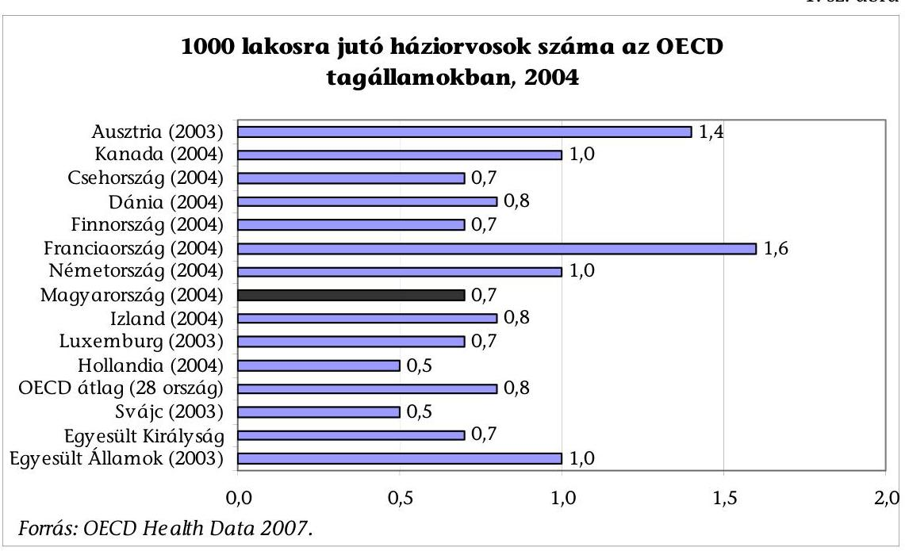

Évente mintegy $70^{7}$ millió orvos-betegtalálkozás történik a háziorvosi ellátásban, melynek egészségbiztosítási támogatása 2005-2010 között 57,9 Mrd Ft-ról 69,8 Mrd Ft-ra emelkedett. A háziorvosi szolgálatok egészségbiztosítói finanszírozása egyrészt teljesítmény alapú, ami kifejeződik az orvost választó biztosítottak számában, korösszetételében, és az orvos szakképzettségi mutatójában, másrészt a körzetek igénybevételétől független, a praxis fenntartására irányuló fix finanszírozású, ami lakósűrűségtől, távolságtól függő területi szorzókkal

[^0]
[^0]:    ${ }^{5}$ A helyi önkormányzatokról szóló 1990. évi LXV. törvény 8. § (1) és (4) bekezdése
    ${ }^{6}$ Az egészségügyről szóló 1997. évi CLIV. törvény (Eütv.) 152. §-a alapján az alapellátás területei: a háziorvosi, házi gyermekorvosi ellátás, a fogorvosi alapellátás, az alapellátáshoz kapcsolódó ügyeleti ellátás, a védőnői ellátás, az iskola-egészségügyi ellátás.
    ${ }^{7}$ Forrás: KSH 2008

---

differenciált. A finanszírozás korrekciós paraméterei több alkalommal változtak 2005-2010 között. A felnőtt háziorvosi praxisok finanszírozása 2002-ben átlagosan 460400 forint volt, ez az összeg 2010-ben átlagosan 781600 forintra, a házi gyermekorvosi praxisoké 2002-ben átlagosan 496400 forintról 789100 forintra, a vegyes háziorvosi praxisoknál 549100 forintról 899300 forintra változott.

Az egy-egy háziorvosi szolgálathoz bejelentkezettek száma 8 főtől 4087 főig terjed. Az országban a betöltetlen háziorvosi praxisok száma emelkedő - a 2004. évi 135-tel szemben - 2011. márciusi adatok szerint 171.

A háziorvosok „kapuőri" funkciója alatt a nemzetközi irodalom ${ }^{8}$ azt a feladatot érti, hogy a több szintű és specializálódott egészségügyi ellátórendszerben az egészségügyi szolgáltatások iránti keresletet szűrni, a beteget irányítani, követni kell. A kapuőri feladat hatékony ellátásának feltétele az, hogy a háziorvos jogosult legyen a betegút követésére, legyen információja a szolgáltatók betegellátásának minőségéről és áráról. A háziorvosok betegút követésének jogi lehetőségét 2011 áprilisában teremtették meg.

A felnőtt háziorvosok ellátására fordított pénzeszközök felhasználását 1995ben vizsgálta utoljára az ÁSZ. Az azóta eltelt időszakban az éves zárszámadások keretében a pénzeszközök alakulását ellenőrizte, de konkrétan a szakterületre irányuló vizsgálatot nem végzett.

Az ellenőrzés célja a háziorvosi ellátás működésének és pénzügyi feltételrendszerének, szabályozottságának és szervezettségének, a betegek egyenlő hozzáférési lehetőségeinek, valamint az egészségbiztosítói és költségvetési, önkormányzati és EU támogatások eredményességének értékelése volt.

# Az ellenőrzés keretében értékeltük: 

- a háziorvosok szűrésben, gondozásban betöltött szerepét, - megbetegedési, halálozási mutatók alapján -, területi megoszlását egyes betegségek esetében;
- a népegészségügyi szűrések közül a mammográfia, az életkori szűrések közül a diabétesz és a vérzsír-szint, illetve a szélütés (stroke) megelőzés a szívinfarktus utáni gondozás, valamint az influenza megelőzés indikátor alapú értékelését (tekintettel arra, hogy ezekre létezik adatgyűjtés);
- az Egészségbiztosítási Alapban (továbbiakban: E. Alap) biztosított forrást és ennek ellátásra gyakorolt hatását;
- az E-Alap kiadásainak és a háziorvosok kapuőri szerepének kölcsönhatását.

A háziorvosi munka eredményességét nemzetközileg elfogadott mutatókhoz viszonyítottuk (cukorbeteg-gondozás, szívinfarktus, szélütés, influenza megelőzés).

[^0]
[^0]:    ${ }^{8}$ OECD Health Working Papers No.50. 2010. (41.p.)

---

Az ellenőrzés a 2005-2010 közötti időszakra terjedt ki. A vizsgálat teljesítményellenőrzés módszerével történt, amelynek során az értékelés kiterjedt az ellátás jogi-szabályozási, szervezeti, személyi, tárgyi, továbbá finanszírozási feltételrendszerének, és az önkormányzati szerződésekben biztosítottak ellenőrzésére, valamint az ellátás kimenetére és az eredményesség mérésére.

Az ellenőrzés során az OEP és az ÁNTSZ adatbázisa alapján összehasonlító elemzéseket végeztünk. Interneten kérdőíveket és űrlapokat küldtünk ki a betöltetlen praxisok önkormányzatainak és valamennyi (5972), az OEP-nél email címmel rendelkező háziorvos részére.

Az önkormányzatok 15\%-át kérdőíves felmérésre választottuk ki (az érintett lakosságszám 1538 ezer fő, az önkormányzatok száma 475). Ezek közül helyszíni vizsgálatra a mintába került települések 5\%-át jelöltük ki, 25 önkormányzatot, valamint ugyanezen önkormányzatok háziorvosait (egyet, illetve nagyobb település esetén maximum 3-at). A kiválasztás szempontjait, mátrixát, valamint magukat a kijelölt településeket a melléklet 1. sz. táblája mutatja be. (Az általános szempontokon túlmenően tekintetbe vettük azt, hogy legyen a mintában közalkalmazotti formában működő háziorvos, betöltetlen praxis, 300 biztosítottnál kevesebb és 3000 biztosítottnál több beteget ellátó szolgálat.)

A háziorvosok szűrési-gondozási tevékenységét a felnőtt és vegyes praxisok OEP adatai alapján biostatisztikai módszerrel elemeztük, értékeltük.

Az ellenőrzés végrehajtására az Állami Számvevőszékről szóló 1989. évi XXXVIII. törvény 2. § (3), (5), (9), a 17. § (3) bekezdéseiben foglaltak adtak jogszabályi alapot.

A jelentést egyeztetésre megküldtük a nemzeti erőforrás miniszternek. Miniszter úr észrevételt nem tett, levelét az 1. sz. melléklet tartalmazza.

---

# I. ÖSSZEGZŐ MEGÁLLAPÍTÁSOK, KÖVETKEZTETÉSEK, JAVASLATOK 

A hazai háziorvosi rendszer mai működését a romló feltételrendszer mellett stagnálás jellemzi. A finanszírozási nehézségek, az elöregedő humán kapacitás és az emelkedő betöltetlen praxisszám az uniós átlaghoz való felzárkózás helyett az elért eredmények fenntarthatóságának kockázatát vetítik előre.

A gyógyítás és annak eredményessége elsődlegesen az orvos és beteg bizalmi kapcsolatán alapul, ezért a jogalkotó az önálló orvosi tevékenységről szóló 2000. évi II. törvény megalkotásával a beteggel közvetlenül kapcsolatban álló, az ellátást nyújtó orvos nagyobb önállóságát kívánta elősegíteni, ösztönző hatást várva ettől a gyógyító munkában. A törvényalkotói cél az volt, hogy az orvos a beteggel fennálló hosszú távú kapcsolatán keresztül közvetlenül teljesítse közszolgáltatói feladatait és ne csupán a gyógyító-ellátó hálózat egy eleme legyen.

A háziorvosi ellátás rendszere a vizsgált időszakban alapvetően nem változott. A jogszabályi környezet egyik eleme az önálló orvosi tevékenységre vonatkozó törvény, amely az alapellátásban szabályozza és határozza meg a működtetési jog fogalmát. A működtetési jog önálló orvosi tevékenység nyújtására jogosító engedélybe foglalt, személyhez fűződő vagyoni értékű jog, amelynek forgalma a gyakorlatban egyelőre korlátozott.

A háziorvosi ellátás támogatása az Egészségbiztosítási Alapból 20,5\%-kal emelkedett a 2005-2010 közötti időszakban. A nominális változást az alábbi diagram szemlélteti, amely 2005. évi árakon 8,3\%-os értékvesztést jelentett változatlan szerkezetben.
2. sz. ábra
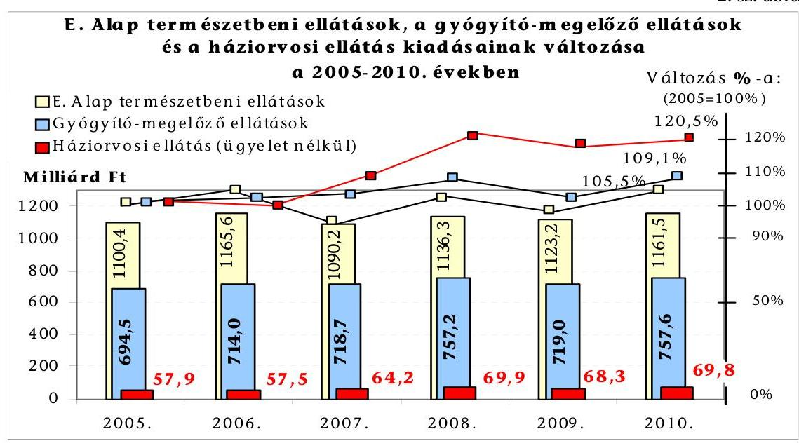

Adatforrás: OEP adatok alapján ÁSZ számítás

---

Ez a változás a háziorvosi ellátás gyógyító-megelőző ellátásokon belüli arány 0,87 százalékpontos növekedését jelentette, amely azonban nem eredményezte az egészségügyi ellátórendszeren belül az alapellátás érdemi és erőteljes megerősítését.

Az ellátórendszer ellehetetlenülését vetíti előre az orvosok elöregedése és a rendszerbe belépő új orvosok alacsony száma, valamint az, hogy az országos átlagnál magasabb megbetegedési és halálozási mutatókkal bíró településeken az egy orvosra jutó betegek száma emelkedik. Az orvosok több mint harmada 50-59 év közötti és további harmada 60 év feletti. Az önkormányzatok nehezen tudják betölteni a megüresedő praxisokat, amit mutat a pályázati idők elhúzódása, a felosztott körzetek és a betöltetlen praxisok számának növekedése, a szakképzésben résztvevők alacsony száma. Az ÁSZ háziorvosoknak kiküldött kérdőíves felméréséből megállapítható, hogy a háziorvosok több időt dolgoznak, mint amit az EU munkaidő direktíva megenged. ${ }^{9}$ Ha betartanák a munkaügyi előírást, akkor az orvoshiány még nyilvánvalóbb lenne.

# A betöltetlen felnőtt és vegyes háziorvosi praxisok száma és aránya (2011. januári adat) 

3. sz. ábra
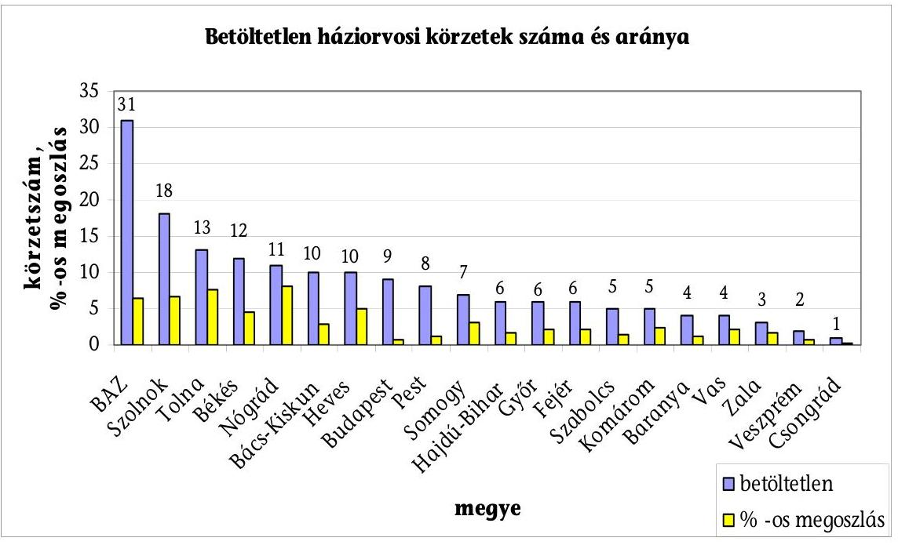

Adatforrás: OEP adatok alapján ÁSZ számítás
A feladatellátásra kötelezett települési önkormányzatok 95\%-ban vállalkozó háziorvosokkal kötött szerződés útján gondoskodtak az ellátásról. A települési önkormányzatok makroszinten, a kincstári beszámolók alapján, évente 3,8-4,2 Mrd Ft$^{10}$ pénzügyi támogatással egészítették ki a háziorvosi szolgálatok

[^0]
[^0]:    ${ }^{9}$ A kérdőíves felmérés feldolgozását az 2. sz. melléklet tartalmazza.
    ${ }^{10}$ Bizonyára a valódi támogatás ennél nagyobb, mert jellemzően nem különítik el a háziorvosok támogatását.

---

57,9-69,8 Mrd Ft egészségbiztosítói finanszírozását. A működési kiadásokon túli 6 Mrd Ft felhalmozási kiadás 78\%-át az önkormányzatok saját forrásból fedezték, csupán 22\%-a származott átvett pénzeszközökből, támogatásból. Az önkormányzatok 36\%-a kizárólag saját forrásból végzett felújítást, korszerűsítést a háziorvosi ellátás feltételeinek javítása érdekében. 2005-2011 között uniós források is rendelkezésre álltak az alapellátás fejlesztésére 13,0 Mrd Ft-nyi összegben, ami felölelte a teljes alapellátást (háziorvosi, iskolaorvosi, fogorvosi praxisokra és védőnői szolgálatra). 2011. februárig ebből 4,6 Mrd Ft kifizetés történt.

A háziorvosok egészségbiztosítói finanszírozásának alapját a bejelentkezettek létszámától és életkorától függő fejkvóta (teljesítménydíj) képezi, amelyet különböző korrekciós tényezők (fixdíj, területi pótlék, eseti ellátás díja, szakmai szorzó stb.) egészítenek ki. A bejelentkezettek létszámát az egyes korcsoportokhoz rendelt pontszámmal korrigálják, de csak egy határig függ ettől a finanszírozás mértéke. A szolgálat típusonként (felnőtt, vegyes, gyermek) meghatározott korosztályos pontszámhatároktól kezdve degresszíven csökken a teljesítménydíj összege, aránya a 2005. évi 67,4\%-ról 2010-ben 61,6\%-ra csökkent, ösztönző hatása nem érvényesült a felülről zárt háziorvosi kasszán belül. A teljesítménypont/forintérték nominális értéke alig változott, reálértéke azonban 24\%-kal csökkent.

A háziorvosok utalványozási jogosultsága (pl. receptírás), a kompetencia meghatározás és a beutalások együttes rendje biztosítja a háziorvosi kapuőri szerep érvényesülését. A háziorvosok kapuőri szerepét a vizsgálat két módon értékelte, részben a háziorvosok által utalványozott ellátások mennyiségén keresztül, ${ }^{11}$ részben pedig nemzetközi összehasonlításban, ${ }^{12}$ ahol Magyarország az erős kapuőri funkciót alkalmazó országok között szerepel.

A 2011 áprilisában történt jogszabály módosítás a háziorvos részére lehetővé teszi, - ha a biztosított azt nem tiltja -, hogy a kötelező egészségbiztosítás terhére igénybe vett egészségügyi ellátás adatairól tudomást szerezzen. Ez a kapuőri funkció hatékonyságát tovább növeli.

A praxisok bevételeinek és kiadásainak ellenőrzését az OEP végezte. A szolgáltatók többsége nem tett eleget a finanszírozási bevételek és az ellátásra fordított kiadások elkülönítési kötelezettségének vagy a támogatás felhasználása nem a finanszírozott tevékenység érdekében történt. (Pl. kölcsönadott pénzeszközök, a vállalkozás más bevételszerző tevékenységének támogatása.) Ennek következményeként 2009. évben 24,1 M Ft, 2010. I. félévben pedig 24,4 M Ft visszavonását kezdeményezték.

A szakmai ellenőrzést az Országos Szakfelügyeleti Módszertani Központ irányítása alá tartozó szakfelügyeleti rendszernek kellene ellátnia. Ezt a feladatát elsősorban költségvetési támogatás hiánya, valamint a szervezet széttagoltsága miatt nem tudta ellátni.

[^0]
[^0]:    ${ }^{11}$ OEP-től származó információk alapján (lásd. 11 sz. táblázat), valamint háziorvosokkal folytatott interjúk alapján.
    ${ }^{12}$ OECD Health Care Systems Getting more Value for Money 2010.

---

A finanszírozás az elvégzett háziorvosi feladatok minőségét nem tükrözte. A gyógyítási, beteggondozási, megelőzési és szűrési tevékenység mérésén alapuló indikátorrendszer, a minőségi és hatékony munkavégzést ösztönző pénzügyi érdekeltség csak 2010 októberétől került bevezetésre, melyre 300,9 M Ft-ot fizettek ki. A minőségi ösztönzést célzó összeg havonta a teljes praxisfinanszírozásnak az 1,7\%-át, a háziorvosi teljesítménydíjnak pedig a 2,9-3,0\%-át képviselte.

Az ellátás teljesítményének eredményeit meghatározott mutatók alakulása alapján értékeltük. Ezek közül kiemeltük a 19 évesnél idősebb népesség országos átlaghoz viszonyított többlethalálozását, ${ }^{13}$ amely közel 20\%-os különbséget mutat attól függően, hogy 1000 fő alatti, illetve 100 ezer fő feletti a település lakossága. (Részletesen az 1.1. pontban a 6. sz. ábra szemlélteti. Természetesen a halálozásban mutatkozó különbség nem egyedül az egészségügy, ezen belül az alapellátás következménye, hanem szociális-gazdasági tényezők együttes hatása.)

Az alapellátás finanszírozási módja eddig nem teremtett érdekeltséget a megelőzési tevékenység folytatására. Jogszabály előírja a szűrővizsgálatok rendszeres végzését, de erre vonatkozóan nem léteznek direkt ösztönzők, sem a lakosság, sem a szolgáltatók számára. Az alábbi táblázatból látható, hogy a 65 év feletti korcsoportban a két szűréstípusban az átszűrtség 5,7 illetve 5,8 %, szemben a jogszabály ${ }^{14}$ szerinti 100 %-kal.

# A krónikus, nem fertőző betegségek kockázati tényezőire irányuló felnőttkori szűrések gyakorisága az alapellátásban 

|  |  | 1. sz. táblázat |
| :--: | :--: | :--: |
| Korcsoport | Életmódbeli tényezőkre vonatkozó szű-   rővizsgálaton (212-es szűrési kód)   2008.08.01-2010.07.31. között részt   vettek aránya | Részletes fizikális vizsgálaton   (213-es szűrési kód)   2008.08.01-2010.07.31. között   részt vettek aránya |
| 40-64 éves | $8,3 \%$ | $11,1 \%$ |
| 65-X évesek | $5,7 \%$ | $5,8 \%$ |

Adatforrás: OEP adatok alapján ÁSZ számítás
A minőségi ellátásban való érdekeltség növelésére előirányzott 2010. évi 2 Mrd Ft 300,9 M Ft-ra teljesült, 2011-re 3,5 Mrd Ft áll rendelkezésre e célra. A háziorvosi indikátor rendszerben jelentett influenza átoltottság 2009 végétől mérve a 65 év feletti lakosság körében 20-22% körül volt, ez lényegesen eltér az OECD részére 2007-ben jelentett 34%-tól. Időközben megváltozott a térítésmentes oltóanyag jogosultság korhatára, 60 évről 65 évre. (A 4. sz. ábrán Magyar-

[^0]
[^0]:    ${ }^{13}$ Többlethalálozás: azt fejezi ki, hogy hány százalékkal magasabb vagy alacsonyabb a vizsgált népesség körében (pl. megye) a tényleges halálozás a választott alapszintnél (pl. ország).
    14 Az 51/1997. (XII. 18.) NM rendelet alapján 40-64 éves kor között kis kardiovaszkuláris kockázatú egyéneknél 5 évente végzendő, 40-64 éves kor között közepes és nagy kardiovaszkuláris kockázatú egyéneknél, illetve 65 éves kor felett 2 évente végzendő.

---

ország esetében jelzett 34% a 60 év feletti lakosságra vonatkozott.) 2011. február 9-i állapot szerint az átoltottság a 65 év feletti lakosság körében 28,6% volt. Az Egészségügyi Világszervezet által ajánlott arány 75 %. ${ }^{15}$

Influenza elleni átoltottság a 65 év feletti lakosság körében, 2007. évben
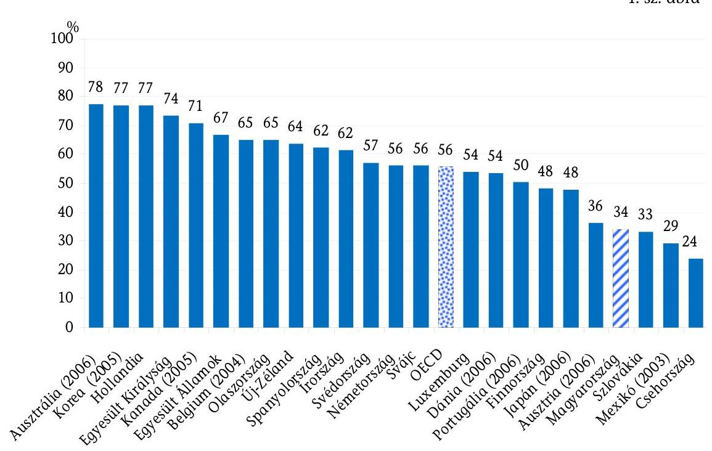

Forrás: OECD Health Data 2009.
A 2009. szeptember és 2010. október közötti időszak adataiból megállapítható, hogy az indikátor rendszer pénzügyi ösztönző hatása nem érvényesült, két indikátor kivételével a vizsgált időszakban a mutatók értéke nem változott. A vegyes praxisok minőségi mutatói két indikátor kivételével (magas vérnyomás gondozás és infarktus utáni gondozás esetében) rosszabbak voltak, mint a felnőtt és gyermek praxisok mutatói (pl. pneumococcus védőoltás arányában, vérzsír vizsgálaton részt vettek arányában, mammográfiás szűrés arányában, diabetes gondozási mutatókban). A szélütés előfordulásának gyakorisága a vegyes praxisokban magasabb, mint a felnőtt praxisokban. A magasvérnyomásgondozásban a mutató az 50 év felettiek között a betegség kezelésére rendszeresen gyógyszert kiváltók arányát mutatja, és ez az érték a vegyes praxisokban magasabb, mint a felnőtt praxisokban, tehát ott valószínűleg magasabb az előfordulás gyakorisága (prevalencia).

Az ellenőrzés eredményei visszaigazolják azokat a nemzetközi és hazai adatokat, amelyek szerint az 1000 fő alatti lakosú települések egészségmutatói és a születéskor várható élettartamok rosszabbak, mint az ennél nagyobb lakosú települések mutatói. Ugyanakkor hazánkban a kistelepülések kárára a többlet-

[^0]
[^0]:    ${ }^{15}$ Az Európai Unió Tanácsa 2009. december 22-i 2009/1019/EU ajánlásának (6) bekezdése megfogalmazta, hogy az EU minél előbb, de lehetőleg 2014/2015 telére érje el a WHO által ajánlott 75\%-os átoltottsági arányt az idősebb korosztályok körében.

---

halálozásban az országos átlaghoz viszonyított $12 \%$ többlet az okok vizsgálatát igényli még akkor is, ha a nemzetközi szakirodalom egyetért abban, hogy a lakosság egészségi állapotát a környezet és az életmód nagyobb arányban befolyásolja, mint az egészségügy helyzete. ${ }^{16}$

A kis lakosságszámú, jellemzően vegyes praxis által ellátott településeken a lakosság megbetegedési és halálozási mutatói rosszabbak a városi lakosságénál. Ezt mutatja a 6. sz. ábra, amely a 19 évesnél idősebb lakosság országos átlaghoz viszonyított többlethalálozását mutatja be a települések lakosságszáma szerinti összehasonlításban, ahol látható, hogy a relatív halálozási többlet a település nagysággal fordított arányban nő. Az országos átlaghoz viszonyított relatív halálozás azokon a településeken magasabb, ahol nincs a háziorvosnak székhelye (7. sz. ábra.)

A kistelepülések humántőke vesztesége az országos átlaghoz viszonyítva többlethalálozást mutat. A 4633 többlethalálozásból, a 10000 főnél kisebb településeken élők körében 2009-ben 1663 a korai halálozás ( 65 év alatti). A 4633 ember 62631 életévet vesztett el. Egészség-gazdaságtani számítások szerint 2009-ben a 10000 fő alatti településeken - az országos átlagtól való magasabb halálozás miatt - a humántőke veszteség 121 Mrd Ft volt.

A helyszíni ellenőrzés megállapításainak hasznosítása mellett javasoljuk:

# a nemzeti erőforrás miniszternek 

1.  Dolgoztasson ki szakmai programot, a háziorvosi ellátás szakmai, fejlesztési irányainak meghatározása érdekében, valamint alakítsa át, szabályozza újra a működtetési jogot.
2.  Dolgoztasson ki intézkedési tervet a humánerőforrás szükséglet biztosítására és a munkaidő korlát betartásának ellenőrzésére.
3.  Az Egészségbiztosítási Pénztár végezzen pénzügyi ellenőrzéseket a meghirdetett módszertan alapján.
4.  Gondoskodjon a szakfelügyeleti ellenőrzésről.
5.  Teremtse meg a minőségi munka indikátorrendszeren alapuló érdemi ösztönzését, valamint a további szakképesítések (szakvizsgák) finanszírozói elismerését.
[^0]
[^0]:    ${ }^{16}$ A helyzet komlexitását mutatja, hogy hazánk 7 régiójából 4 felkerült az EU „legszegényebb 20 régiója" listájára az EUROSTAT 2008. évi adatai szerint.

---

# II. RÉSZLETES MEGÁLLAPÍTÁSOK 

## 1. A HÁZIORVOSI ELLÁTÁS TERÜLETI SZERVEZETE ÉS A LEGJELENTŐSEBB KRÓNIKUS MEGBETEGEDÉSEK TERÜLETI ELŐFORDULÁSA, A SZÜKSÉGLET ÉS AZ ELLÁTÁS KAPCSOLATÁNAK ÉRTÉKELÉSE

### 1.1. A kistelepülések humántőke vesztesége az országos átlaghoz viszonyított többlethalálozás miatt

Az elérhető, eredményes, megfelelő minőségű és a költséghatékony alapellátási rendszer egyik feltétele, hogy kapacitásai és szolgáltatásai az ellátott térség és népesség szükségleteihez igazodjanak.

A megelőzésben és a gondozásban az egészségügyi alapellátás szerepe kiemelkedő kell, hogy legyen, különös tekintettel a kisebb településekre, ahol a járóbeteg ellátás nem, vagy csak kevésbé tudja ezt a feladatot vállalni.

Magyarországon a legjelentősebb betegségterhet a krónikus, nem fertőző betegségek okozzák. A betegségteher csökkentéséhez, az akut ellátás eredményességének és minőségének javításán túl e betegségek megelőzése és a már megbetegedettek gondozása - kockázatuk csökkentése és funkcionalitásuk javítása vezethet. A szükségletelemzés egyik legfontosabb eleme az adott népesség megbetegedési jellemzőinek megismerése. Az elemzés keretében megvizsgáltuk, hogy egyes nem-fertőző betegségek tekintetében mekkora egyenlőtlenségek figyelhetők meg az országban.

Több vizsgálat kimutatta ${ }^{17}$ a halandósági többlet túlnyomó része a 10000 főnél kisebb településeken jelentkezik. 2009-ben e településeken a halálozási többlet az országos átlaghoz viszonyítva 4633 haláleset volt. Amennyiben az országos átlag szintjére csökkenne a halálozás ezeken a településeken, az a 2009. évi kormegoszlás mellett ennyi haláleset megelőzését jelentené.

4633 többlethalálozásból (a 10000 főnél kisebb településeken élők körében) 2009-ben 1663 korai ( 65 év alatti) halálozás történt. A 4633 ember 62631 életévet vesztett el. A haláluk időpontjában még hátralévő várható élettartamukkal számolva, (az OLEF ${ }^{18}$ 2000-ből származó kor és nem specifikus életminőség súlyokkal), a 62631 életév 46674 minőségi életévnek (QALY) felel meg.

A humántőke-veszteség pénzre váltására lehetőséget ad az egészségügyi technológiák költséghatékonysági küszöbértékéről szóló WHO ajánlás. A WHO az egy főre jutó bruttó hazai össztermék háromszorosát javasolja költség-

[^0]
[^0]:    ${ }^{17}$ Ádány R: A magyar lakosság egészségi állapota, különös tekintettel az ezredforduló utáni időszakra. Népegészségügy 2008: 86: 5-20.
    ${ }^{18}$ Országos Lakossági Egészségfelmérés(OLEF)

---

hatékonysági küszöbértéknek. Az egészségügyi technológiák esetén ezen öszszeghatár alatt egy minőségi életév finanszírozását indokolhatónak tartja. Az egy főre jutó magyar GDP 2009-ben 2,6 M Ft volt, tehát egy minőségi életév értéke hazánkban a WHO kritérium szerint $3 \times 2,6 \mathrm{M} \mathrm{Ft}=7,8 \mathrm{M}$ Ft volt 2009-ben. Ezt figyelembe véve a 10000 fő alatti településeken - az országos átlag feletti halálozás - miatt a humántőke-veszteség 2009-ben 121 Mrd Ft volt.

# A 19 évesnél idősebb népesség összhalálozásának területi egyenlőtlenségei Magyarországon 2005-2009-ben 

5.  sz. ábra
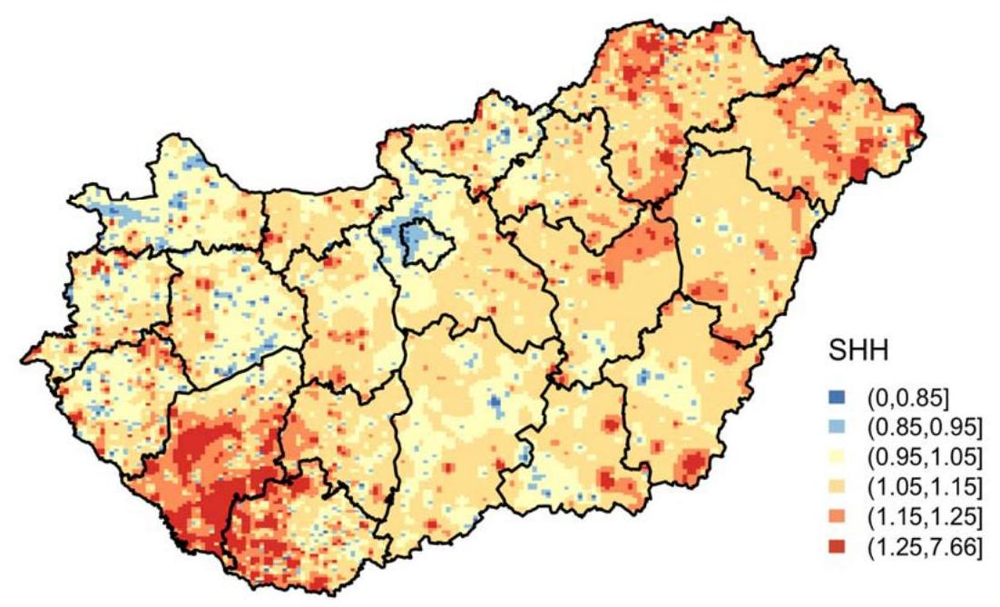

SHH: standardizált halálozási hányados (az országos átlaghoz viszonyított relatív halálozás)
A halandóságban mutatkozó területi különbségek jelentősek Magyarországon. A térképen az országos átlaghoz viszonyított relatív halálozás (standardizált halálozási hányados) látható, településenként kiszűrve a kor és a nemek eltérő megoszlásából származó torzítást. Az összhalálozás tekintetében hátrányos helyzetű térségekben, a főbb halálokok közül különösen a keringési betegségek és a krónikus májbetegség, májzsugor okozta halandósági többlet jelentős. (5. sz. ábra)

A keringési, daganatos, krónikus megbetegedések, valamint a szívinfarktus okozta halálozás részletes adatait a 3. sz. melléklet mutatja be.

---

# A 19 évesnél idősebb népesség többlethalálozása az országos átlaghoz viszonyítva a települések lakosságszáma szerint ${ }^{19}$ 

6.  sz. ábra
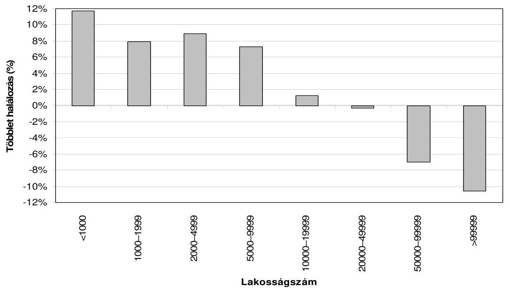

Adatforrás: OEP adatok alapján ÁSZ számítás
A szívinfarktus és a szélütés korra és nemre specifikus országos 5 éves tartam előfordulási gyakoriságát mutatja az alábbi 2-3. sz. táblázat fekvőbeteg forgalmi adatok alapján. Mint ahogy az az adatokból látszik, a szívinfarktus és a szélütés prevalenciája kor és nem szerint jelentős szórást mutat. E betegségek korra és nemre standardizált prevalenciájában is jelentős mértékű területi különbségek figyelhetők meg (2. sz. melléklet térképei).

A szívinfarktus előfordulási gyakorisága* országosan 2010 júliusában
7.  sz. táblázat

| Prevalencia | Korcsoport (év) |  |  |  |  |  |  |  |  |  |  |  |  | 20 év   felett   össze-   sen | beteg-   szám |
| :--: | :--: | :--: | :--: | :--: | :--: | :--: | :--: | :--: | :--: | :--: | :--: | :--: | :--: | :--: | :--: |
|  | $\begin{aligned} & 20- \\ & 24 \end{aligned}$ | $\begin{aligned} & 25- \\ & 29 \end{aligned}$ | $\begin{aligned} & 30- \\ & 40 \end{aligned}$ | $\begin{aligned} & 35- \\ & 39 \end{aligned}$ | $\begin{aligned} & 40- \\ & 44 \end{aligned}$ | $\begin{aligned} & 45- \\ & 49 \end{aligned}$ | $\begin{aligned} & 50- \\ & 54 \end{aligned}$ | $\begin{aligned} & 55- \\ & 59 \end{aligned}$ | $\begin{aligned} & 60- \\ & 64 \end{aligned}$ | $\begin{aligned} & 65- \\ & 69 \end{aligned}$ | $\begin{aligned} & 70- \\ & 74 \end{aligned}$ | 75 év felett | 75 év felett |  |  |
| Férfiak (\%) | 0,01 | 0,01 | 0,04 | 0,15 | 0,37 | 0,70 | 1,00 | 1,58 | 1,95 | 2,20 | 2,47 | 2,73 | 0,89 | 32921 |  |
| Nők (\%) | 0,00 | 0,00 | 0,01 | 0,04 | 0,11 | 0,23 | 0,36 | 0,53 | 0,74 | 0,90 | 1,24 | 1,80 | 0,52 | 21874 |  |

* Azon lakosok aránya, akiket 2006-2010-ben szívinfarktus miatt fekvőbeteg intézményben kezeltek.

Összbetegszám: 54795
Adatforrás: OEP adatok alapján ÁSZ számítás

[^0]
[^0]:    ${ }^{19}$ Az 20000 fő alatti lakosságszámú településeken a többlethalálozás aránya 1,5\% és $12 \%$ között változik.

---

# A szélütés prevalenciája* országosan 2010 júliusában 

8.  sz. táblázat

| Prevalencia | Korcsoport (év) |  |  |  |  |  |  |  |  |  |  |  | 20 év   felett   össze-   sen | beteg-   szám |
| :--: | :--: | :--: | :--: | :--: | :--: | :--: | :--: | :--: | :--: | :--: | :--: | :--: | :--: | :--: |
|  | $\begin{aligned} & 20- \\ & 24 \end{aligned}$ | $\begin{aligned} & 25- \\ & 29 \end{aligned}$ | $\begin{aligned} & 30- \\ & 40 \end{aligned}$ | $\begin{aligned} & 35- \\ & 39 \end{aligned}$ | $\begin{aligned} & 40- \\ & 44 \end{aligned}$ | $\begin{aligned} & 45- \\ & 49 \end{aligned}$ | $\begin{aligned} & 50- \\ & 54 \end{aligned}$ | $\begin{aligned} & 55- \\ & 59 \end{aligned}$ | $\begin{aligned} & 60- \\ & 64 \end{aligned}$ | $\begin{aligned} & 65- \\ & 69 \end{aligned}$ | $\begin{aligned} & 70- \\ & 74 \end{aligned}$ | 75 év felett |  |  |
| Férfiak (\%) | 0,0 | 0,0 | 0,1 | 0,2 | 0,4 | 0,9 | 2,0 | 4,1 | 5,9 | 7,4 | 10,0 | 11,4 | 2,7 | 99798 |
| Nők (\%) | 0,0 | 0,0 | 0,1 | 0,2 | 0,4 | 0,9 | 1,7 | 2,9 | 3,6 | 4,6 | 6,9 | 9,5 | 2,7 | 112737 |

* Azon lakosok aránya, akiket 2006-2010-ben szélütés miatt fekvőbeteg intézményben kezeltek.

Összbetegszám: 212535
Adatforrás: OEP adatok alapján ÁSZ számítás
A betöltetlen praxisok aránya Nógrád, Tolna és Borsod-Abaúj-Zemplén megyékben a legmagasabb, Nógrád megyében minden 10. praxis betöltetlen volt 2010 júliusában.

A háziorvosi szolgáltatás földrajzi elérhetősége heterogén, több mint 1300 településen nincs háziorvosi rendelő vagy a háziorvos székhelye nem ott található. Az epidemiológiai adatokkal összehasonlítva az a kedvezőtlen kép rajzolódik ki, hogy a magas halandósággal és krónikus betegségek gyakoribb előfordulásával bíró hátrányos térségekben a legmagasabb a betöltetlen praxisok aránya. Míg a háziorvosi székhellyel rendelkező települések 96\%-ában a halálozás nem haladja meg az országos átlag másfélszeresét, addig a háziorvosi székhellyel nem rendelkező települések 12\%-ában a halálozás magasabb, mint az
 országos átlag. A háziorvosi székhellyel nem rendelkező kistelepüléseken az országos átlaghoz viszonyított relatív halálozás jobban elnyúlik a magasabb értékek felé (7. sz. ábra). Az országos átlag kétszeresét meghaladó halálozás a háziorvosi székhellyel rendelkező településeken szinte nem fordul elő (mindössze a települések 0,7\%-ában), addig a háziorvosi székhellyel nem rendelkező települések 4\%-ában a halálozás meghaladja az országos átlag dupláját. Az országos átlag háromszorosát elérő halálozás kivétel nélkül olyan településeken fordul elő, ahol nincs telephelye a háziorvosnak.

Ezeken a településeken az átlagosnál lényegesen magasabb a betegségteher, valamint többnyire nincs egyéb egészségügyi szolgáltató. Méretgazdaságossági okokból nem célszerű és nem gazdaságos minden településen önálló háziorvosi praxist kialakítani. Az egészségügyi alapellátáshoz való megfelelő hozzáférés biztosításához különösen fontos, hogy a lakóhelyen kívüli háziorvosi rendelés hozzáférhetősége a kistelepüléseken élők számára javuljon, az igénybevételt ne akadályozzák további tényezők, pl. a korlátozott közlekedési lehetőségek.

A háziorvosi praxisok körzeteinek kijelölése ma egyáltalán nem támaszkodik szükséglet alapú tervezésre, az önkormányzati ellátási kötelezettségből kiindulva, az önkormányzati rendszer földrajzi struktúráját követi oly módon, hogy az aprófalvas térségekben több településre jut egy praxis. A szükséglet alapú tervezés az alapellátásban eredményesebb működést tesz lehetővé. Az epidemiológiai adatok és az egészségügyi ellátórendszer struktúrája alapján mind a körzethatárok kijelölésének módja, mind az alapellátásban nyújtott szolgáltatáscsomag eltérő legyen a nagyvárosokban, illetve az aprófalvas, hátrányos helyzetű térségekben.

---

# Az országos átlaghoz viszonyított halálozás megoszlása településenként a háziorvosi szolgáltatás helybeli elérhetősége szerint ${ }^{20}$ 

7. sz. ábra
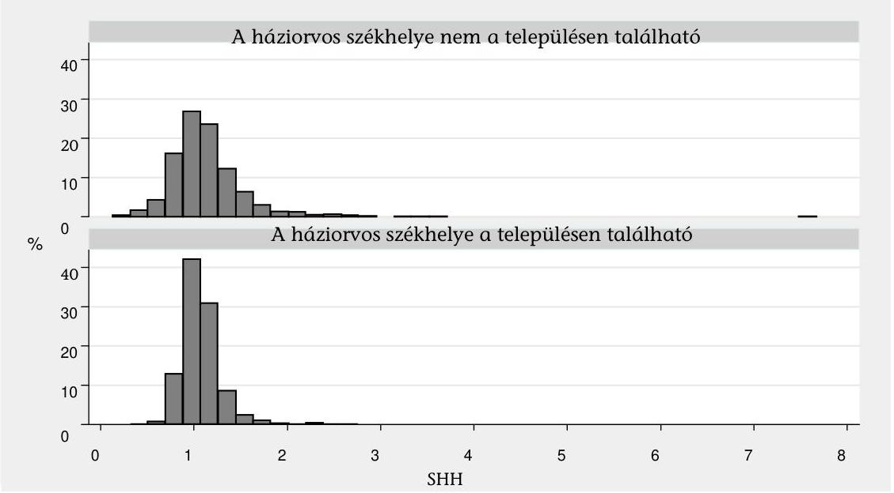

SHH: standardizált halálozási hányados

Nemcsak a praxisok nagysága és földrajzi elhelyezkedése független a szükségletektől, hanem a szolgáltatás tartalma is. Tekintettel arra, hogy az alapellátás mindez ideig nem volt közvetlenül érdekelt sem a szolgáltatás minőségében, sem eredményességében, így csak egyéni kezdeményezés esetén (amennyiben a háziorvos ezt szakmai szempontból fontosnak vélte) vette figyelembe a praxisba bejelentkezett populáció egészségügyi szükségleteit és a legritkább esetben vállalt kezdeményező szerepet a lakosság egészségtőkéjének javításában. Az epidemiológiai adatokat, az elérhető egyéb szolgáltatásokat is figyelembe vevő helyi kapacitás és szolgáltatáscsomag tervezés befolyásolja az alapellátás eredményességét és költséghatékonyságát. Az alapellátás szükséglet alapú tervezéséhez azonban elengedhetetlen, hogy olyan demográfiai, szociális, földrajzi, epidemiológiai, ellátás szervezési tényezőket is figyelembevevő tervezési egységek kerüljenek kialakításra, amelyekre vonatkozóan a szükségletek felmérhetők.

Az alapellátás szerepe kiemelkedő a megelőzés terén is. Megfelelő humánerőforrás bevonásával - erre alkalmas szervezeti keretek és érdekeltségi viszonyok között -, az alapellátás a rábízott lakosság egészségtőkéjének kezelőjévé válhat abban az esetben, ha a gyógyító és a megelőző funkciót integrálja.
A praxisokba bejelentkezettek száma jelentős variabilitást mutat és a praxisok nagysága jellemzően nem igazodik a szükségletekhez, pl. Szabolcs-Szatmár-Bereg megyében, ahol az egyik legmagasabb a krónikus betegségek okozta

[^0]
[^0]:    ${ }^{20} \mathrm{Az} x$ tengely mindkét táblára vonatkozik.

---

teher, az egyik legnagyobb a felnőtt háziorvosi praxisokba bejelentkezettek átlagos száma (4. sz. táblázat).

# A felnőtt háziorvosi praxisokba bejelentkezettek száma megyénként (2010. július havi adat) 

| Megye | Praxisba bejelentkezettek száma |  |  |  |
| :--: | :--: | :--: | :--: | :--: |
|  | Átlag ${ }^{21}$ | $25 \%$-os percentilis ${ }^{22}$ | medián ${ }^{23}$ | $75 \%$-os percentilis ${ }^{24}$ |
| Budapest | 1435 | 1177 | 1463 | 1729 |
| Csongrád | 1475 | 1216 | 1507 | 1772 |
| Baranya | 1490 | 1250 | 1466 | 1798 |
| Nógrád | 1517 | 1262 | 1457 | 1673 |
| Jász-Nagykun-Szolnok | 1578 | 1288 | 1601 | 1837 |
| Tolna | 1578 | 1290 | 1579 | 1895 |
| Borsod-Abaúj-Zemplén | 1590 | 1346 | 1586 | 1847 |
| Hajdú-Bihar | 1611 | 1336 | 1658 | 1900 |
| Békés | 1619 | 1380 | 1563 | 1875 |
| Vas | 1631 | 1275 | 1684 | 1993 |
| Somogy | 1654 | 1426 | 1700 | 1906 |
| Bács-Kiskun | 1667 | 1412 | 1663 | 1969 |
| Heves | 1683 | 1398 | 1724 | 1967 |
| Komárom-Esztergom | 1706 | 1437 | 1697 | 1910 |
| Győr-Moson-Sopron | 1713 | 1504 | 1702 | 1956 |
| Veszprém | 1720 | 1428 | 1773 | 2041 |
| Zala | 1723 | 1428 | 1731 | 2038 |
| Fejér | 1789 | 1505 | 1831 | 2066 |
| Szabolcs-Szatmár-Bereg | 1807 | 1513 | 1747 | 2139 |
| Pest | 1863 | 1539 | 1869 | 2182 |

Adatforrás: OEP adatok alapján ÁSZ számítás
Az 51/1997. (XII. 18.) NM rendelet előírja a szűrővizsgálatok rendszeres végzését, de erre vonatkozóan nem léteznek direkt ösztönzők, sem a lakosság, sem a szolgáltatók számára. A 212-es kódú, életmódbeli tényezőkre vonatkozó szűrések (táplálkozási szokások, fizikai aktivitás, dohányzás, alkoholfogyasztás) te-

[^0]
[^0]:    ${ }^{21}$ Az értékek összege osztva az elemszámmal
    ${ }^{22}$ Az adatok $25 \%$-a kisebb, mint ez az érték
    ${ }^{23}$ A statisztikai sokaságot kétfelé vágó érték
    ${ }^{24}$ Az adatok $75 \%$-a kisebb, mint ez az érték

---

rületén 40-64 éves kor között kis kardiovaszkuláris kockázatú egyéneknél 5 évente végzendő, 40-64 éves kor között közepes és nagy kardiovaszkuláris kockázatú egyéneknél, illetve 65 éves kor felett 2 évente végzendő a szűrés. Ugyanez vonatkozik a 213-as kódú szűrésekre is (részletes fizikális vizsgálat, testsúly, haskörfogat, testmagasság testtömegindex meghatározása, vérnyomásmérés). Ez alapján kétévente a 65 év feletti korosztály 100\%-át kellene szűrni. Ezzel szemben, mint az 1. sz. táblázatból is látható, a 65 év feletti korcsoportban, a két szűréstípusban az átszűrtség 5,7, illetve 5,8\%.

A megelőzési és gondozási tevékenység heterogenitására utal, hogy az egyes praxisokban nagymértékben eltérő a cukorbetegség és a gyógyszeresen kezelt cukorbetegek aránya. A praxisok 10\%-ában a ténylegesen kezeltek gyakorisága kevesebb, mint a várt gyakoriság háromnegyede. Ugyanakkor a praxisok 10\%-ában a kezeltek gyakorisága több mint 25\%-kal magasabb az országos átlag alapján vártnál. Az 5. sz. táblázat mutatja a gyógyszeresen kezelt cukorbetegek országos korspecifikus gyakoriságát.

A gyógyszeresen kezelt cukorbetegek gyakorisága* országosan (2010. július havi adat)
5. sz. táblázat

| Prevalencia | Korcsoport (év) |  |  |  |  |  |  |  |  |  |  |  | $\begin{gathered} 20 \text { év } \\ \text { felett } \\ \text { össze- } \\ \text { sen } \end{gathered}$ | betegszám |
| :--: | :--: | :--: | :--: | :--: | :--: | :--: | :--: | :--: | :--: | :--: | :--: | :--: | :--: | :--: |
|  | $\begin{aligned} & 20- \\ & 24 \end{aligned}$ | $\begin{aligned} & 25- \\ & 29 \end{aligned}$ | $\begin{aligned} & 30- \\ & 40 \end{aligned}$ | $\begin{aligned} & 35- \\ & 39 \end{aligned}$ | $\begin{aligned} & 40- \\ & 44 \end{aligned}$ | $\begin{aligned} & 45- \\ & 49 \end{aligned}$ | $\begin{aligned} & 50- \\ & 54 \end{aligned}$ | $\begin{aligned} & 55- \\ & 59 \end{aligned}$ | $\begin{aligned} & 60- \\ & 64 \end{aligned}$ | $\begin{aligned} & 65- \\ & 69 \end{aligned}$ | $\begin{aligned} & 70- \\ & 74 \end{aligned}$ | 75 év felett |  |  |
| Férfiak (\%) | 0,3 | 0,4 | 0,6 | 1,0 | 2,2 | 4,3 | 7,3 | 10,5 | 13,9 | 16,0 | 17,0 | 14,7 | 6,0 | 220973 |
| Nők (\%) | 0,3 | 0,4 | 0,5 | 0,8 | 1,4 | 2,7 | 4,8 | 7,7 | 11,1 | 14,1 | 16,2 | 14,0 | 6,1 | 257496 |

* Azon személyek részaránya 2010 júliusában, akik a megelőző 12 hónapban legalább négyszer antidiabetikumot (A10 ATC kódú gyógyszert) váltottak ki.
Összbetegszám: 478469
Adatforrás: OEP adatok alapján ÁSZ számítás
A magas vérnyomáskezelésben részesülők esetén a ténylegesen kezeltek arányának és az országos átlag alapján várt arányának a hányadosa a praxisok $80 \%$-ában $88 \%$ és $113 \%$ között mozog (6. sz. táblázat).

A gyógyszeresen kezelt magas vérnyomásos betegek gyakorisága* országosan (2010. július havi adat)
6. sz. táblázat

| Prevalencia | Korcsoport (év) |  |  |  |  |  |  |  |  |  |  |  |  | $\begin{gathered} 20 \text { év } \\ \text { felett } \\ \text { össze- } \\ \text { sen } \end{gathered}$ | betegszám |
| :--: | :--: | :--: | :--: | :--: | :--: | :--: | :--: | :--: | :--: | :--: | :--: | :--: | :--: | :--: | :--: |
|  | $\begin{aligned} & 20- \\ & 24 \end{aligned}$ | $\begin{aligned} & 25- \\ & 29 \end{aligned}$ | $\begin{aligned} & 30- \\ & 40 \end{aligned}$ | $\begin{aligned} & 35- \\ & 39 \end{aligned}$ | $\begin{aligned} & 40- \\ & 44 \end{aligned}$ | $\begin{aligned} & 45- \\ & 49 \end{aligned}$ | $\begin{aligned} & 50- \\ & 54 \end{aligned}$ | $\begin{aligned} & 55- \\ & 59 \end{aligned}$ | $\begin{aligned} & 60- \\ & 64 \end{aligned}$ | $\begin{aligned} & 65- \\ & 69 \end{aligned}$ | $\begin{aligned} & 70- \\ & 74 \end{aligned}$ | 75 év felett |  |  |  |
| Férfiak (\%) | 1,5 | 2,6 | 4,4 | 7,3 | 12,9 | 21,2 | 31,5 | 41,8 | 52,6 | 60,7 | 66,8 | 72,0 | 25,9 |  | 955741 |
| Nők (\%) | 0,7 | 1,4 | 2,8 | 6,1 | 12,8 | 23,1 | 35,3 | 46,4 | 58,2 | 67,4 | 74,9 | 79,8 | 34,1 |  | 1448647 |

* Azon személyek részaránya 2010. július hóban, akik a megelőző 12 hónapban legalább négyszer vérnyomáscsökkentő szert (C02, C03, C04, C05, C07, C08, C09 ATC kódú gyógyszert) váltottak ki.
Összbetegszám: 2404388
Adatforrás: OEP adatok alapján ÁSZ számítás

---

Az alapellátás korszerűsítése a közelmúltban elkezdődött. Ennek középpontjában az ellátás minőségének a finanszírozásban történő érvényesítése áll. Az alapellátási minőségi indikátorokkal szerzett első tapasztalatok alapján a vegyes praxisok mutatói bizonyultak a legrosszabbaknak, ezek jellemzően vidéki, nem városi területen működő praxisok, ahol egy praxishoz általában több település is tartozik.

Az egyes praxisok minőségi jellemzőinek az országos adatokkal való összevetése és eredményének a háziorvos részére történő visszaküldése már önmagában is hozzájárulhat az ellátás minőségének javulásához. Az OEP által életre hívott minőségi és hatékony gyógyszerrendelést ösztönző (MIHA) programban a felnőtt és vegyes háziorvosi praxisokban 2010. harmadik negyedévében a felírt vérnyomáscsökkentő szerekre (ATC kód: C02, C03, C07, C08, C09) jutó átlagos napi társadalombiztosítási támogatás $24,4 \mathrm{Ft} /$ nap volt, ami megegyezett a célértékkel. ${ }^{25}$ A háziorvosi praxisok $75 \%$-ában ez az összeg $25,8 \mathrm{Ft} /$ nap volt és csak $2 \%$-ukban haladta meg az összeg a $30 \mathrm{Ft} /$ napot. A zsíranyagcsere-zavarok kezelésére alkalmazott szerek (ATC kód: C10) esetén a kép még kedvezőbb. Az átlagos napi támogatási összeg $74,5 \mathrm{Ft}$ volt, kevesebb, mint a $86,7 \mathrm{Ft} /$ nap célérték, amelyet a háziorvosok mindössze $6 \%$-a haladott meg.

# 1.2. A minőségi indikátorok bevezetése a minőségi munkavégzés érdekében

2009-ben vezették be a háziorvosok indikátor alapú teljesítményértékelő rendszerét. Célja a háziorvosi és házi gyermekorvosi szolgálatok által végzett minőségi és hatékony tevékenység ösztönzése, az ellátás színvonalának emelése. A Világbank részéről is megfogalmazott elvárás volt, hogy az egészségügyben mérhető minőségi mutatókat vezessenek be. Magyarországon objektív, nyilvános minőségi mutatókat - az egyes egészségügyi szolgáltatók munkavégzésének mérésére - nem határoztak meg.

12 indikátort vezettek be, amelyek adatai a B300 tételes betegforgalmi jelentésből, a járóbeteg és fekvőbeteg szakellátás adataiból, valamint a vénykiváltási adatokból gyűjtöttek ki. 4 indikátort a gyermek praxisokban, 11 indikátort a felnőtt és vegyes praxisokban mértek.

A kezdetekkor rendelkezésre álló 2,0 Mrd Ft kormányintézkedésre 300 millióra csökkent, így az indikátorrendszer ösztönző hatása nem érvényesülhetett.

A rendszert indulásától kezdődően folyamatos kritika érte az érdekképviseleti szervezetek részéről, pl. az Orvosi Kamara háziorvosi szekciójától. A szervezetek a továbbfejlesztésre vonatkozóan egységes álláspontot nem alakítottak ki.
2011. januárban készítette el az ágazatirányító „A háziorvosok indikátor alapú teljesítményértékeléséről és az orvosok gyógyszerrendelése értékelésének egyes szabályairól szóló előterjesztés"-t. A tervezet új alapokra helyezte az addig működő in-

[^0]
[^0]:    ${ }^{25}$ Az OEP által meghatározott érték.

---

dikátorokat, és lényeges változtatásokat vezetett be 2011. április 1-jétől, ${ }^{26}$ valamint nagyobb finanszírozási összeget helyezett kilátásba. Változik az új rendszerben az értékelés módja. Nem a régiós átlagot elérő vagy meghaladó praxisok részesülnek az új rendszerben jutalmazásban, hanem az adott régióban a praxisok legjobb egy negyede. Változik a régiós átlag számításának módja is, amennyiben nem veszik figyelembe a praxistípust, hanem csak a település-kategóriát. (A vidéki, nem városi praxisok jellemzően vegyes praxisok, a városi praxisok jellemzően felnőtt vagy gyermek praxisok, így a praxis típusok közötti különbségek a településtípus figyelembevétele miatt megmaradnak.)

Az ellenőrzés keretében értékeltük a 2009 szeptember és 2010 október hónap közötti időszakra a háziorvosi szolgálatok mutatóinak néhány szempont szerinti feldolgozását a jelentés 4. sz. mellékletében. (Az alábbi elemzés a teljes körű adatfeldolgozásra alapozott, amelynek bemutatása terjedelem miatt a jelentés kereteit meghaladja.)

A 2. sz. (Pneumococcus védőoltásban részesültek aránya 2 év alatt), a 8. sz. (Diabetes gondozás 1), valamint a 3. sz. indikátor (szűrési tevékenység mutató) mutatott egyenletes növekedést a vizsgált időszak alatt. A többi mutatónál a vizsgált 14 hónapra vonatkozóan az idősoros táblákon nem volt változás tapasztalható, nem érvényesült az ösztönző hatás.

A 4. sz. indikátor (vérzsír vizsgálaton részt vettek aránya) a vizsgált időszakban kiegyenlített volt, a vegyes praxisokban 33\%, a felnőtt praxisokban 38-39\% között mozgott. Az 5. sz. indikátor a mammográfiás szűrésen részt vettek aránya 40-62\% között állt. A 6. sz. indikátor (magas vérnyomás gondozás) 44,2 és 46,5\% körül mozgott. A 7. sz. indikátor (infarktus utáni gondozás) 42-49,2\% között mozgott. A 9. sz. indikátor (diabetes gondozás) az első hónap kivételével 35-40\% körül alakult. A 10. sz. indikátor (stroke előfordulás) az első három hónapban 6$6,5 \%$, a következő hónapokban 5-5,5\% volt. A 11. sz. indikátor (beutalási gyakorlat) az első hónap kivételével 10 és $19,7 \%$ között mozgott. A 12. sz. indikátor (antibiotikumos kezelésben részesültek aránya) 2 és $13 \%$ között volt.

A praxisok adataiban eltérés tapasztalható praxistípusonként, tehát a felnőtt és vegyes praxisok, illetve a gyermek indikátoroknál a gyermek és vegyes praxisok minőségi mutatóiban. A legmarkánsabb eltérés a 2. sz. indikátornál (pneumococcus átoltottság) látható, ahol a vizsgált időszak végére, 2010. 10. hóra, a gyermek praxisokban az átoltottság elérte a $49,5 \%$-ot, a vegyes praxisokban azonban csak $15 \%$ volt a gyerekek átoltottsága. A vérzsír vizsgálaton részt vettek aránya (4. sz. indikátor) a felnőtt praxisokban a vizsgált időszakban $38,7 \%$ körül mozgott, a vegyes praxisokban $32,7 \%$ volt a mutató. Ugyanezek az eltérések voltak a magas vérnyomás gondozás indikátornál és a diabetes gondozás mindkét mutatójánál. A 7. sz. (infarktus utáni gondozás) és a 10. sz. (stroke előfordulás) indikátornál a vegyes praxisok adatai voltak magasabbak. A 10. sz. indikátor azt mutatja, hogy a vegyes praxisokban magasabb az 50-74 év közötti lakosok között a szélütésen átesettek aránya, tehát rosszabbak a lakosság megbetegedési mutatói.

[^0]
[^0]:    ${ }^{26}$ A háziorvosok indikátor alapú teljesítményértékeléséről és az orvosok gyógyszerrendelése értékelésének egyes szabályairól szóló 11/2011. (III. 30.) NEFMI rendelet

---

A vegyes praxisok vidéki, nem városi háziorvosi szolgálatok. A rendelkezésre álló 14 havi adatokból egyértelműen látszik, hogy ezekben a praxisokban a minőségi mutatók kedvezőtlenebbek a felnőtt és gyermek praxisokénál, morbiditási és mortalitási mutatói rosszabbak az átlagnál.

Külön említést érdemel az 1. sz. mutató, az influenza átoltottság arányát jelző indikátor. A vizsgált időszakban az átoltottság a 65 év felettiek körében 21,96\% volt (az első három hónapban nem érkezett adat). Az ÁNTSZ által 2011. februárra közölt adat ugyanebben a célcsoportban 28,6 % volt. Az OECD országokban a 65 éven felüliek átlagos átoltottsági aránya 55,9\%. Budapesten az I. kerületben a legalacsonyabb ez az arány $9,36 \%$ míg a legnagyobb a VI. kerületben 21,81\%. Az Európai Unió Tanácsa 2009. december 22-i 2009/1019/EU ajánlásának (6) bekezdése kimondta, hogy az EU minél előbb, de lehetőleg 2014/2015 telére érje el a WHO által ajánlott, 75\%-os átoltottsági arányt az idősebb korosztályok körében. A 75\%-os célt lehetőség szerint ki kell terjeszteni a krónikus betegségben szenvedők kockázati csoportjára is. A magyar adatok az ajánlásban megfogalmazotthoz képest rendkívül alacsonyak.

Az 5. sz. indikátor (mammográfiás átszűrtség) a vegyes praxisokban a vizsgált időszakban 49-50\% közötti, a felnőtt praxisokban pedig 50-51\% közötti volt. A megyei bontásban a legjobb adatok Szabolcs-Szatmár-Bereg megyében tapasztalhatók, ahol a megyei átlag 61,93\% volt, a legrosszabb adat Somogy megyében, ahol 39,3% volt. A WHO által javasolt célérték a vizsgált korosztályban $70 \%$, tehát a magyar átlag kb. 20 százalékponttal elmarad ettől.

# 2. A HÁZIORVOSI ELLÁTÁS FELTÉTELRENDSZERÉNEK KORSZERŰSÍTÉSÉRE IRÁNYULÓ INTÉZKEDÉSEK

### 2.1. A háziorvosi ellátásra vonatkozó koncepciók

A háziorvosi ellátás átalakításának céljait 2005-ben a „21 lépés a magyar egészségügy megújításáért" című programban fogalmazták meg, ebben ösztönözni kívánták a befejezett ellátást, praxisalap létrehozásával tervezték segíteni a tartósan üres praxisok betöltését. A finanszírozásban, a fejkvóta kialakításához az egyes körzetekben élők egészségi állapotából fakadó különbségeket kívánták figyelembe venni. A gyógyszerfogyasztásban, mind a biztosítói, mind a betegek költségeinek csökkentését tervezték. Fentiek közül a praxisalap létrehozása, az ösztönző finanszírozás és az egészségi állapottól függő ellentételezés nem valósult meg.

A gazdaságos gyógyszerrendelés ösztönzését megvalósították a 2006. évi XCVIII. törvény ${ }^{27}$ és a 17/2007. (II.13.) Korm. rendelet ${ }^{28}$ alapján.

[^0]
[^0]:    ${ }^{27}$ a biztonságos és gazdaságos gyógyszer- és gyógyászati segédeszköz-ellátás, valamint a gyógyszerforgalmazás általános szabályairól szóló 2006. évi XCVIII. törvény
    ${ }^{28}$ a minőségi és hatékony gyógyszerrendelés ösztönzéséről, szóló [Hatálytalan 2011. I. 1-jétől] 17/2007. (II. 13.) Korm. rendelet

---

A 2010. évi kormányprogram az alapellátás szakmai tevékenységének folyamatos átalakítását, megerősítését, egyes, a szakrendelők kompetenciájába tartozó ellátások alapellátásban való elérhetőségét tervezte. A program az alapellátás szűrés-gondozási tevékenységének javítását a finanszírozási rendszer átalakításával, a szakorvosi többlettevékenység elismerésével, a teljesítményalapú díjazás bevezetésével tervezte. A finanszírozási változtatásokkal szembeni elvárásként fogalmazódott meg, hogy a tartósan ellátatlan területeken javítsa a háziorvosi ellátottságot.

A kormányprogram alapellátással kapcsolatos célkitűzéseinek részleteit a minisztérium 2010-ben a Semmelweis terv 13 pontjában foglalta össze.

Ebben a 2007-től megszűnt eszköztámogatást vissza kívánják állítani, hozzáférést terveznek biztosítani a háziorvosoknak a betegutakhoz, az egyéb szakvizsgákkal rendelkezők tudásának hasznosítását, finanszírozás átalakítását, praxisjog újragondolását, praxisalap létrehozását, szűrésösztönzést terveztek.

# A megvalósításra határidőt és forrást nem tartalmaz a program.

A 2005. évi Országgyűlési határozatok ${ }^{29}$ megfogalmazták az orvos ellátottság javításának szükségességét.

2007-ben az Országgyűlés fogadott el határozatot ${ }^{30}$ a roma integrációról, az V. fejezetben megfogalmazásra kerültek az egészségügy területére vonatkozó feladatok (szakmai-, pénzügyi ösztönző rendszer, a romák által lakott településeken háziorvosi részvétellel alapvető szűrések végzése a romák körében, stb.). Az OGY határozatra alapozott 1105/2007. (XII. 27.) Korm. határozat intézkedési tervet tartalmaz az elvárások megvalósítására, az egészségügyi miniszter számára 2008. július 31-i határidő megjelölésével.

Az ellenőrzés számára a határozatok végrehajtásáról dokumentumot nem mutatott be az ágazatirányító.

### 2.2. A feltételrendszer javítását célzó intézkedések

A feltételrendszer javítását célozta a 2001-től folyósított eszköz- és ingatlan támogatás. Az ide vonatkozó szabályozást a 229/2001. (XII. 5.) Korm. rendelet ${ }^{31}$ tartalmazta. Az OEP adatszolgáltatása szerint 2002-2010 között a háziorvosok eszköztámogatására 12,4 Mrd Ft-ot, ingatlan-támogatására 1,8 Mrd Ft-ot fordítottak. (2. sz. tanúsítvány adatforrás: OEP)

[^0]
[^0]:    ${ }^{29}$ 97/2005. (XII. 25.) OGY határozat az Országos Területfejlesztési Koncepcióról.
    ${ }^{30}$ 68/2007. (VI. 28.) OGY határozat a Roma Integráció Évtizede Program Stratégiai Tervről
    ${ }^{31}$ 229/2001. (XII. 5.) Korm. rendelet a háziorvosok, házi gyermekorvosok és fogorvosi alapellátási vállalkozások támogatásáról (Hatálytalan 2006. I. 1-jétől a 329/2005. (XII. 29.) Korm. rendelet alapján)

---

A felnőtt háziorvosi praxisoknak átlagosan $180 \mathrm{E} \mathrm{Ft}^{32}$ bevétele keletkezett a vizitdíjakból, amellyel szemben mintegy havi 40-80 E Ft-tal csökkent állami támogatottságuk az amortizációs pótlék megszüntetése és a csökkentett kártyapénz miatt. A 2008. március 9-én lezajlott ügydöntő népszavazás alapján a parlament hatályon kívül helyezte a 2007 februárjától bevezetett vizitdíjra vonatkozó szabályozást és 2008. április 1-jétől megszüntette azt. Az intézkedés az alapellátásban forráscsökkenést eredményezett, a házi gyermekorvosoknál pedig egyidejűleg megszűnt a vizitdíj-kompenzáció.(Ezt korábban a 63/2007. (III. 31.) Korm. rendelet szabályozta.)

A népszavazást követő intézkedésekben az Országgyűlés felhatalmazta a Kormányt, hogy dolgozza ki az egészségügyi alapellátás és a járóbeteg-szakellátás megfelelő működését, valamint a kiesett vizitdíj kompenzációját biztosító finanszírozást. ${ }^{33}$ A felhatalmazásnak megfelelően 2008. január 1-jétől visszamenőleges hatállyal intézkedtek a jogviszony ellenőrzési díj 50 Ft-ban történő megállapításáról. Az intézkedés hatására, a háziorvosi és házi gyermekorvosi praxisok bevételeinek 2,6 Mrd Ft-os növekedését prognosztizálták.

További intézkedésként 47\%-kal emelték a szakmai szorzókat, ami erősítette a szakmai pozíciókat, valamint a fix összegű díjazást növelték, ami a stabil gazdálkodás eleme, mind a felnőtt, mind a gyerek és a vegyes körzetekben, (lakosságszámtól függően $65000,70000,75000$ Ft-tal havonta). A növekmény ennél magasabb volt a hátrányos helyzetű településeknél, ${ }^{34}$ ahol eleve $50 \%$-kal több a fixdíj mértéke. 2008 októberétől a vegyes és gyermek körzetek további 10000, illetve 25000 Ft fixdíj emelést kaptak.

A plusz szakdolgozó alkalmazását a degressziós határ megemelésével preferálták.

Kormányrendelet alapján ${ }^{35}$ 2006-tól működik az Országos Alapellátási Intézet (továbbiakban: OALI) praxis programja, amit ma Praxis I. programnak neveznek. Elsődleges célja a tartósan betöltetlen háziorvosi körzetekben az ellátás, illetve átképzés biztosítása. A programba azok az önkormányzatok jelentkezhetnek, amelyeknek legalább 6 hónapja felnőtt vagy vegyes tartósan betöltetlen praxisuk van. Az OALI és az önkormányzat között létrejövő feladatátvállalási szerződés alapján az OALI saját közalkalmazottjaként helyettesítő háziorvost biztosít. Eddig 62 önkormányzat vett részt a Praxis I. prog-

[^0]
[^0]:    ${ }^{32}$ www.eum.hu 2007.II.15. közlése szerinti adat
    ${ }^{33}$ Egyes egészségbiztosítási tárgyú kormányrendeletek módosításáról szóló 151/2008. (V. 30.) Korm. rendelet.
    ${ }^{34}$ A kistérségi támogatási alap céleléőirányzat felhasználásának részletes szabályairól szóló 5/2003. (V. 20.) MeHVM rendelet mellékletében felsorolt település(ek)re terjed ki, ahol a körzet lakosságszáma a 800 főt eléri. A másik jogforrás a kedvezményezett térségek besorolásáról szóló 311/2007. (XI. 17.) Korm. rendelet 2. számú melléklete azon leghátrányosabb helyzetű kistérséghez tartozó települések közül kettőre vagy többre terjed ki, ahol a körzet lakosságszáma 800-1500 fő közötti.
    ${ }^{35}$ 329/2005. (XII. 29.) Korm. rendelet az egészségügyi szolgáltatások Egészségbiztosítási Alapból történő finanszírozásának részletes szabályairól szóló 43/1999. (III. 3.) Korm. rendelet módosításáról

---

ramban, ebből 24 lezárt és 38 működő együttműködés van. A Praxis II. Program 2009 áprilisától indult, ebben az az orvos vehet részt, aki klinikai szakképesítéssel rendelkezik. ${ }^{36}$ Eddig 47 szerződést kötött az OALI az ún. Praxis II. Programban. A Praxis Programban foglalkoztatottak 30\%-a elmaradott, hátrányos helyzetűnek minősülő településen dolgozik. Ezeken a helyeken az OALI szűrési csomagot biztosított a programokban résztvevőknek.

2008-ban és 2009-ben, 8-8 településre juttattak el mobil szűrő egységet. Ezeken a településeken 50-50 fő szűrését végezték el. A szűrés eredményeként, közel 50%-ban szűrtek ki magas rizikójú beteget.

2005-ben az OALI, a Háziorvostani Szakmai Kollégiummal közösen felülvizsgálta és átdolgozta a Háziorvosi praxis hatásköri listáját, ami az EüM szakmai protokolljaként az Egészségügyi Közlöny 2006/5-ös számában jelent meg. 2011. március 29-én módosult a kibővített öt évre szóló hatásköri lista.

A háziorvosok minőségi munkavégzésének ösztönözése érdekében a 43/1999. (III. 3.) Korm. rendelet két alkalommal módosult. ${ }^{37} 2010$ januárjától havi rendszerességgel küldték meg a szolgáltatóknak a munkavégzésük alapján képzett minőségi mutatókat, 2010 júliusától pedig abban az esetben váltak jogosulttá a szolgáltatók teljesítménydíjazásra, ha a számított indikátorok legalább 25\%-ában pontot értek el. Az ösztönzés bevezetésére szánt 2010. évi összeg az előzetes szándék ellenére 2 Mrd Ft-ról 300 M Ft-ra zsugorodott. Ez erőteljesen visszavetette a kívánt ösztönző hatást. 2011-ben az indikátor alapú teljesítmény díjazására a költségvetés 3500,0 M Ft-ot biztosít és a tárca 2011. április 1-jétől új alapokra helyezte a minőségi indikátorok rendszerét.

A háziorvosi prevenciós pályázat kiírásáról a Magyar Köztársaság a 2005. évi költségvetéséről szóló 2004. évi CXXXV. tv. 78. § (7) c) pontja rendelkezett. Pályázatot azok a háziorvosok nyújthattak be, akik az Irányított Betegellátásban nem vettek részt ellátásszervezőként. A forrást az OEP háziorvosi, valamint a háziorvosi ügyeleti ellátás előirányzata 885 M Ft értékben biztosította. Az OEP 385 pályázóból 347-tel kötött szerződést. A pályázóknak az OEP két részletben összesen 203,2 M Ft-ot utalt át. A közel 682 M Ft megmaradt összeg a gyógyító-megelőző jogcímcsoporton belül a fekvőbeteg-szakellátás javára történő 1805,8 M Ft-os átcsoportosítás része lett 2005 novemberében. Az ágazatirányító nem értékelte a pályázat hatékonyságát.

[^0]
[^0]:    ${ }^{36}$ 4/2000. (II. 25.) EüM rendelet 11. §-nak 2009. április 6-i módosítását követően abban az esetben, ha a háziorvos a jogszabály szerinti klinikai szakképesítések valamelyikével rendelkezik, tartósan betöltetlen háziorvosi körzetben az önkormányzat által igazolt területi ellátási érdekből, az önkormányzattal megkötött feladatellátási szerződés megkötését követően - a házi gyermekorvosi tevékenység kivételével - a háziorvostan szakorvosi szakképesítés nélkül is elláthat - helyettesítő orvosként - területi ellátási kötelezettséggel háziorvosi feladatokat. A tevékenység megkezdése előtt az orvos az orvostudományi egyetemeken történő külön jogszabály szerinti egyéni képzésre az Országos Alapellátási Intézettel (OALI) szerződést köt.
    ${ }^{37}$ Az egészségügyi szolgáltatások Egészségbiztosítási Alapból történő finanszírozásának részletes szabályairól (módosult a 291/2009. (XII.18.) és a 166/2010. (V.11.) Korm. rendeletek alapján).

---

2005-ben a tartósan betöltetlen háziorvosi körzetek támogatására pályázatot hirdetett az ágazatirányító. ${ }^{38}$ A kiírásra 28 db pályázat érkezett, a bíráló bizottság a rendelkezésre álló 100 M Ft-ból 84,2 M Ft-ot ítélt oda az önkormányzatoknak. A körülmények javítása ellenére vannak olyan, a pályázaton nyertes települések, ahol továbbra is betöltetlen a háziorvosi állás. ${ }^{39}$

A fennmaradó 15,8 M Ft-ból 13,1 M Ft értékben az OALI tett közzé pályázatot, melynek célja a működési feltételek, a praxisok orvos szerző és orvos megtartó képességének a javítása volt. Kilenc pályázóval kötöttek támogatási szerződést.

A háziorvosi munkavégzés átláthatósága érdekében, 2006 szeptemberétől minden háziorvosi szolgálat köteles tételes betegforgalmi jelentést (ún. B300-as jelentést) küldeni a finanszírozónak, korábban erre kötelezettségük csak az IBR-ben (irányított betegellátás) résztvevő ellátásszervezőknek volt 2004 áprilisától. 2011-től lehetőségük van a háziorvosoknak, hogy online továbbítsák a havi jelentést.

# 2.3. A működtetési jog

A 2000. évi II. törvény rendelkezik az önálló orvosi tevékenységről. A törvény személyhez kapcsolódó vagyoni értékű jogként definiálja a működtetési jogot, így kívánta hangsúlyossá tenni, hogy ez tartalmazza mindazt a tudást, a betegellátásért viselt személyes felelősséget, amit a háziorvosi munka képvisel. A működtetési jog automatikusan és térítésmentesen került a hatálybalépés napján dolgozó háziorvosokhoz, így akkor a költségvetés számára többletterhet nem jelentett.

A működtetési jog automatikus megszerzése a hatályba lépéskor nem csak a területi ellátási kötelezettséggel bírókat illette meg, hanem azokat is, akik területi ellátási kötelezettség nélkül végeztek háziorvosi tevékenységet, ennek feltétele volt, hogy a törvény hatályba lépésének napján legalább 200 hozzájuk bejelentkezett betegnek kellett ellátást nyújtaniuk.

A működtetési jog önálló orvosi tevékenység nyújtására jogosító engedélybe foglalt, személyhez fűződő vagyoni értékű jog. A jog birtokosa területi ellátási kötelezettséggel köthet szerződést bármelyik települési önkormányzattal. Az engedély kibocsátója 2007. január 1-jétől az ÁNTSZ, míg korábban ez a MOK jogosultsága volt, jelenleg pedig (2011. január 1-jétől) a fővárosi és megyei népegészségügyi szakigazgatási szervek feladata. A működtetési jog elidegeníthető és folytatható. A folytathatóság csak a házastársat vagy az egyenes ági leszármazottat illeti meg. A jog elidegenítésére hat hónapos határidőt szabott meg a jogalkotó, amennyiben határidőben nem értékesíthető, a működtetési jog megszűnik.

[^0]
[^0]:    ${ }^{38}$ Pályázati felhívás az Eü. Közlöny 2005. évi 11. számában.
    ${ }^{39}$ Pl. a betöltetlenség Farkaslyukon 2001-től, Karancslapujtőn és Somogyapátiban 2004 óta áll fenn. Jászfényszarun, Pincehelyen, Jászladányban, Orosházán 2010 óta, Ároktőn 2008 óta, Sóshartyánban 2009 óta ismét betöltetlen az állás (2011. januári állapot szerint).

---

Az elidegenítéssel kapcsolatos problémákat vizsgálta az Országgyűlési Biztos Hivatala is. Az ombudsman megállapította, hogy szabályozatlan a kártalanítás és sérülhet a tulajdonhoz való jog és a jogbiztonság.

Az önálló orvosi tevékenységre az önkormányzattal kötött szerződés legrövidebb ideje öt év lehet. 2006. VI. 21-től a működtetési jogra vonatkozó kérelemhez nem kell csatolni „a) a működtetési jog elidegenítése esetén: a működtetési joggal rendelkező háziorvos és a kérelmező által kötött előszerződést a működtetési jog átadásáról, valamint az önkormányzat és a kérelmező által kötött előszerződést, vagy az önkormányzat nyilatkozatát arról, hogy a működtetési jog megszerzése esetén a kérelmezőt háziorvosként kívánja foglalkoztatni, ${ }^{40}$ mivel ezt a bekezdést a 28/2006. (VI. 21.) AB határozat megsemmisítette.

Fenti előszerződések szükségességének eltörlése idézett elő olyan helyzeteket, amikor valaki -, bár megvásárolta a praxist - az önkormányzat mégsem köt vele szerződést, így nem foglalhatta el azt a praxist, amit megvásárolt.

ÁNTSZ által nyilvántartott működtetési jogot adó határozattal rendelkezők száma 3486 fő volt. ${ }^{41}$ Az alanyi jogon működtetési jogot szerzett háziorvosok, nem szerepelnek ebben az adatban. Az Országos Tiszti Főorvos adatszolgáltatáshoz tett kiegészítése: "A praxisjogra vonatkozó jelenlegi nem egyértelmű jogi szabályozás, különböző értelmezésekre ad alapot, ezért a kiadott működtetési jogot esetenként praxishoz kötötték, más esetben nem kötötték praxishoz. A működési joggal rendelkező háziorvosok száma eltérő a praxisok számától, tekintettel arra, hogy a működtetési jog kiadása nem kötődött minden esetben konkrét praxishoz, illetve a praxis eladása esetén sem kerül visszavonásra minden esetben a működtetési jog, ha a szükséges feltételek továbbra is fennállnak." Az egységes és egyértelmű értelmezés érdekében mindeddig nem történt érdemi beavatkozás a jogalkotó részéről.

A praxisjogra vonatkozó egyértelmű jogi szabályozást követően, szükséges a nyilvántartás struktúrájának felülvizsgálata, a jogszabályi változások átvezetése a nyilvántartás programján és ezt követően az adatok pontosítása.

Jellemző a jogszabály eltérő értelmezésére, hogy a helyszíni vizsgálatban résztvevő önkormányzatok között van arra példa, hogy a működtetési jogot maga az önkormányzat vásárolta meg más jogcímen, pl. Mezőcsáton 800 E Ft-ért. Az értelmezés anomáliáira további példa a szentgotthárdi önkormányzatnál, ahol az orvos lemondott működtetési jogáról a TEK-es körzetben és TEK nélküli körzetet indított ÁNTSZ hozzájárulással.

Az információkat szolgáltató önkormányzatok egynegyede adott a kérdőívben valamilyen véleményt, javaslatot. Közülük minden hatodik a praxisjog felülvizsgálatának, pontosításának, kiegészítésének, átalakításának szükségességére utalt.

[^0]
[^0]:    ${ }^{40}$ a háziorvosi működtetési jog megszerzéséről és visszavonásáról, valamint a háziorvosi tevékenységhez szükséges ingó, ingatlan vagyon és működtetési jog megszerzésének hitelfeltételeiről szóló 18/2000. (II. 25.) Korm. rendelet
    ${ }^{41}$ ÁNTSZ Országos Tisztifőorvosi Hivatal Országos Tiszti Főorvos 936-2/2011 sz. levele alapján

---

A napi gyakorlat igazolja, hogy a működtetési jog értelmezése nem egységes, a praxisok forgalomképessége csökken fizetőképes kereslet hiányában, vagyis ez a jogintézmény nem segíti az alapellátás problémáinak megoldását, a betöltetlenség felszámolását, a nyugdíjba vonulók pótlását.

Az OTH-tól érkezett tájékoztatás alapján 2007 és 2011. május 31. közötti időszakban 1182 alkalommal történt tulajdonos váltás a praxisokban (2007: 207; 2008: 312; 2009: 270; 2010: 277; 2011: 116). Ez az adat tartalmazza az adásvétel illetve ajándékozás útján történő praxisátadást, a lemondás miatti betöltés jogcímen történő változást, valamint az öröklés miatti tulajdonos változást is.

# 2.4. A területi ellátási kötelezettség nélküli szolgáltatók

A területi ellátási kötelezettség nélkül (továbbiakban: TEK nélküli) működtetési jogot szerzett szolgáltatók estében a működtetési jog elidegenítése és folytatása nem lehetséges. 2005-2010 között az összes TEK nélküli körzet száma 404-ről 341-re csökkent, ebből Budapesten működött 106 db felnőtt és 14 db gyermek körzet. ${ }^{42}$ Az ezeket ellátó háziorvosok 22 fő kivételével 50 év fölöttiek. Egyes praxisokban a bejelentkezettek száma alacsony. A TEK nélküli körzetek fenntartása nem tartozik a helyi önkormányzat felelősségi körébe és rontja az ellátási kötelezettséggel rendelkező körzetek méretgazdaságosságát.

A szabályozás új, TEK nélküli körzet alakítását nem tiltja. A finanszírozó 200 bejelentkezett esetén szerződést köt azzal, aki TEK nélküli körzetet kíván működtetni.

A háziorvosi ellátást nyújtó szolgálaton belül minden huszadik háziorvos (a háziorvosi szolgálatok 5\%-a) TEK nélküli, akik a lakosok 3,0\%-át látják el. A bejelentkezettek száma ezeknél a szolgálatoknál átlagosan közel felével kevesebb volt, mint a területi ellátási kötelezettséget teljesítőknél.

[^0]
[^0]:    ${ }^{42}$ 2010. évi átlag alapján OEP adat

---

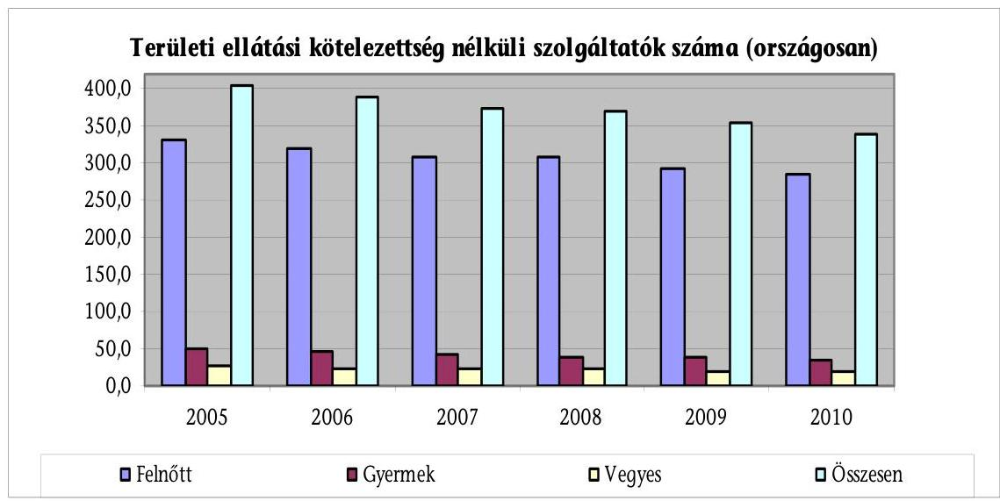

Adatforrás: OEP adatok alapján ÁSZ számítás

# 2.5. A minimum feltételek korszerűsítésére tett ágazatirányítói törekvés 

Az egészségügyi szolgáltatások minimum feltételeiről rendelkező ESZCSM rendelet ${ }^{43}$ által meghatározott személyi és tárgyi feltételek megléte nélkül a hatóság nem ad működési engedélyt a háziorvosoknak. Az ágazatirányító 2010-ben kívánt intézkedni a minimum feltételek módosítása érdekében. Az új rendelet azonban nem lépett hatályba. A minimum feltételeknek nem felelt meg 97 felnőtt, 30 gyermek és 146 vegyes háziorvosi szolgálat. Számukra ellátási érdekből ideiglenes működési engedélyt adott ki az ÁNTSZ, azzal a feltétellel, hogy a határozatokban megjelölt határidőre teljesítik az építészeti, illetve egyéb tárgyi, személyi feltételeket (2011. 03. 24-i állapot szerint).

### 2.6. A praxisok működtetéséhez szükséges humánerőforrás alakulása

A háziorvosi praxisra jellemző az egy orvos- egy ápoló felállás. Ezt a létszámot követeli meg a minimum feltételekről rendelkező jogszabály is, függetlenül az ellátandó lakosság számától, illetve a megnövekedett adminisztrációs követelményektől.

Az ÁSZ kérdőíves felmérésében az 1007 válaszadó közül, 162 szolgálat (17,8\%) jelezte, hogy 2 fő asszisztenst alkalmaz. Adminisztrátort 164, informatikust 20, egyéb alkalmazottat (takarító, karbantartó) 185 esetben 1-1 főt alkalmaznak, 5 esetben pedig 2 főt jelentettek.

[^0]
[^0]:    ${ }^{43}$ az egészségügyi szolgáltatások nyújtásához szükséges minimumfeltételekről szóló 60/2003. (X. 20.) ESZCSM rendelet

---

A több asszisztens alkalmazása, illetve adminisztrátori állás létesítése nem elvárás, de ösztönzésére a finanszírozási kormányrendelet ${ }^{44}$ tartalmaz elemeket. A létszám bővítése gyorsabbá teheti a betegellátást, tehermentesíti az orvost.

A 7. sz. táblázat 6560 háziorvos életkori adatait mutatja. (Az OEP-től átvett 2010. 10. havi adatokban 184 adat az üres praxisok, és a nyugdíjazások miatt nem jelenik meg.) Az alábbi adatokból látható, hogy a háziorvosi szolgálatot ellátók 70,6\%-a 50 év feletti, ebből a 60 év felettiek 32,6\%-ot képviselnek.

# A háziorvosok életkor megoszlásáról 

| Életkor (év) | $\mathbf{2 5 - 2 9}$ | $\mathbf{3 0 - 3 9}$ | $\mathbf{4 0 - 4 9}$ | $\mathbf{5 0 - 5 9}$ | $\mathbf{6 0 - 6 9}$ | $\mathbf{7 0 - 7 9}$ | $\mathbf{8 0 - 8 9}$ | $\mathbf{9 0 -}$ | Össz. |
| :-- | :--: | :--: | :--: | :--: | :--: | :--: | :--: | :--: | :--: |
| Létszám (fő) | 32 | 561 | 1321 | 2491 | 1768 | 369 | 17 | 1 | 6560 |
| Megoszlás \%-a | 0,5 | 8,6 | 20,1 | 38 | 27 | 5,6 | 0,2 | 0,02 | - |

Adatforrás: OEP 2010. 10. havi adatok alapján ÁSZ számítás
A személyi feltételek megfelelőségének meghatározó eleme a működési nyilvántartás megújítása, ami továbbképzés teljesítéséhez kötött. A szabályozás értelmében az orvosok működési nyilvántartásának megújítása ötévenként, 250 kreditpont elérésével lehetséges.

2005 és 2010 között 240 háziorvos kért az EEKH ${ }^{45}$-tól hatósági bizonyítványt a végzettség külföldi elismertetése céljából. Arra, hogy közülük ténylegesen hányan vállaltak külföldön munkát, nincs adat.

Szintén az EEKH-tól származó adat, hogy jelenleg a négy orvosi egyetemen első szakképzésként 279-en, második szakképzésként szintén 279-en választották a háziorvostant. A tényleges utánpótlást az első szakképzésben résztvevők jelentik, amennyiben a szakvizsgát követően valóban háziorvosként folytatják munkájukat. További 34 fő vesz részt képzésben azok közül, akik 1999 előtt szereztek diplomát. Az OALI Praxis I. és Praxis II. Programjában 85-en folytatnak háziorvostani tanulmányokat. 2005-2010 között a háziorvostanból szakvizsgázottak száma emelkedett, ezt az 5. sz. melléklet 2. sz. táblája mutatja be.

A 10 ezer lakosra jutó háziorvosok száma Pest megyében 5,6, Budapesten 7,7. Az egy háziorvosra jutó lakosok száma Budapesten a legkevesebb, míg Pest megyében a legtöbb. (A részletes adatokat az 5. sz. melléklet 3. sz. táblája mutatja be.)

A 10 ezer lakosra jutó háziorvosok száma pl. Portugáliában 18, Ausztriában 15 orvos, az EU átlag 9,5, a legkevesebb orvos 10 ezer lakosra Lengyelországban, illetve Görögországban jut, 1,7-es, 2,7-es átlaggal.(HFA 2010). ${ }^{46}$

[^0]
[^0]:    ${ }^{44}$ az egészségügyi szolgáltatások Egészségbiztosítási Alapból történő finanszírozásának részletes szabályairól szóló 43/1999. (III. 3.) Korm. rendelet
    ${ }^{45}$ Egészségügyi Engedélyezési Közigazgatási Hivatal
    ${ }^{46}$ European Health for All Database (HFA-DB).

---

# 2.7. A betöltetlen praxisok területi megoszlása, aránya, hatása az ellátásra 

2005-ben a betöltetlen körzetek száma 159 volt, míg a 2011. január hóban 7,5\%-kal több, 171 db , amelyből 41 a felnőtt, 28 a gyermek és 102 a vegyes körzet.

A betöltetlen praxisokhoz tartozó települések száma 263, ahol az ott élő 217967 ember ellátásáról kell gondoskodni. Ezekben a körzetekben már csak 165519 biztosítottat tartanak nyilván, ami a körzetek kiüresedését mutatja. A kiüresedés pedig tovább nehezíti a betölthetőséget.

Területi megoszlását tekintve, Nógrád megyében 8\%-os (136 körzetből 11 a betöltetlen), Tolna megyében 7,7\%-os, BAZ és Jásznagykun-Szolnok megyében, 6,4\%, illetve 6,7\%-os az üres praxisok aránya (betöltetlenségi mutató). BorsodAbaúj Zemplén megyében 31 betöltetlen körzet van, ami abszolút értékben a legmagasabb, de az összes körzethez viszonyítva ez 6,4\%-os betöltetlenséget eredményez. A részletes adatok az 5. sz. melléklet 4. sz. tábláján láthatók.

Az üres praxissal rendelkező települések közül 92 küldte vissza a kitöltött kérdőívet határidőre. A betöltetlenségre tett intézkedésekben 70 település hirdette az állást, 16 az OALI Praxis Programjával kívánta megoldani az ellátást.

A települések közül 49 esetben ingyenesen biztosított a teljes ingó, ingatlan felszerelés, 54 esetben pedig szolgálati lakás is rendelkezésre áll, ami elviekben könnyítheti a betölthetőséget. A helyettesítés megoldott, azonban sok helyen vannak a hétnek olyan napjai, amikor nincs rendelés. (Pl. Lenti, Dáka, Felsőgagy stb.) Az OALI Praxis Programjával két helyen, Putnokon és Lentiben éltek a válaszadók közül. Az OEP finanszírozás teljes összegét 28 településen kapja meg a helyettesítő, a többi szolgáltató 30-80\%-ban osztja meg a finanszírozást az önkormányzattal, ebből több feladatot is ellát a hivatal. (Pl. takarítást, asszisztenst biztosít, rezsi, illetve karbantartási költségeket finanszíroz.) Az ellátási problémák megoldásaként 14 helyen terveznek körzetösszevonást, azonban a nagyobb körzetet sújtó degresszió ezt hátrányosan befolyásolja. (Amennyiben területi ellátási kötelezettség miatt nagy a körzet, nem érvényesül ez a szabály. $)^{47}$ A betöltetlenség hatásai között 49 település értékeli úgy, hogy rövid a rendelési idő, 18 település véleménye szerint elégtelen a prevenció, és 17 úgy ítéli meg, hogy nem biztosított a betegek otthonukban történő ellátása.

A kérdőíves felmérés feldolgozásából látható, hogy az egy év utáni betöltetlenséget követő 60\%-ra lecsökkentett finanszírozás elégtelen, ami arra kényszeríti a tulajdonos önkormányzatokat, hogy hozzájárulást nyújtsanak az ellátáshoz. (Pl. Ecser, Felsőgagy, Nagylak, Sárosd)

[^0]
[^0]:    ${ }^{47}$ Az egészségügyi szolgáltatások Egészségbiztosítási Alapból történő finanszírozásának részletes szabályairól szóló 43/1999. (III. 3.) Korm. rendelet 14. § (4) bekezdése

---

# 2.8. Az orvosi tevékenységre vonatkozó munkaidőkorlát betartása, a háziorvos valamennyi tevékenységéből adódó leterheltség alakulása 

A 2003. évi egészségügyi tevékenység végzéséről rendelkező jogszabály, ${ }^{48}$ a vonatkozó Európai Uniós irányelvekkel ${ }^{49}$ összhangban meghatározta az egészségügyi dolgozók esetében kötelezően elrendelhető, illetve önként vállalható egészségügyi tevékenység időtartamát. Ennek megfelelően a különböző jogviszonyokban végzett egészségügyi tevékenységeket egybe kell számítani. Az önként vállalható többletmunka a vonatkozó direktívákkal és az Európai Bíróság döntésével összhangban lehetőséget biztosít többletmunka vállalására, a törvény 13 §-a rögzíti az önkéntes többletmunka végzésének maximális időtartamát. ${ }^{50}$

A pihenéshez való jog kötelezettség is, mivel a betegeknek a pihent egészségügyi dolgozók által nyújtott ellátáshoz joguk van.

A háziorvosi szolgálat orvosa 8 órában nyújt szolgáltatást az őt választó biztosítottak számára, így heti munkaideje 40 óra. ${ }^{51}$ A jogszabály ebbe az időkeretbe beleérti a rendelési időt és a tanácsadás idejét is. A háziorvosok általános gyakorlat szerint ezen kívül részt vesznek az iskola-egészségügyi, foglalkozásegészségügyi, háziorvosi ügyeleti ellátásban. E mellett lehetnek közreműködők vagy szakképzettségük szerint szakellátásban is vállalhatnak feladatokat, kórházi ügyeletet. A feladatok ellátásához működési engedély kiadása nem minden tevékenységhez szükséges, így az ÁNTSZ nyilvántartási, engedélyezési kötelezettsége részleges, ez azt eredményezi, hogy nem állapítható meg, hogy az egyes tevékenységekkel eltöltött munkaidő megfelel-e a szabályozásnak.

## A munkaidőkorlát betartása átláthatatlan és nem ellenőrzött.

A vizsgálat által megkérdezett valamennyi háziorvos közül az önkéntes válaszadók száma 1007 volt. Az egyes tevékenységek heti óraszámára vonatkozó kérdésre a válaszolók közül 165-en lépik túl a heti munkaidő korlátot, vagyis 16,4%-uk. Több, mint 40 órában végeznek háziorvoslást 466-an, bár az OEP szerződés

[^0]
[^0]:    ${ }^{48}$ Az egészségügyi tevékenység végzésének egyes kérdéseiről szóló 2003. évi LXXXIV. törvény.
    A munkaidő-irányelvet eredeti formájában 1993-ban fogadták el, azóta többször módosult a magyar szabályozás alapja. Az Európai Parlament és Tanács 2003. november 4-i 2003/88/EK irányelve a munkaidő szervezés egyes szempontjairól.
    ${ }^{49}$ az Európai Parlament és a Tanács 2003. november 4-i, a munkaidő szervezés egyes szempontjairól szóló 2003/88/EK irányelve
    ${ }^{50}$ Az egy naptári napra eső egészségügyi tevékenységek időtartama a 12 órát nem haladhatja meg akkor sem, ha az egészségügyi dolgozó több egészségügyi szolgáltatóval áll munkavégzésre irányuló jogviszonyban, illetve alkalmazottként és vállalkozóként is tevékenykedik, hat havi átlagban pedig nem lehet több a munkában töltött idő heti 60 óránál. (A 2007. évi LXXII. tv., amely 2007. VII. 1-jétől hatályos.)
    ${ }^{51}$ az egészségügyi szolgáltatások Egészségbiztosítási Alapból történő finanszírozásának részletes szabályairól szóló 43/1999. (III.3.) Korm. rendelet

---

heti 40 órára szól. 112-en tartanak magánrendelést, szakorvosi ügyeletben 27-en vesznek részt. A válaszadók közül 121-en szociális otthonban látnak el háziorvosi munkát, iskola-egészségügyi feladatot 351-en, foglalkozás egészségügyi munkát pedig 18,7%-uk vállalt.

# 2.9. A háziorvosi feladatellátás szakmai ellenőrzése (ÁNTSZ és OEP) 

A háziorvosi feladatellátás szakmai ellenőrzését két szervezet végzi, az OEP, valamint az ÁNTSZ-en belül működő szakfelügyelő főorvosi hálózat.

Az OEP Elemzési, Orvosszakértői és Szakmai Ellenőrzési Főosztályának szakmai ellenőrzési tervek elkészítése, orvosszakmai ellenőrzések, valamint a pénzügyi ellenőrzésekkel kapcsolatos feladatok ellátása.
2009. évi bázis ellenőrzés keretében a 6822 háziorvosi szolgáltató 20\%-át, 1363 szolgálatot javasoltak ellenőrizni, ebből 1189 ellenőrzés valósult meg. (Ezek megoszlása régiónként: Közép-magyarország 90, Közép-Dunántúl 304, Nyugat-Dunántúl 108, Dél-Dunántúl 170, Észak-Magyarország 263, Észak-Alföld 146, Dél-Alföld 108.)

A régiók saját hatáskörben végzett ellenőrzései keretében a háziorvosoknál, házi gyermekorvosoknál összesen 1429 ellenőrzés volt, ebben 59799 tételt ellenőriztek, visszavonásra 2448-at javasoltak. Az ellenőrzésekre 3401 ellenőri órát fordítottak. A visszavonásra került összeg ebben az ellenőrzési típusban (az országosan elrendelt ellenőrzések nélkül) az I. félévben 6,4 M Ft, a II. félévben 4,4 M Ft volt.

Az ÁNTSZ és az ezen belül működő Országos Szakmai Módszertani Központ (OSZMK) keretén belül működő szakfelügyelői hálózat feladatait, szervezeti felépítését az egészségügyi szolgáltatók szakmai felügyeletéről szóló 15/2005. (V. 2.) EüM rendelet szabályozza.

A szakfelügyelői hálózat az ÁNTSZ keretén belül működik. Az országos szakfelügyelő főorvos az Országos Szakfelügyeleti és Módszertani Központtal, a megyei szakfőorvosok a megyei kormányhivatalok népegészségügyi szakigazgatási szerveivel, a városi/kistérségi szakfelügyelők pedig az illetékes városi/kistérségi népegészségügyi intézettel állnak szerződéses viszonyban. Az országos szakfőorvoshoz nem jutottak el minden esetben a városi/kistérségi felügyelők vizsgálati jelentései, éves beszámolói, az országos szakfelügyelők nem kapták meg minden évben teljes körűen a megyei szakfelügyelők beszámolóit. 2008-ban az országos szakfelügyelő, a beszámolója szerint még a betöltetlen szakfelügyelői helyekről sem kapott információt.

Az országos háziorvos szakfelügyelő főorvos a vizsgált időszakban két alkalommal (2006, 2008) készített éves beszámolót. Több alkalommal nem kapta meg a megyei, városi szakfelügyelőktől a beszámolóikat.

Az országos gyermek-alapellátási szakfelügyelő főorvos 2005-2009 évről készített éves beszámolót. A beszámolók általános adatelemzésre épülnek (az ada-

---

tok forrása és maga az adat sem szerepel a beszámolóban, nincs rá hivatkozás), általános értékelést tartalmaznak, a munkaterv alapján lefolytatott vizsgálatok értékelését nem.

Az OSZMK közzétette az országos szakfelügyeleti éves jelentés adattartalmát 2011-re vonatkozóan. A felsorolás olyan elemeket tartalmaz, az abban meghatározottak meghaladják az országos szakfelügyelők lehetőségeit (pl. a szakma epidemiológiai helyzet elemzése morbiditási és mortalitási adatok alapján, az ellátórendszer hozzáférhetősége, a valós igény és az ellátórendszer összevetése stb.)

A szakfelügyelőnek jogszabály ${ }^{52}$ szerint az OSZMK által megadott szempontok alapján évenként munkatervet kell készítenie, amelyben meghatározza a végzendő adatgyűjtések, auditok és helyszíni ellenőrzések témakörét, gyakoriságát. A szakfelügyelő főorvosok munkatervet nem mutattak be az ellenőrzés során.

Az országos házi gyermekorvos szakfelügyelő összesítése szerint 2007-2009 időszakban összesen 542 vizsgálatot folytattak le, ebből 505 a városi szakfelügyelők, 27-et a megyei, 10-et pedig az országos szakfelügyelő. A beszámoló szerint panaszügy 2005-2007 időszakban nem volt. 2008-ban 12, 2009-ben 11 esetben történt panaszbejelentés kivizsgálása, ami nem jelentős. (Évente 11,5 millió orvos-gyermek találkozás történik.) A szakfelügyelők által elvégzett ellenőrzésekről nincs összesítés, a beszámoló szerint intézkedési javaslatok nem készültek. A felnőtt praxisokra vonatkozóan nem áll rendelkezésre adat a szakfelügyelet által lefolytatott ellenőrzések számáról és témájáról.

Az OSZMK-nál nem összesítették a háziorvosi szakfelügyelői hálózat fenntartásának éves költségét. A helyi ÁNTSZ szervezetek önálló költségvetési intézmények, és az OSZMK-nál nincsenek adatok arról, hogy az egyes szervezeteknél mennyit fordítanak erre a célra. Vita van arról is, hogy a szakfelügyelők költségei az egyes ÁNTSZ szervezeteken belül milyen soron vannak a költségvetésben megtervezve. Csongrád megyei adat áll rendelkezésre, amely szerint a megyei szakfelügyelő havi 9000 Ft megbízási díjban részesül, valamint 4000 Ft költségtérítésben. Ez az alacsony finanszírozás gátolja a szakfelügyelői hálózat kielégítő működését.
2011. május 1-jétől az ÁNTSZ-t átszervezték, amely a szakfelügyelői hálózatot is érintette.

# 2.10. A háziorvosok adatszolgáltatási kötelezettségének, valamint annak egyszerűsítésére tett intézkedések értékelése

Az alapellátásban dolgozó orvosokra egyre nagyobb adminisztrációs teher hárul, amely világszerte megfigyelhető. Az adatszolgáltatással nő az átláthatóság, többet lehet megtudni a betegutakról. A háziorvosi szolgáltatók jelenleg a legkülönbözőbb szervek irányába, eltérő időpontban küldik különböző típusú, de sokszor hasonló adattartalmú jelentéseiket.

[^0]
[^0]:    ${ }^{52}$ Az egészségügyi szolgáltatások szakmai felügyeletéről szóló 15/2005. (V.2.) EüM rendelet

---

A jelentési kötelezettségek egy jóval kisebb, átláthatóbb, ezért könnyebben kezelhető és kevesebb csatornán futó adatállománnyal is teljesíthetők. A KSH, ÁNTSZ, APEH felé jelentett adatok részben olyan adathalmazokat tartalmaznak (pl. betegforgalom, praxis létszámadatai, ellátást indokló diagnózisok, stb.), amelyeket az OEP-nek is jelentenek. Az OEP részére küldött felnőtt, gyerek, vegyes praxisok jelentésének adatstruktúrája és adattartalma ugyanaz. A továbbítandó adatok és célállomások determinálják a különbözőséget. Az ún. morbiditási (vagyis a praxisban gondozott betegekre vonatkozó) jelentéseket a KSH-val együttműködve már szinkronizálták, ezáltal a felnőttkorba lépve is nyomon követhető a betegek sorsa, száma.

2011-ig a háziorvosi jelentéseket floppy lemezeken, postai úton továbbították. A rendszer célja, hogy egyszerűsítse a jelentésbeküldés folyamatát, adatátviteli vonalon (interneten) keresztül lehetővé tegye a heti/havi jelentések elektronikus úton történő beküldését közvetlenül az OEP részére. 2011. január 1-jétől a háziorvosi szolgáltatóknak online, interneten keresztül is lehetőségük van beküldeni havi/heti jelentéseiket. Az E-jelentés-rendszer bevezetéséről a háziorvosi szolgálatokat tájékoztatta az OEP. Az első elektronikus jelentések fogadására 2011. február 1-5. közötti időszakban került sor, ami a január havi teljesítéseket tartalmazta. A 6760 háziorvosi szolgálat közül 4100 praxis működtetője regisztrált a rendszerben. A regisztráltak közül a január havi jelentéseket több mint 2000-en küldték be az interneten keresztül, kihasználva a rendszer nyújtotta előnyöket.

Az OEP rendelkezik a szükséges informatikai háttérrel, amely a háziorvosok részére lehetővé teszi a betegutak követését.

A 2011. áprilisi finanszírozási kormányrendelet ${ }^{53}$ módosításával - a hatályos törvény értelmében - amennyiben a biztosított írásban nem tiltotta meg, a háziorvosoknak lehetőségük nyílt a hozzájuk bejelentkezett biztosított betegeik útjának követésére, az általuk igénybevett egészségügyi ellátások adatainak megismerésére. Az adatokat az egészségbiztosítási szerv elektronikus lekérdezés formájában biztosítja számára. Az érintettet a tiltakozás lehetőségéről - az első elektronikus lekérdezés előtt - tájékoztatni kell. A háziorvos az egészségügyi dokumentációban a tájékoztatás és az esetleges tiltakozás tényét rögzíti, amit a beteg aláírásával ellenjegyez. A normaszöveg azonban nem hajtható végre, amíg nem változtatják meg a Korm. rendelet tételes betegforgalmi jelentés adattartalmára vonatkozó részeit. Az adatkezelés célja a betegutak irányítása és nyomon követése, a háziorvos kapuőri funkciójának támogatása.

Az egészségügyi adatvédelmi törvény módosítását az ÁSZ 0805 számú „az egyes onkológiai szűrési programokra fordított pénzeszközök hasznosulásának ellenőrzéséről" szóló jelentésében már javasolta a Kormánynak: „Gondoskodjon a szűrési programok mérhetőségéről, átláthatóságáról és a betegutak követhetőségéről. Ezért kezdeményezze az egészségügyi és a hozzájuk kapcsolódó személyes adatok kezeléséről és védelméről szóló 1997. évi XLVII. számú törvény módosítását."

[^0]
[^0]:    ${ }^{53}$ 73/2011. (IV. 29.) Korm. rendelet 6. § és 7. sz. melléklet

---

# 3. Az önkormányzatok szerepe a háziorvosi ellátás megszervezésében

### 3.1. Az ellátás megszervezésére irányuló önkormányzati intézkedések

Az önkormányzatok - eltérő adottságok mellett, a korábban kialakult struktúra fenntartásával - gondoskodtak a háziorvosi alapellátás biztosításáról. Ezzel eleget tettek a helyi önkormányzatokról szóló 1990. évi LXV. törvény (Ötv.) 8. § (4) bekezdésében és az egészségügyről szóló 1997. évi CLIV. törvény (Eütv.) 152. § (1) bekezdés a) pontjában előírt kötelezettségüknek.

Az önkormányzatok felelősségébe tartozó háziorvosi körzetek a körzeti orvosi hagyományokra építve már a '90-es években kialakultak, az utóbbi hat évben összességében állandónak tekinthetők. A területi ellátási kötelezettségű háziorvosi szolgálatok, illetve a kialakított háziorvosi körzetek száma 2005-2010 között alig változott. Az évek közti és a hat év első és utolsó éve közti eltérés is 0,2% alatti volt.

Az önkormányzatok új körzet kialakításáról ott döntöttek, ahol egyes településrészek lakosságszáma jelentősen nőtt vagy külön gyermekkörzet kialakítására volt lakossági igény. A körzetszámot ott csökkentették, ahol a bejelentkezettek száma drasztikusan visszaesett vagy a praxis betölthetetlenségére hivatkozva az ellátási területet más körzetekhez történő csatolásokkal felosztották. A háziorvosi körzetek számának vagy területi határainak módosításáról szóló önkormányzati döntéseket a helyszíni ellenőrzések tapasztalatai szerint írásos előterjesztések alapozták meg. Ezekben elsősorban a „kényszerhelyzetet" és célszerűségi szempontokat mutatták be.

A kisebb - jellemzően az ezer lakos alatti - önkormányzatoknál más településsel, illetve településekkel közösen szerveztek egy vagy több háziorvosi körzetet. Az együttműködések szabályait megállapodásokban rögzítették, amelyekben a székhely településekre hárult az egészségügyi alapellátás felelőssége. A kisebb községek legfeljebb heti egy-két óra helyi orvosi ellátáshoz biztosítottak rendelőnek helyiséget. A kistérségi szintű együttműködés csak a háziorvosi ügyelet megszervezésében terjedt el. A háziorvosok ideiglenes helyettesítésébe maguk a háziorvosok vagy tartós helyettesítéseknél az önkormányzatok leginkább a szomszédos vagy közeli körzetek orvosait vonták be.

Az önkormányzatok által meghatározott körzetméretek, a területi ellátási kötelezettséggel működtetett háziorvosi szolgálatok sajátosságai, a szabad orvosválasztás lehetőségei mellett az ellátáshoz való lakossági hozzáférés különbségei továbbra is jellemzik az ellátórendszert. A kialakult orvosbeteg kapcsolatok, a kényszerhelyzetek és a finanszírozási, valamint egyéb központi szabályok együttes hatása mellett egy-egy megye átlagos, vagy egy-egy területi ellátási kötelezettségű háziorvosi szolgálat adatai között is jelentősek a különbségek az ellátandó betegek száma alapján.

---

A Szabolcs-Szatmár-Bereg megye községeiben, a vegyes körzetekben átlagosan közel 500 fővel több a bejelentkezettek száma, mint az átlagos feltételeket mutató Baranya, Békés vagy Vas megyékben.

A megyei átlagszámok elfedik, hogy egy-egy körzetben szélsőséges különbség is előfordul a bejelentkezettek számában.

Az OEP adatai szerint a legtöbb és legkevesebb bejelentkezettel rendelkező területi ellátási kötelezettségű háziorvosi szolgálatoknál az ellátandók számában többszázszoros különbség is előfordult.

Az egészségügyi alapellátásról való gondoskodás feladata az önkormányzatok saját értelmezésében elsősorban az ellátást biztosító orvos kijelölését és vele a feladatellátási szerződés megkötését jelentette, hangsúlyozva a finanszírozást nyújtó egészségbiztosító és a működést engedélyező, felügyelő ÁNTSZ szerepét. Az önkormányzati gazdasági programokban csak általános jellegű célok szerepeltek, egészségügyi szakmai programok csak azokban az esetekben és csak arra a területre születtek, amelyekhez fejlesztési forrásokra nyújtottak be pályázatot.

# 3.2. A háziorvosokkal kötött feladatellátási szerződések és azok végrehajtása

A helyi önkormányzatok és a háziorvosi ellátást nyújtó orvosok (vállalkozások) közötti szerződések formai és tartalmi sokfélesége figyelhető meg. A háziorvosi feladatok ellátására kötött szerződések tartalmára nincs követelmény vagy ajánlás, ezért a szerződések önkormányzatonként és vállalkozásonként eltérő tartalommal készültek.

Az önkormányzatok helyszíni ellenőrzése során szerzett általánosítható tapasztalatok a következők:

- a feladatellátási szerződések aktualizálásának elmaradása (hivatkozott jogszabályok, rendelési, rendelkezésre állási idők, átadott eszközök listája tekintetében);
- az önkormányzati eszközátadások, támogatások módjának, feltételeinek, a költségmegosztások szabályainak hiányos rögzítése, valamint az ellátás szakmai minőségének és a szerződés teljesítésének önkormányzati ellenőrzése tisztázatlan;
- a szerződések végrehajtása, a szerződésekben esetlegesen rögzített minőségi követelmények betartása a polgármesteri hivatalok személyi és szakmai feltételeinek elégtelensége miatt nem ellenőrzött, a háziorvosok egészségbiztosítóval és szakhatósággal történő közvetlen kapcsolata mellett az önkormányzatok informáltsága, információs lehetősége és igénye is leszűkült;
- fennáll annak a kockázata, hogy a szerződések bármelyik szerződő fél részéről előforduló hiányos, hibás teljesítését nem fedik fel, az következmények nélkül marad.

---

Az önkormányzatok a
 feladatellátási szerződésekben az ellátás biztosításához leggyakrabban az orvosi rendelő, és az egyéb eszközök, berendezések rendelkezésre bocsátását, valamint a rendelő működtetése egyes rezsi elemei költségviselését vállalták. Az önkormányzati rendelők felújítása mindenütt az önkormányzatok feladatát képezte.
9. sz. ábra
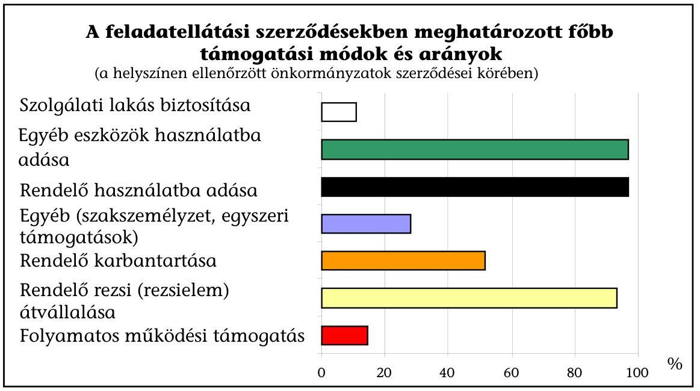

Adatforrás: a helyszínen ellenőrzött önkormányzatok szerződései
Az önkormányzatok a háziorvosokkal, illetve a több körzetes településeken a háziorvosok egy részével - a háziorvosi feladatellátási szerződéseken kívül vagy annak részeként - egyéb feladatok ellátásában is megállapodtak.

Ezek leggyakrabban az egészségügyi alapellátás körébe tartozó iskolaegészségügyi ellátásra és a háziorvosi ügyeleti ellátások székhelyein az ügyeleti feladatokra, illetve más háziorvosi körzetben a hiányzó orvos átmeneti, vagy tartós pótlására vonatkoztak. A polgármesteri hivatalok és költségvetési intézmények a foglalkozás-egészségügy, a szociális intézményi orvosi ellátás területén vették igénybe még vállalkozó háziorvosok szolgáltatását. Egészen szűk körben szakrendelésre, szaktanácsadásra, egyéb sajátos egészségügyi ismereteket igénylő feladatokra szerződtek háziorvosokkal.

A helyszínen ellenőrzött önkormányzatoknál a háziorvosokkal egyéb feladatokra kötött szerződések nem tartalmaztak a háziorvosi feladatellátási szerződésekkel összeférhetetlen, ellentétes szabályokat. Ugyanakkor sem az önkormányzatoknál, sem ÁNTSZ részéről volt kontrollja (csak orvosi nyilatkozattétel szintjéig) az egészségügyi tevékenység végzésének egyes kérdéseiről szóló 2003. évi LXXXIV. törvény 13. §-ban foglalt azon előírás betartásának, hogy hat hónap átlagában nem haladhatja meg a heti 60 órát az orvos egészségügyi tevékenységeinek együttes időtartama.

---

# 3.3. A háziorvosi ellátás önkormányzati támogatása 

A települési önkormányzatok az egészségügyi alapellátás, ezen belül a háziorvosi ellátás terén fennálló kötelező feladataikról - alapvetően már a vizsgált időszakot megelőzően kialakított - különböző formában gondoskodtak. A 2010. évi szerződések alapján a háziorvosi ellátást nyújtó szolgáltatók közel 95\%-a vállalkozás, megyénként néhány (+4 és -9 közötti) százalékpontos eltéréssel.

A helyszíni vizsgálattal érintett 192 háziorvosi szolgálatból 2010. év végén 27 háziorvos ( $14 \%$ ) volt közalkalmazott.

A vállalkozó háziorvosok az E. Alap kezelőjével közvetlenül kötöttek finanszírozási szerződést. Az önkormányzatoknak nem volt részletesebb információja a háziorvosi ellátást szolgáltató vállalkozások E. Alapból történő finanszírozásáról, nem készültek összehasonlító számítások, elemzések a feladat más formában történő ellátására vonatkozóan.

A háziorvosi ellátást kizárólag közalkalmazott háziorvos útján biztosító községi önkormányzatoknál a Tb. finanszírozás, működési kiadás egy bejelentkezettre jutó összege a praxis jellemzőitől (bejelentkezettek száma, rendelőépület adottságai, fűtési módja, takarító és egyéb személyzet száma) függően jelentősen eltért.
10. sz. ábra
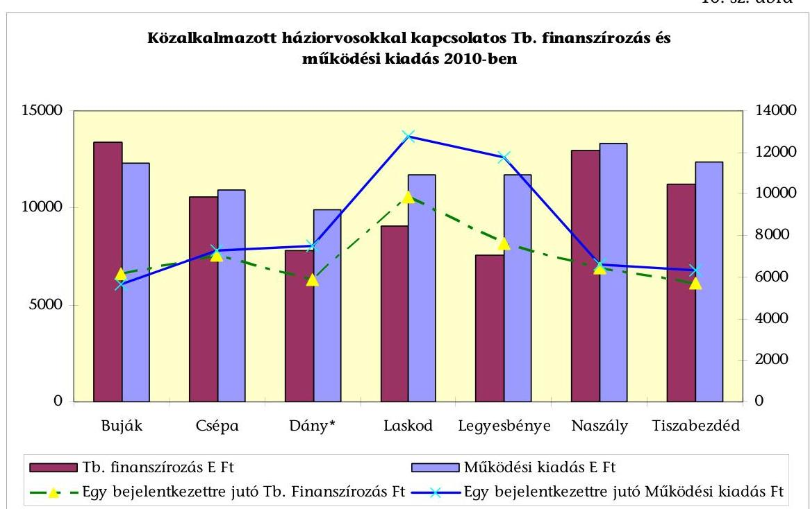

Megjegyzés: * Dány községben 2010 áprilisától közalkalmazott háziorvossal kapcsolatos bevétel és kiadás éves szintre átszámított összege
Adatforrás: OEP adatok alapján ÁSZ számítás
A közalkalmazott háziorvosokkal kapcsolatos finanszírozási bevételeket, működési kiadásokat és ezek egy bejelentkezettre (elfogadott kártyára) jutó összegét mutatja a 10. sz. ábra.

---

A kialakult feladatellátási modellt tükrözi a helyi önkormányzatok - helyszíni vizsgálatig ismert 2005-2009. közötti - költségvetési beszámolóiban a „Háziorvosi szolgálat" szakfeladat bevételi és kiadási pénzforgalma, támogatása. Az önkormányzatok költségvetésében az E. Alapból (háziorvosi kasszából) utalt finanszírozás összege és aránya folyamatosan (a 2005. évi 10,4\%-ról 2009-re 7,4\%-ra) csökkent.

A beszámolók adatai szerint a települési önkormányzatok 2005-2009 között évente 3,8-4,2 Mrd Ft pénzügyi támogatással egészítették ki a háziorvosi szolgálatok Tb. finanszírozását és a szakfeladaton elszámolt saját és egyéb bevételeket. A működési kiadásokon túl a szakfeladaton elszámolt 6 Mrd Ft felhalmozási (felújítási, beruházási) kiadás 2005-2009 között az egyes években egyenetlenül oszlott meg. (A 2006. évi 1,7 Mrd Ft-tal szemben 2009-ben 0,9 Mrd Ft-ra csökkent.) A beszámolók szerint a háziorvosi szolgálat szakfeladaton elszámolt felhalmozási kiadások 78\%-át az önkormányzatok saját forrásból fedezték, csupán 22\%-a származott átvett pénzeszközökből, támogatásból.

A „Háziorvosi szolgálat" szakfeladaton elszámolt bevétel, kiadás és önkormányzati támogatás változását mutatja az önkormányzatok és intézmények 20052009. évi beszámolói alapján - makroszinten - mutatja a 11. sz. ábra.
11. sz. ábra
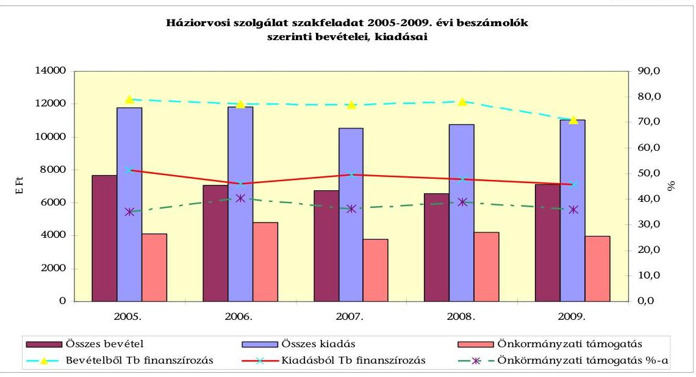

Adatforrás: OEP adatok alapján ÁSZ számítás
A helyszínen vizsgált önkormányzatoknál hasonló volt a felhalmozási kiadások támogatásának aránya. Az önkormányzatok 36\%-a (9 önkormányzat) kizárólag saját forrásból végzett felújítást, korszerűsítést a háziorvosi ellátás feltételeinek javítása érdekében (ebből legjelentősebb a Győr megyei jogú városban összesen 28 rendelő kisebb-nagyobb felújítására fordított összeg). Ugyanennyi önkormányzatnál egyáltalán nem volt 2005-2010 között a háziorvosi ellátással kapcsolatos felhalmozási bevétel, kiadás. Különböző (Regionális Operatív Programok, LEKI) pályázatokon elnyert támogatásból valósította meg 7 önkormányzat (28\%) az ellátás feltételeinek javítása érdekében a rendelő akadálymentesítését, korszerűsítését. A járóbeteg-ellátás fejlesztésére

---

kiírt TIOP-os pályázat keretében valósult meg új rendelők kialakítása (pl. Pásztó, Velence).

Az önkormányzatok a háziorvosi rendelőket és azok berendezéseit (egy kivételével) térítésmentesen bocsátották a vállalkozó háziorvosok rendelkezésére. Az önkormányzati tulajdonban, részben az általuk alapított egészségügyi intézmények fenntartásában lévő rendelők közműdíljait, karbantartási költségeit a vállalkozó háziorvosok egytizede viselte teljes egészében, $90 \%$-uk a fenntartó által kiszámlázott rezsitérítést fizette. (A rendelők üzemeltetésével kapcsolatban felmerült rezsiköltségeket vagy azok egy részét - a feladatellátási megállapodásban meghatározott aránynak megfelelően - kiszámlázták a vállalkozó háziorvosok felé. A vizsgált időszakban - a rezsiköltségek átvállalásán túl - egy városi önkormányzat (Velence) folyamatosan, kettő (Bük és Szentgotthárd) csak átmenetileg nyújtott pénzbeli működési támogatást.

A háziorvosok közvetett támogatásával is segítették az önkormányzatok a működési feltételeket (pl. Győrben parkolási bérletet biztosítottak, továbbá ún. laborjáratot működtettek, Aba lakhatási támogatást biztosított egy háziorvos részére, Izsákon a kórházak és a háziorvosi rendelők közötti informatikai kapcsolatok kiépítésével és folyamatos üzemeltetésével biztosítják, hogy a háziorvosok letölthetik a betegek leleteit.) A lakosság számára kedvező megoldás volt a vérvételi helyek kialakítása (Bük, Mezőcsát, Egervölgy). Megszervezték a szállítást a központi laborba, majd az informatikai úton továbbított leleteket helyben adták ki.

A vizsgált önkormányzatok egy háziorvosi szolgálatra jutó működési támogatása - az önkormányzatok költségvetésében a szakfeladaton elszámolt kiadások, illetve a Tb. finanszírozás és a saját bevételek (pl. a vállalkozók rezsitérítése) különbözete - településtípusonként, évente változott. (A működési támogatás magában foglalja a hagyományos, közalkalmazottként foglalkoztatott háziorvosok és szakszemélyzet alkalmazásával, a rendelő fenntartásával kapcsolatos bevételek és kiadások különbözetét, valamint a vállalkozó háziorvosok pénzbeli támogatását, a rendelő rezsiköltségének átvállalását.) A működési támogatás a vizsgált 2005-2010. közötti időszakban a kiadásoknak közel egynegyede ( $23,5 \%$-a) volt. Az évente változó összegű támogatás mértéke legalacsonyabb 2007-ben ( $78,6 \mathrm{MFt}$ ), a legmagasabb pedig azt megelőzően 2006-ban ( $136,7 \mathrm{MFt}$ ) volt, összességében - a városok kivételével - csökkenő arányú. A támogatás 2007-ben a vizitdíj bevezetését követően 42\%-kal csökkent, majd megszűnését követően 2008-ban közel 50\%-kal emelkedett, ezt követően két év alatt $11 \%$-os csökkenés volt tapasztalható.

Az önkormányzatok pénzügyi helyzetük romlása miatt megszüntettek álláshelyeket. A rendelők takarítását közhasznú, közcélú foglalkoztatottakkal végeztették (Mezőcsát, Buják, Legyesbénye, Naszály), amely kiadások nagyobbrészt megtérültek az erre a célra rendelkezésre álló központi forrásokból (Munkaerőpiaci Alapból, normatív, kötött állami hozzájárulásból). A helyszínen vizsgált önkormányzatok összesített adatait a 3/a., b. sz. tanúsítványok mutatják be.

---

# 3.4. Az uniós források hozzájárulása a háziorvosi ellátás feltételeinek javításához, a pályázattal nyert támogatások felhasználása és azok ellátásra gyakorolt hatása 

Az uniós fejlesztésekről szóló adatszolgáltatás az összes alapellátási formára (a projekt tartalmától függően háziorvosi, iskolaorvosi és fogorvosi praxisokra, védőnői szolgálatra) együttesen vonatkozik. Az alapellátás fejlesztésére megítélt és eddig kifizetett összegeket a 8. sz. táblázat mutatja be, a támogatási időszak 2007-től kezdődött.

## Alapellátás támogatása uniós forrásból 2007-2010 között (M Ft)

8. sz. táblázat

| Megnevezés | Támogató által   megítélt támogatás | Kifizetések |
| :-- | --: | --: |
| Összes ROP (Regionális Operatív Program)* | $12884,2^{* *}$ | $4569,3$ |
| Összes GOP (Gazdaságfejlesztési Operatív Program) | 37,3 | 35,9 |
| Összes TÁMOP (Társadalmi Megújulás Operatív Program) | 55,9 | 1,4 |
| Összesen | $\mathbf{1 2 9 7 7 , 4}$ | $\mathbf{4 6 0 6 , 6}$ |

* „Alapellátás fejlesztése, helyi egészségházak kialakítása" és „Egészségügyi szolgáltatások fejlesztése/Kistérségi járó beteg szakellátó központok fejlesztése, alap-, járóbeteg szakellátás korszerűsítése a komplex programmal kezelendő LHH kistérségekben" c. pályázatokat, tehát alapellátás és járó beteg ellátás fejlesztésére vonatkozó adatokat is tartalmaz.
** Az összeg a későbbiekben visszalépett 6 pályázó számára megítélt támogatásokat is tartalmazza.
Forrás: Nemzeti Fejlesztési Ügynökség, Nemzeti Erőforrás Minisztérium, Egészségügyi Fejlesztéspolitikai
Főosztály, 2011. február

2005-2011 között az alapellátás fejlesztésére, helyi egészségházak kialakítására összesen 11,1 Mrd Ft uniós forrást hirdettek meg regionális pályázatok keretében, amelyek a jelentős pályázói igényekre tekintettel a későbbiekben megemelésre kerültek. A támogató által megítélt pénzösszeg 13,0 Mrd Ft volt. A 279 nyertes pályázóból a későbbiekben visszalépett 6 pályázó, így ténylegesen 273 projekt valósul meg. Az egy pályázóra jutó átlagos támogatás $45,9 \mathrm{M}$ Ft-ot tett ki. 2011 februárjáig 4,6 Mrd Ft-ot (35,7\%) fizettek ki.

2005-2010 között a Gazdaságfejlesztési Operatív Program (GOP) keretében minőségi szolgáltatás fejlesztésére 47 pályázónak (háziorvosi vállalkozások) 37,3 M Ft támogatást ítéltek meg. A pályázati kiírások nem konkrétan a háziorvosok vagy az alapellátás fejlesztését célozták.

A vizsgált időszakban - az NFÜ adatszolgáltatása alapján - Társadalmi Megújulás Operatív Program (TÁMOP 6.2.4.) keretében mindössze 3 pályázónak, (amelynek kedvezményezettjei háziorvosok) $55,9 \mathrm{M}$ Ft támogatást ítéltek meg humánerőforrás fejlesztésére, foglalkoztatás támogatására. A projektek még nem zárultak le.

Jó gyakorlatként említhető az a modell, amelyben egy háziorvos a regionális munkaügyi központ által kiközvetített hátrányos helyzetű álláskeresőt recepciósként foglalkoztatott egy évig - a munkabér és azt terhelő járulékok tekintetében TÁMOP 1.1.1. támogatásból. A támogatás mértéke 50\%-os.

---

Az Európai Unió támogatásával a 2007-2013. évi TÁMOP 1.1. „Komplex munkaerő-piaci programok a munkanélküli és inaktív emberek foglalkoztatásáért" című intézkedés keretében megvalósuló TÁMOP 1.1.1 „Megváltozott munkaképességű emberek rehabilitációjának és foglalkoztatásának segítése" című kiemelt projekt célja az egészségkárosodással élő, és rehabilitációs járadékban részesülő személyek számára olyan foglalkozási rehabilitációs szolgáltatások biztosítása, amelyek segítik a korábbi munkahelyre való visszatérést vagy az újbóli elhelyezkedést, valamint a munkáltatók ösztönzése megváltozott munkaképességű személyek foglalkoztatására. A kiemelt projekt lebonyolítói a Regionális Munkaügyi Központok illetékes kirendeltségei.

A Foglalkoztatáspolitikai és Munkaügyi Minisztérium HEFOP Irányító Hatósága NFT I. keretében 2004. március 25-én kiírta az „Egészségügyi információ technológiai fejlesztés az elmaradott régiókban" című pályázatot. Az intézkedés célja az elmaradott régiók aktív korú lakossága egészségi állapotának javítása volt információ-technológiai infrastruktúra fejlesztésével (Intézményközi Információrendszer fejlesztése az intézmények és régiók között, elektronikus kórlap, e Recept, telemedicina, IT képzés, stb.). A támogatás célterülete Magyarország három társadalmi és gazdasági szempontból elmaradott régiója volt (ÉszakMagyarország, Észak-Alföld, Dél-Dunántúl). Mindhárom régió egységesen 1,350 Mrd Ft (összesen: 4,050 Mrd Ft) támogatási összegben részesült, amely teljes egészében finanszírozta a fejlesztés várható költségeit, saját forrás nélkül, $3 / 4$ részét az Unió ( 3,037 Mrd Ft), $1 / 4$ részét pedig a hazai költségvetés ( 1,013 Mrd Ft) biztosította.

# 4. A HÁZIORVOSI ELLÁTÁS FINANSZÍROZÁSA 

### 4.1. Háziorvosi kassza előirányzatának tervezése az E. Alapban

Az Egészségbiztosítási Alapban (E. Alap) a gyógyító-megelőző ellátások, ezen belül a háziorvosi ellátás költségvetési előirányzatát a tervezési köriratnak megfelelően az előző év bázisán, szintre hozással, és a fejlesztési többletek figyelembevételével készítették. el. A tervezés kialakított rendszerében a költségvetésben javasolt változásokra vonatkozóan készültek számítások, azonban a kassza előirányzatának megállapítását nem alapozták meg hatásvizsgálatok. ${ }^{54}$

A 2005-2010 közötti időszakban a háziorvosi ellátás támogatása - az E. Alap természetbeni ellátásokra fordított kiadásainak 5,5\%-os, a gyógyítómegelőző ellátások 9,1\%-os nominális növekedésével szemben - 20,5\%-kal emelkedett. Ez változatlan szerkezetben - a járulékcsökkentés, az EHO, a 13. havi illetmény megszűnésének hatását figyelmen kívül hagyva - 8,3\%-os reálértékvesztésnek felelt meg. Összességében a háziorvosi ellátás gyógyító-megelőző ellátásokon belüli aránya a vizsgált időszakban mindössze 0,87 százalékponttal (a 2005. évi 8,34\%-ról 2010-re 9,21\%-ra) növekedett

[^0]
[^0]: ${ }^{54}$ Az Állami Számvevőszék az állami költségvetésről szóló törvényjavaslat vizsgálata keretében ellenőrizte az E. Alap költségvetésének tervezését, megalapozottságát.

---

és nem jelentette a szakmapolitikai célok között megjelenő célkitűzés - az alapellátás megerősítését. Az egyes háziorvosi finanszírozási elemek évenkénti értékét a 9. sz. táblázat mutatja be.

Háziorvosi finanszírozási elemek (M Ft-ban)

|  |  |  |  |  |  | 9. sz. táblázat |
| :--: | :--: | :--: | :--: | :--: | :--: | :--: |
| Jogcím | 2005 | 2006 | 2007 | 2008 | 2009 | 2010 |
| Teljesítménydíjazás | 39005,2 | 38504,0 | 41177,7 | 41770,8 | 41815,7 | 43017,9 |
| Fix összegű díjazás | 12744,8 | 13097,8 | 13219,1 | 18 194,2 | 20606,7 | 20625,0 |
| Területi pótlék | 2243,3 | 2235,4 | 2227,1 | 2220,2 | 2213,3 | 2482,0 |
| Eseti ellátás díjazása | 482,8 | 484,3 | 414,7 | 433,5 | 518,0 | 567,0 |
| Kiegészítő díj   (TEK és TEK nélküli) | 306,6 | 344,3 | 309,0 | 352,5 | 377,8 | 334,6 |
| Jogviszony ellenőrzési díj |  |  |  | 1361,0 | 2493,3 | 2632,5 |
| Vizitdíj | - | - | 6 190,8 | 5214,2 | - | - |
| Eszköz- és ingatlan támogatás | 2918,3 | 2817,4 | 667,5 | 321,6 | 193,5 | 126,3 |
| Prevenciós díj | 203,2 | $-0,8$ | - | - | - | - |
| Adatszolgáltatási díj | 1,2 | 0,4 |  |  |  |  |
| Egyszeri támogatási díj |  |  |  |  | 68,0 |  |
| összesen | 57 905,4 | 57 482,8 | 64 205,9 | 69 868,0 | 68 286,3 | 69 785,3 |
| IBR-en belül a szervezők háziorvosoknak fiz.* | 1417,8 | 1004,5 | - | - | - | - |

Adatforrás: OEP adatok alapján ÁSZ számítás
A vizsgált időszakban a tervezési köriratban meghatározott báziskorrekciókon túl tervezett szakmai fejlesztési előirányzatok célja a háziorvosi ellátás pénzügyi feltételeinek javítása volt, azonban szakmai program hiányában nem eredményezte az alapellátásban a területi egyenetlenségek csökkentését, a humánerőforrás gondok megoldását, a szolgáltatások minőségében, eredményességében való érdekeltség növelését:

- 2005-ben a 6\%-os illetménynövekedés 75\%-a (4,5\%-nak megfelelő rész) épült be a fixdíjba, valamint a praxisok betöltöttségének javítására a leghátrányosabb helyzetben lévő kistérségekhez tartozó 252 település háziorvosi szolgálata $50 \%$-os fixdíj növelésben részesült;
- 2006-tól a tartósan üres praxisok betöltését szolgáló praxisprogram indult;
- 2007-ben a vizitdíj bevezetése és a finanszírozásba történő „beforgatása" 6,2 Mrd Ft-tal javította az alapellátás pénzügyi feltételeit;
- a vizitdíj 2008. évi megszüntetése miatt a kieső háziorvosi bevételek pótlására évközben finanszírozási intézkedések történtek: bevezették a tételes jogviszony ellenőrzési díjat (14 éven aluliakat ellátó praxisoknál külön kompenzációval), megemelték a háziorvosi szakképzettségi szorzókat, valamint a területi ellátási kötelezettségű praxisok fixdíjazását és további szakdolgozók alkalmazása esetén módosították a degressziós határokat. Fejlesztésként a

---

háziorvosi kassza előirányzataiban a részleges teljesítményarányos díjazás bevezetésére 3 Mrd Ft szerepelt. Ennek felhasználását a jogszabály módosítási koncepció ${ }^{55}$ szerint az orvos-betegtalálkozások, a továbbküldési arányok, illetve a háziorvosi szűrési tevékenység mérése alapján tervezték, de a teljesítményarányos díjazás nem valósult meg;

- 2010-ben a háziorvosi kassza előirányzatában ismét szerepelt a teljesítményarányos díjazás bevezetése 2 Mrd Ft-tal. A praxisfinanszírozás növelésére történt 1,7 Mrd Ft átcsoportosítása után fennmaradt 0,3 Mrd Ft egy havi ütemének felosztására.

# 4.2. A finanszírozás és a feladatellátás 

A háziorvosi kassza zárt, maga a finanszírozás több elemből álló bonyolult számítás, amelynek alapját - a rendszer bevezetésétől kezdve - az ún. fejkvóta képezi, a háziorvosokhoz bejelentkezett betegek létszámán alapul. Megállapítása során a háziorvosi szolgálathoz bejelentkezettek létszámát korcsoportonkénti pontszámokkal kell korrigálni. Az egyes korcsoportokhoz rendelt pontszám a különböző életkorban történő orvoshoz fordulás relatív gyakoriságát fejezi ki.

Ezt módosítják a betegek életkorától függő és az orvos szakképesítéséhez kötött szorzók, és meghatározott kártyaszám felett a degresszió. Ha a biztosítottak utáni korcsoportonkénti pontszám összege a 2400 (vegyes praxisnál a 2600) pontot meghaladja, a díjfizetés alapjául szolgáló pontszám módosul.

A nemzetközi gyakorlatban a finanszírozás a korcsoportonkénti eltérő igényeket a hazainál szűkebb sávban ismeri el. Például Németországban a 2008-tól életbe léptetett változások után az átalánydíjak három korcsoport szerint (0-5 éves: 1000 pont, 6-59 éves: 900 pont, 60 év felett: 1020 pont) kerültek differenciálásra. A biztosítottak után járó összetett átalánydíj tartalmazza a háziorvosi ellátás keretében egy adott elszámolási idő alatt (ez Németországban negyedév) általában nyújtott összes szolgáltatást.

Franciaországban 2008. I. félévében a háziorvosi konzultáció díjtétele 22 EUR volt. 0-2 éves gyermek esetén 27 EUR ( 22 EUR +5 EUR pluszköltség) 2-6 éves gyermek esetén 25 EUR ( 22 EUR +3 EUR pluszköltség). ${ }^{56}$

A kártyapénz - amellyel megfelelő teljesítményre és minőségi ellátásra kívánták ösztönözni a szolgáltatókat - aránya a háziorvosi kaszszán belül a 2005. évi 67,4\%-ról 2010-ben 61,6\%-ra csökkent. A vizsgált időszakban a kártyapénzt meghatározó havonta jelentett, illetve számított korrigált pontszám és pontérték éven belül kisebb eltérést mutatott, 2007-ben a szakmai szorzók módosítása jelentett a korrigált pontszámban növekedést. (Ez 7,4\%-os emelkedést eredményezett, ennek megfelelő mértékben növekedett a kassza előirányzata, a kassza felülről zártsága miatt a fajlagos pontérték nominális forintértéke nem változott.)

[^0]
[^0]: ${ }^{55}$ Egészségügyi Minisztérium 21653-5/2007-0004JKF ikt. sz. ügyirat
    ${ }^{56}$ Egészségügyi Stratégiai Kutató Intézet Egészségügyi Rendszertudományi Iroda 2008. április - Háziorvosok finanszírozása az EU tagországokban

---

A teljesítménypont forintértéke alig változott, reálértéke azonban $24 \%$-kal csökkent a vizsgált időszakban. A teljesítménypont forintérték átlagát folyó áron és összehasonlító (2005. évi) áron mutatja a 12. sz. ábra:
12. sz. ábra
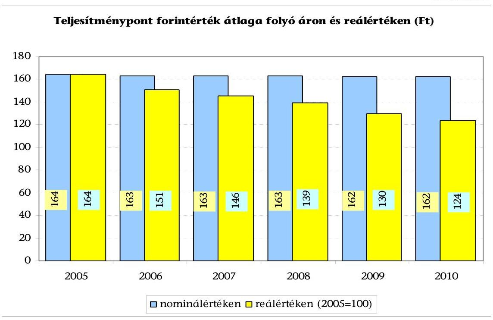

Adatforrás: OEP adatok alapján ÁSZ számítás
A 2008. június 1-jétől bevezetett jogviszony ellenőrzési díjazás arányos a betegforgalommal. A díj összege ellátási (megjelenési) esetenként 50 Ft , amely a háziorvosok a biztosított státuszának OEP adatbázisból történő kötelező internetes lekérését, ellenőrzését hivatott díjazni. ${ }^{57}$

A háziorvosi szolgálatok 2004. április 1-jétől 2006. január 31-ig havonta 5000 Ft külön díjazásért ${ }^{58}$ jelenthették a betegforgalmi adatokat („háziorvosi betegforgalmi tevékenység tételes jelentése"). Ezen a címen 2005-ben 1255 E Ft, 2006-ban 450 E Ft adatszolgáltatási díjat fizetett ki az OEP. Ezt követően a jelentést minden háziorvosi szolgáltató számára kötelezővé tették és a kötelezettség nem járt külön díjazással. ${ }^{59}$

A vizsgált időszakban 463 és 600 Ft között változott az eseti ellátás díja, amely 2007. március óta folyamatosan 600 Ft . Az egy esetre jutó díjátalány lebegő érték.

[^0]
[^0]: ${ }^{57}$ A 43/1999. Korm. rendelet beiktatott 4/A. §-ának (4) bekezdése alapján.
    ${ }^{58}$ A 43/1999. Korm. rendelet beiktatott 17/A. § (1) bekezdése alapján, az IBR-ben dolgozó háziorvosok kivételével, a Korm. rendelet 20. sz. melléklete szerinti adattartalommal.
    ${ }^{59}$ A 329/2005. (XII. 29.) Korm. rendelet az egészségügyi szolgáltatások Egészségbiztosítási Alapból történő finanszírozásának részletes szabályairól szóló 43/1999. (III. 3.) Korm. rendelet módosításáról 16. § (5) bekezdés b) pontja szerint.

---

A 2007 februárjában bevezetett vizitdíjból származó bevétel - a díjmentes eseteket kivéve - arányos volt a háziorvosi rendeléseken megjelent páciensek számával. A háziorvosi szolgálatoknak a vizitdíj időszakában lecsökkent betegforgalom mellett a korábbiaknál több bevételük volt. A betegmegjelenések száma a díj eltörlését követően nőtt, de a 2005. évi szintet csak 2009-ben érte el, illetve haladta meg. A betegforgalom változását 2005-2009 között a 13. sz. ábra mutatja be:
13. sz. ábra

Háziorvosok betegforgalmának változása (2005. év=100%)
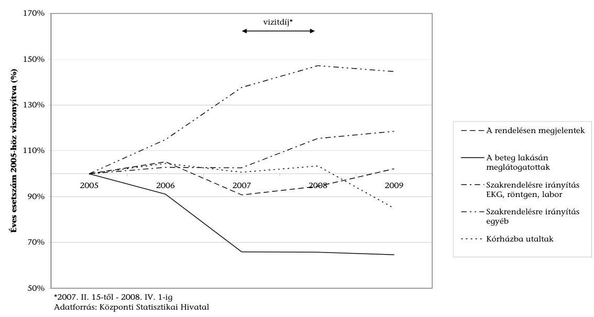

A lakáson történt látogatások száma folyamatos csökkenést mutat, ami a vizitdíjas időszakban még erőteljesebbé vált. A vizitdíj bevezetésekor növekedésnek indult a háziorvosok szakrendelésre irányításainak száma, ebbe nem beleértve a labor, EKG, röntgen szakrendelésekre küldéseket.

A finanszírozás az ellátott háziorvosi feladatok minőségét nem tükrözte. A minőségi és hatékony munkavégzést hivatott ösztönözni a háziorvosi indikátorrendszer bevezetése. A háziorvosi szolgálatokat működtetők számára 2010. októbertől jelent pénzügyi érdekeltséget a gyógyítási, beteggondozási, megelőzési és szűrési tevékenységek mutatószámokkal mért mennyisége, illetve minősége. A minőségi munkavégzés ösztönzése a teljes praxisfinanszírozásnak $1,7 \%$-át, a háziorvosi teljesítménydíainak 2,9-3,0\%-át képviselte.

Az első ízben kifizetett 100,3 M Ft díjat 5672 működtető között osztották fel a meghatározott indikátor-pontrendszer szerint. Ennek megfelelően átlagosan 17,7 E Ft/hó minőségi díjazásban részesült egy-egy háziorvos. Az E. Alap kezelője szerint ez a díjazás nem biztosítja a megfelelő hatékonyságot. ${ }^{60}$

Az E. Alap 2011. évi költségvetésének fejezeti indoklása szerint „nemzetközi tapasztalatok is azt mutatják, hogy akkor működik hatékonyan egy indikátorrendszer,

[^0]
[^0]: ${ }^{60}$ Az OEP Finanszírozási Főosztályának munkaanyaga a gyógyító-megelőző ellátások 2011. évi költségvetéséről, (2010. október 21., 3. old.)

---

ha az ennek alapján számított díjazás a teljes finanszírozás kb. 10\%-a." Azonban 2011-ben 3,5 Mrd Ft előirányzati összeget terveztek a részleges teljesítményarányos finanszírozásra, ami mindössze $4 \%$-a a háziorvosi kasszának.

# 4.3. Méretgazdaságosság kezelése a finanszírozásban 

A méretgazdaságosság a szolgáltatók szemszögéből a bevételek és kiadások viszonya. A finanszírozási rendszer nem a szolgáltatók tényleges költségein alapul.

Az EU versenyjoga ${ }^{61}$ szerint az általános gazdasági érdekű közszolgáltatások állami ellentételezésének mértéke nem haladhatja meg a közszolgáltatási kötelezettségek biztosításához szükséges költség egy része vagy egésze fedezéséhez szükséges összeget, figyelembe véve a kapcsolódó elismervényeket és az ésszerű nyereséget. Az ellentételezés kiszámításához alapul vett paramétereket objektív és átlátható módon előre kell meghatározni. Az uniós norma szerint „az ellentételezés mértékét azon költségek elemzése alapján kell meghatározni, amelyek fejében egy átlagos, jól vezetett és közlekedési eszközökkel rendelkező vállalkozás biztosította volna e kötelezettségeket."

A kompenzáció helyes mértékének, a gazdaságosság megállapíthatóságának egyik tényezője, az OEP díjazás összege ismert (átlátható), azonban a praxisok elismerhető háziorvosi költségeiről nincsenek megbízható adatok. Ezen kívül a háziorvos valamennyi tevékenységével összefüggő bevételek összessége sem ismert.

A praxisok költségeinek felmérését az OEP megkísérelte, azonban a tapasztalt elkülönítési és elszámolási hiányosságok miatt a háziorvosoktól kapott adatok nem tekinthetők megbízhatóknak, illetve összehasonlíthatóknak. A szolgáltatók többsége nem tett eleget elkülönítési kötelezettségének, sem a bevételek, sem a kiadások tekintetében, ezért arányosan, illetve a tájékoztatóban bemutatott megosztási módszerek alkalmazásával történt a kiadások elfogadása. Ezen esetekben külön vizsgálni kellett a felhasználás finanszírozott feladathoz való kötöttségét. Több esetben megállapítható volt, hogy a pénzeszközök felhasználása nem a finanszírozott tevékenység érdekében történt. (Pl. kölcsönadott pénzeszközök, vállalkozás más bevételszerző tevékenységének finanszírozása.)

A méretgazdaságosság a nagyobb méretből fakadó előnyök elemzésével foglalkozik. Az OEP finanszírozás praxismérettől függő eleme a teljesítménydíj, vagyis a „kártyapénz". A területi ellátási kötelezettséget vállaló szolgálatok kártyaszámának OEP adatai alapján megállapítható, hogy a 8-4087 közötti kártyatartományban működnek praxisok. 2000 kártyaszám felett elvétve fordul elő betöltetlen praxis - például 2010. július hónapban összesen 2 volt - és 2400 biztosított felett már egy sem.

[^0]
[^0]:    ${ }^{61}$ A Bizottság 2005. november 28-i 2005/842/EK határozata az EK-Szerződés 86. cikke (2) bekezdésének az általános gazdasági érdekű szolgáltatások működtetésével megbízott vállalkozásoknak közszolgáltatással járó ellentételezés formájában megítélt állami támogatásokra történő alkalmazásáról (3)-(4) bekezdése

---

A 43/1999. Korm. rendelet 15. §-a megengedi több háziorvosi szolgálat praxisközösségben való működtetését, a degressziós határnak az összevont körülményekre kiszámított egyidejű megemelésével, ahol előtérbe kerülhet a méretgazdaságosság. A szabályozás nem gyakorolt ösztönző hatást praxisközösségek alakítására, mert 2010. október hónapban összesen 12 háziorvosi praxisközösséget finanszírozott az OEP, 2005-ben 9 ilyen típusú szolgálat volt. Mindegyik praxisközösség 2-2 praxist foglalt magába, a bejelentkezettek száma 32030 fő, az összes biztosított mindössze $0,32 \%$-a.

# 4.4. A finanszírozás szerepe a háziorvosi ellátáshoz való (területi) hozzáférés különbségeinek csökkentésében 

A hozzáférés területi különbségeit a fixdíjazás rendszere próbálja enyhíteni. Nagyobb fixdíjazásban részesülnek a kisebb létszámú körzetek - jellemzően a kistelepülések - háziorvosai. A fixdíjazás a vizsgált időszakban többször is változott, de mindig magasabb maradt a kisebb praxisok finanszírozási összege. 2010 végén $55-57 \mathrm{E} \mathrm{Ft} /$ hó összeggel többet kaptak az 1200 fő (gyermekkörzetben 600 fő) alatti szolgálatok az 1500 főt (gyermekkörzetben 800 főt) meghaladóaknál. A 2005. évi növelések a 2005. évi 6\%-os illetménynövekedés költségvetés által vállalt 4,5\% többletét fedezték. A 2008. évi változások a vizitdíj rendszer megszűnésének „kompenzációjaként" léptek életbe.

A nagyobb létszámú praxisok fixdíjazása az időszak kezdetétől összegszerűen és relatív (\%-os) mértékben is jobban nőtt, mint a kisebb méretűeké. Az évente kifizetett fixdíjazások együttes összege a vizsgált időszakban folyamatosan nőtt. A fixdíj kiadásainak alakulását a 10. sz. táblázat tartalmazza:

Háziorvosi fix összegű díjazás kiadásainak alakulása (M Ft)

| Jogcím | $\mathbf{2 0 0 5}$ | $\mathbf{2 0 0 6}$ | $\mathbf{2 0 0 7}$ | $\mathbf{2 0 0 8}$ | $\mathbf{2 0 0 9}$ | $\mathbf{2 0 1 0}$ |
| :-- | :--: | :--: | :--: | :--: | :--: | :--: |
| Fix összegű díjazás | 12744,8 | 13097,8 | 13219,1 | 18194,2 | 20606,7 | 20625,0 |

Adatforrás: OEP adatok alapján
A vizsgált időszak alatt (2005-ről 2010-re) 12 744,8 M Ft-ról 20 625,0 M Ft-ra, azaz $61,8 \%$-kal nőtt a fix összegű díjazásra kifizetett gyógyító-megelőző kiadás. A fentebb részletezett vizitdíj utáni kompenzációs hatást jelzi a 2007-ről 2008ra 13219,1 M Ft-ról 18 194,2 M Ft-ra bekövetkezett legnagyobb mértékű (37,6\%-os) kiadásnövekedés.

A területi ellátási kötelezettségű (TEK) szolgálatok hozzáférésének területi különbségeit kompenzálja nagyobb finanszírozással a fixdíjak kiegészítő díjrendszere. Ez alapján 10, 30, 50\%-os többletdíjak állapíthatók meg többféle jogcímen is.

A 43/1999. Korm. rendelet 14. § (3) bekezdése négy főbb jogcímcsoportot nevez meg. Egy épületben, egymagában működő szolgálat 10\%-os többletben részesülhet. Legalább két rendelőt kiszolgáló háziorvos esetén $30 \%$ kiegészítés jár. Ez rendelőnként további 10\%-kal növelendő, ha a több rendelő a körzet több településén működik. Végül pedig 50\%-os többlet jár hátrányos helyzetű kistérségek tele-

---

püléseire kiterjedő körzetek esetén. ${ }^{62}$ Ez utóbbiakra vonatkozó rendelkezésekkel a vizsgált időszakban bővítették a finanszírozási szabályokat.

Mindezek, illetve kombinációik 1,1-2,4-ig terjedő kiegészítő szorzókat eredményeztek a fixdíjazásban. A 2011 februárjában finanszírozott 6395 TEK-es praxis egyharmada, 2129 (33,3\%) részesült valamely jogcíme(ke)n kiegészítő díjazásban.

A háziorvosok indokolt esetben a betegeket otthonukban keresik fel. Költségei fedezését célozza a területi kiegészítő díj, az ún. „területi pótlék". A díj településnagyságok szerint differenciált (26-43 E Ft/hó), de minden háziorvosi szolgálat egyaránt jogosult rá. ${ }^{63}$ A vizsgált időszakban a díjazás mértéke nem változott. A közlekedési költségek növekedése elvileg indokolhatna díjnövelést, azonban folyamatosan csökkent az otthonukban felkeresett biztosítottak száma a 2005. évinek a 65\%-a volt 2010-ben.

# 4.5. A finanszírozás ösztönző hatása a befejezett ellátásra 

A 2007 és 2010 között a jelentett háziorvosi definitív ellátások arányában érdemi változás nem történt, az összes orvos-betegtalálkozásokon belül $84,6 \%-85,2 \%-85,0 \%-84,6 \%$ volt.

A tételes betegforgalmi jelentés bevezetésével általános háziorvosi kötelezettséggé vált az elvégzett ellátások tartalmának, ezen belül az akut megbetegedések definitív ellátásának jelentése az OEP részére. ${ }^{64}$ A korábban, 2005. április 1-jétől 2006. február 1-jéig külön díjazásért küldhető és 2006. szeptember 1-jétől már kötelező adatszolgáltatás feltüntetési kötelezettséget jelent, de a finanszírozás mértéke nem függ a jelentett mennyiségektől.

A szaktárca 2007-ben konkrétan tervezte a háziorvosok definitív ellátásának finanszírozási ösztönzését, az elképzelést azonban végül nem valósították meg. Az egészségügyi miniszter szakmapolitikai egyeztetésre bocsátotta 2007 januárjában a Korm. rendelet módosításáról szóló kormányrendelet tervezetét 1680-1/2007-0004JKF számmal. A tervezet 3. pontja részletezett egy, a háziorvosi ellátás területén bevezetendő, definitív ellátásra ösztönző rendszert, illetve annak főbb elemeit. A szakmapolitikai egyeztetést követően a tervezet alapján készített kormány-előterjesztésben (1680-2/2007-0004JKF) már nem szerepelt a definitív ellátások ösztönzése.

Az NFT keretében (pl. HEFOP) támogatott intézményközi informatikai fejlesztés ellenére a vizsgálat befejezéséig a háziorvosok utólagosan sem jutottak infor-

[^0]
[^0]:    ${ }^{62}$ Az egészségügyi szolgáltatások Egészségbiztosítási Alapból történő finanszírozásának részletes szabályairól szóló 43/1999. Korm. rendelet 14. § (3) bekezdés d) pontjának da)-dc) alpontjai.
    ${ }^{63}$ Az egészségügyi szolgáltatások Egészségbiztosítási Alapból történő finanszírozásának részletes szabályairól szóló 43/1999. Korm. rendelet 14. § (4) bekezdése.
    ${ }^{64}$ Az egészségügyi szolgáltatások Egészségbiztosítási Alapból történő finanszírozásának részletes szabályairól szóló 43/1999. Korm. rendelet 17. § (1) bekezdése.

---

mációhoz a praxisukba tartozók és az egészségügyi rendszer találkozásairól (vizsgálatok, kezelések, felírt gyógyszerek stb.).

# Ellátások háziorvosi rendeléseinek aránya az összes orvosi rendelésekben 

11. sz. táblázat

| Év | Táp- pénz | Házi- szak- ápo- lás | Járóbeteg- szakellát- tás (labor- „egyéb"- képeiko- tód. nélkül) ${ }^{2}$ | Labor- diagnosz- ti-ka | Rönt- gen-, ultra- hang diagnosz- sz-tika | Aktív- fekvő b. | Króni- kur- fekvő b. | Gyógy- fürdő és egyéb gyó- gyászati ellátá- sok | Gyó- gyászati segéd- eszkö- zök | Gyógy- szer- támogatás | Mentés, beteg- szállí- tás ${ }^{4}$ | Utazá- si utal- vány költ- ség- térí- tés ${ }^{1}$ |
| :--: | :--: | :--: | :--: | :--: | :--: | :--: | :--: | :--: | :--: | :--: | :--: | :--: |
| E. Alapból kifizetett összegek |  |  |  |  |  |  |  |  |  |  |  |  |
| 2005 | $65 \%$ | $94 \%$ | $11 \%$ | $37 \%$ | $28 \%$ | $9 \%$ | $15 \%$ | $3,1 \%$ | $28 \%$ | $58 \%$ | - | - |
| 2006 | $72 \%$ | $95 \%$ | $11 \%$ | $33 \%$ | $28 \%$ | $9 \%$ | $15 \%$ | $3,0 \%$ | $29 \%$ | $57 \%$ | - | - |
| 2007 | $75 \%$ | $92 \%$ | $13 \%$ | $33 \%$ | $28 \%$ | $10 \%$ | $19 \%$ | $4,1 \%$ | $28 \%$ | $56 \%$ | $3 \%$ | $82 \%$ |
| 2008 | $77 \%$ | $89 \%$ | $12 \%$ | $34 \%$ | $28 \%$ | $10 \%$ | $21 \%$ | $5,6 \%$ | $27 \%$ | $53 \%$ | $4 \%$ | $84 \%$ |
| 2009 | $75 \%$ | $88 \%$ | $12 \%$ | $36 \%$ | $29 \%$ | $9 \%$ | $21 \%$ | $5,8 \%$ | $26 \%$ | $52 \%$ | $4 \%$ | $84 \%$ |
| $2010^{3}$ | $82 \%$ | $89 \%$ | $11 \%$ | $37 \%$ | $29 \%$ | $8 \%$ | $20 \%$ | $6,3 \%$ | $27 \%$ | $50 \%$ | $4 \%$ | $77 \%$ |

Mennyiségek

|  | na- pok | vizit- szám | eset- szám | eset- szám | eset- szám | eset- szám | szolgálom (keze- tés) db | db | DOT | eset | eset |
| :--: | :--: | :--: | :--: | :--: | :--: | :--: | :--: | :--: | :--: | :--: | :--: |
| 2005 | $71 \%$ | $89 \%$ | $10 \%$ | $36 \%$ | $25 \%$ | $10 \%$ | $18 \%$ | $3,8 \%$ | $60 \%$ | $73 \%$ | $18 \%$ | - |
| 2006 | $77 \%$ | $89 \%$ | $10 \%$ | $35 \%$ | $25 \%$ | $10 \%$ | $18 \%$ | $3,6 \%$ | $61 \%$ | $76 \%$ | $17 \%$ | - |
| 2007 | $79 \%$ | $89 \%$ | $12 \%$ | $37 \%$ | $24 \%$ | $12 \%$ | $24 \%$ | $4,8 \%$ | $62 \%$ | $78 \%$ | $15 \%$ | $81 \%$ |
| 2008 | $80 \%$ | $89 \%$ | $13 \%$ | $39 \%$ | $25 \%$ | $11 \%$ | $24 \%$ | $5,2 \%$ | $64 \%$ | $80 \%$ | $13 \%$ | $84 \%$ |
| 2009 | $79 \%$ | $89 \%$ | $12 \%$ | $39 \%$ | $26 \%$ | $10 \%$ | $22 \%$ | $5,4 \%$ | $66 \%$ | $80 \%$ | $13 \%$ | $84 \%$ |
| $2010^{3}$ | $82 \%$ | $89 \%$ | $11 \%$ | $38 \%$ | $27 \%$ | $9 \%$ | $21 \%$ | $6,1 \%$ | $80 \%$ | $85 \%$ | $13 \%$ | $78 \%$ |
|  |  | Évenkénti továbbküldött TAJ-ok száma (egy TAJ egy évben csak egyszer: TAJ-redundancia nélkül) |  |  |  |  |  |  |  |  |  |  |
|  |  |  |  |  |  |  |  |  |  |  |  |  |
| 2005 | $95 \%$ | $90 \%$ | $51 \%$ | $70 \%$ | $76 \%$ | $13 \%$ | $20 \%$ | $3,6 \%$ | $24 \%$ | $85 \%$ | $30 \%$ | - |
| 2006 | $94 \%$ | $89 \%$ | $53 \%$ | $71 \%$ | $81 \%$ | $13 \%$ | $20 \%$ | $3,4 \%$ | $24 \%$ | $86 \%$ | $28 \%$ | - |
| 2007 | $92 \%$ | $90 \%$ | $60 \%$ | $69 \%$ | $85 \%$ | $16 \%$ | $26 \%$ | $4,2 \%$ | $26 \%$ | $86 \%$ | $27 \%$ | $77 \%$ |
| 2008 | $94 \%$ | $90 \%$ | $61 \%$ | $74 \%$ | $87 \%$ | $14 \%$ | $26 \%$ | $4,7 \%$ | $26 \%$ | $86 \%$ | $16 \%$ | $81 \%$ |
| 2009 | $94 \%$ | $90 \%$ | $60 \%$ | $84 \%$ | $89 \%$ | $13 \%$ | $25 \%$ | $4,7 \%$ | $31 \%$ | $87 \%$ | $17 \%$ | $81 \%$ |
| $2010^{3}$ | $81 \%$ | $90 \%$ | $58 \%$ | $80 \%$ | $90 \%$ | $12 \%$ | $23 \%$ | $5,2 \%$ | $42 \%$ | $87 \%$ | $16 \%$ | $73 \%$ |

Megjegyzések:
${ }^{1}$ 2005. és 2006. évben az utazási költségtérítés tekintetében nem volt egységes az adatgyűjtés, ezért a rendelkezésre álló adatok nem megbízhatóak.
${ }^{2}$ A 2010. év 13 hónap adatait tartalmazza.
${ }^{3}$ A 2010. évi táppénz adatok az I-IX. hónapra vonatkoznak
${ }^{4}$ 2005-2006 év vonatkozásában nem áll rendelkezésre ilyen adat (a betegszállítás elrendelőjét nem kellett jelenteni a szolgáltatóknak)
Adatforrás: OEP adatok alapján ÁSZ számítás
Az E. Alap ellátásainak igénybevétele során a háziorvosok a szakorvosi ellátásokra történő betegbeutalásokon és a gyógyszerrendeléseken kívül további társadalombiztosítási ellátások (táppénz, utazási költségtérítés) igénybevételének utalványozására jogosultak. Szerepük egyes ellátások igénybevételében növekedett 2005 és 2010 között. Ennek értékelésekor fi-

---

gyelembe kell venni, hogy - a változó jogszabályi előírások értelmében - egyes ellátásokat a háziorvosok nem saját szakmai elhatározásukból rendel(het)nek, hanem szakorvosi javaslatra (például egyes gyógyszereket, gyógyászati segédeszközöket stb.).

Az E. Alapból háziorvosi utalványozásra 2005-2010 években 338 és 403 Mrd Ft közötti összeget fizetett ki a finanszírozó, ami az Alap ugyanilyen tartalmú kifizetéseinek 30-35\%-a volt. Kiemelkedő eleme az utalványozási jogosultságnak a táppénz, ahol az összes kifizetésből 79,4 Mrd Ft-ból, a háziorvosok 65,7 Mrd Ftnyit utalványoztak 2010-ben. Az évenkénti arányokat a 11. sz. táblázat mutatja be.

A háziorvosi beutalások alapján igénybevett járóbeteg szakellátások esetszám szerinti részaránya 2007-től megemelkedett a korábbi 10\%-ról 11-13\%-ra, illetve a betegek között korábban 51-53\%-ról 58-61\%-ra. 2005-től 2010-re hasonló növekedésként 70\%-ról 80\%-ra nőtt azon betegek aránya, akiket háziorvos utalt labordiagnosztikai vizsgálatra, illetve 76\%-ról 90\%-ra azoké, akiket röntgen-/ultrahang diagnosztikára. Ezen változások mögött részben az áll, hogy az egyéb orvosi beutalásokban részesülők száma ezen időszakokban erősebben csökkent, míg a háziorvosoknál megfordulóké kevésbé csökkent, illetve nőtt (röntgen/ultrahang diagnosztika).

A háziorvosok által krónikus fekvőbeteg szakellátásra utaltak aránya 20\%-ról 23\%-ra nőtt, ami az összegszerű igénybevételi arányban (15-ről 20\%-ra) és esetszám szerint is (18\%-ról 21\%-ra) megmutatkozik.

A gyógyfürdő és egyéb gyógyászati szolgáltatások igénybevételében mindössze 3-6\%-os a háziorvosi súlyarány, azonban szintén növekvő beutalási arányok tapasztalhatók. Ennek oka, hogy míg az összes beutalások mennyisége csökkenő irányú volt a vizsgált időszakban, addig a háziorvosi beutalások gyakorisága nőtt. Így például az összes beutalási esetszám 8,8 millióról 6,9 millióra csökkent, a háziorvosi beutalt esetszám 331 ezerről 421 ezerre nőtt 2005 és 2010 között. A gyógyászati segédeszközök háziorvosi rendelésének mennyiségi aránya a 2005. évi 60\%-ról 2010-re 80\%-ra nőtt, mert az összes rendelt mennyiség csökkenő tendenciája mellett a háziorvosok által rendelt mennyiség közel azonos szintű maradt. Az eszközökkel háziorvosi rendelvényre ellátott betegek aránya ezzel egy időben 24\%-ról 42\%-ra nőtt úgy, hogy a „háziorvosi" betegszám kisebb mértékben csökkent, mint az összes, gyógyászati segédeszközzel ellátott betegszám.

A támogatott gyógyszerek felírt napi terápiás mennyiségéből (DOT) az időszak végére a háziorvosok által utalványozott arány 12\%-kal nőtt 2005-2010 között (73\%-ról 85\%-ra). Csökkent viszont a háziorvosok által rendelt mentés-betegszállítás esetszámainak aránya 18\%-ról 13\%-ra, illetve a betegarány 30\%-ról 16\%-ra. A háziorvosok által utalványozott ellátásokat abszolút összegben az 1/a., b. tanúsítványok mutatják be.

Az OECD Health Care Systems: Getting more Value for Money 2010. évi kiadványában felmérték a tagállamokban az egészségügyi rendszereket, amelyeket jellemzőik alapján 6 csoportba soroltak. Magyarország a kapuőri funkciót alkalmazó országok között szerepel, ahol e funkciót a szolgáltatók kiválasztásá-

---

nak szabadsága és erős költségvetési korlát jellemez. Az egyes országokat besorolták a kapuőri funkció erőssége szerint 0-tól 6-ig, ahol a magasabb pontszám a szigorúbb előírásokat alkalmazókat jelenti. Magyarország az 5-ös pontszámú kategóriába került.

A kérdőíves megkeresésre érkezett 1007 válaszadóból a kompetenciák bővítését 586-an tartanák szükségesnek, 453-an megfelelőnek ítélik.

# 4.6. A háziorvosi teljesítmények, valamint kifizetések finanszírozói ellenőrzése 

Az OEP a kötelező egészségbiztosítás ellátásairól szóló 1997. évi LXXXIII. törvény 35-38. §-a alapján végzett pénzügyi ellenőrzéseket az elkülönítésekre és a szabályos pénzfelhasználásokra vonatkozóan.

2009-ben összesen 77 háziorvosi szolgáltató ellenőrzésére került sor, és 21493035 Ft visszavonását (tőke+kamat) kezdeményezték. A 2010. I. félévben 13 háziorvosi szolgáltatónál történt pénzügyi ellenőrzés, és összesen 24404950 Ft (tőke+kamat) visszavonására került sor.

A szankcionált eseteknél elmondható, hogy a szolgáltatónak nem csak közfinanszírozásból, hanem más tevékenységből is származott bevétele, amely nem mindig különült el a háziorvosi tevékenységtől. Amennyiben a szolgáltatónak nem volt más tevékenységből származó bevétele, ott a szankcionálás oka olyan kiadások érvényesítése volt, amelyek nem a közfinanszírozott tevékenység érdekében merültek fel.

A szolgáltatók többsége nem tett eleget elkülönítési kötelezettségének, sem a bevételek, sem a kiadások tekintetében, ezért arányosan, illetve a tájékoztatóban bemutatott megosztási módszerek alkalmazásával történt a kiadások elfogadása, ezen esetekben külön vizsgálták a felhasználás finanszírozott feladathoz való kötöttségét. Több esetben a pénzeszköz felhasználása nem a finanszírozott tevékenység érdekében történt.

Az OEP főigazgatója 2010 júliusában részletes jelentésben ${ }^{65}$ tájékoztatta a NEFMI államtitkárát a vállalkozó háziorvosok pénzügyi ellenőrzéséről, az ellenőrzések megállapításairól. A jelentés szerint a szakmai szervezetek az ellenőrzések felfüggesztését szorgalmazták. Az E. Alap kezelője háziorvosokat érintő pénzügyi ellenőrzést 2010. II. félévben nem végzett.

A jogszabályok jelenleg nem tiltják, hogy közpénz felhasználásában olyan gazdasági társaságok vegyenek részt, amelyek tulajdonosai között külföldi szervezetek, ezen belül akár off-shore cégek szerepeljenek, erre példa az alábbi eset.

A közfinanszírozott egészségügyi szolgáltató egy kisvárosban háziorvosi, valamint járóbeteg szakellátásra kötött szerződést a pénztárral. A társaság OEP-től

[^0]
[^0]:    ${ }^{65}$ 45142-67-362/5/2010. nyt. szám, tárgy: vezetői összefoglaló a pénzügyi ellenőrzésekről

---

származó bevétele 88,1%-ot tett ki, míg az egyéb tevékenysége bevétele csupán 11,9% volt. A társaság kültagja 11%-os részesedési aránnyal egy Dominikai Köztársaságban bejegyzett cég, és a társasági szerződés szerint 90%-ban részesülhet a közfinanszírozott társaság által elnyert nyereségből. Így 2007. december 31-én a kültag 18 M Ft osztalékelőlegben részesült.

Budapest, 2011. november 30.

Melléklet: 6 db 38 lap
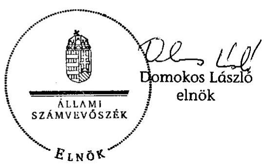

---

# MELLÉKLETEK

---

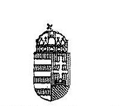

NEMZETI ERŐFORRÁS MINISZTÉRIUM MINISZTER

Iktatószám: 10184-1/2011-EKAS

Hiv. szám: -
Ügyintéző: Dr. Füredi Gyula, T:79-51-227
Melléklet: -

# Domokos László úr részére 

elnök

Állami Számvevőszék
Budapest

## Tisztelt Elnök Úr!

Tárgy: az Állami Számvevőszék jelentése a háziorvosi ellátás működésének és pénzügyi feltételrendszerének ellenőrzéséről.

A háziorvosi ellátás működésének és pénzügyi feltételrendszerének ellenőrzése kapcsán, többszöri egyeztetést követően elkészített jelentésüket megkaptuk, ahhoz a továbbiakban érdemi megjegyzést nem kívánunk tenni.

Ismételten is szeretnénk megköszönni munkájukat, melynek eredményeképpen sok olyan, az alapellátás és vele együtt az egészségügyi ellátórendszer harmonikus működését akadályozó jelenségre derült fény, melyek figyelembevétele szükséges az ellátórendszer rövid és hosszú távú fejlesztése során.

Az elemzés, valamint megfogalmazott javaslataik felhasználásával a szükséges intézkedéseket megkezdjük.

Budapest, 2011. október „" "
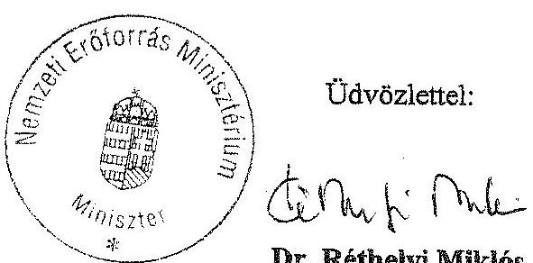

---

# Háziorvosi kérdőív feldolgozása 1007 válaszadó alapján 

A felméréshez a 6767 háziorvosi szolgálathoz az OEP-től kaptuk az email-címeket, összesen 5998 levelet küldtünk ki, amelyből 733 hibás jelzéssel visszajött. 1007 esetben (14,8%) küldték vissza kitöltve a kérdőívet. A válaszadók közül 13,7% (a szolgáltatói kategóriánkénti országos háziorvosi számhoz viszonyítva) a területi ellátási kötelezettséggel rendelkező felnőtt és gyermek háziorvosi szolgálat, 15,8% a vegyes praxis, a területi ellátási kötelezettség nélküli felnőtt praxis 9,5%, a gyermek praxis 23%, a vegyes praxis pedig 19%. A választ nem adók aránya kevesebb, mint 1% (0,8%). A feldolgozott adatok a részvételi megoszlás alapján minden típusú háziorvosi praxisra valós képet szolgáltatnak.

A válaszadó háziorvosi szolgálatok 43,5%-a 1301-2000, 24,6%-a 801-1300, 15,5%-a 2001-3000 közötti kártyával rendelkezik. A praxisok 10%-a 800 kártyaszám alatt működik. 3000 kártyaszám feletti praxis okaként a bejelentkezettek nagy számát jelölték meg. A szolgálatokhoz az esetek 71,5%-ában 1 település tartozik.

A háziorvosi feladatokat közalkalmazottként ellátó szolgálatok 2,3%-ot, egyéni vállalkozóként vagy gazdasági társasági formában működő szolgálatok pedig 85,2%-ot képviselnek a válaszadók körében. A nem válaszolók aránya 12,5%.

A szakképzettség tekintetében a nem válaszolók 25,7%-ot tettek ki, ami alapján feltételezhető, hogy ez az adat megegyezik a háziorvosi szolgálat kialakításához szükséges minimum szakképzettségi követelménnyel rendelkezők arányával. A háziorvosi szakvizsgán kívül 1 szakvizsgával rendelkezők aránya 47,7%, 2-5 közötti szakvizsgával 26,4% és több, mint 5 szakvizsgával a válaszadók közül 2 háziorvos (0,2%) rendelkezett.

Az orvosi szolgáltatások végzése, összesen heti 40 órában a válaszadók 16,7%-ára jellemző, ennél kevesebbet (20-39 óra között) pedig 12% végez. A nem válaszolók aránya 7,8%. A heti 40 óránál többet dolgozók aránya 62,7% (41-50 óra között 26,3%, 51-60 óra között 20%, 60 óra felett 16,4%). A felmérésben részt vevők közül háziorvosi
 ügyeletben $45,6 \%$, foglalkozás-egészségügyben $18,7 \%$, az iskola-egészségügyi ellátásban $34,8 \%$, szociális intézményi ellátásban $12 \%$, a magánorvosi praxisban pedig $11 \%$ vesz részt. A szolgálat plusz 1 fő orvost alkalmaz 13,6\%-ban, ezen orvosok közül 8 órában $61,3 \%$, 4 órában pedig $13,8 \%$ dolgozik. A nem válaszolók aránya $85 \%$ (a kérdőívet kitöltő háziorvos a szolgálat egyetlen orvosa). 1 fő egészségügyi dolgozót $73,2 \%$-ban, 2 főt $16,3 \%$-ban alkalmaznak. A szakdolgozók $77,4 \%$-a dolgozik 8 órában. Adminisztrátort 167 esetben ( $16,6 \%$ ) alkalmaznak ( 8 órában közel $50 \%$-ot, 6 órában $16,7 \%$-ot, 4 órában $28 \%$-ot). Informatikust 22 esetben ( $2,2 \%$ ) alkalmaznak.

A szolgálatok $83,5 \%$-a nem működtet minőségbiztosítási rendszert, ahol van minőségbiztosítás ( $12,6 \%$ ), ott a válaszadók közel 15 különböző rendszert soroltak fel. Betegelégedettségi vizsgálatot 62,5\%-ban végeztek, a többségét 2008-2010 között.

A rendelésen előzetes időpontkérésre 92,6\%-ban van lehetőség. Egészségnevelési programokat, szűréseket a háziorvos többnyire a védőnővel, különböző gyógyszercégekkel, a település önkormányzatával és a regionális ÁNTSZ-szel szervezte.

---

A betegút nyomon követésére $27,5 \%$-ban adottak, $40 \%$-ban részben adottak a lehetőségek, $32,4 \%$-ban a vélemények szerint nem adott a lehetőség vagy nem válaszolt a kérdésre. Ezzel összefüggésben, a háziorvosok 89,6\%-a szükségesnek tartaná az elérhető betegnyilvántartás kialakítását.

Prevencióra a megkérdezettek 54,6\%-a 5-10 órát, 5 óránál kevesebbet $31 \%$, 10 óránál többet pedig $12,3 \%$ fordít hetente.

A helyettesítést $62,4 \%$-ban a település más háziorvosa, $23,4 \%$-ban másik település háziorvosa látja el. A gyakoriságra jellemző, hogy $87,4 \%$-ban alkalmanként veszik igénybe a helyettesítő háziorvost (éves szabadságolások).

A háziorvosi kompetencia listát $51,6 \%$-ban nem tartják megfelelőnek: $\mathbf{6 0 \%}$ bővítené ( $37 \%$-a nem bővítené), $\mathbf{8 , 5 \%}$ szűkítené ( $84 \%$-a nem szűkítené). A válaszadók $9,5 \%$-a nem foglalt állást a kérdésben. A kapuőri szerep érdekében $77 \%$ nem korlátozná a beutaló nélkül igénybe vehető ellátások körét. Amennyiben a háziorvos korlátozhatná az ellátások körét, az $31 \%$-ban fül-orr-gégészet, $15,5 \%$-ban bőrgyógyászat, $13,5 \%$-ban urológia, $12 \%$-ban sebészet valamint szemészet, nőgyógyászat, pszichiátria és reumatológia szakmákra vonatkozna. A működtetési jog intézményével $66,2 \%$ nem elégedett.

Praxis vásárlására 19,6\%-ban volt példa, amelyből $18,2 \%$ vett igénybe kamattámogatott hitelt. A vásárlások 73,2\%-a 2001-2007 között zajlott le (évente átlagosan 20 praxis került eladásra). Praxis eladását 1 éven belül 6,8\%-ban tervezik, ami összefüggésben van a háziorvosok életkorával ( $5,4 \%$-a 70-79 év, $7,7 \%$-a pedig 66-69 év közötti életkorú). Az orvosok $76 \%$-a automatikusan (a 90-es évektől) rendelkezik működtetési joggal.

A háziorvosi szolgálatok kapcsolatát az önkormányzattal áltagosan: tárgyi feltételek biztosításában 4,31 pont, személyi feltételek biztosításában 3,21 pont, erkölcsi támogatottságban 4,72 pontot értékelték. Az elmúlt 5 évben az önkormányzati szerepvállalásban a háziorvosok értékítélete alapján $59,3 \%$-ban nem volt változás, $22,7 \%$ többet, $10,8 \%$ pedig kevesebbet kapott az önkormányzattól.

A háziorvosi rendelő tulajdonosa $74,6 \%$-ban az önkormányzat, ebből $93 \%$-ban 100\%-os tulajdoni hányadban az önkormányzat részesül ( $6,3 \%$ nem válaszolt a kérdésre), bérleti díjat $16,2 \%$-ban fizetnek a háziorvosi szolgálatok (1-90 E Ft-ig). Amennyiben az orvos a rendelő tulajdonosa ( $15,2 \%$ ) az önkormányzat 4,5\%-ban hozzájárul, $22,6 \%$-ban nem járul hozzá a fenntartási költségekhez ( $72,8 \%$ nem válaszolt, mivel $74,6 \%$-ban az önkormányzat a rendelő tulajdonosa).

A diagnosztikai eszközök 80,4\%-ban a háziorvosi szolgálat (háziorvos 19,4\%-ban, háziorvosi vállalkozás $61 \%$-ban), $12,3 \%$-ban pedig az önkormányzat tulajdonában vannak. Bérlés a megkérdezettek között 4 esetben fordult elő ( $0,3 \%$ ). Az eszközök amortizációját $56 \%$-ban nem tudják elszámolni. Az orvostechnikai berendezések átlagéletkora $57 \%$-ban 5-10 év közötti, $20 \%$-ban 5 évnél fiatalabb, $16,5 \%$-ban pedig 10 év feletti. A saját tulajdonú eszközök megvásárlásához $45,6 \%$-ban nem kaptak támogatást. Amennyiben a háziorvosi szolgálat kapott támogatást a beruházáshoz, az $11,2 \%$-ban az önkormányzati szerepvállalásnak köszönhető (a megkérdezettek $88,8 \%$-a nem válaszolt). A működési engedélyhez szükséges eszközökön kívül a háziorvosi szolgálatok többnyire vérnyomásmérő készülékeket, defibrillátort, EKG-

---

készüléket valamint a háziorvos szakmai jártasságának megfelelő készülékeket (otoscop, mikroszkóp, doppler-készülék, ultrahang-készülék, stb.) szereztek be.

A 15 percen belüli mentés a települések 80\%-ában, a betegszállítás pedig 92,4\%-ban biztosított.

---

# Háziorvosi kérdőív feldolgozása 1007 válaszadó alapján 

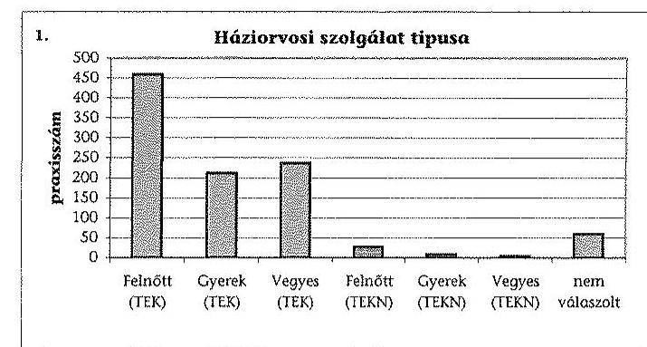
6.
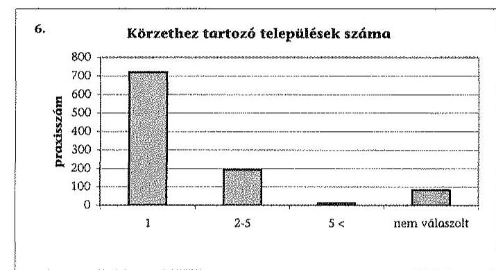
8.
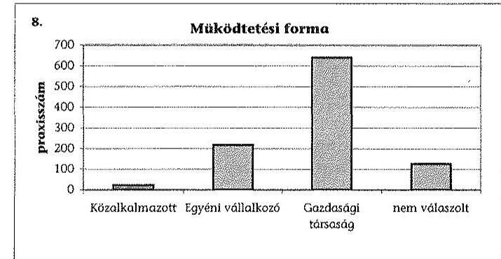
12/a.
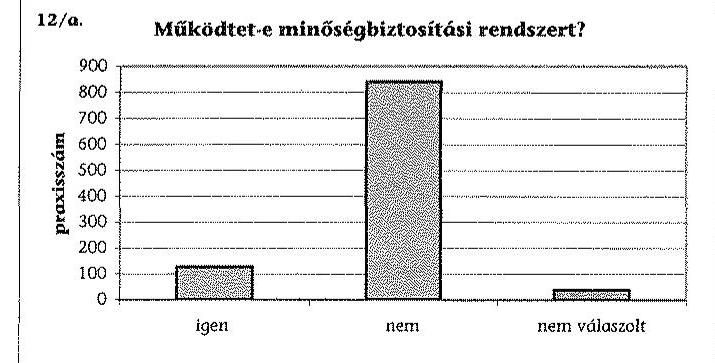
16.
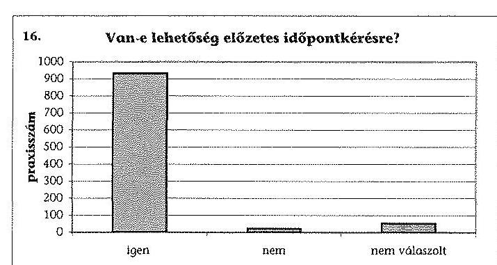
2.
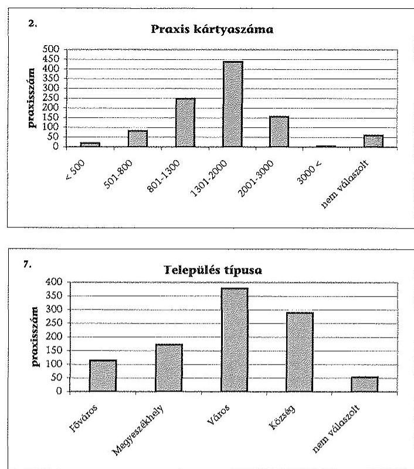
7.
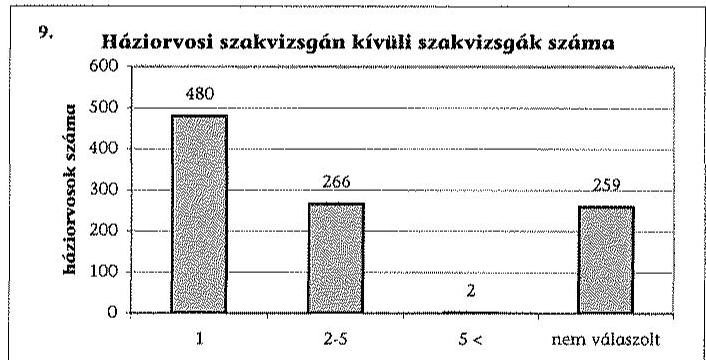
9. Háziorvosi szakvizsgán kívüli szakvizsgák száma
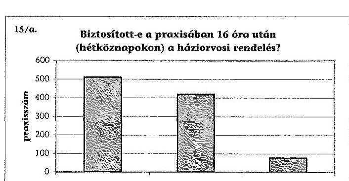
15/a.
Biztosított-e a praxisában 16 óra után (hétköznapokon) a háziorvosi rendelés?
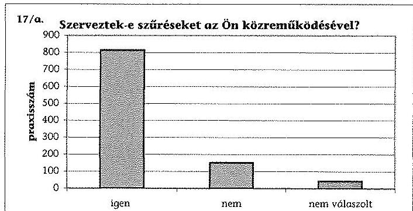

---

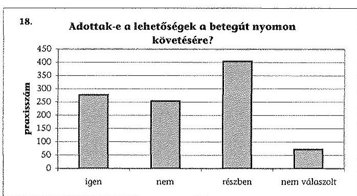
20.

Prevencióra fordított idő hetente
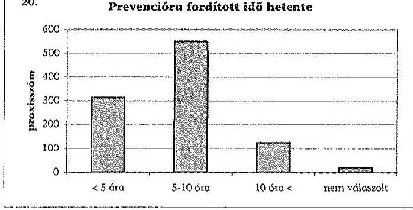
22.

Helyettesítés gyakorisága
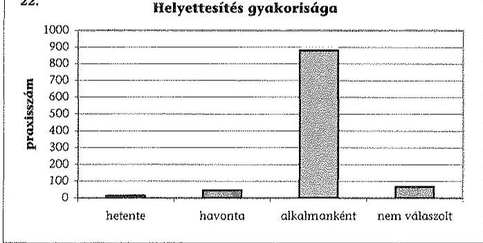
26.

Beutaló nélkül igénybe vehető ellátásokat korlátozná-e?
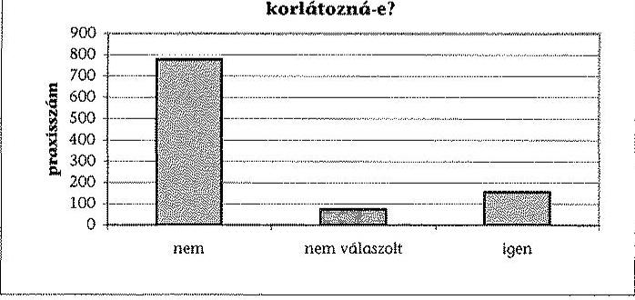
27.

Vásárolt-e a praxist?
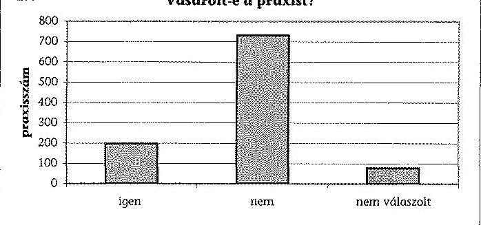
19.

Szükségesnek tartaná-e a praxisába tartozó betegek összes eü.-i ellátáshoz kapcsolódó adatának elérhetőségét?
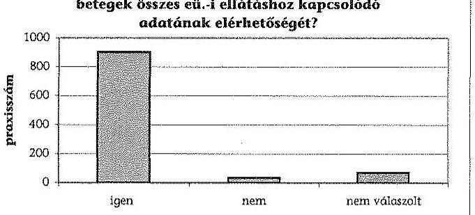
21.

Eseti helyettesítés ellátása
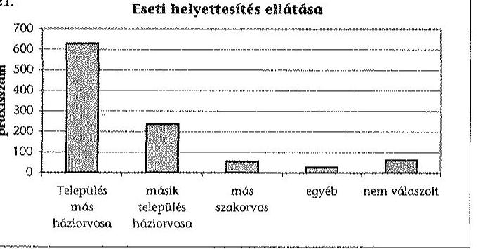

A kompetencia lista megfelelő-e? Amennyiben nem, bővíteni vagy szűkíteni kell?
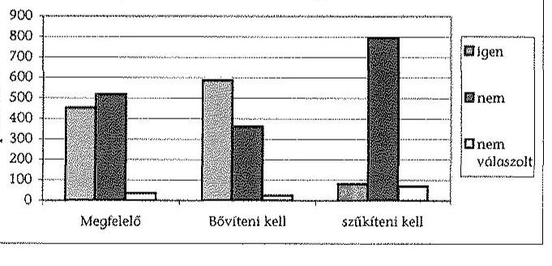

Mely szakmák igénybe vételét korlátozná? (26.)
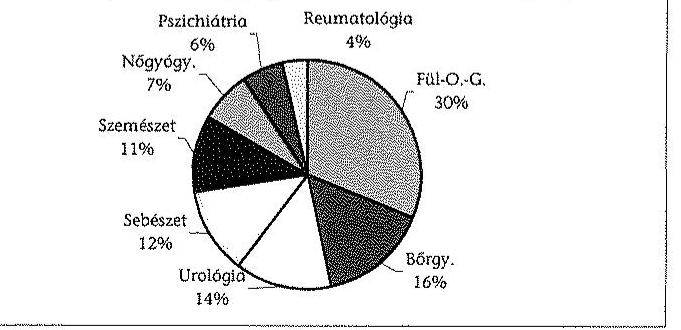
28.

Vett-e igénybe kamattámogatott hitelt a praxis vásárlásához?
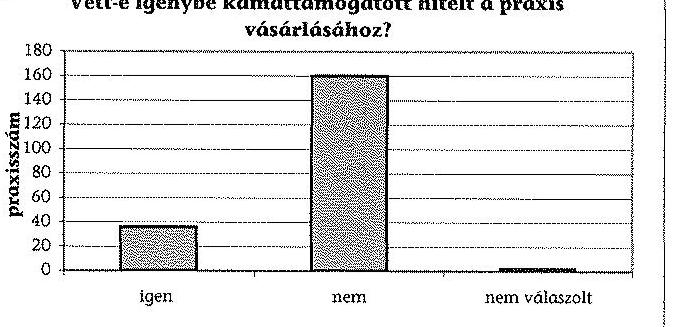

---

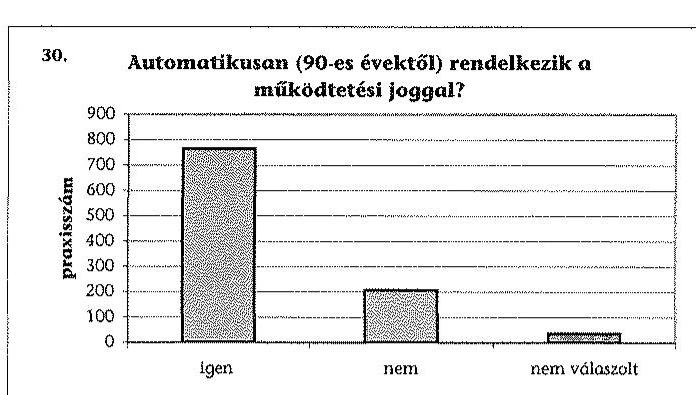
32.

Elégedett-e a működtetési jog intézményével?
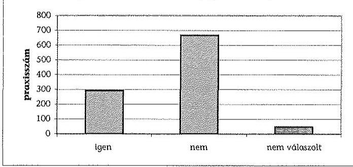

A háziorvosi rendelő tulajdoni megoszlása
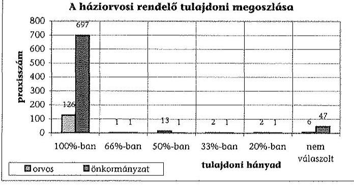
37.

Ha a rendelő az orvos tulajdona az önkorm. hozzájárul-e a fenntartáshoz?
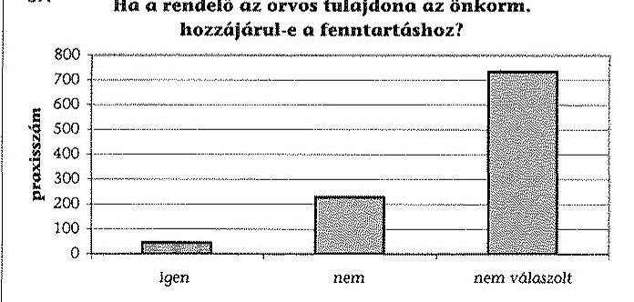
39.

El tudja-e számolni az eszközök amortizációját?
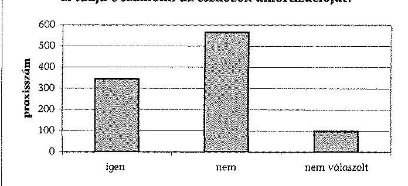
31.

Tervezi-e 1 éven belül a praxis eladását?
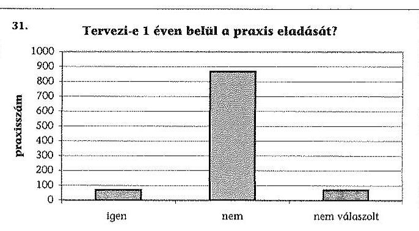
34.

Változás az önkormányzati szerepvállalásban
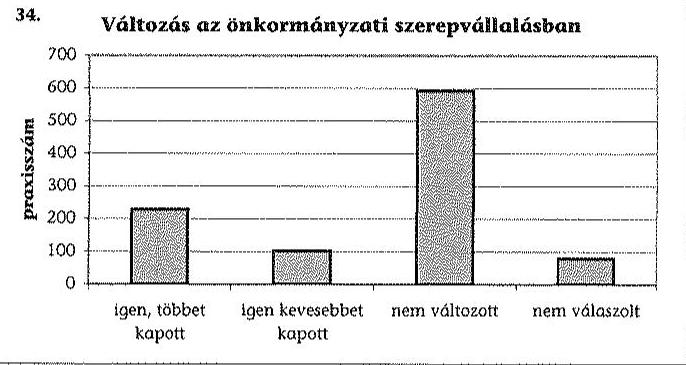
36/a. Ha az önkorm. a rendelő tulajdonosa az orvos fizet e bérleti díjat?
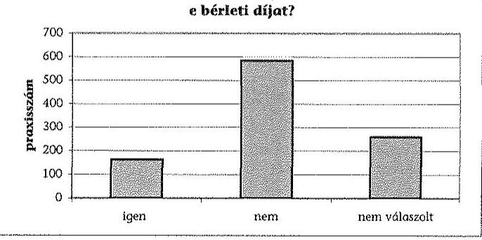
38.

Diagnosztikai eszközök tulajdonosa
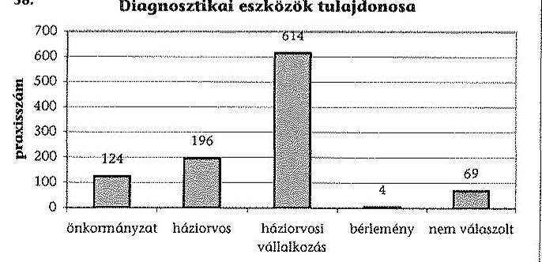
41.

Átlagosan milyen korúak az eszközei?
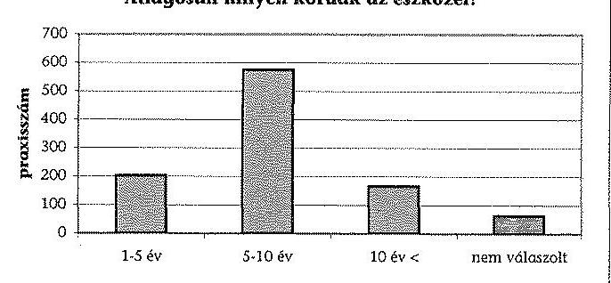

---

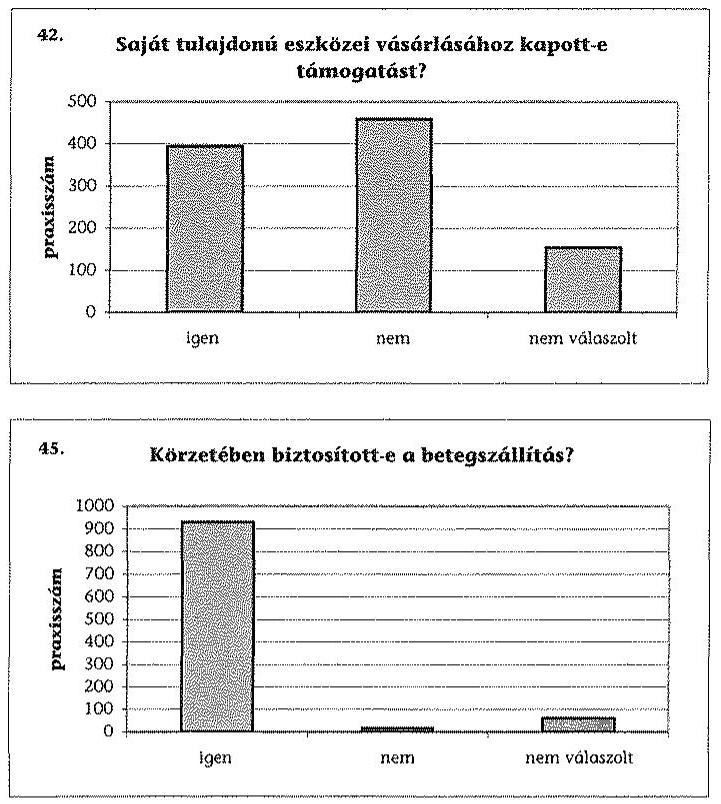
45.

Körzetében biztosított-e a betegszállítás?
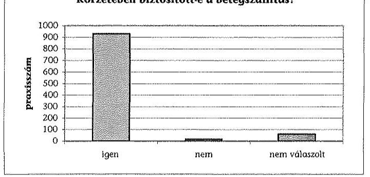
44. Körzetében biztosított-e a 15 percen belüli mentés?
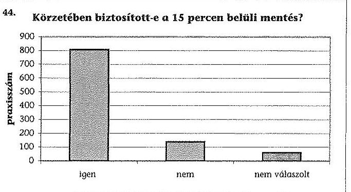

---

# A keringési, daganatos, krónikus megbetegedések, valamint a szívinfarktus okozta halálozás 

A 19 évesnél idősebb népesség keringési betegségek okozta halálozásának területi egyenlőtlenségei Magyarországon 2005-2009-ben
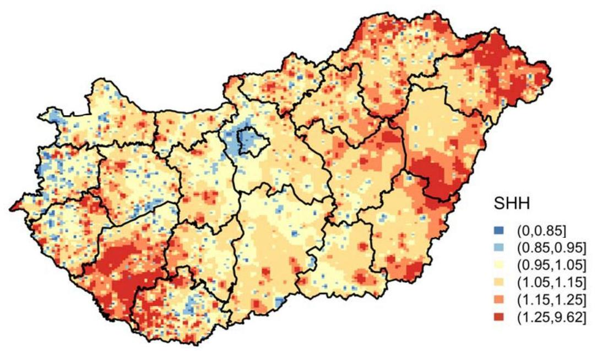

SHH: standardizált halálozási hányados (az országos átlaghoz viszonyított relatív halálozás)
A 19 évesnél idősebb népesség daganatos betegségek okozta halálozásának területi egyenlőtlenségei Magyarországon 2005-2009-ben
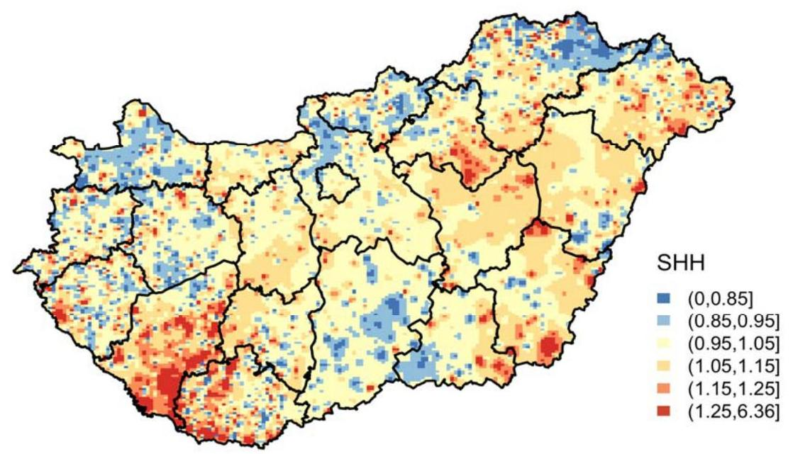

SHH: standardizált halálozási hányados (az országos átlaghoz viszonyított relatív halálozás)

---

A 19 évesnél idősebb népesség krónikus májbetegség, májzsugor okozta halálozásának területi egyenlőtlenségei Magyarországon 2005-2009-ben


SHH: standardizált halálozási hányados (az országos átlaghoz viszonyított relatív halálozás)
A szívinfarktus relatív prevalenciája* 2010 júliusában az országos átlaghoz viszonyítva


SPH: standardizált prevalencia hányados

---

*Azon lakosok aránya, akiket 2006-2010-ben szívinfarktus miatt fekvőbeteg intézményben kezeltek
A szélütés relatív prevalenciája* 2010 júliusában az országos átlaghoz viszonyítva


SPH: standardizált prevalencia hányados
*Azon lakosok aránya, akiket 2006-2010-ben szélütés miatt fekvőbeteg intézményben kezeltek

---

# Indikátorok feldolgozása 

## (2009. szeptember - 2010. október)

## Indikátor 1: influenza védőoltásban részesültek aránya 65 év felett


Az indikátor rendszer bevezetése utáni első három hónapban a B300-as jelentésben a háziorvosok nem jelentették az oltási tevékenységet. Az első adatok 2009. 12. hónaptól jelentek meg. Az adatok 20-22\% körüli átoltottságot mutatnak a 65 évnél idősebb lakosságnál. A legalacsonyabb az átoltottság Fejér megyében (13,69\%), a legmagasabb Vas megyében (21,09\%). Budapesten az I. kerületben 9,36\%, a VI. kerületben $21,81 \%$, kétszeres különbség.

Influenza védőoltásban részesültek aránya 65 év felett 2009. 09. hó és 2010. 10. hó között \% Indikátor 1


---

Az OECD Health at Glance 2009. évi kiadványban a 2007. évi influenza átoltottsági adatokat közlik több OECD országra. Az OECD átlag 55,9\% a 65 év feletti korcsoportban, Magyarország 34,2\%-os adattal szerepel a kiadványban. Az OECD felé az ESKI jelent adatokat, és ehhez az ÁNTSZ Országos Epidemiológiai Központtól kapott adatokat használják fel. Az adatgyűjtés a 60 év alatti illetve 60 év feletti korcsoportban térítésmentes influenza oltóanyag felhasználására vonatkozik. Ettől az évtől az adatgyűjtés a 65 év feletti és alatti korcsoportra bontva történik, ugyanis megváltozott a térítésmentes oltóanyag jogosultság korhatára 60-ról 65 évre. Így az OECD-be jelentett adat, a 2007-es is a 60 év feletti korcsoport átoltottságát mutatja, amely a 2007/2008. évi szezonban 745560 oltóanyag volt, ${ }^{1}$ így a $34 \%$-os adat a 60 éven felüliek átoltottságát jelöli.

Az Országos Epidemiológiai Központ honlapján közzétették az idei adatokat, a 65 év feletti korcsoport átoltottsága 2011. február 9-i állapot szerint 28,6\% volt.

Az eltérést az OEP indikátor rendszer adatai és az ÁNTSZ adatai között okozhatja továbbá, hogy az oltóanyagok részben nem a háziorvosokon keresztül jutnak el a rászorulókhoz, így azok nem kerülnek a háziorvosi jelentésbe, valamint adminisztrációs hiányosságok is.

Az Európai Unió Tanácsa 2009. december 22-i 2009/1019/EU ajánlása (6) bekezdése megfogalmazta, hogy az EU minél előbb, de lehetőleg 2014/2015 telére érje el a WHO által ajánlott 75\%-os átoltottsági arányt az idősebb korosztályok körében. A 75\%-os célt lehetőség szerint ki kell terjeszteni a krónikus betegségben szenvedők kockázati csoportjára is.

# Indikátor 2: Pneumococcus védőoltásban részesültek aránya 2 év alatt 


Az adott hónapot megelőző 12 hónapban beoltottak száma, a 2 év alatti korosztály átoltottsága folyamatosan növekedett. Lényeges a növekedés a gyermekpraxisoknál, ahol 0-ról $49,53 \%$-ra nőtt a vizsgált időszakban, a vegyes praxisok gyermek

[^1]
[^1]:    ${ }^{1}$ a 60 év feletti korcsoportba kb. 2,2 millió ember tartozik

---

populációjában lényegesen kisebb mértékű volt az átoltottság növekedése, 0-ról $14,78 \%$-ra.

A megyei bontásban látszik, hogy nagy a különbség az ország egyes területei között, Sz-Sz-B megyében átlagosan 16\% körüli az átoltottság, míg Vas megyében 33\%, azaz kétszeres különbség van az ország e két pontja között. Ugyan ilyen nagy eltérést mutat a budapesti kerületek közötti különbség, a VII. kerület 14 havi átlaga 1,16\%, míg a IX. kerületben $26,13 \%$ volt az átoltottság, azaz 22-szeres különbség van.

Pneumococcus védőoltásban részesültek aránya 2 év alatt Budapesten \%-ban 2009.09-2010.10. között Indikátor 2


Indikátor 3: A háziorvos szűrési tevékenysége


---

Az indikátor mutatja a háziorvosi praxisba bejelentkezett biztosítottak közül azok arányát, akiknél szűrési tevékenység történt az 51/1997. (XII.18.) NM rendelet szerint. A vizsgált időszakban nagyon alacsony volt a szűrési arány, 0,6 és $1,4 \%$ közötti, a gyermek praxisokban 1,5 és $4 \%$ közötti. Nagy a különbség a budapesti gyermek praxisok gyakorlatában, ahol a VII. kerületben a gyermekek 0,3\%-ánál, míg a XX. kerületben 3,5\%-nál történik szűrés. (Az adat a B300-ból származik, az eltérések adódhatnak kódolási problémákból.)

A mutatóhoz sem szűrés típust, sem korcsoportot, sem célértéket nem rendeltek hozzá, így nehezen volt értékelhető önmagában a mutatószám. Az új rendszerben az indikátor ebben a formájában megszűnik.

# Indikátor 4: Vérzsír vizsgálat 


Az indikátor a 40-60 éves korosztályból a megelőző 1 évben vérzsír vizsgálaton részt vettek arányát mutatja. A vizsgált időszakban a mutató a vegyes praxisokban 33\%, a felnőtt praxisokban 38-39\% között volt. A mutató nagyon kiegyenlített volt a vizsgált időszakban, elmozdulás nem volt tapasztalható. A megyei és budapesti kerületek átlagai között kb. 10 százalékpontos az eltérés.

Az új rendszerben az indikátor úgy módosul, hogy a magas vérnyomásos, vagy diabeteszes betegek körében a megelőző 12 hónapban lipidanyagcsere vizsgálaton részt vettek arányát veszik figyelembe, és cél, hogy a betegek körében minél nagyobb arányban végezzék el a vizsgálatot. Így a primer prevenciós indikátorból gondozási mutatóvá válik. Az 51/1997. (XII.18.) NM rendelet 214-es kódú szűréstípusa az önkéntesen igénybevehető szűrések között a 40-64 éves korcsoportban a kis kardiovaszkuláris kockázatú egyéneknél 5 évente, a közepes és nagy kardiovaszkuláris kockázatú egyéneknél 2 évente javasolja e
 vizsgálatot.

---

# Indikátor 5: Mammográfiás szűrés 

Mammográfiás szűrésben részt vettek aránya
megyénként \%-ban 2009.09-2010.10. között
Indikátor 5


A 45-65 év közötti nők körében a megelőző 2 évben szűrésen részt vettek arányát mutatja. A vegyes praxisokban az arány 49 és $50 \%$ közötti, a felnőtt praxisokban 50 és $51 \%$ közötti. Nagy eltérés tapasztalható a megyék átlagai között, Somogy és Sz-Sz-B megye között 20 százalékpont, és ugyanez tapasztalható a budapesti kerületek között (legalacsonyabb a VII. kerületben, legmagasabb a II. kerületben).

A mammográfiás szűrés kiemelt népegészségügyi szűrés, amelyet az ÁNTSZ koordinációs irodája szervez és koordinál. A háziorvosok munkáját nagymértékben hátráltatta a betegút követés lehetőségének hiánya, így csak a beteg szóbeli tájékoztatásából értesültek arról, hogy a beteg részt vett-e szűrésen. ${ }^{2}$ A magas Sz-Sz-B megyei adat a helyi ÁNTSZ szervezői munkájának köszönhető, amelyről az ÁSZ vizsgálata ${ }^{3}$ is beszámolt.

Az előterjesztés április 1-jétől az indikátort változatlan formában hagyta meg. A célértéknek a rendelkezésre álló adatokból az új algoritmus szerint számolt értékeket jelölte meg (megyei bontásban a háziorvosi praxisok legjobb 25\%-ának alsó értékei: 47,7 és $67,7 \%$ között). A WHO által javasolt célérték az 50 év feletti korosztályban 70\%. Az indikátor 14 havi idősoros adatai azt mutatták, hogy ebben az időszakban lényegesen nem változott az átszűrtség, illetve a területi eltérések ugyanabban az

[^0]
[^0]:    ${ }^{2}$ a vizsgálattal egy időben jogszabályváltozás fog életbe lépni a háziorvosok adatkezelési jogosultságára vonatkozóan
    ${ }^{3}$ 0805 Jelentés az egyes onkológiai szűrési programokra fordított pénzeszközök hasznosulásának ellenőrzéséről, 2008. május

---

arányban fennmaradtak, az indikátor ösztönző hatása nem érvényesült. A Baranya megyei 47,7\%-os érték lényegesen elmarad az elvárt 70\%-tól.

# Indikátor 6: Hypertonia gondozás 


Az indikátor az 50 év feletti biztosítottak közül azok arányát mutatja, akik az elmúlt 12 hónapban legalább 4 alkalommal vérnyomáscsökkentő szert váltottak ki. A vizsgált időszak adatai azt mutatják, hogy a kiváltás stagnál, a vegyes praxisokban nagyobb a gyógyszert kiváltók aránya ( 46 \% körüli), míg a felnőtt praxisokban alacsonyabb ( 44 \% körüli) 14 hónapra vetítve. Eltérés van a megyék között, Budapesten a legalacsonyabb a gyógyszert kiváltók aránya (42%), Somogyban a legmagasabb ( $46 \%$ körüli). A budapesti kerületekben is eltérő az arány, $38 \%$ a XII. kerületben és $44 \%$ a XV. kerületben.

Az új indikátor rendszer április 1-jétől az indikátort két célcsoportra bontja, 40-54 és az 55-69 éves korosztályra, tekintettel az eltérő prevalenciára. Az indikátor célja, hogy a minél magasabb felismerési arányt honorálja. A rendelkezésre álló 14 hónap adatainak feldolgozása alapján, az idősoros táblákon végig stagnált a mutató.

A magas vérnyomásban szenvedő betegek gondozásának mérésére még egy további indikátor kerül bevezetésre, a megelőző 12 hónapban serum-kreatinin vizsgálatban részesültek arányát fogják mérni a hypertoniás betegek között. Hypertoniás betegnek az minősül, aki az elmúlt 12 hónapban legalább négyszer meghatározott ATC kódú gyógyszert váltott ki.

---

# Indikátor 7: Infarktus utáni gondozás 


Az indikátor mutatja az infarktuson átesett személyek közül azok arányát, akik ßblokkolót váltottak ki az elmúlt 12 hónapban. Az elvárt érték 100\% körüli lenne (akinél nincs kontraindikáció). A vegyes praxisokban az érték 50-51\% körüli, a felnőtt praxisokban 48-49\% körüli, ami alacsonynak minősíthető. A vegyes praxisok átlagai kis mértékben jobbak a felnőtt praxisok átlagainál. A megyék szerinti bontásban nagyok a különbségek, Nógrádban 40%, míg Tolnában 60% körüli a ßblokkolót szedők aránya. A budapesti kerületek között is nagy az eltérés, X. kerületben 35%, a XXIII. kerületben 50\%. Az idősoros táblán látható, hogy a vizsgált időszakban nem változott lényegesen a mutató értéke, az ösztönző hatás nem érvényesült.

Az új rendszerben az indikátor úgy változik, hogy az acut myocardialis infarctuson és/vagy coronaria bypass műtéten és/vagy szívkatéteres tágításon és/vagy pacemaker beültetésen átesetteknél vizsgálják azok arányát, akik a megelőző 12 hónapban legalább 4 alkalommal ß-blokkolót váltottak ki.

## Indikátor 8: Diabetes gondozás 1


---

Az indikátor azt mutatja, hogy az A10 ATC kódú gyógyszert kiváltók közül hányan voltak az elmúlt 12 hónapban haemoglobin A1C meghatározáson.

Az indikátor a vizsgált időszakban folyamatos növekedést mutatott, országos átlagban 62 -ről $68 \%$-ra. A praxis típusonkénti bontásban a felnőtt praxisoknak magasabbak voltak az adataik (65-70%) mint a vegyes praxisoknak (58-61%). A gondozott diabetesek aránya megyénként eltérést mutatott, Nógrádban 50%, míg Tolnában 70% volt a vizsgált időszak átlaga. Ugyanekkora eltéréseket lehet tapasztalni Budapesten, ahol a legalacsonyabb arány a IV. kerületben volt, míg a legmagasabb a VI. kerületben.

A pneumococcus indikátor mellett ez volt a második indikátor, amely a vizsgált időszakban növekedést mutatott, és ez a növekedés az indikátor rendszer ösztönző hatásának tekinthető.

Az indikátor változatlan formában megmarad az új rendszerben.

# Indikátor 9: Diabetes gondozás 2 


Az indikátor azt mutatja, hogy az A10 ATC kódú gyógyszert kiváltók közül hányan voltak szemészeten a megelőző 12 hónapban. A mutató a vizsgált időszakban 39\% körül mozgott, a felnőtt praxisokban magasabb volt az arány ( $40 \%$ körül), míg a vegyes praxisokban $35 \%$ körül. Heves megyében volt a legalacsonyabb, $30 \%$ a vizsgált időszakban, míg a budapesti átlag $45 \%$ volt. A budapesti kerületek között a legalacsonyabb arány a XXIII. kerületben volt (38%), míg a legmagasabb a XIII. kerületben (50\%).

Az indikátor változatlan formában megmarad az új rendszerben.

---

# Indikátor 10: Stroke előfordulás 


Az indikátor az 50 év feletti biztosítottak közül az elmúlt 5 évben stroke-on átesettek arányát mutatja.

A 14 havi adatok alapján az első négy hónapban az idősoros táblán 6%, majd az azt követő időszakban 5% volt, változás nem volt. A vegyes praxisokban a magasabb volt az érték. A megyei bontásban, Szolnok megyében 4%, míg B-B-Z megyében 7 % volt a vizsgált időszakban. Nagy volt a különbség a budapesti kerületek között, I. kerületben $3 \%$, a XX. kerületben $8 \%$ volt.

Az indikátorral szemben felhozott szakmai kifogások részben kódolási problémákra utaltak, részben pedig arra, hogy az indikátor a háziorvos tevékenységét közvetlenül nem minősítette. Az indikátor az új rendszerből április 1-jétől kikerül.

## Indikátor 11: Beutalási gyakorlat


---

Időben kiegyenlített, 20\% alatti volt a beutalási gyakorlat a vizsgált időszakban. Eltérő a beutalási gyakorlat praxis típusonként és megyénként, legkevesebb beutalásra a gyermek praxisokban kerül sor, és a legtöbb beutalást a felnőtt praxisokban kezdeményezik. Az indikátor változatlan formában megmarad.

# Indikátor 12: Antibiotikumos kezelés 


A vizsgált időszakban az antibiotikumos kezelésben részesültek aránya lényegesen nem változott, 3,8 és $4 \%$ között mozgott. Az egyes praxis típusokban eltérőek az antibiotikum felírási szokások: a felnőtt praxisokban 3%, a vegyes praxisokban 4% körüli és a gyermek praxisokban 8-9\% körül alakult. Az egyes megyékben a gyermek praxisokban eltérő a gyakorlat, legalacsonyabb az arány Budapesten és Vas megyében, a legmagasabb Sz-Sz-B megyében. A budapesti kerületek közül a XII. kerület gyermek praxisaiban a legalacsonyabb (3%), míg a XXIII. kerületben a legmagasabb (8%) az arány.

Az indikátor az új rendszerben megmarad minden praxis típusra, annyi változtatással, hogy a felnőtt és vegyes praxisokban a 18 év feletti lakosságra vonatkozóan számítják ki.

---

# Táblák jegyzéke 

1.  sz. tábla A kérdőíves felméréshez kiválasztott és a helyszíni ellenőrzésre is kijelölt önkormányzatok
2.  sz. tábla A háziorvosi képzés adatai
3.  sz. tábla 10 ezer lakosra jutó háziorvosok száma megyénként
4.  sz. tábla A háziorvosi körzetek betöltetlenségi aránya megyénként

---

# A kérdőíves felméréshez kiválasztott és a helyszíni ellenőrzésre is kijelölt önkormányzatok 

A kérdőíves felmérésre az önkormányzatok 15\%-át választottuk ki (az érintett lakosságszám: 1538 ezer fő). A rétegenkénti véletlenszerű mintavétel eredményeként a minta több szempont szerint reprezentálja az ország településeit, önkormányzatait.

A mintavételezés rétegei és a kiválasztott önkormányzatok száma

| Megnevezés | Dinamikusan   fejlődő | Fejlődő | Felzárkózó | Stagnáló | Lemaradó | Együtt: |
| :-- | --: | --: | --: | --: | --: | --: |
| Fővárosi kerület | 3 |  |  |  |  | $\mathbf{3}$ |
| Megyeszékhely város | 1 | 2 |  |  |  | $\mathbf{3}$ |
| Egyéb város | 5 | 13 | 20 | 6 | 2 | $\mathbf{4 6}$ |
| Nagyközség | 2 | 2 | 6 | 5 | 3 | $\mathbf{1 8}$ |
| Község | 7 | 32 | 118 | 109 | 139 | $\mathbf{4 0 5}$ |
| Összesen: | $\mathbf{1 8}$ | $\mathbf{4 9}$ | $\mathbf{1 4 4}$ | $\mathbf{1 2 0}$ | $\mathbf{1 4 4}$ | $\mathbf{4 7 5}$ |

A mintába került önkormányzatok 5\%-ánál (25 esetben) az önkormányzati információkat helyszíni ellenőrzés során kontrolláltuk, kiegészíttettük.

A helyszíni ellenőrzés keretében az önkormányzat területén ellátási kötelezettséggel dolgozó háziorvosok (házi gyermekorvosok) 10\%-ával (minimum1, de maximum 3) felvesszük a személyes kapcsolatot. A szolgáltatók körében külön kérdőívvel gyűjtött információkon túli lényeges körülményeket az önkormányzatnál a jelentésben rögzítjük.

## Főváros

Budapest X. Kerület
fővárosi kerület

## Bács-Kiskun megye

Izsák
Bácsszentgyörgy
Uszód
egyéb város
község
község

## Borsod-Abaúj-Zemplén megye

Mezőcsát
Legyesbénye
egyéb város
község

## Fejér megye

Martonvásár
Velence
Aba
egyéb város
egyéb város
nagyközség

## Győr-Moson-Sopron megye

Győr
megyeszékhely város

## Heves megye

Kisköre
egyéb város

---

# Komárom-Esztergom megye 

Naszály
Nógrád megye
Pásztó
Buják
egyéb város
község

## Pest megye

Dány
község

## Szabolcs-Szatmár-Bereg megye

Demecser
Laskod
Szamosangyalos
Tiszabezdéd
egyéb város
község
község

## Jász-Nagykun-Szolnok megye

Kenderes
Csépa
Cserkeszőlő
egyéb város
község
község

## Vas megye

Bük
Egerszegtgotthárd
Egervölgy
egyéb város
község

---

# A háziorvos képzés adatai

|  Év | Licensz
vizsgázottak száma | Közülük jelenleg
háziorvosként
dolgozik | Háziorvostanból
szakvizsgázottak
száma | Üzemi orvostanból
szakvizsgázottak
száma  |
| --- | --- | --- | --- | --- |
|  2005 | 138 | 88 | 155 | 31  |
|  2006 | 118 | 80 | 115 | 23  |
|  2007 | 196 | 100 | 160 | 81  |
|  2008 | 183 | 88 | 182 | 112  |
|  2009 | n.a. | n.a. | 181 | 68  |
|  2010 | n.a. | n.a. | 192 | 58  |

---

10 ezer lakosra jutó háziorvosok száma megyénként

| Megye | Lakosok   száma $^{1}$ | Háziorvosok   száma | Egy házior-   vosra jutó   lakosok   száma | 10 ezer   lakosra jutó   háziorvosok   száma |
| :-- | :--: | :--: | :--: | :--: |
| Budapest | 1712210 | 1313 | 1304,0 | 7,7 |
| Baranya | 394911 | 297 | 1329,7 | 7,5 |
| Tolna | 235874 | 169 | 1395,7 | 7,2 |
| Vas | 260950 | 186 | 1403,0 | 7,1 |
| Csongrád | 423826 | 300 | 1412,8 | 7,1 |
| Somogy | 322197 | 225 | 1432,0 | 7,0 |
| Békés | 371322 | 256 | 1450,5 | 6,9 |
| Borsod-Abaúj-Zemplén | 701160 | 483 | 1451,7 | 6,9 | |
| Jász-Nagykun-Szolnok | 394891 | 266 | 1484,6 | 6,7 |
| Hajdú-Bihar | 542192 | 363 | 1493,6 | 6,7 |
| Bács-Kiskun | 530379 | 352 | 1506,8 | 6,6 |
| Nógrád | 207637 | 135 | 1538,1 | 6,5 |
| Heves | 314441 | 204 | 1541,4 | 6,5 |
| Komárom-Esztergom | 314450 | 204 | 1541,4 | 6,5 |
| Zala | 290204 | 184 | 1577,2 | 6,3 |
| Veszprém | 360387 | 227 | 1587,6 | 6,3 |
| Fejér | 428295 | 264 | 1622,3 | 6,2 |
| Győr-Moson-Sopron | 447033 | 274 | 1631,5 | 6,1 |
| Szabolcs-Szatmár-Bereg | 565326 | 344 | 1643,4 | 6,1 |
| Pest | 1213290 | 681 | 1781,6 | 5,6 |
| ÁTLAG |  |  | 1491,2 | 6,7 |

Adatforrás: OEP 2011. 03. 23-ai adatai alapján legyűjtve

[^0]
[^0]:    ${ }^{1}$ KSH 2009. évi adatai alapján

---

# A háziorvosi körzetek betöltetlenségi aránya megyénként*

|  Megye | összes körzet | ebből betöltetlen | betöltetlenségi arány \%  |
| --- | --- | --- | --- |
|  Bács-Kiskun | 352 | 10 | 2,8  |
|  Baranya | 297 | 4 | 1,3  |
|  Békés | 256 | 12 | 4,5  |
|  Borsod-Abaúj-Zemplén | 483 | 31 | 6,4  |
|  Budapest | 1314 | 9 | 0,6  |
|  Csongrád | 300 | 1 | 0,3  |
|  Fejér | 264 | 6 | 2,2  |
|  Győr-Moson-Sopron | 275 | 6 | 2,1  |
|  Hajdú-Bihar | 363 | 6 | 1,6  |
|  Heves | 204 | 10 | 4,9  |
|  Jász-Nagykun-Szolnok | 268 | 18 | 6,7  |
|  Komárom-Esztergom | 205 | 5 | 2,4  |
|  Nógrád | 136 | 11 | 8,1  |
|  Pest | 683 | 8 | 1,2  |
|  Somogy | 225 | 7 | 3,1  |
|  Szabolcs-Szatmár-Bereg | 343 | 5 | 1,5  |
|  Tolna | 169 | 13 | 7,7  |
|  Vas | 185 | 4 | 2,1  |
|  Veszprém | 228 | 2 | 0,8  |
|  Zala | 185 | 3 | 1,6  |
|  Összesen: | 6735 | 171 | 2,5  |

Adatforrás: OEP *2011. 01. havi valamennyi betöltetlen praxis

---

# Tanúsítványok jegyzéke 

1/a. sz. Háziorvosok által utalványozott egyes kifizetések az E. Alapból
1/b. sz. Az E. Alap terhére kifizetett egyes ellátások évenként
2. sz. Alapellátási vállalkozás támogatási átalánydíj 2001-2010.

3/a. sz. A háziorvosi (házi gyermekorvosi) ellátás alapadatai és az ellátáshoz kapcsolódó önkormányzati feladatok végrehajtásának egyes információi

3/b. sz. A háziorvosi ellátás és egyéb egészségügyi alapellátással összefüggő önkormányzati szintű pénzforgalmi bevételek és kiadások

---

|  Év | Táppénz | Házi
szakápolás | Járóbeteg
szakellátás
(uboc,
"egyéb"
köpalakotót,
relikül)** | Labor-
diagnosztika | Röntgen-,
ultrahang
diagnosztika
(CF, MRI,
PET) | Aktív fekvő** | Krónikus
fekvő** | Speciális fin.
fekvő
(telefés,
nagyértékű) | Művese-
kezelés | Gyógyszeráti
és egyéb
gyógyszer
ellátások | Gyógyászati
segítő
eszközök | Gyógyszer-
felmogatás | Mentés,
beteg
szállítás*** | Egyedi
méltányos-
ság | Utazási
utalvány,
költség
térítés |
| --- | --- | --- | --- | --- | --- | --- | --- | --- | --- | --- | --- | --- | --- | --- | --- |
|  |  |  |  |  |  |  |  |  |  |  |  |  |  |  |   |
|  2005 | 22 272 852,3 | 2 753 370,3 | 6 335 967,3 | 7 747 368,7 | 4 728 418,8 | 0,0 | 23 092 530,3 | 8 338 362,8 | 0,0 | 0,0 | 158 809,7 | 13 292 068,7 | 197 568 938,0 | - | 0,0 |
| 2006 | 72 273 959,0 | 2 596 131,1 | 10 056 894,2 | 8 863 519,5 | 4 254 356,3 | 0,0 | 32 753 159,5 | 6 454 620,3 | 0,0 | 0,0 | 195 737,3 | 15 485 762,1 | 230 516 237,1 | - | 0,0 |
| 2007 | 79 698 899,0 | 3 057 978,4 | 11 278 714,3 | 8 645 109,6 | 3 343 486,3 | 0,0 | 28 249 915,3 | 8 547 247,1 | 0,0 | 0,0 | 195 635,3 | 15 625 487,7 | 196 785 937,5 | 762 167,8 | 0,0 | 2 408 419,0  |
| 2008 | 129 914 250,0 | 3 204 515,0 | 12 544 689,1 | 7 186 248,9 | 4 459 806,4 | 0,0 | 34 717 150,4 | 11 902 749,6 | 0,0 | 0,0 | 231 873,4 | 12 778 742,0 | 168 811 346,7 | 1 099 391,9 | 0,0 | 2 506 163,4  |
| 2009 | 85 964 384,0 | 3 073 846,6 | 11 446 606,4 | 7 312 804,3 | 3 492 766,2 | 0,0 | 28 389 279,8 | 12 334 334,3 | 0,0 | 0,0 | 237 593,2 | 12 804 001,3 | 187 145 705,3 | 1 231 603,0 | 0,0 | 2 683 526,4  |
| 2010 | 65 692 500,0 | 3 124 025,8 | 10 918 284,1 | 7 547 979,1 | 4 608 146,1 | 0,0 | 27 470 362,0 | 13 021 676,3 | 0,0 | 0,0 | 251 762,3 | 12 964 286,8 | 192 397 269,4 | 1 204 435,0 | 0,0 | 2 493 827,6  |
|   |  |  |  |  |  |  |  |  |  |  |  | Mennyiségek |  |  |  |   |
|   |  |  |  |  |  |  |  |  |  |  |  |  |  |  |  |   |
|   |  |  |  |  |  |  |  |  |  |  |  |  |  |  |  |   |
|   |  |  |  |  |  |  |  |  |  |  |  |  |  |  |  |   |
|   |  |  |  |  |  |  |  |  |  |  |  |  |  |  |  |   |
|  2005 | 26 369 854 | 1 844 251 | 5 426 394 | 3 013 315 | 1 621 565 | 0 | 260 784 | 37 710 | 0 | 0 | 234 218 | 97 851 968 | 3 569 911 338 | 936 061 | 0 | -  |
|  2006 | 27 679 884 | 1 041 839 | 5 549 435 | 4 924 664 | 1 596 108 | 0 | 251 776 | 37 363 | 0 | 0 | 353 893 | 112 217 679 | 4 035 690 334 | 568 942 | 0 | -  |
|  2007 | 26 023 990 | 1 083 047 | 5 829 025 | 4 269 622 | 1 328 160 | 0 | 260 038 | 37 936 | 0 | 0 | 397 532 | 97 773 962 | 3 851 187 985 | 892 585 | 0 | 532 622  |
|  2008 | 28 329 890 | 1 145 837 | 5 514 471 | 4 578 305 | 1 412 795 | 0 | 233 853 | 59 515 | 0 | 0 | 278 126 | 92 154 143 | 3 956 019 662 | 397 839 | 0 | 553 212  |
|  2009 | 28 145 600 | 1 170 753 | 5 345 006 | 4 988 271 | 1 523 813 | 0 | 219 523 | 67 181 | 0 | 0 | 398 382 | 95 809 026 | 4 090 451 017 | 453 188 | 0 | 533 690  |
|  2010 | 23 820 000 | 1 667 723 | 6 214 605 | 5 876 192 | 1 656 339 | 0 | 199 232 | 69 935 | 0 | 0 | 421 621 | 101 469 778 | 4 338 147 728 | 450 683 | 0 | 509 568  |
|   |  |  |  |  |  |  |  |  |  |  |  |  |  |  |  |   |
|   |  |  |  |  |  |  |  |  |  |  |  |  |  |  |  |   |
|   |  |  |  |  |  |  |  |  |  |  |  |  |  |  |  |   |
|   |  |  |  |  |  |  |  |  |  |  |  |  |  |  |  |   |
|   |  |  |  |  |  |  |  |  |  |  |  |  |  |  |  |   | |  |  |  |  |  |  |   |
|   |  |  |  |  |  |  |  |  |  |  |  |  |  |  |  |   |
|  2005 | 1 163 198 | 45 712 | 2 722 984 | 2 668 215 | 1 287 930 | 0 | 232 769 | 34 414 | 0 | 0 | 11 083 | 378 834 | 7 104 886 | 247 123 | 0 | -  |
|  2006 | 1 129 795 | 43 008 | 2 763 724 | 2 527 847 | 1 275 440 | 0 | 228 775 | 34 186 | 0 | 0 | 11 874 | 367 985 | 7 090 519 | 229 768 | 0 | -  |
|  2007 | 1 026 838 | 41 663 | 2 863 811 | 2 263 628 | 1 090 333 | 0 | 237 409 | 52 090 | 0 | 0 | 12 743 | 312 604 | 6 744 974 | 256 392 | 0 | 195 732  |
|  2008 | 1 109 195 | 45 614 | 2 995 694 | 2 475 653 | 1 154 423 | 0 | 210 544 | 60 652 | 0 | 0 | 12 763 | 314 855 | 6 655 001 | 119 418 | 0 | 183 225  |
|  2009 | 1 069 906 | 45 766 | 2 849 163 | 2 567 104 | 1 244 434 | 0 | 189 452 | 56 314 | 0 | 0 | 13 283 | 337 528 | 6 763 659 | 132 513 | 0 | 188 763  |
|  2010 | 862 200 | 40 931 | 2 815 508 | 2 701 069 | 1 324 091 | 0 | 178 025 | 55 198 | 0 | 0 | 13 273 | 336 011 | 6 498 096 | 136 121 | 0 | 180 429  |
|   |  |  |  |  |  |  |  |  |  |  |  |  |  |  |  |   |

**Megjegyzés:** a táblázatban kizárólag háziorvosok által utalványozott, rendelt ellátások adatai szerepelhetnek.

- 2005. és 2006. évben az utazási költségtérítés tekintetében nem volt egységes az adatgyűjtés, ezért a rendelkezésre álló adatok nem megbízhatók.

* a 2010 év 13. hónap adatait tartalmazza.

- 2005-2006 év vonatkozásában nem áll rendelkezésre ilyen adat (a betegszállítási elrendelőt nem kellett jelenteni a szolgáltatóknak).

- 2005-2009-es táplálkozás adatok tartalmazzák az előző év(ek)ben kezdődött és a tárgyékon átfizetett táplálkozás esetén számát.

* Az ellátás az adott névre eső táplálkozás névértékét és a hozzájáruló időnként táplálkozás összegének tartalmazza.

- 2010-es táplálkozás adatok alkalmazott az adott évben befejeződött táplálkozás esetén, a hozzájáruló javaslat száma, jogcím és a időnként összeget (előző év(ek)ben kezdődött táplálkozó esetén a táplálkozás némét és összegét az előző év(ek)be eső részét átadékadva.

Nyilatkozat: A tanúsítványban szereplő adatok a nyilvántartások ellenőrzött adattal egyeznek, vállalkozásai igazolom.

Dátum: 2011.07.26.

---

Kiállító: Országos Egészségbiztosítási Pénztár, Budapest Az E. Alap terhére kifizetett egyes ellátások évenként

|  Év | Táppénz | Házi
szakápolás | Járóbeteg
szakellátás
(hábor, "egyéb",
képalkotó,
nélkül)** | Lakás
diagnosztika | Röntgen-,
ultrahang
diagnosztika | "Egyéb"
képalkotó
diagnosztika
(CT, MRI,
PET) | Aktív fekvő** | Krónikus
fekvő** | Speciális fin.
fekvő
(életvezetési,
nagyértékű) | Művese
kezelési | Gyógyfürdő
és egyéb
gyógyászati
ellátások | Gyógyászati
támogatás | Mentés,
beteg
szállítás | Egyedi
méltányos
ság | Utazási
utazány,
költség
térítés*  |
| --- | --- | --- | --- | --- | --- | --- | --- | --- | --- | --- | --- | --- | --- | --- | --- |
|   |  |  |  |  |  |  | E. Alapból kifizetett összegek (E Ft), egy fizetési/egyre berakítva |  |  |  |  |  |  |  |   |
|  2005 | 97 503 056.0 | 3 098 156.1 | 87 394 408.6 | 21 181 400.8 | 14 824 239.9 | 11 116 208.9 | 354 148 103.9 | 41 525 344.6 | 15 184 062.2 | 16 774 898.9 | 9 076 264.4 | 47 871 677.9 | 343 919 009.0 | 24 356 046.0 | 105 052.2 | -  |
|  2006 | 98 854 296.5 | 3 102 393.5 | 81 454 091.3 | 18 901 029.3 | 15 017 281.0 | 11 659 632.7 | 361 968 090.7 | 41 780 472.3 | 15 606 403.5 | 17 130 750.0 | 9 475 465.4 | 53 131 576.0 | 401 780 167.6 | 25 127 455.0 | 83 728.0 | -  |
|  2007 | 97 384 628.9 | 3 320 405.0 | 80 639 386.3 | 26 342 084.2 | 13 918 982.8 | 12 114 498.7 | 336 100 515.4 | 40 511 433.3 | 16 985 864.5 | 20 611 382.4 | 4 922 353.0 | 36 630 164.7 | 340 398 511.2 | 27 191 500.9 | 17 168.4 | 2 052 702.9  |
|  2008 | 102 620 080.0 | 3 648 148.9 | 103 486 240.4 | 21 124 496.4 | 15 519 894.9 | 14 806 860.3 | 353 666 059.7 | 56 642 216.3 | 23 746 230.6 | 23 274 066.2 | 3 891 232.7 | 45 448 405.9 | 305 527 252.2 | 28 816 764.9 | 23 413.1 | 2 981 649.1  |
|  2009 | 108 620 123.7 | 3 817 390.0 | 90 318 560.3 | 30 386 388.4 | 15 226 280.3 | 13 963 364.7 | 324 221 279.8 | 58 698 704.4 | 26 557 814.1 | 22 933 458.3 | 4 111 643.8 | 49 077 725.1 | 363 324 521.4 | 28 727 020.0 | 28 657.0 | 3 202 647.7  |
|  2010 | 78 401 238.6 | 3 510 748.7 | 57 978 951.9 | 25 538 726.1 | 15 877 237.4 | 14 874 300.8 | 341 432 802.7 | 65 218 272.0 | 20 291 753.4 | 22 932 433.6 | 3 969 725.4 | 47 970 912.4 | 362 313 522.9 | 28 248 220.0 | 25 512.3 | 3 248 801.4  |
|   |  |  |  |  |  |  |  |  |  |  | Mennyiségek |  |  |  |  |   |
|   | napok | esetszám | esetszám | esetszám | esetszám | esetszám | esetszám | esetszám | db, eset | esetszám | savig, szám
(kezelési db | db | DOT | eset | eset  |
|  2005 | 37 384 720 | 1 173 312 | 32 528 925 | 12 791 059 | 6 485 730 | 575 917 | 2 578 688 | 206 731 | 32 116 | 864 179 | 8 640 950 | 164 084 080 | 4 867 909 509 | 5 511 963 | 221 | -  |
|  2006 | 36 351 405 | 1 176 196 | 32 963 159 | 12 091 435 | 6 425 101 | 585 248 | 2 527 974 | 205 903 | 31 334 | 907 197 | 9 653 744 | 184 728 503 | 5 312 806 362 | 3 330 679 | 143 | -  |
|  2007 | 32 981 200 | 1 216 246 | 45 199 019 | 11 508 626 | 5 422 018 | 584 052 | 2 191 725 | 241 621 | 31 334 | 971 232 | 8 100 438 | 142 623 903 | 5 039 010 513 | 3 066 864 | 54 | 654 402  |
|  2008 | 32 955 500 | 1 295 057 | 43 898 434 | 11 801 098 | 5 608 180 | 653 669 | 2 199 517 | 260 559 | 34 004 | 1 011 427 | 7 308 158 | 143 530 727 | 4 960 063 600 | 3 739 648 | 43 | 599 052  |
|  2009 | 32 754 400 | 1 310 841 | 46 010 598 | 12 810 086 | 5 836 463 | 694 286 | 2 253 574 | 295 267 | 36 025 | 1 058 842 | 7 240 587 | 137 829 374 | 5 081 978 057 | 3 282 962 | 59 | 634 308  |
|  2010 | 27 853 900 | 1 205 802 | 46 691 371 | 12 281 813 | 6 240 989 | 708 423 | 2 202 712 | 228 252 | 36 634 | 1 112 892 | 6 962 437 | 128 845 751 | 5 125 182 679 | 3 461 921 | 36 | 601 288  |
|   | eset |  |  |  |  |  |  |  |  |  |  |  |  |  |  |   |
|   |  |  |  |  |  |  |  |  |  |  |  |  |  |  |  |   |
|   |  |  |  |  |  |  |  |  |  |  |  |  |  |  |  |   | |  |  |  |  |   |
|   |  |  |  |  |  |  |  |  |  |  |  |  |  |  |  |   |
|  2005 | 1 052 460 | 51 010 | 7 637 132 | 4 253 253 | 3 099 629 | 484 162 | 1 743 116 | 168 981 | 28 232 | 9 845 | 320 101 | 1 584 450 | 8 331 750 | 821 755 | 321 | -  |
|  2006 | 1 196 734 | 48 760 | 7 504 374 | 4 221 760 | 3 447 785 | 498 569 | 1 718 129 | 186 355 | 28 252 | 9 296 | 349 956 | 1 501 163 | 8 256 566 | 780 561 | 143 | -  |
|  2007 | 1 116 071 | 46 452 | 6 974 123 | 3 593 003 | 3 059 650 | 451 080 | 1 516 772 | 196 800 | 27 173 | 9 674 | 300 012 | 1 279 291 | 7 941 224 | 750 597 | 54 | 203 755  |
|  2008 | 1 175 560 | 50 972 | 6 755 612 | 3 056 041 | 3 136 730 | 505 911 | 1 475 613 | 230 561 | 20 218 | 10 319 | 373 038 | 1 217 972 | 7 725 762 | 720 727 | 43 | 222 148  |
|  2009 | 1 128 878 | 54 048 | 6 759 617 | 4 070 863 | 3 251 225 | 512 111 | 1 468 166 | 237 798 | 30 678 | 10 006 | 282 169 | 1 072 619 | 7 755 021 | 751 723 | 10 | 232 163  |
|  2010 | 1 032 204 | 51 910 | 6 824 817 | 4 076 146 | 3 396 066 | 571 833 | 1 543 916 | 256 854 | 31 170 | 10 041 | 287 222 | 185 513 | 7 502 236 | 865 548 | 30 | 242 815  |

Megjegyzés: a táblázatban a tárgyévben az E. Alapból kifizetett ellátások adatai szükségesek.

- 2005. és 2006. évben az utazási költségtérítés tekintetében nem volt egységes az adatgyűjtés, ezért a rendelkezésre álló adatok nem megbízhatóak.

* a 2010 év 13 hónap adatait tartalmazza!

A 2005-2009-es tárgyévnek adatok tartalmazzák az előző év(ek)ben kezdődött és a tárgyilag azonosítható tárgyévek eseteinek számát.

Az adatok az adott évre eső tárgyévek kiadásait és a hozzájáruló tartozó kifizetett tárgyévek összegyűjtött adatait tartalmazza.

A 2010-es tárgyévnek adatok tartalmazzák az adott évben befejeződött tárgyévek eseteit; a hozzájáruló tartozó összes tárgyévek naptári és az időzítéseit összegyűjtött (pályi) év(ek)ben kezdődött tárgyévek esetén a tárgyévek naptári és összegyűjtött előző év(ek)re erőltetett (tár) tájárhatott (pályi) év(ek)ben kezdődött tárgyévek esetén a tárgyévek naptári és összegyűjtött előző év(ek)re erőltetett (tár) tájárhatott (pályi) év(ek)ben kezdődött tárgyévek esetén a tárgyévek naptári és összegyűjtött előző év(ek)re erőltetett (tár) tájárhatott (pályi) év(ek)ben kezdődött tárgyévek esetén a tárgyévek naptári és összegyűjtött előző év(ek)re erőltetett (tár) tájárhatott (pályi) év(ek)ben kezdődött tárgyévek esetén a tárgyévek naptári és összegyűjtött előző év(ek)re erőltetett (tár) tájárhatott (pályi) év(ek)ben kezdődött tárgyévek esetén a tárgyévek naptári és összegyűjtött előző év(ek)re erőltetett (tár) tájárhatott (pályi) év(ek)ben kezdődött tárgyévek esetén a tárgyévek naptári és összegyűjtött előző év(ek)re erőltetett (tár) tájárhatott (pályi) év(ek)ben kezdődött tárgyévek esetén a tárgyévek naptári és összegyűjtött előző év(ek)re erőltetett (tár) tájárhatott (pályi) év(ek)ben kezdődött tárgyévek esetén a tárgyévek naptári és összegyűjtött előző év(ek)re erőltetett (tár) tájárhatott (pályi) év(ek)ben kezdődött tárgyévek esetén a tárgyévek naptári és összegyűjtött előző év(ek)re erőltetett (tár) tájárhatott (pályi) év(ek)ben kezdődött tájárhatott (pályi) év(ek)ben kezdődött tájárhatott (pályi) év(ek)ben kezdődött tájárhatott (pályi) év(ek)ben kezdődött tájárhatott (pályi) év(ek)ben kezdődött tájárhatott (pályi) év(ek)ben kezdődött tájárhatott (pályi) év(ek)ben kezdődött tájárhatott (pályi) év(ek)ben kezdődött tájárhatott (pályi) év(ek)ben kezdődött tájárhatott (pályi) év(ek)ben kezdődött tájárhatott (pályi) év(ek)ben kezdődött tájárhatott (pályi) év(ek)ben kezdődött tájárhatott (pályi) év(ek)ben kezdődött tájárhatott (pályi) év(ek)ben kezdődött tájárhatott (pályi) év(ek)ben kezdődött tájárhatott (pályi) év(ek)ben kezdődött tájárhatott (pályi) év(ek)ben kezdődött tájárhatott (pályi) év(ek)ben kezdődött tájárhatott (pályi) év(ek)ben kezdődött tájárhatott (pályi) év(ek)ben kezdődött tájárhatott (pályi) év(ek)ben kezdődött tájárhatott (pályi) év(ek)ben wzglétlát (tár) tájárhatott (pályi) év(ek)ben wzglétlát (tár) tájárhatott (pályi) év(ek)ben wzglétlát (tár) tájárhatott (pályi) év(ek)ben wzglétlát (tár) tájárhatott (pályi) év(ek)ben wzglétlát (tár) tájárhatott (pályi) év(ek)ben wzglétlát (tár) tájárhatott (pályi) év(ek)ben wzglétlát (tár) tájárhatott (pályi) év(ek)ben wzglétlát (tár) tájárhatott (pályi) év(ek)ben wzglétlát (tár) tájárhatott (pályi) év(ek)ben wzglétlát (tár) tájárhatott (pályi) év(ek)ben wzglétlát (tár) tájárhatott (pályi) év(ek)ben wzglétlát (tár) tájárhatott (pályi) év(ek)ben wzglétlát (tár) tájárhatott (pályi) év(ek)ben wzglétlát (tár) tájárhatott (pályi) év(ek)ben wzglétlát (tár) tájárhatott (pályi) év(ek)ben wzglétlát (tár) tájárhatott (pályi) év(ek)ben wzglétlát (tár) tájárhatott (pályi) év(ek)ben wzglétlát (tár) tájárhatott (pályi) év(ek)ben wzglétlát (tár) tájárhatott (pályi) év(ek)ben wzglétlát (tár)
 tájárhatott (pályi) év(ek)ben vizsgált (tár) tájárhatott (pályi) év(ek)ben vizsgált (tár) tájárhatott (pályi) év(ek)ben vizsgált (tár) tájárhatott (pályi) év(ek)ben vizsgált (tár) tájárhatott (pályi) év(ek)ben vizsgált (tár) tájárhatott (pályi) év(ek)ben vizsgált (tár) tájárhatott (pályi) év(ek)ben vizsgált (tár) tájárhatott (pályi) év(ek)ben vizsgált (tár) tájárhatott (pályi) év(ek)ben vizsgált (tár) tájárhatott (pályi) év(ek)ben vizsgált (tár) tájárhatott (pályi) év(ek)ben vizsgált (tár) tájárhatott (pályi) év(ek)ben vizsgált (tár) tájárhatott (pályi) év(ek)ben vizsgált (tár) tájárhatott (pályi) év(ek)ben vizsgált (tár) tájárhatott (pályi) év(ek)ben vizsgált (tár) tájárhatott (pályi) év(ek)ben vizsgált (tár) tájárhatott (pályi) év(ek)ben vizsgált (tár) tájárhatott (pályi) év(ek)ben vizsgált (tár) tájárhatott (pályi) év(ek)ben vizsgált (tár) tájárhatott (pályi) év(ek)ben vizsgált (tár) tájárhatott (pályi) év(ek)ben vizsgált (tár) tájárhatott (pályi) év(ek)ben vizsgált (tár) tájárhatott (pályi) év(ek)ben vizsgált (tár) tájárhatott (pályi) év(ek)ben vizsgált (tár) tájárhatott (pályi) év(ek)ben vizsgált (tár) tájárhatott (pályi) év(ek)ben vizsgált (tár) tájárhatott (pályi) év(ek)ben vizsgált (tár) tájárhatott (pályi) év(ek)ben vizsgált (tár) tájárhatott (pályi) év(ek)ben vizsgált (tár) tájárhatott (pályi) év(ek)ben vizsgált (tár) tájárhatott (pályi) év(ek)ben vizsgált (tár) tájárhatott (pályi) év(ek)ben vizsgált (tár) tájárhatott (pályi) év(ek)ben vizsgált (tár) tájárhatott (pályi) év(ek)ben vizsgált (tár) tájárhatott (pályi) év(ek)ben vizsgált (tár) tájárhatott (pályi) év(ek)ben vizsgált (tár) tájárhatott (pályi) év(ek)ben vizsgált (tár) tájárhatott (pályi) év(ek)ben vizsgált (tár) tájárhatott (pályi) év(ek)ben vizsgált (tár) tájárhatott (pályi) év(ek)ben vizsgált (tár) tájárhatott (pályi) év(ek)ben vizsgált (tár) tájárhatott (pályi) év(ek)ben vizsgált (tár) tájárhatott (pályi) év(ek)ben vizsgált (tár) tájárhatott (pályi) év(ek)ben vizsgált (tár) tájárhatott (pályi) év(ek)ben vizsgált (tár) tájárhatott (pályi) év(ek)ben vizsgált (tár) tájárhatott (pályi) év(ek)ben vizsgált (tár)
 tájárhatott (pályi) év(ek)ben vizsgált (tár) tájárhatott (pályi) év(ek)ben vizsgált (tár) tájárhatott (pályi) év(ek)ben vizsgált (tár) tájárhatott (pályi) év(ek)ben vizsgált (tár) tájárhatott (pályi) év(ek)ben vizsgált (tár) tájárhatott (pályi) év(ek)ben vizsgált (tár) tájárhatott (pályi) év(ek)ben vizsgált (tár) tájárhatott (pályi) év(ek)ben vizsgált (tár) tájárhatott (pályi) év(ek)ben vizsgált (tár) tájárhatott (pályi) év(ek)ben vizsgált (tár) tájárhatott (pályi) év(ek)ben vizsgált (tár) tájárhatott (pályi) év(ek)ben vizsgált (tár) tájárhatott (pályi) év(ek)ben vizsgált (tár) tájárhatott (pályi) év(ek)ben vizsgált (tár) tájárhatott (pályi) év(ek)ben vizsgált (tár) tájárhatott (pályi) év(ek)ben vizsgált (tár) tájárhatott (pályi) év(ek)ben vizsgált (tár) tájárhatott (pályi) év(ek)ben vizsgált (tár) tájárhatott (pályi) év(ek)ben vizsgált (tár) tájárhatott (pályi) év(ek)ben vizsgált (tár) tájárhatott (pályi) év(ek)ben vizsgált (tár) tájárhatott (pályi) év(ek)ben vizsgált (tár) tájárhatott (pályi) év(ek)ben vizsgált (tár) tájárhatott (pályi) év(ek)ben vizsgált (tár) tájárhatott (pályi) év(ek)ben vizsgált (tár) tájárhatott (pályi) év(ek)ben vizsgált (tár) tájárhatott (pályi) év(ek)ben vizsgált (tár) tájárhatott (pályi) év(ek)ben vizsgált (tár) tájárhatott (pályi) év(ek)ben vizsgált (tár) tájárhatott (pályi) év(ek)ben vizsgált (tár) tájárhatott (pályi) év(ek)ben vizsgált (tár) tájárhatott (pályi) év(ek)ben vizsgált (tár) tájárhatott (pályi) év(ek)ben vizsgált (tár) tájárhatott (pályi) év(ek)ben vizsgált (tár) tájárhatott (pályi) év(ek)ben vizsgált (tár) tájárhatott (pályi) év(ek)ben vizsgált (tár) tájárhatott (pályi) év(ek)ben vizsgált (tár) tájárhatott (pályi) év(ek)ben vizsgált (tár) tájárhatott (pályi) év(ek)ben vizsgált (tár) tájárhatott (pályi) év(ek)ben vizsgált (tár) tájárhatott (pályi) év(ek)ben vizsgált (tár) tájárhatott (pályi) év(ek)ben vizsgált (tár) tájárhatott (pályi) év(ek)ben vizsgált (tár) tájárhatott (pályi) év(ek)ben vizsgált (tár) tájárhatott (pályi) év(ek)ben vizsgált (tár) tájárhatott (pályi) év(ek)ben vizsgált (tár) tájárhatott (pályi) év(ek)ben vizsgált (tár)
 tájárhatott (pályi) év(ek)ben vizsgált (tár) tájárhatott (pályi) év(ek)ben vizsgált (tár) tájárhatott (pályi) év(ek)ben vizsgált (tár) tájárhatott (pályi) év(ek)ben vizsgált (tár) tájárhatott (pályi) év(ek)ben vizsgált (tár) tájárhatott (pályi) év(ek)ben vizsgált (tár) tájárhatott (pályi) év(ek)ben vizsgált (tár) tájárhatott (pályi) év(ek)ben vizsgált (tár) tájárhatott (pályi) év(ek)ben vizsgált (tár) tájárhatott (pályi) év(ek)ben vizsgált (tár) tájárhatott (pályi) év(ek)ben vizsgált (tár) tájárhatott (pályi) év(ek)ben vizsgált (tár) tájárhatott (pályi) év(ek)ben vizsgált (tár) tájárhatott (pályi) év(ek)ben vizsgált (tár) tájárhatott (pályi) év(ek)ben vizsgált (tár) tájárhatott (pályi) év(ek)ben vizsgált (tár) tájárhatott (pályi) év(ek)ben vizsgált (tár) tájárhatott (pályi) év(ek)ben vizsgált (tár) tájárhatott (pályi) év(ek)ben vizsgált (tár) tájárhatott (pályi) év(ek)ben vizsgált (tár) tájárhatott (pályi) év(ek)ben vizsgált (tár) tájárhatott (pályi) év(ek)ben vizsgált (tár) tájárhatott (pályi) év(ek)ben vizsgált (tár) tájárhatott (pályi) év(ek)ben vizsgált (tár) tájárhatott (pályi) év(ek)ben vizsgált (tár) tájárhatott (pályi) év(ek)ben vizsgált (tár) tájárhatott (pályi) év(ek)ben vizsgált (tár) tájárhatott (pályi) év(ek)ben vizsgált (tár) tájárhatott (pályi) év(ek)ben vizsgált (tár) tájárhatott (pályi) év(ek)ben vizsgált (tár) tájárhatott (pályi) év(ek)ben vizsgált (tár) tájárhatott (pályi) év(ek)ben vizsgált (tár) tájárhatott (pályi) év(ek)ben vizsgált (tár) tájárhatott (pályi) év(ek)ben vizsgált (tár) tájárhatott (pályi) év(ek)ben vizsgált (tár) tájárhatott (pályi) év(ek)ben vizsgált (tár) tájárhatott (pályi) év(ek)ben vizsgált (tár) tájárhatott (pályi) év(ek)ben vizsgált (tár) tájárhatott (pályi) év(ek)ben vizsgált (tár) tájárhatott (pályi) év(ek)ben vizsgált (tár) tájárhatott (pályi) év(ek)ben vizsgált (tár) tájárhatott (pályi) év(ek)ben vizsgált (tár) tájárhatott (pályi) év(ek)ben vizsgált (tár) tájárhatott (pályi) év(ek)ben vizsgált (tár) tájárhatott (pályi) év(ek)ben vizsgált (tár) tájárhatott (pályi) év(ek)ben vizsgált (tár) tájárhatott (pályi) év(ek)ben vizsgált (tár)
 tájárhatott (pályi) év(ek)ben wzglétlát (tár) tájárhatott (pályi) év(ek)ben wzglétlát (tár) tájárhatott (pályi) év(ek)ben wzglétlát (tár) tájárhatott (pályi) év(ek)ben wzglétlát (tár) tájárhatott (pályi) év(ek)ben wzglétlát (tár) tájárhatott (pályi) év(ek)ben wzglétlát (tár) tájárhatott (pályi) év(ek)ben wzglétlát (tár) tájárhatott (pályi) év(ek)ben wzglétlát (tár) tájárhatott (pályi) év(ek)ben wzglétlát (tár) tájárhatott (pályi) év(ek)ben wzglétlát (tár) tájárhatott (pályi) év(ek)ben wzglétlát (tár) tájárhatott (pályi) év(ek)ben wzglétlát (tár) tájárhatott (pályi) év(ek)ben wzglétlát (tár) tájárhatott (pályi) év(ek)ben wzglétlát (tár) tájárhatott (pályi) év(ek)ben wzglétlát (tár) tájárhatott (pályi) év(ek)ben wzglétlát (tár) tájárhatott (pályi) év(ek)ben wzglétlát (tár) tájárhatott (pályi) év(ek)ben wzglétlát (tár) tájárhatott (pályi) év(ek)ben wzglétlát (tár) tájárhatott (pályi) év(ek)ben wzglétlát (tár) tájárhatott (pályi) év(ek)ben wzglétlát (tár) tájárhatott (pályi) év(ek)ben wzglétlát (tár) tájárhatott (pályi) év(ek)ben wzglétlát (tár) tájárhatott (pályi) év(ek)ben wzglétlát (tár) tájárhatott (pályi) év(ek)ben wzglétlát (tár) tájárhatott (pályi) év(ek)ben wzglétlát (tár) tájárhatott (pályi) év(ek)ben wzglétlát (tár) tájárhatott (pályi) év(ek)ben wzglétlát (tár) tájárhatott (pályi) év(ek)ben wzglétlát (tár) tájárhatott (pályi) év(ek)ben wzglétlát (tár) tájárhatott (pályi) év(ek)ben wzglétlát (tár) tájárhatott (pályi) év(ek)ben wzglétlát (tár) tájárhatott (pályi) év(ek)ben wzglétlát (tár) tájárhatott (pályi) év(ek)ben wzglétlát (tár) tájárhatott (pályi) év(ek)ben wzglétlát (tár) tájárhatott (pályi) év(ek)ben wzglétlát (tár) tájárhatott (pályi) év(ek)ben wzglétlát (tár) tájárhatott (pályi) év(ek)ben wzglétlát (tár) tájárhatott (pályi) év(ek)ben wzglétlát (tár) tájárhatott (pályi) év(ek)ben wzglétlát (tár) tájárhatott (pályi) év(ek)ben wzglétlát (tár) tájárhatott (pályi) év(ek)ben wzglétlát (tár) tájárhatott (pályi) év(ek)ben wzglétlát (tár) tájárhatott (pályi) év(ek)ben wzglétlát (tár) tájárhatott (pályi) év(ek)ben wzglétlát (tár) tájárhatott (pályi) év(ek)ben wzglétlát (tár) tájárhatott (pályi) év(ek)ben wzglétlát (tár) tájárhatott (pályi) év(ek)ben wzglétlát (tár) tájárhatott (pályi) év(ek)ben wzglétlát (tár) tájárhatott (pályi) év(ek)ben wzglétlát (tár) tájárhatott (pályi) év(ek)ben wzglétlát (tár) tájárhatott (pályi) év(ek)ben wzglétlát (tár) tájárhatott (pályi) év(ek)ben wzglétlát (tár) tájárhatott (pályi) év(ek)ben wzglétlát (tár) tájárhatott (pályi) év(ek)ben wzglétlát (tár) tájárhatott (pályi) év(ek)ben wzglétlát (tár) tájárhatott (pályi) év(ek)ben wzglétlát (tár) tájárhatott (pályi) év(ek)ben wzglétlát (tár) tájárhatott (pályi) év(ek)ben wzglétlát (tár) tájárhatott (pályi) év(ek)ben wzglétlát (tár) tájárhatott (pályi) év(ek)ben wzglétlát (tár) tájárhatott (pályi) év(ek)ben wzglétlát (tár) tájárhatott (pályi) év(ek)ben wzglétlát (tár) tájárhatott (pályi) év(ek)ben wzglétlát (tár) tájárhatott (pályi) év(ek)ben wzglétlát (tár) tájárhatott (pályi) év(ek)ben wzglétlát (tár) tájárhatott (pályi) év(ek)ben wzglétlát (tár) tájárhatott (pályi) év(ek)ben wzglétlát (tár) tájárhatott (pályi) év(ek)ben wzglétlát (tár) tájárhatott (pályi) év(ek)ben wzglétlát (tár) tájárhatott (pályi) év(ek)ben wzglétlát (tár) tájárhatott (pályi) év(ek)ben wzglétlát (tár) tájárhatott (pályi) év(ek)ben wzglétlát (tár) tájárhatott (pályi) év(ek)ben wzglétlát (tár) tájárhatott (pályi) év(ek)ben wzglétlát (tár) tájárhatott (pályi) év(ek)ben zwölf (tár) tájárhatott (pályi) év(ek)ben zwölf (tár) tájárhatott (pályi) év(ek)ben zwölf (tár) tájárhatott (pályi) év(ek)ben zwölf (tár) tájárhatott (pályi) év(ek)ben zwölf (tár) tájárhatott (pályi) év(ek)ben Staffel (tár) tájárhatott (pályi) év(ek)ben Staffel (tár) tájárhatott (pályi) év(ek)ben Staffel (tár) tájárhatott (pályi) év(ek)ben Staffel (tár) tájárhatott (pályi) év(ek)ben Staffel (tár) tájárhatott (pályi) év(ek)ben Staffel (tár) tájárhatott (pályi) év(ek)ben Staffel (tár) tájárhatott (pályi) év(ek)ben Staffel (tár) tájárhatott (pályi) év(ek)ben Staffel (tár) tájárhatott (pályi) év(ek)ben Staffel (tár) tájárhatott (pályi) év(ek)ben Staffel (tár) tájárhatott (pályi) év(ek)ben Staffel (tár) tájárhatott (pályi) év(ek)ben Staffel (tár) tájárhatott (pályi) év(ek)ben Staffel (tár) tájárhatott (pályi) év(ek)ben Staffel (tár) tájárhatott (pályi) év(ek)ben Staffel (tár) tájárhatott (pályi) év(ek)ben Staffel (tár) tájárhatott (pályi) év(ek)ben Staffel (tár) tájárhatott (pályi) év(ek)ben Staffel | | | | | | | | | | | | | | | | | | | | | | | | | | |

---

Adatforrás: OEP

2.  sz. tanúsítvány

# Alapellátási vállalkozás támogatási átalánydíj 2001-2010.

| Ellát | Támogatási típus | 2001. | 2002. | 2003. | 2004. | 2005. | 2006. | 2007. | 2008. | 2009. | 2010. | összesen: |
| --- | --- | --- | --- | --- | --- | --- | --- | --- | --- | --- | --- | --- |
| H & Z I O P T A A | Eszköztámogatási díj olap | 0,0 | 1 018 998,6 | 1 401 288,6 | 1 468 770,8 | 1 501 927,7 | 1 495 019,6 | 6,0 | 0,0 | 0,0 | 0,0 | 6 886 011,3 |
| | Eszköztámogatási díj kiegész. | 0,0 | 82 530,0 | 110 165,0 | 116 645,0 | 121 632,0 | 122 497,9 | -151,4 | 0,0 | 0,0 | 0,0 | 553 318,5 |
| | Eszköztámogatási díj hitelítám. | 0,0 | 296 671,1 | 936 004,6 | 1 033 036,0 | 974 759,7 | 844 039,3 | 528 769,6 | 200 443,0 | 85 828,1 | 29 773,6 | 4 929 325,0 |
| | Ingatlantámszatási díj olap | 0,0 | 77 670,0 | 141 322,4 | 170 967,8 | 187 704,4 | 207 469,0 | 10,0 | 0,0 | 0,0 | 0,0 | 785 143,6 |
| | Ingatlantámszatási díj kiegész. | 0,0 | 130,0 | 480,0 | 740,0 | 910,0 | 940,0 | 0,0 | 0,0 | 0,0 | 0,0 | 3 200,0 |
| | Ingatlantámszatási díj hitelítám. | 0,0 | 37 723,6 | 86 727,4 | 117 864,9 | 131 391,8 | 147 408,5 | 138 849,8 | 121 228,5 | 107 672,5 | 96 524,9 | 985 391,9 |
| | összesen: | 0,0 | 1 513 723,3 | 2 675 988,0 | 2 908 024,5 | 2 918 325,6 | 2 817 374,3 | 667 484,0 | 321 671,5 | 193 500,6 | 126 298,5 | 14 142 390,3 |

Igazolom, hogy a tanúsítványban szereplő adatok nyilvántartásainkkal megegyeznek.

Budapest, 2011. május

---

# A házorvosi (házi gyermekorvosi)* ellátás alapadatai és az ellátáshoz kapcsolódó önkormányzati feladatok végrehajtásának egyes információi

1.  Háziorvosi körzetek, szolgálatok alakulása (2010. évi állapot): 1/a. Körzet- és lakosságszám adatok

| $\begin{aligned} & \text { ㅈ } \ & \text { ㅇ } \ & \text { ㅇ } \end{aligned}$ | | Területi ellátási kötelezettséggel | | | | 1/b. Információ a területi ellátási kötelezettség nélküli háziorvosok számáról: |
| --- | --- | --- | --- | --- | --- | --- |
| | | Felnőtt | Gyermek | Vegyes | Együtt | |
| | a | b | c | d | e | |
| 1. | Körzetszám | 121 | 56 | 15 | 192 | |
| 2. | Lakosságszám össz.: | 223445 | 35419 | 23558 | 282422 | |
| 3. | Ebből: a legalacsonyabb lakosságszámú körzetben | 373 | 231 | 1456 | | |
| 4. | a legmagasabb lakosságszámú körzetben | 2170 | 1249 | 2427 | | |

1/c. Pontos (dokumentumban megjelenő) információ a - számáról: Van: 10 (40\%) Nincs: 15 (60\%) - bejelentkezettek - összetételéről: Van: 3 (12\%) Nincs: 22 (88\%)

Bejelentkezettek száma:

| | Ha van: | Felnőtt | Gyermek | Vegyes | Együtt |
| --- | --- | --- | --- | --- | --- |
| A. | információ. | 76903 | 16470 | 9650 | 103023 |
| B. | a 2010. évi | 3972 | 826 | 2814 | 7612 |
| C. | állapotról! | | | 1930 | 1930 |

1/b. Információ a területi ellátási kötelezettség nélküli háziorvosok számáról:

| Van: 14 (56\%) Nincs:11 (44\%) | |
| --- | --- |
| Ha van: 5 | |
| |

2.  A háziorvosi körzetek módosítása, körzet székhely kijelölése, működtetési jog megszüntetésére 2/a. A háziorvosi körzetek 2005-2010 közötti módosításának főbb adatai 2/b. A háziorvosi körzetek módosításának főbb okai

| 1. | Háziorvosi körzete(ke)t módosító döntések száma | 4 |
| --- | --- | --- |
| | | Önk. 16\% |
| 2. | Körzetszám változás +/- | 2 |
| 3. | Ebből: | Felnőtt |
| 4. | | Gyermek |
| 5. | | Vegyes |
| 6. | Körzethatár módosítással érintett körzetek száma | 14 |
| 7. | Ebből: | Felnőtt |
| 8. | | Gyermek |
| 9. | | Vegyes |

2/c. A háziorvosi körzetek módosítására, körzet székhely kijelölésre és működtetési jog megszüntetésére irányuló előterjesztések főbb jellemzői (2005-2010)

| | | Körzetmódosítás: | Székhelykijelölés: | | Megszüntetés: |
| --- | --- | --- | --- | --- | --- |
| | | | "Igen" eset | | "Igen" eset |
| A. | | Írásos előterjesztés | 7 | | 2 helyes |
| B. | | Közgazdasági alátámasztás számításokkal | 1 | | |
| C. | | Szakmai (ágazati) alátámasztás szabályokkal és/vagy bekért véleményekkel | 2 | | |
| D. | | "Kényszerhelyzet" bemutatása | 1 | | |
| E. | | Célszerűségi szempontok bemutatása | 4 | | |

[^0] [^0]: * A továbbiakban együtt: háziorvosi.

---

# 3. A területi ellátási kötelezettségű háziorvosi szolgálat(ok) működtetése

3/a. Az ellátást működtetők típusa és a háziorvosi szolgálatok, az ellátásban közreműködők száma (2010. záró állapot)


3/b. A működtető és a szolgálat megváltoztatására vonatkozó döntések 2005-2010 között

| Működtető és/vagy háziorvosi szolgálat megváltoztatása | A megváltoztatás okai: | | | "Igen" eset | |
| :--: | :--: | :--: | :--: | :--: | :--: |
| | A. | Ellátás minőségi kifogások | | | |
| | B. | Praxis betöltési nehézség | | | 11 |
| | C. | Más önkormányzattal való együttműködés | | | |
| | D. |
 Hatékonysági, finanszírozási szempontok |  |  | 5 |
|  | E. | Egyéb, |  |  | 45 |
|  | - mégpedig. | családi okok, közalk-ból vállalk., nyugdíjazás, mükjog eladás, haláleset |  |  |  |

3/c. A működtető és a szolgálat megváltoztatására, kiválasztására vonatkozó előterjesztések jellemzői 2005-2010 között


## 4. Feladatellátási szerződések

4/a. A hatályos feladatellátási szerződések db-száma:

| 168 |  |
| :-- | :-- |
| 2005 előtt megkötött | 113 |
| 2005-ben és azt követően megkötött | 55 |

4/b. A hatályos (2010 végén) feladatellátási szerződések egyes tartalmi elemei, és a ténylegesen nyújtott támogatások

| Támogatások körében: | Szerződés(ek)ben nevesített | Ténylegesen előfordult |
| :--: | :--: | :--: |
|  | Igen | Részben Igen Részben |
| A. | 1 | 1 |
| egyszeri működési támogatás | 2 | 5 |
| egyszeri fejlesztési támogatás | 7 | 263 |
| folyamatos működési támogatás |  |  |
| folyamatos fejlesztési támogatás |  |  |
| rendelő rezsi (rezsielem) átvállalása | 7 | 82 |
| rendelő karbantartási kiadás | 10 | 93 |
| eszközvásárlás tulajdonba adással szakszemélyzet biztosítása, vagy egyes kapcsolódó kiadások átvállalása |  |  |
|  | 1 | 2 |
|  | 4 | 24 |
| Szolg. lakás kedvezményes tulajdonba adása |  |  |

A megváltoztatás okai:

| A. | Ellátás minőségi kifogások |  |
| :-- | :-- | :-- |
| B. | Praxis betöltési nehézség |  |
| C. | Más önkormányzattal való együttműködés |  |
| D. | Hatékonysági, finanszírozási szempontok |  |
| E. | Egyéb, |  |
|  | - mégpedig. | családi okok, közalk-ból vállalk.,   nyugdíjazás, mükjog eladás, haláleset |

3/c. A működtető és a szolgálat megváltoztatására, kiválasztására vonatkozó előterjesztések jellemzői 2005-2010 között


---

| K. |  |  |  |  |
| :-- | --: | --: | --: | --: |
|  | rendelő tulajdonba adása |  |  |  |
| L. |  |  |  |  |
| M. |  | 15 | 1 | 16 |
| M. |  |  | 1 |  |
| G. |  |  |  |  |
| egyéb eszközök használatba adása | 14 |  | 16 | 2 |
| induló eszközpark tulajdonba adása | 1 | 1 | 2 |  |

| Egyéb szabályok körében a szerződés(ek) kitér(nek)-e a következőkre: | Igen | Részben |
| :--: | :--: | :--: |
| A. | önkormányzati támogatás módja | 10 |
| B. | önkormányzati eszközátadás módja | 12 |
| C. | önkormányzati támogatás feltételei | 8 |
| D. | önkormányzati eszközátadás feltételei | 8 |
| E. | a helyettesítés szabályrendszere | 14 |
| F. | ügyeleti ellátásban való közreműködés előírása | 12 |

Vannak-e eltérések az egyes háziorvosi szolgálatok támogatásában?
Igen: 6 Nem: 9 Egy körzet: 8
Ha igen, az eltérés jellege, okai: eltérő paraméterű rendelők, eltérő lakosságszám, ad rendelőt-nem ad rendelőt, vérvételt is nyújtó szolgálat több támogatást kap

Van-e változás a háziorvosi szolgálat(ok) támogatásának mértékében?
Ha igen, ennek
okai:
rezsi átvállalás belépése, karbantartás átvállalás belépése, inflációs hatás, támogatás megszüntetése

Nincs: 15
Igen, növekedés: 4
Igen, csökkenés: 2

4/c. A feladatellátási szerződésen kívül a házi(gyermek)orvosi szolgáltatókkal kötött egyéb hatályos szerződések (önkormányzat, vagy költségvetési szerve, társasága által, 2010. záró állapot)
Szerződések témaköre:
Az egyéb szerződések száma 2010 végén:
A. $\square$ 77
B. foglalkoztatás-egészségügy
C. háziorvosi ügyelet
D. 728\%
szociális intézményi orvosi ellátás
D. 312\%
egyéb, ...
$14 \%$
Az egyéb szerződések száma változott-e 2005-2010 között?

Nem: 14 Nőtt: 3 Csökkent: 3
-mégpedig: szaktanácsadói

4/d. A feladatellátási szerződésben foglaltak végrehajtása, beszámolás
Működött olyan kontroll, amely a támogató és a szolgáltató közötti szerződésben - a
támogatás feltételéül szabott - követelmények érvényesülését vizsgálta?
Igen: 2 Részben: 2
A támogatás(ok) folyósítása megfelelt a megállapodás(ok)ban foglaltaknak?
Nem: 3
Kapott-e tájékoztatást az önkormányzat a feladatellátási szerzőzése(ek)
végrehajtásáról, a település háziorvosi ellátásáról?
Igen: 6 Részben: 1

---

# 5. Be nem töltött praxisok (orvosi állások), helyettesítés 

5/a.

| 2005. | 2006. | 2007. | 2008. | 2009. | 2010. | 2011. |
| :--: | :--: | :--: | :--: | :--: | :--: | :--: |
|  |  |  |  |  |  |  |
| 1 | 2 | 4 | 4 | 5 | 4 | 4 |
| A nem tartósan (6 hónapon belül) betöltetlen praxisok száma január 1-jén |  |  |  |  | 3 | 2 |

5/b. A 2010-ben betöltetlen praxis esetén a megoldást célzó, megtett intézkedések

| A. |  | "Igen" eset | Az elért eredmény: | Eset |
| :--: | :--: | :--: | :--: | :--: |
|  | tartós megoldás érdekében pályázat kiírása | 4 (3önk.) | tartós betöltés sikerült | 2 (2önk.) |
| B. | háziorvos kiválasztás, döntés | 3 (2önk.) | ideiglenes helyettesítés | 5 (3önk.) |
| C. | helyettes keresése, átmeneti időszakra szerződés | 4 (2önk.) |  |  |
| D. | OALI megkeresése, a vele szerződött orvos igénybevétele |  | az igazítendelési idővel kevesebb rendelési idővel | 2 (2önk.)   3 (1önk.) |

## 6. Önkormányzathoz érkező (ellátást érintő) bejelentések, panaszok (2005-2010 között)

| Nyilvántartott | Igen: 3 | Évek között db-szám változás | Nem: 14 Nö: 1 Csökk.: 2 |
| :-- | :-- | :-- | :-- |
| Kivizsgált, továbbított | Igen: 3 | Testületi döntést vont maga után | 0 eset. |

## 7. Önkormányzati szerepvállalás helyi egészségügyi szűrésekben

Részt vett-e az önkormányzat (hivatal/intézmény) 2005-2010 között helyi egészségügyi szűrések szervezésében?
Igen, a háziorvossal közösen
3
$12 \%$
Igen, más szervezettel (nem a háziorvossal) közösen
11
$44 \%$
Igen, előfordult a háziorvossal közösen, de mással szervezett is
9
$36 \%$
Ha igen: $\square$ több, sok
8. Egészségügyi alapellátásról való önkormányzati gondoskodás
Polgármesteri, jegyzői nyilatkozatok szerint az önkormányzati felelősség fenntartása?
Indokolt, mert így jó
Indokolt, bár ez sem igazán jó (nincs jobb)
Nem indokolt (nem célszerű, máshol jobb lenne)
Nem egységes a vezetők véleménye
Nem adott:
7
$28 \%$
10
$40 \%$
3
$12 \%$
$12 \%$
$8 \%$
9. Egyéb

Működik-e a településen programozott (előzetesen kért és kapott időpont szerinti) ellátás?
Igen: 15
Nem: 4 Részben: 4
$60 \%$
Igen, telefonon is kérhető időpont
Ha igen, vagy részben:
Igen, de telefonon nem kérhető előre időpont
Nem egységes

---

# Együtt a 25 önkormányzat

3/b. sz. tanúsítvány

A háziorvosi ellátás és egyéb egészségügyi alapellátással összefüggő önkormányzati szintű (az önkormányzat hivatalnál és/vagy intézményénél kimutatott*) pénzforgalmi bevételek és kiadások

1. Pénzforgalmi bevételek részletező adatai (ezer Forintban!)

|  Ssz. | Megnevezés | 2005. | 2006. | 2007. | 2008. | 2009. | 2010.  |
| --- | --- | --- | --- | --- | --- | --- | --- |
|  1. | EGÉSZSÉGÜGYI ALAPELLÁTÁSSAL ÖSSZEFÜGGŐ BEVÉTELEK | 1 010 416 | 1 030 966 |  |  |  | 1 236 588  |
|  2. | Az egészségügyi alapellátással összefüggő működési célú bevételek | 992 202 | 1 020 615 |  |  |  | 1 202 104  |
|  3. | Ebből: ► Egészségbiztosítási Alapból | 919 088 | 920 114 |  |  |  | 908 206  |
|  4. | Ezen belül: |  | háziorvosi ellátásra | 298 271 | 260 802 | 265 636 | 276 548  |
|  5. |  |  | háziorvosi ügyeletre | 103 303 | 125 115 |  |   |
|  6. |  |  | egyéb eü. alapellátásra | 517 514 | 534 197 |  |   |
|  7. | ► Más (nem E. Alap) támogatás | 14 716 | 17 530 |  |  |  | 197 343  |
|  8. | Ezen belül: |  | háziorvosi ellátásra | 356 | 495 | 264 | 700  |
|  9. |  |  | háziorvosi ügyeletre | 14 267 | 16 993 |  |   |
|  10. |  |  | egyéb eü. alapellátásra | 93 | 42 |  |   |
|  11. | ► Egyéb működési bevétel | 58 398 | 82 971 |  |  |  | 96 555  |
|  12. | Ezen belül: |  | háziorvosi ellátásra | 43 833 | 55 196 | 80 047 | 64 709  |
|  13. |  |  | háziorvosi ügyeletre | 450 | 7 161 |  |   |
|  14. |  |  | egyéb eü. alapellátásra | 14 115 | 20 614 |  |   |
|  15. |  |  | Működési célú bevétel a háziorvosi ellátásra | 342 460 | 316 493 | 345 947 | 341 957  |
|  16. | Az egészségügyi alapellátással összefüggő felhalmozási célú bevételek | 18 214 | 10 351 |  |  |  | 34 484  |
|  17. | Ebből: ► Fejlesztési pályázattal nyert | 17 500 | 9 500 |  |  |  | 33 712  |
|  18. | Ezen belül: |  | háziorvosi ellátásra | 0 | 0 | 0 | 19 646  |
|  19. |  |  | háziorvosi ügyeletre | 17 500 | 9 500 |  |   |
|  20. |  |  | egyéb eü. alapellátásra | 0 | 0 |  |   |
|  21. | ► Egyéb felhalmozási bevétel | 714 | 851 |  |  |  | 772  |
|  22. | Ezen belül: |  | háziorvosi ellátásra | 0 | 0 | 0 | 0  |
|  23. |  |  | háziorvosi ügyeletre | 714 | 684 |  |   |
|  24. |  |  | egyéb eü. alapellátásra | 0 | 167 |  |   |
|  25. |  |  | Felhalmozási célú bevétel a háziorvosi ellátásra | 0 | 0 | 0 | 19 646  |
|  26. |  |  | Bevétel a háziorvosi ellátásra | 342 460 | 316 493 | 345 947 | 361 603 |

- Intézményfinanszírozási halmozódás kiszűrésével!

---

# 2. Pénzforgalmi kiadások részletező adatai (ezer Forintban!)

| Ssz. | Megnevezés | | 2005. | 2006. | 2007. | 2008. | 2009. | 2010. |
| :--: | :--: | :--: | :--: | :--: | :--: | :--: | :--: | :--: |
| 1. | EGÉSZSÉGÜGYI ALAPELLÁTÁSSAL ÖSSZEFÜGGŐ KIADÁSOK | | 1297122 | 1409699 | | | | 1410847 |
| 2. | Az egészségügyi alapellátással összefüggő működési célú kiadások | | 1263834 | 1358926 | | | | 1303947 |
| 3. | Ebből: $\rightarrow$ Személyi+munkaadót t. járulékok | | 846082 | 896507 | | | | 747076 |
| 4. | Ezen belül: | | háziorvosi ellátásra | 283156 | 300121 | 259363 | 291571 | 273211 |
| 5. | | | háziorvosi ügyeletre | 38084 | 48596 | | | |
| 6. | | | egyéb eü. alapellátásra | 524842 | 547790 | | | |
| 7. | $\rightarrow$ | Dologi kiadások | | 385543 | 427417 | | | |
| 8. | Ezen belül: | | háziorvosi ellátásra | 141311 | 142016 | 154572 | 158670 | 149743 |
| 9. | | | háziorvosi ügyeletre | 105484 | 133932 | | | |
| 10. | | | egyéb eü. alapellátásra | 138748 | 151469 | | | |
| 11. | $\rightarrow$ | Egyéb működési kiadás | | 32209 | 35002 | | | |
| 12. | Ezen belül: | | háziorvosi ellátásra | 13054 | 10574 | 10350 | 9294 | 8162 |
| 13. | | | háziorvosi ügyeletre | 15280 | 20934 | | | |
| 14. | | | egyéb eü. alapellátásra | 3875 | 3494 | | | |
| 15. | | | Működési célú kiadás a háziorvosi ellátásra | 437521 | 452711 | 424285 | 459535 | 431116 |
| 16. | Az egészségügyi alapellátással összefüggő felhalmozási célú kiadások | | | 33288 | 50773 | | | |
| 17. | Ebből: $\rightarrow$ Felújítás | | | 26010 | 37821 | | | |
| 18. | Ezen belül: | | háziorvosi ellátásra | 1320 | 598 | 15588 | 44238 | 17463 |
| 19. | | | háziorvosi ügyeletre | 22564 | 15880 | | | |
| 20. | | | egyéb eü. alapellátásra | 2126 | 21343 | | | |
| 21. | $\rightarrow$ | Beruházás | | 6810 | 8420 | | | |
| 22. | Ezen belül: | | háziorvosi ellátásra | 591 | 3028 | 1426 | 23368 | 11225 |
| 23. | | | háziorvosi ügyeletre | 3079 | 258 | | | |
| 24. | | | egyéb eü. alapellátásra | 3140 | 5134 | | | |
| 25. | Ebből: $\rightarrow$ Egyéb felhalmozási kiadás | | | 468 | 4532 | | | |
| 26. | Ezen belül: | | háziorvosi ellátásra | 468 | 1155 | 125 | 23892 | 551 |
| 27. | | | háziorvosi ügyeletre | 0 | 0 | | | |
| 28. | | | egyéb eü. alapellátásra | 0 | 3377 | | | |
| 29. | | | Felhalmozási célú kiadás a háziorvosi ellátásra | 2379 | 4781 | 17139 | 91498 | 29239 |
| 30. | | Kiadás a háziorvosi ellátásra | | 439900 | 457492 | 441424 | 551033 | 460355 |

| Működési kiadás - Működési bevétel = Önkormányzati "működési támogatás" saját forrásból: | 95061 | 136218 | 78338 | 117578 | 89174 | 66759 |
| :--: | :--: | :--: | :--: | :--: | :--: | :--: |
| Kiadás - Bevétel = Önkormányzati "támogatás" saját forrásból: | 97440 | 140999 | 95477 | 189430 | 113232 | 108415 |

A közalkalmazott orvossal működő körzetek fajlagos mutatói egyedileg (és jelentéssel együtt) nézegetendők!!!!