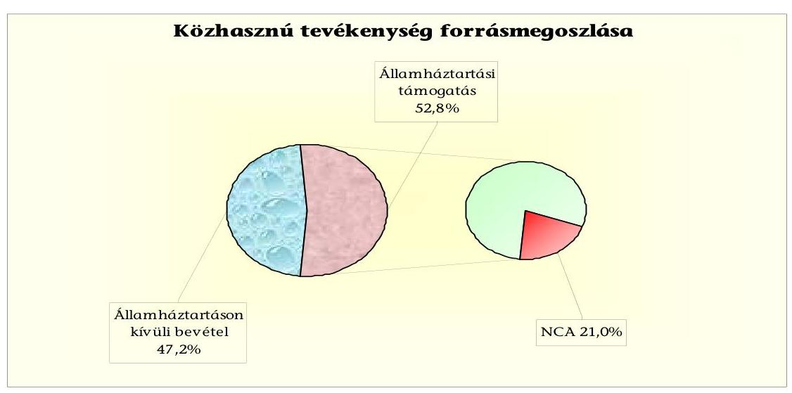
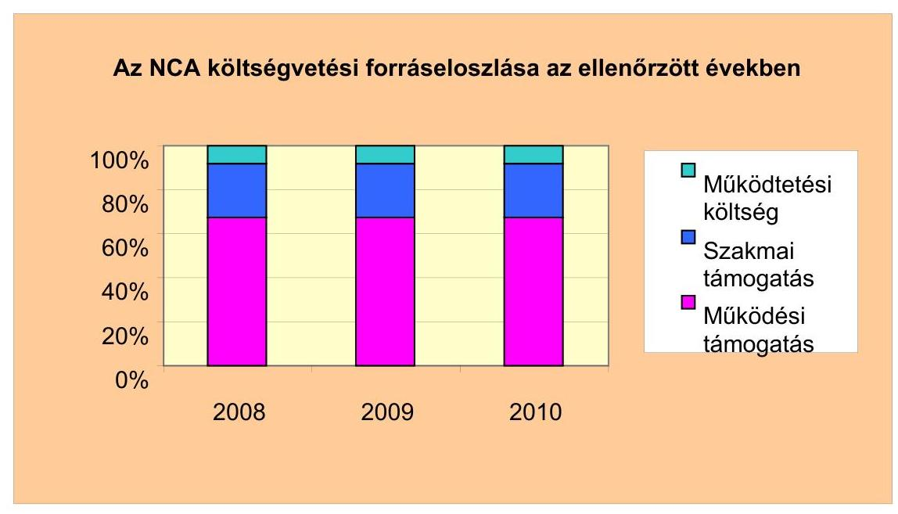
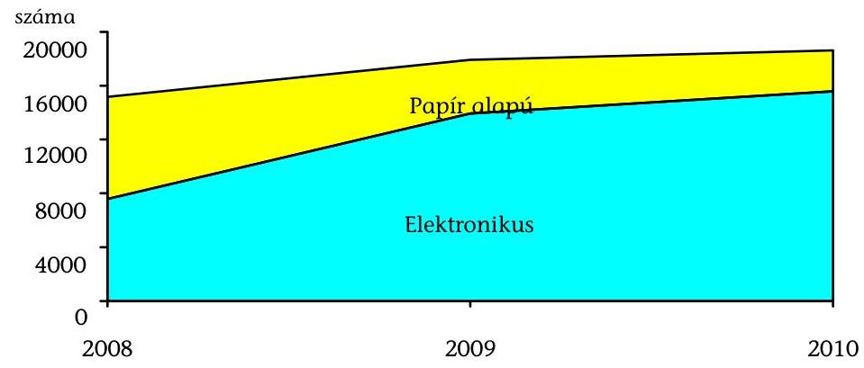
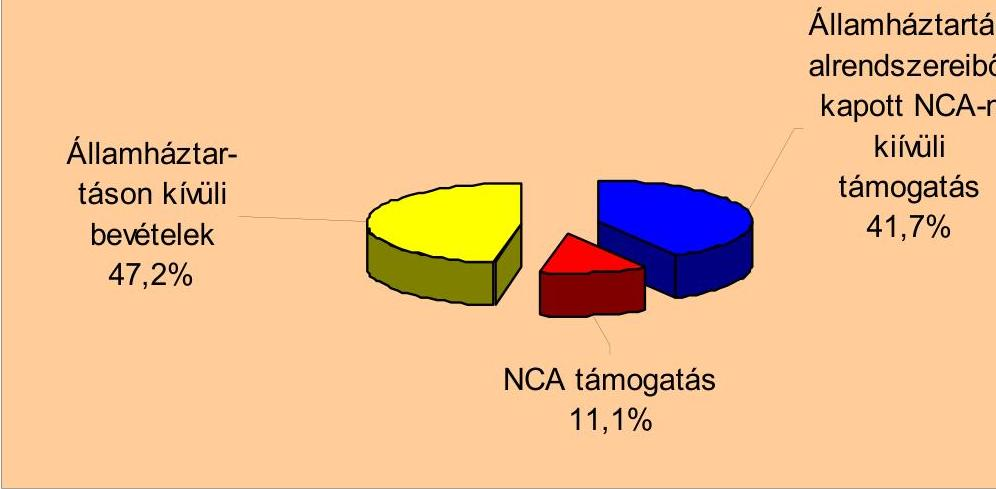
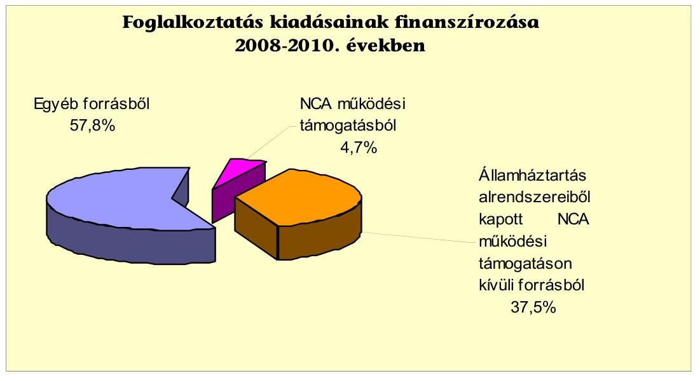
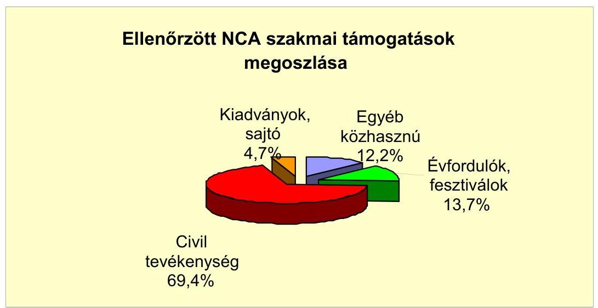
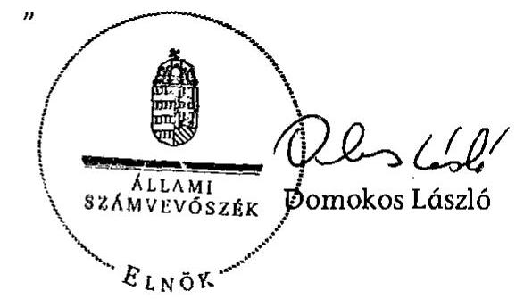
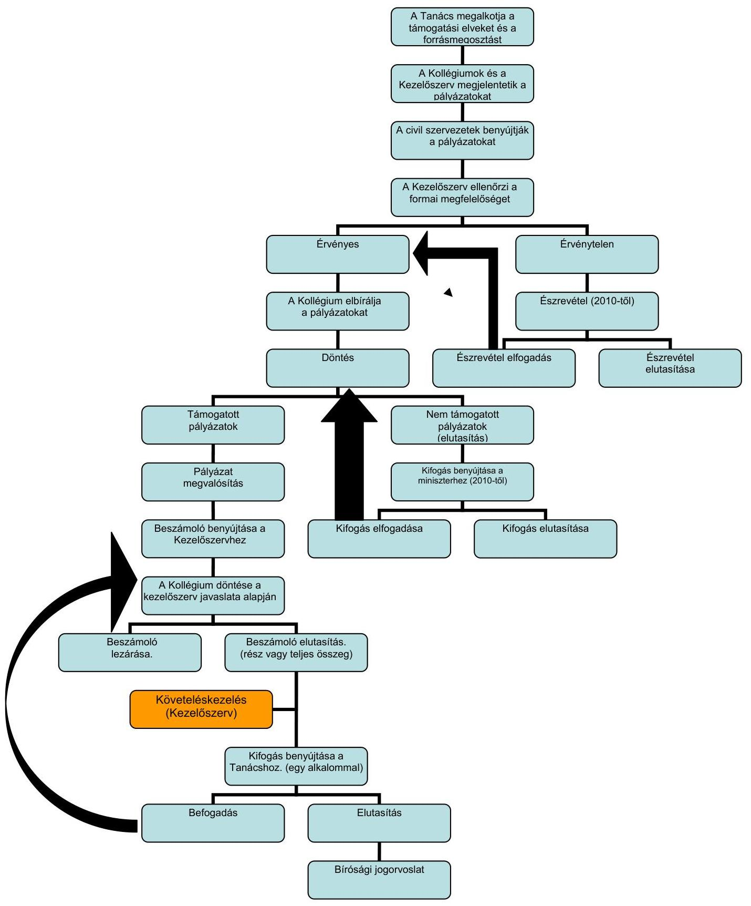

# JELENTÉS 

a Nemzeti Civil Alapprogram múködésének-támogatásának hatásáról, figyelemmel a társadalmi és civil kapcsolatok fejlődésére, egyes kiemelt fontosságú közhasznú feladatok hatékonyabb ellátására

---

# Állami Számvevőszék 

Iktatószám: V-3002-133/2011.
Témaszám: 1010
Vizsgálat-azonosító szám: V-0548

## Az ellenőrzést felügyelte:

Dr. Elek János
főigazgató
Az ellenőrzést vezette:
Horváth Balázs
felügyeleti vezető

## A jelentést összeállították:

## Horváth Balázs

felügyeleti vezető

## Dr. Veress Tiborné

számvevő

## A jelentés összeállításában közremúködtek:

| Baracsi Szilvia   számvevő tanácsos | Szakmányné Bilik Mária   számvevő tanácsos | Vincze B. Róbert   számvevő |
| :-- | :-- | :-- |

## Az ellenőrzést végezték:

| Baracsi Szilvia | Hadnagyné | Dr. Faragóné |
| :-- | :-- | :-- |
| számvevő tanácsos | Papp Ildikó | Tóth Mária |
|  | számvevő | számvevő tanácsos |
| Szakmányné | Tóth István | Dr. Veress Tiborné |
| Bilik Mária | számvevő tanácsos | számvevő |
| számvevő tanácsos |  |  |
| Vincze B. Róbert | Dr. Kuti Éva |  |
| számvevő | szakértő |  |

A témához kapcsolódó eddig készített számvevőszéki jelentések:
címe
sorszáma
Jelentés a Nemzeti Civil Alapprogramból civil szervezeteknek juttatott költségvetési támogatások ellenőrzéséről

---

# TARTALOMJEGYZÉK 

BEVEZETÉS ..... 7
I. ÖSSZEGZŐ MEGÁLLAPÍTÁSOK, KÖVETKEZTETÉSEK, JAVASLATOK ..... 9
II. RÉSZLETES MEGÁLLAPÍTÁSOK ..... 17

1. A szabályozási környezet összhangja, az NCA törvényben megfogalmazott célkitűzések megvalósulása ..... 17
1.1. Az Alapprogram működési szabályozásának értékelése ..... 17
1.2. Az intézményrendszer feladat- és hatásköri megosztása ..... 20
1.3. Az ellenőrzési funkciók, a kontrollmechanizmusok múködtetése ..... 22
2. A kollégiumok által kiírt pályázatok hozzájárulása az NCA törvényben megfogalmazott célokhoz ..... 26
2.1. A pályázati kiírások összhangja az NCA törvénnyel és a Tanács határozataival ..... 26
2.2. Értékelési, döntési szempontrendszer megalapozottsága, hatékonysága ..... 28
2.3. Az indikátorok és monitoring rendszer hiányának hatása ..... 30
2.4. Nyilvánosság követelményei, kötelezettségei ..... 30
3. Az NCA támogatások hasznosulása az ellenőrzött szervezeteknél ..... 32
3.1. A szervezetek tevékenységének elismertsége, forrásszerzési aktivitása ..... 32
3.2. Az államháztartási támogatások összehangoltsága ..... 33
3.3. A múködési támogatás hozzájárulása a folyamatos múködéshez, fenntarthatósághoz ..... 34
3.4. A szakmai támogatás hatása a szervezet tevékenységére ..... 37
3.5. A támogatások elszámolásának és nyilvántartásának szabályossága, ellenőrzése ..... 39
3.6. Az önkéntes munka értékelése ..... 40
4. A támogatási rendszer szabálytalanságai, hiányosságai ..... 41
4.1. Helyszíni ellenőrzéssel feltárt hibák, szabálytalanságok ..... 41
4.2. Dokumentum alapú ellenőrzés során felmerült hiányosságok ..... 44
5. Utóellenőrzési feladatok értékelése ..... 45

---

# MELLÉKLETEK 

1. számú Nemzeti Civil Alapprogram fejezeti kezelésű előirányzat főbb adatai 20082010. években
2. számú Helyszínen ellenőrzött szervezetek jellemző adatai
3. számú Az NCA támogatási rendszere eljárásának folyamatábrája
4. számú A Nemzeti Civil Alapprogram forráselosztásának alakulása 2008-2010. években
5. számú A Civil Szolgáltató, Fejlesztő és Információs Kollégium 2010. évi pályázati kiírásaiban megsértett tanácsi elvek
6. számú Bevételi forrásszerkezet 2008-2010. években az ellenőrzött szervezeteknél
7. számú A helyszínen ellenőrzött civil szervezetek foglalkoztatásának és finanszírozásának adatai
8. számú Szakmai támogatások felhasználása a törvényben meghatározott célonkénti csoportosításban
9/a. számú A dokumentált felhasználás és az elszámolás közötti - a helyszíni ellenőrzés által feltárt - eltérések
9/b. számú Javaslat a támogatások visszafizetésére
10/a. számú A dokumentum alapú ellenőrzés által feltárt eltérések
10/b. számú Figyelem felhívás az elszámolt támogatások helyszíni ellenőrzésének lebonyolítására
9. számú Figyelem felhívás a költségvetési törvényben nevesítve és NCA múködési támogatásban részesült szervezetek helyszíni ellenőrzésének lebonyolítására

---

# RÖVIDÍTÉSEK JEGYZÉKE 

| Jogszabályok |  |
| :--: | :--: |
| Áfa törvény | Az általános forgalmi adóról szóló 2007. évi CXXVII. törvény |
| Áht. | Az államháztartásról szóló 1992. évi XXXVIII. törvény |
| ÁSZ tv. régi | Állami Számvevőszékről szóló 1989. évi XXXVIII. törvény (hatálytalan 2011. június 30-ával) |
| ÁSZ tv. új | Állami Számvevőszékről szóló 2011. évi LXVI. törvény (hatályos 2011. július 1-től) |
| Kh. tv. | A közhasznú szervezetekről szóló 1997. évi CLVI. törvény |
| Knyt. | A közpénzekből nyújtott támogatások átláthatóságáról szóló 2007. évi CLXXXI. törvény |
| NCA törvény | A Nemzeti Civil Alapprogramról szóló 2003. évi L. törvény |
| Önkéntes törvény | 2005. évi LXXXVIII. törvény a közérdekú önkéntes tevékenységről |
| Számv. tv. | A számvitelről szóló 2000 . évi C. törvény |
| Szja tv. | A személyi jövedelemadóról szóló 1995. évi CXVII. törvény |
| 224/2000. (XII. 19.) | A számviteli törvény szerinti egyes egyéb szervezetek be- |
| Korm. rendelet | számoló-készítési és könyvvezetési kötelezettségének sajátosságairól |
| Ámr. régi | 217/1998. (XII. 30.) Korm. rendelet az államháztartás múködési rendjéről (hatálytalan 2009. december 31-étől) |
| Ámr. új | 292/2009. (XII. 19.) Korm. rendelet az államháztartás múködési rendjéről (hatályos 2010. január 1-jétől) |
| Vhr. | 160/2003. (X. 7.) Korm. rendelet a Nemzeti Civil Alapprogramról szóló 2003. évi L. törvény végrehajtásáról |
| 29/2009. (XII. 11.) | 29/2009. (XII. 11.) SZMM rendelet a Nemzeti Civil Alapprogram múködését érintő egyes kérdésekről |
| SZMM rendelet |  |
| Névrövidítések |  |
| ÁSZ | Állami Számvevőszék |
| EPER | Elektronikus Pályázatkezelési és Együttmúködési Rendszer |
| ÉMRMK | Észak Magyarországi Regionális Munkaügyi Központ |
| Ferencvárosi Önkormányzat | Budapest Főváros IX. kerület Ferencváros Önkormányzata |
| Fővárosi Önkormányzat | Budapest Főváros Önkormányzata |
| FVM | Földmúvelésügyi és Vidékfejlesztési Minisztérium (2010. május 25-től Vidékfejlesztési Minisztérium) |
| Kezelő szerv/ESZA | Nemzeti Civil Alapprogram Kezelő szerve/ESZA Társadalmi Szolgáltató Nonprofit Kft. |
| KIM | Közigazgatási és Igazságügyi Minisztérium |
| MEH | Miniszterelnöki Hivatal |
| MEOSZ | Mozgáskorlátozottak Egyesületeinek Országos Szövetsége |
| NCA/Alapprogram | Nemzeti Civil Alapprogram |

---

| NKA | Nemzeti Kulturális Alap |
| :--: | :--: |
| ORTT | Országos Rádió és Televizió Testület |
| SZMM | Szociális és Munkaügyi Minisztérium |
| Tanács | Nemzeti Civil Alapprogram Tanácsa |
| Kollégiumok |  |
| CIV | Civil Szolgáltató, Fejlesztő és Információs Kollégium |
| DARK | Dél-alföldi Regionális Kollégium |
| DDRK | Dél-dunántúli Regionális Kollégium |
| DP | Demokrácia- és partnerség fejlesztési Kollégium |
| EARK | Észak-alföldi Regionális Kollégium |
| EMRK | Észak-magyarországi Regionális Kollégium |
| KDRK | Közép-dunántúli Regionális Kollégium |
| KMRK | Közép-magyarországi Regionális Kollégium |
| NK | Nemzetközi Civil Kapcsolatok és Európai Integráció Kollégium |
| NYDRK | Nyugat-dunántúli Regionális Kollégium |
| ORSZ | Országos Hatókörű Civil Szervezetek Támogatásának Kollégiuma |
| ÖNSZ | Civil Önszerveződés, Szakmai és Területi Együttmúködési Kollégium |
| Vizsgált szervezetek |  |
| CEEweb | CEEweb a Biológiai Sokféleségért |
| CICE | Civil Centrum Közhasznú Alapítvány |
| HÖOK | HÖOK a Hallgatókért Alapítvány |
| IKSZE | Ifjúsági Koordinációs és Szolgáltató Egyesület |
| KMA | Kultúrmúhely Alapítvány |
| Levegő Munkacsoport | Levegő Munkacsoport Szövetség |
| MAKE | Magyarok Közösségépítő Egyesülete |
| MCSASZ | Megálló Csoport Alapítvány a Szenvedélybetegekért |
| MESE | Mozgáskorlátozottak Egymást Segítők Egyesülete |
| MMA | Magyarországi Magiszter Alapítvány |
| MMTE | Magyar Madártani és Természetvédelmi Egyesület |
| MSZHA | Magyar Szegénységellenes Hálózat Alapítvány |
| Nevelők Háza | Nevelők Háza Egyesület |
| NIOK | Nonprofit Információs és Oktató Központ Alapítvány |
| NMKA | Nonprofit Média Központ Alapítvány |
| Ökoszolgálat | Ökoszolgálat Alapítvány |
| RSZ | Rákóczi Szövetség |
| Széna Egyesület | Széna Egyesület a Családokért |
| SZTE | Szó-Tér Egyesület |
| Tanoda | Ferencvárosi Tanoda (Dzsumbuj) Egyesület |
| Telemark | Magyar Telemark és Extrémsport Egyesület |
| Tesz-Vesz | Tesz-Vesz Ifjúsági és Gyermekalapítvány |
| ZCÉKE | Zalai Civil Életért Közhasznú Egyesület |

---

# ÉRTELMEZŐ SZÓTÁR 

| Államháztartás alrend-   szerei | Központi és önkormányzati alrendszerek |
| :--: | :--: |
| Civil szervezetek | Az NCA törvény alapján kedvezményezett társadalmi szervezetek és alapítványok [2003. évi L. NCA törvény] |
| Civil törvénytervezet | A 2011. évi ....törvény az egyesülési jogról, valamint a civil szervezetek múködéséről és támogatásáról (www.kormany.hu honlapon található társadalmi vitára bocsátott törvénytervezet) |
| Dokumentum | A támogatás igénylését, felhasználását alátámasztó hiteles, írásos és tárgyi bizonyítékok (eszközök, kiadványok) |
| Dokumentum alapú ellenőrzés | A támogatásban részesült szervezet által hitelesített dokumentumok alapján történő ellenőrzés, azzal a céllal, hogy azok a pályázati kiírásoknak, valamint a támogatások elszámolására vonatkozó előírásoknak megfeleltek-e. |
| EPER | A pályázati folyamatot támogató informatikai rendszer, ahol a pályázatok internetes benyújtásától a pályázatok lezárásáig a támogatással kapcsolatos információk, valamint a kezelő szervhez benyújtott dokumentumok elektronikus formában naprakészen megtalálhatóak. |
| Érintett pályázat | Döntéshozatalra jogosult kollégiumi tag érdekeltségi körébe tartozó civil szervezet által benyújtott pályázat. |
| Éves korrigált ráfordítás | Közhasznú szervezet esetében az előző évi közhasznú tevékenység ráfordításának az általa támogatások összegével csökkentett adata, nem közhasznú szervezet esetén az alaptevékenység ráfordításának az általa nyújtott támogatások összegével csökkentett adata. |
| Fejezeti kezelésű rendelet | 6/2010. (III. 12.) SZMM rendelet a szociális és munkaügyi miniszter irányítása alá tartozó fejezeti kezelésű előirányzatok felhasználásáról |
| Forrásmegosztás | Az NCA rendelkezésére álló pénzeszközök kollégiumok közötti megosztása. A forrásmegosztás arányainak meghatározása a Tanács döntési jogkörébe tartozik. |
| Indikátor | A támogatás eredményességét mérő mutató, a hasznosulás értékelésének eszköze. |
| Kezelő szervezet feladatai | Az Alapprogram kezelő szervének főbb feladatai: közreműködés az Alapprogram beszámolójának elkészítésében; pályázatok meghirdetésére vonatkozó döntések előkészítése; pályázati kiírásokkal kapcsolatos feladatok ellátása; pályázatok döntéshozatalra történő előkészítése, szerződéskötés a kedvezményezettekkel; támogatások kedvezményezettek részére történő átutalása; támogatások felhasználása jogszerűségének és szakszerűségének ellenőrzése; Alapprogram múködésével összefüggő pénzügyi és számviteli feladatok ellátása; nyilvántartás vezetése a kizárt szervezetekről [Vhr. 12. § (2) bekezdés]. |

---

| Kérdőívek | A 11 kollégium által kitöltött, a tevékenységük értékelésére vonatkozó információkat tartalmazó dokumentumok. |
| :--: | :--: |
| Korábbi ÁSZ jelentés | 0635 számú, a Nemzeti Civil Alapprogramból civil szervezeteknek jutatott költségvetési támogatások ellenőrzéséről készült ÁSZ jelentés |
| Közhasznú szervezetek | Az illetékes bíróság által nyilvántartásba vett közhasznú tevékenységet végző alapítvány, társadalmi szervezet \{1997. évi CLVI. törvény 2. § (1) bekezdés\} |
| Közhasznú tevékenység | A társadalom és az egyén közös érdekeinek kielégítésére irányuló, a szervezet létesítő okiratában szereplő, a közhasznú szervetekről szóló 1997. évi CLVI. törvény 26. § c) pontjában meghatározott cél szerinti tevékenység |
| Monitoring | Az NCA rendszerének folyamatos megfigyelése, adatgyűjtés, elemzés, javaslattétel az esetleges beavatkozásra. |
| Mozgó záradék | A benyújtott elszámolásban szereplő számviteli bizonylat hitelesített másolatán és a helyszíni ellenőrzéskor megtekintett eredeti számviteli bizonylaton a záradék más helyen szerepel (nem hiteles). |
| NCA szervezete | Az NCA szervezetét a Tanács, a kollégiumok, a miniszteri titkárság és a kezelő szerv alkotják. |
| Nonprofit szektor | Nem profitcélok által vezérelt, kormányzattól közvetlenül nem függő, intézményesült szervezetek összessége, amelyek a közjót szolgálják. |
| Országos hatókörű civil szervezet | Az a civil szervezet, mely hitelt érdemlően bizonyítja, hogy a létesítő okirata szerinti tevékenységét legalább hét megyére kiterjedő hatókörrel végzi. |
| Összeférhetetlenség | A közpénzekből nyújtott támogatások átláthatóságáról szóló 2007. évi CLXXXI. törvény 6. § előírása szerint nem indulhat pályázóként és nem részesülhet támogatásban a döntés előkészítésben közremúködő, illetve maga a döntéshozó sem, kizárt közjogi tisztségviselő, az érintettek hozzátartozói és gazdasági érdekeltségei. A kizárt körbe tartoznak azok a szervezetek és alapítványok, amelyek valamely párttal együttmúködési megállapodást kötöttek, közös jelöltet állítottak, vagy amelyek képviseleti szervében valamely párt országgyúlési, önkormányzati vagy európai parlamenti képviselői vesznek részt. \{Továbbá az NCA törvény 7. és 7/A. §-aiban foglaltak.\} |
| Összehangolás | Azonos támogatási célt szolgáló előirányzatok felhasználásának szabályai alá tartozó fejezeti kezelésű előirányzatok. |
| Tanúsítványok | A 211 civil szervezet által kitöltött, a tevékenységük és gazdálkodásuk értékelésére vonatkozó dokumentumok. |
| Támogatási elvek | A Tanács jogszabály által nem szabályozott kérdésekben elvi irányító hatáskörében megalkotott az NCA támogatási rendszere múködésének alapvető szabályai. |

---

# JELENTÉS 

## a Nemzeti Civil Alapprogram múködésének-

támogatásának hatásáról, figyelemmel a társadalmi és civil kapcsolatok fejlődésére, egyes kiemelt fontosságú közhasznú feladatok hatékonyabb ellátására

## BEVEZETÉS

Az Országgyúlés a társadalmi és civil kapcsolatok fejlesztése érdekében a 2003. évi L. törvénnyel (NCA törvény) hozta létre a Nemzeti Civil Alapprogramot (NCA/Alapprogram) azzal a kiemelt céllal, hogy segítse a civil szervezetek társadalmi szerepvállalását, mozdítsa elő az állami és önkormányzati közfeladatok hatékonyabb ellátását. Az NCA múködési-támogatási rendszerének szabályozása az NCA törvényen, a Nemzeti Civil Alapprogramról szóló 2003. évi L. törvény végrehajtására kiadott 160/2003. (X. 7.) Korm. rendeleten (Vhr.), valamint a fejezeti kezelésű előirányzatok felhasználásáról szóló miniszteri rendeleteken alapul. A támogatási rendszer döntésmechanizmusa kétszintű, amelyben a 17 tagú Tanács elvi irányító szerepet tölt be, a 11 kollégiumi testület hivatott dönteni a pályázatok kiírásáról, a támogatások megítéléséről, a pénzügyi és szakmai elszámolások, beszámolók elfogadásáról. Az NCA kezelőszervi feladatokat a vizsgált időszakban az ESZA Társadalmi Szolgáltató Nonprofit Kft. (ESZA) látta el.

Az NCA fejezeti kezelésű előirányzatát meghatározó éves költségvetési törvények 2008. évre 6888 millió Ft, 2009. évre 7700 millió Ft, 2010. évre 7000 millió Ft összeget állapítottak meg. A költségvetések végrehajtásáról elfogadott törvények, illetve a 2010. évi törvényjavaslat előterjesztése alapján az Alapprogram előirányzatából 2008. évben 8580,4 millió Ft, 2009. évben 5631,4 millió Ft, 2010. évben 8632,2 millió Ft támogatást nyújtottak a civil szervezetek részére (1. számú melléklet). A 2008. és 2010. évi eredeti előirányzatot meghaladó teljesítést az előző évi maradvány igénybevétele tette lehetővé.

Az ellenőrzés célja annak értékelése volt, hogy az NCA múködési és szakmai támogatásának rendszerében

- biztosította-e a szabályozási és intézményrendszere, a támogatás elosztása és felhasználásának kontrollja a társadalmi és civil kapcsolatok eredményes fejlődését, a közfeladatok hatékonyabb ellátását;
- megvalósultak-e a támogatott civil szervezeteknél a rendeltetésszerú felhasználás, a közhasznú feladatellátás követelményei;
- érvényesültek-e a nyújtott támogatások szabályszerű engedélyezésének, átláthatóságának jogszabályi előírásai;

---

- hasznosultak-e a támogatások hatékonyságát, ellenőrzöttségét célzó számvevőszéki javaslatok.

Az ellenőrzés az NCA 2008-2010. évek közötti múködésének időszakára terjedt ki. Az ellenőrzés célcsoportját, azok a közhasznú szervezetek képezték, amelyek minden évben, a múködési és szakmai támogatásban egyaránt részesültek (274 civil szervezet, összességében 3609 millió Ft-tal).
Az ellenőrzést 211 civil szervezet tanúsítványi adatainak felülvizsgálatával és kockázatértékelésével alapoztuk meg. A helyszíni ellenőrzésbe vont 30 szervezet a vizsgált időszakban 633,1 millió Ft NCA támogatásban részesült (2. számú melléklet).
Az összehangolás és a többcsatornás finanszírozás múködésének, eredményességének és a szervezetek forrásszerzési aktivitásának értékelése érdekében az egyéb államháztartási támogatások pályázatainak vizsgálatára is kiterjedt az ellenőrzés, összesen 476 millió Ft értékben.
A kezelő szervnél rendelkezésre álló pályázati dokumentációk alapján teljes körűen vizsgáltuk azon szervezetek pályázatait, amelyek az éves költségvetési törvény alapján közvetlenül, nevesítve kaptak múködési támogatást és az NCA honlapja szerint az Alapprogramból múködési támogatásban részesültek (17 pályázat, 13 millió Ft). Továbbá ellenőriztük az elszámolások rendszerét, szabályszerűségét, a kollégiumi döntések és a kezelő szerv helyszíni ellenőrzései során tett megállapítások megalapozottságát ( 364 pályázat, 333 millió Ft).

Az ellenőrzés kiterjedt a fejezeti kezelésű előirányzattal jelenleg rendelkező Közigazgatási és Igazságügyi Minisztériumra (KIM), a Tanács és a kollégiumok múködésére, a kezelői feladatok ellátására, a támogatás célszerű és eredményes felhasználására. A KIM, a Tanács, a kollégiumok és a kezelő szerv kérdőívek és tanúsítványok formájában, valamint interjúk keretében adtak számot az NCA múködéséről, támogatásának rendszeréről. A jelentés összeállításánál figyelemmel voltunk a társadalmi vitára bocsátott Civil törvénytervezetre, továbbá a Nemzeti Civil Alapprogram 2009. és 2010. évi tevékenységéről összeállított miniszteri beszámolóra.

A vizsgálatot az Állami Számvevőszék (ÁSZ) 2011. évi ellenőrzési terve alapján, a számvevőszéki ellenőrzés szakmai szabályai szerint, a teljesítmény - ellenőrzés módszerével végeztük el, amelynek során alkalmaztuk a tanúsítványi adatszolgáltatást, a kérdőíves felmérést, a helyszíni interjúk készítését.
Az ellenőrzésre 2011. június 30-ig az Állami Számvevőszékről szóló 1989. évi XXXVIII. törvény (ÁSZ tv. régi) 2. § (3), (5) - (6) és a 16. § (1) bekezdései, továbbá a közhasznú szervezetekről szóló 1997. évi CLVI. törvény (Kh. tv.) 21. §-a valamint 2011. július 1-jétől hatályos, az Állami Számvevőszékről szóló 2011. évi LXVI. törvény (ÁSZ tv. új) 5. § (2)-(3) bekezdései adtak jogalapot. Utóbbi 38. § (2) bekezdés i) pontja módosította a Kh. tv. 21. §-át.

Az ÁSZ 2006. évben ellenőrizte a Nemzeti Civil Alapprogramból civil szervezeteknek juttatott költségvetési támogatásokat. Az ellenőrzés szabályozási, elszámolási és ellenőrzési rendszerhibákat tárt fel, valamint jogosulatlan támogatás felhasználást állapított meg.

---

# I. ÖSSZEGZŐ MEGÁLLAPÍTÁSOK, KÖVETKEZTETÉSEK, JAVASLATOK 

Az NCA szabályozási és intézményrendszere, a támogatások elosztása és felhasználásának kontrollja, nem biztosította a társadalmi és civil kapcsolatok eredményes fejlődését, nem mozdította elő az állami és önkormányzati közfeladatok hatékonyabb ellátását. Az NCA támogatási céljai pályázói igényekkel való összehangolását az Alapprogram múködése óta nem értékelték, nem vizsgálták felül. A forrásmegosztás aránya az NCA múködésének kezdete óta változatlan annak ellenére, hogy a múködési célú támogatások nem ösztönözték kellően a kedvezményezett szervezeteket az állami forrásoktól függetlenedő, önálló finanszírozás irányába történő elmozdulásra. Az NCA támogatások szabályozása körében nem módosítottak a múködési támogatás alapjának meghatározásán az ÁSZ korábbi javaslata ellenére, továbbra sem vették figyelembe a civil szervezetek területi és tevékenységi hatókörét, szolgáltatási feltételét. A támogatási összeg megítélése során a kisebb költségekkel múködő szervezetek azáltal kerültek hátrányos helyzetbe, hogy kizárólag az éves korrigált ráfordítás arányában alacsonyabb támogatásban részesültek.

Az NCA múködésének szabályozása a közpénzekből nyújtott támogatások átláthatóságáról 2008-ban hatályba léptetett törvénnyel összehangoltan fejlődött. Az átláthatóság fokozása érdekében szabályozták a pályázók által érvényesíthető kifogások kezelését, a jogorvoslati eljárást, a feladatok ellátásához szükséges hatásköri rendet, a beszámolási és nyilvánossági követelményeket. A jogszabály által nem szabályozott kérdésekben a támogatási rendszer múködésének alapvető szabályait a Tanács határozta meg. Nem változtattak kezdetektől az egy civil szervezetnek, egy költségvetési évben nyújtható támogatás 18 millió Ft együttes és 7 millió Ft múködési felső határán, viszont 2010-től a szakmai támogatás mértékét maximálták 11 millió Ft-ban, amely a korábbi években nem volt értékhatárhoz kötve. A Tanács a 2010. évi támogatási elveket egyszerűsítési céllal átstrukturálta. A korábbi, Számv. tv. szerinti költségkategóriákat tartalmazó támogatási elvektől eltérően a Tanács által meghatározott összevont kiadási jogcímek azonban az elszámolások eltérő értelmezésére adnak lehetőséget, amely megnehezíti a szabályszerű elszámolást és az eljárás elhúzódását vonja maga után.

Az NCA intézményrendszerét a választott testületként múködő elvi irányító Tanács és operatív döntéshozó kollégiumok, az NCA múködtetését ellátó kezelő szervezet és a társadalmi és civil kapcsolatokért felelős miniszter által irányított minisztérium alkották. Az NCA egyszemélyi felelőse a fejezetgazda jogosítványokkal rendelkező miniszter, akit az Alapprogrammal kapcsolatos feladatok ellátásában a miniszteri titkárság segített. Az NCA intézményrendszerén belüli szervezetek alá-fölérendeltségi viszony kialakításának hiánya és a kontroll nélküli múködés kockázati tényezőt jelentett. Az NCA szervezete széttagolt, azt a felelősség hozzárendelése nélküli feladatmegosztás és koordinációs hiányosságok jellemzik. A választott testületek rendszeres, háromévenkénti személyi állományi változásához kapcsolódóan nem határozták meg az átadás - átvétel technikai lebonyolítását, eljárás rendjét. Az egymást váltó testületek között dokumentált átadás-átvétel nem volt.

---

A Tanács elvi döntései meghozatala érdekében a testület tagjaiból állandó és alkalmi munkacsoportokat hozott létre. A Tanács elkészítette a támogatási elveket egységbe foglaló NCA stratégiát, a munkacsoportok egy része feladatait nem látta el, elmaradt az indikátorok teljes körű meghatározása, a monitoring rendszerek kialakítása, a szabálytalanságkezelési eljárás kidolgozása, az utólagos ellenőrzés során felmerülő problémák felülvizsgálata. Nem valósult meg a stratégiai célok közül, hogy a kitűzött feladatok teljesülését a Tanács évente követi, szükség szerint értékeli. A támogatások hasznosulásának nyomon követését a szabályozások nem írták elő, nem határozták meg a támogatási célok megvalósulásának szakmai és hatékonysági jellemzői értékeléséhez alkalmazandó szempontrendszert. A szakmai beszámolók előírás hiányában a teljesítmények értékelésére alkalmas mérhető adatokat nem tartalmaztak, a támogatottak által vállalt és megvalósított célok eredményeinek értékelése nem történt meg.

Az NCA támogatási céljaira kiírt szakmai pályázatok nem fedték le teljes mértékben az NCA törvényben megfogalmazottakat. A szakmai pályázatok céljainak meghatározásánál a kollégiumok nem határozták meg, hogy milyen közfeladatokat támogatnak. Az NCA jelenlegi rendszere nem teszi lehetővé a hosszabb távú projektek finanszírozását és az azokhoz való önrész támogatását. Pályázati kiírás a Tanács döntésének megfelelően kizárólag vissza nem térítendő támogatás nyújtására történt, annak ellenére, hogy az NCA törvény biztosította a visszatérítendő támogatási lehetőséget. A támogatási rendszer múködésének hatékonyságát és eredményességét továbbra is gátolta a pályázatok teljes megvalósulásának hosszú időtartama (átlagosan 683 naptári nap), amelyet már a korábbi ÁSZ jelentés is kifogásolt.

A pályázatok bírálati rendszere érdekében 2009-ben kötelezően alkalmazandó bírálati lapot alakítottak ki, amely továbbra sem biztosította annak feltételeit, hogy megítélhető legyen a támogatási igény megalapozottsága és értékelvű differenciálása, a támogatáshoz rendelt - utólagosan ellenőrizhető teljesítményelvárás követelménye. A múködési támogatásokra kiírt pályázatoknál a kollégiumok saját szempontokat érvényesíthettek, a szakmai kollégiumoknak ajánlott indikátorok alkalmazására nem került sor. Ezek hiányából adódóan a szakmai programok eredményessége, hasznossága nem megítélhető. A pályázati kiírásokban nem volt követelmény az azonos pályázati céloknál a konkrét, mérhető, egymással összehasonlítható adatok ismertetése és dokumentálása, melyek hiánya miatt az objektív értékelés feltételeit sem biztosították. A kollégiumok tartalmi bírálat kritériumai között általános, szubjektív szempontok szerepeltek.

Az NCA ellenőrzési funkcióinak összehangolt, rendszerszerű szabályozását a Tanács nem dolgozta ki, nem teremtette meg a támogatási rendszer hatékonyabb múködésének feltételeit. A határozatainak végrehajtását nem ellenőrizte, a pályázati kiírások előzetes kontrollját nem alakította ki, a támogatások hasznosulásának vizsgálatát nem végezte el. A kollégiumi döntés elleni kifogás benyújtására, illetve a kifogást elutasító tanácsi döntés ellen bírósági jogorvoslat kezdeményezésére vonatkozó törvénymódosítás a jogorvoslati kontrollfunkció beépülését eredményezte. A Tanács testületi ellenőrzésének hiányára utalt, hogy a szakmai programok - szerződésben rögzített - előzetes bejelentési kötelezettségét a civil szervezetek nem teljesítették, a közbenső helyszíni vizsgálatokat a kezelő szerv nem folytatta le.

---

A pályázatok befogadása és a támogatások elszámolása során kialakított ellenőrzések a formai szempontokra helyezték a hangsúlyt, amelyek csak részben voltak alkalmasak a hibák kiszűrésére. A kezelő szerv a helyszínen ellenőrzött szerződések 10\%-ánál állapított meg szerződésszegést. A kezelő szervi kontrollok és a Vhr. által lehetővé tett kétszeri hiánypótlás engedélyezése nem eredményeztek jelentős javulást a civil szervezetek elszámolási fegyelmében, mivel a benyújtott beszámolók közül csak minden ötödik felelt meg hiánypótlás nélkül, annak ellenére, hogy a szervezetek évről-évre részesültek múködési és szakmai támogatásban. A hiánypótlások során a kezelő szerv az általa elutasított, a támogatás felhasználásához nem kapcsolható tételek helyett elfogadott a szervezet pénzügyi elszámolásában nem szereplő további új bizonylatokat is. A kezelő szerv hiánypótlásra kialakított gyakorlata sértette az évenként kiadott SZMM rendelet előírásait. A hiánypótlásban benyújtott bizonylatok értékét a szervezet utólagosan rögzítette elkülönített nyilvántartásában és számolta el a támogatás terhére.

A nyilvánosság követelményei az NCA honlapján hiányosan teljesültek. A testületi tagok érdekeltségi körébe tartozó civil szervezetek körét, a beszámolókat, határozatokat és emlékeztetőket nyilvánosságra hozták. A támogatásból kizárt szervezetek listáját rendszeresen közzétették. A tanácsi határozatok változásainak követhetőségét részben biztosították, mivel a hatályos határozatoktól nem különítették el a hatályon kívül helyezetteket. A kollégiumoknál - kettő kivételével - nem biztosították a korábban hozott határozatok közzétételének utólagos ellenőrizhetőségét. A jogszabály részletesen felsorolja azon adatokat, amelyeket közzé kell tenni, azonban nem rendelkezik arról, hogy meddig kell a nyilvánosság számára az elérhetőséget biztosítani, az utólagos ellenőrzéshez dokumentálni.

A helyszínen ellenőrzött szervezetek 2008-2010 között 5714,9 millió Ft bevételből gazdálkodtak, amelynek 52,8\%-a az államháztartás alrendszereiből származott.

Az állami támogatás meghatározó szerepet töltött be a szervezetek tevékenységének finanszírozásában, amely a 2008. évi 810,9 millió Ft-ról 2010. évre 1197,6 millió Ft-ra növekedett, mértéke közel 50\%-os volt. Az ellenőrzött támogatások - köztük az NCA sem - nem estek az Ámr. azonos támogatási célt

---

szolgáló előirányzatok felhasználása szabályainak hatálya alá. Egy szervezetnél sem találkoztunk klasszikus társfinanszírozással megvalósuló szakmai programmal. A szervezetek a szakmai programokat, de még gyakran a múködésüket is több támogatótól elnyert támogatásból fedezték. Az önállóan történő finanszírozás miatt nem vált átláthatóvá a programok tényleges megvalósítási költsége, illetve forrásösszetétele.

Az NCA múködési és szakmai támogatásai 633,1 millió Ft-ot tettek ki, amely az államháztartásból nyújtott összeg $21 \%$-át jelentette. A civil szervezetek közül minden hatodik a vizsgált időszak átlagában legalább 90\%-ban az NCA múködési és szakmai támogatásból fedezte közhasznú tevékenységét, amely nem nyújt garanciát a folyamatos feladatellátásra, fenntarthatóságra. A támogatási rendszer hiányosságának tulajdonítható, hogy a szervezetek több millió forintos támogatáshoz úgy juthattak, hogy a pályázatok elbírálásánál nem volt előírás a stabil múködés feltételeinek vizsgálata. Az NCA-ból „élő" civil szervezetek közül kettőnél tapasztalta az ellenőrzés, hogy a székhelye nem alkalmas a létesítő okiratban foglalt tevékenység (sport, oktatás és szakképzés, kulturális, természet- és környezetvédelem) ellátására, nem biztosítja a szervezet múködésének, szolgáltatásai igénybevételének nyilvánosságát, látogathatóságát.

A múködési támogatások nem töltöttek be meghatározó szerepet a civil szervezetek humán erőforrásának finanszírozásában, mivel az összes személyi kiadásnak mindössze 4,7\%-át fedezték. Az alkalmazottakat elsősorban a szakmai feladatok ellátására foglalkoztatták, csak hat szervezetnél alkalmaztak gazdasági szakembert a pénzügyi, számviteli feladatok ellátására. A foglalkoztatottak képesítése, iskolai végzettsége a szervezeteknél ellátott munkaköri feladatoknak megfelelt. A támogatások korlátozott lehetőséget adtak az eszközbeszerzésekre, informatikai fejlesztésekre, így mindössze 7 millió Ft-ot fordítottak erre, amely a támogatások mindössze $4,8 \%$-át tette ki. A tartós elhelyezés biztosításához a múködési hellyel kapcsolatban felmerült közüzemi és bérleti díjakat, javítási és karbantartási költségeket számolták el, melyre a múködési támogatások $51,3 \%$-át fordították a szervezetek.

A szakmai támogatásokból megvalósult programok közül a határon túli magyarsággal kapcsolatos tevékenység, valamint a környezetvédelmi projektek kapcsolódtak közvetlenül a közhasznú feladatokhoz, azok folyamatos ellátásához. A programok és a létesítő okiratokban rögzített tevékenységek összhangban voltak. A szervezetek a széleskörű tevékenység megjelölésével - a múködési (személyi és tárgyi) feltételek hiányában - formálisan is megalapozhatták támogatási igényüket, bizonyítani tudták a támogatások elszámolása során a célszerinti felhasználást. A civil szervezetek 2008-2009-2010. évi személyi jövedelemadó bevalláshoz kapcsolódó, egy százalékos felajánlásra vonatkozó kampány lebonyolítására kiírt, 386 millió Ft-tal támogatott szakmai programok közvetlen hatást nem fejtettek ki a támogatott szervezetek tevékenységére. A program, civil szervezetek forrásbővítő hatásáról értékelés nem készült, annak eredményességét alátámasztó adatokkal sem a Tanács, sem a kollégium nem rendelkezett. Az NCA támogatásból a kampányra fordított összeg a közfeladatok teljesítésére szánt forrásokat csökkentette.

A számviteli rendszer a szervezeti múködés átláthatóságának alapfeltétele, amely biztosítja a támogatások elszámolásának és nyilvántartásának szabá-

---

lyosságát, ellenőrizhetőségét. Az NCA-ból támogatott civil szervezetek nem olyan számviteli, szabályossági kontroll alatt múködnek, mint az államháztartási alrendszerbe tartozó költségvetési szervek. A szervezetek közhasznúsági jelentéseinek tartalma és szakmai megalapozottsága eltérő volt, nemzetgazdasági szintű összegzésre nem alkalmasak. A közhasznúsági jelentések szabályozás hiányában nem tartalmazták az önkéntes munka értékét, azt eltérő módon értelmezték, különösen annak hozzáadott értékét a szervezet tevékenységéhez. A vizsgált szervezetek rendezvényeik, programjaik lebonyolításába, illetve adminisztratív feladataik ellátásába vontak be önkénteseket.

Szabályozási és ellenőrzési hiányosságokra vezethető vissza, hogy a számvevőszéki ellenőrzés az eredeti bizonylatok, bemutatott dokumentumok és benyújtott pénzügyi elszámolások felülvizsgálata eredményeként összesen 19549 ezer Ft összegű eltérést állapított meg. Az eltérésből közel 10 millió Ft teljesítése nem volt dokumentált, mintegy hatmillió Ft elszámolása nem felelt meg a jogszabályoknak, a fennmaradó összeg felhasználása eltért a céltól és szerződéses előírástól. Három szervezet 1249 ezer Ft-ot visszafizetett és 1248 ezer Ft támogatás elszámolását a támogatóval történt egyeztetés alapján az ellenőrzés elfogadott. Az NCA-ból kapott támogatásokon belül a szabálytalanul elszámolt és felhasznált összegek aránya a helyszíni körben 16,6\%, a dokumentum alapú ellenőrzési körben $11 \%$ volt. A visszafizetendő támogatási összeg az NCA-nál 9253 ezer Ft, Közigazgatási és Igazságügyi Minisztériumnál 520 ezer Ft, Honvédelmi Minisztériumnál 148 ezer Ft, Vidékfejlesztési Minisztériumnál 36 ezer Ft, Székesfehérvár Megyei Jogú Város Önkormányzatnál 632 ezer Ft, Budapest Fővárosi IX. kerület Ferencváros Önkormányzatnál 23 ezer Ft és Ökotárs Alapítványnál 482 ezer Ft.

A pénzügyi elszámolások alapján az ellenőrzés 5958 ezer Ft összegben tárt fel eltérést. A támogatási szerződések pénzügyi elszámolásainak, szakmai beszámolóinak kezelő szervi helyszíni ellenőrzéssel történő megerősítése indokolt, mivel a kezelő szervnél rendelkezésre álló dokumentumok alapján nem volt egyértelmúen megállapítható a támogatási cél teljesítése. Hasonlóan nem volt megállapítható a benyújtott dokumentumok alapján az NCA törvény azon előírásának érvényesülése, hogy a költségvetési törvény alapján nevesített támogatásban részesült szervezet múködési támogatásra nem jogosult. Az ellenőrzés 13100 ezer Ft támogatás felülvizsgálatát tartja indokoltnak, mivel a számvevőszéki ellenőrzés nem tudott meggyőződni arról, hogy az NCA törvény hatályos előírásai érvényesültek-e.

A civil szervezetek gazdálkodásában - a számszerűsített hibákon túlmenően - számos törvénysértést tapasztaltunk. A Számv. tv-ben előírt szabályzatokkal nem rendelkeztek, a bizonylati elvet és fegyelmet nem érvényesítették a könyvvezetésben nem biztosították a közpénzek felhasználásának átláthatóságát. A Kh. tv-ben meghatározott közzétételi kötelezettség a szervezetek egynegyedénél nem teljesült, a közhasznúsági jelentésekben a támogatásokat nem mutatták be támogatónként és célonként.

Az állami támogatások rendelkezésre bocsátásának elhúzódása miatt három szervezet kölcsön felvételére szorult, amelynek fedezetéül az államháztartásból nyújtott költségvetési támogatást jelölték meg. A Kh. tv. értelmében a közhasznú szervezet „az államháztartás alrendszereitől kapott támogatást hitel fedezetéül, illetve hitel törlesztésére nem használhatja fel".

---

A MAKE elnök személyes felelősségét állapítottuk meg a pénztárosi és pénzkezelési feladatokkal kapcsolatban, mivel a készpénz átvételi elismervények és az elszámolási dokumentációk nem bizonyítják, hogy az elnök által házi pénztárból felvett készpénzt a szervezet által igénybe vett szolgáltatások kiegyenlítésére használta fel. Az elnök pénzkezelési szabálytalanságokkal kapcsolatos felelőssége vonatkozásában az ÁSZ jelzéssel élt az ügyészség felé, amely alapján elrendelték a nyomozást.

A korábbi ÁSZ jelentés javaslataira megküldött intézkedési tervek ellenére a számvevőszéki javaslatok késedelemmel vagy egyáltalán nem teljesültek. A szociális és munkaügyi miniszter nem gondoskodott a monitoring rendszer kidolgozásáról, a Tanácsra és a kezelő szervre átruházott feladatok végrehajtásáról. A Tanács hatáskörében meghatározta a múködési támogatás terhére elszámolható költségek körét, de a múködési és szakmai támogatási célok közötti átfedéseket nem szüntették meg, a múködési támogatások összeghatáráról szóló támogatási elvet nem módosították. 2009-ben határoztak az egységes bírálati lap használatáról, 2010-ben előírták az egységes bírálati szempontokat. Az NCA monitoring rendszerét nem alakították ki, nem teljesítették az ÁSZ korábbi javaslatára elkészített SZMM intézkedési tervben 2007. március 31-re meghatározott feladatot.

A számvevőszéki ellenőrzéssel feltárt szabálytalanságok és rendszerhibák, valamint az NCA törvényben megfogalmazott célok teljesítésének elmaradása a rendszer új intézményi és szabályozási alapokra helyezését indokolja. A feltételeket a készülő Civil törvényben, illetve a végrehajtási rendeletekben lehetne megteremteni, különös figyelemmel az átláthatóság, az elszámoltathatóság és az ellenőrizhetőség követelményeire.

# Az ellenőrzés intézkedést igénylő megállapításai és javaslatai: 

Az Állami Számvevőszékről szóló 2011. évi LXVI. törvény 33. § (1) bekezdésében foglaltak értelmében a jelentésben foglalt megállapításokhoz kapcsolódó intézkedési tervet köteles az ellenőrzött szervezet vezetője összeállítani és azt a jelentés kézhezvételétől számított harminc napon belül az ÁSZ részére megküldeni. Amennyiben az intézkedési tervet határidőben nem küldi meg a szervezet, vagy az nem elfogadható, az ÁSZ elnöke a hivatkozott törvény 33. § (3) bekezdés a)-b) pontjaiban foglaltakat érvényesítheti.

## a közigazgatási és igazságügyi miniszternek

A számvevőszéki ellenőrzés az eredeti bizonylatok, bemutatott dokumentumok és benyújtott pénzügyi elszámolások felülvizsgálata eredményeként 520 ezer Ft összegű, szabálytalan felhasználásból, elszámolásból adódó eltérést állapított meg.

Javaslat:
Intézkedjen a szabálytalanul felhasznált, illetve elszámolt támogatás visszafizetésére.

---

# az NCA Tanács elnökének 

1. A Tanács a 2010. évi támogatási elveket egyszerűsítési céllal átstrukturálta. A korábbi, Számv. tv. szerinti költségkategóriákat tartalmazó támogatási elvektől eltérően a Tanács által meghatározott összevont kiadási jogcímek azonban az elszámolások eltérő értelmezésére adnak lehetőséget, amely megnehezíti a szabályszerű elszámolást és az eljárás elhúzódását vonja maga után.

Javaslat:
Módosítsa az összevont kiadási jogcímek alkalmazására vonatkozó támogatási elveket a szabályszerű elszámolások egységes értelmezése érdekében.
2. A Tanács az elvi döntések meghozatala érdekében állandó és alkalmi munkacsoportokat hozott létre. A munkacsoportok egy része feladatait nem látta el, amelyből adódóan elmaradt az indikátorok meghatározása, a monitoring rendszerek kialakítása, a szabálytalanságkezelési eljárás kidolgozása, az utólagos ellenőrzés során felmerülő problémák felülvizsgálata, nem teremtették meg a támogatási rendszer hatékonyabb múködésének feltételeit.

Javaslat:
Tegyen intézkedést a munkacsoportok hatékony és eredményes múködésére, az elmaradt feladatok végrehajtására.

## a Wekerle Sándor Alapkezelő főigazgatójának

A számvevőszéki ellenőrzés az eredeti bizonylatok, bemutatott dokumentumok és benyújtott pénzügyi elszámolások felülvizsgálata eredményeként összesen 9253 ezer Ft összegű, szabálytalan felhasználásból, elszámolásból adódó eltérést állapított meg az NCA támogatásoknál.

Javaslat:
Intézkedjen a szabálytalanul felhasznált, illetve elszámolt támogatások visszafizetésére.

## a vidékfejlesztési miniszternek

A számvevőszéki ellenőrzés az eredeti bizonylatok, bemutatott dokumentumok és benyújtott pénzügyi elszámolások felülvizsgálata eredményeként az egyeztetés után fennmaradt 36 ezer Ft összegű, szabálytalan felhasználásból, elszámolásból adódó eltérést állapított meg.

Javaslat:
Intézkedjen a szabálytalanul felhasznált, illetve elszámolt támogatás visszafizetésére.

---

# a honvédelmi miniszternek 

A számvevőszéki ellenőrzés az eredeti bizonylatok, bemutatott dokumentumok és benyújtott pénzügyi elszámolások felülvizsgálata eredményeként összesen 148 ezer Ft összegű, szabálytalan felhasználásból, elszámolásból adódó eltérést állapított meg.

Javaslat:
Intézkedjen a szabálytalanul felhasznált, illetve elszámolt támogatás visszafizetésére.

## a Székesfehérvár Megyei Jogú Város Önkormányzata jegyzőjének

A számvevőszéki ellenőrzés az eredeti bizonylatok, bemutatott dokumentumok és benyújtott pénzügyi elszámolások felülvizsgálata eredményeként az egyeztetés után fennmaradt összesen 632 ezer Ft összegű, szabálytalan felhasználásból, elszámolásból adódó eltérést állapított meg.

Javaslat:
Intézkedjen a szabálytalanul felhasznált, illetve elszámolt támogatás visszafizetésére.

## a Budapest Főváros IX. kerület Ferencváros Önkormányzata jegyzőjének

A számvevőszéki ellenőrzés az eredeti bizonylatok, bemutatott dokumentumok és benyújtott pénzügyi elszámolások felülvizsgálata eredményeként az egyeztetés után fennmaradt 23 ezer Ft összegű, szabálytalan felhasználásból, elszámolásból adódó eltérést állapított meg.

Javaslat:
Intézkedjen a szabálytalanul felhasznált, illetve elszámolt támogatás visszafizetésére.

## az Ökotárs Alapítvány kuratóriuma elnökének

A számvevőszéki ellenőrzés az eredeti bizonylatok, bemutatott dokumentumok és benyújtott pénzügyi elszámolások felülvizsgálata eredményeként összesen 482 ezer Ft összegű, szabálytalan felhasználásból, elszámolásból adódó eltérést állapított meg.

Javaslat:
Intézkedjen a szabálytalanul felhasznált, illetve elszámolt támogatás visszafizetésére.

---

# II. RÉSZLETES MEGÁLLAPÍTÁSOK 

## 1. A szabályozási Környezet ÖsszhangJa, az NCA TÖRVÉnyben MEGFOGALMAZOTT CÉLKITŰZÉSEK MEGVALÓSULÁSA

### 1.1. Az Alapprogram múködési szabályozásának értékelése

Az Alapprogram múködési kereteit az NCA törvény, a Vhr. és a fejezeti kezelésű előirányzatok felhasználási előírásairól kiadott miniszteri rendeletek szabályozták.

Az NCA törvény 2. § (2) bekezdése a)-d) pontjai rögzítik az Alapprogram bevételeit, amely - a) pontja - a vizsgált időszakban évről évre változott, ennek következménye, hogy a forrásautomatizmus, a támogatások kiszámíthatóságának feltételei nem voltak biztosítva. Az NCA létrehozásakor megalkotott bevétel számítás módszerének változatlanul hagyásával a civil szektor évente közel 3000 millió Ft-tal magasabb támogatásra lett volna jogosult ${ }^{1}$, a csökkenést a nemzetgazdasági szinten beállt forrásszűkítés is befolyásolta.

Adatok: millió Ft-ban

| Megnevezés | 2007. év | 2008. év | 2009. év | 2010. év |
| :-- | :--: | :--: | :--: | :--: |
| Költségvetési törvény szerinti összege | - | 6890 | 7700 | 7000 |
| Eredeti törvényi előirás számításával |  |  |  |  |
| Érvényes nyilatkozatokban felajánlott   összeg | 8750 | 9500 | 10060 | 9970 |

Az NCA-nak 2008-2010. évek között a törvényben engedélyezett jogi személyek, jogi személyiség nélküli szervezetek és természetes személyek önkéntes befizetései, adományai, valamint költségvetési céltámogatások jogcímeken a zárszámadási beszámolók szerint nem származott bevétele.
Speciális adományozási együttműködést írt alá a Tanács 2009-ben a Logisys Rendszerház Kft-vel, amely vállalta, hogy az NCA részére licencdíj mentes Microsoft programokat biztosít 40 millió Ft értékben az NCA múködési költségtámogatásra jogosult civil szervezetek által használt számítógépekre. A támogatottak a programokért fizetett regisztrációs díjat a pályázati útmutató értelmében szolgáltatásként a támogatás terhére számolták el. A Tanács nem követte nyomon az együttműködési megállapodásban rögzítettek teljesítését.

[^0]
[^0]:    ${ }^{1}$ Forrás Nemzeti Adó- és Vámhivatal: Tájékoztató az Országgyűlés Emberi Jogi, Kisebbségi, Civil- és Vallásügyi Bizottsága részére a személyi jövedelemadó $1+1 \%$-áról tett rendelkező nyilatkozatok feldolgozásának 2010. rendelkező évi tapasztalatairól, Budapest, 2011. február

---

Az adomány valós értéke nem ismert, azt az NCA bevételei között nem mutatták ki az NCA törvény 2. § (2) bekezdés b) pontjának megfelelően, mint „jogi személyek, jogi személyiség nélküli szervezetek és természetes személyek önkéntes befizetései, adományai".
Az NCA törvény 2009. január 1-jétől hatályba lépő módosításával megteremtették az összhangot a közpénzekből nyújtott támogatások átláthatóságáról szóló 2007. évi CLXXXI. törvénnyel (Knyt.), részletesen szabályozták a kifogásolások kezelését, továbbá felhatalmazást kapott a Kormány a Vhr. módosítására és a miniszter egyes területek múködésének rendeleti szabályozására (kezelő szerv feladatairól, beszámolók tartalmi elemeiről, nyilvánossággal kapcsolatos részletes szabályokról, Tanács és kollégiumi tagok díjazásáról).

A Vhr. 2008-2010. évek közötti többszöri módosításának keretében a kollégiumi és kezelő szervi feladat- és hatáskörök részletesebbé váltak. Azonban ennek pozitív hatása - a kezelő szerv pályázatokkal kapcsolatos előterjesztés továbbításának rendje, a formai és tartalmi, valamint helyszíni ellenőrzési feladatok rögzítése, a kollégiumok részére rendelkezésre álló idő meghatározása a döntés hozatalra - a gyakorlatban csak részben érvényesült. A teljes eljárás időtartama továbbra sem csökkent, a kezelő szerv ellenőrzési tevékenységének módszere nem változott.

Az NCA rendszerében a teljes megvalósítási időtartam (pályázat benyújtásának időpontjától az értesítés pályázat lezárásáról/inkasszólevél visszavonásig) továbbra is hosszú, amelyet már a korábbi ÁSZ jelentés is kifogásolt. A dokumentum alapú ellenőrzésbe vont pályázatok esetében átlagosan 683 naptári nap, ezen belül azonban előfordult a 800 naptári napon túli átfutási idő is. Mindez a támogatási rendszer múködésének hatékonyságát és eredményességét gátolja (3. számú melléklet).

A kifogás benyújtásával, elbírálásával kapcsolatos eljárási szabályokat a szociális és munkaügyi miniszter irányítása alá tartozó fejezeti kezelésű előirányzatok felhasználásáról szóló 6/2010. (III. 12.) SZMM rendelet állapította meg. A rendelet 26. § (1) bekezdése értelmében „A pályázó a támogatási igény befogadásával kapcsolatos adminisztratív hiba miatt a kezelő vagy lebonyolító szervezethez a pályázat befogadásáról szóló értesités kézhezvételét követő 3 munkanapon belül egy alkalommal - a pályázati azonosítónak, a pályázó szervezet, vagy személy megnevezésének és a benyújtás okának megjelölésével - rövid úton (fax, e-mail) észrevételt nyújthat be".

Az NCA éves tevékenységéről és múködéséről készítendő beszámolók (beszámoló) tartalmi elemeit, nyilvánossággal kapcsolatos részletes előírásokat a 2009. január 1-jei törvénymódosításhoz képest egy éves késéssel önálló rendeletben szabályozták (29/2009. (XII. 11.) SZMM rendelet a Nemzeti Civil Alapprogram múködését érintő egyes kérdésekről).

A jogszabály által nem szabályozott kérdésekben a Tanács jogosult meghatározni az Alapprogram támogatási rendszere múködésének alapvető szabályait.

A Tanács a támogatási elveket és a támogatások kollégiumok közötti forrásmegosztási arányát 2008. és 2009. években december hóban, 2010-ben novemberben határozta meg.

---

A forrásmegosztás aránya a vizsgált időszakban, de lényegében az NCA kezdete óta változatlan. A támogatási előirányzat azonos elveken alapuló forrásfelosztási módszerét a Tanács alakította ki, amelynek során a múködési támogatás kollégiumi kereteit az előző évek adatainak elemzése, a szakmai kollégiumokét egyeztető tárgyalások alapján határozták meg. A forrásmegosztási (alkalmi) munkacsoport feladatát képezte a konkrét arányokat tartalmazó előterjesztés elkészítése, amely alapján a Tanács meghozta az adott évre vonatkozó határozatát.

Az NCA törvény 1. § (3) bekezdésében a civil szervezetek múködési költségeihez való hozzájáruláshoz a rendelkezésre álló költségvetési források legalább hatvan százalékát határozta meg, amely a három év átlagában 67,2\%ban teljesült. A szakmai támogatásokra $24,7 \%$, a múködési kiadásokra $8 \%$ és a készenléti alapra $0,1 \%$ jutott (4. számú melléklet).

A Tanács a 2010. évi támogatási elveket egyszerűsítési céllal átstrukturálta. A korábbi 12 irányelv helyett négy irányelv csoportot határozott meg: általános, múködési, szakmai támogatások és elszámolások részletezésben. A korábbi, Számv. tv. szerinti költségkategóriákat tartalmazó támogatási elvektől eltérően a Tanács által meghatározott összevont kiadási jogcímek az elszámolás során eltérő értelmezésre adnak lehetőséget, amely megnehezíti a szabályszerű elszámolást, az egységes ellenőrzést és az eljárás elhúzódását vonja maga után.

Az egy civil szervezet számára egy költségvetési évben nyújtható támogatás maximális összege az NCA múködésének kezdete óta nem változott, annak mértékét 18 millió Ft-ban, amelyen belül a múködési támogatást 7 millió Ftban, 2010-től a szakmai támogatást 11 millió Ft-ban maximálták. A múködési támogatás alapjának meghatározásán nem módosítottak, nem vizsgálták felül. Az ÁSZ korábbi javaslata ellenére, változatlanul az előző évi korrigált összes ráfordítást veszik alapul, amelyhez kapcsolódóan a támogatás sávos mértékét határozzák meg a civil szervezetek sajátos múködési jellegét (területi és tevékenységi hatókörét) figyelmen kívül hagyva.

---

A támogatás megítélésénél kizárólag az éves ráfordítás arányának figyelembe vétele miatt a kisebb szervezetek alacsonyabb támogatásban részesültek, ezáltal hátrányos helyzetbe kerültek. Azon szervezetek, amelyek éves korrigált ráfordítása magas volt, nagyobb összegű támogatásra váltak jogosulttá.

A Tanács által hozott döntések több esetben nem voltak kellően megalapozottak, azok betartására útmutatást nem adott, ellenőrzését nem dolgozta ki:

- a 2010 évi múködési támogatásoknál nem lehetett kedvezményezett olyan szervezet, amelynek tagjai 50\%-ot meghaladó mértékben profitorientált szervezetek;
- a regionális kollégiumok támogatási összegének legalább 33\%-át, az ORSZnál 12\%-át olyan pályázóknak kell megítélni, „akik az 1,2 millió forintos igényelhető összeg alatt pályáznak";
- a szakmai kollégiumok 2008 évtől a kért összeg 80\%-ánál (2010-től 75\%) kevesebb támogatást nem ítélhettek meg;
- a pályázati határnapokat 2009 évben 180 napban rögzítették (beadás időpontjától a támogatás utalásáig), a beszámolási eljárás rend (beszámoló beérkezésétől a kifogásra meghozott tanácsi döntésig) határnapjait egy hiánypótlást feltételezve ugyancsak 180 napban határozták meg.

A Tanács határozata értelmében a beszámolási eljárás rend (180 nap) határnapjainak be nem tartása esetében a támogatott - amennyiben a késedelem nem a szervezet hibájából következik be - kamattérítésre jogosult. A tanácsi határozat betartására eljárásrendet nem dolgoztak ki, alkalmazására nem került sor. Az EPER-ben a 2008. évi pályázatok között 125 db ( 73 millió Ft), a 2009. éviek között 2230 db ( 1798 millió Ft) a le nem zárt pályázat, amely a 180 napban meghatározott megvalósítási időt jelentősen meghaladja. Ennek okait nem vizsgálták. A múködési és szakmai kollégiumok pályázati kiírásainak, a Tanács támogatási elvekben rögzített kikötéseinek a betartását, a pénzügyi elszámolások értékelését az EPER nem támogatta, azt a kezelő szerv nem ellenőrizte. A Tanács az elvek gyakorlatban való érvényesüléséről információkat nem kért, a kollégiumok és kezelő szerv arról az éves beszámolóiban értékelést nem készített.

Az NCA-ra vonatkozó jogszabályok, valamint a tanácsi határozatok közötti összhangot az ellenőrzés kivételével - némi időeltolódással - megteremtették, ennek ellenére a rendszer hatékony múködéséhez egyes részterületek (pl. tanácsi határozatok kontrollja, nem peres eljárások kezelése) garanciális szabályozása nem történt meg.

# 1.2. Az intézményrendszer feladat- és hatásköri megosztása 

Az NCA intézményrendszere hárompólusú. Egyik a testületek: az elvi irányító Tanács és az operatív döntéshozó kollégiumok. Másik az NCA múködtetését ellátó kezelő szervezet, míg a harmadik a társadalmi és civil kapcsolatokért felelős miniszter által irányított minisztérium. Az NCA egyszemélyi felelőse a fejezetgazda jogosítványokkal rendelkező miniszter, akit az Alapprogrammal kapcsolatos feladatok ellátásában a Titkárság segített.

---

A Tanács az elvi döntések meghozatala érdekében állandó és alkalmi munkacsoportokat hozott létre. Ennek keretében a stratégiai munkacsoport elkészítette az NCA stratégiát, a jogi-ügyrendi munkacsoport az ügyrend, kifogáskezelés, jelenléti ív szabályozását, észrevétel intézménye keretét, valamint a kifogás és panaszkezelési munkacsoport a pályázói kérelmek, jogorvoslati lehetőségek vizsgálatát. A munkacsoportok egy része feladatait nem látta el, elmaradt az indikátorok meghatározása, a monitoring rendszerek kialakítása, a szabálytalanságkezelési eljárás kidolgozása, az utólagos ellenőrzés során felmerülő problémák felülvizsgálata. Mindezek következtében nem alakították ki a Tanács felelősségi körébe tartozó támogatások hasznosulásának és kontrolljának feltételrendszerét.

A Tanács 2009-ben kollégiumi és helyszíni, valamint internetes szakmai viták után elfogadta az NCA Stratégiáját, Esetlegesség helyett Egységesség címmel. A stratégia egységbe foglalta az NCA-ra vonatkozó elveket, továbbá megjelölte a támogatási rendszer hatékonyabb múködése érdekében teendő intézkedéseket. A végrehajtáshoz meghatározták a feladatokat, a határidőket, teljesítésük azonban csak részleges volt. Az éven belül végrehajtandó feladatok közül nem valósultak meg: háromszintú monitoring rendszer bevezetése; kezelő szerv felé irányuló kezdeményezések (elérhetőség, e-adatcsere a kezelő szerv és bíróságok között, pályázói elégedettség mérés); kommunikációfejlesztés; előfinanszírozás; etikai kódex elkészítése; országos hatókör meghatározása; kollégiumi cselekvési tervek megalkotása; új támogatási elvek és kollégiumi feladatleírás. Nem valósult meg azon stratégiai cél sem, hogy a kitűzött feladatok teljesülését évente követi, szükség szerint értékeli a Tanács.

A 2010. évi miniszteri beszámoló is megállapította, hogy „a Tanács adós maradt az érintettség szabályozása és az etikai kódex megnyugtató, átlátható, rendszerszerü megoldásával, amely egyértelmúen az egységes tanácsi álláspont kialakítása kudarcának tudható be".

Az NCA rendszerében kockázati tényező, hogy az egymástól független szervezetek alá-fölérendeltségi viszony kialakítása és kontroll nélkül múködtek, a feladatok nem teljesítése esetén felelősség megállapítására nem került sor.

A 2009. évi harmadik elektori választás szabályszerűen megtörtént, annak eredményeképpen a Tanács teljes mértékben megújult, a kollégiumi elnökök és tagok jelentős része, mintegy $80 \%$-a kicserélődött. A kollégiumok az NCA regionális és civil szakmai szempontok alapján szerveződő operatív döntéshozó szervei, melyeket a miniszter a Tanács egyetértésével hozott létre. Az NCA törvény 5. § (2) bekezdésének megfelelően a miniszter határozta meg a kollégiumok létszámát, mely szerint legalább öt, de legfeljebb 11 tagú kollégiumokat a civil jelöltállítási rendszerben a jogszabályban meghatározott választást követően alakították meg. A miniszter által megbízott testületi tagok mandátuma három évre szól.

A rendszeres, háromévenkénti személyi állományi változáshoz kapcsolódóan nem határozták meg az átadás - átvétel technikai lebonyolítását, eljárás rendjét. Az egymást váltó testületek között dokumentált átadás-átvételi eljárás nem volt.

---

A Civil törvénytervezet a testületi tagok megbízását négy évre tervezi, amelynek célja a stabilitás biztosítása, azonban a felelősségi kérdésekről, a váltásból adódó feladatokról nem rendelkezik. Az alap kezelésének állandóságát önálló központi költségvetési szerv biztosítaná a tervezet szerint.

Az NCA kezelő szervi feladatokat és hatásköröket egyértelműen meghatározták a vonatkozó jogszabályokban, a megállapodásban és a feladatlérásokban. Az ESZA a feladatokat a Civil Szolgáltató Központ hálózat civil irodáinak bevonásával és külső vállalkozókkal látta el, de így sem maradéktalanul. A kezelő szerv a szervezetek által NCA támogatásból készített és megküldött tanulmányokról nyilvántartást nem alakított ki és nem tette közzé, a múködési és a szakmai támogatások tartalmát, a támogatások és a felhasználás hasznosulását nem követte nyomon a feladatlérásában rögzítettek ellenére. Az NCA rendszerében feladat ellátási és ellenőrzési kockázatot jelent a 2011. évi kezelő szervi váltás. A Wekerle Sándor Alapkezelőnél a feladatot ellátó szervezeti egységet alacsonyabb létszámmal hozták létre, a munkatársaknak a folyamatos munkavégzés mellett kell elsajátítani a feladatok ellátásához szükséges speciális finanszírozási és ellenőrzési ismereteket. Mindezeken túl, a kezelő szervet a Vhr. 2011. január 1-jétől, a támogatások szerződés szerinti felhasználásának nyomon követésében, mint közremúködőt is megjelöli.

Az NCA rendszerére alapvetően jellemző a széttagolt, a felelősség hozzárendelése nélküli feladatmegosztás és a koordinációs hiányosságok.

# 1.3. Az ellenőrzési funkciók, a kontrollmechanizmusok múködtetése 

Az NCA intézményrendszerén belüli szervezetek közötti kontrollokat csak részben alakították ki múködésük, nem volt hatékony és eredményes. A Tanács három (Tanács, kollégiumok és pályázó szervezetek) szinten határozta meg az ellenőrzési célokat, módszereket, szempontokat.

A miniszter a 2009. és 2010. évi beszámolójában rámutatott a problémákra, a rendszer átláthatóbb és hatékonyabb múködése érdekében javaslatokat fogalmazott meg. Az NCA 2009. évi tevékenységéről szóló miniszteri beszámolóban a miniszter javasolta, hogy ki kell jelölni a feladatok teljesítésére vonatkozó felelősségrendszert, a szakmai beszámolók alapján be kell mutatni a vállalások teljesülését; átláthatóvá kell tenni a szakmai támogatások tapasztalatait, a hasznosítások eredményeit és a más pályázati forrásokkal történő összehangolás és optimalizálás lehetőségét. A 2010. évi beszámolóban a megoldások lehetséges irányait határozta meg a miniszter, a döntéshozatal rendjének egyszerűsítésében, az Alapprogramból történő kizárás és a támogatások visszakövetelésére irányuló eljárás jogorvoslati rendjének összehangolásában, a közpénzfelhasználás jogszerűbb múködése érdekében az adminisztratív terheket csökkentő folyamatok és eljárási határidők harmonizációjában. A beszámolókban feltárt hiányosságok megszüntetésére a miniszter nem intézkedett.

Az NCA törvény 2009. január 1-jei módosításával lehetőség nyílt a támogatott civil szervezetek részére a támogatásról szóló beszámolójuk elutasítására hozott kollégiumi döntés elleni kifogás benyújtására, illetve a kifogást elutasító tanácsi döntés ellen bírósági jogorvoslat kezdeményezésére.

---

A benyújtó szervezetek közel kétszeres, illetve a kifogások számának másfélszeres növekedése a kifogás, mint „jogorvoslati jellegű intézmény kontrollfunkció" ${ }^{2}$ rendszerú beépülését igazolja.

A Tanács a határozatainak végrehajtását nem ellenőrizte, a kollégiumok összehasonlító elemzését, a pályázó szervezetek vonatkozásában a megítélt források hasznosulásának vizsgálatát nem végezte el, a munkacsoportok által el nem végzett feladatok elmaradása kapcsán intézkedést nem tett. A pályázati kiírások előzetes kontrollját nem alakították ki, a vonatkozó jogszabályok, belső szabályzatok erre vonatkozóan nem írnak elő ellenőrzési jogosítványt (előzetes, utólagos) egyik szervezet, így a Tanács részére sem.

A kezelő szerv az évek során egyre részletesebb segédleteket, útmutatókat dolgozott ki a civil szervezetek szabályszerű elszámolása érdekében, továbbá hozzárendelte az egész pályázati folyamatot támogató EPER informatikai rendszert. A támogatások felhasználásának kezelő szervi ellenőrzésének részletes szabályozására 2010. április 29-étől került sor a Vhr.-ben, ezt megelőzően ezeket a feladatokat miniszteri rendeletek, tanácsi határozatok, megbízási/vállalkozási szerződések és feladatleírások tartalmazták. A Tanács az ellenőrzés alaprendjét 2004. július 6-án alakította ki, melyet évente (éven belül többször is, utolsó módosítás 2009. november 12.) módosított, pontosított.

Az NCA törvény 3. § (1) bekezdésében előírt azon jogosultsági feltételt, hogy a szervezet a létesítő okiratában foglalt tevékenységét ténylegesen foly-tatja-e a kezelő szervezet kizárólag a pályázó nyilatkozata alapján vizsgálta, annak valóság tartalmát a helyszíni ellenőrzések keretében sem ellenőrizték, mely kockázati tényezőt jelent az NCA törvényben megfogalmazott célok teljesítését, a támogatások jogszerűségét, valamint hasznosulását illetően. A szervezetek létesítő okiratukban tevékenységüket nagyon tág körben (8-10 tevékenység) határozzák meg, a pályázatok elbírálása során a tényleges feladatellátás nem ellenőrizhető. A pályázatok befogadása és a támogatások elszámolása során kialakított kontrollok (pl. érvényességi lista, szerződéskötési ellenőrző lista, jóváhagyott tételek listája) a formai szempontokra helyezték a hangsúlyt. Az ellenőrző listák megfelelő sorainak kitöltése a nagy mennyiségű pályázatok és elszámolások miatt mechanikus, adatrögzítési szintű ellenőrzést eredményezett, amely nem volt alkalmas a hibák kiszűrésére.

A múködési és szakmai pályázati kiírások sajátosságainak megfelelő sablonszerződések minden esetben rendelkezésre álltak, azok tartalmazták a Vhr. 9. § (2) és (8) bekezdésében előírtakat (Pl. támogatás célját, folyósításának feltételeit, felhasználási és elszámolási határidőket, szerződésszegés eseteit és szankciót, szerződéstől való elállásra vonatkozó rendelkezéseket) és a 9. § (3) bekezdésében rögzített kötelező mellékleteket (pl. Áfa tv., köztartozásról, pályázati dokumentáció tárolási helyéről nyilatkozat, felhatalmazó levél), az Áht. 122. § (1) bekezdésben előírt ellenőrzéstűrési kötelezettség megsértése esetén alkalmazandó szankciókat.

[^0]
[^0]:    ${ }^{2}$ A számvevői jelentésre tett KIM javaslati megfogalmazás.

---

A szerződések a kollégiumi döntésekkel összhangban többek között tartalmazták a szerződés tárgyát, célját, összegét, a támogatás folyósítását, felhasználását és a támogató egyéb kikötéseit.

A Tanács határozata értelmében 2008 évtől a szakmai pályázatok támogatási szerződéseiben kötelező előírás, hogy a kedvezményezettnek a látogatható program, rendezvény lebonyolítása esetén legalább 15 nappal a program, rendezvény előtt értesíteni kell a kezelő szervet a pontos helyszínről, időpontról. E határozat betartását alátámasztó adatok nem álltak rendelkezésre, az EPER alkalmazásával küldött értesítések utólag nem hívhatók le a rendszerből. A Tanács a határozatának a gyakorlatban való végrehajtását nem ellenőrizte.

A kezelő szerv a programokról, rendezvényekről a támogatottak részére szerződésben előírt adatszolgáltatási kötelezettség teljesítését nem ellenőrizte, arról nyilvántartást nem vezetett, annak ellenére, hogy a támogatási szerződés értelmében a kedvezményezett, amennyiben az abban rögzített határidőket elmulasztja szerződésszegést követ el. A kezelő szerv a Tanács határozatában foglalt közbenső helyszíni ellenőrzést nem folytatott, a civil szervezetek program és rendezvény esetére előírt előzetes időpont bejelentése alapján sem.

A szakmai programok közbenső ellenőrzési lehetőségével a kezelő szerv nem élt, a programok tényleges megvalósítását a helyszínen nem ellenőrizte. Az utólagos elszámolás keretében benyújtott bizonylatok teljes bizonyossággal nem alkalmasak egy szakmai program tényleges megvalósításának alátámasztására. A kezelő szervi beszámolók alapján a dokumentum alapú pénzügyi elszámolások leggyakoribb hibái rendre megismétlődtek: nem megfelelő záradékolás, hitelesítés, pénzügyi teljesítést igazoló bizonylatok hiánya, kifizetésekhez kapcsolódó szerződések hiánya, támogatási időszakon kívüli költségek elszámolása.

A kezelő szerv a vizsgált időszakban több mint 2300 utólagos helyszíni ellenőrzésről adott számot az éves beszámolójában, amelyek 10\%-ánál állapított meg szerződésszegést. A feltárt hibák, hiányosságok mértéke a helyszíni ellenőrzések fokozotabb alkalmazását indokolják. Az ellenőrzött szervezeteket a helyszíni ellenőrzésről előzetesen értesítették. Ennek ellenére a hiánypótlások keretében olyan dokumentumok (munkaszerződés, kiküldetési rendelvény, bankszámla kivonat, teljesítésigazolások) utólagos bemutatását is lehetővé tették, amelyeknek a szervezet székhelyén rendelkezésre kellett volna állnia.

Az elszámolási hibák jelentős része, a helyszíni ellenőrzés keretében volt feltárható: eredeti bizonylaton záradékolás hiánya, nem hiteles mozgó záradék alkalmazása, elkülönített számviteli nyilvántartás hiánya, szabálytalan vezetése, kötelezően feltüntetendő arculati elemek, szerződéstől eltérő célú felhasználás. A hibás vagy hiányos szakmai beszámoló és pénzügyi elszámolás esetén a szabályozási háttér kétszer 15 napos határidővel hiánypótlásra ad lehetőséget. Az eljárás során a hiánypótlásokon túl, észrevételezésre, kifogás benyújtására van lehetőség, a kezelő szerv részletes segédletet, útmutatót, személyes konzultációkat biztosított. A civil szervezetek elszámolási fegyelmében jelentős javulás nem volt, 2009-ről 2010-re mindössze 6,6 százalékponttal nőtt a hiánypótlás nélkül jóváhagyott beszámolók aránya, ráadásul az olyan beszámolók aránya is emelkedett, amelyeket csak két hiánypótlás után lehetett elfogadni.

---

| Év | Hiánypótlás nélkül jóváhagyott beszámoló |  | Egy hiánypótlással jóváhagyott beszámoló |  | Két hiánypótlással jóváhagyott beszámoló |  | Összesen   (db) |
| :--: | :--: | :--: | :--: | :--: | :--: | :--: | :--: |
|  | db | \% | db | \% | db | \% |  |
| 2009. | 1879 | 20,6 | 4744 | 52,1 | 2490 | 27,3 | 9113 |
| 2010. | 2487 | 27,2 | 3802 | 41,7 | 2840 | 31,1 | 9129 |

A benyújtott pénzügyi elszámolások és szakmai beszámolók átlagosan egy-egy alkalommal szorultak hiánypótlásra, annak ellenére, hogy ezek a szervezetek évről-évre részesültek múködési és szakmai támogatásban. A hiánypótlások során a kezelő szerv az általa elutasított, a támogatás felhasználásához nem kapcsolható tételek helyett elfogadott a szervezet pénzügyi elszámolásában nem szereplő további új bizonylatokat is. A mindenkor hatályos fejezeti kezelésű előirányzatok felhasználását szabályozó SZMM rendelet, valamint a támogatási szerződés alapján a támogatott kötelezettsége a támogatás felhasználásáról elkülönített analitikus nyilvántartást vezetni. A kezelő szerv hiánypótlásra kialakított gyakorlata sértette az évenként kiadott SZMM rendelet előírásait. A hiánypótlásban benyújtott bizonylatok értékét a szervezet utólagosan rögzítette elkülönített nyilvántartásában és számolta el a támogatás terhére.

A kezelő szervi ellenőrzési tapasztalatok alapján, a szociális és munkaügyi miniszter irányítása alá tartozó fejezeti kezelésű előirányzatok felhasználásáról szóló 6/2010. (III. 12.) SZMM rendeletben szabályozva 2010-től a kötelezettségvállaló eltekinthetett a támogatási összeg legfeljebb húsz százalékának mértékéig - amelynek összege elérhette az 1,3 milliárd forintot - az egyenként tízezer forint bruttó összeget meg nem haladó támogatás tartalmú számviteli és az ahhoz kapcsolódó bizonylatok másolatának becsatolásától.
„10.000 Ft bruttó összeget meg nem haladó támogatás tartalmú számviteli bizonylatok:

- A teljes jóváhagyott támogatási összeg 20\%-ának mértékéig (azaz a maradvánnyal kiegészített támogatási összeg is beletartozik),
- Az egyenként 10.000 Ft bruttó összeget meg nem haladó támogatás tartalmú számviteli bizonylatok és az ahhoz kapcsolódó pénzügyi teljesítést (kifizetést) igazoló bizonylatok és egyéb dokumentumok hitelesített másolatait nem kell benyújtani.
- Mind a szakmai, mind a múködési pályázatok esetében alkalmazható."

A kezelő szerv és a civil szervezetek munkáját könnyítő, egyszerűsítő valamint költség takarékos eljárás eredményessége a 2010. évi elszámolások feldolgozását követően, az eredeti bizonylatok záradékolási és megőrzési kötelezettségének teljesítése kizárólag a kezelő szervi helyszíni ellenőrzések tapasztalatai alapján értékelhető. Az ellenőrzés megítélése szerint, a közpénzek felhasználásának átláthatóságára, a támogatások szabályszerű elszámolásának hatékony ellenőrzésére, továbbá a költség-haszon elv érvényesülésére a szabályozás nem nyújtott garanciát. Az SZMM rendeletet 2011. szeptember 4-től a Nemzeti Erőforrás Minisztérium költségvetési fejezethez tartozó fejezeti kezelésű előirányzatok 2011. évi felhasználásának szabályairól szóló 54/2011. (IX. 1.) NEFMI rendelet 26. §-a hatályon kívül helyezte.

---

# 2. A kollÉGIUMOK ÁltAl Kiírt PÁlyÁZATOK HOZZÁJÁRULÁSA AZ NCA TÖRVÉNYBEN MEGFOGALMAZOTT CÉLOKHOZ 

### 2.1. A pályázati kiírások összhangja az NCA törvénnyel és a Tanács határozataival

Az NCA törvény a múködtetés kivételével, tíz támogatási célt jelöl meg, amelyek pályázói igényekkel való összehangolását az Alapprogram múködése óta nem vizsgálták felül, ebből fakadóan 2003. óta változatlan.

A támogatási célok elsősorban a civil társadalom erősítését, az együttműködési feltételek javítását, a civil kapcsolatok fejlesztését szolgálták. A szakmai pályázatok céljainak meghatározásánál a kollégiumok nem határozták meg, hogy milyen közfeladatokat támogatnak.

A vizsgált időszakban kiírt szakmai pályázatok céljai nem fedték le - korábbi ÁSZ jelentésben is már jelzett - teljes mértékben az NCA törvényben megfogalmazottakat. E célokhoz kapcsolódó pályázati kiírások elmaradása forrás és konszenzus hiányra, továbbá az NCA éves finanszírozási rendszerére vezethető vissza. Pályázati kiírás adományosztó szervezeteknek szóló juttatásra forrás hiányában, a civil érdekképviseleti támogatásra konszenzus hiányában nem került sor.

Az NCA támogatási rendszere nem teszi lehetővé a hosszabb távú projektek finanszírozását, illetve az azokhoz való önrész támogatását, amelyre a civil szervezetek részéről leginkább igény lenne. Az NCA törvény 11. § (1) bekezdése értelmében az NCA terhére vissza nem térítendő, illetve részben vagy egészben visszatérítendő formában nyújtható a támogatás. Az NCA-ból 2004. évtől kezdődően Tanácsi döntés alapján kizárólag vissza nem térítendő támogatást nyújtottak.

A Civil törvénytervezet már két éves kötelezettségvállalással számol. Továbbá meghatározott éves bevétel függvényében várhatóan kizárólag visszatérítendő támogatásra lesznek jogosultak a szervezetek.

## A vizsgált időszakban a kollégiumok által kiírt pályázatok az NCA törvény előírásaival és a Tanács támogatási elveivel, egy kollégium kivételével összhangban voltak.

A szakmai pályázatoknál 2010-től a Tanács a kiírandó pályázati célokhoz konkrét keret összeget is meghatározott. A kollégiumoknak a pályázati kiírásukat a megjelenést megelőzően nem kellett megküldeni jóváhagyás céljából a Tanács részére. A Tanács 2010. évi támogatási elveit a Civil Szolgáltató, Fejlesztő és Információs Kollégium (CIV) a 2010. évi pályázati kiírásnál megsértette, mind a keretösszeg, mind a célok megjelölésében. A Tanács az elv megsértését a pályázat kiírásakor észlelte, megállapításait megtette, azonban kifogást nem emelt, egyéb intézkedést sem tett.

Így a pályázatok lebonyolítása a gyakorlatban a tanácsi elvtől részben eltérő pályázati kiírások szerint történt (5. számú melléklet).

---

Az NCA törvény 3. § (3) bekezdésében 2008-ban, 2009-2010. években változó módon szabályozta a költségvetési törvény alapján nevesített támogatásban részesült szervezetek NCA támogatásra való jogosultságát, amellyel összhangban a múködési kiírások módosultak.

A 2008. 12. 31-ig: „nem jogosult az Alapprogram müködési támogatására az a civil szervezet, amely a tárgyévben a költségvetési törvény alapján közvetlenül, nevesítve részesül müködési támogatásban az állami költségvetésböl."

A 2009.01.01-2010.12.31 között: „nem jogosult az Alapprogramból müködési támogatásra az a civil szervezet, amely a pályázat kiírásának évében a költségvetési törvényben nevesítve részesül támogatásban a központi költségvetésből, és a támogatást az erről szóló támogatási szerződés szerint müködési célra kapja."

Az NCA támogatási rendszerében fejlődést jelentett, hogy a pályázatok, elszámolások papír- és/vagy elektronikus úton is benyújthatók, melynek következtében az elektronikusan benyújtott pályázatok aránya 2008. évi 49,4\%-ról, 2010-re 83,7\%-ra emelkedett.

Az NCA pályázatok kezelését 2007-től elektronikus pályáztatási rendszer, az EPER támogatja.

A papír alapú és elektronikusan benyújtott pályázatok száma a vizsgált időszakban az alábbiak szerint alakult:

A múködési pályázati kiírásokra beérkezett és nyertes pályázatok száma 2010ben 2008. évhez képest $25,9 \%$-kal, illetve $22,9 \%$-kal emelkedett. A szakmai pályázati kiírásokra 2010-ben az előző évhez képest a beérkezett pályázatok száma csökkent, mintegy $10,4 \%$-kal, ugyanakkor az igényelt támogatási összeg $8 \%$-kal növekedett.

A múködési pályázati kiírásokkal ellentétben a szakmai pályázati kiírásokra az évente beérkezett pályázatoknak mintegy 67-77\%-át utasították el a vizsgált időszakban, így 2008-ban 33\% és 2009-ben 30\% volt a nyertes pályázók aránya, 2010-ben pedig mindössze 23\%.

---

A 2010. évi miniszteri beszámoló is a rendszer alapkérdésének tartja - „a pályázók számának folyamatos növekedése és a támogatási igények magas szintje miatt azt, hogy hogyan lehetséges a megvalósított szakmai segítségnyújtás mennyiségi fejlesztésén túl a minőségi fejlődést célzó pályázati kiírások megvalósitása".

| Megnevezés | Adatok: millió Ft-ban |  |  |  |  |  |  |
| :--: | :--: | :--: | :--: | :--: | :--: | :--: | :--: |
|  | 2008. év |  | 2009. év |  | 2010. év |  | Összesen |
|  | Müködési | Szak-   mai | Müködési | Szak-   mai | Müködési | Szak-   mai |  |
| Igényelt   támogatás | 15798 | 8921 | 17577 | 9746 | 19384 | 9263 | 80689 |
| Megítélt   támogatás | 4815 | 1818 | 5310 | 1973 | 4703 | 1611 | 20230 |
| Igényelt/   Megítélt \% | 328 | 491 | 331 | 494 | 412 | 575 | 399 |

A vizsgált időszakban a múködési pályázati kiírásokra évente több mint 11 Mrd Ft-tal magasabb támogatásigény érkezett be, amely a ténylegesen felosztható források mintegy háromszorosa, míg a szakmai pályázati kiírások esetében a támogatásigény a felosztható forrásokat évente több mint 7 Mrd Ft-tal haladta meg, amely a ténylegesen felosztható források mintegy ötszörösét jelentette.

# 2.2. Értékelési, döntési szempontrendszer megalapozottsága, hatékonysága 

Az ÁSZ korábbi javaslatára a Tanács az egységes bírálati rendszer kialakítása céljából 2009. évben a kollégiumok részére kötelezően alkalmazandó bírálati lapot alakított ki, amely továbbra sem teremtette meg annak feltételeit, hogy megítélhető legyen a támogatási igény megalapozottsága és értékelvű differenciálása, a támogatáshoz rendelt - utólagosan ellenőrizhető teljesítményelvárás követelménye (indikátor). Tovább pontosították 2011-re a bírálati szempontokat és meghatározták az értékelés során maximálisan adható pontszámokat.

A múködési támogatásokra kiírt pályázatokra vonatkozó tartalmi bírálati szempontokat a kollégiumok a bírálatok során saját szempontjaikkal is kiegészítve alkalmazták, így az ORSZ és az EARK-nál a szakmai beszámolóhoz indikátorokat is meghatározott (pl. foglalkoztatáshoz, létszámadatokhoz, rendezvényekhez, kiadványokhoz).

Az alkalmazott indikátorok a szervezet tevékenységének ellátására vonatkoztak, de az általános szempontok nem biztosították az objektív értékelést, azok a pályázó önbevallásán alapultak.

A szakmai kollégiumok felé a Tanács ajánlásként indikátorlista alkalmazását javasolta, amelyből a szervezetek az adott programhoz illeszkedőket meghatározhatták.

---

A pályázati kiírások tartalmi bírálati szempontjainál indikátorok meghatározására nem került sor, mivel a Tanács nem írta elő kötelező jelleggel. Ebből adódóan a szakmai programok eredményessége, hasznossága nem volt mérhető.

A pályázati kiírásokban nem volt követelmény az azonos pályázati céloknál a konkrét, mérhető, egymással összehasonlítható adatok ismertetése és azok dokumentálása, amelyek hiánya miatt az objektív értékelés feltételeit nem biztosították.

A kollégiumok tartalmi bírálat kritériumai között általános, szubjektív szempontok szerepeltek: a pályázat módszertana megfelelő-e; eddigi tevékenysége, gazdálkodása alapján alkalmas-e a megvalósításra; a cél és a megvalósítást szolgáló program illeszkedése a pályázó szervezet missziójához; megfelelően alátámasztott-e a projekt megalapozottsága, hatékonysága; igazolt-e a szakmai felkészültségük a projekt megvalósítására.

Az NCA törvény 7/A. §-ban foglaltak értelmében a döntés-előkészítésben közremúködő személyek érdekeltségi körébe tartozó pályázatok elbírálását 2009ben a Tanács elnökének döntése alapján kijelölt kollégiumok végezték, 2010től minden érintett pályázatot a szakmai kollégiumok bíráltak. A kollégiumok közötti átirányítás módosítását szakmai indokok, valamint a függetlenségi feltételek biztosítása indokolta.

A múködési támogatások esetében az átirányított pályázatok átlagos támogatási összege 2010. évben öt-hatszorosát is elérte az adott kollégium által nyújtott támogatások átlagának. Az aránytalansággal a Tanács szembesült, azonban megszüntetésére a forrás hozzárendelés módszerét nem dolgozta ki.

A Civil törvénytervezet a testületi tagok, valamint közeli hozzátartozóinak érdekeltségi körébe tartozó pályázatok érdemi felülvizsgálat nélküli elutasítását fogalmazza meg.

Az esélyegyenlőség követelményét a Tanács fogalmazta meg a kollégiumok pályázat elbírálásai gyakorlatára. Az NCA rendszerében olyan nyilvántartás nem állt rendelkezésre, melyből meg lehetett állapítani a pályázatot benyújtó civil szervezetek közül milyen arányban jutottak támogatáshoz a hátránnyal küzdő szervezetek (pl. különösen a romákat, fogyatékosokat, egészségkárosodottakat, gyermekeket nevelőket és más szociálisan hátrányos helyzetű rétegeket segítő szervezetek), továbbá e témakörrel kapcsolatos értékelést az éves beszámolók nem tartalmaznak, a beszámoló szempontrendszerét meghatározó 29/2009. (XII. 11.) SZMM rendelet sem írja elő.

A kollégiumok a saját maguk által kidolgozott tartalmi bírálati szempontrendszer alapján hozták meg a támogatási döntéseiket. Az értékelési szempontokhoz egyedileg meghatározott pontrendszert alkalmaztak, de előfordult annak mellőzése is, amelynek következtében a múködési kollégiumoknál a pályázatok bírálati eredménye eltérő mértékű támogatottságot eredményezhetett.

---

# 2.3. Az indikátorok és monitoring rendszer hiányának hatása 

Az NCA rendszerében a programok hasznosulásának nyomon követését jogszabály és egyéb belsö szabályozás nem írta elő, az a vizsgált időszakban nem valósult meg. A Vhr. 13/A. § 2011. január 1-jétől rögzíti, hogy a miniszter gondoskodik az alapprogram testületei, kezelő szerve tevékenységének, valamint a támogatások felhasználásának nyomon követéséről. A 29/2009. (XII. 11.) SZMM rendelet 2. § (1) bekezdés e) pontjában a kollégiumok részére előírt éves beszámoló tartalmi elemei között nem határozták meg a támogatási célok megvalósulásának szakmai és hatékonysági jellemzői értékeléséhez alkalmazandó szempontrendszert.

#### Abstract

A KIM a számvevőszéki jelentéstervezetre küldött észrevételében ezt azzal indokolta, „hogy az NCA tv. 15. § (4) a) pontja a beszámolók tartalmi elemeinek meghatározására tartalmaz felhatalmazó rendelkezést, a javaslat által meghatározott szempontrendszer meghatározására azonban nem. Annak azonban nem volt jogszabályi akadálya, hogy az egyes testületek maguk alakitsák ki a fenti szempontrendszert, igazodva az egyes támogatási célokhoz, pályázati kategóriákhoz".

A kollégiumok adatszolgáltatásukban a benyújtott szakmai beszámolókat részben tartották megfelelőnek a civil szervezet által végzett feladatellátás eredményességének mérésére, értékelésére. A beszámolók kevés konkrét mutatószámot (adatot, statisztikát) tartalmaznak, szakmai tartalmuk minősége jelentősen eltér, ezért az eredményesség értékelésére korlátozottan alkalmasak. A pénzügyi elszámolásokban, szakmai beszámolókban a támogatási szerződés szerint a szervezeteknek kizárólag a támogatás összegének felhasználásáról kellett elszámolni, beszámolni, nem a teljes projektről.

Az NCA rendszerében a nyertes pályázatok és szakmai beszámolók az eredmények értékelésére alkalmas mérhető adatok hiányában nem, illetve nehezen biztosították a pályázatban vállalt és megvalósított célok eredményességének értékelését, amelyet megerősített a 2010. évi tanácsi beszámoló (megítélésük szerint a pályázatokban, szakmai beszámolókban kevés a mérhető adat, egymással nem összehasonlíthatók a vállalt és megvalósított célok).

Az NCA monitoring rendszerét a vizsgált időszakban nem alakították ki, annak ellenére, hogy hiányát a korábbi ÁSZ ellenőrzés is kifogásolta. A Vhr. 12. § (2) bekezdés p) pontja 2011. január 1-jével írja elő, hogy a kezelő szerv feladata közreműködés a támogatások szerződés szerinti felhasználásának nyomon követése. A kollégiumoknál megbízott titkárok a kollégiumi döntések végrehajtását nem követték nyomon, nem ellenőrizték, e tevékenységhez kapcsolódó kezdeményezés nem volt, annak ellenére, hogy a megbízási szerződések ezt előírták. A titkárok által ellátott havi feladatok végrehajtását a kollégiumi elnökök minden esetben igazolták. A szakmai programok helyszíni ellenőrzéséről készült jegyzőkönyvek adattartalma nem támasztotta alá a támogatások célszerinti felhasználásának vizsgálatát.

### 2.4. Nyilvánosság követelményei, kötelezettségei

A Knyt. (összeférhetetlenségi, érintettségi) rendelkezései az NCA pályázói körére is vonatkoznak, amellyel összhangban a módosított NCA törvény értelmében, amennyiben a kollégiumi tag érdekeltségi körébe tartozó civil szervezet nyújt

---

be pályázatot a Tanács elnöke olyan kollégiumot jelöl ki bírálásra, amelyben egyik kollégiumi tag érdekeltségi körébe sem tartozik a civil szervezet. A testületi tagoknak nyilatkozat formájában meg kell adniuk az érdekeltségi körükbe tartozó civil szervezetek körét. A nyilvánosság biztosítása érdekében ezek az adatok az NCA honlapon közzétételre kerültek.

Az NCA internetes nyilvánosságát a www.nca.hu hivatalos honlapja biztosítja. Az Alapprogram múködésének nyilvánossága érdekében az internetes honlapot az előirányzatért felelős miniszter múködtette.

A kezelő szerv feladata a nyertes pályázattal és az elnyert támogatással kapcsolatos, kezelésében lévő adatok nyilvánosságát biztosítani. A vizsgált időszakra vonatkozó tanácsi, kollégiumi és kezelő szervi beszámolók, nyilvános ülésekről készült emlékeztetők a honlapon megtalálhatók voltak.

Az NCA törvény 9. § (4) bekezdése szerint 2009. január 1-től a nyilvánosságot, a korábbi szabályozással összhangban elsősorban az internetes honlap biztosítja, azonban annak múködtetéséért felelős személyt, a minisztert 2009-től az NCA törvény nevesíti. A jogszabály részletesen felsorolja azon adatokat, amelyeket közzé kell tenni, azonban nem rendelkezik arról, hogy meddig kell a nyilvánosság számára az elérhetőséget biztosítani, az utólagos ellenőrzés számára dokumentálni. A döntések közzétételéért a Tanács és a kollégium a felelős, melyről tájékoztatatási kötelezettsége van a miniszter, a Tanács és a kollégium tagjai, valamint a kérelmet benyújtó civil szervezet felé.

A tanácsi határozatok közzététele évenként megvalósult, azonban azok a változások nyomon követhetőségét csak részben biztosították, mivel a hatályos határozatoktól nem különítették el a hatályon kívül helyezetteket.

A kollégiumok, kettő kivételével (ORSZ, ÉARK) nem biztosították a korábban hozott határozatok közzétételének utólagos ellenőrizhetőségét. A megbízási szerződés alapján a kollégiumi titkárok feladata a honlap figyelemmel kísérése, a szükséges frissítések, adatok, határozatok feltöltésének kezdeményezése a kezelő szervnél, továbbá a határozatok honlapon való megjelenésének ellenőrzése.

A pályázati felhívások 2009. január 1-jétől internetes honlapon és legalább két országos napilapban, ezt megelőzően a civil szakmai sajtóban is közzétették. Az NCA törvény 9. § (3) és (4) bekezdésében előírt közzétételi kötelezettség gyakorlatát a kollégiumok a vizsgált időszakban megfelelőnek tartották. Az NCA honlapon a vizsgált időszakban a tárgyévekre vonatkozóan nyilvánosságra hozták a tanácsi és a kollégiumi tagok érdekeltségi körébe tartozó civil szervezeteket és kapcsolódó adatokat (név, nyilatkozattétel időpontja, személyében közvetlenül érdekelt civil szervezetek, adószám, civil szervezet címe, érdekeltségi viszony, a civil szervezet tárgyévi pályázata, igényelt és megítélt támogatás öszszege), valamint a tagok nyilatkozatát az érdekeltségi körükbe tartozó civil szervezetekről.

A Vhr. 8. § (3) bekezdése szabályozza az Alapprogramból való kizárás feltételeit, a (6) bekezdése a kezelő szerv hatáskörébe utalva rendelkezik a kizárt szervezetek nyilvántartásba vételéről, törléséről.

---

A kezelő szervnek a 29/2009. (XII. 11.) SZMM rendelet 9. § (4) bekezdés c) pontja alapján valamennyi szervezet kizárással kapcsolatos nyilvános adatait a kizárásról szóló döntést követő 15 napon belül, de legalább havi rendszerességgel kell megküldenie a minisztériumnak. Az NCA honlapján a kizárt szervezetek listáját 2010. december 17-i, és az új kezelő szerv által 2011. február 11-től heti gyakorisággal frissített állapotnak megfelelően közzétették.

# 3. AZ NCA TÁmOGATÁsOK hASZNOSULÁsa AZ ELLENŐRZÖTT SZERVEZETEKNÉL 

### 3.1. A szervezetek tevékenységének elismertsége, forrásszerzési aktivitása

A szervezetek 2008-2010. években a közhasznúsági jelentések és tanúsítványi adatszolgáltatás alapján 5714,9 millió Ft bevétellel gazdálkodtak, amelynek 52,8\%-át az államháztartás alrendszereiből kapták, ebből az NCA támogatások 633,1 millió Ft-tal teljesültek (6. számú melléklet).

## Ellenőrzött szervezetek bevételi forrásainak megoszlása 2008-2010. években

Az államháztartás alrendszeréből nyújtott támogatások összege 2008. évi 810,9 millió Ft-ról 2010-re 1197,6 millió Ft-ra növekedett, míg az NCA támogatásoké 240,2 millió Ft-ról 217,4 millió Ft-ra csökkent, ezen belül is a gazdasági válság miatti megszorító intézkedésekből adódó zárolások következtében 2009re háromnegyedére csökkent 2008-hoz képest.

A vizsgált időszakban öt szervezet az államháztartás alrendszereiből származó bevételeit kizárólag, illetve legalább 90\%-ban NCA támogatásból szerezte. Tevékenységük finanszírozását az NCA támogatásra építették (Telemark, MAKE és az Új Ezredév 100\%-ban, KMA 90\%-ban, Tesz-Vesz 99\%-ban).
A közhasznú, illetve közfeladat ellátásához a szervezeteknek a bevételek megszerzése érdekében a forrásszerzés területén igen aktív tevékenységet kell folytatniuk.

---

A 211 szervezet között mindössze 19 volt, amelynek más pályázati forrásból ne lett volna bevétele. Az NCA támogatottak 91\%-a a központi költségvetési forrásból származó összegeket egyéb pályázati forrásokból is kiegészítette.

A szervezetek a teljes időszakban az NCA-ból kapott 2800 millió Ft támogatásnak más pályázatokon közel a háromszorosát nyerték el, a három év alatt összesen 8200 millió Ft-ot.

A közfeladat ellátásáról, illetve finanszírozásáról nem állnak rendelkezésre elkülönített nyilvántartással alátámasztott adatok a civil szervezeteknél. A közfeladat tényleges ellátására, illetve annak finanszírozására a Kh. tv. nem rendelkezik. A helyszíni ellenőrzés keretében sincs mód a feladatmutatók hiányában az NCA egyik alapcéljának értékelésére, azaz annak megállapítására, hogy a civil szervezetek társadalmi szerepvállalását, illetve a közfeladatok hatékonyabb ellátásában való közremúködést az NCA mennyiben támogatja.

A helyszíni ellenőrzés körébe vont szervezetek közül három a közhasznú tevékenységének folyamatos ellátása érdekében, likviditási problémái megoldására az állami támogatások rendelkezésre bocsátásának elhúzódása miatt kölcsön felvételére szorult. A Kh. tv. 16. § (2) bekezdés b) pontjában előírtakkal ellentétesen a kölcsön fedezetéül az államháztartás alrendszereitől kapott támogatást jelölték meg.

Az MSZHA 2010-ben kötött kölcsönszerződést az eMultiCoop Szociális Szövetkezettel 2700 ezer Ft kölcsönről és a Halus Spontán Bt-vel 1200 ezer Ft kölcsönről. A kölcsönök biztosítékául a Norvég Alap, illetve a Miniszterelnöki Hivatal támogatását jelölték meg.

Az MCSASZ kölcsönszerződést kötött a Mikrohitel Gazdaságfejlesztő Pénzügyi Zrtvel 2007-ben 3000 ezer Ft, valamint 2009-ben 2000 ezer Ft összegű kölcsönről. A kölcsön biztosítékául 2007-ben az EQUAL program támogatását, közfeladat ellátásának normatív állami támogatását, 2009-ben az SZMM által (szenvedélybetegek közösségi ellátása) nyújtott támogatást jelölték meg.

A ZCÉKE kölcsönszerződést kötött a Bak és Vidéke Takarékszövetkezettel 2009-ben 2000 ezer Ft összegű kölcsönről. A kölcsön biztosítékául engedményezési szerződést határoztak meg, amely 2. pontja szerint a kölcsön, a késedelmi kamat és a végrehajtási költségek biztosítására az Egyesület átruházza a Takarékszövetkezetre az NT Nonprofit Közhasznú Kft. által kezelt „NETre Kész-2008" című állami támogatás összegét.

# 3.2. Az államháztartási támogatások összehangoltsága 

Az NCA-ból és más, az államháztartás alrendszereiből kapott, ellenőrzött támogatások nem estek az Ámr. azonos támogatási célt szolgáló előirányzatok felhasználása szabályainak hatálya alá. A programok nem erősítették egymást. Egy szervezetnél sem találkoztunk klasszikus társfinanszírozással megvalósuló szakmai programmal. A szervezetek a szakmai programokat, de még gyakran a múködésüket is több támogatótól elnyert támogatásból fedezték, ami azonban tervszerűen nem összehangolt. A rutinos pályázók egy-egy program lebonyolításához több támogatótól szereztek forrást, mivel önmagában egyik támogató által biztosított forrás sem lett volna elegendő.

---

A szabályozás hiányából fakadóan az államháztartási támogatások összehangolása nem valósult meg, felhasználásának elszámolására támogatónként kü-lön-külön került sor. Ennek következtében az egyes programok tényleges állami finanszírozásáról teljes körű információ nem áll rendelkezésre.

Múködési költségeket finanszíroztak az NCA, MEH, ORTT, Norvég Alap, önkormányzati, munkaügyi központ támogatásával. A munkaügyi központok által kötött „hatósági szerződések"-ben nem szerepelt a támogatás igénybevételére vonatkozó záradékolás kötelezettsége. A szervezetek a bérjegyzéket nem záradékolták, továbbá elkülönített nyilvántartást nem vezettek, két szervezet ugyanazt a költséget két támogató felé nyújtotta be:

- A Széna Egyesületnél NCA múködési támogatásból finanszírozott bruttó bérek elszámolása során egy - bértámogatásban is részesült közhasznú - foglalkoztatott után kettős elszámolás miatt 2008. évi múködési támogatás pénzügyi elszámolásában 24 ezer Ft, a 2009. évben 218 ezer Ft jogosulatlan felhasználást állapított meg az ellenőrzés. ${ }^{3}$
- Az Ökoszolgálatnál 2009-ben és 2010-ben az 59204-8/2009-0119. számú „hatósági szerződés" alapján nyújtott bértámogatásnál kettős elszámolást tárt fel az ellenőrzés összesen 844,8 ezer Ft összegben, mivel a bértámogatásban részesült dolgozó háromhavi bérét NCA szakmai (2009. évi Egyeztető Fórum), illetve öt havi bérét Norvég Alap támogatásához is elszámolták ${ }^{4}$. Az NCA támogatások terhére elszámolt bruttó bérek esetén a számfejtést igazoló bérjegyzék helyett a bérkartont záradékolták. Az ESZA nem kifogásolta az eljárást.

Az NMKA 2008. évi múködési költségeit az NCA-tól, az ORTT-től és a Fővárosi Önkormányzattól kapott támogatásokból fedezte, amelynél 417 ezer Ft összegben ugyanazt a számlát mindkét támogatás terhére elszámolta.

# 3.3. A múködési támogatás hozzájárulása a folyamatos múködéshez, fenntarthatósághoz 

A civil szervezetek stabilitásának, folyamatos múködésének, hosszabb távú fenntarthatóságának nélkülözhetetlen feltétele, a mennyiségi és minőségi szempontból egyaránt megfelelő humán erőforrás, továbbá a múködés tárgyi feltételeinek biztosítása.

Ez utóbbiba beletartoznak a tevékenység helyszínéül használható épületek, irodahelyiségek, különböző berendezések és felszerelések, az informatikai ellátottság.

[^0]
[^0]:    ${ }^{3}$ A Széna Egyesület a számvevőszéki jelentéskészítés időszakában bankkivonattal igazoltan visszafizette a jogosulatlanul igénybevett 242431 Ft bértámogatás összegét.
    ${ }^{4}$ Az Ökoszolgálat Alapítvány a visszafizetésre intézkedett, a visszakövetelésre vonatkozó határozatot bemutatta.

---

A helyszínen ellenőrzött szervezetek a foglalkoztatási kiadásokra 1595,7 millió Ft-ot számoltak el, amelynek $42 \%$-át az államháztartás alrendszeréből kapott támogatásból fedezték (7. számú melléklet). A foglalkoztatottak száma 0-42 fő között szóródott, az átlagos létszám 7,9 fő volt, a szervezetek egyötöde egyáltalán nem alkalmazott munkavállalót.

A szervezetek 26\%-ánál, a 10 főnél magasabb alkalmazotti létszámmal dolgozóknál koncentrálódott a foglalkoztatottak mintegy 76\%-a.

A vizsgált időszakban a fizetett alkalmazottak összlétszáma 29\%-kal nőtt. A munkavállalók száma a szervezetek felénél - elsősorban az alacsony foglalkoztatási szintű szervezeteknél - növekedett, az egyharmadánál a foglalkoztatási szint állandóságot mutatott.

Az NCA támogatásának részarányát is szemléltető fedezeti megoszlást az alábbi ábra szemlélteti:

Az NCA múködési támogatás nem töltött be meghatározó szerepet a civil szervezetek humán erőforrásának finanszírozásában, mivel az összes személyi kiadásnak mindössze 4,7\%-át fedezte.

Az éves finanszírozás miatt biztonsággal a szervezetek erre sem számíthattak. Az alkalmazottakat elsősorban a szakmai feladatok ellátására foglalkoztatták, mivel csak hat szervezetnél alkalmaztak gazdasági szakembert a pénzügyi, számviteli feladatok ellátására. A foglalkoztatottak képesítése, iskolai végzettsége a szervezeteknél ellátott munkaköri feladatoknak megfelelt.

Az NCA korlátozott lehetőséget biztosít a szervezetek számára eszközbeszerzésre és informatikai fejlesztésekre. Az ellenőrzött szervezetek 40\%-a, 2008-2010. évek között mindössze 7 millió Ft összegben, elsősorban számítástechnikai eszközöket, irodatechnikai berendezéseket és egy esetben sporteszközt szerzett be, amely csupán a múködési támogatás $4,8 \%$-át tette ki. A szervezetek felszereltségének javításához az NCA támogatás minimális mértékben járult hozzá.

---

Az eszközök - kettő kivétellel - a székhelyen fellelhetők voltak, azokat a működés és az ingatlanüzemeltetés során hasznosították.

Az ellenőrzés a KMA-nál és a MAKE-nél az eszközök beszerzésére elszámolt támogatások célszerű felhasználását nem tartotta igazoltnak.

A KMA-nál a 2008. évi NCA működési támogatásból egy Asus F3L notebookot és egy HP LaserJet 1020 nyomtatót vásárolt. A helyszíni ellenőrzés időszakában a számítástechnikai eszközök az Alapítvány székhelyén nem voltak fellelhetők. A számlán és a tárgyi eszköz-nyilvántartó kartonon szereplő számítógéptől eltérő típusú gépet mutatott be az elnök a számvevők részére.

A MAKE-nél a 37 ezer Ft értékű diktafon és 15 ezer Ft összegű számítástechnikai eszközt a helyszíni ellenőrzés időszakában bemutatni nem tudták, a beszerzett eszközök hasznosításáról az ellenőrzés meggyőződni nem tudott. Továbbá a vizsgált időszakban a támogatás terhére tárgyi eszköz beszerzésre elszámolt 200 ezer Ft laptopnál a számlán, illetve a tárgyi eszköznyilvántartó lapon nem szerepelt azonosítást szolgáló típusazonosító, egyéb jellemző. Az ellenőrzés nem tudott meggyőződni arról, hogy a bemutatott hordozható számítógépet a támogatás terhére szerezték-e be.

Az NCA támogatás nem használható fel ingatlan vásárlására, beruházásra, felújításra.

# A tartós elhelyezés stabilitásának biztosításához a múködési hellyel kapcsolatban felmerüló költségek számolhatók el a múködési támogatás terhére (közüzemi és bérleti díjak, kisebb javítási, karbantartási költségek). Az ellenőrzött NCA működési támogatásnak 51,3\%-át fordították a szervezetek ilyen kiadásra. 

A tartós elhelyezés biztosításához a Levegő Munkacsoport részére nyújtott NCA támogatás jelentősen hozzájárult, mivel 2008-ban az ingatlan bérleti díj 58\%-át, 2009-ben 45\%-át fedezték a működési támogatásból.

A szervezetek 67\%-a határozatlan idejű - befogadó nyilatkozattal, ingyenes vagy kedvezményes bérleti - szerződéssel, míg a 13\%-a határozott időre (5-10 év) szóló szerződésekkel, 20\%-a szóbeli szívességi használattal, befogadó nyilatkozattal, valamint egy a Magyar Állam által ingyenesen tulajdonba adott ingatlannal rendelkezett.

A tanúsítványt kitöltő szervezetek 15\%-a saját tulajdonú ingatlannal rendelkezett, $45 \%$-a pedig bérelt helyiségekben dolgozott. Egyéb, jórészt ingyenes elhelyezésben $40 \%$-uk részesült.

Két szervezet esetében a székhelyként bejegyzett ingatlan nem alkalmas a létesítő okiratban foglalt tevékenység (sport-, oktatás és szakképzés, kulturális, ter-mészet- és környezetvédelem) ellátására, nem biztosítja a szervezet működésének, szolgáltatásai igénybevételének nyilvánosságát, látogathatóságát. A szervezetek elsősorban e-mailes kapcsolattartásra építették múködésüket.

Székhelyként a KMA magántulajdonú és használatú lakást, a Telemark ügyvédi iroda és más gazdasági társaságok ingatlanát jegyeztette be. A befogadó nyilatkozat nem tartalmazott a múködési hely biztosítására vonatkozóan megállapodást.

---

A MAKE bejegyzett székhelye a vizsgált időszakban a közhasznú egyesület elnökének tulajdonában lévő ingatlan volt, amit az Egyesület 2007. április 11-től határozatlan időre szívességi használati szerződéssel használatba kapott. Az ingatlant a szívességi használatba adásakor és a helyszíni ellenőrzés időpontjában is 26700 ezer Ft jelzálogjog terhelte.

A szerződésben rögzítették, hogy a MAKE a „tulajdonos szóbeli hozzájárulásával" az ingatlanban átalakítást és a rendszeres használattal együtt járó karbantartási, felújítási munkákat, értéknövelő beruházást végezhet. Az ingatlanon NCA múködési támogatásból 2008. évben a támogatás terhére 1500 ezer Ft összegű felújítást számoltak el.

A MAKE elnökének tulajdonában álló, jelzáloggal terhelt ingatlanán NCA támogatásból finanszírozott, a pályázati kiírás, az útmutató és a segédlet szerint el nem számolható értéknövelő felújítást végeztek. A támogatás igénylésekor az ingatlanra vonatkozó lényeges körülményt - miszerint az ingatlan az elnök magántulajdona - nem közölték.

Az elnök a MAKE nevében aláírt olyan vállalkozói szerződést, amely a tulajdonában álló ingatlanon végzett értéknövelő felújításáról szólt és azt közpénzből finanszírozták.

A szervezetek közel egyharmadának székhelye kettő vagy több szervezet székhelyeként és múködési helyeként is szolgált. A múködési költségek megosztására, az infrastruktúra használatára megállapodást nem kötöttek, a közpénzek felhasználásának átláthatóságát nem biztosították.

# 3.4. A szakmai támogatás hatása a szervezet tevékenységére 

Az ellenőrzött 217 millió Ft összegű szerződéses szakmai támogatás felhasználását a 8. számú melléklet részletezi, megoszlását az alábbi ábra szemlélteti:

---

A szervezetek létesítő okiratában szabályozott közhasznú tevékenységek végrehajtását biztosították a szakmai programok keretében elnyert támogatások.

Az NCA törvény 1. § (2) bekezdés d) és f) pontjaiban meghatározott szakmai célok megvalósítására a támogatások közel 70\%-át használták fel, a kiadványok, évfordulók, fesztiválok lebonyolítására és közhasznú tevékenység támogatására a fennmaradó hányadot fordították.

A tanúsítványi körbe tartozó szervezetek közel 90\%-a szervezett különböző eseményeket, amelyek száma a vizsgált időszakban 11600 és 13300 között volt. A szervezetek több mint négyötöde kiadványok útján is megosztotta tapasztalatait a számára fontos partnerekkel, ezen belül az időszak egészében csökkent a csak alkalmi, és emelkedett a rendszeres kiadványokat publikálók aránya.

A szervezetek a Kh. tv. 26. § c) pontjában rögzített tevékenységek igen széles körét tüntetik fel létesítő okiratukban. Az átlagos szám a 211 szervezet esetében a hetet közelíti meg, amelyet mint ténylegesen végzett tevékenységet is megjelöltek. A szervezetek a széleskörű tevékenység megjelölésével - a személyi és tárgyi múködési feltételek hiányában - formálisan is megalapozhatják támogatási igényüket, bizonyítani tudják a támogatások elszámolása során a célszerinti felhasználást.

A megvalósított programok és a létesítő okiratokban rögzített tevékenységek összhangban voltak. Az éves költségvetésekben az NCA támogatásból megvalósított szakmai programok kiadásait a szervezetek nem tervezték. A pályázatok kiírása és annak sikeressége függvényében valósították meg a szakmai programokat. Öt szervezet (CICE, MMTE, RSZ, NIOK, MSZHA) az éves feladattervében meghatározott feladatokhoz kutatta fel a forráslehetőségeket és azok megvalósítását segítő támogatókhoz nyújtotta be pályázatait.

Szakmai programokra csak közhasznú szervezetek pályázhattak, de a pályázati kiírásokban nem volt követelmény a közhasznú feladatokhoz való kapcsolódás. Az NCA szakmai támogatásból megvalósult programok közül a határon túli magyarsággal kapcsolatos tevékenység, valamint a környezetvédelmi projektek kapcsolódtak közvetlenül a közhasznú feladatokhoz, ezek hozzájárultak a közhasznú feladatok folyamatos ellátáshoz. A képzési, oktatási, kommunikáció- és arculatfejlesztési projektek esetiek voltak.

Az Szja 1\%-os kampány kidolgozására vonatkozó szakmai programok közvetlen hatást nem fejtettek ki a lebonyolításban részt vevő nyolc szervezet (Telemark, Nevelők Háza, MAKE, MMA, Tesz-Vesz, ZCÉKE, NIOK, Új Ezredév) tevékenységére. A hirdetéseken megrendelőként megjelent a nevük, ami az ismertségüket befolyásolhatta. A vizsgált időszakban 152 millió Ft; 171 millió Ft; 63 millió Ft összegben döntött a CIV kollégium civil szervezetek 2008-20092010. évi személyi jövedelemadó bevalláshoz kapcsolódó az egyszázalékos felajánlásra vonatkozó kampány támogatásáról. A döntéssel 28-32-10 szervezet jutott átlagosan 2008-ban 5,4 millió Ft, 2009-ben 5,3 millió Ft és 2010-ben 6,3 millió Ft támogatáshoz. A támogatások civil szervezetek forrásbővítésének hatásáról értékelés nem készült, annak eredményességét alátámasztó adatokkal sem a Tanács, sem a kollégium nem rendelkezett. Az NCA támogatásból a kampányra fordított összeg a közfeladatokra szánt forrásokat csökkentette.

---

A Kh. tv. kizárólag a kiemelkedően közhasznú jogállás nyilvántartásba vételéhez szükséges előírásokat rögzíti, azonban a közfeladat tényleges ellátását, nyilvántartását, valamint ellenőrzését nem szabályozza.

Kh. tv. 5. § a) bekezdés: „közhasznú tevékenysége során olyan közfeladatot lát el, amelyről törvény vagy törvény felhatalmazása alapján más jogszabály rendelkezése szerint, valamely állami szervnek vagy a helyi önkormányzatnak kell gondoskodnia."

A szakmai programokra kiírt pályázatok és támogatási szerződések teljesít-mény- és eredményességi mutatókra, illetve a programok hatásának vizsgálatára, visszacsatolására vonatkozó követelményeket nem tartalmaztak. A pályázati kiírások, az elszámolási útmutató és segédlet a jelenléti íven kívül nem rögzítették a programok megvalósulásának igazolására szolgáló bizonylatok körét (pl. meghívók, programok, jelentkezési lapok, oktatási anyagok, résztvevők értékelő lapjai).

A szervezetek egy része szerződéses előírás nélkül, önként vállalt indikátorokat teljesítette (MMTE, MESE, ZCÉKE, HÖOK).

# 3.5. A támogatások elszámolásának és nyilvántartásának szabályossága, ellenőrzése 

A szervezeti múködés átláthatóságának alapfeltétele a jól kialakított, jogszabály követő, múködő számviteli rendszer, illetve annak megfelelő szakmai ismeretekkel rendelkező alkalmazottakkal való múködtetése. Az NCA-ból támogatott civil szervezetek nem olyan számviteli, szabályossági kontroll alatt múködnek, mint az államháztartási alrendszerbe tartozó költségvetési szervek (könyvvizsgálat, belső ellenőrzés, képesítési követelmények). A könyvvezetési feladatokat a 211 szervezet több mint 60\%-ánál külső megbízott könyvelő cég, kevesebb, mint 10\%-ánál saját fizetett alkalmazott és 30\%-ánál, képesítési előírás és szerződéses kötelem nélkül, önkéntes és egyéb külső személy látta el. A helyszínen ellenőrzött szervezetek 13\%-a saját alkalmazott, 83\%-a könyvelő cég és $4 \%$-a önkéntes munka igénybevételével látta el a feladatokat.

A 211 szervezet 6\%-a (13 szervezet) tért át az egyszeres könyvvezetésről a kettős könyvvitelre, egy szervezet volt, ahol ellenkező irányú váltásra került sor. A szervezetek $44 \%$-a még 2010-ben is egyszeres könyvvezetést végzett.

A szervezetek minden esetben rendelkeztek jóváhagyott közhasznúsági jelentéssel. A Kh. tv. 19. § (3) bekezdés szabályozza a közhasznúsági jelentés tartalmát, amelynek egységes alkalmazásához nem kapcsolódik végrehajtási rendelet. Azok tartalma és szakmai megalapozottsága azonban eltérő, a támogatások kimutatása nem egységes.

Nehezítette a közpénzek átláthatóságát, hogy a szervezetek az államháztartási támogatásokat más-más soron mutatták ki, valamint a Számv. tv. 15. § (5) bekezdésében szabályozott következetesség elvét sértette, hogy ugyanaz a szervezet az egyes években eltérő sorokon szerepeltette az azonos jogcímen kapott támogatást.

Az SZTE önkormányzati támogatást 2008-ban az 1.b) központi költségvetéstől soron, 2009-ben az 1.c) helyi önkormányzattól soron mutatták ki az eredménykimutatásban.

---

A vállalkozói szféra és a nonprofit szervezetek támogatásait, adományait a 20082009. évi eredmény-kimutatás részben az 1.b) központi költségvetéstől, részben a 3. közhasznú tevékenységből származó bevétel sorok tartalmazták.

A támogatók a támogatások felhasználását, elszámolásának elfogadását, ellenőrzését dokumentum alapú, illetve helyszíni ellenőrzés keretében végezték. Az NCA támogatások felhasználása jogszerűségének és szakszerűségének ellenőrzési feladatát - a Vhr. 12. § (2) bekezdése g) pontjában foglaltak alapján az ESZA látta el. Az ESZA az általunk ellenőrzött támogatások 7\%-át ellenőrizte a helyszínen, amelyekről egységes séma szerinti jegyzőkönyvet vettek fel, közel felénél állapított meg szabálytalanságot.

A tanúsítványi adatszolgáltatás adatai szintén azt mutatják, hogy a gazdálkodás külső ellenőrzése nem tekinthető megoldottnak. Bár a mutatók 2008 és 2010 között - ha nem is egyenletesen - árnyalatnyit javultak, minden évben egynegyed fölött maradt a külső kontroll nélkül múködő szervezetek hányada. Azoknak a rendszeres NCA támogatottaknak az aránya, amelyeknél az időszak egyetlen évében sem került sor semmilyen külső ellenőrzésre, 18 százalék volt.

Figyelemre méltó, hogy a kiemelkedően közhasznú szervezetek gazdálkodásának ellenőrzése szorosabb ugyan az átlagosnál, de korántsem teljes körű, nincs összhangban az állami feladatok átvállalásához kötődő magasabb támogatással és szigorúbb szabályozással. 2010-ben a kiemelkedően közhasznú szervezetek egyötödénél semmilyen külső ellenőrzésre nem került sor.

# 3.6. Az önkéntes munka értékelése 

Az önkéntes munka értékelésére jelenleg nincs szabályozás, azt a szervezetek eltérő módon értelmezik. Szabályozás hiányában a közhasznúsági jelentések nem tartalmazták az igénybe vett önkéntes munka értékét, különösen annak hozzáadott értékét a szervezet tevékenységéhez.

A civil szervezetek számára a humán erőforrások bővítésének fontos lehetősége az önkéntes segítők munkájának igénybevétele. Az önkéntesek azáltal javítják a szervezetek fenntarthatóságát, hogy a fizetett munkavállalók helyett vagy velük együttmúködve részt vállalnak a szakmai munkában és a menedzsmentfeladatok ellátásában. Jelenlétük, aktivitásuk egyúttal azt is biztosítja, hogy a civil szervezetek élő kapcsolatban legyenek társadalmi környezetükkel, reagálhassanak annak szükségleteire és igényeire, számíthassanak annak sokrétű támogatására.

A tanúsítványi adatszolgáltatás önkéntesekre vonatkozó információi is azt jelzik, hogy a rendszeres NCA támogatásban részesülő szervezetek ilyen típusú társadalmi kapcsolódásai erősek.

Az NCA-ból folyamatosan támogatottak adatszolgáltatása alapján minden mutató szerint sokkal inkább támaszkodtak az önkéntesekre, mint a magyar nonprofit szervezetek általában. 2008-ban mind az egy szervezetre jutó önkéntesek száma, mind pedig az általuk végzett munka értéke öt-hatszorosa volt a nonprofit szektorátlagnak.

A 211 szervezethez kötődő önkéntesek száma nyolcezer fő körül mozgott, ezen belül a rendszeres önkéntesek aránya meghaladta ennek egyharmadát.

---

Az önkéntesek több mint 400 főállású, teljes munkaidős fizetett alkalmazottéval egyenértékű munkát végeztek. Ennek munkaerő-piaci megvásárlásához mintegy évi 8-900 millió Ft-ra lett volna szükség, akkora összegre, amely alig marad el az e szervezeti kör által kapott NCA támogatások évenkénti értékétől (tanúsítványi adatok, 2008. és 2009. évi KSH publikált adatok).

A vizsgált szervezetek rendezvényeik, programjaik lebonyolításába, illetve adminisztratív feladataik ellátásába bevontak önkénteseket, amelyről a közhasznúsági jelentésben értékelést nem készítettek.

Az MMTE országos hatókörű programjaiban és megyei csoportjai szervezésével tömegesen foglalkoztat önkénteseket (a természetvédelmi tevékenységektől függően akár 400-1000 főt), akik munkájának általa becsült értéke 60000 ezer Ft évente. A többi szervezet évente átlagosan 10 és 20 fő közötti önkéntes létszámmal múködött, az elvégzett munka értékét 864 ezer Ft és 3096 ezer Ft között becsülték. Az MCSASZ a Fiatalok lendületben programjában külföldi önkénteseket is foglalkoztatott.

# 4. A TÁMOGATÁSI RENDSZER SZABÁLYTALANSÁGAI, HIÁNYOSSÁGAI 

### 4.1. Helyszíni ellenőrzéssel feltárt hibák, szabálytalanságok

A számvevőszéki ellenőrzés az eredeti bizonylatok, bemutatott dokumentumok és benyújtott pénzügyi elszámolások felülvizsgálata eredményeként összesen 13591 ezer Ft összegű eltérést állapított meg (9/a. számú melléklet). Az államháztartási támogatások felhasználásának és elszámolásának a szerződéses támogatások összegére vetített szabálytalansági részaránya $12,7 \%$ volt, amely az NCA támogatások körében 16,6\%-ot ért el.

A helyszíni ellenőrzéssel feltárt, szabálytalannak minősült eltérés mintegy felénél a támogatási cél megvalósításának teljesítése nem volt dokumentált, egynegyedénél a céltól, illetve a szerződéses előírástól eltérő volt a felhasználás, a fennmaradó hányadot kettős elszámolás és egyéb törvényi előírások megsértése tette ki. Az ellenőrzés megállapítására a 13591 ezer Ft összegből dokumentáltan 1249 ezer Ft támogatást visszafizettek a szervezetek. Két támogatóval történt egyeztetés során 1248 ezer Ft támogatás elszámolását szabályszerűnek minősítette az ellenőrzés.

A visszafizetendő támogatási összeg az NCA-nál 9253 ezer Ft, Közigazgatási és Igazságügyi Minisztériumnál 520 ezer Ft, Honvédelmi Minisztériumnál 148 ezer Ft, Vidékfejlesztési Minisztériumnál 36 ezer Ft, Székesfehérvár Megyei Jogú Város Önkormányzatnál 632 ezer Ft, Budapest Fővárosi IX. kerület Ferencváros Önkormányzatnál 23 ezer Ft és Ökotárs Alapítványnál 482 ezer Ft. (9/b. számú melléklet).

A támogatási szerződésekben rögzített, rendeltetésszerű felhasználást - néhány szervezet kivételével - munkaszerződések, megbízási és vállalkozói szerződések, számviteli bizonylatok és egyéb, teljesítést igazoló dokumentumok támasztották alá. A támogatók - eltérő - elszámolási követelményeinek a szervezetek eleget tettek, amelyek azonban több esetben alkalmatlanok voltak a programok, események megtörténtének és finanszírozásának utólagos rekonstruálására és a támogatás szabályszerű felhasználásának megállapítására:

---

- NCA szakmai programok teljesítéséhez csatolt jelenléti ívek nem tartalmazták a rendezvény témáját, helyét, a résztvevők melyik szervezet képviseletében vesznek részt a programon. NCA támogatások felhasználása során az élelmiszer, éttermi és szállás költségek elszámolása során nem igazolták a támogatott események megvalósítását, a résztvevők körét.
- A Ferencvárosi Önkormányzat nem írta elő a kapott támogatások elszámolásának alátámasztására a tanórán kívüli foglalkozások dokumentálását.
- Az FVM a külföldi utazások elszámolásánál nem követelte meg az utazás céljának, helyének, résztvevők személyének dokumentális igazolását.

Egy szervezetnél előfordult a szerződéses előírástól eltérő felhasználás, amelyet a támogató/ESZA kezelő szerv nem kifogásolt.

A Levegő Munkacsoport a CIV kollégiumtól kapott 2009. évi támogatás pénzügyi beszámolójában a tanácsadás és más szakértői tevékenység finanszírozására 384 ezer Ft-ot számolt el a pályázathoz benyújtott és elfogadott költségvetéssel összhangban. Ez a támogatási összeg 16,2\%-át tette ki. Az elszámolásnál figyelmen kívül hagyták a támogatási szerződés IV./5./l. pont előírását, amely szerint a tanácsadóknak, szakértőknek kifizetett díjak nem haladhatják meg a támogatási összeg $12 \%$-át.

A helyszíni ellenőrzés általános hibákat is megállapított a támogatások felhasználása és elszámolása során:

- A programok közötti költségmegosztást a szervezetek kettő kivételével (Nevelők Háza, Levegő Munkacsoport) nem szabályozták, a költségeket nem arányosították. Az egyes programokhoz pl. egész havi telefonköltséget, a munkavállalók egész havi bérét elszámolták. A múködési költségek megosztására az azonos székhelyen múködő szervezetek nem kötöttek megállapodást.
- A megbízási és vállalkozói szerződések a megbízás tárgyát, a vállalt feladatokat általános megfogalmazásban (pl. tanácsadás, ismeretterjesztés), pontatlanul tartalmazták, a több hónapra szóló szerződések időbeli szakaszolás nélkül készültek, a pénzügyi teljesítés szabályait nem határozták meg. Előfordult, hogy ugyanazon munkavállalóval a munkaköri feladatába tartozó, illetve a feladatot alapvetően munkaidőben, a szervezet eszközeinek felhasználásával elvégezhető feladatra kötöttek vállalkozói szerződést (Széna Egyesület), illetve ugyanazon feladatra két vállalkozó kapott külön-külön megbízást a munkamegosztás részletezése nélkül (CICE).
- A számlák és teljesítésigazolások nem tartalmazták a szolgáltatás mennyiségi és egységár adatait, ezzel megsértették a számlák kötelező adattartalmára vonatkozó, az Áfa tv. 169. § előírásait.

A Magyarok Közösségépítő Egyesület elnöke személyes felelősségét állapította meg az ellenőrzés, a Számv. tv. megsértése (könyvvezetés hiányosságai, pénzkezelés szabálytalansága, a számviteli politika és hozzá kapcsolódó szabályzatok aktualizálásának hiánya) és a közpénzből magántulajdonú ingatlanon végzett felújítás miatt.

---

A MAKE elnökének pénzkezelési szabálytalanságokkal összefüggő felelőssége vonatkozásában az ÁSZ jelzéssel élt az ügyészség felé, amely alapján a nyomozást elrendelték.

A számviteli előírások betartására szabályozással, könyvvezetéssel, nyilvántartás vezetéssel kapcsolatos szabálytalanságokat tártunk fel. A Számv. tv. 14. § (3)-(5) bekezdésben szabályozott számviteli politika három szervezetnél hiányzott, egy szervezet esetében elavult volt.

A könyvvezetés során egy szervezet a támogatásból beszerzett eszköz után a Számv. tv. 52. § szerinti értékcsökkenést nem számolt el. Három szervezet (CEEweb, KMA, MAKE) a Számv. tv. 165. §-ában előírt bizonylati elvet és fegyelmet nem tartotta be. Tíz szervezet nem érvényesítette a támogatás felhasználásának bizonylatolásánál a Számv. tv. 167. § (1) bekezdésben megfogalmazott alaki és tartalmi követelményeket. A támogatás elszámolására benyújtott bizonylatok két szervezetnél nem feleltek meg az Áfa tv. 169. § szabályozásának. Egyszeres könyvvitelt vezető két szervezet a Számv. tv. 162. § (1) bekezdés szabálya ellenére a támogatásból beszerzett kis értékű tárgyi eszközökről nem vezetett részletező nyilvántartást.

A Számv. tv-hez kapcsolódó 224/2000. (XII. 19.) Korm. rendelet 17. § (8) bekezdés előírása érvényesülése érdekében kilenc szervezet nem biztosította az államháztartás alrendszereiből kapott támogatások nyilvántartása során a közpénzek felhasználásával, átláthatóságával és ellenőrizhetőségével összefüggő adatok rendelkezésre állását.

Három szervezetnél a Kh. tv. 16. § (2) bekezdés b) pontjába ütköző hitel, kölcsön fedezeti gyakorlatot tártuk fel. A szervezetek 23\%-a a Kh. tv. 19. § (5) bekezdésben meghatározott közzétételi kötelezettségét nem teljesítette. Tartalmi hiba volt, hogy az államháztartás alrendszeréből kapott támogatásokat és azok felhasználását támogatónként, célonként, összegszerűen a nyilvánosságra hozott közhasznúsági jelentésekben nem mutatták be.

Az Új Ezredév Alapítvány a vizsgált időszakban az önkéntes törvény előírá sa szerinti önkénteseket foglalkoztatott közhasznú múködésével összefüggő tevékenysége körében. Az önkéntes törvény 11. § (1) bekezdés a) pontja szerint a bejelentési kötelezettségének nem tett eleget, amit a helyszíni ellenőrzés lezárását követően pótolt.

Hat szervezet (HÖOK, IKSZE, KMA, Magyarok Öröksége Alapítvány, Széna Egyesület, Telemark) a támogatási szerződésekben rögzített, rendeltetésszerű felhasználást igazoló megbízási és vállalkozói szerződésekben az elvégzendő feladatokat részletesen nem határozta meg, a pénzügyi teljesítés szabályait nem alakította ki, különös tekintettel a teljesítésigazolás szabályszerű alátámasztására. Két szervezet (KMA, Telemark) esetében a bírósági nyilvántartásban székhelyként bejegyzett ingatlan az ellenőrzés megítélése szerint nem alkalmas a létesítő okiratban foglalt tevékenység ellátására.

---

# 4.2. Dokumentum alapú ellenőrzés során felmerült hiányosságok 

A szervezetek pénzügyi elszámolásai alapján a támogatási összeg 11\%-ában, 5958 ezer Ft összegben tárt fel az ellenőrzés eltérést, amelynek 51\%-ában a rendelkezésre álló dokumentációk nem támasztották alá a támogatási cél teljesítését, $38 \%$-ában pedig megsértették az Áfa tv. 169. §-ában előírtakat és $11 \%$-ban egyéb szabálytalanságok voltak (10/a. számú melléklet). A támogatási szerződések pénzügyi elszámolásainak, szakmai beszámolóinak kezelő szervi helyszíni ellenőrzéssel történő megerősítése indokolt, mivel a dokumentumok alapján feltárt eltéréseknél nem volt egyértelmúen megállapítható, hogy érvényesülteke a szabályszerű felhasználás előírásai (10/b. számú melléklet).

Az NCA kontrollrendszere változatlanul nem biztosítja az NCA törvény 3. § (3) bekezdésének azon előírásának érvényesülését, hogy az a civil szervezet, amely a költségvetési törvényben nevesítve részesül támogatásban a központi költségvetésből múködési támogatásra nem jogosult (11. számú melléklet).

Az ellenőrzés az NCA és a nevesítve támogatásban részesült szervezeteket tételesen ellenőrizte, amely 8 szervezet 17 db támogatási szerződését érintette, 13100 ezer Ft összegben. A kezelő szerv a költségvetési törvényben nevesítve támogatásban részesült szervezetek NCA támogatásra való jogosultságát 2008ban a szervezetek önbevallása, 2009-2010 években a pályázó szervezetek által benyújtott támogatási szerződések alapján ellenőrizte. A vizsgált - Honvédelmi Minisztériummal kötött - támogatási szerződések részletes költségvetést, az elszámolható költségekre vonatkozóan kikötéseket, záradékolási kötelezettséget nem tartalmaztak, így a múködési célra való felhasználást és a kettős elszámolás ellenőrzését nem tette lehetővé.

A kezelő szerv az érvényesség elbírálása során további adatot a pályázótól hiánypótlás keretében nem kért, a pályázatokat minden esetben érvényesnek minősítette. A támogatottak pénzügyi elszámolásait és szakmai beszámolóit kizárólag az általuk benyújtott dokumentumok alapján ellenőrizték, helyszíni ellenőrzésre nem került sor. Figyelem felhívással élünk a kezelő szerv felé a szervezetek múködési támogatásaira vonatkozó pénzügyi elszámolások és szakmai beszámolók helyszínen történő vizsgálatára. A számvevőszéki ellenőrzés ugyanis nem tudott meggyőződni arról, hogy a Nemzeti Civil Alapprogramról szóló 2003. évi L. törvény 3. § (3) bekezdésének hatályos előírásai érvényesültek-e a támogatásoknál.

A Tanács 2009. évi 10. számú támogatási elve értelmében a szakmai kollégiumok a támogató határozat során 2008 és 2009 években a kért összeg 80\%nál, 2010-ben $75 \%$-nál kevesebb támogatást nem ítélhetett meg. Abban az esetben, ha ennél kevesebb összeget ítélt meg a kollégium, úgy a határozatában meg kellett indokolnia a döntését és megnevezni azt a programelemet vagy költségtípust, amelyekre a támogatást felhasználhatta a támogatott.

Az EPER rendszerből a NK 2009. évi pályázataira hozott 299 döntés felülvizsgálata alapján az ellenőrzés megállapította, hogy a kollégium a támogatásban részesített pályázatok $32 \%$-ánál tett eleget a Tanács által megfogalmazott 80$100 \%$ közötti támogatás odaítélési kritériumnak.

---

Az NK a 80\% alatt megítélt támogatási döntéseinek mindössze 3,9\%-át (204 pályázat esetében 8) indokolta meg szövegesen, amelyek szakmai értékelést azonban nem tartalmaztak. Az NK döntéshozatali eljárásában megsértette a Tanács 10. számú támogatási elvét, melyet a Tanács ellenőrzés hiányában nem kifogásolt.

A dokumentum alapú ellenőrzés eredményeként általános hibaként tárta fel a vizsgálat a támogatások elszámolásához kapcsolódóan a következőket:

- A szakmai programok megvalósítására megkötött vállalkozási, megbízási szerződések nem tartalmazták részletesen az elvégzendő feladatokat, annak konkrét időpontjait és helyszínét. Mivel a kapcsolódó számlákon kizárólag csak a szerződésre való hivatkozás szerepelt, a támogatási szerződésben szereplő cél teljesítése nem volt igazolt.
- A rendezvények, programok esetében a kötelezően előírt és alkalmazott „jelenléti ív"-ek tartalma (név, aláírás) nem igazolta a célszerinti felhasználást, mivel abból nem állapítható meg a program helyszíne, a résztvevők köre (civil), több napos rendezvény során tartott előadásokon való részvétel (egy jelenléti íven igazolták).
- Az étkezésre benyújtott számlák nem azonosíthatók be a megvalósított programokkal, azon nem tüntették fel az igénybevétel célját és körét, a mennyiségi és tartalmi adatok nem voltak összhangban a létszámadatokkal és megvalósítandó céllal.

# 5. UTÓELLENŐRZÉSI FELADATOK ÉRTÉKELÉSE 

A „Nemzeti Civil Alapprogramból civil szervezeteknek juttatott költségvetési támogatások ellenőrzéséről" kiadott korábbi ÁSZ jelentés 14 pontban megfogalmazott javaslatára az intézkedési tervet a címzettek megküldték, melyben rögzítették a végrehajtandó feladatokat és a határidőket. Az intézkedési terv ellenére a számvevőszéki javaslatok késedelemmel, vagy egyáltalán nem teljesültek.

A szociális és munkaügyi miniszter hatáskörében az NCA monitoring rendszerének 2007. március 31-re ütemezett kidolgozása és múködtetése nem valósult meg. Az intézkedési tervben átruházott feladatoknál

- a Tanács által meghatározott határidők ellenére a gyakorlatban továbbra sem csökkent a pályázatok benyújtása és lezárása közötti időtartam;
- az NCA finanszírozási rendszerét megalapozó teljesítménymutatókat az elvi irányító testületként múködő Tanács nem dolgozta ki, a szakmai pályázati kiírások esetében a 2010. évi tanácsi elvekben előírták annak alkalmazásának lehetőségét;
- a kollégiumok által visszafizetésre javasolt 2004. évi, még nem lezárt támogatásokkal és az ÁSZ ellenőrzésekor feltárt jogosulatlanul, illetve nem rendeltetésszerűen felhasznált működési és szakmai támogatások visszafizetésével kapcsolatos intézkedésekről dokumentáció nem állt rendelkezésre.

---

# Az NCA Tanács hatáskörében 

- a vizsgált időszakban évente meghatározta a pályázati kiírásokban a múködési támogatás terhére elszámolható költségek és kiadások körét, azonban a múködési és szakmai támogatások esetében a megvalósítható célok közötti átfedéseket nem tudták megszüntetni;
- a múködési támogatások összeghatáráról szóló támogatási elv változatlanul az előző éves korrigált ráfordítást veszi alapul;
- az egységes bírálati lap használatáról 2009-ben határoztak, majd 2010-ben előírták az egységes bírálati szempontokat és ahhoz tartozó maximálisan adható pontszámokat is.

## A Kollégiumok hatáskörében

- a pályázatok elbírálásakor és az elszámolások elfogadásakor érvényesítették a múködési költségekről szóló támogatási elvet;
- az NCA törvényben meghatározott célok teljes körére továbbra sem valósult meg a pályázatok kiírása.

A Kormányzati Ellenőrzési Hivatal által „A Nemzeti Civil Alapprogramból 20052009. években államháztartáson kívüli szervezeteknek nyújtott költségvetési támogatások felhasználásának ellenőrzése" tárgyában végzett vizsgálatról készített ellenőrzési jelentés is megállapította, hogy az ÁSZ ellenőrzése során feltárt egyes hibák és hiányosságok jelenleg is fennállnak.

Az Alapprogram múködésének és támogatási rendszerének hibáiból adódóan 2008-2010 időszakában nem volt hatékony és eredményes a támogatás felhasználása, amelyhez szükséges feltételeket a készülő Civil törvényben, illetve a végrehajtási rendeletekben lehetne megteremteni.

Budapest, 2011. december" A3

Melléklet: $\quad 11 \mathrm{db} \quad 24$ lap

---

# Nemzeti Civil Alapprogram fejezeti kezelésú előirányzat főbb adatai 2008-2010. években

|  |   |   |   |
| --- | --- | --- | --- |
|  Eredeti előirányzat | a Magyar Köztársaság 2008. évi költségvetéséről szóló 2007. évi CLXIX. tv. | a Magyar Köztársaság 2009. évi költségvetéséről szóló 2008. évi CII. tv. | a Magyar Köztársaság 2010. évi költségvetéséről szóló 2009. évi CXXX. tv.  |
|  kiadás | 6887,8 | 7700,0 | 7000,0  |
|  ebből: dologi |  | 3,5 | 560,0  |
|  támogatás | 6887,8 | 7696,5 | 6440,0  |
|  Előirányzat teljesítés | a Magyar Köztársaság 2008. évi költségvetésének végrehajtásáról szóló 2009. évi CXXIX. tv. | a Magyar Köztársaság 2009. évi költségvetésének végrehajtásáról szóló 2010. évi XCVIII. tv. | a Magyar Köztársaság 2010. évi költségvetésének végrehajtásáról szóló törvényjavaslat  |
|  kiadás | 8580,4 | 6157,8 | 9 220,7**  |
|  ebből: egyéb müködési célú támogatások, kiadások | 8 580,4* | 5631,4 | 8632,2  |
|  ebből:dologi | - | 526,4 | 520,8  |

- Tartalmazza a müködtetési kiadásokat 529,2 millió Ft összeggel ** Pénzmaradvány befizetési kötelezettség teljesítése volt.

---

# Helyszínen ellenőrzött szervezetek jellemző adatai

|  Sorsz | Szervezet neve | Székhely | Közhasznú minősités | Fő tevékenységi terület | NCA támogatás 2008-2010.  |
| --- | --- | --- | --- | --- | --- |
|  1. | CEEweb a Biológiai Sokféleségért | Budapest | közhasznú | környezetvédelem | 8616  |
|  2. | Civil Centrum Közhasznú Alapítvány | Székesfehérvár | közhasznú | oktatás | 10874  |
|  3. | Eletfa Kulturális Alapítvány | Békéscsaba | közhasznú | kultúra, telekommunikáció, közművelődés | 14858  |
|  4. | Ferencvárosi Tanoda Egyesület (Dzsumbuj) | Budapest | közhasznú | egyéb:oktatás, szociális | 10259  |
|  5. | Fiatal Gazdák Magyarországı Szövetsége - AGRYA | Budapest | közhasznú | egyéb: oktatás, tudományos | 19510  |
|  6. | Határokon Túli Magyarságért Alapítvány | Pécs | közhasznú | kultúra | 12090  |
|  7. | HÖOK a Hallgatókért Alapítvány | Budapest | közhasznú | oktatás | 45023  |
|  8. | Ifjúsági Koordinációs és Szolgáltató Egyesület | Budaörs | közhasznú | oktatás | 18161  |
|  9. | Kultúrműhely Alapítvány | Budapest | közhasznú | kultúra | 5410  |
|  10. | Levegő Munkacsoport Országos Környezetvédő Szöv. | Budapest | kiemelkedően kh | környezetvédelem | 44370  |
|  11. | Magyar Madártani és Természetvédelmi Egyesület | Budapest | kiemelkedően kh | környezetvédelem | 32579  |
|  12. | Magyar Szegénységellenes Hálózat Alapítvány | Budapest | közhasznú | szociális rehabilitációs tev. | 17849  |
|  13. | Magyar Telemark és Extrémsport Egyesület | Budapest | közhasznú | sport | 22921  |
|  14. | Magyar Vár Alapítvány | Pomáz | közhasznú | kultúra, hagyományápolás | 8370  |
|  15. | Magyarok Közösségépítő Egyesülete | Sándorfalva | közhasznú | egyéb: közlekedésbiztonság | 28145  |
|  16. | Magyarok Öröksége Alapítvány | Százhalombatta | közhasznú | kultúra, hagyományápolás | 26700  |
|  17. | Magyarországı Magiszter Alapítvány | Debrecen | közhasznú | oktatás | 9699  |
|  18. | Megálló Csoport Alapítvány Szenvedélybetegekért | Budapest | kiemelkedően kh | szociális ellátás | 8807  |
|  19. | Mozgáskorlátozottak Egymást Segítők Egyesülete | Salgótarján | kiemelkedően kh | egészségügy, rehabilitáció | 26140  |
|  20. | Nevelők Háza Egyesület | Pécs | kiemelkedően kh | kultúra, hagyományápolás | 26993  |
|  21. | Nonprofit Információs és Oktató Központ (NIOK) A. | Budapest | kiemelkedően kh | oktatás | 51024  |
|  22. | Nonprofit Média Központ Alapítvány | Budapest | közhasznú | kultúra, | 20868  |
|  23. | Ökoszolgálat Alapítvány | Budapest | kiemelkedően kh | környezetvédelem | 11486  |
|  24. | Rákóczi Szövetség | Budapest | kiemelkedően kh | kultúra, telekommunikáció, közművelődés | 35561  |
|  25. | SZÉNA Egyesület a Családokért | Székesfehérvár | közhasznú | egyéb: szociális, oktatás, hátrányos | 18895  |
|  26. | Szö-tér Egyesület | Szeged | közhasznú | kultúra, telekommunikáció, közművelődés | 15069  |
|  27. | Tesz-Vesz Ifjúsági és Gyermekalapítvány | Szolnok | közhasznú | kultúra, hagyományápolás | 15217  |
|  28. | Történelemtanárok Egylete | Budapest | kiemelkedően kh | oktatás | 3336  |
|  29. | Új Ezredév Alapítvány | Budapest | közhasznú | kultúra, hagyományápolás | 31978  |
|  30. | Zalai Civil Eletért Közhasznú Egyesület | Zalaegerszeg | közhasznú | kultúra, telekommunikáció, közművelődés | 32271  |
|   |  |  |  | Összesen: | 633079  |

---

# Az NCA támogatási rendszere eljárásának folyamatábrája 

---

# A Nemzeti Civil Alapprogram forráselosztásának alakulása 2008-2010. években

|   | 2008. év |  | 2009. év |  | 2010. év |  | 2008-2010. év |   |
| --- | --- | --- | --- | --- | --- | --- | --- | --- |
|  Kollégium | Támogatási keret | Megoszlás | Támogatási keret | Megoszlás | Támogatási keret | Megoszlás | Támogatási keret | Megoszlás  |
|  Országos | 1280000 | 18,6\% | 1276100 | 16,6\% | 1162000 | 16,6\% | 3718100 | 17,2\%  |
|  KMRK | 910000 | 13,2\% | 1095400 | 14,2\% | 994000 | 14,2\% | 2999400 | 13,9\%  |
|  KDRK | 345000 | 5,0\% | 344796 | 4,5\% | 315000 | 4,5\% | 1004796 | 4,7\%  |
|  NYDRK | 345000 | 5,0\% | 414600 | 5,4\% | 378000 | 5,4\% | 1137600 | 5,3\%  |
|  DDRK | 405000 | 5,9\% | 433500 | 5,6\% | 392000 | 5,6\% | 1230500 | 5,7\%  |
|  EMRK | 405000 | 5,9\% | 475600 | 6,2\% | 434000 | 6,2\% | 1314600 | 6,1\%  |
|  EARK | 430000 | 6,2\% | 549800 | 7,1\% | 497000 | 7,1\% | 1476800 | 6,8\%  |
|  DARK | 505000 | 7,3\% | 581700 | 7,6\% | 532000 | 7,6\% | 1618700 | 7,5\%  |
|  Müködési kollégiumok | 4625000 | 67,1\% | 5171496 | 67,2\% | 4704000 | 67,2\% | 14500496 | 67,2\%  |
|  CIV | 640000 | 9,3\% | 695100 | 9,0\% | 630000 | 9,0\% | 1965100 | 9,1\%  |
|  DP | 400000 | 5,8\% | 534800 | 6,9\% | 483000 | 6,9\% | 1417800 | 6,6\%  |
|  NK | 640000 | 9,3\% | 682604 | 8,9\% | 623000 | 8,9\% | 1945604 | 9,0\%  |
|  Szakmai kollégiumok | 1680000 | 24,4\% | 1912504 | 24,8\% | 1736000 | 24,8\% | 5328504 | 24,7\%  |
|  Támogatások együtt | 6305000 | 91,5\% | 7084000 | 92,0\% | 6440000 | 92,0\% | 19829000 | 91,9\%  |
|  Keszenléti alap | 31776 | 0,5\% |  |  |  |  | 31776 | 0,1\%  |
|  Müködtetés | 551024 | 8,0\% | 616000 | 8,0\% | 560000 | 8,0\% | 1727024 | 8,0\%  |
|  Összesen | 6887800 | 100,0\% | 7700000 | 100,0\% | 7000000 | 100,0\% | 21587800 | 100,0\%  |

---

# A Civil Szolgáltató, Fejlesztő és Információs Kollégium 2010. évi pályázati kiírásaiban megsértett tanácsi elvek 

| Támogatási elvek | Kollégiumi pályázati kiírás | Elvtől való eltérés |
| :--: | :--: | :--: |
| Szolgáltató rendszerek kiépítésének ösztönzése, fejlesztése, szolgáltatások nyújtása. (keret: 126 M Ft ) | Civil szervezetek múködését, fejlődését segítő szolgáltatások támogatása (NCA-CIV-10-C) 120 M Ft | Szolgáltató rendszerek kiépítésének ösztönzése (keret különbözete: -6 M Ft) |
| Civil szférával kapcsolatos szolgáltató, tanácsadó, oktatási (képzések, tréningek, továbbképzések), felnőttképzési akkreditáció elősegítése, fejlesztő, segítő tevékenység támogatása.   (keret: 126 millió forint) |  | Civil szférával kapcsolatos szolgáltató, tanácsadó, oktatási (képzések, tréningek, továbbképzések), felnőttképzési akkreditáció elősegítése, fejlesztő, segítő tevékenység támogatása.   (keret különbözete: -126 M Ft) |
| A civil szektor nyilvánosságát segítő kiadványok, média megjelenések, civil szakmai sajtó támogatása, arculatfejlesztés, civil szervezeti adatbázisok létrehozása és múködtetése; információs szolgáltatások, szakmai, helyi, regionális és országos kutatások, felmérések, vizsgálatok;   (keret: 126 millió forint) | Kutatások elkészítésének támogatása (NCA-CIV-10-B) 13,5 M Ft   Civil szervezetek bemutatkozására szolgáló nyomtatott vagy audiovizuális kiadvány létrehozásának támogatása   (NCA-CIV-10-E) 55 M Ft.   Nyomtatott vagy elektronikus kiadvány vagy sajtótermék létrehozásának és fejlesztésének támogatása   (NCA-CIV-10-F) 65,5 M Ft | kiírt keret: 134 M Ft (keret különbözete: +8 M Ft) |
| Szervezetfejlesztés: (keret: 126 millió forint)   - szervezetek és célcsoportjuk közötti kapacitásfejlesztés (beágyazottság, társadalmi tőke),   - forrásgyűitő potenciál növelése,   - közös foglalkoztatotti, erőforrás megosztási, claster pályázat, alternatív foglalkoztatás (ösztöndíj, önkéntesség fejlesztése)   - helyi társadalmat segítő tevékenységek | Civil szervezetek helyi társadalmat segítő tevékenységének támogatása (NCA-CIV-10-D) 60 M Ft   Civil szervezetek kapacitásfejlesztésének, képzésének támogatása (NCA-CIV-10-A) 190 M Ft (kiírt keret: 250 M Ft ) | Forrásgyűjtő potenciál növelése,   (keret különbözete: +124 M Ft) |
| Az 1\%-os kampány országos támogatása. (keret: 126 millió forint) | Civil szervezetek 2010. évi személyi jövedelemadó bevalláshoz kapcsolódó megyei vagy országos szintű kampánya kidolgozásának és megvalósításának támogatása (NCA-CIV-10-G) 126 M Ft (50\% elvonva) |  |

---

# Bevételi forrásszerkezet 2008-2010. években az ellenőrzött szervezeteknél

|  Sorszám | Szervezet neve | Államháztartás alrendszereiből kapott támogatás |  | NCA
támogatások | NCA aránya |  | Egyéb bevételek |  | Összes bevétel  |
| --- | --- | --- | --- | --- | --- | --- | --- | --- | --- |
|   |  | összege | aránya az összes bevételen belül |  | államháztartási támogatáson belül | összes
bevételen belül | összege | aránya az összes bevételen belül |   |
|  1. | CEEweb a Biológiai Sokféleségért Egyesület | 10816 | 5,1\% | 8616 | 79,7\% | 4,1\% | 199903 | 94,9\% | 210719  |
|  2. | Civil Centrum Közhasznú Alapítvány | 22107 | 51,9\% | 10874 | 49,2\% | 25,5\% | 20459 | 48,1\% | 42566  |
|  3. | Életfa Kulturális Alapítvány | 22391 | 65,9\% | 14858 | 66,4\% | 43,8\% | 11566 | 34,1\% | 33957  |
|  4. | Ferencvárosi Tanoda (Dzsumbuji) Egyesület | 38579 | 69,9\% | 10259 | 26,6\% | 18,6\% | 16644 | 30,1\% | 55223  |
|  5. | Fiatal Gazdák Magyarországí Szövetsége | 116835 | 52,9\% | 19510 | 16,7\% | 8,8\% | 103925 | 47,1\% | 220760  |
|  6. | Határon Túli Magyarországért Alapítvány | 32250 | 82,1\% | 12090 | 37,5\% | 30,8\% | 7040 | 17,9\% | 39290  |
|  7. | HÖOK a Hallgatókért Alapítvány | 107448 | 67,6\% | 45023 | 41,9\% | 28,3\% | 51563 | 32,4\% | 159011  |
|  8. | Ifjúsági, Koordinációs és Szolgáltató Egyesület | 42158 | 36,9\% | 18161 | 43,1\% | 15,9\% | 72006 | 63,1\% | 114164  |
|  9. | Kulturmühely Alapítvány | 5982 | 86,0\% | 5410 | 90,4\% | 77,8\% | 973 | 14,0\% | 6955  |
|  10. | Levegő Munkacsoport | 64077 | 28,2\% | 44370 | 69,2\% | 19,5\% | 163415 | 71,8\% | 227492  |
|  11. | Magyar Madártani és Természetvédelmi Egyesület | 319162 | 27,1\% | 32579 | 10,2\% | 2,8\% | 856601 | 72,9\% | 1175763  |
|  12. | Magyar Szegénységellenes Hálózat Alapítvány | 220360 | 54,9\% | 17849 | 8,1\% | 4,4\% | 181010 | 45,1\% | 401370  |
|  13. | Magyar Telemark és Extrémsport Egyesület | 22921 | 90,6\% | 22921 | 100,0\% | 90,6\% | 2367 | 9,4\% | 25288  |
|  14. | Magyar Vár Alapítvány | 12880 | 51,9\% | 8370 | 65,0\% | 33,8\% | 11915 | 48,1\% | 24795  |
|  15. | Magyarok Közösségépítő Egyesülete | 28145 | 72,8\% | 28145 | 100,0\% | 72,8\% | 10527 | 27,2\% | 38672  |
|  16. | Magyarok Öröksége Alapítvány | 265149 | 74,1\% | 26700 | 10,1\% | 7,5\% | 92822 | 25,9\% | 357971  |
|  17. | Magyarországí Magiszter Alapítvány | 556002 | 85,1\% | 9699 | 1,7\% | 1,5\% | 97032 | 14,9\% | 653034  |
|  18. | Megálló Csoport Alapítvány Szénvedélybetegekért | 234481 | 90,2\% | 8807 | 3,8\% | 3,4\% | 25509 | 9,8\% | 259990  |
|  19. | Mozgáskorlátozottak Egymást Segítők Egyesülete | 178445 | 91,7\% | 26140 | 14,6\% | 13,4\% | 16169 | 8,3\% | 194614  |
|  20. | Nevelők Háza Egyesület | 122857 | 57,2\% | 26993 | 22,0\% | 12,6\% | 91878 | 42,8\% | 214735  |
|  21. | Nonprofit Információs és Oktató Központ Alapítvány | 200541 | 44,4\% | 51024 | 25,4\% | 11,3\% | 250681 | 55,6\% | 451222  |
|  22. | Nonprofit Média Központ Alapítvány | 28995 | 79,8\% | 20868 | 72,0\% | 57,4\% | 7339 | 20,2\% | 36334  |
|  23. | Ökoszolgálat Alapítvány | 21188 | 62,5\% | 11486 | 54,2\% | 33,9\% | 12726 | 37,5\% | 33914  |
|  24. | Rákóczi Szövetség | 92849 | 23,8\% | 35561 | 38,3\% | 9,1\% | 297620 | 76,2\% | 390469  |
|  25. | Széna Egyesület a Családokért | 42958 | 60,5\% | 18895 | 44,0\% | 26,6\% | 28063 | 39,5\% | 71021  |
|  26. | Szó-Tér Egyesület | 56379 | 63,1\% | 15069 | 26,7\% | 16,9\% | 33001 | 36,9\% | 89380  |
|  27. | Tesz-Vesz Ifjúsági és Gyermekalapítvány | 15303 | 88,8\% | 15217 | 99,4\% | 88,3\% | 1937 | 11,2\% | 17240  |
|  28. | Történelemtanárok Egylete | 18431 | 48,2\% | 3336 | 18,1\% | 8,7\% | 19790 | 51,8\% | 38221  |
|  29. | Új Ezredév Alapítvány | 31978 | 88,4\% | 31978 | 100,0\% | 88,4\% | 4191 | 11,6\% | 36169  |
|  30. | Zalai Civil Életért Közhasznú Egyesület | 87165 | 92,2\% | 32271 | 37,0\% | 34,1\% | 7385 | 7,8\% | 94550  |
|  Összesen |  | 3018832 | 52,8\% | 633079 | 21,0\% | 11,1\% | 2696057 | 47,2\% | 5714889  |

---

# A helyszínen ellenőrzött civil szervezetek foglalkoztatásának és finanszírozásának adatai

|  Sorszám | Szervezet neve | Alkalmazottak átlagos száma (fő) | Bruttó bér-, személyi jellegű kifizetések és járulékai | Költségvetési támogatásból finanszírozott bérés személyi kifizetés | NCA müködési támogatásból | NCA szakmai támogatásból | NCA
támogatásból összesen | Egyéb költségvetési támogatás  |
| --- | --- | --- | --- | --- | --- | --- | --- | --- |
|  1. | CEEweb a Biológiai Sokféleségért Eqvesület | 2,0 | 9416 | 2290 | 2290 | 0 | 2290 | 0  |
|  2. | Civil Centrum Közhasznú Alapítvány | 8,6 | 99397 | 6327 | 3698 | 2629 | 6327 | 0  |
|  3. | Életfa Kulturális Alapítvány | 1,0 | 1886 | 1715 | 0 | 0 | 0 | 1715  |
|  4. | Ferencvárosi Tanoda (Dzsumbul) Eqvesület | 2,5 | 12128 | 10129 | 254 | 979 | 1233 | 8896  |
|  5. | Fiatal Gazdák Magyarország Szövetsége | 2,5 | 17572 | 10760 | 1627 | 0 | 1627 | 9133  |
|  6. | Határon Túli Magyarságért Alapítvány | 1,5 | 5393 | 4731 | 0 | 0 | 0 | 4731  |
|  7. | HOOK a Hallgatókért Alapítvány | 1,0 | 16151 | 14796 | 0 | 925 | 925 | 13871  |
|  8. | Ifjúsági, Koordinációs és Szolgáltató Eqvesület | 7,1 | 24078 | 5255 | 3262 | 1368 | 4630 | 625  |
|  9. | Kulturmúhely Alapítvány | 0,0 | 0 | 0 | 0 | 0 | 0 | 0  |
|  10. | Levegő Munkacsoport | 15,0 | 106524 | 32754 | 9158 | 13844 | 23002 | 9752  |
|  11. | Magyar Madártani és Természetvédelmi Eqvesület | 42,2 | 404977 | 33802 | 15581 | 416 | 15997 | 17805  |
|  12. | Magyar Szegénységellenes Hálózat Alapítvány | 41,0 | 230605 | 134877 | 2554 | 1894 | 4448 | 130429  |
|  13. | Magyar Telemark és Extrémsport Eqvesület | 0,0 | 0 | 0 | 0 | 0 | 0 | 0  |
|  14. | Magyar Vár Alapítvány | 0,0 | 0 | 0 | 0 | 0 | 0 | 0  |
|  15. | Magyarok Közösségépítő Eqvesülete | 0,0 | 0 | 0 | 0 | 0 | 0 | 0  |

---

|  Sorszám | Szervezet neve | Alkalmazottak
átlagos száma
(fö) | Bruttó bér-, személyi jellegű kifizetések és járulékai | Költségvetési támogatásból finanszírozott bér- és személyi kifizetés | NCA működési támogatásból | NCA szakmai támogatásból | NCA támogatásból összesen | Egyéb költségvetési támogatás  |
| --- | --- | --- | --- | --- | --- | --- | --- | --- |
|  16. | Magyarok Öröksége Alapítvány | 11,6 | 87 793 | 40 156 | 3 236 | 700 | 3 936 | 36 220  |
|  17. | Magyarország Magiszter Alapítvány | 13,2 | 36 819 | 9 372 | 0 | 0 | 0 | 9 372  |
|  18. | Megálló Csoport Alapítvány Szenvedélybetegekért | 26,2 | 117 969 | 117 429 | 0 | 0 | 0 | 117 429  |
|  19. | Mozgáskorlátozottak Egymást Segítők Egyesülete | 19,0 | 78 307 | 78 307 | 3 765 | 0 | 3 765 | 74 542  |
|  20. | Nevelők Háza Egyesület | 8,0 | 67 263 | 43 743 | 7 126 | 2 085 | 9 211 | 34 532  |
|  21. | Nonprofit Információs és Oktató Központ Alapítvány | 13,1 | 121 907 | 71 838 | 3 606 | 6 016 | 9 622 | 62 216  |
|  22. | Nonprofit Média Központ Alapítvány | 0,0 | 0 | 0 | 0 | 0 | 0 | 0  |
|  23. | Ökoszolgálat Alapítvány | 3,0 | 16 554 | 9 987 | 3 177 | 2 500 | 5 677 | 4 310  |
|  24. | Rákóczi Szövetség | 5,3 | 78 307 | 507 | 507 | 0 | 507 | 0  |
|  25. | Széna Egyesület a Családokért | 3,0 | 11 080 | 7 131 | 4 857 | 0 | 4 857 | 2 274  |
|  26. | Szó-Tér Egyesület | 1,7 | 8 230 | 4 316 | 3 269 | 768 | 4 037 | 279  |
|  27. | Tesz-Vesz Ifjúsági és Gyermekalapítvány | 0,0 | 0 | 0 | 0 | 0 | 0 | 0  |
|  28. | Történelemtanárok Egylete | 1,1 | 12 535 | 5 783 | 1 958 | 0 | 1 958 | 3 825  |
|  29. | Új Ezredév Alapítvány | 1,0 | 2 021 | 2 021 | 1 685 | 336 | 2 021 | 0  |
|  30. | Zalai Civil Életért Közhasznú Egyesület | 7,3 | 28 814 | 24 953 | 2 591 | 4 363 | 6 954 | 17 999  |
|   | Összesen: | 237,9 | 1 595 726 | 672 979 | 74 201 | 38 823 | 113 024 | 559 955  |

---

# Szakmai támogatások felhasználása a törvényben meghatározott célonkénti csoportosításban

|  Sorszám | Szervezet neve | Támogatási célok |  |  |  |   |
| --- | --- | --- | --- | --- | --- | --- |
|   |  | Egyéb
közhasznú | Évfordulók, fesztiválok | Civil tevékenység | Kiadványok, sajtó | Összesen  |
|  1. | CEEweb a Biológiai Sokféleségért Egyesület | 0 | 1789 | 0 | 0 | 1789  |
|  2. | Civil Centrum Közhasznú Alapítvány | 3098 | 0 | 2555 | 750 | 6403  |
|  3. | Életfa Kulturális Alapítvány | 3978 | 0 | 4928 | 0 | 8906  |
|  4. | Ferencvárosi Tanoda (Dzsumbuj) Egyesület | 0 | 0 | 2414 | 399 | 2813  |
|  5. | Fiatal Gazdák Magyarországi Szövetsége | 0 | 1600 | 650 | 0 | 2250  |
|  6. | Határon Túli Magyarságért Alapítvány | 0 | 3784 | 0 | 0 | 3784  |
|  7. | HÖOK a Hallgatókért Alapítvány | 420 | 400 | 3200 | 2360 | 6380  |
|  8. | Ifjúsági, Koordinációs és Szolgáltató Egyesület | 0 | 800 | 2185 | 0 | 2985  |
|  9. | Kulturműhely Alapítvány | 0 | 3250 | 950 | 160 | 4360  |
|  10. | Levegő Munkacsoport | 2375 | 3919 | 2874 | 555 | 9723  |
|  11. | Magyar Madártani és Természetvédelmi Egyesület | 0 | 3400 | 0 | 2400 | 5800  |
|  12. | Magyar Szegénységellenes Hálózat Alapítvány | 4674 | 0 | 0 | 0 | 4674  |
|  13. | Magyar Telemark és Extrémsport Egyesület | 0 | 0 | 22320 | 0 | 22320  |
|  14. | Magyar Vár Alapítvány | 500 | 1305 | 0 | 0 | 1805  |
|  15. | Magyarok Közösségépítő Egyesülete | 0 | 1900 | 8500 | 0 | 10400  |
|  16. | Magyarok Öröksége Alapítvány | 0 | 2000 | 0 | 0 | 2000  |
|  17. | Magyarországi Magiszter Alapítvány | 0 | 0 | 10885 | 0 | 10885  |
|  18. | Megálló Csoport Alapítvány Szenvedélybetegekért | 1800 | 0 | 1580 | 0 | 3380  |
|  19. | Mozgádkorlátozottak Egymást Segítők Egyesülete | 0 | 0 | 5900 | 1200 | 7100  |
|  20. | Nevelők Húza Egyesület | 0 | 0 | 10000 | 0 | 10000  |
|  21. | Nonprofit Információs és Oktató Központ Alapítvány | 2300 | 0 | 15350 | 0 | 17650  |
|  22. | Nonprofit Média Központ Alapítvány | 1489 | 0 | 0 | 1184 | 2673  |
|  23. | Ökoszolgálat Alapítvány | 0 | 1922 | 2195 | 0 | 4117  |
|  24. | Rákóczi Szövetség | 4500 | 1500 | 0 | 0 | 6000  |
|  25. | Széna Egyesület a Családokért | 0 | 1500 | 5779 | 0 | 7279  |
|  26. | Szó-Tér Egyesület | 1380 | 0 | 2984 | 1200 | 5564  |
|  27. | Tesz-Vesz Ifjúsági és Gyermekalapítvány | 0 | 0 | 9700 | 0 | 9700  |
|  28. | Történelemtanárok Egylete | 0 | 600 | 0 | 0 | 600  |
|  29. | Új Ezredév Alapítvány | 0 | 0 | 20776 | 0 | 20776  |
|  30. | Zalai Civil Életért Közhasznú Egyesület | 0 | 0 | 14866 | 0 | 14866  |
|  Összesen |  | 26514 | 29669 | 150591 | 10208 | 216982  |
|  Megoszlás |  | 12,2\% | 13,7\% | 69,4\% | 4,7\% | 100,0\%  |

---

# A dokumentált felhasználás és az elszámolás közötti - a helyszíni ellenőrzés által feltárt - eltérések

|  Támogató/Támogatott | Támogatás | Szerződés szerinti támogatás | Ellenőrzés által megállapított el nem számolható összeg |  |  |  |  |   |
| --- | --- | --- | --- | --- | --- | --- | --- | --- |
|   |  |  | Céltől eltérő felhasználás | Teljesítés nem dokumentált | Szerződéses előírástól eltérő felhasználás | Kettős elszámolás | Törvényi előírás megsértése miatt*** | Összes eltérés  |
|  Nemzeti Civil Alapprogram |  |  |  |  |  |  |  |   |
|  Civil Centrum Közhasznú Alapítvány | NCA-ÖNSZ-09-B-0003 | 800000 | 0 | 0 | 134000 | 0 | 0 | 134000  |
|  Ferencvárosi Tanoda (Dzsumbuj) Egyesület | NCA-KM-08-0730 | 1100000 | 0 | 40000 | 0 | 0 | 0 | 40000  |
|  Fiatal Gazdák Magyarországí Szövetsége | NCA-ORSZ-09-0309 | 2500000 | 0 | 0 | 0 | 0 | 120000 | 120000  |
|  HÖOK a Hallgatókért Alapítvány | NCA-NK-08-BP-0248 | 400000 | 0 | 400000 | 0 | 0 | 0 | 400000  |
|  Kultúrműhely Alapítvány | NCA-ORSZ-08-1251 | 300000 | 0 | 199005 | 0 | 0 | 0 | 199005  |
|  Kultúrműhely Alapítvány | NCA-ORSZ-09-1257 | 150000 | 0 | 108740 | 0 | 0 | 0 | 108740  |
|  Kultúrműhely Alapítvány | NCA-NK-08-C-P-0191 | 800000 | 0 | 200000 | 0 | 0 | 0 | 200000  |
|  Kultúrműhely Alapítvány | NCA-NK-08-F-P-0272 | 800000 | 0 | 800000 | 0 | 0 | 0 | 800000  |
|  Kultúrműhely Alapítvány | NCA-CIV-08-A-0598 | 950000 | 313500 | 231300 | 0 | 0 | 0 | 544800  |
|  Kultúrműhely Alapítvány | NCA-CIV-09-B-0895 | 160000 | 0 | 20000 | 0 | 0 | 0 | 20000  |
|  Kultúrműhely Alapítvány | NCA-NK-09-F-0083 | 450000 | 450000 | 0 | 0 | 0 | 0 | 450000  |
|  Levegő Munkacsoport | NCA-ÖNSZ-09-A-0075 | 2375112 | 0 | 0 | 98987 | 0 | 0 | 98987  |
|  Magyar Telemark és Extrémsport Egyesület | NCA-CIV-08-AA-0162 | 2888000 | 0 | 160000 | 0 | 0 | 0 | 160000  |
|  Magyar Telemark és Extrémsport Egyesület | NCA-CIV-09-A-0079 | 1200000 | 0 | 60000 | 0 | 0 | 0 | 60000  |
|  Magyar Telemark és Extrémsport Egyesület | NCA-CIV-08-G-0036 | 6982000 | 0 | 360000 | 0 | 0 | 0 | 360000  |
|  Magyar Telemark és Extrémsport Egyesület | NCA-CIV-09-F-0014 | 8200000 | 0 | 375000 | 0 | 0 | 0 | 375000  |
|  Magyar Telemark és Extrémsport Egyesület | NCA-NK-09-F-0422 | 500000 | 0 | 0 | 0 | 0 | 500000 | 500000  |
|  Magyarok Közösségépítő Egyesülete | NCA-DA-08-0337 | 1500000 | 0 | 0 | 1500000 | 0 | 0 | 1500000  |
|  Magyarok Közösségépítő Egyesülete | NCA-DA-09-0385 | 1100000 | 0 | 51690 | 0 | 0 | 769000 | 820690  |
|  Magyarok Közösségépítő Egyesülete | NCA-CIV-08-G-0064 | 5000000 | 0 | 400000 | 0 | 0 | 0 | 400000  |
|  Magyarok Közösségépítő Egyesülete | NCA-ÖNSZ-08-A-0063 | 3000000 | 0 | 0 | 0 | 0 | 200000 | 200000  |
|  Magyarok Közösségépítő Egyesülete | NCA-CIV-09-D-0071 | 500000 | 0 | 0 | 500000 | 0 | 0 | 500000  |
|  Magyarok Öröksége Alapítvány | NCA-NK-08-C-P-0048 | 1000000 | 361520 | 0 | 0 | 0 | 0 | 361520  |
|  Nonprofit Média Központ Alapítvány | NCA-ORSZ-08-1008 | 800000 | 0 | 0 | 0 | 36888 | 0 | 36888  |

---

|  Támogató/Támogatott | Támogatás | Szerződés szerinti támogatás | Ellenőrzés által megállapított el nem számolható összeg |  |  |  |  |   |
| --- | --- | --- | --- | --- | --- | --- | --- | --- |
|   |  |  | Céltől eltérő felhasználás | Teljesítés nem dokumentált | Szerződéses előírástól eltérő felhasználás | Kettős elszámolás | Törvényi előírás megsértése miatt*** | Összes eltérés  |
|  Nonprofit Média Központ Alapítvány | NCA-CIV-08-B-P-0237 | 1489000 | 0 | 0 | 0 | 380000 | 0 | 380000  |
|  Széna Egyesület a Családokért | NCA-KD-08-0057* | 2140000 | 0 | 0 | 0 | 24431 | 0 | 24431  |
|  Széna Egyesület a Családokért | NCA-KD-09-0429* | 2130000 | 0 | 0 | 0 | 218000 | 0 | 218000  |
|  Széna Egyesület a Családokért | NCA-CIV-08-A-0087 | 1123200 | 0 | 30000 | 0 | 0 | 0 | 30000  |
|  Új Ezredév Alapítvány | NCA-CIV-08-A-0283 | 2684000 | 0 | 177112 | 0 | 0 | 0 | 177112  |
|  Szó-tér Egyesület | NCA-ÖNSZ-08-A-P-0067 | 2984000 | 0 | 0 | 0 | 0 | 172530 | 172530  |
|  Szó-tér Egyesület | NCA-CIV-09-B-0792 | 1200000 | 0 | 0 | 0 | 0 | 103944 | 103944  |
|  NCA összesen |  |  |  |  |  |  |  | 9495647  |
|  Miniszterelnöki Hivatal |  |  |  |  |  |  |  |   |
|  Széna Egyesület a Családokért | 1562-NETre Kész/2008 | 2000000 | 0 | 520000 | 0 | 0 | 0 | 520000  |
|  Földművelésügyi és Vidékfejlesztési Minisztérium |  |  |  |  |  |  |  |   |
|  Fiatal Gazdák Magyarország Szövetsége | 23.285/8/2008 | 15000000 | 0 | 35826 | 0 | 0 | 0 | 35826  |
|  Fiatal Gazdák Magyarország Szövetsége | 39030/3/2009**** | 12000000 | 0 | 260847 | 0 | 0 | 0 | 260847  |
|  Honvédelmi Minisztérium |  |  |  |  |  |  |  |   |
|  Kultúrműhely Alapítvány | HM-SZEF-151-219/2010 | 490000 | 66675 | 81720 | 0 | 0 | 0 | 148395  |
|  Közép-magyarországi Regionális Munkaügyi Központ |  |  |  |  |  |  |  |   |
|  Ökoszolgálat Alapítvány | 59204-8/2009-0119** | 844800 | 0 | 0 | 0 | 844800 | 0 | 844800  |
|  Nemzeti Kulturális Alap |  |  |  |  |  |  |  |   |
|  Határokon Túli Magyarországért Alapítvány | 2008-47590/09NKA* | 2000000 | 0 | 0 | 0 | 160000 | 1455 | 161455  |
|  Székesfehérvár Megyei Jogú Város Önkormányzat |  |  |  |  |  |  |  |   |
|  Civil Centrum Közhasznú Alapítvány | s/09-05933 | 1000000 | 0 | 632000 | 0 | 0 | 0 | 632000  |
|  Budapest Főváros IX. kerület Ferencváros Önkormányzata |  |  |  |  |  |  |  |   |
|  Ferencvárosi Tanoda (Dzsumbuj) Egyesület | 3./2008.(II.15.)**** | 5000000 | 0 | 987000 | 0 | 0 | 0 | 987000  |
|  Ferencvárosi Tanoda (Dzsumbuj) Egyesület | 245/2009 (VI. 24), 17/2009 (IX. 18) | 5000000 | 0 | 23484 | 0 | 0 | 0 | 23484  |
|  Ökotárs Alapítvány |  |  |  |  |  |  |  |   |
|  Civil Centrum Közhasznú Alapítvány | NCTA-2009-C03412 | 6542680 | 0 | 481801 | 0 | 0 | 0 | 481801  |
|  Összesen: |  | 107082792 | 1191695 | 6635525 | 2232987 | 1664119 | 1866929 | 13591255  |

*Dokumentáltan visszafizette.

**Visszafizetésre intézkedett, a visszakövetelésre vonatkozó határozatot bemutatta.

*** Támogatási szerződésben rögzített törvényi előírásoktól való eltérés.

**** Támogatóval történt egyeztetés alapján elfogadott elszámolás.

---

# Javaslat a támogatások visszafizetésére 

A helyszíni ellenőrzés megállapításainak hasznosítása mellett javaslatot teszünk a szabálytalanul felhasznált, elszámolt támogatások visszafizetésére a támogatót képviselö szervek vezetőinek az alábbiak szerint:

## a közigazgatási és igazságügyi miniszter nevében eljáró Wekerle Sándor Alapkezelő főigazgatójának

1. Intézkedjen a Civil Centrum Közhasznú Alapítvány felé az NCA-ÖNSZ-09-8-0003 számú támogatási szerződés alapján juttatott támogatásból 134000 Ft visszafizettetéséröl.

A támogatás elszámolásánál figyelmen kívül hagyták a támogatási szerződés IV. 5. I. pont előírását. „A projekt megvalósitásához közvetlenül kapcsolódó, a projekt előkészitéséért, megvalósitásáért és/vagy végrehajtásáért tanácsadóknak, szakértőknek kifizetett dijak nem haladhatják meg a költségvetésben igényelt támogatási összeg max 12\%-át." Ez 96000 Ft , ezzel szemben az elszámolt tanácsadási díj 230000 Ft , ezért a szerződéses előírástól eltérő, jogosulatlan felhasználás 134000 Ft .
2. Intézkedjen a Ferencvárosi Tanoda (Dzsumbuj) Egyesület felé az NCA-KM-08-0730 számú támogatási szerződés alapján juttatott támogatásból 40000 Ft visszafizettetéséről.

A támogatás elszámolásában a javítás, karbantartás költségvetési soron felújítást számoltak el 40000 Ft összegben. A számla a tevékenység besorolását nem tartalmazta, továbbá mennyiségi egységként napot tüntettek fel, ezért nem felelt meg az Áfa tv. 169. § f) pontjában szabályozott számla tartalmi követelményének.
3. Intézkedjen a Fiatal Gazdák Magyarországi Szövetsége felé az NCA-ORSZ-09-0309 számú támogatási szerződés alapján juttatott támogatásból 120000 Ft visszafizettetéséről.

A támogatásból 120000 Ft-ot szállásra, éttermi fogyasztásra fordítottak. A költségek hivatalos alkalomhoz való kapcsolódását nem igazolta meghívó, megrendelő, jelenléti ív, illetve egyéb teljesítésigazolás. A számla nem felelt meg az Áfa tv. 169. § f) és h) pontjában előírt kötelező adattartalomnak, mivel azon a mennyiségi adatok és egységár nem szerepelt.
4. Intézkedjen a HÖOK a Hallgatókért Alapítvány felé az NCA-NK-08-BP0248 számú támogatási szerződés alapján juttatott támogatásból 400000 Ft visszafizettetéséről.

A támogatása terhére kéthavi megbízási díját számolták el. A programszervező konkrét feladatát a megbízási szerződés nem tartalmazta. A 400000 Ft támogatási célra történő felhasználását dokumentum nem támasztotta alá.

---

5. Intézkedjen a Kultúrmúhely Alapítvány felé összesen 2322545 Ft támogatás visszafizettetéséről:
a) Az NCA-ORSZ-08-1251 számú támogatási szerződésben rögzítettek rendeltetésszerű felhasználását dokumentumok és a számlákon szereplő tárgyak nem igazolták. A 172800 Ft összegű számlán szereplő Asus F3L notebook helyett egy más típusút - Acer ASPIRE 7736 ZG - mutattak be. A vásárolt notbookról az üzembe helyezés dátuma és a beszerzési ár volt azonosítható; a gép típusa, a gyártási száma, a számla sorszáma nem szerepelt a nyilvántartó lapon. Ugyancsak a számlán szereplő HP LaserJet 1020 nyomtató az elnök nyilatkozata szerint szervizben volt, amelynek javításra történő átadását dokumentummal nem tudta igazolni. A nyomtatóról nyilvántartást nem vezettek, a naplófőkönyvben szabálytalanul anyagköltségként számolták el. A támogatás terhére összesen 26205 Ft összegű könyvbeszerzést számoltak el, amelyekről nyilvántartást nem vezettek, a könyveket bemutatni nem tudták.
b) Az NCA-ORSZ-09-1257 számú támogatási szerződés alapján jutatott támogatás terhére elszámolt 96000 Ft-os számla alapján az oktatás időpontjára, résztvevőkre, oktatott tananyagra, az oktató személyére és megbízására vonatkozó dokumentumokat a szervezet bemutatni nem tudott. Játékot vásároltak 12740 ezer Ft-ért, amelyekről nyilvántartást, leltárt nem vezettek. A játékokat nem tudták bemutatni.
c) Az NCA-NK-08-C-P-0191 számú támogatási szerződés terhére elszámolt számlához csatolt fordítás szerint szállítást és szállásköltséget számláztak. A számlához a szállítási költséget igazoló menetlevél/útnyilvántartás, továbbá a szállásnyújtás helye, időpontja, a szállást igénybe vevők köre hiányzott. Nem igazolt, hogy a program megvalósítása céljából történt az 5000 km utazási és 50 éjszakai szállás költség elszámolása összesen 200000 Ft összegben.
d) Az NCA-NK-08-F-P-0272 számú támogatási szerződés szakmai beszámolójában leírt programok megvalósulását dokumentumok nem igazolták. A támogatás terhére elszámolt 450105 Ft összegű étkezési és szállásköltség alátámasztását szolgáló megrendelők, teljesítésigazolások, a résztvevők és igénybevevők köre, programok stb. nem állt rendelkezésre. Az előadók részére kifizetett 200000 Ft összegű tiszteletdíjról nem állapítható meg a programhoz való kapcsolódása nem igazolt, hogy kik, mikor és milyen témában tartottak előadásokat. Az együttműködő partnet 2250 lej összegről 149895 Ft telefonköltséget számlázott ki, de annak programmal való összefüggését dokumentumok nem támasztották alá.
e) Az NCA-CIV-08-A-0598 számú támogatási szerződés pénzügyi elszámolásához benyújtott számlákból, kiküldetési rendelvényekből összesen 544800 Ft-ról a programhoz való kapcsolódást, illetve a teljesítést, ezért a támogatás rendeltetésszerű felhasználását dokumentumok nem igazolták. A képzési programok megvalósulásának igazolására szórólapokat, részvételi hely megjelölése nélküli hét darab jelenléti ívet, oktatási tananyagként, a Számv. tv. hatályba léptetése (2000. január 1.) előtti közgazdasági szakközépiskolai II. évfolyamos másolt könyvvitel tankönyvet, továbbá egy közhasznúsági jelentés mintát mutattak be.

- Az oktatás, képzés könyvvezetési tanácsadás megnevezéssel kiállított összesen 211300 Ft összegű számlák nem támasztják alá a szakmai programhoz való

---

kapcsolódást, a teljesítés nem dokumentált. Megbízási szerződések és teljesítésigazolások nem készültek, az oktatás helye, időpontja, témája nem igazolt.

- A 78495 Ft összegű napi élelmiszer beszerzések és éttermi fogyasztások térben, időben nem kapcsolódtak a képzési a programokhoz. Elszámoltak összesen 156000 Ft összegben Zalaegerszegen és környékén vásárolt ebédjegyet, azonban azok felhasználóiról, az étkezési jegyek átadás-átvételéről nyilvántartást nem vezettek, ezért dokumentumok nem igazolták a támogatási cél érdekében történt felhasználását.
- A 43340 Ft összegű utazási költség elszámolása térben, időben nem kapcsolódott a képzési programokhoz.
- Az Alapítvány székhelyén alagsori tároló bérleti dijáról állított ki számlát a társasház. Bérleti szerződés nem állt rendelkezésre. A számvevők a helyszíni szemle alkalmával megállapították, hogy a tárolóban kerékpárokat, sílécet, könyveket és dobozokat tárolnak. A tároló helyiség bérlése nem kapcsolódott az oktatási program megvalósításához, a jogosulatlanul elszámolt összeg 45465 Ft .
- Dokumentum nem igazolta a kulcsmásolás, 1-1 db játék, szépirodalmi és meg nem nevezett használt könyv beszerzése a program érdekében történt, ezek összege 10200 Ft -ot tett ki. A könyveket bemutatni nem tudták, azokról nyilvántartás nem volt.
f) Az NCA-CIV-09-B-0895 számú támogatási szerződés alapján a honlap készítésre kapott támogatás pénzügyi elszámolásából összesen 20000 Ft jogosulatlan felhasználást állapított meg az ellenőrzés, mert 3500 Ft összegben elszámolt nemzetközi menetjegy költség a honlap készítéshez nem kapcsolódott, valamint 16500 Ft összegű könyvviteli szolgáltatásra elszámolt költséget igazoló számla, tájékoztatásra kiállított számlaminta volt, ami nem felelt meg a Számv. tv. 165. (1) bekezdés előírásának.
g) Az NCA-NK-09-F-0083 számú támogatási szerződés vonatkozásában a „Kolozsvár Szeged cserekapcsolat" címen kapott 450000 Ft összegű támogatás cél szerinti, rendeltetésszerű felhasználását dokumentumok nem támasztották alá (szakmai beszámoló, együttműködési megállapodás). A csereprogramban résztvevők igazolására két névsort mutattak be, amelyen időpont/időszak, hely nem szerepelt.

6. Intézkedjen a Levegö Munkacsoport felé az NCA-ÖNSZ-09-A-0075 számú támogatási szerződés alapján juttatott támogatásból 98987 Ft visszafizettetéséről:

A pénzügyi beszámolóban a tanácsadás és más szakértői tevékenység finanszírozására 384000 Ft-ot számoltak el, a pályázathoz benyújtott és elfogadott költségvetéssel összhangban. Ez a támogatási összeg 16,2\%-át tette ki. Az elszámolásnál figyelmen kívül hagyták a támogatási szerződés IV./5./I. pont előírását, amely szerint a tanácsadóknak, szakértőknek kifizetett díjak nem haladhatják meg a támogatási összeg 12\%-át, ezért a számvevőszéki ellenőrzés a szerződéses előírástól eltérő, jogosulatlan felhasználást állapított meg 98987 Ft összegben.
7. Intézkedjen a Magyar Telemark és Extrémsport Egyesület felé összesen 1455000 Ft támogatás visszafizettetéséről:

---

a) Az NCA-CIV-08-AA-0162 számú támogatási szerződés terhére 160000 Ft , az NCA-CIV-09-A-0079 számú támogatási szerződésre 60000 Ft . összegű megbízási szerződések nem tartalmazta az elvégzendő feladatokat. A képzési programok előkészítése, szervezése, lebonyolítása folyamatában a jogi tanácsadás teljesítését dokumentumok nem igazolták.
b) Az NCA-CIV-08-G-0036 számú és az NCA-CIV-09-F-0014 számú támogatási szerződésekre piackutatás megnevezéssel leszámlázott 360000 Ft , illetve 375000 Ft összegek a ténylegesen elvégzett feladat teljesítésére dokumentum nem volt.
c) Az NCA-NK-09-F-0422 számú támogatási szerződés keretében a külföldi találkozó elszámolására benyújtott számlán szereplő megnevezés (sí utazás külföldi szervezése) nem egyezett meg a megbízási szerződésben vállalt feladattal (2010. március 20-25 közötti időszakra, 5 éjszaka 10 fő részére szállás biztosítás Livignoban), amely nem tartalmazza továbbá a Számv. tv. 3. § (4) 1. pontjában előírt közvetített szolgáltatásra való utalást. A megbízott által számlán nem tüntették fel az Áfa tv. 169. § f) pontjának termék jelölésre vonatkozó előírását, továbbá a számlakibocsátó címe, adószáma, cégjegyzékszáma az Opten cégtár adatai szerint már nem voltak hatályosak. A megbízott Kft. székhelye 2010. 03. 12-i, adószáma és cégjegyzékszáma 2010. 03. 03-i hatállyal megváltozott. A rendeltetésszerű felhasználást a számla, a megbízási szerződés nem támasztja alá. A fenti törvényi előírások megsértése miatt, a támogatás terhére elszámolt 500000 Ft jogosulatlan felhasználását állapította meg az ellenőrzés.
8. Intézkedjen a Magyarok Közösségépítő Egyesülete felé összesen 3420690 Ft támogatás visszafizettetéséről:
a) az NCA-DA-08-0337 számú támogatási szerződésben foglalt feladatok megvalósítása során az Egyesület az elnöktől szívességi használatba kapott, tulajdonát képező, ingatlant korszerűsítette. Az Egyesület a pályázati támogatás kérésénél, tételes indoklásában nem tüntette fel, hogy az Elnök magántulajdonában álló, és az Egyesület által ingyen használt, jelzálogjoggal terhelt ingatlanról van szó. Az ingatlanon elvégzendő munkákat a javítás, karbantartás költségei között szerepeltették, amit a támogató elfogadott, bár a pályázathoz benyújtott indoklásból is látszott, hogy az felújítást is tartalmaz. Az NCA 2008. évi pályázatának szakmai és pénzügyi elszámoláshoz készített útmutató I/9. pontja szerint nem számolható el NCA támogatás terhére beruházás költsége ingatlan beruházás és felújítás esetén, melyet a Számv. tv. 3. § (4) bekezdés 7. pontja és 8. pontja szabályoz. Az ellenőrzés a 2008. évi NCA működési támogatásból 1500000 Ft saját ingatlanon felújításként végzett munkák kifizetését nem fogadta el.
b) NCA-DA-09-0385 számú támogatási szerződés elszámolásához benyújtott fűtésrendszer karbantartás, felújítás tartalmú 50000 Ft értékű számlán továbbá a 352092 Ft és 366910 Ft értékű (támogatás terhére összesen: 719000 Ft elszámolt) tárgyi eszközök beszerzéséről szóló számlákon a számlakibocsátó neveként Forrás Club KHT. szerepelt. Az OITH által vezetett társadalmi szervezetek és alapítványok nyilvános névjegyzékében és a NAV nyilvántartása szerint adószám alapján a szervezet Forrás Club Tudományos Informatikai és Média Fórum Közhasznú Egyesület. A számla kibocsátó adata nem valós, neve nem egyezik a nyilvántartásban szereplő adattal. A számla adattartalma ellentétes az Áfa tv.169. § (e) bekezdésben rögzítettekkel. A működési támogatás terhére beszerzett

---

36990 Ft értékű Olympus diktafon, 14700 Ft összegű tuner megfelelt a pályázat szerinti költségvetési tervnek. A helyszíni ellenőrzés időszakában a számvevők kérésére az eszközöket nem tudták bemutatni. Így a pályázat keretében beszerzett eszközök rendelkezésre állásáról az ellenőrzés nem tudott meggyőződni.
c) c) Az NCA-CIV-08-G-0064 azonosító számú támogatási szerződés keretében az SZJA 1 \%-os kampányra a Dél-magyarország napilapokban öt hónapon keresztül havi egy alkalommal való hirdetésre az Egyesület 400000 Ft -ot tervezett és kapott. A Dél-magyarország napilapban a hirdetés dokumentálását az ellenőrzésnek bemutatni nem tudták, az elnök nyilatkozata szerint valószínűleg kiselejtezték. Ezzel a támogatási szerződés IV/4. pont e) bekezdésében rögzített 5 évig tartó bizonylat megőrzési kötelezettségének nem tett eleget. Az ellenőrzés a 400000 Ft hirdetési költség kifizetését nem fogadta el, mert a munka elvégzését dokumentálni nem tudták.
d) d) Az NCA-ÖNSZ-08-A-0063 támogatási szerződés terhére elszámolt számítástechnikai eszköz, szoftver azonosítását az ellenőrzés nem tudta elvégezni, mivel a 270048 Ft összegű (támogatás terhére tárgyi eszköz beszerzésre elszámolt 200000 Ft) számlán illetve tárgyi eszköznyilvántartó lapon nem szerepelt azonosítást szolgáló típusazonosító, egyéb jellemző.
e) e) A NCA-CIV-09-D-0071 azonosító számú támogatási szerződés elszámolásához benyújtott szakmai beszámolóban felsorolt, megvalósított feladatokat a pénzügyi elszámolás nem támasztotta alá. A szerződésben a támogatási időszak 2010. március 1 és 2010. április 30. közötti időszak volt, ennek ellenére az Egyesület az elszámoláshoz a támogatási időszakon kívül eső, 2009. június 20-i 480000 Ft összegű szállás költséget és 125100 Ft értékű étkezési költséget tartalmazó számlákat nyújtott be, amelyekből 500000 Ft-ot számolt el szabálytalanul a támogatás terhére.
9. Intézkedjen a Magyarok Öröksége Alapítvány felé az NCA-NK-08-C-P0048 számú támogatási szerződés alapján juttatott támogatásból 361520 Ft visszafizettetéséről.

A pályázatban három program megvalósítását jelölték meg. A szakmai beszámolóban kettőt mutattak be. Összesen 361520 Ft összegű számlák, a megbízási szerződések tartalma és időpontja szerint nem kapcsolódtak a programokhoz. (Oktatásról 48000 Ft, 40000 Ft és 32000 Ft ; zenei szolgáltatásról 16000 Ft és 36000 Ft és személyszállításról szóló 89520 Ft összegű számlák.) Továbbá a 100000 Ft összegű amatőr előadói tevékenység, zenei szolgáltatást tartalmazó számlához kapcsolódó megbízási szerződés 1. pontban rögzített feladat nem a támogatott programhoz kapcsolódott. A 2008. július 22-i megbízási szerződés 1 .pontja „A megbízó az alábbi tevékenység elvégzésével bízza meg a megbízottat: zenei szolgáltatás, Finnország."
10. Intézkedjen a Nonprofit Média Központ Alapítvány felé összesen 416888 Ft támogatás visszafizettetéséről.
a) Az NCA-ORSZ-08-1008 számú támogatási szerződés terhére elszámolt 25000 Ft összegű nagytakarítási díj a Fővárosi Önkormányzat 18-981-2008. számú müködési támogatásánál is szerepel, a T-Home vezetékes telefon

---

11888 Ft költséget, az ORTT-től kapott MA-Egyedi-530/2008.programnál is elszámolták.
b) Az NCA-CIV-08-B-P-0237 számú támogatási szerződés terhére ugyancsak kettős elszámolás történt 380000 Ft összegben, amelyet a Nézőpont Váltás MA-Egyedi-530/2008.számú pályázat terhére is elszámoltak. ( 80000 Ft összegű 2009. januári terembérleti diját, 180000 Ft oktatási diját, 60000 Ft összegű felnőtt oktatási és 60000 Ft összegű oktatási diját.
11. Intézkedjen a Széna Egyesület a Családokért felé az NCA-CIV-08-A-0087 számú támogatási szerződés alapján juttatott támogatásból 30000 Ft visszafizettetéséről.

A Széna Akadémia programkoordinátori feladataira kötött, bruttó 300000 Ft összegű vállalkozói szerződés helyett a vállalkozó összesen 330000 Ft összegben állította ki számláit. Az Egyesület 30000 Ft összegű számlát teljesítés nélkül fogadott be és jogosulatlanul számolt el.
12. Intézkedjen az Új Ezredév Alapítvány felé az NCA-CIV-08-A-0283 számú támogatási szerződés alapján juttatott támogatásból 177112 Ft visszafizettetéséről.

A támogatás terhére 177122 Ft összegben számoltak el utazási költségtérítést olyan kiküldetési rendelvény alapján, amelyen nem tüntették fel az utazás célját az Szja tv. 25. § (5) bekezdésében előírtak ellenére, így a programokhoz való kapcsolódás nem volt megállapítható.
13. Intézkedjen a Szó-tér Egyesület felé az NCA-ÖNSZ-08-A-P-0067 számú támogatási szerződés alapján juttatott támogatásból 172530 Ft, NCA-CIV-09-B-0792 számú támogatási szerződés alapján jutatott támogatásból 103944 Ft visszafizettetéséről.

A támogatások terhére 172530 Ft és 103944 Ft összegben számoltak el utazási költségtérítést, olyan kiküldetési rendelvény alapján, amelyen nem tüntették fel az utazás célját az Szja tv. 25. § (5) bekezdésében előírtak ellenére, így a programokhoz való kapcsolódás nem volt megállapítható.

# a közigazgatási és igazságügyi miniszternek 

Intézkedjen a Széna Egyesület a Családokért felé az 1562-NETre Kész/2008 azonosító számú támogatási szerződés alapján - a Miniszterelnöki Hivatal által - juttatott támogatásból 520000 Ft összeg visszafizettetéséről:

Az Egyesület két esetben ismeretterjesztési feladatra kötött szerződést, amelyek közül egyet a teljes munkaidőben foglalkoztatott munkatárs, egyet pedig középiskolai érettségivel rendelkező vállalkozó látott el. A felnőttoktatásról kiállított számlák a szerződésben pontatlanul meghatározott feladatok igazolására nem alkalmasak teljesítésigazolás nem állt rendelkezésre. Az ellenőrzés a támogatás terhére elszámolt, 168000 Ft és 252000 Ft összegű számlák jogosulatlan felhasználását állapította meg. Az Egyesület a feladat ellátására, alkalmazottjával vállalkozási szerződést kötött:

---

Pályázati útmutató: "Személyi és dologi jellegü költségek:
Kizárólag a projekt megvalósitására alkalmazott / megbizott személy alapbére / megbizási dija és ezek járulékai. Az elszámolt munkatárssal kötött munka- vagy megbizási szerződésből egyértelmüen ki kell tünnie, hogy őt kizárólag vagy részben a projekt megvalósitása céljából alkalmazzák."

Nem állapítható meg a $\mathbf{1 0 0} \mathbf{0 0 0}$ Ft összegű számla alapján a vállalkozási szerződésben rögzített, pontatlanul megfogalmazott tanácsadási feladat elvégzése, így annak elszámolása a támogatás terhére jogosulatlan.

# a vidékfejlesztési miniszternek 

Intézkedjen a Fiatal Gazdák Magyarországi Szövetsége felé összesen 35826 Ft támogatási összeg visszafizettetéséről.

A 23.285/8/2008 számú támogatási szerződésben biztosított támogatás szakmai beszámolójában leírtak teljesülését, a támogatás rendeltetésszerú felhasználását a pénzügyi elszámolás dokumentumai nem támasztották alá. A támogatás elszámolási szabályaitól eltérően, valamint az Szja tv. 3. § 83. pontjában szabályozott kiküldetési rendelvény kiállítása nélkül fizettek ki saját gépkocsi hivatali célú használatáért 35826 Ft költségtérítést magánszemély részére üzemanyag számla alapján, amely a rendeltetésszerú felhasználást nem igazolta. Az utazás célját, helyét, a megtett utat nem dokumentálták, az utazás hivatalos jellegét nem igazolták.

## a honvédelmi miniszternek

Intézkedjen a Kultúrmühely Alapítvány felé a HM-SZEF-151-219/2010 azonosító számú támogatási szerződés alapján juttatott támogatásból 148395 Ft összeg viszszafizettetéséről:

A Garaboncziás Egyesület költsége volt az 50395 Ft összegű gépkocsi költségtérítés, melyet az Alapítvány a támogatás terhére számolt el. (Az Alapítvány kuratóriumának elnöke egyben a Garaboncziás Egyesület elnöke is).

A 2010.december 7-én, Fóton kiállított 16280 Ft összegű számlák időben, térben nem kapcsolódtak a 2010. december 11-én, Budapesten megrendezett vetélkedőhöz.

Szeged-Budapest között menettérti jegy költséget számoltak el 6720 Ft összegben. Kiküldetési rendelvény nem készült, a készpénzfizetési számlán, illetve jegyen nincs arra vonatkozó feljegyzés, hogy ki és milyen célból utazott, ezért a programmal való összefüggést bizonylat nem igazolta. A „HM vetélkedő szervezés" megnevezésű, 75000 Ft összegű számlához megbízás és teljesítésigazolás nem készült. Az Alapítvány honlapján található felhívás szerint a vetélkedőt az Alapítvány és a Garaboncziás Egyesület együttesen rendezte. Dokumentumok nem igazolták, hogy a költségek a két rendező szervezetet milyen arányban terhelték.

## a Székesfehérvár Megyei Jogú Város Önkormányzata jegyzőjének

Intézkedjen a Civil Centrum Közhasznú Alapítvány felé az s/09-05933 azonosító számú támogatási szerződés alapján juttatott támogatásból 632000 Ft összeg visszafizettetéséről:

---

- A támogatás terhére, ugyanarra a feladatra és időpontokra két vállalkozói szerződést kötöttek, különböző vállalkozói díjjal 450000 Ft , illetve 216000 Ft öszszegben, összesen 10 tréneri napra. A két vállalkozó által kiállított ( $\mathbf{2 1 6} \mathbf{0 0 0}$ Ft- $\mathbf{2 1 6} \mathbf{0 0 0}$ Ft összegű) számlán megjelölt teljesítési időpontban tréningeket nem tartottak, a teljesítés nem dokumentált.
- Az NCTA-ból és az Önkormányzattól kapott támogatások felhasználása során ugyanarra a DVD készítési feladatra kötöttek egy vállalkozóval két szerződést (önkormányzati támogatás terhére 2009. szeptember 1-jén 370000 Ft , Norvég Alap terhére 2010. április 11-én 565000 Ft ), valamint egy másik vállalkozóval 2010. április 1-jén 525000 Ft összegért. Egy DVD készült, teljesítését 2010. április 10-én igazolták. A 2010. június 15-én kiállított $\mathbf{2 0 0} \mathbf{0 0 0}$ Ft összegű számláján feltüntetett teljesítést az elkészült egy DVD nem támasztotta alá.

# a Budapest Főváros IX. kerület Ferencváros Önkormányzata jegyzőjének 

Intézkedjen a Ferencvárosi Tanoda (Dzsumbuj) Egyesület felé a 245/2009 (VI. 24) és 17/2009 (IX. 18) azonosító számú támogatási szerződések alapján juttatott támogatásból 23484 Ft összeg visszafizettetéséről:

A Ferencvárosi önkormányzat 2009. évi támogatásának elszámolásában 23484 Ft üzemanyag költség elszámolása jogosulatlan volt, mert üzemanyag számla alapján, az Szja tv. 3. § 83. pontjában szabályozott kiküldetési rendelvény kiállítása nélkül fizettek ki saját gépkocsi hivatali célú használatáért költségtérítést. Az utazás célját, helyét, a megtett utat nem dokumentálták, az utazás hivatalos jellegét nem igazolták.

## az Ökotárs Alapítvány kuratóriuma elnökének

Intézkedjen a Civil Centrum Közhasznú Alapítvány felé az NCTA-2009-C03412 azonosító számú támogatási szerződés alapján juttatott támogatásból 481801 Ft összeg visszafizettetéséről:

Az Alapítvány 2010. április 11-én vállalkozási szerződést kötött 565000 Ft díjért multimédiás oktató DVD készítésére 2010. április - május közötti időszakban. A szerződésben foglaltak teljesítését a szerződéskötés időpontja előtt egy nappal, 2010. április 10-én igazolta az Alapítvány képviselője. A vállalkozó a számláit a szerződés megkötése előtt, 2009. október 1-jén, 2010. március 11-én, 2010. április 9-én állította ki 300000 Ft, 120000 Ft és 65000 Ft összegben, ez utóbbi összegből a támogatás terhére 12090 Ft-ot számoltak el, összesen 432090 Ft összegben. Két munkavállaló részére 26455 Ft költségtérítést számoltak el saját gépjármú hivatalos célú használatára, annak ellenére, hogy vállalkozói feladatot teljesítettek Szolnokon vállalkozói szerződés szerint. A kiküldetés időpontja és helyszíne a vállalkozási feladat időszakával és a helyével azonos volt. A kiküldetési rendelvényekről hiányzott az elrendelő, az igazoló és utalványozó aláírása. Az eredeti bizonylatok és dokumentumok további 23256 Ft összegű taxi és belföldi kiküldetési költség pályázattal összefüggő felmerülését nem támasztották alá.

---

# A dokumentum alapú ellenőrzés által feltárt eltérések

|  Szervezet neve | Támogatás azonosítója | Szerződés szerinti támogatás | Eltérés |  |  |   |
| --- | --- | --- | --- | --- | --- | --- |
|   |  |  | Teljesítés nem dokumentált | Egyéb | Törvényi előírás megsértése | Összes eltérés  |
|  Keresztény Értelmiségiek Szövetsége | NCA-ORSZ-08-0346 | 5000000 | 0 | 148355 | 1512000 | 1660355  |
|  Pápai Amatőr Művészetért Mozgalomért Alapítvány | NCA-ÖNSZ-08-A-P-0030 | 2500000 | 5004 | 0 | 10000 | 15004  |
|  Nyugdíjasok Országos Képviselete | NCA-ÖNSZ-08-A-0006 | 2500000 | 415000 | 0 | 0 | 415000  |
|  Európa Ház | NCA-CIV-08-A-0314 | 2240000 |  | 160000 |  | 160000  |
|   | 2008. év összesen | 12240000 | 420004 | 308355 | 1522000 | 2250359  |
|  Nyugdíjasok Országos Képviselete | NCA-ÖNSZ-09-A-0004 | 2500000 | 130174 | 150000 | 0 | 280174  |
|  Nyugdíjasok Országos Képviselete | NCA-NK-09-C-0021 | 1600000 | 448482 | 0 | 0 | 448482  |
|  Győri Egyetemért Közhasznú Egyesület | NCA-ÖNSZ-09-A-0264 | 2500000 | 850000 | 0 | 720000 | 1570000  |
|  Hírközlési és Informatikai Tudományos Egyesület | NCA-NK-09-A-0354 | 700000 | 700000 | 0 | 0 | 700000  |
|   | 2009. év összesen | 7300000 | 2128656 | 150000 | 720000 | 2998656  |

---

|  Szervezet neve | Támogatás azonosítója | Szerződés szerinti támogatás | Eltérés |  |  |   |
| --- | --- | --- | --- | --- | --- | --- |
|   |  |  | Teljesítés nem dokumentált | Egyéb | Törvényi előírás megsértése | Összes eltérés  |
|  Mozgáskorlátozottak Sárospataki és Zempléni Egyesület | NCA-NK-10-B-0578 | 1050000 | 487745 | 221526 |  | 709271  |
|   | 2010. év összesen | 1050000 | 487745 | 221526 | 0 | 709271  |
|   | Mindösszesen | 20590000 | 3036405 | 679881 | 2242000 | 5958286  |

---

# Figyelem felhívás az elszámolt támogatások helyszíni ellenőrzésének lebonyolítására

Az alább felsorolt civil szervezetek támogatásai pénzügyi elszámolásainak és szakmai beszámolóinak helyszíni ellenőrzéssel történő megerősítése indokolt, mivel a kezelő szervnél rendelkezésre álló dokumentumok alapján nem volt egyértelműen megállapítható a támogatási cél teljesítése.

|  Szervezet neve | Támogatás azonosítója | Szerződés szerinti
támogatás Ft-ban | Oka  |
| --- | --- | --- | --- |
|  Európa Ház | NCA-CIV-08-A-0314 | 2240000 | A számlákon szakértői tevékenység szerepel, vállalkozói szerződésben
előadás megtartása, költségvetés szerint tanácsadás, más szakértői díj címen
elszámolás nem történt.  |
|  Győri Egyetemért Közhasznú
Egyesület | NCA-ÖNSZ-09-A-0264 | 2500000 | Oktatás jogcímen elszámolva 850000 Ft szakmai tréning nyújtása a
szerződés tárgya, elvégzett feladat nem dokumentált. 720000 Ft tanácsadás
számlázva, szerződés szakmai tréning nyújtása, számla SZJ számot nem
tartalmaz.  |
|  Hírközlési és Informatikai
Tudományos Egyesület | NCA-NK-09-A-0354 | 700000 | Repülő jegy elszámolva: 301300 Ft, 185550 Ft, szállás 97850 FT, 115300 Ft.
A tervezett program megvalósítása nem megállapítható.  |
|  Keresztény Értelmiségiek
Szövetsége | NCA-ORSZ-08-0346 | 5000000 | 148355 Ft értékben szám.tech. alkatrészek, 100 eFt feletti tárgyi eszközként
elszámolva, nyilvántartásba vétele nem igazolt. 12 db 126 eFt-os (1 512000
Ft) számviteli szolg. számlák SZJ számot nem tartalmaznak.  |
|  Mozgáskorlátozottak
Sárospataki és Zempléni
Egyesület | NCA-NK-10-B-0578 | 1050000 | Szálláshoz kapcsolódó Romániában kiállított számla, fordítás szerint:
szálláshoz kapcsolódó egyéb költség, létszám adat megjelölés nélkül.  |
|  Nyugdíjasok Országos
Képviselete | NCA-ÖNSZ-08-A-0006 | 2500000 | Az elszámoláshoz benyújtott bizonylatok alapján nem állapítható meg a
ténylegesen elvégzett feladat: megbízási díj: 65000 Ft, 60000 Ft,125 000Ft;
rendezvény szervezés: 90000 Ft; pályázat készítés: 25000 Ft, 50000 Ft.  |
|  Nyugdíjasok Országos
Képviselete | NCA-ÖNSZ-09-A-0004 | 2500000 | Megbízási díj: 50844 Ft, 79330 Ft teljesítés bizonylatok alapján nem igazolt
(pályázat elkészítés, pályázatok elszámolása), 150000 sikerdíj támogatás
terhére nem számolható el.  |
|  Nyugdíjasok Országos
Képviselete | NCA-NK-09-C-0021 | 1600000 | Teljesítést a bizonylatok alapján nem lehet megállapítani: megbízási díj: 156
000Ft, 49266 Ft, 96000 Ft, 27216 Ft; tanácsadás 34000 Ft; közreműködés
pályázat megvalósításában 38000 Ft, egyeztetés-beadás 48000 Ft.  |
|  Pápai Amatőr Művészetért
Mozgalomért Alapítvány | NCA-ÖNSZ-08-A-P-0030 | 2500000 | 5004 Ft-os étkezéshez és 10000 Ft-os oktatáshoz kapcsolódó számla
tartalmából nem állapítható meg, hogy milyen célból és mikor merült fel a
szükségessége. Az oktatási számla SZJ számot nem tartalmaz.  |

---

# Figyelem felhívás a költségvetési törvényben nevesítve és NCA múködési támogatásban részesült szervezetek helyszíni ellenőrzésének lebonyolítására 

Az alább felsorolt civil szervezetek müködési támogatásai pénzügyi elszámolásainak és szakmai beszámolóinak helyszíni ellenőrzéssel történő megerősítése indokolt, mivel a benyújtott dokumentumok alapján a számvevőszéki ellenőrzés nem tudott meggyőződni arról, hogy a Nemzeti Civil Alapprogramról szóló 2003. évi L. törvény 3. § (3) bekezdésének hatályos előírásai érvényesültek-e a támogatásoknál.
adatok: ezer Ft-ban

| Támogatás azonosítója | Támogatott szervezet megnevezése | támogatás összege |
| :--: | :--: | :--: |
| 2008. év |  |  |
| NCA-ORSZ-08-0053 | Magyar Tartalékosok Szövetsége | 500 |
| NCA-ORSZ-08-1281 | Magyar Huszár és Katonai Hagyományőrző Szövetség | 500 |
| NCA-ORSZ-08-0421 | Bajtársi Egyesületek Országos Szövetsége | 1000 |
| NCA-ORSZ-08-0044 | Honvédségi Nyugdíjas Klubok Országos Szövetsége | 600 |
| NCA-ORSZ-08-0191 | Hadirokkantak, Hadiözvegyek és Hadiárvák Országos Nemzeti Szövetsége | 300 |
| NCA-ORSZ-08-1072 | Honvédség és Társadalom Baráti Körök Országos Szövetsége | 700 |
| Összesen |  | 3600 |
| 2009-2010. év |  |  |
| NCA-ORSZ-09-0261 | Magyar Tartalékosok Szövetsége | 200 |
| NCA-ORSZ-09-0446 | Magyar Ellenállók és Antifasiszták Szövetsége - Összefogás a | 2100 |
| NCA-ORSZ-09-0278 | Bajtársi Egyesületek Országos Szövetsége | 500 |
| NCA-ORSZ-09-0034 | Honvédségi Nyugdíjas Klubok Országos Szövetsége | 600 |
| NCA-ORSZ-09-0181 | Hadirokkantak, Hadiözvegyek és Hadiárvák Országos | 300 |
| Összesen |  | 3700 |
| NCA-ORSZ-10-0171 | Magyar Tartalékosok Szövetsége | 200 |
| NCA-ORSZ-10-1178 | Magyar Ellenállók és Antifasiszták Szövetsége - Összefogás a Demokráciáért | 3500 |
| NCA-ORSZ-10-0473 | Bajtársi Egyesületek Országos Szövetsége | 200 |
| NCA-ORSZ-10-0029 | Honvédségi Nyugdíjas Klubok Országos Szövetsége | 600 |
| NCA-ORSZ-10-0366 | Hadirokkantak, Hadiözvegyek és Hadiárvák Országos Nemzeti Szövetsége | 500 |
| NCA-ORSZ-10-1126 | Magyar Tűzoltó Szövetség | 800 |
| Összesen |  | 5800 |
| Mindösszesen |  | 13100 |