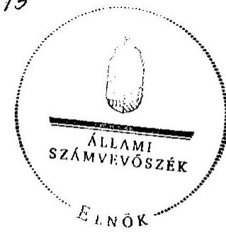
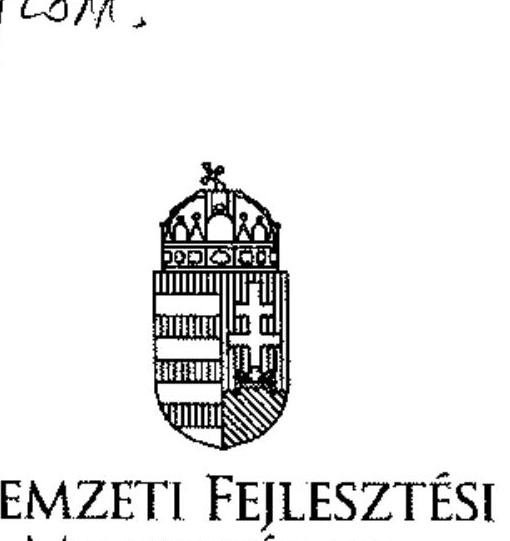
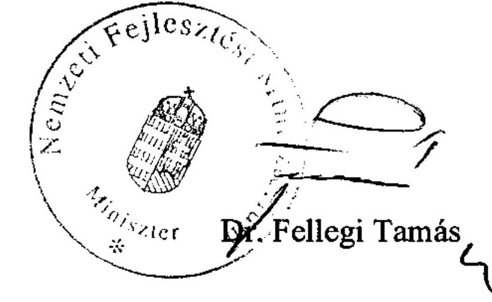
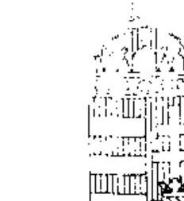
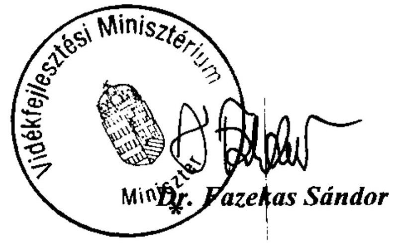

# ÁLLAMI   SZÁMVEVŐSZÉK 

## JELENTÉS

az állami vagyon feletti tulajdonosi joggyakorlással kapcsolatos 2010. évi tevékenységek ellenőrzéséről

---

Iktatószám: V-2013-104/2010-2011.
Témaszám: 997
Vizsgálat-azonosító szám: V0525

# Az ellenőrzést felügyelte: 

Dr. Becker Pál
főigazgató

## Az ellenőrzést vezette és az ellenőrzés végrehajtásáért felelős:

## Makkai Mária

számvevő igazgató

## Az ellenőrzést végezték:

| Dalmayné Szerző | Dr. Dicső Ildikó | Fekete Gábor |
| :-- | :-- | :-- |
| Ildikó | számvevő | számvevő tanácsos |
| számvevő tanácsos |  |  |
| Fülöppné Nagy Mari- | Gálné Izsó Éva | Lucza Anikó |
| anna | számvevő tanácsos | számvevő tanácsos |
| számvevő tanácsos |  |  |
| Kesjár János | Dr. Zelei Andrásné |  |
| számvevő tanácsos | számvevő |  |

## A témához kapcsolódó eddig készített számvevőszéki jelentések:

## címe

sorszáma
Jelentés az Állami Vagyonügynökség 1991. évi tevékenységéről 113
Jelentés az Állami Vagyonkezelő Rt. tevékenységének ellenőrzéséről 157
Jelentés az Állami Vagyonügynökség 1992. évi tevékenységének 158 ellenőrzéséről
Jelentés az Állami Vagyonügynökség 1993. évi tevékenységének 214 ellenőrzéséről
Jelentés az Állami Vagyonkezelő Rt. 1993. évi tevékenységének 224 ellenőrzéséről
Jelentés az Állami Vagyonügynökség költségvetési cím pénzügyi239
gazdasági ellenőrzéséről
Jelentés az Állami Vagyonkezelő Rt. által a Budapest Bank Rt.-nek juttatott tőketartalék-átadás ellenőrzéséről
Jelentés az Állami Vagyonügynökség és az Állami Vagyonkezelő 285
Rt. 1994. évi tevékenységének, valamint a jogutód szervezet meg-

---

alakulási költségeinek az Állami Privatizációs és Vagyonkezelő Rt.nél végzett ellenőrzésről
Jelentés az Állami Privatizációs és Vagyonkezelő Rt. 1995. évi tevékenységéről
Jelentés az Állami Privatizációs és Vagyonkezelő Rt. 1996. évi tevékenységének ellenőrzéséről
Jelentés az Állami Privatizációs és Vagyonkezelő Rt. hozzárendelt vagyonnal kapcsolatos 1997. évi tevékenységének ellenőrzéséről
Jelentés az Állami Privatizációs és Vagyonkezelő Rt. Rt. 1998. évi múködésének és a központi költségvetés végrehajtásához kapcsolódó tevékenységének ellenőrzéséről
Jelentés az Állami Privatizációs és Vagyonkezelő Rt. tevékenységének ellenőrzéséről, a hozzárendelt vagyon alakulásának, privatizációjának és múködésének ellenőrzéséről
Jelentés az Állami Privatizációs és Vagyonkezelő Rt. 2000. évi múködésének és a központi költségvetés végrehajtásához kapcsolódó tevékenységének ellenőrzéséről
Jelentés az Állami Privatizációs és Vagyonkezelő Rt. 2001. évi múködésének és a központi költségvetés végrehajtásához kapcsolódó tevékenységének ellenőrzéséről
Jelentés az Állami Privatizációs és Vagyonkezelő Rt. 2002. évi múködésének és a központi költségvetés végrehajtásához kapcsolódó tevékenységének ellenőrzéséről
Jelentés az Állami Privatizációs és Vagyonkezelő Rt. 2003. évi múködésének és a központi költségvetés végrehajtásához kapcsolódó tevékenységének ellenőrzéséről
Jelentés az Állami Privatizációs és Vagyonkezelő Rt. 2004. évi múködésének és a központi költségvetés végrehajtásához kapcsolódó tevékenységének ellenőrzéséről
Jelentés az Állami Privatizációs és Vagyonkezelő Rt. 2005. évi múködésének és a központi költségvetés végrehajtásához kapcsolódó tevékenységének ellenőrzéséről
Jelentés az Állami Privatizációs és Vagyonkezelő Rt. 2006. évi múködésének és a központi költségvetés végrehajtásához kapcsolódó tevékenységének ellenőrzéséről
Jelentés az Állami Privatizációs és Vagyonkezelő Zrt. 2007. évi múködésének és a központi költségvetés végrehajtásához kapcsolódó tevékenységének ellenőrzéséről
Jelentés a Magyar Nemzeti Vagyonkezelő Zrt. 2008. évi tevékenységének ellenőrzéséről
Jelentés a Magyar Nemzeti Vagyonkezelő Zrt. 2009. évi tevékenységének ellenőrzéséről

---

# TARTALOMJEGYZÉK 

BEVEZETÉS ..... 9
I. ÖSSZEGZŐ MEGÁLLAPÍTÁSOK, KÖVETKEZTETÉSEK, JAVASLATOK ..... 12
II. RÉSZLETES MEGÁLLAPÍTÁSOK ..... 20

1. Az állami vagyon múködtetésére kialakított tulajdonosi joggyakorlás szabályozása és múködési rendje ..... 20
1.1. A jogi szabályozás alakulása ..... 20
1.2. Az MNV Zrt. és az MFB Zrt., valamint az NFA közötti feladatátadás ..... 22
1.3. Az MNV Zrt. múködésének szabályozása ..... 24
1.4. Az MFB Zrt.-nél a tulajdonosi joggyakorlással kapcsolatos feladatok szabályozása ..... 25
1.5. Az NFA létrehozása, a tulajdonosi joggyakorlással kapcsolatos feladatok szabályozása ..... 28
2. A döntéshozatal szabályozása és a döntési folyamatok átláthatósága az MNV Zrt.-nél ..... 31
2.1. Az állami vagyon felügyeletéért felelős miniszter feladat- és hatáskörének szabályozása és hatáskörének gyakorlása ..... 33
2.2. A Tanács, illetve az Igazgatóság jogkörének érvényesülése, határozatainak eredményessége ..... 37
2.3. Az MNV Zrt. vezérigazgatója jogkörének érvényesülése, döntéseinek eredményessége ..... 42
2.4. Az MNV Zrt. ellenőrzési rendszere ..... 44
3. Az MNV Zrt. rábízott vagyona nyilvántartási és beszámolási renszere ..... 47
3.1. Az MNV Zrt. vagyonnyilvántartása ..... 48
3.2. Az MNV Zrt. által közvetlenül kezelt vagyon változása ..... 51
3.3. A költségvetési szervezetek által kezelt állami vagyon nyilvántartása ..... 56
3.4. Az egyéb vagyonkezelők által kezelt vagyon nyilvántartása ..... 58
3.5. Az ingatlanok értékesítése ..... 59
3.6. Egyéb vagyonelemek ..... 64
4. Az MNV Zrt. saját vagyona ..... 66
5. Az ÁSZ 2010. évi ellenőrzési javaslatainak hasznosulása ..... 68

---

# MELLÉKLETEK 

1/a sz. Nemzeti Fejlesztési Minisztérium észrevétele
1/b sz. Válaszlevél Nemzeti Fejlesztési Minisztérium részére
1/c sz. Vidékfejlesztési Minisztérium észrevétele

## FÜGGELÉKEK

1. sz. Az Állami Számvevőszék és az MNV Zrt. közötti véleményeltérés

---

# RÖVIDÍTÉSEK JEGYZÉKE 

APEH
AUDI Kft.
Áht.
Ámr.
ÁPV Zrt.
ÁROP
ÁSZ
BA Zrt.
BEF
BMB Kft.
BPT
BRFK
EB
EFGB
EIB
ESA

Evt.

FALAP

FB
FÖMI
FVM
GKM
Gt.
GYLP
HM
IG
ITD
Kbt.
KEHI
KHEM
KIM
KKK
KSH
KVK
KvVM
MALÉV Zrt.

MALÉV GH Zrt.

Adó- és Pénzügyi Ellenőrzési Hivatal
AUDI Hungária Motor Kft.
Az államháztartásról szóló 1992. évi XXXVIII. törvény
Az államháztartás múködési rendjéről szóló 292/2009. (XII. 19.) Korm. rendelet

Állami Privatizációs és Vagyonkezelő Zártkörűen múködő Részvénytársaság
Államreform Operatív Program
Állami Számvevőszék
Budapesti Airport Zártkörűen múködő Részvénytársaság
Befektetett Eszközök Nyilvántartása
Bábolna Ménesbirtok Korlátolt Felelősségű Társaság
Birtokpolitikai Tanács
Budapesti Rendőr Főkapitányság
A Tanács és az MNV Zrt. Ellenőrző Bizottsága
Eszköz Forrás Gazdálkodási Bizottság
Európai Beruházási Bank
European System of Accounts (Európai Számlák Rendszere)
Az erdőről, az erdők védelméről szóló 2009. évi XXXVII. törvény
Az MNV Zrt. Nemzeti Földalap vagyonnyilvántartási információs rendszere
Az MNV Zrt. Felügyelő Bizottsága
Földmérési és Távérzékelési Intézet
Földmúvelési és Vidékfejlesztési Minisztérium
Gazdasági és Közlekedési Minisztérium
A gazdasági társaságokról szóló 2006. évi IV. törvény
Győri Logisztikai Park
Honvédelmi Minisztérium
Az MNV Zrt. Igazgatósága
ITD Hungary Befektetési és Fejlesztési Ügynökség
A közbeszerzésekről szóló 2003. évi CXXIX. törvény
Kormányzati Ellenőrzési Hivatal
Közlekedési, Hírközlési és Energiaügyi Minisztérium
Közigazgatási és Igazságügyi Minisztérium
Közlekedésfejlesztési Koordinációs Központ
Központi Statisztikai Hivatal
Kincstári Vagyonkataszter
Környezetvédelmi és Vízügyi Minisztérium
Magyar Légiközlekedési Vállalat Zártkörűen múködő Részvénytársaság
A MALÉV GH Földi Kiszolgáló Zártkörűen múködő Részvénytársaság

---

| MÁK | Magyar Államkincstár |
| :--: | :--: |
| MÁV Zrt. | Magyar Államvasutak Zártkörűen múködő Részvénytársaság |
| MeH | Miniszterelnöki Hivatal |
| MFB Zrt. | Magyar Fejlesztési Bank Zártkörűen múködő Részvénytársaság |
| MNB | Magyar Nemzeti Bank |
| MFB tv. | A Magyar Fejlesztési Bankról szóló 2001. évi XX. törvény |
| MNV Zrt. | Magyar Nemzeti Vagyonkezelő Zártkörűen múködő Részvénytársaság |
| MTV Zrt. | Magyar Televízió Zártkörűen múködő Részvénytársaság |
| MVM Zrt. | Magyar Villamos Múvek Zártkörűen múködő Részvénytársaság |
| NFA | Az NFA törvény (új) szerint a Nemzeti Földalapkezelő Szervezet |
| régi NFA törvény | A Nemzeti Földalapról szóló 2001. évi CXVI. törvény |
| új NFA törvény | A Nemzeti Földalapról szóló 2010. évi LXXXVII. törvény |
| NFM | Nemzeti Fejlesztési Minisztérium |
| NIF Zrt. | Nemzeti Infrastruktúra Fejlesztő Zártkörűen múködő Részvénytársaság |
| Tanács | Nemzeti Vagyongazdálkodási Tanács |
| OGY | Országgyúlés |
| PM | Pénzügyminisztérium |
| PSZKI | Pénzügyi Számviteli és Követeléskezelési Igazgatóság |
| Ptk. | Polgári Törvénykönyv 1959. évi IV. törvény |
| REORG Zrt. | REORG Gazdasági és Pénzügyi Zrt. |
| RJGY | Részvényesi Jogok Gyakorlója (2010. 05. 28-ig a Pénzügyminiszter, 2010. 05. 29-től a Nemzeti fejlesztési Miniszter) |
| SZMSZ | Az MNV Zrt. Szervezeti és Múködési Szabályzata |
| Sztv. | A számvitelről szóló 2000. évi C. törvény |
| Takarékossági törvény | A köztulajdonban álló gazdasági társaságok takarékosabb múködéséről szóló 2009. évi CXXII. törvény |
| TAKARNET | Földhivatali Információs Rendszer, ami biztosítja a földhivatali adatbázishoz a külső felhasználók hozzáférését |
| TCB | Tulajdonosi Cenzúra Bizottság |
| TVEI | Tulajdonosi és Vezetői Ellenőrzési Igazgatóság |
| vagyontörvény, Vtv. | Az állami vagyonról szóló 2007. évi CVI. törvény |
| VEB | Vnyesekonombank |
| Vhr. | Az állami vagyonnal való gazdálkodásról szóló 254/2007. (X. 4.) Korm. rendelet |
| VIG. | vezérigazgató |
| VIR | Vagyonkezelési Információs Rendszer |
| VM | Vidékfejlesztési Minisztérium |
| VPOP | Vám- és Pénzügyőrség Országos Parancsnoksága |

---

# ÉRTELMEZŐ SZÓTÁR 

állami vagyon
állami vagyon kezelője/vagyonkezelő
kincstári vagyon

A Vtv. alkalmazásában 2010. 06. 16-ig: az állam tulajdonában lévő a) ingó dolog, valamint dolog módjára hasznosítható természeti erő, b) termőföldekből álló, külön törvényben szabályozott Nemzeti Földalap, c) a b) pont alá nem tartozó ingatlan, d) értékpapír; e) az államot megillető társasági részesedés és más vagyoni értékű jog. 2010. 06. 17-től a Vtv. 1. § (2) bekezdése szerint:
a) az állam tulajdonában lévő dolog, valamint dolog módjára hasznosítható természeti erő, b) az a) pont hatálya alá tartozó mindazon vagyon, amely vonatkozásában törvény az állam kizárólagos tulajdonjogát nevesíti, c) az állam tulajdonában lévő tagsági jogviszonyt megtestesítő értékpapír, illetve az államot megillető egyéb társasági részesedés, d) az államot megillető olyan immateriális, vagyoni értékkel rendelkező jogosultság, amelyet jogszabály vagyoni értékű jogként nevesít.
2010. 09. 1-jétől az új NFA törvény 1. § (1) bekezdése szerint: az állami tulajdonban lévő termőföldek, mező-, erdőgazdasági művelés alatt álló belterületi földek, a mező-, erdőgazdasági tevékenységet szolgáló, vagy ahhoz szükséges művelés alól kivett földek összessége.
Az állami vagyont az MNV Zrt. maga kezeli, illetve szerződés - így különösen bérlet, haszonbérlet, szerződésen alapuló haszonélvezet, vagyonkezelés, megbízás - alapján központi költségvetési szervnek, természetes vagy jogi személynek, illetőleg jogi személyiséggel nem rendelkező gazdasági társaságnak hasznosításra átengedi (Vtv. 23. § (1) bekezdés).

Az új NFA törvény 15. § (1) bekezdésben meghatározott földrészleteket az NFA kezeli, vagy szerződés alapján e törvény 20. § (2) bekezdése szerint vagyonkezelésbe adja. E törvény 21. § (3) bekezdése szerint a vagyonkezelést csak költségvetési szerv vagy 100\%-os állami tulajdonú gazdálkodó szervezet végezheti. Az Evt. szerint állami tulajdonú erdőt, erdőgazdálkodási tevékenységet közvetlenül szolgáló földterületet csak vagyonkezelés formájában lehet hasznosításra átengedni.
A Vtv. alkalmazásában 2010. 06. 16-ig: minden vagyonelem, amelyet törvény kizárólagos állami tulajdonba tartozó vagyonként forgalomképtelennek, illetve korlátozottan forgalomképesnek minősít.
2010. 06. 17-től a Vtv. 4. § (2) bekezdése szerint: minden vagyonelem, amely valamely állami feladat ellátásához szükséges, valamint amelyet törvény - ideértve a Vtv. mellékletét is - kizárólagos állami tulajdonba tartozó vagyonként forgalomképtelennek, ill. korlátozottan forgalomképesnek minősít.

---

rábízott vagyon

Natura 2000

Nemzeti Földalap
tulajdonosi joggyakorló
üzleti vagyon

A Vtv. 22. § (6) bekezdése szerint: minden a Vtv. alkalmazásában állami vagyonnak minősülő vagyon, amit az MNV Zrt. kezel és nyilvántart. Az MNV Zrt. saját vagyonától elkülönítetten kezelt vagyon.
Továbbá 2010. 06. 17-től az MFB tv. 3. § (9) bekezdése szerint: az a vagyon, amely felett az MFB tv. erejénél fogva a Magyar Állam nevében az MFB Zrt. gyakorolja a tulajdonosi jogokat.
Az európai jelentőségű természeti területek hálózata; amelynek kialakításáról - a Biológiai Sokféleségről szóló Egyezményhez kapcsolódva - az ENSZ 1992. évi Világkonferenciája határozott.
2010. 09. 1-jéig a régi NFA törvény 1. § (1) bekezdése szerint:
az állam tulajdonában lévő, folyamatosan változó menynyiségű és elhelyezkedésű termőföldek, valamint - kivételesen - a mezőgazdasági termelést szolgáló vagy ahhoz szükséges művelés alól kivett földek összessége. Az állam ezeket a földeket mezőgazdasági és erdőgazdálkodási céllal részben vagyonkezelés útján, részben más jogcímen történő használatba adással hasznosítja, illetve a földbir-tok-politikai irányelveknek megfelelően, vagy valamely közcél érvényesítése érdekében eladja.
2010. 09. 1-jétől hatályos új NFA törvény 1. § (1) bekezdése szerint: a Nemzeti Földalap, mint a kincstári vagyon része az állam tulajdonában lévő termőföldek, mező-, erdőgazdasági művelés alatt álló belterületi földek, valamint a mező-, erdőgazdasági tevékenységet szolgáló, vagy ahhoz szükséges művelés alól kivett földek összessége.
2010. június 17-től a Vtv. 3. § (1)-(2) bekezdése szerint:

Az állami vagyon felett a Magyar Államot megillető tulajdonosi jogoknak (és kötelezettségeknek) az összességét az állami vagyon felügyeletéért felelős miniszter gyakorolja, aki e feladatát az MNV Zrt., a Magyar Fejlesztési Bank, illetve tulajdonosi joggyakorló szervezet (pl. Áht. szerinti központi költségvetési szervek, 100\%-ban állami tulajdonban álló gazdasági társaságok) útján látja el.
2010. 09. 1-jétől új NFA törvény 3. § szerint:
a Nemzeti Földalap felett a Magyar állam nevében a tulajdonosi jogokat (és kötelezettségeket) az agrárpolitikáért felelős miniszter a Nemzeti Földalapkezelő Szervezet (NFA) útján gyakorolja. A Nemzeti Földalappal kapcsolatos polgári jogviszonyokban az államot az NFA képviseli.
Az állam forgalomképes vagyona, azt (a tulajdonosi joggyakorló) döntésétől függően hasznosítja, használja, értékesíti.

---

vagyonkezelői jog
A Vtv. 27. § (2) és (4) bekezdése szerint:
a vagyonkezelői jog az állami vagyon hasznosítására az MNV Zrt.-vel kötött vagyonkezelési szerződéssel jön létre. A vagyonkezelési szerződés alapján a vagyonkezelő jogosult (vagyonkezelői jog) meghatározott, állami tulajdonba tartozó dolog birtoklására, használatára és hasznai szedésére.
Az NFA hatálya alá tartozó ingatlanok esetében az új NFA törvény 20. § (1)-(2) bekezdése szerint a vagyonkezelői jog az erre irányuló (NFA-val kötött) szerződéssel jön létre. A vagyonkezelői szerződés alapján a vagyonkezelő jogosult meghatározott földrészlet birtoklására, használatára és hasznai szedésére. A vagyonkezelő köteles a földrészlet értékét megőrizni, állagának megóvásáról, jó karban tartásáról gondoskodni, továbbá - NFA tv.-ben meghatározott esetek kivételével - díjat fizetni vagy a szerződésben előírt más kötelezettséget teljesíteni.

---

.

---

# JELENTÉS 

## az állami vagyon feletti tulajdonosi joggyakorlással kapcsolatos 2010. évi tevékenységek ellenőrzéséről

## BEVEZETÉS

Az állami vagyonról szóló 2007. évi CVI. törvény (vagyontörvény, Vtv.) szabályozza az állami vagyon feletti tulajdonosi joggyakorlás módját és szervezetét, valamint a vagyonnal való gazdálkodást. Az állami vagyonnal való felelős gazdálkodás érdekében szükséges törvények módosításáról, valamint egyes törvényi rendelkezések megállapításáról szóló 2010. évi LII. törvény - 2010. június 17-től - módosította a vagyontörvényt. Ennek értelmében az állami vagyon feletti tulajdonosi jogok és kötelezettségek összességét a Nemzeti Vagyongazdálkodási Tanács (Tanács) helyett az állami vagyon felügyeletéért felelős miniszter (a hatályos szabályozás szerint a nemzeti fejlesztési miniszter) gyakorolja a Magyar Nemzeti Vagyonkezelő Zrt. (MNV Zrt.) és a Magyar Fejlesztési Bank Zrt. (MFB Zrt.) útján. A vagyontörvény módosítását követően 40 gazdasági társaság felett a tulajdonosi joggyakorlást az MFB Zrt. végzi.

A Nemzeti Földalapról szóló 2010. évi LXXXVII. törvény értelmében 2010. szeptember 1-jétől a Nemzeti Földalap - amelynek vagyona a törvény hatályba lépéséig az MNV Zrt. rábízott vagyonába tartozott - felett a tulajdonosi jogokat és kötelezettségeket az agrárpolitikáért felelős miniszter (jelenleg a vidékfejlesztési miniszter) gyakorolja a Nemzeti Földalapkezelő Szervezet (NFA) útján. Az MNV Zrt.-nek a módosítást követően alapvetően a gazdasági társaságokról szóló 2006. évi IV. törvény (Gt.) szabályait alkalmazva kell múködnie, de a költségvetési intézményekre vonatkozó szabályokat is be kell tartania.

A törvényi változások miatt módosult az ellenőrzési feladat, ami magában foglalta egyrészt az MNV Zrt. 2010. évi tevékenységének ellenőrzését 2010. június 16 -áig, másrészt az MNV Zrt., az MFB Zrt. és az NFA állami vagyon feletti tulajdonosi joggyakorlásának ellenőrzését. Ezt követően a Vtv. 3. § (4), valamint az új NFA törvény 14. § (1) bekezdése értelmében az állami vagyon, illetve a Nemzeti Földalap feletti tulajdonosi joggyakorlással kapcsolatos tevékenységet az ÁSZ évente ellenőrzi.

A tulajdonosi joggyakorlás a három szervezetnél eltérő tartalmú vagyont érint, mivel az MNV Zrt.-nél minden vagyoncsoportra, az MFB Zrt.-nél az átadott 40 gazdasági társaságra, az NFA esetében a termőföldek tulajdonosi joggyakorlásával összefüggő feladatokra vonatkozik. Az MNV Zrt. és az MFB Zrt. gazdasági társaságként, az NFA központi költségvetési szervként múködik.

---

Az MNV Zrt.-re és az MFB Zrt.-re bízott vagyonnal kapcsolatos bevételeket, kiadásokat az évenkénti költségvetési törvények határozzák meg. Mindkét társaságnak a saját vagyonától elkülönítetten kell nyilvántartani a rábízott vagyont. Az MNV Zrt.-nek a saját vagyona tekintetében a számvitelről szóló 2000. évi C. törvény (Sztv.), a rábízott vagyona tekintetében az Sztv. és a Magyar Állam nevében tulajdonosi jogokat gyakorló szervezetek rábízott állami vagyonnal kapcsolatos éves beszámoló készítési és könyvvezetési kötelezettségéről szóló 347/2010. (XII. 28.) Korm. rendelet előírásait kell alkalmaznia.

Az MNV Zrt. rábízott vagyonába tartozó, múködő gazdálkodó szervezetek száma a törvényváltozás előtt 300, 2010. év végén 254, ebből a vagyonkezelésbe adott társaságok száma 52 volt. A társaságok tulajdonrészére jutó adózás előtti eredménye az előzetes adatok alapján 25,7 Mrd Ft értékben alakult. 2010. év végén az MNV Zrt. 13355 Mrd Ft rábízott vagyont tartott nyilván. Az MNV Zrt.-nél a létszám 2010. január 1-jén 431 fő, december 31-én 373 fő volt. Az MNV Zrt. saját vagyonának mérleg szerinti főösszege 5 Mrd Ft volt. Saját vagyona múködésének támogatására a 2010. évi üzleti terv 9,8 Mrd Ft kiadással számolt, az előirányzat 9,5 Mrd Ft értékben teljesült. A saját vagyon bevétele 10 Mrd Ft, mérleg szerinti eredménye 1,028 Mrd Ft volt.

Az MFB Zrt. rábízott vagyona 2010. december 31-én 258 Mrd Ft-ot tett ki.
Az ellenőrzés célja annak értékelése volt, hogy

- az új tulajdonosi struktúra kialakítása, a törvényi változások végrehajtása az előírásoknak megfelelően valósult-e meg, végrehajtható volt-e a három (MNV Zrt, MFB Zrt., NFA) szervezetnél; a megváltozott tulajdonosi struktúra megfelelt-e a törvényhozói céloknak; a jogi szabályozás világos, egyértelmú és elégséges volt-e; megfelelt-e a szabályoknak és teljes körű volt-e a pénzügyi, számviteli, beszámolási, informatikai nyilvántartások rendszere; az MNV Zrt. szervezeti rendje összhangban volt-e az elvégzendő feladatokkal; eredményesek, szabály- és célszerűek voltak-e a döntéshozók ${ }^{1}$ beavatkozásai; a társaság ellenőrzési rendszere biztosította-e a célok elérését, feltárta-e az akadályozó tényezőket;
- az MNV Zrt. a rábízott vagyonnal, azon belül az ingatlanvagyonnal való gazdálkodásban biztosította-e az állami vagyon hatékony múködtetését, állagának védelmét, értékének megőrzését, hasznosítását;
- az MNV Zrt. saját vagyona gazdálkodásában érvényesültek-e a szabályszerűségi, célszerűségi, takarékossági, gazdaságossági, hatékonysági, eredményességi szempontok;
- hasznosították-e a 2010-ben végzett ÁSZ ellenőrzés megállapításait.

Az állami vagyonnal kapcsolatos bevételek és kiadások alakulását, az ezekkel kapcsolatos költségvetési előirányzatok teljesítését a Magyar Köztársaság 2010. évi költségvetésének végrehajtásáról szóló ÁSZ jelentés tartalmazza. Az MNV Zrt. által két időpontra (2009. és 2010. év végére) készített ingatlanokat részle-

[^0]
[^0]:    ${ }^{1}$ (Kormány, Részvényesi Jogok Gyakorlója, Tanács/igazgatóság, vezérigazgató)

---

tező kimutatás adattartalmában olyan nagyságrendű eltérések voltak, amelyek elemzést, összehasonlítást, értékelést nem tettek lehetővé.

Jelen ellenőrzésünk egyrészt az állami vagyon feletti 2010. évi tulajdonosi joggyakorlással kapcsolatos tevékenységekre, másrészt az MNV Zrt. 2010. évi tevékenységére irányult.

2010-ben az MNV Zrt. szervezeti felépítése a vagyontörvény módosítása következtében átalakult. Jelentéseinkben a Tanács, az ellenőrző bizottság és a volt vezérigazgató a Vtv. módosítását megelőző, az igazgatóság, a Felügyelő Bizottság és a vezérigazgató a Vtv. módosítását követő időszakhoz kapcsolódik.

A 2009-es gazdasági évről szóló ÁSZ jelentés ellenőrzési megállapításai, javaslatai hasznosításának ellenőrzésénél a vizsgálat értékelte a nemzeti fejlesztési miniszter - az állami vagyonnal való gazdálkodás szabályozásáért való felelőssége körében hozott - intézkedéseit, azok eredményességét. Az előző évi ÁSZ jelentés megállapításai alapján, illetve az ez évi helyszíni ellenőrzés megkezdése előtt és alatt az ellenőrzés hatókörébe tartozó egyes gazdasági eseményekkel kapcsolatban (Fradi Pálya szerződése, a Bábolna Csoport - Bábolna Nemzeti Ménesbirtok Kft. működése) az ügyészi szervek vizsgálatot kezdeményeztek. Az ügyészi szervek munkáját a szükséges dokumentumok rendelkezésre bocsátásával segítettük és segítjük. Az MVM Zrt., az MTV Zrt., a MÁV Zrt. és a Magyar Posta Zrt. székházainak ügyében különböző okok miatt a vizsgálatok, intézkedések nem jutottak el a végső stádiumba.

Az ellenőrzés jogszabályi alapját az Állami Számvevőszékről szóló 1989. évi XXXVIII. törvény 2. § (1) és (6) bekezdései, ${ }^{2}$ az ellenőrzés szempontjait, szabályait a 16. § (1) bekezdése, valamint a 17. § (5) bekezdése, az államháztartásról szóló 1992. évi XXXVIII. törvény (Áht.) 104. § (3) bekezdés előírásai, továbbá az állami vagyonról szóló 2007. évi CVI. törvény 19. § (3) bekezdésében, a törvény 2010. június 17 -ei módosítása után a 3. § (4) bekezdésében, a Nemzeti Földalapról szóló 2010. évi LXXXVII. törvény 14. § (1) bekezdésében foglaltak képezik.

Az ÁSZ és az MNV Zrt. közötti véleményeltérést a függelék tartalmazza.
A jelentéstervezetet egyeztettük a nemzeti fejlesztési és a vidékfejlesztési miniszterrel. Leveleiket és az arra adott választ az 1/a-c. sz. mellékletek tartalmazzák.

[^0]
[^0]:    ${ }^{2}$ 2011. július 1-jétől az Állami Számvevőszékről szóló 2011. évi LXVI. törvény 5. § (4) bekezdésének a) és b) pontja jelenti az ellenőrzés jogszabályi alapját.

---

# I. ÖSSZEGZŐ MEGÁLLAPÍTÁSOK, KÖVETKEZTETÉSEK, JAVASLATOK 

Az állami vagyon feletti tulajdonosi joggyakorlással kapcsolatos tevékenységet érintően 2010-ben több változás történt. A vagyontörvény módosítása, az új NFA törvény megalkotása koncepcionális változásokat eredményezett az állami vagyongazdálkodás szervezeti és intézményi rendszerében. A tulajdonosi joggyakorlók köre kibővült, az MNV Zrt. szervezete átalakult. Az MNV Zrt. mellett az állami tulajdon kezelője lett az MFB Zrt. és az NFA. Az MNV Zrt. átalakult szervezetében megszűnt a jogi személyiséggel nem rendelkező, független testületként múködő Tanács. Az új szabályozás alapján a Tanács korábbi jogosítványait a nemzeti fejlesztési miniszter az MNV Zrt. és az MFB Zrt., a vidékfejlesztési miniszter pedig az NFA útján gyakorolja. A vagyontörvény módosítását követően az MNV Zrt. ügyvezető szerve az igazgatóság, a szervezet alapvetően a Gt. szabályai szerint múködik.

A vagyontörvény módosítása újraértelmezte az állami vagyongazdálkodás feladatát. Az addigi kizárólag üzleti szemlélet helyett megjelent az állami közfeladat ellátásának elősegítése, a társadalmi szükségletek kielégítése. A vagyongazdálkodás feladata lett a Kormány fejlesztéspolitikájának segítése, mindezek mellett a hatékonyság, költségtakarékosság, értékmegőrzés és értéknövelés szempontjainak betartása.

A Vtv. 2010. júniusi módosításával a nemzeti fejlesztési miniszternek az állami vagyon felügyeletéért való felelőssége egyértelművé vált. Az új NFA törvény három hónappal későbbi megalkotásával a felelősség megoszlik a nemzeti fejlesztési miniszter és a vidékfejlesztési miniszter között. ${ }^{3}$ A vagyontörvény szerint az MNV Zrt. feladata minden állami vagyon nyilvántartása és az azokkal kapcsolatos adatszolgáltatás. Ez a gyakorlatban nem érvényesül, mert az új NFA törvény szerint az NFA vagyoni körébe tartozó ingatlanok nem tartoznak a vagyontörvény hatálya alá. Továbbá az NFA-ra vonatkozó jogszabályok nem írnak elő az NFA részére adatszolgáltatási kötelezettséget a vagyonról az MNV Zrt. felé.

Az MFB Zrt.-ről szóló törvény szerint főszabályként az MFB Zrt. nem ruházhatja át a 40 társaság részesedésének tulajdonjogát. Az átruházást a törvény úgy teszi lehetővé, hogy azt megelőzően az MFB Zrt.-nek egyeztetni kell az erre feljogosított szervezettel. A törvényben azonban nincs konkrétan meghatározva, hogy mely szervezet jogosult az átruházásra, illetve az MFB Zrt.-vel történő egyeztetésre.

[^0]
[^0]:    ${ }^{3}$ 2011. augusztus 1-jétől a vagyontörvény 3. § (1a) bekezdése szerint azon állami tulajdonban álló ingatlanok felett, amelyek egy része a Nemzeti Földalapba tartozik, a tulajdonosi jogokat a nemzeti fejlesztési miniszter és a vidékfejlesztési miniszter közösen gyakorolja. A közös tulajdonosi joggyakorlás részletes szabályai még kidolgozatlanok.

---

Az NFA működéséhez szükséges keretek - megfelelő humánerőforrás és elhelyezés, technikai háttér - 2011-ig nem álltak rendelkezésre. 2010-ben az NFA múködéséhez szükséges infrastruktúrát az MNV Zrt. térítésmentesen biztosította. Az NFA a helyszíni ellenőrzés ideje alatt éves hasznosítási terv nélkül múködött, szakmai tevékenységének belső szabályozása hiányos volt.

A Vtv. és az új NFA törvény nem szabályozza, hogy mely szervezet jogosult a vegyes kezelésben álló ingatlanok hasznosítására és peres ügyeinek intézésére. (Pl. egy helyrajzi számon szerepel egy ingatlan, amelyik az MNV Zrt. kezelésében van, a földterület, amelyen az ingatlan található, pedig az NFA kezelésében áll). E szabályozás 2010-ben az MNV Zrt. és az NFA között jogértelmezési problémákat eredményezett, amelyek akadályozták a vagyonkezelők célszerű és eredményes múködését. A folyamatos egyeztetések ellenére az átadás-átvétel az új NFA törvényben, valamint az MNV Zrt. és az NFA közötti megállapodásban rögzített részhatáridőkhöz képest határidőcsúszással, több lépcsőben valósult meg. Az új NFA törvény értelmében az átadás-átvételt véglegesen 2011. augusztus végéig kellett lezárni, ami nem történt meg. ${ }^{4}$ Az MNV Zrt. a saját hasznosítású földterületeket érintő iratok átvételéhez kapcsolódó teljességi nyilatkozatot nem írta alá, különös tekintettel a 2007. év előtti - örökölt - rendezetlen anyagok miatt. Az NFA megfelelő működésének feltételei 2011-re alakultak ki. Az átmeneti időszakban az NFA a termőföld védelméről szóló törvényben meghatározott feladatai ellátása érdekében (a termőföld műveltetése) a pályáztatással bonyolítandó haszonbérleti szerződések helyett legfeljebb egy gazdasági évre terjedő megbízási szerződéseket kötött.

Az MNV Zrt. a jogszabályban előírt átadás-átvételi eljárást az MFB Zrt. részére az érintett társaságok, valamint minisztériumok bevonásával határidőben elkezdte és 2010. év végéig hiánytalanul lezárta. Az új feladatellátásnak megfelelően az MFB Zrt. a szükséges létszámot biztosította. A nemzeti fejlesztési miniszter utasítására költségtakarékossági intézkedési tervek készültek mind az MFB Zrt., mind a tulajdonosi joggyakorlásra átvett 40 társaság vonatkozásában. Az MFB Zrt. az átvett társaságok teljes körű átvilágítását 2010-ben megkezdte, ami a tervek szerint 2011-ben fejeződik be. Az MFB Zrt. által a társaságok igazgatóságainak megszüntetésével, illetve létszámának csökkentésével havi szinten mintegy negyvenmillió Ft megtakarítást értek el.

Az MNV Zrt.-nél a döntéshozatali rendszert érintően a Vtv. 2010. június 17-i módosításával a feladat-, hatás- és felelősségi körök szabályozásában a megelőző időszakhoz képest előrelépés történt. Ennek legjelentősebb eleme, hogy az állami vagyon felügyeletéért felelős nemzeti fejlesztési miniszter az állami vagyon felett a Magyar Államot megillető tulajdonosi joggyakorlói pozícióba került, a felelőssége egyértelművé vált. Az állami vagyon felügyeletéért felelős miniszter tulajdonosi jogokhoz és kötelezettségekhez kapcsolódó feladatait azonban a Vtv. nem határozza meg. Az MNV Zrt. döntési mechanizmusára

[^0]
[^0]:    ${ }^{4}$ A VM államtitkárának 2011. szeptember 1-jén kelt levele szerint a Nemzeti Földalapba tartozó rábízott földvagyonnal kapcsolatos éves beszámoló-készítési és könyvvezetési kötelezettségről szóló 34/2011. (III. 17.) Korm. rendelet szerinti előzetes és éves beszámolási kötelezettségének az NFA az átadás-átvétel elhúzódása miatt nem tudott eleget tenni.

---

2011 májusáig a többlépcsős hatáskör átruházás is jellemző volt, ami nehezíti a felelősség érvényre juttatását.

Az MNV Zrt.-nél a döntések hatályos vagyonkezelési stratégia nélkül születtek. A módosított Vtv.-ben meghatározott Vagyongazdálkodási Irányelvek készítése folyamatban van. Az MNV Zrt. rábízott vagyon éves vagyonkezelési tervének elfogadása az SZMSZ szerint az állami vagyon felügyeletéért felelős miniszter hatáskörébe tartozik. Az elkészített, számszaki és az azt alátámasztó szöveges részből álló 2010. évre vonatkozó vagyonkezelési tervet az MNV Zrt. jóváhagyásra a miniszternek benyújtotta. Az állami vagyon felügyeletéért felelős miniszter a terv tartalmi részéről határozatban nem döntött, csak annak a fő számait hagyta jóvá, amelyek eltértek az MNV Zrt. által benyújtott fő számoktól. A miniszter a határozatban nem jelölte meg, hogy a fő számok változása a szöveges vagyonkezelési tervben mely feladatok elmaradását, vagy csökkentését vonják maguk után. Mindezek hiányában a döntéshozatalkor nem volt igazodási pont.

A Tanács az MNV Zrt. rábízott vagyon kezeléséhez kapcsolódó feladatai végrehajtásánál nem helyezett kellő súlyt a Vtv.-ben megfogalmazott célokra, az állami vagyon megóvására, gazdaságos múködtetésére, valamint a célok elérését is támogató egységes vagyonnyilvántartás megteremtésére. (Pl. a Hollóházi Porcelán Manufaktúra Zrt. esetében távolmaradás a tőkerendezésről döntő közgyűlésről, a REORG Zrt.-nél a Tanács nem hívta fel a Zrt. igazgatóságának figyelmét a tőkerendezési kötelezettségre.) A Tanács bizonyos döntéseinél nem helyezte előtérbe az állami vagyon védelmét, az azzal való felelős gazdálkodást, ami a társaságoknál további veszteséget eredményezett. (Pl. a Szépművészeti Múzeumi Szolgáltató „Kht."nonprofit társasággá való átalakításáról a Tanács időben nem döntött, ezért a Kht-t a cégbíróság kényszer végelszámolás alá vonta.)

Az MNV Zrt. igazgatóságának intézkedései több esetben a társaságokkal kapcsolatos 2010. II. félévét megelőzően meghozott döntések negatív hatásai csökkentése érdekében születtek (pl. MÁV Zrt., EDUCATIO Kft.).

Az MNV Zrt. volt vezérigazgatójának egyes döntései nem felelős tulajdonosi szemléletben születtek, illetve nem voltak összhangban a Vtv. tulajdonosi joggyakorlással és vagyonkezeléssel szemben támasztott - az állami vagyon megóvására, gazdaságos múködtetésére kiterjedő - követelményeivel. (Pl. az „EVEREST projekt" minőségbiztosítására, projektvezetésére szóló szerződéskötés azt megelőzően való jóváhagyása, hogy az alapszerződés további sorsáról - elállnak tőle vagy hatályban marad - döntés született volna. A MOKÉP-Pannónia Kft. hitelkeretének fedezeteként olyan ingatlant fogadtak el, amelynek értékesítéséről korábban már döntés született.)

Az MNV Zrt. ellenőrzési rendszere az ellenőrzési tevékenység és az együttműködés szabályozásának hiányosságai, valamint az ellenőrzések jellege (megismételt, korlátozott körre kiterjedő vizsgálatok) miatt részben tudott hozzájárulni a vagyonkezeléssel kapcsolatos feladatok megfelelő ellátásához. Az ellenőrzési rendszer 2010. II. félévében átalakult. Az ezt megelőzően múködő Ellenőrző Bizottság jelentései alapvetően olyan területet öleltek fel, amelynek az ÁSZ által feltárt problémákra fókuszáló ismételt vizsgálatát a Felügyelő Bi-

---

zottságnál kezdeményezte a nemzeti fejlesztési miniszter 2010. II. félévében. Az ellenőrzési feladatokat az MNV Zrt.-nél az átalakítást követően az ellenőrzési igazgatóság végzi hármas minőségben. Az ellenőrzési igazgatóság feladatai teljes körűen nem szabályozottak, a tulajdonosi ellenőrzési szabályozást nem vizsgálták felül, a vezetői ellenőrzésről szabályzat nem rendelkezik. Nincsenek elkülönítve az egyes ellenőrzési funkciók, mint vezetői ellenőrzés, az FB által elvégzett ellenőrzés és a tulajdonosi ellenőrzés. Az elvégzett tulajdonosi ellenőrzések feltártak szabálytalanságokat, megállapítottak szándékosságot, illetve mulasztást. Ezekben az esetekben a döntéshozók jogi lépéseket (pl. büntetőfeljelentést) tettek.

Az MNV Zrt.-nél a társasági részesedéseknél az állami vagyon kezelését a társaságok támogatásokkal, tulajdonosi kölcsönökkel való megsegítése jellemezte a profitorientált cégek esetében is. Az egyes társaságoknál jellemzőek voltak az ad-hoc jellegű intézkedések stratégiai cél nélkül. A társasági portfolió részére az MNV Zrt. 3,2 Mrd Ft támogatást nyújtott. Tulajdonosi kölcsönben három társaság részesült összesen 18,8 Mrd Ft összegben, amelyből a MALÉV Zrt. részére nyújtott tulajdonosi kölcsön összege 18,4 Mrd volt.

Készpénzes tőkeemelés három társaságnál volt 27,2 Mrd Ft összegben, amelyből a MALÉV Zrt.-nek juttatott tőke 26 Mrd Ft volt. Az MNV Zrt. 2010-ben 13 társasági részesedést és egy szövetkezeti üzletrészt értékesített. Az értékesített részesedések nyilvántartási értéke $163,8 \mathrm{M} \mathrm{Ft}$, az értékesítésből származó árbevétel $117,8 \mathrm{M}$ Ft volt. A teljes társasági portfolióból 2010-ben befolyt osztalék öszszege 31,5 Mrd Ft volt. A társasági portfolió 2010. évi adózás előtti eredménye az MNV Zrt. 2010. évi üzleti jelentése szerint 39,3 Mrd Ft.
2010. évben ingyenes vagyonátadásról a Tanács és az igazgatóság összesen 1045,8 M Ft értékben, 106 ingatlant érintően hozott döntést a Vtv. rendelkezéseinek megfelelően. A szerződésekben előírt beszámolási kötelezettséget az ellenőrzött kilenc vagyonátadásból három kedvezményezett időben nem teljesítette. Az MNV Zrt. 2011. augusztus végéig nem érvényesítette a szerződésekben foglalt kötbérigényét.

Az MNV Zrt. a volt egyházi ingatlanok tulajdoni rendezéséhez kapcsolódó tevékenységét 2010-ben folytatta. Az Unitárius Egyház esetében azonban a jogszabályi rendelkezéssel ellentétesen, nem kiürített állapotban, hanem bérlőkkel terhelten adta át a tulajdoni hányadot az MNV Zrt. A szerződés alapján a bérleti jogviszonyok rendezésére az MNV Zrt. 350 M Ft-ot utalt át az Egyház részére. Az Egyház 2011. június 30-i határidővel az átutalt összeg felhasználásáról tételes elszámolást nem adott, amelynek elmaradása ellentétes a szerződésben foglaltakkal.

A legjelentősebb értékű ingatlan értékesítés 2010-ben az Audi Kft. tulajdonába - bruttó 6500 M Ft vételár ellenében - került győri ingatlan volt. 2010 áprilisában kormányhatározat és RJGY határozat rendelkezett a nemzetgazdasági szempontból kiemelt jelentőségű győri beruházási területnek a hatályos jogszabályok megtartásával, nyilvános pályáztatás útján történő értékesítéséről. A nyilvános pályázati kiírás határideje azonnali volt. Az ingatlan együttes egy része (erdőterület) forgalomképtelen volt, ezért a határidő és a hatályos jogszabályok betartása ellentmondásban volt. A nyilvános pályázat kiírásának fel-

---

tételei folyamatosan teremtődtek meg, és a kormányzati döntéshez képest utólagosan teljesültek. Egyeztetés vált szükségessé az Európai Bizottsággal a területek átsorolása miatt, mivel azok NATURA besorolású, környezetvédelmi szempontból védett területek. A területek továbbá érintettek az Európai Bizottság LIFE + programjában, amely a volt katonai használatú területek természetvédelmi szempontból történő helyreállítására irányul. A nettó 5200 M Ft értékesítési bevétel $80 \%$-át ( 4160 M Ft ), kormányhatározat alapján a HM használhatja fel egyrészt az ügylettel kapcsolatosan felmerült költségeire, másrészt pedig az értékesítés után állami tulajdonban maradó honvédelmi célú ingatlanok fejlesztéséhez szükséges infrastrukturális beruházások fedezetére.

2010 augusztusában kormányhatározat rendelkezett az országleltár, azon belül az egységes, integrált állami vagyonnyilvántartás elkészítéséről az MNV Zrt. közreműködésével. A Kormány döntésének következtében - összhangban a könyvvizsgáló és az ÁSZ MNV Zrt. vagyonnyilvántartására vonatkozó megállapításaival és javaslataival - felgyorsult az MNV Zrt.-nél az adattisztítási folyamat. A vagyonnyilvántartási feladatok megoldására készült ütemterv része a 3 éves adattisztítási terv. Az MNV Zrt.-nek a nemzeti fejlesztési miniszter részére készített 2011. májusi tájékoztatója szerint az adattisztítási terv kidolgozásának készültsége $70 \%$, a vagyonnyilvántartási egységes partnertörzs készültsége $90 \%$ volt. Az adattisztítás végrehajtása egyik alapját képezi az MNV Zrt. által tervezett új nyilvántartási rendszer létrehozásának. Az új rendszer kialakításához szükséges informatikai lehetőségek feltérképezése elkezdődött, a rendszerrel kapcsolatos elvárásokról munkaanyagok készültek, részletes, elfogadott szakmai koncepció még nincs.

A Vtv. 2007. évi hatálybalépése óta aktualizált vagyonkezelési szerződések aránya nem éri el a 20\%-ot. 2010-ben az MNV Zrt.-nél felgyorsult a vagyonkezelési szerződések átdolgozása, amelyek megfelelnek a hatályos jogszabályi előírásoknak.

Az MNV Zrt.-nél 2011-ben kezdődött meg a részletesebb szakterületi stratégiák kialakítása, amelyekben elemzik a jelenlegi helyzetet, és azok alapján határozzák meg a konkrét célokat, végrehajtandó feladatokat, valamint azok eszközeit. Munkaanyagok készültek a központi költségvetési szervek által bérelt és hasznosított ingatlanokra vonatkozó jogszerűségi és gazdaságossági elemzésről, az ingatlan és ingó vagyonelemekre szóló vagyongazdálkodási stratégiáról, felmérték a központi költségvetési szervek elhelyezését.

Az állami vagyon vonalas létesítményeivel (vasút, közút) kapcsolatosan is elmaradt a vagyonkezelési szerződések aktualizálása. 2007-től 2011. év közepéig nem rendeződött a nagy vagyonértéket képviselő országos közúti és vasúti beruházások aktiválása, amelyek állami tulajdonú részvénytársaságok könyveiben szerepelnek. A vagyonátadás hiányában ezek az állami vagyonelemek nem a vagyonkezelőknél és az MNV Zrt. rábízott vagyonában szerepelnek, ezért az állami vagyonkimutatás nem a tényleges vagyoni helyzetet tükrözi.

Az elmúlt évek törvényalkotásainak és -módosításainak elérni kívánt célja az volt, hogy javuljon az állami vagyonnal való gazdálkodás átláthatósága, hatékonysága. Ennek kiindulópontja a megbízható, valós és korszerű vagyonnyilvántartás. Az MNV Zrt. megalapításakor az induló vagyonleltár és va-

---

gyonmérleg, ezáltal a rábízott vagyon kimutatása nem volt teljes körú és nem készült az MNV Zrt.-hez átkerült állami vagyon mennyiségét és értékét bemutató, azt megfelelően alátámasztó tételes kimutatás. Az analitikába történő adatbevitel ellenőrzése, a folyamatba épített kontroll, leltárellenőrzés a közvetlen kezelésű és a vagyonkezelt vagyonelemeknél csak részben megoldott. Nincs kialakítva a vagyonkezelőktől elvárt egységes értékelési, leltározási és adatszolgáltatási eljárási rend. A szabályozatlan adatszolgáltatások és az informatikai rendszer integráltságának hiánya miatt nem lehet naprakész adatállományt kimutatni. Mindez megnehezíti és hosszabbá teszi a munkafolyamatokat, továbbá nagyobb hibalehetőséget hordoz. Az MNV Zrt. nyilvántartása nem zárt, nem egységes.

A számvitelről szóló törvény és a Vtv. felhatalmazást ad a Kormánynak arra, hogy a Magyar Állam nevében tulajdonosi jogokat gyakorló szervezetek könyvvezetésének és beszámoló készítésének sajátosságait rendeletben állapítsa meg. Ugyanakkor az MNV Zrt. rábízott vagyona nyilvántartásának, értékelésének, beszámoló készítésének specialitását taxatíve jogszabály nem fogalmazta meg. Az MNV Zrt. 2010. évi beszámolójának kiegészítő melléklete nem tartalmazza a költségvetési szervek és egyéb vagyonkezelők eszközeinek számviteli törvény szerinti - a világosság elvének megfelelő - részletes bemutatását. A 2010. évre érvényes, az MNV Zrt. rábízott vagyonának könyvvezetéséről és beszámoló készítési kötelezettségéről szóló kormányrendelet nem tér ki ennek megoldására, de nem is szerepelteti a kiegészítő mellékletből kihagyható tételek között. Ezek hiányában nem egyértelmú, hogy a számviteli törvény előírásai a sajátosság miatt, vagy a megvalósítás nehézségei, hiányosságai miatt nem teljesültek.

A MNV Zrt. könyvvizsgálatra köteles beszámolójába bekerülnek olyan értékek, melyeket a tulajdonosi jogokat gyakorló nem ellenőriz, könyvvizsgáló nem hitelesít. Az MNV Zrt. rábízott vagyonának mérlege az eszközök közel 90\%-át összevontan mutatja be, a vagyon kisebb hányada tekinthető át tételesen.
2010. év december 31-én az MNV Zrt. saját vagyonának mérleg szerinti főöszszege 5 Mrd Ft volt. A 10 Mrd Ft-os bevételek és a 9 Mrd Ft-os kiadások egyenlege a mérleg szerinti 1 Mrd Ft-os nyereség. Ez az év során folyósított múködési költségvetési támogatás közel 11\%-a.

Az üzleti terv 2010. évre 502 fő álláshellyel és 587 E Ft/fő/hó átlagkeresettel kalkulált. A 2010. évi nyitó aktív állományi létszámhoz (431 fő) képest a december 31-ei záró létszám 373 fő. A 2010. évi átlagkereset 461 E Ft/fő/hó volt, amely nem tartalmazza a 2011-re áthúzódó prémiumokat és egyéb személyi juttatásokat.

A MNV Zrt. 2009. évi tevékenységének ellenőrzéséről 2010-ben készült ÁSZ jelentés a nemzeti fejlesztési miniszter részére 14 javaslatot fogalmazott meg. Ebből 4 teljesült, 7 ajánlás teljesítése folyamatban van, 2 részben teljesült. Egy javaslat teljesíthetőségét jogszabályváltozás nem tette lehetővé. A folyamatban lévő ügyek mögött döntő többségében rendőrségi nyomozás vagy ügyészségi, kormánybiztosi vizsgálatok állnak.

---

Az Állami Számvevőszékről szóló 2011. évi LXVI. törvény 33. § (1) bekezdésében foglaltak értelmében a jelentésben foglalt megállapításokhoz kapcsolódó intézkedési tervet köteles az ellenőrzött szervezet vezetője összeállítani és azt a jelentés kézhezvételétől számított harminc napon belül az ÁSZ részére megküldeni.

Amennyiben az intézkedési tervet határidőben nem küldi meg a szervezet, vagy az nem elfogadható, az ÁSZ elnöke a hivatkozott törvény 33. § (3) bekezdés a)-b) pontjaiban foglaltakat érvényesítheti.

Az ellenőrzés intézkedést igénylő megállapításai és javaslatai:

# a nemzeti fejlesztési miniszternek és a vidékfejlesztési miniszternek 

1. A vagyontörvény szerint az MNV Zrt. feladata minden állami vagyon nyilvántartása, amelybe beletartozik az NFA tulajdonosi joggyakorlása alá tartozó állami vagyon is. Az NFA-ra vonatkozó jogszabályok nem írnak elő az NFA részére adatszolgáltatási kötelezettséget a vagyonról az MNV Zrt. felé.

Javaslat
Kezdeményezzék a Kormánynál az NFA törvény módosítását, amely előírja az NFA adatszolgáltatási kötelezettségét az MNV Zrt. részére a tulajdonosi joggyakorlása alá tartozó vagyonról a vagyontörvényben előírt egységes állami vagyon nyilvántartási kötelezettség teljesülése érdekében.
2. Az NFA vagyoni körébe tartoznak olyan földterületek, amelyeken az MNV Zrt. kezelésében lévő felépítmények vannak. A Vtv. és az új NFA törvény nem szabályozza, hogy az ilyen vegyes kezelésben álló ingatlanok esetében ki jogosult a Magyar Állam nevében a hasznosításra, illetve peres eljárás esetén a képviseletre.

Javaslat
Kezdeményezzék a Kormánynál az MNV Zrt. és az NFA vegyes kezelésében lévő ingatlanok feletti tulajdonosi joggyakorlási feladatok megosztását.

## a nemzeti fejlesztési miniszternek

1. Az MFB-ról szóló törvényben nem szabályozott, hogy a tulajdonosi joggyakorlása alá tartozó 40 társaság részesedésének átruházására, illetve az ehhez szükséges egyeztetésre mely szervezet jogosult.

Javaslat
Kezdeményezze a Kormánynál az MFB-ről szóló törvény módosítását az MFB Zrt. kezelésében lévő társasági részesedések átruházására feljogosított és egyeztetésre kijelölt szervezet meghatározása céljából.

---

2. Az MNV Zrt. az egységes, integrált állami vagyonnyilvántartást új nyilvántartási rendszer létrehozásával tervezi megoldani. Ennek még nincs részletes, az állami vagyonért felelős miniszter által jóváhagyott szakmai koncepciója.

Javaslat
Gondoskodjon az új egységes, hiteles, integrált állami vagyonnyilvántartási rendszer részletes szakmai (adatkezelési) elvárásainak kidolgozásáról.
3. Az MNV Zrt.-nél az ellenőrzési igazgatóság feladatai teljes körűen nem szabályozottak. A tulajdonosi ellenőrzési szabályzat nincs összhangban az új szervezeti struktúrával és hatáskörökkel, a vezetői ellenőrzés pedig nem szabályozott.

Javaslat
Követelje meg az MNV Zrt.-től az ellenőrzési rendszer múködésének teljes körű szabályozását.

---

# II. RÉSZLETES MEGÁLLAPÍTÁSOK 

## 1. Az állami VAGYON MŰKÖDTETÉSÉre KIALAKÍTOTT TULAJDONOSI JOGGYAKORLÁS SZABÁLYOZÁSA ÉS MŰKÖDÉSI RENDJE

### 1.1. A jogi szabályozás alakulása

Az ÁSZ az elmúlt években az MNV Zrt. ellenőrzése keretében megállapításokat fogalmazott meg az állami vagyonról szóló 2007. évi CVI. törvény érvényesüléséről, a célok megvalósulásáról, a kialakított intézményi rendszer működésének gyakorlatáról. A jelentésekben felhívta a döntéshozók figyelmét a vagyontörvény és a kapcsolódó jogszabályok kellően át nem gondolt, gyorsított ütemű hatályba léptetésére, az előbbi okokra visszavezethető pontatlanságokra, ellentmondásokra, a határidőre el nem végzett feladatokra, illetve ezek következményeire. Az állami vagyon múködtetése, szabályozottsága terén 2010. évben előrehaladás történt.

Az MNV Zrt. létrehozását, majd 2010-ben az állami vagyonnal való gazdálkodás három szervezethez telepítését rövid határidőkkel, az NFA esetében megfelelő humánerőforrás, elhelyezési, technikai háttér nélkül kellett megvalósítani. Mindez kedvezőtlen feltételeket teremtett az állami vagyonnal való kiszámítható, hatékony gazdálkodásban.

A vagyontörvény 2010-ben 5 alkalommal módosult, amelyek közül a 2010. június 17-től hatályos változtatások a jelentősebbek.

A Vtv. 2010 januárjától hatályos rendelkezéseinek egy része a Tanács hatáskörét pontosította. A Tanács feladata lett a középtávú vagyonhasznosítási stratégiára vonatkozó javaslat kialakítása, a saját és rábízott vagyon éves terveinek és éves beszámolóinak elkészítése. (A Tanács feladatainak egyértelmú meghatározását a korábbi számvevőszéki jelentések többször is szorgalmazták.) További módosítás a köztulajdonban álló vállalatok takarékosabb múködésének vagyontörvénybe emelése volt.

Az állami vagyonnal való felelős gazdálkodás érdekében szükséges törvények módosításáról, valamint egyes törvényi rendelkezések megállapításáról szóló 2010. évi LII. törvény módosította a vagyontörvényt és a Magyar Fejlesztési Bankról szóló 2001. évi XX. törvényt. A módosítások elsődleges célja a tulajdonosi joggyakorlás, illetve intézményrendszerének átalakítása volt.

A 2010. júniusi módosítás koncepcionális változásokat eredményezett az állami vagyongazdálkodás szervezeti és intézményi kereteiben, a tulajdonosi joggyakorlók köre kibővült, az MNV Zrt. szervezete átalakult. Az állami vagyon feletti joggyakorlás megosztása az MNV Zrt. és az MFB Zrt. között a törvény hatályba lépésével egyidejűleg 40 társaságot érintett.

---

Az új struktúrában az állami vagyon feletti jogok és kötelezettségek összességét a Tanács helyett az állami vagyon felügyeletéért felelős miniszter (a hatályos szabályozás szerint a nemzeti fejlesztési miniszter) gyakorolja az MNV Zrt. és az MFB Zrt. útján. A Tanács, mint jogi személyiséggel nem rendelkező, független testület megszüntetése pozitív rendelkezés. Az új szabályozás alapján ezen jogosítványokat a miniszter az MNV Zrt., és az MFB Zrt. mint jogi személyek, valamint a miniszter által miniszteri rendeletben kijelölt joggyakorló útján érvényesíti.

A Vtv. meghatározza a vagyon használatát biztosító szerződés versenyeztetés mellőzésével való megkötésének eseteit, illetve új elemként a Kormány nyilvános határozatban dönthet a versenyeztetés mellőzéséről. A vagyontörvény módosításában megjelenik a miniszteri rendelet útján történő tulajdonosi joggyakorló kijelölésének lehetősége is.

A Vtv. módosítása újra szabályozta az állami vagyongazdálkodás feladatát. A korábbi kizárólagos üzleti szempontú felhasználás helyett megjelent az állami és közfeladat ellátásának elősegítése, a társadalmi szükségletek kielégítése, a Kormány fejlesztéspolitikájának segítése hatékony, költségtakarékos, értékmegőrző, illetve értéknövelő módon.

A Vtv. pontosítja az MNV Zrt. feladatait, új elemként jelenik meg az állami feladatok ellátása során a költségvetési szervek, illetve az egyéb, az állami vagyont használó természetes személyek, jogi személyek és jogi személyiséggel nem rendelkező szervezetek részére a múködésükhöz szükséges állami tulajdon használatához szükséges szolgáltatásokat nyújtása, mely alapján a források felhasználása koncentrálttá válhat.

A 2010. júniusi törvénymódosítás az MNV Zrt. szervezetét a hatályos Gt.-vel harmonizálva határozza meg. Megváltozott az MNV Zrt. korábbi, speciális szabályok szerinti státusa, alapvetően a Gt. szabályait alkalmazva kell működnie, amely alapján a törvény ügyvezető szervként 7 tagú igazgatóság, illetve ellenőrző szervként 5 tagú Felügyelő Bizottság (FB) működését teszi lehetővé.

# Az állami vagyon ingyenes átruházásával kapcsolatos döntést a Vtv. 2010. év végi módosítása a Kormány hatáskörébe utalta. 

Az önkormányzatok részére történő, az önkormányzati feladatellátáshoz kapcsolódó kisebb értékű ingóságok ingyenes átruházásáról való döntés az MNV Zrt. igazgatóságának hatáskörébe került.

Az állami vagyonnal való gazdálkodásról szóló 254/2007. (X. 4.) Korm. rendelet (Vhr.) 2011. január 1-jétől hatályos rendelkezései az állami tulajdonba kerülésnek (vagyongyarapításnak), az állami tulajdonú gazdálkodó szervezet alapításának, és az ingyenes tulajdonba adás eljárási szabályainak módosítására irányult. Az állami vagyon használatáért fizetendő ellenérték meghatározása, illetve annak teljesítésére vonatkozó szabályok a korábbiakhoz képest részletesebbek.

Az új NFA törvény 2010. szeptember 1-jén történő hatálybalépésével a Nemzeti Földalapba tartozó állami vagyon felett a tulajdonosi jogokat az agrárpoli-

---

tikáért felelős miniszter az NFA útján gyakorolja. Az új NFA törvény szerint az MNV Zrt. a Nemzeti Földalap vagyoni köre feletti hatásköre és illetékessége 2010. szeptember 1-jétől megszűnt.

Az MNV Zrt. feladata az egységes nyilvántartás vezetése, azonban a Nemzeti Földalapba tartozó vagyon nem tartozik a Vtv. hatálya alá. Nem egyértelmű, hogy az egységes nyilvántartásba az NFA köteles-e adatot szolgáltatni. A Vtv.-nek nincs kapcsolata a Nemzeti Földalappal, az NFA-ra vonatkozó jogszabályokban pedig nincs az MNV Zrt. részére történő adatszolgáltatásra vonatkozó utalás.

Az MNV Zrt. és az NFA vagyoni körének elhatárolása a helyszíni ellenőrzés befejezéséig nem volt egyértelmú. A törvényi meghatározás hiányában a felek között vitatott, hogy mely vagyoni körbe tartoznak azok a mező- vagy erdőgazdasági művelés alól kivett földek, amelyek mezőgazdasági termelést szolgálnak, vagy ahhoz szükségesek, de a mezőgazdasági termelés nem állami ingatlanon valósul meg. (Pl. állami tulajdonban álló csatorna, amely a szomszédos magántulajdonban álló mezőgazdasági ingatlanok öntözését szolgálja.) Az ún. vegyes használatú ingatlan esetében, annak egyes részein - azonos tulajdonosi jogállás (magyar állam) mellett - eltérő tulajdonosi joggyakorlás jött létre (MNV Zrt. és NFA), a törvény erejénél fogva. A kettős tulajdonosi joggyakorlás bejegyzésére ugyanakkor az ingatlan nyilvántartási szabályok nem adnak lehetőséget, azt nem kezelik. Az MNV Zrt. és az NFA közötti jogértelmezési problémák megoldására az MNV Zrt. több esetben egyeztetett és módosító javaslataival megkereste a VM-et és az NFM-et. Végleges megoldás még nem született.

A Kormány az új NFA törvény felhatalmazása alapján rendeletben ${ }^{5}$ állapította meg a Nemzeti Földalapba tartozó földrészletek hasznosításának részletes szabályait, a földrészleteknek szociális földprogram megvalósítása céljából az önkormányzatok számára történő ingyenes tulajdonba vagy vagyonkezelésbe adásának szabályait, ${ }^{6}$ a Nemzeti Földalap vagyonnyilvántartásának szabályait $^{7}$ valamint a Nemzeti Földalapba tartozó rábízott földvagyonnal kapcsolatos éves beszámoló-készítési és könyvvezetési kötelezettségeket.

Az NFA könyvvezetését és a beszámoló készítését a Kormány a 34/2011. (III. 17.) Korm. rendeletben szabályozta, ami igazodott az NFA, mint költségvetési szervezet jellegéhez, valamint az általa vagyonkezelt ingatlanok különbözőségéhez (pl. természetvédelmi területek, nemzeti parkok).

# 1.2. Az MNV Zrt. és az MFB Zrt., valamint az NFA közötti feladatátadás 

A vagyontörvény módosítása, valamint az új NFA törvény az állami tulajdon kezelése terén alapvető változásokat hozott. Az MFB Zrt. kezelésébe került az

[^0]
[^0]:    ${ }^{5}$ a 262/2010. (XI.17.) Korm. rendelet
    ${ }^{6}$ a 263/2010. (XI. 17.) Korm. rendelet
    ${ }^{7}$ a 11/2011. (II.22.) Korm. rendelet

---

addig az MNV Zrt. által közvetlenül kezelt vagyon mintegy 20\%-a, az NFA vagyonkezelésébe több mint $11 \%$-a.

Az átmeneti időszakhoz kapcsolódó jogszabályok a vizsgálat befejezésének időpontjáig elfogadásra kerültek. Az MNV Zrt., az MFB Zrt. új feladatokhoz igazodó szervezeti kialakítása, irányítása, ellenőrzési rendszerének felállítása megvalósult. Az NFA esetében a feladatátadás, feladatátvétel nem volt zökkenőmentes.

A 2010 júniusában hatályba lépett 2010. évi LII. törvény 12. §-ának (1) bekezdése és 1. számú melléklete szerinti, az MFB tv. 3. § (5) bekezdését érintő módosítás alapján az MFB Zrt. 40 db gazdálkodó szervezet állami tulajdonú társasági részesedése tekintetében lett jogosult a törvény erejénél fogva a Magyar Állam nevében a tulajdonosi jogok gyakorlására. A törvény átmeneti rendelkezéseinek 36-37. §-ai tartalmazzák az addig megkötött vagyonkezelői szerződések megszüntetését, valamint az átadás- átvételi eljárás megkezdését. A tulajdonosi jogok gyakorlására korábban jogosult szervezetek a törvény hatálybalépését követő három napon belül kötelesek voltak a részesedések vonatkozásában a Gt., a cégjogi, valamint a számviteli jogszabályoknak megfelelő átadás-átvételi eljárást az MFB Zrt. részére megkezdeni.

# Az MNV Zrt. az érintett társaságok, valamint minisztériumok bevonásával az eljárást határidőben elkezdte két, illetve háromoldalú megállapodások megkötésével az MFB Zrt. valamennyi érintett szervezet esetében az átvételt 2010. év végéig hiánytalanul lezárta. 

## Az MFB Zrt. részéről a 40 gazdasági társaság feletti tulajdonosi joggyakorlás átvétele zökkenőmentesen megtörtént.

Az új NFA törvény hatálybalépésével a törvény 34. § (3) bekezdésében meghatározott ütemezésnek megfelelően az addig MNV Zrt. vagyonkezelésébe tartozó állami tulajdon az NFA vagyonkezelésébe került. A törvényt a Vidékfejlesztési Minisztérium készítette elő, a kodifikációs eljárás során több minisztérium ellenvéleménye ellenére alapvetően az eredeti tervezet szerint került benyújtásra, majd elfogadásra. A felkészülési idő rövidsége, a korábbi időszak jogértelmezési és gyakorlati problémái előrevetítették az új NFA törvény végrehajthatóságának nehézségeit.

Korábban a 2001. évi CXVI. törvény határozta meg a Nemzeti Földalapba (NFA) tartozó ingatlanok körét, mely az állami vagyonról szóló 2007. évi CVI. törvény hatályba lépésével a védett természeti területekkel kibővült. A szakmai törvények megfelelő keretet biztosítottak az NFA működéséhez, a Vtv. és a régi NFA törvény azonban nem volt összehangolva.

Az MNV Zrt. az átadás-átvétel részletes szakmai és technikai lebonyolításáról több megállapodás tervezetet készített és valamennyi elvégzendő feladatra a határidőt is meghatározta. Az MNV Zrt. és az NFA között létrejött két megállapodás egyrészt a technikai feltételek biztosítása, másrészt a Nemzeti Földalapba tartozó vagyonnal kapcsolatosan, 2010. szeptember 1-jétől 2010. december 31ig ténylegesen felmerülő kiadások és befolyó bevételek kezelése, elszámolása érdekében született.

---

Az új NFA törvény 34. § (3) bekezdésének a)-g) pontjai előírják a kötelezően elvégzendő feladatokat és a hozzájuk kapcsolódó határidőket. Az MNV Zrt. szerint a törvényben meghatározott határidőig valamennyi érintett dokumentumot átadásra előkészítettek. Az NFA tájékoztatása alapján - melyet az MNV Zrt. nem vitat - az átadás-átvétel csak jelentős késéssel, néhány esetben csak részben valósult meg.

Az MNV Zrt. 2010. augusztus 31-ei fordulónappal elkészítette a közvetlenül kezelt vagyonának vagyonmérlegét, melyet a Részvényesi Jogok Gyakorlója a 7/2011. (III. 23.) határozatával hagyott jóvá. A vagyonmérleg, az azt alátámasztó vagyonleltár, valamint a vagyonleltár irat és dokumentációs anyagainak az NFA részére történő átadása végül (ugyanezen bekezdés a) pontja) 2011. április 11 -én kezdődött el.

Az NFA szerint a jogszabályi előírások között nem szereplő feladatok közül 2011. június végéig elmaradt az analitikai nyilvántartó rendszer (FALAP) fejlesztési korlátozások nélküli, megállapodásban rögzített átadása-átvétele; az elektronikus törzsadatok, elektronikus követelésállomány egy részének, valamint a számlázási alapadatok átadása.

Az iratok átadására vonatkozó teljességi nyilatkozatot az MNV Zrt. különös tekintettel a rendezetlen 2007. évi és azt megelőző időszakra - nem írta alá.

Az MNV Zrt. feladata az új NFA törvény 34. § (3) bek. b) pontjában foglalt közvetett kezelésbe tartozó földvagyon átadása is, melyre az MNV Zrt. éves beszámolója elkészítése után, várhatóan 2011. augusztus hónapban kerül sor.

# Az MNV Zrt. és az NFA között jogértelmezési viták voltak, különösen az MNV Zrt. megalakulása elốtti időszakot érintő́ peres eljárások lefolytatása, azok költségkihatásai, valamint a kettős hasznosítású területek megosztása terén. 

Az ÁSZ 2010. évi ellenőrzése foglalkozott a hátralékokkal és a FALAP nyilvántartó rendszer hiányosságaival. Az MNV Zrt. tájékoztatása szerint 2010-re a hátralék lecsökkent, kivételt ez alól az „örökölt" 2007. év, illetve az előtte lévő időszak jelenti. Ebből az időszakból származnak a több éves késéssel kiszámlázott haszonbérleti díjak.

Késett az NFA szervezeti kialakítása (három hónappal a törvény hatályba lépése után az engedélyezett létszám alig több mint 20\%-át töltötték fel); megfelelő épület hiányában az MNV Zrt.-től kapott irodahelyiségekben helyezkedtek el, a tőlük kapott bútorzattal és informatikai eszközökkel egyetemben, a két szervezet közötti együttmúködési megállapodás alapján. A szolgáltatást az MNV Zrt. ingyenesen biztosította.

### 1.3. Az MNV Zrt. múködésének szabályozása

A Vtv. módosításai miatt szükségessé vált az MNV Zrt. Alapító Okiratának és Szervezeti és Múködési Szabályzatának (SZMSZ) a módosítása. Az MNV Zrt. törvényi módosításokkal összhangban lévő Alapító Okiratát a Részvényesi Jogok Gyakorlója a 17/2010. (VII. 9.) számú határozatával fogadta el. Az

---

# MNV Zrt. igazgatósága az SZMSZ módosításáról 2010. október 14-én döntött. 

A Vtv. 2010. június 17-étől hatályos módosításával megszûnt a Tanács és az MNV Zrt. Ellenőrző Bizottsága (EB). Feladatukat az MNV Zrt. igazgatósága és Felügyelő Bizottsága vette át. A Vtv. 20/G. § (2) bekezdése létrehozta a vezérigazgató általános helyettese pozíciót. Az MNV Zrt. SZMSZ-be az általános vezérigazgató helyettesre vonatkozó új rendelkezések beépültek. Az állami termőföldvagyonnal való gazdálkodás feladatköre elkerült az MNV Zrt.-től, ezért az NFA tevékenységéhez kapcsolódó rendelkezéseket és szervezeti egységeket az SZMSZ-ből törölték. A Tulajdonosi és Vezetői Ellenőrzési Igazgatóságot, valamint az Ellenőrzési Igazgatóságot összevonták.

A gazdasági főigazgató feladata kiegészült a vagyonnyilvántartási alapelvek, a múködtetéshez szükséges folyamatok és azok ellenőrzésének kidolgozásával és koordinálásával, az egységes nyilvántartással kapcsolatos informatikai támogatás biztosításával. Az általános vezérigazgató-helyettes és a társasági portfólióért felelős főigazgató feladatköre kiegészült a felelősségi körüket érintő vagyonelemek vonatkozásában a nyilvántartási és adatszolgáltatási feladatok megszervezésével, koordinációjával, a szakmai követelményrendszerek kialakításával.

Az MNV Zrt. a kötelezően előírt szabályzatokkal rendelkezik. A belső szabályzatok és a hatályos jogszabályok közötti összhang alapvetően biztosított. A 183/2010. (X. 14.) IG határozatában az igazgatóság felkérte az MNV Zrt. vezérigazgatóját a belső szabályzatok és utasítások felülvizsgálatára és az SZMSZ-szel való összhang megteremtésére. A felülvizsgálat során az MNV Zrt. vizsgálta a szabályozás fenntartásának indokoltságát, illetve egyes szabályzatok beépíthetőségét másik szabályzatba, az átfedések és a túlszabályozás elkerülése érdekében. (Pl. a versenyeztetési szabályzatok összevonása, és az Értékelő Bizottság eljárási rendjével való egybeszerkesztése.)

### 1.4. Az MFB Zrt.-nél a tulajdonosi joggyakorlással kapcsolatos feladatok szabályozása

Az MFB Zrt. feletti tulajdonosi jogokat a nemzeti fejlesztési miniszter gyakorolja.

Az MFB tv. 3. § (5) bekezdése szerint az MFB Zrt. a társasági részesedések tulajdonjogát nem ruházhatja át, a részesedésekre vételi jogot, elővásárlási jogot szerződéssel nem alapíthat, biztosítékul azokat nem adhatja és más módon nem terhelheti meg, a gazdálkodó szervezetet végelszámolással nem szüntetheti meg. Az MFB tv. 3. § (7) bekezdése az átruházást lehetővé teszi oly módon, hogy az MFB Zrt.-nek egyeztetnie kell az erre feljogosított szervezettel. Az MFB tv.-ben és más jogszabályban sincs meghatározva, hogy mely szervezettel kell egyeztetni.

Az MFB tv. 3. § (8) bekezdése szerint az MFB Zrt. a tulajdonosi joggyakorlása alatt álló gazdálkodó szervezet részére - a Magyar Állam nevében - hitelt, kölcsönt, tőkeemelést és támogatást az állami vagyon felügyeletéért felelős minisz-

---

ter engedélyével nyújthat. Engedélyt a nemzeti fejlesztési miniszter 2010. III 2011. I. negyedév közötti időszakban nem adott ki.

Az új feladatellátásnak megfelelően az MFB Zrt. belső szervezetének kiépítése megtörtént. Az igazgatóság 2010. augusztus 6-án a 187/2010. (VIII. 6.) IG számú határozatával elfogadta az MFB Zrt. új SZMSZ-ét, majd 2010. december 22-én a 288/2010. (XII. 22.) IG számú határozatával annak módosítását. A feladatellátáshoz szükséges létszámot biztosították. A vagyonkezeléssel foglalkozó munkavállalók száma 2011-ben 33 fő, azonban ezek a munkavállalók nemcsak az MFB Zrt. rábízott vagyonába tartozó társaságokkal foglalkoznak, hanem a hitelintézeti alapfeladatokat is ellátják.

Az MFB Zrt. 2010-ben nem készített a rábízott vagyonra vonatkozó vagyonkezelési tervet. Az MFB Zrt. igazgatósága 2011. május 12-én hagyta jóvá az MFB rábízott vagyonának 2011. évi vagyonkezelési tervét.

A rábízott vagyon kezelése kapcsán felmerülő 2011. évi költségekre a költségvetési törvényben összesen 1 Mrd Ft van elkülönítve, amelyből 130 M Ft a számlával alátámasztott szakértői, könyvvizsgálati, őrzési díjakra, 870 M Ft az egyéb személyi és dologi ráfordításokra. A kifizetéseket a rábízott vagyonnal összefüggő kötelezettségvállalás eljárási rendjére és a kifizetések pénzügyi teljesítésének rendjére vonatkozó utasítás szabályozza.

Az MFB Zrt. operatív vezetésével kapcsolatos feladatok megoszlanak az igazgatóság, az elnök-vezérigazgató és a vezérigazgató-helyettesek között. A vezetéssel kapcsolatos feladatok ellátásában közreműködnek az egyes szervezeti egységek vezetői, valamint a döntéshozó és döntés-előkészítő testületek. Az MFB Zrt. döntéshozó testületei többek között az Eszköz Forrás Gazdálkodási Bizottság (EFGB) és a Tulajdonosi Cenzúra Bizottság (TCB).

Az alapítói határozatokkal és a közgyűlési/taggyűlési mandátumokkal kapcsolatos eljárási rendről 2010 októberétől elnök-vezérigazgatói utasítás rendelkezik. 2011. január 21-ével az igazgatóság átruházta hatáskörét az MFB Zrt. elnök-vezérigazgatójára a személyi, illetve a gazdálkodó szervezetek első számú vezetőinek munkáltatói joggyakorlásával összefüggő kérdések tekintetében.

Az átvett 40 társaság tevékenységi körük, profiljuk szerint 4 szervezeti egységhez (igazgatósághoz) tartozik.

Az igazgatóságok feladata az egyes társaságokra vonatkozó tulajdonosi döntések előkészítése, a gazdálkodásuk figyelemmel kísérése, hatékonyságuk növelése, az esetleges pénzügyi támogatások előkészítése. A társaságok múködésének folyamatos monitoringjához az adatok, információk gyűjtése és elemzése.

A nemzeti fejlesztési miniszter a 19/2010. (VI. 17.) határozatában a Bank működésének racionalizálása, átláthatóvá tétele és hatékonyságának növelése érdekében a Bank pénzügyi, gazdasági helyzetének átvilágítását, a külső cégekkel kötött megbízási és vállalkozási szerződések felülvizsgálatát, az MFB csoport tőkehelyzetének átvilágítását, működési és tulajdonosi irányítási rendszerének racionalizálását rendelte el annak érdekében, hogy a

---

# múködési költségek tekintetében érdemi megtakarítások keletkezzenek. 

A feladatok megvalósítása érdekében az MFB Zrt. utasította a tulajdonában, illetve a tulajdonosi joggyakorlása alatt álló társaságok vezetését, hogy kezdjék meg a társaságok gazdasági, jogi, szakmai, informatikai és biztonságtechnikai átvilágítását.

Az átvilágítási jelentéseket és az azok alapján elkészített intézkedési terveket az egyes társaságok Felügyelő Bizottságai megtárgyalták. Az intézkedési tervek alapján az átvilágítások megállapításainak kivizsgálása, illetve végrehajtása a helyszíni ellenőrzés befejezésekor folyamatban voltak. Az intézkedési tervek végrehajtásának várható befejezése az MFB Zrt. tájékoztatása szerint 2011. december 31.

#### Abstract

Az MFB Zrt. igazgatósága 2011. március 24-i ülésén megtárgyalta a tulajdonában, illetve a tulajdonosi joggyakorlása alatt álló társaságok jogi, gazdasági és informatikai átvilágításáról készített beszámolót. A 33/2011. (III. 24.) Ig. határozata elrendelte, hogy a Vagyonkezelési Igazgatóságok tegyék meg a szükséges előkészületeket, intézkedéseket azokban az ügyekben, amelyek tulajdonosi, alapítói döntést igényelnek, valamint negyedévente tájékoztassák az MFB Zrt. igazgatóságát és Felügyelő Bizottságát a megtett intézkedésekről, illetve ahol további vizsgálat szükséges, azt a Bank jelezze a tulajdonosi jogokat gyakorló miniszter felé.

A nemzeti fejlesztési miniszter határozatával összhangban végrehajtott takarékossági intézkedések a munkavállalók javadalmazásának a felülvizsgálatára, a beszerzések gazdaságos, indokolt csökkentésére, a szerződések áttekintésére irányultak mind az MFB Zrt., mind a tulajdonosi joggyakorlásra átvett 40 társaság vonatkozásában. Az utasítás alapján költségtakarékossági intézkedési tervek készültek.

Az MFB Zrt. igazgatósága a társaságok egységes tulajdonosi irányítás alá helyezése érdekében 2010-ben elrendelte a társaságok igazgatóságainak a megszüntetését, a vezérigazgatók hatáskörének a meghatározását, a társaságok új felügyelő bizottságainak a kinevezését. A döntés havi szinten mintegy 40 M Ft-os megtakarítást eredményezett.

Az MFB Zrt. a társaságok pénzügyi tevékenységeinek koordinálása mellett döntött.

Az MFB Zrt. szerint a koordináláshoz kapcsolódóan 2010 decemberében indított projekt 2012-es befejezése várható eredményeként megvalósul a stratégiai cégcsoport pénzügyi tevékenységének hatékony ellenőrzése, kontrollja. Csökkennek a múködési kockázatok a stratégiai csoport tagjai napi pénzügyi tevékenységében az egységes, emelt szintű szabályozással eredményjavulás érhető el a központosított bankválasztási folyamat hatására; megvalósul az egységes csoportszintű limitkezelési rendszer támogatása; szinergikus hatások érvényesülnek a treasury tevékenység, a hitelezési, forrásbevonási és más üzleti területek között is.

Az MFB stratégiai csoportjának részét képezi a tulajdonosi joggyakorlásra átvett 40 társaság is. Az MFB Zrt. a csoporton belül megvizsgálta és beazonosította azokat az eszközbeszerzéseket és szolgáltatásokat, amelyeknél cégcsoport

---

szinten, közös fellépéssel a hatékonyságot figyelembe véve költségmegtakarítás érhető el 2011. és 2012. években. A vizsgálat az informatikai eszközbeszerzések és szolgáltatások, a telekommunikációs, a közüzemi, a biztosítási szolgáltatások, az üzemanyag valamint, gépjármúbeszerzés és használat területeit azonosította be. Folyamatban van a cégcsoport saját tulajdonú, illetve bérelt ingatlanállományának a felmérése, továbbá a bérleti díjak és költségek felülvizsgálata.

Az MFB Zrt. Belső Ellenőrzési Igazgatóságának 2011. évi ellenőrzési tervében szerepel a tulajdonosi kör bővüléséből eredő feladatok teljesítésének a vizsgálata.

# 1.5. Az NFA létrehozása, a tulajdonosi joggyakorlással kapcsolatos feladatok szabályozása 

Az új NFA törvény a kincstári vagyon részét képező Nemzeti Földalappal való ésszerű gazdálkodást kívánta megteremteni. A gazdálkodás elsődleges céljaként a termőföld megőrzését, megfelelő hasznosítását, a kedvezőtlen birtokszerkezet javítását, továbbá a földbirtok-politikai irányelveknek megfelelő személyek részére, valamint a közérdekú célok, és a nemzetgazdasági szempontból jelentős beruházások megvalósításához szükséges földterületek biztosítását határozta meg.

A törvény tervezetének közigazgatási egyeztetésén a Nemzetgazdasági Minisztérium álláspontja az volt, hogy a Nemzeti Földalapkezelő Szervezetet 2011. január 1-jével célszerú megalakítani, az átadás-átvétellel kapcsolatos feladatok, feltételek tisztázása érdekében. A Nemzeti Fejlesztési Minisztérium is problematikusnak tartotta az évközi átadást. Az előterjesztő Vidékfejlesztési miniszter véleménye az volt, hogy az NFA soron kívüli megalakítása koncepcionális kérdés.

Az új NFA törvény a Nemzeti Földalapkezelő Szervezet múködésének megkezdéséig nem tartalmazott átmeneti rendelkezéseket. Ez a tulajdonosi joggyakorlás ellátásában problémát jelentett, mert 2010. szeptember 1-jétől az MNV Zrt. Nemzeti Földalap vagyoni köre feletti hatásköre és illetékessége megszűnt, az MNV Zrt. e vagyoni kört érintően intézkedéseket nem foganatosíthatott, döntéseket nem hozhatott. Az NFA alapító okirata 2010. augusztus 31-én kelt. Az NFA múködéséhez szükséges feltételek azonban nem álltak rendelkezésre 2010. szeptember 1-jére, a törvény hatályba lépésének időpontjára. Az NFA múködéséhez szükséges létszám, szervezeti felépítés és a végleges elhelyezés nem volt biztosított.
2010. szeptember 1-jét követően négy ütemben került sor a szervezet kiépítésére. A személyi juttatások előirányzata 2010-ben 35 fő felvételét tette lehetővé az NFA számára. 2010-ben a vezetők és az NFA központi szervezetének feltöltésére került sor ( 35 fő), a megyei szintű területi irodák felállítása csak 2011. január elsejével történt meg. 2011. május 5-ei adatok szerint az NFA létszáma 137 fő, melyből 58 fő a központban 79 fő a területi irodákban foglalkoztatott. A vezetők száma 27 fő, mely a teljes létszám közel 20\%-a. Az NFA elhelyezése csak 2011-ben rendeződött.

---

Az NFA Ellenőrző Bizottsága 2011. március 28-án megtartott ülésén aggályait fejezte ki az NFA szervezeti hátterével kapcsolatban, azt labilisnak nevezte, továbbá felhívta a figyelmet, hogy az NFA-nak a feladat elvégzéséhez nincs elegendő kapacitása.

Az NFA-t önállóan működő és gazdálkodó költségvetési szervként hozták létre. 2010 októberében megállapodás jött létre a Vidékfejlesztési Minisztérium és a Nemzeti Földalapkezelő Szervezet között az NFA megalakulásával és működtetésével kapcsolatos kiadások támogatására 118,3 M Ft összegben.

2010 decemberében megállapodást írtak alá az Országleltár 1. ütemének keretében az állami tulajdonban lévő termőföldek és a hozzájuk tartozó művelésből kivett ingatlanok helyszínelésére, jogi-mérnöki állapotfelvételre, adatbázisok előállítására, és meglévő nyilvántartások rendezésére, illetve egyéb technikai jellegű feladatok ellátására 1500 M Ft összegben. Továbbá 2200 db ügyirat és 42000 szerződésirat formai, tartalmi és jogi átvilágítására 50 M Ft összegben, valamint az NFA múködésével kapcsolatos informatikai kiadások támogatására 34,2 M Ft összegben.

A támogatások a VM fejezet központosított bevételekből finanszírozott intézményi feladatok 2010. évi előirányzata terhére átcsoportosítással valósultak meg utólagos elszámolási kötelezettség terhe mellett.

Az NFA közvetlen működtetésével (munkaszervezet, testületek) kapcsolatos költségek 2011-től - elkülönülve a rábízott vagyon kezelésétől - a Vidékfejlesztési Minisztérium fejezet költségvetésében külön címen jelennek meg.

Az NFA a feladatait központi szervezete és megyei területi irodái útján látja el, elnökét és két elnökhelyettesét a miniszter nevezi ki és menti fel.

A vidékfejlesztési miniszter a 27/2010. (XI. 4.) VM rendeletben ${ }^{8}$ szabályozta a Nemzeti Földalap ellenőrző bizottságának múködési rendjét, valamint a múködési költségeinek megtérítését. Az NFA tevékenységét öttagú ellenőrző bizottság ellenőrzi, éves munkaterv alapján. Az ellenőrző bizottság alakuló ülését 2011. január 12-én tartotta, ügyrendjét a 2011. május 10-i ülésén hagyta jóvá.

Az NFA szervezetén belül a belső ellenőrzési vezető ellenőrzési feladatát az elnök által jóváhagyott éves ellenőrzési terv alapján végzi. 2011-ben 9 ellenőrzést tervez a belső ellenőrzés. Többek között vizsgálják az NFA szervezeti szabályozottságát és belső eljárásrendjeinek kialakítását, az ügyiratkezelési, a vagyonnyilvántartási tevékenységet, a földterületek hasznosítására kidolgozott eljárásrendeket, az NFA kötelezettségvállalásait, a birtokrendezési és szociális földprogram végrehajtását, a termőföldek adásvételét, a HM ingatlanok kezelési sajátosságait.

A Nemzeti Földalapba tartozó vagyonelemek hasznosításának középtávú stratégiai tervezéséről szóló 2010. december 7-i előterjesztés 3 év-

[^0]
[^0]:    ${ }^{8}$ A Nemzeti Földalap ellenőrző bizottsága múködési rendjének, valamint múködési költségei megtérítésének szabályairól.

---

re terjedő középtávú stratégiai hasznosítási terv összeállítását javasolta éves felülvizsgálat mellett. A célok megvalósításának eszközeként elsődlegesen a haszonbérbe adást, másodlagosan az időleges megbízási szerződés alkalmazását javasolták. Az előterjesztés alapján a Birtokpolitikai Tanács (BPT) megbízta az NFA-t a vagyonelemek hasznosítására vonatkozó középtávú stratégiai terv 2011. január 15-i határidejú kidolgozásával. A helyszíni vizsgálat befejezéséig középtávú stratégiai tervet és az alapján kidolgozott éves hasznosítási tervet az NFA nem készített.

A BPT jogi személyiséggel nem rendelkező szervezet, mely jogait és kötelezettségeit 5 tagú testületként gyakorolja. A BPT ügyrendje értelmében kéthetente tart ülést, feladatai többek között a földbirtok-politikai irányelveken alapuló középtávú stratégia terv elkészítése, az NFA által elkészített éves hasznosítási terv véleményezése, döntés egyedi ügyekben, ha annak tárgyát képező földrészletek együttes értéke eléri a 100 M Ft -ot vagy a 100 ha-t, valamint a nyilvános pályáztatás vagy árverés mellőzésével történő szerződéskötés.

# Az NFA 2010. november végén elfogadott SZMSZ-ét a vidékfejlesztési miniszter 2010. december 1-jén hagyta jóvá. 

Az NFA elnökének a 4/2010. (XI. 24.) számú utasítása értelmében a szervezeti egységek ügyrendjét az utasítás hatályba lépését követő 30 napon belül kellett elkészíteni. A helyszíni vizsgálat befejezéséig az NFA szervezetén belül a 6 igazgatóságból 4 igazgatóság ügyrenddel nem rendelkezett. Ezen igazgatóságok belső munkamegosztása, együttmüködése, a szervezeti egységek részletes feladatai, a kiadmányozás és a helyettesítés rendje nem szabályozott. A folyamatba épített és vezetői ellenőrzés rendszere szabályozatlan az NFA teljes szervezeti szintjén. Továbbá hiányok tapasztalhatók a területi irodák irányításával és múködtetésével kapcsolatos szabályozásban. Hiányzik a szabályozás a vagyonnyilvántartás vezetése, a versenyeztetés, a földrészletek értékbecslési módszere területén is.

A szabályzatok többsége 2011-ben készült el. Szabályozott a haszonbérkifizetési kedvezmény, az elővásárlási eljárások, a földrészletek hasznosítása, a földrészletek Szociális Földprogramja, a földrészlet csere eljárás, a gazdálkodási, pénzkezelési szabályzat, illetve a számviteli politika.

Az NFA a nemzeti földvagyonnal való gazdálkodást nyilvános pályázat vagy árverés útján történő eladással, nyilvános pályázat útján történő haszonbérbe adással, vagyonkezelésbe adással, földcserével, elővásárlási jog gyakorlásával történő földvásárlással végzi. Az új NFA tv. 18. § (4)-(5) bekezdései előírják, hogy addig, amíg az NFA a Nemzeti Földalapba került földrészletet a törvényben meghatározott módon nem tudja hasznosítani, köteles a termőföld védelméről szóló törvényben meghatározottak szerint a gazdálkodási feladatok ellátásáról gondoskodni. A feladatok ellátása érdekében a hasznosításig, de legfeljebb egy gazdasági évre terjedő időszakra az NFA megbízási szerződést köthet.

A BPT 14/2011. (II. 22.) határozatával elfogadta a múvelési ágnak megfelelő termelőtevékenységre vonatkozó megbízási szerződések megkötésére vonatkozó javaslatot, valamint a megbízottak körének kiválasztási szempontjait.

---

Az ellenőrző bizottság azt kifogásolta, hogy az NFA nem pályázatokat írt ki, hanem megbízási szerződéseket kötött. Az ellenőrző bizottság véleménye szerint a pályázatok előkészítésére elegendő idő állt rendelkezésre, az ideiglenes hasznosításnál (megbízási szerződés) nem megfelelő a nyilvánosság és alacsonynak tartották az 1250 Ft /aranykorona/éves díj alkalmazását is.

Az NFA elnöke szerint a megbízási szerződések alkalmazását az indokolta, hogy az MNV Zrt. nem teljesítette átadási és elszámolási feladatait, így a megalapozott pályázati eljárás feltételei nem voltak meg az NFA-n belül.
2011. február 7-én kelt az MNV Zrt. 2010. augusztus 31-i, a Nemzeti Földalapkezelő Szervezet részére átadásra kerülő közbenső vagyon mérlegéről készített független könyvvizsgálói jelentés, amely az MNV Zrt. által elkészített NFA pénzügyi kimutatásáról korlátozott véleményt adott. Ennek oka a jelentés szerint az volt, hogy az MNV Zrt. és az NFA között a vegyes művelési ágú földrészletek, valamint a mezőgazdasági termelést szolgáló ingatlanok minősítésével és átadásával kapcsolatban jogértelmezési problémák vetődtek fel. Nem tisztázott, hogy mely vagyoni körbe tartoznak azok a földrészletek, amelyek a művelés alól kivett alrészleteket is magukba foglalnak. Az NFA rövid lejáratú kötelezettségként 308 M Ft olyan függő kötelezettséget tart nyilván, amelyet az MNV Zrt. az NFA-tól vett át 2008. január 1-jén. Alátámasztó dokumentációk hiányában az MNV Zrt. 2010. augusztus 31-ig nem tudta rendezni a függő tételeket.

A Nemzeti Földalapba tartozó rábízott földvagyonnal kapcsolatos éves beszámoló készítési és könyvvezetési kötelezettségről szóló 34/2011. (III. 17.) Korm. rendelet alapján az NFA a Nemzeti Földalapba tartozó rábízott földvagyon változásáról, működtetéséről az üzleti év könyveinek zárását követően a tárgyévet követő üzleti év május 31. napjáig előzetes éves beszámolót, valamint a tárgyévet követő üzleti év augusztus 15. napjáig éves beszámolót készít. A VM tájékoztatása szerint az NFA az előzetes és az éves beszámoló készítési kötelezettségének az átadás-átvétel elhúzódása miatt 2011. augusztus végéig nem tudott eleget tenni.

# 2. A DÖNTÉSHOZATAL SZABÁLYOZÁSA ÉS A DÖNTÉSI FOLYAMATOK ÁTLÁTHATÓSÁGA AZ MNV ZRT.-NÉL 

Az állami vagyonnal kapcsolatos döntéshozók alapvetően a Kormány, az állami vagyon felügyeletéért felelős miniszter, (2010. június 16-ig) a Tanács, (2010. június 17-től) az MNV Zrt. igazgatósága, valamint az MNV Zrt. vezérigazgatója. A döntéshozók közötti hatáskörök megosztására a Vtv., a Gt., az Áht., a költségvetési törvény, az MNV Zrt. Alapító Okirata, valamint az SZMSZ az irányadó.

A Vtv. 2010. június 17-i módosítását megelőzően a döntéshozó szervezetek feladat-, hatás- és felelősségi körének szabályozása nem volt összehangolt. A Vtv. nem határozta meg pontosan a Kormány - állami vagyon fejlesztésével, hasznosításával kapcsolatos - feladatait, a költségvetési törvény a Kormánynak éves szintű korlátokat szabott (pl. döntés az állami vagyon ingyenes átru-

---

házásáról 1 Mrd Ft felett). A Tanács volt a Magyar Állam nevében az állami vagyon feletti tulajdonosi jogok és kötelezettségek gyakorlására létrehozott testület. Feladatait az MNV Zrt. útján, annak ügyvezető szerveként látta el, ugyanakkor ténylegesen az MNV Zrt.-nek nem volt része. A Tanács testületként gyakorolta az állami vagyon feletti tulajdonosi jogokat, azonban az állam törvényes képviseletét nem láthatta el. A Tanács tagjait tisztségükből visszahívni nem lehetett. A felelős vagyongazdálkodással szemben támasztott követelmények nem érvényesültek.

A Vtv. 6. § (2) bekezdésében felsorolt feladatokat (pl. az állami tulajdonú gazdasági társaságok közgyűlésein, taggyűlésein képviselendő álláspont kialakítása, a Magyar Állam egyszemélyes tulajdonában álló gazdasági társaságok esetében alapítói határozat kiadása, az állami vagyon hasznosításával kapcsolatos döntés) a Vtv. 7. § (4) bekezdése szerint a Tanács tagjai fokozott gondossággal, az állam érdekeinek elsődlegessége alapján voltak kötelesek ellátni.

A Vtv. 6. § (4) bekezdése lehetőséget adott a Tanácsnak arra, hogy egyes feladatait (összeghatártól függően, maximum 500 M Ft -ig) a vezérigazgatóra átruházza. Az MNV Zrt. 2010. január 1-jétől hatályos SZMSZ-e szerint a Tanács egyes döntési hatásköreit - az SZMSZ elfogadásától kezdődően - átruházta a vezérigazgatóra, aki azokat (a Tanács külön engedélyével) továbbruházhatta. Az SZMSZ előírta, hogy a vezérigazgató a saját és az átruházott hatáskörben hozott határozatokról számoljon be a Tanács részére. A vezérigazgató esetlegesen és nem az előírt gyakorisággal (havonta) számolt be a Tanácsnak. A beszámolás a vezérigazgatói határozatok felsorolását tartalmazta, az nem volt megjelölve, hogy melyik a saját vagy átruházott hatáskörben hozott határozat. A két lépcsős átruházással továbbruházott hatáskörrel rendelkező vezetők határozataikról nem számoltak be a Tanácsnak. A vezérigazgató, határozatainak végrehajtásáról az MNV Zrt. vezetői értekezletét tájékoztatta, amely a beszámolás elfogadásáról vezérigazgatói határozatot fogadott el. A Vtv.-ben meghatározott feladatokhoz kapcsolódó döntéshozatal - a többlépcsős átruházás, a beszámolás hiánya miatt - átláthatatlan volt, ami nehezítette a felelősség megállapítását.

A Vtv. 2010. június 17-i módosítása a döntéshozatali rendszer változását eredményezte. Az állami vagyon felügyeletéért felelős nemzeti fejlesztési miniszter az állami vagyon felett - a Tanács helyett - a magyar államot megillető tulajdonosi jogok és kötelezettségek összességének gyakorlója lett. Ezzel az állami vagyonnal való gazdálkodás szabályozásáért és az állami vagyon felügyeletéért felelős miniszter egyben tulajdonosi joggyakorló lett. Ez segítheti az állami vagyon feletti felügyeleti jogkör fokozottabb érvényesülését.

A Vtv. 3. § (1) bekezdése szerint az állami vagyon felett a Magyar Államot megillető tulajdonosi jogok és kötelezettségek összességét a miniszter az MNV Zrt., az MFB Zrt., illetve tulajdonosi joggyakorló szervezet útján látja el.

A Vtv. módosításával az MNV Zrt. ügyvezető szerveként igazgatóság jött létre, amely testület múködése összhangban van a Gt. 243. §-ban foglalt rendelkezésekkel, a szervezetrendszerben elfoglalt helye szerint az MNV Zrt.-vel közvetlen kapcsolatban áll.

---

A Vtv. módosítását követő és az MNV Zrt. új SZMSZ-ének elfogadását megelőző közel négy hónapos (átmeneti) időszakra az igazgatóság a 3/2010. (VI. 24.) sz. határozatában úgy rendelkezett, hogy a vezérigazgató az MNV Zrt. hatályos SZMSZ-étől, illetve egyéb belső szabályozóitól eltérő intézkedéseket, döntéseket - az SZMSZ módosítására elfogadott koncepció keretei között - hozhat. Az igazgatósági határozatnak azonban nem volt melléklete az SZMSZ módosításának koncepciója. A határozatban előírt vezetői döntésekről szóló tájékoztatás, - a szervezet-átalakítással kapcsolatos vezérigazgatói intézkedések kivételével - az MNV Zrt. igazgatósága felé nem történt meg.

Az MNV Zrt. 2010. október 14-től hatályos SZMSZ-ének 7. § (3) bekezdése az SZMSZ 2011. május 30 -án történt módosításáig - meghatározta, hogy az igazgatóság a hatáskörébe tartozó ügyekben (ezzel az 500 M Ft -ot meghaladó ügyletérték esetében is) a döntést a vezérigazgatóra átruházhatja. Ez nem volt összhangban a Vtv. 20. § (4)-(5) bekezdésében foglalt, az igazgatóság hatáskör gyakorlására vonatkozó rendelkezésekkel, mivel az nem rendelkezett az átruházásról.

A Vtv. 20. § (4) bekezdése összeghatár megjelölésével meghatározza az igazgatóság hatáskörébe tartozó (Gt.-ben foglaltakon felüli) feladatokat (pl. döntés az állami vagyon elidegenítéséről, hasznosításáról, ha az ügyben érintett vagyon rendelkezésre álló értéke eléri vagy meghaladja az 500 M Ft -ot). A Vtv. 20. § (5) bekezdése meghatározza, hogy a döntési hatáskörök jogosultjának megállapításához az (ügylet)értéket vagyonelemenként kell figyelembe venni azzal, hogy amennyiben a döntés több vagyonelem együttes értékesítésére, hasznosítására irányul a döntési hatáskört a vagyonelemek, illetve az azokhoz kapcsolódó ügyletek együttes értéke alapján kell meghatározni. Az SZMSZ meghatározza továbbá, hogy a vezérigazgató saját hatáskörében dönt mindazokban az ügyekben, amelyeket a Vtv. 20. § (4) bekezdése nem utal az igazgatóság hatáskörébe. A vezérigazgató saját hatáskörébe tartozó egyes feladataihoz kapcsolódó döntési hatásköreit ugyanakkor átruházta az MNV Zrt. általános vezérigazgatóhelyettesére.

# 2.1. Az állami vagyon felügyeletért felelős miniszter feladotés hatáskörének szabályozása és hatáskörének gyakorlása 

Az állami vagyonért felelős miniszter 2010. május 28 -ig a pénzügyminiszter, 2010. május 29 -től a nemzeti fejlesztési miniszter volt. A pénzügyminiszter fel-adat- és hatásköréről szóló 169/2006. (VII. 28.) Korm. rendelet, továbbá az egyes miniszterek, valamint a Miniszterelnökséget vezető államtitkár feladotés hatásköréről szóló 212/2010. (VII. 1.) Korm. rendelet 87. § szerint a nemzeti fejlesztési miniszter a Kormány állami vagyon szabályozásáért és állami vagyon felügyeletéért felelős tagja. Változást jelent, hogy a nemzeti fejlesztési miniszter e minőségben végzett feladatait a kormányrendelet részletezi, megfogalmazza többek között a privatizációs, koncessziós, PPP és egyéb állami vagyont érintő gazdálkodó szervezetekkel kötött és megkötendő szerződések ellenőrzési kötelezettségét.

Az állami vagyonért felelős miniszter feladatait 2010. június 16-ig a Vtv. csak részben határozta meg, azokat a Részvényesi Jogokat Gyakorló által elfogadott SZMSZ részletezte.

---

Hatáskörébe tartozott az MNV Zrt. saját vagyonáról készített beszámolójának, a külön jogszabályban meghatározott határidőig és elszámolás szerint a rábízott vagyonról készített beszámolójának, valamint az MNV Zrt. SZMSZ-ének a jóváhagyása, a középtávú vagyongazdálkodási stratégia Kormány elé terjesztése, az MNV Zrt. saját vagyona éves üzleti tervének, a rábízott vagyon éves vagyonkezelési tervének a jóváhagyása, a vezérigazgató kinevezése és felmentése, a könyvvizsgáló megválasztása, valamint a Tanács és az Ellenőrző Bizottság tagjai juttatásának megállapítása.

A Vtv. 2010. június 17-től hatályos módosítását követően a nemzeti fejlesztési miniszter feladatai kibővültek. A miniszter lett - a Nemzeti Földalappal kapcsolatos jogszabály-változásig egy személyben - az állami vagyon felett a Magyar Államot megillető tulajdonosi jogok és kötelezettségek összességének gyakorlója. Ezzel a miniszter az állami vagyon felügyeletét közvetlenül tudja ellátni. A Vtv. részletesen nem szabályozza a miniszter tulajdonosi jogokhoz és kötelezettségekhez kapcsolódó - célokhoz köthető - feladatait.

A miniszter Vtv.-ből levezethető jogosultságai annyiban változtak, hogy feladatát képezi az MNV Zrt. Alapító Okiratának elfogadása és módosítása, de nem feladata az MNV Zrt. SZMSZ-ének jóváhagyása. Az MNV Zrt. új SZMSZ-e szerint hatáskörébe tartozik az MNV Zrt. igazgatósága, valamint felügyelőbizottsága elnökének és tagjainak kinevezése és visszahívása, a vezérigazgató feletti alapvető munkáltatói jogok gyakorlása, a könyvvizsgáló megválasztása, a szerződések főbb tartalmi elemeinek meghatározása.

A módosított Vtv. az állami vagyon fejlesztésével, hasznosításával, elidegenítésével kapcsolatos középtávú vagyongazdálkodási stratégia helyett az állami vagyon fejlesztésével, hasznosításával, elidegenítésével kapcsolatos Nemzeti Vagyongazdálkodási Irányelvek készítését rögzítette. Az Irányelveket jóváhagyó döntéshozóról a Vtv. nem rendelkezik. A 2010. október 14től hatályos SZMSZ 7. § (1) a-b) pontja határozza meg, hogy a Nemzeti Vagyongazdálkodási Irányelvekre és az Éves Nemzeti Vagyongazdálkodási Programra vonatkozó javaslatot az állami vagyon felügyeletéért felelős miniszter terjeszti a Kormány elé. A miniszter hatáskörét és egyes feladatait szabályozó 212/2010. (VII. 1.) Korm. rendelet ezt a feladatot nem nevesíti.

Az Áht. 109. § (3) bekezdése szerint a miniszter felelős az MNV Zrt.-re rábízott vagyonnal való gazdálkodásból eredő kötelezettségek teljesítéséért. Az államháztartás működési rendjéről szóló kormányrendelet (Ámr.) 2. §-a szerint a miniszter - az állami vagyonnal kapcsolatos bevételek és kiadások éves előirányzatát meghatározó - XLIII. fejezetet irányító szerv vezetője.

A pénzügyminiszter, illetve a nemzeti fejlesztési miniszter hatáskörében meghozott döntései határozatok és engedélyek voltak. A Vtv. lehetőséget adott arra, hogy a miniszter a Tanácsnak, illetve az MNV Zrt. igazgatóságának írásban végrehajtási kötelezettséggel - határozat formájában utasítást adjon, azonban ebben az esetben az utasított mentesült a felelősség alól.

A pénzügyminiszter 2010-ben összesen 16 határozatot hozott, amelynek 69\%-a (11 konkrét tranzakcióhoz kapcsolódó döntés) a Tanács számára kiadott utasítás, 31\%-a (5 határozat) az MNV Zrt.-nek, mint társaságnak a múködtetésével volt kapcsolatos. A pénzügyminiszter egyes döntései kockázatot hordoztak, mert a döntéshozatalhoz szükséges előzetes vizsgálatok, engedélyek nem

---

álltak a rendelkezésére (pl. a MALÉV Zrt. működőképességéhez szükséges intézkedések, Győr ingatlan-értékesítés).

A pénzügyminiszter - a MALÉV Magyar Légiközlekedési Zrt. hosszabb távú múködőképességéhez szükséges egyes intézkedésekről szóló 1227/2009. (XII. 29.) Korm. határozat elfogadását követően - 7 utasítást adott ki a Tanács számára a MALÉV Zrt. helyzetével, a társaságnak nyújtandó tulajdonosi kölcsönökkel kapcsolatban. Az RJGY határozatok kiadását megelőzően a pénzügyminiszternek készített feljegyzések felhívták a miniszter figyelmét azokra a kockázatokra (pl. veszteséges társaságnak nyújtott tulajdonosi kölcsönök, a kölcsönrészletek nyújtásakor kikötött biztosítékok) ${ }^{9}$, amelyekkel a MALÉV Zrt. helyzetének rendezésekor a döntéshozónak számolnia kell.

A pénzügyminiszter 2010. április 15-én határozatban döntött a Honvédelmi Minisztérium vagyonkezelésében lévő, Győr 0748/73, 0748/75 és a 0748/80 hrsz. ingatlanokból álló ingatlan-együttes nyilvános pályázat útján történő értékesítéséről. A Pénzügyminisztérium illetékes szakterületének vezetője a miniszter döntését megelőzően készített feljegyzésében aggályait fogalmazta meg (pl. termőföldtörvényben rögzített tulajdonszerzési korlátok, az Európai Bizottság beruházással kapcsolatos véleményének hiánya) a döntés meghozatalát illetően.

A pénzügyminiszter az Áht. 109. § (8)-(9) bekezdése alapján - tulajdonosi kölcsön és támogatás nyújtásához, tőkeemeléséhez - összesen 22 jóváhagyó engedélyt adott ki, amelyből 6 a MALÉV Zrt. tulajdonosi kölcsönéhez, tőkeemeléséhez, 16 engedély a Tanács határozatának a hatályba lépéséhez kapcsolódott. A miniszteri engedélyek kiadása azonnali és a közhasznú feladatokat ellátó társaságok esetében is sürgető intézkedések voltak. A pénzügyminiszter a Tanács által kezdeményezett tulajdonosi kölcsönöket, támogatást az igényelt célra biztosította, a kölcsön visszafizetésére vagy átütemezésére feltételeket szabott. Olyan feltételeket ugyanakkor, amelyek a társaságok gazdálkodásának javítását szolgálják és ezzel a kölcsön visszafizetésének esélyét növelik, nem írt elő.

A támogatások döntően az egyes társaságok közhasznú feladatainak ellátásához (pl. Gabonakutató Nonprofit Közhasznú Kft.), az erdőgazdasági társaságok esetében ( 1 Mrd Ft összegben) az erdőművelési közmunkaprogramhoz, a Nemzeti Kataszteri Nonprofit Kft. banki hitelei kamatainak finanszírozásához (1,1 Mrd Ft összegben) kapcsolódtak.

A nemzeti fejlesztési miniszter 2010-ben összesen 24 határozatot hozott, amelynek $17 \%$-a ( 4 döntés) az MNV Zrt. igazgatósága számára kiadott utasítás, $83 \%$-a ( 20 határozat) az MNV Zrt.-nek, mint társaságnak a múködésével (ebből 11 döntés tisztségviselők kinevezésével) volt kapcsolatos.

A miniszter 2010. október 8-án - az NFA kiválása miatt - döntött az MNV Zrt. saját és rábízott vagyonára vonatkozó, 2010. augusztus 31-i fordulónappal elkészítendő közbenső mérleg könyvvizsgálatának elvégzéséről, a könyvvizsgálatra történő megbízás közbeszerzési eljárás keretében való lebonyolításáról, illetve az MNV Zrt. akkori könyvvizsgálójának megbízásáról. A miniszter nem döntött a szerződéses feltételekről, - 2010. október 14-ét követően az SZMSZ 5. §

[^0]
[^0]:    ${ }^{9}$ 12/2010. (IV. 15.) sz. és a 15/2010. (V. 14.) sz. RJGY határozatok a MALÉV Zrt. részére nyújtandó tulajdonosi kölcsönről és a kapcsolódó feljegyzések

---

(1) h) pontjában foglalt rendelkezés alapján - a szerződés főbb tartalmi elemeinek meghatározásáról.

Az MNV Zrt. 2008-ban megbízott könyvvizsgálójával 2010. november 4-én 7,5 M Ft+áfa megbízási díjjal írta alá az MNV Zrt. hivatalban lévő vezérigazgatója a megbízási szerződést. A miniszter az MNV Zrt. saját és rábízott vagyona 2010. augusztus 31-re vonatkozó közbenső mérlegét 2011. február 10-én hagyta jóvá.

A miniszter az Áht. 109. § (8)-(9) bekezdése alapján összesen 20 jóváhagyó engedélyt adott ki, amelyből 7 a MALÉV Zrt. tulajdonosi kölcsönéhez, tőkeemeléséhez kapcsolódott. A miniszter az igazgatóság által kezdeményezett tulajdonosi kölcsönöket, támogatást az igényelt célra (13 engedély kiadásával) biztosította, a kölcsön visszafizetésére feltételeket szabott vagy a már meglévő kölcsön átütemezéséről döntött. A feltételek között olyan nem szerepelt, amelyek a társaságok gazdálkodási helyzetének javítását célozzák és így a kölcsön visszafizetésének esélyeit növelik.

A támogatások döntően a 2010. évi Környezetvédelmi Kármentesítési Feladattervek végrehajtásához (3,26 Mrd Ft összegben), valamint az egyes társaságok közhasznú feladatainak ellátásához (pl. Fűszerpaprika Kutató-Fejlesztő Nonprofit Kft.) kapcsolódtak.

A pénzügyminiszter, illetve a nemzeti fejlesztési miniszter a 2010. és a 2011. évi vagyonkezelési, illetve üzleti terv jóváhagyásáról (azok fő bevételi és kiadási számsorairól) szóló határozataiban hatékonysági, a 2010. és 2011. évi (saját vagyon) üzleti terv esetében gazdaságossági kritériumokat az MNV Zrt.-vel szemben nem fogalmaztak meg. A rábízott vagyon vagyonkezelési terv tervszámainak elfogadásakor a kiadások csökkentése volt a fő szempont.

Az MNV Zrt. 2010. évi vagyonkezelési terve főbb tervsorainak jóváhagyásáról szóló 2010. március 8-i RJGY határozat a vagyonkezelési terv felülvizsgálatát, a terv módosításáról szóló 2010. július 14-i határozat közel 8 Mrd Ft kiadáscsökkentést írt elő. A miniszter 2010. július 14-én elfogadott határozatában kikötötte, hogy a társasági támogatások és tőkeemelések nem helyettesíthetők olyan tulajdonosi kölcsönökkel, amelyek önerőből történő visszafizetésére nincs esély. Az MNV Zrt. 2011. évi vagyonkezelési tervének (főbb tervsorainak) jóváhagyásáról szóló 2011. március 8-i RJGY határozat 10 Mrd Ft zárolási-kötelezettség mellett az MNV Zrt. igazgatóságának a zárolással érintett ingatlan beruházások felhasználási céljainak áttekintését fogalmazta meg.

A Részvényesi Jogok Gyakorlója határozatot fogadott el a vagyonkezelési és az üzleti terv jóváhagyásáról, azonban a terv maga a főbb tervsorokon keresztül jelent meg a határozatban. Az MNV Zrt. 2010. október 13-ig hatályos SZMSZének 5. § (1) c) pontja rögzíti, hogy az Részvényesi Jogok Gyakorlója hatáskörébe a Társaság saját vagyona éves üzleti tervének, valamint a rábízott vagyon éves gazdálkodási tervének - és nem kizárólag azok főszámainak - a jóváhagyása tartozik. A 2010. évi vagyonkezelési terv - tervszámok mögötti - tartalmi részről az Részvényesi Jogok Gyakorlója határozatban nem döntött. Az állami vagyongazdálkodással szemben megfogalmazott felelősségi elvárásokkal nem volt összhangban az az eljárás sem, hogy az MNV Zrt.-nek (jóváhagyást követően) aláírt 2010. évi vagyonkezelési terve nem volt, ami a döntések meghozatalakor nem adott igazodási pontot.

---

A Vtv. 2010. június 17-i módosítását, az új SZMSZ kiadását követően az MNV Zrt. saját vagyona üzleti tervének és a rábízott vagyon éves vagyonkezelési tervének jóváhagyása a Részvényesi Jogok Gyakorlója hatáskörében maradt, a vagyonkezelési terv elfogadásának menete és formája (tervszámok jóváhagyása) nem változott.

A tartós állami tulajdonú társasági részesedésekkel múködő - a Vtv. mellékletében felsorolt, 2010-ben 53 - társasággal kapcsolatos célokat a Vtv. sem részletezi, a vagyonhasznosítási stratégia általános elveket fogalmaz meg, a 2010. évi rábízott vagyon vagyonkezelési terv az MNV Zrt. kezelésében lévő társaságokkal szemben támasztott főbb követelményeket és a 2010. évi célokat nem részletezi.

A rábízott vagyon 2010. évi vagyonkezelési terve a kiemelt jelentőségű cégkörre (ezek közül tartós állami részesedéssel múködő MVM Zrt., Magyar Posta Zrt., Szerencsejáték Zrt., erdőgazdasági társaságok) minimális tőkehatékonysági elvárást, az egyes tartós állami részesedéssel múködő társaságok közül az erdőgazdasági társaságok, Bábolna Nemzeti Ménesbirtok Kft., Mezőhegyesi Állami Ménes Lóte-nyésztő- és Értékesítő Kft. esetében a 2010. évi tervezett tulajdonosi támogatás keretösszegét határozta meg.

A pénzügyminiszter az MNV Zrt. rábízott vagyonának 2009. évi beszámolójával kapcsolatban határozatot nem hozott. A nemzeti fejlesztési miniszter 2010. október 26-án az MNV Zrt. rábízott vagyonának 2009. évi beszámolóját nem hagyta jóvá és 2010. november 15-i határidővel az MNV Zrt. igazgatóságának intézkedési-terv készítési kötelezettséget írt elő. 2011. február 9-én a miniszter, a könyvvizsgálói jelentés véleménynyilvánítás elutasítására vonatkozó záradéka és az FB véleményének mérlegelését követően, az MNV Zrt. rábízott vagyona 2009. évi mérlegének és eredmény-kimutatásának a jóváhagyásáról döntött.

# 2.2. A Tanács, illetve az Igazgatóság jogkörének érvényesülése, határozatainak eredményessége 

A Tanács 2010-ben összesen 542 határozatot hozott, amelynek 25\%-át a mandátum kiadások, 37\%-át az alapítói határozatokról szóló döntések, 4\%-át az MNV Zrt.-vel, mint társasággal kapcsolatos döntések (pl. saját és rábízott vagyon beszámolók, szabályzatok), 11\%-át a pályázatokhoz való hozzájárulások, $9 \%$-át a vagyonkezelési szerződésekkel kapcsolatos döntések tették ki.

A Tanács a Vtv.-ben nevesített, az MNV Zrt. saját vagyonához és a rábízott vagyon kezeléséhez kapcsolódó feladatait - csak a feladat teljesítésére fókuszálva - nem kellő körültekintéssel látta el. A Tanács a 2009. április 1jén NVT határozattal elfogadott állami vagyon nyilvántartásáról szóló szabályzat felülvizsgálatát nem hajtotta végre, az egységes vagyon-nyilvántartási (EVEREST) rendszer kialakításának hiányára való hivatkozással.

A Tanács az MNV Zrt. rábízott vagyonának 2010. évi vagyonkezelési tervét - a főbb számsorokkal - 2009. december 16-án elfogadta, a vagyonkezelési terv felülvizsgálatáról, várható teljesítéséről készített tájékoztatót 2010. május 26-án tudomásul vette. A Tanács 2010. április 14-én megtárgyalta és elfogadta a „Magyar Nemzeti Vagyonkezelő Zrt. saját vagyon 2009. éves beszámoló" tárgyban készült előterjesztést.

---

Az MNV Zrt. rábízott vagyonába tartozó, az MNV Zrt. részéről vagyonkezelésbe adott társaságok vagyonkezelési szerződéseinek a vagyonkezelés eredményessége szempontjából történő felülvizsgálatáról, eredménytelen vagyonkezelés miatt szükséges intézkedések meghozataláról vagy új vagyonkezelővel megállapodás megkötéséről 2010-ben a Tanács nem döntött. A Vtv. 23. § (2) bekezdésében foglaltak szerint az állami vagyon hasznosítására kötött szerződések elsődleges célja az állami vagyon hatékony múködtetése, állagának védelme, értékének megőrzése, illetve gyarapítása, az állami és közfeladatok ellátásának elősegítése, amely követelménynek az EDUCATIO Társadalmi Szolgáltató Nonprofit Kft. vagyonkezelése nem felelt meg.

Az EDUCATIO Társadalmi Szolgáltató Nonprofit Kft. esetében az MNV Zrt. kontrolling igazgatósága által készített adatlap szerint 2009. év végén a társaság saját tőkéje (pozitív) 495,2 M Ft, a jegyzett tőkéje 277,8 M Ft, adózott eredménye -595,2 M Ft, kötelezettség állománya 4888 M Ft volt. A Tanács a kontrolling igazgatóság által a főbb eseményekről, bevételekről és kiadásokról, a portfólió gazdálkodási teljesítményéről készített havi tájékoztatókon keresztül megismerte a vagyonkezelésbe adott EDUCATIO Kft. veszteséges gazdálkodását. A 2010. május 11-én készített havi tájékoztató szerint a kritikus portfólióelemek közé sorolt EDUCATIO „Kht." 2009-re -534 M Ft veszteséget halmozott fel. A tájékoztatót a Tanács 2010. május 26-án elfogadta, intézkedés nem történt.

A többségi állami tulajdonban lévő, 2010-ben az MNV Zrt. rábízott vagyoni körébe tartozó Hollóházi Porcelán Manufaktúra Zrt. esetében a Tanács nem helyezett kellő súlyt a Vtv.-ben megfogalmazott célokra, az állami vagyon gazdaságos múködtetésére. A Manufaktúra saját tőkéje veszteség következtében 2009. szeptember 30-ra az alaptőke kétharmada alá csökkent, a társaság 2009-et követően 2010. I. negyedévében is a kritikus portfólióelemek közé tartozott. A Hollóházi Porcelán Manufaktúra Zrt. vezérigazgatója a Gt. 245. § (1) bekezdésében foglaltak alapján (közgyűlés összehívásának kötelezettsége a szükséges intézkedések pl. tőkerendezés céljából) közgyűlést hívott össze, amelyen az MNV Zrt. nem jelent meg ${ }^{10}$. A közgyűlés határozatképtelen volt. A Gt. szerinti tőkeleszállítás az MNV Zrt. részvétele nélkül megtörtént, azt a Cégbíróság 2010. április 1-jei végzésével rendelte el.

A Tanács a Bábolna Nemzeti Ménesbirtok Kft. és a REORG Zrt. esetében döntéseit nem felelős tulajdonosi szemléletben hozta, ami kockázatot jelentett a társaságok eredményes múködésében, illetve további veszteséget okozott. A Bábolna Nemzeti Ménesbirtok Kft. vagyonhasznosítási koncepciót készített, azonban azt a Tanács nem véleményezte. A Tanács a működési problémák kezelésére hosszabb távra szóló intézkedéseket nem hozott, a főbb feladatokat nem határozta meg. A REORG Zrt. esetében a Tanács a társaság eladósodottságát nem vizsgálta, nem hívta fel az igazgatóság figyelmét a Gt. 245. § (1)-(2) bekezdésében (tőkehelyzet rendezési kötelezettség) foglaltakra. A Nemzeti Kataszteri Program Nonprofit Kft. esetében 2010. május 19-én a Tanács döntött a

[^0]
[^0]:    ${ }^{10}$ Az MNV Zrt. 2011. augusztus 29-én kelt levele szerint az MNV Zrt. közgyűléstől való távolmaradásának több oka is volt. A tőkeleszállítás mértékéről és időpontjáról a reorganizációs tervvel összefüggésben a PM álláspontjának ismeretében kívánt dönteni és nem állt rendelkezésre a vezérigazgató által aláírt és könyvvizsgáló által auditált mérleg.

---

2009. évi éves beszámoló elfogadásáról, azonban nem kezdeményezte a Nemzeti Kataszteri Program első és második üteme végrehajtásának költséghatékonysági szempontból történő vizsgálatát.
2010. március 17-én a Bábolna Nemzeti Ménesbirtok Kft. tevékenységi struktúrájának és azzal összefüggő működési problémáinak bemutatásáról szóló tájékoztatót a Tanács tudomásul vette, a társaság 2010. évi üzleti tervét -74,9 M Ft adózás előtti eredménnyel, 1,16 Mrd Ft - döntően rövid lejáratú - kötelezettséggel elfogadta. A Tanács 2010. május 19-én a társaság 2009. évi beszámolóját 3,8 Mrd Ft mérlegfőösszeggel, mérleg szerinti eredményét -159 M Ft veszteséggel elfogadta, a kötelezettségállomány 2009. év végén 1,2 Mrd Ft volt.

A Tanács és az MNV Zrt. igazgatósága is több döntést hozott a REORG Zrt. működéséről, helyzetéről, illetve a társasággal kapcsolatos jövőbeni feladatokról.

A Tanács 2010. május 26-án döntést hozott arról, hogy támogatja a REORG Zrt. 2009. évi beszámolójának elfogadását. A REORG Zrt. 2009. évi beszámolója mérlegében a saját tőke -580,7 M Ft, a jegyzett tőke 50 M Ft , a mérleg szerinti eredmény -1,153 Mrd Ft, a kötelezettségállomány 1,087 Mrd Ft volt. A Tanács nem kezdeményezett vizsgálatot annak felderítésére és a felelősség megállapítására, hogy a REORG-csoport fizetésképtelensége, veszteséges gazdálkodása, a társaság-csoportba tartozó REORG Gazdasági és Pénzügyi Zrt. eladósodottsága és vagyonvesztése milyen üzletpolitika miatt és milyen döntéshozatali folyamatot követően következett be.

Az MNV Zrt. új vezetése rendelte el az Ellenőrzési Igazgatóság által lefolytatandó vizsgálatot a REORG Gazdasági és Pénzügyi Zrt.-t érintően, figyelemmel a gazdálkodással kapcsolatosan meghozott és a társaságcsoport összetételét érintő tulajdonosi döntésekre, valamint a REORG csoport 2007-2010. években folytatott tevékenységével kapcsolatban.

Az MNV Zrt. igazgatósága egy kialakult helyzetet kezelt, a REORG Zrt. 2009re a kritikus portfólióelemek közé tartozó társaság lett, a saját tőke a jegyzett tőke szintjét sem érte el. A társaság eladósodottsági mutatója (összes kötelezettség a mérlegfőösszeghez viszonyítva) a 43,5\%-ot meghaladta. Az MNV Zrt. igazgatósága 2010. szeptember 6-án arról döntött, hogy az MNV Zrt. képviselője a közgyűlésen szavazatával támogassa, hogy a társaság tulajdonosai a társaság tőkéjét ne pótolják, és támogassa a REORG Zrt. végelszámolással történő megszüntetését. Az MNV Zrt. igazgatósága döntött arról is, hogy a végelszámolás kezdő időpontjáig a költségek csökkentése érdekében a társaság vezérigazgatója kezdje el a további múködéshez nem szükséges szerződések megszüntetését.

A Tanács a Nemzeti Lóverseny Kft., és a Szépművészeti Múzeumi Szolgáltató „Kht" döntéseinél nem helyezte előtérbe az állami vagyon védelmét, az azzal való felelős gazdálkodást, ezzel kockáztatta az állami vagyon megőrzését. A Tanács döntését utólagos egyeztetés lefolytatásával és - a 2009-ben felhalmozódott lejárt kötelezettségállományhoz képest, valamint a társaság kritikus portfólióelemek közé sorolását figyelembe véve - késve, illetve úgy hozta meg, hogy a Nemzeti Lóverseny Kft. jövőjével, múködésével kapcsolatban koncepcióval nem rendelkezett, a társaságnak reorganizációs terv készítési kötelezettsé-

---

get nem írt elő. A Tanács a Szépművészeti Múzeumi Szolgáltató Kht. Alapító Okiratának módosítására, illetve a társaság átalakítására vonatkozó döntését az Érdi Gyümölcs- és Dísznövény-termesztési Kutató Fejlesztő Kht.-hoz hasonlóan ${ }^{11}$ - az átalakulási határidőt 6 nappal megelőzően hozta meg. A társaság a cégbíróság 2010. március 16-i végzését követően kényszer végelszámolás alá került.

A Tanács 2010. április 28-án - a pénzügyminiszter jóváhagyásának kezdeményezése mellett - döntött a Nemzeti Lóverseny Kft. részére 650 M Ft összegű tulajdonosi kölcsön biztosításáról, jóváhagyta a Nemzeti Lóverseny Kft. 2010. évi előzetes üzleti terve részeként bemutatott megtakarítási célú intézkedések végrehajtását, egyetértett a fogadási hálózat korszerűsítése és bővítése érdekében informatikai eszközbeszerzési pályázat kiírásával. A Pénzügyminisztérium Támogatásokat Vizsgáló Irodája (TVI) a Tanács részéről támogatott tulajdonosi kölcsön rövid távú megtérülését aggályosnak tartotta.

A Tanács úgy hozott határozatot 2010. március 24-én a Szépművészeti Múzeumi Szolgáltató „Kht" ügyvezető igazgatói munkakörének betöltéséről, hogy a közhasznú társasági forma 2009. július 1-jét követően nem létezett. A Tanács nem vette figyelembe azt a tényt, hogy a Cégbíróság - azt követően, hogy a társaság nonprofit korlátolt felelősségű társaságként történő nyilvántartásba vételi kérelmét 2009. augusztus 17-én elutasította - 2010. március 16-án a Szépművészeti Múzeumi Szolgáltató „Kht"-t megszűntnek nyilvánította. A Gt. 365. § (3) bekezdése szerint közhasznú társaságnak 2007. július 1-jét követő két éven belül, 2009. június 30 -ig kellett átalakulni.

Az MNV Zrt. igazgatósága a Vtv. 2010. június 17-től hatályos módosításától az MNV Zrt. ügyvezető szerve. 2010-ben a Vtv. 20. § (4) a) pontjában és az SZMSZ-ben nevesített Nemzeti Vagyongazdálkodási Irányelvek nem készültek, 2011. április havi állapot szerint az irányelvek előkészítése folyamatban van, ami az igazgatóság számára annak figyelembevételét nem tette lehetővé.

Az igazgatóság 2010-ben összesen 309 határozatot hozott, amelynek 25\%-át a mandátum kiadások, 28\%-át az alapítói határozatokról szóló döntések, 9\%-át az MNV Zrt.-vel mint társasággal kapcsolatos döntések (pl. saját és rábízott vagyon beszámolók, szabályzatok), 5\%-át a pályázatokhoz való hozzájárulások, $5 \%$-át a vagyonkezelési szerződésekkel kapcsolatos döntések tették ki.

Az MNV Zrt. igazgatósága a Gt. 244. §-ában foglalt és a Vtv-ben nevesített az MNV Zrt. saját vagyonához és a rábízott vagyon kezeléséhez kapcsolódó feladatait - a Tanács feladatellátásához képest - nagyobb körültekintéssel, a problémákra intenzívebben fókuszálva, a feladatok végrehajtásának fokozottabb ellenőrzése mellett végezte. Az igazgatóság a vagyonnyilvántartási problémák megoldása érdekében intézkedési tervben fogalmazott meg határidős feladatokat.

Az igazgatóság 2010. augusztus 12-én tárgyalta az MNV Zrt. rábízott vagyona 2009. évi beszámolójának és üzleti jelentésének tervezetét, és 2010. augusztus 12-én előírta az üzleti jelentés - többek között az MNV Zrt. könyvvizsgálója és

[^0]
[^0]:    ${ }^{11} 1013$ sz. Jelentés a Magyar Nemzeti Vagyonkezelő Zrt. 2009. évi tevékenységének ellenőrzéséről

---

az ÁSZ által feltárt anomáliákkal és a hatályos jogi szabályozásból eredő problémákkal való - kiegészítését, a 2010. augusztus 23-i igazgatósági ülésre történő ismételt beterjesztését.

Az igazgatóság megállapította, hogy az MNV Zrt. által használt nyilvántartási rendszerek minősége és állapota nem felel meg a hatályos jogszabályokban foglaltaknak, az új, egységes vagyonnyilvántartási rendszer teljes körű bevezetéséig a 2010., 2011. évekre is korlátozott megfelelésre lesz alkalmas. Az igazgatóság 2010. november 15 -én elfogadta az Részvényesi Jogok Gyakorlója által javításra visszaküldött 2009. évi rábízott vagyon beszámoló kapcsán észrevételezett problémák megoldására készült intézkedési tervet.

Az MNV Zrt. kezelésébe tartozó társaságokkal kapcsolatban 2010-ben és 2011. I. negyedévben az igazgatóság által meghozott határozatok összességében eredményesek voltak, azok több esetben 2010. II. félévét megelőzően a társaságokkal kapcsolatban meghozott, illetve elmaradt döntések hátrányos következményeinek csökkentése érdekében születtek.

Az igazgatóság 2010. november 19-én jóváhagyta, hogy az NFM, mint az EDUCATIO Társadalmi Szolgáltató Nonprofit Kft. vagyonkezelője a társaság tőkerendezését (a 1231/2010. (XI. 12.) Korm. határozat 1. pontja alapján) 2635 M Ft összegben hajtsa végre. Ezzel az igazgatóság a Gt. 143. § (3) bekezdés szerinti tőkerendezési kötelezettséget teljesítette. Az EDUCATIO Kft. 2010. július 31-i évközi mérlege szerint a saját tőkéje -152,5 M Ft, a jegyzett tőkéje $277,8 \mathrm{M} \mathrm{Ft}$, lejárt tartozása 1,3 Mrd Ft volt. A Társaság a likviditási helyzete miatt nem tett eleget a közhasznú feladatok ellátásából fakadó kötelezettségeinek.

Az igazgatóság 2010. szeptember 6-án döntött a VÁTI Nonprofit Kft. NFM részére történő vagyonkezelésbe adásáról. A döntés meghozatalát megelőzően a VÁTI Nonprofit Kft.-re vonatkozó kontrolling adatlap szerint 2010. I. negyedévben a mérlegfőösszeg 2989 M Ft, a társaság kötelezettségállománya 2457 M Ft volt. Az igazgatósági határozat mellékletét képező megállapodás tervezet 4.3. pontja a Vtv. 23. § (2) bekezdésével összhangban kikötötte, hogy a minisztérium az állami vagyon hasznosítójától elvárható gondossággal jár el a részesedések megőrzése érdekében.

A MÁV Zrt. 2007. szeptember 25-ével nem került a Tanács tulajdonosi joggyakorlása alá - és az MNV Zrt. közvetlen kezelésébe -, vagyonkezelésbe adott társaság volt, ami nem volt összhangban a Vtv. 2010. június 16-ig hatályos 59. § (7) bekezdésében foglaltakkal. Az igazgatóság 2011. március 7-én jóváhagyta a MÁV Zrt. vagyonkezelése tárgyában megkötött megállapodás közös megegyezéssel történő megszüntetését.

A Kormányzati Negyed Projekt Kft. (2011. február 1. napjával) végelszámolással történő jogutód nélküli megszűntetéséről Alapítói Határozatot hozott az igazgatóság 2011. január 24-én azzal a kikötéssel, hogy a hatályba lépés feltétele a Részvényesi Jogok Gyakorlójának a társaság végelszámolásával kapcsolatos jóváhagyó álláspontja.

---

# 2.3. Az MNV Zrt. vezérigazgatója jogkörének érvényesülése, döntéseinek eredményessége 

Az MNV Zrt. volt és hivatalban lévő vezérigazgatója összesen 1100 határozatot adott ki, amelynek $75 \%$-át a volt vezérigazgató által meghozott határozatok tették ki.

A döntések meghozatalát megelőzően 2010. június 10-ig a Vezetői Értekezlet a döntés-előkészítés folyamatában részt vett. A hivatalban lévő vezérigazgató arról döntött, illetve az új SZMSZ is azt tartalmazza, hogy a döntések meghozatalát megelőzően készült előterjesztéseket nem kötelező Vezetői Értekezleten tárgyalni. A Vezetői Értekezlet összehívása - a vezérigazgató döntésétől függően és felelőssége mellett - szükség szerint történik.

Az MNV Zrt. portfóliójába tartozó többségi állami tulajdonú társaságok negyedéves tulajdonosi értékelő értekezleteiről szóló szabályzat szerint a negyedéves értékelő értekezleten minősítésre kerülő társaságokra a kontrolling igazgatóság tesz javaslatot, amelyet az MNV Zrt. vezérigazgatója hagy jóvá határozat formájában. Az MNV Zrt. portfóliójába tartozó többségi állami tulajdonú társaságok esetében az MNV Zrt. vezérigazgatói 2010-ben negyedéves tulajdonosi értékelő értekezleten minősítésre kerülő társaságokkal kapcsolatban határozatot nem fogadtak el. Tulajdonosi értékelő értekezleteket az MNV Zrt. 2010-ben - néhány társaságot kivéve pl. MALÉV - nem tartott.

Az MNV Zrt. volt vezérigazgatójának döntései összességében eredményesek voltak, azonban a döntések nem felelős tulajdonosi szemléletben születtek az EVEREST projekt minőségbiztosítása és projektvezetése szerződésének megkötésénél. A MOKÉP-Pannónia Kft. hitelkerete fedezetének megválasztására vonatkozó döntés nem volt összhangban a Vtv. 2. § (1) bekezdésében - a tulajdonosi joggyakorlás és vagyonkezelés feladata az állami vagyon megóvása, továbbá hatékony és gazdaságos múködtetése - foglaltakkal. A vezérigazgató több kritikus portfólióelemek közé sorolt társaság esetében a döntés meghozatalát a Tanácsnál nem kezdeményezte, pl. a Duna Palota Nonprofit Kft.-vel kapcsolatban a vezérigazgató is döntött, ami összességében csökkentette az ugyanazon társasággal kapcsolatban meghozott döntések áttekinthetőségét.

A volt vezérigazgató 2010. április 27-én jóváhagyta az EVEREST projekt minőségbiztosításáról és projektvezetéséről szóló szerződések meghosszabbítását, és azok aláírását. Ez azt követően történt, hogy a 2010. április 20-i vezérigazgatói határozat a Tanács részére határozati javaslatot fogalmazott meg a projekt alapszerződéssel kapcsolatban az elállási jog gyakorlására. A volt vezérigazgató a projekt minőségbiztosításához és a projektvezetéshez kapcsolódó szerződésmódosításról szóló döntését a Tanács döntését megelőzően hozta meg.

Az MNV Zrt. volt vezérigazgatója 2010. május 18-án döntött a MOKÉP-Pannónia Kft. 2009. évi beszámolójának elfogadásáról. A MOKÉP 2009-ben veszteségessé vált, 2009-2010-ben a saját tőke a jegyzett tőke alatt volt, 2009. évi mérleg szerinti eredménye -103 M Ft volt. Az MNV Zrt. volt vezérigazgatója úgy hozta meg a beszámoló elfogadásáról döntését, hogy azt megelőzően 2010. április 13-án 62,8 M Ft mérleg szerinti eredménnyel elfogadta a társaság 2010. évi üzleti tervét, és hozzájárulását adta 150 M Ft hitelkeretre vonatkozó szerződés megkötéséhez, annak az ingatlannak a fedezete mellett, amelynek nyilvános pályáztatással tör-

---

ténő meghirdetéséhez hozzájárult. A határozatok nem rendelkeztek a 2009 decemberében előírt reorganizációs terv elfogadásáról.

A Duna Palota Nonprofit Kft. - 2008-at követően - 2009-ben is veszteséggel zárt, adózott eredménye -154,6 M Ft volt, a saját tőke összege 2009-re (-22,5 M Ft) jóval a jegyzett tőke ( 8 M Ft ) alá zuhant. A volt vezérigazgató átruházott hatáskörben 2010. május 26-án a Duna Palota Nonprofit Kft. 2009. évi éves beszámolójának elfogadásáról döntött. A vezérigazgató a döntés meghozatalát - kritikus portfólióelemek közé sorolt társaság - a Tanácsnál nem kezdeményezte.

Az előterjesztések tartalmi és formai kellékeiről, valamint a döntések során keletkezett iratok kezeléséről szóló 38/2009. sz. vezérigazgatói utasítás meghatározza az előterjesztések tartalmi kellékeit, valamint a Tanács és a vezérigazgató határozatai végrehajtásának ellenőrzése során követendő szempontokat. A döntés-előkészítés folyamatában és a döntések megalapozásában előrelépést jelent az előző évben alkalmazott gyakorlathoz képest, hogy mind a vezérigazgató - a Tanács döntését kezdeményező - határozata, mind a Tanács határozata olyan előterjesztéseken alapult, amelyek mellett a Vezetői Értekezlet és a vezérigazgató számára készített előterjesztésekhez csatolt mellékletek is megtalálhatóak voltak.

A MNV Zrt. hivatalban lévő vezérigazgatója 2010-ben meghozott döntései összességében a Vtv.-ben megfogalmazott célok teljesítését szolgálták. Pl. 2010. augusztus 26-án elrendelte a REORG Gazdasági és Pénzügyi Zrt.-vel 2008-ban - többek között ingatlan értékbecslésre - kötött vállalkozási keretszerződés azonnali hatályú, indoklás nélküli felmondását. 2010. október 30-án döntést hozott a végelszámolás alatt lévő Szépmúvészeti Múzeumi Kht. - 2008. évben az MNV Zrt. által 100 M Ft összegben nyújtott - tulajdonosi kölcsöntartozásának rendezésére vonatkozó megállapodás megkötéséről. 2010. november másodikán alapítói határozatot adott ki az OMSZI Nonprofit Kft.-vel kapcsolatban - a fizetésképtelenség elkerülése érdekében - végrehajtandó azonnali intézkedésekről.

A REORG Gazdasági és Pénzügyi Zrt.-vel 2008. július 7-én értékbecslésre, természet és múemléki érték, környezeti kár értékének meghatározására jött létre vállalkozási szerződés, 10 M Ft alatti és 10-25 M Ft közötti ingatlan érték esetén nettó $35 \mathrm{E} \mathrm{Ft} / \mathrm{db}, 25-250 \mathrm{M}$ Ft közötti ingatlan érték esetén nettó $40 \mathrm{E} \mathrm{Ft} / \mathrm{db}$ vállalkozói dí kikötésével. Az MNV Zrt. 2011. június 2-i tételes pénzforgalmi kimutatása szerint a vállalkozói szerződés szerinti feladatokra 2010. november 30-ig 21,5 M Ft-ot fizetett ki teljesítésre.

A hivatalban lévő vezérigazgató a HÉROSZ Zrt. tervezéssel összefüggő többletmunkája ellenértékének kifizetéséről azonban úgy hozta meg döntését, hogy a döntés-előkészítés dokumentuma (feljegyzés) és a kapcsolódó mellékletek a döntéshozatalhoz szükséges információkat hiányosan tartalmazták.

A hivatalban lévő vezérigazgató a 959/2010. (IX. 17.) határozatával jóváhagyta a HÉROSZ Zrt.-vel a Budapest, V. ker . Szabadság tér 10. és 11. szám alatti ingatlanokkal kapcsolatos pótlólagosan megrendelt és teljesítésigazolással elismert tervezői többletmunkák, valamint jóteljesítési garanciaként visszatartott

---

vállalkozói díj kifizetését. ${ }^{12}$ Ez 19205 E Ft+áfa és 6750 E Ft+áfa kifizetését jelentette. A vezérigazgató döntését az MNV Zrt. általános vezérigazgató-helyettese feljegyzéssel kezdeményezte, amely alaki és tartalmi kellékeit tekintve nem felelt meg az előterjesztések tartalmi és formai kellékeiről, valamint a döntések során keletkezett iratok kezeléséről szóló 38/2009. sz. vezérigazgatói utasításban foglaltaknak. A feljegyzés a döntés előzményeit, a döntés indokoltságát hiányosan tartalmazta, nem részletezte a teljesítés-arányos kifizetéseket. A feljegyzés a döntéshozó számára nem szolgált információval a HÉROSZ Zrt.-vel 2008. április 17-én kötött, és a 2008. december másodikán módosított vállalkozási szerződés szerint összesen fizetendő és a ténylegesen - a döntést kezdeményező dokumentum dátumáig (2010. 09. 15.) - kifizetett vállalkozói dijról.

Az MNV Zrt. (Megrendelő) és a HÉROSZ Építőipari Zrt. (Vállalkozó) között 2008. április 17-én, közbeszerzési eljárást követően jött létre Vállalkozási Szerződés, amelyet 2008. december másodikán a szerződő felek „a válaszadási időigény megnövekedésének" indokával, a teljesítési határidők változtatására kiterjedően módosítottak.

Az MNV Zrt. 2009. évi tevékenységének ellenőrzéséről szóló jelentésünkben megfogalmaztuk, hogy az amerikai fél 2010. március 2-án a Külügyminisztérium bevonásával és az MNV Zrt. egyeztetést kezdeményezett. Az egyeztetésen az MNV Zrt. jelezte, hogy „a gyakran változó amerikai igények miatt áttervezési, újratervezési feladatok jelentkeznek, így eddig már 19 hónapos a csúszás. Az időbeli csúszás és a megnövekedett költségek problémáját először a KüM-ben, 2009 szeptemberében és decemberében tartott magas szintü egyeztetéseken vetette fel a magyar fél." ${ }^{13}$

Az MNV Zrt. 2010. december 31-ig összesen 211570 E Ft + áfa összegben teljesített kifizetést a HÉROSZ Zrt. tervezési és egyes kivitelezési munkáira. A 2008. április 17-én kelt Vállalkozási Szerződést 2008. december másodikán Módosító Okirat a teljesítési határidőket módosította, a Vállalkozó tervezési többletmunkájával kapcsolatos vállalkozói díjról - az MNV Zrt. és a Vállalkozó közötti folyamatos egyeztetést és hivatalos levélváltást, valamint a tervezési többletmunkák Vállalkozó részéről történő teljesítését követően - a 363/2011. (VII. 18.) sz. igazgatósági határozat mellékleteként elfogadott II. számú Vállalkozási Szerződést módosító okirat-tervezet rendelkezik, illetve tartalmazza a hivatkozott feljegyzésben megtalálható vállalkozói díjakat.

# 2.4. Az MNV Zrt. ellenőrzési rendszere 

Az MNV Zrt. ellenőrzési rendszerét 2010. június 29-ig a Tanács és az MNV Zrt. Ellenőrző Bizottsága, 2010. június 30 -át követően az MNV Zrt. FB-je és az Ellenőrzési Igazgatóság, valamint az SZMSZ 2010. október 14-étől hatályos módosí-

[^0]
[^0]:    ${ }^{12}$ A Magyar Köztársaság Kormánya és az Amerikai Egyesült Államok Kormánya között 2007. szeptember 10-én megállapodás jött létre a Táncsics-börtön helyzetének rendezésével kapcsolatban. Az Amerikai Egyesült Államok Kormánya vállalta, hogy a Magyar Kormánynak átadja a megállapodásban nevesített három ingatlant. A Magyar Kormány ennek fejében vállalta, hogy az Amerikai Egyesült Államok Kormányának csereként átadja - a megállapodásban részletezett helyreállítást követően - a Budapest V. kerület Szabadság tér 10. és 11. szám alatt található ingatlanokat.
    ${ }^{13} 1013$ sz. Jelentés a Magyar Nemzeti Vagyonkezelő Zrt. 2009. évi tevékenységének ellenőrzéséről

---

tásáig a Tulajdonosi és Vezetői Ellenőrzési Igazgatóság alkotta. Az SZMSZ módosításával a vezérigazgató irányítása alatt álló Tulajdonosi és Vezetői Ellenőrzési Igazgatóságot és az FB szakmai irányítása alatt álló Ellenőrzési Igazgatóságot összevonták, és utóbbi néven látja el feladatait. A 2010. október 14-étől hatályos SZMSZ szerint az Ellenőrzési Igazgatóság az MNV Zrt. ellenőrzési szervezete, melynek szakmai irányítása és ellenőrzése az MNV Zrt. működésének, valamint az állami vagyonnal való gazdálkodásának tekintetében az MNV Zrt. Felügyelő Bizottsága hatáskörébe tartozik. Az ellenőrzési rendszer átalakításával és központosításával a független belső ellenőrzési szervezet megszűnt.

A Gt. 33. § (1) bekezdése és a 35. § (4) bekezdése alapján az FB az ügyvezetés tevékenységét - a tulajdonos érdekében - ellenőrzi. A FB elnökét és tagjait az MNV Zrt.-ben a Magyar Állam részvényesi jogait gyakorló miniszter 2010. június 22 -én nevezte ki. Az FB feladata a Vtv. 20/A. § (1) bekezdése szerint az MNV Zrt. múködésének, valamint az állami vagyonnal való gazdálkodásának ellenőrzése. Az FB 2010. július 29-től hatályos Ellenőrzési Szabályzata szerint a Vtv.-ben meghatározott feladatokat az Ellenőrzési Igazgatóság látja el.

A 2010. október 14-étől hatályos SZMSZ szerint az Ellenőrzési Igazgatóság ellátja egyrészt az FB ellenőrzési tevékenységének segítésével kapcsolatos feladatokat, másrészt az MNV Zrt. rábízott vagyonával kapcsolatos tulajdonosi ellenőrzési, valamint az MNV Zrt. vezetői ellenőrzése körébe tartozó feladatokat. A Vtv. 2010. június 17 -től hatályos 20. § (4) l) pont szerint az MNV Zrt. igazgatósága hatáskörébe tartozik a tulajdonosi ellenőrzési szabályzat elfogadása. Az SZMSZ szerint az Ellenőrzési Igazgatóság a vezérigazgató irányítása alapján végzi a rábízott vagyonnal kapcsolatos tulajdonosi feladatokat, valamint az MNV Zrt. vezetői ellenőrzési feladatait. Az SZMSZ szerint az ellenőrzési igazgatóság feladatellátása során prioritást kell biztosítani az FB munkájának segítéséhez. Az ellenőrzési igazgatóságon belül az SZMSZ-ben megjelölt feladatok ellátásához elkülönült részlegek nincsenek.

Az Ellenőrzési Igazgatóság feladatairól, illetve a feladatellátás módjáról teljes körűen és áttekinthető módon szabályzat nem rendelkezik. A tulajdonosi ellenőrzési szabályzat a korábbi struktúrára épül, nem áll összhangban sem szervezet, sem hatáskör tekintetében a hatályos SZMSZ-el. A vezetői ellenőrzésről szabályzat nem rendelkezik.

Az Ellenőrzési Igazgatóság 2010. II. félévében döntően soron kívüli ellenőrzéseket folytatott. Az EB 2010-ben összesen 64 határozatot hozott, ebből 14 ellenőrzési jelentéshez kapcsolódott. Az EB 10 ellenőrzési jelentést tudott véleményezésre kiküldést követően ( 2,5 hónap elteltével) véglegesíteni. Az EB a Vtv. módosítása után (az Ellenőrző Bizottság megszüntetése) jelentéseket nem véglegesített. A jelentések több esetben olyan területet öleltek fel, amelynek ismételt az ÁSZ által feltárt problémákra fókuszáló - vizsgálatát az FB-nél kezdeményezte a nemzeti fejlesztési miniszter. (Pl. az MNV Zrt.-nél vezetői munkakört betöltő munkavállalók munkaviszonyának megszüntetése okán kifizetett járandóságok, Bábolna Nemzeti Ménesbirtok Kft.-vel kapcsolatosan 2009. január 1-jétől meghozott tulajdonosi intézkedések vizsgálata.)

A Felügyelő Bizottság 2010. évben vizsgálatait az Ellenőrzési Szabályzat alapján végezte, az előre tervezett vizsgálataihoz féléves munkaterveket készí-

---

tett és fogadott el. Az FB 2010-ben és 2011. 1-2. hónapjában összesen 66 határozatot hozott, ezen belül az Ellenőrzési Igazgatóság által készített háttéranyagról 5, jelentéstervezetről 7, az MNV Zrt. saját és rábízott vagyon beszámolóinak véleményezésekor 6, az MNV Zrt. saját és rábízott vagyon üzleti tervének véleményezésekor 3 határozatot hozott.
2010. szeptember 30-án a nemzeti fejlesztési miniszter az FB elnökét vizsgálat lefolytatására, jelentések - megállapítások mellett intézkedési javaslattal történő - elkészítésére kérte fel.

A TVEI, majd 2010. október 14-től az Ellenőrzési Igazgatóság a 2010. évre elfogadott tulajdonosi terv szerinti vizsgálatokat részben hajtotta végre. Ennek oka, hogy az MNV Zrt. új vezetése soron kívüli ellenőrzések lefolytatását kezdeményezte, az MNV Zrt. rábízott vagyonába tartozó egyes társaságok előző évekre vonatkozó tevékenységének átvilágítását helyezve előtérbe. 2010-ben kiemelt feladat volt az elszámoltatási és korrupcióellenes kormánybiztos munkájának ( 28 esetben történő) támogatása. Az Ellenőrzési Igazgatóság az MNV Zrt. kapcsolattartója volt a KEHI által végzett vizsgálatoknál, és adatokat szolgáltatott a Központi Nyomozó Főügyészség vizsgálataihoz.

A Tulajdonosi és Vezetői Ellenőrzési Igazgatóság/Ellenőrzési Igazgatóság 2010. évi tulajdonosi ellenőrzési tevékenységéről szóló jelentését az MNV Zrt. vezérigazgatója 2011. május 31-én jóváhagyta. A jelentés megfogalmazza, hogy a 2010. évi elvégzett tulajdonosi ellenőrzések számos esetben tártak fel szabálytalanságokat, és több esetben állapítottak meg szándékosságot, illetve személyhez rendelt mulasztást. Ezekben az esetekben az igazgatóság a megfelelő jogi lépések megtételére tette meg a javaslatát (pl. VEIKI Zrt., Hortobágyi Természetvédelmi és Génmegőrző Nonprofit Kft., Magyar Közlöny Lap- és Könyvkiadó Kft.). Azokban az esetekben, ahol a szándékosság, illetve a személyes mulasztás ténye nem volt megállapítható, az igazgatóság a szabálytalanságok megszüntetésére, a szabályozási környezet áttekintésére fogalmazott meg javaslatot.

A rábízott vagyoni körbe tartozó társaságok 2010. évi tulajdonosi ellenőrzése részben valósult meg. A tulajdonosi határozatok végrehajtásának ellenőrzése 61 társaság esetében teljesült.

A 2010-ben a munkatervben nem szereplő, és 2011-re áthúzódó soron kívüli vizsgálat volt a Magyar Közlöny Lap- és Könyvkiadó Kft. tevékenységének átfogó ellenőrzése, a Hortobágyi Halgazdaság Zrt., valamint a Hortobágyi Természetvédelmi és Génmegőrző Nonprofit Kft. tevékenységének jogi, gazdálkodási és célszerűségi szempontból történő átvilágítása, a felmerült személyi felelősségek vizsgálata. Vizsgálta továbbá a REORG Válságkezelő és Felszámoló Kft. privatizációját, a REORG Csoport 2007-2010. évekre vonatkozó tevékenységét. Folyamatban van többek között a Hungaroring Zrt. ellenőrzése, valamint a Nemzeti Tankönyvkiadó Zrt. privatizációjának vizsgálata.

# A kontrolling rendszer múködtetése lehetőséget biztosít a tulajdonosi jogok gyakorlásának elősegítésére, a döntések alapos előkészítésére. A kontrolling rendszer „korai riasztás" funkciója révén a döntéshozónak lehetősége van arra, hogy az MNV Zrt. portfóliójába tartozó társaságoknál kedvezőtlenül alakuló folyamatok esetén a szükséges tulajdonosi intézkedéseket időben megtegye.

---

A havi tájékoztatókban a Kontrolling Igazgatóság jelezte az igen jelentős veszteséget felhalmozó többségi tulajdonú társaságokat (pl. Bábolna Nemzeti Ménesbirtok Kft., Concordia Zrt., Gabonatermesztési Np Kft., Hollóházi Porcelán Manufaktúra Zrt., vagyonkezelt cégkörben az Educatio Kht., VÁTI Np. Kft.) és a „korai riasztás" rendszerének (legmagasabb) 5. fokozatú riasztása szerint - a jegyzett tőke alatti saját tőkével rendelkező - kritikus helyzetbe került cégeket. (Pl. MALÉV Zrt., Hollóházi Porcelán Zrt., Vértesi Erőmú Zrt.)

A Kontrolling Igazgatóság 2010-ben folyamatosan tájékoztatta a Tanácsot, illetve az MNV Zrt. igazgatóságát a főbb eseményekről, az MNV Zrt. rábízott vagyonának 2010. évi bevételeiről és ráfordításairól, valamint a portfólió gazdálkodási teljesítményéről. Az év folyamán tájékoztatást adott a kritikus portfólióelemekről, azonban pl. a 2010. június 11-én készült 2010. május havi tájékoztató a 2009. évre jelentős veszteséget felhalmozó -, a 2010. augusztus 27-én készült 2010. július havi tájékoztató a 2010. 1-5. hónapjában jelentős veszteséget felhalmozó többségi tulajdonú társaságokat felsorolja, de az aktuális adatokat a társaságokra nem tartalmazza. A Kontrolling Igazgatóság az előterjesztések véleményezésekor egyes esetekben nem jelezte, hogy a döntéshozatalban érintett rábízott vagyoni körbe tartozó társaság adatlapja nem az aktuális adatokat tartalmazza (pl. a Balatoni Halászati Zrt. helyzetének rendezésével kapcsolatban készült 2010. február 3-i előterjesztés).

# 3. Az MNV ZRT. RÁbízOTT VAGYONA NYILVÁNTARTÁSI És BESZÁMOLÁSI RENSZERE 

2010. december 30-ig a 150/2009. (VII. 23.) Korm. rendelettel módosított 5/2008.(I. 22.) Korm. rendelet tartalmazta az MNV Zrt. rábízott állami vagyonnal kapcsolatos éves beszámoló készítési és könyvvezetési kötelezettségről szóló elvárásokat. E rendeletet 2010. december 30. napjától a 347/2010. (XII. 28.) Korm. rendelet hatályon kívül helyezte, és újraalkotta a Magyar Állam nevében tulajdonosi jogokat gyakorló szervezetek rábízott állami vagyonnal kapcsolatos éves beszámoló készítési és könyvvezetési kötelezettségre vonatkozó szabályokat.

A Vtv. módosításából, valamint az NFA törvényből adódó változásokat a rábízott vagyont érintő szabályzatokon átvezették, az ezekben foglalt rendelkezéseket a 2010. évi beszámoló összeállításakor kell első alkalommal alkalmazni. A 18/2011. számú vezérigazgatói utasítás szól az MNV Zrt. rábízott vagyonára vonatkozó számviteli politika, számlarend, számlatükör rendszeréről. Az utasítás az addig alkalmazott 43/2009. Vig. utasítást hatályon kívül helyezte. Az eszközök és források értékelési szabályzatáról a 19/2011. számú Vig. utasítás, a leltározási szabályzatról a 2011. április. 12-től hatályos 24/2011. számú vezérigazgatói utasítás rendelkezett, átvezetve az új jogszabályokból eredő változtatásokat.

A könyvvizsgáló nem tudott véleményt formálni arról, hogy az MNV Zrt. rábízott vagyonának 2009. december 31-re, valamint 2010. augusztus 31-re vonatkozó beszámolóját a magyar számviteli törvényben, a vagyontörvényben, az 5/2008. (I. 22.) Korm. rendeletben, és a Magyarországon alkalmazott általános számviteli elvekben foglaltaknak megfelelően készítették-e el. A könyvvizsgáló

---

mindkét jelentésében felsorolta a jelentős kockázatokat, illetve figyelemfelhívással is élt.

Az MNV Zrt.-nél továbbra is fennállnak azok a számvitelhez kapcsolódó problémák, melyek az MNV Zrt. megalakulásakor is már megvoltak. A teljesség számviteli elvének érvényesülését akadályozta a vagyonleltár és vagyonmérleg hiánya, a rábízott vagyon teljes körű kimutatása. A valódiság elvét korlátozta, hogy nem készült az MNV Zrt.-hez átkerült állami vagyon mennyiségét és értékét bemutató, azt megfelelően alátámasztó tételes kimutatás.

A rábízott vagyon nyilvántartására szolgáló analitikus nyilvántartó rendszerek magukban hordozzák az MNV Zrt. alapításakor átvett nyilvántartások hiányosságaiból eredő kockázatokat, amelyek a főkönyvi nyilvántartás megbízhatóságát is befolyásolják. A nyilvántartás nem zárt, nem egységes, jelenlegi állapotában nem felel meg a jogszabályokban leírt követelményeknek. Az MNV Zrt. 2010. augusztus 31-i közbenső mérlegére vonatkozó könyvvizsgálói jelentés szerint a következő beszámolási időszakokban is csak korlátozott megfelelésre alkalmas.

# 3.1. Az MNV Zrt. vagyonnyilvántartása 

A nyilvántartás vezetéséről a Vhr. rendelkezik. Egységes nyilvántartás azonban a Vhr. 14. § (1) bekezdésében előírtak ellenére nem jött létre. Az MNV Zrt. közvetlen kezelésében lévő vagyonának a nyilvántartása a Vagyonkezelési Információs Rendszerben (VIR) és a Befektetett Eszközök Nyilvántartásában (BEF), a központi költségvetési szervek és egyéb vagyonkezelők kezelésében lévő vagyon nyilvántartása a Kincstári Vagyonkataszterben (KVK) valósul meg.

Az egységes nyilvántartás érdekében tervezett ún. EVEREST rendszer bevezetésétől 2010 májusában az MNV Zrt. elállt. A MNV Zrt. tájékoztatása szerint az EVEREST projekt megszüntetése után olyan döntés született, hogy a meglevő rendszerek elavultak, ezért fejlesztésük nem költséghatékony. Az új nyilvántartási rendszert nem egyedi fejlesztéssel tervezik létrehozni, hanem az informatikai piacon elérhető korszerű rendszerek megfelelő testre szabásával. Az MNV Zrt.-nél a megoldásra 4 felmérés készült.

Az MNV Zrt. főkönyvi nyilvántartásának analitikus alátámasztását az elődszervezeteknél bevezetett VIR, BEF, KVK informatikai rendszerek valósítják meg. A korábbi ÁSZ jelentések tartalmazzák ezeknek a rendszereknek a hiányosságait és kockázatait. Ezek továbbra is fennállnak, mivel nem arra lettek kialakítva, ami ma feladatuk lenne ${ }^{14}$. A vagyonkezelők a törvény által meghatározottan különböző módon szolgáltatnak adatokat és az adatbevitel több helyen történik.

Az MNV Zrt. által közvetlenül kezelt adatok felvitele a BEF-be történik, amely alkalmas az állományban bekövetkezett változások regisztrálására, értékcsökkenés

[^0]
[^0]:    ${ }^{14}$ Korábban a vagyonkezelési jelentések készítése volt a feladatuk, ami kiegészült a főkönyvi feladás analitikájának funkciójával. A korábbi funkció a rendszer nyitottságát, az újabb funkció pedig a zártságot igényli.

---

elszámolására, állományváltozás és értékcsökkenés kontírozására és főkönyvi feladásra. A vagyonkezelésre átadott ingatlanok adatait a vagyonkezelők a KVK-ba szolgáltatják a kormányrendelet és az MNV Zrt. vagyonnyilvántartási szabályzata alapján. Az NFA törvény hatályba lépésével az MNV Zrt. a FALAP helyett az online kapcsolattal rendelkező BEF rendszer használatát terjesztette ki az NFA hatálya alá nem tartozó földterületekre, illetve ingatlanokra.

Az MNV Zrt. saját kezelésű vagyonának analitikus nyilvántartásába felvitt adatok tartalmi helyességének (pl. megfelelő érték) az ellenőrzését az MNV Zrt. nem oldotta meg. A területi irodák adatbevitelét a szakterület nem ellenőrzi, a szakterületet pedig nem ellenőrzi a PSZK Igazgatóság.

A vagyonkezelésbe adott ingatlanvagyonról információt a KVK-ba a vagyonkezelők szolgáltatják. Az adatszolgáltatásért és annak tartalmáért a vagyonkezelők felelősek, de a nyilvántartásért az MNV Zrt. Az MNV Zrt. a vagyonkezelők adatait ugyanakkor tartalmilag nem rendszerszerúen és nem teljes körúen ellenőrzi.

A főkönyvi rendszerbe az analitikus nyilvántartásokból kerülnek át az adatok. A BEF analitikából a feladás elektronikus úton történik, a központi költségvetési szerveké pedig a MÁK által az MNV Zrt.-nek átadott CD adathordozóról. Az egyéb vagyonkezelők eszközei a kataszteri nyilvántartásokból a számvitel által az Informatikai Igazgatóságtól kikért papír alapú dokumentumokból történik. A fókönyvi rendszerbe nem azonos szempontok szerint készített három különböző helyről, három különböző módon kerülnek be adatok, amelyek nem biztosítják az egységes adatnyilvántartást.

Az eszközök értékbeli nyilvántartását az MNV Zrt. az Értékelés Szabályzatban rögzíti az Sztv.-nek megfelelően. A szabályzat szerint a központi költségvetési szervek által kezelt állami vagyonelemek a Magyar Államkincstár technikai korrekcióval módosított nyilvántartása alapján, az egyéb vagyonkezelők által kezelt vagyonelemek a KVK adatai alapján, az MNV Zrt. közvetlenül kezelt eszközei pedig az Értékelési Szabályzatban ${ }^{13}$ rögzítettek alapján kerülnek a rábízott vagyon éves beszámolójába.

A közvetlen kezelésű vagyon leltárának lebonyolítását és ellenőrzését a Leltározási Szabályzat alapján az MNV Zrt. végzi el. Az MNV Zrt. saját kezelésű ingatlanvagyonának az aránya 2009-ben $\mathbf{2 4 , 5 \%}$ volt.

A vagyonkezelésben lévő mérlegérték adatokat alátámasztó leltárt az adatokat szolgáltató központi költségvetési szerv, illetve egyéb vagyonkezelő készíti el és őrzi meg. Az MNV Zrt. a vagyonkezelésbe adott ingatlanok esetében ellenőrzést nem végez. Az állami ingatlanvagyon nyilvántartásáért, adattartamának valódiságáért, naprakészségéért, ennek számviteli beszámolójában való hiteles megjelenítésért felelős MNV Zrt. a feladatát nem a számviteli törvénynek megfelelő módon teljesíti.

[^0]
[^0]:    ${ }^{13}$ 19/2011. Vig. Utasítás

---

Az MNV Zrt. 2009. évi rábízott vagyonára vonatkozó beszámolóját a független könyvvizsgáló felülvizsgálta és a záradék megadását elutasította, amely alapvetően a nyilvántartások hiányosságaira vezethető vissza. A beszámoló könyvvizsgálói elutasításának cégjogi következménye nincs.

A könyvvizsgáló álláspontja ismeretében az MNV Zrt. igazgatósága elfogadta, hogy a 2009. évi beszámolót nem lehetséges úgy kijavítani, hogy a könyvvizsgáló véleményt alkosson. Az MNV Zrt. új vezetése a problémák megoldására a 220/2010. (XI. 15.) IG sz. határozatában intézkedéseket rendelt el.

Az intézkedési tervben rögzített vagyonnyilvántartást érintő feladatok és végrehajtásuk a vizsgálat ideje alatt a következők szerint alakultak:

- A 3 éves adattisztítási terv megvalósítása érdekében részletes adattisztítási tervet készítettek.
- Az adatbevitel, illetve a nyilvántartási adatok ellenőrzése érdekében a javasolt ellenőrzési módszertan (belső eljárásrend) nem került elfogadásra.
- Az adattisztítási feladatok elvégzése érdekében a legfontosabb elemet jelentő partnertörzs tesztelése zajlik.
- Az analitikus feladások mentésének (alátámasztása) biztosítása megtörtént.
- Az egyéb vagyonkezelők által a KVK-ba jelentett adatok utólagos módosíthatósága miatt az éves beszámoló elkészítése során az analitikus nyilvántartási rendszerként szolgáló KVK nem teljesen zárt, emiatt a nyilvántartási rendszer nem felel meg az Sztv. kritériumainak. Az MNV Zrt. ezt a problémát a könyvvizsgáló által elfogadottan megoldotta. A megoldás lényege, hogy a vagyonelem-mozgás mindig csak egy és ugyanazon periódusba eshet, így bármikor lekérdezhető, a lista ugyanarra az időszakra változatlan.
- A vagyonnyilvántartási eljárásrend keretszabályzata elkészült. A feladatok, a felelősségi körök, ellenőrzési pontok és az egyes területek sajátosságainak rögzítésére szolgáló szakterületi szabályozás azonban nem.

Az MNV Zrt. nyilvántartási és informatikai rendszerei a szakterületek feladatköréhez kapcsolódó nyilvántartások, bonyolultabb lekérdezések, kimutatások elkészítésére nem alkalmasak. A döntés előkészítéshez szükséges adatokat tárgyszavakra, konkrét azonosító számokra való (határozatszám, előterjesztés szám) kereséssel lehetséges, körülményes módon lehívni.

A nyilvántartás szabályozottsága 2010. évben főleg a vagyonkezelésbe adott vagyon esetében több ponton hiányos volt, az adatszolgáltatás az MNV Zrt. által nincs szabályozva. A szabályozatlan adatszolgáltatások és az informatikai rendszer integráltságának hiánya miatt a nyilvántartások nem biztosítják a naprakész adatállományt.

Az MNV Zrt. nyilvántartások valódiságát, naprakészségét teljes mértékben informatikai eszközökkel nem oldották meg. A szakmai igazgatóságok manuá-

---

lisan és informatikai segítséggel végzik a kontroll, illetve az adattisztítás feladatait.

Az MNV Zrt. a vagyonkezelésbe adott ingatlanok esetében egyszeri átfogó felülvizsgálatot kezdett el. Az ingatlan-nyilvántartások valódiságát, hitelességét a földhivatali bejegyzéssel félévente egyszer összehasonlítják. Ha az adott ingatlannal kapcsolatban ügyintézés van folyamatban, akkor az minden alkalommal megtörténik.

2010 évben 25 db vagyonkezelő esetében történt meg manuálisan a KVK-ba jelentett és az MNV Zrt. által meghatározott szempontok szerint leválogatott adatok összevetése a TAKARNET rendszerből lekért tulajdoni lapokkal. Ily módon összességében mintegy 55 ezer db földrészlet tételes ellenőrzése történt meg.

Az eltérésekről az érintett vagyonkezelők tételes listát kaptak, amelynek segítségével elvégezhették a kataszteri adatok javítását, ennek keretén belül a már nem állami vagyonkörbe tartozó vagyonelemek kivezetését. Az adatok ismételt felülvizsgálata folyamatos.

Az MNV Zrt. által közvetlen kezelt ingatlanok esetében munkafolyamatba épített a kontroll. Évente egyszer összevetik a Földhivatal adatbázisával az MNV Zrt. adatbázisát, az eltéréseket felülvizsgálják.

A KVK adatok naprakészségének, és a közhiteles nyilvántartással történő megfelelőségének érdekében az MNV Zrt. adattisztítási ellenőrzéseket végzett. Ezek során több esetben eltérést tapasztaltak a vagyonkezelők jelentései és a közhiteles ingatlan-nyilvántartás adatai között.

# 3.2. Az MNV Zrt. által közvetlenül kezelt vagyon változása 

Az MNV Zrt. által közvetlenül kezelt vagyon állományában 2010-ben 205402 M Ft csökkenés következett be. Ez elsősorban a tartós állami tulajdonú részesedéseknél, valamint a pénzeszközöknél jelentkezett.

Az ingatlanok és vagyoni értékű jogok összesen egy év alatt 2249 M Ft-tal csökkentek, amely térítésmentes átadások átvételek, valamint egyéb gazdasági események (beruházás, leltártöbblet, átsorolás, értékesítés, értékcsökkenés, stb.) következménye.

A pénzeszközök csökkenése annak a következménye, hogy 2009-ben az elszámolási számlákon kimutatott többletet a Kincstár a mérlegfordulónap után vonta el az MNV Zrt.-től.

A Vtv. szerinti ingyenes vagyonátadásról a Tanács és az igazgatóság összesen 1045,8 M Ft értékben, 106 ingatlant (ingatlan együttest) érintően döntött 2010. évben, amelyek közül egy ingatlan volt, amelyet nem önkormányzat részére, hanem kiemelkedően közhasznú szervezet részére adtak át.

A Vtv. 36. § (4) bekezdése rögzíti, hogy az önkormányzatok és a többcélú kistérségi társulások javára átadott állami vagyon összesített értéke évente nem haladhatja meg az éves költségvetési törvényben meghatározott keretösszeget, amely 2010. évben - a Magyar Köztársaság 2010. évi költségvetéséről szóló 2009. évi CXXX. törvény 8. § (7) bekezdése alapján - bruttó forgalmi értéken

---

egy Mrd Ft volt. Az önkormányzatok részére jóváhagyott igények összege 949,6 M Ft volt, az éves keretösszeget nem haladták meg.

Az ellenőrzés során kilenc ingyenes vagyonátadást ellenőriztünk, az átadott ingatlanok forgalmi értéke összesen 550,5 M Ft volt.

Öt ingatlan átadásáról a Tanács, négy ingatlanról a Kormány döntött. A vizsgált esetekben az MNV Zrt. által elfogadott értékbecslések rendelkezésre álltak.

A kilenc ingatlan közül a helyszíni ellenőrzés végéig az MNV Zrt. 6 esetben kötött szerződést, amelyek mindegyike megfelel a Tanács és igazgatóság döntéseinek, valamint a Kormány határozatának ${ }^{16}$. A szerződések a kormányhatározatban előírtak szerint tartalmazzák, hogy az aláírástól számított 15 éven belül nem lehet az ingatlanokat elidegeníteni, a kedvezményezett nem végezhet olyan tranzakciót, amelynek eredményeképpen az ingatlan kikerül a tulajdonából. A kedvezményezett a birtokba vételtől számított 15 évig köteles a szerződésben meghatározott célokra használni az ingatlant. A kedvezményezettek vállalták, hogy az ingatlannal kapcsolatban az átadást követően a Magyar Államot semmiféle kötelezettség, költség nem terheli, a kedvezményezett a Magyar Állammal szemben további követelést nem támaszt.

A szerződésben foglalt kötelezettségvállalásról minden tárgyévet követő január 31-ig kötelesek a kedvezményezettek az MNV Zrt.-t tájékoztatni. Amennyiben a tájékoztatásnak nem, vagy csak részben tesznek eleget, úgy az ingatlan forgalmi értékének 5\%-át kötelesek mulasztásonként az MNV Zrt. felé, mint késedelmi kötbért megfizetni.

A tájékoztatási kötelezettséget három kedvezményezett a szerződésben foglalt határidőn túl teljesítette. Az MNV Zrt. azonban nem intézkedett 2011. augusztus közepéig a kötbér megfizettetése érdekében.

Az MNV Zrt. kezelésében lévő társasági portfolió egy év alatt 773 Mrd Ft-ról 666 Mrd Ft-ra, 13,8\%-kal csökkent, elsősorban az MFB Zrt. tulajdonosi joggyakorlása alá került társaságok miatt.

A forgatási célú társasági részesedések közül az MNV Zrt. 13 társasági részesedést és egy szövetkezeti üzletrészt értékesített. Az értékesített részesedések nyilvántartási értéke 163,8 M Ft, az értékesítés árbevétele 117,8 M Ft volt.

Az MNV Zrt. által jelentős súlyú cégek körébe soroltak közül a Budapest Airport Zrt. (BA Zrt.) és a MALÉV Zrt. tartósan veszteségesek. Ezen társaságok 2010. évi eredménye -2,4 Mrd Ft és -24,6 Mrd Ft volt. A MALÉV Zrt.-nél folyamatosak voltak a tőkekonverziók, tőkeemelések. A MALÉV Zrt. 2010. év végi saját tőkéje még mindig negatív, -25,0 Mrd Ft. (A 2009. év végi saját tőke -41,1 Mrd Ft volt.) A BA Zrt. veszteséges gazdálkodása (2010. évben a mérleg szerinti eredmény -36,38 M EUR) ellenére saját tőkéje magas, 223,31 M EUR volt, a veszteség finanszírozási szükségletet nem okozott.

[^0]
[^0]:    ${ }^{16}$ Az igazgatóság döntései esetében a vagyonátadásról szóló végleges jóváhagyást a Kormány hozta meg 1042/2011. (III.10.) Korm. határozatában.

---

Tőkeemelésre a MALÉV Zrt., a Malév Vagyonkezelő Kft. és a Duna Palota Nonprofit Kft. esetében került sor 27,2 Mrd Ft összegben, amelyből a MALÉV Zrt.-nek juttatott tőke 26 Mrd Ft-ot tett ki.

A társaságoknak juttatott támogatás (veszteségtérítési céllal) 3,2 Mrd Ft volt, környezetvédelmi támogatást 2,9 Mrd Ft összegben kaptak a társaságok.

A 1132/2010. (VI. 18.) Korm. határozatban elrendelt megtakarítási előírás, illetve a kormányhatározat alapján az Részvényesi Jogok Gyakorlója által 2010. júliusban módosított vagyonkezelési tervben a társaságoknak nyújtható támogatások értéke az eredeti 5,075 Mrd Ft helyett 3,546 Mrd Ft-ra módosult. A módosított vagyonkezelési tervben szereplő csökkentett keret $89 \%$-át használták fel.

A támogatásokon belül a legnagyobb összeget az erdőgazdasági csoport tette ki ( 1070 M Ft). A profitorientált portfolióba tartozó társaságok közül négy (Bábolna Nemzeti Ménesbirtok Kft., BMSK Kft., Hortobágyi Halgazdaság Zrt., Mezőhegyesi Állami Ménes Kft.) volt érintett támogatással összesen 675 M Ft összegben.

Tulajdonosi kölcsönt a MALÉV Zrt., a Balatoni Halászati Zrt., és a Gödöllői Királyi Kastély Nonprofit Kft. kapott összesen 18,8 Mrd Ft összegben, amelyből a MALÉV Zrt. részére juttatott kölcsön összege 18,4 Mrd Ft volt.

A társasági portfolióból 2010-ben befolyt osztalék összege 31,5 Mrd Ft volt, amelyből 30,6 Mrd Ft a jelentős súlyú kiemelt cégektől származott (Állami Autópálya Kezelő Zrt., Magyar Posta Zrt., Magyar Villamos Művek Zrt., Richter Gedeon Zrt., Szerencsejáték Zrt.).

A társasági portfolió 2010. évi tervezett adózás előtti eredménye 31,3 Mrd Ft volt. Az adózás előtti eredmény az MNV Zrt. tájékoztatása alapján 39,3 Mrd Ft.

2010-ben a MALÉV Zrt.-vel kapcsolatos tulajdonosi intézkedésekről a pénzügyminiszter 7, a nemzeti és fejlesztési miniszter 3 határozatot hozott. A Magyar Állam a MALÉV Zrt.-nél 2010. évben 26 Mrd Ft készpénzes tőkeemelést hajtott végre és 18,4 Mrd Ft összegben tulajdonosi kölcsönt nyújtott. A tőkeemelésekből 20,7 Mrd Ft az állami tulajdonszerzés, 5,3 Mrd Ft pedig a működőképesség fenntartása érdekében valósult meg. A tulajdonosi kölcsön felét ( 9,2 Mrd Ft) a pénzügyminiszter, a másik felét a nemzeti fejlesztési miniszter hagyta jóvá. A MALÉV Zrt. a 2007. évi privatizációt követő 2010. évi visszaállamosítása az előző Kormány és az MNV Zrt. régi vezetésének múködése idején következett be. A Magyar Államnak, mint tulajdonosnak figyelemmel kell lennie a magyar jogszabályi előírásokra (tőkerendezési kötelezettség), valamint törekednie kell a MALÉV Zrt. múködésének fenntartására.

Az MNV Zrt., a Vnyesekonombank (VEB), az Airbridge Zrt. és a MALÉV Zrt. között, a pénzügyminiszter ellenjegyzésével 2010. februárban megállapodás jött létre, amely alapján a Magyar Állam többségi ( $94,57 \%$ ) tulajdont szerzett a MALÉV Zrt.-ben. A megállapodás tartalmáról az 1051/2010. (II. 26.) Korm. határozat (továbbiakban: Kormányhatározat) rendelkezett. A megállapodás a tőkerendezés, valamint a 2007. februárban az ÁPV Zrt., valamint az Airbridge Zrt. között megkötött részvény adásvételi (privatizációs) szerződés kezelése feltételrendszerének meghatározására jött létre, célja a „MALÉV jelenlegi müködésé-

---

nek fenntartásához és átalakításához való hozzájárulás főbb lépéseinek elfogadása az Európai Unió állami támogatási szabályaival összhangban".

A felek megállapodtak abban, hogy „közös céljuk és érdekük a MALÉV fenntartásának és átalakításának biztositása", illetve a felek szándékában áll „a részvénytulajdonosi érték növelése is egy olyan átalakítással, amely lehetővé teszi az érintett felek számára a részvénytársaságból való kilépés kezdeményezését a legrövidebb időn belül". A megállapodásban elfogadták a MALÉV meglévő - VEB felé fennálló - hitelei kondícióinak csökkentését, a tőkeemelés felhasználását, a MALÉV Zrt. által a VEB felé vállalt garancia megfizetését.

A megállapodás tartalmazta, hogy javaslatot nyújtanak be 2010. márciusig a VEB felügyelő bizottsága részére az Airbridge Kft. 30,4 M euró (hitel) tőketartozással kapcsolatos követelések MALÉV tőkévé való átalakításáról. Ennek megvalósítása nem történt meg. A hitelek kamatai továbbra is terhelik a MALÉV Zrt. költségvetését.

A megállapodásban a felek vállalták a VEB és a MALÉV Zrt., valamint a MALÉV Zrt. és az Airbridge Zrt. közötti hitelszerződés módosítását olyan formában, miszerint azokat átváltoztatják 5 éves, a lejáratkor egyösszegben visszafizetendő hitelekre. Mindennek feltétele az, hogy a MALÉV Zrt. tárgyi eszközeinek értékesítése és megterhelése csak a VEB előzetes írásos jóváhagyása mellett lehetséges. A VEB jóváhagyása szükséges a MALÉV Zrt. jegyzett tőkéje változtatása, végelszámolás, csődeljárás kezdeményezése esetében. Az MNV Zrt. tájékoztatása szerint a hét fennálló szerződésből öt (összesen 50 M euró) módosítása a kondíciók tekintetében megtörtént.

A kormányhatározat úgy rendelkezett, hogy a Magyar Állam által a MALÉV Zrt. részére átutalásra kerülő 20,7 Mrd Ft-ot a társaság a lejárt adótartozások rendezésére, a fennmaradó összeget a tevékenysége rövid távú finanszírozására, a MALÉV Zrt. likviditásának fenntartására fordítsa. Az apport útján megemelt tőkeösszeg a MALÉV Zrt.-nek egy korábbi elismert tartozása (a Magyar Állam által 100\%-ban tulajdonolt MALÉV Vagyonkezelő Kft. felé fennálló 4,66 Mrd Ft tartozás) kiegyenlítésére szolgált. A kormányhatározat tőkejuttatás felhasználásra vonatkozó rendelkezései teljesültek.

A tőkeemelést megelőzően - 2010 februárjában - a MALÉV Zrt. 2009. III. negyedév végi saját tőke adata állt rendelkezésre, amely -24,96 Mrd Ft volt. A társaság APEH-hel szembeni tartozása 2010. februárban 16,79 Mrd Ft volt. A MALÉV Zrt.-nek a MALÉV Vagyonkezelő Kft.-vel szemben 2,05 Mrd Ft tartozása és a MALÉV GH Zrt. részvényeinek megvásárlásáért kifizetett vételárelőleg tekintetében az MNV Zrt. felé 4,66 Mrd Ft elismert tartozása állt fenn. A MALÉV Zrt. 2009. évi éves beszámolója szerint a társaság 2009. évi mérleg szerinti eredménye -24,84 Mrd Ft, saját tőkéje -41,14 Mrd Ft volt.

A 2010. februári megállapodásban foglaltak szerint az MNV Zrt. biztosítja, hogy a MALÉV Zrt. megmentési és átalakítási terve a „lehető leghamarabb" elkészüljön összhangban a 2004/C 244/02. sz. Közösségi Iránymutatással, amely a nehézségekkel küzdő cégek megmentését és átalakítását célzó állami támogatásokról szól. A tervet a megállapodás szerint a Kormány nyújtja be az Európai Bizottságnak jóváhagyásra.

A három éves stratégiai terv kidolgozására a MALÉV Zrt. bízott meg külső tanácsadót. A terv nyers változata 2010. áprilisban készült el az akkori Pénz-

---

ügyminisztérium irányításával, amelynek célja, hogy arra alapozva a Magyar Kormány az EU jóváhagyását kérje a MALÉV Zrt. restrukturálási tervének jóváhagyásához. A három évre szóló stratégiai terv összefoglalóját 2010. május 26án a Tanács elfogadta, amit 2011-ben átdolgoztak.

A nyereséges gazdálkodás megteremtését a - tanácsadó cég által elkészített stratégiai terv ${ }^{17}$ 2012. évben látja megvalósíthatónak, úgy, hogy a társaság üzleti modellje nem változik, azonban optimalizálni kívánják a Budapest központból múködtetett hálózatot. A terv összesen évi 48,8 Mrd Ft megtakarítást kíván elérni különös tekintettel a flottához és annak üzemeltetési költségeihez kapcsolódó, a személyi, a földi kiszolgálás, valamint a kereskedelmi költségekben megcélzott megtakarítások elérése érdekében.

A stratégia végrehajtásához a külső tanácsadó 2010-11. évekre 125 M EUR finanszírozási igényt (kb. 34 Mrd Ft), illetve 106 M EUR (kb. 29 Mrd Ft) értékű újabb tőkerendezést tartott szükségesnek. A terv szerint a pénzügyi egyensúly biztosítása érdekében 2010-ben április-június időszakban 30 M EUR, az év hátralévő részében 33 M EUR, 2011-ben 62 M EUR forrás biztosítása, a tőkestruktúra rendezése érdekében az állami tulajdonos részéről 76 M EUR, az Airbridge Zrt. részéről 30 M EUR tőkeemelés szükséges.

A 2010. februári megállapodás rögzítette továbbá, hogy a VEB köteles a 2007. évi privatizációs szerződésben vállalt bankgarancia 32 M EUR összegének megfizetésére. A bankgarancia megfizetését az váltotta ki, hogy az Airbridge Zrt. által tulajdonolt MALÉV Zrt. nem teljesítette azon kötelezettségét, hogy 2007. december 31-ig visszafizeti az Európai Beruházási Bank és a K\&H bankok felé fennálló hiteleit. A bankgarancia összegét a VEB 2010. márciusban megfizette az MNV Zrt. által megjelölt számlákra.

Az ötoldalú megállapodás aláírásával, a tőkeemelés (illetve egyben tőkeleszállítás) megtörténtével ideiglenesen rendeződtek a MALÉV Zrt. likviditási problémái, 2010. márciusban azonban újra fizetésképtelenség állt elő. 2010. áprilisjülius hónapokban az MNV Zrt. a Részvényesi Jogok Gyakorlója jóváhagyása mellett három részletben összesen 9,2 Mrd Ft tulajdonosi kölcsönt nyújtott a MALÉV Zrt.-nek három évre, lejáratkori törlesztés mellett.

A VEB a tulajdonosi kölcsönök felajánlott fedezeteit megvétózta, emiatt az állami tulajdonos 2010. augusztusban, illetve szeptemberben folytatólagosan összehívott rendkívüli MALÉV Zrt. közgyűlésen újabb tőkeemelésről határozott. A 2010-ben nyújtott tulajdonosi kölcsönöket és kamatait 9,4 Mrd Ft összegben az MNV Zrt. apportálta a MALÉV Zrt.-be, tulajdonosi döntéssel az MNV Zrt. 5,3 Mrd Ft készpénzes tőkeemelést hajtott végre, továbbá 5,7 Mrd Ft összegben kölcsönt folyósított.

Az MNV Zrt. igazgatósága 2010 decemberében - a Részvényesi Jogok Gyakorlója jóváhagyásával - „a reorganizáció keretében szükségesnek tartott intézkedések" miatt további 3,5 Mrd Ft tulajdonosi kölcsön nyújtásáról határozott.

Az MNV Zrt. igazgatósága 2010. szeptember 10-én hozott határozatában megfogalmazta, hogy „... a MALÉV Zrt. pénzügyi és gazdálkodási helyzetével kapcsola-

[^0]
[^0]:    ${ }^{17}$ A vizsgálat részére a 2010. áprilisban elkészült változat állt rendelkezésre.

---

tos jelenlegi és 2010. évre várható adatokat áttekintve megállapítja, hogy a MALÉV Zrt. müködőképességének fenntartásához további forrásbevonás tulajdonosi szempontból nem indokolható, a társaság müködése olyan mértékben eltér a korábban elfogadott stratégiától, amely alapján az MNV Zrt. a Részvényesi Jogok Gyakorlója iránymutatását igényli."

A MALÉV Zrt. 2010. évi mérleg szerinti eredménye -24,6 Mrd Ft volt, ami a 2009. évi eredmény (-24,8 Mrd Ft) szintjén alakult. A MALÉV Zrt.-nél a saját tőke összege (a tőkeemelés következtében) a 2009. évi -41,1 Mrd Ft-ról 2010-ben -25 Mrd Ft-ra változott.

A MALÉV Zrt. tőkehelyzete az állami tőkeemelés ellenére - a 2009. évi elfogadott beszámoló szerinti 24,8 Mrd Ft mérleg szerinti veszteség, a 2010-ben termelődő újabb veszteségek, valamint a VEB elmaradt tőkekonvertálása következtében nem felelt meg a Gt. rendelkezéseinek negatív saját tőkéje miatt. A Gt. 51. § (1) bekezdése tőkerendezési kötelezettséget ír elő a tulajdonosok részére negatív saját tőke esetén.

A tulajdonos - a Gt. 245. §-ában a saját tőke és jegyzett tőke viszonyára megfogalmazott követelmény miatt - a MALÉV Zrt.-nél a tőkeemelések mellett csökkentette a részvények névértékét.

# 3.3. A költségvetési szervezetek által kezelt állami vagyon nyilvántartása 

Az MNV Zrt. kimutatása szerint 2010. december végén 338 költségvetési szerv volt vagyonkezelő.

A vagyonkezelési szerződések tartalmazzák a vagyonkezelő jogszabályi előírásoknak megfelelő adatszolgáltatási, nyilvántartási és leltározási kötelezettségének teljesítésére vonatkozó előírást (KVK-ba lejelentett, és a beszámolóban szereplő könyvszerinti érték). Ezen feltétel teljesítése - az MNV Zrt. felmérése szerint - a vagyonkezelők részéről nem teljes körű, esetenként pontatlan, ami kockázatot jelent a vagyonkezelésbe átadott vagyonérték naprakész nyilvántartásánál.

A vagyonkataszter 2008 júniusában még 322 db adatot nem szolgáltató vagyonkezelőt mutatott ki, 2009-ben ez 120 db-ra, 2010. év végére 74 db-ra csökkent. Pozitív változásnak ítélhető továbbá, hogy az MNV Zrt. intézkedései eredményeképpen a vagyonkezelők 2010. év végére az évközi változásjelentéseiket a jogszabályi előírásoknak megfelelően küldik és tájékoztatják az MNV Zrt.-t a vagyonkezelésbe adott vagyonnal kapcsolatos döntéseikről és azok végrehajtásairól.

A Honvédelmi Minisztérium (továbbiakban: HM) csak összevont (mérlegsoronkénti) jelentést készített a kezelésében lévő ingatlanokról, ezért tételes ingatlanlista nem áll rendelkezésre. Az MNV Zrt. tájékoztatása szerint a HM-el folyamatban vannak az egyeztetések a HM jelentésének soron kívüli korrigálása érdekében. A HM lakásgazdálkodására vonatkozóan az MNV Zrt.-nek nincsenek saját nyilvántartásból kinyerhető adatai. A HM lakásgazdálkodásával kapcso-

---

latban levélváltás történt a két érintett szervezet között. ${ }^{18}$ A HM tájékoztatta az MNV Zrt.-t a 2007. szeptember 25. és 2011. április 12. között elidegenített 754 db állami tulajdonú lakásról és 231 db lakáshoz nem tartozó nem lakáscélú ingatlanokról. Nagy értékű lakóingatlanok (Budapest II. ker. Barlang utca, XI. ker. Kapolcs utca, II. ker. Ezredes utca, XI. ker. Tánczos László utca, XII. ker. Pagony utca, XIII. ker. Balzac utca, V. ker. Honvéd utca, IX. ker. Páva utca) a HM tájékoztatásában nem szerepelnek.

Az HM és az MNV Zrt. közötti adatszolgáltatás részleteit a 2008. május 29-én megkötött vagyonkezelési szerződés szabályozta. Ez azonban nem rendelkezett az adatszolgáltatás mikéntjéről, így a szokásjog alapján alakult ki a mérlegsoronként történő jelentési mód. A vagyonkezelési szerződés - összhangban a vagyontörvény 33. § (1) bekezdésével - rögzíti, hogy a vagyonkezelési szerződés tárgyát képező ingatlanok értékesítésére kizárólag az MNV Zrt. döntéshozója jogosult. A lakások vonatkozásában viszont a 19/2009. (XII. 29.) HM rendelet ${ }^{19}$ 1. §-a, valamint a 11/2010. (I. 27.) HM utasítás ${ }^{20}$ 24. §. (1) bekezdés nem említi az MNV Zrt. fenti szerepét a lakásértékesítésekkel és beszerzésekkel kapcsolatban. E szabályok szerint a lakások adásvételével kapcsolatban a HM jogosult dönteni. A vagyontörvény 33. § (1) bekezdése az MNV Zrt.-hez rendeli az értékesítés jogát, ha törvény eltérően nem rendelkezik. Eltérő törvényi rendelkezés hiányában a törvénynél alacsonyabb szintű HM rendelet és utasítás ellentétes a vagyontörvénnyel.

A KVK partnertörzs tisztításának eredményeként 6-ra csökkent a kezdeti 322-ről azon vagyonkezelők száma, amelyek élő és legutolsó jelentése 2009. évnél régebbiek. Az adattisztítási munkálatok eredményeként csökkent a duplikált vagyonelemek száma, ez 2010 áprilisában 9765 db, 2010. év végén 6437 db volt.

A Vtv. 2008. január 1-jétől hatályos előírása volt, hogy a központi költségvetési szervekkel kötött, akkor hatályos vagyonkezelési szerződéseket 2008. június 30-i határidővel felül kell vizsgálni. A Vtv. 59. § (5) bekezdését 2011. január 1-jétől hatályon kívül helyezte a 2010. évi CLIII. törvény 56. § (11) bekezdése. A nem teljesíthető átdolgozási határidő hatályon kívül helyezése indokolt volt, azonban a vagyonkezelési szerződések folyamatos átdolgozása szükséges a jogszabályi előírásoknak megfelelő vagyonkezelési szerződésállomány biztosítása érdekében.

A vagyontörvény 28. § (1) bekezdése alapján az állami költségvetési szerv a működéshez szükséges állami vagyon összetételét és mértékét az állami vagyon használatát biztosító szerződés megkötése előtt, illetve folyamatosan közli az MNV Zrt.-vel, amely az igényeket az állam teherbíró képességéhez igazodva, a

[^0]
[^0]:    ${ }^{18}$ MNV 01/1008/9/2011. iktatószámú levele a HM-nek (2011. 04. 05) és a HM 347-202/2011. iktatószámú válasza (2011. 04. 13.)
    ${ }^{19}$ A Honvédelmi Minisztérium által nyújtott lakhatási támogatásokról szóló 19/2009. (XII. 29.) HM rendelet.
    ${ }^{20}$ A Magyar Nemzeti Vagyonkezelő Zrt. és a Honvédelmi Minisztérium között 2008. május 29-én megkötött Vagyonkezelési Szerződés ingatlanvagyonra vonatkozó rendelkezései végrehajtásának egyes szabályairól szóló 11/2010. (I. 27.) HM utasítás.

---

társadalmi szükségletek, a célszerűség és a gazdaságosság szempontjainak figyelembevételével elégíti ki. A központi költségvetési szerv, mint vagyonkezelő nem köteles díjat fizetni. A központi költségvetési szervek ingatlanhasználatát az MNV Zrt. jogosult ellenőrizni ${ }^{21}$. A vagyonkezelési szerződések felülvizsgálata és az adatok egyeztetése folyamatos. Az MNV Zrt.-nél nyilvántartják a központi költségvetési szervek igényeit. Gondoskodnak a központi költségvetési szervek elhelyezéséről, bérelt ingatlanok esetében a bérleti szerződés megkötéséről, vagy előzetesen hozzájárulnak ${ }^{22}$ a központi költségvetési szervek által elhelyezési célzattal kötendő bérleti szerződéseik megkötéséhez, illetve gondoskodnak a központi költségvetési szervek ingatlanfejlesztési beruházási tevékenységének koordinálásáról.

Az MNV Zrt. 2010-ben kiterjedt és átfogó vizsgálatot folytatott le a minisztériumok és egyes háttérintézmények racionálisabb elhelyezése érdekében. Az MNV Zrt. elhelyezés racionalizálásra irányuló szakmai javaslata alapján amely táblázatos formában tartalmazta a jelenlegi elhelyezést, illetve a jövőbeli tervezett elhelyezést is - a Nemzeti Fejlesztési Minisztérium és a Közigazgatási és Igazságügyi Minisztérium elkészítette az elhelyezésre vonatkozó („Erekyterv") javaslatát.

# 3.4. Az egyéb vagyonkezelők által kezelt vagyon nyilvántartása 

A 347/2010. (XII. 28.) Korm. rendelet 4. § (5) bekezdése értelmében az egyéb vagyonkezelőknek vagyonkezelésre átadott eszközöket az általuk szolgáltatott adatok alapján kell az MNV Zrt. mérlegében szerepeltetni. Az értékadatokat alátámasztó leltárt a vagyonkezelő köteles elkészíteni és megőrizni.

A vizsgálat során az egyéb vagyonkezelők KVK-ba jelentett 2009. évi adatait ellenőriztük, mivel a 2010. évi adatokat a helyszíni vizsgálat után, 2011. június 30. körül küldik meg az MNV Zrt. részére. A beküldött adatok alapján az értékcsökkenés módjának megállapítása nem lehetséges, mivel csak az adott időszak bruttó és nettó eszközértékének adatait tartalmazza. A rendelkezésre álló információk alapján az MNV Zrt. által az adatellenőrzések helyszíni vizsgálata, illetve a vagyonkezelők mérlegadatainak öszszevetése nem történt meg.

A vagyontörvény 23. § (2) bekezdése és a 27. § (2) bekezdése is előírja, hogy a vagyonkezelő az általa kezelt vagyonnak az értékét megőrizni, állagát megóvni, múködtetéséről gondoskodni köteles. Ennek teljesülését szolgálja az egyéb vagyonkezelők visszapótlási és tartalékképzési kötelezettsége, amely a vagyonkezelésbe vett eszköz értékcsökkenésével megfelelő́ mértékű.

A 5/2008. (I. 22.) Korm. rendelet és az azt hatályon kívül helyező 347/2010. (XII. 28.) Korm. rendelet 5. § (9) bekezdése értelmében" Az egyéb vagyonkezelőnek vagyonkezelésbe adott eszközökkel kapcsolatos követelések között a vagyonkezelési

[^0]
[^0]:    ${ }^{21}$ Vagyontörvény 17. § (1) bekezdés d) pontja.
    ${ }^{22}$ Az állami vagyonnal való gazdálkodásról szóló 254/2007. (X.4.) Korm. rendelet 53. §.

---

szerződés alapján vagyonkezelésbe adott eszközöknél az eszközönként rögzített bekerülési (bruttó) érték és az egyes eszközök könyv szerinti (nettó) értéke különbözetében bekövetkezett változást évenként - a vagyonkezelő adatszolgáltatása alapján - a vagyonkezelővel szembeni követelésként kell kimutatni mindaddig, amíg azok a vagyonkezelési szerződés szerint nem kerülnek rendezésre."

Az egyéb vagyonkezelők rendszeresen jelentik a visszapótlási kötelezettség megállapításához szükséges adatokat a KVK-ba. Ezt a számvitel nem használja, hanem az általa készített nyomtatványon újra bekéri az adatokat, csak más összeállításban, amelynek alapján írja elő könyveiben az értékcsökkenéssel egyenértékű visszapótlási kötelezettséget.

A vizsgálat során az egyéb vagyonkezelők visszapótlási kötelezettség megállapításához szükséges adatokat és a vagyonkataszterbe szolgáltatott adatokat összevetettük. Az összehasonlított adatok között - néhány kivétellel - nincs egyezőség. A PSZKI által elkészített nyomtatványon jelentett adatok valódiságának ellenőrzése ugyanúgy nincs megoldva, mint ahogy a KVK-ba beküldött adatoké. Az adatbekérés megismétlése nem indokolt. Mindez összefügg a nyilvántartási rendszer, illetve az adatszolgáltatási kötelezettség jogszabályi, illetve az MNV Zrt. ezirányú szabályozottságának a hiányosságával.

# 3.5. Az ingatlanok értékesítése 

2010-ben az MNV Zrt. ingatlan értékesítésből származó pénzforgalmi összes bevételi terve 34,8 Mrd Ft volt, a realizált bevétel 8,6 Mrd Ft-ot tett ki, ami 24,8\%-os teljesítést mutat. Az egyéb ingatlanok értékesítésénél a terv 24,8 Mrd Ft, a befolyt díj 7,8 Mrd Ft volt. A termőföld értékesítésből 10 Mrd Ft bevétellel kalkuláltak, a realizált bevétel 856,9 M Ft volt.

Az értékesítések tervhez képesti elmaradásának okai között az MNV Zrt. rögzítette - többek között - hogy az ingatlanok egy része korlátozottan forgalomképes, amely a hasznosítást megnehezíti. A bevételi tervtől való elmaradást, illetve díjbevétel kiesést eredményezett, hogy a szervezeti átalakulás miatt a termőföldekre a tervezett értékesítési pályázatokat nem írták ki, és a haszonbérleti pályázatokat visszavonták az NFA-ba tartozó ingatlanoknál. A termőföld értékesítési bevételekből közel 80 M Ft került átvezetésre az NFA vagyonfejezeti számlájára.

Az ellenőrzött értékesített ingatlanok érték/ár adatai (M Ft)

| Ingatlan | nyilvántartási érték |  | értékbecslés | nettó ár |
| :-- | :--: | :--: | :--: | :--: |
|  | bruttó | nettó | nettó érték |  |
| Győr, 5475/22 | 3,27 | 3,27 | 103,81 | 105,00 |
| Győr, 0748/73;75;80 | 375,39 | 333,41 | $5143,60$ | $5200,00$ |
| Bp., XIV. Mogyoródi út 105-107. | 169,94 | 62,96 | 808,64 | 809,00 |
| Balatonfüred, Aranyhíd sétány |  |  |  |  |
| 6. | 46,87 | 9,16 | 117,00 | 117,00 |
| Összesen | 595,47 | 408,79 | $6173,05$ | $6231,00$ |

---

Az ingatlanok értékesítését az MNV Zrt. a Vtv.-ben a 2010. június 16 -áig hatályos 6. § (4) bekezdésben, a Vhr. 24. §-ban és az SZMSZ-ben (7. § (1) bekezdés d) pont, illetve 10. § (3) bekezdés a) pont) foglalt előírások szerint hajtotta végre.

Az ellenőrzött értékesítési eljárásoknál az eladási árak szakértői értékbecsléseken alapultak, amelyek a döntéshozatal időpontjában érvényességi határidőn belül voltak.

A Vhr. 25. § (3) bekezdés b) pontja értelmében az értékesítésre vonatkozó javaslatnak tartalmaznia kell az értékesítendő vagyonelem megtartásának hosszú távú pénzügyi, illetve eredményhatásai összehasonlítását az értékesítésből származó - a tranzakció lebonyolítási költséggel csökkentett - bevétellel. Erre vonatkozó gazdaságossági számítás a döntés-előkészítés során nem készült a HM, valamint az MNV Zrt. részéről. Az MNV Zrt. az ingatlanértékesítésekkel kapcsolatos előterjesztésekben általánosan a döntési javaslat előnyeként határozta meg, hogy a vagyonkezelőnél a tulajdonosi terhek miatt (üzemeltetési, gondnoki) költségek jelentkeznek, és az értékesítés az állam javára bevételt eredményez.

Az értékesített ingatlanoknál a vételár kiegyenlítését követően a vevő tulajdonjogának ingatlan nyilvántartásba történő bejegyzése megtörtént, a HM vagyonkezelői jogát megszüntették, a birtokbaadást a szerződéses feltételek alapján végrehajtották.

Az ellenőrzés a 2010. évi négy legnagyobb értékű ingatlan értékesítésére terjedt ki, amelyek a Honvédelmi Minisztérium (HM) vagyonkezelésében álltak:

A Győr, 5475/22 hrsz. belterület, építési telek, egyéb ipari övezet besorolású ingatlan, 2 ha $1800 \mathrm{~m}^{2}$ (volt gyakorlótér). A területet a honvédelmi miniszter feleslegessé nyilvánította és az értékesítéshez az egyetértését megadta (Vhr. 25. § (2)-(4) bekezdések). Az 1352/2009. (XI. 17.) Vig. határozat alapján az MNV Zrt. vezérigazgatója hozzájárult az ingatlan egyfordulós, nyilvános pályázat útján történő értékesítéséhez.

A pályázatra egy ajánlat érkezett (2009. december 15.) az Audi Hungária Motor Kft. (Audi Kft.) részéről nettó 100 M Ft ajánlati áron. A terület az Audi Kft. telephelyével szomszédos volt, emiatt az Audi Kft. potenciális vevőnek számított.

Az MNV Zrt. felkérte az ajánlattevőt az ajánlata módosítására, mivel a benyújtott ajánlatban szereplő nettó ár nem érte el az értékbecslés alapján elfogadott árat. Az ajánlatmódosításban a nettó ajánlati ár 105 M Ft-ra emelkedett.

Az ingatlan ANIESZ Kft. (megbízó: MNV Zrt.) által felülvizsgált nettó forgalmi értéke 103,81 M Ft volt. A 2007. és 2008. évi értékbecslések (a HM megbízásából az MFB Invest Befektetési és Vagyonkezelő Zrt. által készített) a nettó forgalmi értéket 106,87 M Ft-ban állapították meg.

A 101/2010. (I. 20.) Vig. határozat az Audi Kft. pályázatát érvényesnek és a pályázati eljárást eredményesnek nyilvánította. Az adásvételi szerződés 2010. február 15-én jött létre, a vételár 2010. április 13-án érkezett meg az MNV Zrt. számlájára.

---

A pályázati kiírás és az adásvételi szerződés tartalmazta, hogy az ingatlanra környezetvédelmi és tűzszerészeti állapotfelmérés nem készült, amennyiben kárelhárítás merül fel, annak költsége a vevőt, illetve az új tulajdonost terheli.

A Győr beruházási terület (0748/73, 0748/75 és 0748/80 hrsz. az átminősítés után 5510/5, 5510/6, és 5510/7 hrsz-re változtak), összesen 195 ha $1541 \mathrm{~m}^{2}$ volt. Az ITD Hungary Befektetési és Kereskedelmi Fejlesztési Ügynökség (ITD) 2009. decemberi levelében a területigényével kapcsolatosan - többek között miniszterelnöki szinten folytatott egyeztetésekről tájékoztatta a MNV Zrt.-t.

Az ITD levele szerint az HM-el történt egyeztetések során vált ismertté, hogy a tervezett bővítési terület érinti a HM vagyonkezelésében lévő, a 12. Arrabona Légvédelmi Rakétaezred gyakorló és felvonulási területét. Az alakulat része a NATO védelmi rendszerének, ezért az előírt katonai paramétereknek megfelelő terület biztosítása esetén lehetséges az ingatlanok honvédelmi szempontból történő feleslegessé nyilvánítása és értékesítése. Az ITD kérte az MNV Zrt. vezérigazgatóját, hogy tekintse át azokat az állami tulajdonban lévő ingatlanokat, amelyek megfelelnek az elvárásoknak, és a HM vagyonkezelésébe adhatók az érintett területek helyett.

A honvédelmi miniszter 2010 márciusában az ingatlanokat feleslegessé nyilvánította. Közölte továbbá, hogy a GYLP megvalósulása esetén is fennállnak a környezetvédelmi feladatok (LIFE + program, NATURA 2000), továbbá más helyen szükséges erdőtelepítési, környezeti állapot felmérési, ingatlanjogi rendezési költségek jelentkeznek (dologi kiadások). Emiatt a HM jelezte azon törekvését, hogy a 2010. évi infrastrukturális fejlesztési tervek teljesítése érdekében a bevétel $80 \%$-ára igényt tart.

A területek érintettek az Európa Bizottság LIFE + programban is, melyre 2009. december 11-én kötött támogatási szerződést az Európa Bizottság és a HM Infrastrukturális Ügynöksége. A projekt összköltségvetéséből az EU támogatás összege 1,27 M euró, és célja a katonai használatú területek természetvédelmi helyreállítása. Ezen projektterület részben átfedésbe került a beruházási célterülettel, ami miatt módosulhat a támogatási szerződés.

Az MNV Zrt. 2010 márciusában, a Miniszterelnöki Hivatal (MEH) kormánybiztosához intézett levelében a nyilvános pályázat feltételei között jelölte meg a Környezetvédelmi és Vízügyi Minisztérium (KvVM) miniszteri hozzájárulását a NATURA besorolásba tartozó ingatlanok értékesítéséhez. A KvVM szakállamtitkárának, a HM minisztere részére 2010. április 2-án küldött levelében a Győr 0748/73, 0748/75, 0748/80. hrsz. állami tulajdonú ingatlanok értékesítését kizárólag akkor látta lehetségesnek, ha valamennyi földrészlet művelési ágból kivonásra kerül. Mivel 0748/73, és a 0748/80. hrsz. ingatlanok erdő művelésű ágú területrészeket is tartalmaztak, ezért azok az erdő védelméről és az erdőgazdálkodásról szóló 2009. évi XXXVII. törvény 8. § (1) bekezdésének előírása alapján forgalomképtelenek. A minisztérium az elidegenítéshez, előzetes egyetértését (Vhr. 25. § (5) bekezdés) feltételekkel adta meg. E szerint az értékesítés kizárólag a művelési ágból való kivonást követően lehetséges. A terület állami tulajdonból történő kikerülése azok Natura 2000 jogi jellegét nem érinti. A Natura 2000 az EU által meghatározott természetvédelmi és környezetvédelmi irányelv. A Natura 2000 területekre kizárólag olyan beruházásokat lehet eszközölni, amelyek összhangban vannak az irányelv kritériumaival, illetve amenynyiben az Európai Bizottság kiemelt fontosságú közérdek tényét megállapítja és

---

az általa jóváhagyott kiemelt közérdeket szolgáló beruházás megvalósítását lehetővé teszi.

A környezetvédelmi és vízügyi miniszter, valamint a pénzügyminiszter 2010 áprilisában állásfoglalást kért az Európai Bizottságtól, hogy a gazdaságitársadalmi célú fejlesztés egyéb kiemelt fontosságú kényszerítő közérdeknek minősül-e. Egyben kérték, hogy az Európai Bizottság támogassa a Magyar Kormánynak a kiemelt közérdek megállapítására vonatkozó kérését, tekintettel a fejlesztés kiemelt nemzetgazdasági jellegére, illetve a Kormánynak a Natura 2000 hálózat integritásának és koherenciájának fenntartását biztosító, tervezett intézkedések meghozatalára irányuló szándékára.

A MEH részére 2010. április 15-én kelt levelében az MNV Zrt. kifejtette, hogy a feltételek hiánya miatt, illetve azok teljesüléséig nem lehet az eladásról jogszerűen döntést hozni, és az eljárást lebonyolítani.

A feltételrendszer elemei voltak az Részvényesi Jogok Gyakorlója határozat kiadása, a HM feltétel nélküli egyetértő nyilatkozata, az ingatlan részét képező erdő́észlet leválasztása utáni új tulajdoni lap rendelkezésre állása, az új állapotnak megfelelő, az MNV Zrt. által felülvizsgált, elfogadott forgalmi értékbecslési szakvélemény megléte, az érintett ingatlanok földhivatali ingatlannyilvántartásban való bejegyzése „kivett beépítetlen területként".

Az egyes honvédelmi szempontból feleslegessé nyilvánított állami tulajdonú ingatlanok elidegenítésének előzetes engedélyezéséről szóló 1092/2010. (IV. 15.) Korm. határozatban a Kormány egyetértett azzal, hogy a Győr 0748/73, 0748/75, 0748/80. helyrajzi számú állami tulajdonú ingatlanokat - logisztikai fejlesztési céllal - az MNV Zrt. a hatályos jogszabályok betartásával pályáztatás útján értékesítse azzal a kikötéssel, hogy az eddig fel nem tárt, illetve ismeretlen környezeti károkból eredő esetleges kármentesítés a pályázatot kiíró Magyar Államot terheli. A Korm. határozat az ingatlanokat beruházási célterületté nyilvánította és előírta azt is, hogy az értékesítés nettó bevételének 80\%-át a HM fejezet részére kell biztosítani az infrastrukturális beruházások, valamint az elidegenítés miatt felmerülő indokolt kiadások fedezetére.

A 11/2010. (IV. 15.) Részvényesi Jogok Gyakorlója határozatban a pénzügyminiszter felkérte a Tanácsot, hogy gondoskodjon a Győr 0748/73, a 0748/75 és a 0748/80 hrsz. állami tulajdonú ingatlanok 1092/2010. (IV. 15.) Korm. határozatban rögzített feltételek szerinti értékesítéséről. A pénzügyminiszter részére küldött, 2010. április 16-i válaszlevelében az MNV Zrt. rögzítette, hogy az Részvényesi Jogok Gyakorlója határozatában foglaltak azonnali végrehajtásának törvényi akadályai vannak, mivel még nem történt meg az ingatlanok művelési ágból való kivonása. Az MNV Zrt. 2010. április 21-i levelében - a PM állásfoglalására tekintettel - kérte, hogy a pénzügyminiszter bocsásson ki újabb Részvényesi Jogok Gyakorlója határozatot a kormányzati szándék végrehajtásának megerősítésére.

A nyilvános pályázati kiírás határideje azonnali volt. A határidő és a hatályos jogszabályok rendelkezései betartása ellentmondást mutatott, tekintettel arra, hogy az ingatlanok forgalomképtelenek voltak. A nyilvános pályázat kiírásának feltételei folyamatosan teremtődtek meg, és a kormányzati döntéshez ké-

---

pest utólagosan teljesültek. A kármentesítés költségének átvállalására vonatkozó indokok nem ismertek.

A Tanács a 363/2010. (IV. 28.) NVT határozatában egyet értett az ingatlanegyüttes nyilvános pályázat útján történő értékesítésével, az érvényes értékbecslési szakvélemény alapján elfogadott forgalmi érték figyelembe vételével. A Tanács egyet értett azzal, hogy döntése hatályba lépésére, az ingatlanok értékesítésére, a pályázati kiírás és felhívás közzétételére az ingatlanok „kivett beépítetlen terület" művelési ágának a földhivatali ingatlan-nyilvántartásban történő bejegyzését követően kerüljön sor.
2010. május 7 -én a Győr Körzeti Földhivatal átvezetetésével az ingatlanok múvelési ága beruházási területre változott (belterületbe csatolás, amelyek 5510/5, 5510/6, és 5510/7 hrsz. ingatlanokra változtak). Azok kikerültek a Nemzeti Földalap vagyoni köréből, és az értékesítésre való meghirdetés elől az akadályok elhárultak. A Tanács az 500/2010. (V. 26.) NVT határozatával a pályázati felhívás módosításáról döntött amiatt, hogy az ingatlanokat a pályázat megjelentését (2010. május 11.) követően a földhivatal átminősítette, és emiatt változtak a hrsz.-ek.

A Részvényesi Jogok Gyakorlója a 17/2010. (VI. 4.) határozatában felkérte a Tanácsot, hogy az MNV Zrt. útján gondoskodjon a Győr 0748/73, a 0748/75 és a 0748/80 hrsz. állami tulajdonú ingatlan-együttes értékesítésére meghirdetett nyilvános pályázat feltételeinek módosításáról. Ezek végrehajtása a hatályos jogszabályok rendelkezéseinek megtartásával történjen, annak érdekében, hogy a nemzetgazdasági szempontból is kiemelt jelentőségú potenciális beruházás megvalósítási helyéért folyó versenyben a Magyar Köztársaság eredményes kiválasztását minél inkább elősegítse azzal, hogy a pályázati eljárás lezárásának határideje 2010. június 15-e. A Tanács 535/2010. (VI. 7.) határozata a pályázat benyújtási határidejét 2010. június 14-re módosította.

A pályázatra egy jelentkező az Audi Kft. volt, amelyet a Tanács 2010. június 15-i ülésén a pályázat nyertesének nyilvánított. Az ajánlati ár nettó 5200 M Ft volt, a szerződéskötés 15 napon belül vált esedékessé.

Az értékbecslést a három ingatlanról az JSP Hungary készítette el 2010 márciusában (megbízó: HM), amelyben az ingatlanok nettó piaci értékét 5552,5 M Ft-ban határozta meg. A forgalomképtelen erdő terület kivétele miatt a terület nagysága változott, ezért a módosított értékbecslés a nettó értéket 5143,6 M Ft-ra csökkentette. A szakvélemény felülvizsgálatát az ANIESZ Kft. végezte el (megbízó: MNV Zrt.) és az értékbecslésben megállapított forgalmi értéket elfogadta.

Az Audi Kft. 2010. június 28 -án kötött adásvételi szerződést a beruházási célterületen elhelyezkedő ingatlanokra nettó 5200 M Ft , illetve bruttó 6500 M Ft ellenértékért. Az összeg 2010. június 29.-i értéknappal jóváírásra került az MNV Zrt. fejezeti nemzetgazdasági számláján. A területek birtokba adása 2010. július 5-én megtörtént.

---

Az Európai Bizottság elvi előzetes hozzájárulásáról a HM 2010. június 16-án kelt levelében tájékoztatta az MNV Zrt.-t, valamint arról, hogy a területeken környezetvédelmi szempontú felmérés, kárfelmérés nem történt.

A 1207/2010. (X. 6.) Korm. határozat a Magyar Köztársaság 2010. évi költségvetéséről szóló 2009. évi CXXX. törvény XIII. Honvédelmi Minisztérium fejezet és a XLIII. Az állami vagyonnal kapcsolatos bevételek és kiadások fejezet előirányzatai közötti átcsoportosításról rendelkezett. Az átcsoportosítás következtében az állami vagyon ingatlan-beruházások jogcímcsoport kiadási előirányzatáról 3620 M Ft összeg a HM intézményi beruházások kiadások kiemelt előirányzatára került, és az állam tulajdonosi felelősségével kapcsolatos környezetvédelmi feladatok finanszírozása jogcímcsoport kiadási előirányzatáról 540 M Ft a HM dologi kiadások kiemelt előirányzatára került.

Az MNV Zrt. tájékoztatása szerint a területen a környezetvédelmi állapot felmérés dokumentációjának elkészítésére 7,84 M Ft-ot, a kommunális hulladékelszállításának díjára 157,5 E Ft-ot fordítottak 2011. április végéig. Az MNV Zrt. tájékoztatása szerint a kármentesítés lezárult.

A Budapest, XIV. Mogyoródi út 105-107. sz. alatti ingatlan, 1 ha 1891 négyzetméter földterület felépítményekkel. A honvédelmi miniszter 2008 júniusában kelt levelében javasolta az ingatlan értékesítését. Az ingatlan forgalmi értékét 808,64 M Ft-ban jelölte meg az MFB Invest Befektetési és Vagyonkezelő Zrt. 2008. április 1-jei fordulónappal készült értékbecslése alapján. Az értékesítés indoklása szerint az ingatlan a feladatellátáshoz feleslegessé vált, amelynek fenntartása éves szinten mintegy 10 M Ft költséggel jár.

A Tanács a 178/2010. (II. 24.) sz. határozatában döntött az értékesítési eljárás eredményéről, a pályázat nyertesének a HOFER Kft.-t nyilvánította, a vételár 809 M Ft volt.

A Balatonfüred, Aranyhíd sétány 6. sz., 1 ha $660 \mathrm{~m}^{2}$ terület, felépítményekkel (üdülő). Balatonfüred Város Önkormányzata (továbbiakban: Önkormányzat) polgármestere 2009. július 9-i levelében kezdeményezte az MNV Zrt. vezérigazgatója felé az ingatlan versenyeztetés mellőzésével történő megvásárlását. Az MNV Zrt. a HM-től kért vagyonhasznosítási javaslatot, a minisztérium 2009 júliusában a területet honvédelmi célra feleslegessé nyilvánította.

Az értékesítésnél javasolt nettó forgalmi érték 110 M Ft volt, az értékbecslést a Geoplan '96 Kft. (megbízó: HM) készítette 2010. január 27-i dátummal. Az ANIESZ Kft. (megbízó: MNV Zrt.) részéről 2010 márciusában készült felülvizsgálat során a forgalmi értéket 117 M Ft-ban javasolta elfogadni.

A 2010. június 16-17-én aláírt adásvételi szerződés szerint a vételár nettó 117 M Ft volt, amelynek kifizetése 2010. augusztus 16-án megtörtént.

# 3.6. Egyéb vagyonelemek 

Az MNV Zrt. 2010 februárjában aktualizálta az állami örökléssel kapcsolatos eljárásrendet. A szabályzat a hagyatéki vagyontárgyak - Vtv. és a Vhr. rendelkezései alapján - hasznosításáról, értékesítéséről rendelkezik. Előírja a vagyon-

---

elemek nyilvántartása vezetésének és kezelésének az ellenőrzési terület általi ellenőrzését, ami 2010-ben megtörtént.

Az állami öröklésből származó vagyon mintegy 4000 db ingatlan és több ezer ingó vagyonelem. 2010 végén az ingatlanok és az ingatlanokhoz kapcsolódó vagyoni értékű jogok nettó nyilvántartási értéke 2977,69 M Ft, az ingó vagyon nettó nyilvántartási értéke 59,03 M Ft volt.

Az állami öröklésből származó hagyaték adatait tartalmazó nyilvántartás sok apró - főleg ingóságból származó - tételt tartalmaz a legváltozatosabb tartalommal (kecske, aranyrúd, Dinnyés Lajos autója stb.). Ehhez hasonló feladat más állami szervnél nincs.

A volt egyházi ingatlanok tulajdoni helyzetének rendezéséről szóló 1991. évi XXXII. törvény 8. § (2) bekezdése alapján az átadásra kerülő jegyzékbe vett ingatlanokat - évenkénti egyenletes, értékarányos ütemezésben - 2011. december 31-ig kell az egyházaknak átadni.

A Magyar Köztársaság 2008. évi költségvetésének végrehajtásáról szóló 2009. évi CXXIX. törvény 30. § (1)-(7) bekezdésében rögzített ingatlanoknál rendelkezett a birtokba, vagy a térítésmentes tulajdonba adásról. A lebonyolított 5 ingatlanátadás közül egy esetében tértek el a vonatkozó jogszabályi előírásoktól.

A Budapest V. ker. Alkotmány u. 12. szám alatti (hrsz.: 24911) ingatlannak a Magyar Állam tulajdonában lévő 49/100 tulajdoni hányadát a 2010. december 21. napján aláírt szerződéssel a fennálló terhekkel és kötelezettségekkel együtt térítésmentesen a Magyarországi Unitárius Egyház (Egyház) tulajdonába adta. A 2009. évi CXXIX. törvény 30. § (2) bekezdésében előírtak ellenére nem kiürített állapotban, hanem bérlőkkel terhelten adta át tulajdonba és birtokba az MNV Zrt. az ingatlant. Az MNV Zrt. igazgatósága 2010. december 20-án döntött a vagyonátadási szerződés elfogadásáról és aláírásáról. Az épületben a bérleti jogviszonyok Egyház részéről történő rendezése érdekében az MNV Zrt. szerződésben vállalta 350 M Ft átutalását. Ezzel a bérlők helyzetének végleges rendezése nem oldódott meg.

Az ingatlan múemlék jellegére tekintettel az oktatási és kulturális miniszter 2009. szeptember 15-én jóváhagyta az ingatlan átadását azzal, hogy az ingatlan mindenkori tulajdonosára a kulturális örökség védelméről szóló 2001. évi LXIV. törvény rendelkezései, valamint a Kulturális Örökségvédelmi Hivatal hatósági előírásai az irányadók. A szerződés rendelkezése szerint az Egyház az átutalt összeg felhasználásáról 2011. június 30 -ig tájékoztatja az MNV Zrt.-t, amelyre nem került sor.

Az MNV Zrt. az egyházi ingatlanvagyon teljes körű, végleges rendezéséhez 15 ingatlant jelölt ki, további egy ingatlan esetében az egyház a vagyonkezelői jog megszerzésére tart igényt. A 15 ingatlanból 6 ingatlan helyzete rendeződött 1934,74 M Ft kiadás ellenében (költségvetési, illetve MNV Zrt. forrás), egy folyamatban levő ingatlan átadás becsült költségvonzatát 1000 M Ft-ban jelölte meg az MNV Zrt. A fennmaradó ingatlanok esetében a határidő 2011. december 31 .

---

A kiemelt állami beruházásokhoz kapcsolódó területek (pl. autópálya) állami tulajdonba vétele, a nyilvántartások rendezésének végrehajtása 2010-ben kezdődött meg.

A jogszabályok szerint az elkészült országos közúti beruházásokat a Nemzeti Infrastruktúra Fejlesztő Zrt.-nek (NIF Zrt.) az MNV Zrt. útján át kell adnia a szakmai felügyeletet ellátó miniszter által kijelölt kezelő szervezet részére, ami 2007 óta nem történt meg. A vagyonátadás hiányában az állami vagyonelemnek nem az MNV Zrt. vagyonában, hanem az állami tulajdonú NIF könyveiben szerepelnek.

Az MNV Zrt. álláspontja szerint ennek okai, hogy a beruházások rendezetlen jogi helyzetű ingatlanokon is történtek, a jogszabályok nem rendezik a vagyonátadás feltételrendszerét és lebonyolítását.

Az ÁSZ által ellenőrzött, és 2007-2011. április végével átadott gyorsforgalmi utak (autópályák, autóutak) beruházási értéke meghaladta az 1000 Mrd Ft-ot, ezen felül jelentkeznek a közút- és vasútfejlesztések beruházási értékei.

A MÁV Zrt. és az MNV Zrt. 2009. szeptember 4-én megállapodást kötött, amelynek értelmében a MÁV Zrt. tulajdonában, vagyonkezelésében, használatában lévő ingatlanokat - a bejegyzett tulajdonostól függetlenül - vasútüzemhez szükséges és nem szükséges ingatlanokra csoportosítják. A felmérések eredményeképpen határozzák meg a rendezést igénylő ingatlanok körét, illetve azokat, amelyek ez utóbbi körből hat hónapon belül forgalomképessé tehetők.

2010 decemberében megkötötte a MÁV Zrt. és az MNV Zrt. az újabb megállapodást. A megállapodásban a szerződő felek kötelezettséget vállaltak arra, hogy 2011. április 15-ig elkészül a szerződés-tervezet arról, hogy mely ingatlanok kerülnek állami, illetve a MÁV Zrt. tulajdonába, 2011 júniusában a szerződés még nem realizálódott.

Az egyes közlekedési tárgyú törvények módosításáról szóló 2010. évi CLXXII. törvény 106. § (1)-(2) bekezdésének - 2011. január 1-jétől hatályos rendelkezései - rögzítik a rendezés jogszabályi feltételeit. A jogszabályi előírások alapján - a 2009 és a 2010. évi megállapodásokban foglaltak végrehajtását követően szerződésekben kell rendezni az ingatlanok tulajdonjogát és az MNV Zrt.-MÁV Zrt. közötti elszámolást, valamint a vagyonkezelés feltételrendszerét.

A légiforgalom területén a BA Zrt.-vel kötött vagyonkezelési szerződésben a társaság vállalta, hogy 260,6 M euró összegben un. specifikus fejlesztéseket hajt végre. A szerződéshez kapcsolódó 75 M euró teljesítési bankgarancia érvényessége 2011. december 31. A vagyonkezelési szerződésben vállalt kötelezettségeket a társaság a vállalt ütemezésben nem teljesítette, emiatt szükséges a teljesítési határidő, és a teljesítési bankgarancia érvényességi idejének meghosszabbítása. A vagyonkezelési szerződés feltétele alapján fejlesztési hiány keletkezhet az elmaradt forgalomnövekedés miatt.

# 4. Az MNV ZRT. SAJÁt VAGYONA 

2010. év december 31-én az MNV Zrt. saját vagyonának mérleg szerinti föösszege 5 Mrd Ft volt, amely 471 M Ft-tal alacsonyabb az előző évinél. Az

---

MNV Zrt. befektetett eszközeinek záró állománya 2,9 Mrd Ft volt. A forgóeszközök állománya 2 Mrd Ft, 623 M Ft-tal alacsonyabb az előző évinél. A csökkenés $73 \%$-át az osztalék ( 455 M Ft ) elvonása okozta. A forgóeszközök 69\%-át (1376 M Ft ) a pénzeszköz állomány tette ki.

Az MNV Zrt. saját vagyonának 2010. évi beszámolója alátámasztásához az MNV Zrt. a leltározást elvégezte. A saját vagyon-nyilvántartás azonban nem teljes körú. A rábízott vagyonban nyilvántartott, de a múködéshez használt tárgyi eszközök (értéke 317 M Ft ) rábízott vagyonból történő kivezetése ${ }^{23}$ és az MNV Zrt. saját vagyonában történő nyilvántartása a helyszíni ellenőrzés lezárásáig nem rendeződött.

Nem rendeződött továbbá a Fehérvári úti ingatlan bérleti ügye. Az Igazságügyi Szolgálat 2008. január 1-jétől - az MNV Zrt. ingyenes elhelyezésének kötelezettségére hivatkozva - nem fizetett bérleti díjat a bérbevett ingatlan után. Peres eljárás van folyamatban, az MNV Zrt. követelése, 435 M Ft kamatokkal növelt bérleti díj.

A 2010. évi beruházási terv 380 M Ft volt, amelynek teljesítése - az informatikai beruházások visszafogása miatt - a tervezett alatt maradt. A teljesítés 149 M Ft-os kisebb beruházásokból és a Fehérvári úti irodaház részleges felújítási munkáinak I. ütemére biztosított 197,5 M Ft beruházási előlegből állt.

Az MNV Zrt. mérleg szerinti eredménye 1028 M Ft nyereség volt. Ez az év során folyósított ( 9451 M Ft ) múködési költségvetési támogatás 10,88\%-a. A múködési támogatás összege a nemzeti földalap tulajdonosi joggyakorlásával és az ehhez kapcsolódó jogokkal, kötelezettségekkel kapcsolatos múködési feltételek pénzügyi fedezetét is tartalmazta.

Az összes költség és ráfordítás 9 Mrd Ft volt, ami 317 M Ft-tal alacsonyabb a bázisnál. Az MNV Zrt. költségstruktúrájában a személyi jellegú ráfordítások (5,7 Mrd Ft) domináltak, az összköltség 63\%-át tették ki.

Az MNV Zrt. 2010. évi saját vagyon üzleti tervében 502 volt az álláshelyek száma, ami 12\%-al meghaladta a 2009. december 31-i (447) álláshely számot. 2010-ben az álláshelyek száma - a Vtv. 2010. évi módosításával összefüggő szervezeti átalakítás miatt - 19\%-kal csökkent (502-ről 405-re), a betöltött álláshely 2010. január 1-jén 431-ről 2010. december 31-re 373-ra változott. Az MNV Zrt. 2010. évi személyi jellegű ráfordításain belül az állományba tartozók bérjellegú kifizetése (munkaviszony megszüntetés alatt lévők nélkül) 3,5 Mrd Ft (2009-ben 3,8 Mrd Ft) volt. Miközben 2010. december 31-én 2009-hez képest az álláshelyek száma 9,5\%-kal csökkent, addig az állományba tartozók bérjellegú kifizetése kisebb mértékű csökkenés mellett $8 \%$-kal változott.

Az MNV Zrt. munkavállalóinak egy főre és hónapra számított átlagkeresete 2010-ben az MNV Zrt. szerint 461 E Ft - a 2011-re áthúzódó 2010. évi 323 M Ft prémium összegének beszámításával 517 E Ft -, 2009-ben 603 E Ft volt. A havi

[^0]
[^0]:    ${ }^{23} 1013$ sz. Jelentés a Magyar Nemzeti Vagyonkezelő Zrt. 2009. évi tevékenységének ellenőrzéséről

---

átlagkeresetek minden munkavállalói besorolási kategóriában alacsonyabbak voltak a bázis évi átlagoknál.
2010. évi (járulék nélkül számított) prémium kifizetés 222 M Ft , a jutalom 100 M Ft , a természetbeni juttatások összege 423 M Ft volt. A 2011. évben kifizetett 2010. évi prémium összegével számolva az alapbéren felül az MNV Zrt. munkavállalói (járulék nélkül) 1 Mrd Ft-ot meghaladó plusz juttatásban részesültek, ami a 2010. évi múködési támogatás közel 10\%-a.

A takarékossági törvény előírásai az MNV Zrt. vezérigazgatójának és általános vezérigazgató helyettesének alapbér megállapításánál érvényesültek. A prémium mértéke a két felsővezetőnél 10 hónapban maximált, amely az éves személyi alapbér 83,3\%-a. Ez nem volt összhangban a 2173/2003 (VII. 29.) Korm. határozatban ${ }^{24}$ foglaltakkal, ami a prémium mértékét $80 \%$-ban maximálja. Az MNV Zrt. felső vezetőit - a Korm. határozat szerint - a jóléti juttatások (pl. étkezési hozzájárulás), valamint az egyhavi bérnek megfelelő pénzbeli juttatás „rekreációs támogatás" is megilletik. Ez utóbbival együtt a személyi alapbéren felüli pénzbeli éves juttatás 11 havi, amely az éves alapbér 91,7\%-a.

A takarékossági törvényben foglalt takarékossági elvek a Tanács és az EB esetében nem érvényesültek, ami 2010. évben 46,5 M Ft indokolatlan kifizetést és plusz kiadást jelentett az állami költségvetésnek. ${ }^{25}$ A Javadalmazási Szabályzat felülvizsgálata 2011-ben megtörtént, a miniszter az igazgatóság és az FB elnökének és tagjainak tiszteletdíját a takarékossági törvénnyel összhangban állapította meg. A testületek létszámát - eleget téve a létszámkorlátozás törvényi előírásának - 2010. június 22 -étől összesen 7 fővel (a korábbi összesen 17 fő helyett 10 főre) csökkentette. A tisztségviselők létszám-csökkentése és az alacsonyabb tiszteletdíj megállapítás a tárgyévben (a bázishoz képest) 75 M Ft tiszteletdíj csökkenést jelentett.

2010-ben a Tanács elnökének havi tiszteletdíja 1615 E Ft, a tagok tiszteletdíja 850 E Ft, az EB elnökének havi tiszteletdíja 1020 E Ft, a tagok tiszteletdíja 638 E Ft volt. 2010. június 22 -ét követően a miniszter az MNV Zrt. igazgatóságának elnöke havi tiszteletdíját 500 E Ft-ban, a tagok tiszteletdíját 350 E Ft-ban, az FB elnökének havi tiszteletdíját 350 E Ft-ban, a tagok tiszteletdíját 220 E Ft-ban határozta meg.

# 5. Az ÁSZ 2010. ÉVI ELLENŐRZÉSI JAVASLATAINAK HASZNOSULÁSA 

A MNV Zrt. 2009. évi tevékenységének ellenőrzéséről 2010-ben készült jelentés a nemzeti fejlesztési miniszter részére 14 javaslatot fogalmazott meg. Ebből 4 teljesült, 6 ajánlás teljesítése folyamatban van, 2 részben nem teljesült.

[^0]
[^0]:    ${ }^{24}$ Az állam, illetőleg a központi és a társadalombiztosítási költségvetési szervek többségi befolyása alatt álló gazdálkodó szervezetek vezető tisztségviselői, felügyelő bizottsági tagjai és más vezető állású munkavállalói javadalmazásának elveiről
    ${ }^{25} 1013$ sz. Jelentés a Magyar Nemzeti Vagyonkezelő Zrt. 2009. évi tevékenységének ellenőrzéséről

---

Az MNV Zrt. törvényi módosításokkal összhangban lévő Alapító Okiratát a Részvényesi Jogok Gyakorlója 17/2010. (VII. 9.) határozatával elfogadta, ezzel teljesült az alapítói okirat módosítására vonatkozó javaslat.

A vadászati joggal összefüggő vagyonkezelői és szakmai felügyeleti feladatok összevonásának és a vadászati joggal kapcsolatos egységes szabályozás kialakításának a megfontolását javasoltuk. Az egyes miniszterek, valamint a Miniszterelnökséget vezető államtitkár feladat- és hatásköréről szóló 212/2010. (VII. 1.) Korm. rendelet 97. § (13) bekezdése alapján a vadgazdálkodásért való felelősség a vidékfejlesztési miniszter hatáskörébe tartozik, a nemzeti fejlesztési miniszternek nincs hatásköre a vadászati joggal kapcsolatos szabályozás kialakításában.

A vadászati jog, mint vagyoni értékű jog - a vad védelméről, a vadgazdálkodásról, valamint a vadászatról szóló 1996. évi LV. törvény szerint - a földtulajdon elválaszthatatlan részeként a vadászterület tulajdonosát illeti meg. A vagyontörvénnyel a vadászati jog, mint vagyoni értékű jog az MNV Zrt.-hez került, a szakmai felügyelet és a vadászati joggal kapcsolatos szabályozás a vidékfejlesztési miniszter hatáskörébe tartozik. A Vtv. 22. § (7) bekezdésében foglalt előírások teljes körű teljesítése érdekében - mely szerint az állami vagyon hasznosításából és értékesítéséből eredő bevételeket az MNV Zrt. a rábízott vagyon értékének megőrzésére, gyarapítására, a vagyon cél szerinti működtetésére, illetve a rábízott vagyon hasznosítására fordítja - szükséges a vadászati jog hasznosításáért járó díj beszedése. Az MNV Zrt. nem rendelkezik olyan tartalmú adatbázissal, amelynek alapján a megalapozott számlázás végrehajtható lenne. Az MNV Zrt. álláspontja szerint a vadászati jog gyakorlását az NFA-hoz célszerű telepíteni, amellyel összefüggésben tárgyalások folynak a VM-mel. Ez alapján a vadászati joggal kapcsolatos javaslat teljesítése folyamatban van.

A MALÉV Zrt. pénzügyi, gazdasági helyzete, működőképessége, jelentős kockázatok csökkentésével való rendezésére, valamint a MALÉV visszavásárlásával kapcsolatos valamennyi korábbi Részvényesi Jogok Gyakorlója döntés meghozatalánál az állam elsődleges érdekeinek érvényesítésére, illetve a felelősség kivizsgálására vonatkozó javaslat hasznosulása érdekében az Részvényesi Jogok Gyakorlója intézkedett. Az MNV Zrt. FB-je 2011. február 23-án elfogadta a MALÉV Zrt. ÁSZ javaslatban megfogalmazott témában készített jelentését.

A jelentés megállapította, hogy „a MALÉV Zrt. hosszabb távú múködőképességének a megteremtéséhez fúződő kiemelt nemzetgazdasági érdekre tekintettel a társaság többségi állami tulajdonú részesedésének visszavásárlásával kapcsolatos döntéseket kormányközi tárgyalások alapján - a Kormány hozta meg". Mindemellett a részvényesi jogok gyakorlója (aki 2010. júniusig a pénzügyminiszter volt) a Vtv. 7. § (3) bekezdésében foglaltak szerint írásban (Részvényesi Jogok Gyakorlója határozatokban) adott utasítást a Tanács részére, amely utasításokat a Tanács köteles volt végrehajtani. Ebben az esetben a Vtv. mentesíti a tagokat a felelősség alól. Az FB megállapította, hogy személyi felelősség nem merült fel.

---

Az FB ugyanakkor felhívta a figyelmet arra, hogy „a Magyar Állam - a MALÉV Zrt.-ben történt többségi tulajdonszerzése révén - a társaság pénzügyi nehézségeinek megoldásában kényszerpályára került, mivel - mint arra az MNV Zrt. vezérigazgatója több alkalommal is felhívta a pénzügyminiszter figyelmét - a MALÉV Zrt. likviditásának fenntartására, a gazdálkodási helyzet stabilitásához további, tulajdonosi, vagy egyéb forrásból származó finanszírozási intézkedések szükségesek." A Malév Zrt.-vel kapcsolatos javaslat részben teljesült.

Az MNV Zrt. vezetői munkaszerződés kötési és megszűntetési gyakorlatának felülvizsgálata megtörtént, a munkáltatói jogkör gyakorlója felelősségének megállapítására a szükséges intézkedést megtették, az ÁSZ erre irányuló javaslata teljesült.

Az ÁSZ javaslata alapján az MNV Zrt. FB-je vizsgálatot folytatott a Budapest IX. ker. Könyves Kálmán krt. - Gyáli út 10. szám alatti ún. „Fradi Pálya" ingatlan 2008. április 9-én kötött adásvételi szerződésében foglaltak nem teljesülése miatt. Tapasztalatait az FB a 2011. március 23-i ülésén elfogadott jelentésben foglalta össze. Az Esplanade Real Estate Kft.-vel 2008. április 9-én kötött az MNV Zrt. ingatlan adásvételi szerződést a tulajdonjog fenntartásával. Az FB megállapítása szerint s szerződéskötés során nem jártak el körültekintetően és nem kötöttek ki biztosítékot az MNV Zrt. javára. Az MNV Zrt. a Nemzeti Nyomozó Iroda felé „ismeretlen tettes ellen" 2011. március 31-én feljelentést tett. A javaslat teljesült.

A Bábolna csoport vagyonának megőrzéséről, a földterülettel való elszámolásról, a jogosulatlan elszámolások és tényleges gazdasági események nélküli tranzakciók miatti felelősség megállapításának kivizsgálását javasolta az ÁSZ. A 2008. április 17-től felszámolás alatt álló Bábolna Zrt.-vel (Bábolna Rt., Bábolna Zrt.) a Bábolna Zrt. „va."-val kapcsolatban úgy az ÁPV Zrt. Felügyelő Bizottsága, mint az MNV Zrt. EB több vizsgálatot folytatott le. Ezek során részletesen vizsgálta többek között a Bábolna csoportnál bekövetkezett 20 Mrd Ft-ot meghaladó vagyonvesztés felelősségének kérdéseit is.

A Tanács által a BMB Kft.-vel kapcsolatban meghozott intézkedéseket az EB már vizsgálta. Megállapította, hogy jogosulatlanul fizetett ki a Kft. 365 M Ft-ot a Bábolna Zrt. „fa." részére. A jogtalan kifizetésre alapozva a KomáromEsztergom Megyei Főügyészség vádat emelt Tátrai Miklós, az MNV Zrt. volt vezérigazgatója és Mezei László, a BMB Kft. ügyvezetője ellen különösen nagy vagyoni hátrányt okozó hűtlen kezelés bűntette miatt. Tekintettel ezen eljárásra, a javaslat teljesülése folyamatban lévőnek tekinthető.

Az állami tulajdonú, kiemelt gazdasági társaságok előnytelen székházprojektjei esetében a döntéshozók felelősségének megállapítására vonatkozó javaslathoz kapcsolódóan az MVM Zrt. és a MTV Zrt. székházzal kapcsolatosan a vizsgálatok lefolytatása az MNV Zrt. vezérigazgatójának felkérésére megkezdődött. A javaslat teljesítése folyamatban van.

Az ÁSZ a nemzeti fejlesztési miniszternek annak kivizsgálását javasolta, hogy az előző évi számvevőszéki ajánlások alapján elindított vizsgálatokban feltárt elmarasztaló megállapítások alapján a törvényes határidőn túl meghozott Részvényesi Jogok Gyakorlója döntések, a moszkvai ingatlan ér-

---

tékesítése ügyében miért nem volt felelősségre vonás; miért húzódik a MÁV Zrt. székház ügyének vizsgálata; miért nem a feltárt hiányosságokra irányult a Magyar Posta Zrt. székház projektjének ellenőrzése.

A NFM 2011. február 21-én írásban adott tájékoztatása szerint azért nem volt felelősségre vonás, mert a moszkvai ingatlanértékesítés ügyében főügyészségi vizsgálat folyik. A KEHI 2010 augusztusában indult vizsgálatának az eredményét 2011 februárjában a Főügyészségnek átadta, a moszkvai ingatlanértékesítés ügyészségi kivizsgálása 2011 áprilisában folyamatban volt.

A MÁV Zrt. székház ügyében a következő választ adták az ellenőrzésnek: a Tanács az 530/2010. (V. 26.) határozatával intézkedésre kérte fel az MNV Zrt. vezérigazgatóját a MÁV Zrt. székház bérletével kapcsolatos döntések tulajdonosi ellenőrzése érdekében, határidőként 2010. szeptember 30-át jelölte meg. Ennek teljesítése az MNV Zrt. részéről azért nem történt meg, mivel a vizsgálat tervezett kezdő időpontját megelőzően az elszámoltatási kormánybiztos levélben jelezte, hogy a MÁV Zrt. tevékenységével kapcsolatban több vizsgálatot kíván lefolytatni. Ezek egyike a MÁV székház értékesítésével, a székház bérlésével kapcsolatos összes jogügylet vizsgálata.

A Magyar Posta Zrt. székház ügyének vizsgálatát az MNV Zrt. FB-je megkezdte. A tervezet az FB által nem került elfogadásra, emiatt az MNV Zrt. a vizsgálati anyagot nem bocsátotta az ellenőrzés rendelkezésére.

# A javaslat részben teljesült. 

Az állami tulajdonban lévő önkéntes földcserébe bevont területek értékének megállapítása és a földcsere lebonyolítása miatt a személyes felelősség megállapítása érdekében intézkedés nem történt. A javaslat teljesülését jogszabályváltozás - új NFA törvény 34. § (2) bekezdése - miatti hatáskör hiánya nem teszi lehetővé.

Az állami vagyonnyilvántartási és vagyon menedzselési folyamatok és rendszerek egységesítése érdekében indított beszerzési eljárás szakmai tanácsadói támogatására megkötött megbízási szerződés módosításának elmaradásával, valamint a teljes megbízási díj kifizetésével összefüggő felelősség megállapítására vonatkozó („Everest") javaslattal kapcsolatban a következők történtek:

Az MNV Zrt. informatikai és nyilvántartási igazgatójának munkaviszonyát 2010. június 23 -ával, munkáltatói rendkívüli felmondással megszűntették, ennek leírt indoka nem kapcsolódik az „Everest" témakörhöz. Az MNV Zrt. a rendkívüli felmondást a személyi felelősségre vonásnak „tudja be", azonosan a tárgyévben történt prémiumcsökkentő és prémium megvonó intézkedésekkel, továbbá a BRFK Gazdaságvédelmi Főosztályának jelenlegi nyomozásával. Az ÁSZ megkeresésére az MNV Zrt. a következőt nyilatkozta: „Az MNV Zrt. Ellenőrzési Igazgatóságát felkértük a vizsgálat lefolytatására,... lezárultát követően a jelentést az ÁSZ és a Minisztérium részére is megküldjük."

---

Az előzőek alapján a javaslat teljesülése folyamatban lévő.
A Kisalföldi Erdőgazdaság Zrt. vezérigazgatójának - a felhatalmazás nélkül megkötött szerződésből eredő kár miatti - felelősségre vonására vonatkozó javaslat tejesítése folyamatban van.

Az ÁSZ megkeresésére az MNV Zrt. az MFB Zrt.-n keresztül azt a választ adta, hogy „...az FB vizsgálat még folyamatban van..." Az MFB Zrt. valamennyi átvett társaságot teljesen átvilágíttatja, köztük a Kisalföldi Erdőgazdasági Zrt.-t is.

Az állami vagyonnyilvántartás megbízhatósága érdekében a vagyonnyilvántartás adatminőségi problémáinak valamennyi nyilvántartásra és hibatípusra kiterjedő, teljes körű feltárására, az adatminőségi kritériumok meghatározására, a vagyonnyilvántartás középtávú adattisztítási feladat tervének kidolgozására vonatkozó ÁSZ javaslat teljesítése folyamatban van.

A vagyonnyilvántartási feladatok megoldására készült 18 pontból álló ütemterv része a középtávú, 3 éves adattisztítási terv kialakítása, a vagyonnyilvántartási egységes partnertörzs kialakítása, és a KVK partnertörzs tisztítása. Az intézkedési terv 18 pontjából hét feladat lezárt státuszt képviselt.

Az adattisztítási feladatok végrehajtása folyamatban van. Az MNV Zrt. a nagyobb tételű adattisztítás beindításával 2011. július közepétől számol. A középtávú adattisztítási terv összeállítását külső tanácsadó bevonásával hajtják végre.

Az MNV Zrt. beszámolójához kapcsolódó intézkedési terv végrehajtásáról szóló 24/2010. (X. 26.) Részvényesi Jogok Gyakorlója határozat alapján készült 2011. évi májusi tájékoztató tartalmazza, hogy a középtávú adattisztítási terv kidolgozásának készültsége $70 \%$, a vagyonnyilvántartási egységes partnertörzs készültsége $90 \%$ volt.

Az egységes vagyonnyilvántartási rendszer fejlesztésével és üzemeltetésével öszszefüggő hátrányos szerződés (EVEREST) felülvizsgálatára és a szerződésből eredő károk minimalizálására vonatkozó javaslat teljesítése folyamatban van.

Az ÁSZ jelentés ismeretében 2010. augusztus 18-i előterjesztés alapján ${ }^{26}$ az igazgatóság az IDOM 2000 Konzulens Zrt.-vel kötött együttműködést megszüntette és a szerződéstől való elállásról döntött. ${ }^{27}$

Az igazgatóság független szakértővel felülvizsgáltatta az EVEREST helyzetét, aki 2010 decemberében elkészítette jelentését. ${ }^{28}$ A meghiúsult projektre 1658 M Ft értékben vállaltak szerződési kötelezettséget, amelyből 762 M Ft-ot kifizettek. A kárigénnyel kapcsolatos intézkedéseket az MNV Zrt. az összes körülmény mérlegelése után fogja megtenni.

[^0]
[^0]:    ${ }^{26}$ 5/29/IG/210. (VIII. 23.) sz. igazgatósági előterjesztés
    ${ }^{27}$ 98/2010. (VIII. 23.) IG sz. határozat
    ${ }^{28}$ PricewaterhauseCoopers Kft.: EVEREST Projekt Vizsgálati Jelentés (2010. december)

---

A rábízott vagyon változásáról szóló ÁSZ részére történő tájékoztatási kötelezettségének az MNV Zrt. a 2009. évről és a 2010. első félévről eleget tett, ezzel az ÁSZ javaslata teljesült.

Budapest, 2011. december 15

Domokos László
elnök 4.

Mellékletek $\quad 3 \mathrm{db} \quad 3$ lap
Függelék: $\quad 1 \mathrm{db} \quad 3$ lap

---

MELLÉKLETEK

---

NEMZETI FEJLESZTÉSI MINISZTÉRIUM

DR. FELLEGI TAMÁS miniszter

Domokos László úr
elnök

Állami Számvevőszék

Budapest

Tárgy: ÁSZ Jelentés tervezet az állami vagyon feletti tulajdonosi joggyakorlással kapcsolatos 2010. évi tevékenység ellenőrzéséről

Tisztelt Elnök Úr!

Az ÁSZ fenti tárgyú Jelentés-tervezetében foglaltakhoz a következő észrevételt teszem:

A nemzeti fejlesztési miniszternek tett javaslatok 2. pontjában szereplő szöveg helyett javasolom a „Gondoskodjon az új egységes, hiteles, integrált állami vagyonnyilvántartási rendszer részletes szakmai (adatkezelési) elvárásainak kidolgozásáról." megfogalmazást tekintettel arra, hogy a részletes vagyonkezelési szakmai elvárásokat kormányrendelet, illetve a vagyonkezelési szerződések határozzák meg.

Kérem, hogy észrevételeimet a Jelentés véglegesítése során figyelembe venni szíveskedjék.

Budapest, 2011. október ,28,,

Üdvözlettel:

---

# ELNÖK 

ÁLLAMI
SZÁMVEVŐSZÉK

1/b. sz. melléklet
a V-2013-104/2010-2011. sz. jelentéshez
Ikt.szám: V-2013-100/2010-2011.

## Dr. Fellegi Tamás úr

miniszter
Nemzeti Fejlesztési Minisztérium

## Budapest

## Tisztelt Miniszter Úr!

Köszönettel megkaptam az állami vagyon feletti tulajdonosi joggyakorlással kapcsolatos 2010. évi tevékenységek ellenőrzéséről szóló jelentéstervezetre adott észrevételét, amelyben kérte az Ön részére megfogalmazott második - az állami vagyon-nyilvántartási rendszerrel összefüggő - javaslat módosítását.

Az egységes, hiteles, integrált vagyonnyilvántartási rendszer részletes szakmai elvárásai természetesen mindennemủ adatkezelést magukba foglalnak, beleértve a vagyonkezeléssel kapcsolatos adatszolgáltatást is. Erre tekintettel a javaslatot módosítottuk.

Tájékoztatom, hogy levelét és az arra adott válaszomat - kialakult gyakorlatunk szerint csatoljuk a jelentéshez.

Budapest, 2011. december

Tisztelettel:

Domokos László

---

VIDÉKFEJLESZTÉSI MINISZTÉRIUM

DR. FAZEKAS SÁNDOR
mieszter

Iktatószám: EF/000118-10/2011.

Ügyintéző: dr. Lukács Ilona
Telefonszám: 795-3927
E-mail: ilona.lukacs@rm.gov.hu
Hiv.-i szám: V-2013-94/2010-2011.

Warvasovszky Tihamér úr
alelnök
részére

Állami Számvevőszék

Budapest

Tárgy: Számvevői jelentés-tervezet észrevételezése

Tisztelt Alelnök Úr!

Hivatkozott levelére válaszolva tájékoztatom, hogy az állami vagyon feletti tulajdonosi
joggyakorlással kapcsolatos 2010. évi tevékenységek ellenőrzéséről készített jelentés-
tervezetet áttekintettem.

Tájékoztatom Alelnök Urat, hogy a jelentés-tervezetre vonatkozóan észrevételt nem teszek.

Budapest, 2011. november „Ő.”

Tisztelettel:

---

FÜGGELÉK

---

# Az Állami Számvevőszék és az MNV Zrt. közötti véleményeltérés 

## 1. ÁSZ megállapítás

„Az MNV Zrt. rábízott vagyon éves vagyonkezelési tervének elfogadása az SZMSZ szerint az állami vagyon felügyeletéért felelős miniszter hatáskörébe tartozik. Az elkészített, számszaki és az azt alátámasztó szöveges részből álló 2010. évre vonatkozó vagyonkezelési tervet az MNV Zrt. jóváhagyásra a miniszternek benyújtotta. Az állami vagyon felügyeletéért felelős miniszter a terv tartalmi részéről határozatban nem döntött, csak annak a fő számait hagyta jóvá, amelyek eltértek az MNV Zrt. által benyújtott fő számoktól. A miniszter a határozatban nem jelölte meg, hogy a fő számok változása a szöveges vagyonkezelési tervben mely feladatok elmaradását, vagy csökkentését vonják maguk után. Mindezek hiányában a döntéshozatalkor nem volt igazodási pont."

## MNV Zrt. véleménye

A vagyonkezelési és az üzleti tervek elfogadásának, jóváhagyásának folyamata az MNV Zrt. esetében a gazdasági társaságok gyakorlatának felel meg. A Társaság menedzsmentje elkészíti, a cég igazgatósága elfogadja a tervdokumentációt, melyet a tulajdonos, az MNV Zrt. esetében a Részvényesi Jogok Gyakorlója hagy jóvá a terv fő számainak rögzítésével. A tulajdonos a tervdokumentációt nem írja alá, az igazodási pontot a terv fő számai jelentik a jóváhagyást követően.

## A véleményeltérés indoklása

Az MNV Zrt. véleménye alátámasztja az ÁSZ tényszerű megállapítását. Véleményeltérés abban van, hogy az MNV Zrt. a gazdasági társaságok gyakorlatára hivatkozik, és figyelmen kívül hagyja a saját SZMSZ-ének rendelkezéseit. Az ÁSZ megállapítás az SZMSZ-nek megfelelő jóváhagyást hiányolja.

## 2. ÁSZ megállapítás

Az ÁSZ javaslatként fogalmazta meg, hogy a nemzeti fejlesztési miniszter követelje meg az MNV Zrt.-től az ellenőrzési rendszer teljes körű szabályozását. Továbbá megállapítottuk, hogy az ellenőrzési rendszer átalakításával és központosításával a független belő ellenőrzési szervezet megszünt.

A javaslatot a következő megállapítás alapozza meg:
„Az ellenőrzési igazgatóság feladatai teljes körűen nem szabályozottak, a tulajdonosi ellenőrzési szabályozást nem vizsgálták felül, a vezetői ellenőrzésről szabályzat nem rendelkezik. Nincsenek elkülönítve az egyes ellenőrzési funkciók, mint vezetői ellenőrzés, az FB által elvégzett ellenőrzés és a tulajdonosi ellenőrzés."

---

# MNV Zrt. véleménye 

Az MNV Zrt. a javaslat törlését kéri és a megállapítás elhagyását javasolja, mert véleménye szerint van független belső ellenőrzési szervezet az MNV Zrt.-nél.

## A véleményeltérés indoklása

A javaslatot megalapozó megállapítást az MNV Zrt. megerősíti észrevételében, mivel elismeri, hogy a tulajdonosi ellenőrzési szabályzat nincs összhangban az új szervezeti struktúrával és hatáskörökkel, a vezetői ellenőrzés pedig nem szabályozott. Továbbá észrevételének egyik részében pedig már a javaslat megvalósítását helyezi kilátásba.

Az tény, hogy nincs független belső ellenőrzési szervezet, amit az MNV Zrt. észrevételében is jelzett. A vezérigazgató 2011. augusztus 24 -én elrendelte „az MNV Zrt. ellenőrzési rendszerének felülvizsgálatát és az ellenőrzési tevékenységek elkülönült, átlátható múködése érdekében szükséges belső szabályozás módosítását." Ez az ÁSZ tényszerű megállapítását támasztja alá.

## 3. ÁSZ megállapítás

„A vagyonkezelésben lévő mérlegérték adatokat alátámasztó leltárt az adatokat szolgáltató központi költségvetési szerv, illetve egyéb vagyonkezelő készíti el és őrzi meg. Az MNV Zrt. a vagyonkezelésbe adott ingatlanok esetében ellenőrzést nem végez. Az állami ingatlanvagyon nyilvántartásáért, adattartamának valódiságáért, naprakészségéért, ennek számviteli beszámolójában való hiteles megjelenítésért felelős MNV Zrt. a feladatát nem a számviteli törvénynek megfelelő módon teljesíti."

## MNV Zrt. véleménye

Az MNV Zrt. a megállapítást hibásnak tartja, ugyanis a vagyonkezelésbe adott ingatlanok leltározásáért a vagyonkezelő a felelős a 347/2010. Korm. rendelet 4. § (5) bekezdése alapján. Az MNV Zrt. a beszámolójában a vagyonkezelő által szolgáltatott adatok alapján szerepelteti a vagyonkezelésben lévő adatokat, az MNV Zrt. felelőssége a szolgáltatott adatoknak a beszámolóban való szerepeltetése.

## A véleményeltérés indoklása

A vagyonkezelők leltárkészítési kötelezettségében nincs véleményeltérés az ÁSZ és az MNV Zrt. között. Az MNV Zrt. a felelős az állami ingatlanvagyon számviteli törvénynek megfelelő megjelenítéséért. Ennek akkor tud megfelelni, ha az adatok ellenőrzöttek. Az MNV Zrt. azonban nem alakított ki egységes eljárási rendet a vagyonkezelők adatainak rendszeres ellenőrzésére. Az MNV Zrt. észrevétele sem tartalmaz erre való utalást.

## 4. ÁSZ megállapítás

„Az MNV Zrt. nyilvántartási és informatikai rendszerei a szakterületek feladatköréhez kapcsolódó nyilvántartások, bonyolultabb lekérdezések, kimutatások elkészítésére nem alkalmasak. A döntés előkészítéshez szükséges adatokat tárgyszavakra, konkrét azonosító számokra való (határozatszám, előterjesztés szám) kereséssel lehetséges, körülményes módon lehívni."

---

# MNV Zrt. véleménye 

Az MNV Zrt. a megfogalmazást pontatlannak és sommásnak tartja. A véleményét érvekkel nem támasztja alá.

## A véleményeltérés indoklása

A megállapítás a tényleges helyzetet rögzíti, amelyet az MNV Zrt. a helyszíni ellenőrzés során írásban is jelzett. A megállapítás konkrét példája az ingatlanokat részletező kimutatás MNV Zrt. általi elkészítésének sikertelensége, ahol két időpontra (2009. és 2010. év végére) vonatkozó adatok adattartalmában olyan nagyságrendű eltérések voltak, amik elemzést, összehasonlítást nem tettek lehetővé. Az MNV Zrt. írásbeli kérésünk ellenére a kimutatást nem pontosította, ezért a jelentés-tervezetben nem tudtuk szerepeltetni a könyvszerinti értéken kimutatott rábízott vagyon jelentős részét képező ingatlanvagyon adatait.