ÁLLAMI
SZÁMVEVŐSZÉK

# JELENTÉS 

Békéscsaba Megyei Jogú Város Önkormányzata pénzügyi helyzetének ellenőrzéséről (43/3)

---

# Számvevői Iroda 

Iktatószám: V-3032-13/2011.
Témaszám: 1015
Vizsgálat-azonosító szám: V056046

## Az ellenőrzést felügyelte:

Dr. Varga Sándor
számvevő igazgató-helyettes
Az ellenőrzést vezette:
Renkó Zsuzsanna
számvevő tanácsos
Az ellenőrzést végezték:

| Kersmájer Ágota | Laki Dóra | Vida László |
| :-- | :-- | :-- |
| számvevő tanácsos | számvevő tanácsos | számvevő tanácsos |

A témához kapcsolódó eddig készített számvevőszéki jelentés:
címe
sorszáma
Jelentés a Békéscsaba Megyei Jogú Város Önkormányzata gazdál- 1033 kodási rendszerének 2010. évi ellenőrzéséről

---

# TARTALOMJEGYZÉK 

BEVEZETÉS ..... 7
I. ÖSSZEGZŐ MEGÁLLAPÍTÁSOK, JAVASLATOK ..... 18
II. RÉSZLETES MEGÁLLAPÍTÁSOK ..... 29

1. Az Önkormányzat kötelező és önként vállalt feladatai ..... 29
2. A pénzügyi egyensúlyi helyzet alakulása ..... 36
2.1. A működési és a felhalmozási egyensúly alakulása ..... 36
2.2. Az Önkormányzat bevételeinek alakulása ..... 43
2.3. Az Önkormányzat kiadásainak alakulása ..... 47
3. Kötelezettségek bemutatása ..... 55
3.1. A pénzintézetek felé fennálló kötelezettségek alakulása ..... 55
3.2. Szállítók felé fennálló kötelezettségek alakulása ..... 60
3.3. Egyéb kötelezettségek alakulása ..... 61
4. A pénzügyi egyensúly megteremtése érdekében hozott intézkedések ..... 66
5. A helyi önkormányzatok gazdálkodási rendszerének 2009. évi ellenőrzése során a pénzügyi egyensúly javítására tett szabályszerűségi és célszerűségi javaslatok hasznosulása ..... 69

---

# MELLÉKLETEK 

1. számú Hiány/többlet az Önkormányzat zárszámadási rendeleteiben
2. számú Kimutatás az Önkormányzat 2007-2010. évi bevételeinek és kiadásainak alakulásáról
3.a számú Az Önkormányzat 2007-2010. években megvalósított, 2010. december 31-ig befejezett fejlesztései forrásösszetételéről
3.b számú Az Önkormányzat 2010. december 31-én folyamatban lévő fejlesztési feladataihoz kapcsolódó kötelezettségeinek összegzéséről
3.c számú Az Önkormányzat 2010. december 31-én folyamatban lévő fejlesztési feladataihoz kapcsolódó 2010. évet követő kötelezettség-vállalásainak összegzéséről
3.d számú Az Önkormányzat beadott, elbírálás alatti pályázati forrásból megvalósuló fejlesztéseihez kapcsolódó kötelezettség-vállalásainak összegzéséről
3. számú Az önkormányzati feladatok ellátásában részt vevő gazdasági társaságokról
4. számú Békéscsaba Megyei Jogú Város Önkormányzat Polgármesterének észrevétele
5. számú Békéscsaba Megyei Jogú Város Önkormányzat Polgármesterének észrevételére adott válasz

---

# RÖVIDÍTÉSEK JEGYZÉKE 

| Törvények |  |
| :--: | :--: |
| Áht. | az államháztartásról szóló 1992. évi XXXVIII. törvény |
| ÁSZ tv. | az Állami Számvevőszékről szóló 1989. évi XXXVIII. törvény (2011. július 1-jétől az Állami Számvevőszékről szóló 2011. LXVI. törvény) |
| Htv. | A helyi önkormányzatok és szerveik, a köztársasági megbízottak, valamint egyes centrális alárendeltségű szervek feladat- és hatásköreiről szóló 1991. évi XX. törvény |
| Ötv. | a helyi önkormányzatokról szóló 1990. évi LXV. törvény |
| Számv. tv. | a számvitelről szóló 2000. évi C. törvény |
| Rendeletek |  |
| Áhsz. | az államháztartás szervezetei beszámolási és könyvvezetési kötelezettségének sajátosságairól szóló 249/2000. (XII. 24.) Korm. rendelet |
| SzMSz | Békéscsaba Megyei Jogú Város Önkormányzat Közgyűlésének 4/2007. (II.19.) önkormányzati rendelete a Közgyűlés Szervezeti és Működési Szabályzatáról |
| 2007. évi költségvetési rendelet | Békéscsaba Megyei Jogú Város Önkormányzatának 6/2007. (II. 15.) számú rendelete a 2007. évi költségvetésről |
| 2007. évi zárszámadási rendelet | Békéscsaba Megyei Jogú Város Önkormányzatának 22/2008. (IV. 28.) számú rendelete a 2007. évi költségvetés végrehajtásáról |
| 2008. évi költségvetési rendelet | Békéscsaba Megyei Jogú Város Önkormányzatának 10/2008. (III. 3.) számú rendelete a 2008. évi költségvetésről |
| 2008. évi zárszámadási rendelet | Békéscsaba Megyei Jogú Város Önkormányzatának 13/2009. (IV. 6.) számú rendelete a 2008. évi költségvetésről |
| 2009. évi költségvetési rendelet | Békéscsaba Megyei Jogú Város Önkormányzatának 6/2009. (II. 23.) számú rendelete a 2009. évi költségvetésről |
| 2010. évi költségvetési rendelet | Békéscsaba Megyei Jogú Város Önkormányzatának 1/2010. (V. 31.) számú rendelete a 2009. évi költségvetésről |
| 2010. évi költségvetési rendelet | Békéscsaba Megyei Jogú Város Önkormányzatának 1/2010. (I. 25.) számú rendelete a 2010. évi költségvetésről |
| 2010. évi zárszámadási rendelet | Békéscsaba Megyei Jogú Város Önkormányzatának 10/2011. (V. 2.) számú rendelete a 2010. évi költségvetésről |
| 2011. évi költségvetési rendelet | Békéscsaba Megyei Jogú Város Önkormányzatának 4/2011. (II. 28.) számú rendelete a 2008. évi költségvetésről |

---

| Szórövidítések |  |
| :--: | :--: |
| áfa | általános forgalmi adó |
| APEH | Adó- és Pénzügyi Ellenőrzési Hivatal |
| ÁSZ | Állami Számvevőszék |
| BM | Belügyminisztérium |
| BMV Zrt. | Békés Megyei Vízművek Zrt. |
| BÉKSZI | Békés Megyei Szakképző Intézet |
| BUBOR | Budapesti Bankközi Forint Hitelkamatláb, a bankok közötti hitelnyújtásra használt referenciakamat |
| DAOP | Dél-alföldi Operatív Program |
| EDP hiány/egyenleg | Uniós módszertan szerinti maastrichti kritériumoknak megfelelő számítás szerinti hiány/egyenleg |
| NFÜ | Nemzeti Fejlesztési Ügynökség |
| EU | Európai Unió |
| GDP | bruttó hazai termék |
| jegyző | Békéscsaba Megyei Jogú Város Önkormányzat jegyzője |
| KEOP | Környezet és Energia Operatív Program |
| Kórház | Réthy Pál Kórház Rendelőintézet |
| Közgyűlés | Békéscsaba Megyei Jogú Város Önkormányzatának Közgyűlése |
| KSH | Központi Statisztikai Hivatal |
| LIBOR | Londoni bankközi, referencia jellegű kínálati kamatláb (London Interbank Offered Rate) |
| NAV | Nemzeti adó- és Vámhivatal |
| Nkft. | Nonprofit Korlátolt Felelősségű Társaság |
| NGM | Nemzetgazdasági Minisztérium |
| OEP | Országos Egészségbiztosítási Pénztár |
| polgármester | Békéscsaba Megyei Jogú Város Önkormányzatának polgármestere |
| Polgármesteri hivatal | Békéscsaba Megyei Jogú Város Önkormányzatának Polgármesteri Hivatala |
| Polgármesteri hivatal SzMSz-e | Békéscsaba Megyei Jogú Város Önkormányzata Polgármesteri Hivatalának Szervezeti és Működési Szabályzata (jóváhagyta a polgármester és a jegyző, hatályos 2007. május 1-től) |
| szja | Személyi jövedelemadó |
| STRAFO | Békéscsaba Megyei Jogú Város Önkormányzata Polgármesteri Hivatalának Stratégiai és Fejlesztési Osztálya |
| Szociálpolitikai osztály | Békéscsaba Megyei Jogú Város Önkormányzata Polgármesteri Hivatalának Szociálpolitikai Osztálya |
| TÁMOP | ÚMFT Társadalmi Megújulás Operatív Program |
| Társulás | Békéscsaba és Térsége Többcélú Önkormányzati Kistérségi Társulás |

---

| TIOP | ÚMFT Társadalmi Infrastruktúra Operatív Program |
| :-- | :-- |
| TISZK | Közép-békési Térségi Integrált Szakképző Központ Közpon- |
|  | ti Intézmény |
| Tűzoltóság | Hivatásos Önkormányzati Tűzoltó Parancsnokság |
| ÚMFT | Új Magyarország Fejlesztési Terv |
| VAK Zrt. | Vagyonkezelő Zrt. |
| Városüzemeltetési osztály | Békéscsaba Megyei Jogú Város Önkormányzata Polgár- |
|  | mesteri Hivatalának Városüzemeltetési Osztálya |

---

.

---

# JELENTÉS 

## Békéscsaba Megyei Jogú Város Önkormányzata pénzügyi helyzetének ellenőrzéséről

## BEVEZETÉS

Az Állami Számvevőszék 2011. évtől érvényes stratégiája új irányt szabott a helyi önkormányzatok gazdálkodásának ellenőrzésében is. Az ÁSZ - küldetése és jövőképe szerint - szilárd szakmai alapokra támaszkodva értékteremtő ellenőrzéseivel és helyzetelemzéseivel az államháztartás egészében, így a helyi önkormányzati alrendszerben is elő kívánja segíteni a közpénzek és a közvagyon szabályos, gazdaságos, hatékony és eredményes hasznosítását. Ennek részeként - a 2010. évi államháztartási hiány alakulásának összetevőire is figyelemmel - folyamatban van az önkormányzati alrendszer pénzügyi helyzetelemzése.

Az NGM 2011 áprilisában közzétett adatai szerint ${ }^{1}$ a 2010. évi 1036,2 milliárd Ft összegű, 3,8\%-os EDP (maastrichti) kritériumok szerinti, Túlzott Hiány Eljárás keretében kimutatott) hiánycél nem volt tartható, az önkormányzati alrendszer tervezettet meghaladó hiánya miatt a GDP arányában kifejezett államháztartási hiány 4,2%-ra emelkedett.

Az önkormányzatok 2010 első három negyedévi költségvetési jelentése szerinti pénzforgalmi hiány 97 milliárd Ft-os összege nem indokolta az önkormányzati alrendszer 190 milliárd Ft-ra becsült hiányának 2010. évi végi felülvizsgálatát. A helyi önkormányzatok 2011. januári gyorsjelentése alapján a pénzforgalmi hiány már 247,7 milliárd Ft-ot tett ki. Az alrendszer hiánya így a tervezett 0,7%-kal szemben magasabb, 0,9%-os szinten realizálódott. Az 57,7 milliárd Ft hiánytöbblet alakulásában - a Tájékoztató szerint - az iparűzési adó elmaradása, a gépjárműadó, az illetékek és más bevételek tervezettnél alacsonyabb összegben való teljesülése volt a meghatározó.

Magyarország a Széll Kálmán Terv célkitűzései alapján² aktualizált Konvergencia Programjában a középtávú (2011-2015. évek) költségvetési pálya kijelölése

[^0]
[^0]:    ${ }^{1}$ NGM Tájékoztatás Magyarország Strukturális Reformprogramjának végrehajtásáról (2011. április 1). A Tájékoztató évente két alkalommal - április és október hónapban jelenik meg.
    ${ }^{2}$ Az államháztartás 2011. évi egyenlege - a magán nyugdíjpénztárakból az állami nyugdíjpillérbe való visszatérés egyszeri vagyonhatása következtében - 4%-os többletet mutatna. A Széll Kálmán Tervben foglalt egyszeri intézkedések - a MÁV, a BKV adósságrendezése, a PPP projektek kiváltása - összességében a GDP 2%-ával csökkentik a várható többlet mértékét.

---

során 2011-re a kormányzati szektor EDP módszertan szerinti egyenlegét + 2%-ban jelölte meg. Az egyenlegcél megfogalmazásakor az önkormányzati alrendszer tervezett hiányát a 2011. évi költségvetésben szereplő 0,3%-kal szemben 0,5%-os arányban határozták meg ${ }^{3}$. A hiánycélok meghatározása jelzi, hogy az önkormányzati alrendszerben 2011-ben fokozott figyelmet kell fordítani a pénzügyi egyensúlyi helyzet alakulására.

Az államháztartás helyi szintjén a 23 megyei jogú városi önkormányzatnak az általuk ellátott közszolgáltatások volumenére való tekintettel kiemelt szerepe van, e települések népessége összességében meghaladja a kétmillió főt ${ }^{4}$. A települések népességét az alábbi diagram szemlélteti:
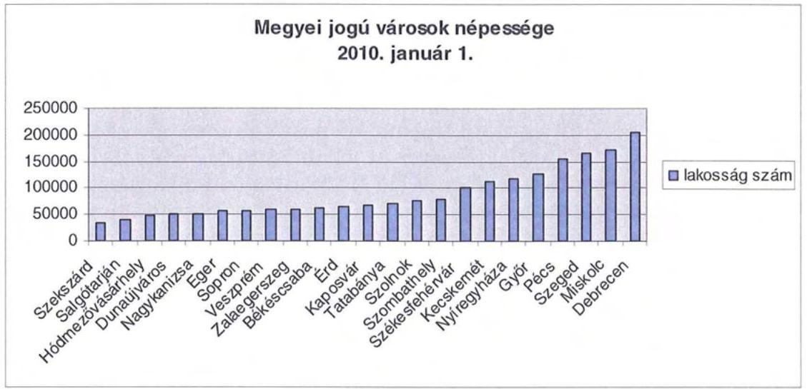

A megyei jogú városi önkormányzatok ${ }^{5}$ kötelező feladatellátását többlépcsős törvényi előírások határozzák meg. A feladatokra vonatkozó szabályozás első szintjét az Ötv. ${ }^{6}$, a második szintet a hatásköri7, a harmadik szintet a további ágazati, szakmai (egyebek mellett az oktatási, egészségügyi, szociális és egyéb ágazati feladatok ellátásának szakmai szabályait rögzítő) törvények adják.

[^0]
[^0]:    ${ }^{3}$ A Magyar Köztársaság 2011. évi költségvetéséről szóló 2010. évi CLXIX. törvény Általános indoklásának III. fejezete, valamint Magyarország Konvergencia Programja 2011-2015. (2011. április) Táblázatok rész, 2. táblázat Államháztartás összefoglaló adatai szerint.
    ${ }^{4}$ A megyei jogú városok népességét a 4/2011. (I. 31.) NGM rendelet 1. sz. mellékletében foglalt 2010. január 1-i adatok alapján vettük figyelembe.
    ${ }^{5}$ Az Ötv. 61. § (1) bekezdése alapján a megyeszékhely város a törvény erejénél fogva megyei jogú, ugyanakkor az Országgyűlés az ötvenezernél nagyobb népességű városokat a képviselőtestület kérelmére megyei jogú várossá nyilváníthatja. Ez utóbbi körbe 5 város tartozik, közülük 2 (Hódmezővásárhely, Dunaújváros) népessége 2010. január 1-ére már ötvenezer fő alá csökkent.
    ${ }^{6}$ az Ötv. 8. és 61. §-ában foglaltak szerint
    ${ }^{7}$ a Htv.

---

A megyei jogú városi önkormányzatok - az Ötv-ből közvetlenül levezethető települési feladatok mellett körzeti közszolgáltatásokat is ellátnak. A megyei jogú városi cím elsősorban többlet kötelezettségekkel jár, a megyei jogú városnak önmagának kell gondoskodnia mindazokról a feladatokról, amelyek más települési önkormányzatok esetében a megyei önkormányzat feladatát képezik. Ide sorolható többek közt a középfokú oktatási intézmények fenntartása, a közművelődési, könyvtári és levéltári szolgáltatás, a társadalombiztosítás finanszírozása mellett a kórházi és a rendelőintézeti szakellátás, a szociális és egyes gyermekvédelmi feladatok ellátása. Ezeket a feladatokat (intézményeket) a megyei jogú város - más városoktól eltérően - nem adhatja át a
 megyei önkormányzatnak, azonban az Ötv. lehetőséget biztosít arra, hogy a megyei önkormányzattal megállapodjék a feladatellátás megosztásában.

Az önkormányzat, így a megyei jogú város is, maga határozza meg, hogy - a lakosság igényei alapján, anyagi lehetőségei függvényében - mely feladatokat, milyen mértékben és módon, mely szervezeti keretek közt lát el. A szervezetalakítás szabadsága a megyei jogú városok esetében azzal járt, hogy mind a kötelező közszolgáltatásoknál (különösen a településüzemeltetés, vagyongazdálkodás), mind pedig az önként vállalt feladataik ellátásában - elsősorban a sport és kulturális szolgáltatások területein - a gazdasági társaságok kiemelt fontosságú szerephez jutottak. Ily módon a gazdálkodás, a pénzügyi helyzet kockázatai közvetlenül kikerültek ugyan az önkormányzati alrendszerből, azonban sérülhet az ellátási felelősség figyelemmel kísérése és érvényesítése, a közpénzek felhasználásának transzparenciája. Mindezek együttvéve - a beszámolók konszolidálásának hiányában - növelik a megyei jogú városok pénzügyi helyzetének megítélésében rejlő kockázatokat.

Az áttekintett időszakban az önkormányzati feladatok ellátásának keretet biztosító forrásszabályozás elvei lényegesen nem változtak.

A megyei jogú városok önkormányzatainak mozgásterét, az önkormányzatok feladatellátásra vonatkozó döntéseit a központi költségvetéstől való függőség mellett jelentősen befolyásolja a helyi adókivetési jog gyakorlása ${ }^{8}$. A helyi adók rendszere a közszolgáltatások finanszírozásához szükséges források megteremtésének, bővítésének eszköze, amely a gazdasági válság, a jogszabályi környezet, az adópolitika változása, az adóhatóságok tevékenysége következtében differenciáltan érinti a települési önkormányzatokat ${ }^{9}$.

A települési önkormányzatok saját folyó bevételeinek keretében elszámolt, különböző jogcímeken kivetett helyi adók - iparűzési adó, építmény és telekadó, idegenforgalmi adó, vállalkozók és magánszemélyek kommunális adója - 2007-2010 között eltérő módon emelkedtek. A helyi adókból származó bevételek realizált összege országos szinten 2007-2009 között folyamatosan, 505,3 milliárd Ft-ról 566,3 milliárd Ft-ra emelkedett, majd a gazdasági válság hatásai következtében 2010-re 542,6 milliárd Ft-ra esett vissza. A helyi adók részesedése

[^0]
[^0]:    ${ }^{8}$ a helyi adókról szóló 1990. évi C. törvény szabályai szerint
    ${ }^{9}$ Az Állami Számvevőszék 2010 decemberében közzétett 1031. számú jelentésében értékelte a helyi adók rendszerében a hatékonyság és az eredményesség érvényesülését.

---

az önkormányzatok saját folyó bevételein belül 2007-2010 között 2,5 százalékponttal csökkent ${ }^{10}$.

A megyei jogú városok saját folyó bevétele 2007-ben 191,5 milliárd Ft volt, 2008-ban 223,1, 2009-ben 225,4, 2010-ben 223,5 milliárd Ft-ot tett ki. A helyi adóbevételekből való részesedésük 2007-ben 110,5 milliárd Ft (21,9\%), 2008-ban 128,3 milliárd Ft (23,2%), 2009-ben 124,4 milliárd Ft (22%), 2010-ben 118,7 milliárd Ft (részaránya a 2007. évivel azonosan 21,9\%) volt. E realizált adóbevételek a megyei jogú városok saját folyó bevételeinek 2007-ben 57,7, 2008-ban 57,5, 2009-ben 55,2, 2010-ben 53,1%-át jelentették. A helyi adóbevételek 2007-ről 2010-re kimutatott 4,6 százalékpontos csökkenése annak ellenére következett be, hogy a megyei jogú városok saját folyó bevétele 2010-ben 16,7%-kal haladta meg a 2007. évit.

A helyi adókon belül a települések gazdasági helyzetének egyik fokmérője az elért helyi iparűzési adóbevétel, amely a megyei jogú városok körében erőteljes - a település nagyságrendtől is függő ${ }^{11}$ - különbségeket mutat. A helyi iparűzési adóbevétel és annak egy lakosra vetített összegének 2007. és 2010. évi alakulását az alábbi diagramok szemléltetik:
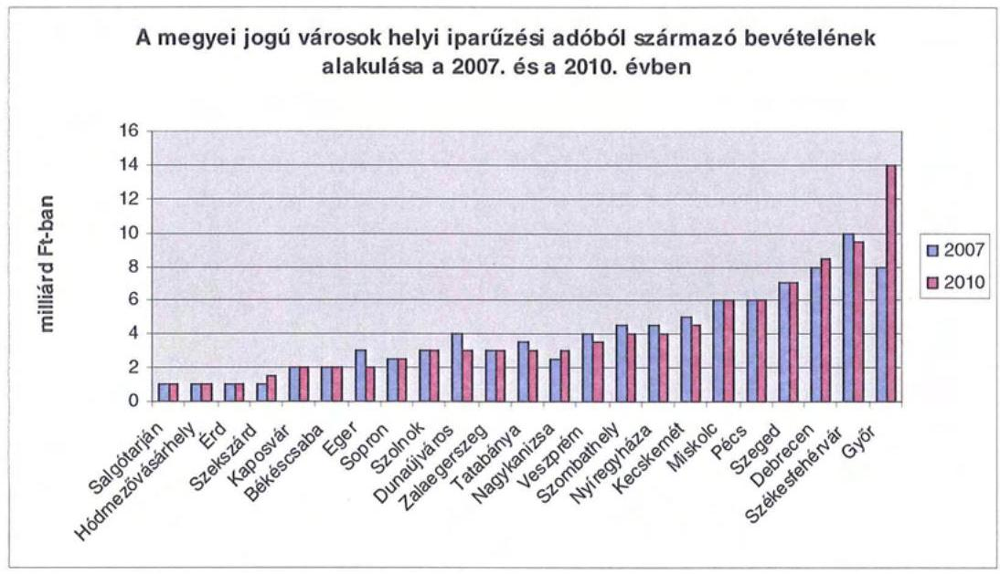

[^0]
[^0]:    ${ }^{10}$ A helyi adó bevételek saját folyó bevételekből való részesedése országosan 2007-ben 55,3%, 2010-ben 52,8% volt.
    ${ }^{11}$ A 100 ezer fő feletti népességű megyei jogú városok csoportjába Debrecen, Miskolc, Szeged, Pécs, Győr, Nyíregyháza, Kecskemét, Székesfehérvár tartozik. Nem megyeszékhely megyei jogú város Érd, Sopron, Nagykanizsa, Dunaújváros, Hódmezővásárhely.

---

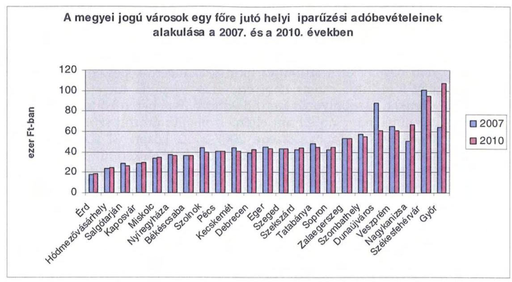

A megyei jogú városi önkormányzatok saját bevételein belül második legjelentősebb elem az illetékbevétel. A 2010. évben befolyt 39,2 milliárd Ft illetékbevétel a 2006. évben realizált 71,1 milliárd Ft illetékbevétel alig több mint 55%-a. A jelentős visszaesést döntően az ingatlanpiac stagnálása, majd visszaesése, illetve egyes illetékkedvezmények bevezetése okozta. A kieső bevételek pótlására az önkormányzati alrendszer szintjén történtek intézkedések, 2010-ben 5 milliárd Ft-ot, 2011-ben 1,2 milliárd Ft-ot ellentételezett a központi költségvetés. A megyei jogú városok önkormányzatai az önkormányzati alrendszer szintjén realizált illetékbevételből 2007-ben 13,6 milliárd Ft-tal (23,3%-kal), 2008-ban 15,3 milliárd Ft-tal (22,7%-kal), 2009-ben 12,6 milliárd Ft-tal (21,5%-kal), 2010-ben 7,9 milliárd Ft-tal (20,2%-kal) részesedtek ${ }^{12}$. Az összes befolyt illetékbevételből a megyei jogú városok részesedése 2009-ről 2010-re mindössze 1,3 százalékponttal csökkent, ugyanakkor a realizált illetékbevétel csökkenése a 37,3%-ot (4,7 milliárd Ft) is elérte.

Az önkormányzati alrendszer átengedett bevételei közül a személyi jövedelemadóból való részesedés makroszintű szabályozása a vizsgált időszakban nem változott. A települési önkormányzatokat a településre kimutatott személyi jövedelemadó 8%-a közvetlenül, míg 32%-a külön szabályozott visszaosztási rendben illeti meg. A visszaosztás a jövedelem differenciálódás mérséklésével párosul, rendje a lakóhelyen maradó személyi jövedelemadóhoz és az iparűzési adó-erőképességhez ${ }^{13}$ igazodik, annak részletszabályait a mindenkori költségvetési törvény 4. számú melléklete határozza meg. A jövedelemdifferenciálódás

[^0]
[^0]:    ${ }^{12}$ Az illetékek kivetésének és beszedésének joga 2006. december 31-ig a megyei önkormányzatok feladata volt, amelyet a 2007. évtől az APEH (2011. január 1-jétől NAV) vett át. Az önkormányzati illetékrészesedési szabályok változatlanok maradtak, azonban az illetékbeszedés költségeit az önkormányzatok illetékbevételeiből átlagos (a megyei jogú városoknál 8,5%-os) kulcsot alkalmazva vonták le.
    ${ }^{13}$ Az iparűzési adóerő-képesség egy potenciális, átlagos erőfeszítés mellett elérhető (a települési önkormányzat iparűzési adóelőlegét meghatározó adóalap 1,4%-ának megfelelően számított) bevétel.

---

szabályai kétirányúak, a kiegészítés és a visszatartás feltételeit egyaránt meghatározták:

- Amennyiben az önkormányzatot közvetlenül megillető személyi jövedelemadó bevétel és a számított iparűzési adóerő-képesség együttesen számított, egy főre jutó összege nem érte el a település méretéhez kapcsolódóan az évenkénti szabályozás szerinti változó összeget, a költségvetés a részesedést település nagyság szerint eltérően meghatározott szintig - kiegészítette ${ }^{14}$. A kiegészítés fajlagos összege 2007-2010 között 37500 Ft-ról 48010 Ft-ra (10 510 Ft-tal, 28%-kal) emelkedett. Az előzőeken túl a jövedelem differenciálódás szabályozása egyes térségi (középiskolai, szakiskolai, szakképző intézményi, kollégiumi) feladatok ellátásának függvényében további kiegészítő hozzájárulást biztosított.
- Amennyiben az egy főre számított személyi jövedelemadó és az iparűzési adóerő-képesség együttes összege a település nagyságrendjéhez rendelt értékhatárt több mint 25%-kal (2010-től 20%-kal) meghaladta, az egy főre jutó összeg sávonként differenciált módon ${ }^{15}$ visszavonásra került az önkormányzatot megillető normatív állami hozzájárulás összegéből.

Az önkormányzatok személyi jövedelemadó bevétele 2007-ben 494,3 milliárd Ft, 2008-ban 558,6 milliárd Ft, 2009-ben 639,5 milliárd Ft, 2010-ben 681,2 milliárd Ft volt, az időszak alatt összegében 186,9 milliárd Ft-tal, 37,8%-kal emelkedett, miközben az szja bevétel átengedett bevételeken belüli részesedése 1,8 százalékponttal emelkedett.

A megyei jogú városok önkormányzatainak személyi jövedelemadó részesedése az alrendszer átengedett személyi jövedelemadó bevételeiből 2007-ben 77,6 milliárd Ft-ot (15,7%-ot), 2008-ban 105,4 milliárd Ft-ot (18,9%-ot), 2009-ben 122,9 milliárd Ft-ot (19,2%-ot), 2010-ben 136,6 milliárd Ft-ot (20,1%-ot) tett ki. A realizált szja bevétel a megyei jogú városoknál az időszak alatt folyamatosan emelkedett, a 2010-ben realizált adóbevétel 59,0 milliárd Ft-tal (76%) volt magasabb a 2007. évinél, az átengedett bevételeken belüli részesedése 2010-re 5,1 százalékponttal haladta meg a 2007. évi részarányt ${ }^{16}$. A részesedés alapjául szolgáló szja településenként eltérő, az egy adózóra jutó szja 2009. évi adatait ${ }^{17}$ a következő ábra szemlélteti.

[^0]
[^0]:    ${ }^{14}$ A megyei jogú városok esetében a jövedelemkülönbségek mérséklésénél figyelembe veendő lakosonkénti értékhatár 2007-ben 37500 Ft, 2008-ban 42385 Ft, 2009-ben 45933 Ft, 2010-ben 48010 Ft volt.
    ${ }^{15}$ A sávos értékhatár 2010-től 20%-os intervallumonként, 120% felett a visszatartást 25%-tól 90%-os mértékig rögzíti. Amennyiben a település nagyságrendhez rendelt értékhatár összege az önkormányzatnál eléri vagy meghaladja a 200%-ot, az egy főre jutó összeg 90%-a levonásra kerül. Az értékhatár sávjai 2010 előtt 25%-os léptékűek voltak, a levonási arányok az ellenőrzött időszakban nem változtak.
    ${ }^{16}$ E bevételek a megyei jogú városok átengedett bevételeiben 2007-ben 84,7, 2008-ban 87,7, 2009-ben 89,7, 2010-ben 89,8%-os részarányt jelentettek.
    ${ }^{17}$ Adatforrás: KSH Megyei Jogú Városok a Közép-Dunántúlon 2009. kiadványa, 4.1.sz. összehasonlító tábla.

---

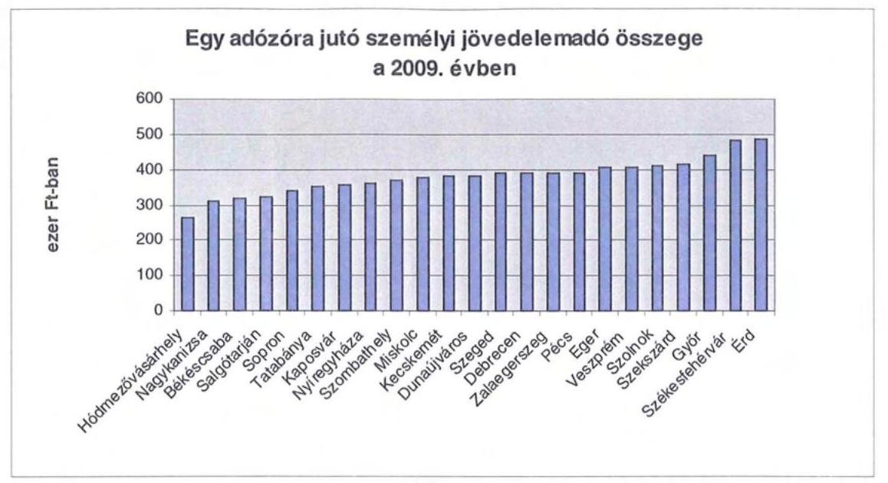

Az átengedett bevételek második legjelentősebb eleme a gépjárműadó, amelynek bevételi szabályozása az ellenőrzött időszakban nem változott, az adóbevétel teljes összege az önkormányzatot illeti meg. A gépjárműadó alapját, mértékét ${ }^{18}$ és egyes mentességi kategóriákat érintő módosítások 2010. január 1-től következtek be, amelyek az egyes adótételek esetében átlagosan 15%-os emelkedéssel jártak.

A gépjárműadó beszedéséből származó bevétel az önkormányzati alrendszer szintjén 2007-ben 62,4 milliárd Ft, 2008-ban 65,7 milliárd Ft, 2009-ben 63,8 milliárd Ft, 2010-ben 71,1 milliárd Ft volt, az adóbevétel egésze 2007-hez képest 8,7 milliárd Ft-tal, 13,9%-kal emelkedett. A gépjármű-adóztatás szabályainak változása 2010-ben 7,3 milliárd Ft többletet eredményezett. A megyei jogú városok gépjárműadó bevétele a 2007. évi 14,0 milliárd Ft-ról 2010-re 15,5 milliárd Ft-ra, 10,7%-kal emelkedett. A bevételnövekedés összegéből 1,4 milliárd Ft a 2010. évi adózási szabályok következménye.

A megyei jogú városok önkormányzatai 2007-2010 között rendelkezésre álló forrásainak alakulását a következő ábra szemlélteti:

[^0]
[^0]:    ${ }^{18}$ A gépjárműadóról szóló 1991. évi LXXXII. törvény 7. § (1) bekezdésében foglalt adómértékek változása.

---

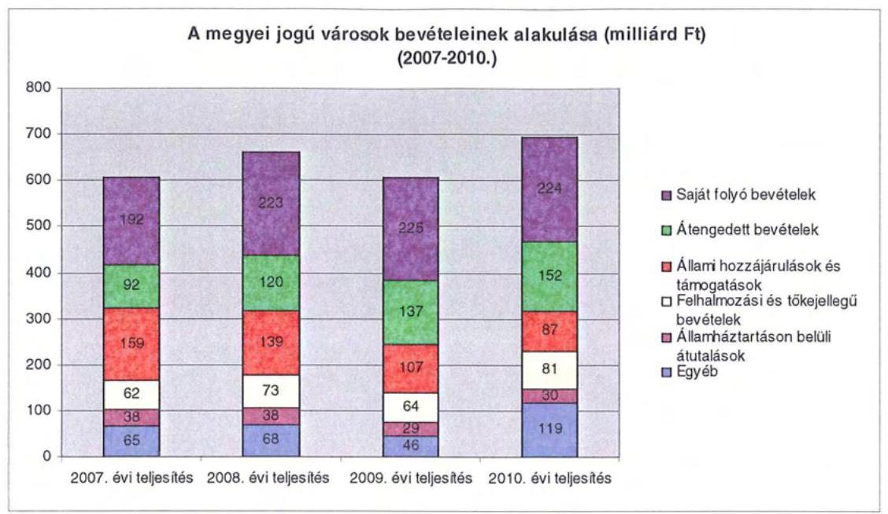

A megyei jogú városok saját folyó bevételeinek - amelyek főbb elemei: a helyi adók, az illetékbevételek, az intézményi térítési díjak, a kamatbevételek - részaránya a 2007. évi összbevételen (608 milliárd Ft) belül 32% volt. A 2010. évi összbevétel 693 milliárd Ft-os összegéből a saját folyó bevételek aránya - miközben összege 2007-ről 2010-re 32 milliárd Ft-tal emelkedett - nem változott.

Az átengedett bevételek, amelyek a megyei jogú városok önkormányzatainál döntően a személyi jövedelemadó és a gépjárműadó részesedést jelenti, az összbevételen belül a 2007. évi 92 milliárd Ft-ról (15%) 152 milliárd Ft-ra nőtt, részesedése 7 százalékponttal emelkedett. A 60 milliárd Ft-os növekedésből 59 milliárd Ft-ot az szja részesedés emelkedése okozott.

Az állami hozzájárulások és támogatások - amelyek főbb elemei: főként az ellátotti létszámhoz kötődő normatív állami hozzájárulások, központosított előirányzatok - a 2007. évi 159 milliárd Ft-ról (26%-os részarányról) 2010-re 87 milliárd Ft-ra (13%-os részarányra) estek vissza.

A felhalmozási és tőkejellegű bevételek - tárgyi eszközök (ingatlanok és ingóságok), föld és immateriális javak, részesedések értékesítése, EU-tól átvett pénzeszközök - a 2007. évi 62 milliárd Ft-ról (10%-os részarányról) 2010-re 81 milliárd Ft-ra (12%-os részarányra) emelkedtek.

Az államháztartáson belüli átutalások részesedése 2007-ben 38 milliárd Ft volt. 2010. év végére 8 milliárd Ft-tal csökkent, részaránya 6%-ról 2010-ben 4%-ra változott. Ez a bevételi kategória tartalmazza az Egészségbiztosítási Alaptól és más elkülönített állami pénzalapoktól átvett forrásokat. A 2010-ben e címen elszámolt bevétel a megyei jogú városoknál 22 milliárd Ft-ot tett ki.

Az egyéb, pénzmaradványból, vállalkozási bevételekből, államháztartáson kívülről származó átutalásokból, a hitelekből, a hosszú és rövid lejáratú értékpa-

---

pírok értékesítéséből származó bevételek részesedése a 2007-2010. évek viszonylatában 11\%-ról 17\%-ra emelkedett. Ez utóbbiak 2010. évi beszámoló szerinti összevont teljesítése 119 milliárd Ft volt ${ }^{19}$.

Mindezeket figyelembe véve a megyei jogú városok 2007. és 2010. évi forrásösszetételének megoszlását az alábbi ábra szemlélteti:

A megyei jogú városok 2007. és 2010. évi forrásösszetétele
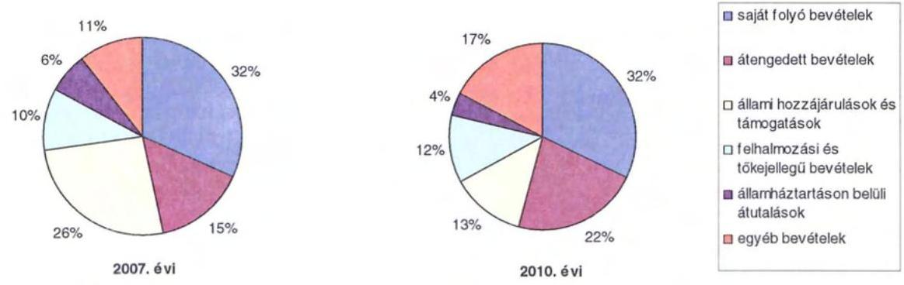

Az önkormányzati alrendszer pénzügyi helyzetértékelése során új elemzési módszereket alkalmaz az ellenőrzés. A hagyományos költségvetési szerkezet helyett az önkormányzat pénzügyi helyzetét a CLF módszerrel mutatjuk be, amelynek lényegét és számításának módszerét a 2.1. pontban, és a jelentés 2. számú mellékletében ismertetjük részletesen.

Az új módszereken alapuló helyzetértékelés fontosságát az adja, hogy a helyi önkormányzatok bruttó adósságállománya ${ }^{20}$ a 2010. évi költségvetési beszámoló alapján 1248 milliárd Ft-ot tett ki. Az adósságállomány koncentráltságát jelzi ${ }^{21}$, hogy ebből a 23 megyei jogú város részesedése 338 milliárd Ft volt, amely a fővárosi és kerületi önkormányzatok adósságának figyelmen kívül hagyásával számított 2010. évi 977 milliárd Ft összegű bruttó adósságállomány 34,6\%-át jelentette. Az adósságállomány több mint fele - 501 milliárd Ft - a 19 megyei önkormányzatnál és a 23 megyei jogú városnál jelentkezett.

[^0]
[^0]:    ${ }^{19}$ Az egyéb bevételek összege 2007-2010 között eltérő módon változott, 2007-ben 65 milliárd Ft, 2008-ban 68 milliárd Ft volt, 2009-ben 46 milliárd Ft-ra esett vissza, majd 2010-ben több mint két és félszeresére, 119 milliárd Ft-ra emelkedett.
    ${ }^{20}$ A bruttó adósságállomány 2010. év végi összege magában foglalja a fejlesztési és a működési célú kötvénykibocsátások, a beruházási és fejlesztési hitelek, a működési célú hosszú lejáratú hitelek, a rövid lejáratú hitelek, váltótartozások miatti kötelezettségek teljes (2011-ben, illetve az azt követő években esedékes) állományát.
    ${ }^{21}$ A megyei jogú városok adósságállománya összegében ugyan elmarad az egyéb városok összesített adósságától [(ez utóbbiak részesedése 382,6 milliárd Ft (39,2\%)], azonban az egyéb városok száma 304. A fővárosi és a kerületi önkormányzatok nélküli adósságállományból a 19 megyei önkormányzat 163 milliárd Ft-tal (16,8%-kal), míg a nagyközségek, községek együttesen 93 milliárd Ft-tal (9,5%-kal) részesednek.

---

A megyei jogú városok 338 milliárd Ft-os adósságállományából 175 milliárd Ft (51,8%) a nyolc legnagyobb, 100 ezer fő feletti népességű város tartozása. Az öt nem megyeszékhely megyei jogú város bruttó adósságállománya 70 milliárd Ft-ot (20,7%-ot), az előző két csoportba nem tartozó további 10 megyei jogú város adóssága 93 milliárd Ft-ot (27,5%-ot) tett ki.
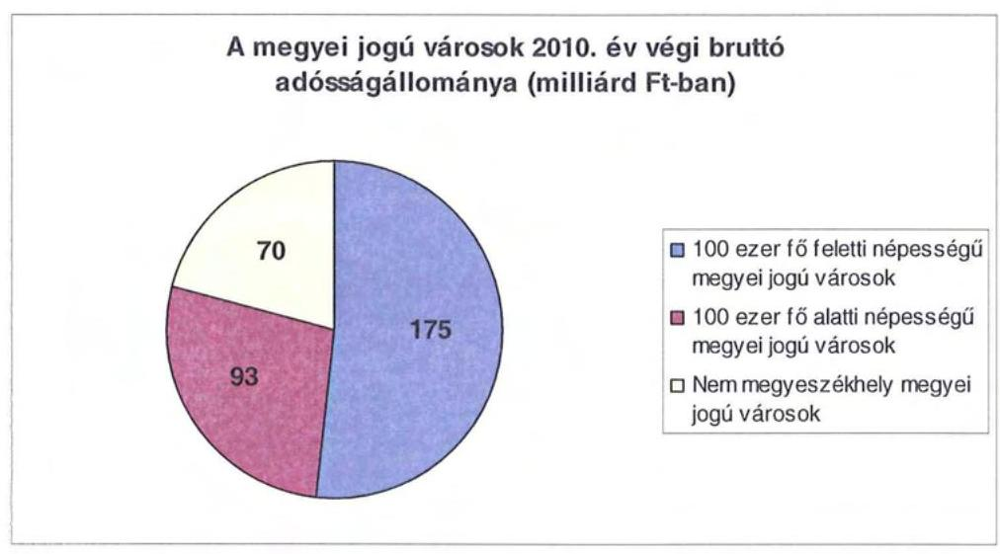

A mérlegben kimutatott bruttó adósságállomány mellett az önkormányzatok számára az eszközállomány műszaki állapotának megőrzése is kötelezettségekkel jár. Az elhasználódott eszközök pótlására forrást biztosító amortizációs (felújítási) alap képzésének ${ }^{22}$ elmaradása maga után vonhatja a feladatellátást kiszolgáló tárgyi eszközök állagának erőteljes romlását. Emellett a 2007-2013-as időszakra meghirdetett, vissza nem térítendő EU-s fejlesztési forrásokhoz való hozzájutás lehetősége felerősítette az önkormányzati alrendszer fejlesztési igényeit, amelyek a felhalmozási költségvetési hiány folyamatos emelkedésén túl - az előírt jövőbeni fenntartási kötelezettség miatt - tovább terhelhetik az önkormányzatok költségvetését ${ }^{23}$.

Az ÁSZ a 2011. évi ellenőrzési tervében 43. számú, az Önkormányzatok gazdálkodási rendszerének ellenőrzése részeként egy időben, egymással párhuzamosan tekinti át, és elemzi a 23 megyei jogú városi önkormányzat pénzügyi helyzetét. A gazdálkodás szabályszerűségét az ÁSZ az előző évek során ebben az önkormányzati körben is ellenőrizte, ezért jelen vizsgálatunk erre nem tér ki. A jelentés a megyei jogú városok sajátos feladatellátási és forrásszabályozási

[^0]
[^0]:    ${ }^{22}$ Erre a jelenlegi szabályozási környezetben nem kötelezi semmilyen előírás az önkormányzatokat.
    ${ }^{23}$ Az Állami Számvevőszék 2011 júniusában közzétett 1108. számú, a helyi önkormányzatok fejlesztési célú támogatási rendszerének ellenőrzéséről szóló jelentésében feltárta a fejlesztési folyamatok problémáit. A helyi önkormányzatok elsősorban azokat a fejlesztéseket valósították meg, amelyekhez támogatást lehetett igényelni. A fejlesztési célok közül a magasabb támogatás intenzitású pályázatokat részesítették előnyben. A fejlesztéssel megvalósuló létesítmények jövőbeli üzemeltetésének várható ráfordításait az önkormányzatok 71,9\%-a nem mérte fel.

---

helyzetére tekintettel az önkormányzatok pénzügyi helyzetét, illetve az ezzel összefüggő korábbi ÁSZ javaslatok megvalósítását mutatja be.

Az ellenőrzés a 2007. január 1. - 2010. december 31. közötti időszakot öleli fel.
A vizsgálat jogszabályi alapját az Állami Számvevőszékről szóló 1989. évi XXXVIII. törvény 2. § (3), (5), (6) és (9) bekezdései ${ }^{24}$, az Ötv. 92. § (1) bekezdése, az Áht. 104. § (3), és 120/A. § (1) bekezdése előírásai képezik.

[^0]
[^0]:    ${ }^{24}$ 2011. július 1-jétől az Állami Számvevőszékről szóló 2011. évi LXVI. törvény 5. § (2)(5) bekezdései

---

# I. ÖSSZEGZŐ MEGÁLLAPÍTÁSOK, JAVASLATOK 

Az Önkormányzat - adatszolgáltatása szerint - a tárgyév Kórház nélküli működési költségvetési kiadásaiból (19 894 millió Ft) 19008 millió Ft-ot (96%) a kötelező feladatok, 826 millió Ft-ot (4%) az önként vállalt feladatok ellátására fordított. A kötelező és önként vállalt feladatok részarányának megállapítása az Önkormányzat SzMSz szerinti besorolásának megfelelően készült. Az Önkormányzat a szelektív hulladékkezelést, -gazdálkodást, a temetkezési szolgáltatást, a városfejlesztési és egyéb tevékenységeket (pl. egyes szociális és gyermekvédelmi ellátások, egyes sporttámogatások és egyéb támogatások stb.) tekinti önként vállalt feladatának.

Az Önkormányzat feladatellátásának szervezeti struktúráját a következő ábra szemlélteti:
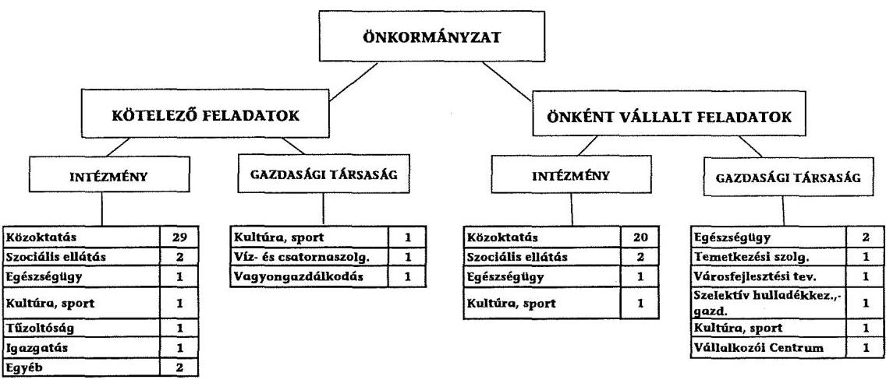

Az Önkormányzat feladatait 2010. december 31-én (a Polgármesteri hivatallal együtt) 37 költségvetési szervvel és kilenc 25% feletti tulajdoni hányadú gazdasági társaságával, továbbá három - az önkormányzattól tulajdonosi szempontból független gazdasági társaság közreműködésével látta el. Az intézményszervezeti átalakítások és intézményi összevonások következtében a feladatellátás telephelyeinek száma a 2006. évi 115-ről 2010-re 96-re csökkent.

Az Önkormányzat működési kiadásokra 2010-ben 15502 millió Ft-ot fordított, amely 2374 millió Ft-tal (18%-kal) haladta meg a 2007. évi ráfordításokat. A működési kiadások 57%-át az intézményi körben realizálták. E kiadások fedezetéül szolgáló bevételi források 2007. és 2010. években jellemző összesített arányait a következő ábra szemlélteti:

---

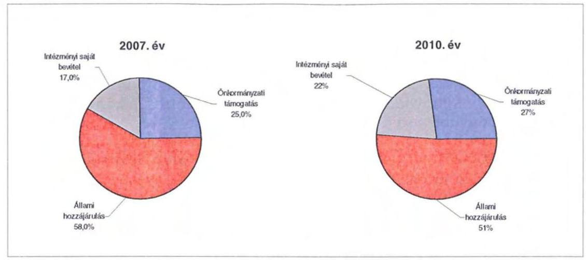

Az egyes közszolgáltatások feladatellátásában résztvevő ágazati intézménycsoportok forrásösszetételének bevételi jogcímenkénti alakulását a következő ábra szemlélteti:
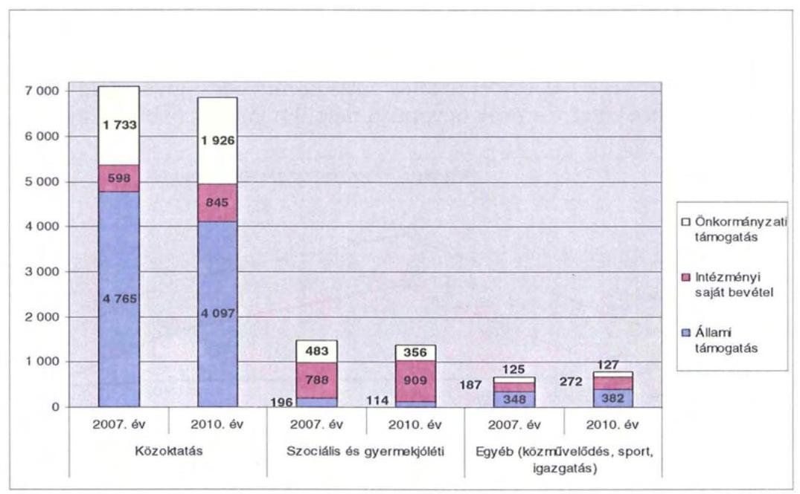

Az Önkormányzat az áttekintett időszakban kórház fenntartásáról is gondoskodott. A Kórház számára összesen 346 millió Ft támogatást biztosított, amelyből működési célra 288 millió Ft-ot, fejlesztési célra 58 millió Ft-ot adtak át. A működési támogatások teljes egészében a központi költségvetésből származó (bérpolitikai intézkedések) támogatás továbbadása volt. A fejlesztési támogatások a Kórház gép-műszer beszerzéseihez kapcsolódtak.

Az Önkormányzat négy gazdasági társaságban rendelkezik kizárólagos tulajdonnal, egy gazdasági társaságban 75% feletti, kettő gazdasági társaságban 51-75% közötti, kettőben 26-50% közötti tulajdoni hányaddal. A gazdasági társaságok a kötelező feladatok közül a vagyonkezelés valamint a víz- és szennyvízelvezetés biztosításában kaptak szerepet. A gazdasági társaságok működésükhöz a 2010. évben összesen 311,4 millió Ft rendszeres működési, 10,9 millió Ft eseti működési és 24,6 millió Ft fejlesztési célú pénzeszközt kaptak az Ön-

---

kormányzattól. Az átvett működési célú pénzeszközök 47%-át (151,1 millió Ft-ot) a sportegyesületet működtető társaság kapta, azonban ez az összeg az Önkormányzat pénzügyi egyensúlyi helyzetét nem veszélyeztette.

A társaságok pénzügyi helyzete stabil. Az Önkormányzat 25%-ot meghaladó tulajdoni hányadában álló kilenc gazdasági társaság közül kettő ${ }^{25}$ esetben volt alacsonyabb a saját tőke, mint a jegyzett tőke.

A 2007-2010. években az Önkormányzat folyó költségvetési egyenlege, működési jövedelme pozitív volt ${ }^{26}$. A 2007-2009. években a működési megtakarítások fedezni tudták a tárgyévben jelentkező törlesztési kötelezettségeket, így az Önkormányzat pénzügyi kapacitása (nettó működési jövedelme) is pozitív értékű volt. A 2010. évben a pénzügyi kapacitás negatívvá vált ( -9 millió Ft), mivel a keletkezett csekély összegű működési megtakarítás (234 millió Ft) a 243 millió Ft tőketörlesztési kötelezettség 3,7%-ára már nem nyújtott fedezetet. A 2010. évi pénzügyi kapacitás 2007-hez viszonyított romlását a működési jövedelem 63,0%-os csökkenése okozta, melyet nem tudott ellensúlyozni a tőketörlesztési kötelezettségek 22,5%-os csökkenése. A működési jövedelem csökkenését az eredményezte, hogy a folyó bevételek növekedése (10,8%) elmaradt a folyó kiadások növekedésétől (13,5%). A CLF módszer alapján az Önkormányzat adósságszolgálatának, valamint fejlesztési kiadásainak fedezete - a 2010. évivel azonos összegű működési jövedelem képződése mellett - további külső források bevonása nélkül nem látszik biztosítottnak.
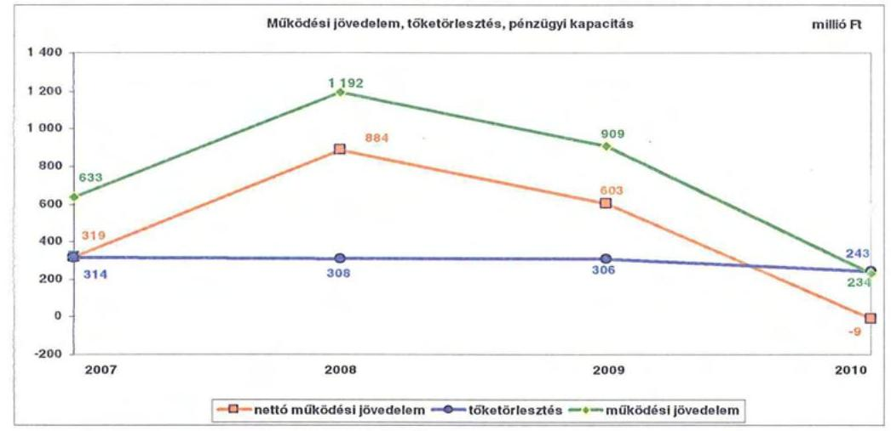

A 2007-2010. években az Önkormányzat felhalmozási költségvetésének egyenlege folyamatosan negatív összegű volt, amely 2007-2010. között összesen 7020 millió Ft felhalmozási forráshiányt okozott.

A pénzügyi egyensúly fenntartása külső források bevonásával volt biztosítható. A 2007-2010. években 1170 millió Ft hitelt törlesztett az Önkormányzat. Az

[^0]
[^0]:    ${ }^{25}$ Az egyik gazdasági társaság végelszámolás alatt áll.
    ${ }^{26}$ 2007-ben a folyó kiadások 3,6%-át (633 millió Ft-ot), 2008-ban 6,3%-át (1192 millió Ft-ot), 2009-ben 4,8%-át (909 millió Ft-ot), a 2010-ben 1,2%-át (234 millió Ft-ot) tette ki a pozitív működési jövedelem.

---

adósságszolgálat, továbbá a felhalmozási forráshiány 2007-2010. között 8190 millió Ft-ot tett ki, amelyre az időszakban képződő 2968 millió Ft működési megtakarítás (működési jövedelem), valamint a 2007. január 1-jén rendelkezésre álló 1135 millió Ft pénzkészlet szolgált fedezetül. A további pénzeszközöket 450 millió Ft fejlesztési célú hitel felvételével, továbbá 4000 millió Ft kötvény kibocsátásával teremtették meg. A kialakult pénzügyi helyzet pozitív nettó működési jövedelmet eredményező gazdálkodás mellett teszi elkerülhetővé további külső források bevonását, az eladósodás növekedését.

A vizsgált időszakban Önkormányzatnál helyi iparűzési adó, építményadó, vállalkozók kommunális adója, vendégéjszakák utáni idegenforgalmi adó volt megállapítva. A helyi adókból és pótlékokból származó bevételek aránya 2007-2010 között 14% körül mozgott a folyó (működési) bevételekben. A helyi adó bevétel a 2007. évi 2545 millió Ft-ról 2010. évben 2590 millió Ft-ra (2%-kal, 45 millió Ft-tal) nőtt. A helyi adóbevételek több mint háromnegyed részét (89-90%) az iparűzési adó tette ki, amelynek mértéke a helyi adókról szóló törvényben rögzített maximális mértékben került megállapításra. A helyi adók növekedését az iparűzési adó 14 millió Ft-os, a kommunális adó 22 millió Ft-os és az építményadó 7 millió Ft-os növekedése okozta. Új helyi adónemet a vizsgált időszakban az Önkormányzat nem vetett ki.

A befejezett fejlesztések jelentős részét pénzintézeti forrásokból finanszírozták. A 2007-2010. évek időszakában 10149 millió Ft értékű fejlesztés és felújítás forrása 2215 millió Ft kötvényből származó bevétel (22%), valamint 450 millió Ft hitelfelvétel (4%) volt. A 2010. december 31-én folyamatban lévő fejlesztési feladatok végrehajtására 4784 millió Ft kiadást teljesítettek, amelyre a kötvény bevételéből 1003 millió Ft-ot (21%), fordítottak.

Az Önkormányzat 2010. december 31-én a folyamatban lévő fejlesztési
 feladatok kötelezettség-vállalásainak összege 20 520 millió Ft volt. Ennek forrásaként 13 986 millió Ft EU-s forrást (68\%), 2083 millió Ft hazai támogatást (10\%), 2165 millió Ft kötvényforrást (11\%), 303 millió Ft hitelt (1\%), illetve 1983 millió Ft (10\%) saját bevételt terveznek felhasználni.
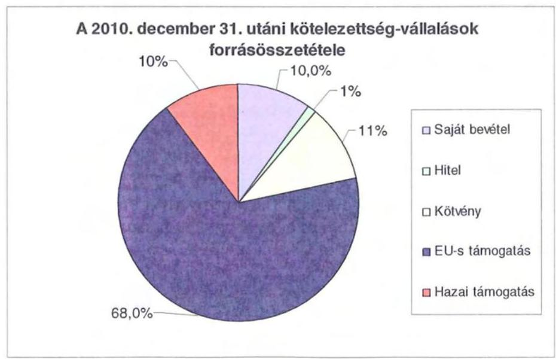

---

A benyújtott, de támogatási szerződéssel még nem rendelkező kilenc pályázat 3246 millió forint tervezett kiadásához 2090 millió Ft (64\%) támogatásra nyújtott be pályázatot az Önkormányzat. A teljes bekerülési költség (3246 millió Ft) 1\%-a (36 millió Ft) volt a 2010. december 31-ig teljesített kiadás, míg 99\%-a (3200 millió Ft) a 2010. év utánra vállalt kötelezettség. Ennek a kötelezettségnek várhatóan a 63\%-a (2005 millió Ft) EU-s támogatás, 14 millió Ft kötvényforrás, $34 \%$-a (1094 millió Ft) hitel, $3 \%$-a (85 millió Ft) hazai támogatás, míg 2 millió Ft a saját bevétel.

A folyamatban lévő, valamint a benyújtott, de támogatási szerződéssel még nem rendelkező fejlesztési feladatokhoz további 4000 millió Ft külső forrás (kötvény kibocsátás, fejlesztési hitel felvétel) bevonása szükséges.

Az Önkormányzat mérleg szerinti pénzintézeti kötelezettsége a 2006. év végéről a 2010. év végére, 1780 millió Ft-ról 7973 millió Ft-ra nőtt, amelyből az árfolyamváltozás miatti különbözet 2269 millió Ft volt. A fennálló pénzintézeti kötelezettségek egy kötvény kibocsátásból, hat hosszú lejáratú hitel felvételéből, egy egyszeri likvid hitel és a folyószámlahitel igénybevételéből keletkeztek.

A Közgyűlés a 2011-2014. évekre szóló gazdasági programban foglalt több éves fejlesztési kötelezettségek finanszírozása céljából további 2000 millió Ft kötvény kibocsátásáról és 2000 millió Ft fejlesztési hitel felvételéről döntött 2011. május 27-én. A kötvényt 2011 júliusában bocsátják ki, a hitelt - a közbeszerzési eljárás lefolytatását követően - várhatóan 2011 októberében fogja igénybe venni az Önkormányzat.

Az Önkormányzat kötelezettségvállalásaira közgyűlési döntés alapján került sor, azonban az előterjesztésekben nem mutatták be a visszafizetés forrásait, a kamatkockázatot és - a devizaalapú kötelezettségeket érintő - árfolyamkockázatot.

Az Önkormányzat a kötvényt az éves költségvetésekben tervezett beruházások és felújítások finanszírozása céljából bocsátotta ki. Három fejlesztési hitelből szintén az éves költségvetésekben tervezett beruházásokat és felújításokat finanszírozta, kettő hitelből oktatási intézmények felújításához biztosított önerőt, egy hitel pedig az Árpád Fürdő tulajdonjogának átvételéhez kapcsolódott, mivel az Önkormányzat átvállalta a BMV Zrt. Árpád Fürdő rekonstrukciójára felvett hitelből a még fennálló kötelezettséget.

Az Önkormányzat a devizában fennálló szerződéskori/kibocsátáskori 7322 ezer EUR, 27478 ezer CHF pénzintézeti kötelezettségeiből 3039 ezer EUR tőkét törlesztett, valamint 812 ezer EUR és 1485 ezer CHF kamatot fizetett meg 2010. december 31-ig. A HUF-ban fennálló szerződéskori 568 millió Ft kötelezettségből 133 millió Ft tőkét törlesztettek és 72 millió Ft kamatfizetést teljesítettek 2010. december 31-ig. Az Önkormányzat a kötvény kibocsátásából származó bevétel $80 \%$-át, a hitelek igénybevételéből származó forrásokat teljes egészében a 2010. év végéig a céloknak megfelelően felhasználta. A 2007-2010 években átmenetileg szabad pénzeszközeiből 1046 millió Ft kamatbevételt realizált, melyből 841 millió Ft származott a kötvénybevételek befektetéséből, melyből 318 millió Ft-ot a kötvények kamatfizetésére fordítottak. A banki befolyás nem jelentett kockázatot az Önkormányzat számára, mivel a kibocsátott kötvény le-

---

jegyzése (27 478 ezer CHF), illetve a hat fennálló fejlesztési hitelből (268 millió Ft, 7322 ezer EUR) három folyósítása (157 millió Ft, 2700 ezer EUR) nem a számlavezető pénzintézet által történt.

A pozitív előjelű folyó költségvetési egyenleg ellenére az Önkormányzat folyószámlahitel felvételére kényszerült, az átmeneti likviditási problémák kezelése, valamint fejlesztési kiadásai finanszírozása miatt. A folyószámlahitel napi átlagos állománya a 2007-2010. évek között több mint kétszeresére nőtt. A 2010. évben egy hónapban munkabérhitel felvételére is szükség volt, továbbá az év végén háromhavi futamidőre 300 millió Ft likvid hitel felvételére is sor került.

A folyószámlahitel igénybevétele a 2007-2010. években az alábbiak szerint alakult:

| Megnevezés | 2007. év | 2008. év | 2009. év | 2010. év |
| :-- | --: | --: | --: | --: |
| Keretösszeg január 1-jén | 800 | 800 | 500 | 500 |
| Átlagos napi állomány | 38 | 50 | 18 | 81 |
| Folyószámlahitellel zárt napok száma (nap) | 126 | 143 | 102 | 184 |
| 2010. december 31-i egyenleg (állomány) | x | x | x | 213 |

A likviditás biztosítása az Önkormányzatnak 27 millió Ft kamatkiadást okozott.

Az Önkormányzat 2010. év végi szállítói tartozása 543 millió Ft, melyből a lejárt tartozás 187 millió Ft volt. A lejárt tartozások 19\%-a (36 millió Ft) meghaladta a 91 napot. Az Önkormányzat intézményeinél a 60 napot meghaladó, szállítók felé fennálló kötelezettségek miatt - a helyi önkormányzatok adósságrendezési eljárásáról szóló 1996. évi XXV. törvényben foglaltak ellenére - a Polgármester nem kezdeményezett adósságrendezési eljárást.

Az Önkormányzat a víziközmű társulat és egy gazdasági társasága részére fejlesztési hitelek igénybevételéhez készfizető kezességet vállalt 456 millió Ft összegben. A 2010. év végére kezességgel kapcsolatos kötelezettség 33 millió Ft-ra csökkent. A gazdasági társaságok részére nem nyújtott kölcsönt az Önkormányzat.

A Közgyűlés a fejlesztési hitelek biztosítékaként 41 millió Ft számviteli nyilvántartás szerinti nettó értékű ingatlanra járult hozzá jelzálogjog alapításához és bejegyzéséhez. A jelzálogszerződésekkel érintett ingatlanok a forgalomképes ingatlanok 2\%-át jelentik. Korlátozottan forgalomképes ingatlanokra is történt jelzálogjog bejegyzés, mely az Ötv-ben foglaltakkal ellentétes.

---

Az Önkormányzat egyes kötelezettségeinek 2010. december 31-i állományát és várható alakulását a kötelezettségek lejáratáig a következő táblázat szemlélteti:

| Megnevezés | Állomány 2010. dec. 31-én |  |  | Várható kötelezettség** 2011-2013. években |  |  | Várható kötelezettség** 2014. évet követően |  |  |
| :--: | :--: | :--: | :--: | :--: | :--: | :--: | :--: | :--: | :--: |
|  | $\begin{aligned} & \text { HUF-ban } \\ & \text { (millió Ft- } \\ & \text { ban) } \end{aligned}$ | Devizában (ezer EUR-ban, ezer CHF-ben) | Devizanem | HUF-ban (millió Ft-ban) | Devizában (ezer EUR-ban, ezer CHF-ben) | Devizanem | $\begin{aligned} & \text { HUF-ban } \\ & \text { (millió Ft- } \\ & \text { ban) } \end{aligned}$ | Devizában (ezer EUR-ban, ezer CHF-ben) | Devizanem |
| Pénzintézeti kötelezettségek |  |  |  |  |  |  |  |  |  |
| Összes lejáratú kötelezettségek | 133 |  | HUF | 119 |  | HUF | 34 |  | HUF |
| Összes lejáratú kötelezettségek |  | 4334 | EUR |  | 2351 | EUR |  | 2183 | EUR |
| Adósszolgálat (fiktív adatsora 2020) |  | 27478 | CHF |  | 2351 | CHF |  | 29366 | CHF |
| Folyószámlahitel keret | 213 |  | HUF | 213 |  | HUF |  |  |  |
| Egyéb likvid kötelezettség | 200 |  | HUF | 200 |  | HUF |  |  |  |
| Pénzintézeti kötelezettségek összesen HUF-ban | 686 |  | HUF | 632 |  | HUF | 34 |  | HUF |
| Pénzintézeti kötelezettségek összesen CHF-ben |  | 27478 | CHF |  | 2035 | CHF |  | 29366 | CHF |
| Pénzintézeti kötelezettségek összesen EUR-ban |  | 4334 | EUR |  | 2351 | EUR |  | 2183 | EUR |
| Biztosítékok |  |  |  |  |  |  |  |  |  |
| Kezesség | 33 |  | HUF |  |  |  |  |  |  |
| Biztosítékok összesen | 33 |  | HUF |  |  |  |  |  |  |
| Szállítói tartozás | 583 |  | HUF | 583 |  | HUF |  |  |  |
| Egyéb kötelezettségek |  |  |  |  |  |  |  |  |  |
| Jogerős végzéssel lezárt és ki nem fizetett kötelezettségek* | 1 |  | HUF | 1 |  | HUF |  |  |  |

* A peres eljárásokra vonatkozó adatok a 2011. júniusi állapotot tükrözik
** A várható hosszú lejáratú pénzintézeti kötelezettségek tartalmazzák az utolsó kamatfizetési kondíció figyelembevételével a fizetendő kamatot is.

Az Önkormányzatnak pénzintézetekkel szemben fennálló kötelezettsége a 2010. év végén 646 millió Ft és 4334 ezer EUR és 27478 ezer CHF volt. Ezek várható kötelezettsége (tőke, kamat és egyéb költség) a legutóbbi kamatfizetés feltételei alapján a 2011. évtől 666 millió Ft, 4534 ezer EUR, továbbá 31401 ezer CHF. Az Önkormányzatnak a 2011. évben szállítói tartozások rendezése, valamint jogerős végzéssel lezárt, de ki nem fizetett kötelezettségek címén 544 millió Ft fizetési kötelezettsége keletkezett. A kezességvállalásaiból adódóan 33 millió Ft összegű terhe jelentkezhet, amennyiben az érintett társaság és a víziközmű társulat a kötelezettségeiket nem teljesítik. A várható kötelezettségek finanszírozási forrásait nem számszerűsítette az Önkormányzat. A 2011-2013. években várható összes kötelezettség teljesítésére figyelembe vehető 679 millió Ft mérlegben kimutatott követelésállomány, 1896 millió Ft forgalomképes ingatlanvagyon, melyből 41 millió Ft pénzintézeti kötelezettségekhez kapcsolódóan jelzáloggal terhelt. A 2014. évet követő kötelezettségekre - az Önkormányzat tájékoztatása szerint - figyelembe vehetőek „a mindenkori költségvetési rendeletekben megtervezett önkormányzati saját bevételek". A CLF módszer szerint a működési jövedelem, azonban a mutatkozó tendencia (2010. évi 234 millió Ft) alapján nem nyújt fedezetet az önkormányzati kötelezettségek biztosítására.

Az Önkormányzat minősített többségi tulajdonú társaságai egyes kötelezettségeinek 2010. december 31-i állományát és várható alakulását a kötelezettségek lejáratáig a következő táblázat mutatja be:

---

| Megnevezés | Állomány 2010. dec.31-én |  |  | Várható kötelezettség* 2011-2013. években |  |  | Várható kötelezettség* 2014. évet követően |  |  |
| :--: | :--: | :--: | :--: | :--: | :--: | :--: | :--: | :--: | :--: |
|  | HUF-ban <br> (millió Ft- <br> ban) | Devizában | Devizanem | HUF-ban <br> (millió Ft- <br> ban) | Devizában | Devizanem | HUF-ban <br> (millió Ft- <br> ban) | Devizában | Devizanem |
| Pénzintézeti kötelezettségek |  |  |  |  |  |  |  |  | |
| Hosszú lejáratú hitéliségek | 33 |  | HUF | 48 |  | HUF | 8 |  | HUF |
| Pénzintézeti kötelezettségek összesen: | 33 |  | HUF | 48 |  | HUF | 8 |  | HUF |
| Szállítói tartozás | 29 |  | HUF | 74 |  | HUF |  |  |  |

* A várható pénzintézeti kötelezettségek tartalmazzák az utolsó kamatfizetési kendleti figyelmbevételével a fizetendő kamatot is, továbbá a VAR Zrt. által 2011. februárban megkötött 16 millió Ft-ra hitelszerződés alapján teljesítendő kötelezettségeket is.

Az önkormányzati kötelezettségek növekedése mellett a minősített többségi tulajdonú társaságok kötelezettségei is befolyásolhatják az Önkormányzat pénzügyi egyensúlyát. A társaságoknak a 2011. évtől 56 millió Ft pénzintézeti kötelezettséget, 79 millió Ft szállítói tartozást kell rendezniük. Kockázatot hordoz, ha ezek nem teljesítése esetén - e gazdasági társaságok esetleges felszámolásakor - a bíróság korlátlan és teljes felelősséget állapít meg az Önkormányzat terhére.

A 2007. évi költségvetési tervezés kapcsán - a központi források szűkülése következtében - az Önkormányzat kiadáscsökkentő, valamint bevételnövelő intézkedések megtételére kényszerült. Az Önkormányzat a kiadáscsökkentő és bevételnövelő intézkedésekkel a gazdálkodás átláthatóbbá tételét, valamint a feladatellátás szakmai színvonalának javítását célozta meg. A 2007-2010. években az intézményátszervezések, a feladatváltozások valamint a takarékossági intézkedések hatásaként együttesen 2714 millió Ft kiadási megtakarítást mutatott ki az Önkormányzat. A létszámcsökkentő intézkedések következtében a 2007-2010. évek között a Polgármesteri hivatalban és az intézményeiknél összesen 343 álláshelyet szüntettek meg. A bevételnövelő intézkedések számszerűsített összegének ( 2174 millió Ft) 90\%-át a Polgármesteri hivatalnál mutatták ki. A 2011. évi kiadáscsökkentő intézkedések eredményeképpen várhatóan összesen 572 millió Ft kiadáscsökkentéssel, a bevételnövelő intézkedések eredményeként 175 millió Ft bevételi többlettel számolnak. Az Önkormányzat kiadáscsökkentő, illetve bevételnövelő intézkedései mindösszesen 4888 millió Ft-ot eredményeztek a 2007-2010. közötti években, valamint várhatóan 747 millió Ft-ot jelentenek a 2011. évben. Az Önkormányzat költségvetési támogatásból, átengedett bevételekből, és illetékekből származó bevételei a 2007. évi 9333 millió Ft-ról a 2008. évre 10045 millió Ft-ra növekedtek, majd a 2009. évre 9139 millió Ft-ra, a 2010. évre 8851 millió Ft-ra csökkentek, míg a 20072010. évek között összességében (kumuláltan) 36 millió Ft-tal nőttek.

Az utóellenőrzés a pénzügyi egyensúly javítására tett három szabályszerűségi és egy célszerűségi javaslat hasznosítására terjedt ki. A javaslatok megvalósítása érdekében a Közgyűlés elfogadta az ÁSZ jelentésben foglaltak végrehajtására készített, felelősöket és határidőket is tartalmazó intézkedési tervet. A szabályszerűségi és célszerűségi javaslatok 100\%-át az intézkedési tervben előírtak szerint hasznosították.

Az Önkormányzat pénzügyi helyzetét összegezve a következők emelhetők ki:

A CLF módszer alapján számított 2010. évi negatív nettó működési jövedelem, valamint a folyószámla-, likvid-, és munkabér hitel napi átlagos állományának növekedése növelte a működési kockázatot. Az önként vállalt feladatok

---

aránya alapvetően nem befolyásolta az Önkormányzat működésének biztonságát. A gazdasági társaságok által ellátott feladatstruktúra letisztított, átlátható, a működési kockázatot nem növelte.

A vizsgált időszakban az Önkormányzat felhalmozási bevételeinek és kiadásainak egyenlege hiányt mutatott, ennek forrását a pénzmaradvány igénybevétele, a kötvénykibocsátás és hitelfelvétel biztosította. A fejlesztési célú kötelezettségvállalások jövőben teljesítendő kifizetései tekintetében a 2010. évi negatív nettó működési jövedelem a felhalmozási kockázatot növeli. A Közgyűlés 2011. évben további külső forrás bevonásáról döntött annak érdekében, hogy a fejlesztési célú kötelezettségvállalások jövőben teljesítendő kifizetéseire a fedezet biztosítva legyen, ami szintén felhalmozási kockázatot jelentett.

A pénzintézeti és egyéb kötelezettségek teljesítésének kockázatát növelte, hogy a 2010. december 31-én fennálló kötelezettségek visszafizetésének fedezetét a saját bevételben jelölték meg, azonban nem számszerűsítették annak forrásait. A kockázatot csökkentheti, hogy az Önkormányzat 2010. évi követelésállománya, forgalomképes ingatlanvagyona szükség esetén felhasználható az adósságszolgálat visszafizetésére.

A polgármester tájékoztatása szerint a helyszíni ellenőrzést követően tett belső racionalizálási intézkedésekből származó közvetlen megtakarítás - teljes évre számítva - 215 millió Ft, ezen túlmenő közvetett megtakarítás 218 millió Ft. A 2012. évi költségvetési koncepció készítéséhez - az ÁSZ ellenőrzés megállapításait és javaslatait figyelembe véve - a pénzügyi egyensúly javítását célzó irányelveket határoztak meg.

Az Állami Számvevőszékről szóló 2011. évi LXVI. törvény 33. § (1) bekezdésében foglaltak értelmében a jelentésben foglalt megállapításokhoz kapcsolódó intézkedési tervet köteles az ellenőrzött szervezet vezetője összeállítani és azt a jelentés kézhezvételétől számított harminc napon belül az ÁSZ részére megküldeni. Amennyiben az intézkedési tervet határidőben nem küldi meg a szervezet, vagy az továbbra sem elfogadható, az ÁSZ elnöke a hivatkozott törvény 33. § (3) bekezdés a)-b) pontjaiban foglaltakat érvényesítheti.

Az ellenőrzés intézkedést igénylő javaslatai:

# a Polgármesternek 

1. a Közgyűlés elé terjesztendő intézkedési terv írja elő a működés pénzügyi egyensúlyának közép távon történő helyreállítása és hosszú távú fenntarthatósága érdekében - felelősök és határidők megjelölésével - olyan program készítését, amely tartalmazza az alábbiakat:
a) bevételnövelő lehetőségek feltárását, különösen a pénzintézeti kötelezettségek fedezeteként megjelölt helyi adó bevételi lehetőségek meghatározását, számbavételét, a bérleti díjak és a térítési díjak megállapítását, felülvizsgálatát, a követelések behajtását, az egyéb sajátos bevételek növelésének lehetőségét;
b) a folyamatban lévő és a tervezett beruházások teljes körű felülvizsgálatát;

---

d) az intézkedések következtében jelentkező pénzügyi többlet, illetve az egyszeri bevételek tartalékba helyezését, elkülönített kezelését az adósságszolgálat teljesítése érdekében;
e) az adósságszolgálat szerkezetének áttekintését, a támogatás előfinanszírozás átláthatóbbá tételét;
f) az intézményi gazdálkodás és struktúra felülvizsgálatát, átalakítását;
g) az önként vállalt feladatok terjedelmének, tartalmának felülvizsgálatát azok finanszírozhatósága szempontjából, a kötelező feladatellátás elsődlegességének biztosítása érdekében, a gazdasági program áttekintésével összhangban;
h) az intézkedések eredményei legalább félévenkénti áttekintésének előírását;
2. mutassa be félévente - a szokásos beszámoló keretében - a Közgyűlésnek:
a) az Önkormányzat és a minősített többségi tulajdonú gazdasági társaságai aktuális pénzügyi helyzetét;
b) legalább három évre kitekintően a kötelezettségek teljes körére szóló finanszírozási tervet, amely figyelembe veszi a kötelezettség éven belüli és túli felmerülését, a források számszerűsített megjelölésével;
c) az Önkormányzat folyamatban lévő és tervezett fejlesztéseihez szükséges belső és külső források rendelkezésre állását, és ebből a szempontból értékelje az Önkormányzat beruházásait;
3. intézkedjen a beruházásokkal létrehozott létesítmények működtetését és jövőbeni fenntarthatóságát biztosító megalapozott források költségvetési rendeletekben történő feltüntetéséről;
4. mutassa be a Közgyűlésnek évente a zárszámadási rendelet előterjesztésében az értékcsökkenés összegét, és ezzel összevetve az elhasználódott eszközök pótlására fordított tényleges kiadásokat, az eszközök elhasználódási fokának alakulását;
5. mutassa be a Közgyűlésnek a fejlesztési társulási tagságból, gesztorságból eredő, az Önkormányzat pénzügyi egyensúlyát befolyásoló kockázatokat, és azok mérséklését szolgáló szervezeti és egyéb intézkedéseket;

# a Jegyzőnek 

1. gondoskodjon, hogy a jövőben az adósságot keletkeztető kötelezettségvállalásokról szóló közgyűlési előterjesztések tételesen tartalmazzák a visszafizetés forrásait, valamint a teljes futamidőre mutassák be a kamat és árfolyamkockázat várható kihatásait;
2. kísérje figyelemmel a jövőbeni várható - árfolyam-, kamat- valamint visszafizetési kockázatokat, továbbá a mérlegen kívüli tételek (kezességvállalás, garancia és helytállási kötelezettségvállalás) kockázatait, és legalább félévente tájékoztassa a Közgyűlést azok alakulásáról;

---

3. kísérje folyamatosan figyelemmel - a tulajdonosi jogkört gyakorlók közreműködésével - a minősített többségi tulajdonú gazdasági társaságok kötelezettségeinek alakulását, az Önkormányzat likviditására, pénzügyi-egyensúlyi helyzetére gyakorolt hatását;
4. gondoskodjon az intézmények lejárt szállítói tartozásai okainak feltárásáról, azonnali intézkedések megtételéről a lejárt tartozások mielőbbi rendezése érdekében;
5. érvényesítse az adósságot keletkeztető kötelezettségvállalások során az Ötv. 88. § (1) bekezdés b) pontjának előírását, mely szerint hitel, kötvény fedezetéül az Önkormányzat törzsvagyona nem használhatók fel.

---

# II. RÉSZLETES MEGÁLLAPÍTÁSOK 

## 1. AZ ÖNKORMÁNYZAT KÖTELEZŐ ÉS ÖNKÉNT VÁLLALT FELADATAI

Az Önkormányzat 2010. évi beszámolójából készített kimutatás szerint a 19894 millió Ft működési célú költségvetési kiadásból 19068 millió Ft-ot ( $96 \%$-ot) a kötelező feladatok, 826 millió Ft-ot ( $4 \%$-ot) az önként vállalt feladatok ellátására fordított ${ }^{27}$. A 2011. évi tervadatok alapján az önként vállalt feladatokra 725 millió Ft (a 2010. évi tényleges adatnál 101 millió Ft-tal kevesebb) jut, amely a 16313 millió Ft összegű összes költségvetési kiadás 4\%-a. Ez arányában megegyezik a 2010. év adatával.

A 2010. évi működési kiadások kötelező feladatonkénti megoszlását és azok finanszírozási arányait ${ }^{28}$ az alábbi táblázat ${ }^{29}$ mutatja be:

Az Önkormányzat 2010. évi működési kiadásai és finanszírozási arányai főbb

|  | Ellátott feladat | Működési kiadás összesen (millió Ft) | Kötelező feladat részaránya % | Bevétel összesen (millió Ft) | Állami támogatás részaránya % | Intézményi saját bevétel részaránya | Önkormányzati támogatás részaránya |
| :--: | :--: | :--: | :--: | :--: | :--: | :--: | :--: |
| 1 | Óvodák | 810 | 100 | 818 | 55 | 5 | 40 |
| 2 | Általános iskolák | 2007 | 100 | 2083 | 52 | 9 | 39 |
| 3 | Gimnáziumok | 614 | 99 | 628 | 67 | 9 | 24 |
| 4 | Szakközépiskolák, szakképző intézmények | 2642 | 95 | 2764 | 64 | 17 | 19 |
| 5 | Kollégiumok | 554 | 98 | 576 | 66 | 19 | 15 |
| 6 | Szociális intézmények | 1375 | 93 | 1380 | 8 | 66 | 26 |
| 7 | Gyermekjóléti intézmények | 0 | 0 | 0 | 0 | 0 | 0 |
| 8 | Közművelődési intézmények | 333 | 93 | 333 | 2 | 50 | 48 |
| 9 | Sportlétesítmények | 0 | 0 | 0 | 0 | 0 | 0 |
| 10 | Igazgatási intézmények | 0 | 0 | 0 | 0 | 0 | 0 |
| 11 | Egyéb intézmények | 43 | 100 | 42 | 7 | 15 | 78 |
| 12 | Hivatásos Tűzoltóság | 392 | 100 | 407 | 92 | 24 | $-16$ |
| 13 | Intézmények összesen | 8769 | 97 | 9029 | 51 | 22 | 27 |
| 14 | Polgármesteri Hivatalban kezelt feladatok működési kiadásai | 6733 | 87 | 9143 | 18 | 82 | 0 |
| 15 | Működési kiadások összesen | 15502 | 93 | 18172 | 34 | 53 | 13 |

Az intézményi - kötelező - feladatok működési kiadása 2010-ben 8769 millió Ft összegű volt, amely az összes működési kiadás 57\%-át tette

[^0]
[^0]:    ${ }^{27}$ A kötelező és önként vállalt feladatok besorolása az Önkormányzat döntése alapján történt.
    ${ }^{28}$ Az Önkormányzat a közoktatási, szociális, gyermekjóléti intézményeknél saját bevételként mutatta ki az étkeztetés térítési díját.
    ${ }^{29}$ A táblázat működési kiadás összesen és bevételek összesen adata eltér a CLF modell azonos tartalmú adatától, mivel nem tartalmazza
 a Kórház, továbbá a fordított áfa és a felhalmozási kamatkiadások adatait.

---

ki. A Polgármesteri hivatalban ellátott kötelező feladatok 6733 millió Ft-ot képviseltek, amely az összes működési kiadás $43 \%$-a volt.

Az intézmények működtetéséhez az Önkormányzat 2409 millió Ft támogatással (amely az intézmények bevételének 13\%-a) járult hozzá.

Az intézményi feladatokon belül a közoktatási feladatokra fordított 6627 millió Ft az összes működési kiadás $43 \%$-át tette ki, a működéshez az Önkormányzat a feladatra kapott állami támogatáson felül további 1926 millió Ft támogatást nyújtott ${ }^{30}$, amely a közoktatási intézmények összes bevételének $28 \%$-a volt.

A közoktatásban megfigyelhető az önkormányzati támogatások összegének növekedése ${ }^{31}$, mely az állami finanszírozás fokozatos kivonásának következménye. A 2011. évre már az ágazat 1809 millió Ft-os, $31 \%$-os támogatását tervezte az Önkormányzat.

Közművelődési feladatokra 2010-ben 333 millió Ft-ot, az összes működési kiadás 2\%-át fordították, amelyhez 159 millió Ft működési támogatást nyújtott az Önkormányzat, az ágazat bevételének 48\%-át (szemben a 2007. évi 71\%-os támogatási aránnyal). A közművelődési intézményeknél az állami hozzájárulások trendje szintén csökkenő, a 2008. évi 8482 millió Ft-ról (4\%) 2010-ben 5934 millió Ft-ra (2\%) csökkent, azonban az intézményi saját bevételek fedezték a kieső állami támogatásokat, és a kieső önkormányzati támogatásokat is.

A 2010. évben a szociális intézmények kiadásaira fordított 1375 millió Ft az összes működési kiadás 9\%-a, míg az Önkormányzat támogatása 356,2 millió Ft, $26 \%$ volt az ágazat összes bevételén belül. Az ágazat finanszírozásában az intézményi saját bevételek növekedése (arányában 54\%-ról 66\%-ra) fedezte az állami hozzájárulások (arányában 13\%-ról 8\%-ra) és az önkormányzati támogatások (arányában 33\%-ról 26\%-ra) csökkenését.

Az egyéb ${ }^{32}$ intézményi feladatellátásra a 2010. évben fordított 43 millió Ft az összes működési kiadás 0,3\%-a, ezeknek a feladatoknak a kiadásait 32,6 millió Ft-tal, 78\%-ban az Önkormányzat fedezte.

A Tűzoltóságra a 2010. évben fordított 392 millió Ft az összes működési kiadás 3\%-át tette ki, amelyhez az Önkormányzat gyakorlatilag nem nyújtott támogatást. Az állami hozzájárulás és az intézményi saját bevétel min-

[^0]
[^0]:    ${ }^{30}$ Az óvodai feladatokhoz 326 millió Ft ( $40 \%$-os), az általános iskolai feladatokhoz 817 millió Ft, (39\%-os), a gimnáziumoknak 152 millió Ft ( $24 \%$-os), a szakközépiskoláknak, szakképző intézményeknek 541 millió Ft ( $20 \%$-os), a kollégiumi feladatok ellátásához 89 millió Ft, ( $15 \%$-os) működési támogatást nyújtott az Önkormányzat.
    ${ }^{31} 2007$-ben 1733,5 millió Ft ( $24 \%$ ) volt az önkormányzat támogatása, mely 2010-re 1926 millió Ft-ra ( $28 \%$ ) nőtt.
    ${ }^{32}$ Az egyéb intézménytípusba a különböző években az Óvodai Gazdasági Ellátó Szervezet, a Közép-békési TISZK és a Békéscsabai Tanulási Képességet Vizsgáló Szakértői és Rehabilitációs Bizottság volt besorolva.

---

den évben fedezte a kiadásokat, sőt minden évben jelentős pénzmaradvánnyal zárt az intézmény.

A 2010. évi 18172 millió Ft összegű összes működési bevételből ${ }^{33} 53 \%$-ot ért el az intézmények 9533 millió Ft összegű saját bevétele, továbbá 6230 millió Ft (34\%) volt az általuk ellátott feladatokhoz kapcsolódó állami hozzájárulás, további 2409 millió Ft-ot (13\%) az önkormányzati támogatás tett ki.

A vizsgált évek során összességében folyamatosan csökkent az állami hozzájárulások aránya a feladatellátáshoz. Amíg 2007-ben a felsorolt intézmények bevételeiből 6465 millió Ft, $42 \%$-os részarány származott állami hozzájárulásból, addig ez az érték 2010-re 6230 millió Ft-ra $34 \%$-os részarányra csökkent, mely 8 százalékpontos csökkenést jelent. Az önkormányzati támogatások aránya két százalékpontos csökkenést jelez ( $15 \%$-ról $13 \%$-ra csökkent), bár nominálértékben 2342 millió Ft-ról 2410 millió Ft-ra növekedett az önkormányzati támogatás. Az intézmények saját bevételeik növelésére képesek voltak, melynek következtében a 2007. évi 6761,3 millió Ft-os $43 \%$-os részarányt (az összes működési bevételből) 9532,7 millió Ft-ra, $53 \%$-ra tudták növelni.

Az áttekintett időszakban az óvodák kivételével ${ }^{34}$ az ellátotti létszám évente csökkent, az összes ellátott száma a 2007. évről a 2010. évre 15574 főről 14767 főre, 807 fővel ( $5 \%$-kal) csökkent. Az általános iskoláknál 430 fős ( $9 \%$-os), a gimnáziumoknál 227 fős ( $13 \%$-os), a kollégiumokban 173 fős ( $12 \%$-os) csökkenés következett be, míg a szakközépiskoláknál és szakképző intézményeknél egy fős csökkenéssel, az óvodáknál négy fős növekedéssel gyakorlatilag változatlan maradt az ellátotti létszám. A szociális ágazatban 20 fős ( $11 \%$-os) ellátotti létszám növekedés került figyelembevételre ${ }^{35}$ a fajlagos értékek számítása során.

Az önkormányzati intézmények fajlagos kiadásai - a kollégiumok kivételével - az áttekintett időszakban a 2008. évi növekedés után csökkenésbe fordultak át, mely az ellátotti létszám csökkenése mellett csak gazdaságosabb feladatellátással valósulhatott meg.

Az óvodákban 2010-ben 463 ezer Ft volt a fajlagos kiadás, amely a 2007. évinek $94 \%$-a volt. Az általános iskolákban a 2010. évi 489 ezer Ft-os fajlagos kiadás azonos volt a bázis év fajlagos kiadásával. A gimnáziumok fajlagos kiadása 406 ezer Ft-ról 400 ezer Ft-ra ( $2 \%$-kal), a szakközépiskolák és szakképző intézmények fajlagos kiadása 453 ezer Ft-ról hatezer Ft-tal, 447 ezer Ft-ra ( $1 \%$-kal) csökkent. A kollégiumokban 371 ezer Ft-ról 436 ezer Ft-ra ( $17 \%$-kal) nőttek a fajlagos kiadá-

[^0]
[^0]:    ${ }^{33}$ Az elemi beszámoló működési bevétel adata és a CLF folyó bevétel adata az áfa visszatérülés teljes összegével, valamint az Önkormányzat által fejlesztési kamatnak minősített kamatbevétel összegével, továbbá a követelés elengedés miatt elszámolt bevétel figyelmen kívül hagyása miatt tér el egymástól.
    ${ }^{34}$ A növekedés az óvodákban is minimális ( $0,2 \%$ ) volt, és csak a 2010. évben következett be.
    ${ }^{35}$ A szociális ágazat ellátotti létszám adatából levonásba került az Egyesített Szociális Otthonok 446 fős létszáma, mivel a feladatot 2007. március 31-i dátummal az önkormányzat átadta.

---

sok, mely egyrészt a kollégisták létszámának 12\%-os csökkenésével függött össze, másrészt a kollégiumok fogyasztói kosarának szerkezete (az energia árak emelkedésére a bentlakásos intézmények érzékenyebbek, ez egyéb intézményeknél) befolyásolta. A szociális ágazaton belül a bölcsődei tevékenység ${ }^{36}$ fajlagos kiadásai 2008-ra 872 ezer Ft-ról 5,6\%-kal, 921 ezer Ft-ra növekedtek, majd a vizsgált további két évben csökkentek. 2010-ben 821 ezer Ft-os értékével a 2007. évi bázishoz képest $6 \%$-os csökkenés volt számszerűsíthető.

A Kórház finanszírozásában a hatályos vonatkozó jogforrásoknak megfelelően az OEP támogatás játszik meghatározó szerepet, mivel az intézmény működési bevételeinek 91-95\%-a, 2007-ben 2663,7 millió Ft, 2010-ben 2830,1 millió Ft származott ${ }^{37}$ az egészségbiztosító pénztártól az áttekintett időszakban. Az intézmény, ha kismértékben is, de folyamatosan növelni tudta bevételeit, így 107 millióról 111 millió Ft-ra nőttek a saját bevételei 2007 és 2010 között, ami $4 \%$-os növekedést jelentett

Az Önkormányzat - az Ötv-ben, a Htv.-ben és az ágazati szakmai törvényekben meghatározott - kötelező feladatainak ellátására az intézmények és gazdasági társaságok alapító okirataiban, illetve társasági szerződéseiben, a többcélú társulással kötött társulási megállapodásban, civil szervezetekkel, gazdálkodó szervezetekkel feladat-ellátásra kötött megállapodásokban gondoskodott. Az Önkormányzat SzMSz-ének 2. számú függelékében határozta meg önként vállalt feladatainak körét, amelyekkel kapcsolatban évente, költségvetési rendeleteiben döntött arról, hogy mely feladathoz mennyi forrást tud hozzárendelni.

Az Önkormányzat kötelező és önként vállalt feladatait 2010. december 31-én 37 költségvetési szervvel (Polgármesteri hivatallal együtt) és kilenc gazdasági társasággal látta el. A költségvetési szervek közül 25 önállóan működő és gazdálkodó továbbá 12 önállóan működő költségvetési szerv, alapító okirataik szerint összesen 96 telephelyen működtek. ${ }^{38}$

Az igazgatási feladatokat a Polgármesteri hivatal látta el. Közoktatási feladatokat 29 intézmény, 68 telephelyen látott el, ebből kilenc óvoda 18 telephellyel, 10 általános iskola 15 telephellyel, nyolc középiskola ${ }^{39} 23$ telephellyel, egy kollégium, hét telephellyel ${ }^{40}$, egy fogyatékos oktatási és egyéb szakértői tevékenységeket

[^0]
[^0]:    ${ }^{36}$ A szociális ágazatban szerepel a bölcsőde, a gyermekélelmezési intézmény, továbbá az alapellátás (védőnői szolgálat, fogorvosi ellátás, mely tevékenység egy részét az OEP finanszírozza) is, éppen ezért fajlagos kiadások számítására nem került sor, mivel az adatok leszűrése a bölcsődei ellátásra jelentős többletmunkát okozott volna, mely nem lett volna arányban a nyert adat hasznosságával.
    ${ }^{37}$ Az összegek csak a fekvőbeteg ellátásra vonatkozóak.
    ${ }^{38} 2007$ januárjában 30 önállóan gazdálkodó és 17 részben önálló intézménye volt, melyek 115 telephelyen működtek. Kilenc gazdasági társasága 24 telephelyen végzett tevékenységet.
    ${ }^{39}$ Egy - a Belvárosi Általános Iskola és Gimnázium - az általános iskolák között került számbavételre.
    ${ }^{40}$ A kollégiumok közül három a középiskolák között került felsorolásra, mivel összevonásra kerültek, de a telephelyek számában az összes kollégiumként működő épületet számba vettük.

---

ellátó intézmény, nyolc telephellyel. Az egészségügyben három intézmény működött négy telephellyel, két szociális intézmény 16 telephellyel, egy kulturális intézmény hat telephellyel, egy sport tevékenységet ellátó szervezet két telephellyel és kilenc egyéb intézmény 28 telephellyel működött, az önkormányzati feladatellátásban. Az önkormányzati intézmények száma 2007-ről 2010-re 47-ről 37-re, az intézmények telephelyeinek száma 115-ről 96-ra csökkent, míg a gazdasági társaságok száma mindvégig 9 volt, de a feladatellátás során használt telephelyeik száma 24-ről 29-re növekedett. Így összességében a feladat ellátásában résztvevő szervezetek száma 56-ról 46-ra 10-zel, a telephelyeik száma 139-ről 125-re, 14-el csökkent.

Az államháztartáson kívüli szervezetek (egyházak, egyéb civil szervezetek) részére a vizsgálattal áttekintett időszakban feladatátadás nem történt, de önként vállalt feladatai keretében az Önkormányzat támogatásban részesített egyházat és civil szervezeteket.

Az Önkormányzat 100\%-os tulajdonában négy gazdasági társaság van. Többségi részesedéssel (65-99\%-ig terjedően) további három gazdasági társaságban rendelkezik, melyek közül egy cég végelszámolását határozták el. Egy társaságban 50\% a tulajdoni hányada. Ezeken kívül hét gazdasági társaságban van még kisebbségi részesedése. A vizsgált időszakban két többségi tulajdonú gazdasági társaság szűnt meg végelszámolással.

A megyei jogú város számára meghatározott kötelező feladatok ellátását részben tulajdonában álló gazdasági táraságaival, részben közszolgáltatási szerződés keretében biztosítja az Önkormányzat.

Kötelező feladatot lát el a 100\%-os önkormányzati tulajdonban lévő VAK Zrt. Feladata az önkormányzati tulajdonú ingatlanok üzemeltetése, karbantartása, valamint a városban működő parkolási rendszer üzemeltetése, ezeken kívül önként vállalt feladatként működteti a fürdőt.

Az Önkormányzat 100\%-os tulajdonában van az Árpád Fürdő Vízgyógyászati Kft, melynek fő tevékenysége az egyéb humán egészségügyi ellátás, balneológiai kezelések biztosítása.

A városközpontok rehabilitációjára kiírt pályázat kötelezettségként előírta, hogy a megvalósításra kerülő város rehabilitációs beavatkozásokat a megyei jogú városoknak városfejlesztő társaság közreműködésével kell teljesíteni. Ennek érdekében alapították a 100\%-os önkormányzati tulajdonú Békéscsabai Városfejlesztési Kft-t. A társaság feladata a városfejlesztési projekt menedzselése és a megvalósítás eredményeként
 használatba vett létesítmények üzemelésének nyomon követése.

A Békéscsabai Vállalkozói Centrum Kft. fő tevékenysége inkubátorház működtetés, a kis- és középvállalkozások működési feltételeinek biztosítása, továbbá az Önkormányzat Vállalkozásfejlesztési Célelőirányzatának pályáztatása és értékelése.

Az Önkormányzat 98,53\%-os többségi részesedésével működik a Békéscsaba 1912 Előre Kft. Alaptevékenysége a felnőtt labdarúgó csapat, valamint a női kézilabda csapat működtetése és az utánpótlás nevelés.

---

Az Önkormányzat tulajdoni hányada 70\% a Békéscsabai Recycling Szelektív Hulladékkezelő és Beruházó Kft-ben, a fennmaradó $30 \%$ gazdasági társaságok tulajdonában áll. A társaság tevékenysége a nem veszélyes hulladék kezelésére és ártalmatlanítására irányult, azonban megállapodások hiányában a tevékenység nem indult be, ezért 2011. májusában a társaság végelszámolásáról döntöttek. A Békés Megyei Temetkezési Kft. temetkezést és ehhez kapcsolódó szolgáltatásokat nyújt. Tulajdonosai Békéscsaba Megyei Jogú Város 65\%-ban, Békés Megye Önkormányzata $35 \%$-ban.

A Csabai Foglalkozás Egészségügyi Kft foglalkozás egészségügyi szolgáltató tevékenységet végez. Az Önkormányzat és kórháza 50-50\%-ban tulajdonosa a Kft-nek.

A vízszolgáltatás és szennyvíz-elvezetés kötelező feladatot a BMV Zrt. biztosítja, amelyben 2010. évben Békéscsaba városnak 32,96\% tulajdoni hányada volt, további tulajdonosok: Békés Megyei Önkormányzat és 67 Békés megyei település önkormányzata. A BMV Zrt. 100\%-ban tulajdonosa a Vilatir Kft-nek, mely villamosipari és elektronikai tevékenységet, valamint számviteli tevékenységet és tanácsadást végez. A Vilatir Kft 100\%-ban tulajdonosa a folyadékszállításra szolgáló közműépítési tevékenységet végző Uviép Kft-nek. A kapcsolt vállalkozások a vízszolgáltatásban közvetlenül nem vesznek részt. A BMV Zrt. működéséhez nem kapott önkormányzati támogatást.

Egyéb gazdasági társaságokban is rendelkezik kisebbségi tulajdonrésszel az Önkormányzat, melyek az önként vállalt feladatok ellátásában vesznek részt.

A vizsgálat idején egy társaság vonatkozásában határozta el a Közgyűlés a végelszámolást, átszervezés vagy csődeljárás alatt nem állt egyetlen társaság sem.

Az egyéb kötelező feladatokat szerződéses formában biztosítja a város. A hulladékkezelési közszolgáltatást a TAPPE Hulladékgazdálkodási Kft, a helyi tömegközlekedést a Körös Volán Zrt., a kötelező kéményseprő-ipari közszolgáltatást a Békés Megyei Tüzeléstechnikai Kft látja el. A feladat ellátásához a Körös Volán Zrt. részesült önkormányzati támogatásban.

A gazdasági társaságok által ellátott közszolgáltatások díjának megállapítása a szolgáltatási szerződésekben meghatározottak szerint, rendeletben történt. Hatósági maximált áras szolgáltatás az ivóvíz szolgáltatás és a szenny-víz-elvezetés díja, valamint a menetrend szerinti helyi autóbusz közlekedés díja. Nem hatósági áras közszolgáltatások a hulladékkezelés, a kötelező kéményseprő-ipari közszolgáltatás, a temetkezési szolgáltatás, a parkolási és a közterület használati díjak, amelyek megállapítása önkormányzati rendelettel történt. A helyi közlekedés díjának emelésekor a Közgyűlés figyelemmel volt a lakosság teherbíró képességére, így a szolgáltató által kérelmezettnél alacsonyabb díjemelést alkalmazott, melyet bevételkiesés támogatásaként részben finanszírozott.

Az Önkormányzat 25\%-ot meghaladó tulajdoni részesedésével működő kilenc társaságból hétnél meghaladta a saját tőke a jegyzett tőke nagyságát, két - önként vállalt feladatot ellátó - társaság vonatkozásában kevesebb volt a saját tőke, mint a jegyzett tőke, a részletes adatokat a 4. számú melléklet tartalmaz-

---

za. Tőkeemelésre 2007-2010. között három társaság vonatkozásában került sor. A sportegyesületeket működtető társaság jegyzett tőkéjét 2 millió Ft-tal, a VAK Zrt. jegyzett tőkéjét 74 millió Ft-tal, a BMV Zrt. jegyzett tőkéjét 400 millió Ft-tal emelte meg az Önkormányzat a vizsgált időszakban.

A kötelező és önként vállalt feladatot is ellátó VAK Zrt. feladatellátáshoz rendelt nettó vagyona 748 millió Ft-ról 1675 millió Ft-ra nőtt. A BMV Zrt. kötelező feladatellátáshoz rendelt vagyona 1440 millió Ft-os értéken állt a vizsgált időszakban. A feladatellátáshoz rendelt vagyon üzemeltetésre átadása a BMV Zrt. vonatkozásában üzemeltetési szerződés, a VAK Zrt. esetében megbízási szerződés keretében történt.

A feladatátvételekre, átadásokra és az intézményszerkezetet érintő változtatásokra, feladat kiszervezésre az áttekintett időszakban, több lépcsőben is sor került.

- A Közgyűlés 2007-ben egyrészt a Polgármesteri hivatal átszervezéséről, másrészt takarítási tevékenységének kiszervezéséről döntött, melyeknek kiadáscsökkentő hatása a vizsgálat évek alatt együttesen, 176,5 millió Ft volt.
- Az Egyesített Szociális Intézmény és a Csabai Életfa Kht. Kistérségi Társulás részére történő átadásáról szintén 2007-ben született döntés. A két szociális ellátó szervezet feladat átadása nyomán a vizsgált évek alatt - az Önkormányzat kimutatása szerint - egyenlegében 585,3 millió Ft kiadáscsökkentő megtakarítás keletkezett.
- Intézményi integrációkról három egymást követő évben is döntött a Közgyűlés, mely intézkedései nyomán a vizsgált évek alatt - az Önkormányzat kimutatása szerint - összesen 319,6 millió Ft megtakarítás keletkezett. 2007-ben három önállóan gazdálkodó közoktatási intézmény összevonásáról döntöttek, valamint három részben önállóan és egy önállóan gazdálkodó kollégium közoktatási intézményekbe történő integrálásáról is határoztak. A 2008. évben további két önállóan gazdálkodó közoktatási intézmény összevonásáról, majd 2009-ben hat kulturális intézményük egy Kulturális Központba történő integrálásáról határoztak.
- Az Önkormányzat 2009. május 1-jétől átvette az Árpád Fürdőt a BMV Zrt-től. 2009-ben 92,6 millió Ft kiadást és 12 millió Ft bevételt, 2010-ben 125,1 millió Ft kiadást és 18 millió Ft bevételt, a két év alatt összesen 217,7 millió Ft kiadást és 30 millió Ft bevételt, egyenlegében 187,7 millió Ft plusz kiadást eredményezett a fürdő üzemeltetése, az Önkormányzat elszámolásai szerint.

A feladatátvételek, átadások és az intézményszerkezetet érintő változtatások, feladat kiszervezések többségében célszerűek voltak, mivel - az önkormányzat kimutatásinak tanúsága szerint - egyenlegükben kiadás megtakarításokat eredményeztek, összességében 893,7 millió Ft-os nagyságrendben. A veszteségesen működő Árpád Fürdő átvételéről az Önkormányzat azért döntött, mert látogató közönségének közel 90\%-a békéscsabai lakos. A vízszolgáltató BMV Zrt-ben a fürdő vesztesége befolyásolta a vízdíj mértékét, amelyet a megye lakosai sérelmeztek.

---

# 2. A PÉNZÜGYI EGYENSÚLYI HELYZET ALAKULÁSA 

### 2.1. A működési és a felhalmozási egyensúly alakulása

A hagyományos költségvetési szerkezet helyett az Önkormányzat pénzügyi helyzetét a CLF módszerrel mutatjuk be, amelyben jobban elkülönülnek a vagyonnal kapcsolatos bevételek és kiadások az önkormányzati feladatokkal kapcsolatos közvetlen működtetési bevételektől és kiadásoktól. A módszer következetesen elkülöníti a folyó és a felhalmozási költségvetés bevételeit és kiadásait, azok költségvetési egyenlegeit. A saját folyó bevételek, valamint a saját felhalmozási bevételek nem tartalmazzák az előző évi pénzmaradványok felhasználásából származó pénzforgalom nélküli bevételeket ${ }^{41}$.

A folyó költségvetés egyenlege, a működési jövedelem megmutatja, hogy az Önkormányzat éves folyó bevétele fedezetet biztosít-e a kötelező és önként vállalt feladatellátáshoz kapcsolódó éves folyó kiadására. A működési jövedelem negatív értéke pénzügyileg fenntarthatatlan helyzetet jelez. A mutató pozitív értéke többletet mutat, amely forrásul szolgálhat az Önkormányzat fennálló kötelezettségei megfizetéséhez, valamint fejlesztéseihez.

A felhalmozási költségvetés pozitív értéke felhalmozási többletet mutat, amely a jövőbeni fejlesztések forrását biztosíthatja. Amennyiben a folyó költségvetési hiány finanszírozása a felhalmozási többletből történik, ez szűkebb értelemben vagyonfelélésnek tekinthető. Amennyiben a felhalmozási költségvetés megtakarítása fejlesztési célú hitelek, kötvények adósságszolgálatát finanszírozza, az, változatlan vagyontömeg mellett, a korábban megelőlegezett tőkebevételek valós realizációjának tekinthető. A felhalmozási deficit által generált finanszírozási igény önmagában nem jár pénzügyi kockázattal, a pénzügyileg fenntartható beruházásokhoz kapcsolódó kötelezettségvállalás (adósságszolgálat) prudens költségvetési gazdálkodással teljesíthető.

A módszer a pénzügyi kapacitás fogalmát helyezi a középpontba. Az adós hitelfelvételi képessége, hosszú távú fizetőképessége vagy bonitása a pénzügyi kapacitással, ezen belül is a nettó működési jövedelemmel jellemezhető. A nettó működési jövedelem negatív értéke az egyes költségvetési években jelentkező adósságszolgálat túlzott mértékére utal ${ }^{42}$. A nettó működési jövedelem negatív értékének felhalmozási többletből, vagy további hitelből történő finanszírozása pénzügyileg nem fenntartható gazdálkodást vetít előre. A pozitív értéket mutató nettó működési jövedelem fejlesztési kiadások fedezetét biztosíthatja, illetve a folyamatosan, évenként képződő pozitív nettó működési jövedelemből meghatározható a jövőben vállalható, teljesíthető éves adósságszolgálat, ily módon az a hitelösszeg, amely - a többi tényezőt, feltételt adottnak tekintve - visszafizetési kockázat nélkül felvehető.

[^0]
[^0]:    ${ }^{41}$ A költségvetési években kialakuló hiány finanszírozása az előző években képzett tartalékok felhasználásával is történhet.
    ${ }^{42}$ Kivéve, ha annak finanszírozására a korábbi években képzett tartalékok fedezetet nyújtanak.

---

A CLF módszer alapján a pénzügyi kapacitás mértéke az Önkormányzat összevont, nettósított, a központi információs rendszerbe a MÁK-on keresztül leadott éves költségvetési beszámolójának 80-as űrlapjában szerepeltetett adatok alapján került meghatározásra.

# CLF módszer szerinti önkormányzati adatok 

|  |  |  |  | ezer Ft |
| :--: | :--: | :--: | :--: | :--: |
| Megnevezés | 2007 | 2008 | 2009 | 2010 |
| Folyó bevételek | 18219968 | 20103624 | 19931494 | 20195939 |
| Folyó kiadások | 17586602 | 18911658 | 19022765 | 19961671 |
| Működési jövedelem | 633366 | 1191966 | 908729 | 234268 |
| Nettó működési jövedelem =működési jövedelem - tőketörlesztés | 319362 | 884210 | 603309 | $-9025$ |
| Felhalmozási bevételek | 1366623 | 889987 | 1881193 | 3871203 |
| Felhalmozási kiadások | 2809625 | 2605484 | 2648819 | 6965265 |
| Felhalmozási költségvetés egyenlege | $-1443002$ | $-1715497$ | $-767626$ | $-3094062$ |
| Finanszírozási műveletek nélküli (GFS) pozíció=működési jövedelem+felhalmozási költségvetés egyenlege | $-809636$ | $-523531$ | 141103 | $-2859794$ |
| Finanszírozási műveletek egyenlege | 791472 | 2047956 | 1657027 | 102008 |
| Tárgyévi pénzügyi pozíció változás | $-18164$ | 1524425 | 1798130 | $-2757786$ |
| Egyéb tájékoztató adatok |  |  |  |  |
| Összes kötelezettség év végi állománya* | 2731981 | 6892612 | 7397390 | 8794654 |
| -ebből rövid lejáratú | 1081844 | 1264401 | 1078162 | 1575989 |
| Folyószámlahitel napi átlagos állománya** | 37659 | 49723 | 17947 | 81322 |
| Likvidhitel napi átlagos állománya** | 0 | 0 | 0 | 4110 |
| Munkabérhitel napi átlagos állománya** | 0 | 0 | 0 | 23089 |
| Finanszírozásba vonható eszközök: | 1713718 | 4839690 | 4513929 | 1682066 |
| Tartós hitelviszonyt megtestesítő értékpapírok év végi állománya | 196421 | 131637 | 74077 | 0 |
| Hosszú lejáratú bankbetétek év végi állománya | 0 | 0 | 0 | 0 |
| Értékpapírok év végi állománya | 400000 | 2066331 | 0 | 0 |
| Pénzeszközök (idegen pénzeszközök nélkül) év végi állománya | 1117297 | 2641722 | 4439852 | 1682066 |

* Az összes kötelezettséget a passzív pénzügyi elszámolások nélkül vettük figyelembe, mert a passzívák a pénzmaradvány-elszámolás tételei közé tartoznak.
**A folyószámla-, likvid- és munkabérhitel átlagos állományát 365 napos nevezővel számítottuk.
A bevételi és kiadási jogcímek részletes adatait a jelentés 2. számú melléklete mutatja be.

A CLF módszer szerint figyelembe vett folyó és felhalmozási bevételek és kiadások alakulását a 2010. évben kis mértékben befolyásolta, hogy azok az Önkormányzat gesztor szerepéből adódóan a Közép-Békési Ivóvízminőség-javító

---

Önkormányzati Társulás - döntően működési bevételekből és kiadásokból álló - adatait is tartalmazzák ${ }^{43}$.

A vizsgált időszakban az Önkormányzat folyó költségvetési egyenlege, működési jövedelme pozitív összegű volt, melynek alakulását a következő ábra szemlélteti:
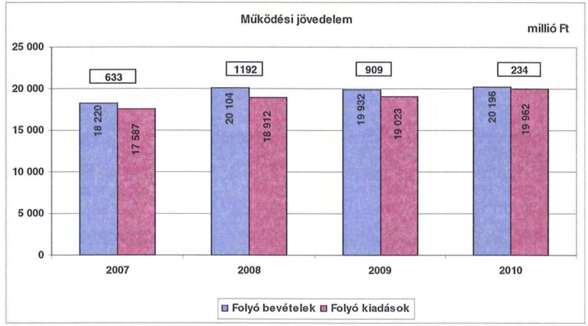

A folyó költségvetés egyenlege (a működési forrástöbblet) a 2007. évben a folyó kiadások 3,6\%-át (633 millió Ft-ot), a 2008. évben 6,3\%-át (1192 millió Ft-ot), a 2009. évben 4,8\%-át (909 millió Ft-ot), a 2010. évben 1,2\%-át (234 millió Ft-ot) jelentette. A vizsgált időszakban a működési jövedelem 2968 millió Ft többletet mutatott, amely forrásául szolgálhatott az Önkormányzat fennálló tőketörlesztési kötelezettségeinek teljesítéséhez, valamint a 2007-2009. évek felhalmozási kiadásainak finanszírozásához is. A 2010. évben keletkezett működési jövedelem a 243 millió Ft tőketörlesztési kötelezettség 3,7\%-ára (9 millió Ft-ra) már nem nyújtott fedezetet.

A pozitív előjelű folyó költségvetési egyenleg ellenére az Önkormányzat folyószámlahitel felvételére kényszerült egyrészt az átmeneti likviditási problémák kezelése, másrészt fejlesztési kiadásai finanszírozása miatt. A folyószámlahitel napi átlagos állománya a 2007-2010. évek között több mint kétszeresére nőtt (38 millió Ft-ról 81 millió Ft-ra). A 2010. évben egy hónapban munkabérhitel felvételére is szükség volt, melynek napi átlagos állománya 23 millió Ft volt, továbbá 2010. december végén a pályázati források megelőlegezése céljából, háromhavi futamidőre 300 millió Ft likvid hitel felvételére is sor került, napi átlagos állománya 4 millió Ft volt. ${ }^{44}$

[^0]
[^0]: ${ }^{43}$ A 2010. évben bevételi főösszege 17 millió Ft, kiadási főösszege 2 millió Ft volt.
    ${ }^{44}$ A folyószámla-, likvid- és munkabérhitel napi átlagos állományát 365 napos nevezővel számítottuk ki.

---

Az Önkormányzat kötelezettségein belül a rövid lejáratú kötelezettségek aránya a 2007. évben 39,6\% (1082 millió Ft) volt. A 2008. évben a rövid lejáratú kötelezettségek állománya 16,9\%-kal (1264 millió Ft-ra) növekedett, összes kötelezettségeken belüli aránya azonban - a hosszú lejáratú kötelezettségek között kimutatott kötvénykibocsátásból származó tartozás miatt - 18\%-ra csökkent. A 2010. évben a rövid lejáratú kötelezettségek állománya 46,2\%-kal, 1078 millió Ft-ról 1576 millió Ft-ra, aránya az összes kötelezettségeken belül 14,6\%-ról 17,9\%-ra növekedett az előző évhez képest, mivel a korábbi évektől eltérően az Önkormányzatnak december 31-én volt folyószámla-, és likvid hitele.

Az Önkormányzat 2007. december 31-én fennálló pénz és tőkepiaci kötelezettsége 1936 millió Ft-ról több mint négyszeresére, 7973 millió Ft-ra nőtt a 2008. évi kötvénykibocsátás és az abból származó kötelezettség év végi értékelése során elszámolt árfolyamveszteség, valamint a 2010. év végén fennálló folyó-számla-, és likvid hitel állomány miatt. A pénzintézeti kötelezettségeken belül a hosszú lejáratú pénzintézeti kötelezettségek a 2007. december 31-i állományhoz képest 2010-re közel 4,5-szeresére (1644 millió Ft-ról 7216 millió Ft-ra), míg a rövid lejáratú pénzintézeti kötelezettségek állománya több mint 2,5-szeresére (292 millió Ft-ról 757 millió Ft-ra) nőtt.

A szállítók állománya a 2007. évi 208 millió Ft-ról a 2010. évre 543 millió Ft-ra, ezen belül a lejárt szállítói tartozásállomány 14 millió Ft-ról 187 millió Ft-ra nőtt. A 2010. évi lejárt szállítói tartozásból 166 millió Ft (89\%) volt a Kórház tartozása.

Az Önkormányzat 2010. évi záró pénzkészlete 1682 millió Ft volt ${ }^{45}$, amelynek 85,8\%-a kötelezettséggel terhelt.

Az Önkormányzat pénzügyi kapacitása a vizsgált időszakban összességében pozitív értéket mutatott. A nettó működési jövedelem ${ }^{46}$ értéke a folyó költségvetési pozíció mellett az adott költségvetési év adósságtörlesztésének hatását is tükrözi. A 2968 millió Ft működési jövedelemnek 39,4\%-át (1170 millió Ft) tette ki a fejlesztési célú hitelekhez kapcsolódó tőketörlesztés, amelynek kifizetését követően 1798 millió Ft nettó működési jövedelme keletkezett 2007-2010 között az Önkormányzatnak.

A nettó működési jövedelem - az évenkénti tőketörlesztést ${ }^{47}$ figyelembe véve -2007-ben 319 millió Ft, 2010-ben -9 millió Ft volt. A 2010. évi pénzügyi kapacitás 2007-hez viszonyított romlását a működési jövedelem 63,0\%-os csökkenése okozta, melyet nem tudott ellensúlyozni a tőketörlesztési kötelezettségek 22,5\%-os csökkenése. A működési jövedelem csökkenését az eredményezte, hogy a folyó bevételek növekedése (10,8\%) elmaradt a folyó kiadások növekedésétől (13,5\%).

[^0]
[^0]: ${ }^{45}$ Ebben a társulások pénzeszköze 14 millió Ft volt.
    ${ }^{46}$ pénzügyi kapacitás
    ${ }^{47}$ Az Önkormányzat tőketörlesztési kötelezettsége a 2007. évben 314 millió Ft, a 2008. évben 308 millió Ft, 2009. évben 305 millió Ft, a 2010 évben 243 millió Ft volt.

---

A CLF módszer alapján az Önkormányzat adósságszolgálatának, valamint fejlesztési kiadásainak fedezete - a 2010. évivel azonos összegű működési jövedelem képződése mellett - további külső források bevonása nélkül nem látszik biztosítottnak.
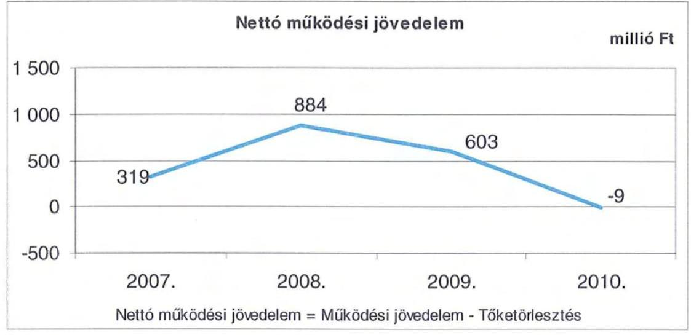

A 2007-2010. években az Önkormányzat felhalmozási költségvetésének egyenlege folyamatosan negatív összegű volt, amely prudens költségvetési gazdálkodás és pénzügyileg fenntartható ${ }^{48}$ beruházások esetén nem jár magas pénzügyi kockázattal.

A felhalmozási költségvetés egyenlegének alakulását évről évre a következő ábra szemlélteti:
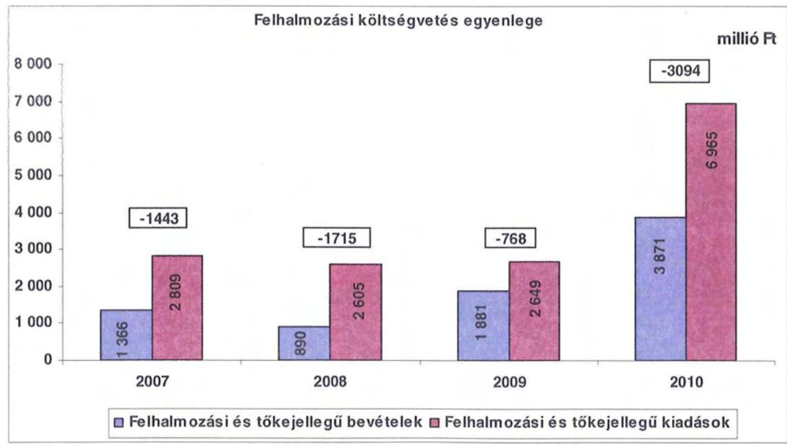

[^0]
[^0]: ${ }^{48}$ Az minősül pénzügyileg fenntartható beruházásnak, amelynek működtetésére az Önkormányzat nettó működési jövedelme a következő években is fedezetet nyújt.

---

A felhalmozási forráshiánynak a felhalmozási és tőke jellegű kiadásokhoz viszonyított aránya 2007-ben 51,4\% (1443 millió Ft), 2008-ban 65,8\% (1715 millió Ft), 2009-ben 29,0\% (768 millió Ft), 2010-ben 44,4\% (3094 millió Ft) volt.

A vizsgált időszakban keletkezett 7020 millió Ft felhalmozási forráshiányra a képződött 1798 millió Ft nettó működési jövedelem, az 1135 millió Ft 2007. évi nyitó pénzkészlet, a 2007. évben igénybevett 450 millió Ft fejlesztési hitel és a forgatási célú értékpapírok értékesítésből 419 millió Ft bevétel, a kötvénykibocsátásból származó bevételből felhasznált 3218 millió Ft nyújtott fedezetet.

Az Önkormányzat 2011. évi költségvetési rendeletében - a hagyományos költségvetési szerkezetben - tervezett bevételeinek és kiadásainak különbözete 3086 millió Ft finanszírozási igényt mutat, melyből 781 millió Ft-ot az előző évi pénzmaradvány, további 2305 millió Ft-ot külső forrás ${ }^{49}$ igénybevételével terveztek finanszírozni.

Az Önkormányzat - a függő, átfutó, kiegyenlítő bevételek és kiadások 237 millió Ft-os pozitív egyenlege és 213 millió Ft folyószámlahitel ${ }^{50}$ mellett 1682 millió Ft pénzkészlettel zárta a 2010. évet.

Az Önkormányzat évenkénti teljes finanszírozási igénye ${ }^{51}$ a CLF módszer szerint 2007-ben 1124 millió Ft, 2008-ban 831 millió Ft, 2009-ben 164 millió Ft, 2010-ben 3103 millió Ft volt, amelynek finanszírozásához finanszírozási célú bevételeket (hitelfelvétel, értékpapír értékesítés, kötvénykibocsátásból származó bevétel) is bevontak.

Az Önkormányzat finanszírozási műveletei 2007-2010. évekbeli egyenlegének alakulását a következő ábra szemlélteti:
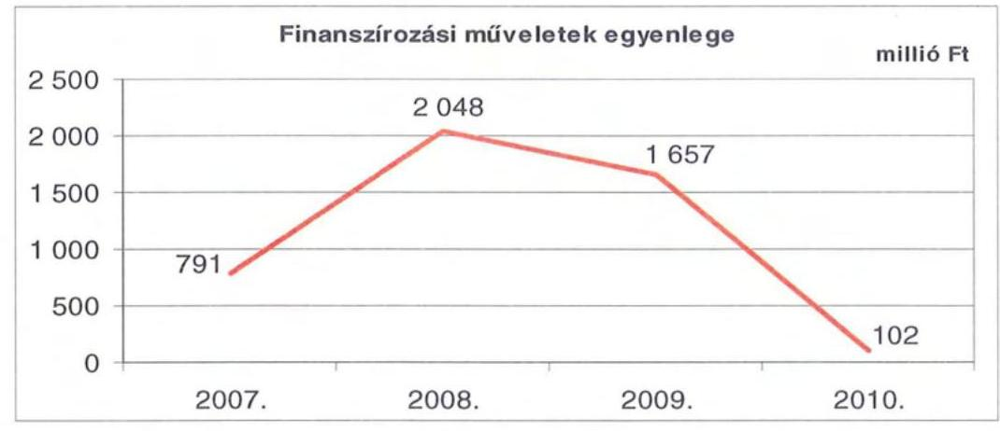

A finanszírozási többlet azt jelzi, hogy az éves költségvetések végrehajtása során külső finanszírozás igénybevételére is sor került. A finanszírozási célú mű-

[^0]
[^0]: ${ }^{49}$ Külső forrásként 1851 millió Ft fejlesztési célú hitel felvételt/kötvénykibocsátást, és 454 millió Ft működési célú hitel felvételt terveztek.
    ${ }^{50}$ Az Önkormányzat folyószámlahitel állománya 213 millió Ft volt a 2010. évben.
    ${ }^{51}$ a nettó működési jövedelem és a felhalmozási költségvetés eredője

---

veleteket a vizsgált időszakban a jelentés 2. számú mellékletének 4.1-4.8 pontjai részletezik.

Az Önkormányzat 2007-2010. évi zárszámadási rendeletében költségvetési bevételeket és kiadásokat a hagyományos költségvetési szerkezettől eltérően mutatta be ${ }^{52}$. Az összes teljesített bevételekről és kiadásokról, a 2007-2010. években teljesített többletről ${ }^{53}$ a jelentés 1. számú melléklete szemlélteti.

A hagyományos költségvetési szerkezet szerinti - a finanszírozási bevételek és kiadások nélküli, valamint az előző évi pénzmaradványt figyelembe vevő pénzügyi többlet a 2007. évben 495 millió Ft, a 2008. évben 791 millió Ft, a 2009. évben 3128 millió Ft a 2010. évben 1333 millió Ft volt, ezen belül a működési többlet a 2007. évben 1143 millió Ft, a 2008. évben 1401 millió Ft a 2009. évben 2248 millió Ft, a 2010. évben 2597 millió Ft volt. Az előző években keletkezett pénzmaradvány igénybevétele nélkül, a 2009. év kivételével a költségvetés végrehajtása hiányt mutatott.

A vizsgált időszakban a kötelezettségek (passzív pénzügyi elszámolások nélkül) 2732 millió Ft-ról 8795 millió Ft-ra emelkedtek, amely együtt járt a kamatkiadások növekedésével. A 2007-2010 között az Önkormányzat összesen 621 millió Ft kamatot fizetett meg. Az átmenetileg szabad pénzeszközein realizált hozam-, és kamatbevétel (1666 millió Ft), a teljes kamatráfordítás több mint 2,5-szeresét tette ki.

Az Önkormányzat kamatbevételeinek és kamatkiadásainak alakulását a következő ábra mutatja:
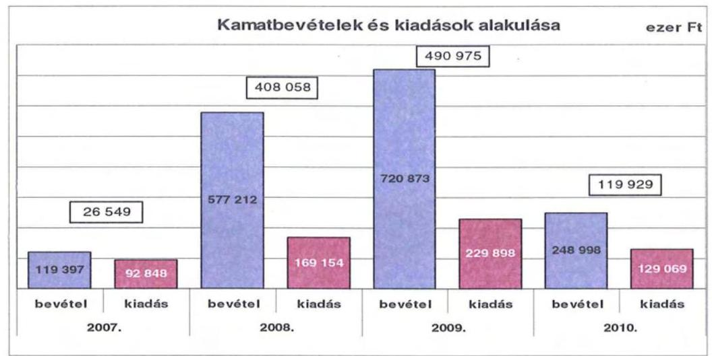

Az Önkormányzat hozam-, és kamatbevételei a 2007-2010. években meghaladták a kamatkiadásokat. A 2008. és 2009. évi kamatbevételek összege több

[^0]
[^0]: ${ }^{52}$ A költségvetési bevételek és kiadások főösszege tartalmazta a finanszírozási bevételeket és kiadásokat, köztük az aktív és passzív pénzügyi elszámolásokat is. A költségvetési bevételek és kiadások különbözeteként jelentkező hiányt/többletet, azon belül a működési, felhalmozási hiányt/többletet nem mutatták be.
    ${ }^{53}$ A teljesített bevételi többlet a 2007. évben 1286 millió Ft, a 2008. évben 2839 millió Ft, a 2009. évben 4785 millió Ft, a 2010. évben 1435 millió Ft volt.

---

mint háromszorosa az adott évi kamatkiadásoknak, mely a 2008. évi kötvénykibocsátásból származó szabad források befektetésének köszönhető. A 2010. évi kamatbevételek jelentősen csökkentek az 2008-2009. évekhez képest, mivel a kötvényforrás felhasználása miatt ${ }^{54}$ a finanszírozásba bevonható eszközök (értékpapírok, pénzeszközök) állománya a 2008. évi 4840 millió Ft-ról a 2009. évben 4514 millió Ft-ra, a 2010. évben 1682 millió Ft-ra csökkent, nem érve el a 2007. évi 1714 millió Ft záró állományt sem.

A 2011. évre az Önkormányzat a kamatkiadások csökkenésével számol, a költségvetési rendeletben tervezett 120 millió Ft kamatráfordítás 7,2\%-kal, 9 millió Ft-tal marad el a 2010. évi teljesített kamatkiadásoktól ${ }^{55}$.

A 2007-2010. évek közötti időszakban az Önkormányzat kiadásainak és bevételeinek főbb jogcímek szerinti alakulását a jelentés 2. számú melléklete tartalmazza.

# 2.2. Az Önkormányzat bevételeinek alakulása

Az Önkormányzat folyó működési bevételei 2010-ben 20196 millió Ft-os összegükkel 11\%-kal haladták meg a 2007. évi saját működési bevételek 18220 millió Ft-os összegét. Az Önkormányzat 2007-2010. évek között realizált főbb folyó (működési) bevételi jogcímeinek számszaki adatait az alábbi táblázat részletezi és grafikon mutatja be:
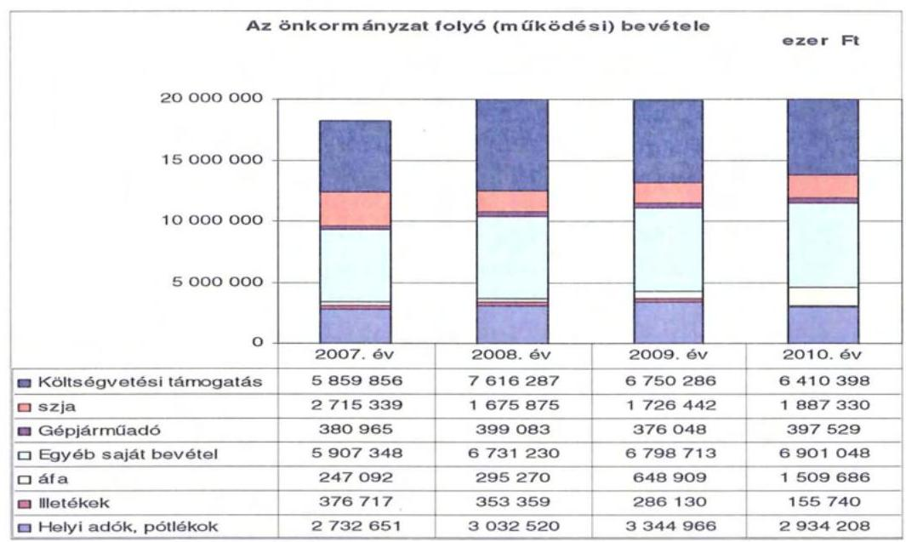

[^0]
[^0]: ${ }^{54}$ A kötvényforrás 80\%-át használta fel az Önkormányzat 2010. december 31-ig.
    ${ }^{55}$ A kamatkiadások nem tartalmazzák az egyéb folyó kiadások között kimutatott realizált árfolyamveszteséget, míg a kamatbevételek magukba foglalják a realizált árfolyamnyereséget. A realizált árfolyamveszteség a 2007. évben 0,7 millió Ft, a 2008. évben 270 millió Ft, a 2009. évben 159 millió Ft, a 2010. évben 38 millió Ft. A kamatkiadások és a realizált árfolyamveszteség együttes összegére is fedezetet nyújtottak a hozam-, és kamatbevételek.

---

Az Önkormányzat költségvetési támogatásai a 2007. évi 5860 millió Ft-ról 2008-ra 7616 millió Ft-ra, 32\%-kal nőttek. A jelentős növekedés oka, hogy 2008-tól a költségvetési támogatásból finanszírozták a teljes normatív állami hozzájárulást. A költségvetési támogatás összege 2008-ról 2009-re 6750 millió Ft-ra, 2010-re 6410 millió Ft-ra csökkent, egyrészt a központi támogatáselosztás változása, másrészt az ellátotti létszámok csökkenése következtében. Az ingadozások ellenére, a vizsgált évek alatt 2010-re 9\%-os növekedés következett be, a 2007. évhez viszonyítva.

Az átengedett szja összege a 2007. évről a 2008. évre 38\%-kal, 1039 millió Ft-tal csökkent, mivel 2008-tól a költségvetési törvény alapján csökkent az átengedett szja összege, mert a Tűzoltóság által ellátott feladatok és a korábbi években szja-ból finanszírozott normatív hozzájárulások kikerültek az átengedett szja összegéből. Az Önkormányzat az előző évihez képest 2009-ben 3\%-kal (50 millió Ft-tal), 2010-ben további 9\%-kal (161 millió Ft-tal) kapott több átengedett szja-t. A kedvező változást a növekvő iparűzési adóerő-képesség és lakhelyen maradó szja (8\%) összege, valamint az így növekvő szja kiegészítés okozta. A 2009. évben kezdődött kedvező változás ellenére is lényegesen, 828 millió Ft-tal realizáltak kevesebb átengedett szja-t az Önkormányzatnál, mint 2007-ben.

A gépjárműadóból származó bevétel a 2007. évi 381 millió Ft-ról 2010-re 4\%-kal, 397 millió Ft-ra emelkedett, a folyó bevételeken belüli részaránya a vizsgálattal érintett években $2 \%$ körül mozgott.

Az Önkormányzat egyéb saját folyó bevételei a vizsgált időszakban folyamatosan növekedtek. A 2007. évi 5907 millió Ft-ról 2010-re 6901 millió Ft-ra emelkedett összegük, részarányuk $32 \%$-ról $34 \%$-ra nőtt. Az egyéb saját folyó bevételek meghatározó tényezője az intézményi működési bevétel, melyek folyamatosan növekedni tudtak.

Az áfa bevételek összege 2007-ről 2010-re meghatszorozódott, mivel a 247 millió Ft-os 2007. évi érték 2010-re 1510 millió Ft-ra növekedett. E kiemelkedő növekedésben meghatározó szerepe van az úgynevezett fordított áfának ${ }^{56}$. A 2009. és 2010. évi jelentős növekedést (2009-ben az 2007. évi összegnek a 2,6szeresét realizálták), egyértelműen a beruházások expanziója okozta. Megnövekedett nagyságrendjével a folyó bevételek mind magasabb hányadát képviselte az áfa, $1,4 \%$-ról $7,5 \%$-ra növekedve.

Az Önkormányzat egyéb saját bevételein belül az illetékbevételek a 2007. évi 377 millió Ft-ról 2010-re 221 millió Ft-tal, 156 millió Ft-ra, 59\%-kal csökkentek. A befolyt illetékbevételek - az ingatlanpiac visszaesése és egyes illetékkedvezmények bevezetése következtében - csökkentek ilyen drasztikusnak mondható mértékben. A csökkenés üteme gyorsuló volt, 6-19-45\%-os mértéket ért el a vizsgált évek között, így a folyó működési bevételekből való részesedése és egyben jelentősége fokozatosan - 2007-ben 2,1\%-ra, 2008-ban 1,8\%-ra, 2009-ben $1,4 \%$-ra, 2010-ben $0,8 \%$-ra - csökkent.

[^0]
[^0]:    ${ }^{56}$ Az áfa törvény 2008-tól vezette be a fordított áfa elszámolási szabályt, és az Önkormányzatnál a 2010. évben már 506 millió Ft-ot tett ki a fordított áfa összege.

---

Az Önkormányzat a 2007-2010. években négy helyi adónemet (helyi iparűzési adó, építményadó, a vállalkozók kommunális adója és az idegenforgalmi adó) alkalmazott. A helyi adókból és pótlékokból származó bevételek aránya 2007-2010 között 13-14\% között mozgott a folyó (működési) bevételekben. A helyi adóbevételek a 2007. évről 2010. évre 2\%-kal, 45 millió Ft-tal növekedtek, mely növekedésből a vállalkozók kommunális adójából származott $49 \%$, az iparűzési adóból $30 \%$, az építmény adóból $14 \%$ és az idegenforgalmi adóból $7 \%$.

Az adóbevételek alakulását a következő grafikon szemlélteti:
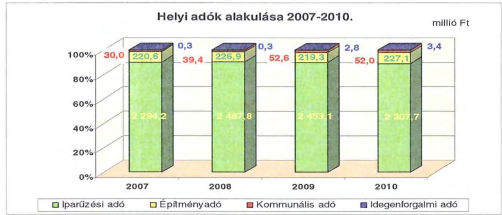

Az adóbevételek összetételét tekintve az iparűzési adó tette ki minden évben az összes adóbevétel 89-90\%-át, összege a vizsgált években minimális arányú elmozdulásokkal alakult. Az adónemben a vizsgált évek során változás nem volt, a maximális adómértéket (2\%) alkalmazták a vizsgált évek során.

Az építményadó 8-9\% közötti részarányt képviselt az összes adóbevételből. Ennél az adónemnél is minimális elmozdulások (-3-tól +4\%-ig) voltak csupán, a vizsgált években. Az építményadó vonatkozásában, az adórendeletben 2008-ban történtek változások. ${ }^{57}$

A kommunális adó részaránya az összes adóból csupán 1-2\% között mozgott a vizsgált években, ezért ez az adónem nem meghatározó. Az adó mértékében változás ${ }^{58} 2008$-ban történt.

Az idegenforgalmi adó 0,01-0,1\% közötti aránnyal részesedett csupán az adókból származó bevételek közül. A 2010. évben elért 3,4 millió Ft bevétel 8,5-

[^0]
[^0]:    ${ }^{57}$ 2007-ben a következő építési adótételek voltak hatályban: a bankszektorban és a szórakoztató ágazatban $900 \mathrm{Ft} / \mathrm{m}^{2}$, irodai célú épületek után belterületen 300, külterületen $150 \mathrm{Ft} / \mathrm{m}^{2}$, egyéb célú hasznosítás esetén belvárosban 300, belterületen 150, külterületen $50 \mathrm{Ft} / \mathrm{m}^{2}$. 2008-ban az építési adó tételei - a tevékenység ágazatától/típusától függetlenül - a következők szerint alakultak: belvárosban 600, belterületen 250, külterületen $50 \mathrm{Ft} / \mathrm{m}^{2}$.
    ${ }^{58}$ 2007-ben 2000 Ft/fő, 2008-tól 2500 Ft/fő vállalkozások kommunális adóját kellett fizetnie a vállalkozásoknak, az átlagos állományi létszám után.

---

szeres növekedésnek felelt meg, de részaránya mégis lényegtelen, $0,1 \%$-ot ért el csupán. Növekedésének oka, hogy 2009-ben az adótételt duplájára emelték (100,- Ft/vendégéjszakáról $200 \mathrm{Ft} /$ vendégéjszakára emelték fel az adó összegét), továbbá a korábbi mentességek megszüntetésre kerültek.

Az Önkormányzat 2007-2010 között osztalékról nem mondott le és nem kapott a gazdasági társaságokban lévő részesedése után. A nyereséges társaságok adózás utáni eredményüket eredménytartalékba helyezték.

A gazdasági társaságoknál ingatlanhasznosításból és parkoló üzemeltetésből képződött árbevétel 2007. évben 595 millió Ft, 2010-ben 656 millió Ft, 10\%-kal nőtt. Az Önkormányzat által a társaság részére 2007-ben biztosított fejlesztési célú pénzeszközátadás az árbevétel $1 \%$-a, a 2010. évi működési és fejlesztési célú pénzeszközátadás az árbevétel $15 \%$-a. A társaságok árbevételét vizsgálva az ivóvíz szolgáltatás árbevétele 2007. évben 4400 millió Ft, 2010. évben 5900 millió Ft volt, ami $33 \%$-os emelkedést mutat.

A helyi tömegközlekedést működtető többségi állami tulajdonú gazdasági társaság Békéscsabán elért 2009. évi nettó árbevétele 358 millió Ft, az önkormányzati támogatás 80 millió Ft, az árbevétel $22 \%$-a volt. A 2010. évi nettó árbevétele 348 millió Ft, az önkormányzati támogatás 87 millió Ft, az árbevétel $25 \%$-a.

Az Önkormányzat felhalmozási bevételei a vizsgált időszakban a következőképpen alakultak:
ezer Ft

| Megnevezés | 2007. év <br> tény | 2008. év <br> tény | 2009. év <br> tény | 2010. év <br> tény |
| :-- | --: | --: | --: | --: |
| Tárgyi eszköz értékesítés | 35137 | 6992 | 6594 | 6839 |
| Egyéb saját tőkebevétel | 473498 | 295567 | 511899 | 433096 |
| Államháztartáson belülről kapott támogatás | 632880 | 366480 | 335506 | 2800198 |
| EU-tól és külföldről kapott támogatások | 0 | 0 | 0 | 0 |
| Államháztartáson kívülről kapott támogatás | 225108 | 220948 | 1027194 | 631070 |
| Összes felhalmozási bevétel | 1366623 | 889987 | 1881193 | 3871203 |

A vizsgált években a felhalmozási bevételek a 2007. évi 1367 millió Ft-ról 2008-ban 35\%-kal, 890 millió Ft-ra csökkentek, 2009-ben 991 millió Ft-os növekedésük $111 \%$-os emelkedésnek felelt meg. 2010-ben további - ugrásszerű növekedés következett be, mivel értékük elérte a 3871 millió Ft-ot, s ez az előző évhez képest $105 \%$-os növekedés volt. A 2010/2007-es növekedési ráta $283 \%$-ot képviselt. A felhalmozási bevételek legnagyobb hányada - 2007-ben 46\%-a, 2010-ben $72 \%$-a - az államháztartáson belülről kapott támogatásokból származott ${ }^{59}$. Az államháztartáson kívülről kapott támogatások aránya 16-55\%-

[^0]
[^0]:    ${ }^{59}$ Az intézmények felhalmozási támogatásain kívül - melyekre a vizsgálat négy évében 746,1 millió Ft támogatás érkezett és amelyek közül a legnagyobb a Kórház Sürgősségi osztályának fejlesztésére (181,6 millió Ft) és a 2. számú Általános Iskola rekonstrukciójára (156,5 millió Ft) kapott támogatás volt - a legjelentősebb támogatott beruházások a következők voltak: szennyvízhálózat építés (2360,5 millió Ft), buszpályaudvar felújítás (118,7 millió Ft), piaccsarnok építés (54,2 millió Ft), útfelújítások (35,1 millió Ft), Ibsen Palota és fesztivál-színpad létesítése (23,1 millió Ft).

---

közötti, az egyéb saját tőkebevételek 11-35\% közötti és a tárgyi eszköz értékesítés 0-3\% közötti részarányt képviseltek, míg az EU-tól és külföldről támogatások egyik évben sem származtak.

A tárgyi eszközök értékesítéséből befolyt bevételek 2007-ről 2008-ra meredeken csökkentek, majd a további években a lecsökkent szinten maradtak. A 2010. évben e jogcímen befolyt összeg (6,8 millió Ft) a 2007. évinek (35,1 millió Ft) a $20 \%$-át sem érte el. Az összes felhalmozási bevételen belüli részarányuk és jelentőségük 2,6\%-ról 0,2\%-ra csökkent, mely csökkenésben lényeges szerepe van azonban az összes felhalmozási bevétel összegének közel háromszorosra történő növekedésének is.

Az egyéb saját tőkebevételek - melyek összegei 295,6-511,9 millió Ft között mozogtak - egyik fontos elemét az önkormányzati lakások cseréje, értékesítése jelentette, melyből 2007-ben 252 millió Ft, 2008-ban 98 millió Ft, 2009-ben 135 millió Ft és 2010-ben 246 millió Ft folyt be. Az összes felhalmozási bevételeken belül az egyéb saját tőkebevételek csökkenő - 2007-ben 35\%, 2008-ban 33\%, 2009-ben $27 \%$, míg 2010-ben $11 \%$ - részarányt képviseltek.

# 2.3. Az Önkormányzat kiadásainak alakulása 

Az Önkormányzat folyó kiadásai - a Kórház fekvőbeteg ellátási tevékenységére elszámolt kiadások nélkül ${ }^{60}$ - főbb jogcímek szerinti bontásban a következők voltak:
ezer Ft-ban

| Megnevezés | 2007. | 2008. | 2009. | 2010. |
| :--: | :--: | :--: | :--: | :--: |
| Folyó kiadások | 14548766 | 15632357 | 16058095 | 16802099 |
| Működési kiadások (kamatkiadás nélkül) | 13137887 | 13853504 | 13763491 | 14336750 |
| Államháztartáson belülre átadott pénzeszközök | 135705 | 96057 | 172934 | 227968 |
| Transzferkiadások | 969406 | 1171847 | 1378016 | 1573207 |
| -ebből vállalkozásoknak | 164345 | 225451 | 315064 | 348268 |
| EU-nak, illetve külföldre | 0 | 0 | 0 | 0 |
| magánszemélyeknek | 607675 | 711862 | 829930 | 942509 |
| nonprofit szervezeteknek | 197386 | 234534 | 233022 | 286154 |
| Kamatkiadások | 92848 | 169154 | 229898 | 126792 |
| Előző évi pénzmaradvány átadás | 212920 | 341795 | 513756 | 537382 |

Az Önkormányzat folyó kiadásai 2007-ről 2010-ra 15\%-kal, 2253,3 millió Ft-tal, 14 548,8 millió Ft-ról 16 802,1 millió Ft-ra növekedtek. A kamatkiadások nélküli működési kiadások 13 137,9 millió Ft-ról 14 336,8 millió Ft-ra, $9 \%$-kal növekedtek, 2007-ről 2010-re.

[^0]
[^0]:    ${ }^{60}$ A táblázat adatai az Önkormányzat folyó kiadásait a Kórház fekvőbeteg ellátó tevékenységének kiadásai nélkül tartalmazzák, egyrészt mivel a Kórház működési kiadásainak finanszírozását nem az Önkormányzat látja el, másrészt mert a kórház kiadás szerkezete lényegesen eltér az egyéb önkormányzati intézmények kiadásszerkezetétől.

---

Az államháztartáson belülre átadott pénzeszközök 135,7 millió Ft-ról 228 millió Ft-ra, $68 \%$-kal növekedtek, míg a transzfer kiadások 969 millió Ft-ról 1573,2 millió Ft-ra, $62 \%$-os növekedést mutattak.

A folyó kiadásokon belül a transzfer kiadásokba tartozó működési célú pénzeszköz átadások, a szociálpolitikai és egyéb támogatások, valamint az ellátottak pénzbeli juttatásai az Önkormányzatnál az áttekintett években a folyó kiadások 7-9\%-át tették ki, összegük 2007-ben 969,4 millió Ft, 2010-ben 1573,2 millió Ft volt.

| Működési kiadások részletezése | 2007 | 2008. | 2009. | 2010. |
| :-- | --: | --: | --: | --: |
| Személyi juttatások | 7074688 | 7309855 | 7101429 | 7285398 |
| Munkaadót terhelő járulékok | 2272162 | 2316178 | 2122956 | 1896898 |
| Dologi kiadások | 3710585 | 3868639 | 4202907 | 4878790 |
| Egyéb folyó kiadások | 75839 | 357886 | 234568 | 168621 |
| Előző évi pm.visszafiz. + k.féle kv.-i befiz. | 4612 | 946 | 101631 | 107043 |
| Működési kiadások összesen | 13137887 | 13853504 | 13763491 | 14336750 |

A személyi juttatások és járulékaik összegei változóan alakultak, mivel 2008-ban növekedtek, 2009-ben és 2010-ben csökkentek. (A 2010. évi csökkenés annak ellenére következett be, hogy a személyi juttatások kis mértékben, $3 \%$-kal emelkedtek, azonban a munkaadót terhelő járulékok csökkenése ezt meghaladó mértékű volt, mely együttes összegüket is csökkenésbe vitte át.) A személyi juttatások és azok járulékai 2007-ben 9346,9 millió, 2008ban 9626,1 millió, 2009-ben 9224,3 millió és 2010-ben is 9182,3 millió Ft-ot tettek ki, mely összegekkel csökkenő - 2007-ben 64\%, 2008-ban 62\%, 2009-ben $57 \%$, 2010-ben $55 \%$ - részarányt képviseltek a folyó kiadásokból. Csökkenő összegük illetve részarányuk a Közgyűlés által határozatban rögzített takarékossági intézkedések, létszámleépítések végrehajtásának következménye volt.

A dologi kiadások növekedése volt megfigyelhető, mivel a 2007. évi 3710,6 millió Ft-ról 2010-re 4878,8 millió Ft-ra növekedett, ami $31 \%$-os növekedést jelentett, ugyanakkor a folyó kiadásokon belül 25-29\%-os részarányt képviseltek. Az egyéb folyó kiadások 75,8-357,9 millió Ft közötti összegekben alakultak, 0,5-2,3\%-os részarányukkal nem meghatározóak.

Az Önkormányzat a gazdasági társaságok részére a 2007-2010. években összesen 1057 millió Ft pénzeszközt adott át, melyből 846 millió Ft-ot tett ki a működési, 211 millió Ft-ot a fejlesztési célú támogatás.

Az Önkormányzat 100\%-os tulajdonában álló VAK Zrt. működési és fejlesztési célú pénzeszközátadásban is részesült. A fejlesztési támogatás legalacsonyabb összege 7 millió Ft, a legmagasabb összege 134 millió Ft volt. A vizsgált időszakban összesen 211 millió Ft fejlesztési és 92 millió Ft működési célú pénzeszközátadásban részesült. A fizetőparkoló rendszert az Önkormányzattal kötött megbízási szerződés alapján a VAK Zrt. működteti. A díjakat helyi rendeletben határozzák meg. A gazdasági társaságoknak nyújtott pénzeszközátadások részletes adatait a 4. számú melléklet tartalmazza.

---

A helyi közlekedés üzemeltetéséhez a Körös Volán Zrt. a normatív támogatáson felül minden évben önkormányzati támogatásban is részesül. A szerződés alapján a szolgáltató akkor jogosult működési támogatásra, ha a Közgyűlés által elfogadott tarifák, a fogyasztói árkiegészítés és normatív állami támogatás nem biztosítja a szolgáltató közszolgáltatási feladatai teljesítése költségeinek és egy méltányos nyereségnek a fedezetét. A normatív támogatás összege 2007ben 35 millió Ft, 2010-ben 30 millió Ft, a vizsgált időszakban összességében 5 millió Ft-tal csökkent. Az önkormányzati támogatás ezzel szemben a 2007. évi 35 millió Ft-ról 2010. évre 87 millió Ft-ra, 52 millió Ft-tal nőtt, együttes összege a vizsgált időszakban 240 millió Ft volt. Az önkormányzati támogatás évrőlévre emelkedő nagyságrendjének oka az, hogy az éves támogatáson felül, a Körös Volán Zrt-nél képződő működési hiányt az Önkormányzat soron kívüli támogatásokkal köteles ellensúlyozni, a hatályos közszolgáltatási szerződés és az autóbusszal végzett menetrend szerinti személyszállításról szóló 2004. évi XXXIII. törvény 11. § (3)-(4) bekezdése alapján.

A társaságok részére átadott pénzeszközökön belül a legtöbb pénzeszközt a sportegyesületeket működtető társaság kapta. A társaság működéséhez rendszeres önkormányzati pénzeszközátadásban részesül, melynek jogcímei: alap-, eredményességi, utánpótlás-nevelési, nézőszám alapján adható és egyedi döntés alapján történő pénzeszközátadás. A pénzeszközátadás legalacsonyabb összege 84 millió Ft volt, legmagasabb összege 151 millió Ft. 2007-2010. között összesen 504 millió Ft pénzeszközátadásban részesült.

Az Önkormányzat által a gazdasági társaságok részére átadott működési és fejlesztési célú pénzeszközök alakulását az alábbi ábra mutatja be 2007-2010. években:
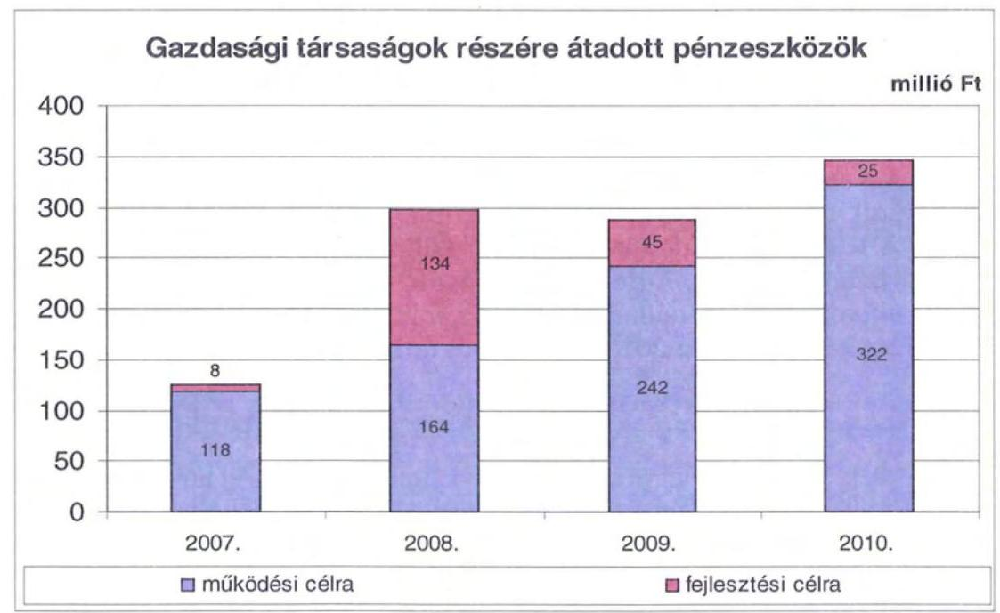

---

A vizsgált időszakban a feladatellátásban résztvevő gazdasági társaságoknak nyújtott működési pénzeszközátadás folyamatosan emelkedett, a 2007. évi 118 millió Ft-ról 2010. évre 322 millió Ft-ra ${ }^{61}$. A pénzeszköz átvételi igény növekedésében szerepet játszott, hogy a válság hatására a sportot korábban támogató társaságok vagy megszűntek, vagy a pénzeszközátadásra fordítható keretük csökkent jelentős mértékben. Mind a sport, mind a helyi közlekedés vonatkozásában gondot okoz az évről-évre csökkenő állami finanszírozás. 2007-ben a működési pénzeszközátadás 100\%-át, 118 millió Ft-ot juttattak a sportra és a közlekedésre, míg 2010-ben ez az összeg 238 millió Ft volt, az összes működési célú pénzeszközátadás 73\%-a. Bár a pénzeszközátadás aránya csökkent, az összeg a vizsgált időszak alatt folyamatosan nőtt és az idén további növekedésére lehet számítani a társaságok éves beszámolóiban közölt adatok alapján.

A Kórház kiadásait a következő táblázat adatai ${ }^{62}$ szemléltetik:
ezer Ft-ban

| Megnevezés | 2007. | 2008. | 2009. | 2010. |
| :-- | --: | --: | --: | --: |
| Folyó kiadások | 3037836 | 3279301 | 2964670 | 3155848 |
| Működési kiadások (kamatkiadás nélkül) | 3036681 | 3274010 | 2929567 | 3151583 |
| Transzferkiadások | 1155 | 5291 | 35103 | 1988 |
| -ebből: vállalkozásoknak | 0 | 0 | 0 | 0 |
| EU-nak, illetve külföldre | 0 | 0 | 0 | 0 |
| magánszemélyeknek | 1155 | 5291 | 35072 | 1988 |
| nonprofit szervezeteknek | 0 | 0 | 31 | 0 |
| Kamatkiadások | 0 | 0 | 0 | 2277 |

A fekvőbeteg ellátásban a transzfer és a kamatkiadások alacsony részarányt képviseltek, mivel a 2007. évi 1,2 millió Ft transzfer kiadás 0,04\%-ot, a 2010. évi 2,0 millió Ft 0,06\%-ot jelentett. Kamatkiadás csupán 2010-ben merült fel, 2,3 millió Ft-os összegével 0,07\%-ot jelentett az összes folyó kiadásokon belül. A kamatkiadások nélkül számba vett működési kiadások gyakorlatilag a folyó kiadásoknak felelnek meg. Ezért elégséges a működési kiadások vizsgálatára szorítkozni.

A személyi juttatások és ezek járulékai a vizsgált időszakban alig (2\%kal) növekedtek, 1306,8 millió Ft-ról 1327,3 millió Ft-ra változtak 2007-ről 2010-re. A működési kiadásokon belüli részarányuk 53-58\% között mozgott a vizsgált években. A dologi kiadások - melyek 1203,6 -1454 millió Ft közöttiek voltak a vizsgált években - a folyó kiadásokból 2007-2008-ban 42\%-os, 2009-ben $41 \%$-os, 2010-ben $46 \%$-os arányt képviseltek, vagyis 15-17\% közöt-

[^0]
[^0]:    ${ }^{61}$ A közúti közlekedésről szóló 1988. évi I. törvény 2010. évi módosítása óta a várakozási díj, a pótdíj a várakozási terület tekintetében tulajdonosi jogot gyakorló helyi önkormányzatot illeti meg. A szolgáltató legalább a közszolgáltatás ellátásához szükséges költségekre jogosult, melyet az elszámolás jóváhagyását követően a helyi önkormányzat részére külön térít meg. Ennek alapján a VAK Zrt. bevételeiből átad az Önkormányzatnak, ugyanakkor támogatásban is részesül, mind működésre, mind pedig fejlesztésre vonatkozóan.
    ${ }^{62}$ A táblázat adatai a 80. számú beszámoló űrlap adataiból készített CLF modell adataiból képzettek oly módon, hogy a kórház által alkalmazott vetítési alap arányában a fekvőbeteg ellátás kiadásait tartalmazza csupán.

---

ti aránnyal voltak magasabbak, mint az egyéb önkormányzati fenntartású intézmények dologi kiadásainak arányai, amiből érzékelhető, hogy a fekvőbeteg ellátás kiadásszerkezete eltért az egyéb intézmények kiadásainak szerkezetétől. Ez a fekvőbeteg ellátás magas anyagigényességével is magyarázható, továbbá a konkrét eltéréseket a Kórház profilja is befolyásolja. A Kórház öt operatőr fekvőbeteg osztálylyal ${ }^{63}$ és intenzív terápiás osztálylyal is rendelkezik, amely fokozza anyagigényességét.

A vizsgált években az Önkormányzat összesen 346 millió Ft támogatást nyújtott a Kórháznak, amelyből működési célra 288 millió Ft-ot, fejlesztési célra 58 millió Ft-ot fordítottak. A működésre kapott támogatások központosított állami támogatásnak a „címzetthez történő eljuttatását" jelentették, és bérkompenzációs tételekből ${ }^{64}$ adódtak. A fejlesztési célra juttatott összegek az utófinanszírozott EU-s projektek saját erős forrásainak fedezetét képezték. A következő grafikon a Kórháznak átadott pénzeszközök alakulását szemlélteti:
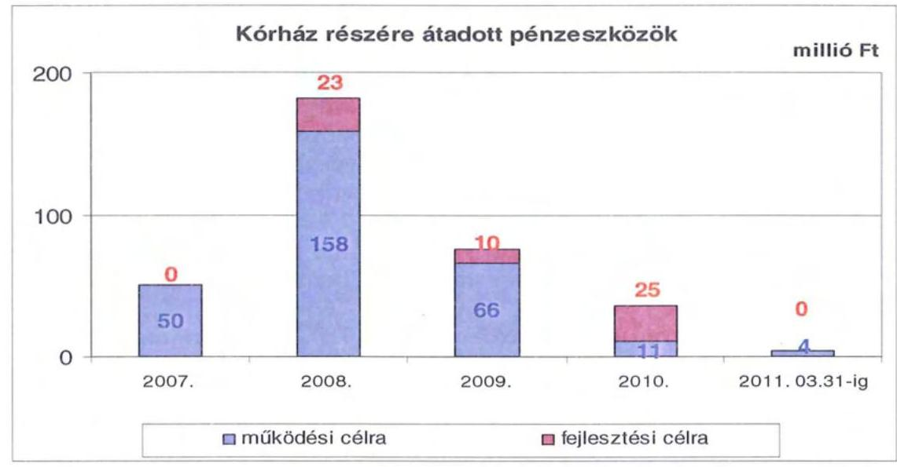

A folyó (működési) és felhalmozási kiadások alakulását, a teljesített kiadások működési és felhalmozási felhasználásának arányait az alábbi grafikon mutatja be:

[^0]
[^0]:    ${ }^{63}$ A Kórház operatőr osztályai: fül-orr-gégészet, ortopédia, sebészet, szülészet-nőgyógyászat, traumatológia.
    ${ }^{64}$ Az OEP finanszírozási köréből kikerült 13. havi bér fedezetét a központi költségvetés az Önkormányzatokon keresztül biztosította 2007-2009 évek között. A 2011. évi összeg a $16 \%$-os szja adókulcs miatt hátrányba került dolgozók bérkompenzációjából adódott.

---

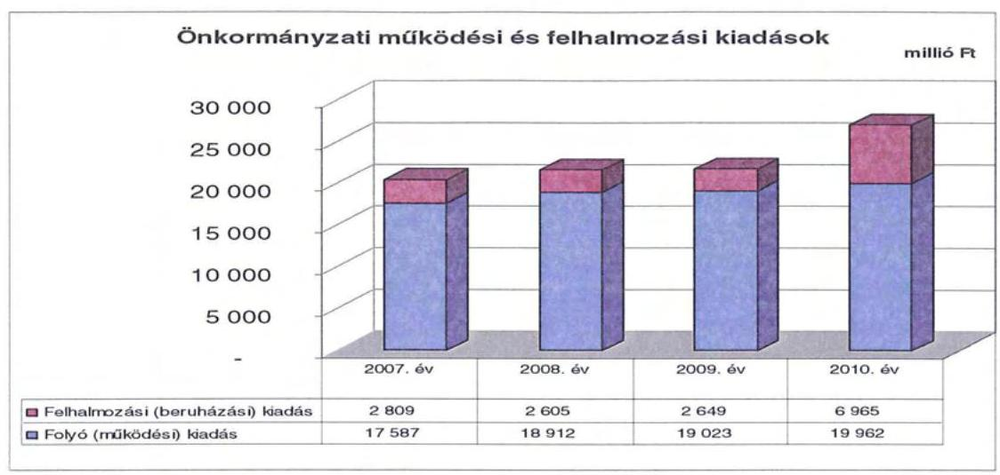

A folyó (működési) és felhalmozási kiadások arányának változásában 2010-ben volt jelentősebb elmozdulás. A 2007-2009. évek 86-88\%-os működési kiadás aránya 2010-ben lényegesen, 15\%-kal, 74\%-ra csökkent, annak ellenére, hogy nominálértékben folyamatos növekedés volt megfigyelhető. A folyó működési és felhalmozási kiadások együttesen a 2007. évi 20396 millió Ft-ról 26927 millió Ft-ra növekedtek 2010-ben, mely 32\%-os növekedést jelentett. Külön-külön vizsgálva a felhalmozási kiadások növekedése (2809 millió Ft-ról 6965 millió Ft-ra) jóval dinamikusabb, 148\%-os volt, míg a működési kiadások csupán 13,5\%-kal, 17587 millió Ft-ról, 19962 millió Ft-ra növekedtek. A felhalmozási kiadások 4156 millió Ft-os növekedését elsősorban a város 15263 millió Ft-os csatornázási beruházásának megkezdése okozta.

Az Önkormányzat által a 2007-2010. években megvalósított, 2010. december 31-ig befejezett fejlesztéseinek teljes költsége 10149 millió Ft volt. Ebből felújításokra 2487 millió Ft (25\%), beruházásokra 7662 millió Ft (75\%) került felhasználásra. A fejlesztések tervadatai ( 10597 millió Ft) 448 millió Ft-tal meghaladták a tényleges adatokat ( 10149 millió Ft), amely azt jelentette, hogy a fejlesztések az eredeti tervek 96\%-ában teljesültek. A kiadások 44\%-át (4442 millió Ft) támogatásból finanszírozták, ez a mutató a felújítási kiadásoknál 18\% (455 millió Ft), míg a beruházásoknál 52\% (3987 millió Ft). Ebben az időszakban az összes ( 4442 millió Ft) támogatásból 67\%-ot (2991 millió Ft) tett ki a hazai támogatás, az EU-s támogatás 33\% (1451 millió Ft) volt. A fejlesztések finanszírozásához szükséges önerő ( 5707 millió Ft) 53\%-ban (3042 millió Ft) saját bevételből, 8\%-ban (450 millió Ft) fejlesztési hitelből, 39\%-ban (2215 millió Ft) kötvényforrásból származott.

A 2007. és 2010. évek között 28 utca útburkolatának felújítása történt meg 418 millió Ft összegben, 174 millió forintos ( $42 \%$-os) hazai támogatással. A 2008. évben indított járda felújítási program végrehajtására 595 millió Ft-ot fordított az Önkormányzat. A beruházási célú kiadásokhoz elnyert támogatások a vizsgált időszak elején jellemzően a cél és címzett támogatásban részesített feladatok voltak. Céltámogatásban részesült a Kórház 369 millió Ft értékű gép- műszerbeszerzése 72\%-ban 267 millió Ft összeggel. Címzett támogatással valósult meg a Kórház belgyógyászati tömbjének rekonstrukciója 962 millió forint költséggel 826 millió Ft (86\%) támogatással, és a Széchenyi István Két taní-

---

tási nyelvű Közgazdasági Szakközépiskola rekonstrukciója 905 millió Ft költséggel 825 millió Ft ( $91 \%$ ) támogatással. A 2007. és 2010. évek között befejezett felújítások $97 \%$-ban, a beruházások $65 \%$-ban az elhasználódott eszközök pótlását szolgálták.

A folyamatban lévő fejlesztések 2010. december 31-ig teljesített 4784 millió Ft bekerülési költségéből 2777 millió Ft-ot ( $58 \%$ ) jelentett az EU-s támogatás, 437 millió Ft-ot ( $9 \%$ ) a hazai támogatás, 1003 millió Ft-ot ( $21 \%$ ) a kötvény felhasználás, míg 567 millió Ft-ot ( $12 \%$ ) a saját bevétel. A tényleges bekerülési költség ( 4784 millió Ft) $22 \%$-át ( 1066 millió Ft) az elhasználódott eszközök pótlására fordították.

Az Önkormányzat a folyamatban lévő fejlesztési feladataihoz kapcsolódó, a 2010. évet követő kötelezettségvállalásainak összege 20520 millió Ft. Ennek forrásaként az Önkormányzat 13986 millió Ft EU-s forrást (68%), 2083 millió Ft hazai támogatást ( $10 \%$ ), 2165 millió Ft kötvényforrást ( $11 \%$ ), 303 millió Ft hitelt ( $1 \%$ ), illetve 1983 millió Ft ( $10 \%$ ) saját bevételt tervez felhasználni. A várható teljes bekerülési költség ( 25304 millió Ft) $17 \%$-át ( 4273 millió Ft) az elhasználódott eszközök pótlására tervezték fordítani.

A folyamatban lévő fejlesztések várható teljes bekerülési költségéből ( 25304 millió Ft) csupán $3 \%$ ( 805 millió Ft) a felújítási kiadások összege, míg $97 \%$ ( 24999 millió Ft) a beruházásoké.

A 2010. december 31-én folyamatban lévő fejlesztési feladatok között legjelentősebb a „Békéscsaba Megyei Jogú Város szennyvíztisztításának és csatornázásának fejlesztése" tárgyú projekt. A 15263 millió Ft-os várható teljes beruházási költségével a folyamatban lévő 25304 millió Ft fejlesztési kiadás $60 \%$-át teszi ki.

Az önmagában is meghatározó szennyvíz projekt mellett a legtöbb fejlesztési kiadás a közterületi infrastruktúra fejlesztését szolgálja. Emellett kisebb mértékben, de megjelenik a Kórház fejlesztése a 2011. évben lezáruló közel 62 millió Ft költségű műszerbeszerzés és a sürgősségi osztály 513 millió Ft összköltségű fejlesztése. A 2011. évben kezdődő struktúraváltoztatást támogató infrastruktúra fejlesztés várható teljes költsége 2274 millió Ft. Az oktatási infrastruktúra korszerűsítésére irányul a 2. sz. Általános Iskola infrastruktúrájának fejlesztése, amelynek a teljes 565 millió Ft költségéhez 482 millió Ft EU-s támogatást nyert az Önkormányzat.

Az Önkormányzat fejlesztései közül a legnagyobb költségigényű az alábbi három beruházás volt:

- A „Békéscsaba Megyei Jogú Város szennyvíztisztításának és csatornázásának fejlesztése" tárgyú KEOP.1.2.0/2F-2008-0003 azonosító számú támogatási szerződés 2008. november 20-án került ellenjegyzésre, és 2009. április 4-én az EU által jóváhagyásra. A projekt támogatható költségeinek támogatási szerződésben rögzített értéke 17752 millió Ft volt. A projekt megvalósítását célzó tevékenységek beszerzése során sikerült a támogatási szerződésben szereplő elszámolható költségeknél kedvezőbb szerződéseket kötni. A szerződések megkötését követően fennmaradt feladatok ellátásával nem indokolt maradványösszegként nyilvántartott összegeket a Környezetvédelmi és Fejlesztési Igazgatóság megvonta. Így a költségmegtakarítások következtében a csatornahálózat

---

és szennyvíztelep fejlesztés jelenlegi várható költsége 15263 millió Ft. A csatornázás során jelenleg három tevékenység beszerzése (beszivárgás csökkentési terv készítése, egyéb járművek beszerzése, a szennyvíztisztító és kapcsolódó létesítményeinek átalakítása és bővítése) még nem zárult le. Az ellenőrzés időpontjáig az elszámolható költségeknek eddig $22 \%$-át hívták le. A támogatási szerződés megkötését követően az Önkormányzat 10 alkalommal kezdeményezett változtatást, amelyek közül hetet a közreműködő szervezet elfogadott. A nagyszámú módosítási kezdeményezés oka, hogy a közbeszerzési eljárások elhúzódtak és a megkötött szerződések módosítják a támogatási szerződés mellékleteit, a projekt pénzügyi teljesülését. A projekt műszaki tartalom szempontjából a szennyvízcsatorna hálózat fejlesztéséből, valamint a szennyvíztisztító telep fejlesztéséből, és a szennyvíziszap kezeléséből áll.

- Az „Agóra-Program Békéscsaba - a békéscsabai Agóra intézménytípusú multifunkcionális közösségi központ és területi közművelődési tanácsadó szolgálat infrastrukturális feltételeinek kialakítása" tárgyú TIOP-1.2.1-08. számú projekt támogatási szerződésének a megkötése 2010. március 22-én történt. A támogatási szerződés első módosítására 2010. november 25-én került sor, határidő hosszabbítás és a költségvetési sorok közötti átcsoportosítás miatt. A második módosítás a helyszíni ellenőrzés időpontjában folyamatban volt. A projekt célja egy korszerű $6154 \mathrm{~m}^{2}$ hasznos alapterületű, négyemeletes multifunkcionális közösségi, közművelődési intézmény létrehozása Békéscsabán, négy különböző székhelyű önkormányzati fenntartású intézmény az Ifjúsági Ház és Általános Társaskör épületébe történő integrálásával. A projekt megvalósításának készültségi foka megközelítőleg 10%-os. A várható beruházási összköltség 1952 millió Ft, amelyből a támogatás összege 1703 millió Ft. A tervezett befejezési határidő 2012. november 30.
- A „Békéscsaba belváros rehabilitáció I. ütem" tárgyú DAOP-5.1.2./C-09-2f-2010-0001 jelű pályázatát 2010. szeptember 30-án nyújtotta be az Önkormányzat. A benyújtott pályázat költségvetésének összege 1977 millió Ft volt, amelyből az igényelt támogatás összege 1130 millió Ft. A Regionális Operatív Programok Irányító Hatóság döntése szerint a megítélt támogatás összege 1098 millió Ft. A helyszíni ellenőrzés időpontjában volt folyamatban a pályázat módosított költségvetésének az összeállítása. A támogató levélben meghatározott indoklás bizonyos részét vitatva az Önkormányzat élt a jogorvoslati lehetőséggel és a megadott határidőn belül kifogását megküldte az NFÜ Jogi Főosztálya részére. A belváros rehabilitáció meghatározó eleme a Szent István tér fejlesztése, amely során gyökeresen alakul át a forgalommal és parkolással terhelt fő közlekedési útvonalból látványosságoknak, eseményeknek és rendezvényeknek helyet adó városi térré. A helyszíni ellenőrzés időpontjában a támogatási szerződés mellékleteinek összeállítása, valamint beszerzési folyamatok előkészítése zajlott. A beruházás tervezett kezdése 2011. augusztus 15.

A benyújtott, de támogatási szerződéssel még nem rendelkező kilenc pályázat 3246 millió forint tervezett kiadásához 2090 millió Ft (64\%) támogatásra nyújtott be pályázatot az Önkormányzat. A teljes bekerülési költség ( 3246 millió Ft) $1 \%$-a ( 46 millió Ft) volt a 2010. december 31-ig teljesített kiadás, míg $99 \%$-a ( 3200 millió Ft) a 2010. év utánra vállalt kötelezettség. Ennek a kötelezettségnek a $63 \%$-a ( 2005 millió Ft) EU-s támogatás, 14 millió Ft kötvényforrás, $34 \%$-a (1094 millió Ft) hitel, $3 \%$-a ( 85 millió Ft) hazai támogatás, míg 2 millió Ft a saját bevétel. A teljes bekerülési költség ( 3246 millió Ft) $88 \%$-a ( 2850 millió Ft) az elhasználódott eszközök pótlását szolgálja.

---

Egyik legnagyobb súllyal szerepel a Békéscsaba belváros revitalizációja I. ütem projekt 2023 millió Ft-tal, amely támogatásáról a döntés megszületett, de támogatási szerződés még nem jött létre. Szintén támogatást nyert, de a támogatási szerződést még nem kötötték meg a Szabó Pál Téri Általános Iskola épületenergetikai fejlesztésére ( 294 millió Ft ).

A 2007-2010. évek között befejezett és a folyamatban lévő fejlesztések 2010. december 31-ig felmerült kiadása 14979 millió Ft volt, míg a 2010. év után tervezett fejlesztési kiadások összege 23720 millió Ft. (3.a, 3.b, 3.c, 3.d mellékletek)

A 14979 millió Ft tényleges bekerülési költség forrása 4228 millió Ft (28%) EU-s támogatás, 3428 millió Ft (23%) hazai támogatás, 3218 millió Ft (22%) kötvényforrás, 450 millió Ft (3%) hitel, valamint 3655 millió Ft (24%) saját bevétel.

A 2010. évet követő évekre tervezett 23720 millió Ft fejlesztési kiadásból várhatóan 15991 millió Ft-ot (68%) EU-s támogatásból, 2168 millió Ft-ot (9%) hazai támogatásból, 2179 millió Ft-ot (9%) kötvényforrásból, 1397 millió Ft-ot (6%) hitelből, míg 1985 millió Ft-ot (8%) saját bevételből fogja finanszírozni az Önkormányzat.

Az Önkormányzat egy beruházási társulás esetében lát el gesztori feladatokat:
A szolgáltatott ivóvíz minőségére vonatkozó határértékek előállítása érdekében 2010. március 16-án megalakult a „Közép-Békési Térség" Ivóvízminőség-javító Önkormányzati Társulás. A társulásnak jelenleg 44 település a tagja. A munkaszervezet működtetését és a gesztori feladatok ellátását az Önkormányzat végzi. A beruházás kalkulált - mind a 44 település ellátását biztosító - összköltsége abban az esetben, ha a teljes ivóvíz mennyiséget magyarországi ivóvízbázisról nyerik, akkor 22757 millió Ft, amelyből az Önkormányzatra eső költség 6209 millió Ft, az önerő várható mértéke 1246 millió Ft.

# 3. KÖTELEZETTSÉGEK BEMUTATÁSA 

### 3.1. A pénzintézetek felé fennálló kötelezettségek alakulása

Az Önkormányzatnak 2006. december 31-én 1780 millió Ft pénzintézeti kötelezettség állománya volt, a 2010. évben 7973 millió Ft. A fennálló pénzintézeti kötelezettségei hat hosszú lejáratú hitel felvételéből, egy kötvény kibocsátásából, egy egyszeri likvid hitel igénybevételéből, valamint a 2010. év végén fennálló folyószámlahitel állományból keletkeztek.

---

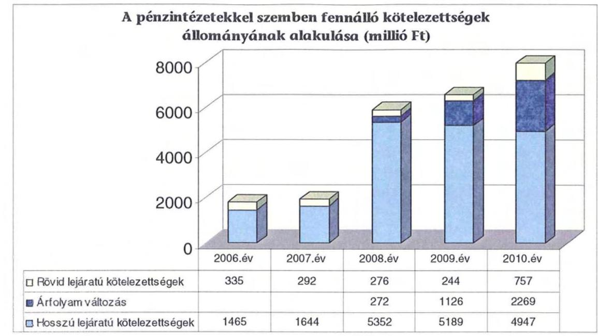

A pénzintézeti kötelezettségek állományának 2007-2010 közötti több mint négyszeres, 6037 millió Ft összegű növekedését döntően befolyásolta, hogy az

- Önkormányzat a 2007. évben 450 millió Ft (1 267947 EUR) fejlesztési célú hitelt vett fel;
- 2008. július 2-án 4000 millió Ft (27 478189 CHF ) összegben felhalmozási célú kötvényt bocsátott ki;
- az Árpád Fürdő tulajdonjogának átvételével együtt 2009. május 1-jétől az Önkormányzat átvállalta a BMV Zrt. Árpád Fürdő rekonstrukciójára felvett hitelből a még fennálló 111 millió Ft kötelezettséget;
- a 2010. év végén 213 millió Ft folyószámlahitel állománnyal rendelkezett;
- az Önkormányzat a költségvetés végrehajtása során a pályázati bevételek megelőlegezése céljából a 2010. év végén 300 millió Ft további likvid hitelt vett fel.

Annak megítéléséről, hogy a devizában kibocsátott kötvényekért és felvett hitelekért kapott forinthoz képest a kötvények visszavásárlásakor, illetve a hitelek visszafizetésekor jelentkező forint kötelezettség többletkiadást (árfolyamveszteség) vagy megtakarítást (árfolyamnyereség) eredményez a futamidő végén, a teljes kötelezettség rendezését követően lehet képet alkotni. Mindaddig, amíg törlesztési kötelezettség nem áll fenn (türelmi idő, moratórium), a tőkére vonatkoztatva nem értelmezhető sem az árfolyamveszteség, sem az árfolyamnyereség. Ugyanakkor a számviteli szabályok meghatározzák, hogy az árfolyam különbözetet év végén a kötelezettségek vagy követelések között a könyvviteli mérlegben nyilván kell tartani, azonban az árfolyam különbözet valójában nem realizált.

---

Az Önkormányzat pénzintézeti kötelezettségvállalásaira közgyűlési döntés alapján került sor. Az adósságot keletkeztető kötelezettségvállalás felső határát a 2007-2010. években nem lépték túl, mivel a tárgyévi kötelezettségvállalásoknak - a hitelfelvételből és a kötvénykibocsátásból származó kötelezettség halasztott tőketörlesztése miatt - nem volt tárgyévet terhelő része ${ }^{65}$. A 2007-2011. évi költségvetési és a 2007-2010. évi zárszámadási rendeletek tartalmazták az Önkormányzat hiteleinek és kötvényének évenkénti várható tőke-, és kamatfizetési kötelezettségeit a futamidők végéig. A 2009. évi ÁSZ ellenőrzés javaslatát követően a jegyző a 2010. és a 2011. évben is tájékoztatta a Közgyűlést a hosszú lejáratú adósságot keletkeztető kötelezettségvállalásokból adódó tőke-, és kamatfizetési kötelezettségek visszafizetésének feltételeiről.

Az Önkormányzat 2010. december 31-én EUR-ban fennálló hosszú lejáratú hitelszerződéseinek adatait az alábbi táblázat mutatja be:

| Megnevezés | Szerződéskötés időpontja | Összeg* EUR | Lehívási árfolyam | Kamat (referencia kamat+ kamatfelár) | Felhasználás célja: |
| :--: | :--: | :--: | :--: | :--: | :--: |
| Hosszú lejáratú hitel | 2005.11.02 | 2700108 | 249,99 | 3 havi EURIBOR $+0,3 \%$ | A 2005. évi költségvetési rendeletben tervezett lejáratának finanszírozása |
| Hosszú lejáratú hitel | 2006.09.08 | 2827598 | 273,1 | 3 havi EURIBOR $+0,35 \%$ | A 2006. évi költségvetési rendeletben tervezett lejáratának finanszírozása |
| Hosszú lejáratú hitel | 2007.08.03 | 1794616 | 250,75 | 3 havi EURIBOR $+0,45 \%$ | A 2007. évi költségvetési rendeletben tervezett lejáratának finanszírozása |
| Összesen: |  | 7322322 |  |  |  |

*Az első kamatfizetési kötelezettség tőkésített összegét nem tartalmazza a táblázat.
Az Önkormányzat az EUR-ban fennálló hosszú lejáratú pénzintézeti kötelezettségeiből - 2010. december 31-ig - 3039078 EUR tőkét törlesztett és 811944 EUR kamatot fizetett meg.

Az Önkormányzat 2010. december 31-én forintban fennálló hitelszerződései (a folyószámlahitel nélkül) az alábbiak voltak:

| Megnevezés | Szerződéskötés időpontja | Összeg | Kamat (referencia kamat+ kamatfelár) | Felhasználás célja: |
| :--: | :--: | :--: | :--: | :--: |
| Hosszú lejáratú hitel | 2004.04.01 | 46800 | 6 havi BUBOR $+1 \%$ | "Beruházás a 21.századi iskolába" Oktatási intézmény tetőfelújítása |
| Hosszú lejáratú hitel | 2004.04.01 | 110826 | 6 havi BUBOR $+1 \%$ | "Beruházás a 21.századi iskolába" Oktatási intézmény felújítása |
| Hosszú lejáratú hitel (BMV Zrt. hitelének átvétele) | 2008.12.31 | 110518 | 3 havi BUBOR $+2,5 \%$ | Árpád Fürdő rekonstrukció |
| Lombard hitel (rövid lejáratú) | 2010.12.23 | 300000 | 1 havi BUBOR $+1,9 \%$ | Folyóvázati bevételek megelőlegezése |
| Összesen: |  | 568144 |  |  |

Az Önkormányzat a HUF-ban fennálló pénzintézeti kötelezettségeiből - 2010. december 31-ig - 133 millió Ft tőkét törlesztett és 72 millió Ft kamatot fizetett

[^0]
[^0]:    ${ }^{65}$ A teljesített korrigált saját bevétel a 2007. évi 2149 millió Ft-ról a 2010. évben 2341 millió Ft-ra nőtt, míg a 2011. évre tervezett az előző év tényhez képest kis mértékben, 2305 millió Ft-ra csökkent.

---

meg. A 300 millió Ft Lombard hitelt a lejáratkor, 2011. március 31-én visszafizették.

Az Önkormányzat kimutatásai szerint a felvett hiteleket - a hitelcéloknak megfelelően - fejlesztési feladatainak finanszírozására használta fel.

Az Önkormányzat 2010. december 31-én CHF-ben fennálló kötvénykibocsátásának adatait az alábbi táblázat mutatja be:

| Megnevezés | Kibocsátás <br> kelte | Összeg <br> CHF | Kibocsátási <br> árfolyam | Kamat (referencia <br> kamat+ kamatfelár) | Felhasználás célja: |
| :--: | :--: | :--: | :--: | :--: | :--: |
| ${ }^{\text {a }}$ Békéscsaba 2028 ${ }^{\text {a }}$ kötvény | 2008.07.02 | 27478189 | 146,74 | 6 havi CHF LIBOR+1,1\% | Fejlesztési feladatok <br> finanszírozása |

Az Önkormányzat a kötvénykibocsátásból eredő kötelezettségéből - 2010. december 31-ig - tőkét még nem törlesztett ${ }^{66}$, kamatfizetési kötelezettsége 1485428 CHF volt.

Az Önkormányzat a kötvénykibocsátásból származó bevétel felhasználásáról a mindenkori zárszámadáskor köteles adatot szolgáltatni. Az elszámolások alapján a 4000 millió Ft-ból 2010. december 31-ig 3218 millió Ft használtak fel - a 3.a és 3.b mellékletekben részletezett - fejlesztési célokra.

Az Önkormányzat a meglévő adósságállomány kezelésére, átalakítására nem tett intézkedést a 2007-2010. években.

A 2007-2010. évi költségvetési rendeletekben - a költségvetés végrehajtása, a folyamatos likviditás biztosítása érdekében - a Közgyűlés felhatalmazta a polgármestert folyószámlahitel igénybevételére. A 2010-2011. évi költségvetési rendeletek munkabérhitel felvételére vonatkozó felhatalmazást is tartalmaztak.

A folyószámlahitel keret és az igénybevett munkabérhitel alakulását az alábbi táblázat mutatja be:

|  |  |  |  |  | ezer Ft-ban |  |
| :-- | --: | --: | --: | --: | --: | --: |
| Megnevezés | 2007. év | 2008. év | 2009. év | 2010. év | 2011. <br> március 31. |  |
| I. Folyószámlahitel |  |  |  |  |  |  |
| a folyószámlahitel keretösszege január 1-jén | 800000 | 800000 | 500000 | 500000 | 800000 |  |
| teljesített kamat és egyéb költség | 3107 | 4896 | 2611 | 6474 | 4116 |  |
| II. Munkabér megelőlegezési hitel |  |  |  |  |  |  |
| Igénybevett hitel összesen: | - | - | - | 286975 | - |  |
| teljesített kamat és egyéb költség | - | - | - | 1697 | - |  |

A folyószámlahitellel zárt napok száma a 2007. évi 126 napról 2010-re 184 napra, a napi átlagos állomány 38 millió Ft-ról több mint kétszeresére, 81 millió Ft-ra nőtt. A növekedés 2011-ben is folytatódott, március 31-ig 76 nap volt szükség folyószámlahitelre, 194 millió Ft napi átlaggal. Munkabérhitel felvételére a 2010. évben egy hónapban volt szükség. Az Önkormányzat - a ko-

[^0]
[^0]:    ${ }^{66}$ A tőke törlesztésének kezdő időpontja: 2013. szeptember 30.

---

rábbi évektől eltérően - folyószámlahitellel zárta a 2010. évet, melynek állománya 213 millió Ft volt. ${ }^{67}$

A folyószámla-, és munkabérhitel kondíciói az alábbiak voltak ${ }^{68}$ :

| Megnevezés | Kamat (referencia+ kamatfelár) | Rendelkezésre tartási <br> jutalék |
| :-- | :--: | :--: |
| Folyószámlahitel |  |  |
| 2007.01.01-2008.11.18. | 3 havi BUBOR $+0,25 \%$ | $0,00 \%$ |
| 2008.11.19-2009.11.17. | 3 havi BUBOR $+1,0 \%$ | $0,15 \%$ |
| 2009.11.18-2011.10.14. | 1 havi BUBOR $+1,0 \%$ | $0,15 \%$ |
| Munkabér megelőlegezési hitel |  |  |
| 2010. év | 1 havi BUBOR $+2,0 \%$ | x |

Az Önkormányzatot a 2007-2010. években összesen 17 millió Ft kamatfizetési kötelezettség terhelte a folyószámla-, és munkabérhitel után.

Az alapkamat mértékének alakulása jelentős hatással van az adott devizanemben kifejezett, a teljes futamidőre számított, várható kamatkötelezettség nagyságára. A jelenleg fennálló hosszú lejáratú fejlesztési hitelek és a kötvény esetében a kamatfizetési kötelezettségek alakulását jelentősen befolyásolja a referencia kamatok változása, melyet az alábbi táblázat szemléltet:

| Megnevezés | Szerződéskötés <br> időpontja/Kibocsátás <br> keltje | Megnevezés | Kibocsátási/ <br> lehívási <br> alapkamat \% | Utolsó <br> fizetéskor <br> 1 (százalék <br> pont) | Változás <br> (százalék <br> pont) |
| :-- | :--: | :--: | :--: | :--: | :--: |
| EUR hitelek |  |  |  |  |  |
| Hosszú lejáratú hitel | 2005.11.02 | 3 havi EURIBOR | 2,30 | 1,01 | $-1,29$ |
| Hosszú lejáratú hitel | 2006.09.08 | 3 havi EURIBOR | 3,27 | 1,01 | $-2,26$ |
| Hosszú lejáratú hitel | 2007.08.03 | 3 havi EURIBOR | 4,26 | 1,01 | $-3,25$ |
| HUF hitelek |  |  |  |  |  |
| Hosszú lejáratú hitel | 2004.04.01 | 6 havi BUBOR | 11,23 | 5,39 | $-5,84$ |
| Hosszú lejáratú hitel | 2004.04.01 | 6 havi BUBOR | 11,23 | 5,39 | $-5,84$ |
| Hosszú lejáratú hitel | 2008.12.31 | 3 havi BUBOR | 10,00 | 5,67 | $-4,33$ |
| CHF kötvény |  |  |  |  |  |
| "Békéscsaba 2028" kötvény | 2008.07.02 | 6 havi CHF LIBOR | 2,97 | 0,24 | $-2,73$ |

A fizetett kamatok a 2007. évi 93 millió Ft-ról a 2008. évre 169 millió Ft-ra növekedtek, egyrészt a referencia kamatok emelkedése miatt, másrészt annak hatására, hogy a 2007. évben felvett hitel kamatfizetési kötelezettsége 2008. I. negyedévétől, a kötvény utáni kamatfizetés a 2008. év III. negyedévétől megkezdődött. A kamatkiadások a 2009. évben - a referencia kamatok csökkenése ellenére - tovább növekedtek 230 millió Ft-ra, mivel a BMV Zrt-től átvett hitel utáni kamatfizetés a 2009. év I. negyedévétől esedékessé vált, valamint a kötvény utáni kamatfizetés már éves szinten jelentkezett. A referencia kamatok

[^0]
[^0]:    ${ }^{67}$ A napi átlagos állományt 365 napos nevezővel számítottuk ki.
    ${ }^{68}$ A referencia kamatok az alábbiak szerint alakultak:

    | MNB BUBOR fixing (átlagkamat) \%-ban |  |  |  |  |
    | :-- | :--: | :--: | :--: | :--: |
    | 2007. évi | 2008. évi | 2009. évi | 2010. évi | 2011.március |
    |  |  |  |  | 31 -ig |
    | 7,75 | 8,87 | 8,64 | 5,5 | 6,03 |
    | 7,83 | 8,75 | 8,66 | 5,47 | 5,94 |

---

további csökkenése következtében a 2010. évi kamatkiadások összege a 2008. évi szint alá, 129 millió Ft-ra mérséklődött. ${ }^{69}$

Az Önkormányzatot a HUF-ban fennálló hosszú lejáratú hitelei után a 20112013. években 119 millió Ft, az EUR-ban fennálló hosszú lejáratú hitelek után 2350872 EUR, a kötvénytartozás után 2034989 CHF tőke-, és kamatfizetési kötelezettség terheli. A 2014. évet követően a hosszú lejáratú hitelek után 34 millió Ft, illetve 2183193 EUR, a kötvény után 29365878 CHF a várható kötelezettség.

Az Önkormányzat a 2008. július 2-án kibocsátott kötvény bevételből származó, átmenetileg szabad forrás befektetéséből 841 millió Ft hozamot, kamatbevételt ért el, amely a kötvények 2011. március 31-ig teljesített kamatfizetésének ( 318 millió Ft) több mint 2,5-szerese.

A Közgyűlés a 2011-2014. évekre szóló gazdasági programban foglalt több éves fejlesztési kötelezettségek finanszírozása céljából további 2000 millió Ft kötvény kibocsátásáról és 2000 millió Ft fejlesztési hitel felvételéről döntött 2011. május 27-én. A kötvényt 2011. júliusában bocsátják ki, a hitelt - a közbeszerzési eljárás lefolytatását követően - várhatóan 2011. októberében fogja igénybe venni az Önkormányzat.

# 3.2. Szállítók felé fennálló kötelezettségek alakulása 

Az Önkormányzat összes kötelezettségének 2010. december 31-i állománya 8795 millió Ft, ezen belül a szállítói kötelezettsége nagysága 543 millió Ft, a lejárt tartozások összege 187 millió Ft, az összes kötelezettség 2\%-a.

Az Önkormányzat és gazdasági társaságai lejárt szállítói tartozásai és egyéb kiadás elmaradásai alakulását az alábbi táblázat tartalmazza:
ezer Ft-ban

| Megnevezés | 2007. <br> december 31. | 2008. <br> december 31. | 2009. <br> december 31. | 2010. <br> december 31. |
| :--: | :--: | :--: | :--: | :--: |
| Lejárt szállítói tartozás | 13593 | 65025 | 282159 | 186895 |
| ebből Kórház | 10609 | 48163 | 279440 | 166476 |
| Egyéb kiadás elmaradás | - | - | - | - |
| Gazdasági társaságok | 69915 | 114669 | 62604 | 77633 |

Az Önkormányzat lejárt szállítói tartozása 14 millió Ft-ról 187 millió Ft-ra emelkedett. A 2010. december 31-én kimutatott 187 millió Ft lejárt szállítói tartozás $39 \%$-a 30 nap alatti, $29 \%$-a 31 és 60 nap közötti, $13 \%$-a 61 és 90 nap közötti, $19\%$-a 91 és 365 nap közötti, éven túli tartozás elmaradás nem volt. Az Önkormányzat intézményeinél a 60 napot meghaladó, szállítók felé fennálló

[^0]
[^0]:    ${ }^{69}$ A 3 havi EURIBOR éves átlagkamat a 2007. évben 4,278\% a 2008. évben 4,644\% a 2009. évben 1,218\% a 2010. évben 0,8136\%, a 6 havi BUBOR éves átlagkamat 2007. évben 7,68\% a 2008. évben 8,98\% a 2009. évben 8,62\% a 2010. évben 5,53\%, a 3 havi BUBOR éves átlagkamat a 2009. évben 8,64\%, a 2010. évben 5,5\% volt. A kötvény után fizetendő 6 havi CHF LIBOR éves átlagkamat a 2008. évi 2,69744\%-ról a 2009. évre $0,46652 \%$-ra, a 2010. évre $0,28749 \%$-ra csökkent.

---

kötelezettségek miatt - a helyi önkormányzatok adósságrendezési eljárásáról szóló 1996. évi XXV. törvény 5. § (2) bekezdésében foglaltak ellenére - a Polgármester nem kezdeményezett adósságrendezési eljárást.

A lejárt szállítói tartozás állománya 2011. március 31-ére 263 millió Ft-ra növekedett, melynek $28\%$-a 30 nap alatti, $26\%$-a 31 és 60 nap közötti, $17\%$-a 61 és 90 nap közötti, $28\%$-a 91 és 365 nap közötti és $1\%$-a éven túli.

A szállítói tartozás emelkedését a Kórház lejárt szállítói állományának nagymértékű - 11 millió Ft-ról 166 millió Ft-ra történő - növekedése okozta. A 20072010. években az önkormányzati lejárt szállítói tartozás döntő részét (2007-ben $78\%$-át, 2008-ban $74\%$-át, 2009-ben $99\%$-át, 2010-ben $89\%$-át) képezte a Kórház tartozásállománya. A lejárt tartozásállomány 2009. évi közel hatszoros növekedése a teljesítmény volumen korlát bevezetésének hatására következett be.

A Kórház mérleg szerinti szállítói állománya 2,5-szeresére 132 millió Ft-ról 335 millió Ft-ra növekedett 2007-ről 2010-re, addig a lejárt szállítói számlák értéke több mint a 16-szorosára 11 millió Ft-ról 166 millió Ft-ra emelkedett. A lejárt szállítói tartozásokon belül fokozatosan növekedett a régebben lejárt szállítói tartozások aránya. A Kórház jelenleg is súlyos likviditási problémákkal küzd, mivel 2011. március 31-én már éven túli tartozásai is voltak.
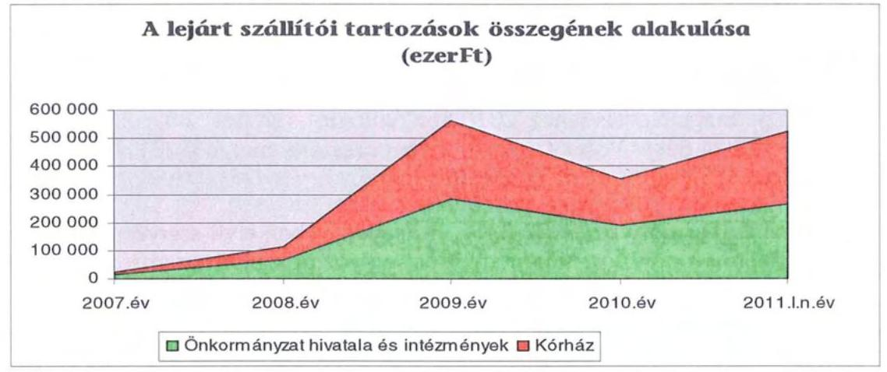

A gazdasági társaságok 2010. december 31-i lejárt szállítói tartozásállománya három társaság tartozásaiból tevődik össze. A lejárt szállítói állomány 2\%-a (2 millió Ft) képződött az Önkormányzat többségi tulajdonában lévő két gazdasági társaságnál.

# 3.3. Egyéb kötelezettségek alakulása 

Az Önkormányzat a vizsgált időszakban lízingszerződést nem kötött, PPP konstrukció keretében fejlesztést nem hajtott végre.

Garanciavállalás két esetben történt beruházások finanszírozásához kapcsolódóan, összesen 68 millió Ft összegben, amelyekből fizetési kötelezettsége nem keletkezett az Önkormányzatnak. Garanciavállalásból adódó kötelezettsége 2010. december 31-én nem volt és jelenleg sincs az Önkormányzatnak.

---

Kezességet 11 esetben vállalt az Önkormányzat 456 millió Ft nagyságrendben, a Békéscsabai Víziközmű Társulat szennyvízberuházásához és a VAK Zrt. fejlesztési hiteleihez kapcsolódóan. Kettő kezességvállalásból adódóan, 33 millió Ft kötelezettsége volt az Önkormányzatnak 2010. december 31-én.

A 2007-2011. I. negyedév végéig az Önkormányzatnál az elengedett követelések bruttó összege 19 millió Ft. Az elengedett követelések a jegyzői hatáskörbe tartozó adóztatási tevékenységhez kapcsolódnak. Ebből az összegből 16 millió Ft mulasztási bírság és késedelmi pótlék, mely az elengedett követelések $84,2\%$-a.

Az Önkormányzat intézményei számára 2007-2011.I. negyedév alatt összesen 400 millió Ft kölcsönt nyújtott, nyertes pályázatok előfinanszírozásához. A támogatási kölcsön folyósítására az adott évi költségvetési rendelet és a pályázat benyújtásáról szóló közgyűlési határozat alapján került sor. A kölcsön törlesztése a pályázati támogatás folyósítását követően történik, annak ütemezéséhez igazodóan. A leghosszabb igénybevételi időtartam 1,88 év, a legrövidebb időtartam 0,09 év volt. A támogatási kölcsönből a vizsgálat idején 85 millió Ft a visszafizetendő állomány.

Az Önkormányzat 2008. évben pályázat előfinanszírozásához kapcsolódóan 20 millió Ft kölcsönt nyújtott a Békéscsaba és Térsége Többcélú Önkormányzati Kistérségi Társulásnak, amelynek teljes összege visszafizetésre került.

Az Önkormányzat közös kerékpárút fejlesztési pályázat beruházási költségeinek megelőlegezéséhez 2010-ben kölcsönt nyújtott 68 millió Ft-os nagyságrendben Békés Város Önkormányzata részére, melyből 2011. május 31-i állapot szerint 33 millió Ft még visszafizetendő.

Az Önkormányzat 2007-2011. I. negyedévében civil szervezetek részére 51 millió Ft-os nagyságrendben nyújtott pályázatok előfinanszírozását szolgáló kölcsönt. A kölcsön folyósítása szerződés alapján, 0,5-1 év időtartamra történt. A vizsgálat időpontjában visszafizetendő állomány 5 millió Ft.

Az Önkormányzat tulajdoni részesedésével rendelkező gazdasági társaságnak tagi vagy egyéb kölcsönt nem nyújtott. Egyéb gazdasági társaság részére hálózat fejlesztés céljából egy alkalommal nyújtott az Önkormányzat kölcsönt 3 millió Ft-os nagyságrendben, melynek visszafizetése a beruházás megvalósítását követően esedékes.

A vizsgált időszakban öt ingatlant terhelt jelzálogjog és nyolc ingatlan állt elidegenítési és terhelési tilalom alatt. A terhelések a Széchenyi tervhez kapcsolódó fejlesztési hitelek (Bérlakás-építés, „Beruházás a XXI. századi iskolába", Árpád Fürdő fejlesztése) biztosítékául szolgáltak. Ebből a programból valósult meg három óvoda és egy iskola fejlesztése, valamint turizmusfejlesztés és lakópark építés is.

A jelzáloggal érintett forgalomképes ingatlanok 2010. év végi nettó értéke 41 millió Ft, mely az összes önkormányzati forgalomképes ingatlan nettó értékének (1896 millió Ft) 2\%-a. Elidegenítési és terhelési tilalom nyolc forgalom-

---

képes ingatlant terhelt, melyek nettó értéke 448 millió Ft. A jelzálogjog bejegyzések érdemben nem korlátozzák az Önkormányzat rendelkezési jogát a forgalomképes ingatlanjai felett.

A jelzáloggal érintett korlátozottan forgalomképes ingatlanok 2010. év végi nettó értéke 670 millió Ft, mely az összes önkormányzati korlátozottan forgalomképes ingatlan nettó értékének (18368 millió Ft) 4\%-a. A korlátozottan forgalomképes ingatlanokra a jelzálogjog bejegyzése az Ötv. 88. § (1) bekezdés b) pontjában foglaltakkal ellentétben történt.

A forgalomképes és a korlátozottan forgalomképes ingatlanok nettó értékének százalékos megoszlását a jelzáloggal terhelt és nem terhelt ingatlanok között a következő ábra szemlélteti:
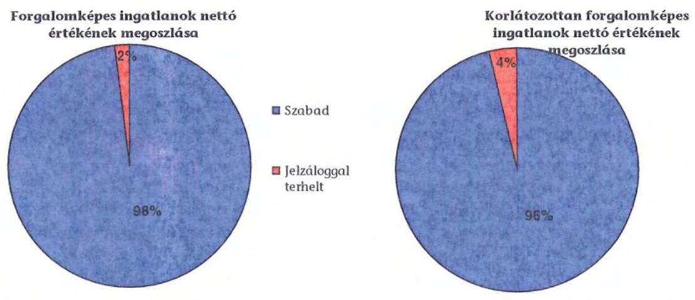

Az Önkormányzat egyes kötelezettségeinek állományát 2010. december 31-én és várható alakulását a kötelezettségek lejáratáig a következő táblázat részletezi:

| Megnevezés | Állomány 2010. dec. 31-én |  |  | Várható kötelezettség** 2011. 2013. években |  |  | Várható kötelezettség** 2014. évet követően |  |  |
| :--: | :--: | :--: | :--: | :--: | :--: | :--: | :--: | :--: | :--: |
|  | $\begin{aligned} & \text { HtX-ban } \\ & \text { (millió Ft- } \\ & \text { ban) } \end{aligned}$ | Devizában <br> (összeg) | Devizd- <br> nem | $\begin{aligned} & \text { HtX-ban } \\ & \text { (millió Ft- } \\ & \text { ban) } \end{aligned}$ | Devizában (összeg) | Devizd <br> nem | $\begin{aligned} & \text { HtX-ban } \\ & \text { (millió Ft- } \\ & \text { ban) } \end{aligned}$ | Devizában (összeg) | Devizd <br> nem |
| Pénzintézeti kötelezettségek |  |  |  |  |  |  |  |  |  |
| Összes lejáratú hitelek | 133 |  | HtX | 119 |  | HtX | 34 |  | HtX |
| Összes lejáratú hitelek |  | 4333992 | EUR |  | 2350872 | EUR |  | 2181193 | EUR |
| Szövetségi tőkevonzású átutalás |  | 27478189 | CHF |  | 2554989 | CHF |  | 27363878 | CHF |
| Várható lakuláré | 313 |  | HtX | 313 |  | HtX |  |  |  |
| Egyéb bevédi hitelek | 300 |  | HtX | 300 |  | HtX |  |  |  |
| Pénzintézeti kötelezettségek összesen HtX-ban | 646 |  | HtX | 632 |  | HtX | 34 |  | HtX |
| Pénzintézeti kötelezettségek összesen CHF-ban |  | 27478189 | CHF |  | 2054989 | CHF |  | 29363878 | CHF |
| Pénzintézeti kötelezettségek összesen EUR-ban |  | 4333992 | EUR |  | 2350872 | EUR |  | 2181193 | EUR |
| Miskolctapok |  |  |  |  |  |  |  |  |  |
| Szigetség | 33 |  | HtX |  |  |  |  |  |  |
| Miskolctapok összesen | 33 |  | HtX |  |  |  |  |  |  |
| Szállítási tartozás | 543 |  | HtX | 543 |  | HtX |  |  |  |
| Egyéb kötelezettségek |  |  |  |  |  |  |  |  |  |
| Jogerős végzéssel lezárt, de ki nem fizetett kötelezettségek ${ }^{\dagger}$ | 1 |  | HtX | 1 |  | HtX |  |  |  |

* A peres eljárásokra vonatkozó adatok a 2011. júniusi állapotot tükrözik
** A várható hosszú lejáratú pénzintézeti kötelezettségek tartalmazzák az utolsó kamatfizetési kondíció figyelembevételével a fizetendő kamatot is.

Az Önkormányzatnak pénzintézetekkel szemben fennálló kötelezettsége a 2010. év végén 646 millió Ft, 4333992 EUR és 27478189 CHF volt. Ezek várható kötelezettsége a 2011-2013. években 632 millió Ft, az EUR-ban fennálló

---

hosszú lejáratú hitelek után 2350872 EUR, a kötvénytartozás után 2034989 CHF. A 2014. évet követően a hosszú lejáratú hitelek után 34 millió Ft, illetve 2183193 EUR, a kötvény után 29365878 CHF a várható kötelezettség. A szállítói tartozások 2010. év végi állománya 543 millió Ft-ot tett ki. A kezességvállalásból adódóan 33 millió Ft kötelezettsége jelentkezhet az Önkormányzatnak, míg a jogerős végzéssel lezárt, de ki nem fizetett kötelezettség 1 millió Ft volt.

A gazdasági társaságok 2010. december 31-én fennálló hosszú lejáratú kötelezettségeinek állománya összesen 128 millió Ft és 793503 EUR, várható adósságszolgálata a 2011-2013. évek között 140 millió Ft és 504325 EUR, a 2014. évtől a futamidők végéig 10 millió Ft és 306894 EUR.

A BMV Zrt. 2010-ben három lízingcéggel összesen 28 db szerződést kötött az ivóvíz és szennyvízelvezetési szolgáltatás nyújtásához szükséges gépjárművek és munkagépek vásárlása céljából.

A gazdasági társaságok közül három rendelkezik hitelekkel: a VAK Zrt., a BMV Zrt. és a Békés Megyei Temetkezési Kft.

A BMV Zrt. a 2008. évben vízügyi elektronikus dokumentumkezelő rendszer bevezetéshez 304067 EUR hitelt vett fel, a lejárat időpontja 2015. A VAK Zrt. stadion rekonstrukcióra 84 millió Ft hitelt vett fel, amely 2011. III. negyedévében lejár. A Békés Megyei Temetkezési Kft. jármű beszerzésére 2009-ben vett fel 10337 EUR nagyságrendű hitelt, mely 2013-ban jár le. A 2011. I. negyedévében a VAK Zrt. ingatlan átalakítására további 16 millió HUF hitelt vett fel, a lejárat időpontja 2016.

Az Önkormányzat minősített többségi tulajdonú gazdasági társaságai egyes kötelezettségeinek állományát 2010.
 december 31-én és várható alakulását a kötelezettségek lejáratáig az alábbi táblázat szemlélteti:

| Megnevezés | Állomány 2010. dec.31-én |  |  | Várható kötelezettség* 2011. - 2013. években |  |  | Várható kötelezettség* 2014. <br> évet követően |  |  |
| :--: | :--: | :--: | :--: | :--: | :--: | :--: | :--: | :--: | :--: |
|  | HUF-ben <br> (millió Ft-ben) | Devizában (összege) | Devizanem | HUF-ben (millió Ft-ben) | Devizában (összege) | Devizanem | HUF-ben (millió Ft-ben) | Devizában (összege) | Devizanem |
| Pénzintézeti kötelezettségek |  |  |  |  |  |  |  |  |  |
| Banki rövid lejáratú hitelek | 33 |  | HUF | 48 |  | HUF | 8 |  | HUF |
| Pénzintézeti kötelezettségek összesen: | 33 |  | HUF | 48 |  | HUF | 8 |  | HUF |
| Szállítói tartozás | 79 |  | HUF | 79 |  | HUF |  |  |  |

* A várható pénzintézeti kötelezettségek tartalmazzák az utolsó kamatfizetési kondíció figyelembevételével a fizetendő kamatot is, továbbá: a VAK Zrt. által 2011. februárban megkötött 16 millió Ft-os kötelezettségvállalás alapján teljesítendő kötelezettségeket is.

Az Önkormányzat korlátlan felelősséggel tartozik felszámolás esetén a gazdasági társaságokról szóló 2006. évi IV. törvény 54. § (2) bekezdése alapján, amennyiben minősített befolyást szereznek ${ }^{70}$ minősül, illetve a csődeljárásról és felszámolási eljárásról szóló 1991. évi XLIX. törvény 63. § (2) bekezdése alapján a kizárólagos önkormányzati tulajdonú gazdasági társaság minden olyan kö-

[^0]
[^0]:    ${ }^{70}$ A gazdasági társaságokról szóló 2006. évi IV. törvény 52. § (2) bekezdése alapján minősített többséget biztosító befolyásnak számít, ha a minősített befolyásszerző az ellenőrzött társaságban - közvetlenül vagy közvetve - a szavazatok legalább 75\%-ával rendelkezik.

---

telezettségéért, amelynek kielégítését a felszámolási eljárás során az adós társaság vagyona nem fedez, ha a hitelezőinek a felszámolási eljárás során benyújtott keresete alapján a bíróság - az adós társaság felé érvényesített tartósan hátrányos üzletpolitikájára figyelemmel - megállapítja az Önkormányzat korlátlan és teljes felelősségét. Felszámolás esetén a hitelezők által benyújtott kereset alapján a bíróság 135 millió Ft nagyságrendben állapíthat meg korlátlan és teljes felelősséget e társaságok hosszú lejáratú hitelei, azok kamatai, valamint szállítói tartozása után.

Az Önkormányzat a 2007-2010. években a tárgyi eszközök után együttesen 5995 millió Ft értékcsökkenést számolt el. A 2007. évben 1155 millió Ft-ot ${ }^{71}$, a 2008. évben 1764 millió Ft-ot, a 2009. évben 1451 millió Ft-ot, míg a 2010. évben 1625 millió Ft-ot. A 2007. évben a tárgyévben elszámolt értékcsökkenés $33 \%$-ának ( 383 millió Ft), a 2008. évben $27 \%$-ának, (469 millió Ft), a 2009. évben $23 \%$-ának ( 339 millió Ft), míg a 2010. évben $46 \%$-ának ( 740 millió Ft) megfelelő összeget aktiváltak felújításként. Az Önkormányzat eszközállományának bruttó értéke a 2007. évi 60003 millió Ft-ról 66980 millió Ft-ra nőtt ( $12 \%$-kal), míg a nettó érték a 2007. évi 49308 millió Ft-ról 51966 millió Ft-ra ( $5 \%$-kal).

Az önkormányzati szintű használhatósági fok a 2007. évi 82\%-ról négy év alatt 4 százalékponttal $78 \%$-ra csökkent az egyes eszközcsoportoknál különböző mértékkel elszámolt amortizáció hatására. Ezt nem ellensúlyozta az immateriális javak, az ingatlanok, vagyoni értékű jogok, gépek, berendezések, felszerelések, járművek, átadott eszközök 2007. évről 2010. évre folyamatosan növekvő bruttó értéke sem. A használhatósági fok az immateriális javaknál romlott a legnagyobb arányban a négy év alatt $56 \%$-ról $42 \%$-ra. A gépek, berendezések, felszerelések esetében viszont $26 \%$-ról $29 \%$-ra, míg a járművek esetében $19 \%$-ról $45 \%$-ra nőtt.

Az Önkormányzat évente felmérette a karbantartási, felújítási szükségletet, annak eldöntése céljából, hogy a következő év költségvetésébe a pénzügyi lehetőségek figyelembevételével megtörténhessen a karbantartási, felújítási igények rangsorolása az eszközök elhasználódása érdekében.

A felújításokra, az eszközök pótlására elsősorban az intézmények működőképességének biztosítása, illetve a szakhatósági előírások figyelembevételével került sor. A 2007-2010. évek között pénzügyileg teljesített felhalmozási kiadásokból eszközpótlásra (rekonstrukcióra, felújításra) 8468 millió Ft-ot fordított Önkormányzat. A 2007-2010. években elszámolt 5995 millió Ft amortizációt, az eszközök avulását $41 \%$-kal haladta meg az eszközpótlásra fordított összeg.

A vizsgálat idején 16 peres eljárás van folyamatban, az Önkormányzat terhére kimutatott perérték 84 millió Ft és kamatai, négy eljárás jogerős döntéssel lezárult, melyekből egy esetben keletkezett fizetési kötelezettsége az Önkormányzatnak, 1,3 millió Ft értékben 2011. II. negyedévében.

[^0]
[^0]:    ${ }^{71}$ Az Önkormányzat 2007. évi költségvetési beszámolójának 38. űrlapját javítani kellett.

---

A Kórházzal szemben indított három műhiba perben, 38,4 millió Ft a perbeli követelés. Az egészségügyi szolgáltatás során okozott kár megtérítésére szóló kötelező felelősségbiztosítás fedezetet biztosít az esetlegesen megállapításra kerülő kártérítés összegére.

A peres eljárások közül nagyságrendjében kiemelkedik a Tűzoltóság hivatásos állománya által kezdeményezett per, mely a 2004. május 1-je és 2007. december 31-e közötti időszak elmaradt túlszolgálati díjának megfizetésére vonatkozik. A perbeli követelés az Önkormányzattal szemben 43,8 millió Ft és kamatai.

Az Önkormányzat többségi tulajdonában álló gazdasági társaságoknak a peres eljárásokból fizetési kötelezettsége nem származott, a folyamatban lévő eljárásokban is követelések jogosultjai.

# 4. A PÉNZÜGYI EGYENSÚLY MEGTEREMTÉSE ÉRDEKÉBEN HOZOTT INTÉZKEDÉSEK 

A 2007. évi költségvetési tervezés kapcsán - a központi források szűkülése következtében - az Önkormányzat kiadáscsökkentő, valamint bevételnövelő intézkedések megtételére kényszerült. A kiadáscsökkentő és bevételnövelő intézkedések a gazdálkodás átláthatóbbá tételét, valamint a feladatellátás szakmai színvonalának javítását célozták.

A 2007-2010. években az intézményátszervezések, a feladatváltozások valamint a takarékossági intézkedések hatásaként együttesen 2714 millió Ft kiadási megtakarítást mutatott ki az Önkormányzat.

A 2007-2010. évek kiadáscsökkentő intézkedéseinek hatását beavatkozási területenként a következő táblázat részletezi:
ezer Ft

| Az érvényesített <br> kiadáscsökkentés <br> területei | Személyi <br> juttatások <br> és járulékai | Dologi, <br> működési <br> kiadások | Pénzeszköz <br> átadások, <br> támogatá- <br> sok | Összesen |
| :-- | :--: | :--: | :--: | :--: |
| Közgyűlés működése | 4435 | 1000 | 0 | 5435 |
| Polgármesteri hivatal <br> működése | 336344 | 253382 | 172405 | 762131 |
| Önkormányzati in- <br> tézmények működése | 1523226 | 423555 | 0 | 1946781 |
| ÖSSZESEN | $\mathbf{1864005}$ | $\mathbf{677937}$ | $\mathbf{1 7 2 4 0 5}$ | $\mathbf{27 1 4 3 4 7}$ |

A kiadás megtakarítások 72\%-át az önkormányzati intézményeknél, 28\%-át a Polgármesteri hivatalnál realizálták.

A Közgyűlés működésében a tiszteletdíjak csökkentése miatti megtakarítás a személyi juttatásoknál és járulékaínál 4 millió Ft , míg a dologi kiadások esetében 1 millió Ft kiadás megtakarítást eredményezett.

A Polgármesteri hivatalban a személyi juttatások és járulékainak a 336 millió Ft-os csökkenését a Polgármesteri hivatal átszervezésével (213 millió Ft),

---

valamint az éves költségvetési rendeletek takarékosságra vonatkozó intézkedéseivel - cafetéria csökkentés, túlóracsökkentés, megbízási díjak csökkentése (123 millió Ft) biztosították. A dologi, működési kiadások csökkenését ( 253 millió Ft) a Polgármesteri hivatal átszervezése ( 37 millió Ft), a központosított beszerzés következtében (gáz és villamos energia) realizált megtakarítás ( 108 millió Ft) valamint a költségvetési rendeletek takarékosságra vonatkozó intézkedései - az igénybe vett szolgáltatások felülvizsgálata, anyagbeszerzések csökkentése, karbantartási kiadások szűkítése - (108 millió Ft) jelentették. A civil szervezetek támogatásainak a csökkentése 172 millió Ft kiadás megtakarítást eredményezett.

Az önkormányzati intézményeknél a személyi juttatások és járulékai tekintetében 1523 millió Ft volt a kiadás megtakarítás, amelyet egyrészt a feladatmegszüntetéssel, átszervezéssel járó létszámcsökkentéseknek (1235 millió Ft), másrészt a költségvetési rendeletek - a Polgármesteri hivatalnál ismertetett - takarékosságra vonatkozó intézkedéseinek ( 288 millió Ft) köszönhettek. A dologi, működési kiadásoknál jelentkező 424 millió Ft-os kiadás megtakarításból az átszervezések, integrációk 275 millió Ft-ot, az eredményes közbeszerzési eljárások eredményeként az étkezési térítési díjak 5\%-os csökkenése 30 millió Ft-ot, az energiaracionalizálási intézkedések 10 millió Ft-ot, míg - a Polgármesteri hivatalnál ismertetett - takarékossági intézkedések 109 millió Ft-ot eredményeztek.

A létszámcsökkentő intézkedések következtében a 2007-2010. évek között a Polgármesteri hivatalban és az intézményeiknél összesen 343 álláshelyet szüntettek meg, amelyből 95 a közoktatáshoz, 193 a szociális és gyermekvédelemhez, 25 az egészségügyhöz, míg 30 a Polgármesteri hivatalhoz kapcsolódott. A megszüntetett álláshelyek 79\%-a (271) az ágazati szakmai, 15\%-a (52) az intézményüzemeltetéshez, fenntartáshoz kapcsolódó, míg 6\%-a (20) üres álláshely volt.

A 2007-2010. évek között végrehajtott létszámcsökkentés eredményét az alábbi táblázat szemlélteti:

Az Önkormányzat 2007-2010.éveket érintő létszámcsökkentésének alakulása

| Megnevezés (adatok fő-ben) |  | Közoktatás | Szociális és gyermekvédelem | Egészségügy | Polgármesteri <br> hivatal | Egyéb | Összesen |
| :--: | :--: | :--: | :--: | :--: | :--: | :--: | :--: |
| Megszüntetett álláshelyek száma |  | 95 | 193 | 25 | 30 | 0 | 343 |
| Ebből: | üres álláshelyek száma | 0 | 0 | 20 | 0 | 0 | 20 |
|  | szakmai álláshelyek száma | 48 | 193 | 0 | 30 | 0 | 271 |
|  | intézmény-üzemeltetéssel <br> kapcsolatos álláshelyek száma | 47 | 0 | 5 | 0 | 0 | 52 |
| 2007. január 1-jén induló létszám |  | 1966 | 403 | 980 | 283 | 123 | 3755 |
| 2010. december 31-én záró létszám |  | 1871 | 210 | 955 | 253 | 123 | 3412 |

Az Önkormányzatnál a 2007-2010. évek között a foglalkoztatottak induló létszáma a 2007. január 1-jei 3755 főről 3412 főre (343 fővel) csökkent.

A helyi szervezési intézkedések végrehajtásához az Önkormányzat az áttekintett időszak alatt 480 millió Ft központosított támogatást igényelt és kapott. A támogatás felhasználásával tartósan leépített létszám 207 fő volt, a létszámcsökkentés $40 \%$-ához ( 136 fő) központi támogatás nem kapcsolódott. A létszámcsökkentések után a dolgozók nem kerültek továbbfoglalkoztatásra az önkormányzat tulajdonosi érdekeltségébe tartozó gazdasági társaságoknál.

---

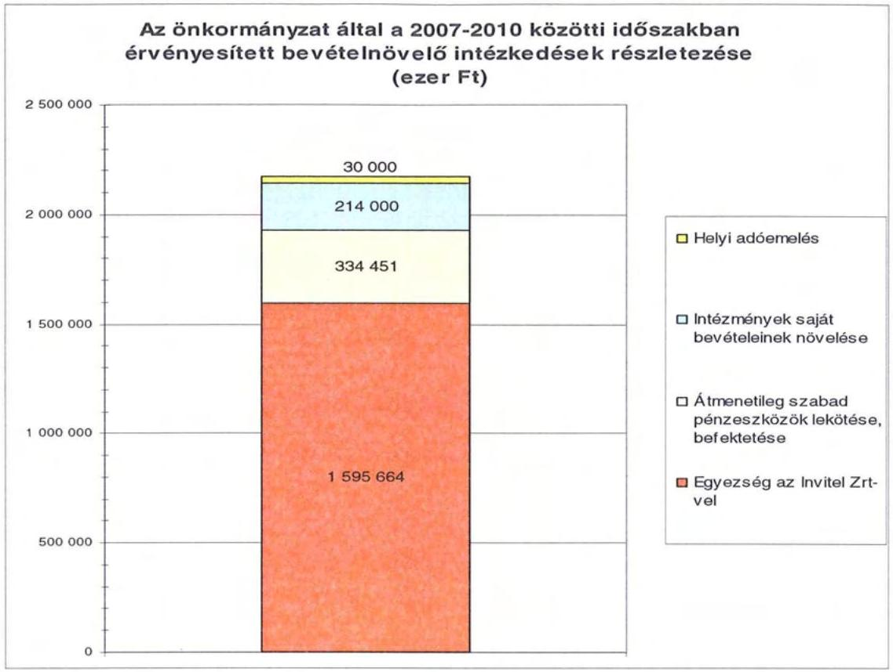

A bevételnövelő intézkedések számszerűsített összegének (2174 millió Ft) 90\%-át a Polgármesteri hivatalnál mutatták ki. A Polgármesteri hivatalnál kimutatott 1960 millió Ft-ból 334 millió Ft-ot jelentett az átmenetileg szabad pénzeszközök lekötése, befektetése, 1596 millió Ft-ot az INVITEL Zrt-vel való egyezség ${ }^{72}$, továbbá 30 millió Ft-ot a 2009. évtől hatályba lépett helyi adórendelet módosításának a hatása. Az intézmények saját bevételeinek (bérleti díjak, valamint tanfolyami díjak emelése) a növekedése 214 millió Ft bevételi többletet eredményezett.

A 2011. évi költségvetés tervszámait alapvetően befolyásolták a
 2009-2010. évek gazdasági folyamatai és megszorító intézkedései. Ennek részbeni ellensúlyozásaként további működési kiadásokat hosszútávon csökkentő, illetve bevételeket növelő intézkedések megtétele vált szükségessé.

A 2011. évi kiadáscsökkentő intézkedések eredményeképpen összesen 572 millió Ft kiadáscsökkentéssel számolnak. A kiadási megtakarítások 58\%-át az intézményeknél, 25\%-át a Polgármesteri hivatalnál, valamint 17\%-át a Közgyűlésnél tervezik elérni. A személyi juttatások és járulékaik 350 millió Ft-os megtakarítását feladatmegszüntetéssel és átszervezéssel (161 millió Ft), a tiszteletdíjak csökkentésével (27 millió Ft), takarékossági intézkedések megtételével

[^0]
[^0]:    ${ }^{72}$ A 715/2008. (II. 18.) számú határozat alapján a Közgyűlés jóváhagyta az INVITEL Zrt-vel megkötendő három egyezségi szerződést, amely összegszerűségében 1666 millió Ft követelés megfizetését tartalmazta, amelyből a 2008-2010. évekre eső rész 1596 millió Ft volt. A követelés a HUNGAROTEL Rt-vel - mint az INVITEL Zrt. jogelődjével - kötött koncessziós szerződés be nem tartásából adódott.

---

(130 millió Ft), valamint a gazdasági társaságok egységes irányítási rendszerével (32 millió Ft) kívánják elérni. A dologi, működési kiadásoknál tervezett 222 millió Ft-os megtakarítást az előzőekben említett intézkedések mellett (100 millió Ft), a központosított beszerzés következtében jelentkező kiadási megtakarítással (88 millió Ft), valamint energiaracionalizálási pályázatok benyújtásával (34 millió Ft) tervezték elérni.

A 2011. évi bevételnövelő intézkedések eredményeként 175 millió Ft bevételi többlettel számoltak, amelynek $97 \%$-a várhatóan a Polgármesteri hivatalban realizálódik. A bevételnövelő intézkedésekből 125 millió Ft-ot jelent a pincék és garázsok értékesítése, 10 millió Ft-ot az átmenetileg szabad pénzeszközök lekötése, befektetése, 35 millió Ft-ot az Invitel Zrt-vel történő egyezség, illetve 5 millió Ft-ot az intézmények saját bevételeinek várható növekedése.

Összességében elmondható, hogy az Önkormányzat kiadáscsökkentő, illetve bevételnövelő intézkedései - kimutatásuk szerint - mindösszesen 4888 millió Ft-ot eredményeztek a 2007-2010. közötti években, valamint várhatóan 747 millió Ft-ot jelentenek a 2011. évben.

Az Önkormányzat költségvetési támogatásból, átengedett bevételekből, és illetékekből származó bevételei a 2007. évi 9333 millió Ft-ról a 2008. évre 10045 millió Ft-ra növekedtek, majd a 2009. évre 9139 millió Ft-ra, a 2010. évre 8851 millió Ft-ra csökkentek, míg a 2007-2010. évek között összességében (kumuláltan) 36 millió Ft-tal nőttek.

A belső ellenőrzés a 2008. évtől kezdődően az érintett költségvetési szerveknél vizsgálta a kiadáscsökkentő és bevételnövelő intézkedések hatásait. Ezen felül a költségvetés féléves és éves teljesítéséről szóló beszámolókban is bemutatták az intézkedések hatásait.

# 5. A HELYI ÖNKORMÁNYZATOK GAZDÁLKODÁSI RENDSZERÉNEK 2009. ÉVI ELLENŐRZÉSE SORÁN A PÉNZÜGYI EGYENSÚLY JAVÍTÁSÁRA TETT SZABÁLYSZERŰSÉGI ÉS CÉLSZERŰSÉGI JAVASLATOK HASZNOSULÁSA 

Az ÁSZ az Önkormányzat gazdálkodási rendszerét a 2009. évben ellenőrizte átfogó jelleggel. A gazdálkodási rendszer korábbi ellenőrzése során tett javaslatok közül a pénzügyi egyensúly javítására vonatkozott három szabályszerűségi és egy célszerűségi javaslat. A javaslatok megvalósítása érdekében a Közgyűlés elfogadta az ÁSZ jelentésben foglaltak végrehajtására készített, felelősöket és határidőket is tartalmazó intézkedési tervet.

Az ellenőrzés során tett, a pénzügyi egyensúly javítására vonatkozó szabályszerűségi és célszerűségi javaslatok 100\%-át hasznosították.

A szabályszerűségi javaslatokra megtett intézkedések eredményeképpen gondoskodtak arról, hogy a 2010. évi költségvetési rendelettervezetben a költségvetési bevételek és kiadások különbségeként a költségvetési hiány bemutatásra kerüljön és a finanszírozási célú pénzügyi műveleteket ne vegyék figyelembe költségvetési hiányt módosító költségvetési bevételként, illetve költségvetési kiadásként. Elkészítették a pénzállomány alakulását bemutató éves likviditási

---

tervet, továbbá biztosították az EU-s forrásokkal támogatott fejlesztések bevételi és kiadási előirányzatainak az elkülönített bemutatását.

A célszerűségi javaslatok hasznosulásaként a számvevőszéki jelentésben foglaltakat megtárgyalta a Közgyűlés, valamint elfogadásra került intézkedési terv a javaslatok végrehajtására.

Budapest, 2011. december „22."

Melléklet: $\quad 9 \mathrm{db}$
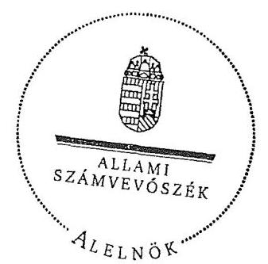

Warvasovszky Tihamér alelnök

---

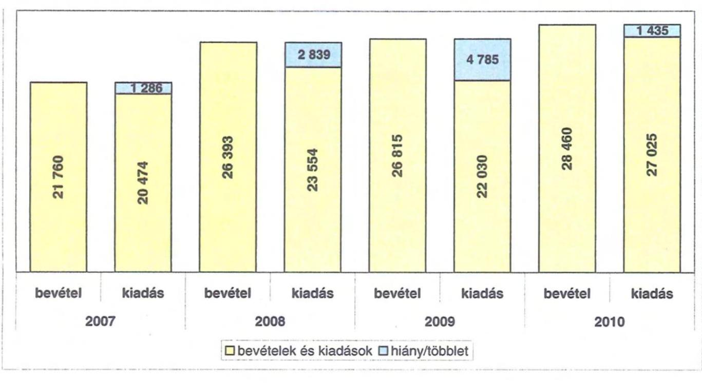

|  21 760 | 20 474 | 20 393 | 23 554 | 22 815 | 22 030 | 28 460 | 27 025  |
| --- | --- | --- | --- | --- | --- | --- | --- |
|  |   |   |   |   |   |   |   |
| bevétel | kiadás | bevétel | kiadás | bevétel | kiadás | bevétel | kiadás  |
| 2007 | 2008 | 2008 | 2009 | 2009 | 2010 |  |   |

bevételek és kiadások hiány/többlet

---

|  1. FOLYÓ KÖLTSÉGVETÉS* | 2007. | 2008. | 2009. | 2010.  |
| --- | --- | --- | --- | --- |
| 1.1.1. Saját működési bevételek | 4 871 509 | 5 720 225 | 6 468 218 | 6 300 739  |
| 1.1.2. Költségvetési támogatás | 5 859 856 | 7 616 287 | 8 750 286 | 6 410 208  |
| 1.1.3. Átengedett bevételek | 3 006 459 | 3 074 968 | 3 102 637 | 3 285 007  |
| 1.1.4. Államháztartáson belüli kapott támogatások | 4 118 644 | 4 229 415 | 3 945 624 | 4 431 351  |
| 1.1.5. EU-s és külföldi kapott bevételek | 20 852 | 37 845 | 34 419 | 22 895  |
| 1.1.6. Államháztartáson kívüli kapott bevételek | 40 795 | 82 788 | 118 557 | 129 303  |
| 1.1.7. Előző évi pénzmaradvány kivétel | 211 890 | 341 795 | 313 757 | 236 284  |
| 1.1. Folyó bevételek =1.1.1.+1.1.1.+1.1.3.+1.1.4.+1.1.5.+1.1.6.+1.1.7. | 18 219 908 | 20 103 624 | 19 931 494 | 20 195 939  |
| 1.2.1. Működési kiadások kommunális költségvetési szerveknek átadása | 16 174 868 | 17 127 214 | 16 495 058 | 17 468 255  |
| 1.2.2. Államháztartáson kívül átadott pénzeszközök | 125 702 | 96 057 | 172 934 | 127 968  |
| 1.2.2.1. előirányzat szülőknek | 164 345 | 225 451 | 315 064 | 348 268  |
| 1.2.2.2. EU-nak, illetve külföldre | 0 | 0 | 0 | 0  |
| 1.2.2.3. magánszemélyeknek | 698 838 | 717 157 | 865 002 | 944 497  |
| 1.2.2.4. angyalföldi szervasztalunk | 197 380 | 234 534 | 233 053 | 286 154  |
| 1.2.3. Transzfer kiadások (=1.2.3.1+1.2.3.2+1.2.3.3+1.2.3.4) | 970 561 | 1 177 138 | 1 413 119 | 1 578 919  |
| 1.2.4. Kommunális költségvetésnek | 92 848 | 169 154 | 229 890 | 129 069  |
| 1.2.5. Előző évi pénzmaradvány átszűrése | 212 920 | 341 795 | 313 756 | 237 382  |
| 1.2. Folyó kiadások = 1.2.1.+1.2.2.+1.2.3.+1.2.4.+1.2.5. | 17 586 092 | 18 911 658 | 19 022 765 | 19 961 671  |
| 1.3. Folyó költségvetés egyenlege MŰKÖDÉSI JÖVEDELEM (1.1. - 1.2.) | 633 501 | 1 191 966 | 908 728 | 234 268  |
| 2. FELHALMOZÁSI KÖLTSÉGVETÉS** |  |  |  |   |
| 2.1.1. Saját többletbevételek | 508 635 | 302 559 | 518 493 | 439 935  |
| 2.1.2. Államháztartáson belüli kapott támogatások | 150 619 | 88 500 | 91 146 | 2 000 198  |
| 2.1.3. EU-s és külföldi kapott támogatások | 102 261 | 277 980 | 244 360 | 0  |
| 2.1.4. Államháztartáson kívüli kapott támogatások | 222 108 | 229 940 | 1 027 194 | 631 070  |
| 2.1. Felhalmozás bevételek (=2.1.1.+2.1.2+2.1.3+2.1.4.) | 1 366 623 | 889 987 | 1 881 193 | 3 871 265  |
| 2.2.1. Saját beruházási kiadás állva | 1 910 462 | 1 518 343 | 1 498 666 | 4 909 998  |
| 2.2.2. Saját felújítási kiadás állva | 530 114 | 638 896 | 524 170 | 1 071 844  |
| 2.2.3. Államháztartáson kívül átadott pénzeszközök | 176 961 | 164 289 | 314 717 | 225 218  |
| 2.2.4. EU-nak és külföldnek adott pénzeszközök | 0 | 0 | 0 | 0  |
| 2.2.5. Államháztartáson kívül adott pénzeszközök | 186 757 | 269 546 | 259 636 | 357 447  |
| 2.2.6. Fejlesztési célú részesedések vásárlása | 5 331 | 23 508 | 51 630 | 400 658  |
| 2.3. Felhalmozás kiadások (=2.3.1.+2.3.2.+2.3.3.+2.3.4.+2.3.5.+2.3.6.) | 2 809 625 | 2 605 484 | 2 648 819 | 6 965 265  |
| 2.3. Felhalmozás költségvetés egyenlege (2.1. - 2.2.) | -1 443 002 | -1 715 497 | -767 626 | -3 094 062  |
| 3. Finanszírozási műveletek nélküli (GFS) pozíció(1.3.+2.3.) | -809 638 | -523 531 | 141 103 | -2 859 794  |
| 4. Finanszírozási műveletek |  |  |  |   |
| 4.1. Hitel felvétel | 450 000 | 0 | 0 | 213 367  |
| 4.2. Hitel törlesztés | 514 004 | 307 756 | 305 426 | 243 297  |
| 4.3. Forgatási és befektetési célú értékpapírok kibocsátása | 0 | 4 000 000 | 0 | 0  |
| 4.4. Forgatási és befektetési célú értékpapírok beváltása | 0 | 0 | 0 | 0  |
| 4.5. Forgatási és befektetési célú értékpapírok értékesítése | 504 837 | 73 819 | 2 123 891 | 74 077  |
| 4.6. Forgatási és befektetési célú értékpapírok vásárlása | 10 051 | 1 673 064 | 0 | 0  |
| 4.7. Egyéb finanszírozási bevételek (függő, ötletek, kiegészítési) | -85 352 | 11 134 | -107 905 | -387 483  |
| 4.8. Egyéb finanszírozási kiadások (függő, ötletek, kiegészítési) | -246 017 | 56 177 | 53 539 | -145 340  |
| 4.9. Finanszírozási műveletek egyenlege (4.1. - 4.2.+4.3.-4.4+4.5.-4.6.+4.7.-4.8.) | 791 472 | 2 047 956 | 1 657 027 | 102 000  |
| 5. Tárgyévi pozíció(1.3.+ 2.3.+4.9.) | -18 164 | 1 524 425 | 1 798 138 | -2 757 786  |
| 6. Nettó működési jövedelem =működési jövedelem (1.3.) - többletérkezés (4.3.+4.4.) | 319 362 | 884 210 | 603 309 | -9 029 
 |
| 7. TÁJÉKOZTATÁSOK | | | | |
| Összes kötelezettség és végé állománya | 2 731 981 | 6 892 612 | 7 397 399 | 8 794 654 |
| ebből elvidi hájkoná | 1 081 844 | 1 264 405 | 1 078 163 | 1 575 989 |
| Összes esedékes kötelezettség és végé állománya | 207 826 | 238 626 | 406 051 | 542 657 |
| ebből lejárt (tansiótványkól) | 13 595 | 65 025 | 282 159 | 186 899 |
| Pénz és tőkejárati kötelezettség (adószág) és végé állománya | 1 935 856 | 5 899 637 | 6 559 484 | 7 972 831 |
| ebből elvidi hájkoná | 291 969 | 276 426 | 244 090 | 756 688 |
| PPP szerződése állomány jelesértében (tansiótványkól) | 0 | 0 | 0 | 0 |
| ebből lejárt szolgáltatási díj adati kötelezettség | 0 | 0 | 0 | 0 |
| Folyószámlabától saját átlagos állománya (tansiótványkól) | 37 638 | 49 722 | 17 517 | 81 232 |
| Rövidőitel saját átlagos állománya (tansiótványkól) | 0 | 0 | 0 | 4 110 |
| Munkérkérítést saját átlagos állománya (tansiótványkól) | 0 | 0 | 0 | 23 089 |
| Keresség és garanciavállalások (tansiótványkól) | 204 514 | 152 537 | 54 147 | 33 259 |
| Jogszés késtségi tőbevétből adódó kötelezettségek (tansiótványkól) | 0 | 0 | 0 | 0 |
| Finanszírozásba bevonható eszközök | 1 712 718 | 4 839 690 | 4 513 929 | 1 682 056 |
| Tartás kötelezettség megtestesítő értékpapírok, és végé állománya | 196 421 | 131 637 | 74 077 | 0 |
| Hosszú hájkoná bankkettés és végé állománya | 0 | 0 | 0 | 0 |
| Értékpapírok és végé állománya | 400 000 | 2 066 331 | 0 | 0 |
| Pénzeszközök (idegen pénzeszközök nélküli) és végé állománya | 1 117 297 | 2 641 722 | 4 439 853 | 1 682 056 |

- Revővédelem nem tárol, a kiadásokban nem jóssék meg az amortizáció, a vagyoni helyzetet az egyedeg befolyásolja ** Revővédelem vagyon megfizetése és hővödése fordításai ösvészek.

---

Eckatunde Region Jagi Virav Örkurmärjuuta

Eckatunde Region Jagi Virav Örkurmärjuuta

Eckatunde Region Jagi Virav Örkurmärjuuta 2021-2024 (Lemban enegotiation), 2019, december 31-34 (Lokomotiv) 1

| 1 | 2 | 3 | 4 | 5 | 6 | 7 | 8 | 9 | 10 | 11 | 12 | 13 | 14 | 15 | 16 | 17 | 18 | 19 | 20 | 21 | 22 | 23 | 24 | 25 | 26 | 27 | 28 | 29 | 30 | 31 | 32 | 33 | 34 | 35 | 36 | 37 | 38 | 39 | 40 | 41 | 42 | 43 | 44 | 45 | 46 | 47 | 48 | 49 | 50 | 51 | 52 | 53 | 54 | 55 | 56 | 57 | 58 | 59 | 60 | 61 | 62 | 63 | 64 | 65 | 66 | 67 | 68 | 69 | 70 | 71 | 72 | 73 | 74 | 75 | 76 | 77 | 78 | 79 | 80 | 81 | 82 | 83 | 84 | 85 | 86 | 87 | 88 | 89 | 90 | 91 | 92 | 93 | 94 | 95 | 96 | 97 | 98 | 99 | 100 | 101 | 102 | 103 | 104 | 105 | 106 | 107 | 108 | 109 | 110 | 111 | 112 | 113 | 114 | 115 | 116 | 117 | 118 | 119 | 120 | 121 | 122 | 123 | 124 | 125 | 126 | 127 | 128 | 129 | 130 | 131 | 132 | 133 | 134 | 135 | 136 | 137 | 138 | 139 | 140 | 141 | 142 | 143 | 144 | 145 | 146 | 147 | 148 | 149 | 150 | 151 | 152 | 153 | 154 | 155 | 156 | 157 | 158 | 159 | 160 | 161 | 162 | 163 | 164 | 165 | 166 | 167 | 168 | 169 | 170 | 171 | 172 | 173 | 174 | 175 | 176 | 177 | 178 | 179 | 180 | 181 | 182 | 183 | 184 | 185 | 186 | 187 | 188 | 189 | 190 | 191 | 192 | 193 | 194 | 195 | 196 | 197 | 198 | 199 | 200 | 201 | 202 | 203 | 204 | 205 | 206 | 207 | 208 | 209 | 210 | 211 | 212 | 213 | 214 | 215 | 216 | 217 | 218 | 219 | 220 | 221 | 222 | 223 | 224 | 225 | 226 | 227 | 228 | 229 | 230 | 231 | 232 | 233 | 234 | 235 | 236 | 237 | 238 | 239 | 240 | 241 | 242 | 243 | 244 | 245 | 246 | 247 | 248 | 249 | 250 | 251 | 252 | 253 | 254 | 255 | 256 | 257 | 258 | 259 | 260 | 261 | 262 | 263 | 264 | 265 | 266 | 267 | 268 | 269 | 270 | 271 | 272 | 273 | 274 | 275 | 276 | 277 | 278 | 279 | 280 | 281 | 282 | 283 | 284 | 285 | 286 | 287 | 288 | 289 | 290 | 291 | 292 | 293 | 294 | 295 | 296 | 297 | 298 | 299 | 300 | 301 | 302 | 303 | 304 | 305 | 306 | 307 | 308 | 309 | 310 | 311 | 312 | 313 | 314 | 315 | 316 | 317 | 318 | 319 | 320 | 321 | 322 | 323 | 324 | 325 | 326 | 327 | 328 | 329 | 330 | 331 | 332 | 333 | 334 | 335 | 336 | 337 | 338 | 339 | 340 | 341 | 342 | 343 | 344 | 345 | 346 | 347 | 348 | 349 | 350 | 351 | 352 | 353 | 354 | 355 | 356 | 357 | 358 | 359 | 360 | 361 | 362 | 363 | 364 | 365 | 366 | 367 | 368 | 369 | 370 | 371 | 372 | 373 | 374 | 375 | 376 | 377 | 378 | 379 | 380 | 381 | 382 | 383 | 384 | 385 | 386 | 387 | 388 | 389 | 390 | 391 | 392 | 393 | 394 | 395 | 396 | 397 | 398 | 399 | 400 | 401 | 402 | 403 | 404 | 405 | 406 | 407 | 408 | 409 | 410 | 411 | 412 | 413 | 414 | 415 | 416 | 417 | 418 | 419 | 420 | 421 | 422 | 423 | 424 | 425 | 426 | 427 | 428 | 429 | 430 | 431 | 432 | 433 | 434 | 435 | 436 | 437 | 438 | 439 | 440 | 441 | 442 | 443 | 444 | 445 | 446 | 447 | 448 | 449 | 450 | 451 | 452 | 453 | 454 | 455 | 456 | 457 | 458 | 459 | 460 | 461 | 462 | 463 | 464 | 465 | 466 | 467 | 468 | 469 | 470 | 471 | 472 | 473 | 474 | 475 | 476 | 477 | 478 | 479 | 480 | 481 | 482 | 483 | 484 | 485 | 486 | 487 | 488 | 489 | 490 | 491 | 492 | 493 | 494 | 495 | 496 | 497 | 498 | 499 | 500 | 501 | 502 | 503 | 504 | 505 | 506 | 507 | 508 | 509 | 510 | 511 | 512 | 513 | 514 | 515 | 516 | 517 | 518 | 519 | 520 | 521 | 522 | 523 | 524 | 525 | 526 | 527 | 528 | 529 | 530 | 531 | 532 | 533 | 534 | 535 | 536 | 537 | 538 | 539 | 540 | 541 | 542 | 543 | 544 | 545 | 546 | 547 | 548 | 549 | 550 | 551 | 552 | 553 | 554 | 555 | 556 | 557 | 558 | 559 | 560 | 561 | 562 | 563 | 564 | 565 | 566 | 567 | 568 | 569 | 570 | 571 | 572 | 573 | 574 | 575 | 576 | 577 | 578 | 579 | 580 | 581 | 582 | 583 | 584 | 585 | 586 | 587 | 588 | 589 | 590 | 591 | 592 |
 593 | 594 | 595 | 596 | 597 | 598 | 599 | 600 | 601 | 602 | 603 | 604 | 605 | 606 | 607 | 608 | 609 | 610 | 611 | 612 | 613 | 614 | 615 | 616 | 617 | 618 | 619 | 620 | 621 | 622 | 623 | 624 | 625 | 626 | 627 | 628 | 629 | 630 | 631 | 632 | 633 | 634 | 635 | 636 | 637 | 638 | 639 | 640 | 641 | 642 | 643 | 644 | 645 | 646 | 647 | 648 | 649 | 650 | 651 | 652 | 653 | 654 | 655 | 656 | 657 | 658 | 659 | 660 | 661 | 662 | 663 | 664 | 665 | 666 | 667 | 668 | 669 | 670 | 671 | 672 | 673 | 674 | 675 | 676 | 677 | 678 | 679 | 680 | 681 | 682 | 683 | 684 | 685 | 686 | 687 | 688 | 689 | 690 | 691 | 692 | 693 | 694 | 695 | 696 | 697 | 698 | 699 | 700 | 701 | 702 | 703 | 704 | 705 | 706 | 707 | 708 | 709 | 710 | 711 | 712 | 713 | 714 | 715 | 716 | 717 | 718 | 719 | 720 | 721 | 722 | 723 | 724 | 725 | 726 | 727 | 728 | 729 | 730 | 731 | 732 | 733 | 734 | 735 | 736 | 737 | 738 | 739 | 740 | 741 | 742 | 743 | 744 | 745 | 746 | 747 | 748 | 749 | 750 | 751 | 752 | 753 | 754 | 755 | 756 | 757 | 758 | 759 | 760 | 761 | 762 | 763 | 764 | 765 | 766 | 767 | 768 | 769 | 770 | 771 | 772 | 773 | 774 | 775 | 776 | 777 | 778 | 779 | 780 | 781 | 782 | 783 | 784 | 785 | 786 | 787 | 788 | 789 | 790 | 791 | 792 | 793 | 794 | 795 | 796 | 797 | 798 | 799 | 700 | 701 | 702 | 703 | 704 | 705 | 706 | 707 | 708 | 709 | 710 | 711 | 712 | 713 | 714 | 715 | 716 | 717 | 718 | 719 | 720 | 721 | 722 | 723 | 724 | 725 | 726 | 727 | 728 | 729 | 730 | 731 | 732 | 733 | 734 | 735 | 736 | 737 | 738 | 739 | 740 | 741 | 742 | 743 | 744 | 745 | 746 | 747 | 748 | 749 | 750 | 751 | 752 | 753 | 754 | 755 | 756 | 757 | 758 | 759 | 760 | 761 | 762 | 763 | 764 | 765 | 766 | 767 | 768 | 769 | 770 | 771 | 772 | 773 | 774 | 775 | 776 | 777 | 778 | 779 | 780 | 781 | 782 | 783 | 784 | 785 | 786 | 787 | 788 | 789 | 790 | 791 | 792 | 793 | 794 | 795 | 796 | 797 | 798 | 799 | 710 | 711 | 712 | 713 | 714 | 715 | 716 | 717 | 718 | 719 | 720 | 721 | 722 | 723 | 724 | 725 | 726 | 727 | 728 | 729 | 730 | 731 | 732 | 733 | 734 | 735 | 736 | 737 | 738 | 739 | 740 | 741 | 742 | 743 | 744 | 745 | 746 | 747 | 748 | 749 | 750 | 751 | 752 | 753 | 754 | 755 | 756 | 757 | 758 | 759 | 760 | 761 | 762 | 763 | 764 | 765 | 766 | 767 | 768 | 769 | 770 | 771 | 772 | 773 | 774 | 775 | 776 | 777 | 778 | 779 | 780 | 781 | 782 | 783 | 784 | 785 | 786 | 787 | 788 | 789 | 790 | 791 | 792 | 793 | 794 | 795 | 796 | 797 | 798 | 799 | 710 | 711 | 712 | 713 | 714 | 715 | 716 | 717 | 718 | 719 | 720 | 721 | 722 | 723 | 724 | 725 | 726 | 727 | 728 | 729 | 730 | 731 | 732 | 733 | 734 | 735 | 736 | 737 | 738 | 739 | 740 | 741 | 742 | 743 | 744 | 745 | 746 | 747 | 748 | 749 | 750 | 751 | 752 | 753 | 754 | 755 | 756 | 757 | 758 | 759 | 760 | 761 | 762 | 763 | 764 | 765 | 766 | 767 | 768 | 769 | 770 | 771 | 772 | 773 | 774 | 775 | 776 | 777 | 778 | 779 | 780 | 781 | 782 | 783 | 784 | 785 | 786 | 787 | 788 | 789 | 790 | 791 | 792 | 793 | 794 | 795 | 796 | 797 | 798 | 799 | 710 | 711 | 712 | 713 | 714 | 715 | 716 | 717 | 718 | 719 | 720 | 721 | 722 | 723 | 724 | 725 | 726 | 727 | 728 | 729 | 730 | 731 | 732 | 733 | 734 | 735 | 736 | 737 | 738 | 739 | 740 | 741 | 742 | 743 | 744 | 745 | 746 | 747 | 748 | 749 | 750 | 751 | 752 | 753 | 754 | 755 | 756 | 757 | 758 | 759 | 760 | 761 | 762 | 763 | 764 | 765 | 766 | 767 | 768 | 769 | 770 | 771 | 772 | 773 | 774 | 775 | 776 | 777 | 778 | 779 | 780 | 781 | 782 | 783 | 784 | 785 | 786 | 787 | 788 | 789 | 790 | 791 | 792 | 793 | 794 | 795 | 796 | 797 | 798 | 799 | 710 | 711 | 712 | 713 | 714 | 715 | 716 | 717 | 718 | 719 | 720 | 721 | 722 | 723 | 724 | 725 | 726 | 727 | 728 | 729 | 730 | 731 | 732 | 733 | 734 | 735 | 736 | 737 | 738 | 739 | 740 | 741 | 742 | 743 | 744 | 745 | 746 | 747 | 748 | 749 | 750 | 751 | 752 | 753 | 754 | 755 | 756 | 757 | 758 | 759 | 760 | 761 | 762 | 763 | 764 | 765 | 766 | 767 | 768 | 769 | 770 | 771 | 772 | 773 | 774 | 775 | 776 | 777 | 778 | 779 | 780 | 781 | 782 | 783 | 784 | 785 | 786 | 787 | 788 | 789 | 790 | 791 | 792 | 793 | 794 | 795 | 796 | 797 | 798 | 799 | 710 | 711 | 712 | 713 | 714 | 715 | 716 | 717 | 718 | 719 | 720 | 721 | 722 | 723 | 724 | 725 | 726 | 727 | 728 | 729 | 730 | 731 | 732 | 733 | 734 | 735 | 736 | 737 | 738 | 739 | 740 | 741 | 742 | 743 | 744 | 745 | 746 | 747 | 748 | 749 | 750 | 751 | 752 | 753 | 754 | 755 | 756 | 757 | 758 | 759 | 760 | 761 | 762 | 763 | 764 | 765 | 766 | 767 | 768 | 769 | 770 | 771 | 772 | 773 | 774 | 775 | 776 | 777 | 778 | 779 | 780 | 781 | 782 | 783 | 784 | 785 | 786 | 787 | 788 | 789 | 790 | 791 | 792 | 793 | 794 | 795 | 796 | 797 | 798 | 799 | 710 | 711 | 712 | 713 | 714 | 715 | 716 | 717 | 718 | 719 | 720 | 721 | 722 | 723 | 724 | 725 | 726 | 727 | 728 | 729 | 730 | 731 | 732 | 733 | 734 | 735 | 736 | 737 | 738 | 739 | 740 | 741 | 742 | 743 | 744 | 745 | 746 | 747 | 748 | 749 | 750 | 751 | 752 | 753 | 754 | 755 | 756 | 757 | 758 | 759 | 760 | 761 | 762 | 763 | 764 | 765 | 766 | 767 | 768 | 769 | 770 | 771 | 772 | 773 | 774 | 775 | 776 | 777 | 778 | 779 | 780 | 781 | 782 | 783 | 784 | 785 | 786 | 787 | 788 | 789 | 790 | 791 | 792 | 793 | 794 | 795 | 796 | 797 | 798 | 799 | 710 | 711 | 712 | 713 | 714 | 715 | 716 | 717 | 718 | 719 | 720 | 721 | 722 | 723 | 724 | 725 | 726 | 727 | 728 | 729 | 730 | 731 | 732 | 733 | 734 | 735 | 736 | 737 | 738 | 739 | 740 | 741 | 742 | 743 | 744 | 745 | 746 | 747 | 748 | 749 | 750 | 751 | 752 | 753 | 754 | 755 | 756 | 757 | 758 | 759 | 760 | 761 | 762 | 763 | 764 | 765 | 766 | 767 | 768 | 769 | 770 | 771 | 772 | 773 | 774 | 775 | 776 | 777 | 778 | 779 | 780 | 781 | 782 | 783 | 784 | 785 | 786 | 787 | 788 | 789 | 790 | 791 | 792 | 793 | 794 | 795 | 796 | 797 | 798 | 799 | 710 | 711 | 712 | 713 | 714 | 715 | 716 | 717 | 718 | 719 | 720 | 721 | 722 | 723 | 724 | 725 | 726 | 727 | 728 | 729 | 730 | 731 | 732 | 733 | 734 | 735 | 736 | 737 | 738 | 739 | 740 | 741 | 742 | 743 | 744 | 745 | 746 | 747 | 748 | 749 | 750 | 751 | 752 | 753 | 754 | 755 | 756 | 757 | 758 | 759 | 760 | 761 | 762 | 763 | 764 | 765 | 766 | 767 | 768 | 769 | 770 | 771 | 772 | 773 | 774 | 775 | 776 | 777 | 778 | 779 | 780 | 782 | 783 | 784 | 785 | 786 | 787 | 788 | 789 | 790 | 791 | 792 | 793 | 794 | 795 | 796 | 797 | 798 | 799 | 790 | 791 | 792 | 793 | 794 | 795 | 796 | 797 | 798 | 799 | 790 | 791 | 792 | 793 | 794 | 795 | 796 | 797 | 798 | 799 | 790 | 791 | 792 | 793 | 794 | 795 | 796 | 797 | 798 | 799 | 790 | 791 | 792 | 793 | 794 | 795 | 796 | 797 | 798 | 798 | 799 | 790 | 791 | 792 | 793 | 794 | 795 | 796 | 797 | 798 | 798 | 798 | 798 | 798 | 798 | 798 | 798 | 798 | 798 | 798 | 798 | 798 | 798 | 798 | 798 | 798 | 798 | 798 | 798 | 798 | 798 | 798 | 798 | 798 | 798 | 798 | 798 | 798 | 798 | 798 | 798 | 798 | 798 | 798 | 798 | 798 | 798 | 798 | 798

---

|   |  |  |  |  |  |  |  |  |  |  |  |  |  |  |  |  |  |  |  |  |  |  |  |  |  |  |  |  |  |  |  |  |  |  |  |  |  |  |  |  |  |  |  |  |  |  |  |  |  |  |  |  |  |  |  |  |  |  |  |  |  |  |  |  |  |  |  |  |  |  |  |  |  |  |  |  |  |  |  |  |  |  |  |  |  |  |  |  |  |  |  |  |  |  |  |  |  |  |  |  |  |  | 

---

Ecklauszelle Megem Jagi Värus Östermärjuplak

1.a. ss. mobblet

|  |   |   |   |   |   |   |   |   |   |   |   |   |   |   |   |   |   |   |   |   |   |   |   |   |   |   |   |   |   |   |   |   |   |   |   |   |   |   |   |   |   |   |   |   |   |   |   |   |   |   |   |   |   |   |   |   |   |   |   |   |   |   |   |   |   | |   |   |   |   |   |   |   |   |   |   |   |   |   |   |   |   |   |   |   |   |   |   |   |   |   |   |   |   |   |   |   |   |   |   |

---

|  1 |  |  |  |  |  |  |  |  |  |  |  |  |  |  |  |  |  |  |  |  |  |  |  |  |  |  |  |  |  |  |  |  |  |  |  |  |  |  |  |  |  |  |  |  |  |  |  |  |  |  |  |  |  |  |  |  |  |  |  |  |  |  |  |  |  |  |  |  |  |  |  |  |  |  |  |  |  |  |  |  |  |  |  |  |  |  |  |  |  |  |  |  |  |  |  |  |  |  |  |  |  |

---

Bibliotecas de Mergulh Jugo Varna Cinturante parte

2.b. as. matrícula

As Cinturantes pte 2013: Assumem 31 de Dezembro (trif: Nãquedos laboratoriais aquasioláithl ithiducadaquaival cseaquáteíith

2.4.2013: Assumem 31 de Nãquedos (próximo dotecladotrif)

|   |  |  |  |  |  |  |  |  |  |  |  |  |  |  |  |  |  |  |  |  |  |  |  |  |  |  |  |  |  |  |  |  |  |  |  |  |  |  |  |  |  |  |  |  |  |   |
| --- | --- | --- | --- | --- | --- | --- | --- | --- | --- | --- | --- | --- | --- | --- | --- | --- | --- | --- | --- | --- | --- | --- | --- | --- | --- | --- | --- | --- | --- | --- | --- | --- | --- | --- | --- | --- | --- | --- | --- | --- | --- | --- | --- | --- | --- |
|   |  |  |  |  |  |  |  |  |  |  |  |  |  |  |  |  |  |  |  |  |  |  |  |  |  |  |  |  |  |  |  |  |  |  |  |  |  |  |  |  |  |  |  |  |   |
|   |  |  |  |  |  |  |  |  |  |  |  |  |  |  |  |  |  |  |  |  |  |  |  |  |  |  |  |  |  |  |  |  |  |  |  |  |  |  |  |  |  |  |  |  |   |
|   |  |  |  |  |  |  |  |  |  |  |  |  |  |  |  |  |  |  |  |  |  |  |  |  |  |  |  |  |  |  |  |  |  |  |  |  |  |  |  |  |  |  |  |  |   |
|   |  |  |  |  |  |  |  |  |  |  |  |  |  |  |  |  |  |  |  |  |  |  |  |  |  |  |  |  |  |  |  |  |  |  |  |  |  |  |  |  |  |  |  |  |   |
|   |  |  |  |  |  |  |  |  |  |  |  |  |  |  |  |  |  |  |  |  |  |  |  |  |  |  |  |  |  |  |  |  |  |  |  |  |  |  |  |  |  |  |  |  |   |
|   |  |  |  |  |  |  |  |  |  |  |  |  |  |  |  |  |  |  |  |  |  |  |  |  |  |  |  |  |  |  |  |  |  |  |  |  |  |  |  |  |  |  |  |  |   |
|   |  |  |  |  |  |  |  |  |  |  |  |  |  |  |  |  |  |  |  |  |  |  |  |  |  |  |  |  |  |  |  |  |  |  |  |  |  |  |  |  |  |  |  |  |   |
|   |  |  |  |  |  |  |  |  |  |  |  |  |  |  |  |  |  |  |  |  |  |  |  |  |  |  |  |  |  |  |  |  |  |  |  |  |  |  |  |  |  |  |  |  |   |
|   |  |  |  |  |  |  |  |  |  |  |  |  |  |  |  |  |  |  |  |  |  |  |  |  |  |  |  |  |  |  |  |  |  |  |  |  |  |  |  |  |  |  |  |  |   |
|   |  |  |  |  |  |  |  |  |  |  |  |  |  |  |  |  |  | | | | | | | | | | | | | | | | | | | | | | | | | | | | |
| | | | | | | | | | | | | | | | | | | | | | | | | | | | | | | | | | | | | | | | | | | | | | |
| | | | | | | | | | | | | | | | | | | | | | | | | | | | | | | | | | | | | | | | | | | | | | |
| | | | | | | | | | | | | | | | | | | | | | | | | | | | | | | | | | | | | | | | | | | | | | |
| | | | | | | | | | | | | | | | | | | | | | | | | | | | | | | | | | | | | | | | | | | | | | |
| | | | | | | | | | | | | | | | | | | | | | | | | | | | | | | | | | | | | | | | | | | | | | |
| | | | | | | | | | | | | | | | | | | | | | | | | | | | | | | | | | | | | | | | | | | | | | |
| | | | | | | | | | | | | | | | | | | | | | | | | | | | | | | | | | | | | | | | | | | | | | |
| | | | | | | | | | | | | | | | | | | | | | | | | | | | | | | | | | | | | | | | | | | | | | |
| | | | | | | | | | | | | | | | | | | | | | | | | | | | | | | | | | | | | | | | | | | | | | |
| | | | | | | | | | | | | | | | | | | | | | | | | | | | | | | | | | | | | | | | | | | | | | |
| | | | | | | | | | | | | | | | | | | | | | | | | | | | | | | | | | | | | | | | | | | | | | |
| | | | | | | | | | | | | | | | | | | | | | | | | | | | | | | | | | | | | | | | | | | | | | |
| | | | | | | | | | | | | | | | | | | | | | | | | | | | | | | | | | | | | | | | | | | | | | |
| | | | | | | | | | | | | | | | | | | | | | | | | | | | | | | | | | | | | | | | | | | | | | |
| | | | | | | | | | | | | | | | | | | | | | | | | | | | | | | | | | | | | | | | | | | | | | |
| | | | | | | | | | | | | | | | | | | | | | | | | | | |
 | | | | | | | | | | | | | | | | | | | | | | | | | | |
| | | | | | | | | | | | | | | | | | | | | | | | | | | | | | | | | | | | | | | | | | | | | | |
| | | | | | | | | | | | | | | | | | | | | | | | | | | | | | | | | | | | | | | | | | | | | | |
| |

---

| 5. | | | | | | | | | | | | | | | | | | | | | | | | | | | | | | | | | | | | | | | | | | | | | | | | | | | | | | | | | | | | | | | | | | | | | | | | | | | | | | | | | | | | | | | | | | | | | | | | | | | | | | |

---

| 1 | | | | | | | | | | | | | | | | | | | | | | | | | | | | |
| --- | --- | --- | --- | --- | --- | --- | --- | --- | --- | --- | --- | --- | --- | --- | --- | --- | --- | --- | --- | --- | --- | --- | --- | --- | --- | --- | --- | --- | --- |
| 2 | | | | | | | | | | | | | | | | | | | | | | | | | | | | |
| 3 | | | | | | | | | | | | | | | | | | | | | | | | | | | | |
| 4 | | | | | | | | | | | | | | | | | | | | | | | | | | | | |
| 5 | | | | | | | | | | | | | | | | | | | | | | | | | | | | |
| 6 | | | | | | | | | | | | | | | | | | | | | | | | | | | | |
| 7 | | | | | | | | | | | | | | | | | | | | | | | | | | | | |
| 8 | | | | | | | | | | | | | | | | | | | | | | | | | | | | |
| 9 | | | | | | | | | | | | | | | | | | | | | | | | | | | | |
| 10 | | | | | | | | | | | | | | | | | | | | | | | | | | | | |
| 11 | | | | | | | | | | | | | | | | | | | | | | | | | | | | |
| 12 | | | | | | | | | | | | | | | | | | | | | | | | | | | | |
| 13 | | | | | | | | | | | | | | | | | | | | | | | | | | | | |
| 14 | | | | | | | | | | | | | | | | | | | | | | | | | | | | |
| 15 | | | | | | | | | | | | | | | | | | | | | | | | | | | | |
| 16 | | | | | | | | | | | | | | | | | | | | | | | | | | | | |
| 17 | | | | | | | | | | | | | | | | | | | | | | | | | | | | |
| 18 | | | | | | | | | | | | | | | | | | | | | | | | | | | | | | | | | | | | | | | | | |
| 19 | | | | | | | | | | | | | | | | | | | | | | | | | | | | | |
| 20 | | | | | | | | | | | | | | | | | | | | | | | | | | | | | |
| 21 | | | | | | | | | | | | | | | | | | | | | | | | | | | | | |
| 22 | | | | | | | | | | | | | | | | | | | | | | | | | | | | | |
| 23 | | | | | | | | | | | | | | | | | | | | | | | | | | | | | |
| 24 | | | | | | | | | | | | | | | | | | | | | | | | | | | | | |
| 25 | | | | | | | | | | | | | | | | | | | | | | | | | | | | | |
| 26 | | | | | | | | | | | | | | | | | | | | | | | | | | | | | |
| 27 | | | | | | | | | | | | | | | | | | | | | | | | | | | | | |
| 28 | | | | | | | | | | | | | | | | | | | | | | | | | | | | | |
| 29 | | | | | | | | | | | | | | | | | | | | | | | | | | | | | |
| 30 | | | | | | | | | | | | | | | | | | | | | | | | | | | | | |
| 31 | | | | | | | | | | | | | | | | | | | | | | | | | | | | | |
| 32 | | | | | | | | | | | | | | | | | | | | | | | | | | | | | |
| 33 | | | | | | | | | | | | | | | | | | | | | | | | | | | | | |
| 34 | | | | | | | | | | | | | | | | | | | | | | | | | | | | | |
| 35 | | | | | | | | | | | | | | | | | | | | | | | | | | | | | |
| 36 | | | | | | | | | | | | | | | | | | | | | | | | | | | | | |
| 37 | | | | | | | | | | | | | | | | | | | | | | | | | | | | | |
| 38 | | | | | | | | | | | | | | | | | | | | | | | | | | | | | |
| 39 | | | | | | | | | | | | | | | | | | | | | | | | | | | | | |
| 40 | | | | | | | | | | | | | | | | | | | | | | | | | | | | | |
| 41 | | | | | | | | | | | | | | | | | | | | | | | | | | | | | |
| 42 | | | | | | | | | | | | | | | | | | | | | | | | | | | | | |
| 43 | | | | | | | | | | | | | | | | | | | | | | | | | | | | | |
| 44 | | | | | | | | | | | | |  |  |  |  |  |  |  |  |  |  |  |  |  |  |  |  |  |   |
|  45 |  |  |  |  |  |  |  |  |  |  |  |  |  |  |  |  |  |  |  |  |  |  |  |  |  |  |  |  |   |
|  46 |  |  |  |  |  |  |  |  |  |  |  |  |  |  |  |  |  |  |  |  |  |  |  |  |  |  |  |  |   |
|  47 |  |  |  |  |  |  |  |  |  |  |  |  |  |  |  |  |  |  |  |  |  |  |  |  |  |  |  |  |   |
|  48 |  |  |  |  |  |  |  |  |  |  |  |  |  |  |  |  |  |  |  |  |  |  |  |  |  |  |  |  |   |
|  49 |  |  |  |  |  |  |  |  |  |  |  |  |  |  |  |  |  |  |  |  |  |  |  |  |  |  |  |  |   |
|  50 |  |  |  |  |  |  |  |  |  |  |  |  |  |  |  |  |  |  |  |  |  |  |  |  |  |  |  |  |   |
|  51 |  |  |  |  |  |  |  |  |  |  |  |  |  |  |  |  |  |  |  |  |  |  |  |  |  |  |  |  |   |
|  52 |  |  |  |  |  |  |  |  |  |  |  |  |  |  |  |  |  |  |  |  |  |  |  |  |  |  |  |  |   |
|  53 |  |  |  |  |  |  |  |  |  |  |  |  |  |  |  |  |  |  |  |  |  |  |  |  |  |  |  |  |   |
|  54 |  |  |  |  |  |  |  |  |  |  |  |  |  |  |  |  |  |  |  |  |  |  |  |  |  |  |  |  |   |
|  55 |  |  |  |  |  |  |  |  |  |  |  |  |  |  |  |  |  |  |  |  |  |  |  |  |  |  |  |  |   |
|  56 |  |  |  |  |  |  |  |  |  |  |  |  |  |  |  |  |  |  |  |  |  |  |  |  |  |  |  |  |   |
|  57 |  |  |  |  |  |  |  |  |  |  |  |  |  |  |  |  |  |  |  |  |  |  |  |  |  |  |  |  |   |
|  58 |  |  |  |  |  |  |  |  |  |  |  |  |  |  |  |  |  |  |  |  |  |  |  |  |  |  |  |  |   |
|  59 |  |  |  |  |  |  |  |  |  |  |  |  |  |  |  |  |  |  |  |  |  |  |  |  |  |  |  |  |   |
|  60 |  |  |  |  |  |  |  |  |  |  |  |  |  |  |  |  |  |  |  |  |  |  |  |  |  |  |  |  |   |
|  61 |  |  |  |  |  |  |  |  |  |  |  |  |  |  |  |  |  |  |  |  |  |  |  |  |  |  |  |  |   |
|  62 |  |  |  |  |  |  |  |  |  |  |  |  |  |  |  |  |  |  |  |  |  |  |  |  |  |  |  |  |   |
|  63 |  |  |  |  |  |  |  |  |  |  |  |  |  |  |  |  |  |  |  |  |  |  |  |  |  |  |  |  |   |
|  64 |  |  |  |  |  |  |  |  |  |  |  |  |  |  |  |  |  |  |  |  |  |  |  |  |  |  |  |  |   |
|  65 |  |  |  |  |  |  |  |  |  |  |  |  |  |  |  |  |  |  |  |  |  |  |  |  |  |  |  |  |   |
|  66 |  |  |  |  |  |  |  |  |  |  |  |  |  |  |  |  |  |  |  |  |  |  |  |  |  |  |  |  |   |
|  67 |  |  |  |  |  |  |  |  |  |  |  |  |  |  |  |  |  |  |  |  |  |  |  |  |  |  |  |  |   |
|  68 |  |  |  |  |  |  |  |  |  |  |  |  |  |  |  |  |  |  |  |  |  |  |  |  |  |  |  |  |   |
|  69 |  |  |  |  |  |  |  |  |  |  |  |  |  |  |  |  |  |  |  |  |  |  |  |  |  |  |  |  |   |
|  70 |  |  |  |  | |  |  |  |  |  |  |  |  |  |  |  |  |  |  |  |  |  |  |  |  |  |  |  |   |
|  71 |  |  |  |  |  |  |  |  |  |  |  |  |  |  |  |  |  |  |  |  |  |  |  |  |  |  |  |  |   |
|  72 |  |  |  |  |  |  |  |  |  |  |  |  |  |  |  |  |  |  |  |  |  |  |  |  |  |  |  |  |   |
|  73 |  |  |  |  |  |  |  |  |  |  |  |  |  |  |  |  |  |  |  |  |  |  |  |  |  |  |  |  |   |
|  74 |  |  |  |  |  |  |  |  |  |  |  |  |  |  |  |  |  |  |  |  |  |  |  |  |  |  |  |  |   |
|  75 |  |  |  |  |  |  |  |  |  |  |  |  |  |  |  |  |  |  |  |  |  |  |  |  |  |  |  |  |   |
|  76 |  |  |  |  |  |  |  |  |  |  |  |  |  |  |  |  |  |  |  |  |  |  |  |  |  |  |  |  |   |
|  77 |  |  |  |  |  |  |  |  |  |  |  |  |  |  |  |  |  |  |  |  |  |  |  |  |  |  |  |  |   |
|  78 |  |  |  |  |  |  |  |  |  |  |  |  |  |  |  |  |  |  |  |  |  |  |  |  |  |  |  |  |   |
|  79 |  |  |  |  |  |  |  |  |  |  |  |  |  |  |  |  |  |  |  |  |  |  |  |  |  |  |  |  |   |
|  80 |  |  |  |  |  |  |  |  |  |  |  |  |  |  |  |  |  |  |  |  |  |  |  |  |  |  |  |  |   |
|  81 |  |  |  |  |  |  |  |  |  |  |  |  |  |  |  |  |  |  |  |  |  |  |  |  |  |  |  |  |   |
|  82 |  |  |  |  |  |  |  |  |  |  |  |  |  |  |  |  |  |  |  |  |  |  |  |  |  |  |  |  |   |
|  83 |  |  |  |  |  |  |  |  |  |  |  |  |  |  |  |  |  |  |  |  |  |  |  |  |  |  |  |  |   |
|  84 |  |  |  |  |  |  |  |  |  |  |  |  |  |  |  |  |  |  |  |  |  |  |  |  |  |  |  |  |   |
|  85 |  |  |  |  |  |  |  |  |  |  |  |  |  |  |  |  |  |  |  |  |  |  |  |  |  |  |  |  |   |
|  86 |  |  |  |  |  |  |  |  |  |  |  |  |  |  |  |  |  |  |  |  |  |  |  |  |  |  |  |  |   |
|  87 |  |  |  |  |  |  |  |  |  |  |  |  |  |  |  |  |  |  |  |  |  |  |  |  |  |  |  |  |   |
|  88 |  |  |  |  |  |  |  |  |  |  |  |  |  |  |  |  |  |  |  |  |  |  |  |  |  |  |  |  |   |
|  89 |  |  |  |  |  |  |  |  |  |  |  |  |  |  |  |  |  |  |  |  |  |  |  |  |  |  |  |  |   |
|  90 |  |  |  |  |  |  |  |  |  |  |  |  |  |  |  |  |  |  |  |  |  |  |  |  |  |  |  |  |   |
|  91 |  |  |  |  |  |  |  |  |  |  |  |  |  |  |  |  |  |  |  |  |  |  |  |  |  |  |  |  |   |
|  92 |  |  |  |  |  |  |  |  |  |  |  |  |  |  |  |  |  |  |  |  |  |  |  |  |  |  |  |  |   |
|  93 |  |  |  |  |  |  |  |  |  |  |  |  |  |  |  |  |  |  |  |  |  |  |  |  |  |  |  |  |   |
|  94 |  |  |  |  |  |  |  |  |  |  |  |  |  |  |  |  |  |  |  |  |  |  |  |  |  |  |  |  |   |
|  95 |  |  |  |  |  |  |  |  |  |  |  |  |  |  |  |  |  |  |  |  |  |  |  |  |  |  |  |  |   ```
|
| 96 | | | | | | | | | | | | | | | | | | | | | | | | | | | | | |
| 97 | | | | | | | | | | | | | | | | | | | | | | | | | | | | | |
| 98 | | | | | | | | | | | | | | | | | | | | | | | | | | | | | |
| 99 | | | | | | | | | | | | | | | | | | | | | | | | | | | | | |
| 100 | | | | | | | | | | | | | | | | | | | | | | | | | | | | | |
| 101 | | | | | | | | | | | | | | | | | | | | | | | | | | | | | |
| 102 | | | | | | | | | | | | | | | | | | | | | | | | | | | | | |
| 103 | | | | | | | | | | | | | | | | | | | | | | | | | | | | | |
| 104 | | | | | | | | | | | | | | | | | | | | | | | | | | | | | |
| 105 | | | | | | | | | | | | | | | | | | | | | | | | | | | | | |
| 106 | | | | | | | | | | | | | | | | | | | | | | | | | | | | | | |
| 107 | | | | | | | | | | | | | | | | | | | | | | | | | | | | | | |
| 108 | | | | | | | | | | | | | | | | | | | | | | | | | | | | | | | |
| 109 | | | | | | | | | | | | | | | | | | | | | | | | | | | | | | | |
| 110 | | | | | | | | | | | | | | | | | | | | | | | | | | | | | | | | |
| 111 | | | | | | | | | | | | | | | | | | | | | | | | | | | | | | | | |
| 112 | | | | | | | | | | | | | | | | | | | | | | | | | | | | | | | | |
| 113 | | | | | | | | | | | | | | | | | | | | | | | | | | | | | | | | |
| 114 | | | | | | | | | | | | | | | | | | | | | | | | | | | | | | | | | |
| 115 | | | | | | | | | | | | | | | | | | | | | | | | | | | | | | | | | |
| 116 | | | | | | | | | | | | | | | | | | | | | | | | | | | | | | | | | |
| 117 | | | | | | | | | | | | | | | | | | | | | | | | | | | | | | | | | | |
| 118 | | | | | | | | | | | | | | | | | | | | | | | | | | | | | | | | | | | |
| 119 | | | | | | | | | | | | | | | | | | | | | | | | | | | | | | | | | | | | |
| 120 | | | | | | | | | | |
``` |  |  |  |  |  |  |  |  |  |  |  |  |  |  |  |  |  |  |  |  |  |  |  |  |  |  |  |  |  |   |
|  121 |  |  |  |  |  |  |  |  |  |  |  |  |  |  |  |  |  |  |  |  |  |  |  |  |  |  |  |  |  |  |  |  |  |  |  |  |   |
|  122 |  |  |  |  |  |  |  |  |  |  |  |  |  |  |  |  |  |  |  |  |  |  |  |  |  |  |  |  |  |  |  |  |  |  |  |  |  |   |
|  123 |  |  |  |  |  |  |  |  |  |  |  |  |  |  |  |  |  |  |  |  |  |  |  |  |  |  |  |  |  |  |  |  |  |  |  |  |  |   |
|  124 |  |  |  |  |  |  |  |  |  |  |  |  |  |  |  |  |  |  |  |  |  |  |  |  |  |  |  |  |  |  |  |  |  |  |  |  |  |  |   |
|  125 |  |  |  |  |  |  |  |  |  |  |  |  |  |  |  |  |  |  |  |  |  |  |  |  |  |  |  |  |  |  |  |  |  |  |  |  |  |  |   |
|  126 |  |  |  |  |  |  |  |  |  |  |  |  |  |  |  |  |  |  |  |  |  |  |  |  |  |  |  |  |  |  |  |  |  |  |  |  |  |  |   |
|  127 |  |  |  |  |  |  |  |  |  |  |  |  |  |  |  |  |  |  |  |  |  |  |  |  |  |  |  |  |  |  |  |  |  |  |  |  |  |  |  |   |
|  128 |  |  |  |  |  |  |  |  |  |  |  |  |  |  |  |  |  |  |  |  |  |  |  |  |  |  |  |  |  |  |  |  |  |  |  |  |  |  |  |   |
|  129 |  |  |  |  |  |  |  |  |  |  |  |  |  |  |  |  |  |  |  |  |  |  |  |  |  |  |  |  |  |  |  |  |  |  |  |  |  |  |  |  |   |
|  130 |  |  |  |  |  |  |  |  |  |  |  |  |  |  |  |  |  |  |  |  |  |  |  |  |  |  |  |  |  |  |  |  |  |  |  |  |  |  |  |  |  |   |
|  131 |  |  |  |  |  |  |  |  |  |  |  |  |  |  |  |  |  |  |  |  |  |  |  |  |  |  |  |  |  |  |  |  |  |  |  |  |  |  |  |  |  |  |  |  |   |
|  132 |  |  |  |  |  |  |  |  |  |  |  |  |  |  |  |  |  |  |  |  |  |  |  |  |  |  |  |  |  |  |  |  |  |  |  |  |  |  |  |  |  |  |  |  |  |   |
|  133 |  |  |  |  |  |  |  |  |  |  |  |  |  |  |  |  |  |  |  |  |  |  |  |  |  |  |  |  |  |  |  |  |  |  |  |  |  |  |  |  |  |  |  |  |  |  |   |
|  134 |  |  |  |  |  |  |  |  |  |  |  |  |  |  |  |  |  |  |  |  |  |  |  |  |  |  |  |  |  |  |  |  |  |  |  |  |  |  |  |  |  |  |  |  |  |  |  |  |   |
|  135 |  |  |  |  |  |  |  |  |  |  |  |  |  |  |  |  |  |  |  |  |  |  |  |  |  |  |  |  |  |  |  |  |  |  |  |  |  |  |  |  |  |  |  |  |  |  |  |  |  |  |   |
|  136 |  |  |  |  |  |  |  |  |  |  |  |  |  |  |  |  |  |  |  |  |  |  |  |  |  |  |  |  |  |  |  |  |  |  |  |  |  |  |  |  |  |  |  |  |  |  |  |  |  |  |  |  |   |
|  137 |  |  |  |  |  |  |  |  |  |  |  |  |  |  |  |  |  |  |  |  |  |  |  |  |  |  |  |  |  |  |  |  |  |  |  |  |  |  |  |  |  | |  |  |  |  |  |   |
|  138 |  |  |  |  |  |  |  |  |  |  |  |  |  |  |  |  |  |  |  |  |  |  |  |  |  |  |  |  |  |  |  |  |  |  |  |  |  |  |  |  |  |  |  |  |  |  |  |  |  |  |  |  |  |  |  |  |  |   |
|  139 |  |  |  |  |  |  |  |  |  |  |  |  |  |  |  |  |  |  |  |  |  |  |  |  |  |  |  |  |  |  |  |  |  |  |  |  |  |  |  |  |  |  |  |  |  |  |  |  |  |  |  |  |  |  |  |  |  |  |  |  |   |
|  140 |  |  |  |  |  |  |  |  |  |  |  |  |  |  |  |  |  |  |  |  |  |  |  |  |  |  |  |  |  |  |  |  |  |  |  |  |  |  |  |  |  |  |  |  |  |  |  |  |  |  |  |  |  |  |  |  |  |   |
|  141 |  |  |  |  |  |  |  |  |  |  |  |  |  |  |  |  |  |  |  |  |  |  |  |  |  |  |  |  |  |  |  |  |  |  |  |  |  |  |  |  |  |  |  |  |  |  |  |  |  |  |  |  |  |  |  |  |   |
|  142 |  |  |  |  |  |  |  |  |  |  |  |  |  |  |  |  |  |  |  |  |  |  |  |  |  |  |  |  |  |  |  |  |  |  |  |  |  |  |  |  |  |  |  |  |  |  |  |  |  |  |   |
|  143 |  |  |  |  |  |  |  |  |  |  |  |  |  |  |  |  |  |  |  |  |  |  |  |  |  |  |  |  |  |  |  |  |  |  |  |  |  |  |  |  |  |  |  |  |  |  |  |  |  |   |
|  144 |  |  |  |  |  |  |  |  |  |  |  |  |  |  |  |  |  |  |  |  |  |  |  |  |  |  |  |  |  |  |  |  |  |  |  |  |  |  |  |  |  |  |  |  |  |  |  |  |  |   |
|  145 |  |  |  |  |  |  |  |  |  |  |  |  |  |  |  |  |  |  |  |  |  |  |  |  |  |  |  |  |  |  |  |  |  |  |  |  |  |  |  |  |  |  |  |  |  |  |  |   |
|  146 |  |  |  |  |  |  |  |  |  |  |  |  |  |  |  |  |  |  |  |  |  |  |  |  |  |  |  |  |  |  |  |  |  |  |  |  |  |  |  |  |  |  |  |  |  |  |  |   |
|  147 |  |  |  |  |  |  |  |  |  |  |  |  |  |  |  |  |  |  |  |  |  |  |  |  |  |  |  |  |  |  |  |  |  |  |  |  |  |  |  |  |  |  |  |  |  |  |   |
|  148 |  |  |  |  |  |  |  |  |  |  |  |  |  |  |  |  |  |  |  |  |  |  |  |  |  |  |  |  |  |  |  |  |  |  |  |  |  |  |  |  |  |  |  |   |
|  149 |  |  |  |  |  |  |  |  |  |  |  |  |  |  |  |  |  |  |  |  |  |  |  |  |  |  |  |  |  |  |  |  |  |  |  |  |  |  |  |  |  |  |  |  |   |
|  150 |  |  |  |  |  |  |  |  |  |  |  |  |  |  |  |  |  |  |  |  |  |  |  |  |  |  |  |  |  |  |  |  |  |  |  |  |  |  |  |  |  |  |  |   |
|  151 |  |  |  |  |  |  |  |  |  |  |  |  |  |  |  |  |  |  |  |  |  |  |  |  |  |  |  |  |  |  |  |  |  |  |  |  |  |  |  |  |  |  |  |  |   |
|  152 |  |  |  |  |  |  |  |  |  |  |  |  |  |  |  |  |  |  |  |  |  |  |  |  |  |  |  |  |  |  |  |  |  |  |  |  |  |  |  |  |   |
|  153 |  |  |  |  |  |  |  |  |  |  |  |  |  | |  |  |  |  |  |  |  |  |  |  |  |  |  |  |  |  |  |  |  |  |  |  |  |  |   |
| :--: | :--: | :--: | :--: | :--: | :--: | :--: | :--: | :--: | :--: | :--: | :--: | :--: | :--: | :--: | :--: | :--: | :--: | :--: | :--: | :--: | :--: | :--: | :--: | :--: |
| 154 |  |  |  |  |  |  |  |  |  |  |  |  |  |  |  |  |  |  |  |  |  |  |  |  |
| 155 |  |  |  |  |  |  |  |  |  |  |  |  |  |  |  |  |  |  |  |  |  |  |  |
| 156 |  |  |  |  |  |  |  |  |  |  |  |  |  |  |  |  |  |  |  |  |  |  |  |  |
| 157 |  |  |  |  |  |  |  |  |  |  |  |  |  |  |  |  |  |  |  |  |  |  |  |
| 158 |  |  |  |  |  |  |  |  |  |  |  |  |  |  |  |  |  |  |  |  |  |  |  |  |
| 159 |  |  |  |  |  |  |  |  |  |  |  |  |  |  |  |  |  |  |  |  |  |  |  |
| 160 |  |  |  |  |  |  |  |  |  |  |  |  |  |  |  |  |  |  |  |  |  |  |  |  |
| 161 |  |  |  |  |  |  |  |  |  |  |  |  |  |  |  |  |  |  |  |  |  |  |  |
| 162 |  |  |  |  |  |  |  |  |  |  |  |  |  |  |  |  |  |  |  |  |  |  |  |
| 162 |  |  |  |  |  |  |  |  |  |  |  |  |  |  |  |  |  |  |  |  |  |  |  |  |
| 163 |  |  |  |  |  |  |  |  |  |  |  |  |  |  |  |  |  |  |  |  |  |  |  |  |  |  |  |  |  |  |  |  |
| 164 |  |  |  |  |  |  |  |  |  |  |  |  |  |  |  |  |  |  |  |  |  |  |  |
| 165 |  |  |  |  |  |  |  |  |  |  |  |  |  |  |  |  |  |  |  |  |  |  |  |  |  |  |  |  |  |  |  |  |  |  |  |  |  |  |  |  |  |  |
| 165 |  |  |  |  |  |  |  |  |  |  |  |  |  |  |  |  |  |  |  |  |  |  |  |  |  |  |  |  |  |  |  |  |  |  |  |  |  |  |  |  |  |  |  |  |  |  |  |  |  |  |  |  |  |  |  |  |  |  |  |  |  |  |  |  |
| 166 |  |  |  |  |  |  |  |  |  |  |  |  |  |  |  |  |  |  |  |  |  |  |  |  |  |  |  |  |  |  |  |  |  |  |  |  |  |  |  |  |  |  |  |  |  |  |  |  |  |  |  |  |  |  |  |  |  |  |  |  |  |  |  |  |  |  |  |  |  |  |  |  |  |  |  |  |  |  |  |  |  |  |  |  |  |  |  |  |  |  |  |  |  |  |  |  |  |  |

---

|  |  |  |  |  |  |  |  |  |  |  |  |  |  |  |  |  |  |  |  |  |  |  |  |  |  |
| :--: | :--: | :--: | :--: | :--: | :--: | :--: | :--: | :--: | :--: | :--: | :--: | :--: | :--: | :--: | :--: | :--: | :--: | :--: | :--: | :--: | :--: | :--: | :--: | :--: | :--: |
|  |  |  |  |  |  |  |  |  |  |  |  |  |  |  |  |  |  |  |  |  |  |  |  |  |  |
|  |  |  |  |  |  |  |  |  |  |  |  |  |  |  |  |  |  |  |  |  |  |  |  |  |  |
 Békéscsaba Megyei Jogú Város Önkormányzata

Az Önkormányzat beadott, elbírálás alatti pályázati forrásból megvalósuló fejlesztéséhez kapcsolódó kötelezettség-vállalásainak összegzéséről

|   |  |  |  |  |  |  |  |  |  |  |  |  |  |  |  |  |  |  |  |  |
 |  |  |  |  |  |  |  |  |  |  |  |  |  |  |  |  |  |  |  |  |  |  |  |  |  |  |  |  |  |   |
| --- | --- | --- | --- | --- | --- | --- | --- | --- | --- | --- | --- | --- | --- | --- | --- | --- | --- | --- | --- | --- | --- | --- | --- | --- | --- | --- | --- | --- | --- | --- | --- | --- | --- | --- | --- | --- | --- | --- | --- | --- | --- | --- | --- | --- | --- | --- | --- | --- | --- | --- | --- |
|   |  | Fejlesztési feladat (beruházás, felújítás) |  |  |  |  |  |  |  |  |  |  |  |  |  |  |  |  |  |  |  |  |  |  |  |  |  |  |  |  |  |  |  |  |  |  |  |  |  |  |  |  |  |  |  |  |  |  |  |  |   |
|   |  |  |  |  |  |  |  |  |  |  |  |  |  |  |  |  |  |  |  |  |  |  |  |  |  |  |  |  |  |  |  |  |  |  |  |  |  |  |  |  |  |  |  |  |  |  |  |  |  |  |   |
|   |  |  |  |  |  |  |  |  |  |  |  |  |  |  |  |  |  |  |  |  |  |  |  |  |  |  |  |  |  |  |  |  |  |  |  |  |  |  |  |  |  |  |  |  |  |  |  |  |  |   |
|   |  |  |  |  |  |  |  |  |  |  |  |  |  |  |  |  |  |  |  |  |  |  |  |  |  |  |  |  |  |  |  |  |  |  |  |  |  |  |  |  |  |  |  |  |  |  |  |  |  |  |   |
|   |  |  |  |  |  |  |  |  |  |  |  |  |  |  |  |  |  |  |  |  |  |  |  |  |  |  |  |  |  |  |  |  |  |  |  |  |  |  |  |  |  |  |  |  |  |  |  |  |  |  |   |
|   |  |  |  |  |  |  |  |  |  |  |  |  |  |  |  |  |  |  |  |  |  |  |  |  |  |  |  |  |  |  |  |  |  |  |  |  |  |  |  |  |  |  |  |  |  |  |  |  |  |  |   |
|   |  |  |  |  |  |  |  |  |  |  |  |  |  |  |  |  |  |  |  |  |  |  |  |  |  |  |  |  |  |  |  |  |  |  |  |  |  |  |  |  |  |  |  |  |  |  |  |  |  |  |   |
|   |  |  |  |  |  |  |  |  |  |  |  |  |  |  |  |  |  |  |  |  |  |  |  |  |  |  |  |  |  |  |  |  |  |  |  |  |  |  |  |  |  |  |  |  |  |  |  |  |  |  |   |
|   |  |  |  |  |  |  |  |  |  |  |  |  |  |  |  |  |  |  |  |  |  |  |  |  |  |  |  |  |  |  |  |  |  |  |  |  |  |  |  |  |  |  |  |  |  |  |  |  |  |  |  |   |
|   |  |  |  |  |  |  |  |  |  |  |  |  |  |  |  |  |  |  |  |  |  |  |  |  |  |  |  |  |  |  |  |  |  |  |  |  |  |  |  |  |  |  |  |  |  |  |  |  |  |  |  |   |
|   |  |  |  |  |  |  |  |  |  |  |  |  |  |  |  |  |  |  | | | | | | | | | | | | | | | | | | | | | | | | | | | | | | | | | | |
| | | | | | | | | | | | | | | | | | | | | | | | | | | | | | | | | | | | | | | | | | | | | | | | | | | | |
| | | | | | | | | | | | | | | | | | | | | | | | | | | | | | | | | | | | | | | | | | | | | | | | | | | | |
| | | | | | | | | | | | | | | | | | | | | | | | | | | | | | | | | | | | | | | | | | | | | | | | | | | | |
| | | | | | | | | | | | | | | | | | | | | | | | | | | | | | | | | | | | | | | | | | | | | | | | | | | | |
| | | | | | | | | | | | | | | | | | | | | | | | | | | | | | | | | | | | | | | | | | | | | | | | | | | | |
| | | | | | | | | | | | | | | | | | | | | | | | | | | | | | | | | | | | | | | | | | | | | | | | | | | | |
| | | | | | | | | | | | | | | | | | | | | | | | | | | | | | | | | | | | | | | | | | | | | | | | | | | | |
| | | | | | | | | | | | | | | | | | | | | | | | | | | | | | | | | | | | | | | | | | | | | | | | | | | | |
| | | | | | | | | | | | | | | | | | | | | | | | | | | | | | | | | | | | | | | | | | | | | | | | | | | | |
| | | | | | | | | | | | | | | | | | | | | | | | | | | | | | | | | | | | | | | | | | | | | | | | | | | | |
| | | | | | | | | | | | | | | | | | | | | | | | | | | | | | | | | | | | | | | | | | | | | | | | | | | | |
| | | | | | | | | | | | | | | | | | | | | | | | | | | | | | | | | | | | | | | | | | | | | | | | | | | | |
| | | | | | | | | | | | | | | | | | | | | | | | | | | | | | | | | | | | | | | | | | | | | | | | | | | | |
| | | | | | | | | | | | | | | | | | | | | | | | | | | | | | | | | | | | | | | | | | | | | | | | | | | | |
| | | | | | | | | | | | | | | | | | | | | | | | | | | | | | | | | | | | | | | | | | | | | | | | | | | | |
| | | | | | | | | | | | | | | | |
 | | | | | | | | | | | | | | | | | | | | | | | | | | | | | | | | | | | | | | | | | | | |
| | | | | | | | | | | | | | | | | | | | | | | | | | | | | | | | | | | | | | | | | | | |
| | | | | | | | | | | | | | | | | | | | | | | | | | | | | | | | | | | | | | | | | | | |
| | | | | | | | | | | | | | | | | | | | | | | | | | | | | | | | | | | | | | | | | | | |
| | | | | | | | | | | | | | | | | | | | | | | | | | | | | | | | | | | | | | | | | | | |
| | | | | | | | | | | | | | | | | | | | | | | | | | | | | | | | | | | | | | | | | | | |
| | | | | | | | | | | | | | | | | | | | | | | | | | | | | | | | | | | | | | | | | | | |
| | | | | | | | | | | | | | | | | | | | | | | | | | | | | | | | | | | | | | | | | | | |
| | | | | | | | | | | | | | | | | | | | | | | | | | | | | | | | | | | | | | | | | | | |
| | | | | | | | | | | | | | | | | | | | | | | | | | | | | | | | | | | | | | | | | | | |
| | | | | | | | | | | | | | | | | | | | | | | | | | | | | | | | | | | | | | | | | | | |
| | | | | | | | | | | | | | | | | | | | | | | | | | | | | | | | | | | | | | | | | | | |
| | | | | | | | | | | | | | | | | | | | | | | | | | | | | | | | | | | | | | | | | | | |
| | | | | | | | | | | | | | | | | | | | | | | | | | | | | | | | | | | | | | | | | | | |
 | | | | | | | | | | | | | | | | | | | | | | | | | | | | | | | | | | | | | | | | | | | | | | | | | | | | | |
| | | | | | | | | | | | | | | | | | | | | | | | | | | | | | | | | | | | | | | | | | | | | | | | | | | | | |
| | | | | | | | | | | | | | | | | | | | | | | | | | | | | | | | | | | | | | | | | | | | | | | | | | | | | |
| | | | | | | | | | | | | | | | | | | | | | | | | | | | | | | | | | | | | | | | | | | | | | | | | | | | | |
| | | | | | | | | | | | | | | | | | | | | | | | | | | | | | | | | | | | | | | | | | | | | | | | | | | | | |
| | | | | | | | | | | | | | | | | | | | | | | | | | | | | | | | | | | | | | | | | | | | | | | | | | | | | |
| | | | | | | | | | | | | | | | | | | | | | | | | | | | | | | | | | | | | | | | | | | | | | | | | | | | | |
| | | | | | | | | | | | | | | | | | | | | | | | | | | | | | | | | | | | | | | | | | | | | | | | | | | | | |
| | | | | | | | | | | | | | | | | | | | | | | | | | | | | | | | | | | | | | | | | | | | | | | | | | | | | |
| | | | | | | | | | | | | | | | | | | | | | | | | | | | | | | | | | | | | | | | | | | | | | | | | | | | | |
| | | | | | | | | | | | | | | | | | | | | | | | | | | | | | | | | | | | | | | | | | | | | | | | | | | | | |
| | | | | | | | | | | | | | | | | | | | | | | | | | | | | | | | | | | | | | | | | | | | | | | | | | | | | |
| | | | | | | | | | | | | | | | | | | | | | | | | | | | | | | | | | | | | | | | | | | | | | | | | | | | | |
| | | | | | | | | | | | | | | | | | | | | | | | | | | | | | | | | | | | | | | | | | | | | | | | | | | | | |
| | | | | | | | | | | | | | | | | | | | | | | | | | | | | | | | | | | | | | | | | | | | | | | | | | | | | | | | | | | | | | | | | | | | | | | | | | | | | |
| | | | | | | | | | | | | | | | | | | | | | | | | | | | | | | | | | | | | | | | | | | | | | | | | | | | | | | | |
| | | | | | | | | | | | | | | | | | | | | | | | | | | | | | | | | | | | | | | | | | | | | | | | | | | | | | | | |
| | | | | | | | | | | | | | | | | | | | | | | | | | | | | | | | | | | | | | | | | | | | | | | | | | | | | | | | |
| | | | | | | | | | | | | | | | | | | | | | | | | | | | | | | | | | | | | | | | | | | | | | | | | | | | | | | | | |
| | | | | | | | | | | | | | | | | | | | | | | | | | | | | | | | | | | | | | | | | | | | | | | | | | | | | | | | | | |
| | | | | | | | | | | | | | | | | | | | | | | | | | | | | | | | | | | | | | | | | | | | | | | | | | | | | | | | | | | |
| | | | | | | | | | | | | | | | | | | | | | | | | | | | | | | | | | | | | | | | | | | | | | | | | | | | | | | | | | | |
| | | | | | | | | | | | | | | | | | | | | | | | | | | | | | | | | | | | | | | | | | | | | | | | | | | | | | | | | | | |
| | | | | | | | | | | | | | | | | | | | | | | | | | | | | | | | | | | | | | | | | | | | | | | | | | | | | | | | | | | | |
| | | | | | | | | | | | | | | | | | | | | | | | | | | | | | | | | | | | | | | | | | | | | | | | | | | | | | | | | | | | | |
| | | | | | | | | | | | | | | | | | | | | | | | | | | | | | | | | | | | | | | | | | | | | | | | | | | | | | | | | | | | | | |
| | | | | | | | | | | | | | | | | | | | | | | | | | | | | | | | | | | | | | | | | | | | | | | | | | | | | | | | | | | | | | | |
| | | | | | | | | | | | | | | | | | | | | | | | | | | | | | | | | | | | | | | | | | | | | | | | | | | | | | | | | | | | | | | | |
 ## 4. számú melléklet

## Az önkormányzati feladatok ellátásában résztvevő gazdasági társaságokról

| Gazdasági társaság
megnevezése |  |  |  |  |  |  |  |  |  |  |  |  |  |  |  |  |  |  |  |  |  |  |   |
| --- | --- | --- | --- | --- | --- | --- | --- | --- | --- | --- | --- | --- | --- | --- | --- | --- | --- | --- | --- | --- | --- | --- | --- |
|   | Önkormányzati | Önkormányzati
gazdasági
társaságának
tervezésének |  |  |  |  |  |  |  |  |  |  |  |  |  |  |  |  |  |  |  |  |   |
|   |  |  |  |  |  |  |  |  |  |  |  |  |  |  |  |  |  |  |  |  |  |  |   |
|   |  |  |  |  |  |  |  |  |  |  |  |  |  |  |  |  |  |  |  |  |  |  |   |
|   |  |  |  |  |  |  |  |  |  |  |  |  |  |  |  |  |  |  |  |  |  |  |   |
|   |  |  |  |  |  |  |  |  |  |  |  |  |  |  |  |  |  |  |  |  |  |  |   |
|   |  |  |  |  |  |  |  |  |  |  |  |  |  |  |  |  |  |  |  |  |  |  |   |
| 1. 100%-os tulajdonú hányadú gazdasági társaságok: |  |  |  |  |  |  |  |  |  |  |  |  |  |  |  |  |  |  |  |  |  |  |   |
| Békéscsaba Vagyonkezelő Zrt |  |  |  |  |  |  |  |  |  |  |  |  |  |  |  |  |  |  |  |  |  |  |   |
| Békéscsaba Víz- és Csatorna
Szolgáltató Kft. |  |  |  |  |  |  |  |  |  |  |  |  |  |  |  |  |  |  |  |  |  |  |   |
| Békéscsaba Városfejlesztő
Szolgáltató Kft. |  |  |  |  |  |  |  |  |  |  |  |  |  |  |  |  |  |  |  |  |  |  |   |
| Békéscsaba Városfejlesztő
Szolgáltató Kft. |  |  |  |  |  |  |  |  |  |  |  |  |  |  |  |  |  |  |  |  |  |  |   |
| Arad Fúziós Vagyonhasznosító
Zrt |  |  |  |  |  |  |  |  |  |  |  |  |  |  |  |  |  |  |  |  |  |  |   |
| 100% |  |  |  |  |  |  |  |  |  |  |  |  |  |  |  |  |  |  |  |  |  |  |   |
| 100%-os tulajdonú hányadú
gazdasági társaságok: |  |  |  |  |  |  |  |  |  |  |  |  |  |  |  |  |  |  |  |  |  |  |   |
| Békéscsaba 1912 Előre Kft. |  |  |  |  |  |  |  |  |  |  |  |  |  |  |  |  |  |  |  |  |  |  |   |
| 99,53% |  |  |  |  |  |  |  |  |  |  |  |  |  |  |
  |  |  |  |  |  |  |  |   |
|  75-99%-os tulajdonó
hányadó gazdasági
társaságok: |  |  |  |  |  |  |  |  |  |  |  |  |  |  |  |  |  |  |  |  |  |  |   |
|  Békéscsaba 1912 Előre Kft. |  |  |  |  |  |  |  |  |  |  |  |  |  |  |  |  |  |  |  |  |  |  |   |
|  99,53% |  |  |  |  |  |  |  |  |  |  |  |  |  |  |  |  |  |  |  |  |  |  |   |
|  75-99%-os tulajdonó
hányadó gazdasági
társaságok: |  |  |  |  |  |  |  |  |  |  |  |  |  |  |  |  |  |  |  |  |  |  |   |
|  Békéscsaba 1912 Előre Kft. |  |  |  |  |  |  |  |  |  |  |  |  |  |  |  |  |  |  |  |  |  |  |   |
|  99,53% |  |  |  |  |  |  |  |  |  |  |  |  |  |  |  |  |  |  |  |  |  |  |   |
|  75-99%-os tulajdonó
hányadó gazdasági
társaságok: |  |  |  |  |  |  |  |  |  |  |  |  |  |  |  |  |  |  |  |  |  |  |   |
|  Békéscsaba 1912 Előre Kft. |  |  |  |  |  |  |  |  |  |  |  |  |  |  |  |  |  |  |  |  |  |  |   |
|  99,53% |  |  |  |  |  |  |  |  |  |  |  |  |  |  |  |  |  |  |  |  |  |  |   |
|  75-99%-os tulajdonó
hányadó gazdasági
társaságok: |  |  |  |  |  |  |  |  |  |  |  |  |  |  |  |  |  |  |  |  |  |  |   |
|  Békéscsaba 1912 Előre Kft. |  |  |  |  |  |  |  |  |  |  |  |  |  |  |  |  |  |  |  |  |  |  |   |
|  99,53% |  |  |  |  |  |  |  |  |  |  |  |  |  |  |  |  |  |  |  |  |  |  |   |
|  75-99%-os tulajdonó
hányadó gazdasági
társaságok: |  |  |  |  |  |  |  |  |  |  |  |  |  |  |  |  |  |  |  |  |  |  |   |
|  Békéscsaba 1912 Előre Kft. |  |  |  |  |  |  |  |  |  |  |  |  |  |  |  |  |  |  |  |  |  |  |   |
|  99,53% |  |  |  |  |  |  |  |  |  |  |  |  |  |  |  |  |  |  |  |  |  |  |   |
|  75-99%-os tulajdonó
hányadó gazdasági
társaságok: |  |  |  |  |  |  |  |  |  |  |  |  |  |  |  |  |  |  |  |  |  |  |   |
|  Békéscsaba 1912 Előre Kft. |  |  |  |  |  |  |  |  |  |  |  |  |  |  |  |  |  |  |  |  |  |  |   |
|  99,53% |  |  |  |  |  |  |  |  |  |  |  |  |  |  |  |  |  |  |  |  |  |  |   |
|  75-99%-os tulajdonó
hányadó gazdasági
társaságok: |  |  |  |  |  |  |  |  |  |  |  |  |  |  |  |  |  |  |  |  |  |  |   |
|  Békéscsaba 1912 Előre Kft. |  |  |  |  |  |  |  |  |  |  |  |  |  |  |  |  |  |  |  |  |  |  |   |
|  99,53% |  |  |  |  |  |  |  |  |  |  |  |  |  |  |  |  |  |  |  |  |  |  |   |
|  75-99%-os tulajdonó
hányadó gazdasági
társaságok: |  |  |  |  |  |  |  |  |  |  |  |  |  |  |  |  |  |  |  |  |  |  |   |
|  Békéscsaba 1912 Előre Kft. |  |  |  |  |  |  |  |  |  |  |  |  |  |  |  |  |  |  |  |  |  |  |   |
|  99,53% |  |  |  |  |  |  |  |  |  |  |  |  |  |  |  |  |  |  |  |  |  |  |   |
|  75-99%-os tulajdonó
hányadó gazdasági
társaságok: |  |  |  |  |  |  |  |  |  |  |  |  |  | | | | | | | | | | |
| Békéscsaba 1912 Előre Kft. | | | | | | | | | | | | | | | | | | | | | | | |
| 99,53% | | | | | | | | | | | | | | | | | | | | | | | |
| 75-99%-os tulajdonú
hányadú gazdasági
társaságok: | | | | | | | | | | | | | | | | | | | | | | | |
| Békéscsaba 1912 Előre Kft. | | | | | | | | | | | | | | | | | | | | | | | |
| 99,53% | | | | | | | | | | | | | | | | | | | | | | | |
| 75-99%-os tulajdonú
hányadú gazdasági
társaságok: | | | | | | | | | | | | | | | | | | | | | | | |
| Békéscsaba 1912 Előre Kft. | | | | | | | | | | | | | | | | | | | | | | | |
| 99,53% | | | | | | | | | | | | | | | | | | | | | | | |
| 75-99%-os tulajdonú
hányadú gazdasági társaságok: | | | | | | | | | | | | | | | | | | | | | | | |
| Békéscsaba 1912 Előre Kft. | | | | | | | | | | | | | | | | | | | | | | | |
| 99,53% | | | | | | | | | | | | | | | | | | | | | | | |
| 75-99%-os tulajdonú
hányadú gazdasági társaságok: | | | | | | | | | | | | | | | | | | | | | | | |
| Békéscsaba 1912 Előre Kft. | | | | | | | | | | | | | | | | | | | | | | | |
| 99,53% | | | | | | | | | | | | | | | | | | | | | | | |
| 75-99%-os tulajdonú
hányadú gazdasági társaságok: | | | | | | | | | | | | | | | | | | | | | | | |
| Békéscsaba 1912 Előre Kft. | | | | | | | | | | | | | | | | | | | | | | | |
| 99,53% | | | | | | | | | | | | | | | | | | | | | | | |
| 75-99%-os tulajdonú
hányadú gazdasági társaságok: | | | | | | | | | | | | | | | | | | | | | | | |
| Békéscsaba 1912 Előre Kft. | | | | | | | | | | | | | | | | | | | | | | | |
| 99,53% | | | | | | | | | | | | | | | | | | | | | | | |
| 75-99%-os tulajdonú
hányadú gazdasági társaságok: | | | | | | | | | | | | | | | | | | | | | | | |
| Békéscsaba 1912 Előre Kft. | | | | | | | | | | | | | | | | | | | | | | | |
| 99,53% | | | | | | | | | | | | | | | | | | | | | | | |
| 75-99%-os tulajdonú
hányadú gazdasági társaságok: | | | | | | | | | | | | | | | | | | | | | | | |
| Békéscsaba 1912 Előre Kft. | | | | | | | | | | | | | | | | | | | | | | | |
| 99,53% | | | | | | | | | | | | | | | | | | | | | | | |
| 75-99%-os tulajdonú
hányadú gazdasági társaságok: | | | | | | | | | | | | | | | | | | | | | | | |
| Békéscsaba 1912 Előre Kft. | | | | | | | | | | | |
 |  |  |  |  |  |  |  |  |  |  |  |  |  |  |   |
|  99,53% |  |  |  |  |  |  |  |  |  |  |  |  |  |  |  |  |  |  |  |  |  |  |   |
|  75-99%-os tulajdonó-
hányadú gazdasági társaságok: |  |  |  |  |  |  |  |  |  |  |  |  |  |  |  |  |  |  |  |  |  |  |   |
|  Békéscsaba 1912 Előre Kft. |  |  |  |  |  |  |  |  |  |  |  |  |  |  |  |  |  |  |  |  |  |  |   |
|  99,53% |  |  |  |  |  |  |  |  |  |  |  |  |  |  |  |  |  |  |  |  |  |  |   |
|  75-99%-os tulajdonó-
hányadú gazdasági társaságok: |  |  |  |  |  |  |  |  |  |  |  |  |  |  |  |  |  |  |  |  |  |  |   |
|  Békéscsaba 1912 Előre Kft. |  |  |  |  |  |  |  |  |  |  |  |  |  |  |  |  |  |  |  |  |  |  |   |
|  99,53% |  |  |  |  |  |  |  |  |  |  |  |  |  |  |  |  |  |  |  |  |  |  |   |
|  75-99%-os tulajdonó-
hányadú gazdasági társaságok: |  |  |  |  |  |  |  |  |  |  |  |  |  |  |  |  |  |  |  |  |  |  |   |
|  Békéscsaba 1912 Előre Kft. |  |  |  |  |  |  |  |  |  |  |  |  |  |  |  |  |  |  |  |  |  |  |   |
|  99,53% |  |  |  |  |  |  |  |  |  |  |  |  |  |  |  |  |  |  |  |  |  |  |   |
|  75-99%-os tulajdonó-
hányadú gazdasági társaságok: |  |  |  |  |  |  |  |  |  |  |  |  |  |  |  |  |  |  |  |  |  |  |   |
|  Békéscsaba 1912 Előre Kft. |  |  |  |  |  |  |  |  |  |  |  |  |  |  |  |  |  |  |  |  |  |  |   |
|  99,53% |  |  |  |  |  |  |  |  |  |  |  |  |  |  |  |  |  |  |  |  |  |  |   |
|  75-99%-os tulajdonó-
hányadú gazdasági társaságok: |  |  |  |  |  |  |  |  |  |  |  |  |  |  |  |  |  |  |  |  |  |  |   |
|  Békéscsaba 1912 Előre Kft. |  |  |  |  |  |  |  |  |  |  |  |  |  |  |  |  |  |  |  |  |  |  |   |
|  99,53% |  |  |  |  |  |  |  |  |  |  |  |  |  |  |  |  |  |  |  |  |  |  |   |
|  75-99%-os tulajdonó-
hányadú gazdasági társaságok: |  |  |  |  |  |  |  |  |  |  |  |  |  |  |  |  |  |  |  |  |  |  |   |
|  Békéscsaba 1912 Előre Kft. |  |  |  |  |  |  |  |  |  |  |  |  |  |  |  |  |  |  |  |  |  |  |   |
|  99,53% |  |  |  |  |  |  |  |  |  |  |  |  |  |  |  |  |  |  |  |  |  |  |   |
|  75-99%-os tulajdonó-
hányadú gazdasági társaságok: |  |  |  |  |  |  |  |  |  |  |  |  |  |  |  |  |  |  |  |  |  |  |   |
|  Békéscsaba 1912 Előre Kft. |  |  |  |  |  |  |  |  |  |  |  |  |  |  |  |  |  |  |  |  |  |  |   |
|  99,53% |  |  |  |  |  |  |  |  |  |  |  |  |  |  |  |  |  |  |  |  |  |  |   |
|  75-99%-os tulajdonó-
hányadú gazdasági társaságok: |  |  |  |  |  |  |  |  |  |  |  |  |  |  |  |  |  |  |  |  |  |  |   |
|  Békéscsaba 1912 Előre Kft. |  |  |  |  |  |  |  |  |  |  |  |  |  |  |  |  |  |  |  |  |  |  |   |
|  99,53% |  |  |  |  |  |  |  |  |  |  |  |  |  |  |  |  |  |  |  |  |  |  |   |
|  75-99%-os tulajdonó-
hányadú gazdasági társaságok: |  |  |  |  |  |  |  |  |  |  |  |  |  |  |  |  |  |  |  |  |  |  |   |
|  Békéscsaba 1912 Előre Kft. |  |  |  |  |  |  |  |  |  |  |  |  |  |  |  |  |  |  |  |  |  |  |   |
|  99,53% |  |  | 
 |  |  |  |  |  |  |  |  |  |  |  |  |  |  |  |  |  |  |  |  |   |
|  75-99%-os tulajdonhányadó gazdasági társaságok: |  |  |  |  |  |  |  |  |  |  |  |  |  |  |  |  |  |  |  |  |  |  |  |   |
|  Békéscsaba 1912 Előre Kft. |  |  |  |  |  |  |  |  |  |  |  |  |  |  |  |  |  |  |  |  |  |  |  |   |
|  99,53% |  |  |  |  |  |  |  |  |  |  |  |  |  |  |  |  |  |  |  |  |  |  |  |   |
|  75-99%-os tulajdonhányadó gazdasági társaságok: |  |  |  |  |  |  |  |  |  |  |  |  |  |  |  |  |  |  |  |  |  |  |  |   |
|  Békéscsaba 1912 Előre Kft. |  |  |  |  |  |  |  |  |  |  |  |  |  |  |  |  |  |  |  |  |  |  |  |   |
|  99,53% |  |  |  |  |  |  |  |  |  |  |  |  |  |  |  |  |  |  |  |  |  |  |  |   |
|  75-99%-os tulajdonhányadó gazdasági társaságok: |  |  |  |  |  |  |  |  |  |  |  |  |  |  |  |  |  |  |  |  |  |  |  |   |
|  Békéscsaba 1912 Előre Kft. |  |  |  |  |  |  |  |  |  |  |  |  |  |  |  |  |  |  |  |  |  |  |  |   |
|  99,53% |  |  |  |  |  |  |  |  |  |  |  |  |  |  |  |  |  |  |  |  |  |  |  |  |   |
|  75-99%-os tulajdonhányadó gazdasági társaságok: |  |  |  |  |  |  |  |  |  |  |  |  |  |  |  |  |  |  |  |  |  |  |  |  |  |   |
|  Békéscsaba 1912 Előre Kft. |  |  |  |  |  |  |  |  |  |  |  |  |  |  |  |  |  |  |  |  |  |  |  |  |  |   |
|  99,53% |  |  |  |  |  |  |  |  |  |  |  |  |  |  |  |  |  |  |  |  |  |  |  |  |  |   |
|  75-99%-os tulajdonhányadó gazdasági társaságok: |  |  |  |  |  |  |  |  |  |  |  |  |  |  |  |  |  |  |  |  |  |  |  |  |  |  |   |
|  Békéscsaba 1912 Előre Kft. |  |  |  |  |  |  |  |  |  |  |  |  |  |  |  |  |  |  |  |  |  |  |  |  |  |   |
|  99,53% |  |  |  |  |  |  |  |  |  |  |  |  |  |  |  |  |  |  |  |  |  |  |  |  |  |  |   |
|  75-99%-os tulajdonhányadó gazdasági társaságok: |  |  |  |  |  |  |  |  |  |  |  |  |  |  |  |  |  |  |  |  |  |  |  |  |  |  |   |
|  Békéscsaba 1912 Előre Kft. |  |  |  |  |  |  |  |  |  |  |  |  |  |  |  |  |  |  |  |  |  |  |  |  |  |  |   |
|  99,53% |  |  |  |  |  |  |  |  |  |  |  |  |  |  |  |  |  |  |  |  |  |  |  |  |  |  |   |
|  75-99%-os tulajdonhányadó gazdasági társaságok: |  |  |  |  |  |  |  |  |  |  |  |  |  |  |  |  |  |  |  |  |  |  |  |  |  |  |  |   |
|  Békéscsaba 1912 Előre Kft. |  |  |  |  |  |  |  |  |  |  |  |  |  |  |  |  |  |  |  |  |  |  |  |  |  |  |  |   |
|  99,53% |  |  |  |  |  |  |  |  |  |  |  |  |  |  |  |  |  |  |  |  |  |  |  |  |  |  |  |   |
|  75-99%-os tulajdonhányadó gazdasági társaságok: |  |  |  |  |  |  |  |  |  |  |  |  |  |  |  |  |  |  |  |  |  |  |  |  |  |  |  |  |   |
|  Békéscsaba 1912 Előre Kft. |  |  |  |  |  |  |  |  |  |  |  |  |  |  |  |  |  |  |  |  |  |  |  |  |  |  |  |  |   |
|  99,53% |  |  |  |  |  |  |  |  |  |  |  |  |  |  |  |  |  |  |  |  |  |  |  |  |  |  |  |  |  |   |
|  75-99%-os tulajdonhányadó gazdasági társaságok: |  |  |  |  |  |  |  |  |  |  |  |  |  |  |  |  |  |  |  |  |  |  |  |  |  |  |  |  |  |  |   |
|  Békéscsaba 1912 Előre Kft. |  |  |  |  |  |  |  |  |  |  |  |  |  |  |  |  |  |  |  |  |  |  |  |  |  |  |  |  |  |  |  |   |
|  99,53% |  |  |  |  |  |
 |  |  |  |  |  |  |  |  |  |  |  |  |  |  |  |  |  |  |  |  |  |  |  |  |   |
|  75-99%-os tulajdonosi hányaddal gazdasági társaságok: |  |  |  |  |  |  |  |  |  |  |  |  |  |  |  |  |  |  |  |  |  |  |  |  |  |  |  |  |  |  |  |   |
|  Békéscsaba 1912 Előre Kft. |  |  |  |  |  |  |  |  |  |  |  |  |  |  |  |  |  |  |  |  |  |  |  |  |  |  |  |  |  |  |  |   |
|  99,53% |  |  |  |  |  |  |  |  |  |  |  |  |  |  |  |  |  |  |  |  |  |  |  |  |  |  |  |  |  |  |  |   |
|  75-99%-os tulajdonosi hányaddal gazdasági társaságok: |  |  |  |  |  |  |  |  |  |  |  |  |  |  |  |  |  |  |  |  |  |  |  |  |  |  |  |  |  |  |  |  |   |
|  Békéscsaba 1912 Előre Kft. |  |  |  |  |  |  |  |  |  |  |  |  |  |  |  |  |  |  |  |  |  |  |  |  |  |  |  |  |  |  |  |  |  |   |
|  99,53% |  |  |  |  |  |  |  |  |  |  |  |  |  |  |  |  |  |  |  |  |  |  |  |  |  |  |  |  |  |  |  |  |  |   |
|  75-99%-os tulajdonosi hányaddal gazdasági társaságok: |  |  |  |  |  |  |  |  |  |  |  |  |  |  |  |  |  |  |  |  |  |  |  |  |  |  |  |  |  |  |  |  |  |   |
|  Békéscsaba 1912 Előre Kft. |  |  |  |  |  |  |  |  |  |  |  |  |  |  |  |  |  |  |  |  |  |  |  |  |  |  |  |  |  |  |  |  |  |   |
|  Békéscsaba 1912 Előre Kft. |  |  |  |  |  |  |  |  |  |  |  |  |  |  |  |  |  |  |  |  |  |  |  |  |  |  |  |  |  |  |  |  |  |  |   |
|  Békéscsaba 1912 Előre Kft. |  |  |  |  |  |  |  |  |  |  |  |  |  |  |  |  |  |  |  |  |  |  |  |  |  |  |  |  |  |  |  |  |  |  |   |
|  Békéscsaba 1912 Előre Kft. |  |  |  |  |  |  |  |  |  |  |  |  |  |  |  |  |  |  |  |  |  |  |  |  |  |  |  |  |  |  |  |  |  |   |
|  Békéscsaba 1912 Előre Kft. |  |  |  |  |  |  |  |  |  |  |  |  |  |  |  |  |  |  |  |  |  |  |  |  |  |  |  |  |  |  |  |   |
|  Békéscsaba 1912 Előre Kft. |  |  |  |  |  |  |  |  |  |  |  |  |  |  |  |  |  |  |  |  |  |  |  |  |  |  |  |  |  |  |   |
|  Békéscsaba 1912 Előre Kft. |  |  |  |  |  |  |  |  |  |  |  |  |  |  |  |  |  |  |  |  |  |  |  |  |  |  |  |  |   |
|  Békéscsaba 1912 Előre Kft. |  |  |  |  |  |  |  |  |  |  |  |  |  |  |  |  |  |  |  |  |  |  |  |  |  |  |  |   |
|  Békéscsaba 1912 Előre Kft. |  |  |  |  |  |  |  |  |  |  |  |  |  |  |  |  |  |  |  |  |  |  |  |  |  |  |   |
|  Békéscsaba 1912 Előre Kft. |  |  |  |  |  |  |  |  |  |  |  |  |  |  |  |  |  |  |  |  |  |  |  |  |  |  |  |  |   |
|  Békéscsaba 1912 Előre Kft. |  |  |  |  |  |  |  |  |  |  |  |  |  |  |  |  |  |  |  |  |  |  |  |  |  |  |  |   |
|  Békéscsaba 1912 Előre Kft. |  |  |  |  |  |  |  |  |  |  |  |  |  |  |  |  |  |  |  |  |  |  |  |  |  |  |  |  |  |  |   |
|  Békéscsaba 1912 Előre Kft. |  |  |  |  |  |  |  |  |  |  |  |  |  |  |  |  |  |  |  |  |  |  |  |  |  |  |  |   |
|  Békéscsaba 1912 Előre Kft. |  |  |  |  |  |  |  |  |  |  |  |  |  |  |  |  |  |  |  |  |  |  |  |  |  |  |  |  |  |   |
|  Békéscsaba 1912 Előre Kft. |  |  |  |  |  |  |  |  |  |  |  |  |  |  |  |  |  |  |  |  |  |  |  |  |  |  |   |
|  Békéscsaba 1912 Előre Kft. |  |  |  |  |  |  | 
 |  |  |  |  |  |  |  |  |  |  |  |  |  |  |  |  |  |  |  |  |  |   |
|  Békéscsaba 1912 Előre Kft. |  |  |  |  |  |  |  |  |  |  |  |  |  |  |  |  |  |  |  |  |  |  |  |  |  |   |
|  Békéscsaba 1912 Előre Kft. |  |  |  |  |  |  |  |  |  |  |  |  |  |  |  |  |  |  |  |  |  |  |  |  |  |  |  |  |   |
|  Békéscsaba 1912 Előre Kft. |  |  |  |  |  |  |  |  |  |  |  |  |  |  |  |  |  |  |  |  |  |  |  |  |  |  |   |
|  Békéscsaba 1912 Előre Kft. |  |  |  |  |  |  |  |  |  |  |  |  |  |  |  |  |  |  |  |  |  |  |  |  |  |  |   |
|  Békéscsaba 1912 Előre Kft. |  |  |  |  |  |  |  |  |  |  |  |  |  |  |  |  |  |  |  |  |  |  |  |  |  |  |  |  |   |
|  Békéscsaba 1912 Előre Kft. |  |  |  |  |  |  |  |  |  |  |  |  |  |  |  |  |  |  |  |  |  |  |  |  |  |  |  |  |  |  |  |  |   |
|  Békéscsaba 1912 Előre Kft. |  |  |  |  |  |  |  |  |  |  |  |  |  |  |  |  |  |  |  |  |  |  |  |  |  |  |  |  |  |  |  |   |
|  Békéscsaba 1912 Előre Kft. |  |  |  |  |  |  |  |  |  |  |  |  |  |  |  |  |  |  |  |  |  |  |  |  |  |  |  |  |  |  |   |
|  Békéscsaba 1912 Előre Kft. |  |  |  |  |  |  |  |  |  |  |  |  |  |  |  |  |  |  |  |  |  |  |  |  |  |  |  |  |  |  |  |  |   |
|  Békéscsaba 1912 Előre Kft. |  |  |  |  |  |  |  |  |  |  |  |  |  |  |  |  |  |  |  |  |  |  |  |  |  |  |  |  |  |  |  |  |  |  |  |  |   |
|  Békéscsaba 1912 Előre Kft. |  |  |  |  |  |  |  |  |  |  |  |  |  |  |  |  |  |  |  |  |  |  |  |  |  |  |  |  |  |  |  |  |  |  |  |   |
|  Békéscsaba 1912 Előre Kft. |  |  |  |  |  |  |  |  |  |  |  |  |  |  |  |  |  |  |  |  |  |  |  |  |  |  |  |  |  |  |  |  |  |  |  |  |  |   |
|  Békéscsaba 1912 Előre Kft. |  |  |  |  |  |  |  |  |  |  |  |  |  |  |  |  |  |  |  |  |  |  |  |  |  |  |  |  |  |  |  |  |  |  |  |  |  |  |  |  |  |   |
|  Békéscsaba 1912 Előre Kft. |  |  |  |  |  |  |  |  |  |  |  |  |  |  |  |  |  |  |  |  |  |  |  |  |  |  |  |  |  |  |  |  |  |  |  |  |  |  |  |  |  |  |  |  |  |  |  |  |  |  |  |  |  |  |  |  |  |  |  |  |  |  |  |  |  |  |  |  |  |  |  |  |  |  |  |  |  |  |  |  |  |  |  |  |  |  |  |  |  |  |  |  |  |  |  |  |  |  |  | 

---

.

---

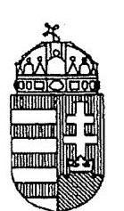

# BÉKÉSCSABA MEGYEI JOGÚ VÁROS POLGÁRMESTERE 

Békéscsaba, Szent István tér 7.

Postacím: 5601 Pf. 112.
Telefon: (66) 523-801

Állami Számvevőszék
Warvasovszky Tihamér úr alelnök

## Budapest

Apáczai Csere János u. 10. 1052

Tisztelt Alelnök Úr!
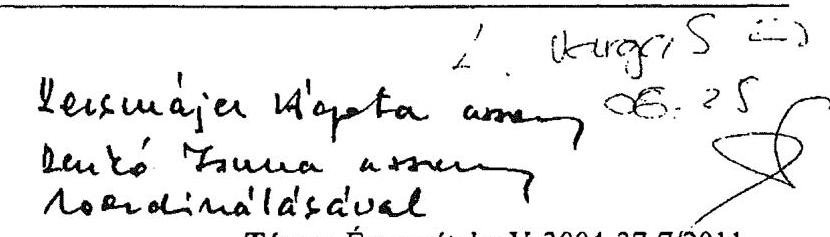

Tárgy: Észrevétel a V-3004-37-7/2011. iktatószámú számvevői jelentéstervezethez
08.27.

A Békéscsaba Megyei Jogú Város Önkormányzata pénzügyi helyzetének ellenőrzéséről szóló jelentéstervezetet megkaptuk, amely alapos, tárgyszerű megállapításokat tartalmaz.

A jelentéstervezettel kapcsolatban - élve a fentiekben hivatkozott iktatószámú levélben biztosított jelzési lehetőséggel - a következő észrevételeket tesszük:

- Az összegző megállapítások (18. oldal) tartalmaznak hivatkozást az önkormányzat önként vállalt feladataira. Kérjük, a zárójelben szereplő felsorolást pontosítani, mert a nevesített támogatások egy része csak az önként vállalt feladat, és mindez megfelel az SZMSZ szerinti szabályozásunknak, valamint a tanúsítványokban megadott adatoknak.
- A 21. oldal 3. bekezdésének első mondatában kérjük törölni a mondat második részét, mert Békéscsabára ez nem vonatkozik. A mondat helyesen: A vizsgált időszakban az önkormányzatnál helyi iparűzési adó, építményadó, vállalkozók kommunális adója, vendégéjszakák utáni idegenforgalmi adó volt megállapítva.
Ugyanezen bekezdés harmadik mondatának elejéről kérjük törölni „a pótlékkal, bírsággal növelt" szavakat, mert a közölt adatok a helyi adóbevétel összegeit tartalmazzák.
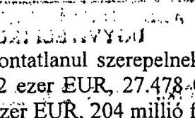
- A 23. oldal 2. bekezdésében egyes hitelösszegek pontatlanul szerepelnek. Kérjük az alábbiakra javítani: 7.322 millió EUR helyett 7.322 ezer EUR, 27.478-CHF helyett 27.478 ezer CHF, 7.322 millió forint helyett 7.322 ezer EUR, 204 millió forint helyett 157 millió forint a helyes összeg.
- A jelentés-tervezet 25. oldala 3. bekezdésének végén szerepel az a mondat, amely szerint az önkormányzat költségvetési támogatásból átengedett bevételekből és illetékbevételekből származó bevételei 2007. évhez képest az időszak egészét tekintve

---

összességében nem csökkentek. A megállapítás igaz, azonban nagyon jelentős csökkenés mutatható ki a 2009. és különösen a 2010. évek tekintetében, amely jobban alátámasztaná a jelentéstervezet bevezetési részében, a 14. oldal 3. bekezdésében szereplő helytálló megállapításokat. Az önkormányzatok - nemcsak Békéscsaba - romló költségvetési pozíciója ugyanis különösen a 2009-2010-es évek adatai alapján mutatható ki.

- A jelentés-tervezet 35. oldalának utolsó bekezdésében kérjük pontosítani az Árpád Fürdő átvételének dátumát, bár előzetes döntés a 2009. január 1-jei átvételről született, de a tényleges vagyonátvételre 2009. május 1-jétől került sor.
- A jelentés-tervezet 27. oldalán az Állami Számvevőszék javasolja a polgármesternek e) pontként a likviditásmenedzselést. Kérjük e javaslattól szíveskedjenek eltekinteni, mert dokumentálható módon Békéscsaba önkormányzata évek óta alkalmazza e módszert, 1996. január 1-jétől itt került az országban először bevezetésre az önkormányzati kiskincstári rendszer, amely gyakorlatot a mai napig folytatjuk és módszert alkalmazzuk.

Kérem Alelnök Urat, hogy a fentiekben megfogalmazott néhány észrevételünket elfogadni és a jelentéstervezet pontosításához hozzájárulni szíveskedjen.

A számvevők munkáját megköszönve tisztelettel:
Békéscsaba, 2011. augusztus 23.
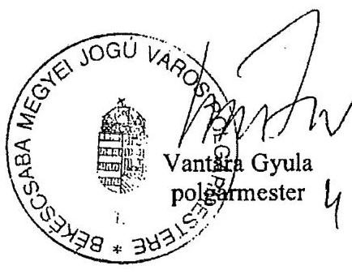

| ALLAMI SZÁM | VEVŐSZÉK |
| :--: | :--: |
| ÜGYVITELI | IRODA |
| Érk.: | 2011 |
 Iktatószámi: |  |
| Melléklet: |  |

---

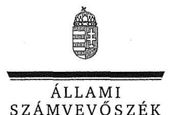

# A L E L N Ö K 

Ikt.szám: V-3032-13/2011.

## Vantara Gyula úr, <br> polgármester

Békéscsaba Megyei Jogú Város Önkormányzata

## Békéscsaba

## Tisztelt Polgármester Úr!

Köszönettel vettem Békéscsaba Megyei Jogú Város Önkormányzata pénzügyi helyzetének ellenőrzéséről készített jelentés-tervezetben foglaltakkal kapcsolatos észrevételeit.

Észrevételeiket elfogadtuk, azokat a végleges jelentés elkészítése során figyelembe vettük.
Köszönöm Polgármester Úrnak és munkatársainak az ellenőrzés során tanúsított hozzáállását, amellyel a pénzügyi helyzetelemzés elkészítését segítették.

Budapest, 2011. december 22.
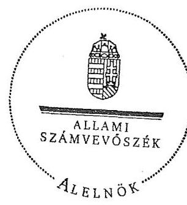

Tisztelettel:

## Warvasovszky Tihamér

---

.