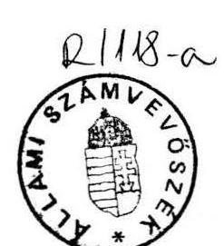
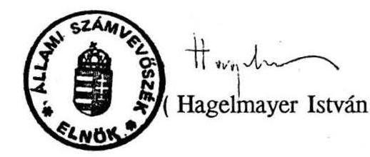

6404. szám

# Allami S̊́ámbrbös̊èk 

## JELENTÉS

az 1992. évi költségvetésről szóló törvény módosítására vonatkozó törvényjavaslat ellenőrzéséről

---

Az 1992. évi költségvetési törvény VI. fejezete szabályozza az előirányzatoktól való eltérési lehetőségeket. A 49. §/1/ bekezdés a., illetve b. pontja azokat az eseteket sorolja fel, amikor módosítás nélkül is eltérhet a teljesítés az előirányzattól. Ekkor is köteles azonban a Kormány saját hatáskörben a szükséges intézkedéseket megtenni. Ha az eltérések hatása nem ellensúlyozható, a Kormány köteles pótköltségvetési javaslatot terjeszteni az Országgyưlés elé. A pótköltségvetés fogalmát a pénzügyi jogszabályok nem definiálják. Az Állami Számvevőszék a 6367. törvényjavaslatot pótköltségvetési javaslatnak tekinti.

A törvényjavaslat 1. §-a a bevételi főösszeget 980.962 millió Ft-ról 872.082 millió Ft-ra csökkenti. A 2. §-a a csökkentés összegével korrigálja a jóváhagyott hiány összegét, 69.779,6 millió Ft-ról 178.659,6 millió Ft-ra.

A törvényjavaslat indoklása nem szól arról, hogy az általános tartalékot felhasználták-e.

# Az 1992. évi pótköltségvetés megalapozottsága 

## 1. Bevételek

A Kormány a pótköltségvetési törvényjavaslatban a bevételek eredeti előirányzatát 108.880,0 millió Ft-tal csökkenti.

A bevételek fő előirányzatainak megalapozottságát a következőképpen értékeljük:
A 25. cím, a "Vállalkozási nyereségadó pénzintézetek nélkül" c. kiemelt előirányzat 85 milliárd Ft-ról 55 milliárd Ft-ra mérséklődik. A csökkentés mértéke elfogadható. A törvényjavaslatban közölt indokokon kívül az állami forgóalapszámla alapján megállapítható, hogy az 1992. június havi göngyölített teljesítés 16,8 milliárd Ft-ot ért el, ami a módosított előirányzatnak is csak a $30,5 \%$-a.

A 27. cím 1. alcím, a "Személyi jövedelemadó" eredeti előirányzata 162 milliárd Ft, amit a Kormány csökkenteni javasol. Az állami forgóalapszámla szerint az első félévben befolyt személyi jövedelemadó 60,9 milliárd Ft volt. A második félévben csaknem 90 milliárd Ft további bevétel kellene ahhoz, hogy a módosított előirányzat teljesíthető legyen. Mivel lökésszerű jövedelem-kiáramlás a második félévben nem várható, a módosítandó előirányzat realitását újabb számításokkal javasoljuk alátámasztani.

---

Az ÁSZ számára rendelkezésre álló információk szerint a többi bevétel módosításának iránya és mértéke reális.

# 2. Kiadások 

A pótköltségvetési javaslat 4. §-a a kiadási főösszeggel kapcsolatban rendelkezik arról, hogy a Kormány a kiadások áttekintésére és a csökkentésére szeptemberre javaslatot köteles kidolgozni. Célszerűbb lett volna ezt a pótköltségvetés keretében elkészíteni, mert javíthatta volna a pótköltségvetés megalapozottságát.

A Kormány már évközben intézkedéseket tett a kiadás mérséklésére. Ennek keretében a költségvetési szervek havi pénzellátmányából törvényi felhatalmazás nélkül bizonyos összegeket tartott vissza. A benyújtott törvényjavaslat sem tartalmazza ezt a kiadás csökkentést.

A pótköltségvetési javaslat 5. §-a tartalmazza a Szolidaritási Alap finanszírozásának lehetőségét, de nem tartalmazza a túllépés konkrét mértékét. Az 1991. évi XCI. törvény 42. § f. pontja értelmében, a törvény 1.sz. melléklete szerint megállapított pénzalapoknak nyújtott támogatási mértékek megváltoztatására a jogot az Országgyűlés magának tartja fenn. A Kormány a pótköltségvetésben foglalt javaslat elfogadása esetén korlátlan lehetőséget kap a túllépésre. (A MüM véleménye szerint a Szolidaritási Alap várható hiánya év végére 29,5, illetve 37,4 milliárd Ft. Mivel ennek a támogatási többletnek a fedezetét a pótköltségvetési javaslat nem tartalmazza, az tovább növelheti a központi költségvetés hiányát.)

A pótköltségvetési javaslat 7. §-a a Szolidaritási Alappal összefüggésben módosítani kívánja a foglalkoztatás elősegítéséről és a munkanélküliek ellátásáról szóló 1991. évi IV. törvényt. Ez a módosítás a költségvetési garancia-korlátokat (az Alap bevételének 10 \%-a) feloldja, és nem tartalmazza a mértékeket. A költségvetési garancia mértékét a törvényben meg kell határozni.

## A hiány finanszírozása

A Kormány a törvényjavaslatban a 178.659,6 millió Ft hiány finanszírozásához a 1991. XCI. törvény 4. § b. pontját kívánja módosítani: "b/ legfeljebb 100.000 millió Ft összegben egy évnél hosszabb lejáratú új államkötvényt bocsásson ki."

A 4. § - ennek elfogadása esetén - a következő finanszírozási forrásokat tartalmazná a hiány fedezésére:

- legfeljebb 30.000 millió Ft összegben 10 évnél hosszabb lejáratú speciális értékpapír kibocsátásának lehetőségét;

---

- 100.000 millió Ft összegben egy évnél hosszabb lejáratú államkötvény kibocsátásának lehetőségét;
- a legfeljebb egyéves lejáratú kincstárjegyek és más állami értékpapírok állományának legalább 9.779,6 millió Ft-tal való növelési lehetőségét.

E három jogcím összesen 139.776,6 millió Ft-ot biztosíthatna a 178.659,6 millió Ft hiány finanszírozásához, 38.883 millió Ft hiányra tehát nem biztosít fedezetet a pótköltségvetési törvényjavaslat.A hiány fedezetét a törvényben rögzíteni szükséges.

Összességében megállapítható, hogy a pótköltségvetési javaslat - figyelembe véve a Szolidaritási Alap, valamint a Társadalombiztosítási Alap várható hiányát is - jelentős bizonytalanságokat tartalmaz mind a hiány mértéke, mind ennek finanszírozása szempontjából.

Budapest, 1992. augusztus
