# ÁLLAMI   SZÁMVEVŐSZÉK 

## JELENTÉS

Debrecen Megyei Jogú Város Önkormányzata pénzügyi helyzetének ellenőrzéséről (43/3)

---

# Számvevői Iroda 

Iktatószám: V-3033-10/2011.
Témaszám: 1015
Vizsgálat-azonosító szám: V056032

## Az ellenőrzést felügyelte:

Dr. Varga Sándor
számvevő igazgató-helyettes

## Az ellenőrzést vezette:

## Renkó Zsuzsanna

számvevő tanácsos

## Az ellenőrzést végezték:

| Lingné Rajz Borbála | Fórián Erika | Hegyes Mária |
| :-- | :-- | :-- |
| számvevő tanácsos | számvevő tanácsos | számvevő tanácsos |

## Puskás Balázs

számvevő

A témához kapcsolódó eddig készített számvevőszéki jelentések:
címe
sorszáma
Jelentés a Debrecen Megyei Jogú Város Önkormányzata gazdálko- 0840 dási rendszerének 2007. évi átfogó ellenőrzéséről

---

# TARTALOMJEGYZÉK 

BEVEZETÉS ..... 5
I. ÖSSZEGZŐ MEGÁLLAPÍTÁSOK, KÖVETKEZTETÉSEK, JAVASLATOK ..... 16
II. RÉSZLETES MEGÁLLAPÍTÁSOK ..... 26

1. Az Önkormányzat kötelező és önként vállalt feladatai ..... 26
2. A pénzügyi egyensúlyi helyzet alakulása ..... 33
2.1. A múködési és a felhalmozási egyensúly alakulása ..... 33
2.2. Az Önkormányzat bevételeinek alakulása ..... 39
2.3. Az Önkormányzat kiadásainak alakulása ..... 43
3. Kötelezettségek bemutatása ..... 46
3.1. A pénzintézetek felé fennálló kötelezettségek alakulása ..... 46
3.2. Szállítók felé fennálló kötelezettségek alakulása ..... 52
3.3. Egyéb kötelezettségek alakulása ..... 53
4. A pénzügyi egyensúly megteremtése érdekében hozott intézkedések ..... 58
5. A helyi önkormányzatok gazdálkodási rendszerének 2008. évi ellenőrzése során a pénzügyi egyensúly javítására tett szabályszerűségi és célszerűségi javaslatok hasznosulása ..... 63

---

# MELLÉKLETEK 

1. számú Múködési és felhalmozási hiány/többlet az Önkormányzat rendeleteiben melléklet
2. számú Kimutatás az Önkormányzat bevételeinek és kiadásainak, adósságszolgálatának alakulásáról (2007-2010. években teljesített adatok)
3/a. számú Az Önkormányzat 2007-2010. években megvalósított, illetve 2010. december 31-ig befejezett fejlesztések forrásösszetételéről
3/b. számú Az Önkormányzat 2010. december 31-én folyamatban lévő fejlesztési fel-
melléklet adataihoz kapcsolódó kötelezettségeinek összegzéséről (a 2010. december 31-ig teljesített pénzügyi adatok alakulásáról)
3/c. számú Az Önkormányzat 2010. december 31-én folyamatban lévő fejlesztési fel-
melléklet adataihoz kapcsolódó 2010. évet követő kötelezettség-vállalásainak ösz-
szegzéséről (a folyamatban lévő fejlesztések 2010. utáni kötelezettségválla-
3/d. számú lásairól)
melléklet Az Önkormányzat beadott, elbírálás alatti pályázati forrásból megvalósu-
ló fejlesztéseihez kapcsolódó kötelezettség-vállalásainak összegzéséről
4. számú Az önkormányzati feladatok ellátásában résztvevő gazdasági társaságok-
melléklet ról
5. számú Debrecen Megyei Jogú Város Önkormányzat Polgármesterének észrevétele
6. számú Debrecen Megyei Jogú Város Önkormányzat Polgármesterének észrevételé-
re adott válasz

---

# RÖVIDÍTÉSEK JEGYZÉKE 

## Törvények

Áht.
ÁSZ tv.

Csődtv.
Gt.
Ket.
Ötv.
Számv. tv.

## Rendeletek

Ámr.
2009. évi költségvetési rendelet
2011. évi költségvetési rendelet

SzMSz

## Szórövidítések

áfa
ÁSZ
BM
DKV Zrt.
DV Zrt.
EDP hiány/egyenleg
Egészségügyi Holding
Zrt.
Egyetem
EU
GDP
Illetékhivatal
jegyzó
Kenézy Gyula Kórház
Közgyűlés
az államháztartásról szóló 1992. évi XXXVIII. törvény
az Állami Számvevőszékről szóló 1989. évi XXXVIII. tör-
vény (2011. július 1-jétől az Állami Számvevőszékről szóló 2011. LXVI. törvény)
a csődeljárásról és a felszámolási eljárásról szóló 1991. évi XLIX. törvény
a gazdasági társaságokról szóló 2006. évi IV. törvény 2004. évi CXL. törvény a közigazgatási hatósági eljárás és szolgáltatás általános szabályairól
a helyi önkormányzatokról szóló 1990. évi LXV. törvény a számvitelről szóló 2000. évi C. törvény
az államháztartás múködési rendjéről szóló 292/2009. (XII. 19.) Korm. rendelet

Debrecen Megyei Jogú Város Önkormányzata 6/2009. (III. 3.) számú rendelete Debrecen Megyei Jogú Város Önkormányzata 2009. évi költségvetéséről
Debrecen Megyei Jogú Város Önkormányzata 4/2011. (II. 18.) számú rendelete Debrecen Megyei Jogú Város Önkormányzata 2009. évi költségvetéséről
Debrecen Megyei Jogú Város Önkormányzata 17/2000. (V. 1.) számú rendelete Debrecen Megyei Jogú Város Önkormányzata és szervei Szervezeti és Müködési Szabályzatáról
általános forgalmi adó
Állami Számvevőszék
Belügyminisztérium
Debreceni Közlekedési Vállalat Zártkörű Részvénytársaság
Debreceni Vagyonkezelő Zártkörű Részvénytársaság
Uniós módszertan szerinti maastrichti kritériumoknak megfelelő számítás szerinti hiány/egyenleg
Önkormányzati Egészségügyi Holding Zártkörű Részvénytársaság
Debreceni Egyetem
Európai Unió
Bruttó hazai termék
Hajdú-Bihar Megyei Illetékhivatal
Debrecen Megyei Jogú Város Önkormányzatának jegyzője
Kenézy Kórház Rendelőintézet Egészségügyi Szolgáltató Nonprofit Korlátolt Felelősségű Társaság
Debrecen Megyei Jogú Város Közgyűlése

---

| KSH | Központi Statisztikai Hivatal |
| :-- | :-- |
| NAV | Nemzeti Adó- és Vámhivatal |
| NGM | Nemzetgazdasági Minisztérium |
| OEP | Országos Egészségbiztosítási Pénztár |
| Önkormányzat | Debrecen Megyei Jogú Város Önkormányzata |
| polgármester | Debrecen Megyei Jogú Város Önkormányzatának pol- |
|  | gármestere |
| Polgármesteri hivatal | Debrecen Megyei Jogú Város Önkormányzatának Pol- |
| PPP konstrukció | gármesteri hivatala |
| szja | Public Private Partnership (Partnerségi együttmüködés |
| társulás | közfeladatok ellátására a magánszektor bevonásával) |
|  | személyi jövedelemadó |
|  | Debrecen-Mikepércsi Többcélú Kistérségi Társulás |

---

# JELENTÉS 

## Debrecen Megyei Jogú Város Önkormányzata pénzügyi helyzetének ellenőrzéséről

## BEVEZETÉS

Az Állami Számvevőszék 2011. évtől érvényes stratégiája új irányt szabott a helyi önkormányzatok gazdálkodásának ellenőrzésében is. Az ÁSZ - küldetése és jövőképe szerint - szilárd szakmai alapokra támaszkodva értékteremtő ellenőrzéseivel és helyzetelemzéseivel az államháztartás egészében, így a helyi önkormányzati alrendszerben is elő kívánja segíteni a közpénzek és a közvagyon szabályos, gazdaságos, hatékony és eredményes hasznosítását. Ennek része-ként- a 2010. évi államháztartási hiány alakulásának összetevőire is figyelemmel - folyamatban van az önkormányzati alrendszer pénzügyi helyzetelemzése.

Az NGM 2011 áprilisában közzétett adatai szerint ${ }^{1}$ a 2010. évi 1036,2 milliárd Ft összegű, 3,8\%-os EDP (maastrichti kritériumok szerinti, Túlzott Hiány Eljárás keretében kimutatott) hiánycél nem volt tartható, az önkormányzati alrendszer tervezettet meghaladó hiánya miatt a GDP arányában kifejezett államháztartási hiány 4,2\%-ra emelkedett.

Az önkormányzatok 2010 első három negyedévi költségvetési jelentése szerinti pénzforgalmi hiány 97 milliárd Ft-os összege nem indokolta az önkormányzati alrendszer 190 milliárd Ft-ra becsült hiányának 2010. évi végi felülvizsgálatát. A helyi önkormányzatok 2011. januári gyorsjelentése alapján a pénzforgalmi hiány már 247,7 milliárd Ft-ot tett ki. Az alrendszer hiánya így a tervezett $0,7 \%$-kal szemben magasabb, $0,9 \%$-os szinten realizálódott. Az 57,7 milliárd Ft hiánytöbblet alakulásában - a Tájékoztató szerint - az iparűzési adó elmaradása, a gépjármúadó, az illetékek és más bevételek tervezettnél alacsonyabb összegben való teljesülése volt a meghatározó.

Magyarország a Széll Kálmán Terv célkitűzései alapján² aktualizált Konvergencia Programjában a középtávú (2011-2015. évek) költségvetési pálya kijelölése

[^0]
[^0]:    ${ }^{1}$ NGM Tájékoztatás Magyarország Strukturális Reformprogramjának végrehajtásáról (2011. április 1). A Tájékoztató évente két alkalommal - április és október hónapban jelenik meg.
    ${ }^{2}$ Az államháztartás 2011. évi egyenlege - a magán nyugdíjpénztárakból az állami nyugdíjpillérbe való visszatérés egyszeri vagyonhatása következtében - 4\%-os többletet mutatna. A Széll Kálmán Tervben foglalt egyszeri intézkedések - a MÁV, a BKV adósságrendezése, a PPP projektek kiváltása - összességében a GDP 2\%-ával csökkentik a várható többlet mértékét.

---

során 2011-re a kormányzati szektor EDP módszertan szerinti egyenlegét + 2\%ban jelölte meg. Az egyenlegcél megfogalmazásakor az önkormányzati alrendszer tervezett hiányát a 2011. évi költségvetésben szereplő $0,3 \%$-kal szemben $0,5 \%$-os arányban határozták meg ${ }^{3}$. A hiánycélok meghatározása jelzi, hogy az önkormányzati alrendszerben 2011-ben fokozott figyelmet kell fordítani a pénzügyi egyensúlyi helyzet alakulására.

Az államháztartás helyi szintjén a 23 megyei jogú városi önkormányzatnak az általuk ellátott közszolgáltatások volumenére való tekintettel kiemelt szerepe van, e települések népessége összességében meghaladja a kétmillió főt ${ }^{4}$. A települések népességét az alábbi diagram szemlélteti:
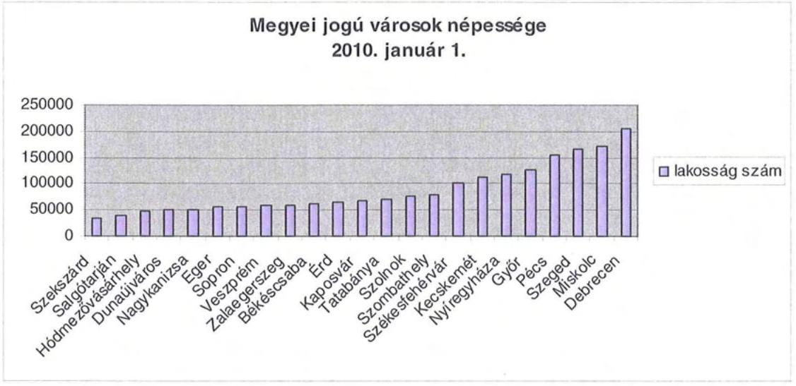

A megyei jogú városi önkormányzatok ${ }^{5}$ kötelező feladatellátását többlépcsős törvényi előírások határozzák meg. A feladatokra vonatkozó szabályozás első szintjét az Ötv. ${ }^{6}$, a második szintet a hatásköri7, a harmadik szintet a további ágazati, szakmai (egyebek mellett az oktatási, egészségügyi, szociális és egyéb ágazati feladatok ellátásának szakmai szabályait rögzítő) törvények adják.

[^0]
[^0]:    ${ }^{3}$ A Magyar Köztársaság 2011. évi költségvetéséről szóló 2010. évi CLXIX. törvény Általános indoklásának III. fejezete, valamint Magyarország Konvergencia Programja 2011-2015. (2011. április) Táblázatok rész, 2. táblázat Államháztartás összefoglaló adatai szerint.
    ${ }^{4}$ A megyei jogú városok népességét a 4/2011. (I. 31.) NGM rendelet 1. sz. mellékletében foglalt 2010. január 1-jei adatok alapján vettük figyelembe.
    ${ }^{5}$ Az Ötv. 61. § (1) bekezdése alapján a megyeszékhely város a törvény erejénél fogva megyei jogú, ugyanakkor az Országgyúlés az ötvenezernél nagyobb népességú városokat a képviselőtestület kérelmére megyei jogú várossá nyilváníthatja. Ez utóbbi körbe 5 város tartozik, közülük 2 (Hódmezővásárhely, Dunaújváros) népessége 2010. január 1-ére már ötvenezer fő alá csökkent.
    ${ }^{6}$ az Ötv. 8. és 61. §-ában foglaltak szerint
    ${ }^{7}$ a Htv.

---

A megyei jogú városi önkormányzatok - az Ötv-ből közvetlenül levezethető települési feladatok mellett körzeti közszolgáltatásokat is ellátnak. A megyei jogú városi cím elsősorban többlet kötelezettségekkel jár, a megyei jogú városnak önmagának kell gondoskodnia mindazokról a feladatokról, amelyek más települési önkormányzatok esetében a megyei önkormányzat feladatát képezik. Ide sorolható többek közt a középfokú oktatási intézmények fenntartása, a közművelődési, könyvtári és levéltári szolgáltatás, a társadalombiztosítás finanszírozása mellett a kórházi és a rendelőintézeti szakellátás, a szociális és egyes gyermekvédelmi feladatok ellátása. Ezeket a feladatokat (intézményeket) a megyei jogú város - más városoktól eltérően - nem adhatja át a megyei önkormányzatnak, azonban az Ötv. lehetőséget biztosít arra, hogy a megyei önkormányzattal megállapodjék a feladatellátás megosztásában.

Az önkormányzat, így a megyei jogú város is, maga határozza meg, hogy - a lakosság igényei alapján, anyagi lehetőségei függvényében - mely feladatokat, milyen mértékben és módon, mely szervezeti keretek közt lát el. A szervezetalakítás szabadsága a megyei jogú városok esetében azzal járt, hogy mind a kötelező közszolgáltatásoknál (különösen a településüzemeltetés, vagyongazdálkodás), mind pedig az önként vállalt feladataik ellátásában - elsősorban a sport és kulturális szolgáltatások területein - a gazdasági társaságok kiemelt fontosságú szerephez jutottak. Ily módon a gazdálkodás, a pénzügyi helyzet kockázatai közvetlenül kikerültek ugyan az önkormányzati alrendszerből, azonban sérülhet az ellátási felelősség figyelemmel kísérése és érvényesítése, a közpénzek felhasználásának transzparenciája. Mindezek együttvéve - a beszámolók konszolidálásának hiányában - növelik a megyei jogú városok pénzügyi helyzetének megítélésében rejlő kockázatokat.

Az áttekintett időszakban az önkormányzati feladatok ellátásának keretet biztosító forrásszabályozás elvei lényegesen nem változtak.

A megyei jogú városok önkormányzatainak mozgásterét, az önkormányzatok feladatellátásra vonatkozó döntéseit a központi költségvetéstől való függőség mellett jelentősen befolyásolja a helyi adókivetési jog gyakorlása ${ }^{8}$. A helyi adók rendszere a közszolgáltatások finanszírozásához szükséges források megteremtésének, bővítésének eszköze, amely a gazdasági válság, a jogszabályi környezet, az adópolitika változása, az adóhatóságok tevékenysége következtében differenciáltan érinti a települési önkormányzatokat ${ }^{9}$.

A települési önkormányzatok saját folyó bevételeinek keretében elszámolt, különböző jogcímeken kivetett helyi adók - iparűzési adó, építmény és telekadó, idegenforgalmi adó, vállalkozók és magánszemélyek kommunális adója -2007-2010 között eltérő módon emelkedtek. A helyi adókból származó bevételek realizált összege országos szinten 2007-2009 között folyamatosan, 505,3 milliárd Ft-ról 566,3 milliárd Ft-ra emelkedett, majd a gazdasági válság hatásai következtében 2010-re 542,6 milliárd Ft-ra esett vissza. A helyi adók részesedése

[^0]
[^0]:    ${ }^{8}$ a helyi adókról szóló 1990. évi C. törvény szabályai szerint
    ${ }^{9}$ Az Állami Számvevőszék 2010 decemberében közzétett 1031. számú jelentésében értékelte a helyi adók rendszerében a hatékonyság és az eredményesség érvényesülését.

---

az önkormányzatok saját folyó bevételein belül 2007-2010 között 2,5 százalékponttal csökkent ${ }^{10}$.

A megyei jogú városok saját folyó bevétele 2007-ben 191,5 milliárd Ft volt, 2008-ban 223,1, 2009-ben 225,4, 2010-ben 223,5 milliárd Ft-ot tett ki. A helyi adóbevételekből való részesedésük 2007-ben 110,5 milliárd Ft (21,9\%), 2008ban 128,3 milliárd Ft (23,2\%), 2009-ben 124,4 milliárd Ft (22\%), 2010-ben 118,7 milliárd Ft (részaránya a 2007. évivel azonosan 21,9\%) volt. E realizált adóbevételek a megyei jogú városok saját folyó bevételeinek 2007-ben 57,7, 2008-ban 57,5, 2009-ben 55,2, 2010-ben 53,1\%-át jelentették. A helyi adóbevételek 2007-ről 2010-re kimutatott 4,6 százalékpontos csökkenése annak ellenére következett be, hogy a megyei jogú városok saját folyó bevétele 2010-ben $16,7 \%$-kal haladta meg a 2007. évit.

A helyi adókon belül a települések gazdasági helyzetének egyik fokmérője az elért helyi iparűzési adóbevétel, amely a megyei jogú városok körében erőteljes - a település nagyságrendtől is függő ${ }^{11}$ - különbségeket mutat. A helyi iparűzési adóbevétel és annak egy lakosra vetített összegének 2007. és 2010. évi alakulását az alábbi diagramok szemléltetik:
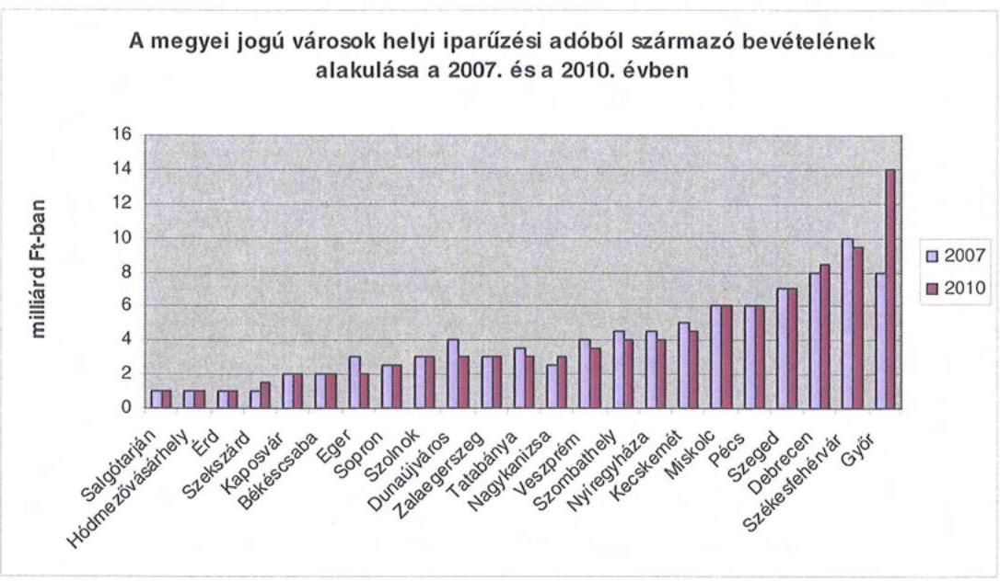

[^0]
[^0]:    ${ }^{10}$ A helyi adó bevételek saját folyó bevételekből való részesedése országosan 2007-ben $55,3 \%, 2010$-ben $52,8 \%$ volt.
    ${ }^{11}$ A 100 ezer fő feletti népességű megyei jogú városok csoportjába Debrecen, Miskolc, Szeged, Pécs, Győr, Nyíregyháza, Kecskemét, Székesfehérvár tartozik. Nem megyeszékhely megyei jogú város Érd, Sopron, Nagykanizsa, Dunaújváros, Hódmezővásárhely.

---

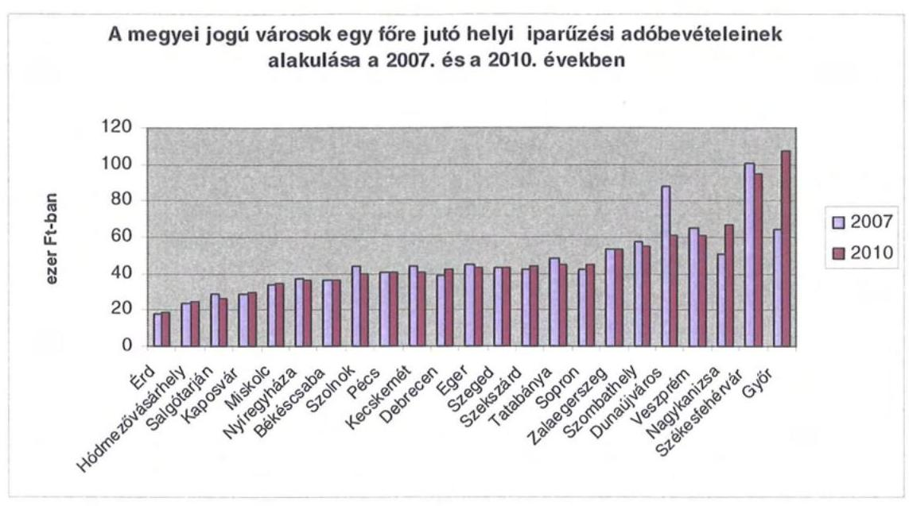

A megyei jogú városi önkormányzatok saját bevételein belül második legjelentősebb elem az illetékbevétel. A 2010. évben befolyt 39,2 milliárd Ft illetékbevétel a 2006. évben realizált 71,1 milliárd Ft illetékbevétel alig több mint $55 \%$-a. A jelentős visszaesést döntően az ingatlanpiac stagnálása, majd visszaesése, illetve egyes illetékkedvezmények bevezetése okozta. A kieső bevételek pótlására az önkormányzati alrendszer szintjén történtek intézkedések, 2010ben 5 milliárd Ft-ot, 2011-ben 1,2 milliárd Ft-ot ellentételezett a központi költségvetés. A megyei jogú városok önkormányzatai az önkormányzati alrendszer szintjén realizált illetékbevételből 2007-ben 13,6 milliárd Ft-tal (23,3\%-kal), 2008-ban 15,3 milliárd Ft-tal ( $22,7 \%$-kal), 2009-ben 12,6 milliárd Ft-tal ( $21,5 \%$ kal), 2010-ben 7,9 milliárd Ft-tal ( $20,2 \%$-kal) részesedtek ${ }^{12}$. Az összes befolyt illetékbevételből a megyei jogú városok részesedése 2009-ről 2010-re mindössze 1,3 százalékponttal csökkent, ugyanakkor a realizált illetékbevétel csökkenése a $37,3 \%$-ot ( 4,7 milliárd Ft) is elérte.

Az önkormányzati alrendszer átengedett bevételei közül a személyi jövedelemadóból való részesedés makroszintű szabályozása a vizsgált időszakban nem változott. A települési önkormányzatokat a településre kimutatott személyi jövedelemadó $8 \%$-a közvetlenül, míg $32 \%$-a külön szabályozott visszaosztási rendben illeti meg. A visszaosztás a jövedelem differenciálódás mérséklésével párosul, rendje a lakóhelyen maradó személyi jövedelemadóhoz és az iparűzési adó-erőképességhez ${ }^{13}$ igazodik, annak részletszabályait a mindenkori költségvetési törvény 4. számú melléklete határozza meg. A jövedelemdifferenciálódás

[^0]
[^0]:    ${ }^{12}$ Az illetékek kivetésének és beszedésének joga 2006. december 31-ig a megyei önkormányzatok feladata volt, amelyet a 2007. évtől az APEH (2011. január 1-jétől NAV) vett át. Az önkormányzati illetékrészesedési szabályok változatlanok maradtak, azonban az illetékbeszedés költségeit az önkormányzatok illetékbevételeiből átlagos (a megyei jogú városoknál 8,5\%-os) kulcsot alkalmazva vonták le.
    ${ }^{13}$ Az iparűzési adóerő-képesség egy potenciális, átlagos erőfeszítés mellett elérhető (a települési önkormányzat iparűzési adóelőlegét meghatározó adóalap 1,4\%-ának megfelelő számított) bevétel.

---

szabályai kétirányúak, a kiegészítés és a visszatartás feltételeit egyaránt meghatározták:

- Amennyiben az önkormányzatot közvetlenül megillető személyi jövedelemadó bevétel és a számított iparűzési adóerő-képesség együttesen számított, egy főre jutó összege nem érte el a település méretéhez kapcsolódóan az évenkénti szabályozás szerinti változó összeget, a költségvetés a részesedést település nagyság szerint eltérően meghatározott szintig - kiegészítette ${ }^{14}$. A kiegészítés fajlagos összege 2007-2010 között 37500 Ft-ról 48010 Ft-ra (10 510 Ft-tal, 28\%-kal) emelkedett. Az előzőeken túl a jövedelem differenciálódás szabályozása egyes térségi (középiskolai, szakiskolai, szakképző intézményi, kollégiumi) feladatok ellátásának függvényében további kiegészítő hozzájárulást biztosított.
- Amennyiben az egy főre számított személyi jövedelemadó és az iparűzési adóerő-képesség együttes összege a település nagyságrendjéhez rendelt értékhatárt több mint $25 \%$-kal (2010-től 20\%-kal) meghaladta, az egy főre jutó összeg sávonként differenciált módon ${ }^{15}$ visszavonásra került az önkormányzatot megillető normatív állami hozzájárulás összegéből.

Az önkormányzatok személyi jövedelemadó bevétele 2007-ben 494,3 milliárd Ft, 2008-ban 558,6 milliárd Ft, 2009-ben 639,5 milliárd Ft, 2010-ben 681,2 milliárd Ft volt, az időszak alatt összegében 186,9 milliárd Ft-tal, 37,8\%kal emelkedett, miközben az szja bevétel átengedett bevételeken belüli részesedése 1,8 százalékponttal emelkedett.

A megyei jogú városok önkormányzatainak személyi jövedelemadó részesedése az alrendszer átengedett személyi jövedelemadó bevételeiből 2007-ben 77,6 milliárd Ft-ot ( $15,7 \%$-ot), 2008-ban 105,4 milliárd Ft-ot ( $18,9 \%$-ot), 2009ben 122,9 milliárd Ft-ot ( $19,2 \%$-ot), 2010-ben 136,6 milliárd Ft-ot ( $20,1 \%$-ot) tett ki. A realizált szja bevétel a megyei jogú városoknál az időszak alatt folyamatosan emelkedett, a 2010-ben realizált adóbevétel 59,0 milliárd Ft-tal (76\%) volt magasabb a 2007. évinél, az átengedett bevételeken belüli részesedése 2010-re 5,1 százalékponttal haladta meg a 2007. évi részarányt ${ }^{16}$. A részesedés alapjául szolgáló szja településenként eltérő, az egy adózóra jutó szja 2009. évi adatait ${ }^{17}$ a következő ábra szemlélteti.

[^0]
[^0]:    ${ }^{14}$ A megyei jogú városok esetében a jövedelemkülönbségek mérséklésénél figyelembe veendő lakosonkénti értékhatár 2007-ben 37500 Ft, 2008-ban 42385 Ft, 2009-ben 45933 Ft, 2010-ben 48010 Ft volt.
    ${ }^{15}$ A sávos értékhatár 2010-től 20\%-os intervallumonként, 120\% felett a visszatartást $25 \%$-tól $90 \%$-os mértékig rögzíti. Amennyiben a település nagyságrendhez rendelt értékhatár összege az önkormányzatnál eléri vagy meghaladja a 200\%-ot, az egy főre jutó összeg $90 \%$-a levonásra kerül. Az értékhatár sávjai 2010 előtt $25 \%$-os léptékűek voltak, a levonási arányok az ellenőrzött időszakban nem változtak.
    ${ }^{16}$ E bevételek a megyei jogú városok átengedett bevételeiben 2007-ben 84,7, 2008-ban 87,7, 2009-ben 89,7, 2010-ben 89,8\%-os részarányt jelentettek.
    ${ }^{17}$ Adatforrás: KSH Megyei Jogú Városok a Közép Dunántúlon 2009. kiadványa, 4.1.sz. összehasonlító tábla.

---

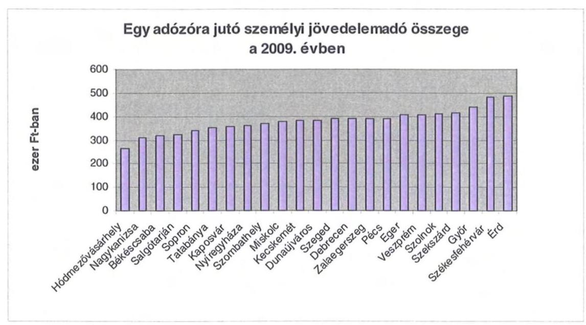

Az átengedett bevételek második legjelentősebb eleme a gépjármúadó, amelynek bevételi szabályozása az ellenőrzött időszakban nem változott, az adóbevétel teljes összege az önkormányzatot illeti meg. A gépjármúadó alapját, mértékét ${ }^{18}$ és egyes mentességi kategóriákat érintő módosítások 2010. január 1-től következtek be, amelyek az egyes adótételek esetében átlagosan $15 \%$-os emelkedéssel jártak.

A gépjármúadó beszedéséből származó bevétel az önkormányzati alrendszer szintjén 2007-ben 62,4 milliárd Ft, 2008-ban 65,7 milliárd Ft, 2009-ben 63,8 milliárd Ft, 2010-ben 71,1 milliárd Ft volt, az adóbevétel egésze 2007-hez képest 8,7 milliárd Ft-tal, 13,9\%-kal emelkedett. A gépjármúadóztatás szabályainak változása 2010-ben 7,3 milliárd Ft többletet eredményezett. A megyei jogú városok gépjármúadó bevétele a 2007. évi 14,0 milliárd Ft-ról 2010-re 15,5 milliárd Ft-ra, 10,7\%kal emelkedett. A bevételnövekedés összegéből 1,4 milliárd Ft a 2010. évi adózási szabályok következménye.

A megyei jogú városok önkormányzatai 2007-2010 között rendelkezésre álló forrásainak alakulását a következő ábra szemlélteti:

[^0]
[^0]:    ${ }^{18}$ A gépjármúadóról szóló 1991. évi LXXXII. törvény 7. § (1) bekezdésében foglalt adómértékek változása.

---

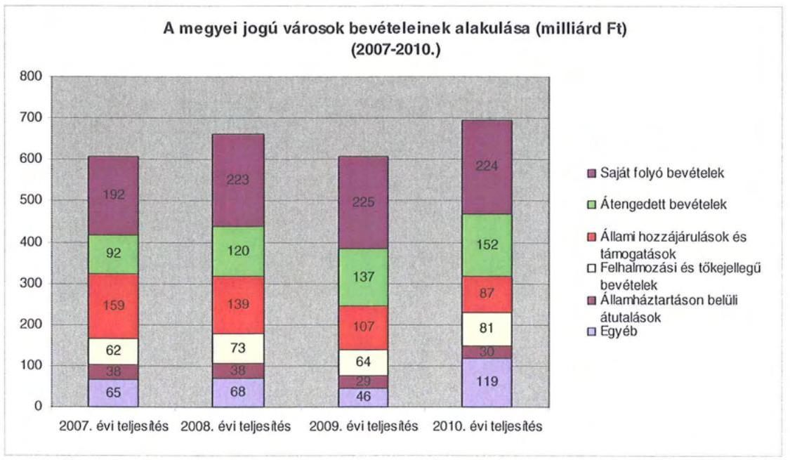

A megyei jogú városok saját folyó bevételeinek - amelyek főbb elemei: a helyi adók, az illetékbevételek, az intézményi térítési díjak, a kamatbevételek részaránya a 2007. évi összbevételen ( 608 milliárd Ft) belül 32\% volt. A 2010. évi összbevétel 693 milliárd Ft-os összegéből a saját folyó bevételek aránya miközben összege 2007-ről 2010-re 32 milliárd Ft-tal emelkedett - nem változott.

Az átengedett bevételek, amelyek a megyei jogú városok önkormányzatainál döntően a személyi jövedelemadó és a gépjármúadó részesedést jelenti, az összbevételen belül a 2007. évi 92 milliárd Ft-ról (15\%) 152 milliárd Ft-ra nőtt, részesedése 7 százalékponttal emelkedett. A 60 milliárd Ft-os növekedésből 59 milliárd Ft-ot az szja részesedés emelkedése okozott.

Az állami hozzájárulások és támogatások - amelyek főbb elemei: főként az ellátotti létszámhoz kötődő normatív állami hozzájárulások, központosított előirányzatok - a 2007. évi 159 milliárd Ft-ról (26\%-os részarányról) 2010-re 87 milliárd Ft-ra (13\%-os részarányra) estek vissza.

A felhalmozási és tőkejellegú bevételek - tárgyi eszközök (ingatlanok és ingóságok), föld és immateriális javak, részesedések értékesítése, EU-tól átvett pénzeszközök - a 2007. évi 62 milliárd Ft-ról (10\%-os részarányról) 2010-re 81 milliárd Ft-ra (12\%-os részarányra) emelkedtek.

Az államháztartáson belüli átutalások részesedése 2007-ben 38 milliárd Ft volt. 2010. év végére 8 milliárd Ft-tal csökkent, részaránya 6\%-ról 2010-ben 4\%-ra változott. Ez a bevételi kategória tartalmazza az Egészségbiztosítási Alaptól és más elkülönített állami pénzalapoktól átvett forrásokat. A 2010-ben e címen elszámolt bevétel a megyei jogú városoknál 22 milliárd Ft-ot tett ki.

Az egyéb, pénzmaradványból, vállalkozási bevételekből, államháztartáson kívülről származó átutalásokból, a hitelekből, a hosszú és rövid lejáratú értékpapírok értékesítéséből származó bevételek részesedése a 2007-2010. évek vi-

---

szonylatában 11\%-ról 17\%-ra emelkedett. Ez utóbbiak 2010. évi beszámoló szerinti összevont teljesítése 119 milliárd Ft volt ${ }^{19}$.

Mindezeket figyelembe véve a megyei jogú városok 2007. és 2010. évi forrásöszszetételének megoszlását az alábbi ábra szemlélteti:

A megyei jogú városok 2007. és 2010. évi forrásösszetétele
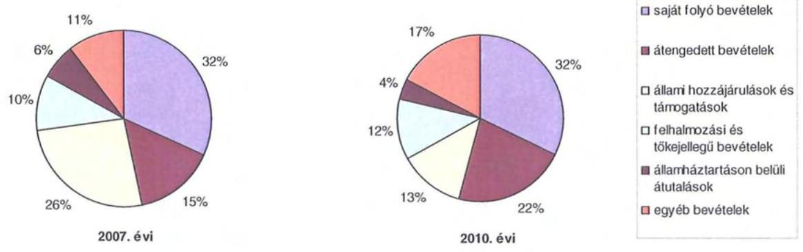

Az önkormányzati alrendszer pénzügyi helyzetértékelése során új elemzési módszereket alkalmaz az ellenőrzés. A hagyományos költségvetési szerkezet helyett az önkormányzat pénzügyi helyzetét a CLF módszerrel mutatjuk be, amelynek lényegét és számításának módszerét a 2.1. pontban, és a jelentés 2 . számú mellékletében ismertetjük részletesen.

Az új módszereken alapuló helyzetértékelés fontosságát az adja, hogy a helyi önkormányzatok bruttó adósságállománya ${ }^{20}$ a 2010. évi költségvetési beszámoló alapján 1248 milliárd Ft-ot tett ki. Az adósságállomány koncentráltságát jelzi ${ }^{21}$, hogy ebből a 23 megyei jogú város részesedése 338 milliárd Ft volt, amely a fővárosi és kerületi önkormányzatok adósságának figyelmen kívül hagyásával számított 2010. évi 977 milliárd Ft összegű bruttó adósságállomány $34,6 \%$-át jelentette. Az adósságállomány több mint fele - 501 milliárd Ft - a 19 megyei önkormányzatnál és a 23 megyei jogú városnál jelentkezett.

[^0]
[^0]:    ${ }^{19}$ Az egyéb bevételek összege 2007-2010 között eltérő módon változott, 2007-ben 65 milliárd Ft, 2008-ban 68 milliárd Ft volt, 2009-ben 46 milliárd Ft-ra esett vissza, majd 2010-ben több mint két és félszeresére, 119 milliárd Ft-ra emelkedett.
    ${ }^{20}$ A bruttó adósságállomány 2010. év végi összege magában foglalja a fejlesztési és a működési célú kötvénykibocsátások, a beruházási és fejlesztési hitelek, a működési célú hosszú lejáratú hitelek, a rövid lejáratú hitelek, váltótartozások miatti kötelezettségek teljes (2011-ben, illetve az azt követő években esedékes) állományát.
    ${ }^{21}$ A megyei jogú városok adósságállománya összegében ugyan elmarad az egyéb városok összesített adósságától [ez utóbbiak részesedése 382,6 milliárd Ft (39,2\%)], azonban az egyéb városok száma 304. A fővárosi és a kerületi önkormányzatok nélküli adósságállományból a 19 megyei önkormányzat 163 milliárd Ft-tal ( $16,8 \%$-kal), míg a nagyközségek, községek együttesen 93 milliárd Ft-tal ( $9,5 \%$-kal) részesednek.

---

A megyei jogú városok 338 milliárd Ft-os adósságállományából 175 milliárd Ft $(51,8 \%)$ a 8 legnagyobb, 100 ezer fő feletti népességű város tartozása. Az 5 nem megyeszékhely megyei jogú város bruttó adósságállománya 70 milliárd Ft-ot (20,7\%-ot), az előző két csoportba nem tartozó további 10 megyei jogú város adóssága 93 milliárd Ft-ot ( $27,5 \%$-ot) tett ki.
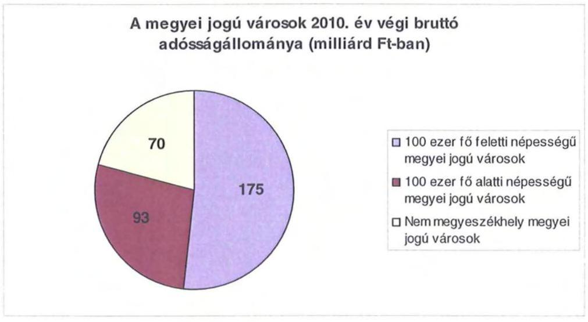

A mérlegben kimutatott bruttó adósságállomány mellett az önkormányzatok számára az eszközállomány műszaki állapotának megőrzése is kötelezettségekkel jár. Az elhasználódott eszközök pótlására forrást biztosító amortizációs (felújítási) alap képzésének ${ }^{22}$ elmaradása maga után vonhatja a feladatellátást kiszolgáló tárgyi eszközök állagának erőteljes romlását. Emellett a 2007-2013as időszakra meghirdetett, vissza nem térítendő EU-s fejlesztési forrásokhoz való hozzájutás lehetősége felerősítette az önkormányzati alrendszer fejlesztési igényeit, amelyek a felhalmozási költségvetési hiány folyamatos emelkedésén túl - az előírt jövőbeni fenntartási kötelezettség miatt - tovább terhelhetik az önkormányzatok költségvetését ${ }^{23}$.

Az ÁSZ a 2011. évi ellenőrzési tervében 43. számú, az Önkormányzatok gazdálkodási rendszerének ellenőrzése részeként egy időben, egymással párhuzamosan tekinti át, és elemzi a 23 megyei jogú városi önkormányzat pénzügyi helyzetét. A gazdálkodás szabályszerűségét az ÁSZ az előző évek során ebben az önkormányzati körben is ellenőrizte, ezért jelen vizsgálatunk erre nem tér ki. A jelentés a megyei jogú városok sajátos feladatellátási és forrásszabályozási

[^0]
[^0]:    ${ }^{22}$ Erre a jelenlegi szabályozási környezetben nem kötelezi semmilyen előírás az önkormányzatokat.
    ${ }^{23}$ Az Állami Számvevőszék 2011 júniusában közzétett 1108. számú, a helyi önkormányzatok fejlesztési célú támogatási rendszerének ellenőrzéséről szóló jelentésében feltárta a fejlesztési folyamatok problémáit. A helyi önkormányzatok elsősorban azokat a fejlesztéseket valósították meg, amelyekhez támogatást lehetett igényelni. A fejlesztési célok közül a magasabb támogatás intenzitású pályázatokat részesítették előnyben. A fejlesztéssel megvalósuló létesítmények jövőbeli üzemeltetésének várható ráfordításait az önkormányzatok $71,9 \%$-a nem mérte fel.

---

helyzetére tekintettel az önkormányzatok pénzügyi helyzetét, illetve az ezzel összefüggő korábbi ÁSZ javaslatok megvalósítását mutatja be.

Az ellenőrzés a 2007. január 1. - 2010. december 31. közötti időszakot öleli fel.
A vizsgálat jogszabályi alapját az Állami Számvevőszékről szóló 1989. évi XXXVIII. törvény 2. § (3), (5), (6) és (9) bekezdései, az Ötv. 92. § (1) bekezdése, az Áht. 104. § (3), és 120/A. § (1) bekezdése előírásai képezik ${ }^{24}$.

[^0]
[^0]:    ${ }^{24}$ 2011. július 1-jétől az Állami Számvevőszékről szóló 2011. évi LXVI. törvény 5. § (2)(5) bekezdései

---

# I. ÖSSZEGZŐ MEGÁLLAPÍTÁSOK, KÖVETKEZTETÉSEK, JAVASLATOK 

Az Önkormányzat - adatszolgáltatása szerint - a tárgyév múködési költségvetési kiadásaiból ( 41395 millió Ft) 40852 millió Ft-ot ( $98,7 \%$ ) a kötelező feladatok, 543 millió Ft-ot ( $1,3 \%$ ) az önként vállalt feladatok ellátására fordított. Az önként vállalt feladatok a városmarketing tevékenységhez, egyes civil szervezetek és alapítványok múködésének támogatásához, illetve különféle tagdíjak befizetéséhez kapcsolódtak. Kötelező feladatait az Önkormányzat az Ötv. és az ágazati törvények által meghatározottnak tekinti, az önként vállalt feladatok terjedelmét az éves költségvetési rendeletekben az adott évi költségvetés forrásainak ismeretében határozták meg, az önkormányzati feladatokról az SzMSz-ben nem rendelkeztek.

Az Önkormányzat feladatellátásának szervezeti struktúráját a következő ábra szemlélteti:
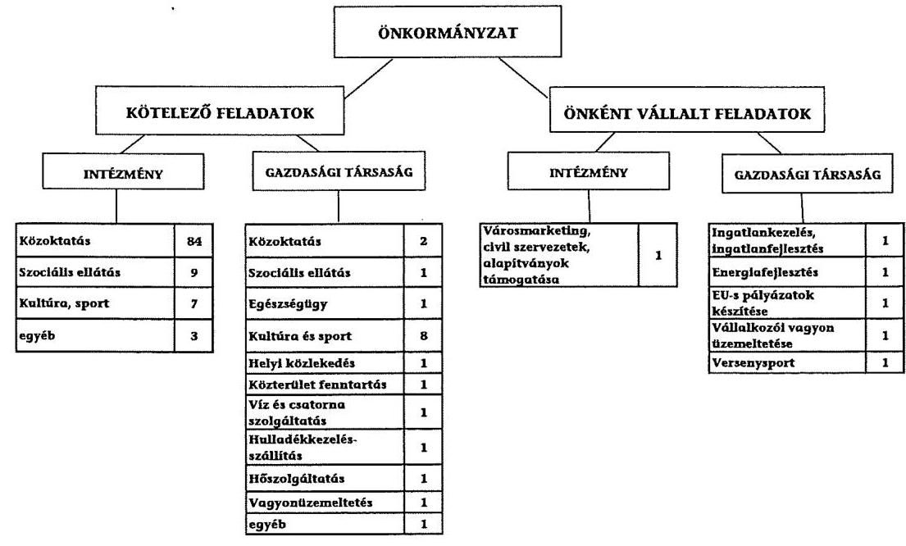

Az Önkormányzat feladatait 2010. december 31-én (a Polgármesteri hivatallal együtt) 103 költségvetési szervvel és 15 gazdasági társaságával ( $25 \%$ feletti tulajdoni hányadú) látta el. Az intézményszervezeti átalakítások és intézményi összevonások következtében a feladatellátás telephelyeinek száma a 2006. évi 277-ről 2010-re 247-re csökkent.

Az Önkormányzat múködési kiadásokra 2010-ben 41395 millió Ft-ot fordított, amely 2595 millió Ft-tal ( $6,7 \%$-kal) haladta meg a 2007. évi ráfordításokat. A múködési kiadások $65 \%$-át az intézményi körben realizálták. E kiadások fedezetéül szolgáló bevételi források a 2007. és a 2010. években jellemző összesített arányait a következő ábra szemlélteti:

---

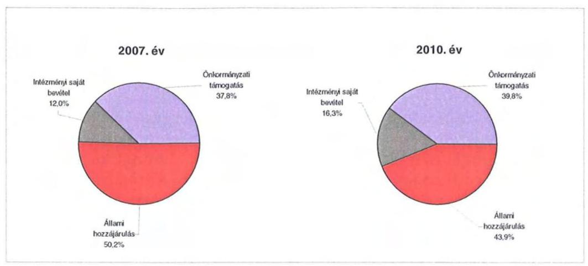

Az egyes közszolgáltatások feladatellátásában részvevő ágazati intézménycsoportok forrásösszetételének bevételi jogcímeit a következő ábra szemlélteti:
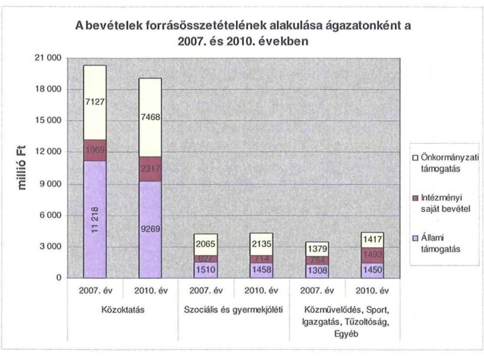

Az Önkormányzat nyolc gazdasági társaságban rendelkezik kizárólagos tulajdonnal, egy gazdasági társaságban 75\% feletti, két gazdasági társaságban 51-75\% közötti, négyben 25-50\% közötti tulajdoni hányaddal. A gazdasági társaságok távhőszolgáltatás, hulladékkezelés-szállítás, víz- és szennyvízkezelés, helyi tömegközlekedés, valamint az egészségügyi ellátás területén kaptak szerepet az Önkormányzat feladatellátásában. A gazdasági társaságok a múködésükhöz a 2010. évben összesen 2646 millió Ft rendszeres múködési és 176 millió Ft fejlesztési célú pénzeszközátadásban részesültek az Önkormányzattól.

A közbenső egyeztetés során a polgármester által tett észrevétel szerint: a gazdasági társaságok támogatása tartalmazza a meghatározott célra átvett állami pénzeket - pld közösségi közlekedés támogatása, ivóvíz szolgáltatás támogatása - ami csak „átmegy" az Önkormányzaton, ezt így feltüntetni megtévesztő. (A két tétel együtt 575333 ezer Ft.)

---

A gazdasági társaságok részére átadott pénzeszközök a 7/b. számú tanúsítvány 6-11. soraiból kerültek kigyűjtésre. Ezek a sorok nem tartalmazták a meghatározott célra átvett állami pénzeket. A közösségi közlekedés és az ivóvíz szolgáltatás támogatása a központi költségvetésből kapott (15. sor), és nem az önkormányzati támogatások között szerepelt.

A többségi tulajdonban lévő társaságok pénzügyi helyzete a 2010. évi saját tőke/jegyzett tőke aránya alapján összességében stabil, ezen belül a DV Zrt, a hőszolgáltatás, a vízellátás feladatát végző gazdasági társaság mutatója jó, azonban veszteséges a tömegközlekedés, a gyógyfürdő, a városi televízió, a lapkiadás szolgáltatását végző társaság és a Jégcsarnok Kft. Az Önkormányzatnak 2010-ben a Jégcsarnok Kft-nél kellett 31 millió Ft összegű tőkepótlásról gondoskodnia.

Az Önkormányzat folyó költségvetés egyenlege (múködési jövedelem) 2007-2010 között múködési forrástöbbletet mutatott ${ }^{25}$. A 2007. évben a nettó működési jövedelem negatív ( -94 millió Ft ) volt, mert a 2159 millió Ft-os múködési megtakarítás nem tudta fedezni a 2253 millió Ft értékű tőke törlesztést. A 2008. évben a múködési megtakarítások fedezni tudták a tárgyévben jelentkező törlesztési kötelezettségeket, így az Önkormányzat pénzügyi kapacitása (nettó múködési jövedelme) is pozitív értékű volt. A 2009-2010. években az adósságszolgálat növekedése miatt a pénzügyi kapacitás negatívvá vált (2009ben -189 millió Ft, 2010-ben -1269 millió Ft), mivel a múködési megtakarítás (2009-ben 2632 millió Ft, 2010-ben 1359 millió Ft) nem tudta fedezni a törlesztési kötelezettséget (2009-ben 2821 millió Ft, 2010-ben 2628 millió Ft).
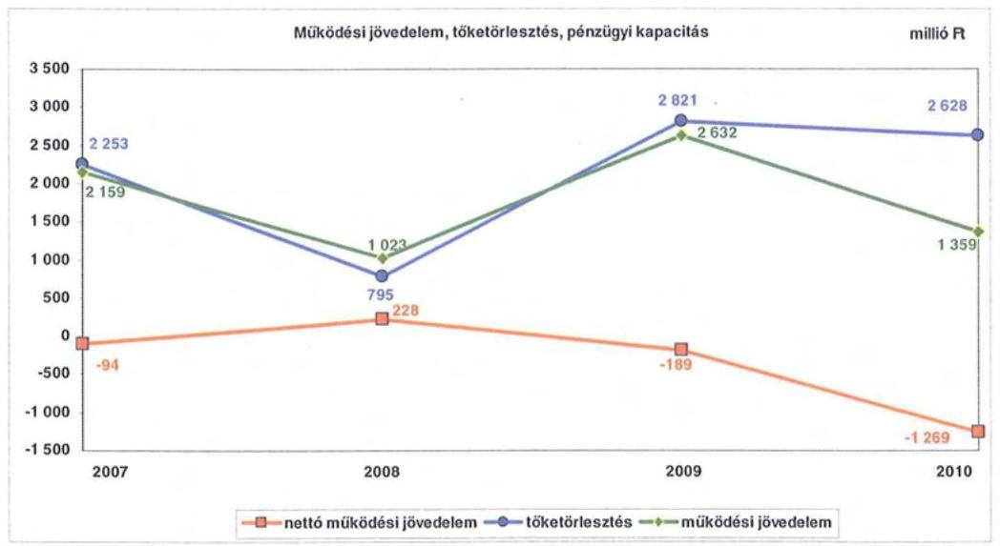

A 2007-2010. években az Önkormányzat felhalmozási bevételeinek és kiadásainak egyenlege folyamatosan negatív összegű volt, így az 2007-2010. között összesen 16741 millió Ft felhalmozási forráshiányt mutatott.

[^0]
[^0]:    ${ }^{25}$ A folyó költségvetés egyenlege 2007-ben a folyó kiadások 5,4\%-át (2159 millió Ft-ot), 2008-ban 2,3\%-át (1023 millió Ft-ot), 2009-ben 6,2\%-át (2632 millió Ft-ot), 2010-ben $3,2 \%$-át ( 1359 millió Ft-ot) jelentette.

---

A pénzügyi egyensúly fenntartása külső források bevonásával volt biztosítható. A 2007-2010. években 5997 millió Ft hitelt törlesztettek, továbbá 2500 millió Ft volt a kötvény beváltása miatt fizetendő kötelezettség. Az adósságszolgálat, továbbá a felhalmozási forráshiány 2007-2010. között 25238 millió Ft-ot tett ki, amelyre az időszakban képződő 7173 millió Ft működési megtakarítás (múködési jövedelem), valamint a 2007. január 1-jén rendelkezésre álló 5513 millió Ft pénzkészlet szolgált fedezetül. A további pénzeszközöket 17400 millió Ft hitel felvételével teremtették meg. A kialakult pénzügyi helyzet pozitív nettó múködési jövedelmet eredményező gazdálkodás mellett teszi elkerülhetővé további külső források bevonását, az eladósodás növekedését.

A vizsgált időszakban az Önkormányzatnál helyi iparűzési adó, építményadó, vállalkozók kommunális adója, vendégéjszakák utáni idegenforgalmi adó volt megállapítva, melyek mértéke a vizsgált időszakban nem változott. A helyi adókból és pótlékokból származó bevételek aránya 2007-2010. között 0,7 százalékponttal nőtt, 2010-ben $24,5 \%$-ot tett ki a folyó (múködési) bevételekben. A pótlékkal, bírsággal növelt helyi adó bevétel a 2007. évi 10041 millió Ft-ról 2010. évben 10842 millió Ft-ra ( $8,0 \%$-kal, 801 millió Ft-tal) emelkedett. A helyi adóbevételek közel $80 \%$-át az iparűzési adó tette ki, amelynek mértéke a helyi adókról szóló törvényben rögzített maximális mértékben került megállapításra. A helyi adóbevételek növekedését a kivetett helyi adók bevételeinek eltérő mértékű emelkedése okozta. Új helyi adónemet a vizsgált időszakban az Önkormányzat nem vetett ki.

A befejezett fejlesztések jelentős részét pénzintézeti forrásokból fedezték. A 2007-2010. évek időszakában 6431 millió Ft értékű fejlesztés és felújítás forrása a saját erő és a hazai- és EU-s támogatások mellett 1219 millió Ft hitelfelvétel $(19,0 \%)$ volt. A 2010. december 31-én folyamatban lévő fejlesztési feladatok végrehajtására 2007-2010. között 22981 millió Ft kiadást teljesítettek, amelyre hitelből 4388 millió Ft-ot (19,1\%) fordítottak. Az EU-s támogatásból megvalósult fejlesztések finanszírozása likviditási gondot nem okozott.

Az Önkormányzat 2010. december 31-én folyamatban lévő fejlesztési feladatok 2010. évet követő kötelezettség-vállalásainak összege 23916 millió Ft volt, amelyből 2365 millió Ft-ot hitel (előkészítés alatt) felvételéből, 18432 millió Ft-ot EU-s támogatásból és 3119 millió Ft-ot hazai támogatásból terveznek biztosítani. Saját forrással a fejlesztések megvalósításához nem számoltak. A tervezett hitel felvétele kockázatot jelent a vállalt fejlesztések jövőbeni finanszírozhatósága szempontjából.

---

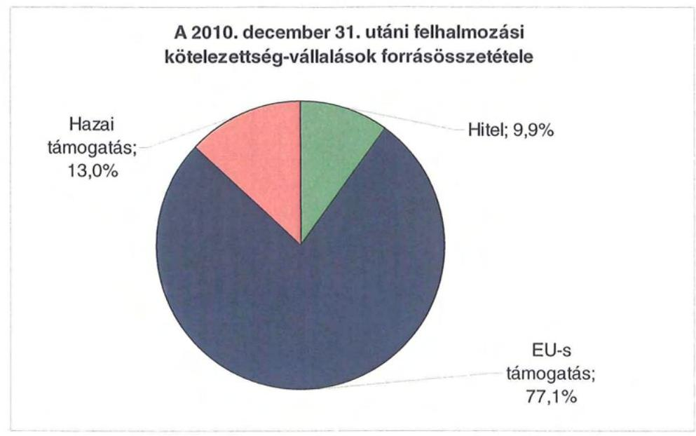

Az Önkormányzat által beadott, elbírálás alatt álló pályázatok tervezett teljes bekerülési költsége 1765 millió Ft volt, amelyhez 18 millió Ft-ot más önkormányzattól kívánnak bevonni. Az Önkormányzat által a 2010-2013. évekre vállalt kötelezettségek összege 1747 millió Ft volt, amelyből 434 millió Ft-ot hitel felvételéből, 1133 millió Ft-ot EU-s támogatásból és 180 millió Ft-ot hazai támogatásból terveznek biztosítani.

Az Önkormányzat mérleg szerinti pénzintézeti kötelezettsége a 2006. év végéről a 2010. év végére, 8252 millió Ft-ról 27512 millió Ft-ra nőtt, amelyből az árfolyamváltozás miatti különbözet 6405 millió Ft volt. A fennálló pénzintézeti kötelezettségek hat hosszú lejáratú hitelből, valamint egy rövid lejáratú hitel igénybevételéből keletkeztek. Az Önkormányzat az elfogadott 2011. évi költségvetési rendelete alapján EUR hitel felvételét tervezte 4825 millió Ft összegben, a hitelt a helyszíni vizsgálat befejezésének időpontjáig még nem vette fel.

Az Önkormányzat kötelezettségvállalásaira közgyűlési döntés alapján került sor, azonban az előterjesztésekben nem mutatták be a teljes futamidőre várható a kamat- és - a devizaalapú kötelezettségeket érintő - árfolyamkockázatot.

A 2002. évben engedélyeztetett és két ütemben 2002. és 2004. években kibocsátott két kötvényét az Önkormányzat visszafizette, így 2009. évtől kötvényállománya nem volt.

Az Önkormányzat a hiteleket mind lehívta, és a hitelcélnak megfelelően a Közgyűlés által jóváhagyott, a költségvetésbe betervezett beruházásokhoz használta fel. Az Önkormányzat az EUR-ban fennálló pénzintézeti kötelezettségeiből tőkét nem törlesztett, azonban 914 ezer EUR ( 251 millió Ft) kamatot fizetett. A CHF-ben fennálló pénzintézeti kötelezettségeiből 8645 ezer CHF (1798 millió Ft) tőkét törlesztett, és 782 ezer CHF ( 163 millió Ft) kamatot fizetett. A vizsgált években öt hitelét fizette vissza az Önkormányzat. A 2007-2010 években átmenetileg szabad pénzeszközeiből 85 millió Ft kamatbevételt realizált. Az Önkormányzat számlavezető bankot a vizsgált időszakban nem váltott.

---

Az Önkormányzat müködésének pénzügyi egyensúlyát a vizsgált időszakban folyószámlahitel, munkabér megelőlegezési hitel és egy alkalommal 3000 millió Ft rövid lejáratú hitel igénybevételével tudta biztosítani, melyet 2010. december 27 -én vett fel és 2011. január 4-én fizetett vissza.

A folyószámlahitel igénybevétele a 2007-2010. években az alábbiak szerint alakult:

| Megnevezés | 2007. év | 2008. év | 2009. év | 2010. év |
| :-- | :--: | :--: | :--: | :--: |
| Keretösszeg január 1-én | 1500,00 | 1500,00 | 1500,00 | 3000,00 |
| Átlagos napi állomány | 109 | 46 | 32 | 41 |
| Folyószámlak hitellel zárt napok száma (nap) | 50 | 30 | 58 | 16 |
| 2010. december 31-i egyenleg (állomány) | x | x | x | - |

A likviditás biztosítása az Önkormányzatnak 41 millió Ft kamatkiadást, és 6 millió Ft egyéb költség fizetésének kötelezettségét okozta. Az Önkormányzat 2010. év végi szállítói tartozása 2313 millió Ft, melyből lejárt tartozása nem volt. Az átütemezett szállítói tartozások összege 812 ezer EUR volt.

Az Önkormányzat gazdasági társaságai részére a fejlesztési és egyéb hitelek igénybevételéhez készfizető kezességet vállalt 990 millió Ft összegben. A 2010. év végére a kezességgel kapcsolatos kötelezettség 89 millió Ft-ra 1757 ezer CHF-re, és 643 ezer EUR-ra csökkent. A gazdasági társaságok részére nem nyújtott kölcsönt az Önkormányzat.

A Közgyűlés a folyószámlahitel és fejlesztési hitelek biztosítékaként 187 millió Ft - számviteli nyilvántartás szerinti nettó értékű - jelzálogjog alapításához és bejegyzéséhez járult hozzá. A jelzálogszerződésekkel érintett ingatlanok a forgalomképes ingatlanok $0,5 \%$-át jelenti.

Az Önkormányzat kötelezettségeinek 2010. december 31-i állományát és várható alakulását a kötelezettségek lejáratáig a következő táblázat szemlélteti:

| Megnevezés | Állomány 2010. dec. 31-én |  |  | Várható kötelezettség 2011. 2013. években |  |  | Várható kötelezettség 2014. évet követően |  |  |
| :--: | :--: | :--: | :--: | :--: | :--: | :--: | :--: | :--: | :--: |
|  | HUF-ban   (millió Ftban) | Üzelsülben (összegszer CHF/EUR) | Üzelsi utent | HUF-ban (millió Ftban) | Üzelsülben (összege ezer CHF/EUR) | Üzelsi utent | HUF-ban (millió Ftban) | Üzelsülben (összege ezer CHF/EUR) | Üzelsi utent |
| Pénzintézeti kötelezettségek |  |  |  |  |  |  |  |  |  |
| Hosszú lejáratú hitelek |  | 44328 | CHF |  | 30726 | CHF |  | 27671 | CHF |
| Hosszú lejáratú hitelek |  | 20572 | EUR |  | 3826 | EUR |  | 20663 | EUR |
| Folyószámlahitel |  |  |  |  |  | HUF |  |  |  |
| Egyéb fávid hitelek | 3000 |  | HUF | - |  | HUF | - |  | HUF |
| Pénzintézeti kötelezettségek összesen HUF-ban: | 3000 |  | HUF | - |  | HUF | - |  | HUF |
| Pénzintézeti kötelezettségek összesen CHF-ban |  | 84328 | CHF |  | 30726 | CHF |  | 37671 | CHF |
| Pénzintézeti kötelezettségek összesen EUR-ban |  | 20572 | EUR |  | 3826 | EUR |  | 20663 | EUR |
| Biztosítékok |  |  |  |  |  |  |  |  |  |
| Exzenség | 89 |  | HUF |  |  | HUF | - |  | HUF |
|  |  | 1757 | CHF |  | 843 | CHF |  | 914 | CHF |
|  |  | 643 | EUR |  | 483 | EUR |  | 161 | EUR |
| Biztosítékok összesen HUF-ban: | 89 |  | HUF |  |  | HUF |  |  | HUF |
| Biztosítékok összesen CHF-ban: |  | 1757 | CHF |  | 843 | CHF |  | 914 | CHF |
| Biztosítékok összesen EUR-ban: |  | 643 | EUR |  | 483 | EUR |  | 161 | EUR |
| Szállítási tartozás | 2313 |  | HUF | 2313 |  | HUF |  |  | HUF |
|  |  | 812 | EUR |  | 812 | EUR |  |  | EUR |
|  |  |  |  |  |  | HUF | - |  | HUF |
| Jogszib végzéssel lezárt és ki nem fizetett kötelezettségekr | 5 |  | HUF | 5 |  | HUF | - |  | HUF |

Az Önkormányzatnak pénzintézetekkel szemben fennálló kötelezettsége a 2010. év végén 3000 millió Ft, 84328 ezer CHF és 20572 ezer EUR volt.

---

Ezek várható kötelezettsége (tőke, kamat és egyéb költség) a legutóbbi kamatfizetés feltételei alapján a 2011-2013. években 30726 ezer CHF, továbbá 5826 ezer EUR. Az Önkormányzatnak a 2011. évben szállítói tartozások és egyéb kiadás elmaradások rendezése, valamint jogerős végzéssel lezárt, de ki nem fizetett kötelezettségek címén 2318 millió Ft és 812 ezer EUR fizetési kötelezettsége keletkezett. A 2011-2013. évek kötelezettségeinek teljesítésére figyelembe vehető 3570 millió Ft pénzmaradvány, 2068 millió Ft mérlegben kimutatott követelésállomány, 34050 millió Ft forgalomképes nettó ingatlanvagyon, melyből 187 millió Ft a pénzintézeti kötelezettséghez kapcsolódóan jelzáloggal terhelt. A 2014. évet követően jelenleg ismert pénzintézeti kötelezettségei: 57671 ezer CHF és 20665 ezer EUR. Az Önkormányzat tájékoztatása szerint figyelembe vehető további források „a mindenkori költségvetési rendeletekben megtervezett önkormányzati helyi adóbevételek, azonban ennek növelésére 2011-ben tett intézkedés nem biztosít elegendő többletforrást. A további évekre szóló jelenleg ismert pénzintézeti kötelezettségek teljesítését nem látjuk biztosítottnak, mivel nem számszerűsítették a visszafizetés forrását.

A közbenső egyeztetés során a polgármester által tett észrevétel szerint: a helyi adóbevétel fedezetet nyújt a további évekre szóló jelenleg ismert pénzintézeti kötelezettségek teljesítésére.

Az észrevételt nem fogadjuk el, a jelenleg ismert pénzintézeti kötelezettségek 2014-et követő éveket érintő teljesítését továbbra sem látjuk biztosítottnak. Az észrevételben jelzett 10 milliárd Ft helyi adó bevétel nem szolgálhat teljes egészében a kötelezettségek fedezetéül. A helyi adókból elérhető többletbevétel vehető figyelembe bevonható szabad forrásként, azonban a 2011-ben tett intézkedés nem biztosít elegendő többletforrást a fizetési kötelezettség teljesítésére, a további évekre nem ismertek a helyi adó bevételek növelésére vonatkozó elképzelések.

Az Önkormányzat minősített többségi tulajdonú társaságai kötelezettségeinek 2010. december 31-i állományát és várható alakulását a kötelezettségek lejáratáig a következő táblázat mutatja be:

| Megnevezés | Állomány 2010. dec.31-én |  |  | Várható kötelezettség 2011. |  |  | Várható kötelezettség 2014.   évet követőon |  |  |
| :--: | :--: | :--: | :--: | :--: | :--: | :--: | :--: | :--: | :--: |
|  | $\begin{aligned} & \text { HUF-ban } \\ & \text { (millió Ft- } \\ & \text { ban) } \end{aligned}$ | Dovtalban (finange ezer CHF/EUR) | Dovla   ezeem | HUF-ban   (millió Ft-   ban) | Dovtalban   (finange ezer   CHF/EUR) | Dovla   ezeem | $\begin{aligned} & \text { HUF-ban } \\ & \text { (millió Ft- } \\ & \text { ban) } \end{aligned}$ | Dovtalban   (finange ezer   CHF/EUR) | Dovla   ezeem |
| Pénzintézti kötelezettségek |  |  |  |  |  |  |  |  |  |
| Hosszú lejáratú bitalónk | 2017 |  | HUF | 772 |  | HUF | 1334 |  | HUF |
| Hosszú lejáratú bitalónk |  | 1727 | CHF |  | 843 | CHF |  | 914 | CHF |
| Hosszú lejáratú bitalónk |  | 7393 | EUR |  | 1326 | EUR |  | 4067 | EUR |
| Pénzintézeti kötelezettségek összesen HUF-ban | 2017 |  | HUF | 772 |  | HUF | 1334 |  | HUF |
| Pénzintézeti kötelezettségek összesen CHF-ban |  | 1727 | CHF |  | 843 | CHF |  | 914 | CHF |
| Pénzintézeti kötelezettségek összesen EUR-ban |  | 7393 | EUR |  | 1326 | EUR |  | 4067 | EUR |
| Szállítót tartozás | 1126 |  | HUF | 1126 |  | HUF |  |  |  |
| Jogerős végzéssel lezárt de ki nem fizetett kötelezettségeit | 2 |  | HUF | 2 |  | HUF |  |  |  |

Az önkormányzati kötelezettségek növekedése mellett az Önkormányzat minősített többségi befolyásával rendelkező gazdasági társaságok kötelezettségei is befolyásolhatják az Önkormányzat pénzügyi egyensúlyát. A társaságoknak a 2011. évtől 772 millió Ft, 843 ezer CHF, 1326 ezer EUR pénzintézeti kötelezettséget, 1126 millió Ft szállítói tartozást, és a jogerős végzéssel lezárt, de ki nem fizetett kötelezettségek címén 2 millió Ft tartozást kell rendezniük. Kockázatot hordoz, ha az esetleges csőd, vagy felszámolási eljárás esetén a bíróság korlátlan és teljes felelősséget állapít meg az Önkormányzat terhére.

---

A közbenső egyeztetés során a polgármester által tett észrevételben „a bíróság korlátlan és teljes felelősséget állapíthat meg az önkormányzat terhére" szövegrész pontosítását kérik.

Az észrevétel nem megalapozott, csak a jelentés szerinti pontosítást tartjuk szükségesnek. Az Önkormányzat minősített többségi tulajdonú gazdasági társaságainak a 2011-2013. évekre várható kötelezettsége 772 millió Ft, 843,3 ezer CHF és 1326,3 ezer EUR. A 2014. év után várható kötelezettség összegét 1334 millió Ft, 913,6 ezer CHF és 6067,1 ezer EUR alkotja. A gazdasági társaságok kötelezettségeinek bemutatásával az Önkormányzat figyelmét szándékoztunk felhívni arra, hogy a kötelezettségek teljesítésének nehézségei a gazdasági környezet és a piaci pozíciók változása miatt kockázatot jelent az Önkormányzati pénzügyi helyzetét illetően.

Az Önkormányzat költségvetési támogatásból, átengedett bevételekből és ille-ték-bevételekből származó bevételei a 2007. évhez képest az időszak egészét tekintve összességében nem csökkentek. Ennek ellenére az Önkormányzat folytatta az előző években elkezdett - kiadási megtakarítást eredményező és bevételt növelő́ - intézkedéseit. A 2007-2010. években tett intézkedések hatására 1164 millió Ft bevételi többletet, továbbá 3881 millió Ft kiadási megtakarítást mutattak ki, ezáltal az Önkormányzat pénzügyi helyzetét javították. A kiadási megtakarítások 96\%-a az elrendelt álláshely csökkentések eredménye. Az álláshely-csökkentő intézkedések 2007-2010. között a Polgármesteri hivatalnál és az intézményeinél összesen 689 álláshely (ebből 321 üres álláshely) megszüntetését jelentették. Egyes közszolgáltatási területeken azonban feladatbővülések is voltak, amelyek álláshely- és egyben létszámnövekedéssel is jártak. Ennek következtében az időszak álláshelyeinek száma 562 fővel csökkent. A bevételnövelő intézkedések ingatlanok és eszközök bérbeadásához, bérleti díjak emeléséhez, átmenetileg szabad pénzeszközök lekötéséhez kapcsolódtak.

Az utóellenőrzés a pénzügyi egyensúly javítására tett egy szabályszerűségi és egy célszerűségi javaslat hasznosítására terjedt ki. Mindkét javaslatot az intézkedési terv szerinti határidőben megvalósították.

Az Önkormányzat pénzügyi helyzetét összegezve a következők emelhetők ki:

A 2007-2010. években az Önkormányzat múködési kockázatát csökkentette a pozitív folyó költségvetési egyenleg. A 2010. év végén folyószámla- és munkabérhítellel nem rendelkezett, nem volt lejárt határidejú szállítói tartozása. A múködési célú bevételek finanszírozták a múködési kiadásokat, azonban az adósságszolgálatra a 2008. év kivételével nem biztosítottak forrást. Az önként vállalt feladatok aránya alapvetően nem befolyásolta az Önkormányzat múködésének biztonságát. A gazdasági társaságok szerepe a közüzemi közfeladatellátásban meghatározó volt, a társaságok eladósodásának mértéke nem növelte a pénzügyi kockázatot.

A vizsgált időszakban az Önkormányzat felhalmozási célú bevételeinek és kiadásainak egyenlege hiányt mutatott, ennek fedezetét a pénzmaradvány igénybevételével és hitelfelvétellel biztosították. A fejlesztési célú kötelezettségvállalásoknál a jövőben teljesítendő kifizetésekre tervezett hitel felvétele finanszírozási kockázatot jelent.

---

A pénzintézeti és egyéb kötelezettségek teljesítése a 2011-2013. években a rendelkezésre álló fedezet ismeretében biztosított. A további évekre szóló jelenleg ismert pénzintézeti kötelezettségek kockázatát növeli, hogy a visszafizetésének fedezetéül megjelölt helyi adó bevételt nem számszerúsítették. A kockázatot csökkentheti, hogy az Önkormányzat forgalomképes ingatlanvagyona szükség esetén értékesíthető és felhasználható az adósságszolgálat teljesítésére.

A kiadáscsökkentő és bevételnövelő intézkedések együttesen javították az Önkormányzat pénzügyi helyzetét.

Az Állami Számvevőszékről szóló 2011. évi LXVI. törvény 33. § (1) bekezdésében foglaltak értelmében a jelentésben foglalt megállapításokhoz kapcsolódó intézkedési tervet köteles az ellenőrzött szervezet vezetője összeállítani és azt a jelentés kézhezvételétől számított harminc napon belül az ÁSZ részére megküldeni. Amennyiben az intézkedési tervet határidőben nem küldi meg a szervezet, vagy az továbbra sem elfogadható, az ÁSZ elnöke a hivatkozott törvény 33. § (3) bekezdés a)-b) pontjaiban foglaltakat érvényesítheti.

Az ellenőrzés intézkedést igénylő javaslatai:

# a Polgármesternek 

1. a Közgyűlés elé terjesztendő intézkedési terv írja elő a működés pénzügyi egyensúlyának hosszú távú fenntarthatósága érdekében - felelősök és határidők megjelölésével - olyan program készítését, amely tartalmazza az alábbiakat:
a) bevételszerző lehetőségek feltárását, különösen a pénzintézeti kötelezettségek fedezeteként megjelölt helyi adó bevételi lehetőségek meghatározását, számbavételét, a bérleti díjak és a térítési díjak megállapítását, felülvizsgálatát, a követelések behajtását, az egyéb sajátos bevételek növelésének lehetőségét;
b) a folyamatban lévő és a tervezett beruházások teljes körű felülvizsgálatát;
c) egyéb kiadási kötelezettségek teljes körű felülvizsgálatát;
d) az intézkedések következtében jelentkező pénzügyi többlet, illetve az egyszeri bevételek tartalékba helyezését, elkülönített kezelését az adósságszolgálat teljesítése érdekében;
e) az adósságszolgálat szerkezetének áttekintését;
f) az intézményi gazdálkodás felülvizsgálatát, átalakítását;
g) az intézkedések eredményei legalább évenkénti áttekintésének előírását;
2. mutassa be félévente - a szokásos beszámoló keretében - a Közgyűlésnek:
a) az Önkormányzat és a minősített többségi tulajdonú gazdasági társaságai aktuális pénzügyi helyzetét, az Önkormányzatnak a gazdasági társaságai felé fennálló követeléseit, feltételes kötelezettségvállalásainak helyzetét;

---

b) legalább három évre kitekintően a kötelezettségek teljes körére szóló finanszírozási tervet, amely figyelembe veszi a kötelezettség éven belüli és túli felmerülését, a források számszerúsített megjelölésével;
c) az Önkormányzat folyamatban lévő és tervezett fejlesztéseihez szükséges belső és külső források rendelkezésre állását, és ebből a szempontból értékelje az Önkormányzat beruházásait;
3. intézkedjen a beruházásokkal létrehozott létesítmények múködtetését és jövőbeni fenntarthatóságát biztosító megalapozott források költségvetési rendeletekben történő feltüntetéséről;
4. mutassa be a Közgyűlésnek évente a zárszámadási rendelet előterjesztésében az értékcsökkenés összegét, és ezzel összevetve az elhasználódott eszközök pótlására fordított tényleges kiadásokat, az eszközök elhasználódási fokának alakulását;

# a jegyzőnek 

1. kísérje figyelemmel a jövőbeni várható - árfolyam-, kamat- valamint visszafizetési kockázatokat, továbbá a mérlegen kívüli tételek (kezességvállalás, garancia és helytállási kötelezettségvállalás) kockázatait, és legalább félévente tájékoztassa a Közgyűlést azok alakulásáról;
2. gondoskodjon, hogy a jövőben az adósságot keletkeztető kötelezettségvállalásokról szóló közgyűlési előterjesztések legalább 3 éves kitekintéssel mutassák be a kamat és árfolyamkockázat várható kihatásait;
3. kísérje folyamatosan figyelemmel - a tulajdonosi jogkört gyakorlók közreműködésével - a minősített többségi tulajdonú gazdasági társaságok kötelezettségeinek alakulását, az Önkormányzat likviditására, pénzügyi-egyensúlyi helyzetére gyakorolt hatását.

---

# II. RÉSZLETES MEGÁLLAPÍTÁSOK 

## 1. Az ÖNKORMÁNYZAT KÖTELEZŐ ÉS ÖNKÉNT VÁLLALT FELADATAI

Az Önkormányzat 2010. évi zárszámadása ${ }^{26}$ szerint költségvetési kiadásainak 99,1\%-át, 59607 millió Ft-ot a kötelezö, illetve 0,9\%-át, 543 millió Ft-ot az önként vállalt feladatok ellátására fordította. Az Önkormányzat nyilatkozata alapján az önként vállalt feladatok a városmarketing tevékenységhez, egyes civil szervezetek és alapítványok müködésének támogatásához, illetve különféle tagdíjak befizetéséhez kapcsolódtak, melyek a Polgármesteri hivatal költségvetésében jelennek meg.

Az Önkormányzat az Ötv-ben és más törvényekben meghatározott kötelező feladatainak ellátásáról az intézmények és gazdasági társaságok alapító okirataiban, illetve társasági szerződéseiben, a társulással kötött megállapodásban, az Egyetemmel, civil szervezetekkel, gazdálkodó szervezetekkel kötött feladatellátási megállapodásban foglaltak szerint gondoskodott. Ezekben a dokumentumokban rögzítette az önként vállalt feladatok ellátására vonatkozó rendelkezéseket is. Az Önkormányzat SzMSz-ében ${ }^{27}$ az önként vállalt feladatokat nem határozták meg, azonban rögzítették a nem kötelező feladatok végzésének szabályait. Az önként vállalt feladatok terjedelmét az éves költségvetési rendeletekben az adott évi költségvetés forrásainak ismeretében határozták meg.

[^0]
[^0]:    ${ }^{26}$ az Önkormányzat 5/2011. (IV. 29.) számú rendelete Debrecen Megyei Jogú Város Önkormányzata 2010. évi zárszámadásáról
    ${ }^{27}$ az Önkormányzat 17/2000. (V. 1.) számú rendelete Debrecen Megyei Jogú Város Önkormányzata és szervei Szervezeti és Müködési Szabályzatáról

---

A 2010. évi múködési kiadások kötelező feladatonkénti megoszlását és azok finanszírozási arányait az alábbi táblázat mutatja be:

| Ellátott feladat | Müködési kiadás összesen (millió Ft) | Kötelezö feladatok kiadásainak részsárány $\%$ | Müködési bevétel összesen (millió Ft) | Állami támogatás részsárány $\%$ | Intézményi saját bevétel részsárány $\%$ | Önkormányzati támogatás részsárány $\%$ |
| :--: | :--: | :--: | :--: | :--: | :--: | :--: |
| Övodák | 3016 | 100 | 3031 | 48 | 13 | 39 |
| Általános iskolák | 8239 | 100 | 8281 | 49 | 12 | 39 |
| Gimnáziumok | 2079 | 100 | 2100 | 50 | 9 | 41 |
| Szakközépiskolók, szakképzö intézmények | 4674 | 100 | 4729 | 49 | 11 | 40 |
| Kollégiumok | 874 | 100 | 914 | 43 | 23 | 34 |
| Szociális intézmények | 2593 | 100 | 2610 | 34 | 23 | 43 |
| Gyermekjöléti intézmények | 1686 | 100 | 1697 | 34 | 7 | 59 |
| Közművelődési intézmények | 2557 | 100 | 2655 | 29 | 28 | 43 |
| Sportlétesitmények |  |  |  |  |  |  |
| Igazgatási intézmények |  |  |  |  |  |  |
| Egyéb intézmények | 1199 | 100 | 1705 | 41 | 44 | 15 |
| Intézmények összesen | 26917 | 100 | 27722 | 44 | 16 | 40 |
| Polgármesteri Hivatalban ellátott feladatok múködési kiadásai | 14478 | 96 | 25338 | 18 | 82 | 0 |
| Müködési kiadások összesen | 41393 | 98 | 53060 | 31 | 48 | 21 |

A 2010. évi múködési kiadások 65\%-a (26 917 millió Ft) az intézmények, a többi a Polgármesteri hivatal költségvetésében jelent meg. A Polgármesteri hivatal 14478 millió Ft összegű működési költségvetéséből - az Önkormányzat 2010. évi zárszámadási rendelete alapján - a személyi és dologi kiadások 3221 millió Ft-tal, 22,2\%-kal, az Önkormányzat által folyósított ellátások 3251 millió Ft-tal, $22,5 \%$-kal, a városüzemeltetési feladatokhoz, a kötelező önkormányzati feladatokat ellátó gazdasági társaságok múködési és fejlesztési célú pénzeszközátadásához és a különböző városmarketing feladatokhoz, egyéb szervezetek támogatásához kapcsolódó kiadások 8006 millió Ft-tal, $55,3 \%$-kal részesültek.

Az intézmények múködési kiadásai a 2007. évi 27918 millió Ft-hoz viszonyítva 1,1\%-kal csökkentek, a Polgármesteri hivatalban kezelt feladatok múködési kiadásai viszont 10882 millió Ft-ról 14478 millió Ft-ra, 25\%-kal nőttek, összességében az ellenőrzött időszak első és utolsó éve között a teljesített múködési kiadás 6,7\%-kal nőtt. A Polgármesteri hivatal költségvetésében elszámolt múködési kiadások növekedését a központi kezelésű szakfeladatok (városüzemeltetés, városfejlesztés, oktatási, egészségügyi és sportkiadások) dologi kiadásainak, illetve az Önkormányzat által folyósított ellátásoknak együttes 3700 millió Ft összegű, $77,7 \%$-os emelkedése eredményezte. Ennek oka, hogy az energiaárak és a szolgáltatások díjai inflációt meghaladóan emelkedtek, illetve

---

a jogszabályok változása miatt növekedtek a szociális és gyermekvédelmi ellátások.

Az intézmények 2007-2010 között 100\%-ban kötelező feladatot láttak el. A feladat finanszírozásának aránya a vizsgált időszakban romlott, 2007-ben az önkormányzati intézmények működési kiadásainak 50,3\%-át, 14036 millió Ft-ot finanszírozott állami hozzájárulás, melynek aránya a központi forrásszabályozás kedvezőtlen változása miatt 2010-re 43,9\%-ra, 12177 millió Ft-ra csökkent. Javult a finanszírozásban az intézményi bevételek részaránya 3350 millió Ftról, $12 \%$-ról 4524 millió Ft-ra, $16,3 \%$-ra, ami részben kompenzálta a központi költségvetési forrás csökkenését. A feladatellátás finanszírozásához a fenntartói támogatás 450 millió Ft-tal, 1,9 százalékponttal nőtt.

Az Önkormányzat múködési költségvetését összességében 16620 millió Ft összegű az állami támogatás $31,3 \%$-ban fedezte 2010-ben, amely 2007hez viszonyítva 1,4 százalékpontos csökkenést mutat, a saját bevételek finanszírozási aránya $46,4 \%$-ról $47,9 \%$-ra, 2005 millió Ft-tal nőtt.

Az Önkormányzat kötelező és önként vállalt feladatai körében a vizsgált időszakban nem történt változás. Kötelező és önként vállalt feladatait ${ }^{28} 2010$. december 31-én 103 költségvetési szervvel (Polgármesteri hivatallal együtt) és 15 gazdasági társasággal látta el.

Kötelező feladatot lát el az Önkormányzat által fenntartott 12 önállóan múködő és gazdálkodó, valamint 91 önállóan múködő költségvetési szerv, 247 telephelyen. A Polgármesteri hivatal a kötelező feladatok mellett önként vállalt feladatot is ellát.

Az önkormányzati intézmények szervezeti struktúrája az alábbi:

- közoktatási feladatot 84 intézmény lát el ( 31 óvoda, 25 általános iskola, 17 középiskola, négy kollégium és két fogyatékos oktatást végző intézmény), 2006-hoz viszonyítva az intézmények integrációja eredményeként 11-gyel csökkent az intézmények és 30 -cal a telephelyek száma;
- az egészségügyi feladatokat 2009-től az Egészségügyi Holding Zrt-hez tartozó kft-k látják el;
- szociális és gyermekvédelmi feladatokat 9 intézmény végez ( 5 intézmény idősgondozást, 4 pedig gyermekvédelmi feladatokat), a vizsgált időszak alatt az ágazat feladatellátását biztosító szervezeti felépítésben változás nem történt;
- közművelődési feladatokat végez hét intézmény (zenekar, énekkar, könyvtár, művelődési központ és a színházak), számuk a vizsgált időszakban nem változott;

[^0]
[^0]:    ${ }^{28}$ A kötelező és önként vállalt feladatok megbontása az Önkormányzat saját besorolása alapján történt.

---

- igazgatási feladatokat lát el a Polgármesteri hivatal, egyéb feladatként a helyi tűzvédelemről gondoskodnak, illetve ellátják a közlekedési felügyeletet, hét telephelyen.

Az Önkormányzat kötelező és önként vállalt feladatainak ellátásában részt vett 15 többségi részesedésű gazdasági társasága, melyek közül nyolc az Önkormányzat kizárólagos tulajdona, egy társaságban minősített többségi, két társaságban többségi, négy társaságban pedig kisebbségi befolyása van. A közszolgáltatási feladatokat a DV Zrt. cégcsoportja végzi, egyes leányvállalatok a kötelező feladatok mellett önként vállalt feladatot is ellátnak.

Az Önkormányzat feladatellátásában a gazdasági társaságok az alábbiak szerint vesznek részt:

- A középfokú oktatási feladatok közül a szakképzés kiegészítő tevékenységét a vizsgált időszak végén - a 2008-ban szakképzés szervezési feladatok végzésére alapított társasággal együtt - két gazdasági társaság, egy 70\%-os és egy $80 \%$-os önkormányzati tulajdoni hányaddal rendelkező kft. látta el. A szociális feladatok végzésében egy kizárólagos önkormányzati tulajdonú nonprofit kft. is közreműködött a vizsgált négy évben, ennek keretében ellátta a közmunkaprogram lebonyolításával összefüggő feladatokat, a közterület fenntartásában való közreműködéssel;
- Az egészségügyi feladatellátást 2009. január 1-jéig gazdasági társaság végezte. Az Önkormányzat és a Hajdú-Bihar Megyei Önkormányzat Közgyűlése 2008-ban megalapította az Egészségügyi Holding Zrt-t, majd 2009. január 1jén megtörtént a bevitt kft-k tulajdonrészeinek felértékelése és az üzletrészek apportálása. Az Önkormányzat által 2009-2010-ben 888 millió Ft értékű részvény vásárlása eredményként alakult ki az 50-50\%-os tulajdoni hányad. A társaságnak további négy társaságban kizárólagos és egy társaságban kisebbségi befolyása van, azoknak további kettő társult vállalkozásban van kisebbségi befolyása. A tagvállalatok és társult vállalkozások részt vesznek a feladat ellátásában;
- A kultúra területén a 2008-ban alakult Debreceni Ifjúsági Szolgáltató Kft-vel együtt négy kizárólagos önkormányzati tulajdonú gazdasági társaság folytat közművelődési és művészeti tevékenységet, szervez művészeti kiállításokat. A kötelező sportfeladatot négy gazdasági társaság végezte 2007-2010 között, melyek közül kettő kizárólagos önkormányzati tulajdonú, további két kisebbségi befolyással bíró gazdasági társaság. Egy kisebbségi befolyással bíró gazdasági társaság. Egy kisebbségi befolyással bíró gazdasági társaság. Egy kisebbségi befolyással bíró gazdasági társaság lát el, ahol az Önkormányzat többségi befolyással rendelkezik. A társaság önként vállalt feladatként EU-s pályázatok készítésével és lebonyolításával foglalkozik;
- Az Önkormányzat a helyi közszolgáltatási feladatokat a kizárólagos önkormányzati tulajdonú DV Zrt. tíz tagvállalata, valamint azok további 21 kapcsolt vállalkozásai tevékenységével biztosítja. A DV Zrt. alaptevékenysége önként vállalt feladat, az Önkormányzat vállalkozói vagyonának működtetése;

---

- A hulladékkezelés-szállítást és a közterület fenntartást a DV Zrt. 49\%-os tulajdoni hányaddal rendelkező gazdasági társaság látja el, akinek további öt - három minősített többségi, kettő kisebbségi befolyást biztosító - kapcsolt vállalkozása közül egy vesz részt a feladat ellátásában. A víz- és szennyvízkezelést a DV Zrt. kizárólagos tulajdonát képező gazdasági társaság végzi, további hat - öt minősített többségi, egy kisebbségi befolyást biztosító - kapcsolt vállalkozása közül, négy vesz részt a kötelező feladat ellátásában;
- A helyi tömegközlekedés, valamint a parkolás biztosításáról a DV Zrt. kizárólagos tulajdonát képező gazdasági társaság gondoskodik három kapcsolt vállalkozásával együtt, ahol minősített többségi befolyással rendelkezik. A három kapcsolt vállalkozás közül egy vállalkozás, aki 2009. december 18-tól tartozik a társasághoz, nem vesz részt a feladat ellátásában, önként vállalt feladatként energetikai fejlesztéssel foglalkozik. A DKV Zrt. biztosítja a helyi tömegközlekedést a kötött pályás villamos és trolibusz, valamint a helyi buszközlekedés múködtetésével, fenntartásával. A feladat ellátásában 2009. június 30 -ig részt vett a Hajdú-Volán társaság, aki feladatellátási szerződés keretében a központi költségvetésből származó központosított előirányzat erejéig ellátta a helyi buszközlekedést;
- A távhőszolgáltatást, mint kötelező közszolgáltatási feladatot a DV Zrt. kizárólagos tulajdonát képező gazdasági társaság látta el a vizsgált időszakban. A vagyonüzemeltetés feladatának ellátásában (ingatlankezelés, önkormányzati bérlakások üzemeltetése, ipari park kezelői feladat ellátása, belvárosi ingatlanfejlesztés) a DV Zrt. kizárólagos tulajdonát képező gazdasági társaság múködik közre három kapcsolt vállalkozásával együtt, ahol két társaságban minősített többségi, egy társaságban pedig kisebbségi befolyással rendelkezik. A kapcsolt vállalkozások közül kettő részt vesz a közszolgáltatás végzésében, egy vállalkozás önként vállalt feladatot lát el;
- A DV Zrt. kizárólagos tulajdonát képezi további hat gazdasági társaság, melyek közül négy társaság önként vállalt feladatot lát el, többek között hírközlés, lapkiadás, médiareklám területén. Kötelező feladatot lát még el a fürdőszolgáltatás biztosításával, repülőtér üzemeltetésével.

Az önkormányzati feladatok ellátásában résztvevő gazdasági társaságok jellemzőiről a 4. számú melléklet ad további tájékoztatást.

Az önkormányzati feladatellátásban az intézmények és gazdasági társaságok mellett egyéb szervezetek is részt vettek. A hajléktalan ellátást, az utcai szociális munkát négy civil szervezettel kötött ellátási szerződés útján láttatja el az Önkormányzat.

Államháztartáson kívüli szervezeteknek (egyház) nem történt intézmény, illetve feladatátadás.

A DV Zrt-nek a konszolidációba bevont tagvállalataival együtt a saját tőkéje 20302 millió Ft, a jegyzett tőkéje 16294 millió Ft volt. A közszolgáltatások ellátásában részt vevő többségi tulajdonú gazdasági társaságok saját tőkejegyzett tőke aránya 2010-ben 1,25 , összességében a saját tőke meghaladja a jegyzett tőke összegét. A cégcsoport társaságai közül öt társaság esetében alacsonyabb a saját tőke, mint a jegyzett tőke. A többségi tulajdonban lévő továb-

---

bi tíz társaság esetében a saját tőke-jegyzett tőke arány 2010-ben 3,54 volt, egy társaságnak volt negatív a saját tőkéje. A $25 \%-51 \%$ közötti önkormányzati tulajdoni hányaddal rendelkező gazdasági társaságok saját tőke-jegyzett tőke aránya 2010-ben 1,37. A csoportban lévő társaságok közül az Egészségügyi Holding Zrt. konszolidált mérlege alapján számított mutatója 0,95 , és aránya folyamatosan csökken. Az Önkormányzat kizárólagos tulajdonát képező gazdasági társaságok közül 2010-ben a veszteség pótlására egy társaság - a Jégcsarnok Kft. - részére 31 millió Ft összegű tőkejuttatást biztosított.

Az Önkormányzat 2010. december 31-én egy felszámolás alatti cégben rendelkezett kisebbségi befolyással. A 2006-tól fizetésképtelen sportfeladatot végző cég felszámolása jelenleg még folyamatban van.

A gazdasági társaságok által ellátott közszolgáltatásokhoz kapcsolódó szolgáltatási díjak (hulladékszállítási, temetkezési, távhő-szolgáltatási, ivóvíz szolgáltatási, szennyvízelvezetési, parkolási, helyi tömegközlekedési, lakás- és helyiségbérlet, valamint a közterület-használati díj) megállapítása a Közgyűlés feladat- és hatáskörébe tartozik, azok meghatározása önkormányzati rendelettel történik. A szolgáltatási díjakra tekintettel a DKV Zrt. részesül az Önkormányzattól működési célú pénzeszközátadásban a helyi tömegközlekedési díjak miatt, amelyet az Önkormányzat - figyelemmel a mindenkor hatályos miniszteri rendeletben meghatározott központi költségvetésből nyújtott támogatásra is - a társasággal kötött szerződés alapján állapít meg.

A 11 többségi tulajdonú gazdasági társaságnál a társaságok által nyújtott adatszolgáltatás alapján az Önkormányzati kötelező és önként vállalt feladatokhoz rendelt 2010. évi év végi nettó vagyona összesen 25782 millió Ft. A tulajdonukba adott 2010. év végi nettó vagyon összesen 103 millió Ft. A társaságok által kimutatott, üzemeltetésre átadott 2010. év végi nettó vagyon összege 25678 millió Ft. Fentieken túl a gazdasági társaságok a tevékenység végzéséhez bérleti szerződés keretében használnak önkormányzati tulajdonú eszközöket. Az Önkormányzat a társaságok feladatellátásához vagyonkezelésbe eszközöket nem adott.

Az Önkormányzat gazdasági társaságai, illetve, amelyekben részesedéssel rendelkezik - 53 gazdasági társaság - meghatározó szerepet láttak el a közszolgáltatások ellátásában. A tevékenység folytatásához az Önkormányzat gondoskodott a megfelelő tőkeellátottságról, a feladat végzéséhez szükséges vagyon rendelkezésre bocsátásáról. A társaságok lejárt határidejű szállítói kötelezettségének (2010-ben 1109 millió Ft) 76,2\%-át az 50\%-os tulajdoni hányaddal bíró Egészségügyi Holding Zrt-ben mutattak ki. A társaságok által felvett hosszú lejáratú hitel 2010. év végi állománya 5345 millió Ft, melyből a DV Zrt. 1928 millió Ft-tal az Egészségügyi Holding Zrt. pedig 684 millió Ft-tal részesedik.

A vizsgált időszakban az Önkormányzat pénzügyi helyzetére hatással volt a gazdasági társaságok múködése, kötelezettségeik és azokban bekövetkező változások. A szélesen tagolt struktúra nehezíti a pénzügyi helyzetük átláthatóságát.

---

A 2007-2010. években intézmény, feladat átvételére nem került sor, intézmény átadásáról 2008-ban és 2009-ben döntött a Közgyűlés. A társulás részére adta át az Önkormányzat ${ }^{29}$ - a költségvetési szerv feladatai hatékonyabb ellátása érdekében - egy általános iskola és alapfokú művészeti intézmény, valamint egy óvoda fenntartását. A döntéssel 100 óvodai nevelt gyermekkel és 630 tanulói létszámmal csökkent az Önkormányzat által ellátottak száma. A Közgyűlés határozata ${ }^{30}$ értelmében 2009. július 1. napjával egy mezőgazdasági és közgazdasági szakközépiskola, valamint kollégium átadására került sor az Egyetem részére, melynek indoka az volt, hogy a költségvetési szerv által ellátott közfeladat más szervezetben hatékonyabban teljesíthető. A feladat átadásával az ellátotti létszám 506 tanulóval csökkent. A két intézmény átadásának a költségvetési helyzetre gyakorolt hatása pozitív, mivel összesen 88 millió Fttal csökkent az önkormányzati támogatás összege, azonban ez nem jelentős, a mértéke a 2010. évi múködési kiadások 0,2\%-a.

A vizsgált időszakban a feladatmutatóval mérhető kötelező önkormányzati feladatokat igénybe vevő ellátottak száma összességében 8,9\%-kal, a 2007. évi 47230 főről a 2010. évi 43032 főre csökkent. Az eredmény kialakulásában meghatározó szerepe volt a demográfiai változások miatt csökkenő gyermek és tanulói létszámnak. A társulásnak, illetve az Egyetemnek átadott három intézmény 1236 fő óvodai és tanulói létszáma az ellátotti létszám 2,6\%-os csökkenését eredményezte.

A közoktatási intézményekben a szolgáltatást igénybe vevők száma 2007. évi 38235 fơről a 2010. évi 34612 főre, 9,5\%-kal csökkent. Az ágazat fajlagos kiadása az ellátotti létszám csökkenése, valamint a takarékos gazdálkodás, a racionális feladatellátás ellenére 2007-2010 között 531428 Ft-ról 545543 Ft-ra, $2,7 \%$-kal nőtt. Az ágazatban a kiadások állami támogatással való fedezettségének aránya a vizsgált időszakban a 2007. évi 293394 Ft-ról 2010. évi 267804 Ft-ra, 8,3\%-kal csökkent, amely a központi forrásszabályozás eredménye. A központi támogatás csökkenését ellensúlyozta az egy ellátottra jutó saját bevétel $30 \%$-os és az önkormányzati támogatás $15,8 \%$-os emelkedése.

A szociális intézményekben az ellátottak száma 14,6\%-kal, a 2007. évi 2371 fơről a 2010. évi 2024 fơre csökkent, az ágazat fajlagos kiadása a 2007. évi 1091845 Ft-ról 1280956 Ft-ra, 17,3\%-kal emelkedett. Az állami támogatással való fedezettség aránya a vizsgált időszakban a 2007. évi 366706 Ft-ról 2010. évi 431905 Ft-ra, 17,8\%-kal nőtt. A fajlagos kiadások növekedési ütemétől kisebb mértékben, 501443 Ft-ról 559840 Ft-ra, 11,6\%-kal nőtt a finanszírozásban kiegészítő szerepet játszó önkormányzati támogatás, mivel a szociális intézmények saját bevétele 223697 Ft-ról 297871 Ft-ra, $33,2 \%$-kal nőtt.

A gyermekjóléti intézményekben az ellátottak száma 3,4\%-kal, a 2007. évi 6624 fơről a 2010. évi 6396 fơre csökkent. Az ágazat fajlagos kiadása 243449 Ft-ról 263561 Ft-ra, 8,3\%-kal emelkedett, az állami támogatással való fedezettség aránya a vizsgált időszakban a 2007. évi 96694 Ft-ról

[^0]
[^0]:    ${ }^{29}$ a Közgyűlés 148/2008. (VI. 26.) számú határozata
    ${ }^{30}$ a Közgyűlés 46/2009. (III. 31.) számú határozata

---

2010. évi 91226 Ft-ra, 5,6\%-kal csökkent. A finanszírozásban kiegészítő szerepet játszó önkormányzati támogatás fajlagos összege 132222 Ft-ról 156604 Ftra, $18,4 \%$ kal, az intézmények saját bevétele pedig 14533 Ft-ról 17441 Ft-ra, $20 \%$-kal nőtt.

# 2. A PÉNZÜGYI EGYENSÚLYI HELYZET ALAKULÁSA 

### 2.1. A múködési és a felhalmozási egyensúly alakulása

A hagyományos költségvetési szerkezet helyett az Önkormányzat pénzügyi helyzetét a CLF módszerrel mutatjuk be, amelyben jobban elkülönülnek a vagyonnal kapcsolatos bevételek és kiadások az önkormányzati feladatokkal kapcsolatos közvetlen múködtetési bevételektől és kiadásoktól. A módszer következetesen elkülöníti a folyó és a felhalmozási (beruházási) költségvetés bevételeit és kiadásait, azok költségvetési egyenlegeit. A saját folyó bevételek, valamint a saját felhalmozási bevételek nem tartalmazzák az előző évi pénzmaradványok felhasználásából származó pénzforgalom nélküli bevételeket ${ }^{31}$.

A folyó költségvetés egyenlege, a működési jövedelem megmutatja, hogy az Önkormányzat éves folyó bevétele fedezetet biztosít-e a kötelező és önként vállalt feladatellátáshoz kapcsolódó éves folyó kiadására. A múködési jövedelem negatív értéke pénzügyileg fenntarthatatlan helyzetet jelez. A mutató pozitív értéke megtakarítást mutat, amely forrásul szolgálhat az Önkormányzat fennálló kötelezettségei megfizetéséhez, valamint fejlesztéseihez.

A felhalmozási (beruházási) költségvetés pozitív értéke felhalmozási többletet mutat, amely a jövőbeni fejlesztések forrását biztosíthatja. Amennyiben a folyó költségvetési hiány finanszírozása a felhalmozási többletből történik, ez szűkebb értelemben vagyonfelélésnek tekinthető. Amennyiben a felhalmozási költségvetés megtakarítása fejlesztési célú hitelek, kötvények adósságszolgálatát finanszírozza, az változatlan vagyontömeg mellett, a korábban megelőlegezett tőkebevételek valós realizációjának tekinthető. A felhalmozási deficit által generált finanszírozási igény önmagában nem jár pénzügyi kockázattal, a pénzügyileg fenntartható beruházásokhoz kapcsolódó kötelezettségvállalás (adósságszolgálat) prudens költségvetési gazdálkodással teljesíthető.

A módszer a pénzügyi kapacitás fogalmát helyezi a középpontba. Az adós hitelfelvételi képessége, hosszú távú fizetőképessége vagy bonitása a pénzügyi kapacitással, ezen belül is a nettó múködési jövedelemmel jellemezhető. A nettó múködési jövedelem negatív értéke az egyes költségvetési években jelentkező adósságszolgálat túlzott mértékére utal ${ }^{32}$. A nettó múködési jövedelem negatív értékének felhalmozási többletből, vagy további hitelből történő finanszírozása pénzügyileg nem fenntartható gazdálkodást vetít előre. A pozitív értéket mutató nettó múködési jövedelem fejlesztési kiadások fedezetét biztosíthatja, illetve a folyamatosan, évenként képződő pozitív nettó múködési jövedelemből

[^0]
[^0]:    ${ }^{31}$ A költségvetési években kialakuló hiány finanszírozása az előző években képzett tartalékok felhasználásával is történhet.
    ${ }^{32}$ Kivéve, ha annak finanszírozására a korábbi években képzett tartalékok fedezetet nyújtanak.

---

meghatározható a jövőben vállalható, teljesíthető éves adósságszolgálat, ily módon az a hitelösszeg, amely - a többi tényezőt, feltételt adottnak tekintve visszafizetési kockázat nélkül felvehető.

A CLF módszer alapján a pénzügyi kapacitás mértéke az Önkormányzat összevont, nettósított, a központi információs rendszerbe a MÁK-on keresztül leadott éves költségvetési beszámolójának 80-as űrlapjában szerepeltetett adatok alapján került meghatározásra.

# CLF módszer szerinti önkormányzati adatok 

|  |  |  |  | ezer Fl |
| :--: | :--: | :--: | :--: | :--: |
| Megnevezés | 2007 | 2008 | 2009 | 2010 |
| Folyó bevételek | 42177992 | 45565707 | 45014197 | 44313691 |
| Folyó kiadások | 40018922 | 44543059 | 42381708 | 42954275 |
| Müködési jövedelem | 2159070 | 1022648 | 2632489 | 1359416 |
| Nettó múködési jövedelem   =müködési jövedelem - tơketörlesztés | $-93855$ | 228269 | $-188894$ | $-1269276$ |
| Felhalmozási bevételek | 3285784 | 7152827 | 10860806 | 10091733 |
| Felhalmozási kiadások | 7404426 | 11104728 | 14461916 | 15160324 |
| Felhalmozási költségvetés egyenlege | $-4118642$ | $-3951901$ | $-3601110$ | $-5068591$ |
| Finanszirozási múveletek nélküli (GFS) pozíció = múködési jövedelem + felhalmozási költségvetés egyenlege | $-1959572$ | $-2929253$ | $-968621$ | $-3709175$ |
| Finanszirozási múveletek egyenlege | 2232082 | 2915055 | $-135158$ | 2508209 |
| Tárgyévi pénzügyi pozíció változás | 272510 | $-14198$ | $-1103779$ | $-1200966$ |
| Egyéb tájékoztató adatok |  |  |  |  |
| Összes kötelezettség* | 17273606 | 21073689 | 28359529 | 31923116 |
| -ebből rövid lejáratú | 6699227 | 6866768 | 9900317 | 8740903 |
| Folyószámlahitel napi átlagos állománya ** | 109489 | 46270 | 32049 | 40785 |
| Likvidhitel napi átlagos állománya** | 0 | 0 | 0 | 8219 |
| Munkabérhitel napi átlagos állománya** | 2345 | 2195 | 0 | 0 |
| Finanszirozásba vonható eszközök: | 5803140 | 5772060 | 4668279 | 3467313 |
| Tartós hitelviszonyt megtestesittő értékpapírok év végi állománya | 17772 | 890 | 888 | 888 |
| Hosszú lejáratú bankbetétek év végi állománya | 0 | 0 | 0 | 0 |
| Értékpapírok év végi állománya | 0 | 0 | 0 | 0 |
| Pénzeszközök (idegen pénzeszközök nélkül) év végi állománya | 5785368 | 5771170 | 4667391 | 3466425 |

* Az összes kötelezettséget a passzív pénzügyi elszámolások nélkül vettük figyelembe, mert a passzívák a pénzmaradvány elszámolás tételei közé tartoznak.
** Alikvid- és a folyószámlahitel átlagos állományát 365 napos nevezôvel számítottuk.

A részletes adatokat a jelentés 2. számú melléklete tartalmazza.
A CLF módszer szerint figyelembe vett folyó és felhalmozási bevételek és kiadások alakulását elhanyagolható mértékben befolyásolta, hogy azok az Önkor-

---

mányzat gesztor szerepéből adódóan a Debreceni Agglomeráció Hulladékgazdálkodási Társulás adatait is tartalmazzák ${ }^{33}$.

A vizsgált időszakban az Önkormányzat folyó költségvetési egyenlege, múködési jövedelme pozitív összegú volt, melyet a következő ábra szemlélteti:
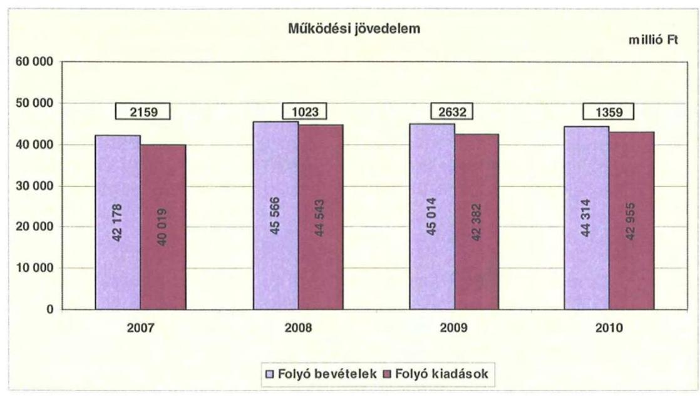

A folyó költségvetés egyenlege (a múködési forrástöbblet) 2007-ben a folyó kiadások 5,4\%-át ( 2159 millió Ft-ot), 2008-ban 2,3\%-át (1023 millió Ft-ot), 2009-ben 6,2\%-át ( 2632 millió Ft-ot), 2010-ben 3,2\%-át ( 1359 millió Ft-ot) jelentette. A vizsgált időszakban a múködési jövedelem 7173 millió Ft megtakarítást mutatott, amely forrásul szolgált az Önkormányzat fennálló tőketörlesztési kötelezettségeinek teljesítéséhez, valamint fejlesztéseinek finanszírozásához.

A pozitív előjelű folyó költségvetési egyenleg ellenére az Önkormányzat folyószámla, valamint 2007-2008-ban munkabérhitelt vett fel, egyrészt az átmeneti likviditási problémák kezelése, másrészt fejlesztési kiadásai finanszírozása miatt. A folyószámlahitel napi átlagos állománya 2007-2010 között 62,4\%-kal csökkent ( 109 millió Ft-ról 41 millió Ft-ra), az igénybe vett napok száma 50 napról 16 napra csökkent.

Az Önkormányzat kötelezettségein belül a 2007-2010 közötti időszakban a rövid lejáratú kötelezettségek állományának aránya csökkenő tendenciát mutatott, a 2007. évi 38,8\%-ről 2010-re 27,4\%-ra változott. Az Önkormányzat 2007. december 31-én fennálló pénz és tőkepiaci kötelezettsége 11356 millió Ft-ról közel két és félszeresére, 27513 millió Ft-ra nőtt a hosszú lejáratú hitelfelvételek és az elszámolt árfolyamváltozás miatt. Az összes kötelezettségen belül a hosz-

[^0]
[^0]:    ${ }^{33}$ A 2008-2010. években a Debreceni Agglomeráció Hulladékgazdálkodási Társulás bevételi főösszege a pénzmaradvány igénybevétele nélkül 2008-ban 8 millió Ft, 2009-ben 49 millió Ft, 2010-ben 63 millió Ft, kiadási főösszege 2008-ban 5 millió Ft, 2009-ben 37 millió Ft, 2010-ben 56 millió Ft volt.

---

szú lejáratú pénzintézeti kötelezettségek 2007-2010 között több mint kétszeresére (12 129 millió Ft-tal) nőttek.

A rövid lejáratú kötelezettségek 2010-ben 8741 millió Ft-ot tettek ki, amely 2042 millió Ft-tal (30,5\%) több a 2007. évi rövid lejáratú kötelezettségállománynál. Az Önkormányzat 2007-2010 év végén lejárt szállítói tartozásállománnyal nem rendelkezett.

Az Önkormányzat 2010. évi záró pénzkészlete 3466 millió Ft volt, amelynek $86,7 \%$-a kötelezettséggel terhelt.

Az Önkormányzat pénzügyi kapacitása 2008-ban pozitív, azonban 2007-ben és 2009-2010-ben negatív értéket mutatott. A nettó múködési jövedelem ${ }^{34}$ értéke a folyó költségvetési pozíció mellett az adott költségvetési év adósságtörlesztésének hatását is tükrözi. 2007-2010 között a 7173 millió Ft múködési jövedelemnek 118,5\%-át ( 8497 millió Ft) tette ki a tőketörlesztés és az értékpapírok beváltása, amelynek kifizetését követően negatív nettó múködési jövedelme keletkezett az Önkormányzatnak (1324 millió Ft).

A nettó működési jövedelem - évről évre eltérő nagyságrendű tőketörlesztés mellett - 2007-ben -94 millió Ft, 2008-ban 228 millió Ft, 2009-ben -189 millió Ft, 2010-ben -1269 millió Ft volt. A pénzügyi kapacitás 2008-hoz viszonyított romlását a tőketörlesztés összegének emelkedése okozta. A tőketörlesztés összege 2009-2010-ben több mint háromszorosa ( 2821 millió Ft, 2628 millió Ft) volt a 2008. évi 794 millió Ft-nak. Kötvény visszafizetésére került sor 2007-ben (1316 millió Ft) és 2009-ben (1184 millió Ft), összesen 2500 millió Ft értékben.

Az Önkormányzatnak (a CLF módszer alapján) a fejlesztési kiadások fedezete változatlan nettó múködési jövedelem képződése mellett - nem biztosított. Továbbá információul szolgál a jövőben vállalható teljesíthető adósságszolgálat mértékéről.
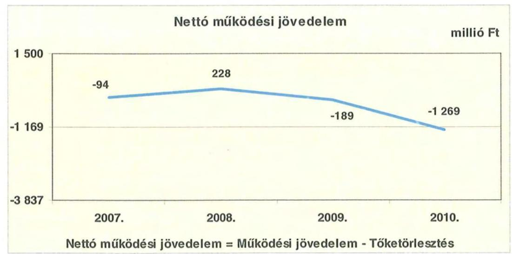

[^0]
[^0]:    ${ }^{34}$ pénzügyi kapacitás

---

# A 2007-2010. években az Önkormányzat felhalmozási költségvetésének egyenlege folyamatosan negatív összegű volt. 

A felhalmozási költségvetés egyenlegét évről évre a következő ábra szemlélteti:
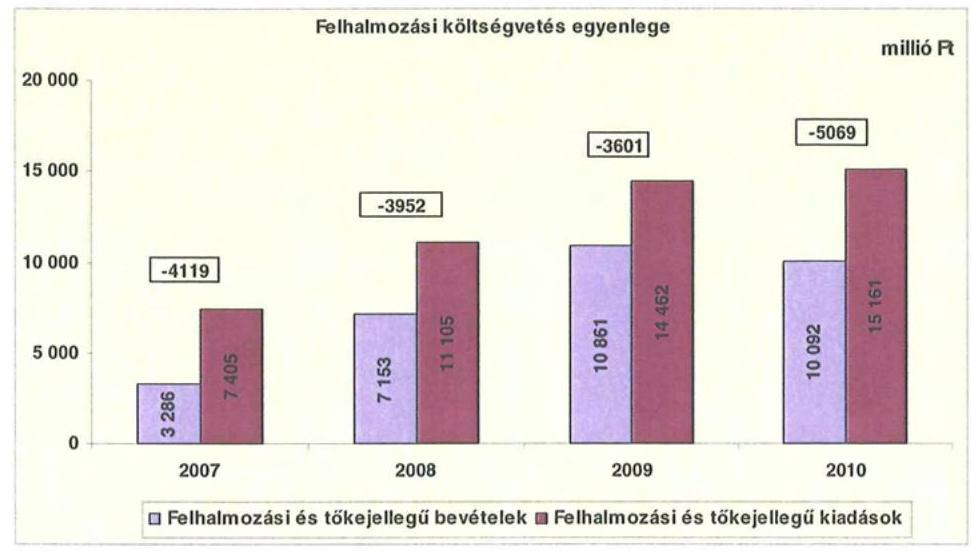

A felhalmozási forráshiánynak a felhalmozási és tőke jellegű kiadásokhoz viszonyított aránya 2007-ben 55,6\% (4119 millió Ft), 2008-ban 35,6\% (3952 millió Ft), 2009-ben 24,9\% (3601 millió Ft), 2010-ben 33,4\% (5069 millió Ft) volt.

A pénzügyi egyensúly fenntartása külső források bevonásával volt biztosítható. A 2007-2010. években 5997 millió Ft hitelt törlesztettek, továbbá 2500 millió Ft volt a kötvény beváltása miatt fizetendő kötelezettség. Az adósságszolgálat, továbbá a felhalmozási forráshiány 2007-2010. között 25238 millió Ft-ot tett ki, amelyre az időszakban képződő 7173 millió Ft működési megtakarítás (múködési jövedelem), valamint a 2007. január 1-jén rendelkezésre álló 5513 millió Ft pénzkészlet szolgált fedezetül. A további pénzeszközöket 17400 millió Ft hitel felvételével teremtették meg. Az Önkormányzat 2007-2010. év végén folyószámlahitellel nem rendelkezett.

Az Önkormányzat 2011. évi költségvetési rendeletében - a hagyományos költségvetési szerkezetben - tervezett bevételeinek és kiadásainak különbözete 4825 millió Ft finanszírozási igényt mutat, melyet részben finanszírozhat a 2010. évi 3466 millió Ft záró pénzkészlet. A pénzügyi egyensúly megteremtése további külső források igénybevételét (hitelek felvételét vagy kötvény kibocsátását) igényli.

Az Önkormányzat évenkénti teljes finanszírozási igénye ${ }^{35}$ a CLF módszer szerint 2007-ben 4212 millió Ft, 2008-ban 3724 millió Ft, 2009-ben 3790 millió Ft, 2010-ben 6338 millió Ft volt, amelynek finanszírozását a finanszírozási célú bevételek és kiadások egyenlege, valamint az előző évek pénzmaradványának igénybevétele biztosította.

[^0]
[^0]:    ${ }^{35}$ a nettó múködési jövedelem és a beruházási költségvetés eredője

---

Az Önkormányzat finanszírozási műveletei 2007-2010. évekbeli egyenlegének alakulását a következő ábra szemlélteti:
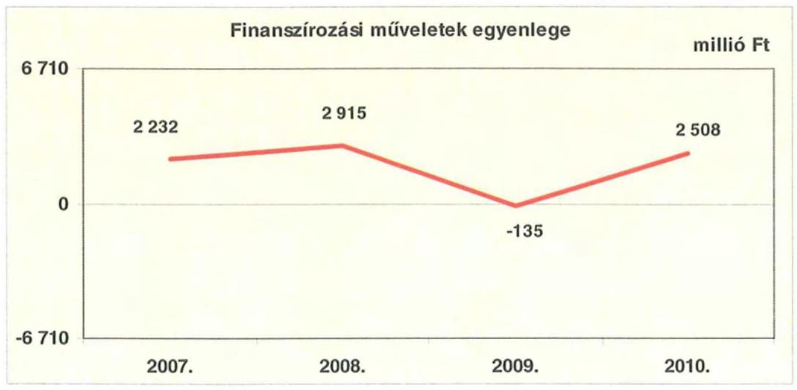

A finanszírozási célú műveleteket a vizsgált időszakban a jelentés 2. számú mellékletének 4.1-4.8 pontjai részletezik.

Az Önkormányzat zárszámadási rendeletében a múködési és fejlesztési hiányt a hagyományos költségvetési szerkezet alapján mutatta be ${ }^{36}$, amelyről a jelentés 1. számú melléklete nyújt tájékoztatást.

A vizsgált időszakban a kötelezettségek (passzív pénzügyi elszámolások nélkül) 17274 millió Ft-ról 31923 millió Ft-ra emelkedtek, amely együtt járt a kamatkiadások növekedésével.

A 2007-2010 között az Önkormányzat összesen 1677 millió Ft kamatot fizetett meg. Az átmenetileg szabad pénzeszközein realizált kamatbevétel, a teljes kamatráfordítás 50,5\%-ának ( 848 millió Ft) megfelelő összeget tett ki. A 2009. évben a kamatkiadás átmenetileg csökkent, a folyószámlahitel napi átlagos állományának ( 46 millió Ft-ról 32 millió Ft-ra) csökkenése és kötvény visszaváltása miatt.

[^0]
[^0]:    ${ }^{36}$ Nincs kötelező előírás a működési és fejlesztési hiány megállapításának módjára.

---

Az Önkormányzat kamatbevételeinek és kamatkiadásainak alakulását a következő ábra mutatja:
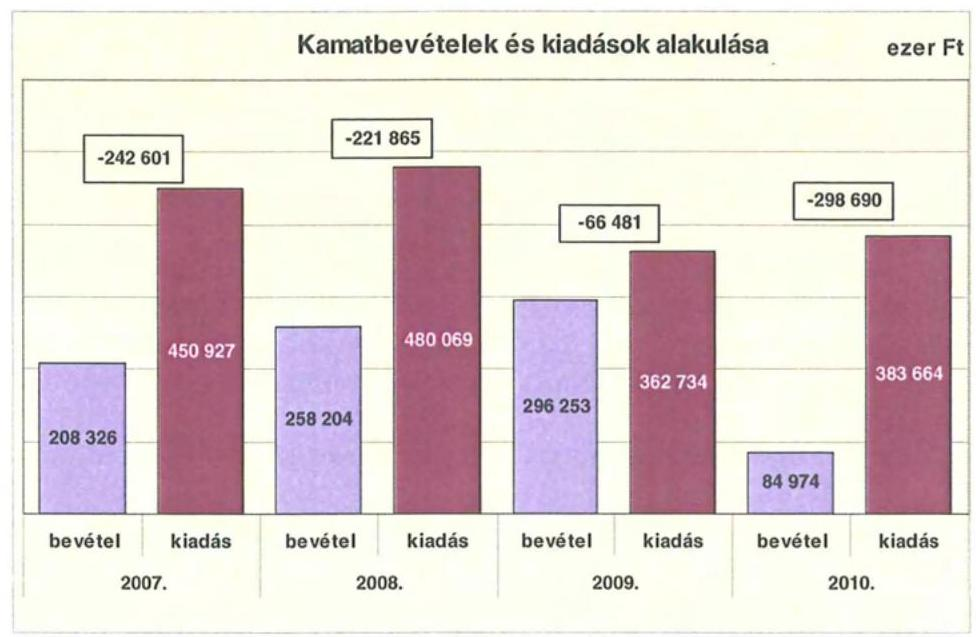

A 2011. évre az Önkormányzat a kamatkiadások további emelkedésével kalkulál, a költségvetési rendeletben tervezett 431 millió Ft kamatráfordítás 12,2\%-kal, 47 millió Ft-tal haladhatja meg a 2010. évi teljesítést.

# 2.2. Az Önkormányzat bevételeinek alakulása 

Az összes folyó bevétel 2007-ről 2010-re 2136 millió Ft-tal (5,1\%-kal) emelkedett. A 2007. évi 42178 millió Ft-ról 2008-ra 45566 millió Ft-ra nőtt ( 3388 millió Ft 8,0\%), majd ezt követően folyamatosan mérséklődött, 2010-ben 44314 millió Ft volt. Az Önkormányzat 2007-2010 között realizált főbb bevételi jogcímeinek számszaki adatait az alábbi grafikon mutatja be:
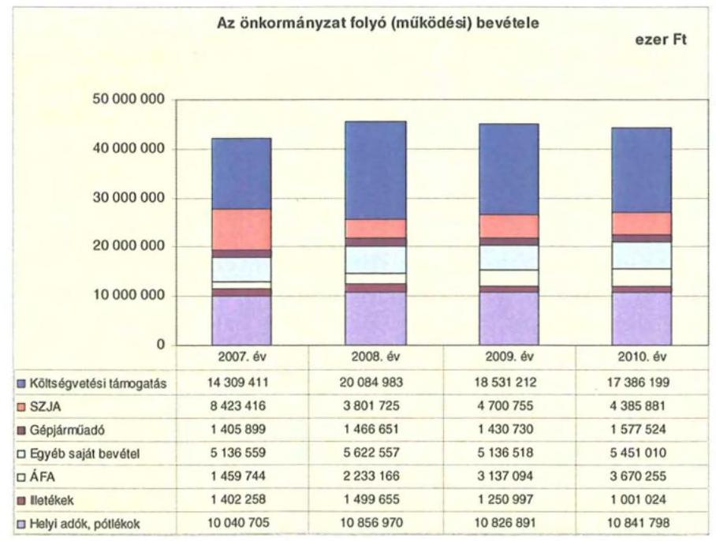

---

Az Önkormányzat költségvetési támogatásai - melyek múködési támogatások voltak - a 2007. évi 14309 millió Ft-ról 2008-ra 20085 millió Ft-ra, 40,4\%-kal nőttek, mivel 2008-tól nem az átengedett szja-ból, hanem költségvetési támogatásból finanszírozzák a teljes normatív állami hozzájárulást. A költségvetési támogatás összege 2008-ról 2009-re 18531 millió Ft-ra, 2010-re 17386 millió Ft-ra csökkent a központi támogatáselosztás változása, illetve az ellátotti létszám csökkenése következtében.

Az átengedett szja összege a 2007. évről a 2008. évre 54,9\%-kal, 4621 millió Ft-tal csökkent, mivel 2008-tól a költségvetési törvény alapján nem az átengedett szja-ból finanszírozták a tűzoltóság által ellátott feladatokat és a korábbi években szja-ból finanszírozott normatív hozzájárulásokat. Az Önkormányzat az előző évihez képest 2009-ben 23,6\%-kal (899 millió Ft-tal) többet, 2010-ben $6,7 \%$-kal ( 315 millió Ft-tal) kevesebb átengedett szja-t kapott.

Az átengedett szja és az állami támogatások együttes összege a 2007. évi 22733 millió Ft-ról a 2010. évre 21772 millió Ft-ra, 4,2\%-kal ( 961 millió Ft-tal) csökkent. A vizsgált években - a 2008. évi emelkedést követően - folyamatosan mérséklődött. Az előző évihez képest 2009-ben 2,7\%-kal ( 655 millió Ft-tal), 2010-ben 6,3\%-kal (1460 millió Ft-tal) kapott kevesebb forrást az Önkormányzat az államtól ezeken a jogcímeken. A változást a Polgármesteri hivatalban a hatósági feladatok növekedése, valamint az ellátotti létszám 4198 fővel ( $8,9 \%$ kal) történő csökkenése idézte elő.

A gépjármúadó alapját, mértékét és egyes mentességi kategóriákat érintő módosítások 2010. január 1-jétől következtek be, ennek hatására a gépjárműadó bevétel a 2007. évi 1406 millió Ft-ról 2010-re 12,2\%-kal 1578 millió Ft-ra emelkedett.

Az Önkormányzat egyéb saját bevételeinek nagyságrendje változóan alakult, a 2008. évben 9,5\%-kal (486 millió Ft-tal) emelkedett, a 2009. évben $8,6 \%$-kal ( 486 millió Ft-tal) csökkent, a 2010. évben 6,3\%-kal ( 324 millió Ft-tal) nőtt az előző évhez viszonyítva. Az egyéb saját bevételek alakulásában meghatározó szerepet játszott az intézmények működési bevételeinek alakulása.

Az Önkormányzatnál az áfa bevétel a 2010. évben a 2007. évhez képest a beruházási kiadások emelkedése miatt jelentősen két és félszeresére ( 2210 millió Ft-tal) nőtt. Az áfa befizetéséből ${ }^{37}$ származó bevételek realizált összege a vizsgált időszakban folyamatosan emelkedett, 2010-ben 3670 millió Ft-ot tett ki. Az áfa részesedése az Önkormányzat saját folyó bevételein belül 2007-2010 között 4,8 százalékponttal nőtt, 2010-ben 8,3\%-ot tett ki.

Az Önkormányzatnál az illetékbevétel a 2010. évben a 2007. évhez képest jelentősen, $28,6 \%$-kal ( 401 millió Ft-tal) csökkent. Az illetékekből származó bevételek realizált összege 2007-2008 között 1402 millió Ft-ról 1500 millió Ft-ra emelkedett, majd a gazdasági visszaesés hatásai következtében folyamatosan, 2010-re 1001 millió Ft-ra esett vissza. Az illetékek részesedése az Önkormányzat

[^0]
[^0]:    ${ }^{37}$ A növekedésben szerepet játszott a fordított áfa elszámolása is, amely mind a bevételi, mind a kiadási oldalon megjelent.

---

saját folyó bevételein belül 2007-2010 között 1,0 százalékponttal csökkent, 2010-ben $2,3 \%$-ot tett ki.

Az Önkormányzat saját folyó bevételeinek keretében elszámolt különböző jogcímeken kivetett helyi adóbevételei - iparűzési adó, építményadó, idegenforgalmi adó, vállalkozók kommunális adója - 2007-2010 között eltérő módon emelkedtek. A helyi adókból származó bevételek emelkedő tendenciát mutatnak, a 2010-ben a 2007. évhez képest $8,0 \%$-kal ( 801 millió Ft-tal) növekedtek. A befolyt helyi adó az előző évhez képest 2008-ban 816 millió Ft-tal ( $8,1 \%$-kal) emelkedett, 2009-2010-ben érdemben alig változott. A helyi adók részesedése az Önkormányzat saját folyó bevételein belül 2007-2010 között 0,7 százalékponttal nőtt, 2010-ben $24,5 \%$-ot ( 10842 millió Ft -ot) tett ki.

A helyi adók mértéke 2007-2010 között nem változott, közülük meghatározó az iparűzési adó, melynek mértéke $2 \%$, aránya a helyi adókon belül 2010-ben 79,9\% ( 8660 millió Ft) volt. Az iparűzési adóerő képesség 2007-ben 6015 millió Ft, 2008-ban 5870 millió Ft, 2009-ben 6649 millió Ft és 2010-ben 6571 millió Ft, az ebből számított személyi jövedelemadó kiegészítés 2007-ben 338 millió Ft, 2008-ban 1291 millió Ft, 2009-ben 852 millió Ft és 2010-ben 1275 millió Ft volt.

Az adózók száma a vizsgált időszakban minden adónemnél folyamatosan emelkedett, a 2007. évi 75753 fơről 2010-re 81710 főre változott. A növekedés az építményadónál 9,7\% (28 426 adózóról 31184 adózóra), a vállalkozók kommunális adójánál 1,9\% (24 227 adózóról 24689 adózóra), az idegenforgalmi adónál 31,9\% ( 72 adózóról 95 adózóra) és az iparűzési adónál 4,0\% (24743 adózóról 25742 adózóra) volt. A behajtási és az ellenőrzési tevékenység együttes eredményeként 2007-2010 között 914 millió Ft helyi adóhoz kapcsolódó pótlék, bírság, egyéb sajátos bevétel folyt be az Önkormányzat költségvetésébe.

Az Önkormányzat részesedései és részvényei után 1280 millió Ft bevételt realizált 2007-2010 között. A 2007. évben 578 millió Ft osztalék és hozambevétel folyt be, melyből nem az Önkormányzat többségi tulajdonában lévő gazdasági társaságoktól 78 millió Ft osztalékot ${ }^{38}$ kapott. Az Önkormányzatnak a DV Zrt-től 2007-ben és 2008-ban 500-500 millió Ft osztalékbevétele származott, míg 2010-ben a DVSC Futballszervező Zrt. 202 millió Ft-ot fizetett be. Az Önkormányzat osztalékról nem mondott le.

Az Önkormányzat gazdasági társaságai a közszolgáltatási feladataik ellátása során jelentős árbevételt értek el, segitve ezzel a pénzügyi egyensúly, valamint a feladatellátás magas színvonalú biztosítását. Azon gazdasági társaságok árbevétele, melyekben az Önkormányzatnak tulajdona van - az adatszolgáltatásuk szerint - a vizsgált években folyamatosan növekedett, a 2007. évi 30849 millió Ft-ról 2008-ra 35387 millió Ft-ra (14,7\%), 2009-re 39779 millió Ft-ra (12,4\%) és 2010-re 45572 millió Ft-ra (14,6\%) változott. 2007-2010 között az árbevétel növekedése $47,7 \%$ volt, mely közel kétszerese az Önkormányzat működési célú pénzeszközátadás növekedési arányának (25,5\%). Meghatározó volt az Önkormányzat kizárólagos tulajdoni hányadú gazdasági társasá-

[^0]
[^0]:    ${ }^{38}$ Az osztalék az OTP Bank Rt-től, a Borsodi Sörgyár Rt-től, az Alföldi Nyomda Rt-től, valamint a Debmut Rt-től érkezett.

---

goknál képződött árbevétel, mely 2007-ben 80,6\%-át, 2008-ban 78,7\%-át, 2009-ben 73,0\%-át és 2010-ben 70,7\%-át adta az éves árbevételnek. Az éves árbevételek növekedését, valamint az Önkormányzat kizárólagos tulajdoni hányadú gazdasági társaságok árbevétel arányának csökkenését befolyásolta, hogy a 2009-ben létrehozott az Önkormányzat 50\%-os tulajdonában lévő Egészségügyi Holding Zrt. és leányvállalatainak bevétele 2009-ben 3386 millió Ft és 2010-ben 5380 millió Ft volt.

A DKV Zrt. árbevétele az előző évhez képest a 2009. évi feladatbővülés következtében 2009-ben háromszorosára, 2010-ben 64,1\%-kal emelkedett. A vizsgált időszakban a társaság összes árbevétele 2007-ben 1561 millió Ft, 2008-ban 1690 millió Ft, 2009-ben 5220 millió Ft és 2010-ben 8565 millió Ft volt, az Önkormányzat által biztosított működési célú pénzeszközátadás ${ }^{39}$ 2007-ben 13,7\%-a, 2008-ban 11,4\%-a, 2009-ben 6,3\%-a és 2010-ben 4,7\%-a lett az éves árbevételnek. A DKV Zrt. látta el 2007-2010 között a parkolók üzemeltetését is, a közterületi parkolási díj bevételét a jogszabályi előírás alapján 2010-től (141 millió Ft) átengedte az Önkormányzatnak.

Az Önkormányzat egészségügyi intézményt nem tartott fenn, költségvetéseiben OEP bevétel nem szerepelt.

Az Önkormányzat felhalmozási bevételei a vizsgált időszakban a következők voltak:

|  |  |  |  | ezer Ft |
| :-- | --: | --: | --: | --: |
| Megnevezés | 2007. év   tény | 2008. év   tény | 2009. év   tény | 2010. év   tény |
| Tárgyi eszköz értékesítés | 510530 | 3960150 | 608642 | 1601375 |
| Egyéb saját tőkebevétel | 344748 | 220503 | 77012 | 90313 |
| Államháztartáson belülről   kapott támogatás | 2028507 | 2517956 | 9420332 | 8211836 |
| EU-tól és külföldről kapott   támogatások | 13757 | 0 | 17308 | 0 |
| Államháztartáson kívülről   kapott támogatás | 388242 | 454218 | 737512 | 188209 |
| Összes felhalmozási bevétel | 3285784 | 7152827 | 10860806 | 10091733 |

Az Önkormányzatnak a vizsgált időszakban ingatlanok, földterületek, értékesítéséből számottevő bevétele ( 6681 millió Ft) keletkezett ${ }^{40}$.

[^0]
[^0]:    ${ }^{39}$ A DKV Zrt. fenntartói múködési támogatása 2007-2010 között 214-192-330-402 millió Ft volt.
    ${ }^{40}$ Az Önkormányzat értékesítette 2007-ben a Debrecen, Péterfia u. 25. szám alatti irodaház ( 229 millió Ft) ingatlanát, 2008-ban a Füvészkert u. 4. szám alatt található irodaházat ( 260 millió Ft), valamint 2010-ben a Vágóhíd úton található sporttelepet ( 412 millió Ft) és a Mikepércsi úti telket és épületet ( 739 millió Ft). 2011-ben pedig 3887 millió Ft bevételt terveztek ingatlanok eladásából.

---

Az egyéb saját tőkebevételek között szerepel részvény, üzletrész értékesítéséből származó bevétel, mely 2007-ben 243 millió Ft, 2008-ban 120 millió Ft és 2010ben 26 millió Ft volt. Az Önkormányzati vagyon bérbeadásából származó bevétel 2007-2010 között 2007-ben 535 millió Ft-ot, 2008-ban 659 millió Ft-ot, 2009-ben 624 millió Ft-ot, 2010-ben 738 millió Ft-ot tett ki. Osztalék és hozambevétel teljesítése 2007-ben 578 millió Ft, 2008-ban 500 millió Ft és 2010-ben 202 millió Ft volt.

Az Önkormányzat a Debrecen iparterületi útjainak út- és közműfejlesztése (2007-2008 között 1042 millió Ft), a Debreceni Repülőtér területén a földtani közeg és a felszín alatti víz kármentesítése (2007-ben 818 millió Ft), a Debrecen város és térsége szennyvízelvezetése és tisztítása (20 362 millió Ft), valamint a hulladékgazdálkodási rendszer 1508 millió Ft beruházása kapcsán kapott ál-lami- és EU-s támogatást, melynek megvalósítása és pénzügyi rendezése a 2007-2010. éveket érintette. Az intézmények egyéb felhalmozási bevételei a feladatellátás feltételeit biztosító ingatlanok felújításokhoz, fejlesztéseihez kapcsolódtak.

# 2.3. Az Önkormányzat kiadásainak alakulása 

Az Önkormányzat múködési kiadásai főbb jogcímek szerinti bontásban az alábbiak voltak:

|  |  |  |  |  |
| :-- | --: | --: | --: | --: |
| Megnevezés | 2007. | 2008. | 2009. | 2010. |
| Folyó kiadások | 40018922 | 44543059 | 42381708 | 42954275 |
| Múködési kiadások (kamatkiadás nélkül) | 33339097 | 36877928 | 34441426 | 35270022 |
| Államháztartáson belülre átadott   pénzeszközök | 37046 | 71124 | 129972 | 164959 |
| Transzferkiadások | 5871684 | 6669112 | 6845507 | 6604738 |
| -ebből: vállalkozásoknak | 3323093 | 3927041 | 3777674 | 3147239 |
| EU-nak, illetve külföldre | 340 | 895 | 0 | 0 |
| magánszemélyeknek | 2222726 | 2462609 | 2844558 | 3317357 |
| nonprofit szervezeteknek | 325525 | 278567 | 223275 | 140142 |
| Kamatkiadások | 450927 | 480068 | 362734 | 383664 |
| Előző évi pénzmaradvány átadás | 320168 | 444827 | 602069 | 530892 |

Az Önkormányzat múködési kiadásai 2007. december 31-ről 2010. december 31-re 5,8\%-kal növekedtek ( 33339 millió Ft-ról 35270 millió Ft-ra). Az Önkormányzat 2010-ben a múködési költségvetés 59,7\%-át (21 069 millió Ft) személyi juttatásokra és a munkaadókat terhelő járulékokra fordította, az üzemeltetést, intézményfenntartást biztosító dologi kiadásokra 35,7\% (12 590 millió Ft) jutott. A múködési kiadásokon belül a személyi juttatások és járulékok aránya a vizsgált időszakban folyamatosan csökkent, 2007-ben 69,7\%, 2008ban $65,4 \%, 2009$-ben $64,0 \%$ és 2010 -ben $59,7 \%$ volt.

|  |  |  |  |  |
| :-- | --: | --: | --: | --: |
| Megnevezés | 2007. | 2008. | 2009. | 2010. |
| Személyi juttatások | 17473797 | 18147600 | 16764355 | 16593269 |
| Munkaadót terhelő járulékok | 5756784 | 5978742 | 5264987 | 4475442 |
| Dologi kiadások | 9760039 | 10786960 | 11976559 | 12590144 |
| Egyéb folyó kiadások | 267681 | 233412 | 253527 | 414120 |
| Múködési célú pénzeszközátadás | 3418890 | 3632068 | 3570516 | 3190031 |

---

A személyi juttatások 2008-ban 3,9\%-kal (674 millió Ft-tal) emelkedtek az előző évhez képest a Polgármesteri hivatalban kezelt hatósági feladatok növekedése miatt, azonban ezt követően minden évben mérséklődtek a létszámcsökkentések eredményeként. A 2010. évben a 2007. évi teljesített kiadásoknál 5,0\%-kal (881 millió Ft-tal) voltak alacsonyabbak, és 2011-re további 11,7\%-os (1940 millió Ft) csökkenést terveznek.

A munkaadókat terhelő járulékok 2010. évi összege 1281 millió Ft-tal, 22,3\%-kal marad el a 2007. évi szinttől, amelyben a létszámleépítések, továbbá 2009. évtől a foglalkoztatókat terhelő társadalombiztosítási járulék mérték csökkenés, illetve tételes egészségügyi hozzájárulás megszűnés hatása együttesen jelenik meg.

A dologi kiadások az Önkormányzatnál 2010-ben a 2007. évi szintnél 2830 millió Ft-tal 29,0\%-kal voltak magasabbak. A 2010. év kivételével minden évben az inflációt meghaladó mértékben - 2008. évben 1027 millió Ft-tal, 10,5\%kal, a 2009. évben 1190 millió Ft-tal 11,0\%-kal - nőttek a dologi kiadások. Fedezetét az Önkormányzatnak a végrehajtott kiadáscsökkentő intézkedések jelentették.

A múködési célú pénzeszközátadások nagysága 2007-ről 2008-ra 3419 millió Ft-ról 3632 millió Ft-ra 6,2\%-kal emelkedett. 2009-2010-ben a bevételek visszaesése miatt a működési célra átadott pénzeszközök az előző évhez képest 2009-ben 1,7\%-kal (61 millió Ft-tal), 2010-ben 10,7\%-kal (381 millió Ft-tal) csökkentek a Közgyűlés intézkedései nyomán.

A gazdasági társaságok részére átadott pénzeszközöket a következő grafikon mutatja be.
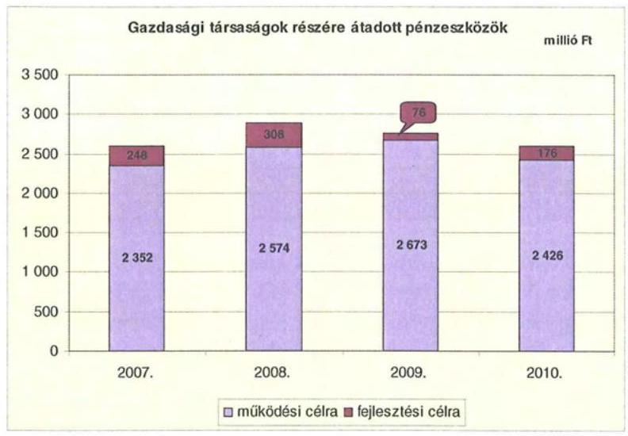

A gazdasági társaságok adatszolgáltatása szerint az Önkormányzat feladatellátásában résztvevő gazdasági társaságok részére nyújtott müködési célú pénzeszközátadás a 2007-2009. évek között folyamatosan növekedett, a 2007. évi 2352 millió Ft-ról 2008-ra 2574 millió Ft-ra (9,4\%), 2009-re 2673 millió Ft-ra (3,8\%), azonban 2010-re 2426 millió Ft-ra (9,2\%) csökkent. A 2010. évben a 2007. évi teljesített támogatásoknál a gazdasági társaságoknak adott működési célú pénzeszközátadások 3,1\%-kal (74 millió Ft-tal) voltak magasab-

---

bak. Meghatározó, arányában pedig növekvő volt az Önkormányzat kizárólagos tulajdoni hányadú gazdasági társaságoknak biztosított hozzájárulás, mely 2007-ben 83,0\%-át, 2008-ban 84,0\%-át, 2009-ben 89,7\%-át és 2010-ben 97,9\%át adta az éves támogatásnak. A felhalmozási célú támogatásokat minden évben az Önkormányzat kizárólagos tulajdoni hányadú gazdasági társaságainak nyújtották.

A felhalmozási kiadások nagyságában és arányának változásában 2007-2010 között növekvő tendencia figyelhető meg, a felhalmozási kiadások összege 7405 millió Ft-ról 15160 millió Ft-ra, a felhalmozási kiadások aránya 15,3\%ról $26,1 \%$-ra emelkedett. A kiadások összetételének változását (a múködési és fejlesztési célú kamatkiadásokat is figyelembe véve) a következők grafikon szemlélteti:
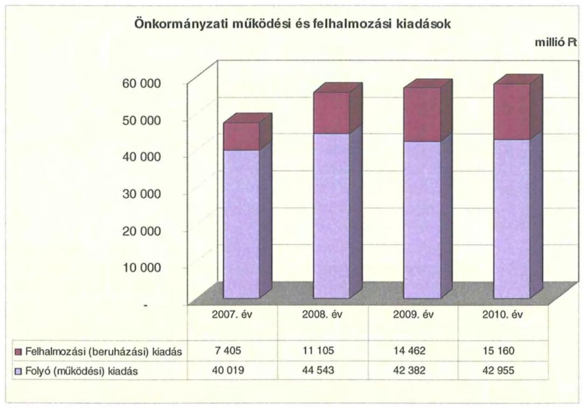

A befejezett 10 millió Ft teljes bekerülési költség feletti beruházások és felújítások száma 2007-2010. évek között 46 volt, a 10 millió Ft alatti hat fejlesztéssel együtt - amelynek összértéke 25 millió Ft-ot tett ki - 3913 millió Ft-ot fordítottak a pályázati támogatásokkal együtt fejlesztések finanszírozására. Mindegyik fejlesztési cél pályázati források felhasználásával valósult meg, melyből 11 EU-s projekt volt. A 6431 millió Ft beruházási összköltségből a hazai támogatás $24,1 \%$-ot ( 1552 millió Ft), az EU támogatás $51,1 \%$-ot ( 3289 millió Ft), a felvett hitel 19,0\%-ot ( 1219 millió Ft), a saját erő 5,8\%-ot ( 371 millió Ft) tett ki. Az EU-s támogatásból megvalósult fejlesztések finanszírozása likviditási gondot nem okozott, mivel a közremúködő szervezet közvetlenül a beruházók részére utalta a pályázaton elnyert összegeket.

Az Önkormányzat 2007-2010 között megvalósított, illetve folyamatban lévő beruházásait, pályázatait, azok forrásösszetételét a 3/a-3/d. számú mellékletek mutatják be.

---

A vizsgált időszakban befejeződött három legjelentősebb fejlesztés a következő volt:

- A Debreceni Repülőtér területén a földtani közeg és a felszín alatti víz kármentesítése 2006-ban kezdődött és 2008-ban fejeződött be. A 818 millió Ft bekerülési költségből 613 millió Ft EU-s támogatás, 205 millió Ft hazai támogatás volt;
- A 2006-ban kezdődött Debrecen ipar területi útjainak út- és közmúfejlesztése 2007-ben fejeződött be. A 1086 millió Ft teljes bekerülési költségből a felvett hitel 44 millió Ft-ot (4,0\%), az EU-s támogatás 814 millió Ft-ot (75\%), valamint a hazai támogatás 228 millió Ft-ot ( $21,0 \%$ ) tett ki;
- A Hajdú-Bihar Megyei Szelektív Hulladékgyűjtési és Regionális Hulladékgazdálkodási Rendszer 2003-2010 között 1881 millió Ft teljes bekerülési költség mellet valósult meg. A bekerülési költséghez 372 millió Ft felvett hitel (19,8\%), 1151 millió Ft EU-s támogatás ( $61,2 \%$ ), valamint 358 millió Ft hazai támogatás ( $19,0 \%$ )) kapcsolódott.

Folyamatban lévő 12 beruházás teljes bekerülési költsége 46897 millió Ft, ebből a Debrecen Város és térsége szennyvízelvezetése és tisztítása 49,9\%-ot (23 393 millió Ft), Debrecen városi villamoshálózat fejlesztése 37,5\%-ot (17 569 millió Ft) és a Debrecen belváros funkcióbővítő városrehabilitációja 4,1\%-ot (1914 millió Ft) képvisel. A 2010. év után esedékes 23916 millió Ft-os kötelezettség forrása $77,1 \%$ (18 432 millió Ft) EU-s támogatás, 13,0\% (3119 millió Ft) hazai támogatás és $9,9 \%$ ( 2365 millió Ft) hitel.

Az Önkormányzat fejlesztési tevékenysége a pályázati lehetőségek által nagyban befolyásolt, mivel a jelentkező nettó múködési forráshiány és saját felhalmozási bevételei alacsony szintje miatt beruházásokat csak külső források, uniós és hazai támogatások elnyerése esetén tud megvalósítani. A felhalmozási kiadások önrészének forrásait is felhalmozási célú hitelekből finanszírozta.

Az Önkormányzat Konzorciumi Együttmúködési Megállapodást kötött a Debrecen városi villamoshálózat fejlesztésére a DKV Zrt-vel, a kerékpárút építésére Mikepércs Község Önkormányzatával és a Debrecen belváros funkcióbővítő város rehabilitációjára. Együttmúködési Megállapodás megkötésére került sor a szennyvízelvezetési projektben négy önkormányzattal, a hulladékgazdálkodási projekt esetében a Bihari Szilárd Hulladéklerakó és Hasznosító Társulással, valamint a Hajdúsági Szilárd Hulladéklerakó és Hasznosító Társulással. Az Önkormányzat költségvetési beszámolói csak az Önkormányzatot érintő bevételek és kiadások teljesítési adatait tartalmazzák.

# 3. KÖTELEZETTSÉGEK BEMUTATÁSA 

### 3.1. A pénzintézetek felé fennálló kötelezettségek alakulása

Az Önkormányzat pénzintézeti kötelezettségeinek állománya 2006. december 31-től 2010. december 31-ig 3,3 szorosára nőtt 8252 millió Ft-ról 27512 millió Ft-ra. A fennálló pénzintézeti kötelezettségei hosszú- és rövid lejáratú hitelek igénybevételéből keletkeztek.

---

Az Önkormányzat pénzintézetekkel szemben fennálló kötelezettség állományát a 2007-2010. években az alábbi diagram ábra szemlélteti ${ }^{41}$ :
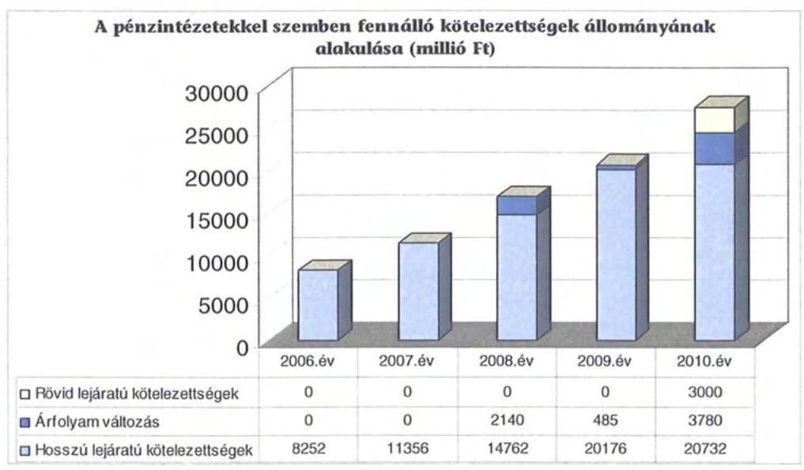

Az árfolyamváltozás hatása is befolyásolja a kötelezettségek alakulását, azonban annak mértéke előre pontosan nem határozható meg, csak várakozásokon alapuló tendenciák jelezhetők. Annak megítéléséről, hogy a devizában felvett hitelekért kapott forinthoz képest a hitelek visszafizetésekor jelentkező forint kötelezettség többletkiadást (árfolyamveszteség) vagy megtakarítást (árfolyamnyereség) eredményez a futamidő végén, a teljes kötelezettség rendezését követően lehet képet alkotni. Mindaddig, amíg törlesztési kötelezettség nem áll fenn (türelmi idő, moratórium), a tőkére vonatkoztatva nem értelmezhető sem az árfolyamveszteség, sem az árfolyamnyereség. Ugyanakkor a Számv. tv. 60. § (4) bekezdése meghatározza, hogy az árfolyam különbözetet év végén a kötelezettségek vagy követelések között a könyvviteli mérlegben nyilván kell tartani, azonban az árfolyam különbözet valójában nem realizált.

Az Önkormányzat pénzintézeti kötelezettségvállalásaira minden esetben közgyűlési döntés alapján került sor. A kötelezettségvállalásból származó források felhasználási céljait meghatározták. A közgyűlési előterjesztések tartalmazták a pénzintézeti kötelezettségvállalások visszafizetési forrásait, a teljes futamidő várható kamat és tőkefizetési kötelezettségeit, hivatkoztak az évente elkészített költségvetési koncepcióban bemutatott adósságszolgálati korlátra, azonban az árfolyam- és a kamatkockázatokat nem mutatták be.

A közbenső egyeztetés során a polgármester által tett észrevétel szerint: „a 2011. évi költségvetési előterjesztés 6. oldala tartalmazta a kamat és árfolyamkockázat bemutatását a hitelről szóló döntéseknél."

Az észrevétel nem megalapozott, az észrevételben tett hivatkozás téves. A 2011. évi költségvetési előterjesztés 16. oldala tartalmazta az Önkormányzat által fel-

[^0]
[^0]:    ${ }^{41}$ A diagramban mind a rövid, mind a hosszú lejáratú kötelezettségek mérlegértékét csökkentettük az árfolyamváltozás összegével.

---

vett hitelek árfolyamváltozásának 2010-ig történő elemzését, azonban nem mutatta be a teljes futamidőre az árfolyam és kamat kockázatot. Ugyanakkor az előterjesztő felhívta a figyelmet arra, hogy folyamatosan figyelni kell az árfolyamok és a kamatok alakulását, s amennyiben indokolt az átváltás lehetőségével élniük kell.

A hitelfelvételekhez kapcsolódó előterjesztésekben az adósságszolgálati korlátot bemutatták, a Közgyűlés ennek figyelembevételével döntött.

A 24/2006. (II. 16.) számú közgyűlési határozat tartalmazta a 2006. évre jóváhagyott 4600 millió Ft 10 éves futamidejú a költségvetésben betervezett fejlesztési hitel felvételét.

A 15/2007. (II. 15.) számú közgyűlési határozat rögzítette a 2007. évre jóváhagyott 4500 millió Ft 10 éves futamidejú fejlesztési hitel felvételét a költségvetésben betervezett beruházásokhoz.

A 23/2008. (II. 21.) számú közgyűlési határozat tartalmazta az Önkormányzat költségvetési rendeletében 2008. évre jóváhagyott 2800 millió Ft - legalább 2, legfeljebb 4 éves türelmi idővel 10 éves törlesztési futamidővel - felveendő fejlesztési hitel felvételét a költségvetésben betervezett beruházásokhoz. A Közgyűlés a 245/2008. (IX. 25.) számú határozatával döntött az AIRPORT-Debrecen Kft. 100\%-os üzletrészének megvásárlása miatt a 2008. évre jóváhagyott hitelen felül további 1,4 millió Ft (azaz 2008. évre összesen 4,2 millió Ft) - legalább 2, legfeljebb 4 éves türelmi idővel, 10 éves törlesztési idővel (futamidővel) - hitel felvételéről.

A Közgyűlés 200/2009. (IX. 24.) határozata alapján felkérte a polgármestert az Önkormányzat 2009. évi költségvetési rendeletének 4. § (2) bekezdésében meghatározott legfeljebb 3000 millió Ft összeghatárig történő fejlesztési hitel felvételére a hitel 4 éves türelmi idővel és ezt követően 10 éves törlesztési idő figyelembe vételével.

A Közgyűlés 2/2010. (I. 14.) számú határozatával döntött az Önkormányzat 2010. évi költségvetési rendeletében jóváhagyott 2700 millió Ft elsősorban MFB vagy egyéb refinanszírozású kedvezményes kamatfelárú fejlesztési hitel felvételéről.

Az Önkormányzat az adósságot keletkeztető kötelezettségvállalásának felső határát a 2007-2010. években betartotta. A 2011. évben tervszinten csupán 152 millió Ft-tal marad belül a kötelezettségvállalás felső határán, mivel az adósságot keletkeztető éves kötelezettségvállalás felső határa ${ }^{42}$ 2011. évre 5152 millió Ft. Az adósságot keletkeztető kötelezettségvállalással megvalósított felhalmozási kiadás esetleges bevételnövelő, illetve kiadáscsökkentő vonzatát, illetve ennek a fejlesztéshez, felújításhoz vállalt kötelezettségek visszafizetési forrásként való számbavételét nem vizsgálták.

A hitelfelvételeket megelőzően a pénzintézetek közötti versenyeztetés biztosított volt, alkalmazták a közbeszerzési törvény előírásait. A felhíváso-

[^0]
[^0]:    ${ }^{42}$ A hosszú lejáratú hitelek tekintetében az évente fizetett tőke és kamat együttes összege az előzetes számítások alapján 2014. évben lesz a legmagasabb összesen 3455 millió Ft, mely feszültséget okozhat az adósságot keletkeztető kötelezettségvállalás felső határának betartása tekintetében.

---

kat, az eljárások eredményeit tartalmazó hirdetmények az Európai Unió Hivatalos Lapjának Kiegészítő kiadványában szerepeltek.

Az Önkormányzat 2010. december 31-én CHF-ben fennálló hosszú lejáratú hitelekhez kapcsolódó adósságot keletkeztető kötelezettségvállalásai az alábbiak voltak:

| Megnevezés | Szexzödéskötés   idöpontja | Összeg   CHF | Lehivási árfolyam   Ft | Kamat (referencia   kamat+ kamatfelár) | Felhasználás célja: |
| :-- | :--: | :--: | :--: | :--: | :-- |
| Hosszú lejáratú hitel | 2006.07 .24 | 19209086 CHF | 174,16 | 3 havi CHF LIBOR $=0,36 \%$ | beruházásokhoz kapcsolódó   fivonczérozás |
| Hosszú lejáratú hitel | 2007.08 .16 | 24884869 CHF | 158,78 | 3 havi CHF LIBOR $=0,35 \%$ | beruházásokhoz kapcsolódó   fivonczérozás |
| Hosszú lejáratú hitel | 2008.08 .27 | 26844126 CHF | 147,82 | 3 havi CHF LIBOR $=1,0 \%$ | beruházásokhoz kapcsolódó   fivonczérozás |
| Hosszú lejáratú hitel | 2009.05 .29 | 13390044 CHF | 177,78 | 3 havi CHF LIBOR $=1,0 \%$ | Sportuszola hitelátváltás |

Az Önkormányzat 2010. december 31-én EUR-ban fennálló hosszú lejáratú hitelekhez kapcsolódó adósságot keletkeztető kötelezettségvállalásai az alábbiak szerint alakultak:

| Megnevezés | Szexzödéskötés   idöpontja | Összeg   EUR | Lehivási árfolyam   Ft | Kamat (referencia   kamat+ kamatfelár) | Felhasználás célja: |
| :-- | :--: | :--: | :--: | :--: | :-- |
| Hosszú lejáratú hitel | 2009.12 .04 | 10936531 EUR | 274,31 | 1 havi EURIBOR $=4,05 \%$ | beruházásokhoz kapcsolódó   fivonczérozás |
| Hosszú lejáratú hitel | 2010.07 .09 | 9635630 EUR | 280,21 | 3 havi EURIBOR $=3,149 \%$ | beruházásokhoz kapcsolódó   fivonczérozás |

Az Önkormányzat a hiteleket mind lehívta, és a hitelcélnak megfelelően a Közgyűlés által jóváhagyott, a költségvetésbe betervezett beruházásokhoz használta fel.

A közbenső egyeztetés során a polgármester által tett észrevétel szerint: „szükségesnek látjuk, hogy az anyag egyértelmüen rögzitse, hogy Debrecen város önkormányzata a müködési kiadásokra hitelt nem vett fel, hitelei kivétel nélkül beruházási hitelek. Ez kiolvasható ugyan az anyagból, de mindenképpen olyan tény, amit hangsúlyozni kell, mert minösíti az önkormányzat gazdálkodását."

Az észrevétel nem megalapozott, nem tartjuk indokoltnak a kért pontositást. Egyrészt a jelentés-tervezetben rögzítésre került, hogy a felvett hosszúlejáratú hiteleket az Önkormányzat a Közgyűlés által jóváhagyott hitelcélnak megfelelően a tervezett beruházásokhoz használta fel, másrészt pedig vett fel az Önkormányzat 3 milliárd Ft rövidlejáratú hitelt, aminek célja a müködési célra használható folyószámlahitel visszafizetése volt.

Az Önkormányzat az EUR-ban fennálló pénzintézeti kötelezettségeiből tőkét nem törlesztett, azonban 913556 EUR ( 251 millió Ft) kamatot fizetett. A CHFben fennálló pénzintézeti kötelezettségeiből 8644507 CHF ( 1798 millió Ft) tőkét törlesztett, és 781616 CHF ( 163 millió Ft) kamatot fizetett. A vizsgált években öt hitelét fizette ${ }^{43}$ vissza az Önkormányzat.

[^0]
[^0]:    ${ }^{43}$ A pénzintézettől 2001. július 30-án felvett 710 millió Ft-nak megfelelő EUR hitel (2 886883 EUR) 2007. december 31-én járt le; a 2002. november 7-én felvett 800 millió Ft értékű EUR hitel (3 320880 EUR) 2008. december 28-án; a 2002. évben felvett 900 millió Ft-nak megfelelő EUR hitel 2009. december 31-én járt le és került kiegyenlítésre, a 2005. december 15-én felvett 9689619 CHF ( 1618 millió Ft) hitel 2010. december 30-

---

Az Önkormányzat 2010. évben 3000 millió Ft rövid lejáratú hitelt vett fel 3 havi BUBOR $+2,0 \%$ kamatra, mely hitelt 2011. január 4-én visszafizetett, a hitelszerződés alapján egyéb költség nem terhelte, a kifizetett kamat összege 0,257 millió Ft volt. A hitelfelvétel célja a Közgyűlés 260/2010. (XI. 25.) számú határozata alapján az alapfeladatok ellátásának biztosítása, valamint a folyamatban lévő szerződésekben vállalt beruházási kiadások teljesítése érdekében, az igénybevételre kerülő folyószámlahitel rendezése volt.

Az Önkormányzatnál 2010. december 31-én kötvény kibocsátásból származó adósságot keletkeztető kötelezettségvállalása nem volt.

| Megnevezés | Kibocsátás időpontja | Összeg | Kamat (referencia kamat+ kamatfelár) | Felhasználás célja: |
| :--: | :--: | :--: | :--: | :--: |
| "FÖNIX 1." kötvény | 2002.12 .16 | 1315000 | 7,75\% | beruházás finanszírozása |
| "FÖNIX 2." kötvény | 2004.02 .19 | 1184000 | 9,24\% | beruházás finanszírozása |

A „FÖNIX 1. kötvényt" 2002. december 16-án jegyezték le 1315 millió Ft össznévértéken, a lejárat időpontja 2007. június 12. volt. A „FÖNIX 2. kötvényt" 2004. február 19-én bocsátották ki 1184 millió Ft össznévértéken, a lejárat időpontja 2009. november 24. volt. A zártkörű kötvény kibocsátása három éves program megvalósítása érdekében történt. A kötvénykibocsátás célja az volt, hogy az egyes sorozatok kibocsátása a tervezett beruházások pénzügyi ütemezéséhez igazodjon. Az Önkormányzat a „FÖNIX 1. kötvényt" 7,75\%-on, a „FÖNIX 2. kötvényt" 9,24\%-on vásárolta vissza, és az előre meghatározott fix \%on váltotta vissza. A számlavezető és a kötvénykibocsátó bank nem ugyanaz a pénzintézet volt.

Az Önkormányzat müködésének pénzügyi egyensúlyát a vizsgált időszakban csak folyószámlahitel igénybevételével tudta biztosítani, mely alakulását az alábbi táblázat mutatja be:

|  |  |  |  |  | ezer Ft-ban |  |
| :--: | :--: | :--: | :--: | :--: | :--: | :--: |
| Megnevezés | 2007. év | 2008. év | 2009. év | 2010. év | 2011.   március 31. |  |
| I. Folyószámlahitel |  |  |  |  |  |  |
| a folyószámlahitel kevésszege január 1-én | 1500000 | 1500000 | 1500000 | 3000000 | 5000000 |  |
| teljesített kamat és egyéb költség | 10252 | 4519 | 7172 | 5833 | 19937 |  |
| II. Munkabér megelölegezési hitel |  |  |  |  |  |  |
| igénybevett hitel összesen: | 856176 | 801378 | - | - | - |  |
| teljesített kamat és egyéb költség | 4978 | 5849 | - | - | - |  |

A folyószámlahitel és a munkabér megelőlegezési hitelek kondícióinak és egyéb költségeinek alakulását az alábbi táblázat szemlélteti ${ }^{44}$ :
án járt le; a 2005. április 1-jén felvett 4039775 CHF ( 715 millió Ft) hitel 2010. december 30-án járt le és került kiegyenlítésre.
${ }^{44}$ A referencia kamat az alábbiak szerint alakult:

---

| Megnevezés | Kamat (referencia+ kamatfelár | Egyéb költség |
| :--: | :--: | :--: |
| Folyószámlahitel |  |  |
| 2007-2008. év | 3 havi BUBOR $+0,25 \%$ | $0,00 \%$ |
| 2009-2011. év | 3 havi BUBOR $+2,0 \%$ | $0,15 \%$ rend.tart.jutalék |
| Munkabér megelőlegezési hitel |  |  |
| 2007. év | 3 havi BUBOR $+0,25 \%$ | 0 |
| 2008. év | 3 havi BUBOR $+1,5 \%$ | 0 |
| 2009-2011. év | 0 | 0 |

A folyószámlahitellel zárt napok száma a 2007. évi 50 napról 2010-re 16 napra csökkent, ugyanakkor annak átlagos napi állománya a 2007. évi 109 millió Ftról 2010. évre 41 millió Ft-ra csökkent. Az áttekintett időszakban likviditási problémák finanszírozása az Önkormányzatnak 2007-től 2011-ig összesen 41 millió Ft kamatráfordítást okozott. Az Önkormányzatnak folyószámlahitel állománya 2010. december 31 -én nem volt.

Likviditási problémák miatt az Önkormányzat 2007. és 2008. években a munkabérek kifizetéséhez munkabér megelőlegezési hitelt vett igénybe. A munkabér hitellel zárt napok száma 2007. évben 26, a 2008. évben 25 nap volt, a hitel napi átlagos állománya 2007. évben 2,3 millió Ft, 2008. évben 2,2 millió Ft volt. Kamat és egyéb költség címén az Önkormányzat a vizsgált időszakban összesen 10,8 millió Ft-ot fizetett ki.

Az Önkormányzatnál a jelenleg fennálló hitelek esetében a referencia kamatok változása jelentősen befolyásolta a kamatfizetési kötelezettség alakulását, a 3 havi CHF LIBOR 1,61\% és 3,74833\% között mozgott, melyet az alábbi táblázat mutat be:

| Megnevezés | Kibocsátási, lehivási | Utolsó fizetéskor | Változás \% |
| :--: | :--: | :--: | :--: |
|  | alapkamat \% |  |  |
| 3 havi CHF LIBOR (2006.07.24.-i szerződés) | 1,61 | 1,61 | 0,0 |
| 3 havi CHF LIBOR (2007.08.16.-i szerződés) | 2,8616 | 2,8616 | 0,0 |
| 3 havi CHF LIBOR (2008.08.27.-i szerződés) | 3,74833 | 3,74833 | 0,0 |
| 3 havi CHF LIBOR (2009.05.29.-i szerződés) | 1,4 | 1,4 | 0,0 |
| 1 havi EURIBOR (2009.12.4.-i szerződés) | 4,55 | 4,55 | 0,0 |
| 3 havi EURIBOR (2010.07.09.-i szerződés) | 3,971 | 3,971 | 0,0 |

A hiteleknél az induló kamat \%-a nem módosult, azonban két hitelnél a kamatfelár változása miatt módosították a szerződést. A 2006. július 24-én felvett 4600 millió Ft-nak megfelelő CHF hitel esetében az induló kamatfelár $0,06 \%$ volt, mely a 2008. december 22-i szerződés módosítás alapján $0,56 \%$-ra emelkedett. A 2007. augusztus 16-án 4500 millió Ft-nak megfelelő CHF szerződését szintén 2008. december 22-én módosították, mely szerint az induló kamatfelár $0,055 \%$ helyett $0,555 \%$-ra nőtt. A pénzintézet mindkét hitel esetében a válsághelyzetre hivatkozással emelte meg $0,5 \%$-kal a kamatfelárat.

| MNB BUBOR fixing (átlagkamat) \%-ban |  |  |  |  |
| :--: | :--: | :--: | :--: | :--: |
| Referetencia kamat | 2007. év | 2008. év | 2009. év | 2010. év |
| 3 havi BUBOR | 7,75 | 8,87 | 8,64 | 5,5 |
| 1 havi BUBOR | 7,83 | 8,75 | 8,66 | 5,47 |
| 1 napi BUBOR | 7,78 | 8,41 | 8,39 | 4,95 |

---

Az Önkormányzat az elfogadott 2011. évi költségvetési rendelete alapján EUR hitel felvételét tervezte 4825 millió Ft összegben, a hitelt a helyszíni vizsgálat befejezésének időpontjáig még nem vette fel.

Az Önkormányzat a vizsgált időszakra a Közgyűlés által elfogadott gazdasági programmal nem rendelkezett, az utolsó elfogadott gazdasági program 2003-2006. évekre szólt. A 2007-2013. és a 2011-2014. évek tekintetében előkészített gazdasági programokat nem terjesztették Közgyűlés elé. Az előkészített, de még el nem fogadott gazdasági programokban részletesen elemezték az Önkormányzat likviditási helyzetét, a likviditás alakulását befolyásoló tényezőket a működés racionalizálása érdekében.

A 2011-2014. évekre előkészített gazdasági program a folyószámlahitel igénybevétele esetére rögzítette, hogy a magas kamatszint miatt - folytatva a korábbi évek gyakorlatát - célszerű minél kevesebbszer élni a folyószámlahitel adta lehetőséggel. Az adósságszolgálat tekintetében a következő évek egyik fontos feladataként irányozták elő az árfolyam és a kamatlábak változásának figyelemmel kísérését, mérlegelve azt, hogy szükséges-e, és ha igen milyen árfolyammal forintra váltani a devizahiteleket.

# 3.2. Szállítók felé fennálló kötelezettségek alakulása 

Az Önkormányzat és intézményei lejárt szállítói tartozásállománynyal a vizsgált években nem rendelkeztek. Átütemezett szállítói tartozása az Önkormányzatnak 2008. évben 960 millió Ft volt, mely tartozásállomány 2009. évre több mint a kétszeresére 2303 millió Ft-ra emelkedett, majd 2010. évre 1535 millió Ft-ra lecsökkent, a 2011. március 31-én fennálló állománya pedig 767 millió Ft volt. A szállítói tartozás 2009. évi átütemezése miatt a tartozásból 700 millió Ft-ot 2510500 EUR alapú tartozássá alakították.

Az Önkormányzat és a KEVIÉP Kelet-magyarországi Vállalkozási, Építőipari és Kereskedelmi Korlátolt Felelősségű Társaság 2006. év májusában kötött adásvételi szerződést a múzeum és művészeti galéria, valamint a hozzákapcsolódó mélygarázs megvásárlására. A hivatkozott szerződést a fizetés átütemezése miatt 2009. év májusában módosították. A felek megállapodtak abban, hogy a vételárból még fennálló 2009. április 30-án esedékes 800 millió Ft+áfa, azaz 960 millió Ft-ot az Önkormányzat az alábbi módon fizeti: „2009. május 18-ig a Vevő 259144 ezer Ft-ot fizet az eladó részére a még fennálló tartozásból. A fennmaradó 700856 ezer Ft tartozást a Felek - 279,17 Ft/EUR árfolyamon számolva - 2510500 EUR alapú tartozássá alakítják át. Ezen összeg megfizetésének fizetési határideje 2010. március 22. napja. Amennyiben a Vevő a 2010. március 22-i fizetési határidő tekintetében késedelembe esik, úgy a késedelemmel érintett napokra a hátralékos összeg után 3 havi EURLIBOR $+6 \%$ p.a késedelmi kamat megfizetésére köteles." Az Önkormányzat fizetési kötelezettségének határidőben eleget tett.

Az Önkormányzat 2009. évben 3838 millió Ft-ért megvásárolta a DebrecenFórum Kulturális és Kereskedelmi Központ ingatlant, melynek vételárának résztörlesztéseit 2008-2012. évekre évente 639 millió Ft +ÁFA összegben határozták meg.

Az Önkormányzatnak gazdasági társaságainak lejárt szállítói tartozásai alakulását a következő táblázat tartalmazza:

---

| Megnevezés | 2007.   december 31. | 2008.   december 31. | 2009.   december 31. | 2010.   december 31. |
| :--: | :--: | :--: | :--: | :--: |
| Gazdasági társaságok lejárt szállítói tartozása | 254679 | 242797 | 1299653 | 1101459 |
| ebből: a minősített befolyással rendelkező gazdasági társaságok lejárt szállítói tartozása | 30692 | 23574 | 41904 | 26778 |

Az Önkormányzat gazdasági társaságainak lejárt szállítói tartozása 2007. évben 254 millió Ft volt, mely 2010. évre négyszeresére 1101 millió Ftra nőtt. Az Önkormányzat minősített befolyással rendelkező gazdasági társaságainak lejárt szállítói tartozása hullámzó képet mutat a vizsgált években, a tartozás állománya 2008. évben volt a legalacsonyabb 24 millió Ft, míg 2009. évben közel 42 millió Ft-ra nőtt.

Az Önkormányzatnak kizárólagos tulajdona nyolc társaságánál van, melyek közül lejárt szállítói tartozás kettő gazdasági társaságánál került kimutatásra. Ez együttesen 2007. évben 21 millió Ft, 2008. évben 17 millió Ft, 2009. évben 26 millió Ft és 2010. évben 19 millió Ft volt.

Az Egészségügyi Holding Zrt., amelyben az Önkormányzatnak 50\%-os tulajdoni részesedése van, kizárólagos tulajdonosa a Kenézy Gyula Kórháznak, melynek jelentős mértékű a 2009. és 2010. évi lejárt szállítói tartozásállománya.

A Kenézy Gyula Kórház 2007. december 31-től gazdasági társaságként múködik. A Hajdú-Bihar Megyei Önkormányzat Közgyűlésének döntése értelmében a gazdasági társasággá való átalakulásával egyidejűleg a Hajdú-Bihar Megyei Önkormányzat átvállalta a lejárt határidejű szállítói tartozását 2464 millió Ft öszszegben, ezért 2007. december 31-én a Kft. nem rendelkezett lejárt határidejű szállítói kötelezettséggel. A Kft. azonban ezt követően sem tudta rendezni szállítói tartozásait, mivel 2009. évben 736 millió, 2010. évben 688 millió Ft lejárt szállítói tartozást halmozott fel, melynek 2009. évben 5,3\% ( 39 millió Ft), 2010. évben $20,7 \%$ ( 142 millió Ft) a 91 és 365 nap közötti lejárt szállítói állománya.

# 3.3. Egyéb kötelezettségek alakulása 

Az Önkormányzat lízing szerződést a vizsgált években nem kötött, és PPP konstrukció keretében nem végzett beruházást.

Az Önkormányzat kezességet a minősített többségi tulajdonú gazdasági társaságainak vállalt, melynek 2010. december 31-én fennálló állománya 89 millió Ft-ból, 1756847 CHF-ből és 643343 EUR-ból tevődött össze. Az Önkormányzat a vizsgált időszakra összesen 990 millió Ft erejéig vállalt készfizető kezességet, melyből a 2007. évtől vállalt kezességvállalásaiból adódóan 196 millió Ft teljesített fizetési kötelezettsége származott, s ebből 2 millió Ft térült meg.

---

Az Önkormányzat a Debrecen Sportcentrum Nonprofit Kiemelkedően Közhasznú Kft. részére három esetben ${ }^{45}$, a MODEM Modern Debreceni Művészeti Nonprofit Kft-nek két alkalommal ${ }^{46}$, a Debrecen TISZK Térségi Integrált Szakképző Központ és Oktatási Szolgáltató Kft ${ }^{47}$-nek, és a Debrecen Jégcsarnok Nonprofit Kiemelkedően Közhasznú Kft. részére ${ }^{48}$ egy-egy esetben vállalt készfizető kezességet. Teljesített fizetési kötelezettség a Debrecen Jégcsarnok Nonprofit Kiemelkedően Közhasznú Kft. részére 196 millió Ft, a Debrecen Sportcentrum Nonprofit Kiemelkedően Közhasznú Kft. részére 1457 millió Ft összegben történt - az utóbbiból 1013 millió Ft kezességvállalás az uszoda vételárába beszámításra került.

Az Önkormányzat gazdasági társasága, az Egészségügyi Holding Zrt. vállalt kezességet egy folyószámlahitelhez kapcsolódóan 2009. áprilisban 25 millió Ft összegben, fizetési kötelezettsége emiatt a Holdingnak nem keletkezett.

A vizsgált időszakban az Önkormányzat nem engedett el követelést.
Az intézményeknek, más önkormányzatoknak, civil szervezeteknek, egyéb államháztartáson kívüli szervezeteknek nem nyújtott kölcsönöket. Az Önkormányzat a vizsgált időszakban gazdasági társaságoknak nem adott tagi és egyéb kölcsönöket.

Az Önkormányzatnak a vizsgált időszakban négy ingatlanja volt jelzáloggal, elidegenítési és terhelési tilalommal terhelt, melyeknek a számvitelben 2010. december 31-én nyilvántartott könyvszerinti értéke 581 millió Ft, a bejegyzett jelzálog összege összesen 414 millió Ft volt.

[^0]
[^0]:    ${ }^{45}$ Kezességet vállalt az Önkormányzat 2004-ben a Kft. által 10 éves futamidejűtt 400 millió Ft összegű hiteléhez, a háromcsillagos 55 szobás szálloda beruházásának finanszírozására; 2005-ben felvett 3400 millió Ft hosszú lejáratú devizahitelhez a fedett uszoda megépítéséhez; valamint 2006. évben 350 millió Ft erejéig a műfüves pálya megvalósításához felvett hosszú lejáratú hiteléhez.
    ${ }^{46}$ Kezességet vállalt az Önkormányzat 2007. évben 600000 EURO erejéig az OPERA Laboratori Fiorentini S.p.A. részére „Az igaz da Vinci" Leonardo da Vinci kiállítás megrendezéséhez, valamint a 2008. évben a finanszírozási problémák megoldására 40 millió Ft folyószámlahitel felvételéhez.
    ${ }^{47}$ Egyszerű kezességet vállalt az Önkormányzat a Kft. beruházásában megvalósuló HEFOP 4.1.1.-P.-2004-10-0013/1.0. azonosító számú „Térségi Integrált Szakképző Központ intézményi fejlesztési programjának végrehajtása Debrecenben" projekt finanszírozásához felvett 500 millió Ft folyószámlahitel visszafizetésére.
    ${ }^{48}$ Az Önkormányzat a Kft. beruházási hiteléhez 2007. évben 450 millió Ft erejéig vállalt kézfizető kezességet, a 1743874 EUR-nak megfelelő összegű svájci frank hitelhez és annak járulékaihoz.

---

A forgalomképes ingatlanok könyvszerinti értékének százalékos megoszlását a jelzáloggal terhelt és nem terhelt ingatlanok között az alábbi ábra szemlélteti:
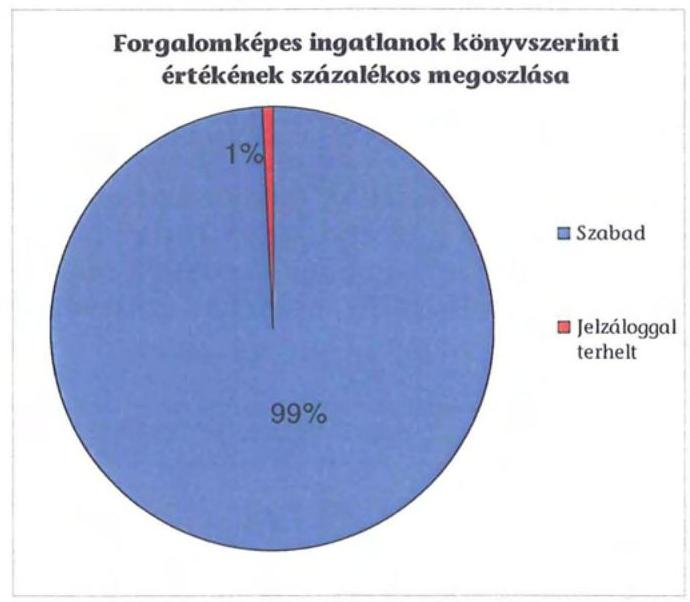

Az Önkormányzat összes forgalomképes ingatlanának könyvszerinti értéke 65306 millió Ft, melyből a terhelt ingatlanok könyvszerinti értéke 581 millió Ft $(0,9 \%)$ volt 2010. december 30-án. A forgalomképes ingatlanok nettó értékének ( 34050 millió Ft) $0,5 \%$-át, 187 millió Ft-ot tesz ki a jelzáloggal terhelt forgalomképes ingatlanok nettó értéke. A jelzálog az Önkormányzat négy ingatlanára van bejegyezve, melyből egy ingatlan 18 millió Ft összegű jelzálogjog bejegyzése törlésére (már 1997. évben) az Önkormányzatnak intézkednie kellett volna. Az AKSD Kft. részére 1996. évben jelzálogot jegyeztek be, mely kötelezettség 1997. évben az apport visszaadás miatt megszűnt.

A Közgyűlés a 120/2000. (VI. 8.) számú határozatával hozzájárult, a TFC, a PHARE SOP'97 programokból elnyert támogatások igénybevételéhez kapcsolódóan az Észak-magyarországi RFT ${ }^{49}$ javára, összesen 167,2 millió Ft jelzálogjog ${ }^{50}$ bejegyzésére. A jelzálogjog bejegyzés várhatóan 2022. május 9-én jár le.

A Közgyűlés a 268/2009. (XI. 26.) számú határozatával hozzájárult az ÉAOP 2007-1.1.B kódszámon nyertes projekt ${ }^{51}$ megvalósítása érdekében, hogy az Önkormányzatnak ingatlanára 229 millió Ft jelzálogjog bejegyzésre kerüljön az NFÜ ${ }^{52}$ javára. A jelzálogjog bejegyzés várhatóan 2015. február 24-én jár le.

Az AKSD Kft. részére 1996. évben bejegyzett 18 millió Ft jelzálogjogot 1997. január 8-án az apport visszaadás miatt töröltetnie kellett volna az Önkormányzatnak.

[^0]
[^0]:    ${ }^{49}$ Észak-magyarországi Regionális és Fejlesztési Tanács
    ${ }^{50}$ A fejlesztések a Debreceni Ipari Park külső és belső közműellátásához (150 millió Ft jelzálogjog), valamint a Debreceni Nagyerdő Pihenőpark fejlesztéséhez (17,2 millió Ft jelzálogjog) kapcsolódtak.
    ${ }^{51}$ a CÍVIS Ház Zrt. felújítási átalakítási projektje
    ${ }^{52}$ Nemzeti Fejlesztési Ügynökség

---

Az Önkormányzat 2010. december 31-én fennálló összes (pénzintézeti, szállítói, valamint egyéb) kötelezettsége: 5407 millió Ft, 86084974 CHF és 22027655 EUR volt, amelyből a 2011-2013. években 2318 millió Ft, 31569039 CHF és 6308433 EUR kötelezettsége keletkezik. Ennek teljesítésére figyelembe vehető 3570 millió Ft pénzmaradvány, 2068 millió Ft mérlegben kimutatott követelésállomány, 34050 millió Ft forgalomképes nettó ingatlanvagyon, melyből 187 millió Ft a pénzintézeti kötelezettséghez kapcsolódóan jelzáloggal terhelt.

A további évekre szóló jelenleg ismert pénzintézeti kötelezettségei: 58584556 CHF és 20825597 EUR. Ezekre az Önkormányzat tájékoztatása szerint figyelembe vehető forrást a helyi adók biztosítják majd az elkövetkezendő években, azonban ennek növelésére 2011-ben tett intézkedés nem biztosít elegendő többletforrást.

Az Önkormányzat kötelezettségeinek állománya 2010. december 31-én és várható alakulása a kötelezettségek lejáratáig

| Megnevezés | Állomány 2010. dec. 31-én |  |  | Várható kötelezettség 20112013. években |  |  | Várható kötelezettség 2014. évet követően |  |  |
| :--: | :--: | :--: | :--: | :--: | :--: | :--: | :--: | :--: | :--: |
|  | $\begin{gathered} 2010 \text {-ban } \\ \text { (millió Ft } \\ \text { hon) } \end{gathered}$ | Dovizdban (összegé) | Dovizd (szem) | $\begin{gathered} 2010 \text {-ban } \\ (\text { (millió Ft } \\ \text { hon) } \end{gathered}$ | Dovizdban (összegé) | Dovizd (szem) | $\begin{gathered} 2010 \text {-ban } \\ (\text { millió Ft } \\ \text { hon) } \end{gathered}$ | Dovizdban (összegé) | Dovizd (szem) |
| Pénzintézeti kötelezettségek |  |  |  |  |  |  |  |  |  |
| Hosszú lejáratú hőnélek |  | 44128127 | CHF |  | 20735751 | CHF |  | 12670307 | CHF |
| Hosszú lejáratú hőnélek |  | 20572764 | EUR |  | 1825555 | EUR |  | 20204761 | EUR |
| Egyéb főcélú tanácok | 33881 |  | HUF |  |  | HUF | - |  | HUF |
| Önzintézeti kötelezettségek összesen HUF-ban | 33881 |  | HUF |  |  | HUF |  |  | HUF |
| Önzintézeti kötelezettségek összesen CHF-ban |  | 84228127 | CHF |  | 30735751 | CHF |  | 27670997 | CHF |
| Önzintézeti kötelezettségek összesen HUF-ben |  | 20572764 | EUR |  | 1825555 | EUR |  | 20204761 | EUR |
| Biztosítékok |  |  |  |  |  |  |  |  |  |
| Észesség | 99 |  | HUF |  |  | HUF |  |  | HUF |
|  |  | 1736847 | CHF |  | 442289 | CHF |  | 913259 | CHF |
|  |  | 643244 | EUR |  | 482208 | EUR |  | 100856 | EUR |
| Biztosítékok összesen HUF-ban | 99 |  | HUF |  |  | HUF |  |  | HUF |
| Biztosítékok összesen CHF-ban |  | 1736847 | CHF |  | 442289 | CHF |  | 913259 | CHF |
| Biztosítékok összesen HUF-ban |  | 643244 | EUR |  | 482208 | EUR |  | 100856 | EUR |
| Szállítói tartozás | 2313 |  | HUF | 2313 |  | HUF |  |  | HUF |
|  |  | 812150 | EUR |  | 812150 | EUR |  |  | EUR |
| Jegszés végezsel írsziat és ki nem fizetett kötelezettségek? | 5 |  | HUF | 5 |  | HUF | - |  | HUF |

Az Önkormányzat minősített többségi tulajdonú gazdasági társaságai hosszú lejáratú kötelezettségeinek állományát 2010. december 31-én és várható alakulását a kötelezettségek lejáratáig az alábbi táblázat mutatja be:

| Megnevezés | Állomány 2010. dec. 31 -én |  |  | Várható kötelezettség 2011: |  |  | Várható kötelezettség 2014: |  |  |
| :--: | :--: | :--: | :--: | :--: | :--: | :--: | :--: | :--: | :--: |
|  | $\begin{gathered} 2010 \text {-ban } \\ (\text { (millió Ft } \\ \text { hon) } \end{gathered}$ | Dovizdban (összegé) | Dovizd (szem) | $\begin{gathered} 2010 \text {-ban } \\ (\text { Ht } \\ \text { hon) } \end{gathered}$ | Dovizdban (összegé) | Dovizd (szem) | $\begin{gathered} 2010 \text {-ban } \\ (\text { Ht } \\ \text { hon) } \end{gathered}$ | Dovizdban (összegé) | Dovizd (szem) |
| Pénzintézeti kötelezettségek |  |  |  |  |  |  |  |  |  |
| Hosszú lejáratú hőnélek | 2017 |  | HUF | 772 |  | HUF | 1334 |  | HUF |
| Hosszú lejáratú hőnélek |  | 1756847 | CHF |  | 842287 | CHF |  | 913500 | CHF |
| Hosszú lejáratú hőnélek |  | 7393348 | EUR |  | 1326260 | EUR |  | 6067084 | EUR |
| Önzintézeti kötelezettségi összesen HUF-ban | 2017 |  | HUF | 772 |  | HUF | 1334 |  | HUF |
| Önzintézeti kötelezettségi összesen CHF-ben |  | 1736847 | CHF |  | 442289 | CHF |  | 913500 | CHF |
| Önzintézeti kötelezettségi összesen HUF-ben |  | 7393348 | EUR |  | 1326260 | EUR |  | 6067084 | EUR |
| Szállítói tartozás | 1126 |  | HUF | 1126 |  | HUF |  |  |  |
| Jegszés végezsel írsziat és ki nem fizetett kötelezettségek* | 2 |  | HUF | 2 |  | HUF |  |  |  |

Az Önkormányzat minősített többségi tulajdonú gazdasági társaságainak 2010. december 31-én fennálló hosszú lejáratú hitel állománya 2017 millió Ft-ból, 1756847 CHF-ből, és 7393344 EUR-ból tevődött össze. A 2011-2013. évekre várható kötelezettség devizánként 772 millió Ft, 843287 CHF, és 1326260 EUR. A 2014. év után várható kötelezettség összegét 1334 millió Ft, 913560 CHF, és 6067084 EUR alkotja.

A kizárólagos önkormányzati tulajdonú társaságok hosszú lejáratú hitel állománya 2010. december 31-én legmagasabb a DV Zrt-nél volt, 1928 millió Ft összeggel. A DV Zrt-hez kapcsolódó gazdasági társaságok 2007. III. ne-

---

gyedévéig önállóan kötöttek hosszú lejáratú hitelszerződést a bankokkal, ezt követően azonban a DV Zrt. kötötte meg azokat. Jelentős a Debrecen Jégcsarnok Nonprofit Kiemelkedően Közhasznú Kft-nél, a hitel állomány összege, mely 2010. december 31-én 1756847 CHF volt. A Debreceni Sportcentrum Kft-nek a 2010. december 31-én fennálló hosszú lejáratú hitelállománya 89 millió Ft, s 643344 EUR hitelből tevődött össze.

Az Önkormányzat kizárólagos tulajdonosa a DV Zrt-nek. A DV Zrt. kizárólagos tulajdonosa a Debreceni Vízmú Zrt-nek, mely Zrt. kizárólagos tulajdona az S.C. Aqua Nova Hargita S.R.L., mely gazdasági társaságnak kiemelkedően magas 6750000 EUR a 2010. december 31-én fennálló hosszú lejáratú hitel állománya.

# Az Önkormányzat gazdasági társaságai kötvényt nem bocsátottak ki az ellenőrzött években. 

## Az Önkormányzat minősített többségi tulajdonú gazdasági társaságainak lízing kötelezettsége nem volt ${ }^{53}$.

Az Önkormányzat korlátlan felelősséggel tartozik felszámolás esetén a Gt. 54. § (2) bekezdése alapján a minősített többségi befolyással rendelkező, illetve a Csődtv. 63. § (2) bekezdése alapján a kizárólagos önkormányzati tulajdonú gazdasági társaság minden olyan kötelezettségéért, amelynek kielégítését a felszámolási eljárás során az adós vagyona nem fedez, ha a hitelezőinek a felszámolási eljárás során benyújtott keresete alapján a bíróság - az adós társaság felé érvényesített tartósan hátrányos üzletpolitikájára figyelemmel megállapítja az Önkormányzat korlátlan és teljes felelősségét a társaság tartozásaiért. Felszámolás esetén a hitelezők által benyújtott kereset alapján a bíróság összességében 2588 millió Ft összegű korlátlan és teljes felelősséget állapíthat meg a kötelezettségekkel érintett három kizárólagos önkormányzati tulajdonú gazdasági társaság után.

Az Önkormányzat az intézményeinél évente felmérte a felújítási igényt, azonban az éves költségvetési előterjesztésekben nem mutatta be, hogy az elhasználódott eszközök pótlása milyen kötelezettséget jelent a számára. Az Önkormányzat 2007-2010 között a tárgyi eszközök után 10313 millió Ft értékcsökkenést számolt el. A felújításokra, az eszközök pótlására - az Önkormányzat kimutatásai szerint - a pénzügyi lehetőségek függvényében került sor. Az elhasználódott eszközök pótlására az Önkormányzat tartalékot nem képzett, külön alapot nem hozott létre. Az Önkormányzat összes eszközének (immateriális javak, ingatlanok, gépek, jármúvek, átadott eszközök) használhatósági foka 2007-2010 között a bruttó érték 16003 millió Ft emelkedése ellenére 2,5 százalékponttal ( $93,8 \%$-ról $91,26 \%$-ra) csökkent az amortizáció növekedése miatt. A felújításokra, az eszközök pótlására elsősorban az intézmények

[^0]
[^0]:    ${ }^{53}$ Az Önkormányzat nem minősített többségi tulajdonú társaságai lízing kötelezettségének állománya 2010. december 31-én összesen 412 millió Ft, és 449806 CHF volt. A lízing kötelezettség négy Kft-ét érintett, melyek közül három az Egészségügyi Holding Zrt. kizárólagos tulajdona, mely Zrt-nek az Önkormányzat 50\%-os tulajdonosa. Egy gazdasági társaság esetében a kizárólagos önkormányzati tulajdonú DV Zrt. 49\%-os tulajdoni hányaddal bír.

---

múködőképességének biztosítása, illetve a szakhatósági előírások figyelembevételével került sor. A felhalmozási kiadásokból eszközpótlásra (rekonstrukcióra, felújításra) 2544 millió Ft-ot fordított 2010. december 31-ig az Önkormányzat a 2007-2010. években folyamatban lévő beruházások, felújítások 2010. december 31-ig pénzügyileg teljesített kiadásaiból.

Az Önkormányzatnál jogerős határozattal (végzéssel, ítélettel) nem lezárt peres eljárás 29 van, melyből 18-nál alperes a perben, ezek perértéke 323 millió Ft. A legjelentősebb összegű ügy jelenleg fel van függesztve, mely perértéke a hibás teljesítés miatt 269 millió Ft. Végrehajtási szakaszban négy ügy van, melyekben a felperes az Önkormányzat volt, a felújítási költségek miatti perérték 5 millió Ft. Az ügy szünetel három eljárásnál, egynél az Önkormányzat mint jogutód alperes. Folyamatban lévő bírósági eljárás ingatlan kiürítés, közös tulajdon megszüntetése, felújítási költség megfizetése, elbirtoklás iránti per, határozatlan idejű közalkalmazotti jogviszony megállapítása, kártérítési igény, terembérleti dí követelése, és munkabértartozás miatt volt.

A jogerős határozattal (végzéssel, ítélettel) lezárt, de ki nem fizetett peres eljárások közül hatnál volt alperesi pozícióban az Önkormányzat, a perértéke 5 millió Ft.

Az Önkormányzat kizárólagos tulajdonában álló nyolc gazdasági társasága a még le nem zárt ügyből 26 ügyben, perérték 735 millió Ft alperesi, míg 45 esetben (perérték 438 millió Ft) felperesi pozícióban áll. A jogerős határozattal lezárt, de ki nem fizetett peres eljárásokban kettő gazdasági társaság alperesi pozícióban van (kettő ügyben), melyek perértéke 2 millió Ft, felperesi pozícióban négy gazdasági társasága 62 ügyben van, ezek perértéke 50 millió Ft.

Az Önkormányzat gazdálkodására a még le nem zárt, illetve a jogerős ítélettel lezárt peres eljárásokban kimutatott kötelezettség kockázatot jelent.

# 4. A PÉNZÜGYI EGYENSÚLY MEGTEREMTÉSE ÉrDEKÉBEN HOZOTT INTÉZKEDÉSEK 

A jelentésben szereplő CLF modellben bemutatott múködési (2008. kivételével) és felhalmozási hiány amellett alakult ki, hogy a vizsgált időszakban az Önkormányzat folyamatosan intézkedéseket tett, hogy alkalmazkodjon a finanszírozási rendszer változása miatti forráscsökkenéshez. Ennek érdekében bevételnövelő és kiadáscsökkentő döntéseket hozott.

A kiadáscsökkentő és bevételnövelő intézkedések a gazdálkodás átláthatóbbá tételét, valamint a feladatellátás szakmai színvonalának, és kiemelten a pénzügyi helyzetnek a javítását célozták.

---

A 2007-2010. évek kiadáscsökkentő intézkedéseinek hatását beavatkozási területenként az alábbi táblázat mutatja be:

| Az érvényesített ki-   adáscsökkentés terüle-   tei | Személyi   juttatások és   járulékai | Dologi, mú-   ködési ki-   adások | Pénzeszköz   átadások,   támogatások | Összesen |
| :-- | :--: | :--: | :--: | :--: |
| Az intézményeknél | 3443946 | 123543 | 0 | 3567489 |
| A Polgármesteri hiva-   talnál | 275079 | 38864 | 0 | 313943 |
| ÖSSZESEN | 3719025 | 162407 | 0 | 3881432 |

Az Önkormányzat kimutatásai szerint a legjelentősebb összegű kiadási megtakarítást a közoktatási feladat-átadásokhoz, intézményi átszervezésekhez kapcsolódó álláshely-csökkentésekkel érte el, emellett sikerült megőrizni az intézmények gazdálkodásának stabilitását. A Közgyűlés 2007-től évente hozott intézmény-átszervezési döntéseket. Megszüntette a Simonffy Emil Zeneiskola és Alapfokú Művészetoktatási Intézményt, közoktatási feladatait átadta a Kodály Zoltán Zeneművészeti Szakközépiskola, Alapfokú Művészetoktatási Intézmény és Kollégium részére ${ }^{54}$. Az átszervezést elsősorban szakmai indokkal, a tehetséggondozás hatékonyabbá tétele céljával hajtotta végre az Önkormányzat.

A Közgyűlés elfogadta az Önkormányzat 2007-2012. közötti időszakra vonatkozó közoktatási feladatellátási, intézményhálózat-működtetési és -fejlesztési tervét ${ }^{55}$ (Intézkedési Terv). Az Oktatási Osztály vezetője részére előírta az Intézkedési Terv végrehajtását, illetve két év múlva esedékes felülvizsgálatát ${ }^{56}$. A dokumentumban foglaltaknak megfelelően a gyermek- és tanulói létszám csökkenő tendenciája miatt folyamatosan felülvizsgálta az Önkormányzat az óvodákban és iskolákban indítandó csoportok és osztályok számát, illetve a cso-port-és osztálylétszámokat, az óvodai és általános iskolai körzethatárokat, valamint az intézmények költséghatékony múködését. Egy általános iskolát már 2007. szeptembertől tagintézményként működtetett tovább az Önkormányzat ${ }^{57}$. 2008-ban a Közgyűlés megszüntette a Napsugár Óvodát, a Műhelytelepi Általános Iskolát és az Újkerti Nevelési és Oktatási Központot, utóbbi intézményben óvoda, általános iskola és diákotthon múködött ${ }^{58}$. A társulás részére átadásra került egy óvoda és egy, alapfokú művészetoktatási feladatot is ellátó általános iskola ${ }^{59}$. 2009-ben megszüntetésre került két középiskolai kollégium, és az Önkormányzat egy középiskolát átadott az Egyetem részére ${ }^{60}$.

[^0]
[^0]:    ${ }^{54}$ a Közgyűlés 132/2007. (VI. 21.) számú határozatával
    ${ }^{55}$ a Közgyűlés 262/2007. (XI. 22.) számú határozata
    ${ }^{56}$ Az Intézkedési Terv felülvizsgálata és a Közgyűlés tájékoztatása 2009. végén megtörtént (a Közgyűlés 294/2009. (XII. 10.) számú határozata).
    ${ }^{57}$ A Közgyűlés 131/2007. (VI. 21.) számú határozata alapján a Kőrösi Csoma Sándor Általános Iskola a Vénkerti Általános Iskola, Óvoda és Alapfokú Múvészetoktatási Intézmény tagintézménye lett.
    ${ }^{58}$ a Közgyűlés 145/2008. (VI. 26.), 146/20008. (VI. 26.) és 147/20008. (VI. 26.) számú határozatai alapján
    ${ }^{59}$ Szabó Kálmán Utca Óvoda, illetve Bányai Júlia Általános Iskola és Alapfokú Művészetoktatási Intézmény, a Közgyűlés 148/2008. (VI. 26.) számú határozata alapján.
    ${ }^{60}$ a Közgyűlés 46/2009. (III. 31.) és 47/2009. (III. 31.) számú határozatai alapján

---

Az intézményhálózat átalakítását a gyermek- és tanulói létszám folyamatos csökkenése tette indokolttá. Az átszervezések eredményeként az Önkormányzat intézményeiben 2007. és 2010. között az ellátotti létszám 1236 fővel, a foglalkoztatottak létszáma 562 fővel csökkent, ami a személyi juttatások és a kapcsolódó járulékok vonatkozásában az Önkormányzat számításai alapján 3443,9 millió Ft kiadási megtakarítást tett lehetővé.

Az átszervezések hatásaként az Önkormányzat által fenntartott költségvetési intézmények (részben önállóan gazdálkodó költségvetési intézmények) száma 2007. január 1. és 2010. december 31. között 11-el, a telephelyek (feladatellátási helyek) száma 30 -cal csökkent. A dologi kiadásokban ennek következtében az Önkormányzat kimutatása szerint 123,5 millió Ft megtakarítás vált lehetővé.

A Polgármesteri hivatal feladatainak átszervezése során a nyilvántartások szerint 2007-ben 27 fővel, 631 főről 604 főre ${ }^{61}$ csökkentették az álláshelyek számát. A Polgármesteri hivatalt érintő szervezeti változások célja a racionálisabb, költségtakarékosabb és hatékonyabb múködés volt ${ }^{62}$. Az átszervezéstől várt megtakarítás összegét 275 millió Ft-ra becsülte az Önkormányzat. A Polgármesteri hivatal dologi kiadásait 38,9 millió Ft-tal csökkentették a távközlési szolgáltatások közbeszerzési eljárásban elért kedvező díjai következtében. A vizsgált időszakban az Önkormányzatnál a tárgyévi költségvetési törvényben meghatározott köztisztviselői illetményalaptól eltérés nem volt.

Az intézményi feladatok racionalizálásáról, integrációjáról a Közgyűlés döntött. A döntést előkészítő előterjesztések alapján az átszervezések indoka a költségtakarékosabb, hatékonyabb múködés, illetve a kiegyenlített szakmai színvonal biztosítása volt. Az előterjesztésekben a tervezett intézkedések indokait, várható eredményeit bemutatták. Az intézményi integráció, átszervezés végrehajtásához kikérték a szakmai szervezetek véleményét, a jogszabályban előírt egyeztetéseket lefolytatták. A Közgyűlés a költségvetési koncepcióhoz, illetve a költségvetési és a zárszámadási rendelettervezet elfogadásához kapcsolódóan az előző évi átszervezések tapasztalatait rendszeresen áttekintette, értékelte.

Az Önkormányzat kimutatásai szerint a 2007-2010. években az intézményátszervezések, feladat-átadások, valamint a takarékossági intézkedések hatásaként együttesen 3881,4 millió Ft kiadási megtakarítás keletkezett, amely összegből 3719 millió Ft ( $95,8 \%$ ) az álláshelyek csökkentéséhez kapcsolódó személyi juttatások és járulékok csökkenése következtében jelentkezett.

Az önkormányzati szinten kimutatott megtakarítási intézkedésekből 3567,5 millió Ft-ot ( $91,9 \%$ ) az intézmények körében érvényesítettek. Az intézmények működési körében a kiadáscsökkentő intézkedések hatásából 3443,9 millió Ft ( $96,5 \%$ ) - a végrehajtott álláshely-csökkentések következtében - a személyi juttatásokban és a hozzájuk kapcsolódó járulékokban realizálódott.

[^0]
[^0]:    ${ }^{61}$ A létszám tartalmazta a polgármestert és a három alpolgármestert.
    ${ }^{62}$ a Közgyűlés 14/2007. (II. 15.) számú határozata alapján

---

Az intézményi átszervezések eredményeképpen csökkent az Önkormányzat által fenntartott költségvetési intézmények száma: míg 2007. év elején 114, 2010. év végén 103 intézménye volt az Önkormányzatnak. Az önállóan gazdálkodó, illetve önállóan működő és gazdálkodó intézmények száma (12) nem változott, a csökkenés a részben önállóan gazdálkodó, illetve önállóan működő költségvetési intézmények körében következett be. Jelentősen, 277-ről 247-re (10,8\%$\mathrm{kal})$ csökkent a feladatellátást biztosító telephelyek száma is.

A 2011. évi költségvetési rendelet szerint az Önkormányzat számításai alapján az intézményekben megüresedő álláshelyek zárolásával 17,7 millió Ft kiadási megtakarítás érhető el a személyi juttatások és járulékaik vonatkozásában.

Az álláshely-csökkentő intézkedések következtében a nyilvántartások szerint 2007-2010. között a Polgármesteri hivatalnál és az intézményeknél összesen 562 álláshelyet szüntettek meg, ebből $321(57,1 \%)$ üres álláshely, 168 (29,9\%) ágazati szakmai, 73 (13\%) intézményüzemeltetéshez, fenntartáshoz, gazdasági ügyek intézéséhez kapcsolódó álláshely volt.

A 2007-2010. között végrehajtott álláshely-csökkentés eredményét az alábbi táblázat szemlélteti:

| Az Önkormányzat 2007-2010.éveket érteső létszámcsökkentésének alakulása |  |  |  |  |  |  |
| :--: | :--: | :--: | :--: | :--: | :--: | :--: |
| Megnevezés (scható 65 -hoz) | Közoktatás | Szociális és gyebeszkedésben | Egészségügy | Polgármestert hivatal | Egyéb | Összesen |
| Megszüntett áltáshelyek száma | 538 | 11 | 0 | 0 | 18 | 562 |
| ebből: | üres áltáshelyek száma | 287 | 10 | 0 | 0 | 18 | 331 |
|  | szakmai álláshelyek száma | 179 | 0 | 0 | 11 | 0 | 168 |
|  | intézmény üzemeltetései kapcsolatos időtartalok száma | 73 | 1 | 0 | 0 | 0 | 73 |
| 2007. január 1.jén leálló létszám |  | 1463 | 1437 | 0 | 631 | 808 | 8258 |
| 2010. december 31.én alzó létszám |  | 4824 | 1446 | 0 | 536 | 790 | 7599 |

A helyi szervezési intézkedések végrehajtásához az Önkormányzat az áttekintett időszak alatt 382368 ezer Ft központi költségvetési támogatásban részesült, amelynek felhasználásával a nyilvántartások szerint 202 fő álláshelyet tartósan csökkentett. Az átszervezési és álláshely-csökkentési intézkedések hatására az Önkormányzat 2007. január 1-jei 8258 fős létszáma 2010. december 31-re 562 fővel, $6,8 \%$-kal csökkent.

Az Önkormányzatnál 2007-2010. között 689 fővel csökkent a foglalkoztatottak száma, azonban 127 fős létszámfejlesztés is történt. A csökkentés a 4.1. pontban ismertetett átszervezések miatt legnagyobb mértékben a közoktatás területét érintette, ahol összességében 538 fővel csökkent a foglalkoztatottak száma.

A Polgármesteri hivatal létszáma 2007. december 31-én 631 fő volt ${ }^{63}$. 2007. év elején 27 fős létszámleépítést hajtottak végre, azonban 2010. év végén a létszám 5 fővel meghaladta a 2007. január 1-jei létszámot. Jelentős létszámbővítésre 2008-ban ( 22 fő) és 2010-ben ( 12 fő) került sor, elsősorban a hatósági feladatok (építésügyi hatósági ellenőrzés, okmányirodai, gyámhivatali feladatok) növekedése, illetve a Ket. 2008. évi módosítását követően egyes ügyintézési határidők lerövidülése miatt.

[^0]
[^0]:    ${ }^{63}$ A létszám tartalmazta a polgármestert és a három alpolgármestert.

---

A létszámcsökkentéssel érintett dolgozók nem kerültek továbbfoglalkoztatásra az Önkormányzatnál, az intézményeknél, és az Önkormányzat gazdasági társaságaiban sem.

A kiadáscsökkentő intézkedések mellett az Önkormányzat az alábbiakban számszerúsített bevételnövelő intézkedéseket tette:
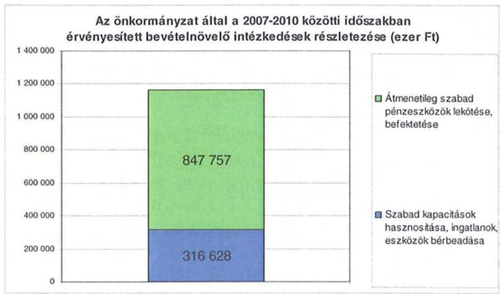

A bevételnövelésre irányuló intézkedések számszerúsített összegéből, ami 1164,4 millió Ft volt, 847,8 millió Ft -ot $(72,8 \%)$ jelentettek a bankszámlán levő, átmenetileg szabad pénzeszközök lekötéséből, befektetéséből származó bevételek, ebben kötvény forrás kamata nem szerepel, mivel az Önkormányzat a vizsgált időszakban korábbi kötvénytartozását visszafizette, új kötvényt pedig nem bocsátott ki. Az ingatlanok és eszközök bérbeadásából (új bérbeadási szerződések megkötéséből, illetve bérleti díjak emeléséből) realizált bevételek 316,6 millió Ft-tal ( $27,2 \%$ ) részesültek a bevétel-növekményből.

Önkormányzati szinten 2011-re 92,6 millió Ft bevételi növekményt terveztek, ebből 62,3 millió Ft összeget (67,3\%) ingatlanok bérbeadásából, 30,4 millió Ft -ot $(32,7 \%)$ az építményadó emeléséből.

Az Önkormányzat a kiadáscsökkentő és bevételnövelő intézkedésekkel a csökkenő állami támogatások és illetékbevételek hatását ellensúlyozni tudta. A költségvetési támogatások, átengedett bevételek és illetékek összege 2008-ban és 2009-ben magasabb volt, mint 2007-ben. A 2008. évi 26 853,6 millió Ft 1311,7 millió Ft-tal, 5,1\%-kal, a 2009. évi 25914,2 millió Ft 372,3 millió Ft-tal, 1,5\%-kal haladta meg a 2007. évi 25541,9 millió Ft összegű állami támogatásokat és illetékbevételeket. A 2010. évi állami támogatások és illetékbevételek összege 24531,2 millió Ft volt, ami 1010,7 millió Ft-tal, 4\%kal volt alacsonyabb a 2007. évinél. Összességében az Önkormányzat szempontjából forráskiesés nem volt. Az Önkormányzat kiadáscsökkentő és bevételnövelő intézkedései - saját kimutatásai szerint - összesen 5045,8 millió Ft megtakarítást, illetve többletbevételt eredményeztek.

---

# 5. A HELYI ÖNKORMÁNYZATOK GAZDÁLKODÁSI RENDSZERÉNEK 2008. ÉVI ELLENŐRZÉSE SORÁN A PÉNZÜGYI EGYENSÚLY JAVÍTÁSÁRA TETT SZABÁLYSZERŰSÉGI ÉS CÉLSZERŰSÉGI JAVASLATOK HASZNOSULÁSA 

Az ÁSZ jelentésében 8 szabályszerűségi és 5 célszerűségi javaslatot tett. A jelentést a Közgyűlés megismerte. A javaslatok megvalósítására intézkedési tervet készítettek, amely teljes körűen tartalmazta a javaslatokat, meghatározta a feladatok elvégzéséért felelősöket és a feladatok elvégzésének határidejét ${ }^{64}$.

Teljesült a javaslat, hogy a jegyző

- „gondoskodjon arról, hogy - az Ámr ${ }^{65}$. 29. § (1) bekezdés g) és k) pontjában foglaltaknak megfelelően - a költségvetési rendeletek tartalmazzák az európai uniós forrásokkal támogatott, több éves kihatással járó feladatok előirányzatait éves bontásban, továbbá önkormányzati szinten elkülönítetten az európai uniós támogatással megvalósuló programok bevételi és kiadási előirányzatait". A végrehajtásra az intézkedési tervben folyamatos határidőt írtak elő, a 2009. évi költségvetési rendelet-tervezetet már a javaslatban foglaltak szerint készítették el, továbbá hogy a jegyző
- „gondoskodjon a költségvetési rendelet-tervezet elkészitése során az előző évi kötelezettségvállalások áthúzódó kiadásainak, valamint azok forrásának meghatározásáról". A végrehajtásra az intézkedési tervben 2009. február 15. határidőt írtak elő, a 2009. évi költségvetési rendelet-tervezetet már a javaslatban foglaltak szerint készítették el.

Az intézkedések megvalósulását figyelemmel kísérték, a polgármester 2009. december 4-én az intézkedési terv végrehajtásáról szóló összegző jelentést megküldte az ÁSZ elnökének.

Budapest, 2011. december " $2 \varepsilon$

Melléklet: $\quad 9 \mathrm{db}$
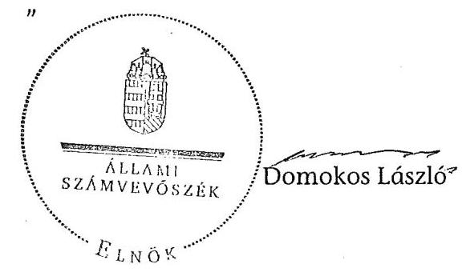

[^0]
[^0]:    ${ }^{64}$ a Közgyűlés 15/2009. (II. 26.) számú határozata
    ${ }^{65}$ az államháztartás múködési rendjéről szóló 217/1998. (XII. 30.) Korm. rendelet 36. § (1) bekezdés h) és l) pontja

---

.

---

Debrecen Megyei Jogú Város Önkormányzata

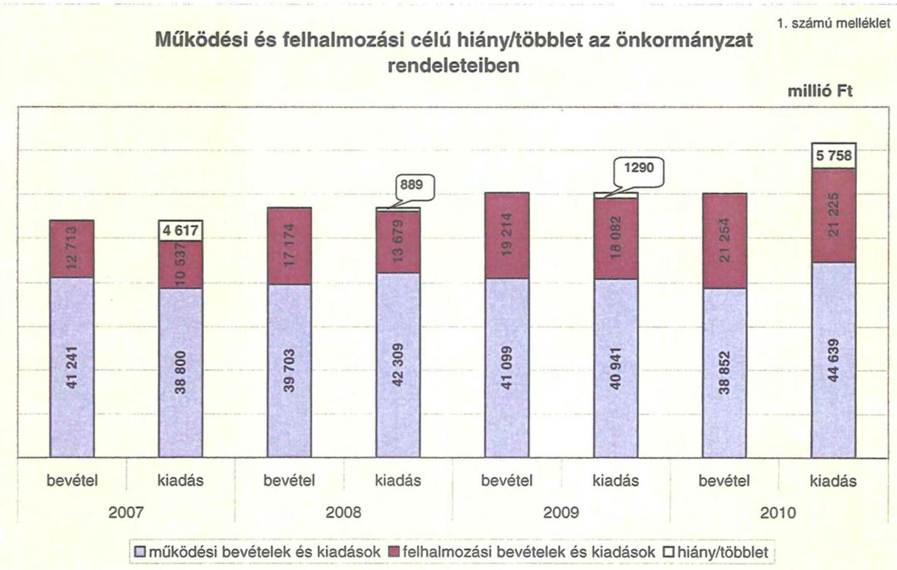

---

#### KIMUTATÁS

#### az Önkormányzat bevételének és kiadásoknak, adószágszolgáltatások alakulásáról (2007-2010. években teljesített adatok)

|  1. FOLYÓ KÖLTSÉGVETÉS* | 2007. | 2008. | 2009. | 2010.  |
| --- | --- | --- | --- | --- |
|  1.1.1. Saját működési bevételsít | 17 271 435 | 19 109 578 | 19 089 177 | 19 557 647  |
|  1.1.2. Költségvetési támogatás | 14 309 411 | 20 084 983 | 18 531 212 | 17 386 199  |
|  1.1.3. Átsszajedési bevételsít | 9 830 141 | 5 288 993 | 6 133 035 | 5 963 963  |
|  1.1.4. Állambázatrázos belüliuját kapott támogatások | 277 034 | 522 437 | 499 731 | 637 352  |
|  1.1.5. Elővári és külföldi állomás bevételsít | 8 715 | 10 764 | 4 488 | 14 835  |
|  1.1.6. Állambázatrázos belüliuját kapott bevételsít | 145 984 | 124 125 | 155 485 | 212 863  |
|  1.1.7. Elővári és párosorralvány átvétel | 329 276 | 444 827 | 602 069 | 530 892  |
|  1.1. Folyó bevételsít = 1.1.1.+1.1.2.+1.1.3.+1.1.4.+1.1.5.+1.1.6.+1.1.7. | 42 177 992 | 45 565 707 | 45 014 197 | 44 313 691  |
|  1.2.1. Működési kiadások karmatizásának nélkül | 23 339 697 | 36 877 928 | 34 441 426 | 35 270 022  |
|  1.2.2. Állambázatrázos belüliuját javaszkázóik | 37 046 | 71 124 | 129 972 | 164 959  |
|  1.2.2.1. Althallozásoknak | 3 323 093 | 3 927 041 | 3 777 674 | 3 147 339  |
|  1.2.2.2. Elővári, illetve külföldi állomás | 340 | 895 | 0 | 0  |
|  1.2.2.3. Megjegyzésfejlesztésnek | 2 222 726 | 2 462 609 | 2 844 558 | 2 317 357  |
|  1.2.2.4. Megjegyzésfejlesztésének | 325 525 | 278 567 | 223 275 | 140 142  |
|  1.2.3. Tizenegyértékenne (1.2.3.1+1.2.3.2+1.2.3.3+1.2.3.4) | 2 871 684 | 6 669 112 | 6 845 507 | 6 604 738  |
|  1.2.4. Karmatizásának | 450 927 | 480 068 | 362 734 | 383 664  |
|  1.2.5. Elővári és párosorralvány átvétel | 320 168 | 444 827 | 602 069 | 530 892  |
|  1.2. Folyó kiadások = 1.2.1.+1.2.2.+1.2.3.+1.2.4.+1.2.5. | 40 018 922 | 44 543 059 | 42 381 708 | 42 954 275  |
|  1.3. Folyó költségvetés egyenlege MÖKÖDÉSI JÖVEDELEM (1.1. - 1.2.) | 2 159 070 | 1 022 648 | 2 632 489 | 1 359 416  |
|  2. FELHALMOZÁSI KÖLTSÉGVETÉS** |  |  |  |   |
|  2.1.1. Saját törebevételek | 855 278 | 4 180 653 | 685 654 | 1 691 688  |
|  2.1.2. Állambázatrázos belüliuját kapott támogatások | 2 028 507 | 2 517 956 | 9 420 332 | 8 211 836  |
|  2.1.3. Elővári és külföldi állomás támogatások | 13 757 | 0 | 17 308 | 0  |
|  2.1.4. Állambázatrázos belüliuját kapott támogatások | 388 242 | 454 318 | 737 512 | 188 209  |
|  2.1.1. Felhalmozási bevételsít (1.1.1.+2.1.2+2.1.3+2.1.4.) | 3 285 784 | 7 152 827 | 10 860 806 | 10 091 733  |
|  2.2.1. Saját beruházási kiadás állva | 6 256 685 | 8 683 285 | 13 133 443 | 13 584 548  |
|  2.2.2. Saját felújítási kiadás állva | 728 664 | 1 033 383 | 604 718 | 686 747  |
|  2.2.3. Állambázatrázos belüliuját kapott támogatások | 2 921 | 0 | 3 450 | 0  |
|  2.2.4. Elővári és külföldi állomás احتجاجات | 0 | 0 | 0 | 0  |
|  2.2.5. Állambázatrázos belüliuját kapott támogatások | 416 156 | 1 283 860 | 218 205 | 500 879  |
|  2.2.6. Befektetési célú részesedések vásárlása | 0 | 104 200 | 502 100 | 388 150  |
|  2.2.1. Felhalmozási kiadások (1.2.1.+2.2.2.+2.2.3.+2.2.4.+2.2.5.+2.2.6.) | 7 404 426 | 11 104 728 | 14 461 916 | 15 160 324  |
|  2.3. Felhalmozási költségvetés egyenlege (2.1. - 2.2.) | -4 118 642 | -3 951 901 | -3 601 110 | -5 068 591  |
|  3. Finanszírozási műveletek nélküli (GFS) pozíció(1.3.+2.3.) | -1 959 572 | -2 929 253 | -968 621 | -3 709 175  |
|  4. Finanszírozási műveletek |  |  |  |   |
|  4.1. Minifélefel | 4 500 000 | 4 200 005 | 3 000 000 | 5 700 000  |
|  4.2. Minifélefejév | 937 005 | 794 279 | 1 637 383 | 2 628 692  |
|  4.3. Forgatási és befektetési célú értékpapírok kibocsátása | 0 | 0 | 0 | 0  |
|  4.4. Forgatási és befektetési célú értékpapírok beválása | 1 315 920 | 0 | 1 184 000 | 0  |
|  4.5. Forgatási és befektetési célú értékpapírok értékesítése | 0 | 0 | 0 | 0  |
|  4.6. Forgatási és befektetési célú értékpapírok vásárlása | 0 | 0 | 0 | 0  |
|  4.7. Egyéb finanszírozási bevételsít (függő, átfutó, kiegészítői) | -17 373 | 332 670 | -341 674 | -1 191 699  |
|  4.8. Egyéb finanszírozási kiadások (függő, átfutó, kiegészítői) | -2 380 | 825 341 | -27 899 | -628 600  |
|  4.9. Finanszírozási műveletek egyenlege (4.1. - 4.2.+4.3. -4.4+4.5. -4.6.+4.7. -4.8.) | 2 232 082 | 2 915 055 | -135 158 | 2 508 209  |
|  5. Tárgyési pénzügyi pozíció változás (1.3.+ 2.3.+4.9.) | 272 538 | -14 195 | -1 103 179 | -1 200 966  |
|  6. Nettó működési jövedelem «működési jövedelem (1.3.) - töltett/észztés (4.2+4.4) | -93 855 | 228 369 | -188 894 | -1 269 276  |
|  TÁJERŐZTATÓ ADATÓB |  |  |  |   |
|  Összes kötelezettség | 17 273 606 | 21 073 689 | 28 359 529 | 31 922 116  |
|  ebből rövid kijáratú | 6 699 227 | 6 866 768 | 9 900 317 | 8 740 993  |
|  Összes esőfőbb kötelezettség | 4 139 637 | 2 017 569 | 5 933 895 | 2 539 043  |
|  ebből kijárt (tanszíványból) | 0 | 0 | 0 | 0  |
|  Pénz és időeg(av) kötelezettség (adószép) | 11 356 224 | 16 902 428 | 20 661 071 | 27 512 677  |
|  ebből rövid kijáratú | 796 845 | 2 710 597 | 2 216 859 | 4 825 493  |
|  PPP szerződéses állomány jelesértékes (tanszíványból) | 0 | 0 | 0 | 0  |
|  ebből kijárt szolgáltatási díj miatti kötelezettség | 0 | 0 | 0 | 0  |
|  Folyószámlabiból majd átfogott állománya (tanszíványból) | 109 459 | 46 270 | 32 035 | 40 781  |
|  Likvidibiból majd átfogott állománya (tanszíványból) | 0 | 0 | 0 | 8 219  |
|  Mandabérbiból majd átfogott állománya (tanszíványból) | 2 345 | 2 195 | 0 | 0  |
|  Kezesség és garanciavállalások (tanszíványból) | 1 098 000 | 40 000 | 0 | 0  |
|  Jogevés kérésűj ötletekből adódó kötelezettségek (tanszíványból) | 0 | 0 | 0 | 0  |
|  Finanszírozásba bevonható eszközök | 5 803 140 | 5 772 004 | 4 668 279 | 3 467 313  |
|  Tartás kötelezettségi megtestedei értékpapírok és végi állománya | 17 772 | 800 | 888 | 888  |
|  Hozzok kijáratú karkkustánk és végi állománya | 0 | 0 | 0 | 0  |
|  Értékpapírok és végi állománya | 0 | 0 | 0 | 0  |
|  Pénzeszközök (idegen pénzeszközök nélküli) és végi állománya | 5 785 368 | 5 771 170 | 4 667 391 | 3 466 425  |

- Bevételében nem tétté, a kiadásokban nem jelent meg az amortizáció, a vagyoni helyzetet

* Bevételében vagyon megőrzése és hivatásos kiadásaii összevét.

---

|   |  |  |  |  |  |  |  |  |  |  |  |  |  |  |  |  |  |  |  |  |  |  |  |  |  |  |  |  |  |  |  |  |  |  |  |  |  |  |  |  |  |  |  |  |  |   |
| --- | --- | --- | --- | --- | --- | --- | --- | --- | --- | --- | --- | --- | --- | --- | --- | --- | --- | --- | --- | --- | --- | --- | --- | --- | --- | --- | --- | --- | --- | --- | --- | --- | --- | --- | --- | --- | --- | --- | --- | --- | --- | --- | --- | --- | --- | --- |
|   |  |  |  |  |  |  |  |  |  |  |  |  |  |  |  |  |  |  |  |  |  |  |  |  |  |  |  |  |  |  |  |  |  |  |  |  |  |  |  |  |  |  |  |  |  |   |
|   |  |  |  |  |  |  |  |  |  |  |  |  |  |  |  |  |  |  |  |  |  |  |  |  |  |  |  |  |  |  |  |  |  |  |  |  |  |  |  |  |  |  |  |  |  |   |
|   |  |  |  |  |  |  |  |  |  |  |  |  |  |  |  |  |  |  |  |  |  |  |  |  |  |  |  |  |  |  |  |  |  |  |  |  |  |  |  |  |  |  |  |  |  |   |
|   |  |  |  |  |  |  |  |  |  |  |  |  |  |  |  |  |  |  |  |  |  |  |  |  |  |  |  |  |  |  |  |  |  |  |  |  |  |  |  |  |  |  |  |  |  |   |
|   |  |  |  |  |  |  |  |  |  |  |  |  |  |  |  |  |  |  |  |  |  |  |  |  |  |  |  |  |  |  |  |  |  |  |  |  |  |  |  |  |  |  |  |  |  |   |
|   |  |  |  |  |  |  |  |  |  |  |  |  |  |  |  |  |  |  |  |  |  |  |  |  |  |  |  |  |  |  |  |  |  |  |  |  |  |  |  |  |  |  |  |  |  |   |
|   |  |  |  |  |  |  |  |  |  |  |  |  |  |  |  |  |  |  |  |  |  |  |  |  |  |  |  |  |  |  |  |  |  |  |  |  |  |  |  |  |  |  |  |  |  |   |
|   |  |  |  |  |  |  |  |  |  |  |  |  |  |  |  |  |  |  |  |  |  |  |  |  |  |  |  |  |  |  |  |  |  |  |  |  |  |  |  |  |  |  |  |  |  |   |
|   |  |  |  |  |  |  |  |  |  |  |  |  |  |  |  |  |  |  |  |  |  |  |  |  |  |  |  |  |  |  |  |  |  |  |  |  |  |  |  |  |  |  |  |  |  |   |
|   |  |  |  |  |  |  |  |  |  |  |  |  |  |  |  |  |  |  |  |  |  |  |  |  |  |  |  |  |  |  |  |  |  |  |  |  |  |  |  |  |  |  |  |  |  |   |
|   |  |  |  |  |  |  |  |  |  |  |  |  |  |  |  |  |  |  |  |  |  |  |  |  |  |  |  |  |  |  |  |  |  |  |  |  |  |  |  |  |  |  |  |  |  |   |
|   |  |  |  |  |  |  |  |  |  |  |  |  |  |  |  |  |  |  |  |  |  |  |  |  |  |  |  |  |  |  |  |  |  |  |  |  |  |  |  |  |  |  |  |  |  |   |
|   |  |  |  |  |  |  |  |  |  |  |  |  |  |  |  |  |  |  |  |  |  |  |  |  |  |  |  |  |  |  |  |  |  |  |  |  |  |  |  |  |  |  |  |  |  |   |
|   |  |  |  |  |  |  |  |  |  |  |  |  |  |  |  |  |  |  |  |  |  |  |  |  |  |  |  |  |  |  |  |  |  |  |  |  |  |  |  |  |  |  |  |  |  |   |
|   |  |  |  |  |  |  |  |  |  |  |  |  |  |  |  |  |  |  |  |  |  |  |  |  |  |  |  |  |  |  |  |  |  |  |  |  |  |  |  |  |  |  |  |  |  |   |
|   |  |  |  |  |  |  |  |  |  |  |  |  |  |  |  |  |  |  |  |  |  |  |  |  |  |  |  |  |  |  |  |  |  |  |  |  |  |  |  |  |  |  |  |  |  |   |
|   |  |  |  |  |  |  |  |  |  |  |  |  |  |  |  |  |  |  |  |  |  |  |  |  |  |  |  |  |  |  |  |  |  |  |  |  |  |  |  |  |  |  |  |  |  |   |
|   |  |  |  |  |  |  |  |  |  |  |  |  |  |  |  |  |  |  |  |  |  |  |  |  |  |  |  |  |  |  |  |  |  |  |  |  |  |  |  |  |  |  |  |  |  |   |
|   |  |  |  |  |  |  |  |  |  |  |  |  |  |  |  |  |  |  |  |  |  |  |  |  |  |  |  |  |  |  |  |  |  |  |  |  |  |  |  |  |  |  |  |  |  |   |
|   |  |  |  |  |  |  |  |  |  |  |  |  |  |  |  |  |  |  |  |  |  |  |  |  |  |  |  |  |  |  |  |  |  |  |  |  |  |  |  |  |  |  |  |  |  |   |
|   |  |  |  |  |  |  |  |  |  |  |  |  |  |  |  |  |  |  |  |  |  |  |  |  |  |  |  |  |  |  |  |  |  |  |  |  |  |  |  |  |  |  |  |  |  |   |
|   |  |  |  |  |  |  |  |  |  |  |  |  |  |  |  |  |  |  |  |  |  |  |  |  |  |  |  |  |  |  |  |  |  |  |  |  |  |  |  |  |  |  |  |  |  |   |
|   |  |  |  |  |  |  |  |  |  |  |  |  |  |  |  |  |  |  |  |  |  |  |  |  |  |  |  |  |  |  |  |  |  |  |  |  |  |  |  |  |  |  |  |  |  |   |
|   |  |  |  |  |  |  |  |  |  |  |  |  |  |  |  |  |  |  |  |  |  |  |  |  |  |  |  |  |  |  |  |  |  |  |  |  |  |  |  |  |  |  |  |  |  |   |
|   |  |  |  |  |  |  |  |  |  |  |  |  |  |  |  |  |  |  |  |  |  |  |  |  |  |  |  |  |  |  |  |  |  |  |  |  |  |  |  |  |  |  |  |  |  |   |
|   |  |  |  |  |  |  |  |  |  |  |  |  |  |  |  |  |  |  |  |  |  |  |  |  |  |  |  |  |  |  |  |  |  |  |  |  |  |  |  |  |  |  |  |  |  |   |
|   |  |  |  |  |  |  |  |  |  |  |  |  |  |  |  |  |  |  |  |  |  |  |  |  |  |  |  |  |  |  |  |  |  |  |  |  |  |  |  |  |  |  |  |  |  |   |
|   |  |  |  |  |  |  |  |  |  |  |  |  |  |  |  |  |  |  |  |  |  |  |  |  |  |  |  |  |  |  |  |  |  |  |  |  |  |  |  |  |  |  |  |  |  |   |
|   |  |  |  |  |  |  |  |  |  |  |  |  |  |  |  |  |  |  |  |  |  |  |  |  |  |  |  |  |  |  |  |  |  |  |  |  |  |  |  |  |  |  |  |  |  |   |
|   |  |  |  |  |  |  |  |  |  |  |  |  |  |  |  |  |  |  |  |  |  |  |  |  |  |  |  |  |  |  |  |  |  |  |  |  |  |  |  |  |  |  |  |  |  |   |
|   |  |  |  |  |  |  |  |  |  |  |  |  |  |  |  |  |  |  |  |  |  |  |  |  |  |  |  |  |  |  |  |  |  |  |  |  |  |  |  |  |  |  |  |  |  |   |
|   |

---

|   |  |  |  |  |  |  |  |  |  |  |  |  |  |  |  |  |  |  |  |  |  |  |  |  |  |  |  |  |  |  |  |  |  |  |  |  |  |  |  |  |  |  |  |  |  |  |  |  |  |  |  |  |  |  |  |  |  |  |  |  |  |  |  |  |  |  |  |  |  |  |  |  |  |  |  |  |  |  |  |  |  |  |  |  |  |  |  |  |  |  |  |  |  |  |  |  |  |  |  |  |  |

---

|   |  |  |  |  |  |  |  |  |  |  |  |  |  |  |  |  |  |  |  |  |  |  |  |  |  |  |  |  |  |  |  |  |  |  |  |  |  |  |  |  |  |   |
| --- | --- | --- | --- | --- | --- | --- | --- | --- | --- | --- | --- | --- | --- | --- | --- | --- | --- | --- | --- | --- | --- | --- | --- | --- | --- | --- | --- | --- | --- | --- | --- | --- | --- | --- | --- | --- | --- | --- | --- | --- | --- | --- |
|   |  |  |  |  |  |  |  |  |  |  |  |  |  |  |  |  |  |  |  |  |  |  |  |  |  |  |  |  |  |  |  |  |  |  |  |  |  |  |  |  |  |   |
|   |  |  |  |  |  |  |  |  |  |  |  |  |  |  |  |  |  |  |  |  |  |  |  |  |  |  |  |  |  |  |  |  |  |  |  |  |  |  |  |  |  |   |
|   |  |  |  |  |  |  |  |  |  |  |  |  |  |  |  |  |  |  |  |  |  |  |  |  |  |  |  |  |  |  |  |  |  |  |  |  |  |  |  |  |  |   |
|   |  |  |  |  |  |  |  |  |  |  |  |  |  |  |  |  |  |  |  |  |  |  |  |  |  |  |  |  |  |  |  |  |  |  |  |  |  |  |  |  |  |   |
|   |  |  |  |  |  |  |  |  |  |  |  |  |  |  |  |  |  |  |  |  |  |  |  |  |  |  |  |  |  |  |  |  |  |  |  |  |  |  |  |  |  |   |
|   |  |  |  |  |  |  |  |  |  |  |  |  |  |  |  |  |  |  |  |  |  |  |  |  |  |  |  |  |  |  |  |  |  |  |  |  |  |  |  |  |  |   |
|   |  |  |  |  |  |  |  |  |  |  |  |  |  |  |  |  |  |  |  |  |  |  |  |  |  |  |  |  |  |  |  |  |  |  |  |  |  |  |  |  |  |   |
|   |  |  |  |  |  |  |  |  |  |  |  |  |  |  |  |  |  |  |  |  |  |  |  |  |  |  |  |  |  |  |  |  |  |  |  |  |  |  |  |  |  |   |
|   |  |  |  |  |  |  |  |  |  |  |  |  |  |  |  |  |  |  |  |  |  |  |  |  |  |  |  |  |  |  |  |  |  |  |  |  |  |  |  |  |  |   |
|   |  |  |  |  |  |  |  |  |  |  |  |  |  |  |  |  |  |  |  |  |  |  |  |  |  |  |  |  |  |  |  |  |  |  |  |  |  |  |  |  |  |   |
|   |  |  |  |  |  |  |  |  |  |  |  |  |  |  |  |  |  |  |  |  |  |  |  |  |  |  |  |  |  |  |  |  |  |  |  |  |  |  |  |  |  |   |
|   |  |  |  |  |  |  |  |  |  |  |  |  |  |  |  |  |  |  |  |  |  |  |  |  |  |  |  |  |  |  |  |  |  |  |  |  |  |  |  |  |  |   |
|   |  |  |  |  |  |  |  |  |  |  |  |  |  |  |  |  |  |  |  |  |  |  |  |  |  |  |  |  |  |  |  |  |  |  |  |  |  |  |  |  |  |   |
|   |  |  |  |  |  |  |  |  |  |  |  |  |  |  |  |  |  |  |  |  |  |  |  |  |  |  |  |  |  |  |  |  |  |  |  |  |  |  |  |  |  |   |
|   |  |  |  |  |  |  |  |  |  |  |  |  |  |  |  |  |  |  |  |  |  |  |  |  |  |  |  |  |  |  |  |  |  |  |  |  |  |  |  |  |  |   |
|   |  |  |  |  |  |  |  |  |  |  |  |  |  |  |  |  |  |  |  |  |  |  |  |  |  |  |  |  |  |  |  |  |  |  |  |  |  |  |  |  |  |   |
|   |  |  |  |  |  |  |  |  |  |  |  |  |  |  |  |  |  |  |  |  |  |  |  |  |  |  |  |  |  |  |  |  |  |  |  |  |  |  |  |  |  |   |
|   |  |  |  |  |  |  |  |  |  |  |  |  |  |  |  |  |  |  |  |  |  |  |  |  |  |  |  |  |  |  |  |  |  |  |  |  |  |  |  |  |  |   |
|   |  |  |  |  |  |  |  |  |  |  |  |  |  |  |  |  |  |  |  |  |  |  |  |  |  |  |  |  |  |  |  |  |  |  |  |  |  |  |  |  |  |   |
|   |  |  |  |  |  |  |  |  |  |  |  |  |  |  |  |  |  |  |  |  |  |  |  |  |  |  |  |  |  |  |  |  |  |  |  |  |  |  |  |  |  |   |
|   |  |  |  |  |  |  |  |  |  |  |  |  |  |  |  |  |  |  |  |  |  |  |  |  |  |  |  |  |  |  |  |  |  |  |  |  |  |  |  |  |  |   |
|   |  |  |  |  |  |  |  |  |  |  |  |  |  |  |  |  |  |  |  |  |  |  |  |  |  |  |  |  |  |  |  |  |  |  |  |  |  |  |  |  |  |   |
|   |  |  |  |  |  |  |  |  |  |  |  |  |  |  |  |  |  |  |  |  |  |  |  |  |  |  |  |  |  |  |  |  |  |  |  |  |  |  |  |  |  |   |
|   |  |  |  |  |  |  |  |  |  |  |  |  |  |  |  |  |  |  |  |  |  |  |  |  |  |  |  |  |  |  |  |  |  |  |  |  |  |  |  |  |  |   |
|   |  |  |  |  |  |  |  |  |  |  |  |  |  |  |  |  |  |  |  |  |  |  |  |  |  |  |  |  |  |  |  |  |  |  |  |  |  |  |  |  |  |   |
|   |  |  |  |  |  |  |  |  |  |  |  |  |  |  |  |  |  |  |  |  |  |  |  |  |  |  |  |  |  |  |  |  |  |  |  |  |  |  |  |  |  |  |   |
|   |  |  |  |  |  |  |  |  |  |  |  |  |  |  |  |  |  |  |  |  |  |  |  |  |  |  |  |  |  |  |  |  |  |  |  |  |  |  |  |  |  |  |   |
|   |  |  |  |  |  |  |  |  |  |  |  |  |  |  |  |  |  |  |  |  |  |  |  |  |  |  |  |  |  |  |  |  |  |  |  |  |  |  |  |  |  |  |   |
|   |  |  |  |  |  |  |  |  |  |  |  |  |  |  |  |  |  |  |  |  |  |  |  |  |  |  |  |  |  |  |  |  |  |  |  |  |  |  |  |  |  |  |   |
|   |  |  |  |  |  |  |  |  |  |  |  |  |  |  |  |  |  |  |  |  |  |  |  |  |  |  |  |  |  |  |  |  |  |  |  |  |  |  |  |  |  |  |   |
|   |  |  |  |  |  |  |  |  |  |  |  |  |  |  |  |  |  |  |  |  |  |  |  |  |  |  |  |  |  |  |  |  |  |  |  |  |  |  |  |  |  |  |   |
|   |  |  |  |  |  |  |  |  |  |  |  |  |  |  |  |  |  |  |  |  |  |  |  |  |  |  |  |  |  |  |  |  |  |  |  |  |  |  |  |  |  |  |   |
|   |  |  |  |  |  |  |  |  |  |  |  |  |  |  |  |  |  |  |  |  |  |  |  |  |  |  |  |  |  |  |  |  |  |  |  |  |  |  |  |  |  |  |   |
|   |  |  |  |  |  |  |  |  |  |  |  |  |  |  |  |  |  |  |  |  |  |  |  |  |  |  |  |  |  |  |  |  |  |  |  |  |  |  |  |  |  |  |   |
|   |  |  |  |  |  |  |  |  |  |  |  |  |  |  |  |  |  |  |  |  |  |  |  |  |  |  |  |  |  |  |  |  |  |  |  |  |  |  |  |  |  |  |   |
|   |  |  |  |  |  |  |  |  |  |  |  |  |  |  |  |  |  |  |  |  |  |  |  |  |  |  |  |  |  |  |  |  |  |  |  |  |  |  |  |  |  |  |   |
|   |  |  |  |  |  |  |  |  |  |  |  |  |  |  |  |  |  |  |  |  |  |  |  |  |  |  |  |  |  |  |  |  |  |  |  |  |  |  |  |  |  |  |   |
|   |  |  |  |  |  |  |  |  |  |  |  |  |  |  |  |  |  |  |  |  |  |  |  |  |  |  |  |  |  |  |  |  |  |  |  |  |  |  |  |  |  |  |   |
|   |  |  |  |  |  |  |  |  |  |  |  |  |  |  |  |  |  |  |  |  |  |  |  |  |  |  |  |  |  |  |  |  |  |  |  |  |  |  |  |  |  |  |   |
|   |  |  |  |  |  |  |  |  |  |  |  |  |  |  |  |  |  |  |  |  |  |  |  |  |  |  |  |  |  |  |  |  |  |  |  |  |  |  |  |  |  |  |   |
|   |  |  |  |  |  |  |  |  |  |  |  |  |  |  |  |  |  |  |  |  |  |  |  |  |  |  |  |  |  |  |  |  |  |  |  |  |  |  |  |  |  |  |   |
|   |  |  |  |  |  |  |  |  |  |  |  |  |  |  |  |  |  |  |  |  |  |  |  |  |  |  |  |  |  |  |  |  |  |  |  |  |  |  |  |  |  |  |   |
|   |  |  |  |  |  |  |  |  |  |  |  |  |  |  |  |  |  |  |  |  |  |  |  |  |  |  |  |  |  |  |  |  |  |  |  |  |  |  |  |  |  |  |   |
|   |  |  |  |  |  |  |  |  |  |  |  |  |  |  |  |  |  |  |  |  |  |  |  |  |  |  |  |  |  |  |  |  |  |  |  |  |  |  |  |  |  |  |   |
|   |  |  |  |  |  |  |  |  |  |  |  |  |  |  |  |  |  |  |  |  |  |  |  |  |  |  |  |  |  |  |  |  |  |  |  |  |  |  |  |  |  |  |   |
|   |  |  |  |  |  |  |  |  |  |  |  |  |  |  |  |  |  |  |  |  |  |  |  |  |  |  |  |  |  |  |  |  |  |  |  |  |  |  |  |  |  |  |   |
|   |  |  |  |  |  |  |  |  |  |  |  |  |  |  |  |  |  |  |  |  |  |  |  |  |  |  |  |  |  |  |  |  |  |  |  |  |  |  |  |  |  |  |   |
|   |  |  |  |  |  |  |  |  |  |  |  |  |  |  |  |  |  |  |  |  |  |  |  |  |  |  |  |  |  |  |  |  |  |  |  |  |  |  |  |  |  |  |   |
|   |  |  |  |  |  |  |  |  |  |  |  |  |  |  |  |  |  |  |  |  |  |  |  |  |  |  |  |  |  |  |  |  |  |  |  |  |  |  |  |  |  |  |   |
|   |  |  |  |  |  |  |  |  |  |  |  |  |  |  |  |  |  |  |  |  |  |  |  |  |  |  |  |  |  |  |  |  |  |  |  |  |  |  |  |  |  |  |   |
|   |  |  |  |  |  |  |  |  |  |  |  |  |  |  |  |  |  |  |  |  |  |  |  |  |  |  |  |  |  |  |  |  |  |  |  |  |  |  |  |  |  |  |   |
|   |  |  |  |  |  |  |  |  |  |  |  |  |  |  |  |  |  |  |  |  |  |  |  |  |  |  |  |  |  |  |  |  |  |  |  |  |  |  |  |  |  |  |  |   |
|   |  |  |  |  |  |  |  |  |  |  |  |  |  |  |  |  |  |  |  |  |  |  |  |  |  |  |  |  |  |  |  |  |  |  |  |  |  |  |  |  |  |  |  |   |
|   |  |  |  |  |  |  |  |  |  |  |  |  |  |  |  |  |  |  |  |  |  |  |  |  |  |  |  |  |  |  |  |  |  |  |  |  |  |  |  |  |  |  |  |   |
|   |  |  |  |  |  |  |  |  |  |  |  |  |  |  |  |  |  |  |  |  |  |  |  |  |  |  |  |  |  |  |  |  |  |  |  |  |  |  |  |  |  |  |  |   |
|   |  |  |  |  |  |  |  |  |  |  |  |  |  |  |  |  |  |  |  |  |  |  |  |  |  |  |  |  |  |  |  |  |  |  |  |  |  |  |  |  |  |  |  |   |
|   |  |  |  |  |  |  |  |  |  |  |  |  |  |  |  |  |  |  |  |  |  |  |  |  |  |  |  |  |  |  |  |  |  |  |  |  |  |  |  |  |  |  |  |   |
|   |  |  |  |  |  |  |  |  |  |  |  |  |  |  |  |  |  |  |  |  |  |  |  |  |  |  |  |  |  |  |  |  |  |  |  |  |  |  |  |  |  |  |  |  |   |
|   |  |  |  |  |  |  |  |  |  |  |  |  |  |  |  |  |  |  |  |  |  |  |  |  |  |  |  |  |  |  |  |  |  |  |  |  |  |  |  |  |  |  |  |  |   |
|   |  |  |  |  |  |  |  |  |  |  |  |  |  |  |  |  |  |  |  |  |  |  |  |  |  |  |  |  |  |  |  |  |  |  |  |  |  |  |  |  |  |  |  |  |   |
|   |  |  |  |  |  |  |  |  |  |  |  |  |  |  |  |  |  |  |  |  |  |  |  |  |  |  |  |  |  |  |  |  |  |  |  |  |  |  |  |  |  |  |  |  |   |
|   |  |  |  |  |  |  |  |  |  |  |  |  |  |  |  |  |  |  |  |  |  |  |  |  |  |  |  |  |  |  |  |  |  |  |  |  |  |  |  |  |  |  |  |  |   |
|   |  |  |  |  |  |  |  |  |  |  |  |  |  |  |  |  |  |  |  |  |  |  |  |  |  |  |  |  |  |  |  |  |  |  |  |  |  |  |  |  |  |  |  |  |   |
|   |  |  |  |  |  |  |  |  |  |  |  |  |  |  |  |  |  |  |  |  |  |  |  |  |  |  |  |  |  |  |  |  |  |  |  |  |  |  |  |  |  |  |  |  |   |
|   |  |  |  |  |  |  |  |  |  |  |  |  |  |  |  |  |  |  |  |  |  |  |  |  |  |  |  |  |  |  |  |  |  |  |  |  |  |  |  |  |  |  |  |  |   |
|   |  |  |  |  |  |  |  |  |  |  |  |  |  |  |  |  |  |  |  |  |  |  |  |  |  |  |  |  |  |  |  |  |  |  |  |  |  |  |  |  |  |  |  |  |   |
|   |  |  |  |  |  |  |  |  |  |  |  |  |  |  |  |  |  |  |  |  |  |  |  |  |  |  |  |  |  |  |  |  |  |  |  |  |  |  |  |  |  |  |  |  |   |
|   |  |  |  |  |  |  |  |  |  |  |  |  |  |  |  |  |  |  |  |  |  |  |  |  |  |  |  |  |  |  |  |  |  |  |  |  |  |  |  |  |  |  |  |  |   |
|   |  |  |  |  |  |  |  |  |  |  |  |  |  |  |  |  |  |  |  |  |  |  |  |  |  |  |  |  |  |  |  |  |  |  |  |  |  |  |  |  |  |  |  |  |   |
|   |  |  |  |  |  |  |  |  |  |  |  |  |  |  |  |  |  |  |  |  |  |  |  |  |  |  |  |  |  |  |  |  |  |  |  |  |  |  |  |  |  |  |  |  |   |
|   |  |  |  |  |  |  |  |  |  |  |  |  |  |  |  |  |  |  |  |  |  |  |  |  |  |  |  |  |  |  |  |  |  |  |  |  |  |  |  |  |  |  |  |  |  |   |
|   |  |  |  |  |  |  |  |  |  |  |  |  |  |  |  |  |  |  |  |  |  |  |  |  |  |  |  |  |  |  |  |  |  |  |  |  |  |  |  |  |  |  |  |  |  |   |
|   |  |  |  |  |  |  |  |  |  |  |  |  |  |  |  |  |  |  |  |  |  |  |  |  |  |  |  |  |  |  |  |  |  |  |  |  |  |  |  |  |  |  |  |  |  |   |
|   |  |  |  |  |  |  |  |  |  |  |  |  |  |  |  |  |  |  |  |  |  |  |  |  |  |  |  |  |  |  |  |  |  |  |  |  |  |  |  |  |  |  |  |  |  |   |
|   |  |  |  |  |  |  |  |  |  |  |  |  |  |  |  |  |  |  |  |  |  |  |  |  |  |  |  |  |  |  |  |  |  |  |  |  |  |  |  |  |  |  |  |  |  |  |   |
|   |  |  |  |  |  |  |  |  |  |  |  |  |  |  |  |  |  |  |  |  |  |  |  |  |  |  |  |  |  |  |  |  |  |  |  |  |  |  |  |  |  |  |  |  |  |  |  |   |
|   |  |  |  |  |  |  |  |  |  |  |  |  |  |  |  |  |  |  |  |  |  |  |  |  |  |  |  |  |  |  |  |  |  |  |  |  |  |  |  |  |  |  |  |  |  |  |  |  |  |   |
|   |  |  |  |  |  |  |  |  |  |  |  |  |  |  |  |  |  |  |  |  |  |  |  |  |  |  |  |  |  |  |  |  |  |  |  |  |  |  |  |  |  |  |  |  |  |  |  |  |  |  |   |
|   |  |  |  |  |  |  |  |  |  |  |  |  |  |  |  |  |  |  |  |  |  |  |  |  |  |  |  |  |  |  |  |  |  |  |  |  |  |  |  |  |  |  |  |  |  |  |  |  |  |  |  |   |
|   |  |  |  |  |  |  |  |  |  |  |  |  |  |  |  |  |  |  |  |  |  |  |  |  |  |  |  |  |  |  |  |  |  |  |  |  |  |  |  |  |  |  |  |  |  |  |  |  |  |  |  |  |   |
|   |  |  |  |  |  |  |  |  |  |  |  |  |  |  |  |  |  |  |  |  |  |  |  |  |  |  |  |  |  |  |  |  |  |  |  |  |  |  |  |  |  |  |  |  |  |  |  |  |  |  |  |  |  |   |
|   |  |  |  |  |  |  |  |  |  |  |  |  |  |  |  |  |  |  |  |  |  |  |  |  |  |  |  |  |  |  |  |  |  |  |  |  |  |  |  |  |  |  |  |  |  |  |  |  |  |  |  |  |  |  |  |   |
|   |  |  |  |  |  |  |  |  |  |  |  |  |  |  |  |  |  |  |  |  |  |  |  |  |  |  |  |  |  |  |  |  |  |  |  |  |  |  |  |  |  |  |  |  |  |  |  |  |  |  |  |  |  |  |  |  |  |  |   |
|   |  |  |  |  |  |  |  |  |  |  |  |  |  |  |  |  |  |  |  |  |  |  |  |  |  |  |  |  |  |  |  |  |  |  |  |  |  |  |  |  |  |  |  |  |  |  |  |  |  |  |  |  |  |  |  |  |  |  |  |   |
|   |  |  |  |  |  |  |  |  |  |  |  |  |  |  |  |  |  |  |  |  |  |  |  |  |  |  |  |  |  |  |  |  |  |  |  |  |  |  |  |  |  |  |  |  |  |  |  |  |  |  |  |  |  |  |  |  |  |  |  |  |  |   |
|   |  |  |  |  |  |  |  |  |  |  |  |  |  |  |  |  |  |  |  |  |  |  |  |  |  |  |  |  |  |  |  |  |  |  |  |  |  |  |  |  |  |  |  |  |  |  |  |  |  |  |  |  |  |  |  |  |  |  |  |  |  |  |  |  |   |
|   |  |  |  |  |  |  |  |  |  |  |  |  |  |  |  |  |  |  |  |  |  |  |  |  |  |  |  |  |  |  |  |  |  |  |  |  |  |  |  |  |  |  |  |  |  |  |  |  |  |  |  |  |  |  |  |  |  |  |  |  |  |  |  |  |  |  |   |
|   |  |  |  |  |  |  |  |  |  |  |  |  |  |  |  |  |  |  |  |  |  |  |  |  |  |  |  |  |  |  |  |  |  |  |  |  |  |  |  |  |  |  |  |  |  |  |  |  |  |  |  |  |  |  |  |  |  |  |  |  |  |  |  |  |  |  |  |   |
|   |  |  |  |  |  |  |  |  |  |  |  |  |  |  |  |  |  |  |  |  |  |  |  |  |  |  |  |  |  |  |  |  |  |  |  |  |  |  |  |  |  |  |  |  |  |  |  |  |  |  |  |  |  |  |  |  |  |  |  |  |  |  |  |  |  |  |  |  |  |  |   |
|   |  |  |  |  |  |  |  |  |  |  |  |  |  |  |  |  |  |  |  |  |  |  |  |  |  |  |  |  |  |  |  |  |  |  |  |  |  |  |  |  |  |  |  |  |  |  |  |  |  |  |  |  |  |  |  |  |  |  |  |  |  |  |  |  |  |  |  |  |  |  |  |  |  |   |
|   |  |  |  |  |  |  |  |  |  |  |  |  |  |  |  |  |  |  |  |  |  |  |  |  |  |  |  |  |  |  |  |  |  |  |  |  |  |  |  |  |  |  |  |  |  |  |  |  |  |  |  |  |  |  |  |  |  |  |  |  |  |  |  |  |  |  |  |  |  |  |  |  |  |  |  |  |  |  |  |  |   |
|   |  |  |  |  |  |  |  |  |  |  |  |  |  |  |  |  |  |  |  |  |  |  |  |  |  |  |  |  |  |  |  |  |  |  |  |  |  |  |  |  |  |  |  |  |  |  |  |  |  |  |  |  |  |  |  |  |  |  |  |  |  |  |  |  |  |  |  |  |  |  |  |  |  |  |  |  |  |  |  |  |  |  |  |  |  |  |   |
|   |  |  |  |  |  |  |  |  |  |  |  |  |  |  |  |  |  |  |  |  |  |  |  |  |  |  |  |  |  |  |  |  |  |  |  |  |  |  |  |  |  |  |  |  |  |  |  |  |  |  |  |  |  |  |  |  |  |  |  |  |  |  |  |  |  |  |  |  |  |  |  |  |  |  |  |  |  |  |  |  |  |  |  |  |  |  |  |  |  |  |  |  |  |  |  |  |  |  |  |   |
|   |  |  |  |  |  |  |  |  |  |  |  |  |  |  |  |  |  |  |  |  |  |  |  |  |  |  |  |  |  |  |  |  |  |  |  |  |  |  |  |  |  |  |  |  |  |  |  |  |  |  |  |  |  |  |  |  |  |  |  |  |  |  |  |  |  |  |  |  |  |  |  |  |  |  |  |  |  |  |  |  |  |  |  |  |  |  |  |  |  |  |  |  |  |  |  |  |  |  |  | 

---

|   |  |  |  |  |  |  |  |  |  |  |  |  |  |  |  |  |  |  |  |  |  |  |  |  |  |  |  |  |  |  |  |  |  |  |  |  |  |  |  |  |  |   |
| --- | --- | --- | --- | --- | --- | --- | --- | --- | --- | --- | --- | --- | --- | --- | --- | --- | --- | --- | --- | --- | --- | --- | --- | --- | --- | --- | --- | --- | --- | --- | --- | --- | --- | --- | --- | --- | --- | --- | --- | --- | --- | --- | --- |
|   |  |  |  |  |  |  |  |  |  |  |  |  |  |  |  |  |  |  |  |  |  |  |  |  |  |  |  |  |  |  |  |  |  |  |  |  |  |  |  |  |  |   |
|   |  |  |  |  |  |  |  |  |  |  |  |  |  |  |  |  |  |  |  |  |  |  |  |  |  |  |  |  |  |  |  |  |  |  |  |  |  |  |  |  |  |   |
|   |  |  |  |  |  |  |  |  |  |  |  |  |  |  |  |  |  |  |  |  |  |  |  |  |  |  |  |  |  |  |  |  |  |  |  |  |  |  |  |  |  |   |
|   |  |  |  |  |  |  |  |  |  |  |  |  |  |  |  |  |  |  |  |  |  |  |  |  |  |  |  |  |  |  |  |  |  |  |  |  |  |  |  |  |  |   |
|   |  |  |  |  |  |  |  |  |  |  |  |  |  |  |  |  |  |  |  |  |  |  |  |  |  |  |  |  |  |  |  |  |  |  |  |  |  |  |  |  |  |   |
|   |  |  |  |  |  |  |  |  |  |  |  |  |  |  |  |  |  |  |  |  |  |  |  |  |  |  |  |  |  |  |  |  |  |  |  |  |  |  |  |  |  |   |
|   |  |  |  |  |  |  |  |  |  |  |  |  |  |  |  |  |  |  |  |  |  |  |  |  |  |  |  |  |  |  |  |  |  |  |  |  |  |  |  |  |  |   |
|   |  |  |  |  |  |  |  |  |  |  |  |  |  |  |  |  |  |  |  |  |  |  |  |  |  |  |  |  |  |  |  |  |  |  |  |  |  |  |  |  |  |   |
|   |  |  |  |  |  |  |  |  |  |  |  |  |  |  |  |  |  |  |  |  |  |  |  |  |  |  |  |  |  |  |  |  |  |  |  |  |  |  |  |  |  |   |
|   |  |  |  |  |  |  |  |  |  |  |  |  |  |  |  |  |  |  |  |  |  |  |  |  |  |  |  |  |  |  |  |  |  |  |  |  |  |  |  |  |  |   |
|   |  |  |  |  |  |  |  |  |  |  |  |  |  |  |  |  |  |  |  |  |  |  |  |  |  |  |  |  |  |  |  |  |  |  |  |  |  |  |  |  |  |   |
|   |  |  |  |  |  |  |  |  |  |  |  |  |  |  |  |  |  |  |  |  |  |  |  |  |  |  |  |  |  |  |  |  |  |  |  |  |  |  |  |  |  |   |
|   |  |  |  |  |  |  |  |  |  |  |  |  |  |  |  |  |  |  |  |  |  |  |  |  |  |  |  |  |  |  |  |  |  |  |  |  |  |  |  |  |  |   |
|   |  |  |  |  |  |  |  |  |  |  |  |  |  |  |  |  |  |  |  |  |  |  |  |  |  |  |  |  |  |  |  |  |  |  |  |  |  |  |  |  |  |   |
|   |  |  |  |  |  |  |  |  |  |  |  |  |  |  |  |  |  |  |  |  |  |  |  |  |  |  |  |  |  |  |  |  |  |  |  |  |  |  |  |  |  |   |
|   |  |  |  |  |  |  |  |  |  |  |  |  |  |  |  |  |  |  |  |  |  |  |  |  |  |  |  |  |  |  |  |  |  |  |  |  |  |  |  |  |  |   |
|   |  |  |  |  |  |  |  |  |  |  |  |  |  |  |  |  |  |  |  |  |  |  |  |  |  |  |  |  |  |  |  |  |  |  |  |  |  |  |  |  |  |   |
|   |  |  |  |  |  |  |  |  |  |  |  |  |  |  |  |  |  |  |  |  |  |  |  |  |  |  |  |  |  |  |  |  |  |  |  |  |  |  |  |  |  |   |
|   |  |  |  |  |  |  |  |  |  |  |  |  |  |  |  |  |  |  |  |  |  |  |  |  |  |  |  |  |  |  |  |  |  |  |  |  |  |  |  |  |  |   |
|   |  |  |  |  |  |  |  |  |  |  |  |  |  |  |  |  |  |  |  |  |  |  |  |  |  |  |  |  |  |  |  |  |  |  |  |  |  |  |  |  |  |   |
|   |  |  |  |  |  |  |  |  |  |  |  |  |  |  |  |  |  |  |  |  |  |  |  |  |  |  |  |  |  |  |  |  |  |  |  |  |  |  |  |  |  |   |
|   |  |  |  |  |  |  |  |  |  |  |  |  |  |  |  |  |  |  |  |  |  |  |  |  |  |  |  |  |  |  |  |  |  |  |  |  |  |  |  |  |  |   |
|   |  |  |  |  |  |  |  |  |  |  |  |  |  |  |  |  |  |  |  |  |  |  |  |  |  |  |  |  |  |  |  |  |  |  |  |  |  |  |  |  |  |   |
|   |  |  |  |  |  |  |  |  |  |  |  |  |  |  |  |  |  |  |  |  |  |  |  |  |  |  |  |  |  |  |  |  |  |  |  |  |  |  |  |  |  |   |
|   |  |  |  |  |  |  |  |  |  |  |  |  |  |  |  |  |  |  |  |  |  |  |  |  |  |  |  |  |  |  |  |  |  |  |  |  |  |  |  |  |  |   |
|   |  |  |  |  |  |  |  |  |  |  |  |  |  |  |  |  |  |  |  |  |  |  |  |  |  |  |  |  |  |  |  |  |  |  |  |  |  |  |  |  |  |   |
|   |  |  |  |  |  |  |  |  |  |  |  |  |  |  |  |  |  |  |  |  |  |  |  |  |  |  |  |  |  |  |  |  |  |  |  |  |  |  |  |  |  |   |
|   |  |  |  |  |  |  |  |  |  |  |  |  |  |  |  |  |  |  |  |  |  |  |  |  |  |  |  |  |  |  |  |  |  |  |  |  |  |  |  |  |  |   |
|   |  |  |  |  |  |  |  |  |  |  |  |  |  |  |  |  |  |  |  |  |  |  |  |  |  |  |  |  |  |  |  |  |  |  |  |  |  |  |  |  |  |   |
|   |  |  |  |  |  |  |  |  |  |  |  |  |  |  |  |  |  |  |  |  |  |  |  |  |  |  |  |  |  |  |  |  |  |  |  |  |  |  |  |  |  |   |
|   |  |  |  |  |  |  |  |  |  |  |  |  |  |  |  |  |  |  |  |  |  |  |  |  |  |  |  |  |  |  |  |  |  |  |  |  |  |  |  |  |  |   |
|   |

---

# 2015. december 31-e eléni kötelezettség-válalások forrásbázat

## 1. Olás

### 1.1. Átípus

|  Fejlesztési feladat (beruházás, felújítás) |  | Beruházás, felújítás |  |  |  |  |  |  |  |  |  |  |  |  |  |  |  |  |  |  |  |  |  |  |  |  |  |  |  |  |  |  |  |  |  |  |  |  |  |  |  |   |
| --- | --- | --- | --- | --- | --- | --- | --- | --- | --- | --- | --- | --- | --- | --- | --- | --- | --- | --- | --- | --- | --- | --- | --- | --- | --- | --- | --- | --- | --- | --- | --- | --- | --- | --- | --- | --- | --- | --- | --- | --- | --- | --- | --- |
|   |  |  |  |  |  |  |  |  |  |  |  |  |  |  |  |  |  |  |  |  |  |  |  |  |  |  |  |  |  |  |  |  |  |  |  |  |  |  |  |  |  |  |   |
|  Fejlesztési feladat (beruházás, felújítás) |  |  |  |  |  |  |  |  |  |  |  |  |  |  |  |  |  |  |  |  |  |  |  |  |  |  |  |  |  |  |  |  |  |  |  |  |  |  |  |  |  |  |   |
|  Fejlesztési feladat (beruházás, felújítás) |  |  |  |  |  |  |  |  |  |  |  |  |  |  |  |  |  |  |  |  |  |  |  |  |  |  |  |  |  |  |  |  |  |  |  |  |  |  |  |  |  |   |
|  Megnevezése |  |  |  |  |  |  |  |  |  |  |  |  |  |  |  |  |  |  |  |  |  |  |  |  |  |  |  |  |  |  |  |  |  |  |  |  |  |  |  |  |  |   |
|  Megnevezése |  |  |  |  |  |  |  |  |  |  |  |  |  |  |  |  |  |  |  |  |  |  |  |  |  |  |  |  |  |  |  |  |  |  |  |  |  |  |  |  |  |   |
|  1 | 2 | 3 | 4 | 5 | 6 | 7 | 8 | 9 | 10 | 11 | 12 | 13 | 14 | 15 | 16 | 17 | 18 | 19 | 20 |  |  |  |  |  |  |  |  |  |  |  |  |  |  |  |  |  |  |  |  |  |  |   |
|  1. Felújítások |  |  |  |  |  |  |  |  |  |  |  |  |  |  |  |  |  |  |  |  |  |  |  |  |  |  |  |  |  |  |  |  |  |  |  |  |  |  |  |  |  |   |
|  2. |  |  |  |  |  |  |  |  |  |  |  |  |  |  |  |  |  |  |  |  |  |  |  |  |  |  |  |  |  |  |  |  |  |  |  |  |  |  |  |  |  |   |
|  3. |  |  |  |  |  |  |  |  |  |  |  |  |  |  |  |  |  |  |  |  |  |  |  |  |  |  |  |  |  |  |  |  |  |  |  |  |  |  |  |  |  |   |
|  4. |  |  |  |  |  |  |  |  |  |  |  |  |  |  |  |  |  |  |  |  |  |  |  |  |  |  |  |  |  |  |  |  |  |  |  |  |  |  |  |  |  |   |
|  5. 10 mibió Ft alatt felújítások^{25} |  |  |  |  |  |  |  |  |  |  |  |  |  |  |  |  |  |  |  |  |  |  |  |  |  |  |  |  |  |  |  |  |  |  |  |  |  |  |  |  |  |   |
|  6. Felújítások összesen |  |  |  |  |  |  |  |  |  |  |  |  |  |  |  |  |  |  |  |  |  |  |  |  |  |  |  |  |  |  |  |  |  |  |  |  |  |  |  |  |  |   |
|  7. Fejlesztések |  |  |  |  |  |  |  |  |  |  |  |  |  |  |  |  |  |  |  |  |  |  |  |  |  |  |  |  |  |  |  |  |  |  |  |  |  |  |  |  |  |   |
|  8. Tessedik Sárruel utván új évoda építése |  | 211(2010)(II.16.) |  | 2011 |  | 2012 |  | 212 314 |  | 0 | 0 | 0 |  |  |  |  |  |  |  |  |  |  |  |  |  |  |  |  |  |  |  |  |  |  |  |  |  |  |  |  |  |   |
|  9. Hagymaza szociális vároorahatolítások |  | 77(2011.(II.31.) |  | 2012 |  | 2013 |  | 275 692 |  | 0 | 0 | 0 |  |  |  |  |  |  |  |  |  |  |  |  |  |  |  |  |  |  |  |  |  |  |  |  |  |  |  |  |   |
|  10. Hogyámbír teljes műkántelap szociális vároorahatolítások |  | 53(2011.(II.18.) |  | 2012 |  | 2013 |  | 570 000 |  | 0 | 0 | 0 |  |  |  |  |  |  |  |  |  |  |  |  |  |  |  |  |  |  |  |  |  |  |  |  |  |  |  |  |   |
|  11. számú Risk Békeszújvános út – Füneti út – Cégbontt u. - Szabó |  | 1(2011.(I.27.) |  | 2012 |  | 2013 |  | 140 000 |  | 0 | 0 | 0 |  |  |  |  |  |  |  |  |  |  |  |  |  |  |  |  |  |  |  |  |  |  |  |  |  |  |  |  |   |
|  12. 47. sz. filiói melletti kevésgöző építése Debrecen és Mikapénz-képtől |  | 95(2010.(V.31.) |  | 2011 |  | 2011 |  | 486 868 |  | 0 | 0 | 0 |  |  |  |  |  |  |  |  |  |  |  |  |  |  |  |  |  |  |  |  |  |  |  |  |  |  |  |  |   |
|  13. Jóvolal és alapfokú oktatási intézményében |  | 202(2010.(VI.19.) |  | 2011 |  | 2012 |  | 168 436 |  | 0 | 0 | 0 |  |  |  |  |  |  |  |  |  |  |  |  |  |  |  |  |  |  |  |  |  |  |  |  |  |  |  |  |   |
|  14. |  |  |  |  |  |  |  |  |  |  |  |  |  |  |  |  |  |  |  |  |  |  |  |  |  |  |  |  |  |  |  |  |  |  |  |  |  |  |  |  |   |
|  15. |  |  |  |  |  |  |  |  |  |  |  |  |  |  |  |  |  |  |  |  |  |  |  |  |  |  |  |  |  |  |  |  |  |  |  |  |  |  |  |  |   |
|  16. |  |  |  |  |  |  |  |  |  |  |  |  |  |  |  |  |  |  |  |  |  |  |  |  |  |  |  |  |  |  |  |  |  |  |  |  |  |  |  |  |   |
|  17. 10 mibió Ft alatt fejlesztés^{26} |  | 15(2011.(I.27.) |  |  |  |  |  | 10 118 |  | 0 | 0 | 0 |  |  |  |  |  |  |  |  |  |  |  |  |  |  |  |  |  |  |  |  |  |  |  |  |  |  |  |  |   |
|  18. |  |  |  |  |  |  |  |  |  |  |  |  |  |  |  |  |  |  |  |  |  |  |  |  |  |  |  |  |  |  |  |  |  |  |  |  |  |  |  |  |   |
|  19. |  |  |  |  |  |  |  |  |  |  |  |  |  |  |  |  |  |  |  |  |  |  |  |  |  |  |  |  |  |  |  |  |  |  |  |  |  |  |  |  |   |
|  20. |  |  |  |  |  |  |  |  |  |  |  |  |  |  |  |  |  |  |  |  |  |  |  |  |  |  |  |  |  |  |  |  |  |  |  |  |  |  |  |  |   |
|  21. |  |  |  |  |  |  |  |  |  |  |  |  |  |  |  |  |  |  |  |  |  |  |  |  |  |  |  |  |  |  |  |  |  |  |  |  |  |  |  |  |   |
|  22. |  |  |  |  |  |  |  |  |  |  |  |  |  |  |  |  |  |  |  |  |  |  |  |  |  |  |  |  |  |  |  |  |  |  |  |  |  |  |  |  |   |
|  23. |  |  |  |  |  |  |  |  |  |  |  |  |  |  |  |  |  |  |  |  |  |  |  |  |  |  |  |  |  |  |  |  |  |  |  |  |  |  |  |  |   |
|  24. |  |  |  |  |  |  |  |  |  |  |  |  |  |  |  |  |  |  |  |  |  |  |  |  |  |  |  |  |  |  |  |  |  |  |  |  |  |  |  |  |   |
|  25. |  |  |  |  |  |  |  |  |  |  |  |  |  |  |  |  |  |  |  |  |  |  |  |  |  |  |  |  |  |  |  |  |  |  |  |  |  |  |  |  |   |
|  26. |  |  |  |  |  |  |  |  |  |  |  |  |  |  |  |  |  |  |  |  |  |  |  |  |  |  |  |  |  |  |  |  |  |  |  |  |  |  |  |  |   |
|  27. |  |  |  |  |  |  |  |  |  |  |  |  |  |  |  |  |  |  |  |  |  |  |  |  |  |  |  |  |  |  |  |  |  |  |  |  |  |  |  |  |   |
|  28. |  |  |  |  |  |  |  |  |  |  |  |  |  |  |  |  |  |  |  |  |  |  |  |  |  |  |  |  |  |  |  |  |  |  |  |  |  |  |  |  |   |
|  29. |  |  |  |  |  |  |  |  |  |  |  |  |  |  |  |  |  |  |  |  |  |  |  |  |  |  |  |  |  |  |  |  |  |  |  |  |  |  |  |  |   |
|  30. |  |  |  |  |  |  |  |  |  |  |  |  |  |  |  |  |  |  |  |  |  |  |  |  |  |  |  |  |  |  |  |  |  |  |  |  |  |  |  |  |   |
|  31. |  |  |  |  |  |  |  |  |  |  |  |  |  |  |  |  |  |  |  |  |  |  |  |  |  |  |  |  |  |  |  |  |  |  |  |  |  |  |  |  |   |
|  32. |  |  |  |  |  |  |  |  |  |  |  |  |  |  |  |  |  |  |  |  |  |  |  |  |  |  |  |  |  |  |  |  |  |  |  |  |  |  |  |  |   |
|  33. |  |  |  |  |  |  |  |  |  |  |  |  |  |  |  |  |  |  |  |  |  |  |  |  |  |  |  |  |  |  |  |  |  |  |  |  |  |  |  |  |   |
|  34. |  |  |  |  |  |  |  |  |  |  |  |  |  |  |  |  |  |  |  |  |  |  |  |  |  |  |  |  |  |  |  |  |  |  |  |  |  |  |  |  |   |
|  35. |  |  |  |  |  |  |  |  |  |  |  |  |  |  |  |  |  |  |  |  |  |  |  |  |  |  |  |  |  |  |  |  |  |  |  |  |  |  |  |  |   |
|  36. |  |  |  |  |  |  |  |  |  |  |  |  |  |  |  |  |  |  |  |  |  |  |  |  |  |  |  |  |  |  |  |  |  |  |  |  |  |  |  |  |   |
|  37. |  |  |  |  |  |  |  |  |  |  |  |  |  |  |  |  |  |  |  |  |  |  |  |  |  |  |  |  |  |  |  |  |  |  |  |  |  |  |  |  |   |
|  38. |  |  |  |  |  |  |  |  |  |  |  |  |  |  |  |  |  |  |  |  |  |  |  |  |  |  |  |  |  |  |  |  |  |  |  |  |  |  |  |  |   |
|  39. |  |  |  |  |  |  |  |  |  |  |  |  |  |  |  |  |  |  |  |  |  |  |  |  |  |  |  |  |  |  |  |  |  |  |  |  |  |  |  |  |   |
|  40. |  |  |  |  |  |  |  |  |  |  |  |  |  |  |  |  |  |  |  |  |  |  |  |  |  |  |  |  |  |  |  |  |  |  |  |  |  |  |  |  |   |
|  41. |  |  |  |  |  |  |  |  |  |  |  |  |  |  |  |  |  |  |  |  |  |  |  |  |  |  |  |  |  |  |  |  |  |  |  |  |  |  |  |  |   |
|  42. |  |  |  |  |  |  |  |  |  |  |  |  |  |  |  |  |  |  |  |  |  |  |  |  |  |  |  |  |  |  |  |  |  |  |  |  |  |  |  |  |   |
|  43. |  |  |  |  |  |  |  |  |  |  |  |  |  |  |  |  |  |  |  |  |  |  |  |  |  |  |  |  |  |  |  |  |  |  |  |  |  |  |  |  |   |
|  44. |  |  |  |  |  |  |  |  |  |  |  |  |  |  |  |  |  |  |  |  |  |  |  |  |  |  |  |  |  |  |  |  |  |  |  |  |  |  |  |  |   |
|  45. |  |  |  |  |  |  |  |  |  |  |  |  |  |  |  |  |  |  |  |  |  |  |  |  |  |  |  |  |  |  |  |  |  |  |  |  |  |  |  |  |   |
|  46. |  |  |  |  |  |  |  |  |  |  |  |  |  |  |  |  |  |  |  |  |  |  |  |  |  |  |  |  |  |  |  |  |  |  |  |  |  |  |  |  |   |
|  47. |  |  |  |  |  |  |  |  |  |  |  |  |  |  |  |  |  |  |  |  |  |  |  |  |  |  |  |  |  |  |  |  |  |  |  |  |  |  |  |  |   |
|  48. |  |  |  |  |  |  |  |  |  |  |  |  |  |  |  |  |  |  |  |  |  |  |  |  |  |  |  |  |  |  |  |  |  |  |  |  |  |  |  |  |   |
|  49. |  |  |  |  |  |  |  |  |  |  |  |  |  |  |  |  |  |  |  |  |  |  |  |  |  |  |  |  |  |  |  |  |  |  |  |  |  |  |  |  |   |
|  50. |  |  |  |  |  |  |  |  |  |  |  |  |  |  |  |  |  |  |  |  |  |  |  |  |  |  |  |  |  |  |  |  |  |  |  |  |  |  |  |  |   |
|  51. |  |  |  |  |  |  |  |  |  |  |  |  |  |  |  |  |  |  |  |  |  |  |  |  |  |  |  |  |  |  |  |  |  |  |  |  |  |  |  |  |   |
|  52. |  |  |  |  |  |  |  |  |  |  |  |  |  |  |  |  |  |  |  |  |  |  |  |  |  |  |  |  |  |  |  |  |  |  |  |  |  |  |  |  |   |
|  53. |  |  |  |  |  |  |  |  |  |  |  |  |  |  |  |  |  |  |  |  |  |  |  |  |  |  |  |  |  |  |  |  |  |  |  |  |  |  |  |  |   |
|  54. |  |  |  |  |  |  |  |  |  |  |  |  |  |  |  |  |  |  |  |  |  |  |  |  |  |  |  |  |  |  |  |  |  |  |  |  |  |  |  |  |   |
|  55. |  |  |  |  |  |  |  |  |  |  |  |  |  |  |  |  |  |  |  |  |  |  |  |  |  |  |  |  |  |  |  |  |  |  |  |  |  |  |  |  |   |
|  56. |  |  |  |  |  |  |  |  |  |  |  |  |  |  |  |  |  |  |  |  |  |  |  |  |  |  |  |  |  |  |  |  |  |  |  |  |  |  |  |  |   |
|  57. |  |  |  |  |  |  |  |  |  |  |  |  |  |  |  |  |  |  |  |  |  |  |  |  |  |  |  |  |  |  |  |  |  |  |  |  |  |  |  |  |   |
|  58. |  |  |  |  |  |  |  |  |  |  |  |  |  |  |  |  |  |  |  |  |  |  |  |  |  |  |  |  |  |  |  |  |  |  |  |  |  |  |  |  |   |
|  59. |  |  |  |  |  |  |  |  |  |  |  |  |  |  |  |  |  |  |  |  |  |  |  |  |  |  |  |  |  |  |  |  |  |  |  |  |  |  |  |  |  |   |
|  60. |  |  |  |  |  |  |  |  |  |  |  |  |  |  |  |  |  |  |  |  |  |  |  |  |  |  |  |  |  |  |  |  |  |  |  |  |  |  |  |  |  |   |
|  61. |  |  |  |  |  |  |  |  |  |  |  |  |  |  |  |  |  |  |  |  |  |  |  |  |  |  |  |  |  |  |  |  |  |  |  |  |  |  |  |  |  |  |   |
|  62. |  |  |  |  |  |  |  |  |  |  |  |  |  |  |  |  |  |  |  |  |  |  |  |  |  |  |  |  |  |  |  |  |  |  |  |  |  |  |  |  |  |  |   |
|  63. |  |  |  |  |  |  |  |  |  |  |  |  |  |  |  |  |  |  |  |  |  |  |  |  |  |  |  |  |  |  |  |  |  |  |  |  |  |  |  |  |  |  |  |   |
|  64. |  |  |  |  |  |  |  |  |  |  |  |  |  |  |  |  |  |  |  |  |  |  |  |  |  |  |  |  |  |  |  |  |  |  |  |  |  |  |  |  |  |  |  |  |   |
|  65. |  |  |  |  |  |  |  |  |  |  |  |  |  |  |  |  |  |  |  |  |  |  |  |  |  |  |  |  |  |  |  |  |  |  |  |  |  |  |  |  |  |  |  |  |  |   |
|  66. |  |  |  |  |  |  |  |  |  |  |  |  |  |  |  |  |  |  |  |  |  |  |  |  |  |  |  |  |  |  |  |  |  |  |  |  |  |  |  |  |  |  |  |  |  |  |   |
|  67. |  |  |  |  |  |  |  |  |  |  |  |  |  |  |  |  |  |  |  |  |  |  |  |  |  |  |  |  |  |  |  |  |  |  |  |  |  |  |  |  |  |  |  |  |  |  |   |
|  68. |  |  |  |  |  |  |  |  |  |  |  |  |  |  |  |  |  |  |  |  |  |  |  |  |  |  |  |  |  |  |  |  |  |  |  |  |  |  |  |  |  |  |  |  |  |  |  |   |
|  69. |  |  |  |  |  |  |  |  |  |  |  |  |  |  |  |  |  |  |  |  |  |  |  |  |  |  |  |  |  |  |  |  |  |  |  |  |  |  |  |  |  |  |  |  |  |  |  |   |
|  70. |  |  |  |  |  |  |  |  |  |  |  |  |  |  |  |  |  |  |  |  |  |  |  |  |  |  |  |  |  |  |  |  |  |  |  |  |  |  |  |  |  |  |  |  |  |  |  |  |   |
|  71. |  |  |  |  |  |  |  |  |  |  |  |  |  |  |  |  |  |  |  |  |  |  |  |  |  |  |  |  |  |  |  |  |  |  |  |  |  |  |  |  |  |  |  |  |  |  |  |  |  |  |   |
|  72. |  |  |  |  |  |  |  |  |  |  |  |  |  |  |  |  |  |  |  |  |  |  |  |  |  |  |  |  |  |  |  |  |  |  |  |  |  |  |  |  |  |  |  |  |  |  |  |  |  |  |  |  |  |   |
|  73. |  |  |  |  |  |  |  |  |  |  |  |  |  |  |  |  |  |  |  |  |  |  |  |  |  |  |  |  |  |  |  |  |  |  |  |  |  |  |  |  |  |  |  |  |  |  |  |  |  |  |  |  |  |  |   |
|  74. |  |  |  |  |  |  |  |  |  |  |  |  |  |  |  |  |  |  |  |  |  |  |  |  |  |  |  |  |  |  |  |  |  |  |  |  |  |  |  |  |  |  |  |  |  |  |  |  |  |  |  |  |  |  |  |  |   |
|  75. |  |  |  |  |  |  |  |  |  |  |  |  |  |  |  |  |  |  |  |  |  |  |  |  |  |  |  |  |  |  |  |  |  |  |  |  |  |  |  |  |  |  |  |  |  |  |  |  |  |  |  |  |  |  |  |  |  |  |  |   |
|  76. |  |  |  |  |  |  |  |  |  |  |  |  |  |  |  |  |  |  |  |  |  |  |  |  |  |  |  |  |  |  |  |  |  |  |  |  |  |  |  |  |  |  |  |  |  |  |  |  |  |  |  |  |  |  |  |  |  |  |  |   |
|  77. |  |  |  |  |  |  |  |  |  |  |  |  |  |  |  |  |  |  |  |  |  |  |  |  |  |  |  |  |  |  |  |  |  |  |  |  |  |  |  |  |  |  |  |  |  |  |  |  |  |  |  |  |  |  |  |  |  |  |  |  |   |
|  78. |  |  |  |  |  |  |  |  |  |  |  |  |  |  |  |  |  |  |  |  |  |  |  |  |  |  |  |  |  |  |  |  |  |  |  |  |  |  |  |  |  |  |  |  |  |  |  |  |  |  |  |  |  |  |  |  |  |  |  |  |  |   |
|  79. |  |  |  |  |  |  |  |  |  |  |  |  |  |  |  |  |  |  |  |  |  |  |  |  |  |  |  |  |  |  |  |  |  |  |  |  |  |  |  |  |  |  |  |  |  |  |  |  |  |  |  |  |  |  |  |  |  |  |  |  |  |  |  |  |   |
|  80. |  |  |  |  |  |  |  |  |  |  |  |  |  |  |  |  |  |  |  |  |  |  |  |  |  |  |  |  |  |  |  |  |  |  |  |  |  |  |  |  |  |  |  |  |  |  |  |  |  |  |  |  |  |  |  |  |  |  |  |  |  |  |  |  |  |  |  |  |  |  |   |
|  81. |  |  |  |  |  |  |  |  |  |  |  |  |  |  |  |  |  |  |  |  |  |  |  |  |  |  |  |  |  |  |  |  |  |  |  |  |  |  |  |  |  |  |  |  |  |  |  |  |  |  |  |  |  |  |  |  |  |  |  |  |  |  |  |  |  |  |  |  |  |  |  |  |  |  |  |  |  |  |  |   |
|  82. |  |  |  |  |  |  |  |  |  |  |  |  |  |  |  |  |  |  |  |  |  |  |  |  |  |  |  |  |  |  |  |  |  |  |  |  |  |  |  |  |  |  |  |  |  |  |  |  |  |  |  |  |  |  |  |  |  |  |  |  |  |  |  |  |  |  |  |  |  |  |  |  |  |  |  |  |  |  |  |  |  |   |
|  83. |  |  |  |  |  |  |  |  |  |  |  |  |  |  |  |  |  |  |  |  |  |  |  |  |  |  |  |  |  |  |  |  |  |  |  |  |  |  |  |  |  |  |  |  |  |  |  |  |  |  |  |  |  |  |  |  |  |  |  |  |  |  |  |  |  |  |  |  |  |  |  |  |  |  |  |  |  |  |  |  |  |  |  |  |  |  |  |  |  |  |  |  |  |  |  |  |  |  |  |  |  |

---

.

---

Debrecen Megyei Jogú Város Önkormányzata Az önkormányzati feladatok ellátásában résztvevő gazdasági társaságokról millió Ft-ban! | Gazdasági társaság megnevezése| | | | | | | | | | a gazdasági társaságnak szerződéses kötelezettségre, feladat ellátási szerződésre alapozottan az önkormányzat költségvetéséből nyújtott| | | | | | | | | | | | | | | | | |:---|:---|:---|:---|:---|:---|:---|:---|:---|:---|:---|:---|:---|:---|:---|:---|:---|:---|:---|:---|:---|:---|:---|:---|:---|:---|:---|:---|:---|:---|:---|:---|:---|:---|:---|:---|:---|:---|:---|:---|:---|:---|:---|:---|:---|:---|:---|:---|:---|:---|:---|:---|:---|:---|:---|:---|:---|:---|:---|:---|:---|:---|:---|:---|:---|:---|:---|

---

Debrecen Megyei Jogú Város Önkormányzata Az önkormányzati feladatok ellátásában résztvevő gazdasági társaságokról mifió Ft-ban! 4. számú melléklet Az önkormányzati feladatok ellátásában résztvevő gazdasági társaságokról mifió Ft-ban!

|  Gazdasági társaság megnevezése | önkormányzat | önkormányzat gazdasági társaságok | saját tőke, jegyzett tőke aránya | kötelező feladathoz | önként vállalt feladathoz | hosszú lejáratú hitellelő, idővényből | lizingból | lejárt szállító állományból | működési támogatás | felhámozási támogatás  |
| --- | --- | --- | --- | --- | --- | --- | --- | --- | --- | --- |
|   | tulajdoni hányada |  |  |  |  |  |  |  | 2007. | 2008.  |
|  DEHUSZ Kft. | 100 |  | 4,13 | 11 |  | 0 | 0 | 0 | 207 | 234  |
|  PŐNIX Kft. | 100 |  | 23,55 | 88 |  | 0 | 0 | 0 | 710 | 784  |
|  MODEM Kft. | 100 |  | 4,38 | 3 |  | 0 | 0 | 3 | 201 | 253  |
|  Nagyerdel Kultúrpark Kft. | 100 |  | 3,39 | 3635 |  | 0 | 0 | 0 | 144 | 157  |
|  100%-os tulajdoni hányadú gazdasági társaságok összesen | 700 | 2 221 | -178 | 17 128 | 16 294 | 4 386 | 0 | 27 | 1 953 | 2 161  |
|  II. 75-89%-os tulajdoni hányadú gazdasági társaságok |  |  |  |  |  |  |  |  |  |   |
|  Debrecen TISZK Kft. | 80 |  | 6,17 | 3 |  | 0 | 0 | 0 | 25 | 57  |
|   |  |  |  |  |  | 0 | 0 | 0 |  |   |
|   |  |  |  |  |  | 0 | 0 | 0 |  |   |
|  75-89%-os tulajdoni hányadú gazdasági társaságok összesen | 80 | 0 | 6 | 3 | 0 | 0 | 0 | 0 | 25 | 57  |
|  75% feletti tulajdoni hányadú gazdasági társaságok összesen | 780 | 2 221 | -172 | 17 129 | 16 294 | 4 386 | 0 | 27 | 1 978 | 2 218  |
|  III. 51-74%-os tulajdoni hányadú gazdasági társaságok |  |  |  |  |  |  |  |  |  |   |
|  EURO Régió Kft. | 51 |  | 1,69 | 5 |  | 1 | 0 | 0 | 9 | 9  |
|  Aiföld Szakképző Kft. | 70 |  | 4,96 | 1 |  | 0 | 0 | 0 |  |   |
|   |  |  |  |  |  | 0 | 0 | 0 |  |   |
|  51-74%-os tulajdoni hányadú gazdasági társaságok összesen | 121 | 0 | 7 | 6 | 0 | 1 | 0 | 0 | 9 | 9  |
|  IV. 25-50%-os tulajdoni hányadú gazdasági társaságok |  |  |  |  |  |  |  |  |  |   |
|  AKSO Vagyongazdálkodási Kft. | 49 |  | 4,61 | 7154 |  | 141 | 0 | 213 |  |   |
|  PMR Kft |  | 100 | 3,73 |  |  | 0 | 0 | 0 |  |   |
|  AKSO Innova Kft. |  | 100 | 0,62 |  |  | 0 | 0 | 0 |  |   |
|  AKSO Romántia S.R.L. |  | 99,9 | 0,14 |  |  | 131 | 0 | 4 |  |   |
|  "Nyír-Flop" Kft. |  | 50 | 20,72 |  |  | 0 | 0,07 | 0 |  |   |
|  Söuri Hellelékgazdálkodási Kft. |  | 49 | 3,51 |  |  | 0 | 0 | 0 |  |   |
|  Pharmapolis Gyógyszerepart Tudományos Park Kft. |  | 49 | -10,61 |  |  | 0 | 0 | 0 |  |   |
|  DVSC Futball Szervező Zrt. | 25,2 |  | 43,01 |  | 12 | 0 | 0 | 0 | 70 | 67  |

2. oldal, összesen: 3

---

Debrecen Megyei Jogú Város Önkormányzata Az önkormányzati feladatok ellátásában résztvevő gazdasági társaságokról

milliő Ft-ban!

|  Gazdasági társaság megnevezése | önkormányzat | önkormányzat gazdasági társaságának | saját tőke, jegyzett tőke aránya | kötelező feladathoz | önként vállalt feladathoz | Noszzi lejáratú felelőit, kötvényből | tíznyűtől | lejárt szállító állományból | működési támogatás | felhalmozási támogatás  |
| --- | --- | --- | --- | --- | --- | --- | --- | --- | --- | --- |
|   | tulajdoni hányada |  |  |  |  |  |  |  | 2007. | 2008.  |
|  Debreceni Labdarúgó Akadémia Kft. |  | 33,3 | 1,51 | 9 |  | 0 | 0 | 3 | 10 | 10  |
|  DVSC Késlibéda Kft. | 33,4 |  | 1,4 | 1 |  | 0 | 0 | 10 | 0 | 0  |
|  Önkormányzati Egészségügyi Holding Zrt. | 50 |  | 0,8 | 1623 |  | 0 | 0 | 67 |  |   |
|  Kimézy Kórház Kft. |  | 100 | -555,89 |  |  | 236 | 411 | 689 | 0 | 0  |
|  Megyei Egészségügyi Kft. |  | 100 | 76,28 |  |  | 0 | 0 | 11 |  |   |
|  Egészségügyi Jártbeleg Központ Kft. |  | 100 | 229,87 | 2 | 27 | 0 | 102 | 48 |  |   |
|  VESZ Kft. |  | 100 | -246,95 | 3 904 |  | 447 | 2 | 10 |  |   |
|  Nagyereki Gyógylászati Összabaly Kft. |  | 52,6 | -22,52 |  |  | 0 | 0 | 0 |  |   |
|  Cíves Régió Medióina Összabaly Kft. |  | 50 | 0,68 |  | 14 | 253 | 0 | 0 |  |   |
|  Termél Egészségügyi Köszöter Kft. |  | 33,3 | 3,21 |  |  | 0 | 0 | 0 |  |   |
|  25-60%-os tulajdoni hányadá gazdasági társaságok összesen | 158 | 1 017 | -446 | 12 693 | 53 | 1 210 | 515 | 1 074 | 135 | 132  |

V. egyéb, közfeladatot ellátó gazdasági társaságok:

|  Hajdú Volán Zrt. |  |  |  |  |  |  |  |  |  |  |  |  |  |  |  |  |  |  |  |  |  |  |  |  |  |  |  |  |  |  |  |  |  |  |  |  |  |  |  |  |  |  |  |  |  |  |  |  |  |  |  |  |  |  |  |  |  |  |  |  |  |  |  |  |  |  |  |  |  |  |  |  |  |  |  |  |  |  |  |  |  |  |  |  |  |  |  |  |  |  |  |  |  |  |  |  |  |  |  |  | 

---

.

---

Domokos László elnök úr
Állami Számvevőszék
1052 Budapest
Apáczai Csere János u. 10. 1364 Budapest 4. Pf.54.

Tisztelt Elnök Úr!
A Debrecen Megyei Jogú Város Önkormányzata pénzügyi helyzetének ellenőrzéséről készült jelentés tervezetet áttanulmányoztuk, ahhoz az alábbi észrevételt tesszük:

Tárgy: észrevétel
Melléklet: 1 db
Lingue' 2. Tonted'lu
l'ur'to. loord. uslalsdinal
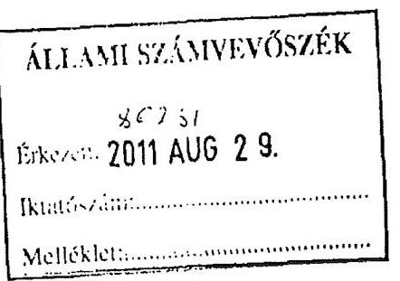

A 9. oldalon az SZJA $32 \%$-a visszaosztási rendben kerül vissza az önkormányzatokhoz, ez rendben van, „a visszaosztás a jövedelem differenciálás mérséklésével párosul" mondatrész zavaró, azt sugallja, hogy mind a $32 \%$ erre megy el, noha ebből van a normatív támogatások egy része.

- A gazdasági társaságok támogatása tartalmazza a meghatározott célra átvett állami pénzeket - pld közösségi közlekedés támogatása, ivóvíz szolgáltatás támogatása - ami csak „átmegy" az önkormányzaton, ezt így feltüntetni megtévesztő. (A két tétel együtt 575.333 E Ft.) (17. oldal)
- 2010. évben Debrecen város önkormányzata (17. oldal) nem adott müködési támogatást a Kenézy Gyula Kórháznak. A 660 millió Ft rossz adat. Az összeget a Hajdú Bihar Megyei Önkormányzat adta.
- A 20. oldalon a szöveg rögzíti, hogy nem mutattuk be a közgyülésnek a kamat és árfolyam kockázatot a hitelről szóló döntésnél. A 2011. évi költségvetési előterjesztés 6. oldala tartalmazza ezt, így a megállapítás nem helytálló.
- A 21. oldalon a szöveg szerinti „A további évekre szóló jelenleg nem ismert pénzintézeti kötelezettséget nem látjuk biztosítottnak, mivel nem számszerüsítették a visszafizetés forrását." Megállapítás nem helytálló, ugyanis a 2011. évi koncepció szöveges részébe (15.oldal) szó van erről, melyhez munkatábla készült, eszerint a már felvett hitelek kamata + törlesztése együtt 2014. évben a legmagasabb 3,4 milliárd Ft. Erre a 10 milliárd helyi adóbevétel miért ne lenne elegendő biztosíték?
- Kérjük a 22. oldal 3. bekezdés utolsó mondatát „... a bíróság korlátlan és teljes felelősséget állapíthat meg az önkormányzat terhére." pontosítani, mert így úgy tünik, mintha az Ötv. 80.§ (3) bekezdésében foglaltakat nem tartotta volna be az önkormányzat. (felelőssége nem haladja meg a vagyoni hozzájárulás mértékét) A Gt. kivételes esetben adja meg a korlátlan felelősséget, ha felszámolás van, és ha a bíróság megállapítja azt, hogy az önkormányzat tartósan hátrányos üzletpolitikája miatt alakult így a helyzet. Miből gondolják azt, hogy ez bekövetkezhet? Ha ezt tény támasztja alá, akkor ezt rögzíteni kell, ha csak feltevés, akkor kérjük pontosabban megfogalmazni.
- A 23. oldal első bekezdése ellentmond a 18. oldalon leírtaknak, ugyanis a müködési bevétel fedezte a müködési kiadásokat, de 2008. év kivételével már az

---

adósságszolgálatot nem. E megállapítással szemben az van leírva, hogy ,... a működési bevételek 2008. év kivételével nem biztosították a müködési kiadások és az adósságszolgálat finanszírozását." Így ez ellentmondásos, kérjük javítani így: „... a müködési bevételek a müködési kiadások fedezetét biztosították, de 2008. év kivételével az adósságszolgálat finanszírozását nem."

A fenti észrevételeknek a javításán túl szükségesnek látjuk, hogy az anyag egyértelműen rögzítse, hogy Debrecen város önkormányzata a müködési kiadásokra hitelt nem vett fel, hitelei kivétel nélkül beruházási hitelek. Ez kiolvasható ugyan az anyagból, de mindenképpen olyan tény, amit hangsúlyozni kell, mert minősíti az önkormányzat gazdálkodását.

A javaslatok megfogalmazásával csak részben tudunk egyetérteni, ugyanis azok egy része a napi munka része (pld. követelések behajtása), egy része pedig a tervezés során értelemszerűen elvégzésre/elemzésre kerül még, akkor is, ha arról nincs testületi döntés (miért is lenne?), de ezek nélkül nem is készülhetne el költségvetés. Ilyen a 2. pont ab.ac.ae.af. alpontjai. A 2. pont aa. alpontját nem értjük, kérjük kifejteni (mit értenek helyi adó potenciák alatt).
A 3. pont bevezető szövege és a, pontja értelmezésre szorul, a féléves háromnegyedéves és éves záráskor kellene bemutatni a gt-k aktuális helyzetét? Ezt érti szokásos beszámoló alatt? A gt-k-nek sem féléves, sem háromnegyedéves zárása nincs. Év végi mérlegük - az önkormányzat 25/1997. (VI.2.) rendelete értelmében - a közgyülés elé kerül, áttekintés és elemzés után. Mit kellene ezen túl még tenni? Milyen jogszabály írja ezt elő?

Az önkormányzattól elvárni 3 éves kitekintést (3.b. pont) - az Aht. is törölte 2011. évtől a korábbi 2 éves gördülő tervezést - a jelenlegi helyzetben értelmetlen. Nincs információ a kötelező feladatok alakulásáról (oktatás, okmány, műszaki hatóság, szociális ellátás stb), nincs információ a várható támogatásokról és a várható gazdasági helyzetről. Nem az önkormányzat feladata ezek prognosztizálása. A forrásokat illetően mi várható a helyi adók tekintetében, hogy alakul az ingatlanpiac stb., ki tud ehhez adatot adni?
A 3.c. pont értelemszerűen része a beszámolóknak előírás nélkül is.
A 4. pontban foglaltakra lehet külön intézkedési tervet készíteni, de a költségvetés készítésének ez része.

A jegyzőnek írt feladatok közül az 1. pontban „mérlegen kívüli tételek" szöveg helytelen, mert nekünk kezességvállalásuk van és ez része a mérlegnek.

Tisztelt Elnök Úr!
Tisztelettel kérem, hogy javaslataink megfogalmazásánál vegyék figyelembe észrevételeinket, ne kerüljön olyan feladat rögzítésre, ami külön adminisztrációt jelent, amúgy pedig nem is végrehajtható. Az amúgy is nehéz helyzetben értelmetlen adminisztrációval az apparátus már nem terhelhető.

Debrecen, 2011. augusztus 3.
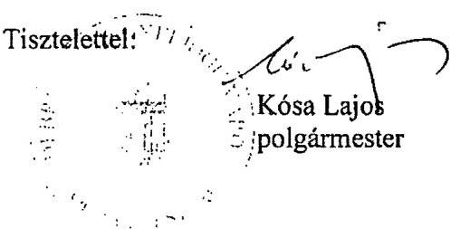

---

# Kósa Lajos úr, 

polgármester
Debrecen Megyei Jogú Város Önkormányzata

## Debrecen

## Tisztelt Polgármester Úr!

Köszönettel vettem észrevételeit a Debrecen Megyei Jogú Város Önkormányzata pénzügyi helyzetének ellenőrzéséről készített jelentés-tervezetben foglalt megállapításokra. Az észrevételek feldolgozása, szakmai értékelése megtörtént, melynek eredményéről az alábbiakban tájékoztatom:

Levelének 3. pontjában tett észrevételét elfogadtuk, a Kenézy Gyula Kórháznak adott müködési támogatás nyújtásával összefüggő megállapítást a jelentés-tervezetben javítottuk.

Az észrevétel 7. pontjában foglaltakat elfogadtuk, és a következő javítást vezettük át a jelentéstervezeten: Az „azonban a müködési bevételek a 2008. év kivételével nem biztositották a müködési kiadások és az adósságszolgálat finanszirozását" megállapítás helyett „a müködési bevételek finanszirozták a müködési kiadásokat, azonban az adósságszolgálatra a 2008. év kivételével nem biztositottak forrást" szövegrész szerepel.

Az 1. pontban tett észrevételt nem fogadtuk el, az szja visszaosztási rendjének leírását változatlanul hagytuk. A bevezetésben az önkormányzatok, hangsúlyosan a megyei jogú városok pénzügyi helyzetének bemutatása történt, melyben részletesen elemeztük a források alakulását. Véleményünk szerint az az állításunk - amely szerint az szja $32 \%$-a külön szabályozott visszaosztási rendben illeti meg az önkormányzatokat, ami párosul a jövedelemdifferenciálódás mérséklésével - a valós gyakorlatot írja le és utal arra, hogy a visszaosztás szempontjai között szerepel a jövedelem-differenciálódás is és nem kizárólag ez alapján kerül a $32 \%$-os szja visszaosztásra.

Az észrevétel 2. pontjához kapcsolódóan tájékoztatjuk, hogy a gazdasági társaságok részére nyújtott pénzeszközátadások a 7/b. számú tanúsítvány 6-11. soraiból kerültek kigyűjtésre. Ezek a sorok nem tartalmazták a meghatározott célra átvett állami pénzeszközöket. A közösségi közlekedés és az ivóvíz-szolgáltatás támogatása a központi költségvetésből kapott támogatások között (15. sor) szerepelt, amely nem került beszámításra az önkormányzati támogatás meghatározásakor.

Az észrevétel 4. pontjában foglaltakat, mely szerint a 2011. évi költségvetési előterjesztés 6. oldala tartalmazta az árfolyam- és kamat kockázat bemutatását a hitelről szóló döntéseknél, nem fogadtuk el. Az észrevételben tett hivatkozás - véleményünk szerint - téves. A 2011. évi

---

költségvetési előterjesztés 16. oldala tartalmazta az Önkormányzat által felvett hitelek árfolyamváltozásának 2010-ig történő elemzését, azonban nem mutatta be a teljes futamidőre az árfolyam- és kamat kockázatot. Ugyanakkor az előterjesztő felhívta a figyelmet arra, hogy folyamatosan figyelni kell az árfolyamok és a kamatok alakulását, s amennyiben indokolt az átváltás lehetőségével élniük kell.

Az észrevétel 5. pontjában foglaltakat - miszerint a helyi adóbevétel fedezetet nyújt a további évekre szóló jelenleg ismert pénzintézeti kötelezettségek teljesítésére - nem fogadtuk el. A jelenleg ismert pénzintézeti kötelezettségek 2014-et követő éveket érintő teljesítését továbbra sem látjuk biztosítottnak. Az észrevételben jelzett 10 milliárd Ft helyi adóbevétel nem szolgálhat fedezetéül a kötelezettségeknek. A helyi adó növekménye figyelembe vehető bevonható szabad forrásként, azonban a növelésre 2011-ben tett intézkedés nem biztosít elegendő többletforrást a fizetési kötelezettség teljesítésére, a további évekre vonatkozóan pedig nem ismertek a helyi adó növelésének lehetőségei - a helyi adó potenciál.

Az észrevétel 6. pontjában foglaltak - „a bíróság korlátlan és teljes felelösséget állapithat meg az önkormányzat terhére" - pontosítását nem tartottuk szükségesnek. Az Önkormányzat minősített többségi tulajdonú gazdasági társaságainak a 2011-2013. évekre várható kötelezettsége 772 millió Ft, 843,3 ezer CHF és 1326,3 ezer EUR. A 2014. év után várható kötelezettség összegét 1334 millió Ft, 913,6 ezer CHF és 6067,1 ezer EUR alkotja. A gazdasági társaságok kötelezettségeinek bemutatásával az Önkormányzat figyelmét szándékoztunk felhívni arra, hogy a kötelezettségek teljesítésének nehézségei a gazdasági környezet és a piaci pozíciók változása miatt kockázatot jelent az Önkormányzat pénzügyi helyzetét illetően.

A jelentés-tervezet megállapításaira tett konkrét észrevételeken túl további pontosítások igényét is megfogalmazták, amelyeket az alábbiak szerint értékeltünk:

- Az anyagból ugyan kiolvashatónak ítélték, de kérték annak hangsúlyozását, hogy az Önkormányzat müködési kiadásokra hitelt nem vett fel, mely körülmény további hangsúlyozását nem tartottuk indokoltnak. Egyrészt a jelentés-tervezetben rögzítésre került, hogy a felvett hosszú lejáratú hiteleket az Önkormányzat a Közgyűlés által jóváhagyott hitelcélnak megfelelően a tervezett beruházásokhoz használta fel, másrészt pedig az Önkormányzat 3 milliárd Ft rövid lejáratú hitelt vett fel, amelynek célja a müködési célra használható folyószámlahitel visszafizetése volt.
- A jelentés-tervezet a müködés pénzügyi egyensúlyának hosszú távú fenntarthatósága érdekében a polgármesternek tett 2 . számú javaslatban olyan feladatokat fogalmazott meg, amelyeknek egy intézkedési terv, program keretében történő összefoglalását a Közgyűlés tájékoztatása, valamint a téma kiemelt fontossága miatt szükségesnek tartottuk. A 2 a.a. javaslatban a helyi adó potenciál meghatározása és kihasználása témakörben fontosnak ítéljük meg, hogy az Önkormányzat bemutassa, milyen nagyságrendủ helyi adóbevétele származna a törvény által kivethető, maximális adómértékkel számított adókból. Ehhez lehet hasonlítani a ténylegesen befolyó, kivethető adóbevételeket, amely alapján megállapítható, hogy van-e lehetőség - a helyi

---

viszonyok ismeretében - a helyi adóbevétel további növelésére, amely a kötelezettségek növekedésének forrása lehet. Helyi adó potenciálként vehető számba az adott településen egy előrehaladott tárgyalási szakaszban új gazdasági társaság megjelenése, vagy a már jelenlévők növekedését célzó beruházások indítása.

- A gazdasági társaságok pénzügyi helyzetének a Közgyűlés felé történő bemutatását továbbra is szükségesnek tartottuk az észrevételük 6. pontjában megfogalmazottakra adott indokok alapján. Indokolt ez a jogszabályi előírás hiányában is, mert. véleményünk szerint a folyamatokba való esetleges beavatkozás lehetőségének megteremtése miatt szükséges a félévenként adott tájékoztatás.
- A kötelezettségek teljes körére szóló - legalább három évre kitekintő - finanszírozási terv készítését szükségesnek tartjuk, annak érdekében, hogy az Önkormányzat fel tudja mérni a kötelezettségei visszafizetésének forrásait.
- Örömmel vettük, hogy az általunk javaslatként megfogalmazott feladatokat munkájuk részeként jelenleg is elvégzik. Azonban a tervezett és folyamatban lévő fejlesztések finanszírozásának helyzete, valamint a megvalósult beruházásokkal létrehozott létesítmények müködtetése és jövőbeni finanszírozása fontos része a müködés pénzügyi egyensúlya hosszú távú fenntarthatóságának, ezért szükségesnek tartottuk a Közgyűlést tájékoztatását. A Jegyzőnek tett 1. számú javaslatban fontosnak tartottuk a mérlegen kívüli tételek (kezességvállalás, garancia és helytállási kötelezettségvállalás) kockázatainak figyelemmel kísérését és annak alakulásáról legalább félévente a Közgyűlés tájékoztatását. A levelében foglaltaktól eltérően a kezességvállalással összefüggő kötelezettség csak akkor része a költségvetési beszámoló mérlegének, ha az eredeti adós nem teljesítette fizetési kötelezettségét és a hitelező a tartozás kiegyenlítésére irányuló igényét a kezességvállaló felé benyújtotta, és annak pénzügyi rendezése még nem történt meg. A Közgyűlés minél szélesebb körű tájékoztatása érdekében szükségesnek ítéltük meg az e témakörbe tartozó vállalt kötelezettségek bemutatását.

Köszönöm Polgármester úrnak és munkatársainak az ellenőrzés során tanúsított hozzáállását, amellyel az Önkormányzatról készített pénzügyi helyzetelemzés elkészítését segítették.

Budapest, 2011. december "22.".
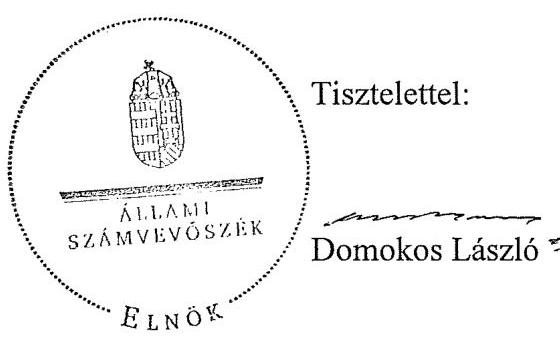

---

.