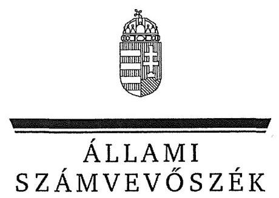

ÁLLAMI
SZÁMVEVŐSZÉK

# JELENTÉS 

Dunaújváros Megyei Jogú Város Önkormányzat pénzügyi helyzetének ellenőrzéséről (43/3)

---

# Számvevői Iroda 

Iktatószám: V-3034-12/2011.
Témaszám: 1015
Vizsgálat-azonosító szám: V056033

## Az ellenőrzést felügyelte:

Dr. Varga Sándor
számvevő igazgató-helyettes
Az ellenőrzést vezette:
Renkó Zsuzsanna
számvevő tanácsos
Az ellenőrzést végezték:

| Huberné Kuncsik | Lajterné Hudák | Tóth László |
| :-- | :-- | :-- |
| Zsuzsanna | Magdolna | számvevő tanácsos |
| számvevő tanácsos | számvevő |  |

---

# TARTALOMJEGYZÉK 

BEVEZETÉS ..... 7
I. ÖSSZEGZŐ MEGÁLLAPÍTÁSOK, KÖVETKEZTETÉSEK JAVASLATOK ..... 18
II. RÉSZLETES MEGÁLLAPÍTÁSOK ..... 31

1. Az Önkormányzat kötelező és önként vállalt feladatai ..... 31
2. Pénzügyi egyensúlyi helyzet alakulása ..... 35
2.1. A múködési és felhalmozási egyensúly alakulása ..... 35
2.2. Az Önkormányzat bevételeinek alakulása ..... 42
2.3. Az Önkormányzat kiadásainak alakulása ..... 46
3. Kötelezettségek bemutatása ..... 51
3.1. A pénzintézetek felé fennálló kötelezettségek alakulása ..... 51
3.2. Szállítók felé fennálló kötelezettségek alakulása ..... 58
3.3. Egyéb kötelezettségek alakulása ..... 60
4. A pénzügyi egyensúly megteremtése érdekében hozott intézkedések ..... 66
5. A helyi önkormányzatok gazdálkodási rendszerének 2010. évi ellenőrzése során a pénzügyi egyensúly javítására tett szabályszerűségi és célszerűségi javaslatok hasznosulása ..... 68

---

# MELLÉKLETEK 

1. számú A múködési és felhalmozási célú hiány/többlet alakulása az Önkormányzat rendeleteiben
2. számú Az Önkormányzat bevételeinek és kiadásainak, adósságszolgálatának alakulásáról
3/a. számú Az Önkormányzat 2007-2010 években megvalósított, 2010. december 31ig befejezett fejlesztései forrásösszetételéről
3/b. számú az Önkormányzat 2010. december 31-én folyamatban lévő fejlesztési feladataihoz kapcsolódó kötelezettségeinek összegzéséről
3/c. számú Az Önkormányzat 2010. december 31-én folyamatban lévő fejlesztési feladataihoz kapcsolódó 2010. évet követő kötelezettség-vállalásainak öszszegzéséről
3/d. számú Az Önkormányzat beadott, elbírálás alatti pályázati forrásból megvalósuló fejlesztéseihez kapcsolódó kötelezettség-vállalásainak összegzéséről
3. számú Az önkormányzati feladatok ellátásában résztvevő gazdasági társaságokmelléklet ról

---

# RÖVIDÍTÉSEK JEGYZÉKE 

## Törvények

Áht.
ÁSZ tv.

Cégtv.
Csődtv.
Gt.
Htv.

Ötv.
Számv. tv.
Kbt.

## Rendeletek

Áhsz.
SzMSz
önkormányzati biztosról szóló rendelet
2007. évi zárszámadási rendelet
2008. évi zárszámadási rendelet
2009. évi zárszámadási rendelet
2010. évi zárszámadási rendelet
2011. évi költségvetési rendelet
vagyongazdálkodási rendelet

## Szórövidítések

áfa
ÁSZ
BM
CHF
az államháztartásról szóló 1992. évi XXXVIII. törvény az Állami Számvevőszékről szóló 1989. évi XXXVIII. törvény (2011. július 1-jétől az Állami Számvevőszékről szóló 2011. LXVI. törvény)
a cégnyilvánosságról, a bírósági cégeljárásról és a végelszámolásról szóló 2006. évi V. törvény
a csődeljárásról és a felszámolási eljárásról szóló 1991. évi XLIX törvény
a gazdasági társaságokról szóló 2006. évi IV. törvény
a helyi önkormányzatok és szerveik, a köztársasági megbízottak, valamint egyes centrális alárendeltségú szervek feladat- és hatásköreiről szóló 1991. évi XX. törvény
a helyi önkormányzatokról szóló 1990. évi LXV. törvény
a számvitelről szóló 2000. évi C. törvény
a közbeszerzésekről szóló 2003. évi CXXIX. törvény
az államháztartás szervezetei beszámolási és könyvvezetési kötelezettségének sajátosságairól szóló 249/2000. (XII. 24.) Korm. rendelet
Dunaújváros Megyei Jogú Város Önkormányzatának 3/1991. (III. 9.) számú rendelete a Közgyűlés és Szervei Szervezeti és Müködési Szabályzatáról
Dunaújváros Megyei Jogú Város Közgyűlésének 41/1997. (IX. 10.) számú rendelete az önkormányzati biztosról
Dunaújváros Megyei Jogú Város 20/2008. (IV. 25.) számú rendelete az Önkormányzat 2007. évi zárszámadásáról
Dunaújváros Megyei Jogú Város 17/2009. (IV. 24.) számú rendelete az Önkormányzat 2008. évi zárszámadásáról
Dunaújváros Megyei Jogú Város 17/2010. (V. 1.) számú rendelete az Önkormányzat 2009. évi zárszámadásáról
Dunaújváros Megyei Jogú Város 10/2011. (IV. 29.) számú rendelete az Önkormányzat 2010. évi zárszámadásáról
Dunaújváros Megyei Jogú Város 9/2011. (II. 25.) számú rendelete az Önkormányzat 2011. évi költségvetéséről Dunaújváros Megyei Jogú Város Közgyűlésének 1/2008. (I. 18.) számú rendelete az Önkormányzat gazdálkodásának rendjéről
általános forgalmi adó
Állami Számvevőszék
Belügyminisztérium
svájci frank

---

| Dunanett Kft. | Dunaújvárosi Regionális Köztisztasági és Hulladékkezelő Szolgáltató Korlátolt Felelősségű Társaság |
| :--: | :--: |
| DVCSH Kft. | Dunaújvárosi Víz- Csatorna- Hőszolgáltató Korlátolt Felelősségű Társaság |
| DVG Zrt. | Dunaújvárosi Vagyonkezelő Zártkörűen Müködő Részvénytársaság |
| DVN Zrt. | Dunaújvárosi Városfejlesztési Zártkörűen Müködő Részvénytársaság |
| DSZSZ Kft. | Dunaújvárosi Szennyvíztisztító Szolgáltató Korlátolt Felelősségű Társaság |
| EDP hiány/egyenleg | Uniós módszertan szerinti maastrichti kritériumoknak megfelelő számítás szerinti hiány/egyenleg |
| Energo-Hőterm Kft. | Energo-Hőterm Beruházó Müködtető Korlátolt Felelősségű Társaság |
| Energo-Viterm Kft. | Energo-Viterm Beruházó, Müködtető Korlátolt Felelősségű Társaság |
| EU | Európai Unió |
| Forrás Nyrt. | Forrás Nyíltkörűen Müködő Részvénytársaság |
| főjegyzö | Dunaújváros Megyei Jogú Város Önkormányzatának címzetes főjegyzője |
| gazdasági program | Dunaújváros Megyei Jogú Város Közgyűlésének a 20062010. évekre szóló gazdasági programja, melyet a Közgyűlés a 356/2007. (VI. 28.) számú határozatával fogadott el |
| GDP | Bruttó hazai termék |
| hivatali SzMSz | Dunaújváros Megyei Jogú Város főjegyzője 12/2005. számú szabályzata Dunaújváros Megyei Jogú Város Polgármesteri Hivatala ügyrendjéről, hatályos 2005. május 17-től |
| polgármester | Dunaújváros Megyei Jogú Város Önkormányzat polgármestere |
| Polgármesteri hivatal | Dunaújváros Megyei Jogú Város Önkormányzat Polgármesteri Hivatala |
| Innopark Kft. | Innopark Non-profit Korlátolt Felelősségű Társaság |
| KDOP | ÚMFT Közép-dunántúli Operatív Program |
| Kórház | Dunaújvárosi Szent Pantaleon Kórház Nonprofit Korlátolt Felelősségű Társaság |
| Közgyűlés   közszolgálati szabály-   zat | Dunaújváros Megyei Jogú Város Közgyűlése   2010. február 28-ig a Dunaújváros Megyei Jogú Város   Jegyzőjének többször módosított 5/2007. számú szabályza-   ta, 2010. március 1-től a többször módosított 4/2010. szá-   mú szabályzata a Hivatal köztisztviselőinek közszolgálati   szabályzatáról |
| NAV | Nemzeti Adó és Vámhivatal |
| likviditási és kockázat-   kezelési szabályzat | Dunaújváros Megyei Jogú Város Jegyzőjének 16/2010. számú szabályzata a likviditásról és a kockázatkezelésről |
| KSH | Központi Statisztikai Hivatal |
| MÁK | Magyar Államkincstár |
| Média Kft. | Média Duna Invest Korlátolt Felelősségű Társaság |

---

| MMK Kft. | Munkásművelődési Központ Nonprofit Korlátolt Felelőss-   gú Társaság |
| :-- | :-- |
| NGM | Nemzetgazdasági Minisztérium |
| OEP | Országos Egészségbiztosítási Pénztár |
| ÖKIF hitel | Sikeres Magyarországért Önkormányzati Fejlesztési Hitel-   program keretében felvett hitel |
| Önkormányzat | Dunaújváros Megyei Jogú Város Önkormányzata |
| Partvédelmi Vállalat | Dunaújvárosi Partvédelmi Vállalat |
| PPP konstrukció | Public Private Partnership (Partnerségi együttmúködés köz-   feladatok ellátására a magánszektor bevonásával) |
| szja | Személyi jövedelemadó |
| TIOP | Társadalmi Infrastruktúra Operatív Program |
| Turisztikai Kft. | Dunaújvárosi Kistérségi Turisztikai Nonprofit Korlátolt   Felelősségú Társaság |
| Vasmú 41. Kft. | Vasmú 41. Irodaház Korlátolt Felelősségú Társaság |

---

.

---

# JELENTÉS 

## Dunaújváros Megyei Jogú Város Önkormányzata pénzügyi helyzetének ellenőrzéséről

## BEVEZETÉS

Az Állami Számvevőszék 2011. évtől érvényes stratégiája új irányt szabott a helyi önkormányzatok gazdálkodásának ellenőrzésében is. Az ÁSZ - küldetése és jövőképe szerint - szilárd szakmai alapokra támaszkodva értékteremtő ellenőrzéseivel és helyzetelemzéseivel az államháztartás egészében, így a helyi önkormányzati alrendszerben is elő kívánja segíteni a közpénzek és a közvagyon szabályos, gazdaságos, hatékony és eredményes hasznosítását. Ennek részeként - a 2010. évi államháztartási hiány alakulásának összetevőire is figyelemmel folyamatban van az önkormányzati alrendszer pénzügyi helyzetelemzése.

Az NGM 2011 áprilisában közzétett adatai szerint ${ }^{1}$ a 2010. évi 1036,2 milliárd Ft összegű 3,8\%-os EDP (maastrichti kritériumok szerinti, Túlzott Hiány Eljárás keretében kimutatott) hiánycél nem volt tartható, az önkormányzati alrendszer tervezettet meghaladó hiánya miatt a GDP arányában kifejezett államháztartási hiány $4,2 \%$-ra emelkedett.

Az önkormányzatok 2010 első három negyedévi költségvetési jelentése szerinti pénzforgalmi hiány 97 milliárd Ft-os összege nem indokolta az önkormányzati alrendszer 190 milliárd Ft-ra becsült hiányának 2010. évi végi felülvizsgálatát. A helyi önkormányzatok 2011. januári gyorsjelentése alapján a pénzforgalmi hiány már 247,7 milliárd Ft-ot tett ki. Az alrendszer hiánya így a tervezett $0,7 \%$-kal szemben magasabb, $0,9 \%$-os szinten realizálódott. Az 57,7 milliárd Ft hiánytöbblet alakulásában - a Tájékoztató szerint - az iparűzési adó elmaradása, a gépjárműadó, az illetékek és más bevételek tervezettnél alacsonyabb összegben való teljesülése volt a meghatározó.

Magyarország a Széll Kálmán Terv célkitűzései alapján² aktualizált Konvergencia Programjában a középtávú (2011-2015. évek) költségvetési pálya kijelölése során 2011-re a kormányzati szektor EDP módszertan szerinti egyenlegét $+2 \%$ ban jelölte meg. Az egyenlegcél megfogalmazásakor az önkormányzati alrendszer tervezett hiányát a 2011. évi költségvetésben szereplő $0,3 \%$-kal szemben

[^0]
[^0]:    ${ }^{1}$ NGM Tájékoztatás Magyarország Strukturális Reformprogramjának végrehajtásáról (2011. április 1). A Tájékoztató évente két alkalommal - április és október hónapban jelenik meg.
    ${ }^{2}$ Az államháztartás 2011. évi egyenlege - a magán nyugdíjpénztárakból az állami nyugdíjpillérbe való visszatérés egyszeri vagyonhatása következtében - 4\%-os többletet mutatna. A Széll Kálmán Tervben foglalt egyszeri intézkedések - a MÁV, a BKV adósságrendezése, a PPP projektek kiváltása - összességében a GDP 2\%-ával csökkentik a várható többlet mértékét.

---

0,5\%-os arányban határozták meg ${ }^{3}$. A hiánycélok meghatározása jelzi, hogy az önkormányzati alrendszerben 2011-ben fokozott figyelmet kell fordítani a pénzügyi egyensúlyi helyzet alakulására.

Az államháztartás helyi szintjén a 23 megyei jogú városi önkormányzatnak az általuk ellátott közszolgáltatások volumenére való tekintettel kiemelt szerepe van, e települések népessége összességében meghaladja a kétmillió főtt ${ }^{4}$. A települések népességét az alábbi diagram szemlélteti:
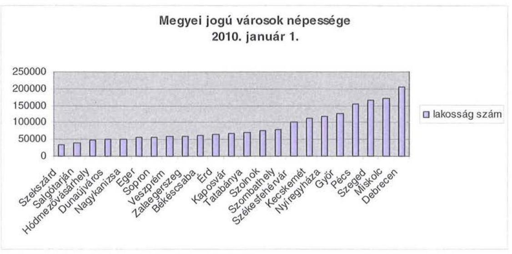

A megyei jogú városi önkormányzatok ${ }^{5}$ kötelező feladatellátását többlépcsős törvényi előírások határozzák meg. A feladatokra vonatkozó szabályozás első szintjét az Ötv. ${ }^{6}$, a második szintet a hatásköri7, a harmadik szintet a további ágazati, szakmai (egyebek mellett az oktatási, egészségügyi, szociális és egyéb ágazati feladatok ellátásának szakmai szabályait rögzítő) törvények adják.

A megyei jogú városi önkormányzatok - az Ötv-ből közvetlenül levezethető települési feladatok mellett körzeti közszolgáltatásokat is ellátnak. A megyei jogú városi cím elsősorban többlet kötelezettségekkel jár, a megyei jogú városnak önmagának kell gondoskodnia mindazokról a feladatokról, amelyek más

[^0]
[^0]:    ${ }^{3}$ A Magyar Köztársaság 2011. évi költségvetéséről szóló 2010. évi CLXIX. törvény Általános indoklásának III. fejezete, valamint Magyarország Konvergencia Programja 2011-2015. (2011. április) Táblázatok rész, 2. táblázat Âllamháztartás összefoglaló adatai szerint.
    ${ }^{4}$ A megyei jogú városok népességét a 4/2011. (I. 31.) NGM rendelet 1. sz. mellékletében foglalt 2010. január 1-i adatok alapján vettük figyelembe.
    ${ }^{5}$ Az Ötv. 61. § (1) bekezdése alapján a megyeszékhely város a törvény erejénél fogva megyei jogú, ugyanakkor az Országgyúlés az ötvenezernél nagyobb népességú városokat a képviselőtestület kérelmére megyei jogú várossá nyilváníthatja. Ez utóbbi körbe 5 város tartozik, közülük 2 (Hódmezővásárhely, Dunaújváros) népessége 2010. január 1-ére már ötvenezer fő alá csökkent.
    ${ }^{6}$ az Ötv. 8. és 61. §-ában foglaltak szerint
    ${ }^{7}$ a Htv.

---

települési önkormányzatok esetében a megyei önkormányzat feladatát képezik. Ide sorolható többek közt a középfokú oktatási intézmények fenntartása, a közművelődési, könyvtári és levéltári szolgáltatás, a társadalombiztosítás finanszírozása mellett a kórházi és a rendelőintézeti szakellátás, a szociális és egyes gyermekvédelmi feladatok ellátása. Ezeket a feladatokat (intézményeket) a megyei jogú város - más városoktól eltérően - nem adhatja át a megyei önkormányzatnak, azonban az Ötv. lehetőséget biztosít arra, hogy a megyei önkormányzattal megállapodjék a feladatellátás megosztásában.

Az önkormányzat, így a megyei jogú város is, maga határozza meg, hogy - a lakosság igényei alapján, anyagi lehetőségei függvényében - mely feladatokat, milyen mértékben és módon, mely szervezeti keretek közt lát el. A szervezetalakítás szabadsága a megyei jogú városok esetében azzal járt, hogy mind a kötelező közszolgáltatásoknál (különösen a településüzemeltetés, vagyongazdálkodás), mind pedig az önként vállalt feladataik ellátásában - elsősorban a sport és kulturális szolgáltatások területein - a gazdasági társaságok kiemelt fontosságú szerephez jutottak. Ily módon a gazdálkodás, a pénzügyi helyzet kockázatai közvetlenül kikerültek ugyan az önkormányzati alrendszerből, azonban sérülhet az ellátási felelősség figyelemmel kísérése és érvényesítése, a közpénzek felhasználásának transzparenciája. Mindezek együttvéve - a beszámolók konszolidálásának hiányában - növelik a megyei jogú városok pénzügyi helyzetének megítélésében rejlő kockázatokat.

Az áttekintett időszakban az önkormányzati feladatok ellátásának keretet biztosító forrásszabályozás elvei lényegesen nem változtak.

A megyei jogú városok önkormányzatainak mozgásterét, az önkormányzatok feladatellátásra vonatkozó döntéseit a központi költségvetéstől való függőség mellett jelentősen befolyásolja a helyi adókivetési jog gyakorlása ${ }^{8}$. A helyi adók rendszere a közszolgáltatások finanszírozásához szükséges források megteremtésének, bővítésének eszköze, amely a gazdasági válság, a jogszabályi környezet, az adópolitika változása, az adóhatóságok tevékenysége következtében differenciáltan érinti a települési önkormányzatokat ${ }^{9}$.

A települési önkormányzatok saját folyó bevételeinek keretében elszámolt, különböző jogcímeken kivetett helyi adók - iparűzési adó, építmény és telekadó, idegenforgalmi adó, vállalkozók és magánszemélyek kommunális adója -2007-2010 között eltérő módon emelkedtek. A helyi adókból származó bevételek realizált összege országos szinten 2007-2009 között folyamatosan, 505,3 milliárd Ft-ról 566,3 milliárd Ft-ra emelkedett, majd a gazdasági válság hatásai következtében 2010-re 542,6 milliárd Ft-ra esett vissza. A helyi adók részesedése az önkormányzatok saját folyó bevételein belül 2007-2010 között 2,5 százalékponttal csökkent ${ }^{10}$.

[^0]
[^0]:    ${ }^{8}$ a helyi adókról szóló 1990. évi C. törvény szabályai szerint
    ${ }^{9}$ Az Állami Számvevőszék 2010 decemberében közzétett 1031. számú jelentésében értékelte a helyi adók rendszerében a hatékonyság és az eredményesség érvényesülését.
    ${ }^{10}$ A helyi adó bevételek saját folyó bevételekből való részesedése országosan 2007-ben $55,3 \%, 2010$-ben $52,8 \%$ volt.

---

A megyei jogú városok saját folyó bevétele 2007-ben 191,5 milliárd Ft volt, 2008-ban 223,1, 2009-ben 225,4, 2010-ben 223,5 milliárd Ft-ot tett ki. A helyi adóbevételekből való részesedésük 2007-ben 110,5 milliárd Ft (21,9\%), 2008ban 128,3 milliárd Ft (23,2\%), 2009-ben 124,4 milliárd Ft (22\%), 2010-ben 118,7 milliárd Ft (részaránya a 2007. évivel azonosan $21,9 \%$ ) volt. E realizált adóbevételek a megyei jogú városok saját folyó bevételeinek 2007-ben 57,7, 2008-ban 57,5, 2009-ben 55,2, 2010-ben 53,1\%-át jelentették. A helyi adóbevételek 2007-ről 2010-re kimutatott 4,6 százalékpontos csökkenése annak ellenére következett be, hogy a megyei jogú városok saját folyó bevétele 2010-ben $16,7 \%$-kal haladta meg a 2007. évit.

A helyi adókon belül a települések gazdasági helyzetének egyik fokmérője az elért helyi iparűzési adóbevétel, amely a megyei jogú városok körében erőteljes - a település nagyságrendtől is függő ${ }^{11}$ - különbségeket mutat. A helyi iparűzési adóbevétel és annak egy lakosra vetített összegének 2007. és 2010. évi alakulását az alábbi diagramok szemléltetik:
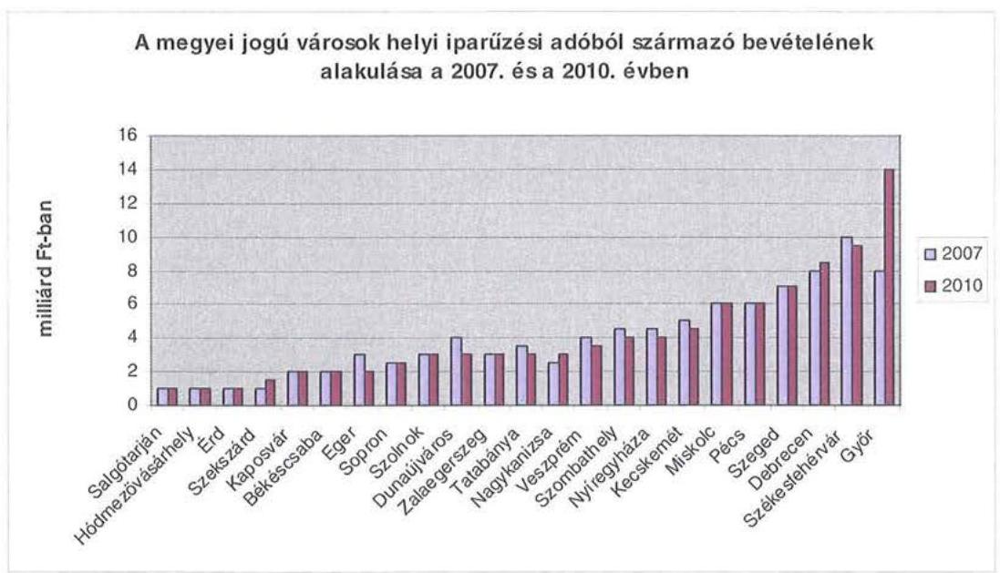

[^0]
[^0]:    ${ }^{11}$ A 100 ezer fő feletti népességű megyei jogú városok csoportjába Debrecen, Miskolc, Szeged, Pécs, Győr, Nyíregyháza, Kecskemét, Székesfehérvár tartozik. Nem megyeszékhely megyei jogú város Érd, Sopron, Nagykanizsa, Dunaújváros, Hódmezővásárhely.

---

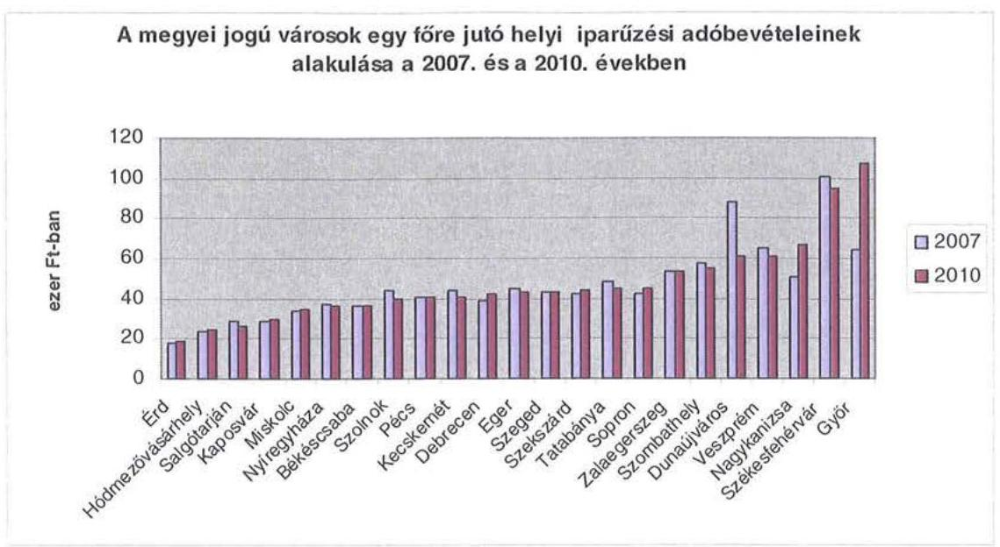

A megyei jogú városi önkormányzatok saját bevételein belül második legjelentősebb elem az illetékbevétel. A 2010. évben befolyt 39,2 milliárd Ft illetékbevétel a 2006. évben realizált 71,1 milliárd Ft illetékbevétel alig több mint $55 \%$-a. A jelentős visszaesést döntően az ingatlanpiac stagnálása, majd visszaesése, illetve egyes illetékkedvezmények bevezetése okozta. A kieső bevételek pótlására az önkormányzati alrendszer szintjén történtek intézkedések, 2010ben 5 milliárd Ft-ot, 2011-ben 1,2 milliárd Ft-ot ellentételezett a központi költségvetés. A megyei jogú városok önkormányzatai az önkormányzati alrendszer szintjén realizált illetékbevételből 2007-ben 13,6 milliárd Ft-tal (23,3\%-kal), 2008-ban 15,3 milliárd Ft-tal ( $22,7 \%$-kal), 2009-ben 12,6 milliárd Ft-tal ( $21,5 \%$ kal), 2010-ben 7,9 milliárd Ft-tal ( $20,2 \%$-kal) részesedtek ${ }^{12}$. Az összes befolyt illetékbevételből a megyei jogú városok részesedése 2009-ről 2010-re mindössze 1,3 százalékponttal csökkent, ugyanakkor a realizált illetékbevétel csökkenése a $37,3 \%$-ot ( 4,7 milliárd Ft) is elérte.

Az önkormányzati alrendszer átengedett bevételei közül a személyi jövedelemadóból való részesedés makroszintű szabályozása a vizsgált időszakban nem változott. A települési önkormányzatokat a településre kimutatott személyi jövedelemadó $8 \%$-a közvetlenül, míg $32 \%$-a külön szabályozott visszaosztási rendben illeti meg. A visszaosztás a jövedelem differenciálódás mérséklésével párosul, rendje a lakóhelyen maradó személyi jövedelemadóhoz és az iparűzési adó-erőképességhez ${ }^{13}$ igazodik, annak részletszabályait a mindenkori költségvetési törvény 4. számú melléklete határozza meg. A jövedelemdifferenciálódás

[^0]
[^0]:    ${ }^{12}$ Az illetékek kivetésének és beszedésének joga 2006. december 31-ig a megyei önkormányzatok feladata volt, amelyet a 2007. évtől az APEH (2011. január 1-jétől NAV) vett át. Az önkormányzati illetékrészesedési szabályok változatlanok maradtak, azonban az illetékbeszedés költségeit az önkormányzatok illetékbevételeiből átlagos (a megyei jogú városoknál $8,5 \%$-os) kulcsot alkalmazva vonták le.
    ${ }^{13}$ Az iparűzési adóerő-képesség egy potenciális, átlagos erőfeszítés mellett elérhető (a települési önkormányzat iparűzési adóelőlegét meghatározó adóalap 1,4\%-ának megfelelő számított) bevétel.

---

szabályai kétirányúak, a kiegészítés és a visszatartás feltételeit egyaránt meghatározták:

- Amennyiben az önkormányzatot közvetlenül megillető személyi jövedelemadó bevétel és a számított iparűzési adóerő-képesség együttesen számított, egy főre jutó összege nem érte el a település méretéhez kapcsolódóan az évenkénti szabályozás szerinti változó összeget, a költségvetés a részesedést település nagyság szerint eltérően meghatározott szintig - kiegészítette ${ }^{14}$. A kiegészítés fajlagos összege 2007-2010 között 37500 Ft-ról 48010 Ft-ra (10 510 Ft-tal, 28\%-kal) emelkedett. Az előzőeken túl a jövedelem differenciálódás szabályozása egyes térségi (középiskolai, szakiskolai, szakképző intézményi, kollégiumi) feladatok ellátásának függvényében további kiegészítő hozzájárulást biztosított.
- Amennyiben az egy főre számított személyi jövedelemadó és az iparűzési adóerő-képesség együttes összege a település nagyságrendjéhez rendelt értékhatárt több mint $25 \%$-kal (2010-től 20\%-kal) meghaladta, az egy főre jutó összeg sávonként differenciált módon ${ }^{15}$ visszavonásra került az önkormányzatot megillető normatív állami hozzájárulás összegéből.

Az önkormányzatok személyi jövedelemadó bevétele 2007-ben 494,3 milliárd Ft, 2008-ban 558,6 milliárd Ft, 2009-ben 639,5 milliárd Ft, 2010-ben 681,2 milliárd Ft volt, az időszak alatt összegében 186,9 milliárd Ft-tal, 37,8\%kal emelkedett, miközben az szja bevétel átengedett bevételeken belüli részesedése 1,8 százalékponttal emelkedett.

A megyei jogú városok önkormányzatainak személyi jövedelemadó részesedése az alrendszer átengedett személyi jövedelemadó bevételeiből 2007-ben 77,6 milliárd Ft-ot ( $15,7 \%$-ot), 2008-ban 105,4 milliárd Ft-ot ( $18,9 \%$-ot), 2009ben 122,9 milliárd Ft-ot ( $19,2 \%$-ot), 2010-ben 136,6 milliárd Ft-ot ( $20,1 \%$-ot) tett ki. A realizált szja bevétel a megyei jogú városoknál az időszak alatt folyamatosan emelkedett, a 2010-ben realizált adóbevétel 59,0 milliárd Ft-tal (76\%) volt magasabb a 2007. évinél, az átengedett bevételeken belüli részesedése 2010-re 5,1 százalékponttal haladta meg a 2007. évi részarányt ${ }^{16}$. A részesedés alapjául szolgáló szja településenként eltérő, az egy adózóra jutó szja 2009. évi adatait ${ }^{17}$ a következő ábra szemlélteti.

[^0]
[^0]:    ${ }^{14}$ A megyei jogú városok esetében a jövedelemkülönbségek mérséklésénél figyelembe veendő lakosonkénti értékhatár 2007-ben 37500 Ft, 2008-ban 42385 Ft, 2009-ben 45933 Ft, 2010-ben 48010 Ft volt.
    ${ }^{15}$ A sávos értékhatár 2010-től 20\%-os intervallumonként, 120\% felett a visszatartást $25 \%$-tól $90 \%$-os mértékig rögzíti. Amennyiben a település nagyságrendhez rendelt értékhatár összege az önkormányzatnál eléri vagy meghaladja a 200\%-ot, az egy főre jutó összeg $90 \%$-a levonásra kerül. Az értékhatár sávjai 2010 előtt $25 \%$-os léptékűek voltak, a levonási arányok az ellenőrzött időszakban nem változtak.
    ${ }^{16}$ E bevételek a megyei jogú városok átengedett bevételeiben 2007-ben 84,7, 2008-ban 87,7, 2009-ben 89,7, 2010-ben 89,8\%-os részarányt jelentettek.
    ${ }^{17}$ Adatforrás: KSH Megyei Jogú Városok a Közép Dunántúlon 2009. kiadványa, 4.1.sz. összehasonlító tábla.

---

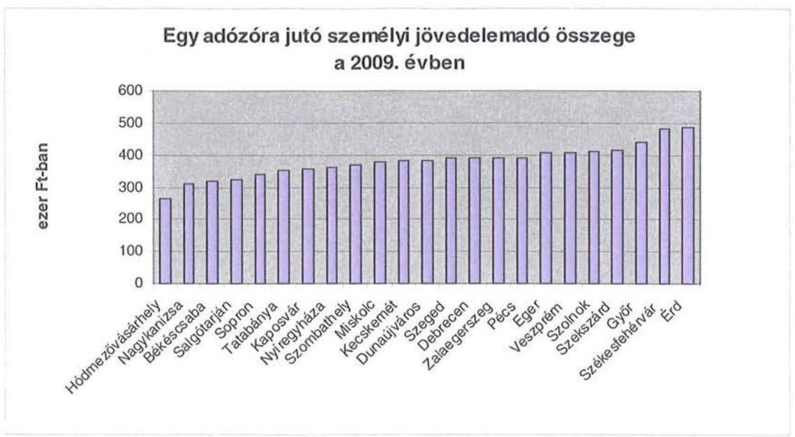

Az átengedett bevételek második legjelentősebb eleme a gépjármúadó, amelynek bevételi szabályozása az ellenőrzött időszakban nem változott, az adóbevétel teljes összege az önkormányzatot illeti meg. A gépjármúadó alapját, mértékét ${ }^{18}$ és egyes mentességi kategóriákat érintő módosítások 2010. január 1-től következtek be, amelyek az egyes adótételek esetében átlagosan $15 \%$-os emelkedéssel jártak.

A gépjármúadó beszedéséből származó bevétel az önkormányzati alrendszer szintjén 2007-ben 62,4 milliárd Ft, 2008-ban 65,7 milliárd Ft, 2009-ben 63,8 milliárd Ft, 2010-ben 71,1 milliárd Ft volt, az adóbevétel egésze 2007-hez képest 8,7 milliárd Ft-tal, 13,9\%-kal emelkedett. A gépjármú-adóztatás szabályainak változása 2010-ben 7,3 milliárd Ft többletet eredményezett. A megyei jogú városok gépjármúadó bevétele a 2007. évi 14,0 milliárd Ft-ról 2010-re 15,5 milliárd Ft-ra, 10,7\%kal emelkedett. A bevételnövekedés összegéből 1,4 milliárd Ft a 2010. évi adózási szabályok következménye.

A megyei jogú városok önkormányzatai 2007-2010 között rendelkezésre álló forrásainak alakulását a következő ábra szemlélteti:

[^0]
[^0]:    ${ }^{18}$ A gépjármúadóról szóló 1991. évi LXXXII. törvény 7. § (1) bekezdésében foglalt adómértékek változása.

---

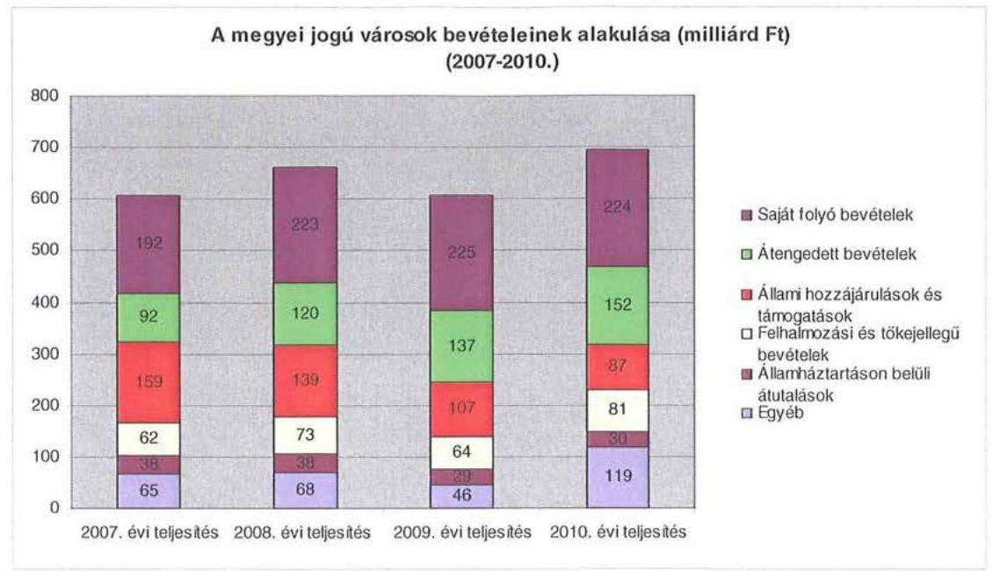

A megyei jogú városok saját folyó bevételeinek - amelyek főbb elemei: a helyi adók, az illetékbevételek, az intézményi térítési díjak, a kamatbevételek részaránya a 2007. évi összbevételen ( 608 milliárd Ft) belül 32\% volt. A 2010. évi összbevétel 693 milliárd Ft-os összegéből a saját folyó bevételek aránya miközben összege 2007-ről 2010-re 32 milliárd Ft-tal emelkedett - nem változott.

Az átengedett bevételek, amelyek a megyei jogú városok önkormányzatainál döntően a személyi jövedelemadó és a gépjármúadó részesedést jelenti, az összbevételen belül a 2007. évi 92 milliárd Ft-ról (15\%) 152 milliárd Ft-ra nőtt, részesedése 7 százalékponttal emelkedett. A 60 milliárd Ft-os növekedésből 59 milliárd Ft-ot az szja részesedés emelkedése okozott.

Az állami hozzájárulások és támogatások - amelyek főbb elemei: főként az ellátotti létszámhoz kötődő normatív állami hozzájárulások, központosított előirányzatok - a 2007. évi 159 milliárd Ft-ról (26\%-os részarányról) 2010-re 87 milliárd Ft-ra ( $13 \%$-os részarányra) estek vissza.

A felhalmozási és tőkejellegú bevételek - tárgyi eszközök (ingatlanok és ingóságok), föld és immateriális javak, részesedések értékesítése, EU-tól átvett pénzeszközök - a 2007. évi 62 milliárd Ft-ról (10\%-os részarányról) 2010-re 81 milliárd Ft-ra ( $12 \%$-os részarányra) emelkedtek.

Az államháztartáson belüli átutalások részesedése 2007-ben 38 milliárd Ft volt. 2010. év végére 8 milliárd Ft-tal csökkent, részaránya 6\%-ról 2010-ben 4\%-ra változott. Ez a bevételi kategória tartalmazza az Egészségbiztosítási Alaptól és más elkülönített állami pénzalapoktól átvett forrásokat. A 2010-ben e címen elszámolt bevétel a megyei jogú városoknál 22 milliárd Ft-ot tett ki.

Az egyéb, pénzmaradványból, vállalkozási bevételekből, államháztartáson kívülről származó átutalásokból, a hitelekből, a hosszú és rövid lejáratú értékpa-

---

pírok értékesítéséből származó bevételek részesedése a 2007-2010. évek viszonylatában 11\%-ról 17\%-ra emelkedett. Ez utóbbiak 2010. évi beszámoló szerinti összevont teljesítése 119 milliárd Ft volt ${ }^{19}$.

Mindezeket figyelembe véve a megyei jogú városok 2007. és 2010. évi forrásöszszetételének megoszlását az alábbi ábra szemlélteti:

A megyei jogú városok 2007. és 2010. évi forrásőszzetétele
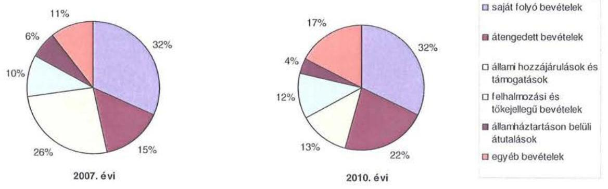

Az önkormányzati alrendszer pénzügyi helyzetértékelése során új elemzési módszereket alkalmaz az ellenőrzés. A hagyományos költségvetési szerkezet helyett az önkormányzat pénzügyi helyzetét a CLF módszerrel mutatjuk be, amelynek lényegét és számításának módszerét a 2.1. pontban, és a jelentés 2. számú mellékletében ismertetjük részletesen.

Az új módszereken alapuló helyzetértékelés fontosságát az adja, hogy a helyi önkormányzatok bruttó adósságállománya ${ }^{20}$ a 2010. évi költségvetési beszámoló alapján 1248 milliárd Ft-ot tett ki. Az adósságállomány koncentráltságát jelzi ${ }^{21}$, hogy ebből a 23 megyei jogú város részesedése 338 milliárd Ft volt, amely a fővárosi és kerületi önkormányzatok adósságának figyelmen kívül hagyásával számított 2010. évi 977 milliárd Ft összegű bruttó adósságállomány $34,6 \%$-át jelentette. Az adósságállomány több mint fele - 501 milliárd Ft - a 19 megyei önkormányzatnál és a 23 megyei jogú városnál jelentkezett.

[^0]
[^0]:    ${ }^{19}$ Az egyéb bevételek összege 2007-2010 között eltérő módon változott, 2007-ben 65 milliárd Ft, 2008-ban 68 milliárd Ft volt, 2009-ben 46 milliárd Ft-ra esett vissza, majd 2010-ben több mint két és félszeresére, 119 milliárd Ft-ra emelkedett.
    ${ }^{20}$ A bruttó adósságállomány 2010. év végi összege magában foglalja a fejlesztési és a működési célú kötvénykibocsátások, a beruházási és fejlesztési hitelek, a működési célú hosszú lejáratú hitelek, a rövid lejáratú hitelek, váltótartozások miatti kötelezettségek teljes (2011-ben, illetve az azt követő években esedékes) állományát.
    ${ }^{21}$ A megyei jogú városok adósságállománya összegében ugyan elmarad az egyéb városok összesített adósságától [(ez utóbbiak részesedése 382,6 milliárd Ft (39,2\%)], azonban az egyéb városok száma 304. A fővárosi és a kerületi önkormányzatok nélküli adósságállományból a 19 megyei önkormányzat 163 milliárd Ft-tal ( $16,8 \%$-kal), míg a nagyközségek, községek együttesen 93 milliárd Ft-tal ( $9,5 \%$-kal) részesednek.

---

A megyei jogú városok 338 milliárd Ft-os adósságállományából 175 milliárd Ft $(51,8 \%)$ a 8 legnagyobb, 100 ezer fő feletti népességű város tartozása. Az 5 nem megyeszékhely megyei jogú város bruttó adósságállománya 70 milliárd Ft-ot (20,7\%-ot), az előző két csoportba nem tartozó további 10 megyei jogú város adóssága 93 milliárd Ft-ot ( $27,5 \%$-ot) tett ki.
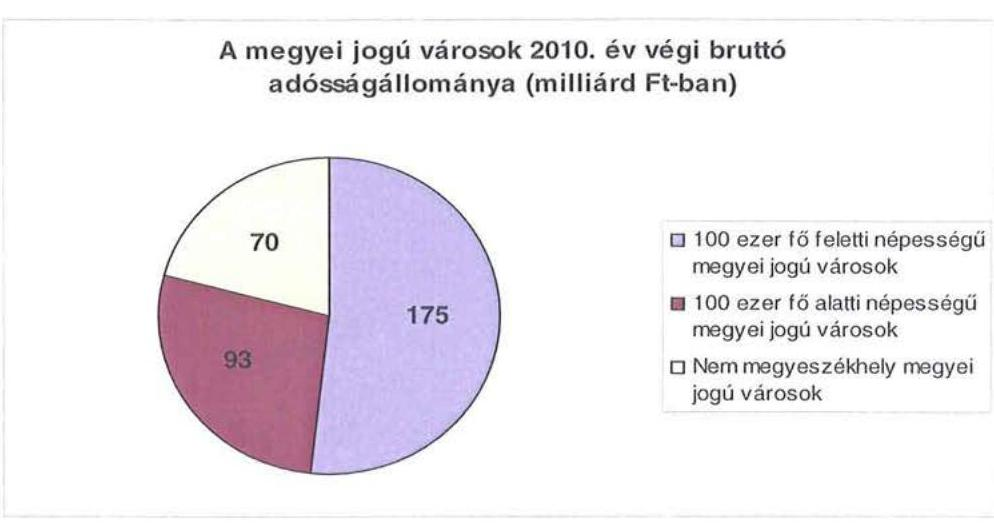

A mérlegben kimutatott bruttó adósságállomány mellett az önkormányzatok számára az eszközállomány műszaki állapotának megőrzése is kötelezettségekkel jár. Az elhasználódott eszközök pótlására forrást biztosító amortizációs (felújítási) alap képzésének ${ }^{22}$ elmaradása maga után vonhatja a feladatellátást kiszolgáló tárgyi eszközök állagának erőteljes romlását. Emellett a 2007-2013as időszakra meghirdetett, vissza nem térítendő EU-s fejlesztési forrásokhoz való hozzájutás lehetősége felerősítette az önkormányzati alrendszer fejlesztési igényeit, amelyek a felhalmozási költségvetési hiány folyamatos emelkedésén túl - az előírt jövőbeni fenntartási kötelezettség miatt - tovább terhelhetik az önkormányzatok költségvetését ${ }^{23}$.

Az ÁSZ a 2011. évi ellenőrzési tervében 43. számú, az Önkormányzatok gazdálkodási rendszerének ellenőrzése részeként egy időben, egymással párhuzamosan tekinti át, és elemzi a 23 megyei jogú városi önkormányzat pénzügyi helyzetét. A gazdálkodás szabályszerűségét az ÁSZ az előző évek során ebben az önkormányzati körben is ellenőrizte, ezért jelen vizsgálatunk erre nem tér ki. A jelentés a megyei jogú városok sajátos feladatellátási és forrásszabályozási helyzetére tekintettel az önkormányzatok pénzügyi helyzetét, illetve az ezzel összefüggő korábbi ÁSZ javaslatok megvalósítását mutatja be.

[^0]
[^0]:    ${ }^{22}$ Erre a jelenlegi szabályozási környezetben nem kötelezi semmilyen előírás az önkormányzatokat.
    ${ }^{23}$ Az Állami Számvevőszék 2011 júniusában közzétett 1108. számú, a helyi önkormányzatok fejlesztési célú támogatási rendszerének ellenőrzéséről szóló jelentésében feltárta a fejlesztési folyamatok problémáit. A helyi önkormányzatok elsősorban azokat a fejlesztéseket valósították meg, amelyekhez támogatást lehetett igényelni. A fejlesztési célok közül a magasabb támogatás intenzitású pályázatokat részesítették előnyben. A fejlesztéssel megvalósuló létesítmények jövőbeli üzemeltetésének várható ráfordításait az önkormányzatok $71,9 \%$-a nem mérte fel.

---

Az ellenőrzés a 2007. január 1. - 2010. december 31. közötti időszakot öleli fel.
A vizsgálat jogszabályi alapját az Állami Számvevőszékről szóló 1989. évi XXXVIII. törvény 2. § (3), (5), (6) és (9) bekezdései ${ }^{24}$, az Ötv. 92. § (1) bekezdése, az Áht. 104. § (3), és 120/A. § (1) bekezdése előírásai képezik.
${ }^{24}$ 2011. július 1-jétől az Állami Számvevőszékről szóló 2011. évi LXVI. törvény 5. § (2)(5) bekezdései.

---

# I. ÖSSZEGZŐ MEGÁLLAPÍTÁSOK, KÖVETKEZTETÉSEK JAVASLATOK 

Az Önkormányzat - adatszolgáltatása szerint - a 2010. évi múködési célú költségvetési kiadásaiból ( 11002 millió Ft) 10452 millió Ft-ot (95\%) a kötelező, 550 millió Ft-ot (5\%) az önként vállalt feladatok ellátására fordított. A kötelező feladatokat rögzítették, az önként vállalt feladatok körét nem határozták meg az Önkormányzat SzMSz-ében. Kötelező feladataikat - települési igazgatási és kommunális feladatok, egészségügyi ellátás, környezet- és település-egészségügy, szociális alapellátás, nevelés és oktatás, közmúvelődési, közgyűjteményi, környezetvédelmi, tűzvédelmi, sport és ifjúsági feladatok - az Ötv. és az ágazati törvények alapján határozták meg. Az Önkormányzat önként vállalt feladatnak tekinti az egyes egészségügyi, kulturális, állategészségügyi, piaci és vásári, üdültetési tevékenységeit. Az önként vállalt feladatokra fordítható forrásokat az éves költségvetési rendeletek tartalmazták.

Az Önkormányzat feladatellátásának szervezeti struktúráját a következő ábra szemlélteti:
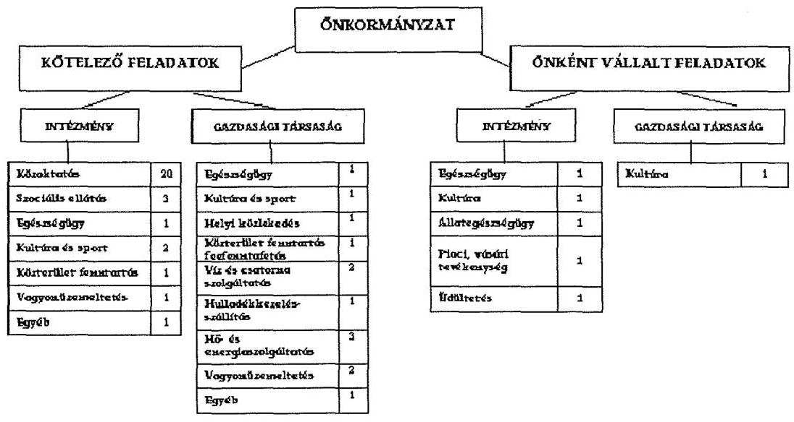

Az Önkormányzat a kötelező és az önként vállalt feladatait 2010. december 31én (a Polgármesteri hivatallal együtt) 28 költségvetési szervvel, 14 gazdasági társasággal és egy önkormányzati vállalattal látta el. Az intézményszervezeti átalakítások következtében az intézményi feladatellátás telephelyeinek száma a 2006. évi 83 -ról 2010-re 89 -re nőtt.

Az Önkormányzat múködési kiadásokra 2010-ben 11002 millió Ft-ot fordított, amely 29,5 millió Ft-tal ( $0,3 \%$-kal) alatta maradt a 2007. évi ráfordításoknak.

---

A 2007. illetve a 2010. években a működési kiadások 69\%-át, illetve 68\%-át az intézményi körben realizálták. E kiadások fedezetéül szolgáló bevételi források 2007. és 2010. években jellemző összesített arányait a következő ábra szemlélteti:
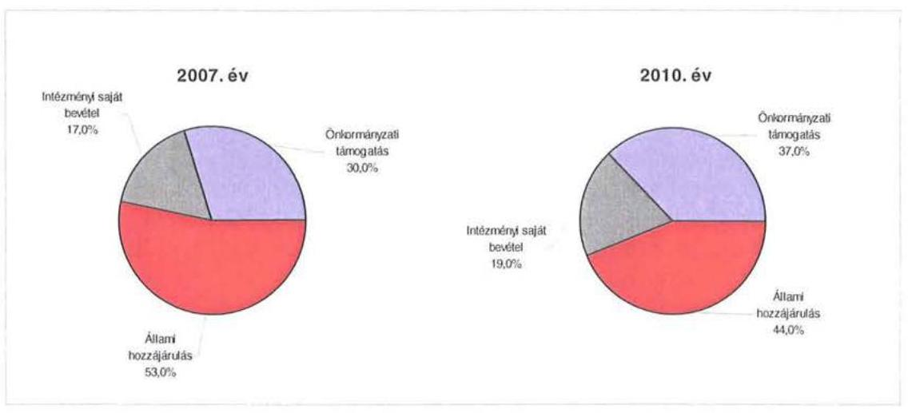

Az egyes közszolgáltatások feladatellátásában részvevő ágazati intézménycsoportok forrásösszetételének bevételi jogcímenkénti alakulását a következő ábra szemlélteti:
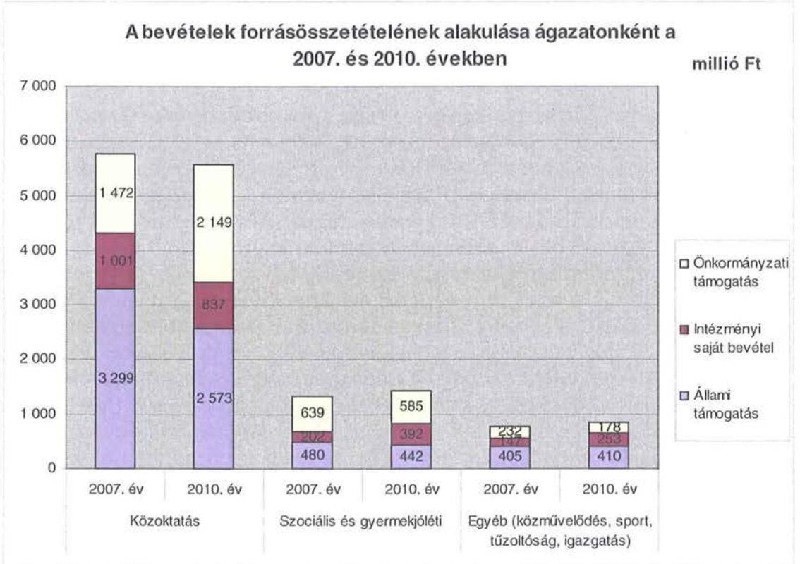

Az Önkormányzat 100\%-os tulajdonában 5 gazdasági társaság volt, amelyek ingatlanüzemeltetéssel, közterület és útfenntartással, élményfürdő üzemeltetésével, temetőfenntartással, belváros rehabilitációval, fekvő- és járóbeteg ellátással, partvédelemmel, kommunikációs feladatokkal foglalkoznak. Az Ön-

---

kormányzat többségi tulajdonában 5 gazdasági társaság volt, amelyekben az Önkormányzat tulajdoni hányada 51-87\%-. Közművelődési, vagyonüzemeltetési, kulturális, turisztikai, épületépítési projektszervezési, szennyvíztisztítási tevékenységet végeznek. Két villamosenergia-termeléssel foglalkozó cég 50\%-ban önkormányzati és 50\%-ban gazdasági társasági tulajdonban volt. Kettő gazdasági társaság az Önkormányzat egyik 100\%-os tulajdonában lévő gazdasági társasága többségi tulajdona, amely a víz-, csatorna- és hőszolgáltatást végző gazdasági társaságban 50,5\%, az útfenntartási, hulladékkezelési és szállítási feladatokat ellátó cégben $50,1 \%$ tulajdoni hányaddal rendelkezik.

Az Önkormányzat feladataik ellátásához a gazdasági társaságai részére 20072010. években együttesen 1175 millió Ft pénzeszközt adott át, ebből tőkeemelésre 724 millió Ft-ot (a vagyonkezelést végző társaság 2009-ben 301 millió Ft, a Kórház 2010-ben 423 millió Ft), működési célra 340 millió Ft-ot, fejlesztési célra 200 millió Ft-ot.

Az Önkormányzat gazdasági társaságai közül kiemelkedően rossz pénzügyi helyzetben van a Kórház, 2010. december 31-én a saját tőke és jegyzett tőke aránya negatív előjelű (-27\%) volt, hitelállománnyal (108 millió Ft) és jelentős összegű lejárt szállítói állománnyal (1087 millió Ft) rendelkezett. Az Önkormányzat 100\%-os tulajdonában álló Kórház gazdasági társaság végelszámolással történő megszüntetése folyamatban van, a feladat-ellátási jogutódként létrehozott költségvetési intézmény 2011. július 1-jétől múködik. A Közgyűlés a megszűnő társaság tartozásainak rendezési módjáról 2011. június 30-ig nem döntött. Az Önkormányzat további kettő 100\%-os tulajdonú gazdasági társaságánál is kedvezőtlen a pénzügyi helyzet, tőkepótlásról a Közgyűlés nem döntött.

A folyó költségvetés egyenlege (múködési jövedelem) 2007-2008 között múködési forrástöbbletet mutatott, 2009-ben és 2010-ben azonban az Önkormányzat múködési forráshiányos volt ${ }^{25}$. A 2007. évben a múködési megtakarítások fedezni tudták a tárgyévben jelentkező törlesztési kötelezettségeket, így az Önkormányzat pénzügyi kapacitása (nettó múködési jövedelme) is pozitív értékű volt. A 2008. évben a működési jövedelem ugyan még pozitív előjelű volt ( 66 millió Ft), de a törlesztési kötelezettségekre ( 101 millió Ft), már nem nyújtott fedezetet, így a pénzügyi kapacitás negatívvá vált ( 35 millió Ft). A 2009-2010. években az Önkormányzatnál a múködési egyensúly nem volt biztosított, az éves folyó bevételek nem biztosítottak fedezetet a kötelező és önként vállalt feladatellátás folyó kiadásaira, a törlesztési kötelezettségekre, ennek érdekében szükségszerű volt egyéb finanszírozási források (hitelek, kötvény bevételek) igénybevétele. A 2010. évben az adósságszolgálat hirtelen növekedését az okozta, hogy az Önkormányzat a számlavezető bankjánál fennálló hiteleit év közben visszafizette, mivel más banknál bocsátott ki kötvényeket. A kötvénykibocsátásról szóló döntéssel egyidejűleg a számlavezető bankváltásról is döntöttek.

[^0]
[^0]:    ${ }^{25}$ 2007-ben a folyó kiadások 6,4\%-át ( 736 millió Ft-ot), 2008-ban 0,5\%-át (66 millió Ftot) jelentette, 2009-ben azonban a folyó kiadások 8,4\%-át (1130 millió Ft-ot), 2010-ben $9,8 \%$-át ( 1382 millió Ft-ot) tette ki a negatív múködési jövedelem.

---

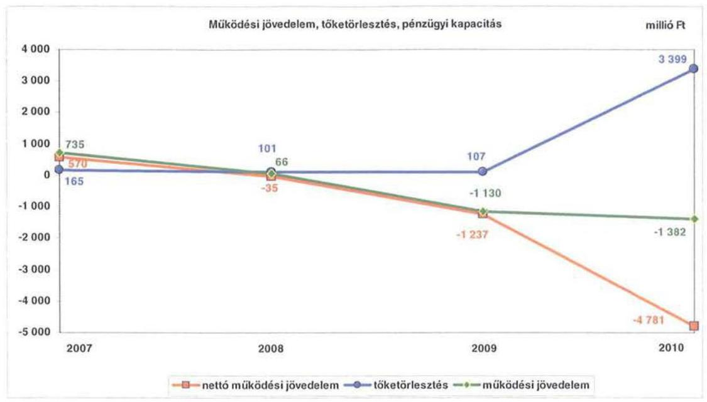

A 2007-2010. években az Önkormányzat felhalmozási költségvetésének egyenlege folyamatosan negatív összegű volt, amely 2007-2010. között összesen 6084 millió Ft felhalmozási forráshiányt okozott.

A pénzügyi egyensúly fenntartása külső források bevonásával volt biztosítható. A 2007-2010. években 3772 millió Ft hitelt törlesztettek, az adósságszolgálat, továbbá a felhalmozási forráshiány 2007-2010. között 9856 millió Ft-ot tett ki, amelyre az időszakban képződő negatív 1711 millió Ft múködési jövedelem nem biztosított fedezetet. Az adósságszolgálat és a felhalmozási forráshiány finanszírozásához a 2007. január 1-jén rendelkezésre álló 291 millió Ft pénzkészlet szolgált fedezetül, a további pénzeszközöket 2322 millió Ft hitel felvételével, valamint 15500 millió Ft kötvény kibocsátásával teremtették meg. Az Önkormányzatnál képződött nettó múködési jövedelem negatív értékei veszélyeztethetik a létrehozott beruházások jövőbeni múködtetéséhez szükséges források biztosítását. A kialakult pénzügyi helyzet pozitív nettó múködési jövedelmet eredményező gazdálkodás mellett teszi elkerülhetővé további külső források bevonását, az eladósodás növekedését.

A vizsgált időszakban az Önkormányzatnál helyi iparúzési adó, építményadó, vendégéjszakák utáni idegenforgalmi adó volt megállapítva, 2007. január 1jétől megszüntették a magánszemélyek kommunális adóját, 2009. január 1jétől viszont új adónemet, az idegenforgalmi adót vezették be. A helyi adókból és pótlékokból származó bevételek aránya 2007-2009 között mintegy harmadát tette ki (37-32\% között mozgott) a folyó (múködési) bevételeknek, azonban 2010-ben arányuk jelentősen ( $26 \%$-ra) csökkent. A pótlékkal, bírsággal növelt helyi adó bevétel a 2007. évi 4622 millió Ft-ról 2010. évben 3293 millió Ft-ra ( $29 \%$-kal, 1329 millió Ft-tal) csökkent. A helyi adóbevételek több mint $90 \%$-át (aránya $92-94 \%$ között mozgott) az iparúzési adó tette ki, amelynek mértéke a helyi adókról szóló törvényben rögzített maximális mértékben került megállapításra. A helyi adók csökkenését az iparúzési adó 2007ről 2010-re történő 1344 millió Ft-os visszaesése okozta, amelyet ugyanezen időszakban az építményadóból befolyó bevételek 17 millió Ft-os növekedése, a

---

megszüntetett kommunális adóból még elmaradt befizetések (5 millió Ft), továbbá az új adóból befolyó bevételek ( 13 millió Ft) nem tudtak ellensúlyozni.

A befejezett fejlesztések jelentős részét pénzintézeti forrásokból finanszírozták. A 2007-2010. évek időszakában 3113 millió Ft értékű fejlesztés és felújítás forrása 653 millió Ft kötvényből származó bevétel (21,0\%), valamint 228 millió Ft hitelfelvétel (7,3\%) volt. A 2010. december 31-én folyamatban lévő fejlesztési feladatok végrehajtására 984 millió Ft kiadást teljesítettek, amelyre a kötvény bevételéből 519 millió Ft-ot (52,7\%), hitelből 82 millió Ft-ot (8,3\%) fordítottak.

Az Önkormányzat 2010. december 31-én folyamatban lévő fejlesztési feladatok kötelezettség-vállalásainak összege 3856 millió Ft volt, amelyből 357 millió Ft-ot saját forrásból, 3300 millió Ft-ot EU-s támogatásból és 199 millió Ft-ot a még fel nem használt kötvénybevételből terveznek biztosítani. Hazai támogatással a fejlesztések megvalósításához nem számoltak. A tervezett saját források rendelkezésre állását azonban az Önkormányzat jelenlegi pénzügyi helyzete nem igazolja. Emellett a kötelezettségvállalások 85,6\%-át kitevő EU-s támogatás utófinanszírozott, mindez fokozott kockázatot jelent a vállalt fejlesztések jövőbeni finanszírozhatósága szempontjából.
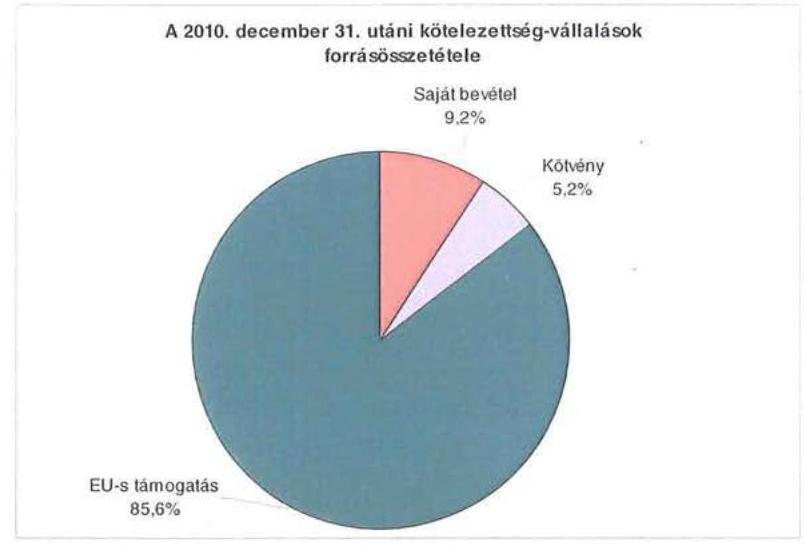

Az Önkormányzat által beadott, elbírálás alatt álló pályázatok tervezett teljes bekerülési költsége 358 millió Ft volt, amelyhez idegen forrást már nem kívánnak bevonni, ugyanakkor a múködési költségvetésben megtakarítást 2010-ben nem sikerült elérni. Az Önkormányzat vállalt kötelezettségeiből az 55 millió Ft saját bevételt a fennálló követelésállományból származó forrásai (2010-ben 946 millió Ft) felhasználásával és a jelzáloggal nem terhelt forgalomképes ingatlanvagyon szükség szerinti értékesítéséből származó bevételből kívánja előteremteni, a fejlesztések további finanszírozását az elnyert EU-s és hazai támogatásokból fedezik.

Az Önkormányzat mérleg szerinti pénzintézeti kötelezettsége a 2006. év végéről a 2010. év végére 1732 millió Ft-ról 16279 millió Ft-ra nőtt, amelyből az árfolyamváltozás miatti különbözet 517 millió Ft volt. A fennálló pénzintézeti kötelezettségek három kötvény kibocsátásból, kettő hosszú lejáratú hitelből

---

keletkeztek. Az Önkormányzat 2011. I. negyedévében 238 millió Ft összegben támogatás megelőlegezési hitelt vett igénybe, amelyet az első negyedévben vissza is fizettek. Az igénybe vett hitel egyéb járulékos költségei (kamat, szerződéskötési díj) 7,7 millió Ft-ot tettek ki.

Az Önkormányzat kötelezettségvállalásaira közgyűlési döntés alapján került sor, azonban a 2010-ben kibocsátott kettő kötvény esetében az előterjesztésekben nem mutatták be a visszafizetés forrásait, a várható kamat és tőkefizetési kötelezettséget, valamint a kamat- és - a devizaalapú kötelezettségeket érintő árfolyamkockázatot.

A polgármester a kötvénykibocsátásokról szóló okiratok aláírásával megsértette az Ötv. 88. § (1) bekezdés b) pontjában foglalt előírásokat, mivel a visszafizetés fedezetéül az Önkormányzat költségvetési elszámolási számlájára azonnali inkasszó jogot biztosított. Ezáltal nem zárta ki, hogy a visszafizetésre a normatív állami hozzájárulást, az állami támogatásokat, a személyi jövedelemadót, valamint az államháztartáson belülről működési céllal átvett bevételeket felhasználják.

Az Önkormányzat a kötvényeket fejlesztési és múködési célra bocsátotta ki. A 2008-ban kibocsátott kötvényből ( 8500 millió Ft) ingatlanfejlesztések, intézményi infrastruktúra fejlesztések megvalósításán, pályázati saját források biztosításán túl 50-50\%-os részesedést vásároltak kettő gázmotoros erőművet működtető gazdasági társaságban 3400 millió Ft értékben. A 2010-ben kibocsátott fejlesztési célú kötvény ( 2000 millió Ft) épületrekonstrukció megvalósítására szolgál, az 5000 millió Ft múködési célú kötvényből a korábbi hitelek kiváltását, továbbá egyéb múködési kiadások finanszírozását tervezték. A hosszú lejáratú hiteleket az Önkormányzat 1999-ben, illetve 2006-ban vette fel, előbbit biológiai szennyvíztisztító beruházás megvalósítására, utóbbit út- és járdaépítések, csapadék- és szennyvízelvezetés megvalósítására.

Az Önkormányzat a devizában fennálló pénzintézeti kötelezettségeiből 4258 ezer EUR ( 1209 millió Ft) tőkét törlesztett, kamatot és egyéb költséget fizetett. A HUF-ban fennálló kötelezettségekből 625 millió Ft tőkét, kamatot és egyéb költséget teljesített. Az Önkormányzat 2010. december 31-ig a 2008-ban kibocsátott lehívott kötvényből nem használt fel 3550 millió Ft-ot (13 107 ezer EUR), a 2010-ben kibocsátott fejlesztési célú kötvényből felhasználás nem történt. A 2010-ben kibocsátott múködési célú kötvénybevételt teljes egészében felhasználták (kötvénykibocsátás költségei, folyószámla-és munkabérhitelek kiegyenlítése, fejlesztési hitelek törlesztése, szállítói tartozások rendezése, egyéb múködési célok). A világbanki hitelt 2002 augusztusáig igénybe vették, az egyéb fejlesztési hiteleket a célnak megfelelően 2007-2008. években felhasználták.

A 2007-2010 években átmenetileg szabad pénzeszközeiből 937 millió Ft kamatbevételt realizált, melyből 873 millió Ft származott a kötvénybevételek befektetéséből. A kamatbevételeket a kötvények kamatfizetésére fordították. Az Önkormányzat 2011. január 1-jétől számlavezető bankot váltott. A 2010-ben kibocsátott kötvények lejegyzése ( 5000 millió Ft, és 6850 ezer EUR) a számlavezető pénzintézet által történt, amely kockázatot jelent a banki befolyás növekedése miatt az Önkormányzat számára.

---

Az Önkormányzat múködésének pénzügyi egyensúlyát a vizsgált időszakban folyószámlahitel és 12 alkalommal egy-egy hónapos időszakra felvett munkabér megelőlegezési hitel (2009-ben 1461 millió és 2010-ben 1500 millió Ft) igénybevételével tudta biztosítani.

A folyószámlahitel igénybevétele a 2007-2010. években az alábbiak szerint alakult:

| Megnevezés | 2007. év | 2008. év | 2009. év | 2010. év |
| :--: | :--: | :--: | :--: | :--: |
| Keretösszeq tamár 1 -tén | 2200 | 2200 | 2200 | 3350 |
| Állapos nemiállomóny | 1269 | 1224 | 1788 | 2975 |
| Fobószántis hitellel zárt napok száma (nap) | 365 | 365 | 365 | 204 |
| 2010. december 31-i eayenleg (állomóny) | $x$ | $x$ | $x$ | 0 |

A likviditás biztosítása az Önkormányzatnak 523 millió Ft kamatkiadást okozott. A munkabérhitel után fizetett kamat 16 millió Ft volt, egyéb költség megfizetésére nem került sor.

Az Önkormányzat 2010. év végi szállítói tartozása 742 millió Ft, melyből a lejárt tartozás 149 millió Ft volt. Az átütemezett tartozások összege 103 millió Ft, egyéb kiadás elmaradása 2 millió Ft volt. A lejárt tartozások összege 2011. március 31-én 891 millió Ft volt, ennek 41,6\%-a ( 371 millió Ft) meghaladta a 91 napot. Az Önkormányzat intézményeinél és a Polgármesteri hivatalnál a 60 napot meghaladó, szállítók felé fennálló kötelezettségek miatt - a helyi önkormányzatok adósságrendezési eljárásáról szóló 1996. évi XXV. törvény 5. § (2) bekezdésében foglaltak ellenére - a Polgármester nem kezdeményezett adósságrendezési eljárást.

Az Önkormányzat gazdasági társaságai lízingkötelezettsége és fejlesztési hitel igénybevételéhez készfizető kezességet vállalt 3459 millió Ft összegben. A 2010. év végére kezességgel kapcsolatos kötelezettség 85 millió Ft-ra csökkent (Kórház hitelfelvétele). A gazdasági társaságok részére 11 alkalommal összesen 532 millió Ft összegben, nyújtott kölcsönt az Önkormányzat, ebből 259 millió Ft volt a Kórház számára biztosított összeg, melyből 2011. június 30án147 millió Ft tartozás állt fenn.

A Közgyűlés a kötvénykibocsátások biztosítékaként 1959 millió Ft - számviteli nyilvántartás szerinti nettó értékű - jelzálogjog alapításához és bejegyzéséhez járult hozzá. A jelzálogszerződésekkel érintett ingatlanok a forgalomképes ingatlanok $56 \%$-át jelentik. A forgalomképes ingatlanokon túl a korlátozottan forgalomképes ingatlanoknak a $11 \%$-át is terhelte jelzálogjog.

---

Az Önkormányzat kötelezettségeinek 2010. december 31-i állományát és várható alakulását a kötelezettségek lejáratáig a következő táblázat szemlélteti:

| Megnevezés | Állomány 2010. dec. 31-én |  |  | Várható kötelezettség 2011. 2013. éveikben |  |  | Várható kötelezettség 2014. évet követően |  |  |
| :--: | :--: | :--: | :--: | :--: | :--: | :--: | :--: | :--: | :--: |
|  | HUF-ban (millió Ft-ban) | Devizitban (freeszege, ezer EURban) | Orosicszese | HUF-ban (millió Ft-ban) |  |  | Devizitban (freesege, ezer EURban) | Orosicszese | HUF-ban (millió Ft-ban) |  |
| Pénzintézeti kötelezettségek |  |  |  |  |  |  |  |  |  |  |
| Hozzesti kýszesti köviek | 93 |  |  | HUF |  | 63 |  | HUF |  |  |
| Hozzesti kýszesti köviek |  |  | 800 | EUR |  |  | 807 | EUR |  |  |
| Kételezet (Donadjelöre 2014) | 4879 |  |  | HUF |  | 1079 |  |  |  |  |
| Kételezet (Donadjelöre 1. Donadjelöre 2020.) |  |  | 39737 | EUR |  |  | 9300 | EUR |  |  |
| Évkölcsi (szabályi) |  |  |  |  |  |  |  |  |  |  |
| Akadabályi mege (Fikgözés) bítoz |  |  |  |  |  |  |  |  |  |  |
| Egyéb lézött bézi önbangolás mege (Fikgözési bítoz) |  |  |  |  |  |  |  |  |  |  |
|  |  |  |  |  |  |  |  |  |  |  |
| Pénzintézeti kötelezettségek összesen 883-ban | 4974 |  |  | HUF |  | 1083 |  | HUF |  |  |
| Pénzintézeti kötelezettségek összesen 1383-ban |  |  |  | EUR |  |  |  | EUR |  |  |
| Pénzintézeti kötelezettségek összesen EUR-ban |  |  | 40837 | EUR |  |  | 10167 | EUR |  |  |
| Követelék |  |  |  |  |  |  |  |  |  |  |
| Kezesség |  |  |  |  |  |  |  |  |  |  |
|  |  |  |  |  |  |  |  |  |  |  |
| Szakkölcsi keszesen |  |  |  |  |  |  |  |  |  |  |
| Szakkölö turtasás övszegs |  |  |  |  |  |  |  |  |  |  |
| Egyéb lézött elmaradás |  |  |  |  |  |  |  |  |  |  |
| Egyéb kötelezettségek összesen |  |  |  |  |  |  |  |  |  |  |
| emelet 23 - és egyéb szervok hưl fennálló kötelezettségek |  |  |  |  |  |  |  |  |  |  |
| emelet 23 - és egyéb szervok hưl fennálló kötelezettségek |  |  |  |  |  |  |  |  |  |  |
| emeletjegzés végzészei lezáró de ki nem fizetett kötelezettségek ${ }^{a}$ |  |  |  |  |  |  |  |  |  |  |
|  |  |  |  |  |  |  |  |  |  |  |
| ${ }^{a}$ A pence eljázásokon vonatkozó adódok a 2011. (tárkati állogozást táblázik (A 2011-2013. éveikben várható kötelezettségek hatáskoszczák a közhöz gazdasági társaságakral tivettak szakkölcse azalan keleltézzett perzäböl adódó kötelezettségeket is). |  |  |  |  |  |  |  |  |  |  |

Az Önkormányzatnak pénzintézetekkel szemben fennálló kötelezettsége a 2010. év végén 4974 millió Ft és 40557 ezer EUR volt. Ezek várható kötelezettsége (tőke, kamat és egyéb költség) a legutóbbi kamatfizetés feltételei alapján a 2011. évtől 6494 millió Ft, továbbá 49122 ezer EUR. Az Önkormányzatnak a 2011. évben szállítói tartozások és egyéb kiadás elmaradások rendezése, valamint egyéb (gazdasági társaságok felé fennálló, jogerős végzéssel lezárt, de ki nem fizetett) kötelezettségek címén 889 millió Ft fizetési kötelezettsége keletkezett. A kezességvállalásaiból adódóan 85 millió Ft összegű terhe jelentkezhet, amennyiben a gazdasági társasága kötelezettségeit nem teljesíti. A 2011-2013. években várható összes kötelezettség teljesítésére figyelembe vehető 946 millió Ft mérlegben kimutatott követelésállomány, 3500 millió Ft forgalomképes ingatlanvagyon, melyből a 1959 millió Ft a pénzintézeti kötelezettségekhez kapcsolódóan jelzáloggal terhelt. A 2014. évet követően kimutatott kötelezettségek forrását az Önkormányzat nem számszerűsítette. Az Önkormányzat tájékoztatása szerint mindkét időszakban figyelembe vehető további források „a mindenkori költségvetési rendeletekben megtervezett önkormányzati saját bevételek". A CLF módszer szerint a múködési jövedelem, azonban a mutatkozó tendencia (2010. évi 1382 millió Ft negatív egyenleg) alapján nem nyújt fedezetet az önkormányzati kötelezettségek biztosítására.

Az Önkormányzat minősített többségi tulajdonú társaságai kötelezettségeinek 2010. december 31-i állományát és várható alakulását a kötelezettségek lejáratáig a következő táblázat mutatja be:

---

| Megnevezés | Állomány 2010. dec.31-6a |  | Várható kötelezettség 2011. 2013. években |  | Várható kötelezettség 2014.   évet követően |  |
| :--: | :--: | :--: | :--: | :--: | :--: | :--: |
|  | $\begin{aligned} & \text { HUF-ban } \\ & \text { (millió Ft- } \\ & \text { bon) } \end{aligned}$ | Dovizilban (foszegs,   szer CHF-   tóni) | Dovizil-   nem | $\begin{aligned} & \text { HUF-ban } \\ & \text { (millió Ft-ban) } \end{aligned}$ | Dovizilban (foszegs,   szer CHF-   tóni) | $\begin{aligned} & \text { Dovizil- } \\ & \text { nem } \end{aligned}$ |
| Fénelzetési kötelezettségek |  |  |  |  |  |  |
| Granszi bútorát kötelek | 160 |  | HUF | 160 | HUF | 60 |
| Fénelzetézeti kötelezettségek összesen: | 160 | 5 |  | 160 | 5 | 60 |
| Lízeng kötelezettségek |  | 60 | CHF |  | 60 | CHF |
| Lízeng kötelezettségek | 5 |  | HUF | 5 | HUF | 5 |
| Szállítói tartozás | 1801 |  | HUF | 1801 | HUF |  |
| Jogszta végzéssel lezárt és ki nem fizetett kötelezettségek* | 160 |  | HUF | 5 | HUF |  |
| * A proza eljárásokon vonatkozó adatok a 2011. jületeni állapotot tükrözik (Kérház gazdasági társaságánól képződött peres eljárások minéti kötelezettség, a 2011-2013. |  |  |  |  |  |  |

Az önkormányzati kötelezettségek növekedése mellett a minősített többségi tulajdonú társaságok kötelezettségei is befolyásolhatják az Önkormányzat pénzügyi egyensúlyát. A társaságoknak a 2011. évtől 226 millió Ft pénzintézeti kötelezettséget, 4 millió Ft és 26 ezer CHF lízing és 1401 millió Ft szállítói tartozást kell rendezniük. A Kórház gazdasági társaságnál a jogerős végzéssel lezárt peres eljárások miatti fizetendő kötelezettség 160 millió Ft, a perek tartalmából adódóan (munkaügyi és betegjogok) ennek megfizetése a feladat-ellátási jogutód költségvetési intézményt terheli. ${ }^{26}$ Kockázatot hordoz, ha ezek nem teljesítése, illetve a gazdasági társaságok esetleges felszámolása esetén a bíróság korlátlan és teljes felelősséget állapít meg az Önkormányzat terhére.

A vizsgált időszakban nem történt meg annak felmérése, hogy az eszközök pótlása fedezetének biztosítása mekkora forrásokat igényel az Önkormányzatnál. Az Önkormányzat a 2007-2010. években a tárgyi eszközök után 2120 millió Ft összegű értékcsökkenést mutatott ki, ugyanakkor felújításra az elszámolt értékcsökkenésnek mintegy harmadát ( 734 millió Ft-ot) fordították. Az eszközök avultsága növekedett, mivel az önkormányzati szintű használhatósági fok mutató aránya négy év alatt 2,9. százalékponttal, $85 \%$-ról $82,1 \%$-ra csökkent az egyes eszközcsoportoknál különböző mértékkel elszámolt amortizáció elsődleges hatására.

Az Önkormányzat költségvetési támogatásból, átengedett bevételekből, és illeték bevételekből származó bevételei a 2007. évhez képest az időszak egészét tekintve összességében 237 millió Ft-tal csökkentek. A 2007-2010. években tett intézkedések hatására 525 millió Ft kiadási megtakarítást mutattak ki, ezáltal az állami támogatások és illetékbevételek csökkenéséből adódó bevételkiesést ellensúlyozták, továbbá az Önkormányzat pénzügyi helyzetét javították. A kiadási megtakarítások $12,4 \%$-a az elrendelt álláshely csökkentések eredménye. Az álláshely csökkentő intézkedések 2007-2010. között a Hivatalnál és az intézményeinél összesen 44 álláshely (ebből 31 üres álláshely) megszüntetését jelentették. Egyes közszolgáltatási területeken azonban feladatbővülések is voltak, amelyek álláshely és egyben létszámnövekedéssel is jártak. Ennek következtében az időszak álláshelyeinek száma 7 fővel nőtt.

[^0]
[^0]:    ${ }^{26}$ Az Önkormányzat a kórházi ellátást 2011. július 1-jétől az általa alapított költségvetési intézményével látja el, mely kizárólag feladat-ellátási jogutódja az ugyanezen közszolgáltatást nyújtó gazdasági társaságnak.

---

Az utóellenőrzés a pénzügyi egyensúly javítására tett egy szabályszerűségi és egy célszerűségi javaslat hasznosítására terjedt ki. A javaslatok megvalósultak, a likvid hitelek szabályszerű elszámolására intézkedtek (2011. június 30-ig likvid és folyószámlahitel felvételére nem került sor). A jegyző 2011. január 3-i hatállyal likviditási és kockázatkezelési szabályzatot adott ki, melyben előírta a hosszú lejáratú adósságot keletkeztető kötelezettségvállalásokból adódó tőke- és kamatfizetési kötelezettségek teljesítési feltételeinek folyamatos figyelését, a kötelezettségek teljesítésének biztosítását szolgáló eljárásrendet, a folyamatos beszámoltatási kötelezettséget, a kockázatkezelési feladatok ellátására Kockázatkezelő Testületet múködtetését.

Az Önkormányzat pénzügyi helyzetét összegezve a következők emelhetők ki:

A 2007-2010. években az Önkormányzat múködési kockázatát növelte a negatív nettó működési jövedelem, a jelentős lejárt szállítói tartozásállomány. A múködési bevételek 2009-2010. években nem biztosították a múködési kiadások és az adósságszolgálat finanszírozását, a likviditás biztosítása növekvő mértékű folyószámla- és munkabér-megelőlegezési hitel igénybevételével történt. Az Önkormányzat a vizsgált időszakban a központi intézkedések hatására jelentkező bevételkiesést a kiadáscsökkentő intézkedéseivel tudta ellentételezni. A gazdasági társaságok szerepe a közüzemi közfeladat-ellátásban meghatározó volt. A gazdasági társaságok eladósodása növelte a pénzügyi kockázatot.

A vizsgált időszakban az Önkormányzat felhalmozási költségvetése pénzügyi hiányt mutatott, ennek forrásai kötvénykibocsátással és hitelfelvétellel biztosítottak voltak. A fejlesztési célú kötelezettségvállalások jövőben teljesítendő kifizetései tekintetében a nettó múködési jövedelem negatív értéke a felhalmozási kockázatot növeli. A hosszú lejáratú kötelezettségek finanszírozásának 2010. évet követő forrása a 2011-2013. években, és azt követően bizonytalan.

A pénzintézeti és egyéb kötelezettségek teljesítésének kockázatát növelte, hogy a 2010. december 31-én fennálló kötelezettségek visszafizetésének fedezetét a saját bevételben jelölték meg, nem számszerúsítették annak forrásait. A kockázatot csökkentheti az Önkormányzat 2010. évi követelésállománya, és forgalomképes ingatlanvagyona szükség esetén felhasználható az adósságszolgálat visszafizetésére.

Az Önkormányzat kiadáscsökkentő intézkedéseinek eredménye az ellenőrzött időszakban ellensúlyozta önkormányzati bevételt csökkentő központi intézkedések hatását, kismértékben javította a pénzügyi egyensúlyt. Az Önkormányzat többségi tulajdonú gazdasági társaságaiból háromnál képződött nyereség a 2007-2010. években, ennek ellenére osztalék-befizetés nem történt. Az Önkormányzatnál 2010-ben elszámolt osztalékbevétel ( 157 millió Ft) kettő 50-50\% tulajdoni hányadú gazdasági társaságától származott.

Az Önkormányzatnál a pénzügyi kockázatot növeli a 2010-ben 5000 millió Ft értékben kibocsátott Dunaújváros 2014 kötvény múködési célú felhasználása és a futamidő végén (2014. év) egy összegben történő visszafizetése, a kötvénykibocsátó és a számlavezető bank azonossága, a végelszámolással megszűnő Kórház gazdasági társaság tartozásállományának rendezetlensége. Az Önkor-

---

mányzat további eladósodása növeli a gazdálkodás kockázatát, veszélyeztetheti a kötelező feladatok ellátását, a folyamatban lévő fejlesztések finanszírozását, a gazdálkodás stabilitását.

A polgármester tájékoztatása szerint a helyszíni ellenőrzést követően a helyi adók mértékének emelésével, kedvezmények mérséklésével 2012-ben 500 millió Ft többlet helyi adóbevétellel számolnak. A hatékonyabb behajtási munka eredményeként az első félévi adóelszámolást követően 362 millió Ft bevétel érkezett az önkormányzat számlájára. Felülvizsgálták az önkormányzati tulajdonú gazdasági társaságok üzleti terveit, a költségek csökkentése érdekében, a tulajdonosi kontrollt erősítették, felfüggesztették a vezetői prémiumokat (pénzügyi hatását nem számszerúsítették). Felbontották az Élményfürdő bérleti szerződését, amely a 2011. évben 450 millió Ft, 2012-ben 890 millió Ft megtakarítással jár. A pénzbeli szociális ellátások felülvizsgálatával 75 millió Ft megtakarítást értek el.

Az Állami Számvevőszékről szóló 2011. évi LXVI. törvény 33. § (1) bekezdésében foglaltak értelmében a jelentésben foglalt megállapításokhoz kapcsolódó intézkedési tervet köteles az ellenőrzött szervezet vezetője összeállítani és azt a jelentés kézhezvételétől számított harminc napon belül az ÁSZ részére megküldeni. Amennyiben az intézkedési tervet határidőben nem küldi meg a szervezet, vagy az továbbra sem elfogadható, az ÁSZ elnöke a hivatkozott törvény 33. § (3) bekezdés a)-b) pontjaiban foglaltakat érvényesítheti.

Az ellenőrzés intézkedést igénylő javaslatai:

# a Polgármesternek 

1. a Közgyűlés elé terjesztendő intézkedési terv írja elő a működés pénzügyi egyensúlyának gyors helyreállítása és hosszú távú fenntarthatósága érdekében - felelősök és határidők megjelölésével - olyan program készítését, amely tartalmazza az alábbiakat:
a) bevételszerző lehetőségek feltárását, különösen a helyi adópolitikai célok meghatározását és számszerúsítését, a bérleti díjak és a térítési díjak megállapítását, felülvizsgálatát, a követelések behajtását, az egyéb sajátos bevételek növelésének lehetőségét;
b) a folyamatban lévő és a tervezett beruházások teljes körű felülvizsgálatát;
c) egyéb kiadási kötelezettségek teljes körű felülvizsgálatát;
d) az intézkedések következtében jelentkező pénzügyi többlet, illetve az egyszeri bevételek tartalékba helyezését, elkülönített kezelését az adósságszolgálat teljesítése érdekében;
e) az adósságszolgálat szerkezetének áttekintését, a likviditásmenedzselést, a támogatás előfinanszírozás átláthatóbbá tételét;
f) az intézményi gazdálkodás felülvizsgálatát;

---

g) az önként vállalt feladatok finanszírozhatóságának áttekintését a kötelező feladatellátás elsődlegességének biztosítása érdekében, a gazdasági program áttekintésével összhangban;
h) az intézkedések eredményei legalább évenkénti áttekintésének előírását;
2. mutassa be félévente - a szokásos beszámoló keretében - a Közgyűlésnek:
a) az Önkormányzat és a minősített többségi tulajdonú gazdasági társaságai aktuális pénzügyi helyzetét, az Önkormányzatnak a gazdasági társaságai felé fennálló követeléseit;
b) legalább három évre kitekintően a kötelezettségek teljes körére szóló finanszírozási tervet, amely figyelembe veszi a kötelezettség éven belüli és túli felmerülését, a források számszerúsített megjelölésével;
c) az Önkormányzat folyamatban lévő és tervezett fejlesztéseihez szükséges belső és külső források rendelkezésre állását, és ebből a szempontból értékelje az Önkormányzat beruházásait;
3. intézkedjen a beruházásokkal létrehozott létesítmények múködtetését és jövőbeni fenntarthatóságát biztosító megalapozott források költségvetési rendeletekben történő feltüntetéséről;
4. mutassa be a Közgyűlésnek évente a zárszámadási rendelet előterjesztésében az értékcsökkenés összegét, és ezzel összevetve az elhasználódott eszközök pótlására fordított tényleges kiadásokat, az eszközök elhasználódási fokának alakulását;
5. kezdeményezze, hogy az Önkormányzat számára jóváhagyott osztalék felvételre kerüljön a pénzügyi helyzetének javítása, adósságszolgálatának törlesztése érdekében;
6. mérje fel és mutassa be a Közgyűlésnek a végelszámolással megszűnő Szent Pantaleon Kórház Nonprofit Korlátolt Felelősségű Társaság kötelezettségállományát és annak az Önkormányzat gazdálkodására gyakorolt hatását, valamint tegyen javaslatot a kötelezettségek rendezésének módjára és forrásaira;

# Jegyzönek 

1. kísérje figyelemmel a jövőbeni várható - árfolyam-, kamat- valamint visszafizetési kockázatokat, továbbá a mérlegen kívüli tételek (kezességvállalás, garancia és helytállási kötelezettségvállalás) kockázatait, és legalább félévente tájékoztassa a Közgyűlést azok alakulásáról;
2. gondoskodjon, hogy a jövőben az adósságot keletkeztető kötelezettségvállalásokról szóló közgyűlési előterjesztések tételesen tartalmazzák a visszafizetés forrásait, valamint legalább 3 éves kitekintéssel mutassák be a kamat és árfolyamkockázat várható kihatásait;

---

3. kísérje folyamatosan figyelemmel - a tulajdonosi jogkört gyakorlók közreműködésével - a minősített többségi tulajdonú gazdasági társaságok kötelezettségeinek alakulását, az Önkormányzat likviditására, pénzügyi-egyensúlyi helyzetére gyakorolt hatását;
4. gondoskodjon a Polgármesteri hivatal és a további költségvetési szervek lejárt szállítói tartozásai okainak feltárásáról, azonnali intézkedések megtételéről a lejárt tartozások mielőbbi rendezése érdekében;
5. intézkedjen a Polgármesteri hivatal és a további költségvetési szervek peres eljárásokból adódó kötelezettségek teljesítése érdekében a szükséges fedezet elkülönítéséről, a finanszírozási tervben történő figyelembevétel mellett;
6. biztosítsa, hogy az adósságot keletkeztető kötelezettségvállalások visszafizetésére Ötv. 88. § (1) bekezdés b) pontjában foglalt előírások alapján - a költségvetési számlára érkező normatív állami hozzájárulást, állami támogatást, személyi jövedelemadót, valamint az államháztartáson belülről múködési céllal átvett bevételeket ne használjanak fel;
7. intézkedjen - az Ötv. 88. § (1) bekezdés b) pontjában foglalt előírások betartása érdekében - hogy az adósságot keletkeztető kötelezettségvállalások fedezetéül jelzáloggal terhelt önkormányzati törzsvagyonba tartozó ingatlanok körét vizsgálják felül, amennyiben azok forgalomképes átminősítésére nincs lehetőség a jelzálogjoggal való terhelést szüntessék meg.

---

# II. RÉSZLETES MEGÁLLAPÍTÁSOK 

## 1. Az ÖNKORMÁNYZAT KÖTELEZŐ ÉS ÖNKÉNT VÁLlALT FELADATAI

Az Önkormányzat adatszolgáltatása szerint a 2010. évi müködési célú költségvetési kiadásainak ${ }^{27}$ ( 11002 millió Ft) $95 \%$-át a kötelező, $5 \%$-át az önként vállalt feladatok ellátására fordította ${ }^{28}$.

Az Önkormányzat 2010. évi müködési kiadásait és azok finanszírozási arányait szemlélteti a következő táblázat főbb feladatonként:

| Elidott feladat | Müködési kiadás összesen (millió Ft) | Kötelező feladat kiadásainak részaránya | Müködési bevétel összesen (millió Ft) | Allumi támogatás részaránya $\%$ | Intézményi saját bevétel részaránya $\%$ | Önkormányzati támogatás részaránya $\%$ |
| :--: | :--: | :--: | :--: | :--: | :--: | :--: |
| Övodák | 993 | 100 | 992 | 35 | 7 | 58 |
| Általános iskolák | 2022 | 100 | 2089 | 40 | 14 | 46 |
| Gimnáziumok | 479 | 100 | 512 | 50 | 18 | 32 |
| Szakközépiskolák, szakképző intézmények | 1701 | 100 | 1802 | 55 | 19 | 26 |
| Koliégiumok | 163 | 100 | 163 | 84 | 19 | $-3$ |
| Szociális intézmények | 1357 | 100 | 1419 | 31 | 28 | 41 |
| Gyermekjötti intézmények | 0 |  |  |  |  |  |
| Közmüvelődési intézmények | 393 | 24 | 404 | 26 | 31 | 43 |
| Sportlétesítményeik | 0 |  |  |  |  |  |
| Igazgatási intézmények | 0 |  |  |  |  |  |
| Hivatásos tüzoltóság | 332 | 100 | 367 | 82 | 26 | $-8$ |
| Egyéb intézmények | 66 | 0 | 70 | 0 | 48 | 52 |
| Intézmények összesen | 7507 | 95 | 7818 | 44 | 19 | 37 |
| Polgármestert Hivatal által ellátott feladatok müködési kiadásai | 3495 | 94 | 3496 | 36 | 64 | 0 |
| Müködési kiadások összesen | 11002 | 95 | 11314 | 41 | 33 | 26 |

A kötelező feladatokon belül a 7507 millió Ft összegű intézményi feladatok működési kiadása az összes müködési kiadás $68 \%$-át, a Hivatalban kezelt feladatok 3495 millió Ft összegű működési kiadása az összes müködési kiadás $32 \%$-át tette ki. Az intézmények működtetéséhez az Önkormányzat 2912 millió Ft támogatással (amely az összes bevétel $37 \%$-a) járult hozzá.

[^0]
[^0]:    ${ }^{27}$ A müködési célú költségvetési kiadás nem azonos a CLF modell szerinti folyó kiadásokkal.
    ${ }^{28}$ Az önként vállalt feladatok részarányának megállapítása az Önkormányzat adatszolgáltatásán alapul.

---

Az Önkormányzat által közölt adatok alapján a kötelező és önként vállalt múködési kiadások aránya nem változott jelentősen, a 2007. évről 2010-re $97 \%$ és $3 \%$-ról $95 \%$ és $5 \%$-ra módosult. A múködési kiadások ugyanezen időszakban önkormányzati szinten $0,3 \%$-kal csökkentek, ez a Hivatalnál $1 \%$-os ( 24 millió Ft-os) növekedést, az intézményeknél $1 \%$-os ( 54 millió Ft-os) csökkenést jelentett. A közoktatási intézmények közül az óvoda, az általános iskolák és a gimnáziumok esetében 4-10\%-kal (összesen 252 millió Ft-tal) csökkentek a müködési kiadások 2007-ről 2010-re. A kollégiumok esetében $42 \%$-os ( 116 millió Ft) volt a csökkenés, míg a szakközépiskolák, szakképző intézmények esetében $10 \%$-os ( 161 millió Ft) növekedést mutatott ki az Önkormányzat.

A 2010. évben az intézményi feladatokon belül a közoktatási feladatokra 5359 millió Ft-ot fordított az Önkormányzat, a müködéshez az Önkormányzat 2148 millió Ft támogatást nyújtott. A szociális intézményi feladatokra 1357 millió Ft volt a múködési kiadás, amelyhez 585 millió Ft müködési támogatást nyújtott az Önkormányzat. A közművelődési intézményi feladatokra 393 millió Ft-ot fordított az Önkormányzat, amelyhez 173 millió Ft müködési támogatást nyújtott. A hivatásos tűzoltóságra fordított 332 millió Ft-ot fordított az Önkormányzat, amelyhez múködési támogatást nem nyújtott az Önkormányzat. Az egyéb intézményi feladatellátás 66 millió Ft volt, ezekhez a feladathoz az Önkormányzat 52\%-ban járult hozzá az általa biztosított támogatással.

A múködési bevételek forrásösszetételét tekintve az állami támogatások önkormányzati szinten $9 \%$-kal, 489 millió Ft-tal csökkentek 2007-ről 2010-re, ez a Hivatal esetében $28 \%$-os, 271 millió Ft-os növekedést, az intézményeknél $18 \%$ os, 760 millió Ft-os csökkenést jelentett. A saját bevételek $3 \%$-kal, 115 millió Fttal csökkentek önkormányzati szinten, ami a Hivatalnál 267 milliós csökkenésből, ellenben az intézményeknél 132 millió Ft-os növekedésből adódott. Az intézmények csökkenő állami támogatását a saját bevételek növekedése és az önkormányzati támogatás növekedése ellensúlyozta, utóbbi $24 \%$-kal, 568 millió Ft-tal nőtt 2007-ről 2010-re.

Az Önkormányzat összes múködést szolgáló bevétele 2010-ben 11314 millió Ft volt. Az összes önkormányzati intézményi bevételeken belül ( 7818 millió Ft) az állami támogatás összege és aránya ( 3425 millió Ft összegben $44 \%$-os arányt képviselt az összes intézményi bevételen belül) 5 százalékponttal csökkent az előző évi ( 3986 millió Ft összegű, $49 \%$-os arányt jelentő) arányhoz képest. A 2009. évtől az állami hozzájárulás összege és - a kollégiumokat kivéve - aránya minden intézménytípusnál évről évre csökkenő tendenciát mutatott. A 2009. évtől a 2010. évre az állami hozzájárulások csökkenésével párhuzamosan növekedett az önkormányzati támogatás összege és aránya (a 2009. évi 2597 millió Ft-ról (ami 32\%-os arányt képviselt) a 2010. évre 2911 millió Ft-ra (amely $37 \%$-os arány).

Az önkormányzati intézményekben ellátottak száma 2007-ről 2010-re 5\%kal, 658 fővel csökkent. A csökkenéshez hozzájárult az általános iskolások 457 fős, a gimnazisták 167 fős és a kollégisták számának 102 fős csökkenése, amit ellensúlyozott az óvodások 40 fős és a szakközép- és szakiskolások számának 25 fős növekedése. A foglalkoztatottak száma önkormányzati szinten 2\%-kal, 41 fővel (intézményeknél 30 fő, Hivatalnál 11 fő) bővült. Az óvodákban 16, a szakközép- és szakiskolákban 35, a szociális intézményeknél 14, a

---

tűzoltóságnál 7 fővel nőtt, míg az általános iskolákban 8, a gimnáziumokban 10, a kollégiumokban 24 fővel csökkent a foglalkoztatotti létszám.

Az önként vállalt feladatok körét nem, a kötelező feladatokat rögzítették az SzMSz-ben ${ }^{29}$. Kötelező feladataikat - települési igazgatási és kommunális feladatok, egészségügyi ellátás, környezet- és település-egészségügy, szociális alapellátás, nevelés és oktatás, közművelődési, közgyűjteményi, környezetvédelmi, tűzvédelmi, sport és ifjúsági feladatok - az Ötv. és az ágazati törvények alapján rögzítették, az önként vállalt feladatokra fordítható források nagyságát az éves költségvetési rendeletekben határozták meg.

Az Önkormányzat feladatellátásának szervezeti struktúráját szemlélteti a következő ábra:
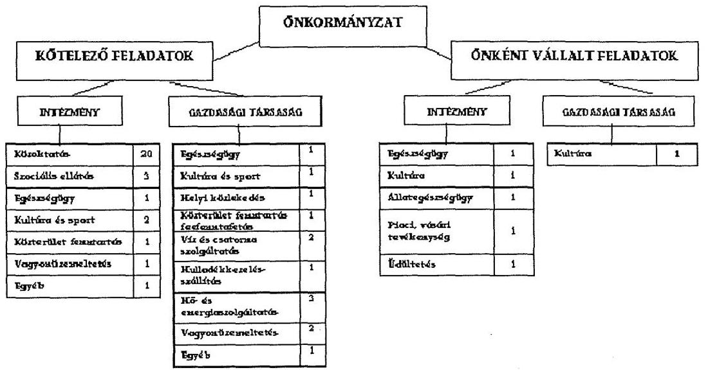

Az Önkormányzat a kötelező és az önként vállalt feladatait 2010. december 31én 28 költségvetési szervvel, 11 többségi tulajdonú gazdasági társasággal, kettő - gazdasági társasága által részben tulajdonolt - gazdasági társasággal, egy önkormányzati vállalattal és - a helyi tömegközlekedési feladatokat - egy az önkormányzattól független gazdasági társasággal láttatja el.

A költségvetési szervek közül 26 önállóan működő és gazdálkodó, 2 önállóan működő költségvetési szerv. Az intézmények összesen 89 telephelyen működnek. Az Önkormányzat feladatait az alábbi intézménystruktúrával látja el:

- egészségügyi feladatokat az Egészségmegőrzési Központ végez;
- szociális és gyermekvédelmi feladatokat 3 intézmény végez (1 bölcsőde, 1 családsegítő és gyermekjóléti intézmény, valamint 1 időskorúakkal foglalkozó egyesített szociális intézmény);
${ }^{29}$ Erre jogszabályi előírás ma már nem is kötelezi az Önkormányzatot.

---

- közoktatási feladatot 20 intézmény lát el (ebből egy 15 telephellyel rendelkező óvoda, kilenc általános és hét középiskola. A három kollégium középfokú oktatási intézmények telephelyeként múködik, egy általános iskola kizárólag szakértői véleménnyel rendelkező tanulókat lát el, a többiben integráltan sajátos nevelési igényű tanulók oktatását is végzik. A közoktatáshoz kapcsolódóan nevelési tanácsadó, logopédiai intézet, valamint zeneiskola múködik);
- kulturális feladatokat végez két intézmény, 1 könyvtár, 1 színház és művészetek háza (gazdasági társaságként a művelődési központ és a televíziócsatorna);
- igazgatási feladatokat lát el a Hivatal.

Az Önkormányzat a vizsgált időszakban nem alakította át intézményrendszerét.

Az Önkormányzat 100\%-os tulajdonában 5 gazdasági társaság van, amelyek ingatlanüzemeltetéssel, közterület és útfenntartással, élményfürdő üzemeltetésével, temetőfenntartással, belváros rehabilitációval, fekvő- és járóbeteg ellátással, partvédelemmel, kommunikációs feladatokkal foglalkoznak. Az Önkormányzat többségi tulajdonában 5 gazdasági társaság van, amelyekben az Önkormányzat tulajdoni hányada 51-87\%-. Közművelődési, vagyonüzemeltetési, kulturális, turisztikai, épületépítési projektszervezési, szennyvíztisztítási tevékenységet végeznek. Két villamosenergia-termeléssel foglalkozó cég 50\%-os önkormányzati és $50 \%$-os gazdasági társasági tulajdonban volt. Kettő gazdasági társaság az Önkormányzat egyik 100\%-os tulajdonában lévő gazdasági társasága többségi tulajdona, a víz-, csatorna- és hőszolgáltatást végző gazdasági társaságban $50,5 \%$, az útfenntartási, hulladékkezelési és szállítási feladatokat ellátó cégben $50,1 \%$ tulajdoni hányaddal rendelkezik.

A gazdasági társaságok esetében átszervezés - az új gazdasági társaságok létrehozásán, vásárlásán kívül - a 2007-2010. években nem történt.

A gazdasági társaságok által nyújtott adatszolgáltatás szerint a gazdasági társaságok saját tőkéje 2010. december 31-én összesen 6525 millió Ft, a jegyzett tőkéjük 6001 millió Ft volt. A legnagyobb saját tőkével, 2,52 milliárd Ft-tal a ingatlanüzemeltetéssel, közterület és útfenntartással, élményfürdő üzemeltetésével, temetőfenntartással foglalkozó gazdasági társaság rendelkezett, jegyzett tőkéje 2,3 milliárd Ft. A villamosenergia-termeléssel foglalkozó 50\%-os önkormányzati tulajdonban lévő gazdasági társaságok esetében a saját tőkéje 1,5 milliárd Ft, illetve 1,4 milliárd Ft a jegyzett tőkéjük 1,1-1,1 milliárd Ft. A gazdasági társaságok mérlegfőösszege összesen 22250 millió Ft volt, 2006-ról 2010-re 12865 millió Ft-tal, 137\%-kal növekedett, 2010-ben a befektetett eszközök $69 \%$-os részarányt képviseltek.

Az Önkormányzat 2009-ben a ingatlanüzemeltetéssel, közterület és útfenntartással, élményfürdő üzemeltetésével, temetőfenntartással foglalkozó cége részére 301 millió Ft, 2010-ben a Kórház részére 423 millió Ft tőkét juttatott.

---

Az Önkormányzat egy gazdasági társasága, a Partvédelmi Vállalat mutatott ki a kötelező feladata ellátásához a társaság tulajdonába adott 2010. év végi nettó vagyonállományt, 50 millió Ft-ot, amely 2007. óta változatlan volt, és egy gazdasági társaság, a Kórház 812 millió Ft vagyonkezelésbe adott év végi nettó vagyont, amely értéke 2007-ről 2010-re 14\%-kal, 135 millió Ft-tal csökkent. A 2010-ben 73 millió Ft vagyonkezelésbe kapott eszközök vissza nem pótolt értékcsökkenését a Kórház mutatta ki. A kötelező feladatokhoz üzemeltetésre, vagy az önként vállalt feladatokhoz tulajdonba, vagyonkezelésbe, vagy üzemeltetésre nem mutattak ki az Önkormányzattól kapott vagyont a gazdasági társaságok.

A 2007-2010. években nem állt átszervezés, vagy csődeljárás alatt egyik gazdasági társaság sem. A Kórházat az Önkormányzat a Közgyűlés döntése alapján 2011. július 1-jével költségvetési intézményként üzemelteti tovább annak érdekében, hogy saját tőkéjének pótlása nélkül biztosított legyen annak folyamatos múködése, és konszolidálja pénzügyi helyzetét.

A Közgyűlés a 133/2011. (III. 24.) számú határozatával döntött a szennyvíztisztítási tevékenységet végző $51 \%$-os tulajdonában lévő gazdasági társaság fennmaradó $49 \%$-os tulajdoni hányadának megvásárlásáról. A döntés következtében ebben a gazdasági társaságban is $100 \%$-os tulajdoni jogot szereztek.

Az Önkormányzat szolgáltatási díj és ár megállapítási feladattal rendelkezik a víz- és csatornadíjak, a távhő ára, a helyi tömegközlekedési tarifák, a települési folyékony és szilárdhulladék szállítása, valamint az uszodai belépődíjak tekintetében. A díj és ár megállapítása a Közgyűlés feladat- és hatáskörébe tartozik.

Az Önkormányzat az áttekintett időszakban más önkormányzattól, önkormányzati társulástól, központi költségvetési szervtől, egyháztól, egyéb szervezettől feladatot nem vett át, és azoknak nem adott át.

# 2. PÉNZÜGYI EGYENSÚLYI HELYZET ALAKULÁSA 

### 2.1. A múködési és felhalmozási egyensúly alakulása

A hagyományos költségvetési szerkezet helyett az önkormányzat pénzügyi helyzetét a CLF módszerrel mutatjuk be, amelyben jobban elkülönülnek a vagyonnal kapcsolatos bevételek és kiadások a feladatokkal kapcsolatos közvetlen múködtetési bevételektől és kiadásoktól. A módszer következetesen elkülöníti a folyó és a felhalmozási költségvetés bevételeit és kiadásait, azok költségvetési egyenlegeit. A saját folyó bevételek, valamint a saját felhalmozási bevételek nem tartalmazzák az előző évi pénzmaradványok felhasználásából származó pénzforgalom nélküli bevételeket ${ }^{30}$.

A folyó költségvetés egyenlege, a múködési jövedelem megmutatja, hogy az önkormányzat éves folyó bevétele fedezetet biztosít-e a kötelező és önként vál-

[^0]
[^0]:    ${ }^{30}$ A költségvetési években kialakuló hiány finanszírozása az előző években képzett tartalékok felhasználásával is történhet.

---

lalt feladatellátáshoz kapcsolódó éves folyó kiadására. A múködési jövedelem negatív értéke pénzügyileg fenntarthatatlan helyzetet jelez. A mutató pozitív értéke megtakarítást mutat, amely forrásul szolgálhat az önkormányzat fennálló kötelezettségei megfizetéséhez, valamint fejlesztéseihez.

A felhalmozási költségvetés pozitív értéke felhalmozási többletet mutat, amely a jövőbeni fejlesztések forrását biztosíthatja. Amennyiben a folyó költségvetési hiány finanszírozása a felhalmozási többletből történik, ez szűkebb értelemben vagyonfelélésnek tekinthető. Amennyiben a felhalmozási költségvetés megtakarítása fejlesztési célú hitelek, kötvények adósságszolgálatát finanszírozza, az, változatlan vagyontömeg mellett, a korábban megelőlegezett tőkebevételek valós realizációjának tekinthető. A felhalmozási deficit által generált finanszírozási igény önmagában nem jár pénzügyi kockázattal, a pénzügyileg fenntartható beruházásokhoz kapcsolódó kötelezettségvállalás (adósságszolgálat) előrelátó, tudatos költségvetési gazdálkodással teljesíthető.

A módszer a pénzügyi kapacitás fogalmát helyezi a középpontba. Az adós hitelfelvételi képessége, hosszú távú fizetőképessége vagy bonitása a pénzügyi kapacitással, ezen belül is a nettó működési jövedelemmel jellemezhető. A nettó múködési jövedelem negatív értéke az egyes költségvetési években jelentkező adósságszolgálat túlzott mértékére utal ${ }^{31}$. A nettó múködési jövedelem negatív értékének felhalmozási többletből, vagy további hitelből történő finanszírozása pénzügyileg nem fenntartható gazdálkodást vetít előre. A pozitív értéket mutató nettó múködési jövedelem fejlesztési kiadások fedezetét biztosíthatja, illetve a folyamatosan, évenként képződő pozitív nettó múködési jövedelemből meghatározható a jövőben vállalható, teljesíthető éves adósságszolgálat, ily módon az a hitelösszeg, amely - a többi tényezőt, feltételt adottnak tekintve - visszafizetési kockázat nélkül felvehető.
A CLF módszer alapján a pénzügyi kapacitás mértéke az önkormányzat összevont, nettósított, a központi információs rendszerbe a MÁK-on keresztül leadott éves költségvetési beszámolójának 80-as űrlapjában szerepeltetett adatok alapján került meghatározásra.

[^0]
[^0]:    ${ }^{31}$ Kivéve, ha annak finanszírozására a korábbi években képzett tartalékok fedezetet nyújtanak.

---

# CLF módszer szerinti önkormányzati adatok 

ezer Ft

| Megnevezés | 2007 | 2008 | 2009 | 2010 |
| :--: | :--: | :--: | :--: | :--: |
| Folyó bevételek | 12245532 | 12934815 | 12236884 | 12691282 |
| Folyó kiadások | 11510285 | 12868880 | 13366991 | 14073015 |
| Múködési jövedelem | 735247 | 65935 | $-1130107$ | $-1381733$ |
| Nettó múködési jövedelem =múködési jövedelem - tőketörlesztés | 570432 | $-34824$ | $-1237145$ | $-4780989$ |
| Felhalmozási bevételek | 435661 | 1011728 | 313730 | 1025548 |
| Felhalmozási kiadások | 1215874 | 1151640 | 5411122 | 1091652 |
| Felhalmozási költségvetés egyenlege | $-780213$ | $-139912$ | $-5097392$ | $-66104$ |
| Finanszírozási múveletek nélküli (GFS) pozíció | $-44966$ | $-73977$ | $-6227499$ | $-1447837$ |
| Finanszírozási múveletek egyenlege | $-48611$ | 8584067 | 1915093 | 2563427 |
| Tárgyévi pénzügyi pozíció | $-93577$ | 8510090 | $-4312406$ | 1115590 |
| Egyéb tájékoztató adatok |  |  |  |  |
| Összes kötelezettség* | 2656277 | 11426144 | 13179539 | 18245745 |
| -ebböl rövid lejáratú | 1974650 | 2307795 | 3748563 | 2178027 |
| Folyószámla hitel napi átlagos állománya** | 1269500 | 1224400 | 1788200 | 2974624 |
| Egyéb likvid hitel napi átlagos állománya** | 0 | 0 | 0 | 0 |
| Munkabér-megelölegezési hitel napi átlagos állománya** | 0 | 0 | 9610 | 8427 |
| Egyéb finanszírozásba vonható eszközök év végi állománya: | 290775 | 8800865 | 4488459 | 5604049 |
| - ebböl:tartós hitelviszonyt megtestesitő értékpapírok év végi állománya | 0 | 0 | 0 | 0 |
| - ebböl:hosszú lejáratú bankbetétek év végi állománya | 0 | 0 | 0 | 0 |
| - ebböl:értékpapírok év végi állománya | 0 | 0 | 0 | 0 |
| - ebböl:pénzeszközök (idegen pénzeszközök nélkül) év végi állománya | 290775 | 8800865 | 4488459 | 5604049 |

* Az összes kötelezettséget a passzív pénzügyi elszámolások nélkül vettük figyelembe, mert a passzívák a pénzmaradvány elszámolás tételei közé tartoznak.
** A folyószámla-és a munkabér megelőlegezési hitel átlagos állományát 365 napos nevezővel számítottuk.

A CLF módszer szerint figyelembe vett folyó és felhalmozási bevételek és kiadások alakulását nem befolyásolta társulásos feladatellátás.

Az Önkormányzat részletes adatait a jelentés 2. számú melléklete tartalmazza.

---

A vizsgált időszakban 2007-2008-ban az Önkormányzat folyó költségvetési egyenlege (múködési jövedelme) pozitív volt, amely 2009-2010. években negatív értékűre változott. A múködési jövedelem évenkénti alakulását a következő ábra szemlélteti:
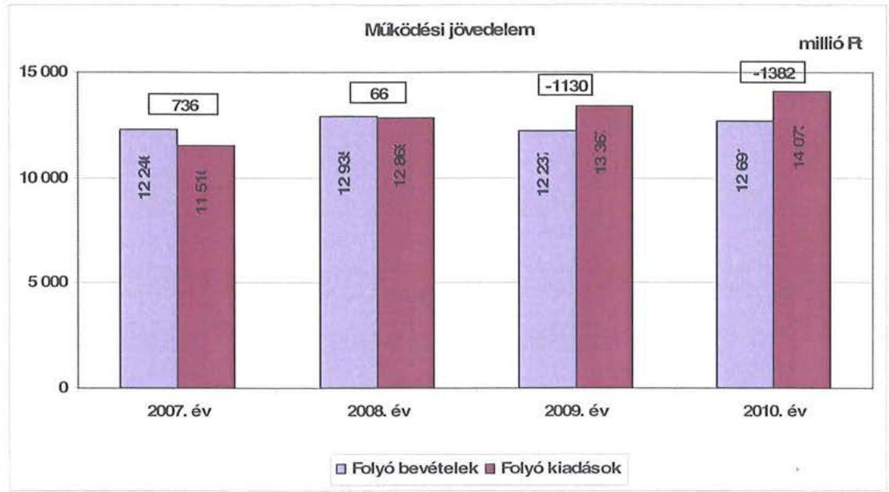

Az Önkormányzat folyó bevételei a 2007. és a 2008. évben fedezték a folyó kiadásokat, azonban ezt követően múködési forráshiány (negatív múködési jövedelem) keletkezett, 2009-ben ennek összege a múködési kiadás 8,4\%-át, 2010-ben 9,8\%-át, jelentette ${ }^{32}$. A négy év alatt keletkező 1711 millió Ft negatív múködési jövedelem finanszírozását munkabérhitelből, folyószámlahitelből, továbbá múködési céllal kibocsátott kötvényből biztosította az Önkormányzat. A folyószámlahitel napi átlagos állománya 2007-ről 2010-re közel két és félszeresére nőtt ( 1269 millió Ft-ról 2975 millió Ft-ra).

Az Önkormányzat kötelezettségein belül a 2007-ről 2010-re a rövid lejáratú kötelezettségek állománya csökkent, a 2007. évi 74,3\%-os aránnyal szemben (1 975 millió Ft), 2010-ben 11,9\%-volt ( 2178 millió Ft). Az Önkormányzat 2006. december 31-én fennálló pénz és tőkepiaci kötelezettsége 1718 millió Ftról közel tízszeresére, 16279 millió Ft-ra nőtt a 2008. és 2010. évi kötvénykibocsátások, a hosszú lejáratú hitelfelvétel és a folyószámlahitel állományának emelkedése miatt. Az összes pénz és tőkepiaci kötelezettségen belül a hosszú lejáratú pénzintézeti kötelezettségek 2007-ről 2010-re 23,3-szorosára ( 15085 millió Ft-tal) nőttek ${ }^{33}$.

A rövid lejáratú kötelezettségek 2010-ben 2178 millió Ft-ot tettek ki, amely 203 millió Ft-tal ( $10,3 \%$-kal) volt magasabb a 2007. évi rövid lejáratú kötelezettségállománynál. A dinamikusan növekvő kötelezettségállomány mellett az Önkormányzat a vizsgált időszakban egyre növekvő mértékű lejárt szállítói tar-

[^0]
[^0]:    ${ }^{32}$ A múködési (folyó) kiadás 2007-ben 11510 millió Ft, 2008-ban 12869 millió Ft, 2009-ben 13367 millió Ft, 2010-ben 14073 millió Ft volt.
    ${ }^{33}$ a 2007. évi 675 millió Ft-ról 15760 millió Ft-ra

---

tozásállománnyal is rendelkezett (2007-ben ennek összege 5 millió Ft, 2010-ben 149 millió Ft volt).

Az Önkormányzat 2010. évi záró pénzkészlete 5604 millió Ft volt, amely 100\%ban kötelezettséggel terhelt.

Az Önkormányzat pénzügyi kapacitása a vizsgált időszakban a 2007. év kivételével minden évben negatív értéket mutatott, amely a vizsgált időszakban összességében 1711 millió Ft finanszírozási igényt jelentett a múködtetésben jelentkező hiány miatt. A nettó múködési jövedelem ${ }^{34}$ értéke a folyó költségvetési pozíció mellett az adott költségvetési év adósságtörlesztésének hatását is tükrözi.

A nettó működési jövedelem - a jelentkező tőketörlesztések ${ }^{35}$ mellett - 2007-ben 570 millió Ft, 2008-ban -35 millió Ft, 2009-ben -1237 millió Ft, 2010-ben 4781 millió Ft volt. A pénzügyi kapacitás 2009-hez viszonyított romlását 2010re a folyó bevételek és kiadások különbségéből származó múködési jövedelem csökkenése mellett a 2010-ben jelentkező kiemelkedően magas összegű tőketörlesztés okozta.

Az Önkormányzat nettó működési jövedelmének évenkénti alakulását az alábbi ábra szemlélteti:
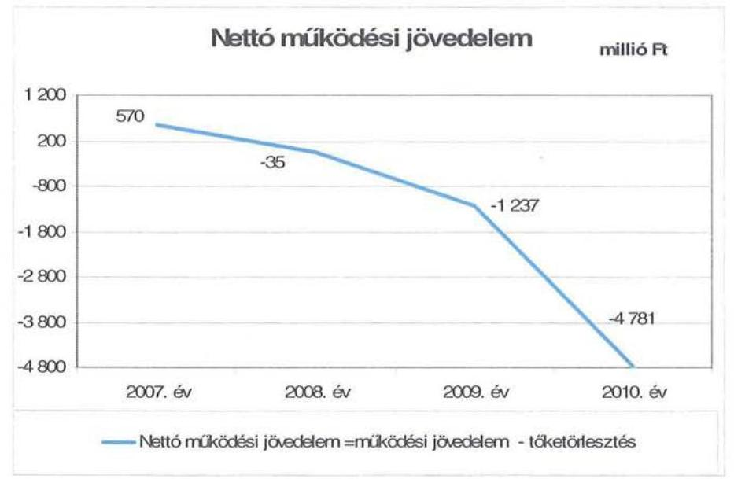

A folyó költségvetés egyenlegének és a tőketörlesztésre (hiteltörlesztés és forgatási és befektetési célú értékpapírok beváltása) fordított összegeknek évenkénti különbözete (a nettó múködési jövedelem) a 2007. év kivételével negatív egyenlegű, ami az Önkormányzat folyamatosan romló pénzügyi helyzetére utal. A

[^0]
[^0]:    ${ }^{34}$ pénzügyi kapacitás
    ${ }^{35}$ Az Önkormányzat tőketörlesztésre 2007-ben 165, 2008-ban 101, 2009-ben 107, 2010ben 3399 millió Ft-ot fordított.

---

2010. évi -4781 millió Ft nettó működési jövedelem amiatt alakult ki, hogy a folyó költségvetés is deficites volt, ezen felül még 3399 millió Ft hiteltörlesztés történt, melynek kötvénykibocsátás volt a fedezete. Az Önkormányzat eladósodása növeli a gazdálkodási kockázatot, veszélyeztetheti a kötelező feladatok ellátását, a gazdálkodás stabilitását.

A felhalmozási költségvetés a vizsgált időszakban valamennyi évben deficites volt, ennek összege kiemelkedően magas a 2009. évben (a negatív egyenleg 5097 millió Ft volt). Ennek oka, hogy az Önkormányzat jelentős összeget ( 3838 millió Ft-ot) fordított részesedés vásárlására, holott ekkor már folyamatos gazdálkodási nehézségek jelentkeztek, továbbá a folyó költségvetés egyenlege is negatív volt. ( 1130 millió Ft). A befektetés vásárlását, valamint a beruházási kiadások bevételekkel nem fedezett részét hosszú lejáratú fejlesztési célú hitellel, illetve fejlesztési célú kötvénykibocsátással finanszírozták.
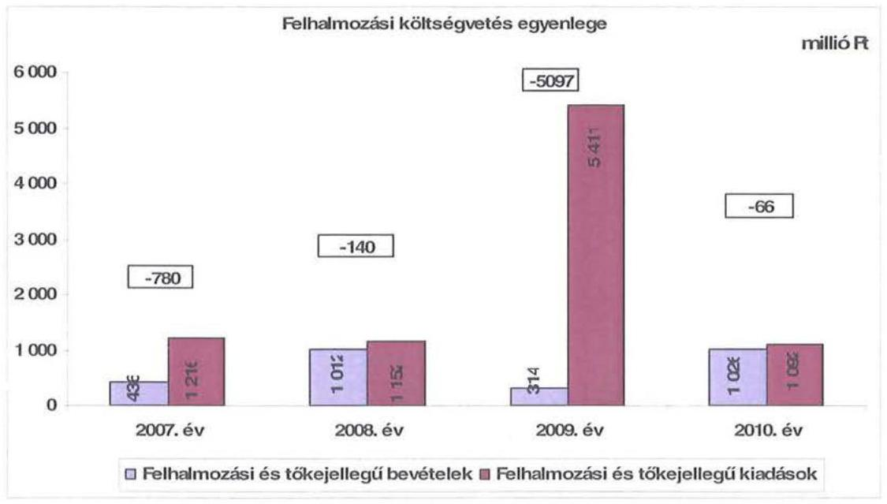

Az Önkormányzat 2007-2010. évi zárszámadási rendeleteiben a CLF modell kimunkálásától eltérő módon állapította meg felhalmozási és múködési egyensúlyát ${ }^{36}$, amelyet a jelentés 1 . számú melléklete szemléltet.

Az Önkormányzat finanszírozási műveletek nélküli bevételeinek és kiadásainak egyenlege szerinti (GFS pozíció) forráshiány együttes összege 2007-2010 között -45 millió Ft, -74 millió Ft, -6227 millió Ft és -1448 millió Ft volt.

Az Önkormányzat évenkénti teljes finanszírozási igénye ${ }^{37}$ a CLF módszer szerint 2007-ben 210 millió Ft, 2008-ban 174 millió Ft, 2009-ben 6335 millió Ft, 2010-ben 4847 millió Ft volt, amelynek finanszírozását a finanszírozási célú

[^0]
[^0]:    ${ }^{36}$ Nincs központi előírás arra, hogy a költségvetési és zárszámadási rendeletekben az önkormányzatoknak hogyan kell elkészíteniük a múködési és a felhalmozási célú bevételeiket és kiadásaikat tartalmazó mérleget. Annak formáját maguk határozzák meg.
    ${ }^{37}$ a nettó múködési jövedelem és a beruházási költségvetés egyenlegeinek összege

---

bevételek és kiadások egyenlege, valamint az előző évek pénzmaradványának igénybevétele biztosította.

Az önkormányzat finanszírozási múveletei egyenlegének alakulását 20072010. években a következő ábra szemlélteti:
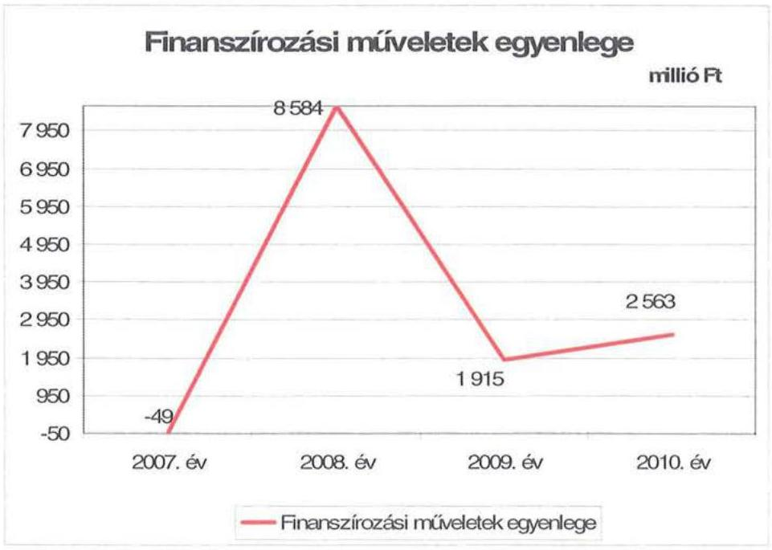

A finanszírozási többlet azt jelzi, hogy az éves költségvetések végrehajtása során szükség volt az előző években keletkezett pénzmaradvány igénybevételén túl külső finanszírozás igénybevételére is.

Az Önkormányzat finanszírozási kiadásai a 2007. évben meghaladták a finanszírozási bevételeket, a hiteltörlesztésre az előző évi pénzmaradványokból is felhasználtak összegeket. A 2008. évtől a finanszírozási bevételek jelentősen megemelkedtek, ennek oka egyrészt a 2008. és a 2010. években történt kötvénykibocsátás, másrészt a 2009. évben felvett rövid lejáratú hitelek törlesztésének 2010. évre történő áthúzódása. A 2010. évben a múködési célú kötvénykibocsátás bevételeiből hiteltörlesztésre is fordítottak, emiatt a finanszírozási bevételek és kiadások egyenlege meghaladta ugyan a 2009. évi szintet ( 648 millió Ft-tal, $33,9 \%$-kal), de jelentősen ( 6021 millió Ft-tal) elmaradt a 2008. évi egyenleg összegétől.

A hitelállomány folyamatos emelkedésével együtt járt az Önkormányzatot terhelő kamatkiadások növekedése is, amely 2010-ben ( 374 millió Ft összegben) több mint két és félszerese ( $265 \%$-a) volt a 2007. évben kifizetett ( 141 millió Ft) kamatnak. A vizsgált időszakban csak 2009-ben volt megfigyelhető, hogy a kapott kamatok meghaladták a fizetett kamatot, ebben az évben a kamatbevételek ( 678 millió Ft) és kiadások ( 509 millió Ft) egyenlegeként 169 millió Ft pozitív eredmény jelentkezett. Ennek oka az volt, hogy a kötvénybevételek fel nem használt részét többletforrások elérése céljából lekötötték.

---

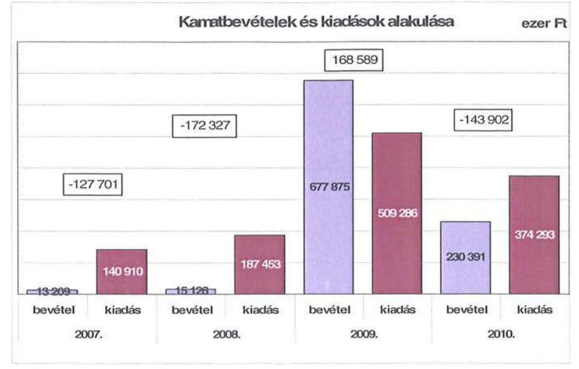

A 2011. évre az Önkormányzat a kamatkiadások további emelkedésével kalkulál, a költségvetési rendeletben tervezett 735 millió Ft kamatráfordítás közel duplája (196,5\%) a 2010 évinek, 361 millió Ft-tal haladja azt meg.

# 2.2. Az Önkormányzat bevételeinek alakulása 

Az Önkormányzat folyó bevételei 2007-ről 2010-re 12245 millió Ft-ról 12691 millió Ft-ra emelkedtek ( $3,6 \%$-kal, 446 millió Ft-tal). A folyó bevételek alakulása változó volt, a 2007-ről 2008-ra 5,6\%-kal (689 millió Ft-tal) emelkedtek, majd 2008-ról 2009-re 5,4\%-kal (698 millió Ft-tal) csökkentek. A 2010. évben az előző évhez viszonyítva a folyó bevételek újra emelkedtek, 3,7\%-kal (454 millió Ft-tal).

Az Önkormányzat 2007-2010. években befolyt bevételeinek főbb jogcímenkénti adatait az alábbi grafikon mutatja be:
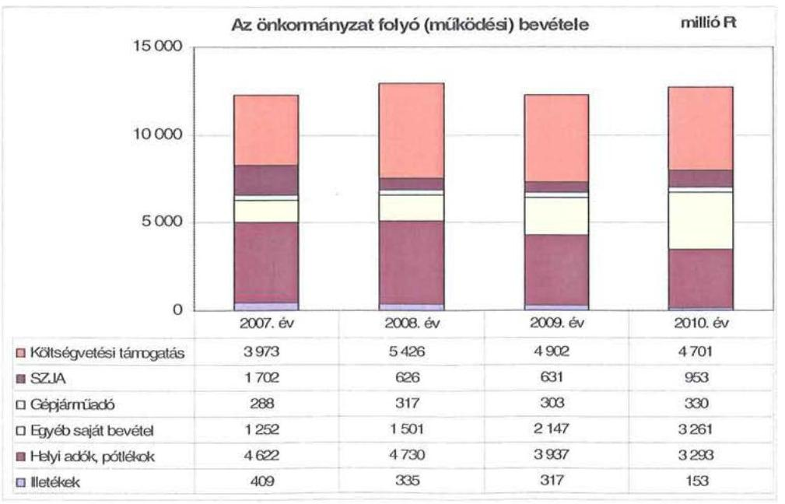

---

A folyó bevételek jelentős részét képezi a költségvetési támogatás, ennek aránya az évek sorrendjében 32,4-41,9-40,1-37,0\%. A költségvetési támogatás öszszege a 2010. évben a 2007. évhez viszonyítva 18,3\%-kal ( 728 millió Ft-tal) nőtt, ugyanakkor a 2008. év kivételével csökkenő tendenciájú. A finanszírozási rendszer 2008. évtől bekövetkező változása miatt a költségvetési támogatás ténylegesen nem emelkedett, szerkezete átalakult, a 2007. évben az szja normatív módon elosztott részének beszámításával 2007-ről 2010-re 8,1\%-kal (409 millió Ft) csökkent. A központi támogatás részét képező normatív támogatások 2008-ről 2009-re 123 millió Ft-tal, 2009-ről 2010-re 374 millió Ft-tal csökkentek. A csökkenést a normatíváknak a járulékváltozások miatti központi csökkentése, valamint az ellátotti létszám visszaesése idézte elő.

A közoktatási intézményekben 2007-ről 2010-re 11\%-kal (934 fővel) csökkent az ellátottak száma, ezen belül a legjelentősebben (614 fővel) az alapfokú közoktatási intézményekben tanulók száma mérséklődött. A tanulói létszámcsökkenés a középfokú oktatási intézményekben is számottevő ( 307 fő), ugyanakkor az óvodába járók száma a 2007-2008 években jelentkező átmeneti csökkenést (1539-ről 1459-re) követően ismét emelkedő tendenciát mutat, 2008-ról 2010-re 4,6\%-kal (67 fővel) emelkedett.

A gyermekvédelmi intézményekben (bölcsődék) gondozott kisgyermekek száma 2007-ről 2010-re jelentősen 221 fơről 327 főre (106 fővel) emelkedett, különösen a 2009-2010 évek között jelentkezik nagymértékű ellátotti létszámnövekedés, 38\%os ( 90 fó). A szociális intézményekben ezzel ellentétes folyamatok zajlottak, az alapszolgáltatásokat nyújtó intézményekben 2007-ről 2010-re 97 fővel, az átmeneti elhelyezést biztosító intézményekben 9 fővel csökkent az ellátottak száma.

A finanszírozási szabályok változása következtében a normatív kötött felhasználású támogatások emelkedtek az időszakban, ugyanakkor ezek növekedése a felhasználási kötöttség nélküli támogatások csökkenését nem kompenzálta, a forráskiesés mértékét nem érte el. (2009-ben az előző évhez viszonyítva 71 millió Ft-tal, 2010-ben 2009-hez képest 159 millió Ft-tal emelkedett a normatív kötött felhasználású támogatások összege).

Az átengedett bevételek összege 2007-ről 2010-re 35,6\%-kal (1991 millió Ft-ról 1282 millió Ft-ra) csökkent.

A folyó bevételek központi költségvetésből származó forrásai (költségvetési támogatás, átengedett bevételek) együttesen 2010-ben 19 millió Ft-tal haladták meg a 2007. évi bevételeket.

Az átengedett bevételek részét képező gépjárműadó folyó bevételekből való részesedése nem érte el az évi 3\%-ot sem, az szja bevételek 2007. évi viszonylag magas részarányát ( $13,9 \%$ ) a támogatási rendszer speciális módja okozta (a normatív támogatásokat részben az szja-ból finanszírozták). A 2008. évtől ez megváltozott, emiatt az szja bevételek részesedési aránya lényegesen lecsökkent. (2008-ban 4,8\%, 2009-ben 5,2\%, 2010-ben 7,5\%).

Az Önkormányzat az adóerőképesség számítások következtében 2007-2009. között egyre növekvő mértékű szja adóbevételtől esett el, a 2010. évben azonban az ebből származó bevételkiesés jelentősen mérséklődött.

---

A jövedelemkülönbség mérsékléséből adódóan az szja bevételek összege 2007-ben 165, 2008-ban 187, 2009-ben 262, 2010-ben 81 millió Ft csökkent. A jövedelemkülönbség mérsékléssel való teljes körű elszámolás alapján 2007-ben 35 millió Ft, 2008-ban pedig 56 millió Ft illette meg még az Önkormányzatot. A 2009. évtől visszafizetési kötelezettségük keletkezett, 3,8 millió Ft, a 2010. évben a fizetendő kamattal együtt 4,3 millió Ft befizetési kötelezettség jelentkezett.

Az Önkormányzat egyéb saját bevételei a vizsgált időszakban 160\%-kal nőttek ( 3261 millió Ft-ról 1252 millió Ft-ra). A bevételek részét képező intézményi múködési bevételek 2007-ről 2010-re közel megduplázódtak 93,0\%-kal emelkedtek, ( 719 millió Ft-ról 1388 millió Ft-ra). A legjelentősebb emelkedés ( 630 millió Ft) 2007-ről 2008-ra következett be, ez meghatározó mértékben az ellátotti térítési díjak emeléséből adódott.

Az intézményi ellátási díjak, alkalmazottak térítéséből származó bevételek az ellátotti létszámcsökkenés mellett is $40,2 \%$-kal, ( 301 millió Ft-ról 422 millió Ft-ra) növekedtek 2007-ről 2010-re.

Az egyéb saját bevételek részét képező áfa bevételek a 2007. évi 126 millió Ftról 2010-re közel két és félszeresére ( 298 millió Ft-ra) emelkedtek. Az államháztartáson belülről kapott támogatások a vizsgált időszakban megháromszorozódtak ( 573 millió Ft-tal emelkedtek), míg az államháztartáson kívülről kapott bevételek esetében 2008-tól csökkenés következett be. A 2008-ról 2009-re 18 millió Ft-tal, majd 2009-ről 2010-re további 8 millió Ft-tal mérséklődtek.

Az egyéb saját bevételek részét képező gazdasági társaságok által fizetett osztalékbevétel 2007-ben 31 ezer $\mathrm{Ft}^{38}$, 2010-ben az 157 millió Ft volt. Egy gazdasági társaságnál képződött 49 millió Ft összegű nyereséget az Önkormányzat eredménytartalékba helyezte.

Az Önkormányzatnál a folyó múködési bevételek mintegy harmadát kitevő helyi adóbevételek (arányuk 2007-ben 37,7, 2008-ban 36,6, 2009-ben 32,2, 2010ben $25,9 \%$ ) 2007-ről 2008-ra emelkedtek ( 109 millió Ft-tal, 2,4\%-kal), ezt követően csökkenő tendenciát mutatnak. A 2010. évben a 2007. évhez viszonyítva $28,8 \%$-kal ( 1329 millió Ft-tal) csökkentek.

A helyi adóbevételek összetételét, évenkénti alakulását a következő táblázat szemlélteti:
ezer Ft

| Megnevezés | 2007. év | 2008. év | 2009. év | 2010. év |
| :-- | --: | --: | --: | --: |
| Iparúzési adóbevétel | 4360610 | 4450909 | 3658810 | 3015962 |
| Építményadó | 236158 | 242579 | 232403 | 253107 |
| Idegenforgalmi adó | 0 |  | 8053 | 5042 |
| Kommunális adó* | 2732 | 1791 | 479 | 193 |
| Pótlék, bírság | 22114 | 35040 | 37496 | 18412 |
| Helyi adó összesen | 4621614 | 4730319 | 3937241 | 3292716 |

* megszünt 2007. január 1-től, a bevételek az előző évek elmaradt befizetései

[^0]
[^0]:    ${ }^{38}$ A 2007. évben az Önkormányzat 25\%-os résztulajdonát el nem érő Forrás Nyíltkörűen Múködő Részvénytársaság által fizetett osztalék.

---

Az Önkormányzatnál a 2007. évről a 2010. évre jelentős forráskiesés jelentkezett az iparűzési adóbevételek összességében 1344 millió Ft-os csökkenése miatt. Az ebből az adónemből keletkező csökkenést minimális mértékben kompenzálta az építményadóból befolyó bevételek növekedése ( 17 millió Ft), valamint a 2009. január 1-től bevezetett idegenforgalmi adóból származó többletforrás. Az új adónem bevezetése nem gyakorolt pozitív hatást az adóbevételek növelésére, mivel egyrészt 2007 január 1-től egy másik adónemet megszüntettek (kommunális adó), másrészt az idegenforgalmi adóból befolyó bevétel az évi 10 millió Ft-ot sem érte el.

Az Önkormányzat illetékbevételei mind arányukat, mind összegüket tekintve csökkenő tendenciájúak. A 2007. évben arányuk 3,3\% (409 millió Ft) volt, 2010-ben ez az arány 1,2\%-ra ( 153 millió Ft) csökkent, 2010-ben 62,6\%-kal kevesebb illetékbevétel keletkezett, mint 2007-ben.

Az Önkormányzat felhalmozási bevételei a vizsgált időszakban a következők voltak:

| Megnevezés | 2007. év tény | 2008. év tény | 2009. év tény | 2010. év tény |
| :--: | :--: | :--: | :--: | :--: |
| Tárgyi eszköz értékesítés | 11004 | 190764 | 121732 | 536595 |
| Egyéb saját tőkebevétel | 91305 | 689413 | 96717 | 329028 |
| Államháztartáson belülről kapott támogatás | 299693 | 109246 | 84541 | 149798 |
| EU-tól és külföldről kapott támogatások | 0 | 0 | 0 | 0 |
| Államháztartáson kívülről kapott támogatás | 33659 | 22305 | 10740 | 10127 |
| Összes felhalmozási bevétel | 435661 | 1011728 | 313730 | 1025548 |

A felhalmozási bevételek alakulása változatos képet mutat, 2007-ről 2008-ra 576 millió Ft-tal nőtt, majd 2009-ben az előző évhez viszonyítva 698 millió Fttal csökkent, aztán ismét emelkedett ( 712 millió Ft-tal).

Az Önkormányzatnak tárgyi eszköz értékesítéséből 2007-ben nem folyt be számottevő bevétele. A 2008-tól ezen a címen is növelték a felhalmozási célokra rendelkezésre álló forrásokat, legjelentősebben a 2010. évben.

A vizsgált időszakban a tárgyi eszköz értékesítésből származó bevétel ingatlanértékesítésből származott, ennek értéke a legmagasabb a 2010. évben volt.

Az egyéb saját tőkebevételek részét képezi az önkormányzati tulajdonú helyiségek értékesítéséből származó bevétel, a támogatási kölcsönök visszatérülése, valamint a részesedések értékesítéséből keletkező forrás. Az Önkormányzat 2008-ban 580 millió Ft értékű üzletrészt értékesített.

Az államháztartáson belülről és kívülről kapott felhalmozási célú támogatások pályázati forrásokból megvalósuló projektekhez kapcsolódtak, ezekből 20072010. években 719 millió Ft bevétel származott.

---

# 2.3. Az Önkormányzat kiadásainak alakulása 

Az Önkormányzat müködési kiadásai főbb jogcímek szerinti bontásban az alábbiak voltak:
ezer Ft-ban

| Megnevezés | 2007. | 2008. | 2009. | 2010. |
| :--: | :--: | :--: | :--: | :--: |
| Folyó kiadások | 11510285 | 12868880 | 13366991 | 14073015 |
| Müködési kiadások (kamatkiadás nélkül) | 10648071 | 11715476 | 11487423 | 11315337 |
| Államháztartáson belülre átadott pénzeszközök | 300 | 10963 | 41936 | 48986 |
| Transzferkiadások | 696448 | 928297 | 1198459 | 1951827 |
| -ebből: vállalkozásoknak | 29699 | 109908 | 191519 | 339840 |
| EU-nak, illetve külföldre | 10 | 200 | 0 | 0 |
| magánszemélyeknek | 403887 | 507416 | 586220 | 674381 |
| nonprofit szervezeteknek | 262852 | 310773 | 420720 | 937608 |
| Kamatkiadások | 140910 | 187453 | 509286 | 374293 |
| Előző évi pénzmaradvány átadás | 24556 | 26691 | 129887 | 382572 |

Az Önkormányzat müködési (folyó) kiadásai 2007-ről 2010-re 22,3\%-kal nőttek ( 11510 millió Ft-ról 14073 millió Ft-ra). A kiadásoknak túlnyomó részét képezi a kamatkiadás nélküli müködési kiadás, bár ezek aránya a transzferkiadások erőteljes növekedése miatt csökkenő tendenciájú.

A transzferkiadások 2007-ről 2010-re közel háromszorosára nőttek (180\%-kal, 1255 millió Ft-tal) emelkedtek. A kamatkiadások a 2009. évben emelkedtek erőteljesen ( 322 millió Ft-tal haladták meg az előző évi szintet), majd kissé mérséklődtek a 2010. évben. Az előző évi pénzmaradvány átadás összege folyamatosan nőtt, 2010-ben 358 millió Ft-tal volt magasabb ennek összege, mint 2007-ben.

Az Önkormányzat folyó kiadásai főbb kiadás nemek szerinti bontásban az alábbiak voltak:
ezer Ft

| Megnevezés | 2007. | 2008. | 2009. | 2010. |
| :-- | --: | --: | --: | --: |
| Személyi juttatások | 5445078 | 5803192 | 5469947 | 5402846 |
| Munkaadót terhelő járulékok | 1710739 | 1818079 | 1621513 | 1431765 |
| Dologi kiadások | 3590858 | 4195799 | 4580132 | 4634190 |
| Egyéb folyó kiadások | 446090 | 589342 | 907198 | 894824 |
| Müködési célú pénzeszközátadás | 317520 | 461468 | 788201 | 1709390 |

Az Önkormányzat 2010-ben a folyó kiadások 48,6\%-át ( 6835 millió Ft) személyi juttatásokra és a munkaadókat terhelő járulékokra fordította, az üzemeltetést, intézményfenntartást biztosító dologi kiadásokra 32,9\% jutott ( 4634 millió Ft). A müködési kiadásokon belül a személyi juttatások és járulékok aránya a vizsgált időszakban folyamatosan csökkent, 2007-ben 62,2\%, 2008-ban 59,2\%, 2009-ben $53,1 \%$ volt.

A személyi juttatások 2008-ban 6,6\%-kal ( 358 millió Ft-tal) nőttek az előző évhez képest, azt követően minden évben csökkentek a létszámcsökkentések miatt. 2010-ben a 2007. évben teljesített kiadásoknál 0,8\%-kal ( 42 millió Ft) lettek alacsonyabbak. A vizsgált időszakban a munkaadókat terhelő járulékok jelentős, $16,3 \%$-os ( 279 millió Ft-os) csökkenése következett be, amely egyrészt a

---

kifizetett személyi juttatások, másrészt a járulékok mértékének csökkenésével volt összefüggésben.

Az Önkormányzat dologi kiadásai 2007-2010. években folyamatosan emelkedtek, legerőteljesebben 2007-ről 2008-ra ( 606 millió Ft-tal). Ezt követően a szigorú takarékossági követelmények érvényesülése következtében a növekedés üteme lassult, 2010-ben az előző évihez viszonyítva mindössze 1,2\%-os (54 millió Ft-os) volt, alatta maradt az inflációnak.

Az egyéb folyó kiadások összege megduplázódott 2007-ről 2010-re (446 millió Ft-ról 895 millió Ft-ra nőtt), ezen belül jelentős összeget képvisel a társadalom és szociálpolitikai juttatások aránya, 2010-ben 68,5\%-át alkották az egyéb folyó kiadásoknak. Az Önkormányzat lakosainak romló szociális helyzetét jelzi, hogy 2010-ben a szociális juttatások összege a 2007. évihez viszonyítva 253 millió Ft-tal ( $70 \%$-kal) volt magasabb.

A múködési célú pénzeszközátadások 2007-ről 2010-re több mint ötszörösére 317 millió Ft-ról 1709 millió Ft-ra nőttek, ugyanakkor az ellátás szervezeti kereteiben nem történt lényeges változás ezen időszakban. A pénzeszközátadások évről évre dinamikusan emelkedtek, legerőteljesebben 2009-ről 2010-re nőttek, $116,9 \%$-kal ( 921 millió Ft-tal).

Az Önkormányzat széles körűen támogatott közalapítványokat, különböző alapítványokat, civil szervezeteket, sportegyesületeket, gazdasági társaságai részére is nyújtott támogatást.

Az Önkormányzat feladataik ellátásához a gazdasági társaságai részére 20072010. években együttesen 1175 millió Ft támogatást nyújtott, ebből tőkeemelésre 724 millió Ft-ot (Kórház és egy másik gazdasági társaság), múködési célra 340 millió Ft-ot, fejlesztési célra 200 millió Ft-ot kaptak.

Az Önkormányzat tulajdoni részesedéssel rendelkező gazdasági társaságai részére 2007-2010. években nyújtott múködési és fejlesztési célú pénzeszközök összegét az alábbi ábra tartalmazza:
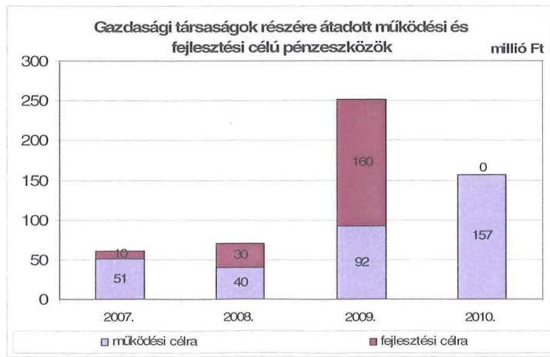

---

A négy 100\%-os tulajdonú gazdasági társaság és az egy önkormányzati vállalat részére nyújtott múködési és felhalmozási támogatás 2007-2010. években együttesen 307 millió Ft volt, melyből a múködési célú források 34,9\%-ot tettek ki.

A 75-99\%-os részesedésű négy gazdasági társaság közül kettő részesült támogatásban, ez teljes egészében fejlesztési célokat szolgált (192 millió Ft).

A 25-50\%-os részesedésű négy gazdasági társaság közül egy részesült támogatásban, a részére 2009-2010. években nyújtott támogatás ( 41 millió Ft) a múködési tevékenységet segítette.

Az Önkormányzat Kórháza 2006. január 1-től 100\%-os tulajdonú gazdasági társaságként múködik, bevételei és kiadásai nem jelentkeznek közvetlenül az Önkormányzat pénzügyi beszámolóiban. A fekvőbeteg-ellátáshoz kapcsolódóan ${ }^{39}$ a Kórház ugyanezen időszakban együttesen 363 millió Ft támogatásban részesült, melyből 19 millió Ft a múködési kiadásokhoz történő hozzájárulás volt.

Az Önkormányzat a Kórház számára 2009-ben fejlesztési célra további 10 millió Ft támogatást nyújtott, 2010-ben megemelte a jegyzett tőkét 790 ezer Ft-tal, valamint tőkeemelésre 334 millió Ft fordított. A 2007-2010. évek közötti bevételek összegéhez ( 15775 millió Ft ) viszonyítva az önkormányzati támogatások aránya 2,4\%- volt. A Kórház egészségügyi ellátásához biztosított OEP bevételek (14 562 millió Ft) összegét nem tekintve ez a támogatási arány 30\%-os.

A tömegközlekedést biztosító Alba Volán Zrt. részére a feladat-ellátási szerződés alapján a költségvetésből 2007-ben nem juttattak támogatást, 2008-ban 50 millió Ft, 2009-ben 110 millió Ft, 2010-ben 109 millió Ft támogatásban részesültek. A rendszeresnek minősülő támogatáson felül 2010-ben további 72 millió Ft eseti támogatást nyújtottak a társaságnak. (Az eseti támogatás kifizetéséből 8 millió Ft átutalása 2011 januárjában történt, ez az összeg szerepelt a 2010. december 31-i kötelezettségvállalási nyilvántartásban).

Az Alba Volán Zrt. a 2010. évben keletkezett veszteségeinek pótlására 77 millió Ft erejéig igényt nyújtott be az Önkormányzatnak, mely azt a gazdálkodásról nyújtott pénzügyi információk alapján megalapozottnak ítélte. A Közgyűlés a 2011. március 24-i ülésén döntött ${ }^{40}$ a kért összeg hét havi egyenlő részletben történő megfizetéséről, és egyben felkérte a társaságot a szolgáltatót megillető ellentételezés számításának rendje előzetesen megszabott, objektív és átlátható módon meghatározott feltételrendszere kidolgozására. A szerződésmódosítás előterjesztésére a társaság 2011. szeptember 30-ig köteles, ennek hiányában az Önkormányzat a még hátralékos ellentételezési részletek megfizetését felfüggeszti.

A szolgáltató a 2011. éves gazdálkodás feltételeinek javítása érdekében a költséghatékonyabb múködés elősegítésére menetdíj és menetrend módosítás elfogadását kérte, melyet a Közgyűlés megtárgyalt és jóváhagyott.

[^0]
[^0]:    ${ }^{39}$ A kórház a bevételeit és kiadásait a számviteli információs rendszerében a fekvőbe-teg-ellátásra nem különítette el, az adatszolgáltatásában ezeket az egyes ellátási formákhoz rendelt OEP támogatás arányában állapította meg.
    ${ }^{40}$ A Közgyűlés 108/2011. (III. 24.) számú határozata.

---

A folyó (működési) és felhalmozási kiadások alakulását, a teljesített kiadások múködési és felhalmozási felhasználásának arányait az alábbi ábra mutatja be:
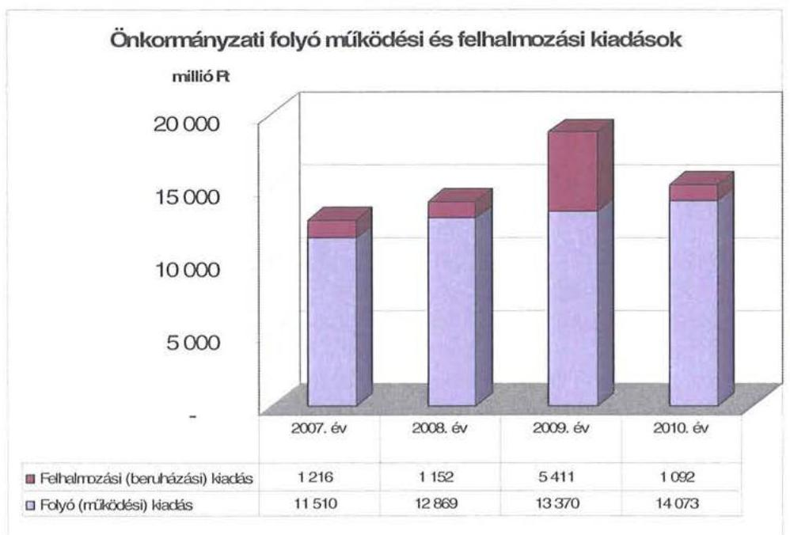

A múködési és felhalmozási kiadások arányának változásában 2007-2010. években hullámzás figyelhető meg, a felhalmozási kiadások aránya a 2009. évi kiugró értéket nem számítva csökkenő tendenciát mutattak, 2010-ben 2,4 százalékponttal csökkentek a 2007. évihez viszonyítva (arányuk 2007-ben 9,6\%, 2010-ben 7,2\%).

Az Önkormányzat 2007-2010. években megvalósított, illetve 2010. december 31-én fennálló, valamint az elbírálás alatt lévő fejlesztési feladatokhoz kapcsolódó kötelezettségeinek összegzését a jelentés 3/a-d számú mellékletei tartalmazzák.

Az Önkormányzatnál megvalósult felújítási és beruházási munkálatok 20072010. években teljesített együttes kiadása 2999 millió Ft volt, a korábbi időszakban ezekkel kapcsolatban 124 millió Ft-os ráfordítás jelentkezett. A teljes bekerülési költség ( 3113 millió Ft) 7,3\%-át hitelből ( 228 millió Ft), 21,0\%-át kötvényből ( 653 millió Ft), 1\%-át EU-s ( 25 millió Ft), és 14,0\%-át ( 436 millió Ft) hazai támogatásokból finanszírozták. A fennmaradó összeg 56,9\%-ot tett ki (1770 millió Ft) erre a saját bevételek nyújtottak fedezetet. A befejezett munkák teljesített kiadása együttesen 455 millió Ft-tal volt kevesebb, mint a tervezett összeg.

A 2010. december 31-én folyamatban lévő felújítások és fejlesztések tervezett bekerülési költsége együttesen 5016 millió Ft, ebből 2010 végéig 984 millió Ft-ot teljesítettek. A még fennálló kifizetési kötelezettség a projektekkel kapcsolatban várhatóan 3856 millió Ft lesz. A 2010. december 31-e utáni kötelezettségvállalások 5,2\%-át (199 millió Ft) kötvénybevételből, 9,2\%-át (357 millió Ft) saját bevételből, a fennmaradó részt 85,6\%-át ( 3300 millió Ft) EU-s támogatásból tervezik megfinanszírozni.

---

A vizsgált időszakban az Önkormányzat legmagasabb bekerülési költségű beruházásai a következők voltak:

- A József Attila Általános Iskola 96 férőhelyes középiskolai kollégiummá történő átalakítása építési munkái 475 millió Ft teljes bekerülési költséggel. A beruházást 2006-ban kezdték el és 2008. december 31-ig befejezték. A projekt címzett támogatással valósult meg 81,3\%-ban ( 386 millió Ft), a fennmaradó részt ( 89 millió Ft) saját bevételből finanszírozták. A beruházás a tervezettnél 9 millió Ft-tal kevesebb ráfordítással valósult meg.
- A Kőtár alatti partfalszakasz védelme, meglévő védművel való összehangolása (Öreghegy és a Siklói út közötti partvédőmú) a Kormány által nevesített kiemelt projekt I-II. ütemének tervezett összköltsége a még várható összegekkel együtt 277 millió Ft (négy egymással összefüggő projekt). A munkálatok 2008-ban kezdődtek és még folyamatban vannak, 2010. december 31-ig kifizetett összeg 192 millió Ft. A projekt Eu-s támogatással valósul meg, a már kifizetett összegekből 52,9\% (102 millió Ft) Eu-s támogatás, 18,1\% ( 35 millió Ft) kötvénybevétel, a fennmaradó 56 millió Ft saját forrás. A beruházás várható tényleges költsége 260 millió Ft, a 2010. december 31-ét követő kötelezettségvállalás ( 68 millió millió Ft) fedezetét saját bevételből tervezik biztosítani.
- A Kórház fejlesztéséhez az Önkormányzat sikeresen pályázott a TIOP-2.2.4. „Struktúraváltozást támogató infrastruktúrafejlesztés a fekvőbeteg ellátásban" című projekt megvalósítására. A szükséges önerőt az Önkormányzat biztosította ${ }^{41}$. A beruházás 2010-ben kezdődött, és várhatóan 2013-ban fejeződik be, tervezett összköltsége 3600 millió Ft. A beruházáshoz kapcsolódóan 2010. december 31-ig kifizetett számlák önrészének biztosításához 127 millió Ft-ot fizettek ki, melyet teljes egészében kötvénybevételből finanszíroztak. A projektje várhatóan 3300 millió Ft Eu-s támogatással valósul meg, melyhez 174 millió Ft önrészt (kötvénybevétel) kell biztosítani.

Az Önkormányzat beadott, elbírálás alatti pályázati forrásból kettő projektet tervez megvalósítani, melyek tervezett összköltsége 358 millió Ft, a saját bevételből származó forrásrész 15\% (55 millió Ft).

Az Önkormányzat fejlesztési tevékenysége a pályázati kiírások által nagyban befolyásolt, mivel a jelentkező múködési forráshiány és saját felhalmozási bevételei alacsony szintje miatt beruházásokat csak külső források, EU-s és hazai támogatások elnyerése esetén tud megvalósítani. A 2010 évet követő fejlesztések megvalósítása során fokozott kockázatot jelent az Önkormányzat nagyfokú eladósodottsága, a Kórház 2011. július 1-től költségvetési intézményként történő működtetésével együtt járó további kötelezettségvállalások biztosításának fedezete, az EU-s források előfinanszírozása, továbbá a saját bevételek bizonytalansága.

[^0]
[^0]:    ${ }^{41}$ A Közgyűlés 476/2009. (IX. 17.) számú határozatával döntött a pályázat beadásáról, és a szükséges önerő biztosításáról.

---

# 3. KÖTELEZETTSÉGEK BEMUTATÁSA 

### 3.1. A pénzintézetek felé fennálló kötelezettségek alakulása

Az Önkormányzat pénzintézeti kötelezettségeinek állománya 2006. december 31-től 2010. december 31-ig 1732 millió Ft-ról 16279 millió Ft-ra, 9,4 szeresére nőtt. A 2010. év végi pénzintézeti kötelezettség 318 millió Ft fejlesztési célú hosszú lejáratú hitelekből, 11082 millió Ft fejlesztési célú és 4879 millió Ft múködési célú kötvénykibocsátásból keletkezett. A pénzintézeti kötelezettségek állománya a vizsgált időszak alatt jelenősen átrendeződött. Míg 2006ban 63,2\%-át a rövid lejáratú kötelezettségek (ezen belül 90,9\%-át folyószámlahitel) tette ki, addig 2010-re 100,0\%-a hosszú lejáratú adósságállományból állt. A vizsgált időszakban adósságszolgálatra az Önkormányzat 599 millió Ftot teljesített öt hitel törlesztése miatt, továbbá az ezekkel kapcsolatos felhalmozási célú kamatkiadásokra 673 millió Ft-ot.
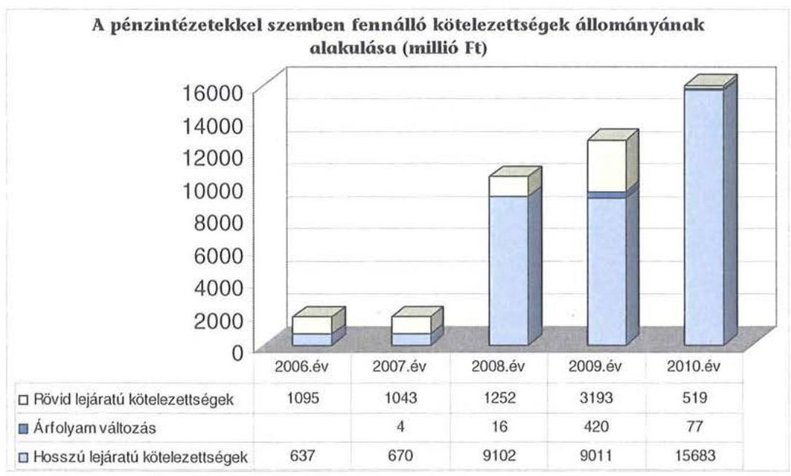

A kötelezettségek alakulását az árfolyamváltozás hatása is befolyásolja, azonban annak mértéke előre pontosan nem határozható meg, csak várakozásokon alapuló tendenciák jelezhetők.

Annak megítéléséről, hogy a devizában kibocsátott kötvényekért és felvett hitelekért kapott forinthoz képest a kötvények visszavásárlásakor, illetve a hitelek viszszafizetésekor jelentkező forint kötelezettség többletkiadást (árfolyamveszteséget) vagy megtakarítást (árfolyamnyereséget) eredményez-e a futamidő végén, a teljes kötelezettség rendezését követően lehet képet alkotni. Mindaddig, amíg törlesztési kötelezettség nem áll fenn (türelmi idő, moratórium), a tőkére vonatkoztatva nem értelmezhető sem az árfolyamveszteség, sem az árfolyamnyereség. Ugyanakkor a számviteli szabályok meghatározzák, hogy az árfolyam különbözetet év végén a kötelezettségek vagy követelések között a könyvviteli mérlegben nyilván kell tartani, azonban az árfolyam különbözet valójában nem realizált.

2007-ről 2009-re az árfolyam-különbözet növekedését az okozta, hogy míg a 2007-2008. években csak a világbanki hitel után számoltak el árfolyamveszte-

---

séget, addig a 2009. évben már jelentkezett a 2008. évben kibocsátott Dunaújváros I. kötvény utáni 412 millió Ft árfolyamveszteség is. A 2009. évről a 2010. évre a kimutatott árfolyam-különbözet csökkenését az okozta, hogy a világbanki hitel és a Dunaújváros I. kötvény utáni 289 millió Ft-os árfolyamveszteség mellett a 2010-ben kibocsátott Dunaújváros 2030 és Dunaújváros $2014^{42}$ kötvények után a könyvekben 212 millió Ft árfolyamnyereséget számoltak el.

A vizsgált időszakban az Önkormányzat pénzintézeti kötelezettségvállalásaira minden esetben közgyűlési döntés alapján került sor. A kötelezettségvállalásból származó források felhasználási céljait meghatározták. A Dunaújváros I. kötvény-kibocsátás előkészítéseként készült előterjesztésben vizsgálták az adósságszolgálati korlát, valamint a teljes futamidőre a várható kamat-és tőketörlesztési kötelezettség alakulását, annak pénzügyi fedezetét. A Dunaújváros 2030 és a Dunaújváros 2014 kötvények esetében a könyvvizsgáló véleményében kitért a hitelfelvételi korlát számítására és jelezte, hogy a kötvények visszaváltása a kibocsátást követő három, illetve négy év múlva nehéz helyzetbe hozza az Önkormányzatot. Ezen kötvények esetében a Közgyűlés döntéseit megalapozó előterjesztések nem tartalmazták a kötelezettségvállalás viszszafizetési forrásainak, a teljes futamidőre a várható kamat- és tőkefizetési kötelezettségeinek a bemutatását, valamint nem mutatták be azt sem, hogy a 2014. évben - a saját bevételek 2007-2010. évi szintnek megfelelő teljesülése és az ismert hosszú lejáratú kötelezettségek adósságszolgálati terheinek teljesítése esetén - az Önkormányzat túllépi az adósságot keletkeztető kötelezettségvállalásának felső határát.

A 2007-2010. években az Önkormányzatnál az adósságot keletkeztető kötelezettségvállalás felső határa 3500-3700 millió Ft között mozgott. A 2014. évben a Dunaújváros 2014 kötvény visszaváltása önmagában 5000 millió Ft-ba kerül az Önkormányzatnak.

Az Önkormányzat 2010. december 31-én EUR-ban fennálló adósságot keletkeztető kötelezettségvállalásai az alábbiak voltak:

| Megnevezés | Kibocsátás, illetve szerződéskötés időpontja | Összeg EUR | Kibocsátási, vagy lehivási árfolyam | Kamat (referencia kamat+ kamatfelár) | Felhasználás célja: |
| :--: | :--: | :--: | :--: | :--: | :--: |
| Világbanki hitel | 1999.09.22 | 800000 | 258,03 | 6 havi LIBOR+0,75 | szennyvízisztitó beruházás |
| Dunaújváros I. kötvény | 2008.12.02 | 32907471 | 270,84 | 3 havi   EURIBOR $+1,5 \%$ | fejlesztési célok megvalósítása |
| Dunaújváros 2030 kötvény | 2010.07.27 | 6850000 | 291,97 | 6 havi   EURIBOR $+3,4 \%$ | épület rekonstrukció |

[^0]
[^0]:    ${ }^{42}$ Az árfolyamváltozások kedvező hatásainak kihasználása érdekében a Ft-ban kibocsátott Dunaújváros 2014 kötvényt a kibocsátást követően átváltották EUR-ra, a Ft/EUR árfolyam változásának eredményeképpen 2010. december 31-én az eredetileg 5000 millió Ft kibocsátási értékű kötvény könyv szerinti értéke 4879 millió Ft-ra csökkent.

---

Az Önkormányzat a világbanki hitelt biológiai szennyvíztisztító beruházás megvalósítására vette igénybe, a Dunaújváros I. kötvényt ingatlanfejlesztések, intézményi infrastruktúra fejlesztések megvalósítására és pályázati saját forrás biztosítására ${ }^{43}$, a Dunaújváros 2030 kötvényt a Vasmú 41. szám alatt található irodaház rekonstrukciójára bocsátotta ki. A világbanki hitel teljes összegét ${ }^{44}$ 2002 augusztusáig igénybe vették, a Dunaújváros I. kötvényből 2010. december 31-én a lehívott, de fel nem használt összeg 3550 millió Ft (13 107 ezer EUR) volt. A Dunaújváros 2030 kötvényből 2010. december 31-ig felhasználás nem történt.

Az Önkormányzat a 2008. évben kibocsátott Dunaújváros I. kötvényből 3400 millió Ft értékben (a kötvény összegének 40,0\%-ából) 50,0\%-os üzletrészt vásárolt ${ }^{45}$ az Energo-Viterm Kft-ben és az Energo-Hőterm Kft-ben.

#### Abstract

Az üzletrészek megvásárlásának indoka az volt, hogy az Önkormányzat a városi távhő- és melegvíz szolgáltatás biztonságosabbá illetve átláthatóbbá, gazdaságosabbá tétele érdekében szerezzen tulajdont a hőtermelő erőművekben, valamint jó befektetés lesz számára. Az Önkormányzat a városi távhő- és melegvíz szolgáltatások esetében áthatóságként jár el, ezáltal befolyással van a lakossági fogyasztói árak alakulására, tulajdoni részesedésétől függetlenül is, a városi távhő szolgáltatással kapcsolatos kötelező feladatát pedig más, 100,0\%-osn tulajdonában lévő gazdasági társasága útján látta el. A két gazdasági társaságtól a 2009. évre 200 millió Ft osztalékbevétel illette meg az Önkormányzatot, amelyből 157 millió Ft értékben tartozásokat kompenzáltak, 43 millió Ft a helyszíni vizsgálat idejéig nem folyt be az Önkormányzathoz. A gazdasági társaságok 2010. évi beszámolója alapján 168 millió Ft osztalék illetné meg az Önkormányzatot, amelyet részére 2010. június 30 -ig nem fizettek meg. A 2010-2011. években befolyt osztalékok nagysága nem támasztja alá a befektetés megtérülését a kötvény futamideje alatt.

A kölcsönforrás bevonásával történő üzletrészek vásárlása az Önkormányzat pénzügyi, eladósodási helyzetére tekintettel nem volt szükséges és célszerű, mivel feladatellátása nem igényelte az üzletrészek tulajdonlását, továbbá egyéb kötelező feladatainak finanszírozására a 2008-2009. években folyamatosan 2000-3000 millió Ft közötti folyószámlahitel, valamint 250 millió Ft munkabérhítel felvételére, a 2010. évben 5000 millió Ft múködési célú kötvény kibocsátására kényszerült a szállítói állományának (2008 végéről 2010 végére) 649 millió Ft-tal való megemelkedése mellett.

[^0]
[^0]:    ${ }^{43}$ A Dunaújváros I. kötvényből 2010. december 31-ig 1250 millió Ft-ot használtak fel városfejlesztési, út, járda-és parkoló építési, szennyvízelvezetési, intézmény-fejlesztési, felújítási feladatokra, élményfürdő kialakítására, 3400 millió Ft-ot üzletrész vásárlására, 300 millió Ft-ot az önkormányzati tulajdonú DVG Zrt. tőkepótlására fordítottak.
    ${ }^{44} 2000000$ EUR
    ${ }^{45}$ A Közgyűlés 653/2008. (XI. 27.) és 105/2009. (III. 12.) számú határozataival döntött az üzletrész megvásárlásáról.

---

Az Önkormányzat 2010. december 31-én forintban fennálló adósságot keletkeztető kötelezettségvállalásai az alábbiak voltak:

| Megnevezés | Kibocsátás, illetve szerződéskötés időpontja | Összeg ezer   Ft | Kamat (referencia kamat+ kamatfelár) | Felhasználás célja: |
| :--: | :--: | :--: | :--: | :--: |
| ÖKIF hitel - 135 millió Ft | 2006.08 .09 | 82744 | 3 havi   EURIBOR $+1,54 \%$ | út és járdaépítések megvalósítása |
| ÖKIF hitel - 41 millió Ft | 2006.08 .09 | 12277 | 3 havi   EURIBOR $+1,04 \%$ | csapadék-és szennyvïzelvezetés |
| Dunaújváros 2014 kötvény | 2010.07 .27 | 5000000 | 6 havi   BUBOR $+2,4 \%$ | hitelek kiváltása, múködési célú kiadások fedezése |

Az Önkormányzat a 135 millió Ft összegű ÖKIF hitelt az Arany János és Frangepán utca járdaépítés mellett megvalósuló rekonstrukciójára, a 41 millió Ft-os ÖKIF hitelt a Páskom, a Szent István, a Táltos utca, halász sor és az északi lakóterületek csapadék és szennyvízlevezetésének megoldására teljes összegben a 2007-2008. évek folyamán igénybe vette. Az 5000 millió Ft összegben kibocsátott Dunaújváros 2014 kötvény 2010. december 31-ig teljes egészében felhasználták az Önkormányzat folyószámla- és munkabér hiteleinek, fejlesztési hiteleinek ${ }^{46}$ visszafizetésére, valamint múködési célú kiadásokra ${ }^{47}$.

Az Önkormányzat a devizában fennálló pénzintézeti kötelezettségeiből 1200000 EUR ( 316 millió Ft) tőkét törlesztett és 3037538 EUR ( 838 millió Ft) kamatot, valamint 20000 EUR ( 5 millió Ft) és 50 millió Ft egyéb költséget ${ }^{48}$ fizetett. A HUF-ban fennálló kötelezettségekből 431 millió Ft tőkét, 115 millió Ft kamatot és 79 millió Ft egyéb költséget ${ }^{49}$ fizetett. A 2007-2010. években fennálló világbanki hitellel kapcsolatban 35 millió Ft ténylegesen megfizetett árfolyamvesztesége jelentkezett, míg a Dunaújváros I., Dunaújváros 2030, Dunaújváros 2014 kötvényekre a 2008-2010. években mindösszesen kimutatott 482 millió Ft-os árfolyamveszteség ténylegesen nem realizált, mivel a kötvények visszaváltását 2011-ben kell megkezdeni.

[^0]
[^0]:    ${ }^{46}$ a 2004. évi költségvetési rendeletben szereplő beruházási és felújítási célokra, továbbá a 2005-2006. évben a Szent Pantaleon Kórház felújítási feladatara felvett hosszú lejáratú hitelek
    ${ }^{47}$ A Dunaújváros 2014 kötvény 2,1\%-át (105 millió Ft-ot) a kötvénykibocsátás dijára, $65,8 \%$-át ( 3287 millió Ft-ot) folyószámla hitel, $5,0 \%$-át ( 250 millió Ft-ot) munkabérhitel, $4,4 \%$-át ( 220 millió Ft-ot) fejlesztési hitelek, és $15,0 \%$-át ( 751 millió Ft-ot) szállitói tartozások rendezésére, továbbá $1,5 \%$-át ( 77 millió Ft-ot) egyéb múködési célú kiadások teljesítésére, valamint $6,2 \%$-át ( 310 millió Ft-ot) munkabér kifizetésére fordították.
    ${ }^{48}$ A világbanki hitel esetében egyszeri lehívási dijat, a Dunaújváros 2030 kötvény esetében szervezési, lebonyolítási dijat és kezességvállalási dijat fizetett az Önkormányzat.
    ${ }^{49}$ Projektvizsgálati dí címén 3,8 millió Ft-ot, a Dunaújváros 2014 kötvényhez szervezési, lebonyolítási dí címén 75 millió Ft-ot fizetek meg.

---

A Közgyűlés 2007-2011. I. negyedévéig hosszú lejáratú hitel felvételéről nem döntött, de a forráshiány fedezésére két alkalommal ${ }^{50}$ határozott három kötvénykibocsátásról.

A Dunaújváros I. kötvény kibocsátását lebonyolító pénzintézet kiválasztása versenyeztetési eljárás keretében történt, míg a Dunaújváros 2030, valamint a Dunaújváros 2014 kötvény-kibocsátások lebonyolítását az Önkormányzat nem versenyeztette, a Közgyűlés egy bank komplex banki szolgáltatási ajánlata alapján hozta meg döntését.

A versenyeztetés mellőzésének oka az volt, hogy a 2010. évben három alkalommal írt ki az Önkormányzat folyószámla-hitelkeret szerződés megkötésére ${ }^{51}$ közbeszerzési eljárást, amelyekre ajánlat nem érkezett, a lejáró folyószámla-hitelt viszont saját forrásból nem tudták visszafizetni.

A komplex banki ajánlat tartalmazott az 5000 millió Ft értékú múködési célú, valamint a 2000 millió Ft értékú fejlesztési célú kötvénykibocsátás mellett bankszámla-vezetési ajánlatot is, amelyet az Önkormányzat elfogadott ${ }^{52}$.

A polgármester a kötvénykibocsátásokról szóló okiratok aláírásával megsértette az Ötv. 88. § (1) bekezdés b) pontjában foglalt előirásokat, mivel a visszafizetés fedezetéül az Önkormányzat költségvetési elszámolási számlájára azonnali inkasszó jogot biztosított. Ezáltal nem zárta ki, hogy a visszafizetésre a normatív állami hozzájárulást, az állami támogatásokat, a személyi jövedelemadót, valamint az államháztartáson belülről múködési céllal átvett bevételeket felhasználják.

A költségvetési elszámolási számlára folynak be közvetlenül - illetve az állami támogatások, hozzájárulások elkülönített bankszámláról történő átvezetés útján - a fent részletezett bevételek is, emiatt nem biztosítható, hogy a visszafizetés csak az önkormányzat saját bevételei terhére történjen meg, annak ellenére, hogy a kötvényokiratokban kikötötték, hogy a normatív állami hozzájárulások, az állami támogatások, a személyi jövedelemadó, valamint az államháztartáson belülről múködési céllal átvett bevételek a visszafizetésre nem használhatók fel.

Az árfolyam- és kamatkockázatokra a Közgyűlés figyelmét felhívták a kötvénykibocsátásokról szóló előterjesztésekben, szakértői anyagokban. A pályázati forrásból megvalósuló fejlesztések esetében ${ }^{53}$ végeztek megtérülési számításokat, vizsgálták a megvalósított fejlesztések bevételnövelő, illetve kiadáscsökkentő vonzatát, azonban nem elemezték az adósságot keletkeztető kötelezettségvállalások megtérülését a tervezett többletbevételekből, kiadás megtaka-

[^0]
[^0]:    ${ }^{50}$ A Közgyűlés 606/2008. (XI. 13.) számú, valamint 461/2010. (VII. 13.) számú határozataival döntött kötvény kibocsátásról.
    ${ }^{51}$ Az Önkormányzat folyószámla-hitelkeret szerződése 2010. december 31-én lejárt.
    ${ }^{52}$ A Közgyűlés a 462/2010. (VII. 13.) számú határozatával visszavonta a bankszámlavezetés közbeszerzési eljárásának megindítására vonatkozó 372/2010. (VI. 24.) számú határozatát.
    ${ }^{53}$ EU-s források bevonásával valósul meg a Kőtár alatti partszakasz védelme, a belvárosi rehabilitáció, valamint a hajléktalan Ellátó Centrum.

---

rításokból, illetve a társadalmi hasznosság szempontjából. Az Önkormányzat a 2010-ben kibocsátott múködési célú kötvényét kötelező feladatainak, a 2008ban kibocsátott kötvényből - 2010. december 31-ig - felhasznált 4950 millió Ftból 1550 millió Ft-ot ( $31,3 \%$-ot) kötelező, míg 3400 millió Ft-ot ( $68,7 \%$-ot) önként vállalt feladatainak ellátására fordította.

Az Önkormányzathoz 2007-2010. években az átmenetileg szabad pénzeszközei lekötéséből 937 millió Ft kamatbevétel folyt be, melyből 873 millió Ft származott kötvényforrás befektetéséből és 64 millió Ft az intézmények és a Hivatal elkülönített bankszámláin rendelkezésre álló forrás befektetéséből ${ }^{54}$. A kötvényforrás ${ }^{55}$ befektetéséből származó kamatbevételből az Önkormányzat 429 millió Ft-ot a kötvény kamatfizetésére, 2,5 millió Ft-ot pénzforgalmi jutalékra, 246 millió Ft-ot múködési célra és 195,5 millió Ft-ot fejlesztési célra fordított. A kötvényforrás kamatbevétele ( 873 millió Ft) a kötvényre teljesített teljes kamattehernek ( 541 millió Ft) a $161,4 \%$-át tette ki.

Az Önkormányzat a vizsgált időszakban múködőképességét, pénzügyi egyensúlyát csak folyószámlahitel és munkabér megelólegezési hitel igénybevételével tudta biztosítani, amelyek alakulását az alábbi táblázat mutatja be:

|  |  |  |  | ezer Ft-ban |
| :-- | --: | --: | --: | --: |
| Megnevezés | 2007. év | 2008. év | 2009. év | 2010. év |
| I. Folyószámlahitel |  |  |  |  |
| a folyószámlahitel keretösszege   január 1-jén | 2200000 | 2200000 | 2200000 | 3350000 |
| teljesített kamat és egyéb költség | 98604 | 102594 | 176462 | 145432 |
| II. Munkabér megelőlegezési   hitel |  |  |  |  |
| Igénybevett hitel összesen: |  |  | 1460708 | 1500000 |
| teljesített kamat és egyéb költség |  |  | 7706 | 8032 |

A 2007-2009. években az Önkormányzat az év minden napján igénybe vett folyószámlahitelt, a 2010. évben 204 napon keresztül állt fenn folyószámla-hitel tartozása. Az átlagos napi állomány a 2008. évben volt a legalacsonyabb, 1224 millió Ft, és 2010-ben volt a legmagasabb, 2975 millió Ft. Az Önkormányzatnak 2010. december 31-én folyószámlahitel tartozása nem volt. A tartós likviditási problémák miatt az Önkormányzat a munkabérek kifizetéséhez munkabér megelőlegezési hitelt vett igénybe a 2009-2010. években hat-hat alkalommal, 2009-ben átlagosan napi 9,6, 2010-ben 8,4 millió Ft-ot. A törlesztések a saját bevételekből és a normatív állami hozzájárulásokból az igénybevételt követő hónapban megtörténtek.

A 2007-2010. években fennálló tartós folyószámlahitel tartozását, valamint munkabérhitelét az Önkormányzat a Dunaújváros 2014 kötvény kibocsátásából származó forrásból visszafizette, és folyószámla-, valamint munkabérhitelkeretét 2010. december 31-vel - a korábbi bankszámla-vezetési szerződésé-

[^0]
[^0]:    ${ }^{54}$ pályázati források előlegéből
    ${ }^{55}$ a Dunaújváros I. kötvény befektetéséből származó bevételek

---

nek a lejáratával egyidejúleg - megszüntette. A 2011. évre folyószámlahitelkeret, valamint munkabér-megelőlegezési hitelszerződést nem kötött.

A folyószámlahitel és munkabér megelőlegezési hitelek kondíciói és egyéb költségei a következők voltak ${ }^{56}$ :

| Megnevezés | Kamat (referencia+ kamatfelár) |
| :--: | :--: |
| Folyószámlahitel |  |
| 2007-2008. év | 3 havi BUBOR $+0,0 \%$ |
| 2009. év | 3 havi BUBOR $+0,0 \%, 2009$. augusztus 27 -töl 3 havi BUBOR $+3 \%$ |
| 2010. év | 3 havi BUBOR $+3,0 \%$ |
| Munkabér megelölegezési hitel |  |
| 2008-2009. év | 3 havi BUBOR $+0,0 \%$ |

Az áttekintett időszakot jellemző müködési hiány, a folyamatos likviditási problémák finanszírozása (folyószámlahitel) az Önkormányzatnak a 2007től 2010. december 31-ig összesen 523 millió Ft kamatkiadást eredményezett, egyéb költséget nem kellett fizetnie. A munkabérhitel után kamat címén az Önkormányzat a vizsgált időszakban összesen 16 millió Ft-ot fizetett ki. Egyéb költség megfizetésére nem került sor.

Az Önkormányzat 2011. I. negyedévében 238 millió Ft összegben támogatás megelőlegezési hitelt ${ }^{57}$ vett igénybe, amelyet az első negyedévben vissza is fizettek. Az igénybe vett hitel után 4 millió Ft kamatot és 3,7 millió Ft egyéb költséget (szerződéskötési díjat) fizetettek meg.

Az Önkormányzatnál a jelenleg fennálló kötvények és a hitelek esetében a kamatfizetési kötelezettségek alakulását jelentősen befolyásolta és jelenleg is befolyásolja a kibocsátáskori és az utolsó kamatfizetéskori referencia kamatok változása, melyet az alábbi táblázat mutat be:

| Megnevezés | Kibocsátási, lehivási | Utolsó fizetéskori | Változás \% |
| :--: | :--: | :--: | :--: |
|  | alapkamat \% |  |  |
| 6 havi LIBOR | 3,110 | 0,950 | $-69,5$ |
| 3 havi EURIBOR | 3,788 | 1,203 | $-68,2$ |
| 6 havi EURIBOR | 1,133 | 1,244 | 9,8 |
| 6 havi BUBOR | 5,370 | 5,950 | 10,8 |

Az Önkormányzat utolsó kamatfizetési kötelezettsége a 6 havi LIBOR-ú hitel után 2010. október 15-én, a 3 havi EURIBOR-ú kötvény esetében 2011. március 31-én, a 6 havi EURIBOR-ú kötvény esetében 2011. január 20-án, a 6 havi BUBOR-ú kötvény esetében 2011. január 20-án volt.
${ }^{56}$ A referencia kamat az alábbiak szerint alakult:

| MNB BUBOR fixing (átlagkamat) \%ban |  |  |  |  |
| :-- | :--: | :--: | :--: | :--: |
| Referenciakamat | 2007. évi | 2008. évi | 2009. évi | 2010. évi |
| 3 havi BUBOR | 7,75 | 8,87 | 8,64 | 5,5 |

${ }^{57}$ A Hajléktalan Ellátó Centrum kialakítása, a Kötár alatti partszakasz védelme, valamint a kompetencia alapú oktatás tárgyú pályázatok megelőlegezésére.

---

Az alapkamat mértékének alakulása jelentős hatással van az adott devizanemben kifejezett, a teljes futamidőre számított, várható kamatkötelezettség nagyságára. Amennyiben a referencia kamat nem változott volna, az Önkormányzatnak az EUR-ban kibocsátott kötvényei után a kibocsátáskori referencia kamattal számolva 2011. március 31-ig 4180415 EUR (1 165 millió Ft) kamatfizetési kötelezettsége jelentkezett volna. A változások miatt 1897911 EURval ( 529 millió Ft-tal) kevesebb fizetési kötelezettséget kellett teljesítenie. A HUF alapú kötvény esetében a referencia kamatláb kedvezőtlen változásának hatása még nem jelentkezett, mivel az első kamattörlesztés alkalmával - 2010. január 20-án - a kibocsátáskori kamattal számoltak.

Az Önkormányzat fizetési kötelezettségei közül a Dunaújváros I. kötvénynél 2011. december 31-én, a Dunaújváros 2030 kötvénynél 2013. április 15-én, kezdődik a tőke törlesztése. A Dunaújváros 2014 kötvény visszaváltása 2014. június 30 -án egyösszegben történik.

Az Önkormányzatnál a helyszíni vizsgálat alatt további hitel igénybevételről, illetve kötvénykibocsátásról szóló döntést nem készítettek elő.

A jegyző 2011. január 3-i hatállyal likviditási és kockázatkezelési szabályzatot adott ki, amelyet a Közgyűlés a 2010. december 16-i ülésén megtárgyalt. A likviditási és kockázatkezelési szabályzatban rögzítették, hogy

- a hosszú lejáratú hitelek és kötvények kamat-és árfolyamkockázatát folyamatosan figyelemmel kell kísérni, a piaci viszonyokat elemezni kell;
- melyek a likvid pénzeszközökkel kapcsolatos döntés-előkészítési feladatok és hatáskörök;
- az új kölcsönforrások felvétele esetén a döntéshozónak be kell mutatni az adósságot keletkeztető kötelezettségvállalással kapcsolatos kockázatokat;
- a kockázatkezelési feladatok ellátására Kockázatkezelő Testületet hoznak létre, melynek tagjai a gazdasági alpolgármester, az ügyrendi, igazgatási és jogi bizottság, a pénzügyi bizottság, valamint a gazdasági bizottság elnökei;
- az éves költségvetésekben Fedezeti Alapot kell létrehozni az árfolyammozgások fedezetére.

# 3.2. Szállítók felé fennálló kötelezettségek alakulása 

Az Önkormányzat és gazdasági társaságai lejárt szállítói tartozásainak, és egyéb kiadás elmaradásainak alakulását az alábbi táblázat tartalmazza:
ezer Ft-ban

| Megnevezés | 2007. | 2008. | 2009. | 2010. | 2011. |
| :--: | :--: | :--: | :--: | :--: | :--: |
|  | december 31. | december 31. | december 31. | december 31. | március 31. |
| Lejárt szállitói tartozás | 4856 | 23224 | 23947 | 149290 | 890739 |
| Egyéb kiadás elmaradás | 5351 | 244 | 283 | 1693 | 1603 |
| Gazdasági társaságok lejárt szállitói tartozása | 1020298 | 854240 | 1790618 | 2788862 | 0 |
| ebből Kórház | 395169 | 593089 | 1310544 | 1087073 | 1004470 |

---

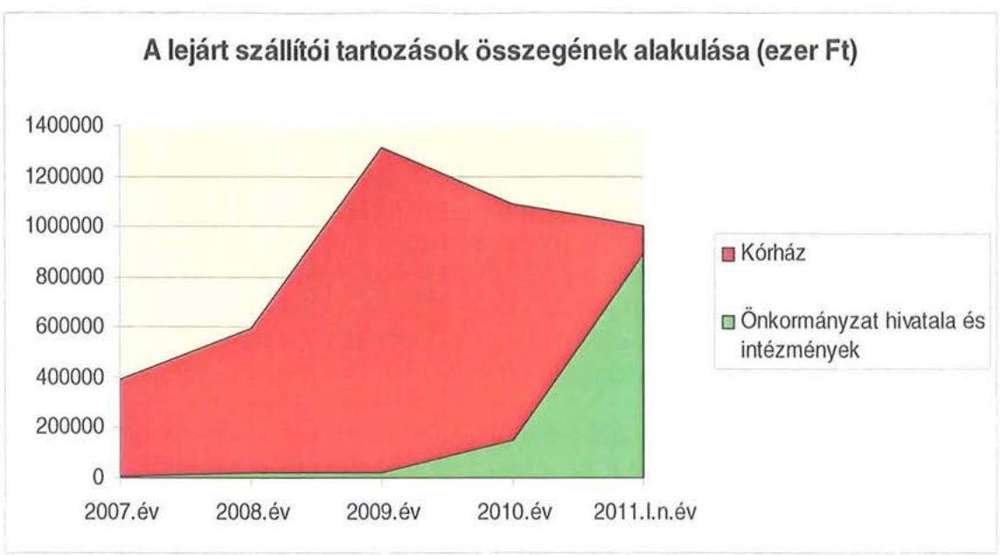

Az Önkormányzat 2010. december 31-i mérlegben kimutatott szállítói kötelezettsége 742 millió Ft volt. A le nem járt tartozásállomány 593 millió Ft-ot tett ki, amelynek $97,1 \%$-a ( 576 millió Ft) a Hivatal tartozása volt. Az Önkormányzat lejárt szállítói tartozása 2007-ről 2011. I. negyedévére 5 millió Ft-ról 891 millió Ft-ra növekedett. A lejárt szállítói tartozásból kiugróan magas a Hivatalnál jelentkező állomány, amely 2011. március 31-én annak csaknem 77,1\%-át, 686 millió Ft-ot tett ki. A lejárt szállítói tartozásállományából 2011. március 31-én 371 millió Ft (az állomány 41,6\%-a) meghaladta a 31 napot és 315 millió Ft (az állomány 35,4\%-a) a 91 napot, 103 millió Ft-ot tett ki az átütemezett tartozások összege, amelyekre 43 esetben kötöttek megállapodást. Az Önkormányzat intézményeinél és a Hivatalnál a 2007-2011. I. negyedév végéig a folyamatosan növekvő adósságállomány ellenére - az önkormányzati biztosról szóló önkormányzati rendelet alapján - nem kellett önkormányzati biztost kijelölni.

Az egyéb kiadás elmaradás összege 2007-ről a 2011. I. negyedévére 1603 ezer Ft-ra, 70\%-kal csökkent, amelynek oka az volt, hogy a 2008. évben rendezték a Tűzoltóság 5 millió Ft összértékű elmaradt személyi juttatásait és az azokhoz kapcsolódó munkaadói járulékokat. A 2011. I. negyedév végén fennálló egyéb kiadás elmaradásból - 678 ezer Ft volt a ki nem fizetett személyi juttatás, 255 ezer Ft ennek munkaadókat terhelő járuléka, valamint 670 ezer Ft az egyéb kiadás elmaradás ${ }^{58}$. Az összes kiadáselmaradás $91,8 \%$-a két intézménynél ${ }^{59}$ keletkezett.

A gazdasági társaságok 2010. december 31-én 2789 millió Ft lejárt szállítói tartozással rendelkeztek, amelyből 1122 millió Ft volt azon gazdasági társaságok lejárt szállítói állománya, amelyekben az Önkormányzat 75\%-ot meghaladó összegű részesedéssel rendelkezett. Ezen belül is a Kórház lejárt tartozása 1087

[^0]
[^0]:    ${ }^{58}$ Szállítói tartozás utáni késedelmi kamat, cégautó adó, rehabilitációs hozzájárulás elmaradás.
    ${ }^{59}$ a Széchenyi István Gimnáziumnál 632 ezer Ft és a Tűzoltóságnál 841 ezer Ft

---

millió Ft volt. A Kórház lejárt szállítói állománya a 2011. I. negyedévében kismértékben - 1004 millió Ft-ra csökkent, de még emellett is a 2007. évi állomány 2,5-szeresére emelkedett, amelynek jelentősége, hogy 2011. július 1-től a fekvőbeteg ellátás költségvetési intézményi formában valósul meg $^{60}$, tehát szállítói kötelezettségei ettől kezdve az Önkormányzat mérlegében jelennek meg. A Közgyűlés elvi döntést hozott a Kórház gazdasági társaság végelszámolással történő megszüntetéséről is, azonban a döntést megelőzően nem vizsgálta meg, hogy a gazdasági társaság vagyona elegendő-e a kötelezettségek (hitelezői igények) teljesítésére, tehát a végelszámolási eljárás ténylegesen lefolytatható-e ${ }^{61}$, továbbá 2011. június 10-ig a végelszámolással kapcsolatos konkrét döntéseket - döntés a végelszámolási eljárás megindításáról, a végelszámoló személyének kijelöléséről - nem hozta meg.

A polgármester a 2011 I. negyedévi tájékoztató keretében tájékoztatta a Közgyűlést az Önkormányzat lejárt szállítói kötelezettségeiről, valamint intézkedett arról, hogy a likviditásának megőrzése érdekében a kiadások teljesítése - a 2009-ben bevezetett rend szerint - változatlanul napi utalási tervek alapján, polgármesteri egyeztetés után történjen meg. Az intézmények számára nem határoztak meg havi finanszírozási keretet, kiadásaik fedezetéhez részletes indoklással alátámasztott kérelmeiket a polgármester bírálja el.

# 3.3. Egyéb kötelezettségek alakulása 

Az Önkormányzat a 2007-2011. I. negyedév végéig PPP konstrukció keretében nem végzett beruházást, líingszerződést nem kötött.

Az Önkormányzat 100\%-os tulajdonában lévő DVG Zrt. a 2006. évben 3374 millió Ft értékű lízingszerződést kötött a megépítésre kerülő városi élményfürdő ingatlanra. A futamidő 240 hónap, az irányadó kamatláb 1 havi EURO LIBOR, a szerződében meghatározott maradványérték 613 ezer EUR volt. Az Önkormányzat a lízingszerződésből származó kötelezettségek megfizetéséhez biztosítékként készfizető kezességet vállalt. A lízingszerződést a felek 2010 szeptemberében megszüntették. Az Önkormányzat 2009. március 19-én 85 millió Ft értékben készfizető kezességet vállalt a 100\%-os tulajdonú Kórház struk-túra-váltásra felvett 135 millió Ft összegű hiteléhez. A hitel lejárata 2015. december 20-a. Beváltott kezességvállalás nem volt.

Az Önkormányzat 2010. december 31-én egyéb szervezetekkel szemben fennálló kötelezettsége 10 millió Ft-ot tett ki. (A Fejér Megyei Katasztrófavédelmi Önsegélyezési Társulás 2 millió Ft kölcsönt adott számukra, melyet két év alatt egyenlő részletekben kell visszafizetni. Az Alba Volán Zrt. felé ki nem fizetett

[^0]
[^0]:    ${ }^{60}$ A Közgyűlés 239/2011. (V. 12.) számú határozatában döntött a Kórház további múködtetésének formájáról, valamint a határozat 1. számú melléklete szerint elfogadott ütemtervben annak végelszámolással történő megszüntetéséről.
    ${ }^{61}$ A Cégtv. 108. § (1) bekezdése alapján, ha a végelszámoló azt állapítja meg, hogy a cég vagyona a hitelezők követeléseinek fedezetére nem elegendő, és a tagok a hiányzó összeget 30 napon belül nem fizetik meg, köteles felszámolási eljárás lefolytatására irányuló kérelmet benyújtani.

---

tartozás 8 millió Ft volt, 2011-ben is fennáll az Önkormányzat részéről további 77 millió Ft-os tartozás).

A vizsgált időszakban a Közgyűlés hét alkalommal döntött követelés elengedésről 35 millió Ft összegben, amelyből 11 millió Ft önkormányzati lakbérhátralék, 3 millió Ft helyi lakásépítési támogatás és 20 millió Ft önkormányzati bérlakás vételárhátralékának elengedése volt. A közszolgálati szabályzat alapján további 1 millió Ft követelés elengedés történt, mivel a dolgozókat a munkáltatói kölcsön határidő előtt történő egyösszegű visszafizetése esetén $20 \%$ engedmény illette meg.

Az Önkormányzat a 2007-2011. I. negyedévben két intézménye számára 7,8 millió Ft pályázati forrást megelőlegező, civil szervezeteknek 88 millió Ft likviditás megőrzését elősegítő illetve pályázati forrást megelőlegező, 45 társasháznak együttesen 40 millió Ft felújítási célokat szolgáló kölcsönt nyújtott.

Az Önkormányzat 2007-2011. I. negyedévben a 25\%-ot meghaladó tulajdoni részesedésű gazdasági társaságai részére 11 alkalommal összesen 532 millió Ft összegben, egyéb gazdasági társaságoknak két alkalommal összesen 25 millió Ft összegben nyújtott kölcsönt. A gazdasági társaságok részére nyújtott kölcsönök jellemzően rövid lejáratú kölcsönök voltak. A 2007-2010. években 7 alkalommal ${ }^{62}$ - 259 millió Ft összegben folyósítottak támogatási kölcsönöket a Kórház számára, melyből jelenleg 147 millió Ft tartozás áll fenn. Ebből 47 millió Ft azon tartozások összege, amelyek több éve fennállnak, a kölcsön visszafizetésének határidejét a Közgyűlés több alkalommal módosította ${ }^{63}$ a Kórház fizetési nehézségei miatt.

A Közgyűlés a kötvények biztosítékaként 20 ingatlanon járult hozzá jelzálogjog alapításához és bejegyzéséhez. A Dunaújváros I. kötvényhez jelzálogfedezetként biztosított ingatlanokon összességében 8500 millió Ft értékű, a Dunaújváros 2030 és a Dunaújváros 2014 kötvényekhez 4000 millió Ft értékű keretbiztosítéki jelzálogfedezeten összességében 7000 millió Ft jelzálog bejegyzése történt meg.

A jelzálog kötelezettségbe vont ingatlanok közül nyolc ingatlan a keretbiztosítéki jelzálogszerződések megkötésének időpontjában a korlátozottan forgalomképes önkormányzati törzsvagyon körébe tartozott, ezért a Közgyűlés 245/2008. (V. 22.), a 461/2010. (VII. 13.) és a 470/2010. (VIII. 19.) számú határozataival ${ }^{64}$ megsértette az Ötv. 88. § (1) bekezdés b) pontjában foglaltakat.

[^0]
[^0]:    ${ }^{62}$ A Kórház kölcsönt kapott a „D" szárny tetőszerkezet felújítására, a Szülészeti osztály felújítására, ultrahang-diagnosztika készülék vásárlására, pályázati önrészre valamint likviditási helyzetének javítására.
    ${ }^{63}$ A D" szárny tetőszerkezet felújítására kötött szerződést öt alkalommal, a Szülészeti osztály felújítására kötött szerződést 3 alkalommal és az ultrahang-diagnosztika készülék vásárlására kötött szerződést négy alkalommal módosították.
    ${ }^{64}$ A határozatokkal a Dunaújváros I. kötvénykibocsátással kapcsolatos szerződések aláírását, valamint a Dunaújváros 2030 és Dunaújváros 2014 kötvények esetében a keretbiztosítéki jelzálogba bevont ingatlanok körét hagyta jóvá a Közgyűlés.

---

Az önkormányzat vagyongazdálkodási rendelete szerint korlátozottan forgalomképes ingatlanok voltak a Dunaújváros 74/2, az 54/5, az 1 /2, a 730/58, a 128, a 162, a 2163 és a 141 hrsz-ú ingatlanok. A felsorolt ingatlanok közül a Dunaújváros 2163 hrsz-ú ingatlant a vagyongazdálkodási rendelet 2011. június 3-tól hatályos módosításával átsorolták a forgalomképes ingatlanok közé. A többi ingatlan továbbra is korlátozottan forgalomképes besorolású, az Önkormányzat kötelező feladatellátását szolgáló intézményi vagyon.

Az összes forgalomképes ingatlan vagyonnyilvántartás szerinti bruttó értéke a 2010. év végén 3500 millió Ft volt, melyből a terhelt ingatlanok 1959 millió Ftos ( $56 \%$-os) értéket képviseltek.
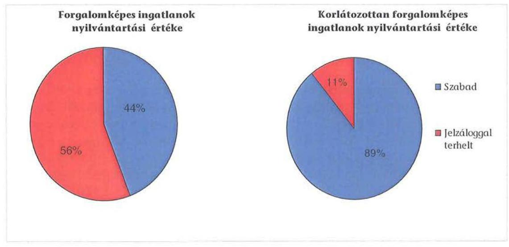

Az Önkormányzat eladósodása és a jelzálogjog bejegyzése között összefüggés van, mivel a pénzintézetek csak jelzálogfedezet mellett vállalták a kötvények lejegyzését. Az eladósodásnak a vagyoni helyzetre gyakorolt negatív hatását mutatja, hogy az Önkormányzat - különösen a 2010-ben kibocsátott kötvényeknél - már az intézményi feladatellátást szolgáló ingatlanokat ${ }^{65}$ volt kénytelen jelzálogfedezetként felajánlani. A 2010. év végén a forgalomképes ingatlanokon túl a korlátozottan forgalomképes ingatlanoknak a $11 \%$-át is terhelte jelzálogjog.

Az Önkormányzat kötelezettségállománya 2010. december 31-én és várható alakulása azok lejáratáig:

[^0]
[^0]:    ${ }^{65}$ A jelzálogteherrel érintett intézményi vagyon az általános- és középiskolai oktatási, a közművelődési, valamint a hivatali feladatellátásban szerepel.

---

Az Önkormányzat kötelezettségeinek állománya 2010. december 31-én és várható alakulása a kötelezettségek lejáratáig

| Megnevezés | Állomány 2010. dec.31-én |  |  | Várható kötelezettség 2011-2013.   években* |  |  | Várható kötelezettség 2014-től a   futumidő végéig* |  |
| :--: | :--: | :--: | :--: | :--: | :--: | :--: | :--: | :--: |
|  | HUF-ban ( Ft-ban) | Devizában   (összege) | Devizene   m | HUF-ban ( Ft-   ban) | Devizában   (összege) | Devizun   em | HUF-ban (Ft-ban) | Devizában   (összege) | Devizun   em |
| Hosszú lejáratú   hitelek | 95021363 |  | HUF | 65007237 |  | HUF | 40214413 |  | HUF |
| Hosszú lejáratú   hitelek |  | 800000 | EUR |  | 807335 | EUR |  | 269094 | EUR |
| Kötelegy | 4878571420 |  | HUF | 1079111709 |  |  | 5070570318 |  | HUF |
| Kötelegyek |  | 29757471 | EUR |  | 9361635 | EUR |  | 28688172 | EUR |
| Egyéb likvid hitel | 0 |  |  | 238440000 |  | HUF | 0 |  |  |
| Kezesség | 85000000 |  | HUF |  |  |  |  |  |  |
| Szállítói tartozás összeg | 742243000 |  | HUF | 123951000 |  |  |  |  |  |
| eklcől lejárat tartozó | 123951000 |  | HUF |  |  |  |  |  |  |
| Összesen Ft-ban: | 5924786793 |  |  | 1506509946 |  |  | 5110784721 |  |  |
| Összesen CHF-ban: |  |  |  |  |  |  |  |  |  |
| Összesen EUR-ban: |  | 40557471 | EUR |  | 10168970 | EUR |  | 38957266 | EUR |

Az Önkormányzat kötelezettségeinek állománya 2010. december 31-én 95 millió Ft hosszú lejáratú hitelből és 4879 millió Ft kötvénytartozásból, 800000 EUR hosszú lejáratú hitelből, 39757471 EUR kötvénykibocsátásból, 85 millió Ft kezességvállalásból és 742 millió Ft szállítói tartozásból tevődött össze. A 2010. év végén kimutatott szállítói kötelezettségekre fedezetet a mérlegben kimutatott 945 millió Ft követelésállomány, nyújtott. A 2011-2013-ban esedékes kötelezettségek várható összege devizánként 1507 millió Ft, és 10168970 EUR. Az Önkormányzat a hosszú lejáratú kötelezettségekkel összefüggésben nem rendelkezett arról, hogy azok visszafizetésének finanszírozását milyen forrásösszetétellel tervezi megvalósítani. A kötelezettségek teljesítésére figyelembe vehető 32907 ezer EUR kötvénykibocsátásból származó, fel nem használt összeg ( 3550 millió Ft) lekötésének kamatbevétele és 946 millió Ft mérlegben kimutatott követelésállomány, 3500 millió Ft forgalomképes ingatlanvagyon, melyből 1959 millió Ft a pénzintézeti kötelezettséghez kapcsolódóan jelzáloggal terhelt. Az Önkormányzat 2010. évi pénzmaradványa teljes egészében kötelezettségvállalással terhelt, ezért ez törlesztésére nem használható fel.

A 2013. után várható kötelezettség összegét az 5111 millió Ft-os és a 38957266 EUR-os hitel és kötvénytartozás alkotja. Ezekre az Önkormányzat tájékoztatása szerint figyelembe vehető források az Önkormányzat saját bevételei.

Az Önkormányzat pénzügyi, vagyoni helyzetére közvetetten hatást gyakorol gazdasági társaságainak adósságállománya. A gazdasági társaságok adatszolgáltatása alapján hosszú lejáratú kötelezettség állományukat 2010. december 31-én és annak várható alakulását a lejáratig a következő táblázatban mutatjuk be:

---

A gazdasági társaságok hosszú lejáratú kötelezettségeinek állománya 2010. december 31-én és várható alakulása a kötelezettségek lejáratáig

| Megnevezés | Állomány 2010. dec.31-én |  |  | Várható kötelezettség 2011. 2013. években* |  |  | Várható kötelezettség 2014-től a futamidő végéig* |  |  |
| :--: | :--: | :--: | :--: | :--: | :--: | :--: | :--: | :--: | :--: |
|  | HUF-ban ( Ft-ban) | Devizában (összege) | Devizane m | HUF-ban (Ftban) | Devizában (összege) | Deviza nem | HUF-ban (Ft-ban) | Devizában (összege) | Deviza nem |
| Hosszú lejáratú hitel | 1425293123 |  | HUF | 1582369089 |  | HUF | 60395123 |  | HUF |
| Hosszú lejáratú hitelek |  | 12943080 | EUR |  | 13773453 | EUR |  | 179544 | EUR |
| Lióing kötelezettségek | 2484100 |  | HUF | 3167712 |  | HUF | 88444 |  | HUF |
| Lióing kötelezettségek |  | 39707 | EUR |  | 43874 | EUR |  |  |  |
| Lióing kötelezettségek |  | 31856 | CHF |  | 36373 | CHF |  | 8052 | CHF |
| Összesen Ft-ban: Összesen CHF-ben: | 1427777223 |  |  | 1585536801 |  |  | 60483567 |  |  |
|  |  | 31856 | CHF |  | 36373 | CHF |  | 8052 | CHF |
| Összesen EUR-ban: |  | 12982787 | EUR |  | 13817327 | EUR |  | 179544 | EUR |

A 2010. december 31-én fennálló 1425 millió Ft-os hosszú lejáratú hitel állományból 166 millió Ft az Önkormányzat 100\%-os tulajdonában álló gazdasági társaságok, 1259 millió Ft az 50\%-os tulajdonában álló gazdasági társaságok fejlesztési célra felvett hiteleiből vissza nem fizetett összeg. A 100\%-os tulajdonú gazdasági társaságok Ft hiteleiből 108 millió Ft a Kórház fejlesztési célra ${ }^{66}$ felvett hiteltartozása. Az EUR-ban fennálló hitelállományból 12021354 EUR az Önkormányzat 50\%-ot tulajdonában álló gazdasági társaságok, 921726 EUR az Önkormányzat gazdasági társaságának 50,0\%-os tulajdonában lévő gazdasági társaság telephely-vásárlásra felvett hitelből fennálló tartozás összege.

A Kórház hosszú lejáratú hitelállományának jelentősége, hogy az Önkormányzat 100\%-os tulajdonában álló Kórház gazdasági társaság végelszámolással történő megszüntetése miatt annak tartozásait rendezni kell (a hitelek kifizetésével, vagy tartozásátvállalással). A Közgyűlés a tartozások rendezésének módjáról a helyszíni vizsgálat lezárásáig nem döntött.

A 2010. december 31-én fennálló 2,5 millió Ft lízingkötelezettség a 100\%-os önkormányzati tulajdonú vállalat kötelezettsége volt. A 31856 CHF összegű lízingből az Önkormányzat 100\%-os tulajdonában álló gazdasági társaságok tartozása volt 18379 CHF , az Önkormányzat 87,5\%-os tulajdonában gazdasági társaság. tartozása volt 3015 ezer CHF. A 2010. december 31-én 39707 EUR és 10462 CHF értékű lízingkötelezettség az Önkormányzat gazdasági társaságának 50,0\%-os tulajdonában lévő gazdasági társaság kötelezettsége volt.

Az Önkormányzat korlátlan felelősséggel tartozik felszámolás esetén a Gt. 54. § (2) bekezdése alapján a legalább 75\%-os tulajdoni hányadú gazdasági társaságának, amelyben az 52. § (2) bekezdése alapján a szavazatok legalább 75\%ával rendelkezik, illetve Csődtv. 66. § (2) bekezdés alapján a kizárólagos önkormányzati tulajdonú gazdasági társaságának minden olyan kötelezettségéért, amelynek kielégítését a felszámolási eljárás során az adós társaság vagyona nem fedez, ha a hitelezőinek a felszámolási eljárás során benyújtott keresete alapján a bíróság - az adós társaság felé érvényesített tartósan hátrányos üzletpolitikájára figyelemmel - megállapítja az önkormányzat korlát-

[^0]
[^0]:    ${ }^{66}$ A Kórház 2009-ben 135 millió Ft fejlesztési célú hitelt vett fel.

---

lan és teljes felelősségét. Felszámolás esetén a hitelezők által benyújtott kereset alapján a bíróság összességében 168,5 millió Ft, továbbá 21394 CHF összegű tőketartozásra és kamataira korlátlan és teljes felelősséget állapíthat meg a kötelezettségekkel érintett egy $86,7 \%$-os és három $100 \%$-os önkormányzati tulajdonú gazdasági társaság után.

A vizsgált időszakban nem történt meg annak felmérése, hogy az eszközök elhasználódása, amortizációja fedezetének biztosítása mekkora forrásokat igényel az Önkormányzatnál. A felújításokra, az eszközök pótlására az Önkormányzat pénzügyi lehetőségének a függvényében, elsősorban az intézmények működőképességének biztosítása, illetve a szakhatósági előírások figyelembevételével került sor.

Az Önkormányzat vagyonállományának és az egyes vagyonelemek használhatósági fokának alakulását az alábbi táblázat tartalmazza
értékadatok ezer Ft-ban

| MEGNEVEZÉS | 2007. év | 2008. év | 2009. év | 2010. év |
| :--: | :--: | :--: | :--: | :--: |
| Immateriális javak |  |  |  |  |
| év végi nettó értéke | 27446 | 40461 | 46259 | 44428 |
| használhatósági fok (nettó/ bruttó \%) | $18,8 \%$ | $23,4 \%$ | $25,6 \%$ | $26,2 \%$ |
| Ingatlanok, vagyoni értékủ jogok |  |  |  |  |
| év végi nettó értéke | 27033756 | 24477007 | 24849705 | 24439958 |
| használhatósági fok (nettó/ bruttó \%) | $91,2 \%$ | $89,8 \%$ | $88,3 \%$ | $86,6 \%$ |
| Gépek, berendezések, felszerelések |  |  |  |  |
| év végi nettó értéke | 407295 | 397649 | 418521 | 369120 |
| használhatósági fok (nettó/ bruttó \%) | $24,3 \%$ | $23,1 \%$ | $23,5 \%$ | $20,7 \%$ |
| Jármúvek |  |  |  |  |
| év végi nettó értéke | 74157 | 130503 | 118824 | 134709 |
| használhatósági fok (nettó/ bruttó \%) | $19,8 \%$ | $28,8 \%$ | $24,7 \%$ | $25,3 \%$ |
| Átadott eszközök |  |  |  |  |
| év végi nettó értéke | 9591538 | 12476465 | 11816240 | 11445298 |
| használhatósági fok (nettó/ bruttó \%) | $79,5 \%$ | $89,2 \%$ | $86,4 \%$ | $83,7 \%$ |
| Eszközök mindösszesen |  |  |  |  |
| év végi bruttó értéke | 43700861 | 43586157 | 44264339 | 44398684 |
| év végi nettó értéke | 37134192 | 37522085 | 37249549 | 36433513 |
| használhatósági fok (nettó/ bruttó \%) | $85,0 \%$ | $86,1 \%$ | $84,2 \%$ | $82,1 \%$ |

Az Önkormányzat eszközállományának átlagos használhatósági foka 20072010. évek között 2,9 százalékponttal csökkent, ezen belül a legrosszabbak a mutatók a gépek, berendezések, felszerelések eszközcsoportban. Az ingatlanok állománya is folyamatosan romlik, az üzemeltetésre átadott eszközök esetében is kedvezőtlen tendencia mutatkozik a 2008. évtől kezdődően.

Az Önkormányzat a 2007-2010. években a tárgyi eszközök után 2120 millió Ft összegű értékcsökkenést mutatott ki, ugyanakkor felújításra az elszámolt értékcsökkenésnek csak mintegy harmadát 34,6\%-át ( 734 millió Ft-ot) fordították. Az elhasználódott eszközök pótlására az Önkormányzat tartalékot nem képzett, külön alapot nem hozott létre. Az Önkormányzat 100\%-os tulajdonú gazdasági társaságainál a 2007-2010. években a vagyonkezelésbe

---

adott eszközök vissza nem pótolt értékcsökkenésének összege 185 millió Ft volt. ${ }^{67}$

Az Önkormányzatnál a vizsgálat időpontjában a jogerős határozattal nem lezárt peres eljárások perértéke 289 millió Ft, amelyből 94,9\% (274 millió Ft) a Kórház folyamatban lévő pereinek ${ }^{68}$ perértéke. A lezárt, de pénzügyileg még nem rendezett peres ügyek értéke 295 millió Ft, amelyből 160 millió Ft a Kórház által megfizetendő összeg. A peres eljárások - pervesztesség esetén - az Önkormányzat számára likviditási kockázatot jelentenek.

# 4. A PÉNZÜGYI EGYENSÚLY MEGTEREMTÉSE ÉRDEKÉBEN HOZOTT INTÉZKEDÉSEK 

Az Önkormányzat a pénzügyi egyensúly megteremtése érdekében a 2007-2010. években kiadáscsökkentő döntéseket hozott.

A kiadáscsökkentő intézkedések megtétele a gazdálkodás átláthatóbbá tételét, valamint a feladatellátás szakmai színvonalának, de kiemelten a pénzügyi helyzetnek a javítását célozta. A kiadáscsökkentő intézkedések az intézményeket érintették és a Közgyűlés döntésein alapultak. A Közgyűlést és a Hivatalt érintően nem történtek intézkedések. A legjelentősebb mértékű kiadási megtakarítást a létszámcsökkentési döntésekkel és a kapcsolódó intézményfinanszírozás folyamatos racionalizálásával, valamint a többletjuttatások csökkentésével érték el.

A 2007-2010. évek kiadáscsökkentő intézkedései hatására megtakarított összegeket az alábbiak részletezik:

| Az érvényesített kiadás-   csökkentés területe | Személyi   juttatások és   járulékai | Dologi, mű-   ködési ki-   adások | Pénzeszköz   átadások,   támogatások | Összesen |
| :-- | :--: | :--: | :--: | :--: |
| Intézmények | 487481 | 37787 | 0 | 525268 |

Az Önkormányzat kimutatása szerint a kiadáscsökkentő intézkedések eredményeként 2007-2010-ben 525,3 millió Ft kiadási megtakarítás keletkezett.

A közoktatási ágazatban foglalkoztatottak száma csökkent, a többi területen növekedés volt. A közoktatási ágazatban foglalkoztatottak száma 2007. és 2010. között összesen 40 fővel a 2007. évi 1377-ről 1337-re csökkent. Az Önkormányzat 2007-től több alkalommal hozott létszámcsökkentési döntéseket a közoktatás területén.

A 2007-2010. években végrehajtott létszámcsökkenés eredményét az alábbi tábla szemlélteti:

[^0]
[^0]:    ${ }^{67}$ A gazdasági társaságok adatszolgáltatásából származó adat (7/b tanúsítvány összegzője).
    ${ }^{68}$ Per van folyamatban a kórházi dolgozók ügyeleti díjainak kifizetésére, vagyoni és nem vagyoni kárigény érvényesítésére, valamint munkaügyi jogvita rendezésére.

---

| Megnevezés (odatok tő-ben) | Közoktatás | Szociális és gyermekvédelens | Egészségigy | Polgármestari hivatal | Egyéb | Összesen |
| :--: | :--: | :--: | :--: | :--: | :--: | :--: |
| Megszüntetett álláshelyek száma | 44 |  |  |  |  | 44 |
| adódó, üres álláshelyek száma | 31 |  |  |  |  | 31 |
| szakmai álláshelyek száma | 13 |  |  |  |  | 13 |
| intézmény-tárosodaténei kapcsolatos álláshelyek száma |  |  |  |  |  |  |
| 2007. január 1. jón. leolék tétusára | 1227 | 273 | 14 | 203 | 124 | 2120 |
| 2010. december 31-én zöld útlaalan | 1227 | 289 | 14 | 204 | 124 | 2127 |

A létszámcsökkentő intézkedések eredményeként a tanulócsoportok számának csökkenéséből adódó feladatváltozás miatt 2007-2010. években 44 álláshelyet szüntettek meg, melyből 31 üres álláshely volt, nem befolyásolta az ágazatban foglalkoztatottak számát, és 13 kapcsolódott ágazati szakmai feladatok ellátásához. A helyi szervezési intézkedések végrehajtása keretében a 13 álláshely tartós leépítéséhez az Önkormányzat az áttekintett időszak alatt 16,5 millió Ft központi költségvetési támogatásban részesült. Az Önkormányzat a létszámcsökkentések után a 13 érintett dolgozót a gazdasági társaságainál nem alkalmazta. A létszámcsökkenés $70 \%$-ához ( 31 fő) központi támogatás nem kapcsolódott. Az intézkedés hatására 43,3 millió Ft-tal csökkent az Önkormányzat kiadása. A 2009. évben szintén a tanulócsoportok számának csökkenéséből adódó feladatváltozás miatt az üres álláshelyekhez kapcsolódó személyi juttatások és járulékaik zárolásával további 22 millió Ft-ot takarított meg.

Az Önkormányzat az adatközlése szerint az intézmények finanszírozását a 2007-2008. években 51,9 millió Ft-tal, illetve 141,6 millió Ft-tal, míg a 2010. évben 33,7 millió Ft-tal csökkentette, a 2009. évben viszont 12,3 millió Ft többletfinanszírozást igényelt az intézményhálózat múködtetése, így összesen 214,8 millió Ft-ot takarított meg a közoktatási ágazatban és a családsegítő és gyermekjóléti szolgálat esetében.

Az Önkormányzat kedvezőtlen pénzügyi helyzete miatt a Közgyűlés a 2010. évben az intézményeket érintő, egységesen $8 \%$-os forráscsökkentésről döntött. Ennek eredményeként intézményvezetők saját hatáskörben a többletjuttatások csökkentésére vonatkozóan hoztak döntéseket, így az Önkormányzat 93,2 millió Ft megtakarítást ért el a cafetéria elemek (ruhapénz, étkezés) csökkentésével és megszüntetésével, 27,6 millió Ft-ot a tanórán kívüli foglalkozások csökkentésével, 91,4 millió Ft-ot a helyettesítések rendszerének átszervezésével, 7,7 millió Ft-ot a költségtérítések (napidíj, közlekedés) racionalizálásával és megszüntetésével, és további 25,2 millió Ft-ot a beszerzési szerződések felülvizsgálata során, például az élelmiszer, az irodaszer, a gyógyszer, a folyóirat és a közlöny vásárlások ésszerűsítésével.

Az Önkormányzat a 2011. évre is tervezett kiadáscsökkenést, ennek érdekében a Közgyűlés a 2011. évben meghozott létszámcsökkentési, átszervezési döntései alapján racionalizálja a feladatellátást, valamint tervezi, hogy az intézmények finanszírozását a szükségletekhez igazítja, vagyis a feladatmutatókat rugalmasan változtatja az intézményi szükségletek szerint.

A Hivatalban a tervezett létszámleépítés 27 főt érint, ehhez az Önkormányzat központi költségvetési támogatás igénylését tervezi, a 2011. évre előirányzott megtakarítás 25,2 millió Ft.

Az Önkormányzat az intézmények átszervezéséből adódóan a 2011. évre 20,2 millió Ft kiadáscsökkenést tervez.

---

A Közgyűlés 2011. augusztus 1-jei hatállyal megszüntet egy általános iskolát, az egyik általános iskola részegységét, továbbá három általános iskola, a logopédiai intézet, valamint a nevelési tanácsadó Intézet jogi önállóságát.

Az intézményeknél a határozott idejű alkalmazások megszüntetésével 3,0 millió Ft megtakarítást tervez.

Az Önkormányzati fenntartású intézmények működtetése során a finanszírozás intézményi szükségletekhez való igazításával a 2011. évre 51,2 millió Ft kiadáscsökkenést tervez az Önkormányzat.

A Kórházat a Közgyűlés döntése alapján az Önkormányzat 2011. július 1-jével költségvetési intézményként üzemelteti tovább annak érdekében, hogy saját tőkéjének pótlása nélkül biztosított legyen annak folyamatos működése, és konszolidálja pénzügyi helyzetét. Ennek érdekében a konkrét kiadáscsökkentő intézkedések kimunkálására az ÁSZ helyszíni ellenőrzés ideje alatt nem került sor.

A kiadáscsökkentő intézkedések mellett az Önkormányzat a bevétel növelése érdekében nem tett intézkedéseket.

Az Önkormányzat az átszervezések, a takarékossági intézkedések szakmai feladatellátásra gyakorolt hatását nem vizsgálta.

Az állami támogatások, vagyis a központi támogatások és az átengedett bevételek, továbbá az illetékbevételek a 2007-2010. években összességében 236,5 millió Ft-tal csökkentek, így a kiadáscsökkentő intézkedések ellensúlyozták ezek negatív hatását.

# 5. A HELYI ÖNKORMÁNYZATOK GAZDÁLKODÁSI RENDSZERÉNEK 2010. ÉVI ELLENŐRZÉSE SORÁN A PÉNZÜGYI EGYENSÚLY JAVÍTÁSÁRA TETT SZABÁLYSZERŰSÉGI ÉS CÉLSZERŰSÉGI JAVASLATOK HASZNOSULÁSA 

Az ÁSZ az Önkormányzat gazdálkodási rendszerét a 2010. évben ellenőrizte átfogó jelleggel. A gazdálkodási rendszer korábbi ellenőrzése alapvetően a szabályszerű és törvényes működésre irányult, a feltárt hiányosságok megszüntetésére tett 15 javaslat közül a pénzügyi egyensúly javításához egy szabályszerűségi és egy célszerűségi javaslat kapcsolódott.

A főjegyzőnek tett szabályszerűségi javaslat volt, hogy

- „gondoskodjon az Önkormányzat költségvetési rendeletének végrehajtása során arról, hogy likvid hitelként csak az Ötv. 88. §. (3) bekezdés d) pontjában foglaltakat figyelembe véve - éven belül felvett és visszafizetett - hiteleket számoljanak el a könyvviteli nyilvántartásokban, valamint készítsen likviditási koncepciót, és végezze el a likvid hitel éven belüli visszafizetési lehetőségének részletes vizsgálatát, továbbá annak eredményéről tájékoztassa a Közgyűlést";;

A munka színvonalának javítása érdekében javasoltuk a főjegyzőnek, hogy

- „tájékoztassa - évente végzett számítások alapján - a Közgyűlést az Önkormányzat eladósodásának növekedésére figyelemmel arról, hogy a hosszú lejáratú, adósságot

---

keletkeztető kötelezettségvállalásokból adódó tőke- és kamatfizetési kötelezettségét az Önkormányzat milyen feltételek biztositása mellett tudja teljesiteni".

A jelentést a Közgyűlés megismerte, a javaslatok megvalósítására intézkedési tervet készítettek ${ }^{69}$, amely teljes körűen tartalmazta a javaslatokat, meghatározta a feladatok elvégzéséért felelősöket és a feladatok elvégzésének határidejét. Az intézkedési tervben a javaslatok végrehajtásának határideje 2011. február 15. volt.

A javaslatok teljesültek, a likvid hitelek elszámolása, nyilvántartása megfelel az Ötv.-ben előírtaknak. A 2011. évi költségvetési rendeletben bemutatták a hosszú lejáratú, adósságot keletkeztető kötelezettségvállalásokból adódó tőke és kamatfizetési kötelezettséget, azok finanszírozásának tervezett forrásait. Likviditási koncepció ugyan nem készült, ellenben a főjegyző 2011. január 3-i hatállyal likviditási és kockázatkezelési szabályzatot adott ki, amelyet a Közgyűlés a 2010. december 16-i ülésen megtárgyalt. A szabályzat előírja, hogy a kötelezettségek alakulását folyamatosan figyelemmel kell kísérni, új kölcsönfelvétel előtt a döntéshozónak be kell mutatni az adósságot keletkeztető kötelezettségvállalással kapcsolatos kockázatokat, az árfolyammozgások kezelésére a költségvetésben fedezetet kell biztosítani. A főjegyzö által kiadott szabályzat rögzíti továbbá, hogy a kockázatkezelési feladatok ellátására Kockázatkezelő Testületet hoznak létre, melynek tagjai a gazdasági alpolgármester, az ügyrendi, igazgatási és jogi bizottság, a pénzügyi bizottság, valamint a gazdasági bizottság elnökei.

A pénzügyi helyzet alakulását a Közgyűlés rendszeresen áttekintette, stabilizálása érdekében a 2011. évi költségvetési rendelet megalkotásakor, és azt követően a helyszíni vizsgálat befejezésig több alkalommal szigorú gazdálkodási és kiadáscsökkentő intézkedéseket hozott, intézménymegszüntetésekről, átszervezésekről határozott. A Kórház 2011. július 1-től költségvetési intézményként múködik, feladat-ellátási jogutódja a korábban gyógyintézeti feladatokat ellátó gazdasági társaságnak, melynek tervezett végelszámolása esetén a gazdasági társaság kötelezettségvállalásainak teljesítése az Önkormányzatot, mint tulajdonost terheli. Ez a jelenlegi kedvezőtlen pénzügyi helyzet mellett fokozott kockázatot jelent a biztonságos gazdálkodás feltételeinek megteremtésében.

Budapest, 2011. december „ 22 . "

Melléklet: $\quad 7 \mathrm{db}$
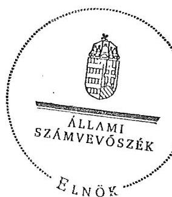

Dömokos László

[^0]
[^0]:    ${ }^{69}$ Az ÁSZ elnökének megküldött 12739-43/2010. december 30-i iktatószámú intézkedési terv.

---

# **Chemistry**

## **Chemical Reactions**

### **Balancing Chemical Equations**

1. **Write the unbalanced equation:**
   - Example: $$C_3H_8 + O_2 \rightarrow CO_2 + H_2O$$

2. **Balance the equation:**
   - Example: $$2C_3H_8 + 7O_2 \rightarrow 6CO_2 + 8H_2O$$

3. **Balance the equation:**
   - Example: $$2C_3H_8 + 7O_2 \rightarrow 6CO_2 + 8H_2O$$

### **Types of Reactions**

1. **Combination Reaction:**
   - Example: $$2H_2 + O_2 \rightarrow 2H_2O$$

2. **Decomposition Reaction:**
   - Example: $$2H_2O_2 \rightarrow 2H_2O + O_2$$

3. **Single Displacement Reaction:**
   - Example: $$Zn + 2HCl \rightarrow ZnCl_2 + H_2$$

4. **Double Displacement Reaction:**
   - Example: $$AgNO_3 + NaCl \rightarrow AgCl + NaNO_3$$

5. **Combustion Reaction:**
   - Example: $$CH_4 + 2O_2 \rightarrow CO_2 + 2H_2O$$

## **Stoichiometry**

### **Mole Concept**

- **Mole (mol):** The amount of substance containing as many particles (atoms, molecules, ions) as there are atoms in exactly 12 grams of carbon-12.
- **Avogadro's Number:** $$6.022 \times 10^{23}$$ particles per mole.

### **Molar Mass**

- **Molar Mass:** The mass of one mole of a substance.
- Example: The molar mass of water ($$H_2O$$) is 18.015 g/mol.

### **Calculations**

1. **Moles to Mass:**
   - Formula: $$n = \frac{m}{M}$$
   - Example: Calculate the number of moles of $$H_2O$$ in 18 grams of water.
     - $$n = \frac{18.015 \, \text{g}}{18.015 \, \text{g/mol}} = 18.015 \, \text{g/mol}$$

2. **Moles to Mass:**
   - Formula: $$m = n \times M$$
   - Example: Calculate the mass of 18.015 g of water.
     - $$m = 18.015 \, \text{g/mol} = 18.015 \, \text{g/mol}$$

## **Gas Laws**

### **Ideal Gas Law**

- **Equation:** $$PV = nRT$$
- **Variables:**
  - $$P$$: Pressure (atm)
  - $$V$$: Volume (L)
  - $$n$$: Number of moles (mol)
  - $$R$$: Ideal gas constant (0.0821 L·atm/mol·K)
  - $$T$$: Temperature (K)

### **Boyle's Law**

- **Equation:** $$P_1V_1 = P_2V_2$$
- **Variables:**
  - P₁: Pressure (atm)
  - P₂: Volume (L)
  - P₃: Temperature (K)
  - P₁: Pressure (atm)
  - P₂: Volume (L)
  - P₃: Temperature (K)
  - P₁: Pressure (atm)

### **Boyle's Law (Boyle's Law)**

- **Equation:** $$\frac{P_1V_1}{P_2V_2} = \frac{P_1}{V_1}$$

## **Thermochemistry**

### **Enthalpy (H)**

- **Definition:** The heat content of a system at constant pressure.
- **Equation:** $$\Delta H = q_p$$
- **Variables:**
  - $$q_p$$: Heat transferred at constant pressure.
  - $$q_p / (Q_p) = q_p / (Q_p) + q_p / (Q_p)$$

### **Hess's Law**

- **Statement:** The enthalpy change for a reaction is the same whether it occurs in one step or multiple steps.
- **Equation:** $$\Delta H = q_p + \Delta H_0$$
- **Variables:**
  - $$q_p$$: Heat transferred at constant pressure.
  - $$q_p / (Q_p) = q_p / (Q_p) + q_p / (Q_p)$$

## **Electrochemistry**

### **Oxidation and Reduction**

- **Oxidation:** Loss of electrons.
- **Reduction:** Gain of electrons.

### **Galvanic Cells**

- **Definition:** A cell that converts chemical energy into electrical energy.
- **Components:**
  - Anode: Oxidation occurs.
  - Cathode: Reduction occurs.
  - Salt Bridge: Connects the two half-cells.

### **Nernst Equation**

- **Equation:** $$E = E^\circ - \frac{RT}{nF} \ln Q$$
- **Variables:**
  - $$E$$: Energy (K)
  - $$E^\circ$$: Standard deviation of the energy (J)
  - $$E$$: Standard deviation of the energy (J)
  - $$E$$: Standard deviation of the energy (J)
  - $$n$$: Number of moles of electrons transferred
  - $$F$$: Faraday constant (96,485 C/mol)
  - $$Q$$: Reaction quotient

---

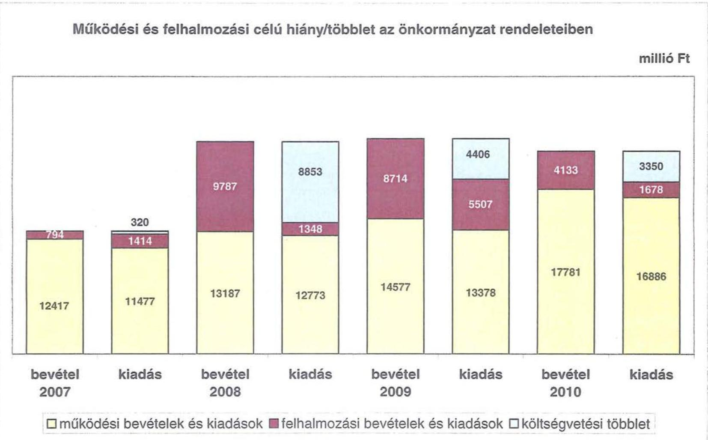

# Működési és felhalmozási célú hiány/többlet az önkormányzat rendeleteiben

|  Müködési és felhalmozási célú hiány/többlet az önkormányzat rendeleteiben |  |  |  |  |  |  |  |   |
| --- | --- | --- | --- | --- | --- | --- | --- | --- |
|  12417 | 11477 | 13187 | 12773 | 14577 | 13378 | 17781 | 16886 |   |
|  bevétel 2007 | kiadás | bevétel 2008 | kiadás | bevétel 2009 | kiadás | bevétel 2010 | kiadás |   |
|  ☐működési bevételek és kiadások
☐felhalmozási bevételek és kiadások
☐költségvetési többlet |  |  |  |  |  |  |  |   |

---

# Dunaújváros Megyei Jogú Város

## 1. FOLYÓ KÖLTSÉGVETÉS*

|  1.1.1. Saját működési bevételek | 3.971.108 | 4.042.893 | 3.849.216  |
| --- | --- | --- | --- |
|  1.1.2. Költségvetési támogatás | 3.955.252 | 4.426.248 | 4.902.461  |
|  1.1.3. Zárágoköt bevételek | 1.940.636 | 942.989 | 933.034  |
|  1.1.4. Állandáztartáson belülről kapott támogatások | 274.884 | 427.314 | 273.031  |
|  1.1.5. Elővéti és külföldi kagott bevételek | 2.154 | 2.162 | 0  |
|  1.1.6. Állandáztartáson kóvából kapott bevételek | 47.741 | 66.553 | 48.613  |
|  1.1.7. Előző évi pénzmeredvány átvétel | 24.556 | 26.891 | 129.885  |
|  1.1. Folyó bevételek = 1.1.1.+1.1.2.+1.1.3.+1.1.4.+1.1.5.+1.1.6.+1.1.7. | 12.249.811 | 12.934.811 | 12.236.884  |
|  1.2.1. Működési kiadások kannatkizetését nélkül | 10.646.071 | 11.315.159 | 11.487.423  |
|  1.2.2. Állandáztartáson belülre átadott pénzeszközök | 500 | 10.963 | 41.936  |
|  1.2.3. Követésbevétel | 29.699 | 109.908 | 191.519  |
|  1.2.3.2. Elővéti, illetve külföldi bevételek | 0 | 500 | 0  |
|  1.2.3.3. Angélozaméljebnek | 402.883 | 503.416 | 586.220  |
|  1.2.3.4. Somprijik szervezetének | 282.852 | 310.773 | 420.720  |
|  1.2.5. Tanszékelizetések (=1.2.3.1+1.2.3.2+1.2.3.3+1.2.3.4) | 696.448 | 928.293 | 1.196.109  |
|  1.2.6. Komatkizetések | 149.910 | 187.453 | 509.288  |
|  1.2.7. Előző évi pénzmeredvány átadás | 24.556 | 26.891 | 129.885  |
|  1.2. Folyó kiadások = 1.2.1.+1.2.2.+1.2.3.+1.2.4.+1.2.5. | 11.510.285 | 12.868.880 | 13.366.991  |
|  1.3. Folyó költségvetés egyenlege MŰKÖDÉSI JÓVEDELEM (1.1. - 1.2.) | 735.243 | 65.935 | -1.130.105  |
|  2. FELHALMOZÁSI KÖLTSÉGVETÉS** |  |  |   |
|  2.1.1. Saját kötelezettelek | 102.509 | 880.177 | 218.249  |
|  2.1.2. Állandáztartáson belülről kapott támogatások | 299.983 | 109.248 | 84.541  |
|  2.1.3. Elővéti és külföldi kagott támogatások | 0 | 0 | 0  |
|  2.1.4. Állandáztartáson kóvából kapott támogatások | 22.658 | 22.305 | 10.530  |
|  2.1. Felhalmozási bevételek (=2.1.1.+2.1.2+2.1.3+2.1.4.) | 435.661 | 1.011.728 | 213.738  |
|  2.2.1. Saját bevételeki kizítői időszak | 826.140 | 395.462 | 325.393  |
|  2.2.2. Saját felújítási kiadás időszak | 174.272 | 141.840 | 280.069  |
|  2.2.3. Állandáztartáson belülre átadott pénzeszköz | 4.023 | 11.023 | 24.026  |
|  2.2.4. Elővéti és külföldi adóit pénzeszközök | 0 | 0 | 0  |
|  2.2.5. Állandáztartáson kóvölti adóit pénzeszközök | 417.163 | 220.294 | 441.938  |
|  2.2.6. Befektetési célú részeszékok vásárlása | 0 | 13.010 | 3.836.720  |
|  2.3. Felhalmozási kiadások (=2.2.1.+2.2.2.+2.2.3.+2.2.4.+2.2.5.+2.2.6.) | 1.215.874 | 1.151.648 | 5.411.122  |
|  2.3. Felhalmozási költségvetés egyenlege (2.1. - 2.2.) | -780.213 | -139.912 | -3.087.382  |
|  3. Finanszírozási műveletek nélküli (GFS) pozíció(1.3.+2.3.) | -44.966 | -73.973 | -6.227.499  |
|  4. Finanszírozási műveletek |  |  |   |
|  4.1. Hizetlésvétel | 145.331 | 237.189 | 1.939.802  |
|  4.2. Hizetlésbevétel | 164.815 | 100.759 | 103.038  |
|  4.3. Forgatási és befektetési célú értékpapírok kibocsátása | 0 | 8.300.000 | 0  |
|  4.4. Forgatási és befektetési célú értékpapírok beválása | 0 | 0 | 0  |
|  4.5. Forgatási és befektetési célú értékpapírok értékesítése | 0 | 0 | 0  |
|  4.6. Forgatási és befektetési célú értékpapírok vásárlása | 0 | 0 | 0  |
|  4.7. Egyéb finanszírozási bevételek (függő, átfutó, kiegysolító) | -22.921 | -39.070 | -99.251  |
|  4.8. Egyéb finanszírozási kiadások (függő, átfutó, kiegysolító) | 5.198 | 13.282 | 16.841  |
|  4.9. Finanszírozási műveletek egyenlege (4.1. - 4.2.+4.3.-4.4+4.5.-4.6.+4.7.-4.8.) | -48.611 | 8.584.967 | 1.915.955  |
|  5. Tárgyévi pénzügyi pozíció(1.3.+ 2.3.+4.9.) | -93.573 | 8.510.000 | -1.512.400  |
|  6. Nettó működési jövedelem =működési jövedelem (1.3.) - tüketérlesztés (4.2+4.4) | 570.432 | -34.824 | -1.237.145  |
|  TÁJÉKOZTATÓ ADATOK |  |  |   |
|  Összes kötelezettség | 2.656.277 | 11.426.144 | 12.179.129  |
|  ebből rövid hjáromt | 1.974.650 | 2.307.769 | 2.748.561  |
|  Összes szállású kötelezettség | 45.773 | 93.870 | 97.646  |
|  ebből kiplet (tanszékvásyhíd) | 4.836 | 22.222 | 22.847  |
|  Pénz és tőkepényi kötelezettség (működő) | 1.717.902 | 10.370.580 | 12.623.590  |
|  ebből rövid hjáromt | 1.943.365 | 1.252.233 | 2.152.814  |
|  PPP szerződésből balesátról kötelezettség állomása | 0 | 0 | 0  |
|  ebből bájási pedagógiai díj miatti kötelezettség | 0 | 0 | 0  |
|  Folyószámlás-, fűvsál- és munkakörbítési tagá átfogyó állománya (tanszékvásyhíd) | 0 | 0 | 0  |
|  Folyószámlás bőző | 1.289.380 | 1.224.480 | 1.299.200  |
|  Egyéb fűvsál bőző | 0 | 0 | 0  |
|  Hizetlésbevétel | 0 | 0 | 0  |
|  Keresség és garanciavállalások (tanszékvásyhíd) | 1.274.510 | 2.354.510 | 2.459.510  |
|  Jogszét és tenyági műszebből adódó kötelezettségek (tanszékvásyhíd) | 0 | 0 | 0  |
|  Finanszírozásba bevonható eszközök és vagy állománya | 290.775 | 8.800.865 | 4.488.459  |
|  ebből tartók kötelezettség megnevezési értékpapírok | 0 | 0 | 0  |
|  ebből hossza hajtását fordításainál | 0 | 0 | 0  |
|  ebből értékpapírok | 0 | 0 | 0  |
|  ebből pénzes fűvsál íráshoz pénzeszközök nélküli | 290.775 | 8.800.865 | 4.488.459  |

* Bevételéltően nem kötő, a kiadásokban nem jóunk meg az amennyiben, a vagyoni helyeset az egyedeg befolyásolja. ** Bevételéltően vagyon megfelelően és felvételre fordítható önnönk.

---

Dumeánies Regol 2007-2015 (inckless megnefelínek, 2015. december 31-ig befejezet) 2016. december 31-ig megnefelínek becsészés fordulásosításai

|   |  |  |  |  |  |  |  |  |  |  |  |  |  |  |  |  |  |  |  |  |  |  |  |  |  |  |  |  |  |  |  |  |  |  |  |  |  |  |  |  |  |  |  |  |  |  |  |  |  |  |  |  |  |  |  |  |  |  |  |  |  |  |  |  |  |  |  |  |  |  |  |  |  |  |  |  |  |  |  |  |  |  |  |  |  |  |  |  |  |  |  |  |  |  |  |  |  |  |  |  |  |

---

|   |  |  |  |  |  |  |  |  |  |  |  |  |  |  |  |  |  |  |  |  |  |  |  |  |  |  |  |  |  |  |  |  |  |  |  |  |  |  |  |  |  |  |  |  |  |  |  |  |  |  |  |  |  |  |  |  |  |  |  |  |  |  |  |  |  |  |  |  |  |  |  |  |  |  |  |  |  |  |  |  |  |  |  |  |  |  |  |  |  |  |  |  |  |  |  |  |  |  |  |  |  | 

---

Dunaújváros Negget Jogú Város Önkormányzati

Sfó. közmódosítást

Az Önkormányzat 2010. december 31-én folyamatban lévő fejlesztési feladatához kapcsolódó kötelezettségének összegiskusoló (A 2010. december 31-ig teljesülő pénzügyi adóista alakulásáról)

|   |  |  |  |  |  |  |  |  |  |  |  |  |  |  |  |  |  |  |  |  |  |  |  |  |  |  |  |  |  |  |  |  |  |  |  |  |  |  |  |  |  |  |  |  |  |  |  |  |  |  |  |  |  |  |  |  |  |  |  |  |  |  |  |  |  |  |  |  |  |  |  |  |  |  |  |  |  |  |  |  |  |  |  |  |  |  |  |  |  |  |  |  |  |  |  |  |  |  |  | 

---

Dunaújváros Megyei Jogú Város Önkormányzata

3/b. számú meléklet

|  |   |   |   |   |   |   |   |   |   |   |   |   |   |   |   |   |   |   |   |   |   |   |   |   |   |   |   |   |   |   |
| --- | --- | --- | --- | --- | --- | --- | --- | --- | --- | --- | --- | --- | --- | --- | --- | --- | --- | --- | --- | --- | --- | --- | --- | --- | --- | --- | --- | --- | --- | --- |
|   |  |  |  |  |  |  |  |  |  |  |  |  |  |  |  |  |  |  |  |  |  |  |  |  |  |  |  |  |  |   |
|   |  |  |  |  |  |  |  |  |  |  |  |  |  |  |  |  |  |  |  |  |  |  |  |  |  |  |  |  |  |   |
|   |  |  |  |  |  |  |  |  |  |  |  |  |  |  |  |  |  |  |  |  |  |  |  |  |  |  |  |  |  |   |
|   |  |  |  |  |  |  |  |  |  |  |  |  |  |  |  |  |  |  |  |  |  |  |  |  |  |  |  |  |  |   |
|   |  |  |  |  |  |  |  |  |  |  |  |  |  |  |  |  |  |  |  |  |  |  |  |  |  |  |  |  |  |   |
|   |  |  |  |  |  |  |  |  |  |  |  |  |  |  |  |  |  |  |  |  |  |  |  |  |  |  |  |  |  |   |
|   |  |  |  |  |  |  |  |  |  |  |  |  |  |  |  |  |  |  |  |  |  |  |  |  |  |  |  |  |  |   |
|   |  |  |  |  |  |  |  |  |  |  |  |  |  |  |  |  |  |  |  |  |  |  |  |  |  |  |  |  |  |   |
|   |  |  |  |  |  |  |  |  |  |  |  |  |  |  |  |  |  |  |  |  |  |  |  |  |  |  |  |  |  |   |
|   |  |  |  |  |  |  |  |  |  |  |  |  |  |  |  |  |  |  |  |  |  |  |  |  |  |  |  |  |  |   |
|   |  |  |  |  |  |  |  |  |  |  |  |  |  |  |  |  |  |  |  |  |  |  |  |  |  |  |  |  |  |   |
|   |  |  |  |  |  |  |  |  |  |  |  |  |  |  |  |  |  |  |  |  |  |  |  |  |  |  |  |  |  |   |
|   |  |  |  |  |  |  |  |  |  |  |  |  |  |  |  |  |  |  |  |  |  |  |  |  |  |  |  |  |  |   |
|   |  |  |  |  |  |  |  |  |  |  |  |  |  |  |  |  |  |  |  |  |  |  |  |  |  |  |  |  |  |   |
|   |  |  |  |  |  |  |  |  |  |  |  |  |  |  |  |  |  |  |  |  |  |  |  |  |  |  |  |  |  |   |
|   |  |  |  |  |  |  |  |  |  |  |  |  |  |  |  |  |  |  |  |  |  |  |  |  |  |  |  |  |  |   |
|   |  |  |  |  |  |  |  |  |  |  |  |  |  |  |  |  |  |  |  |  |  |  |  |  |  |  |  |  |  |   |
|   |  |  |  |  |  |  |  |  |  |  |  |  |  |  |  |  |  |  |  |  |  |  |  |  |  |  |  |  |  |   |
|   |  |  |  |  |  |  |  |  |  |  |  |  |  |  |  |  |  |  |  |  |  |  |  |  |  |  |  |  |  |   |
|   |  |  |  |  |  |  |  |  |  |  |  |  |  |  |  |  |  |  |  |  |  |  |  |  |  |  |  |  |  |   |
|   |  |  |  |  |  |  |  |  |  |  |  |  |  |  |  |  |  |  |  |  |  |  |  |  |  |  |  |  |  |   |
|   |  |  |  |  |  |  |  |  |  |  |  |  |  |  |  |  |  |  |  |  |  |  |  |  |  |  |  |  |  |   |
|   |  |  |  |  |  |  |  |  |  |  |  |  |  |  |  |  |  |  |  |  |  |  |  |  |  |  |  |  |  |   |
|   |  |  |  |  |  |  |  |  |  |  |  |  |  |  |  |  |  |  |  |  |  |  |  |  |  |  |  |  |  |   |
|   |  |  |  |  |  |  |  |  |  |  |  |  |  |  |  |  |  |  |  |  |  |  |  |  |  |  |  |  |  |   |
|   |  |  |  |  |  |  |  |  |  |  |  |  |  |  |  |  |  |  |  |  |  |  |  |  |  |  |  |  |  |   |
|   |  |  |  |  |  |  |  |  |  |  |  |  |  |  |  |  |  |  |  |  |  |  |  |  |  |  |  |  |  |   |
|   |  |  |  |  |  |  |  |  |  |  |  |  |  |  |  |  |  |  |  |  |  |  |  |  |  |  |  |  |  |   |
|   |  |  |  |  |  |  |  |  |  |  |  |  |  |  |  |  |  |  |  |  |  |  |  |  |  |  |  |  |  |   |
|   |  |  |  |  |  |  |  |  |  |  |  |  |  |  |  |  |  |  |  |  |  |  |  |  |  |  |  |  |  |   |
|   |  |  |  |  |  |  |  |  |  |  |  |  |  |  |  |  |  |  |  |  |  |  |  |  |  |  |  |  |  |   |
|   |

---

Domicilješava Beograd Jeglo Vjena Onkormánijevica

Str. stálni uredakci

|  |   |   |   |   |   |   |   |   |   |   |   |   |   |   |   |   |   |   |   |   |   |   |   |   |   |   |   |   |   |   |   |   |   |   |   |
| --- | --- | --- | --- | --- | --- | --- | --- | --- | --- | --- | --- | --- | --- | --- | --- | --- | --- | --- | --- | --- | --- | --- | --- | --- | --- | --- | --- | --- | --- | --- | --- | --- | --- | --- |
|  1. |  |  |  |  |  |  |  |  |  |  |  |  |  |  |  |  |  |  |  |  |  |  |  |  |  |  |  |  |  |  |  |  |  |   |
|   |  |  |  |  |  |  |  |  |  |  |  |  |  |  |  |  |  |  |  |  |  |  |  |  |  |  |  |  |  |  |  |  |  |   |
|  2. |  |  |  |  |  |  |  |  |  |  |  |  |  |  |  |  |  |  |  |  |  |  |  |  |  |  |  |  |  |  |  |  |  |   |
|   |  |  |  |  |  |  |  |  |  |  |  |  |  |  |  |  |  |  |  |  |  |  |  |  |  |  |  |  |  |  |  |  |  |   |
|  3. |  |  |  |  |  |  |  |  |  |  |  |  |  |  |  |  |  |  |  |  |  |  |  |  |  |  |  |  |  |  |  |  |  |   |
|   |  |  |  |  |  |  |  |  |  |  |  |  |  |  |  |  |  |  |  |  |  |  |  |  |  |  |  |  |  |  |  |  |  |   |
|  4. |  |  |  |  |  |  |  |  |  |  |  |  |  |  |  |  |  |  |  |  |  |  |  |  |  |  |  |  |  |  |  |  |  |   |
|   |  |  |  |  |  |  |  |  |  |  |  |  |  |  |  |  |  |  |  |  |  |  |  |  |  |  |  |  |  |  |  |  |  |   |
|  5. |  |  |  |  |  |  |  |  |  |  |  |  |  |  |  |  |  |  |  |  |  |  |  |  |  |  |  |  |  |  |  |  |  |   |
|   |  |  |  |  |  |  |  |  |  |  |  |  |  |  |  |  |  |  |  |  |  |  |  |  |  |  |  |  |  |  |  |  |  |   |
|  6. |  |  |  |  |  |  |  |  |  |  |  |  |  |  |  |  |  |  |  |  |  |  |  |  |  |  |  |  |  |  |  |  |  |   |
|   |  |  |  |  |  |  |  |  |  |  |  |  |  |  |  |  |  |  |  |  |  |  |  |  |  |  |  |  |  |  |  |  |  |   |
|  7. |  |  |  |  |  |  |  |  |  |  |  |  |  |  |  |  |  |  |  |  |  |  |  |  |  |  |  |  |  |  |  |  |  |   |
|   |  |  |  |  |  |  |  |  |  |  |  |  |  |  |  |  |  |  |  |  |  |  |  |  |  |  |  |  |  |  |  |  |  |   |
|  8. |  |  |  |  |  |  |  |  |  |  |  |  |  |  |  |  |  |  |  |  |  |  |  |  |  |  |  |  |  |  |  |  |  |   |
|   |  |  |  |  |  |  |  |  |  |  |  |  |  |  |  |  |  |  |  |  |  |  |  |  |  |  |  |  |  |  |  |  |  |   |
|  9. |  |  |  |  |  |  |  |  |  |  |  |  |  |  |  |  |  |  |  |  |  |  |  |  |  |  |  |  |  |  |  |  |  |   |
|  10. |  |  |  |  |  |  |  |  |  |  |  |  |  |  |  |  |  |  |  |  |  |  |  |  |  |  |  |  |  |  |  |  |  |   |
|  11. |  |  |  |  |  |  |  |  |  |  |  |  |  |  |  |  |  |  |  |  |  |  |  |  |  |  |  |  |  |  |  |  |  |   |
|  12. |  |  |  |  |  |  |  |  |  |  |  |  |  |  |  |  |  |  |  |  |  |  |  |  |  |  |  |  |  |  |  |  |  |   |
|  13. |  |  |  |  |  |  |  |  |  |  |  |  |  |  |  |  |  |  |  |  |  |  |  |  |  |  |  |  |  |  |  |  |  |   |
|  14. |  |  |  |  |  |  |  |  |  |  |  |  |  |  |  |  |  |  |  |  |  |  |  |  |  |  |  |  |  |  |  |  |  |   |
|  15. |  |  |  |  |  |  |  |  |  |  |  |  |  |  |  |  |  |  |  |  |  |  |  |  |  |  |  |  |  |  |  |  |  |   |
|  16. |  |  |  |  |  |  |  |  |  |  |  |  |  |  |  |  |  |  |  |  |  |  |  |  |  |  |  |  |  |  |  |  |  |   |
|  17. |  |  |  |  |  |  |  |  |  |  |  |  |  |  |  |  |  |  |  |  |  |  |  |  |  |  |  |  |  |  |  |  |  |   |
|  18. |  |  |  |  |  |  |  |  |  |  |  |  |  |  |  |  |  |  |  |  |  |  |  |  |  |  |  |  |  |  |  |  |  |   |
|  19. |  |  |  |  |  |  |  |  |  |  |  |  |  |  |  |  |  |  |  |  |  |  |  |  |  |  |  |  |  |  |  |  |  |   |
|  20. |  |  |  |  |  |  |  |  |  |  |  |  |  |  |  |  |  |  |  |  |  |  |  |  |  |  |  |  |  |  |  |  |  |   |
|  21. |  |  |  |  |  |  |  |  |  |  |  |  |  |  |  |  |  |  |  |  |  |  |  |  |  |  |  |  |  |  |  |  |  |   |
|  22. |  |  |  |  |  |  |  |  |  |  |  |  |  |  |  |  |  |  |  |  |  |  |  |  |  |  |  |  |  |  |  |  |  |   |
|  23. |  |  |  |  |  |  |  |  |  |  |  |  |  |  |  |  |  |  |  |  |  |  |  |  |  |  |  |  |  |  |  |  |  |   |
|  24. |  |  |  |  |  |  |  |  |  |  |  |  |  |  |  |  |  |  |  |  |  |  |  |  |  |  |  |  |  |  |  |  |  |   |
|  25. |  |  |  |  |  |  |  |  |  |  |  |  |  |  |  |  |  |  |  |  |  |  |  |  |  |  |  |  |  |  |  |  |  |   |
|  26. |  |  |  |  |  |  |  |  |  |  |  |  |  |  |  |  |  |  |  |  |  |  |  |  |  |  |  |  |  |  |  |  |  |   |
|  27. |  |  |  |  |  |  |  |  |  |  |  |  |  |  |  |  |  |  |  |  |  |  |  |  |  |  |  |  |  |  |  |  |  |   |
|  28. |  |  |  |  |  |  |  |  |  |  |  |  |  |  |  |  |  |  |  |  |  |  |  |  |  |  |  |  |  |  |  |  |  |   |
|  29. |  |  |  |  |  |  |  |  |  |  |  |  |  |  |  |  |  |  |  |  |  |  |  |  |  |  |  |  |  |  |  |  |  |   |
|  30. |  |  |  |  |  |  |  |  |  |  |  |  |  |  |  |  |  |  |  |  |  |  |  |  |  |  |  |  |  |  |  |  |  |   |
|  31. |  |  |  |  |  |  |  |  |  |  |  |  |  |  |  |  |  |  |  |  |  |  |  |  |  |  |  |  |  |  |  |  |  |   |
|  32. |  |  |  |  |  |  |  |  |  |  |  |  |  |  |  |  |  |  |  |  |  |  |  |  |  |  |  |  |  |  |  |  |  |   |
|  33. |  |  |  |  |  |  |  |  |  |  |  |  |  |  |  |  |  |  |  |  |  |  |  |  |  |  |  |  |  |  |  |  |  |   |
|  34. |  |  |  |  |  |  |  |  |  |  |  |  |  |  |  |  |  |  |  |  |  |  |  |  |  |  |  |  |  |  |  |  |  |   |
|  35. |  |  |  |  |  |  |  |  |  |  |  |  |  |  |  |  |  |  |  |  |  |  |  |  |  |  |  |  |  |  |  |  |  |   |
|  36. |  |  |  |  |  |  |  |  |  |  |  |  |  |  |  |  |  |  |  |  |  |  |  |  |  |  |  |  |  |  |  |  |  |   |
|  37. |  |  |  |  |  |  |  |  |  |  |  |  |  |  |  |  |  |  |  |  |  |  |  |  |  |  |  |  |  |  |  |  |  |   |
|  38. |  |  |  |  |  |  |  |  |  |  |  |  |  |  |  |  |  |  |  |  |  |  |  |  |  |  |  |  |  |  |  |  |  |   |
|  39. |  |  |  |  |  |  |  |  |  |  |  |  |  |  |  |  |  |  |  |  |  |  |  |  |  |  |  |  |  |  |  |  |  |   |
|  40. |  |  |  |  |  |  |  |  |  |  |  |  |  |  |  |  |  |  |  |  |  |  |  |  |  |  |  |  |  |  |  |  |  |   |
|  41. |  |  |  |  |  |  |  |  |  |  |  |  |  |  |  |  |  |  |  |  |  |  |  |  |  |  |  |  |  |  |  |  |  |   |
|  42. |  |  |  |  |  |  |  |  |  |  |  |  |  |  |  |  |  |  |  |  |  |  |  |  |  |  |  |  |  |  |  |  |  |   |
|  43. |  |  |  |  |  |  |  |  |  |  |  |  |  |  |  |  |  |  |  |  |  |  |  |  |  |  |  |  |  |  |  |  |  |   |
|  44. |  |  |  |  |  |  |  |  |  |  |  |  |  |  |  |  |  |  |  |  |  |  |  |  |  |  |  |  |  |  |  |  |  |   |
|  45. |  |  |  |  |  |  |  |  |  |  |  |  |  |  |  |  |  |  |  |  |  |  |  |  |  |  |  |  |  |  |  |  |  |   |
|  46. |  |  |  |  |  |  |  |  |  |  |  |  |  |  |  |  |  |  |  |  |  |  |  |  |  |  |  |  |  |  |  |  |  |   |
|  47. |  |  |  |  |  |  |  |  |  |  |  |  |  |  |  |  |  |  |  |  |  |  |  |  |  |  |  |  |  |  |  |  |  |   |
|  48. |  |  |  |  |  |  |  |  |  |  |  |  |  |  |  |  |  |  |  |  |  |  |  |  |  |  |  |  |  |  |  |  |  |   |
|  49. |  |  |  |  |  |  |  |  |  |  |  |  |  |  |  |  |  |  |  |  |  |  |  |  |  |  |  |  |  |  |  |  |  |   |
|  50. |  |  |  |  |  |  |  |  |  |  |  |  |  |  |  |  |  |  |  |  |  |  |  |  |  |  |  |  |  |  |  |  |  |   |
|  51. |  |  |  |  |  |  |  |  |  |  |  |  |  |  |  |  |  |  |  |  |  |  |  |  |  |  |  |  |  |  |  |  |  |   |
|  52. |  |  |  |  |  |  |  |  |  |  |  |  |  |  |  |  |  |  |  |  |  |  |  |  |  |  |  |  |  |  |  |  |  |   |
|  53. |  |  |  |  |  |  |  |  |  |  |  |  |  |  |  |  |  |  |  |  |  |  |  |  |  |  |  |  |  |  |  |  |  |   |
|  54. |  |  |  |  |  |  |  |  |  |  |  |  |  |  |  |  |  |  |  |  |  |  |  |  |  |  |  |  |  |  |  |  |  |   |
|  55. |  |  |  |  |  |  |  |  |  |  |  |  |  |  |  |  |  |  |  |  |  |  |  |  |  |  |  |  |  |  |  |  |  |   |
|  56. |  |  |  |  |  |  |  |  |  |  |  |  |  |  |  |  |  |  |  |  |  |  |  |  |  |  |  |  |  |  |  |  |  |   |
|  57. |  |  |  |  |  |  |  |  |  |  |  |  |  |  |  |  |  |  |  |  |  |  |  |  |  |  |  |  |  |  |  |  |  |   |
|  58. |  |  |  |  |  |  |  |  |  |  |  |  |  |  |  |  |  |  |  |  |  |  |  |  |  |  |  |  |  |  |  |  |  |   |
|  59. |  |  |  |  |  |  |  |  |  |  |  |  |  |  |  |  |  |  |  |  |  |  |  |  |  |  |  |  |  |  |  |  |  |   |
|  60. |  |  |  |  |  |  |  |  |  |  |  |  |  |  |  |  |  |  |  |  |  |  |  |  |  |  |  |  |  |  |  |  |  |   |
|  61. |  |  |  |  |  |  |  |  |  |  |  |  |  |  |  |  |  |  |  |  |  |  |  |  |  |  |  |  |  |  |  |  |  |   |
|  62. |  |  |  |  |  |  |  |  |  |  |  |  |  |  |  |  |  |  |  |  |  |  |  |  |  |  |  |  |  |  |  |  |  |   |
|  63. |  |  |  |  |  |  |  |  |  |  |  |  |  |  |  |  |  |  |  |  |  |  |  |  |  |  |  |  |  |  |  |  |  |   |
|  64. |  |  |  |  |  |  |  |  |  |  |  |  |  |  |  |  |  |  |  |  |  |  |  |  |  |  |  |  |  |  |  |  |  |   |
|  65. |  |  |  |  |  |  |  |  |  |  |  |  |  |  |  |  |  |  |  |  |  |  |  |  |  |  |  |  |  |  |  |  |  |   |
|  66. |  |  |  |  |  |  |  |  |  |  |  |  |  |  |  |  |  |  |  |  |  |  |  |  |  |  |  |  |  |  |  |  |  |   |
|  67. |  |  |  |  |  |  |  |  |  |  |  |  |  |  |  |  |  |  |  |  |  |  |  |  |  |  |  |  |  |  |  |  |  |   |
|  68. |  |  |  |  |  |  |  |  |  |  |  |  |  |  |  |  |  |  |  |  |  |  |  |  |  |  |  |  |  |  |  |  |  |   |
|  69. |  |  |  |  |  |  |  |  |  |  |  |  |  |  |  |  |  |  |  |  |  |  |  |  |  |  |  |  |  |  |  |  |  |   |
|  70. |  |  |  |  |  |  |  |  |  |  |  |  |  |  |  |  |  |  |  |  |  |  |  |  |  |  |  |  |  |  |  |  |  |   |
|  71. |  |  |  |  |  |  |  |  |  |  |  |  |  |  |  |  |  |  |  |  |  |  |  |  |  |  |  |  |  |  |  |  |  |   |
|  72. |  |  |  |  |  |  |  |  |  |  |  |  |  |  |  |  |  |  |  |  |  |  |  |  |  |  |  |  |  |  |  |  |  |   |
|  73. |  |  |  |  |  |  |  |  |  |  |  |  |  |  |  |  |  |  |  |  |  |  |  |  |  |  |  |  |  |  |  |  |  |   |
|  74. |  |  |  |  |  |  |  |  |  |  |  |  |  |  |  |  |  |  |  |  |  |  |  |  |  |  |  |  |  |  |  |  |  |   |
|  75. |  |  |  |  |  |  |  |  |  |  |  |  |  |  |  |  |  |  |  |  |  |  |  |  |  |  |  |  |  |  |  |  |  |   |
|  76. |  |  |  |  |  |  |  |  |  |  |  |  |  |  |  |  |  |  |  |  |  |  |  |  |  |  |  |  |  |  |  |  |  |  |   |
|  77. |  |  |  |  |  |  |  |  |  |  |  |  |  |  |  |  |  |  |  |  |  |  |  |  |  |  |  |  |  |  |  |  |  |  |   |
|  78. |  |  |  |  |  |  |  |  |  |  |  |  |  |  |  |  |  |  |  |  |  |  |  |  |  |  |  |  |  |  |  |  |  |  |   |
|  79. |  |  |  |  |  |  |  |  |  |  |  |  |  |  |  |  |  |  |  |  |  |  |  |  |  |  |  |  |  |  |  |  |  |  |   |
|  80. |  |  |  |  |  |  |  |  |  |  |  |  |  |  |  |  |  |  |  |  |  |  |  |  |  |  |  |  |  |  |  |  |  |  |   |
|  81. |  |  |  |  |  |  |  |  |  |  |  |  |  |  |  |  |  |  |  |  |  |  |  |  |  |  |  |  |  |  |  |  |  |  |   |
|  82. |  |  |  |  |  |  |  |  |  |  |  |  |  |  |  |  |  |  |  |  |  |  |  |  |  |  |  |  |  |  |  |  |  |  |  |   |
|  83. |  |  |  |  |  |  |  |  |  |  |  |  |  |  |  |  |  |  |  |  |  |  |  |  |  |  |  |  |  |  |  |  |  |  |  |   |
|  84. |  |  |  |  |  |  |  |  |  |  |  |  |  |  |  |  |  |  |  |  |  |  |  |  |  |  |  |  |  |  |  |  |  |  |  |  |   |
|  85. |  |  |  |  |  |  |  |  |  |  |  |  |  |  |  |  |  |  |  |  |  |  |  |  |  |  |  |  |  |  |  |  |  |  |  |  |   |
|  86. |  |  |  |  |  |  |  |  |  |  |  |  |  |  |  |  |  |  |  |  |  |  |  |  |  |  |  |  |  |  |  |  |  |  |  |  |  |   |
|  87. |  |  |  |  |  |  |  |  |  |  |  |  |  |  |  |  |  |  |  |  |  |  |  |  |  |  |  |  |  |  |  |  |  |  |  |  |  |   |
|  88. |  |  |  |  |  |  |  |  |  |  |  |  |  |  |  |  |  |  |  |  |  |  |  |  |  |  |  |  |  |  |  |  |  |  |  |  |  |   |
|  89. |  |  |  |  |  |  |  |  |  |  |  |  |  |  |  |  |  |  |  |  |  |  |  |  |  |  |  |  |  |  |  |  |  |  |  |  |  |   |
|  90. |  |  |  |  |  |  |  |  |  |  |  |  |  |  |  |  |  |  |  |  |  |  |  |  |  |  |  |  |  |  |  |  |  |  |  |  |  |  |   |
|  91. |  |  |  |  |  |  |  |  |  |  |  |  |  |  |  |  |  |  |  |  |  |  |  |  |  |  |  |  |  |  |  |  |  |  |  |  |  |  |  |   |
|  92. |  |  |  |  |  |  |  |  |  |  |  |  |  |  |  |  |  |  |  |  |  |  |  |  |  |  |  |  |  |  |  |  |  |  |  |  |  |  |  |  |   |
|  93. |  |  |  |  |  |  |  |  |  |  |  |  |  |  |  |  |  |  |  |  |  |  |  |  |  |  |  |  |  |  |  |  |  |  |  |  |  |  |  |  |  |   |
|  94. |  |  |  |  |  |  |  |  |  |  |  |  |  |  |  |  |  |  |  |  |  |  |  |  |  |  |  |  |  |  |  |  |  |  |  |  |  |  |  |  |  |  |   |
|  95. |  |  |  |  |  |  |  |  |  |  |  |  |  |  |  |  |  |  |  |  |  |  |  |  |  |  |  |  |  |  |  |  |  |  |  |  |  |  |  |  |  |  |  |   |
|  96. |  |  |  |  |  |  |  |  |  |  |  |  |  |  |  |  |  |  |  |  |  |  |  |  |  |  |  |  |  |  |  |  |  |  |  |  |  |  |  |  |  |  |  |  |   |
|  97. |  |  |  |  |  |  |  |  |  |  |  |  |  |  |  |  |  |  |  |  |  |  |  |  |  |  |  |  |  |  |  |  |  |  |  |  |  |  |  |  |  |  |  |  |   |
|  98. |  |  |  |  |  |  |  |  |  |  |  |  |  |  |  |  |  |  |  |  |  |  |  |  |  |  |  |  |  |  |  |  |  |  |  |  |  |  |  |  |  |  |  |  |   |
|  99. |  |  |  |  |  |  |  |  |  |  |  |  |  |  |  |  |  |  |  |  |  |  |  |  |  |  |  |  |  |  |  |  |  |  |  |  |  |  |  |  |  |  |  |  |  |   |
|  100. |  |  |  |  |  |  |  |  |  |  |  |  |  |  |  |  |  |  |  |  |  |  |  |  |  |  |  |  |  |  |  |  |  |  |  |  |  |  |  |  |  |  |  |  |  |   |
|  101. |  |  |  |  |  |  |  |  |  |  |  |  |  |  |  |  |  |  |  |  |  |  |  |  |  |  |  |  |  |  |  |  |  |  |  |  |  |  |  |  |  |  |  |  |  |  |   |
|  102. |  |  |  |  |  |  |  |  |  |  |  |  |  |  |  |  |  |  |  |  |  |  |  |  |  |  |  |  |  |  |  |  |  |  |  |  |  |  |  |  |  |  |  |  |  |  |  |  |   |
|  103. |  |  |  |  |  |  |  |  |  |  |  |  |  |  |  |  |  |  |  |  |  |  |  |  |  |  |  |  |  |  |  |  |  |  |  |  |  |  |  |  |  |  |  |  |  |  |  |  |  |  |  |   |
|  104. |  |  |  |  |  |  |  |  |  |  |  |  |  |  |  |  |  |  |  |  |  |  |  |  |  |  |  |  |  |  |  |  |  |  |  |  |  |  |  |  |  |  |  |  |  |  |  |  |  |  |  |  |  |   |
|  105. |  |  |  |  |  |  |  |  |  |  |  |  |  |  |  |  |  |  |  |  |  |  |  |  |  |  |  |  |  |  |  |  |  |  |  |  |  |  |  |  |  |  |  |  |  |  |  |  |  |  |  |  |  |  |   |
|  106. |  |  |  |  |  |  |  |  |  |  |  |  |  |  |  |  |  |  |  |  |  |  |  |  |  |  |  |  |  |  |  |  |  |  |  |  |  |  |  |  |  |  |  |  |  |  |  |  |  |  |  |  |  |  |  |  |   |
|  107. |  |  |  |  |  |  |  |  |  |  |  |  |  |  |  |  |  |  |  |  |  |  |  |  |  |  |  |  |  |  |  |  |  |  |  |  |  |  |  |  |  |  |  |  |  |  |  |  |  |  |  |  |  |  |  |  |  |  |   |
|  108. |  |  |  |  |  |  |  |  |  |  |  |  |  |  |  |  |  |  |  |  |  |  |  |  |  |  |  |  |  |  |  |  |  |  |  |  |  |  |  |  |  |  |  |  |  |  |  |  |  |  |  |  |  |  |  |  |  |  |  |  |  |   |
|  109. |  |  |  |  |  |  |  |  |  |  |  |  |  |  |  |  |  |  |  |  |  |  |  |  |  |  |  |  |  |  |  |  |  |  |  |  |  |  |  |  |  |  |  |  |  |  |  |  |  |  |  |  |  |  |  |  |  |  |  |  |  |  |  |  |   |
|  110. |  |  |  |  |  |  |  |  |  |  |  |  |  |  |  |  |  |  |  |  |  |  |  |  |  |  |  |  |  |  |  |  |  |  |  |  |  |  |  |  |  |  |  |  |  |  |  |  |  |  |  |  |  |  |  |  |  |  |  |  |  |  |  |  |  |   |
|  111. |  |  |  |  |  |  |  |  |  |  |  |  |  |  |  |  |  |  |  |  |  |  |  |  |  |  |  |  |  |  |  |  |  |  |  |  |  |  |  |  |  |  |  |  |  |  |  |  |  |  |  |  |  |  |  |  |  |  |  |  |  |  |  |  |  |  |  |  |   |
|  112. |  |  |  |  |  |  |  |  |  |  |  |  |  |  |  |  |  |  |  |  |  |  |  |  |  |  |  |  |  |  |  |  |  |  |  |  |  |  |  |  |  |  |  |  |  |  |  |  |  |  |  |  |  |  |  |  |  |  |  |  |  |  |  |  |  |   |
|  113. |  |  |  |  |  |  |  |  |  |  |  |  |  |  |  |  |  |  |  |  |  |  |  |  |  |  |  |  |  |  |  |  |  |  |  |  |  |  |  |  |  |  |  |  |  |  |  |  |  |  |  |  |  |  |  |  |  |  |  |  |  |  |  |  |  |  |   |
|  114. |  |  |  |  |  |  |  |  |  |  |  |  |  |  |  |  |  |  |  |  |  |  |  |  |  |  |  |  |  |  |  |  |  |  |  |  |  |  |  |  |  |  |  |  |  |  |  |  |  |  |  |  |  |  |  |  |  |  |   |
|  115. |  |  |  |  |  |  |  |  |  |  |  |  |  |  |  |  |  |  |  |  |  |  |  |  |  |  |  |  |  |  |  |  |  |  |  |  |  |  |  |  |  |  |  |  |  |  |  |  |  |  |  |  |  |  |  |  |  |  |  |  |   |
|  116. |  |  |  |  |  |  |  |  |  |  |  |  |  |  |  |  |  |  |  |  |  |  |  |  |  |  |  |  |  |  |  |  |  |  |  |  |  |  |  |  |  |  |  |  |  |  |  |  |  |  |  |  |  |  |  |  |  |  |  |  |  |  |  |  |  |   |
|  117. |  |  |  |  |  |  |  |  |  |  |  |  |  |  |  |  |  |  |  |  |  |  |  |  |  |  |  |  |  |  |  |  |  |  |  |  |  |  |  |  |  |  |  |  |  |  |  |  |  |  |  |  |  |  |  |  |  |   |
|  118. |  |  |  |  |  |  |  |  |  |  |  |  |  |  |  |  |  |  |  |  |  |  |  |  |  |  |  |  |  |  |  |  |  |  |  |  |  |  |  |  |  |  |  |  |  |  |  |  |  |  |  |  |  |  |  |  |  |  |  |  |  |  |  |  |  |  |  |  |  |  |  |  |  |  |  |  |  |  |  |  |  |  |  |  |  |  |  |  |  |  |  |  |  |  |  |  |  |  |  |  |  |

---

Dunköjūros Megeli Jingi Värss Önkormányzta

Ižs. sūlma metèlėti

|  |   |   |   |   |   |   |   |   |   |   |   |   |   |   |   |   |   |   |   |   |   |   |   |   |   |   |   |   |   |   |   |   |   |   |   |   |   |   |   |   |   |   |   |   |   |   |   |   |   |   |   |   |   |   |   |   |   |   |   |   |   |   |   |   |   |   |   |   |   |   |   |   |   |   |   |   |   |   |   |   |   |   |   |   |   |   |   |   |   |   |   |   |   |   |   |   |   |   |   |  

---

### Az Önkormányzat beadott, elbírálás alatti pályázati forrásból megvalósuló fejlesztéseihez kapcsolódó kötelezettség-vállalásainak összegzéséről

|  Fejlesztési feladat (beruházás, felújítás) |  |  |  |  |  |  |  |  |  |  |  |  |  |  |  |  |  |  |  |  |  |  |  |  |  |  |  |  |  |  |  |  |  |  |  |  |  |  |  |  |  |  |  |  |  |  |  |  |  |  |  |  |  |  |  |  |  |  |  |  |  |  |  |  |  |  |  |  |  |  |  |  |  |  |  |  |  |  |  |  |  |  |  |  |  |  |  |  |  |  |  |  |  |  |  |  |  |  |  |  | 

---

# **Chemistry**

## **Chemical Reactions**

### **Balancing Chemical Equations**

1. **Write the unbalanced equation:**
   - Example: $$C_3H_8 + O_2 \rightarrow CO_2 + H_2O$$

2. **Balance the equation:**
   - Balance carbon atoms first.
   - Then balance hydrogen atoms.
   - Finally, balance oxygen atoms.
   - Balanced equation: $$C_3H_8 + 7O_2 \rightarrow 3CO_2 + 4H_2O$$

3. **Balance the equation:**
   - Balance oxygen atoms.
   - Finally, balance oxygen oxygen.
   - Balanced equation: $$C_3H_8 + 7O_2 \rightarrow 3CO_2 + 4H_2O$$

### **Types of Reactions**

1. **Combination Reaction:**
   - Example: $$2H_2 + O_2 \rightarrow 2H_2O$$

2. **Decomposition Reaction:**
   - Example: $$2H_2O_2 \rightarrow 2H_2O + O_2$$

3. **Single Displacement Reaction:**
   - Example: $$Zn + 2HCl \rightarrow ZnCl_2 + H_2$$

4. **Double Displacement Reaction:**
   - Example: $$AgNO_3 + NaCl \rightarrow AgCl + NaNO_3$$

5. **Combustion Reaction:**
   - Example: $$CH_4 + 2O_2 \rightarrow CO_2 + 2H_2O$$

## **Stoichiometry**

### **Mole Concept**

- **Mole (mol):** The amount of substance containing as many particles (atoms, molecules, ions) as there are atoms in exactly 12 grams of carbon-12.
- **Avogadro's Number:** $$6.022 \times 10^{23}$$ particles per mole.

### **Molar Mass**

- **Molar Mass:** The mass of one mole of a substance.
- Example: The molar mass of water ($$H_2O$$) is 18.015 g/mol.

### **Calculations**

1. **Moles to Mass:**
   - Formula: $$n = \frac{m}{M}$$
   - Example: Calculate the number of moles of $$H_2O$$ in 18 grams of water.
     - $$n = \frac{18.015 \, \text{g}}{18.015 \, \text{g/mol}} = 18.015 \, \text{g/mol}$$

2. **Moles to Mass:**
   - Formula: $$m = n \times M$$
   - Example: Calculate the mass of 18.015 g of water.
     - $$m = 18.015 \, \text{g/mol} = 18.015 \, \text{g/mol}$$

## **Gas Laws**

### **Ideal Gas Law**

- **Equation:** $$PV = nRT$$
- **Variables:**
  - $$P$$ = Pressure (atm)
  - $$V$$ = Volume (L)
  - $$n$$ = Moles of gas

### **Boyle's Law**

- **Equation:** $$P_1V_1 = P_2V_2$$
- **Variables:**
  - P₁ = Pressure (atm)
  - P₂ = Volume (L)
  - P₃ = Moles of gas
  - $$P_1V_1 = P_2V_2$$
- **Equation:** $$P_2V_2 = P_3V_3$$

### **Charles's Law**

- **Equation:** $$\frac{V_1}{T_1} = \frac{V_2}{T_2}$$
- **Variables:**
  - $$T_1$$ = Temperature (atm)
  - $$T_2$$ = Volume (L)
  - $$T_1$$ = Temperature (atm)
  - $$T_2$$ = Volume (L)

### **Boyle's Law**

- **Equation:** $$\frac{V_1}{T_1} = \frac{V_2}{T_2}$$
- **Variables:**
  - $$T_1$$ = Temperature (atm)
  - $$T_2$$ = Volume (L)
  - $$T_1$$ = Temperature (atm)
  - $$T_2$$ = Volume (L)

## **Thermochemistry**

### **Enthalpy (H)**

- **Definition:** The heat content of a system at constant pressure.
- **Change in Enthalpy (ΔH):** $$ΔH = q_p$$
- **Change in Enthalpy (ΔH_2):** $$ΔH_2H_2 + Q_p$$

### **Hess's Law**

- **Statement:** The enthalpy change for a reaction is the same whether it occurs in one step or multiple steps.
- **Equation:** $$\Delta H = q_p \Delta H_2$$
- **Equation:** $$\Delta H_2H_2 \Delta H_2 \Delta H_2 \Delta H_2$$

## **Electrochemistry**

### **Oxidation and Reduction**

- **Oxidation:** Loss of electrons.
- **Reduction:** Gain of electrons.

### **Galvanic Cells**

- **Definition:** A cell that converts chemical energy into electrical energy.
- **Components:**
  - Anode: Oxidation occurs.
  - Cathode: Reduction occurs.
  - Salt Bridge: Connects the two half-cells.

### **Nernst Equation**

- **Equation:** $$E = E^\circ - \frac{RT}{nF} \ln Q$$
- **Variables:**
  - $$E$$ = Energy (K)
  - $$E^\circ$$ = Standard Error (ΔE)
  - $$E$$ = Standard Error of the Number of Aromatic Cells
  - $$E^\circ$$ = Standard Error of the Energy (ΔE)
  - $$E^\circ$$ = Standard Error of the Energy (ΔE_2)
  - $$E$$ = Standard Error of the Energy (ΔE_1)
  - $$E$$ = Standard Error of the Energy (ΔE_2)
  - $$E$$ = Standard Error of the Energy (ΔE_1)
  - $$E$$ = Standard Error of the Energy (ΔE_2)
  - $$E$$ = Standard Error of the Energy (ΔE_1)
  - $$E$$ = Standard Error of the Energy (ΔE_2)
  - $$E$$ = Standard Error of the Energy (ΔE_1)
  - $$E$$ = Standard Error of the Energy (ΔE_2)
  - $$E$$ = Standard Error of the Energy (ΔE_1)
  - $$E$$ = Standard Error of the Energy (ΔE_2)
  - $$E$$ = Standard Error of the Energy (ΔE_1)
  - $$E$$ = Standard Error of the Energy (ΔE_2)
  - $$E$$ = Standard Error of the Energy (ΔE_1)
  - $$E$$ = Standard Error of the Energy (ΔE_2)
  - $$E$$ = Standard Error of the Energy (ΔE_1)
  - $$E$$ = Standard Error of the Energy (ΔE_2)
  - $$E$$ = Standard Error of the Energy (ΔE_1)
  - $$E$$ = Standard Error of the Energy (ΔE_2)
  - $$E$$ = Standard Error of the Energy (ΔE_1)
  - $$E$$ = Standard Error of the Energy (ΔE_2)
  - $$E$$ = Standard Error of the Energy (ΔE_1)
  - $$E$$ = Standard Error of the Energy (ΔE_2)
  - $$E$$ = Standard Error of the Energy (ΔE_1)
  - $$E$$ = Standard Error of the Energy (ΔE_2)
  - $$E$$ = Standard Error of the Energy (ΔE_1)
  - $$E$$ = Standard Error of the Energy (ΔE_2)
  - $$E$$ = Standard Error of the Energy (ΔE_1)
  - $$E$$ = Standard Error of the Energy (ΔE_2)
  - $$E$$ = Standard Error of the Energy (ΔE_1)
  - $$E$$ = Standard Error of the Energy (ΔE_2)
  - $$E$$ = Standard Error of the Energy (ΔE_1)
  - $$E$$ = Standard Error of the Energy (ΔE_2)
  - $$E$$ = Standard Error of the Energy (ΔE_1)
  - $$E$$ = Standard Error of the Energy (ΔE_2)
  - $$E$$ = Standard Error of the Energy (ΔE_1)
  - $$E$$ = Standard Error of the Energy (ΔE_2)
  - $$E$$ = Standard Error of the Energy (ΔE_1)
  - $$E$$ = Standard Error of the Energy (ΔE_2)
  - $$E$$ = Standard Error of the Energy (ΔE_1)
  - $$E$$ = Standard Error of the Energy (ΔE_2)
  - $$E$$ = Standard Error of the Energy (ΔE_1)
  - $$E$$ = Standard Error of the Energy (ΔE_2)
  - $$E$$ = Standard Error of the Energy (ΔE_1)
  - $$E$$ = Standard Error of the Energy (ΔE_2)
  - $$E$$ = Standard Error of the Energy (ΔE_1)
  - $$E$$ = Standard Error of the Energy (ΔE_2)
  - $$E$$ = Standard Error of the Energy (ΔE_1)
  - $$E$$ = Standard Error of the Energy (ΔE_2)
  - $$E$$ = Standard Error of the Energy (ΔE_1)
  - $$E$$ = Standard Error of the Energy (ΔE_2)
  - $$E$$ = Standard Error of the Energy (ΔE_1)
  - $$E$$ = Standard Error of the Energy (ΔE_2)
  - $$E$$ = Standard Error of the Energy (ΔE_1)
  - $$E$$ = Standard Error of the Energy (ΔE_2)
  - $$E$$ = Standard Error of the Energy (ΔE_1)
  - $$E$$ = Standard Error of the Energy (ΔE_2)
  - $$E$$ = Standard Error of the Energy (ΔE_1)
  - $$E$$ = Standard Error of the Energy (ΔE_2)
  - $$E$$ = Standard Error of the Energy (ΔE_1)
  - $$E$$ = Standard Error of the Energy (ΔE_2)
  - $$E$$ = Standard Error of the Energy (ΔE_1)
  - $$E$$ = Standard Error of the Energy (ΔE_2)
  - $$E$$ = Standard Error of the Energy (ΔE_1)
  - $$E$$ = Standard Error of the Energy (ΔE_2)
  - $$E$$ = Standard Error of the Energy (ΔE_1)
  - $$E$$ = Standard Error of the Energy (ΔE_1)
  - $$E$$ = Standard Error of the Energy (ΔE_2)
  - $$E$$ = Standard Error of the Energy (ΔE_1)
  - $$E$$ = Standard Error of the Energy (ΔE_2)
  - $$E$$ = Standard Error of the Energy (ΔE_1)
  - $$E$$ = Standard Error of the Energy (ΔE_2)
  - $$E$$ = Standard Error of the Energy (ΔE_1)
  - $$E$$ = Standard Error of the Energy (ΔE_1)
  - $$E$$ = Standard Error of the Energy (ΔE_2)
  - $$E$$ = Standard Error of the Energy (ΔE_1)
  - $$E$$ = Standard Error of the Energy (ΔE_2)
  - $$E$$ = Standard Error of the Energy (ΔE_1)
  - $$E$$ = Standard Error of the Energy (ΔE_2)
  - $$E$$ = Standard Error of the Energy (ΔE_1)
  - $$E$$ = Standard Error of the Energy (ΔE_1)
  - $$E$$ = Standard Error of the Energy (ΔE_2)
  - $$E$$ = Standard Error of the Energy (ΔE_1)
  - $$E$$ = Standard Error of the Energy (ΔE_2)
  - $$E$$ = Standard Error of the Energy (ΔE_1)
  - $$E$$ = Standard Error of the Energy (ΔE_1)
  - $$E$$ = Standard Error of the Energy (ΔE_2)
  - $$E$$ = Standard Error of the Energy (ΔE_1)
  - $$E$$ = Standard Error of the Energy (ΔE_2)
  - $$E$$ = Standard Error of the Energy (ΔE_1)
  - $$E$$ = Standard Error of the Energy (ΔE_1)
  - $$E$$ = Standard Error of the Energy (ΔE_2)
  - $$E$$ = Standard Error of the Energy (ΔE_1)
  - $$E$$ = Standard Error of the Energy (ΔE_2)
  - $$E$$ = Standard Error of the Energy (ΔE_1)
  - $$E$$ = Standard Error of the Energy (ΔE_1)
  - $$E$$ = Standard Error of the Energy (ΔE_2)
  - $$E$$ = Standard Error of the Energy (ΔE_1)
  - $$E$$ = Standard Error of the Energy (ΔE_1)
  - $$E$$ = Standard Error of the Energy (ΔE_2)
  - $$E$$ = Standard Error of the Energy (ΔE_1)
  - $$E$$ = Standard Error of the Energy (ΔE_1)
  - $$E$$ = Standard Error of the Energy (ΔE_2)
  - $$E$$ = Standard Error of the Energy (ΔE_1)
  - $$E$$ = Standard Error of the Energy (ΔE_1)
  - $$E$$ = Standard Error of the Energy (ΔE_2)
  - $$E$$ = Standard Error of the Energy (ΔE_1)
  - $$E$$ = Standard Error of the Energy (ΔE_1)
  - $$E$$ = Standard Error of the Energy (ΔE_2)
  - $$E$$ = Standard Error of the Energy (ΔE_1)
  - $$E$$ = Standard Error of the Energy (ΔE_1)
  - $$E$$ = Standard Error of the Energy (ΔE_2)
  - $$E$$ = Standard Error of the Energy (ΔE_1)
  - $$E$$ = Standard Error of the Energy (ΔE_1)
  - $$E$$ = Standard Error of the Energy (ΔE_2)
  - $$E$$ = Standard Error of the Energy (ΔE_1)
  - $$E$$ = Standard Error of the Energy (ΔE_1)
  - $$E$$ = Standard Error of the Energy (ΔE_1)
  - $$E$$ = Standard Error of the Energy (ΔE_2)
  - $$E$$ = Standard Error of the Energy (ΔE_1)
  - $$E$$ = Standard Error of the Energy (ΔE_1)
  - $$E$$ = Standard Error of the Energy (ΔE_1)
  - $$E$$ = Standard Error of the Energy (ΔE_1)
  - $$E$$ = Standard Error of the Energy (ΔE_1)
  - $$E$$ = Standard Error of the Energy (ΔE_1)
  - $$E$$ = Standard Error of the Energy (ΔE_1)
  - $$E$$ = Standard Error of the Energy (ΔE_1)
  - $$E$$ = Standard Error of the Energy (ΔE_1)
  - $$E$$ = Standard Error of the Energy (ΔE_1)
  - $$E$$ = Standard Error of the Energy (ΔE_1)
  - $$E$$ = Standard Error of the Energy (ΔE_1)
  - $$E$$ = Standard Error of the Energy (ΔE_1)
  - $$E$$ = Standard Error of the Energy (ΔE_1)
  - $$E$$ = Standard Error of the Energy (ΔE_1)
  - $$E$$ = Standard Error of the Energy (ΔE_1)
  - $$E$$ = Standard Error of the Energy (ΔE_1)
  - $$E$$ = Standard Error of the Energy (ΔE_1)
  - $$E$$ = Standard Error of the Energy (ΔE_1)
  - $$E$$ = Standard Error of the Energy (ΔE_1)
  - $$E$$ = Standard Error of the Energy (ΔE_1)
  - $$E$$ = Standard Error of the Energy (ΔE_1)
  - $$E$$ = Standard Error of the Energy (ΔE_1)
  - $$E$$ = Standard Error of the Energy (ΔE_1)
  - $$E$$ = Standard Error of the Energy (ΔE_1)
  - $$E$$ = Standard Error of the Energy (ΔE_1)
  - $$E$$ = Standard Error of the Energy (ΔE_1)
  - $$E$$ = Standard Error of the Energy (ΔE_1)
  - $$E$$ = Standard Error of the Energy (ΔE_1)
  - $$E$$ = Standard Error of the Energy (ΔE_1)
  - $$E$$ = Standard Error of the Energy (ΔE_1)
 

---

### 4. számú melléklet

### Az önkormányzati feladatok ellátásában résztvevő gazdasági társaságokról

|  Gazdasági társaság
megnevezése |  |  |  |  |  |  |  |  |  |  |  |  |  |  |  |  |  |  | millió Ft-ban!  |
| --- | --- | --- | --- | --- | --- | --- | --- | --- | --- | --- | --- | --- | --- | --- | --- | --- | --- | --- | --- |
|   | Önkormányzati | Önkormányzati
gazdasági
társaságának | saját tőke,
jegyzett tőke
aránya | kötelező
feladathoz | önként vállalt
feladathoz | hosszú lejáratú
totebbi
bővángból | Szingből | saját szállítás
állományból | működési támogatás |  |  |  |  |  |  |  |  |  |   |
|   | tulajdoni hányadó |  |  |  |  |  |  |  |  |  |  |  |  |  |  |  |  |  |   |
|   | tulajdoni hányadó |  |  |  |  |  |  |  |  |  |  |  |  |  |  |  |  |  |   |
|  5. 100%-os tulajdoni hányadó gazdasági társaságok: |  |  |  |  |  |  |  |  |  |  |  |  |  |  |  |  |  |  |   |
|  Média Duna Invest Kft | 100% | 0% | -64% | 0 | 37 |  |  |  | 8 | 0 | 0 | 38 | 50 | 0 | 0 | 0 | 0 | 0 |   |
|  DVG 290 | 100% | 0% | 111% | 4 181 |  | 58 | 4 |  | 35 | 0 | 0 | 0 | 0 | 10 | 30 | 150 | 0 | 0 |   |
|  Partvédelmi Vállalat | 100% | 0% | 162% | 97 | 0 | 0 | 3 |  | 0 | 0 | 0 | 0 | 0 | 0 | 0 | 0 | 0 | 0 |   |
|  DV N 290 | 100% | 0% | -74% | 23 |  | 0 | 0 |  | 0 | 0 | 0 | 0 | 0 | 0 | 0 | 0 | 0 | 0 |   |
|  Szem Partizmon Kórház
Nonprofit Kft | 100% | 0% | -274277% | 1 755 |  | 108 | 0 |  | 1087 | 15 | 4 | 0 | 0 | 0 | 0 | 10 | 0 | 0 |   |
|  100%-os tulajdoni hányadó
gazdasági társaságok
összesen |  |  |  | 6 056 | 37 | 166 | 7 |  | 1 130 | 15 | 4 | 38 | 59 | 10 | 30 | 160 | 0 | 0 |   |
|  6. 75-99%-os tulajdoni hányadó gazdasági társaságok: |  |  |  |  |  |  |  |  |  |  |  |  |  |  |  |  |  |  |   |
|  Vasmú 41. Indaház Kft. | 76% | 0% | 89% | 518 |  | 0 | 0 |  | 0 | 0 | 0 | 0 | 0 | 0 | 0 | 0 | 0 | 0 |   |
|  INNOPARK Nonprofit Kft | 85% | 0% | 93% | 318 |  | 0 | 0 |  | 0 | 0 | 0 | 0 | 0 | 0 | 0 | 0 | 0 | 0 |   |
|  Gép-i Közletegy Tunisztikai
Közhasznú Nonprofit Kft | 83% | 0% | 519% | 19 |  | 0 | 0 |  | 0 | 10 | 18 | 39 | 33 | 0 | 0 | 0 | 0 | 0 |   |
|  MMK Nonprofit Kft | 87% | 0% | 586% | 22 |  | 0 | 1 |  | 0,0 | 26 | 20 | 0 | 48 | 0 | 0 | 0 | 0 | 0 |   |
|  75-99%-os tulajdoni
hányadó gazdasági
társaságok összesen |  |  |  | 877 | 0 | 0 | 1 |  | 0 | 36 | 36 | 39 | 81 | 0 | 0 | 0 | 0 | 0 |   |
|  72% felelő tulajdoni
hányadó gazdasági
társaságok összesen |  |  |  | 6 933 | 37 | 166 | 8 |  | 1 130 | 51 | 40 | 77 | 131 | 10 | 30 | 160 | 0 | 0 |   |
|  8. 51-74%-os tulajdoni hányadó gazdasági társaságok: |  |  |  |  |  |  |  |  |  |  |  |  |  |  |  |  |  |  |   |
|  DEZEZ | 51% |  |  |  |  | 0 | 0 |  | 907 |  |  |  |  |  |  |  |  |  |   |
|  Dunaújvárosi Víz-, Csatorna-
Hőszolgáltató Kft | 0% | 51% | 166% | 2 640 |  | 0 | 0 |  | 362 | 0 | 0 | 0 | 0 | 0 | 0 | 0 | 0 | 0 |   |
|  51-74%-os tulajdoni
hányadó gazdasági
társaságok összesen |  |  |  | 0 | 0 | 0 | 0 |  | 907 | 0 | 0 | 0 | 0 | 0 | 0 | 0 | 0 | 0 |   |
|  IV. 25-50%-os tulajdoni hányadó gazdasági társaságok: |  |  |  |  |  |  |  |  |  |  |  |  |  |  |  |  |  |  |   |
|  Dunanett Kft. | 0% | 50% | 365% | 674 |  | 257 | 13 |  | 306 | 0 | 0 | 15 | 26 |  |  |  |  |  |   |
|  Energo-Hölzem Kft | 50% | 0% | 142% |  | 2 174 | 2 196 | 0 |  | 0 | 0 | 0 | 0 | 0 | 0 | 0 | 0 | 0 | 0 |   |
|  Energo-Viterm Kft | 50% | 0% | 137% |  | 2 092 | 2 414 | 0 |  | 0 | 0 | 0 | 0 | 0 | 0 | 0 | 0 | 0 | 0 |   |
|  25-50%-os tulajdoni
hányadó gazdasági
társaságok összesen |  |  |  | 3 314 | 4 266 | 4 867 | 13 |  | 2 566 | 0 | 0 | 15 | 26 | 0 | 0 | 0 | 0 | 0 |   |
|  V. egyéb, közfeladatot ellátó gazdasági társaságok: |  |  |  |  |  |  |  |  |  |  |  |  |  |  |  |  |  |  |   |
|   |  |  |  | 0 | 0 | 0 | 0 |  | 0 | 0 | 0 | 0 | 0 | 0 | 0 | 0 | 0 | 0 |   |
|  egyéb, közfeladatot ellátó
gazdasági társaságok
összesen |  |  |  | 0 | 0 | 0 | 0 |  | 0 | 0 | 0 | 0 | 0 | 0 | 0 | 0 | 0 | 0 |   |
|  Összesen |  |  |  | 10 247 | 4 303 | 6 933 | 31 |  | 4 683 | 51 | 40 | 92 | 157 | 10 | 30 | 150 | 0 | 0 |   |

---

.