ÁLLAMI
SZÁMVEVŐSZÉK

# JELENTÉS 

Eger Megyei Jogú Város Önkormányzata pénzügyi helyzetének ellenőrzéséről (43/3)

---

# Számvevői Iroda 

Iktatószám: V-3035-10/2011.
Témaszám: 1015
Vizsgálat-azonosító szám: V056034

## Az ellenőrzést felügyelte:

Dr. Varga Sándor
számvevő igazgató-helyettes

## Az ellenőrzést vezette:

## Renkó Zsuzsanna

számvevő tanácsos

## Az ellenőrzést végezték:

| Puchy Márta | Luhály Matild |
| :-- | :-- |
| számvevő tanácsos | számvevő |

Szihalminé Kovács
Zsuzsanna
számvevő tanácsos

## A témához kapcsolódó eddig készített számvevőszéki jelentések:

| címe | sorszáma |
| :-- | :--: |
| Jelentés a helyi önkormányzatok gazdálkodási rendszerének 2007. | 0822 |
| évi átfogó és egyéb szabályszerűségi ellenőrzéséről |  |
| Jelentés a közbeszerzési rendszer működésének ellenőrzéséről | 0831 |
| Jelentés az állami feladat (közfeladat) ellátás szervezeti és humán- | 1022 |
| erőforrás rendszerének ellenőrzéséről |  |
| Jelentés a felnőttképzés feltételrendszerének, eredményességének, a | 1035 |
| gazdaság munkaerőigénye kielégítésében betöltött szerepének el- |  |
| lenőrzéséről |  |

---

# TARTALOMJEGYZÉK 

BEVEZETÉS ..... 5
I. ÖSSZEGZŐ MEGÁLLAPÍTÁSOK, KÖVETKEZTETÉSEK, JAVASLATOK ..... 16
II. RÉSZLETES MEGÁLLAPÍTÁSOK ..... 25

1. Az Önkormányzat kötelező és önként vállalt feladatai ..... 25
2. A pénzügyi egyensúlyi helyzet alakulása ..... 32
2.1. A működési és felhalmozási egyensúly alakulása ..... 32
2.2. Az Önkormányzat bevételeinek alakulása ..... 38
2.3. Az Önkormányzat kiadásainak alakulása ..... 41
3. A kötelezettségek bemutatása ..... 46
3.1. A pénzintézetek felé fennálló kötelezettségek alakulása ..... 46
3.2. Szállítók felé fennálló kötelezettségek alakulása ..... 51
3.3. Egyéb kötelezettségek alakulása ..... 52
4. A pénzügyi egyensúly megteremtése érdekében hozott intézkedések ..... 56
5. A helyi önkormányzatok gazdálkodási rendszerének 2007. évi ellenőrzése során a pénzügyi egyensúly javítására tett szabályszerűségi és célszerűségi javaslatok hasznosulása ..... 59

---

# MELLÉKLETEK 

1. számú Működési és felhalmozási célú többlet az Önkormányzat költségvetési rendeleteiben (1 oldal)
2. számú Az Önkormányzat bevételeinek és kiadásainak, adósságszolgálatának alakulása ( 1 oldal)
3/a. számú Az Önkormányzat 2007-2010. években megvalósított, 2010. december 31-ig befejezett fejlesztések forrásösszetétele (2 oldal)
3/b. számú Az Önkormányzat 2010. december 31-én folyamatban lévő fejlesztési feladataihoz kapcsolódó kötelezettségeinek összegzése (1 oldal)
3/c. számú Az Önkormányzat 2010. december 31-én folyamatban lévő fejlesztési feladataihoz kapcsolódó 2010. évet követő kötelezettségvállalásainak összegzése ( 1 oldal)
3/d. számú Az Önkormányzat beadott, elbírálás alatti pályázati forrásból megvalósuló fejlesztéseihez kapcsolódó kötelezettség-vállalásainak összegzése (1 oldal)
3. számú Az Önkormányzati feladatok ellátásában résztvevő gazdasági társaságok (1 oldal)
4. számú Eger Megyei Jogú Város Önkormányzat Polgármesterének észrevétele (2 oldal)
5. számú Eger Megyei Jogú Város Önkormányzat Polgármesterének észrevételére adott válasz

---

# RÖVIDÍTÉSEK JEGYZÉKE 

## Törvények

Áht.
ÁSZ tv.

Csődtv.
Gt.
helyi adókról szóló törvény
Htv.

Ötv.

## Rendeletek

SzMSz
2007. évi zárszámadási rendelet
2008. évi zárszámadási rendelet
2009. évi zárszámadási rendelet
2010. évi zárszámadási rendelet

## Szórövidítések

Agria Humán Kft.
APEH
áfa
ÁSZ
BM
EDP hiány/egyenleg
az államháztartásról szóló 1992. évi XXXVIII. törvény az Állami Számvevőszékről szóló 1989. évi XXXVIII. törvény (2011. július 1-jétől az Állami Számvevőszékről szóló 2011. LXVI. törvény)
a csődeljárásról és felszámolási eljárásról szóló 1991. évi XLIX. törvény
2006. évi IV. törvény a gazdasági társaságokról
a helyi adókról szóló 1990. évi C. törvény
a helyi önkormányzatok és szerveik, a köztársasági megbízottak, valamint egyes centrális alárendeltségű szervek feladat- és hatásköreiről szóló 1991. évi XX. törvény
a helyi önkormányzatokról szóló 1990. évi LXV. törvény

Eger Megyei Jogú Város 13/1999. (IV. 21.) számú rendelete Eger Megyei Jogú Város Alapokmányáról
az Eger Megyei Jogú Város 17/2008. (IV. 25.) számú rendelete az Önkormányzat 2007. évi zárszámadásáról, a központi támogatások elszámolásáról és a pénzmaradvány jóváhagyásáról
az Eger Megyei Jogú Város 22/2009. (V. 01.) számú rendelete az Önkormányzat 2008. évi zárszámadásáról, a központi támogatások elszámolásáról és a pénzmaradvány jóváhagyásáról
az Eger Megyei Jogú Város 14/2010. (IV. 30.) számú rendelete az Önkormányzat 2009. évi zárszámadásáról, a központi támogatások elszámolásáról és a pénzmaradvány jóváhagyásáról
az Eger Megyei Jogú Város Önkormányzata Közgyűlésének 14/2011. (IV. 29.) számú rendelete az Önkormányzat 2010. évi zárszámadásáról, a központi támogatások elszámolásáról és a pénzmaradvány jóváhagyásáról

Agria-Humán Közhasznú Nonprofit Korlátolt Felelősségű Társaság
Adó- és Pénzügyi Ellenőrzési Hivatal
általános forgalmi adó
Állami Számvevőszék
Belügyminisztérium
Uniós módszertan szerinti maastrichti kritériumoknak megfelelő számítás szerinti hiány/egyenleg

---

| Eger Termál Kft. | Eger Termál Fürdőüzemeltető Korlátolt Felelősségű Társaság |
| :--: | :--: |
| EU | Európai Unió |
| EVAT Zrt. | EVAT Egri Vagyonkezelő és Távfűtő Zártkörűen Működő Részvénytársaság |
| GDP | Bruttó hazai termék |
| Hulladékgazdálkodási Társulás | Heves Megyei Regionális Hulladékgazdálkodási Társulás |
| Jegyző | Eger Megyei Jogú Város Önkormányzat Jegyzője |
| Kistérségi Társulás | Eger és Körzete Kistérségi Területfejlesztési Önkormányzati Társulás |
| Könyvtár | Bródy Sándor Megyei és Városi Könyvtár |
| KSH | Központi Statisztikai Hivatal |
| MÁK | Magyar Államkincstár |
| Megyei Önkormányzat | Heves Megyei Önkormányzat |
| Művészetek Háza | Művészetek Háza Eger Kiemelkedően Közhasznú Nonprofit Korlátolt Felelősségű Társaság |
| NAV | Nemzeti Adó- és Vámhivatal |
| NGM | Nemzetgazdasági Minisztérium |
| Önkormányzat | Eger Megyei Jogú Város Önkormányzat |
| Polgármesteri hivatal | Eger Megyei Jogú Város Önkormányzat Polgármesteri Hivatala |
| Polgármester   szja | Eger Megyei Jogú Város Önkormányzat Polgármestere személyi jövedelemadó |
| Tűzoltóság | Hivatásos Önkormányzati Tűzoltóság |
| Vizmú Zrt. | Heves Megyei Vizmú Zártkörűen Működő Részvénytársasága |

---

# JELENTÉS 

## Eger Megyei Jogú Város Önkormányzata pénzügyi helyzetének ellenőrzéséről

## BEVEZETÉS

Az Állami Számvevőszék 2011. évtől érvényes stratégiája új irányt szabott a helyi önkormányzatok gazdálkodásának ellenőrzésében is. Az ÁSZ – küldetése és jövőképe szerint – szilárd szakmai alapokra támaszkodva értékteremtő ellenőrzéseivel és helyzetelemzéseivel az államháztartás egészében, így a helyi önkormányzati alrendszerben is elő kívánja segíteni a közpénzek és a közvagyon szabályos, gazdaságos, hatékony és eredményes hasznosítását. Ennek részeként – a 2010. évi államháztartási hiány alakulásának összetevőire is figyelemmel – folyamatban van az önkormányzati alrendszer pénzügyi helyzetelemzése.

Az NGM 2011. áprilisában közzétett adatai szerint ${ }^{1}$ a 2010. évi 1036,2 milliárd Ft összegű 3,8%-os EDP (maastrichti kritériumok szerinti, Túlzott Hiány Eljárás keretében kimutatott) hiánycél nem volt tartható, az önkormányzati alrendszer tervezettet meghaladó hiánya miatt a GDP arányában kifejezett államháztartási hiány 4,2%-ra emelkedett.

Az önkormányzatok 2010. első három negyedévi költségvetési jelentése szerinti pénzforgalmi hiány 97 milliárd Ft-os összege nem indokolta az önkormányzati alrendszer 190 milliárd Ft-ra becsült hiányának 2010. évi végi felülvizsgálatát. A helyi önkormányzatok 2011. januári gyorsjelentése alapján a pénzforgalmi hiány már 247,7 milliárd Ft-ot tett ki. Az alrendszer hiánya így a tervezett 0,7%-kal szemben magasabb, 0,9%-os szinten realizálódott. Az 57,7 milliárd Ft hiánytöbblet alakulásában – a Tájékoztató szerint – az iparűzési adó elmaradása, a gépjárműadó, az illetékek és más bevételek tervezettnél alacsonyabb összegben való teljesülése volt a meghatározó.

Magyarország a Széll Kálmán Terv célkitűzései alapján ${ }^{2}$ aktualizált Konvergencia Programjában a középtávú (2011-2015. évek) költségvetési pálya kijelölése során 2011-re a kormányzati szektor EDP módszertan szerinti egyenlegét +2%-

[^0]
[^0]:    ${ }^{1}$ NGM Tájékoztatás Magyarország Strukturális Reformprogramjának végrehajtásáról (2011. április 1.). A Tájékoztató évente két alkalommal – április és október hónapban – jelenik meg.
    ${ }^{2}$ Az államháztartás 2011. évi egyenlege – a magán nyugdíjpénztárakból az állami nyugdíjpillérbe való visszatérés egyszeri vagyonhatása következtében – 4%-os többletet mutatna. A Széll Kálmán Tervben foglalt egyszeri intézkedések – a MÁV, a BKV adósságrendezése, a PPP projektek kiváltása – összességében a GDP 2%-ával csökkentik a várható többlet mértékét.

---

ban jelölte meg. Az egyenlegcél megfogalmazásakor az önkormányzati alrendszer tervezett hiányát a 2011. évi költségvetésben szereplő 0,3%-kal szemben 0,5%-os arányban határozták meg ${ }^{3}$. A hiánycélok meghatározása jelzi, hogy az önkormányzati alrendszerben 2011-ben fokozott figyelmet kell fordítani a pénzügyi egyensúlyi helyzet alakulására.

Az államháztartás helyi szintjén a 23 megyei jogú városi önkormányzatnak az általuk ellátott közszolgáltatások volumenére való tekintettel kiemelt szerepe van, e települések népessége összességében meghaladja a kétmillió főt ${ }^{4}$. A települések népességét az alábbi diagram szemlélteti:
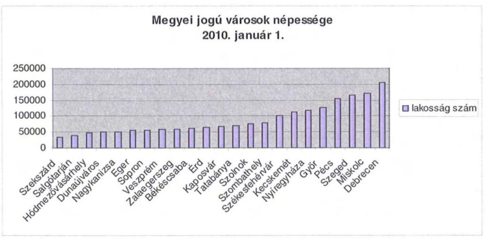

A megyei jogú városi önkormányzatok ${ }^{5}$ kötelező feladatellátását többlépcsős törvényi előírások határozzák meg. A feladatokra vonatkozó szabályozás első szintjét az Ötv. ${ }^{6}$, a második szintet a hatásköri ${ }^{7}$, a harmadik szintet a további ágazati, szakmai (egyebek mellett az oktatási, egészségügyi, szociális és egyéb ágazati feladatok ellátásának szakmai szabályait rögzítő) törvények adják.

A megyei jogú városi önkormányzatok – az Ötv-ből közvetlenül levezethető települési feladatok mellett – körzeti közszolgáltatásokat is ellátnak. A megyei jogú városi cím elsősorban többlet kötelezettségekkel jár, a megyei jogú város-

[^0]
[^0]:    ${ }^{3}$ A Magyar Köztársaság 2011. évi költségvetéséről szóló 2010. évi CLXIX. törvény Általános indoklásának III. fejezete, valamint Magyarország Konvergencia Programja 2011-2015. (2011. április) Táblázatok rész, 2. táblázat Államháztartás összefoglaló adatai szerint.
    ${ }^{4}$ A megyei jogú városok népességét a 4/2011. (I. 31.) NGM rendelet 1. sz. mellékletében foglalt 2010. január 1-i adatok alapján vettük figyelembe.
    ${ }^{5}$ Az Ötv. 61. § (1) bekezdése alapján a megyeszékhely város a törvény erejénél fogva megyei jogú, ugyanakkor az Országgyűlés az ötvenezernél nagyobb népességű városokat a képviselő-testület kérelmére megyei jogú várossá nyilváníthatja. Ez utóbbi körbe 5 város tartozik, közülük 2 (Hódmezővásárhely, Dunaújváros) népessége 2010. január 1-ére már ötvenezer fő alá csökkent.
    ${ }^{6}$ az Ötv. 8. és 61. §-ában foglaltak szerint
    ${ }^{7}$ a Htv.

---

nak önmagának kell gondoskodnia mindazokról a feladatokról, amelyek más települési önkormányzatok esetében a megyei önkormányzat feladatát képezik. Ide sorolható többek közt a középfokú oktatási intézmények fenntartása, a közművelődési, könyvtári és levéltári szolgáltatás, a társadalombiztosítás finanszírozása mellett a kórházi és a rendelőintézeti szakellátás, a szociális és egyes gyermekvédelmi feladatok ellátása. Ezeket a feladatokat (intézményeket) a megyei jogú város – más városoktól eltérően – nem adhatja át a megyei önkormányzatnak, azonban az Ötv. lehetőséget biztosít arra, hogy a megyei önkormányzattal megállapodjék a feladatellátás megosztásában.

Az önkormányzat, így a megyei jogú város is, maga határozza meg, hogy – a lakosság igényei alapján, anyagi lehetőségei függvényében – mely feladatokat, milyen mértékben és módon, mely szervezeti keretek közt lát el. A szervezetalakítás szabadsága a megyei jogú városok esetében azzal járt, hogy mind a kötelező közszolgáltatásoknál (különösen a településüzemeltetés, vagyongazdálkodás), mind pedig az önként vállalt feladataik ellátásában – elsősorban a sport és kulturális szolgáltatások területein – a gazdasági társaságok kiemelt fontosságú szerephez jutottak. Ily módon a gazdálkodás, a pénzügyi helyzet kockázatai közvetlenül kikerültek ugyan az önkormányzati alrendszerből, azonban sérülhet az ellátási felelősség figyelemmel kísérése és érvényesítése, a közpénzek felhasználásának transzparenciája. Mindezek együttvéve – a beszámolók konszolidálásának hiányában – növelik a megyei jogú városok pénzügyi helyzetének megítélésében rejlő kockázatokat.

Az áttekintett időszakban az önkormányzati feladatok ellátásának keretet biztosító forrásszabályozás elvei lényegesen nem változtak.

A megyei jogú városok önkormányzatainak mozgásterét, az önkormányzatok feladatellátásra vonatkozó döntéseit a központi költségvetéstől való függőség mellett jelentősen befolyásolja
 a helyi adókivetési jog gyakorlása ${ }^{8}$. A helyi adók rendszere a közszolgáltatások finanszírozásához szükséges források megteremtésének, bővítésének eszköze, amely a gazdasági válság, a jogszabályi környezet, az adópolitika változása, az adóhatóságok tevékenysége következtében differenciáltan érinti a települési önkormányzatokat ${ }^{9}$.

A települési önkormányzatok saját folyó bevételeinek keretében elszámolt, különböző jogcímeken kivetett helyi adók - iparűzési adó, építmény és telekadó, idegenforgalmi adó, vállalkozók és magánszemélyek kommunális adója - 2007-2010 között eltérő módon emelkedtek. A helyi adókból származó bevételek realizált összege országos szinten 2007-2009 között folyamatosan, 505,3 milliárd Ft-ról 566,3 milliárd Ft-ra emelkedett, majd a gazdasági válság hatásai következtében 2010-re 542,6 milliárd Ft-ra esett vissza. A helyi adók ré-

[^0]
[^0]:    ${ }^{8}$ a helyi adókról szóló törvény szabályai szerint
    ${ }^{9}$ Az Állami Számvevőszék 2010 decemberében közzétett 1031. számú jelentésében értékelte a helyi adók rendszerében a hatékonyság és az eredményesség érvényesülését.

---

szesedése az önkormányzatok saját folyó bevételein belül 2007-2010 között 2,5 százalékponttal csökkent ${ }^{10}$.

A megyei jogú városok saját folyó bevétele 2007-ben 191,5 milliárd Ft volt, 2008-ban 223,1, 2009-ben 225,4, 2010-ben 223,5 milliárd Ft-ot tett ki. A helyi adóbevételekből való részesedésük 2007-ben 110,5 milliárd Ft (21,9%), 2008-ban 128,3 milliárd Ft (23,2%), 2009-ben 124,4 milliárd Ft (22%), 2010-ben 118,7 milliárd Ft (részaránya a 2007. évivel azonosan 21,9%) volt. E realizált adóbevételek a megyei jogú városok saját folyó bevételeinek 2007-ben 57,7, 2008-ban 57,5, 2009-ben 55,2, 2010-ben 53,1%-át jelentették. A helyi adóbevételek 2007-ről 2010-re kimutatott 4,6 százalékpontos csökkenése annak ellenére következett be, hogy a megyei jogú városok saját folyó bevétele 2010-ben 16,7%-kal haladta meg a 2007. évit.

A helyi adókon belül a települések gazdasági helyzetének egyik fokmérője az elért helyi iparűzési adóbevétel, amely a megyei jogú városok körében erőteljes - a település nagyságrendtől is függő ${ }^{11}$ - különbségeket mutat. A helyi iparűzési adóbevétel és annak egy lakosra vetített összegének 2007. és 2010. évi alakulását az alábbi diagramok szemléltetik:
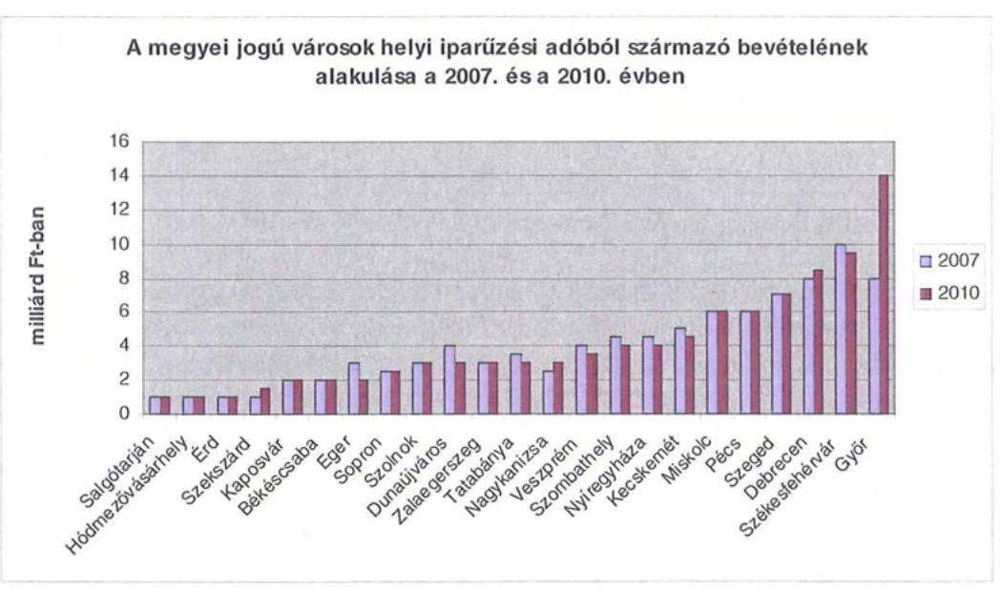

[^0]
[^0]:    ${ }^{10}$ A helyi adó bevételek saját folyó bevételekből való részesedése országosan 2007-ben 55,3%, 2010-ben 52,8% volt.
    ${ }^{11}$ A 100 ezer fő feletti népességű megyei jogú városok csoportjába Debrecen, Miskolc, Szeged, Pécs, Győr, Nyíregyháza, Kecskemét, Székesfehérvár tartozik. Nem megyeszékhely megyei jogú város Érd, Sopron, Nagykanizsa, Dunaújváros, Hódmezővásárhely.

---

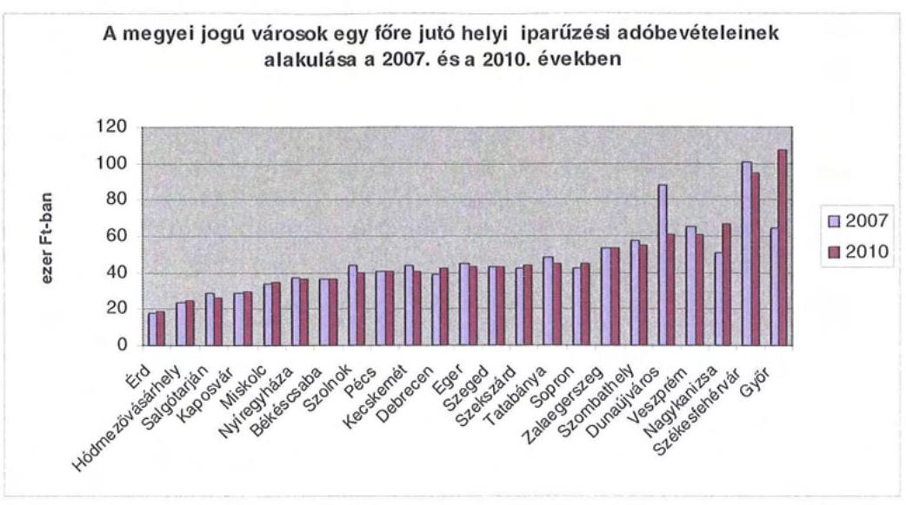

A megyei jogú városi önkormányzatok saját bevételein belül második legjelentősebb elem az illetékbevétel. A 2010. évben befolyt 39,2 milliárd Ft illetékbevétel a 2006. évben realizált 71,1 milliárd Ft illetékbevétel alig több mint 55%-a. A jelentős visszaesést döntően az ingatlanpiac stagnálása, majd visszaesése, illetve egyes illetékkedvezmények bevezetése okozta. A kieső bevételek pótlására az önkormányzati alrendszer szintjén történtek intézkedések, 2010-ben 5 milliárd Ft-ot, 2011-ben 1,2 milliárd Ft-ot ellentételezett a központi költségvetés. A megyei jogú városok önkormányzatai az önkormányzati alrendszer szintjén realizált illetékbevételből 2007-ben 13,6 milliárd Ft-tal (23,3%-kal), 2008-ban 15,3 milliárd Ft-tal (22,7%-kal), 2009-ben 12,6 milliárd Ft-tal (21,5%-kal), 2010-ben 7,9 milliárd Ft-tal (20,2%-kal) részesedtek ${ }^{12}$. Az összes befolyt illetékbevételből a megyei jogú városok részesedése 2009-ről 2010-re mindössze 1,3 százalékponttal csökkent, ugyanakkor a realizált illetékbevétel csökkenése a 37,3%-ot (4,7 milliárd Ft) is elérte.

Az önkormányzati alrendszer átengedett bevételei közül a személyi jövedelemadóból való részesedés makroszintű szabályozása a vizsgált időszakban nem változott. A települési önkormányzatokat a településre kimutatott személyi jövedelemadó 8%-a közvetlenül, míg 32%-a külön szabályozott visszaosztási rendben illeti meg. A visszaosztás a jövedelem differenciálódás mérséklésével párosul, rendje a lakóhelyen maradó személyi jövedelemadóhoz és az iparűzési adó-erőképességhez ${ }^{13}$ igazodik, annak részletszabályait a mindenkori költségvetési törvény 4. számú melléklete határozza meg. A jövedelemdifferenciálódás

[^0]
[^0]:    ${ }^{12}$ Az illetékek kivetésének és beszedésének joga 2006. december 31-ig a megyei önkormányzatok feladata volt, amelyet a 2007. évtől az APEH (2011. január 1-jétől NAV) vett át. Az önkormányzati illetékrészesedési szabályok változatlanok maradtak, azonban az illetékbeszedés költségeit az önkormányzatok illetékbevételeiből átlagos (a megyei jogú városoknál 8,5%-os) kulcsot alkalmazva vonták le.
    ${ }^{13}$ Az iparűzési adóerő-képesség egy potenciális, átlagos erőfeszítés mellett elérhető (a települési önkormányzat iparűzési adóelőlegét meghatározó adóalap 1,4%-ának megfelelő számított) bevétel.

---

szabályai kétirányúak, a kiegészítés és a visszatartás feltételeit egyaránt meghatározták:

- Amennyiben az önkormányzatot közvetlenül megillető személyi jövedelemadó bevétel és a számított iparűzési adóerő-képesség együttesen számított, egy főre jutó összege nem érte el a település méretéhez kapcsolódóan az évenkénti szabályozás szerinti változó összeget, a költségvetés a részesedést település nagyság szerint eltérően meghatározott szintig kiegészítette ${ }^{14}$. A kiegészítés fajlagos összege 2007-2010 között 37500 Ft-ról 48010 Ft-ra (10 510 Ft-tal, 28%-kal) emelkedett. Az előzőeken túl a jövedelem differenciálódás szabályozása egyes térségi (középiskolai, szakiskolai, szakképző intézményi, kollégiumi) feladatok ellátásának függvényében további kiegészítő hozzájárulást biztosított.
- Amennyiben az egy főre számított személyi jövedelemadó és az iparűzési adóerő-képesség együttes összege a település nagyságrendjéhez rendelt értékhatárt több mint 25%-kal (2010-től 20%-kal) meghaladta, az egy főre jutó összeg sávonként differenciált módon ${ }^{15}$ visszavonásra került az önkormányzatot megillető normatív állami hozzájárulás összegéből.

Az önkormányzatok személyi jövedelemadó bevétele 2007-ben 494,3 milliárd Ft, 2008-ban 558,6 milliárd Ft, 2009-ben 639,5 milliárd Ft, 2010-ben 681,2 milliárd Ft volt, az időszak alatt összegében 186,9 milliárd Ft-tal, 37,8%-kal emelkedett, miközben az szja bevétel átengedett bevételeken belüli részesedése 1,8 százalékponttal emelkedett.

A megyei jogú városok önkormányzatainak személyi jövedelemadó részesedése az alrendszer átengedett személyi jövedelemadó bevételeiből 2007-ben 77,6 milliárd Ft-ot (15,7%-ot), 2008-ban 105,4 milliárd Ft-ot (18,9%-ot), 2009-ben 122,9 milliárd Ft-ot (19,2%-ot), 2010-ben 136,6 milliárd Ft-ot (20,1%-ot) tett ki. A realizált szja bevétel a megyei jogú városoknál az időszak alatt folyamatosan emelkedett, a 2010-ben realizált adóbevétel 59,0 milliárd Ft-tal (76%) volt magasabb a 2007. évinél, az átengedett bevételeken belüli részesedése 2010-re 5,1 százalékponttal haladta meg a 2007. évi részarányt ${ }^{16}$. A részesedés alapjául szolgáló szja településenként eltérő, az egy adózóra jutó szja 2009. évi adatait ${ }^{17}$ a következő ábra szemlélteti.

[^0]
[^0]:    ${ }^{14}$ A megyei jogú városok esetében a jövedelemkülönbségek mérséklésénél figyelembe veendő lakosonkénti értékhatár 2007-ben 37500 Ft, 2008-ban 42385 Ft, 2009-ben 45933 Ft, 2010-ben 48010 Ft volt.
    ${ }^{15}$ A sávos értékhatár 2010-től 20%-os intervallumonként, 120% felett a visszatartást 25%-tól 90%-os mértékig rögzíti. Amennyiben a település nagyságrendhez rendelt értékhatár összege az önkormányzatnál eléri vagy meghaladja a 200%-ot, az egy főre jutó összeg 90%-a levonásra kerül. Az értékhatár sávjai 2010 előtt 25%-os léptékűek voltak, a levonási arányok az ellenőrzött időszakban nem változtak.
    ${ }^{16}$ E bevételek a megyei jogú városok átengedett bevételeiben 2007-ben 84,7, 2008-ban 87,7, 2009-ben 89,7, 2010-ben 89,8%-os részarányt jelentettek.
    ${ }^{17}$ Adatforrás: KSH Megyei Jogú Városok a Közép Dunántúlon 2009. kiadványa, 4.1.sz. összehasonlító tábla.

---

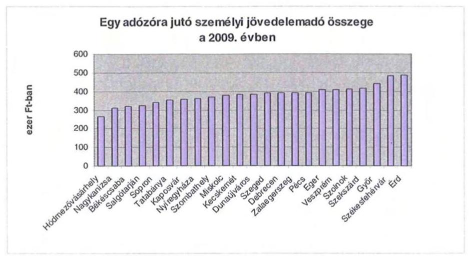

Az átengedett bevételek második legjelentősebb eleme a gépjárműadó, amelynek bevételi szabályozása az ellenőrzött időszakban nem változott, az adóbevétel teljes összege az önkormányzatot illeti meg. A gépjárműadó alapját, mértékét ${ }^{18}$ és egyes mentességi kategóriákat érintő módosítások 2010. január 1-től következtek be, amelyek az egyes adótételek esetében átlagosan 15%-os emelkedéssel jártak.

A gépjárműadó beszedéséből származó bevétel az önkormányzati alrendszer szintjén 2007-ben 62,4 milliárd Ft, 2008-ban 65,7 milliárd Ft, 2009-ben 63,8 milliárd Ft, 2010-ben 71,1 milliárd Ft volt, az adóbevétel egésze 2007-hez képest 8,7 milliárd Ft-tal, 13,9%-kal emelkedett. A gépjárműadóztatás szabályainak változása 2010-ben 7,3 milliárd Ft többletet eredményezett. A megyei jogú városok gépjárműadó bevétele a 2007. évi 14,0 milliárd Ft-ról 2010-re 15,5 milliárd Ft-ra, 10,7%-kal emelkedett. A bevételnövekedés összegéből 1,4 milliárd Ft a 2010. évi adózási szabályok következménye.

A megyei jogú városok önkormányzatai 2007-2010 között rendelkezésre álló forrásainak alakulását a következő ábra szemlélteti:
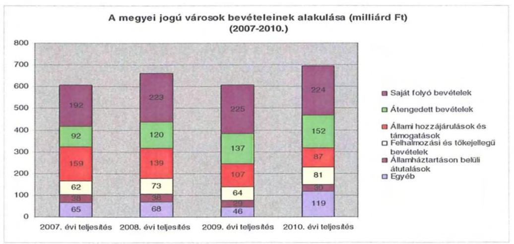

[^0]
[^0]:    ${ }^{18}$ a gépjárműadóról szóló 1991. évi LXXXII. törvény 7. § (1) bekezdésében foglalt adómértékek változása

---

A megyei jogú városok saját folyó bevételeinek - amelyek főbb elemei: a helyi adók, az illetékbevételek, az intézményi térítési díjak, a kamatbevételek részaránya a 2007. évi összbevételen (608 milliárd Ft) belül 32% volt. A 2010. évi összbevétel 693 milliárd Ft-os összegéből a saját folyó bevételek aránya - miközben összege 2007-ről 2010-re 32 milliárd Ft-tal emelkedett - nem változott.

Az átengedett bevételek, amelyek a megyei jogú városok önkormányzatainál döntően a személyi jövedelemadó és a gépjárműadó részesedést jelenti, az összbevételen belül a 2007. évi 92 milliárd Ft-ról (15%) 152 milliárd Ft-ra nőtt, részesedése 7 százalékponttal emelkedett. A 60 milliárd Ft-os növekedésből 59 milliárd Ft-ot az szja részesedés emelkedése okozott.

Az állami hozzájárulások és támogatások - amelyek főbb elemei: főként az ellátotti létszámhoz kötődő normatív állami hozzájárulások, központosított előirányzatok - a 2007. évi 159 milliárd Ft-ról (26%-os részarányról) 2010-re 87 milliárd Ft-ra (13%-os részarányra) estek vissza.

A felhalmozási és tőkejellegű bevételek - tárgyi eszközök (ingatlanok és ingóságok), föld és immateriális javak, részesedések értékesítése, EU-tól átvett pénzeszközök - a 2007. évi 62 milliárd Ft-ról (10%-os részarányról) 2010-re 81 milliárd Ft-ra (12%-os részarányra) emelkedtek.

Az államháztartáson belüli átutalások részesedése 2007-ben 38 milliárd Ft volt. 2010. év végére 8 milliárd Ft-tal csökkent, részaránya 6%-ról 2010-ben 4%-ra változott. Ez a bevételi kategória tartalmazza az Egészségbiztosítási Alaptól és más elkülönített állami pénzalapoktól átvett forrásokat. A 2010-ben e címen elszámolt bevétel a megyei jogú városoknál 22 milliárd Ft-ot tett ki.

Az egyéb, pénzmaradványból, vállalkozási bevételekből, államháztartáson kívülről származó átutalásokból, a hitelekből, a hosszú és rövid lejáratú értékpapírok értékesítéséből származó bevételek részesedése a 2007-2010. évek viszonylatában 11%-ról 17%-ra emelkedett. Ez utóbbiak 2010. évi beszámoló szerinti összevont teljesítése 119 milliárd Ft volt ${ }^{19}$.

Mindezeket figyelembe véve a megyei jogú városok 2007. és 2010. évi forrásöszszetételének megoszlását az alábbi ábra szemlélteti:

[^0]
[^0]:    ${ }^{19}$ Az egyéb bevételek összege 2007-2010 között eltérő módon változott, 2007-ben 65 milliárd Ft, 2008-ban 68 milliárd Ft volt, 2009-ben 46 milliárd Ft-ra esett vissza, majd 2010-ben több mint két és félszeresére, 119 milliárd Ft-ra emelkedett.

---

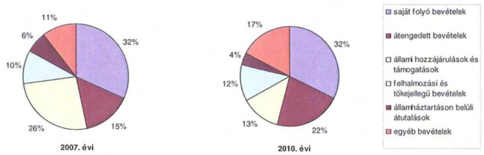

Az önkormányzati alrendszer pénzügyi helyzetértékelése során új elemzési módszereket alkalmaz az ellenőrzés. A hagyományos költségvetési szerkezet helyett az önkormányzat pénzügyi helyzetét a CLF módszerrel mutatjuk be, amelynek lényegét és számításának módszerét a 2.1. pontban, és a jelentés 2. számú mellékletében ismertetjük részletesen.

Az új módszereken alapuló helyzetértékelés fontosságát az adja,
 hogy a helyi önkormányzatok bruttó adósságállománya ${ }^{20}$ a 2010. évi költségvetési beszámoló alapján 1248 milliárd Ft-ot tett ki. Az adósságállomány koncentráltságát jelzi ${ }^{21}$, hogy ebből a 23 megyei jogú város részesedése 338 milliárd Ft volt, amely a fővárosi és kerületi önkormányzatok adósságának figyelmen kívül hagyásával számított 2010. évi 977 milliárd Ft összegű bruttó adósságállomány 34,6%-át jelentette. Az adósságállomány több mint fele - 501 milliárd Ft - a 19 megyei önkormányzatnál és a 23 megyei jogú városnál jelentkezett.

A megyei jogú városok 338 milliárd Ft-os adósságállományából 175 milliárd Ft (51,8%) a 8 legnagyobb, 100 ezer fő feletti népességű város tartozása. Az 5 nem megyeszékhely megyei jogú város bruttó adósságállománya 70 milliárd Ft-ot (20,7%-ot), az előző két csoportba nem tartozó további 10 megyei jogú város adóssága 93 milliárd Ft-ot (27,5%-ot) tett ki.

[^0]
[^0]:    ${ }^{20}$ A bruttó adósságállomány 2010. év végi összege magában foglalja a fejlesztési és a működési célú kötvénykibocsátások, a beruházási és fejlesztési hitelek, a működési célú hosszú lejáratú hitelek, a rövid lejáratú hitelek, váltótartozások miatti kötelezettségek teljes (2011-ben, illetve az azt követő években esedékes) állományát.
    ${ }^{21}$ A megyei jogú városok adósságállománya összegében ugyan elmarad az egyéb városok összesített adósságától [(ez utóbbiak részesedése 382,6 milliárd Ft (39,2%)], azonban az egyéb városok száma 304. A fővárosi és a kerületi önkormányzatok nélküli adósságállományból a 19 megyei önkormányzat 163 milliárd Ft-tal (16,8%-kal), míg a nagyközségek, községek együttesen 93 milliárd Ft-tal (9,5%-kal) részesednek.

---

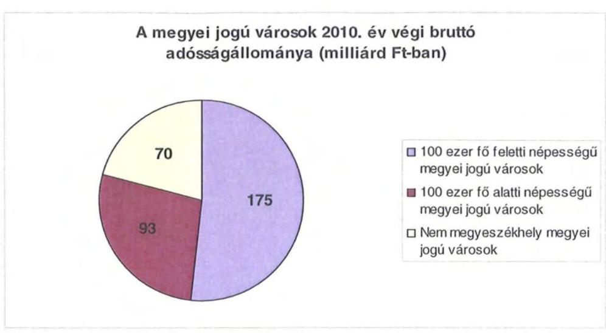

A mérlegben kimutatott bruttó adósságállomány mellett az önkormányzatok számára az eszközállomány műszaki állapotának megőrzése is kötelezettségekkel jár. Az elhasználódott eszközök pótlására forrást biztosító amortizációs (felújítási) alap képzésének ${ }^{22}$ elmaradása maga után vonhatja a feladatellátást kiszolgáló tárgyi eszközök állagának erőteljes romlását. Emellett a 2007-2013-as időszakra meghirdetett, vissza nem térítendő EU-s fejlesztési forrásokhoz való hozzájutás lehetősége felerősítette az önkormányzati alrendszer fejlesztési igényeit, amelyek a felhalmozási költségvetési hiány folyamatos emelkedésén túl - az előírt jövőbeni fenntartási kötelezettség miatt - tovább terhelhetik az önkormányzatok költségvetését ${ }^{23}$.

Az ÁSZ a 2011. évi ellenőrzési tervében 43. számú, az Önkormányzatok gazdálkodási rendszerének ellenőrzése részeként egy időben, egymással párhuzamosan tekinti át, és elemzi a 23 megyei jogú városi önkormányzat pénzügyi helyzetét. A gazdálkodás szabályszerűségét az ÁSZ az előző évek során ebben az önkormányzati körben is ellenőrizte, ezért jelen vizsgálatunk erre nem tér ki. A jelentés a megyei jogú városok sajátos feladatellátási és forrásszabályozási helyzetére tekintettel az önkormányzatok pénzügyi helyzetét, illetve az ezzel összefüggő korábbi ÁSZ javaslatok megvalósítását mutatja be.

[^0]
[^0]:    ${ }^{22}$ Erre a jelenlegi szabályozási környezetben nem kötelezi semmilyen előírás az önkormányzatokat.
    ${ }^{23}$ Az Állami Számvevőszék 2011. júniusában közzétett 1108. számú, a helyi önkormányzatok fejlesztési célú támogatási rendszerének ellenőrzéséről szóló jelentésében feltárta a fejlesztési folyamatok problémáit. A helyi önkormányzatok elsősorban azokat a fejlesztéseket valósították meg, amelyekhez támogatást lehetett igényelni. A fejlesztési célok közül a magasabb támogatás intenzitású pályázatokat részesítették előnyben. A fejlesztéssel megvalósuló létesítmények jövőbeli üzemeltetésének várható ráfordításait az önkormányzatok 71,9%-a nem mérte fel.

---

Az ellenőrzés a 2007. január 1. - 2010. december 31. közötti időszakot öleli fel.
A vizsgálat jogszabályi alapját az Állami Számvevőszékről szóló 1989. évi XXXVIII. törvény 2. § (3), (5), (6) és (9) bekezdései ${ }^{24}$, az Ötv. 92. § (1) bekezdése, az Áht. 104. § (3), és 120/A. § (1) bekezdése előírásai képezik.

A Jelentéstervezet megállapításainak, javaslatainak egyeztetése során a Polgármester észrevételt tett. A kapott észrevételt és az arra adott válaszlevelet a Jelentés 5. és 6. számú mellékletei tartalmazzák.

[^0]
[^0]:    ${ }^{24}$ 2011. július 1-jétől az Állami Számvevőszékről szóló 2011. évi LXVI. törvény 5. § (2)(5) bekezdései

---

# I. ÖSSZEGZŐ MEGÁLLAPÍTÁSOK, JAVASLATOK 

Az Önkormányzat - adatszolgáltatása szerint - működési költségvetési kiadásaiból 11833 millió Ft-ot (92,2%) a kötelező feladatok, 1001 millió Ft-ot (7,8%) az önként vállalt feladatok ellátására fordította a 2010. évben. A kötelező és önként vállalt feladatok részarányának megállapítása az Önkormányzat SzMSz szerinti besorolásának megfelelően készült. Az Önkormányzat önként vállalt feladatnak tekintette az idegenforgalmi szolgáltatások, Bursa Hungarica ösztöndíjrendszer, nemzetközi kapcsolatok építése, testvérvárosi kapcsolatok ápolása, civil és egyéb szervezetek, uszoda működésének, az iparosított technológiával épült lakóépületek energiatakarékos rekonstrukciójának támogatása, S.O.S. telefonos lelki segélyszolgálat működtetését.

Az Önkormányzat feladatellátásának szervezeti struktúráját a következő ábra szemlélteti:

Az Önkormányzat feladatellátásának szervezeti struktúrája a 2010. évben
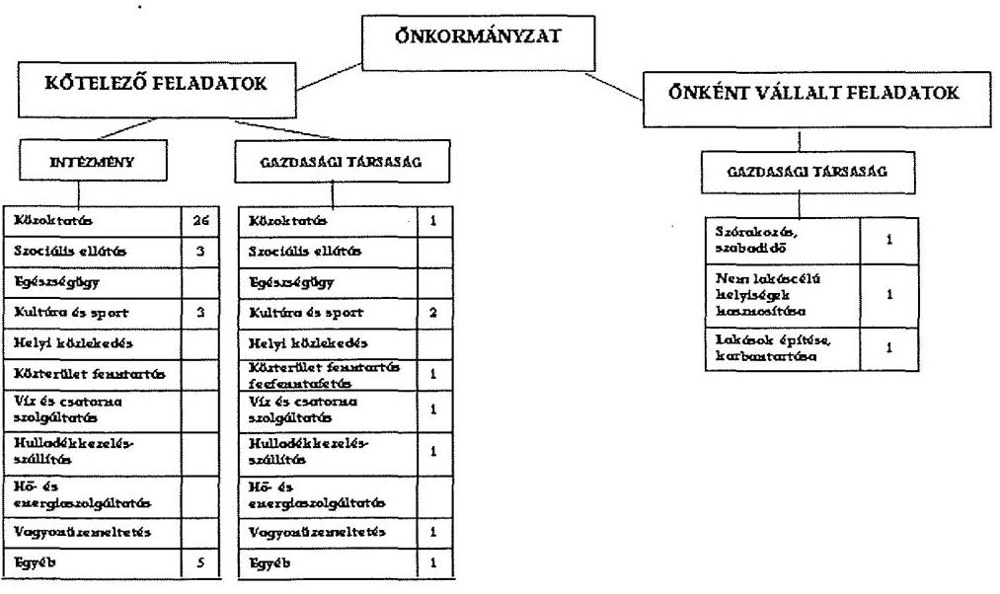

Az Önkormányzat feladatait 2010. december 31-én (a Polgármesteri hivatallal együtt) 37 költségvetési szervvel és nyolc 25% feletti tulajdoni hányadú gazdasági társaságával látta el. Az intézményszervezeti átalakítások és intézményi összevonások, valamint egy kulturális intézmény Megyei Önkormányzattól való átvétele következtében a feladatellátás telephelyeinek száma a 2006. évi 81-ről a 2010. évre 85-re nőtt.

Az Önkormányzat működési kiadásokra 2010-ben 12834 millió Ft-ot fordított, amely 1164 millió Ft-tal (10%-kal) haladta meg a 2007. évit. A működési kiadások 63,2%-át (8116 millió Ft-ot) az intézményi körben realizálták a 2010. évben. E kiadások fedezetéül szolgáló bevételi források jellemző összesített arányait a 2007. és a 2010. években a következő ábra szemlélteti:

---

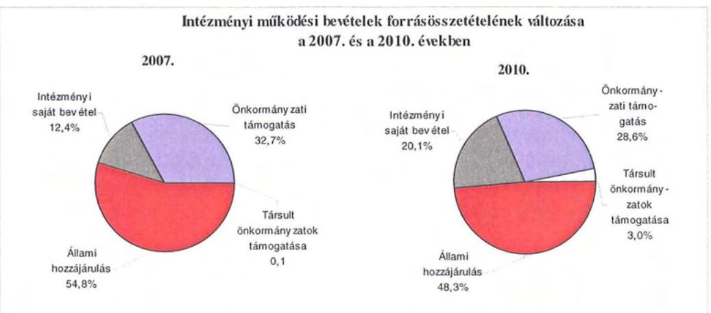

Az egyes közszolgáltatások feladatellátásában részvevő ágazati intézménycsoportok kiadásai finanszírozásának forrásösszetételét bevételi jogcímenként 2007-ben és 2010-ben az alábbi grafikon mutatja be:
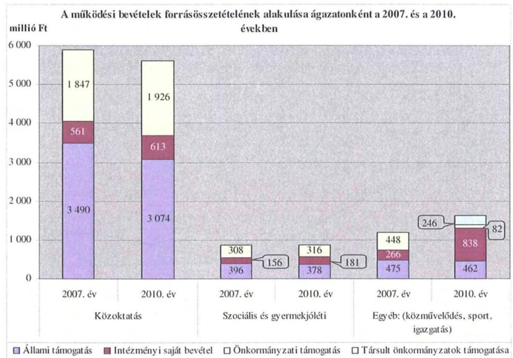

Az Önkormányzat 5 gazdasági társaságban kizárólagos tulajdonnal, 2 gazdasági társaságban 75% feletti tulajdoni hányaddal rendelkezett. A 2010. év végén 25-51% közötti üzletrésze 1 gazdasági társaságban volt, továbbá, 1 kizárólagos önkormányzati tulajdonú gazdasági társaság 4 leányvállalattal rendelkezett. Az Önkormányzat feladatellátásában a gazdasági társaságok vagyonüzemeltetés, közterület fenntartás, hulladékszállítás, közoktatás, kultúra, sport, víz és csatornaszolgáltatás területén kaptak szerepet. A gazdasági társaságok által ellátott feladatstruktúra letisztított és átlátható volt. A gazdasági társaságok működéséhez a 2007-2010. években összesen 619 millió Ft rendszeres működési és 692 millió Ft fejlesztési célú pénzeszközt adott át az Önkormányzat. Az Önkormányzat kizárólagos tulajdonú gazdasági társaságának le-

---

ányvállalata - Művészetek háza - részesült 2007-2010 között a működési támogatások 37,5%-ában (232 millió Ft összegben).

A többségi önkormányzati tulajdonú gazdasági társaságok saját tőkéje 2010. december 31-én 2250 millió Ft, a jegyzett tőkéje 1594 millió Ft volt. A vizsgált időszakban az Önkormányzat gazdasági társaságainál nem volt csődeljárás. Az Önkormányzat 2 kizárólagos önkormányzati tulajdonú gazdasági társasága 2007-2010 között tőkeemelésben részesült. Egy gazdasági társaság törzstőkéjét a Közgyűlés 2010. év végén leszállította.

A folyó költségvetési egyenleg (működési jövedelem) 2007-2010 között működési forrástöbbletet mutatott, a működési egyensúly biztosított volt. A 2007-2008. években a működési megtakarítások fedezték a tárgyévben jelentkező tőketörlesztési kötelezettségeket, így az Önkormányzat pénzügyi kapacitása (nettó működési jövedelme) is pozitív értékű volt. A 2009. évben az adósságszolgálat növekedése miatt a pénzügyi kapacitás negatívvá vált (-692 millió Ft), mivel a működési megtakarítás (485 millió Ft) nem fedezte a tőketörlesztési kötelezettséget (1177 millió Ft). A 2010. évben a Hulladékgazdálkodási Társulás által realizált koncessziós díj, valamint a hulladékgazdálkodási rendszer hasznosítási díj bevételének elszámolása miatt - az előző évhez képest kiemelkedően magas - működési forrástöbbletet (2738 millió Ft) realizált az Önkormányzat, amely fedezetet nyújtott a tőketörlesztési kötelezettségre (1087 millió Ft).
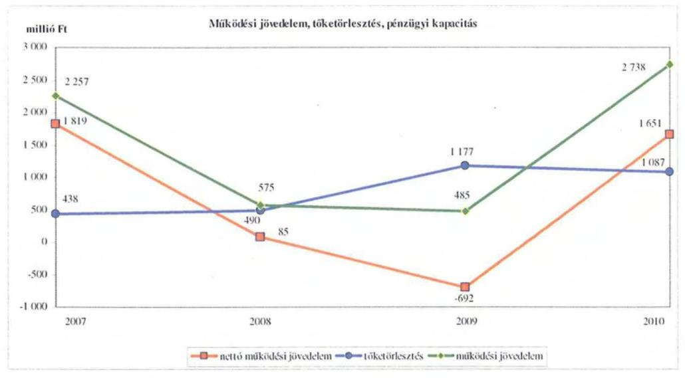

A 2007-2010. években az Önkormányzat felhalmozási költségvetésének egyenlege folyamatosan negatív összegű volt, amely 2007-2010. között összesen 8627 millió Ft felhalmozási forráshiányt okozott.

A pénzügyi egyensúly fenntartása külső források bevonásával volt biztosítható. A 2007-2010. években az Önkormányzat 3192 millió Ft hiteltörlesztési kötelezettségnek tett eleget. Az adósságszolgálat, továbbá a felhalmozási forráshiány 2007-2010. között 11819 millió Ft-ot tett ki, amelyre az időszakban képződő 6055 millió Ft működési többlet (működési jövedelem), valamint a 2007. január 1-jén rendelkezésre álló 2189 millió Ft pénzkészlet szolgált fedezetül. A további pénzeszközöket 4209 millió Ft hitel felvételével teremtették meg.

---

Az Önkormányzat a vizsgált időszakban helyi iparűzési adót, építményadót, vendégéjszakák utáni idegenforgalmi adót és telekadót vetett ki a magánszemélyekre, illetve vállalkozásokra. Az építményadó mértékét 78,6%-kal, az idegenforgalmi adó mértékét 16,1%-kal emelték a vizsgált időszakban. A helyi adókból és pótlékokból származó bevételek aránya a 2007-2010. években 19-24% között mozgott a folyó (működési) bevételekben. A pótlékkal, bírsággal növelt helyi adó bevétel a 2007. évi 2931 millió Ft-ról 2010. évben 3085 millió Ft-ra (5,3%-kal, 154 millió Ft-tal) nőtt. A helyi adóbevételek háromnegyed részét az iparűzési adó tette ki, amelynek mértékét a helyi adókról szóló törvényben rögzített maximális mértékben állapították meg.

A 2007-2010. években befejezett fejlesztési feladatok végrehajtására 13190 millió Ft kiadást teljesítettek, amelynek forrása - a saját forrásbevételeken és a támogatásokon túl - 118 millió Ft kötvényből származó bevétel (0,9%), valamint 2053 millió Ft hitelfelvétel (15,6%) volt. A 2010. december 31-én folyamatban lévő fejlesztési feladatok kiadásainak jelentős részét pénzintézeti forrásokból finanszírozták. A folyamatban lévő fejlesztési feladatok végrehajtására 1462 millió Ft kiadást teljesítettek, amelyre a kötvény bevételéből 30 millió Ft-ot (2%), hitelből 442 millió Ft-ot (30,2%) fordítottak.

Az Önkormányzat 2010. december 31-én folyamatban lévő fejlesztési feladatok 2010. évet követő kötelezettség-vállalásainak összege 3101 millió Ft volt, amelyből 231 millió Ft-ot saját bevételből, 2415 millió Ft-ot európai uniós támogatásból, 46 millió Ft-ot hazai támogatásból, 409 millió Ft-ot a korábbi kötvénykibocsátásból rendelkezésre álló forrásból terveztek biztosítani.

A 2010. december 31. utáni kötelezettség-vállalások forrásösszetétele
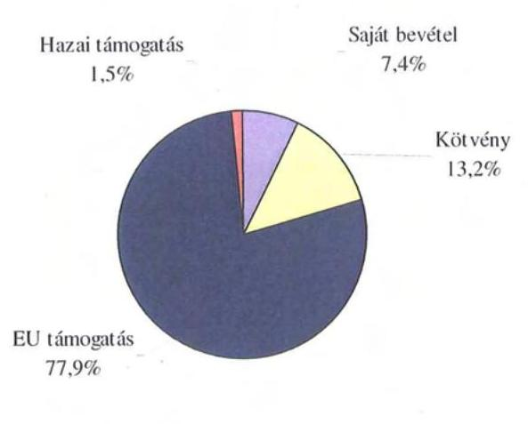

Az Önkormányzatnak 9655 millió Ft tervezett bekerülési költségű, elbírálás alatt lévő fejlesztési feladata volt 2010. december 31-én. A beruházások tervezett megvalósításának fedezetét - EU-s és hazai támogatáson túl - 1049 millió Ft saját forrásból, 1046 millió Ft-ot fejlesztési célú hitel (tervezett saját forrás 99,7%-a) igénybevételével tervezi biztosítani az Önkormányzat. A tervezett hitelfelvétel kockázatot jelenthet a vállalt fejlesztések jövőbeni finanszírozhatósága szempontjából.

---

Az Önkormányzat mérleg szerinti pénzintézeti kötelezettsége a 2006. év végéről a 2010. év végére 2575 millió Ft-ról 6413 millió Ft-ra nőtt, amelyből az árfolyamváltozás miatti különbözet 429 millió Ft volt. A fennálló pénzintézeti kötelezettségek egy kötvény kibocsátásából és 11 hosszú lejáratú hitel igénybevételéből keletkeztek.

Az Önkormányzat kötelezettségvállalásaira közgyűlési döntés alapján került sor, azonban az előterjesztésekben nem mutatták be a visszafizetés forrásait, a kamat- és - a devizaalapú kötelezettségeket érintő - árfolyamkockázatot.

Az Önkormányzat az ellenőrzött időszakban pénzintézeti kötelezettséget fejlesztési feladatainak finanszírozására vállalt. A felvett hosszúlejáratú hiteleivel kapcsolódott a kormányzati programokban meghirdetett fejlesztési célokhoz. A 2010. évben kibocsátott kötvényből visszafizették a 2009. évi folyószámlahitelt, a képződött maradványt a 2011-es költségvetés fejlesztési feladataira szerződéssel, illetve közgyűlési döntésekkel megterhelték.

Az Önkormányzat a devizában fennálló pénzintézeti kötelezettségeiből 4104 ezer CHF (742 millió Ft) tőkét törlesztett, kamatot és egyéb költséget fizetett.
 A HUF-ban fennálló kötelezettségekből 2252 millió Ft tőkét, kamatot és egyéb költséget teljesített. Az Önkormányzat a kötvények kibocsátásából és a hitelek igénybevételéből származó forrásokat 2010. év végéig a céloknak megfelelően felhasználta. A 2007-2010. években átmenetileg szabad pénzeszközeiből 455 millió Ft kamatbevételt realizált, azonban a kötvénykibocsátásból származó bevétel hasznosításából még nem keletkezett kamatbevétele, mivel a kibocsátás 2010. év végén történt. Az Önkormányzat az ellenőrzött időszakban a hitelek felvételét, illetve a kötvény kibocsátását a pénzintézetek versenyeztetésével bonyolította, a 2010. év végén fennálló pénzintézeti kötelezettségének mintegy 40%-a származott az Önkormányzat számlavezető bankjától.

Az Önkormányzat működésének pénzügyi egyensúlyát a vizsgált időszakban hitelfelvétel nélkül biztosította, a felvett folyószámlahitelek fejlesztési célt szolgáltak.

A folyószámlahitel igénybevétele a 2007-2010. években az alábbiak szerint alakult:

| Megnevezés | 2007. év | 2008. év | 2009. év | 2010. év |
| :--: | :--: | :--: | :--: | :--: |
| Keretszegény január 1-jén |  | 600 | 900 | 650 |
| Átlagos napi állomány | 212 | 651 | 557 | 182 |
| Folyószámlahitellel zárt napok száma (nap) | 24 | 1 | 12 | 55 |
| 2010. december 31-i egyenleg (állomány) | 5 | 5 | 5 | - |

Az Önkormányzat 2010. év végi szállítói tartozása 266 millió Ft, melyből a lejárt tartozás 78 millió Ft volt. A lejárt tartozások 96%-a 30 napon belüli volt, csupán a 0,7%-a (0,6 millió Ft) haladta meg a 91 napot.

Az Önkormányzat gazdasági társaságai részére folyószámla- és egyéb hitelek igénybevételéhez készfizető kezességet vállalt 1327 millió Ft összegben. A 2010. év végére kezességgel kapcsolatos kötelezettségének állománya 1199 millió Ft volt. A gazdasági társaságok részére 7 alkalommal, összesen 191 millió Ft összegben nyújtott kölcsönt az Önkormányzat.

A Közgyűlés hozzájárulása alapján, a fejlesztési hitelek biztosítékaként 36 millió Ft - számviteli nyilvántartás szerinti - nettó értékű ingatlanra került jelzálogjog bejegyzésre. A jelzálogszerződésekkel érintett ingatlanok a forgalomképes ingatlanok 2%-át jelentették.

Az Önkormányzat kötelezettségeinek 2010. december 31-i állományát és várható alakulását a kötelezettségek lejáratáig a következő táblázat szemlélteti:

Az Önkormányzat kötelezettségeinek állománya 2010. december 31-én és várható alakulása a kötelezettségek lejáratáig

| Megnevezés | Állomány 2010. dec. 31-én |  |  | Várható kötelezettség 2011-2013. években |  |  | Várható kötelezettség 2014. évet követően |  |  |
| :--: | :--: | :--: | :--: | :--: | :--: | :--: | :--: | :--: | :--: |
|  | HUF-ban (millió Ft-ban) | Devizában (összeg, ezer CHF-ban) | Devizaneme | HUF-ban (millió Ft-ban) | Devizában (összeg, ezer CHF-ban) | Devizaneme | HUF-ban (millió Ft-ban) | Devizában (összeg, ezer CHF-ban) | Devizaneme |
| Pénzintézeti kötelezettségek |  |  |  |  |  |  |  |  |  |
| Hosszú lejáratú hitelek | 2000 |  | HUF | 1111 |  | HUF | 2342 |  | HUF |
| Hosszú lejáratú hitelek |  | 6802 | CHF |  | 3316 | CHF |  | 3500 | CHF |
| Rövid lejáratú hitelek | 2000 |  | HUF | 826 |  | HUF | 2184 |  | HUF |
| Pénzintézeti kötelezettségek összesen HUF-ban | 4900 |  | HUF | 1937 |  | HUF | 4736 |  | HUF |
| Pénzintézeti kötelezettségek összesen CHF-ban |  | 6802 | CHF |  | 3316 | CHF |  | 3500 | CHF |
| Biztosítékok |  |  |  |  |  |  |  |  |  |
| Kezesség | 1199 |  | HUF |  |  |  |  |  |  |
| Biztosítékok összesen | 1199 |  | HUF |  |  |  |  |  |  |
| Szállítói tartozás | 366 |  | HUF | 366 |  | HUF |  |  |  |

Az Önkormányzatnak pénzintézetekkel szemben fennálló kötelezettsége a 2010. év végén 4900 millió Ft és 6802 ezer CHF volt. Ezek várható kötelezettsége (tőke, kamat és egyéb költség) a legutóbbi kamatfizetés feltételei alapján a 2011. évtől 6663 millió Ft, továbbá 7016 ezer CHF. Az Önkormányzatnak a 2011. évre szállítói tartozások címén 266 millió Ft fizetési kötelezettsége keletkezett. A kezességvállalásaiból adódóan az Önkormányzat feltételes kötelezettsége 1199 millió Ft. A 2011-2013. évek várható összes kötelezettsége teljesítésére figyelembe vehető eszközállomány 625 millió Ft mérlegben kimutatott követelésállomány, 591 millió Ft kimutatott szabad felhasználású pénzmaradvány, 1792 millió Ft összegű befektetett pénzügyi eszközállomány. A 2014 utáni kötelezettségek teljesítéséhez felhasználható még 1988 millió Ft - számviteli nyilvántartásban nettó értéken nyilvántartott - forgalomképes ingatlanvagyon, amelyből 36 millió Ft értékű a pénzintézeti kötelezettségekhez kapcsolódóan jelzáloggal terhelt. Az Önkormányzat tájékoztatása szerint figyelembe vehető további források „a mindenkori költségvetési rendeletekben megtervezett önkormányzati saját bevételek”.

Az Önkormányzat minősített többségi tulajdonú társaságai kötelezettségeinek 2010. december 31-i állományát és várható alakulását a kötelezettségek lejáratáig a következő táblázat mutatja be:

Az Önkormányzat minősített többségi tulajdonú társaságai kötelezettségeinek állománya 2010. december 31-én és várható alakulása a kötelezettségek lejáratáig

| Megnevezés | Állomány 2010. dec. 31-én |  |  | Várható kötelezettség 2011-2012. években |  |  | Várható kötelezettség 2014. évet követően |  |  |
| :--: | :--: | :--: | :--: | :--: | :--: | :--: | :--: | :--: | :--: |
|  | HUF-ban (millió Ftban) | Devizában (összeg, ezer CHF-ban, ezer EUR-ban) | Devizaneme | HUF-ban (millió Ftban) | Devizában (összeg, ezer CHF-ban, ezer EUR-ban) | Devizaneme | HUF-ban (millió Ftban) | Devizában (összeg, ezer CHF-ban, ezer EUR-ban) | Devizaneme |
| Hosszú lejáratú hitelek |  | 521 | EUR |  | 563 | EUR |  |  | EUR |
| Hosszú lejáratú hitelek |  | 599 | CHF |  | 520 | CHF |  | 95 | CHF |
| Rövid lejáratú és egyéb rövid lejáratú hitelek | 233 |  | HUF | 233 |  | HUF |  |  | HUF |
| Pénzintézeti kötelezettségek összesen | 233 |  | HUF | 233 |  | HUF |  |  |  |
|  |  | 531 | EUR |  | 563 | EUR |  |  |  |
|  |  | 599 | CHF |  | 520 | CHF |  | 95 | CHF |
| Lízing kötelezettségek | 20 |  | HUF |  |  |  |  |  |  |
| Lízing kötelezettségek |  | 46 | EUR |  | 39 | EUR |  | 10 | EUR |
| Szállítói tartozás | 236 |  | HUF | 236 |  | HUF |  |  |  |

Az önkormányzati kötelezettségek növekedése mellett a minősített többségi tulajdonú társaságok kötelezettségei is befolyásolhatják az Önkormányzat pénzügyi egyensúlyát. A társaságoknak a 2011. évtől 233 millió Ft, 563 ezer EUR és 615 ezer CHF pénzintézeti kötelezettséget, 20 millió Ft és 49 ezer EUR lízing és 356 millió Ft szállítói tartozást kell rendezniük. Kockázatot hordoz, ha ezek nem teljesítése miatt - csőd és felszámolás esetén - a bíróság korlátlan és teljes felelősséget állapít meg az Önkormányzat terhére.

Az Önkormányzat költségvetési támogatásból, átengedett bevételekből és illetékbevételekből származó bevételei a 2007. évhez képest az időszak egészét tekintve 836 millió Ft-tal csökkentek a 2010. évre. Az Önkormányzat kiadási megtakarítást eredményező és bevételnövelő intézkedéseket tett. A 2007-2010. években végrehajtott intézkedések hatására 436 millió Ft bevételi többletet, továbbá 1058 millió Ft kiadási megtakarítást mutattak ki, ezáltal az Önkormányzat pénzügyi helyzetét javították. A kiadási megtakarítások 98,4%-a az elrendelt álláshely-csökkentések eredménye volt az Önkormányzat adatszolgáltatása szerint. Az álláshely-csökkentő intézkedések 2007-2010 között a Polgármesteri hivatalnál és az intézményeinél összesen 195,3 álláshely (ebből 42 üres álláshely) megszüntetését jelentették. Egyes közszolgáltatási területeken azonban feladatbővülések is voltak, amelyek álláshely- és egyben létszámnövekedéssel is jártak. Ennek következtében az időszak álláshelyeinek száma 97 fővel csökkent. A bevételnövelő intézkedések szabad kapacitások kihasználásához, a helyi adóbevétel beszedésének végrehajtásához és a közműfejlesztési bevételekhez kapcsolódtak.

Az ÁSZ az Önkormányzat gazdálkodási rendszerének 2007. évi ellenőrzése során a pénzügyi helyzet javításához szabályszerűségi és célszerűségi javaslatokat nem tett.

Az Önkormányzat pénzügyi helyzetét összegezve a következők emelhetők ki:

A 2007-2010. években az Önkormányzat működési kockázatát csökkentette a pozitív folyó költségvetési egyenleg és a 30 napot meghaladóan lejárt szállítói tartozás minimális állománya. Az önként vállalt feladatok aránya, illetve a 2008-ban átvett kulturális intézmény fenntartása alapvetően nem befolyásolta az Önkormányzat működésének biztonságát. A működési bevételek a 2009. év kivételével biztosították a működési kiadások és az adósságszolgálat finanszírozását, a likviditás biztosítása folyószámlahitel igénybevétele nélkül történt. Az

Önkormányzat a vizsgált időszakban a központi intézkedések hatására jelentkező bevételkiesést a kiadáscsökkentő és bevételnövelő intézkedéseivel ellentételezte. A gazdasági társaságok által ellátott feladatstruktúra letisztított, átlátható volt, a működési kockázatot nem növelte.

A vizsgált időszakban az Önkormányzat felhalmozási bevételeinek és kiadásainak egyenlege hiányt mutatott, amelyet pénzmaradvány és folyószámlahitel igénybevételével, valamint hosszú és rövid lejáratú hitelfelvételével finanszíroztak. A fejlesztési célú kötelezettségvállalásoknál a jövőben teljesítendő kifizetésekre a fedezet rendelkezésre állt (európai uniós támogatás, hazai támogatás, saját bevétel, kötvénybevétel), ezért az felhalmozási kockázatot nem jelentett. Az Önkormányzatnál a felhalmozási kockázatot növelheti az elbírálás alatt lévő fejlesztési feladatok megvalósításához szükséges fejlesztési célú hitel igénybevétele.

A pénzintézeti és egyéb kötelezettségek teljesítésének kockázatát csökkenti, hogy az Önkormányzat rendelkezésére álló eszközállomány - követelések, befektetett eszközök, forgalomképes ingatlanvagyon - szükség szerinti felhasználásából és az évenként képződő működési jövedelméből a 2010. december 31-én fennálló kötelezettségek visszafizetése biztosítható.

Az Állami Számvevőszékről szóló 2011. évi LXVI. törvény 33. § (1) bekezdésében foglaltak értelmében a jelentésben foglalt megállapításokhoz kapcsolódó intézkedési tervet köteles az ellenőrzött szervezet vezetője összeállítani és azt a jelentés kézhezvételétől számított harminc napon belül az ÁSZ részére megküldeni. Amennyiben az intézkedési tervet határidőben
 nem küldi meg a szervezet, vagy az továbbra sem elfogadható, az ÁSZ elnöke a hivatkozott törvény 33. § (3) bekezdés a)-b) pontjaiban foglaltakat érvényesítheti.

Az ellenőrzés intézkedést igénylő javaslatai:

# a Polgármesternek 

1. a Közgyűlés elé terjesztendő intézkedési terv írja elő a működés pénzügyi egyensúlyának hosszú távú fenntarthatósága érdekében - felelősök és határidők megjelölésével - olyan program készítését, amely tartalmazza az alábbiakat:
a) bevételszerző lehetőségek feltárását, különösen a bérleti díjak és térítési díjak megállapítását, felülvizsgálatát, a követelések behajtását, az egyéb sajátos bevételek növelésének lehetőségére;
b) a tervezett beruházások teljes körű felülvizsgálatát;
c) az önként vállalt feladatok terjedelmének, tartalmának felülvizsgálatát azok finanszírozhatósága szempontjából, a kötelező feladatellátás elsődlegességének biztosítása érdekében, a gazdasági program áttekintésével összhangban;
d) az intézkedések eredményei legalább évenkénti áttekintésének előírását;
2. mutassa be félévente - a szokásos beszámoló keretében - a Közgyűlésnek:

---

a) legalább három évre kitekintően a kötelezettségek teljes körére szóló finanszírozási tervet, a források számszerűsített megjelölésével;
b) az Önkormányzat folyamatban lévő és tervezett fejlesztéseihez szükséges belső és külső források rendelkezésre állását, és ebből a szempontból értékelje az Önkormányzat beruházásait;

# a Jegyzõnek 

1. kísérje figyelemmel a jövőbeni várható - árfolyam-, kamat- valamint visszafizetési kockázatokat, továbbá a mérlegen kívüli tételek (kezességvállalás, garancia és helytállási kötelezettségvállalás) kockázatait, és legalább félévente tájékoztassa a Közgyűlést azok alakulásáról;
2. gondoskodjon arról, hogy a jövőben az adósságot keletkeztető kötelezettségvállalásokról szóló közgyűlési előterjesztések tételesen tartalmazzák a visszafizetés forrásait, valamint legalább 3 éves kitekintéssel mutassák be a kamat és árfolyamkockázat várható kihatásait;
3. kísérje folyamatosan figyelemmel - a tulajdonosi jogkört gyakorlók közreműködésével - a minősített többségi tulajdonú gazdasági társaságok kötelezettségeinek alakulását, az Önkormányzat likviditására, pénzügyi-egyensúlyi helyzetére gyakorolt hatását.

---

# II. RÉSZLETES MEGÁLLAPÍTÁSOK 

## 1. Az ÖNKORMÁNYZAT KÖTELEZŐ ÉS ÖNKÉNT VÁLLALT FELADATAI

Az Önkormányzat kötelező és önként vállalt feladatait az SzMSz-ében ${ }^{25}$ rögzítette. Az Önkormányzat zárszámadási rendeletei szerint a költségvetés működési célú költségvetési kiadásainak ${ }^{26}$ a 2010. évben 92,2%-át, 11833 millió Ft-ot (2007-ben 10841 millió Ft-ot, 92,9%-át) a kötelező, 7,8%-át, 1001 millió Ft-ot (2007-ben 829 millió Ft-ot, 7,1%-át) önként vállalt feladatai ellátására fordította. Önként vállalt feladatai között idegenforgalmi szolgáltatások (reklám, propaganda, idegenforgalmi rendezvények szervezése), Bursa Hungarica ösztöndíjrendszer, nemzetközi kapcsolatok építése, testvérvárosi kapcsolatok ápolása, civil és egyéb szervezetek, uszoda működésének, az iparosított technológiával épült lakóépületek energiatakarékos rekonstrukciójának támogatása, S.O.S. telefonos lelki segélyszolgálat működtetése volt.

Az Önkormányzat 2010. évi elemi beszámolója szerint a működési célú költségvetési kiadása 12834 millió Ft volt ${ }^{27}$ - 8116 millió Ft-ot (63,2%-ot) az intézmények működtetésének, 4718 millió Ft-ot (36,8%) a Polgármesteri hivatal működésének kiadása képviselt -, amely 1164 millió Ft-tal (10%-kal) volt magasabb a 2007. évinél. A működési célú költségvetési bevételek a 2010. évre 1275 millió Ft-tal emelkedtek a 2007. évhez képest ${ }^{28}$, amiből az állami hozzájárulás 394 millió Ft, az önkormányzati támogatás 279 millió Ft csökkenése, az intézményi bevételek 1710 millió Ft és a társult önkormányzatoktól átvett támogatás 238 millió Ft emelkedése jelentett.

A 2010. évi működési célú költségvetési kiadások és bevételek kötelező feladatonkénti megoszlását és azok finanszírozási arányait a következő táblázat mutatja be:

[^0]
[^0]:    ${ }^{25}$ az SzMSz 4. számú függeléke
    ${ }^{26}$ A működési célú költségvetési kiadások nem tartalmazzák az OEP által finanszírozott, a helyi kisebbségi önkormányzatok, függő, átfutó, kiegyenlítő és a továbbadási célra kapott működési kiadásokat, a működési célú kölcsönt, az alulfinanszírozás kiutalását az intézményeknek, az intézmények pénzmaradvány elvonását és a vállalkozási tevékenység maradvány visszaforgatásának összegét, amelyek a 2010. évi elemi beszámolóban 185 millió Ft-ot jelentettek.
    ${ }^{27}$ Az elemi beszámoló 2010. évi működési kiadása és a CLF módszer folyó kiadás adata az OEP által finanszírozott és kisebbségi önkormányzatok kiadásával, a felhalmozási kamat és a pénzmaradvány igénybevételének, valamint a követelés elengedés összegével tért el.
    ${ }^{28}$ A működési célú költségvetési bevétel 2007-ben 12352 millió Ft, 2010-ben 13627 millió Ft volt.

---

Az Önkormányzat 2010. évi működési kiadásai és finanszírozási arányai főbb feladatoként

| Eltátott feladat | Működési kiadás összesen (millió Ft) | Kötelező feladatok kiadásoknak részaránya % | Működési bevételek összesen (millió Ft) | Állami támogatás részaránya % | Intézményi sajáti bevétei részaránya % | Önkormányzati támogatás részaránya % | Társult önkormányzatoktól átvett támogatás részaránya % |
| :--: | :--: | :--: | :--: | :--: | :--: | :--: | :--: |
| Óvodák | 987 | 100 | 987 | 43 | 13 | 44 |  |
| Általános iskolák | 1929 | 94 | 1929 | 49 | 9 | 42 |  |
| Gimnáziumok | 776 | 100 | 776 | 62 | 8 | 30 |  |
| Szakközépiskolák, szakképző intézmények | 1650 | 100 | 1650 | 56 | 13 | 31 |  |
| Kollégiumok | 261 | 100 | 261 | 110 | 14 | -24 |  |
| Szociális intézmények | 640 | 100 | 640 | 46 | 21 | 33 |  |
| Gyermekjóléti intézmények | 235 | 100 | 235 | 35 | 19 | 46 |  |
| Közművelődési intézmények | 522 | 100 | 522 | 5 | 39 | 58 |  |
| Sportlétesítmények | 99 |  | 99 | 1 | 30 | 69 |  |
| Hivatásos Tűzoltóság | 416 | 100 | 416 | 97 | 6 | -3 |  |
| Egyéb intézmények | 591 | 100 | 591 | 7 | 98 | -47 | 42 |
| Intézmények összesen | 8116 | 97 | 8116 | 48 | 20 | 29 | 1 |
| Polgármesteri Hivatalban kezelt feladatok működési kiadásai | 4718 | 84 | 5511 | 21 | 79 |  |  |
| Működési kiadások összesen | 12834 | 92 | 13627 | 37 | 44 | 17 | 1 |

Az önkormányzati intézmények működési célú költségvetési kiadása a 2010. évben 8116 millió Ft volt, amely 162 millió Ft-tal (2%-kal) haladta meg a 2007. évi teljesítést ${ }^{29}$. Az intézményhálózat működtetését 2323 millió Ft-tal (29%-ban) az önkormányzati támogatás, 3915 millió Ft-tal (48%-ban) az állami hozzájárulás, 1632 millió Ft-tal (20%-ban) az intézményi működési bevételek és 246 millió Ft-tal (3%-ban) a társult önkormányzatoktól átvett támogatás fedezte 2010-ben. Az intézmények által ellátott közfeladatokra fordított működési kiadásokon belül a legmagasabb részaránnyal a 2010. évben közoktatási feladatok ${ }^{30}$ rendelkeztek, amelyre 5613 millió Ft-ot, az összes működési kiadás 69,2%-át fordította az Önkormányzat. A közoktatás kiadásainak finanszírozását 1926 millió Ft-ban (34,3%-ban) az önkormányzati támogatás, 3074 millió Ft-ban (54,8%-ban) az állami hozzájárulás, és 613 millió Ft-ban (10,9%-ban) az intézményi bevételek fedezték. Az összes működési célú költségvetési kiadások legkisebb részarányát, 99 millió Ft-ot (1,2%-ot) a sportfeladatok ellátására fordította 2010-ben az Önkormányzat, amely finanszírozásához 68 millió Ft-ot (68,9%-ot) az önkormányzati támogatás, 30 millió Ft-ot (30,1%-ot) az intézményi bevételek és 1 millió Ft-ot (1%-ot) az állami hozzájárulás biztosított.

Az önkormányzati feladatok fajlagos kiadásai alakulásában a működési célú költségvetési kiadások és az ellátásban résztvevők számának együttes hatása érvényesült. Az Önkormányzatnál a fajlagos kiadások 2007-2010 között a gimnázium kivételével csökkentek. A fajlagos kiadások finanszírozásában - ellátásonként eltérő mértékben - az állami hozzájárulás és az önkormányzati támogatás részaránya - a gimnázium kivételével - csökkent, az intézményi bevételek részarányának növekedése mellett.

Az óvodákban a 2010. évben egy óvodás korú gyermek ellátására 525 ezer Ft kiadást fordítottak, amely 3 ezer Ft/fővel alacsonyabb volt a 2007. évinél. A fajlagos kiadások csökkenését 2007-2010 között a kiadások 2,7%-os és az ellátotti létszám 3,2%-os növekedése ${ }^{31}$ befolyásolta. A fajlagos kiadások finanszírozásában 2010-ben az állami hozzájárulás 11 ezer Ft/fővel, az önkormányzati támogatás 1 ezer Ft/fővel alacsonyabb, míg az intézményi bevétel 10 ezer Ft/fővel magasabb volt a 2007. évinél.

Az általános iskolákban a 2010. évben egy tanuló ellátására 520 ezer Ft kiadást fordítottak, amely 73 ezer Ft/fővel alacsonyabb volt a 2007. évinél. A fajlagos kiadások csökkenését ${ }^{32}$ 2007-2010 között a kiadások 4,5%-os csökkenése és a tanulói létszám 8,8%-os növekedése ${ }^{33}$ együttesen befolyásolta. A fajlagos kiadások finanszírozásában 2010-ben az állami hozzájárulás 48 ezer Ft/fővel, az önkormányzati támogatás 26 ezer Ft/fővel alacsonyabb, míg az intézményi bevétel 1 ezer Ft/fővel magasabb volt a 2007. évinél.

A gimnáziumokban a 2010. évben az egy tanulóra 470 ezer Ft kiadást fordított az Önkormányzat, amely 49 ezer Ft/fővel haladta meg a 2007. évit. A fajlagos kiadások növekedését 2007-2010 között a kiadások 8,7%-os növekedése és a tanulói létszám 2,8%-os csökkenése ${ }^{34}$ együttesen befolyásolta. A fajlagos kiadások finanszírozásában 2010-ben az állami hozzájárulás 23 ezer Ft/fővel, az intézményi bevétel 7 ezer Ft/fővel alacsonyabb volt, az önkormányzati támogatás 79 ezer Ft/fővel meghaladta a 2007. évit.

A szakközépiskolákban és szakképző intézményekben egy tanulóra 480 ezer Ft kiadást fordítottak a 2010. évben, amely 17 ezer Ft/fővel volt alacsonyabb összegű a 2007. évinél. A fajlagos kiadások csökkentésében a kiadások 10,8%-os és a tanulólétszám 7,6%-os csökkenésének ${ }^{35}$ együttes hatása érvényesült. A fajlagos kiadások finanszírozásában az állami hozzájárulás 31 ezer Ft/fővel csökkent, az önkormányzati támogatás 1 ezer Ft/fővel, az intézményi bevételek 13 ezer Ft/fővel növekedtek.

Az egy kollégiumi férőhely fenntartására a 2010. évben 363 ezer Ft-ot fordítottak, amely 8 ezer Ft/férőhely fajlagos kiadással - 371 ezer Ft/férőhely - volt alacso-

[^0]
[^0]:    ${ }^{31}$ A 2007. évben az óvodai ellátásra fordított kiadás 961 millió Ft, 2010-ben 987 millió Ft, az ellátottak száma 2007-ben 1822 fő, 2010-ben 1881 fő volt.
    ${ }^{32}$ A kiadások csökkenését az általános iskolai hálózatban megvalósított átszervezések, valamint a feladatokhoz igazodó létszámok alapján végrehajtott létszámcsökkentések eredményezték. A tanulólétszám növekedését a Mikro-társulások létrejöttével az átvett három általános iskolai tagintézményének tanulólétszáma befolyásolta.
    ${ }^{33}$ A 2007. évben az általános iskolai ellátásra fordított kiadás 2031 millió Ft, 2010-ben 1939 millió Ft, a tanulók száma 2007-ben 3425 fő, 2010-ben 3728

 fő volt.
    ${ }^{34}$ A 2007. évben a gimnáziumok működtetésére fordított kiadás 714 millió Ft, 2010-ben 776 millió Ft, a tanulók száma 2007-ben 1698 fő, 2010-ben 1651 fő volt.
    ${ }^{35}$ A 2007. évben a működtetésére fordított kiadás 1848 millió Ft, 2010. évben 1650 millió Ft volt, a tanulók létszáma 3717 főről 3433 főre csökkent.

---

nyabb, mint 2007-ben. A fajlagos kiadások csökkentését a kiadások 23,8%-os és az igénybevétel 22,1%-os csökkenésének ${ }^{36}$ együttes hatása eredményezte. A fajlagos kiadások finanszírozásában az állami hozzájárulás 3 ezer Ft/férőhely, az intézményi bevétel 9 ezer Ft/férőhely összeggel nőtt, az önkormányzati támogatás 20 ezer Ft/férőhely csökkent.

A gyermekjóléti intézményekben az egy főre jutó fajlagos kiadás a 2010. évben 1642 ezer Ft volt, amely 6,3%-kal volt alacsonyabb - 111 ezer Ft/fővel - mint 2007. évben. A fajlagos kiadások csökkenését a kiadások 3,1%-os és a létszám 10%-os emelkedése ${ }^{37}$ eredményezte. A kiadások finanszírozásában az állami hozzájárulás részaránya a 2007. évi 33,8%-ról 2010-re 35,3%-ra, az intézményi bevételek 17%-ról 18,8%-ra emelkedtek, az önkormányzati támogatás részaránya 49,1%-ról 45,9%-ra csökkent.

Az Önkormányzat szociális intézményei és a Tűzoltóság működési kiadásainak finanszírozásában csökkent az állami hozzájárulás részaránya az intézményi bevételek, és a szociális intézményekben az önkormányzati támogatás részarányának emelkedése mellett.

A szociális intézmények működtetésére 2010-ben 640 millió Ft-ot, 2007-ben 632 millió Ft-ot fordított az Önkormányzat ${ }^{38}$. A kiadások finanszírozásában a 2007. évhez képest 2010-re 4,3 százalékponttal - 319 millió Ft-ról 296 millió Ft-ra - csökkent az állami hozzájárulás részaránya, míg az intézményi bevételek részaránya 2,8 százalékponttal - 117 millió Ft-ról 136 millió Ft-ra -, az önkormányzati támogatás 1,5 százalékponttal - 196 millió Ft-ról 208 millió Ft-ra - emelkedett $^{39}$.

A közművelődési intézmények működtetésére 2010-ben 522 millió Ft-ot fordított az Önkormányzat, amely 78%-kal haladta meg a 2007. évit (294 millió Ft). A kiadások finanszírozásában 2010. évre a 2007. évihez képest az állami támogatás részaránya 0,5 százalékponttal, az intézményi bevételek 17,2 százalékponttal emelkedtek. Az önkormányzati támogatás részaránya a 2007. évi 75,8%-ról 2010-re 58,1%-ra csökkent.

A Tűzoltóság működési kiadása 2007-2010 között 23 millió Ft-tal - 439 millió Ft-ról 416 millió Ft-ra - csökkent. A kiadásokat 97,2%-ban az állami hozzájárulás és 6%-ban az intézményi bevétel finanszírozta, az Önkormányzat az intézményi bevételek 3,2%-át elvonta a fejlesztési pályázat önerejének biztosítására 2010-ben.
${ }^{36}$ A 2007-ben a működtetésre fordított kiadás 342 millió Ft-ról 2010-re 261 millió Ft-ra, a kollégiumi férőhelyet igénybevevők száma 925 főről 721 főre csökkent.
${ }^{37}$ A 2007. évben a működtetésre fordított kiadás 228 millió Ft, 2010-ben 235 millió Ft, az ellátottak száma 2007-ben 130 fő, 2010-ben 143 fő volt.
${ }^{38}$ A szociális intézmények kiadásai tartalmazzák az időskorúak bentlakásos otthonának, a hajléktalanok otthonának, a szociális étkeztetés, a nappali intézmények (idősek és fogyatékosok), házi szociális gondozás és családsegítés kiadásait.
${ }^{39}$ A családsegítés, utcai szociális ellátás, éjjeli menedékhely kiadásait a központi támogatás nem fedezte, a nappali intézményekben az ellátottak nem fizettek tartózkodási díjat, továbbá a helyi körülmények figyelembevételével - az önkormányzati rendelet alapján - kedvezmény nyújtása vált szükségessé, amelyek indokolttá tették a növekvő összegű önkormányzati támogatást.

---

Az Önkormányzat kötelező és önként vállalt feladatait a 2010. év végén 37 költségvetési szerv - 5 önállóan működő és gazdálkodó és 32 önállóan működő költségvetési szerv - részvételével 85 telephelyen látta el. Az önkormányzati feladatok ellátásában 8 gazdasági társasága - 25% feletti önkormányzati tulajdoni hányadú - is részt vett, amely 29 telephelyen működött.

A Közgyűlés 2007-2010 között az intézmények gazdálkodásának racionalizálása, és költséghatékony működése érdekében az intézményhálózat átszervezéséről döntött. Az önkormányzati feladatellátásban - 2006. december 31-i állapothoz ${ }^{40}$ képest - az önállóan működő és gazdálkodó intézmények száma 18-cal csökkent, az önállóan működő intézmények száma 9-cel, a telephelyek száma 4-gyel emelkedett.

A Közgyűlés 201/2007. (V. 24.) számú határozata alapján két általános iskolát a Felsővárosi Általános Iskolába integrálta, továbbá a 2008. évben döntött ${ }^{41}$ 2009. január 1-i hatállyal - 12 közoktatási, egy kulturális és két szociális intézmény, valamint a Tűzoltóság önálló gazdálkodási jogkörének módosításáról, amelyek a szakmai önállóságuk megtartásával önállóan működő intézményekké váltak. Az Egészségügyi Szolgálat részben önállóan gazdálkodó szervezetet a 2007. évben a Közgyűlés - 568/2006. (XII. 14.) számú határozata alapján - megszüntette, mivel az egészségügyi alapellátási feladatokat vállalkozások végezték, az egyéb alapellátási feladatokat a Városi Ellátó Szolgálatba integrálták.

A 2009. évben az óvodák költséghatékony működtetése érdekében négy óvoda és egy általános iskola részben önálló gazdálkodási jogköre megszűnt, ezt követően az intézmények feladataikat négy óvoda tagintézményeként és Felsővárosi Általános Iskola és Előkészítő Szakiskola tagintézményeként látták el.

Az Önkormányzat a Megyei Önkormányzattal intézményfenntartó társulás keretében működtette a Tourinform Információs Irodát, mint önállóan gazdálkodó intézményt, amelyet a Közgyűlés 419/2009. (VI. 25.) számú határozatában 2009. július 31-i hatállyal jogutód nélkül megszüntetett. A Hulladékgazdálkodási Társulás, mint önállóan működő intézmény a 2010. évben önállóan működő és gazdálkodó intézménnyé vált.

Az Önkormányzatnál a szervezési intézkedések hatására az önállóan gazdálkodó intézmények gazdálkodási jogkörének módosításával a gazdasági szervezetek megszűntek. Az Egri Közszolgáltatások Városi Intézménye végezte a gazdasági-műszaki feladatokat, ezáltal biztosítottá vált az egységes pénzügyi-számviteli rendszer és gazdasági irányítás, továbbá kiadási megtakarítást ért el az Önkormányzat.

A Közgyűlés feladat-átvételekről és feladat-átadásokról döntött 2007-2010 között.

[^0]
[^0]:    ${ }^{40}$ 2006. december 31-én a kötelező és önként vállalt önkormányzati feladatok ellátásában 23 önállóan gazdálkodó és 23 részben önállóan gazdálkodó költségvetési szerv vett részt, amely 81 telephelyen működött.
    ${ }^{41}$ a Közgyűlés 375/2008. (VIII. 28.) számú határozata

---

Az Önkormányzat a Megyei Önkormányzattal Intézményfenntartó társulás keretében működtetett közművelődési intézmény Közművelődési Megállapodását ${ }^{42}$ a felek 2007. december 31-i hatállyal felmondták ${ }^{43}$. Az intézmény működtetési feladatát az Önkormányzat 2008. január 1-től átvette, amely szervezeti keretei biztosítása érdekében egy önállóan gazdálkodó Közművelődési Intézmény létrehozásáról ${ }^{44}$ döntött a Közgyűlés, amelybe további két intézményt integráltak. A közművelődési intézmény feladatai átvétele 2008-2010 között összességében 42 millió Ft többlet kiadást jelentett, és 69 millió Ft bevételi többletet eredményeztek az Önkormányzatnál.

A Megyei Önkormányzattal közösen működtetett Tourinform Információs Iroda 2009. július 31-i megszüntetését követően az Önkormányzat a turisztikai információszolgáltatási feladatait, valamint a közalkalmazottak tovább foglalkoztatását a Művészetek Háza látta el. A gazdasági társaság részére történő feladatátadás 25 millió kiadási megtakarítást és 25 millió Ft bevétel kiesést jelentett az Önkormányzatnak.

Az Önkormányzat a Könyvtár és az Egri Kulturális és Művészeti Központ intézményeiben a takarítási feladatok ellátására külső szolgáltató részére adott megbízást a 2008-2009. években.

A Megyei Önkormányzatnál 2011. május hónapban megindított adósságrendezési eljárás hatással van az Önkormányzat költségvetésének végrehajtására. Az Önkormányzat a Megyei Önkormányzattal három kulturális intézmény működtetését közösen - 50-50%-os - arányban finanszírozta. Az Önkormányzat a 2011. évre vonatkozó időarányos - négy hónapra 19 millió Ft - finanszírozást a két közösen fenntartott intézmény működtetésére 2011. május 2-án biztosította. Az Önkormányzat a 2011. évi költségvetési rendeletében a Könyvtár működtetéséhez 79 millió Ft támogatás értékű bevételt tervezett. A Könyvtár finanszírozásához azonban a Megyei Önkormányzat 2011. május hónapig nem járult hozzá ${ }^{45}$. A pénzügyi gondnok állásfoglalása szerint az Önkormányzat a támogatás összegét - 2011. május 19-ig 30 millió Ft - csak az adósságrendezési eljárás során érvényesítheti. Az adósságrendezés érinti az Önkormányzat kizárólagos tulajdonú gazdasági társaságait is, mivel szolgáltatást nyújtottak a Megyei Önkormányzat Hivatala és intézményei részére. A gazdasági társaságok követelése 22 millió Ft${ }^{46}$ volt 2011. május hónapig.

Az Önkormányzat 5 gazdasági társaságban kizárólagos tulajdonnal, 2 gazdasági társaságban 75% feletti tulajdoni hányaddal rendelkezett. A 2010. év végén 25-51% közötti üzletrésze 1 gazdasági társaságban volt, továbbá, 1 kizárólagos önkormányzati tulajdonú gazdasági társaság 4 leányvállalattal rendelkezett. Az Önkormányzatnak 25% alatti üzletrésze, részesedése 7 gazda-

[^0]
[^0]:    ${ }^{42}$ A Közművelődési Megállapodás tagja volt a Főegyházmegye, mivel az ingatlan egyházi tulajdonban állt.
    ${ }^{43}$ a Közgyűlés 513/2008. (XII. 29.) számú határozata
    ${ }^{44}$ a Közgyűlés 412/2007. (IX. 27.) számú határozata
    ${ }^{45}$ A Megyei Önkormányzat 2011. január-április hónapokra vonatkozó támogatási kötelezettségének összege 26 millió Ft volt.
    ${ }^{46}$ Agria Humán Kft. 13 millió Ft, Városgondozás Eger Kft. 1,5 millió Ft, EVAT Zrt. 7,5 millió Ft.

---

sági társaságban - 0,62-7,69% közötti önkormányzati tulajdoni hányadú volt.

A 7 többségi önkormányzati tulajdonú gazdasági társaságok saját tőkéje 2010. december 31-én 2250 millió Ft volt, (ezen belül a kizárólagos önkormányzati tulajdonú gazdasági társaságok saját tőkéje 2155 millió Ft), a jegyzett tőkéjük 1594 millió Ft, (ezen belül a kizárólagos önkormányzati tulajdonban lévő társaságok jegyzett tőkéje 1570 millió Ft) volt. A vizsgált időszakban az Önkormányzat gazdasági társaságainál nem volt csődeljárás. Az Önkormányzat két kizárólagos önkormányzati tulajdonú gazdasági társasága Agria Humán Kft. ${ }^{47}$ és az EVAT Zrt. ${ }^{48}$ - részesült 2007-2010 között tőkeemelésben. A Közgyűlés 582/2010. (XII. 16.) számú határozatában az Agria Humán Kft. törzstőkéjét 237 millió Ft-tal 2010-ben leszállította.

Az Önkormányzat 7 többségi tulajdonú gazdasági társaságnál - a társaságok által nyújtott adatszolgáltatás alapján - az önkormányzati feladatokhoz rendelt 2010. év végi nettó vagyon összesen 4936 millió Ft, amelyből 2637 millió Ft (53,4%) a kötelező feladatok és 2299 millió Ft (46,6%) az önként vállalt feladatok ellátását szolgálta. A Vízmű Zrt-ben az Önkormányzat 2010. év végén 25,32%-os tulajdoni részesedéssel rendelkezett. A kötelező feladatok ellátását a társaság adatszolgáltatása alapján - 1984 millió Ft nettó vagyon biztosította. Az önkormányzati feladatok ellátásában résztvevő gazdasági társaságok jellemző adatait a jelentés 4. számú melléklete foglalja össze.

A Közgyűlés állapította meg az önkormányzati tulajdonú gazdasági társaságai által nyújtott közszolgáltatásokhoz kapcsolódó - hulladékkezelés díját, távhő alapdíját, a vagyonüzemeltetésre átadott lakások és nem lakáscélú helyiségek bérleti díját és a város területén alkalmazott parkolási díjakat, víz és csatornahasználat díjainak összegeit. Tömegközlekedés közszolgáltatási feladatait ellátó gazdasági társaságban - Agria Volán Zrt. - az Önkormányzat tulajdoni részesedéssel nem rendelkezik. A közszolgáltatáshoz 2007-2010 között rendszeres működési támogatást ${ }^{49}$ nyújtott. A Közgyűlés határozza meg a városi helyi járatú tömegközlekedés tarifa díjait.

Az Önkormányzat kötelező és önként vállalt feladatai ellátásában részt vett a kizárólagos önkormányzati tulajdonú EVAT Zrt. négy gazdasági társasága, amelyben a gazdasági társaság 96,26-100% mértékű tulajdoni hányaddal rendelkezett. A gazdasági társaságok kötelező feladatként kulturális és sport tevékenységet, önként vállalt feladatként szórakoztatás, szabadidős
 te-

[^0]
[^0]:    ${ }^{47}$ A Közgyűlés 483/2009. (VIII. 27.) számú határozatában 9 millió Ft-tal, 620/2009. (X.22.) számú határozatában 9 millió Ft-tal, és a 685/2009. (XI. 26.) számú határozatában 11 millió Ft-tal megemelte a társaság jegyzett tőkéjét.
    ${ }^{48}$ A Közgyűlés 416/2007. (IX. 27.) számú határozata alapján a Városi Televízió Eger Közhasznú Társaság kizárólagos önkormányzati tulajdonú 15 millió Ft névértékű üzletrészét az EVAT Zrt.-be apportálta, valamint 2009-ben 70 millió Ft alaptőke-emelés ellenértékét képező egri belterületi 150/1. hrsz. alatti ingatlant, mint apport tárgyat az Önkormányzat a részvénytársaság tulajdonába adta.
    ${ }^{49}$ Az Önkormányzat 2007-ben 106 millió Ft, 2008-ban 108 millió Ft, 2009-ben 107 millió Ft, 2010-ben 106 millió Ft rendszeres, és 17 millió Ft eseti támogatást nyújtott.

---

vékenységet, televíziós műsorgyártást, városi honlap frissítését, a város kommunikációjának, marketing munkájának segítését, továbbá a lakó és nem lakó épületek építését, karbantartását és felújítását végzik.

# 2. A PÉNZÜGYI EGYENSÚLYI HELYZET ALAKULÁSA 

### 2.1. A működési és felhalmozási egyensúly alakulása

A hagyományos költségvetési szerkezet helyett az Önkormányzat pénzügyi helyzetét a CLF módszerrel mutatjuk be, amelyben jobban elkülönülnek a vagyonnal kapcsolatos bevételek és kiadások a feladatokkal kapcsolatos közvetlen működtetési bevételektől és kiadásoktól. A módszer következetesen elkülöníti a folyó és a felhalmozási (beruházási) költségvetés bevételeit és kiadásait, azok költségvetési egyenlegeit. A saját folyó bevételek, valamint a saját felhalmozási bevételek nem tartalmazzák az előző évi pénzmaradványok felhasználásából származó pénzforgalom nélküli bevételeket ${ }^{50}$.

A folyó költségvetés egyenlege, a működési jövedelem megmutatja, hogy az Önkormányzat éves folyó bevétele fedezetet biztosít-e a kötelező és önként vállalt feladatellátáshoz kapcsolódó éves folyó kiadásaira. A működési jövedelem negatív értéke pénzügyileg fenntarthatatlan helyzetet jelez. A mutató pozitív értéke megtakarítást mutat, amely forrásul szolgálhat az Önkormányzat fennálló kötelezettségei megfizetéséhez, valamint fejlesztéseihez.

A felhalmozási költségvetés pozitív értéke felhalmozási többletet mutat, amely a jövőbeni fejlesztések forrását biztosíthatja. Amennyiben a folyó költségvetési hiány finanszírozása a felhalmozási többletből történik, ez szűkebb értelemben vagyonfelélésnek tekinthető. Amennyiben a felhalmozási költségvetés megtakarítása fejlesztési célú hitelek, kötvények adósságszolgálatát finanszírozza, az változatlan vagyontömeg mellett, a korábban megelőlegezett tőkebevételek valós realizációjának tekinthető. A felhalmozási deficit által generált finanszírozási igény önmagában nem jár pénzügyi kockázattal, a pénzügyileg fenntartható beruházásokhoz kapcsolódó kötelezettségvállalás (adósságszolgálat) prudens költségvetési gazdálkodással teljesíthető.

A módszer a pénzügyi kapacitás fogalmát helyezi a középpontba. Az adós hitelfelvételi képessége, hosszú távú fizetőképessége vagy bonitása a pénzügyi kapacitással, ezen belül is a nettó működési jövedelemmel jellemezhető. A nettó működési jövedelem negatív értéke az egyes költségvetési években jelentkező adósságszolgálat túlzott mértékére utal ${ }^{51}$. A nettó működési jövedelem negatív értékének felhalmozási többletből, vagy további hitelből történő finanszírozása pénzügyileg nem fenntartható gazdálkodást vetít előre. A pozitív értéket mutató nettó működési jövedelem fejlesztési kiadások fedezetét biztosíthatja, illetve a folyamatosan, évenként képződő pozitív nettó működési jövedelemből megha-

[^0]
[^0]:    ${ }^{50}$ A költségvetési években kialakuló hiány finanszírozása az előző években képzett tartalékok felhasználásával is történhet.
    ${ }^{51}$ Kivéve, ha annak finanszírozására a korábbi években képzett tartalékok fedezetet nyújtanak.

---

tározható a jövőben vállalható, teljesíthető éves adósságszolgálat, ily módon az a hitelösszeg, amely - a többi tényezőt, feltételt adottnak tekintve - visszafizetési kockázat nélkül felvehető.
A CLF módszer alapján a pénzügyi kapacitás mértéke az Önkormányzat összevont, nettósított, a központi információs rendszerbe a MÁK-on keresztül leadott éves költségvetési beszámolójának 80-as űrlapjában szerepeltetett adatok alapján került meghatározásra.

# CLF módszer szerinti önkormányzati adatok 

|  |  |  |  | ezer Ft |
| :--: | :--: | :--: | :--: | :--: |
| Megnevezés | 2007 | 2008 | 2009 | 2010 |
| Folyó bevételek | 14274020 | 13883876 | 13737560 | 15990234 |
| Folyó kiadások | 12016931 | 13308437 | 13252216 | 13251856 |
| Működési jövedelem | 2257089 | 575439 | 485344 | 2738378 |
| Nettó működési jövedelem =működési jövedelem - tőketörlesztés | 1819133 | 85205 | $-691691$ | 1651025 |
| Felhalmozási bevételek | 2407748 | 1217896 | 625212 | 989551 |
| Felhalmozási kiadások | 4944342 | 2681014 | 1648746 | 4592671 |
| Felhalmozási költségvetés egyenlege | $-2536594$ | $-1463118$ | $-1023534$ | $-3603120$ |
| Finanszírozási műveletek nélküli (GFS) pozíció = működési jövedelem + felhalmozási költségvetés egyenlege | $-279505$ | $-887679$ | $-538190$ | $-864742$ |
| Finanszírozási műveletek egyenlege | 1016529 | 374658 | 517062 | 1287852 |
| Tárgyévi pénzügyi pozíció változás | 737024 | $-513021$ | $-21128$ | 423110 |
| Egyéb tájékoztató adatok |  |  |  |  |
| Összes kötelezettség* | 5014847 | 4783585 | 5273511 | 7474507 |
| -ebből rövid lejáratú | 2199135 | 1957207 | 1785156 | 1514421 |
| Folyószámlahitel napi átlagos állománya** | 13935 | 1784 | 11736 | 27465 |
| Likvidhitel napi átlagos állománya** | 45 | 206 | 0 | 0 |
| Munkabérhitel napi átlagos állománya** | 0 | 0 | 0 | 0 |
| Finanszírozásba vonható eszközök: | 3093686 | 2513045 | 2424297 | 2814787 |
| Tartós hitelviszonyt megtestesítő értékpapírok év végi állománya | 167860 | 100240 | 32620 | 0 |
| Hosszú lejáratú bankbetétek év végi állománya | 0 | 0 | 0 | 0 |
| Értékpapírok év végi állománya | 0 | 0 | 0 | 0 |
| Pénzeszközök (idegen pénzeszközök nélkül) év végi állománya | 2925826 | 2412805 | 2391677 | 2814787 |

* Az összes kötelezettséget a passzív pénzügyi elszámolások nélkül vettük figyelembe, mert a passzívák a pénzmaradvány elszámolás tételei közé tartoznak.
** A hitelek átlagos állományát 365 napos nevezővel számítottuk, az Önkormányzatnak folyószámla hitele 2007-ben 24 napig, 2008-ban 1 napig, 2009-ben 12 napig és 2010-ben 55 napig volt. A fennálló napokkal számolt folyószámlahitel napi átlagos állománya 2007-ben 212 millió Ft, 2008-ban 651 millió Ft, 2009-ben 357 millió Ft és 2010-ben 182 millió Ft volt.

Az Önkormányzat bevételeinek és kiadásainak, adósságszolgálatának alakulását a jelentés 2. számú melléklete mutatja be.

A CLF módszer szerint figyelembe vett folyó és felhalmozási bevételek és kiadások alakulását befolyásolta, hogy azok az Önkormányzat gesztorszerepéből

---

adódóan a Hulladékgazdálkodási Társulás és a Kistérségi Társulás - döntően felhalmozási bevételekből és kiadásokból álló - adatait is tartalmazzák ${ }^{52}$.

A vizsgált időszakban az Önkormányzat folyó költségvetési egyenlege, működési jövedelme pozitív összegű volt, amelyet a következő ábra szemlélteti:
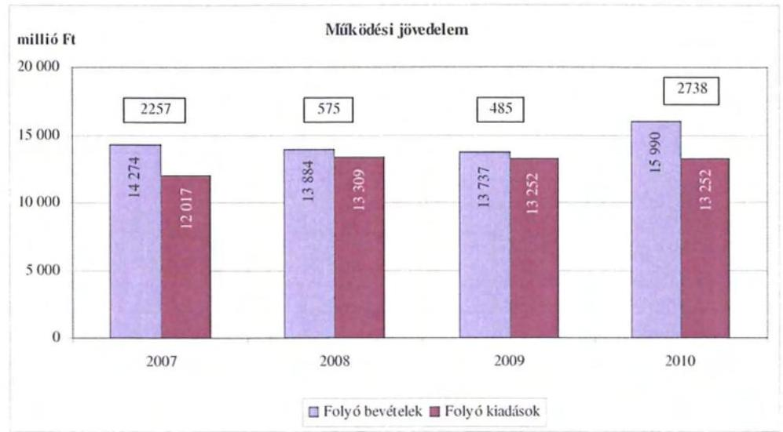

A folyó költségvetés pozitív egyenlege (a működési forrástöbblet) 2007-ben a folyó kiadások 18,8%-át (2257 millió Ft-ot), 2008-ban 4,3%-át (575 millió Ft-ot), 2009-ben 3,7%-át (485 millió Ft-ot), 2010-ben 20,7%-át (2738 millió Ft-ot) jelentette. A vizsgált időszakban a működési jövedelem 6055 millió Ft megtakarítást mutatott, amely forrásul szolgált az Önkormányzat fennálló tőketörlesztési kötelezettségeinek teljesítéséhez, valamint fejlesztéseinek finanszírozásához.

A pozitív előjelű folyó költségvetési egyenleg ellenére az Önkormányzat folyószámla-, továbbá likviditási hitel felvételére ${ }^{53}$ is kényszerült a fejlesztési feladatok megoldása érdekében. A folyószámlahitel napi átlagos állománya 2007-2010 között közel kétszeresére nőtt (14 millió Ft-ról 27 millió Ft-ra).

Az Önkormányzat kötelezettségein belül a rövid lejáratú kötelezettségek állománya a 2007. évi 2199 millió Ft-ról (43,9%) - folyamatosan csökkenő tendencia mellett - a 2010. évre 1514 millió Ft-ra (20,3%) csökkent. Az Önkormányzat 2007. december 31-én fennálló 3295 millió Ft pénz és tőkepiaci kötelezettsége 2010 végére 6413 millió Ft-ra nőtt a hosszú lejáratú hitelfelvétel emelkedése és a fejlesztési célú kötvénykibocsátás miatt. Az összes kötelezettségen belül a hosszú lejáratú pénzintézeti kötelezettségek 2007-2010 között 111,6%-kal (3144 millió Ft-tal) nőttek.

[^0]
[^0]:    ${ }^{52}$ A Hulladékgazdálkodási Társulás és Kistérségi Társulás bevételi főösszege a pénzmaradvány igénybevétele nélkül 2007-ben 861 millió Ft, 2008-ban 44 millió Ft, 2009-ben 129 millió Ft, 2010-ben 2507 millió Ft, a kiadási főösszege 2007-ben 434 millió Ft, 2008-ban 272 millió Ft, 2009-ben 178 millió Ft, 2010-ben 2285 millió Ft volt.
    ${ }^{53}$ Likvid hitele az Önkormányzatnak 2007-2008. években volt.

---

A rövid lejáratú kötelezettségek állománya 2010. év végén 1514 millió Ft-ot tettek ki, amely 685 millió Ft-tal (31,2%-kal) kevesebb a 2007. év végi rövid lejáratú kötelezettségállománynál. Az Önkormányzat szállítói kötelezettsége 2007. december 31-i 898 millió Ft-ról 2010 végére 266 millió Ft-ra csökkent, ugyanakkor a lejárt szállítói tartozás a 2007. évi 20 millió Ft-ról (összes szállítói tartozás 2,2%-a) a 2010. év végére 78 millió Ft-ra (összes szállítói tartozás 29,3%-a) nőtt.

Az Önkormányzat 2010. évi záró pénzkészlete 2815 millió Ft volt ${ }^{54}$, amelyből 1612 millió Ft (57%) kötelezettséggel, illetve feladattal terhelt.

Az Önkormányzat pénzügyi kapacitása a vizsgált időszakban összességében pozitív értéket mutatott, azonban a nettó működési jövedelem a 2009. évben negatív volt. A nettó működési jövedelem ${ }^{55}$ értéke a folyó költségvetési pozíció mellett az adott költségvetési év adósságtörlesztésének hatását is tükrözi. A 2007-2010. években képződött 6055 millió Ft működési jövedelemnek 52,7%-át (3192 millió Ft) tette ki a fejlesztési célú hitelekhez ${ }^{56}$ kapcsolódó tőketörlesztés, amelynek kifizetését követően 2863 millió Ft nettó működési jövedelme keletkezett az Önkormányzatnak. A nettó működési jövedelem - növekvő összegű tőketörlesztés ${ }^{57}$ mellett - 2007-ben 1819 millió Ft, 2008-ban 85 millió Ft, 2009-ben -692 millió Ft, 2010-ben 1651 millió Ft volt.

Az Önkormányzatnak (a CLF módszer alapján) a fejlesztési kiadások egy részének fedezete - változatlan nettó működési jövedelem képződése mellett - biztosított. Továbbá információul szolgál a jövőben vállalható teljesíthető adósságszolgálat mértékéről.
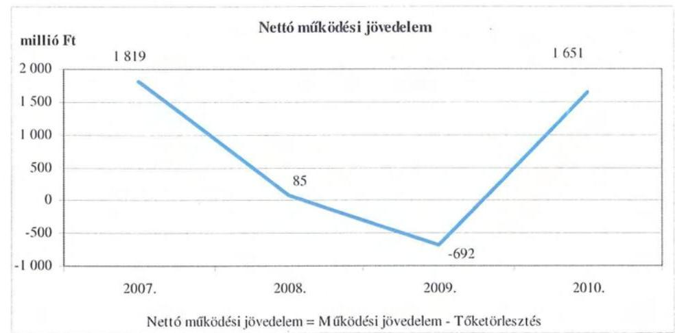

[^0]
[^0]:    ${ }^{54}$ Ebben a Hulladékgazdálkodási és Kistérségi társulások pénzeszköze 232 millió Ft volt. ${ }^{55}$ pénzügyi kapacitás
    ${ }^{56}$ Az Önkormányzat fejlesztési feladatainak megvalósításához hosszú- és rövidlejáratú hiteleket, valamint folyószámlahitelt vett igénybe.
    ${ }^{57}$ Az Önkormányzat tőketörlesztési kötelezettsége 2007-2010 között 438-490-1177-1087 millió Ft volt.

---

A 2007-2010. években az Önkormányzat felhalmozási költségvetésének egyenlege folyamatosan negatív összegű volt, amely prudens költségvetési gazdálkodás és pénzügyileg fenntartható ${ }^{58}$ beruházások esetén nem jár lényeges pénzügyi kockázattal.

A felhalmozási költségvetés egyenlegét 2007-2010 között évről évre a következő ábra szemlélteti:
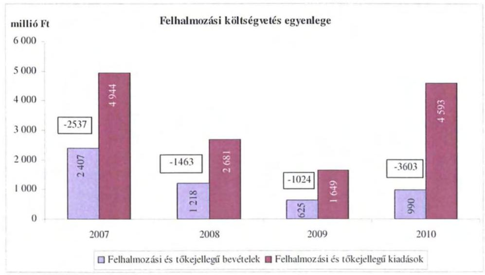

A felhalmozási forráshiánynak a felhalmozási és tőke jellegű kiadásokhoz viszonyított aránya 2007-ben 51,3% (2537 millió Ft), 2008-ban 54,6% (1463 millió Ft), 2009-ben 62,1% (1024 millió Ft), 2010-ben 78,4% (3603 millió Ft) volt.

A vizsgált időszakban keletkezett 8627 millió Ft felhalmozási forráshiányra a képződött 2863 millió Ft nettó működési jövedelem, a felvett 4209 millió Ft összegű fejlesztési hitel, valamint a 2007. évi nyitó pénzkészletből 1555 millió Ft nyújtott fedezetet ${ }^{59}$. A jelentkező

 összes felhalmozási forráshiány (8627 millió Ft) 33,2%-ára (2863 millió Ft) nyújtott fedezetet a nettó működési jövedelem ${ }^{60}$.

Az Önkormányzat 2011. évi költségvetési rendeletében tervezett bevételek és kiadások különbözete 2288 millió Ft negatív teljes finanszírozási igényt mutat, melyet finanszíroz a 2010. évi 2815 millió Ft záró pénzkészlet ${ }^{61}$.

Az Önkormányzat évenkénti teljes finanszírozási igénye ${ }^{62}$ a CLF módszer szerint 2007-ben 717 millió Ft, 2008-ban 1378 millió Ft, 2009-ben 1715 millió Ft,

[^0]
[^0]:    ${ }^{58}$ Az minősül pénzügyileg fenntartható beruházásnak, amelynek működtetésére az Önkormányzat nettó működési jövedelme a következő években is fedezetet nyújt.
    ${ }^{59}$ Az évenkénti adatokat a jelentés 2. számú melléklete mutatja be.
    ${ }^{60}$ Az ábrában megjelenő 2007-2010. évi felhalmozási kiadásokban a Hulladékgazdálkodási Társuláshoz és Kistérségi Társuláshoz kapcsolódó felhalmozási kiadások összege 2720 millió Ft.
    ${ }^{61}$ A 2010. évi beszámoló mérlegében a pénzkészletek között mutatták ki a 2010. december 7-én kibocsátott kötvénybevételből származó 1096 millió Ft-ot.

---

2010-ben 1952 millió Ft volt, amelynek finanszírozását a finanszírozási célú bevételek és kiadások egyenlege, az előző évek pénzmaradványának igénybevétele, valamint a kötvénykibocsátásból származó bevétel biztosította.

Az Önkormányzat finanszírozási műveletei a 2007-2010. évekbeli egyenlegét a következő ábra szemlélteti:
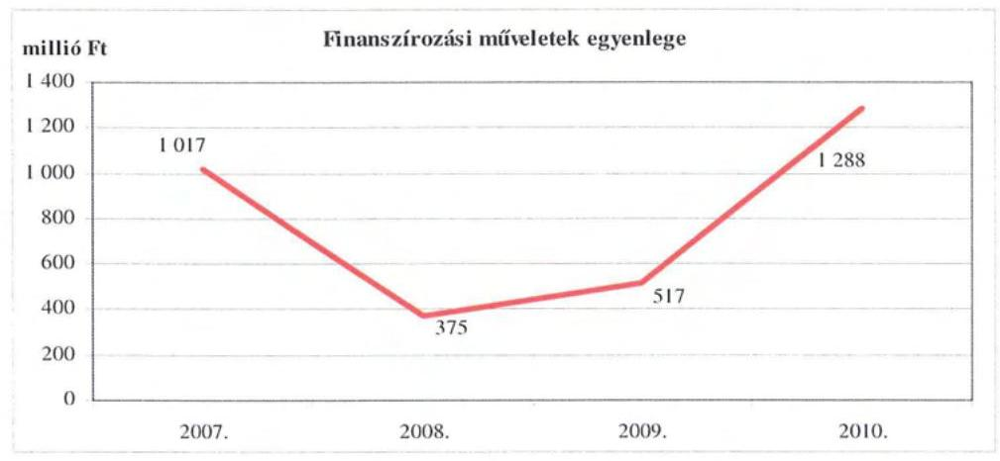

A finanszírozási többlet azt jelzi, hogy az éves költségvetések végrehajtása során szükség volt az előző években keletkezett pénzmaradvány igénybevételén túl külső finanszírozás igénybevételére is. A finanszírozási célú műveleteket a vizsgált időszakban a jelentés 2. számú mellékletének 4.1-4.8 pontjai részletezik.

Az Önkormányzat 2007-2010. évi zárszámadási rendeleteinek mellékleteiben mérlegszerűen bemutatott működési és fejlesztési célú többletet a jelentés 1. számú melléklete mutatja be, melynek adatai a más elszámolási módszer miatt eltérnek az általunk bemutatottaktól.

A vizsgált időszakban a kötelezettségek (passzív pénzügyi elszámolások nélkül) 5015 millió Ft-ról 7475 millió Ft-ra emelkedtek, amely együtt járt a kamatkiadások növekedésével.

Az Önkormányzatnak a szabad pénzeszközeinek lekötéséből, a bérlakásértékesítési számlán lévő betétek, és a tulajdonában lévő államkötvények után keletkezett kamatbevétele a 2007-2010. években. A 2008. évben realizált 183 millió Ft kamatbevétel 86 millió Ft-tal meghaladta az előző évit. Az előző évihez képest 2009. évben 63 millió Ft-tal 120 millió Ft-ra, a 2010. évre 64 millió Ft-tal 56 millió Ft-ra csökkent a kamatbevétel. Az Önkormányzat által felvett hitelekhez kapcsolódóan kamatfizetési kötelezettség is keletkezett a vizsgált időszakban, a teljes kamatráfordítás a vizsgált időszakban a realizált kamatbevétel 96,5%-át (439 millió Ft) tette ki.

[^0]
[^0]:    ${ }^{62}$ a nettó működési jövedelem és a felhalmozási költségvetés eredője

---

Az Önkormányzat kamatbevételeit és kamatkiadásait 2007-2010 között a következő ábra mutatja:
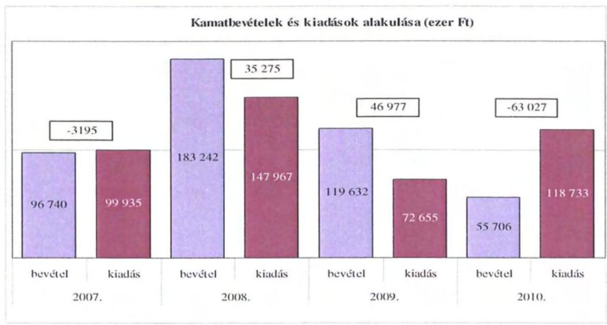

A 2007-2010 közötti időszakban az Önkormányzat kiadásainak és bevételeinek főbb jogcímek szerinti alakulását a jelentés 2. számú melléklete tartalmazza.

# 2.2. Az Önkormányzat bevételeinek változása 

Az Önkormányzat folyó bevétele a 2008. évben 2,7%-kal (390 millió Ft), a 2009. évben 3,8%-kal (536 millió Ft) maradt el a 2007. évitől. A 2010. évben realizált folyó bevétel az előző három év bevételeit meghaladva a 2007. évi 14274 millió Ft-ról 15990 millió Ft-ra, 12%-kal nőtt.

Az Önkormányzat 2007-2010 között realizált főbb folyó (működési) bevételi jogcímeinek számszaki adatait az alábbi ábra mutatja be:
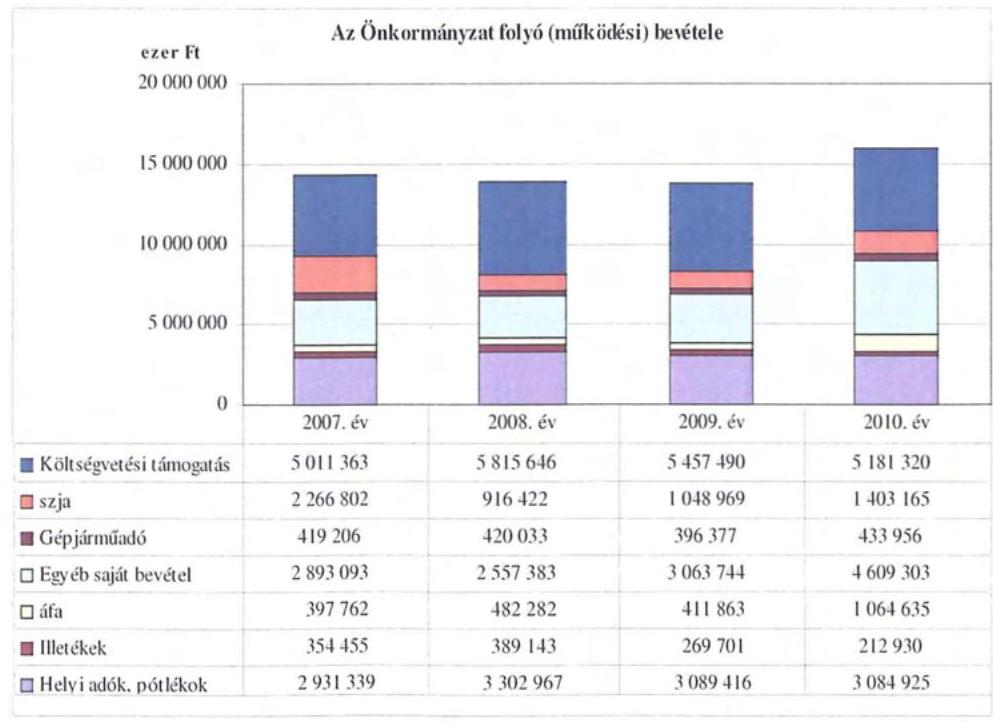

---

A költségvetési támogatások összege a 2008. évi - a bázisévhez viszonyított - 16,1%-os (805 millió Ft) növekedést követően a központi forráskivonás hatására folyamatosan csökkent. A 2007. évihez képest 2010-ben mindössze 3,4%-kal (170 millió Ft) kapott több forrást az Önkormányzat a központi költségvetésből ezen a jogcímen. Az szja bevétel 2010. évi összege 1403 millió Ft volt, amely 38,1%-kal (864 millió Ft-tal) maradt el a 2007. évi bevételtől (2267 millió Ft). A központi költségvetésből kapott költségvetési támogatások és szja bevételek 2010. évi együttes összege 6584 millió Ft volt, amely 694 millió Ft-tal (9,5%-kal) maradt el a 2007. évitől. Az állami támogatások csökkenése miatti bevételkiesés ellensúlyozására az Önkormányzat kiadáscsökkentő és bevételnövelő intézkedéseket hozott. Ennek eredményeként a 2007-2010. években együttesen 1494 millió Ft megtakarítást értek el, amellyel ellensúlyozta a 694 millió Ft forráskiesést.

Az átengedett központi adók közül a gépjárműadó bevétel a vizsgált időszakban mindössze 3,6%-kal nőtt, annak ellenére, hogy a központi szabályozás 2010. évi változása következtében átlagosan 15%-os növekedést kalkuláltak az adó alapjának, mértékének megváltoztatása, valamint a mentességek körének szűkítése miatt. A gépjárműadó a bevétel nagyságát tekintve a harmadik legjelentősebb adónem volt 2010-ben az Önkormányzat költségvetésében.

Az egyéb saját bevételek 2007-2010. évek közötti növekedését döntő mértékben a térítési díjak emelésének következtében realizált intézményi működés bevételének többlete eredményezte, a 2010. évi bevétel (1857 millió Ft) 791 millió Ft-tal haladta meg a 2007. évit. Ezen túl a támogatásértékű működési bevételek (pl.: otthonteremtési támogatás, közlekedési támogatás, kistérségi feladatellátáshoz kapcsolódó támogatás) összege is folyamatosan, a 2007. évi 487 millió Ft-ról 2010-re 861 millió Ft-ra nőtt. Az egyéb saját bevételek között kimutatott, önkormányzati tulajdonban lévő gazdasági társaságoktól kapott osztalék összege a 2007. évben 3 millió Ft, a 2010. évben 0,9 millió Ft volt, a 2008-2009. években osztalékból származó bevétele nem volt az Önkormányzatnak, a vizsgált időszakban osztalékról nem mondtak le.

Az áfa - fordított áfás tételek nélkül - összege a 2007-2009 évek között jelentősen nem változott, azonban a 2010. évi 872 millió Ft összegű bevétel több mint kétszerese volt az előző évi bevételnek (382 millió Ft). A 2010. évi 490 millió Ft bevételnövekményből 437 millió Ft a Hulladékgazdálkodási Társulás által kiszámlázott termékek és szolgáltatások áfa-ja volt, amely a kapcsolódó befizetési kötelezettség miatt nem növelte az Önkormányzat bevételi potenciálját.

A 2007-2010 közötti időszakban az illetékbevételek 40%-kal (141 millió Ft) csökkentek, amely az ingatlanpiac beszűkülésével és egyes kedvezmények bevezetésével függött össze. A központi támogatás, szja-, és illetékbevétel együttes összege a vizsgált időszakban 836 millió Ft-tal (11%-kal) csökkent.

Az Önkormányzat saját folyó (működési) bevételének jelentős hányadát a helyi adó bevételek képezik, amelyek a 2007. évben 51%-át (2931 millió Ft), és a 2010. évben 39,6%-át (3085 millió Ft) tették ki a saját folyó bevételeknek. A helyi adó bevételek 2008-ban - az előző évhez viszonyítva - emelkedtek, majd a gazdasági válság hatására 2009-ben a 2008. évhez képest közel 10%-kal visszaestek. Az Önkormányzat a vizsgált időszakban iparűzési adót, építmény-

---

adót, idegenforgalmi adót, és telekadót vetett ki a magánszemélyekre, illetve vállalkozásokra.

- A különböző adónemekből származó bevételt tekintve legnagyobb súlya az iparűzési adónak volt, 2010-ben a helyi adó bevétel 77,5%-a (2360 millió Ft) volt az iparűzési adó bevétel. Az állandó jellegű tevékenység végzése után a 2007-2010. években a helyi adókról szóló törvényben meghatározott maximális (2%-os) mértékkel adóztak a vállalkozások, azonban az Önkormányzat a mikro-, kis és középvállalkozások részére biztosított adókedvezményt biztosított a vizsgált időszakban.
- Az iparűzési adón kívül a legjelentősebb bevételt eredményező helyi adónem az építményadó, amelynek bevétele a 2010. évi helyi adóbevétel 18,5%-át (563 millió Ft-ot) tette ki. Az építményadó 2010. évi átlagos mértéke 209 Ft/m² (a 2006. évi átlagos mérték (117 Ft/m²) volt, amely a törvényi maximum 17%-ának felelt meg.
- Az idegenforgalmi adóból származó 2010. évi 95 millió Ft bevételből a helyi adó bevétel 3,1%-a képződött 2010-ben. Az adó 2010. évi mértéke 360 Ft/fő/vendégéjszaka volt, amely 16,1%-kal haladta meg a 2007. évi mértéket (310 Ft/fő/vendégéjszaka).
- Telekadóból a helyi adó bevétel 0,9%-a (28 millió Ft) realizálódott 2010. évben az Önkormányzatnak, az adó mértéke a vizsgált időszakban nem változott.

Az Önkormányzat felhalmozási bevételeinek szerkezete a vizsgált időszakban a következőképpen volt:

|  |  |  |  | ezer Ft |
| :--: | :--: | :--: | :--: | :--: |
| Megnevezés | 2007. év tény | 2008. év tény | 2009. év tény | 2010. év tény |
| Tárgyi eszköz értékesítés | 209844 | 301379 | 59460 | 71228 |
| Egyéb saját tőkebevétel | 95174 | 92817 | 271484 | 195565 |
| Államtartáson belülről kapott támogatás | 1712758 | 652231 | 255164 | 655001 |
| EU-tól és külföldről kapott támogatások | 0 | 0 | 0 | 0 |
| Államtartáson kívülről kapott támogatás | 389972 | 171469 | 39104 | 67757 |
| Összes felhalmozási bevétel | 2407748 | 1217896 | 625212 | 989551 |

Az Önkormányzat felhalmozási bevétele a vizsgált időszakban jelentősen visszaesett, a 2007. évi 2408 millió Ft-hoz viszonyítva a 2010. évben 1418 millió Ft-tal (58,9%-kal) csökkent.

---

Az Önkormányzatnak tárgyi eszköz értékesítésből a 2008. évben volt számottevő bevétele (301 millió Ft), amely az összes felhalmozási bevétel 24,7%-ának felelt meg ${ }^{63}$. Telekeladásból 72 millió Ft, forgalomképes önkormányzati ingatlanok értékesítéséből 229 millió Ft bevételt realizált az Önkormányzat. A 2010. évben ezen a jogcímen realizált bevétel 139 millió Ft-tal maradt el a 2007. évitől.

Az egyéb saját tőkebevételek az önkormányzati lakások, helyiségek értékesítéséből, a támogatási kölcsönök visszatérüléséből, és a tartós részesedések értékesítéséből származó bevételt tartalmazzák. A 2009-ben realizált 271 millió Ft közel háromszorosa volt a 2007-2008. években teljesített bevételeknek. Ennek fő oka, hogy ebben az évben 216 millió Ft bevételt realizáltak államkötvény visszaváltásból, illetve üzletrész értékesítésből. A 2010. évben az egyéb saját tőkebevételek 64,3%-át (126 millió Ft) tette ki a támogatási kölcsön visszatérülésből realizált bevétel, amelyből 106 millió Ft volt az Önkormányzat két gazdasági társaságának nyújtott tagi kölcsön törlesztés.

Az Önkormányzat államháztartáson belülről kapott támogatásként mutatta ki a fejlesztési feladatok végrehajtásához kapott felhalmozási célú állami támogatásokat. Államtartáson kívülről kapott támogatások között a nonprofit szervezetektől, vállalkozásoktól átvett felhalmozási célú pénzeszközöket mutatták ki. Az államháztartáson belülről és kívülről kapott támogatások együttes összege 2007-ben 87,4%-át (2103 millió Ft), 2008-ban 67,7%-át (824 millió Ft), 2009-ben 47%-át (294 millió Ft), 2010-ben 73%-át (723 millió Ft) képezte az összes felhalmozási bevételnek.

# 2.3. Az Önkormányzat kiadásainak változása 

Az Önkormányzat működési célú kiadásai főbb jogcímek szerinti bontásban az alábbiak voltak:

|  |  |  |  |  |
| :-- | --: | --: | --: | --: |
| Megnevezés | 2007. | 2008. | 2009. | 2010. |
| Folyó kiadások | 12016931 | 13308437 | 13252216 | 13251856 |
| Működési kiadások (kamatkiadás nélkül) | 10661671 | 11888772 | 11289710 | 11371327 |
| Államtartáson belülre átadott pénzeszközök | 153256 | 143538 |

 137439 | 362240 |
| Transzferkiadások | 924806 | 875380 | 1057454 | 1142594 |
| -ebből: vállalkozásoknak | 358182 | 332130 | 296520 | 255765 |
| EU-nak, illetve külföldre | 700 | 0 | 0 | 0 |
| magánszemélyeknek | 241122 | 276042 | 369038 | 482941 |
| nonprofit szervezeteknek | 324802 | 267408 | 391896 | 403880 |
| Kamatkiadások | 99935 | 147967 | 72655 | 118733 |
| Előző évi pénzeszközátadás | 177263 | 252579 | 694958 | 256957 |

|  |  |  |  |  |
| :-- | --: | --: | --: | --: |
| Megnevezés | 2007. | 2008. | 2009. | 2010. |
| Személyi juttatások | 5745421 | 6005345 | 5658260 | 5738524 |
| Munkaadót terhelő járulékok | 1811816 | 1886571 | 1690993 | 1481497 |
| Dologi kiadások | 3032597 | 3611904 | 3790119 | 3915269 |
| Egyéb folyó kiadások | 58993 | 107824 | 98870 | 186801 |
| Működési célú pénzeszközátadás | 683800 | 599709 | 688416 | 659653 |

[^0]
[^0]:    ${ }^{63}$ A tárgyi eszköz értékesítésből származó bevételnek az összes felhalmozási bevételhez viszonyított aránya a 2007. évben $8,7 \%$, a 2009. évben $9,5 \%$, a 2010. évben $7,2 \%$ volt.

---

Az Önkormányzat működési kiadása a folyó kiadásoknak 2007-ben 88,7\%-át (10 662 millió Ft), 2010-ben $85,8 \%$-át ( 11371 millió Ft) képezte.

Az Önkormányzat teljesített működési kiadásai a 2007. évről a 2010. évre $6,6 \%$-kal ( 709 millió Ft) nőttek. A 2010. évi működési kiadások 63,5\%-át ( 7220 millió Ft) a személyi juttatások és a munkaadókat terhelő járulékok együttes kiadása képezte, az üzemeltetést, intézményfenntartást biztosító dologi kiadások a működési kiadások 34,4\%-át ( 3915 millió Ft) tették ki. A működési kiadásokon belül a személyi juttatások és járulékok aránya a vizsgált időszakban folyamatosan csökkent, 2007-ben 70,9\% ( 7557 millió Ft), 2010-ben 63,5\% ( 7220 millió Ft) volt.

A személyi juttatások teljesített kiadásai a 2008. évben nőttek, a 2009-2010. években csökkentek a 2007. évhez viszonyítva. A 2008. évi - előző évhez viszonyított - 4,5\%-os ( 260 millió Ft) növekedést az oktatási intézmények átszervezése, illetve a 2008-ban végrehajtott létszámcsökkentések tárgyévi többletkiadásának együttes hatása eredményezte. A Polgármesteri hivatalban és az intézményeknél végrehajtott létszámcsökkentési intézkedések hatására a személyi juttatások kiadásai a 2007. évhez képest a 2009. évben 1,5\%-kal ( 87 millió Ft) csökkentek, illetve a 2010. évben a 2007. évi szinten teljesültek.

A dologi kiadások és egyéb folyó kiadások az Önkormányzatnál folyamatosan emelkedtek, 2010-ben 32,7\%-kal ( 1010 millió Ft) voltak magasabbak a 2007. évi szintnél. A 2008. évben a dologi kiadások 579 millió Ft-tal (19,1\%kal) haladták meg az előző évit, a 2009. évben az előző évhez képest 4,9\%-kal (178 millió Ft), a 2010. évben 3,3\%-kal ( 125 millió Ft) nőttek. A 2010. évben teljesített dologi kiadások tartalmazták a felújításokhoz és beruházásokhoz kapcsolódó fordított áfát, melynek ellentételezése a számviteli elszámolási szabályok következtében az áfa bevételek és visszatérülések között szerepelt. A fordított áfa miatti kiadás ( 193 millió Ft) nélkül a dologi kiadások 2010-ben - az előző évhez viszonyítva - 67 millió Ft-tal csökkentek volna. A dologi kiadások és egyéb folyó kiadások növekedésére - a végrehajtott kiadáscsökkentő intézkedések hatását is figyelembe véve - a működési jövedelem minden évben fedezetet biztosított.

A működési célra átadott pénzeszközök kiadása ${ }^{64}$ a működési kiadásoknak 2007-ben 6,4\%, 2008-ban 5,0\%, 2009-ben 6,1\%, 2010-ben 5,8\%-át tette ki. A Közgyűlés döntése alapján alapítványokat, civil szervezeteket és önkormányzati tulajdonú gazdasági társaságokat támogatott az Önkormányzat. A gazdasági társaságoknak 2007-2010. években 619 millió Ft működési célú támogatást nyújtott az Önkormányzat.

A gazdasági társaságok részére 2007-2010 között átadott pénzeszközöket az alábbi grafikon mutatja be:

[^0]
[^0]:    ${ }^{64}$ Működési célra 2007-ben 684 millió Ft-ot, 2008-ban 600 millió Ft-ot, 2009-ben 688 millió Ft-ot, 2010-ben 660 millió Ft támogatást nyújtott az Önkormányzat.

---

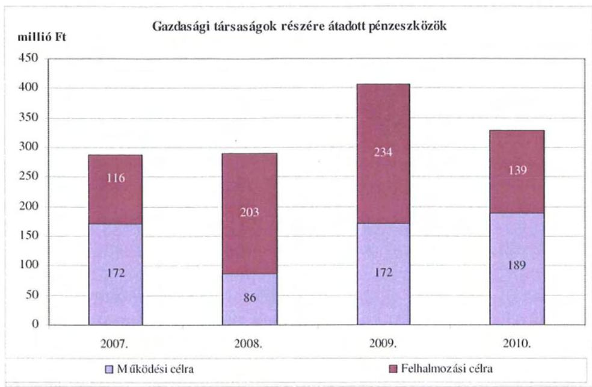

A működési célú támogatásokon túl az önkormányzati tulajdonú gazdasági társaságoknak a vizsgált időszakban 692 millió Ft fejlesztési támogatást is nyújtottak, melynek részletes adatait a 4. számú melléklet tartalmazza. A vizsgált időszak évei közül 2009-ben támogatták a legnagyobb összegben a gazdasági társaságok fejlesztéseit. Ebben az évben a termálfürdő fejlesztéséhez 96 millió Ft-tal, a szennyvíztisztító telep, ivóvíz-és csatornahálózat fejlesztéséhez 80 millió Ft-tal járult hozzá az Önkormányzat.

A folyó (működési) és felhalmozási kiadások 2010. évi aránya a 2007. évihez képest minimális változást mutat, a felhalmozási kiadások aránya 3,4 százalékponttal csökkent a működési kiadások arányának javára. Az Önkormányzat a felhalmozási célú kiadásokra 2009. évben költött a legkevesebbet ( 1649 millió Ft-ot), ami az összes kiadás ( 14901 millió Ft) 11,1\%-ának felelt meg. A működési és felhalmozási kiadásokat a vizsgált időszakban a következő grafikon szemlélteti:
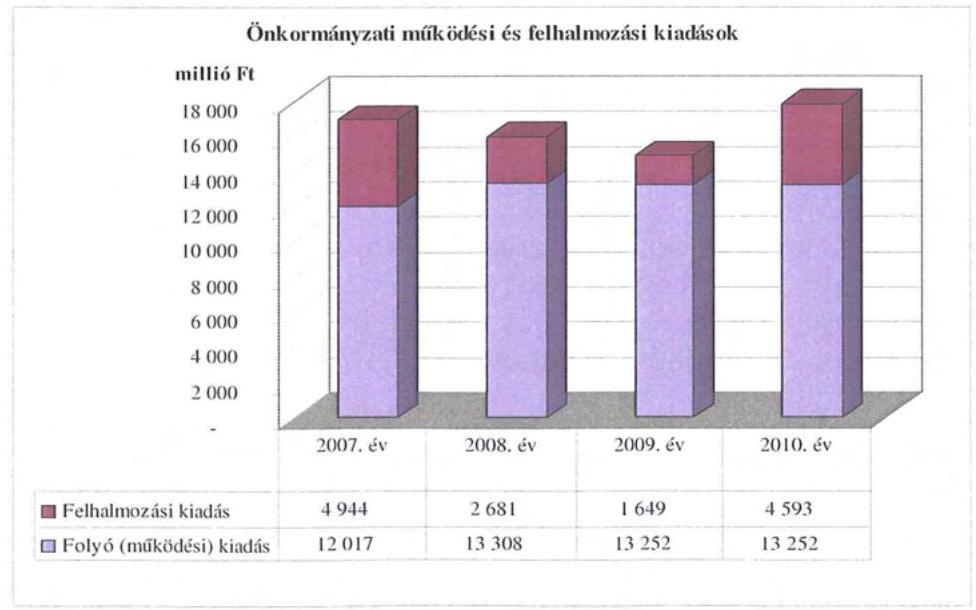

---

Az Önkormányzat fent bemutatott működési és felhalmozási kiadásai tartalmazzák a Hulladékgazdálkodási Társulás és Kistérségi Társulás kiadásait is. Ezeknek a kiadásoknak egy része nem az Önkormányzat, hanem a társult települések kiadása volt, amelyek azonban a gesztor önkormányzatnál jelentkeznek. A társult települések kiadásainak a vizsgált időszakban nem volt számottevő torzító hatása.

Az Önkormányzat által végzett felújítások és beruházások (együtt: fejlesztések) együttes kiadása a 2007. évi 4603 millió Ft-ról a 2008. évre 2285 millió Ft-ra, a 2009. évre 1194 millió Ft-ra és a 2010. évre 4092 millió Ft-ra csökkent. A végrehajtott fejlesztések 2007-ben 93,1\%-át, 2008-ban 85,2\%-át, 2009-ben 72,4\%-át, 2010-ben $89,1 \%$-át képezték a felhalmozási kiadásoknak. Az Önkormányzat 2007-2010 között megvalósított fejlesztései között intézményi épületek felújítása, korszerűsítése és bővítése, útépítés, csapadékcsatorna építés, szennyvízcsatornázás, informatikai fejlesztések megvalósítása szerepelt, melyek teljes egészében az Önkormányzat kötelező feladatainak ellátásához kapcsolódtak. Beruházási társulás tagjaként és egyben gesztoraként regionális hulladéklerakó rendszer kiépítéséhez, a kiépítéshez kapcsolódóan úthasználati jog vásárlásához, valamint állati tetemek regionális hálózat keretében történő kezeléséhez kapcsolódó beruházást valósítottak meg, a három beruházás együttes bekerülési költsége 2710 millió Ft volt, melyből 1623 millió Ft volt az Önkormányzat kiadása.

Az Önkormányzatnál 2006-2010 években befejezett fejlesztési feladatok összes költségvetési kiadása 13190 millió Ft volt, amelyből a beruházások összege 11832 millió Ft $(89,7 \%)$ és a felújítások összege 1358 millió Ft $(10,3 \%)$ volt.

A befejezett 13190 millió Ft értékű fejlesztés forrás megoszlása 3076 millió Ft európai uniós támogatás ( $23,3 \%$ ), 2539 millió Ft hazai támogatás ( $19,2 \%$ ), 5404 millió Ft saját bevétel ( $41 \%$ ), 118 millió Ft kötvénybevétel ( $0,9 \%$ ) és 2053 millió Ft hitel ( $15,6 \%$ ) volt. A 2006. december 31-ig teljesített kiadások összege 2466 millió Ft volt. A 2007-2010. években teljesített kiadások összege 10724 millió Ft volt (a fejlesztések részletes adatait a jelentés 3/a. számú melléklete tartalmazza).

A befejezett fejlesztések közül 13 esetben haladta meg a bekerülési költség a 100 millió Ft-ot, ezek a fejlesztések 80,3\%-át (10 592 millió Ft) jelentették. A 10 millió Ft bekerülési költség feletti beruházások és felújítások száma 2007-2010. között 41 volt, amelyek teljes bekerülési költsége 1326 millió Ft-ot, a fejlesztések $10,1 \%$-át tette ki.

Az Önkormányzat folyamatban lévő fejlesztési feladatainak 2010. december 31-ig teljesített bekerülési költsége 1462 millió Ft volt, amelynek forrása 479 millió Ft európai uniós támogatás ( $32,8 \%$ ), 4 millió Ft hazai támogatás, $(0,3 \%), 507$ millió Ft saját bevétel ( $34,7 \%$ ), 30 millió Ft kötvénybevétel ( $2 \%$ ) és 442 millió Ft hitel ( $30,2 \%$ ) volt (a fejlesztések részletes adatait a jelentés 3/b. számú melléklete tartalmazza).

A 2010. december 31-én folyamatban lévő és a 2010. évet követő kötelezettségvállalásainak összege 3101 millió Ft volt, amelynek tervezett forrása 2415 millió Ft európai uniós támogatás ( $77,9 \%$ ), 231 millió Ft saját bevétel

---

(7,4\%), 46 millió Ft hazai támogatás (1,5\%) és 409 millió Ft kötvénybevétel (13,2\%). A fejlesztések adatait a jelentés 3/c. számú melléklete részletezi.

Az Önkormányzat kiemelt infrastrukturális fejlesztései közül a három legmagasabb költségű beruházás a következők voltak:

- Az Önkormányzat „Eger-Felnémet városrész rehabilitációja" címen benyújtott pályázata a 2006. évben támogatást nyert. A beruházás teljes bekerülési költsége 1528 millió Ft volt. A projekt kiadásait 92 millió Ft saját bevétel $(6,1 \%)$, 240 millió Ft hitel ( $15,7 \%$ ), 786 millió Ft ( $51,4 \%$ ) európai uniós támogatás, és 410 millió Ft ( $26,8 \%$ ) hazai támogatás finanszírozta. Az elvégzett fejlesztések eredményeként az üzemeltetési költségek összességében nem nőttek, mert azok a megtakarítások, amelyek a jobb minőségű, színvonalú út, és közműhálózatból adódnak kompenzálják a megnövekedett, igényesebb zöldfelületek fenntartásának többletköltségét.
- A „Farkasvölgy árok nyomvonal áthelyezés és Külsősor úti csapadékcsatorna bővítés" beruházás megvalósításának célja volt az érintett vízgyűjtő területre hulló csapadékvíz biztonságos elvezetése az Eger-patakig. A beruházás teljes bekerülési költségét ( 816 millió Ft) 720 millió Ft ( $88,2 \%$ ) címzett támogatásból, 53 millió Ft ( $6,5 \%$ ) saját bevételből és 43 millió Ft ( $5,3 \%$ ) hitel bevételből finanszírozták. A megvalósított beruházás miatt többlet működési kiadás nem terheli az Önkormányzatot.
- Az Önkormányzat „Agora Agria multifunkcionális kreatív pólus Eger Város szívében" címen 2008-ban benyújtott pályázata támogatásban részesült. A projekt megvalósítása folyamatban van, tervezett bekerülési költsége 2219 millió Ft, melynek tervezett forrása 318 millió Ft ( $14,3 \%$ ) saját bevétel, 155 millió Ft (7\%) hitel, és 1746 millió Ft ( $78,7 \%$ ) európai uniós támogatás. A projekt fenntartásával kapcsolatosan az Önkormányzat vállalta, hogy az üzemeltetés-fenntartás költségeire (karbantartás, felújítás) a költségvetési rendeletben pénzügyi forrást különít el. Az épület kivitelezések korszerű, környezetbarát és több ponton a megújuló energiaformákra koncentráló megoldásai csökkentik a fajlagos fűtési és energiafelhasználási költségeket, illetve felújítási és karbantartási kiadásokat. További forrást jelenthet az üzemeltetés során az új intézmény épület termeinek, tereinek bérleti hasznosításából és a befogadott attrakciókból befolyó bevételek is.

Az Önkormányzatnak 9655 millió Ft tervezett bekerülési költségű, elbírálás alatt lévő, pályázati forrásból megvalósuló fejlesztési feladata volt 2010. december 31-én (jelentés 3/d. számú melléklete). A beadott pályázatok sikeres elbírálása esetén az európai uniós és hazai támogatások segítségével útépítés és korszerűsítés (átkelőhely fejlesztés, korszerűsítés), belvárosi városrész funkcióbővítő rehabilitációja, oktatási intézmények épületeinek fejlesztése valósulna meg. A beruházások tervezett megvalósításának fedezetéül szolgáló 1049 millió Ft saját forrást 1046 millió Ft fejlesztési célú hitel igénybevételével tervezi biztosítani az Önkormányzat.

---

# 3. A KÖTELEZETTSÉGEK BEMUTATÁSA 

### 3.1. A pénzintézetek felé fennálló kötelezettségek változása

Az Önkormányzat pénzintézeti kötelezettségeinek állománya 2006. december 31-ről 2010. december 31-re 2575
 millió Ft-ról 6413 millió Ft-ra nőtt.
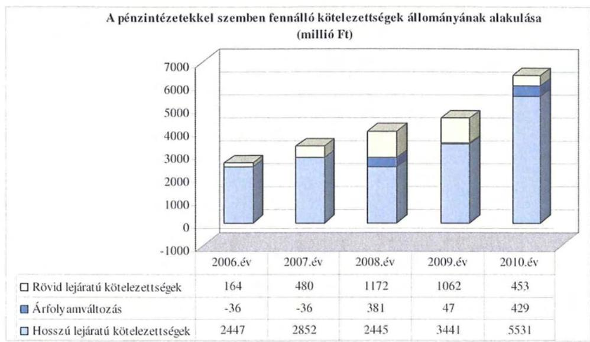

A fennálló pénzintézeti kötelezettségek az önkormányzati fejlesztésekhez forrást biztosító hosszú lejáratú hitelek felvételéből, egy forint alapú kötvény kibocsátásából, likvid hitelek, valamint folyószámlahitelek igénybevételéből keletkeztek. Az ellenőrzött időszakban az Önkormányzat felvett öt hosszú lejáratú és kettő rövid lejáratú hitelt, háromszor volt megállapított folyószámlahitelkerete, valamint egyszer bocsátott ki kötvényt, ezen kívül még - a korábbi években felvett - kilenc hosszú lejáratú hitel visszafizetési kötelezettsége terhelte ezt az időszakot. A 2009. évben kettő, a 2010. évben egy hosszú lejáratú hitel törlesztése befejeződött, így az Önkormányzatnak a 2010. év végén 11 hosszú lejáratú hitele volt. A rövid lejáratú kötelezettségek állományát a hosszú lejáratú hitelek tárgyévet követő fizetési kötelezettségei jelentették 2010. december 31-én.

A devizában ${ }^{65}$ felvett hiteleknél az - árfolyamváltozás miatti - év végi értékelést a 2007-2010. évek között elvégezték.

Az árfolyamváltozás hatása is befolyásolja a kötelezettségek alakulását, azonban annak mértéke előre pontosan nem határozható meg, csak várakozásokon alapuló tendenciák jelezhetők. Annak megítéléséről, hogy a devizában felvett hitelekért kapott forinthoz képest a hitelek visszafizetésekor jelentkező forint kötelezettség többletkiadást (árfolyamveszteség), vagy megtakarítást (árfolyam-

[^0]
[^0]:    ${ }^{65}$ Az Önkormányzatnak hosszú lejáratú hitelekből három CHF alapú devizahitel, a többi forint alapú hitel, továbbá egy rövid lejáratú, CHF alapú devizakölcsöne is volt.. A diagramban szereplő adatoknál a hosszú lejáratú tartozások összegét korrigáltuk az elszámolt árfolyamváltozás összegével.

---

nyereség) eredményez a futamidő végén, a teljes kötelezettség rendezését követően lehet képet alkotni. Mindaddig, amíg törlesztési kötelezettség nem áll fenn (türelmi idő, moratórium), a tőkére vonatkoztatva nem értelmezhető sem az árfolyamveszteség, sem az árfolyamnyereség. Ugyanakkor a számviteli szabályok meghatározzák, hogy az árfolyamkülönbözetet év végén a kötelezettségek, vagy követelések között a könyvviteli mérlegben nyilván kell tartani, azonban az árfolyamkülönbözet valójában nem realizált.

Az Önkormányzat az éves költségvetési rendeleteiben meghatározta a tervezett kiadásaihoz szükséges források összegét és a Közgyűlés döntött a hiányzó források pótlásáról. Az Önkormányzat a forráshiány kezelése érdekében a 2007-2010. évi költségvetési rendeleteiben működési és felhalmozási célú hitelfelvételekkel számolt. A költségvetési rendeletekben - az adósságszolgálati korlát figyelembevételével - meghatározták az adott évre vonatkozóan felvehető hitel összegét és bemutatásra kerültek a hitelfelvételekkel összefüggő terhek az adott költségvetési évre, valamint az azt követő két évre. A pénzmaradvány elszámolása után az igénybe vehető belső forrás összegével korrigálták az adott évre tervezett hitel összegét. Az ellenőrzött időszakban működési célú hitelfelvételre az Önkormányzatnál nem került sor.

A külső forrás bevonásának előkészítési szakaszában minden esetben vizsgálták, hogy az Önkormányzat milyen feltételekkel juthat fejlesztési hitelhez, illetve bocsáthat ki kötvényt. Ezért a 2007-2008-2009. években felhalmozási célra külső forrásként folyószámlahitelt vettek igénybe, mivel annak kondíciói kedvezőbbek voltak az egyéb hitelek kondícióinál. Az Önkormányzat pénzintézeti kötelezettségvállalásai minden esetben közgyűlési döntésen alapultak, a kötelezettségvállalásból származó források felhasználási céljait meghatározták, azonban a visszafizetés forrását, valamint a kamat- és - a deviza alapú kötelezettségeket érintő - árfolyamkockázatot a közgyűlési előterjesztések nem tartalmazták. Az adósságot keletkeztető kötelezettségvállalással megvalósított fejlesztések esetleges bevételnövelő, illetve kiadáscsökkentő vonzatát nem vizsgálták a fejlesztések jellegéből adódóan. A Közgyűlés döntéseiben kötelezettséget vállalt a felvett hitel és járulékainak megfizetésére, amit az adott évi költségvetésébe betervezett és jóváhagyott. Az Önkormányzat az áttekintett időszakban az adósságot keletkeztető kötelezettségvállalásának felső határát nem lépte túl.

Az Önkormányzat a pénzintézeti kötelezettségeinek teljesítéséhez biztosítékként - a hitelszerződésekben rögzített módon - felhatalmazta a pénzintézetet az inkasszójog érvényesítésére a mindenkori költségvetési, illetve adószámláin. Az ellenőrzött időszakban az Önkormányzat adóbevételei fedezetet nyújtottak az adott évi hiteltörlesztésekhez, azonban a 2009. évi folyószámlahitel visszafizetését ${ }^{66}$ a 2010. évben kibocsátott kötvényből származó bevételből teljesítették.

Az Önkormányzat az áttekintett időszakban tervezett fejlesztési feladatait hosszú, illetve rövid lejáratú hitelek, valamint kötvény kibocsátásából származó

[^0]
[^0]:    ${ }^{66}$ A visszafizetett folyószámlahitel 2009. december 31-i állománya 646 millió Ft volt.

---

bevételek segítségével teljesítette, a lehívott hiteleket a hitelcélnak megfelelően használta fel.

Az Önkormányzat 2010. december 31-én CHF-ben fennálló hosszú lejáratú pénzintézeti kötelezettségei a következők voltak:

| Megnevezés | Szerződéskötés   időpontja | Összeg   CHF | Kibocsátási, vagy   lehivási árfolyam | Kamat (referencia kamat   kamatfelár) | Felhasználás célja: |
| :--: | :--: | :--: | :--: | :--: | :--: |
| GA-025145 számú hosszú   lejáratú fejlesztési hitel | 2005.11.22 | 4842902 | 162,66 | 3 havi CHF LIBOR $+0,29 \%$ | A 2005-2006. évek   fejlesztési kiadásainak   finanszírozása |
| EOKO-34/2006 sz. hosszú   lejáratú fejlesztési hitel | 2006.12.14 | 5056808 | 158,18 | 3 havi CHF LIBOR $+0,19 \%$ | A 2006. évi költségvetésben   bevezett fejlesztési   kiadásának finanszírozása |
| 16944 sz. hosszú lejáratú   fejlesztési hitel | 2007.12.19 | 5432659 | 152,91 | 3 havi CHF LIBOR $+0,95 \%$ | A 2007. évi költségvetésben   bevezett fejlesztési   kiadásának finanszírozása |

Az Önkormányzatnál a megkötött devizahiteleivel kapcsolatosan realizált árfolyamveszteség is jelentkezett. Figyelembe véve a lehíváskor és az utolsó fizetéskori árfolyamok különbségét az első hitelnél mintegy 32 millió Ft, a harmadik hitelnél pedig 58 millió Ft volt az árfolyamveszteség. A devizahiteleknél az árfolyamváltozás miatt összesen mintegy 90 millió Ft veszteség keletkezett az Önkormányzatnak. A második hitel esetén a tényleges árfolyamveszteség csak a futamidő végén egy összegben kerül elszámolásra. A hitelszerződésben foglalt módon a futamidő alatt jelentkező tőke- és kamatfizetési kötelezettségük forintban került megállapításra, azzal a kikötéssel, hogy az utolsó törlesztési részlet tartalmazza a futamidő alatti árfolyamváltozás kummulált összegét.

A jelenleg fennálló hosszú lejáratú fejlesztési hitelek esetében a kamatfizetési kötelezettségek alakulását jelentősen befolyásolta és jelenleg is befolyásolja a hitelfelvételkor, kötvénykibocsátáskor és az utolsó kamatfizetéskor alkalmazott referencia kamatok változása.

Az Önkormányzat devizahiteleire vonatkozóan a referencia kamatok változását mutatja be - a hitelek sorrendjében - a következő táblázat:

| Megnevezés | Kibocsátási, lehivási | Utolsó fizetéskori | Változás \% |
| :--: | :--: | :--: | :--: |
|  | alapkamat \% |  |  |
| 3 havi CHF LIBOR | 1,875 | 0,17 | $-90,9$ |
| 3 havi CHF LIBOR | 1,945 | 0,25 | $-87,1$ |
| 3 havi CHF LIBOR | 2,768 | 0,17 | $-93,9$ |

Az Önkormányzat fizetési kötelezettségeit - mindhárom devizahitelnél - a referencia kamatok csökkenése kedvezően befolyásolta.

Az Önkormányzat a hitelfelvételeknél minden esetben törekedett arra, hogy a piacon a legkedvezőbb feltételekkel igénybe vehető hitelhez tudjon hozzájutni, ezért a közbeszerzési eljárás is tárgyalásos formában történt, ahol az előzetes ajánlatokhoz képest még sokkal kedvezőbb kondíciók alakultak ki. A versenyeztetés következtében a 2010. év végén a pénzintézeti kötelezettségeknek mintegy $40 \%$-a származott csak az Önkormányzat számlavezető bankjától. A devizahitelek esetében az Önkormányzat azzal csökkentette az esetleges árfolyamingado-

---

zásból adódó kockázatot, hogy ún. multicurrency hitelszerződéseket kötött, amely alapján a devizák közötti átjárás megoldható, ha az Önkormányzat számára az kedvezőbb feltételeket biztosít.

Az Önkormányzat 2010. december 31-én forintban fennálló hosszú lejáratú pénzintézeti kötelezettségei a következők voltak:

| Megnevezés | Kibocsátás, illetve szerződéskötés időpontja | Összeg HUF | Kamat (referencia kamat+ kamatfelár) | Felhasználás célja: |
| :--: | :--: | :--: | :--: | :--: |
| Eger 2010 kötvény | 2010.12.06 | 2000000 | 6 havi   BUBOR $+1,5 \%$ | Az Önkormányzat fejlesztési kiadásainak finanszírozása |
| GA-017257 sz. hosszú lejáratú fejlesztési hitel | 2003.12.11 | 365000 | 3 havi   BUBOR $+0,30 \%$ | A 2003. évi költségvetés fejlesztési kiadásainak finanszírozása |
| HHIB 000056 hosszú lejáratú fejlesztési hitel | 2004.05.10 | 25200 | 6 havi   BUBOR $+1,0 \%$ | "Beruházás a XXI. századi iskolába" pályázat keretében ingatlan felújítás |
| EGKO-05/2005. számú hosszú lejáratú fejlesztési hitel | 2006.02.03 | 347598 | 3 havi   EURIBOR $+1,05 \%$ | "Sikeres Magyarországért önkormányzati infrastruktúra fejlesztési program" |
| EGKO-05/2006. számú hosszú lejáratú fejlesztési hitel | 2006.08.02 | 115791 | 3 havi   EURIBOR $+1,05 \%$ | "Sikeres Magyarországért önkormányzati infrastruktúra fejlesztési program" |
| EGKO-15/2007 sz. hosszú lejáratú fejlesztési hitel | 2007.12.20 | 218553 | 3 havi   EURIBOR $+1,0 \%$ | "Sikeres Magyarországért önkormányzati infrastruktúra fejlesztési program" |
| GAQ-050237 sz. hosszú lejáratú fejlesztési célú hitel | 2009.11.12 | 500000 | 3 havi   EURIBOR $+1,0 \%$ | Az Önkormányzati infrastruktúra Fejlesztési Hitelprogram céljaihoz kapcsolódó fejlesztésekre |
| EGKO-03/2009 sz. hosszú lejáratú fejlesztési célú hitel | 2009.11.12 | 654862 | 3 havi   BUBOR $+4,50 \%$ | Az Önkormányzat fejlesztési kiadásainak finanszírozása 2009-2010. évek |
| MBD-Eger-11/2010 sz. hosszú lejáratú fejlesztési célú hitel | 2010.12.17 | 900000 | 3 havi   EURIBOR+RKO2+   $0,38 \%$ | Az Önkormányzati infrastruktúra Fejlesztési Hitelprogram céljaihoz kapcsolódó fejlesztések fedezete |

A 2010. évre tervezett hitelfelvételt az Önkormányzat a számára ${ }^{67}$ kedvező kondíciók miatt forint alapon kibocsátott kötvényből származó bevétellel váltotta ki. A Közgyűlés 2010. november 4-én döntött a kötvény kibocsátásáról 2000 millió Ft összegben 15 éves futamidővel, 2 év türelmi idővel. A kötvény kibocsátásával megbízott pénzintézet nem az Önkormányzat számlavezetője volt, annak kiválasztása versenyeztetés alapján történt. A kötvény kibocsátásából származó források szabadon, a pénzintézet korlátozása nélkül be-

[^0]
[^0]:    ${ }^{67}$ A Közgyűlés - a többirányú ajánlat alapján - az Önkormányzat számára legkedvezőbb ajánlatot fogadta el.

---

fektethetők és felhasználhatók. Az Eger 2010. kötvény felhasználásának céljaként fejlesztési feladatok finanszírozását jelölték meg. A kötvényt 2010. december 6-án bocsátották ki, a kapott bevételből még 2010-ben visszafizették a 2009. évi 646 millió Ft összegű folyószámlahitelt és 257 millió Ft-ot fejlesztési feladatokra felhasználtak. A kötvényből származó bevételnek 2010. december 31-én 1097 millió Ft összegű maradványa volt, amit a 2011-es költségvetés fejlesztési feladataira szerződéssel, illetve közgyűlési döntéssel megterheltek.

Az Önkormányzat a felvett hosszú lejáratú hiteleivel kapcsolódott a kormányzati programokban meghirdetett fejlesztési célokhoz, háromszor vett igénybe a társasházak felújítása érdekében ún. panelhitelt és négyszer kapott forrást az Önkormányzati Infrastruktúra Fejlesztési Hitelprogram keretében önkormányzati fejlesztési feladatok megvalósításához.

Az Önkormányzat 2007. január 1-je és 2010. december 31-e között 455 millió Ft kamatbevételt realizált, azonban a kötvénykibocsátásból származó bevétel hasznosításából még nem keletkezett kamatbevétele, mivel a kibocsátás 2010. év végén történt.

Az Önkormányzat működésének pénzügyi egyensúlyát a vizsgált időszakban hitelfelvétel nélkül biztosította, működési célú, valamint munkabér megelőlegezési hitele nem volt, a felvett folyószámlahitelek fejlesztési célt szolgáltak.

Az ellenőrzött időszakban kétszer vett igénybe az Önkormányzat fejlesztési céllal likvidhitelt, 2006. december 27-én 165 millió Ft-ot devizakölcsön formájában és 2007. december 29-én 75 millió Ft-ot. Mindkét kölcsönt a lejárat előtt visszafizette, a kifizetett
 kamatok összege mintegy 10 millió Ft volt.

A vizsgált időszakban a folyószámlahiteleket 2007-2010 között az alábbi táblázat mutatja be:

| Megnevezés | 2007. év | 2008. év | 2009. év | 2010. év |
| :--: | :--: | :--: | :--: | :--: |
| I. Folyószámlahitel |  |  |  |  |
| a folyószámlahitel keretösszege január 1-jén | - | 600000 | 900000 | 650000 |
| teljesített kamat és egyéb költség | 1281 | 455 | 3201 | 3171 |

A folyószámlahitelek kondíciói és egyéb költségei a következők voltak ${ }^{68}$ :

| Megnevezés | Kamat (referencia+ kamatfelár) | Egyéb költség |
| :--: | :--: | :--: |
| Folyószámlahitel |  |  |
| 2007. év | 1 havi BUBOR + 0,2 % | 0,00 % |
| 2008. év | 1 havi BUBOR + 1,1 % | 0,25 % rend.tart.díj |
| 2009. év | 1 havi BUBOR + 1,1 % | 0,25 % rend.tart.díj |
| 2010. év | 1 havi BUBOR + 1,1 % | 0,25 % rend.tart.díj |

Az Önkormányzatnak 2007-ben a folyószámlahitellel zárt napok száma 24 volt, a folyószámlahitel átlagos napi ${ }^{69}$ állománya 212 millió Ft volt, 2008-

[^0]
[^0]:    ${ }^{68}$ Az 1 havi BUBOR az MNB fixing (átlagkamat) 2007-ben 7,83%, 2008-ban 8,75%, 2009-ben 8,66 %, 2010-ben 5,47 % volt.

---

ban egy napig volt folyószámlahitele 651 millió Ft összegben, 2009-ben 12 napot zárt folyószámlahitellel 357 millió Ft átlagos napi állománnyal. A 2010. évben 55 napot zárt folyószámlahitellel, melynek átlagos napi állománya 182 millió Ft volt, de 2010. december 31-én már nem volt folyószámlahitel állománya. Az áttekintett időszakban az Önkormányzatnak összesen 8 millió Ft volt a teljesített kamat és egyéb költsége a folyószámlahitel igénybevételéből adódóan.

Az Önkormányzat 2010. december 31-ig a felvett hosszúlejáratú hitel szerződéseiben foglalt kötelezettségek alapján összesen ${ }^{70} 2204$ millió Ft tőketörlesztési és 790 millió Ft kamat és egyéb költség megfizetésének tett eleget a vizsgált időszakban. A kötvény kibocsátásával kapcsolatosan csak 4 millió Ft egyösszegű megbízási díj megfizetése volt esedékes 2010. év végéig.

A 2010. december 31-én meglévő hosszúlejáratú hitelekkel kapcsolatosan a 2011-2013. években összesen 794 millió Ft és 3376244 CHF tőketörlesztési és 317 millió Ft és 139756 CHF kamatfizetési ${ }^{71}$ kötelezettsége lesz az Önkormányzatnak. Az Eger 2010. kötvénnyel kapcsolatosan ezen időszakot terheli 428 millió Ft visszavásárlási és 398 millió Ft kamatfizetési kötelezettség. Ezen időszakban mindösszesen 1937 millió Ft és 3516000 CHF megfizetését kell teljesíteni a pénzintézetek felé az Önkormányzatnak.

A 2014. évtől a futamidő végéig tartó időszak 2010. december 31-én ismert pénzintézeti kötelezettsége 3677 millió Ft összegű tőketörlesztés és 1049 millió Ft összegű kamatfizetésből áll, amiből 1571 millió Ft a kötvény visszavásárlási és 613 millió Ft a kamatfizetési kötelezettsége. A devizában fennálló kötelezettségek összege összesen 3499729 CHF, amiből kamat összege 74271 CHF.

# 3.2. Szállítók felé fennálló kötelezettségek alakulása 

Az Önkormányzatnak és gazdasági társaságainak lejárt szállítói tartozásait az alábbi táblázat tartalmazza:

|  |  |  |  |  |  |
| :--: | :--: | :--: | :--: | :--: | :--: |
| Megnevezés | 2007.   december 31. | 2008.   december 31. | 2009.   december 31. | 2010.   december 31. | 2011.   március 31. |
| Lejárt szállítói tartozás | 19753 | 31422 | 64144 | 77897 | 12689 |
| Gazdasági társaságok lejárt   szállítói tartozása | 25676 | 75740 | 21852 | 45339 |  |

[^0]
[^0]:    ${ }^{69}$ A folyószámlahitel átlagos napi állománya számításánál a folyószámlahitellel zárt napok számát vettük figyelembe.
    ${ }^{70}$ Az összeg csak a hosszú lejáratú hitelekkel kapcsolatos fizetések összegzése, az ellenőrzött időszak összes hiteltörlesztése 3193 millió Ft volt.
    ${ }^{71}$ A kamatfizetési kötelezettség az utolsó törlesztéskor érvényes kondíciókkal lett számítva.

---

Az Önkormányzat mérleg szerinti szállítói kötelezettsége 2007. december 31-éről 2010. december 31-ére 898 millió Ft-ról 266 millió Ft-ra csökkent, de a lejárt szállítói tartozása 2007. év végéről 2010. év végére 20 millió Ft-ról 78 millió Ft-ra növekedett, azonban 2011. első negyedév végére 13 millió Ft-ra csökkent.

A 2010. év végi lejárt szállítói tartozásállomány 0,7 %-a (0,6 millió Ft) haladta meg a 90 napot. A 30 napot meghaladó lejárt tartozásállomány 29,6 %-a (0,8 millió Ft) volt 31-60 nap közötti. A Közgyűlésnek a 2007-2010. években a lejárt szállítói kötelezettségek rendezésével nem kellett foglalkoznia, mivel azok 71-99 %-a 30 napon belüli volt.

Az Önkormányzat 75%-ot meghaladó többségi tulajdonában lévő gazdasági társaságok ${ }^{72}$ lejárt tartozásállománya összesen 45 millió Ft volt, aminek rendezésére az adott társaságok vagyona fedezetet nyújt.

# 3.3. Egyéb kötelezettségek változása 

Az ellenőrzött időszakban az Önkormányzatnak lízingszerződésből, garanciavállalásból és PPP konstrukcióban ${ }^{73}$ végzett beruházásból kötelezettsége nem keletkezett.

Az Önkormányzat a 2007-2010. években 11 esetben vállalt készfizető kezességet, összesen 1332 millió Ft${ }^{74}$ összegben. A kezességvállalások gazdasági társaságainak ${ }^{75}$ és egy önkormányzati alapítvány pénzintézeti kötelezettségvállalásához kapcsolódtak. Az Önkormányzat által vállalt kezességek állománya 2010. december 31-én 1199 millió Ft volt, teljesített fizetési kötelezettsége a helyszíni ellenőrzés lezárásáig nem keletkezett.

Az Önkormányzat a vizsgált időszakban összesen mintegy három millió Ft összegű követeléséről mondott le a vagyongazdálkodási rendeletében ${ }^{76}$ szabályozott módon meghozott döntéseivel. Ezek a döntések többnyire okmánybírság, földhaszonbérlet megfizetésének elengedéséről szóltak, illetve fiatalok lakáshoz jutási kölcsönének átminősítése volt vissza nem térítendő támogatássá.

Az ellenőrzött időszakban az Önkormányzat intézményeknek, civil szervezeteknek, egyéb államháztartáson belüli és kívüli szervezeteknek kölcsönt nem adott, azonban ezen időszakban összesen mintegy 191 millió Ft összegben

[^0]
[^0]:    ${ }^{72}$ Kimutatott lejárt tartozásállománya az Önkormányzat 75%-ot meghaladó többségi tulajdonában lévő gazdasági társaságoknak volt.
    ${ }^{73}$ Public Private Partnership (Partnerségi együttműködés közfeladatok ellátására a magánszektor bevonásával)
    ${ }^{74}$ Ebből 5 millió Ft egy alapítvány számára vállalt kötelezettség összege.
    ${ }^{75}$ A gazdasági társaságokban az Önkormányzat 25%-ot meghaladó tulajdoni hányaddal rendelkezik.
    ${ }^{76}$ az Önkormányzat többször módosított 5/2008. (II. 01.) számú rendelete az Önkormányzat vagyonáról és a vagyongazdálkodás szabályairól

---

nyújtott tagi kölcsönt a 75%-ot meghaladó önkormányzati tulajdonosi részesedéssel rendelkező gazdasági társaságoknak ${ }^{77}$.

Az egyik társaság ${ }^{78} 2007-ben 40 millió Ft, 2009-ben egy millió Ft, és 2010-ben 15 millió Ft összegű tagi kölcsönt kapott az Önkormányzattól forráshiány miatt, likviditási problémáinak megoldására. A kölcsönök visszafizetési határideje többször módosult, majd 2010. december 16-án hozott közgyűlési döntés alapján az Önkormányzat 55 millió Ft${ }^{79}$ tagi kölcsönt nem pénzbeli hozzájárulásként a társaság rendelkezésére bocsátotta a társaság tőketartalékának emelésére. Egy másik társaság 2010-ben féléves időtartamra 50 millió Ft összegű tagi kölcsönt kapott likviditási helyzetének javítására, amit decemberben visszafizetett, de 2011. január 4-én újból igénybe vette 11 hónapos futamidővel. Még két önkormányzati gazdasági társaság kapott meghatározott feladat végrehajtására 10 millió Ft-os, illetve 25 millió Ft-os tagi kölcsönt 2011. december 31-i, illetve 2013. december 31-i lejárattal.

A 2003. évi fejlesztési céljainak megvalósításához az Önkormányzat hosszúlejáratú hitelt vett fel 365 millió Ft összegben, aminek fedezetéül 17 önkormányzati ingatlanra került jelzálogjog bejegyzésre, ezen ingatlanok tehermentesítése 2011. január 28-án megtörtént. A 2004. évben felvett 25 millió Ft-os hosszúlejáratú hitel fedezeteként három önkormányzati ingatlanra jegyeztek be jelzálogjogot 2016. március 20-i lejárattal.

Az önkormányzati forgalomképes ingatlanok számviteli nyilvántartásban szereplő nettó értéke 2010. december 31-én 1988 millió Ft volt, amiből a jelzáloggal terhelt önkormányzati ingatlanok nettó értéke 36 millió Ft-ot, mindössze annak közel két százalékát tette ki, amit a következő ábra is szemléltet.
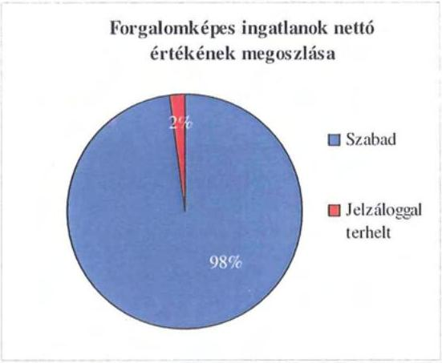

[^0]
[^0]:    ${ }^{77}$ A tagi kölcsönben részesülő négy gazdasági társaságból három 100%-ban önkormányzati tulajdonban volt.
    ${ }^{78}$ A nonprofit kft 100%-ban önkormányzati tulajdonú társaság és önkormányzati kötelező feladatot lát el.
    ${ }^{79}$ Az 1 millió Ft-os tagi kölcsönt a gazdasági társaság visszafizette.

---

Az Önkormányzat immateriális javainak és tárgyi eszközeinek összesített használhatósági foka a 2007. évi 87,74 %-ról a 2010. évre 84,23%-ra csökkent. A gépek, berendezések, felszerelések kivételével a tárgyi eszközök valamennyi csoportjának (ingatlanok, vagyoni értékű jogok, járművek, átadott eszközök) csökkent az év végi nettó értéknek a bruttó értékhez viszonyított aránya. A vizsgált időszakban nem történt meg annak felmérése, hogy az eszközök elhasználódása, amortizációja fedezetének biztosítása mekkora forrásokat igényel az Önkormányzatnál. A felújításokra, az eszközök pótlására az Önkormányzat pénzügyi lehetőségének a függvényében, pályázati források bevonásával került sor. Az Önkormányzat a 2007-2010. években a tárgyi eszközök után 3953 millió Ft összegű értékcsökkenést számolt el, ugyanakkor felújításra az elszámolt értékcsökkenésnek mindössze 34,5 %-át (1363 millió Ft-ot) fordították. Az elhasználódott és amortizálódott eszközök pótlására az Önkormányzat tartalékot nem képzett, külön alapot nem hozott ${ }^{80}$ létre.

Az Önkormányzat a helyszíni ellenőrzés időszakában két folyamatban lévő összesen hárommillió Ft perértékű - kártérítési perben volt alperes. Az Egri Közszolgáltatások Városi Intézményétől, mint önkormányzati intézménytől a Tüzoltóság túlmunkadíj, illetve jövedelemkiesés miatt összesen 219 millió Ft-ot követel peres úton. A peres eljárásba az Önkormányzati és Területfejlesztési Minisztérium is beavatkozott. A helyszíni ellenőrzés időszakában a tárgyalások szüneteltek. Az önkormányzati intézmény további egy munkaügyi perben érintett megközelítőleg egy millió Ft összegben. Az Önkormányzat számára pervesztés esetén az összesen 223 millió Ft perbeli követelés és annak járulékai a jövőben kötelezettséget jelenthet.

A kizárólagos önkormányzati tulajdonú Városgondozás Kft-től fél millió Ft kártérítést követel egy magánszemély, aminek teljesítésére a társaság vagyona fedezetet nyújt. Egy gazdasági társaság - amelyben az Önkormányzat 25,32% tulajdoni hányaddal rendelkezik - négy folyamatban lévő perben alperes, a perérték összesen mintegy 75 millió Ft. Az Önkormányzatnak ez utóbbi gazdasági társaság pervesztéséből kötelezettsége a Gt. 54. § (2) bekezdésében, illetve a Csődtv. 63. § (2) bekezdésében foglaltak alapján nem keletkezhet.

Az Önkormányzat kötelezettségeinek 2010. december 31-i állományát és várható alakulását a kötelezettségek lejáratáig a következő táblázat mutatja be:

Az Önkormányzat kötelezettségeinek állománya 2010. december 31-én és várható alakulása a kötelezettségek lejáratáig

| Megnevezés | Állomány 2010. dec. 31-én |  |  | Várható kötelezettség 2011-2013. |  |  | Várható kötelezettség 2014. évet követően |  |  |
| :--: | :--: | :--: | :--: | :--: | :--: | :--: | :--: | :--: | :--: |
|  | HUF-ban (millió Ftban) | Devizában (összege) | Devizaneme | HUF-ban (millió Ftban) |  |  | HUF-ban (millió Ftban) |  |  |

 Devizában (összege) | Deviza-   nem | HUF-ban (millió Ftban) |  | Devizában (összege) | Deviza-   nem |
| Pénzintézeti kötelezettségek |  |  |  |  |  |  |  |  |  |  |
| Hosszú lejáratú hitelek | 2900 |  |  | HUF | 1211 |  | HUF | 2342 |  | HUF |
| Hosszú lejáratú hitelek |  | 6801702 | CHF |  |  | 4210000 | CHF |  | 1499729 | CHF |
| Kötvény (Kggr. 2010) | 2900 |  | HUF | 826 |  | HUF | 2184 |  |  | HUF |
| Pénzintézeti kötelezettségek (rosszasi HUF-ban) | 4900 |  | HUF | 1937 |  |  | HUF | 4726 |  | HUF |
| Pénzintézeti kötelezettségek rosszasi CHF-ban |  | 6801702 | CHF |  |  | 3216000 | CHF |  | 3499729 | CHF |
| Biztosítékok |  |  |  |  |  |  |  |  |  |  |
| Keresetég | 1109 |  | HUF |  |  |  | HUF |  |  | HUF |
| Biztosítékok (összesen) | 1199 |  | HUF |  |  |  | HUF |  |  | HUF |
| Szállítói tartozás | 266 |  | HUF | 266 |  |  | HUF |  |  | HUF |

[^0]
[^0]:    ${ }^{80}$ Az Önkormányzatot nem kötelezi semmilyen előírás arra, hogy tartalékot, illetve alapot képezzen az elhasználódott eszközök pótlására.

---

Az Önkormányzat kötelezettségeinek állománya 2010. december 31-én 6365 millió Ft és 6801702 CHF volt. A 2011-2013-ban esedékes kötelezettségek várható összege 2203 millió Ft, továbbá 3516000 CHF. Ennek teljesítésére figyelembe vehető 591 millió Ft kimutatott szabad felhasználású ${ }^{81}$ pénzmaradvány, 625 millió Ft mérlegben kimutatott követelésállomány és 1792 millió Ft értékű befektetett pénzügyi eszközállomány, valamint 1952 millió Ft forgalomképes ingatlanvagyon ${ }^{82}$. A 2013 után várható kötelezettség összege 4726 millió Ft és 3499729 CHF. Az Önkormányzat a kötelezettségek finanszírozását ingatlanértékesítésből tervezi megoldani, valamint az évenkénti kötelezettségek teljesítéséhez fedezetet nyújthat még az Önkormányzat saját bevételein belül a helyi adó ${ }^{83}$ bevétele, ami az áttekintett időszakban évenként - a 2007. év kivételével - meghaladta a 3000 millió Ft összeget.

Az Önkormányzat - a jelenlegi állami finanszírozási rendszer, valamint a saját bevételi potenciálja változatlansága esetén - az eddig vállalt kötelezettségeit teljesíteni tudja.

A legalább 25%-os önkormányzati tulajdonban lévő gazdasági társaságok kötelezettségeinek 2010. december 31-i állományát és annak várható alakulását a kötelezettségek lejártáig a következő táblázat részletezi:

| Az Önkormányzat minősített többségi tulajdonú társaságai kötelezettségeinek állománya 2010. december 31-én és várható alakulása a kötelezettségek lejáratáig |  |  |  |  |  |  |  |  |
| :--: | :--: | :--: | :--: | :--: | :--: | :--: | :--: | :--: |
| Megnevezés | Állomány 2010. dec.31-én |  |  | Várható kötelezettség 2011-2013. években |  | Várható kötelezettség 2014. évet követően |  |  |
|  | HUF-ban (millió Ftben) | Devizában (összege) | Devizanev nem | HUF-ban (millió Ftben) | Devizában (összege) | Devizanev nem | HUF-ban (millió Ftben) | Devizában (összege) | Devizanev nem |
| Pénzintézeti kötelezettségek |  |  |  |  |  |  |  |  |
| Hosszú lejáratú hitelek |  | 330991 | EUR |  | 362906 | EUR |  |  | EUR |
| Hosszú lejáratú hitelek |  | 398520 | CHF |  | 520469 | CHF |  | 94858 | CHF |
| Folyószámla- és egyéb rövid lejáratú hitelek | 233 |  | HUF | 233 |  | HUF |  |  | HUF |
| Pénzintézeti kötelezettségek összesen: | 233 |  | HUF | 233 |  | HUF |  |  | HUF |
|  |  | 590991 | EUR |  | 562906 | EUR |  |  | EUR |
|  |  | 598520 | CHF |  | 520469 | CHF |  | 94858 | CHF |
| Lízing kötelezettségek | 20 |  | HUF |  |  | HUF |  |  | HUF |
| Lízing kötelezettségek |  | 43850 | EUR |  | 38616 | EUR |  | 9980 | EUR |
| Eszközbeszerzési tartozás | 236 |  | HUF | 236 |  | HUF |  |  | HUF |

Az Önkormányzat korlátlan felelősséggel tartozik felszámolás esetén a Gt. 54. § (2) bekezdése alapján a minősített többséget biztosító befolyás esetén a gazdasági társaság, illetve a Csődtv. 63. § (2) bekezdése alapján a kizárólagos önkormányzati tulajdonú gazdasági társaság minden olyan kötelezettségéért, amelynek kielégítését a felszámolási eljárás során az adós társaság vagyona nem fedez, ha hitelezőinek a felszámolási eljárás során benyújtott keresete alapján a bíróság - az adós társaság felé érvényesített tartósan hátrányos üzletpolitikájára figyelemmel - megállapítja az Önkormányzat korlátlan és teljes felelősségét. Felszámolás esetén a hitelezők által benyújtott kereset alapján

[^0]
[^0]:    ${ }^{81}$ A szabad felhasználású pénzmaradvány már nem tartalmazza a közgyűlési döntéssel terhelt, de még szerződéskötés nélküli összegeket, valamint a kötvény fel nem használt összegét, mert az közgyűlési döntéssel terhelt.
    ${ }^{82}$ Az Önkormányzat által adott tanúsítványban a forgalomképes ingatlanok nettó értéken szerepelnek, értékesítések esetében a forgalmi érték a nettó értéknek a többszöröse is lehet.
    ${ }^{83}$ Az adóbevétel összegét a pótlékok bevételével együtt vettük figyelembe.

---

a bíróság összességében 609 millió Ft és járulékai, 598520 CHF és járulékai, valamint 576841 EUR és járulékai összegű korlátlan és teljes felelősséget állapíthat meg a kötelezettségekkel érintett négy 100%-os önkormányzati tulajdonú gazdasági társaság után.

# 4. A PÉNZÜGYI EGYENSÚLY MEGTEREMTÉSE ÉRDEKÉBEN HOZOTT INTÉZKEDÉSEK 

A Közgyűlés az Önkormányzat működőképességének hosszú távú fenntartása érdekében tartós költségvetési egyensúlyt megteremtő intézkedésekről döntött a 2007. évben. A Közgyűlés által - 252/2007. (VI. 28.) számú határozatában - elfogadott intézkedési terv a 2008-2013. évekre vonatkozó modellezésen ${ }^{84}$ alapult, amely a makrogazdasági mutatók prognózisa alapján több változatban elemezte - az adott feltételek fennállása esetén - a költségvetés jövőbeni bevételének hatására a költségvetés működési célú költségvetési kiadásai tekintetében, mely területeken és milyen nagyságrendű beavatkozás szükséges. Az intézkedési tervben meghatározott feladatok végrehajtása 2007. július 1-től kezdődött.

A 2007-2010. évek kiadáscsökkentő intézkedései hatásának összegzését beavatkozási területenként az alábbiak részletezik:
adatok ezer Ft-ban

| Az érvényesített kiadás-   csökkentés területei | Személyi   juttatások   és járulékai | Dologi,   működési   kiadások | Pénzeszköz   átadások,   támogatások | Összesen |
| :-- | :--: | :--: | :--: | :--: |
| A Közgyűlés működése | 5847 |  |  | 5847 |
| A Polgármesteri hivatal-  ánál | 110076 |  |  | 110076 |
| Az intézményeknél | 965459 | -23118 |  | 942341 |
| ÖSSZESEN | 1081382 | -23118 |  | 1058264 |

Az Önkormányzat adatszolgáltatása szerint a költségvetés kiadási megtakarításaiból 942 millió Ft (89,0%) az intézmények gazdálkodásra ható intézkedéseinek hatása volt, amely 965 millió Ft-tal a személyi juttatások és járulékai csökkenését és 23 millió Ft-tal a dologi kiadások növekedését eredményezte. A Polgármesteri hivatal kiadásai 110 millió Ft-tal csökkentek a létszámcsökkentéssel együtt járó személyi juttatások és járulékoknak, valamint a Polgármester költségátalányának megszűnése miatt. A Közgyűlés bizottságai és tagjainak ${ }^{85}$ csökkentése a 2010. évben 6 millió Ft-tal csökkentették a tiszteletdíjakat.

[^0]
[^0]:    ${ }^{84}$ a Pénzügykutató 2007. évben készített Eger Gazdálkodási modell tanulmánya
    ${ }^{85}$ A Közgyűlés bizottságainak száma 4-gyel, a képviselők száma 9 fővel, a külső szakértők száma 11 fővel csökkent a 2010. évben a Közgyűlés 32/2010. (X.15.) számú határozata alapján.

---

A Közgyűlés határozataiban és az éves költségvetési rendeleteiben rögzített intézkedések az Önkormányzat adatszolgáltatása alapján a költségvetési kiadások csökkentéséhez - a létszámcsökkentések és az üres állásmegszüntetések 1041 millió Ft-tal (98,4%-ban), a tiszteletdíjak és költségtérítések csökkentése 7 millió Ft-tal (0,6%-ban), a vásárolt közszolgáltatások 10 millió Ft-tal (1,0%-ban) - járultak hozzá.

A Közgyűlés 2007-2010 közötti létszámcsökkentésre vonatkozó döntései hatására az Önkormányzat intézményeiben 787 millió Ft-tal (87,9%-kal) és a Polgármesteri hivatalban ${ }^{86} 109$ millió Ft-tal (12,1%-kal) csökkentek a költségvetési kiadások az Önkormányzat adatszolgáltatása alapján.

Az önkormányzati intézmények körében a közoktatási ágazatban végrehajtott 114,3 fő létszámcsökkentés kiadási megtakarítása 737 millió Ft volt.

A Közgyűlés 2007-2010 között a közoktatási intézményekben évente a tanévi közoktatási mutatószámok elemzése alapján, továbbá a pedagógusok óraszám emelése miatt csökkentette a pedagógus létszámot. Az Önkormányzat és a Kistérségi Társulás néhány települési önkormányzata - Andornaktálya, Egerszólát, Egerbakta - az általános iskolai hálózat fenntartására 2007-ben létrehozott Intézményfenntartó Mikro-társulás működésének tapasztalatainak értékelte és egy tagiskola, valamint kettő tagiskolában a felső tagozatos oktatás megszüntetéséről döntött.

Az önkormányzati óvodák költséghatékony működtetése érdekében a Közgyűlés 2009-ben a háromcsoportos óvodák átszervezéséről döntött, amely eredményeképpen az önállóan működő óvodák száma 17-ről 13-ra csökkent. Az általános iskolai hálózat átalakítása keretében a 2008. évben egy önállóan működő intézmény átszervezését hajtották végre, továbbá a Közgyűlés 2009-ben egy tagiskolát megszüntetett.

A Könyvtárban a 2008. évben a takarítás és a portaszolgálat feladatok, az Egri Kulturális és Művészeti Központban 2009-ben a takarítási feladatok vállalkozási szerződésben való ellátása ${ }^{87}$ az Önkormányzat adatszolgáltatása szerint 10 millió Ft kiadási - a személyi jellegű kiadások 35 millió Ft csökkentése és a dologi kiadások 25 millió növekedése együttesen - megtakarítással járt.

A 2008-2010. évek költségvetési rendeleteiben 42 üres álláshely megszüntetésével - 2008-ban 8 álláshely, 2009-ben 22 álláshely, 2010-ben 12 álláshely - az Önkormányzat adatszolgáltatás alapján 145 millió Ft kiadási megtakarítást értek el.

Az Önkormányzat adatszolgáltatása alapján a 2011. évben 147 millió Ft kiadási megtakarítást terveztek, 21 millió Ft-ot (14,3%-ot) a Polgármesteri hivatalban a cafetéria és a költségtérítés, 99 millió Ft-ot
 ( $67,3 \%$-ot) az intézményekben a cafetéria, és 27 millió Ft-ot ( $18,4 \%$-ot) a közgyűlési képviselők és bizottsági tagok számának csökkentéséből adódó tiszteletdíjak csökkenése miatt.

A létszámgazdálkodással összefüggő intézkedések következtében 2007-2010 között az Önkormányzat intézményeinél és a Polgármesteri hivatalban a Közgyűlés összesen 195,3 álláshely megszüntetésétől döntött, amelyből 42 (21,5%) üres álláshely volt. A megszüntetett álláshelyekből 146,3 álláshely (74,9%) ágazati szakmai, 49 álláshely (25,1%) az intézményüzemeltetési feladatok ellátásához kapcsolódó álláshely volt.

Az Önkormányzatnál 2007-2010 között végrehajtott létszámcsökkentés ágazatonkénti alakulását a következő táblázat foglalja össze:

Az Önkormányzat 2007-2010. között végrehajtott létszámcsökkentésének alakulása

| Megnevezés (adatok fő-ben) | Közoktatás | Szociális és gyermekvédelem | Egészségügy | Polgármesteri hivatal | Egyéb | Összesen |
| :--: | :--: | :--: | :--: | :--: | :--: | :--: |
| Polgármesteri álláshelyek száma | 131,8 | 11 | 8 | 11 | 37,7 | 155,7 |
| Alakuló | üres álláshelyek száma | 17,3 | 2 |  | 17,3 | 42 |
|  | szakmai álláshelyek száma | 106,3 |  | 3 | 11 | 3 | 127,3 |
|  | intézmény-üzemeltetéssel kapcsolatos   álláshelyek száma | 8 | 4 | 1 |  | 13 | 28 |
| 2007. január 1-jén létszám | 1546 | 264 | 17 | 267 | 273 | 2226 |
| 2010. december 31-én záró létszám | 1432,6 | 247,4 | 10,7 | 256 | 282 | 2228,3 |

Az Önkormányzat 2007. január 1-jei 2326 létszámkerete 2010. december 31-re 2229 főre (97 fővel, 4,2%-kal) csökkent. Az önkormányzati feladatok módosulása miatt a létszámkeret 98 fővel a vizsgált időszakban növekedett${ }^{88}$.

A helyi szervezési intézkedések létszámcsökkentésének végrehajtásához 2007-2010 között az Önkormányzat 232 millió Ft központosított támogatásban részesült. A központosított támogatásból az Önkormányzatnál 87 fő létszámcsökkentés valósult meg, amelyből 63 fő (72,5%) a közoktatás, 1 fő (1,1%) az egészségügy, 10 fő (11,5%) a Polgármesteri hivatal, 13 fő (14,9%) egyéb területeken${ }^{89}$ dolgozó közalkalmazott volt. A létszámcsökkentésekkel érintett közalkalmazottakat, köztisztviselőket gazdasági társaságokban nem foglalkoztatták tovább.

A tartós költségvetési egyensúlyt megteremtő intézkedések kiterjedtek a bevételnövelésre is. Ennek eredményeképpen 2007-2010 között 436 millió Ft volt a végrehajtott bevételnövelő intézkedések hatása az Önkormányzat adatszolgáltatása szerint. Az ingatlanok, eszközök bérbeadása 91 millió Ft-tal (20,9%-kal), a helyi adóbevételek végrehajtása miatti növekmény 300 millió Ft-tal (68,8%-kal), a közműfejlesztési bevételek 45 millió Ft-tal (10,3%-kal) járult hozzá a költségvetési bevételek növeléséhez.

A 2007-2010 közötti bevételnövelés intézkedéseinek jogcímek szerint számszerűsített eredményeit a következő diagram szemlélteti:

[^0]
[^0]:    ${ }^{88}$ Az Önkormányzatnál a Mikro-társulások létrejöttével az általános iskolák három tagintézménnyel bővültek, a Bartakovics Béla Művelődési Központ átvételével, és az építéshatósági körzeti feladatok bővülése miatt nőtt az engedélyezett létszám 2007-2010 között.
    ${ }^{89}$ Könyvtár és az Egri Kulturális és Művészeti Központ

---

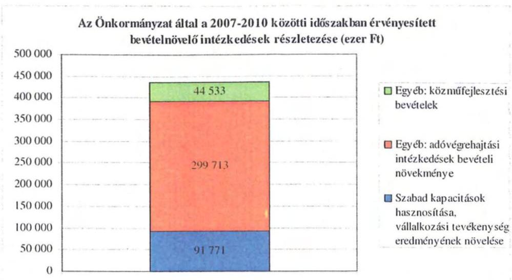

A 2011. évre az Önkormányzat adatszolgáltatása szerint 86,7 millió Ft bevételnövelő intézkedést tervezett, amelyből 4,7 millió Ft (5,4%) az ingatlanok és eszközök bérbeadásából, 80 millió Ft (92,3%) a helyi adóbevétel beszedésének végrehajtásából és 2 millió Ft (2,3%) a zeneiskolai tandíjemelésből származik.

# 5. A HELYI ÖNKORMÁNYZATOK GAZDÁLKODÁSI RENDSZERÉNEK 2007. ÉVI ELLENŐRZÉSE SORÁN A PÉNZÜGYI EGYENSÚLY JAVÍTÁSÁRA TETT SZABÁLYSZERŰSÉGI ÉS CÉLSZERŰSÉGI JAVASLATOK HASZNOSULÁSA 

Az Önkormányzat gazdálkodási rendszerének 2007. évi ellenőrzéséről készült ÁSZ jelentés megállapításairól a Polgármester a Közgyűlést 2008. március 27-i ülésén tájékoztatta. Az Önkormányzat pénzügyi egyensúlyi helyzetének javítására szabályszerűségi és célszerűségi javaslatot az ÁSZ vizsgálat nem tett.

Budapest, 2011. december "22"
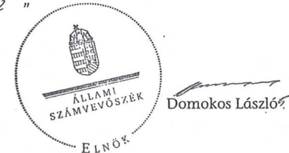

Melléklet: $\quad 9 \mathrm{db}$

---

.

---

Eger Megyei Jogú Város Önkormányzata

1. számú melléklet V-3035-001/2011. számú Jelentéshez

Működési és felhalmozási célú többlet az Önkormányzat zárszámadási rendeleteiben

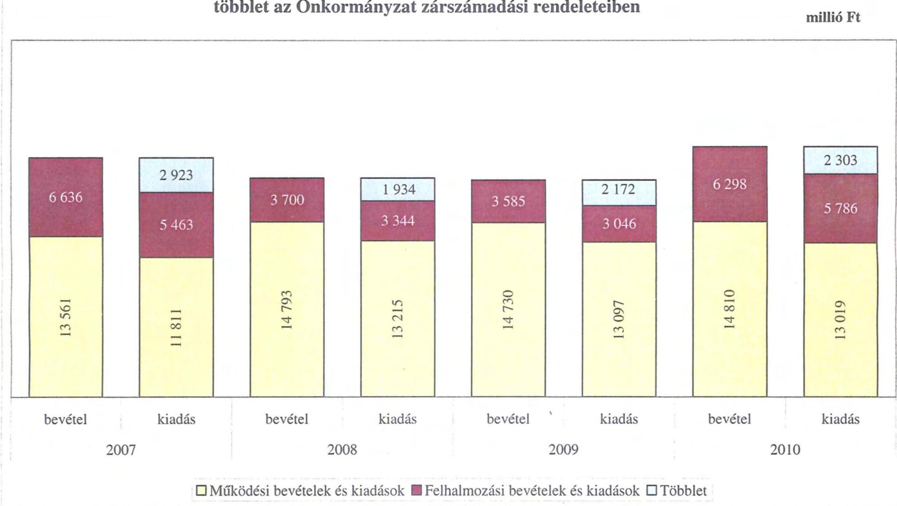

millió Ft

|  |   |   |   |   |   |   |   |   |
| --- | --- | --- | --- | --- | --- | --- | --- | --- |
|  6 636 | 2 923 | 3 700 | 1 934 | 3 565 | 2 172 | 6 298 | 2 303 |   |
|  5 463 | 5 463 | 3 344 | 3 344 | 3 046 | 3 046 | 5 786 |  |   |
|  1 561 | 1 561 | 14 793 | 14 793 | 14 730 | 14 810 | 13 019 |  |   |
|  bevétel | kiadás | bevétel | kiadás | bevétel | kiadás | bevétel | kiadás |   |
|   | 2007 | 2008 | 2008 | 2009 | 2010 |  |  |   |

☐ Működési bevételek és kiadások ☐ Felhalmozási bevételek és kiadások ☐ Többlet

---

| Az Önkormányzat bevételeinek és kiadásainak, adósságszolgálatának alakulása |  |  |  | adatok ezer Ft-ban  |
| --- | --- | --- | --- | --- |
| 1. FOLYÓ KÖLTSÉGVETÉS* | 2007. | 2008. | 2009. | 2010.  |
| 1.1.1. Saját működési bevételek | 5 748 115 | 5 925 524 | 5 482 405 | 7 792 759  |
| 1.1.2. Költségvetési támogatás | 5 011 363 | 5 815 646 | 5 457 496 | 5 181 320  |
| 1.1.3. Állami adóbevételek | 5 686 008 | 1 336 571 | 1 445 346 | 1 837 132  |
| 1.1.4. Állambudzséből kapott támogatások | 597 532 | 496 009 | 622 264 | 860 869  |
| 1.1.5. EU-s és külföldről kapott bevételek | 237 | 1 735 | 562 | 3 262  |
| 1.1.6. Állambudzsén kívülről kapott bevételek | 53 402 | 55 812 | 34 535 | 58 006  |
| 1.1.7. Előző évi pénzmaradvány átvétel | 177 265 | 352 579 | 294 958 | 356 957  |
| 1.1. Folyó bevételek =1.1.1.+1.1.2.+1.1.3.+1.1.4.+1.1.5.+1.1.6.+1.1.7. | 14 254 028 | 13 883 036 | 13 737 566 | 15 990 234  |
| 1.2.1. Működési kiadások | 10 661 671 | 11 888 773 | 11 289 710 | 11 371 327  |
| 1.2.2. Állambudzsébe átadott pénzeszközök | 153 254 | 143 538 | 137 439 | 362 245  |
| 1.2.3.1. adóforgalmaknak | 358 182 | 332 130 | 296 520 | 255 765  |
| 1.2.3.2. EU-nak, illetve külföldre | 200 | 0 | 0 | 0  |
| 1.2.3.3. megbízásosítások | 241 122 | 276 042 | 369 038 | 482 941  |
| 1.2.3.4. amigvidő szervezeteknek | 324 892 | 267 408 | 391 896 | 403 888  |
| 1.2.5. Tisztaellátó kiadások (=1.2.3.1+1.2.3.2+1.2.3.3+1.2.3.4) | 924 896 | 875 580 | 1 057 454 | 1 142 594  |
| 1.2.6. Korrekciós kiadások | 99 935 | 147 967 | 72 655 | 118 733  |
| 1.2.7. Előző évi pénzmaradvány átadás | 177 265 | 352 579 | 694 958 | 256 957  |
| 1.2. Folyó kiadások = 1.2.1.+1.2.2.+1.2.3.+1.2.4.+1.2.5. | 12 016 931 | 13 308 437 | 13 252 216 | 13 251 856  |
| 1.3. Folyó költségvetés egyenlege MÜKÖDÉSI JÖVEDELEM (1.1. - 1.2.) | 5 257 089 | 575 439 | 485 344 | 2 738 378  |
| 2. FELHALMOZÁSI KÖLTSÉGVETÉS** |  |  |  |   |
| 2.1.1. Saját tőkebevételek | 369 918 | 394 196 | 530 944 | 266 793  |
| 2.1.2. Állambudzséből kapott támogatások | 1 712 758 | 652 231 | 255 164 | 655 001  |
| 2.1.3. EU-s és külföldről kapott támogatások | 0 | 0 | 0 | 0  |
| 2.1.4. Állambudzsén kívülről kapott támogatások | 389 972 | 171 469 | 39 104 | 67 757  |
| 2.1. Felhalmozási bevételek (=2.1.1.+2.1.2+2.1.3+2.1.4.) | 2 407 748 | 1 217 896 | 625 212 | 959 551  |
| 2.2.1. Saját beruházási kiadások | 4 138 858 | 2 004 079 | 828 871 | 3 612 265  |
| 2.2.2. Saját felújítási kiadások | 463 670 | 280 905 | 364 981 | 486 228  |
| 2.2.3. Állambudzsébe átadott pénzeszközök | 4 904 | 2 140 | 19 935 | 57 581  |
| 2.2.4. EU-nak és külföldnek adott pénzeszközök | 22 390 | 0 | 0 | 0  |
| 2.2.5. Állambudzsén kívülre adott pénzeszközök | 314 416 | 390 590 | 395 709 | 365 497  |
| 2.2.6. Befektetési célú részesedések vásárlása | 100 | 5 300 | 39 258 | 77 106  |
| 2.2. Felhalmozási kiadások (=2.2.1.+2.2.2.+2.2.3.+2.2.4.+2.2.5.+2.2.6.) | 4 944 342 | 2 681 014 | 1 648 746 | 4 592 671  |
| 2.3. Felhalmozási költségvetés egyenlege (2.1. - 2.2.) | -2 536 594 | -1 463 118 | -1 023 534 | -3 603 120  |
| 3. Finanszírozási műveletek nélküli (GFS) pozíció(1.3.+2.3.) | -279 501 | -887 679 | -538 190 | -864 742  |
| 4. Finanszírozási műveletek |  |  |  |   |
| 4.1. Hitelfelvétel | 1 194 013 | 812 977 | 1 681 620 | 521 368  |
| 4.2. Hitelfizetés | 437 956 | 490 234 | 1 177 035 |

 1 087 353  |
|  4.3. Forgatási és befektetési célú értékpapírok kibocsátása | 0 | 0 | 0 | 2 000 000  |
|  4.4. Forgatási és befektetési célú értékpapírok beválása | 0 | 0 | 0 | 0  |
|  4.5. Forgatási és befektetési célú értékpapírok értékesítése | 87 180 | 67 620 | 67 620 | 32 620  |
|  4.6. Forgatási és befektetési célú értékpapírok vásárlása | 0 | 0 | 0 | 0  |
|  4.7. Egyéb finanszírozási bevételek (függő, átfazó, kiegészítő) | 703 | 9 964 | -13 908 | -338 019  |
|  4.8. Egyéb finanszírozási kiadások (függő, átfazó, kiegészítő) | 173 995 | 25 669 | 41 235 | -159 236  |
|  4.9. Finanszírozási műveletek egyenlege (4.1. - 4.2.+4.3.-4.4+4.5.-4.6.+4.7.-4.8.) | 1 016 529 | 374 658 | 517 062 | 1 287 852  |
|  5. Tárgyévi pénzügyi pozíció változás (1.3.+ 2.3.+4.9.) | 737 024 | -513 021 | -21 128 | 423 110  |
|  6. Nettó működési jövedelem =működési jövedelem (1.3.) - tőketörlesztés (4.2+4.4) | 1 819 133 | 85 205 | -691 691 | 1 651 025  |
|  TÁJÉKOZÍTÁTÓ ADATOK |  |  |  |   |
|  Összes kötelezettség | 2 014 847 | 4 783 585 | 2 273 511 | 7 474 507  |
|  ebből rövid lejárató | 2 199 135 | 1 957 207 | 1 785 156 | 1 514 421  |
|  Összes elállási kötelezettség | 898 444 | 375 776 | 392 494 | 265 693  |
|  ebből lejárt (kamatfizető) | 19 753 | 31 422 | 64 144 | 77 897  |
|  Piros és időszűkű kötelezettség (adósság) | 3 295 317 | 3 998 673 | 4 550 135 | 6 413 314  |
|  ebből rövid lejárató | 479 605 | 1 172 205 | 1 061 770 | 453 228  |
|  PPP szerződéses állomány jelesértéken (kamatfizető) | 0 | 0 | 0 | 0  |
|  ebből lejárt (adájállalási díj miatt) kötelezettség | 0 | 0 | 0 | 0  |
|  Folyószámlatőke segéd átfutó állománya (kamatfizető) | 13935 | 1784 | 11736 | 27465  |
|  Rövidtőke segéd átfutó állománya (kamatfizető) | 45 | 206 | 0 | 0  |
|  Hosszútőke segéd átfutó állománya (kamatfizető) | 0 | 0 | 0 | 0  |
|  Kezesség és garanciavállalások (kamatfizető) | 391500 | 771866 | 1217810 | 1198602  |
|  Jogcímen bírósági kötelezettségből adódó kötelezettségek (kamatfizető) | 0 | 0 | 0 | 0  |
|  Finanszírozásba bevonható eszközök | 3 093 686 | 2 513 045 | 2 424 297 | 2 814 787  |
|  Tartás kötelezettség megtestesítő értékpapírok és végi állománya | 167 860 | 100 240 | 32 620 | 0  |
|  Hosszú lejáratú hatékony és végi állománya | 0 | 0 | 0 | 0  |
|  Értékpapírok és végi állománya | 0 | 0 | 0 | 0  |
|  Pénzeszközök (átfutó pénzeszközök nélküli és végi állománya | 2 925 826 | 2 412 805 | 2 391 677 | 2 814 787  |

- Bevételében nem tételik, a kiadásokban nem jelenik meg az amortíváció, a vagyoni helyzetet az egyenleg befolyásolja. Bevételében vagyon megőrzésre és bővítésre fordított források.

---

|   |  |  |  |  |  |  |  |  |  |  |  |  |  |  |  |  |  |  |  |  |  |  |  |  |  |  |  |  |  |  |  |  |  |   |
| --- | --- | --- | --- | --- | --- | --- | --- | --- | --- | --- | --- | --- | --- | --- | --- | --- | --- | --- | --- | --- | --- | --- | --- | --- | --- | --- | --- | --- | --- | --- | --- | --- | --- | --- |
|   |  |  |  |  |  |  |  |  |  |  |  |  |  |  |  |  |  |  |  |  |  |  |  |  |  |  |  |  |  |  |  |  |  |   |
|   |  |  |  |  |  |  |  |  |  |  |  |  |  |  |  |  |  |  |  |  |  |  |  |  |  |  |  |  |  |  |  |  |  |   |
|   |  |  |  |  |  |  |  |  |  |  |  |  |  |  |  |  |  |  |  |  |  |  |  |  |  |  |  |  |  |  |  |  |  |   |
|   |  |  |  |  |  |  |  |  |  |  |  |  |  |  |  |  |  |  |  |  |  |  |  |  |  |  |  |  |  |  |  |  |  |   |
|   |  |  |  |  |  |  |  |  |  |  |  |  |  |  |  |  |  |  |  |  |  |  |  |  |  |  |  |  |  |  |  |  |  |   |
|   |  |  |  |  |  |  |  |  |  |  |  |  |  |  |  |  |  |  |  |  |  |  |  |  |  |  |  |  |  |  |  |  |  |   |
|   |  |  |  |  |  |  |  |  |  |  |  |  |  |  |  |  |  |  |  |  |  |  |  |  |  |  |  |  |  |  |  |  |  |   |
|   |  |  |  |  |  |  |  |  |  |  |  |  |  |  |  |  |  |  |  |  |  |  |  |  |  |  |  |  |  |  |  |  |  |   |
|   |  |  |  |  |  |  |  |  |  |  |  |  |  |  |  |  |  |  |  |  |  |  |  |  |  |  |  |  |  |  |  |  |  |   |
|   |  |  |  |  |  |  |  |  |  |  |  |  |  |  |  |  |  |  |  |  |  |  |  |  |  |  |  |  |  |  |  |  |  |   |
|   |  |  |  |  |  |  |  |  |  |  |  |  |  |  |  |  |  |  |  |  |  |  |  |  |  |  |  |  |  |  |  |  |  |   |
|   |  |  |  |  |  |  |  |  |  |  |  |  |  |  |  |  |  |  |  |  |  |  |  |  |  |  |  |  |  |  |  |  |  |   |
|   |  |  |  |  |  |  |  |  |  |  |  |  |  |  |  |  |  |  |  |  |  |  |  |  |  |  |  |  |  |  |  |  |  |   |
|   |  |  |  |  |  |  |  |  |  |

 |  |  |  |  |  |  |  |  |  |  |  |  |  |  |  |  |  |  |  |  |  |  |  |  |   |
|   |  |  |  |  |  |  |  |  |  |  |  |  |  |  |  |  |  |  |  |  |  |  |  |  |  |  |  |  |  |  |  |  |  |   |
|   |  |  |  |  |  |  |  |  |  |  |  |  |  |  |  |  |  |  |  |  |  |  |  |  |  |  |  |  |  |  |  |  |  |   |
|   |  |  |  |  |  |  |  |  |  |  |  |  |  |  |  |  |  |  |  |  |  |  |  |  |  |  |  |  |  |  |  |  |  |   |
|   |  |  |  |  |  |  |  |  |  |  |  |  |  |  |  |  |  |  |  |  |  |  |  |  |  |  |  |  |  |  |  |  |  |   |
|   |  |  |  |  |  |  |  |  |  |  |  |  |  |  |  |  |  |  |  |  |  |  |  |  |  |  |  |  |  |  |  |  |  |   |
|   |  |  |  |  |  |  |  |  |  |  |  |  |  |  |  |  |  |  |  |  |  |  |  |  |  |  |  |  |  |  |  |  |  |   |
|   |  |  |  |  |  |  |  |  |  |  |  |  |  |  |  |  |  |  |  |  |  |  |  |  |  |  |  |  |  |  |  |  |  |   |
|   |  |  |  |  |  |  |  |  |  |  |  |  |  |  |  |  |  |  |  |  |  |  |  |  |  |  |  |  |  |  |  |  |  |   |
|   |  |  |  |  |  |  |  |  |  |  |  |  |  |  |  |  |  |  |  |  |  |  |  |  |  |  |  |  |  |  |  |  |  |   |
|   |  |  |  |  |  |  |  |  |  |  |  |  |  |  |  |  |  |  |  |  |  |  |  |  |  |  |  |  |  |  |  |  |  |   |
|   |  |  |  |  |  |  |  |  |  |  |  |  |  |  |  |  |  |  |  |  |  |  |  |  |  |  |  |  |  |  |  |  |  |   |
|   |  |  |  |  |  |  |  |  |  |  |  |  |  |  |  |  |  |  |  |  |  |  |  |  |  |  |  |  |  |  |  |  |  |   |
|   |  |  |  |  |  |  |  |  |  |  |  |  |  |  |  |  |  |  |  |  |  |  |  |  |  |  |  |  |  |  |  |  |  |   |
|   |  |  |  |  |  |  |  |  |  |  |  |  |  |  |  |  |  |  |  |  |  |  |  |  |  |  |  |  |  |  |  |  |  |   |
|   |  |  |  |  |  |  |  |  |  |  |  |  |  |  |  |  |  |  |  |  |  |  |  |  |  |  |  |  |  |  |  |  |  |   |
|   |  |  |  |  |  |  |  |  |  |  |  |  |  |  |  |  |  |  |  |  |  |  |  |  |  |  |  |  |  |  |  |  |  |   |
|   |  |  |  |  |  |  |  |  |  |  |  |  |  |  |  |  |  |  |  |  |  |  |  |  |  |  |  |  |  |  |  |  |  |   |
|   |  |  |  |  |  |  |  |  |  |  |  |  |  |  |  |  |  |  |  |  |  |  |  |  |  |  |  |  |  |  |  |  |  |   |
|   |

---

Eger Megyei Levéltár Várás Önvédelmi Terve

Eger Megyei Levéltár Várás Önvédelmi Terve

|   |  |  |  |  |  |  |  |  |  |  |  |  |  |  |  |  |  |  |  |  |  |  |  |  |  |  |  |  |  |  |  |  |  |  |  |  |  |  |  |  |  |  |  |  |  |  |  |  |  |  |  |  |  |  |  |  |  |  |  |  |  |  |  |  |  |  |  |  |  |  |  |  |  |  |  |  |  |  |  |  |  |  |  |  |  |  |  |  |  |  |  |  |  |  |  |  |  |  |  | 

---

Eger Megyei Állami Levéltár Önálló Üzemeltetési

a. Önálló Üzemeltetési 2019. Árvízvédelmi 16-án Adatvédelmi 2018. Különbözeti Műszaki Biztonsági Rendszerének Működtetési

szünet 20-áig

|   |  |  |  |  |  |  |  |  |  |  | 
 |  |  |  |  |  |  |  |  |  |  |  |  |  |  |  |  |  |  |  |  |  |  |  |  |  |  |  |  |   |
|---|---|---|---|---|---|---|---|---|---|---|---|---|---|---|---|---|---|---|---|---|---|---|---|---|---|---|---|---|---|---|---|
|   |  |  |  |  |  |  |  |  |  |  |  |  |  |  |  |  |  |  |  |  |  |  |  |  |  |  |  |  |  |  |  |  |  |  |  |  |  |  |  |   |
|   |  |  |  |  |  |  |  |  |  |  |  |  |  |  |  |  |  |  |  |  |  |  |  |  |  |  |  |  |  |  |  |  |  |  |  |  |  |  |  |   |
|   |  |  |  |  |  |  |  |  |  |  |  |  |  |  |  |  |  |  |  |  |  |  |  |  |  |  |  |  |  |  |  |  |  |  |  |  |  |  |  |   |
|   |  |  |  |  |  |  |  |  |  |  |  |  |  |  |  |  |  |  |  |  |  |  |  |  |  |  |  |  |  |  |  |  |  |  |  |  |  |  |  |   |
|   |  |  |  |  |  |  |  |  |  |  |  |  |  |  |  |  |  |  |  |  |  |  |  |  |  |  |  |  |  |  |  |  |  |  |  |  |  |  |  |   |
|   |  |  |  |  |  |  |  |  |  |  |  |  |  |  |  |  |  |  |  |  |  |  |  |  |  |  |  |  |  |  |  |  |  |  |  |  |  |  |  |   |
|   |  |  |  |  |  |  |  |  |  |  |  |  |  |  |  |  |  |  |  |  |  |  |  |  |  |  |  |  |  |  |  |  |  |  |  |  |  |  |  |   |
|   |  |  |  |  |  |  |  |  |  |  |  |  |  |  |  |  |  |  |  |  |  |  |  |  |  |  |  |  |  |  |  |  |  |  |  |  |  |  |  |   |
|   |  |  |  |  |  |  |  |  |  |  |  |  |  |  |  |  |  |  |  |  |  |  |  |  |  |  |  |  |  |  |  |  |  |  |  |  |  |  |  |   |
|   |  |  |  |  |  |  |  |  |  |  |  |  |  |  |  |  |  |  |  |  |  |  |  |  |  |  |  |  |  |  |  |  |  |  |  |  |  |  |  |   |
|   |  |  |  |  |  |  |  |  |  |  |  |  |  |  |  |  |  |  |  |  |  |  |  |  |  |  |  |  |  |  |  |  |  |  |  |  |  |  |  |   |
|   |  |  |  |  |  |  |  |  |  |  |  |  |  |  |  |  |  |  |  |  |  |  |  |  |  |  |  |  |  |  |  |  |  |  |  |  |  |  |  |   |
|   |  |  |  |  |  |  |  |  |  |  |  |  |  |  |  |  |  |  |  |  |  |  |  |  |  |  |  |  |  |  |  |  |  |  |  |  |  |  |  |   |
|   |  |  |  |  |  |  |  |  |  |  |  |  |  |  |  |  |  |  |  |  |  |  |  |  |  |  |  |  |  |  |  |  |  |  |  |  |  |  |  |   |
|   |  |  |  |  |  |  |  |  |  |  |  |  |  |  |  |  |  |  |  |  |  |  |  |  |  |  |  |  |  |  |  |  |  |  |  |  |  |  |  |   |
|   |  |  |  |  |  |  |  |  |  |  |  |  |  |  |  |  |  |  |  |  |  |  |  |  |  |  |  |  |  |  |  |  |  |  |  |  |  |  |  |   |
|   |  |  |  |  |  |  |  |  |  |  |  |  |  |  |  |  |  |  |  |  |  |  |  |  |  |  |  |  |  |  |  |  |  |  |  |  |  |  |  |   |
|   |  |  |  |  |  |  |  |  |  |  |  |  |  |  |  |  |  |  |  |  |  |  |  |  |  |  |  |  |  |  |  |  |  |  |  |  |  |  |  |   |
|   |  |  |  |  |  |  |  |  |  |  |  |  |  |  |  |  |  |  |  |  |  |  |  |  |  |  |  |  |  |  |  |  |  |  |  |  |  |  |  |   |
|   |  |  |  |  |  |  |  |  |  |  |  |  |  |  |  |  |  |  |  |  |  |  |  |  |  |  |  |  |  |  |  |  |  |  |  |  |  |  |  |   |

 |  |  |  |  |  |  |  |  |  |  |  |  |  |  |  |  |  |  |  |  |  |  |  |  |  |  |  |  |  |  |  |  |  |  |  |  |  |  |  |  |  |  |  |  |  |  |  |  |  |  |  |  |  |  |  |  |  |  |  |  |  |  |  |  |  |  |  |  |  |  |  |  |  |  |  |  |  |  |  |  |  |  |  |  |  |  |  |  |  |  |  |  |  |  |  |  |  |  |  |  |  |  |

---

Eger Megyei Jogú Város Önkormányzata

Al-Erdemokyese 2018. Április 21. 46. Akpasevlen 24.61. Ajipadali Sözümlülük beynəlldik 2018. Április havi Műszaki Helyzetjelentés eredményei

|   |  |  |  |  |  |  |  |  |  |  |  |  |  |  |  |  |  |  |  |  |  |  |  |  |  |  |  |  |  |  |  |  |  |  |  |  |  |  |  |  |  |  |  |  |  |  |  |  |  |  |  |  |  |  |  |  |  |  |  |  |  |  |  |  |  |  |  |  |  |  |  |  |  |  |  |  |  |  |  |  |  |  |  |  |  |  |  |  |  |  |  |  |  |  |  |  |  |  |  |  |  |

---

Eger Megyei Jogú Város Önkormányzata

3/6. számú melléklet a V-3035/2011. számú jelentéshez

Az Önkormányzat beszerzési, elbírálás alatti pályázati forrásból megvalósuló fejlesztéséhez kapcsolódó kötelezettség-vállalásainak összegzése

|  |   |   |   |   |   |   |   |   |   |   |   |   |   |   |   |   |   |   |   |   |   |   |   |   |   |   |   |   |   |   |   |   |   |   |   |   |   |   |   |   |   |   |   |   |   |   |   |   |   |   |   |   |   |   |   |   |   |   |   |   |   |   |   |   |   |   |   |   |   |   |   |   |   |   |   |   |   |   |   |   |   |   |   |   |   |   |   |   |   |   |   |   |   |   |   |   |   |   |   |   |   |

  |   |   |   |   |   |   |   |   |   |   |   |   |   |   |   |   |   |   |   |   |   |   |   |   |   |   |   |   |   |   |   |

---

# **Chemistry**

## **Chemical Reactions**

### **Balancing Chemical Equations**

1. **Write the unbalanced equation:**
   - Example: $$C_3H_8 + O_2 \rightarrow CO_2 + H_2O$$

2. **Balance the equation:**
   - Balance carbon atoms first.
   - Then balance hydrogen atoms.
   - Finally, balance oxygen atoms.
   - Balanced equation: $$C_3H_8 + 5O_2 \rightarrow 3CO_2 + 4H_2O$$

3. **Balance the equation:**
   - Balance oxygen atoms.
   - Finally, balance oxygen atoms.
   - Balanced equation: $$C_3H_8 + 5O_2 \rightarrow 3CO_2 + 4H_2O$$

### **Types of Reactions**

1. **Combination Reaction:**
   - Example: $$2H_2 + O_2 \rightarrow 2H_2O$$

2. **Decomposition Reaction:**
   - Example: $$2H_2O_2 \rightarrow 2H_2O + O_2$$

3. **Single Displacement Reaction:**
   - Example: $$Zn + 2HCl \rightarrow ZnCl_2 + H_2$$

4. **Double Displacement Reaction:**
   - Example: $$AgNO_3 + NaCl \rightarrow AgCl + NaNO_3$$

5. **Combustion Reaction:**
   - Example: $$CH_4 + 2O_2 \rightarrow CO_2 + 2H_2O$$

## **Stoichiometry**

### **Mole Concept**

- **Mole (mol):** The amount of substance containing as many particles (atoms, molecules, ions) as there are atoms in exactly 12 grams of carbon-12.
- **Avogadro's Number:** $$6.022 \times 10^{23}$$ particles per mole.

### **Molar Mass**

- **Molar Mass:** The mass of one mole of a substance.
- Example: The molar mass of water ($$H_2O$$) is 18.015 g/mol.

### **Calculations**

1. **Moles to Mass:**
   - Formula: $$n = \frac{m}{M}$$
   - Example: Calculate the number of moles of $$H_2O$$ in 18 grams of water.
     - $$n = \frac{18 \, \text{g}}{18.015 \, \text{g/mol}} \approx 0.999 \, \text{mol}$$

2. **Moles to Mass:**
   - Formula: $$m = n \times M$$
   - Example: Calculate the mass of 1 mole of water.
     - $$m = 1 \, \text{mol} \times 18.015 \, \text{g/mol} = 18.015 \, \text{g}$$

## **Gas Laws**

### **Ideal Gas Law**

- **Equation:** $$PV = nRT$$
- **Variables:**
  - $$P$$ = Pressure (atm)
  - $$V$$ = Volume (L)
  - $$n$$ = Moles of gas

### **Boyle's Law**

- **Equation:** $$P_1V_1 = P_2V_2$$
- **Variables:**
  - P₁ = Pressure (atm)
  - V₁ = Volume (L)
  - P₂ = Pressure (atm)
  - V₂ = Volume (L)

### **Boyle's Law**

- **Equation:** $$\frac{P_1}{T_1} = \frac{P_2}{T_2}$$
- **Variables:**
  - P₁ = Pressure (atm)
  - T₁ = Temperature (K)
  - P₂ = Pressure (atm)
  - T₂ = Temperature (K)

## **Thermochemistry**

### **Enthalpy (H)**

- **Definition:** The heat content of a system at constant pressure.
- **Equation:** $$\Delta H = q_p$$
- **Variables:**
  - $$q_p$$ = Heat transferred at constant pressure.
  - $$\Delta H$$ = Change in enthalpy.

### **Hess's Law**

- **Statement:** The enthalpy change for a reaction is the same whether it occurs in one step or multiple steps.
- **Equation:** $$\Delta H_{rxn} = \sum \Delta H_i$$

---

Eger Megyei Jogú Város Önkormányzata

1. számú melléklet a 2035/2011. számú jelentéshez

Az önkormányzati feladatok ellátásában résztvevő gazdasági társaságok

millió Ft-ban

|  Gazdasági társaság megnevezése | önkormányzati | önkormányzati gazdasági társaságának | saját tőke, jegyzett tőke aránya | kötelező feladathoz | önként vállalt feladathoz | hosszú távú, kötelező feladatokkal | részesedésből | saját szellemi állományból | működési támogatás | felhalmozási támogatás  |
| --- | --- | --- | --- | --- | --- | --- | --- | --- | --- | --- |
|   |  |  |  |  |  |  |  | 2007. | 2008. | 2009.  |
|  |   |   |   |   |   |   |   |   |   |   |
|  |   |   |   |   |   |   |   |   |   |   |
|  |   |   |   |   |   |   |   |   |   |   |
|  |   |   |   |   |   |   |   |   |   |   |
|  |   |   |   |   |   |   |   |   |   |   |
|  |   |   |   |   |   |   |   |   |   |   |
|  |   |   |   |   |   |   |   |   |   |   |
|  |   |   |   |   |   |   |   |   |   |   |
|  |   |   |   |   |   |   |   |   |   |   |
|  |   |   |   |   |   |   |   |   |   |   |
|  |   |   |   |   |   |   |   |   |   |   |
|  |   |   |   |   |   |   |   |   |   |   |
|  |   |   |   |   |   |   |   |   |   |   |
|  |   |   |   |   |   |   |   |   |   |   |
|  |   |   |   |   |   |   |   |   |   |   |
|  |   |   |   |   |   |   |   |   |   |   |
|  |   |   |   |   |   |   |   |   |   |   |
|  |   |   |   |   |   |   |   |   |   |   |
|  |   |   |   |   |   |   |   |   |   |   |
|  |   |   |   |   |   |   |   |   |   |   |
|  |   |   |   |   |   |   |   |   |   |   |
|  |   |   |   |   |   |   |   |   |   |   |
|  |   |   |   |   |   |   |   |   |   |   |
|  |   |   |   |   |   |   |   |   |   |   |
|  |   |   |   |   |   |   |   |   |   |   |
|  |   |   |   |   |   |   |   |   |   |   |
|  |   |   |   |   |   |   |   |   |   |   |
|  |   |   |   |   |   |   |   |   |   |   |
|  |   |   |   |   |   |   |   |   |   |   |
|  |   |   |   |   |   |   |   |   |   |   |

  |   |   |   |   |   |   |
|  |   |   |   |   |   |   |   |   |   |   |

---

.

---

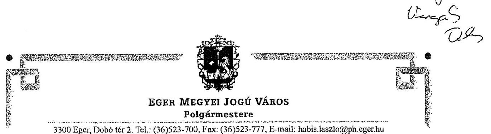

Ikt. szám: EV-43141-2/2011
Domokos László
Elnök úr
Állami Számvevőszék
Budapest
Tisztelt Elnök Úr!
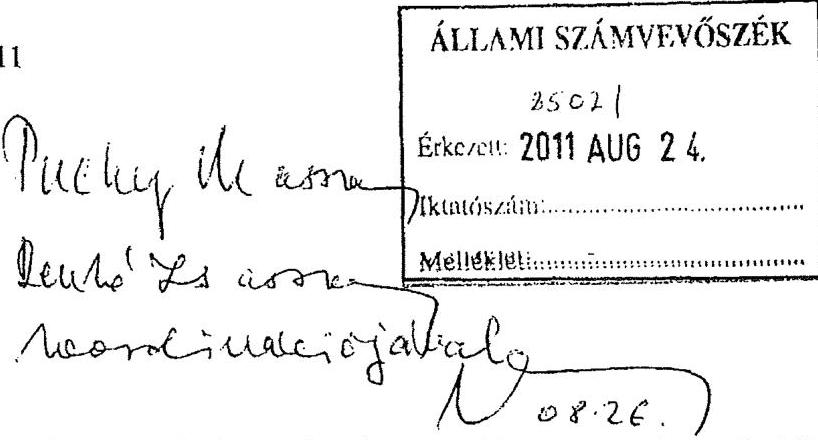

Hivatkozva a V-3004-37-7/2011. számú ügyiratukra az Eger Megyei Jogú Város Önkormányzata pénzügyi helyzetének ellenőrzéséről szóló jelentés-tervezettel kapcsolatban az alábbi észrevételeimet, véleményemet szeretném Önnel megosztani:

- Az illetéktörvény változásaihoz - a kedvezmények körének bővülése - központi intézkedés a kieső bevételek pótlására az önkormányzati alrendszer szintjén történt, melyből így az egész önkormányzati kör részesült, nem csak az érintett megyei és megyei jogú városi önkormányzatok. Eger városban az illetékbevételek 2008-ról 2009-re 120 millió Ft-tal, 2009-ről 2010-re pedig további 57 millió Ft-tal csökkentek,
- A megyei jogú városok adósságállományának az összes bruttó önkormányzati adósságállományhoz való hasonlítását tartom célszerűnek, véleményem szerint nem indokolt a fővárosi és kerületi önkormányzatok adósságállománya nélküli számítás.
- „Az EU fejlesztési forrásokhoz való hozzájutás lehetősége felerősítette az önkormányzati alrendszer fejlesztési igényeit, amelyek a felhalmozási költségvetési hiány folyamatos emelkedésén túl tovább terhelhetik az önkormányzatok költségvetését" megállapítással kapcsolatban célszerűnek látnám vizsgálat tárgyává tenni az önkormányzati szektor összes EU fejlesztési önerő igényének - csökkentve a központi támogatásból biztosított önrésszel - összehasonlítását az önkormányzati rendszer adósságállományával. Fontos annak ismerete is, hogy az önkormányzatok az EU-s támogatásokkal megvalósuló beruházások esetében mennyi ÁFA-t fizettek be a központi költségvetésbe.
- A 20. oldalon a folyószámlahitel igénybevételére vonatkozó táblázat adatai véleményünk szerint ezer Ft-ban helyesek.
- A polgármester részére javasolt intézkedések közül szeretnénk, ha kikerülne:
- a 3.a) pont, mivel több éve bemutatjuk a közgyűlésnek a többségi tulajdonú gazdasági társaságok aktuális pénzügyi helyzetét, nemcsak félévente, hanem negyedévenként.

---

- a 4. pont) Az önkormányzat éves költségvetési rendeleteiben biztosítottuk és a továbbiakban is biztosítjuk a forrásokat a beruházásokkal létrehozott létesítmények működtetésére.
- az 5. pont) Az önkormányzat éves zárszámadási rendeleteinek részletező kimutatásai tartalmazzák eszközcsoportonként az értékcsökkenés, az eszközök pótlására fordított összegek, valamint a korszerűségi, illetve elhasználódási szint adatait, továbbá a nullára leírt eszközök bruttó értékét is.
- A jegyző részére javasolt intézkedések:
- Az 1. és 2. pont vonatkozásában szeretnénk, ha az Állami Számvevőszék valamennyi megyei jogú városnak módszertani segítséget adna a deviza alapú hitelek és kötvények várható árfolyam-, kamat-, valamint visszafizetési kockázatok bemutatására vonatkozóan, így ellenőrzési szempontból is összehasonlíthatóvá válnának az adatok.
- Az önkormányzat minősített többségi tulajdonú gazdasági társaságai kötelezettségeinek alakulását folyamatosan figyelemmel kísérjük, és - a fentiekben jelzettek alapján - negyedévenként bemutatjuk a közgyűlésnek.
- A részletes megállapítások között a 35. oldalon szerepel, hogy 2010. végén a lejárt szállítói tartozás 78 millió Ft az önkormányzatnál, ebből azonban még 1 millió Ft-ot sem ér el a 30 napon túli kötelezettség, amit szeretnénk, ha megjelenne kiegészítésként a jelentésben. Ezen kívül jelezzük, hogy a lejárt tartozásból 33 millió Ft-ot átfutó kiadásként kifizettünk fizetési határidőn belül, melyet a szállítói állományban szerepeltetni kell, mivel utófinanszírozott EU-s pályázatokhoz kapcsolódott.

# Tisztelt Elnök Úr! 

Ezen javaslataim, kérésem mellett szeretném megköszönni munkatársainak az igen konstruktív, pontos, szakszerű közreműködését a helyszíni vizsgálat folyamán és a jelentés elkészítésében.

Eger, 2011. augusztus 18.
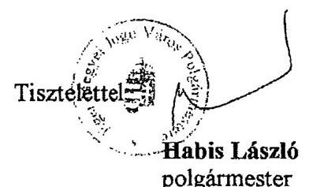

---

# Habis László Úr 

polgármester
Eger Megyei Jogú Város Önkormányzata

## Eger

## Tisztelt Polgármester Úr!

Köszönettel vettem észrevételeit az Eger Megyei Jogú Város Önkormányzata pénzügyi helyzetének ellenőrzéséről készített jelentés-tervezetben foglalt megállapításokra. Az észrevételek feldolgozása, szakmai értékelése megtörtént, melynek eredményéről az alábbiakban tájékoztatom:

Az észrevételében leírtak figyelembevételével a részletes megállapításokat - a 20. oldalon a táblázat adatainak mértékegységét, valamint a 35. oldalon szállítói állomány adatait pontosítottuk. A javaslatok köréből a Polgármester Úr részére tett 3.a), 4.), és 5.) sorszámú javaslatainkat elhagytuk.

A jelentés-tervezetben foglalt megállapításhoz kapcsolódóan a Jegyző részére tett 1., 2., és 3. számú javaslatokat továbbra is indokoltnak tartom az alábbiak szerint:

- az 1-2. javaslatunk vonatkozásában a Jegyző feladata az árfolyam-, a kamat-, a visszafizetési, valamint a mérlegen kívüli tételek (kezességvállalás, garancia és helytállási kötelezettségvállalás) kockázatainak nyomon követése, és ennek érdekében a szükséges feltételek biztosítása;
- A 3. javaslattal kapcsolatos tájékoztatását - amely szerint a minősített többségi tulajdonú gazdasági társaságok kötelezettségeinek alakulását folyamatosan figyelemmel kísérik - köszönettel vettem. Javaslatunk annak figyelemmel kísérésére, értékelésére vonatkozott, hogy a minősített többségi tulajdonú gazdasági társaságok kötelezettségei az Önkormányzat likviditására, pénzügyi-egyensúlyi helyzetére milyen hatást gyakorolnak, ezért a javaslatot továbbra is fenntartom.

Köszönöm Polgármester Úrnak és munkatársainak az ellenőrzés során tanúsított hozzáállását, amellyel az Önkormányzatról készített pénzügyi helyzetelemzés elkészítését segítették.

Budapest, 2011. év december hó " $2^{2} 2$ "

---

.
