# ÁLLAMI   SZÁMVEVŐSZÉK 

## JELENTÉS

Érd Megyei Jogú Város Önkormányzata pénzügyi helyzetének ellenőrzéséről (43/3)

---

# Számvevői Iroda 

Iktatószám: V-3036-08/2011.
Témaszám: 1015
Vizsgálat-azonosító szám: V-056035

## Az ellenőrzést felügyelte:

Dr. Varga Sándor
számvevő igazgató-helyettes
Az ellenőrzést vezette:
Renkó Zsuzsanna
számvevő tanácsos
Az ellenőrzést végezték:

| Kisgergely István | Páncsics Judit |
| :-- | :-- |
| számvevő tanácsos | számvevő |

Vojcsekné Szabó
Ágnes
számvevő tanácsos

---

# TARTALOMJEGYZÉK 

BEVEZETÉS ..... 7
I. ÖSSZEGZŐ MEGÁLLAPÍTÁSOK, KÖVETKEZTETÉSEK, JAVASLATOK ..... 18
II. RÉSZLETES MEGÁLLAPÍTÁSOK ..... 29

1. Az Önkormányzat kötelező és önként vállalt feladatai ..... 29
2. A pénzügyi egyensúlyi helyzet alakulása ..... 34
2.1. A működési és a felhalmozási egyensúly alakulása ..... 34
2.2. Az Önkormányzat bevételeinek alakulása ..... 42
2.3. Az Önkormányzat kiadásainak alakulása ..... 45
3. Kötelezettségek bemutatása ..... 50
3.1. A pénzintézetek felé fennálló kötelezettségek alakulása ..... 50
3.2. Szállítók felé fennálló kötelezettségek alakulása ..... 55
3.3. Egyéb kötelezettségek alakulása ..... 56
4. A pénzügyi egyensúly megteremtése érdekében hozott intézkedések ..... 60
5. A helyi önkormányzatok gazdálkodási rendszerének 2007. évi ellenőrzése során a pénzügyi egyensúly javítására tett szabályszerűségi és célszerűségi javaslatok hasznosulása ..... 62

---

# MELLÉKLETEK 

1. számú A működési és felhalmozási célú hiány/többlet alakulása az Önkormányzat rendeleteiben
2. számú Az Önkormányzat bevételeinek és kiadásainak, egyensúlyának alakulásáról
3/a számú Az Önkormányzat 2007-2010 években megvalósított, 2010. december 31-ig befejezett fejlesztéseinek forrásösszetétele
3/b számú Az Önkormányzat 2010. december 31-én folyamatban lévő fejlesztési feladataihoz kapcsolódó kötelezettségek
3/c számú Az Önkormányzat 2010. december 31-én folyamatban lévő fejlesztési feladataihoz kapcsolódó 2010. évet követő kötelezettségvállalások
3/d számú Az Önkormányzat beadott, elbírálás alatti pályázati forrásból megvalósuló fejlesztéseihez kapcsolódó kötelezettségvállalások
3. számú Az önkormányzati feladatok ellátásában részt vevő gazdasági társaságok adatai
4. számú Érd Megyei Jogú Város Önkormányzat Polgármesterének észrevétele
5. számú Érd Megyei Jogú Város Önkormányzat Polgármesterének észrevételére adott válasz

---

# RÖVIDÍTÉSEK JEGYZÉKE 

| Törvények |  |
| :--: | :--: |
| Áht. | az államháztartásról szóló 1992. évi XXXVIII. törvény |
| ÁSZ tv. | az Állami Számvevőszékről szóló 1989. évi XXXVIII. törvény (hatályos 2011. július 1-jéig) és az Állami Számvevőszékről szóló 2011. évi. LXVI. törvény (hatályos 2011. július 1-jétől) |
| Csődtv. | a csődeljárásról és a felszámolási eljárásról szóló 1991. évi XLIX. törvény |
| Htv. | a helyi önkormányzatok és szerveik, a köztársasági megbízottak, valamint egyes centrális alárendeltségű szervek feladat- és hatásköreiről szóló 1991. évi XX. törvény |
| Gt. | a gazdasági társaságokról szóló 2006. évi IV. törvény |
| Ötv. | a helyi önkormányzatokról szóló 1990. évi LXV. törvény |
| Rendeletek |  |
| Ámr. | az államháztartás működési rendjéről szóló 217/1998. (XII. 30.) Korm. rendelet (hatályos 2009. december 31-éig), és az államháztartás működési rendjéről szóló 292/2009. (XII. 19.) Korm. rendelet (hatályos 2010. január 1-jétől) |
| Áhsz. | az államháztartás szervezetei beszámolási és könyvvezetési kötelezettségének sajátosságairól szóló 249/2000. (XII. 24.) Korm. rendelet |
| Önkormányzati SzMSz | Érd Megyei Jogú Város Önkormányzatának 17/2004 (VI. 11.) számú rendelete az Önkormányzat és Szervei Szervezeti és Működési Szabályzatáról |
| vagyongazdálkodási   rendelet | Érd Megyei Jogú Város Önkormányzatának 36/2008. (VI. 27.) számú rendelete az Önkormányzat vagyona feletti rendelkezési jog gyakorlásának szabályairól |
| 2006. évi zárszámadási   rendelet | Érd Megyei Jogú Város Önkormányzatának 19/2007. (IV. 21.) számú rendelete az Önkormányzat 2006. évi zárszámadásáról |
| 2007. évi költségvetési   rendelet | Érd Megyei Jogú Város Önkormányzatának 8/2007. (III. 1.) számú rendelete az Önkormányzat 2007. évi költségvetéséről |
| 2007. évi zárszámadási   rendelet | Érd Megyei Jogú Város Önkormányzatának 20/2008. (IV. 28.) számú rendelete az Önkormányzat 2007. évi zárszámadásáról |
| 2008. évi költségvetési   rendelet | Érd Megyei Jogú Város Önkormányzatának 14/2008. (III. 11.) számú rendelete az Önkormányzat 2008. évi költségvetéséről |
| 2008. évi zárszámadási   rendelet | Érd Megyei Jogú Város Önkormányzatának 29/2009. (IV. 24.) számú rendelete az Önkormányzat 2008. évi zárszámadásáról |

---

2009. évi költségvetési rendelet

2009. évi zárszámadási rendelet

2010. évi költségvetési rendelet

2010. évi zárszámadási rendelet

2011. évi költségvetési rendelet

## Szórövidítések

APEH
Aradi utcai bölcsőde áfa
ÁSZ
Batthyány Iskola
Bem téri Óvoda
BM
EDP hiány/egyenleg
EU
Érd és Térsége Fejlesztési Társulás
ÉRD-KOM kft
Érdi Létesítmény Üzemeltető Kft
Érdi Sport Kft
Érdi TV Kft
Érdi Városfejlesztési és Szolgáltató Kft
Regionális Víziközmú Kft
Gárdonyi Géza Iskola GDP
jegyző
KMOP
KSH
Közgyűlés
Kincstár

Érd Megyei Jogú Város Önkormányzatának 20/2009. (III. 11.) számú rendelete az Önkormányzat 2009. évi költségvetéséről
Érd Megyei Jogú Város Önkormányzatának 18/2010. (V. 12.) számú rendelete az Önkormányzat 2009. évi zárszámadásáról
Érd Megyei Jogú Város Önkormányzatának 17/2010. (III. 5.) számú rendelete az Önkormányzat 2010. évi költségvetéséről
Érd Megyei Jogú Város Önkormányzatának 29/2011. (V. 3.) számú rendelete az Önkormányzat 2010. évi zárszámadásáról
Érd Megyei Jogú Város Önkormányzatának 20/2011. (III. 10.) számú rendelete az Önkormányzat 2011. évi költségvetéséről

Adó- és Pénzügyi Ellenőrzési Hivatal
Szociális Gondozó Központ Aradi utcai bölcsődéje
általános forgalmi adó
Állami Számvevőszék
Batthyány Általános Iskola és Sportiskola
Szivárvány Óvoda
Belügyminisztérium
Uniós módszertan szerinti maastrichti kritériumoknak megfelelő számítás szerinti hiány/egyenleg
Európai Unió
Érd és Térsége Szennyvízelvezetési- és Szennyvíztisztítási Önkormányzati Társulás
ÉRD-KOM Érdi Kommunális Hulladékkezelő Korlátolt Felelősségű Társaság
Érdi Létesítmény Üzemeltető Korlátolt Felelősségű Társaság
Érdi Sport Korlátolt Felelősségű Társaság
Érdi Városi Televízió és Kulturális Nonprofit Korlátolt Felelősségű Társaság
Érdi Városfejlesztési és Szolgáltató Korlátolt Felelősségű Társaság
Érd és Térsége Regionális Víziközmű Korlátolt Felelősségű Társaság
Gárdonyi Géza Általános Iskola és Gimnázium
bruttó hazai termék
Érd Megyei Jogú Város Önkormányzatának jegyzője
ÚMFT Közép-magyarországi Operatív Program
Központi Statisztikai Hivatal
Érd Megyei Jogú Város Önkormányzat Közgyűlése
Magyar Államkincstár

---

| NAV | Nemzeti Adó- és Vámhivatal |
| :-- | :-- |
| NGM | Nemzetgazdasági Minisztérium |
| OEP | Országos Egészségbiztosítási Pénztár |
| Önkormányzat | Érd Megyei Jogú Város Önkormányzata |
| ÖKIF-I. hitel | „Sikeres Magyarországért" Önkormányzati Infrastruktúra |
|  | Fejlesztési Hitelprogram keretében 2007. február 20-án |
|  | kötött kölcsönszerződés |
| ÖKIF-II. hitel | „Sikeres Magyarországért" Önkormányzati Infrastruktúra |
|  | Fejlesztési Hitelprogram keretében 2009. augusztus 19-én |
|  | kötött kölcsönszerződés |
| polgármester | Érd Megyei Jogú Város Önkormányzat polgármestere |
| Polgármesteri hivatal | Érd Megyei Jogú Város Önkormányzat Polgármesteri Hivatal |
|  |  |
| szja | személyi jövedelemadó |

---

.

---

# JELENTÉS 

## Érd Megyei Jogú Város Önkormányzata pénzügyi helyzetének ellenőrzéséről

## BEVEZETÉS

Az Állami Számvevőszék 2011. évtől érvényes stratégiája új irányt szabott a helyi önkormányzatok gazdálkodásának ellenőrzésében is. Az ÁSZ - küldetése és jövőképe szerint - szilárd szakmai alapokra támaszkodva értékteremtő ellenőrzéseivel és helyzetelemzéseivel az államháztartás egészében, így a helyi önkormányzati alrendszerben is elő kívánja segíteni a közpénzek és a közvagyon szabályos, gazdaságos, hatékony és eredményes hasznosítását. Ennek részeként - a 2010. évi államháztartási hiány alakulásának összetevőire is figyelemmel - folyamatban van az önkormányzati alrendszer pénzügyi helyzetelemzése.

Az NGM 2011 áprilisában közzétett adatai szerint ${ }^{1}$ a 2010. évi 1036,2 milliárd Ft összegű 3,8\%-os EDP (maastrichti kritériumok szerinti, Túlzott Hiány Eljárás keretében kimutatott) hiánycél nem volt tartható, az önkormányzati alrendszer tervezettet meghaladó hiánya miatt a GDP arányában kifejezett államháztartási hiány 4,2\%-ra emelkedett.

Az önkormányzatok 2010 első három negyedévi költségvetési jelentése szerinti pénzforgalmi hiány 97 milliárd Ft-os összege nem indokolta az önkormányzati alrendszer 190 milliárd Ft-ra becsült hiányának 2010. évi végi felülvizsgálatát. A helyi önkormányzatok 2011. januári gyorsjelentése alapján a pénzforgalmi hiány már 247,7 milliárd Ft-ot tett ki. Az alrendszer hiánya így a tervezett $0,7 \%$-kal szemben magasabb, $0,9 \%$-os szinten realizálódott. Az 57,7 milliárd Ft hiánytöbblet alakulásában - a Tájékoztató szerint - az iparűzési adó elmaradása, a gépjárműadó, az illetékek és más bevételek tervezettnél alacsonyabb összegben való teljesülése volt a meghatározó.

Magyarország a Széll Kálmán Terv célkitűzései alapján² aktualizált Konvergencia Programjában a középtávú (2011-2015. évek) költségvetési pálya kijelölése során 2011-re a kormányzati szektor EDP módszertan szerinti egyenlegét $+2 \%$ -

[^0]
[^0]:    ${ }^{1}$ NGM Tájékoztatás Magyarország Strukturális Reformprogramjának végrehajtásáról (2011. április 1). A Tájékoztató évente két alkalommal - április és október hónapban jelenik meg.
    ${ }^{2}$ Az államháztartás 2011. évi egyenlege - a magán nyugdíjpénztárakból az állami nyugdíjpillérbe való visszatérés egyszeri vagyonhatása következtében - 4\%-os többletet mutatna. A Széll Kálmán Tervben foglalt egyszeri intézkedések - a MÁV, a BKV adósságrendezése, a PPP projektek kiváltása - összességében a GDP 2\%-ával csökkentik a várható többlet mértékét.

---

ban jelölte meg. Az egyenlegcél megfogalmazásakor az önkormányzati alrendszer tervezett hiányát a 2011. évi költségvetésben szereplő $0,3 \%$-kal szemben $0,5 \%$-os arányban határozták meg ${ }^{3}$. A hiánycélok meghatározása jelzi, hogy az önkormányzati alrendszerben 2011-ben fokozott figyelmet kell fordítani a pénzügyi egyensúlyi helyzet alakulására.

Az államháztartás helyi szintjén a 23 megyei jogú városi önkormányzatnak az általuk ellátott közszolgáltatások volumenére való tekintettel kiemelt szerepe van, e települések népessége összességében meghaladja a kétmillió főt ${ }^{4}$. A települések népességét az alábbi diagram szemlélteti:
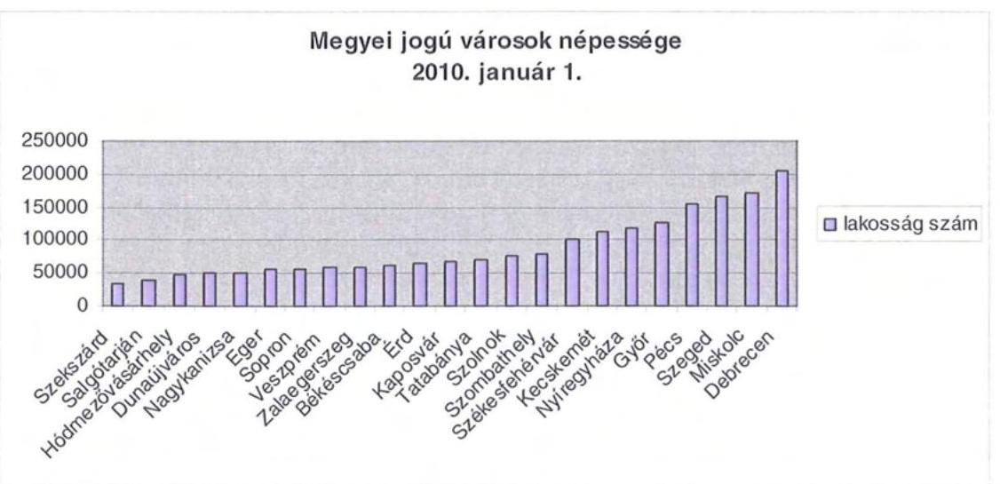

A megyei jogú városi önkormányzatok ${ }^{5}$ kötelező feladatellátását többlépcsős törvényi előírások határozzák meg. A feladatokra vonatkozó szabályozás első szintjét az Ötv. ${ }^{6}$, a második szintet a hatásköri7, a harmadik szintet a további ágazati, szakmai (egyebek mellett az oktatási, egészségügyi, szociális és egyéb ágazati feladatok ellátásának szakmai szabályait rögzítő) törvények adják.

A megyei jogú városi önkormányzatok - az Ötv-ből közvetlenül levezethető települési feladatok mellett - körzeti közszolgáltatásokat is ellátnak. A megyei

[^0]
[^0]:    ${ }^{3}$ A Magyar Köztársaság 2011. évi költségvetéséről szóló 2010. évi CLXIX. törvény Általános indoklásának III. fejezete, valamint Magyarország Konvergencia Programja 2011-2015. (2011. április) Táblázatok rész, 2. táblázat Államháztartás összefoglaló adatai szerint.
    ${ }^{4}$ A megyei jogú városok népességét a 4/2011. (I. 31.) NGM rendelet 1. sz. mellékletében foglalt 2010. január 1-i adatok alapján vettük figyelembe.
    ${ }^{5}$ Az Ötv. 61. § (1) bekezdése alapján a megyeszékhely város a törvény erejénél fogva megyei jogú, ugyanakkor az Országgyűlés az ötvenezer nél nagyobb népességű városokat a képviselőtestület kérelmére megyei jogú várossá nyilváníthatja. Ez utóbbi körbe 5 város tartozik, közülük 2 (Hódmezővásárhely, Dunaújváros) népessége 2010. január 1-ére már ötvenezer fő alá csökkent.
    ${ }^{6}$ az Ötv. 8. és 61. §-ában foglaltak szerint
    ${ }^{7}$ a Htv.

---

jogú városi cím elsősorban többlet kötelezettségekkel jár, a megyei jogú városnak önmagának kell gondoskodnia mindazokról a feladatokról, amelyek más települési önkormányzatok esetében a megyei önkormányzat feladatát képezik. Ide sorolható többek közt a középfokú oktatási intézmények fenntartása, a közművelődési, könyvtári és levéltári szolgáltatás, a társadalombiztosítás finanszírozása mellett a kórházi és a rendelőintézeti szakellátás, a szociális és egyes gyermekvédelmi feladatok ellátása. Ezeket a feladatokat (intézményeket) a megyei jogú város - más városoktól eltérően - nem adhatja át a megyei önkormányzatnak, azonban az Ötv. lehetőséget biztosít arra, hogy a megyei önkormányzattal megállapodjék a feladatellátás megosztásában.

Az önkormányzat, így a megyei jogú város is, maga határozza meg, hogy - a lakosság igényei alapján, anyagi lehetőségei függvényében - - mely feladatokat, milyen mértékben és módon, mely szervezeti keretek közt lát el. A szervezetalakítás szabadsága a megyei jogú városok esetében azzal járt, hogy mind a kötelező közszolgáltatásoknál (különösen a településüzemeltetés, vagyongazdálkodás), mind pedig az önként vállalt feladataik ellátásában - elsősorban a sport és kulturális szolgáltatások területein - a gazdasági társaságok kiemelt fontosságú szerephez jutottak. Ily módon a gazdálkodás, a pénzügyi helyzet kockázatai közvetlenül kikerültek ugyan az önkormányzati alrendszerből, azonban sérülhet az ellátási felelősség figyelemmel kísérése és érvényesítése, a közpénzek felhasználásának transzparenciája. Mindezek együttvéve - a beszámolók konszolidálásának hiányában - növelik a megyei jogú városok pénzügyi helyzetének megítélésében rejlő kockázatokat.

Az áttekintett időszakban az önkormányzati feladatok ellátásának keretet biztosító forrásszabályozás elvei lényegesen nem változtak.

A megyei jogú városok önkormányzatainak mozgásterét, az önkormányzatok feladatellátásra vonatkozó döntéseit a központi költségvetéstől való függőség mellett jelentősen befolyásolja a helyi adókivetési jog gyakorlása ${ }^{8}$. A helyi adók rendszere a közszolgáltatások finanszírozásához szükséges források megteremtésének, bővítésének eszköze, amely a gazdasági válság, a jogszabályi környezet, az adópolitika változása, az adóhatóságok tevékenysége következtében differenciáltan érinti a települési önkormányzatokat ${ }^{9}$.

A települési önkormányzatok saját folyó bevételeinek keretében elszámolt, különböző jogcímeken kivetett helyi adók - iparűzési adó, építmény és telekadó, idegenforgalmi adó, vállalkozók és magánszemélyek kommunális adója - 2007-2010 között eltérő módon emelkedtek. A helyi adókból származó bevételek realizált összege országos szinten 2007-2009 között folyamatosan, 505,3 milliárd Ft-ról 566,3 milliárd Ft-ra emelkedett, majd a gazdasági válság hatásai következtében 2010-re 542,6 milliárd Ft-ra esett vissza. A helyi adók részesedése

[^0]
[^0]:    ${ }^{8}$ a helyi adókról szóló 1990. évi C. törvény szabályai szerint
    ${ }^{9}$ Az Állami Számvevőszék 2010 decemberében közzétett 1031. számú jelentésében értékelte a helyi adók rendszerében a hatékonyság és az eredményesség érvényesülését.

---

az önkormányzatok saját folyó bevételein belül 2007-2010 között 2,5 százalékponttal csökkent ${ }^{10}$.

A megyei jogú városok saját folyó bevétele 2007-ben 191,5 milliárd Ft volt, 2008-ban 223,1, 2009-ben 225,4, 2010-ben 223,5 milliárd Ft-ot tett ki. A helyi adóbevételekből való részesedésük 2007-ben 110,5 milliárd Ft (21,9\%), 2008-ban 128,3 milliárd Ft (23,2%), 2009-ben 124,4 milliárd Ft (22%), 2010-ben 118,7 milliárd Ft (részaránya a 2007. évivel azonosan 21,9\%) volt. E realizált adóbevételek a megyei jogú városok saját folyó bevételeinek 2007-ben 57,7, 2008-ban 57,5, 2009-ben 55,2, 2010-ben 53,1\%-át jelentették. A helyi adóbevételek 2007-ről 2010-re kimutatott 4,6 százalékpontos csökkenése annak ellenére következett be, hogy a megyei jogú városok saját folyó bevétele 2010-ben 16,7%-kal haladta meg a 2007. évit.

A helyi adókon belül a települések gazdasági helyzetének egyik fokmérője az elért helyi iparűzési adóbevétel, amely a megyei jogú városok körében erőteljes - a település nagyságrendtől is függő - különbségeket mutat. A helyi iparűzési adóbevétel és annak egy lakosra vetített összegének 2007. és 2010. évi alakulását az alábbi diagramok szemléltetik:
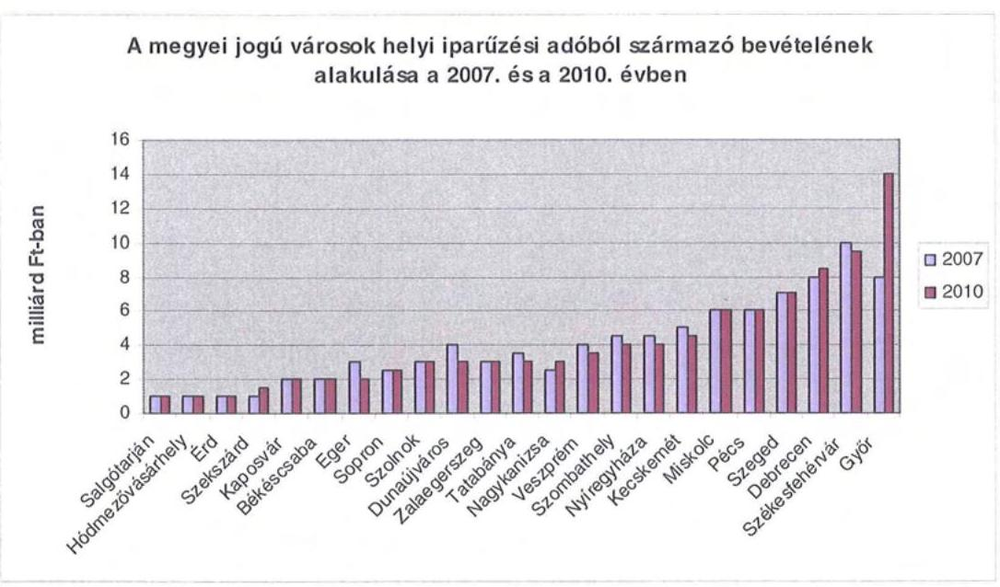

[^0]
[^0]:    ${ }^{10}$ A helyi adó bevételek saját folyó bevételekből való részesedése országosan 2007-ben 55,3%, 2010-ben 52,8% volt.
    ${ }^{11}$ A 100 ezer fő feletti népességű megyei jogú városok csoportjába Debrecen, Miskolc, Szeged, Pécs, Győr, Nyíregyháza, Kecskemét, Székesfehérvár tartozik. Nem megyeszékhely megyei jogú város Érd, Sopron, Nagykanizsa, Dunaújváros, Hódmezővásárhely.

---

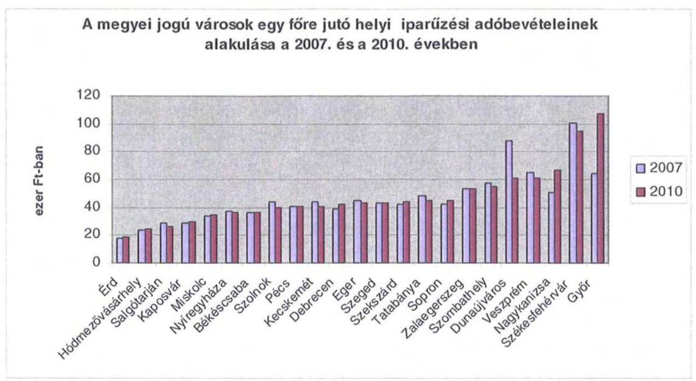

A megyei jogú városi önkormányzatok saját bevételein belül második legjelentősebb elem az illetékbevétel. A 2010. évben befolyt 39,2 milliárd Ft illetékbevétel a 2006. évben realizált 71,1 milliárd Ft illetékbevétel alig több mint 55%-a. A jelentős visszaesést döntően az ingatlanpiac stagnálása, majd visszaesése, illetve egyes illetékkedvezmények bevezetése okozta. A kieső bevételek pótlására az önkormányzati alrendszer szintjén történtek intézkedések, 2010-ben 5 milliárd Ft-ot, 2011-ben 1,2 milliárd Ft-ot ellentételezett a központi költségvetés. A megyei jogú városok önkormányzatai az önkormányzati alrendszer szintjén realizált illetékbevételből 2007-ben 13,6 milliárd Ft-tal (23,3%-kal), 2008-ban 15,3 milliárd Ft-tal (22,7%-kal), 2009-ben 12,6 milliárd Ft-tal (21,5%-kal), 2010-ben 7,9 milliárd Ft-tal (20,2%-kal) részesedtek ${ }^{12}$. Az összes befolyt illetékbevételből a megyei jogú városok részesedése 2009-ről 2010-re mindössze 1,3 százalékponttal csökkent, ugyanakkor a realizált illetékbevétel csökkenése a 37,3%-ot (4,7 milliárd Ft) is elérte.

Az önkormányzati alrendszer átengedett bevételei közül a személyi jövedelemadóból való részesedés makroszintű szabályozása a vizsgált időszakban nem változott. A települési önkormányzatokat a településre kimutatott személyi jövedelemadó 8%-a közvetlenül, míg 32%-a külön szabályozott visszaosztási rendben illeti meg. A visszaosztás a jövedelem differenciálódás mérséklésével párosul, rendje a lakóhelyen maradó személyi jövedelemadóhoz és az iparűzési adó-erőképességhez ${ }^{13}$ igazodik, annak részletszabályait a mindenkori költségvetési törvény 4. számú melléklete határozza meg. A jövedelemdifferenciálódás

[^0]
[^0]:    ${ }^{12}$ Az illetékek kivetésének és beszedésének joga 2006. december 31-ig a megyei önkormányzatok feladata volt, amelyet a 2007. évtől az APEH (2011. január 1-jétől NAV) vett át. Az önkormányzati illetékrészesedési szabályok változatlanok maradtak, azonban az illetékbeszedés költségeit az önkormányzatok illetékbevételeiből átlagos (a megyei jogú városoknál 8,5%-os) kulcsot alkalmazva vonták le.
    ${ }^{13}$ Az iparűzési adóerő-képesség egy potenciális, átlagos erőfeszítés mellett elérhető (a települési önkormányzat iparűzési adóelőlegét meghatározó adóalap 1,4%-ának megfelelő számított) bevétel.

---

szabályai kétirányúak, a kiegészítés és a visszatartás feltételeit egyaránt meghatározták:

- Amennyiben az önkormányzatot közvetlenül megillető személyi jövedelemadó bevétel és a számított iparűzési adóerő-képesség együttesen számított, egy főre jutó összege nem érte el a település méretéhez kapcsolódóan az évenkénti szabályozás szerinti változó összeget, a költségvetés a részesedést település nagyság szerint eltérően meghatározott szintig - kiegészítette ${ }^{14}$. A kiegészítés fajlagos összege 2007-2010 között 37500 Ft-ról 48010 Ft-ra (10 510 Ft-tal, 28%-kal) emelkedett. Az előzőeken túl a jövedelem differenciálódás szabályozása egyes térségi (középiskolai, szakiskolai, szakképző intézményi, kollégiumi) feladatok ellátásának függvényében további kiegészítő hozzájárulást biztosított.
- Amennyiben az egy főre számított személyi jövedelemadó és az iparűzési adóerő-képesség együttes összege a település nagyságrendjéhez rendelt értékhatárt több mint 25%-kal (2010-től 20%-kal) meghaladta, az egy főre jutó összeg sávonként differenciált módon ${ }^{15}$ visszavonásra került az önkormányzatot megillető normatív állami hozzájárulás összegéből.

Az önkormányzatok személyi jövedelemadó bevétele 2007-ben 494,3 milliárd Ft, 2008-ban 558,6 milliárd Ft, 2009-ben 639,5 milliárd Ft, 2010-ben 681,2 milliárd Ft volt, az időszak alatt összegében 186,9 milliárd Ft-tal, 37,8%-kal emelkedett, miközben az szja bevétel átengedett bevételeken belüli részesedése 1,8 százalékponttal emelkedett.

A megyei jogú városok önkormányzatainak személyi jövedelemadó részesedése az alrendszer átengedett személyi jövedelemadó bevételeiből 2007-ben 77,6 milliárd Ft-ot (15,7%-ot), 2008-ban 105,4 milliárd Ft-ot (18,9%-ot), 2009-ben 122,9 milliárd Ft-ot (19,2%-ot), 2010-ben 136,6 milliárd Ft-ot (20,1%-ot) tett ki. A realizált szja bevétel a megyei jogú városoknál az időszak alatt folyamatosan emelkedett, a 2010-ben realizált adóbevétel 59,0 milliárd Ft-tal (76%) volt magasabb a 2007. évinél, az átengedett bevételeken belüli részesedése 2010-re 5,1 százalékponttal haladta meg a 2007. évi részarányt ${ }^{16}$. A részesedés alapjául szolgáló szja településenként eltérő, az egy adózóra jutó szja 2009. évi adatait ${ }^{17}$ a következő ábra szemlélteti.

[^0]
[^0]:    ${ }^{14}$ A megyei jogú városok esetében a jövedelemkülönbségek mérséklésénél figyelembe veendő lakosonkénti értékhatár 2007-ben 37500 Ft, 2008-ban 42385 Ft, 2009-ben 45933 Ft, 2010-ben 48010 Ft volt.
    ${ }^{15}$ A sávos értékhatár 2010-től 20%-os intervallumonként, 120% felett a visszatartást 25%-tól 90%-os mértékig rögzíti. Amennyiben a település nagyságrendhez rendelt értékhatár összege az önkormányzatnál eléri vagy meghaladja a 200%-ot, az egy főre jutó összeg 90%-a levonásra kerül. Az értékhatár sávjai 2010 előtt 25%-os léptékűek voltak, a levonási arányok az ellenőrzött időszakban nem változtak.
    ${ }^{16}$ E bevételek a megyei jogú városok átengedett bevételeiben 2007-ben 84,7, 2008-ban 87,7, 2009-ben 89,7, 2010-ben 89,8%-os részarányt jelentettek.
    ${ }^{17}$ Adatforrás: KSH Megyei Jogú Városok a Közép Dunántúlon 2009. kiadványa, 4.1.sz. összehasonlító tábla.

---

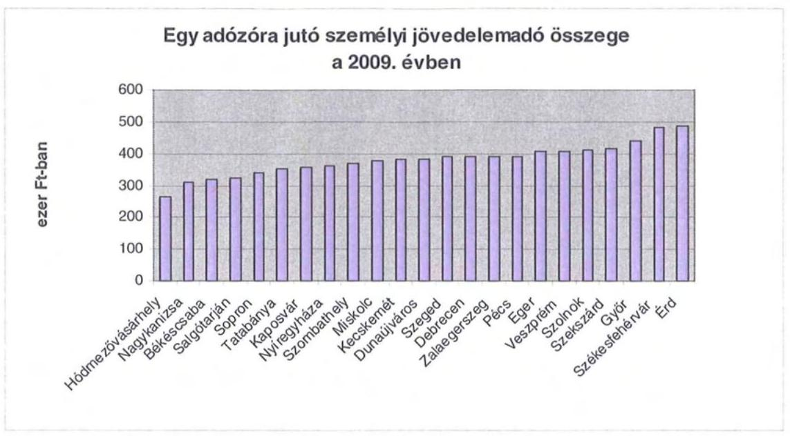

Az átengedett bevételek második legjelentősebb eleme a gépjárműadó, amelynek bevételi szabályozása az ellenőrzött időszakban nem változott, az adóbevétel teljes összege az önkormányzatot illeti meg. A gépjárműadó alapját, mértékét ${ }^{18}$ és egyes mentességi kategóriákat érintő módosítások 2010. január 1-től következtek be, amelyek az egyes adótételek esetében átlagosan 15%-os emelkedéssel jártak.

A gépjárműadó beszedéséből származó bevétel az önkormányzati alrendszer szintjén 2007-ben 62,4 milliárd Ft, 2008-ban 65,7 milliárd Ft, 2009-ben 63,8 milliárd Ft, 2010-ben 71,1 milliárd Ft volt, az adóbevétel egésze 2007-hez képest 8,7 milliárd Ft-tal, 13,9%-kal emelkedett. A gépjármű adóztatás szabályainak változása 2010-ben 7,3 milliárd Ft többletet eredményezett. A megyei jogú városok gépjárműadó bevétele a 2007. évi 14,0 milliárd Ft-ról 2010-re 15,5 milliárd Ft-ra, 10,7%-kal emelkedett. A bevételnövekedés összegéből 1,4 milliárd Ft a 2010. évi adózási szabályok következménye.

A megyei jogú városok önkormányzatai 2007-2010 között rendelkezésre álló forrásainak alakulását a következő ábra szemlélteti:

[^0]
[^0]:    ${ }^{18}$ A gépjárműadóról szóló 1991. évi LXXXII. törvény 7. § (1) bekezdésében foglalt adómértékek változása.

---

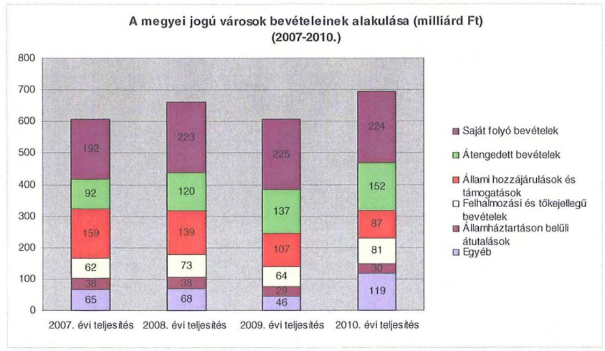

A megyei jogú városok saját folyó bevételeinek - amelyek főbb elemei: a helyi adók, az illetékbevételek, az intézményi térítési díjak, a kamatbevételek - részaránya a 2007. évi összbevételen (608 milliárd Ft) belül 32% volt. A 2010. évi összbevétel 693 milliárd Ft-os összegéből a saját folyó bevételek aránya - miközben összege 2007-ről 2010-re 32 milliárd Ft-tal emelkedett - nem változott.

Az átengedett bevételek, amelyek a megyei jogú városok önkormányzatainál döntően a személyi jövedelemadó és a gépjárműadó részesedést jelenti, az összbevételen belül a 2007. évi 92 milliárd Ft-ról (15%) 152 milliárd Ft-ra nőtt, részesedése 7 százalékponttal emelkedett. A 60 milliárd Ft-os növekedésből 59 milliárd Ft-ot az szja részesedés emelkedése okozott.

Az állami hozzájárulások és támogatások - amelyek főbb elemei: főként az ellátotti létszámhoz kötődő normatív állami hozzájárulások, központosított előirányzatok - a 2007. évi 159 milliárd Ft-ról (26%-os részarányról) 2010-re 87 milliárd Ft-ra (13%-os részarányra) estek vissza.

A felhalmozási és tőkejellegű bevételek - tárgyi eszközök (ingatlanok és ingóságok), föld és immateriális javak, részesedések értékesítése, EU-tól átvett pénzeszközök - a 2007. évi 62 milliárd Ft-ról (10%-os részarányról) 2010-re 81 milliárd Ft-ra (12%-os részarányra) emelkedtek.

Az államháztartáson belüli átutalások részesedése 2007-ben 38 milliárd Ft volt. 2010. év végére 8 milliárd Ft-tal csökkent, részaránya 6%-ról 2010-ben 4%-ra változott. Ez a bevételi kategória tartalmazza az Egészségbiztosítási Alaptól és más elkülönített állami pénzalapoktól átvett forrásokat. A 2010-ben e címen elszámolt bevétel a megyei jogú városoknál 22 milliárd Ft-ot tett ki.

Az egyéb, pénzmaradványból, vállalkozási bevételekből, államháztartáson kívülről származó átutalásokból, a hitelekből, a hosszú és rövid lejáratú értékpapírok értékesítéséből származó bevételek részesedése a 2007-2010. évek vi-

---

szonylatában 11\%-ról 17\%-ra emelkedett. Ez utóbbiak 2010. évi beszámoló szerinti összevont teljesítése 119 milliárd Ft volt ${ }^{19}$.

Mindezeket figyelembe véve a megyei jogú városok 2007. és 2010. évi forrásösszetételének megoszlását az alábbi ábra szemlélteti:

A megyei jogú városok 2007. és 2010. évi forrásösszetétele
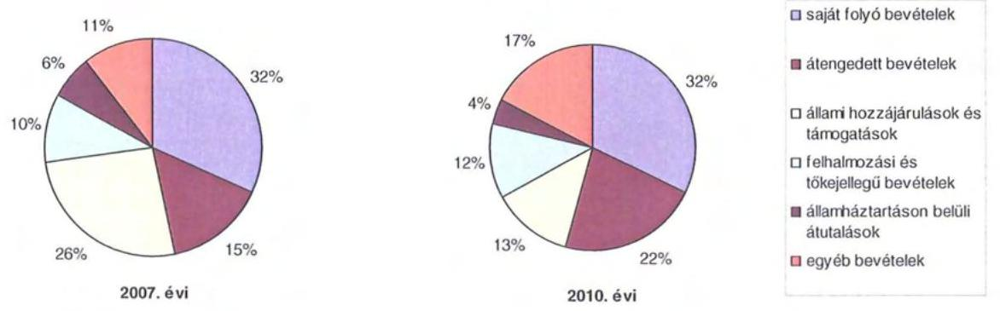

Az önkormányzati alrendszer pénzügyi helyzetértékelése során új elemzési módszereket alkalmaz az ellenőrzés. A hagyományos költségvetési szerkezet helyett az önkormányzat pénzügyi helyzetét a CLF módszerrel mutatjuk be, amelynek lényegét és számításának módszerét a 2.1. pontban, és a jelentés 2. számú mellékletében ismertetjük részletesen.

Az új módszereken alapuló helyzetértékelés fontosságát az adja, hogy a helyi önkormányzatok bruttó adósságállománya ${ }^{20}$ a 2010. évi költségvetési beszámoló alapján 1248 milliárd Ft-ot tett ki. Az adósságállomány koncentráltságát jelzi ${ }^{21}$, hogy ebből a 23 megyei jogú város részesedése 338 milliárd Ft volt, amely a fővárosi és kerületi önkormányzatok adósságának figyelmen kívül hagyásával számított 2010. évi 977 milliárd Ft összegű bruttó adósságállomány 34,6\%-át jelentette. Az adósságállomány több mint fele - 501 milliárd Ft - a 19 megyei önkormányzatnál és a 23 megyei jogú városnál jelentkezett.

[^0]
[^0]:    ${ }^{19}$ Az egyéb bevételek összege 2007-2010 között eltérő módon változott, 2007-ben 65 milliárd Ft, 2008-ban 68 milliárd Ft volt, 2009-ben 46 milliárd Ft-ra esett vissza, majd 2010-ben több mint két és félszeresére, 119 milliárd Ft-ra emelkedett.
    ${ }^{20}$ A bruttó adósságállomány 2010. év végi összege magában foglalja a fejlesztési és a működési célú kötvénykibocsátások, a beruházási és fejlesztési hitelek, a működési célú hosszú lejáratú hitelek, a rövid lejáratú hitelek, váltótartozások miatti kötelezettségek teljes (2011-ben, illetve az azt követő években esedékes) állományát.
    ${ }^{21}$ A megyei jogú városok adósságállománya összegében ugyan elmarad az egyéb városok összesített adósságától [(ez utóbbiak részesedése 382,6 milliárd Ft (39,2\%)], azonban az egyéb városok száma 304. A fővárosi és a kerületi önkormányzatok nélküli adósságállományból a 19 megyei önkormányzat 163 milliárd Ft-tal (16,8\%-kal), míg a nagyközségek, községek együttesen 93 milliárd Ft-tal (9,5\%-kal) részesednek.

---

A megyei jogú városok 338 milliárd Ft-os adósságállományából 175 milliárd Ft (51,8\%) a 8 legnagyobb, 100 ezer fő feletti népességű város tartozása. Az 5 nem megyeszékhely megyei jogú város bruttó adósságállománya 70 milliárd Ft-ot (20,7\%-ot), az előző két csoportba nem tartozó további 10 megyei jogú város adóssága 93 milliárd Ft-ot (27,5\%-ot) tett ki.
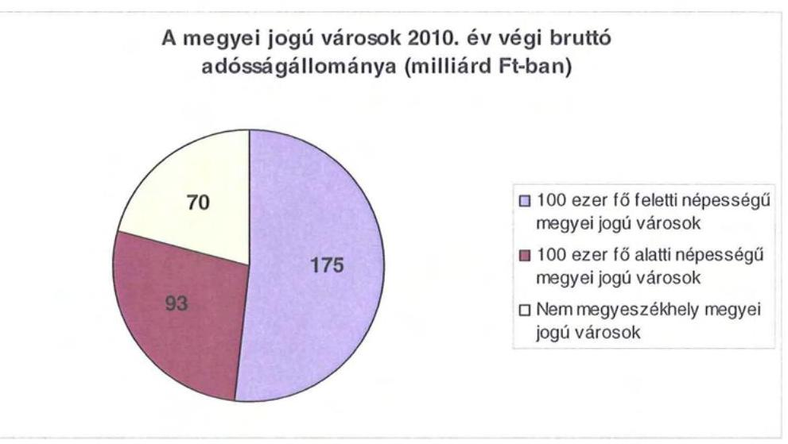

A mérlegben kimutatott bruttó adósságállomány mellett az önkormányzatok számára az eszközállomány műszaki állapotának megőrzése is kötelezettségekkel jár. Az elhasználódott eszközök pótlására forrást biztosító amortizációs (felújítási) alap képzésének ${ }^{22}$ elmaradása maga után vonhatja a feladatellátást kiszolgáló tárgyi eszközök állagának erőteljes romlását. Emellett a 2007-2013-as időszakra meghirdetett, vissza nem térítendő EU-s fejlesztési forrásokhoz való hozzájutás lehetősége felerősítette az önkormányzati alrendszer fejlesztési igényeit, amelyek a felhalmozási költségvetési hiány folyamatos emelkedésén túl - az előírt jövőbeni fenntartási kötelezettség miatt - tovább terhelhetik az önkormányzatok költségvetését ${ }^{23}$.

Az ÁSZ a 2011. évi ellenőrzési tervében 43. számú, az Önkormányzatok gazdálkodási rendszerének ellenőrzése részeként egy időben, egymással párhuzamosan tekinti át, és elemzi a 23 megyei jogú városi önkormányzat pénzügyi helyzetét. A gazdálkodás szabályszerűségét az ÁSZ az előző évek során ebben az önkormányzati körben is ellenőrizte, ezért jelen vizsgálatunk erre nem tér ki. A jelentés a megyei jogú városok sajátos feladatellátási és forrásszabályozási

[^0]
[^0]:    ${ }^{22}$ Erre a jelenlegi szabályozási környezetben nem kötelezi semmilyen előírás az önkormányzatokat.
    ${ }^{23}$ Az Állami Számvevőszék 2011 júniusában közzétett 1108. számú, a helyi önkormányzatok fejlesztési célú támogatási rendszerének ellenőrzéséről szóló jelentésében feltárta a fejlesztési folyamatok problémáit. A helyi önkormányzatok elsősorban azokat a fejlesztéseket valósították meg, amelyekhez támogatást lehetett igényelni. A fejlesztési célok közül a magasabb támogatás intenzitású pályázatokat részesítették előnyben. A fejlesztéssel megvalósuló létesítmények jövőbeli üzemeltetésének várható ráfordításait az önkormányzatok 71,9\%-a nem mérte fel.

---

helyzetére tekintettel az önkormányzatok pénzügyi helyzetét, illetve az ezzel összefüggő korábbi ÁSZ javaslatok megvalósítását mutatja be.

Az ellenőrzés a 2007. január 1. - 2010. december 31. közötti időszakot öleli fel.
A vizsgálat jogszabályi alapját az Állami Számvevőszékről szóló 1989. évi XXXVIII. törvény 2. § (3), (5), (6) és (9) bekezdései ${ }^{24}$, az Ötv. 92. § (1) bekezdése, az Áht. 104. § (3), és 120/A. § (1) bekezdése előírásai képezik.

[^0]
[^0]:    ${ }^{24}$ 2011. július 1-jétől az Állami Számvevőszékről szóló 2011. évi LXVI. törvény 5. § (2)(5) bekezdései

---

# I. ÖSSZEGZŐ MEGÁLLAPÍTÁSOK, KÖVETKEZTETÉSEK, JAVASLATOK 

Az Önkormányzat - adatszolgáltatása szerint - a Szakorvosi Rendelőintézet nélküli 2010. évi működési költségvetési kiadásaiból (10 343 millió Ft) 8831 millió Ft-ot (85,4\%) a kötelező feladatok, 1512 millió Ft-ot (14,6%) az önként vállalt feladatok ellátására fordított. (Az Önkormányzat kórházat nem tartott fenn.) A kötelező és önként vállalt feladatok részarányának megállapítása az Önkormányzat 2010. évi költségvetési rendelete szerinti besorolásnak megfelelően készült. Az Önkormányzat a városfejlesztési, az ingatlan felújítási feladatok, a sportpálya, a tanuszoda üzemeltetése, az érdi újság kiadása, a televíziós műsorszolgáltatás mellett önként vállalt feladatnak tekinti a gimnázium és a szakképző intézmény fenntartását is.

Az Önkormányzat feladatellátásának szervezeti struktúráját a következő ábra szemlélteti:
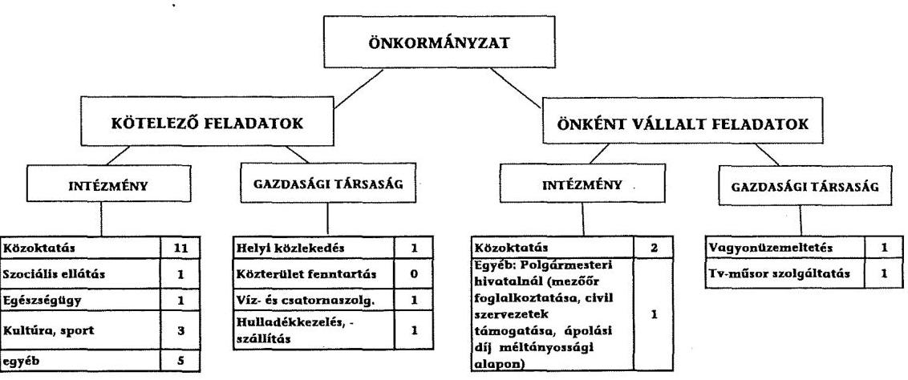

Az Önkormányzat feladatait 2010. december 31-én (a Polgármesteri hivatallal együtt) 23 költségvetési szervvel és öt 25% feletti tulajdoni hányadú gazdasági társaságával, továbbá kettő - az önkormányzattól tulajdonosi szempontból független - gazdasági társaság közreműködésével látta el. Az intézményszervezeti átalakítások és intézményi összevonások nem módosították a feladatellátás telephelyeinek számát a 2006. évről a 2010. évre, számuk változatlanul 68 volt.

Az Önkormányzat működési kiadásokra 2010-ben 10343 millió Ft-ot fordított, amely 1525 millió Ft-tal (17,3%-kal) haladta meg a 2007. évi ráfordításokat. A működési kiadások 55,3%-át az intézményi körben realizálták.

---

E kiadások fedezetéül szolgáló bevételi források 2007. és 2010. években jellemző összesített arányait a következő ábra szemlélteti:
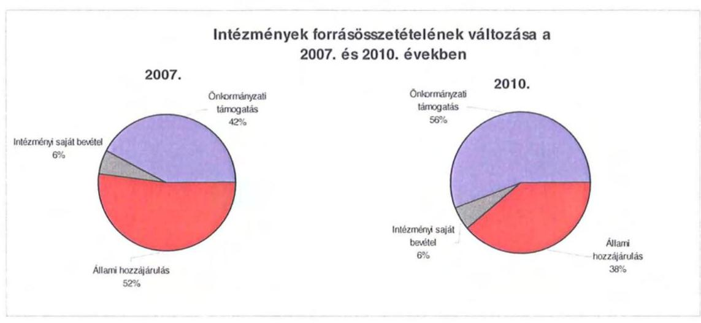

Az egyes közszolgáltatások feladatellátásában részvevő ágazati intézménycsoportok forrásösszetételének bevételi jogcímenkénti alakulását a következő ábra szemlélteti:
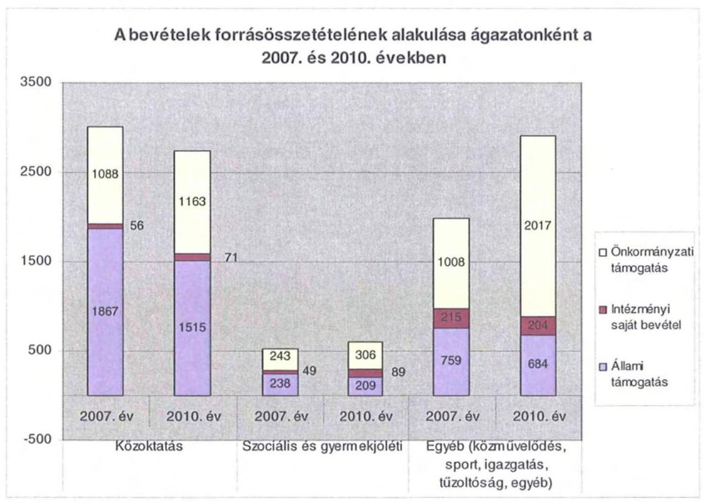

Az egyéb ágazatba tartozó intézmények bevételeinek részaránya a 2007. évről a 2010. évre 35,9%-ról 46,4%-ra nőtt. A bevételekből az önkormányzati támogatás részaránya 50,9%-ról 69,4%-ra (1009 millió Ft-tal) emelkedett feladatbővülés, illetve az állami támogatás 9,9%-os csökkenésének ellentételezése miatt. Az oktatási ágazatba tartozó intézmények bevételeinek részaránya 54,5%-ról 43,9%-ra csökkent, mivel az ágazat állami támogatása 352 millió Ft-tal, 18,9%-kal csökkent. Az ágazat bevételeihez az Önkormányzat a 2007. évről a

---

2010. évre növekvő mértékben járult hozzá, az önkormányzati támogatás aránya 36,1%-ról 42,3%-ra emelkedett.

Az Önkormányzat három gazdasági társaságban rendelkezik kizárólagos tulajdonnal, egy gazdasági társaságban 75% feletti, egyben 25-50% közötti tulajdoni hányaddal. A gazdasági társaságok az önkormányzati feladatokból többek között a tanuszoda és a sportpálya üzemeltetését, a televízió műsorszolgáltatást, az önkormányzati újság kiadását, vagyonkezelési feladatokat, sport rendezvények szervezését és az utánpótlás nevelését, a közüzemi víz- és csatornaszolgáltatást látták el. A 2010. évben az Érdi Sport Kft 80 millió Ft rendszeres működési pénzeszköz átadásban részesült az önként vállalt feladatok ellátásához, eseti működési és fejlesztési célú pénzeszköz átadást az Önkormányzat nem nyújtott a gazdasági társaságoknak.

Az Önkormányzat egy kizárólagos tulajdonában lévő gazdasági társasága és egy 90%-os tulajdoni hányadú gazdasági társasága saját tőkéjének értéke nem érte el a 2010. év végén a jegyzett tőke értékét, -3,2 millió Ft, illetve -0,6 millió Ft volt. A saját tőke, jegyzett tőke aránya -655%, illetve -57% volt. Tőkeemelésre, tőkepótlásra nem került sor. Kettő kizárólagos önkormányzati tulajdonú gazdasági társaság saját tőkéje együttesen 2010. december 31-én 5,9 millió Ft, a jegyzett tőkéjük 3,5 millió Ft, a saját tőke, jegyzett tőke aránya átlagosan 169% volt. A gazdasági társaságok a saját tőkén belül céltartalékot nem képeztek. A gazdasági társaságok pénzügyi helyzete az Önkormányzat pénzügyi egyensúlya szempontjából kockázatot nem jelentett.

Az Önkormányzat folyó költségvetés egyenlege (működési jövedelem) 2007, 2008. és 2010. években működési forráshiányos volt ${ }^{25}$, 2009-ben azonban működési többletet mutatott. A 2007-2010. években a negatív működési jövedelmek és a tárgyévben jelentkező tőketörlesztési kötelezettségek ${ }^{26}$ miatt az Önkormányzat pénzügyi kapacitása (nettó működési jövedelme) negatív értékű (-2907 millió Ft) volt.

[^0]
[^0]:    ${ }^{25}$ 2007-ben a folyó kiadások 4,9%-át (495 millió Ft-ot), 2008-ban 4,6%-át (505 millió Ft-ot), 2010-ben a folyó kiadások 6,1%-át tette ki (749 millió Ft) a negatív működési jövedelem. 2009-ben kis mértékben (0,6%), de pozitív összegű volt az Önkormányzat folyó költségvetési egyenlege, amely 70 millió Ft többletet jelentett.
    ${ }^{26}$ A 2008-2010. évi elemi beszámolókban a folyószámlahitel igénybevételének számviteli elszámolásakor az Áhsz-ben foglaltaktól eltérően halmozott pénzforgalmi adatokat rögzített a Polgármesteri hivatal. Az adósságszolgálat, továbbá a nettó működési jövedelem kimutatásakor a valóságnak megfelelő adatokat mutatjuk be.

---

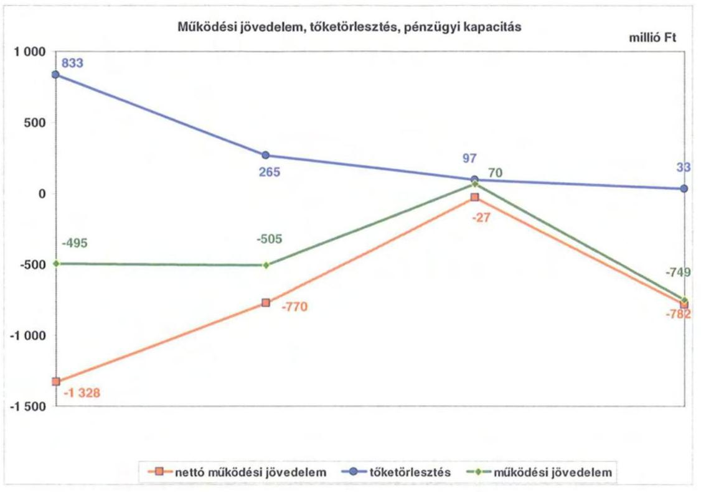

A 2007-2010. években az Önkormányzat felhalmozási költségvetésének egyenlege folyamatosan negatív összegű volt, amely 2007-2010. között összesen 4800 millió Ft felhalmozási forráshiányt okozott.

A pénzügyi egyensúly fenntartása külső források bevonásával volt biztosítható. A 2007-2010. években 1228 millió Ft hitelt törlesztettek. Az adósságszolgálat, továbbá a felhalmozási forráshiány 2007-2010. között 6028 millió Ft-ot tett ki. A működést és a fejlesztéseket az 5288 millió Ft működési és fejlesztési célú kötvénykibocsátásból és 1517 millió Ft fejlesztési célú hitelfelvételből finanszírozták. A kialakult pénzügyi helyzet pozitív nettó működési jövedelmet eredményező gazdálkodás mellett teszi elkerülhetővé további külső források bevonását, az eladósodás növekedését.

A vizsgált időszakban az Önkormányzatnál helyi iparűzési adót, építményadót, telekadót, idegenforgalmi adót vetettek ki, új adónemet nem vezettek be, az adók mértékét nem emelték. A helyi adókból és pótlékokból származó bevételek aránya a 2007-2010. években 15% körül változott a folyó (működési) bevételeken belül. A pótlékkal, bírsággal növelt helyi adó bevétel a 2007. évi 1493 millió Ft-ról 2010. évben 1705 millió Ft-ra (14,1%-kal, 212 millió Ft-tal) nőtt. A helyi adóbevételek háromnegyed részét az iparűzési adó tette ki, amelynek mértéke a helyi adókról szóló törvényben rögzített maximális mértékben került megállapításra. A helyi adók növekedését elsősorban az iparűzési adó 77 millió Ft-os növekedése okozta.

A befejezett fejlesztések jelentős részét pénzintézeti forrásokból finanszírozták. A 2007-2010. évek időszakában 6070 millió Ft értékű fejlesztés és felújítás forrása 1990 millió Ft kötvényből származó bevétel (32,8%), valamint 1484 millió Ft hitelfelvétel (24,5%), 879 millió Ft hazai és EU-s támogatás (14,5%) és 1717 millió Ft saját bevétel (28,2%) volt. A 2010. december 31-én folyamatban lévő fejlesztési feladatok végrehajtására 771 millió Ft kiadást teljesítettek, amelynek forrása 602 millió Ft (78\%) EU-s támogatás volt, a többit a kötvény bevételéből 136 millió Ft (18\%) és hitelből 33 millió Ft (4\%) finanszírozták.

Az Önkormányzat 2010. december 31-én folyamatban lévő fejlesztési feladatok kötelezettség-vállalásainak összege 3935 millió Ft volt, amelyből 28 millió Ft-ot saját forrásból, 3304 millió Ft-ot EU-s támogatásból, 35 millió Ft-ot hitelből és 568 millió Ft-ot a korábban kibocsátott kötvény bevételéből terveznek biztosítani. Hazai támogatást a fejlesztések megvalósításához nem nyertek. A tervezett saját források rendelkezésre állását az Önkormányzat jelenlegi pénzügyi helyzete biztosítja, az EU-s támogatások utófinanszírozási rendszere miatt a támogatott projektek pénzügyi teljesítése kockázatos.
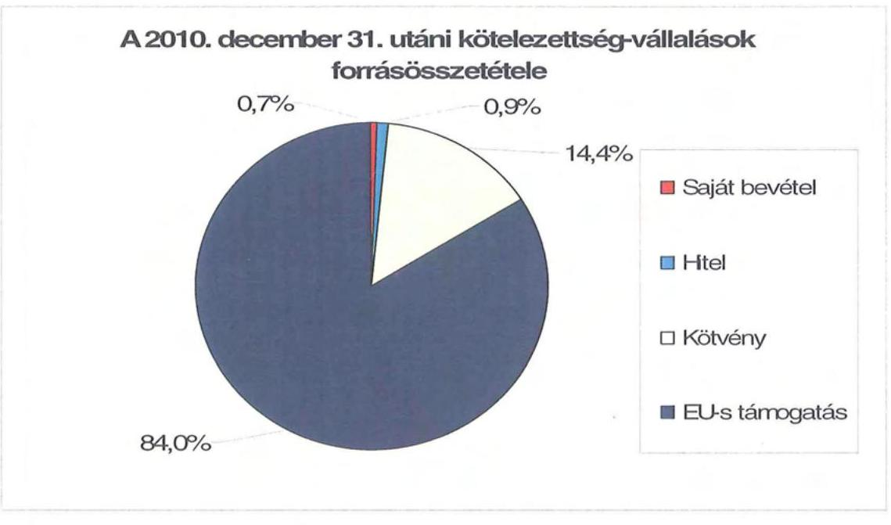

Az Önkormányzat által beadott, elbírálás alatt álló pályázatok tervezett teljes bekerülési költsége 297 millió Ft volt, amelyet teljes mértékben EU-s forrásból kívánnak megvalósítani. Az Önkormányzat vállalt kötelezettségeit - a saját bevételeken túl - a fennálló követelésállományból származó forrásai felhasználásával ( 748 millió Ft) és a jelzáloggal nem terhelt 3245,9 millió Ft forgalomképes ingatlanvagyon szükség szerinti értékesítéséből származó bevételből kívánja előteremteni.

Az Önkormányzat mérleg szerinti pénzintézeti kötelezettsége a 2006. év végéről a 2010. év végére, 1100 millió Ft-ról 10580 millió Ft-ra nőtt, amelyből az árfolyamváltozás miatti különbözet 2918 millió Ft volt. A fennálló pénzintézeti kötelezettségek kettő kötvénykibocsátásból, kettő hosszú lejáratú hitelfelvételéből és folyószámlahitel igénybevételéből keletkeztek. Az Önkormányzat 2011. I. negyedévében további 1240 millió Ft összegben bocsátott ki kötvényt, melyből 761 millió Ft összegben a folyószámlahitel tartozását törlesztette.

---

Az Önkormányzat kötelezettségvállalásaira közgyűlési döntés alapján került sor, azonban az előterjesztésekben nem mutatták be a visszafizetés forrásait, a futamidő alatt várható kamat és tőkefizetési kötelezettséget.

Az Önkormányzat kötvényeket korábbi hiteleinek törlesztése, beruházások és felújítások finanszírozása céljából bocsátott ki. Fejlesztési hiteleiből útépítéseket és infrastruktúra fejlesztéseket finanszírozott.

Az Önkormányzat a devizában fennálló 36866 ezer CHF pénzintézeti kötelezettségeiből tőketartozást nem törlesztett, 2058,7 ezer CHF ( 451,9 millió Ft) kamatot és egyéb költséget fizetett. A HUF-ban fennálló 1517,2 millió Ft kötelezettségekből 41,9 millió Ft tőkét, 106,7 millió Ft kamatot teljesített. Az Önkormányzat a kötvények kibocsátásából és a hitelek igénybevételéből származó forrásokat 2010. év végéig a céloknak megfelelően felhasználta. A 2007-2010 években átmenetileg szabad pénzeszközeiből 767 millió Ft kamatbevételt realizált, melyből 449 millió Ft származott kötvénybevétel befektetéséből. A kamatbevételeket működési kiadások finanszírozására fordították. Az Önkormányzat számlavezető bankot 2008-ban váltott. A korábban, illetve ezt követően kibocsátott kötvények lejegyzése és a hitelek folyósítása kettő eset kivételével (578,9 millió Ft hitel, és 6477 ezer CHF kötvény) a számlavezető pénzintézet által történt, amely kockázatot jelentett a banki befolyás növekedése miatt az Önkormányzat számára.

Az Önkormányzat működésének pénzügyi egyensúlyát a vizsgált időszakban folyószámlahitel igénybevételével tudta biztosítani.

A folyószámlahitel igénybevétele a 2007-2010. években az alábbiak szerint alakult:

| Megnevezés | 2007. év | 2008. év | 2009. év | 2010. év |
| :--: | :--: | :--: | :--: | :--: |
| Keretösszeg január 1-jén | 1000 | 1000 | 1000 | 1000 |
| Átlagos napi állomány | 691 | 342 | 354 | 514 |
| Folyószámla hitellel zárt napok száma (nap) | 354 | 213 | 310 | 303 |
| 2010. december 31-i egyenleg (állomány) | - | 89 | - | 898 |

A likviditás biztosítása az Önkormányzatnak 143 millió Ft kamatkiadást okozott. A 2011. évben a folyószámlahitel keret március 1-jéig állt a rendelkezésükre, melynek igénybevételéért 9 millió Ft kamatkiadást teljesítettek. Az Önkormányzat a folyószámlahitel és munkabérhitel keretek kiváltására 2011. március 1-jén 1240 millió Ft összegben bocsátott ki kötvényt. A kötvény egy összegű, 2012. március 1-jén esedékes visszavásárlási kötelezettsége az Önkormányzat számára pénzügyi kockázatot jelent.

Az Önkormányzat 2010. év végi szállítói tartozása 1455 millió Ft, melyből a lejárt tartozás 214 millió Ft volt. Átütemezett tartozás nem volt, egyéb kiadáselmaradás 20 millió Ft-ot tett ki. A lejárt tartozások 15,9\%-a ( 34 millió Ft) adminisztrációs hiba miatt - haladta meg a 91 napot.

A közbenső egyeztetés során a polgármester észrevétele szerint azért „nem került sor a jogszabály által előírt adósságrendezési eljárás kezdeményezésére, mivel a számlák fizetési kötelezettsége nem állt fenn, de azok a számviteli nyilvántartásban feltüntetésre kerültek." Az észrevételt elfogadjuk, de az indoklás ellentmondásos, mivel az

---

Áhsz. 26. § (1) bekezdése alapján a mérlegben a kötelezettségek között csak azok a szállítási, vállalkozási, szolgáltatási és egyéb szerződésekből eredő, pénzértékben kifejezett elismert tartozások mutathatók ki, amelyek a szállító, a vállalkozó, a szolgáltató, a hitelező, a kölcsönt nyújtó által már teljesített, az államháztartás szervezete által elfogadott, elismert szállításhoz, szolgáltatáshoz, valamint a kincstári, az önkormányzati vagyon részét képező eszközök kezelésbe vételéhez kapcsolódnak. Kötelezettségként kell a könyvviteli mérlegben kimutatni továbbá a jogszabályi előíráson, a bírósági, illetve a jogerős közigazgatási hatósági döntésen alapuló fizetési kötelezettségeket, és az egyéb passzív pénzügyi elszámolásokat is.

Az észrevétel indoklásához megküldött dokumentumok szerint az Önkormányzat a vállalkozók - az Excluziv Bau Kft. és a Center Invest Építőipari és Szolgáltató Kft. - által megküldött számlákat vitatta. A dokumentumok nem támasztják alá, hogy az esedékességet követően 60 napon belül nem kezdeményezte volna az általános forgalmi adóról szóló - jelenleg hatályos - 2007. évi CXXVII. tv. 77-78. §-ában foglaltak szerint az Excluziv Bau Kft. számláinak érvénytelenítését vagy módosítását, illetve - a korábban hatályos - 1992. évi LXXIV. tv. 45-45/A. §-aiban előírtak szerint a Center Invest Kft. számlájának helyesbítését vagy stornírozását. A Center Invest Építőipari és Szolgáltató Kft. 2008 áprilisában az Önkormányzattal szemben a keresetet nyújtott be a 2006. március 16-án kibocsátott 63 millió Ft összegű számlájából a ki nem egyenlített 20 millió Ft vételárrész megfizetése érdekében, a peres eljárás az észrevételhez mellékelt dokumentum szerint jelenleg folyamatban van. Az Önkormányzatnak a könyvviteli mérleg - és az azt alátámasztó számlák - szerint az Excluziv Bau Kft-vel szemben 11130 ezer Ft szállítói tartozása van. A Kft. ellen 2009 áprilisában felszámolási eljárás indult, a felszámoló az Önkormányzattal szemben hitelezői igényt nem jelentett be.

Az Önkormányzat PPP konstrukció keretében nem végzett beruházást. Az Önkormányzat, mint az Érd és Térsége Fejlesztési Társulás 78\%-os tagja 2011-ben döntött arról, hogy 5405 millió Ft összegben kezességet vállal a Társulás keretében európai uniós támogatással megvalósuló, nettó 31,4 milliárd Ft-os csatornaépítési projekt saját forrásrészének finanszírozásához kibocsátandó kötvény-sorozat és folyószámlahitel visszafizetésére.

Az Önkormányzat és intézményei a helyszíni ellenőrzés időszakában 70 folyamatban lévő peres eljárásban voltak érintettek. Az Önkormányzat terhére kimutatott perérték 4016,4 millió Ft, amelynek 96\%-át három nagy értékű kártérítési per, kártalanítási per és vállalkozói díj megfizetése - teszi ki. A legnagyobb perértékű ügyben az Önkormányzat 2005. május 31-én szerződést kötött a felperes által építendő versenysport és rendezvény csarnok meghatározott kapacitásának fix összeg ellenében történő lekötésére. Az épületnek 2006 augusztusára kellett elkészülni, mely határidőre a beruházás nem fejeződött be. A Közgyűlés 2006. október 26-i ülésén felhatalmazta a polgármestert arra, hogy utasítsa az üzemeltetésre kijelölt kft-je ügyvezetését a megállapodások és szerződések megszüntetésére, amennyiben a jogi lehetőségek arra fennállnak. 2006. december 21-i Közgyűlésen határozatban döntöttek az üzemeltető kft végelszámolással történő megszüntetéséről, a döntést azzal indokolták, hogy a sportcsarnok átadása előre nem látható ideig késik. Az Önkormányzat 2007. február 21-én kelt levelében bejelentette felperesnek, hogy elállt a köztük létrejött szerződésektől, beleértve annak valamennyi mellékletét és módosítását. A felperes a keresetét 2008 februárjában nyújtotta be a Pest Megyei Bírósághoz, amelyben azt kérte, hogy a bíróság kötelezze az Önkormányzatot 11031582

---

EUR kártérítés és 2006. október 12-től számított kamatai megfizetésére. A peres eljárás folyamatban van. Az Önkormányzat a terhére kimutatott jelentős perérték pénzügyi kockázatának mérséklésére tartalék keretet nem képzett.

A többségi önkormányzati tulajdonban lévő gazdasági társaságoknál folyószámla- és egyéb hitelek igénybevétele, kötvénykibocsátás nem volt. Az Önkormányzat egy gazdasági társasága részére adott át pénzeszközt visszafizetési kötelezettséggel egy alkalommal, összesen három millió Ft összegben.

A Közgyűlés a folyószámlahitel és fejlesztési hitelek biztosítékaként jelzálogjog alapításához és bejegyzéséhez nem járult hozzá.

Az Önkormányzat kötelezettségeinek 2010. december 31-i állományát és várható alakulását a kötelezettségek lejáratáig a következő táblázat szemlélteti:

| Megnevezés | Állomány 2010. dec. 31-én |  |  | Várható kötelezettség 2011. 2013. években |  |  | Várható kötelezettség 2014.   évet követően |  |  |
| :--: | :--: | :--: | :--: | :--: | :--: | :--: | :--: | :--: | :--: |
|  | HUF-ban   (millió Ft-   ben) | Devizában   (összege) | Deviza | HUF-ban   (millió Ft-   ben) | Devizában   (összege   ezer...ben) | Deviza | HUF-ban   (millió Ft-   ben) | Devizában   (összege ezer...   ben) | Deviza |
| Pénzintézeti kötelezettségek |  |  |  |  |  |  |  |  |  |
| Hosszú lejáratú hitelek (ÖKIF-1., ÖKIF-II.) | 1475 |  | HUF | 386 |  | HUF | 1938 |  | HUF |
| Kötvény (EH 2010. Menet) |  | 36866 | CHF |  | 3817 | CHF |  | 39583 | CHF |
| Folyószámlahitel | 898 |  | HUF | 898 |  | HUF |  |  | HUF |
| Pénzintézeti kötelezettségek összesen HUF-ben | 2373 |  | HUF | 1284 |  | HUF | 1938 |  | HUF |
| Pénzintézeti kötelezettségek összesen CHF-ben |  | 36866 | CHF |  | 3817 | CHF |  | 39583 | CHF |
| Szállítási tartozás | 1442 |  | HUF | 1442 |  | HUF |  |  |  |
| Egyéb kiadás elmaradás | 20 |  | HUF | 20 |  | HUF |  |  |  |

Az Önkormányzatnak pénzintézetekkel szemben fennálló kötelezettsége a 2010. év végén 2373 millió Ft és 36866 ezer CHF volt. Ezek várható kötelezettsége (tőke, kamat és egyéb költség) a legutóbbi kamatfizetés feltételei alapján a 2011 évtől 3222 millió Ft, továbbá 43400 ezer CHF. Az Önkormányzatnak a 2010. évtől a 2011. évre áthúzódó szállítói tartozások és egyéb kiadás elmaradások rendezése címén 1475 millió Ft fizetési kötelezettsége keletkezett. A 2011-2013. években esedékes 1284 millió Ft és 3817 ezer CHF pénzintézetekkel szembeni kötelezettség forrásául a Közgyűlés a saját bevételeket jelölte meg, ennek ellenére a 2011-2013. évi gördülő tervben 2011-ben 1240 millió Ft, 2012-ben 1283 millió Ft és a 2013. évben 1328 millió Ft működési célú kötvénykibocsátást terveztek. A 2014-től esedékes 1938 millió Ft és 39583 ezer CHF pénzintézetekkel szembeni kötelezettség forrása a közgyűlési határozatok szerint a saját bevétel, de azon belül konkrét bevételi jogcímet és összeget nem határoztak meg. A várható összes kötelezettség teljesítésére figyelembe vehető a 2010. évi mérlegben kimutatott 748,3 millió Ft követelésállomány és 3245,9 millió Ft tehermentes forgalomképes ingatlanvagyon, továbbá az Önkormányzat tájékoztatása szerint figyelembe vehető források „a mindenkori költségvetési rendeletekben megtervezett önkormányzati saját bevételek", azonban a CLF módszer szerint a működési jövedelem a mutatkozó tendencia alapján (a 2010. évi -749 millió Ft) nem nyújt fedezetet az önkormányzati kötelezettségek biztosítására.

Az Önkormányzat minősített többségi tulajdonú társaságai kötelezettségeinek 2010. december 31-i állományát és várható alakulását a kötelezettségek lejáratáig a következő táblázat mutatja be:

---

| Megnevezés | Állomány 2010. dec.31-én |  |  | Várható kötelezettség 2011   2013. években |  |  | Várható kötelezettség 2014.   évet követően |  |  |
| :--: | :--: | :--: | :--: | :--: | :--: | :--: | :--: | :--: | :--: |
|  | $\begin{gathered} \text { HUF-ben } \\ \text { (millió Ft- } \\ \text { ben) } \end{gathered}$ | Devizében   (összeg) | Összeg   neves | HUF-ben,   (millió Ft-   ben) | Devizében   (összeg) | Összeg   neves | $\begin{gathered} \text { HUF-ben, } \\ \text { (millió Ft } \\ \text { ben) } \end{gathered}$ | Devizében   (összeg) | Összeg   neves   (1000) |

A társaságoknak a 2011. évtől 5,4 millió Ft lízing és 29,3 millió Ft szállítói tartozást kell rendezniük. Ezek nem teljesítése esetén a bíróság korlátlan és teljes felelősséget állapíthat meg az Önkormányzat terhére az erre vonatkozó jogszabályokban írt feltételek megléte esetén. Az önkormányzati kötelezettségek növekedése mellett a minősített többségi tulajdonú társaságok kötelezettségei is befolyásolhatják az Önkormányzat pénzügyi helyzetét.

Az Önkormányzat költségvetési támogatásból, átengedett bevételekből, és illeték bevételekből származó bevételei a 2007. évhez képest az időszak egészét tekintve összességében nem csökkentek. Ennek ellenére az Önkormányzat folytatta az előző években elkezdett - kiadási megtakarítást és bevételnövelést eredményező - intézkedéseit. A 2007-2010. években tett intézkedések hatására 354 millió Ft bevételi többletet, továbbá 1402 millió Ft kiadási megtakarítást mutattak ki, amelyek az önkormányzat pénzügyi helyzetét javították. A kiadási megtakarítások 96,5\%-a az elrendelt álláshely-csökkentések eredménye. Az álláshely csökkentő intézkedések 2007-2010. között a Polgármesteri hivatalban és az intézményeknél összesen 188,65 álláshely (ebből 17,5 üres álláshely) megszüntetését jelentették. Egyes közszolgáltatási területeken azonban feladatbővülések is voltak, amelyek álláshely és egyben létszámnövekedéssel is jártak. Ennek következtében az időszak álláshelyeinek száma 36,71 fővel nőtt. A bevételnövelő intézkedések szabad kapacitások kihasználásához, térítési díjak emeléséhez, átmenetileg szabad pénzeszközök lekötéséhez kapcsolódtak.

Az utóellenőrzés a pénzügyi egyensúly javítására tett három szabályszerűségi és egy célszerűségi javaslat hasznosítására terjedt ki. Kettő javaslatot az intézkedési terv szerinti határidőben hasznosítottak, a jegyző kettő szabályszerűségi javaslatot határidőn túl teljesített.

Az Önkormányzat pénzügyi helyzetét összegezve a következők emelhetők ki:

A 2007-2010. években az Önkormányzat működési kockázatát növelte a negatív nettó működési jövedelem és a lejárt szállítói tartozásállomány. A működési bevételek a 2007-2010. években nem biztosították a működési kiadások és az adósságszolgálat finanszírozását, a likviditás biztosítása növekvő mértékű folyószámlahitel igénybevételével történt, melyet 2007. és 2008. években kötvénykibocsátásból származó bevételből egyenlítettek ki.

A vizsgált időszakban az Önkormányzat felhalmozási költségvetése pénzügyi hiányt mutatott, forrásait kötvénykibocsátással és hitelfelvétellel biztosították. A fejlesztési célú kötelezettségvállalások jövőben teljesítendő kifizetései tekintetében a nettó működési jövedelem negatív értéke a felhalmozási kockázatot növeli, azonban a 2010. év végén folyamatban lévő fejlesztési feladatok pénzügyi forrása rendelkezésre áll a még fel nem használt kötvénybevételből és EU-s támogatásokból. Az EU-s támogatások megelőlegezése pénzügyi kockázattal jár.

---

A pénzintézeti és egyéb kötelezettségek teljesítésének kockázatát növelte, hogy a 2010. december 31-én fennálló kötelezettségek visszafizetésének fedezetét a saját bevételben jelölték meg, nem számszerűsítették annak forrásait. Az Önkormányzat a 2011. évben 1240 millió Ft összegben bocsátott ki kötvényt. Az Önkormányzat számára pénzügyi kockázatot jelent a kötvény egy összegű, 2012. március 1-jén esedékes visszavásárlási kötelezettsége. A kockázatot csökkentheti az Önkormányzat 2010. évi követelésállománya, és forgalomképes ingatlanvagyona szükség esetén felhasználható az adósságszolgálat visszafizetésére. Az Önkormányzat terhére kimutatott jelentős összegű perérték a pénzügyi kockázatot növeli, mivel annak mérséklésére tartalék keretet nem képeztek.

A központi intézkedések miatt az Önkormányzat költségvetési támogatásból, átengedett bevételekből és illetékből származó bevételei nem csökkentek. A 2007-2010. években tett intézkedések az Önkormányzat pénzügyi helyzetét javították.

Az Állami Számvevőszékről szóló 2011. évi LXVI. törvény 33. § (1) bekezdésében foglaltak értelmében a jelentésben foglalt megállapításokhoz kapcsolódó intézkedési tervet köteles az ellenőrzött szervezet vezetője összeállítani és azt a jelentés kézhezvételétől számított harminc napon belül az ÁSZ részére megküldeni. Amennyiben az intézkedési tervet határidőben nem küldi meg a szervezet, vagy az továbbra sem elfogadható, az ÁSZ elnöke a hivatkozott törvény 33. § (3) bekezdés a)-b) pontjaiban foglaltakat érvényesítheti.

Az ellenőrzés intézkedést igénylő javaslatai:

# a Polgármesternek 

1. a Közgyűlés elé terjesztendő intézkedési terv írja elő a működés pénzügyi egyensúlyának gyors helyreállítása és hosszú távú fenntarthatósága érdekében - felelősök és határidők megjelölésével - olyan program készítését, amely tartalmazza az alábbiakat:
a) bevételszerző lehetőségek feltárását, különösen a helyi adópolitikai célok meghatározását és számszerűsítését, a bérleti díjak és a térítési díjak megállapítását, felülvizsgálatát, a követelések behajtását, az egyéb sajátos bevételek növelésének lehetőségét;
b) a tervezett beruházások teljes körű felülvizsgálatát;
c) egyéb kiadási kötelezettségek teljes körű felülvizsgálatát;
d) az intézkedések következtében jelentkező pénzügyi többlet, illetve az egyszeri bevételek tartalékba helyezését, elkülönített kezelését az adósságszolgálat teljesítése érdekében;
e) az adósságszolgálat szerkezetének áttekintését, a likviditás-menedzselést, a támogatás előfinanszírozás átláthatóbbá tételét;
f) az intézményi gazdálkodás felülvizsgálatát;

---

g) az önként vállalt feladatok finanszírozhatóságának áttekintését a kötelező feladatellátás elsődlegességének biztosítása érdekében, a gazdasági program áttekintésével összhangban;
h) az intézkedések eredményei legalább évenkénti áttekintésének előírását;
2. mutassa be félévente - a szokásos beszámoló keretében - a Közgyűlésnek:
a) az Önkormányzat és a minősített többségi tulajdonú gazdasági társaságai aktuális pénzügyi helyzetét;
b) legalább három évre kitekintően a kötelezettségek teljes körére szóló finanszírozási tervet, amely figyelembe veszi a kötelezettség éven belüli és túli felmerülését, a források számszerűsített megjelölésével;
c) az Önkormányzat folyamatban lévő és tervezett fejlesztéseihez szükséges belső és külső források rendelkezésre állását, és ebből a szempontból értékelje az Önkormányzat beruházásait;
3. intézkedjen a beruházásokkal létrehozott létesítmények működtetését és jövőbeni fenntarthatóságát biztosító megalapozott források költségvetési rendeletekben történő feltüntetéséről;
4. mutassa be a Közgyűlésnek évente a zárszámadási rendelet előterjesztésében az értékcsökkenés összegét, és ezzel összevetve az elhasználódott eszközök pótlására fordított tényleges kiadásokat, az eszközök elhasználódási fokának alakulását;
5. mutassa be a Közgyűlésnek a fejlesztési társulási tagságból, gesztorságból eredő, az Önkormányzat pénzügyi egyensúlyát befolyásoló kockázatokat, és azok mérséklését szolgáló szervezeti és egyéb intézkedéseket;

# a jegyzőnek 

1. kísérje figyelemmel a jövőbeni várható - árfolyam-, kamat- valamint visszafizetési kockázatokat, továbbá a mérlegen kívüli tételek (kezességvállalás) kockázatait, és legalább félévente tájékoztassa a Közgyűlést azok alakulásáról;
2. gondoskodjon, hogy a jövőben az adósságot keletkeztető kötelezettségvállalásokról szóló közgyűlési előterjesztések tételesen tartalmazzák a visszafizetés forrásait, valamint legalább 3 éves kitekintéssel mutassák be a kamat és árfolyamkockázat várható kihatásait;
3. intézkedjen a Polgármesteri hivatal és a további költségvetési szervek peres eljárásokból adódó kötelezettségek teljesítése érdekében a szükséges fedezet elkülönítéséről, a finanszírozási tervben történő figyelembevétel mellett.

---

# II. RÉSZLETES MEGÁLLAPÍTÁSOK 

## 1. AZ ÖNKORMÁNYZAT KÖTELEZŐ ÉS ÖNKÉNT VÁLLALT FELADATAI

A Közgyűlés a 2007-2009. évekre vonatkozóan nem, csak a 2010. és a 2011. évi költségvetési rendeleteiben döntött arról, hogy a kötelező feladatokon túl milyen önként vállalt feladatokat látnak el. A kötelező és önként vállalt feladatok megbontása az Önkormányzat besorolása alapján történt. A 2010. évi költségvetési rendelet alapján az Önkormányzat önként vállalt feladatai voltak többek között sportpálya, tanuszoda, iskolai sportcsarnok üzemeltetése, városfejlesztési, ingatlan felújítási feladatok, szakvélemények, tervek készítése, mezőőr foglalkoztatása, épületek, telkek, földterületek vásárlása, az érdi újság kiadása, tagdíjak fizetése, közbeszerzéshez kapcsolódóan külső szakértők alkalmazása, a gimnáziumi oktatás, szakképzés, alapfokú művészetoktatás, a televíziós műsorszolgáltatás, az Érdi Sport Kft. pénzeszköz átadása, az ápolási díj méltányossági alapon történő fizetése, civil szervezetek támogatása. Az Önkormányzat által készített kimutatás szerint a 2007. évben a működési költségvetési kiadás ${ }^{27}$ 8818 millió Ft, a 2010. évben 10343 millió Ft volt, amelyekből 7935 millió Ft-ot ( $90 \%$ ), illetve 8831 millió Ft-ot ( $85,4 \%$ ) a kötelező, 883 millió Ft-ot ( $10 \%$ ) és 1512 millió Ft-ot ( $14,6 \%$ ) az önként vállalt feladatok ellátására fordítottak.

A 2007. évhez képest a 2010. évre 4,6 százalékponttal nőtt az önként vállalt feladatok aránya. Az önkormányzati intézmények önként vállalt feladataira fordított működési kiadások a 2007. évi 495 millió Ft-ról a 2010. évre 448 millió Ft-ra ( $9,3 \%$-kal) csökkentek, aminek következtében az önkormányzati intézmények önként vállalt feladataira fordított működési kiadások aránya $8,9 \%$-ról $7,8 \%$-ra esett vissza. A Polgármesteri hivatal önként vállalt feladataira fordított működési kiadásai a 2007. évi 388 millió Ft-ról a 2010. évre 1064 millió Ft-ra emelkedtek, ezért a Polgármesteri hivatal önként vállalt feladatainak aránya a működési kiadásokon belül 12\%-ról 23\%-ra nőtt. A változást a 2007. évhez viszonyítva az önként vállalt feladatok bővülése okozta ${ }^{28}$.

Az Önkormányzat működési kiadásai a 2007. évi 8818 millió Ft-ról a 2010. évre 1525 millió Ft-tal ( $17,3 \%$-kal) 10343 millió Ft-ra nőttek, az emelkedés 91 %-a a Polgármesteri hivatalban merült fel. Az intézmények működési kiadásai 5581 millió Ft-ról 5718 millió Ft-ra ( $2,5 \%$-kal) emelkedtek, ezen belül az oktatási feladatokat ellátó intézmények működési kiadásai a 3070 millió Ft-ról 2716 millió Ft-ra ( $11,5 \%$-kal), a szociális és gyermekjóléti intézményeké 575 millió Ft-ról 566 millió Ft-ra ( $1,6 \%$-kal) csökkentek, továbbá a Közterület-fenntartó Intézmény működési kiadásai 1077 millió Ft-ról 1478 millió Ft-ra ( $37,3 \%$-kal), az Egységes Pedagógiai Szakszolgálaté 67 millió Ft-ról 130 millió Ft-ra ( $94 \%$-kal),

[^0]
[^0]:    ${ }^{27}$ A működési költségvetési kiadások nem tartalmazzák az OEP finanszírozására figyelemmel a Szakorvosi Rendelőintézet, valamint az Intézményi Gondnokság kiadásait.
    ${ }^{28}$ Az uszoda, a sportpálya, a sportcsarnok üzemeltetése, a városfejlesztési feladatok ellátása, pályázati projektek előkészítése.

---

a közművelődési intézményeké 239 millió Ft-ról 274 millió Ft-ra (14,6\%-kal), a tűzoltóságé 553 millió Ft-ról 554 millió Ft-ra ( $0,2 \%$-kal) nőtt. A 2007. évről a 2010. évre az Önkormányzat működési kiadásaiból az oktatási intézmények részaránya $34,8 \%$-ról $26,3 \%$-ra, a szociális és gyermekjóléti intézményeké $6,5 \%$-ról $5,5 \%$-ra csökkent, míg az egyéb intézményi feladat ellátásé $13,0 \%$-ról $15,6 \%$-ra, a Polgármesteri hivatalé 8,0 százalékponttal $44,7 \%$-ra emelkedett.

Az Önkormányzat 2010. évi működési kiadásai finanszírozási arányait adatszolgáltatása szerint - az alábbi táblázat mutatja be:

Az Önkormányzat 2010. évi működési kiadásai és finanszírozási arányai főbb feladatonként

| Ellátott feladat | Működési kiadás összesen (millió Ft) | Kötelező feladat részaránya $\%$ | Bevétel összesen (millió Ft) | Állami támogatás részaránya $\%$ | Intézményi saját bevétel részaránya $\%$ | Önkormányzati támogatás részaránya $\%$ |
| :--: | :--: | :--: | :--: | :--: | :--: | :--: |
| Óvodák | 640 | 100,0 | 644 | 55,6 | 1,2 | 43,2 |
| Általános iskolák | 1579 | 100,0 | 1598 | 55,6 | 2,3 | 42,1 |
| Gimnáziumok | 288 | 16,7 | 291 | 51,1 | 7,7 | 41,2 |
| Szakközépiskolák, szakképző intézmények | 209 | 0,0 | 216 | 55,3 | 1,9 | 42,8 |
| Kollégiumok | 0 | 0,0 | 0 | 0 | 0 | 0 |
| Szociális intézmények | 504 | 100,0 | 525 | 35,0 | 16,8 | 48,2 |
| Gyermekjóléti intézmények | 62 | 100,0 | 79 | 32,2 | 0 | 67,8 |
| Közművelődési intézmények | 274 | 100,0 | 291 | 1,2 | 9,1 | 89,7 |
| Sportlétesítmények | 0 | 0,0 | 0 | 0 | 0 | 0 |
| Igazgatási intézmények | 0 | 0,0 | 0 | 0 | 0 | 0 |
| Tűzoltóság | 554 | 100,0 | 571 | 91,4 | 8,6 | 0 |
| egyéb* | 1608 | 100,0 | 2043 | 7,8 | 6,3 | 85,9 |
| Intézmények összesen | 5718 | 92,2 | 6258 | 38,5 | 5,8 | 55,7 |
| Polgármesteri Hivatalban ellátott feladatok működési kiadásai | 4625 | 77,0 | 6348 | 13,2 | 15,3 | 71,5 |
| Működési kiadások összesen | 10343 | 85,4 | 12606 | 25,7 | 10,6 | 63,7 |

* Az egyéb ellátott feladatok között a Közterület-fenntartó Intézmény, valamint az Egységes Pedagógiai Szakszolgálat működési kiadásait vettük számba, amelyek önkormányzati támogatási részaránya $86,9 \%$, illetve $70,9 \%$ volt a 2010 . évben.

A 2010. évben a működési kiadásokon belül a két legnagyobb kiadás az 5718 millió Ft összegű intézményi feladatok működési kiadása - amely az összes működési kiadás $55,3 \%$-a -, valamint a Polgármesteri hivatalban kezelt feladatok 4625 millió Ft összegű működési kiadása volt, amely az összes működési kiadás $44,7 \%$-át tette ki.

A 2010. évben az intézményi feladatokon belül a közoktatási feladatokra fordított 2716 millió Ft az összes működési kiadás $26,3 \%$-át tette ki, a működési kiadáshoz az Önkormányzat 1163 millió Ft támogatást nyújtott, amely a közoktatási ágazat összes bevételének 42,3\%-a volt. Az óvodai neveléshez 278 millió

---

Ft támogatást nyújtott az Önkormányzat, ami 43,2\%-os támogatási arányt jelentett. Az általános iskolai feladatokhoz 673 millió Ft támogatást nyújtott az Önkormányzat, ez az összes bevételük 42,1\%-a volt. A gimnázium működéséhez 120 millió Ft támogatást kellett adni, ami 41,2\%-os arányt jelentett a működési bevételein belül. A szakképző intézménynek 93 millió Ft támogatást nyújtott az Önkormányzat, ami 42,8\%-os arány.

A szociális intézményi feladatokra fordított 504 millió Ft az összes működési kiadás $4,9 \%$-át tette ki, amelyhez 253 millió Ft működési támogatást nyújtott az Önkormányzat, ez az ágazat összes működési bevételének 48,2\%-a.

A közművelődési intézményi feladatokra fordított 274 millió Ft az összes működési kiadás $2,6 \%$-át tette ki, amelyhez 261 millió Ft működési támogatást nyújtott az Önkormányzat, ez az ágazat összes bevételének 89,7\%-a.

A hivatásos tűzoltóságra fordított 554 millió Ft az összes működési kiadás 5,4\%-át tette ki, amelyhez működési támogatást nem nyújtott az Önkormányzat.

Az egyéb intézményi feladatellátásra fordított 1608 millió Ft az összes működési kiadás $15,5 \%$-a volt, ezekhez a feladatokhoz az Önkormányzat 85,9\%-ban járult hozzá az általa biztosított támogatással.

A működési bevételek forrásösszetételét tekintve az állami támogatások önkormányzati szinten 145 millió Ft-tal ( $4,3 \%$-kal) csökkentek a 2007. évről a 2010. évre. A saját bevételek önkormányzati szinten 71,6\%-kal 557 millió Ft-tal nőttek. A költségvetési szervek csökkenő állami támogatását a saját bevételek és az önkormányzati támogatás növekedése ellensúlyozta, utóbbi 10,6\%-kal 767 millió Ft-tal nőtt 2007-ről 2010-re.

Az önkormányzati intézményekben az ellátottak száma a 2007. évről a 2010. évre 8550 főről 10082 főre változott, 1532 fővel (17,9\%-kal) nőtt. Az óvodás ellátottak száma 34 fővel, a gimnáziumban tanulók száma 118 fővel emelkedett. A gyermekjóléti intézményekben ellátottak száma a 2007. évi 1157 főről a 2010. évre 2646 főre változott, így az ellátotti létszám több mint duplájára nőtt, az általános iskolai és a szakiskolai tanulók száma 109 fővel csökkent.

Az Önkormányzat a kötelező és az önként vállalt feladatait ${ }^{29}$ 2010. december 31-én 23 költségvetési szervvel, öt $25 \%$ feletti tulajdonú és egy $10 \%$ tulajdoni hányadú, működő gazdasági társasággal látta el, valamint szolgáltatási szerződéssel további kettő gazdasági társasággal biztosította a közszolgáltatási feladatok ellátását, amelyekben nem rendelkezik részesedéssel.

A költségvetési szervek közül 13 önállóan működő és gazdálkodó, 10 önállóan működő, amelyek alapító okirataik szerint összesen 45 telephellyel rendelkeznek. Az Önkormányzat az óvodai ellátást kettő székhely óvodával és a hozzá-

[^0]
[^0]:    ${ }^{29}$ A Közgyűlés a 2007-2009. évekre vonatkozóan nem, a 2010. és a 2011. évi költségvetési rendeleteiben döntött arról, hogy a kötelező feladatokon túl milyen önként vállalt feladatokat látnak el. A kötelező és önként vállalt feladatok megbontása az Önkormányzat besorolása alapján történt.

---

juk kapcsolódó 11 tagóvodával biztosítja, az általános iskolai oktatást nyolc általános iskolában, valamint azok 11 telephelyén látják el, amelyek közül az egyik általános iskolában biztosítják a sajátos nevelési igényű, halmozottan hátrányos helyzetű tanulók nappali rendszerű oktatását. A középfokú nevelés egy gimnáziumban folyik négy és nyolc osztályos évfolyamon, továbbá az egy telephellyel rendelkező szakképző iskolában. A közoktatási tevékenységet az Egységes Pedagógiai Szakszolgálat segíti. A járóbeteg szakellátást az Önkormányzat által alapított, egy telephellyel működő Szakorvosi Rendelőintézet, a szociális és gyermekjóléti feladatokat az önállóan működő Szociális Gondozó Központ 10 tagintézménnyel ${ }^{30}$ látja el. A kulturális, művelődési tevékenységet az Önkormányzat által alapított Művelődési Központ és a Városi Könyvtár három-három telephellyel, valamint a Földrajzi Múzeum egy telephellyel biztosítják. A tűzvédelmi feladatok ellátására az Önkormányzat önállóan működő és gazdálkodó tűzoltóságot, a helyi köztemető fenntartására és működtetésére, a zöldterület kezelésére, a közcélú és közhasznú foglalkoztatás megszervezésére, a közutak, hidak üzemeltetésére létrehozta a Közterület-fenntartó Intézményt. Igazgatási feladatokat lát el a Polgármesteri hivatal.

A Polgármesteri hivatal új szervezeti struktúrájának kialakítása 19 fő létszámcsökkentéssel járt együtt. A 2008. évben az általános iskolák átszervezése - a székhely intézmények és azok telephelyei számának (19) változatlanul hagyása mellett - az általános iskolák gazdálkodási jogkörének megváltoztatását jelentette, a nyolc részben önállóan gazdálkodó általános iskolából három önállóan gazdálkodó és hozzájuk rendelve öt részben önállóan gazdálkodó intézmény lett. Az intézkedés következtében az Intézményi Gondnokság feladatai az általános iskolák pénzügyi-gazdasági feladatainak ellátásával csökkentek, és ezzel összefüggésben a foglalkoztatottak száma 22 fővel lett kevesebb. A nyolc, részben önállóan gazdálkodó óvoda gazdálkodási jogkörét módosították, a város valamennyi óvodáját kettő intézménybe integrálták úgy, hogy a székhely óvodák és azok telephelyeinek száma (13) nem változott. Az intézkedések létszámcsökkentő hatását kimutatta az Önkormányzat, amelynek eredményeként a személyi juttatások és járulékaik együttesen 1353 millió Ft-tal csökkentek a 2008-2010. évek között. Az intézkedések az önkormányzati adatszolgáltatás szerint a dologi kiadások alakulását nem befolyásolták. Egységes Pedagógiai Szakszolgálatot hoztak létre, amely intézmények közötti feladat átcsoportosítással járt együtt, az intézkedés az Önkormányzat pénzügyi egyensúlyát nem befolyásolta.

Az Önkormányzatnak a 2010. évben hat működő gazdasági táraságban volt tulajdoni hányada; négy többségi tulajdonú gazdasági társaságával biztosítja a televíziós műsorszolgáltatást, a tanuszodája, sportpályája üzemeltetését, projekt menedzseri és nyilvántartási, valamint épület-átalakítási, vagyonkezelési feladatokat, továbbá sportrendezvények szervezését és az utánpótlás nevelését. Kettő kisebbségi befolyással rendelkező gazdasági társasággal látja el a közüzemi víz- és csatornaszolgáltatást, valamint a települési szilárd hulladék szál-

[^0]
[^0]:    ${ }^{30}$ Családsegítő Szolgálat, Gyermekjóléti Központ, Átmeneti Ellátást Biztosító Központ, Női Átmeneti Szálló, Családok Átmeneti Otthona, Nappali Melegedő, Habilitációs Központ, Időseket Ellátó Központ, valamint az I-II. számú Bölcsőde.

---

lítását. Szolgáltatási szerződés alapján biztosítja a közvilágítást és a helyi tömegközlekedést.

Az Önkormányzat a 2009. évben három gazdasági társaságot hozott létre ${ }^{31}$. Az Érdi Létesítmény Üzemeltető Kft. látja el az Önkormányzat tanuszodájának, sport pályájának üzemeltetését. A Kft. a 2009. évben feladat ellátási szerződés alapján 4 millió Ft működési pénzeszköz átadásban részesült. Az Érdi Sport Kft. a feladat ellátási szerződés alapján a 2009. évben 12 millió Ft, a 2010. évben 80 millió Ft működési pénzeszköz átadásban részesült.

A négy többségi önkormányzati tulajdonú gazdasági társaság saját tőkéje 2010. december 31-én 2 millió Ft volt, (ezen belül a 100\%-os önkormányzati tulajdonban lévő társaságok saját tőkéje 2,6 millió Ft), a jegyzett tőkéjük 4,9 millió Ft (ezen belül a 100\%-os önkormányzati tulajdonban lévő társaságok jegyzett tőkéje 4,0 millió Ft) volt. A vizsgált időszakban az Önkormányzat gazdasági társaságainál tőkeemelést nem hajtottak végre, csődeljárás nem volt, felszámolási eljárást nem kezdeményeztek.

A Közgyűlés állapította meg a nem többségi önkormányzati tulajdonú gazdasági társaságai által nyújtott közszolgáltatásokhoz kapcsolódó - a települési szilárd hulladékszállítás és a közüzemi víz és csatornaszolgáltatás - díjait. Az Önkormányzatnál a 2007-2010. években a szolgáltatási díjbevételek kiegészítéséhez pénzeszköz átadás nem történt. A helyi tömegközlekedés közszolgáltatási feladatait ellátó gazdasági társaságban - Volán Zrt. - az Önkormányzat tulajdoni részesedéssel nem rendelkezik, a 2007-2009. években 85,4 millió Ft működési támogatást nyújtott. A Közgyűlés határozta meg a városi helyi járatú tömegközlekedés díjait.

Az Önkormányzat négy többségi tulajdonú gazdasági társaságánál - a társaságok által nyújtott adatszolgáltatás alapján - az önkormányzati feladatokhoz rendelt 2010. év végi nettó vagyon összesen 785 millió Ft, amely 100\%-ban az önként vállalt feladatok ellátását szolgálta. A nem többségi tulajdonú Regionális Víziközmű Kft. feladat ellátáshoz rendelt - az Önkormányzat által biztosított - nettó vagyon 2568 millió Ft volt, amelyből az üzemeltetésre átadott nettó vagyon $94 \%$-ot képviselt.

Az önkormányzati feladatok ellátásában résztvevő gazdasági társaságokban az Önkormányzat tulajdoni részesedését, a kötelező és önként vállalt feladatokhoz rendelet nettó vagyont, a gazdasági társaságok 2010. december 31-én fennálló kötelezettségeit, továbbá az Önkormányzat társaságoknak 2007-2010 között nyújtott működési és felhalmozási célú pénzeszköz átadást a jelentés 4. számú melléklete tartalmazza.

Az Önkormányzat a 2007-2010. években közszolgáltatási feladatot nem vett át más önkormányzattól, társulástól, egyháztól, gazdasági társaságtól, egyéb szervezettől.

[^0]
[^0]:    ${ }^{31}$ Az Érdi Sport Kft-ét, az Érdi Létesítmény Üzemeltető Kft-ét és az Érdi Városfejlesztési és Szolgáltató Kft-ét.

---

# 2. A PÉNZÜGYI EGYENSÚLYI HELYZET ALAKULÁSA 

### 2.1. A működési és a felhalmozási egyensúly alakulása

A hagyományos költségvetési szerkezet helyett az önkormányzat pénzügyi helyzetét a CLF módszerrel mutatjuk be, amelyben jobban elkülönülnek a vagyonnal kapcsolatos bevételek és kiadások az önkormányzati feladatokkal kapcsolatos közvetlen működtetési bevételektől és kiadásoktól. A módszer következetesen elkülöníti a folyó és a felhalmozási költségvetés bevételeit és kiadásait, azok költségvetési egyenlegeit. A saját folyó bevételek, valamint a saját felhalmozási bevételek nem tartalmazzák az előző évi pénzmaradványok felhasználásából származó pénzforgalom nélküli bevételeket ${ }^{32}$.

A folyó költségvetés egyenlege, a működési jövedelem megmutatja, hogy az önkormányzat éves folyó bevétele fedezetet biztosít-e a kötelező és önként vállalt feladatellátáshoz kapcsolódó éves folyó kiadásaira. A működési jövedelem negatív értéke pénzügyileg fenntarthatatlan helyzetet jelez. A mutató pozitív értéke megtakarítást mutat, amely forrásul szolgálhat az önkormányzat fennálló kötelezettségei megfizetéséhez, valamint fejlesztéseihez.

A felhalmozási költségvetés pozitív értéke felhalmozási többletet mutat, amely a jövőbeni fejlesztések forrását biztosíthatja. Amennyiben a folyó költségvetési hiány finanszírozása a felhalmozási többletből történik, ez szűkebb értelemben vagyonfelélésnek tekinthető. Amennyiben a felhalmozási költségvetés megtakarítása fejlesztési célú hitelek, kötvények adósságszolgálatát finanszírozza, az, változatlan vagyontömeg mellett, a korábban megelőlegezett tőkebevételek valós realizációjának tekinthető. A felhalmozási deficit által generált finanszírozási igény önmagában nem jár pénzügyi kockázattal, a pénzügyileg fenntartható beruházásokhoz kapcsolódó kötelezettségvállalás (adósságszolgálat) prudens költségvetési gazdálkodással teljesíthető.

A módszer a pénzügyi kapacitás fogalmát helyezi a középpontba. Az adós hitelfelvételi képessége, hosszú távú fizetőképessége vagy bonitása a pénzügyi kapacitással, ezen belül is a nettó működési jövedelemmel jellemezhető. A nettó működési jövedelem negatív értéke az egyes költségvetési években jelentkező adósságszolgálat túlzott mértékére utal ${ }^{33}$. A nettó működési jövedelem negatív értékének felhalmozási többletből, vagy további hitelből történő finanszírozása pénzügyileg nem fenntartható gazdálkodást vetít előre. A pozitív értéket mutató nettó működési jövedelem fejlesztési kiadások fedezetét biztosíthatja, illetve a folyamatosan, évenként képződő pozitív nettó működési jövedelemből meghatározható a jövőben vállalható, teljesíthető éves adósságszolgálat, ily módon az a hitelösszeg, amely - a többi tényezőt, feltételt adottnak tekintve - visszafizetési kockázat nélkül felvehető.

[^0]
[^0]:    ${ }^{32}$ A költségvetési években kialakuló hiány finanszírozása az előző években képzett tartalékok felhasználásával is történhet.
    ${ }^{33}$ Kivéve, ha annak finanszírozására a korábbi években képzett tartalékok fedezetet nyújtanak.

---

A CLF módszer alapján a pénzügyi kapacitás mértéke az önkormányzat összevont, nettósított, a központi információs rendszerbe a Kincstáron keresztül leadott éves költségvetési beszámolójának 80-as űrlapjában szerepeltetett adatok alapján került meghatározásra.

# CLF módszer szerinti önkormányzati adatok 

ezer Ft
ezer Ft

| Megnevezés | 2007 | 2008 | 2009 | 2010 |
| :--: | :--: | :--: | :--: | :--: |
| Folyó bevételek | 9671870 | 10563423 | 11105521 | 11492105 |
| Folyó kiadások | 10166516 | 11067964 | 11035735 | 12240882 |
| Működési jövedelem | $-494646$ | $-504541$ | 69786 | $-748777$ |
| Nettó működési jövedelem =működési jövedelem - tóketörlesztés | $-1328346$ | $-2059935$ | $-316803$ | $-2494609$ |
| Felhalmozási bevételek | 372816 | 302386 | 622003 | 1409228 |
| Felhalmozási kiadások | 818717 | 1067787 | 2724536 | 2893632 |
| Felhalmozási költségvetés egyenlege | $-445901$ | $-765401$ | $-2102533$ | $-1484404$ |
| Finanszírozási műveletek nélküli (GFS) pozíció=működési jövedelem+felhalmozási költségvetés egyenlege | $-940547$ | $-1269942$ | $-2032747$ | $-2233181$ |
| Finanszírozási műveletek egyenlege | 1407243 | 3542328 | 762711 | 1584497 |
| Tárgyévi pozíció | 466696 | 2272386 | $-1270036$ | $-648684$ |
| Egyéb tájékoztató adatok |  |  |  |  |
| Összes kötelezettség* | 2134504 | 7890228 | 8956628 | 12315717 |
| -ebből rövid lejáratú | 547064 | 669955 | 1003348 | 2666384 |
| Folyószámlahitel napi átlagos állománya ** | 691080 | 342338 | 353981 | 513518 |
| Likvidhitel napi átlagos állománya ** | 0 | 0 | 0 | 0 |
| Munkabérhitel napi átlagos állománya** | 0 | 0 | 0 | 0 |
| Finanszírozásba vonható eszközök: | 648370 | 3670751 | 2380742 | 982063 |
| Tartós hitelviszonyt megtestesítő értékpapírok év végi állománya | 42 | 750037 | 750037 | 42 |
| Hosszú lejáratú bankbetétek év végi állománya | 0 | 0 | 0 | 0 |
| Értékpapírok év végi állománya | 19973 | 19973 | 0 | 0 |
| Pénzeszközök (idegen pénzeszközök nélkül) év végi állománya | 628355 | 2900741 | 1630705 | 982021 |

*Az összes kötelezettséget a passzív pénzügyi elszámolások nélkül vettük figyelembe mert a passzívák a pénzmaradvány elszámolás tételei közé tartoznak
**A folyószámla hitel átlagos állományát 365 napos nevezővel számítottuk
A 2007-2010 közötti időszakban az Önkormányzat kiadásainak és bevételeinek főbb jogcímek szerinti alakulását, a működési jövedelemnek, a felhalmozási költségvetés egyenlegének, továbbá a nettó működési jövedelem számításának módját a jelentés 2. számú melléklete tartalmazza.

---

Az Önkormányzatnál a főkönyvi könyvelési hiba miatt a folyószámlahitel és a kamatkiadások az elemi beszámolóban kimutatottaktól eltérnek ${ }^{34}$. A hitelfelvételek és a hiteltörlesztések a valós adatokhoz képest a 2008. évben 1289,7 millió Ft-tal, a 2009. évben 289,2 millió Ft-tal, a 2010. évben 1712,3 millió Ft-tal nagyobb összegben kerültek kimutatásra a folyószámlahitel felvétel és törlesztés halmozott pénzforgalmi elszámolása miatt. A költségvetési beszámoló adataiból a CLF módszer szerint számított nettó működési jövedelem emiatt a valósnál nagyobb forráshiányt mutatott a 2008-2010. években. A halmozódás kiszűrésével korrigált nettó működési jövedelem 2008-ban -770,2 millió Ft, 2009-ben -27,6 millió Ft, a 2010. évben -782,3 millió Ft volt.

A CLF módszer szerint figyelembe vett folyó és felhalmozási bevételek és kiadások alakulását befolyásolta, hogy az Önkormányzat tagja az Érd és Térsége Fejlesztési Társulásnak, amelynek teljesített bevételei és kiadásai a társulásban résztvevő Tárnok és Diósd Önkormányzatok adatait is tartalmazzák.

A vizsgált időszakban az Önkormányzat folyó költségvetési egyenlege, működési jövedelme - a 2009. év kivételével - negatív összeg volt, melynek alakulását a következő ábra szemlélteti:
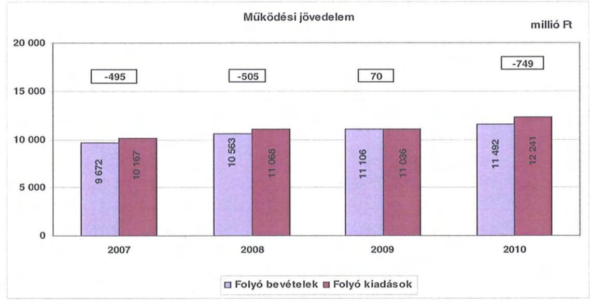

[^0]
[^0]:    ${ }^{34}$ Az Önkormányzatnál a 2007-2010. években a folyószámlahitelt a likvid hitelek helyett - az Áhsz. 9. számú melléklet a számlaosztályok tartalmára vonatkozó előírások 3.b) és 4. e) pontjában foglaltak ellenére - rövid lejáratú hitelek között tüntették fel. A 2010. évben az Áhsz 9. számú mellékletének számlakerettükör 573. Kamatkiadások számlája kötelező alábontását nem alkalmazták, ezért az összes kamatkiadást működési célú kamatkiadásként tervezték, illetve számolták el.
    Az Önkormányzatnál a 2008. és a 2010. években a folyószámlahitel év közbeni forgalmának év végi rendezését nem az Áhsz. 9. számú melléklet a számlaosztályok tartalmára vonatkozó előírások 4. e) pontjában foglaltak szerint hajtották végre, továbbá a 2010. évben a tartós hitelviszonyt megtestesítő értékpapír 119043 ezer Ft összegű hozamának elszámolását nem az Áhsz. 9. számú mellékletének a számlaosztályok tartalmára vonatkozó előírások 14. a) pontja szerint végezték el, emiatt a folyó bevételek főösszege és a finanszírozási műveletek egyenlege 2010. évben 119043 ezer Ft-tal eltér.

---

A folyó költségvetés hiánya, (a működési forráshiány) 2007-ben a folyó kiadások 4,9\%-át (495 millió Ft-ot), 2008-ban 4,6\%-át (505 millió Ft-ot), 2010-ben 6,1\%-át (749 millió Ft-ot) jelentette. 2009-ben az Önkormányzat folyó költségvetési egyenlege minimális mértékben ugyan (0,6\%), de pozitív összegű volt. A vizsgált időszakban az együttes működési jövedelem 1679 millió Ft hiányt mutatott.

A működési hiányt 2007-ben kötvénykibocsátásból, 2008-ban folyószámlahitelből és kötvénykibocsátásból, 2010. évben folyószámlahitelből fedezték. A folyószámlahitel napi átlagos állománya 2007-2010 között 691 millió Ft-ról 514 millió Ft-ra csökkent. A folyószámlahitel napi átlagos állománya a 20082009. években 342, illetve 354 millió Ft volt. A folyószámlahitel napi átlagos állományának csökkenését a 2007-2008. években kibocsátott kötvényekből származó bevételek folyószámlahitel törlesztésre történt felhasználása, valamint egy részének működési célú felhasználása eredményezte ${ }^{35}$.

Az Önkormányzat összes kötelezettsége a 2007. december 31-ei állapothoz képest 2010. december 31-ére 5,8-szeresére, 10181 millió Ft-tal nőtt. Ezen belül a rövid lejáratú kötelezettségek állományának részaránya a 2007. évi 25,6\%-ról 2010. évre 21,7\%-ra csökkent. Az Önkormányzat 2006. december 31-én fennálló pénz és tőkepiaci kötelezettsége 1100 millió Ft-ról több mint 9,5-szeresére, 10580 millió Ft-ra nőtt a hosszú lejáratú hitelfelvétel és a kötvénykibocsátás állományának emelkedése miatt. Az összes kötelezettségen belül a hosszú lejáratú pénzintézeti kötelezettségek állománya a 2007. évi 1587 millió Ft-ról 508\%-kal (8062 millió Ft-tal) 2010. évre 9649 millió Ft-ra nőtt.

A rövid lejáratú kötelezettségek 2010-ben 2666 millió Ft-ot tettek ki, amely közel 5-szöröse a 2007. évi rövid lejáratú kötelezettségállománynak (547 millió Ft). Az Önkormányzat lejárt szállítói tartozásállománya vizsgált időszakban 119 millió Ft-tal ugyancsak emelkedett (95 millió Ft-ról 214 millió Ft-ra). A rövidlejáratú pénzintézeti kötelezettségek 2010-ben 932 millió Ft-ot tettek ki, amely 894 millió Ft-tal volt magasabb a 2007. évi rövidlejáratú pénzintézeti kötelezettségvállalásnál.

Az Önkormányzat 2010. évi idegen pénzkészlet nélküli záró pénzkészlete 982 millió Ft volt ${ }^{36}$, amelynek 97\%-a kötelezettséggel terhelt.

Az Önkormányzat pénzügyi kapacitása ${ }^{37}$ a vizsgált időszakban - az éves költségvetési beszámolókban kimutatott adatok alapján - negatív értéket mutatott. A nettó működési jövedelem értéke a folyó költségvetési egyenleg mellett az adott költségvetési év adósságtörlesztésének hatását is tükrözi. A nettó működési jövedelem 2007. évről - a 2009. év kivételével - egyre

[^0]
[^0]:    ${ }^{35}$ A 2007-2008. években a kötvénykibocsátásból 1699 millió Ft-ot fordítottak folyószámlahitel visszafizetésre.
    ${ }^{36}$ Ebből az Érd és Térsége Fejlesztési Társulás pénzeszköze 177 millió Ft-ot tett ki.
    ${ }^{37}$ Az Önkormányzat pénzügyi kapacitását a nettó működési jövedelem jellemezni, amely a tárgyévben a folyó bevételek és folyó kiadások egyenlegeként képződő működési jövedelemnek a tárgyévben fizetett tőketörlesztéssel csökkentett összege. Értéke pozitív és negatív is lehet.

---

csökkenő tendenciát mutatott. A csökkenés oka - a 2007-2010. években képződött 1679 millió Ft negatív működési jövedelem mellett - az, hogy az Önkormányzatnál a tőketörlesztésen belül a folyószámlahitel törlesztését halmozott adattartalommal mutatták ki, holott a hatályos számviteli előírások értelmében sem a tőketörlesztések, sem a hitelfelvételek összegében nem mutatható ki a likvid hitelek felvétele és visszafizetése. Az éves költségvetési beszámoló adatai szerint a 2010. évben 912 millió Ft-tal magasabb összegű hiteltörlesztést mutattak ki a 2007. évhez képest. A hitelfelvételek és a hiteltörlesztések összege a valóságos adathoz képest a 2008. évben 1289,7 millió Ft-tal, a 2009. évben 289,2 millió Ft-tal, a 2010. évben 1712,3 millió Ft-tal nagyobb összegben kerültek kimutatásra. A CLF módszer szerint - a költségvetési beszámoló adataiból - számított nettó működési jövedelem a fentiek miatt a valóságosnál a halmozódás összegével nagyobb forráshiányt mutatott a 2008-2010. években. A halmozódás kiszűrésével korrigált nettó működési jövedelem 2008-ban -770 millió Ft, 2009-ben - 27 millió Ft, a 2010. évben - 782 millió Ft volt ${ }^{38}$. A nettó működési jövedelem - a 2009. év kivételével az emelkedő évenkénti tőketörlesztés mellett - 2007-ben - 1328 millió Ft, 2010-ben pedig már - 2495 millió Ft volt. A pénzügyi kapacitás 2007-hez viszonyított romlását a folyó bevételek és kiadások különbségéből származó működési jövedelem csökkenése (a működési forráshiány növekedése) és a halmozott összegű tőketörlesztés okozta.

Az Önkormányzat költségvetési beszámolója szerint a vizsgált időszakban együttesen 6200 millió Ft negatív nettó működési egyenlege keletkezett, ami 3291,2 millió Ft-tal nagyobb időszaki forráshiányt mutat a téves elszámolásból adódóan. Ha a kialakult hiányt az Önkormányzat csak további hitelből tudja finanszírozni, az az eladósodás növekedését vonja maga után. A kialakult pénzügyi helyzet pozitív nettó működési jövedelmet eredményező gazdálkodás mellett teszi elkerülhetővé további külső források bevonását, az eladósodás növekedését.

Az alábbi grafikon az éves költségvetési beszámolók adatai alapján számított nettó működési jövedelmet mutatja:

[^0]
[^0]:    ${ }^{38}$ Az Önkormányzat tőketörlesztési kötelezettsége az éves költségvetési beszámoló szerint a 2007. évben 833,7, a 2008. évben 1555,4, a 2009. évben 386,6 a 2010. évben 1745,8 millió Ft volt, ezzel szemben a valóságban a 2008. évben 265,7 millió Ft, a 2009. évben 97,4 millió Ft és a 2010. évben 33,4 millió Ft tőketartozást törlesztettek.

---

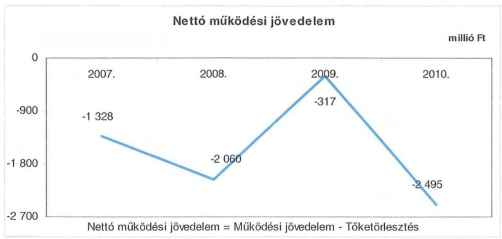

Az Önkormányzat pénzügyi kapacitása a vizsgált időszakban az éves költségvetési beszámolókban kimutatott folyószámlahitel felvétel és törlesztés korrigált adataival számítva is évről évre negatív értéket mutatott. A korrigált nettó működési jövedelem 2007. évi -1328 millió Ft-ról a 2009. évre -27 millió Ft-ra javult, a 2010. évben -782 millió Ft-ra esett vissza az évről évre csökkenő hiteltörlesztés mellett. A 2010. évben 800 millió Ft-tal csökkent az esedékes tőketörlesztési kötelezettség a 2007. évhez képest a felvett hosszúlejáratú hitelek és a kibocsátott kötvények még fennálló türelmi ideje miatt. A pénzügyi kapacitás 2007-hez viszonyított javulását a folyó bevételek és kiadások különbségéből származó működési jövedelem csökkenése (a működési forráshiány növekedése) és a tőketörlesztési kötelezettség csökkenése együttesen okozta.

Az Önkormányzatnak a vizsgált időszakban összesen 2907 millió Ft negatív korrigált nettó működési egyenlege keletkezett, ha a kialakult hiányt az Önkormányzat csak további hitelből tudja finanszírozni, az pedig eladósodás növekedését vonja maga után. A kialakult pénzügyi helyzet pozitív nettó működési jövedelmet eredményező gazdálkodás mellett teszi elkerülhetővé további külső források bevonását, az eladósodás növekedését.
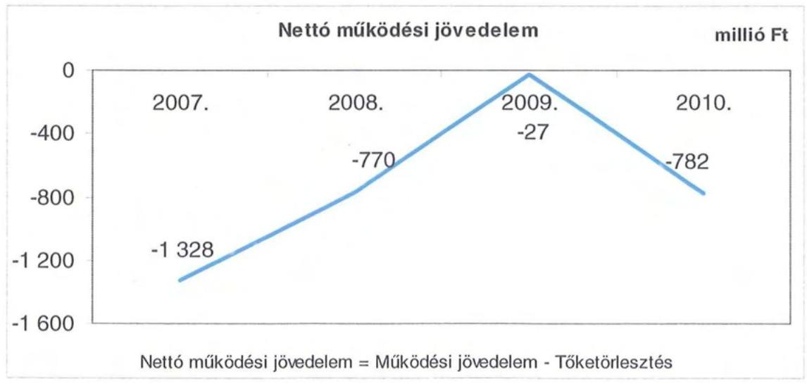

---

A 2007-2010. években az Önkormányzat felhalmozási költségvetésének egyenlege folyamatosan negatív összegű volt, amely a negatív nettó működési jövedelem mellett jelentős pénzügyi kockázattal jár, mivel a gazdálkodás során nem képződik fedezet a fejlesztési hiány finanszírozására.

A felhalmozási költségvetés egyenlegének alakulását évről évre a következő ábra szemlélteti:
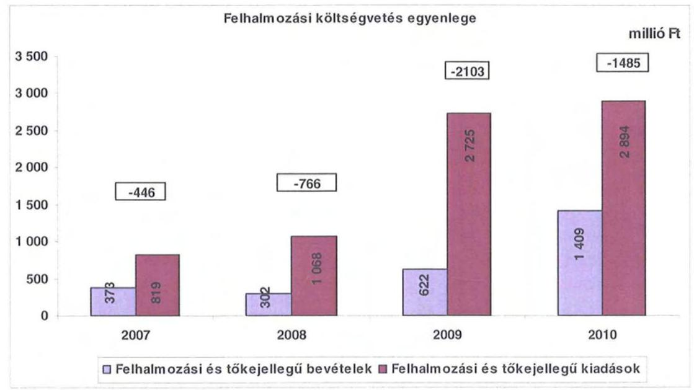

A felhalmozási forráshiánynak a felhalmozási és tőke jellegű kiadásokhoz viszonyított aránya 2007-ben 54,4\% (446 millió Ft), 2008-ban 71,7\% (766 millió Ft), 2009-ben 77,2\% (2103 millió Ft), 2010-ben 51,3\% (1485 millió Ft) volt.

A vizsgált időszakban keletkezett 4800 millió Ft felhalmozási forráshiány finanszírozása a fejlesztési célú hitelekből és kötvénykibocsátásból történt ${ }^{39}$.

Az Önkormányzat 2011. évi költségvetési rendeletében a tervezett bevételek és kiadások különbözete 3018 millió Ft hiányt mutatott. A tervezett hiány összege az Érd és Térsége Fejlesztési Társulás nélkül 603 millió Ft. Az Önkormányzat 603 millió Ft-os hiányát 1535 millió Ft hitelfelvételből tervezik finanszírozni, a hitelfelvételből a finanszírozási igényen kívül a hosszú lejáratú és a folyószámlahitelt kívánják törleszteni 932 millió Ft összegben.

Az Önkormányzat évenkénti teljes finanszírozási hiánya ${ }^{40}$ a CLF módszer szerint 2007-ben 1774 millió Ft, 2008-ban 2826 millió Ft, 2009-ben 2420 millió Ft, 2010-ben pedig már 3980 millió Ft volt. A képződött pénzügyi hiányt a finanszírozási célú bevételek biztosították.

[^0]
[^0]:    ${ }^{39}$ Az évenkénti adatokat a jelentés 2. számú melléklete mutatja be.
    ${ }^{40}$ a nettó működési jövedelem és a felhalmozási költségvetés eredője

---

Az önkormányzat finanszírozási műveletei 2007-2010. évekbeli egyenlegének alakulását a következő ábra szemlélteti:
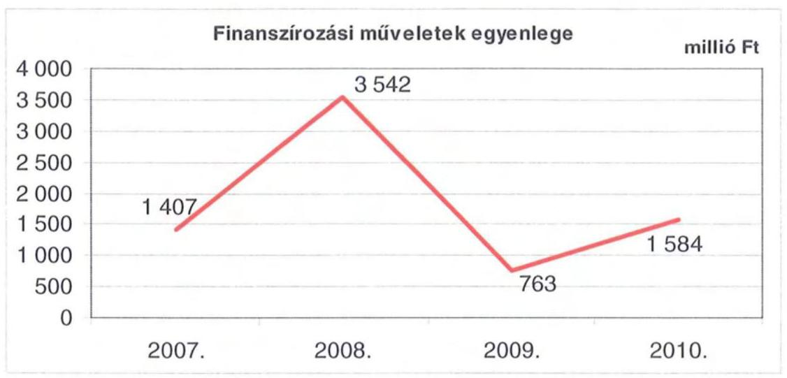

A finanszírozási többlet azt jelzi, hogy az éves költségvetések végrehajtása során szükség volt az előző években keletkezett pénzmaradvány igénybevételén túl külső finanszírozás igénybevételére is. A finanszírozási célú műveleteket a vizsgált időszakban a jelentés 2. számú mellékletének 4.1-4.8 pontjai részletezik.

Az Önkormányzat a 2007-2010. évi zárszámadási rendeleteiben a CLF modell kimunkálásától eltérő módon állapította meg a felhalmozási és működési egyensúlyát ${ }^{41}$, amelyet a jelentés 1. számú melléklete szemléltet. A rendeletek közül a 2010. évi zárszámadás jelzett kizárólag forráshiányt, a korábbi években többletet mutattak ki.

A 2007-2010. évek között az önkormányzat összesen 787427 ezer Ft kamatot fizetett. Az átmenetileg szabad pénzeszközei lekötéséből realizált kamatbevétel a teljes kamatráfordítás 97,4\%-át ( 767242 ezer Ft) tette ki. A 2009. évi kamatkiadások növekedését a kötvényekre, valamint a hitelekre teljesített kamatfizetés, a 2010. évi kamatbevétel növekedést az elkülönített, de még fel nem használt pályázati önrész összegek lekötéséből származó kamatbevétel okozta.

[^0]
[^0]:    ${ }^{41}$ Nincs központi előírás arra, hogy a költségvetés és zárszámadási rendeletében az Önkormányzatnak, hogyan kell elkészíteni a működési és felhalmozási célú bevételeit és kiadásait tartalmazó mérlegét. Annak formáját maguk határozzák meg.

---

Az Önkormányzat kamatbevételeinek és kamatkiadásainak alakulását a következő ábra mutatja:
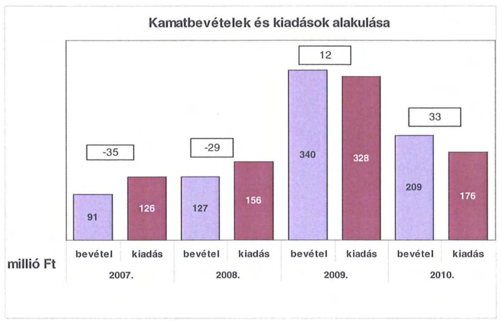

A 2011. évre az Önkormányzat a kamatkiadások emelkedésével kalkulál, a költségvetési rendeletben a tervezett 264 millió Ft kamatráfordítás 49,1\%-kal, 87 millió Ft-tal haladja meg a 2010. évi teljesített kamatkiadásokat.

# 2.2. Az Önkormányzat bevételeinek alakulása 

Az Önkormányzat folyó bevételei 2007-ről 2010-re folyamatosan nőttek 9672 millió Ft-ról 11492 millió Ft-ra emelkedtek (18,8\%-kal, 1820 millió Ft-tal).

Az Önkormányzat 2007-2010. évek között realizált főbb bevételi jogcímek összetételének változását a grafikon mutatja be:

---

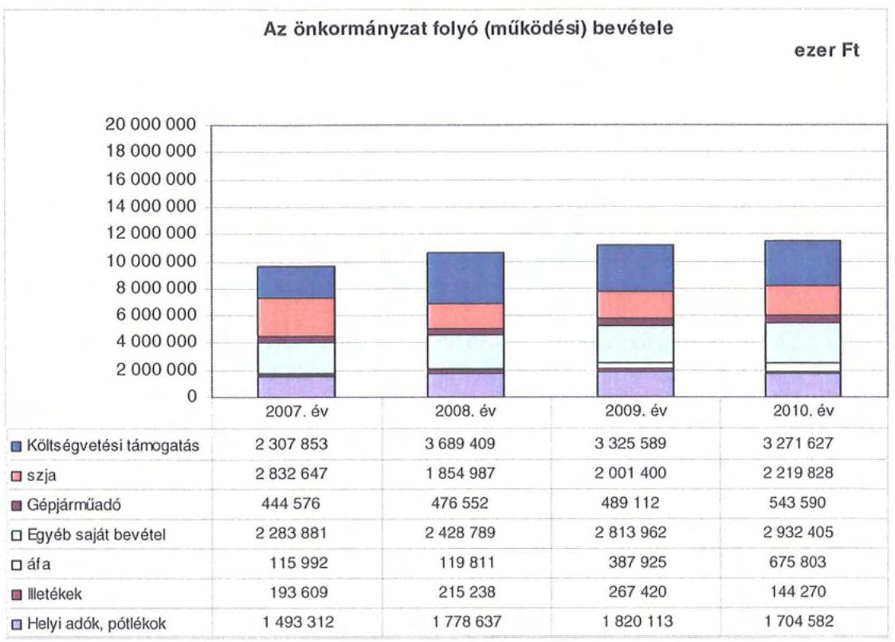

Az Önkormányzat költségvetési támogatása a 2007. évről a 2008. évre emelkedett, utána csökkent, de 2007. évről 2010. évre 964 millió Ft növekedést mutat. A költségvetési támogatás emelkedése együtt járt az átengedett, helyben maradó szja csökkenésével ( 613 millió Ft). A költségvetési támogatás és az átengedett bevételek 2007. évről 2010. évre 450 millió Ft-tal nőttek. A növekedését befolyásolta, hogy az állandó népesség a vizsgált időszakban 2003 fővel, az intézményekben ellátottak száma 1532 fővel emelkedett. Az átengedett bevételeken belül a szja mértéke a 2007. évi szja bevétel 78,3\%-ára csökkent. A költségvetési támogatás folyó bevételeken belüli aránya 4,6 százalékponttal nőtt ( $23,9 \%$-ról $28,5 \%$-ra), addig az átengedett adóbevételek aránya $33,9 \%$-ról $24,0 \%$-ra esett vissza.

A gépjárműadóból származó bevétel 2007-ről 2010-re 22\%-kal (99 millió Ft-tal) emelkedett. A növekedést az adótételek 2010. évi megváltozása is befolyásolta ${ }^{42}$.

[^0]
[^0]:    ${ }^{42}$ A gépjárműadó alapját, mértékét és egyes mentességi kategóriákat érintő módosítások 2010. január 1-jétől következtek be, amely az egyes adótételek esetében átlagosan $15 \%$-os emelkedéssel jártak.

---

Az egyéb saját bevételeken belül működési célra kapott támogatások összege 720 millió Ft-ról 1179 millió Ft-ra nőtt ${ }^{43}$, ezen belül a járóbeteg szakellátásra kapott támogatás 675 millió Ft-ról 742 millió Ft-ra emelkedett.

Az Önkormányzat 2007-2010. években összesen két gazdasági társaságtól kapott osztalékot 22 millió Ft összegben, osztalékról nem mondott le. A 25\%-t meghaladó tulajdoni részesedésű önkormányzati gazdasági társaságok (öt gazdasági társaság) bevételei a 2007. évről 2010. évre 383 millió Ft-tal nőttek. A Regionális Víziközmű Kft. a 2007-2010. években összesen 234 millió Ft bevételt engedett át az Önkormányzatnak.

Az áfa bevételek 2007. évről 2008. évre csekély mértékben emelkedtek (4 millió Ft), a 2009. és 2010. évi áfa bevételek 268, illetve 288 millió Ft-tal haladták meg az előző évi áfa bevételeket.

Az illetékbevételek a 2007. évi 193,6 millió Ft-ról a 2010. évben 144,3 millió Ft-ra, 25,5\%-kal csökkentek. Az illetékbevételek alakulását kedvezőtlenül befolyásolta 2008. második félévétől a pénzügyi-gazdasági válság és az illeték jogszabályok megváltozása.

Az Önkormányzat folyó bevételein belül a helyi adóbevételek 2007. évről 2010. évre kis mértékben emelkedtek ( 212 millió Ft-tal), azonban részarányuk a folyó működési bevételen belül 15,4\%-ról 14,8\%-ra csökkent.

Az Önkormányzatnál a 2007-2010. években az Önkormányzat területén az építmény, a telek, az idegenforgalmi és az iparűzési adót alkalmazták, új adónemet nem vezettek be, az adók mértékét nem emelték.

A lakások és nem lakás céljára szolgáló építmények után az adó mértékét a korrigált forgalmi érték $0,45 \%$-ában állapították meg. A telekadó mértéke az ingatlan korrigált forgalmi értékének 0,60\%-át jelentette. Az idegenforgalmi adó mértéke 150 Ft/vendégéjszaka volt. A három adó fajtát a 2001. évben vezették be az Önkormányzat illetékességi területén és akkor állapították meg az adók mértékét is, amelyet a bevezetés évétől kezdve nem emeltek. Az adók mértékének felső határa - a helyi adókról szóló 1990. évi C. törvény szerint - 2007-2010. években építmény és telekadó esetében a korrigált forgalmi érték $3 \%$-a, az idegenforgalmi adó esetében $300 \mathrm{Ft} /$ vendégéjszaka volt. Az iparűzési adót 1992-ben vezették be $0,3 \%$-os mértékkel, a 2007-2010. években az iparűzési adó mértéke 2,0\% volt, az ideiglenes jelleggel végzett tevékenység után 5 ezer Ft/nap adót állapítottak meg. Az iparűzési adó a helyi adó bevételeken belül meghatározó arányú volt, 2007-ben $78,8 \%$-ot ( 1139 millió Ft), 2010-ben $74,2 \%$-ot ( 1216 millió Ft) tett ki.

A helyi adó bevételek alakulását befolyásolta a helyi adóhátralékosok számának nagymértékű növekedése (a 2007. évben a hátralékos adózók száma 29806 volt, a 2010. évre 35 617-re nőtt). Az adóhátralékosok számának növe-

[^0]
[^0]:    ${ }^{43}$ A támogatás növekedését befolyásolta, hogy a Regionális Víziközmű Kft-től átvett 77 millió Ft-ot, valamint a várásközpont fejlesztésre kapott 93 millió Ft támogatást az Áhsz. 9. számú mellékletének a számlaosztályok tartalmára vonatkozó előírások 4. g) pontjában foglaltak ellenére 2010. évben a működési célú támogatások között mutatták ki.

---

kedésével együtt járt a hátralékok közel kétszeres emelkedése (a 2007. évi 876 millió Ft-ról a 2010. évre 1515 millió Ft-ra nőtt az esedékes hátralék összege).

Az Önkormányzat felhalmozási bevételei a vizsgált időszakban a következőképpen alakultak:
ezer Ft

| Megnevezés | 2007. év   tény | 2008. év   tény | 2009. év   tény | 2010. év   tény |
| :-- | --: | --: | --: | --: |
| Tárgyi eszköz értékesítés | 141977 | 82004 | 140894 | | 3324 |
| Egyéb saját tőkebevétel | 5857 | 21061 | 4159 | 4210 |
| Államháztartáson belülről   kapott támogatás | 199096 | 119566 | 406499 | 1398133 |
| EU-tól és külföldről kapott   támogatások | 0 | 0 | 0 | 0 |
| Államháztartáson kívülről   kapott támogatás | 25886 | 79755 | 70451 | 3561 |
| Összes felhalmozási bevétel | 372816 | 302386 | 622003 | 1409228 |

A vizsgált években a felhalmozási bevétel a 2007. évi 372 millió Ft-ról 1409 millió Ft-ra emelkedett. A felhalmozási bevételeken belül az államháztartáson belülről kapott támogatások aránya 53,4\%-ról 99,2\%-ra nőtt. A 2010. évi támogatások tartalmazták az Érd és Térsége Fejlesztési Társulás felhalmozási bevételeit is ( 507 millió Ft). A felhalmozási bevételek növekedését - az Érd és Térsége Fejlesztési Társulás bevétele mellett - a pályázati támogatások növekedése okozta.

A felhalmozási célú támogatásértékű bevételek részben a beruházásokhoz kapcsolódtak. 2010. évben iskola rekonstrukcióra 130 millió, csapadékvíz elvezetésre 326 millió, a városközpont fejlesztésre 40 millió, valamint a járóbeteg ellátás fejlesztésére 443 millió Ft támogatásban részesültek a kimutatásaik szerint.

A tárgyi eszköz-értékesítésből származó bevételek aránya a felhalmozási bevételeken belül 38\%-ról (142 millió Ft) 0,23\%-ra csökkent (3 millió Ft).

# 2.3. Az Önkormányzat kiadásainak alakulása 

Az Önkormányzat folyó kiadásai 2007-2010. évek között 10167 millió Ft-ról 12241 millió Ft-ra nőttek elsősorban a működési kiadások 20\%-os (1789 millió Ft-os) emelkedése miatt.

---

ezer Ft-ban

| Megnevezés | 2007. év | 2008. év | 2009. év | 2010. év |
| :--: | :--: | :--: | :--: | :--: |
| Folyó kiadások | 10166516 | 11067964 | 11035735 | 12240882 |
| Működési kiadások (kamatkiadás nélkül) | 8984635 | 9729354 | 9461937 | 10773584 |
| Államháztartáson belülre átadott pénzeszközök | 17394 | 89717 | 4949 | 108837 |
| Transzferkiadások | 419169 | 446045 | 598967 | 586135 |
| -ebből: vállalkozásoknak | 112365 | 76017 | 44340 | 84461 |
| EU-nak, illetve külföldre | 2985 | 1704 | 1375 | 0 |
| magánszemélyeknek | 215330 | 201501 | 262792 | 354767 |
| nonprofit szervezeteknek | 88489 | 166823 | 290460 | 146907 |
| Kamatkiadások | 125634 | 156433 | 327961 | 176474 |
| Előző évi pénzmaradvány átadás | 619684 | 646415 | 641921 | 595852 |

Az Önkormányzat folyó kiadásai a 2007. évről a 2010. évre 20\%-kal (2074 millió Ft-tal) nőttek, ezen belül a működési kiadások is $20 \%$-kal (1789 millió Ft-tal) haladták meg a 2007. évi összeget. A kamatkiadások 39,6\%-kal (50 millió Ft-tal) emelkedtek, a 2009. évi kamatkiadások növekedését a kötvényekre, valamint a hitelekre teljesített kamatfizetés okozta.

A folyó kiadások közel 100\%-át kitevő kiemelt működési előirányzatok teljesítési adatait az alábbi táblázat tartalmazza:
ezer Ft

| Megnevezés | 2007. év | 2008. év | 2009. év | 2010. év |
| :-- | --: | --: | --: | --: |
| Személyi juttatások | 4464363 | 4554905 | 4268625 | 4439936 |
| Munkaadót terhelő járulékok | 1392131 | 1407411 | 1253227 | 1149429 |
| Dologi kiadások | 2932327 | 3511926 | 3780034 | 4957364 |
| Egyéb folyó kiadások | 97304 | 175327 | 76957 | 221129 |
| Működési célú pénzeszközátadás | 203839 | 244544 | 357546 | 249845 |

A folyó kiadásokon belül a személyi juttatások és járulékaik aránya 57,6\%-ról 45,6\%-ra ( 267 millió Ft-tal) csökkent, amelynek oka a járulékok 243 millió Ft-os csökkenése volt. A dologi kiadások aránya 2007-ről 2010-re 28,8\%-ról 40,5\%-ra (2025 millió Ft-tal) emelkedett.

A dologi kiadásokon belül a szakmai anyagok beszerzése 127\%-kal (129 millió Ft), a szellemi tevékenység teljesítéséhez kapcsolódó kifizetés 462 millió Ft-tal növekedett, azonban ez utóbbi az Érd és Térsége Fejlesztési Társulás működéséhez kapcsolódott. A készletek beszerzése 310 millió Ft-tal, a szolgáltatások kiadásai 381 millió Ft-tal, a dologi kiadásokhoz kapcsolódó áfa kiadás 685 millió Ft-tal haladta meg a 2010. évben a 2007. évi azonos kiadásokat.

Az egyéb folyó kiadások 127\%-kal (124 millió Ft) nőttek 2007. évről 2010. évre. Az egyéb folyó kiadások növekedésének része volt többek között 35 millió Ft-tal az ÉRD-Hő Zrt. elmaradt hődíj kifizetése, 15 millió Ft ügynöki díj, amely a Minaret kötvénykibocsátáshoz kapcsolódott, valamint 11 millió Ft földvédelmi járulék.

---

A működési célú pénzeszköz átadások részaránya az összes folyó kiadásokon belül nem változott (2\%), összege a 2007. évi 204 millió Ft-ról 2010. évre 250 millió Ft-ra nőtt.

Az Önkormányzat tulajdoni részesedéssel rendelkező gazdasági társaságai részére átadott pénzeszközök összegét az alábbi ábra tartalmazza:
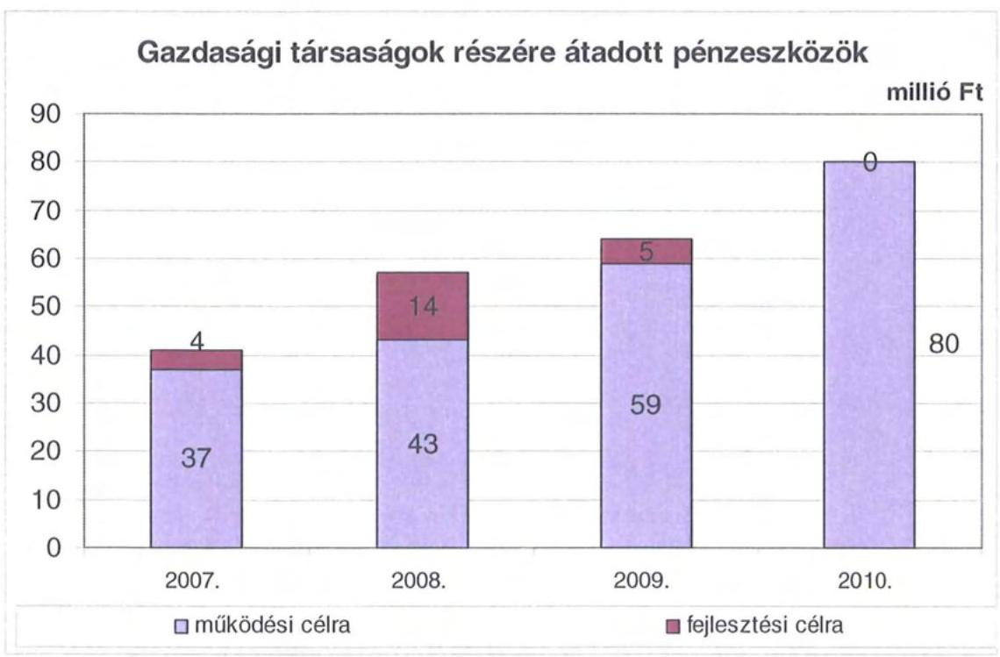

Az Önkormányzat 2007-2010. években négy gazdasági társaságnak adott működési, illetve felhalmozási célú pénzeszközt. A gazdasági társaságok közül három társaságban 75\%-ot meghaladó mértékben tulajdonos az Önkormányzat. A három gazdasági társaság részére 133 millió Ft működési és 23 millió Ft felhalmozási célú pénzeszközt adott az Önkormányzat ${ }^{44}$. Az önkormányzati feladatellátásban résztvevő gazdasági társaságoknak adott működési célú pénzeszközök a vizsgált években folyamatosan növekedtek, a 2007. évi 37 millió Ft-ról 2008-ra 16\%-kal, 43 millió Ft-ra, 2009-re 37\%-kal, 59 millió Ft-ra és 2010-re 35\%-kal, 80 millió Ft-ra. Az Önkormányzat felhalmozási célú pénzeszközt csak a 2007-2009. években adott, összesen 23 millió Ft összegben ${ }^{45}$.

[^0]
[^0]:    ${ }^{44}$ A helyi közösségi közlekedést biztosító gazdasági társaságban az Önkormányzat nem rendelkezett tulajdoni részesedéssel, a gazdasági társaság részére 2007-2009. években 86 millió Ft támogatást nyújtott.
    ${ }^{45}$ A gazdasági társaságok részére átadott pénzeket sportlétesítmények üzemeltetésére, sportolók, edzők támogatására, műsorszolgáltatásra fordították.

---

A működési és felhalmozási kiadások alakulását - a működési és fejlesztési célú kamatkiadásokat is figyelembe véve - a következő grafikon szemlélteti:
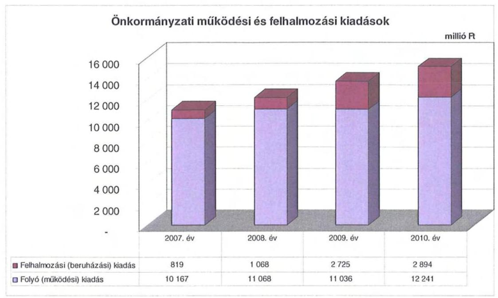

A folyó (működési) és felhalmozási kiadások arányának változásában 2007-2010 évek közötti elmozdulásban figyelhető meg. A felhalmozási kiadások aránya a 2007. évi 7,4\%-ról 2010-re 19,1\%-ra emelkedett.

Az Önkormányzat 2008-ban Diósd és Tárnok települések Önkormányzataival szennyvízelvezetési- és tisztítási beruházásra társulást alapított. Az Érd és Térsége Fejlesztési Társulásban az Önkormányzat 78,1\%-os tulajdoni hányaddal rendelkezik. A Társulás részére a működési és a felhalmozási kiadásokhoz 2008. évtől ad támogatást. Az Önkormányzat működési és felhalmozási kiadásai nem változtak jelentősen a Társulás Diósd és Tárnok településekre eső kiadásai nélkül.

2008-ban 3 millió működési, 2009-ben 3 millió Ft felhalmozási és 51 millió Ft működési, 2010-ben 131 millió Ft működési kiadással volt kisebb az Önkormányzat kiadása Társulás nélkül ${ }^{46}$.

Az Önkormányzat 2007-2010. években 6841 millió Ft összköltségű fejlesztéseket tervezett és teljesített saját erő és az európai uniós forrásokra benyújtott pályázatok segítségével. Az Önkormányzatnál 2007-2010. években fejlesztésekhez, beruházásokhoz négy esetben nyertek el európai uniós támogatásokat, melyből összesen 1375 millió Ft-ot vettek igénybe ${ }^{47}$.

[^0]
[^0]:    ${ }^{46}$ A 2008. évben felhalmozási támogatást nem nyújtott, 2010. évben a felhalmozási támogatást a Társulás hiányos elszámolásai miatt nem adta át.
    ${ }^{47}$ A befejezett és a folyamatban lévő fejlesztéseket a jelentés 3/a és 3/b számú mellékletei részletezik.

---

A 2007-2010 évben az Önkormányzat megvalósított és folyamatban lévő kiemelt infrastrukturális beruházásai az alábbiak voltak:

- befejezett felújítások között szerepeltek a szennyvízhálózat felújítása 602 millió Ft-os, a Gárdonyi Géza Iskola rekonstrukciója 894 millió Ft-os és az útburkolat felújítások 153 millió Ft-os összegben;
- a 2007-2010. évek között megvalósult beruházások közül kiemelkedett a belterületi csapadékvíz elvezetés kiépítése 582 millió Ft-os, a Gárdonyi Géza Iskola tanuszodájának megépítése 635 millió Ft-os és a Batthyány Iskola tornacsarnokának bővítése 320 millió Ft-os összegben;
- a városközpont fejlesztésének teljes bekerülési költsége 1150 millió Ft, amelyet a KMOP segítségével valósítanak meg;
- a kistérségi járóbeteg szakellátás fejlesztése szintén a KMOP pályázati konstrukció segítségével valósul meg, amelynek teljes bekerülési költsége 1469 millió Ft.

Ágazati beruházások a következő területeket érintették: úthálózat rekonstrukció, közműfejlesztés, egészségügyi, oktatási, kulturális és sport célú beruházások és intézményi felújítások.

Az Önkormányzatnál a 2007-2010 évben befejezett fejlesztési feladatok összes költségvetési kiadása 6070 millió Ft volt, amelyből a beruházások összege 4232 millió Ft ( $69,7 \%$ ), a felújítások összege 1838 millió Ft ( $30,3 \%$ ) volt. A projektek döntő többsége utófinanszírozású beruházás volt, megvalósításukhoz a saját források hitelekből és kötvénykibocsátásból álltak rendelkezésre. A befejezett fejlesztéseket a 3/a számú melléklet részletezi.

A befejezett 6070 millió Ft értékű fejlesztés forrás megoszlása 1717 millió Ft saját bevétel ( $28,3 \%$ ), 1990 millió Ft kötvénykibocsátásokból ( $32,8 \%$ ), 1484 millió Ft hitelekből ( $24,5 \%$ ), 773 millió Ft ( $12,7 \%$ ) EU-s támogatásokból és 106 millió Ft hazai támogatásból ( $1,7 \%$ ) származott. A 2006. december 31-ig a fenti fejlesztésekre nem történt kifizetés ${ }^{48}$. A 2007-2010. években teljesített kiadásokból eszközpótlásra 223 millió Ft kiadást mutattak ki (a fejlesztések részletes adatait a 3/a számú melléklet tartalmazza).

Az Önkormányzat 2010. december 31-én folyamatban lévő fejlesztési feladatainak nagysága 771 millió Ft volt, amelynek forrása 602 millió Ft EU-s támogatás ( $78 \%$ ), a többit hitelből és kötvénykibocsátás bevételéből fedezték. A források a fejlesztések esetében az EU-s támogatásoknál utólagosan álltak rendelkezésre. Az Önkormányzat folyamatban lévő fejlesztéseit a 3/b számú melléklet szemlélteti.
2010. december 31-én folyamatban lévő és a 2010. évet követő kötelezettség-vállalásainak összege a 3/c számú melléklet adatai szerint 3935 millió Ft volt, amelynek forrása 3304 millió Ft EU-s támogatás ( $84,0 \%$ ), 35 millió Ft

[^0]
[^0]:    ${ }^{48}$ 2006-ban két fejlesztést kezdtek el azonban 2006. december 31-ig pénzügyi teljesítés nem történt.

---

( $0,9 \%$ ) hitelfelvétel, 568 millió Ft kötvénykibocsátásból származó bevétel $(14,4 \%)$ és 28 millió Ft saját bevétel $(0,7 \%)$.

Az Önkormányzatnak a 3/d számú melléklet szerint 297 millió Ft összegű elbírálás alatti, 100\%-ban pályázati forrásból tervezett fejlesztési feladata volt. A források még nem állnak az Önkormányzat rendelkezésére, a pályázati elbírálások folyamatban vannak.

# 3. KÖTELEZETTSÉGEK BEMUTATÁSA 

### 3.1. A pénzintézetek felé fennálló kötelezettségek alakulása

Az Önkormányzat pénzintézeti kötelezettségeinek állománya a 2006. év végi 1100 millió Ft-ról 2010. év végére 10580 millió Ft-ra, 9,6-szeresére emelkedett. Fennálló pénzintézeti kötelezettségek kettő kötvénykibocsátásából, kettő hosszú lejáratú hitelfelvételéből, valamint a 2010. év végén fennálló folyószámlahitel állományból keletkeztek.
Az Önkormányzat pénzintézeteknél fennálló kötelezettség-állományát a 20072010. években az alábbi ábra szemlélteti ${ }^{49}$ :
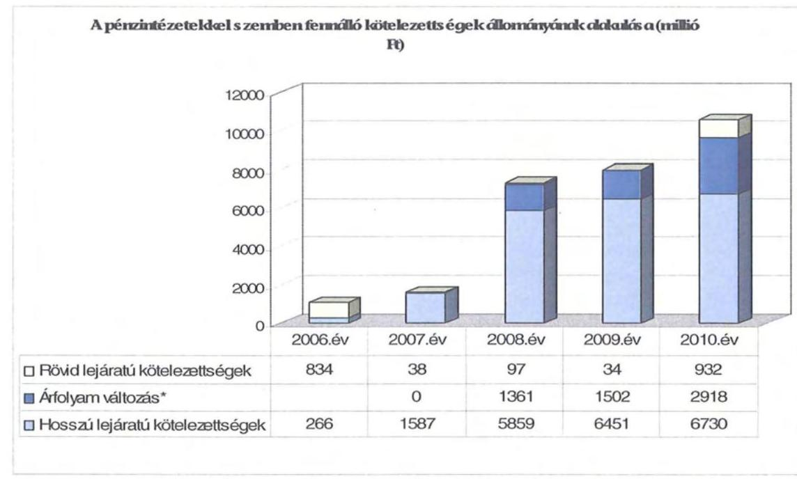
*Az Önkormányzatnál 2007-ben és 2008-ban CHF-ben kibocsátott kötvények év végi értékelése miatt az árfolyamváltozás hatása is befolyásolta a kötelezettségek állományának alakulását.

Az Önkormányzatnál annak megítéléséről, hogy a CHF-ben kibocsátott kötvényekért kapott forinthoz képest a kötvények visszavásárlásakor jelentkező forint kötelezettség többletkiadást (árfolyamveszteség) vagy megtakarítást (árfolyamnyereség) eredményez a futamidő végén, a teljes kötelezettség rendezését

[^0]
[^0]:    ${ }^{49}$ A diagramban mind a rövid, mind a hosszú lejáratú kötelezettségek mérlegértékét csökkentettük az árfolyamváltozás összegével.

---

követően lehet képet alkotni. Mindaddig, amíg törlesztési kötelezettség nem áll fenn (türelmi idő), a tőkére vonatkoztatva nem értelmezhető sem az árfolyamveszteség, sem az árfolyamnyereség. Ugyanakkor a kötvény-kötelezettség mérlegforduló-napi értékeléséből adódó különbözetet el kell számolni, azonban az év végi értékelésből adódó árfolyam különbözet valójában pénzügyileg nem realizált.

A pénzintézeti kötelezettségvállalásokra minden esetben közgyűlési döntés alapján került sor.

A Közgyűlés az ÖKIF-I. hitel (578,9 millió Ft) felvételéről a 306/2006. (XI. 23.) számú, az Érd 2027 kötvény (6477 ezer CHF-nek megfelelő 988 millió Ft) kibocsátásáról a 143/2007. (V. 17.) számú, a Minaret Kötvény (30389 ezer CHF-nek megfelelő 4300 millió Ft) kibocsátásáról a 62/2008. (III. 27.) számú, a 2154 millió Ft-os ÖKIF-II. hitelkeretről a 251/2008. (IX. 11.) számú, a Virágzó Kertváros kötvény (1240 millió Ft) kibocsátásáról a 3/2011. (I. 27.) számú határozatokban döntött.

Az ÖKIF-I. hitel 578,9 millió Ft-os összegéből 2007-ben 371,0 millió Ft-ot, 2008-ban 207,9 millió Ft-ot vettek igénybe, a hitel törlesztése 2009. IV. negyedétől 2026. IV. negyedévével bezárólag esedékes, a tőketörlesztés negyedévente esedékes összege 8,4 millió Ft. Az ÖKIF-II. hitelkeretből 2011. március 31-ig 938,3 millió Ft-ot vettek igénybe, melyből a lehívott összeg a 2009. évben 626,0 millió Ft, a 2010. évben 312,3 millió Ft volt. A hitel törlesztése 2012. június 30-tól 2029. június 30-ig negyedévente lesz esedékes. Az Érd 2027 kötvény visszavásárlása 2012. szeptember 30-tól 2027 szeptemberéig félévente esedékes, a Minaret kötvény törlesztése 2013. április 15-től félévente esedékes, az utolsó részlet 2033. július 30-án aktuális.

Az ÖKIF-I. hitel nyújtója, valamint az Érd 2027 kötvényt jegyző bank az Önkormányzat akkori számlavezető bankja, az OTP Bank Nyrt. volt. Az ÖKIF-II. hitelkeret nyújtója és a Minaret Kötvényt, valamint a Virágzó Kertváros Kötvényt jegyző bank a Raiffeisen Bank Zrt., amely az Önkormányzat folyószámláját 2008. július 2-tól vezeti.

A 2007-2011. évi költségvetési rendeletek 16. §-ában előírták, hogy a hitelfelvétel és kötvénykibocsátás visszafizetésének fedezetére az önkormányzati törzsvagyon és a normatív állami hozzájárulás, az állami támogatás, a személyi jövedelemadó, valamint az államháztartáson belülről működési célra átvett bevételek nem használhatók fel. A Közgyűlés hitelfelvételről, illetve kötvénykibocsátásról szóló döntéseit megalapozó előterjesztésekben nem jelölték meg a kötelezettségvállalás visszafizetési forrásait, de a Közgyűlés által elfogadott határozatokban az adósságszolgálat fedezetére a mindenkori költségvetési saját bevételeket ajánlották fel. A kötelezettségvállalásból származó források felhasználási céljait meghatározták, az árfolyam- és kamatkockázatokat bemutatták. Az előterjesztésekben nem mutatták be a teljes futamidő alatt várható kamat- és tőkefizetési kötelezettségeket, továbbá nem tértek ki a döntéskor érvényes adósságszolgálati korlát bemutatására ${ }^{50}$,

[^0]
[^0]:    ${ }^{50}$ A 2007-2011. évi költségvetési rendelet-tervezetek előterjesztéseiben az Ötv. 88. § (2) bekezdése szerint az adósságot keletkeztető éves kötelezettségvállalások tárgyévi felső határát bemutatták.

---

ezért a Közgyűlés ennek figyelembevétele nélkül döntött. A vizsgált években az adósságot keletkeztető kötelezettség vállalás felső korlátját ${ }^{51}$ nem lépték át.

Az adósságot keletkeztető kötelezettségvállalással megvalósított felhalmozási kiadások esetleges bevételt növelő, illetve kiadást csökkentő hatását, illetve ennek a fejlesztéshez, felújításhoz vállalt kötelezettségek visszafizetési forrásaként való számbavételét nem vizsgálták. Az Önkormányzat 2007-2010. években annak ellenére nem rendelkezett hosszú távú likviditási stratégiával, hogy pénzügyi helyzete egyre kedvezőtlenebbül változott.

Az Önkormányzat 2011. március 1-jén kibocsátotta 1240 millió Ft összegben a harmadik, - a Virágzó Kertváros elnevezésű - kötvényét a folyószámlahitel és munkabérhitel keretek kiváltására, a kötvény visszavásárlása 2012. március 1jén, egy összegben lesz esedékes.

A hosszúlejáratú hitelek felvételéből és a kötvénykibocsátásokból származó bevételeket a közgyűlési döntéseknek megfelelően használták fel. A kötvénykibocsátás szerződéseiben az eredeti felhasználási céltól eltérő felhasználást a kibocsátó bank nem tiltotta, az eltérő felhasználáshoz nem kötődött előzetes banki engedélyezési kötelezettség vagy banki szankció.

Az Önkormányzat 2010. december 31-én CHF fennálló adósságot keletkeztető kötelezettségvállalásai az alábbiak voltak:

| Megnevezés | Kibocsátás   időpontja | Összeg   CHF | Kibocsátási, vagy   lehívási árfolyam | Kamat (referencia   kamat+ kamatfelár) | Felhasználás célja: |
| :-- | :--: | :--: | :--: | :--: | :-- |
| Érd 2027 Kötvény | 2007.09.19 | 6477000 | 152,6 | 3 havi CHF LIBOR+0,45\% | Folyószámlahitel törlesztése,   likviditás javítása, fejlesztés,   korlátozott fejlesztési célú   hitelek előtörlesztése,   folyószámlahitel törlesztése |
| Minaret Kötvény | 2008.07.30 | 30389000 | 141,5 | 6 havi CHF LIBOR+1,25\% |  |

[^0]
[^0]:    ${ }^{51}$ Az Önkormányzatnál adósságot keletkeztető kötelezettségvállalás felső korlátját a 2007-2010. évi éves költségvetési beszámolókban nem az Ötv. 88. § (2) bekezdésében előírtaknak megfelelően állapították meg, az Érdi Közterületfenntartó Intézmény 20072010. években teljesített lízingdíját nem vették figyelembe, amelyből a tőketörlesztés 2007-ben 63,6 millió Ft-ot, 2008-ban 77,5 millió Ft-ot, 2009-ben 75,9 millió Ft-ot, 2010ben 69,1 millió Ft-ot, a kamatkiadás 2007-ben 34,7 millió Ft-ot, 2008-ban 28,3 millió Ft-ot, 2009-ben 15,8 millió Ft-ot, 2010-ben 3,6 millió Ft-ot tett ki. A hosszú lejáratú hitelek és a kötvénykibocsátások miatt teljesített kamatkiadásokat nem bontották meg az előző években keletkezett tárgyévet terhelő, illetve a tárgyévben keletkezett tárgyévet terhelő fizetési kötelezettségre.

---

Az Önkormányzat 2010. december 31-én HUF-ban fennálló adósságot keletkeztető hosszú lejáratú kötelezettségvállalásai (ezer Ft-ban) az alábbiak voltak $^{52}$ :

| Megnevezés | Szerződéshötés   időpontja | Összeg | Kamat (referencia kamat-   kamatfelár) | Felhasználási célja |
| :-- | :--: | :--: | :--: | :-- |
| ÖKIF-I. Közutak építése hitel | 2007.02.20 | 536947 | 3 havi EURIBOR+2,49\% | Út hálózat fejlesztése |
| ÖKIF-II. Infrastruktúra fejlesztése   hitel | 2009.08.19 | 938327 | 3 havi EURIBOR+1,8\% | Infrastruktúra fejlesztés |

Az Önkormányzat 2007. január 1-je és 2010. december 31-e közötti időszakban a fenti CHF-ben fennálló pénzintézeti kötelezettségei után 2058700 CHF (386,5 millió Ft) kamatot fizetett meg, mely 91,0 millió Ft többlet kiadást jelentett a kibocsátáskori árfolyamokhoz képest, ezen felül 68,5 millió Ft egyéb költséget ${ }^{53}$ fizetettek meg. A HUF-ban fennálló kötelezettségek után 106,7 millió Ft kamat kiadást teljesítettek.

A Polgármesteri hivatalban 2007-től 2011. március végéig az átmenetileg szabad pénzeszközök bankbetétként, illetve forgatási célú értékpapírban történő elhelyezésével 731 millió Ft kamatbevételt realizáltak, melyből 460 millió Ft keletkezett a Minaret kötvényből átmenetileg szabad forrás befektetéséből.

A 2008. évben a Minaret kötvény bevételéből 750 millió Ft-ért Magyar Államkötvényt vásároltak, és 2000 millió Ft-ot bankbetétben, 334 millió Ft-ot a belterületi utak fejlesztésére elkülönített forrásként kötöttek le, 2008-ban a visszafizetett 797 millió Ft folyószámlahitelen kívül előtörlesztették a korábban felvett hosszú lejáratú fejlesztési célú hiteleiket 231 millió Ft összegben, valamint 188 millió Ft-ot a fejlesztési kiadások finanszírozására fordítottak (szennyvíztisztító telep vízjogi engedélyezési tervére, út- és járdaépítésre). A fejlesztési kiadásokra a 2009. évben 1052 millió Ft-ot (Gárdonyi Géza Iskola rekonstrukciójára, Bem téri Óvoda bővítésére, Batthyány Iskola felújítására és tornacsarnok építésére, járdaépítésre), a 2010. évben 1433 millió Ft-ot (Batthyány Iskola felújítására és tornacsarnok építésére, városközpont kialakítására, járóbeteg szakellátás fejlesztésére, Aradi utcai bölcsőde felújítására, út- és csapadékvíz elvezetés kiépítésére) használtak fel, a 2010. év végén a Minaret kötvényből még 599 millió Ft állt lekötött betétben rendelkezésre.

A Minaret kötvényből származó átmenetileg szabad bevétel befektetéséből keletkezett kamatbevételt az Önkormányzat működési célú kiadásai finanszírozá-

[^0]
[^0]:    ${ }^{52}$ Az ÖKIF-I. és az ÖKIF-II. hosszú lejáratú hitelek szerződéseit közbeszerzési eljárás keretében kötötték meg. Az ÖKIF-I hitel a keretszerződés alapján teljes összegben igénybevételre került, a 2153968 ezer Ft-os ÖKIF-II. hitel keretszerződés rendelkezésre tartása 2011. június 30-ával megszűnik, a 2010. december 31-ig még igénybe nem vett 1215641 ezer Ft hitelkeret maradványból 2011 júniusában 304150 ezer Ft lehívását kezdeményezték.
    ${ }^{53}$ Az Érd 2027 kötvény kibocsátásánál 490 ezer Ft szervezési, jegyzési díj merült fel. A Minaret kötvény jegyzési garanciavállalás díjára 8000 ezer Ft-ot fizettek ki, a 20092010. években 56929 ezer Ft összegben éves kifizető- és kamatszámító ügynöki díj került megfizetésre. A Virágzó Kertváros kötvény jegyzési garancia vállalási díja 3100 ezer Ft volt.

---

sára fordította. A 2008-2011. I. negyedéve között a Minaret kötvény után teljesített kamatkiadások (371 millió Ft) a realizált kamatbevételek (460 millió Ft) 80,6%-át tette ki.

Az Önkormányzat a vizsgált időszakban működésének pénzügyi egyensúlyát csak folyószámlahitel igénybevételével tudta biztosítani, amelyet a 2007. és a 2008. évben is a kötvénykibocsátásokból törlesztettek, ennek ellenére 2008-ban 89,0 millió Ft, 2010-ben 898,4 millió Ft folyószámlahitel tartozásuk volt. A 2011. évben a folyószámlahitel keret március 1-jéig állt a rendelkezésükre, melynek igénybevételéért 9,4 millió Ft kamatkiadást teljesítettek. Munkabér megelőlegezési hitelt ${ }^{54}$ és egyéb likvid hitelt nem vettek igénybe.

A folyószámlahitel alakulását az alábbi táblázat mutatja be:

|  |  |  |  | ezer Ft-ban |
| :--: | :--: | :--: | :--: | :--: |
| Megnevezés | 2007. év | 2008. év | 2009. év | 2010. év |
| I. Folyószámlahitel |  |  |  |  |
| a folyószámlahitel keretösszege január 1-jén | 1000000 | 1000000 | 1000000 | 1000000 |
| teljesített kamat és egyéb költség | 55315 | 34528 | 25327 | 28252 |

A folyószámlahitel kondíciói és egyéb költségei a következők voltak ${ }^{55}$ :

| Megnevezés | Kamat (referencia+ kamatfelár) | Egyéb költség |
| :--: | :--: | :--: |
| Folyószámlahitel |  |  |
| 2007. év | 3 havi BUBOR $-0,29 \%$ | $0,00 \%$ |
| 2008. év | 3 havi BUBOR $+0,9 \%$ | $0,00 \%$ |
| 2009. év | 3 havi BUBOR $-2,0 \%$ | $0,00 \%$ |
| 2010. év | 3 havi BUBOR | $0,00 \%$ |
| 2011. 03.01-ig | 3 havi BUBOR | $0,00 \%$ |

Az Önkormányzat 2007-ben a 988,4 millió Ft összegű Érd 2027 kötvénykibocsátásából származó bevételéből 2007. szeptember 19-én visszafizette a 902,3 millió Ft összegű folyószámla hitelét (ebben az évben a folyószámla hitellel zárt napok száma 354, a folyószámlahitel átlagos napi állománya 712,6 millió Ft volt). A 2008. évben 213, a 2009. évben 310, a 2010. évben 303 és a 2011. év I. negyedévében 59 napon zártak folyószámlahitel igénybevételével, melynek átlagos napi állománya ${ }^{56}$ 2008-ban 586,6 millió Ft, 2009-ben 416,7 millió Ft, 2010-ben 618,6 millió Ft és 2011. I. negyedévében 901,6 millió Ft volt. Az átlagos napi állomány a 2010. évben - 2008-hoz képest - annak ellenére emelkedett, hogy a Minaret kötvény kibocsátásából származó bevételből 2008. július 30-án - 797,1 millió Ft összegben visszafizették a
 folyószámlahitelt. A 2011. március 1-jén a Virágzó Kertváros kötvény bevételéből 761,4 millió Ft

[^0]
[^0]:    ${ }^{54}$ Az Önkormányzat 2007-ben a személyi juttatások egy havi összegének megfelelő mértékben, 2008 januárjától 2011 márciusáig 240 millió Ft összegben rendelkezett munkabér megelőlegezési hitelkerettel.
    ${ }^{55}$ A referencia kamat az alábbiak szerint alakult: a 3 havi BUBOR az MNB fixing (átlagkamat) 2007-ben 7,75\%, 2008-ban 8,87\%, 2009-ben 8,64\%, 2010-ben 5,5\% volt.
    ${ }^{56}$ A folyószámlahitel igénybevételének éves átlaga - naptári napokra vetítve - 2007-ben 691,1 millió Ft/nap, 2008-ban 342,3 millió Ft/nap, 2009-ben 354,0 millió Ft/nap, 2010-ben 513,5 millió Ft/nap volt.

---

összegben rendezték a folyószámlahitel tartozásukat. Az áttekintett időszakot jellemző működési hiány, a folyamatos likviditási problémák folyószámlahitellel történt finanszírozása az Önkormányzatnak a 2007-től 2011. március 31-ig összesen 152,8 millió Ft kamat ráfordítást okozott.

A fennálló kötvényállomány és a hitelállomány esetében a kamatfizetési kötelezettségek alakulását jelentősen befolyásolta és jelenleg is befolyásolja a kibocsátáskori és az utolsó kamatfizetéskori referencia kamatok változása, melyet az alábbi táblázat mutat be:

| Megnevezés | Kibocsátási, lehívási   alapkamat $\%$ | Utolsó fizetéskori | Változás \% |
| :--: | :--: | :--: | :--: |
| 3 havi CHF LIBOR (Érd 2027   kötvény) | 2,86 | 0,17 | 5,90 |
| 6 havi CHF LIBOR (Minaret kötvény) | 3,00 | 0,27 | 9,00 |
| 3 havi EURIBOR (ÖKIF-II. hitel) | 2,51 | 1,52 | 60,10 |
| 3 havi EURIBOR (ÖKIF-I. hitel) | 4,76 | 1,52 | 31,90 |

Amennyiben a referencia kamat az Érd 2027 és a Minaret kötvényeknél nem változott volna, az Önkormányzatnak a kibocsátáskori referencia kamattal számolva 2011. március 31-ig 4 355,6 millió CHF ( 614,2 millió Ft) kamatfizetési kötelezettsége jelentkezett volna változatlan devizaárfolyam mellett. A kamatváltozások miatt 2058,6 millió CHF-fel kevesebb fizetési kötelezettséget kellett teljesítenie, mint amivel a szerződések megkötésekor számoltak. A kamatkiadások forintban kimutatható csökkenése - a devizaárfolyam emelkedés miatt - 178,7 millió Ft.

Az Önkormányzatnál a vizsgált időszakban további hitel igénybevételről, illetve kötvénykibocsátásról szóló döntést nem készítettek elő.

# 3.2. Szállítók felé fennálló kötelezettségek alakulása 

Az Önkormányzatnak és gazdasági társaságainak lejárt szállítói tartozásai, és egyéb kiadás elmaradásai alakulását az alábbi táblázat tartalmazza (ezer Ft-ban):

| Megnevezés | 2007.   december 31. | 2008.   december 31. | 2009.   december 31. | 2010.   december 31. |
| :-- | :--: | :--: | :--: | :--: |
| Lejárt szállítói tartozás | 95471 | 36583 | 90389 | 214158 |
| Egyéb kiadás elmaradás | - | 20000 | 20000 | 20264 |
| Gazdasági társaságok   lejárt szállítói tartozása | 21610 | 24915 | 49507 | 54146 |

Az Önkormányzat lejárt szállítói tartozása a 2007. évi 95,5 millió Ft-ról 2010. év végére több mint 2,2-szeresére, 214,2 millió Ft-ra emelkedett. A lejárt szállítói tartozásállomány $77,2 \%$-a ( 165,4 millió Ft) 30 napon belüli, $2,2 \%$-a ( 4,8 millió Ft) 31-60 napon belüli, a $4,7 \%$-a ( 10,0 millió Ft) 61-90 nap közötti, $6,5 \%$-a ( 13,9 millió Ft) 91-365 nap közötti és $9,4 \%$-a ( 20,1 millió Ft) éven túli volt.

---

Az Önkormányzatnál a lejárt szállítói tartozás állomány 2011. március 31-én 356,8 millió Ft volt. A lejárt szállítói tartozásból a Polgármesteri hivatalban mutatták ki az állomány 50,7\%-át, 180,9 millió Ft-ot, az Érdi Közterületfenntartó Intézményben a $26,8 \%$-át, 95,7 millió Ft-ot és az Intézményi Gondnokságnál a 13,9\%-át, 49,5 millió Ft-ot. A lejárt szállítói tartozásból 30,7 millió Ft-ot hat intézménynél tartották nyilván.

Az egyéb kiadás elmaradás a Polgármesteri hivatalban keletkezett. 2008-tól egy peres eljárás miatti függő kötelezettségként 20,0 millió Ft-ot, továbbá 2010-ben 0,3 millió Ft elmaradt személyi juttatást mutattak ki.
2011. I. negyedévében további 2,5 millió Ft elmaradt személyi juttatást és egy el nem ismert szállítói kötelezettségből 11,1 millió Ft kiadás elmaradást jeleztek.

A 2010. december 31-i mérlegben kimutatott szállítói kötelezettség 1454,6 millió Ft volt, a le nem járt tartozásállomány 1240,4 millió Ft-ot tett ki. Az Önkormányzatnál a 2010. év végén kimutatott szállítói kötelezettségeire fedezetet részben a mérlegben kimutatott 748,3 millió Ft követelésállomány nyújthat, illetve a 2011. évi folyó bevételek.

Az önkormányzati tulajdonú gazdasági társaságok szállítói tartozás állománya 2007-ben 188,4 millió Ft volt, 2010-re 62,8\%-kal, 306,7 millió Ft-ra nőtt. A gazdasági társaságok lejárt szállítói tartozás állománya 2010-ben 54,1 millió Ft volt, ami 2,5-szerese a 2007. évi 21,6 millió Ft-os állománynak. Az Önkormányzat 75\%-ot meghaladó tulajdoni hányadát képező gazdasági társaságaiban a 29,3 millió Ft szállítói tartozás állományból 27,3 millió Ft volt a lejárt szállítói tartozások állománya.

Az Önkormányzat 100\%-os tulajdonában lévő egyik gazdasági társasága szállítói tartozás állományából 2010. év végén 14,0 millió Ft volt a lejárt szállítói tartozások összege. Az Önkormányzat 90\%-os tulajdonában lévő gazdasági társasága 13,3 millió Ft lejárt szállítói tartozást mutatott ki a 2010. év végén. Az Önkormányzat nem többségi tulajdonában lévő gazdasági társaságai közül egynek volt 26,8 millió Ft lejárt szállítói tartozás állománya.

# 3.3. Egyéb kötelezettségek alakulása 

Az Önkormányzat PPP konstrukció keretében nem végzett beruházást.
Az Önkormányzatnál az elengedett követelések összege a 2007-2010. években összesen 36,8 millió Ft volt, amelyből 82,6\% (30,4 millió Ft) adótartozás elengedéséből, 16,0\% (5,9 millió Ft) lakbér tartozás elengedéséből származott.

Az Önkormányzat Érdi Közterületfenntartó Intézményénél 2005. évben 13 tehergépjármű és 15 speciális jármű (traktor, gréder, úthenger, seprőgép, sószóró) vásárlására, 60 hónapos futamidővel, 12 zártvégű pénzügyi lízingszerződést kötöttek.

---

A lízing szerződések alapján 2007. január 1-je és 2010 decembere között 458,4 millió Ft tőketörlesztést és 82,5 millió Ft kamatfizetési kötelezettséget ${ }^{57}$ teljesítettek.

Az Önkormányzat, mint az Érd és Térsége Fejlesztési Társulás 78\%-os tagja döntött ${ }^{58}$ arról, hogy 5405 millió Ft összegben kezességet vállal a Társulás keretében európai uniós támogatással megvalósuló nettó 31,4 milliárd Ft-os csatornaépítési projekt saját forrásrészének finanszírozásához kibocsátandó kötvény-sorozat és folyószámlahitel visszafizetésére. A projekt előkészítése folyamatban van, szerződéskötésekre még nem került sor.

Az Önkormányzat a 2007-2010. években nem adott támogatási kölcsönt saját költségvetési szervei részére, az Érdi Városfejlesztési és Szolgáltató Kft. részére a köztartozások kiegyenlítésére 3 millió Ft tagi kölcsönt nyújtott ${ }^{59}$ 2012. december 31-i visszafizetési határidővel. Az Önkormányzatnál foglalkoztatottak részére lakásépítésre-, vásárlásra és felújításra 2007-2010. években összesen 10,9 millió Ft kölcsönt nyújtottak, az érintettek a korábban kapott kölcsönökből 19,3 millió Ft-ot törlesztettek.

Az Önkormányzat kötelezettségeinek állománya 2010. december 31-én és a várható alakulása a kötelezettség lejártáig:

| Megnevezés | Állomány 2010. dec. 31-én |  |  | Várható kötelezettség 2011. 2013. években |  |  | Várható kötelezettség 2014. évet követően |  |  |
| :--: | :--: | :--: | :--: | :--: | :--: | :--: | :--: | :--: | :--: |
|  | $\begin{aligned} & \text { HUF-ban } \\ & \text { (millió Ft- } \\ & \text { ban) } \end{aligned}$ | Devizában (összege) | Deviza   neme | $\begin{aligned} & \text { HUF-ban } \\ & \text { (millió Ft- } \\ & \text { ban) } \end{aligned}$ | Devizában (összege ezer- ban) | Deviza   neme | $\begin{aligned} & \text { HUF-ban } \\ & \text { (millió Ft- } \\ & \text { ban) } \end{aligned}$ | Devizában (összege ezer ban) | Deviza   neme |
| Pénzügyi kötelezettségek |  |  |  |  |  |  |  |  |  |
| Hosszú lejáratú hitelek (ÖKIF-1, ÖKIF-II.) | 1475 |  | 1007 | 286 |  | 1007 | 1938 |  | 1007 |
| Kötvények (KH 2007, Mészáros) |  | 36866 | 1207 |  | 3817 | 1207 |  | 39283 | 1207 |
| Rövid lejáratú hitelek | 808 |  | 1007 | 808 |  | 1007 |  |  | 1007 |
| Pénzügyi kötelezettségek összesen HUF-ban | 2373 |  | 1007 | 1284 |  | 1007 | 1938 |  | 1007 |
| Pénzügyi kötelezettségek összesen CHF-ban |  | 36866 | 1207 |  | 3817 | 1207 |  | 39283 | 1207 |
| Szállítói tartozás | 1455 |  | 1007 | 1455 |  | 1007 |  |  |  |
| Egyéb kiadás elmaradás | 20 |  | 1007 | 20 |  | 1007 |  |  |  |

Az Önkormányzat kötelezettségeinek állománya 2010. december 31-én 3848 millió Ft-ból és 36866 ezer CHF-ből tevődött össze, ebből 2011-ben esedékes az 1455 millió Ft szállítói tartozás és a 20 millió Ft kiadás elmaradás, a 2011-2013. években esedékes adósságszolgálati kötelezettség várható összege a hosszú lejáratú hitelek törlesztéséhez kapcsolódóan 386 millió Ft, a kötvénytartozásokhoz kapcsolódóan 3817 ezer CHF. A 2013. év után várható adósságszolgálati kötelezettség a hitelek törlesztése miatt 1938 millió Ft, a kötvények visz-

[^0]
[^0]:    ${ }^{57}$ A pénzügyi lízingszerződésekhez kapcsolódó gazdasági eseményeket nem az Áhsz. 15. § (3) bekezdésében, a 26. § (3) bekezdés a) pontjában és a 9. számú melléklet a számlaosztályok tartalmára vonatkozó előírások 4. c) pontjában előírtaknak megfelelően mutatták be, így járműveket a használatba vételükkel egyidejűleg nem aktiválták (az értékcsökkenésüket a 2005-2010. években nem számolták el), továbbá az egyéb hosszúlejáratú kötelezettségek között a lízingből eredő tőkefizetési kötelezettséget a 2005-2010. években nem mutatták be. Az esedékes lízingdíjak kiadásait a dologi kiadások között vették számba, és a járműveket csak a 2010. évben a lízingek futamideje végén, maradványértéken vették nyilvántartásba.
    ${ }^{58}$ A Közgyűlés a 19/2011. (I. 27.) számú határozattal hagyta jóvá.
    ${ }^{59}$ A Közgyűlés 336/2010. (XI. 25.) számú határozattal hagyta jóvá.

---

szavásárlása miatt 3953 ezer CHF. Az Önkormányzat a kötelezettségek finanszírozását a saját bevételéből tervezi biztosítani.

Az Önkormányzat minősített többségi tulajdonú gazdasági társaságai kötelezettségeinek állományát 2010. december 31-én és várható alakulását a kötelezettségek lejáratáig következő táblázat mutatja be:

| Megnevezés | Állomány 2010. dec.31-én |  |  | Várható kötelezettség 2011. 2013. években |  |  | Várható kötelezettség 2014. évet követően |  |  |
| :--: | :--: | :--: | :--: | :--: | :--: | :--: | :--: | :--: | :--: |
|  | HUF-ban   (millió Ft-ban) | Devizában   (összege) | Deviza   neme | HUF-ban   (millió
 Ft-ban) | Devletben   (összege) | Devic   anem | HUF-ban   (millió Ft-ban) |  |  |
| Üzleti kötelezettségek | 3,4 |  |  | 3,4 |  |  |  |  |  |
| Szállítói tartozások | 25,1 |  |  | 25,2 |  |  |  |  |  |

Az Önkormányzat legalább 75\%-os tulajdonában álló gazdasági társaságai kötelezettség állománya 2010-ben 34,7 millió Ft volt, amelyből 1,3 millió Ft az Érdi TV Kft. és 4,1 millió Ft az Érdi Sport Kft. zártvégű pénzügyi lízing kötelezettsége miatt - egy-egy személygépkocsi vásárlása céljából - keletkezett. A szállítói tartozás állományból 14,0 millió Ft-ot az Érdi Létesítményüzemeltető Kft, 1,6 millió Ft-ot az Érdi Városfejlesztési és Szolgáltató Kft, 0,4 millió Ft-ot az Érdi TV Kft és 13,3 millió Ft-ot az Érdi Sport Kft mérlegében mutattak ki.

Az Önkormányzat 10\%-os tulajdonában lévő ÉRD-KOM Kft. 83,2 millió Ft hosszú lejáratú hitel állományt és 23,2 millió Ft lízing kötelezettséget mutatott ki 2010. évi mérlegében.

Az Önkormányzat korlátlan felelősséggel tartozik felszámolás esetén Gt. 54. § (2) bekezdése alapján azon gazdasági társaságának, amelyben az 52. § (2) bekezdése alapján a szavazatok legalább 75\%-ával rendelkezik, illetve a Csődtv. 63. § (2) bekezdése alapján a kizárólagos önkormányzati tulajdonú gazdasági társaságának minden olyan kötelezettségéért, amelynek kielégítését a felszámolási eljárás során az adós társaság vagyona nem fedez, ha a hitelezőinek a felszámolási eljárás során benyújtott keresete alapján a bíróság - az adós társaság felé érvényesített tartósan hátrányos üzletpolitikájára figyelemmel - megállapítja az önkormányzat korlátlan és teljes felelősségét. Az Önkormányzat számára pénzügyi kockázatot jelent, ha felszámolás esetén a bíróság megállapítja az Önkormányzat korlátlan és teljes felelősségét a 34,7 millió Ft tőke tartozás és kamatai miatt a kötelezettségekkel érintett egy $90 \%$-os tulajdoni hányadú és három kizárólagos önkormányzati tulajdonú gazdasági társaság esetében.

Az Önkormányzat a 2007-2010. években a tárgyi eszközök után együttesen 1936,2 millió Ft értékcsökkenést számolt el, amelyből 2007-ben 324,5 millió Ft, 2008-ban 405,6 millió Ft, 2009-ben 456,6 millió Ft, 2010-ben 749,5 millió Ft merült fel. Az Önkormányzatnál a 2007-2010. években az elszámolt értékcsökkenéshez viszonyítva $43,2 \%$-nak megfelelő összeget (836,6 millió Ft-ot) aktiváltak ${ }^{60}$ felújításként.

[^0]
[^0]:    ${ }^{60}$ A felújítások aktivált értékének (2007-ben 31,3 millió Ft-nak, 2008-ban 294,2 millió Ft-nak, 2009-ben 255,7 millió Ft-nak, 2010-ben 255,4 millió Ft-nak) az elszámolt értékcsökkenéshez viszonyított aránya 2007-ben 9,7\%, 2008-ban 72,5\%, 2009-ben 56,0\%, 2010-ben $34,1 \%$ volt.

---

Az Önkormányzat eszközállományának bruttó értéke 17,5\%-kal, 37253,6 millió Ft-ra nőtt, a nettó értéke 13,6\%-kal, 32912,9 millió Ft-ra emelkedett 2007-ről 2010-re. Az Önkormányzat eszköz-állományának átlagos használhatósági foka a 2007. évi 91,4\%-ról folyamatosan csökkent, 2010-ben 88,3\% volt, az eszközök avultsága az immateriális javak körében 25,1 százalékponttal, az ingatlanok és vagyonértékű jogok esetében 1,0 százalékponttal, a járművek esetében 27,4 százalékponttal növekedett 2007. évhez képest. Ezt nem ellensúlyozta az immateriális javak, az ingatlanok, vagyoni értékű jogok, gépek, berendezések, felszerelések, járművek, átadott eszközök 2007-ről 2010-re folyamatosan növekvő bruttó értéke sem. A felújításokra, az eszközök pótlására elsősorban az intézmények működőképességének biztosítása, illetve a szakhatósági előírások figyelembevételével került sor. Az Önkormányzatnál a 2007-2010. években eszközpótlásra 222,9 millió Ft-ot fordítottak a folyamatban lévő beruházások, felújítások 2010. december 31-ig pénzügyileg teljesített kiadásaiból. A 2007-2010. években eszközpótlásra fordított összeg az elszámolt 1936,2 millió Ft-os amortizáció $11,5 \%$-át tette ki.

Az Önkormányzat az értékcsökkenési leírásnak megfelelő tartalékot nem képzett ${ }^{61}$, külön alapot nem hozott létre az elhasználódott eszközök pótlására. Az Önkormányzat egy 100\%-os tulajdonú gazdasági társaságánál volt a 2009-2010. években vagyonkezelésbe átadott vagyon, amely után az elszámolt értékcsökkenési leírás ellenére felújítás nem történt.

Az Önkormányzat és intézményei a helyszíni ellenőrzés időszakában 70 folyamatban lévő peres eljárásban érintettek, ebből 51 ügyben alperes félként. Az Önkormányzat terhére kimutatott perérték 4016,4 millió Ft, amelynek 96\%-át három nagy értékű - kártérítési per, kártalanítási per és vállalkozói díj megfizetése - teszi ki.

A legnagyobb perértékű ügyben az Önkormányzat 2005. május 31-én szerződést kötött a felperes által építendő versenysport és rendezvény csarnok meghatározott kapacitásának fix összeg ellenében történő lekötésére. Az épületnek 2006 augusztusára kellett elkészülni, mely határidőre a beruházás nem fejeződött be. A Közgyűlés 2006. október 26-i ülésén felhatalmazta a polgármestert arra, hogy a Közgyűlés nevében, tulajdonosi határozat formájában utasítsa az üzemeltetésre kijelölt kft-je ügyvezetését a felperessel kötött megállapodások és szerződések megszüntetésére, amennyiben a jogi lehetőségek arra fennállnak. 2006. december 21-i Közgyűlésen határozatban döntöttek az üzemeltető kft végelszámolással történő megszüntetéséről, a döntést azzal indokolták, hogy a sportcsarnok átadása előre nem látható ideig késik. Az Önkormányzat 2007. február 21-én kelt levelében bejelentette felperesnek, hogy elállt a köztük létrejött szerződésektől, beleértve annak valamennyi mellékletét és módosítását. A felperes a keresetét 2008 februárjában nyújtotta be a Pest Megyei Bírósághoz, amelyben azt kérte, hogy a bíróság kötelezze az Önkormányzatot 11031582 EUR kártérítés és 2006. október 12-től számított kamatai megfizetésére. A peres eljárás folyamatban van. Az Önkormányzat a terhére kimutatott jelentős perérték pénzügyi kockázatának mérséklésére tartalék keretet nem képzett.

[^0]
[^0]:    ${ }^{61}$ Jogszabályi előírás az önkormányzatokat erre nem kötelezi.

---

Az Önkormányzatnál felperesként kimutatott ügyérték 318,8 millió Ft, ebből egy kisajátítással kapcsolatos ügy perértéke 185 millió Ft.

Jogerős határozattal lezárt, de ki nem fizetett kötelezettsége nincs az Önkormányzatnak, 25 jogerős határozattal lezárt peres ügyük van, melyekben az alperessel szemben végrehajtási eljárás van folyamatban, ezek közműdíj tartozások, lakbértartozások és lakás kiürítési ügyek.

Az Önkormányzatnak 75\%-ot meghaladó tulajdoni részesedésű gazdasági társaságainál nincs folyamatban lévő, illetve jogerős határozattal lezárt peres eljárása.

# 4. A PÉNZÜGYI EGYENSÚLY MEGTEREMTÉSE ÉRDEKÉBEN HOZOTT INTÉZKEDÉSEK 

A Közgyűlés évenként a költségvetési tervjavaslat elkészítése során áttekintette a feladatok ellátásához szükséges bevételeket és kiadásokat, bevételt növelő és kiadást csökkentő intézkedéseket hozott.

A 2007-2010. években végrehajtott kiadáscsökkentő és bevételnövelő intézkedések a gazdálkodás hatékonyságának növelését és a pénzügyi helyzet javítását célozták.

## Az Önkormányzat 2007-2010. éveket érintő beavatkozási területei

értékadatok millió Ft-ban

| Az érvényesített kiadás-   csökkentés területei | Személyi   juttatások és   járulékai | Dologi,   működési   kiadások | Pénzeszköz   átadások,   támogatások | Összesen |
| :-- | :--: | :--: | :--: | :--: |
| A Közgyűlés működése | 0 | 0 | 24,0 | 24,0 |
| A Hivatalnál | 54,8 | 0 | 0 | 54,8 |
| Az intézményeknél | 1318,6 | 4,9 | 0 | 1323,2 |
| ÖSSZESEN | 1373,4 | 4,9 | 24,0 | 1402,3 |

A Közgyűlés a szervezeti széttagoltság és az ebből adódó párhuzamos munkavégzés megszüntetése érdekében a Polgármesteri hivatalban új szervezeti struktúra kialakításáról döntött ${ }^{62}$, amely 19 álláshely megszüntetését tette lehetővé. A Közgyűlés a 2007-2010. években folyamatosan vizsgálta az oktatási intézmények tanuló-létszámának alakulását és ehhez igazodóan a csoportlétszámok változtatását is figyelembe véve létszámcsökkentésekről döntött, továbbá az Intézményi Gondnokság létszáma is csökkent a hozzárendelt általános iskolák számának csökkenése miatt. Az Önkormányzat kimutatásai szerint a létszámváltozással együtt járó személyi juttatások és azok járulékfizetési kötelezettsége 1309,7 millió Ft-tal csökkent, az üres álláshelyek és 37 főt érintően a keresetkiegészítések zárolása összesen 43,3 millió Ft-tal, 72 fő esetében a közalkalmazotti bértáblán felüli bérek és pótlékok elvonása 20,4 millió Ft-tal csökkentette a

[^0]
[^0]:    ${ }^{62}$ A Közgyűlés a 213/2007. (VIII. 30.) számú határozatában döntött a Polgármesteri hivatal új szervezeti struktúrájáról.

---

személyi juttatásokat és járulékaikat. Az Önkormányzat 63 megszüntetett betöltött álláshely után 122,7 millió Ft költségvetési támogatásban részesült.

A Közgyűlés a társadalmi és civil szervezetek támogatásáról takarékossági megfontolásokat figyelembe véve döntött, amelyek eredményeként a 2007-2010. években 24 millió Ft-tal csökkentek az átadott pénzeszközök.

Az Önkormányzat 2007-2010.éveket érintő létszámcsökkentésének alakulása

| Megnevezés (adatok fő-ben) |  | Közoktatás | Szociális és gyermekvédelem | Egészségügy | Polgármesteri hivatal | Egyéb | Összesen |
| :--: | :--: | :--: | :--: | :--: | :--: | :--: | :--: |
| Megszüntetett álláshelyek száma |  | 147,65 | 0 | 0 | 19 | 22 | 188,65 |
| ebből: | üres álláshelyek száma | 6,5 | 0 | 0 | 1 | 10 | 17,5 |
|  | szakmai álláshelyek száma | 136,15 | 0 | 0 | 18 | 9 | 163,15 |
|  | intézmény-üzemeltetéssel kapcsolatos álláshelyek száma | 5 | 0 | 0 | 0 | 3 | 8 |
| 2007. január 1-jén induló létszám |  | 880 | 165 | 177 | 222 | 326,3 | 1770,5 |
| 2010. december 31-én záró létszám |  | 732,61 | 162 | 200,1 | 366 | 346,3 | 1807,21 |

A létszámcsökkentő intézkedések következtében az Önkormányzat kimutatásai szerint a 2007-2010. évek között a költségvetési intézményekben összesen 188,65 álláshely szűnt meg. A Közgyűlés az Önkormányzat 2010. évi költségvetési rendeletében a december 31-én engedélyezett álláshelyek záró létszámát a 2007. évi induló létszámhoz viszonyítva (1770,5 fő) 2,1\%-kal, 1807,21 főre növelte. Az emelkedést többek között az Érdi Közterületfenntartó Intézmény, a Szociális Gondozó Központ engedélyezett álláshelyei számának növekedése, valamint a közcélú foglalkoztatás bővülése okozta.

A kiadáscsökkentő intézkedések mellett az Önkormányzat az alábbiakban számszerűsített bevételnövelő intézkedéseket tette:
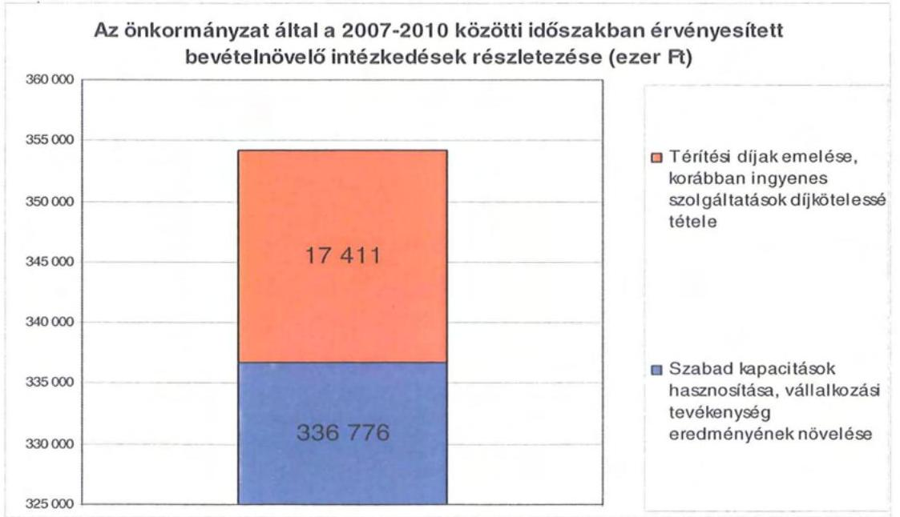

---

Az Önkormányzatnak a bevételnövelő intézkedések eredményeként - kimutatásai szerint - a vizsgált időszakban 354,2 millió Ft bevételi többlete volt. A korábban ingyenes szolgáltatások - többek között a művészeti oktatás, a művészeti napközi - díjkötelessé tétele 17,4 millió Ft bevétel-növekedést eredményezett a 2007-2010. között.

A szabad kapacitások hasznosítása - tornatermek, tantermek bérbeadása - és a vállalkozási tevékenység - ECDL vizsga szervezése és lebonyolítása - eredményeként az Önkormányzatnak 19,2 millió Ft bevételi többlete volt. Az átmenetileg szabad pénzeszközök lekötéséből, befektetéséből - kimutatásuk szerint - 317,5 millió Ft bevétel származott ${ }^{63}$.

# 5. A HELYI ÖNKORMÁNYZATOK GAZDÁLKODÁSI RENDSZERÉNEK 2007. ÉVI ELLENŐRZÉSE SORÁN A PÉNZÜGYI EGYENSÚLY JAVÍTÁSÁRA TETT SZABÁLYSZERŰSÉGI ÉS CÉLSZERŰSÉGI JAVASLATOK HASZNOSULÁSA 

Az ÁSZ a V-3023/2007. számú jelentésében az Önkormányzat gazdálkodási rendszerét a 2007. évben ellenőrizte átfogó jelleggel, amelynek során a pénzügyi egyensúly javítására három szabályszerűségi és egy célszerűségi javaslatot tett. A javaslatok közül kettő a polgármesternek, kettő a jegyzőnek szólt. A javaslatok fele teljesült az intézkedési tervben meghatározott határidőre.

A célszerűségi javaslatot teljesítették, a polgármester tájékoztatta a Közgyűlést a számvevőszéki ellenőrzés tapasztalatairól, amelynek megvalósítására intézkedési tervet készítettek. ${ }^{64}$ A polgármester intézkedett arról, hogy kötelezettségvállalásra a költségvetési rendeletben jóváhagyott kiadási előirányzatok mértékéig kerüljön sor.

A jegyző a kettő szabályszerűségi javaslatot határidőre
 nem hasznosította, mivel a 2008. évi költségvetési rendeletben az Áht. 8/A. § (7) bekezdésében előírtak ellenére a pénzügyi műveleteket a költségvetési bevételek és a költségvetési kiadások között mutatták ki. A jegyző nem gondoskodott a 2008. évi költségvetési rendelettervezet elkészítése során arról, hogy az európai uniós forrásokkal megvalósuló fejlesztések bevételi és kiadási előirányzatait az Áht. 69. § (1) bekezdésében ${ }^{65}$ előírtaknak megfelelően tervezzék meg, továbbá arról, hogy azok bevételi és kiadási előirányzatait az Ámr. alapján elkülönítetten ${ }^{66}$ mutassák be,

[^0]
[^0]:    ${ }^{63}$ A 317,5 millió Ft nem tartalmazza a kibocsátott kötvény kamatbevételét.
    ${ }^{64}$ A Közgyűlés a 231/2007. (IX. 20.) számú határozatával elfogadta a javaslatok megvalósítására felelősöket és határidőket tartalmazó intézkedési tervet, a 254/2007. (IX. 27.) számú határozatban felkérte a polgármestert, hogy az Önkormányzat költségvetési és pénzügyi helyzetéről szóló javaslatok végrehajtását kísérje figyelemmel, és végrehajtásukról tájékoztassa a Közgyűlést.
    ${ }^{65}$ 2010. január 1-jéig az Áht. 69. § (1) bekezdése, 2010. január 1-jétől az Áht. 69. § (1) bekezdés a) pontja írja elő.
    ${ }^{66}$ 2010. január 1-jéig az Ámr. 29. § (1) bekezdés k) pontja, 2010. január 1-től az Ámr. 36. § (1) bekezdésének l) pontja írja elő.

---

valamint a több éves kihatással járó feladatok előirányzatait éves bontásban ${ }^{67}$ is tartalmazza. A javaslatok a 2010. évi költségvetési rendelettervezet összeállítása során teljesültek.

Budapest, 2011. december „12.,

Melléklet: $\quad 9 \mathrm{db}$
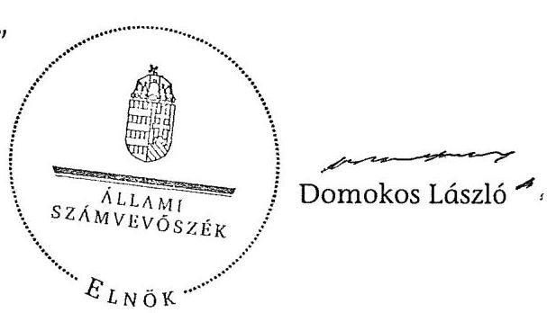

Domokos László ${ }^{67}$

[^0]
[^0]:    ${ }^{67}$ 2010. január 1-jéig az Ámr. 29. § (1) bekezdés g) pontja, 2011. január 1-jétől az Ámr. 36. § (1) bekezdésének h) pontja írja elő.

---

.

---

# Működési és felhalmozási célú hiány/többlet az önkormányzat rendeleteiben

|  Fejlesztés | 2007 | 2008 | 2009 | 2010  |
| --- | --- | --- | --- | --- |
|  Működési bevételek és kiadások | 531 | 711 | 10 982 | 12 018  |
|  Felhalmozási bevételek és kiadások | 10 982 | 17 117 | 2 997 | 1 026  |
|  Felhalmozási bevételek és kiadások | 17 117 | 2 084 | 14 639 | 1 026  |
|  Önkormányzata | 1 026 | 14 639 | 11 221 | 14 470  |
|  Számú melléklet | 1 026 | 14 639 | 11 221 | 14 470  |
|  Számú melléklet | 11 221 | 14 470 | 11 221 | 14 470  |

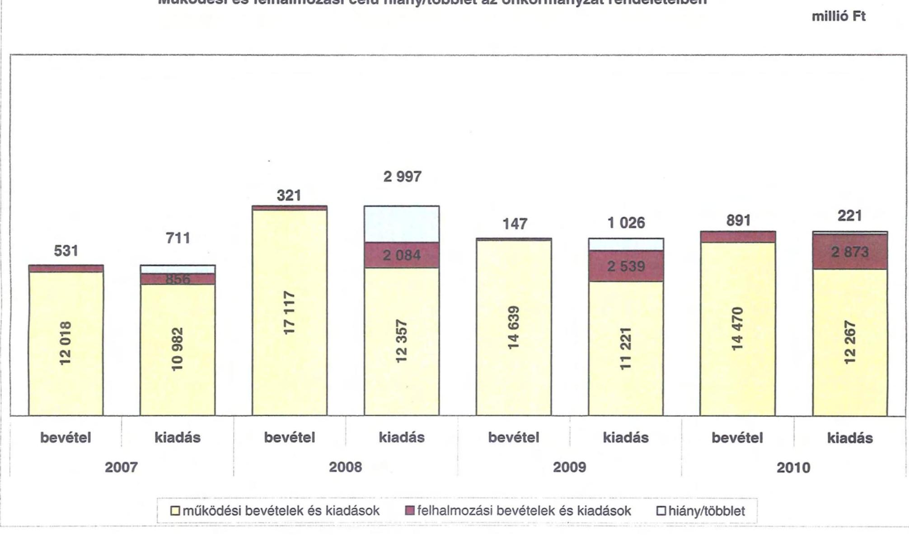

---

|  Érd |  |  |  |   |
| --- | --- | --- | --- | --- |
|  1. FOLYÓ KÖLTSÉGVETÉS* | 2007. | 2008. | 2009. | 2010.  |
|  1.1.1. Saját működési bevételek | 2 729 768 | 3 002 452 | 3 822 442 | 3 665 684  |
|  1.1.2. Költségvetési támogatás | 2 307 853 | 3 689 409 | 3 325 589 | 3 271 627  |
|  1.1.3. Adójellegű bevételek | 3 277 223 | 2 331 539 | 2 490 512 | 2 763 418  |
|  1.1.4. Államháztartáson belülről kapott támogatások | 719 930 | 881 046 | 806 503 | 1 179 286  |
|  1.1.5. EU-vel és külföldről kapott bevételek | 1 924 | 2 056 | 6 863 | 2 233  |
|  1.1.6. Államháztartáson kívülről kapott bevételek | 15 470 | 10 506 | 10 806 | 14 890  |
|  1.1.7. Előző évi pénzmaradvány átvétel | 619 688 | 646 415 | 642 806 | 584 967  |
|  1.1. Folyó bevételek =1.1.1.+1.1.2.+1.1.3.+1.1.4.+1.1.5.+1.1.6.+1.1.7. | 9 671 870 | 10 563 423 | 11 105 521 | 11 492 105  |
|  1.2.1. Működési kiadások kamatkiadások nélkül | 8 984 635 | 9 729 354 | 9 461 937 | 10 773 584  |
|  1.2.2. Államháztartáson belülre átadott pénzeszközök | 17 394 | 89 717 | 4 949 | 108 837  |
|  1.2.3.1. vállalkozásoknak | 112 365 | 76 017 | 44 340 | 84 461  |
|  1.2.3.2. EU-velik, illetve külföldre | 2 988 | 1 766 | 1 375 | 0  |
|  1.2.3.3. magánszemélyeknek | 215 330 | 201 501 | 262 792 | 354 767  |
|  1.2.3.4. neugosító szervezeteknek | 88 489 | 166 823 | 290 460 | 146 907  |
|  1.2.4. Vázníkeskadások (=2.2.1.+1.2.3.2+1.2.3.3+1.2.3.4) | 419 169 | 446 045 | 598 967 | 586 139  |
|  1.2.5. Kamatkiadások | 125 634 | 156 433 | 327 961 | 176 474  |
|  1.2.6. Előző évi pénzmaradvány átadás | 619 684 | 646 415 | 641 921 | 595 852  |
|  1.3. Folyó kiadások = 1.2.1.+1.2.2.+1.2.3.+1.2.4.+1.2.5. | 10 166 516 | 11 067 964 | 11 035 735 | 12 240 882  |
|  1.3. Folyó költségvetés egyenlege MŰKÖDÉSI JÖVEDELEM (1.1. - 1.2.) | -494 646 | -504 541 | 69 786 | -748 777  |
|  1. FELHALMOZÁSI KÖLTSÉGVETÉS** |  |  |  |   |
|  2.1.1. Saját többbevételek | 147 834 | 103 065 | 145 053 | 7 534  |
|  2.1.2. Államháztartáson belülről kapott támogatások | 199 096 | 119 566 | 406 499 | 1 398 133  |
|  2.1.3. EU-vel és külföldről kapott támogatások | 0 | 0 | 0 | 0  |
|  2.1.4. Államháztartáson kívülről kapott támogatások | 25 886 | 79 755 | 70 451 | 3 561  |
|  2.1. Felhalmozási bevételek (=2.1.1.+2.1.2+2.1.3+2.1.4.) | 372 816 | 302 380 | 622 003 | 1 409 228  |
|  2.2.1. Saját tervalkózási kiadás állva | 623 801 | 490 806 | 2 220 335 | 2 547 867  |
|  2.2.2. Saját felújítási kiadás állva | 31 916 | 298 404 | 307 183 | 320 358  |
|  2.2.3. Államháztartáson belülre átadott pénzeszköz | 67 000 | 241 152 | 180 539 | 17 951  |
|  2.2.4. EU-velik és külföldnek adott pénzeszközök | 0 | 0 | 0 | 0  |
|  2.2.5. Államháztartáson kívülre adott pénzeszközök | 96 000 | 21 400 | 9 900 | 7 456  |
|  2.2.6. Befektetési célú részesedések vásárlása | 0 | 16 031 | 6 580 | 0  |
|  2.2. Felhalmozási kiadások (=2.2.1.+2.2.2.+2.2.3.+2.2.4.+2.2.5.+2.2.6.) | 818 717 | 1 067 787 | 2 724 536 | 2 893 632  |
|  2.3. Felhalmozási költségvetés egyenlege (2.1. - 2.2.) | -445 901 | -765 401 | -2 102 533 | -1 484 404  |
|  3. Finanszírozási műveletek nélküli (GFS) pozíció(1.3.+2.3.) | -940 547 | -1 269 942 | -2 032 747 | -2 233 181  |
|  4. Finanszírozási műveletek |  |  |  |   |
|  4.1. Hitelfelvészt | 370 933 | 1 586 661 | 915 303 | 2 923 041  |
|  4.2. Hiteltörlesztés | 833 700 | 1 555 394 | 386 589 | 1 745 832  |
|  4.3. Forgatási és befektetési célú értékpapírok kibocsátása | 988 390 | 4 300 043 | 0 | 0  |
|  4.4. Forgatási és befektetési célú értékpapírok beváltása | 0 | 0 | 0 | 0  |
|  4.5. Forgatási és befektetési célú értékpapírok értékesítése | 0 | 0 | 19 973 | 869 030  |
|  4.6. Forgatási és befektetési célú értékpapírok vásárlása | 19 973 | 749 995 | 0 | 0  |
|  4.7. Egyéb finanszírozási bevételek (függő, átfizet, kiegészítő) | 55 472 | 1 747 | 60 688 | -280 445  |
|  4.8. Egyéb finanszírozási kiadások (függő, átfizet, kiegészítő) | -846 132 | 35 240 | -153 436 | 181 305  |
|  4.9. Finanszírozási műveletek egyenlege (4.1. - 4.2.+4.3.-4.4+4.5.-4.6.+4.7.-4.8.) | 1 407 263 | 3 542 328 | 762 711 | 1 584 497  |
|  5. Tárgyévi pénzügyi pozíció változási (1.3.+ 2.3.+4.9.) | 466 696 | 5 272 386 | -1 270 036 | -648 684  |
|  6. Nettó működési jövedelem voníködési jövedelem (1.3.) - tüketörlesztés (4.2+4.4) | -1 328 346 | -2 059 935 | -316 801 | -2 494 609  |
|  TÁJÉKOZTATÓ ADATOK |  |  |  |   |
|  Összes kötelezettség | 2 134 504 | 7 890 228 | 8 956 628 | 12 315 717  |
|  ebből rövid lejáratú | 547 064 | 669 955 | 1 003 348 | 2 666 384  |
|  Összes esedékességi kötelezettség | 235 424 | 269 190 | 701 262 | 1 454 565  |
|  ebből lejárt (bankszámlából) | 95 471 | 36 583 | 90 389 | 214 158  |
|  Keresség és garanciavállalások | 0 | 0 | 0 | 0  |
|  Jegyzés bírósági letétekből adódó kötelezettségek | 0 | 20 000 | 20 000 | 20 000  |
|  Piros és túlhajtoni kötelezettség (adósság) | 1 625 006 | 7 317 645 | 7 886 839 | 10 579 702  |
|  ebből rövid lejáratú | 37 560 | 97 372 | 33 559 | 931 984  |
|  PPP szerződéses állomány jelszerűen (bankszámlából) | 0 | 0 | 0 | 0  |
|  ebből lejárt szolgáltatási díj miatti kötelezettség | 0 | 0 | 0 | 0  |
|  Folyószámlahitel napi átlagos állománya (bankszámlából) | 712 555 | 1 537 90 | 2 504 28 | 5 046 50  |
|  Lévőidőtel napi átlagos állománya (bankszámlából) | 0 | 0 | 0 | 0 |
| Munksbérhitel napl átlagos állománya (tansitőványból) | 0 | 0 | 0 | 0 |
| Keresség és garanciavalladások (tansitőványból) | 0 | 0 | 0 | 0 |
| Jegyrés bíróségi tétletekből adódó kötelezettségek (tansitőványból) | 0 | 0 | 0 | 0 |
| Finanszírozásba bevombató eszközök | 648 370 | 3 670 751 | 2 380 742 | 982 063 |
| Tarrés hitelvisszete megtestesítő értékpapírok és végi állománya | 42 | 750 037 | 750 037 | 42 |
| Hosszú hjátratt hunkhetetek és végi állománya | 0 | 0 | 0 | 0 |
| Értékpapírok | 19 973 | 19 973 | 0 | 0 |
| Pénzeszközök (idegen pénzeszközök nélküli és végi állománya | 628 355 | 2 900 741 | 1 630 705 | 982 021 |

- Bevételében nem értiül, a kiadásokban nem jelenti meg az amortizáció, a vagyoni helyzetet az egyenleg befolyásolja. ** Bevételében vagyon megőrzésre és hővítése fordításai ésszárok.

---

| | | | | | | | | | | | | | | | | | | | | | | | | | | | | | | | | | | | | | | | |
| --- | --- | --- | --- | --- | --- | --- | --- | --- | --- | --- | --- | --- | --- | --- | --- | --- | --- | --- | --- | --- | --- | --- | --- | --- | --- | --- | --- | --- | --- | --- | --- | --- | --- | --- | --- | --- | --- | --- | --- |
| | | | | | | | | | | | | | | | | | | | | | | | | | | | | | | | | | | | | | | | |
| | | | | | | | | | | | | | | | | | | | | | | | | | | | | | | | | | | | | | | | |
| | | | | | | | | | | | | | | | | | | | | | | | | | | | | | | | | | | | | | | | |
| | | | | | | | | | | | | | | | | | | | | | | | | | | | | | | | | | | | | | | | |
| | | | | | | | | | | | | | | | | | | | | | | | | | | | | | | | | | | | | | | | |
| | | | | | | | | | | | | | | | | | | | | | | | | | | | | | | | | | | | | | | | |
| | | | | | | | | | | | | | | | | | | | | | | | | | | | | | | | | | | | | | | | |
| | | | | | | | | | | | | | | | | | | | | | | | | | | | | | | | | | | | | | | | |
| | | | | | | | | | | | | | | | | | | | | | | | | | | | | | | | | | | | | | | | |
| | | | | | | | | | | | | | | | | | | | | | | | | | | | | | | | | | | | | | | | |
| | | | | | | | | | | | | | | | | | | | | | | | | | | | | | | | | | | | | | | | |
| | | | | | | | | | | | | | | | | | | | | | | | | | | | | | | | | | | | | | | | |
| | | | | | | | | | | | | | | | | | | | | | | | | | | | | | | | | | | | | | | | |
| | | | | | | | | | | | | | | | | | | | | | | | | | | | | | | | | | | | | | | | |
| | | | | | | | | | | | | | | | | | | | | | | | | | | | | | | | | | | | | | | | |
 |  |  |  |  |  |  |  |  |  |  |  |  |  |  |  |  |  |  |  |  |  |  |   |
|---|---|---|---|---|---|---|---|---|---|---|---|---|---|---|---|---|---|---|---|---|---|---|
|   |  |  |  |  |  |  |  |  |  |  |  |  |  |  |  |  |  |  |  |  |  |  |  |  |  |  |  |  |  |  |  |  |  |  |  |  |  |  |   |
|   |  |  |  |  |  |  |  |  |  |  |  |  |  |  |  |  |  |  |  |  |  |  |  |  |  |  |  |  |  |  |  |  |  |  |  |  |  |  |   |
|   |  |  |  |  |  |  |  |  |  |  |  |  |  |  |  |  |  |  |  |  |  |  |  |  |  |  |  |  |  |  |  |  |  |  |  |  |  |  |   |
|   |  |  |  |  |  |  |  |  |  |  |  |  |  |  |  |  |  |  |  |  |  |  |  |  |  |  |  |  |  |  |  |  |  |  |  |  |  |  |   |
|   |  |  |  |  |  |  |  |  |  |  |  |  |  |  |  |  |  |  |  |  |  |  |  |  |  |  |  |  |  |  |  |  |  |  |  |  |  |  |   |
|   |  |  |  |  |  |  |  |  |  |  |  |  |  |  |  |  |  |  |  |  |  |  |  |  |  |  |  |  |  |  |  |  |  |  |  |  |  |  |   |
|   |  |  |  |  |  |  |  |  |  |  |  |  |  |  |  |  |  |  |  |  |  |  |  |  |  |  |  |  |  |  |  |  |  |  |  |  |  |  |   |
|   |  |  |  |  |  |  |  |  |  |  |  |  |  |  |  |  |  |  |  |  |  |  |  |  |  |  |  |  |  |  |  |  |  |  |  |  |  |  |   |
|   |  |  |  |  |  |  |  |  |  |  |  |  |  |  |  |  |  |  |  |  |  |  |  |  |  |  |  |  |  |  |  |  |  |  |  |  |  |  |   |
|   |  |  |  |  |  |  |  |  |  |  |  |  |  |  |  |  |  |  |  |  |  |  |  |  |  |  |  |  |  |  |  |  |  |  |  |  |  |  |   |
|   |  |  |  |  |  |  |  |  |  |  |  |  |  |  |  |  |  |  |  |  |  |  |  |  |  |  |  |  |  |  |  |  |  |  |  |  |  |  |   |
|   |  |  |  |  |  |  |  |  |  |  |  |  |  |  |  |  |  |  |  |  |  |  |  |  |  |  |  |  |  |  |  |  |  |  |  |  |  |  |   |
|   |  |  |  |  |  |  |  |  |  |  |  |  |  |  |  |  |  |  |  |  |  |  |  |  |  |  |  |  |  |  |  |  |  |  |  |  |  |  |   |
|   |  |  |  |  |  |  |  |  |  |  |  |  |  |  |  |  |  |  |  |  |  |  |  |  |  |  |  |  |  |  |  |  |  |  |  |  |  |  |   |
|   |  |  |  |  |  |  |  |  |  |  |  |  |  |  |  |  |  |  |  |  |  |  |  |  |  |  |  |  |  |  |  |  |  |  |  |  |  |  |   |
|   |

---

Érd Megyei Jogú Város Önkormányzata

Az Önkormányzat 2010. december 31-én felmérezsbe lévő fejlesztési feladataihoz kapcsolódó kötelezettségek (A 2010. december 31-ig teljesített pénzügyi adatok alakításáról)

2010. december 31-ig pénzügyileg teljesített beruházás forráskészlete

|  |   |   |   |   |   |   |   |   |   |   |   |   |   |   |   |   |   |   |   |   |   |   |   |   |   |   |   |   |
| --- | --- | --- | --- | --- | --- | --- | --- | --- | --- | --- | --- | --- | --- | --- | --- | --- | --- | --- | --- | --- | --- | --- | --- | --- | --- | --- | --- | --- |
|  1 | 2 | 3 | 4 | 5 | 6 | 7 | 8 | 9 | 10 | 11 | 12 | 13 | 14 | 15 | 16 | 17 | 18 | 19 | 20 | 21 | 22 | 23 | 24 | 25 | 26 | 27 | 28 | 29  |
|   | Fejezetcímek |  |  |  |  |  |  |  |  |  |  |  |  |  |  |  |  |  |  |  |  |  |  |  |  |  |  |   |
|   |  |  |  |  |  |  |  |  |  |  |  |
 |  |  |  |  |  |  |  |  |  |  |  |  |  |  |  |   |
|   | Felségöbbek |  |  |  |  |  |  |  |  |  |  |  |  |  |  |  |  |  |  |  |  |  |  |  |  |  |  |   |
|   |  |  |  |  |  |  |  |  |  |  |  |  |  |  |  |  |  |  |  |  |  |  |  |  |  |  |  |   |
|   | Felségöbbek |  |  |  |  |  |  |  |  |  |  |  |  |  |  |  |  |  |  |  |  |  |  |  |  |  |  |   |
|   |  |  |  |  |  |  |  |  |  |  |  |  |  |  |  |  |  |  |  |  |  |  |  |  |  |  |  |   |
|   | Felségöbbek összeann |  |  |  |  |  |  |  |  |  |  |  |  |  |  |  |  |  |  |  |  |  |  |  |  |  |  |   |
|   |  |  |  |  |  |  |  |  |  |  |  |  |  |  |  |  |  |  |  |  |  |  |  |  |  |  |  |   |
|   | Felségöbbek |  |  |  |  |  |  |  |  |  |  |  |  |  |  |  |  |  |  |  |  |  |  |  |  |  |  |   |
|   |  |  |  |  |  |  |  |  |  |  |  |  |  |  |  |  |  |  |  |  |  |  |  |  |  |  |  |   |
|   | Felségöbbek |  |  |  |  |  |  |  |  |  |  |  |  |  |  |  |  |  |  |  |  |  |  |  |  |  |  |   |
|   |  |  |  |  |  |  |  |  |  |  |  |  |  |  |  |  |  |  |  |  |  |  |  |  |  |  |  |   |
|   | Felségöbbek |  |  |  |  |  |  |  |  |  |  |  |  |  |  |  |  |  |  |  |  |  |  |  |  |  |  |   |
|   |  |  |  |  |  |  |  |  |  |  |  |  |  |  |  |  |  |  |  |  |  |  |  |  |  |  |  |   |
|   | Felségöbbek |  |  |  |  |  |  |  |  |  |  |  |  |  |  |  |  |  |  |  |  |  |  |  |  |  |  |   |
|   |  |  |  |  |  |  |  |  |  |  |  |  |  |  |  |  |  |  |  |  |  |  |  |  |  |  |  |   |
|   | Felségöbbek |  |  |  |  |  |  |  |  |  |  |  |  |  |  |  |  |  |  |  |  |  |  |  |  |  |  |   |
|   |  |  |  |  |  |  |  |  |  |  |  |  |  |  |  |  |  |  |  |  |  |  |  |  |  |  |  |   |
|   | Felségöbbek |  |  |  |  |  |  |  |  |  |  |  |  |  |  |  |  |  |  |  |  |  |  |  |  |  |  |   |
|   |  |  |  |  |  |  |  |  |  |  |  |  |  |  |  |  |  |  |  |  |  |  |  |  |  |  |  |   |
|   | Felségöbbek |  |  |  |  |  |  |  |  |  |  |  |  |  |  |  |  |  |  |  |  |  |  |  |  |  |  |   |
|   |  |  |  |  |  |  |  |  |  |  |  |  |  |  |  |  |  |  |  |  |  |  |  |  |  |  |  |   |
|   | Felségöbbek |  |  |  |  |  |  |  |  |  |  |  |  |  |  |  |  |  |  |  |  |  |  |  |  |  |  |   |
|   |  |  |  |  |  |  |  |  |  |  |  |  |  |  |  |  |  |  |  |  |  |  |  |  |  |  |  |   |
|   | Felségöbbek |  |  |  |  |  |  |  |  |  |  |  |  |  |  |  |  |  |  |  |  |  |  |  |  |  |  |   |
|   |  |  |  |  |  |  |  |  |  |  |  |  |  |  |  |  |  |  |  |  |  |  |  |  |  |  |  |   |
|   | Felségöbbek |  |  |  |  |  |  |  |  |  |  |  |  |  |  |  |  |  |  |  |  |  |  |  |  |  |  |   |
|   |  |  |  |  |  |  |  |  |  |  |  |  |  |  |  |  |  |  |  |  |  |  |  |  |  |  |  |   |
|   | Felségöbbek | | | | | | | | | | | | | | | | | | | | | | | | | | | |
| | | | | | | | | | | | | | | | | | | | | | | | | | | | |
| | Felsőbbek | | | | | | | | | | | | | | | | | | | | | | | | | | |
| | | | | | | | | | | | | | | | | | | | | | | | | | | | |
| | Felsőbbek | | | | | | | | | | | | | | | | | | | | | | | | | | |
| | | | | | | | | | | | | | | | | | | | | | | | | | | | |
| | Felsőbbek | | | | | | | | | | | | | | | | | | | | | | | | | | |
| | | | | | | | | | | | | | | | | | | | | | | | | | | | |
| | Felsőbbek | | | | | | | | | | | | | | | | | | | | | | | | | | |
| | | | | | | | | | | | | | | | | | | | | | | | | | | | |
| | Felsőbbek | | | | | | | | | | | | | | | | | | | | | | | | | | |
| | | | | | | | | | | | | | | | | | | | | | | | | | | | |
| | Felsőbbek | | | | | | | | | | | | | | | | | | | | | | | | | | |
| | | | | | | | | | | | | | | | | | | | | | | | | | | | |
| | Felsőbbek | | | | | | | | | | | | | | | | | | | | | | | | | | |
| | | | | | | | | | | | | | | | | | | | | | | | | | | | |
| | Felsőbbek | | | | | | | | | | | | | | | | | | | | | | | | | | |
| | | | | | | | | | | | | | | | | | | | | | | | | | | | |
| | Felsőbbek | | | | | | | | | | | | | | | | | | | | | | | | | | |
| | | | | | | | | | | | | | | | | | | | | | | | | | | | |
| | Felsőbbek | | | | | | | | | | | | | | | | | | | | | | | | | | |
| | | | | | | | | | | | | | | | | | | | | | | | | | | | |
| | Felsőbbek | | | | | | | | | | | | | | | | | | | | | | | | | | |
| | | | | | | | | | | | | | | | | | | | | | | | | | | | |
| | Felsőbbek | | | | | | | | | | | | | | | | | | | | | | | | | | | | | | | | | |
| | | | | | | | | | | | | | | | | | | | | | | | | | | | | |
| | Felsőbbek | | | | | | | | | | | | | | | | | | | | | | | | | | | |
| | | | | | | | | | | | | | | | | | | | | | | | | | | | | |
| | Felsőbbek | | | | | | | | | | | | | | | | | | | | | | | | | | | |
| | | | | | | | | | | | | | | | | | | | | | | | | | | | | |
| | Felsőbbek | | | | | | | | | | | | | | | | | | | | | | | | | | | |
| | | | | | | | | | | | | | | | | | | | | | | | | | | | | |
| | Felsőbbek | | | | | | | | | | | | | | | | | | | | | | | | | | | |
| | | | | | | | | | | | | | | | | | | | | | | | | | | | | |
| | Felsőbbek | | | | | | | | | | | | | | | | | | | | | | | | | | | |
| | | | | | | | | | | | | | | | | | | | | | | | | | | | | |
| | Felsőbbek | | | | | | | | | | | | | | | | | | | | | | | | | | | |
| | | | | | | | | | | | | | | | | | | | | | | | | | | | | |
| | Felsőbbek | | | | | | | | | | | | | | | | | | | | | | | | | | | |
| | | | | | | | | | | | | | | | | | | | | | | | | | | | | |
| | Felsőbbek | | | | | | | | | | | | | | | | | | | | | | | | | | | |
| | | | | | | | | | | | | | | | | | | | | | | | | | | | | |
| | Felsőbbek | | | | | | | | | | | | | | | | | | | | | | | | | | | |
| | | | | | | | | | | | | | | | | | | | | | | | | | | | | |
| | Felsőbbek | | | | | | | | | | | | | | | | | | | | | | | | | | | |
| | | | | | | | | | | | | | | | | | | | | | | | | | | | | |
| | Felsőbbek | | | | | | | | | | | | | | | | | | | | | | | | | | | |
| | | | | | | | | | | | | | | | | | | | | | | | | | | | | |
| | Felsőbbek | | | | | | | | | | | | | | | | | | | | | | | | | | | |
| | | | | | | | | | | | | | | | | | | | | | | | | | | | | |
| | Felsőbbek | | | | | | | | | | | | | | | | | | | | | | | | | | | |
| | | | | | | | | | | | | | | | | | | | | | | | | | | | | | | | | | | | | | | | | | | | | | |
| | Felségöbbek | | | | | | | | | | | | | | | | | | | | | | | | | | |
| | | | | | | | | | | | | | | | | | | | | | | | | | | | |
| | Felségöbbek | | | | | | | | | | | | | | | | | | | | | | | | | | |
| | | | | | | | | | | | | | | | | | | | | | | | | | | | |
| | Felségöbbek | | | | | | | | | | | | | | | | | | | | | | | | | | |
| | | | | | | | | | | | | | | | | | | | | | | | | | | | |
| | Felségöbbek | | | | | | | | | | | | | | | | | | | | | | | | | | |
| | | | | | | | | | | | | | | | | | | | | | | | | | | | |
| | Felségöbbek | | | | | | | | | | | | | | | | | | | | | | | | | | |
| | | | | | | | | | | | | | | | | | | | | | | | | | | | |
| | Felségöbbek | | | | | | | | | | | | | | | | | | | | | | | | | | |
| | | | | | | | | | | | | | | | | | | | | | | | | | | | |
| | Felségöbbek | | | | | | | | | | | | | | | | | | | | | | | | | | |
| | | | | | | | | | | | | | | | | | | | | | | | | | | | |
| | Felségöbbek | | | | | | | | | | | | | | | | | | | | | | | | | | |
| | | | | | | | | | | | | | | | | | | | | | | | | | | | |
| | Felségöbbek | | | | | | | | | | | | | | | | | | | | | | | | | | |
| | | | | | | | | | | | | | | | | | | | | | | | | | | | |
| | Felségöbbek | | | | | | | | | | | | | | | | | | | | | | | | | | |
| | | | | | | | | | | | | | | | | | | | | | | | | | | | |
| | Felségöbbek | | | | | | | | | | | | | | | | | | | | | | | | | | |
| | | | | | | | | | | | | | | | | | | | | | | | | | | | |
| | Felségöbbek | | | | | | | | | | | | | | | | | | | | | | | | | | |
| | | | | | | | | | | | | | | | | | | | | | | | | | | | |
| | Felségöbbek |
 | | | | | | | | | | | | | | | | | | | | | | | | | | | |
| | | | | | | | | | | | | | | | | | | | | | | | | | | | | | |
| | Felsőbbek | | | | | | | | | | | | | | | | | | | | | | | | | | | | |
| | | | | | | | | | | | | | | | | | | | | | | | | | | | | | |
| | Felsőbbek | | | | | | | | | | | | | | | | | | | | | | | | | | | | | |
| | | | | | | | | | | | | | | | | | | | | | | | | | | | | | |
| | Felsőbbek | | | | | | | | | | | | | | | | | | | | | | | | | | | | | | |
| | | | | | | | | | | | | | | | | | | | | | | | | | | | | | | |
| | Felsőbbek | | | | | | | | | | | | | | | | | | | | | | | | | | | | | | |
| | | | | | | | | | | | | | | | | | | | | | | | | | | | | | | | |
| | Felsőbbek | | | | | | | | | | | | | | | | | | | | | | | | | | | | | | | |
| | | | | | | | | | | | | | | | | | | | | | | | | | | | | | | | |
| | Felsőbbek | | | | | | | | | | | | | | | | | | | | | | | | | | | | | | | | |
| | | | | | | | | | | | | | | | | | | | | | | | | | | | | | | | | |
| | Felsőbbek | | | | | | | | | | | | | | | | | | | | | | | | | | | | | | | | | |
| | | | | | | | | | | | | | | | | | | | | | | | | | | | | | | | | |
| | Felsőbbek | | | | | | | | | | | | | | | | | | | | | | | | | | | | | | | | | |
| | | | | | | | | | | | | | | | | | | | | | | | | | | | | | | | | |
| | Felsőbbek | | | | | | | | | | | | | | | | | | | | | | | | | | | | | | | | | |
| | | | | | | | | | | | | | | | | | | | | | | | | | | | | | | | | |
| | Felsőbbek | | | | | | | | | | | | | | | | | | | | | | | | | | | | | | | | | | |
| | | | | | | | | | | | | | | | | | | | | | | | | | | | | | | | | | |
| | Felsőbbek | | | | | | | | | | | | | | | | | | | | | | | | | | | | | | | | | | | |
| | | | | | | | | | | | | | | | | | | |
 | | | | | | | | | | | | | | | | | | | | |
| | Felsőbbek | | | | | | | | | | | | | | | | | | | | | | | | | | | | | | | | | | | | | |
| | | | | | | | | | | | | | | | | | | | | | | | | | | | | | | | | | | | | | | | |
| | Felsőbbek | | | | | | | | | | | | | | | | | | | | | | | | | | | | | | | | | | | | | |
| | | | | | | | | | | | | | | | | | | | | | | | | | | | | | | | | | | | | | | | |
| | Felsőbbek | | | | | | | | | | | | | | | | | | | | | | | | | | | | | | | | | | | | | |
| | | | | | | | | | | | | | | | | | | | | | | | | | | | | | | | | | | | | | | | |
| | Felsőbbek | | | | | | | | | | | | | | | | | | | | | | | | | | | | | | | | | | | | | | | | |
| | | | | | | | | | | | | | | | | | | | | | | | | | | | | | | | | | | | | | | | | |
| | Felsőbbek | | | | | | | | | | | | | | | | | | | | | | | | | | | | | | | | | | | | | | | | | |
| | Felsőbbek | | | | | | | | | | | | | | | | | | | | | | | | | | | | | | | | | | | | | | | | | | |
| | Felsőbbek | | | | | | | | | | | | | | | | | | | | | | | | | | | | | | | | | | | | | | | | | | | | |
| | Felsőbbek | | | | | | | | | | | | | | | | | | | | | | | | | | | | | | | | | | | | | | | | | | |
| | Felsőbbek | | | | | | | | | | | | | | | | | | | | | | | | | | | | | | | | | | | | | | | | | | | | | |
| | Felsőbbek | | | | | | | | | | | | | | | | | | | | | | | | | | | | | | | | | | | | | | | | | | |
| | Felsőbbek | | | | | | | | | | | | | | | | | | | | | | | | | | | | | | | | | | | | | | | | |
| | Felsőbbek | | | | | | | | | | | | | | | | | | | | | | | | | | | | | | | | | | | | | |
| | Felsőbbek | | | | | | | | | | | | | | | | | | | | | | | | | | | | | | | | | | | | | | |
| | Felsőbbek | | | | | | | | | | | | | | | | | | | | | | | | | | | | | | | | | | | | | | | | | | | | | | | |
| | Felségőbbek | | | | | | | | | | | | | | | | | | | | | | | | | | | | | | | | | | | | | | |
| | Felségőbbek | | | | | | | | | | | | | | | | | | | | | | | | | | | | | | | | | | | | | | | | | |
| | Felségőbbek | | | | | | | | | | | | | | | | | | | | | | | | | | | | | | | | | | | | |
| | Felségőbbek | | | | | | | | | | | | | | | | | | | | | | | | | | | | | | | | | | | | | |
| | Felségőbbek | | | | | | | | | | | | | | | | | | | | | | | | | | | | | | | | | | | |
| | Felségőbbek | | | | | | | | | | | | | | | | | | | | | | | | | | | | | | | | | |
| | Felségőbbek | | | | | | | | | | | | | | | | | | | | | | | | | | | | | | | | | | | | | |
| | Felségőbbek | | | | | | | | | | | | | | | | | | | | | | | | | | | | | | | | | | |
| | Felségőbbek | | | | | | | | | | | | | | | | | | | | | | | | | | | | | | | | | |
| | Felségőbbek | | | | | | | | | | | | | | | | | | | | | | | | | | | | | | |
| | Felségőbbek | | | | | | | | | | | | | | | | | | | | | | | | | | | | | |
| | Felségőbbek | | | | | | | | | | | | | | | | | | | | | | | | | | | | | | | | |
| | Felségőbbek | | | | | | | | | | | | | | | | | | | | | | | | | | | | | | | | | |
| | Felségőbbek | | | | | | | | | | | | | | | | | | | | | | | | | | | | | | | | |
| | Felségőbbek | | | | | | | | | | | | | | | | | | | | | | | | | | | | | | |
| | Felségőbbek | | | | | | | | | | | | | | | | | | | | | | | | | | | | | |
| | Felségőbbek | | | | | | | | | | | | | | | | | | | | | | | | | | | | | | | | | |
| | Felségőbbek | | | | | | | | | | | | | | | | | | | | | | | | | | | | | | | | | | | | | |
| | Felségűbbek | | | | | | | | | | | | | | | | | | | | | | | | | | | | | | | | | | | | | |
| | Felségűbbek | | | | | | | | | | | | | | | | | | | | | | | | | | | | | | | | | | | | | | | | | | | | | | | | | | | | | | | | | | | | |
| | Felségűbbek | | | | | | | | | | | | | | | | | | | | | | | | | | | | | | | | | | | | | | | | | | | | | | | | | | | | | | | | | | | | | | | | | | | | | | | | | | | | | | | | | | | | | | | | | | | | | | | | | | | | | | | | | |

---

| | | | | | | | | | | | | | | | | | | | | | | | | | | | | | | | | | | | | | | | | | | | |
| --- | --- | --- | --- | --- | --- | --- | --- | --- | --- | --- | --- | --- | --- | --- | --- | --- | --- | --- | --- | --- | --- | --- | --- | --- | --- | --- | --- | --- | --- | --- | --- | --- | --- | --- | --- | --- | --- | --- | --- | --- | --- | --- |
| | | | | | | | | | | | | | | | | | | | | | | | | | | | | | | | | | | | | | | | | | | |
| | | | | | | | | | | | | | | | | | | | | | | | | | | | | | | | | | | | | | | | | | | |
| | | | | | | | | | | | | | | | | | | | | | | | | | | | | | | | | | | | | | | | | | | |
| | | | | | | | | | | | | | | | | | | | | | | | | | | | | | | | | | | | | | | | | | | |
| | | | | | | | | | | | | | | | | | | | | | | | | | | | | | | | | | | | | | | | | | | |
| | | | | | | | | | | | | | | | | | | | | | | | | | | | | | | | | | | | | | | | | | | |
| | | | | | | | | | | | | | | | | | | | | | | | | | | | | | | | | | | | | | | | | | | |
| | | | | | | | | | | | | | | | | | | | | | | | | | | | | | | | | | | | | | | | | | | |
| | | | | | | | | | | | | | | | | | | | | | | | | | | | | | | | | | | | | | | | | | | |
| | | | | | | | | | | | | | | | | | | | | | | | | | | | | | | | | | | | | | | | | | | |
| | | | | | | | | | | | | | | | | | | | | | | | | | | | | | | | | | | | | | | | | | | |
| | | | | | | | | | | | | | | | | | | | | | | | | | | | | | | | | | | | | | | | | | | |
| | | | | | | | | | | | | | | | | | | | | | |
| | | | | | | | | | | | | | | | | | | | | | |
 | | | | | | | | | | | | | | | | | | | | | |
| | | | | | | | | | | | | | | | | | | | | | | | | | | | | | | | | | | | | | | | | | |
| | | | | | | | | | | | | | | | | | | | | | | | | | | | | | | | | | | | | | | | | | |
| | | | | | | | | | | | | | | | | | | | | | | | | | | | | | | | | | | | | | | | | | |
| | | | | | | | | | | | | | | | | | | | | | | | | | | | | | | | | | | | | | | | | | |
| | | | | | | | | | | | | | | | | | | | | | | | | | | | | | | | | | | | | | | | | | |
| | | | | | | | | | | | | | | | | | | | | | | | | | | | | | | | | | | | | | | | | | |
| | | | | | | | | | | | | | | | | | | | | | | | | | | | | | | | | | | | | | | | | | |
| | | | | | | | | | | | | | | | | | | | | | | | | | | | | | | | | | | | | | | | | | |
| | | | | | | | | | | | | | | | | | | | | | | | | | | | | | | | | | | | | | | | | | |
| | | | | | | | | | | | | | | | | | | | | | | | | | | | | | | | | | | | | | | | | | |
| | | | | | | | | | | | | | | | | | | | | | | | | | | | | | | | | | | | | | | | | | |
| | | | | | | | | | | | | | | | | | | | | | | | | | | | | | | | | | | | | | | | | | |
| | | | | | | | | | | | | | | | | | | | | | | | | | | | | | | | | | | | | | | | | | |
| | | | | | | | | | | | | | | | | | | | | | | | | | | | | | | | | | | | | | | | | | |
| |

---

| | | | | | | | | | | | | | | | | | | | | | | | | | | | | | | | | | | | | | | | | | | | | | | | | | | | | | | | | | | | | | | | | | | | | | | |
 |  |  |  |  |  |  |  |  |  |  |  |  |  |  |  |  |  |  |  |  |  |  |  |  |  |  |  |  |  |  |  | 

---

# Érd Megyei Jogú Város Önkormányzata

## Az önkormányzati feladatok ellátásában résztvevő gazdasági társaságokról

### 2010. december 31-én

| Gazdasági társaság megnevezése | önkormányzat | önkormányzat gazdasági társaságának | saját tőke, jegyzett tőke aránya | kötelező feladathoz | önként vállalt feladathoz | Tavaszi lejáratú kötelező kötelezőtől | Bolegkől | lejáratú kötelező kötelezőtől | működési támogatás | működési támogatás | felhalmozási támogatás |
| --- | --- | --- | --- | --- | --- | --- | --- | --- | --- | --- | --- |
| | | | | | | | | | | | 2007. |
| | | | | | | | | | | 2008. |
| 1. 100%-os tulajdoni hányaddal gazdasági társaságok: | | | | | | | | | | | |
| Érd Létesítmény Üzemeltető Kft | 100,0% | 0,0% | 100% | 0 | 695 | 0 | 0 | 14 | 0 | 0 | 0 |
| Érd Városi Televízió Kft | 100,0% | 0,0% | 180% | 0 | 3 | 0 | 1 | 0 | 29 | 0 | 0 |
| Érd Városi Televízió Kft | 100,0% | 0,0% | -655% | 0 | 86 | 0 | 0 | 0 | 0 | 0 | 0 |
| 100%-os tulajdoni hányaddal gazdasági társaságok összesen | | | | 0 | 784 | 0 | 1 | 14 | 29 | 0 | 0 |
| 9. 75-99%-os tulajdoni hányaddal gazdasági társaságok: | | | | | | | | | | | |
| Érd Sport Kft | 90,0% | 0,0% | -57% | 0 | 1 | 0 | 4 | 13 | 0 | 0 | 0 |
| 75-99%-os tulajdoni hányaddal gazdasági társaságok összesen | 90,0% | 0,0% | -57,0% | 0 | 1 | 0 | 4 | 13 | 0 | 0 | 0 |
| 79% felelő tulajdoni hányaddal gazdasági társaságok összesen | | | | 0 | 785 | 0 | 5 | 27 | 29 | 0 | 0 |
| 36. 51-74%-os tulajdoni hányaddal gazdasági társaságok: | | | | | | | | | | | |
| ÉRDC Érd Centrum Kft | 0,0% | 52,0% | | | | | | | 0 | 0 | 0 |
| 51-74%-os tulajdoni hányaddal gazdasági társaságok összesen | 0,0% | 52,0% | 0% | 0 | 0 | 0 | 0 | 0 | 0 | 0 | 0 |
| IV. 25-50%-os tulajdoni hányaddal gazdasági társaságok: | | | | | | | | | | | |
| Érd és Törökbálinti Regionális Vízkezelő Kft | 45,9% | 0,0% | 237% | 2 568 | 0 | 0 | 0 | 0 | 0 | 0 | 0 |
| 25-50%-os tulajdoni hányaddal gazdasági társaságok összesen | 45,9% | 0,0% | 237% | 2 568 | 0 | 0 | 0 | 0 | 0 | 0 | 0 |
| V. egyéb, közfeladatot ellátó gazdasági társaságok: | | | | | | | | | | | |
| Érd Kft Kft (Főszabály Szabály) | 10,0% | | 4486% | 12 | 0 | 83 | 23 | 27 | 0 | 0 | 0 |
| Érd Főszabály Szabály | 0,0% | | | | | | | | 0 | 0 | 0 |
| Érd Főszabály Szabály | 10,0% | 0,0% | 4486% | 12 | 0 | 83 | 23 | 27 | 0 | 0 | 0 |
| Összesen | | | | 2 560 | 785 | 83 | 28 | 54 | 27 | 43 | 59 |

---

.

---

# ÉRD MEGYEI JOGÚ VÁROS POLGÁRMESTERE 

2030 Érd, Alsó u. 1. Levélcím: 2031 Pf. 31. Telefon:/06-23/522-313 Fax:/06-23/365-340 Honlap: www.erd.hu E-mail: polgarmester@erd.hu

Ikt.sz.: 2-57301/2011
Tárgy: jelentés tervezet észrevétel
Üi: Péterfia Krisztina

## Állami Számvevőszék

## Domonkos László Elnök Úr

1052 Budapest
Apáczai Csere János u. 10
Tisztelt Elnök Úr !
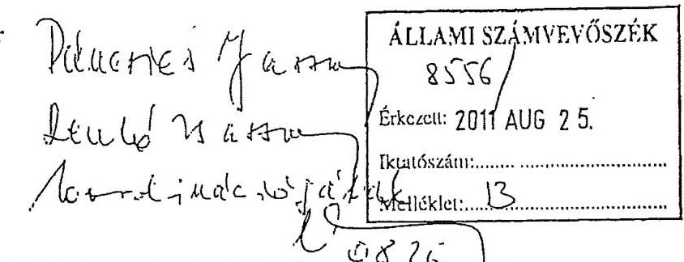

Az Állami Számvevőszék által elkészített 43/3 számú jelentés-tervezetre az alábbi észrevételt teszem:

A jelentés-tervezet összegző megállapításai között leírásra került, hogy a Polgármesteri Hivatal és intézményeinél a lejárt szállító tartozások összege meghaladta 15,9\%-ot, 34 millió Ft volt, a 60 napon túli tartozás. A Polgármester ennek ellenére nem kezdeményezte a helyi önkormányzatok adósságrendezési eljárásáról szóló 1996. évi XXV. tv. 5.§ (2) bekezdésében foglaltak szerinti adósságrendezési eljárást.
A hivatal által készített analitikus nyilvántartás szerint, a lejárt kötelezettségek korosító listája alapján a 60 napon túli tartozások az alábbi tételekből állnak össze:

- Érd-Kom Kft illegális hulladék elszállítása 10.034.483,-Ft 60 napon túli tartozás,
- Center Invest Kft sétáló utca kialakítása 20.000.000,-Ft 1 éven túli tartozás,
- Exclusiv-Bau Építőipari Kft Gárdonyi Iskola, Uszoda építése 11.129.760,-Ft 1 éven túli tartozás.
A fenti tartozások miatt nem került sor a jogszabály által előírt adósságrendezési eljárás kezdeményezésére, mivel az alábbi számlák fizetési kötelezettsége nem állt fenn, de ezek a számviteli nyilvántartásba feltüntetésre kerültek.
-Érd -Kom. Kft. 10.034.483,-Ft-os követelése tekintetében, a számla rögzítése során adminisztrációs hiba történt, és az októberi teljesítési dátum került feltüntetése fizetési határidő megjelöléseként, a valóságban a számla fizetési határideje 2010.12.31.volt, tehát nem 60 napon túli tartozás.
-Center Invest 20.000.000,-Ft jogi csoport által készített feljegyzés szerint peresítés alatt áll. -Exclusiv- Bau Építőipari Kft 11.129.760,-Ft, a követelése el nem ismert követelés, a Kft ellen 2009. április 09.napján felszámolási eljárás indult, az összegre vonatkozó hitelezői igény nem került benyújtásra.
Kérem a fent leírtak figyelembevételével és a mellékelten megküldött dokumentumok alapján a jelentés-tervezetben a hivatkozott bekezdést felülvizsgálni szíveskedjen, és kérem a végleges jelentés ezen bekezdésének javítását a font leírt észrevétel alapján.

A jelentés-tervezet 29. oldalán kérem megjegyezni, hogy a Polgármesteri Hivatal 2010. évi működési kiadás 1.525 millió Ft-al történő emelkedésének legfőbb oka a benyújtott

---

pályázatok előkészítő költségeinek megjelenése a költségvetésben (szakvélemények, pályázatírás, tervezések stb.).

Kérem a jelentés-tervezetben pontosítani szíveskedjenek az Érd és Térsége Fejlesztési Társulás nevét, amely helyesen Érd és Térsége Szennyvízelvezetési -és Szennyvíztisztítási Önkormányzati Társulás.

Kérem a T. Elnök Urat a fentiek szíves tudomásul vételére és észrevételeink jelentésen történő átvezetésére.

Érd, 2011.augusztus 22.
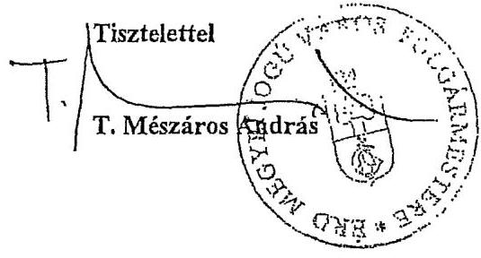

---

# T. Mészáros András úr, 

polgármester
Érd Megyei Jogú Város Önkormányzata
Érd

## Tisztelt Polgármester Úr!

Köszönettel vettem észrevételeit az Érd Megyei Jogú Város Önkormányzata pénzügyi helyzetének ellenőrzéséről készített jelentés-tervezetben foglalt megállapításokra. Az észrevételek feldolgozása, értékelése, szakmai kontrollja megtörtént, amelynek eredményéről az alábbiakban tájékoztatom:
A jelentés-tervezet „I. Összegző megállapítások, következtetések, javaslatok" cím alatt a 23. oldal utolsó bekezdésében a 91 napot meghaladóan lejárt 34 millió Ft összegű szállítói tartozás állomány kezelésére tett észrevételét és annak indoklását elfogadjuk. Az indoklásuk szerint azért „nem került sor a jogszabály által előírt adósságrendezési eljárás kezdeményezésére, mivel a számlák fizetési kötelezettsége nem állt fenn, de azok a számviteli nyilvántartásban feltüntetésre kerültek". Az indoklásuk azonban ellentmondásos, mivel az Áhsz. 26. § (1) bekezdése alapján a mérlegben a kötelezettségek között csak azok a szállítási, vállalkozási, szolgáltatási és egyéb szerződésekből eredő, pénzértékben kifejezett elismert tartozások mutathatók ki, amelyek a szállító, a vállalkozó, a szolgáltató, a hitelező, a kölcsönt nyújtó által már teljesített, az államháztartás szervezete által elfogadott, elismert szállításhoz, szolgáltatáshoz, valamint a kincstári, az önkormányzati vagyon részét képező eszközök kezelésbe vételéhez kapcsolódnak. Kötelezettségként kell a könyvviteli mérlegben kimutatni továbbá a jogszabályi előíráson, a bírósági, illetve a jogerős közigazgatási hatósági döntésen alapuló fizetési kötelezettségeket, és az egyéb passzív pénzügyi elszámolásokat is.
Az észrevétel indoklásához megküldött dokumentumok nem támasztják alá, hogy az Önkormányzat a vállalkozók - az Excluziv Bau Kft. és a Center Invest Építőipari és Szolgáltató Kft. - által megküldött számlákat az esedékességet követő 60 napon belül vitatta, illetve kezdeményezte volna az általános forgalmi adóról szóló - jelenleg hatályos - 2007. évi CXXVII. tv. 77-78. §-ában foglaltak szerint az Excluziv Bau Kft. számláinak érvénytelenítését vagy módosítását, illetve - a korábban hatályos - 1992. évi LXXIV. tv. 45-45/A. §-aiban előírtak szerint a Center Invest Kft. számlájának helyesbítését vagy stornírozását. A Center Invest Építőipari és Szolgáltató Kft. 2008 áprilisában az Önkormányzattal szemben a keresetet

---

nyújtott be a 2006. március 16-án kibocsátott 63 millió Ft összegű számlájából a ki nem egyenlített 20 millió Ft vételárrész megfizetése érdekében, az észrevételhez mellékelt dokumentum szerint a peres eljárás jelenleg folyamatban van. 2009 áprilisában az Excluziv Bau Kft-vel szemben felszámolási eljárás indult, a felszámoló hitelezői igényt nem jelentett be az Önkormányzat felé. (Az Önkormányzat az észrevétele során egyoldalúan úgy nyilatkozott, hogy nem áll fenn a fizetési kötelezettsége a nevezett Kft-kel szemben.)
A jelentés tervezet „II. Részletes megállapítások" cím alatt a 29. oldal harmadik bekezdésében megállapításra került, hogy az Önkormányzatnál a működési kiadások a 2007. évi 8818 millió Ft-ról a 2010. évre 1525 millió Ft-tal 10343 millió Ft-ra emelkedtek, melynek $91 \%$-a ( 1388 millió Ft) a Polgármesteri hivatalban merült fel. Észrevételük szerint a működési kiadások emelkedésének a legfőbb oka a benyújtott pályázatok előkészítő költségeinek megjelenése (szakvélemények, pályázatírás, tervezési kiadások, stb.). Indoklásuk csak részben megalapozott, mivel az Önkormányzat által készített 1. számú tanúsítvány alapján megállapítható volt, hogy a Polgármesteri hivatal működési kiadásain belül a 2007. évtől a 2010. évre a kötelező feladatok kiadásai 713 millió Ft-tal, az önként vállalt feladatok kiadásai 675 millió Ft-tal nőttek. A jelentés-tervezet 29 oldalának második bekezdésében az önként vállalt feladatok bővülése miatti kiadásnövekedést előidéző főbb okokat a lábjegyzetben felsoroltuk (az uszoda, a sportpálya, a sportcsarnok üzemeltetése és a városfejlesztési feladatok). Az észrevételben hivatkozott pályázatokkal kapcsolatos kiadások alakulását a 2010. évi zárszámadásról szóló rendelet-tervezet előterjesztésében bemutatták, ahol a dologi kiadások 2009. évhez viszonyított 369,2 millió Ft összegű többletét indokolták a pályázati projektekkel kapcsolatban teljesített kiadásokkal. Ezért a jelentés-tervezet 29 oldalának második bekezdéséhez kapcsolódó lábjegyzetet kiegészítjük a pályázati projektek előkészítésével.
Az Érd és Térsége Fejlesztési Társulás hivatalos megnevezését az észrevételezésre megküldött jelentés-tervezet 4. oldalán a „Szórövidítések" között feltüntettük.

Köszönöm Polgármester Úrnak és munkatársainak az ellenőrzés során tanúsított hozzáállását, amellyel az Önkormányzatról készített pénzügyi helyzetelemzés elkészítését segítették.

Budapest, 2011. december "JZ ".
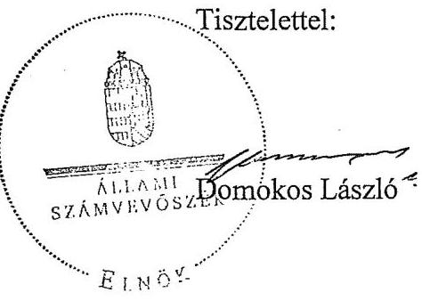

---

.

---

.