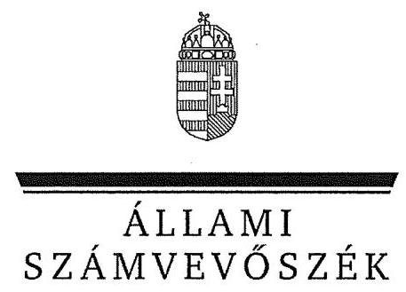

ÁLLAMI
SZÁMVEVŐSZÉK

# JELENTÉS 

Győr Megyei Jogú Város Önkormányzata pénzügyi helyzetének ellenőrzéséről (43/3)

---

# Számvevői Iroda 

Iktatószám: V-3037-17/2011.
Témaszám:1015
Vizsgálat-azonosító szám: V056036

## Az ellenőrzést felügyelte:

Dr. Varga Sándor
számvevő igazgató-helyettes
Az ellenőrzést vezette:
Renkó Zsuzsanna
számvevő tanácsos
Az ellenőrzést végezték:
Dr. Lacó Bálintné Humli Tamásné Kalmár István
számvevő tanácsos számvevő tanácsos számvevő tanácsos

A témához kapcsolódó eddig készített számvevőszéki jelentések:
címe
sorszáma
Jelentés a helyi önkormányzatok gazdálkodási rendszerének 2007. évi átfogó és egyéb szabályszerűségi ellenőrzéséről

---

# TARTALOMJEGYZÉK 

BEVEZETÉS ..... 5
I. ÖSSZEGZŐ MEGÁLLAPÍTÁSOK, KÖVETKEZTETÉSEK, JAVASLATOK ..... 16
II. RÉSZLETES MEGÁLLAPÍTÁSOK ..... 25

1. Az Önkormányzat kötelező és önként vállalt feladatai ..... 25
2. A pénzügyi-egyensúlyi helyzet alakulása ..... 29
2.1. A működési és felhalmozási egyensúly alakulása ..... 29
2.2. Az Önkormányzat bevételeinek alakulása ..... 36
2.3. Az Önkormányzat kiadásainak alakulása ..... 40
3. Kötelezettségek bemutatása ..... 45
3.1. A pénzintézetek felé fennálló kötelezettségek alakulása ..... 45
3.2. Szállítók felé fennálló kötelezettségek alakulása ..... 49
3.3. Egyéb kötelezettségek alakulása ..... 50
4. A pénzügyi egyensúly megteremtése érdekében hozott intézkedések ..... 53
5. A helyi önkormányzatok gazdálkodási rendszerének 2007. évi ellenőrzése során a pénzügyi egyensúly javítására tett szabályszerűségi és célszerűségi javaslatok hasznosulása ..... 57

---

# MELLÉKLETEK 

1. számú A működési és felhalmozási célú hiány/többlet alakulása az Önkormányzat rendeleteiben
2. számú Az Önkormányzat bevételeinek és kiadásainak, adósságszolgálatának alakulásáról
3. számú Az Önkormányzat 2007-2010 években megvalósított, 2010. december 31-ig befejezett fejlesztései forrásösszetételéről
4. számú Az Önkormányzat 2010. december 31-én folyamatban lévő fejlesztési feladataihoz kapcsolódó kötelezettségeinek összegzéséről
5. számú Az Önkormányzat 2010. december 31-én folyamatban lévő fejlesztési feladataihoz kapcsolódó 2010. évet követő kötelezettség-vállalásainak összegzéséről
6. számú Az Önkormányzat beadott, elbírálás alatti pályázati forrásból megvalósuló fejlesztéseihez kapcsolódó kötelezettség-vállalásainak összegzéséről
7. számú Az önkormányzati feladatok ellátásában résztvevő gazdasági társaságokról
8. számú Győr Megyei Jogú Város Önkormányzat Polgármesterének észrevétele
9. számú Győr Megyei Jogú Város Önkormányzat Polgármesterének észrevételére adott válasz

---

# RÖVIDÍTÉSEK JEGYZÉKE 

| Törvények |  |
| :--: | :--: |
| Áht. | az államháztartásról szóló 1992. évi XXXVIII. törvény |
| ÁSZ tv. | az Állami Számvevőszékről szóló 1989. évi XXXVIII. törvény (2011. július 1-jétől az Állami Számvevőszékről szóló 2011. LXVI. törvény) |
| Csődtv. | a csődeljárásról és a felszámolási eljárásról szóló 1991. évi XLIX. törvény |
| Gt. | a gazdasági társaságokról szóló 2006. évi IV. törvény |
| Htv. | a helyi önkormányzatok és szerveik, a köztársasági megbízottak, valamint egyes centrális alárendeltségű szervek feladat- és hatásköreiről szóló 1991. évi XX. törvény |
| Ötv. | a helyi önkormányzatokról szóló 1990. évi LXV. törvény |
| Számv. tv. | a számvitelről szóló 2000. évi C. törvény |
| Rendeletek |  |
| Áhsz. | az államháztartás szervezetei beszámolási és könyvvezetési kötelezettségének sajátosságairól szóló 249/2000. (XII. 24.) Korm. rendelet |
| SzMSz | többször módosított 11/2007. (III. 23.) számú rendelet Győr Megyei Jogú Város Önkormányzata Szervezeti és Működési Szabályzatáról |
| Szórövidítések |  |
| áfa | általános forgalmi adó |
| ÁSZ | Állami Számvevőszék |
| EDP hiány/egyenleg | Uniós módszertan szerinti maastrichti kritériumoknak megfelelő számítás szerinti hiány/egyenleg |
| EU | Európai Unió |
| BM | Belügyminisztérium |
| GDP | bruttó hazai termék |
| NAV | Nemzeti Adó- és Vámhivatal |
| gazdasági program ${ }_{1}$ | Győr Megyei Jogú Város Önkormányzata Közgyűlésének 71/2007. (III. 22.) számú határozata Győr Megyei Jogú Város Önkormányzatának 2006-2010. évi gazdasági programjáról |
| gazdasági program ${ }_{2}$ | Győr Megyei Jogú Város Önkormányzata Közgyűlésének 67/2011. (III. 25.) számú határozata Győr Megyei Jogú Város Önkormányzatának 2011-2014. évi gazdasági programjáról |
| Kincstár | Magyar Államkincstár |
| Közgyűlés | Győr Megyei Jogú Város Önkormányzat Közgyűlése |
| Önkormányzat | Győr Megyei Jogú Város Önkormányzata |
| polgármester | Győr Megyei Jogú Város Önkormányzat polgármestere |
| Polgármesteri hivatal | Győr Megyei Jogú Város Önkormányzat Polgármesteri Hivatala |
| szja | személyi jövedelemadó |

---

.

---

# JELENTÉS 

## Győr Megyei Jogú Város Önkormányzata pénzügyi helyzetének ellenőrzéséről

## BEVEZETÉS

Az Állami Számvevőszék 2011. évtől érvényes stratégiája új irányt szabott a helyi önkormányzatok gazdálkodásának ellenőrzésében is. Az ÁSZ – küldetése és jövőképe szerint – szilárd szakmai alapokra támaszkodva értékteremtő ellenőrzéseivel és helyzetelemzéseivel az államháztartás egészében, így a helyi önkormányzati alrendszerben is elő kívánja segíteni a közpénzek és a közvagyon szabályos, gazdaságos, hatékony és eredményes hasznosítását. Ennek részeként – a 2010. évi államháztartási hiány alakulásának összetevőire is figyelemmel – folyamatban van az önkormányzati alrendszer pénzügyi helyzetelemzése.

Az NGM 2011 áprilisában közzétett adatai szerint ${ }^{1}$ a 2010. évi 1036,2 milliárd Ft összegű 3,8 %-os EDP hiánycél nem volt tartható. Az önkormányzati alrendszer tervezettet meghaladó hiánya miatt a GDP arányában kifejezett államháztartási hiány ${ }^{2}$ 4,2 %-ra emelkedett.

Az önkormányzatok 2010 első három negyedévi költségvetési jelentése szerinti pénzforgalmi hiány 97 milliárd Ft-os összege nem indokolta az önkormányzati alrendszer 190 milliárd Ft-ra becsült hiányának 2010. évi végi felülvizsgálatát. A helyi önkormányzatok 2011. januári gyorsjelentése alapján a pénzforgalmi hiány már 247,7 milliárd Ft-ot tett ki. Az alrendszer hiánya így a tervezett 0,7 %-kal szemben magasabb, 0,9 %-os szinten realizálódott. Az 57,7 milliárd Ft hiánytöbblet alakulásában – a Tájékoztató szerint – az iparűzési adó elmaradása, a gépjárműadó, az illetékek és más bevételek tervezettnél alacsonyabb összegben való teljesülése volt a meghatározó.

Magyarország a Széll Kálmán Terv célkitűzései alapján ${ }^{3}$ aktualizált Konvergencia Programjában a középtávú (2011-2015. évek) költségvetési pálya kijelölése

[^0]
[^0]:    ${ }^{1}$ NGM Tájékoztatás Magyarország Strukturális Reformprogramjának végrehajtásáról (2011. április 1). A Tájékoztató évente két alkalommal – április és október hónapban – jelenik meg.
    ${ }^{2}$ Az Önkormányzat költségvetésében a tervezett hiánycélt a vizsgált időszakban nem lépte túl.
    ${ }^{3}$ Az államháztartás 2011. évi egyenlege – a magán nyugdíjpénztárakból az állami nyugdíjpillérbe való visszatérés egyszeri vagyonhatása következtében – 4%-os többletet mutatna. A Széll Kálmán Tervben foglalt egyszeri intézkedések – a MÁV, a BKV adósságrendezése, a PPP projektek kiváltása – összességében a GDP 2%-ával csökkentik a várható többlet mértékét.

---

során 2011-re a kormányzati szektor EDP módszertan szerinti egyenlegét +2 %-ban jelölte meg. Az egyenlegcél megfogalmazásakor az önkormányzati alrendszer tervezett hiányát a 2011. évi költségvetésben szereplő 0,3 %-kal szemben 0,5 %-os arányban határozták meg ${ }^{4}$. A hiánycélok meghatározása jelzi, hogy az önkormányzati alrendszerben 2011-ben fokozott figyelmet kell fordítani a pénzügyi egyensúlyi helyzet alakulására.

Az államháztartás helyi szintjén a 23 megyei jogú városi önkormányzatnak az általuk ellátott közszolgáltatások volumenére való tekintettel kiemelt szerepe van, e települések népessége összességében meghaladja a kétmillió főt ${ }^{5}$. A települések népességét az alábbi diagram szemlélteti:
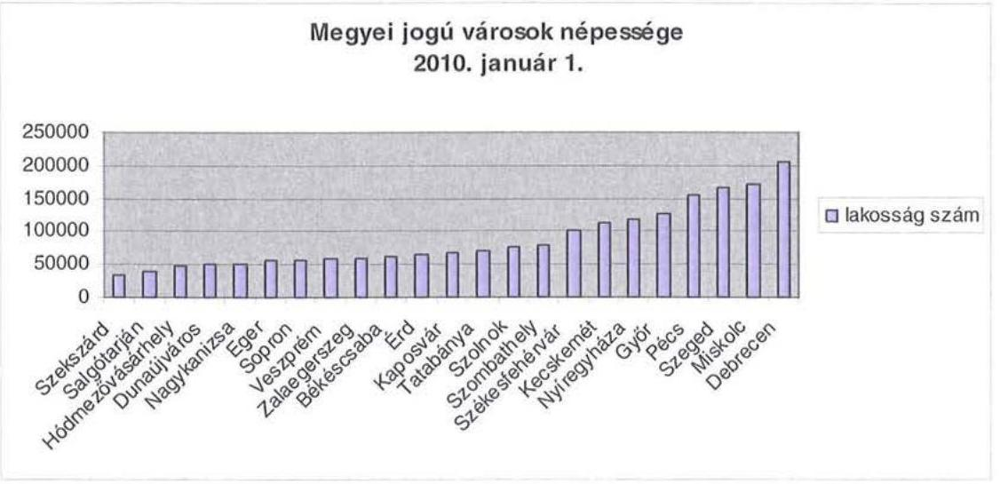

A megyei jogú városi önkormányzatok ${ }^{6}$ kötelező feladatellátását többlépcsős törvényi előírások határozzák meg. A feladatokra vonatkozó szabályozás első szintjét az Ötv. ${ }^{7}$, a második szintet a hatásköri ${ }^{8}$, a harmadik szintet a további ágazati, szakmai (egyebek mellett az oktatási, egészségügyi, szociális és egyéb ágazati feladatok ellátásának szakmai szabályait rögzítő) törvények adják.

[^0]
[^0]:    ${ }^{4}$ A Magyar Köztársaság 2011. évi költségvetéséről szóló 2010. évi CLXIX. törvény Általános indoklásának III. fejezete, valamint Magyarország Konvergencia Programja 2011-2015. (2011. április) Táblázatok rész, 2. táblázat Államháztartás összefoglaló adatai szerint.
    ${ }^{5}$ A megyei jogú városok népességét a 4/2011. (I. 31.) NGM rendelet 1. sz. mellékletében foglalt 2010. január 1-i adatok alapján vettük figyelembe.
    ${ }^{6}$ Az Ötv. 61. § (1) bekezdése alapján a megyeszékhely város a törvény erejénél fogva megyei jogú, ugyanakkor az Országgyűlés az ötvenezernél nagyobb népességű városokat a képviselőtestület kérelmére megyei jogú várossá nyilváníthatja. Ez utóbbi körbe 5 város tartozik, közülük 2 (Hódmezővásárhely, Dunaújváros) népessége 2010. január 1-ére már ötvenezer fő alá csökkent.
    ${ }^{7}$ az Ötv. 8. és 61. §-ában foglaltak szerint
    ${ }^{8}$ a Htv.

---

A megyei jogú városi önkormányzatok – az Ötv-ből közvetlenül levezethető települési feladatok mellett – körzeti közszolgáltatásokat is ellátnak. A megyei jogú városi cím elsősorban többlet kötelezettségekkel jár, a megyei jogú városnak önmagának kell gondoskodnia mindazokról a feladatokról, amelyek más települési önkormányzatok esetében a megyei önkormányzat feladatát képezik. Ide sorolható többek közt a középfokú oktatási intézmények fenntartása, a közművelődési, könyvtári és levéltári szolgáltatás, a társadalombiztosítás finanszírozása mellett a kórházi és a rendelőintézeti szakellátás, a szociális és egyes gyermekvédelmi feladatok ellátása. Ezeket a feladatokat (intézményeket) a megyei jogú város – más városoktól eltérően – nem adhatja át a megyei önkormányzatnak, azonban az Ötv. lehetőséget biztosít arra, hogy a megyei önkormányzattal megállapodjék a feladatellátás megosztásában.

Az önkormányzat, így a megyei jogú város is, maga határozza meg, hogy – a lakosság igényei alapján, anyagi lehetőségei függvényében – mely feladatokat, milyen mértékben és módon, mely szervezeti keretek közt lát el. A szervezetalakítás szabadsága a megyei jogú városok esetében azzal járt, hogy mind a kötelező közszolgáltatásoknál (különösen a településüzemeltetés, vagyongazdálkodás), mind pedig az önként vállalt feladataik ellátásában – elsősorban a sport és kulturális szolgáltatások területein – a gazdasági társaságok kiemelt fontosságú szerephez jutottak. Ily módon a gazdálkodás, a pénzügyi helyzet kockázatai közvetlenül kikerültek ugyan az önkormányzati alrendszerből, azonban sérülhet az ellátási felelősség figyelemmel kísérése és érvényesítése, a közpénzek felhasználásának transzparenciája. Mindezek együttvéve – a beszámolók konszolidálásának hiányában – növelik a megyei jogú városok pénzügyi helyzetének megítélésében rejlő kockázatokat.

Az áttekintett időszakban az önkormányzati feladatok ellátásának keretet biztosító forrásszabályozás elvei lényegesen nem változtak.

A megyei jogú városok önkormányzatainak mozgásterét, az önkormányzatok feladatellátásra vonatkozó döntéseit a központi költségvetéstől való függőség mellett jelentősen befolyásolja a helyi adókivetési jog gyakorlása ${ }^{9}$. A helyi adók rendszere a közszolgáltatások finanszírozásához szükséges források megteremtésének, bővítésének eszköze, amely a gazdasági válság, a jogszabályi környezet, az adópolitika változása, az adóhatóságok tevékenysége következtében differenciáltan érinti a települési önkormányzatokat ${ }^{10}$.

A települési önkormányzatok saját folyó bevételeinek keretében elszámolt, különböző jogcímeken kivetett helyi adók – iparűzési adó, építmény és telekadó, idegenforgalmi adó, vállalkozók és magánszemélyek kommunális adója – 2007-2010 között eltérő módon emelkedtek. A helyi adókból származó bevételek realizált összege országos szinten 2007-2009 között folyamatosan, 505,3 milliárd Ft-ról 566,3 milliárd Ft-ra emelkedett, majd a gazdasági válság hatásai következtében 2010-re 542,6 milliárd Ft-ra esett vissza. A helyi adók részesedése

[^0]
[^0]:    ${ }^{9}$ a helyi adókról szóló 1990. évi C. törvény szabályai szerint
    ${ }^{10}$ Az Állami Számvevőszék 2010 decemberében közzétett 1031. számú jelentésében értékelte a helyi adók rendszerében a hatékonyság és az eredményesség érvényesülését.

---

az önkormányzatok saját folyó bevételein belül 2007-2010 között 2,5 százalékponttal csökkent ${ }^{11}$.

A megyei jogú városok saját folyó bevétele 2007-ben 191,5
 milliárd Ft volt, 2008-ban 223,1, 2009-ben 225,4, 2010-ben 223,5 milliárd Ft-ot tett ki. A helyi adóbevételekből való részesedésük 2007-ben 110,5 milliárd Ft (21,9%), 2008-ban 128,3 milliárd Ft (23,2%), 2009-ben 124,4 milliárd Ft (22%), 2010-ben 118,7 milliárd Ft (részaránya a 2007. évivel azonosan 21,9%) volt. E realizált adóbevételek a megyei jogú városok saját folyó bevételeinek 2007-ben 57,7, 2008-ban 57,5, 2009-ben 55,2, 2010-ben 53,1%-át jelentették. A helyi adóbevételek 2007-ről 2010-re kimutatott 4,6 százalékpontos csökkenése annak ellenére következett be, hogy a megyei jogú városok saját folyó bevétele 2010-ben 16,7%-kal haladta meg a 2007. évit.

A helyi adókon belül a települések gazdasági helyzetének egyik fokmérője az elért helyi iparűzési adóbevétel, amely a megyei jogú városok körében erőteljes - a település nagyságrendtől is függő $^{12}$ - különbségeket mutat. A helyi iparűzési adóbevétel és annak egy lakosra vetített összegének 2007. és 2010. évi alakulását az alábbi diagramok szemléltetik:
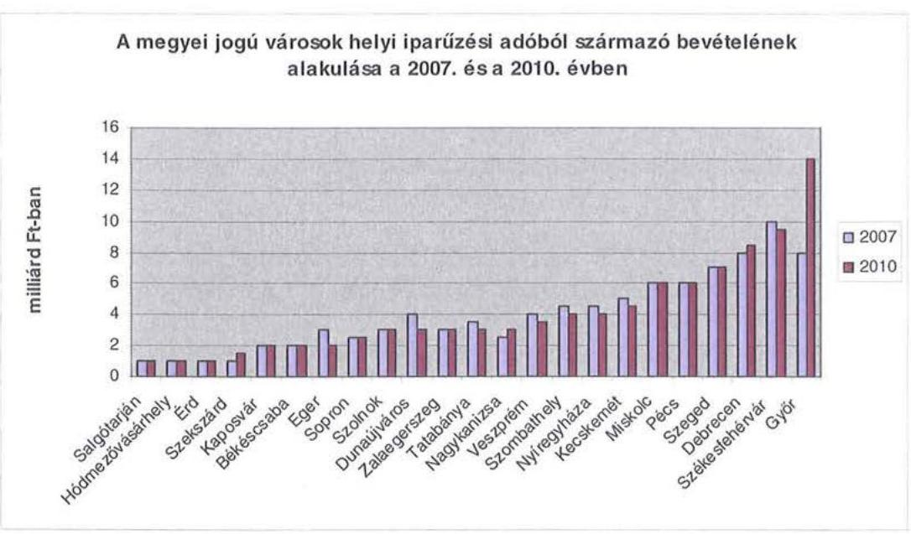

[^0]
[^0]:    $^{11}$ A helyi adó bevételek saját folyó bevételekből való részesedése országosan 2007-ben 55,3%, 2010-ben 52,8% volt.
    $^{12}$ A 100 ezer fő feletti népességű megyei jogú városok csoportjába Debrecen, Miskolc, Szeged, Pécs, Győr, Nyíregyháza, Kecskemét, Székesfehérvár tartozik. Nem megyeszékhely megyei jogú város Érd, Sopron, Nagykanizsa, Dunaújváros, Hódmezővásárhely.

---

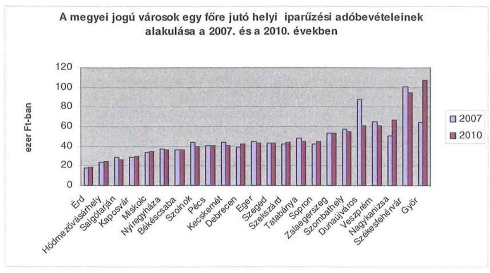

A megyei jogú városi önkormányzatok saját bevételein belül második legjelentősebb elem az illetékbevétel. A 2010. évben befolyt 39,2 milliárd Ft illetékbevétel a 2006. évben realizált 71,1 milliárd Ft illetékbevétel alig több mint 55%-a. A jelentős visszaesést döntően az ingatlanpiac stagnálása, majd visszaesése, illetve egyes illetékkedvezmények bevezetése okozta. A kieső bevételek pótlására az önkormányzati alrendszer szintjén történtek intézkedések, 2010-ben 5 milliárd Ft-ot, 2011-ben 1,2 milliárd Ft-ot ellentételezett a központi költségvetés. A megyei jogú városok önkormányzatai az önkormányzati alrendszer szintjén realizált illetékbevételből 2007-ben 13,6 milliárd Ft-tal (23,3%-kal), 2008-ban 15,3 milliárd Ft-tal (22,7%-kal), 2009-ben 12,6 milliárd Ft-tal (21,5%-kal), 2010-ben 7,9 milliárd Ft-tal (20,2%-kal) részesedtek $^{13}$. Az összes befolyt illetékbevételből a megyei jogú városok részesedése 2009-ről 2010-re mindössze 1,3 százalékponttal csökkent, ugyanakkor a realizált illetékbevétel csökkenése a 37,3%-ot (4,7 milliárd Ft) is elérte.

Az önkormányzati alrendszer átengedett bevételei közül a személyi jövedelemadóból való részesedés makroszintű szabályozása a vizsgált időszakban nem változott. A települési önkormányzatokat a településre kimutatott személyi jövedelemadó 8%-a közvetlenül, míg 32%-a külön szabályozott visszaosztási rendben illeti meg. A visszaosztás a jövedelem differenciálódás mérséklésével párosul, rendje a lakóhelyen maradó személyi jövedelemadóhoz és az iparűzési adó-erőképességhez $^{14}$ igazodik, annak részletszabályait a mindenkori költségvetési törvény 4. számú melléklete határozza meg. A jövedelemdifferenciálódás

[^0]
[^0]:    $^{13}$ Az illetékek kivetésének és beszedésének joga 2006. december 31-ig a megyei önkormányzatok feladata volt, amelyet a 2007. évtől az APEH (2011. január 1-jétől NAV) vett át. Az önkormányzati illetékrészesedési szabályok változatlanok maradtak, azonban az illetékbeszedés költségeit az önkormányzatok illetékbevételeiből átlagos (a megyei jogú városoknál 8,5%-os) kulcsot alkalmazva vonták le.
    $^{14}$ Az iparűzési adóerő-képesség egy potenciális, átlagos erőfeszítés mellett elérhető (a települési önkormányzat iparűzési adóelőlegét meghatározó adóalap 1,4%-ának megfelelő számított) bevétel.

---

szabályai kétirányúak, a kiegészítés és a visszatartás feltételeit egyaránt meghatározták:

- Amennyiben az önkormányzatot közvetlenül megillető személyi jövedelemadó bevétel és a számított iparűzési adóerő-képesség együttesen számított, egy főre jutó összege nem érte el a település méretéhez kapcsolódóan az évenkénti szabályozás szerinti változó összeget, a költségvetés a részesedést település nagyság szerint eltérően meghatározott szintig kiegészítette $^{15}$. A kiegészítés fajlagos összege 2007-2010 között 37500 Ft-ról 48010 Ft-ra (10 510 Ft-tal, 28%-kal) emelkedett. Az előzőeken túl a jövedelem differenciálódás szabályozása egyes térségi (középiskolai, szakiskolai, szakképző intézményi, kollégiumi) feladatok ellátásának függvényében további kiegészítő hozzájárulást biztosított.
- Amennyiben az egy főre számított személyi jövedelemadó és az iparűzési adóerő-képesség együttes összege a település nagyságrendjéhez rendelt értékhatárt több mint 25%-kal (2010-től 20%-kal) meghaladta, az egy főre jutó összeg sávonként differenciált módon $^{16}$ visszavonásra került az önkormányzatot megillető normatív állami hozzájárulás összegéből.

Az önkormányzatok személyi jövedelemadó bevétele 2007-ben 494,3 milliárd Ft, 2008-ban 558,6 milliárd Ft, 2009-ben 639,5 milliárd Ft, 2010-ben 681,2 milliárd Ft volt, az időszak alatt összegében 186,9 milliárd Ft-tal, 37,8%-kal emelkedett, miközben az szja bevétel átengedett bevételeken belüli részesedése 1,8 százalékponttal emelkedett.

A megyei jogú városok önkormányzatainak személyi jövedelemadó részesedése az alrendszer átengedett személyi jövedelemadó bevételeiből 2007-ben 77,6 milliárd Ft-ot (15,7%-ot), 2008-ban 105,4 milliárd Ft-ot (18,9%-ot), 2009-ben 122,9 milliárd Ft-ot (19,2%-ot), 2010-ben 136,6 milliárd Ft-ot (20,1%-ot) tett ki. A realizált szja bevétel a megyei jogú városoknál az időszak alatt folyamatosan emelkedett, a 2010-ben realizált adóbevétel 59,0 milliárd Ft-tal (76%) volt magasabb a 2007. évinél, az átengedett bevételeken belüli részesedése 2010-re 5,1 százalékponttal haladta meg a 2007. évi részarányt $^{17}$. A részesedés alapjául szolgáló szja településenként eltérő, az egy adózóra jutó szja 2009. évi adatait $^{18}$ a következő ábra szemlélteti.

[^0]
[^0]:    $^{15}$ A megyei jogú városok esetében a jövedelemkülönbségek mérséklésénél figyelembe veendő lakosonkénti értékhatár 2007-ben 37500 Ft, 2008-ban 42385 Ft, 2009-ben 45933 Ft, 2010-ben 48010 Ft volt.
    $^{16}$ A sávos értékhatár 2010-től 20%-os intervallumonként, 120% felett a visszatartást 25%-tól 90%-os mértékig rögzíti. Amennyiben a település nagyságrendhez rendelt értékhatár összege az önkormányzatnál eléri vagy meghaladja a 200%-ot, az egy főre jutó összeg 90%-a levonásra kerül. Az értékhatár sávjai 2010 előtt 25%-os léptékűek voltak, a levonási arányok az ellenőrzött időszakban nem változtak.
    $^{17}$ E bevételek a megyei jogú városok átengedett bevételeiben 2007-ben 84,7, 2008-ban 87,7, 2009-ben 89,7, 2010-ben 89,8%-os részarányt jelentettek.
    $^{18}$ Adatforrás: KSH Megyei Jogú Városok a Közép-Dunántúlon 2009. kiadványa, 4.1. sz. összehasonlító tábla.

---

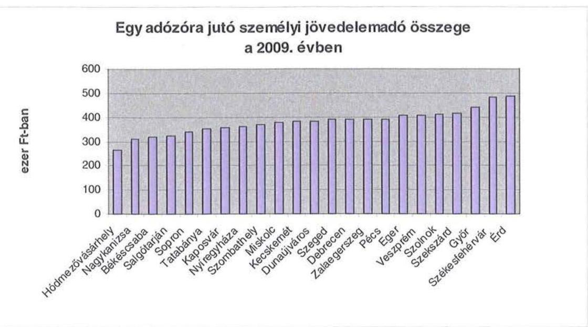

Az átengedett bevételek második legjelentősebb eleme a gépjárműadó, amelynek bevételi szabályozása az ellenőrzött időszakban nem változott, az adóbevétel teljes összege az önkormányzatot illeti meg. A gépjárműadó alapját, mértékét $^{19}$ és egyes mentességi kategóriákat érintő módosítások 2010. január 1-től következtek be, amelyek az egyes adótételek esetében átlagosan 15%-os emelkedéssel jártak.

A gépjárműadó beszedéséből származó bevétel az önkormányzati alrendszer szintjén 2007-ben 62,4 milliárd Ft, 2008-ban 65,7 milliárd Ft, 2009-ben 63,8 milliárd Ft, 2010-ben 71,1 milliárd Ft volt, az adóbevétel egésze 2007-hez képest 8,7 milliárd Ft-tal, 13,9%-kal emelkedett. A gépjármű-adóztatás szabályainak változása 2010-ben 7,3 milliárd Ft többletet eredményezett. A megyei jogú városok gépjárműadó bevétele a 2007. évi 14,0 milliárd Ft-ról 2010-re 15,5 milliárd Ft-ra, 10,7%-kal emelkedett. A bevételnövekedés összegéből 1,4 milliárd Ft a 2010. évi adózási szabályok következménye.

A megyei jogú városok önkormányzatai 2007-2010 között rendelkezésre álló forrásainak alakulását a következő ábra szemlélteti:

[^0]
[^0]:    $^{19}$ A gépjárműadóról szóló 1991. évi LXXXII. törvény 7. § (1) bekezdésében foglalt adómértékek változása.

---

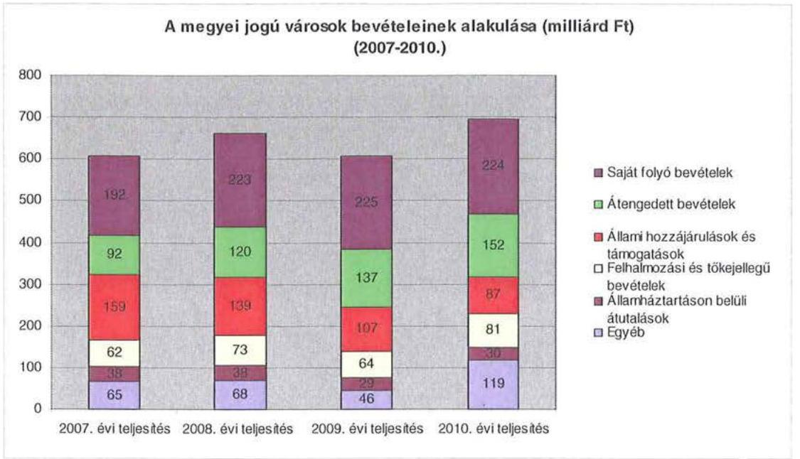

A megyei jogú városok saját folyó bevételeinek - amelyek főbb elemei: a helyi adók, az illetékbevételek, az intézményi térítési díjak, a kamatbevételek - részaránya a 2007. évi összbevételen (608 milliárd Ft) belül 32% volt. A 2010. évi összbevétel 693 milliárd Ft-os összegéből a saját folyó bevételek aránya - miközben összege 2007-ről 2010-re 32 milliárd Ft-tal emelkedett - nem változott.

Az átengedett bevételek, amelyek a megyei jogú városok önkormányzatainál döntően a személyi jövedelemadó és a gépjárműadó részesedést jelenti, az összbevételen belül a 2007. évi 92 milliárd Ft-ról (15%) 152 milliárd Ft-ra nőtt, részesedése 7 százalékponttal emelkedett. A 60 milliárd Ft-os növekedésből 59 milliárd Ft-ot az szja részesedés emelkedése okozott.

Az állami hozzájárulások és támogatások - amelyek főbb elemei: főként az ellátotti létszámhoz kötődő normatív állami hozzájárulások, központosított előirányzatok - a 2007. évi 159 milliárd Ft-ról (26%-os részarányról) 2010-re 87 milliárd Ft-ra (13%-os részarányra) estek vissza.

A felhalmozási és tőkejellegű bevételek - tárgyi eszközök (ingatlanok és ingóságok), föld és immateriális javak, részesedések értékesítése, EU-tól átvett pénzeszközök - a 2007. évi 62 milliárd Ft-ról (10%-os részarányról) 2010-re 81 milliárd Ft-ra (12%-os részarányra) emelkedtek.

Az államháztartáson belüli átutalások részesedése 2007-ben 38 milliárd Ft volt. 2010. év végére 8 milliárd Ft-tal csökkent, részaránya 6%-ról 2010-ben 4%-ra változott. Ez a bevételi kategória tartalmazza az Egészségbiztosítási Alaptól és más elkülönített állami pénzalapoktól átvett forrásokat. A 2010-ben e címen elszámolt bevétel a megyei jogú városoknál 22 milliárd Ft-ot tett ki.

Az egyéb, pénzmaradványból, vállalkozási bevételekből, államháztartáson kívülről származó átutalásokból, a hitelekből, a hosszú és rövid lejáratú értékpapírok értékesítéséből származó bevételek részesedése a 2007-2010. évek viszonylatában 11%-ról 17%-ra emelkedett. Ez utóbbiak 2010. évi beszámoló szerinti összevont teljesítése 119 milliárd Ft volt $^{20}$.

Mindezeket figyelembe véve a megyei jogú városok 2007. és 2010. évi forrásösszetételének megoszlását az alábbi ábra szemlélteti:

A megyei jogú városok 2007. és 2010. évi forrásösszetétele
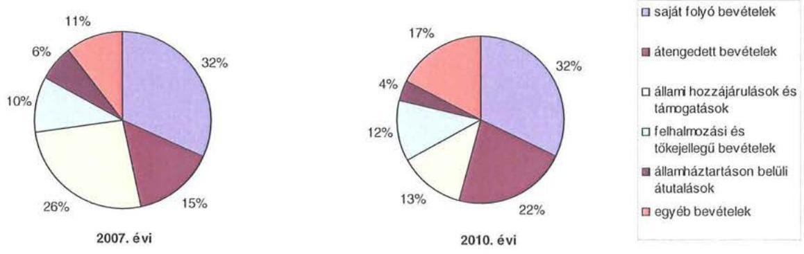

Az önkormányzati alrendszer pénzügyi helyzetértékelése során új elemzési módszereket alkalmaz az ellenőrzés. A hagyományos költségvetési szerkezet helyett az önkormányzat pénzügyi helyzetét a CLF módszerrel mutatjuk be, amelyben jobban elkülönülnek a vagyonnal kapcsolatos bevételek és kiadások az önkormányzati feladatokkal kapcsolatos közvetlen működtetési bevételektől és kiadásoktól. A módszer következetesen elkülöníti a folyó és a felhalmozási költségvetés bevételeit és kiadásait, azok költségvetési egyenlegeit, a nettó működési jövedelem (pénzügyi kapacitás) fogalmát helyezi a középpontba, amellyel az adós hitelfelvételi képessége, hosszú távú fizetőképessége vagy bonitása jellemezhető. A nettó működési jövedelem negatív értéke az egyes költségvetési években jelentkező adósságszolgálat túlzott mértékére utalhat. A nettó működési jövedelem negatív értékének felhalmozási többletből, vagy további hitelből történő finanszírozása pénzügyileg nem fenntartható gazdálkodást vetít előre. A pozitív értéket mutató nettó működési jövedelem fejlesztési kiadások fedezetét biztosíthatja, illetve a folyamatosan, évenként képződő pozitív nettó működési jövedelemből meghatározható a jövőben vállalható, teljesíthető éves adósságszolgálat, ily módon az a hitelösszeg, amely - a többi tényezőt, feltételt adottnak tekintve - visszafizetési kockázat nélkül felvehető.

[^0]
[^0]:    $^{20}$ Az egyéb bevételek összege 2007-2010 között eltérő módon változott, 2007-ben 65 milliárd Ft, 2008-ban 68 milliárd Ft volt, 2009-ben 46 milliárd Ft-ra esett vissza, majd 2010-ben több mint két és félszeresére, 119 milliárd Ft-ra emelkedett.

---

Az új módszereken alapuló helyzetértékelés fontosságát az adja, hogy a helyi önkormányzatok bruttó adósságállománya $^{21}$ a 2010. évi költségvetési beszámoló alapján 1248 milliárd Ft-ot tett ki. Az adósságállomány koncentráltságát jelzi $^{22}$, hogy ebből a 23 megyei jogú város részesedése 338 milliárd Ft volt, amely a
 fővárosi és kerületi önkormányzatok adósságának figyelmen kívül hagyásával számított 2010. évi 977 milliárd Ft összegű bruttó adósságállomány 34,6%-át jelentette. Az adósságállomány több mint fele - 501 milliárd Ft - a 19 megyei önkormányzatnál és a 23 megyei jogú városnál jelentkezett.

A megyei jogú városok 338 milliárd Ft-os adósságállományából 175 milliárd Ft (51,8%) a 8 legnagyobb, 100 ezer fő feletti népességű város tartozása. Az 5 nem megyeszékhely megyei jogú város bruttó adósságállománya 70 milliárd Ft-ot (20,7%-ot), az előző két csoportba nem tartozó további 10 megyei jogú város adóssága 93 milliárd Ft-ot (27,5%-ot) tett ki.
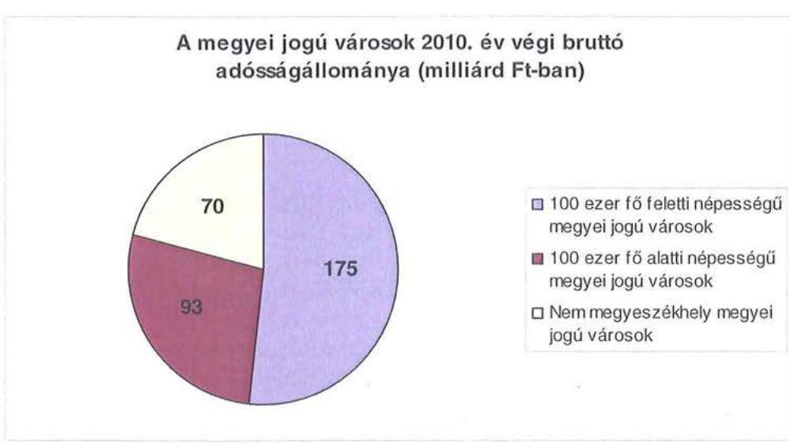

A mérlegben kimutatott bruttó adósságállomány mellett az önkormányzatok számára az eszközállomány műszaki állapotának megőrzése is kötelezettségekkel jár. Az elhasználódott eszközök pótlására forrást biztosító amortizációs (felújítási) alap képzésének $^{23}$ elmaradása maga után vonhatja a feladatellátást kiszolgáló tárgyi eszközök állagának erőteljes romlását. Emellett a 2007-2013-as időszakra meghirdetett, vissza nem térítendő EU-s fejlesztési forrásokhoz való hozzájutás lehetősítette az önkormányzati alrendszer fejlesztési igényeit, amelyek a felhalmozási költségvetési hiány folyamatos emelkedésén túl - az előírt jövőbeni fenntartási kötelezettség miatt - tovább terhelhetik az önkormányzatok költségvetését $^{24}$.

Az ÁSZ a 2011. évi ellenőrzési tervében 43. számú, az Önkormányzatok gazdálkodási rendszerének ellenőrzése részeként egy időben, egymással párhuzamosan tekinti át, és elemzi a 23 megyei jogú városi önkormányzat pénzügyi helyzetét. A gazdálkodás szabályszerűségét az ÁSZ az előző évek során ebben az önkormányzati körben is ellenőrizte, ezért jelen vizsgálatunk erre nem tér ki. A jelentés a megyei jogú városok sajátos feladatellátási és forrásszabályozási helyzetére tekintettel az önkormányzatok pénzügyi helyzetét, illetve az ezzel összefüggő korábbi ÁSZ javaslatok megvalósítását mutatja be.

Az ellenőrzés a 2007. január 1. - 2010. december 31. közötti időszakot öleli fel.
A vizsgálat jogszabályi alapját az Állami Számvevőszékről szóló 1989. évi XXXVIII. törvény 2. § (3), (5), (6) és (9) bekezdései $^{25}$, az Ötv. 92. § (1) bekezdése, az Áht. 104. § (3), és 120/A. § (1) bekezdése előírásai képezik.

[^0]
[^0]:    $^{21}$ A bruttó adósságállomány 2010. év végi összege magában foglalja a fejlesztési és a működési célú kötvénykibocsátások, a beruházási és fejlesztési hitelek, a működési célú hosszú lejáratú hitelek, a rövid lejáratú hitelek, váltótartozások miatti kötelezettségek teljes (2011-ben, illetve az azt követő években esedékes) állományát.
    $^{22}$ A megyei jogú városok adósságállománya összegében ugyan elmarad az egyéb városok összesített adósságától [(ez utóbbiak részesedése 382,6 milliárd Ft (39,2%)], azonban az egyéb városok száma 304. A fővárosi és a kerületi önkormányzatok nélküli adósságállományból a 19 megyei önkormányzat 163 milliárd Ft-tal (16,8%-kal), míg a nagyközségek, községek együttesen 93 milliárd Ft-tal (9,5%-kal) részesednek.
    $^{23}$ Erre a jelenlegi szabályozási környezetben nem kötelezi semmilyen előírás az önkormányzatokat.

---

nyeit, amelyek a felhalmozási költségvetési hiány folyamatos emelkedésén túl - az előírt jövőbeni fenntartási kötelezettség miatt - tovább terhelhetik az önkormányzatok költségvetését $^{24}$.

Az ÁSZ a 2011. évi ellenőrzési tervében 43. számú, az Önkormányzatok gazdálkodási rendszerének ellenőrzése részeként egy időben, egymással párhuzamosan tekinti át, és elemzi a 23 megyei jogú városi önkormányzat pénzügyi helyzetét. A gazdálkodás szabályszerűségét az ÁSZ az előző évek során ebben az önkormányzati körben is ellenőrizte, ezért jelen vizsgálatunk erre nem tér ki. A jelentés a megyei jogú városok sajátos feladatellátási és forrásszabályozási helyzetére tekintettel az önkormányzatok pénzügyi helyzetét, illetve az ezzel összefüggő korábbi ÁSZ javaslatok megvalósítását mutatja be.

Az ellenőrzés a 2007. január 1. - 2010. december 31. közötti időszakot öleli fel.
A vizsgálat jogszabályi alapját az Állami Számvevőszékről szóló 1989. évi XXXVIII. törvény 2. § (3), (5), (6) és (9) bekezdései $^{25}$, az Ötv. 92. § (1) bekezdése, az Áht. 104. § (3), és 120/A. § (1) bekezdése előírásai képezik.

[^0]
[^0]:    $^{24}$ Az Állami Számvevőszék 2011 júniusában közzétett 1108. számú, a helyi önkormányzatok fejlesztési célú támogatási rendszerének ellenőrzéséről szóló jelentésében feltárta a fejlesztési folyamatok problémáit. A helyi önkormányzatok elsősorban azokat a fejlesztéseket valósították meg, amelyekhez támogatást lehetett igényelni. A fejlesztési célok közül a magasabb támogatás intenzitású pályázatokat részesítették előnyben. A fejlesztéssel megvalósuló létesítmények jövőbeli üzemeltetésének várható ráfordításait az önkormányzatok 71,9%-a nem mérte fel.
    $^{25}$ 2011. július 1-jétől az Állami Számvevőszékről szóló 2011. évi LXVI. törvény 5. § (2)(5) bekezdései

---

# I. ÖSSZEGZŐ MEGÁLLAPÍTÁSOK, KÖVETKEZTETÉSEK, JAVASLATOK 

Az Önkormányzat - adatszolgáltatása szerint - 2010. évi költségvetési kiadásaiból (36614 millió Ft) 19016 millió Ft-ot (51,9%) a kötelező feladatok, 17598 millió Ft-ot (48,1%) az önként vállalt feladatok ellátására fordított. A kötelező és önként vállalt feladatok részarányának megállapítása az Önkormányzat SzMSz szerinti besorolásának megfelelően készült. Az Önkormányzat a hivatásos művészeti intézmények működtetése, városi nagyrendezvények, fesztiválok szervezése, lebonyolítása, Környezetvédelmi Vezetési és Hitelesítő Rendszer bevezetése, szelektív szilárdhulladék-gyűjtés megszervezése, fizetőparkoló-hálózat működtetése, a helyi tömegközlekedés biztosítása mellett önként vállalt feladatnak tekinti a gimnáziumok, szakközépiskolák és szakképző intézmények, valamint a kollégiumok fenntartását is. Az Önkormányzat önként vállalt feladatainak meghatározásakor nem volt figyelemmel arra az Ötv-ben foglalt előírásra, hogy a megyei jogú város - területén, saját hatásköreként - ellátja a megyei önkormányzati feladat- és hatásköröket is.

Az Önkormányzat feladatellátásának szervezeti struktúráját a következő ábra szemlélteti:
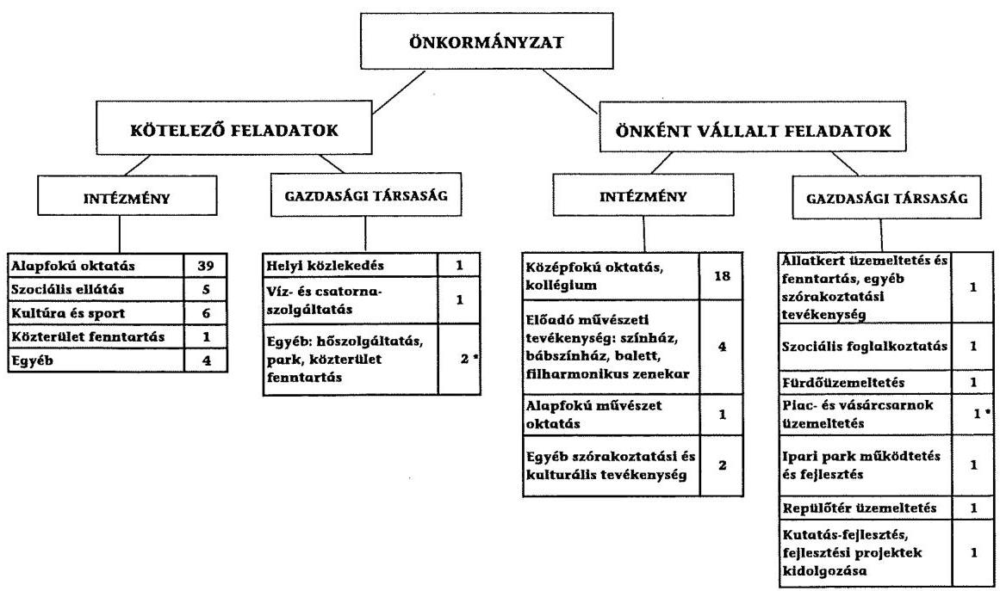

[^0]Az Önkormányzat feladatait 2010. december 31-én (a Polgármesteri hivatallal együtt) 81 költségvetési szervvel és kilenc, 25% feletti tulajdoni hányadú gazdasági társaságával, továbbá egy - az Önkormányzattól tulajdonosi szempontból független - gazdasági társaság közreműködésével látta el, kórházat nem működtetett. Az intézményszervezeti átalakítások és intézményi összevonások kö-

[^0]:    * A Gyüv-Szol Gyüsi Közszolgáltató és Vagyongazdálkodási Zrt. önkormányzati kötelező feladatként park- és közterület fenntartást, önként vállalt feladatként piac- és vásárcsarnok üzemeltetését végzi.

---

vetkeztében a feladatellátás telephelyeinek száma a 2006. évi 251-ről 2010-re 274-re nőtt.

Az Önkormányzat működési kiadásokra 2010-ben 36614 millió Ft-ot fordított, amely 6150 millió Ft-tal (20,2%-kal) haladta meg a 2007. évi ráfordításokat. A 2007. évben a működési kiadások 74,2%-át (22 611 millió Ft-ot), 2010-ben 66,9%-át (24 485 millió Ft-ot) az intézményi körben realizálták. E kiadások fedezetéül szolgáló bevételi források 2007. és 2010. években jellemző, összesített arányait a következő ábra szemlélteti:
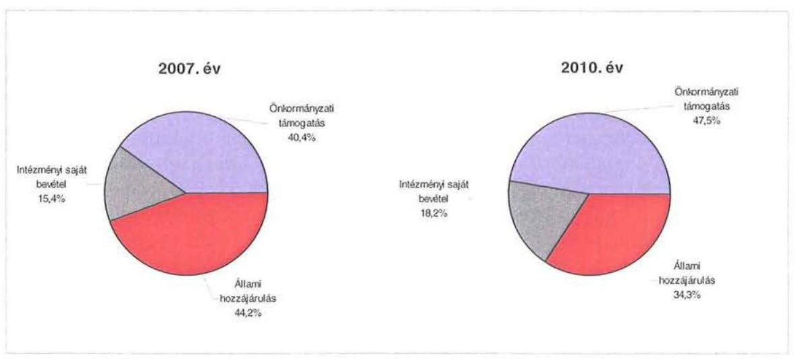

Az egyes közszolgáltatások feladatellátásában részt vevő ágazati intézménycsoportok forrásösszetételének bevételi jogcímenkénti alakulását a következő ábra szemlélteti:
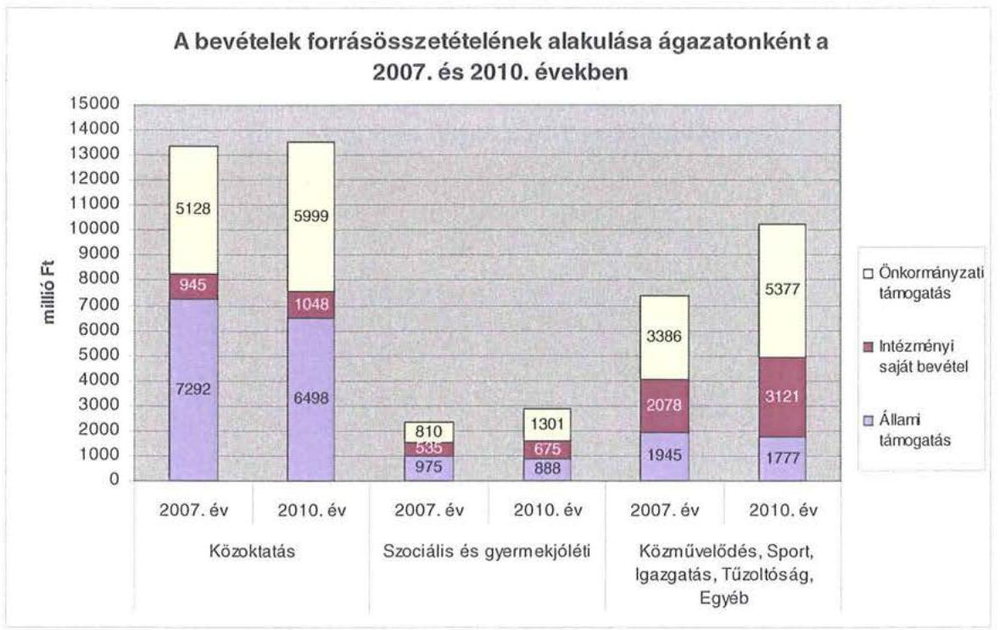

---

A vizsgált időszakban az Önkormányzat gesztorságával 111 önkormányzat társulási megállapodást kötött nagytérségi hulladékgazdálkodási rendszer kialakítására és működtetésére. A létrejött és önálló jogi személyiséggel rendelkező társulás működési és felhalmozási célú költségvetési kiadásai a 2010. évtől már nem az Önkormányzat költségvetésének részét képezik. A beruházás megvalósításához 1600 millió Ft hitel felvételére került sor. A hitel folyósítását a pénzintézet az Önkormányzat készfizető kezességvállalásához kötötte. A társult önkormányzatok saját erő vállalásának elmaradása esetén a hitel visszafizetése az Önkormányzatnál pénzügyi kockázatot jelent.

Az Önkormányzat négy gazdasági társaságban rendelkezik kizárólagos tulajdonnal, két gazdasági társaságban 75% feletti, egy gazdasági társaságban 50-75% közötti tulajdoni részesedése van. A közfeladatok ellátásában további két gazdasági társaság vesz részt, melyben az Önkormányzat kizárólagos tulajdonában lévő gazdasági társasága rendelkezik 25% feletti tulajdoni részesedéssel. A gazdasági társaságok közszolgáltatási megállapodás alapján vesznek részt az Önkormányzat kötelező és önként vállalt feladatai ellátásában. A kötelező közszolgáltatások keretében végzik a víz-, csatorna- és távhőszolgáltatást, a parkok, közterek és a temető fenntartását. Önkormányzati önként vállalt feladatként szociális foglalkoztatást, állatkert, fürdő, piac-vásárcsarnok üzemeltetést végeznek, repülőteret, ipari parkot működtetnek. A gazdasági társaságoknak a 2010. évben összesen 234 millió Ft működési célú pénzeszközt és 154 millió Ft fejlesztési célú pénzeszközt adott át az Önkormányzat. A működési célú pénzeszköz átadás 54,7%-a (128 millió Ft) két gazdasági társaság részére történt.

A társaságok pénzügyi helyzete stabil, működésük az Önkormányzat pénzügyi helyzetére kockázatot nem jelent.

A folyó költségvetés egyenlege (működési jövedelem) a vizsgált időszak valamennyi évében működési forrástöbbletet mutatott $^{26}$. A 2007-2010. években realizált összes működési jövedelem (20454 millió Ft) forrásul szolgálhatott a fennálló tőketörlesztési kötelezettségek teljesítéséhez, továbbá részbeni fedezetül szolgált a felhalmozási célú kiadásokhoz.

[^0]
[^0]:    $^{26}$ 2007-ben a folyó bevételek 6,9%-át (2270 millió Ft-ot), 2008-ban 16,3%-át (6683 millió Ft-ot), 2009-ben 13,3%-át (5753 millió Ft-ot) jelentette, 2010-ben 13,6%-át (5748 millió Ft) tette ki a működési jövedelem.

---

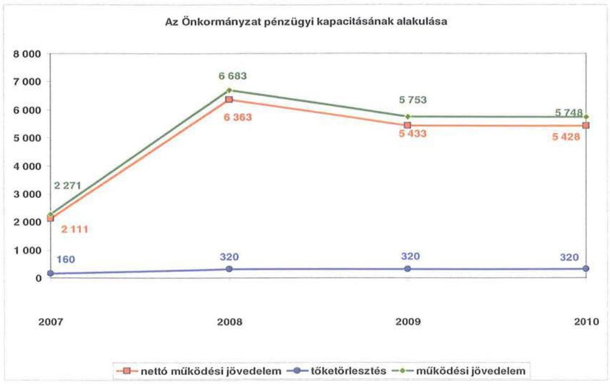

A 2007-2010. években az Önkormányzat felhalmozási költségvetésének egyenlege folyamatosan negatív összegű volt, amely 2007-2010 között összesen 20132 millió Ft felhalmozási forráshiányt okozott.

Az Önkormányzat jogszabályi előírások ellenére a 2010. évi zárszámadási rendeletében a működési és felhalmozási kiadásokat és bevételeket nem mutatta be mérlegszerűen.

Az adósságszolgálat, továbbá a felhalmozási forráshiány 2007-2010 között 21252 millió Ft-ot tett ki, amelyre az időszakban képződő 20455 millió Ft működési többlet (működési jövedelem), valamint a 2007. január 1-jén rendelkezésre álló 2677 millió Ft pénzkészlet szolgált fedezetül. Az Önkormányzat fejlesztései megvalósításához, gazdálkodásának biztosításához a vizsgált években 3716 millió Ft összegű fejlesztési hitelt vett igénybe. Kötvény kibocsátására nem került sor. A hitelek visszafizetésével kapcsolatos kötelezettségek pénzügyi fedezete kiegyensúlyozott költségvetési gazdálkodás, pénzügyileg fenntartható további fejlesztési döntések mellett biztosítható.

A vizsgált időszakban az Önkormányzatnál helyi iparűzési adó, építményadó, vendégéjszakák utáni idegenforgalmi adó került megállapításra. A helyi adókból és pótlékokból származó bevételek aránya az összes folyó működési bevételen belül a 2007-2010. években 30% és 42% között ingadozott. A helyi adóbevétel (pótlékok nélkül) a 2007. évi 9775 millió Ft-ról a 2008. évre jelentősen (7558 millió Ft-tal) nőtt, majd fokozatosan csökkent, de 2010. évi mértéke is 5800 millió Ft-tal meghaladta a 2007. évit. Az összes adóbevételen belül meghatározó az iparűzési adó, amely 2007-ben 8107 millió Ft (82,9%), 2010-ben 13601 millió Ft (87,3%) volt.

Az Önkormányzat 2007-2010. években megvalósított és 2010. december 31-ig befejezett fejlesztéseinek pénzügyi forrása 52%-ban (13 929 millió Ft) önkormányzati saját forrás, 24%-ban (6426 millió Ft) hitel, 15,8%-ban (4233 millió Ft) hazai, 8,2%-ban (2183 millió Ft) európai uniós támogatás volt.

Az Önkormányzat 2010. december 31-én folyamatban lévő fejlesztési feladatokból származó kötelezettségvállalásainak összege 9483 millió Ft volt, fedezetként a hazai támogatás tervezett összege 7993 millió Ft, a fejlesztési hitel 1740 millió Ft. A hazai támogatás összegéből az Önkormányzat a 2007-2010. években 250 millió Ft-ot már megelőlegezett.
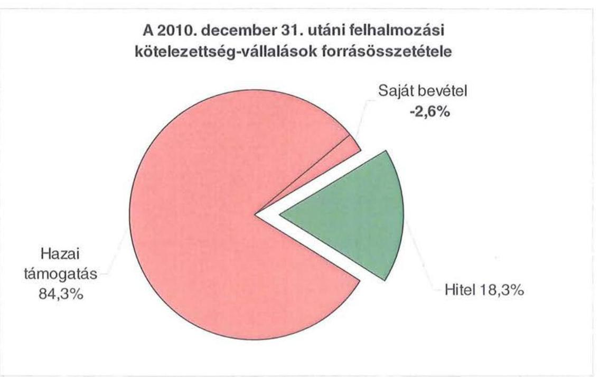

Az Önkormányzat mérleg szerinti pénzintézeti kötelezettsége, a 2006. év végéről a 2010. év végére, 3358 millió Ft-ról 6429 millió Ft-ra nőtt, amelyből az árfolyamváltozás miatti különbözet 475 millió Ft volt. A fennálló pénzintézeti kötelezettség két hosszú lejáratú hitel igénybevételéből keletkezett.

Az Önkormányzat a devizában fennálló pénzintézeti kötelezettségeiből 6967 ezer EUR (1831 millió Ft) tőkét törlesztett, kamatot és egyéb költséget fizetett. A 2007-2010. években átmenetileg szabad pénzeszközeiből 1685 millió Ft kamatbevételt realizált, ezzel szemben 615 millió Ft kamatkiadást teljesített.

A folyószámlahitel igénybevétele a 2007-2010. években az alábbiak szerint alakult:

| Megnevezés | 2007. év | 2008. év | 2009. év | 2010. év |
| :-- | --: | --: | --: | --: |
| Keretösszeg január 1-jén | 2000,00 | 2000,00 | 2000,00 | 2000,00 |
| Átlagos napi állomány | 187 | - | - | - |
| Folyószámla hitellel zárt napok száma (nap) | 51 | - | - | - |
| 2010. december 31-i egyenleg (állomány) | x | x | x | - |

A számlavezető pénzintézettel 2010. július 15-én megkötött folyószámla hitelszerződés alapján az Önkormányzatnak évi 0,125%, 2500 ezer Ft rendelkezésre

---
 nem volt.

Az Önkormányzat 2010. év végi szállítói tartozása 1339 millió Ft, melyből a lejárt tartozás 71 millió Ft volt. A lejárt tartozások 64%-a (45 millió Ft) meghaladta a 91 napot. Az Önkormányzat intézményeinél és a Polgármesteri hivatalnál a 60 napot meghaladó, szállítók felé fennálló kötelezettségek miatt - a helyi önkormányzatok adósságrendezési eljárásáról szóló 1996. évi XXV. törvény 4. § (2) és 5. § (2) bekezdésében foglaltak ellenére - a polgármester nem kezdeményezett adósságrendezési eljárást.

Az Önkormányzat készfizető kezességvállalása a gazdasági társaság által, a Regionális Hulladékkezelő Központ megvalósításához felvett 1600 millió Ft hitelhez kapcsolódik.

Az Önkormányzatnak - kimutatása szerint - 2010. december 31-én jelzáloggal terhelt ingatlana nem volt.

Az Önkormányzat kötelezettségeinek 2010. december 31-i állományát és várható alakulását a kötelezettségek lejáratáig a következő táblázat szemlélteti:
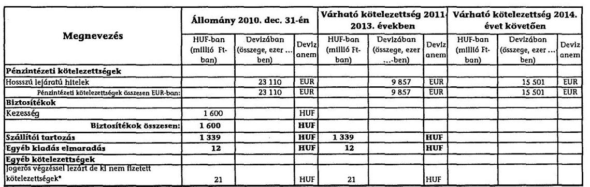

Az Önkormányzatnak pénzintézettel szemben fennálló kötelezettsége a 2010. év végén 23110 ezer EUR volt. Ennek várható kötelezettsége (tőke, kamat és egyéb költség) a legutóbbi kamatfizetés feltételei alapján a 2011. évtől 25358 ezer EUR. Az Önkormányzatnak a 2010. év végén a szállítói tartozások és egyéb kiadáselmaradások rendezése, valamint jogerős végzéssel lezárt, de ki nem fizetett kötelezettségek címén 1372 millió Ft fizetési kötelezettsége állt fenn. A kezességvállalásból adódóan további 1600 millió Ft összegű terhe jelentkezhet, amennyiben a társaság a kötelezettségeit nem teljesíti. A 2011-2013. években várható kötelezettségek teljesítésére figyelembe vehető a mérlegben kimutatott 5184 millió Ft pénzállomány és 1154 millió Ft követelésállomány. A 2014. évet követő kötelezettségekre figyelembe vehető források az Önkormányzat tájékoztatása szerint „a mindenkori költségvetési rendeletekben megtervezett önkormányzati saját bevételek”, szükség esetén a rendelkezésre álló mintegy 2098 millió Ft forgalomképes ingatlanvagyon.

Az Önkormányzat minősített többségi tulajdonú társaságai kötelezettségeinek 2010. december 31-i állományát és várható alakulását a kötelezettségek lejáratáig a következő táblázat mutatja be:

---

| Megnevezés | Állomány 2010. dec.31-én |  |  | Várható kötelezettség 2011. 2013. években |  |  | Várható kötelezettség 2014.   évet követően |  |  |
| :--: | :--: | :--: | :--: | :--: | :--: | :--: | :--: | :--: | :--: |
|  | HUF-ban   (millió Ft   ban) | Devizában   (összegy, ezer ...   ban) | Deviz   neem | HUF-ban   (millió Ft   ban) | Devizában   (összegy, ezer ...   ban) | Deviz   neem | HUF-ban   (millió Ft   ban) | Devizában   (összeg, ezer ...   ban) |  |
| Pénzintézeti kötelezettségek |  |  |  |  |  |  |  |  |  |
| Hosszú lejáratú kötelezettségek | 1612 | 705 | EUR | 585 | 705 | EUR | 1105 |  |  |
| Folyószámla- és egyéb rövid lejáratú kötelezettségek | 300 |  | HUF | 300 |  | HUF |  |  |  |
| Pénzintézeti kötelezettségek összesen: | 1912 |  | HUF | 885 |  | HUF | 1105 |  |  |
| Pénzintézeti kötelezettségek összesen: |  | 705 | EUR |  | 705 | EUR |  |  |  |
| Üzleti kötelezettségek |  | 405 | EUR |  | 405 | EUR |  |  |  |
| Üzleti kötelezettségek |  | 4 | CHF |  | 4 | CHF |  |  |  |
| Szállítói tartozás | 355 |  | HUF | 355 |  | HUF |  |  |  |
| Ingatlan végrehajtással terhelt és nem fizetett   kötelezettségek* | 0 |  |  |  |  |  |  |  |  |

* A peres eljárásokra vonatkozó adatok a 2011. június állapotot tükrözik

A társaságoknak a 2011. évtől 1990 millió Ft és 705 ezer EUR pénzintézeti kötelezettséget, 405 ezer EUR és 4 ezer CHF lízinget és 355 millió Ft szállítói tartozást kell rendezniük. Kockázatot hordoz, ha ezek nem teljesítése esetén a bíróság korlátlan és teljes felelősséget állapít meg az Önkormányzat terhére.

Az Önkormányzat költségvetési támogatásból, átengedett bevételekből és illetékekből származó bevételei a 2007. évhez képest az időszak egészét tekintve összességében 16 millió Ft-tal csökkentek. A 2007-2010. években tett intézkedések hatására 368 millió Ft bevételi többletet, továbbá 368 millió Ft kiadási megtakarítást mutattak ki, ezáltal az önkormányzat pénzügyi helyzetét tovább javították. A létszámcsökkentések eredményeként jelentkező megtakarításokat az intézmények felújításra, karbantartásra fordíthatták. Az álláshelycsökkentő intézkedések 2007-2010 között az intézményeknél összesen 359 álláshely (ebből 18 üres álláshely) megszüntetését jelentették. Egyes közszolgáltatási területeken azonban feladatbővülések is voltak, amelyek álláshely és egyben létszámnövekedéssel is jártak. Ennek következtében az időszak álláshelyeinek száma 139 fővel csökkent. A bevételnövelő intézkedések szabad kapacitások kihasználásához, ingatlanok bérbeadásához kapcsolódtak.

Az Önkormányzat gazdálkodási rendszerének 2007. évi ellenőrzése során a pénzügyi egyensúly javítására vonatkozó javaslatot az ÁSZ nem tett.

Az Önkormányzat pénzügyi helyzetét összegezve a következők emelhetők ki:

A 2007-2010. években az Önkormányzat működési kockázatát csökkentette a pozitív folyó költségvetési egyenleg, a minimális lejárt szállítói tartozásállomány. Az önként vállalt feladatok aránya az Önkormányzat működésének biztonságát nem befolyásolta. A működési bevételek évente biztosították a működési kiadások és az adósságszolgálat finanszírozását, a likviditás biztosítása folyószámlahitel igénybevétele nélkül történt. A gazdasági társaságok szerepe a közüzemi közfeladat-ellátásban meghatározó volt. A gazdasági társaságok által ellátott feladatstruktúra letisztított, átlátható, a működési kockázatot nem növelte.

A vizsgált időszakban az Önkormányzat felhalmozási költségvetése pénzügyi hiányt mutatott, ennek forrásai a pénzmaradvány igénybevételével és hitelfelvétellel biztosítottak voltak. A fejlesztési célú kötelezettségvállalásoknál a jövőben teljesítendő kifizetésekre a fedezet rendelkezésre áll (hitelek, előző évek pénzmaradványa, EU támogatások, saját forrás).

---

Az Önkormányzat 2010. december 31-én fennálló pénzintézeti és egyéb kötelezettségeinek teljesítése nem jelent kockázatot.

Az Önkormányzat a Közgyűlésnek nem mutatta be, hogy az elhasználódott eszközök pótlása milyen kötelezettséget jelent. A 2007-2010. években az elszámolt értékcsökkenés összege 11408 millió Ft volt, ezzel összevetve az elhasználódott eszközök pótlására 6499 millió Ft-ot fordítottak.

A központi intézkedések hatására az Önkormányzat bevételei kis mértékben (16 millió Ft) csökkentek az ellenőrzött időszakban. Azt jelentős mértékben meghaladta a bevételnövelő és a kiadáscsökkentő intézkedések együttes hatásának összege (736 millió Ft).

Az Állami Számvevőszékről szóló 2011. évi LXVI. törvény 33. § (1) bekezdésében foglaltak értelmében a jelentésben foglalt megállapításokhoz kapcsolódó intézkedési tervet köteles az ellenőrzött szervezet vezetője összeállítani és azt a jelentés kézhezvételétől számított harminc napon belül az ÁSZ részére megküldeni. Amennyiben az intézkedési tervet határidőben nem küldi meg a szervezet, vagy az továbbra sem elfogadható, az ÁSZ elnöke a hivatkozott törvény 33. § (3) bekezdés a)-b) pontjaiban foglaltakat érvényesítheti.

Az ellenőrzés intézkedést igénylő javaslatai:

# a Polgármesternek 

1. mutassa be félévente - a költségvetési beszámoló keretében - a Közgyűlésnek az Önkormányzat és a minősített többségi tulajdonú gazdasági társaságai aktuális pénzügyi helyzetét, az Önkormányzatnak a gazdasági társaságai és társulásai felé fennálló kötelezettségeit és követeléseit;
2. mutassa be a Közgyűlésnek évente a zárszámadási rendelet előterjesztésében az értékcsökkenés összegét, és ezzel összevetve az elhasználódott eszközök pótlására fordított tényleges kiadásokat, az eszközök elhasználódási fokának alakulását;
3. terjessze a Közgyűlés elé az SzMSz-ben meghatározott kötelező és önként vállalt feladatok elhatárolásának módosítását;
4. intézkedjen, hogy a 2011. évi zárszámadási rendeletben a működési és felhalmozási célú bevételek és kiadások mérlegszerűen bemutatásra kerüljenek;
5. kísérje figyelemmel az Önkormányzat intézményeinél és a Polgármesteri hivatalnál a 60 napot meghaladó, szállítók felé fennálló kötelezettségeket és a helyi önkormányzatok adósságrendezési eljárásáról szóló 1996. évi XXV. törvény 5. § (2) bekezdésében foglaltaknak megfelelően - indokolt esetben - kezdeményezzen adósságrendezési eljárást;

## a jegyzőnek

1. gondoskodjon az Önkormányzat likviditási helyzetéhez igazodó folyószámla hitelkeret felülvizsgálatáról;

---

2. kísérje folyamatosan figyelemmel - a tulajdonosi jogkört gyakorlók közreműködésével - a minősített többségi tulajdonú gazdasági társaságok kötelezettségeinek alakulását, az Önkormányzat likviditására, pénzügyi egyensúlyi helyzetére gyakorolt hatását;
3. gondoskodjon a Polgármesteri hivatal és a további költségvetési szervek lejárt szállítói tartozásai okainak feltárásáról a lejárt tartozások mielőbbi rendezése érdekében;
4. kísérje figyelemmel a jövőbeni várható - árfolyam-, kamat-, valamint visszafizetési kockázatokat, továbbá a mérlegen kívüli tételek (kezességvállalás, garancia és helytállási kötelezettségvállalás) kockázatait, és legalább félévente tájékoztassa a Közgyűlést azok alakulásáról;
5. vizsgálja felül az Ötv. 61. §-ában foglaltakra tekintettel az Önkormányzat kötelező és önként vállalt feladatainak a meghatározását. A felülvizsgálat alapján kezdeményezze az SzMSz módosítását;
6. intézkedjen, hogy a 2011. évi zárszámadási rendeletben az Áht. 69. § (1) bekezdésében foglaltakra tekintettel bemutatásra kerüljenek a működési és a felhalmozási célú költségvetési bevételek és kiadások.

---

# II. RÉSZLETES MEGÁLLAPÍTÁSOK 

## 1. Az ÖNKORMÁNYZAT KÖTELEZŐ ÉS ÖNKÉNT VÁLLALT FELADATAI

A kötelező és önként vállalt feladatok körét az Önkormányzat SzMSz-ében ${ }^{27}$ szabályozta. Az önkormányzati rendelet 5. számú mellékletében felsorolt feladatok besorolásánál nem vették figyelembe az Ötv. 61. § (1) bekezdésében foglaltakat, mely szerint a megyei jogú város, területén - saját hatásköreként - ellátja a megyei önkormányzati feladat- és hatásköröket is. A kötelezően ellátandó feladatok helyett önként vállalt feladatként szerepeltették az SzMSz-ben a településfejlesztés, a helyi tömegközlekedés feladatainak ellátását is.

A 2010. évi működési kiadások kötelező feladatonkénti megoszlását, azok finanszírozási arányait a következő táblázat szemlélteti:

| Ellátott feladat | Működési   kiadás   összesen   (millió Ft) | Kötelező   feladatok   kiadásainak   részaránya   % | Működési   bevétel   összesen   (millió Ft) | Állami   támogatás   részaránya   % | Intézményi   saját bevétel   részaránya   % | Önkormányzati   támogatás   részaránya   % |
| :--: | :--: | :--: | :--: | :--: | :--: | :--: |
| Óvodák | 2289 | 100,0 | 2265 | 41,7 | 9,6 | 48,7 |
| Általános iskolák | 4340 | 100,0 | 4419 | 41,0 | 7,5 | 51,5 |
| Gimnáziumok | 1297 | 0,0 | 1356 | 48,9 | 4,5 | 46,6 |
| Szakközépiskolák,   szakképző intézmények | 4769 | 0,0 | 4791 | 56,1 | 7,0 | 36,9 |
| Kollégiumok | 751 | 0,0 | 713 | 55,0 | 14,0 | 31,0 |
| Szociális   intézmények | 1801 | 98,5 | 1829 | 30,1 | 35,4 | 34,5 |
| Gyermekjóléti   intézmények | 1031 | 100,0 | 1035 | 32,7 | 2,6 | 64,7 |
| Közművelődési   intézmények | 649 | 81,9 | 635 | 0,0 | 30,8 | 69,2 |
| Sportlétesítmények | 355 |  |  |  |  |  |

 | 100,0 | 98 | 0,0 | 99,8 | 0,2 |
| Igazgatási   intézmények | 0 | 0,0 | 0 | 0,0 | 0,0 | 0,0 |
| Hivatalos   Tűzoltóság | 685 | 100,0 | 674 | 84,3 | 15,3 | 0,4 |
| Egyéb intézmények | 6517 | 46,0 | 8867 | 13,6 | 30,7 | 55,7 |
| Intézmények   összesen | 24485 | 54,9 | 26683 | 34,3 | 18,2 | 47,5 |
| Polgármesteri   Hivatalban kezelt   feladatok működési   kiadásai | 12129 | 46,0 | 15679 | 16,9 | 83,1 | 0,0 |
| Működési kiadá-   sok összesen | 36614 | 51,9 | 42362 | 27,9 | 42,2 | 29,9 |

A működési kiadáson belül a kötelezően ellátott feladatokra fordított kiadások aránya a 2007. évben 53,8 %, a 2010. évben 51,9 % volt, 1,9 százalékponttal alacsonyabb mértékű. Amennyiben a kötelező feladatokat a jogszabályi előírásoknak megfelelően soroljuk be, ez az arány a 2007. évben 75,4%

[^0]
[^0]:    ${ }^{27}$ többször módosított 11/2007. (III. 23.) számú rendelet Győr Megyei Jogú Város Önkormányzata Szervezeti és Működési Szabályzatáról

---

(22 970 millió Ft), a 2010. évben 70,6% (25 833 millió Ft). Az önként vállalt feladatok az Önkormányzat által fenntartott művészeti intézményekben ${ }^{28}$, valamint a Polgármesteri hivatal által bonyolított feladatok ${ }^{29}$ körében jelentősek.

Az Önkormányzat kiterjedt intézményhálózattal rendelkezik, 2010. december 31-én az alapító okirattal rendelkező, önállóan működő, valamint az önállóan működő és gazdálkodó költségvetési szervek száma 81 volt, mely intézményekben került felhasználásra a működési költségekből 24485 millió Ft (66,9%).

A működési kiadások összege önkormányzati szinten a 2007. évben 30464 millió Ft, a 2010. évben 36614 millió Ft volt. Ebből az intézmények működési kiadásainak összege a 2007. évben 22611 millió Ft (74,2 %), 2010-ben 24485 millió Ft (66,9 %). Az összehasonlíthatóság érdekében a 2010. évben is a Polgármesteri hivatal kiadásai között került kimutatásra a Nagytérségi Hulladékgazdálkodási Rendszer kiadásainak 1002 millió Ft-os összege. Annak figyelembevételével a Polgármesteri hivatal működési kiadásai a 2007-2010. években folyamatosan nőttek. A működési kiadások összege 2007-ben 7853 millió Ft, 2010-ben 12129 millió Ft volt. A közoktatási intézmények közül az általános iskolák folyó működési kiadása a 2007-2010. években folyamatosan csökkent. Az előző év viszonylatában a csökkenés a 2008. évben 44 millió Ft (0,9 %), 2009-ben 23 millió Ft (0,5 %), 2010-ben 269 millió Ft (5,8 %) volt. A szakképző iskolák és kollégiumok kiadásai folyamatosan nőttek. E két intézménytípus folyó működési kiadása a 2007. évben összesen 5194 millió Ft, a 2010. évben 5520 millió Ft volt. A szociális és gyermekjóléti intézmények folyó működési kiadásai is emelkedtek. A kiadások összege a 2010. évben 2832 millió Ft volt, a 2007. évhez viszonyítva 532 millió Ft-tal nőtt.

A működési bevételek ${ }^{30}$ forrásösszetétele változott, az állami támogatások, hozzájárulások összes bevételen belüli aránya a vizsgált években csökkent. Önkormányzati szinten 2010. évben a működési kiadásokat 27,9%-ban finanszírozta az állami támogatás. Az intézményekben ellátott közszolgáltatások finanszírozásában az állami támogatáson felül az önkormányzati támogatás részaránya 47,5 % volt.

Az Önkormányzat intézményeiben ellátottak, valamint a foglalkoztatottak száma ${ }^{31}$ ágazatonként eltérően alakult. A közoktatási intézményekben ellátott gyermekek, tanulók száma a vizsgált években mintegy 33 fővel, az ágazatban foglalkoztatottak létszáma 272 fővel csökkent. Szociális, gyermekvédelmi területen ugyanakkor az egyre növekvő ellátási igények hatására az ellátottak száma 162 fővel, a foglalkoztatottaké 54 fővel nőtt.

[^0]
[^0]:    ${ }^{28}$ Győri Nemzeti Színház, Győri Balett, Győri Filharmonikus Zenekar, Vaskakas Bábszínház
    ${ }^{29}$ városi nagyrendezvények, egyéb támogatások
    ${ }^{30}$ Az elemi beszámoló működési bevétel adata és a CLF folyó bevétel adata az áfa visszatérülés teljes összegével, valamint az Önkormányzat által fejlesztési kamatnak minősített kamatbevétel összegével, továbbá a követelés elengedés miatt elszámolt bevétel figyelmen kívül hagyása miatt tér el egymástól.
    ${ }^{31}$ A 30/a. számú tanúsítvány (2010. decemberi BM felmérés) adatai szerint.

---

Az Önkormányzat által foglalkoztatottak létszáma összességében 3,2%-kal csökkent, a 2006. évi 5534 főről 5360 főre, ezzel szemben a köztisztviselők létszáma 5,9%-kal, 22 fővel, nőtt.

Az Önkormányzat kötelező és önként vállalt feladatait 2010. december 31-én 81 költségvetési szervvel, valamint 10 gazdasági társasággal látta el, ebből a helyi közlekedést biztosító Kisalföld Volán Zrt-ben az Önkormányzatnak, illetve gazdasági társaságainak tulajdonosi érdekeltsége nincs. A tulajdonos 570 millió Ft összegben, 73,3%-ban az MNV Zrt. A feladatok ellátására az Önkormányzat a Zrt-vel közszolgáltatási szerződést kötött, melynek alapján a feladatok ellátására a 2007-2010. években összesen 2444 millió Ft támogatást folyósított a gazdasági társaság részére.

A 2006. évben a költségvetési szervek száma 87, a gazdasági társaságoké 13 volt, a 2007-2010 között elvégzett intézmény-összevonások eredményeként a költségvetési szervek száma hattal csökkent. Az Önkormányzat 100%-os tulajdonában lévő gazdasági társaságok közül a hatékonyabb feladatellátás, a párhuzamosan végzett feladatok kiküszöbölésére hat gazdasági társaság fúziójáról intézkedtek és két gazdasági társaságot alapítottak. A feladatot ellátó szervezetek számának csökkenése mellett a telephelyek száma 24-gyel, 8,7%-kal nőtt. A növekedést a sportolásra, kulturális célok megrendezésére alkalmas létesítmények, közösségi terek számának növekedése indokolja.

Az Önkormányzat által fenntartott költségvetési intézmények közül 77 intézmény önállóan működő költségvetési szerv és csak négy intézmény rendelkezik önállóan működő és gazdálkodó szerv besorolással. A közoktatási, valamint a kulturális ágazatba tartozó intézmények gazdálkodási feladatainak ellátására, bonyolítására egy-egy Pénzügyi Gazdasági Szolgáltató Központot hoztak létre. Az Önkormányzat feladatait az alábbi intézménystruktúrával látja el.

- Egészségügyi feladatok ellátására intézményt nem hoztak létre, a feladatokat vállalkozó orvosok látják el, a fekvő- és járó beteg szakellátás a megyei önkormányzattal kötött megállapodás keretében biztosított.
- A szociális és gyermekvédelmi intézményhálózat erősen centralizált, a feladatokat öt intézményben látják el.
- Az Önkormányzat fenntartásában 58 közoktatási intézmény van. Az intézmények nem tiszta profilúak, azok jellemzően többféle közoktatási feladatot is ellátnak.
- A kulturális intézmények száma 11. A művészeti alkotások, levéltári anyagok gyűjtését, kezelését két intézmény végzi, színházi, művészeti feladatokat négy intézmény, közösségi, művelődési, egyéb kulturális közművelődési, valamint sportfeladatokat öt intézmény lát el.
- Egyéb feladatokat lát el költségvetési intézményként az Útkezelő Szervezet, a Városi Tűzoltóság, a Közterület-felügyelet, a Győr megyei jogú város Gyermektábora, valamint a két Gazdasági Szolgáltató Központ. Az igazgatási feladatokat a Polgármesteri hivatal végzi.

---

Az Önkormányzat által alapított költségvetési szervek, gazdasági társaságok mellett a feladatok ellátásában - megállapodás alapján - szociális és gyermekvédelmi területen, államháztartáson kívüli szervezetek, alapítványok, egyházak is részt vesznek. E szervezetek meghatározó részben a speciális, kisebb létszámot érintő ellátásokat (fogyatékos gyermekek, pszichiátriai betegek ellátása, családok-, gyermekek átmeneti otthonának működtetése) biztosítják.

- Szociális alapszolgáltatási feladatokat lát el az Önkormányzat területén a Magyar Máltai Szeretetszolgálat Egyesület a halmozottan fogyatékos gyermekek nappali ellátásában, a Baptista Szeretetszolgálat a pszichiátriai betegek nappali ellátásában, a Segítőház Alapítvány az utcai szociális munka biztosításában;
- a gyermekjóléti alapellátás területén a Szent Cirill és Method Alapítvány a Gyermekek és Családok Átmeneti Otthonát működteti.

Az egyéb szervezetekkel történt feladatellátási szerződés megkötését megelőzően az Önkormányzat azt vizsgálta, hogy a feladatot vállaló szerv rendelkezik-e az ellátáshoz szükséges feltételekkel, az tartósan biztosított-e, így nem szükséges intézmények, létesítmények párhuzamos kiépítése. A feladatellátáshoz nyújtott önkormányzati támogatás összegét jellemzően a felmerülő kiadások és a lehívható normatív állami hozzájárulások alapján határozták meg.
2010. december 31-én az Önkormányzat 100%-os tulajdonában lévő gazdasági társaságok az alábbiak voltak:

- a GYŐR-SZOL Zrt. 2009-ben az Önkormányzat ugyancsak 100%-os tulajdonában lévő három kft. (KOMSZOL ${ }^{32}$, INSZOL, valamint a Győri Hőszolgáltató) fúziójával jött létre. A gazdasági társaság jegyzett tőkéje 4756 millió Ft.
- Az ESÉLY Rehabilitációs Kft. korábban szociális foglalkoztatóként működött. A jegyzett tőke összege 82 millió Ft.
- A Xantus János Állatkert Kft. feladatait korábban szintén költségvetési intézményként látta el, a jegyzett tőke összege 25 millió Ft.
- A Győri Fürdő Kft. GYŐR-SZOL Zrt-be történő fúziójáról a 2011. évben döntött a Közgyűlés ${ }^{33}$. A gazdasági társaság jegyzett tőkéje 643 millió Ft.

A gazdasági társaságok 2010. évi saját tőkéjének értéke 14435 millió Ft, amely 30,4%-kal nagyobb a 2007. évinél. A jegyzett tőke 2010. évi értéke 5506 millió Ft, a 2007. évi értékhez viszonyított növekedés 61%.

Önkormányzati többségi tulajdonban lévő gazdasági társaságok:

- a Pannon-Víz Zrt-ben az Önkormányzat 61,2%, 804 millió Ft tulajdoni részesedéssel rendelkezik;
- az INNONET Kft-ben a tulajdoni részaránya 84,7%, 67 millió Ft;

[^0]
[^0]:    ${ }^{32}$ A 2009. évet megelőzően a KOMSZOL Kft-be még további három kft-t fúzionáltak.
    ${ }^{33}$ 106/2011. (IV. 29.) számú határozat

---

- A Győr-Pér Repülőtér Kft-ben az Önkormányzat jegyzett tőkéje 144 millió Ft, 76%.

Ezen gazdasági társaságok 2010. évi saját tőkéje 7232 millió Ft, 2007-ben 6701 millió Ft volt. A jegyzett tőke összege 2010-ben 1582 millió Ft, 2007. évhez mérten 2,8%-kal, 44 millió Ft-tal nőtt.

Az Önkormányzat gazdasági érdekeltségével működő GYŐR-SZOL Zrt. rendelkezik további két gazdasági társaságban 25% feletti tulajdoni részesedéssel:

- a „Jószív" Temetkezési Kft-ben a tulajdoni részaránya 33,8%, 10 millió Ft;
- a Nemzetközi Ipari Park Kft-ben a tulajdonosi részaránya 40%, 74 millió Ft.

Az Önkormányzat tulajdoni részesedését, a saját tőke és a jegyzett tőke arányát a 4. számú melléklet részletezi.

Felszámolás és csődeljárás az Önkormányzat tulajdoni részesedésével működő gazdasági társaságoknál nincs folyamatban.

Az Önkormányzat szolgáltatási és ármegállapítási hatáskörrel rendelkezik a víz- és csatornadíjak, a távhő ára, helyi tömegközlekedési tarifák, települési folyékony és szilárd hulladék szállítása, uszodai belépőjegyek tekintetében. A szolgáltatások díjtételeit önkormányzati rendeletek rögzítik.

Az Önkormányzatnál a feladatellátás szerkezetét érintő változás, intézmény átadás-átvétel a 2007-2010. években nem történt. Az intézmények feladatellátásának racionalizálása, költségmegtakarítás miatti összevonása a vizsgált időszakot megelőzően nagyrészt megtörtént.

# 2. A PÉNZÜGYI-EGYENSÚLYI HELYZET ALAKULÁSA 

### 2.1. A működési és felhalmozási egyensúly alakulása

A hagyományos költségvetési szerkezet helyett az önkormányzat pénzügyi helyzetét a CLF módszer szerint mutatjuk be, amelyben jobban elkülönülnek a vagyonnal kapcsolatos bevételek és kiadások az önkormányzati feladatokkal kapcsolatos közvetlen működtetési bevételektől és kiadásoktól. A módszer következetesen elkülöníti a folyó és a felhalmozási költségvetés bevételeit és kiadásait, azok költségvetési egyenlegeit. A saját folyó bevételek, valamint a saját felhalmozási bevételek nem tartalmazzák az előző évi pénzmaradványok felhasználásából származó pénzforgalom nélküli bevételeket ${ }^{34}$.

[^0]
[^0]:    ${ }^{34}$ A költségvetési években kialakuló hiány finanszírozása az előző években képzett tartalékok felhasználásával is történhet.

---

A folyó költségvetés egyenlege, a működési jövedelem megmutatja, hogy az önkormányzat éves folyó bevétele fedezetet biztosít-e a kötelező és önként vállalt feladatellátáshoz kapcsolódó éves folyó
 kiadásokra. A működési jövedelem negatív értéke pénzügyileg fenntarthatatlan helyzetet jelez. A mutató pozitív értéke megtakarítást mutat, amely forrásul szolgálhat az önkormányzat fennálló kötelezettségei megfizetéséhez, valamint fejlesztéseihez.

A felhalmozási költségvetés pozitív értéke felhalmozási többletet mutat, amely a jövőbeni fejlesztések forrását biztosíthatja. Amennyiben a folyó költségvetési hiány finanszírozása a felhalmozási többletből történik, ez szűkebb értelemben vagyonfelélésnek tekinthető. Amennyiben a felhalmozási költségvetés megtakarítása fejlesztési célú hitelek, kötvények adósságszolgálatát finanszírozza, az változatlan vagyontömeg mellett, a korábban megelőlegezett tőkebevételek valós realizációjának tekinthető. A felhalmozási deficit által generált finanszírozási igény önmagában nem jár pénzügyi kockázattal, a pénzügyileg fenntartható beruházásokhoz kapcsolódó kötelezettségvállalás (adósságszolgálat) prudens költségvetési gazdálkodással teljesíthető.

A módszer a pénzügyi kapacitás fogalmát helyezi a középpontba. Az adós hitelfelvételi képessége, hosszú távú fizetőképessége vagy bonitása a pénzügyi kapacitással, ezen belül is a nettó működési jövedelemmel jellemezhető. A nettó működési jövedelem negatív értéke az egyes költségvetési években jelentkező adósságszolgálat túlzott mértékére utal ${ }^{35}$. A nettó működési jövedelem negatív értékének felhalmozási többletből, vagy további hitelből történő finanszírozása pénzügyileg nem fenntartható gazdálkodást vetít előre. A pozitív értéket mutató nettó működési jövedelem fejlesztési kiadások fedezetét biztosíthatja, illetve a folyamatosan, évenként képződő pozitív nettó működési jövedelemből meghatározható a jövőben vállalható, teljesíthető éves adósságszolgálat, ily módon az a hitelösszeg, amely - a többi tényezőt, feltételt adottnak tekintve - visszafizetési kockázat nélkül felvehető.

A CLF módszer alapján a pénzügyi kapacitás mértéke az Önkormányzat összevont, nettósított, a központi információs rendszerbe a Kincstáron keresztül leadott éves költségvetési beszámolójának 80-as űrlapjában szerepeltetett adatok alapján került meghatározásra.

[^0]
[^0]:    ${ }^{35}$ Kivéve, ha annak finanszírozására a korábbi években képzett tartalékok fedezetet nyújtanak.

---

# CLF módszer szerinti önkormányzati adatok 

|  |  |  |  | ezer Ft |
| :--: | :--: | :--: | :--: | :--: |
| Megnevezés | 2007 | 2008 | 2009 | 2010 |
| Folyó bevételek | 32734312 | 40937423 | 43223742 | 42362156 |
| Folyó kiadások | 30463536 | 34254361 | 37470794 | 36613760 |
| Működési jövedelem | 2270776 | 6683062 | 5752948 | 5748396 |
| Nettó működési jövedelem =működési jövedelem - tőketörlesztés | 2110776 | 6363062 | 5432948 | 5428396 |
| Felhalmozási bevételek | 4560339 | 2315293 | 7851015 | 5265204 |
| Felhalmozási kiadások | 4668509 | 6327355 | 15437119 | 13690288 |
| Felhalmozási költségvetés egyenlege | $-108170$ | $-4012062$ | $-7586104$ | $-8425084$ |
| Finanszírozási műveletek nélküli (GFS) pozíció | 2162606 | 2671000 | $-1833156$ | $-2676688$ |
| Finanszírozási műveletek egyenlege | 1369150 | $-826175$ | 351194 | 932361 |
| Tárgyévi pénzügyi pozíció változás | 3531756 | 1844825 | $-1481962$ | $-1744327$ |
| Egyéb tájékoztató adatok |  |  |  |  |
| Összes kötelezettség* | 8168195 | 8415962 | 7812677 | 8480322 |
| -ebből rövid lejáratú | 3518150 | 3903501 | 3494668 | 2341410 |
| Folyószámlahitel napi átlagos állománya** | 26152 | 0 | 0 | 0 |
| Likvidhitel napi átlagos állománya** | 0 | 0 | 0 | 0 |
| Munkabérhitel napi átlagos állománya** | 0 | 0 | 0 | 0 |
| Finanszírozásba vonható eszközök: | 5957898 | 7802723 | 6320761 | 4576434 |
| Tartós hitelviszonyt megtestesítő értékpapírok év végi állománya | 0 | 0 | 0 | 0 |
| Hosszú lejáratú bankbetétek év végi állománya | 0 | 0 | 0 | 0 |
| Értékpapírok év végi állománya | 0 | 0 | 0 | 0 |
| Pénzeszközök (idegen pénzeszközök nélkül) év végi állománya | 5957898 | 7802723 | 6320761 | 4576434 |

* Az összes kötelezettséget a passzív pénzügyi elszámolások nélkül vettük figyelembe, mert a passzívák a pénzmaradvány-elszámolás tételei közé tartoznak.
** A folyószámla- és munkabér-megelőlegezési hitel átlagos állományát 365 napos nevezővel számítottuk.

A CLF módszer szerint figyelembe vett folyó és felhalmozási bevételek és kiadások alakulását befolyásolta, hogy azok az Önkormányzat gesztor szerepéből adódóan a Nagytérségi Hulladékgazdálkodási Tárulás - döntően felhalmozási bevételekből és kiadásokból álló - adatait is tartalmazza.

---

A 2009. és 2010. években az Önkormányzat adatait a Nagytérségi Hulladékgazdálkodási Társulás nélkül a következő táblázat mutatja be:

| Nagytérségi Hulladékgazdálkodási Társulás nélkül |  |  |
| :-- | --: | --: |
| Megnevezés | $\mathbf{2 0 0 9}$ | $\mathbf{2 0 1 0}$ |
| Folyó bevételek | 42529787 | 40580570 |
| Folyó kiadások | 36810805 | 35611332 |
| Működési jövedelem | 5718982 | 4969239 |
| Nettó működési jövedelem =működési jövedelem - tőketörlesztés | 5398982 | 4649239 |
| Felhalmozási bevételek | 2311137 | 2190580 |
| Felhalmozási kiadások | 9186336 | 9826370 |
| Felhalmozási költségvetés egyenlege | -6875199 | -7635790 |
| Finanszírozási műveletek nélküli (GFS) pozíció | -1156217 | -2666551 |
| Finanszírozási műveletek egyenlege | 351194 | 932361 |
| Tárgyévi pénzügyi pozíció változás | -805023 | -1734190 |

Az Önkormányzat a 2007-2009. évek közötti zárszámadási rendeleteiben a fent bemutatott CLF-módszertől eltérő módon állapította meg felhalmozási és működési egyensúlyát ${ }^{36}$. A 2010. évi költségvetés teljesítéséről készített zárszámadási rendelethez a működési és felhalmozási költségvetés alakulását bemutató mérleget nem készítették el, annak ellenére, hogy azt a 292/2009. (XII. 19.) Korm. rendelet 36. § (1) bekezdése előírja. A működési és felhalmozási bevételeket és kiadásokat bemutató mérleget a 2010. évre az ellenőrzés kérésére készítették el. A működési és fejlesztési célú hiányt/többletet bemutató önkormányzati adatokat a jelentés 1. számú mellékletében mutatjuk be.

A 2007-2010. években a zárszámadási rendeletek mellékleteiben bemutatott működési és fejlesztési bevételek, valamint kiadások összege eltérést mutat a számviteli nyilvántartásokon alapuló pénzügyi információs rendszer adataitól ${ }^{37}$. A változások nehezen teszik követhetővé az egyes időszakok számadatainak összehasonlítását, a változások mérését. Az ellenőrzés során az elemi beszámoló adataira alapozva készítettünk önálló elemzést.

A bevételi és kiadási jogcímek CLF módszer szerinti részletes adatait a jelentés 2. számú melléklete mutatja be.

[^0]
[^0]:    ${ }^{36}$ Nincs központi előírás arra, hogy a költségvetési és zárszámadási rendeletekben az önkormányzatoknak hogyan kell elkészíteniük a működési és felhalmozási célú bevételeiket és kiadásaikat tartalmazó mérleget. Annak formáját maguk határozzák meg.
    ${ }^{37}$ Az eltérést az indokolja, hogy a Polgármesteri hivatal megfigyelési egységként bevétel-, kiadáscsoportokat alakított ki (intézményi költségvetések, városüzemeltetés, út-híd fenntartás, -üzemeltetés) és az így kimutatott kiadásokat-bevételeket teljes egészében vagy fejlesztési, vagy működési kiadásként-bevételként szerepeltette zárszámadási rendeletében.

---

A vizsgált időszakban az Önkormányzat folyó költségvetési egyenlege, működési jövedelme pozitív összegű volt, melynek alakulását a következő ábra szemlélteti:
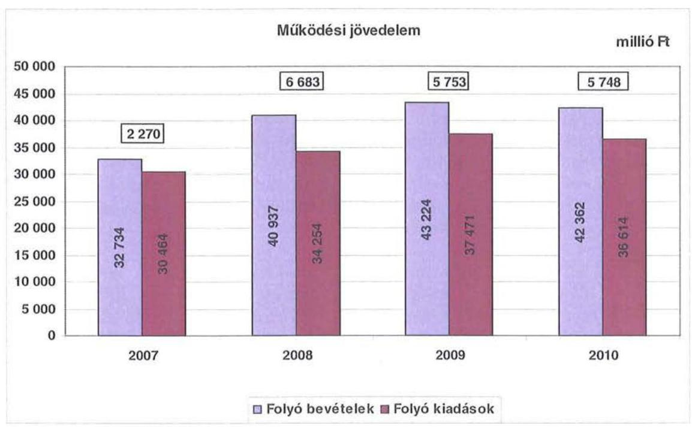

A folyó költségvetés egyenlege, (a működési forrástöbblet) 2007-ben a folyó bevételek 6,9\%-át ( 2270 millió Ft-ot), 2008-ban 16,3\%-át ( 6683 millió Ft-ot), 2009-ben 13,3\%-át ( 5753 millió Ft-ot) jelentette, 2010-ben 13,6\%-át ( 5748 millió Ft) tette ki a működési jövedelem. A vizsgált időszakban a működési jövedelem 20454 millió Ft többletet mutatott, amely forrásul szolgálhatott az Önkormányzat fennálló tőketörlesztési kötelezettségeinek teljesítéséhez, valamint fejlesztéseinek finanszírozásához.

A pozitív előjelű folyó költségvetési egyenleg ellenére az Önkormányzat folyószámlahitel felvételére kényszerült a 2007. évben. Annak átlagos napi állománya 365 napra átszámolva 26 millió Ft volt. Munkabérhitel igénybevételére egyik vizsgált évben sem került sor.

A mérlegben kimutatott kötelezettségeken belül a 2007-2010 közötti időszakban a hosszú lejáratú kötelezettségek állománya és aránya nőtt. 2007. évi összege 4650 millió Ft (50,6\%), a 2010. évben 6139 millió Ft (66,4\%) volt, ez utóbbiból a Nagytérségi Hulladékgazdálkodási Társulás hitelállománya 1600 millió Ft. A 2006. december 31 -én fennálló pénz- és tőkepiaci kötelezettségek összege 3358 millió Ft-ról 2010. év végére közel duplájára, 6429 millió Ft-ra ( $91,5 \%$-kal) nőtt a hosszú lejáratú hitelek felvétele miatt.

A rövid lejáratú kötelezettségek 2010-ben 2341 millió Ft-ot tettek ki, amely 1177 millió Ft-tal (33,5\%) kevesebb a 2007. évi rövid lejáratú kötelezettségállománynál. Az Önkormányzat lejárt szállítói tartozásállománya a 2007. december 31-i 21 millió Ft-ról (amely az összes szállítói állomány 1,8\%-a volt), 2010. december 31-re 71 millió Ft-ra (5,3\%) nőtt, amely - bár jelentős növeke-

---

dést mutat - az összes állományon belüli aránya azonban nem számottevő mértékű.

Az Önkormányzat 2010. december 31-i pénzmaradványa 3235 millió Ft volt, amelyből a szabad pénzmaradványként kimutatott összeg 29 millió Ft.

Az Önkormányzat pénzügyi kapacitása (nettó működési jövedelem) a vizsgált időszakban ugyancsak pozitív értéket mutatott, a 2007. évhez képest hitelfelvételi képessége, hosszú távú fizetőképessége tovább javult. A nettó működési jövedelem értéke a folyó költségvetési pozíció mellett az adott költségvetési év adósságtörlesztésének hatását is tükrözi. A vizsgált négy év 20455 millió Ft működési jövedelméből mindössze 1120 millió Ft -ot ( $5,5 \%$ ) tett ki a fejlesztési célú hitelekhez kapcsolódó tőketörlesztés, melynek kifizetését követően a 2007-2010. években összesen 19335 millió Ft nettó működési jövedelme keletkezett az Önkormányzatnak.

Az Önkormányzatnál a nettó működési jövedelem 2007-ben 2011 millió Ft, 2010-ben 5428 millió Ft volt. A mutató 2007. évről a 2008. évre történő jelentősen, mintegy háromszorosára ( 4252 millió Ft-tal) nőtt, majd évente 5,5 milliárd Ft körüli szinten stagnált.

Változatlan nettó működési jövedelem képződése mellett az Önkormányzatnál (a CLF módszer alapján) a fejlesztési kiadások nagy részének fedezete biztosítottnak látszik. A mutató továbbá információul szolgál a jövőben vállalható adósságszolgálat mértékére is.
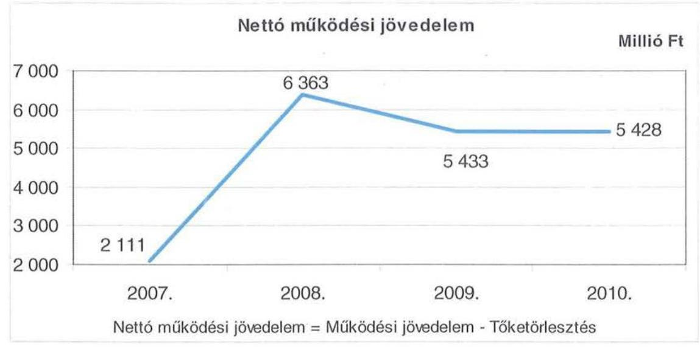

A 2007-2010. években az Önkormányzat felhalmozási költségvetésének egyenlege folyamatosan negatív összegű volt, amely kiegyensúlyozott költségvetési gazdálkodás és pénzügyileg fenntartható ${ }^{38}$ beruházások esetén tekintettel a képződő nettó működési jövedelem nagyságára - nem jár az Önkormányzatnál pénzügyi kockázattal.

[^0]
[^0]:    ${ }^{38}$ Az minősül pénzügyileg fenntartható beruházásnak, amelynek működtetésére az Önkormányzat nettó működési jövedelme a következő években is fedezetet nyújt.

---

A felhalmozási költségvetés egyenlegének alakulását évről évre a következő ábra szemlélteti:
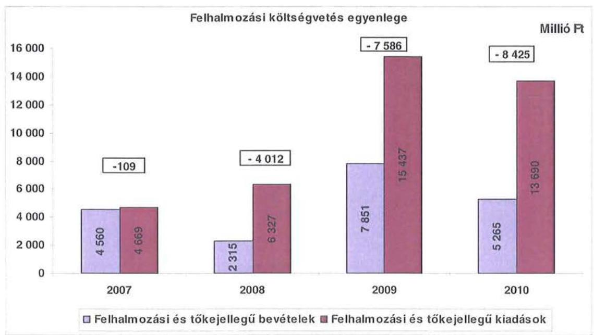

A felhalmozási forráshiánynak a felhalmozási és tőke jellegű kiadásokhoz viszonyított aránya a vizsgált években a felhalmozási kiadások függvényében eltérő, 2007-ben mindössze 2,3\% (109 millió Ft), 2008-ban 63,4\% (4012 millió Ft), 2009-ben 49,1\% ( 7586 millió Ft), 2010-ben 61,5\% ( 8425 millió Ft) volt. A 2007-2010. években jelentkezett 20132 millió Ft felhalmozási forráshiány finanszírozása a 2007. és 2010. években 16416 millió Ft nettó működési jövedelemből, továbbá fejlesztési célú hitelből ( 3716 millió Ft) történt ${ }^{39}$.

A 2007-2010. években az Önkormányzatnál a finanszírozási műveletek egyenlegének alakulását a következő ábra szemlélteti:
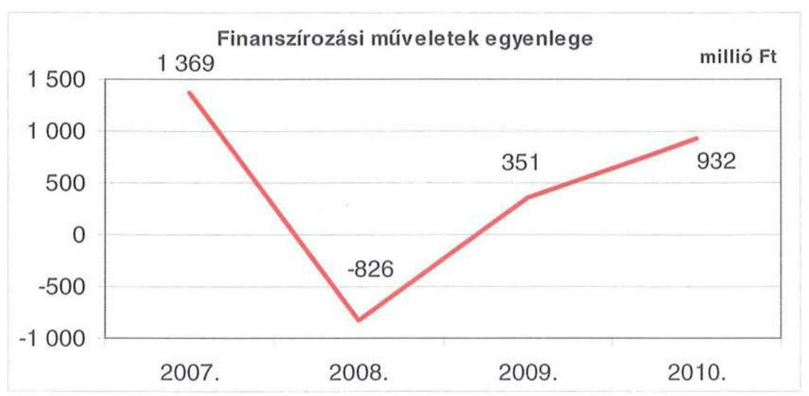

[^0]
[^0]:    ${ }^{39}$ Az évenkénti adatokat a jelentés 2. számú melléklete mutatja be.

---

A 2007, 2009. és a 2010. évi pozitív finanszírozási egyenleg azt jelzi, hogy az éves költségvetés végrehajtása során szükség volt külső finanszírozás igénybevételére is.

A 2007-2010. évek között az Önkormányzat kötelezettségeinek állománya ${ }^{40}$
 312 millió Ft-tal, 3,8%-kal nőtt. Az összes kötelezettségen belül a hosszú lejáratú kötelezettségek aránya a 2007. évi 56,9%-ról 2010-re 72,4%-ra 1489 millió Ft-tal, 32,0%-kal nőtt.

Az Önkormányzat pénzügyi kapacitása kedvező alakulásának eredményeként a vizsgált időszakban a realizált kamatok 2007. év kivételével minden évben meghaladták a fizetett kamatokat.

A 2007-2010. évek között az Önkormányzat által fizetett, illetve realizált kamatbevétel alakulását a következő ábra mutatja:
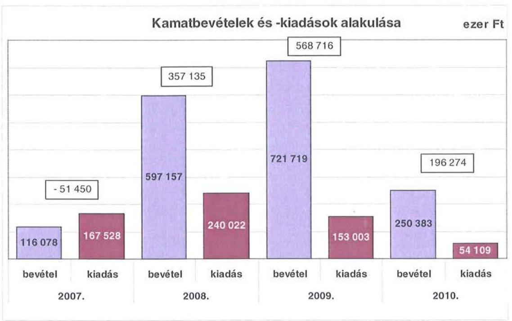

A 2007-2010. években az Önkormányzat összesen 615 millió Ft kamatot fizetett. Az átmenetileg szabad pénzeszközein realizált kamatbevétel összege 1685 millió Ft volt, vagyis a kamatbevétel összege több mint két és félszerese (274%, 1070 millió Ft kamatbevétellel több) volt a fizetett kamatok összegének.

# 2.2. Az Önkormányzat bevételeinek alakulása 

Az Önkormányzat folyó működési bevétele 2007-ben 32734 millió Ft, 2010-ben 42362 millió Ft volt, a 2010. évben 29,4%-kal, 9628 millió Ft-tal haladta meg a 2007. évi szintet.

[^0]
[^0]:    ${ }^{40}$ A CLF módszer szerinti passzív pénzügyi elszámolások nélkül.

---

A 2007-2010 között realizált főbb bevételi jogcímek szerinti számszaki adatokat az alábbi táblázat részletezi és grafikon mutatja be:
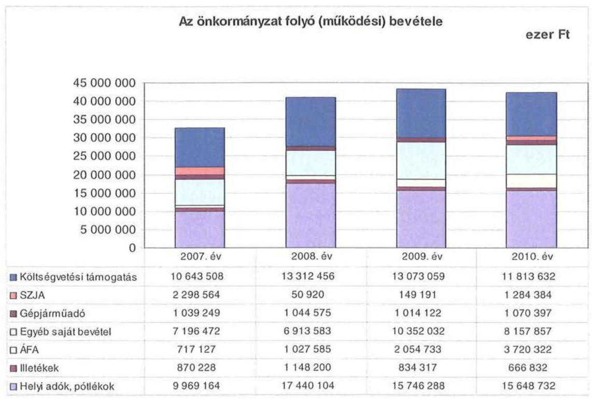

Az Önkormányzatnál a folyó bevételeken belül a költségvetési támogatás aránya fokozatosan csökkent, a 2007. évben 32,5%, a 2008. évben 32,5%, a 2009. évben 30,2%, 27,9% volt. Az összes folyó bevételen belüli arányának csökkenése annak ellenére következett be, hogy a költségvetési támogatás összege - bár évek között eltérő mértékben és arányban - a 2007. évről a 2010. évre 1170 millió Ft-tal, 11,0%-kal nőtt. A támogatás jogcímek szerinti összetétele változott. A normatív állami hozzájárulás (a 2007. évben az szja normatív módon elosztott részének beszámításával) a 2007-2010. évek között 2236 millió Ft-tal (21%) csökkent. A csökkenést az ellátottak létszámának változása mellett a normatíváknak a járulékváltozások miatti központi csökkentése okozta. A normatív kötött támogatások összege évente folyamatosan emelkedett, összege a 2007. évi 176 millió Ft-ról a 2010. évre 1267 millió Ft-ra nőtt. Ugyanakkor a központosított támogatások összege a vizsgált években az Önkormányzat és intézményei által benyújtott pályázatok függvényében eltérő nagyságrendet jelentett a folyó bevételeken belül. (Összege 2007-ben 1265 millió Ft, a 2008. évben 9793 millió Ft, a 2009. évben 1517 millió Ft, a 2010. évben 997 millió Ft volt.)

Az átengedett személyi jövedelemadóból származó bevétel évente erőteljesen ingadozott. A 2007. évi bevétel viszonylag magas összegét (2299 millió Ft) az okozta, hogy központi szabályozás alapján a normatív támogatásokat részben az szja-ból átengedett forrás finanszírozta. Az Önkormányzat átengedett szja-ból származó bevétele a 2008. évben 51 millió Ft, a 2009. évben 149 millió Ft és a 2010. évben 1284 millió Ft volt. Az iparűzési adóerőképesség, a jövedelem különbség mérséklés önkormányzati szintje, értékhatára, egyéb tényezők beszámításával a jövedelemkülönbség mérséklésére címen figyelembe vett el-

---

vont összeg a 2007. évben 2063 millió Ft, a 2008. évben 2072 millió Ft, a 2009. évben 2212 millió Ft, a 2010. évben 1142 millió Ft volt.

Az átengedett bevételen belül a gépjárműadóból beszedéséből származó bevétel összege a 2007. évben 1039 millió Ft, a 2010. évben 1070 millió Ft, összes folyó bevételen belüli aránya 3,1%, illetve 2,5% volt.

Az Önkormányzat saját működési bevételeinek részét képező intézményi ellátási díjak, működési bevételek 2007-2010. évek között 158 millió Ft-tal (22,9%) nőttek, ez meghatározó mértékben az ellátotti térítési díjak emeléséből adódott.

A 2010. évben áfa visszatérülésből származó bevétel 3720 millió Ft volt, mely több mint ötszöröse a 2007. évi áfa bevétel összegének (a 2007. évben 717 millió Ft). A 2010. évi áfa visszatérülésből 1341 millió Ft a fordított áfa elszámolásból jelentkezett.

A befolyt illetékbevétel a 2007. évről a 2008. évre nőtt, ezt követően csökkent, a 2007. évi 870 millió Ft-tal szemben a 2010. évben 667 millió Ft illetékbevétel realizálódott. Az illetékbevételek alakulását az ingatlanpiac visszaesése, valamint egyes illeték-kedvezmények bővülése befolyásolta.

A folyó működési bevételek több mint harmadát kitevő helyi adóbevételek aránya a 2007. évben 29,8%, a 2008. évben 42,3%, a 2009. évben 36,2% és a 2010. évben 36,7% volt. E bevételek 2007-2008. évek között emelkedtek (7557 millió Ft-tal, 77,3%-kal), ezt követően csökkenést mutatnak. 2009-ben, 2008. évhez viszonyítva a csökkenés 1691 millió Ft (9,8%), majd 2010-re, 2009-hez mérten további 66 millió Ft-tal (0,4%) csökkent az e címen realizált önkormányzati bevétel. A Közgyűlés a helyi adókról szóló törvény rendelkezései alapján a 2002. évben döntött a helyi adók (az iparűzési, az építményadó, valamint az idegenforgalmi adó) bevezetéséről. Az iparűzési adó mértéke az adóalap 2%-a, az építményadó általános értéke (a kedvezményre jogosító tényezők nélkül) $700 \mathrm{Ft} / \mathrm{m}^{2}$, az idegenforgalmi adó összege pedig vendégéjszakánként $300 \mathrm{Ft} /$ fő. A helyi adó rendeletek módosításával az adók mértéke nem változott, a kedvezmények, mentességek köre azonban fokozatosan szűkült. Az Önkormányzat helyi adók beszedéséből származó bevétele a 2007-2010. évek között - a 2009-2010. években jelentkezett csökkenés ellenére - jelentősen, 5800 millió Ft-tal (59,3%) nőtt, amely a kedvezmények csökkentésével van összefüggésben.

---

A helyi adóbevételek összetételét, évenkénti változását az alábbi táblázat szemlélteti:

| Megnevezés |  | 2007 |  | 2008 |  | 2009 |  | 2010 |  |
| :--: | :--: | :--: | :--: | :--: | :--: | :--: | :--: | :--: | :--: |
|  |  | összege (millió Ft) | aránya   (%) | összege (millió Ft) | aránya   (%) | összege (millió Ft) | aránya   (%) | összege (millió Ft) | aránya   (%) |
| Helyi adóbevétel összesen |  | 9775 | 100,0 | 17332 | 100,0 | 15641 | 100,0 | 15575 | 100,0 |
| Ebből: | Iparűzési adó | 8107 | 82,9 | 15725 | 90,7 | 13893 | 88,8 | 13601 | 87,3 |
|  | Építményadó | 1611 | 16,5 | 1539 | 8,9 | 1691 | 10,8 | 1911 | 12,3 |
|  | Idegenforgalmi adó | 58 | 0,6 | 68 | 0,4 | 57 | 0,4 | 63 | 0,4 |

Az Önkormányzat felhalmozási bevételei a vizsgált időszakban a következők voltak:
ezer Ft

| Megnevezés | 2007. év   tény | 2008. év   tény | 2009. év   tény | 2010. év   tény |
| :-- | :--: | :--: | :--: | :--: |
| Tárgyi eszköz értékesítés | 513968 | 1046787 | 684018 | 535908 |
| Egyéb saját tőkebevétel | 2290341 | 179544 | 173633 | 163651 |
| Államháztartáson belülről   kapott támogatás | 649440 | 597073 | 5462183 | 3244127 |
| EU-tól és külföldről kapott   támogatások | 0 | 0 | 0 | 1634 |
| Államháztartáson kívülről   kapott támogatás | 1106590 | 491889 | 1531181 | 1319884 |
| Összes felhalmozási bevétel | 4560339 | 2315293 | 7851015 | 5265204 |

A felhalmozási bevételek alakulása változatos képet mutat, 2007-ről 2008-ra 2245 millió Ft-tal csökkent, 2009-ben az előző évhez viszonyítva 5536 millió Ft-tal nőtt, aztán ismét csökkent (2586 millió Ft-tal) az előző évhez mérten.

Tárgyi eszköz értékesítéséből 2007-ben 514 millió Ft bevétele származott az Önkormányzatnak. A 2008. évben az e címen realizált bevétel több mint duplájára (533 millió Ft-tal) nőtt, majd 2009-ben 359 millió Ft-tal, a 2010. évben 148 millió Ft-tal csökkent az előző évhez mérten. Egyik évben sem sikerült azonban az eredetileg tervezett vagyontárgyakat maradéktalanul értékesíteni. Az egyéb saját tőkebevétel 2007. évi kiugróan magas 2290 millió Ft összegét az alacsony részesedéssel rendelkező gazdasági társaságokban levő tulajdonrészek értékesítése indokolta.

Az államháztartáson belülről és kívülről kapott felhalmozási célú támogatások pályázati forrásokból megvalósuló projektekhez kapcsolódtak, így ezek évenkénti összege változó nagyságrendű volt, a 2007. évi 1756 millió Ft-ról a 2008. évre 667 millió Ft-tal csökkent, a 2009. évre az előző évihez képest 5904 millió Ft-tal nőtt, majd a 2010. évre ismét csökkent 2429 millió Ft-tal. A támogatások összege tartalmazza az egyes projektek megvalósításához jóváhagyott és az NFÜ-n keresztül lehívott európai uniós támogatásokat is. Az Európai Unió költségvetéséből az Önkormányzat által, közvetlenül Brüsszelből lehívott támogatás összege 1634 ezer Ft volt 2010-ben.

---

A gazdasági társaságok által fizetett osztalék összege a 2007. évben 171 millió Ft, a 2010. évben 904 millió Ft.

# 2.3. Az Önkormányzat kiadásainak alakulása 

Az Önkormányzat működési kiadásai főbb jogcímek szerinti bontásban az alábbiak voltak:
ezer Ft-ban

| Megnevezés | 2007. | 2008. | 2009. | 2010. |
| :--: | :--: | :--: | :--: | :--: |
| Folyó kiadások | 30463536 | 34254361 | 37470794 | 36613760 |
| Működési kiadások (kamatkiadás nélkül) | 28120228 | 31686475 | 33281131 | 32445110 |
| Államháztartáson belülre átadott pénzeszközök | 27742 | 119889 | 245413 | 883372 |
| Transzferkiadások | 1667844 | 1756000 | 2139467 | 2352894 |
| -abból: váltakozásoknak | 376887 | 250315 | 364306 | 234144 |
| EU-nak, illetve külföldre | 0 | 0 | 0 | 0 |
| magánszemélyeknek | 743372 | 751793 | 949756 | 1260430 |
| nonprofit szervezeteknek | 547585 | 753676 | 825126 | 855330 |
| Kamatkiadások | 167528 | 240022 | 153003 | 54109 |
| Előző évi pénzmaradvány átadás | 480194 | 451975 | 1651780 | 878275 |

Az Önkormányzat működési (folyó) kiadásai 2007-ről 2010-re 20,2%-kal nőttek (30464 millió Ft-ról 36614 millió Ft-ra).

Az államháztartáson belüli pénzeszközátadások több mint harmincszoros növekedésében szerepet játszott a többcélú kistérségi társulások feladatellátásba történő bevonása.

A transzferkiadások összege 2010-ben 2353 millió Ft volt, a 2007. évhez viszonyítva 41,1%-kal, 685 millió Ft-tal nőtt. Meghatározó volt a magánszemélyeknek és a nonprofit szervezeteknek átadott pénzeszközök növekedése (a 2007-2010. években a növekedés összege 1125 millió Ft).

A kamatkiadások összege a 2007. évről 2008-ra emelkedett 72 millió Ft-tal, ezt követően az előző évekhez mérten 2009-ben 87 millió Ft-tal, 2010-ben 99 millió Ft-tal csökkent.

A folyó kiadásokon belül a kiemelt kiadási előírásokkal teljesítési adatait az alábbi táblázat tartalmazza:
ezer Ft

| Megnevezés | 2007. | 2008. | 2009. | 2010. |
| :--: | :--: | :--: | :--: | :--: |
| Személyi juttatások | 13590398 | 14280867 | 13811980 | 13642737 |
| Munkaadót terhelő járulékok | 4289469 | 4477780 | 4024350 | 3518985 |
| Dologkiadások | 10010709 | 12760994 | 15372131 | 14679302 |
| Egyéb folyó kiadások | 204336 | 155637 | 174829 | 419514 |
| Működési célú pénzeszközátadás | 935108 | 1004505 |

 1189972 | 1092498 |

Az Önkormányzat 2010-ben a folyó kiadásokból 17162 millió Ft-ot (46,9%) személyi juttatásokra és a munkaadókat terhelő járulékokra fordított, az üzemeltetést, intézményfenntartást biztosító dologi kiadásokra 14679 millió Ft (40,1%) jutott.

---

A személyi juttatások címén kifizetett összeg 2008-ban 690 millió Ft-tal (5,1%) nőtt az előző évhez képest, 2009-ben csökkent (669 millió Ft-tal), majd a 2010. évben ismét nőtt 31 millió Ft-tal.

A vizsgált időszakban a munkaadókat terhelő járulékösszeget egyrészt a kifizetett személyi juttatások, másrészt a járulékok mértékének csökkenése határozta meg. A járulékok csökkenése miatt felszabaduló forrásokat a kormányzat az önkormányzati alrendszernek nyújtott állami támogatások meghatározásánál figyelembe vette, így a járulékcsökkenés az Önkormányzat pénzügyi pozíciójában érdemi változást nem eredményezett.

Az Önkormányzat dologi kiadásainak összege a 2007-2009. évek között folyamatosan nőtt. A 2010. évben, 2009-hez viszonyítva összege csökkent (693 millió Ft), így az intézmények dologi kiadásaiban még az infláció hatása sem került érvényesítésre. A dologi kiadások növekedésén belül a fizetett áfa emelkedése közel háromszorosára (294,8%), 3980 millió Ft-tal nőtt. A fordított áfa összege 2010-ben 1050 millió Ft volt.

A működési célú kiadások között a társadalom és szociálpolitikai juttatások és a különböző szervezeteknek történő működési célú pénzeszközátadások összege is emelkedett.

Az Önkormányzatnál a működési és felhalmozási kiadások 2007-2010 közötti változását a következő grafikon szemlélteti:
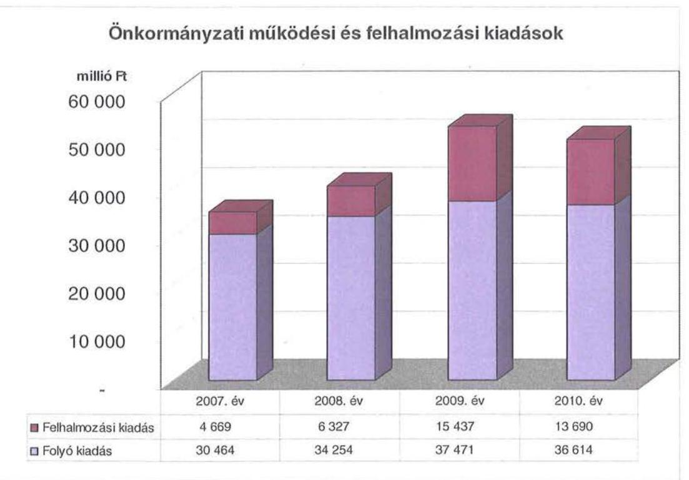

A kiadásokon belül a 2007-2010. években a felhalmozási jellegű kiadások aránya - a 2010. év kivételével - folyamatosan nőtt. A 2007. évben 13,3% (4669 millió Ft), a 2008. évben 15,6% (6327 millió Ft), 2009-ben 29,2% (15 437 millió Ft), a 2010. évben pedig 27,2% (13 690 millió Ft) volt az összkiadáson belüli felhalmozási arány.

Az Önkormányzat 111 település bevonásával nagytérségi hulladékgazdálkodási rendszer kialakítására és működtetésére önálló jogi személyiséggel rendelkező társulást hozott létre. A társulás gesztoraként 2010. évet megelőzően a működtetéssel, beruházással összefüggő pénzügyi teljesítések a Polgármesteri hivatal számviteli nyilvántartásában jelentek meg ${ }^{41}$.

Az Önkormányzattól kapott kimutatás szerint a társulás költségvetési kiadása 2007-ben 410 millió Ft, 2008-ban 261 millió Ft, 2009-ben 6911, 2010-ben 4865 millió Ft volt. A költségvetési kiadások növekedését 2009-2010-ben a megvalósított beruházások miatt felhalmozási célú kiadások indokolták. Tekintettel arra, hogy a kiadások az Önkormányzat összevont, szektor szerinti kiadásait növelik, a beruházás összege az Önkormányzatnál a felhalmozási és folyó működési kiadások arányát torzítja.

Az Önkormányzat CLF módszer szerinti folyó és felhalmozási célú kiadásainak változását - a Hulladékgazdálkodási Társulás adatai nélkül - a következő grafikon szemlélteti:
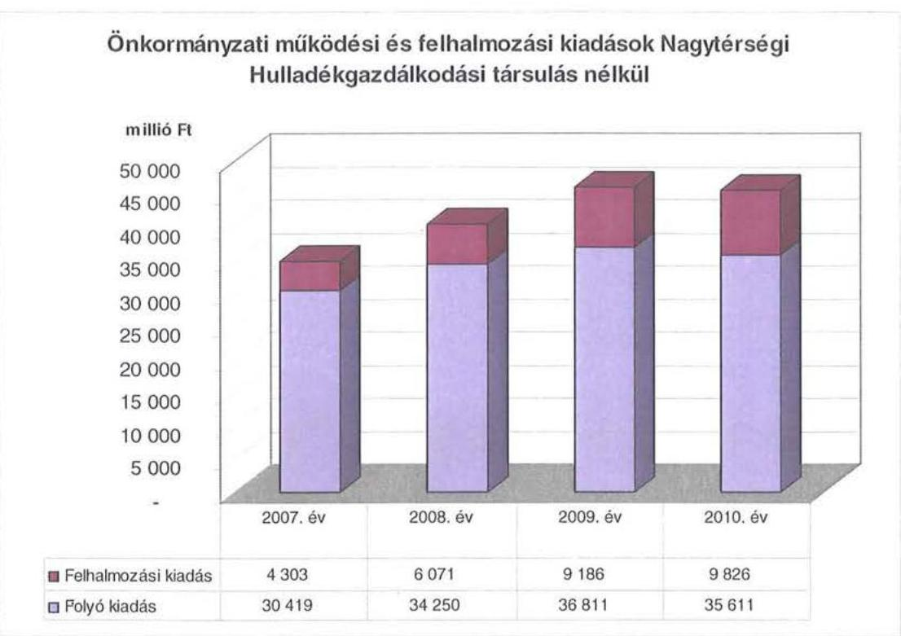

Az Önkormányzat gazdasági társaságai részére nyújtott átadott pénzeszközeinek összetételét, annak változását az alábbi ábra szemlélteti:

[^0]
[^0]:    ${ }^{41}$ 2010-től a társulás 1249 szektorszám alatt önálló költségvetést és beszámoló jelentést készít.

---

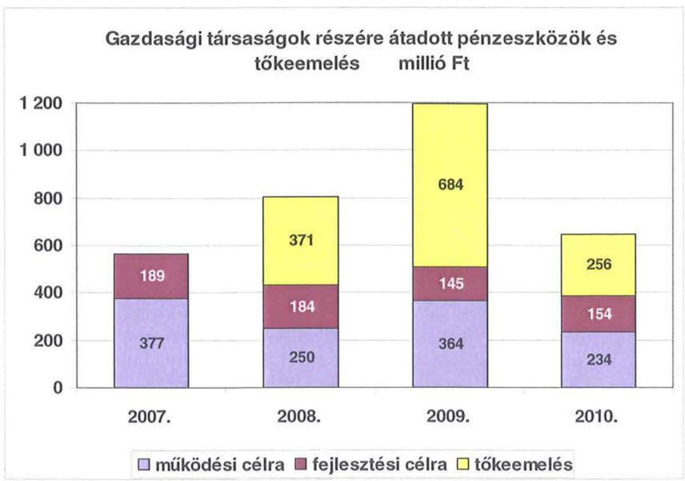

A fejlesztési célú pénzeszköz átadás közel 100%-ban a Pannon-Víz Zrt. részére történt. Az Önkormányzatnál évek óta kialakult gyakorlat, hogy a Zrt. által az üzemeltetésre átvett vagyon után fizetett bérleti díj összegének megfelelő támogatást juttat vissza a gazdasági társaság részére a szükséges pótlási, beruházási munkálatok elvégzésére. Évente rendszeres működési támogatásban a Xantus János Állatkert Kft, valamint az Esély Győri Rehabilitációs és Foglalkoztatási Kft. részesül.

A gazdasági társaságok tőkeemelésére a 2007-2010. években 1311 millió Ft-ot fordítottak, ebből 646 millió Ft (49,3%) tárgyi eszköz apportálással valósult meg. Az apportált eszközök a feladatok ellátásához szükséges ingatlanok voltak. A pénzbeli tőkeemelés összege 664 millió Ft (50,7%) volt, mellyel kapcsolatosan az Önkormányzat közterületek fejlesztésével, temető-bővítés, játszóterek európai uniós normának való megfeleléssel összefüggő feladatokat határozott meg.

Az Önkormányzat tulajdoni részaránnyal rendelkező gazdasági társaságain kívül a lakosság helyi tömegközlekedését biztosító gazdasági társaság működését a normatív állami hozzájáruláson - 529 millió Ft-on - felül a 2007-2010. években 1897 millió Ft-tal támogatta, fejlesztéseihez a 2007-2008. években 19 millió Ft kamattámogatást biztosított.

Az Önkormányzat a 2007-2010. években megvalósított, 2010. december 31-ig befejezett beruházási, felújítási munkálatainak bekerülési költsége 26771 millió Ft, ebből a 2007-2010. évek közötti pénzügyi ráfordítás összege 16199 millió Ft volt. A fejlesztésekkel kapcsolatosan 2006. december 31-ig 10572 millió Ft ráfordítás jelentkezett. A kifizetések 24%-át hitelből, 8,2%-át európai uniós, 15,8%-át hazai támogatásból, 52,0%-át önkormányzati saját forrásból finanszírozták. A megvalósított 10 millió Ft feletti egyedi bekerülési

---

értéket meghaladó beruházások száma 34, a felújításoké pedig 22 volt. Az összes beruházási kiadáson belül a 10 millió Ft egyedi értékhatárt el nem érő fejlesztésekre a 2007-2010. években 2633 millió Ft-ot fordítottak. Az adatok részletezését a 3.a számú melléklet tartalmazza.

A 2010. december 31-én folyamatban lévő fejlesztések várható bekerülési költsége 27202 millió Ft, ebből a 2010. év végéig 17719 millió Ft-ot teljesítettek. A fejlesztésekkel kapcsolatosan a 2010. év utánra vállalt kötelezettségek összege 9483 millió Ft, melynek finanszírozása a tervek szerint: hazai támogatás 7993 millió Ft (81,7%) - melyből az Önkormányzat 250 millió Ft-ot már 2010. december 31. előtt megelőlegezett - hitel 1740 millió Ft (18,3%). A folyamatban lévő fejlesztések és a 2010. év utánra vállalt kötelezettségek részletezését a 3.b és a 3.c számú mellékletek tartalmazzák.

A folyamatban lévő és 2010. évet követően befejeződő fejlesztések az Önkormányzatnál finanszírozási nehézséget várhatóan nem okoznak, azok egy része európai uniós támogatással valósul meg. Az Önkormányzat rendelkezésére áll továbbá az OTP Bank Nyrt. által biztosított 3000 millió Ft hosszú lejáratú - eddig még igénybe nem vett - fejlesztési hitelkeret.

Az Önkormányzat fejlesztési tevékenységét, különösen a nagyberuházások megvalósítását befolyásolja a pályázati úton elnyerhető támogatások összege. Az Önkormányzat által pályázati források felhasználásával tervezett, 2010. december 31. után induló fejlesztések összege 34 millió Ft, melynek keretében kettő beruházási projekt megvalósítását tervezik.

Az Önkormányzat gesztorságával a tervek szerint a 2006-2012. évek között nagytérségi hulladékgazdálkodási projekt megvalósítására kerül sor. A megvalósításhoz jelentős európai uniós források kapcsolódnak.

A KEOP 1.1.1./2F-2008-001 támogatással megvalósuló projekt teljes költsége 9469 millió Ft. A beruházással kapcsolatosan 2010. év végéig kifizetett összeg 6889 millió Ft volt, ebből 5602 millió Ft európai uniós támogatás, 1286,9 millió Ft saját forrás. Mivel a társult önkormányzatok a megvalósításhoz szükséges saját forrást nem tudták biztosítani, a kivitelezési munkálatokhoz a működtetést ellátó Komszol Kft, illetve jogutódja a GYŐR-SZOL Kft. 1600 millió Ft hitelt vett fel, melyre az Önkormányzat készfizető kezességet vállalt.

A beruházás keretében regionális hulladékkezelő központot, 2 db átrakó állomást, 43 hulladékgyűjtő szigetet, illetve 339 hulladékgyűjtő udvart alakítottak ki. A projekt bekerülési költsége tartalmazta továbbá a hulladékgyűjtő edények, egyéb munkagépek beszerzését.

A beruházás megvalósításának eredményeként 2010-től Győrött és az érintett települések családi házas övezeteiben elindult a kétkannás szelektív hulladékgazdálkodás.

A beruházás II. ütemeként a KEOP 2.3.0. projekt keretében 100%-os európai uniós és hazai támogatási forrásból - 5181 millió Ft tervezett költséggel - folyamatban van a korábbi szilárd hulladéklerakók rekultivációja.

---

Az elmúlt években az Önkormányzat a város közlekedési helyzetének javítására, a csapadékvíz elvezetésére az úthálózat korszerűsítése, közterületek kialakítására, fejlesztésére a következő három nagyberuházást valósította meg.

Az Önkormányzat 2004-2008 között 2x2 sávos aluljáró megépítésére, a csatlakozó úthálózat átépítésére 5034 millió Ft összegű beruházást valósított meg. A beruházás pénzügyi forrása 74,3%-ban az Önkormányzat által felvett hosszú lejáratú fejlesztési hitel, 25,3%-ban önkormányzati egyéb saját forrás.

Városrészeket összekötő híd, valamint a kapcsolódó úthálózaton elvégzendő közműépítési és helyreállítási munkálatok 2008-2012. években tervezett, bekerülési költsége 5689 millió Ft. A beruházásra 2010. december 31-ig kifizetett 3929 millió Ft forrása önkormányzati saját bevétel, a befejezéshez 1740 millió Ft fejlesztési hitel igénybevételét tervezi az Önkormányzat.

Az NYDOP „Városközpontok funkcióbővítő megújítása a megyei jogú városokban" projekt keretében kapott európai uniós támogatással megújításra került a város barokk főtere. A beruházás bekerülési költsége 1335 millió Ft volt. Az eredetileg tervezetthez mérten 164 millió Ft megtakarítás jelentkezett, melyet egyes tervezett kapcsolódó útszakaszok felújításának későbbi évekre történő ütemezése indokol.

A jövőben megvalósítandó fejlesztésekhez az Önkormányzat gazdasági programja iránymutatást ad, továbbra is kiemelten kezeli a program a város úthálózatának korszerűsítését, a városrészközpontok kialakítását, közterek felújítását, ezen túlmenően a sport és ifjúsági létesítmények fejlesztését.

# 3. KÖTELEZETTSÉGEK BEMUTATÁSA 

### 3.1. A pénzintézetek felé fennálló kötelezettségek alakulása

A pénzintézeti kötelezettségek állománya 2007. január 1-ről 2010. december 31-re 1,9 szeresére, 3358 millió Ft-ról 6429 millió Ft-ra nőtt ${ }^{42}$. A kötelezettség növekedése kettő hitel - hosszú lejáratú célhitel és multi-currency célhitelkeret - igénybevételéből keletkezett. A hitelszerződéseket az Önkormányzat 2006. december 31. előtt kötötte meg a számlavezető pénzintézettel. A hitel igénybevételével, törlesztésével és egyéb költségeivel kapcsolatos elszámolás a pénzintézet részéről EUR-ban történik, így a pénzügyi kötelezettség változását az árfolyamváltozás is befolyásolja.

[^0]
[^0]:    ${ }^{42}$ Az 6429 millió Ft-os kötelezettségállomány a 2010. évi működési költségvetési kiadás 18,8%-a.

---

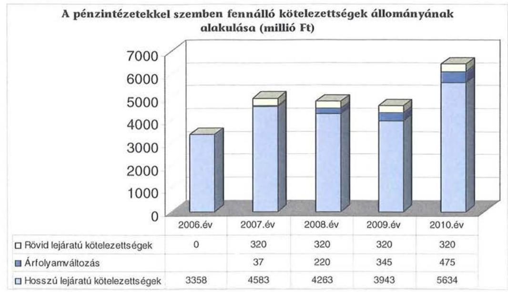

Az árfolyamváltozás hatása is befolyásolja a kötelezettségek alakulását, azonban annak mértéke előre pontosan nem határozható meg, csak várakozásokon alapuló tendenciák jelezhetők. Annak megítéléséről, hogy a felvett többdevizás hitelekért kapott forinthoz képest a hitelek visszafizetésekor jelentkező forint kötelezettség többletkiadást (árfolyamveszteség) vagy megtakarítást (árfolyamnyereség) eredményez a futamidő végén, a teljes kötelezettség rendezését követően lehet képet alkotni. Mindaddig, amíg törlesztési kötelezettség nem áll fenn (türelmi idő, moratórium), a tőkére vonatkoztatva nem értelmezhető sem az árfolyamveszteség, sem az árfolyamnyereség. Ugyanakkor a Számv. tv. 60. § (4) bekezdése meghatározza, hogy az árfolyam-különbözetet év végén a kötelezettségek vagy követelések között a könyvviteli mérlegben nyilván kell tartani, azonban az árfolyam-különbözet valójában nem realizálódott.

A Közgyűlés a 2007-2011. I. negyedévében hosszú lejáratú hitel felvételéről egy alkalommal ${ }^{43}$ döntött. A kötelezettségvállalásból származó forrás felhasználási célját, a kötelezettségvállalás visszafizetésének forrását meghatározták.

A 2010. január 5-én aláírt hitelszerződés szerint „az Önkormányzat számára az Ötv. által előírt kötelező és önként vállalt feladatok teljesítéséhez szükséges infrastrukturális beruházások/felújítások finanszírozása" céljára kedvezményes kamatozású három milliárd forint összegű hitelkeretet (a hitel devizaneme: HUF) nyitott a „Sikeres Magyarországért" Önkormányzati Infrastruktúrafejlesztési Hitelprogram keretében a bankszámlavezető pénzintézet. A hitelkeret terhére az Önkormányzat még nem vett igénybe hitelt, a rendelkezésre tartás határideje 2012. december 29.

A Közgyűlés döntését megalapozó előterjesztés a teljes futamidő várható kamat- és tőkefizetési kötelezettségeknek, a kamatkockázatnak a bemutatását nem tartalmazta. Az előterjesztésben nem tértek ki az adósságszolgálati korlát bemutatására, ezért a Közgyűlés annak figyelembevétele nélkül döntött, de a kötelezettségvállalás során az adósságot keletkeztető kötelezettségvállalás felső határát nem lépték túl.

[^0]
[^0]:    ${ }^{43}$ A Közgyűlés a 250/2009. (VI. 25.) számú határozatával döntött.

---

Az adósságot keletkeztető kötelezettségvállalással megvalósított felhalmozási kiadások esetleges bevételt növelő, illetve kiadást csökkentő vonzatát, illetve annak a fejlesztéshez, felújításhoz vállalt kötelezettségek visszafizetési forrásként való számbavételét nem vizsgálták.

Az Önkormányzat 2005. január 14-én kötött 5500 millió Ft összegű hitelszerződést a megvalósítandó építési beruházásokhoz, valamint 2006. március 13-án a 2006-2008. évi útfelújítási és egyéb fejlesztési feladatok finanszírozására 1600
 millió Ft összegben. 2010. december 31-ig igénybe vett hitel összege 7100 millió Ft volt.

Az Önkormányzat EUR-ban fennálló adósságot keletkeztető kötelezettségvállalása az alábbi volt ${ }^{44}$ :

| Megnevezés | Kibocsátás, illetve szerződéskötés időpontja | Összeg EUR | Kibocsátási, vagy lehivási árfolyam | Kamat (referencia kamat + kamatfelár) | Felhasználás célja: |
| :--: | :--: | :--: | :--: | :--: | :--: |
| Multi-currency típusú célhitel | 2005. 01. 14 | 22321428 | 246,4 | 3 havi BUBOR = 0,15% vagy 3 havi EURIBOR = 0,4488% | Építési beruházások finanszírozása |
| Hosszú lejáratú célhitel (többletvízés) | 2006. 03. 13 | 6267137 | 255,3 | 3 havi BUBOR = 0,1% vagy 3 havi EURIBOR = 0,2% vagy 3 havi CHFIBOR = 0,2% | Útfelújítási és egyéb fejlesztési feladatok finanszírozása |

Az Önkormányzat a multi-currency típusú célhiteléből tőkét nem törlesztett. Az 5500 millió Ft összegű tőketörlesztés ütemezése: legkésőbb 2012. július 14-én a hitelösszeg 1/3 része, a futamidő végén (2020. január 14-én) a 2/3 része lesz esedékes. Az Önkormányzat 2011. március 31-ig 2560870 EUR (679 millió Ft) kamatot fizetett.

Az 1600 millió Ft-os hosszú lejáratú célhitelből 1280 millió Ft összegű tőkét fizettek vissza, a fennálló kötelezettség 320 millió Ft. A hitel után 275636 EUR (72 millió Ft) kamatot fizetett az Önkormányzat 2011. március 31-ig.

Az Önkormányzat működésének pénzügyi egyensúlyához a vizsgált időszakban csak a 2007. évben kellett igénybe venni folyószámlahitelt, munkabér megelőlegezési hitel igénybevételére nem került sor. A folyószámlahitel alakulását a következő táblázat mutatja be:
ezer Ft

| Megnevezés | 2007. év | 2008. év | 2009. év | 2010. év | 2011.   március 31. |
| :-- | :--: | :--: | :--: | :--: | :--: |
| I. Folyószámlahitel |  |  |  |  |  |
| a folyószámlahitel kezelőszerge január 1-jén | 2000000 | 2000000 | 2000000 | 2000000 | 2000000 |
| teljesített kamat és egyéb költség | 2099 | - | - | - | - |

[^0]
[^0]:    ${ }^{44}$ A felvett hitelből közlekedési hálózatfejlesztésre, útkorszerűsítési, útfelújítási feladatokra fordított 6836 millió Ft-ot, a hitel 96,2%-át.

---

A folyószámlahitel kondíciói és egyéb költségei a következők voltak ${ }^{45}$ :

| Megnevezés | Kamat (referencia + kamatfelár) | Egyéb költség |
| :--: | :--: | :--: |
| Folyószámlahitel |  |  |
| 2007-2009. évek | 3 havi BUBOR + 0,15% | 0,00% |
| 2010-2011. évek | 1 havi BUBOR + 1,29% | 0,125% rend.tart.jutalék |

Az Önkormányzat a 2007. évben folyószámlahitel-keretét 51 napon át vette igénybe, amikor a hitel átlagos napi állománya 187 millió Ft volt, amely az év minden napjára számítva 26 millió Ft. A vizsgált időszakban az Önkormányzatnak máskor nem kellett igénybe vennie a folyószámlahitel-keretét a likviditási problémák finanszírozása céljára. Az Önkormányzatnak a 2007. évi likviditási hitel igénybevétele kétmillió Ft kamatkiadást okozott.

Az Önkormányzat 2007-2011. március 31. között az átmenetileg szabad pénzeszközein 1685 millió Ft kamatbevételt realizált, mely a Hivatal bankszámláin rendelkezésre állt forrás ${ }^{46}$ befektetéséből származott.

Az alapkamat mértékének alakulása jelentős hatással van az adott devizanemben kifejezett, a teljes futamidőre számított, várható kamatköltség nagyságára. Az Önkormányzat jelenleg fennálló hitele esetében a kamatfizetési kötelezettségek alakulását is jelentősen befolyásolta a referencia kamat változása, melyet az alábbi táblázat mutat be:

| Megnevezés | Kibocsátási, lehívási | Utolsó fizetéskori | Változás % |
| :--: | :--: | :--: | :--: |
|  | alapkamat % |  |  |
| 3 havi EURIBOR | 2,5528 | 1,54 | -39,7 |
| 3 havi EURIBOR | 3,981 | 1,29 | -67,6 |

A hitelek kibocsátási, lehívási időpontja: 2005. július 19-e, illetve 2007. február 1-je, az utolsó kamatfizetési kötelezettség 2011. március 31-én volt.

Amennyiben a referenciakamat nem változott volna, az Önkormányzatnak kibocsátáskori referenciakamattal számolva 2011. március 31-ig 2412713 EUR (597 millió Ft) kamatfizetési kötelezettsége jelentkezett volna. A kamatváltozások miatt 423793 EUR (153 millió Ft) többletfizetési kötelezettséget kellett teljesítenie, mint amivel a szerződés megkötésekor számolnia kellett. Az EURIBOR tényleges kamatmértéke a 2007-2008. években a 2005., illetve a 2006. évi kibocsátási kamatot jelentősen meghaladta, ennek következtében az időszak végi és eleji kamatváltozás ellenére lett többlet fizetési kötelezettsége az Önkormányzatnak.

[^0]
[^0]:    ${ }^{45}$ A referencia kamat az alábbiak szerint alakult:

    | MNB BUBOR fixing (átlagkamat) %-ban |  |  |  |  |
    | :--: | :--: | :--: | :--: | :--: |
    | Referencia kamat | 2007. évi | 2008. évi | 2009. évi | 2010. évi | 2011. március 31-ig |
    | 3 havi BUBOR | 7,75 | 8,87 | 8,64 | 5,5 | 6,03 |
    | 1 havi BUBOR | 7,83 | 8,75 | 8,66 | 5,47 | 5,94 |

    ${ }^{46}$ A helyi adóból származó szabad pénzeszköz.

---

A helyszíni vizsgálat alatt további hitel-igénybevételről, illetve kötvénykibocsátásról szóló döntést nem készítettek elő.

A 2011-2014. évekre szóló gazdasági programban középtávú célként határozták meg többek között a likviditás biztosítását, az adósságállomány optimalizálását ${ }^{47}$.

# 3.2. Szállítók felé fennálló kötelezettségek alakulása 

A 2010. december 31-i mérlegben kimutatott szállítói kötelezettség 1339 millió Ft volt. A le nem járt tartozásállomány 1268 millió Ft-ot tett ki, amelynek 66,1%-a (838 millió Ft) a Polgármesteri hivatal tartozása volt.

Az Önkormányzatnak és gazdasági társaságainak lejárt szállítói tartozásai és egyéb kiadás elmaradásai alakulását az alábbi táblázat tartalmazza:
ezer Ft

| Megnevezés | 2007.   december 31. | 2008.   december 31. | 2009.   december 31. | 2010.   december 31. |
| :-- | :--: | :--: | :--: | :--: |
| Lejárt szállítói tartozás | 21224 | 133287 | 77190 | 71139 |
| Egyéb kiadás-elmaradás | 6587 | 8002 | 7217 | 12381 |
| Gazdasági társaságok   lejárt szállítói tartozása | 189506 | 315550 | 98835 | 48833 |

Az Önkormányzat lejárt szállítói tartozása és egyéb kiadás-elmaradása az áttekintett időszakban változó képet mutatott. A lejárt szállítói tartozás az előző évhez viszonyítva a 2008. évben jelentősen megnőtt, a 2009. évben csökkent, majd a 2010. évben tovább csökkent. Az egyéb kiadás-elmaradás az előző évhez mérten a 2008. és a 2010. évben nőtt, a 2007. évhez viszonyítva 2010. december 31-re majdnem megduplázódott, 6,6 millió Ft-ról 12,4 millió Ft-ra növekedett.

A lejárt szállítói tartozásból kiugróan magas a 2008. évben a Nagytérségi Hulladékgazdálkodási Társulásnál jelentkező 79 milliós állomány (a lejárt szállítói tartozás 59%-a), amely abból adódott, hogy a Győri Kommunális Szolgáltató Kft. a hulladékgazdálkodási rendszer működtetésével kapcsolatos ráfordításait kiszámlázta. A számla kiegyenlítésére azonban nem került sor, ugyanis a Társulás tagjai a fejlesztés megvalósításához a társulási megállapodásban rögzített egyszeri és a működtetéshez vállalt éves tagdíj összegét sem fizették meg az Önkormányzatnak teljes körűen, ezért a kifizetésre nem volt fedezet.

A 2010. december 31-i lejárt szállítói tartozásállomány 71 millió Ft-ot tett ki, amelynek legnagyobb összegű tétele - az állomány 71,8%-a (51 millió Ft) - a Nagytérségi Hulladékgazdálkodási Társulás tartozása volt. A lejárt szállítói tartozásállomány 7,0%-a (5 millió Ft) éven túli, 91-365 nap közötti az állomány 57,8%-a (41 millió Ft). A lejárt tartozásállomány 26,8%-a (19 millió Ft) 30 nap

[^0]
[^0]:    ${ }^{47}$ A gazdasági programban rögzítettek szerint „az Önkormányzat kötelezettségállományának - beleértve a hitelek miatti kötelezettségállomány alakulását is - az Önkormányzat költségvetésének főösszegéhez viszonyított aránya a következő években lehetőség szerint a jelenlegi szinten stabilizálódjon, vagy csak kis mértékben emelkedjen".

---

alatti, 2,8%-a (2 millió Ft) 30-60 nap közötti, 5,6%-a (4 millió Ft) pedig 61-90 nap közötti.

Az egyéb kiadás-elmaradás a 2010. év végén volt a legnagyobb (12 millió Ft), amely a 2007. évi összeget 88,0%-kal haladta meg. Az egyéb kiadás-elmaradás 20,0%-a a ki nem fizetett, de esedékes személyi juttatások és járulékai kifizetése miatt következett be.

A gazdasági társaságok 2010. december 31-i szállítói állománya 974 millió Ft, ebből a lejárt szállítói tartozás 49 millió Ft, amely 30 nap alatti volt, ezért nem hordoz magas kockázatot.
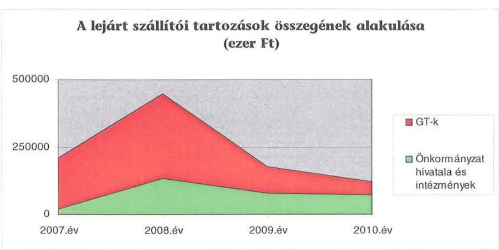

A Közgyűlés a lejárt szállítói kötelezettségek rendezésével a vizsgált időszakban nem foglalkozott, fizetés átütemezésére nem került sor.

# 3.3. Egyéb kötelezettségek alakulása 

Az Önkormányzat PPP konstrukció keretében nem végzett beruházást.
Az Önkormányzatnak a vizsgált időszakban egy kezességvállalással kapcsolatos kötelezettségvállalása volt. Az Önkormányzatnál a Győri Kommunális Szolgáltató Kft. hitelfelvételéhez szükséges önkormányzati kezességvállalás megadására ${ }^{48}$ került sor. Az 1600 millió Ft összegű kezességvállalás időtartama 12 év. Kezesség beváltására ez idáig nem került sor.

[^0]
[^0]:    ${ }^{48}$ A Közgyűlés 249/2008. (VII. 3.) számú határozata szerint az Önkormányzat „készfizetői kezességet vállalhat a Győr Nagytérségi Hulladékgazdálkodási Önkormányzati Társulás KEOP 1.1.1 „Települési szilárdhulladék-gazdálkodási rendszerek fejlesztése" pályázatának keretében a Győri Kommunális Szolgáltató Kft. 1600 millió Ft értékű és legkésőbb 2020. december 31-ig lejáró hitelszerződése alapján fennálló hitel tőketartozás és járulékai erejéig."

---

Az Önkormányzat a 2007. évben 29,5 millió Ft, 2008-ban 20 millió Ft tagi kölcsönt ${ }^{49}$ nyújtott Győr-Pér Reptér Kft. feladatainak ellátása érdekében. A vizsgálat lezárásáig a kölcsön eredeti visszafizetési határidejét (2008. december 31.) két alkalommal módosították, a visszafizetés határidejét 2011. december 31-ig meghosszabbították.

A vizsgált időszakban az Önkormányzatnál elengedett követelések összege 3999 millió Ft, melynek 39,3%-a térítési díj elengedés, 24,5% az Útkezelő Szervezet behajthatatlan követelésének elengedése volt.

Az Önkormányzat kimutatása szerint jelzálogjoggal terhelt ingatlana 2010. december 31-én nem volt.

Az Önkormányzat kötelezettségállománya 2010. december 31-én és várható alakulása azok lejáratáig:

| Megnevezés | Állomány 2010. dec. 31-én |  |  | Várható kötelezettség 2011-2013.   években |  |  | Várható kötelezettség 2014-től a   futamidő végéig |  |  |
| :--: | :--: | :--: | :--: | :--: | :--: | :--: | :--: | :--: | :--: |
|  | HUF-ben   (106-ban) | Devizében   (összege) | Devizaneme | HUF-ben   (106-ban) | Devizében   (összege) | Devizaneme | HUF-ben   (106-ban) | Devizében   (összege) | Devizaneme |
| Összes lejáratú hitel | 23109840 | EUR |  |  | 9856985 | EUR |  | 1260000 | EUR |
| Összeség | 100000000 |  | HUF |  |  |  |  |  |  |
| Esetleg szállítói

 határidő összege | 1396266266 |  | NUF | 1396266266 |  | NUF |  |  |  |
| ebből sajátá bízitoda | 11100000 |  | NUF | 11100000 |  | NUF |  |  |  |
| Összesen: Ft-ban | 2866266000 |  |  | 1628266000 |  |  |  |  |  |
| Összesen: EUR-ben |  | 33109840 | EUR |  | 9856985 | EUR |  | 1600000 | EUR |

Az Önkormányzat kötelezettségeinek állománya 2010. december 31-én 2939 millió Ft-ból és 23109840 EUR-ból tevődött össze. Ebből a 2011-2013-ban esedékes kötelezettségek várható összege 1339 millió Ft és 9856985 EUR. Ennek teljesítésére figyelembe vehető az adott költségvetési évben keletkező saját bevétel és 1154 millió Ft, a 2010. évi mérlegben kimutatott követelésállomány. A 2013 után várható kötelezettség összege 15500692 EUR hosszú lejáratú hitel. Ezekre az Önkormányzat tájékoztatása szerint figyelembe vehető forrás az önkormányzati saját bevétel.

# Az Önkormányzat pénzügyi, vagyoni helyzetére közvetetten hatást gyakorol gazdasági társaságainak adósságállománya is. 

Az Önkormányzat 25\% feletti tulajdoni részarányú gazdasági társaságainak adatszolgáltatása alapján kölcsön állományukat a következő táblázatban mutatjuk be:

| Megnevezés | Allomány 2010. dec.31-én |  |  | Várható kötelezettség 2011-2013.   években |  |  | Várható kötelezettség 2014-től a futamidő végéig |  |
| :--: | :--: | :--: | :--: | :--: | :--: | :--: | :--: | :--: |
|  | HUF-ben   (1000-ben) | Devizében (összege) | Deviznem | HUF-ben   (1000-ben) | Devizében (összege) | Deviznem | HUF-ben   (1000-ben) |  |
| Összesen lejáratú hitelek | 1646591266 |  |  | 617622521 |  |  |  | 1104761941 |
| Összesen lejáratú hitelek |  | 705390 | EUR |  | 705390 | EUR |  |  |
| Külcsőzásiós- és egyéb rövid lejáratú hitelek | 300000000 |  |  | 300000000 |  |  |  |  |
| Egyéb kötelezettségek | 72067800 |  |  | 72067800 |  |  |  |  |
| Egyéb kötelezettségek |  | 4497 | CHF |  |  | 4497 | CHF |  |
| Egyéb kötelezettségek |  | 404931 | EUR |  |  | 404931 | EUR |  |
| Összesen: Ft-ben | 2017619066 |  |  | 989880321 |  |  |  |  |
| Összesen: CHF-ben |  | 4497 | CHF |  |  | 4497 | CHF |  |
| Összesen: EUR-ben |  | 1110261 | EUR |  |  | 1110261 | EUR | 1166701941 |

[^0]
[^0]:    ${ }^{49}$ 90/2007. (IV. 12.) és a 280/2008. (VII. 3) számú határozatok

---

A 2010. év végi hitelállomány főbb összetevői:

- GYŐR-SZOL Zrt. adatszolgáltatásában szerepel az a három forint alapú hitel, amelyet a Zrt-be integrálódó Győri Kommunális Szolgáltató Kft. kötött a pénzintézetekkel:

2003. évben a Parkolóház építéshez a pénzintézet 640 millió Ft-os hitelkeretet nyitott. 2006. évi szerződésmódosítással a devizanemet változtatták HUF/CHF/EUR lehetőségre. 2010. december 31-én a fennálló 705330 EUR hitelállomány visszafizetése a 2013. évi lejárati határidőre várható.
A Hulladékgazdálkodási projekt megvalósításához 1600 millió Ft összegű hitelkeretre kötött szerződést 2008. július 25-én, melynek törlesztése 2011. február 1-jén kezdődött. A szerződés szerint 2013-ig 479 millió Ft, 2020-ig a lejárati határidőnek megfelelően 1032 millió Ft hitelt kell visszafizetni.
A 2009. december 16-án ingatlan beruházáshoz igénybe vett 160 millió Ft hitelből 2010. december 31-én fennálló hitelállomány 138 millió Ft, melyből 75 millió Ft-ot 2013-ig, 63 millió Ft-ot 2015. december 5-ig kell visszafizetni.

- INNONET Kft. a TECHNONET projekt támogatásához a szükséges saját forrás biztosítására vett fel hitelt. A 2010. december 31-i állomány 40 millió Ft, melyből 30 millió Ft-ot 2013-ig, 10 millió Ft-ot 2014-ben fizet vissza.

Az Önkormányzat korlátlan felelősséggel tartozik felszámolás esetén a Gt. 54. § (2) bekezdése alapján, amennyiben minősített befolyásszerzőnek ${ }^{50}$ minősül, illetve a Csődtv. 63. § (2) bekezdése alapján a kizárólagos önkormányzati tulajdonú gazdasági társaság minden olyan kötelezettségéért, amelynek kielégítését a felszámolási eljárás során az adós társaság vagyona nem fedez. Kockázatot hordoz, ha a hitelezőinek a felszámolási eljárás során benyújtott keresete alapján a bíróság - az adós társaság felé érvényesített tartósan hátrányos üzletpolitikájára figyelemmel - megállapítja az önkormányzat korlátlan és teljes felelősségét. Felszámolás esetén a hitelezők által benyújtott kereset alapján a bíróság összességében 1612 millió Ft, továbbá 1110261 EUR és 4497 CHF összegű korlátlan és teljes felelősséget állapíthat meg a kötelezettségekkel érintett négy kizárólagos és a kettő minősített befolyással rendelkező, önkormányzati tulajdonú gazdasági társaságai után.

Az Önkormányzat kötvényt nem bocsátott ki. Fennálló hitelállományai fejlesztései megvalósításához kapcsolódó hosszú lejáratú fejlesztési hitelek. Az Önkormányzat rendelkezésére áll további 3000 millió Ft fejlesztési célú hitelkeret. A hitelek visszafizetésével kapcsolatos kötelezettségeinek fedezete kiegyensúlyozott költségvetési gazdálkodás, pénzügyileg fenntartható további fejlesztési döntések mellett biztosítható. Kötelezettségeire folyó bevételei (a jelenlegi kondíciók mellett) fedezetet nyújtanak, szükség esetén forgalomképes ingatlanvagyona (nettó értéke 2098 millió Ft) felhasználható az adósságszolgálat teljesítésére.

[^0]
[^0]:    ${ }^{50}$ A Gt. 52. § (2) bekezdése alapján minősített többséget biztosító befolyásnak számít, ha a minősített befolyásszerző az ellenőrzött társaságban - közvetlenül vagy közvetve a szavazatok legalább hetvenöt százalékával rendelkezik. Az Önkormányzat gazdasági társaságaiban a szavazati arányok megegyeznek a tulajdoni arányokkal.

---

Az Önkormányzat vagyonállományának és az egyes vagyonelemek használhatósági fokának alakulása az alábbi:

Az Önkormányzat eszközállományának bruttó értéke 160205 millió Ft volt, 14,6\%-kal (20351,9 millió Ft) nőtt, átlagos használhatósági foka a 2007-2010. évek között 3,8 százalékponttal csökkent, 87,5\%-ról 83,7\%-ra. Ezen belül legrosszabbak a mutatók a gépek, berendezések, felszerelések eszközcsoportban, a mutató értéke 41,3\% volt a 2010. évben, ez a 2007. évi 39,1\%-hoz képest 2,2 százalékpontos javulást mutat. A járműveknél a bruttó érték jelentősen változott, a 2010. évi 2272 millió Ft-os érték 4,3-szerese a 2007. évinek, amelynek hatására a használhatósági fok 16,3\%-ról 65,1\%-ra nőtt. Az ingatlanok állománya és az üzemeltetésre átadott eszközök állománya folyamatosan romlik. Az ingatlanok állományát mutató használhatósági fok 90,6\%-ról 87,3\%-ra, az üzemeltetésre átadott eszközök állományának mutatója 91,3\%-ról 87,9\%-ra csökkent.

A vizsgált időszakban nem történt meg annak felmérése, hogy az elhasználódott eszközök pótlása milyen kötelezettséget jelent az Önkormányzat számára. A felújításokra, az eszközök pótlására elsősorban az intézmények működőképességének biztosítása, illetve a szakhatósági előírások figyelembevételével került sor. Az Önkormányzat a 2007-2010. években a tárgyi eszközök után 11408 millió Ft összegű értékcsökkenést számolt el, ugyanezen időszak alatt felújításra 6499 millió Ft-ot fordítottak. Az Önkormányzat kimutatása szerint felújítási, beruházási célokra 1712 millió Ft összegű alapot képzett vízgazdálkodási célokra. Az alap forrása az üzemeltetésre átadott víziközmű vagyontárgyak bérleti díja volt. Az alapból 127 millió Ft-ot használtak fel, beruházásra 52 millió Ft-ot, felújításra 68 millió Ft-ot, egyéb célokra 6 millió Ft-ot.

Az Önkormányzat és intézményei jelenleg 27 folyamatban lévő peres eljárásban érintettek, ebből 23-ban alperesként. Az Önkormányzatnál a jogerős határozattal nem lezárt peres eljárásoknál a perérték egyenlegében 503 millió Ft volt. A kimutatott perérték főbb tételei: 48,4\%, 244 millió Ft szerződés létrehozásának elmaradása, 35\%, 174,1 millió Ft kártérítés, 6,4\%, 32 millió Ft a Tűzoltóság ellen túlmunka elmaradt kifizetése miatt indított követelés.

Jogerős határozattal lezárt, de pénzügyileg még nem rendezett peres ügyek alapján a követelés értéke 4 millió Ft, a kártérítési kötelezettség 21 millió Ft.

# 4. A PÉNZÜGYI EGYENSÚLY MEGTEREMTÉSE ÉRDEKÉBEN HOZOTT INTÉZKEDÉSEK 

A jelentésben szereplő CLF módszer szerint bemutatott működési többlet finanszírozta a felhalmozási hiányt, ennek ellenére a vizsgált időszakban az Önkormányzat intézkedéseket tett, hogy alkalmazkodjon a finanszírozási rendszer változása miatti forráscsökkenéshez.

A Közgyűlés által elfogadott 2007. évi költségvetési koncepció feladatként határozta meg az oktatás területén az átszervezések szükségességét a tevékenységi

---

területük és/vagy elhelyezkedésük szerint integrálható intézmények közös működtetése érdekében.

Célként jelölték meg a meglévő munkaerő és infrastruktúra hatékonyabb kihasználását, de fontosnak tartották a nagyobb intézmény által nyújtható szolgáltatások választékbővítésének lehetőségét is. A humán erőforrás fejlesztés általános céljai között határozták meg a minőségi képzés fejlesztését, a piaci viszonyoknak megfelelő végzettség biztosítását és a felnőttképzés támogatását. Előírták, hogy a létszámleépítés nem vezethet a szakos ellátottság veszélyeztetéséhez, továbbá törekedni kell a részmunkaidős álláshelyek lehetőségének kihasználására.

A gazdasági programban rögzítették, hogy az intézményeknél a létszámleépítésekkel összhangban zárolt bérek és járulékaik előirányzatait dologi költségekre kell átcsoportosítani, amely a közoktatási intézmények karbantartás-felújítás kereteire fordítható. A Közgyűlés olyan intézményi struktúra létrejöttét tűzte ki célként, melynek során az alapfeladatok ellátása nem sérül, de ellátásuk hatékonysága javul. Az intézkedések hatásaként elérhető megtakarítások mértékét nem számszerűsítették a tervezés során.

A 2007-2010. években végrehajtott létszámcsökkenés - Önkormányzat által kimutatott - eredményét az alábbi tábla szemlélteti:

| Megnevezés (adatok fő-ben) |  | Köz-   oktatás | Szociális és gyermekvédelem | Egészségügy | Polgár-   mesteri   hivatal | Egyéb | Összesen |
| :--: | :--: | :--: | :--: | :--: | :--: | :--: | :--: |
| Megszüntetett álláshelyek száma |  | 347 | 8 | 4 | 0 | 0 | 359 |
| ebből: | üres álláshelyek száma | 18 | 0 | 0 | 0 | 0 | 18 |
|  | szakmai álláshelyek száma | 196 | 0 | 4 | 0 | 0 | 200 |
|  | intézmény-üzemeltetéssel kapcsolatos álláshelyek száma | 133 | 8 | 0 | 0 | 0 | 141 |
| 2007. január 1-jén indító létszám |  | 3711 | 735 | 75 | 369 | 752 | 5642 |
| 2010. december 31-én záró létszám |  | 3473 | 789 | 71 | 385 | 785 | 5503 |

A létszámcsökkentő intézkedések eredményeként a tanulócsoportok számának csökkenéséből adódó feladatváltozás és a kötelező óraszámemelés miatt a 2007-2010. években a közoktatásban több alkalommal, összesen 347 álláshelyet szüntettek meg, melyből 18 üres álláshely volt. Az ágazatban foglalkoztatottak száma a vizsgált időszakban összesen 238 fővel, a 2007. évi 3711-ről 3473-ra csökkent. A megszüntetett álláshelyek közül 196 ágazati szakmai feladatok ellátásához, 133 intézmény-üzemeltetéshez kapcsolódott. A szociális és gyermekvédelmi, valamint az egészségügyi ágazatban nyolc, illetve négy álláshelyet szüntettek meg. A Polgármesteri hivatalt a létszámcsökkentő intézkedések nem érintették. A 2011. évi költségvetési rendelet újabb 32 fővel növelte a Polgármesteri hivatal
 engedélyezett létszámát, ugyanakkor az intézményekét 61 fővel csökkentette.

Az álláshelymegszüntetések mellett álláshelynövekedés is történt a vizsgált időszakban, a közoktatásban 109, az egészségügyben 62, a Polgármesteri hivatalnál 16 és az egyéb ágazatban 33 álláshely. Összességében a 359 álláshelymegszüntetés és a 220 növekedés eredményeként a 2007. január 1-i 5642 fős induló létszám 2010. december 31-re 5503 főre csökkent (-139 fő).

---

A helyi szervezési intézkedések végrehajtása keretében a 108 álláshely tartós leépítéséhez az Önkormányzat az áttekintett időszak alatt 159,1 millió Ft központi költségvetési támogatásban részesült. Az Önkormányzat a létszámcsökkentések után a 108 érintett dolgozót a gazdasági társaságainál nem alkalmazta. A létszámcsökkenés 68,3%-ához (233 fő) központi támogatás nem kapcsolódott. Az Önkormányzat a létszámcsökkentések hatásaként megtakarítást nem mutatott ki.

A kiadáscsökkentő intézkedések az intézményeket érintették és a Közgyűlés döntésein alapultak. Az Önkormányzat kimutatása szerint a legjelentősebb mértékű kiadási megtakarítást az energiaracionalizálási programokkal érték el.

A 2007-2010. évek kiadáscsökkentő intézkedéseinek hatását beavatkozási területenként az alábbiak részletezik:
ezer Ft

| Az érvényesített   kiadáscsökkentés területei | Személyi   juttatások és   járulékai | Dologi,   működési   kiadások | Pénzeszköz   átadások,   támogatások | Összesen |
| :-- | :--: | :--: | :--: | :--: |
| A Közgyűlés működése | 5133 | 0 | 0 | 5133 |
| Az Önkormányzat hivatalánál | 0 | 0 | 0 | 0 |
| Az intézményeknél | 80000 | 282638 | 0 | 362638 |
| ÖSSZESEN | 85133 | 282638 | 0 | 367771 |

A Nemzeti Fejlesztési Terv II. keretében indult KEOP 5.2 programban szerepelt az energiafelhasználás korszerűsítése, a felhasznált energia megtakarítását szolgáló fejlesztések támogatása, harmadik féles finanszírozás pályázati konstrukcióval. A „Szemünk Fénye" program keretében a Caminus Zrt. 2008. évben az intézmények felmérését követően előzetes ajánlatot tett a beltéri fűtés és világítás korszerűsítésére.

Az Önkormányzat döntött $^{51}$ a Lukács Sándor Szakképző Iskola fűtés- és világításkorszerűsítéséről. A mintaprojekt tapasztalatai alapján a 2008-2009. években vállalkozási és bérleti szerződéseket kötöttek $^{52}$ 39 intézmény (46 épület) világítás- és 20 intézmény (27 épület) fűtéskorszerűsítésére. Ezt követően további hét távfűtéssel ellátott intézmény fűtéskorszerűsítése történt meg. Az Önkormányzat a korszerűsítések hatásaként a 2007-2010. évekre vonatkozóan 242638 ezer Ft megtakarítást mutatott ki, mely számítás az ajánlatban szereplő, tervezett megtakarításokra épült.

Az Önkormányzat az intézmények integrálásából adódóan a 2007-2010. években 120 millió Ft kiadáscsökkenést mutatott ki.

[^0]
[^0]:    $^{51}$ 143/2008. (V. 8.) számú határozat
    $^{52}$ Az Önkormányzat a 418/2008. (XII. 18.) számú, 62/2009. (III. 19.) számú, 156/2009. (V. 21.) számú 157/2009. (V. 21.) számú határozataival fogadta el.

---

Az Önkormányzat egy középiskolát, két általános iskolát, mint önálló költségvetési intézményt megszüntetett $^{53}$, azokat más intézményéhez integrálta.

A döntéseket megalapozó előterjesztésekben a tervezett intézkedések várható számszerűsített eredményeit nem mutatták be.

Az Önkormányzat a 2011. évben kiadáscsökkentő intézkedései keretében megszüntette a Sportigazgatóságot, kiszervezte a városüzemeltetési feladatokat gazdasági társaságokhoz. Az intézkedések hatásaként 1266 millió Ft megtakarítást terveztek.

A bevételnövelő intézkedések hatásaként - a kamatbevételek nélkül - a 2007-2010. évben 368 millió Ft bevételt mutatott ki az Önkormányzat, amelynek 87,3%-át (321 millió Ft-ot) a szabad kapacitások hasznosításával érték el.

| A bevételnövelés területei | Az önkormányzat közgyűlésének működése | Az önkormányzat közgyűlési hivatala | Az önkormányzat intézményei | Összesen |
| :--: | :--: | :--: | :--: | :--: |
| Szabad kapacitások   hasznosítása | 284811 | 0 | 36408 | 321219 |
| Ingatlanok, eszközök bérbeadása | 0 | 0 | 28589 | 28589 |
| Kártérítés, selejtezés | 0 | 0 | 11863 | 11863 |
| Egyéb | 0 | 0 | 6318 | 6318 |
| Összesen | 284811 | 0 | 83178 | 367989 |

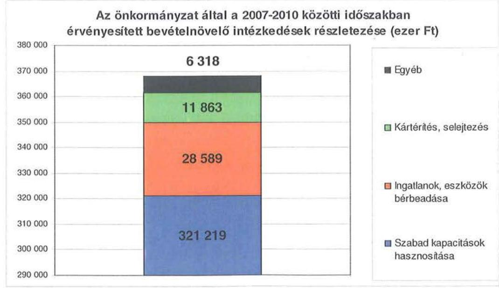

A 2011. évben tervezett bevételnövelő intézkedések várt eredményét 42 millió Ft-ban határozta meg az Önkormányzat, amelynek 87,9%-át, 37 millió Ft-ot a szabad kapacitások hasznosításával tervezik realizálni.

[^0]
[^0]:    $^{53}$ 187/2007. (VI. 14.) számú, 158/2008. (V. 15.) számú, és 275/2008. (VII. 3.) számú határozatok

---

Az Önkormányzatnál az állami támogatások, az átengedett adók és az illetékbevétel összege a négy év alatt 16 millió Ft-tal csökkent. A 2007-2010. években a kiadáscsökkentő és bevételnövelő intézkedések együttes eredménye 736 millió Ft volt.

# 5. A HELYI ÖNKORMÁNYZATOK GAZDÁLKODÁSI RENDSZERÉNEK 2007. ÉVI ELLENŐRZÉSE SORÁN A PÉNZÜGYI EGYENSÚLY JAVÍTÁSÁRA TETT SZABÁLYSZERŰSÉGI ÉS CÉLSZERŰSÉGI JAVASLATOK HASZNOSULÁSA 

Az ÁSZ az Önkormányzat gazdálkodási rendszerét a 2007. évben ellenőrizte, amely során a pénzügyi egyensúly javítására vonatkozó javaslatot nem tett.

Budapest, 2011. december „ ZZ "

Melléklet: $\quad 9 \mathrm{db}$
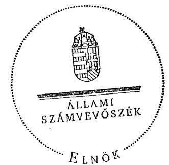

Domokos László $\Rightarrow$

---

.

---

Győr Megyei Jogú Önkormányzat

1. számú melléklet

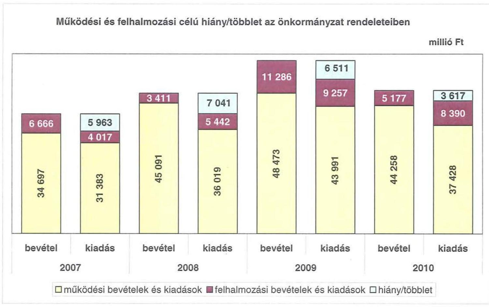

Működési és felhalmozási célú hiány/többlet az önkormányzat rendeleteiben

|   | 2007 | 2008 | 2009 | 2010  |
| --- | --- | --- | --- | --- |
|  működési bevételek és kiadások | 3 411 | 7 041 | 11 286 | 6 511  |
|  felhalmozási bevételek és kiadások | 3 442 | 4 473 | 9 257 | 5 177  |
|  felhalmozási bevételek és kiadások | 4 019 | 48 473 | 43 991 | 44 258  |
|  bevételek | 36 019 | 48 473 | 43 991 | 44 258  |
|  kiadás |  |  |  |   |
|  bevétel |  |  |  |   |
|  2007 |  |  |  |   |

1. számú melléklet

---

|  Győr Megyei Jogú Város Önkormányzata |  |  |  |  |  |  |  |  |  |  |  |  |  |  |  |  |  |  |  |  |  |  |  |  |  |  |  |   |
| --- | --- | --- | --- | --- | --- | --- | --- | --- | --- | --- | --- | --- | --- | --- | --- | --- | --- | --- | --- | --- | --- | --- | --- | --- | --- | --- | --- | --- | --- |
|  1. FOLYÓ KÖLTSÉGVETÉS* | 2007. | 2008. | 2009. | 2010. |  |  |  |  |  |  |  |  |  |  |  |  |  |  |  |  |  |  |  |  |  |  |  |   |
|  1.1.1. Saját működési bevételek | 16 672 402 | 25 255 499 | 24 282 576 | 26 050 160 |  |  |  |  |  |  |  |  |  |  |  |  |  |  |  |  |  |  |  |  |  |  |  |   |
|  1.1.2. Költségvetési támogatás | 10 643 508 | 13 312 456 | 13 073 059 | 11 813 632 |  |  |  |  |  |  |  |  |  |  |  |  |  |  |  |  |  |  |  |  |  |  |  |   |
|  1.1.3. Átcsapított bevételek | 3 328 096 | 1 095 729 | 1 163 649 | 3 354 978 |  |  |  |  |  |  |  |  |  |  |  |  |  |  |  |  |  |  |  |  |  |  |  |   |
|  1.1.4. Átbontástartásos belülről kapott támogatások | 1 298 991 | 589 858 | 821 253 | 881 661 |  |  |  |  |  |  |  |  |  |  |  |  |  |  |  |  |  |  |  |  |  |  |  |   |
|  1.1.5. EU-s és külföldről kapott bevételek | 15 678 | 18 809 | 5 211 | 5 657 |  |  |  |  |  |  |  |  |  |  |  |  |  |  |  |  |  |  |  |  |  |  |  |   |
|  1.1.6. Átbontástartásos kívülről kapott bevételek | 332 081 | 173 181 | 226 217 | 297 793 |  |  |  |  |  |  |  |  |  |  |  |  |  |  |  |  |  |  |  |  |  |  |  |   |
|  1.1.7. Előző évi pénzmaradvány átvétel | 533 636 | 451 975 | 1 651 780 | 878 275 |  |  |  |  |  |  |  |  |  |  |  |  |  |  |  |  |  |  |  |  |  |  |  |   |
|  1.1. Folyó bevételek =1.1.1.+1.1.2.+1.1.3.+1.1.4.+1.1.5.+1.1.6.+1.1.7. | 32 734 312 | 40 937 423 | 43 223 742 | 42 362 196 |  |  |  |  |  |  |  |  |  |  |  |  |  |  |  |  |  |  |  |  |  |  |  |   |

 |  |  |   |
|  1.2.1. Működési kiadások hamadásokok nélkül | 28 120 228 | 31 686 475 | 33 281 131 | 32 445 118 |  |  |  |  |  |  |  |  |  |  |  |  |  |  |  |  |  |  |  |  |  |  |  |  |   |
|  1.2.2. Átbontástartásos belülre átadott pénzeszközök | 27 742 | 119 889 | 245 415 | 883 372 |  |  |  |  |  |  |  |  |  |  |  |  |  |  |  |  |  |  |  |  |  |  |  |  |   |
|  1.2.3. 1. vállalkozásoknak | 376 887 | 350 315 | 364 306 | 234 144 |  |  |  |  |  |  |  |  |  |  |  |  |  |  |  |  |  |  |  |  |  |  |  |  |   |
|  1.2.3.2. EU-nak, illetve külföldre | 0 | 210 | 279 | 20 |  |  |  |  |  |  |  |  |  |  |  |  |  |  |  |  |  |  |  |  |  |  |  |  |   |
|  1.2.3.3. megállapodásdíjaknak | 743 272 | 751 793 | 949 756 | 1 260 430 |  |  |  |  |  |  |  |  |  |  |  |  |  |  |  |  |  |  |  |  |  |  |  |  |   |
|  1.2.3.4. normatív starvetezéseknek | 947 585 | 733 676 | 825 126 | 858 200 |  |  |  |  |  |  |  |  |  |  |  |  |  |  |  |  |  |  |  |  |  |  |  |  |   |
|  1.2.4. Trennfezkiadások (=1.2.3.1+1.2.3.2+1.2.3.3+1.2.3.4) | 1 667 844 | 1 706 008 | 2 139 467 | 2 352 894 |  |  |  |  |  |  |  |  |  |  |  |  |  |  |  |  |  |  |  |  |  |  |  |  |   |
|  1.2.5. Hamadkiadások | 167 528 | 240 022 | 153 003 | 54 109 |  |  |  |  |  |  |  |  |  |  |  |  |  |  |  |  |  |  |  |  |  |  |  |  |   |
|  1.2.6. Előző évi pénzmaradvány átadás | 480 134 | 451 975 | 1 651 780 | 878 275 |  |  |  |  |  |  |  |  |  |  |  |  |  |  |  |  |  |  |  |  |  |  |  |  |   |
|  1.2. Folyó kiadások = 1.2.1.+1.2.2.+1.2.3.+1.2.4.+1.2.5. | 30 463 536 | 34 254 361 | 37 470 794 | 36 613 760 |  |  |  |  |  |  |  |  |  |  |  |  |  |  |  |  |  |  |  |  |  |  |  |   |
|  1.3. Folyó költségvetés egyenlege MŰKÖDÉSI JÖVEDELEM (1.1. - 1.2.) | 2 270 776 | 6 683 062 | 5 752 948 | 5 748 396 |  |  |  |  |  |  |  |  |  |  |  |  |  |  |  |  |  |  |  |  |  |  |  |   |
|  2. FELHALMOZÁSI KÖLTSÉGVETÉS** |  |  |  |  |  |  |  |  |  |  |  |  |  |  |  |  |  |  |  |  |  |  |  |  |  |  |  |   |
|  2.1.1. Saját tőkebevételek | 2 804 309 | 1 226 331 | 857 651 | 699 559 |  |  |  |  |  |  |  |  |  |  |  |  |  |  |  |  |  |  |  |  |  |  |  |   |
|  2.1.2. Átbontástartásos belülről kapott támogatások | 649 440 | 597 073 | 5 462 183 | 3 244 127 |  |  |  |  |  |  |  |  |  |  |  |  |  |  |  |  |  |  |  |  |  |  |  |   |
|  2.1.3. EU-s és külföldről kapott támogatások | 0 | 0 | 0 | 1 634 |  |  |  |  |  |  |  |  |  |  |  |  |  |  |  |  |  |  |  |  |  |  |  |   |
|  2.1.4. Átbontástartásos kívülről kapott támogatások | 1 106 599 | 491 889 | 1 531 181 | 1 319 884 |  |  |  |  |  |  |  |  |  |  |  |  |  |  |  |  |  |  |  |  |  |  |  |   |
|  2.1.5. Felhalmozási bevételek (=2.1.1.+2.1.2+2.1.3+2.1.4.) | 4 560 339 | 2 315 293 | 7 851 015 | 5 265 204 |  |  |  |  |  |  |  |  |  |  |  |  |  |  |  |  |  |  |  |  |  |  |  |   |
|  2.2.1. Saját beruházási kiadás állása | 2 001 319 | 2 189 570 | 11 510 863 | 10 670 168 |  |  |  |  |  |  |  |  |  |  |  |  |  |  |  |  |  |  |  |  |  |  |  |   |
|  2.2.2. Saját felújítási kiadás állása | 2 150 222 | 1 527 051 | 1 353 011 | 1 468 494 |  |  |  |  |  |  |  |  |  |  |  |  |  |  |  |  |  |  |  |  |  |  |  |   |
|  2.2.3. Átbontástartásos belülre átadott pénzeszközök | 40 787 | 216 846 | 1 450 991 | 840 907 |  |  |  |  |  |  |  |  |  |  |  |  |  |  |  |  |  |  |  |  |  |  |  |   |
|  2.2.4. EU-nak és külföldnek adott pénzeszközök | 0 | 0 | 0 | 0 |  |  |  |  |  |  |  |  |  |  |  |  |  |  |  |  |  |  |  |  |  |  |  |   |
|  2.2.5. Átbontástartásos kívülre adott pénzeszközök | 382 931 | 583 888 | 602 004 | 597 289 |  |  |  |  |  |  |  |  |  |  |  |  |  |  |  |  |  |  |  |  |  |  |   |
|  2.2.6. Befektetési célú részesedések vásárlása | 53 250 | 810 008 | 520 258 | 113 430 |  |  |  |  |  |  |  |  |  |  |  |  |  |  |  |  |  |  |  |  |  |  |   |
|  2.3. Felhalmozási

 kiadások (=2.2.1.+2.2.2.+2.2.3.+2.2.4.+2.2.5.+2.2.6.) | 4 668 509 | 6 327 355 | 15 437 119 | 13 690 288 |  |  |  |  |  |  |  |  |  |  |  |  |  |  |  |  |  |  |  |  |  |  |  |   |
|  2.3. Felhalmozási költségvetés egyenlege (2.1. - 2.2.) | -108 170 | -4 012 062 | -7 586 104 | -8 425 084 |  |  |  |  |  |  |  |  |  |  |  |  |  |  |  |  |  |  |  |  |  |  |   |
|  3. Finanszírozási műveletek nélküli (GFS) pozíció(1.3.+2.3.) | 2 162 606 | 2 671 000 | -1 833 156 | -2 676 688 |  |  |  |  |  |  |  |  |  |  |  |  |  |  |  |  |  |  |  |  |  |  |   |
|  4. Finanszírozási műveletek |  |  |  |  |  |  |  |  |  |  |  |  |  |  |  |  |  |  |  |  |  |  |  |  |  |  |  |   |
|  4.1. Hitelfelvétel | 1 704 942 | 0 | 0 | 2 010 660 |  |  |  |  |  |  |  |  |  |  |  |  |  |  |  |  |  |  |  |  |  |  |   |
|  4.2. Hitelfelvétel | 160 000 | 320 000 | 320 000 | 320 000 |  |  |  |  |  |  |  |  |  |  |  |  |  |  |  |  |  |  |  |  |  |  |   |
|  4.3. Forgatási és befektetési célú értékpapírok kibocsátása | 0 | 0 | 0 | 0 |  |  |  |  |  |  |  |  |  |  |  |  |  |  |  |  |  |  |  |  |  |  |   |
|  4.4. Forgatási és befektetési célú értékpapírok beváltása | 0 | 0 | 0 | 0 |  |  |  |  |  |  |  |  |  |  |  |  |  |  |  |  |  |  |  |  |  |  |   |
|  4.5. Forgatási és befektetési célú értékpapírok értékesítése | 120 | 0 | 0 | 0 |  |  |  |  |  |  |  |  |  |  |  |  |  |  |  |  |  |  |  |  |  |  |   |
|  4.6. Forgatási és befektetési célú értékpapírok vásárlása | 0 | 0 | 0 | 0 |  |  |  |  |  |  |  |  |  |  |  |  |  |  |  |  |  |  |  |  |  |  |   |
|  4.7. Egyéb finanszírozási bevételek (függő, átfizet, kiegyenlítő) | -68 875 | 52 157 | 690 697 | -652 618 |  |  |  |  |  |  |  |  |  |  |  |  |  |  |  |  |  |  |  |  |  |  |   |
|  4.8. Egyéb finanszírozási kiadások (függő, átfizet, kiegyenlítő) | 107 037 | 558 332 | 19 503 | 105 681 |  |  |  |  |  |  |  |  |  |  |  |  |  |  |  |  |  |  |  |  |  |  |   |
|  4.9. Finanszírozási műveletek egyenlege (4.1. - 4.2.+4.3.-4.4+4.5.-4.6.+4.7.-4.8.) | 1 369 150 | -826 175 | 351 194 | 932 361 |  |  |  |  |  |  |  |  |  |  |  |  |  |  |  |  |  |  |  |  |  |  |   |
|  5. Tárgyévi pozíció(1.3.+ 2.3.+4.9.) | 3 531 756 | 1 844 825 | -1 481 962 | -1 744 327 |  |  |  |  |  |  |  |  |  |  |  |  |  |  |  |  |  |  |  |  |  |  |   |
|  6. Nettó működési jövedelem =működési jövedelem (1.3.) - tőketörlesztés (4.2+4.4) | 2 110 776 | 6 363 062 | 5 432 948 | 5 428 396 |  |  |  |  |  |  |  |  |  |  |  |  |  |  |  |  |  |  |  |  |  |  |   |
|  TÁJÉKOZTATÓ ADATOK |  |  |  |  |  |  |  |  |  |  |  |  |  |  |  |  |  |  |  |  |  |  |  |  |  |  |   |
|  Összes kötelezettség | 8 168 195 | 8 415 962 | 7 812 677 | 8 480 322 |  |  |  |  |  |  |  |  |  |  |  |  |  |  |  |  |  |  |  |  |  |  |   |
|  ebből rövid lejáratú | 3 518 150 | 3 903 501 | 3 494 668 | 3 341 410 |  |  |  |  |  |  |  |  |  |  |  |  |  |  |  |  |  |  |  |  |  |  |   |
|  Összes szállású kötelezettség | 1 168 519 | 1 156 679 | 1 319 112 | 1 339 204 |  |  |  |  |  |  |  |  |  |  |  |  |  |  |  |  |  |  |  |  |  |   |
|  ebből lejáró (tanúsítványló) | 21 224 | 133 287 | 77 190 | 71 139 |  |  |  |  |  |  |  |  |  |  |  |  |  |  |  |  |  |  |  |  |  |   |
|  Fősz és időszaki kötelezettség (adásáig) | 4 940 291 | 4 802 707 | 4 608 255 | 4 429 158 |  |  |  |  |  |  |  |  |  |  |  |  |  |  |  |  |  |  |  |  |  |   |
|  ebből rövid lejáratú | 320 000 | 320 000 | 320 000 | 320 000 |  |  |  |  |  |  |  |  |  |  |  |  |  |  |  |  |  |  |  |  |  |   |
|  PPP szerződéses állomány jelenértékes (tanúsítványból) | 0 | 0 | 0 | 0 |  |  |  |  |  |  |  |  |  |  |  |  |  |  |  |  |  |  |  |  |  |   |
|  ebből lejáró szolgáltatási díj miatti kötelezettség | 0 | 0 | 0 | 0 |  |  |  |  |  |  |  |  |  |  |  |  |  |  |  |  |  |  |  |  |  |   |
|  Folyószámlábalási saját átlagos állománya (tanúsítványból) | 26 152 | 0 | 0 | 0 |  |  |  |  |  |  |

  |  |  |  |  |  |  |  |  |  |  |  |  |  |  |   |
|  Lővészlétel saját átlagos állománya (tanúsítványból) | 0 | 0 | 0 | 0 |  |  |  |  |  |  |  |  |  |  |  |  |  |  |  |  |  |  |  |  |  |   |
|  Munkatérfelet saját átlagos állománya (tanúsítványból) | 0 | 0 | 0 | 0 |  |  |  |  |  |  |  |  |  |  |  |  |  |  |  |  |  |  |  |  |  |   |
|  Részeség és garanciavállalások (tanúsítványból) | 0 | 1 600 000 | 1 600 000 | 1 600 000 |  |  |  |  |  |  |  |  |  |  |  |  |  |  |  |  |  |  |  |  |  |   |
|  Ásgerősítési felügyeleti adódó kötelezettségek (tanúsítványból) | 0 | 0 | 0 | 0 | 20 890 |  |  |  |  |  |  |  |  |  |  |  |  |  |  |  |  |  |  |  |  |   |
|  Finanszírozásba bevonható eszközök | 5 957 898 | 7 802 723 | 6 320 761 | 4 576 634 |  |  |  |  |  |  |  |  |  |  |  |  |  |  |  |  |  |  |  |  |  |   |
|  Tartás kötelezettség megtartásból értékpapírok | 0 | 0 | 0 | 0 |  |  |  |  |  |  |  |  |  |  |  |  |  |  |  |  |  |  |  |  |  |   |
|  Hosszú lejáratú bankkölcsönök | 0 | 0 | 0 | 0 |  |  |  |  |  |  |  |  |  |  |  |  |  |  |  |  |  |  |  |  |  |   |
|  Értékpapírok | 0 | 0 | 0 | 0 |  |  |  |  |  |  |  |  |  |  |  |  |  |  |  |  |  |  |  |  |  |   |
|  Főeszközök (idegen pénzeszközök nélkül) | 5 957 898 | 7 802 723 | 6 320 761 | 4 576 634 |  |  |  |  |  |  |  |  |  |  |  |  |  |  |  |  |  |  |  |  |  |   |
|  * Bevételekben nem tűnik fel, a kiadásokban nem jelenik meg az amortizáció, a vagyoni helyzetet ez egyedül befolyásolja |  |  |  |  |  |  |  |  |  |  |  |  |  |  |  |  |  |  |  |  |  |  |  |  |  |  |   |
|  ** Bevételekben megjelenő megőrzésre és bővítésre fordítható források. |  |  |  |  |  |  |  |  |  |  |  |  |  |  |  |  |  |  |  |  |  |  |  |  |  |  |   |

---

Veszprém Regionális Többcélú Önkormányzati Társulás

Az Önkormányzati 2005-2018. óvatosabb megrádiószabályzat, 2019. december 31-én bródyozott kifizetések korlátozásáról

|  |   |   |   |   |   |   |   |   |   |   |   |   |   |   |   |   |   |   |   |   |   |   |   |   |   |   |   |   |   |   |   |   |   |   |   |   |   |   |   |   |   |   |   |   |   |   |   |   |   |   |   |   |   |   |   |   |   |   |   |   |   |   |   |   |   |   |   |   |   |   |   |   |   |   |   |   |   |   |   |   |   |   |   |   |   |   |   |   |   |   |   |   |   |   |   |   |   |   |   |   |  

---

Győr Megyei Jogú Város Önkormányzata Az Önkormányzat 2010. december 31-én folyamatosan lévő fejlesztési feladatokhoz kapcsolódó kötelezettségeinek összesítéséről (A 2010. december 31-ig teljesített pénzügyi adatok alakulásáról)

szor Ft.ban.

|   |  |  |  |  |  |  |  |  |  |  |  |  |  |  |  |  |  |  |  |  |  |  |  |  |  |  |  |  |  |  |  |  |  |  |  |  |  |  |  |  |  |  |  |  |  |  |  |  |  |  |  |  |  |  |  |  |  |  |  |  |  |  |  |  |  |  |  |  |  |  |  |  |  |  |  |  |  |  |  |  |  |  |  |  |  |  |  |  |  |  |  |  |  |  |  |  |  |  |  |  | 

---

|   |  |  |  |  |  |  |  |  |  |  |  |  |  |  |  |  |  |  |  |  |  |  |  |  |  |  |  |  |  |  |  |  |  |  |  |  |  |  |  |  |  |  |  |  |   |
| --- | --- | --- | --- | --- | --- | --- | --- | --- | --- | --- | --- | --- | --- | --- | --- | --- | --- | --- | --- | --- | --- | --- | --- | --- | --- | --- | --- | --- | --- | --- | --- | --- | --- | --- | --- | --- | --- | --- | --- | --- | --- | --- | --- | --- | --- |
|   |  |  |  |  |  |  |  |  |  |  |  |  |  |  |  |  |  |  |  |  |  |  |  |  |  |  |  |  |  |  |  |  |  |  |  |  |  |  |  |  |  |  |  |   |
|   |  |  |  |  |  |  |  |  |  |  |  |  |  |  |  |  |  |  |  |  |  |  |  |  |  

 |  |  |  |  |  |  |  |  |  |  |  |  |  |  |  |  |  |  |   |
|   |  |  |  |  |  |  |  |  |  |  |  |  |  |  |  |  |  |  |  |  |  |  |  |  |  |  |  |  |  |  |  |  |  |  |  |  |  |  |  |  |  |  |  |   |
|   |  |  |  |  |  |  |  |  |  |  |  |  |  |  |  |  |  |  |  |  |  |  |  |  |  |  |  |  |  |  |  |  |  |  |  |  |  |  |  |  |  |  |  |   |
|   |  |  |  |  |  |  |  |  |  |  |  |  |  |  |  |  |  |  |  |  |  |  |  |  |  |  |  |  |  |  |  |  |  |  |  |  |  |  |  |  |  |  |  |   |
|   |  |  |  |  |  |  |  |  |  |  |  |  |  |  |  |  |  |  |  |  |  |  |  |  |  |  |  |  |  |  |  |  |  |  |  |  |  |  |  |  |  |  |  |   |
|   |  |  |  |  |  |  |  |  |  |  |  |  |  |  |  |  |  |  |  |  |  |  |  |  |  |  |  |  |  |  |  |  |  |  |  |  |  |  |  |  |  |  |  |   |
|   |  |  |  |  |  |  |  |  |  |  |  |  |  |  |  |  |  |  |  |  |  |  |  |  |  |  |  |  |  |  |  |  |  |  |  |  |  |  |  |  |  |  |  |   |
|   |  |  |  |  |  |  |  |  |  |  |  |  |  |  |  |  |  |  |  |  |  |  |  |  |  |  |  |  |  |  |  |  |  |  |  |  |  |  |  |  |  |  |  |   |
|   |  |  |  |  |  |  |  |  |  |  |  |  |  |  |  |  |  |  |  |  |  |  |  |  |  |  |  |  |  |  |  |  |  |  |  |  |  |  |  |  |  |  |  |   |
|   |  |  |  |  |  |  |  |  |  |  |  |  |  |  |  |  |  |  |  |  |  |  |  |  |  |  |  |  |  |  |  |  |  |  |  |  |  |  |  |  |  |  |  |   |
|   |  |  |  |  |  |  |  |  |  |  |  |  |  |  |  |  |  |  |  |  |  |  |  |  |  |  |  |  |  |  |  |  |  |  |  |  |  |  |  |  |  |  |  |   |
|   |  |  |  |  |  |  |  |  |  |  |  |  |  |  |  |  |  |  |  |  |  |  |  |  |  |  |  |  |  |  |  |  |  |  |  |  |  |  |  |  |  |  |  |   |
|   |  |  |  |  |  |  |  |  |  |  |  |  |  |  |  |  |  |  |  |  |  |  |  |  |  |  |  |  |  |  |  |  |  |  |  |  |  |  |  |  |  |  |  |   |
|   |  |  |  |  |  |  |  |  |  |  |  |  |  |  |  |  |  |  |  |  |  |  |  |  |  |  |  |  |  |  |  |  |  |  |  |  |  |  |  |  |  |  |  |   |
|   |  |  |  |  |  |  |  |  |  |  |  |  |  |  |  |  |  |  |  |  |  |  |  |  |  |  |  |  |  |  |  |  |  |  |  |  |  |  |  |  |  |  |  |   |
|   |  |  |  |  |  |  |  |  |  |  |  |  |  |  |  |  |  |  |  |  |  |  |  |  |  |  |  |  |  |  |  |  |  |  |  |  |  |  |  |  |  |  |  |   |
|   |  |  |  |  |  |  |  |  |  |  |  |  |  |  |  |  |  |  |  |  |  |  |  |  |  |  |  |  |  |  |  |  |  |  |  |  |  |  |  |  |  |  |  |   |
|   |  |  |  |  |  |  |  |  |  |  |  |  |  |  |  |  |  |  |  |  |  |  |  |  |  |  |  |  |  |  |  |  |  |  |  |  |  |  |  |  |  |  | 

 |   |
|   |  |  |  |  |  |  |  |  |  |  |  |  |  |  |  |  |  |  |  |  |  |  |  |  |  |  |  |  |  |  |  |  |  |  |  |  |  |  |  |  |  |  |  |   |
|   |  |  |  |  |  |  |  |  |  |  |  |  |  |  |  |  |  |  |  |  |  |  |  |  |  |  |  |  |  |  |  |  |  |  |  |  |  |  |  |  |  |  |  |   |
|   |  |  |  |  |  |  |  |  |  |  |  |  |  |  |  |  |  |  |  |  |  |  |  |  |  |  |  |  |  |  |  |  |  |  |  |  |  |  |  |  |  |  |  |   |
|   |  |  |  |  |  |  |  |  |  |  |  |  |  |  |  |  |  |  |  |  |  |  |  |  |  |  |  |  |  |  |  |  |  |  |  |  |  |  |  |  |  |  |  |   |
|   |  |  |  |  |  |  |  |  |  |  |  |  |  |  |  |  |  |  |  |  |  |  |  |  |  |  |  |  |  |  |  |  |  |  |  |  |  |  |  |  |  |  |  |   |
|   |  |  |  |  |  |  |  |  |  |  |  |  |  |  |  |  |  |  |  |  |  |  |  |  |  |  |  |  |  |  |  |  |  |  |  |  |  |  |  |  |  |  |  |   |
|   |  |  |  |  |  |  |  |  |  |  |  |  |  |  |  |  |  |  |  |  |  |  |  |  |  |  |  |  |  |  |  |  |  |  |  |  |  |  |  |  |  |  |  |   |
|   |  |  |  |  |  |  |  |  |  |  |  |  |  |  |  |  |  |  |  |  |  |  |  |  |  |  |  |  |  |  |  |  |  |  |  |  |  |  |  |  |  |  |  |   |
|   |  |  |  |  |  |  |  |  |  |  |  |  |  |  |  |  |  |  |  |  |  |  |  |  |  |  |  |  |  |  |  |  |  |  |  |  |  |  |  |  |  |  |  |   |
|   |  |  |  |  |  |  |  |  |  |  |  |  |  |  |  |  |  |  |  |  |  |  |  |  |  |  |  |  |  |  |  |  |  |  |  |  |  |  |  |  |  |  |  |   |
|   |  |  |  |  |  |  |  |  |  |  |  |  |  |  |  |  |  |  |  |  |  |  |  |  |  |  |  |  |  |  |  |  |  |  |  |  |  |  |  |  |  |  |  |   |
|   |  |  |  |  |  |  |  |  |  |  |  |  |  |  |  |  |  |  |  |  |  |  |  |  |  |  |  |  |  |  |  |  |  |  |  |  |  |  |  |  |  |  |  |   |
|   |

---

Győr Megyei Jogú Város Önkormányzata Az Önkormányzat beadott, elbírálás alatti pályázati forrásból megvalósuló fejlesztéseihez kapcsolódó kötelezettség-vállalásainak összegzéséről a(z) 2010. december 21. utáni kötelezettség-vállalások forrásösszegetele jogszabályban foglalt szakmai követelmény teljesítése (igénylés)

|  Fejlesztési feladat (beruházás, felújítás) |  | Beruházás, felújítás |  |  |  |  |  |  |  |  |  |  |  |  |  |  |  |  |  |  |  |  |  |  |  |  |  |  |  |  |  |  |  |  |  |  |  |  |  |  |  |  |  |  |  |  |  |  |  |  |  |  |  |  |  |  |  |  |  |  |  |  |  |  |  |  |  |   |
| --- | --- | --- | --- | --- | --- | --- | --- | --- | --- | --- | --- | --- | --- | --- | --- | --- | --- | --- | --- | --- | --- | --- | --- | --- | --- | --- | --- | --- | --- | --- | --- | --- | --- | --- | --- | --- | --- | --- | --- | --- | --- | --- | --- | --- | --- | --- | --- | --- | --- | --- | --- | --- | --- | --- | --- | --- | --- | --- | --- | --- | --- | --- | --- | --- | --- | --- | --- | --- | --- | --- | --- | --- | --- | --- | --- | --- | --- | --- | --- | --- | --- | --- | --- | --- | --- | --- | --- | --- | --- | --- | --- | --- | --- | --- | --- | --- | --- | --- | --- | --- | --- |

---

Győr Megyei Jogú Város Önkormányzata

Az önkormányzati feladatok ellátásában résztvevő gazdasági társaságokról

millió Ft-ban

|  Gazdasági társaság megnevezése | önkormányzati | önkormányzati gazdasági társaságának | saját tőke, jegyzett tőke aránya | kötelező feladathoz | önként vállalt feladathoz | hosszú lejáratú hitellező, kötvénylező | kiegészítőből | lejárt szállítói állományból | működési támogatás | fejlesztési támogatás  |
| --- | --- | --- | --- | --- | --- | --- | --- | --- | --- | --- |
|   |  |  |  |  |  |  |  |  | 2007 | 2008  |
|   |  |  | 

 |  |  |  |  |  | 2008 | 2009  |
|  Gazdasági társaságok |  |  |  |  |  |  |  |  |  |   |
|  1. 100%-os tulajdoni hányadú gazdasági társaságok: |  |  |  |  |  |  |  |  |  |   |
|  Xantus János Állatkert Kft. | 100% | 0 | 929% | 0 | 429 | 0 | 0 | 0 | 72 | 72  |
|  "Esély" Rehabilitációs Kft. | 100% | 0 | 177% | 0 | 151 | 0 | 0 | 0 | 24 | 47  |
|  Győri Fürdő Kft. | 100% | 0 | 104% | 0 | 675 | 0 | 0 | 0 | 0 | 0  |
|  GYŐR-SZOL Zrt. | 100% | 0 | 281% | 14 675 | 0 | 1 769 | 97 | 0 | 0 | 0  |
|  100%-os tulajdoni hányadú gazdasági társaságok összesen | 100% | 0 | 262% | 14675 | 1255 | 1769 | 97 | 0 | 96 | 119  |
|  II. 75-99%-os tulajdoni hányadú gazdasági társaságok: |  |  |  |  |  |  |  |  |  |   |
|  INNONET Kft. | 85% | 0 | 136% | 0 | 497 | 40 | 0 | 0 | 0 | 0  |
|  Győr-Pér Repülőtér Kft. | 76% | 0 | 69% | 0 | 747 | 0 | 21 | 0 | 20 | 0  |
|  75-99%-os tulajdoni hányadú gazdasági társaságok összesen | 79% | 0 | 88% | 0 | 1244 | 40 | 21 | 0 | 20 | 0  |
|  75% feletti tulajdoni hányadú gazdasági társaságok összesen | 99% | 0 | 254% | 14675 | 2499 | 1809 | 118 | 0 | 116 | 119  |
|  III. 51-74%-os tulajdoni hányadú gazdasági társaságok: |  |  |  |  |  |  |  |  |  |   |
|  Pannon-Víz Zrt. | 61% | 0 | 533% | 13 246 | 0 | 33 | 72 | 49 | 0 | 0  |
|  51-74%-os tulajdoni hányadú gazdasági társaságok összesen | 61% | 0 | 533% | 13246 | 0 | 33 | 72 | 49 | 0 | 0  |
|  IV. 25-50%-os tulajdoni hányadú gazdasági társaságok: |  |  |  |  |  |  |  |  |  |   |
|  Nincs | 0 | 0 | 0 | 0 | 0 | 0 | 0 | 0 | 0 | 0  |
|  25-50%-os tulajdoni hányadú gazdasági társaságok összesen | 0 | 0 | 0 | 0 | 0 | 0 | 0 | 0 | 0 | 0  |
|  V. egyéb, közfeladatot ellátó gazdasági társaságok: |  |  |  |  |  |  |  |  |  |   |
|  "JÓSZÍV" Termelési Kft. | 0 | 10 | 1206% | 367 | 0 | 0 | 0 | 0 | 0 | 0  |
|  Kiállító VOLÁN Zrt. | 0 | 0 | 0 | 0 | 0 | 0 | 0 | 0 | 102 | 448  |
|  egyéb, közfeladatot ellátó gazdasági társaságok összesen | 0 | 10 | 1206% | 367 | 0 | 0 | 0 | 0 | 102 | 448  |
|  Összesen | 92% | 10 | 309% | 28286 | 2499 | 1842 | 190 | 49 | 218 | 567  |

---

.

---

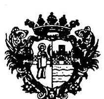

# GYŐR MEGYEI JOGÚ VÁROS POLGÁRMESTERÉTŐL 

Polgármesteri Hivatal
Városháza
9021 Győr

Állami Számvevőszék Elnöke
Domokos László Úr részére

ÁLLAMI SZÁMVEVŐSZÉK
ÜGYVITELI IRODA
$862^{2} 411$
Érk.: AUG 29 2011
Iktatószám:
Melléklet:
Laci Nálukue
kunc' to homadina'lisdene
Tisztelt Elnök Úr!

Az Állami Számvevőszék által Győr Megyei Jogú Város Önkormányzata pénzügyi helyzetének ellenőrzése tárgyában végzett vizsgálatról készült V-3037-001-2011. iktatószámon, 1015. témaszámon és V056036. vizsgálat-azonosító számon nyilvántartásba vett Jelentés-tervezettel kapcsolatban az alábbiakat terjesszük elő:

1. A Jelentés-tervezet Bevezetés részében az önkormányzati alrendszer tervezettet meghaladó hiánya tekintetében leszögezi, hogy „a 2010. évi ... hiánycél nem volt tartható, az önkormányzati alrendszer tervezettet meghaladó hiánya miatt a GDP arányában kifejezett államháztartási hiány $4,2 \%$-ra emelkedett".
A megállapítással kapcsolatban fontosnak tartjuk leszögezni, hogy - bár az össz önkormányzati alrendszer tekintetében a megállapítást nem vitatjuk - Győr Megyei Jogú Város Önkormányzata sem az Állami Számvevőszék által vizsgált időszakban, sem azt megelőzően nem lépte túl az egyes költségvetési évekre vonatkozóan elkészített önkormányzati költségvetéseiben prognosztizált hiánycélt.
2. A jelentés-tervezet 19. majd később a 30. oldalán rögzíti, hogy „Az Önkormányzat a jogszabályi előírások ellenére a 2010. évi zárszámadási valamint a 2011. évi költségvetési rendeleteiben a működési és felhalmozási kiadásokat nem mutatta be mérlegszerűen."
Álláspontunk szerint a megfogalmazás pontosításra szorul, mivel a 2011. évi költségvetési rendelet R6/a sz. mellékletként (hasonlóan az előző évek gyakorlatához, és hasonló tartalommal) tartalmazza a működési és felhalmozási kiadások és bevételek mérlegszerű bemutatását. Javasoljuk a jelentés-tervezet szóban forgó szövegrészének következők szerinti javítását: „Az Önkormányzat a jogszabályi előírások ellenére a 2010. évi zárszámadási rendeletében a működési és felhalmozási kiadásokat nem mutatta be mérlegszerűen."

---

3. A jelentés-tervezet által a helyszíni ellenőrzés megállapításainak hasznosítása mellett tett javaslataival kapcsolatosan a következőket jegyezzük meg:

A polgármester részére tett 3. számú javaslat az értékcsökkenés illetve az elhasználódott eszközök pótlására fordított tényleges kiadások szembeállítását illetve bemutatását, továbbá az eszközök elhasználódásának fok bemutatását javasolja.

Az értékcsökkenés elszámolásának, megtérülésének és felhasználásának figyelemmel kísérése a piaci viszonyok között bevett gyakorlat, az államháztartás keretei között - ahol az értékcsökkenés elszámolására csak technikailag kerül sor, s ebből megtérülésre pedig csak minimális esély van - azonban nem megszokott gyakorlat.
Lényeges kérdés, hogy az önkormányzatok eszközpótlásra a jelenlegi forrásképződési, finanszírozási gyakorlat szerint, az un. "maradék elv" alapján tudnak pénzt biztosítani.
A javaslat közgazdasági megközelítés tartalma vitathatatlan, de a jelenlegi és várhatóan szűkös pénzügyi viszonyok között az un. „maradék elv" gyakorlat feladását nem fogja eredményezni.
4. A jelentés-tervezetnek a polgármester részére tett $2 / \mathrm{b}$ pont szerinti javaslat a kötelezettségek teljes körére vonatkozóan (félévente készítendő!) 3 évre kitekintő finanszírozási tervkészítésről beszél. (A megfogalmazásból nem egyértelmű, hogy a tárgyévről és még három, vagy a tárgyévről és még két évről van szó.)
A javaslattal összefüggésben meg kell említeni, hogy a tervezési metodika (útmutató) 2011-től megszüntette az önkormányzatok korábban kötelező tervév +2 év (finanszírozási információkat is tartalmazó) un. „gördülő", kötelező kitekintését.
5. A jelentés-tervezetnek a polgármester részére tett $2 / \mathrm{c}$ pont szerinti javaslat a folyamatban lévő és tervezett fejlesztések belső és külső forrásai rendelkezésre állásának (félévenként készítendő) bemutatásáról szól.
A fejlesztésekkel kapcsolatos kötelezettségvállalások fedezetét a kötelezettségvállalást megelőzően (de legkésőbb azzal egyidejűleg) helyi gyakorlatunk szerint a közgyűlési döntést megalapozó un. beruházási alapokmányban megtesszük.
Kérdés, hogy az említett egyszeri bemutatáson túl mi indokolja a források rendelkezésre állásának félévenkénti bemutatását?

A jelentés-tervezet polgármester részére tett $2 / \mathrm{b}$ és $2 / \mathrm{c}$ pont szerinti javaslataival összefüggésben merül fel, hogy a kötelezettségek, fejlesztések teljes körére vonatkozóan finanszírozási tervet készíteni több évre előre, a jelenlegi önkormányzati finanszírozási, forrásképződési rendszerben nehéz.

Győr, 2011. augusztus 24.

Tisztelettel:
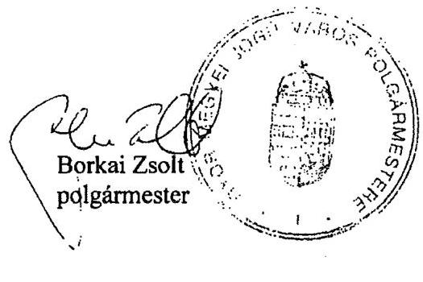

---

# Borkai Zsolt úr   polgármester 

Győr Megyei Jogú Város Önkormányzata

Győr

## Tisztelt Polgármester Úr!

A megyei jogú város pénzügyi helyzetének ellenőrzése tárgyában végzett ÁSZ ellenőrzés jelentés-tervezetével kapcsolatosan tett észrevételei alapján tájékoztatom, hogy a jelentésben az alábbi módosítások átvezetésére került sor:

- a jelentés bevezető részében foglaltak szerint a 2010. évben az államháztartás GDP arányában kifejezett tervezettet meghaladó hiányának kialakulásában szerepet játszott az önkormányzati alrendszer növekvő hiánya, általános érvényű megállapítás. Elfogadom Polgármester Úr azon kiegészítését, hogy Győr megyei jogú város egyetlen vizsgált évben sem lépte túl a költségvetésében tervezett hiánycélt. E tényt a jelentés bevezetőjének (5. oldal) 2. bekezdés 2. lábjegyzetében rögzítettük;
- elfogadom Polgármester Úr azon észrevételét, hogy az Önkormányzat a jogszabályi előírások ellenére a felhalmozási és működési kiadásokat mérlegszerűen csak a 2010. évi zárszámadási rendeletében nem mutatta be. A jelentés 19. oldal 2. bekezdését és a 32. oldal 1. bekezdését, továbbá a 23. oldal 4. számú javaslatát ennek figyelembevételével módosítottuk;
- az Önkormányzat kedvező pénzügyi helyzetére tekintettel elfogadom, hogy levelének 4. és 5. pontjaiban részletezett kötelezettségek, fejlesztések teljes körére vonatkozó, több évre készítendő finanszírozási terv elkészítését nem tartja indokoltnak. Észrevételeire tekintettel a jelentés-tervezetben rögzített javaslatokat töröltük.

---

Köszönettel vettem Polgármester Úr 2011. november 4-én kelt azon tájékoztatását is, mely szerint a Megyei Jogú Város Önkormányzata kedvező pénzügyi pozíciójának megtartása érdekében továbbra is fokozott figyelmet fordít az államháztartási forrásokkal történő takarékos, hatékony és eredményes feladatellátás feltételeinek megteremtésére, folyamatos kontroll alatt tartja a gazdálkodás paramétereit.

Köszönöm Polgármester Úrnak és munkatársainak az ellenőrzés során tanúsított hozzáállását, amellyel az Önkormányzatról készített pénzügyi helyzetelemzés elkészítését segítették.

Budapest, 2011. december 22.
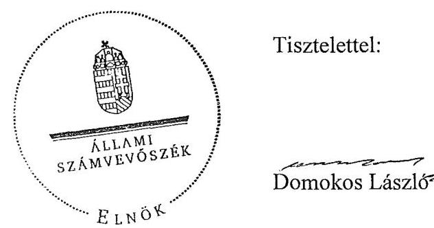

---

.

---

$\cdot$
$\cdot$

