# ÁLLAMI   SZÁMVEVŐSZÉK 

## JELENTÉS

Hódmezővásárhely Megyei Jogú Város Önkormányzata pénzügyi helyzetének ellenőrzéséről (43/3)

---

# Számvevői Iroda 

Iktatószám: V-3038-13/2011.
Témaszám: 1015
Vizsgálat-azonosító szám: V056037

## Az ellenőrzést felügyelte:

Dr. Varga Sándor
számvevő igazgató-helyettes
Az ellenőrzést vezette:
Renkó Zsuzsanna
számvevő tanácsos
Az ellenőrzést végezték:
Szenténé Tubak Klára Dr. Csapó Anna Vörösné Lakatos Zsuzsa
számvevő tanácsos számvevő tanácsos számvevő

A témához kapcsolódó eddig készített számvevőszéki jelentések:
címe
sorszáma
Jelentés Hódmezővásárhely Megyei Jogú Város Önkormányzata 0941
gazdálkodási rendszerének 2009. évi ellenőrzéséről

---

# TARTALOMJEGYZÉK 

BEVEZETÉS ..... 5
I. ÖSSZEGZŐ MEGÁLLAPÍTÁSOK, JAVASLATOK ..... 16
II. RÉSZLETES MEGÁLLAPÍTÁSOK ..... 28

1. Az Önkormányzat kötelező és önként vállalt feladatai ..... 28
2. a pénzügyi egyensúlyi helyzet alakulása ..... 31
2.1. A múködési és a felhalmozási egyensúly ..... 33
2.2. Az Önkormányzat bevételei ..... 38
2.3. Az Önkormányzat folyó kiadásai ..... 42
3. Kötelezettségek bemutatása ..... 49
3.1. A pénzintézetek felé fennálló kötelezettségek ..... 49
3.2. Szállítók felé fennálló kötelezettségek alakulása ..... 59
3.3. Egyéb kötelezettségek alakulása ..... 61
4. A pénzügyi egyensúly megteremtése érdekében hozott intézkedések ..... 65
5. A helyi önkormányzatok gazdálkodási rendszerének 2009. évi ellenőrzése során a pénzügyi egyensúly javítására tett szabályszerűségi és célszerűségi javaslatok hasznosulása ..... 69

---

# MELLÉKLETEK 

1. számú A múködési és felhalmozási célú hiány/többlet alakulása az Önkormányzat rendeleteiben
2. számú Az Önkormányzat bevételei és kiadásai, adósságszolgálata 2007-2010 között
3.a számú Az Önkormányzat 2007-2010 években megvalósított, 2010. december 31ig befejezett fejlesztések forrásösszetétele
3.b számú Az Önkormányzat 2010. december 31-én folyamatban lévő fejlesztési feladataihoz kapcsolódó kötelezettségeinek összegzése
3.c számú Az Önkormányzat 2010. december 31-én folyamatban lévő fejlesztési feladataihoz kapcsolódó 2010. évet követő kötelezettség-vállalásainak öszszegzése
3.d számú Az Önkormányzat beadott, elbírálás alatti pályázati forrásból megvalósuló fejlesztéseihez kapcsolódó kötelezettség-vállalásainak összegzése
3. számú Kimutatás az önkormányzati feladatok ellátásában résztvevő gazdasági társaságok kiemelt adatairól
4. számú Hódmezővásárhely Megyei Jogú Város Önkormányzat Polgármesterének és főjegyzőjének észrevétele
5. számú Hódmezővásárhely Megyei Jogú Város Önkormányzat Polgármesterének az észrevételre adott válasz

---

# RÖVIDÍTÉSJEGYZÉK 

## Törvények

Áht.
ÁSZ tv.

Csődtv.
Gt.
Htv.

Ötv.
Rendeletek
2010. évi zárszámadási rendelet

SzMSz
vagyongazdálkodási rendelet

## Szórövidítések

áfa
ÁSZ
BM
DAOP
DARFT
EDP hiány/egyenleg
Eötvös József SZKI
EU
föjegyzö
GDP
HVSZ Zrt.
Kistérségi társulás
Kórház
Közgyűlés
KSH
Kincstár
az államháztartásról szóló 1992. évi XXXVIII. törvény
az Állami Számvevőszékről szóló 1989. évi XXXVIII. tör-
vény (2011. július 1-jétől az Állami Számvevőszékről szóló 2011. LXVI. törvény)
a csődeljárásról és a felszámolási eljárásról szóló 1991. évi XLIX. törvény
a gazdasági társaságokról szóló 2006. évi IV. törvény
a helyi önkormányzatok és szerveik, a köztársasági megbízottak, valamint egyes centrális alárendeltségű szervek feladat- és hatásköreiről szóló 1991. évi XX. törvény
a helyi önkormányzatokról szóló 1990. évi LXV. törvény

Hódmezővásárhely Megyei Jogú Város Önkormányzatának 34/2011. (IV. 30.) számú rendelete az Önkormányzat 2010. évi zárszámadásáról

Hódmezővásárhely Megyei Jogú Város Önkormányzatának 3/2011. (II. 8.) számú rendelete az Önkormányzat és Szervei Szervezeti és Müködési Szabályzatáról
Hódmezővásárhely Megyei Jogú Város Önkormányzatának 10/2007. (II. 12.) számú rendelete az Önkormányzat vagyonnal való gazdálkodás szabályairól
általános forgalmi adó
Állami Számvevőszék
Belügyminisztérium
ÚMFT Dél-alföldi Operatív Program
Dél-Alföldi Regionális Fejlesztési Tanács
Uniós módszertan szerinti maastrichti kritériumoknak megfelelő számítás szerinti hiány/egyenleg
Eötvös József Szakközépiskola, Hódmezővásárhely
Európai Unió
Hódmezővásárhely Megyei Jogú Város Önkormányzatának címzetes főjegyzője
bruttó hazai termék
Hódmezővásárhelyi Vagyonkezelő és Szolgáltató Zártkörüen alapított Részvénytársaság
Hódmezővásárhelyi Többcélú Kistérségi Társulás
Erzsébet Kórház Hódmezővásárhely
Hódmezővásárhely Megyei Jogú Város Önkormányzatának Közgyűlése
Központi Statisztikai Hivatal
Magyar Államkincstár

---

| NAV | Nemzeti Adó- és Vámhivatal |
| :-- | :-- |
| NGM | Nemzetgazdasági Minisztérium |
| OEP | Országos Egészségbiztosítási Pénztár |
| Önkormányzat | Hódmezővásárhely Megyei Jogú Város Önkormányzata |
| polgármester | Hódmezővásárhely Megyei Jogú Város Önkormányzat |
|  | polgármestere |
| Polgármesteri hivatal | Hódmezővásárhely Megyei Jogú Város Önkormányzatá- |
|  | nak Polgármesteri Hivatala |
| PPP konstrukció | Public Private Partnership (Partnerségi együttmüködés |
|  | közfeladatok ellátására a magánszektor bevonásával) |
| szja | személyi jövedelemadó |
| TIOP | Társadalmi Infrastruktúra Operatív Program |
| Városellátó Kft. | Hódmezővásárhelyi Városellátó Nonprofit Kft. |
| zrt. | zártkörűen alapított részvénytársaság |

---

# JELENTÉS 

## Hódmezővásárhely Megyei Jogú Város Önkormányzata pénzügyi helyzetének ellenőrzéséről

## BEVEZETÉS

Az Állami Számvevőszék 2011. évtől érvényes stratégiája új irányt szabott a helyi önkormányzatok gazdálkodásának ellenőrzésében is. Az ÁSZ - küldetése és jövőképe szerint - szilárd szakmai alapokra támaszkodva értékteremtő ellenőrzéseivel és helyzetelemzéseivel az államháztartás egészében, így a helyi önkormányzati alrendszerben is elő kívánja segíteni a közpénzek és a közvagyon szabályos, gazdaságos, hatékony és eredményes hasznosítását. Ennek részeként - a 2010. évi államháztartási hiány alakulásának összetevőire is figyelemmel folyamatban van az önkormányzati alrendszer pénzügyi helyzetelemzése.

Az NGM 2011 áprilisában közzétett adatai szerint ${ }^{1}$ a 2010. évi 1036,2 milliárd Ft összegű 3,8\%-os EDP (maastrichti kritériumok szerinti, Túlzott Hiány Eljárás keretében kimutatott) hiánycél nem volt tartható, az önkormányzati alrendszer tervezettet meghaladó hiánya miatt a GDP arányában kifejezett államháztartási hiány $4,2 \%$-ra emelkedett.

Az önkormányzatok 2010 első három negyedévi költségvetési jelentése szerinti pénzforgalmi hiány 97 milliárd Ft-os összege nem indokolta az önkormányzati alrendszer 190 milliárd Ft-ra becsült hiányának 2010. évi végi felülvizsgálatát. A helyi önkormányzatok 2011. januári gyorsjelentése alapján a pénzforgalmi hiány már 247,7 milliárd Ft-ot tett ki. Az alrendszer hiánya így a tervezett $0,7 \%$-kal szemben magasabb, $0,9 \%$-os szinten realizálódott. Az 57,7 milliárd Ft hiánytöbblet alakulásában - a Tájékoztató szerint - az iparűzési adó elmaradása, a gépjárműadó, az illetékek és más bevételek tervezettnél alacsonyabb összegben való teljesülése volt a meghatározó.

Magyarország a Széll Kálmán Terv célkitűzései alapján ${ }^{2}$ aktualizált Konvergencia Programjában a középtávú (2011-2015. évek) költségvetési pálya kijelölése során 2011-re a kormányzati szektor EDP módszertan szerinti egyenlegét $+2 \%$ -

[^0]
[^0]:    ${ }^{1}$ NGM Tájékoztatás Magyarország Strukturális Reformprogramjának végrehajtásáról (2011. április 1). A Tájékoztató évente két alkalommal - április és október hónapban jelenik meg.
    ${ }^{2}$ Az államháztartás 2011. évi egyenlege - a magán nyugdíjpénztárakból az állami nyugdíjpillérbe való visszatérés egyszeri vagyonhatása következtében - $4 \%$-os többletet mutatna. A Széll Kálmán Tervben foglalt egyszeri intézkedések - a MÁV, a BKV adósságrendezése, a PPP projektek kiváltása - összességében a GDP 2\%-ával csökkentik a várható többlet mértékét.

---

ban jelölte meg. Az egyenlegcél megfogalmazásakor az önkormányzati alrendszer tervezett hiányát a 2011. évi költségvetésben szereplő $0,3 \%$-kal szemben $0,5 \%$-os arányban határozták meg ${ }^{3}$. A hiánycélok meghatározása jelzi, hogy az önkormányzati alrendszerben 2011-ben fokozott figyelmet kell fordítani a pénzügyi egyensúlyi helyzet alakulására.

Az államháztartás helyi szintjén a 23 megyei jogú városi önkormányzatnak az általuk ellátott közszolgáltatások volumenére való tekintettel kiemelt szerepe van, e települések népessége összességében meghaladja a kétmillió főt ${ }^{4}$. A települések népességét az alábbi diagram szemlélteti:
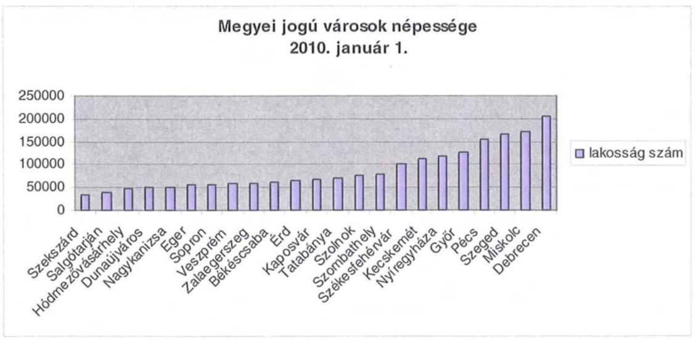

A megyei jogú városi önkormányzatok ${ }^{5}$ kötelező feladatellátását többlépcsős törvényi előírások határozzák meg. A feladatokra vonatkozó szabályozás első szintjét az Ötv. ${ }^{6}$, a második szintet a hatásköri7, a harmadik szintet a további ágazati, szakmai (egyebek mellett az oktatási, egészségügyi, szociális és egyéb ágazati feladatok ellátásának szakmai szabályait rögzítő) törvények adják.

A megyei jogú városi önkormányzatok - az Ötv-ből közvetlenül levezethető települési feladatok mellett körzeti közszolgáltatásokat is ellátnak. A megyei

[^0]
[^0]:    ${ }^{3}$ A Magyar Köztársaság 2011. évi költségvetéséről szóló 2010. évi CLXIX. törvény Általános indoklásának III. fejezete, valamint Magyarország Konvergencia Programja 2011-2015. (2011. április) Táblázatok rész, 2. táblázat Âllamháztartás összefoglaló adatai szerint.
    ${ }^{4}$ A megyei jogú városok népességét a 4/2011. (I. 31.) NGM rendelet 1. sz. mellékletében foglalt 2010. január 1-i adatok alapján vettük figyelembe.
    ${ }^{5}$ Az Ötv. 61. § (1) bekezdése alapján a megyeszékhely város a törvény erejénél fogva megyei jogú, ugyanakkor az Országgyűlés az ötvenezernél nagyobb népességű városokat a képviselőtestület kérelmére megyei jogú várossá nyilváníthatja. Ez utóbbi körbe 5 város tartozik, közülük 2 (Hódmezővásárhely, Dunaújváros) népessége 2010. január 1-ére már ötvenezer fő alá csökkent.
    ${ }^{6}$ az Ötv. 8. és 61. §-ában foglaltak szerint
    ${ }^{7}$ a Htv.

---

jogú városi cím elsősorban többlet kötelezettségekkel jár, a megyei jogú városnak önmagának kell gondoskodnia mindazokról a feladatokról, amelyek más települési önkormányzatok esetében a megyei önkormányzat feladatát képezik. Ide sorolható többek közt a középfokú oktatási intézmények fenntartása, a közművelődési, könyvtári és levéltári szolgáltatás, a társadalombiztosítás finanszírozása mellett a kórházi és a rendelőintézeti szakellátás, a szociális és egyes gyermekvédelmi feladatok ellátása. Ezeket a feladatokat (intézményeket) a megyei jogú város - más városoktól eltérően - nem adhatja át a megyei önkormányzatnak, azonban az Ötv. lehetőséget biztosít arra, hogy a megyei önkormányzattal megállapodjék a feladatellátás megosztásában.

Az önkormányzat, így a megyei jogú város is, maga határozza meg, hogy - a lakosság igényei alapján, anyagi lehetőségei függvényében - mely feladatokat, milyen mértékben és módon, mely szervezeti keretek közt lát el. A szervezetalakítás szabadsága a megyei jogú városok esetében azzal járt, hogy mind a kötelező közszolgáltatásoknál (különösen a településüzemeltetés, vagyongazdálkodás), mind pedig az önként vállalt feladataik ellátásában - elsősorban a sport és kulturális szolgáltatások területein - a gazdasági társaságok kiemelt fontosságú szerephez jutottak. Ily módon a gazdálkodás, a pénzügyi helyzet kockázatai közvetlenül kikerültek ugyan az önkormányzati alrendszerből, azonban sérülhet az ellátási felelősség figyelemmel kísérése és érvényesítése, a közpénzek felhasználásának transzparenciája. Mindezek együttvéve - a beszámolók konszolidálásának hiányában - növelik a megyei jogú városok pénzügyi helyzetének megítélésében rejlő kockázatokat.

Az áttekintett időszakban az önkormányzati feladatok ellátásának keretet biztosító forrásszabályozás elvei lényegesen nem változtak.

A megyei jogú városok önkormányzatainak mozgásterét, az önkormányzatok feladatellátásra vonatkozó döntéseit a központi költségvetéstől való függőség mellett jelentősen befolyásolja a helyi adókivetési jog gyakorlása ${ }^{8}$. A helyi adók rendszere a közszolgáltatások finanszírozásához szükséges források megteremtésének, bővítésének eszköze, amely a gazdasági válság, a jogszabályi környezet, az adópolitika változása, az adóhatóságok tevékenysége következtében differenciáltan érinti a települési önkormányzatokat ${ }^{9}$.

A települési önkormányzatok saját folyó bevételeinek keretében elszámolt, különböző jogcímeken kivetett helyi adók - iparűzési adó, építmény és telekadó, idegenforgalmi adó, vállalkozók és magánszemélyek kommunális adója -2007-2010 között eltérő módon emelkedtek. A helyi adókból származó bevételek realizált összege országos szinten 2007-2009 között folyamatosan, 505,3 milliárd Ft-ról 566,3 milliárd Ft-ra emelkedett, majd a gazdasági válság hatásai következtében 2010-re 542,6 milliárd Ft-ra esett vissza. A helyi adók részesedése

[^0]
[^0]:    ${ }^{8}$ a helyi adókról szóló 1990. évi C. törvény szabályai szerint
    ${ }^{9}$ Az Állami Számvevőszék 2010 decemberében közzétett 1031. számú jelentésében értékelte a helyi adók rendszerében a hatékonyság és az eredményesség érvényesülését.

---

az önkormányzatok saját folyó bevételein belül 2007-2010 között 2,5 százalékponttal csökkent ${ }^{10}$.

A megyei jogú városok saját folyó bevétele 2007-ben 191,5 milliárd Ft volt, 2008-ban 223,1, 2009-ben 225,4, 2010-ben 223,5 milliárd Ft-ot tett ki. A helyi adóbevételekből való részesedésük 2007-ben 110,5 milliárd Ft (21,9\%), 2008ban 128,3 milliárd Ft (23,2\%), 2009-ben 124,4 milliárd Ft (22\%), 2010-ben 118,7 milliárd Ft (részaránya a 2007. évivel azonosan $21,9 \%$ ) volt. E realizált adóbevételek a megyei jogú városok saját folyó bevételeinek 2007-ben 57,7, 2008-ban 57,5, 2009-ben 55,2, 2010-ben 53,1\%-át jelentették. A helyi adóbevételek 2007-ről 2010-re kimutatott 4,6 százalékpontos csökkenése annak ellenére következett be, hogy a megyei jogú városok saját folyó bevétele 2010-ben $16,7 \%$-kal haladta meg a 2007. évit.

A helyi adókon belül a települések gazdasági helyzetének egyik fokmérője az elért helyi iparűzési adóbevétel, amely a megyei jogú városok körében erőteljes - a település nagyságrendtől is függő ${ }^{11}$ - különbségeket mutat. A helyi iparűzési adóbevétel és annak egy lakosra vetített összegének 2007. és 2010. évi alakulását az alábbi diagramok szemléltetik:
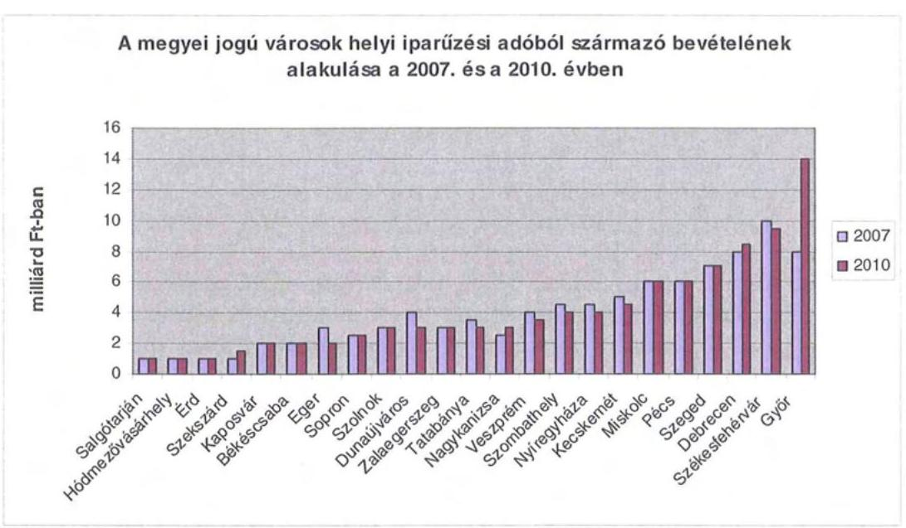

[^0]
[^0]:    ${ }^{10}$ A helyi adó bevételek saját folyó bevételekből való részesedése országosan 2007-ben $55,3 \%, 2010$-ben $52,8 \%$ volt.
    ${ }^{11}$ A 100 ezer fő feletti népességű megyei jogú városok csoportjába Debrecen, Miskolc, Szeged, Pécs, Győr, Nyíregyháza, Kecskemét, Székesfehérvár tartozik. Nem megyeszékhely megyei jogú város Érd, Sopron, Nagykanizsa, Dunaújváros, Hódmezővásárhely.

---

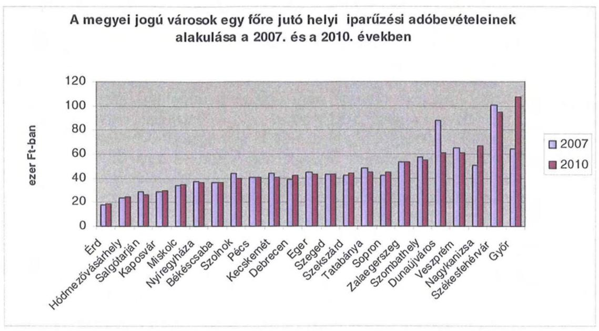

A megyei jogú városi önkormányzatok saját bevételein belül második legjelentősebb elem az illetékbevétel. A 2010. évben befolyt 39,2 milliárd Ft illetékbevétel a 2006. évben realizált 71,1 milliárd Ft illetékbevétel alig több mint $55 \%$-a. A jelentős visszaesést döntően az ingatlanpiac stagnálása, majd visszaesése, illetve egyes illetékkedvezmények bevezetése okozta. A kieső bevételek pótlására az önkormányzati alrendszer szintjén történtek intézkedések, 2010ben 5 milliárd Ft-ot, 2011-ben 1,2 milliárd Ft-ot ellentételezett a központi költségvetés. A megyei jogú városok önkormányzatai az önkormányzati alrendszer szintjén realizált illetékbevételből 2007-ben 13,6 milliárd Ft-tal (23,3\%-kal), 2008-ban 15,3 milliárd Ft-tal ( $22,7 \%$-kal), 2009-ben 12,6 milliárd Ft-tal ( $21,5 \%$ kal), 2010-ben 7,9 milliárd Ft-tal ( $20,2 \%$-kal) részesedtek ${ }^{12}$. Az összes befolyt illetékbevételből a megyei jogú városok részesedése 2009-ről 2010-re mindössze 1,3 százalékponttal csökkent, ugyanakkor a realizált illetékbevétel csökkenése a $37,3 \%$-ot ( 4,7 milliárd Ft) is elérte.

Az önkormányzati alrendszer átengedett bevételei közül a személyi jövedelemadóból való részesedés makroszintű szabályozása a vizsgált időszakban nem változott. A települési önkormányzatokat a településre kimutatott személyi jövedelemadó $8 \%$-a közvetlenül, míg $32 \%$-a külön szabályozott visszaosztási rendben illeti meg. A visszaosztás a jövedelem differenciálódás mérséklésével párosul, rendje a lakóhelyen maradó személyi jövedelemadóhoz és az iparúzési adó-erőképességhez ${ }^{13}$ igazodik, annak részletszabályait a mindenkori költségvetési törvény 4. számú melléklete határozza meg. A jövedelemdifferenciálódás

[^0]
[^0]:    ${ }^{12}$ Az illetékek kivetésének és beszedésének joga 2006. december 31-ig a megyei önkormányzatok feladata volt, amelyet a 2007. évtől az APEH (2011. január 1-jétől NAV) vett át. Az önkormányzati illetékrészesedési szabályok változatlanok maradtak, azonban az illetékbeszedés költségeit az önkormányzatok illetékbevételeiből átlagos (a megyei jogú városoknál $8,5 \%$-os) kulcsot alkalmazva vonták le.
    ${ }^{13}$ Az iparúzési adóerő-képesség egy potenciális, átlagos erőfeszítés mellett elérhető (a települési önkormányzat iparúzési adóelőlegét meghatározó adóalap 1,4\%-ának megfelelő számított) bevétel.

---

szabályai kétirányúak, a kiegészítés és a visszatartás feltételeit egyaránt meghatározták:

- Amennyiben az önkormányzatot közvetlenül megillető személyi jövedelemadó bevétel és a számított iparűzési adóerő-képesség együttesen számított, egy főre jutó összege nem érte el a település méretéhez kapcsolódóan az évenkénti szabályozás szerinti változó összeget, a költségvetés a részesedést település nagyság szerint eltérően meghatározott szintig - kiegészítette ${ }^{14}$. A kiegészítés fajlagos összege 2007-2010 között 37500 Ft-ról 48010 Ft-ra (10 510 Ft-tal, 28\%-kal) emelkedett. Az előzőeken túl a jövedelem differenciálódás szabályozása egyes térségi (középiskolai, szakiskolai, szakképző intézményi, kollégiumi) feladatok ellátásának függvényében további kiegészítő hozzájárulást biztosított.
- Amennyiben az egy főre számított személyi jövedelemadó és az iparűzési adóerő-képesség együttes összege a település nagyságrendjéhez rendelt értékhatárt több mint $25 \%$-kal (2010-től 20\%-kal) meghaladta, az egy főre jutó összeg sávonként differenciált módon ${ }^{15}$ visszavonásra került az önkormányzatot megillető normatív állami hozzájárulás összegéből.

Az önkormányzatok személyi jövedelemadó bevétele 2007-ben 494,3 milliárd Ft, 2008-ban 558,6 milliárd Ft, 2009-ben 639,5 milliárd Ft, 2010-ben 681,2 milliárd Ft volt, az időszak alatt összegében 186,9 milliárd Ft-tal, 37,8\%kal emelkedett, miközben az szja bevétel átengedett bevételeken belüli részesedése 1,8 százalékponttal emelkedett.

A megyei jogú városok önkormányzatainak személyi jövedelemadó részesedése az alrendszer átengedett személyi jövedelemadó bevételeiből 2007-ben 77,6 milliárd Ft-ot ( $15,7 \%$-ot), 2008-ban 105,4 milliárd Ft-ot ( $18,9 \%$-ot), 2009ben 122,9 milliárd Ft-ot ( $19,2 \%$-ot), 2010-ben 136,6 milliárd Ft-ot ( $20,1 \%$-ot) tett ki. A realizált szja bevétel a megyei jogú városoknál az időszak alatt folyamatosan emelkedett, a 2010-ben realizált adóbevétel 59,0 milliárd Ft-tal (76\%) volt magasabb a 2007. évinél, az átengedett bevételeken belüli részesedése 2010-re 5,1 százalékponttal haladta meg a 2007. évi részarányt ${ }^{16}$. A részesedés alapjául szolgáló szja településenként eltérő, az egy adózóra jutó szja 2009. évi adatait ${ }^{17}$ a következő ábra szemlélteti.

[^0]
[^0]:    ${ }^{14}$ A megyei jogú városok esetében a jövedelemkülönbségek mérséklésénél figyelembe veendő lakosonkénti értékhatár 2007-ben 37500 Ft, 2008-ban 42385 Ft, 2009-ben 45933 Ft, 2010-ben 48010 Ft volt.
    ${ }^{15}$ A sávos értékhatár 2010-től 20\%-os intervallumonként, 120\% felett a visszatartást $25 \%$-tól $90 \%$-os mértékig rögzíti. Amennyiben a település nagyságrendhez rendelt értékhatár összege az önkormányzatnál eléri vagy meghaladja a 200\%-ot, az egy főre jutó összeg $90 \%$-a levonásra kerül. Az értékhatár sávjai 2010 előtt $25 \%$-os léptékűek voltak, a levonási arányok az ellenőrzött időszakban nem változtak.
    ${ }^{16}$ E bevételek a megyei jogú városok átengedett bevételeiben 2007-ben 84,7, 2008-ban 87,7, 2009-ben 89,7, 2010-ben 89,8\%-os részarányt jelentettek.
    ${ }^{17}$ Adatforrás: KSH Megyei Jogú Városok a Közép Dunántúlon 2009. kiadványa, 4.1.sz. összehasonlító tábla.

---

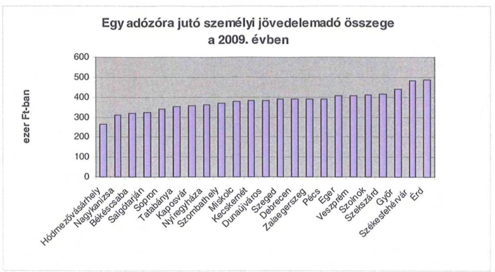

Az átengedett bevételek második legjelentősebb eleme a gépjármúadó, amelynek bevételi szabályozása az ellenőrzött időszakban nem változott, az adóbevétel teljes összege az önkormányzatot illeti meg. A gépjármúadó alapját, mértékét ${ }^{18}$ és egyes mentességi kategóriákat érintő módosítások 2010. január 1-től következtek be, amelyek az egyes adótételek esetében átlagosan $15 \%$-os emelkedéssel jártak.

A gépjármúadó beszedéséből származó bevétel az önkormányzati alrendszer szintjén 2007-ben 62,4 milliárd Ft, 2008-ban 65,7 milliárd Ft, 2009-ben 63,8 milliárd Ft, 2010-ben 71,1 milliárd Ft volt, az adóbevétel egésze 2007-hez képest 8,7 milliárd Ft-tal, 13,9\%-kal emelkedett. A gépjármúadóztatás szabályainak változása 2010-ben 7,3 milliárd Ft többletet eredményezett. A megyei jogú városok gépjármúadó bevétele a 2007. évi 14,0 milliárd Ft-ról 2010-re 15,5 milliárd Ft-ra, 10,7\%kal emelkedett. A bevételnövekedés összegéből 1,4 milliárd Ft a 2010. évi adózási szabályok következménye.

A megyei jogú városok önkormányzatai 2007-2010 között rendelkezésre álló forrásainak alakulását a következő ábra szemlélteti:

[^0]
[^0]:    ${ }^{18}$ A gépjármúadóról szóló 1991. évi LXXXII. törvény 7. § (1) bekezdésében foglalt adómértékek változása.

---

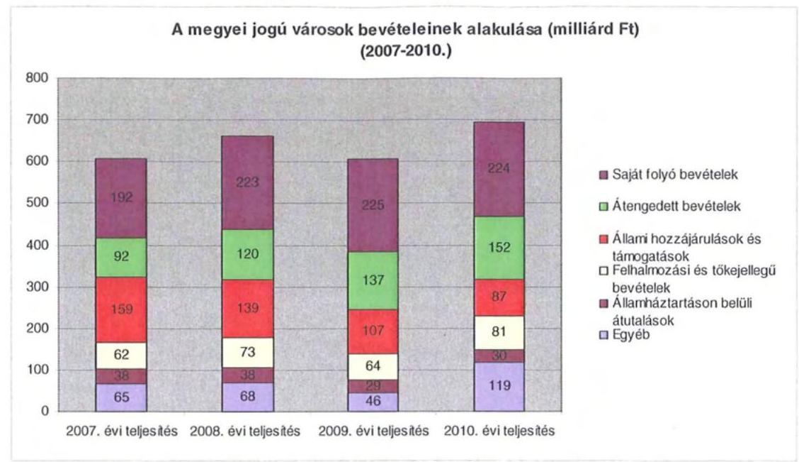

A megyei jogú városok saját folyó bevételeinek - amelyek főbb elemei: a helyi adók, az illetékbevételek, az intézményi térítési díjak, a kamatbevételek részaránya a 2007. évi összbevételen ( 608 milliárd Ft) belül 32\% volt. A 2010. évi összbevétel 693 milliárd Ft-os összegéből a saját folyó bevételek aránya miközben összege 2007-ről 2010-re 32 milliárd Ft-tal emelkedett - nem változott.

Az átengedett bevételek, amelyek a megyei jogú városok önkormányzatainál döntően a személyi jövedelemadó és a gépjármúadó részesedést jelenti, az összbevételen belül a 2007. évi 92 milliárd Ft-ról (15\%) 152 milliárd Ft-ra nőtt, részesedése 7 százalékponttal emelkedett. A 60 milliárd Ft-os növekedésből 59 milliárd Ft-ot az szja részesedés emelkedése okozott.

Az állami hozzájárulások és támogatások - amelyek főbb elemei: főként az ellátotti létszámhoz kötődő normatív állami hozzájárulások, központosított előirányzatok - a 2007. évi 159 milliárd Ft-ról (26\%-os részarányról) 2010-re 87 milliárd Ft-ra ( $13 \%$-os részarányra) estek vissza.

A felhalmozási és tőkejellegú bevételek - tárgyi eszközök (ingatlanok és ingóságok), föld és immateriális javak, részesedések értékesítése, EU-tól átvett pénzeszközök - a 2007. évi 62 milliárd Ft-ról (10\%-os részarányról) 2010-re 81 milliárd Ft-ra ( $12 \%$-os részarányra) emelkedtek.

Az államháztartáson belüli átutalások részesedése 2007-ben 38 milliárd Ft volt. 2010. év végére 8 milliárd Ft-tal csökkent, részaránya 6\%-ról 2010-ben 4\%-ra változott. Ez a bevételi kategória tartalmazza az Egészségbiztosítási Alaptól és más elkülönített állami pénzalapoktól átvett forrásokat. A 2010-ben e címen elszámolt bevétel a megyei jogú városoknál 22 milliárd Ft-ot tett ki.

Az egyéb, pénzmaradványból, vállalkozási bevételekből, államháztartáson kívülről származó átutalásokból, a hitelekből, a hosszú és rövid lejáratú értékpa-

---

pírok értékesítéséből származó bevételek részesedése a 2007-2010. évek viszonylatában 11\%-ról 17\%-ra emelkedett. Ez utóbbiak 2010. évi beszámoló szerinti összevont teljesítése 119 milliárd Ft volt ${ }^{19}$.

Mindezeket figyelembe véve a megyei jogú városok 2007. és 2010. évi forrásöszszetételének megoszlását az alábbi ábra szemlélteti:

A megyei jogú városok 2007. és 2010. évi forrásösszetétele
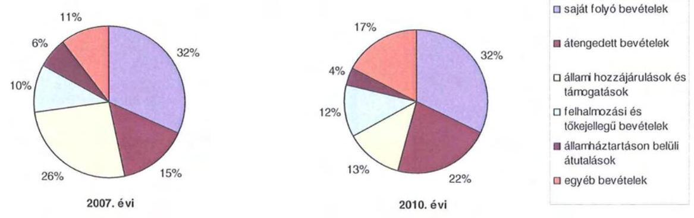

Az önkormányzati alrendszer pénzügyi helyzetértékelése során új elemzési módszereket alkalmaz az ellenőrzés. A hagyományos költségvetési szerkezet helyett az önkormányzat pénzügyi helyzetét a CLF módszerrel mutatjuk be, amelynek lényegét és számításának módszerét a 2.1. pontban, és a jelentés 2 . számú mellékletében ismertetjük részletesen.

Az új módszereken alapuló helyzetértékelés fontosságát az adja, hogy a helyi önkormányzatok bruttó adósságállománya ${ }^{20}$ a 2010. évi költségvetési beszámoló alapján 1248 milliárd Ft-ot tett ki. Az adósságállomány koncentráltságát jelzi ${ }^{21}$, hogy ebből a 23 megyei jogú város részesedése 338 milliárd Ft volt, amely a fővárosi és kerületi önkormányzatok adósságának figyelmen kívül hagyásával számított 2010. évi 977 milliárd Ft összegű bruttó adósságállo-

[^0]
[^0]:    ${ }^{19}$ Az egyéb bevételek összege 2007-2010 között eltérő módon változott, 2007-ben 65 milliárd Ft, 2008-ban 68 milliárd Ft volt, 2009-ben 46 milliárd Ft-ra esett vissza, majd 2010-ben több mint két és félszeresére, 119 milliárd Ft-ra emelkedett.
    ${ }^{20}$ A bruttó adósságállomány 2010. év végi összege magában foglalja a fejlesztési és a működési célú kötvénykibocsátások, a beruházási és fejlesztési hitelek, a működési célú hosszú lejáratú hitelek, a rövid lejáratú hitelek, váltótartozások miatti kötelezettségek teljes (2011-ben, illetve az azt követő években esedékes) állományát.
    ${ }^{21}$ A megyei jogú városok adósságállománya összegében ugyan elmarad az egyéb városok összesített adósságától [(ez utóbbiak részesedése 382,6 milliárd Ft (39,2\%)], azonban az egyéb városok száma 304. A fővárosi és a kerületi önkormányzatok nélküli adósságállományból a 19 megyei önkormányzat 163 milliárd Ft-tal (16,8\%-kal), míg a nagyközségek, községek együttesen 93 milliárd Ft-tal ( $9,5 \%$-kal) részesednek.

---

mány 34,6\%-át jelentette. Az adósságállomány több mint fele - 501 milliárd Ft - a 19 megyei önkormányzatnál és a 23 megyei jogú városnál jelentkezett.

A megyei jogú városok 338 milliárd Ft-os adósságállományából 175 milliárd Ft (51,8\%) a 8 legnagyobb, 100 ezer fő feletti népességű város tartozása. Az 5 nem megyeszékhely megyei jogú város bruttó adósságállománya 70 milliárd Ft-ot (20,7\%-ot), az előző két csoportba nem tartozó további 10 megyei jogú város adóssága 93 milliárd Ft-ot ( $27,5 \%$-ot) tett ki.
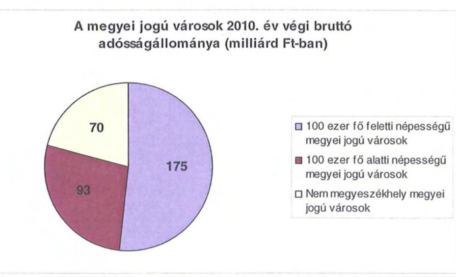

A mérlegben kimutatott bruttó adósságállomány mellett az önkormányzatok számára az eszközállomány műszaki állapotának megőrzése is kötelezettségekkel jár. Az elhasználódott eszközök pótlására forrást biztosító amortizációs (felújítási) alap képzésének ${ }^{22}$ elmaradása maga után vonhatja a feladatellátást kiszolgáló tárgyi eszközök állagának erőteljes romlását. Emellett a 2007-2013as időszakra meghirdetett, vissza nem térítendő EU-s fejlesztési forrásokhoz való hozzájutás lehetősége felerősítette az önkormányzati alrendszer fejlesztési igényeit, amelyek a felhalmozási költségvetési hiány folyamatos emelkedésén túl - az előírt jövőbeni fenntartási kötelezettség miatt - tovább terhelhetik az önkormányzatok költségvetését ${ }^{23}$.

Az ÁSZ a 2011. évi ellenőrzési tervében 43. számú, az Önkormányzatok gazdálkodási rendszerének ellenőrzése részeként egy időben, egymással párhuzamosan tekinti át, és elemzi a 23 megyei jogú városi önkormányzat pénzügyi helyzetét. A gazdálkodás szabályszerűségét az ÁSZ az előző évek során ebben az önkor-

[^0]
[^0]:    ${ }^{22}$ Erre a jelenlegi szabályozási környezetben nem kötelezi semmilyen előírás az önkormányzatokat.
    ${ }^{23}$ Az Állami Számvevőszék 2011 júniusában közzétett 1108. számú, a helyi önkormányzatok fejlesztési célú támogatási rendszerének ellenőrzéséről szóló jelentésében feltárta a fejlesztési folyamatok problémáit. A helyi önkormányzatok elsősorban azokat a fejlesztéseket valósították meg, amelyekhez támogatást lehetett igényelni. A fejlesztési célok közül a magasabb támogatás intenzitású pályázatokat részesítették előnyben. A fejlesztéssel megvalósuló létesítmények jövőbeli üzemeltetésének várható ráfordításait az önkormányzatok $71,9 \%$-a nem mérte fel.

---

mányzati körben is ellenőrizte, ezért jelen vizsgálatunk erre nem tér ki. A jelentés a megyei jogú városok sajátos feladatellátási és forrásszabályozási helyzetére tekintettel az önkormányzatok pénzügyi helyzetét, illetve az ezzel összefüggő korábbi ÁSZ javaslatok megvalósítását mutatja be.

Az ellenőrzés a 2007. január 1. - 2010. december 31. közötti időszakot öleli fel.
A vizsgálat jogszabályi alapját az Állami Számvevőszékről szóló 1989. évi XXXVIII. törvényy ${ }^{24}$ 2. § (3), (5), (6) és (9) bekezdései, az Ötv. 92. § (1) bekezdése, az Áht. 104. § (3), és 120/A. § (1) bekezdése előírásai képezik.

[^0]
[^0]:    ${ }^{24}$ 2011. július 1-jétől az Állami Számvevőszékről szóló 2011. évi LXVI. törvény 5.§ (2)(5) bekezdései

---

# I. ÖSSZEGZŐ MEGÁLLAPÍTÁSOK, JAVASLATOK 

Az Önkormányzat - adatszolgáltatása szerint - a tárgyév Kórház nélküli múködési költségvetési kiadásaiból ( 7775 millió Ft) 7555 millió Ft-ot ( $97,2 \%$ ) a kötelező feladatok, 220 millió Ft-ot ( $2,8 \%$ ) az önként vállalt feladatok ellátására fordított. A kötelező és önként vállalt feladatok részarányának megállapítása az Önkormányzat SzMSz szerinti besorolásának megfelelően készült. Az Önkormányzat a mindennapos testedzés, a közterület felügyelet, a mezei őrszolgálat, a foglalkoztatás bővítés, a munkahelyteremtő programok mellett önként vállalt feladatnak tekinti a gimnázium, szakközépiskola és szakképző intézmény, valamint a kollégium fenntartását is. Az Önkormányzat önként vállalt feladatainak meghatározásakor nem volt figyelemmel arra az Ötv-ben foglalt előírásra, hogy - a megyei jogú várossá való nyilvánítás törvényi előírásainak megfelelve - rendelkeznie kell mindazokkal az intézményi feltételekkel, amelyek biztosítják, hogy a területén saját hatáskörében a megyei önkormányzat számára előírt kötelező feladatokat is ellássa.

Az Önkormányzat feladatellátásának szervezeti struktúráját a következő ábra szemlélteti:
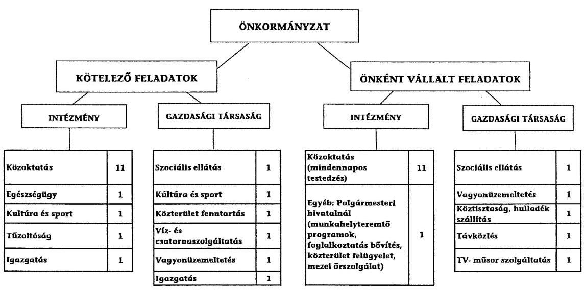

Az Önkormányzat feladatait 2010. december 31-én (a Polgármesteri hivatallal együtt) 15 költségvetési szervvel és kilenc $25 \%$ feletti tulajdoni hányadú gazdasági társaságával, továbbá kettő - az önkormányzattól tulajdonosi szempontból független - gazdasági társaság közreműködésével látta el. Az Önkormányzat az áttekintett időszakban két általános iskolát, egy középiskolát megszüntetett, egy alapfokú művészetoktatási intézményt létrehozott, valamint három középiskolát egy jogutód oktatási intézménybe integrált. Átadtak három általános iskolát és egy óvodát a Kistérségi társulásnak, valamint egy óvodát és egy általános iskolát az egyháznak. Az intézményszervezeti átalakítások és intézményi összevonások következtében a feladatellátás telephelyeinek száma a 2006. évi 115 -ről 2010-re 96 -ra csökkent.

---

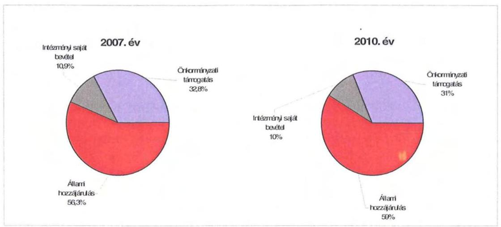

Az Önkormányzat múködési kiadásokra 2010-ben 7775 millió Ft-ot fordított, amely 2404 millió Ft-tal (23,6\%-kal) kevesebb a 2007. évi kiadásoknál. A múködési kiadások 43\%-át az intézményi körben realizálták. E kiadások fedezetéül szolgáló bevételi források 2007. és 2010. években jellemző összesített arányait a következő ábra szemlélteti:

Az egyes közszolgáltatások feladatellátásában résztvevő ágazati intézménycsoportok forrásösszetételét jogcímenkénti a következő ábra szemlélteti:
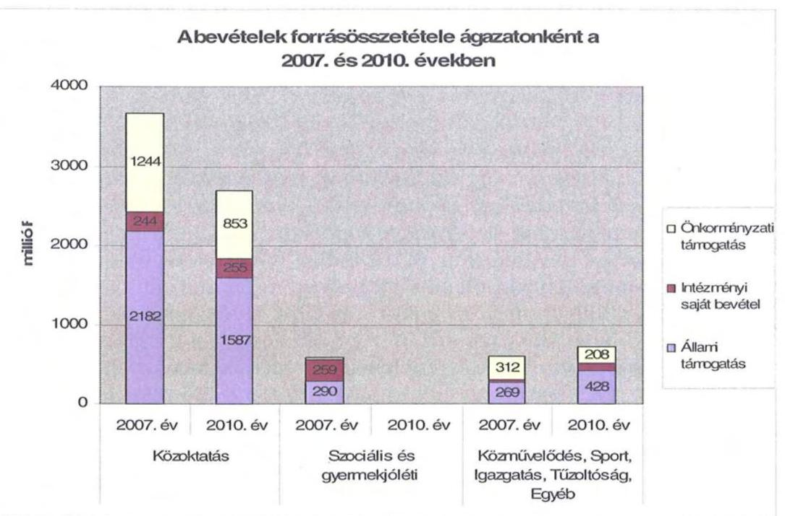

A közoktatási, valamint a szociális és gyermekjóléti feladatok bevételei a vizsgált időszakban csökkentek, mivel intézményeket adtak át a Kistérségi társulásnak és az egyháznak.

Az Önkormányzat az áttekintett időszakban kórház fenntartásáról is gondoskodott. A Kórház számára összesen 396 millió Ft múködési célú támogatást biztosítottak, fejlesztési célra nem nyújtottak támogatást. A múködési támogatás teljes összege a központi költségvetésből származó (bérpolitikai intézkedések)

---

támogatás továbbadása volt. A Polgármesteri hivatal könyveiben számoltak el a 2007-2010. évek között összesen 368 millió Ft fejlesztési kiadást, amelyet eszközfejlesztésére, krónikus osztály, egynapos sebészet és gyógyszertár kialakítására, gép-műszer beszerzésre, gyógymedence építésére, sürgősségi fogadóhely kialakítására fordítottak.

Az Önkormányzat hét gazdasági társaságban rendelkezik kizárólagos tulajdonnal, egy gazdasági társaságban $51 \%$-os, egyben $34 \%$-os tulajdoni hányaddal. A gazdasági társaságok a víz- és csatorna szolgáltatási, a sport és igazgatási, a szociális étkeztetés, a közterület fenntartási, az ingatlan üzemeltetési, a városüzemeltetési, a szociális foglalkoztatási, televíziós műsorszolgáltatási feladatok ellátásában kaptak szerepet. A gazdasági társaságok müködésükhöz a 2010. évben összesen 168 millió Ft rendszeres múködési célú, 231 millió Ft eseti múködési célú pénzeszközt kaptak az Önkormányzattól a központi forrásból származó 207 millió Ft támogatással együtt. A múködési célra teljesített pénzeszköz 90,2\%-át ( 360 millió Ft-ot) a Városellátó Kft. kapta.

Az önkormányzati tulajdonú gazdasági társaságoknál a 2007. évben kimutatott 19 millió Ft negatív saját tőke a 2010. év végére 280 millió Ft-ra nőtt, amely a 2007. évben két társaságot, a 2010. évben három társaságot érintett. A legnagyobb negatív saját tőkéje (a 2008. évben 202 millió Ft) a Városellátó Kftnek volt, emiatt a 2007-2010. években összesen 346 millió Ft tőkejuttatásban részesült. Negatív saját tőke miatt a 2007-2010. évek között további három gazdasági társaság összesen 277 millió Ft összegű tőkejuttatást kapott az Önkormányzattól.

A folyó költségvetés egyenlege a 2007. évben forráshiányt mutatott, a 2008-2010. évek között forrástöbblet keletkezett². A 2007-2009. években a múködési megtakarítások nem tudták fedezni a tárgyévben jelentkező törlesztési kötelezettségeket, így az Önkormányzat pénzügyi kapacitása (nettó múködési jövedelme) negatív értékű volt. A 2010. évben az adósságszolgálat csökkenése miatt a pénzügyi kapacitás pozitívvá vált ( 500 millió Ft), mivel a múködési megtakarítás ( 1152 millió Ft) fedezete a törlesztési kötelezettséget ( 652 millió Ft), figyelembe véve, hogy a lejárt szállítói állomány az előző évi 1224 millió Ft-ról 1725 millió Ft-ra nőtt, így az teljesített kiadásként nem szerepelt a folyó kiadások között. Az adósságszolgálat csökkenését az okozta, hogy az Önkormányzat kötvénykötelezettségének tőketörlesztése öt év türelmi idő után, 2011-ben indul el, beleértve a türelmi idő alatt felhalmozott, tőkésítésre kerülő kamat összegét is.

[^0]
[^0]:    ${ }^{25}$ 2007-ben a folyó kiadások 3,7\%-át (465 millió Ft-ot) tette ki a negatív múködési jövedelem, 2008-ban a forrástöbblet a folyó kiadások 3,1\%-át (411 millió Ft-ot), 2009-ben $3,6 \%$-át ( 407 millió Ft-ot), 2010-ben $10,2 \%$-át i ( 1152 millió Ft ) jelentette.

---

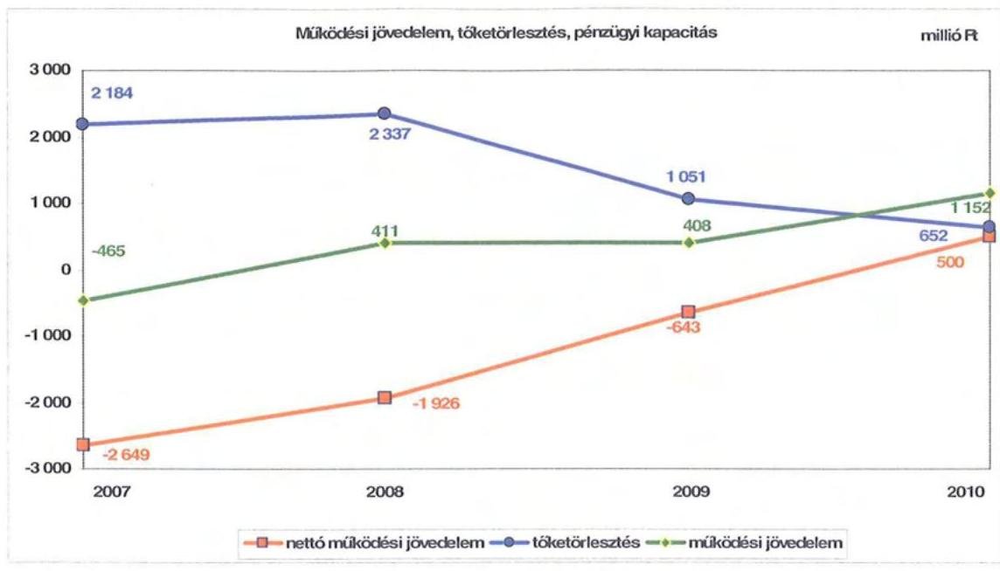

A 2007-2010. években az Önkormányzat felhalmozási költségvetésének egyenlege folyamatosan hiányt mutatott (negatív összegű volt), a 2007-2010 között keletkezett összesen 6936 millió Ft felhalmozási forráshiány finanszírozásához külső források (hitel, kötvény) bevonása vált szükségessé.

A pénzügyi egyensúly fenntartása külső források bevonásával volt biztosítható. A 2007-2010. években 6223 millió Ft hitelt törlesztettek. Az adósságszolgálat, továbbá a felhalmozási forráshiány 2007-2010 között 13159 millió Ft-ot tett ki, amelyre az időszakban képződő 1506 millió Ft működési megtakarítás (múködési jövedelem), valamint a 2007. január 1-jén rendelkezésre álló 6656 millió Ft pénzkészlet, továbbá 1032 millió Ft hosszú lejáratú bankbetét szolgált fedezetül. A további pénzeszközöket 2000 millió Ft hosszú lejáratú hitel és likvid hitelek felvételével teremtették meg. A kialakult pénzügyi helyzet pozitív nettó múködési jövedelmet eredményező gazdálkodás mellett teszi elkerülhetővé további külső források bevonását, az eladósodás növekedését.

A vizsgált időszakban az Önkormányzatnál helyi iparűzési adó, építményadó, vállalkozók kommunális adója, telekadó, vendégéjszakák utáni idegenforgalmi adó volt megállapítva, a magánszemélyek kommunális adója helyett kivetették a magánszemélyek építményadóját, emelték a telekadó és kommunális adó mértékét. A helyi adókból és pótlékokból származó bevételek aránya 2007-2010 között 15\% körüli volta folyó (múködési) bevételekben. A pótlékkal, bírsággal növelt helyi adó bevétel a 2007. évi 1599 millió Ft-ról 2010. évben 1893 millió Ft-ra (18,4\%-kal, 294 millió Ft-tal) nőtt. A helyi adóbevételek kétharmad részét az iparűzési adó tette ki, amelynek mértéke a helyi adókról szóló törvényben rögzített maximális mértékben került megállapításra. A helyi adók növekedését az építményadó 289 millió Ft-os növekedése okozta. Új helyi adónemet a vizsgált időszakban az Önkormányzat nem vetett ki.

A befejezett fejlesztések felét pénzintézeti forrásokból fedezték. A 2007-2010. évek között megvalósult 10258 millió Ft értékű fejlesztés és felújítás forrása 3033 millió Ft saját forrás (29,6\%), 3040 millió Ft kötvényből származó bevétel

---

(29,6\%), 2000 millió Ft hitelfelvétel (19,5\%), 1297 európai uniós forrás (12,6\%), valamint 888 millió Ft hazai támogatás ( $8,7 \%$ ) volt. A 2010. december 31 -én folyamatban lévő fejlesztési feladatok végrehajtására 1163 millió Ft kiadást teljesítettek, amelyre saját forrásból 541 millió Ft -ot ( $46,5 \%$ ), európai uniós forrásból 618 millió Ft -ot $(53,1 \%)$ és hazai forrásból 4 millió Ft -ot $(0,4 \%)$ fordítottak.

Az Önkormányzatnál a 2010. december 31-én folyamatban lévő fejlesztési feladatok kötelezettség-vállalásainak összege 3559 millió Ft volt, amelyből 628 millió Ft -ot saját forrásból, 2579 millió Ft -ot európai uniós támogatásból és 352 millió Ft -ot hazai támogatásból terveznek biztosítani. A tervezett saját források rendelkezésre állását azonban az Önkormányzat jelenlegi pénzügyi helyzete nem igazolja. Mindez kockázatot jelent a vállalt fejlesztések jövőbeni finanszírozhatósága szempontjából.
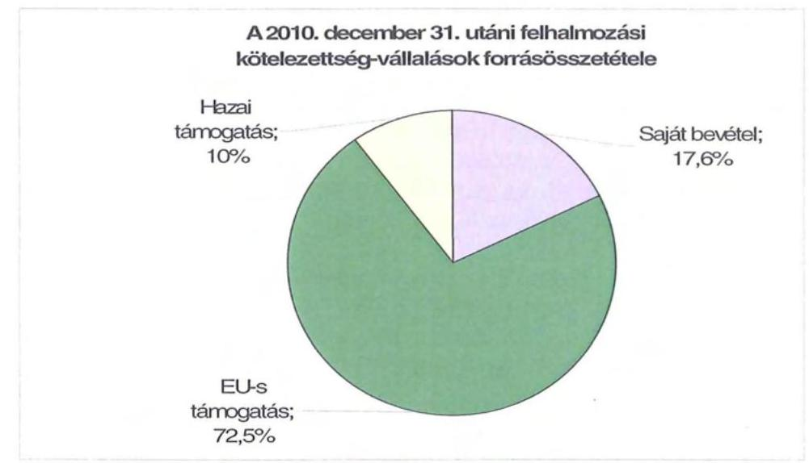

Az Önkormányzat által beadott, elbírálás alatt álló pályázati forrás igénybevételével tervezett beruházásainak teljes bekerülési költsége 3627 millió Ft volt, amelyhez idegen forrást már nem kívánnak bevonni, ugyanakkor a múködési költségvetésben elért megtakarítás 2010-ben a lejárt szállítói állomány kifizetésére sem nyújtott fedezetet. Az Önkormányzat vállalt kötelezettségeinek forrását a helyi adóbevételekből, a jelzáloggal nem terhelt forgalomképes ingatlanvagyon szükség szerinti értékesítéséből származó bevételből és a likviditási hitelkeretek felhasználásával kívánja előteremteni.

Az Önkormányzat mérleg szerinti pénzintézeti kötelezettsége a 2006. év végéről a 2010. év végére, 16331 millió Ft-ról 20656 millió Ft-ra nőtt, a növekedést a hiteltörlesztés, a hitelfelvétel és a könyvviteli nyilvántartásban elszámolt árfolyamkülönbözet együttesen okozták, amelyből az árfolyamváltozás miatti különbözet 5152 millió Ft volt. A fennálló pénzintézeti kötelezettségek egy kötvény kibocsátásból, három hosszú lejáratú hitelből, egy munkabérmegelőlegezési hitelből, kilenc egyéb (likvid) hitelből és folyószámlahitel igénybevételéből keletkeztek.

Az Önkormányzat kötelezettségvállalásaira - a 2008. évben felvett hosszú lejáratú hitel kivételével - közgyúlési döntés alapján került sor. Az éves költségveté-

---

sek tartalmazták a teljes futamidőre várható kamat- és tőkefizetési kötelezettséget, azonban az előterjesztésekben nem mutatták be a visszafizetés forrásait, valamint a kamat- és - a devizaalapú kötelezettségeket érintő - árfolyamkockázatot.

Az Önkormányzat a kötvényt a korábbi hiteleinek törlesztése, beruházások és felújítások finanszírozása céljából bocsátotta ki. Fejlesztési hiteleiből a folyószámlahitelből megelőlegezett beruházásokat finanszírozta és a fennálló hitelállomány átstrukturálását hajtotta végre.

Az Önkormányzat a devizában fennálló pénzintézeti kötelezettségeiből a szerződés szerint 2057 millió Ft összegben felvett multicurrency hitelek után 1947 ezer EUR, 2336 ezer CHF és 240 millió Ft (összesen 1156 millió Ft) tőkét törlesztett, 391 ezer EUR, 667 ezer CHF és 100 millió Ft (összesen 313 millió Ft) kamatot és egyéb költséget fizetett. A 69400 ezer CHF ( 12069 millió Ft) kötvénykibocsátás után - a halasztott tőke- és kamatfizetés miatt - teljesítés nem történt. A HUF-ban fennálló, 2000 millió Ft kötelezettség után 183 millió Ft kamatot és egyéb költséget teljesített. Az Önkormányzat a kötvény kibocsátásából és a hitelek igénybevételéből származó forrásokat 2010. év végéig 934 millió Ft kivételével a céloknak megfelelően felhasználta, a fel nem használt összeget a bankszámlán 2010. december 31 -én meglévő pénzkészlet tartalmazta. A 2007-2010. években átmenetileg szabad pénzeszközökből 2254 millió Ft kamatbevételt realizáltak, amely a kötvénybevételek befektetéséből származott. A kamatbevételeket a kamatfizetésekre, illetve a realizált árfolyamveszteségre fordították. Az Önkormányzat számlavezető bankot 2007. januárban váltott. A 2006. évben kibocsátott kötvény lejegyzése és egy hitel folyósítása a jelenlegi számlavezető pénzintézet, két hitelé a korábbi számlavezető pénzintézet által történt.

Az Önkormányzat múködésének pénzügyi egyensúlyát a vizsgált időszakban folyószámlahitel, munkabér-megelőlegezési hitel és egyéb rövidlejáratú hitelek igénybevételével biztosította.

A folyószámlahitel igénybevétele a 2007-2010. években az alábbiak szerint alakult:

| Megnevezés | 2007. év | 2008. év | 2009. év | 2010. év |
| :-- | --: | --: | --: | --: |
| Keretösszeg január 1-jén | 3000 | 3000 | 1000 | 1500 |
| Átlagos napi állomány | 2832 | 2945 | 1056 | 1479 |
| Folyószámla hitellel zárt napok száma (nap) | 365 | 366 | 365 | 365 |
| 2010. december 31-i egyenleg (állomány) | x | x | x | 1500 |

A likviditás biztosítása az Önkormányzatnak 748 millió Ft kamatkiadást okozott 2007-2011. március 31 között.

Az Önkormányzat 2010. év végi szállítói tartozása 2206 millió Ft, melyből a lejárt tartozás 1725 millió Ft volt. A lejárt tartozások 33,4\%-a ( 575 millió Ft) meghaladta a 91 napot. Az átütemezett tartozások összege 202 millió Ft, egyéb kiadáselmaradása 286 millió Ft volt. Az Önkormányzat intézményeinél és a Polgármesteri hivatalnál a 60 napot meghaladó, szállítók felé fennálló kötelezettségek miatt - a helyi önkormányzatok adósságrendezési eljárásáról szóló

---

1996. évi XXV. törvény 5. § (1)-(2) bekezdéseiben foglaltak ellenére - a Polgármester nem tájékoztatta a Pénzügyi bizottságot, illetve a Közgyűlést, valamint az esedékességet követő 90 . nap után nem kezdeményezett adósságrendezési eljárást.

A 2007-2010. években az Önkormányzat saját társaságaitól átvett pénzeszköz 2010. évi könyvviteli mérleg szerinti értéke 371 millió Ft volt. A $25 \%$-ot meghaladó önkormányzati tulajdonosi részesedéssel rendelkező öt gazdasági társasága részére az Önkormányzat a 2007-2010. évek között 65 esetben, összesen 1179 millió Ft pénzeszközt adott át visszafizetési kötelezettséggel, amelynek 2010. év végi állománya 421 millió Ft volt.

Az Önkormányzat a vizsgált időszakban a PPP konstrukció keretében épült tornateremmel összefüggésben 2007. május 29 -én 1344 millió Ft-os kötelezettséget vállalt 20 éves futamidőre. A fennálló tartozás összege 2010. december 31-én 1135 millió Ft, ebből a lejárt tartozás 18 millió Ft volt.

Az Önkormányzat gazdasági társaságai részére folyószámla- és egyéb hitelek igénybevételéhez, kötvény kibocsátásához, a Kórház és a HVSZ által kötött szállítói előfinanszírozáshoz, társasházak hitelfelvételéhez, Kistérségi társulás által állami ingatlanon végzett útépítéshez készfizető kezességet, garanciát gazdasági társaságok rövidlejáratú hiteleihez vállalt. A 2007-2010. évek között kezességvállalás miatti kötelezettség teljesítésére 98 millió Ft-ot fizettek ki, amelyből 38 millió Ft 2010. december 31-éig megtérült. A 2010. december 31-én fennálló kezességállomány 1737 millió Ft volt. A 2010. december 31-én fennálló garancia-és kezességállomány 1737 millió Ft volt.

A Közgyűlés a fejlesztési hitelek és a kötvény biztosítékaként 1700 millió Ft - számviteli nyilvántartás szerinti nettó értékű - jelzálogjog alapításához és bejegyzéséhez járult hozzá. A jelzálogszerződésekkel érintett ingatlanok a forgalomképes ingatlanok $28 \%$-át, a korlátozottan forgalomképes ingatlanok 3\%át jelenti. A korlátozottan forgalomképes ingatlanokra történt jelzálog alapítása ellentétes az Ötv. 88. § (1) bekezdés b) pontjában foglaltakkal.

Az Önkormányzat kötelezettségeinek 2010. december 31-i állományát és várható összegeit a kötelezettségek lejáratáig a következő táblázat szemlélteti:

---

| Az Önkormányzat kötelezettségének állománya 2010. december 31-én és várható összegei a kötelezettségek lejáratáig |  |  |  |  |  |  |  |  |  |
| :--: | :--: | :--: | :--: | :--: | :--: | :--: | :--: | :--: | :--: |
|  | Állomány 2010. dec. 31-én |  |  | Várható kötelezettség 2011. 2013. 6́vekben |  |  | Várható kötelezettség 2014. 6vet követőon |  |  |
| Megnevezés | HUE-ban (millió Ftban) | Unvitelban (összege, ezer ... ben) | $\begin{gathered} \text { Unvita } \\ \text { uncen } \end{gathered}$ | HUE-ban (millió Ftban) | Unvitelban (összege, ezer ...ben) | $\begin{gathered} \text { Unvita } \\ \text { uncen } \end{gathered}$ | HUE-ban (millió Ftban) | Unvitelban (összege, ezer ben) | $\begin{gathered} \text { Unvita } \\ \text { uncen } \end{gathered}$ |
| Pénzintézeti kötelezettségek |  |  |  |  |  |  |  |  |  |
| Hozzai lejáraté kötelek | 1830 |  | 000 | 731 |  | HUF | 1962 |  | HUF |
| Hozzai lejáraté kötelek |  | 3668 | EUR |  | 2650 | EUR |  | 1166 | EUR |
| Kötvény (Hódmazévásáshely 1. kötvény) |  | 69400 | CHF |  | 15484 | CHF |  | 72926 | CHF |
| Folyószázásháté | 1000 |  | HUF | 1500 |  | HUF |  |  | HUF |
| Munkohár megelőlegzatal kötel | 250 |  | HUF | 250 |  | HUF |  |  |  |
| Egyéb Hívód kötelek | 399 |  | HUF | 399 |  | HUF |  |  | HUF |
| Pénzintézeti kötelezettségek összesen HUF-ben | 4179 |  | HUF | 2080 |  | HUF | 1962 |  | HUF |
| Pénzintézeti kötelezettségek összesen CHF-ben |  | 69400 | CHF |  | 15484 | CHF |  | 72926 | CHF |
| Pénzintézeti kötelezettségek összesen EUR-ben |  | 3668 | EUR |  | 2650 | EUR |  | 1166 | EUR |
| Biztosítékok |  |  |  |  |  |  |  |  |  |
| Gomarola | 18 |  | HUF |  |  |  |  |  |  |
| Kezeméig | 1723 |  | HUF |  |  |  |  |  |  |
| Biztosítékok összesen | 1757 |  | HUF |  |  |  |  |  |  |
| Szállítói tartozás | 2206 |  | HUF | 2206 |  | HUF |  |  |  |
| Egyéb kiadás elmaradás | 286 |  | HUF | 286 |  | HUF |  |  |  |
| Egyéb kötelezettségek |  |  |  |  |  |  |  |  |  |
| PPP beruházási kötelezettségek | 1135 |  | HUF | 299 |  | HUF | 836 |  | HUF |
| GT-k és egyéb szervek fölé fennálló kötelezettségek | 371 |  | HUF | 371 |  | HUF |  |  |  |

Az Önkormányzat pénzintézetekkel szemben fennálló kötelezettsége a 2010. év végén 4179 millió Ft, 3668 ezer EUR és 69400 ezer CHF volt. Ezek várható kötelezettsége (tőke, kamat és egyéb költség) a legutóbbi kamatfizetés feltételei alapján a 2011. évtől 5042 millió Ft, 3816 ezer EUR, továbbá 88410 ezer CHF, valamint a PPP beruházás miatt 1135 millió Ft. Az Önkormányzatnak a 2011. évben szállítói tartozások, egyéb kiadás elmaradások rendezése, valamint a kölcsönök visszafizetése miatt 657 millió Ft fizetési kötelezettsége keletkezett. A garancia-és kezességvállalásaiból adódóan 1737 millió Ft összegű terhe jelentkezhet, amennyiben a társaságok és intézményeik kötelezettségeiket nem teljesítik. A 2011-2013. évekre várható kötelezettség teljesítésére figyelembe vehető a mérlegben kimutatott 1081 millió Ft követelésállomány, a 4251 millió Ft forgalomképes ingatlanvagyon, melyből 1188 millió Ft a pénzintézeti kötelezettségekhez kapcsolódóan jelzáloggal terhelt. A 2014. évtől várható kötelezettség teljesítésének forrását nem számszerűsítették. A CLF módszer szerinti múködési jövedelem azonban a mutatkozó tendencia (2010. évi 1152 millió Ft) alapján nem nyújt fedezetet az önkormányzati kötelezettségek biztosítására.

Az Önkormányzat minősített többségi befolyása alatt álló társaságai kötelezettségeinek 2010. december 31-i állományát és várható összegeit a kötelezettségek lejáratáig a következő táblázat mutatja be:

---

| Az Önkormányzat minősített többségi tulajdonú társaságai kötelezettségeinek állománya 2010. decembez 31 -én és vásható összegei a kötelezettségek lejáratúig |  |  |  |  |  |  |  |  |  |
| :--: | :--: | :--: | :--: | :--: | :--: | :--: | :--: | :--: | :--: |
| Megnevezés | Állomány 2010. dec.31 -én |  |  | Vásható kötelezettség 2011. 2013. években |  |  | Vásható kötelezettség 2014. évst. követően |  |  |
|  | $\begin{gathered} \text { HUF hoss } \\ \text { (millió Ft. } \\ \text { hoss) } \end{gathered}$ | Devizébon (összege eszt) |  |  | HUF hoss (millió Ft. hoss) |  |  |  |  |
|  |  |  |  |  |  |  |  |  |  |
| Pénzintézti kötelezettségek |  |  |  |  |  |  |  |  |  |
| Hosszú lejáratú kötelek | 288 |  |  | 217 |  |  | 121 |  |  |
| Hosszú lejáratú kötelek | 28 | 134 | EUR | 20 | 138 | EUR |  |  |  |
| Kötvény (Zsigmondy Béla Zot. II. kötvény) |  | 21082 | CHF |  | 3408 | CHF |  |  | 20674 CHF |
| Kötvény(ok (EFAE 2023) |  | 7197 | CHF | 28 | 1086 | CHF | 43 |  | 7854 CHF |
|  |  |  |  |  |  |  |  |  |  |
|  |  |  |  |  |  |  |  |  |  |
| Kötvény(ok (EFAE Zot. I. kötvény) |  | 6473 | CHF |  | 1080 | CHF |  |  | 4388 CHF |
|  |  |  |  |  |  |  |  |  |  |
| Polydorámlo és egyéb elvité lejáratú kötelek | 160 |  |  | 160 |  |  |  |  |  |
| Pénzintézti kötelezettségek bennem 2010-ban | 482 |  |  | 433 |  |  | 124 |  |  |
| Pénzintézti kötelezettségek bennem 200-ban |  | 34714 | CHF |  | 2224 | CHF |  |  | 33020 CHF |
| Pénzintézti kötelezettségek bennem 200-ban |  | 134 | EUR |  | 138 | EUR |  |  |  |
| Szállítói tartozás | 693 |  |  | 693 |  |  |  |  |  |
| Egyéb kötelezettség (kötszém) | 421 |  |  | 421 |  |  |  |  |  |

Az önkormányzati kötelezettségek növekedése mellett az önkormányzati minősített többségi befolyás alatt álló gazdasági társaságok kötelezettségei is befolyásolhatják az Önkormányzat pénzügyi egyensúlyát. A társaságoknak a 2011. évtől 599 millió Ft, 138 ezer EUR és 40574 ezer CHF pénzintézeti kötelezettséget, 695 millió Ft szállítói tartozást és 421 millió Ft kölcsöntartozást kell rendezniük, amelyből 2011. második negyedév végéig a törlesztési ütemezésnek megfelelő törlesztések az Önkormányzat tájékoztatása szerint megtörténtek. Kockázatot jelent, ha ezek nem teljesítése, esetleges csőd, vagy felszámolási eljárás esetén a bíróság korlátlan és teljes felelősséget állapít meg az Önkormányzat terhére.

Az Önkormányzat költségvetési támogatásból, átengedett bevételekből és illeték bevételekből származó bevételei a 2007. évhez képest az időszak egészét tekintve csökkentek, a csökkenést a végrehajtott kiadási megtakarításból és bevételnövelö intézkedések során keletkezett forrásból ellensúlyozták. A 2007-2010. években tett intézkedések hatására 1379 millió Ft bevételi többletet, továbbá 2175 millió Ft kiadási megtakarítást mutattak ki, amely a kieső forrásokat pótolta és az Önkormányzat pénzügyi helyzetét javította. A kiadási megtakarítások $85 \%$-a az elrendelt álláshely csökkentések eredménye volt. Az álláshely csökkentő intézkedések 2007-2010. között a Polgármesteri hivatalnál és az intézményeinél összesen 456 álláshely (ebből 67 üres álláshely) megszüntetését jelentették. A bevételnövelő intézkedések a helyi adómértékek emeléséhez, szolgáltatások díjkötelessé tételéhez, átmenetileg szabad pénzeszközök lekötéséhez kapcsolódtak.

Az utóellenőrzés a pénzügyi egyensúly javítására tett két célszerűségi javaslat hasznosítására terjedt ki, melyeket az intézkedési terv szerinti határidőben teljesítettek.

Az Önkormányzat pénzügyi helyzetét összegezve a következők emelhetők ki:

A 2007-2010. években az Önkormányzat múködési kockázatát növelte a negatív nettó működési jövedelem, a jelentős lejárt szállítói tartozásállomány. A múködési bevételek 2007-2009. években nem biztosították a múködési kiadások és az adósságszolgálat finanszírozását, a likviditás biztosítása folyószámla-

---

és egyéb likvidhitelek igénybevételével történt. A 2010. évben a pozitív nettó működési jövedelem mellett a likviditást a 2007. évhez képest csökkenő napi átlagos folyószámlahitel és növekvő napi átlagos likviditási hitel felvételével biztosították növekvő lejárt szállítói állomány mellett. Az Önkormányzat a vizsgált időszakban a központi intézkedések hatására jelentkező bevételkiesést a kiadáscsökkentő és bevételnövelő intézkedéseivel ellentételezte. A gazdasági társaságok szerepe a közüzemi közfeladat-ellátásban meghatározó volt. A gazdasági társaságok eladósodása növelte az Önkormányzat pénzügyi kockázatát.

A vizsgált időszakban az Önkormányzat felhalmozási költségvetése pénzügyi hiányt mutatott, ennek fedezetét hitelfelvétellel biztosították. A fejlesztési célú kötelezettségvállalások jövőben teljesítendő kifizetései tekintetében a nettó múködési jövedelem 2010. évre történő növekedése ellenére - figyelemmel a lejárt szállítói kötelezettség, a kiadáselmaradás és egyéb kötelezettség nagyságára - a felhalmozási kiadások finanszírozási kockázatát növeli.

A pénzintézeti és egyéb kötelezettségek teljesítésének kockázatát növelte, hogy a 2010. december 31-én fennálló kötelezettségek visszafizetésének forrásait nem számszerűsítették. A kockázatot csökkentheti az Önkormányzat 2010. évi követelésállománya és forgalomképes ingatlanvagyona, amely szükség esetén felhasználható az adósságszolgálat visszafizetésére.

Az Önkormányzatnál az állami forrásoknak és az illetékbevételnek a központi intézkedések miatti csökkenését az ellenőrzött időszakban ellensúlyozta a kiadáscsökkentő és bevételnövelő intézkedések eredménye.

Az Állami Számvevőszékről szóló 2011. évi LXVI. törvény 33. § (1) bekezdésében foglaltak értelmében a jelentésben foglalt megállapításokhoz kapcsolódó intézkedési tervet köteles az ellenőrzött szervezet vezetője összeállítani és azt a jelentés kézhezvételétől számított harminc napon belül az ÁSZ részére megküldeni. Amennyiben az intézkedési tervet határidőben nem küldi meg a szervezet, vagy az továbbra sem elfogadható, az ÁSZ elnöke a hivatkozott törvény 33. § (3) bekezdés a)-b) pontjaiban foglaltakat érvényesítheti.

Az ellenőrzés intézkedést igénylő javaslatai:

# a Polgármesternek 

1. a Közgyűlés elé terjesztendő intézkedési terv írja elő a működés pénzügyi egyensúlyának gyors helyreállítása és hosszú távú fenntarthatósága érdekében haladéktalanul operatív terv készítését - felelősök és határidők megjelölésével -, amely tartalmazza az alábbiakat:
a) bevételszerző lehetőségek feltárását, különösen a helyi adópolitikai célok meghatározását és számszerúsítését, a bérleti díjak és a térítési díjak megállapítását, felülvizsgálatát, a követelések behajtását, az egyéb sajátos bevételek növelésének lehetőségét;
b) a folyamatban lévő és a tervezett beruházások teljes körű felülvizsgálatát;
c) egyéb kiadási kötelezettségek teljes körű felülvizsgálatát;

---

d) az intézkedések következtében jelentkező pénzügyi többlet, illetve az egyszeri bevételek tartalékba helyezését, elkülönített kezelését az adósságszolgálat teljesítése érdekében;
e) az adósságszolgálat szerkezetének áttekintését, a likviditásmenedzselést, a támogatás előfinanszírozás átláthatóbbá tételét;
f) az intézmények gazdálkodásának felülvizsgálatát;
g) az önként vállalt feladatok finanszírozhatóságának áttekintését a kötelező feladatellátás elsődlegességének biztosítása érdekében, a gazdasági program áttekintésével összhangban;
h) az intézkedések eredményei legalább negyedévenkénti áttekintésének előírását;
2. mutassa be félévente - a szokásos beszámoló keretében - a Közgyűlésnek:
a) az Önkormányzat és a minősített többséget biztosító befolyása alatt álló gazdasági társaságai aktuális pénzügyi helyzetét, az Önkormányzatnak a gazdasági társaságai felé fennálló követeléseit;
b) legalább három évre kitekintően a kötelezettségek teljes körére szóló finanszírozási tervet, amely figyelembe veszi a kötelezettség éven belüli és túli felmerülését a források számszerúsített megjelölésével;
c) az Önkormányzat folyamatban lévő és tervezett fejlesztéseihez szükséges belső és külső források rendelkezésre állását, és ebből a szempontból értékelje az Önkormányzat beruházásait;
3. gondoskodjon, hogy a Közgyűlésnek előterjesztett éves költségvetési rendeletekben biztosítsák a forrásokat a beruházásokkal létrehozott létesítmények müködtetésére és jövőbeni fenntarthatóságára;
4. mutassa be a Közgyűlésnek évente a zárszámadási rendelet előterjesztésében az értékcsökkenés összegét, és ezzel összevetve az elhasználódott eszközök pótlására fordított tényleges kiadásokat, az eszközök elhasználódási fokának alakulását;

# a Föjegyzönek 

1. gondoskodjon, hogy a jövőben az adósságot keletkeztető kötelezettségvállalásokról szóló közgyűlési előterjesztések tételesen tartalmazzák a visszafizetés forrásait, valamint legalább 3 éves kitekintéssel mutassák be a kamat- és árfolyamkockázat várható kihatásait;
2. kísérje figyelemmel a jövőbeni várható - árfolyam-, kamat- valamint visszafizetési kockázatokat, továbbá a mérlegen kívüli tételek (kezességvállalás, garancia és helytállási kötelezettségvállalás) kockázatait, és legalább félévente tájékoztassa a Közgyűlést azok alakulásáról;
3. kísérje figyelemmel - a tulajdonosi jogkört gyakorlók közreműködésével - az önkormányzati minősített többséget biztosító befolyás alatt álló gazdasági társaságai köte-

---

lezettségeinek alakulását, az Önkormányzat likviditására, pénzügyi-egyensúlyi helyzetére gyakorolt hatását;
4. gondoskodjon a Polgármesteri hivatal és a további költségvetési szervek lejárt szállítói tartozásai okainak feltárásáról, azonnali intézkedések megtételéről a lejárt tartozások mielőbbi rendezése érdekében;
5. gondoskodjon arról, hogy a képviselő-testület által meghatározott értékhatár feletti éven túli hitel felvétele az Ötv. 10. § (1) bekezdésének d) pontjában előírtak szerint a Közgyűlés jóváhagyásával történjen;
6. gondoskodjon arról, hogy az Ötv. 88. § (1) bekezdés b) pontjában előírtak figyelembe vételével a korlátozottan forgalomképes vagyontárgyak jelzáloggal történő megterhelésére csak a forgalomképesség megváltoztatása (átsorolás) után kerülhessen sor.

---

# II. RÉSZLETES MEGÁLLAPÍTÁSOK 

## 1. Az ÖNKORMÁNYZAT KÖTELEZŐ ÉS ÖNKÉNT VÁLLALT FELADATAI

Az Önkormányzat a tárgyév Kórház nélküli múködési költségvetési kiadásaiból 97,2\%-ot 7555 millió Ft-ot a kötelező, 2,8\%-ot 220 millió Ft-ot az önként vállalt feladatok ellátására fordított. A 2011. évi tervadatok alapján az önként vállalt feladatok aránya csökkent, az összes költségvetési kiadásból 216 millió Ft-ot, $(2,3 \%)$ tesz ki. ${ }^{26}$ A kötelező és az önként vállalt feladatok körét az SzMSz-ben rögzítették. Az Önkormányzat önként vállalt feladatai a mindennapos testedzés, a közterület felügyelet, a mezei őrszolgálat, a munkahelyteremtő programok, a foglalkoztatás bővítés támogatásához kapcsolódnak.

A 2010. évi múködési kiadásokat kötelező feladatonként és azok finanszírozási arányait az alábbi táblázat mutatja be:

Az Önkormányzat 2010. évi múködési kiadásai és finanszírozási arányai föbb feladatonként

| Ellátott feladat | Müködési   kiadás   összesen   (millió Ft) | Kötelezö   feladat   részarány   $\%$ | Bevétel   összesen   (millió Ft) | Állami   támogatás   részaránya   $\%$ | Intézményi   saját bevétei   részarány   $\%$ | Onkormányo   ati   támogatás   részaránya   $\%$ |
| :--: | :--: | :--: | :--: | :--: | :--: | :--: |
| Övodák | 349 | 100 | 349 | 56 | 2 | 42 |
| Általános iskolák | 732 | 100 | 732 | 47 | 10 | 43 |
| Gimnáziumok | 347 | 100 | 347 | 71 | 4 | 25 |
| Szakközépiskolák,   szakképző intézmények | 1111 | 100 | 1111 | 65 | 12 | 23 |
| Kollégiumok | 156 | 100 | 156 | 57 | 18 | 25 |
| Szociális intézmények | 0 | 100 | 0 | 0 | 0 | 0 |
| Gyermekjöléti   intézmények | 0 | 100 | 0 | 0 | 0 | 0 |
| Közmúvelődési   intézmények | 351 | 100 | 439 | 40 | 20 | 40 |
| Sportlétesítmények | 0 | 100 | 0 | 0 | 0 | 0 |
| Igazgatási intézmények | 32 | 100 | 32 | 0 | 0 | 100 |
| Hivatásos tüzoltóság | 264 | 100 | 251 | 99 | 0 | 1 |
| Intézmények összesen | 3342 | 100 | 3417 | 59 | 10 | 31 |
| Polgármesteri Hivatalban   kezelt feladatok müködési   kiadásai | 4433 | 95,0 | 6070 | 15 | 42 | 43 |
| Müködési kiadó-   sok összesen | 7775 | 97,2 | 9487 | 34 | 19 | 47 |

A kötelező feladatokon belül a legnagyobb kiadást 4433 millió Ft-ot (57\%) a Polgármesteri hivatalnál és 3342 millió Ft-ot (43\%) az intézményeknél ellátott feladatok müködésére fordították. Az intézmények müködtetéséhez 1061 mil-

[^0]
[^0]:    ${ }^{26}$ Az adatok az Önkormányzat adatszolgáltatásán alapulnak.

---

lió Ft (az intézményi összes bevétel 31\%-ával) támogatást nyújtottak. Az intézményi kiadásokon belül a közoktatási feladatokra fordított 2695 millió Ft az összes múködési kiadásnak 34,6\%-a, a múködéshez biztosított 853 millió Ft támogatás az összes bevételnek 9\%-a volt. A legkevesebbet, 38 millió Ft-ot a kollégiumi feladatok ellátásához nyújtották, amely az összes támogatásnak 0,8\%-a volt. Az óvodai feladatok ellátásához 148 millió Ft (3,3\%) támogatással járultak hozzá. Az általános iskolai feladatokhoz 319 millió Ft-ot, az összes támogatás 7,1\%-át biztosították. A gimnázium múködéséhez 89 millió Ft támogatást nyújtottak, amely az összes támogatás 2\%-a volt. A szakközépiskolának, szakképző intézménynek 259 millió Ft támogatást biztosított az Önkormányzat, ami 5,8\%-os aránynak felelt meg. A közmúvelődési intézményi feladatokra az összes múködési kiadás 4,5\%-át, 351 millió Ft-ot fordítottak, amelyhez 175 millió Ft önkormányzati támogatást biztosítottak. Az igazgatási kiadásokra fordított 32 millió Ft az összes múködési kiadás 0,4\%-a volt, amelyhez az Önkormányzat 100\%-ban támogatást biztosított. Az összes múködési kiadás 3,4\%-át, 264 millió Ft-ot a hivatásos tűzoltóságra fordították.

Az Önkormányzat összes múködési bevétele a 2010. évben 9487 millió Ft volt, ebből az állami támogatás 3220 millió Ft, az intézményi saját bevétel összege 1807 millió Ft és ezek részaránya $34 \%$, illetve $19 \%$ volt.

Az intézmények 3417 millió Ft összegű bevétele az Önkormányzat összes múködési bevételének 36\%-a volt, amelyből 2015 millió Ft (59\%) volt az állami támogatás, 341 millió Ft (10\%) az intézményi saját bevétel és 1061 millió Ft (31\%) az önkormányzati támogatás.

Az Önkormányzat kötelező és önként vállalt feladatainak ellátását végző költségvetési szervek száma a 2007. évről a 2010. évre 19-ről 15-re csökkent az intézmények megszüntetése, átadása következtében, illetve a gazdasági társaságok száma 10-ről 11-re növekedett.

A költségvetési szervek közül három önállóan működő és gazdálkodó, valamint 12 önállóan múködő intézmény volt, alapító okirataik szerint (a 2006. évi 115 -höz képest a 2010. évben 19 -el kevesebb) 96 telephelyen múködnek. Közoktatási feladatokat végez 11 intézmény, ebből három óvoda (kilenc telephelyen), öt általános iskola ( 29 telephelyen), két középiskola ( 12 telephelyen) és egy kollégium (egy telephelyen). Az egészségügyi közfeladatot a kórház végzi. A kulturális feladatokat két közművelődési intézmény látja el, összesen 22 telephelyen. Hivatásos tűzoltósági feladatokat egy intézmény végez. Az igazgatási feladatokat a Polgármesteri hivatal látja el.

A kötelező feladatainak ellátásában részt vesz hat gazdasági társaság, amelyeknek 100\%-ban tulajdonosa az Önkormányzat. A szociális étkeztetést, a közterület fenntartást egy-egy nonprofit kft., a sport, az igazgatási feladatokat (projekt menedzsment, pályázatok lebonyolítását) egy-egy kft., a víz- és csatornaszolgáltatási feladatot és a vagyonüzemeltetést egy-egy zrt. látja el.

Az önként vállalt feladatok közül a mindennapos testedzés feltételeit 11 közoktatási intézménynél látják el. A közterület felügyelet, a mezei őrszolgálat, a munkahelyteremtő programok és a foglalkoztatás bővítés támogatását a Polgármesteri hivatalnál biztosítják. Az önként vállalt feladatok ellátásában részt

---

vesz öt gazdasági társaság, a szociális foglalkoztatást és a televíziós műsorszolgáltatást egy-egy nonprofit kft., az ingatlanüzemeltetést, a köztisztasági feladatot, a hulladékszállítást egy-egy kft. végzi.

Az önkormányzati feladatok ellátásában résztvevő gazdasági társaságok megnevezését, az Önkormányzat tulajdoni hányadát, a saját tőke jegyzett tőke arányát, a kötelező és önként vállalt feladatokhoz rendelt nettó vagyont a jelentés 4. számú melléklete tartalmazza.

Az Önkormányzatnak kilenc gazdasági társaságban van üzletrésze, illetve részvénye, amelyek közül többségi tulajdonában nyolc gazdasági társaság van, további egy társaságban $34 \%$ tulajdoni részesedéssel rendelkezik. A többségi önkormányzati tulajdonú nyolc gazdasági társaságból hétnél 100\%ban tulajdonos az Önkormányzat. Egy gazdasági társaság 51\%-ban az Önkormányzat és 49\%-ban önkormányzati gazdasági társaság tulajdonában van. A vizsgált időszakban az Önkormányzat 100\%-os tulajdonában lévő zrt. $50 \%$-os tulajdoni részesedéssel rendelkezett a távközlési feladatot ellátó zrt-ben és $38 \%$-os tulajdonosi részesedéssel a köztisztasági tevékenységet végző kft-ben.

A kilenc gazdasági társaság saját tőkéje 2010. december 31-én 4366 millió Ft, ezen belül a hét 100\%-os önkormányzati tulajdonban lévő társaság saját tőkéje 4498 millió Ft (figyelembe véve negatív saját tőkét). A társaságok jegyzett tőkéje 2265 millió Ft, amelyből a hét 100\%-os önkormányzati tulajdonú társaságok jegyzett tőkéje 2259 millió Ft volt a 2010. év végén. A legnagyobb saját tőkével a víz-és csatornaszolgáltatást végző társaság rendelkezett, 2473 millió Ft öszszegben, jegyzett tőkéje 900 millió Ft volt. Hasonló nagyságrendet képviselt a vagyonkezelést végző társaság, melynek saját tőkéje 2047 millió Ft, jegyzett tőkéje 1263 millió Ft-ot tett ki.

Az Önkormányzat a saját tőke összegének jegyzett tőke alá csökkenése miatt 2007-2010. évek között 623 millió Ft tőkejuttatásban részesítette öt gazdasági társaságát. A legnagyobb tőkejuttatásban a Városellátó Kft. (346 millió Ft) és a Szerdahelyi József Nonprofit Kft. (153 millió Ft) részesült.

A gazdasági társaságok által ellátott egyes közszolgáltatások (távfűtés, melegvíz szolgáltatás, közétkeztetés, víz- és csatornaszolgáltatás, parkolás, piacüzemeltetés) díját önkormányzati rendeletben állapították meg. A további közszolgáltatások (pl. kátyúzás, parkgondozás) ellátásának díját önköltségszámítás alapján határozták meg a gazdasági társaságok. Az Önkormányzat a közszolgáltatások díjáról szóló rendeletben ${ }^{27}$ nem állapított meg támogatást a szolgáltatást ellátóknak.

Az Önkormányzat gazdasági társaságainak adatszolgáltatása alapján 2010. december 31-én hat társaságnál volt feladatellátáshoz rendelt nettó vagyonállomány. A kötelező és önként vállalt feladatellátás mellett egyéb vállalkozási tevékenységet is végeztek. A feladatellátáshoz rendelt 2010. év végi nettó vagyon értéke összesen 5083 millió Ft volt, ebből 3224 millió Ft (63\%) a kötelező

[^0]
[^0]:    ${ }^{27}$ a Közgyűlés 21/2008. (V. 6.), 19/2010. (II. 15.), 41/2010. (XI. 27.), 42/2010. (XI. 26.) és 44/2010. (XI. 26.) számú rendeletében

---

feladatokhoz, 1859 millió Ft (37\%) az önként vállalt feladatokhoz kapcsolódott. Az üzemeltetésre átadott nettó vagyon 2010. év végén 3823 millió Ft volt, amelyből 2042 millió Ft (53\%) a kötelező és 1782 millió Ft (47\%) az önként vállalt feladatokra került kimutatásra. A HVSZ Zrt-nél az üzemeltetésre átadott nettó vagyon értéke 2380 millió Ft volt. Vagyonkezelésbe adott vagyon egy gazdasági társaságnál a Hódfó Nonprofit Kft-nél 78 millió Ft, amely önként vállalt feladat ellátását szolgálja. A társaságok tulajdonába (apportba) adott vagyon nettó értéke 2010. december 31-én 1181 millió Ft volt (buttó értéke 2812 millió Ft), amely a kötelező feladatok ellátásához kapcsolódott,

Az Önkormányzat gazdasági társaságainak tulajdonában lévő (25\% feletti) gazdasági társaságok az adatszolgáltatásban nem mutattak ki az Önkormányzat feladatellátásához rendelt nettó vagyont.

Az Önkormányzat a vizsgált időszakban közszolgáltatási feladatot nem vett át más önkormányzattól, a Kistérségi társulástól, egyháztól, gazdasági társaságtól, egyéb szervezettől. Az intézményi feladat ellátás szerkezetét átalakították a vizsgált időszakban. Megszüntettek 2007. július 1-jétől két általános iskolát, egy középiskolát és létrehoztak egy alapfokú művészetoktatási intézményt, valamint 2008. július 1-jétől három középiskolát egy jogutód oktatási intézménybe integráltak. Az átalakítás keretében átadtak 2007. augusztus 1jétől három általános iskolát 726 fő tanulói és 2010. augusztus 31-től egy óvodát 290 fő ellátotti létszámmal a Kistérségi társulásnak, valamint 2007. szeptember 1-jétől egy óvodát 259 ellátotti és egy általános iskolát 439 fő tanulói létszámmal az egyháznak. Az átszervezések következtében az Önkormányzat 2007. július 1-jétől összesen hat általános iskolát szüntetett meg és négy új általános iskolát alapított.

Az Önkormányzat a vizsgált időszakban négy kötelező feladat ellátására szerződést kötött. A háziorvosi, házi gyermekorvosi és központi ügyelet ellátására a Panacea 2000 Kft-vel megbízási szerződést, a helyi közforgalmú autóbusz hálózat működtetésére a Tisza Volán Közlekedési és Szolgáltató Zrt-vel közszolgáltatási szerződést, a köztisztasági tevékenység végzésére és települési szilárd hulladékkezelésre az A.S.A. Hódmezővásárhely Köztisztasági Kft-vel közszolgáltatási szerződést, valamint a kéményseprés közszolgáltatás végzésére a Csomifüst Plusz Kft-vel szolgáltatási koncessziós szerződést kötött.

Az önkormányzati feladatellátásban az intézmények és gazdasági társaságok mellett egyéb szervezeteket nem bíztak meg, valamint szolgáltatási szerződéssel kiszervezett/kiszerződött intézményi ellátásokat nem múködtettek.

# 2. A PÉNZÜGYI EGYENSÚLYI HELYZET ALAKULÁSA 

A hagyományos költségvetési szerkezet helyett az önkormányzat pénzügyi helyzetét a CLF módszerrel mutatjuk be, amelyben jobban elkülönülnek a vagyonnal kapcsolatos bevételek és kiadások az önkormányzati feladatokkal kapcsolatos közvetlen működtetési bevételektől és kiadásoktól. A módszer következetesen elkülöníti a folyó és a felhalmozási költségvetés bevételeit és kiadásait, azok költségvetési egyenlegeit. A saját folyó bevételek, valamint a sa-

---

ját felhalmozási bevételek nem tartalmazzák az előző évi pénzmaradványok felhasználásából származó pénzforgalom nélküli bevételeket ${ }^{28}$.

A folyó költségvetés egyenlege, a múködési jövedelem megmutatja, hogy az önkormányzat éves folyó bevétele fedezetet biztosít-e a kötelező és önként vállalt feladatellátáshoz kapcsolódó éves folyó kiadására. A múködési jövedelem negatív értéke pénzügyileg fenntarthatatlan helyzetet jelez. A mutató pozitív értéke megtakarítást mutat, amely forrásul szolgálhat az önkormányzat fennálló kötelezettségei megfizetéséhez, valamint fejlesztéseihez.

A felhalmozási költségvetés pozitív értéke felhalmozási többletet mutat, amely a jövőbeni fejlesztések forrását biztosíthatja. Amennyiben a folyó költségvetési hiány finanszírozása a felhalmozási többletből történik, ez szűkebb értelemben vagyonfelélésnek tekinthető. Amennyiben a felhalmozási költségvetés megtakarítása fejlesztési célú hitelek, kötvények adósságszolgálatát finanszírozza, az változatlan vagyontömeg mellett, a korábban megelőlegezett tőkebevételek valós realizációjának tekinthető. A felhalmozási deficit által generált finanszírozási igény önmagában nem jár pénzügyi kockázattal, a pénzügyileg fenntartható beruházásokhoz kapcsolódó kötelezettségvállalás (adósságszolgálat) átlátható és szabályozott költségvetési gazdálkodással teljesíthető.

A módszer a pénzügyi kapacitás ${ }^{29}$ fogalmát helyezi a középpontba. Az adós hitelfelvételi képessége, hosszú távú fizetőképessége vagy bonitása a pénzügyi kapacitással, ezen belül is a nettó múködési jövedelemmel jellemezhető. A nettó múködési jövedelem negatív értéke az egyes költségvetési években jelentkező adósságszolgálat túlzott mértékére utal. ${ }^{30}$ A nettó múködési jövedelem negatív értékének felhalmozási többletből, vagy további hitelből történő finanszírozása pénzügyileg nem fenntartható gazdálkodást vetít előre. A pozitív értéket mutató nettó múködési jövedelem fejlesztési kiadások fedezetét biztosíthatja, illetve a folyamatosan, évenként képződő pozitív nettó működési jövedelemből meghatározható a jövőben vállalható, teljesíthető éves adósságszolgálat, ily módon az a hitelösszeg, amely - a többi tényezőt, feltételt adottnak tekintve visszafizetési kockázat nélkül felvehető.

A CLF módszer alapján a pénzügyi kapacitás mértéke az önkormányzat összevont, nettósított, a központi információs rendszerbe a Kincstáron keresztül leadott éves költségvetési beszámolójának 80-as űrlapjában szerepeltetett adatok $^{31}$ alapján került meghatározásra.

[^0]
[^0]:    ${ }^{28}$ A költségvetési években kialakuló hiány finanszírozása az előző évi pénzmaradvány és a korábbi években képzett tartalékok felhasználásával is történhet.
    ${ }^{29}$ nettó múködési jövedelem
    ${ }^{30}$ Kivéve, ha annak finanszírozására a korábbi években képzett tartalékok fedezetet nyújtanak.
    ${ }^{31}$ A 2007. évben az Önkormányzat MÁK-hoz leadott elemi beszámolója az évközi intézményátadásokhoz- és átvételekhez kapcsolódóan módosításra került.

---

# 2.1. A múködési és a felhalmozási egyensúly

## CLF módszer szerinti önkormányzati adatok

|  Megnevezés | 2007 | 2008 | 2009 | 2010  |
| --- | --- | --- | --- | --- |
|  Folyó bevételek | 12029946 | 13495810 | 11814252 | 12413343  |
|  Folyó kiadások | 12494653 | 13084889 | 11406881 | 11260892  |
|  Müködési jövedelem | $-464707$ | 410921 | 407371 | 1152451  |
|  Nettó müködési jövedelem »müködési jövedelem - tüketörlesztés | $-2648503$ | $-1925776$ | $-643352$ | 500460  |
|  Felhalmozási bevételek | 1286943 | 1536465 | 1368872 | 2372618  |
|  Felhalmozási kiadások | 3480635 | 3142416 | 3084128 | 3794037  |
|  Felhalmozási költségvetés egyenlege | $-2193692$ | $-1605951$ | $-1715256$ | $-1421419$  |
|  Finanszírozási műveletek nélküli (GFS) pozíció»múködési jövedelem«felhalmozási költségvetés egyenlege | $-2658399$ | $-1195030$ | $-1307885$ | $-268968$  |
|  Finanszírozási műveletek egyenlege | $-204267$ | $-96884$ | 274179 | 42484  |
|  Tárgyévi pénzügyi pozíció változás | $-2862666$ | $-1291914$ | $-1033706$ | $-226484$  |
|  Egyéb tájékoztató adatok |  |  |  |   |
|  Összes kötelezettség* | 19125720 | 20014598 | 21018280 | 24373465  |
|  -ebből rövid lejáratú | 6968516 | 5234851 | 5467459 | 6937336  |
|  Folyószámlahitel napi átlagos állománya** | 2831556 | 2944512 | 1056495 | 1478926  |
|  Likvidhitel napi átlagos állománya** | 352254 | 110801 | 412320 | 439379  |
|  Munkabérhitel napi átlagos állománya** | 250000 | 250000 | 250000 | 250000  |
|  Finanszírozásba vonható eszközök: | 3827783 | 2493893 | 1407269 | 1138809  |
|  Tartós hitelviszonyt megtestesítő értékpapírok év végi állománya | 136998 | 95022 | 41976 | 0  |
|  Hosszú lejáratú bankbetétek év végi állománya | 0 | 1032152 | 0 | 0  |
|  Értékpapírok év végi állománya | 0 | 0 | 0 | 0  |
|  Pénzeszközök (idegen pénzeszközök nélkül) év végi állománya | 3690785 | 1366719 | 1365293 | 1138809  |

*Az összes kötelezettséget a passzív pénzügyi elszámolások nélkül vettük figyelembe, mert a passzívák a pénzmaradványelszámolás tételei közé tartoznak. ** A folyószámla-,likvid-és a munkabérhitel átlagos állományát 365 napos nevezövel számítottuk

---

A részletes adatokat a jelentés 2. számú melléklete tartalmazza.
A vizsgált időszakban az Önkormányzat folyó költségvetési egyenlege, múködési jövedelme 2007. évben negatív, a 2008-2010. években pozitív összegű volt, melyet a következő ábra szemlélteti:
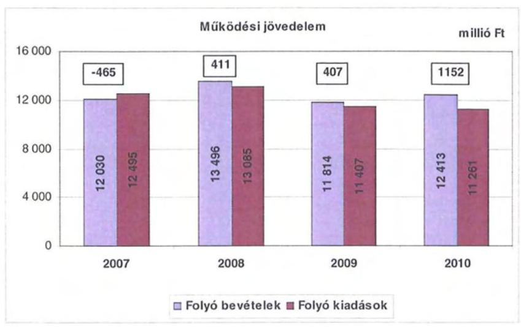

A folyó költségvetés egyenlege a 2007. évben forráshiányt mutatott, amely a folyó kiadások 3,7\%-át ( 465 millió Ft-ot) jelentette. A 2008-2010. évek között forrástöbblet keletkezett, amely a 2008. évben a folyó kiadások 3,1\%-át (411 millió Ft-ot), 2009-ben 3,6\%-át ( 407 millió Ft-ot), 2010-ben 10,2\%-át ( 1152 millió Ft-ot) tette ki. A vizsgált időszakban az összes múködési jövedelem 1506 millió Ft megtakarítást mutatott, amely az Önkormányzat fennálló tőketörlesztési kötelezettségeinek egy részéhez fedezetül szolgálhatott.

A 2008. évtől pozitív előjelű folyó költségvetési egyenleg ellenére az Önkormányzat folyószámla-, munkabér megelőlegezési- és likvid hitel, valamint vállalkozásaitól pénzeszköz átvételére kényszerült, egyrészt az átmeneti likviditási problémák kezelése, másrészt fejlesztési kiadásai finanszírozása miatt. A folyószámlahitel napi átlagos állománya a 2007. évről a 2010. évre 2832 millió Ftról 1479 millió Ft-ra csökkent, de az egyéb likvid hitel napi átlagos állománya is 352 millió Ft-ról 439 millió Ft-ra, valamint a társaságoktól kölcsönvett forrás a 2007. évi 168 millió Ft-ról a 2010. év végére 371 millió Ft-ra nőtt.

Az Önkormányzat hosszú- és rövid lejáratú kötelezettségein belül a 2007. évben a rövid lejáratú kötelezettségek állományának aránya 36,4\% (6969 millió Ft) volt, amely a 2010. évre 28,5\%-ra ( 6937 millió Ft) csökkent. A rövidlejáratú kötelezettségek arányának csökkenése a hosszúlejáratú kötelezettségek növekedése miatt következett be. Az Önkormányzat 2007. december 31-én fennálló pénz és tőkepiaci kötelezettsége $15703^{32}$ millió Ft-ról 20656 millió Ft-ra nőtt. A passzív elszámolások nélküli összes kötelezettségen belül a hosszú lejáratú pénzintézeti kötelezettségek a 2007. évi 12137 millió Ft-ról a 2010. évre 17435

[^0]
[^0]:    ${ }^{32}$ Az Önkormányzatnál rövidlejáratú hitelek állományai tartalmazzák a saját társaságaitól átvett összegeket, amely a 2007. évben 168 millió Ft, a 2008. évben 200 millió Ft, a 2009. évben 314 millió Ft, a 2010. évben 301 millió Ft volt.

---

millió Ft-ra 36,7\%-kal (4675 millió Ft-tal) nőttek, amelyet a hitelek átstrukturálása (rövidlejáratú hitel hosszú lejáratúvá történő átalakítása), valamint az egyes évek végén a könyvviteli nyilvántartásokban elszámolt összesen 5152 millió Ft árfolyam veszteség együttesen okozták.

A rövid lejáratú kötelezettségek 2010. év végi állománya 6937 millió Ft volt, amely 32 millió Ft-tal ( $0,5 \%$ ) volt kevesebb a 2007. évinél. Az összes rövid lejáratú kötelezettségen belül a rövid lejáratú pénzintézeti kötelezettség aránya a 2007. évben 53,6 \% ( 3734 millió Ft), a 2010. évben 50,8\% ( 3522 millió Ft) volt. A szállítói állomány aránya a 2007. évről a 2010. évre 37,2\%-ról 31,8\%-ra ( 2593 millió Ft-ról 2206 millió Ft-ra) csökkent. A 2010. év végén lejárt szállítói tartozásállomány 1725 millió Ft volt, amelynek $33,3 \%$-a ( 575 millió Ft) 90 napot meghaladó, $23,3 \%$-a ( 403 millió Ft) 30-90 nap közötti, $43,3 \%$-a ( 747 millió Ft) 30 napot meg nem haladó lejárt tartozás volt.

Az Önkormányzat 2010. év végi záró pénzkészlete 1139 millió Ft volt, amely 100\%-ban kötelezettséggel terhelt.

Az Önkormányzat pénzügyi kapacitása a 2007-2009. években csökkenő tendenciájú negatív értéket mutatott, a 2010. évben pozitív volt. A nettó múködési jövedelem értéke a folyó költségvetési pozíció mellett az adott költségvetési év adósságtörlesztésének hatását is tükrözi. A 2007-2010. évek között realizált 1506 millió Ft működési jövedelem a fejlesztési célú hitelekhez kapcsolódó, az időszak alatt fizetendő 6223 millió Ft tőketörlesztés $24,2 \%$-át fedezte, a hiányzó forrást évente fejlesztési, likviditási, és folyószámlahitel felvételével biztosították.

A nettó működési jövedelem - változó évenkénti tőketörlesztés ${ }^{23}$ mellett - a 2007. évben -2649 millió Ft, a 2008. évben -1926 millió Ft, a 2009. évben -643 millió Ft, a 2010. évben 500 millió Ft volt. A pénzügyi kapacitás 2007. évhez viszonyított 2010. évi növekedését a folyó bevételek és kiadások különbségéből származó működési jövedelem növekedése (a lejárt szállítói állomány növekedése mellett), illetve a tőketörlesztés csökkenése okozta. A müködési jövedelem növekedési tendenciája ellenére a fejlesztési kiadások fedezete - változatlan nettó múködési jövedelem képződése mellett - nem biztosított. A 2006. évben kibocsátott kötvény esetében mind a tőketörlesztésre, mind a kamatfizetésre négy és fél év türelmi időt kötöttek ki a szerződésben, amelyet szerződésmódosítás keretében további háromnegyed évvel meghosszabbítottak (2011. december 31-ig). Az öt év türelmi idő alatt felhalmozott kamat tőkésítésre kerül, amely várhatóan a 2010. év utáni időszak nettó múködési jövedelmére - a jelenleg fennálló kötelezettségek és gazdálkodási feltételek változatlansága mellett - negatív hatást gyakorol.

A finanszírozási problémák kezelése érdekében döntöttek az Önkormányzat tulajdonában lévő nagy értékű ingatlan (épület) és ingó (berendezési és kiállítási tárgyak) vagyon Magyar Államnak történő eladásáról. A Magyar Kormány a 1188/2011. (VI. 7.) számú Korm. határozatban döntött az ingatlan és ingó va-

[^0]
[^0]:    ${ }^{23}$ Az Önkormányzat tőketörlesztési kötelezettsége a 2007. évben 2184 millió Ft, a 2008. évben 2337 millió Ft, a 2009. évben 1051 millió Ft, a 201. évben 652 millió Ft volt.

---

gyon megvételéről. Az Önkormányzat tájékoztatása szerint az adásvételi szerződés aláírása július közepére várható, az adásvételi szerződés tervezete szerint a vételárat ( 1469 millió Ft) az aláírástól számított hét banki napon belül átutalják az Önkormányzat költségvetési elszámolási számlájára. Az ebből származó bevételi forrás azonban a 2011-2013. évek között esedékes összes forintban fennálló kötelezettségnek $24 \%$-át fedezi, a fennmaradó $76 \%$-ra és az esedékes devizakötelezettségek finanszírozására a múködési jövedelem a jelenleg ismert feltételek mellett a 2010. december 31-én meglévő pénzkészlet figyelembe vételével sem nyújt fedezetet, további forrás bevonását teheti szükségessé.
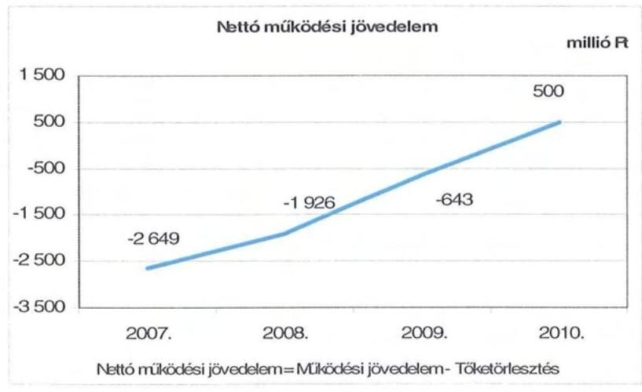

A 2007-2010. években az Önkormányzat felhalmozási költségvetésének egyenlege folyamatosan hiányt mutatott (negatív összegű volt), amely átlátható és szabályozott költségvetési gazdálkodás és pénzügyileg fenntartható ${ }^{34}$ beruházások esetén nem járna magas pénzügyi kockázattal, amenynyiben a felhalmozási hiányra a nettó múködési jövedelem fedezetet nyújtana.

A felhalmozási költségvetés egyenlegét évről évre a következő ábra szemlélteti:
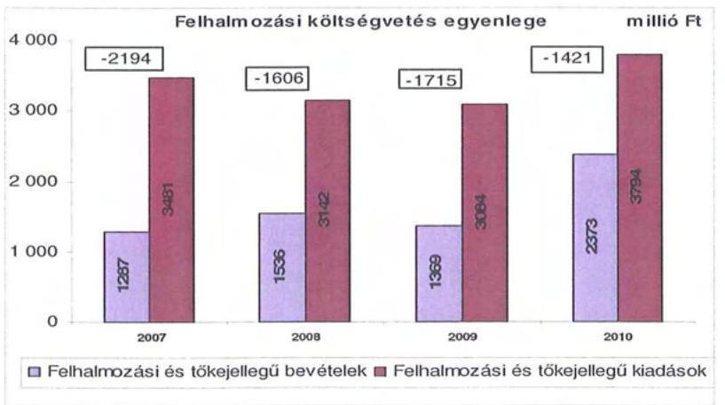

[^0]
[^0]:    ${ }^{34}$ Az minősül pénzügyileg fenntartható beruházásnak, amelynek működtetésére az Önkormányzat nettó múködési jövedelme a következő években is fedezetet nyújt.

---

A felhalmozási forráshiánynak a felhalmozási és tőke jellegű kiadásokhoz viszonyított aránya 2007-ben 63\% (2194 millió Ft), 2008-ban 51,1\% (1606 millió Ft), 2009-ben 55,6\% (1715 millió Ft), 2010-ben 37,5\% (1421 millió Ft) volt.

A 2007-2010. években keletkezett 6936 millió Ft felhalmozási forráshiány finanszírozása az előző évek pénzmaradványának igénybevételével (főként a kötvényekből származó bevétel), valamint folyószámla-, likvid- és fejlesztési célú hitelek felvételével történt. (Az évenkénti adatokat a jelentés 2. számú melléklete tartalmazza.)

Az Önkormányzat a függő, átfutó, kiegyenlítő bevételek és kiadások 121 millió Ft-os negatív egyenlegének folyószámlahitelből történő finanszírozásával 1139 millió Ft pénzkészlettel zárta a 2010. évet. A folyószámlahitel év végi állományának pénzmaradványban történő figyelembe vétele miatt a könyvviteli mérleg szerinti tartalékok, így az előző évek tartalékai számlák is negatív egyenleget mutatnak, amely igazolja, hogy a keletkezett felhalmozási hiány és a tőketörlesztés finanszírozására is vettek igénybe folyószámlahitel forrást.

Az Önkormányzat évenkénti teljes finanszírozási igénye ${ }^{35}$ a CLF módszer szerint 2007-ben 4842 millió Ft, 2008-ban 3532 millió Ft, 2009-ben 2359 millió Ft, 2010-ben 921 millió Ft volt, amelynek finanszírozását a kötvényből származó bevétel hosszú lejáratú bankbetétben elhelyezett összege, valamint az elszámolási számlán lévő pénzeszközök, éven belüli likviditási és éven túli hitelek biztosították.

Az önkormányzat finanszírozási műveletei 2007-2010. évekbeli egyenlegének alakulását a következő ábra szemlélteti:
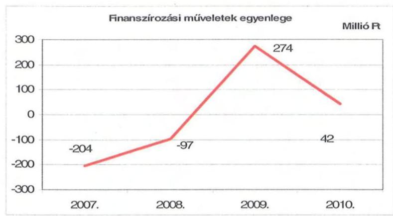

A 2007-2008. években a kötvényforrásból származó bevétel (tartalékok között kimutatott) biztosította a kiadások finanszírozását, a 2009-2010. évi finanszírozási többlet azt jelzi, hogy az éves költségvetések végrehajtása során az előző években keletkezett pénzmaradvány igénybevételén túl külső finanszírozás igénybevételére is sor került. (A finanszírozási célú műveleteket a vizsgált időszakban a jelentés 2. számú mellékletének 4.1-4.8 pontjai részletezik.)

[^0]
[^0]:    ${ }^{35}$ A finanszírozási igény a nettó működési jövedelem és a beruházási költségvetés eredője.

---

Az Önkormányzat a zárszámadási rendeleteiben a múködési és fejlesztési hiányt a költségvetés szerkezetére előírtak szerint mutatta be ${ }^{36}$, amelyről a jelentés 1. számú melléklete nyújt tájékoztatást. A 2007-2010. évi zárszámadási rendeletekben évről évre pénzügyi többletet mutattak ki.

A 2007-2010. évek között az Önkormányzat összesen 1593 millió Ft kamatot fizetett meg. Az átmenetileg szabad pénzeszközeinek befektetéséből realizált kamatbevétel $41 \%$-kal ( 661 millió Ft-tal) haladta meg a kamatkiadásokat. A kamatkiadás a 2007. évi 399 millió Ft-ról a 2010. év végére 362 millió Ft-ra csökkent, főként amiatt, hogy a kötvény esetében a kamatfizetésre a tőketörlesztéssel azonos, négy és fél év türelmi időt határoztak meg a szerződésben.

Az Önkormányzat kamatbevételeit és kamatkiadásait a 2007-2010. évek között a következő ábra mutatja:
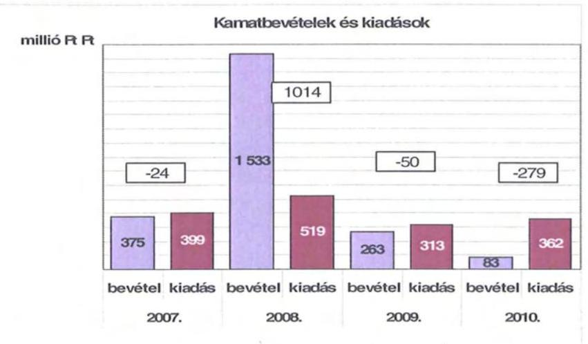

A 2011. évre az Önkormányzat a kamatkiadások további emelkedésével számol, elsősorban amiatt, hogy a kötvény utáni kamatfizetési kötelezettség 2011. december 31 -én esedékes (módosított türelmi idő lejárata). A költségvetési rendeletben tervezett 532 millió Ft kamatkiadás 46,6\%-kal, 169 millió Ft-tal haladhatja meg a 2010. évit.

# 2.2. Az Önkormányzat bevételei 

Az Önkormányzatnál a CLF módszer szerint számított folyó bevétel és a felhalmozási bevétel együttes összege a 2007-2010. évek között változóan alakult, az előző évhez képest a 2008. évre 13317 millió Ft-ról 15032 millió Ft-ra nőtt, majd a 2009. évre 13183 millió Ft-ra csökkent, a 2010. évre pedig 14786 millió Ft-ra nőtt. A folyó bevételeknek a 2008. évről a 2009. évre történő 1682 millió Ft-os csökkenését főként az állami hozzájárulások és az átengedett személyi jövedelemadó együttes összegének 5831 millió Ft-ról 5485 millió Ft-ra ( $94 \%$-ra), valamint a saját működési bevételek összegének 4278 millió Ft-ról 3339 millió Ft-ra ( $78 \%$-ra) történő csökkenése (hozam-és kamatbevételek csökkenése) okozta.

[^0]
[^0]:    ${ }^{36}$ Nincs kötelező előírás a működési és fejlesztési hiány megállapításának módjára.

---

Az Önkormányzat 2007-2010. évek között realizált főbb folyó (működési) bevételi jogcímeinek számszaki adatait grafikon mutatja be:
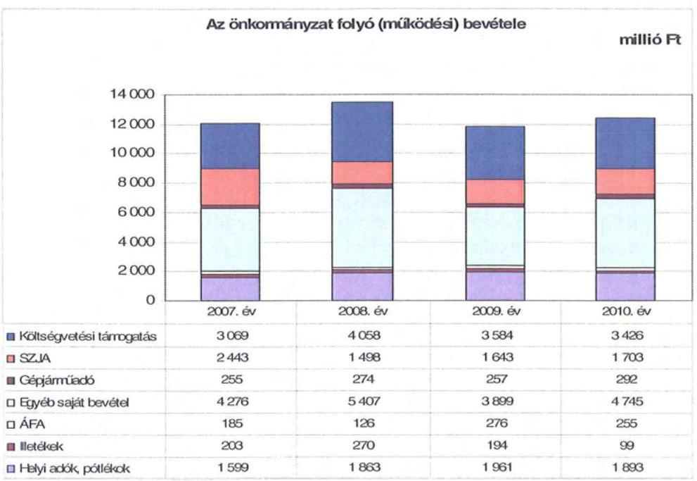

Az összes folyó (működési) bevétel a 2007. évről a 2010. évre 12030 millió Ftról 12413 millió Ft-ra 3\%-kal nőtt.

Az Önkormányzat költségvetési támogatásai és az szja bevétel együttes összege - amelyek döntő mértékben múködési támogatások voltak - a 2007. évi 5512 millió Ft-ról 2010. évre 5129 millió Ft-ra (7\%-kal) csökkent a központi támogatáselosztás változása, illetve az ellátotti létszám csökkenése (feladatátadások egyháznak és Kistérségi társulásnak), valamint az egyszeri támogatások (létszámcsökkentési döntésekhez, bérpolitikai intézkedésekhez kapcsoló támogatások) együttes hatásának következtében. Az összes költségvetési támogatásból a felhalmozási célú költségvetési támogatások összege a 2007. évben 50 millió Ft, a 2008. évben 40 millió Ft, a 2009. évben 38 millió Ft, a 2010. évben 39 millió Ft volt, amelyet vis major feladatok támogatására kapott az Önkormányzat. A 2007-2009. évek között évről évre folyamatosan nőtt az iparúzési adóerőképesség (a 2007.évben 783 millió Ft, a 2008. évben 799 millió Ft, a 2009. évben 853 millió Ft) és a lakhelyen maradó szja összege (a 2007. évben 352 millió Ft, a 2008. évben 410 millió Ft, a 2009. évben 501 millió Ft). A 2010. évben az egy főre jutó kiegészítés nőtt 10,5\%-kal (23 200Ft-ról 25 647Ft-ra), amelynek következtében nőtt az átengedett szja összege. Ennek hatására a 2007. évi jövedelemkülönbség mérséklés 926 millió Ft-os összege 37,9\%-ot, míg a 2010. évi 1214 millió Ft-os összege 71,3\%-ot képviselt az összes átengedett szja-n belül.

A gépjármúadóból származó bevétel a 2007. évről a 2010. évre 14,3\%-kal (37 millió Ft-tal) emelkedett, egyrészt a 2010. évben történt gépjármúadó mértékének emeléséből, másrészt az ellenőrzési, végrehajtási munka eredményeként. A 2008. évről a 2009. évre történő 17 millió Ft-os csökkenés a gazdasági válság hatására következett be.

---

A vizsgált időszakban az összes egyéb saját folyó bevétel változóan alakult. Az előző évhez képest a 2008. évre a 2007. évi 4279 millió Ft-ról 5407 millió Ft-ra ( $26,4 \%$-kal) nőtt, a 2009. évre 3899 millió Ft-ra ( $27,9 \%$-kal) csökkent, míg a 2010. évre 4745 millió Ft-ra ( $21,7 \%$-kal) növekedett. A támogatásértékű bevételek összege a 2007. évben 2443 millió Ft, a 2008. évben 2714 millió Ft, a 2009. évben 2679 millió Ft, a 2010. évben 2912 millió Ft volt, amelynek közel 100\%-át a Kórház járó- és fekvőbeteg ellátási feladataihoz nyújtott OEP támogatás tette ki. A hozam és kamatbevételek a 2008. évben kiugróan magas öszszegben ( 1533 millió Ft) realizálódtak a 2006. évben kibocsátott kötvényből származó bevétel átmenetileg szabad forrásként rendelkezésre álló részének befektetéséből. Az egyéb saját folyó bevételek alakulását befolyásolta továbbá, hogy az Önkormányzat peren kívüli megállapodás alapján a Kórház és az OEP közötti finanszírozási ügyből eredően a központi költségvetésből egyszeri 780 millió Ft egyéb bevételhez jutott. A közfeladatot ellátó gazdasági társaságok a 2007-2010. évek között osztalékot nem fizettek, ezen időszak alatt az Önkormányzat nem mondott le osztalékról.

Az áfa bevételek összege a 2007. évi 182 millió Ft-ról a 2010. évre 255 millió Ft-ra, $40,1 \%$-kal nőtt, amely főként a fordított áfa ${ }^{37}$ elszámolásához kapcsolódott.

Az Önkormányzatot megillető illetékbevétel az illetéktörvény változása és a gazdasági válság következtében közel a felére ( 203 millió Ft-ról 100 millió Ft-ra) csökkent.

Az Önkormányzatnál a helyi adókból és pótlékokból származó bevételek folyó (múködési) bevételeken belüli aránya 2007-2010. évek között 13,3-$13,8-16,6-15,2 \%$ volt. A helyi adóbevételek és bírságok együttes összege a 2007. évről 2010. évre $24 \%$-kal (294) millió Ft-tal növekedett döntően az építményadó mértékének emelése hatására. Az Önkormányzat a 2007-2010. évek között hat ${ }^{38}$ helyi adónemet múködtetett. Az időszak alatt új adónem bevezetéséről nem döntöttek, a 2008. évtől az adót fizetők körét bővítették az építményadó tekintetében a magánszemélyek kommunális adójának megszüntetése mellett. A helyi adóbevétel az előző évhez képest a 2007-2009. évek között folyamatosan nőtt (1599-1863-1961 millió Ft), a 2010. évre csökkent (1893 millió Ft). A növekedést elsősorban a telekadó és a kommunális adó mértékének emelése okozta. A helyi adóbevétel növekedésére pozitív hatással volt az Önkormányzat által helyi vállalkozásoknak nyújtott munkahelyteremtő támogatás

[^0]
[^0]:    ${ }^{37}$ A fordított áfa miatti bevétel a 2007. évben nem volt, a 2008. évben 24 millió Ft, a 2009. évben 191 millió Ft, a 2010. évben 133 millió Ft volt.
    ${ }^{38}$ Bevezetett helyi adók: helyi iparűzési adó (adómérték 2\%); építményadó (a 20072009. években $900 \mathrm{Ft} / \mathrm{m}^{2}$, a 2010. évtől $1240 \mathrm{Ft} / \mathrm{m}^{2}$ ); magánszemélyek építményadója lakás, üdülő, garázs (a 2008. évtől $100 \mathrm{Ft} / \mathrm{m}^{2}$ ); idegenforgalmi adó ( $100 \mathrm{Ft} /$ fő/éjszaka); telekadó (területi kategóriák szerint a 2007-2009. években az 1. számú körzetben 60 $\mathrm{Ft} / \mathrm{m}^{2}$, a 2. számú körzetben $40 \mathrm{Ft} / \mathrm{m}^{2}$, a 3. számú körzetben $50 \mathrm{Ft} / \mathrm{m}^{2}$, a 4. számú körzetben $0 \mathrm{Ft} / \mathrm{m}^{2}$, a 2010. évtől az 1. számú körzetben $275 \mathrm{Ft} / \mathrm{m}^{2}$, a 2. számú körzetben $70 \mathrm{Ft} / \mathrm{m}^{2}$, a 3. számú körzetben $40 \mathrm{Ft} / \mathrm{m}^{2}$, a 4. számú körzetben $40 \mathrm{Ft} / \mathrm{m}^{2}$ );vállalkozók kommunális adója (2000Ft/adótárgy); magánszemélyek kommunális adója (építmények után fizették, 2007. december 31-én megszűnt).

---

is, amellyel a vállalkozások fennmaradását, jövedelemtermelő képességük növelését segítették elő, ezáltal az általuk fizetett helyi adók növekedését érték el.

Az Önkormányzat gazdasági társaságainak összes bevétele a 2007. évben 7949 millió Ft-ot, 2008-ban 5342 millió Ft-ot, a 2009. évben 4031 millió Ft-ot, a 2010. évben 4543 millió Ft-ot tett ki. Az önkormányzat által nyújtott támogatások aránya az összes bevételhez viszonyítva 2007. évben 7\%, a 2008-ban $5,7 \%$, a 2009. évben $11,4 \%$, a 2010. évben $12,9 \%$ volt. A $75 \%$-ot meghaladó önkormányzati részesedésű társaságok összes bevétele a 2007. évben 7903 millió Ft, a 2008. évben 5289 millió Ft, a 2009. évben 3807 millió Ft, a 2010. évben 4274 millió Ft, az önkormányzati támogatások összes bevételhez viszonyított aránya a 2007. évben 7\%, a 2008. évben 5,7\%, 2009. évben 10,8\%, a 2010. évben $13,1 \%$ volt. A gazdasági társaságok önkormányzati támogatásának részletes adatait a 4 . számú melléklet tartalmazza.

Az Önkormányzat felhalmozási bevételei a vizsgált időszakban:

| Megnevezés | 2007. év   tény | 2008. év   tény | 2009. év   tény | 2010. év   tény |
| :-- | :--: | :--: | :--: | :--: |
| Tárgyi eszköz értékesítés | 365 | 157 | 146 | 35 |
| Egyéb saját tőkebevétel | 241 | 982 | 514 | 600 |
| Államháztartáson belülről   kapott támogatás | 396 | 288 | 614 | 1693 |
| EU-tól és külföldről kapott   támogatások | 203 | 0 | 0 | 0 |
| Államháztartáson kívülről   kapott támogatás | 82 | 110 | 95 | 45 |
| Összes felhalmozási bevétel | 1287 | 1537 | 1369 | 2373 |

A tárgyi eszközök értékesítéséből származó bevétel a 2007-2010. évek között az előző évhez képest folyamatosan csökkent, a 2010. évben e jogcímen realizált bevétel a 2007. évinek csak mintegy egy százaléka volt, amelynek oka a gazdasági válságból eredő ingatlanpiaci kereslet visszaesése.

Az egyéb saját tőkebevétel a 2007. évről a 2010. évre közel két és félszeresére ( 241 millió Ft-ról 601 millió Ft-ra) nőtt, elsősorban az Önkormányzat tulajdonában lévő gazdasági társaságok, Kistérségi társulás, civil szervezetek és intézmények ${ }^{39}$ részére visszafizetési kötelezettséggel átadott pénzeszközök megtérülése miatt. A 2007-2010. évek között az Önkormányzat által adott 1198 millió Ft-ból 2010. december 31-éig 972 millió Ft térült vissza.

[^0]
[^0]:    ${ }^{39}$ Az intézményeknél a pályázatokhoz kapcsolódó támogatások megelőlegezését szolgálták.

---

Az államháztartáson belülről kapott támogatás a 2007. évről a 2010. évre több mint négyszeresére, 396 millió Ft-ról 1693 millió Ft-ra nőtt. A növekmény több mint a felét, 913 millió Ft-ot az operatív programok és a területfejlesztés (TIOP, DAOP, DARFT, stb.) keretében kiírt pályázatokon nyert támogatások tették ki. A növekmény másik részét ( 780 millió Ft-ot) az Önkormányzat és a Kórház közötti átutalások ${ }^{40}$ okozták.

Az EU-tól a 2007. évben kapott 203 millió Ft támogatás a 2007. évet megelőzően induló fejlesztésekhez kapcsolódott, a következő évektől kezdődően ilyen jogcímen bevétel nem realizálódott. A fejlesztésekhez kapcsolódó operatív programok által kiírt pályázatokon elnyert támogatásokat az államháztartáson belülről kapott támogatások között - támogatásértékű felhalmozási bevételként kellett elszámolni a számviteli előírások alapján.

# 2.3. Az Önkormányzat folyó kiadásai 

Az Önkormányzatnál a CLF módszer szerint számított folyó és felhalmozási kiadások együttes összege a 2007-2010. évek között változóan alakult, az előző évhez képest a 2008. évre 15976 millió Ft-ról 16227 millió Ft-ra nőtt, majd a 2009. évre 14491 millió Ft-ra csökkent, a 2010. évre pedig 15055 millió Ft-ra nőtt. A folyó kiadásoknak a 2008. évről a 2009. évre történő 1736 millió Ft-os csökkenését főként a folyó kiadások között elszámolt árfolyamveszteség és a létszámcsökkentésből eredő személyi juttatás csökkenése, valamint a dologi kiadások növekedése együttes hatása okozta. A felhalmozási kiadások összege a 2007. évben 3481 millió Ft, a 2008.évben 3142 millió Ft, a 2009. évben 3084 millió Ft, a 2010. évben 3794 millió Ft volt.

Az Önkormányzat folyó kiadásai főbb jogcímek szerinti bontásban a következők voltak:

[^0]
[^0]:    ${ }^{40}$ Az Önkormányzat a Kórház és az OEP közötti kártérítési ügyből eredően kártérítés jogcímen kapott és a könyvviteli elszámolásokban kártérítésként lekönyvelt 780 millió Ft-ot, amelyet Kórháznak előbb átadott („támogatásértékủ felhalmozási kiadás önkormányzatnak és költségvetési szerveinek" jogcímen kiadásként számolták el), majd a Kórház visszautalta az Önkormányzatnak („támogatásértékủ felhalmozási bevétel helyi önkormányzat és költségvetési szerveitől" jogcímủ bevételként számolták el) a Kórház és az Önkormányzat között a 420/2010. (X. 28.) számú közgyűlési határozattal jóváhagyott fejlesztési koncepció végrehajtása tárgyában megkötött megállapodás alapján, melyben a Kórház vállalta az Önkormányzat által benyújtott pályázatok önerejéhez való hozzájárulást).

---

| Megnevezés | 2007. | 2008. | 2009. | 2010. |
| :--: | :--: | :--: | :--: | :--: |
| Folyó kiadások | 12495 | 13085 | 11407 | 11261 |
| Müködési kiadások (kamatkiadás nélkül) | 9942 | 11056 | 9872 | 9400 |
| Államháztartáson belülre átadott pénzeszközök | 494 | 248 | 52 | 123 |
| Transzferkiadások | 1287 | 784 | 1007 | 1230 |
| -ebből: vállalkozásoknak | 271 | 45 | 166 | 204 |
| EU-nak, illetve külföldre | 5 | 9 | 0 | 0 |
| magánszemélyeknek | 558 | 581 | 592 | 644 |
| nonprofit szervezeteknek | 453 | 149 | 249 | 382 |
| Kamatkiadások | 399 | 519 | 313 | 363 |
| Előző évi pénzmaradvány átadás | 373 | 478 | 163 | 145 |
|  |  |  |  | millió Ft |
| Megnevezés | 2007. | 2008. | 2009. | 2010. |
| Személyi juttatások | 4848 | 4347 | 3900 | 3961 |
| Munkaadót terhelő járulékok | 1553 | 1392 | 1168 | 1049 |
| Dologi kiadások | 3106 | 3156 | 3973 | 4149 |
| Egyéb folyó kiadások | 435 | 1656 | 831 | 241 |
| Müködési célú pénzeszközáladás | 1781 | 1031 | 1059 | 1353 |

Az Önkormányzat teljesített folyó kiadásai a 2007. évről a 2010. évre 12495 millió Ft-ról 11261 millió Ft-ra ( $9,9 \%$-kal) csökkentek.

A 2010. évben a 12495 millió Ft folyó költségvetésből 5010 millió Ft-ot (44,5\%ot) személyi juttatásokra és a munkaadókat terhelő járulékokra fordítottak, ez az arány a 2007. évben $51,2 \%$ volt. Az üzemeltetést, intézményfenntartást biztosító dologi kiadásokra a 2010. évben 4149 millió Ft (36,8\%) jutott, a 2007. évben az összes múködési kiadáson belül a dologi kiadások aránya $24,9 \%$ volt. A személyi juttatások összege a 2007-2009. évek között minden évben csökkent a létszámcsökkentések miatt, de a 2010. évben az előző évhez képest 61 millió Ft-tal nőtt. A dologi kiadások a 2010. évben a 2007. évi szintnél 1043 millió Ft-tal ( $33,6 \%$-kal) voltak magasabbak ${ }^{41}$, az inflációt meghaladó mértékben nőttek, annak ellenére, hogy a 2007. évtől kiadáscsökkentő intézkedéseket vezettek be, intézményeket adtak át az egyháznak és a Kistérségi társulásnak. A többletkiadás fedezetét a végrehajtott kiadáscsökkentő intézkedésekkel, és saját forrással biztosították. Az egyéb folyó kiadásokra teljesített kifizetés a 2007-2010. évek között változóan alakult, kiugróan magas volt a 2008. évben a realizált árfolyamveszteség ${ }^{42}$ címén elszámolt 1433 millió Ft kiadás miatt. A 2007-2010. években összesen elszámolt 2109 millió Ft realizált árfolyamveszteségből a hosszúlejáratú hitelek törlesztése miatt 159 millió Ft árfolyamveszteséget számoltak el, a többi a forgatási célú pénzügyi múveletek (főként devizára kötött határidős ügyletek), kisebb arányban a devizában kapott és forintban felhasznált támogatások miatt keletkezett. A realizált kamat és árfolyamnyereség a 2007-2010 között összesen 2132 millió Ft volt.

[^0]
[^0]:    ${ }^{41}$ A dologi kiadások összegei az éves költségvetési beszámolók alapján kerültek figyelembevételre. A fordított áfa miatti kiadás a folyó kiadások között a 2007. évben nem volt, a 2008. évben 24 millió Ft, a 2009. évben 191 millió Ft, a 2010.évben 133 millió Ft volt.
    ${ }^{42}$ Árfolyamveszteség címén a 2007. évben 198 millió Ft-ot, a 2008. évben 1433 millió Ft, a 2009. évben 477 millió Ft-ot, a 2010. évben négy millió Ft-ot számoltak el.

---

A múködési célú pénzeszközátadások (az államháztartáson belülre átadott pénzeszközöket és a transzfer kiadásokat tartalmazza) nagysága változóan alakult, a 2007. évről a 2008. évre 750 millió Ft-tal ( $42,1 \%$-kal) csökkent, a 2009. évben az előző évi 1031 millió Ft-ról 1059 millió Ft-ra ( $2,7 \%$-kal), a 2010. évben 1353 millió Ft-ra ( $27,8 \%$-kal) emelkedett. A előző évhez viszonyított csökkenést is és növekedést is elsősorban a vállalkozások és nonprofit szervezetek támogatásának előző évhez viszonyított csökkenése vagy növekedése okozta.

Az önkormányzati kiadásokban a 2007. évről a 2010. évre 0,3 százalékponttal nőtt a Kórházi kiadások ${ }^{43}$ súlya. A Kórház folyó kiadásainak összes folyó kiadásokhoz viszonyított 12-13\% közötti súlya miatt a Kórház nélkül számított folyó kiadásokban jelentkező tendenciák nem térnek el az Önkormányzat összes folyó kiadásaiban jelentkező tendenciáktól.

Az Önkormányzat Kórház nélküli folyó kiadásai a vizsgált időszakban:

| Megnevezés | 2007. | 2008. | 2009. | 2010. |
| :--: | :--: | :--: | :--: | :--: |
| Folyó kiadások | 10942 | 11619 | 10047 | 9833 |
| Müködési kiadások (kamatkiadás nélkül) | 8389 | 9643 | 8512 | 7973 |
| Allamháztartáson belülre átadott pénzeszközök | 494 | 248 | 52 | 123 |
| Transzferkiadások | 1287 | 784 | 1007 | 1230 |
| elöböl: vállalkozásoknak | 27 | 45 | 166 | 204 |
| EU-nek, illetve kollitáére | 5 | 9 | 0 | 0 |
| magánszemélyeknek | 558 | 581 | 592 | 644 |
| nonprofit szervezeteknek | 453 | 149 | 249 | 382 |
| Kamatkiadások | 399 | 519 | 313 | 362 |
| Előző évi pénzmaradvány átadás | 373 | 425 | 163 | 145 |

|  |  |  |  |  |
| :-- | --: | --: | --: | --: |
| Megnevezés | 2007. | 2008. | 2009. | 2010. |
| Személyi juttatások | 4097 | 3795 | 3410 | 3488 |
| Munkaadót terhelő járulékok | 1307 | 1211 | 1016 | 922 |
| Dologi kiadások | 2559 | 2985 | 3265 | 3339 |
| Egyéb folyó kiadások | 426 | 1652 | 821 | 224 |
| Müködési célú pénzeszközátadás | 1781 | 1031 | 1059 | 1353 |

A Kórháznál a személyi juttatásra teljesített kiadás 751 millió Ft-ról 474 millió Ft-ra ( $37,9 \%$-kal), a többi intézménynél a 2007. évről a 2010. évre 4097 millió Ft-ról 3488 millió Ft-ra ( $14,9 \%$-kal) csökkent. Az egészségügyi ágazatban a létszám (az összes megszüntetett álláshely $55 \%$-a a Kórháznál volt) és a bérek csökkenése nagyobb mértékű volt más ágazati feladatokat ellátó intézményekénél, amelyhez hozzájárult a kiszervezett feladatokkal összefüggő személyi juttatás csökkenés.

A 2010. évre a Kórházon kívüli intézményeknél a dologi kiadások a 2007. évi 2559 millió Ft-ról 3339 millió Ft-ra növekedtek ( $30,5 \%$-kal), amely kisebb arányú volt, mint a Kórház dologi kiadásainak ${ }^{44}$ növekedése ( $48,1 \%$-os). A Kórház dologi kiadásainak a többi intézményhez képest nagyobb mértékű növekedését az okozta, hogy egyes szolgáltatásokat a kórházi keretek köréből ki-

[^0]
[^0]:    ${ }^{43}$ A kiadások a fekvőbeteg ellátásra fordított kiadásokat jelentik.
    ${ }^{44}$ A Kórház dologi kiadása a 2007. évi 547 millió Ft-ról a 2010. évre 810 millió Ft-ra nőtt.

---

szervezték, amelynek következtében csökkentek a személyi juttatások és a járulékaik, ugyanakkor a dologi kiadások növekedtek, amely hozzájárult a dologi kiadások önkormányzati szintű növekedéséhez. A Kórháznál a dologi kiadások nagyságát befolyásolta még a 2010. december 31-én fennálló 166 millió Ft szállítói állomány is.

Az Önkormányzat a 2007-2010. évek között a Kórház múködési kiadásaihoz ${ }^{45}$ 396 millió Ft-tal járult hozzá. A kórházi múködési támogatások a központi bérpolitikai intézkedésekhez, a létszámcsökkentésekhez kapcsolódó többletköltség fedezetéhez, a 13. havi juttatások kifizetéséhez, kereset kiegészítésekhez kapcsolódtak, melyeket az Önkormányzat központi költségvetésből kapott támogatásból finanszírozott. ${ }^{46}$ Az Önkormányzat a múködési célú támogatáson felül a 2007-2010. évek között nem nyújtott fejlesztési célú támogatást a Kórház részére.

A Kórház részére nyújtott támogatásokat évenként a következő grafikon mutatja be:
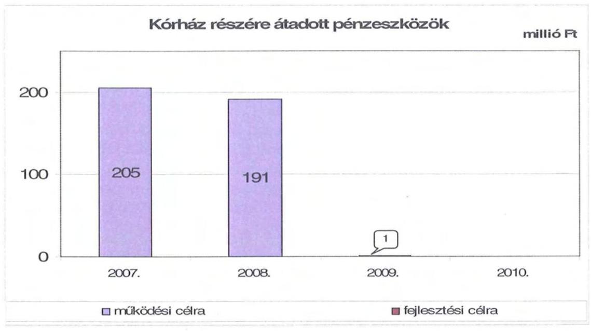

A Polgármesteri hivatal könyveiben számoltak el a 2007-2010. évek között öszszesen 368 millió Ft fejlesztési kiadást, amelyet a háziorvosi ügyelet eszközfejlesztésére, a 70 ágyas krónikus osztály, az egynapos sebészet és a gyógyszertár kialakítására, a gép-műszer beszerzésre, gyógymedence építésére, sürgősségi fogadóhely kialakítására fordítottak.

[^0]
[^0]:    ${ }^{45}$ Az Önkormányzat a Kórház részére nyújtott támogatást intézményfinanszírozás jogcímen biztosította.
    ${ }^{46}$ Az Önkormányzat saját forrásából nem nyújtott támogatást a Kórháznak a 20072010. évek között.

---

Az Önkormányzat által a gazdasági társaságok részére nyújtott múködési és felhalmozási célú átadott pénzeszközöket következő diagram mutatja be a 2007-2010. évekre:
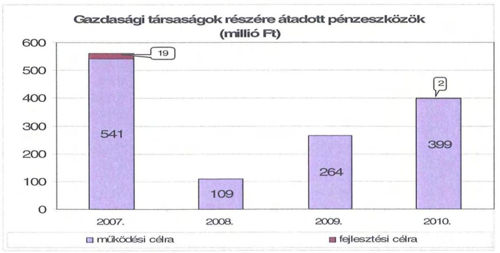

Az önkormányzati feladatellátásban résztvevő gazdasági társaságoknak átadott müködési célú pénzeszközök ${ }^{47}$ a vizsgált években változóan alakultak, a 2007. évi 541 millió Ft-ról 2008. évre 79,9\%-kal, 109 millió Ft-ra csökkentek, a 2009. évre 142,2\%-kal, 264 millió Ft-ra és a 2010. évre 51,1\%-kal, 399 millió Ftra nőttek. A 2007-2010. évek között múködési célra átadott pénzeszközök 26,4\%-a ( 347 millió Ft) a központi költségvetésből a közfoglalkoztatásra az Önkormányzatnak utalt támogatás továbbutalása volt a feladatot ellátó egy gazdasági társaságok részére. A legnagyobb összegű pénzeszköz átadás a következő önkormányzati feladatot ellátó gazdasági társaságok részére történt a vizsgált években:

[^0]
[^0]:    ${ }^{47}$ A 2. számú mellékletben szereplő transzferkiadásokból a vállalkozásoknak átadott pénzeszközök és a 4. számú mellékletben szereplő, társaságoknak nyújtott önkormányzati támogatások összege közötti eltérést az okozza, hogy az Önkormányzat a nonprofit gazdasági társaságoknak nyújtott támogatásokat a nonprofit szervezeteknek átadott pénzeszközök között mutatja ki. A 2. számú mellékletben szereplő nonprofit szervezeteknek nyújtott támogatások között a társaságokon kívül más nonprofit szervezeteknek átadott pénzeszközök összege is szerepel.

---

millió Ft

| Megnevezés | 2007. év   tény | 2008. év   tény | 2009. év   tény | 2010. év   tény | Összesen |
| :-- | :--: | :--: | :--: | :--: | :--: |
| Közétkeztetés (Hód Menza Kft,   múködési célú támogatás) | 178 | 96 | 29 | 14 | 317 |
| Városüzemeltetési feladatok   (Városellútó Kft, müködési és   felhalmozási célú támogatás) | 142 | 0 | 185 | 362 | 689 |
| Szociális foglalkoztatás (Hódfó   Nonprofit Kft, müködési célú   támogatás) | 43 | 13 | 0 | 0 | 56 |
| Összesen | $\mathbf{3 6 3}$ | $\mathbf{1 0 9}$ | $\mathbf{2 1 4}$ | $\mathbf{3 7 6}$ | $\mathbf{1 0 6 2}$ |

A müködési és felhalmozási kiadások aránya a 2007-2010. évek között nem változott számottevően, a 2007. évben $21,8 \%$, a 2008. évben $19,4 \%$, a 2009. évben $21,3 \%$, a 2010. évben $25,2 \%$ volt. A müködési és felhalmozási kiadásokat a 2007-2010. évek között a következő ábra mutatja:
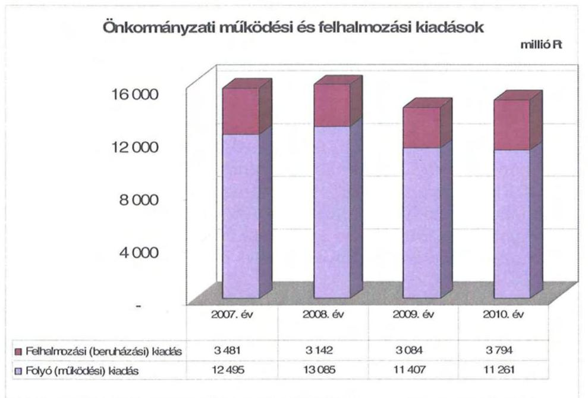

Az Önkormányzat a 2007-2010. évek között 10383 millió Ft összköltségú fejlesztéseket tervezett saját forrással és az európai uniós forrásokra benyújtott pályázatok segítségével. A 2007-2010. években európai uniós támogatásokra összesen 56 pályázat benyújtásáról döntöttek. A pályázatok közül 35 támogatásban részesült, nyolc pályázat elbírálása folyamatban volt, 13 pályázat eredménytelen volt.

A 2007-2010 években megvalósított és folyamatban lévő kiemelt infrastrukturális beruházások a következők voltak: gyűjtőút-hálózat rekonstrukciója, ipari parkot összekötő út építése, belterületi utak rehabilitációja, mezőgazdasági utak fejlesztése, közvilágítás fejlesztése, kerékpárút építése, csapadékvíz elve-

---

zetés, Kórház bővítése ( 70 ágyas krónikus fekvőbeteg-osztály kialakítása), általános iskolák és óvodák, középiskolák bővítése, felújítása, a TISZK fejlesztése, regionális környezeti nevelési központ létrehozása, kialakítása, időszaki kiállítóhely látogatóbarát fejlesztése (Emlékpont) és ingatlanok vásárlása.

Az Önkormányzatnál a 2007-2010. évek között müszakilag befejezett beruházások és felújítások kifizetésére 10258 millió Ft kiadást teljesítettek, amelyből a 2006. december 31 -éig teljesített kifizetés 1740 millió Ft volt. A 10258 millió Ft-ból 3033 millió Ft-ot ( $29,6 \%$-át) saját forrásból, 2000 millió Ft-ot ( $19,5 \%$-át) hosszú lejáratú hitelből, 3040 millió Ft-ot ( $29,6 \%$-át) kötvényből származó bevételből, 1297 millió Ft-ot ( $12,6 \%$-át) európai uniós forrásból, 888 millió Ft-ot ( $8,7 \%$-át) hazai támogatásból finanszírozták. Az összes beruházási, felújítási kiadás $22,5 \%$-át ( 2314 millió Ft-ot) a 10 millió Ft alatti egyedi bekerülési költségű beruházások és felújításokra teljesített kifizetések tették ki. A megvalósított fejlesztések közül 10 fejlesztési kiadás finanszírozásához kapcsolódott az összesen 1297 millió Ft uniós forrás. (A műszakilag befejezett felhalmozási kiadások adatait a 3a. számú melléklet tartalmazza részletesen).

A 2007-2010. évek között megvalósított, 2010. december 31-én folyamatban lévő, pénzügyileg rendezett fejlesztések tényleges bekerülési költsége 1163 millió Ft volt, a pénzügyileg teljesített kiadás $46,5 \%$-át ( 541 millió Ft ) saját forrásból, $53,1 \%$-át ( 618 millió Ft ) európai uniós forrásból, $0,4 \%$-át ( 4 millió Ftot) hazai támogatásból finanszírozták. (A folyamatban lévő, pénzügyileg rendezett felhalmozási feladatok adatait a 3b. számú melléklet mutatja be részletesen).

A 2010. december 31-én folyamatban lévő beruházások tervezett bekerülési költsége 4952 millió Ft volt, amelyből 1145 millió Ft kifizetése történt meg 2010. december 31-éig. A 2010. december 31. utánra vállalt kötelezettség 3559 millió Ft, amelynek forrásaként 628 millió Ft saját forrással, 2579 millió Ft európai uniós forrással és 352 millió Ft hazai támogatással számoltak. (A folyamatban lévő beruházások részletes adatait a 3c. számú melléklet tartalmazza részletesen).

Az Önkormányzatnál a beadott, elbírálás alatt lévő pályázati forrásból megvalósítandó fejlesztések tervezett bekerülési költsége 3627 millió Ft, amelynek forrásaként 924 millió Ft saját forrást, 2656 millió Ft európai uniós forrást és 47 millió Ft hazai támogatást tervezték. (Az elbírálás alatt lévő pályázatokkal kapcsolatos adatokat a 3d. számú melléklet tartalmazza részletesen).

A 2010. december 31-én múszakilag is befejezett beruházások és felújítások közül a három legnagyobb bekerülési költségú fejlesztésre öszszesen 3310 millió Ft kiadást teljesítettek, amelyből 2006. december 31-éig 1694 millió Ft-ot, a 2007-2010. évek között 1616 millió Ft-ot fizettek ki. A 3310 millió Ft kiadás forrása 381 millió Ft ( $11,5 \%$ ) saját forrás, 2052 millió Ft ( $62 \%$ ) kötvényből származó bevétel, 812 millió Ft ( $24,5 \%$ ) európai uniós forrás és 65 millió Ft ( $2 \%$ ) hazai támogatás volt. A három legnagyobb bekerülési költségű beruházás adatai a következők:

---

- A Közgyűlés a 2005. évben döntött ${ }^{48}$ a legmagasabb bekerülési költségű (2051 millió Ft) „Hódmezővásárhely belterületi utak fejlesztési programja" megvalósításáról. A fejlesztést saját forrásból tervezték megvalósítani 2086 millió Ft tervezett bekerülési költséggel. A beruházás a 2007. évben befejeződött, a tényleges kifizetés 2052 millió Ft, amelynek fedezetét kötvényforrásból biztosították;
- Az Önkormányzatnál az „Elektronikus ügyfélszolgálat és korszerű térinformatikai megoldások bevezetése Hódmezővásárhely Megyei Jogú Városban" című pályázaton (Gazdasági Versenyképesség Operatív Program) elnyert 250 millió Ft európai uniós forrás és 122 millió Ft saját forrás felhasználásával kialakították az elektronikus ügyfélszolgálati és korszerű térinformatikai rendszert;
- Az Önkormányzat a 2007. évben döntött ${ }^{49}$ a „Hód-Ipari Parkot és a 47-es főközlekedési utat összekötő külterületi út építéséről". A beruházás 562 millió Ft európai uniós támogatás (Dél-Alföldi Operatív Program), és 324 millió Ft saját forrás felhasználásával 886 millió Ft tényleges bekerülési költséggel megvalósult.

Az Önkormányzat fejlesztési tevékenysége a pályázati kiírások által nagyban befolyásolt, mivel a saját felhalmozási bevételei alacsony szintje miatt beruházásokat, felújításokat csak külső források igénybevételével (uniós és hazai támogatások hitelfelvétel, kötvénykibocsátás) tud megvalósítani. A 2007-2010. évek között megvalósult beruházások, felújítások saját forrásait is fejlesztési hitelekből és felhalmozási célú kötvénykibocsátásból finanszírozták.

# 3. KÖTELEZETTSÉGEK BEMUTATÁSA 

### 3.1. A pénzintézetek felé fennálló kötelezettségek

Az Önkormányzatnak 2006. december 31-én 16331 millió Ft pénzintézeti kötelezettség ${ }^{50}$ állománya volt, amely 2010. évre 20656 millió Ft-ra emelkedett.

A 2006. december 31-i kötelezettség egy kötvénykibocsátásból, hat hosszú lejáratú hitelből, egy munkabér-megelőlegezési hitelből, három rövid lejáratú hitelből és folyószámlahitel állományból, a 2010. év végi egy kötvénykibocsátásból, három hosszú lejáratú hitelből, egy munkabér-megelőlegezési hitelből, kilenc egyéb (likvid) hitelből és folyószámlahitel állományból keletkezett.

[^0]
[^0]:    ${ }^{48}$ A Közgyűlés a 167/2005. (II. 25.) számú határozatban döntött a Hódmezővásárhely belterületi útjainak felújítási programjáról.
    ${ }^{49}$ A Közgyűlés a 656/2007. (XI. 8.) számú határozatában döntött a Hód-Ipari Parkot és a 47-es főközlekedési utat összekötő külterületi út építéséről.
    ${ }^{50}$ A pénzintézeti kötelezettségek állománya a vállalkozások felé fennálló - hitelek között szerepeltetett - kölcsönök állományát nem tartalmazza. (2006: 52 millió Ft, 2007: 168 millió Ft, 2008: 200 millió Ft, 2009: 314 millió Ft, 2010: 301 millió Ft.)

---

Az Önkormányzat pénzintézeteknél fennálló kötelezettség-állományát a 20072010. években az alábbi diagram szemlélteti ${ }^{51}$ :
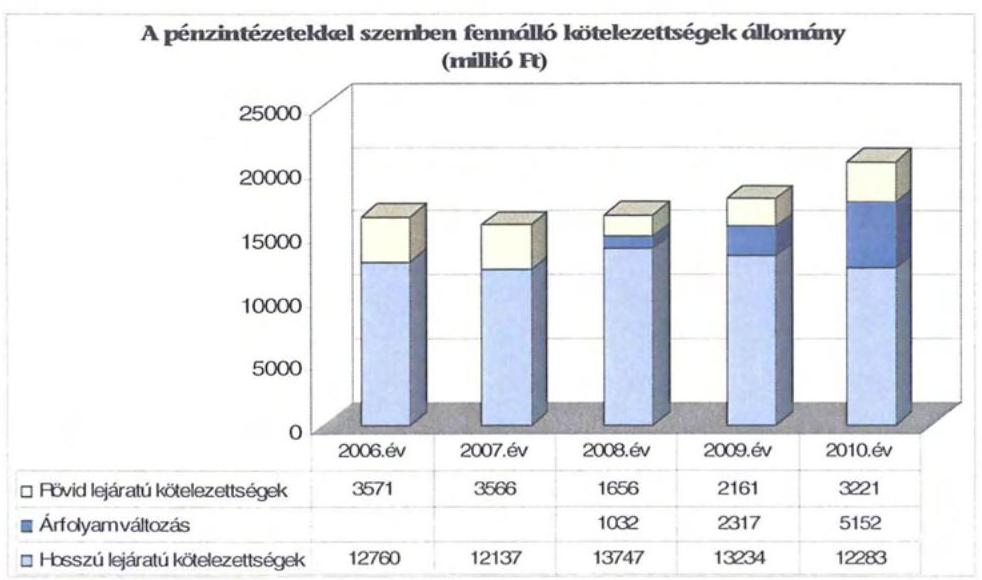

A pénzintézeti kötelezettségek állományának a 2007-2010. évek közötti 4325 millió Ft-os (26,5\%) növekedését döntően az okozta, hogy

- a 2007-2010. évek között egy alkalommal hosszú lejáratú hitelt vett igénybe, amelynek 2010. december 31-i állománya 1830 millió Ft volt. A hosszú lejáratú hitelek 2006. december 31-i 1898 millió Ft-os állománya a 2008. évi hitelfelvétel, a tőketörlesztések, valamint a 2008-2010. évek végén elszámolt árfolyamváltozás hatására 2479 millió Ft-ra emelkedett;
- 5152 millió Ft összegben számoltak el a devizában fennálló hitelek és a kötvény év végi értékelésekor CHF és EUR árfolyamváltozás miatti állománynövekedést;
- a rövid lejáratú kötelezettségek között kimutatott folyószámlahitel, egyéb likvid hitel és munkabér megelőlegezési hitel állomány 872 millió Ft-tal csökkent.

A hosszú és rövid lejáratú hitelek közül hat esetében az Önkormányzat a multicurrency (többdevizás) lehetőséget választotta. A pénzügyi biztonság növelése érdekében alkalmazott hitelforma lehetőséget nyújtott az árfolyamkockázat csökkentésére, kedvező pénzpiaci helyzetben a devizák keresztárfolyamának függvényében dönthetett az Önkormányzat arról, hogy devizában fennálló hitelét más devizára/forintra, vagy forinthitelét devizára konvertálja át.

Az árfolyamváltozás hatása befolyásolja a kötelezettségek alakulását, azonban annak mértéke előre pontosan nem határozható meg, csak várakozásokon alapuló tendenciák jelezhetők. Annak megítéléséről, hogy a devizában felvett hitelért, kibocsátott kötvényért kapott forinthoz képest a hitel visszafizetésekor, a köt-

[^0]
[^0]:    ${ }^{51}$ A diagramban a hosszú lejáratú kötelezettségek mérlegértékét csökkentettük az árfolyamváltozás összegével.

---

vény visszavásárlásakor jelentkező forint-kötelezettség többletkiadást (árfolyamveszteség) vagy megtakarítást (árfolyamnyereség) eredményez-e a futamidő végén, a teljes kötelezettség rendezését követően lehet képet alkotni. Mindaddig, amíg törlesztési kötelezettség nem áll fenn (türelmi idő), a tőkére vonatkoztatva nem értelmezhető sem az árfolyamveszteség, sem az árfolyamnyereség.

Az Önkormányzat a forráshiány kezelése érdekében a 2007-2010. évi költségvetési rendeletekben működési és felhalmozási célú hitelfelvétellel, pénzmaradvány igénybevétellel, kötelező tartalékkal számolt. A Közgyűlés az átmeneti finanszírozási források megteremtése érdekében a folyószámla hitelfelvételen túl a likviditási hitelek felvételére is felhatalmazta a polgármestert, esetenként a jóváhagyott tárgyévi költségvetési kiadási főösszeg 3\%-a erejéig. ${ }^{52}$

A felhatalmazás alapján a meglévő adósságállomány kezelése, átalakítása érdekében 2007-2010. évek között folyamatosan a kedvező árfolyamokat kihasználva a meglevő hiteleket egyik devizanemről a másikra váltották át, akár többször is.

A 2007-2010. évek között 6204 millió Ft hitel felvételére került sor, amelyből a 2008. évben egy hosszú lejáratú hitelfelvétel volt. A 2000 millió Ft hosszú lejáratú hitel a folyószámlahitel állomány csökkentését szolgálta, a hitelkeretre vonatkozó hitelszerződés tartalmazta a devizanemcsere lehetőségét, három év türelmi idő és 18 éves futamidő mellett. Az adósságállomány összetétele változott, rövid lejáratú hitelt váltottak ki hosszú lejáratú hitellel.

A hitel átstrukturálásáról külön előterjesztés nem készült ${ }^{53}$, mivel az éves költségvetések végrehajtásáról szóló rendeletekben ${ }^{54}$ a Közgyűlés felhatalmazta a polgármestert, hogy a hitelfelvételekhez, kötvénykibocsátásokhoz kapcsolódóan a fennálló adósságállomány részét képező hiteleket, ha a pénzpiaci helyzet ezt indokolttá teszi, lejárat előtti visszafizetéssel kedvezőbb kamatozású hitelekkel (kötvényekkel) váltsa ki. A fennálló adósságállomány átalakítására a polgármesternek adott felhatalmazás (a hosszú lejáratú hitelfelvétel miatt) ellentmondásban van az Ötv 10. § (1) bekezdés d) pontjában foglalt azon előírásával, hogy a képviselőtestület hatásköréből nem ruházható át az éven túli hitel felvétele.

Közbenső egyeztetés során tett észrevétel szerint: „Önkormányzatunk 2007-2010. évek között hosszúlejáratú hitel felvételéről nem döntött, így az nem lehet oka a hosszúlejáratú kötelezettségek növekedésének (34. oldal utolsó bekezdés). Rövidlejáratú hiteleink átstrukturálására közgyűlési felhatalmazás alapján került sor, 2000 millió Ft öszszegben, a kedvezőbb kondíciók, a hosszabb futamidő és a devizacserére lehetőséget adó multicurrency jelleg miatt. A jelentés 51. oldalán szintén helytelenül hitelfelvételként szerepel ugyanez az összeg, mely ugyanakkor helyesen állapítja meg, hogy ennek a hosszúlejáratú hitelnek a 2010. december 31-ei állománya 1830 millió Ft. Téves tehát

[^0]
[^0]:    ${ }^{52}$ az éves költségvetések végrehajtási szabályairól szóló rendeletekben
    ${ }^{53}$ A vizsgálat részére átadásra került a Közgyűlés 2008.november 6-i ülésére készített előterjesztés és a hozott határozat „Döntés új forint alapú kötvény kibocsátásáról" címmel. Az előterjesztés utal a folyószámlahitel csökkentési lehetőségre, kedvezőbb kondíciókra.
    ${ }^{54}$ 6/2007. (II.. 12.), 2/2008. (II.11.), 7/2009. (II. 13.), 2/2010. (I.. 30.), 2/2011. (II.. 08.) számú rendeletek $4 \S 2 / \mathrm{c}$ pontja

---

az a következtetés, hogy a hosszúlejáratú pénzintézeti kötelezettségek nőttek, amelyeket a hosszúlejáratú hitelfelvétel és hitelátstrukturálás, valamint az egyes évek végén elszámolt összesen 5152 millió Ft árfolyamkülönbözet együttesen okozták. A növekedés kizárólag az árfolyam veszteség miatt következett be, amelyet jól illusztrál az 50. oldalon található grafikon is."

Az észrevétel nem megalapozott, mivel az ellenőrzött dokumentumok a hosszúlejáratú hitel felvételét támasztják alá. Az Önkormányzat 2008. december 29-én hosszúlejáratú hitelszerződést kötött a számlavezető bankkal a folyószámlahitel visszafizetése érdekében. A hitel célja a folyószámlahitelből finanszírozott 20072008. években megvalósított beruházások fedezetének biztosítása volt. A hosszúlejáratú hitelfelvételt az Önkormányzat a hitelszerződés tartalmának megfelelően a 2008. évi pénzforgalmi beszámolójában finanszírozási célú bevételként a hosszú lejáratú hitel felvétele soron szerepeltette, ezzel összhangban a 14. számú tanúsítványon is hosszúlejáratú hitelfelvételként mutatta ki. A felvett hosszúlejáratú hitel következtében a 2008. évi könyvviteli mérleg adatai szerint is a beruházási és fejlesztési hitelek állománya a 2007. évi 1559 millió Ft-ról 3401 millió Ft-ra nőtt, a rövidlejáratú hiteleké 3387 millió Ft-ról 1548 millió Ft-ra csökkent. Az észrevételben hivatkozott, a Közgyűlés által a polgármesternek adott felhatalmazás a 2000 millió Ft hosszúlejáratú hitel felvételére vonatkozóan ellentétes az Ötv. 10. § (1) bekezdés d) pontjában foglalt azon előírással, hogy az éven túli hitel felvétele, kötvény kibocsátása a képviselő-testület át nem ruházható hatásköre. Ennek alapján a jelentés részletes megállapításainak, összegző megállapításainak és javaslatainak vonatkozó részét (19. oldal diagram alatti második bekezdés, 51. oldal 5. bekezdés, 27. oldal 10. számú javaslat) továbbra is fenntartjuk.

A rövid és hosszú lejáratú hitelekkel kapcsolatos előirányzatok módosítását a hitelszerződések megkötését követően a 2008. évi költségvetésnek a 2009. március 5-i módosításával fogadta el a Közgyűlés.

A rövid lejáratú hitel hosszú lejáratúvá alakításáról a Közgyűlés felhatalmazása alapján a Polgármester döntött. A döntés meghozatala előtt a Közgyűlés részére nem került előzetesen beterjesztésre a folyószámlahitel hoszszú lejáratú hitellé ${ }^{55}$ való átalakítása miatti hosszú távú kötelezettségvállalás tartalma, a visszafizetésre vonatkozó feltételek bemutatása, a fedezet megléte. Így többek között nem döntött a Közgyűlés a hitel futamidejéről, egyéb feltételekről, a hitel visszafizetésének forrásáról.

A likviditási és eladósodási problémák kezelése érdekében a gazdálkodásra havonkénti pénzügyi tervek, valamint a költségvetés mellékleteként előirányzatfelhasználási terv készült minden évben. Emellett a meglévő szerződések felülvizsgálata megtörtént, a hiteltörlesztések időpontját a helyi adóbevételekhez igazították. A Közgyűlés döntött ${ }^{56}$ az Önkormányzat korábban vál-

[^0]
[^0]:    ${ }^{55}$ A hosszú lejáratú hitelekre vonatkozó döntésnél vizsgálni kell a helyi önkormányzatokról szóló törvény 88.§. (2) bekezdése szerinti korlátot.
    ${ }^{56}$ A Közgyűlés az 533/2008.(X..16) számú határozattal felfüggesztett minden kötelezettségvállalást. Elrendelte az önkormányzati intézményeknél, gazdasági társaságoknál a kötelező tartalékképzést, a kiadások csökkentését, a feladatok áttekintését, megvonta a nem kötelező béren felüli juttatásokat. Döntött, hogy a 2009. évi költségvetési koncepció összeállításánál csak a törvény szerint kötelező feladatok és az Európai Unió támogatásával megvalósuló fejlesztések finanszírozása szerepelhet.

---

lalt nem kötelező feladatainak felülvizsgálatáról, és a további ilyen jellegű kötelezettségvállalások felfüggesztéséről.
A helyszíni vizsgálat alatt további hitel igénybevételére, illetve kötvénykibocsátásra vonatkozó döntés-előkészítés nem volt folyamatban.
A vizsgált időszak alatt az Önkormányzat a hitelek biztosítékaként az azonnali beszedési megbízás lehetőségét ajánlotta fel, zálogjogot biztosított a bankszámla követelésén ${ }^{57}$, a hitelszerződésekben rögzített módon és mértékben államkötvény, illetve ingatlan (forgalomképes és korlátozottan forgalomképes)- és óvadéki fedezetet, valamint a Garantiqa Hitelgarancia Zrt. készfizető kezességét határozta meg. A korlátozottan forgalomképes ingatlanokra alapított jelzálogjog nem felel meg az Ötv. 88. § (1) bekezdés b) pontjában foglalt azon előírásának, hogy a hitel és kötvény fedezetéül az önkormányzati törzsvagyon nem használható fel.

A megterhelt ingatlanokra vonatkozóan külön keretbiztosítéki jelzálogszerződést kötöttek. A vizsgálat ideje alatt újabb, a korábbi ingatlanfedezetek összevonását tartalmazó - 354 millió Ft-os - keretbiztosítéki szerződés előkészítéséről adott tájékoztatást a Polgármesteri hivatal.

A pénzintézeti kötelezettségvállalásból származó források felhasználási céljait meghatározták. Az éves költségvetések tartalmazták a teljes futamidőre várható kamat- és tőkefizetési kötelezettséget, azonban az előterjesztésekben nem mutatták be a visszafizetés forrásait, valamint a kamat- és - a devizaalapú kötelezettségeket érintő - árfolyamkockázatot. A könyvvizsgáló vizsgálta a hitelfelvételi korlátot, melyről szóban tájékoztatta a Közgyűlést. A Közgyűlés az adósságot keletkeztető kötelezettségvállalással megvalósított felhalmozási kiadások esetleges bevételnövelő, illetve kiadáscsökkentő vonzatát nem vizsgálta, a fejlesztéshez, felújításhoz vállalt kötelezettségek visszafizetési forrásaként nem nevesítette.

Az Önkormányzat 2010. december 31-én Ft-ban fennálló hosszú lejáratú pénzintézeti kötelezettségét a következő táblázat mutatja be:

| Megnevezés | Szerződéskö   tés   idöpontja | Összeg (ezer Ft) | Kamat (referencia   kamat+ kamatfelár) | Felhasználás célja: |
| :-- | :--: | :--: | :-- | :-- |
| Hosszú lejáratú hitel   (multicurrency) | 2008.12 .29 | 2000000 | 6 havi BUBOR+1,15\% vagy   6 havi EURIBOR+1,25\%   vagy 6 havi USD   LIBOR+1,26\% | Beruházások, felújítások   (folyószámlahitel kiváltása) |

A hitel igénybevétele a 2008. évben forintban történt az Önkormányzat számlavezető pénzintézetétől. ${ }^{58}$ A többszöri deviza átkonvertálás ${ }^{59}$ után elért árfo-

[^0]
[^0]:    ${ }^{57}$ A zálogjog nem érintette a normatív állami hozzájárulásokkal, az egyéb központi költségvetés támogatásokkal, az átengedett személyi jövedelemadóval és az államháztartáson belül múködési célra átvett pénzeszközökkel kapcsolatos alszámlákat.
    ${ }^{58}$ Az Önkormányzat számlavezető pénzintézete 2007. 01. 01-től változott.
    ${ }^{59}$ Az első átváltás 2009. 02.03-án történt EUR-ra, árfolyam: 290,6Ft/EUR.

---

lyamnyereség 126 millió Ft, a hitel állományi értéke 2010. december 31-én 1830 millió Ft volt.

A hitelszerződés szerint a hitel célja a 2007-2008. években aktivált, több mint 2000 millió Ft értékű beruházás finanszírozása volt, amelyet a folyószámlahitelből előlegeztek meg. Az első kamatfizetés 2009. június 30 -án történt, az első tőketörlesztő részlet esedékessége 2011. december 3-a.

Az Önkormányzat 2010. december 31-én EUR-ban fennálló, forintban felvett hosszú lejáratú pénzintézeti kötelezettsége (3 668225 EUR) a következő volt. ${ }^{60}$

| Megnevezés | Szerződéskö   tés   időpontja | Összeg ezer Ft | Átváltási árfolyam | Kamat (referencia   kamat+ kamatfelár) | Felhasználás   célja: |
| :-- | :--: | :--: | :--: | :-- | :--: |
| Hosszú lejáratú hitel   (multicurrency) * | 2005.07 .12 | 1807480 | 256,7 | 3 havi BUBOR $=0,65 \%$   vagy 3 havi   CHFLIBOR $=0,95 \%$ vagy 3   havi EURIBOR $=0,95 \%$ | Korábbi hitelek   kiváltása |
| Hosszú lejáratú hitel   (multicurrency) * | 2005.11 .30 | 250000 | 256,7 | 3 havi BUBOR $=0,65 \%$   vagy 3 havi   CHFLIBOR $=0,95 \%$ vagy 3   havi EURIBOR $=0,95 \%$ | Korábbi hitelek   kiváltása |

*az árfolyam az első átváltáskor érvényes árfolyamot tartalmazza, mivel a hitel Ft-ban került kibocsátásra
A hitelek igénybevétele 2005-ben forintban történt az Önkormányzat számlavezető pénzintézetétől. A többszöri deviza átkonvertálás után realizált árfolyamveszteség 158 millió Ft és 1 millió Ft, a hitelek állományi értéke 2010. december 31-én 3497718 EUR és 170507 EUR volt.

Az Önkormányzat a lehívott hiteleket a 2001-2005. évek között fennálló hitelállomány ( 12 szerződés) átstrukturálása kapcsán a fennálló kölcsönszerződések összevonására használta fel. ${ }^{61}$

Az Önkormányzat 2010. december 31-én CHF-ben fennálló hosszú lejáratú pénzintézeti kötelezettsége ( $69400000 \mathrm{CHF}^{62}$ ) a következő volt:

| Megnevezés | Kibocsátás   időpontja | Összeg | Kibocsátási árfolyam | Kamat (referencia   kamat+ kamatfelár) | Felhasználás   célja: |
| :-- | :--: | :--: | :--: | :-- | :--: |
| Hódmezővásárhely L-   kötvény | 2006.09 .22 | 69400000 | 173,41 | 6 havi CHF LIBOR $=1,15 \%$ | Korábbi hitelek   kiváltása,   pályázati önerő |

[^0]
[^0]:    ${ }^{60}$ A 2005.július 12-én kötött hitelszerződés alapján az Önkormányzat 1807 millió Ft , a 2005.november 30-án kötött hitelszerződés alapján 250 millió Ft többdevizás hitelt vett fel. A hitelhez kapcsolódóan 2007-2010. években többszöri HUF-EUR-CHF devizanemváltás történt.
    ${ }^{61}$ A szerződéseket a korábbi kölcsönszerződések közös megegyezéssel történő összevonása és egységes szerkezetbe foglalásával kötötte az Önkormányzat.
    ${ }^{62}$ Nem tartalmazza a halasztott kamatfizetés miatti - 2010. december 31-éig már tőkésített - 8883200 CHF kamat összegét.

---

Az Önkormányzat 2006. szeptember 22-én bocsátott ki 12069 millió Ft (69 400000 millió CHF) összegű kötvényt. A kötvénykibocsátással kapcsolatban beérkezett három ajánlat szerint nem az Önkormányzat számlavezető pénzintézete adta a legkedvezőbb ajánlatot ${ }^{63}$. A kötvénykibocsátásra vonatkozó információs összeállítás tartalmazta az Önkormányzat (kötvény kibocsátó) saját bevételeinek várható alakulását a lejárat időpontjáig (2026. 08. 31.), valamint a kötvény összegének visszafizetését és a kamat megfizetését biztosító kötelezettségvállalásokat.
Az Önkormányzat az átmenetileg szabad forrásokból a lekötésen túl azonnali és opciós deviza műveleteket is végzett, amely eredményeként a 20072010. évek között 2254 millió Ft hozam- és kamatbevételt ért el, amelyből az árfolyamnyereség 1620 millió Ft volt. Ezen forgatási célú pénzügyi műveletekhez, a hiteltörlesztésekhez és a devizaátváltásokhoz kapcsolódóan az időszak alatt 2109 millió Ft árfolyamveszteséget is elszámoltak. Kötvényhez kapcsolódó kamatkiadás nem merült fel a halasztott kamatfizetés miatt.
A tervezett felhasználásnak ${ }^{64}$ megfelelően a kötvényből származó bevétel 52,9\%-át ( 6379 millió Ft) hiteltörlesztésre, 39,4\%-át ( 4756 millió Ft) beruházásokra használták fel. 2011. január 1-jéig még nem használták fel a bevétel $7,7 \%$-át ( 934 millió Ft ).

A kötvénynél kedvezőbb kondíciókkal rendelkező hitelek lejáratkori törlesztéséig és a beruházásokhoz szükséges fedezet biztosításáig a kötvényből származó bevételt betétben kamatoztatták. A kötvénybevétel összegéből kettő betételhelyezés történt beruházások finanszírozása és hiteltörlesztési céllal, egy óvadéki és egy forrás-felhasználási szerződéssel.

A forrás-felhasználási megállapodásban ${ }^{65}$ rögzítettek szerint a betétként lekötött összeget az Önkormányzat kizárólag a pénzintézet jóváhagyásával, fejlesztésre, beruházásokra fordíthatta, azzal az Önkormányzat önállóan nem, kizárólag a pénzintézet jóváhagyása esetén volt jogosult rendelkezni. A pénzintézet ugyanakkor kötelezettséget vállalt arra, hogy amennyiben az Önkormányzat a beruházási forrásösszeget közgyűlési határozattal igazoltan felhalmozási, fejlesztési feladatok finanszírozására kívánja használni, úgy a pénzintézet köteles az előzetes jóváhagyást megadni, illetve köteles ahhoz hozzájárulni.

A forrás-felhasználási betét teljes felhasználásáig a pénzintézet a betétet „háttérszámlán" kezelte, erről analitika nem készült - az Önkormányzat kérésére csak összesített adatot küldtek „Opciós díjakból és kamatokból származó kalkulált önkormányzati nyereség: 171816929 Ft". A forrás-felhasználási szerződés

[^0]
[^0]:    ${ }^{63}$ A kötvénykibocsátást lebonyolító pénzintézet vezeti a bankszámlákat 2007. január 1jétől.
    ${ }^{64}$ A kötvénykibocsátás célja az Önkormányzat számlavezetőnél fennálló hitelállományának kiváltása, fejlesztéseinek finanszírozása és pályázati önerő biztosítása.
    ${ }^{65}$ a kötvénykibocsátás dokumentációjában, ONK-0241/2006/FORR szerződésszámon létrejött forrás-felhasználási megállapodás

---

5. pontja szerint ez a nyereség szabadon felhasználható a forrásösszegre vonatkozó kötöttségek nélkül. ${ }^{66}$

Az óvadéki betét az Önkormányzat hosszú lejáratú hitelei tőkefedezetét szolgálta, a kamatok folyamatosan tőkésítésre kerültek.

A kötvényből 2010. december 31-éig fel nem használt összeg a hitel ${ }^{67}$ fedezeteként, ennek tőketörlesztésére használható fel.

Az Önkormányzat a pénzügyi egyensúlyt a vizsgált időszakban csak folyószámlahitel, munkabér-megelőlegezési és egyéb likvid hitelek igénybevételével tudta biztosítani.

A folyószámlahitel keret alakulását a következő táblázat mutatja be. ${ }^{68}$
ezer Ft-ban

| Megnevezés | 2007. év | 2008. év | 2009. év | 2010. év |
| :-- | :--: | :--: | :--: | :--: |
| I. Folyószámlahitel |  |  |  |  |
| a folyószámlahitel keretösszege január 1-jén | 3000000 | 3000000 | 1000000 | 1500000 |
| teljesitett kamat és egyéb költség | 116080 | 226322 | 90608 | 78402 |

A folyószámlahitel kondíciói a következők voltak ${ }^{69}$ :

| Megnevezés | Kamat (referencia+ kamatfelár | Egyéb költség |
| :--: | :--: | :--: |
| Folyószámlahitel |  |  |
| 2007-2008. évek | 1 havi BUBOR $+0 \%$ | $x$ |
| 2009. év | 1 havi BUBOR $+0 \%, 2009$. október 30-   ától 1 havi BUBOR $+0,6 \%$ | $x$ |
| 2010-2011. évek | 1 havi BUBOR $+0,6 \%$ | $x$ |

A folyószámlahitelhez kapcsolódóan egyéb költség címen az Önkormányzatnak díjakat nem kellett fizetnie. A kamatfelár 0,6 százalékponttal emelkedett 2009. október 30-ától, szóbeli egyeztetések után.

Az Önkormányzat a 2007-2011. március 31-e közötti időszak valamennyi napján igénybe vette a folyószámlahitelt. Az átlagos napi állomány a 2008. évben volt a legmagasabb, 2944 millió $\mathrm{Ft}^{70}$. A folyószámlahitel 2010. évi záró állománya 1500 millió Ft, 2011. március 31-éig az átlagos napi állomány 1500 millió Ft volt.

[^0]
[^0]:    ${ }^{66}$ Az összeg felhasználása nem szerepel a 15 -ös tanúsítványon.
    ${ }^{67}$ SZB-145/2005 hitel
    ${ }^{68}$ A keret 2011-ben 1500 millió Ft, március 31-éig teljesített kamat és egyéb költség 47 millió Ft.
    ${ }^{69}$ A referencia kamat a 2007. évben 7,83\%, a 2008. évben 8,75\%, a 2009. évben 8,66\%, a 2010. évben 5,47\%, 2011. március 31-éig 5,94\% volt.
    ${ }^{70}$ A folyószámlahitellel zárt napok száma 365 nap/év.

---

Az áttekintett időszakot jellemző felhalmozási hiány, a likviditási problémák részben folyószámlahitellel történő finanszírozása az Önkormányzatnak 2007. évtől 2011. március 31-éig összesen 558 millió Ft kamatkiadást okozott.

A munkabér megelőlegezési hitelkeret alakulását a következő táblázat mutatja be ${ }^{71}$ :

|  |  |  | ezer Ft-ban |  |
| :--: | :--: | :--: | :--: | :--: |
| Megnevezés | 2007. év | 2008. év | 2009. év | 2010. év |
| II. Munkabér megelőlegezési hitel |  |  |  |  |
| Igénybevett hitel összesen: | 250000 | 250000 | 250000 | 250000 |
| teljesített kamat és egyéb költség | 12253 | 19045 | 11393 | 9256 |

A munkabér megelőlegezési hitel kondíciói a következők voltak:

| Megnevezés | Kamat (referencia+ kamatfelár) | Egyéb költség |
| :--: | :--: | :--: |
| Munkabér megelőlegezési hitel |  |  |
| 2007-2009. évek | 1 havi BUBOR $+0 \%$ | szerződésmódosítási díj 150 eFt módosításonként |
| 2010. év | 1 havi BUBOR $+0 \%, 2010$. április 19-   étől 1 havi BUBOR $+0,6 \%$ | szerződésmódosítási díj 150 eFt módosításonként |
| 2011. év | 1 havi BUBOR $+0,6 \%$ | szerződésmódosítási díj 150 eFt módosításonként |

A munkabér megelőlegezési hitelhez kapcsolódóan egyéb költség címen az Önkormányzatnak szerződésmódosítási díjakat kellett fizetnie, a hitel kamatfelára 0,6 százalékponttal emelkedett 2010. április 19-étől, szóbeli egyeztetést követően.

Az Önkormányzat a 2007. május 18. és 2011. március 31-e közötti időszak valamennyi napján igénybe vette a munkabér megelőlegezési hitelt. Az átlagos napi állomány ${ }^{72}$ és a 2010. december 31-i záró állomány 250 millió Ft volt. A hitel folyamatos igénybevétele az Önkormányzatnak 2007. május 18-tól 2011. március 31-ig összesen 60 millió Ft kamat- és egyéb kiadást eredményezett.

Az Önkormányzat a 2007-2010. években a folyószámlahitelen és a munkabér megelőlegezési hitelen kívül egyéb likvid hiteleket is igénybe vett, eltérő kamatok mellett. ${ }^{73}$

[^0]
[^0]:    ${ }^{71}$ A keret 2011-ben 250 millió Ft, március 31-éig teljesített kamat és egyéb költség 8 millió Ft.
    ${ }^{72}$ A munkabérhitellel zárt napok száma 365 nap/év.
    ${ }^{73}$ A hitelszerződések szerinti referenciakamatok a multicurrency szerződések esetében a 3 havi BUBOR/EURIBOR/CHF, egyéb esetben a 3 havi BUBOR, mindenkori prime rate és jegybanki alapkamat.

---

| Megnevezés | 2007. év | 2008. év | 2009. év | 2010. év |
| :-- | --: | --: | --: | --: |
| III. Egyéb likvid hitel |  |  |  |  |
| Igénybevett hitel összesen: | 1036750 | 270225 | 757350 | 905000 |
| teljesített kamat és egyéb költség | 9160 | 15996 | 42031 | 33490 |

Az egyéb likvid hitelek napi átlagos ${ }^{74}$ állománya a 2007. évben 352 millió Ft, a 2008. évben 111 millió Ft, a 2009. évben 412 millió Ft, a 2010. évben 439 millió Ft volt. A 2011. március 31-éig 11 egyéb likvid hitelszerződése alapján összesen 654 millió Ft-ot vett igénybe, a napi átlag 624 millió Ft volt.

Az igénybevett egyéb likvid hitelek közül két forgóeszközhitel ${ }^{75}$ tartalma szerint hosszú lejáratú hitel volt, mivel egy évnél hosszabb időn át folyamatosan fennállt, ezért ez a hitel az Ötv. 88. § (3) bekezdés d) pontjában foglaltak alapján nem tekinthető likvid hitelnek.

A kiadások egyéb likvid hitellel történő részbeni finanszírozása az Önkormányzatnak a 2007. évtől 2011. március 31-ig összesen 121 millió Ft kamatkiadást és kilenc millió Ft egyéb kiadást eredményezett.

A jelenleg fennálló hosszú lejáratú fejlesztési hitelek és a kötvény esetében a kamatfizetési kötelezettségek alakulását jelentősen befolyásolta és jelenleg is befolyásolja a hitelfelvételkor, kötvénykibocsátáskor és az utolsó kamatfizetéskor alkalmazott referencia kamatok változása. Ezt a kötvényre a következő táblázat mutatja be:

| Megnevezés | Kibocsátási, lehivási | Utolsó fizetéskori | Változás \% |
| :--: | :--: | :--: | :--: |
|  | alapkamat \% |  |  |
| 6 havi CHF LIBOR | 1,8917 | 0,255 | $-86,5$ |

Az alapkamat mértékének alakulása jelentős hatással volt az adott devizanemben kifejezett, a teljes futamidőre számított, várható kamatkötelezettség nagyságára. A referenciakamatok 2007. január 1-jétől tekintve 2008. novem-ber-decemberben voltak a legmagasabbak, ehhez képest a 2009. év elejére zuhanásszerű csökkenés következett be, amely után 2010. júniusig minimális mértékben változtak.

Az Önkormányzat hosszú lejáratú hiteleinél a vizsgált időszakban a referenciakamat többször változott az átkonvertálások nyomán. Az alapkamat változásának hatása nem számszerűsíthető a folyamatos változtatások miatt.

Az Önkormányzat forintban fennálló hosszú lejáratú hitele után - az utolsó ismert kamatmértékkel számítva - a 2011-2013. években 302 millió Ft, 2013. után 507 millió Ft kamat kötelezettség várható. Az EUR-ban fennálló hitelek

[^0]
[^0]:    ${ }^{74}$ A napi átlagos állomány az igénybevétel napjainak számával került megállapításra.
    ${ }^{75}$ Szegvár és Vidéke Takarékszövetkezettől 100 millió Ft igénybevétel 2009.10.05., viszszafizetés 2010.12.10., Fontana Credit Takarékszövetkezet 130 millió Ft igénybevétel 2010.01.05. visszafizetés 2011.05.30.

---

számított kamatterhe a 2011-2013. évekre 147549 EUR $^{76}$. A kötvénykötelezettség után várhatóan fizetendő kamat a 2011-2013. években 2857278 CHF , a 2013. év utáni években 7269310 CHF .

# 3.2. Szállítók felé fennálló kötelezettségek alakulása 

Az Önkormányzat könyvviteli mérleg szerinti összes szállítói kötelezettsége a 2007. évben 2593 millió Ft, a 2008. évben 2661 millió Ft, a 2009. évben 1856 millió Ft, a 2010. évben 2206 millió Ft volt. A lejárt szállítói tartozásai, és egyéb kiadás elmaradásai alakulását a következő táblázat tartalmazza:

| Megnevezés | 2007. | 2008. | 2009. | 2010. |
| :--: | :--: | :--: | :--: | :--: |
|  | december 31. | december 31. | december 31. | december 31. |
| Lejárt szállítói tartozás | 1122 | 1449 | 1224 | 1725 |
| ebből: Kórház | 292 | 302 | 241 | 192 |
| Egyéb kiadáselmaradás | 75 | 73 | 68 | 286 |
| Gazdasági társaságok lejárt   szállítói tartozása | 974 | 351 | 484 | 618 |
| ebből: legalább 75\%-   ban önkormányzati   tulajdonú gazdasági   társaságok lejárt tartozása | 951 | 338 | 345 | 471 |

Az Önkormányzat lejárt szállítói tartozása és egyéb kiadás elmaradása ${ }^{77}$ a 2007. évről a 2010. évre 1197 millió Ft-ról 2011 millió Ft-ra (68\%-kal) nőtt. A fennálló tartozásállomány növekedés 100\%-ban az Önkormányzatot terhelte. Az Önkormányzat a vizsgált évek végén fennálló, még le nem járt tartozásainak egy részét szerződések ${ }^{78}$, illetve egyéb megállapodások alapján átütemezte. Szerződések és egyéb megállapodások alapján a 2007. év végén 966 millió Ft-ot, a 2008. év végén 1146 millió Ft-ot, a 2009. évben 300 millió Ft-ot, a 2010. év végén 346 millió Ft-ot, 2011. március 31-éig 259 millió Ft kifizetését ütemezték át. Az átütemezések ellenére az Önkormányzatnál mindegyik év végén jelentős nagyságrendú (a 2007. évben 1122 millió Ft, a 2008. évben1449 millió Ft, a 2009. évben 1224 millió Ft, a 2010. évben 1725 millió Ft) tartozás állt fenn. A tartozások főként a város üzemeltetésével kapcsolatos költségeket tartalmazták. Az egyéb kiadás elmaradás miatti kötelezettség a 2007. évi 75 millió Ft-ról a 2010. évre 286 millió Ft-ra nőtt.

[^0]
[^0]:    ${ }^{76}$ 2013. utáni években már nem merül fel
    ${ }^{77}$ Egyéb kiadáselmaradás között mutatta ki az Önkormányzat többek között az állami támogatások elszámolása során jelentkező visszafizetendő összegeket, a támogatási szerződésekből eredő fizetési kötelezettségeket,(étkeztetés, babakötvény, stb.).
    ${ }^{78}$ Az Önkormányzat 2007. szeptember 9-én faktorálási keretszerződést, 2007. szeptember 6-án együttmúködési megállapodást és 2008. október 9-én szállítói előfinanszírozási program megállapodást kötött egy-egy pénzügyi szolgáltatóval arra, hogy a pénzügyi szolgáltató az Önkormányzat (a szállítói előfinanszírozási program megállapodás esetében az Önkormányzat, a Kórház és a Vagyonkezelő Zrt.) szállítóitól megvásárolja a szállítóknak az Önkormányzattal (Kórházzal, Vagyonkezelő Zrt-vel) szemben fennálló lejárt, vagy nem lejárt, halasztott határidejú követeléseit.

---

Az Önkormányzat 2010. december 31-én lejárt szállítói állományából a Kórház tartozása 192 millió Ft volt. A 2010. év végén kimutatott lejárt szállítói kötelezettségből a 30 nap alatti $43,3 \%$-ot, a 31-60 nap közötti $15,9 \%$-ot, a 61-90 nap közötti $7,4 \%$-ot és a 91 és 365 nap közötti tartozásállomány $33,4 \%$-ot képviselt. A lejárt szállítói kötelezettségállomány, az átütemezett fizetési kötelezettségállomány, a hosszú és rövid lejáratú pénzintézeti kötelezettségekből eredő tőke- és kamatfizetési kötelezettségek és a napi müködtetési költségek együttes nagyságrendje napi finanszírozási problémát okozhat, a reálisan számba vehető forrás (folyószámlahitel) mellett a müködés biztonsága veszélybe kerülhet. A 2011. március 31-én fennálló lejárt szállítói tartozás közel fele ( 791 millió Ft) 91 és 365 nap közötti volt. Az Önkormányzat intézményeinél és a Polgármesteri hivatalnál a 60 napot meghaladó, szállítók felé fennálló kötelezettségek miatt - a helyi önkormányzatok adósságrendezési eljárásáról szóló 1996. évi XXV. törvény 5. § (1)-(2) bekezdésében foglaltak ellenére - a Polgármester nem tájékoztatta a Pénzügyi bizottságot, illetve a Közgyűlést, valamint az esedékességet követő 90. nap után nem kezdeményezett adósságrendezési eljárást.

A közbenső egyeztetés során tett észrevétel szerint „A lejárt szállitói tartozásokról készített 21. számú.... javított tanúsítvány és dokumentáció ismeretében kérjük megváltoztatni a szöveges értékelést, hiszen (számolási és értelmezési hibánk miatt) változni fog a lejárt szállitói állomány átütemezett része, és a csatolt iratokból megállapíthatóan valamennyi 60 napon túl lejárt esedékességü tartozásunk vonatkozásában megállapodást kezdeményeztünk szállítóinkkal. Fenti körülményekre tekintettel, kérjük....azon megállapítás törlését, hogy Az Önkormányzat intézményeinél és a Polgármesteri hivatalnál a 60 napot meghaladó, szállitók felé fennálló kötelezettségek miatt -a helyi önkormányzatok adósságrendezési eljárásáról szóló 1996. évi XXV. tv. 5.§ (2) bekezdése ellenére -a polgármester nem kezdeményezett adósságrendezési eljárást".

Az észrevétel a hivatkozott tanúsítvány pontositása mellett sem megalapozott, mivel a vonatkozó tanúsítvány pontositása nem érintette a 60 napon túl lejárt szállítói tartozásállományt. A szállítók felé kiküldött határidő módosításra vonatkozó kezdeményezéssel nem történt meg a fizetési határidők módosítása, mivel a rendelkezésünkre bocsátott dokumentumok nem tartalmazták a határidő módosítás szállítók részéről történt elfogadását. Ezt a tényt az Önkormányzat által pontosított tanúsítványban szereplő adatok is alátámasztják, mivel az előző tanúsítványhoz képest nem változott a 60 napon túl lejárt szállítói tartozás állománya. A 2011. március 21-ei keltezésű, szállítók felé megküldött levéllel a jogszabályban előírt kötelezettségnek nem tettek eleget, mivel a helyi önkormányzatok adósságrendezési eljárásáról szóló 1996. évi XXV. törvény 4-5. §-ai értelmében azon tartozások vonatkozásában, amelyek 60 napon túl lejártak és az esedékességet követő 90. napon fennálltak, a polgármesternek a Pénzügyi bizottságot haladéktalanul tájékoztatnia kellett volna és a Közgyűlést nyolc napon belül öszsze kellett volna hívnia. A 2010. december 31-én 60 napon túl lejárt szállítói tartozásállomány 702 millió Ft, amelyből 575 millió Ft 90 napon túl lejárt tartozás volt. Ennek alapján a fenntartjuk azt a megállapítást (59. oldal első bekezdés), amely szerint a polgármesternek a 60 napon túl lejárt szállítói tartozások esetében az esedékességet követő 90. nap után az adósságrendezési eljárást kezdeményeznie kellett volna.

---

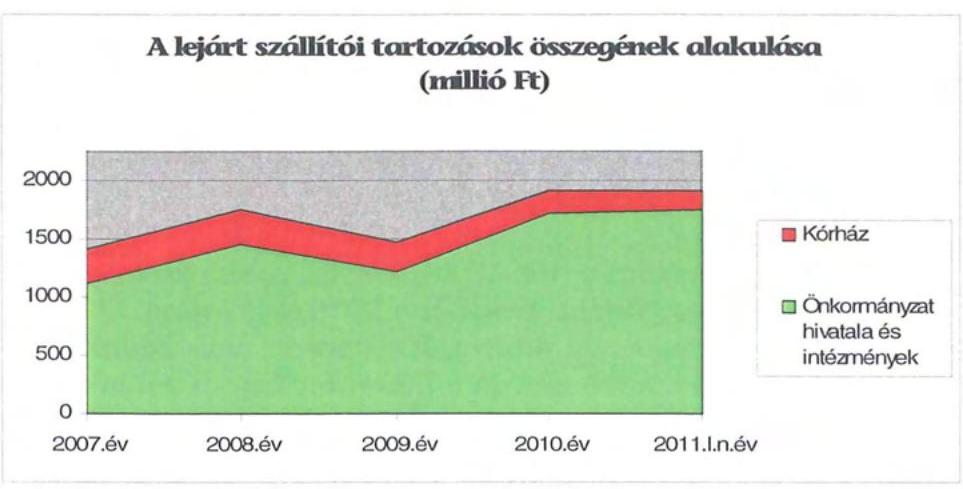

Az Önkormányzat gazdasági társaságainak összes lejárt szállítói tartozásállománya a 2007. évben 974 millió Ft, a 2008. évben 351 millió Ft, a 2009. évben 484 millió Ft, a 2010. évben 618 millió Ft volt. Azoknál a gazdasági társaságoknál, amelyekben az Önkormányzat minősített befolyással rendelkezik lejárt szállítói tartozásállománya a 2007. évben 951 millió Ft-ot, a 2008. évben 338 millió Ft-ot, a 2009. évben 345 millió Ft-ot, a 2010. évben 471 millió Ft-ot tett ki. A gazdasági társaságok 2010. évi lejárt szállítói tartozásállományának részletes adatait a 4. számú melléklet tartalmazza.

# 3.3. Egyéb kötelezettségek alakulása 

Az Önkormányzat a 2007-2010. években az átmeneti finanszírozási gondok enyhítése érdekében saját társaságaitól visszafizetési kötelezettséggel pénzeszközt vett át, amelynek a 2010. december 31-i záró egyenlege az Önkormányzat adatszolgáltatása alapján 371 millió Ft volt. A visszafizetés lejárati idejét 2011. év végére átütemezték.

Az Önkormányzat a vizsgált időszakban PPP konstrukció keretében egy fejlesztést hajtott végre, az Eötvös József SzKI tornaterem építése kapcsán 2007. május 29-én 1344 millió Ft-os kötelezettséget vállalva, amelynek futamideje 20 év. Ebből 2010. december 31-éig 209 millió Ft kifizetést teljesített. A 2010. december 31-én lejárt fizetési kötelezettség 18 millió Ft volt. Az Önkormányzat a PPP konstrukcióval történő megvalósítás mellett a feladatellátás javítása érdekében döntött. A konstrukció segítségével központi támogatást tudtak szerezni, valamint az önkormányzati kötelezettségvállalás elnyújthatóvá vált, így kevésbé korlátozta az Önkormányzat fejlesztési elképzeléseinek mozgásterét, az egyéb beruházások fejlesztési forrásszükségletének biztosítását. Az Önkormányzat által fizetett szolgáltatási díj tartalmazza a bérleti díjat és a teljesített szolgáltatás díját. Az Önkormányzat tájékoztatása szerint a sportlétesítmény teljes kihasználtsággal múködik, melynek garanciáit a szerződésben szerepeltették.

Az Önkormányzat a 2007-2010. évek között összesen 16 esetben tett garan-cia- és kezességvállalást, amelynek 2010. év végi nyilvántartott állo-

---

mánya 1737 millió Ft volt. Ebből hét a saját gazdasági társaságok ${ }^{79}$, egy egyéb gazdasági társaság ${ }^{80}$ részére, egy önkormányzati intézmény, egy a Kistérségi társulás és egy - a panelprogram kapcsán - a társasházak részére biztosított kezességvállalás volt. A kezességvállalásból eredően az Önkormányzatnak a 2007-2010 évek között 98 millió Ft kifizetést teljesített, amelyből 38 millió Ft 2010.december 31 -éig megtérült.

Az Önkormányzatnál a 2007-2010. évek között követelés elengedés 21 millió Ft összegben történt, melyből a 2010. évi összeg 17 millió Ft. Az elengedés $60 \%$-a köztemetés miatti tartozás elengedés volt. Munkáltatói kölcsön elengedés ${ }^{81}$ kilenc esetben történt 15 millió Ft tartozásra vonatkozóan.

Az Önkormányzat a 2006. évben kibocsátott kötvény és a hosszú és rövid lejáratú hitelek biztosítékaként hozzájárult 67 db forgalomképes és 12 db korlátozottan forgalomképes ingatlanon jelzálogjog alapításához és bejegyzéséhez. Az ingatlanokon összességében 6830 millió Ft összegű tőke és járulékai erejéig történt jelzálogjog bejegyzés. A jelzálogjoggal terhelt ingatlanok számviteli nyilvántartás szerinti nettó értéke 2010. december 31 -én 1700 millió Ft, ebből a forgalomképes ingatlanok számviteli nyilvántartás szerinti nettó értéke 1188 millió Ft, a korlátozottan forgalomképes ingatlanoké 512 millió Ft volt. Az Önkormányzat összes forgalomképes ingatlanának könyvszerinti nettó értéke 4251 millió Ft, a korlátozottan forgalomképes ingatlanának könyvszerinti nettó értéke 15111 millió Ft volt. A forgalomképes ingatlanok számviteli nyilvántartás szerinti nettó értékének $28 \%$-a ( 1188 millió Ft), a korlátozottan forgalomképes ingatlanok nettó értékének 3\%-a ( 512 millió Ft) erejéig terhelték jelzálogjoggal az ingatlanokat. A korlátozottan forgalomképes ingatlanokra a jelzálog bejegyezése az Ötv. 88. § (1) bekezdés b) pontjában foglaltakkal ellentétben a forgalomképesség megváltoztatása (átsorolás) nélkül, a vagyongazdálkodási rendeletben foglalt feltételek szerint történt.
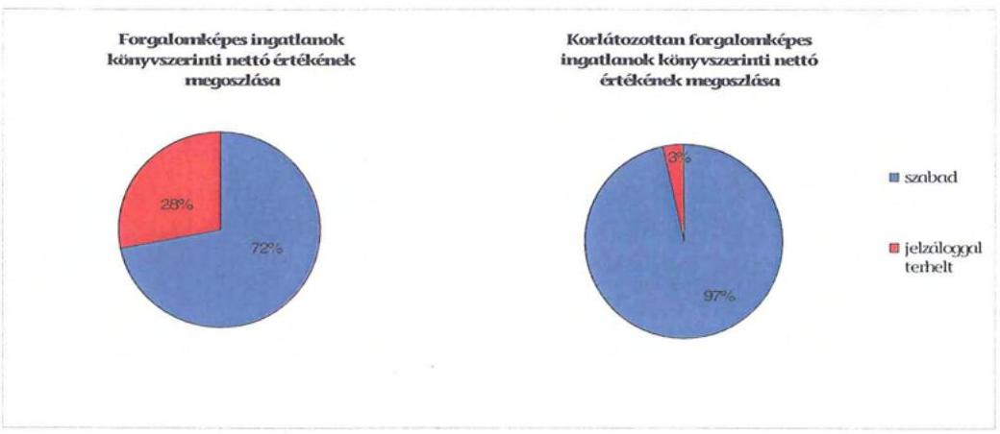

[^0]
[^0]:    ${ }^{79}$ HVSZ Zrt, Zsigmondy Béla Zrt, Városellátó Nonprofit Kft., Hód-Menza Nonprofit Kft. Beruházási hitelek
    ${ }^{80}$ Hód-Vill Kft.
    ${ }^{81}$ A főegyző által kiadmányozott 08-5351-31/2003. számú közszolgálati szabályzat szerint.

---

Az 25\%-ot meghaladó önkormányzat tulajdonosi részesedéssel rendelkező gazdasági társaságok részére a 2007-2010. évek között visszafizetési kötelezettséggel összesen 1179 millió Ft pénzeszközt adott át az Önkormányzat finanszírozási problémáik kezelésére. A 2010. december 31 -én fennálló (a könyvviteli mérlegben a rövid lejáratú követelések között kimutatott) tartozás 421 millió Ft volt. A legnagyobb összeget ( 200 millió Ft-ot) a Hódmezővásárhelyi Városfejlesztési Kft részére a város rehabilitációs feladatokra megpályázott európai uniós forrásnak az utófinanszírozás miatti megelőlegezésére nyújtották, amelynek visszafizetése akkor esedékes, ha az utófinanszírozás megvalósult (az utófinanszírozás keretében a támogatást még nem kapta meg a gazdasági társaság).

Az Önkormányzat a 2007-2010. évek között 13 alkalommal adott át visszafizetési kötelezettséggel pénzeszközt saját költségvetési szerveinek. Ezt mindegyik esetben a pályázati projekt támogatás részének előfinanszírozásához nyújtották. Az átvett pénzösszeget az intézmények visszafizették, a 2010. évi könyvviteli mérlegben nem volt intézménynek felé fennálló követelésállomány.
Az Önkormányzat kötelezettségeinek állományát 2010. december 31-én és várható alakulását a kötelezettségek lejáratáig a következő táblázat részletezi:

Az Önkormányzat kötelezettségeinek állománya 2010. december 31-én és
várható alakulása a kötelezettségek lejáratáig

| Megnevezés | Állomány 2010. dec. 31 -én |  |  | Várható kötelezettség 20112013. években |  |  | Várható kötelezettség 2014.   évet követően |  |  |
| :--: | :--: | :--: | :--: | :--: | :--: | :--: | :--: | :--: | :--: |
|  | $\begin{aligned} & \text { HUF-ban } \\ & \text { (millió } 1 \mathrm{~s}- \\ & \text { ban) } \end{aligned}$ | Devizában (összege) | Deviz   unem | HUF-ban   (millió Ft-   ban) | Devizában (összege) | Deviz   unem | HUF-ban   (millió Ft-   ban) |  |  |
| Pénzintézeti kötelezettségek |  |  |  |  |  |  |  |  |  |
| Hosszú lejáratú kötelek | 1830 |  | 1028 | 731 |  | 1028 | 1562 |  | 1028 |
| Hosszú lejáratú kötelek |  | 3668225 | EUR |  | 2649866 | EUR |  | 1165908 | EUR |
| Köteleg (Hódmezővásárhely 1. kötvény) |  | 6980000 | CHF |  | 15483603 | CHF |  | 72926187 | CHF |
| Felgőszámlaköté | 1500 |  | 1028 | 1500 |  | 1028 |  |  |  |
| Munkobár megelőlegezési hitel | 200 |  | 1028 | 250 |  | 1028 |  |  |  |
| Egyéb lávist kötelek | 599 |  | 1028 | 599 |  | 1028 |  |  |  |
| Hozzintest kötelezettségek összesen HUF-ban | 4179 |  | HUF | 3080 |  | 1028 | 1562 |  | 1028 |
| Hozzintesti kötelezettségek összesen CHF-ban |  | 6980000 | CHF |  | 15483603 | CHF |  | 72926187 | CHF |
| Hozzintesti kötelezettségek összesen EUR-ban |  | 3668225 | EUR |  | 2649866 | EUR |  | 1165908 |  |
| Biztositékok |  |  |  |  |  |  |  |  |  |
| Gazancia | 14 |  | 1028 |  |  |  |  |  |  |
| Kezeszég | 1725 |  | 1028 |  |  |  |  |  |  |
| Biztositékok összesen | 1797 |  | HUF |  |  |  |  |  |  |
| Szállítói tartozás | 2206 |  | HUF | 2206 |  | HUF |  |  |  |
| Egyéb kötelezettségek |  |  |  |  |  |  |  |  |  |
| PPP beruházási kötelezettségek | 1135 |  | 1028 | 299 |  | HUF | 836 |  | 1028 |
| Egyéb kizéla elmaradás | 286 |  | 1028 | 286 |  | HUF |  |  |  |
| G1-k és egyéb szervek köé fennálló kötelezettségek | 371 |  | 1028 | 371 |  | HUF |  |  |  |

A pénzintézeti kötelezettség, a szállítói tartozás és az egyéb kötelezettség állomány együttesen 2010. december 31-én 8177 millió Ft-ból, 3668225 EUR-ból és 69400000 CHF-ből tevődött össze. E kötelezettségekből eredően a 20112013. években esedékes kötelezettségek várható összege devizánként a kamat és egyéb költségteherrel együtt 6242 millió Ft, 2649866 EUR és 15483603 CHF. A 2013. év után várható kötelezettség összegét 2798 millió Ft és 1165908 EUR hosszú lejáratú hitel és PPP törlesztés és kamatai, valamint a 72926187 CHF kötvénytartozás és kamatai teszi ki. A garancia és kezességállomány

---

1737 millió Ft volt 2010. december 31-én. Az Önkormányzat a kötelezettségek finanszírozását a saját bevételéből tervezi megoldani, amelyet a változatlan feltételek mellett képződő nettó múködési jövedelem nem igazol.
A gazdasági társaságok kötelezettségeinek állományát 2010. december 31én és várható alakulását a kötelezettségek lejáratáig az alábbi táblázat mutatja be:

| Az Önkormányzat minősített többségi tulajdonú társaságai kötelezettségeinek állománya 2010. december 31-én és várható alakulása a kötelezettségek lejáratáig |  |  |  |  |  |  |  |  |  |
| :--: | :--: | :--: | :--: | :--: | :--: | :--: | :--: | :--: | :--: |
| Megnevezés | Állomány 2010. dec. 31 -én |  |  | Várható kötelezettség 2011. 2013. 6vekben |  |  | Várható kötelezettség 2014. évet követően |  |  |
|  | $\begin{aligned} & \text { Hüt-ban } \\ & \text { (millió Ft- } \\ & \text { ban) } \end{aligned}$ | Övviadban (összege) | Üzveig (enem) | Hüt-ban (millió Ftban) | Övviadban (összege) | Üzveig (enem) | Hüt-ban (millió Ftban) | Övviadban (összegé) | Üzveig (enem) |
| Pénzintézeti kötelezettségek |  |  |  |  |  |  |  |  |  |
| Hosszú lejáratú kötelező | 269 |  |  | 207 |  |  | 120 |  |  |
| Hosszú lejáratú kötelező | 24 | 133652 | 3108 | 20 | 137627 |  |  |  |  |
| Kötvény (10.grosszú felü, fiz. II. kötvény) |  | 21062242 | CHF |  | 3407904 | CHF |  | 20635397 | CHF |
| Kötvény(ok (HV62 2023) |  | 2296833 | CHF | 24 | 1086081 | CHF |  | 45 | 7935436 | CHF |
| Kötvény(ok (HV62 fiz. I. kötvény) |  | 6874336 | CHF |  | 1059627 | CHF |  |  | 6387873 | CHF |
| Folyószámlás és egyéb zövöd lejáratú kötelek | 169 |  |  | 169 |  |  |  |  |  |
| Pénzintézeti kötelezettségek összesen 2010-ban | 483 |  |  | 433 |  |  | 164 |  |  |
| Pénzintézeti kötelezettségek összesen 1999-ban |  | 34713611 | CHF |  | 3233616 | CHF |  |  | 34019704 | CHF |
| Pénzintézeti kötelezettségek összesen 200-ban |  | 133652 | 3108 |  | 137627 |  |  |  |  |
| Szabállók lejáratáig | 693 |  |  | 693 |  |  |  |  |  |
| Egyéb kötelezettség (kötszén) | 421 |  |  | 421 |  |  |  |  |  |

Az önkormányzati gazdasági társaságok közül hosszú lejáratú, hitelböl, kötvényből származó kötelezettsége csak 100\%-ban önkormányzati tulajdonú társaságoknak volt. A gazdasági társaságok 2010. december 31-én ilyen címen fennálló kötelezettségállománya 8080 millió Ft-ot ( 313 millió Ft, 133652 EUR és 34713611 CHF ) tett ki. A hosszú lejáratú kötelezettségekből adódó várható fizetési kötelezettség kamatokkal együtt devizanemenként a 2011-2013. években 266 millió Ft, 137627 EUR, és 5553616 CHF (amelyből 2011. második negyedév végéig a törlesztési ütemezésnek megfelelő törlesztések az Önkormányzat tájékoztatása szerint megtörténtek), a 2014. évtől 164 millió Ft és 36019706 CHF.

Folyószámlahitelt a vizsgált időszakban az önkormányzati tulajdonú gazdasági társaságok közül kettő 100\%-ban önkormányzati tulajdonban lévő gazdasági társaság vett igénybe. A hitelkeret összege összesen 150 millió Ft, a 2010. december 31-én fennálló egyenleg 169 millió Ft volt.

Az Önkormányzat korlátlan felelősséggel tartozik felszámolás esetén a Gt. 54. § (2) bekezdése alapján azon gazdasági társaságok esetében, amelyben az Önkormányzat minősített befolyással rendelkezik, illetve a Csődtv. 63. § (2) bekezdése alapján a 100\%-os önkormányzati tulajdonú gazdasági társaság kötelezettségeiért, ha a hitelezőinek a felszámolási eljárás során benyújtott keresete alapján a bíróság megállapítja az önkormányzat korlátlan és teljes felelősségét. A 2010. december 31-én fennálló kötelezettségállomány figyelembe vételével felszámolás esetén a hitelezők által benyújtott kereset alapján a bíróság összességében 1715 millió Ft, 137627 EUR, továbbá 40573322 CHF összegű korlátlan és teljes felelősséget állapíthat meg a kötelezettségekkel érintett 100\%-os önkormányzati tulajdonú gazdasági társaságokkal kapcsolatban.

A gazdasági társaságok hosszú lejáratú kötelezettségeinek 2010. december 31-i állományát társaságonként a 4. számú melléklet mutatja be.

---

Az Önkormányzat a 2007-2010. években a tárgyi eszközök után együttesen 2751 millió Ft értékcsökkenést mutattak ki el, amelyből a 2007. évben 557 millió Ft, a 2008. évben 744 millió Ft, a 2009. évben 774 millió Ft és a 2010. évben 666 millió Ft merült fel. A 2007-2010. évek között a tárgyévben kimutatott értékcsökkenés 2007. évben 60,3\%-ának ( 342 millió Ft) 2008. évben 39,7\%ának (295 millió Ft), 2009. évben 25,3\%-ának (196 millió Ft), 2010. évben $43,4 \%$-ának ( 289 millió Ft) megfelelő összeget aktiváltak felújításként.

Az Önkormányzat eszközállományának bruttó értéke 19,6\%-kal, 39891 millió Ft-ra, nettó értéke $15,3 \%$-kal, 32722 millió Ft-ra emelkedett a 2007. évről a 2010. évre. Az önkormányzati szintű használhatósági fok mutató négy év alatt három százalékponttal, $85 \%$-ról $82 \%$-ra csökkent, ezzel az eszközök avultsága növekedett.

A 2007-2010. évek között felújításokra, az eszközök pótlására elsősorban az intézmények működőképességének biztosítása, illetve a szakhatósági előírások figyelembevételével került sor. A kimutatott 2751 millió Ft értékcsökkenés öszszegének 50,2\%-át 1381 millió Ft-ot eszközpótlásra (rekonstrukcióra, felújításra) fordítottak 2010. december 31-éig.

Az Önkormányzatot és gazdasági társaságait érintően 2011. június 16-ig összesen 35 peres eljárás volt folyamatban, amelyből az Önkormányzat négy ügyben alperes. Három esetben a Tűzoltóság ellen, túlmunka kifizetésének elmaradása miatt indított perben vesz rész az Önkormányzat. Ezek a perek jelenleg szünetelnek. A perérték egy esetben 423 ezer Ft, a másik két esetben azonban nem ismert, mivel annak kimunkálása nem történt meg a per indításakor. Az Önkormányzat 34 \%-os tulajdonában lévő Hód-Fürdő Kft. egy, szállítói tartozás tárgyában zajló perben vesz részt, amelynek perértéke 25 ezer Ft. Egyik per sem lezárt jogerős döntéssel. 2010. december 31-én hat jogerős határozattal lezárt perben az Önkormányzatnak 19 millió Ft fizetési kötelezettsége keletkezett, négy szerződés teljesítése iránti perből ( 16 millió Ft), két munkaügyi perből eredően ( 3 millió Ft ).

# 4. A PÉNZÜGYI EGYENSÚLY MEGTEREMTÉSE ÉrDEKÉBEN HOZOTT INTÉZKEDÉSEK 

Az Önkormányzat és az önkormányzati intézmények vezetői a vizsgált időszakban a pénzügyi helyzet javítása, a gazdálkodás ésszerűbbé tétele érdekében kiadáscsökkentő és bevételnövelő intézkedésekről döntöttek.

Az Önkormányzat adatszolgáltatása alapján a kiadáscsökkentésre vonatkozó intézkedések hatását a 2007-2010. évekre vonatkozóan a következő táblázat mutatja:

---

| Az érvényesített   kiadáscsökkentés   területei | Személyi   juttatások és   járulékai | Dologi,   müködési   kiadások | Pénzeszköz   átadások,   támogata-   sok | Összesen |
| :-- | :--: | :--: | :--: | :--: |
| Közgyűlés működése | 27 | 0 | 0 | 27 |
| Hivatal müködése | 287 | 22 | 0 | 309 |
| Önkormányzati in-   tézmények müködése | 1942 | -103 | 0 | 1839 |
| ÖSSZESEN | $\mathbf{2 2 5 6}$ | $\mathbf{- 8 1}$ | $\mathbf{0}$ | $\mathbf{2 1 7 5}$ |

A vizsgált időszakban az Önkormányzat kimutatása szerint összesen 2175 millió Ft kiadási megtakarítás realizálódott, amely 2256 millió Ft összegű, személyi juttatásoknál és járulékoknál jelentkező kiadási megtakarítás és 81 millió Ft összegű dologi kiadási többlet egyenlegeként adódott. A kiadási megtakarítás döntő többsége - 1838 millió Ft (85\%) - a létszámcsökkentésre irányuló döntések hatásából keletkezett, ezért érinti elsősorban a személyi juttatásokat. A dologi kiadások többlete a személyi juttatások kiadási megtakarításával párhuzamosan jelentkezett azokban az esetekben, amikor intézményi feladat kiszervezésére került sor.

Az összes 2256 millió Ft személyi juttatás és járulékai megtakarításból a nyilvántartás szerint a létszámcsökkentésre irányuló intézkedések az intézmények körében 1551 millió Ft kiadási megtakarítást eredményeztek, amely az összes létszámcsökkentésből származó megtakarítás $84 \%$-át tette ki, a Polgármesteri hivatalt érintő létszámcsökkentés hatása 287 millió Ft (16\%) összegű megtakarítás volt. A fennmaradó 418 millió Ft egyéb juttatások, tiszteletdíjak, csökkentése, feladatkiszervezés miatti megtakarítás volt. A feladatmegszüntetéssel, átszervezéssel járó létszámcsökkentés a vizsgált időszakban 1481 millió Ft kiadási megtakarítást eredményezett, amely az összes létszámcsökkentésből eredő kiadási megtakarítás $81 \%$-a volt. Az üres álláshelyek zárolásából 7 millió Ft ( $0,4 \%$ ), a határozott idejű alkalmazások megszüntetéséből 49 millió Ft (2,6\%), egyéb létszámcsökkentésből 301 millió Ft (16\%) kiadási megtakarítás származott.

Az Önkormányzat által a 2007-2010. években végrehajtott létszámcsökkentések alakulását a következő táblázat mutatja:

|  | Az Önkormányzat 2007-2010.6veket érintő létszámcsökkentésének alakulása |  |  |  |  |  |  |
| :--: | :--: | :--: | :--: | :--: | :--: | :--: | :--: |
| Megnevezés (odotok fő-ben) |  | Közoktatás | Szociális és gyermekvédelens | Egészségügy | Polgármesteri hivatal | Egyéb | Összesen |
| Megnehetetett dillédelések száma |  | 147 |  | 251 | 41 | 17 | 426 |
| 20000. üres álláshelyek száma |  | 1 |  | 63 | 1 | 5 | 97 |
|  |  |  |  | 102 | 40 | 6 | 254 |
|  |  | 100 |  |  |  |  |  |
|  |  |  |  |  |  |  |  |
|  | tistézmény-üzemeltetéssel kapcsolatos |  |  |  |  |  |  |  |
|  |  | 40 |  |  |  |  |  |  |
|  |  |  |  |  |  |  |  | 135 |
| 2007. jannáit 1 -jön indító létszám |  | 1017 | 359 | 716 | 276 | 369 | 2737 |
| 2010. december 31 -én adó létszám |  | 718 |  | 500 | 287 | 146 | 1631 |

---

Az önkormányzati kimutatások szerint átszervezések következtében a 2007. évi 2737 fős induló foglalkoztatotti létszám 2010. december 31-ére 1651 főre csökkent. Az Önkormányzat a 2007-2010. években összesen 456 álláshelyet szüntetett meg. A megszüntetett álláshelyek száma nem tartalmazza a Kistérségi társulásnak és egyháznak átadott feladatokkal kapcsolatos létszámcsökkenést, mivel azzal kapcsolatban kiadás megtakarítás sem került figyelembe vételre a normatív állami támogatás kiadáscsökkenéssel azonos összegű csökkenése miatt.

A megszüntetett 456 álláshelyből 67 darab (15\%) volt üres álláshely, az ezen túlmenően megszüntetett 389 darab (85\%) álláshelyből 254 fő szakmai, 135 fő intézményüzemeltetéssel kapcsolatos álláshely volt.

A létszámcsökkentés az egészségügyi ágazatban 251 fő (55\%), a közoktatásban 147 fő (32\%), a Polgármesteri hivatalban 41 fő (9\%), egyéb területen 17 fő (4\%) volt.

A létszámcsökkentéshez kapcsolódóan az Önkormányzat részére folyósított támogatás a vizsgált időszakban 503 millió Ft-ot tett ki, a támogatás felhasználásával tartósan leépített létszám 325 fő volt.

Az önkormányzati nyilvántartások szerint dologi kiadásoknál a központi beszerzések és kiszervezések egyenlegeként 81 millió Ft többletkiadás jelentkezett a személyi juttatások megtakarítása mellett. A legjelentősebb megtakarítást a Kórház élelmezési feladatainak kiszervezése jelentette, amely a megtakarítás és többletkiadás egyenlegeként 136 millió Ft-ot tett ki. További jelentős összegű megtakarítást jelentett az intézmények mosodai, valamint karbantartási feladatainak vállalkozói szerződés keretében történő ellátása.

A közbeszerzési eljárásokkal összefüggésben 51 millió Ft kiadási megtakarítást mutatott ki az Önkormányzat, amely az összes kiadási megtakarítás 2\%a volt.

A kiadási megtakarítások 2\%-át (46 millió Ft) tették ki a tiszteletdíjak csökkentése, a többletjuttatások csökkentése, valamint a beszerzési szerződések felülvizsgálata miatti megtakarítások.

A 2011. évre tervezett kiadási megtakarítások összege 74 millió Ft, amelynek $84 \%$-a ( 62 millió Ft) a dologi kiadásoknál várható, $16 \%$-a a személyi juttatások és járulékaik kiadásai között. A tervezett intézkedések közül jelentős megtakarítást eredményez a közbeszerzési eljárások lefolytatása, amely 37 millió Ft-ot (50\%) tesz ki, valamint a karbantartási és mosodai feladatok kiszervezése, amelynek 2011. évre várható kiadáscsökkentő hatása 24 millió Ft (32\%). Létszámcsökkentés eredményeként 13 millió Ft (18\%) megtakarítást vár az Önkormányzat.

A kiadáscsökkentő intézkedések mellett az Önkormányzat kimutatásai szerint az alábbiakban számszerűsített bevételnövelő intézkedéseket tette:

---

# Az Önkormányzat által 2007-2010 közötti időszakban érvényesített bevételnövelő intézkedések részletezése 

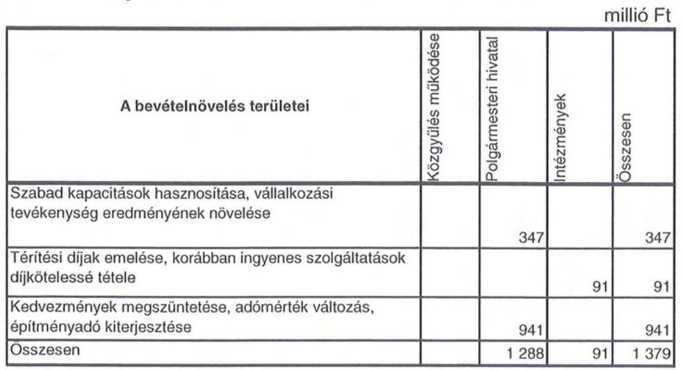

A bevételnövelő döntések hatására a 2007-2010. években 1379 millió Ft-tal emelkedtek az Önkormányzat bevételei.
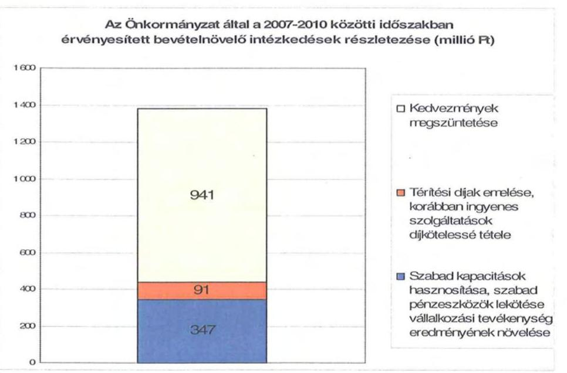

Az Önkormányzat a kiadások fedezetének biztosítása céljából az adózók körének bővítéséről, valamint egyes adómértékek emeléséről döntött, amely a nyilvántartások szerint 941 millió Ft-tal növelte a bevételeket. Ez az összes bevétel növekedésnek a $68 \%$-át tette ki.

A kimutatások szerint átmenetileg szabad pénzeszközök lekötéséből 262 millió Ft (19\%) bevétel származott. 91 millió Ft (7\%) többletforrást jelentett az Önkormányzatnak az egyéb ellátások és szolgáltatások díjkötelessé tétele, amely a Kórház emelt szintű szolgáltatásnyújtására vonatkozott, míg az ingatlanok, eszközök bérbeadásából 85 millió Ft-ot (6\%) realizált az Önkormányzat.

---

A bevételnövelő intézkedések 2011. évre várt eredménye 258 millió Ft-ot tesz ki, amelyből 162 millió Ft (63\%) adódik a helyi adórendeletek módosításából (helyi iparűzési adóra vonatkozó kedvezmények eltörlése), 49 millió Ft (19\%) az átmenetileg szabad pénzeszközök lekötéséből. Az ingatlanok, eszközök bérbeadása ebben az évben 25 millió Ft-ot (10\%), az egyéb ellátások és szolgáltatások dijkötelessé tétele 22 millió Ft-ot (8\%) tesz ki.

A 2007-2010. évek között a költségvetési támogatások és az átengedett szja bevételek együttes összegének csökkenése 624 millió Ft, az illetékbevétel csökkenése további 113 millió Ft bevétel kiesést eredményezett az Önkormányzatnál, amelyet a kiadáscsökkentő és a bevételnövelő intézkedésekkel elért megtakarításokkal és többletbevételekkel ellensúlyoztak.

# 5. A HELYI ÖNKORMÁNYZATOK GAZDÁLKODÁSI RENDSZERÉNEK 2009. ÉVI ELLENŐRZÉSE SORÁN A PÉNZÜGYI EGYENSÚLY JAVÍTÁSÁRA TETT SZABÁLYSZERŰSÉGI ÉS CÉLSZERŰSÉGI JAVASLATOK HASZNOSULÁSA 

Az ÁSZ a V-3001-4/2009. számú jelentésében az Önkormányzat gazdálkodási rendszerét a 2009. évben ellenőrizte átfogó jelleggel, amelynek során a pénzügyi egyensúly javítására két célszerúségi javaslatot tett.

Az ÁSZ által tett két célszerúségi javaslatot hasznosították, mert, a Közgyűlés elnöke tájékoztatta a Közgyűlést a számvevőszéki ellenőrzés tapasztalatairól, amelynek megvalósítására intézkedési tervet ${ }^{82}$ készítettek. Továbbá a főjegyző tájékoztatta - évente végzett számítások alapján - a Közgyűlést az Önkormányzat eladósodására figyelemmel arról, hogy a hosszú lejáratú, adósságot keletkeztető kötelezettségvállalásokból adódó tőke- és kamatfizetési kötelezettségét az Önkormányzat milyen feltételek biztosítása mellett tudja teljesíteni.

Budapest, 2011. december" 92
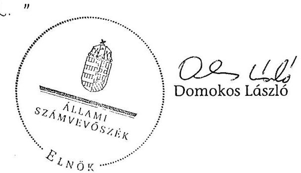

[^0]
[^0]:    ${ }^{82}$ A Közgyűlés az 525/2009. (XII. 3.) számú határozatával elfogadta a javaslatok megvalósítására felelősöket és határidőket tartalmazó intézkedési tervet.

---

# **Chemistry**

## **Chemical Reactions**

### **Balancing Chemical Equations**

1. **Write the unbalanced equation:**
   - Example: $$C_3H_8 + O_2 \rightarrow CO_2 + H_2O$$

2. **Balance the equation:**
   - Balance carbon atoms first.
   - Then balance hydrogen atoms.
   - Finally, balance oxygen atoms.
   - Balanced equation: $$C_3H_8 + 7O_2 \rightarrow 3CO_2 + 4H_2O$$

3. **Balance the equation:**
   - Balance oxygen atoms first.
   - Then balance oxygen oxygen atoms.
   - Balanced equation: $$C_3H_8 + 7O_2 \rightarrow 3CO_2 + 4H_2O$$

### **Types of Reactions**

1. **Combination Reaction:**
   - Example: $$2H_2 + O_2 \rightarrow 2H_2O$$

2. **Decomposition Reaction:**
   - Example: $$2H_2O_2 \rightarrow 2H_2O + O_2$$

3. **Single Displacement Reaction:**
   - Example: $$Zn + 2HCl \rightarrow ZnCl_2 + H_2$$

4. **Double Displacement Reaction:**
   - Example: $$AgNO_3 + NaCl \rightarrow AgCl + NaNO_3$$

5. **Combustion Reaction:**
   - Example: $$CH_4 + 2O_2 \rightarrow CO_2 + 2H_2O$$

## **Stoichiometry**

### **Mole Concept**

- **Mole (mol):** The amount of substance containing as many particles (atoms, molecules, ions) as there are atoms in exactly 12 grams of carbon-12.
- **Avogadro's Number:** $$6.022 \times 10^{23}$$ particles per mole.

### **Molar Mass**

- **Molar Mass:** The mass of one mole of a substance.
- Example: The molar mass of water ($$H_2O$$) is 18.015 g/mol.

### **Calculations**

1. **Moles to Mass:**
   - Formula: $$n = \frac{m}{M}$$
   - Example: Calculate the number of moles of $$H_2O$$ in 18 grams of water.
     - $$n = \frac{18.015 \, \text{g}}{18.015 \, \text{g/mol}} = 2 \, \text{mol}$$

2. **Mass to Moles:**
   - Formula: $$m = n \times M$$
   - Example: Calculate the mass of 18.015 g of 1 mole of $$H_2O$$.
     - $$m = 18.015 \, \text{g/mol} = 2 \, \text{mol}$$

## **Gas Laws**

### **Ideal Gas Law**

- **Equation:** $$PV = nRT$$
- **Variables:**
  - $$P$$ = Pressure (atm)
  - $$V$$ = Volume (L)
  - $$n$$ = Moles of gas

### **Boyle's Law**

- **Equation:** $$P_1V_1 = P_2V_2$$
- **Variables:**
  - P₁ = Pressure (atm)
  - P₂ = Volume (L)
  - P₃ = Moles of gas (L)
  - $$P_1V_1 = P_2V_2$$
  - **Equation:** $$P_2V_2 = P_3V_3$$

### **Charles's Law**

- **Equation:** $$\frac{V_1}{T_1} = \frac{V_2}{T_2}$$
- **Variables:**
  - $$T_1$$ = Temperature (atm)
  - $$T_2$$ = Volume (L)
  - $$T_1$$ = Pressure (atm)
  - $$T_2$$ = Moles of gas

## **Thermochemistry**

### **Enthalpy Change (ΔH)**

- **Definition:** The heat content of a system at constant pressure.
- **Equation:** $$\Delta H = q_p$$
- **Variables:**
  - $$q_p$$ = Heat transferred at constant pressure.
  - $$q_p$$ = Heat transferred at constant pressure.

### **Hess's Law**

- **Statement:** The enthalpy change for a reaction is the same whether it occurs in one step or multiple steps.
- **Equation:** $$\Delta H_{\text{reaction}} = \Delta H - \Delta H_0$$
- **Variables:**
  - $$\Delta H$$ = Heat transferred at constant pressure.
  - $$\Delta H_0$$ = Heat transferred at constant pressure.

## **Electrochemistry**

### **Oxidation and Reduction**

- **Oxidation:** Loss of electrons.
- **Reduction:** Gain of electrons.

### **Galvanic Cells**

- **Definition:** A cell that converts chemical energy into electrical energy.
- **Components:**
  - Anode: Oxidation occurs.
  - Cathode: Reduction occurs.
  - Salt Bridge: Connects the two half-cells.

### **Nernst Equation**

- **Equation:** $$E = E^\circ - \frac{RT}{nF} \ln Q$$
- **Variables:**
  - $$E$$ = Energy (Kcal/mol)
  - $$E^\circ$$ = Energy (J/mol)
  - $$E$$ = Heat (J/mol)
  - $$E$$ = Water (Kcal/mol)
  - $$R$$ = Ideal gas constant (0.0821 L·atm/mol·K)
  - $$T$$ = Temperature (atm)

## **Electrochemistry**

### **Oxidation and Reduction**

- **Oxidation:** Loss of electrons.
- **Reduction:** Gain of electrons.
- **Reduction:** Gain of electrons.

### **Electrochemical Cells**

- **Definition:** A cell that converts chemical energy into electrical energy.
- **Components:**
  - Anode: Oxidation occurs.
  - Cathode: Reduction occurs.
  - Salt Bridge: Connects the two half-cells.

### **Nernst Equation**

- **Equation:** $$E = E^\circ - \frac{RT}{nF} \ln Q$$
- **Variables:**
  - $$E^\circ$$ = Energy (Kcal/mol)
  - $$E^\circ$$ = Heat (J/mol)
  - $$E^\circ$$ = Water (Kcal/mol)
  - $$R$$ = Ideal gas constant (0.0821 L·atm/mol·K)
  - $$T$$ = Temperature (atm)

## **Organic Chemistry**

### **Functional Groups**

- **Alkanes:** -C=O -C=18 -C=18 -C=18 -C=18 -C=18 -C=18 -C=18 -C=18 -C=18 -C=18 -C=18 -C=18 -C=18 -C=18 -C=18 -C=18 -C=18 -C=18 -C=18 -C=18 -C=18 -C=18 -C=18 -C=18 -C=18 -C=18 -C=18 -C=18 -C=18 -C=18 -C=18 -C=18 -C=18 -C=18 -C=18 -C=18 -C=18 -C=18 -C=18 -C=18 -

---

Hódmezővásárhely Megyei Jogú Város Önkormányzata

1. számú melléklet a V03038-001/2011. számú jelentéshez

Működési és felhalmozási célú hiány/többlet az önkormányzat rendeleteiben

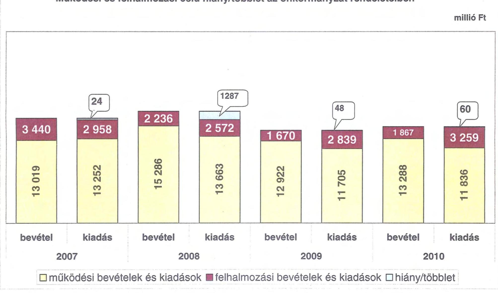

|   | 2007 | 2008 | 2009 | 2010  |
| --- | --- | --- | --- | --- |
|  müködési bevételek és kiadások | 2 236 | 1287 | 48 | 60  |

müködési bevételek és kiadások █ felhalmozási bevételek és kiadások █ hiány/többlet

---

|   |  |  |  | ezer Ft  |
| --- | --- | --- | --- | --- |
|  1. FOLYÓ KÖLTSÉGVETÉS* | 2010 | 2008. | 2009. | 2010.  |
|  1.1.1. Saját működési bevételek | 3 805 745 | 4 278 107 | 3 338 741 | 3 751 984  |
|  1.1.2. Költségvetési támogatás | 3 669 332 | 4 057 832 | 3 584 820 | 3 425 660  |
|  1.1.3. Alangetleti bevételek | 2 699 462 | 1 773 384 | 1 991 478 | 1 995 704  |
|  1.1.4. Állambázisztárom belüliell kapott támogatások | 2 454 474 | 2 754 697 | 2 096 118 | 2 913 431  |
|  1.1.5. El/ col és külföldről kapott bevételek | 5 280 | 0 | 33 143 | 44 453  |
|  1.1.6. Állambázisztárom belüliell kapott bevételek | 278 574 | 153 482 | 97 592 | 136 760  |
|  1.1.7. Fölső évi pánonosadvány átvelet | 367 078 | 478 398 | 362 895 | 145 233  |
|  1.2. Folyó bevételek +1.1.1.+1.1.2.+1.1.3.+1.1.4.+1.1.5.+1.1.6.+1.1.7. | 12 028 946 | 13 495 834 | 11 814 380 | 12 413 343  |
|  1.2.1. Működési kiadások komatkiadások nélkül | 9 941 632 | 11 056 209 | 8 871 700 | 8 400 019  |
|  1.2.2. Állambázisztárom belüli- áladott pánonoskóink | 204 092 | 247 737 | 33 997 | 223 089  |
|  1.2.2.1. vállalkozásolcsak | 271 473 | 45 117 | 166 349 | 204 091  |
|  1.2.2.2. El/csak, illetve külföldre | 4 580 | 8 628 | 511 | 0  |
|  1.2.2.3. magáncsmeilyekező | 257 616 | 580 705 | 291 628 | 643 574  |
|  1.2.2.4. morgonijó szervezetések | 453 350 | 149 982 | 248 364 | 381 930  |
|  1.2.3. Tramadirektuálások (+1.2.3.1+1.2.3.2+1.2.3.3+1.2.3.4) | 1 287 013 | 783 612 | 1 007 084 | 1 229 603  |
|  1.2.4. Komatkiadások | 399 668 | 518 943 | 313 199 | 562 857  |
|  1.2.5. Fölső évi pánonosadvány átadás | 372 860 | 478 398 | 362 895 | 145 233  |
|  1.2. Folyó kiadások + 1.2.1.+1.2.2.+1.2.3.+1.2.4.+1.2.5. | 12 494 653 | 13 984 889 | 11 406 881 | 11 269 892  |
|  1.3. Folyó költségvetés egyenlege MÉKÖDÉSI JÓVEDELEM (1.1. - 1.2.) | 464 707 | 410 923 | 407 499 | 1 152 451  |
|  2. FELHALMOZÁSI KÖLTSÉGVETÉS** |  |  |  |   |
|  2.1.1. Saját tökébevételek | 605 830 | 1 138 437 | 659 824 | 635 091  |
|  2.1.2. Állambázisztárom belüliell kapott támogatások | 396 397 | 288 414 | 614 184 | 1 692 892  |
|  2.1.3. El/ col és külföldről kapott támogatások | 203 112 | 0 | 0 | 0  |
|  2.1.4. Állambázisztárom beváltól kapott támogatások | 81 611 | 109 614 | 94 864 | 44 635  |
|  2.1. Felhalmozzási bevételek (+2.1.1.+2.1.2+2.1.3+2.1.4.) | 1 286 943 | 1 536 465 | 1 368 872 | 2 372 618  |
|  2.2.1. Saját bevetésén kizetés állíval | 2 379 664 | 2 070 176 | 2 139 446 | 1 705 596  |
|  2.2.2. Saját felújítási kizetés állíval | 410 522 | 353 670 | 255 358 | 387 127  |
|  2.2.3. Állambázisztárom belüli- áladott pánonoskóa | 160 020 | 208 037 | 78 334 | 1 091 811  |
|  2.2.4. El/ csak és külföldnek adott pánonoskóink | 8 425 | 415 | 0 | 0  |
|  2.2.5. Állambázisztárom kizetés adott pánonoskóink | 522 004 | 506 438 | 631 010 | 600 714  |
|  2.2.6. Befektetési célú részesedések vázárlása | 0 | 3 080 | 0 | 5 159  |
|  2.3. Felhalmozzási kiadások (+2.3.1.+2.3.2.+2.3.3.+2.3.4.+2.3.5.+2.3.6.) | 3 480 670 | 3 142 416 | 3 084 128 | 3 794 037  |
|  2.3. Felhalmozzási költségvetés egyenlege (2.1. - 2.2.) | -2 193 692 | -1 605 951 | -1 715 256 | -1 421 459  |
|  3. Finanszírozási műveletek nélküli (GFS) pozíció(1.3.+2.3.) | -2 658 399 | -1 195 030 | -1 307 757 | -268 968  |
|  4. Finanszírozási műveletek |  |  |  |   |
|  4.1. Hissítővétel | 1 954 670 | 2 110 215 | 1 323 727 | 815 009  |
|  4.2. Hissítővétel | 2 183 976 | 2 356 657 | 1 850 723 | 651 991  |
|  4.3. Forgatási és befektetési célú értékpapírok kibocsátása | 0 | 0 | 0 | 0  |
|  4.4. Forgatási és befektetési célú értékpapírok bevéltése | 0 | 0 | 0 | 0  |
|  4.5. Forgatási és befektetési célú értékpapírok vázárlása | 55 041 | 50 541 | 42 400 | 0  |
|  4.6. Forgatási és befektetési célú értékpapírok vázárlása | 0 | 0 | 0 | 0  |
|  4.7. Egyéb finanszírozási bevételek (függő, állítás, kiegészítői) | 108 457 | -103 914 | -84 253 | -153 413  |
|  4.8. Egyéb finanszírozási kiadások (függő, állítás, kiegészítői) | 138 468 | -182 573 | -43 036 | -52 880  |
|  4.9. Finanszírozási műveletek egyenlege (4.1. - 4.2.+4.3.-4.4+4.5.-4.6.+4.7.-4.8.) | -204 267 | -96 884 | 274 179 | 42 484  |
|  5. Tárgyévi pénzügyi pozíció változás (1.3.+ 2.3.+4.9.) | -2 862 666 | -1 291 914 | -1 033 578 | -226 484  |
|  6. Nettó működési jövedelem «működési jövedelem (1.3.) - tüketérlesztés (4.2+4.4) | -2 648 683 | -1 925 776 | -643 224 | 500 469  |
|  TÁJÉKOSÍTÁTÓ ADATOK |  |  |  |   |
|  Összes kötelezettség és végt állománya | 19 125 720 | 20 014 598 | 21 018 288 | 24 373 461  |
|  ebből rövid fajáratú | 6 968 516 | 5 234 051 | 5 407 459 | 6 937 336  |
|  Összes szállítás kötelezettség és végt állománya | 2 593 098 | 2 661 353 | 1 855 791 | 2 206 304  |
|  ebből fajátú (tamódványból) | 1 122 051 | 1 448 817 | 1 223 875 | 1 724 585  |
|  Élve és átfogóval kötelezettség (adóeság) és végt állománya | 15 870 473 | 16 635 055 | 18 025 322 | 20 957 133  |
|  ebből rövid fajáratú | 3 733 704 | 1 856 049 | 2 474 561 | 3 522 281  |
|  PPP sorozódása és végt állomány jelentésében (tamódványból) | 1 342 516 | 1 321 312 | 1 239 983 | 1 132 639  |
|  ebből fajátú szolgáltatást díj miattó kötelezettség | 0 | 0 | 17 375 | 17 597  |
|  Feltétszámbálatú tagát átlagos állománya (tamódványból) | 283 574 | 294 012 | 305 689 | 347 891  |
|  Utóvállatul tagát átlagos állománya (tamódványból) | 352 254 | 11 089 | 412 520 | 439 379  |
|  Támítványbólmi tagát átlagos állománya (tamódványból) | 250 008 | 250 008 | 250 008 | 250 008  |
|  Kezesség és garanciavállalások és végt állománya(tamódványból) | 179 306 | 249 753 | 273 062 | 384 110  |
|  Joggyés bértségi tájékozkból adódó kötelezettségek és végt állománya (tamódványból) | 162 86 | 117 83 | 31 115 | 19 047  |
|  Finanszírozásba bevetésén eszközök | 3 827 783 | 2 493 893 | 1 407 269 | 1 138 869  |
|  Tartós hitelviszonyt megterjesítő értékpapírok és végt állománya | 136 998 | 95 015 | 41 576 | 0  |
|  Hosszú fajáratú bankbetthek és végt állománya | 0 | 1 032 152 | 0 | 0  |
|  Értékpapírok és végt állománya | 0 | 0 | 0 | 0  |
|  Finanszékletők írásigaz pánonosközök nélküli és végt állománya | 3 690 785 | 1 366 719 | 1 365 263 | 1 138 809  |

- Bevételében nemvétel, a kiadásokban nem jelent meg az amortizáció a vagyoni helyszínt az egyenleg befolyásolja

* Bevételében vagyon megőrzése és hivatásos kiadékaiti kimások.

---

|   |  |  |  |  |  |  |  |  |  |  |  |  |  |  |  |  |  |  |  |  |  |  |  |  |  |  |  |  |  |  |  |  |  |  |  |  |  |  |  |  |   |
| --- | --- | --- | --- | --- | --- | --- | --- | --- | --- | --- | --- | --- | --- | --- | --- | --- | --- | --- | --- | --- | --- | --- | --- | --- | --- | --- | --- | --- | --- | --- | --- | --- | --- | --- | --- | --- | --- | --- | --- | --- | --- |
|   |  |  |  |  |  |  |  |  |  |  |  |  |  |  |  |  |  |  |  |  |  |  |  |  |  |  |  |  |  |  |  |  |  |  |  |  |  |  |  |  |   |
|   |  |  |  |  |  |  |  |  |  |  |  |  |  |  |  |  |  |  |  |  |  |  |  |  |  |  |  |  |  |  |  |  |  |  |  |  |  |  |  |  |   |
|   |  |  |  |  |  |  |  |  |  |  |  |  |  |  |  |  |  |  |  |  |  |  |  |  |  |  |  |  |  |  |  |  |  |  |  |  |  |  |  |  |   |
|   |  |  |  |  |  |  |  |  |  |  |  |  |  |  |  |  |  |  |  |  |  |  |  |  |  |  |  |  |  |  |  |  |  |  |  |  |  |  |  |  |   |
|   |  |  |  |  |  |  |  |  |  |  |  |  |  |  |  |  |  |  |  |  |  |  |  |  |  |  |  |  |  |  |  |  |  |  |  |  |  |  |  |  |   |
|   |  |  |  |  |  |  |  |  |  |  |  |  |  |  |  |  |  |  |  |  |  |  |  |  |  |  |  |  |  |  |  |  |  |  |  |  |  |  |  |  |   |
|   |  |  |  |  |  |  |  |  |  |  |  |  |  |  |  |  |  |  |  |  |  |  |  |  |  |  |  |  |  |  |  |  |  |  |  |  |  |  |  |  |   |
|   |  |  |  |  |  |  |  |  |  |  |  |  |  |  |  |  |  |  |  |  |  |  |  |  |  |  |  |  |  |  |  |  |  |  |  |  |  |  |  |  |   |
|   |  |  |  |  |  |  |  |  |  |  |  |  |  |  |  |  |  |  |  |  |  |  |  |  |  |  |  |  |  |  |  |  |  |  |  |  |  |  |  |  |   |
|   |  |  |  |  |  |  |  |  |  |  |  |  |  |  |  |  |  |  |  |  |  |  |  |  |  |  |  |  |  |  |  |  |  |  |  |  |  |  |  |  |   |
|   |  |  |  |  |  |  |  |  |  |  |  |  |  |  |  |  |  |  |  |  |  |  |  |  |  |  |  |  |  |  |  |  |  |  |  |  |  |  |  |  |   |
|   |  |  |  |  |  |  |  |  |  |  |  |  |  |  |  |  |  |  |  |  |  |  |  |  |  |  |  |  |  |  |  |  |  |  |  |  |  |  |  |  |   |
|   |  |  |  |  |  |  |  |  |  |  |  |  |  |  |  |  |  |  |  |  |  |  |  |  |  |  |  |  |  |  |  |  |  |  |  |  |  |  |  |  |   |
|   |  |  |  |  |  |  |  |  |  |  |  |  |  |  |  |  |  |  |  |  |  |  |  |  |  |  |  |  |  |  |  |  |  |  |  |  |  |  |  |  |   |
|   |  |  |  |  |  |  |  |  |  |  |  |  |  |  |  |  |  |  |  |  |  |  |  |  |  |  |  |  |  |  |  |  |  |  |  |  |  |  |  |  |   |
|   |  |  |  |  |  |  |  |  |  |  |  |  |  |  |  |  |  |  |  |  |  |  |  |  |  |  |  |  |  |  |  |  |  |  |  |  |  |  |  |  |   |
|   |  |  |  |  |  |  |  |  |  |  |  |  |  |  |  |  |  |  |  |  |  |  |  |  |  |  |  |  |  |  |  |  |  |  |  |  |  |  |  |  |   |
|   |  |  |  |  |  |  |  |  |  |  |  |  |  |  |  |  |  |  |  |  |  |  |  |  |  |  |  |  |  |  |  |  |  |  |  |  |  |  |  |  |   |
|   |  |  |  |  |  |  |  |  |  |  |  |  |  |  |  |  |  |  |  |  |  |  |  |  |  |  |  |  |  |  |  |  |  |  |  |  |  |  |  |  |   |
|   |  |  |  |  |  |  |  |  |  |  |  |  |  |  |  |  |  |  |  |  |  |  |  |  |  |  |  |  |  |  |  |  |  |  |  |  |  |  |  |  |   |
|   |  |  |  |  |  |  |  |  |  |  |  |  |  |  |  |  |  |  |  |  |  |  |  |  |  |  |  |  |  |  |  |  |  |  |  |  |  |  |  |  |   |
|   |  |  |  |  |  |  |  |  |  |  |  |  |  |  |  |  |  |  |  |  |  |  |  |  |  |  |  |  |  |  |  |  |  |  |  |  |  |  |  |  |   |
|   |  |  |  |  |  |  |  |  |  |  |  |  |  |  |  |  |  |  |  |  |  |  |  |  |  |  |  |  |  |  |  |  |  |  |  |  |  |  |  |  |   |
|   |  |  |  |  |  |  |  |  |  |  |  |  |  |  |  |  |  |  |  |  |  |  |  |  |  |  |  |  |  |  |  |  |  |  |  |  |  |  |  |  |   |
|   |  |  |  |  |  |  |  |  |  |  |  |  |  |  |  |  |  |  |  |  |  |  |  |  |  |  |  |  |  |  |  |  |  |  |  |  |  |  |  |  |   |
|   |  |  |  |  |  |  |  |  |  |  |  |  |  |  |  |  |  |  |  |  |  |  |  |  |  |  |  |  |  |  |  |  |  |  |  |  |  |  |  |  |   |
|   |  |  |  |  |  |  |  |  |  |  |  |  |  |  |  |  |  |  |  |  |  |  |  |  |  |  |  |  |  |  |  |  |  |  |  |  |  |  |  |  |   |
|   |  |  |  |  |  |  |  |  |  |  |  |  |  |  |  |  |  |  |  |  |  |  |  |  |  |  |  |  |  |  |  |  |  |  |  |  |  |  |  |  |   |
|   |  |  |  |  |  |  |  |  |  |  |  |  |  |  |  |  |  |  |  |  |  |  |  |  |  |  |  |  |  |  |  |  |  |  |  |  |  |  |  |  |   |
|   |  |  |  |  |  |  |  |  |  |  |  |  |  |  |  |  |  |  |  |  |  |  |  |  |  |  |  |  |  |  |  |  |  |  |  |  |  |  |  |  |   |
|   |  |  |  |  |  |  |  |  |  |  |  |  |  |  |  |  |  |  |  |  |  |  |  |  |  |  |  |  |  |  |  |  |  |  |  |  |  |  |  |  |   |

---

|   |  |  |  |  |  |  |  |  |  |  |  |  |  |  |  |  |  |  |  |  |  |  |  |  |  |  |  |  |  |  |  |  |  |  |  |  |  |  |  |  |  |  |  |  |  |  |  |  |  |  |  |  |   |
| --- | --- | --- | --- | --- | --- | --- | --- | --- | --- | --- | --- | --- | --- | --- | --- | --- | --- | --- | --- | --- | --- | --- | --- | --- | --- | --- | --- | --- | --- | --- | --- | --- | --- | --- | --- | --- | --- | --- | --- | --- | --- | --- | --- | --- | --- | --- | --- | --- | --- | --- | --- | --- | --- | --- |
|   |  |  |  |  |  |  |  |  |  |  |  |  |  |  |  |  |  |  |  |  |  |  |  |  |  |  |  |  |  |  |  |  |  |  |  |  |  |  |  |  |  |  |  |  |  |  |  |  |  |  |  |  |   |
|   |  |  |  |  |  |  |  |  |  |  |  |  |  |  |  |  |  |  |  |  |  |  |  |  |  |  |  |  |  |  |  |  |  |  |  |  |  |  |  |  |  |  |  |  |  |  |  |  |  |  |  |  |   |
|   |  |  |  |  |  |  |  |  |  |  |  |  |  |  |  |  |  |  |  |  |  |  |  |  |  |  |  |  |  |  |  |  |  |  |  |  |  |  |  |  |  |  |  |  |  |  |  |  |  |  |  |  |   |
|   |  |  |  |  |  |  |  |  |  |  |  |  |  |  |  |  |  |  |  |  |  |  |  |  |  |  |  |  |  |  |  |  |  |  |  |  |  |  |  |  |  |  |  |  |  |  |  |  |  |  |  |  |   |
|   |  |  |  |  |  |  |  |  |  |  |  |  |  |  |  |  |  |  |  |  |  |  |  |  |  |  |  |  |  |  |  |  |  |  |  |  |  |  |  |  |  |  |  |  |  |  |  |  |  |  |  |  |   |
|   |  |  |  |  |  |  |  |  |  |  |  |  |  |  |  |  |  |  |  |  |  |  |  |  |  |  |  |  |  |  |  |  |  |  |  |  |  |  |  |  |  |  |  |  |  |  |  |  |  |  |  |  |   |
|   |  |  |  |  |  |  |  |  |  |  |  |  |  |  |  |  |  |  |  |  |  |  |  |  |  |  |  |  |  |  |  |  |  |  |  |  |  |  |  |  |  |  |  |  |  |  |  |  |  |  |  |  |   |
|   |  |  |  |  |  |  |  |  |  |  |  |  |  |  |  |  |  |  |  |  |  |  |  |  |  |  |  |  |  |  |  |  |  |  |  |  |  |  |  |  |  |  |  |  |  |  |  |  |  |  |  |  |   |
|   |  |  |  |  |  |  |  |  |  |  |  |  |  |  |  |  |  |  |  |  |  |  |  |  |  |  |  |  |  |  |  |  |  |  |  |  |  |  |  |  |  |  |  |  |  |  |  |  |  |  |  |  |   |
|   |  |  |  |  |  |  |  |  |  |  |  |  |  |  |  |  |  |  |  |  |  |  |  |  |  |  |  |  |  |  |  |  |  |  |  |  |  |  |  |  |  |  |  |  |  |  |  |  |  |  |  |  |   |
|   |  |  |  |  |  |  |  |  |  |  |  |  |  |  |  |  |  |  |  |  |  |  |  |  |  |  |  |  |  |  |  |  |  |  |  |  |  |  |  |  |  |  |  |  |  |  |  |  |  |  |  |  |   |
|   |  |  |  |  |  |  |  |  |  |  |  |  |  |  |  |  |  |  |  |  |  |  |  |  |  |  |  |  |  |  |  |  |  |  |  |  |  |  |  |  |  |  |  |  |  |  |  |  |  |  |  |  |   |
|   |  |  |  |  |  |  |  |  |  |  |  |  |  |  |  |  |  |  |  |  |  |  |  |  |  |  |  |  |  |  |  |  |  |  |  |  |  |  |  |  |  |  |  |  |  |  |  |  |  |  |  |  |   |
|   |  |  |  |  |  |  |  |  |  |  |  |  |  |  |  |  |  |  |  |  |  |  |  |  |  |  |  |  |  |  |  |  |  |  |  |  |  |  |  |  |  |  |  |  |  |  |  |  |  |  |  |  |   |
|   |  |  |  |  |  |  |  |  |  |  |  |  |  |  |  |  |  |  |  |  |  |  |  |  |  |  |  |  |  |  |  |  |  |  |  |  |  |  |  |  |  |  |  |  |  |  |  |  |  |  |  |  |   |
|   |  |  |  |  |  |  |  |  |  |  |  |  |  |  |  |  |  |  |  |  |  |  |  |  |  |  |  |  |  |  |  |  |  |  |  |  |  |  |  |  |  |  |  |  |  |  |  |  |  |  |  |  |   |
|   |  |  |  |  |  |  |  |  |  |  |  |  |  |  |  |  |  |  |  |  |  |  |  |  |  |  |  |  |  |  |  |  |  |  |  |  |  |  |  |  |  |  |  |  |  |  |  |  |  |  |  |  |   |
|   |  |  |  |  |  |  |  |  |  |  |  |  |  |  |  |  |  |  |  |  |  |  |  |  |  |  |  |  |  |  |  |  |  |  |  |  |  |  |  |  |  |  |  |  |  |  |  |  |  |  |  |  |   |
|   |  |  |  |  |  |  |  |  |  |  |  |  |  |  |  |  |  |  |  |  |  |  |  |  |  |  |  |  |  |  |  |  |  |  |  |  |  |  |  |  |  |  |  |  |  |  |  |  |  |  |  |  |   |
|   |  |  |  |  |  |  |  |  |  |  |  |  |  |  |  |  |  |  |  |  |  |  |  |  |  |  |  |  |  |  |  |  |  |  |  |  |  |  |  |  |  |  |  |  |  |  |  |  |  |  |  |  |   |
|   |  |  |  |  |  |  |  |  |  |  |  |  |  |  |  |  |  |  |  |  |  |  |  |  |  |  |  |  |  |  |  |  |  |  |  |  |  |  |  |  |  |  |  |  |  |  |  |  |  |  |  |  |   |
|   |  |  |  |  |  |  |  |  |  |  |  |  |  |  |  |  |  |  |  |  |  |  |  |  |  |  |  |  |  |  |  |  |  |  |  |  |  |  |  |  |  |  |  |  |  |  |  |  |  |  |  |  |   |
|   |  |  |  |  |  |  |  |  |  |  |  |  |  |  |  |  |  |  |  |  |  |  |  |  |  |  |  |  |  |  |  |  |  |  |  |  |  |  |  |  |  |  |  |  |  |  |  |  |  |  |  |  |   |
|   |  |  |  |  |  |  |  |  |  |  |  |  |  |  |  |  |  |  |  |  |  |  |  |  |  |  |  |  |  |  |  |  |  |  |  |  |  |  |  |  |  |  |  |  |  |  |  |  |  |  |  |  |   |
|   |  |  |  |  |  |  |  |  |  |  |  |  |  |  |  |  |  |  |  |  |  |  |  |  |  |  |  |  |  |  |  |  |  |  |  |  |  |  |  |  |  |  |  |  |  |  |  |  |  |  |  |  |  |   |
|   |  |  |  |  |  |  |  |  |  |  |  |  |  |  |  |  |  |  |  |  |  |  |  |  |  |  |  |  |  |  |  |  |  |  |  |  |  |  |  |  |  |  |  |  |  |  |  |  |  |  |  |  |  |   |
|   |  |  |  |  |  |  |  |  |  |  |  |  |  |  |  |  |  |  |  |  |  |  |  |  |  |  |  |  |  |  |  |  |  |  |  |  |  |  |  |  |  |  |  |  |  |  |  |  |  |  |  |  |  |   |
|   |  |  |  |  |  |  |  |  |  |  |  |  |  |  |  |  |  |  |  |  |  |  |  |  |  |  |  |  |  |  |  |  |  |  |  |  |  |  |  |  |  |  |  |  |  |  |  |  |  |  |  |  |  |   |
|   |  |  |  |  |  |  |  |  |  |  |  |  |  |  |  |  |  |  |  |  |  |  |  |  |  |  |  |  |  |  |  |  |  |  |  |  |  |  |  |  |  |  |  |  |  |  |  |  |  |  |  |  |  |   |
|   |  |  |  |  |  |  |  |  |  |  |  |  |  |  |  |  |  |  |  |  |  |  |  |  |  |  |  |  |  |  |  |  |  |  |  |  |  |  |  |  |  |  |  |  |  |  |  |  |  |  |  |  |  |   |
|   |  |  |  |  |  |  |  |  |  |  |  |  |  |  |  |  |  |  |  |  |  |  |  |  |  |  |  |  |  |  |  |  |  |  |  |  |  |  |  |  |  |  |  |  |  |  |  |  |  |  |  |  |  |   |
|   |  |  |  |  |  |  |  |  |  |  |  |  |  |  |  |  |  |  |  |  |  |  |  |  |  |  |  |  |  |  |  |  |  |  |  |  |  |  |  |  |  |  |  |  |  |  |  |  |  |  |  |  |  |   |
|   |  |  |  |  |  |  |  |  |  |  |  |  |  |  |  |  |  |  |  |  |  |  |  |  |  |  |  |  |  |  |  |  |  |  |  |  |  |  |  |  |  |  |  |  |  |  |  |  |  |  |  |  |  |   |
|   |  |  |  |  |  |  |  |  |  |  |  |  |  |  |  |  |  |  |  |  |  |  |  |  |  |  |  |  |  |  |  |  |  |  |  |  |  |  |  |  |  |  |  |  |  |  |  |  |  |  |  |  |  |   |
|   |  |  |  |  |  |  |  |  |  |  |  |  |  |  |  |  |  |  |  |  |  |  |  |  |  |  |  |  |  |  |  |  |  |  |  |  |  |  |  |  |  |  |  |  |  |  |  |  |  |  |  |  |  |   |
|   |  |  |  |  |  |  |  |  |  |  |  |  |  |  |  |  |  |  |  |  |  |  |  |  |  |  |  |  |  |  |  |  |  |  |  |  |  |  |  |  |  |  |  |  |  |  |  |  |  |  |  |  |  |   |
|   |  |  |  |  |  |  |  |  |  |  |  |  |  |  |  |  |  |  |  |  |  |  |  |  |  |  |  |  |  |  |  |  |  |  |  |  |  |  |  |  |  |  |  |  |  |  |  |  |  |  |  |  |  |   |
|   |  |  |  |  |  |  |  |  |  |  |  |  |  |  |  |  |  |  |  |  |  |  |  |  |  |  |  |  |  |  |  |  |  |  |  |  |  |  |  |  |  |  |  |  |  |  |  |  |  |  |  |  |  |   |
|   |  |  |  |  |  |  |  |  |  |  |  |  |  |  |  |  |  |  |  |  |  |  |  |  |  |  |  |  |  |  |  |  |  |  |  |  |  |  |  |  |  |  |  |  |  |  |  |  |  |  |  |  |  |   |
|   |  |  |  |  |  |  |  |  |  |  |  |  |  |  |  |  |  |  |  |  |  |  |  |  |  |  |  |  |  |  |  |  |  |  |  |  |  |  |  |  |  |  |  |  |  |  |  |  |  |  |  |  |  |   |
|   |  |  |  |  |  |  |  |  |  |  |  |  |  |  |  |  |  |  |  |  |  |  |  |  |  |  |  |  |  |  |  |  |  |  |  |  |  |  |  |  |  |  |  |  |  |  |  |  |  |  |  |  |  |   |
|   |  |  |  |  |  |  |  |  |  |  |  |  |  |  |  |  |  |  |  |  |  |  |  |  |  |  |  |  |  |  |  |  |  |  |  |  |  |  |  |  |  |  |  |  |  |  |  |  |  |  |  |  |  |   |
|   |  |  |  |  |  |  |  |  |  |  |  |  |  |  |  |  |  |  |  |  |  |  |  |  |  |  |  |  |  |  |  |  |  |  |  |  |  |  |  |  |  |  |  |  |  |  |  |  |  |  |  |  |  |   |
|   |  |  |  |  |  |  |  |  |  |  |  |  |  |  |  |  |  |  |  |  |  |  |  |  |  |  |  |  |  |  |  |  |  |  |  |  |  |  |  |  |  |  |  |  |  |  |  |  |  |  |  |  |  |   |
|   |  |  |  |  |  |  |  |  |  |  |  |  |  |  |  |  |  |  |  |  |  |  |  |  |  |  |  |  |  |  |  |  |  |  |  |  |  |  |  |  |  |  |  |  |  |  |  |  |  |  |  |  |  |   |
|   |  |  |  |  |  |  |  |  |  |  |  |  |  |  |  |  |  |  |  |  |  |  |  |  |  |  |  |  |  |  |  |  |  |  |  |  |  |  |  |  |  |  |  |  |  |  |  |  |  |  |  |  |  |  |   |
|   |  |  |  |  |  |  |  |  |  |  |  |  |  |  |  |  |  |  |  |  |  |  |  |  |  |  |  |  |  |  |  |  |  |  |  |  |  |  |  |  |  |  |  |  |  |  |  |  |  |  |  |  |  |  |   |
|   |  |  |  |  |  |  |  |  |  |  |  |  |  |  |  |  |  |  |  |  |  |  |  |  |  |  |  |  |  |  |  |  |  |  |  |  |  |  |  |  |  |  |  |  |  |  |  |  |  |  |  |  |  |  |   |
|   |  |  |  |  |  |  |  |  |  |  |  |  |  |  |  |  |  |  |  |  |  |  |  |  |  |  |  |  |  |  |  |  |  |  |  |  |  |  |  |  |  |  |  |  |  |  |  |  |  |  |  |  |  |  |   |
|   |  |  |  |  |  |  |  |  |  |  |  |  |  |  |  |  |  |  |  |  |  |  |  |  |  |  |  |  |  |  |  |  |  |  |  |  |  |  |  |  |  |  |  |  |  |  |  |  |  |  |  |  |  |  |   |
|   |  |  |  |  |  |  |  |  |  |  |  |  |  |  |  |  |  |  |  |  |  |  |  |  |  |  |  |  |  |  |  |  |  |  |  |  |  |  |  |  |  |  |  |  |  |  |  |  |  |  |  |  |  |  |   |
|   |  |  |  |  |  |  |  |  |  |  |  |  |  |  |  |  |  |  |  |  |  |  |  |  |  |  |  |  |  |  |  |  |  |  |  |  |  |  |  |  |  |  |  |  |  |  |  |  |  |  |  |  |  |  |   |
|   |  |  |  |  |  |  |  |  |  |  |  |  |  |  |  |  |  |  |  |  |  |  |  |  |  |  |  |  |  |  |  |  |  |  |  |  |  |  |  |  |  |  |  |  |  |  |  |  |  |  |  |  |  |  |   |
|   |  |  |  |  |  |  |  |  |  |  |  |  |  |  |  |  |  |  |  |  |  |  |  |  |  |  |  |  |  |  |  |  |  |  |  |  |  |  |  |  |  |  |  |  |  |  |  |  |  |  |  |  |  |  |   |
|   |  |  |  |  |  |  |  |  |  |  |  |  |  |  |  |  |  |  |  |  |  |  |  |  |  |  |  |  |  |  |  |  |  |  |  |  |  |  |  |  |  |  |  |  |  |  |  |  |  |  |  |  |  |  |   |
|   |  |  |  |  |  |  |  |  |  |  |  |  |  |  |  |  |  |  |  |  |  |  |  |  |  |  |  |  |  |  |  |  |  |  |  |  |  |  |  |  |  |  |  |  |  |  |  |  |  |  |  |  |  |  |   |
|   |  |  |  |  |  |  |  |  |  |  |  |  |  |  |  |  |  |  |  |  |  |  |  |  |  |  |  |  |  |  |  |  |  |  |  |  |  |  |  |  |  |  |  |  |  |  |  |  |  |  |  |  |  |  |  |   |
|   |  |  |  |  |  |  |  |  |  |  |  |  |  |  |  |  |  |  |  |  |  |  |  |  |  |  |  |  |  |  |  |  |  |  |  |  |  |  |  |  |  |  |  |  |  |  |  |  |  |  |  |  |  |  |  |  |   |
|   |  |  |  |  |  |  |  |  |  |  |  |  |  |  |  |  |  |  |  |  |  |  |  |  |  |  |  |  |  |  |  |  |  |  |  |  |  |  |  |  |  |  |  |  |  |  |  |  |  |  |  |  |  |  |  |   |
|   |  |  |  |  |  |  |  |  |  |  |  |  |  |  |  |  |  |  |  |  |  |  |  |  |  |  |  |  |  |  |  |  |  |  |  |  |  |  |  |  |  |  |  |  |  |  |  |  |  |  |  |  |  |  |  |   |
|   |  |  |  |  |  |  |  |  |  |  |  |  |  |  |  |  |  |  |  |  |  |  |  |  |  |  |  |  |  |  |  |  |  |  |  |  |  |  |  |  |  |  |  |  |  |  |  |  |  |  |  |  |  |  |  |  |   |
|   |  |  |  |  |  |  |  |  |  |  |  |  |  |  |  |  |  |  |  |  |  |  |  |  |  |  |  |  |  |  |  |  |  |  |  |  |  |  |  |  |  |  |  |  |  |  |  |  |  |  |  |  |  |  |  |  |  |   |
|   |  |  |  |  |  |  |  |  |  |  |  |  |  |  |  |  |  |  |  |  |  |  |  |  |  |  |  |  |  |  |  |  |  |  |  |  |  |  |  |  |  |  |  |  |  |  |  |  |  |  |  |  |  |  |  |  |  |   |
|   |  |  |  |  |  |  |  |  |  |  |  |  |  |  |  |  |  |  |  |  |  |  |  |  |  |  |  |  |  |  |  |  |  |  |  |  |  |  |  |  |  |  |  |  |  |  |  |  |  |  |  |  |  |  |  |  |  |  |   |
|   |  |  |  |  |  |  |  |  |  |  |  |  |  |  |  |  |  |  |  |  |  |  |  |  |  |  |  |  |  |  |  |  |  |  |  |  |  |  |  |  |  |  |  |  |  |  |  |  |  |  |  |  |  |  |  |  |  |  |  |   |
|   |  |  |  |  |  |  |  |  |  |  |  |  |  |  |  |  |  |  |  |  |  |  |  |  |  |  |  |  |  |  |  |  |  |  |  |  |  |  |  |  |  |  |  |  |  |  |  |  |  |  |  |  |  |  |  |  |  |  |  |  |   |
|   |  |  |  |  |  |  |  |  |  |  |  |  |  |  |  |  |  |  |  |  |  |  |  |  |  |  |  |  |  |  |  |  |  |  |  |  |  |  |  |  |  |  |  |  |  |  |  |  |  |  |  |  |  |  |  |  |  |  |  |  |  |  |  |   |
|   |  |  |  |  |  |  |  |  |  |  |  |  |  |  |  |  |  |  |  |  |  |  |  |  |  |  |  |  |  |  |  |  |  |  |  |  |  |  |  |  |  |  |  |  |  |  |  |  |  |  |  |  |  |  |  |  |  |  |  |  |  |  |  |  |  |  |   |
|   |  |  |  |  |  |  |  |  |  |  |  |  |  |  |  |  |  |  |  |  |  |  |  |  |  |  |  |  |  |  |  |  |  |  |  |  |  |  |  |  |  |  |  |  |  |  |  |  |  |  |  |  |  |  |  |  |  |  |  |  |  |  |  |  |  |  |  |   |
|   |  |  |  |  |  |  |  |  |  |  |  |  |  |  |  |  |  |  |  |  |  |  |  |  |  |  |  |  |  |  |  |  |  |  |  |  |  |  |  |  |  |  |  |  |  |  |  |  |  |  |  |  |  |  |  |  |  |  |  |  |  |  |  |  |  |  |  |  |  |   |
|   |  |  |  |  |  |  |  |  |  |  |  |  |  |  |  |  |  |  |  |  |  |  |  |  |  |  |  |  |  |  |  |  |  |  |  |  |  |  |  |  |  |  |  |  |  |  |  |  |  |  |  |  |  |  |  |  |  |  |  |  |  |  |  |  |  |  |  |  |  |  |   |
|   |  |  |  |  |  |  |  |  |  |  |  |  |  |  |  |  |  |  |  |  |  |  |  |  |  |  |  |  |  |  |  |  |  |  |  |  |  |  |  |  |  |  |  |  |  |  |  |  |  |  |  |  |  |  |  |  |  |  |  |  |  |  |  |  |  |  |  |  |  |  |  |   |
|   |  |  |  |  |  |  |  |  |  |  |  |  |  |  |  |  |  |  |  |  |  |  |  |  |  |  |  |  |  |  |  |  |  |  |  |  |  |  |  |  |  |  |  |  |  |  |  |  |  |  |  |  |  |  |  |  |  |  |  |  |  |  |  |  |  |  |  |  |  |  |  |  |  |  |   |
|   |  |  |  |  |  |  |  |  |  |  |  |  |  |  |  |  |  |  |  |  |  |  |  |  |  |  |  |  |  |  |  |  |  |  |  |  |  |  |  |  |  |  |  |  |  |  |  |  |  |  |  |  |  |  |  |  |  |  |  |  |  |  |  |  |  |  |  |  |  |  |  |  |  |  |  |  |  |  |   |
|   |  |  |  |  |  |  |  |  |  |  |  |  |  |  |  |  |  |  |  |  |  |  |  |  |  |  |  |  |  |  |  |  |  |  |  |  |  |  |  |  |  |  |  |  |  |  |  |  |  |  |  |  |  |  |  |  |  |  |  |  |  |  |  |  |  |  |  |  |  |  |  |  |  |  |  |  |  |  |  |  |  |  |  |  |  |  |  |   |
|   |  |  |  |  |  |  |  |  |  |  |  |  |  |  |  |  |  |  |  |  |  |  |  |  |  |  |  |  |  |  |  |  |  |  |  |  |  |  |  |  |  |  |  |  |  |  |  |  |  |  |  |  |  |  |  |  |  |  |  |  |  |  |  |  |  |  |  |  |  |  |  |  |  |  |  |  |  |  |  |  |  |  |  |  |  |  |  |  |  |  |  |   |
|   |  |  |  |  |  |  |  |  |  |  |  |  |  |  |  |  |  |  |  |  |  |  |  |  |  |  |  |  |  |  |  |  |  |  |  |  |  |  |  |  |  |  |  |  |  |  |  |  |  |  |  |  |  |  |  |  |  |  |  |  |  |  |  |  |  |  |  |  |  |  |  |  |  |  |  |  |  |  |  |  |  |  |  |  |  |  |  |  |  |  |  |  |  |  |  |  |  |  |  | 

---

|  1. | 2. | 3. | 4. | 5. | 6. | 7. | 8. | 9. | 10. | 11. | 12. | 13. | 14. | 15. | 16. | 17. | 18. | 19. | 20. | 21. | 22. | 23. | 24. | 25. | 26. | 27. | 28. | 29. | 30. | 31. | 32.  |
| --- | --- | --- | --- | --- | --- | --- | --- | --- | --- | --- | --- | --- | --- | --- | --- | --- | --- | --- | --- | --- | --- | --- | --- | --- | --- | --- | --- | --- | --- | --- | --- |
|  10. |  |  |  |  |  |  |  |  |  |  |  |  |  |  |  |  |  |  |  |  |  |  |  |  |  |  |  |  |  |  |   |
|  20. |  |  |  |  |  |  |  |  |  |  |  |  |  |  |  |  |  |  |  |  |  |  |  |  |  |  |  |  |  |  |   |
|  30. |  |  |  |  |  |  |  |  |  |  |  |  |  |  |  |  |  |  |  |  |  |  |  |  |  |  |  |  |  |  |   |
|  40. |  |  |  |  |  |  |  |  |  |  |  |  |  |  |  |  |  |  |  |  |  |  |  |  |  |  |  |  |  |  |   |
|  50. |  |  |  |  |  |  |  |  |  |  |  |  |  |  |  |  |  |  |  |  |  |  |  |  |  |  |  |  |  |  |   |
|  60. |  |  |  |  |  |  |  |  |  |  |  |  |  |  |  |  |  |  |  |  |  |  |  |  |  |  |  |  |  |  |   |
|  70. |  |  |  |  |  |  |  |  |  |  |  |  |  |  |  |  |  |  |  |  |  |  |  |  |  |  |  |  |  |  |   |
|  80. |  |  |  |  |  |  |  |  |  |  |  |  |  |  |  |  |  |  |  |  |  |  |  |  |  |  |  |  |  |  |   |
|  90. |  |  |  |  |  |  |  |  |  |  |  |  |  |  |  |  |  |  |  |  |  |  |  |  |  |  |  |  |  |  |   |
|  100. |  |  |  |  |  |  |  |  |  |  |  |  |  |  |  |  |  |  |  |  |  |  |  |  |  |  |  |  |  |  |   |
|  110. |  |  |  |  |  |  |  |  |  |  |  |  |  |  |  |  |  |  |  |  |  |  |  |  |  |  |  |  |  |  |   |
|  120. |  |  |  |  |  |  |  |  |  |  |  |  |  |  |  |  |  |  |  |  |  |  |  |  |  |  |  |  |  |  |   |
|  130. |  |  |  |  |  |  |  |  |  |  |  |  |  |  |  |  |  |  |  |  |  |  |  |  |  |  |  |  |  |  |   |
|  140. |  |  |  |  |  |  |  |  |  |  |  |  |  |  |  |  |  |  |  |  |  |  |  |  |  |  |  |  |  |  |   |
|  150. |  |  |  |  |  |  |  |  |  |  |  |  |  |  |  |  |  |  |  |  |  |  |  |  |  |  |  |  |  |  |   |
|  160. |  |  |  |  |  |  |  |  |  |  |  |  |  |  |  |  |  |  |  |  |  |  |  |  |  |  |  |  |  |  |   |
|  170. |  |  |  |  |  |  |  |  |  |  |  |  |  |  |  |  |  |  |  |  |  |  |  |  |  |  |  |  |  |  |   |
|  180. |  |  |  |  |  |  |  |  |  |  |  |  |  |  |  |  |  |  |  |  |  |  |  |  |  |  |  |  |  |  |   |
|  190. |  |  |  |  |  |  |  |  |  |  |  |  |  |  |  |  |  |  |  |  |  |  |  |  |  |  |  |  |  |  |   |
|  200. |  |  |  |  |  |  |  |  |  |  |  |  |  |  |  |  |  |  |  |  |  |  |  |  |  |  |  |  |  |  |   |
|  210. |  |  |  |  |  |  |  |  |  |  |  |  |  |  |  |  |  |  |  |  |  |  |  |  |  |  |  |  |  |  |   |
|  220. |  |  |  |  |  |  |  |  |  |  |  |  |  |  |  |  |  |  |  |  |  |  |  |  |  |  |  |  |  |  |   |
|  230. |  |  |  |  |  |  |  |  |  |  |  |  |  |  |  |  |  |  |  |  |  |  |  |  |  |  |  |  |  |  |   |
|  240. |  |  |  |  |  |  |  |  |  |  |  |  |  |  |  |  |  |  |  |  |  |  |  |  |  |  |  |  |  |  |   |
|  250. |  |  |  |  |  |  |  |  |  |  |  |  |  |  |  |  |  |  |  |  |  |  |  |  |  |  |  |  |  |  |   |
|  260. |  |  |  |  |  |  |  |  |  |  |  |  |  |  |  |  |  |  |  |  |  |  |  |  |  |  |  |  |  |  |   |
|  270. |  |  |  |  |  |  |  |  |  |  |  |  |  |  |  |  |  |  |  |  |  |  |  |  |  |  |  |  |  |  |   |
|  280. |  |  |  |  |  |  |  |  |  |  |  |  |  |  |  |  |  |  |  |  |  |  |  |  |  |  |  |  |  |  |   |
|  290. |  |  |  |  |  |  |  |  |  |  |  |  |  |  |  |  |  |  |  |  |  |  |  |  |  |  |  |  |  |  |   |
|  300. |  |  |  |  |  |  |  |  |  |  |  |  |  |  |  |  |  |  |  |  |  |  |  |  |  |  |  |  |  |  |   |
|  310. |  |  |  |  |  |  |  |  |  |  |  |  |  |  |  |  |  |  |  |  |  |  |  |  |  |  |  |  |  |  |   |
|  320. |  |  |  |  |  |  |  |  |  |  |  |  |  |  |  |  |  |  |  |  |  |  |  |  |  |  |  |  |  |  |   |
|  330. |  |  |  |  |  |  |  |  |  |  |  |  |  |  |  |  |  |  |  |  |  |  |  |  |  |  |  |  |  |  |   |
|  340. |  |  |  |  |  |  |  |  |  |  |  |  |  |  |  |  |  |  |  |  |  |  |  |  |  |  |  |  |  |  |   |
|  350. |  |  |  |  |  |  |  |  |  |  |  |  |  |  |  |  |  |  |  |  |  |  |  |  |  |  |  |  |  |  |   |
|  360. |  |  |  |  |  |  |  |  |  |  |  |  |  |  |  |  |  |  |  |  |  |  |  |  |  |  |  |  |  |  |   |
|  370. |  |  |  |  |  |  |  |  |  |  |  |  |  |  |  |  |  |  |  |  |  |  |  |  |  |  |  |  |  |  |   |
|  380. |  |  |  |  |  |  |  |  |  |  |  |  |  |  |  |  |  |  |  |  |  |  |  |  |  |  |  |  |  |  |   |
|  390. |  |  |  |  |  |  |  |  |  |  |  |  |  |  |  |  |  |  |  |  |  |  |  |  |  |  |  |  |  |  |   |
|  400. |  |  |  |  |  |  |  |  |  |  |  |  |  |  |  |  |  |  |  |  |  |  |  |  |  |  |  |  |  |  |   |
|  410. |  |  |  |  |  |  |  |  |  |  |  |  |  |  |  |  |  |  |  |  |  |  |  |  |  |  |  |  |  |  |   |
|  420. |  |  |  |  |  |  |  |  |  |  |  |  |  |  |  |  |  |  |  |  |  |  |  |  |  |  |  |  |  |  |   |
|  430. |  |  |  |  |  |  |  |  |  |  |  |  |  |  |  |  |  |  |  |  |  |  |  |  |  |  |  |  |  |  |   |
|  440. |  |  |  |  |  |  |  |  |  |  |  |  |  |  |  |  |  |  |  |  |  |  |  |  |  |  |  |  |  |  |   |
|  450. |  |  |  |  |  |  |  |  |  |  |  |  |  |  |  |  |  |  |  |  |  |  |  |  |  |  |  |  |  |  |   |
|  460. |  |  |  |  |  |  |  |  |  |  |  |  |  |  |  |  |  |  |  |  |  |  |  |  |  |  |  |  |  |  |   |
|  470. |  |  |  |  |  |  |  |  |  |  |  |  |  |  |  |  |  |  |  |  |  |  |  |  |  |  |  |  |  |  |   |
|  480. |  |  |  |  |  |  |  |  |  |  |  |  |  |  |  |  |  |  |  |  |  |  |  |  |  |  |  |  |  |  |   |
|  490. |  |  |  |  |  |  |  |  |  |  |  |  |  |  |  |  |  |  |  |  |  |  |  |  |  |  |  |  |  |  |   |
|  500. |  |  |  |  |  |  |  |  |  |  |  |  |  |  |  |  |  |  |  |  |  |  |  |  |  |  |  |  |  |  |   |
|  510. |  |  |  |  |  |  |  |  |  |  |  |  |  |  |  |  |  |  |  |  |  |  |  |  |  |  |  |  |  |  |   |
|  520. |  |  |  |  |  |  |  |  |  |  |  |  |  |  |  |  |  |  |  |  |  |  |  |  |  |  |  |  |  |  |   |
|  530. |  |  |  |  |  |  |  |  |  |  |  |  |  |  |  |  |  |  |  |  |  |  |  |  |  |  |  |  |  |  |   |
|  540. |  |  |  |  |  |  |  |  |  |  |  |  |  |  |  |  |  |  |  |  |  |  |  |  |  |  |  |  |  |  |   |
|  550. |  |  |  |  |  |  |  |  |  |  |  |  |  |  |  |  |  |  |  |  |  |  |  |  |  |  |  |  |  |  |   |
|  560. |  |  |  |  |  |  |  |  |  |  |  |  |  |  |  |  |  |  |  |  |  |  |  |  |  |  |  |  |  |  |   |
|  570. |  |  |  |  |  |  |  |  |  |  |  |  |  |  |  |  |  |  |  |  |  |  |  |  |  |  |  |  |  |  |   |
|  580. |  |  |  |  |  |  |  |  |  |  |  |  |  |  |  |  |  |  |  |  |  |  |  |  |  |  |  |  |  |  |   |
|  590. |  |  |  |  |  |  |  |  |  |  |  |  |  |  |  |  |  |  |  |  |  |  |  |  |  |  |  |  |  |  |   |
|  600. |  |  |  |  |  |  |  |  |  |  |  |  |  |  |  |  |  |  |  |  |  |  |  |  |  |  |  |  |  |  |   |
|  610. |  |  |  |  |  |  |  |  |  |  |  |  |  |  |  |  |  |  |  |  |  |  |  |  |  |  |  |  |  |  |   |
|  620. |  |  |  |  |  |  |  |  |  |  |  |  |  |  |  |  |  |  |  |  |  |  |  |  |  |  |  |  |  |  |   |
|  630. |  |  |  |  |  |  |  |  |  |  |  |  |  |  |  |  |  |  |  |  |  |  |  |  |  |  |  |  |  |  |   |
|  640. |  |  |  |  |  |  |  |  |  |  |  |  |  |  |  |  |  |  |  |  |  |  |  |  |  |  |  |  |  |  |   |
|  650. |  |  |  |  |  |  |  |  |  |  |  |  |  |  |  |  |  |  |  |  |  |  |  |  |  |  |  |  |  |  |   |
|  660. |  |  |  |  |  |  |  |  |  |  |  |  |  |  |  |  |  |  |  |  |  |  |  |  |  |  |  |  |  |  |   |
|  670. |  |  |  |  |  |  |  |  |  |  |  |  |  |  |  |  |  |  |  |  |  |  |  |  |  |  |  |  |  |  |   |
|  680. |  |  |  |  |  |  |  |  |  |  |  |  |  |  |  |  |  |  |  |  |  |  |  |  |  |  |  |  |  |  |   |
|  690. |  |  |  |  |  |  |  |  |  |  |  |  |  |  |  |  |  |  |  |  |  |  |  |  |  |  |  |  |  |  |   |
|  700. |  |  |  |  |  |  |  |  |  |  |  |  |  |  |  |  |  |  |  |  |  |  |  |  |  |  |  |  |  |  |   |
|  710. |  |  |  |  |  |  |  |  |  |  |  |  |  |  |  |  |  |  |  |  |  |  |  |  |  |  |  |  |  |  |   |
|  720. |  |  |  |  |  |  |  |  |  |  |  |  |  |  |  |  |  |  |  |  |  |  |  |  |  |  |  |  |  |  |   |
|  730. |  |  |  |  |  |  |  |  |  |  |  |  |  |  |  |  |  |  |  |  |  |  |  |  |  |  |  |  |  |  |   |
|  740. |  |  |  |  |  |  |  |  |  |  |  |  |  |  |  |  |  |  |  |  |  |  |  |  |  |  |  |  |  |  |   |
|  750. |  |  |  |  |  |  |  |  |  |  |  |  |  |  |  |  |  |  |  |  |  |  |  |  |  |  |  |  |  |  |   |
|  760. |  |  |  |  |  |  |  |  |  |  |  |  |  |  |  |  |  |  |  |  |  |  |  |  |  |  |  |  |  |  |   |
|  770. |  |  |  |  |  |  |  |  |  |  |  |  |  |  |  |  |  |  |  |  |  |  |  |  |  |  |  |  |  |  |   |
|  780. |  |  |  |  |  |  |  |  |  |  |  |  |  |  |  |  |  |  |  |  |  |  |  |  |  |  |  |  |  |  |   |
|  790. |  |  |  |  |  |  |  |  |  |  |  |  |  |  |  |  |  |  |  |  |  |  |  |  |  |  |  |  |  |  |   |
|  800. |  |  |  |  |  |  |  |  |  |  |  |  |  |  |  |  |  |  |  |  |  |  |  |  |  |  |  |  |  |  |   |
|  810. |  |  |  |  |  |  |  |  |  |  |  |  |  |  |  |  |  |  |  |  |  |  |  |  |  |  |  |  |  |  |   |
|  820. |  |  |  |  |  |  |  |  |  |  |  |  |  |  |  |  |  |  |  |  |  |  |  |  |  |  |  |  |  |  |   |
|  830. |  |  |  |  |  |  |  |  |  |  |  |  |  |  |  |  |  |  |  |  |  |  |  |  |  |  |  |  |  |  |   |
|  840. |  |  |  |  |  |  |  |  |  |  |  |  |  |  |  |  |  |  |  |  |  |  |  |  |  |  |  |  |  |  |   |
|  850. |  |  |  |  |  |  |  |  |  |  |  |  |  |  |  |  |  |  |  |  |  |  |  |  |  |  |  |  |  |  |   |
|  860. |  |  |  |  |  |  |  |  |  |  |  |  |  |  |  |  |  |  |  |  |  |  |  |  |  |  |  |  |  |  |   |
|  870. |  |  |  |  |  |  |  |  |  |  |  |  |  |  |  |  |  |  |  |  |  |  |  |  |  |  |  |  |  |  |   |
|  880. |  |  |  |  |  |  |  |  |  |  |  |  |  |  |  |  |  |  |  |  |  |  |  |  |  |  |  |  |  |  |   |
|  890. |  |  |  |  |  |  |  |  |  |  |  |  |  |  |  |  |  |  |  |  |  |  |  |  |  |  |  |  |  |  |   |
|  910. |  |  |  |  |  |  |  |  |  |  |  |  |  |  |  |  |  |  |  |  |  |  |  |  |  |  |  |  |  |  |  |   |
|  920. |  |  |  |  |  |  |  |  |  |  |  |  |  |  |  |  |  |  |  |  |  |  |  |  |  |  |  |  |  |  |  |   |
|  930. |  |  |  |  |  |  |  |  |  |  |  |  |  |  |  |  |  |  |  |  |  |  |  |  |  |  |  |  |  |  |  |   |
|  940. |  |  |  |  |  |  |  |  |  |  |  |  |  |  |  |  |  |  |  |  |  |  |  |  |  |  |  |  |  |  |  |   |
|  950. |  |  |  |  |  |  |  |  |  |  |  |  |  |  |  |  |  |  |  |  |  |  |  |  |  |  |  |  |  |  |  |   |
|  960. |  |  |  |  |  |  |  |  |  |  |  |  |  |  |  |  |  |  |  |  |  |  |  |  |  |  |  |  |  |  |  |  |   |
|  970. |  |  |  |  |  |  |  |  |  |  |  |  |  |  |  |  |  |  |  |  |  |  |  |  |  |  |  |  |  |  |  |  |   |
|  980. |  |  |  |  |  |  |  |  |  |  |  |  |  |  |  |  |  |  |  |  |  |  |  |  |  |  |  |  |  |  |  |  |  |   |
|  990. |  |  |  |  |  |  |  |  |  |  |  |  |  |  |  |  |  |  |  |  |  |  |  |  |  |  |  |  |  |  |  |  |  |   |
|  1000. |  |  |  |  |  |  |  |  |  |  |  |  |  |  |  |  |  |  |  |  |  |  |  |  |  |  |  |  |  |  |  |  |  |   |
|  1010. |  |  |  |  |  |  |  |  |  |  |  |  |  |  |  |  |  |  |  |  |  |  |  |  |  |  |  |  |  |  |  |  |  |  |   |
|  1020. |  |  |  |  |  |  |  |  |  |  |  |  |  |  |  |  |  |  |  |  |  |  |  |  |  |  |  |  |  |  |  |  |  |  |   |
|  1030. |  |  |  |  |  |  |  |  |  |  |  |  |  |  |  |  |  |  |  |  |  |  |  |  |  |  |  |  |  |  |  |  |  |  |   |
|  1040. |  |  |  |  |  |  |  |  |  |  |  |  |  |  |  |  |  |  |  |  |  |  |  |  |  |  |  |  |  |  |  |  |  |  |  |   |
|  1050. |  |  |  |  |  |  |  |  |  |  |  |  |  |  |  |  |  |  |  |  |  |  |  |  |  |  |  |  |  |  |  |  |  |  |  |  |   |
|  1060. |  |  |  |  |  |  |  |  |  |  |  |  |  |  |  |  |  |  |  |  |  |  |  |  |  |  |  |  |  |  |  |  |  |  |  |  |  |   |
|  1070. |  |  |  |  |  |  |  |  |  |  |  |  |  |  |  |  |  |  |  |  |  |  |  |  |  |  |  |  |  |  |  |  |  |  |  |  |  |  |  |   |
|  1080. |  |  |  |  |  |  |  |  |  |  |  |  |  |  |  |  |  |  |  |  |  |  |  |  |  |  |  |  |  |  |  |  |  |  |  |  |  |  |  |   |
|  1090. |  |  |  |  |  |  |  |  |  |  |  |  |  |  |  |  |  |  |  |  |  |  |  |  |  |  |  |  |  |  |  |  |  |  |  |  |  |  |  |  |   |
|  1100. |  |  |  |  |  |  |  |  |  |  |  |  |  |  |  |  |  |  |  |  |  |  |  |  |  |  |  |  |  |  |  |  |  |  |  |  |  |  |  |  |  |   |
|  1110. |  |  |  |  |  |  |  |  |  |  |  |  |  |  |  |  |  |  |  |  |  |  |  |  |  |  |  |  |  |  |  |  |  |  |  |  |  |  |  |  |  |  |   |
|  1120. |  |  |  |  |  |  |  |  |  |  |  |  |  |  |  |  |  |  |  |  |  |  |  |  |  |  |  |  |  |  |  |  |  |  |  |  |  |  |  |  |  |  |   |
|  1130. |  |  |  |  |  |  |  |  |  |  |  |  |  |  |  |  |  |  |  |  |  |  |  |  |  |  |  |  |  |  |  |  |  |  |  |  |  |  |  |  |  |  |  |   |
|  1140. |  |  |  |  |  |  |  |  |  |  |  |  |  |  |  |  |  |  |  |  |  |  |  |  |  |  |  |  |  |  |  |  |  |  |  |  |  |  |  |  |  |  |  |   |
|  1150. |  |  |  |  |  |  |  |  |  |  |  |  |  |  |  |  |  |  |  |  |  |  |  |  |  |  |  |  |  |  |  |  |  |  |  |  |  |  |  |  |  |  |  |  |   |
|  1160. |  |  |  |  |  |  |  |  |  |  |  |  |  |  |  |  |  |  |  |  |  |  |  |  |  |  |  |  |  |  |  |  |  |  |  |  |  |  |  |  |  |  |  |  |  |   |
|  1170. |  |  |  |  |  |  |  |  |  |  |  |  |  |  |  |  |  |  |  |  |  |  |  |  |  |  |  |  |  |  |  |  |  |  |  |  |  |  |  |  |  |  |  |  |  |  |  |  |   |
|  1180. |  |  |  |  |  |  |  |  |  |  |  |  |  |  |  |  |  |  |  |  |  |  |  |  |  |  |  |  |  |  |  |  |  |  |  |  |  |  |  |  |  |  |  |  |  |  |  |  |  |  |  |   |
|  1190. |  |  |  |  |  |  |  |  |  |  |  |  |  |  |  |  |  |  |  |  |  |  |  |  |  |  |  |  |  |  |  |  |  |  |  |  |  |  |  |  |  |  |  |  |  |  |  |  |  |  |  |  |  |  |   |
|  1200. |  |  |  |  |  |  |  |  |  |  |  |  |  |  |  |  |  |  |  |  |  |  |  |  |  |  |  |  |  |  |  |  |  |  |  |  |  |  |  |  |  |  |  |  |  |  |  |  |  |  |  |  |  |  |  |  |   |
|  1210. |  |  |  |  |  |  |  |  |  |  |  |  |  |  |  |  |  |  |  |  |  |  |  |  |  |  |  |  |  |  |  |  |  |  |  |  |  |  |  |  |  |  |  |  |  |  |  |  |  |  |  |  |  |  |  |  |  |  |   |
|  1220. |  |  |  |  |  |  |  |  |  |  |  |  |  |  |  |  |  |  |  |  |  |  |  |  |  |  |  |  |  |  |  |  |  |  |  |  |  |  |  |  |  |  |  |  |  |  |  |  |  |  |  |  |  |  |  |  |  |  |  |  |  |  |  |   |
|  1230. |  |  |  |  |  |  |  |  |  |  |  |  |  |  |  |  |  |  |  |  |  |  |  |  |  |  |  |  |  |  |  |  |  |  |  |  |  |  |  |  |  |  |  |  |  |  |  |  |  |  |  |  |  |  |  |  |  |  |  |  |  |  |  |  |  |  |  |  |  |   |
|  1240. |  |  |  |  |  |  |  |  |  |  |  |  |  |  |  |  |  |  |  |  |  |  |  |  |  |  |  |  |  |  |  |  |  |  |  |  |  |  |  |  |  |  |  |  |  |  |  |  |  |  |  |  |  |  |  |  |  |  |  |  |  |  |  |  |  |  |  |  |  |  |  |  |  |  |  |  |   |
|  1250. |  |  |  |  |  |  |  |  |  |  |  |  |  |  |  |  |  |  |  |  |  |  |  |  |  |  |  |  |  |  |  |  |  |  |  |  |  |  |  |  |  |  |  |  |  |  |  |  |  |  |  |  |  |  |  |  |  |  |  |  |  |  |  |  |  |  |  |  |  |  |  |  |  |  |  |  |  |  |  |  |  |  |  |  |  |  |  |  |  |  |  |  |  |  |  |  |  |  |  | 

---

# **Chemistry**

## **Chemical Reactions**

### **Balancing Chemical Equations**

1. **Write the unbalanced equation:**
   - Example: $$C_3H_8 + O_2 \rightarrow CO_2 + H_2O$$

2. **Balance the equation:**
   - Example: $$2C_3H_8 + 7O_2 \rightarrow 6CO_2 + 8H_2O$$

3. **Balance the equation:**
   - Example: $$2C_3H_8 + 7O_2 \rightarrow 6CO_2 + 8H_2O$$

### **Types of Reactions**

1. **Combination Reaction:**
   - Example: $$2H_2 + O_2 \rightarrow 2H_2O$$

2. **Decomposition Reaction:**
   - Example: $$2H_2O_2 \rightarrow 2H_2O + O_2$$

3. **Single Displacement Reaction:**
   - Example: $$Zn + 2HCl \rightarrow ZnCl_2 + H_2$$

4. **Double Displacement Reaction:**
   - Example: $$AgNO_3 + NaCl \rightarrow AgCl + NaNO_3$$

5. **Combustion Reaction:**
   - Example: $$CH_4 + 2O_2 \rightarrow CO_2 + 2H_2O$$

## **Stoichiometry**

### **Mole Concept**

- **Mole (mol):** The amount of substance containing as many particles (atoms, molecules, ions) as there are atoms in exactly 12 grams of carbon-12.
- **Avogadro's Number:** $$6.022 \times 10^{23}$$ particles per mole.

### **Molar Mass**

- **Molar Mass:** The mass of one mole of a substance.
- Example: The molar mass of water ($$H_2O$$) is 18.015 g/mol.

### **Calculations**

1. **Moles to Mass:**
   - Formula: $$n = \frac{m}{M}$$
   - Example: Calculate the number of moles of $$H_2O$$ in 18 grams of water.
     - $$n = \frac{18.015 \, \text{g}}{18.015 \, \text{g/mol}} = 18.015 \, \text{g/mol}$$

2. **Moles to Mass:**
   - Formula: $$m = n \times M$$
   - Example: Calculate the mass of 18.015 g of water.
     - $$m = 18.015 \, \text{g/mol} = 18.015 \, \text{g/mol}$$

## **Gas Laws**

### **Ideal Gas Law**

- **Equation:** $$PV = nRT$$
- **Variables:**
  - $$P$$ = Pressure (atm)
  - $$V$$ = Volume (L)
  - $$n$$ = Moles of gas (atm)
  - $$R$$ = Ideal gas constant (0.0821 L·atm/mol·K)
  - $$T$$ = Temperature (K)

### **Boyle's Law**

- **Equation:** $$P_1V_1 = P_2V_2$$
- **Variables:**
  - P₁ = Pressure (atm)
  - P₂ = Volume (L)
  - P₃ = Ideal gas constant (0.0821 L·atm/mol·K)
  - P₁/T = Pressure (atm)

### **Boyle's Law**

- **Equation:** $$\frac{P_1V_1}{P_2V_2} = \frac{P_2V_2}{T_1} = \frac{P_1}{T_2}$$

## **Thermochemistry**

### **Enthalpy Change (ΔH)**

- **Definition:** The heat content of a system at constant pressure.
- **Equation:** $$\Delta H = q_p$$
- **Variables:**
  - $$q_p$$ = Heat transferred at constant pressure
  - $$q_p^0$$ = Change in heat capacity at constant pressure

### **Hess's Law**

- **Statement:** The enthalpy change for a reaction is the same whether it occurs in one step or multiple steps.
- **Equation:** $$\Delta H_{\text{rest}} = \Delta H - \Delta H_0$$
- **Variables:**
  - $$\Delta H$$ = Heat transferred at constant pressure
  - $$\Delta H_0$$ = Change in enthalpy change over time
  - $$\Delta T$$ = Temperature change over time

### **Hess's Law 2.0**

- **Statement:** The enthalpy change for a reaction is the same whether it occurs in one step or multiple steps.
- **Equation:** $$\Delta H_{\text{rest}} = \Delta H - \Delta H_0$$
- **Variables:**
  - $$\Delta H$$ = Heat transferred at constant pressure
  - $$\Delta H_0$$ = Change in enthalpy change over time
  - $$\Delta T$$ = Temperature change over time

## **Electrochemistry**

### **Oxidation and Reduction**

- **Oxidation:** Loss of electrons.
- **Reduction:** Gain of electrons.

### **Galvanic Cells**

- **Definition:** A cell that converts chemical energy into electrical energy.
- **Components:**
  - Anode: Oxidation occurs.
  - Cathode: Reduction occurs.
  - Salt Bridge: Connects the two half-cells.

### **Nernst Equation**

- **Equation:** $$E = E^\circ - \frac{RT}{nF} \ln Q$$
- **Variables:**
  - $$E$$ = Energy (K)
  - $$E^\circ$$ = Cell potential (V)
  - $$E$$ = Standard cell potential (V)
  - $$R$$ = Ideal gas constant (0.0821 L·atm/mol·K)
  - $$T$$ = Temperature (K)
  - $$n$$ = Number of electrons transferred
  - $$F$$ = Faraday constant (96,485 C/mol)
  - $$Q$$ = Reaction quotient

---

|   |  |  |  |  |  |  |  |  |  |  |  |  |  |  |  |  |  |  |  |  |  |  |  |  |  |  |  |  |  |  |  |  |  |  |  |  |  |  |  |  |  |  |  |  |   |
| --- | --- | --- | --- | --- | --- | --- | --- | --- | --- | --- | --- | --- | --- | --- | --- | --- | --- | --- | --- | --- | --- | --- | --- | --- | --- | --- | --- | --- | --- | --- | --- | --- | --- | --- | --- | --- | --- | --- | --- | --- | --- | --- | --- | --- | --- | --- |
|   |  |  |  |  |  |  |  |  |  |  |  |  |  |  |  |  |  |  |  |  |  |  |  |  |  |  |  |  |  |  |  |  |  |  |  |  |  |  |  |  |  |  |  |  |   |
|   |  |  |  |  |  |  |  |  |  |  |  |  |  |  |  |  |  |  |  |  |  |  |  |  |  |  |  |  |  |  |  |  |  |  |  |  |  |  |  |  |  |  |  |  |   |
|   |  |  |  |  |  |  |  |  |  |  |  |  |  |  |  |  |  |  |  |  |  |  |  |  |  |  |  |  |  |  |  |  |  |  |  |  |  |  |  |  |  |  |  |  |   |
|   |  |  |  |  |  |  |  |  |  |  |  |  |  |  |  |  |  |  |  |  |  |  |  |  |  |  |  |  |  |  |  |  |  |  |  |  |  |  |  |  |  |  |  |  |   |
|   |  |  |  |  |  |  |  |  |  |  |  |  |  |  |  |  |  |  |  |  |  |  |  |  |  |  |  |  |  |  |  |  |  |  |  |  |  |  |  |  |  |  |  |  |   |
|   |  |  |  |  |  |  |  |  |  |  |  |  |  |  |  |  |  |  |  |  |  |  |  |  |  |  |  |  |  |  |  |  |  |  |  |  |  |  |  |  |  |  |  |  |   |
|   |  |  |  |  |  |  |  |  |  |  |  |  |  |  |  |  |  |  |  |  |  |  |  |  |  |  |  |  |  |  |  |  |  |  |  |  |  |  |  |  |  |  |  |  |   |
|   |  |  |  |  |  |  |  |  |  |  |  |  |  |  |  |  |  |  |  |  |  |  |  |  |  |  |  |  |  |  |  |  |  |  |  |  |  |  |  |  |  |  |  |  |   |
|   |  |  |  |  |  |  |  |  |  |  |  |  |  |  |  |  |  |  |  |  |  |  |  |  |  |  |  |  |  |  |  |  |  |  |  |  |  |  |  |  |  |  |  |  |   |
|   |  |  |  |  |  |  |  |  |  |  |  |  |  |  |  |  |  |  |  |  |  |  |  |  |  |  |  |  |  |  |  |  |  |  |  |  |  |  |  |  |  |  |  |  |   |
|   |  |  |  |  |  |  |  |  |  |  |  |  |  |  |  |  |  |  |  |  |  |  |  |  |  |  |  |  |  |  |  |  |  |  |  |  |  |  |  |  |  |  |  |  |   |
|   |  |  |  |  |  |  |  |  |  |  |  |  |  |  |  |  |  |  |  |  |  |  |  |  |  |  |  |  |  |  |  |  |  |  |  |  |  |  |  |  |  |  |  |  |   |
|   |  |  |  |  |  |  |  |  |  |  |  |  |  |  |  |  |  |  |  |  |  |  |  |  |  |  |  |  |  |  |  |  |  |  |  |  |  |  |  |  |  |  |  |  |   |
|   |  |  |  |  |  |  |  |  |  |  |  |  |  |  |  |  |  |  |  |  |  |  |  |  |  |  |  |  |  |  |  |  |  |  |  |  |  |  |  |  |  |  |  |  |   |
|   |  |  |  |  |  |  |  |  |  |  |  |  |  |  |  |  |  |  |  |  |  |  |  |  |  |  |  |  |  |  |  |  |  |  |  |  |  |  |  |  |  |  |  |  |   |
|   |  |  |  |  |  |  |  |  |  |  |  |  |  |  |  |  |  |  |  |  |  |  |  |  |  |  |  |  |  |  |  |  |  |  |  |  |  |  |  |  |  |  |  |  |   |
|   |  |  |  |  |  |  |  |  |  |  |  |  |  |  |  |  |  |  |  |  |  |  |  |  |  |  |  |  |  |  |  |  |  |  |  |  |  |  |  |  |  |  |  |  |   |
|   |  |  |  |  |  |  |  |  |  |  |  |  |  |  |  |  |  |  |  |  |  |  |  |  |  |  |  |  |  |  |  |  |  |  |  |  |  |  |  |  |  |  |  |  |   |
|   |  |  |  |  |  |  |  |  |  |  |  |  |  |  |  |  |  |  |  |  |  |  |  |  |  |  |  |  |  |  |  |  |  |  |  |  |  |  |  |  |  |  |  |  |   |
|   |  |  |  |  |  |  |  |  |  |  |  |  |  |  |  |  |  |  |  |  |  |  |  |  |  |  |  |  |  |  |  |  |  |  |  |  |  |  |  |  |  |  |  |  |   |
|   |  |  |  |  |  |  |  |  |  |  |  |  |  |  |  |  |  |  |  |  |  |  |  |  |  |  |  |  |  |  |  |  |  |  |  |  |  |  |  |  |  |  |  |  |   |
|   |  |  |  |  |  |  |  |  |  |  |  |  |  |  |  |  |  |  |  |  |  |  |  |  |  |  |  |  |  |  |  |  |  |  |  |  |  |  |  |  |  |  |  |  |   |
|   |  |  |  |  |  |  |  |  |  |  |  |  |  |  |  |  |  |  |  |  |  |  |  |  |  |  |  |  |  |  |  |  |  |  |  |  |  |  |  |  |  |  |  |  |   |
|   |  |  |  |  |  |  |  |  |  |  |  |  |  |  |  |  |  |  |  |  |  |  |  |  |  |  |  |  |  |  |  |  |  |  |  |  |  |  |  |  |  |  |  |  |   |
|   |  |  |  |  |  |  |  |  |  |  |  |  |  |  |  |  |  |  |  |  |  |  |  |  |  |  |  |  |  |  |  |  |  |  |  |  |  |  |  |  |  |  |  |  |   |
|   |  |  |  |  |  |  |  |  |  |  |  |  |  |  |  |  |  |  |  |  |  |  |  |  |  |  |  |  |  |  |  |  |  |  |  |  |  |  |  |  |  |  |  |  |   |
|   |  |  |  |  |  |  |  |  |  |  |  |  |  |  |  |  |  |  |  |  |  |  |  |  |  |  |  |  |  |  |  |  |  |  |  |  |  |  |  |  |  |  |  |  |   |
|   |  |  |  |  |  |  |  |  |  |  |  |  |  |  |  |  |  |  |  |  |  |  |  |  |  |  |  |  |  |  |  |  |  |  |  |  |  |  |  |  |  |  |  |  |   |
|   |  |  |  |  |  |  |  |  |  |  |  |  |  |  |  |  |  |  |  |  |  |  |  |  |  |  |  |  |  |  |  |  |  |  |  |  |  |  |  |  |  |  |  |  |   |
|   |  |  |  |  |  |  |  |  |  |  |  |  |  |  |  |  |  |  |  |  |  |  |  |  |  |  |  |  |  |  |  |  |  |  |  |  |  |  |  |  |  |  |  |  |   |
|   |  |  |  |  |  |  |  |  |  |  |  |  |  |  |  |  |  |  |  |  |  |  |  |  |  |  |  |  |  |  |  |  |  |  |  |  |  |  |  |  |  |  |  |  |   |
|   |

---

|   |  |  |  |  |  |  |  |  |  |  |  |  |  |  |  |  |  |  |  |  |  |  |  |  |  |  |  |  |  |  |  |  |  |  |  |  |  |  |  |  |  |  |  |  |  |   |
| --- | --- | --- | --- | --- | --- | --- | --- | --- | --- | --- | --- | --- | --- | --- | --- | --- | --- | --- | --- | --- | --- | --- | --- | --- | --- | --- | --- | --- | --- | --- | --- | --- | --- | --- | --- | --- | --- | --- | --- | --- | --- | --- | --- | --- | --- | --- |
|   |  |  |  |  |  |  |  |  |  |  |  |  |  |  |  |  |  |  |  |  |  |  |  |  |  |  |  |  |  |  |  |  |  |  |  |  |  |  |  |  |  |  |  |  |   |
|   |  |  |  |  |  |  |  |  |  |  |  |  |  |  |  |  |  |  |  |  |  |  |  |  |  |  |  |  |  |  |  |  |  |  |  |  |  |  |  |  |  |  |  |  |   |
|   |  |  |  |  |  |  |  |  |  |  |  |  |  |  |  |  |  |  |  |  |  |  |  |  |  |  |  |  |  |  |  |  |  |  |  |  |  |  |  |  |  |  |  |  |   |
|   |  |  |  |  |  |  |  |  |  |  |  |  |  |  |  |  |  |  |  |  |  |  |  |  |  |  |  |  |  |  |  |  |  |  |  |  |  |  |  |  |  |  |  |  |   |
|   |  |  |  |  |  |  |  |  |  |  |  |  |  |  |  |  |  |  |  |  |  |  |  |  |  |  |  |  |  |  |  |  |  |  |  |  |  |  |  |  |  |  |  |  |   |
|   |  |  |  |  |  |  |  |  |  |  |  |  |  |  |  |  |  |  |  |  |  |  |  |  |  |  |  |  |  |  |  |  |  |  |  |  |  |  |  |  |  |  |  |  |   |
|   |  |  |  |  |  |  |  |  |  |  |  |  |  |  |  |  |  |  |  |  |  |  |  |  |  |  |  |  |  |  |  |  |  |  |  |  |  |  |  |  |  |  |  |  |   |
|   |  |  |  |  |  |  |  |  |  |  |  |  |  |  |  |  |  |  |  |  |  |  |  |  |  |  |  |  |  |  |  |  |  |  |  |  |  |  |  |  |  |  |  |  |   |
|   |  |  |  |  |  |  |  |  |  |  |  |  |  |  |  |  |  |  |  |  |  |  |  |  |  |  |  |  |  |  |  |  |  |  |  |  |  |  |  |  |  |  |  |  |   |
|   |  |  |  |  |  |  |  |  |  |  |  |  |  |  |  |  |  |  |  |  |  |  |  |  |  |  |  |  |  |  |  |  |  |  |  |  |  |  |  |  |  |  |  |  |   |
|   |  |  |  |  |  |  |  |  |  |  |  |  |  |  |  |  |  |  |  |  |  |  |  |  |  |  |  |  |  |  |  |  |  |  |  |  |  |  |  |  |  |  |  |  |   |
|   |  |  |  |  |  |  |  |  |  |  |  |  |  |  |  |  |  |  |  |  |  |  |  |  |  |  |  |  |  |  |  |  |  |  |  |  |  |  |  |  |  |  |  |  |   |
|   |  |  |  |  |  |  |  |  |  |  |  |  |  |  |  |  |  |  |  |  |  |  |  |  |  |  |  |  |  |  |  |  |  |  |  |  |  |  |  |  |  |  |  |  |   |
|   |  |  |  |  |  |  |  |  |  |  |  |  |  |  |  |  |  |  |  |  |  |  |  |  |  |  |  |  |  |  |  |  |  |  |  |  |  |  |  |  |  |  |  |  |   |
|   |  |  |  |  |  |  |  |  |  |  |  |  |  |  |  |  |  |  |  |  |  |  |  |  |  |  |  |  |  |  |  |  |  |  |  |  |  |  |  |  |  |  |  |  |   |
|   |  |  |  |  |  |  |  |  |  |  |  |  |  |  |  |  |  |  |  |  |  |  |  |  |  |  |  |  |  |  |  |  |  |  |  |  |  |  |  |  |  |  |  |  |   |
|   |  |  |  |  |  |  |  |  |  |  |  |  |  |  |  |  |  |  |  |  |  |  |  |  |  |  |  |  |  |  |  |  |  |  |  |  |  |  |  |  |  |  |  |  |   |
|   |  |  |  |  |  |  |  |  |  |  |  |  |  |  |  |  |  |  |  |  |  |  |  |  |  |  |  |  |  |  |  |  |  |  |  |  |  |  |  |  |  |  |  |  |   |
|   |  |  |  |  |  |  |  |  |  |  |  |  |  |  |  |  |  |  |  |  |  |  |  |  |  |  |  |  |  |  |  |  |  |  |  |  |  |  |  |  |  |  |  |  |   |
|   |  |  |  |  |  |  |  |  |  |  |  |  |  |  |  |  |  |  |  |  |  |  |  |  |  |  |  |  |  |  |  |  |  |  |  |  |  |  |  |  |  |  |  |  |   |
|   |  |  |  |  |  |  |  |  |  |  |  |  |  |  |  |  |  |  |  |  |  |  |  |  |  |  |  |  |  |  |  |  |  |  |  |  |  |  |  |  |  |  |  |  |   |
|   |  |  |  |  |  |  |  |  |  |  |  |  |  |  |  |  |  |  |  |  |  |  |  |  |  |  |  |  |  |  |  |  |  |  |  |  |  |  |  |  |  |  |  |  |   |
|   |  |  |  |  |  |  |  |  |  |  |  |  |  |  |  |  |  |  |  |  |  |  |  |  |  |  |  |  |  |  |  |  |  |  |  |  |  |  |  |  |  |  |  |  |   |
|   |  |  |  |  |  |  |  |  |  |  |  |  |  |  |  |  |  |  |  |  |  |  |  |  |  |  |  |  |  |  |  |  |  |  |  |  |  |  |  |  |  |  |  |  |   |
|   |  |  |  |  |  |  |  |  |  |  |  |  |  |  |  |  |  |  |  |  |  |  |  |  |  |  |  |  |  |  |  |  |  |  |  |  |  |  |  |  |  |  |  |  |   |
|   |  |  |  |  |  |  |  |  |  |  |  |  |  |  |  |  |  |  |  |  |  |  |  |  |  |  |  |  |  |  |  |  |  |  |  |  |  |  |  |  |  |  |  |  |   |
|   |  |  |  |  |  |  |  |  |  |  |  |  |  |  |  |  |  |  |  |  |  |  |  |  |  |  |  |  |  |  |  |  |  |  |  |  |  |  |  |  |  |  |  |  |   |
|   |  |  |  |  |  |  |  |  |  |  |  |  |  |  |  |  |  |  |  |  |  |  |  |  |  |  |  |  |  |  |  |  |  |  |  |  |  |  |  |  |  |  |  |  |   |
|   |  |  |  |  |  |  |  |  |  |  |  |  |  |  |  |  |  |  |  |  |  |  |  |  |  |  |  |  |  |  |  |  |  |  |  |  |  |  |  |  |  |  |  |  |   |
|   |  |  |  |  |  |  |  |  |  |  |  |  |  |  |  |  |  |  |  |  |  |  |  |  |  |  |  |  |  |  |  |  |  |  |  |  |  |  |  |  |  |  |  |  |   |
|   |  |  |  |  |  |  |  |  |  |  |  |  |  |  |  |  |  |  |  |  |  |  |  |  |  |  |  |  |  |  |  |  |  |  |  |  |  |  |  |  |  |  |  |  |   |
|   |

---

Hődmezővásárhely Megyei Jogú Város Önkormányzata a V-3038/2011. számú jelentéshez

Az Önkormányzat beadett, elbírálás alatti pályázati forrásból megvalósuló fejlesztéseihez kapcsolódó kötelezettség-váltalásainak összegzése

|   |  |  |  |  |  |  |  |  |  |  |  |  |  |  |  |  |  |  | azer Ft/óan  |
| --- | --- | --- | --- | --- | --- | --- | --- | --- | --- | --- | --- | --- | --- | --- | --- | --- | --- | --- | --- |
|   |  |  |  |  |  |  |  |  |  |  |  |  |  |  |  |  |  |  | jogozatvályban  |
|   |  |  |  |  |  |  |  |  |  |  |  |  |  |  |  |  |  |  | foglalt szakma  |
|   |  |  |  |  |  |  |  |  |  |  |  |  |  |  |  |  |  |  | bevételvény  |
|  Ft/ó |  |  |  |  |  |  |  |  |  |  |  |  |  |  |  |  |  |  | tejzséklet  |
|  1 |  |  |  |  |  |  |  |  |  |  |  |  |  |  |  |  |  |  |   |
|  2 |  |  |  |  |  |  |  |  |  |  |  |  |  |  |  |  |  |  | jogszabályban  |
|  3 |  |  |  |  |  |  |  |  |  |  |  |  |  |  |  |  |  |  | foglalt  |
|  4 |  |  |  |  |  |  |  |  |  |  |  |  |  |  |  |  |  |  |   |
|  5 |  |  |  |  |  |  |  |  |  |  |  |  |  |  |  |  |  |  |   |
|  6 |  |  |  |  |  |  |  |  |  |  |  |  |  |  |  |  |  |  |   |
|  7 |  |  |  |  |  |  |  |  |  |  |  |  |  |  |  |  |  |  |   |
|  8 |  |  |  |  |  |  |  |  |  |  |  |  |  |  |  |  |  |  |   |
|  9 |  |  |  |  |  |  |  |  |  |  |  |  |  |  |  |  |  |  |   |
|  10 |  |  |  |  |  |  |  |  |  |  |  |  |  |  |  |  |  |  |   |
|  11 |  |  |  |  |  |  |  |  |  |  |  |  |  |  |  |  |  |  |   |
|  12 |  |  |  |  |  |  |  |  |  |  |  |  |  |  |  |  |  |  |   |
|  13 |  |  |  |  |  |  |  |  |  |  |  |  |  |  |  |  |  |  |   |
|  14 |  |  |  |  |  |  |  |  |  |  |  |  |  |  |  |  |  |  |   |
|  15 |  |  |  |  |  |  |  |  |  |  |  |  |  |  |  |  |  |  |   |
|  16 |  |  |  |  |  |  |  |  |  |  |  |  |  |  |  |  |  |  |   |
|  17 |  |  |  |  |  |  |  |  |  |  |  |  |  |  |  |  |  |  |   |
|  18 |  |  |  |  |  |  |  |  |  |  |  |  |  |  |  |  |  |  |   |
|  19 |  |  |  |  |  |  |  |  |  |  |  |  |  |  |  |  |  |  |   |
|  20 |  |  |  |  |  |  |  |  |  |  |  |  |  |  |  |  |  |  |   |
|  21 |  |  |  |  |  |  |  |  |  |  |  |  |  |  |  |  |  |  |   |
|  22 |  |  |  |  |  |  |  |  |  |  |  |  |  |  |  |  |  |  |   |
|  23 |  |  |  |  |  |  |  |  |  |  |  |  |  |  |  |  |  |  |   |
|  24 |  |  |  |  |  |  |  |  |  |  |  |  |  |  |  |  |  |  |   |
|  25 |  |  |  |  |  |  |  |  |  |  |  |  |  |  |  |  |  |  |   |
|  26 |  |  |  |  |  |  |  |  |  |  |  |  |  |  |  |  |  |  |   |
|  27 |  |  |  |  |  |  |  |  |  |  |  |  |  |  |  |  |  |  |   |
|  28 |  |  |  |  |  |  |  |  |  |  |  |  |  |  |  |  |  |  |   |
|  29 |  |  |  |  |  |  |  |  |  |  |  |  |  |  |  |  |  |  |   |
|  30 |  |  |  |  |  |  |  |  |  |  |  |  |  |  |  |  |  |  |   |
|  31 |  |  |  |  |  |  |  |  |  |  |  |  |  |  |  |  |  |  |   |
|  32 |  |  |  |  |  |  |  |  |  |  |  |  |  |  |  |  |  |  |   |
|  33 |  |  |  |  |  |  |  |  |  |  |  |  |  |  |  |  |  |  |   |
|  34 |  |  |  |  |  |  |  |  |  |  |  |  |  |  |  |  |  |  |   |
|  35 |  |  |  |  |  |  |  |  |  |  |  |  |  |  |  |  |  |  |   |
|  36 |  |  |  |  |  |  |  |  |  |  |  |  |  |  |  |  |  |  |   |
|  37 |  |  |  |  |  |  |  |  |  |  |  |  |  |  |  |  |  |  |   |
|  38 |  |  |  |  |  |  |  |  |  |  |  |  |  |  |  |  |  |  |   |
|  39 |  |  |  |  |  |  |  |  |  |  |  |  |  |  |  |  |  |  |   |
|  40 |  |  |  |  |  |  |  |  |  |  |  |  |  |  |  |  |  |  |   |
|  41 |  |  |  |  |  |  |  |  |  |  |  |  |  |  |  |  |  |  |   |
|  42 |  |  |  |  |  |  |  |  |  |  |  |  |  |  |  |  |  |  |   |
|  43 |  |  |  |  |  |  |  |  |  |  |  |  |  |  |  |  |  |  |   |
|  44 |  |  |  |  |  |  |  |  |  |  |  |  |  |  |  |  |  |  |   |
|  45 |  |  |  |  |  |  |  |  |  |  |  |  |  |  |  |  |  |  |   |
|  46 |  |  |  |  |  |  |  |  |  |  |  |  |  |  |  |  |  |  |   |
|  47 |  |  |  |  |  |  |  |  |  |  |  |  |  |  |  |  |  |  |   |
|  48 |  |  |  |  |  |  |  |  |  |  |  |  |  |  |  |  |  |  |   |
|  49 |  |  |  |  |  |  |  |  |  |  |  |  |  |  |  |  |  |  |   |
|  50 |  |  |  |  |  |  |  |  |  |  |  |  |  |  |  |  |  |  |   |
|  51 |  |  |  |  |  |  |  |  |  |  |  |  |  |  |  |  |  |  |   |
|  52 |  |  |  |  |  |  |  |  |  |  |  |  |  |  |  |  |  |  |   |
|  53 |  |  |  |  |  |  |  |  |  |  |  |  |  |  |  |  |  |  |   |
|  54 |  |  |  |  |  |  |  |  |  |  |  |  |  |  |  |  |  |  |   |
|  55 |  |  |  |  |  |  |  |  |  |  |  |  |  |  |  |  |  |  |   |
|  56 |  |  |  |  |  |  |  |  |  |  |  |  |  |  |  |  |  |  |   |
|  57 |  |  |  |  |  |  |  |  |  |  |  |  |  |  |  |  |  |  |   |
|  58 |  |  |  |  |  |  |  |  |  |  |  |  |  |  |  |  |  |  |   |
|  59 |  |  |  |  |  |  |  |  |  |  |  |  |  |  |  |  |  |  |   |
|  60 |  |  |  |  |  |  |  |  |  |  |  |  |  |  |  |  |  |  |   |
|  61 |  |  |  |  |  |  |  |  |  |  |  |  |  |  |  |  |  |  |   |
|  62 |  |  |  |  |  |  |  |  |  |  |  |  |  |  |  |  |  |  |   |
|  63 |  |  |  |  |  |  |  |  |  |  |  |  |  |  |  |  |  |  |   |
|  64 |  |  |  |  |  |  |  |  |  |  |  |  |  |  |  |  |  |  |   |
|  65 |  |  |  |  |  |  |  |  |  |  |  |  |  |  |  |  |  |  |   |
|  66 |  |  |  |  |  |  |  |  |  |  |  |  |  |  |  |  |  |  |   |
|  67 |  |  |  |  |  |  |  |  |  |  |  |  |  |  |  |  |  |  |   |
|  68 |  |  |  |  |  |  |  |  |  |  |  |  |  |  |  |  |  |  |   |
|  69 |  |  |  |  |  |  |  |  |  |  |  |  |  |  |  |  |  |  |   |
|  70 |  |  |  |  |  |  |  |  |  |  |  |  |  |  |  |  |  |  |   |
|  71 |  |  |  |  |  |  |  |  |  |  |  |  |  |  |  |  |  |  |   |
|  72 |  |  |  |  |  |  |  |  |  |  |  |  |  |  |  |  |  |  |   |
|  73 |  |  |  |  |  |  |  |  |  |  |  |  |  |  |  |  |  |  |   |
|  74 |  |  |  |  |  |  |  |  |  |  |  |  |  |  |  |  |  |  |   |
|  75 |  |  |  |  |  |  |  |  |  |  |  |  |  |  |  |  |  |  |   |
|  76 |  |  |  |  |  |  |  |  |  |  |  |  |  |  |  |  |  |  |   |
|  77 |  |  |  |  |  |  |  |  |  |  |  |  |  |  |  |  |  |  |   |
|  78 |  |  |  |  |  |  |  |  |  |  |  |  |  |  |  |  |  |  |   |
|  79 |  |  |  |  |  |  |  |  |  |  |  |  |  |  |  |  |  |  |   |
|  80 |  |  |  |  |  |  |  |  |  |  |  |  |  |  |  |  |  |  |   |
|  81 |  |  |  |  |  |  |  |  |  |  |  |  |  |  |  |  |  |  |   |
|  82 |  |  |  |  |  |  |  |  |  |  |  |  |  |  |  |  |  |  |   |
|  83 |  |  |  |  |  |  |  |  |  |  |  |  |  |  |  |  |  |  |   |
|  84 |  |  |  |  |  |  |  |  |  |  |  |  |  |  |  |  |  |  |   |
|  85 |  |  |  |  |  |  |  |  |  |  |  |  |  |  |  |  |  |  |   |
|  86 |  |  |  |  |  |  |  |  |  |  |  |  |  |  |  |  |  |  |   |
|  87 |  |  |  |  |  |  |  |  |  |  |  |  |  |  |  |  |  |  |   |
|  88 |  |  |  |  |  |  |  |  |  |  |  |  |  |  |  |  |  |  |   |
|  89 |  |  |  |  |  |  |  |  |  |  |  |  |  |  |  |  |  |  |   |
|  90 |  |  |  |  |  |  |  |  |  |  |  |  |  |  |  |  |  |  |   |
|  91 |  |  |  |  |  |  |  |  |  |  |  |  |  |  |  |  |  |  |   |
|  92 |  |  |  |  |  |  |  |  |  |  |  |  |  |  |  |  |  |  |   |
|  93 |  |  |  |  |  |  |  |  |  |  |  |  |  |  |  |  |  |  |   |
|  94 |  |  |  |  |  |  |  |  |  |  |  |  |  |  |  |  |  |  |   |
|  95 |  |  |  |  |  |  |  |  |  |  |  |  |  |  |  |  |  |  |   |
|  96 |  |  |  |  |  |  |  |  |  |  |  |  |  |  |  |  |  |  |   |
|  97 |  |  |  |  |  |  |  |  |  |  |  |  |  |  |  |  |  |  |   |
|  98 |  |  |  |  |  |  |  |  |  |  |  |  |  |  |  |  |  |  |   |
|  99 |  |  |  |  |  |  |  |  |  |  |  |  |  |  |  |  |  |  |   |
|  100 |  |  |  |  |  |  |  |  |  |  |  |  |  |  |  |  |  |  |   |
|  101 |  |  |  |  |  |  |  |  |  |  |  |  |  |  |  |  |  |  |   |
|  102 |  |  |  |  |  |  |  |  |  |  |  |  |  |  |  |  |  |  |   |
|  103 |  |  |  |  |  |  |  |  |  |  |  |  |  |  |  |  |  |  |   |
|  104 |  |  |  |  |  |  |  |  |  |  |  |  |  |  |  |  |  |  |   |
|  105 |  |  |  |  |  |  |  |  |  |  |  |  |  |  |  |  |  |  |   |
|  106 |  |  |  |  |  |  |  |  |  |  |  |  |  |  |  |  |  |  |   |
|  107 |  |  |  |  |  |  |  |  |  |  |  |  |  |  |  |  |  |  |   |
|  108 |  |  |  |  |  |  |  |  |  |  |  |  |  |  |  |  |  |  |   |
|  109 |  |  |  |  |  |  |  |  |  |  |  |  |  |  |  |  |  |  |   |
|  110 |  |  |  |  |  |  |  |  |  |  |  |  |  |  |  |  |  |  |   |
|  111 |  |  |  |  |  |  |  |  |  |  |  |  |  |  |  |  |  |  |   |
|  112 |  |  |  |  |  |  |  |  |  |  |  |  |  |  |  |  |  |  |   |
|  113 |  |  |  |  |  |  |  |  |  |  |  |  |  |  |  |  |  |  |   |
|  114 |  |  |  |  |  |  |  |  |  |  |  |  |  |  |  |  |  |  |   |
|  115 |  |  |  |  |  |  |  |  |  |  |  |  |  |  |  |  |  |  |   |
|  116 |  |  |  |  |  |  |  |  |  |  |  |  |  |  |  |  |  |  |   |
|  117 |  |  |  |  |  |  |  |  |  |  |  |  |  |  |  |  |  |  |   |
|  118 |  |  |  |  |  |  |  |  |  |  |  |  |  |  |  |  |  |  |   |
|  119 |  |  |  |  |  |  |  |  |  |  |  |  |  |  |  |  |  |  |   |
|  120 |  |  |  |  |  |  |  |  |  |  |  |  |  |  |  |  |  |  |   |
|  121 |  |  |  |  |  |  |  |  |  |  |  |  |  |  |  |  |  |  |   |
|  122 |  |  |  |  |  |  |  |  |  |  |  |  |  |  |  |  |  |  |   |
|  123 |  |  |  |  |  |  |  |  |  |  |  |  |  |  |  |  |  |  |   |
|  124 |  |  |  |  |  |  |  |  |  |  |  |  |  |  |  |  |  |  |   |
|  125 |  |  |  |  |  |  |  |  |  |  |  |  |  |  |  |  |  |  |   |
|  126 |  |  |  |  |  |  |  |  |  |  |  |  |  |  |  |  |  |  |   |
|  127 |  |  |  |  |  |  |  |  |  |  |  |  |  |  |  |  |  |  |   |
|  128 |  |  |  |  |  |  |  |  |  |  |  |  |  |  |  |  |  |  |   |
|  129 |  |  |  |  |  |  |  |  |  |  |  |  |  |  |  |  |  |  |   |
|  130 |  |  |  |  |  |  |  |  |  |  |  |  |  |  |  |  |  |  |   |
|  131 |  |  |  |  |  |  |  |  |  |  |  |  |  |  |  |  |  |  |   |
|  132 |  |  |  |  |  |  |  |  |  |  |  |  |  |  |  |  |  |  |   |
|  133 |  |  |  |  |  |  |  |  |  |  |  |  |  |  |  |  |  |  |   |
|  134 |  |  |  |  |  |  |  |  |  |  |  |  |  |  |  |  |  |  |   |
|  135 |  |  |  |  |  |  |  |  |  |  |  |  |  |  |  |  |  |  |   |
|  136 |  |  |  |  |  |  |  |  |  |  |  |  |  |  |  |  |  |  |   |
|  137 |  |  |  |  |  |  |  |  |  |  |  |  |  |  |  |  |  |  |   |
|  138 |  |  |  |  |  |  |  |  |  |  |  |  |  |  |  |  |  |  |   |
|  139 |  |  |  |  |  |  |  |  |  |  |  |  |  |  |  |  |  |  |   |
|  140 |  |  |  |  |  |  |  |  |  |  |  |  |  |  |  |  |  |  |   |
|  141 |  |  |  |  |  |  |  |  |  |  |  |  |  |  |  |  |  |  |   |
|  142 |  |  |  |  |  |  |  |  |  |  |  |  |  |  |  |  |  |  |   |
|  143 |  |  |  |  |  |  |  |  |  |  |  |  |  |  |  |  |  |  |   |
|  144 |  |  |  |  |  |  |  |  |  |  |  |  |  |  |  |  |  |  |   |
|  145 |  |  |  |  |  |  |  |  |  |  |  |  |  |  |  |  |  |  |   |
|  146 |  |  |  |  |  |  |  |  |  |  |  |  |  |  |  |  |  |  |  |   |
|  147 |  |  |  |  |  |  |  |  |  |  |  |  |  |  |  |  |  |  |  |   |
|  148 |  |  |  |  |  |  |  |  |  |  |  |  |  |  |  |  |  |  |  |   |
|  149 |  |  |  |  |  |  |  |  |  |  |  |  |  |  |  |  |  |  |  |   |
|  150 |  |  |  |  |  |  |  |  |  |  |  |  |  |  |  |  |  |  |  |   |
|  151 |  |  |  |  |  |  |  |  |  |  |  |  |  |  |  |  |  |  |  |   |
|  152 |  |  |  |  |  |  |  |  |  |  |  |  |  |  |  |  |  |  |  |   |
|  153 |  |  |  |  |  |  |  |  |  |  |  |  |  |  |  |  |  |  |  |   |
|  154 |  |  |  |  |  |  |  |  |  |  |  |  |  |  |  |  |  |  |  |   |
|  155 |  |  |  |  |  |  |  |  |  |  |  |  |  |  |  |  |  |  |  |   |
|  156 |  |  |  |  |  |  |  |  |  |  |  |  |  |  |  |  |  |  |  |   |
|  157 |  |  |  |  |  |  |  |  |  |  |  |  |  |  |  |  |  |  |  |   |
|  158 |  |  |  |  |  |  |  |  |  |  |  |  |  |  |  |  |  |  |  |   |
|  159 |  |  |  |  |  |  |  |  |  |  |  |  |  |  |  |  |  |  |  |   |
|  160 |  |  |  |  |  |  |  |  |  |  |  |  |  |  |  |  |  |  |  |   |
|  161 |  |  |  |  |  |  |  |  |  |  |  |  |  |  |  |  |  |  |  |   |
|  162 |  |  |  |  |  |  |  |  |  |  |  |  |  |  |  |  |  |  |  |  |   |
|  163 |  |  |  |  |  |  |  |  |  |  |  |  |  |  |  |  |  |  |  |  |   |
|  164 |  |  |  |  |  |  |  |  |  |  |  |  |  |  |  |  |  |  |  |  |   |
|  165 |  |  |  |  |  |  |  |  |  |  |  |  |  |  |  |  |  |  |  |  |   |
|  166 |  |  |  |  |  |  |  |  |  |  |  |  |  |  |  |  |  |  |  |  |   |
|  167 |  |  |  |  |  |  |  |  |  |  |  |  |  |  |  |  |  |  |  |  |   |
|  168 |  |  |  |  |  |  |  |  |  |  |  |  |  |  |  |  |  |  |  |  |   |
|  169 |  |  |  |  |  |  |  |  |  |  |  |  |  |  |  |  |  |  |  |  |  |   |
|  170 |  |  |  |  |  |  |  |  |  |  |  |  |  |  |  |  |  |  |  |  |  |   |
|  171 |  |  |  |  |  |  |  |  |  |  |  |  |  |  |  |  |  |  |  |  |  |   |
|  172 |  |  |  |  |  |  |  |  |  |  |  |  |  |  |  |  |  |  |  |  |  |   |
|  173 |  |  |  |  |  |  |  |  |  |  |  |  |  |  |  |  |  |  |  |  |  |   |
|  174 |  |  |  |  |  |  |  |  |  |  |  |  |  |  |  |  |  |  |  |  |  |   |
|  175 |  |  |  |  |  |  |  |  |  |  |  |  |  |  |  |  |  |  |  |  |  |   |
|  176 |  |  |  |  |  |  |  |  |  |  |  |  |  |  |  |  |  |  |  |  |  |   |
|  177 |  |  |  |  |  |  |  |  |  |  |  |  |  |  |  |  |  |  |  |  |  |   |
|  178 |  |  |  |  |  |  |  |  |  |  |  |  |  |  |  |  |  |  |  |  |  |   |
|  179 |  |  |  |  |  |  |  |  |  |  |  |  |  |  |  |  |  |  |  |  |  |   |
|  180 |  |  |  |  |  |  |  |  |  |  |  |  |  |  |  |  |  |  |  |  |  |   |
|  181 |  |  |  |  |  |  |  |  |  |  |  |  |  |  |  |  |  |  |  |  |  |   |
|  182 |  |  |  |  |  |  |  |  |  |  |  |  |  |  |  |  |  |  |  |  |  |  |   |
|  183 |  |  |  |  |  |  |  |  |  |  |  |  |  |  |  |  |  |  |  |  |  |  |   |
|  184 |  |  |  |  |  |  |  |  |  |  |  |  |  |  |  |  |  |  |  |  |  |  |   |
|  185 |  |  |  |  |  |  |  |  |  |  |  |  |  |  |  |  |  |  |  |  |  |  |   |
|  186 |  |  |  |  |  |  |  |  |  |  |  |  |  |  |  |  |  |  |  |  |  |  |  |   |
|  187 |  |  |  |  |  |  |  |  |  |  |  |  |  |  |  |  |  |  |  |  |  |  |  |   |
|  188 |  |  |  |  |  |  |  |  |  |  |  |  |  |  |  |  |  |  |  |  |  |  |  |   |
|  189 |  |  |  |  |  |  |  |  |  |  |  |  |  |  |  |  |  |  |  |  |  |  |  |   |
|  190 |  |  |  |  |  |  |  |  |  |  |  |  |  |  |  |  |  |  |  |  |  |  |  |  |   |
|  191 |  |  |  |  |  |  |  |  |  |  |  |  |  |  |  |  |  |  |  |  |  |  |  |   |
|  192 |  |  |  |  |  |  |  |  |  |  |  |  |  |  |  |  |  |  |  |  |  |  |  |   |
|  193 |  |  |  |  |  |  |  |  |  |  |  |  |  |  |  |  |  |  |  |  |  |  |  |  |   |
|  194 |  |  |  |  |  |  |  |  |  |  |  |  |  |  |  |  |  |  |  |  |  |  |  |  |   |
|  195 |  |  |  |  |  |  |  |  |  |  |  |  |  |  |  |  |  |  |  |  |  |  |  |  |   |
|  196 |  |  |  |  |  |  |  |  |  |  |  |  |  |  |  |  |  |  |  |  |  |  |  |  |  |   |
|  197 |  |  |  |  |  |  |  |  |  |  |  |  |  |  |  |  |  |  |  |  |  |  |  |  |  |   |
|  198 |  |  |  |  |  |  |  |  |  |  |  |  |  |  |  |  |  |  |  |  |  |  |  |  |   |
|  199 |  |  |  |  |  |  |  |  |  |  |  |  |  |  |  |  |  |  |  |  |  |  |  |  |  |   |
|  200 |  |  |  |  |  |  |  |  |  |  |  |  |  |  |  |  |  |  |  |  |  |  |  |  |  |   |
|  201 |  |  |  |  |  |  |  |  |  |  |  |  |  |  |  |  |  |  |  |  |  |  |  |  |   |
|  202 |  |  |  |  |  |  |  |  |  |  |  |  |  |  |  |  |  |  |  |  |  |  |  |  |   |
|  203 |  |  |  |  |  |  |  |  |  |  |  |  |  |  |  |  |  |  |  |  |  |  |  |  |  |   |
|  204 |  |  |  |  |  |  |  |  |  |  |  |  |  |  |  |  |  |  |  |  |  |  |  |  |  |  |   |
|  205 |  |  |  |  |  |  |  |  |  |  |  |  |  |  |  |  |  |  |  |  |  |  |  |  |  |   |
|  206 |  |  |  |  |  |  |  |  |  |  |  |  |  |  |  |  |  |  |  |  |  |  |  |   |
|  207 |  |  |  |  |  |  |  |  |  |  |  |  |  |  |  |  |  |  |  |  |  |  |  |   |
|  208 |  |  |  |  |  |  |  |  |  |  |  |  |  |  |  |  |  |  |  |  |  |   |
|  209 |  |  |  |  |  |  |  |  |  |  |  |  |  |  |  |  |  |  |  |  |   |
|  210 |  |  |  |  |  |  |  |  |  |  |  |  |  |  |  |  |  |  |  |  |   |
|  2110 |  |  |  |  |  |  |  |  |  |  |  |  |  |  |  |  |  |  |  |  |   |
|  2111 |  |  |  |  |  |  |  |  |  |  |  |  |  |  |  |  |  |  |  |   |
|  212 |  |  |  |  |  |  |  |  |  |  |  |  |  |  |  |  |  |  |  |  |   |
|  2112 |  |  |  |  |  |  |  |  |  |  |  |  |  |  |  |  |  |  |  |  |   |
|  212 |  |  |  |  |  |  |  |  |  |  |  |  |  |  |  |  |  |  |  |  |   |
|  212 |  |  |  |  |  |  |  |  |  |  |  |  |  |  |  |  |  |  |  |  |   |
|  212 |  |  |  |  |  |  |  |  |  |  |  |  |  |  |  |  |  |  |  |   |
|  213 |  |  |  |  |  |  |  |  |  |  |  |  |  |  |  |  |  |  |   |
|  213 |  |  |  |  |  |  |  |  |  |  |  |  |  |  |  |  |  |  |   |
|  214 |  |  |  |  |  |  |  |  |  |  |  |  |  |  |  |  |  |  |  |   |
|  214 |  |  |  |  |  |  |  |  |  |  |  |  |  |  |  |  |   |
|  215 |  |  |  |  |  |  |  |  |  |  |  |  |  |  |  |   |
|  215 |  |  |  |  |  |  |  |  |  |  |  |  |  |  |  |  |   |
|  216 |  |  |  |  |  |  |  |  |  |  |  |  |  |  |  |  |  |   |
|  216 |  |  |  |  |  |  |  |  |  |  |  |  |  |  |  |  |  |   |
|  217 |  |  |  |  |  |  |  |  |  |  |  |  |  |  |  |  |  |   |
|  218 |  |  |  |  |  |  |  |  |  |  |  |  |  |  |  |  |  |   |
|  218 |  |  |  |  |  |  |  |  |  |  |  |  |  |  |  |  |  |  |  |   |
|  219 |  |  |  |  |  |  |  |  |  |  |  |  |  |  |  |  |  |  |  |  |   |
|  220 |  |  |  |  |  |  |  |  |  |  |  |  |  |  |  |  |  |  |  |  |  |  |  |  |  |  |  |  |  |  |  |  |  |  |  |  |  |  |  |  |  |  |   |  |    |    |    |                             10 |  |  |  |  |  |  |  |  |  |  |  |  |  |  |  |  |    |                    111 |  |  |  |  |  |  |  |  |  |  |  |  |  |  |  |  |  |  |  |  |  |  |  |  |                      12 |  |  |  |  |  |  |  |  |  |  |  |  |  |  |  |  |  |  |  |  |  |  |  |  |  |  |  |  |  |    |                        13 |  |  |  |  |  |  |  |  |  |  |  |  |  |  |  |  |  |  |  |  |  |  |  |  |  |  |  |  |                                   14 |  |  |  |  |  |  |  |  |  |  |  |  |  |  |  |  |  |  |  |  |  |  |  |  |  |  |  |  |  |  |  |  |                                          14 |  |  |  |  |  |  |  |  |  |  |  |  |  |  |  |  |  |  |  |  |  |  |  |  |  |  |  |  |  |  |  |  |  |  |  |  |  |  |  |                                         15 |  |  |  |  |  |  |  |  |  |  |  |  |  |  |  |  |  |  |  |  |  |  |  |  |  |  |  |  |  |  |  |  |  |  |  |  |  |  |  |  |  |  |  |  |  |  |  |  |                                              16 |  |  |  |  |  |  |  |  |  |  |  |  |  |  |  |  |  |  |  |  |  |  |  |  |  |  |                                 17 |  |  |  |  |  |  |  |  |  |  |  |  |  |  |  |  |  |  |  |  |  |  |  |  |  |  |  |  |  |  |  |  |                                                18 |  |  |  |  |  |  |  |  |  |  |  |  |  |  |  |  |  |  |  |  |  |  |  |  |  |  |  |  |  |  |  |                                    19 |  |  |  |  |  |  |  |  |  |  |  |                                       10 |  |  |  |  |  |  |  |  |  |  |  |  |                                         110 |  |  |  |  |  |  |  |  |  |  |  |  |  |  |  |  |  |  |  |  |                                    14 |  |  |  |  |  |  |  |    |                                   14 |  |  |  |  |  |  |  |  |  |  |  |  |  |  |  |  |  |  |  |  |  |  |  |                 15 |  |  |                       15 |  |  |  |  |  |  |  |  |  |  |  |  |                   16 |  |  |                      17 |  |  |  |  |  |  |                                   17 |  |  |  |  |  |  |  |  |  |                  18 |  |  |                             19 |  |  |  |  |  |  |  |  |                          19 |  |  |  |  |  |  |                19 |  |  |  |  |  |  |  |  |                   10 |  |  |  |  |                    11111 |  |  |  |  |  |                      12 |  |  |  |  |  |  |                      12 |  |  |  |  |                      14 |  |  |  |  |  |  |                 14 |  |  |  |  |  |  |  |  |                       14 |  |  |  |  |  |  |                  15 |  |  |  |  |  |  |                     15 |  |  |  |               15 |  |  |  |  |  |  |  |  |  |  |                 16 |  |  |  |  |  |                 18 |  |  |  |  |  |  |  |                           18 |  |  |  |  |  |  |  |  |  |  |                     19 |  |  |  |  |  |  |  |                     19 |  |  |  |  |               10 |  |  |  |  |  |  |  |  |            

---

# **Chemistry**

## **Chemical Reactions**

### **Balancing Chemical Equations**

1. **Write the unbalanced equation:**
   - Example: $$C_3H_8 + O_2 \rightarrow CO_2 + H_2O$$

2. **Balance the equation:**
   - Example: $$2C_3H_8 + 7O_2 \rightarrow 6CO_2 + 8H_2O$$

3. **Balance the equation:**
   - Example: $$2C_3H_8 + 7O_2 \rightarrow 6CO_2 + 8H_2O$$

### **Types of Reactions**

1. **Combination Reaction:**
   - Example: $$2H_2 + O_2 \rightarrow 2H_2O$$

2. **Decomposition Reaction:**
   - Example: $$2H_2O_2 \rightarrow 2H_2O + O_2$$

3. **Single Displacement Reaction:**
   - Example: $$Zn + 2HCl \rightarrow ZnCl_2 + H_2$$

4. **Double Displacement Reaction:**
   - Example: $$AgNO_3 + NaCl \rightarrow AgCl + NaNO_3$$

5. **Combustion Reaction:**
   - Example: $$CH_4 + 2O_2 \rightarrow CO_2 + 2H_2O$$

## **Stoichiometry**

### **Mole Concept**

- **Mole (mol):** The amount of substance containing as many particles (atoms, molecules, ions) as there are atoms in exactly 12 grams of carbon-12.
- **Avogadro's Number:** $$6.022 \times 10^{23}$$ particles per mole.

### **Molar Mass**

- **Molar Mass:** The mass of one mole of a substance.
- Example: The molar mass of water ($$H_2O$$) is 18.015 g/mol.

### **Calculations**

1. **Moles to Mass:**
   - Formula: $$n = \frac{m}{M}$$
   - Example: Calculate the number of moles of $$H_2O$$ in 18 grams of water.
     - $$n = \frac{18.015 \, \text{g}}{18.015 \, \text{g/mol}} = 18.015 \, \text{g/mol}$$

2. **Moles to Mass:**
   - Formula: $$m = n \times M$$
   - Example: Calculate the mass of 18.015 g of water.
     - $$m = 18.015 \, \text{g/mol} = 18.015 \, \text{g/mol}$$

## **Gas Laws**

### **Ideal Gas Law**

- **Equation:** $$PV = nRT$$
- **Variables:**
  - $$P$$: Pressure (atm)
  - $$V$$: Volume (L)
  - $$n$$: Number of moles (mol)
  - $$R$$: Ideal gas constant (0.0821 L·atm/mol·K)
  - $$T$$: Temperature (K)

### **Boyle's Law**

- **Equation:** $$P_1V_1 = P_2V_2$$
- **Variables:**
  - P₁: Pressure (atm)
  - P₂: Volume (L)
  - P₃: Pressure (atm)
  - P₁: Pressure (atm)
  - P₂: Volume (L)
  - P₃: Pressure (atm)
  - P₁: Pressure (atm)

### **Boyle's Law (Boyle's Law)**

- **Equation:** $$\frac{P_1V_1}{P_2V_2} = \frac{P_1}{V_1}$$

## **Thermochemistry**

### **Enthalpy (H)**

- **Definition:** The heat content of a system at constant pressure.
- **Equation:** $$\Delta H = q_p$$
- **Variables:**
  - $$q_p$$: Heat transferred at constant pressure.
  - $$q_p$$: Heat transferred at constant pressure.

### **Hess's Law**

- **Statement:** The enthalpy change for a reaction is the same whether it occurs in one step or multiple steps.
- **Equation:** $$\Delta H = q_p + \Delta H_0$$
- **Variables:**
  - $$q_p$$: Heat transferred at constant pressure.
  - $$q_p$$: Heat transferred at constant pressure.

## **Electrochemistry**

### **Oxidation and Reduction**

- **Oxidation:** Loss of electrons.
- **Reduction:** Gain of electrons.

### **Galvanic Cells**

- **Definition:** A cell that converts chemical energy into electrical energy.
- **Components:**
  - Anode: Oxidation occurs.
  - Cathode: Reduction occurs.
  - Salt Bridge: Connects the two half-cells.

### **Nernst Equation**

- **Equation:** $$E = E^\circ - \frac{RT}{nF} \ln Q$$
- **Variables:**
  - $$E$$: Energy (K)
  - $$E^\circ$$: Heat transferred (J)
  - $$E$$: Heat transferred (J)
  - $$Q$$: Reaction quotient

---

## 4. számú melléklet a V-3038/2011. számú jelentéshez

|  Gázdasági társaság
megnevezése |  |  |  |  |  |  |  |  |  |  |  |  |  |  |  |  |  |   |
| --- | --- | --- | --- | --- | --- | --- | --- | --- | --- | --- | --- | --- | --- | --- | --- | --- | --- | --- |
|   |  |  |  |  |  |  |  |  |  |  | a gazdasági társaságnak szerződéses kötelezettsége, feladat ellátási szerződésre alapozottan
az önkormányzat költségvetéséből nyújtott |  |  |  |  |  |  |   |
|   | önkormányzat | önkormányzat
gazdasági
társaságának | saját tőke,
jegyzett tőke
eránya | kötelező
feladathoz | önként vállalt
feladathoz | hosszú lejáratú
hítebből,
kötvényből | Szingből | lejárt szálítói
állományból | működési támogatás |  |  |  |  |  |  |  |  |   |
|   | tulajdoni hányatú |  |  |  |  |  |  |  |  | működési támogatás |  |  |  |  |  |  |  |   |
|   | tulajdoni hányatú |  |  |  |  |  |  |  |  |  | 2007. | 2008. | 2009. | 2010. | 2007. | 2008. | 2009. | 2010.  |
|  3. 100%-os tulajdoni hányatú gazdasági társaságok: |  |  |  |  |  |  |  |  |  |  |  |  |  |  |  |  |  |   |
|  HVSZ Zrt.* | 100% | 0% | 1,62 | 2 657 | 895 | 3 044 | 0 | 183 | 149 | 0 | 0 | 0 | 0 | 0 | 0 | 0 | 0 | 0  |
|  Zsigmondy Béla Zrt. | 100% | 0% | 2,75 | 549 | 0 | 4 909 | 0 | 21 | 0 | 0 | 0 | 0 | 0 | 0 | 0 | 0 | 0 | 0  |
|  Hódmezővásárhelyi
Várcolókoszlóz Kft. | 100% | 0% | 7,83 | 0 | 0 | 0 | 0 | 0 | 0 | 0 | 0 | 0 | 0 | 0 | 0 | 0 | 0 | 0  |
|  Városellátó Kft** | 100% | 0% | 0,95 | 8 | 0 | 61 | 0 | 51 | 123 | 0 | 165 | 360 | 19 | 0 | 0 | 0 | 2 | 0  |
|  Hód-Menza Nonprofit Kft. | 100% | 0% | -4,52 | 0 | 0 | 66 | 0 | 213 | 179 | 96 | 29 | 14 | 0 | 0 | 0 | 0 | 0 | 0  |
|  Szerdahelyi József Nonprofit
Kft. | 100% | 0% | -113,13 | 0 | 0 | 0 | 0 | 3 | 48 | 0 | 0 | 0 | 0 | 0 | 0 | 0 | 0 | 0  |
|  Kodői Nonprofit Kft. | 100% | 0% | 14,22 | 0 | 78 | 0 | 0 | 0 | 43 | 13 | 0 | 0 | 0 | 0 | 0 | 0 | 0 | 0  |
|  100%-os tulajdoni hányatú
gazdasági társaságok
összesen |  |  |  | 3 224 | 973 | 8 080 | 0 | 471 | 540 | 109 | 214 | 374 | 19 | 0 | 0 | 2 | 0 | 0  |
|  0. 75-99%-os tulajdoni hányatú gazdasági társaságok: |  |  |  |  |  |  |  |  |  |  |  |  |  |  |  |  |  |   |
|  75-99%-os tulajdoni
hányatú gazdasági
társaságok összesen |  |  |  | 0 | 0 | 0 | 0 | 0 | 0 | 0 | 0 | 0 | 0 | 0 | 0 | 0 | 0 | 0  |
|  79% felelő: tulajdoni
hányatú gazdasági
társaságok összesen |  |  |  | 3 224 | 973 | 8 080 | 0 | 471 | 540 | 109 | 214 | 374 | 19 | 0 | 0 | 2 | 0 | 0  |
|  0. 51-74%-os tulajdoni hányatú gazdasági társaságok: |  |  |  |  |  |  |  |  |  |  |  |  |  |  |  |  |  |   |
|  Hódmezővásárhelyi Nyugdíjas
Lakópark Nonprofit Kft. | 51% | 49% | 3,36 | 0 | 586 | 0 | 0 | 0 | 1 | 0 | 0 | 0 | 0 | 0 | 0 | 0 | 0 | 0  |
|  51-74%-os tulajdoni
hányatú gazdasági
társaságok összesen |  |  |  | 0 | 886 | 0 | 0 | 0 | 1 | 0 | 0 | 0 | 0 | 0 | 0 | 0 | 0 | 0  |
|  Hód-Fűrző Kft. | 34% | 56% | -47,48 | 0 | 0 | 0 | 0 | 141 | 0 | 0 | 50 | 20 | 0 | 0 | 0 | 0 | 0 | 0  |

---

## 4. számú melléklet a V-3038/2011. számú jelentéshez

|  Gazdasági társaság
megnevezése |  |  |  |  |  |  |  |  |  |  |  |  |  |  |  |  |  |  |  |  |  |   |
| --- | --- | --- | --- | --- | --- | --- | --- | --- | --- | --- | --- | --- | --- | --- | --- | --- | --- | --- | --- | --- | --- | --- |
|   | Önkormányzat | Önkormányzat
gazdasági
társaságának | Adat tőke,
jegyzett tőke
eránys | kötelező
feladathoz | Önkért váltath
feladathoz | hosszú lejáratú
felelőit,
kötvényből | Szingból | lejáratú
szállítói
állományból | működési támogatás | felhalmozási támogatás |  |  |  |  |  |  |  |  |  |  |  |   |
|   | tulajdonó
kárpázó |  |  |  |  |  |  |  |  |  |  |  |  |  |  |  |  |  |  |  |  |   |
|   |  |  |  |  |  |  |  |  |  |  |  |  |  |  |  |  |  |  |  |  |  |   |
|  25-50%-es tulajdonó
kárpázó gazdasági
társaságok összesen |  |  |  | 0 | 0 | 0 | 0 | 141 | 0 | 0 | 50 | 25 | 0 | 0 | 0 | 0 |  |  |  |  |  |   |
|  |   |   |   |   |   |   |   |   |   |   |   |   |   |   |   |   |   |   |   |   |   |   |
|  |   |   |   |   |   |   |   |   |   |   |   |   |   |   |   |   |   |   |   |   |   |   |
|  |   |   |   |   |   |   |   |   |   |   |   |   |   |   |   |   |   |   |   |   |   |   |
|  |   |   |   |   |   |   |   |   |   |   |   |   |   |   |   |   |   |   |   |   |   |   |
|  |   |   |   |   |   |   |   |   |   |   |   |   |   |   |   |   |   |   |   |   |   |   |
|  |   |   |   |   |   |   |   |   |   |   |   |   |   |   |   |   |   |   |   |   |   |   |
|  |   |   |   |   |   |   |   |   |   |   |   |   |   |   |   |   |   |   |   |   |   |   |
|  |   |   |   |   |   |   |   |   |   |   |   |   |   |   |   |   |   |   |   |   |   |   |
|  |   |   |   |   |   |   |   |   |   |   |   |   |   |   |   |   |   |   |   |   |   |   |
|  |   |   |   |   |   |   |   |   |   |   |   |   |   |   |   |   |   |   |   |   |   |   |
|  |   |   |   |   |   |   |   |   |   |   |   |   |   |   |   |   |   |   |   |   |   |   |
|  |   |   |   |   |   |   |   |   |   |   |   |   |   |   |   |   |   |   |   |   |   |   |
|  |   |   |   |   |   |   |   |   |   |   |   |   |   |   |   |   |   |   |   |   |   |   |
|  |   |   |   |   |   |   |   |   |   |   |   |   |   |   |   |   |   |   |   |   |   |   |
|  |   |   |   |   |   |   |   |   |   |   |   |   |   |   |   |   |   |   |   |   |   |   |
|  |   |   |   |   |   |   |   |   |   |   |   |   |   |   |   |   |   |   |   |   |   |   |
|  |   |   |   |   |   |   |   |   |   |   |   |   |   |   |   |   |   |   |   |   |   |   |
|  |   |   |   |   |   |   |   |   |   |   |   |   |   |   |   |   |   |   |   |   |   |   |
|  |   |   |   |   |   |   |   |   |   |   |   |   |   |   |   |   |   |   |   |   |   |   |
|  |   |   |   |   |   |   |   |   |   |   |   |   |   |   |   |   |   |   |   |   |   |   |
|  |   |   |   |   |   |   |   |   |   |   |   |   |   |   |   |   |   |   |   |   |   |   |
|  |   |   |   |   |   |   |   |   |   |   |   |   |   |   |   |   |   |   |   |   |   |   |
|  |   |   |   |   |   |   |   |   |   |   |   |   |   |   |   |   |   |   |   |   |   |   |
|  |   |   |   |   |   |   |   |   |   |   |   |   |   |   |   |   |   |   |   |   |   |   |
|  |   |   |   |   |   |   |   |   |   |   |   |   |   |   |   |   |   |   |   |   |   |   |
|  |   |   |   |   |   |   |   |   |   |   |   |   |   |   |   |   |   |   |   |   |   |   |
|  |   |   |   |   |   |   |   |   |   |   |   |   |   |   |   |   |   |   |   |   |   |   |
|  |   |   |   |   |   |   |   |   |   |   |   |   |   |   |   |   |   |   |   |   |   |   |
|  |   |   |   |   |   |   |   |   |   |   |   |   |   |   |   |   |   |   |   |   |   |   |
|  |   |   |   |   |   |   |   |   |   |   |   |   |   |   |   |   |   |   |   |   |   |   |
|  |   |   |   |   |   |   |   |   |   |   |   |   |   |   |   |   |   |   |   |   |   |   |

---

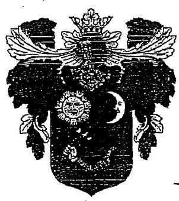

# HÓDMEZŐVÁSÁRHELY MEGYEI JOGÚ VÁROS POLGÁRMESTERI HIVATAL

6800 HÓDMEZŐVÁSÁRHELY, KOSSUTH TÉR 1. • POSTAFIÓK: 23. TELEFON: (62) 530-100 • FAX: (62) 530-192

Szám: 24. 1993. 5. 12. 2011.

Tárgy: Észrevétel az Önkormányzat pénzügyi helyzetéről készült jelentés tervezetére

Állami Számvevőszék Domokos László elnök

Budapest
Apáczai Csere János u. 10.
1052

Tisztelt Elnök Úr!

Állami Számvevőszék 2371
Érkezett: 2011 AUG 16.
Iktatószám: ...............................
Melléklet: ...............................
1. Útlag 5. 7.
16. 16.

Hódmezővásárhely Megyei Jogú Város Önkormányzata pénzügyi helyzetének ellenőrzéséről készült számvevői jelentés tervezetét július 27-én kézhez vettük.
A jelentésben foglalt megállapításokkal kapcsolatosan az alábbi észrevételeket tesszük:

Jelezni kívánjuk, hogy a jelentés 64,66,67,68-ik oldalai valamint a teljes 4. számú melléklet hiányzik. Kérjük azok mielőbbi pótlását, hogy esetleges észrevételeinket az ott leírtakkal kapcsolatosan is megtehessük.

Részletes megállapítások:

1. Az önkormányzat kötelező és önként vállalt feladatai
Önkormányzati gazdasági társaságok vonatkozásában az „önként vállalt feladat” elnevezés megtévesztő (30. oldal utolsó bekezdés). Cégeink a kötelező önkormányzati feladatellátás mellett egyéb vállalkozási tevékenységet végeznek annak érdekében, hogy a kötelező feladatellátás költségeihez az abból származó bevételek révén plusz forrást szerezzenek.
Amennyiben mód van rá, kérjük ezt a szövegben kijavítani.
A Hódmezővásárhelyi Vagyonkezelő Zrt vonatkozásában kiállított 5. számú tanúsítványon helytelenül – önként vállalt feladatként - került feltüntetésre a sportcsarnok, stadion üzemeltetése, mert az Ötv. 8.§ (1.) bekezdése alapján

---

az a helyi önkormányzat kötelező feladata, mely tevékenységet a gazdasági társaság az önkormányzat számára, illetve megbízásából lát el. A kijavított tanúsítványt mellékeljük. Kérjük szíveskedjenek a tanúsítvány értékelése kapcsán megállapításaikat módosítani, mert a valóságban a Zrt. a rendelkezésére bocsátott vagyont $78 \%$-ban kötelező, és csak $22 \%$-ban „önként vállalt" feladatai ellátására használja.

Kérjük továbbá szíveskedjenek kiegészíteni a cégek vonatkozásában a 31. oldal második bekezdésében tett megállapításaikat azzal, hogy az önkormányzati feladat ellátáshoz rendelt vagyon apportként került átadásra. Saját vagyonát a társaság kimutatta, egyéb a feladat ellátását célzó vagyon üzemeltetésre átadott volt.

Szintén kérjük - a pontosság kedvéért - kijavítani a 31. oldal harmadik bekezdésében az oktatási intézmények átszervezésével kapcsolatos részt. Önkormányzatunk 2007. július 1-től 6 általános iskolát szüntetett meg, és 4 új általános iskolát alapított.

# 2. A pénzügyi egyensúlyi helyzet alakulása 

Önkormányzatunk 2007-2010. évek között hosszúlejáratú hitel felvételéről nem döntött, így az nem lehetett oka a hosszúlejáratú kötelezettségek növekedésének (34. oldal utolsó bekezdés). Rövidlejáratú hiteleink átstrukturálására közgyűlési felhatalmazás alapján került sor, 2000 millió Ft összegben, a kedvezőbb kamatkondíciók, a hosszabb futamidő és a devizacserére lehetőséget adó multicurrency jelleg miatt.
A jelentés 51. oldalán szintén helytelenül, hitelfelvételként szerepel ugyanez az összeg, mely ugyanakkor helyesen állapítja meg, hogy ennek a hosszúlejáratú hitelnek a 2010. december 31-ei állománya 1830 millió Ft. Megjegyezzük, hogy a hitelszerződés szerinti első törlesztő részlet 2011. december 31 -én esedékes, a tőke és ezzel együtt a kamat csökkenést a devizanemek közötti csere eredményeként értük el.
Téves tehát az a következtetés, hogy a „hosszúlejáratú pénzintézeti kötelezettségek ... nőttek, amelyet a hosszúlejáratú hitelfelvétel és hitelátstrukturálás, valamint az egyes évek végén elszámolt összesen 5152 millió Ft árfolyam különbözet együttesen okozták." A növekedés kizárólag az árfolyam veszteség miatt következett be, amelyet jól illusztrál az 50. oldalon található grafikon is:
Rövidlejáratú kötelezettségek 2006-2010. között 3571 mFt -ról 3221 mFt-ra, a Hosszúlejáratú kötelezettségek 12760 mFt-ról 12283 mFt-ra csökkentek. Árfolyamveszteség: 5152 mFt .
Kérjük szíveskedjenek a szöveget fentiek értelmében kijavítani!
Az összegző megállapítások (19. oldal) felhalmozási költségvetés hiányára vonatkozó megállapítások a felületes olvasónak úgy tünhetnek, hogy Önkormányzatunk fedezet nélkül vállalt kötelezettséget, holott a források hitel, illetve kötvény igénybevételével rendelkezésre álltak, ezért kérjük szíveskedjenek azt az alábbiak szerint módosítani: „az Önkormányzat felhalmozási költségvetésének egyenlege folyamatosan hiányt mutatott, 20072010. között összesen -6936 millió Ft összegben, ezért a beruházások finanszírozásához külső (hitel, kötvény) források bevonása vált szükségessé."

---

A következő bekezdésben kérjük törölni a 2000 millióFt hitel felvételére vonatkozó megállapítást, hiszen az a pénz költségvetésünkben mint ovd hitel folyamatosan rendelkezésre állt!

Az összegző megállapítások (20. oldal) pénzintézetekkel kapcsolatos kötelezettségek alakulására vonatkozó megállapításakor számszaki hiba történt: „pénzintézeti kötelezettsége a 2006. év végéről a 2010. év végére, 16.331 millió Ft-ról 20.656 millió Ft-ra nőtt, amelyből az árfolyam változás miatti különbözet 5.152 millió Ft" A növekedés teljes összege 4.325 millió Ft! Kérjük szíveskedjenek ezt kijavítani!

Nem értünk egyet az összegző megállapítások 21. oldalán tett azon kijelentéssel, hogy az Önkormányzat banki befolyását növelte volna az, hogy a kötvény lejegyzését követően bizonyos hosszúlejáratú hiteleket nem vásároltunk ki a korábbi számlavezető bankunktól. Éppen ellenkezőleg! A hitelek olyan kedvező kondíciókat tartalmaztak, hogy számunkra a törlesztésnél kedvezőbb volt, ha a visszafizetésükre szolgáló fedezetet óvadéki betétként helyezzük el, biztosítékként. Az erre vonatkozó banki szerződéseket a számvevők rendelkezésére bocsátottuk. Egyebekben szeretnénk megjegyezni, hogy a jelenleg hatályos törvényi szabályozás szerint a hosszúlejáratú hitelfelvétel közbeszerzés köteles. A közbeszerzésben semmiféle biztosíték nincs arra, hogy a számlavezető pénzintézet nyeri meg a tendert, így maga a törvény kényszeríti az önkormányzatokat a többirányú banki kitettség irányába.
Kérjük szíveskedjenek mérlegelni önkormányzatunk valós érdekeit, és ennek megfelelően megtenni a fentiekkel kapcsolatos megállapításaikat!

A jelentés tervezet 37. oldal 3. bekezdésében téves az a megállapítás, hogy „ A fennmaradó 702 millió Ft kötelezettség forrásáról nem rendelkeztek a 2011. évi költségvetésben". Tekintettel arra, hogy a jelzett hiány fedezet nélküli forráshiányként került megtervezésre, az Önkormányzat 2011. évi költségvetését megállapító 1/2011.(02.08.) sz. rendeletének 2.§ (1) bekezdés c.) pontja az alábbi rendelkezést tartalmazza:
„A Közgyűlés utasítja az egyes kiadási előirányzatok felett rendelkezni jogosultakat, hogy a hiány megszüntetése érdekében kiadási előirányzatuk 3,4\%-át tartalékként kezeljék. A kötelezően képzendő tartalék terhére kötelezettségvállalás csak a bevételi előirányzat növekedésének mértékében vállalható."
Kérjük szíveskedjenek a jelentés szövegét ennek megfelelően módosítani!

# 3. Önkormányzat folyó kiadásainak alakulása 

A jelentés tervezet 43. oldal lábjegyzetét (41) „A Kórház visszautalta.. „ kérjük kiegészíteni azzal, hogy „....a Kórház és az Önkormányzat között - a Közgyűlés 420/2010.(10.28.) Kgy. számú határozatával jóváhagyott fejlesztési koncepció végrehajtása tárgyában megkötött megállapodás alapján, melyben a Kórház vállalta az Önkormányzat által benyújtott pályázatok önerejéhez való hozzájárulást.(Egészségügyi gép-müszer beszerzés,116.370eFt, Sürgösségi Osztály kialakítása,278.000eFt; Infrastruktúra fejlesztés a fekväbeteg ellátásban, 610.000eFt; "A" épület energia korszerüsitése, 308.000eFt; Rehabilitációs szolgáltatások fejlesztése, 295.00eFt.)

---

A 44. oldal lap tetején található táblázatban szereplő dologi kiadásokra vonatkozó adatokat nem tudjuk beazonosítani, azok eltérnek az általunk mind a 9. számú, mind a 30/b sz. tanúsítványban megadott számoktól. Így az abból levont következtetések helyességére sem tudunk észrevételt tenni.
A tanúsítványainkból megállapíthatóan 2007-2010. évek között a dologi kiadások növekedését az áfa mértékének változásán túl városi szinten az okozta, hogy jelentősen nőtt azoknak a tevékenységeknek a száma, melyet szolgáltatásként vásárolt meg az Önkormányzat, egységesen valamennyi intézménye és gazdasági társasága részére, mert a közös közbeszerzéssel városi szinten lényegesen olcsóbb árakat értünk el (irodaszer, tisztítószer beszerzés,mosodai szolgáltatás,közös karbantartás stb.). A dologi kiadások növekedésével szemben lecsökkentek a személyi juttatások és járulékok, illetve nőttek a továbbszámlázott szolgáltatásokból szerzett bevételek.

Realizált árfolyamveszteséggel szemben az Önkormányzat beszámolóiban elszámolt árfolyamnyereség 2007-2010. évek között 2.132.156 ezer Ft volt, mely évenként az alábbiak szerint alakult:
ezer Ft

| K11 7 ürlap - Önkormányzat összesen | 2007. | 2008. | 2009. | 2010. |
| :-- | :-- | :-- | :-- | :-- |
| Államháztartáson kívülről származó befektetett   pénzügyi eszközök kamata, árfolyamnyereség | 187841 | 138700 | 12878 |  |
| Egyéb államháztartáson kívülről származó kamat,   árfolyamnyereség | 160478 | 1380784 | 246552 |  |
| Realizált árfolyamnyereség bevétele |  |  |  | 4923 |
| összesen | 348319 | 1519484 | 259430 | 4923 |

Kérjük szíveskedjenek a 44. oldalon az árfolyam nyereség összegét ennek megfelelően kijavítani.
Itt szeretnénk megjegyezni, hogy a realizált árfolyamveszteségben a hosszúlejáratú hiteltörlesztésen és opciós ügyleteken túl jelentős mértéket képviseltek az euróban elnyert támogatások is, melyeket természetesen forintban kellett felhasználni és euróban elszámolni.
Kérjük a szöveges indokolást ezzel kiegészíteni szíveskedjenek!

Önkormányzati feladatellátásban résztvevő gazdasági társaságoknak átadott müködési célú pénzeszközök elemzésénél (47. oldal) helytelenül került feltüntetésre a táblázatban az egyes társaságoknak nyújtott támogatások mértéke. A Hódfó Szociális foglalkoztató Kft részére nyújtott önkormányzati támogatás összege 2007. évben 43 millió Ft, 2008. évben 13 millió Ft, 2009-ben és 2010-ben „0" Ft volt az Önkormányzat mérlegadatai alapján. A megküldött $7 / \mathrm{b}$ sz. tanúsítványon a társaság valamennyi évben „0" Ft-os önkormányzati támogatást tüntetett fel, melynek kijavítására felszólítottuk a könyvelő irodát. Kérjük szíveskedjenek a jelentés tervezetben található táblázatban leírt összesen 674(?) millió Ft-tal szemben a valós,

---

mindösszesen 56 millió Ft-os támogatást szerepeltetni. További félreértésre adhat okot, hogy a szöveges értékelésben a társaságok részére átadott müködési célú támogatásokról van szó, majd a táblázatban a Városellátó Kft müködési és felhalmozási célú támogatása együttesen kerül bemutatásra. A támogatásra átadott források között szerepeltetik a közcélú és közhasznú munkavállalók foglalkoztatásához, a Központi Költségvetéstől kapott források átadását, mely szintén torzítja a valós, a társaságok tényleges müködéséhez nyújtott támogatás mértékét.

Az összegző megállapítások 18. oldal második bekezdését is kérjük fenti indokaink alapján módosítani szíveskedjenek!

Az önkormányzat feladatellátásában résztvevő gazdasági társaságok részére átadott müködési célú pénzeszközök ezer Ft-ban

|   | 2007. | 2008. | 2009. | 2010. | összesen  |
| --- | --- | --- | --- | --- | --- |
|  HÓD-MENZA kht | 178007 | 96009 | 29193 | 14101 | 317310  |
|  Hód-Pürdő Kft |  |  | 50000 | 24735 | 74735  |
|  HÖDPÖ Kht | 42893 | 13387 |  |  | 56280  |
|  Szerdahelyi József kht | 47881 |  |  |  | 47881  |
|  Városellátó kht | 122552 |  | 185433 | 360672 | 668657  |
|  ebböl közfoglalkoztatás támogatása |  |  | 139935 | 206672 | 346607  |
|  HÓD-IPARI PARK kft | 1617 |  |  |  | 1617  |
|  HÓD-STRAND kft | 103219 |  |  |  | 103219  |
|  Összesen | 496169 | 109396 | 264626 | 399508 | 1269699  |

összesen közfoglalkoztatás támogatása nélkül 124691 192836 923092

Tekintettel arra, hogy a valós és a jelentés tervezetében lévő összegek szignifikáns (a 4 év alatt 1 mrd Ft!) eltérést mutatnak, kérjük szíveskedjenek ezt feltétlenül kijavítani!

# 4. Pénzintézetek felé fennálló kötelezettségek bemutatása (3.1.)

Folyószámlahitel 2008. évi átsrtukturálásával kapcsolatos, a 2. pontban már leírt észrevételeinket az 52. oldalon leírtakkal kapcsolatosan is fenntartjuk. Nem hitel felvételéről, hanem a már meglévő likvidhitelből 2 mrd Ft átstrukturálásáról döntött a polgármester, a Közgyűlés korábbi felhatalmazása

---

alapján, melyről előzetesen is, majd utólag is tájékoztatta a Képviselőtestületet, amely a döntést elfogadta. Kérjük, hogy a jegyző részére ezzel kapcsolatosan megfogalmazott javaslat kerüljön törlésre, hiszen a vizsgált hitelszerződések kapcsán a számvevők meggyőződhettek arról, hogy a hosszúlejáratú hitelek felvételét megelőzően minden esetben közgyűlési döntést követően került csak sor a hitelszerződések megkötésére.

A gazdasági társaságok pénzintézetek felé fennálló tartozásait 2011. évre vonatkozóan az alábbi táblázat mutatja. Tekintettel arra, hogy az adatok jelentős eltérést mutatnak a jelentés tervezet 23. oldalán foglaltakhoz képest, kérjük szíveskedjenek azt módosítani!.

|  | Tőketartozások az adott devizanemben* |  |  |  |   |
| --- | --- | --- | --- | --- | --- |
|   | HUF |  | CHF |  | EUR  |
|  Zsigmondy Béla Víziközmúveket Üzemeltető Zrt. | 120350000 | erste hitel | 20648707 | erste kötvény | -  |
|   | 45000000 | unicredit hitel |  |  |   |
|  Hódmezővásárhelyi Vagyonkezelő és Szolgáltató Zrt. | - |  | 6474536 | erste kötvény | -  |
|   | - |  | 7196833 | CIS kötvény | -  |
|  Hód-Menza Közhasznú Nonprofit Kft. | 58947573 |  |  |  |   |
|  Hódmezővásárhelyi Városellátó és Szolgáltató NKft. | 5900000 | erste hitel |  | parkolósutomaták | 33413  |
|  * folyószámla hitelek nélkül | 230197573 |  | 34320076 |  | 33413  |

Aggályosnak tartjuk a banki kamatkondíciók nyilvános jelentésben történő közzétételét, mert hitelszerződéseink a bank részéről kért titoktartási záradékot tartalmaznak.

# 5. Szállítók felé fennálló kötelezettségek alakulása (3.2.)

A lejárt szállítói tartozásokról készített 21. sz. tanúsítványt javítani szeretnénk, mert a jelentéstervezet kézhezvételekor észleltük, hogy az téves adatokat is tartalmaz. Tévedésünkért elnézésüket kérjük, de mentségünkre szolgáljon, hogy rendkívül rövid idő állt rendelkezésünkre az adatok összeállításához, és a tanúsítványok a vizsgálat CLF szemlélete miatt igen bonyolult összefüggéseket tartalmaztak. A tanúsítványok olyan formában kértek adatokat, mely nyilvántartások vezetése a Számviteli Törvény értelmében az önkormányzatok részére jelenleg nem kötelezőek. A javított tanúsítványt a vizsgálatot végző számvevők részére jelen levelünkkel egyidejúleg továbbítjuk, és megküldésre kerülnek az azt alátámasztó dokumentációk is.

A javított tanúsítvány és dokumentáció ismeretében kérjük megváltoztatni a szöveges értékelést, hiszen (számolási és értelmezési hibánk miatt) változni fog a lejárt szállítói állomány átütemezett része, és a csatolt iratokból megállapíthatóan valamennyi, 60 napon túl lejárt esedékességű tartozásunk vonatkozásában megállapodást kezdeményeztünk szállítóinkkal.

Fenti körülményekre tekintettel, kérjük az összegző megállapítások közül a 21. oldal utolsó bekezdésében leírt azon megállapítás törlését, hogy „Az

---

Önkormányzat intézményeinél és a Polgármesteri Hivatalnál a 60 napot meghaladó, szállitók felé fennálló kötelezettségek miatt - a helyi önkormányzatok adósságrendezési eljárásáról szóló 1996. évi XXV.Tv. 5.§(2) foglaltak ellenére - a Polgármester nem kezdeményezett adósságrendezési eljárást"

# 6. Egyéb kötelezettségek alakulása(3.3) 

Gazdasági társaságainkkal szemben fennálló kölcsön tartozásunk átütemezésre került, így jelenleg velük szemben lejárt esedékességü tartozásunk, illetve követelésünk nincs.

Az 2007-2011. évi garancia és kezességvállalásáról, PPP konstrukció miatti kötelezettségeiről készített 18. sz tanúsítványban feltüntetésre került valamennyi, a jelzett időtartam alatt vállalt kötelezettségünk. Ezek túlnyomó része azonban már megszünt anélkül, hogy Önkormányzatunknak bármilyen fizetési kötelezettsége keletkezett volna. Sajnos a tanúsítványban a megszűnést már nem lehetett beimi, ilyen irányú kérdés nem volt, vélhetően ezért gondolta úgy az elemzést végző, hogy az ott felsorolt valamennyi kötelezettség jelenleg is fennáll Önkormányzatunkkal szemben.

Jelenleg hatályos kezességvállalások és garanciák felsorolását az 1/2011.(02.08.)OR számú költségvetési rendeletünk 8. sz. melléklete tartalmazza, melynek értéke 1.182.834 eFt. Kérjük szíveskedjenek ezt kijavítani. Amennyiben szükséges, természetesen javítjuk a 18. sz. tanúsítványt is.

Kérjük fenti javításokat az összegző megállapítások (22. oldal. 3-4. bekezdésein is kijavítani szíveskedjenek). A PPP konstrukció keretében megvalósul beruházás vonatkozásában kérjük azt azzal kiegészíteni, hogy a jelzett kötelezettségünk 20 év távlatában áll fenn!

Utóellenőrzés végrehajtásával kapcsolatosan tett megállapítások közül a másodikkal nem értünk egyet: „nem tájékoztatták a Közgyűlést arról, hogy az Önkormányzat pénzintézeti kötelezettségeit milyen feltételek mellett tudja teljesíteni".
A Képviselő-testület már a költségvetési koncepció elfogadásakor tájékoztatást kap arról, hogy kiadásaink milyen prioritások mellett kerülnek teljesítésre. Ezek között első helyen szerepelnek a hitel és kamat kötelezettségek kifizetései. Minden évben a koncepció részét képezik azok az intézkedések, melyeket a bevételek növelése, illetve a kiadások csökkentése érdekében végre kell hajtani. A koncepcióban megfogalmazott irányelvek mentén kerül megtervezésre a költségvetés, ahol a kiadások részét képezik az esedékes pénzintézeti kötelezettségek is, illetve azok a bevételek, melyek kiadásaink fedezetéül szolgálnak. A forráshiány áthidalására a szükséges intézkedések szintén elfogadásra kerültek. Költségvetésünk az ÁSZ megállapítása szerint is a jogszabályokban megfogalmazott feltételek szerint készült el. Ismereteink szerint jelenleg nincs olyan jogszabály, mely az éves költségvetésen belül az egyes kiadások fedezeteként meghatározott

---

bevételeket jelölne meg fedezetként (kivéve a kötött felhasználású normatívák).

# Polgármester részére megfogalmazott javaslatok 

Megitélésünk szerint a javaslatok nem speciálisan csak Hódmezővásárhely polgármesterének szólnak, hanem több megyei jogú város vezetöjének is, ezért tartalmaznak olyan általános megfogalmazásokat, amelyek nem teljesen csengenek egybe a jelentés tervezetében leirtakkal.

Fenti indokok alapján kérjük a 2. javaslat megfogalmazását az alábbiak szerint pontositani szíveskedjenek: „a müködés pénzügyi egyensúlyának megőrzése és hosszútávú fenntarthatósága érdekében....."

## A jegyző részére megfogalmazott javaslatok

A 6. pontban foglalt azon javaslat végrehajtását, mely szerint. „...a teljes futamidőre mutassák be a kamat- és árfolyam kockázat várható hatásait" nem tartjuk megvalósithatónak, és úgy érezzük, hogy sem a jegyző sem a közigazgatásban dolgozók olyan irányú képzettséggel nem rendelkeznek, melyek alkalmassá tehetnék bármelyiküket ennek a feladatnak az ellátására. Tapasztalataink szerint jelenleg még a pénzvilág szereplői sem rendelkeznek a megfelelő szakértelemmel.
Kérjük ezt a részt törölni szíveskedjenek!
A 7. pont vonatkozásában szeretnénk jelezni, hogy a 2009. évben lezajlott ÁSZ vizsgálat időpontjáig az Önkormányzat éves költségvetésében és az annak végrehajtásáról készült beszámolókban az árfolyam és kamat elöirányzatok, azok változása tételesen bemutatásra került. Akkor az ÁSZ javaslatára megváltoztattuk a költségvetéshez addig mellékelt táblázatokat, és jelenleg csak a jogszabályban kötelezően elöirt mellékleteket használjuk. Természetesen ismét lehetőség van ezen mellékletek bemutatására, de javasoljuk, hogy a későbbi egységes szemlélet miatt kerüljön ezzel esetleg a vonatkozó jogszabály kiegészitésre.
A kezességvállalás, garancia és hetytallasi kötelezettségvállalás az éves költségvetésben tételesen bemutatásra kerül, majd a költségvetéssel azonos szerkezetben készülö féléves, I-III. negyedéves és év végi beszámolóban is szerepel.
Kérjük ez utóbbi javaslatot törölni szíveskedjenek!
A 10. sz. javaslatban foglaltakat kérjük törölni szíveskedjenek, tekintettel arra, hogy önkormányzatunk és társaságai között lejárt esedékességü követlelés, illetve tartozás jelenleg nem áll fenn.

A 11. pontban foglalt javaslatnak a részletezető megállapítások 2. és 4. pontjában leírt indokaink alapján, törlését kérjük!

---

# Tisztelt Elnök Úr! 

A jelentés tervezet a bevezetöben is leírt, az ÁSZ küldetése és jövőképének meghatározása szellemében készült el. A megyei jogú városok pénzügyi helyzetének összehasonlító elemzését olvasva olyan rendszerbeli problémákat vélünk felfedezni, amelyre megítélésünk szerint mindenképpen célszerű lenne az ÁSZ részéről a figyelmet ráirányítani:

- Egyre növekvő feladatellátás mellett fokozatosan csökkenő központi finanszírozás.
- A szervezet átalakítás, a müködési költségek csökkentése, az önként vállalt feladatok elhagyásából származó megtakarítások nem tudnak fejlesztést finanszírozni, mert évről-évre többet kell a kötelező feladatok ellátására fordítani.
- Azonos központi finanszírozás mellett leszakadnak a nem fejlesztő városok és térségeik. Ha nincs fejlesztés, nem vonzóak a befektetők számára, nem lesznek munkahelyek, csökken az adóbevétel, egyre nehezebb lesz a kötelező feladatok ellátása. A Kormányzatnak a jelenlegi müködési finanszírozás változatlanul hagyása esetén nagyobb részt kellene vállalnia a körzet központok fejlesztések finanszírozásában.
- Az elérhető pályázati források túlnyomó többsége olyan célokat szolgál, melynek megtérülése nem, vagy csak hosszú években mérhető (belvárosi rehabilitáció, útépítés, kerékpárút építés, játszóterek felújítása, kulturális beruházások, országokon átnyúló kulturális programok stb.).
- Az árfolyam változás miatti kockázatokat növelik az euróban elnyert támogatások, melyet forintban használnak fel az önkormányzatok. Az elszenvedett árfolyamveszteség az önkormányzati önerő mértékét növeli.
- A kötelező feladatok finanszírozása mellett fejlesztő önkormányzatok gyakran kerülnek likviditási nehézségekbe. Helyzetüket nehezíti a jelenleg hatályos adósságrendezésről szóló törvény, mely azonos megítélés alá veszi az önkormányzatokat, függetlenül a lejárt esedékességű tartozás mögött lévő vagyon nagyságától.
- Amíg a jelenleg hatályos önkormányzati törvény meghatározza a hitelfelvétel korlátját, nincs olyan jogszabály amely korlátozná az adósságszolgálat lehetséges mértékét.

Végezetül szeretnénk megköszönni, hogy a végleges jelentés elkészülte előtt Elnök Úr lehetőséget biztosított számunkra a tervezet megismerésére, és arra, hogy észrevételeinket megtehessük.

Hódmezővásárhely, 2011. augusztus 12.

Tisztelettel:
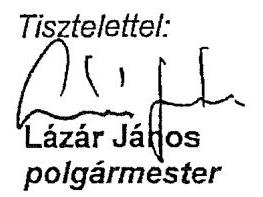
polgármester
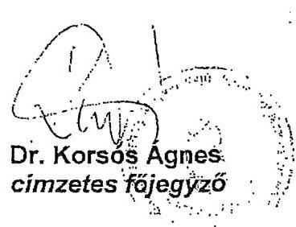

---

# **Chemistry**

## **Chemical Reactions**

### **Balancing Chemical Equations**

1. **Write the unbalanced equation:**
   - Example: $$C_3H_8 + O_2 \rightarrow CO_2 + H_2O$$

2. **Balance the equation:**
   - Example: $$2C_3H_8 + 7O_2 \rightarrow 6CO_2 + 8H_2O$$

3. **Balance the equation:**
   - Example: $$2C_3H_8 + 7O_2 \rightarrow 6CO_2 + 8H_2O$$

### **Types of Reactions**

1. **Combination Reaction:**
   - Example: $$2H_2 + O_2 \rightarrow 2H_2O$$

2. **Decomposition Reaction:**
   - Example: $$2H_2O_2 \rightarrow 2H_2O + O_2$$

3. **Single Displacement Reaction:**
   - Example: $$Zn + 2HCl \rightarrow ZnCl_2 + H_2$$

4. **Double Displacement Reaction:**
   - Example: $$AgNO_3 + NaCl \rightarrow AgCl + NaNO_3$$

5. **Combustion Reaction:**
   - Example: $$CH_4 + 2O_2 \rightarrow CO_2 + 2H_2O$$

## **Stoichiometry**

### **Mole Concept**

- **Mole (mol):** The amount of substance containing as many particles (atoms, molecules, ions) as there are atoms in exactly 12 grams of carbon-12.
- **Avogadro's Number:** $$6.022 \times 10^{23}$$ particles per mole.

### **Molar Mass**

- **Molar Mass:** The mass of one mole of a substance.
- Example: The molar mass of water ($$H_2O$$) is 18.015 g/mol.

### **Calculations**

1. **Moles to Mass:**
   - Formula: $$n = \frac{m}{M}$$
   - Example: Calculate the number of moles of $$H_2O$$ in 18 grams of water.
     - $$n = \frac{18.015 \, \text{g}}{18.015 \, \text{g/mol}} = 18.015 \, \text{g/mol}$$

2. **Moles to Mass:**
   - Formula: $$m = n \times M$$
   - Example: Calculate the mass of 2 moles of $$H_2O$$.
     - $$m = 2 \, \text{mol} \times 44.015 \, \text{g/mol} = 44.015 \, \text{g/mol}$$

## **Gas Laws**

### **Ideal Gas Law**

- **Equation:** $$PV = nRT$$
- **Variables:**
  - $$P$$: Pressure (atm)
  - $$V$$: Volume (L)
  - $$n$$: Number of moles (mol)
  - $$R$$: Ideal gas constant (0.0821 L·atm/mol·K)
  - $$T$$: Temperature (K)

### **Boyle's Law**

- **Equation:** $$P_1V_1 = P_2V_2$$
- **Variables:**
  - P₁: Pressure (atm)
  - P₂: Volume (L)
  - P₃: Temperature (K)
  - P₁: Pressure (atm)
  - P₂: Volume (L)
  - P₃: Temperature (K)

### **Boyle's Law**

- **Equation:** $$\frac{P_1V_1}{P_2V_2} = \frac{P_1V_2}{P_2V_1}$$

## **Thermochemistry**

### **Enthalpy (H)**

- **Definition:** The heat content of a system at constant pressure.
- **Equation:** $$\Delta H = q_p$$
- **Equation:** $$\Delta H = q_p + e^-$$

### **Hess's Law**

- **Statement:** The enthalpy change for a reaction is the same whether it occurs in one step or multiple steps.
- **Equation:** $$\Delta H_{\text{reaction}} = \Delta H - \Delta H_0$$
- **Statement:** The enthalpy change for a reaction is the same whether it occurs in one step or multiple steps.

### **Hess's Law**

- **Statement:** The enthalpy change for a reaction is the same whether it occurs in one step or multiple steps.
- **Equation:** $$\Delta H_{\text{reaction}} = \Delta H - \Delta H_0$$
- **Statement:** The enthalpy change for a reaction is the same whether it occurs in one step or multiple steps.

### **Hess's Law 2**

- **Statement:** The enthalpy change for a reaction is the same whether it occurs in one step or multiple steps.
- **Equation:** $$\Delta H_{\text{reaction}} = \Delta H - \Delta H_0$$
- **Statement:** The enthalpy change for a reaction is the same whether it occurs in one step or multiple steps.

## **Electrochemistry**

### **Oxidation and Reduction**

- **Oxidation:** Loss of electrons.
- **Reduction:** Gain of electrons.

### **Galvanic Cells**

- **Definition:** A cell that converts chemical energy into electrical energy.
- **Components:**
  - Anode: Oxidation occurs.
  - Cathode: Reduction occurs.
  - Salt Bridge: Connects the two half-cells.

### **Nernst Equation**

- **Equation:** $$E = E^\circ - \frac{RT}{nF} \ln Q$$
- **Variables:**
  - E: Cell potential
  - R: Ideal gas constant
  - F: Faraday constant
  - Q: Reaction quotient

---

# Dr. Lázár János úr, 

polgármester
Hódmezővásárhely Megyei Jogú Városi Önkormányzata
Hódmezővásárhely

## Tisztelt Polgármester Úr!

Köszönettel vettem a Hódmezővásárhely Megyei Jogú Város Önkormányzata pénzügyi helyzetének ellenőrzéséről készített jelentés-tervezet megállapításaira tett pontosító észrevételeket, tanúsítványokat.

A jelentés-tervezetnek az észrevétel második bekezdésében jelzett hiányzó oldalait (64. oldal és a 66-68. oldalak) és a 4. számú mellékletet 2011. augusztus 24 -én elektronikus levélben az Önök részére megküldtük.

Felhívom a figyelmét, hogy az utólag pontosított önkormányzati tanúsítványokban foglaltak ellenőrzésére a helyszíni ellenőrzés befejezése után nincs lehetőség, ezért azok figyelembe vételére a jelentés módosítása során csak azokban az esetekben van lehetőség, ahol az ellenőrzési megállapítások, illetve az ellenőrzés során megismert adatok és körülmények az utólag pontosított adatokat alátámasztják.

A fentiek alapján tájékoztatom, hogy az Önök által tett észrevételek, valamint pontosított önkormányzati tanúsítványok figyelembe vételével, az alábbiak tekintetében a számvevőszéki jelentés vonatkozó megállapításait módosítottuk, kiegészítettük:

1. Az észrevétel első oldala harmadik bekezdésében foglaltak figyelembe vételével a jelentés 30. oldala utolsó bekezdését kiegészítettük azzal, hogy a gazdaságok társaságok az önkormányzati kötelező és önként vállalt feladatok ellátása mellett egyéb vállalkozási tevékenységet is végeztek. Módosítottuk továbbá a jelentés 30. oldala utolsó bekezdésében, valamint a 31. oldal első bekezdésében a kötelező és önként vállalt feladathoz rendelt vagyon arányára vonatkozó megállapítást az Önkormányzat által pontosított tanúsítványok adatainak megfelelően.
2. Az észrevétel második oldala második és harmadik bekezdésében foglaltak alapján a jelentés 31. oldala első bekezdését kiegészítettük az apportba adott vagyon összegével, a harmadik bekezdését pedig azzal, hogy az átszervezések következtében az Önkormányzat 2007. július 1-jétől összesen hat általános iskolát szüntetett meg és négy új általános iskolát alapított.

---

3. Az észrevétel második oldala negyedik és ötödik bekezdésében foglaltak alapján a jelentés 19. oldala ábra alatti első bekezdését pontositottuk, miszerint „az Önkormányzat felhalmozási költségvetésének egyenlege folyamatosan hiányt mutatott (negatív összegű volt), a 2007-2010 között keletkezett összesen 6936 millió Ft felhalmozási forráshiány finanszírozásához külső források (hitel, kötvény) bevonása vált szükségessé". Ezen túl a jelentés 20. oldalán az ábra alatti második bekezdést kiegészítettük azzal, hogy a pénzintézeti kötelezettségek növekedését a hiteltörlesztés, a hitelfelvétel és a könyvviteli nyilvántartásban elszámolt árfolyam-különbözet együttesen okozták.
4. Az észrevétel harmadik oldalán szereplő harmadik és negyedik bekezdésben foglaltak figyelembe vételével töröltük a jelentés 21. oldala harmadik bekezdéséből az Önkormányzat banki kitettségére, továbbá a 37. oldal harmadik bekezdéséből a 2011. évi költségvetési hiányra vonatkozó megállapításokat.
5. Az észrevétel harmadik oldala ötödik bekezdésében foglaltak alapján a jelentés 42. oldalán a 45. számú lábjegyzetet kiegészítettük a Kórház részére történő önkormányzati átutaláshoz kapcsolódó információkkal.
6. Az észrevétel negyedik oldala első bekezdésben foglaltak figyelembe vételével a jelentés 43. oldala 46. számú lábjegyzetét kiegészítettük, amelyben utaltunk arra, hogy a dologi kiadások az éves költségvetési beszámolók adatai alapján kerültek feltüntetésre.
7. Az észrevétel negyedik oldala második bekezdésében foglaltak alapján a jelentés 43. oldalának utolsó bekezdésében az árfolyamnyereség összegét 2132 millió Ft-ra pontosítottuk az Önkormányzat által adott módosított adatszolgáltatás szerint. Ezen megállapítást kiegészítettük továbbá azzal, hogy az árfolyamveszteséget - kis mértékben - a devizában kapott és forintban felhasznált támogatások miatt keletkezett különbözet is befolyásolta.
8. Az észrevétel negyedik oldala táblázat alatti második bekezdésében, valamint az Önkormányzat által pontosított tanúsítványokban foglalt adatok alapján a gazdasági társaságoknak nyújtott működési célú támogatás összegeit a jelentés 46. oldalán szereplő grafikonon és a jelentés 4. számú mellékletében módosítottuk. Az észrevétel ötödik oldalának táblázat alatti első bekezdésében szereplő mintegy 1000 millió Ft eltérést egyrészt a pontosított tanúsítványok adatai alapján számított összegek figyelembe vételével (eltérés 576 millió Ft), másrészt az észrevétel alapján a megállapítás szövegének pontositásával ( 347 millió Ft közmunka programra továbbutalt központi támogatás) korrigáltuk. Ennek alapján a jelentés 46. oldalán a grafikon alatti szöveges megállapítást kiegészítettük, azzal, hogy „a 2007-2010. évek között a működési célra átadott pénzeszközök 26,4\%-a ( 347 millió Ft) a központi költségvetésből a közfoglalkoztatásra, az Önkormányzatnak utalt támogatás továbbutalása volt a feladatot ellátó gazdasági társaságok részére". A módosítást a jelentés 18. oldala második bekezdésében is átvezettük.

---

9. Az észrevétel hatodik oldala második bekezdésében foglaltak alapján a jelentés 24. oldala táblázat alatti bekezdését kiegészítettük azzal, hogy a gazdasági társaságok által vállalt kötelezettségekből „2011. második negyedév végéig a törlesztési ütemezésnek megfelelő törlesztések az Önkormányzat tájékoztatása szerint megtörténtek".
10. Az észrevétel hetedik oldala második bekezdésében, valamint az észrevétellel egyidejűleg megküldött, az Önkormányzat és a társaságok között létrejött megállapodásokban foglaltak figyelembevételével a jelentés 61 . oldalán a táblázat alatti második bekezdést módosítottuk, mely szerint a saját gazdasági társaságoktól kapott kölcsönök „visszafizetésének lejárati idejét 2011. év végére átütemezték". Ezzel összefüggésben a jelentés 27. oldalán a vonatkozó javaslatot töröltük.
11. Az észrevétel hetedik oldala harmadik, negyedik és ötödik bekezdéseiben foglaltak és a pontosított önkormányzati tanúsítvány adatai alapján a garancia- és kezességvállalás (2010. december 31-én fennálló) állományának összegét a jelentés 22 . oldala negyedik bekezdésében és a 23. oldalon lévő táblázatban 3841 millió Ft-ról 1737 millió Ft-ra módosítottuk, valamint a jelentés 22. oldala harmadik bekezdésben a PPP konstrukcióban megvalósított beruházás miatti kötelezettségvállalásra vonatkozó szövegrészt a 20 éves futamidőre való utalással kiegészítettük.
12. Az észrevétel hetedik oldala utolsó bekezdésében az utóellenőrzéssel kapcsolatos magyarázatát elfogadtuk, mely szerint a jegyző tájékoztatta - évente végzett számítások alapján - a Közgyűlést az Önkormányzat eladósodására figyelemmel arról, hogy a hosszú lejáratú, adósságot keletkeztető kötelezettségvállalásokból adódó tőke- és kamatfizetési kötelezettségét az Önkormányzat milyen feltételek biztosítása mellett tudja teljesíteni. A célszerűségi javaslat megvalósítása tekintetében a jelentés 69. oldala harmadik és negyedik bekezdését módosítottuk.

A következő - a hosszúlejáratú hitel felvételével, valamint a lejárt szállítói tartozásállománnyal kapcsolatos - észrevételeit az alábbiakban részletezettek miatt nem fogadjuk el:

1. Az észrevétel harmadik oldalának első bekezdésében, az ötödik oldala utolsó és a hatodik oldal első bekezdéseiben foglalt, a 2000 millió Ft hosszúlejáratú hitel felvételével kapcsolatos számvevőszéki megállapításokra tett észrevétel nem megalapozott, mivel az ellenőrzött dokumentumok a hosszúlejáratú hitel felvételét támasztják alá. Az Önkormányzat 2008. december 29-én 2000 millió Ft összegủ hosszúlejáratú hitelszerződést kötött a számlavezető bankkal a folyószámlahitel visszafizetése érdekében. A hitel célja a folyószámlahitelből finanszírozott 2007-2008. években megvalósított beruházások fedezetének biztosítása volt. A hosszúlejáratú hitelfelvételt az Önkormányzat a hitelszerződés tartalmának megfelelően a 2008. évi pénzforgalmi beszámolójában finanszírozási célú bevételként a hosszú lejáratú hitel felvétele soron szerepeltette, ezzel összhangban a 14. számú tanúsítványon is hosszúlejáratú hitelfelvételként mutatta ki. A felvett hosszúlejáratú hitel következtében

---

a 2008. évi könyvviteli mérleg adatai szerint is a beruházási és fejlesztési hitelek állománya a 2007. évi 1559 millió Ft-ról 3401 millió Ft-ra nőtt, a rövidlejáratú hiteleké 3387 millió Ft-ról 1548 millió Ft-ra csökkent. Az észrevételben hivatkozott, a Közgyűlés által a polgármesternek adott felhatalmazás a 2000 millió Ft hosszúlejáratú hitel felvételére vonatkozóan ellentétes az Ötv. 10. § (1) bekezdés d) pontjában foglalt azon előírással, hogy az éven túli hitel felvétele, kötvény kibocsátása a képviselőtestület át nem ruházható hatásköre. Ennek alapján a jelentés részletes megállapításainak, összegző megállapításainak és javaslatainak vonatkozó részét (19. oldal diagram alatti második bekezdés, 51. oldal 5. bekezdés, 27. oldal 10. számú javaslat) továbbra is fenntartjuk.
2. Az észrevétel hatodik oldalán a táblázat alatti harmadik és negyedik bekezdésekben és a hetedik oldal első bekezdésében a lejárt szállítói tartozásokkal kapcsolatos megállapításokra tett észrevételét - a jelentésben tett szövegszerủ pontosítás, valamint az 21. számú tanúsítvány Önkormányzat általi pontosítása ellenére - nem fogadjuk el. A vonatkozó tanúsítvány pontosítása ugyanis nem érintette a 60 napon túl lejárt tartozásállományt. A szállítók felé kiküldött határidő módosításra vonatkozó kezdeményezéssel nem történt meg a fizetési határidők módosítása, mivel a rendelkezésünkre bocsátott dokumentumok nem tartalmazták a határidő módosítás szállítók részéről történt elfogadását. Ezt a tényt az Önkormányzat által pontosított tanúsítványban szereplő adatok is alátámasztják, mivel az előző tanúsítványhoz képest nem változott a 60 napon túl lejárt szállítói tartozás állománya. A 2011. március 21-ei keltezésű, szállítók felé megküldött levéllel a jogszabályban előírt kötelezettségnek nem tettek eleget, mivel a helyi önkormányzatok adósságrendezési eljárásáról szóló 1996. évi XXV. törvény 4-5. §-ai értelmében azon tartozások vonatkozásában, amelyek 60 napon túl lejártak és az esedékességet követő 90 . napon fennálltak, a polgármesternek a Pénzügyi bizottságot haladéktalanul tájékoztatnia kellett volna és a Közgyűlést nyolc napon belül össze kellett volna hívnia. A 2010. december 31-én 60 napon túl lejárt szállítói tartozásállomány 702 millió Ft, amelyből 575 millió Ft 90 napon túl lejárt tartozás volt. Ennek alapján fenntartjuk a jelentés 60 . oldal első bekezdésében szereplő megállapítást, amely szerint a polgármesternek a 60 napon túl lejárt szállítói tartozások esetében az esedékességet követő 90 . nap után az adósságrendezési eljárást kezdeményeznie kellett volna.

Köszönöm Polgármester Úrnak és munkatársainak az ellenőrzés során tanúsított hozzáállását, amellyel az Önkormányzatról készített pénzügyi helyzetelemzés elkészítését segítették.

Budapest, 2011. december" 2 ".
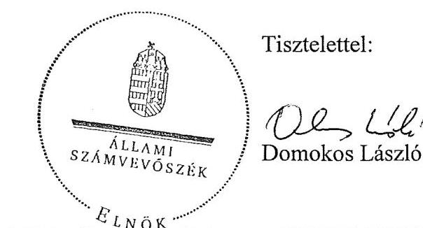

---

# **Chemistry**

## **Chemical Reactions**

### **Balancing Chemical Equations**

1. **Write the unbalanced equation:**
   - Example: $$C_3H_8 + O_2 \rightarrow CO_2 + H_2O$$

2. **Balance the equation:**
   - Balance carbon atoms first.
   - Then balance hydrogen atoms.
   - Finally, balance oxygen atoms.
   - Balanced equation: $$C_3H_8 + 7O_2 \rightarrow 3CO_2 + 4H_2O$$

3. **Balance the equation:**
   - Balance oxygen atoms.
   - Finally, balance oxygen atoms.
   - Balanced equation: $$C_3H_8 + 7O_2 \rightarrow 3CO_2 + 4H_2O$$

### **Types of Reactions**

1. **Combination Reaction:**
   - Example: $$2H_2 + O_2 \rightarrow 2H_2O$$

2. **Decomposition Reaction:**
   - Example: $$2H_2O_2 \rightarrow 2H_2O + O_2$$

3. **Single Displacement Reaction:**
   - Example: $$Zn + 2HCl \rightarrow ZnCl_2 + H_2$$

4. **Double Displacement Reaction:**
   - Example: $$AgNO_3 + NaCl \rightarrow AgCl + NaNO_3$$

5. **Combustion Reaction:**
   - Example: $$CH_4 + 2O_2 \rightarrow CO_2 + 2H_2O$$

## **Stoichiometry**

### **Mole Concept**

- **Mole (mol):** The amount of substance containing as many particles (atoms, molecules, ions) as there are atoms in exactly 12 grams of carbon-12.
- **Avogadro's Number:** $$6.022 \times 10^{23}$$ particles per mole.

### **Molar Mass**

- **Molar Mass:** The mass of one mole of a substance.
- Example: The molar mass of water ($$H_2O$$) is 18.015 g/mol.

### **Calculations**

1. **Moles to Mass:**
   - Formula: $$n = \frac{m}{M}$$
   - Example: Calculate the number of moles of $$H_2O$$ in 18 grams of water.
     - $$n = \frac{18.015 \, \text{g}}{18.015 \, \text{g/mol}} = 18.015 \, \text{g/mol}$$

2. **Moles to Mass:**
   - Formula: $$m = n \times M$$
   - Example: Calculate the mass of 18.015 g of water.
     - $$m = 18.015 \, \text{g/mol} = 18.015 \, \text{g/mol}$$

## **Gas Laws**

### **Ideal Gas Law**

- **Equation:** $$PV = nRT$$
- **Variables:**
  - $$P$$ = Pressure (atm)
  - $$V$$ = Volume (L)
  - $$n$$ = Moles of gas

### **Boyle's Law**

- **Equation:** $$P_1V_1 = P_2V_2$$
- **Variables:**
  - P₁ = Pressure (atm)
  - P₂ = Volume (L)
  - P₃ = Moles of gas (L)
  - $$P_1V_1 = P_2V_2$$
  - **V₁** = Volume (L)
  - $$P_2V_1 = P_3V_2$$

### **Boyle's Law**

- **Equation:** $$\frac{P_1V_1}{P_2V_2} = \frac{V_1}{P_2V_2}$$

## **Thermochemistry**

### **Enthalpy (H)**

- **Definition:** The heat content of a system at constant pressure.
- **Equation:** $$\Delta H = q_p$$
- **Example:** Calculate the heat content of a system at constant pressure.

### **Hess's Law**

- **Statement:** The enthalpy change for a reaction is the same whether it occurs in one step or multiple steps.
- **Example:** Calculate the enthalpy change for a reaction in a reaction with one step or multiple steps.

### **Hess's Law 2.0**

- **Statement:** The enthalpy change for a reaction is the same whether it occurs in one step or multiple steps.
- **Example:** Calculate the enthalpy change for a reaction in a reaction with one step or multiple steps.

## **Electrochemistry**

### **Oxidation and Reduction**

- **Oxidation:** Loss of electrons.
- **Reduction:** Gain of electrons.

### **Galvanic Cells**

- **Definition:** A cell that converts chemical energy into electrical energy.
- **Components:**
  - Anode: Oxidation occurs.
  - Cathode: Reduction occurs.
  - Salt Bridge: Connects the two half-cells.

### **Nernst Equation**

- **Equation:** $$E = E^\circ - \frac{RT}{nF} \ln Q$$
- **Variables:**
  - E° = Energy (K)
  - R = Ideal gas constant (0.0821 L·atm/mol·K)
  - R₁ = Ideal gas constant (0.0821 L·atm/mol·K)
  - R₂ = Ideal gas constant (0.0821 L·atm/mol·K)
  - R₃ = Ideal gas constant (0.0821 L·atm/mol·K)
  - $$E$$ = E° (kV)
  - $$R$$ = Ideal gas constant (0.0821 L·atm/mol·K)
  - $$Q$$ = Reaction quotient

---

.